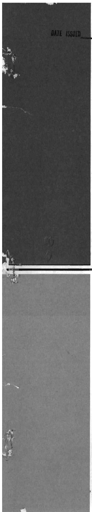

# Fission Product Behavior in the Molten Salt Reactor Experiment

E. L. Compere   
S. S. Kirslis   
E. G. Bohlmann   
F. F. Blankenship   
W. R. Grimes

OAK RIDGE NATIONAL LABORATORY

OPERATED BY UNION CARBIDE CORPORATION • FOR THE U.S. ATOMIC ENERGY COMMISSION

Printed in the United States of America. Available from

National Technical Information Service

U.S. Department of Commerce

5285 Port Royal Road, Springfield, Virginia 22161

Price: Printed Copy $7.60; Microfiche $2.25

This report was prepared as an account of work sponsored by the United States Government. Neither the United States nor the Energy Research and Development Administration, nor any of their employees, nor any of their contractors, subcontractors, or their employees, makes any warranty, express or implied, or assumes any legal liability or responsibility for the accuracy, completeness or usefulness of any information, apparatus, product or process disclosed, or represents that its use would not infringe privately owned rights.

Contract No. W-7405-eng-26

MOLTEN-SALT REACTOR PROGRAM

# FISSION PRODUCT BEHAVIOR IN THE MOLTEN SALT REACTOR EXPERIMENT

E. L. Compere

E. G. Bohlmann

S. S. Kirslis

F. F. Blankenship

W. R. Grimes

OCTOBER 1975

OAK RIDGE NATIONAL LABORATORY

Oak Ridge, Tennessee 37830

operated by

UNION CARBIDE CORPORATION

for the

ENERGY RESEARCH AND DEVELOPMENT ADMINISTRATION

This report is one of periodic reports in which we describe the progress of the program. Other reports issued in this series are listed below.

ORNL-2474 Period Ending January 31, 1958

ORNL-2626 Period Ending October 31, 1958

ORNL-2684 Period Ending January 31, 1959

ORNL-2723 Period Ending April 30, 1959

ORNL-2799 Period Ending July 31, 1959

ORNL-2890 Period Ending October 31, 1959

ORNL-2973 Periods Ending January 31 and April 30, 1960

ORNL-3014 Period Ending July 31, 1960

ORNL-3122 Period Ending February 28, 1961

ORNL-3215 Period Ending August 31, 1961

ORNL-3282 Period Ending February 28, 1962

ORNL-3369 Period Ending August 31, 1962

ORNL-3419 Period Ending January 31, 1963

ORNL-3529 Period Ending July 31, 1963

ORNL-3626 Period Ending January 31, 1964

ORNL-3708 Period Ending July 31, 1964

ORNL-3812 Period Ending February 28, 1965

ORNL-3872 Period Ending August 31, 1965

ORNL-3936 Period Ending February 28, 1966

ORNL-4037 Period Ending August 31, 1966

ORNL-4119 Period Ending February 28, 1967

ORNL-4191 Period Ending August 31, 1967

ORNL-4254 Period Ending February 29, 1968

ORNL-4344 Period Ending August 31, 1968

ORNL-4396 Period Ending February 28, 1969

ORNL-4449 Period Ending August 31, 1969

ORNL-4548 Period Ending February 28, 1970

ORNL-4622 Period Ending August 31, 1970

ORNL-4676 Period Ending February 28, 1971

ORNL-4728 Period Ending August 31, 1971

ORNL-4782 Period Ending February 29, 1972

# CONTENTS

ABSTRACT 1   
FOREWARD 1

1. INTRODUCTION 2   
2. THE MOLTEN SALT REACTOR EXPERIMENT 3

3.MSRE CHRONOLOGY 10

3.1 Operation with $^{235}\mathrm{U}$ Fuel 10   
3.2 Operation with $^{233}\mathrm{U}$ Fuel 12

4. SOME CHEMISTRY FUNDAMENTALS 14   
5. INVENTORY 16

6. SALT SAMPLES 19

6.1 Ladle Samples 19   
6.2 Freeze-Value Samples 22   
6.3 Double Wall Capsule 24   
6.4 Fission Product Element Grouping 27   
6.5 Noble-Metal Behavior 27   
6.6 Niobium 28   
6.7Iodine 28   
6.8 Tellurium 29

7. SURFACE DEPOSITION OF FISSION PRODUCTS BY PUMP BOWL EXPOSURE 37

7.1 Cable 37   
7.2 Capsule Surfaces 37   
7.3 Exposure Experiments 37   
7.4 Mist 41

8. GAS SAMPLES 48

8.1 Freeze-Valve Capsule 48   
8.2 Validity of Gas Samples 48   
8.3 Double-Wall Freeze Valve Capsule 49   
8.4 Effect of Mist 50

9. SURVEILLANCE SPECIMENS 60

9.1 Assemblies 1-4 60   
9.1.1 Preface 60   
9.1.2 Relative deposit intensity 63

9.2 Final Assembly 70

9.2.1 Design 70   
9.2.2 Specimens and flow 70   
9.2.3 Fission recoil 73   
9.2.4 Salt-seeking nuclides 73   
9.2.5 Nuclides with noble-gas precursors 73   
9.2.6 Noble metals: niobium and molybdenum 74   
9.2.7 Ruthenium 74   
9.2.8 Tellurium 74   
9.2.9 lodine 74   
9.2.10 Sticking factors 74

9.3 Profile Data 75

9.3.1 Procedure 75   
9.3.2 Results 78   
9.3.3 Diffusion mechanism relationships 78   
9.3.4 Conclusions from profile data 84

9.4 Other Findings on Surveillance Specimens 85

10. EXAMINATION OF OFF-GAS SYSTEM COMPONENTS OR SPECIMENS REMOVED PRIOR TO FINAL SHUTDOWN 91

10.1 Examination of Particle Trap Removed after Run 7 91   
10.2 Examination of Off-Gas Jumper Line Removed after Run 14 92

10.2.1 Chemical analysis 93   
10.2.2 Radiochemical analysis 93

10.3 Examination of Material Recovered from Off-Gas Line after Run 16 98   
10.4 Off-Gas Line Examinations after Run 18 100

10.5 Examination of Valve Assembly from Line 523 after Run 18 104   
10.6 The Estimation of Flowing Aerosol Concentrations from Deposits on Conduit Wall 106

10.6.1 Deposition by diffusion 106   
10.6.2 Deposition by thermophoresis 107   
10.6.3 Relationship between observed deposition and reactor loss fractions 107

10.7 Discussion of Off-Gas Line Transport 109

10.7.1 Salt constituents and salt-seeking nuclides 109   
10.7.2 Daughters of noble gases 109   
10.7.3 Noble metals 110

11. POST-OPERATION EXAMINATION OF MSRE COMPONENTS 112

11.1 Examination of Deposits from the Mist Shield in the MSRE Fuel Pump Bowl 112   
11.2 Examination of Moderator Graphite from MSRE 120

11.2.1 Results of visual examination 120   
11.2.2 Segmenting of graphite stringer 120   
11.2.3 Examination of surface samples by x-ray diffraction 121   
11.2.4 Milling of surface graphite samples 121   
11.2.5 Radiochemical and chemical analyses of MSRE graphite 121

11.3 Examination of Heat Exchangers and Control Rod Thimble Surfaces 125   
11.4 Metal Transfer in MSRE Salt Circuits 126   
11.5 Cesium Isotope Migration in MSRE Graphite 127

11.6 Noble-Metal Fission Transport Model 128

11.6.1 Inventory and model 128   
11.6.2 Off-gas line deposits 130   
11.6.3 Surveillance specimens 130   
11.6.4 Pump bowl samples 131

12. SUMMARY AND OVERVIEW 135

12.1 Stable Salt-Soluble Fluorides 135

12.1.1 Salt samples 135   
12.1.2 Deposition 135   
12.1.3 Gas samples 136

12.2 Noble Metals 136

12.2.1 Salt-borne 136   
12.2.2 Niobium 136   
12.2.3 Gas-borne 136

12.3 Deposition in Graphite and Hastelloy N 137   
12.4Iodine 138   
12.5 Evaluation 138

# LIST OF FIGURES

Figure 2.1 Design flow sheet of the MSRE 3   
Figure 2.2 Pressures, volumes, and transit times in MSRE fuel circulating loop 4   
Figure 2.3 MSRE reactor vessel 5   
Figure 2.4 Flow patterns in the MSRE fuel pump 6   
Figure 3.1 Chronological outlines of MSRE operations 11   
Figure 6.1 Sampler-enricher schematic 19   
Figure 6.3 Apparatus for removing MSRE salt from pulverizer-mixer to polyethylene sample bottle 20   
Figure 6.4 Freeze valve capsule 22   
Figure 6.5 Noble-metal activities of salt samples 30   
Figure 7.1 Specimen holder designed to prevent contamination by contact with transfer tube 39   
Figure 7.2 Sample holder for short-term deposition test 41   
Figure 7.3 Salt droplets on a metal strip exposed in MSRE pump bowl gas space for $10\mathrm{hr}$ 42   
Figure 8.1 Freeze valve capsule 48   
Figure 8.2 Double-wall sample capsule 50   
Figure 9.1 Typical graphite shapes used in a stringer of surveillance specimens 60   
Figure 9.2 Surveillance specimen stringer 61   
Figure 9.3 Stringer containment 61   
Figure 9.4 Stringer assembly 62   
Figure 9.5 Neutron flux and temperature profiles for core surveillance assembly 63   
Figure 9.6 Scheme for milling graphite samples 64   
Figure 9.7 Final surveillance specimen assembly 70   
Figure 9.8 Concentration profile for $^{137}\mathrm{Cs}$ in impregnated CGB graphite, sample P-92 75   
Figure 9.9 Concentration profiles for $^{89}\mathrm{Sr}$ and $^{140}\mathrm{Ba}$ in two samples of CGB, X-13 wide face, and P-58. 75   
Figure 9.10 Concentration profiles for $^{89}\mathrm{Sr}$ and $^{140}\mathrm{Ba}$ in pyrolytic graphite 76   
Figure 9.11 Concentration profiles for $^{95}\mathrm{Nb}$ and $^{95}\mathrm{Zr}$ in CGB graphite, X-13, double exposure 76   
Figure 9.12 Concentration profiles for $^{103}\mathrm{Ru}$ on two faces of the X-13 graphite specimen, CGB, double exposure 77   
Figure 9.13 Concentration profiles for $^{106}\mathrm{Ru}$ , $^{141}\mathrm{Ce}$ , and $^{144}\mathrm{Ce}$ in CGB graphite, sample Y-9 77   
Figure 9.14 Concentration profiles for $^{141}\mathrm{Ce}$ and $^{144}\mathrm{Ce}$ in two samples of CGB graphite, X-13, wide face, and P-38 78   
Figure 9.15 Fission product distribution in unimpregnated CGB (P-55) graphite specimen irradiated in MSRE cycle ending March 25, 1968 79   
Figure 9.16 Fission product distribution in impregnated CGB (V-28) graphite specimen irradiated in MSRE cycle ending March 25, 1968 80

Figure 9.17 Distribution in pyrolytic graphite specimen irradiated in MSRE for cycle ending March 25, 1968 81   
Figure 9.18 Uranium-235 concentration profiles in CGB and pyrolytic graphite 84   
Figure 9.19 Lithium concentration as a function of distance from the surface, specimen Y-7 87   
Figure 9.20 Lithium concentration as a function of distance from the surface, specimen X-13 87   
Figure 9.21 Fluorine concentrations in graphite sample Y-7, exposed to molten fuel salt in the MSRE for nine months 87   
Figure 9.22 Fluorine concentration as a function of distance from the surface, specimen X-13 88   
Figure 9.23 Comparison of lithium concentrations in samples Y-7 and X-13 88   
Figure 9.24 Mass concentration ratio, F/Li, vs depth, specimen X-13 89   
Figure 9.25 Comparison of fluorine concentrations in samples Y-7 and X-13, a smooth line having been drawn through the data points 89   
Figure 10.1 MSRE off-gas particle trap 91   
Figure 10.2 Deposits in particle trap Yorkmesh 92   
Figure 10.3 Deposits on jumper line flanges after run 14 94   
Figure 10.4 Sections of off-gas jumper line flexible tubing and outlet tube after run 14 95   
Figure 10.5 Deposit on flexible probe 98   
Figure 10.6 Dust recovered from upstream end of jumper line after run 14 (16,000 X) 99   
Figure 10.7 Off-gas line specimen holder as segmented after removal, following run 18 101   
Figure 10.8 Section of off-gas line specimen holder showing flaked deposit, removed after run 18 104   
Figure 11.1 Mist shield containing sampler cage from MSRE pump bowl 113   
Figure 11.2 Interior of mist shield 114   
Figure 11.3 Sample cage and mist shield 115   
Figure 11.4 Deposits on sampler cage 116   
Figure 11.5 Concentration profiles from the fuel side of an MSRE heat exchanger tube measured about 1.5 years after reactor shutdown 126   
Figure 11.6 Concentration of cesium isotopes in MSRE core graphite at given distances from fuel channel surface 127   
Figure 11.7 Compartment model for noble-metal fission transport in MSRE 129   
Figure 11.8 Ratio of ruthenium isotope activities for pump bowl samples 132

# LIST OF TABLES

Table 2.1 Physical properties of the MSRE fuel salt.. 8   
Table 2.2 Average composition of MSRE fuel salt 9   
Table 3.1 MSRE run periods and power accumulation 12   
Table 4.1 Free energy of formation at $650^{\circ}\mathrm{C}$ $(\Delta G_{\mathrm{f}}^{\circ},\mathrm{kcal})$ 14   
Table 5.1 Fission product data for inventory calculations 17   
Table 6.1 Noble-gas daughters and salt-seeking isotopes in salt samples from MSRE pump bowl during uranium-235 operations 21   
Table 6.2 Noble metals in salt samples from MSRE pump bowl during uranium-235 operation 21   
Table 6.3 Data on fuel (including carrier) salt samples from MSRE pump bowl during uranium-233 operation 23   
Table 6.4 Noble-gas daughters and salt-seeking isotopes in salt samples from MSRE pump bowl during uranium-233 operation 24   
Table 6.5 Noble metals in salt samples from MSRE pump bowl during uranium-233 operation 25   
Table 6.6 Operating conditions for salt samples taken from MSRE pump bowl during uranium-233 operation 26   
Table 6.7 Data for salt samples from pump bowl during uranium-235 operation 31   
Table 6.8 Data for salt samples from MSRE pump bowl during uranium-233 operation 32-36   
Table 7.1 Data for graphite and metal specimens immersed in pump bowl 38   
Table 7.2 Deposition of fission products on graphite and metal specimens in float-window capsule immersed for various periods in MSRE pump bowl liquid salt 40   
Table 7.3 Data for wire coils and cables exposed in MSRE pump bowl 44   
Table 7.4 Data for miscellaneous capsules from MSRE pump bowl 45   
Table 7.5 Data for salt samples for double-walled capsules immersed in salt in the MSRE pump bowl during uranium-233 operation 46   
Table 7.6 Data for gas samples from double-walled capsules exposed to gas in the MSRE pump bowl during uranium-233 operation 47   
Table 8.1 Gas-borne percentage of MSRE production rate 51   
Table 8.2 Gas samples $^{235}\mathrm{U}$ operation 53   
Table 8.3 Data for gas samples from MSRE pump bowl during uranium-233 operation 54-59   
Table 9.1 Surveillance specimen data: first array removed after run 7 66   
Table 9.2 Survey 2, removed after run 11, inserted after run 7 67   
Table 9.3 Third surveillance specimen survey, removed after run 14 68   
Table 9.4 Fourth surveillance specimen survey, removed after run 18 69   
Table 9.5 Relative desposition intensity of fission products on graphite surveillance specimens from final core specimen array 71   
Table 9.6 Relative deposition intensity of fission products on Hastelloy N surveillance specimens from final core specimen array 72   
Table 9.7 Calculated specimen activity parameters after run 14 based on diffusion calculations and salt inventory 84

Table 9.8 List of milled cuts from graphite for which the fission product content could be approximately accounted for by the uranium present 85   
Table 9.9 Spectrographic analyses of graphite specimens after 32,000 MWhr 86   
Table 9.10 Percentage isotopic composition of molybdenum on surveillance specimens 86   
Table 10.1 Analysis of dust from MSRE off-gas jumper line 96   
Table 10.2 Relative quantities of elements and isotopes found in off-gas jumper line 97   
Table 10.3 Material recovered from MSRE off-gas line after run 16. 100   
Table 10.4 Data on samples or segments from off-gas line specimen holder removed following run 18 . . . . 102   
Table 10.5 Specimens exposed in MSRE off-gas line, runs 15-18 103   
Table 10.6 Analysis of deposits from line 523 105   
Table 10.7 Diffusion coefficient of particles in 5 psig of helium 106   
Table 10.8 Thermophoretic deposition parameters estimated for off-gas line 107   
Table 10.9 Grams of salt estimated to enter off-gas system 109   
Table 10.10 Estimated percentage of noble-gas nuclides entering the off-gas based on deposited daughter activity and ratio to theoretical value for full stripping 110   
Table 10.11 Estimated fraction of noble-metal production entering off-gas system 110   
Table 11.1 Chemical and spectrographic analysis of deposits from mist shield in the MSRE pump bowl 117   
Table 11.2 Gamma spectrographic (Ge-diode) analysis of deposits from mist shield in the MSRE pump bowl 118   
Table 11.3 Chemical analyses of milled samples 122   
Table.11.4 Radiochemical analyses of graphite stringer samples 124   
Table 11.5 Fission products in MSRE graphite core bar after removal in cumulative values of ratio to inventory 125   
Table 11.6 Fission products on surfaces of Hastelloy N after termination of operation expressed as (observed dis min $^{-1}$ cm $^{-2}$ )/(MSRE inventory/total MSRE surface area) 127   
Table 11.7 Ruthenium isotope activity ratios of off-gas line deposits 130   
Table 11.8 Ruthenium isotope activity ratios of surveillance specimens 131   
Table 12.1 Stable fluoride fission product activity as a fraction of calculated inventory in salt samples from $^{233}\mathrm{U}$ operation 135   
Table 12.2 Relative deposition intensities for noble metals 137   
Table 12.3 Indicated distribution of fission products in molten-salt reactors 139

# FISSION PRODUCT BEHAVIOR IN THE MOLTEN SALT REACTOR EXPERIMENT

E. L. Compere E. G. Bohlmann

S. S. Kirslis F. F. Blankenship

W. R. Grimes

# ABSTRACT

Essentially all the fission product data for numerous and varied samples taken during operation of the Molten Salt Reactor Experiment or as part of the examination of specimens removed after particular phases of operation are reported, together with the appropriate inventory or other basis of comparison, and relevant reactor parameters and conditions. Fission product behavior fell into distinct chemical groups.

The noble-gas fission products Kr and Xe were indicated by the activity of their daughters to be removed from the fuel salt by stripping to the off-gas during bypass flow through the pump bowl, and by diffusion into moderator graphite, in reasonable accord with theory. Daughter products appeared to be deposited promptly on nearby surfaces including salt. For the short-lived noble-gas nuclides, most decay occurred in the fuel salt.

The fission product elements Rb, Cs, Sr, Ba, Y, Zr, and the lanthanides all form stable fluorides which are soluble in fuel salt. These were not removed from the salt, and material balances were reasonably good. An aerosol salt mist produced in the pump bowl permitted a very small amount to be transported into the off-gas.

Iodine was indicated (with less certainty because of somewhat deficient material balance) also to remain in the salt, with no evidence of volatilization or deposition on metal or graphite surfaces.

The elements Nb, Mo, Tc, Ru, Ag, Sb, and Te are not expected to form stable fluorides under the redox conditions of reactor fuel salt. These so-called noble-metal elements tended to deposit ubiquitously on system surfaces - metal, graphite, or the salt-gas interface - so that these regions accumulated relatively high proportions while the salt proper was depleted.

Some holdup prior to final deposition was indicated at least for ruthenium and tellurium and possibly all of this group of elements.

Evidence for fission product behavior during operation over a period of 26 months with $^{235}\mathrm{U}$ fuel (more than 9000 effective full-power hours) was consistent with behavior during operation using $^{233}\mathrm{U}$ fuel over a period of about 15 months (more than 5100 effective full-power hours).

# FOREWORD

This report includes essentially all the fission product data for samples taken during operation of the Molten Salt Reactor Experiment or as part of the examination of specimens removed after completion of particular phases of operation, together with the appropriate inventory or other basis of comparison appropriate to each particular datum.

It is appropriate here to acknowledge the excellent cooperation with the operating staff of the Molten Salt Reactor Experiment, under P. N. Haubenreich. The work is also necessarily based on innumerable highly radioactive samples, and we are grateful for the consistently reliable chemical and radiochemical analyses performed by the Analytical Chemistry Division (J. C. White, Director), with particular gratitude due C. E.

Lamb, U. Koskela, C. K. Talbot, E. I. Wyatt, J. H. Moneyhun, R. R. Rickard, H. A. Parker, and H. Wright.

The preparation of specimens in the hot cells was conducted under the direction of E. M. King, A. A. Walls, R. L. Lines, S. E. Dismuke, E. L. Long, D. R. Cuneo, and their co-workers, and we express our appreciation for their cooperation and innovative assistance.

We are especially grateful to the Technical Publications Department for very perceptive and thorough editorial work.

We also wish to acknowledge the excellent assistance received from our co-workers L. L. Fairchild, J. A. Myers, and J. L. Rutherford.

# 1. INTRODUCTION

In molten-salt reactors (or any with circulating fuel), fission occurs as the fluid fuel is passed through a core region large enough to develop a critical mass. The kinetic energy of the fission fragments is taken up by the fluid, substantially as heat, with the fission fragment atoms (except those in recoil range of surfaces) remaining in the fluid, unless they subsequently are subject to chemical or physical actions that transport them from the fluid fuel. In any event, progression down the radioactive decay sequence characteristic of each fission chain ensues.

In molten-salt reactors, this process accumulates many fission products in the salt until a steady state is reached as a result of burnout, decay, or processing. The first four periodic groups, including the rare earths, fall in this category.

Krypton and xenon isotopes are slightly soluble gases in the fluid fuel and may be readily stripped from the fuel as such, though most of the rare gases undergo decay to alkali element daughters while in the fuel and remain there.

A third category of elements, the so-called noble metals (including Nb, Mo, Tc, Ru, Rh, Pd, Ag, Sb, and Te) appear to be less stable in salt and can deposit out on various surfaces.

There are a number of consequences of fission product deposition. They provide fixed sources of decay heat and radiation. The afterheat effect will require careful consideration in design, and the associated radiation will make maintenance of related equipment more hazardous or difficult. Localization (on graphite) in the core could increase the neutron poison effect. There are indications that some fission products

(e.g., tellurium) deposited on metals are associated with deleterious grain-boundary effects.

Thus, an understanding of fission product behavior is requisite for the development of molten-salt breeder reactors, and the information obtainable from the Molten Salt Reactor Experiment is a major source.

The Molten Salt Reactor Experiment in its operating period of nearly four years provided essentially four sources of data on fission products:

1. Samples - capsules of liquid or gas - taken from the pump bowl periodically; also surfaces exposed there.   
2. Surveillance specimens - assemblies of materials exposed in the core. Five such assemblies were removed after exposure to fuel fissioning over a period of time.   
3. Specimens of material recovered from various system segments, particularly after the final shutdown.   
4. Surveys of gamma radiation using remote collimated instrumentation, during and after shutdown. As this is the subject of a separate report, we will not deal with this directly.

Because of the continuing generation by fission and decay through time, the fission product population is constantly changing. We will normally refer all measurements back to the time at which the sample was removed during fuel circulation. In the case of specimens removed after the fuel was drained, the activities will normally refer to the time of shutdown of the reactor. Calculated inventories will refer in each case also to the appropriate time.

We will briefly describe here some of the characteristics of the Molten Salt Reactor Experiment that might be related to fission product behavior.

The fuel circuit of the $\mathbf{MSRE}^{1-4}$ is indicated in Figs. 2.1 and 2.2. It consisted essentially of a reactor vessel, a circulating pump, and the shell side of the primary heat exchanger, connected by appropriate piping, all constructed of Hastelloy N. $^{5,6}$ Hastelloy N is a nickel-based alloy containing about $17\%$ molybdenum, $7\%$ chromium, and $5\%$ iron, developed for superior resistance to corrosion by molten fluorides.

The main circulating "loop" (Fig. 2.2) contained $69.13\mathrm{ft}^3$ of fuel, with approximately $2.9\mathrm{ft}^3$ more in the $4.8\mathrm{ft}^3$ pump bowl, which served as a surge volume. The total fuel-salt charge to the system amounted to about $78.8\mathrm{ft}^3$ ; the extra volume, amounting to about $9\%$ of the system total, was contained in the drain tanks and mixed with the salt from the main loop each time the fuel salt was drained from the core.

Of the salt in the main loop, about $23.52\mathrm{ft}^3$ was in fuel channels cut in vertical graphite bars which filled the reactor vessel core, 33.65 ft³ was in the reactor vessel outer annulus and the upper and lower plenums,

6.12 ft $^3$ was in the heat exchanger (shell side), and the remaining 6.14 ft $^3$ was in the pump and piping.

About $5\%$ (65 gpm) of the pump output was recirculated through the pump bowl. The remaining 1200 gpm (2.67 cfs) flowed through the shell side of the heat exchanger and thence to the reactor vessel (Fig. 2.3). The flow was distributed around the upper part of an annulus separated from the core region by a metal wall and flowed into a lower plenum, from which the entire system could be drained. The lower plenum was provided with flow vanes and the support structure for a two-layer grid of 1-in. graphite bars spaced 1 in. apart, covering the entire bottom cross section except for a central $(10 \times 10$ in.) area. One-inch cylindrical ends of the two-inch-square graphite moderator bars extended into alternate spacings of the grid. Above the grid the core was entirely filled with vertical graphite moderator bars, 64 in. tall, with matching round end half channels, 0.2 in. deep and 1.2 in. wide, cut into each face. There were 1108 full channels, and partial channels equivalent to 32 more. Four bar spaces at the corners of the central bar were approximately circular, 2.6 in. in diameter; three of these contained 2-in. control rod thim

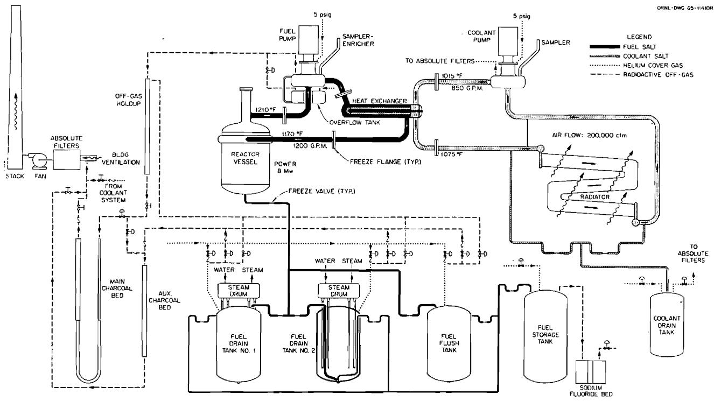  
Fig. 2.1. Design flow sheet of the MSRE.

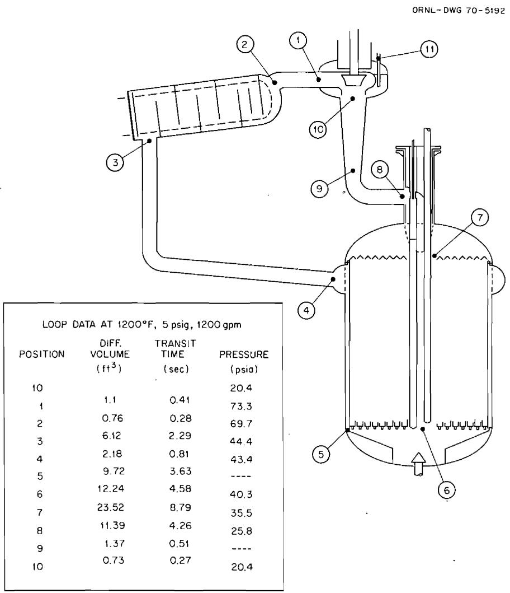  
Fig. 2.2. Pressures, volumes, and transit times in MSRE fuel circulating loop.

ble tubes, and the fourth contained a removable tubular surveillance specimen array.

At reactor temperatures the expansion of the reactor vessel enlarged the annulus between the core graphite and the inner wall to about $1/4$ in.

Model studies, $^{7,8}$ indicated that although the Reynolds number for flow in the noncentral graphite fuel channels was 1000, the square-root dependence of flow on salt head loss implied that turbulent entrance conditions persisted well up into the channel.

Fuel salt leaving the core passed through the upper plenum and the reactor outlet nozzle, to which the reactor access port was attached. Surveillance specimens, the postmortem segments of control rod thimble,

and a core graphite bar were withdrawn through the access port.

The fuel outlet line extended from the reactor outlet nozzle to the pump entry nozzle.

The centrifugal sump-type pump operated with a vertical shaft and an overhung impeller normally at a speed of $1160\mathrm{rpm}$ to deliver $1200\mathrm{gpm}$ to the discharge line at a head of 49 ft, in addition to internal circulation in the pump bowl, described below, amounting to $65\mathrm{gpm}$ . Because many gas and liquid samples were taken from the pump bowl, we will outline here some of the relevant structures and flows. These have been discussed in greater length by Engel, Haubenreich, and Houtzeel.

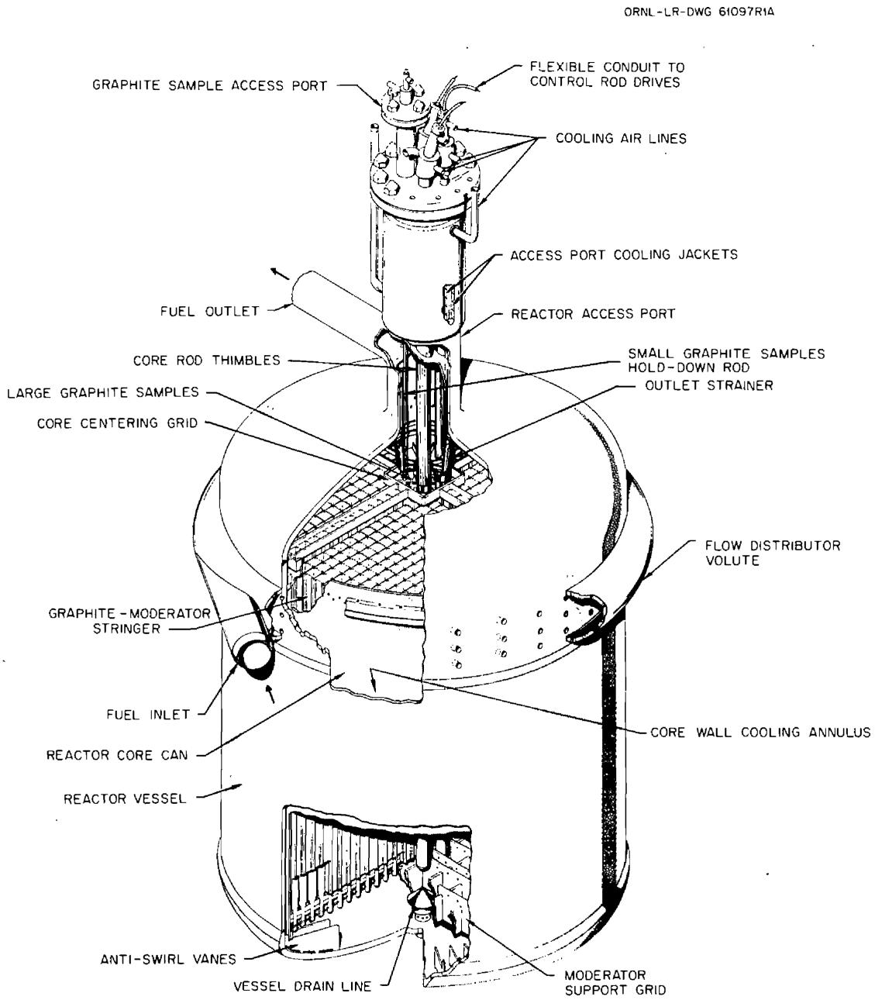  
Fig. 2.3. MSRE reactor vessel.

Some of the major functions of the pump and pump bowl were:

1. fuel circulation pump,   
2. liquid expansion or surge tank,   
3. point for removal and return of system overflow,   
4. system pressurizer,   
5. fission gas stripper,   
6. gas addition point (helium, argon, oil vapor),   
7. holdup and outlet for off-gas and purge gas,   
8. fuel enricher and chemical addition point,   
9. salt sample point,   
10. gas sample point,   
11. point for contacting specimen surfaces with liquid or gas during operation,   
12. point for postmortem excision of some system surfaces.

The major flow patterns are shown in Fig. 2.4.

Usually the pump bowl, which had a fluid capacity of $4.8\mathrm{ft}^3$ , was operated about $60\%$ full. Although the overflow pipe inlet was well above the liquid level and

was protected from spray, overflow rates of several pounds per hour (0.1 to 10) resulted in the accumulation, in a toroidal overflow tank below the pump, of overflow salt, which was blown back to the pump bowl at the necessary intervals (hours to weeks). The overflow tank was connected to the main off-gas line, but because the pump bowl overflow line extended to the bottom of the overflow tank, little or no off-gas took this path except when the normal off-gas exit from the pump bowl had been appreciably restricted.

It was desirable to remove as much of the xenon and krypton fission gases as possible, particularly to mitigate the high neutron poison effect of $^{135}\mathrm{Xe}$ . Consequently, about 50 gpm of pump discharge liquid was passed into a segmented toroidal spray ring near the top of the pump bowl. Many $^{1}_{16}$ and $^{1}_{8}$ -in. perforations sent strong jets angled downward spurting into the liquid a few inches away, releasing bubbles, entraining much pump bowl gas – the larger bubbles of which returned rapidly to the surface – and vigorously mixing the adjacent pump bowl gas and liquid. An additional "fountain" flow of about 15 gpm came up between the volute casing seal and the impeller shaft. Other minor leakages from the volute to the pump bowl also existed. At a net flow of 65 gpm (8.7

ORNL-DWG 69-10172A

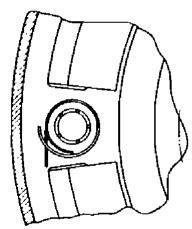

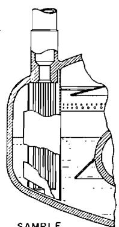  
SAMPLE CAPSULE CAGE

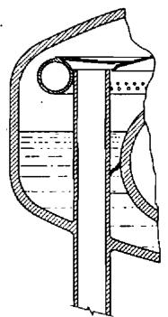  
OVERFLOW PIPE

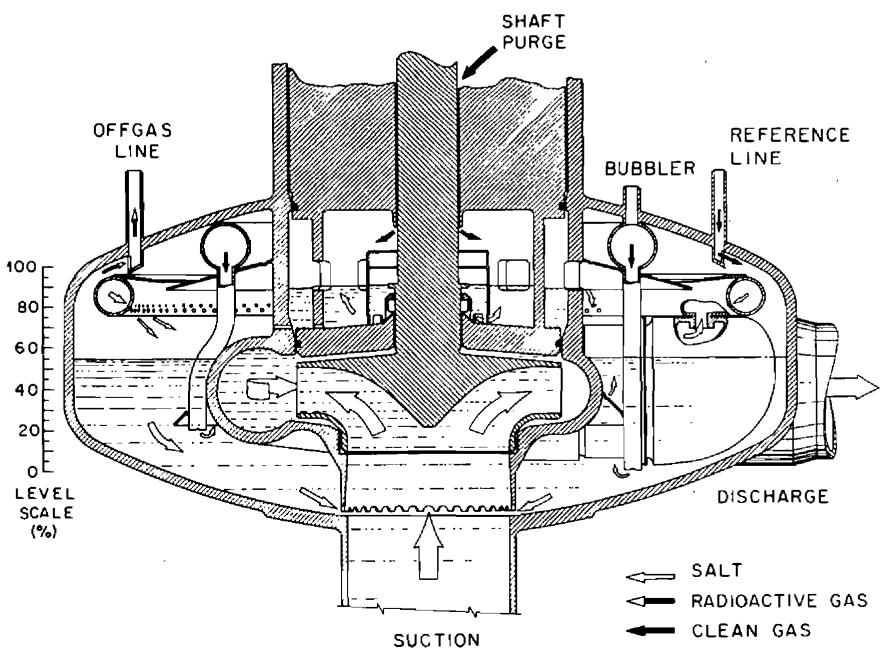  
Fig. 2.4. Flow patterns in the MSRE fuel pump.

cfm) into a pump bowl salt volume of 2.9 ft³, the average residence time of salt in the pump bowl was about 20 sec.

The pump bowl liquid flowed past skirts on the volute at an average velocity of 0.11 fps, accelerating to 1.7 fps as the salt approached the openings to the pump suction. Entrained bubble size can be judged by noting that bubbles 0.04 cm (0.016 in.) in diameter are estimated by Stokes's law to rise at a velocity of 0.1 fps in pump bowl salt.

The salt turbulence also provided an underflow entry to the spiral metal baffle surrounding the sample capsule cage. The baffle, curved into a spiral about 3 in. in diameter, with about one-fourth of a turn overlap, extended from the sample transfer tube at the top of the pump bowl, downward through both gas and liquid phases, to the sloping bottom of the pump bowl, with a half-circle notch on the bottom near the pump bowl wall to facilitate liquid entry. Subsequent upflow permitted release of associated gas bubbles to the vapor space, with liquid outflow through the $1/8$ in. spiral gap.

Around the entry from the sample transfer tube at the top of the pump bowl was a cage of five vertical $\frac{1}{4}$ -in. rods terminating in a ring near the bottom of the pump bowl. Sample capsules, specimen exposure devices, or capsules of materials to be dissolved in the fuel were lowered by a steel cable into this cage for varying periods of time and then withdrawn upward into the sample transfer tube to be removed. Normally (when not in use) a slight gas flow passed down the tube, due to leakage of protective pressurization around closed block valves (gas was also passed down the transfer tube during exposure of many of the above-mentioned items).

Gas could enter the sample baffle region from the liquid and by diffusion via the spiral gap. The rate of passage has not been determined, but some evidence will be considered in connection with gas samples.

Purge gas, normally purified helium, entered the pump bowl gas space through the annulus between the rotating impeller shaft and the shield plug, normally at a rate of 2.4 std liters/min. Some sealing oil vapor, of the order of a few grams per day, is indicated to have entered by this path. Two bubbler tubes (0.37 std liter/min each) and a bubbler reference line (0.15 std liter/min) also introduced gas into the pump bowl. With an average pump bowl gas volume of $1.9\mathrm{ft}^3$ at 5 psig and $650^{\circ}\mathrm{C}$ , a flow of 3.3 std liters/min corresponds to a gas holdup time of about 6.5 min.

In order to prevent spray from entering the overflow line or the two $\frac{1}{2}$ -in. off-gas exit lines in the top of the pump bowl, a sheet metal skirt or roof extended across

the pump bowl gas space from the central shaft housing to the top of the toroidal spray ring. That some aerosol salt or organic mist still was borne out of the pump bowl was indicated by the occasional plugging of the off-gas line and by the examination of materials recovered from this region, to be discussed in a subsequent section.

The areas of the Hastelloy N surfaces exposed to circulating salt in the MSRE fuel loop were given10 as follows:

<table><tr><td>Pump</td><td>30 ft2</td></tr><tr><td>Piping</td><td>45 ft2</td></tr><tr><td>Heat exchanger</td><td>346 ft2</td></tr><tr><td>Reactor vessel</td><td>431 ft2</td></tr><tr><td></td><td>852 ft2(0.7915 × 106cm2)</td></tr></table>

The areas of the graphite surfaces in the core of the MSRE are estimated from design data to be:

<table><tr><td>Fuel channels</td><td>132.35 m2</td></tr><tr><td>Tops and bottoms</td><td>3.42 m2</td></tr><tr><td>Contact edges</td><td>80.25 m2</td></tr><tr><td>Support lattice bars</td><td>8.95 m2</td></tr><tr><td></td><td>224.97 m2 (2.2497 × 106cm2)</td></tr></table>

Thus the total surface area of the MSRE fuel loop is $3.041 \times 10^{6} \, \text{cm}^{2}$ .

Properties of the MSRE fuel salt have been given by Cantor, $^{11}$ Grimes, $^{12}$ and Thoma. $^{13}$ Some of these are given in Table 2.1. As given by Thoma, $^{13}$ the average composition of the fuel (as determined by chemical analysis) was that shown in Table 2.2.

The power released in the reactor as a result of nuclear fission was evaluated both from heat balance data14,15 and from changes in isotopic composition.13

An originally assigned full power of 8 MW, corrected for various small deviations in fluid properties and instrument calibrations, gave a new heat balance full power of 7.65, and the value based on isotopic changes was 7.4 MW. Uncertainties in physical and nuclear properties of the salt and in reactor instrument calibration are sufficient to account for the difference.

At a reactor power of $7.4\mathrm{MW}$ the mean power density in the circulating fuel was $3.6\mathrm{W}$ per cubic centimeter of salt. About $88\%$ of the fissions occurred in the core fuel channels, about $6\%$ in the upper head, and $3\%$ each in the lower head and in the outer downflow annulus. $^{16}$ The average thermal-neutron flux in the circulationg fuel was about $2.9\times 10^{12}$ neutrons $\mathrm{cm}^{-2}$ sec-1 for $^{235}\mathrm{U}$ fuel at full power. The thermal-neutron flux was about $3\times 10^{13}$ neutrons $\mathrm{cm}^{-2}$ sec-1 near the center of the core and declined both

Table 2.1. Physical properties of the MSRE fuel salt   

<table><tr><td>Property</td><td colspan="4">Value</td><td>Estimated precision</td></tr><tr><td>Viscosity</td><td colspan="4">η(centipoises) = 0.116 exp [3755/T(°K)]</td><td>±7</td></tr><tr><td>Thermal conductivity</td><td colspan="4">0.010 watt cm-1°C-1</td><td>±10%</td></tr><tr><td>Electrical conductivity</td><td colspan="4">κ = -2.22 + 6.81 × 10-3T(°C)a</td><td>±10%</td></tr><tr><td>Liquidus temperature</td><td colspan="4">434°C</td><td>±3°C</td></tr><tr><td>Heat capacity</td><td></td><td></td><td></td><td></td><td></td></tr><tr><td>Liquid</td><td colspan="4">Cp= 0.57 cal g-1°C-1</td><td>±3%</td></tr><tr><td>Solid</td><td colspan="4">Cp= 0.31 + 3.61 × 10-4T(°C) cal g-1°C-1</td><td>±3%</td></tr><tr><td>Density</td><td></td><td></td><td></td><td></td><td></td></tr><tr><td>Liquid</td><td colspan="4">ρ = 2.575 - 5.13 × 10-4T(°C) = 139.9 lb/ft3 at 650°C</td><td>±1%</td></tr><tr><td>Expansivity</td><td colspan="4">2.14 × 10-4/°C at 600°C</td><td>±10%</td></tr><tr><td>Compressibility</td><td colspan="4">βT(°K) = 2.3 × 10-12 exp [1.0 × 10-3T(°K)] cm2/dyne</td><td>Factor 3</td></tr><tr><td>Vapor pressure</td><td colspan="4">log P(torrs) = 8.0 - 10,000/T(°K)</td><td>Factor 50 from 500 to 700°C</td></tr><tr><td>Surface tension</td><td colspan="4">γ = 260 - 0.12T(°C) dynes/cm</td><td>+30, -10%</td></tr><tr><td>Solubility of He, Kr, Xe</td><td>T(°C)</td><td>He</td><td>Kr</td><td>Xe</td><td>≥ Factor 10</td></tr><tr><td></td><td>500</td><td>6.6</td><td>0.13</td><td>0.03</td><td></td></tr><tr><td></td><td>600</td><td>10.6</td><td>0.55</td><td>0.17</td><td></td></tr><tr><td></td><td>700</td><td>15.1</td><td>1.7</td><td>0.67</td><td></td></tr><tr><td></td><td>800</td><td>20.1</td><td>4.4</td><td>2.0</td><td></td></tr><tr><td></td><td></td><td colspan="3">× 10-8moles cm-3melt atm-1</td><td></td></tr><tr><td rowspan="2">Isochoric heat capacity, Cv</td><td rowspan="2">T(°C)</td><td colspan="3">Cv</td><td rowspan="2">Cp/Cv</td></tr><tr><td>cal g-1°C-1</td><td>cal g-mole-1°C-1</td><td>cal g-atom-1°C-1</td></tr><tr><td></td><td>500</td><td>0.489</td><td>16.2</td><td>6.91</td><td>1.17</td></tr><tr><td></td><td>600</td><td>0.482</td><td>15.9</td><td>6.81</td><td>1.18</td></tr><tr><td></td><td>700</td><td>0.475</td><td>15.7</td><td>6.72</td><td>1.20</td></tr><tr><td>Sonic velocity</td><td></td><td></td><td></td><td></td><td></td></tr><tr><td>500°C: μ = 3420 m/sec</td><td></td><td></td><td></td><td></td><td></td></tr><tr><td>600°C: μ = 3310 m/sec</td><td></td><td></td><td></td><td></td><td></td></tr><tr><td>700°C: μ = 3200 m/sec</td><td></td><td></td><td></td><td></td><td></td></tr><tr><td>Thermal diffusivity</td><td></td><td></td><td></td><td></td><td></td></tr><tr><td>500°C: D = 2.09 × 10-3cm2/sec</td><td></td><td></td><td></td><td></td><td></td></tr><tr><td>600°C: D = 2.14 × 10-3cm2/sec</td><td></td><td></td><td></td><td></td><td></td></tr><tr><td>700°C: D = 2.18 × 10-3cm2/sec</td><td></td><td></td><td></td><td></td><td></td></tr><tr><td>Kinematic viscosity</td><td></td><td></td><td></td><td></td><td></td></tr><tr><td>500°C: ν = 7.44 × 10-2cm2/sec</td><td></td><td></td><td></td><td></td><td></td></tr><tr><td>600°C: ν = 4.36 × 10-2cm2/sec</td><td></td><td></td><td></td><td></td><td></td></tr><tr><td>700°C: ν = 2.86 × 10-2cm2/sec</td><td></td><td></td><td></td><td></td><td></td></tr><tr><td>Prandtl number</td><td></td><td></td><td></td><td></td><td></td></tr><tr><td>500°C: Pr = 35.6</td><td></td><td></td><td></td><td></td><td></td></tr><tr><td>600°C: Pr = 20.4</td><td></td><td></td><td></td><td></td><td></td></tr><tr><td>700°C: Pr = 13.1</td><td></td><td></td><td></td><td></td><td></td></tr></table>

${}^{a}$ Applicable over the temperature range 530 to ${650}^{ \circ  }\mathrm{C}$ . The value of electrical conductivity given here was estimated by G. D. Robbins and is based on the assumption that ${\mathrm{{ZrF}}}_{4}$ and ${\mathrm{{UF}}}_{4}$ behave identically with ${\mathrm{{ThF}}}_{4}$ ; see G. D. Robbins and A. S. Gallanter,MSR Program Semiannu. Progr. Rep. Aug. 31, 1970, ORNL-4548, p. 159; ibid., ORNL-4622, p. 101.

Table 2.2. Average composition of MSRE fuel salt   

<table><tr><td></td><td>Runs 4-14a</td><td>Runs 16-20b</td></tr><tr><td>LiF, mole %</td><td>64.1 ± 1.1</td><td>64.5 ± 1.5</td></tr><tr><td>BeF2, mole %</td><td>30.0 ± 1.0</td><td>30.4 ± 1.5</td></tr><tr><td>ZrF4, mole %</td><td>5.0 ± 0.19</td><td>4.90 ± 0.16</td></tr><tr><td>UF4, mole %</td><td>0.809 ± 0.024</td><td>0.137 ± 0.004</td></tr><tr><td>Cr, ppm</td><td>64 ± 13 (range 35-80)</td><td>80 ± 14 (range 35-100)</td></tr><tr><td>Fe, ppm</td><td>130 ± 45</td><td>157 ± 43</td></tr><tr><td>Ni, ppm</td><td>67 ± 67</td><td>46 ± 14</td></tr></table>

$a_{\text{Operation with}}$ 235U fuel.

$b_{\mathrm{Operation with}}$ 233U fuel.

radially and axially to values about $10\%$ of this near the graphite periphery. The fast flux was about three times the thermal flux in most core regions.

B. E. Prince17 computed the central core flux for $^{233}\mathrm{U}$ to be about $0.8 \times 10^{13}$ neutrons $\mathrm{cm}^{-2} \sec^{-1}$ per megawatt of reactor power, or about $6 \times 10^{13}$ at full power. The relatively higher flux for the $^{233}\mathrm{U}$ fuel results from the absence of $^{238}\mathrm{U}$ as well as the greater neutron productivity of the $^{233}\mathrm{U}$ .

Across the period of operation with $^{235}\mathrm{U}$ fuel, $^{239}\mathrm{Pu}$ was formed more rapidly than it was burned, and the concentration rose until about $5\%$ of the fissions were contributed by this nuclide. During the $^{233}\mathrm{U}$ operations, the plutonium concentration fell moderately but was replenished by fuel addition. The resultant effects on fission yields will be discussed later.

# References

1. P. N. Haubenreich and J. R. Engel, “Experience with the Molten Salt Reactor Experiment,” Nucl. Appl. Technol. 8, 118-37 (February 1970).   
2. R. C. Robertson, MSRE Design and Operations Report, Part 1. Description of Reactor Design, ORNL-TM-728 (January 1965).   
3. J. R. Engel, P. N Haubenreich, and A. Houtzeel, Spray, Mist, Bubbles, and Foam in the Molten Salt Reactor Experiment, ORNL-TM-3027 (June 1970).   
4. W. B. McDonald, "MSRE Design and Construction," MSR Program Semiannu. Prog. Rep. July 31, 1964, ORNL-3708, pp. 22-83.   
5. H. E. McCoy et al., "New Developments in Materials for Molten-Salt Reactors," Nucl. Appl. Technol. 8, 156-69 (February 1970).

6. A. Taboada, "Metallurgical Developments," MSR Program Semiannu. Progr. Rep. July 31, 1964, ORNL-3708, pp. 330-72.   
7. D. Scott, Jr., "Component Development in Support of the MSRE," MSR Program Semiannu. Progr. Rep. July 31, 1964, ORNL-3708, pp. 167-90.   
8. R. J. Kedl, Fluid Dynamic Studies of the Molten Salt Reactor Experiment (MSRE) Core, ORNL-TM-3229 (Nov. 19, 1970).   
9. J. R. Engel and R. C. Steffy, Xenon Behavior in the Molten Salt Reactor Experiment, ORNL-TM-3464 (October 1971).   
10. J. A. Watts and J. R. Engel, "Hastelloy N Surface Areas in MSRE," internal memorandum MSR-69-32 to R. E. Thoma, Apr. 16, 1969. (Internal document - no further dissimination authorized.)   
11. S. Cantor, Physical Properties of Molten-Salt Reactor Fuel, Coolant and Flush Salts, ORNL-TM-2316 (August 1968).   
12. W. R. Grimes, “Molten Salt Reactor Chemistry,” Nucl. Appl. Technol. 8(2), 137-55 (February 1970).   
13. R. E. Thoma, Chemical Aspects of MSRE Operation, ORNL-4658 (December 1971).   
14. C. H. Gabbard, Reactor Power Measurement and Heat Transfer Performance in the MSRE, ORNL-TM-3002 (May 1971).   
15. C. H. Gabbard and P. N. Haubenreich, "Test of Coolant Salt Flowmeter and Conclusions," MSR Program Semiannu. Progr. Rep. Feb. 28, 1971, ORNL-4676, pp. 17-18.   
16. J. R. Engel, "Nuclear Characteristics of the MSRE," MSR Program Semiannu. Progr. Rep. July 31, 1965, ORNL-3708, pp. 83-114.   
17. B. E. Prince, “Other Neutronic Characteristics of MSRE with $^{233}\mathrm{U}$ Fuel,” MSR Program Semiannu. Progr. Rep. Aug. 31, 1967, ORNL-4191, pp. 54-61.

# 3. MSRE CHRONOLOGY

A sketchy chronology of the MSRE, with an eye toward factors affecting fission product measurements, will be given below. More complete details are available. $^{1-3}$

# 3.1 Operation with $^{2}$ U Fuel

The MSRE was first loaded with flush salt on November 28, 1964; after draining the flush salt, 452 kg of carrier salt ( $^7\mathrm{LiF - BeF}_2 - \mathrm{ZrF}_4$ , 62.4-32.3-5.3 mole %; mol. wt 40.2) was added to a drain tank followed by $235\mathrm{kg}$ of $^7\mathrm{LiF - }^{238}\mathrm{UF}_4$ eutectic salt (72.3-27.7 mole %, mol. wt 105.7) in late April. Circulation of this salt was followed by addition of $^7\mathrm{LiF - }^{235}\mathrm{UF}_4$ (93% enriched) eutectic salt beginning on May 24, 1965. Criticality was achieved on June 1, 1965. Addition of enriched capsules of $^7\mathrm{LiF - }^{235}\mathrm{UF}_4$ eutectic salt continued throughout zero-power experiments, which included controlled calibration. The loop charge at the beginning of power operation consisted of a total of $4498\mathrm{kg}$ of salt (nominal composition by weight, $^7\mathrm{Li}$ , 11.08%; Be, 0.35%; Zr, 11.04%; and U, 4.628%), with $390\mathrm{kg}$ in the drain tank (ref. 2, Table 2.15).

Operation of the MSRE was commonly divided into runs, during which salt was circulating in the fuel loop; between runs the salt was returned to the drain tanks, mixing with the residual salt there.

Run 4, in which significant power was first achieved, began circulation in late December 1965; the approach to power has been taken arbitrarily as beginning at noon January 23, 1966, for purposes of accounting for fission product production and decay.

Significant events during the subsequent operation of the MSRE until the termination of operation on December 12, 1969, are shown in Fig. 3.1. The time period and accumulated power for the various runs are shown in Table 3.1.

Soon after significant power levels were reached, difficulty in maintaining off-gas flow developed. Deposits of varnish-like material had plugged small passages and a small filter in the off-gas system. A small amount of oil in the off-gas holdup pipe and from the pump had evidently been vaporized and polymerized by the heat and radiation from gas-borne fission products. The problem was relieved by installation of a larger and more efficient filter downstream from the holdup pipe. On resumption of operation in April 1966, full power was reached in run 6 after a brief shutdown to repair an electrical short in the fuel sampler-enricher drive. The first radiochemical analyses of salt samples were reported for this run. Run 7, which was substantially at full power, was terminated in late July by failure of the

blades and hub of the main blower in the heat removal system. While a replacement was redesigned, procured, and installed, the array of surveillance specimens was removed, and examinations (reported later) were made. Some buckling and cracking of the assembly had occurred because movement resulting from differential expansion had been inhibited by entrapment and freezing of salt within tongue-and-groove joints. Modifications in the new assembly permitted its continued use, with removals after runs 11, 14, and 18, when it was replaced by an assembly of another design.

Run 8 was halted to permit installation of a blower; run 9, to remove from the off-gas jumper flange above the pump bowl some flush salt deposited by an overfill.

During run 9 an analysis for the oxidation state of the fuel resulted in a $\mathrm{U}^{3+}/\mathrm{U}^{4+}$ value of $0.1\%$ . Because values nearer $1\%$ were desired, additions of metallic beryllium as rod (or powder) were made using the sampler-enricher, interspersed with some samples from time to time to determine $\mathrm{U}^{3+}/\mathrm{U}^{4+}$ .

During run 10 the first "freeze-valve" gas sample was taken from the pump bowl. The series of samples begun at this time will be discussed in a later section. Run 10 operated at full power for a month, with a scheduled termination to permit inspection of the new blower.

Run 11 lasted for 102 days, essentially at full power, and was terminated on schedule to permit routine examinations and return of the core surveillance specimen assembly. During this run a total of $761\mathrm{g}$ of $^{235}\mathrm{U}$ was added (as $\mathrm{LiF - UF_4}$ eutectic salt) without difficulty through the sampler-enricher, while the reactor was in operation at full power. After completion of maintenance the reactor was operated at full power during run 12 for 42 days. During this period, $1527\mathrm{g}$ of $^{235}\mathrm{U}$ was added using the sampler-enricher. Beryllium additions were followed by samples showing $\mathrm{U}^{3+}/\mathrm{U}^{4+}$ of 1.3 and $1.0\%$ . Attempts to untangle the sampler drive cable severed it, dropping the sample capsule attached to it, thus terminating run 12. The cable latch was soon recovered; the capsule was subsequently found in the pump bowl during the final postmortem examination. Run 14 commenced on September 20, after some coolant pump repairs, and continued without fuel drain for 188 days; the reactor was operated subcritical for several days in November to permit electrical repairs to the sampler-enricher. Reactor power and temperature were varied to determine the effect of operating conditions on $^{135}\mathrm{Xe}$ stripping. During run 14 the first subsurface salt samples were taken using a freeze-valve capsule.

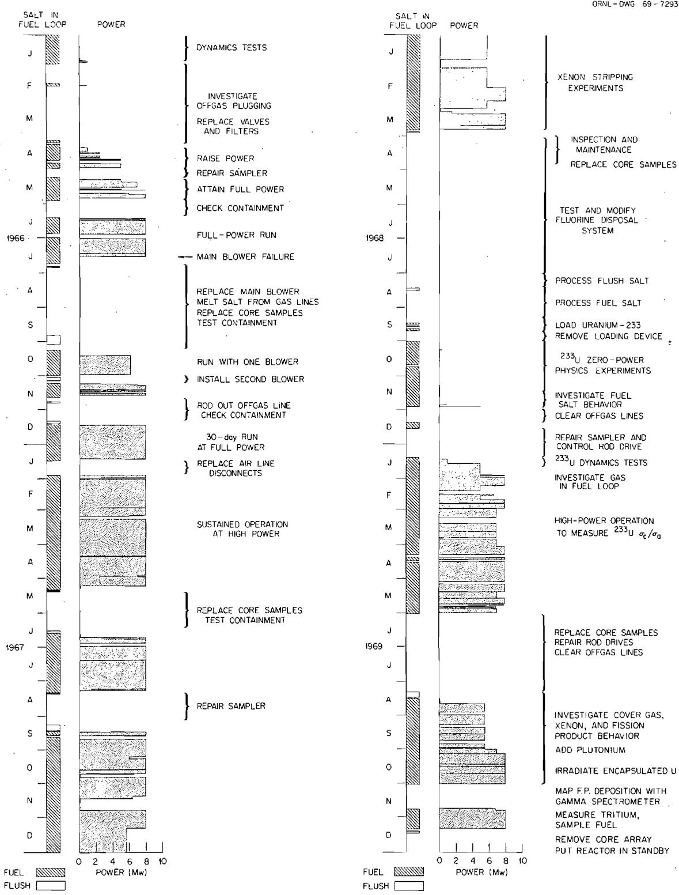  
Fig. 3.1. Chronological outline of MSRE operations.

Table 3.1. MSRE run periods and power accumulation   

<table><tr><td>Run</td><td>Date started</td><td>Date drained</td><td>Run hours</td><td>Cumulative total 
hoursa</td><td>Cumulative effective full-
power hours</td></tr><tr><td>4</td><td>1-23-66a</td><td>1-26-66</td><td>80.8a</td><td>80.8</td><td>4</td></tr><tr><td>5</td><td>2-13-66</td><td>2-16-66</td><td>55.0</td><td>567.5</td><td>5</td></tr><tr><td>6A</td><td>4-8-66</td><td>4-22-66</td><td>342.1</td><td>2,146.3</td><td>54</td></tr><tr><td>6B</td><td>4-25-66</td><td>4-29-66</td><td>107.5</td><td>2,312.7</td><td>115</td></tr><tr><td>6C</td><td>5-8-66</td><td>5-28-66</td><td>475.0</td><td>3,005.0</td><td>377</td></tr><tr><td>7A</td><td>6-12-66</td><td>6-28-66</td><td>348.1</td><td>3,711.4</td><td>684</td></tr><tr><td>7B</td><td>6-30-66</td><td>7-23-66</td><td>553.0</td><td>4,355.7</td><td>1,055</td></tr><tr><td colspan="6">Surveillance specimen assembly removed. New assembly installed.</td></tr><tr><td>8</td><td>10-8-66</td><td>10-31-66</td><td>546.1</td><td>6,747.6</td><td>1,386</td></tr><tr><td>9</td><td>11-7-66</td><td>11-20-66</td><td>301.2</td><td>7,213.0</td><td>1,545</td></tr><tr><td>10</td><td>12-14-66</td><td>1-18-67</td><td>827.2</td><td>8,628.5</td><td>2,262</td></tr><tr><td>11</td><td>1-28-67</td><td>5-11-67</td><td>2461.4</td><td>11,340.6</td><td>4,510</td></tr><tr><td colspan="6">Surveillance specimen assembly removed. Reinstalled.</td></tr><tr><td>12</td><td>6-18-67</td><td>8-11-67</td><td>1277.8</td><td>13,548.3</td><td>5,566</td></tr><tr><td>13</td><td>9-15-67</td><td>9-18-67</td><td>77.8</td><td>14,471.7</td><td>5,626</td></tr><tr><td>14</td><td>9-20-67</td><td>3-25-68</td><td>4468.2</td><td>18,997.0</td><td>9,005</td></tr><tr><td colspan="6">Surveillance specimen assembly removed, reinstalled. Off-gas specimen installed.
235U removed from carrier salt by fluorination. 233U fuel added.</td></tr><tr><td>15</td><td>10-2-68</td><td>11-28-68</td><td>1372.1</td><td>24,956.1</td><td>9,006.5</td></tr><tr><td>16</td><td>12-12-68</td><td>12-17-68</td><td>111.0</td><td>25,404.0</td><td>9,006.5</td></tr><tr><td>17</td><td>1-13-69</td><td>4-10-69</td><td>2085.8</td><td>28,146.1</td><td>10,487</td></tr><tr><td>18A</td><td>4-12-69</td><td>4-15-69</td><td>74.7</td><td>28,269.3</td><td>10,553</td></tr><tr><td>18B</td><td>4-16-69</td><td>6-1-69</td><td>1104.4</td><td>29,402.6</td><td>11,547</td></tr><tr><td colspan="6">Surveillance specimen assembly removed. New assembly installed.</td></tr><tr><td>19</td><td>8-17-69</td><td>11-2-69</td><td>1856.7</td><td>33,098.7</td><td>12,790</td></tr><tr><td>20</td><td>11-25-69</td><td>12-12-69</td><td>396.7</td><td>34,055.3</td><td>13,172</td></tr><tr><td colspan="6">Final drain. Surveillance specimen assembly removed. System to standby.</td></tr><tr><td colspan="6">Postmortem, January 1971. Segments from core graphite, rod thimble, heat exchanger, pump bowl, freeze valve. System to standby.</td></tr></table>

${}^{a}$ From beginning of approach to power, taken as noon, Jan. 23, 1966. Prior circulation in run 4 not included.

After the scheduled termination of run 14, the core surveillance specimen assembly was removed for examination and returned. The off-gas jumper line was replaced; the examination of the removed line is reported below. A specimen assembly was inserted in the off-gas line.

All major objectives of the $^{235}\mathrm{U}$ operation had been achieved, culminated by the sustained final run of over six months at full power, with no indications of any operating instability, fuel instability, significant corrosion, or other evident threats to the stability or ability to sustain operation indefinitely.

# 3.2 Operation with $^{2}{}^{3}{}^{3}\mathrm{U}$ Fuel

It remained to change the fuel and to operate with $^{233}\mathrm{U}$ fuel, which will be the normal fuel for a

molten-salt breeder reactor. This was accomplished across the summer of 1968. The fuel, in the drain tanks, was treated with fluorine gas, and the volatilized $\mathrm{UF}_6$ was caught in traps of granular NaF. Essentially all 218 kg of uranium was recovered, $^2$ and no fission products (except $^{95}\mathrm{Nb}$ ), inbred plutonium, or other substances were removed in this way. The carrier salt was then reduced by hydrogen sparging and metallic zirconium treatment, filtered to remove reduced corrosion products, and returned to the reactor. A mixture of $^{233}\mathrm{UF}_4$ and $^{7}\mathrm{LiF}$ was added to the drain tanks, and some $^{238}\mathrm{UF}_4$ was included to facilitate desired isotope ratio determinations.

Addition of capsules using the sampler-enricher permitted criticality to be achieved, and on October 8, 1968, the U.S. Atomic Energy Commission Chairman,

Glenn Seaborg, a discoverer of $^{233}\mathrm{U}$ , first took the reactor to significant power using $^{233}\mathrm{U}$ fuel.

The uranium concentration with $^{233}\mathrm{U}$ fuel (83% enriched) was about 0.3 mole%. The fuel also contained about 540 g of $^{239}\mathrm{Pu}$ , which had been formed during the $^{235}\mathrm{U}$ operation when the fuel contained appreciable $^{238}\mathrm{U}$ .

During the final months of 1968, zero-power physics experiments were accompanied by an increase in the entrained gas in the fuel. Beryllium was added to halt a rise in the chromium content of the fuel. Some finely divided iron was recovered from the pump bowl using sample capsules containing magnets. During a subsequent shutdown to combine all fuel-containing salt in the drain tank for base-line isotopic analysis, a stricture in the off-gas line was removed, with some of the material involved being recovered on a filter.

At the beginning of run 17 in January 1969, the power level was regularly increased, with good nuclear stability being attained at full power. Transients attributed to behavior of entrained gas were studied by varying pump speed and other variables; argon was used as cover gas for a time. Freeze-valve gas samples and salt samples were taken, and a new double-wall-type sample capsule was employed. Further samples were taken for isotopic analysis. The lower concentrations of uranium in the fuel led to unsuccessful efforts to determine the $\mathrm{U}^{3+}/\mathrm{U}^{4+}$ ratio. However, beryllium additions were continued as $\mathrm{Cr}^{2+}$ concentration increases indicated.

In May 1969, restrictions in the off-gas lines appeared and subsequently also in the off-gas line from the overflow tank. Operation continued, and run 18 was terminated as scheduled on June 1.

Surveillance specimens were removed, and an assembly of different design was installed. This assembly contained specially encapsulated uranium, as well as material specimens. A preliminary survey of the distribution of fission products was conducted, using a collimated Ge(Li) diode gamma spectrometer. This was repeated more extensively after run 19.

After completing scheduled routine maintenance, the reactor was returned to power in August 1969 for run 19. Plutonium fluoride was added, using the sampler-enricher, as a first step in evaluating the possibility of using this material as a significant component of molten-salt reactor fuel.

At the end of run 19, the reactor was drained without flushing to facilitate an extensive gamma spectrometer survey of the location of fission products.

The fate of tritium in the system was of considerable interest, and a variety of experiments were conducted and samples taken to account for the behavior of this product of reactor operation.[7,8]

Because salt aerosol appeared to accompany the gas taken into gas sample capsules, a few double-walled sample capsules equipped with sintered metal filters over the entrance nozzles were used in run 20.

After final draining of the reactor on December 12, 1969, the surveillance specimen assembly was removed for examination, and the reactor was put in standby.

In January 1971 the reactor cell was opened, and several segments of reactor components were excised for examination. These included the sampler-enricher from the pump bowl, segments of a control rod thimble and a central graphite bar from the core, segments of heat exchanger tubes and shell, and a drain line freeze valve in which a small stress crack appeared during final drain operations. The openings in the reactor were sealed, and the reactor crypt was closed.

# References

1. P. N. Haubenreich and J. R. Engel, "Experience with the Molten Salt Reactor Experiment," Nucl. Appl. Technol. 8(2), 18-36 (1969).   
2. R. E. Thoma, Chemical Aspects of MSRE Operation, ORNL-4658 (December 1971).   
3. MSR Program Semiannu. Progr. Rep. (a) July 31, 1964, ORNL-3708; (b) Feb. 28, 1965, ORNL-3812; (c) Aug. 31, 1965, ORNL-3872; (d) Feb. 28, 1966, ORNL-3936; (e) Aug. 31, 1966, ORNL-4037; (f) Feb. 28, 1967, ORNL-4119; (g) Aug. 31, 1967, ORNL-4191; (h) Feb. 29, 1968, ORNL-4254; (i) Aug. 31, 1968, ORNL-4344; (j) Feb. 28, 1969, ORNL-4396; (k) Aug. 31, 1969, ORNL-4449; (l) Feb. 28, 1970, ORNL-4548; (m) Aug. 31, 1970, ORNL-4622; (n) Feb. 28, 1971, ORNL-4676; (o) Aug. 31, 1971, ORNL-4728.   
4. W. H. Cook, "MSRE Materials Surveillance Testing," MSR Program Semiannu. Progr. Rep. Aug. 31, 1966, ORNL-4037, pp. 97-103.   
5. J. R. Engel and R. C. Steffy, Xenon Behavior in the Molten Salt Reactor Experiment, ORNL-TM-3464 (October 1971).   
6. A. Houtzeel and F. F. Dyer, A Study of Fission Products in the Molten Salt Reactor Experiment by Gamma Spectrometry, ORNL-TM-3151 (August 1972).   
7. P. N. Haubenreich, (a) "Tritium in the MSRE: Calculated Production Rates and Observed Amounts," ORNL-CF-70-2-7 (Feb. 4, 1970); (b) "A Review of Production and Observed Distributions of Tritium in MSRE in the Light of Recent Findings," ORNL-CF-71-8-34 (Aug. 23, 1971). (Internal documents - no further dissemination authorized).   
8. R. B. Briggs, "Tritium in Molten Salt Reactors," Reactor Technol. 14(4), 335-42 (Winter 1971-72).

# 4. SOME CHEMISTRY FUNDAMENTALS

Discussions of the chemistry of the elements of major significance in molten-salt reactor fuels have been made by Grimes, $^{1}$ Thoma, $^{2}$ and Baes. $^{3}$ Some relevant highlights will be summarized here.

The original fuel of the Molten Salt Reactor Experiment consisted essentially of a mixture of $^7\mathrm{LiF - BeF}_2-$ $\mathrm{ZrF_4 - UF_4}$ (65-29-5-0.9 mole $\%$ ). The fuel was circulated at about $650^{\circ}C$ , contacting graphite bars in the reactor vessel and passing then through a pump and heat exchanger. The equipment was constructed of Hastelloy N, a Ni-Mo-Cr-Fe alloy (71-17-7-5 wt $\%$ Small amounts of structural elements, particularly chromium, iron, and nickel, were found in the salt.

The concentration of fission product elements in the molten salt fuel is lower than that of constituent or structural elements. The following estimate will indicate the limits on the concentration of fission products evenly distributed in the fuel.

For a single nuclide of fission yield $y$ , at a given power $P$ , the number of existing nuclide atoms in the salt is

$$
A = F \times P \times y \times \tau ,
$$

where $F$ is the system fission rate at unit power and $\tau$ is the effective time of operation. This is the actual time of operation for a stable nuclide and equals $1 / \lambda$ at steady state for a radioactive nuclide. The contribution to the mole fraction of the fission product nuclide in $4.5 \times 10^{6} \, \mathrm{g}$ of salt of molecular weight 40 is then

$$
X = \frac {A}{6 \times 1 0 ^ {2 3}} \times \frac {4 . 5 \times 1 0 ^ {6}}{4 0}.
$$

As an example, for a single nuclide of $1\%$ yield and 30-day half-life at 8 MW, $A = 9.4 \times 10^{21}$ atoms and $X = 1.3 \times 10^{-7}$ . Because the inventory of a fission product element involves only a few nuclides, many radioactive, the mole fractions are typically of the order of $1 \times 10^{-6}$ or less.

Traces of other substances may have entered the salt in the pump bowl, where salt was brought into vigorous contact with the purified helium cover gas. Flow of this gas to the off-gas system served to remove xenon and krypton fission gases from the system. A slight leakage or vaporization of oil into the pump bowl used as a lubricant and seal for the circulating pump introduced hydrocarbons and, by decomposition, carbon and hydrogen into the system. For the several times the reactor vessel was opened for retrieval of surveillance

assemblies and for maintenance, the possible ingress of cell air should be taken into account.

The binary molten fluoride system $\mathrm{LiF - BeF_2}$ (66-34 mole $\%$ ) melts at about $459^{\circ}\mathrm{C}$ . The solution chemistry of many substances in this solvent has been discussed by Baes. Much of the redox and oxide precipitation chemistry can be summarized in terms of the free energy of formation of undissolved species.

Free energies of formation of various species calculated at $650^{\circ}\mathrm{C}$ largely from Baes's data are shown in Table 4.1. The elements of the table are listed in terms of the relative redox stability of the dissolved fluorides.

Table 4.1. Free energy of formation at ${650}^{ \circ  }\mathrm{C}\left( {{\Delta }^{ \circ  }{G}_{f}^{\prime },\text{kcal}}\right)$   
$\mathbf{L}\mathbf{i}^{+},\mathbf{B}\mathbf{e}^{+}$ and $\mathbf{F}^{-}$ are at unit activity; all others, activities in mole fraction units   

<table><tr><td></td><td>Solid</td><td>Dissolved in LiF·2BeF2</td><td>Gas</td></tr><tr><td>LiF</td><td></td><td>-126.49</td><td></td></tr><tr><td>LaF3</td><td>-363.36</td><td>-354.49</td><td></td></tr><tr><td>CeF3</td><td>-364.67</td><td>-356.19</td><td></td></tr><tr><td>NdF3</td><td>-341.80</td><td>-332.14</td><td></td></tr><tr><td>BeF2</td><td></td><td>-216.16</td><td></td></tr><tr><td>BeO</td><td>-123.00</td><td>-109.37</td><td></td></tr><tr><td>BeI2</td><td></td><td>-74.48</td><td></td></tr><tr><td>UF3</td><td>-310.92</td><td>-300.88</td><td></td></tr><tr><td>UF4</td><td>-389.79</td><td>-392.52</td><td></td></tr><tr><td>UO2</td><td>-221.08</td><td></td><td></td></tr><tr><td>UF6</td><td></td><td></td><td>-449.89</td></tr><tr><td>PuF3</td><td>-316.93</td><td>-308.10</td><td></td></tr><tr><td>1/2Pu2O3</td><td>-185.39</td><td></td><td></td></tr><tr><td>ZrF4</td><td></td><td>-392.92</td><td></td></tr><tr><td>ZrO2</td><td>-219.42</td><td></td><td></td></tr><tr><td>NbF4</td><td></td><td>(-296.35)</td><td></td></tr><tr><td>NbF5</td><td></td><td></td><td>-366.49</td></tr><tr><td>1/2Nb2O5</td><td>-179.14</td><td></td><td></td></tr><tr><td>NbC</td><td>-32.4</td><td></td><td></td></tr><tr><td>CrF2</td><td>(-150.7)</td><td>-152.06</td><td></td></tr><tr><td>1/3Cr3C2</td><td>-7.5 to -8.5</td><td></td><td></td></tr><tr><td>FeF2</td><td>-138.18</td><td>-134.59</td><td></td></tr><tr><td>NiF2</td><td>-121.58</td><td>-113.40</td><td></td></tr><tr><td>MoF3</td><td></td><td>(-186.3)</td><td></td></tr><tr><td>MoO2</td><td>-99.81</td><td></td><td></td></tr><tr><td>MoF6</td><td></td><td></td><td>-306.65</td></tr><tr><td>TeF6</td><td></td><td></td><td>-259.13</td></tr><tr><td>TeF5</td><td></td><td></td><td>-232.26</td></tr><tr><td>TeF4</td><td></td><td></td><td>-200.59</td></tr><tr><td>TeF2</td><td></td><td></td><td>-98.36</td></tr><tr><td>TeF</td><td></td><td></td><td>-42.15</td></tr><tr><td>Te2F10</td><td></td><td></td><td>-446.11</td></tr><tr><td>CF4</td><td></td><td></td><td>-189.57</td></tr><tr><td>HF</td><td></td><td>-50.29</td><td>-66.12</td></tr><tr><td>H2O</td><td></td><td></td><td>-47.04</td></tr><tr><td>RuF5</td><td></td><td></td><td>-173.72</td></tr></table>

As one example of the use of the free energy data, we will calculate the dissolved $\mathrm{CrF}_2$ concentration sufficient to halt the dissolution of chromium from Hastelloy N if no region of lower chromium potential can be developed as a sink.

For the reaction

$$
\mathrm {C r} ^ {0} (\mathrm {s}) + 2 \mathrm {U F} _ {4} (\mathrm {d}) = \mathrm {C r F} _ {2} (\mathrm {d}) + 2 \mathrm {U F} _ {3} (\mathrm {d}),
$$

$$
\Delta G = - 1 5 2. 0 6 - 2 [ - 3 9 2. 5 2 - (- 3 0 0. 8 8) ]
$$

$$
= 3 1. 2 2 \mathrm {k c a l},
$$

$$
\log K = \frac {- \Delta G ^ {\circ}}{2 . 3 R T / 1 0 0 0} = \frac {- 3 1 . 2 2}{4 . 2 3 3} = - 7. 3 9
$$

$$
\log K = \log \mathrm {C r F} _ {2} - \log \mathrm {C r} ^ {0} - 2 \log \left(\mathrm {U} ^ {4 +} / \mathrm {U} ^ {3 +}\right).
$$

If we assume $\mathrm{U}^{4+}/\mathrm{U}^{3+} \sim 100$ and note that the chromium concentration in Hastelloy N is about 0.08 mole fraction ( $\log \mathrm{Cr}^0 = -1.10$ ).

$$
\begin{array}{l} \log \mathrm {C r F} _ {2} = 7. 3 9 + (- 1. 1 0) \\ + 2 \times 2. 0 = - 4. 4 9 = \log (3. 2 \times 1 0 ^ {- 5}). \\ \end{array}
$$

A mole fraction of $3.2 \times 10^{-5}$ corresponds to a weight concentration of $52 \times 3.2 \times 10^{-5} / 40 = 42 \, \mathrm{ppm} \, \mathrm{Cr}^{2+}$ in solution.

To obtain a higher concentration of dissolved $\mathbf{Cr}^{2+}$ , the solution would have to be more oxidizing. Furthermore, the Hastelloy N surface during operation becomes depleted in chromium, and a chromium sink of lower activity, $\mathrm{Cr}_3\mathrm{C}_2$ (equivalent to a mole fraction of about 0.016 to 0.01), may be formed; all this would require a somewhat more oxidizing regime to hold even this much $\mathbf{Cr}^{2+}$ in solution.

The free energy data can be used to estimate the quantities in solution only when the species shown are dominant. Thus it is shown by Ting, Baes, and

Mamantov5 that under conditions of moderate concentrations of dissolved oxide, pentavalent niobium exists largely as an oxyfluoride, which may be stable enough for this rather than $\mathrm{NbF_4}$ to be the significant dissolved species under MSRE conditions.

The stability of the various fluorides below chromium in the tabulation are such as to indicate that at the redox potential of the $\mathrm{U}^{4 + } / \mathrm{U}^{3 + }$ couple, only the elemental form will be present in appreciable quantity.

In particular, tellurium vapor is much more stable than any of its fluoride vapors. Unless a more stable species than those listed in the table exists in molten salt, these data indicate that tellurium would exist in the salt as a dissolved elemental gas or as a telluride ion. [No data are available on $\mathrm{Te}_2(\mathbf{g})$ , etc., but such combinations would not much affect this view.]

# References

1. W. R. Grimes, “Molten Salt Reactor Chemistry,” Nucl. Appl. 8, 137-55 (1970).   
2. R. E. Thoma, Chemical Aspects of MSRE Operations, ORNL-4658 (December 1971).   
3. C. F. Baes, Jr., "The Chemistry and Thermodynamics of Molten Salt Reactor Fuels," Nucl. Met. 15, 617-44 (1969) (USAEC CONF-690801).   
4. K. A. Romberger, J. Braunstein, and R. E. Thoma, "New Electrochemical Measurements of the Liquidus in the LiF-BeF $_2$ System - Congruency of $\mathbf{L}\mathbf{i}_2\mathbf{B}\mathbf{e}\mathbf{F}_4$ ," J. Phys. Chem. 76, 1154-59 (1972).   
5. G. Ting, C. F. Baes, Jr., and G. Mamantov, "The Oxide Chemistry of Niobium in Molten LiF-BeF $_2$ Mixtures," MSR Program Semiannu. Progr. Rep. Feb. 29, 1972, ORNL-4782, pp. 87-93.   
6. Free energies for tellurium fluorides given in Table 4.1 were taken from P. A. G. O'Hare, The Thermodynamic Properties of Some Chalcogen Fluorides, ANL-7315 (July 1968).

# 5. INVENTORY

Molten-salt reactors generate the full array of fission products in the circulating fuel. The amount of any given nuclide is constantly changing as a result of concurrent decay and generation by fission. Also, certain fission product elements, particularly noble gases, noble metals, and others, may not remain in the salt because of limited solubility.

For the development of information on fission product behavior from sample data, each nuclide of each sample must be (and here has been) furnished with a suitable basis of comparison calculated from an appropriate model, against which the observed values can be measured. The most useful basis is the total inventory, which is the number of atoms of a nuclide which are in existence at a given time as a result of all prior fissioning and decay. It is frequently useful to consider the salt as two parts, circulating fuel salt and drain tank salt, which are mixed at stated times. It is then convenient to express an inventory value as activity per gram of circulating fuel salt, affording for salt samples a direct comparison with observed activity per gram of sample.

For deposits on surfaces, it is useful to calculate for comparison the total inventory activity divided by the total surface area in the primary system.

Some of the comparisons for gas samples will be based on accumulated inventory values, and others on production rate per unit of purge gas flow. These models will be developed in a later section.

In the calculation of inventory from power history, we have in most cases found it adequate to consider the isotope in question as being a direct product of fission, or at most having only one significant precursor. For the nuclides of interest, it has generally not appeared necessary to account for production by neutron absorption by lighter nuclides. These assumptions permit us to calculate the amount of nuclide produced during an interval of steady relative power and bring it forward to a given point in real time, with unit power fission rate and yield as factorable items.

In Table 5.1 we show yield and decay data used in inventory calculations. In the case of $^{110m}\mathrm{Ag}$ and $^{134}\mathrm{Cs}$ , neutron absorption with the stable element of the lighter chain produced the nuclide, and special calculations are required.

The branching fraction of $^{129}\mathrm{Sb}$ to $^{129m}\mathrm{Te}$ is a factor in the net effective fission yield of $^{129m}\mathrm{Te}$ . The Nuclear Data Sheets are to be revised1 to indicate that this branching fraction is 0.157 (instead of the prior literature value of 0.36). All our inventory values and

calculations resulting from them have been proportionately altered to reflect this revision.

The inventories for $^{235}\mathrm{U}$ operation were calculated by program FISK, using a fourth-order Runge-Kutta numerical integration method.

Differential equations describing the formation and decay of each isotope were written, and time steps were defined which evenly divided each period into segments adequately shorter than the half-lives or other time constants of the equation. The program FISK was written in FORTRAN 3 and executed on a large-scale digital computer at ORNL. Good agreement was obtained with results from parallel integral calculations.

The FISK calculation did not take into account the ingrowth of $^{239}\mathrm{Pu}$ during the operation with $^{235}\mathrm{U}$ fuel. The effect is slight except for $^{106}\mathrm{Ru}$ . We obtained values taking this into account in separate calculations using the integral method.

For the many samples taken during operation with $^{233}\mathrm{U}$ fuel, a one- or two-element integral equation calculation was made over periods of steady power, generally not exceeding a day. Because the plutonium level was relatively constant (about 500 g total) during the $^{233}\mathrm{U}$ operation, weighted yields were used, assuming that, of the fissions, 93.5% came from $^{233}\mathrm{U}$ , 2.2% from $^{235}\mathrm{U}$ , and 4.3% from $^{239}\mathrm{Pu}$ .

For irradiation for an interval $t_1$ at a fission rate $F$ and yield $Y$ , followed by cooling for a time $t_2$ , the usual expressions3 for one- and two-element chains are

$$
\mathrm {F i s s i o n} \rightarrow \mathbf {A} \rightarrow \mathbf {B} \rightarrow
$$

$$
\text {A t o m s} A (t _ {2}) = \frac {F Y}{\lambda_ {1}} (1 - e ^ {- \lambda_ {1} t _ {1}}) e ^ {- \lambda_ {1} t _ {2}}
$$

$$
\begin{array}{l} \mathrm {A t o m s} \mathrm {B} (t _ {2}) = \frac {F Y \lambda_ {1} \lambda_ {2}}{\lambda_ {2}} \left(\frac {1 - e ^ {- \lambda_ {1} t _ {1}}}{\lambda_ {1}} e ^ {- \lambda_ {1} t _ {2}} \right. \\ \left. - \frac {1 - e ^ {- \lambda_ {2} t _ {1}}}{\lambda_ {2}} e ^ {- \lambda_ {2} t _ {2}}\right), \\ \end{array}
$$

where $\lambda_{1}$ and $\lambda_{2}$ are decay constants for nuclides A and B.

A program based on the above expressions was written in BASIC and executed periodically on a commercial time-sharing computer to provide a current inventory basis for incoming radiochemical data from recent samples.

To remain as current as possible, the working power history was obtained by a daily logging of changes in

Table 5.1. Fission product data for inventory calculations   

<table><tr><td rowspan="2">Chain</td><td rowspan="2">Isotope</td><td rowspan="2">Half-life</td><td rowspan="2">Fraction</td><td colspan="3">Cumulative fission yielda</td></tr><tr><td>233U</td><td>235U</td><td>239Pu</td></tr><tr><td>89</td><td>Sr</td><td>52 days</td><td>1</td><td>5.86</td><td>4.79</td><td>1.711</td></tr><tr><td>90</td><td>Sr</td><td>28.1 years</td><td>1</td><td>6.43</td><td>5.77</td><td>2.21</td></tr><tr><td>91</td><td>Sr</td><td>9.67 hr</td><td>1</td><td>5.57</td><td>5.81</td><td>2.43</td></tr><tr><td>91</td><td>Y</td><td>59 days</td><td>(1.0)c</td><td>5.57</td><td>5.81</td><td>2.43</td></tr><tr><td>95</td><td>Zr</td><td>65 days</td><td>1.0</td><td>6.05</td><td>6.20</td><td>4.97</td></tr><tr><td>95</td><td>Nb</td><td>35 days</td><td>(1.0)</td><td>6.05</td><td>6.20</td><td>4.97</td></tr><tr><td>99</td><td>Mo</td><td>67 hr</td><td>1.0</td><td>4.80</td><td>6.06</td><td>6.10</td></tr><tr><td>103</td><td>Ru</td><td>39.5 days</td><td>1.0</td><td>1.80</td><td>3.00</td><td>5.67</td></tr><tr><td>106</td><td>Ru</td><td>368 days</td><td>1.0</td><td>0.24</td><td>0.38</td><td>4.57</td></tr><tr><td>109</td><td>Ag</td><td>Stable</td><td>(91 b + resonance)</td><td>0.044</td><td>0.030</td><td>1.40</td></tr><tr><td>110</td><td>Ag(m)</td><td>253 days</td><td></td><td></td><td></td><td></td></tr><tr><td>111</td><td>Ag</td><td>7.5 days</td><td>1</td><td>0.0242</td><td>0.0192</td><td>0.232</td></tr><tr><td>125</td><td>Sb</td><td>2.7 years</td><td>1</td><td>0.084</td><td>0.021</td><td>0.115</td></tr><tr><td>127</td><td>Te(m)</td><td>100 days</td><td>0.22</td><td>0.60</td><td>0.13</td><td>0.39</td></tr><tr><td>129</td><td>Te(m)</td><td>34 days</td><td>0.36b</td><td>2.00</td><td>0.80</td><td>2.00</td></tr><tr><td>132</td><td>Te</td><td>3.25 days</td><td>1.0</td><td>4.40</td><td>4.24</td><td>5.10</td></tr><tr><td>131</td><td>I</td><td>8.05 days</td><td>1.0</td><td>2.90</td><td>2.93</td><td>3.78</td></tr><tr><td>133</td><td>Cs</td><td>Stable</td><td>(32 b + resonance)</td><td>5.78</td><td>6.61</td><td>6.53</td></tr><tr><td>134</td><td>Cs</td><td>750 days</td><td></td><td></td><td></td><td></td></tr><tr><td>137</td><td>Cs</td><td>29.9 years</td><td>1</td><td>6.58</td><td>6.15</td><td>6.63</td></tr><tr><td>140</td><td>Ba</td><td>12.8 days</td><td>1</td><td>5.40</td><td>6.85</td><td>5.56</td></tr><tr><td>141</td><td>Ce</td><td>32.3 days</td><td>1</td><td>6.49</td><td>6.40</td><td>5.01</td></tr><tr><td>144</td><td>Ce</td><td>284 days</td><td>1</td><td>4.61</td><td>5.62</td><td>3.93</td></tr><tr><td>147</td><td>Nd</td><td>11.1 days</td><td>1</td><td>1.98</td><td>2.36</td><td>2.07</td></tr><tr><td>147</td><td>Pm</td><td>2.65 years</td><td>1</td><td>1.98</td><td>2.36</td><td>2.07</td></tr></table>

aFrom M. J. Bell, Nuclear Transmutation Data, ORIGEN Code Library; L. E. McNeese, Engineering Development Studies for Molten-Salt Breeder Reactor Processing No. 1, ORNL-TM-3053, Appendix A (November 1970).   
This is the value given in the earlier literature. The revised Nuclear Data Sheets will indicate that the branching fraction is 0.157.   
cParentheses indicate nominal values.

reactor power indicated by nuclear instrumentation charts; the history so obtained agreed adequately with other determinations.

In practice, the daily power log was processed by the computer to yield a power history which could remain stored in the machine. A file of reactor sample times and fill and drain times was also stored, as well as fission product chain data. It was thus possible to update and store the inventory of each nuclide at each sample time. A separate file for individual samples and their segments containing the available individual nuclide counts and counting dates was then processed to give corrected nuclide data on a weight or other basis and, using the stored inventory data, a ratio to the appropriate reactor inventory per unit weight. The data for individual salt and gas samples were also accumulated for inclusion in a master file along with pertinent reactor operating parameters at the time of sampling. This file was used in preparing many tables for this report.

Only one ad hoc adjustment was made in the inventory calculation. Radiochemical analyses in connection with the chemical processing of the salt to change from $^{235}\mathrm{U}$ to $^{233}\mathrm{U}$ fuel indicated that $^{95}\mathrm{Nb}$ , which had continued to be produced from the $^{95}\mathrm{Zr}$ in the fuel when run 14 was shut down, was entirely removed from the salt in the reduction step in which the salt was treated with zirconium metal and filtered. To reflect this and provide meaningful $^{95}\mathrm{Nb}$ inventories for the next several months, the calculated $^{95}\mathrm{Nb}$ inventory was arbitrarily set at zero as of the time of reduction. This adjustment permitted agreement between inventory and observation during the ensuing interval as $^{95}\mathrm{Nb}$ grew back into the salt from decay of the $^{95}\mathrm{Zr}$ contained in it.

In this report we have normally tabulated the activity of each nuclide per unit of sample as of the time of sampling and also tabulated the ratio of this to inventory. For economy of space we then did not

tabulate inventory; this can of course be calculated by dividing the activity value by the ratio value.

# References

1. D. J. Horen (ORNL Physics Division), "Decay of $^{129}\mathrm{Sb}$ , $^{129}\mathrm{mgTe}$ ," letter to J. R. Tallackson (ORNL Reactor Division), May 5, 1972.

2. E. J. Lee (ORNL Mathematics Division), Program FISK, June 18, 1968.   
3. J. M. West, "Calculation of Nuclear Radiation," pp. 7-14, 7-15 in sect. 7-1, *Nuclear Engineering Handbook*, ed. by H. Etherington, McGraw-Hill, New York, 1958.   
4. B. E. Prince, "Long-Term Isotopic Changes and Reactivity Effects during Operation with $^{233}\mathrm{U}$ ," MSR Program Semiannu. Progr. Rep. Feb. 28, 1969, ORNL-4396, pp. 35-37.

# 6. SALT SAMPLES

# 6.1 Ladle Samples

Radiochemical analyses were obtained on salt samples taken from the pump bowl beginning in run 6, using the sampler-enricher $^{1,2}$ (Fig. 6.1). A tared hydrogen-fired copper capsule (ladle, Fig. 6.2) which could contain 10 g of salt was attached to a cable and lowered by windlass past two containment gate valves down a slanted transfer tube until it was below the surface of the liquid within the mist shield in the pump bowl. After an interval the capsule was raised above the latch, until the salt froze, and then was raised into the upper containment area and placed in a sealed transport container and transferred to the High Radiation Level Analytical Laboratory. Similar procedures were followed with other types of capsules to be described later. The various kinds of capsules had hemispherical ends and were $3/4$ -in.-diam cylinders, 6 in. or less in length. Ladles were about 3 in. long.

After removal from the transport container in the High Radiation Level Analytical Laboratory, the cable

was slipped off, and the capsule and contents were inspected and weighed. The top of the ladle was cut off. After this, the sample in the copper ladle bottom part was placed in a copper containment egg and agitated 45 min in a pulverizer mixer, after which the powdered salt was transferred (Fig. 6.3) to a polyethylene bottle for retention or analysis. Data from 19 such samples, from run 6 to run 14, are shown in Tables 6.1 and 6.2 as ratios to inventory obtained from program FISK. Full data are given in Table 6.7, at the end of this chapter.

There will be further discussion of the results. However, a broad overview will note that the noble-gas daughters and salt-seeking isotopes were generally close to inventory values, while the noble-metal group was not as high, and values appeared to be more erratic. Noble-metal nuclides were observed to be strongly deposited on surfaces experimentally exposed to pump bowl gas. This implied that some of the noble-metal activity observed for ladle salt samples could have been picked up in the passage through the pump bowl gas

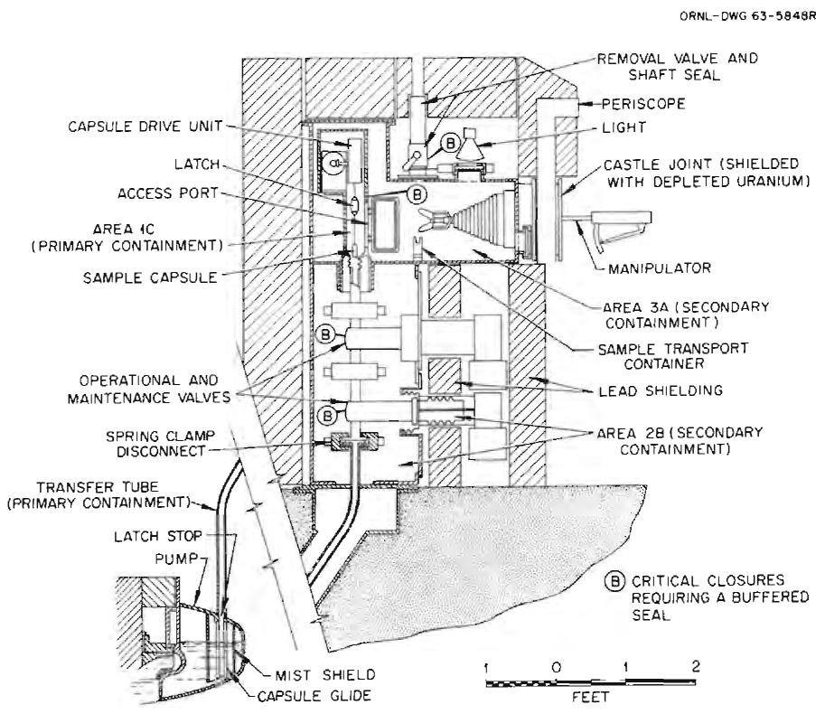  
Fig. 6.1. Sampler-enricher schematic.

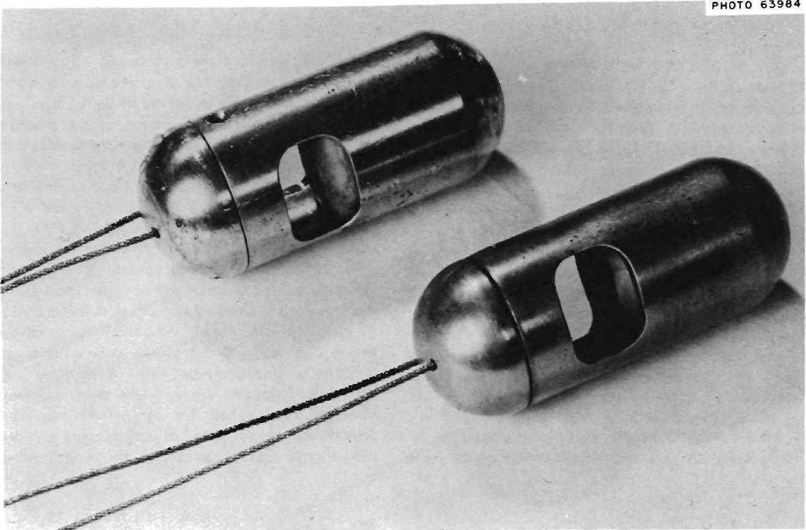  
Fig. 6.2. Container for sampling MSRE salt.

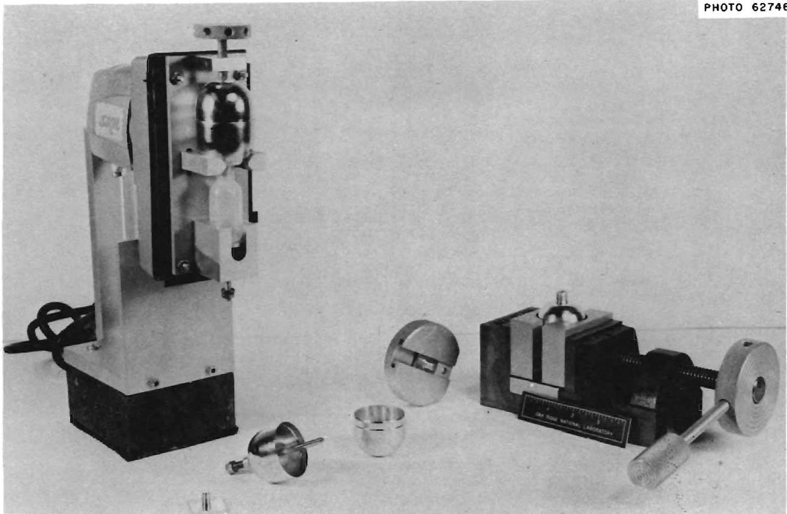  
Fig. 6.3. Apparatus for removing MSRE salt from pulverizer-mixer to polyethylene sample bottle.

Expressed as ratio to amount calculated for $1\mathrm{g}$ of inventory salt at time of sampling

Table 6.1. Noble-gas daughters and salt-seeking isotopes in salt samples from MSRE pump bowl during uranium-235 operation   

<table><tr><td rowspan="2">Sample</td><td rowspan="2">Date</td><td colspan="5">Noble-gas daughters</td><td colspan="5">Salt-seeking isotopes</td></tr><tr><td>Sr-89</td><td>Sr-91</td><td>Sr-92</td><td>Ba-140</td><td>Cs-137</td><td>Ce-141</td><td>Ce-143</td><td>Ce-144</td><td>Nd-147</td><td>Zr-95</td></tr><tr><td>6-17L</td><td>5-23-66</td><td>0.92</td><td>0.81</td><td>0.76</td><td></td><td></td><td>0.84</td><td></td><td></td><td></td><td></td></tr><tr><td>6-19L</td><td>5-26-66</td><td>0.90</td><td>0.63</td><td>0.69</td><td></td><td></td><td></td><td>0.85</td><td></td><td></td><td></td></tr><tr><td>7-07L</td><td>6-27-66</td><td>0.67</td><td>0.63</td><td>0.58</td><td></td><td></td><td>0.92</td><td>0.79</td><td></td><td></td><td></td></tr><tr><td>7-10L</td><td>7-6-66</td><td>0.67</td><td>0.71</td><td>0.90</td><td></td><td></td><td>0.95</td><td>0.82</td><td></td><td></td><td></td></tr><tr><td>7-12L</td><td>7-13-66</td><td>0.73</td><td>0.72</td><td>0.89</td><td></td><td>0.63</td><td>0.78</td><td></td><td>1.20</td><td></td><td>1.12</td></tr><tr><td>8-05L</td><td>10-8-66</td><td>0.64</td><td></td><td></td><td></td><td>0.80</td><td>0.77</td><td></td><td>1.07</td><td></td><td>0.95</td></tr><tr><td>10-12L</td><td>12-28-66</td><td>0.80</td><td>0.71</td><td></td><td>1.30</td><td></td><td>0.66</td><td></td><td>1.04</td><td></td><td>0.95</td></tr><tr><td>10-20L</td><td>1-9-67</td><td>0.74</td><td>0.72</td><td></td><td>0.59</td><td></td><td>0.41</td><td></td><td>3.50</td><td></td><td>0.71</td></tr><tr><td>11-08L</td><td>2-13-67</td><td>0.66</td><td>0.71</td><td></td><td>0.69</td><td></td><td>0.85</td><td></td><td></td><td></td><td>1.09</td></tr><tr><td>11-12L</td><td>2-21-67</td><td>0.80</td><td>0.82</td><td></td><td>0.79</td><td></td><td>0.90</td><td></td><td></td><td></td><td>0.98</td></tr><tr><td>11-22L</td><td>3-9-67</td><td>0.91</td><td></td><td></td><td>1.80</td><td></td><td></td><td></td><td></td><td></td><td>1.09</td></tr><tr><td>11-45L</td><td>4-17-67</td><td>0.77</td><td></td><td></td><td>0.89</td><td></td><td></td><td></td><td></td><td></td><td>0.23</td></tr><tr><td>11-51L</td><td>4-28-67</td><td>0.69</td><td>1.10</td><td></td><td>0.96</td><td></td><td>0.87</td><td>0.64</td><td>1.20</td><td></td><td>0.86</td></tr><tr><td>11-52L</td><td>5-1-67</td><td>0.69</td><td></td><td></td><td>1.10</td><td></td><td>0.96</td><td>0.42</td><td>1.09</td><td></td><td>0.96</td></tr><tr><td>11-54L</td><td>5-5-67</td><td></td><td></td><td></td><td></td><td></td><td></td><td></td><td></td><td></td><td>0.94</td></tr><tr><td>11-58L</td><td>5-8-67</td><td>0.88</td><td></td><td></td><td>1.01</td><td></td><td>1.03</td><td>2.60</td><td>1.10</td><td></td><td>1.10</td></tr><tr><td>12-06L</td><td>6-20-67</td><td>0.76</td><td></td><td></td><td></td><td></td><td>0.83</td><td></td><td>1.06</td><td></td><td>1.04</td></tr><tr><td>12-27L</td><td>7-17-67</td><td>0.75</td><td></td><td></td><td></td><td></td><td></td><td></td><td></td><td></td><td>0.97</td></tr><tr><td>14-22L</td><td>11-7-67</td><td>9.60</td><td></td><td></td><td></td><td></td><td></td><td>0.84</td><td></td><td></td><td>1.02</td></tr><tr><td>14-20FV</td><td>11-4-67</td><td>0.89</td><td></td><td></td><td>0.99</td><td></td><td></td><td>0.76</td><td></td><td>1.04</td><td>1.04</td></tr><tr><td>14-30FV</td><td>12-5-67</td><td>0.87</td><td></td><td></td><td>0.77</td><td></td><td></td><td>0.77</td><td></td><td>0.55</td><td>1.06</td></tr><tr><td>14-63FV</td><td>2-27-68</td><td>0.87</td><td>1.14</td><td></td><td>0.59</td><td></td><td></td><td>1.20</td><td></td><td></td><td>1.12</td></tr><tr><td>14-66FV</td><td>3-5-68</td><td>0.90</td><td>45.00</td><td></td><td>1.26</td><td></td><td></td><td>2.40</td><td></td><td></td><td>0.94</td></tr></table>

Table 6.2. Noble metals in salt samples from MSRE pump bowl during uranium-235 operation Expressed as ratios to amount calculated for $1\mathrm{g}$ of inventory salt at time of sampling   

<table><tr><td>Sample</td><td>Date</td><td>Nb-95</td><td>Mo-99</td><td>Ru-103</td><td>Ru-105</td><td>Ru-106</td><td>Ag-111</td><td>Te-129m</td><td>Te-132</td><td>I-131</td><td>I-133</td><td>I-135</td></tr><tr><td>6-17</td><td>5-23-66</td><td></td><td>0.57</td><td>0.01330</td><td>2.50</td><td></td><td></td><td></td><td>0.57</td><td>0.72</td><td>0.91</td><td>0.55</td></tr><tr><td>6-19</td><td>5-26-66</td><td></td><td>2.77</td><td>0.42</td><td>9.31</td><td></td><td></td><td></td><td>0.51</td><td>0.92</td><td>0.69</td><td>0.83</td></tr><tr><td>7-07</td><td>6-27-66</td><td></td><td>0.58</td><td>0.09086</td><td>1.33</td><td></td><td></td><td></td><td>0.44</td><td>0.81</td><td>0.69</td><td>0.66</td></tr><tr><td>7-10</td><td>7-6-66</td><td></td><td>0.80</td><td>0.21</td><td>3.77</td><td></td><td></td><td></td><td>0.40</td><td>0.79</td><td>0.91</td><td></td></tr><tr><td>7-12</td><td>7-13-66</td><td>15.51</td><td>0.19</td><td>0.20</td><td>1.44</td><td>0.29</td><td></td><td>0.31</td><td>0.33</td><td>0.75</td><td>0.73</td><td>0.64</td></tr><tr><td>8-05</td><td>10-8-66</td><td>2.66</td><td></td><td>0.03767</td><td></td><td>0.06205</td><td></td><td>0.08089</td><td></td><td>1.10</td><td></td><td></td></tr><tr><td>10-12</td><td>12-28-66</td><td>0.44</td><td>0.02216</td><td>0.02659</td><td></td><td>0.03435</td><td></td><td>0.12</td><td>0.14</td><td>0.91</td><td></td><td></td></tr><tr><td>10-20</td><td>1-9-67</td><td>0.95</td><td>0.28</td><td>0.01551</td><td></td><td>0.01994</td><td></td><td>0.17</td><td>0.17</td><td>0.96</td><td></td><td></td></tr><tr><td>11-08</td><td>2-13-67</td><td>0.03324</td><td>1.88</td><td>0.12</td><td></td><td>0.09972</td><td></td><td></td><td>0.47</td><td>0.70</td><td></td><td></td></tr><tr><td>11-12</td><td>2-21-67</td><td>0.30</td><td>1.44</td><td>0.09972</td><td></td><td>0.09972</td><td></td><td></td><td>0.31</td><td>0.94</td><td></td><td></td></tr><tr><td>11-22</td><td>3-9-67</td><td></td><td>1.03</td><td>0.06648</td><td></td><td>0.07756</td><td></td><td></td><td>0.42</td><td>1.33</td><td></td><td></td></tr><tr><td>11-45</td><td>4-17-67</td><td>0.32</td><td>0.92</td><td>0.21</td><td></td><td>0.16</td><td>0.09972</td><td></td><td>0.31</td><td>1.09</td><td></td><td></td></tr><tr><td>11-51</td><td>4-28-67</td><td>0.04432</td><td>0.44</td><td>0.05540</td><td></td><td>0.03324</td><td>0.12</td><td>0.17</td><td>0.14</td><td>0.98</td><td></td><td></td></tr><tr><td>11-52</td><td>5-1-67</td><td>0.02216</td><td>0.49</td><td>1.22</td><td></td><td>0.08864</td><td>0.09972</td><td>0.17</td><td>0.14</td><td>0.96</td><td></td><td></td></tr><tr><td>11-54</td><td>5-5-67</td><td>0.19</td><td>0.21</td><td>0.02216</td><td></td><td>0.02216</td><td></td><td></td><td>0.08864</td><td>0.82</td><td></td><td></td></tr><tr><td>11-58</td><td>5-8-67</td><td>0.24</td><td>0.03324</td><td>0.13</td><td></td><td>0.12</td><td>0.03324</td><td>0.17</td><td>0.12</td><td>0.16</td><td></td><td></td></tr><tr><td>12-06</td><td>6-20-67</td><td>0.89</td><td></td><td>0.09972</td><td></td><td>0.13</td><td></td><td>0.68</td><td></td><td></td><td></td><td></td></tr><tr><td>12-27</td><td>7-17-67</td><td>0.38</td><td>0.75</td><td>0.12</td><td></td><td>0.08864</td><td></td><td>0.17</td><td>0.12</td><td>0.99</td><td></td><td></td></tr><tr><td>14-22</td><td>11-7-67</td><td>0.00111</td><td>0.47</td><td>0.06648</td><td></td><td>0.07756</td><td></td><td>0.11</td><td>0.06648</td><td>8.20</td><td></td><td></td></tr><tr><td>14-20FV</td><td>11-4-67</td><td>0.00066</td><td>0.01440</td><td>0.00222</td><td></td><td>0.00665</td><td></td><td>0.04432</td><td>0.00665</td><td>0.74</td><td></td><td></td></tr><tr><td>14-30FV</td><td>12-5-67</td><td>0.00001</td><td>0.00554</td><td>0.00111</td><td></td><td>0.00222</td><td></td><td>0.01219</td><td>0.01219</td><td>0.50</td><td></td><td></td></tr><tr><td>14-63FV</td><td>2-27-68</td><td>0.00003</td><td>0.00222</td><td>0.00044</td><td></td><td>0.00078</td><td></td><td></td><td>0.00222</td><td>0.61</td><td></td><td></td></tr><tr><td>14-66FV</td><td>3-5-68</td><td>0.02216</td><td>0.00443</td><td>0.00033</td><td></td><td>0.00332</td><td></td><td></td><td>0.01219</td><td></td><td></td><td></td></tr></table>

and transfer tube regions, and indicated that salt samples taken from below the surface were desirable.

# 6.2 Freeze-Value Samples

Beginning in run 10, gas samples (q.v.) had been taken using a "freeze-value" capsule (Fig. 6.4).

To prepare a freeze-valve capsule, it was heated sufficiently to melt the salt seal, then cooled under vacuum. It was thus possible to lower the capsule nozzle below the surface of the salt in the pump bowl before the seal melted; the vacuum then sucked in the sample.

After the freeze-valve capsule was transferred to the High Radiation Level Analytical Laboratory, inspected, and weighed after removing the cable, the entry nozzle was sealed with chemically durable wax. The capsule exterior was then leached repeatedly with "verbocit"

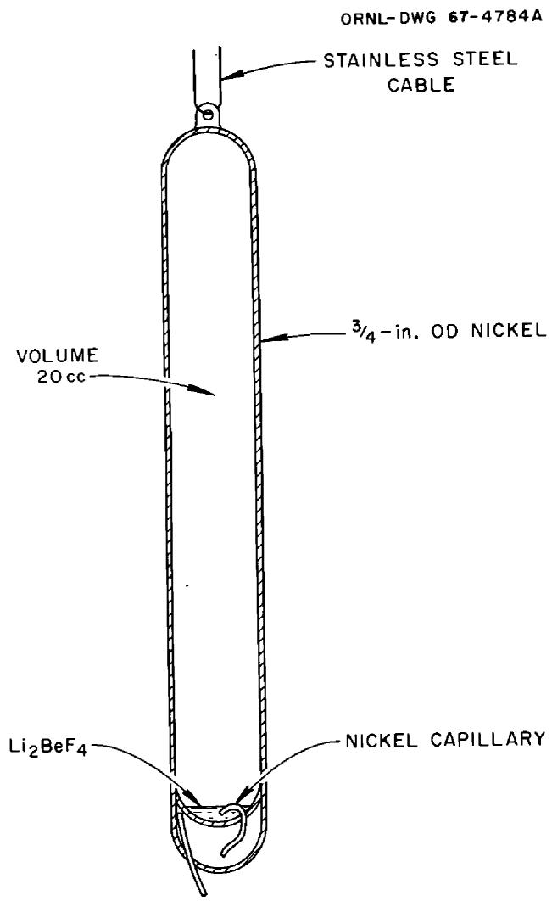  
Fig. 6.4. Freeze valve capsule.

(Versene, boric acid, and citric acid) and with $\mathrm{HNO}_3$ -HF solution until the activity of the leach solution was acceptably low. The capsule was cut apart in three places - in the lower sealing cavity, just above the sealing partition, and near the top of the capsule. Salt was extracted, and the salt and salt-encrusted capsule parts were weighed. The metal parts were thoroughly leached or dissolved, as were aliquots of the salt.

Four samples (designated FV) were taken late in run 14 using this technique. Results shown near the bottom of Tables 6.1 and 6.2 show that the values for salt-seeking isotopes and daughters of noble-gas isotopes were little changed and were near inventory, but values for noble-metal nuclides were far below inventory. This supports the view that the liquid salt held little of the noble metals and that the noble-metal activity of earlier ladle samples came from the pump bowl gas (or gas-liquid interface) or from the transfer tube.

After run 14 was terminated the $^{235}\mathrm{U}$ fuel was removed by fluorination, and the carrier salt was reduced with hydrogen and with metallic zirconium, after which $^{233}\mathrm{U}$ fuel was added, and the system was brought to criticality and then to power in the early autumn of 1968.

Radiochemical analyses were obtained on ladle samples taken during treatment in the fuel storage tank (designated FST) during chemical processing, and from the fuel pump bowl after the salt was returned to the fuel circulation system (designated FP) from time to time during runs 15, 17, 18, and 19, as shown in Table 6.3. Chemical analyses on these samples were reported by Thoma.

The $^{95}\mathrm{Nb}$ activity of the solution was slightly more than accounted for in samples FP15-6L, as the zirconium reduction process had been completed only a short time before; the niobium inventory was set at zero at that time. The $^{95}\mathrm{Nb}$ which then grew into the salt from decay of $^{95}\mathrm{Zr}$ appeared in these samples to show some response to beryllium reduction of the salt, though this effect is seen better with freeze-valve samples and so will not be discussed here. The various additions of beryllium to the fuel salt have been given by Thoma.

Data for all freeze-valve salt samples taken during $^{233}\mathrm{U}$ operation are summarized as ratios to inventory salt in Tables 6.4 and 6.5, and Table 6.8 at the end of the chapter, where various operating conditions are given, along with the sample activity and ratio to inventory salt. Analyses for salt constituents as well as fission products are shown there. On the inventory-ratio basis, comparisons can be made between any constituents and/or fission products.

Values shown are the ratio of observed activity to inventory activity, both in disintegrations per minute per gram

Inventory basis, 7.4 MW = full power

Table 6.3. Data on fuel (including carrier) salt samples from MSRE pump bowl during uranium-233 operation   
Ladle capsules   

<table><tr><td>Sample</td><td>Type</td><td>Sr-89</td><td>Sr-91</td><td>Y-91</td><td>Ba-140</td><td>Cs-137</td><td>Ce-141</td><td>Ce-143</td><td>Ce-144</td><td>Nd-147</td><td>Zr-95</td><td>Nb-95</td><td>Mo-99</td><td>Ru-103</td><td>Ru-105</td><td>Ru-106</td><td>Te-129m</td><td>Te-132</td><td>1-131</td></tr><tr><td>FST-25,Aug. 14</td><td>Fuel, pre F2</td><td></td><td></td><td></td><td></td><td>0.85</td><td></td><td></td><td></td><td>1.22</td><td>1.22</td><td>1.02</td><td>0.66</td><td></td><td></td><td></td><td></td><td></td><td></td></tr><tr><td>FST-27,Aug. 21</td><td>Carrier, end F2</td><td></td><td></td><td></td><td></td><td>0.83</td><td></td><td></td><td></td><td>1.21</td><td></td><td>0.99</td><td>0.71</td><td></td><td></td><td></td><td></td><td></td><td></td></tr><tr><td>FST-30, Sept. 4</td><td>Carrier, end H2</td><td></td><td></td><td></td><td></td><td>0.94</td><td></td><td></td><td></td><td>1.28</td><td></td><td>1.11</td><td>0.50</td><td></td><td></td><td></td><td></td><td></td><td></td></tr><tr><td>FP15-6L, Sept. 14</td><td>Fuel</td><td></td><td></td><td></td><td></td><td>0.92</td><td></td><td></td><td></td><td>1.32</td><td></td><td>1.11</td><td>(0.26)a,b</td><td></td><td></td><td></td><td></td><td></td><td></td></tr><tr><td>FP15-9L, Sept. 17</td><td>Fuel</td><td></td><td></td><td></td><td></td><td>0.93</td><td></td><td></td><td></td><td>1.07</td><td></td><td>1.26</td><td>1.30</td><td></td><td></td><td></td><td></td><td></td><td></td></tr><tr><td>FP15-10L, Sept. 19</td><td>Fuel</td><td></td><td></td><td></td><td></td><td>0.93</td><td></td><td></td><td></td><td>1.28</td><td></td><td>1.04</td><td>1.02</td><td></td><td></td><td></td><td></td><td></td><td></td></tr><tr><td>FP15-18L, Oct. 4</td><td>Fuel</td><td></td><td></td><td></td><td></td><td>0.75</td><td></td><td></td><td></td><td>1.04</td><td></td><td>0.80</td><td>0.71</td><td></td><td></td><td></td><td></td><td></td><td></td></tr><tr><td>FP15-26L, Oct. 10</td><td>Fuel</td><td></td><td></td><td></td><td></td><td>0.89</td><td></td><td></td><td></td><td>1.40</td><td></td><td>1.04</td><td>0.76</td><td></td><td></td><td></td><td></td><td></td><td></td></tr><tr><td>FP17-1L, Jan. 12</td><td>Fuel, pre power</td><td></td><td></td><td></td><td>(3.4)</td><td>0.84</td><td></td><td></td><td></td><td>1.32</td><td></td><td>1.05</td><td>0.63</td><td></td><td></td><td></td><td></td><td></td><td></td></tr><tr><td>FP17-4L, Jan. 21</td><td>Fuel, approach power</td><td></td><td>0.85</td><td></td><td>0.37</td><td></td><td></td><td></td><td>0.82</td><td></td><td></td><td>1.09</td><td>0.80</td><td>0.44</td><td>0.76</td><td>1.72</td><td></td><td>0.25</td><td></td></tr><tr><td>FP17-9L, Jan. 24</td><td>Fuel</td><td></td><td></td><td></td><td>0.86</td><td></td><td></td><td></td><td></td><td></td><td></td><td>1.15</td><td>0.81</td><td>0.43</td><td>0.10</td><td></td><td></td><td>0.28</td><td></td></tr><tr><td>FP17-12L, Feb. 6</td><td>Fuel</td><td></td><td></td><td></td><td></td><td></td><td></td><td></td><td></td><td></td><td></td><td>1.12</td><td>0.26</td><td>0.43</td><td>0.15</td><td></td><td>0.04</td><td>0.14</td><td>1.07</td></tr><tr><td>FP17-18L, Feb. 12</td><td>Fuel</td><td></td><td></td><td></td><td></td><td></td><td></td><td></td><td></td><td></td><td></td><td>1.17</td><td>0.22</td><td></td><td></td><td></td><td></td><td></td><td></td></tr><tr><td>FP17-19L, Feb. 19</td><td>Fuel</td><td></td><td></td><td></td><td></td><td></td><td></td><td></td><td></td><td></td><td></td><td>1.22</td><td>(0.11)</td><td></td><td></td><td></td><td></td><td></td><td></td></tr><tr><td>FP17-20L, Feb. 20</td><td>Fuel</td><td></td><td></td><td></td><td></td><td></td><td></td><td></td><td></td><td></td><td></td><td>1.01</td><td>0.11</td><td></td><td></td><td></td><td></td><td></td><td></td></tr><tr><td>FP17-30L, Apr. 1</td><td>Fuel</td><td></td><td></td><td></td><td></td><td></td><td></td><td></td><td></td><td></td><td></td><td>1.06</td><td>0.46</td><td></td><td></td><td></td><td></td><td></td><td></td></tr><tr><td>18-1L, Apr. 14</td><td>Fuel</td><td></td><td></td><td></td><td></td><td></td><td></td><td></td><td></td><td></td><td></td><td>1.06</td><td>0.53</td><td></td><td></td><td></td><td></td><td></td><td></td></tr><tr><td>18-5L, Apr. 23</td><td>Fuel</td><td></td><td></td><td></td><td></td><td></td><td></td><td></td><td></td><td></td><td></td><td>1.25</td><td>0.44</td><td></td><td></td><td></td><td></td><td></td><td></td></tr><tr><td>18-10L, Apr. 29</td><td>Fuel</td><td></td><td></td><td></td><td></td><td></td><td></td><td></td><td></td><td></td><td></td><td>1.44</td><td>0.15</td><td></td><td></td><td></td><td></td><td></td><td></td></tr><tr><td>19-17L, Aug. 27</td><td>Fuel</td><td>1.01</td><td></td><td>1.36</td><td>1.17</td><td>0.49</td><td>0.94</td><td>1.24</td><td>1.46</td><td></td><td>2.18</td><td>1.44</td><td>0.45</td><td></td><td></td><td>0.06</td><td>1.45</td><td>10.7</td><td>5.7</td></tr></table>

$^{a95}$ Nb removed by fluorination.   
bParentheses indicate approximate value.

Tables 6.4 and 6.5 present only the ratio of the activity of various fission products to the inventory value for the various samples.

Two kinds of freeze-valve capsules were used. During runs 15, 16, and 17 (except 17-32) the salt-sealed capsule described above was used. In general, the results obtained with this type of capsule are believed to represent the sample fairly. However, as discussed above, the values for a given salt sample represent the combination of activities of the capsule interior surface

with those determined for the contained salt. To prevent interference from activities accumulated on the capsule exterior, as many as several dozen $\mathrm{HNO}_3$ -HF leachings were required; occasionally the capsule was penetrated. Also, the salt seal appeared to leak slightly; less vacuum inside resulted in less sample.

# 6.3 Double Wall Capsule

When a double-walled capsule was developed for gas samples (q.v.) it was adopted also for salt samples. The

Table 6.4. Noble-gas daughters and salt-seeking isotopes in salt samples from MSRE pump bowl during uranium-233 operation Expressed as ratio to amount calculated for $1\mathrm{g}$ of inventory salt at time of sampling   

<table><tr><td rowspan="2">Sample</td><td rowspan="2">Date</td><td colspan="5">Noble-gas daughters</td><td colspan="4">Salt-seeking isotopes</td></tr><tr><td>Sr-89</td><td>Sr-90</td><td>Y-91</td><td>Ba-140</td><td>Cs-137</td><td>Ce-141</td><td>Ce-144</td><td>Nd-147</td><td>Zr-95</td></tr><tr><td>15-28</td><td>10-12-68</td><td>0.20</td><td></td><td></td><td></td><td>1.36</td><td></td><td>0.29</td><td></td><td>0.28</td></tr><tr><td>15-32</td><td>10-15-68</td><td>0.94</td><td>0.61</td><td></td><td></td><td>0.84</td><td></td><td>1.08</td><td></td><td>0.91</td></tr><tr><td>15-42</td><td>10-29-68</td><td>0.84</td><td></td><td></td><td></td><td>0.82</td><td></td><td>1.16</td><td></td><td>0.88</td></tr><tr><td>15-51</td><td>11-6-68</td><td>0.79</td><td>0.70</td><td></td><td></td><td>0.81</td><td></td><td>1.13</td><td></td><td>1.14</td></tr><tr><td>15-57</td><td>11-11-68</td><td>0.87</td><td></td><td></td><td></td><td>0.93</td><td></td><td>1.25</td><td></td><td>0.98</td></tr><tr><td>15-69</td><td>11-25-68</td><td></td><td></td><td></td><td></td><td>0.84</td><td></td><td>1.06</td><td></td><td>0.93</td></tr><tr><td>16-4</td><td>12-16-68</td><td>1.01</td><td>0.89</td><td>1.24</td><td>1.17</td><td>0.69</td><td></td><td>1.10</td><td></td><td>1.38</td></tr><tr><td>17-2</td><td>1-14-69</td><td>0.69</td><td>0.71</td><td>0.66</td><td>(1.42)a</td><td>0.74</td><td></td><td>1.10</td><td></td><td>0.79</td></tr><tr><td>17-7</td><td>1-23-69</td><td>0.48</td><td>0.11</td><td>0.96</td><td>0.80</td><td>0.68</td><td>0.53</td><td>0.70</td><td>0.66</td><td>0.72</td></tr><tr><td>17-10</td><td>1-28-69</td><td>0.60</td><td>0.76</td><td>1.22</td><td>0.69</td><td>0.83</td><td>0.94</td><td>0.62</td><td>0.98</td><td>0.89</td></tr><tr><td>17-22</td><td>2-28-69</td><td>0.55</td><td></td><td>1.31</td><td>0.38</td><td>0.09776</td><td>0.80</td><td>1.07</td><td>0.99</td><td>0.89</td></tr><tr><td>17-29</td><td>3-26-69</td><td>0.77</td><td></td><td>1.22</td><td>1.08</td><td>0.91</td><td>0.85</td><td>1.28</td><td>1.22</td><td>0.98</td></tr><tr><td>17-31</td><td>4-1-69</td><td>0.63</td><td>2.53</td><td>0.64</td><td>1.05</td><td>0.81</td><td>0.77</td><td>1.11</td><td>1.08</td><td>0.92</td></tr><tr><td>17-32</td><td>4-3-69</td><td>0.76</td><td></td><td>0.94</td><td>1.01</td><td>0.77</td><td>0.80</td><td>1.16</td><td>1.16</td><td>0.96</td></tr><tr><td>18-2</td><td>4-14-69</td><td>0.77</td><td></td><td>1.70</td><td>0.92</td><td>0.84</td><td>0.91</td><td>1.22</td><td>1.49</td><td>0.97</td></tr><tr><td>18-4</td><td>4-18-69</td><td>0.78</td><td></td><td>1.04</td><td>1.10</td><td>0.88</td><td>0.78</td><td>1.21</td><td>1.15</td><td>0.99</td></tr><tr><td>18-6</td><td>4-23-69</td><td>0.60</td><td></td><td></td><td>0.81</td><td>0.81</td><td>0.71</td><td>1.03</td><td></td><td>0.79</td></tr><tr><td>18-12</td><td>5-2-69</td><td>0.97</td><td></td><td>1.34</td><td></td><td>0.72</td><td>0.81</td><td>1.23</td><td></td><td>0.94</td></tr><tr><td>18-19</td><td>5-9-69</td><td>0.62</td><td></td><td>1.38</td><td>1.14</td><td>0.92</td><td>0.81</td><td>1.10</td><td>0.65</td><td>1.01</td></tr><tr><td>18-44</td><td>5-29-69</td><td>0.76</td><td></td><td>1.11</td><td>1.01</td><td>0.79</td><td>0.78</td><td>0.94</td><td>0.04148</td><td>0.95</td></tr><tr><td>18-45</td><td>6-1-69</td><td>0.75</td><td></td><td>1.12</td><td>1.06</td><td>0.91</td><td>0.81</td><td>1.02</td><td>1.20</td><td>0.95</td></tr><tr><td>18-46</td><td>6-1-69</td><td>0.72</td><td></td><td>1.02</td><td>1.04</td><td>0.84</td><td>0.75</td><td>1.23</td><td>1.03</td><td>0.90</td></tr><tr><td>19-1b</td><td>8-11-69</td><td>0.00863</td><td></td><td>0.00389</td><td>0.00367</td><td>0.02514</td><td>0.00176</td><td>0.00984</td><td></td><td>0.00286</td></tr><tr><td>19-6b</td><td>8-15-69</td><td>0.01677</td><td></td><td>0.01612</td><td>0.02157</td><td>0.09981</td><td>0.15</td><td>0.02149</td><td>0.01439</td><td>0.01015</td></tr><tr><td>19-9</td><td>8-18-69</td><td>0.70</td><td></td><td>0.39</td><td>0.85</td><td>0.52</td><td>0.60</td><td>0.91</td><td>0.18</td><td>0.72</td></tr><tr><td>19-24</td><td>9-10-69</td><td>0.89</td><td></td><td>1.37</td><td>0.19</td><td>0.85</td><td>0.75</td><td>1.00</td><td>0.12</td><td>0.86</td></tr><tr><td>19-36</td><td>9-29-69</td><td>0.82</td><td></td><td>1.00</td><td>0.94</td><td>1.10</td><td>0.76</td><td>1.07</td><td>0.94</td><td>0.86</td></tr><tr><td>19-42</td><td>10-3-69</td><td>0.86</td><td></td><td>1.12</td><td>0.98</td><td>1.36</td><td>0.84</td><td>1.12</td><td>1.21</td><td>0.93</td></tr><tr><td>19-44</td><td>10-6-69</td><td>0.78</td><td></td><td>1.21</td><td>0.99</td><td>0.08140</td><td>0.82</td><td>1.09</td><td>1.18</td><td>1.01</td></tr><tr><td>19-47</td><td>10-7-69</td><td>0.89</td><td></td><td>1.24</td><td>0.98</td><td>0.80</td><td>0.86</td><td>1.15</td><td>1.20</td><td>0.99</td></tr><tr><td>19-55</td><td>10-14-69</td><td>0.77</td><td></td><td>1.00</td><td>1.12</td><td>0.69</td><td>0.90</td><td>1.22</td><td>1.34</td><td>0.95</td></tr><tr><td>19-57</td><td>10-17-69</td><td>0.75</td><td></td><td>1.13</td><td>1.10</td><td>0.85</td><td>0.87</td><td>1.16</td><td>1.22</td><td>0.93</td></tr><tr><td>19-58</td><td>10-17-69</td><td>0.73</td><td></td><td>1.17</td><td>1.03</td><td>0.86</td><td>0.81</td><td>1.17</td><td>1.36</td><td>0.92</td></tr><tr><td>19-59</td><td>10-17-69</td><td>0.65</td><td></td><td>2.23</td><td>1.10</td><td>0.80</td><td>0.79</td><td>1.06</td><td>1.16</td><td>0.90</td></tr><tr><td>19-76</td><td>10-30-69</td><td>0.73</td><td></td><td>0.76</td><td>1.04</td><td>0.98</td><td>0.85</td><td>1.16</td><td>1.17</td><td>0.74</td></tr><tr><td>20-1</td><td>11-26-69</td><td>0.63</td><td></td><td>1.29</td><td>1.07</td><td>0.75</td><td>0.67</td><td>1.13</td><td></td><td>0.92</td></tr><tr><td>20-19</td><td>12-5-69</td><td>0.53</td><td></td><td>1.02</td><td>0.91</td><td>0.79</td><td>0.69</td><td>1.06</td><td></td><td>0.85</td></tr></table>

$a_{\text{Approximate value}}$   
$b_{\text{Flush salt}}$

interior copper capsule was removed without contact with contaminated hot-cell objects and was entirely dissolved. The outer capsule could also be dissolved to determine the relative amounts of activity deposited on such a "dipped specimen." Data on capsule exteriors will be given in a separate section. Salt samples beginning with sample 17-32 were obtained using the

double-walled capsule. Operating conditions associated with the respective samples are summarized in Table 6.6.

We should note that very little power had been produced from $^{233}\mathrm{U}$ prior to sample 15-69; much of the activity was carried over from $^{235}\mathrm{U}$ operations. Sample 17-2 was taken during the first approach to

Table 6.5. Noble metals in salt samples from MSRE pump bowl during uranium-233 operation   
Expressed as ratio to amount calculated for $1\mathrm{g}$ of inventory salt at time of sampling   

<table><tr><td>Sample</td><td>Date</td><td>Nb-95</td><td>Mo-99</td><td>Ru-103</td><td>Ru-106</td><td>Ag-111</td><td>Sb-125</td><td>Te-129m</td><td>Te-132</td><td>I-131</td></tr><tr><td>15-28</td><td>10-12-68</td><td>0.74</td><td></td><td>0.02536</td><td>0.03436</td><td></td><td>0.14</td><td></td><td></td><td></td></tr><tr><td>15-32</td><td>10-15-68</td><td>1.16</td><td></td><td>0.00006</td><td>0.00015</td><td></td><td>0.00007</td><td></td><td></td><td></td></tr><tr><td>15-42</td><td>10-29-68</td><td>0.72</td><td></td><td>0.00096</td><td>0.00084</td><td></td><td>0.00391</td><td></td><td></td><td></td></tr><tr><td>15-51</td><td>11-6-68</td><td>0.85</td><td></td><td>0.00037</td><td>0.00026</td><td></td><td>0.00011</td><td></td><td></td><td></td></tr><tr><td>15-57</td><td>11-11-68</td><td>1.06</td><td></td><td>0.00433</td><td>0.00329</td><td></td><td>0.00195</td><td></td><td></td><td></td></tr><tr><td>15-69</td><td>11-25-68</td><td>0.02000</td><td></td><td></td><td></td><td></td><td>0.00004</td><td></td><td></td><td></td></tr><tr><td>16-4</td><td>12-16-68</td><td>0.54</td><td>0.09635</td><td>0.01241</td><td>0.00442</td><td></td><td>0.00687</td><td></td><td>0.09176</td><td>1.13</td></tr><tr><td>17-2</td><td>1-14-69</td><td>0.52</td><td>(2.48)a</td><td>0.04953</td><td>0.00304</td><td>(2.57)</td><td></td><td>0.26</td><td>(3.67)</td><td>(1.67)</td></tr><tr><td>17-7</td><td>1-23-69</td><td>0.29</td><td>0.12</td><td>0.03352</td><td>0.00165</td><td>0.09095</td><td></td><td>0.21</td><td>0.31</td><td>0.40</td></tr><tr><td>17-10</td><td>1-28-69</td><td>-0.02312b</td><td>0.53</td><td>0.01134</td><td>0.00055</td><td></td><td></td><td>0.01981</td><td>0.03021</td><td>0.37</td></tr><tr><td>17-22</td><td>2-28-69</td><td>-0.05000</td><td>0.00971</td><td>0.00076</td><td>0.00027</td><td>0.00425</td><td></td><td>0.00233</td><td>0.02040</td><td>0.46</td></tr><tr><td>17-29</td><td>3-26-69</td><td>0.51</td><td>0.00445</td><td>0.02199</td><td></td><td></td><td></td><td>0.01014</td><td>0.01169</td><td>0.28</td></tr><tr><td>17-31</td><td>4-1-69</td><td>0.32</td><td>0.01360</td><td>0.00177</td><td></td><td>0.13</td><td></td><td>0.01921</td><td>0.03794</td><td>0.30</td></tr><tr><td>17-32</td><td>4-3-69</td><td>0.31</td><td>0.00344</td><td>0.02216</td><td></td><td>0.08057</td><td></td><td></td><td>0.00348</td><td>0.40</td></tr><tr><td>18-2</td><td>4-14-69</td><td>0.46</td><td>0.01496</td><td>0.52</td><td>0.23</td><td>0.03367</td><td></td><td></td><td>0.00670</td><td>0.10</td></tr><tr><td>18-4</td><td>4-18-69</td><td>0.22</td><td>0.00839</td><td></td><td></td><td></td><td></td><td></td><td>0.00398</td><td>0.35</td></tr><tr><td>18-6</td><td>4-23-69</td><td>1.56</td><td>0.85</td><td>0.07401</td><td>0.02958</td><td>1.23</td><td></td><td>1.83</td><td>1.80</td><td>0.26</td></tr><tr><td>18-12</td><td>5-2-69</td><td>0.04847</td><td>0.00812</td><td>0.00160</td><td></td><td></td><td>0.06829</td><td>0.00383</td><td>0.00230</td><td>0.59</td></tr><tr><td>18-19</td><td>5-9-69</td><td>0.01641</td><td>0.00773</td><td>0.00202</td><td></td><td>0.06622</td><td></td><td></td><td></td><td>0.74</td></tr><tr><td>18-44</td><td>5-29-69</td><td>-0.03579</td><td>0.03459</td><td>0.00153</td><td></td><td>0.05970</td><td></td><td></td><td>0.00813</td><td>0.34</td></tr><tr><td>18-45</td><td>6-1-69</td><td>0.37</td><td>1.36</td><td></td><td></td><td>0.13</td><td></td><td>0.05106</td><td>0.14</td><td>0.44</td></tr><tr><td>18-46</td><td>6-1-69</td><td>-0.02242</td><td>0.12</td><td>0.00862</td><td>0.00327</td><td>0.03976</td><td></td><td>0.02532</td><td>0.04302</td><td>0.08227</td></tr><tr><td>19-1c</td><td>8-11-69</td><td>(0.11)</td><td></td><td>(0.07066)</td><td>(0.02304)</td><td></td><td></td><td>(0.10)</td><td></td><td>(0.28)</td></tr><tr><td>19-6c</td><td>8-15-69</td><td>(-0.00108)</td><td></td><td>(0.00308)</td><td>(0.00192)</td><td></td><td></td><td>(0.01185)</td><td></td><td></td></tr><tr><td>19-9</td><td>8-18-69</td><td>0.34</td><td></td><td>0.00071</td><td></td><td></td><td></td><td></td><td></td><td></td></tr><tr><td>19-24</td><td>9-10-69</td><td>0.33</td><td>0.22</td><td>0.21</td><td>0.23</td><td></td><td></td><td>0.74</td><td>0.24</td><td>0.60</td></tr><tr><td>19-36</td><td>9-29-69</td><td>-0.08623</td><td>0.01916</td><td>0.00219</td><td></td><td>0.12</td><td></td><td>0.00335</td><td>0.00614</td><td>0.58</td></tr><tr><td>19-42</td><td>10-3-69</td><td>-0.06114</td><td>0.43</td><td>0.13</td><td>0.08871</td><td>0.20</td><td></td><td>0.18</td><td>0.09806</td><td>0.65</td></tr><tr><td>19-44</td><td>10-6-69</td><td>-0.05268</td><td>0.41</td><td>0.04484</td><td>0.01308</td><td>0.60</td><td></td><td></td><td>0.01808</td><td>0.89</td></tr><tr><td>19-47</td><td>10-7-69</td><td>0.02630</td><td>0.83</td><td>0.15</td><td>0.05326</td><td>0.10</td><td></td><td>0.19</td><td>0.06358</td><td>0.11</td></tr><tr><td>19-55</td><td>10-14-69</td><td></td><td>0.63</td><td>0.18</td><td>0.05759</td><td>0.04055</td><td></td><td>0.13</td><td>0.04204</td><td>0.44</td></tr><tr><td>19-57</td><td>10-17-69</td><td>0.05050</td><td>0.75</td><td>0.28</td><td>0.11</td><td></td><td></td><td>0.30</td><td>0.07974</td><td>0.54</td></tr><tr><td>19-58</td><td>10-17-69</td><td>-0.03366</td><td>0.01885</td><td>0.00367</td><td>0.00207</td><td></td><td></td><td></td><td>0.00151</td><td>0.64</td></tr><tr><td>19-59</td><td>10-17-69</td><td>-0.01349</td><td>0.19</td><td>0.03270</td><td>0.01478</td><td></td><td></td><td>0.02334</td><td>0.00680</td><td>0.15</td></tr><tr><td>19-76</td><td>10-30-69</td><td>0.02995</td><td>0.01412</td><td>0.00195</td><td></td><td></td><td></td><td></td><td>0.00031</td><td>0.40</td></tr><tr><td>20-1</td><td>11-26-69</td><td>0.19</td><td>3.34</td><td>0.29</td><td>0.14</td><td>0.48</td><td></td><td>0.22</td><td>0.55</td><td>0.68</td></tr><tr><td>20-19</td><td>12-5-69</td><td>0.05389</td><td>0.78</td><td>0.11</td><td>0.05074</td><td>0.23</td><td></td><td>0.28</td><td>0.21</td><td>0.41</td></tr></table>

${}^{a}$ Parentheses indicate approximate value.   
$b$ Negative numbers result when $95\mathrm{Nb}$ , which grows in from $95\mathrm{Zr}$ present between sampling and analysis time, exceeds that found by analysis.   
Flush salt.

Table 6.6. Operating conditions for salt samples taken from MSRE pump bowl during uranium-233 operation   

<table><tr><td rowspan="3">Sample No.</td><td rowspan="3">Date</td><td rowspan="3">Time</td><td rowspan="3">Equivalent full-power hours</td><td rowspan="3">Percent of full power</td><td rowspan="3">Hours at percent of power</td><td rowspan="3">Pump rpm</td><td rowspan="3">Voids (%)</td><td rowspan="3">Pump bowl level (%)</td><td colspan="3">Overflow</td><td colspan="3">Purge gas flow</td></tr><tr><td>Lb/hr</td><td colspan="2">Previous return</td><td rowspan="2">Std liters/min</td><td rowspan="2">Gas</td><td rowspan="2">Psig</td></tr><tr><td>Day</td><td colspan="2">Time</td></tr><tr><td>15-28</td><td>10-12-68</td><td>1726</td><td>0.01</td><td>0.00</td><td>0.5</td><td>1180</td><td>0.00</td><td>63</td><td>1.4</td><td>10-12</td><td>0711</td><td>3.30</td><td>He</td><td>5.2</td></tr><tr><td>15-32</td><td>10-15-68</td><td>2047</td><td>0.01</td><td>0.01</td><td>0.1</td><td>1180</td><td>0.60</td><td>66</td><td>2.9</td><td>10-15</td><td>1830</td><td>3.30</td><td>He</td><td>5.5</td></tr><tr><td>15-42</td><td>10-29-68</td><td>1123</td><td>0.01</td><td>0.00</td><td>9.4</td><td>1180</td><td>0.00</td><td>66</td><td>3.7</td><td>10-28</td><td>1730</td><td>3.30</td><td>He</td><td>4.9</td></tr><tr><td>15-51</td><td>11-6-68</td><td>1531</td><td>0.01</td><td>0.00</td><td>24.3</td><td>1180</td><td>0.00</td><td>66</td><td>1.0</td><td>11-4</td><td>1630</td><td>3.30</td><td>He</td><td>5.0</td></tr><tr><td>15-57</td><td>11-11-68</td><td>2145</td><td>0.01</td><td>0.00</td><td>0.5</td><td>1180</td><td>0.60</td><td>63</td><td>0.8</td><td>11-11</td><td>1208</td><td>3.30</td><td>He</td><td>5.5</td></tr><tr><td>15-69</td><td>11-25-68</td><td>1700</td><td>0.01</td><td>0.00</td><td>21.4</td><td>1180</td><td>0.60</td><td>56</td><td>0.8</td><td>11-25</td><td>0425</td><td>3.30</td><td>He</td><td>5.0</td></tr><tr><td>16-4</td><td>12-16-68</td><td>0555</td><td>1.56</td><td>0.00</td><td>62.8</td><td>1180</td><td>0.60</td><td>62</td><td>0.8</td><td>12-15</td><td>1758</td><td>3.30</td><td>He</td><td>4.6</td></tr><tr><td>17-2</td><td>1-14-69</td><td>1025</td><td>1.69</td><td>5.63</td><td>1.5</td><td>1180</td><td>0.60</td><td>59</td><td>3.8</td><td>1-14</td><td>0310</td><td>3.30</td><td>He</td><td>3.8</td></tr><tr><td>17-7</td><td>1-23-69</td><td>1320</td><td>94.00</td><td>57.50</td><td>15.1</td><td>1180</td><td>0.60</td><td>57</td><td>1.8</td><td>1-23</td><td>0736</td><td>3.30</td><td>He</td><td>4.2</td></tr><tr><td>17-10</td><td>1-28-69</td><td>0603</td><td>155.50</td><td>58.75</td><td>39.0</td><td>1180</td><td>0.60</td><td>57</td><td>1.6</td><td>1-27</td><td>2315</td><td>3.30</td><td>He</td><td>5.0</td></tr><tr><td>17-22</td><td>2-28-69</td><td>2259</td><td>719.63</td><td>87.50</td><td>31.4</td><td>942</td><td>0.00</td><td>65</td><td>0.7</td><td>2-27</td><td>1630</td><td>3.30</td><td>He</td><td>5.4</td></tr><tr><td>17-29</td><td>3-26-69</td><td>1506</td><td>1144.75</td><td>86.25</td><td>0.1</td><td>1050</td><td>0.05</td><td>58</td><td>1.3</td><td>3-25</td><td>2132</td><td>3.30</td><td>He</td><td>4.2</td></tr><tr><td>17-31</td><td>4-1-69</td><td>1145</td><td>1271.00</td><td>90.00</td><td>140.8</td><td>1050</td><td>0.05</td><td>62</td><td>3.0</td><td>4-1</td><td>1015</td><td>3.30</td><td>He</td><td>8.9</td></tr><tr><td>17-32</td><td>4-3-69</td><td>0552</td><td>1307.00</td><td>90.00</td><td>182.9</td><td>1050</td><td>0.05</td><td>60</td><td>4.5</td><td>4-2</td><td>1807</td><td>3.30</td><td>He</td><td>3.2</td></tr><tr><td>18-2</td><td>4-14-69</td><td>1150</td><td>1527.75</td><td>100.00</td><td>41.8</td><td>1180</td><td>0.60</td><td>61</td><td>7.4</td><td>4-14</td><td>0853</td><td>3.30</td><td>He</td><td>4.6</td></tr><tr><td>18-4</td><td>4-18-69</td><td>2119</td><td>1601.25</td><td>100.00</td><td>49.8</td><td>1180</td><td>0.60</td><td>63</td><td>4.9</td><td>4-18</td><td>1901</td><td>3.30</td><td>He</td><td>5.2</td></tr><tr><td>18-6</td><td>4-23-69</td><td>1015</td><td>1713.12</td><td>100.00</td><td>158.7</td><td>1180</td><td>0.60</td><td>63</td><td>4.7</td><td>4-23</td><td>0733</td><td>3.30</td><td>He</td><td>5.5</td></tr><tr><td>18-12</td><td>5-2-69</td><td>1305</td><td>1939.00</td><td>100.00</td><td>376.5</td><td>1180</td><td>0.60</td><td>59</td><td>3.0</td><td>5-2</td><td>0500</td><td>3.30</td><td>He</td><td>5.2</td></tr><tr><td>18-19</td><td>5-9-69</td><td>1925</td><td>2106.00</td><td>100.00</td><td>93.8</td><td>1180</td><td>0.60</td><td>59</td><td>0.9</td><td>5-9</td><td>1303</td><td>3.30</td><td>He</td><td>4.8</td></tr><tr><td>18-44</td><td>5-29-69</td><td>0311</td><td>2473.00</td><td>86.25</td><td>28.7</td><td>990</td><td>0.00</td><td>53</td><td>0.0</td><td>5-28</td><td>1833</td><td>2.30</td><td>He</td><td>13.0</td></tr><tr><td>18-45</td><td>6-1-69</td><td>0921</td><td>2538.63</td><td>0.00</td><td>0.4</td><td>990</td><td>0.00</td><td>50</td><td>0.0</td><td>5-31</td><td>2223</td><td>2.00</td><td>Ar</td><td>12.8</td></tr><tr><td>18-46</td><td>6-1-69</td><td>1412</td><td>2538.63</td><td>0.00</td><td>5.2</td><td>990</td><td>0.00</td><td>56</td><td>0.0</td><td>5-31</td><td>2223</td><td>2.00</td><td>Ar</td><td>13.6</td></tr><tr><td>\( 19-1^a \)</td><td>8-11-69</td><td>0845</td><td>2538.63</td><td>0.00</td><td>0.0</td><td>1189</td><td>0.00</td><td>72</td><td>0.0</td><td>0 0</td><td>0 0</td><td>3.30</td><td>He</td><td>2.4</td></tr><tr><td>\( 19-6^a \)</td><td>8-15-69</td><td>0413</td><td>2538.63</td><td>0.00</td><td>0.0</td><td>1170</td><td>0.00</td><td>62</td><td>0.7</td><td>0 0</td><td>0 0</td><td>3.30</td><td>He</td><td>5.3</td></tr><tr><td>19-9</td><td>8-18-69</td><td>0604</td><td>2538.63</td><td>0.13</td><td>1.1</td><td>1189</td><td>0.60</td><td>65</td><td>2.4</td><td>8-18</td><td>0219</td><td>3.30</td><td>He</td><td>5.3</td></tr><tr><td>19-24</td><td>9-10-69</td><td>1049</td><td>2781.87</td><td>0.13</td><td>19.6</td><td>1165</td><td>0.70</td><td>62</td><td>4.7</td><td>9-10</td><td>0501</td><td>2.90</td><td>Ar</td><td>5.0</td></tr><tr><td>19-36</td><td>9-29-69</td><td>1108</td><td>2978.50</td><td>68.75</td><td>66.1</td><td>608</td><td>0.00</td><td>58</td><td>0.9</td><td>9-27</td><td>0316</td><td>3.35</td><td>He</td><td>6.3</td></tr><tr><td>19-42</td><td>10-3-69</td><td>1105</td><td>3048.87</td><td>87.50</td><td>49.0</td><td>1176</td><td>0.53</td><td>68</td><td>6.3</td><td>10-3</td><td>1036</td><td>3.30</td><td>He</td><td>5.0</td></tr><tr><td>19-44</td><td>10-6-69</td><td>0635</td><td>3118.62</td><td>100.00</td><td>63.3</td><td>1188</td><td>0.53</td><td>64</td><td>7.4</td><td>10-3</td><td>0305</td><td>3.30</td><td>He</td><td>5.5</td></tr><tr><td>19-47</td><td>10-7-69</td><td>1033</td><td>3148.75</td><td>100.00</td><td>91.3</td><td>1175</td><td>0.53</td><td>61</td><td>1.8</td><td>10-7</td><td>0228</td><td>3.35</td><td>He</td><td>5.8</td></tr><tr><td>19-55</td><td>10-14-69</td><td>1047</td><td>3330.25</td><td>100.00</td><td>259.5</td><td>1186</td><td>0.53</td><td>63</td><td>2.6</td><td>10-14</td><td>0353</td><td>3.30</td><td>He</td><td>5.2</td></tr><tr><td>19-57</td><td>10-17-69</td><td>0620</td><td>3395.38</td><td>100.00</td><td>42.6</td><td>1186</td><td>0.53</td><td>63</td><td>3.7</td><td>10-17</td><td>0105</td><td>3.30</td><td>He</td><td>5.2</td></tr><tr><td>19-58</td><td>10-17-69</td><td>0941</td><td>3397.13</td><td>0.13</td><td>1.0</td><td>1188</td><td>0.53</td><td>67</td><td>9.0</td><td>10-17</td><td>0757</td><td>3.30</td><td>He</td><td>5.6</td></tr><tr><td>19-59</td><td>10-17-69</td><td>1240</td><td>3397.13</td><td>0.13</td><td>4.0</td><td>1189</td><td>0.53</td><td>65</td><td>3.9</td><td>10-17</td><td>0757</td><td>3.30</td><td>He</td><td>5.6</td></tr><tr><td>19-76</td><td>10-30-69</td><td>1159</td><td>3705.63</td><td>100.00</td><td>140.6</td><td>1176</td><td>0.53</td><td>66</td><td>8.6</td><td>10-30</td><td>0916</td><td>3.30</td><td>He</td><td>5.2</td></tr><tr><td>20-1</td><td>11-26-69</td><td>1704</td><td>3789.38</td><td>100.00</td><td>1.7</td><td>1190</td><td>0.53</td><td>64</td><td>6.8</td><td>11-26</td><td>1320</td><td>3.30</td><td>He</td><td>5.5</td></tr><tr><td>20-19</td><td>12-5-69</td><td>0557</td><td>3990.87</td><td>100.00</td><td>36.7</td><td>1200</td><td>0.53</td><td>63</td><td>5.6</td><td>12-5</td><td>0248</td><td>3.30</td><td>He</td><td>5.2</td></tr></table>

aFlush salt.

sustained high power; the higher values for the shortest-lived nuclides reflect some uncertainties in inventory because heat-balance calibrations of the current power level had not been accomplished at the time - it appeared more desirable to accept the inventory aberration, significant only for this sample, than to guess at correction.

Sample 18-46 was taken $5 \frac{1}{2}$ hr after a scheduled reactor shutdown. Samples 19-1 and 19-6 are samples of flush salt circulated prior to returning fuel after the shutdown.

# 6.4 Fission Product Element Grouping

It is useful in examining the data from salt samples to establish two broad categories: the salt-seeking elements and the noble-metal elements. The fluorides of the salt-seeking elements (Rb, Sr, Y, Zr, Cs, Ba, La, Ce, and rare earths) are stable and soluble in fuel salt. Some of these elements (Rb, Sr, Y, Cs, Ba) have noble-gas precursors with half-lives long enough for some of the noble gas to leave the salt before decay.

Noble-metal fission product elements (Nb, Mo, Tc, Ru, Rh, Pd, Ag [Cd, In, Sn?], Sb, Te, and I) do not form fluorides which are stable in salt at the redox potential of the fuel salt. Niobium is borderline and will be discussed later. Iodine can form iodides and remain in the salt; it is included with the noble metals because most iodine nuclides have a tellurium precursor - and also to avoid creating a special category just for iodine. The Nb-Mo-Tc-Ru-Rh-Pd-Ag elements for a subgroup, and the Sb-Te-I elements another.

Quite generally in the salt samples the salt-seeking elements are found with values of the ratio to inventory activity not far from unity. Values for some nuclides could be affected by loss of noble-gas precursors. These include:

<table><tr><td>Precursor</td><td>Nuclide affected</td></tr><tr><td>3.18-min 89Kr</td><td>89Sr</td></tr><tr><td>33-sec 90Kr</td><td>90Sr</td></tr><tr><td>9.8-sec 91Kr</td><td>91Sr, 91Y</td></tr><tr><td>3.9-min 137Xe</td><td>137Cs</td></tr><tr><td>16-sec 140Xe</td><td>140Ba</td></tr></table>

The $^{89}\mathrm{Sr}$ and $^{137}\mathrm{Cs}$ in particular might be expected to be stripped to some extent into the pump bowl gas, as discussed below for gas samples. In Table 6.4, ratio values for $^{91}\mathrm{Y}$ and $^{140}\mathrm{Ba}$ are close to unity and actually slightly above.

Values for $^{141}\mathrm{Ce}$ run slightly below unity, and those for $^{144}\mathrm{Ce}$ (and $^{147}\mathrm{Nd}$ ) somewhat above. The $^{95}\mathrm{Zr}$ values average near but a few percent below unity.

Thus the group of salt-seeking elements offers no surprises, and it appears acceptable to regard them as

remaining in the salt except as their noble-gas precursors may escape.

The general consistency of the ratio values for this group provides a strong argument for the adequacy of the various channels of information which come together in these numbers: sampling techniques, radiochemical procedures, operating histories, fission product yield and decay data, and inventory calculations.

# 6.5 Noble-Metal Behavior

The consideration of noble-metal behavior is approached from a different point of view than for the salt-seeking group. Thermodynamic arguments indicate that the fluorides of the noble metals generally are not stable in salt at the redox potential of MSRE operations. Niobium is borderline, and iodine can form iodides, which could remain in solution. So the questions are: Where do the noble-metal nuclides go, how long do they remain in salt after their formation before leaving, and if our salt samples have concentrations evidently exceeding such a steady state, how do we explain it? The ratio of concentration to inventory is still a good measure of relative behavior as long as our focus is on events in the salt.

If the fluorides of noble-metal fission product elements are not stable, the insolubility of reduced (metallic or carbide) species makes any extra material found in solution have to be some sort of solid substance, presumably finely divided. Niobium and iodine - later tellurium - will be discussed separately, as these arguments do not apply at one point or another.

If we examine the data in Table 6.5 for Mo, Ru, Ag, Sb, and Te isotopes during runs 15 to 20, it is evident that a low fraction of inventory was in the salt. We simply need to decide whether what we see is dissolved steady-state material or entrained colloidal particulate material.

If the dissolved steady-state concentration of a soluble material is low, relative to inventory, loss processes appreciably more rapid than decay must exist. If the average power during the shorter period required to establish the steady state is $f_{1}$ , then at steady state it may be shown that

$$
f _ {1} F y = A (\lambda + L).
$$

It follows that the ratio of observed to inventory activity will be:

$$
\frac {\operatorname {o b s}}{\operatorname {i n v}} = \frac {\lambda}{(\lambda + L)} \frac {f _ {1 (\text {r e c e n t p e r i o d})}}{\sum_ {\text {a l l p e r i o d s}} f _ {1} (1 - e ^ {- \lambda t _ {1}}) e ^ {- \lambda t _ {2}}}
$$

The amounts in solution should be proportional to the inverse of half-life, to the current power (vs full), and to the relative degree of full-power saturation. The amount does not depend on the other atoms of the species as long as the loss term is first order.

It follows that samples taken at low power after operation at appreciable power should drop sharply in value compared with the prior samples. These include 18-45, 18-46, 19-24, 19-58, and 19-59. Of these samples, only 19-58 appears evidently low across the board; the criterion is not generally met.

The expression also indicates that after a long shutdown, the rise in inventory occurring (for a half-life or so), with fairly steady loss rate, should result in an appreciable decrease in the ratio. The beginnings of runs 17 and 19 are the only such periods available. Here the data are too scattered to be conclusive; some of the data on $^{129\mathrm{m}}\mathrm{Te}$ and $^{132}\mathrm{Te}$ appear to fit: samples 17-7 and 19-24, respectively, are somewhat higher than many subsequent samples.

Briggs4 has indicated that the loss coefficients should be

$$
L \approx (1. 2 K \div 5. 7 K + 7. 1 K) h r ^ {- 1}
$$

for mass transfer to graphite, metal, and bubble surface, respectively, if sticking factors were unity and $K$ the ratio of the mass transfer coefficient to that of xenon. For metal atoms, $K \sim 1$ ; neglecting bubbles, $L \sim 7 \mathrm{hr}^{-1}$ .

The ratio to inventory predicted above is dominated by the first factor, $\lambda / (\lambda + L)$ , in the cases (a majority) where the present power was comparable with the average power for the last half-life or so. We can then note for the various nuclides using $L = 7 \mathrm{hr}^{-1}$ :

<table><tr><td>Nuclide</td><td>Half-life (days)</td><td>λ/(L + λ)</td></tr><tr><td>99Mo</td><td>2.79</td><td>0.0015</td></tr><tr><td>103Ru</td><td>39.6</td><td>0.00010</td></tr><tr><td>106Ru</td><td>367</td><td>0.00001</td></tr><tr><td>111Ag</td><td>7.5</td><td>0.00055</td></tr></table>

Comparing the observed ratios with these shows that what we observed in essentially all cases was an order of magnitude or more greater. This indicates that the observed data have to be accounted for by something other than just the steady-state dissolved-atom concentration serving to drive the mass transfer processes.

The concept that remains is that some form of suspended material contributed the major part of the activity found in the sample. Because this would represent a separate phase from the salt, the mixture

proportion could vary. The possible sources and behavior of such a mixture will be considered in a later section after other data, for surfaces, etc., have been presented. We believe that the data on noble-metal fission products in salt are for the major part explicable in terms of this concept.

Three elements included in the table of noble-metal data should be considered separately: niobium, iodine, and tellurium.

# 6.6 Niobium

Our information on niobium comes from the 35-day $^{95}\mathrm{Nb}$ daughter of 65-day $^{95}\mathrm{Zr}$ . Thermodynamic considerations given earlier indicate that at fission product concentration levels, $\mathrm{Nb}^{4+}$ is likely to be in equilibrium with niobium metal if the redox potential of the salt is set by $\mathrm{U}^{3+}/\mathrm{U}^{4+}$ concentration ratios perhaps between 0.01 and 0.001. If $\mathrm{Nb}^{3+}$ species existed significantly at MSRE oxide concentrations, the stability of the soluble form would be enhanced. If NbC were formed at a rate high enough to affect equilibrium behavior, then the indicated concentration of soluble niobium in equilibrium with a solid phase would be considerably decreased.

Because $^{95}\mathrm{Nb}$ is to be considered as a soluble species, direct comparison with inventory is relevant in the soluble case (when insoluble, it should exhibit a limiting ratio comparable to 34-day $^{129}\mathrm{mTe}$ , or about 0.0001).

The data for $^{95}\mathrm{Nb}$ in salt samples do appear to have substantial ratio values, generally 0.5 to 0.3 at times when the salt was believed to be relatively oxidizing. When appreciable amounts of reducing agent, usually beryllium metal, had been added, the activity relative to inventory approached zero (±0.05). Frequently, slightly negative values resulted from the subtraction from the observed niobium activity at count time of that which would have accrued from the decay of $^{95}\mathrm{Zr}$ in the sample between the time of sampling and the time of counting.

# 6.7 Iodine

Iodine, exemplified by $^{131}\mathrm{I}$ , is indicated to be in the form of iodide ion at the redox potential of fuel salt, with little $\mathbf{I}_2$ being stripped as gas in the pump bowl. Thermodynamic calculations indicate that to strip $0.1\%$ of the $^{131}\mathrm{I}$ as $\mathbf{I}_2$ , a $\mathrm{U}^{4+}/\mathrm{U}^{3+}$ of at least $10^4$ would have to exist. As far as is known, the major part of MSRE operation was not as oxidizing as this (however, because some dissociation to iodine atoms can occur in the vapor, stripping could be somewhat easier).

activities relative to inventory were between 8 and $113\%$ , with most values falling between 30 and $60\%$ . What happened to the remainder is of interest. It appears likely that the tellurium precursor (largely $25\mathrm{-min}^{131}\mathrm{Te}$ ) was taken from solution in the salt before half had decayed to iodine, and of this tellurium, some, possibly half, might have been stripped, and the remainder deposited on surfaces. Perhaps half of the $^{131}\mathrm{I}$ resulting from decay should recoil into the adjacent salt. From such an argument we should expect about the levels of $^{131}\mathrm{I}$ that were seen.

# 6.8 Tellurium

Tellurium is both important and to some extent unique among the noble metals in that the element has a vapor pressure at reactor temperature $(650^{\circ}\mathrm{C})$ of about 13 torr. Since the fluorides of tellurium are unstable with respect to the element, at the redox potential of the fuel, we conclude that the gaseous element and the tellurium ion are the fundamental species. As a dissolved gas its behavior should be like xenon. The mass transfer loss rate coefficients indicated by Briggs would apply, $L\sim (1.2K + 5.7K + 7K)$ so that with high sticking factors, about ${}^{1}_{14}$ -hr production would be the steady-state concentration, and half the tellurium would go to off-gas. The dissolved concentration for ${}^{132}\mathrm{Te}$ , relative to inventory salt, would be about 0.0006, and for ${}^{129}\mathrm{Te}$ , about 0.00006. Again it is evident that the observations run higher than this. Recent observations by C. E. Bamberger and J. P. Young of ORNL suggest that a soluble, reactive form of telluride ion can exist in molten salt at a presently undefined redox potential. Such an ion could be an important factor in tellurium behavior. However, it is also plausible that tellurium is largely associated with undissolved solids, by chemisorption or reaction. Any of these phenomena would result in lower passage as a gas to off-gas.

The viewpoint that emerges with respect to noble-metal behavior in salt is that what we see is due to the appearance of highly dispersed but undissolved material in the salt, a mobile separate phase, presumably solid, which bears much higher noble-metal fission product concentrations than the salt. Our samples taken from the pump bowl can only provide direct evidence concerning the salt within the spiral shield, but if the dispersion is fine enough and turnover not too slow, it should represent the salt of the pump bowl and circulating loop adequately.

We have suggested that the noble metals have behaved as a mobile separate phase which is concentrated in

noble metals and is found in varied amounts in the salt as sampled. This is illustrated in Fig. 6.5, where the activities of the respective nuclides (relative to inventory salt) are plotted logarithmically from sample to sample. Lines for each nuclide from sample to sample have been drawn. A mobile phase such as we postulated, concentrated in the noble metals, added in varying amounts to a salt depleted in noble metals, should result in lines between samples sloping all in the same direction. Random behavior would not result. Thus the noble-metal fission products do exhibit a common behavior in salt, which can be associated with a common mobile phase.

The nature and amount of the mobile phase are not established with certainty, but several possibilities exist, including (1) graphite particles, (2) tars from decomposed lubricating oil from the pump shaft, (3) insoluble colloidal structural metal in the salt, (4) agglomerates of fission products on pump bowl surface and/or bubbles, (5) spalled fragments of fission product deposits on graphite or metal. As we shall later see, at least some of the material deposits on surfaces, and it is also indicated that some is associated with the gas-liquid interface in the pump bowl.

# References

1. R. B. Gallaher, Operation of the Sampler-Enricher in the Molten Salt Reactor Experiment, ORNL-TM-3524 (October 1971).   
2. R. C. Robertson, MSRE Design and Operation Report, Part 1. Description of Reactor Design, ORNL-TM-728 (January 1965).   
3. R. E. Thoma, Chemical Aspects of MSRE Operation, ORNL-4658 (December 1971).   
4. R. B. Briggs and J. R. Tallackson, "Distribution of Noble-Metal Fission Products and Their Decay Heat," MSR Program Semiannu. Progr. Rep. Feb. 28, 1969, ORNL-4396, pp. 62--64; also R. B. Briggs, "Estimate of the Afterheat by Decay of Noble Metals in MSBR and Comparison with Data from the MSRE," internal ORNL memorandum, November 1968. (Internal document no dissemination authorized.)   
5. See R. P. Wichner, with C. F. Baes, "Side Stream Processing for Continuous Iodine and Xenon Removal from the MSBR Fuel," internal memorandum ORNL-CF-72-6-12 (June 30, 1972). (Internal document - no further dissemination authorized.)

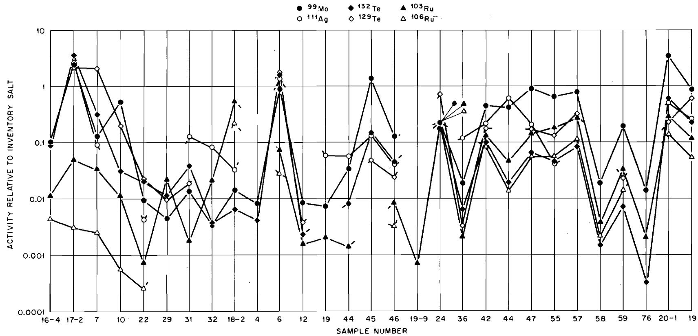  
Fig. 6.5. Noble-metal activities of salt samples.

Table 6.7. Data for salt samples from pump bowl during uranium-235 operation   
Each entry in the table consists of two numbers. The first number is the radioactivity of the isotope in the sample expressed in disintegrations per minute per gram of salt. The second number is the ratio of the isotope to the amount calculated for $1\mathrm{g}$ of inventory salt at time of sampling.   

<table><tr><td rowspan="2">Sample No.</td><td rowspan="2">Date</td><td rowspan="2">ΣMWhr</td><td colspan="5">Isotopes with noble-gas precursors</td><td colspan="5">Salt-seeking isotopes</td><td colspan="6">Noble metals</td><td colspan="5">Tellurium and iodine</td></tr><tr><td>Sr-89</td><td>Sr-91</td><td>Sr-92</td><td>Ba-140</td><td>Cs-137</td><td>Zr-95</td><td>Ce-141</td><td>Ce-143</td><td>Ce-144</td><td>Nd-147</td><td>Nb-95</td><td>Mo-99</td><td>Ru-103</td><td>Ru-105</td><td>Ru-106</td><td>Ag-111</td><td>Te-132</td><td>Te-129m</td><td>I-131</td><td>I-133</td><td>I-135</td></tr><tr><td colspan="24">Ladle salt samples</td></tr><tr><td>6-17</td><td>5-23-66</td><td>2,872</td><td>1.8E10</td><td>1.1E11</td><td>9.8E10</td><td></td><td></td><td></td><td>2.6E10</td><td></td><td></td><td></td><td></td><td>4.7E10</td><td>1.8E8</td><td>4.9E10</td><td></td><td></td><td>3.1E10</td><td></td><td>2.4E10</td><td>1.1E11</td><td>9.5E10</td></tr><tr><td></td><td></td><td></td><td>0.92</td><td>0.81</td><td>0.76</td><td></td><td></td><td></td><td>0.84</td><td></td><td></td><td></td><td></td><td>0.51</td><td>0.012</td><td>2.3</td><td></td><td></td><td>0.24</td><td></td><td>0.65</td><td>0.82</td><td>0.50</td></tr><tr><td>6-19</td><td>5-25-66</td><td></td><td>2.2E10</td><td>1.2E11</td><td>1.2E11</td><td></td><td></td><td></td><td></td><td>1.4E11</td><td></td><td></td><td></td><td>3.5E11</td><td>7.1E9</td><td>2.5E11</td><td></td><td></td><td>4.2E10</td><td></td><td>4.2E10</td><td>1.3E11</td><td>1.5E11</td></tr><tr><td></td><td></td><td></td><td>0.90</td><td>0.63</td><td>0.69</td><td></td><td></td><td></td><td></td><td>0.85</td><td></td><td></td><td></td><td>2.5</td><td>0.38</td><td>8.4</td><td></td><td></td><td>0.21</td><td></td><td>0.83</td><td>0.62</td><td>0.75</td></tr><tr><td>7-7</td><td>6-27-66</td><td></td><td>3.0E10</td><td>1.2E11</td><td>9.7E10</td><td></td><td></td><td></td><td>6.1E10</td><td>1.5E11</td><td></td><td></td><td></td><td>9.5E10</td><td>2.4E7</td><td>3.5E10</td><td></td><td></td><td>5.2E10</td><td></td><td>5.0E10</td><td>1.4E11</td><td>1.2E11</td></tr><tr><td></td><td></td><td></td><td>0.67</td><td>0.63</td><td>0.58</td><td></td><td></td><td></td><td>0.92</td><td>0.79</td><td></td><td></td><td></td><td>0.52</td><td>0.082</td><td>1.2</td><td></td><td></td><td>0.19</td><td></td><td>0.73</td><td>0.62</td><td>0.60</td></tr><tr><td>7-10</td><td>7-6-66</td><td></td><td>2.9E10</td><td>1.3E11</td><td>1.5E11</td><td></td><td></td><td></td><td>6.7E10</td><td>1.4E11</td><td></td><td></td><td></td><td>1.1E11</td><td>6.0E9</td><td>9.7E10</td><td></td><td></td><td>3.6E10</td><td></td><td>4.5E10</td><td>1.4E11</td><td></td></tr><tr><td></td><td></td><td></td><td>0.67</td><td>0.71</td><td>0.90</td><td></td><td></td><td></td><td>0.95</td><td>0.82</td><td></td><td></td><td></td><td>0.72</td><td>0.19</td><td>3.4</td><td></td><td></td><td>0.17</td><td></td><td>0.71</td><td>0.82</td><td></td></tr><tr><td>7-12</td><td>7-13-66</td><td></td><td>4.0E10</td><td>1.3E11</td><td>7.5E11</td><td></td><td>3.1E8</td><td>6.6E10</td><td>6.9E10</td><td></td><td>1.9E10</td><td></td><td>2.4E11?</td><td>3.2E10</td><td>7.1E9</td><td>3.8E10</td><td>2.1E8</td><td></td><td>3.8E10</td><td>4.9E8</td><td>5.4E10</td><td>1.4E11</td><td>1.1E11</td></tr><tr><td></td><td></td><td></td><td>0.73</td><td>0.72</td><td>0.89</td><td></td><td>0.68</td><td>1.12</td><td>0.78</td><td></td><td>1.2</td><td></td><td>14.?</td><td>0.17</td><td>0.18</td><td>1.3</td><td>0.26</td><td></td><td>0.14</td><td>0.13</td><td>0.68</td><td>0.66</td><td>0.58</td></tr><tr><td>8-5</td><td>10-8-66</td><td>7,800a</td><td>3.7E10</td><td></td><td></td><td></td><td>4.0E8</td><td>6.0E10</td><td>7.2E10</td><td></td><td>1.8E10</td><td></td><td>4.8E10</td><td></td><td>1.4E9</td><td></td><td>5.0E7</td><td></td><td></td><td>1.4E8</td><td>7.9E10</td><td></td><td></td></tr><tr><td></td><td></td><td></td><td>0.64</td><td></td><td></td><td>0.80</td><td>0.95</td><td>0.77</td><td>0.77</td><td></td><td>1.07</td><td></td><td>2.4</td><td></td><td>0.034</td><td></td><td>0.056</td><td></td><td></td><td>0.034</td><td>0.99</td><td></td><td></td></tr><tr><td>10-12</td><td>12-28-66</td><td>13,800</td><td>3.8E10</td><td>1.3E11</td><td></td><td>1.4E11</td><td></td><td>5.4E10</td><td>4.6E10</td><td></td><td>2.4E10</td><td></td><td>6.7E9</td><td>3.6E10</td><td>8.0E8</td><td></td><td>~4.0E7</td><td></td><td>1.6E10</td><td>1.5E8</td><td>5.5E10</td><td></td><td></td></tr><tr><td></td><td></td><td></td><td>0.80</td><td>0.71</td><td></td><td>1.3</td><td></td><td>0.95</td><td>0.66</td><td></td><td>1.04</td><td></td><td>0.40</td><td>0.020</td><td>0.024</td><td></td><td>~0.031</td><td></td><td>0.059</td><td>0.048</td><td>0.82</td><td></td><td></td></tr><tr><td>10-20</td><td>1-9-67</td><td>15,800</td><td>4.7E10</td><td>1.3E11</td><td></td><td>9.0E10</td><td></td><td>5.2E10</td><td>4.1E10</td><td></td><td>9.7E10</td><td></td><td>2.4E10</td><td>4.8E10</td><td>6.1E8</td><td></td><td>2.8E7</td><td></td><td>2.0E10</td><td>~3.1E8</td><td>7.2E10</td><td></td><td></td></tr><tr><td></td><td></td><td></td><td>0.74</td><td>0.72</td><td></td><td>0.59</td><td></td><td>0.71</td><td>0.41</td><td></td><td>3.5?</td><td></td><td>0.86</td><td>0.25</td><td>0.014</td><td></td><td>0.018</td><td></td><td>0.073</td><td>0.072</td><td>0.87</td><td></td><td></td></tr><tr><td>11-8</td><td>2-13-67</td><td>19,000</td><td>4.8E10</td><td>1.3E11</td><td></td><td>1.0E11</td><td></td><td>9.3E10</td><td>9.2E10</td><td></td><td></td><td></td><td>1.1E9</td><td>3.2E11</td><td>5.2E9</td><td></td><td>1.6E8</td><td></td><td>5.5E10</td><td></td><td>5.0E10</td><td></td><td></td></tr><tr><td></td><td></td><td></td><td>0.66</td><td>0.71</td><td></td><td>0.69</td><td></td><td>1.09</td><td>0.85</td><td></td><td></td><td></td><td>0.030</td><td>1.7</td><td>0.11</td><td></td><td>0.09</td><td></td><td>0.20</td><td></td><td>0.63</td><td></td><td></td></tr><tr><td>11-12</td><td>2-21-67</td><td>20,400</td><td>6.5E10</td><td>1.5E11</td><td></td><td>1.3E11</td><td></td><td>9.3E10</td><td>1.1E11</td><td></td><td></td><td></td><td>1.2E10</td><td>2.5E11?</td><td>5.3E9</td><td></td><td>~1.9E8</td><td></td><td>3.8E10</td><td></td><td>7.6E10</td><td></td><td></td></tr><tr><td></td><td></td><td></td><td>0.80</td><td>0.88</td><td></td><td>0.79</td><td></td><td>0.98</td><td>0.90</td><td></td><td></td><td></td><td>0.27</td><td>1.3</td><td>0.09</td><td></td><td>~0.09</td><td></td><td>0.13</td><td></td><td>0.85</td><td></td><td></td></tr><tr><td>11-22</td><td>3-9-67</td><td></td><td>7.9E10</td><td></td><td></td><td>2.7E11?</td><td></td><td>1.1E11</td><td></td><td></td><td></td><td></td><td>9.1E10</td><td>3.E9</td><td></td><td>1.5E8</td><td></td><td></td><td>2.8E10</td><td></td><td>8.3E10</td><td></td><td></td></tr><tr><td></td><td></td><td></td><td>0.91</td><td></td><td></td><td>1.8</td><td></td><td>1.09</td><td></td><td></td><td></td><td></td><td>0.93</td><td></td><td>0.07</td><td></td><td></td><td></td><td>0.18</td><td></td><td>1.2</td><td></td><td></td></tr><tr><td>11-45b</td><td>4-17-67</td><td>29,000</td><td>8.6E10</td><td></td><td></td><td>1.7E11</td><td></td><td>3.0E10?</td><td></td><td></td><td></td><td></td><td>9.6E10</td><td>1.5E11</td><td>1.4E10</td><td></td><td>4.E8</td><td>5.1E7</td><td>3.5E10</td><td></td><td>9.2E10</td><td></td><td></td></tr><tr><td></td><td></td><td></td><td>0.77</td><td></td><td></td><td>0.89</td><td></td><td>0.23</td><td></td><td></td><td></td><td></td><td>0.29</td><td>0.83</td><td>0.19</td><td></td><td>0.14</td><td>0.09</td><td>0.13</td><td></td><td>0.98</td><td></td><td></td></tr><tr><td>11-51</td><td>4-28-67</td><td>30,800</td><td>8.0E10</td><td>1.3E11</td><td></td><td>1.8E11</td><td></td><td>1.2E11</td><td>1.5E11</td><td>1.1E11</td><td>6.4E10</td><td></td><td>4.0E9</td><td>7.2E10</td><td>3.8E9</td><td></td><td>~1.8E</td><td>6.5E7</td><td>1.7E10</td><td>5.2E8</td><td>8.2E10</td><td></td><td></td></tr><tr><td></td><td></td><td></td><td>0.69</td><td>1.1</td><td></td><td>0.96</td><td></td><td>0.86</td><td>0.87</td><td>0.64</td><td>1.2</td><td></td><td>0.04</td><td>0.40</td><td>0.05</td><td></td><td>0.03</td><td>0.11</td><td>0.06</td><td>0.07</td><td>0.88</td><td></td><td></td></tr><tr><td>11-52</td><td>5-1-67</td><td>31,250</td><td>8.1E10</td><td></td><td></td><td>2.2E11</td><td></td><td>1.3E11</td><td>1.6E11</td><td>7.7E10</td><td>6.1E10</td><td></td><td>1.9E9</td><td>8.2E10</td><td>8.9E10?</td><td></td><td>2.4E8</td><td>4.9E7</td><td>1.6E10</td><td>5.0E8</td><td>8.2E10</td><td></td><td></td></tr><tr><td></td><td></td><td></td><td>0.69</td><td></td><td></td><td>1.1</td><td></td><td>0.96</td><td>0.96</td><td>0.42</td><td>1.09</td><td></td><td>0.02</td><td>0.44</td><td>1.1</td><td></td><td>0.08</td><td>0.09</td><td>0.06</td><td>0.07</td><td>0.87</td><td></td><td></td></tr><tr><td>11-54</td><td>5-5-67</td><td>32,000</td><td></td><td></td><td></td><td></td><td></td><td>1.3E11</td><td></td><td></td><td></td><td></td><td>3.1E10</td><td>3.5E10</td><td>1.8E9</td><td></td><td>7.5E7</td><td></td><td>1.1E10</td><td></td><td>7.0E10</td><td></td><td></td></tr><tr><td></td><td></td><td></td><td></td><td></td><td></td><td></td><td></td><td>0.94</td><td></td><td></td><td></td><td></td><td>0.17</td><td>0.19</td><td>0.02</td><td></td><td>0.02</td><td></td><td></td><td>0.04</td><td></td><td>0.74</td><td></td></tr><tr><td>11-58c</td><td>5-8-67</td><td>32,650</td><td>1.0E11</td><td></td><td></td><td>1.7E11</td><td></td><td>1.5E11</td><td>1.7E11</td><td>1.8E11</td><td>6.2E10</td><td></td><td>2.2E10</td><td>3.2E10</td><td>9.5E9</td><td></td><td>3.6E8</td><td>1.6E7</td><td>2.4E9</td><td>5.5E8</td><td>1.2E10</td><td></td><td></td></tr><tr><td></td><td></td><td></td><td>0.88</td><td></td><td></td><td>1.01</td><td></td><td>1.10</td><td>1.03</td><td>2.6</td><td>1.10</td><td></td><td>0.22</td><td>0.03</td><td>0.12</td><td></td><td>0.11</td><td>0.03</td><td>0.05</td><td>0.07</td><td>0.14</td><td></td><td></td></tr><tr><td>12-6d</td><td>6-20-67</td><td>32,650</td><td>8.9E10</td><td></td><td></td><td></td><td></td><td>1.5E11</td><td>1.4E11</td><td></td><td>6.0E10</td><td></td><td>8.0E10</td><td></td><td>6.9E9</td><td></td><td>3.9E8</td><td></td><td></td><td>2.1E9</td><td></td><td></td><td></td></tr><tr><td></td><td></td><td></td><td>0.76</td><td></td><td></td><td></td><td></td><td>1.04</td><td>0.83</td><td></td><td>1.06</td><td></td><td>0.80</td><td></td><td>0.09</td><td></td><td>0.12</td><td></td><td></td><td>0.28</td><td></td><td></td><td></td></tr><tr><td>12-27e</td><td>7-17-67</td><td>36,650</td><td>6.1E10</td><td></td><td></td><td></td><td></td><td>1.0E11</td><td></td><td></td><td></td><td></td><td>1.9E10</td><td>1.2E11</td><td>5.6E9</td><td></td><td>2.4E8</td><td></td><td>1.3E10</td><td>3.1E8</td><td>7.1E10</td><td></td><td></td></tr><tr><td></td><td></td><td></td><td>0.75</td><td></td><td></td><td></td><td></td><td>0.97</td><td></td><td></td><td></td><td></td><td>0.34</td><td>0.68</td><td>0.11</td><td></td><td>0.08</td><td></td><td>0.05</td><td>0.07</td><td>0.89</td><td></td><td></td></tr><tr><td>14-22</td><td>11-7-67</td><td></td><td>9.2E11</td><td></td><td></td><td></td><td></td><td>1.3E11</td><td></td><td>1.7E11</td><td></td><td></td><td>&lt;1E8</td><td>8.2E10</td><td>3.7E9</td><td></td><td>~2.7E8</td><td></td><td>8.9E9</td><td>1.9E8</td><td>6.6E11</td><td></td><td></td></tr><tr><td></td><td></td><td></td><td>9.6</td><td></td><td></td><td></td><td></td><td>1.02</td><td></td><td>0.84</td><td></td><td></td><td>&lt;0.001</td><td>0.42</td><td>0.06</td><td></td><td>0.07</td><td></td><td>0.030</td><td>0.045</td><td>7.4</td><td></td><td></td></tr><tr><td colspan="23">Freeze valve salt samples</td><td></td></tr><tr><td>14-20FV 11-4-67</td><td></td><td></td><td>8.2E10</td><td></td><td></td><td>1.6E11</td><td></td><td>1.2E11</td><td></td><td>1.4E11</td><td>6.8E10</td><td>4.2E7</td><td></td><td>2.2E9</td><td>1.4E8</td><td></td><td>2.4E7</td><td></td><td>8.2E8</td><td>&lt;1.1E8</td><td>5.5E10</td><td></td><td></td></tr><tr><td></td><td></td><td></td><td>0.89</td><td></td><td></td><td>0.99</td><td></td><td>1.04</td><td></td><td>0.76</td><td>1.04</td><td></td><td>0.006</td><td>0.013</td><td>0.002</td><td></td><td>0.006</td><td></td><td>0.003</td><td>&lt;0.02</td><td>0.67</td><td></td><td></td></tr><tr><td>14-30FV 12-5-67</td><td></td><td></td><td>8.5E10</td><td></td><td></td><td>1.2E11</td><td></td><td>1.3E11</td><td></td><td>1.5E11</td><td>4.3E10</td><td>7.0E5</td><td></td><td>8.5E8</td><td>4.9E7</td><td></td><td>&lt;6.4E6</td><td></td><td>1.3E9</td><td>&lt;2.9E7</td><td>3.4E10</td><td></td><td></td></tr><tr><td></td><td></td><td></td><td>0.87</td><td></td><td></td><td>0.77</td><td></td><td>1.06</td><td></td><td>0.77</td><td>0.55</td><td></td><td>0.00001</td><td>0.005</td><td>0.001</td><td></td><td>&lt;0.002</td><td></td><td>0.005</td><td>&lt;0.005</td><td>0.45</td><td></td><td></td></tr><tr><td>14-63FV 2-27-68</td><td></td><td></td><td>9.2E10</td><td>1.4E11</td><td></td><td>9.3E10</td><td></td><td>1.5E11</td><td></td><td>1.9E11</td><td></td><td></td><td>3.4E6</td><td>3.2E8</td><td>2.5E7</td><td></td><td>&lt;3.2E6</td><td></td><td>2.8E8</td><td></td><td>4.5E10</td><td></td><td></td></tr><tr><td></td><td></td><td></td><td>0.87</td><td>1.14</td><td></td><td>0.59</td><td></td><td>1.12</td><td></td><td>1.2</td><td></td><td></td><td>0.0003</td><td>0.002</td><td></td><td>&lt;0.0004</td><td></td><td>&lt;0.0007</td><td></td><td>0.001</td><td></td><td>0.55</td><td></td></tr><tr><td>14-66FV f</td><td></td><td></td><td>9.1E10 ~9.1E10 45?</td><td></td><td></td><td>1.7E11 1.26</td><td></td><td>1.2E11 0.94</td><td></td><td>9.2E10 2.4</td><td></td><td></td><td>~2.5E9 0.004</td><td></td><td>3.2E8 &lt;2.2E7 0.004</td><td></td><td>&lt;1.6E7 &lt;0.003</td><td></td><td>~6.2E8 0.005</td><td></td><td></td><td></td><td></td></tr></table>

${}^{a}$ Before power; corresponds to end of run 7.   
${}^{b}$ After addition of ${8.6}\mathrm{\;g}$ of beryllium; no purge.   
Pump off 2 hr.   
$d$ Before power; corresponds to end of run 11.   
After addition of $38\mathrm{g}$ of beryllium.   
End of run 14.

Table 6.8. Data for salt samples from MSRE pump bowl during uranium-233 operation   

<table><tr><td colspan="3">Sample number</td><td>15-28S</td><td>15-32S</td><td>15-42S</td><td>15-51S</td><td>15-57S</td><td>15-69S</td><td>16-4-FVS</td></tr><tr><td colspan="3">Sample weight, g</td><td>1.3328</td><td>60.9115</td><td>51.5684</td><td>56.9563</td><td>32.0493</td><td>51.9611</td><td>56.0914</td></tr><tr><td colspan="3">Date</td><td>10-12-68</td><td>10-15-68</td><td>10-29-68</td><td>11-6-68</td><td>11-11-68</td><td>11-25-68</td><td>12-16-68</td></tr><tr><td colspan="3">Megawatt-hours</td><td>0.1</td><td>0.1</td><td>0.1</td><td>0.1</td><td>0.1</td><td>0.1</td><td>12.5</td></tr><tr><td colspan="3">Power, MW</td><td>0.00</td><td>0.00</td><td>0.00</td><td>0.00</td><td>0.00</td><td>0.00</td><td>0.00</td></tr><tr><td colspan="3">Rpm</td><td>1180</td><td>1180</td><td>1180</td><td>1180</td><td>1180</td><td>1180</td><td>1180</td></tr><tr><td colspan="3">Pump bowl level, %</td><td>63.20</td><td>65.50</td><td>66.50</td><td>66.00</td><td>62.50</td><td>56.00</td><td>62.30</td></tr><tr><td colspan="3">Overflow rate, lb/hr</td><td>1.4</td><td>2.9</td><td>3.7</td><td>1.0</td><td>0.8</td><td>0.8</td><td>0.8</td></tr><tr><td colspan="3">Voids, %</td><td>0.00</td><td>0.60</td><td>0.00</td><td>0.00</td><td>0.60</td><td>0.60</td><td>0.60</td></tr><tr><td colspan="3">Flow rate of gas, std liters/min</td><td>3.30 He</td><td>3.30 He</td><td>3.30 He</td><td>3.30 He</td><td>3.30 He</td><td>3.30 He</td><td>3.30 He</td></tr><tr><td colspan="3">Sample line purge</td><td>On</td><td>On</td><td>On</td><td>On</td><td>On</td><td>On</td><td>On</td></tr><tr><td colspan="10">Fission Product isotopesa</td></tr><tr><td>Isotope</td><td>Half-life (days)</td><td>Fission yield (%)</td><td></td><td></td><td></td><td></td><td></td><td></td><td></td></tr><tr><td rowspan="2">Sr-89</td><td rowspan="2">52.00</td><td rowspan="2">5.46</td><td>1.32E9</td><td>5.98E9</td><td>4.47E9</td><td>3.76E9</td><td>3.84E9</td><td></td><td>2.98E9</td></tr><tr><td>0.198</td><td>0.936</td><td>0.839</td><td>0.787</td><td>0.871</td><td></td><td>1.014</td></tr><tr><td rowspan="2">Sr-90</td><td rowspan="2">10,264.00</td><td rowspan="2">5.86</td><td></td><td>2.48E9</td><td></td><td>2.86E9</td><td></td><td></td><td>3.63E9</td></tr><tr><td></td><td>0.609</td><td></td><td>0.703</td><td></td><td></td><td>0.894</td></tr><tr><td rowspan="2">Y-91</td><td rowspan="2">58.80</td><td rowspan="2">5.57</td><td></td><td></td><td></td><td></td><td></td><td></td><td>6.44E9</td></tr><tr><td></td><td></td><td></td><td></td><td></td><td></td><td>1.236</td></tr><tr><td rowspan="2">Ba-140</td><td rowspan="2">12.80</td><td rowspan="2">5.40</td><td></td><td></td><td></td><td></td><td></td><td></td><td>2.51E8</td></tr><tr><td></td><td></td><td></td><td></td><td></td><td></td><td>1.167</td></tr><tr><td rowspan="2">Cs-137</td><td rowspan="2">10,958.00</td><td rowspan="2">6.58</td><td>5.53E9</td><td>3.42E9</td><td>3.35E9</td><td>3.30E9</td><td>3.77E9</td><td>3.42E9</td><td>2.81E9</td></tr><tr><td>1.355</td><td>0.840</td><td>0.823</td><td>0.811</td><td>0.926</td><td>0.842</td><td>0.692</td></tr><tr><td rowspan="2">Ce-144</td><td rowspan="2">284.00</td><td rowspan="2">4.61</td><td>1.43E10</td><td>5.18E10</td><td>5.41E10</td><td>5.17E10</td><td>5.61E10</td><td>4.61E10</td><td>4.55E10</td></tr><tr><td>0.295</td><td>1.077</td><td>1.163</td><td>1.134</td><td>1.249</td><td>1.060</td><td>1.099</td></tr><tr><td rowspan="2">Zr-95</td><td rowspan="2">65.00</td><td rowspan="2">6.05</td><td>4.04E9</td><td>1.28E10</td><td>1.07E10</td><td>1.26E10</td><td>1.02E10</td><td>8.46E9</td><td>1.02E10</td></tr><tr><td>0.279</td><td>0.914</td><td>0.884</td><td>1.135</td><td>0.981</td><td>0.935</td><td>1.382</td></tr><tr><td rowspan="2">Nb-95</td><td rowspan="2">35.00</td><td rowspan="2">6.05</td><td>6.39E9</td><td>1.04E10</td><td>7.12E9</td><td>8.71E9</td><td>1.08E10</td><td>2.02E8</td><td>5.08E9</td></tr><tr><td>0.740</td><td>1.159</td><td>0.718</td><td>0.854</td><td>1.059</td><td>0.020</td><td>0.537</td></tr><tr><td rowspan="2">Mo-99</td><td rowspan="2">2.79</td><td rowspan="2">4.80</td><td></td><td></td><td></td><td></td><td></td><td></td><td>3.17E6</td></tr><tr><td></td><td></td><td></td><td></td><td></td><td></td><td>0.096</td></tr><tr><td rowspan="2">Ru-103*</td><td rowspan="2">39.60</td><td rowspan="2">1.99</td><td>5.13E7</td><td>1.15E5</td><td>1.45E6</td><td>4.77E5</td><td>5.12E6</td><td></td><td>8.75E6</td></tr><tr><td>0.025</td><td>0.000</td><td>0.001</td><td>0.000</td><td>0.004</td><td></td><td>0.012</td></tr><tr><td rowspan="2">Ru-106</td><td rowspan="2">367.00</td><td rowspan="2">0.43</td><td>1.97E8</td><td>8.6E5</td><td>4.65E6</td><td>1.42E6</td><td>1.78E7</td><td></td><td>2.25E7</td></tr><tr><td>0.034</td><td>0.000</td><td>0.001</td><td>0.000</td><td>0.003</td><td></td><td>0.004</td></tr><tr><td rowspan="2">Sb-125</td><td rowspan="2">986.00</td><td rowspan="2">0.08</td><td>1.62E7</td><td>7.48E3</td><td>4.38E5</td><td>1.18E4</td><td>2.16E5</td><td>4.64E3</td><td>7.42E5</td></tr><tr><td>0.143</td><td>0.000</td><td>0.004</td><td>0.000</td><td>0.002</td><td>0.000</td><td>0.007</td></tr><tr><td rowspan="2">Te-132</td><td rowspan="2">3.25</td><td rowspan="2">4.40</td><td></td><td></td><td></td><td></td><td></td><td></td><td>3.90E6</td></tr><tr><td></td><td></td><td></td><td></td><td></td><td></td><td>0.092</td></tr><tr><td rowspan="2">I131</td><td rowspan="2">8.05</td><td rowspan="2">2.90</td><td></td><td></td><td></td><td></td><td></td><td></td><td>1.14E8</td></tr><tr><td></td><td></td><td></td><td></td><td></td><td></td><td>1.129</td></tr><tr><td colspan="10">Salt constituentsb</td></tr><tr><td colspan="10">Constituent</td></tr><tr><td rowspan="2" colspan="9">U-233</td><td>6.53</td></tr><tr><td>0.977</td></tr><tr><td rowspan="2" colspan="9">U, Total</td><td>7.82</td></tr><tr><td>0.969</td></tr><tr><td rowspan="2" colspan="9">Li</td><td>108.8</td></tr><tr><td>0.942</td></tr><tr><td rowspan="2" colspan="9">Be</td><td>68.3</td></tr><tr><td>65.1</td></tr><tr><td rowspan="3" colspan="9">Zr</td><td>0.975</td></tr><tr><td>87.5</td></tr><tr><td>0.756</td></tr></table>

Table 6.8 (continued)   

<table><tr><td colspan="3">Sample number</td><td>18-2-NFVS</td><td>18-4-NFVS</td><td>18-6-NFVS</td><td>18-12-NFV</td><td>18-19-NFV</td><td>18-44-NFV</td><td>18-45-NFV</td><td>18-46-NFV</td></tr><tr><td colspan="3">Sample weight, g</td><td>3.8651</td><td>11.1866</td><td>6.7612</td><td>12.6825</td><td>12.6691</td><td>3.6339</td><td>14.0790</td><td>14.9780</td></tr><tr><td colspan="3">Date</td><td>4-14-69</td><td>4-18-69</td><td>4-23-69</td><td>5-2-69</td><td>5-9-69</td><td>5-29-69</td><td>6-1-69</td><td>6-1-69</td></tr><tr><td colspan="3">Megawatt-hours</td><td>12,222.0</td><td>12,810.0</td><td>13,705.0</td><td>15,512.0</td><td>16,848.0</td><td>19,784.0</td><td>20,309.0</td><td>20,309.0</td></tr><tr><td colspan="3">Power, MW</td><td>8.00</td><td>8.00</td><td>8.00</td><td>8.00</td><td>8.00</td><td>6.90</td><td>0.00</td><td>0.00</td></tr><tr><td colspan="3">Rpm</td><td>1180</td><td>1180</td><td>1180</td><td>1180</td><td>1180</td><td>990</td><td>990</td><td>990</td></tr><tr><td colspan="3">Pump bowl level, %</td><td>61.30</td><td>63.10</td><td>63.20</td><td>59.50</td><td>58.90</td><td>52.90</td><td>50.00</td><td>56.30</td></tr><tr><td colspan="3">Overflow rate, lb/hr</td><td>7.4</td><td>4.9</td><td>4.7</td><td>3.0</td><td>0.9</td><td>0.0</td><td>0.0</td><td>0.0</td></tr><tr><td colspan="3">Voids, %</td><td>0.60</td><td>0.60</td><td>0.60</td><td>0.60</td><td>0.60</td><td>0.00</td><td>0.00</td><td>0.00</td></tr><tr><td colspan="3">Flow rate of gas, std liters/min</td><td>3.30 He</td><td>3.30 He</td><td>3.30 He</td><td>3.30 He</td><td>3.30 He</td><td>2.30 He</td><td>2.00 Ar</td><td>2.00 Ar</td></tr><tr><td colspan="3">Sample line purge</td><td>On</td><td>On</td><td>On</td><td>On</td><td>On</td><td>On</td><td>On</td><td>On</td></tr><tr><td colspan="11">Fission product isotopesa</td></tr><tr><td>Isotope</td><td>Half-life (days)</td><td>Fission yield (%)</td><td></td><td></td><td></td><td></td><td></td><td></td><td></td><td></td></tr><tr><td>Sr-89</td><td>52.00</td><td>5.46</td><td>7.36E10</td><td>7.60E10</td><td>6.24E10</td><td>1.12E11</td><td>7.51E10</td><td>1.00E11</td><td>1.01E11</td><td>9.57E10</td></tr><tr><td></td><td></td><td></td><td>0.771</td><td>0.780</td><td>0.600</td><td>0.966</td><td>0.621</td><td>0.758</td><td>0.754</td><td>0.720</td></tr><tr><td>Y-91</td><td>58.00</td><td>5.57</td><td>1.44E11</td><td>9.02E10</td><td></td><td>1.38E11</td><td>1.49E11</td><td>1.32E11</td><td>1.35E11</td><td>1.23E11</td></tr><tr><td></td><td></td><td></td><td>1.702</td><td>1.043</td><td></td><td>1.340</td><td>1.380</td><td>1.109</td><td>1.116</td><td>1.017</td></tr><tr><td>Ba-140</td><td>12.80</td><td>5.40</td><td>1.21E11</td><td>1.43E11</td><td>1.17E11</td><td></td><td>1.84E11</td><td>1.56E11</td><td>1.65E11</td><td>1.60E11</td></tr><tr><td></td><td></td><td></td><td>0.917</td><td>1.100</td><td>0.813</td><td></td><td>1.143</td><td>1.006</td><td>1.058</td><td>1.039</td></tr><tr><td>Cs-137</td><td>10,958.00</td><td>6.58</td><td>4.06E9</td><td>4.30E9</td><td>4.03E9</td><td>3.66E9</td><td>4.74E9</td><td>4.25E9</td><td>4.98E9</td><td>4.58E9</td></tr><tr><td></td><td></td><td></td><td>0.835</td><td>0.878</td><td>0.811</td><td>0.718</td><td>0.915</td><td>0.786</td><td>0.914</td><td>0.840</td></tr><tr><td>Ce-141</td><td>33.00</td><td>7.09</td><td>1.29E11</td><td>1.12E11</td><td>1.09E11</td><td>1.38E11</td><td>1.41E11</td><td>1.45E11</td><td>1.52E11</td><td>1.39E11</td></tr><tr><td></td><td></td><td></td><td>0.908</td><td>0.783</td><td>0.712</td><td>0.807</td><td>0.806</td><td>0.784</td><td>0.813</td><td>0.747</td></tr><tr><td>Ce-144</td><td>284.00</td><td>4.61</td><td>6.28E10</td><td>6.30E10</td><td>5.50E10</td><td>6.82E10</td><td>6.25E10</td><td>5.67E10</td><td>6.21E10</td><td>7.54E10</td></tr><tr><td></td><td></td><td></td><td>1.222</td><td>1.214</td><td>1.034</td><td>1.227</td><td>1.096</td><td>0.937</td><td>1.016</td><td>1.234</td></tr><tr><td>Nd-147</td><td>11.10</td><td>1.98</td><td>7.29E10</td><td>5.52E10</td><td></td><td></td><td>3.90E10</td><td>2.36E9</td><td>6.82E10</td><td>5.80E10</td></tr><tr><td></td><td></td><td></td><td>1.488</td><td>1.150</td><td></td><td></td><td>0.653</td><td>0.041</td><td>1.196</td><td>1.030</td></tr><tr><td>Zr-95</td><td>65.00</td><td>6.05</td><td>8.50E10</td><td>8.96E10</td><td>7.60E10</td><td>1.01E11</td><td>1.13E11</td><td>1.18E11</td><td>1.20E11</td><td>1.13E11</td></tr><tr><td></td><td></td><td></td><td>0.966</td><td>0.994</td><td>0.792</td><td>0.944</td><td>1.009</td><td>0.952</td><td>0.952</td><td>0.904</td></tr><tr><td>Nb-95</td><td>35.00</td><td>6.05</td><td>2.40E10</td><td>1.23E10</td><td>9.09E10</td><td>3.17E9</td><td>1.17E9</td><td>-3.10E9</td><td>3.33E10</td><td>-2.00E9</td></tr><tr><td></td><td></td><td></td><td>0.462</td><td>0.224</td><td>1.562</td><td>0.048</td><td>0.016</td><td>-0.036</td><td>0.374</td><td>-0.022</td></tr><tr><td>Mo-99</td><td>2.79</td><td>4.80</td><td>1.75E9</td><td>9.99E8</td><td>1.31E11</td><td>1.38E9</td><td>1.16E9</td><td>4.22E9</td><td>1.80E11</td><td>1.45E10</td></tr><tr><td></td><td></td><td></td><td>0.015</td><td>0.008</td><td>0.851</td><td>0.008</td><td>0.008</td><td>0.035</td><td>1.364</td><td>0.116</td></tr><tr><td>Ru-103</td><td>39.60</td><td>1.99</td><td>1.93E10</td><td></td><td>2.97E9</td><td>7.13E7</td><td>9.30E7</td><td>7.58E7</td><td></td><td>4.29E8</td></tr><tr><td></td><td></td><td></td><td>0.521</td><td></td><td>0.074</td><td>0.002</td><td>0.002</td><td>0.002</td><td></td><td>0.009</td></tr><tr><td>Ru-106</td><td>367.00</td><td>0.43</td><td>1.28E9</td><td></td><td>1.68E8</td><td></td><td></td><td></td><td></td><td>2.03E7</td></tr><tr><td></td><td></td><td></td><td>0.230</td><td></td><td>0.030</td><td></td><td></td><td></td><td></td><td>0.003</td></tr><tr><td>Ag-111</td><td>7.50</td><td>0.02</td><td>2.02E7</td><td></td><td>8.35E8</td><td></td><td>4.90E7</td><td>4.03E7</td><td>8.76E7</td><td>2.66E7</td></tr><tr><td></td><td></td><td></td><td>0.034</td><td></td><td>1.232</td><td></td><td>0.066</td><td>0.060</td><td>0.128</td><td>0.040</td></tr><tr><td>Sb-125</td><td>986.00</td><td>0.08</td><td></td><td></td><td></td><td>1.68E7</td><td></td><td></td><td></td><td></td></tr><tr><td></td><td></td><td></td><td></td><td></td><td></td><td>0.068</td><td></td><td></td><td></td><td></td></tr><tr><td>Te-129m</td><td>34.00</td><td>0.33</td><td></td><td></td><td>1.29E10</td><td>3.02E7</td><td></td><td></td><td>4.40E8</td><td>2.17E8</td></tr><tr><td></td><td></td><td></td><td></td><td></td><td>1.828</td><td>0.004</td><td></td><td></td><td>0.051</td><td>0.025</td></tr><tr><td>Te-132</td><td>3.25</td><td>4.40</td><td>7.24E8</td><td>4.30E8</td><td>2.49E11</td><td>3.56E8</td><td></td><td>9.27E8</td><td>1.74E10</td><td>4.99E9</td></tr><tr><td></td><td></td><td></td><td>0.007</td><td>0.004</td><td>1.804</td><td>0.002</td><td></td><td>0.008</td><td>0.144</td><td>0.043</td></tr><tr><td>I-131</td><td>8.05</td><td>2.90</td><td>7.33E9</td><td>2.49E10</td><td>2.11E10</td><td>5.56E10</td><td>6.59E10</td><td>2.78E10</td><td>3.62E10</td><td>6.68E9</td></tr><tr><td></td><td></td><td></td><td>0.101</td><td>0.352</td><td>2.260</td><td>0.595</td><td>0.739</td><td>0.339</td><td>0.438</td><td>0.082</td></tr><tr><td colspan="11">Salt constituentsb</td></tr><tr><td colspan="11">Constituent</td></tr><tr><td>U-233</td><td></td><td></td><td>7.28</td><td>7.11</td><td>6.233</td><td>6.72</td><td>7.19</td><td>6.88</td><td>7.10</td><td>6.58</td></tr><tr><td></td><td></td><td></td><td>1.089</td><td>1.064</td><td>0.933</td><td>1.005</td><td>1.076</td><td>1.029</td><td>1.062</td><td>0.984</td></tr><tr><td>U-total</td><td></td><td></td><td>23.54</td><td>6.18</td><td>6.936</td><td></td><td>6.87</td><td>6.96</td><td>8.88</td><td>6.75</td></tr><tr><td></td><td></td><td></td><td>2.917</td><td>0.766</td><td>0.859</td><td></td><td>0.851</td><td>0.862</td><td>1.100</td><td>0.836</td></tr><tr><td>Li</td><td></td><td></td><td>116.4</td><td>107.5</td><td>64.34</td><td>98.56</td><td>110.7</td><td>103.2</td><td>106.7</td><td>98.6</td></tr><tr><td></td><td></td><td></td><td>1.008</td><td>0.931</td><td>0.557</td><td>0.853</td><td>0.958</td><td>0.894</td><td>0.924</td><td>0.854</td></tr><tr><td>Be</td><td></td><td></td><td>65.97</td><td>65.1</td><td>60.93</td><td></td><td>70.0</td><td>62.5</td><td>64.0</td><td>70.6</td></tr><tr><td></td><td></td><td></td><td>0.988</td><td>0.975</td><td>0.912</td><td></td><td>1.048</td><td>0.936</td><td>0.958</td><td>1.057</td></tr><tr><td>Zr</td><td></td><td></td><td>138.4</td><td>135.1</td><td>91.4</td><td></td><td>103.9</td><td>128.3</td><td>110.8</td><td>111.7</td></tr><tr><td></td><td></td><td></td><td>1.196</td><td>1.168</td><td>0.790</td><td></td><td>0.898</td><td>1.109</td><td>0.958</td><td>0.965</td></tr></table>

Table 6.8 (continued)   

<table><tr><td>Sample number</td><td>19-55-FVS</td><td>19-57-FVS</td><td>19-58-FVS</td><td>19-59-FVS</td><td>19-76-FVS</td><td>20-1-FVS</td><td>20-19-FVS</td></tr><tr><td>Sample weight, g</td><td>4.2936</td><td>3.3515</td><td>12.3829</td><td>8.4980</td><td>13.4771</td><td>3.1065</td><td>5.4784</td></tr><tr><td>Date</td><td>10-14-69</td><td>10-17-69</td><td>10-17-69</td><td>10-17-69</td><td>10-30-69</td><td>11-26-69</td><td>12-5-69</td></tr><tr><td>Megawatt-hours</td><td>26,642.0</td><td>27,163.0</td><td>27,177.0</td><td>27,177.0</td><td>29,645.0</td><td>30,315.0</td><td>31,927.0</td></tr><tr><td>Power, MW</td><td>8.00</td><td>8.00</td><td>0.01</td><td>0.01</td><td>8.00</td><td>8.00</td><td>8.00</td></tr><tr><td>Rpm</td><td>1186</td><td>1186</td><td>1188</td><td>1189</td><td>1176</td><td>1190</td><td>1200</td></tr><tr><td>Pump bowl level, %</td><td>62.50</td><td>63.00</td><td>67.40</td><td>65.20</td><td>65.60</td><td>64.00</td><td>63.50</td></tr><tr><td>Overflow rate, lb/hr</td><td>2.6</td><td>3.7</td><td>9.0</td><td>3.9</td><td>8.6</td><td>6.8</td><td>5.6</td></tr><tr><td>Voids, %</td><td>0.53</td><td>0.53</td><td>0.53</td><td>0.53</td><td>0.53</td><td>0.53</td><td>0.53</td></tr><tr><td>Flow rate of gas, std liters/min</td><td>3.30 He</td><td>3.30 He</td><td>3.30 He</td><td>3.30 He</td><td>3.30 He</td><td>3.30 He</td><td>3.30 He</td></tr><tr><td>Sample line purge</td><td>Off</td><td>Off</td><td>Off</td><td>Off</td><td>Off</td><td>Off</td><td>Off</td></tr></table>

Fission product isotopes   

<table><tr><td>Isotope</td><td>Half-life (days)</td><td>Fission yield (%)</td><td></td><td></td><td></td><td></td><td></td><td></td><td></td></tr><tr><td rowspan="2">Sr-89</td><td rowspan="2">52.00</td><td rowspan="2">5.46</td><td>6.82E10</td><td>6.91E10</td><td>6.75E10</td><td>5.96E10</td><td>8.04E10</td><td>4.80E10</td><td>4.79E10</td></tr><tr><td>0.770</td><td>0.747</td><td>0.730</td><td>0.645</td><td>0.731</td><td>0.625</td><td>0.532</td></tr><tr><td rowspan="2">Y-91</td><td rowspan="2">58.80</td><td rowspan="2">5.57</td><td>8.08E10</td><td>9.54E10</td><td>9.87E10</td><td>1.89E11</td><td>7.57E10</td><td>9.42E10</td><td>8.48E10</td></tr><tr><td>0.996</td><td>1.128</td><td>1.165</td><td>2.229</td><td>0.760</td><td>1.292</td><td>1.017</td></tr><tr><td rowspan="2">Ba-140</td><td rowspan="2">12.80</td><td rowspan="2">5.40</td><td>1.54E11</td><td>1.58E11</td><td>1.49E11</td><td>1.57E11</td><td>1.71E11</td><td>4.82E10</td><td>8.80E10</td></tr><tr><td>1.116</td><td>1.097</td><td>1.035</td><td>1.098</td><td>1.043</td><td>1.071</td><td>0.912</td></tr><tr><td rowspan="2">Cs-137</td><td rowspan="2">10,958.00</td><td rowspan="2">6.58</td><td>4.01E9</td><td>4.97E9</td><td>5.06E9</td><td>4.67E9</td><td>5.94E9</td><td>4.51E9</td><td>4.86E9</td></tr><tr><td>0.689</td><td>0.848</td><td>0.863</td><td>0.797</td><td>0.983</td><td>0.749</td><td>0.793</td></tr><tr><td rowspan="2">Ce-141</td><td rowspan="2">33.00</td><td rowspan="2">7.09</td><td>1.11E11</td><td>1.12E11</td><td>1.05E11</td><td>1.02E11</td><td>1.32E11</td><td>6.12E10</td><td>8.04E10</td></tr><tr><td>0.902</td><td>0.868</td><td>0.814</td><td>0.791</td><td>0.846</td><td>0.673</td><td>0.693</td></tr><tr><td rowspan="2">Ce-144</td><td rowspan="2">284.00</td><td rowspan="2">4.61</td><td>6.70E10</td><td>6.50E10</td><td>6.55E10</td><td>5.93E10</td><td>6.82E10</td><td>6.19E10</td><td>6.03E10</td></tr><tr><td>1.216</td><td>1.165</td><td>1.174</td><td>1.063</td><td>1.156</td><td>1.128</td><td>1.058</td></tr><tr><td rowspan="2">Nd-147</td><td rowspan="2">11.10</td><td rowspan="2">1.98</td><td>7.16E10</td><td>6.78E10</td><td>7.52E10</td><td>6.36E10</td><td>7.28E10</td><td></td><td></td></tr><tr><td>1.341</td><td>1.224</td><td>1.360</td><td>1.161</td><td>1.170</td><td></td><td></td></tr><tr><td rowspan="2">Zr-95</td><td rowspan="2">65.00</td><td rowspan="2">6.05</td><td>8.31E10</td><td>8.42E10</td><td>8.33E10</td><td>8.11E10</td><td>7.89E10</td><td>7.26E10</td><td>7.64E10</td></tr><tr><td>0.954</td><td>0.930</td><td>0.920</td><td>0.897</td><td>0.744</td><td>0.919</td><td>0.848</td></tr><tr><td rowspan="2">Nb-95</td><td rowspan="2">35.00</td><td rowspan="2">6.05</td><td>-6.40E9</td><td>3.55E9</td><td>-2.37E9</td><td>-9.50E8</td><td>2.30E9</td><td>1.49E10</td><td>4.36E9</td></tr><tr><td>-0.092</td><td>0.050</td><td>-0.034</td><td>-0.013</td><td>0.030</td><td>0.186</td><td>0.054</td></tr><tr><td rowspan="2">Mo-99</td><td rowspan="2">2.79</td><td rowspan="2">4.80</td><td>1.09E11</td><td>1.26E11</td><td>3.11E9</td><td>2.98E10</td><td>2.33E9</td><td>4.71E10</td><td>1.14E11</td></tr><tr><td>0.626</td><td>0.754</td><td>0.019</td><td>0.186</td><td>0.014</td><td>3.340</td><td>0.781</td></tr><tr><td rowspan="2">Ru-103</td><td rowspan="2">39.60</td><td rowspan="2">1.99</td><td>5.84E9</td><td>9.48E9</td><td>1.25E8</td><td>1.11E9</td><td>7.98E7</td><td>7.48E9</td><td>3.50E9</td></tr><tr><td>0.180</td><td>0.279</td><td>0.004</td><td>0.033</td><td>0.002</td><td>0.289</td><td>0.110</td></tr><tr><td rowspan="2">Ru-106</td><td rowspan="2">367.00</td><td rowspan="2">0.43</td><td>3.24E8</td><td>6.05E8</td><td>1.17E7</td><td>8.37E7</td><td></td><td>7.81E8</td><td>2.90E8</td></tr><tr><td>0.058</td><td>0.107</td><td>0.002</td><td>0.015</td><td></td><td>0.140</td><td>0.051</td></tr><tr><td rowspan="2">Ag-111</td><td rowspan="2">7.50</td><td rowspan="2">0.02</td><td>2.96E7</td><td></td><td></td><td></td><td></td><td>5.07E7</td><td>1.16E8</td></tr><tr><td>0.041</td><td></td><td></td><td></td><td></td><td>0.478</td><td>0.234</td></tr><tr><td rowspan="2">Te-129m</td><td rowspan="2">34.00</td><td rowspan="2">0.33</td><td>7.24E8</td><td>1.76E9</td><td></td><td>1.38E8</td><td></td><td>9.44E8</td><td>1.49E9</td></tr><tr><td>0.128</td><td>0.295</td><td></td><td>0.023</td><td></td><td>0.222</td><td>0.278</td></tr><tr><td rowspan="2">Te-132</td><td rowspan="2">3.25</td><td rowspan="2">4.40</td><td>6.60E9</td><td>1.22E10</td><td>2.28E8</td><td>1.00E9</td><td>4.67E7</td><td>6.40E9</td><td>2.64E10</td></tr><tr><td>0.042</td><td>0.080</td><td>0.002</td><td>0.007</td><td>0.000</td><td>0.547</td><td>0.206</td></tr><tr><td rowspan="2">I-131</td><td rowspan="2">8.05</td><td rowspan="2">2.90</td><td>3.84E10</td><td>4.78E10</td><td>5.65E10</td><td>1.29E10</td><td>3.85E10</td><td>9.49E9</td><td>2.37E10</td></tr><tr><td>0.444</td><td>0.539</td><td>0.640</td><td>0.148</td><td>0.402</td><td>0.678</td><td>0.407</td></tr></table>

Salt Constituents   

<table><tr><td colspan="8">Constituent</td></tr><tr><td rowspan="2">U-233</td><td>7.60</td><td>7.14</td><td>6.84</td><td>6.68</td><td>7.28</td><td>7.13</td><td>6.67</td></tr><tr><td>1.137</td><td>1.068</td><td>1.023</td><td>0.999</td><td>1.089</td><td>1.067</td><td>0.998</td></tr><tr><td rowspan="2">U-total</td><td>6.84</td><td>7.41</td><td>5.78</td><td>5.94</td><td>6.38</td><td>7.44</td><td>7.32</td></tr><tr><td>0.848</td><td>0.918</td><td>0.716</td><td>0.736</td><td>0.791</td><td>0.922</td><td>0.907</td></tr><tr><td rowspan="2">Li</td><td>1232.0</td><td>138.9</td><td>99.3</td><td>107.1</td><td>108.4</td><td>100.6</td><td>87.7</td></tr><tr><td>10.667</td><td>1.203</td><td>0.860</td><td>0.927</td><td>0.939</td><td>0.871</td><td>0.759</td></tr><tr><td rowspan="2">Be</td><td>68.2</td><td>67.5</td><td>64.7</td><td>65.8</td><td>62.4</td><td>68.7</td><td>65.3</td></tr><tr><td>1.021</td><td>1.010</td><td>0.969</td><td>0.985</td><td>0.934</td><td>1.028</td><td>0.978</td></tr><tr><td rowspan="2">Zr</td><td>133.5</td><td>160.5</td><td>127.7</td><td>131.0</td><td>75.8</td><td>110.7</td><td>170.5</td></tr><tr><td>1.154</td><td>1.387</td><td>1.104</td><td>1.132</td><td>0.655</td><td>0.957</td><td>1.474</td></tr></table>

Table 6.8 (continued)   

<table><tr><td colspan="3">Sample number</td><td>19-1-FVS</td><td>19-6-FVS</td><td>19-9-FVS</td><td>19-24-FVS</td><td>19-36-FVS</td><td>19-42-FVS</td><td>19-44-FVS</td><td>19-47-FVS</td></tr><tr><td colspan="3">Sample weight, g</td><td>11.2623</td><td>0.2130</td><td>10.2040</td><td>1.7933</td><td>14.0175</td><td>2.1662</td><td>4.9789</td><td>2.1144</td></tr><tr><td colspan="3">Date</td><td>8-11-69</td><td>8-15-69</td><td>8-18-69</td><td>9-10-69</td><td>9-29-69</td><td>10-3-69</td><td>10-6-69</td><td>10-7-69</td></tr><tr><td colspan="3">Megawatt-hours</td><td>20,309.0</td><td>20,309.0</td><td>20,309.0</td><td>22,255.0</td><td>23,838.0</td><td>24,391.0</td><td>24,949.0</td><td>25,190.0</td></tr><tr><td colspan="3">Power, MW</td><td>0.00</td><td>0.00</td><td>0.01</td><td>0.01</td><td>5.50</td><td>7.00</td><td>8.00</td><td>8.00</td></tr><tr><td colspan="3">Rpm</td><td>1189</td><td>1170</td><td>1189</td><td>1165</td><td>608</td><td>1176</td><td>1188</td><td>1175</td></tr><tr><td colspan="3">Pump bowl level, %</td><td>71.50</td><td>62.00</td><td>65.00</td><td>62.10</td><td>58.20</td><td>68.00</td><td>64.00</td><td>61.40</td></tr><tr><td colspan="3">Overflow rate, lb/hr</td><td>0.0</td><td>0.7</td><td>2.4</td><td>4.7</td><td>0.9</td><td>6.3</td><td>7.4</td><td>1.8</td></tr><tr><td colspan="3">Voids, %</td><td>0.00</td><td>0.00</td><td>0.60</td><td>0.70</td><td>0.00</td><td>0.53</td><td>0.53</td><td>0.53</td></tr><tr><td colspan="3">Flow rate of gas. std liters/min</td><td>3.30 He</td><td>3.30 He</td><td>3.30 He</td><td>2.90 Ar</td><td>3.35 He</td><td>3.30 He</td><td>3.30 He</td><td>3.35 He</td></tr><tr><td colspan="3">Sample line purge</td><td>On</td><td>On</td><td>On</td><td>Off</td><td>Off</td><td>Off</td><td>Off</td><td>Off</td></tr><tr><td colspan="3"></td><td colspan="8">Fission product isotopesa</td></tr><tr><td>Isotope</td><td>Half-life (days)</td><td>Fission yield (%)</td><td colspan="8"></td></tr><tr><td>Sr-89</td><td>52.00</td><td>5.46</td><td>4.22E8</td><td>7.80E8</td><td>3.13E10</td><td>5.05E10</td><td>5.24E10</td><td>5.87E10</td><td>5.73E10</td><td>6.74E10</td></tr><tr><td></td><td></td><td></td><td>0.009</td><td>0.017</td><td>0.700</td><td>0.886</td><td>0.820</td><td>0.859</td><td>0.780</td><td>0.889</td></tr><tr><td>Y-91</td><td>58.80</td><td>5.57</td><td>1.94E8</td><td>7.69E8</td><td>1.81E10</td><td>7.58E10</td><td>6.04E10</td><td>7.19E10</td><td>8.24E10</td><td>8.72E10</td></tr><tr><td></td><td></td><td></td><td>0.004</td><td>0.016</td><td>0.393</td><td>1.366</td><td>0.998</td><td>1.123</td><td>1.208</td><td>1.244</td></tr><tr><td>Ba-140</td><td>12.80</td><td>5.40</td><td>1.12E7</td><td>5.35E7</td><td>1.79E9</td><td>1.22E10</td><td>7.10E10</td><td>8.58E10</td><td>1.02E11</td><td>1.07E11</td></tr><tr><td></td><td></td><td></td><td>0.004</td><td>0.022</td><td>0.848</td><td>0.190</td><td>0.938</td><td>0.975</td><td>0.990</td><td>0.982</td></tr><tr><td>Cs-137</td><td>10,958.00</td><td>6.58</td><td>1.35E8</td><td>5.36E8</td><td>2.77E9</td><td>4.67E9</td><td>6.19E9</td><td>7.67E9</td><td>4.64E8</td><td>4.55E9</td></tr><tr><td></td><td></td><td></td><td>0.025</td><td>0.100</td><td>0.516</td><td>0.848</td><td>1.101</td><td>1.355</td><td>0.081</td><td>0.795</td></tr><tr><td>Ce-141</td><td>33.00</td><td>7.09</td><td>6.92E7</td><td>5.49E9</td><td>2.04E10</td><td>4.78E10</td><td>5.95E10</td><td>7.26E10</td><td>7.85E10</td><td>8.60E10</td></tr><tr><td></td><td></td><td></td><td>0.002</td><td>0.152</td><td>0.600</td><td>0.748</td><td>0.764</td><td>0.841</td><td>0.819</td><td>0.860</td></tr><tr><td>Ce-144</td><td>284.00</td><td>4.61</td><td>4.94E8</td><td>1.07E9</td><td>4.51E10</td><td>5.05E10</td><td>5.49E10</td><td>5.84E10</td><td>5.78E10</td><td>6.09E10</td></tr><tr><td></td><td></td><td></td><td>0.010</td><td>0.021</td><td>0.913</td><td>1.000</td><td>1.068</td><td>1.123</td><td>1.095</td><td>1.147</td></tr><tr><td>Nd-147</td><td>11.10</td><td>1.98</td><td></td><td>7.02E6</td><td>7.50E7</td><td>3.00E9</td><td>2.71E10</td><td>4.08E10</td><td>4.67E10</td><td>5.06E10</td></tr><tr><td></td><td></td><td></td><td></td><td>0.014</td><td>0.184</td><td>0.119</td><td>0.944</td><td>1.214</td><td>1.176</td><td>1.202</td></tr><tr><td>Zr-95</td><td>65.00</td><td>6.05</td><td>1.60E8</td><td>5.44E8</td><td>3.75E10</td><td>5.24E10</td><td>5.70E10</td><td>6.53E10</td><td>7.52E10</td><td>7.55E10</td></tr><tr><td></td><td></td><td></td><td>0.003</td><td>0.010</td><td>0.723</td><td>0.859</td><td>0.858</td><td>0.932</td><td>1.011</td><td>0.990</td></tr><tr><td>Nb-95</td><td>35.00</td><td>6.05</td><td>8.79E9</td><td>-8.33E7</td><td>2.60E10</td><td>2.25E10</td><td>-5.76E9</td><td>-4.00E9</td><td>-3.54E9</td><td>1.77E9</td></tr><tr><td></td><td></td><td></td><td>0.111</td><td>-0.001</td><td>0.343</td><td>0.330</td><td>-0.086</td><td>-0.060</td><td>-0.053</td><td>0.026</td></tr><tr><td>Mo-99</td><td>2.79</td><td>4.80</td><td></td><td></td><td></td><td>1.85E10</td><td>1.51E9</td><td>4.78E10</td><td>5.85E10</td><td>1.26E11</td></tr><tr><td></td><td></td><td></td><td></td><td></td><td></td><td>0.220</td><td>0.019</td><td>0.431</td><td>0.412</td><td>0.829</td></tr><tr><td>Ru-103</td><td>39.60</td><td>1.99</td><td>9.53E8</td><td>3.88E7</td><td>8.48E6</td><td>3.83E9</td><td>4.72E7</td><td>3.14E9</td><td>1.16E9</td><td>4.10E9</td></tr><tr><td></td><td></td><td></td><td>0.071</td><td>0.003</td><td>0.001</td><td>0.209</td><td>0.002</td><td>0.133</td><td>0.045</td><td>0.153</td></tr><tr><td>Ru-106</td><td>367.00</td><td>0.43</td><td>1.23E8</td><td>1.02E7</td><td></td><td>1.24E9</td><td></td><td>4.80E8</td><td>7.15E7</td><td>2.92E8</td></tr><tr><td></td><td></td><td></td><td>0.023</td><td>0.002</td><td></td><td>0.233</td><td></td><td>0.089</td><td>0.013</td><td>0.053</td></tr><tr><td>Ag-111</td><td>7.50</td><td>0.02</td><td></td><td></td><td></td><td></td><td>4.23E7</td><td>9.05E7</td><td>3.23E8</td><td>5.88E7</td></tr><tr><td></td><td></td><td></td><td></td><td></td><td></td><td></td><td>0.115</td><td>0.202</td><td>0.596</td><td>0.102</td></tr><tr><td>Te-129m</td><td>34.00</td><td>0.33</td><td>1.97E8</td><td>2.08E7</td><td></td><td>2.21E9</td><td>1.21E7</td><td>7.24E8</td><td></td><td>8.99E8</td></tr><tr><td></td><td></td><td></td><td>0.104</td><td>0.012</td><td></td><td>0.742</td><td>0.003</td><td>0.181</td><td></td><td>0.194</td></tr><tr><td>Te-132</td><td>3.75</td><td>4.40</td><td></td><td></td><td></td><td>1.83E10</td><td>4.36E8</td><td>9.59E9</td><td>2.26E9</td><td>8.52E9</td></tr><tr><td></td><td></td><td></td><td></td><td></td><td></td><td>0.236</td><td>0.006</td><td>0.098</td><td>0.018</td><td>0.064</td></tr><tr><td>I-131</td><td>8.05</td><td>2.90</td><td>4.70E7</td><td></td><td></td><td>2.55E10</td><td>2.54E10</td><td>3.47E10</td><td>5.72E10</td><td>7.36E9</td></tr><tr><td></td><td></td><td></td><td>0.281</td><td></td><td></td><td>0.596</td><td>0.576</td><td>0.652</td><td>0.891</td><td>0.108</td></tr><tr><td colspan="3"></td><td colspan="8">Salt constituentsb</td></tr><tr><td colspan="3">Constituent</td><td colspan="8"></td></tr><tr><td>U-233</td><td></td><td></td><td>0.0520</td><td>0.1454</td><td>6.54</td><td>7.06</td><td>6.28</td><td>7.28</td><td>6.94</td><td>7.24</td></tr><tr><td></td><td></td><td></td><td>0.008</td><td>0.022</td><td>0.978</td><td>1.056</td><td>0.940</td><td>1.089</td><td>1.038</td><td>1.083</td></tr><tr><td>U-total</td><td></td><td></td><td>0.0760</td><td>0.1454</td><td>4.13</td><td>5.26</td><td>6.42</td><td>3.73</td><td>4.93</td><td>5.24</td></tr><tr><td></td><td></td><td></td><td>0.009</td><td>0.018</td><td>0.512</td><td>0.652</td><td>0.796</td><td>0.462</td><td>0.611</td><td>0.649</td></tr><tr><td>Li</td><td></td><td></td><td>118.1</td><td>2.46</td><td>77.4</td><td>95.4</td><td>86.6</td><td>93.3</td><td>97.3</td><td>111.3</td></tr><tr><td></td><td></td><td></td><td>1.023</td><td>0.021</td><td>0.670</td><td>0.826</td><td>0.750</td><td>0.808</td><td>0.842</td><td>0.964</td></tr><tr><td>Be</td><td></td><td></td><td>90.7</td><td></td><td>52.1</td><td>71.6</td><td>61.2</td><td>70.5</td><td>68.4</td><td>61.3</td></tr><tr><td></td><td></td><td></td><td>1.358</td><td></td><td>0.780</td><td>1.072</td><td>0.916</td><td>1.055</td><td>1.024</td><td>0.918</td></tr><tr><td>Zr</td><td></td><td></td><td>5.79</td><td>110.80</td><td>64.40</td><td>131.1</td><td>115.7</td><td>149.9</td><td>157.6</td><td>129.2</td></tr><tr><td></td><td></td><td></td><td>0.050</td><td>0.958</td><td>0.557</td><td>1.133</td><td>1.000</td><td>1.296</td><td>1.362</td><td>1.117</td></tr></table>

Table 6.8 (continued)   

<table><tr><td colspan="3">Sample number</td><td>17-2-FVS</td><td>17-7-FVS</td><td>17-10-FVS</td><td>17-22-FVS</td><td>17-29-FVS</td><td>17-31-FVS</td><td>17-32-NFV</td></tr><tr><td colspan="3">Sample weight, g</td><td>53.3293</td><td>6.0976</td><td>13.2173</td><td>38.3200</td><td>46.2666</td><td>57.3671</td><td>5.6200</td></tr><tr><td colspan="3">Date</td><td>1-14-69</td><td>1-23-69</td><td>1-28-69</td><td>2-28-69</td><td>3-26-69</td><td>4-1-69</td><td>4-3-69</td></tr><tr><td colspan="3">Megawatt-hours</td><td>13.5</td><td>752.0</td><td>1244.0</td><td>5757.0</td><td>9158.0</td><td>10,168.0</td><td>10,456.0</td></tr><tr><td colspan="3">Power, MW</td><td>0.45</td><td>4.60</td><td>4.70</td><td>7.00</td><td>6.90</td><td>7.20</td><td>7.20</td></tr><tr><td colspan="3">Rpm</td><td>1180</td><td>1180</td><td>1180</td><td>942</td><td>1050</td><td>1050</td><td>1050</td></tr><tr><td colspan="3">Pump bowl level, %</td><td>59.20</td><td>57.20</td><td>56.80</td><td>64.50</td><td>57.80</td><td>61.50</td><td>60.40</td></tr><tr><td colspan="3">Overflow rate, lb/hr</td><td>3.8</td><td>1.8</td><td>1.6</td><td>0.7</td><td>1.3</td><td>3.0</td><td>4.5</td></tr><tr><td colspan="3">Voids, %</td><td>0.60</td><td>0.60</td><td>0.60</td><td>0.00</td><td>0.05</td><td>0.05</td><td>0.05</td></tr><tr><td colspan="3">Flow rate of gas, std liters/min</td><td>3.30 He</td><td>3.30 He</td><td>3.30 He</td><td>3.30 He</td><td>3.30 He</td><td>3.30 He</td><td>3.30 He</td></tr><tr><td colspan="3">Sample line purge</td><td>On</td><td>On</td><td>On</td><td>On</td><td>On</td><td>On</td><td>On</td></tr><tr><td colspan="10">Fission product isotopesa</td></tr><tr><td>Isotope</td><td>Half-life (days)</td><td>Fission yield (%)</td><td></td><td></td><td></td><td></td><td></td><td></td><td></td></tr><tr><td>Sr-89</td><td>52.00</td><td>5.46</td><td>1.38E9</td><td>5.58E9</td><td>1.06E10</td><td>3.52E10</td><td>6.56E10</td><td>5.86E10</td><td>7.21E10</td></tr><tr><td></td><td></td><td></td><td>0.687</td><td>0.477</td><td>0.596</td><td>0.554</td><td>0.765</td><td>0.630</td><td>0.758</td></tr><tr><td>Sr-90</td><td>10,264.00</td><td>5.86</td><td>2.87E9</td><td>4.59E8</td><td>3.12E9</td><td></td><td></td><td>1.20E10</td><td></td></tr><tr><td></td><td></td><td></td><td>0.709</td><td>0.112</td><td>0.755</td><td></td><td></td><td>2.526</td><td></td></tr><tr><td>Y-91</td><td>58.80</td><td>5.57</td><td>2.43E9</td><td>1.06E10</td><td>1.97E10</td><td>7.26E10</td><td>9.35E10</td><td>5.22E10</td><td>7.91E10</td></tr><tr><td></td><td></td><td></td><td>0.657</td><td>0.964</td><td>1.224</td><td>1.310</td><td>1.221</td><td>0.636</td><td>0.942</td></tr><tr><td>Ba-140</td><td>12.80</td><td>5.40</td><td>1.37E8</td><td>2.64E10</td><td>3.33E10</td><td>4.76E10</td><td>1.38E11</td><td>1.46E11</td><td>1.44E11</td></tr><tr><td></td><td></td><td></td><td>1.421</td><td>0.805</td><td>0.688</td><td>0.384</td><td>1.078</td><td>1.050</td><td>1.014</td></tr><tr><td>Cs-137</td><td>10,958.00</td><td>6.58</td><td>3.00E9</td><td>2.79E9</td><td>3.45E9</td><td>4.37E8</td><td>4.30E9</td><td>3.89E9</td><td>3.69E9</td></tr><tr><td></td><td></td><td></td><td>0.741</td><td>0.680</td><td>0.833</td><td>0.098</td><td>0.911</td><td>0.812</td><td>0.766</td></tr><tr><td>Ce-141</td><td>33.00</td><td>7.09</td><td></td><td>1.02E10</td><td>2.83E10</td><td>8.34E10</td><td>1.12E11</td><td>1.09E11</td><td>1.16E11</td></tr><tr><td></td><td></td><td></td><td></td><td>0.531</td><td>0.943</td><td>0.802</td><td>0.855</td><td>0.768</td><td>0.800</td></tr><tr><td>Ce-144</td><td>284.00</td><td>4.61</td><td>4.23E10</td><td>2.75E10</td><td>2.46E10</td><td>4.89E10</td><td>6.33E10</td><td>5.64E10</td><td>5.97E10</td></tr><tr><td></td><td></td><td></td><td>1.096</td><td>0.702</td><td>0.618</td><td>1.072</td><td>1.276</td><td>1.108</td><td>1.164</td></tr><tr><td>Nd-147</td><td>11.10</td><td>1.98</td><td></td><td>8.87E9</td><td>1.93E10</td><td>4.65E10</td><td>5.75E10</td><td>5.60E10</td><td>6.11E10</td></tr><tr><td></td><td></td><td></td><td></td><td>0.657</td><td>0.985</td><td>0.985</td><td>1.216</td><td>1.083</td><td>1.157</td></tr><tr><td>Zr-95</td><td>65.00</td><td>6.05</td><td>4.28E9</td><td>9.47E9</td><td>1.62E10</td><td>5.10E10</td><td>7.71E10</td><td>7.84E10</td><td>8.37E10</td></tr><tr><td></td><td></td><td></td><td>0.790</td><td>0.717</td><td>0.890</td><td>0.887</td><td>0.983</td><td>0.921</td><td>0.962</td></tr><tr><td>Nb-95</td><td>35.00</td><td>6.05</td><td>4.18E9</td><td>2.34E9</td><td>-2.00E8</td><td>-1.19E9</td><td>2.15E10</td><td>1.49E10</td><td>1.48E10</td></tr><tr><td></td><td></td><td></td><td>0.519</td><td>0.289</td><td>-0.023</td><td>-0.050</td><td>0.513</td><td>0.322</td><td>0.311</td></tr><tr><td>Mo-99</td><td>2.79</td><td>4.80</td><td>5.11E8</td><td>9.09E9</td><td>4.60E10</td><td>1.34E9</td><td>4.63E8</td><td>1.89E9</td><td>4.92E8</td></tr><tr><td></td><td></td><td></td><td>2.481</td><td>0.117</td><td>0.525</td><td>0.010</td><td>0.004</td><td>0.014</td><td>0.003</td></tr><tr><td>Ru-103</td><td>39.60</td><td>1.99</td><td>2.13E7</td><td>1.59E8</td><td>8.34E7</td><td>1.98E7</td><td>7.44E8</td><td>6.46E7</td><td>8.28E8</td></tr><tr><td></td><td></td><td></td><td>0.050</td><td>0.034</td><td>0.011</td><td>0.001</td><td>0.022</td><td>0.002</td><td>0.022</td></tr><tr><td>Ru-106</td><td>367.00</td><td>0.43</td><td>1.46E7</td><td>7.99E6</td><td>2.69E6</td><td>1.40E6</td><td></td><td></td><td></td></tr><tr><td></td><td></td><td></td><td>0.003</td><td>0.002</td><td>0.001</td><td>0.000</td><td></td><td></td><td></td></tr><tr><td>Ag-111</td><td>7.50</td><td>0.02</td><td>1.15E6</td><td>2.01E7</td><td></td><td>2.63E6</td><td></td><td>8.59E7</td><td>5.35E7</td></tr><tr><td></td><td></td><td></td><td>2.573</td><td>0.091</td><td></td><td>0.004</td><td></td><td>0.133</td><td>0.081</td></tr><tr><td>Te-129m</td><td>34.00</td><td>0.33</td><td>3.69E6</td><td>1.76E8</td><td>2.66E7</td><td>1.10E7</td><td>6.09E7</td><td>1.25E8</td><td></td></tr><tr><td></td><td></td><td></td><td>0.257</td><td>0.208</td><td>0.020</td><td>0.002</td><td>0.010</td><td>0.019</td><td></td></tr><tr><td>Te-132</td><td>3.25</td><td>4.40</td><td>5.99E8</td><td>2.06E10</td><td>2.35E9</td><td>2.55E9</td><td>1.15E9</td><td>4.78E9</td><td>4.52E8</td></tr><tr><td></td><td></td><td></td><td>3.675</td><td>0.307</td><td>0.030</td><td>0.020</td><td>0.012</td><td>0.038</td><td>0.003</td></tr><tr><td>I-131</td><td>8.05</td><td>2.90</td><td>8.78E7</td><td>1.02E10</td><td>1.30E10</td><td>3.37E10</td><td>1.98E10</td><td>2.37E10</td><td>3.22E10</td></tr><tr><td></td><td></td><td></td><td>1.672</td><td>0.403</td><td>0.369</td><td>0.456</td><td>0.284</td><td>0.305</td><td>0.404</td></tr><tr><td colspan="10">Salt constituentsb</td></tr><tr><td colspan="10">Constituent</td></tr><tr><td colspan="3">U-233</td><td>6.39</td><td>4.72</td><td>6.116</td><td>5.98</td><td>7.01</td><td>7.88</td><td></td></tr><tr><td></td><td></td><td></td><td>0.956</td><td>0.706</td><td>0.915</td><td>0.895</td><td>1.049</td><td>1.179</td><td></td></tr><tr><td colspan="3">U-total</td><td>7.41</td><td></td><td>5.570</td><td>3.19</td><td>4.88</td><td>5.916</td><td>7.892</td></tr><tr><td></td><td></td><td></td><td>0.918</td><td></td><td>0.690</td><td>0.395</td><td>0.605</td><td>0.733</td><td>0.978</td></tr><tr><td colspan="3">Li</td><td>100.9</td><td>90.4</td><td>117.68</td><td>91.0</td><td>110.2</td><td>107.0</td><td>112.1</td></tr><tr><td></td><td></td><td></td><td>0.874</td><td>0.783</td><td>1.019</td><td>0.788</td><td>0.954</td><td>0.926</td><td>0.971</td></tr><tr><td colspan="3">Be</td><td>62.9</td><td></td><td>61.78</td><td>57.5</td><td>61.47</td><td>71.23</td><td>63.7</td></tr><tr><td></td><td></td><td></td><td>0.942</td><td></td><td>0.925</td><td>0.861</td><td>0.920</td><td>1.066</td><td>0.954</td></tr><tr><td colspan="3">Zr</td><td>98.90</td><td></td><td>102.14</td><td>92.7</td><td>110.9</td><td>75.25</td><td>134.7</td></tr><tr><td></td><td></td><td></td><td>0.855</td><td></td><td>0.883</td><td>0.801</td><td>0.959</td><td>0.650</td><td>1.164</td></tr></table>

${}^{a}$ Each entry for the fission product isotopes consists of two numbers. The first number is the radioactivity of the isotope in the sample expressed in disintegrations per minute per gram of salt. The second number is the ratio of the isotope to the amount calculated for $1\mathrm{\;g}$ of inventory salt at time of sampling.   
bEach entry for the salt constituents consists of two numbers. The first number is the amount of the constituent in the sample expressed in milligrams per gram of salt. The second number is the ratio to the amount calculated for 1 g of inventory salt at time of sampling.

# 7. SURFACE DEPOSITION OF FISSION PRODUCTS BY PUMP BOWL EXPOSURE

# 7.1. Cable

It was evident from the earliest samples taken from the MSRE pump bowl that certain fission product elements, notably the noble metals, were concentrated on surfaces exposed to the gas within the mist shield, and possibly also the liquid below. The first such tests looked at segments of the latch cable for capsule samples, or of coils of wire of various metals (Hastelloy N, stainless steel, and silver). Data from such tests extending over the period of $^{235}\mathrm{U}$ operation are shown in Table 7.3 at the end of this chapter. Both liquid and gas exposures were obtained. In order to facilitate comparisons, it is desirable where possible to express the deposition in terms of activity per unit area. However, the determined values were almost always in terms of the total sample. Thereby appropriate areas for any individual sample were used as given in the tabulations. These were obtained by calculation from measurement when possible or by estimate (marked ~) where necessary.

It was soon evident that the values for salt-seeking isotopes (least), daughters of noble-gas nuclides, and the so-called noble metals (greatest) fell into distinctly different categories. The basis of comparison for these numbers depends on the average time between production of the nuclide element by fission and deposition on the surface. The activities of elements having the same behavior should be proportional for brief holdup times to fission rate yield and decay constant and for long holdup times to yield and to the power-averaged saturation factor, becoming independent of decay constant and approaching proportionality to inventory. The ratios of activities of two isotopes of certain elements (cerium, ruthenium, tellurium) appear to reflect appreciable holdup, and so the values given in the tables in this section are compared with inventory salt values, the units "equivalent milligrams of inventory salt per square centimeter" being used to indicate a convenient order of magnitude.

# 7.2 Capsule Surfaces

During the $^{233}\mathrm{U}$ operation a variety of capsules were dipped into the pump bowl for purposes other than removing salt samples. The capsules and attached materials were dissolved, and radiochemical analyses were obtained. As these constituted a type of dipped sample, the values obtained and ratios to inventory are

shown in Table 7.4 at the end of this chapter. Again, salt-seeking nuclides form a lowest group, nuclides with noble-gas precursors a somewhat higher group, and the noble-metal group the highest, by about two or more orders of magnitude. Significantly greater amounts of noble metals were found when the capsule involved a reductant (beryllium, zirconium, chromium) than when the added material was oxidizing $(\mathrm{FeF}_2)$ or not reducing (nickel, copper).

After the introduction of the double-walled sample capsule (about the end of run 17), the exterior capsule of both gas and salt samples became available for dissolution and radiochemical analysis. Data from these sources are presented in Tables 7.5 and 7.6 (end of chapter) as disintegrations per minute per square centimeter and equivalent milligrams of inventory salt per square centimeter. Again, the values generally are lowest for salt-seeking nuclides, higher for nuclides with noble-gas precursors, and orders of magnitude higher for the noble metals.

It is of particular interest to note the values found when the system was at low or zero power. Since mostly (except for nuclides with noble-gas precursors) the values did not go down much, it would appear that the holdup period (in particular for noble metals) appreciably exceeded the period of low or zero power preceding the sample.

# 7.3 Exposure Experiments

Five experiments were conducted in which both graphite and metal specimens were exposed for varied periods of time below the surface of the salt. Data from the first of these experiments are shown in Table 7.1. These data are of interest because they permit comparison of deposition rates on metal and graphite, and between liquid and gas phases. In addition, some protection against contamination during passage, by contact with substances deposited in the sample transfer tube, was inherent in the design of the capsule cage.

The first experiment, 11-50, used three graphite specimens and one Hastelloy N specimen held by end caps to be out of contact with the transfer tube at all times (Fig. 7.1.). Two of these assemblies were contained in a perforated nickel container or capsule which was lowered into the pump bowl. Contamination from the areas above the pump bowl during removal, etc., though not likely, was not precluded, however.

Table 7.1. Data for graphite and metal specimens immersed in pump bowl

Test 11-50 exposed on April 26, 1967, for $8\mathrm{hr}$ at a reactor power of 8MW

Inventory for 1g of salt   

<table><tr><td rowspan="2">Material</td><td rowspan="2">Phase</td><td rowspan="2">Area (cm2)</td><td colspan="11">Deposition (equivalent milligrams of inventory salta per square centimeter of specimen surface)</td></tr><tr><td>U-235</td><td>Sr-89</td><td>Ba-140</td><td>Ce-143</td><td>Zr-95</td><td>Nb-95</td><td>Mo-99</td><td>Ru-103</td><td>Ru-106</td><td>Te-132</td><td>I-131</td></tr><tr><td>CGB#11</td><td>Liquid</td><td>1</td><td>0.09</td><td>3.1</td><td>2.2</td><td></td><td>0.09</td><td>1.1</td><td>113</td><td>11</td><td>8</td><td>102</td><td>9</td></tr><tr><td>CGB#22</td><td>Liquid</td><td>1</td><td>0.03</td><td></td><td>0.5</td><td>0.04</td><td>0.01</td><td>1.1</td><td>162</td><td>18</td><td>14</td><td>90</td><td>7</td></tr><tr><td>Pyrolytic</td><td>Liquid</td><td>1</td><td>0.03</td><td>49</td><td>1.1</td><td></td><td>0.06</td><td>2.0</td><td>643</td><td>117</td><td>10</td><td>206</td><td>11</td></tr><tr><td>Hastelloy N</td><td>Liquid</td><td>1</td><td>0.04</td><td>0.69</td><td>0.13</td><td>0.3</td><td>0.08</td><td>27</td><td>81</td><td>4</td><td>3</td><td>510</td><td>29</td></tr><tr><td>Wire</td><td>Liquid</td><td>~1</td><td>1.2</td><td></td><td></td><td></td><td>9</td><td></td><td>950</td><td>45</td><td>33</td><td>5000</td><td>650</td></tr><tr><td>Wire</td><td>Interface</td><td>~1</td><td>7</td><td></td><td></td><td></td><td>12</td><td></td><td>7000</td><td>180</td><td>90</td><td>3600</td><td>4800</td></tr><tr><td>CGB#61</td><td>Gas</td><td>1</td><td>0.10</td><td>19</td><td>2.3</td><td></td><td>0.10</td><td>1.4</td><td>92</td><td>4.7</td><td>3.6</td><td>680</td><td>10</td></tr><tr><td>CGB#92</td><td>Gas</td><td>1</td><td>0.03</td><td></td><td>0.7</td><td></td><td>0.03</td><td>2.5</td><td>80</td><td>7.6</td><td>5.4</td><td>860</td><td>5</td></tr><tr><td>Pyrolytic</td><td>Gas</td><td>1</td><td>0.02</td><td>2.4</td><td>2.1</td><td></td><td>0.03</td><td>2.0</td><td>118</td><td>10.7</td><td>7.2</td><td>100</td><td>5</td></tr><tr><td>Hastelloy N</td><td>Gas</td><td>1</td><td>0.2</td><td>3.8</td><td>2.3</td><td></td><td>0.20</td><td>1.0</td><td>105</td><td></td><td></td><td>2200</td><td>67</td></tr><tr><td>Wire</td><td>Gas</td><td>~1</td><td>2.4</td><td></td><td></td><td></td><td>0.6</td><td></td><td>55</td><td></td><td></td><td>8400</td><td>180</td></tr></table>

Value for U-235 in micrograms per gram of salt; values for fission products in disintegrations per minute per gram of salt

<table><tr><td>14,250</td><td>1.16E11</td><td>1.91E11</td><td>1.87E11</td><td>1.38E11</td><td>9.6E10</td><td>1.88E11</td><td>7.8E10</td><td>3.0E9</td><td>1.40E11</td><td>9.5E10</td></tr><tr><td></td><td></td><td></td><td></td><td></td><td></td><td></td><td></td><td></td><td>2.79E11</td><td></td></tr></table>

ORNL-DWG67-12239

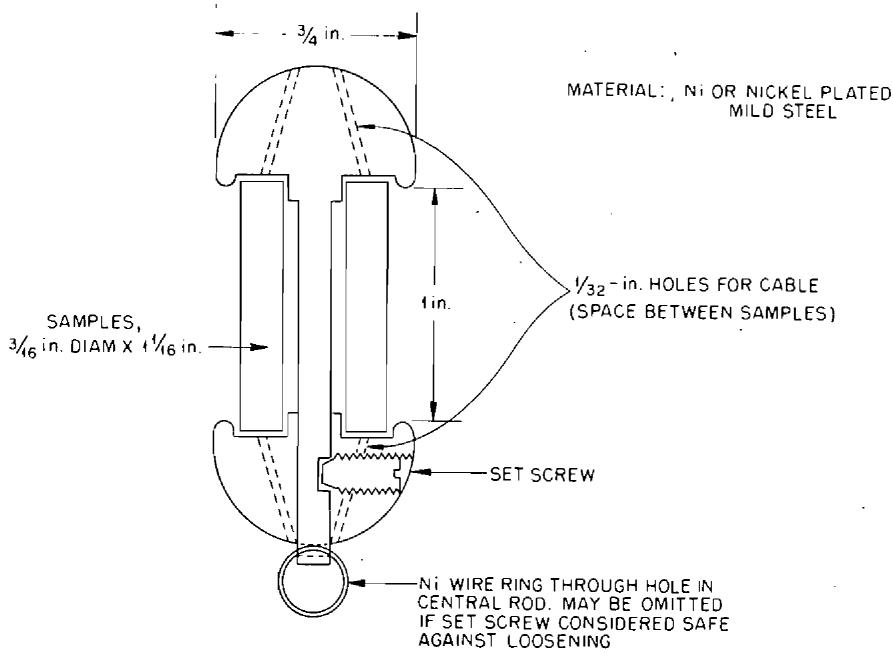

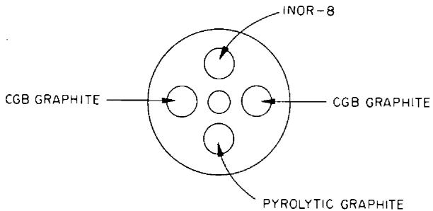  
Fig. 7.1. Specimen holder designed to prevent contamination by contact with transfer tube.

For the specimens, we note that generally the differences between metal and graphite and between liquid and gas exposure are not great. It does appear that the $^{132}\mathrm{Te}$ activity was significantly higher on metal than on graphite. We again find the general patterns previously observed, with salt-seeking elements lowest, noble-gas daughter nuclides higher, and appreciably higher levels of noble metals.

Clearly, the wire to which the capsule was attached received considerably more activity than the specimens. This increased activity on the wire might be a result of easier contamination or easier access to its surface while in the pump bowl, than to the specimens which were within a perforated container.

Data for four subsequent experiments, 18-26, 19-66, 19-67, and 19-68, which were liquid-phase exposures for various periods conducted during the operation with $^{233}\mathrm{U}$ , are shown in Table 7.2. In order to avoid contamination problems and problems of contact with the gas in the pump bowl, the specimens were contained in a windowed capsule, below a bulb which would float in salt, and thereby open the windows, but when above the salt would drop to close off the windows. This device is shown in Fig. 7.2.

Data for the various exposures are shown as milli-grams of inventory salt equivalent to the activity deposited on one square centimeter. Data for isotope pairs(103,106 Ru, 132,129m Te) appear more consistent

Table 7.2. Deposition of fission products on graphite and metal specimens in float-window capsule immersed for various periods in MSRE pump bowl liquid salt   

<table><tr><td colspan="2">Nuclide</td><td>Sr-89</td><td>Ba-140</td><td>Nd-147</td><td>Ce-141</td><td>Ce-144</td><td>Zr-95</td><td>Nb-95</td><td>Mo-99</td><td>Ru-103</td><td>Ru-106</td><td>Ag-111</td><td>Te-132</td><td>Te-129</td><td>I-131</td></tr><tr><td colspan="2">Fission yield, %</td><td>5.86</td><td>5.4</td><td>1.98</td><td>7.09</td><td>4.61</td><td>6.05</td><td>6.05</td><td>4.8</td><td>1.99</td><td>0.24</td><td>0.024</td><td>4.4</td><td>0.33</td><td>2.9</td></tr><tr><td colspan="2">Half-life, days</td><td>52</td><td>12.8</td><td>11.1</td><td>33</td><td>284</td><td>65</td><td>35</td><td>2.79</td><td>39.6</td><td>367</td><td>7.5</td><td>3.25</td><td>34</td><td>8.05</td></tr><tr><td colspan="16">Inventory</td></tr><tr><td colspan="16">Disintegrations per minute per milligram of salt</td></tr><tr><td>Sample No.</td><td>Date</td><td></td><td></td><td></td><td></td><td></td><td></td><td></td><td></td><td></td><td></td><td></td><td></td><td></td><td></td></tr><tr><td>19-68</td><td>10-27-69</td><td>1.06E8</td><td>1.60E8</td><td>6.09E7</td><td>1.50E8</td><td>5.72E7</td><td>1.02E8</td><td>7.50E7</td><td>1.65E8</td><td>3.94E7</td><td>3.26E6</td><td>7.88E5</td><td>1.51E8</td><td>1.51E7</td><td>9.44E7</td></tr><tr><td>18-26</td><td>5-19-69</td><td>1.28E8</td><td>1.62E8</td><td>5.99E7</td><td>1.83E8</td><td>5.90E7</td><td>1.20E8</td><td>7.94E7</td><td>1.43E8</td><td>4.85E7</td><td>3.39E6</td><td>7.34E5</td><td>1.32E8</td><td>1.85E7</td><td>8.84E7</td></tr><tr><td>19-67</td><td>10-24-69</td><td>1.02E8</td><td>1.56E8</td><td>5.95E7</td><td>1.44E8</td><td>5.76E7</td><td>9.89E7</td><td>7.36E7</td><td>1.64E8</td><td>3.79E7</td><td>3.23E6</td><td>7.77E5</td><td>1.50E8</td><td>1.45E7</td><td>9.29E7</td></tr><tr><td>19-66</td><td>10-24-69</td><td>1.02E8</td><td>1.56E8</td><td>5.93E7</td><td>1.44E8</td><td>5.75E7</td><td>9.85E7</td><td>7.34E7</td><td>1.64E8</td><td>3.77E7</td><td>3.23E6</td><td>7.76E5</td><td>1.50E8</td><td>1.44E7</td><td>5.2E8</td></tr><tr><td colspan="16">Disintegrations per minute produced by MSRE in 1 hr per square centimeter of MSRE surface</td></tr><tr><td></td><td></td><td>1.62E8</td><td>6.1E8</td><td>2.6E8</td><td>3.1E8</td><td>2.3E7</td><td>1.3E8</td><td>1.2E8*</td><td>2.5E9</td><td>7.2E7</td><td>9.4E5</td><td>4.6E6</td><td>1.9E9</td><td>3.0E7</td><td>5.2E8</td></tr><tr><td colspan="16">Deposit activity</td></tr><tr><td colspan="16">Expressed as ratio of activity per square centimeter to amount calculated for 1 mg of inventory salt at time of sampling</td></tr><tr><td>Sample No.</td><td>Duration</td><td>Material</td><td></td><td></td><td></td><td></td><td></td><td></td><td></td><td></td><td></td><td></td><td></td><td></td><td></td></tr><tr><td rowspan="6">19-68</td><td rowspan="6">10 min</td><td rowspan="3">Graphite</td><td>0.12</td><td>0.005</td><td></td><td>0.001</td><td>0.005</td><td>0.013</td><td>1.1</td><td>8</td><td>1.7</td><td></td><td>0.9</td><td>0.9</td><td>0.9</td></tr><tr><td>0.12</td><td>0.005</td><td></td><td>0.002</td><td>0.013</td><td>0.011</td><td>1.5</td><td>8</td><td>2.1</td><td></td><td>1.0</td><td>1.0</td><td>1.0</td></tr><tr><td>0.07</td><td>0.003</td><td></td><td>0.011</td><td>0.013</td><td>0.011</td><td>1.0</td><td>4</td><td>0.8</td><td></td><td>0.4</td><td>0.5</td><td>0.8</td></tr><tr><td rowspan="3">Metal</td><td>0.11</td><td>0.019</td><td></td><td>0.015</td><td>0.024</td><td>0.024</td><td>1.9</td><td>7</td><td>1.1</td><td></td><td>1.3</td><td>1.0</td><td>1.6</td></tr><tr><td>0.09</td><td>0.004</td><td></td><td>0.005</td><td>0.013</td><td>0.009</td><td>2.0</td><td>3.2</td><td>0.4</td><td></td><td>0.4</td><td>0.4</td><td>0.4</td></tr><tr><td>0.07</td><td>0.006</td><td></td><td>0.005</td><td>0.009</td><td>0.009</td><td>1.9</td><td>4.1</td><td>0.6</td><td></td><td>0.5</td><td>0.5</td><td>0.3</td></tr><tr><td rowspan="6">18-26</td><td rowspan="6">1 hr</td><td rowspan="3">Graphite</td><td>0.06</td><td>0.004</td><td></td><td>0.004</td><td>&lt;0.0001</td><td>0.006</td><td>0.9</td><td>4</td><td>0.7</td><td>0.2</td><td></td><td>1.5</td><td>1.0</td></tr><tr><td>0.08</td><td>0.030</td><td></td><td>0.011</td><td>0.015</td><td>0.017</td><td>1.7</td><td>11</td><td>1.4</td><td>0.5</td><td></td><td>2.8</td><td>2.0</td></tr><tr><td>0.03</td><td>0.006</td><td></td><td>0.0002</td><td>&lt;0.0001</td><td>0.007</td><td>1.0</td><td>3</td><td>0.6</td><td>0.3</td><td></td><td>1.2</td><td>0.7</td></tr><tr><td rowspan="3">Metal</td><td>0.03</td><td>0.015</td><td></td><td>0.001</td><td>0.001</td><td>0.006</td><td>2.1</td><td>4</td><td>0.4</td><td>0.2</td><td></td><td>1.1</td><td>0.7</td></tr><tr><td>0.02</td><td>0.003</td><td></td><td>0.007</td><td>0.007</td><td>0.003</td><td>2.0</td><td>3</td><td>0.3</td><td>0.1</td><td></td><td>1.0</td><td>0.5</td></tr><tr><td>0.03</td><td>0.002</td><td></td><td>0.0001</td><td>0.001</td><td>0.002</td><td>1.8</td><td>9</td><td>0.8</td><td>0.2</td><td></td><td>1.9</td><td>1.3</td></tr><tr><td rowspan="6">19-67</td><td rowspan="6">3 hr</td><td rowspan="3">Graphite</td><td>0.10</td><td></td><td>0.001</td><td>0.0003</td><td>0.001</td><td>0.014</td><td>2.5</td><td>39</td><td></td><td></td><td>7</td><td>4</td><td>3</td></tr><tr><td>0.17</td><td></td><td></td><td>0.0003</td><td>0.002</td><td>0.023</td><td>3.4</td><td>5.5</td><td></td><td></td><td>9</td><td>5</td><td>6</td></tr><tr><td>0.09</td><td></td><td>0.001</td><td>0.003</td><td>0.020</td><td>0.008</td><td>3.0</td><td>5.2</td><td></td><td></td><td>9</td><td>5</td><td>8</td></tr><tr><td rowspan="3">Metal</td><td>0.10</td><td></td><td>0.021</td><td>0.012</td><td>0.020</td><td>0.026</td><td>4.0</td><td>58</td><td></td><td></td><td>9</td><td>5</td><td>4</td></tr><tr><td>0.06</td><td></td><td>0.002</td><td>0.002</td><td>0.007</td><td>0.004</td><td>2.6</td><td>0.5</td><td></td><td></td><td>3</td><td>2</td><td>1</td></tr><tr><td>0.09</td><td></td><td>0.003</td><td>0.002</td><td>0.005</td><td>0.009</td><td>4.2</td><td>54</td><td></td><td></td><td>9</td><td>22</td><td>5</td></tr><tr><td rowspan="6">19-66</td><td rowspan="6">10 hr</td><td rowspan="3">Graphite</td><td>0.10</td><td></td><td>0.0004</td><td>0.002</td><td>0.017</td><td>5.2</td><td>32</td><td>4.0</td><td></td><td>5</td><td>4</td><td>2</td><td>3</td></tr><tr><td>0.08</td><td></td><td>0.004</td><td></td><td></td><td>0.015</td><td>5.3</td><td>34</td><td>4.5</td><td></td><td>5</td><td>4</td><td>2</td></tr><tr><td>0.08</td><td></td><td>0.0011</td><td></td><td></td><td>0.009</td><td></td><td>32</td><td></td><td></td><td>4</td><td>3</td><td>2</td></tr><tr><td rowspan="3">Metal</td><td>0.13</td><td></td><td>0.002</td><td></td><td></td><td>0.010</td><td></td><td>57</td><td></td><td></td><td>10</td><td>7</td><td>5</td></tr><tr><td>0.13</td><td></td><td>0.016</td><td>0.011</td><td>0.029</td><td>0.040</td><td></td><td>24</td><td>2.3</td><td></td><td>3</td><td>5</td><td>3</td></tr><tr><td>0.10</td><td></td><td>0.004</td><td>0.004</td><td>0.018</td><td>0.016</td><td>7.6</td><td>28</td><td>3.2</td><td></td><td>4</td><td>4</td><td>3</td></tr></table>

with inventory than with amounts directly produced during the exposure. An overview of the table indicates the following similar deposit intensities, for essentially all metal-graphite pairs:

1. When examined pair by pair, over all nuclides and all exposure time, the deposit intensity on the metal is about the same as on the graphite member. No preference for either is indicated by these data.   
2. The salt-seeking elements for the lowest group, of the order of $0.01\mathrm{mg}$ of inventory salt per square centimeter being indicated. No time trends are evident. This is regarded as a minute amount of

some form of adhering salt (film; mist droplets?) which remained after withdrawal.

3. $^{89}\mathrm{Sr}$ runs about an order of magnitude higher. This could have been deposited during withdrawal operations by the $^{89}\mathrm{Kr}$ which was present in the gas drawn in as the capsule was removed from the salt. (The specimens had about $1 \times 10^4$ dis min $^{-1}$ cm $^{-2}$ of $^{89}\mathrm{Sr}$ ; if $^{89}\mathrm{Kr}$ contained in the salt entering the pump bowl, the pump bowl gas should contain, in addition to any actual $^{89}\mathrm{Sr}$ , about $1 \times 10^{-3}$ atoms of $^{89}\mathrm{Kr}$ per cubic centimeter of helium, equivalent after decay to about $1 \times 10^8$ dis min $^{-1}$ cm $^{-3}$ of $^{89}\mathrm{Sr}$ .)

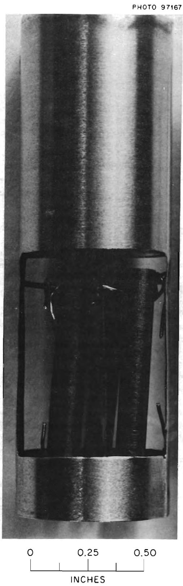  
Fig. 7.2. Sample holder for short-term deposition test (fits into outer capsule with windows).

4. The noble metals run appreciably higher - two orders of magnitude or so - than the other elements.

Salt samples taken at about the same times were generally relatively depleted in noble metals, though they contained amounts which appeared to vary similarly from sample to sample. Thus it appears that the surfaces were capable of preferentially removing some noble-metal-bearing material borne by the salt moving through the sample shield.

5. The noble metals increased somewhat with time, but considerably less than proportionately, as if an initial rapid uptake were followed by a much slower rise.

Most importantly, the increase in activity level with time implies that the activity came from salt exposure rather than any explanation related to passage through the pump bowl gas, coupled with the further assumption that the window improperly and inexplicably was open.

6. As mentioned earlier, the activity ratios on the inventory basis are about equal for the $^{103,106}$ Ru and $^{132,129m}$ Te isotope pairs. But the longer-lived isotope is generally somewhat lower. This is consistent with the deposition of material which has been held up in the system for periods that are appreciable but not as long as the inventory accumulation period.

Thus for noble metals the data of Table 7.2 imply the accumulation from salt of colloidal noble-metal material, which has been in the system for an appreciable period but is carried by the salt in amounts below inventory, but with the surface retaining much more (in proportion to inventory) of the noble-metal nuclides than it does the salt-seeking nuclides. For the periods of exposure used, deposit intensities of given nuclides on metal and graphite did not appear to differ appreciably.

# 7.4 Mist

One factor to be considered in the interpretation of pump bowl sample data is the presence of mist in the gas space within the mist shield in the pump bowl. There is much evidence for this, none clearer than Fig. 7.3, which is a photograph of a $1/2$ -in. strip of stainless steel (holding electron microscope sample screens) that was exposed in the sampler cage for 12 hr. The lower end of the 4-in. strip was at the salt surface.

Clearly, the photograph shows that larger droplets accumulated at lower levels, doubtless as a consequence

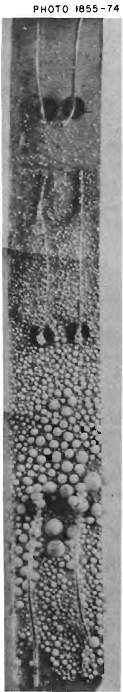  
SALT SURFACE   
Fig. 7.3. Salt droplets on a metal strip exposed in MSRE pump bowl gas space for $10\mathrm{hr}$

of a greater mist density nearer the bottom of the gas space, at least the larger drops representing the accumulation of numerous mist particles.

The mist must have been generated in one of two ways. The first is outside the sampler shield by the vigorous spray into the pump bowl liquid, which also generated spray by the rising of large and small entrained bubbles. This would be followed by drifting

of some of this spray mist around the spiral 1/8-in.-wide aperture of the shield.

The second way in which mist could develop within the sampler shield is by the rise of entrained bubbles too fine to resist the undertow of the pump bowl liquid. As salt entered the bottom of the sampler shield, these bubbles would rise within the more quiescent liquid and would generate a fine mist as they broke the surface. In particular,2 the liquid rushing to fill the bubble space would create a "jet" droplet (as well as corona droplets) which might be impelled to a considerable height - in the case of champagne, tickling the nose several inches away.

The jet droplets can accumulate or concentrate surface contaminants $^{3,4}$ on the droplet surface, being referred to as a surface microtome by MacIntyre. Jet droplets are likely to be about $10\%$ of bubble diameter, thereby a few tens of microns in diameter. It is not certain how much of the mist within the sampler shield was produced from outside and how much from within; however, at least some of the mist must have been produced within the shield, and this explanation appears sufficient to account for the phenomena observed.

$\mathrm{Kohn}^2$ shows that fine graphite dust was carried from the surface of molten $\mathrm{LiF - BeF_2}$ (66-34 mole %) by jet droplets, with the implication that nonwetted colloidal material on the fuel surface could similarly become gas-borne.

Thus a plausible mechanism for the transport of noble-metal fission products by mists could involve the transport of unwetted colloidal material in the salt. This could be transported to the surface of the liquid within the sampler shield, by rising bubbles, and should accumulate there to some extent if surface outflow around the spiral was impeded. A jet droplet would concentrate this material significantly on its surface, and any receiver in the gas phase would indicate such concentration. Because most droplets most of the time would settle back into the surface, the accumulation of noble-metal-bearing colloidal material on the surface would not strongly be altered by this, and accumulation would continue until by various mechanisms inflow and outflow quantities became balanced.

# References

1. J. R. Engel, P. N. Haubenreich, and A. Houtzeel, Spray, Mist, Bubbles, and Foam in the Molten Salt

Reactor Experiment, ORNL-TM-3027, p. 10 (June 1970).   
2. H. W. Kohn, *Bubbles, Drops, and Entrainment in Molten Salts*, ORNL-TM-2373 (December 1968).   
3. D. C. Blanchard, in Progress in Oceanography, vol. 1, ed. M. Sears, Pergamon Press, Inc., New York,

1963, p. 71; "Sea-to-Air Transport of Surface-Active Material," Science 146, 396-97 (1964).   
4. Ferren MacIntyre, "Bubbles: A Boundary-Layer 'Microtope' for Micron-Thick Samples of a Liquid Surface," J. Phys. Chem. 72, 589-92 (1968).

Table 7.3. Data for wire coils and cables exposed in MSRE pump bowl   
Each entry consists of two numbers. The first number is the total amount on the specimen, expressed in micrograms for U-235 and in disintegrations per minute for the fission products. The second number is the ratio of the amount on $1\mathrm{cm}^2$ of specimen to the amount calculated for $1\mathrm{mg}$ of inventory salt at time of sampling (equivalent milligrams of inventory salt per square centimeter).   

<table><tr><td rowspan="2">Test No.</td><td rowspan="2">Date</td><td rowspan="2">Power (MW)</td><td rowspan="2">Duration of exposure</td><td rowspan="2">Area (cm2)</td><td colspan="11">Total amounts on specimen</td><td></td></tr><tr><td>U-235</td><td>Sr-89</td><td>Ba-140</td><td>Ce-141</td><td>Zr-95</td><td>Nb-95</td><td>Mo-99</td><td>Ru-103</td><td>Ru-106</td><td>Te-132</td><td>Te-129</td><td>I-131</td></tr><tr><td colspan="16">Hastelloy N coils</td><td></td></tr><tr><td>7-12</td><td>7-13-66</td><td>8</td><td>1-6 min?</td><td>6</td><td>2.63</td><td></td><td></td><td></td><td></td><td></td><td>3.4E10</td><td>2.1E9</td><td>7E7</td><td>3.7E11</td><td></td><td>2.7E10</td></tr><tr><td>8-5a</td><td>10-7-66</td><td>0</td><td>10 min</td><td>6</td><td></td><td></td><td></td><td></td><td>7.5E6</td><td>3.9E9</td><td></td><td>1.5E8</td><td>4.9E6</td><td></td><td>2.4E8</td><td></td></tr><tr><td></td><td></td><td></td><td></td><td></td><td></td><td></td><td></td><td></td><td>0.00012</td><td>0.20</td><td></td><td>0.0036</td><td>0.0055</td><td></td><td>0.14</td><td></td></tr><tr><td>10-12b</td><td>12-28-66</td><td>8</td><td>10 min</td><td>6</td><td>0.64</td><td></td><td>1.8E8</td><td></td><td>&lt;4E6</td><td>1E7</td><td>4.1E10</td><td>3.6E8</td><td>~7E6</td><td></td><td>8.8E8</td><td>1.8E10</td></tr><tr><td></td><td>After Be</td><td></td><td></td><td></td><td>0.00004</td><td></td><td>0.0017</td><td></td><td>&lt;0.00006</td><td>&lt;0.0006</td><td>0.22</td><td>~0.011</td><td>~0.0023</td><td></td><td>0.63</td><td>0.27</td></tr><tr><td>10-20</td><td>1-9-67</td><td>8</td><td>10 min</td><td>6</td><td>0.91</td><td></td><td>2.7E8</td><td></td><td>&lt;4E6</td><td></td><td>1.4E11</td><td>1.0E9</td><td>3.6E7</td><td>3.4E11</td><td>2.5E9</td><td>1E10</td></tr><tr><td></td><td>2-13-67</td><td></td><td></td><td></td><td>0.00006</td><td></td><td>0.0018</td><td></td><td>0.00005</td><td></td><td>0.72</td><td>0.023</td><td>0.023</td><td>2.4</td><td>1.3</td><td>0.12</td></tr><tr><td>11-8c</td><td>2-13-67</td><td>8</td><td>10 min</td><td>6</td><td>0.42</td><td></td><td>1.7E8</td><td></td><td>&lt;4.5E6</td><td></td><td>5.6E10</td><td>4.7E8</td><td>1.5E7</td><td>1.2E11</td><td></td><td>5.8E9</td></tr><tr><td></td><td></td><td></td><td></td><td></td><td>0.00003</td><td></td><td>0.0012</td><td></td><td>&lt;0.00005</td><td></td><td>0.30</td><td>0.0095</td><td>0.0081</td><td>0.86</td><td></td><td>0.07</td></tr><tr><td>11-12</td><td>2-21-67</td><td>8</td><td>10 min</td><td>6</td><td>1.9</td><td></td><td>1.4E8</td><td></td><td>&lt;3E6</td><td></td><td>1.5E11</td><td>2.3E9</td><td>7.1E7</td><td>1.5E11</td><td></td><td>7.6E9</td></tr><tr><td></td><td></td><td></td><td></td><td></td><td>0.00013</td><td></td><td>0.0008</td><td></td><td>&lt;0.00003</td><td></td><td>0.78</td><td>0.040</td><td>0.035</td><td>1.1</td><td></td><td>0.085</td></tr><tr><td>11-22d</td><td>3-9-67</td><td>0</td><td>10 min</td><td>6</td><td>1.8</td><td></td><td>7.4E7</td><td></td><td>&lt;6.5E6</td><td></td><td>2.5E10</td><td>1.1E9</td><td></td><td>2.7E10</td><td></td><td>9.7E8</td></tr><tr><td></td><td></td><td></td><td></td><td></td><td>0.00012</td><td></td><td>0.0005</td><td></td><td>&lt;0.00006</td><td></td><td>0.18</td><td>0.019</td><td></td><td>0.26</td><td></td><td>0.012</td></tr><tr><td colspan="16">Stainless steel cables</td><td></td></tr><tr><td>11-45</td><td>4-17-67</td><td>8</td><td>1-6 min</td><td>Liq.~2</td><td>21</td><td></td><td></td><td></td><td>3.5E5</td><td></td><td>6.5E10</td><td>2.0E9</td><td>7.5E7</td><td>9.0E10</td><td></td><td>4.6E9</td></tr><tr><td></td><td></td><td></td><td></td><td></td><td>0.0015</td><td></td><td></td><td></td><td>0.000003</td><td></td><td>0.35</td><td>0.027</td><td>0.026</td><td>0.66</td><td></td><td>0.047</td></tr><tr><td></td><td></td><td></td><td>Int.~2</td><td>20</td><td></td><td></td><td></td><td></td><td>1.0E8</td><td></td><td>1.8E11</td><td>1.4E10</td><td>4.5E8</td><td>1.3E11</td><td></td><td>1.0E10</td></tr><tr><td></td><td></td><td></td><td></td><td>0.0014</td><td></td><td></td><td></td><td></td><td>0.00076</td><td></td><td>0.98</td><td>0.19</td><td>0.16</td><td>0.96</td><td></td><td>0.11</td></tr><tr><td></td><td></td><td></td><td>Gas~2</td><td>5</td><td></td><td></td><td></td><td></td><td>8.0E7</td><td></td><td>1.1E11</td><td>2.0E9</td><td>7.5E7</td><td>3.5E10</td><td></td><td>1.1E10</td></tr><tr><td></td><td></td><td></td><td></td><td>0.0004</td><td></td><td></td><td></td><td></td><td>0.000006</td><td></td><td>0.60</td><td>0.027</td><td>0.026</td><td>0.26</td><td></td><td>0.12</td></tr><tr><td>11-50</td><td>4-26-67</td><td>8</td><td>8 hr</td><td>Liq.~2</td><td>35</td><td></td><td></td><td></td><td>2.5E9</td><td></td><td>3.5E11</td><td>7.9E</td><td>2E8</td><td>1.4E12</td><td></td><td>1.2E11</td></tr><tr><td></td><td></td><td></td><td></td><td></td><td>0.0024</td><td></td><td></td><td></td><td>0.018</td><td></td><td>1.9</td><td>0.090</td><td>0.066</td><td>10</td><td></td><td>1.3</td></tr><tr><td></td><td></td><td></td><td></td><td>Int.~2</td><td>190</td><td></td><td></td><td></td><td>3.2E9</td><td></td><td>2.6E12</td><td>2.8E10</td><td>5.5E8</td><td>1.0E13</td><td></td><td>9.0E11</td></tr><tr><td></td><td></td><td></td><td></td><td></td><td>0.013</td><td></td><td></td><td></td><td>0.023</td><td></td><td>14</td><td>0.36</td><td>0.18</td><td>72</td><td></td><td>9.5</td></tr><tr><td></td><td></td><td></td><td></td><td>Gas~2</td><td>60</td><td></td><td></td><td></td><td>1.7E8</td><td></td><td>2.0E10</td><td></td><td></td><td>2.3E12</td><td></td><td>9.2E10</td></tr><tr><td></td><td></td><td></td><td></td><td></td><td>0.0048</td><td></td><td></td><td></td><td>0.0012</td><td></td><td>0.11</td><td></td><td></td><td>16</td><td></td><td>0.97</td></tr><tr><td>11-51</td><td>4-28-67</td><td>7</td><td>1-6 min</td><td>Liq.~2</td><td>3.5</td><td></td><td></td><td></td><td>1E7</td><td></td><td>3E10</td><td>1.3E9</td><td>4.7E7</td><td>1.4E10</td><td></td><td>1E9</td></tr><tr><td></td><td></td><td></td><td></td><td></td><td>0.00024</td><td></td><td></td><td></td><td>0.00007</td><td></td><td>0.17</td><td>0.017</td><td>0.015</td><td>0.10</td><td></td><td>0.011</td></tr><tr><td></td><td></td><td></td><td></td><td>Int.~2</td><td>19</td><td></td><td></td><td></td><td>1.5E7</td><td></td><td>8.5E10</td><td>5E9</td><td>1.5E8</td><td>5.2E10</td><td></td><td>8.5E9</td></tr><tr><td></td><td></td><td></td><td></td><td></td><td>0.0013</td><td></td><td></td><td></td><td>0.00011</td><td></td><td>0.47</td><td>0.064</td><td>0.049</td><td>0.38</td><td></td><td>0.091</td></tr><tr><td></td><td></td><td></td><td></td><td>Gas~2</td><td>6.0</td><td></td><td></td><td></td><td>3E7</td><td></td><td>4E10</td><td>2.5E9</td><td>9.5E7</td><td>3.0E10</td><td></td><td>6E9</td></tr><tr><td></td><td></td><td></td><td></td><td></td><td>0.0004</td><td></td><td></td><td></td><td>0.00022</td><td></td><td>0.22</td><td>0.032</td><td>0.031</td><td>0.22</td><td></td><td>0.064</td></tr><tr><td>11-54</td><td>5-5-67</td><td>8</td><td>1-6 min</td><td>Liq.~2.5</td><td>6.4</td><td></td><td></td><td></td><td>1.6E7</td><td></td><td>4.2E10</td><td>2.5E9</td><td>7.5E7</td><td>1.7E10</td><td></td><td>2.2E9</td></tr><tr><td></td><td></td><td></td><td></td><td></td><td>0.00045</td><td></td><td></td><td></td><td>0.00011</td><td></td><td>0.23</td><td>0.031</td><td>0.024</td><td>0.12</td><td></td><td>0.023</td></tr><tr><td></td><td></td><td></td><td></td><td>Int.~2.5</td><td>5.6</td><td></td><td></td><td></td><td>3.5E7</td><td></td><td>7.2E10</td><td>1.0E10</td><td>3.0E8</td><td>6.1E10</td><td></td><td>7.0E9</td></tr><tr><td></td><td></td><td></td><td></td><td></td><td>0.00039</td><td></td><td></td><td></td><td>0.00025</td><td></td><td>0.39</td><td>0.13</td><td>0.095</td><td>0.44</td><td></td><td>0.074</td></tr><tr><td></td><td></td><td></td><td></td><td>Gas~2.5</td><td>2.0</td><td></td><td></td><td></td><td>3.5E7</td><td></td><td>4.2E11</td><td>4E9</td><td>1.3E8</td><td>2.8E10</td><td></td><td>5.5E10</td></tr><tr><td></td><td></td><td></td><td></td><td></td><td>0.0004</td><td></td><td></td><td></td><td>0.00025</td><td></td><td>0.23</td><td>0.050</td><td>0.041</td><td>0.20</td><td></td><td>0.058</td></tr><tr><td>11-58e</td><td>5-10-67</td><td>0</td><td>1-6 min</td><td>Liq.~2.5</td><td>8.4</td><td></td><td></td><td></td><td>3E6</td><td></td><td>5E9</td><td>1.3E9</td><td>4.5E7</td><td>1.7E10</td><td></td><td>1.1E10</td></tr><tr><td></td><td></td><td></td><td></td><td></td><td>0.00058</td><td></td><td></td><td></td><td>0.00002</td><td></td><td>0.044</td><td>0.017</td><td>0.014</td><td>0.19</td><td></td><td>0.014</td></tr><tr><td></td><td></td><td></td><td></td><td>Int.</td><td>3.3</td><td></td><td></td><td></td><td>6E6</td><td></td><td>1.5E10</td><td>1.5E9</td><td>4.5E9</td><td>7E9</td><td></td><td>2.8E10</td></tr><tr><td></td><td></td><td></td><td></td><td></td><td>0.00023</td><td></td><td></td><td></td><td>0.00004</td><td></td><td>0.13</td><td>0.019</td><td>0.014</td><td>0.078</td><td></td><td>0.035</td></tr><tr><td></td><td></td><td></td><td></td><td>Gas</td><td>2.5</td><td></td><td></td><td></td><td>7E6</td><td></td><td>5.8E10</td><td>2.3E9</td><td>7.5E7</td><td>4E9</td><td></td><td>6.0E10</td></tr><tr><td></td><td></td><td></td><td></td><td></td><td>0.0017</td><td></td><td></td><td></td><td>0.00005</td><td></td><td>0.51</td><td>0.030</td><td>0.024</td><td>0.044</td><td></td><td>0.075</td></tr><tr><td>12-6</td><td>6-20-67</td><td>0</td><td>1-6 min</td><td>Liq.</td><td>22</td><td></td><td></td><td></td><td>8.2E6</td><td></td><td></td><td>1.1E9</td><td>3.8E7</td><td></td><td></td><td></td></tr><tr><td></td><td></td><td></td><td></td><td></td><td>0.0015</td><td></td><td></td><td></td><td>0.00006</td><td></td><td></td><td>0.014</td><td>0.012</td><td></td><td></td><td></td></tr><tr><td></td><td></td><td></td><td></td><td>Int.</td><td>46</td><td></td><td></td><td></td><td>6.0E6</td><td></td><td></td><td>1.7E9</td><td>6E7</td><td></td><td></td><td></td></tr><tr><td></td><td></td><td></td><td></td><td></td><td>0.0032</td><td></td><td></td><td></td><td>0.00004</td><td></td><td></td><td>0.022</td><td>0.019</td><td></td><td></td><td></td></tr><tr><td></td><td></td><td></td><td></td><td>Gas</td><td>60</td><td></td><td></td><td></td><td>3.0E6</td><td></td><td></td><td>3.8E9</td><td>1.4E8</td><td></td><td></td><td></td></tr><tr><td></td><td></td><td></td><td></td><td></td><td>0.0042</td><td></td><td></td><td></td><td>0.00002</td><td></td><td></td><td>0.049</td><td>0.044</td><td></td><td></td><td></td></tr><tr><td>12-27</td><td>7-17-67</td><td>8</td><td>1-6 min</td><td>Liq.</td><td>8.2</td><td></td><td></td><td></td><td>9E5</td><td></td><td>6E9</td><td>5E8</td><td>2E7</td><td>9E11</td><td></td><td>1.4E9</td></tr><tr><td></td><td></td><td></td><td></td><td></td><td>0.00057</td><td></td><td></td><td></td><td>0.00009</td><td></td><td>0.033</td><td>0.010</td><td>0.004</td><td>0.060</td><td></td><td>0.018</td></tr><tr><td></td><td></td><td></td><td></td><td>Int.</td><td>5.6</td><td></td><td></td><td></td><td>1.0E7</td><td></td><td>2E10</td><td>4E8</td><td>4E8</td><td>1.8E10</td><td></td><td>2.4E9</td></tr><tr><td></td><td></td><td></td><td></td><td></td><td>0.00039</td><td></td><td></td><td></td><td>0.00010</td><td></td><td>0.11</td><td>0.008</td><td>0.078</td><td>0.12</td><td></td><td>0.030</td></tr><tr><td></td><td></td><td></td><td></td><td>Gas</td><td>6.6</td><td></td><td></td><td></td><td>1.3E7</td><td></td><td>2.3E10</td><td>2.3E11</td><td>9E7</td><td>4.0E10</td><td></td><td>3.7E9</td></tr><tr><td></td><td></td><td></td><td></td><td></td><td>0.00046</td><td></td><td></td><td></td><td>0.00013</td><td></td><td>0.13</td><td>0.043</td><td>0.018</td><td>0.28</td><td></td><td>0.046</td></tr></table>

${}^{a}$ Before startup. Corresponds to run 7 shutdown after beryllium addition.   
After beryllium addition.   
After addition of 11.66 g of beryllium.   
$d_{32}$ days after shutdown.   
$e$ Vs shutdown May, before drain, 2.3 hr after shutdown, 2 hr after stopping fuel pump.   
Refilled. Before power (vs shutdown May 8).

Table 7.4. Data for Miscellaneous capsules from MSRE pump bowl   

<table><tr><td>No.</td><td>Date</td><td>Capsule</td><td>Basis</td><td>Y-91</td><td>Cs-137</td><td>Sr-89</td><td>Ba-140</td><td>Nd-147</td><td>Ce-141</td><td>Ce-144</td><td>Zr-95</td><td>Nb-95</td><td>Mo-99</td><td>Ru-103</td><td>Ru-106</td><td>Ag-111</td><td>Te-132</td><td>Te-129m</td><td>I-131</td><td>Sb-125</td><td>Li</td><td>Be</td><td>U-233</td></tr><tr><td>17-8</td><td>1-24-69</td><td>Be addition capsule</td><td>Total vs inva</td><td></td><td></td><td></td><td>2.6E11 7.2</td><td></td><td></td><td></td><td></td><td>3.5E10 2.4</td><td>2.3E13 2800</td><td>1.6E14 1990</td><td>2.4E12 450</td><td>1.4E11 28</td><td></td><td>4.9E13 700</td><td></td><td>5.2E12 185</td><td></td><td></td><td></td></tr><tr><td>17-11</td><td>1-29-69</td><td>Cr addition capsule</td><td>Total vs inv</td><td></td><td></td><td></td><td>9.9E10 1.8</td><td></td><td></td><td></td><td></td><td>3.1E10 1.5</td><td>1.2E12 140</td><td>6.2E13 630</td><td>3.7E11 45</td><td>1.7E10 36</td><td></td><td>1.4E14 1580</td><td>5.0E11 340</td><td>1.0E13 260</td><td></td><td></td><td></td></tr><tr><td>18-3</td><td>4-17-69</td><td>Zr addition capsule</td><td>Total vs inv</td><td></td><td>4.5E9 0.9</td><td>4.1E11 4.3</td><td></td><td></td><td></td><td></td><td>6.2E10 1.2</td><td>1.0E11 1.1</td><td>6.9E13 1300</td><td>9.4E13 920</td><td>9.1E11 24</td><td>4.9E10 9</td><td>7.6E10 140</td><td>3.2E13 340</td><td>9.8E11 160</td><td>1.9E12 28</td><td></td><td></td><td></td></tr><tr><td>18-7</td><td>4-25-69</td><td>Zr addition capsule</td><td>total vs inv</td><td></td><td>5.6E10 11</td><td>1.5E12 14</td><td></td><td></td><td></td><td>7E7 0.0004</td><td>8.6E11 16</td><td>1.3E12 13</td><td>3.3E13 560</td><td>1.2E14 760</td><td>2.8E12 69</td><td>1.4E11 25</td><td>2.1E11 300</td><td>3.6E13 250</td><td>1.1E12 160</td><td>1.1E12 13</td><td></td><td></td><td></td></tr><tr><td>18-11</td><td>5-1-69</td><td>Ni capsule</td><td>Total vs inv</td><td></td><td>2.0E9 0.40</td><td>7.3E10 0.63</td><td></td><td></td><td></td><td></td><td>4.5E9 0.08</td><td>1.1E10 0.10</td><td>1.5E12 23</td><td>1.6E13 94</td><td>9.2E11 21</td><td>3.0E10 5</td><td>3.2E11 410</td><td>6.8E13 440</td><td>1.1E12 140</td><td>8.1E12 88</td><td></td><td></td><td></td></tr><tr><td>18-17</td><td>5-8-69</td><td>FeF2addition capsule</td><td>Total vs inv</td><td></td><td>1.1E10 2.1</td><td>8E9 0.07</td><td>3.3E11 2.1</td><td></td><td></td><td></td><td>1.4E11 2.4</td><td>2.4E10 0.21</td><td>2.5E11 3.6</td><td>5.8E12 40</td><td>1.0E11 23</td><td>4.4E9 73</td><td>1.2E10 16</td><td>1.6E13 120</td><td>1.6E11 20</td><td>8.6E11 10</td><td></td><td></td><td></td></tr><tr><td>18-20</td><td>5-12-69</td><td>Cu 8 hr exposure</td><td>Total</td><td>2.8E11 2.5</td><td>1.0E10 2.0</td><td>2.4E11 2.0</td><td>4.3E11 2.6</td><td>1.5E11 2.4</td><td>8.4E11 4.7</td><td>3.4E11 5.8</td><td>2.1E11 1.9</td><td>4.6E11 6.4</td><td>2.7E13 170</td><td>4.3E11 9</td><td>1.6E10 2.7</td><td>5.5E11 720</td><td>9.6E13 670</td><td>1.1E12 140</td><td>7.6E12 84</td><td></td><td></td><td></td><td></td></tr><tr><td>18-23</td><td>5-15-69</td><td>Be addition capsule</td><td>Total vs inv</td><td></td><td>1.1E11 20</td><td>1.7E12 13</td><td></td><td></td><td></td><td></td><td>5.7E11 10</td><td>2.6E12 22</td><td>1.0E13 135</td><td>6.3E14 4300</td><td>1.1E13 220</td><td>5.2E11 89</td><td>7.5E11 1000</td><td>1.7E14 1300</td><td>3.7E12 450</td><td>2.5E13 280</td><td></td><td></td><td></td></tr><tr><td>18-28</td><td>5-20-69</td><td>Be surface tension effects</td><td>Total vs inv</td><td></td><td>7.0E10 13</td><td>1.3E12 10</td><td></td><td></td><td></td><td></td><td>9.0E11 15</td><td>2.6E12 21</td><td>9.1E11 11</td><td>3.9E13 270</td><td>7.9E11 16</td><td>3.6E10 6</td><td>7.6E10 100</td><td>1.8E12 62</td><td>2.4E11 29</td><td>1.8E12 20</td><td></td><td></td><td></td></tr><tr><td>19-12</td><td>8-19-69</td><td>Enrichment capsule</td><td>Total vs inv</td><td>2.0E9 0.045</td><td>5.2E8 0.10</td><td>9.7E9 0.22</td><td>2.2E8 0.11</td><td></td><td></td><td>9.0E8 0.028</td><td>2.0E9 0.041</td><td>1.3E9 0.025</td><td>8.8E10 1.2</td><td></td><td>9.2E9 0.88</td><td>1.3E6 0.4</td><td></td><td>5E9 44</td><td>1.7E8 20</td><td>1.5E8 2</td><td></td><td></td><td></td></tr><tr><td>19-52</td><td>10-12-69</td><td>“DRG&quot;-Cu dummy Leach</td><td>Total vs inv</td><td>7.6E8 0.01</td><td>4.6E8 0.08</td><td>4.4E10 0.51</td><td>2.1E9 0.016</td><td>5.0E8 0.01</td><td>7.0E8 0.006</td><td>5.1E8 0.009</td><td>6.1E8 0.007</td><td>4.1E10 0.60</td><td>1.3E12 7.8</td><td>4.4E10 1.6</td><td>2.3E9 0.43</td><td></td><td></td><td>3.5E9 1.0</td><td></td><td>5.0E7 0.19</td><td>0.58 0.005</td><td></td><td></td></tr><tr><td>19-61</td><td>10-21-69</td><td>Nb strip and Ni capsule, Harold Kohn</td><td>Nb strip</td><td>Total vs inv</td><td>1.4E10 0.16</td><td>6E8 0.10</td><td>8.8E9 0.09</td><td>2E10 0.13</td><td>8E9 0.16</td><td>1.5E10 0.10</td><td>7E9 0.12</td><td>1.0E10 0.10</td><td>6.4E9 0.09</td><td>1.6E12 10</td><td>2.0E10 0.6</td><td>9E8 0.17</td><td>3.6E9 5</td><td>1.2E11 0.8</td><td>3.3E9 0.2</td><td>2.7E10 0.3</td><td>120 1.0</td><td>6.2 0.09</td><td></td></tr><tr><td></td><td></td><td>Ni cap</td><td>Total vs inv</td><td>2.1E9 0.024</td><td>5E8 0.08</td><td>7.4E10 0.8</td><td>4E9 0.03</td><td>1.4E9 0.02</td><td>1.4E9 0.01</td><td>9E8 0.016</td><td>1.5E9 0.016</td><td>2.8E11 4</td><td>8.1E12 50</td><td>1.5E11 4.6</td><td>9E9 3</td><td>1.5E11 21</td><td>3.3E12 22</td><td>1.2E11 8</td><td>2.1E11 2.3</td><td></td><td>2.1 0.018</td><td>0.96 0.014</td><td></td></tr></table>

${}^{a}$ Calculated inventory per gram of salt assuming no losses.

Table 7.5. Data for salt samples from double-walled capsules immersed in salt in the MSRE pump bowl during uranium-233 operation   
Each entry in the table consists of two numbers. The first number is the radioactivity of the isotope on the outside surface of the capsule expressed in disintegrations per minute per square centimeter. The second number is the number of equivalent milligrams of inventory salt per square centimeter of capsule surface, defined as the amount of salt that would contain the analyzed quantity assuming uniform distribution in the fuel salt.   

<table><tr><td>Sample</td><td>Date</td><td>Power (MW)</td><td>Minutes in pump bowl</td><td>Sr-89</td><td>Y-91</td><td>Ba-140</td><td>Cs-137</td><td>Ce-141</td><td>Ce-144</td><td>Nd-147</td><td>Zr-95</td><td>Nb-95</td><td>Mo-99</td><td>Ru-103</td><td>Ru-106</td><td>Ag-111</td><td>Sb-125</td><td>Te-129m</td><td>Te-132</td><td>I-131</td><td></td></tr><tr><td rowspan="2">18-12</td><td rowspan="2">5-2-69</td><td rowspan="2">8.0</td><td rowspan="2"></td><td rowspan="2"></td><td rowspan="2"></td><td rowspan="2"></td><td rowspan="2"></td><td>2.3E7</td><td>1.0E7</td><td></td><td>1.2E8</td><td>7.7E7</td><td>1.2E10</td><td>2.9E9</td><td>1.4E8</td><td>1.6E8</td><td></td><td>7.1E8</td><td>3.1E10</td><td>3.3E8</td><td></td></tr><tr><td>0.13</td><td>0.18</td><td></td><td>1.13</td><td>1.18</td><td>70.59</td><td>63.93</td><td>24.54</td><td>202.02</td><td></td><td>89.64</td><td>198.57</td><td>3.54</td><td></td></tr><tr><td rowspan="2">18-19</td><td rowspan="2">5-9-69</td><td rowspan="2">8.0</td><td rowspan="2"></td><td rowspan="2"></td><td rowspan="2"></td><td>5.3E7</td><td></td><td></td><td>1.6E7</td><td></td><td>2.1E7</td><td>6.9E8</td><td>1.4E10</td><td>1.8E8</td><td>6.9E6</td><td>9.8E7</td><td></td><td>8.6E8</td><td>6.6E10</td><td></td><td></td></tr><tr><td>0.33</td><td></td><td></td><td>0.28</td><td></td><td>0.19</td><td>9.63</td><td>90.37</td><td>3.95</td><td>1.16</td><td>132.28</td><td></td><td>106.06</td><td>485.00</td><td></td><td></td></tr><tr><td rowspan="2">18-44</td><td rowspan="2">5-29-69</td><td rowspan="2">6.9</td><td rowspan="2"></td><td>1.3E9</td><td>8.6E7</td><td></td><td>7.5E6</td><td>5.9E7</td><td>3.5E7</td><td>7.0E7</td><td>3.8E7</td><td>2.6E8</td><td>4.1E10</td><td>1.5E9</td><td>7.3E7</td><td>1.2E8</td><td>4.3E6</td><td>1.3E9</td><td>5.3E10</td><td>1.0E9</td><td></td></tr><tr><td>9.76</td><td>0.72</td><td></td><td>1.39</td><td>0.32</td><td>0.57</td><td>1.22</td><td>0.31</td><td>3.00</td><td>338.80</td><td>31.25</td><td>11.90</td><td>172.84</td><td>14.91</td><td>156.86</td><td>468.81</td><td>12.63</td><td></td></tr><tr><td rowspan="2">18-45</td><td rowspan="2">6-1-69</td><td rowspan="2">0.0</td><td rowspan="2"></td><td>2.9E8</td><td></td><td></td><td>4.3E9</td><td></td><td></td><td>2.7E7</td><td></td><td>4.5E7</td><td>1.2E10</td><td>2.2E11</td><td>2.4E9</td><td>1.0E8</td><td>2.0E8</td><td>9.7E6</td><td>4.7E9</td><td>1.6E11</td><td>3.6E9</td></tr><tr><td>2.18</td><td></td><td></td><td>795.11</td><td></td><td></td><td>0.44</td><td></td><td>0.36</td><td>133.58</td><td>1691.92</td><td>48.13</td><td>16.45</td><td>288.37</td><td>33.18</td><td>545.45</td><td>1294.77</td><td>44.07</td></tr><tr><td rowspan="2">18-46</td><td rowspan="2">6-1-69</td><td rowspan="2">0.0</td><td rowspan="2"></td><td>6.4E8</td><td>2.2E9</td><td>4.9E8</td><td>2.6E7</td><td>6.5E8</td><td>2.8E8</td><td>2.3E8</td><td>4.1E8</td><td>2.6E9</td><td>3.2E10</td><td>5.6E8</td><td>2.6E7</td><td>7.0E7</td><td>2.1E6</td><td>2.3E9</td><td>6.8E10</td><td>3.6E9</td><td></td></tr><tr><td>4.82</td><td>17.81</td><td>3.17</td><td>4.79</td><td>3.52</td><td>4.60</td><td>4.14</td><td>3.25</td><td>28.77</td><td>259.56</td><td>11.19</td><td>4.21</td><td>104.14</td><td>7.12</td><td>265.76</td><td>589.08</td><td>44.88</td><td></td></tr><tr><td rowspan="2">19-9</td><td rowspan="2">8-18-69</td><td rowspan="2">0.01</td><td rowspan="2">60</td><td>6.7E6</td><td>3.5E5</td><td></td><td>1.6E5</td><td>3.7E5</td><td>8.2E5</td><td></td><td>1.5E6</td><td>3.1E9</td><td>1.3E6</td><td>1.9E7</td><td>4.3E6</td><td></td><td></td><td>2.4E7</td><td>6.6E6</td><td>3.6E6</td><td></td></tr><tr><td>0.15</td><td>0.0076</td><td></td><td>0.0302</td><td>0.0109</td><td>0.0166</td><td></td><td>0.0295</td><td>40.60</td><td>31.48</td><td>1.56</td><td>0.81</td><td></td><td></td><td>14.61</td><td>201.35</td><td>35.20</td><td></td></tr><tr><td rowspan="2">19-24</td><td rowspan="2">9-10-69</td><td rowspan="2">0.01</td><td rowspan="2">31</td><td>7.4E7</td><td>7.2E6</td><td>7.0E6</td><td>5.8E6</td><td>3.4E6</td><td>3.9E6</td><td>2.3E6</td><td>7.2E8</td><td>2.3E9</td><td>6.6E9</td><td>1.7E8</td><td>1.2E7</td><td>3.4E7</td><td></td><td>2.0E8</td><td>5.5E9</td><td>2.7E8</td><td></td></tr><tr><td>1.31</td><td>0.13</td><td>0.11</td><td>1.05</td><td>0.0534</td><td>0.0777</td><td>0.0913</td><td>11.79</td><td>33.24</td><td>78.61</td><td>9.51</td><td>2.28</td><td>93.66</td><td></td><td>67.51</td><td>70.49</td><td>6.20</td><td></td></tr><tr><td rowspan="2">19-36</td><td rowspan="2">9-29-69</td><td rowspan="2">5.5</td><td rowspan="2"></td><td>4.3E8</td><td>3.2E6</td><td>7.2E6</td><td>2.8E6</td><td>8.3E5</td><td>9.5E5</td><td></td><td>2.6E6</td><td>7.0E9</td><td>3.0E10</td><td>2.6E8</td><td>1.5E7</td><td>4.2E7</td><td></td><td>7.4E8</td><td>1.3E10</td><td>7.8E8</td><td></td></tr><tr><td>6.75</td><td>0.0536</td><td>0.0948</td><td>0.49</td><td>0.0106</td><td>0.0185</td><td></td><td>0.0387</td><td>104.13</td><td>382.12</td><td>12.11</td><td>2.72</td><td>115.65</td><td></td><td>203.71</td><td>181.53</td><td>17.59</td><td></td></tr><tr><td rowspan="2">19-42</td><td rowspan="2">10-3-69</td><td rowspan="2">7.0</td><td rowspan="2"></td><td>4.1E7</td><td>5.4E6</td><td></td><td>3.8E6</td><td>4.6E6</td><td>3.7E6</td><td>3.2E6</td><td>2.9E6</td><td>7.0E7</td><td>3.2E9</td><td>2.9E8</td><td>1.7E7</td><td>3.6E7</td><td></td><td>1.9E8</td><td>8.1E9</td><td>1.3E9</td><td></td></tr><tr><td>0.60</td><td>0.0844</td><td></td><td>0.67</td><td>0.0538</td><td>0.0720</td><td>0.0956</td><td>0.0418</td><td>1.05</td><td>29.13</td><td>12.41</td><td>3.14</td><td>80.54</td><td></td><td>48.15</td><td>82.82</td><td>25.06</td><td></td></tr><tr><td rowspan="2">19-44</td><td rowspan="2">10-6-69</td><td rowspan="2">8.0</td><td rowspan="2">180</td><td>8.9E7</td><td>3.1E6</td><td>2.5E7</td><td>8.9E6</td><td>5.8E6</td><td>3.7E6</td><td></td><td>1.1E7</td><td>1.7E9</td><td>8.5E10</td><td>8.8E8</td><td>4.2E7</td><td>2.3E8</td><td></td><td>2.0E9</td><td>9.6E10</td><td>1.5E10</td><td></td></tr><tr><td>1.22</td><td>0.0461</td><td>0.24</td><td>1.56</td><td>0.0605</td><td>0.0703</td><td></td><td>0.15</td><td>24.64</td><td>595.46</td><td>33.93</td><td>7.75</td><td>428.45</td><td></td><td>451.26</td><td>768.00</td><td>237.11</td><td></td></tr><tr><td rowspan="2">19-47</td><td rowspan="2">10-7-69</td><td rowspan="2">8.0</td><td rowspan="2">17</td><td>3.1E8</td><td>2.4E7</td><td>2.0E7</td><td>1.0E7</td><td>9.2E6</td><td>6.4E6</td><td>4.9E6</td><td>8.4E6</td><td>1.3E9</td><td>3.5E10</td><td>1.3E9</td><td>7.9E7</td><td>1.5E8</td><td></td><td>9.1E8</td><td>7.1E9</td><td>1.1E9</td><td></td></tr><tr><td>4.08</td><td>0.34</td><td>0.18</td><td>1.78</td><td>0.0916</td><td>0.12</td><td>0.12</td><td>0.11</td><td>19.48</td><td>228.80</td><td>49.22</td><td>14.43</td><td>267.20</td><td></td><td>195.62</td><td>53.23</td><td>15.56</td><td></td></tr><tr><td rowspan="2">19-55</td><td rowspan="2">10-14-69</td><td rowspan="2">8.0</td><td rowspan="2">20</td><td>2.1E8</td><td></td><td>2.5E7</td><td>2.4E6</td><td>1.6E7</td><td>9.5E6</td><td>1.1E7</td><td>1.1E7</td><td>9.1E8</td><td>5.8E10</td><td>6.4E8</td><td>3.2E7</td><td>3.7E8</td><td></td><td>1.4E9</td><td>5.2E10</td><td>2.8E9</td><td></td></tr><tr><td>2.41</td><td></td><td>0.18</td><td>0.42</td><td>0.13</td><td>0.17</td><td>0.21</td><td>0.13</td><td>13.13</td><td>332.69</td><td>19.79</td><td>5.73</td><td>509.89</td><td></td><td>248.34</td><td>332.63</td><td>32.24</td><td></td></tr><tr><td rowspan="2">19-58</td><td rowspan="2">10-17-69</td><td rowspan="2">0.01</td><td rowspan="2">30</td><td>1.2E8</td><td>3.7E6</td><td>1.3E7</td><td>2.0E6</td><td>8.2E6</td><td>4.4E6</td><td>3.1E6</td><td>3.8E6</td><td>9.8E8</td><td>2.1E10</td><td>3.7E8</td><td>2.1E7</td><td>1.0E8</td><td></td><td>4.5E8</td><td>8.2E9</td><td>2.7E8</td><td></td></tr><tr><td>1.26</td><td>0.0436</td><td>0.0887</td><td>0.34</td><td>0.0634</td><td>0.0789</td><td>0.0555</td><td>0.0420</td><td>13.95</td><td>127.27</td><td>10.93</td><td>3.71</td><td>134.44</td><td></td><td>76.08</td><td>54.30</td><td>3.03</td><td></td></tr><tr><td rowspan="2">19-59</td><td rowspan="2">10-17-69</td><td rowspan="2">0.01</td><td rowspan="2">30</td><td>6.3E8</td><td>9.1E6</td><td>3.0E7</td><td>3.1E6</td><td>7.6E6</td><td>5.4E6</td><td>6.2E6</td><td>6.7E6</td><td>1.4E9</td><td>4.8E10</td><td>1.0E9</td><td>5.9E7</td><td>8.2E7</td><td></td><td>1.6E9</td><td>3.3E10</td><td>4.3E8</td><td></td></tr><tr><td>6.85</td><td>0.11</td><td>0.21</td><td>0.53</td><td>0.0587</td><td>0.0970</td><td>0.11</td><td>0.0737</td><td>20.52</td><td>302.08</td><td>30.67</td><td>10.48</td><td>111.72</td><td></td><td>266.85</td><td>225.25</td><td>4.88</td><td></td></tr><tr><td rowspan="2">19-76</td><td rowspan="2">10-30-69</td><td rowspan="2">8.0</td><td rowspan="2"></td><td>5.6E8</td><td>7.9E6</td><td>3.2E7</td><td>2.5E7</td><td>1.1E7</td><td>5.8E6</td><td>5.4E6</td><td>9.9E6</td><td>3.2E8</td><td>2.6E9</td><td>7.2E8</td><td>4.1E7</td><td>6.3E7</td><td></td><td>6.7E8</td><td>1.8E10</td><td>4.4E8</td><td></td></tr><tr><td>5.07</td><td>0.0795</td><td>0.20</td><td>4.10</td><td>0.0689</td><td>0.0979</td><td>0.0866</td><td>0.0936</td><td>4.21</td><td>15.56</td><td>17.55</td><td>7.01</td><td>79.23</td><td></td><td>92.49</td><td>121.41</td><td>4.64</td><td></td></tr></table>

*Equivalent mg inventory salt means the amount of salt which would contain the analyzed quantity assuming uniform distribution in the fuel salt.

Table 7.6. Data for gas samples from double-walled capsules exposed to gas in the MSRE pump bowl during uranium-233 operation   
Each entry in the table consists of two numbers. The first number is the radioactivity of the isotope on the outside surface of the capsule expressed in disintegrations per minute per square centimeter. The second number is the number of equivalent mil   
of inventory salt per square centimeter of capsule surface, defined as the amount of salt that would contain the analyzed quantity assuming uniform distribution in the fuel salt   

<table><tr><td>Sample</td><td>Date</td><td>Power (MW)</td><td>Minutes in pump bowl</td><td>Sr-89</td><td>Y-91</td><td>Ba-140</td><td>Cs-137</td><td>Ce-141</td><td>Ce-144</td><td>Nd-147</td><td>Zr-95</td><td>Nb-95</td><td>Mo-99</td><td>Ru-103</td><td>Ru-106</td><td>Ag-111</td><td>Sb-125</td><td>Te-129m</td><td>Te-132</td><td>I-131</td></tr><tr><td rowspan="2">18-21</td><td rowspan="2">5-12-69</td><td rowspan="2">7.9</td><td rowspan="2">60</td><td>3.7E8</td><td>1.3E7</td><td>4.9E7</td><td>1.1E8</td><td>5.0E6</td><td>4.4E7</td><td></td><td>1.1E6</td><td>6.5E8</td><td>3.2E10</td><td>6.9E8</td><td>4.2E7</td><td>4.9E7</td><td></td><td>4.4E8</td><td>3.4E10</td><td>1.5F9</td></tr><tr><td>2.98</td><td>0.12</td><td>0.30</td><td>20.39</td><td>0.0279</td><td>0.77</td><td></td><td>0.0098</td><td>8.86</td><td>205.24</td><td>14.57</td><td>7.07</td><td>65.00</td><td></td><td>53.60</td><td>239.32</td><td>16.55</td></tr><tr><td rowspan="2">18-25</td><td rowspan="2">5-17-69</td><td rowspan="2">7.0</td><td rowspan="2">60</td><td></td><td></td><td>2.9E7</td><td></td><td></td><td>2.2E6</td><td></td><td>6.1E6</td><td>1.1E8</td><td>1.2E10</td><td>1.4E8</td><td>7.2E6</td><td>3.3E7</td><td></td><td>6.0E8</td><td>2.4F10</td><td></td></tr><tr><td></td><td></td><td>0.18</td><td></td><td></td><td>0.0381</td><td></td><td>0.0516</td><td>1.36</td><td>79.37</td><td>2.95</td><td>1.20</td><td>44.44</td><td></td><td>71.40</td><td>180.25</td><td></td></tr><tr><td rowspan="2">18-29</td><td rowspan="2">5-21-69</td><td rowspan="2">7.8</td><td rowspan="2">60</td><td>2.0E8</td><td>1.2E7</td><td></td><td>6.5E6</td><td>3.6E6</td><td>2.0E6</td><td></td><td>1.8E6</td><td>1.1E8</td><td>1.1E10</td><td>1.5E8</td><td>2.6E6</td><td>1.0E7</td><td></td><td>3.0E8</td><td>1.4E10</td><td>1.1F9</td></tr><tr><td>1.51</td><td>0.0996</td><td></td><td>1.22</td><td>0.0194</td><td>0.0337</td><td></td><td>0.0152</td><td>1.39</td><td>70.07</td><td>3.01</td><td>0.43</td><td>13.86</td><td></td><td>35.32</td><td>102.19</td><td>12.39</td></tr><tr><td rowspan="2">18-42</td><td rowspan="2">5-28-69</td><td rowspan="2">6.6</td><td rowspan="2">60</td><td>2.4E8</td><td>1.7E6</td><td>1.7E7</td><td>8.7E6</td><td>3.7E6</td><td>2.3E6</td><td>6.7E6</td><td>3.6E6</td><td>6.3E7</td><td>5.7E9</td><td>8.1E7</td><td>4.4E6</td><td>2.2E7</td><td></td><td>6.5E8</td><td>2.3F10</td><td>1.2F9</td></tr><tr><td>1.83</td><td>0.0139</td><td>0.11</td><td>1.61</td><td>0.0198</td><td>0.0383</td><td>0.12</td><td>0.0296</td><td>0.73</td><td>48.49</td><td>1.64</td><td>0.71</td><td>32.81</td><td></td><td>76.12</td><td>211.21</td><td>14.38</td></tr><tr><td rowspan="2">19-13</td><td rowspan="2">8-21-69</td><td rowspan="2">0.008</td><td rowspan="2">60</td><td>4.5E7</td><td>1.0E6</td><td>1.4E6</td><td>2.7E6</td><td>2.8E5</td><td>7.1E5</td><td></td><td>1.7E6</td><td>1.8E8</td><td>6.9E6</td><td>7.5E7</td><td>1.9E7</td><td></td><td>1.5E6</td><td>1.9E7</td><td>2.8E6</td><td>1.6F6</td></tr><tr><td>1.05</td><td>0.0229</td><td>0.78</td><td>0.51</td><td>0.0088</td><td>0.0145</td><td></td><td>0.0345</td><td>2.42</td><td>74.59</td><td>6.56</td><td>3.64</td><td></td><td>5.70</td><td>12.44</td><td>36.37</td><td>16.34</td></tr><tr><td rowspan="2">19-14</td><td rowspan="2">8-21-69</td><td rowspan="2">0.008</td><td rowspan="2">53</td><td>3.1E7</td><td>1.8E6</td><td>2.2E6</td><td>1.7E6</td><td>8.7E5</td><td>2.0E6</td><td></td><td>1.4E6</td><td>6.0E7</td><td>4.6E6</td><td>1.3E7</td><td>3.2E6</td><td></td><td></td><td>1.9E7</td><td>1.9E7</td><td>2.5F6</td></tr><tr><td>0.73</td><td>0.0414</td><td>1.20</td><td>0.31</td><td>0.0274</td><td>0.0413</td><td></td><td>0.0272</td><td>0.80</td><td>48.42</td><td>1.15</td><td>0.62</td><td></td><td></td><td>12.23</td><td>231.88</td><td>25.34</td></tr><tr><td rowspan="2">19-15</td><td rowspan="2">8-21-69</td><td rowspan="2">0.008</td><td rowspan="2">60</td><td>1.2E7</td><td>1.1E6</td><td></td><td>8.8E5</td><td>4.3E5</td><td>9.2E5</td><td></td><td>6.6E5</td><td>4.6E7</td><td>1.3E6</td><td>8.3E6</td><td>2.4E6</td><td></td><td>9.8E4</td><td>3.1E7</td><td>3.5E7</td><td>1.5F8</td></tr><tr><td>0.28</td><td>0.0239</td><td></td><td>0.16</td><td>0.0136</td><td>0.0188</td><td></td><td>0.0132</td><td>0.62</td><td>13.65</td><td>0.74</td><td>0.45</td><td></td><td>0.37</td><td>20.48</td><td>418.51</td><td>1538.46</td></tr><tr><td rowspan="2">19-16</td><td rowspan="2">8-21-69</td><td rowspan="2">0.008</td><td rowspan="2">60</td><td>7.8E7</td><td>2.6E6</td><td>8.6E5</td><td>4.2E6</td><td>1.1E6</td><td>2.5E6</td><td></td><td>1.9E6</td><td>4.0E8</td><td>2.0E7</td><td>1.0E8</td><td>2.6E7</td><td></td><td>2.3E5</td><td>7.8E7</td><td>6.6F7</td><td>4.5F6</td></tr><tr><td>1.82</td><td>0.0597</td><td>0.49</td><td>0.78</td><td>0.0335</td><td>0.0501</td><td></td><td>0.0384</td><td>5.40</td><td>193.62</td><td>8.84</td><td>4.93</td><td></td><td></td><td>51.10</td><td>770.34</td><td>45.70</td></tr><tr><td rowspan="2">19-19</td><td rowspan="2">9-4-69</td><td rowspan="2">5.5</td><td rowspan="2">20</td><td>2.3E8</td><td>4.3E6</td><td>1.1E7</td><td>1.1E7</td><td>6.9E5</td><td>1.8E6</td><td></td><td>6.1E5</td><td>2.6E8</td><td>4.1E9</td><td>3.0E8</td><td>1.9E7</td><td>3.1E7</td><td></td><td>1.3E8</td><td>6.8E9</td><td>6.8E8</td></tr><tr><td>4.39</td><td>0.0855</td><td>0.24</td><td>2.00</td><td>0.0131</td><td>0.0367</td><td></td><td>0.0107</td><td>3.75</td><td>51.83</td><td>18.77</td><td>3.59</td><td>111.11</td><td></td><td>52.78</td><td>97.00</td><td>20.51</td></tr><tr><td rowspan="2">19-20</td><td rowspan="2">9-4-69</td><td rowspan="2">5.5</td><td rowspan="2">20</td><td>2.2E8</td><td>2.5E6</td><td>1.2E7</td><td>8.3E6</td><td>6.4E5</td><td>1.1E6</td><td></td><td>6.8E7</td><td>2.2E8</td><td>1.8E10</td><td>3.4E8</td><td>1.6E7</td><td>4.4E7</td><td></td><td>1.3E8</td><td>7.7E9</td><td>7.9E8</td></tr><tr><td>4.30</td><td>0.0495</td><td>0.24</td><td>1.52</td><td>0.0120</td><td>0.0223</td><td></td><td>1.20</td><td>3.24</td><td>218.11</td><td>21.14</td><td>2.99</td><td>153.79</td><td></td><td>51.76</td><td>106.77</td><td>23.54</td></tr><tr><td rowspan="2">19-23</td><td rowspan="2">9-10-69</td><td rowspan="2">0.01</td><td rowspan="2">20</td><td>9.9E7</td><td>3.5E6</td><td>2.9E7</td><td>1.0E7</td><td>2.1E6</td><td>2.4E6</td><td>1.2E6</td><td>9.7E7</td><td>3.1E8</td><td>5.6E9</td><td>2.2E8</td><td>1.4E7</td><td>2.1E7</td><td>1.7E7</td><td>1.0E8</td><td>2.8E9</td><td>2.2E9</td></tr><tr><td>1.74</td><td>0.0633</td><td>0.44</td><td>1.84</td><td>0.0322</td><td>0.0477</td><td>0.0469</td><td>1.59</td><td>4.48</td><td>62.85</td><td>12.04</td><td>2.67</td><td>56.76</td><td>61.21</td><td>34.15</td><td>35.11</td><td>50.57</td></tr><tr><td rowspan="2">19-28</td><td rowspan="2">9-23-69</td><td rowspan="2">5.5</td><td rowspan="2">20</td><td>2.3E8</td><td>6.5E6</td><td>1.4E7</td><td>6.3E7</td><td>3.6E6</td><td>3.6E6</td><td></td><td>2.4E6</td><td>7.4E8</td><td>1.1E10</td><td>8.1E8</td><td>4.0E7</td><td>1.4E8</td><td></td><td>4.7E8</td><td>1.6E10</td><td>1.8F9</td></tr><tr><td>3.65</td><td>0.11</td><td>0.18</td><td>11.23</td><td>0.0472</td><td>0.0697</td><td></td><td>0.0368</td><td>11.11</td><td>116.54</td><td>38.07</td><td>7.50</td><td>339.35</td><td></td><td>131.01</td><td>188.98</td><td>37.96</td></tr><tr><td rowspan="2">19-29</td><td rowspan="2">9-23-69</td><td rowspan="2">5.5</td><td rowspan="2">20</td><td>2.2E8</td><td>2.6E7</td><td>3.8E7</td><td>5.2E6</td><td>1.8E7</td><td>1.6E7</td><td>9.3E6</td><td>1.5E7</td><td>3.1E8</td><td>9.5E9</td><td>9.6E8</td><td>4.8E7</td><td>7.5E7</td><td></td><td>4.4E8</td><td>1.1E10</td><td>1.4F9</td></tr><tr><td>3.45</td><td>0.44</td><td>0.48</td><td>0.94</td><td>0.23</td><td>0.32</td><td>0.31</td><td>0.23</td><td>4.63</td><td>101.78</td><td>44.97</td><td>8.85</td><td>184.10</td><td></td><td>123.07</td><td>125.60</td><td>28.58</td></tr><tr><td rowspan="2">19-37</td><td rowspan="2">9-30-69</td><td rowspan="2">0.01</td><td rowspan="2">20</td><td>4.5E7</td><td>9.5E5</td><td>8.7E5</td><td>1.4E6</td><td>1.3E4</td><td>1.9E4</td><td></td><td>3.8E5</td><td>1.9E8</td><td>3.2E9</td><td>1.2E8</td><td>7.8E6</td><td>5.4E6</td><td></td><td>9.4E7</td><td>1.5E9</td><td>6.4E8</td></tr><tr><td>0.70</td><td>0.0156</td><td>0.0114</td><td>0.25</td><td>0.0002</td><td>0.0004</td><td></td><td>0.0057</td><td>2.83</td><td>40.18</td><td>5.53</td><td>1.45</td><td>14.57</td><td></td><td>25.55</td><td>20.10</td><td>14.21</td></tr><tr><td rowspan="2">19-38</td><td rowspan="2">10-1-69</td><td rowspan="2">5.5</td><td rowspan="2">20</td><td>6.6E7</td><td>5.5E5</td><td>4.2E8</td><td>1.9E6</td><td>1.1E5</td><td>2.7E4</td><td></td><td>3.1E4</td><td>5.0E7</td><td>4.3E8</td><td>3.7E8</td><td>2.4E7</td><td></td><td>7.5E7</td><td>1.2E9</td><td>1.4E9</td><td></td></tr><tr><td>1.01</td><td>0.0084</td><td>5.32</td><td>0.33</td><td>0.0013</td><td>0.0005</td><td></td><td>0.0005</td><td>0.75</td><td>5.07</td><td>16.55</td><td>4.55</td><td>32.32</td><td></td><td>20.03</td><td>16.29</td><td>30.61</td></tr><tr><td rowspan="2">19-41</td><td rowspan="2">10-3-69</td><td rowspan="2">7.0</td><td rowspan="2">20</td><td>1.4E8</td><td>7.2E6</td><td>1.9E7</td><td>2.8E6</td><td>3.6E5</td><td>2.9E5</td><td></td><td>5.2E5</td><td>1.5E8</td><td>4.3E9</td><td>1.6E8</td><td>1.1E7</td><td></td><td>2.7E7</td><td></td><td>3.2E8</td><td>1.2E10</td></tr><tr><td>2.03</td><td>0.11</td><td>0.22</td><td>0.49</td><td>0.0042</td><td>0.0056</td><td></td><td>0.0075</td><td>2.29</td><td>40.12</td><td>6.87</td><td>2.01</td><td>61.11</td><td></td><td>80.99</td><td>126.55</td><td>30.32</td></tr><tr><td rowspan="2">19-46</td><td rowspan="2">10-7-69</td><td rowspan="2">8.0</td><td rowspan="2">200</td><td>3.3E8</td><td>2.1E7</td><td>7.6E7</td><td>4.1E6</td><td>1.2E6</td><td>1.0E6</td><td></td><td>4.7E5</td><td>2.6E7</td><td>6.3E8</td><td>1.8E8</td><td>1.2E7</td><td></td><td>2.6E8</td><td></td><td>1.2E10</td><td>1.9E9</td></tr><tr><td>4.35</td><td>0.30</td><td>0.71</td><td>0.71</td><td>0.0122</td><td>0.0193</td><td></td><td>0.0062</td><td>0.39</td><td>4.21</td><td>6.64</td><td>2.21</td><td>87.45</td><td></td><td>56.73</td><td>92.73</td><td>27.90</td></tr><tr><td rowspan="2">19-54</td><td rowspan="2">10-14-69</td><td rowspan="2">8.0</td><td rowspan="2">22</td><td>6.7E8</td><td>4.6E6</td><td>1.8E7</td><td>2.8E6</td><td>1.1E6</td><td>1.2E6</td><td>3.8E5</td><td>1.7E6</td><td>1.1E9</td><td>8.6E9</td><td>1.6E9</td><td>2.3E7</td><td></td><td></td><td>3.5E8</td><td>1.1E9</td><td>3.2E8</td></tr><tr><td>7.62</td><td>0.0565</td><td>0.13</td><td>0.48</td><td>0.0092</td><td>0.0218</td><td></td><td>0.0201</td><td>15.56</td><td>49.55</td><td>48.70</td><td>19.73</td><td>31.64</td><td></td><td>61.89</td><td>6.70</td><td>3.68</td></tr><tr><td rowspan="2">19-56</td><td rowspan="2">10-15-69</td><td rowspan="2">0.01</td><td rowspan="2">20·</td><td>1.0E8</td><td>3.7E6</td><td>7.8E6</td><td>5.0E6</td><td>3.8E6</td><td>2.4E6</td><td>2.4E6</td><td>2.1E6</td><td>1.4E8</td><td>2.7E8</td><td>1.5E7</td><td></td><td></td><td></td><td></td><td></td><td></td></tr><tr><td>1.14</td><td>0.0450</td><td>0.0559</td><td>0.86</td><td>0.0305</td><td>0.0427</td><td>0.0436</td><td></td><td>0.0233</td><td>2.06</td><td>42.68</td><td>8.23</td><td>2.74</td><td></td><td></td><td></td><td></td></tr><tr><td rowspan="2">19-62</td><td rowspan="2">10-22-69</td><td rowspan="2">8.0</td><td rowspan="2">20·</td><td>3.4E8</td><td>3.2E6</td><td>3.0E7</td><td>9.6E6</td><td>1.5E6</td><td>1.4E6</td><td>1.2E6</td><td>1.9E5</td><td>2.3E8</td><td>2.0E10</td><td>6.7E8</td><td>3.6E7</td><td></td><td></td><td></td><td></td><td></td></tr><tr><td>3.45</td><td>0.0355</td><td>0.20</td><td>1.62</td><td>0.0110</td><td>0.0251</td><td></td><td>0.0214</td><td>3.13</td><td>123.38</td><td>18.19</td><td>5.70</td><td></td><td></td><td></td><td></td><td></td></tr><tr><td rowspan="2">19-64</td><td rowspan="2">10-22-69</td><td rowspan="2">8.0</td><td rowspan="2">40</td><td>2.9E8</td><td>1.3E7</td><td>3.6E7</td><td>4.1E6</td><td>6.4E6</td><td>3.5E6</td><td>4.3E6</td><td>5.2E6</td><td>1.6E8</td><td>9.5E9</td><td>3.5E8</td><td></td><td></td><td></td><td></td><td></td><td></td></tr><tr><td>2.91</td><td>0.14</td><td>0.24</td><td>0.69</td><td>0.0451</td><td>0.0607</td><td></td><td>0.0731</td><td>2.23</td><td>58.20</td><td>9.39</td><td></td><td></td><td></td><td></td><td></td><td></td></tr><tr><td rowspan="2">19-65</td><td rowspan="2">10-23-69</td><td rowspan="2">8.0</td><td rowspan="2">40</td><td>4.7E8</td><td>1.1E7</td><td>4.7E7</td><td>7.5E6</td><td>1.0E6</td><td>7.4E5</td><td></td><td>1.3E6</td><td>3.0E8</td><td>1.6E10</td><td>7.8E8</td><td>4.3E7</td><td></td><td></td><td></td><td></td><td></td></tr><tr><td>4.65</td><td>0.12</td><td>0.30</td><td>1.26</td><td>0.0071</td><td>0.0129</td><td></td><td>0.0129</td><td>4.12</td><td>100.27</td><td>20.94</td><td></td><td></td><td></td><td></td><td></td><td></td></tr><tr><td rowspan="2">19-70</td><td rowspan="2">10-28-69</td><td rowspan="2">8.0</td><td rowspan="2">40</td><td>1.1E8</td><td>8.5E6</td><td></td><td>4.9E6</td><td>7.4E6</td><td>4.4E6</td><td></td><td>9.8E6</td><td>8.5E7</td><td>6.6E10</td><td>1.7E5</td><td></td><td></td><td></td><td></td><td></td><td></td></tr><tr><td>0.98</td><td>0.0879</td><td></td><td>0.82</td><td>0.0487</td><td>0.0746</td><td></td><td>0.0949</td><td>1.13</td><td>402.02</td><td>0.0043</td><td></td><td></td><td></td><td></td><td></td><td></td></tr><tr><td rowspan="2">19-73</td><td rowspan="2">10-29-69</td><td rowspan="2">8.0</td><td rowspan="2">40</td><td>4.8E8</td><td>1.1E7</td><td>6.1E7</td><td>6.1E6</td><td>7.1E6</td><td>3.8E6</td><td>4.4E6</td><td>2.4E6</td><td>1.2E8</td><td>2.3E10</td><td></td><td></td><td></td><td></td><td></td><td></td><td></td></tr><tr><td>4.43</td><td>0.11</td><td>0.37</td><td>1.01</td><td>0.0464</td><td>0.0650</td><td></td><td>0.0226</td><td>1.53</td><td>136.70</td><td></td><td></td><td></td><td></td><td></td><td></td><td></td></tr><tr><td rowspan="2">19-77</td><td rowspan="2">10-31-69</td><td rowspan="2">8.0</td><td rowspan="2">41</td><td>3.8E8</td><td>2.5E6</td><td>4.6E7</td><td>8.0E5</td><td>2.6E6</td><td>1.3E6</td><td></td><td>3.1E6</td><td>2.3E8</td><td>1.1E10</td><td></td><td></td><td></td><td></td><td></td><td></td><td></td></tr><tr><td>3.46</td><td>0.0250</td><td>0.28</td><td>0.13</td><td>0.0167</td><td>0.0221</td><td></td><td>0.0190</td><td>3.03</td><td></td><td></td><td></td><td></td><td></td><td></td><td></td><td></td></tr><tr><td rowspan="2">19-78</td><td rowspan="2">10-31-69</td><td rowspan="2">8.0</td><td rowspan="2">40</td><td>4.6E8</td><td>1.2E7</td><td>7.8E6</td><td>4.8E6</td><td>1.0E7</td><td></td><td></td><td></td><td></td><td></td><td></td><td></td><td></td><td></td><td></td><td></td><td></td></tr><tr><td>5.71</td><td>0.12</td><td>0.47</td><td>1.13</td><td>0.0655</td><td></td><td></td><td></td><td></td><td></td><td></td><td></td><td></td><td></td><td></td><td></td><td></td></tr><tr><td rowspan="2">19-79</td><td rowspan="2">11-2-69</td><td rowspan="2">0.8</td><td rowspan="2">40</td><td>5.4E7</td><td>7.4E5</td><td>1.8E6</td><td>1.4E5</td><td>1.4E5</td><td></td><td></td><td></td><td></td><td></td><td></td><td></td><td></td><td></td><td></td><td></td><td></td></tr><tr><td>0.48</td><td>0.0072</td><td>0.0109</td><td></td><td></td><td></td><td></td><td></td><td></td><td></td><td></td><td></td><td></td><td></td><td></td><td></td><td></td></tr><tr><td rowspan="2">20-9</td><td rowspan="2">12-1-69</td><td rowspan="2">8.0</td><td rowspan="2">40</td><td>2.2E8</td><td></td><td></td><td></td><td></td><td></td><td></td><td></td><td></td><td></td><td></td><td></td><td></td><td></td><td></td><td></td><td></td></tr><tr><td>2.61</td><td></td><td></td><td></td><td></td><td></td><td></td><td></td><td></td><td></td><td></td><td></td><td></td><td></td><td></td><td></td><td></td></tr><tr><td rowspan="2">20-12</td><td rowspan="2">12-2-69</td><td rowspan="2">8.0</td><td rowspan="2">40</td><td>2.7E7</td><td>6.5E6</td><td></td><td></td><td></td><td></td><td></td><td></td><td></td><td></td><td></td><td></td><td></td><td></td><td></td><td></td><td></td></tr><tr><td>0.31</td><td></td><td></td><td></td><td></td><td></td><td></td><td></td><td></td><td></td><td></td><td></td><td></td><td></td><td></td><td></td><td></td></tr><tr><td rowspan="2">20-27</td><td rowspan="2">12-10-69</td><td rowspan="2">8.0</td><td rowspan="2">40</td><td>1.1E7</td><td>4.9E6</td><td></td><td></td><td></td><td></td><td></td><td></td><td></td><td></td><td></td><td></td><td></td><td></td><td></td><td></td><td></td></tr><tr><td>0.11</td><td></td><td></td><td></td><td></td><td></td><td></td><td></td><td></td><td></td><td></td><td></td><td></td><td></td><td></td><td></td><td></td></tr><tr><td rowspan="2">20-32</td><td rowspan="2">12-12-69</td><td rowspan="2">0</td><td rowspan="2">40</td><td>7.5E6</td><td></td><td></td><td></td><td></td><td></td><td></td><td></td><td></td><td></td><td></td><td></td><td></td><td></td><td></td><td></td><td></td></tr><tr><td>0.0748</td><td></td><td></td><td></td><td></td><td></td><td></td><td></td><td></td><td></td><td></td><td></td><td></td><td></td><td></td><td></td><td></td></tr></table>

Fuel salt was continuously sprayed through the pump bowl purge gas to permit removal of all possible xenon and krypton fission products. The purge gas passed into the off-gas lines and thence to charcoal beds.

The examination1 of surfaces exposed in the gaseous region above the liquid within the sampler shield spiral in the pump bowl indicated the presence of appreciable concentrations of noble metals, raising a question as to what might actually be in the pump bowl gas. (The data on surfaces exposed in the pump bowl are in a separate section.)

# 8.1 Freeze-Valve Capsule

The transfer tube and spray shield region above the pump bowl liquid level were not designed as a facility for sampling the pump bowl gas. However, the invention of a freeze-valve capsule sampling device (mentioned earlier for salt samples) made it possible to obtain useful samples from the gas region within the spray shield. It was required that the sampling device be small enough to pass freely through the bends of the $1^{1/2}$ -in. diam. sampling pipe and that it should operate automatically when it reached the pump bowl.

The device, the original form of which is shown in Fig. 8.1, operated satisfactorily to furnish 20-cc samples of gas. The capsule was evacuated and heated to $600^{\circ}\mathrm{C}$ , then cooled under vacuum to allow the $\mathrm{Li}_2\mathrm{BeF}_4$ in the seal to freeze. The double seal prevented loss of $\mathrm{Li}_2\mathrm{BeF}_4$ from the capsule during sampling. The weighed, evacuated capsule was lowered into the pump bowl through the salt sampling pipe and positioned with the bottom of the capsule 1 in. above the fuel salt level for $10\mathrm{min}$ . The freeze seal melted at the $600^{\circ}\mathrm{C}$ pump bowl temperature, and gas filled the 20-cc volume. The capsule was then withdrawn to 2 ft above the pump bowl and allowed to cool.

The cooled resealed capsule was withdrawn from the sampling pipe and transported in a carrier to the analytical hot cells. A Teflon plug was placed over the protruding capillary, and the exterior of the capsule was thoroughly leached free of fission product activities. The top of the capsule was cut off, and the interior metal surface was leached with basic and acid solutions for $1\mathrm{hr}$ . The bottom of the capsule was then cut at two levels to expose the bottom chamber of the capsule. The four capsule pieces were placed in a beaker and thoroughly leached with $8\mathrm{N}$ $\mathrm{HNO}_3$ until the remaining activity was less than $0.1\%$ of the original activity. The three leach solutions were analyzed radiochemically.

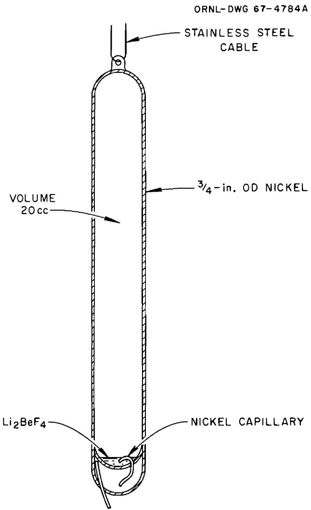  
Fig. 8.1. Freeze valve capsule.

Using this device the first gas sample was obtained in late December 1966, during run 10. In all, eight such samples were taken during operation with $^{235}\mathrm{U}$ fuel. Data for these samples are shown in Table 8.2 (at the end of this chapter).

# 8.2 Validity of Gas Samples

There are at least two particular questions that should be addressed to the data obtained on gas samples.

First, do the data indicate that a valid sample of pump bowl gas was obtained? Second, what fraction of the MSRE production of any given fission product chain is represented by flow to off-gas of a gas of the indicated composition?

The first question was approached by estimating the activity of 50-day $^{89}\mathrm{Sr}$ resulting from the stripping of 3.2-min $^{89}\mathrm{Kr}$ into the pump bowl purge gas. For example, the activity of full-power samples 11-46, 11-53, and 12-26 averaged $3.8 \times 10^{9}$ dis/min for $^{89}\mathrm{Sr}$ , indicating that the gas contained $2.0 \times 10^{13}$ atoms of $^{89}\mathrm{Sr}$ per cubic centimeter of capsule volume. If the only losses of $^{89}\mathrm{Kr}$ were by decay or $100\%$ efficient stripping in the pump bowl, then

$$
\frac {^ {8 9} \mathrm {K r} \text {s t r i p p e d / m i n}}{^ {8 9} \mathrm {K r} \text {p r o d u c e d / m i n}} = \frac {F}{F + \lambda},
$$

where $\lambda$ is the decay constant of $3.2\mathrm{-min}^{89}\mathrm{Kr}$ $(0.2177\mathrm{min}^{-1})$ , $F$ is the fraction of fuel volume that passes through the pump bowl per minute; for 50 gpm spray flow and 15 gpm fountain flow and a salt volume of 72 cu ft, $F = 0.121$ Thereby, $F / (F + \lambda) = 0.357$ . At nominal full power of 8 MW and a fission yield of $4.79\%$ , the rate of production of $^{89}\mathrm{Kr}$ is $7.25\times 10^{17}$ atoms/min. Thus $2.59\times 10^{17}$ atoms/min enter the pump bowl. Helium purge flow at the pump bowl temperature and pressure is 8370 cc/min, so that the gases mix for a concentration of $3.09\times 10^{13}$ atoms of $^{89}\mathrm{Kr}$ per cubic centimeter. With gas space-in the pump bowl of 54,400 cc, the average concentration in the well-mixed pump bowl is $1.28\times 10^{13}$ atoms of $^{89}\mathrm{Kr}$ per cubic centimeter. The difference between this and the entrant concentration represents the $^{89}\mathrm{Rb}$ and $^{89}\mathrm{Sr}$ produced in the pump bowl gas phase. Doubtless most of these atoms return to the salt.

The observed concentration, $2.0 \times 10^{13}$ atoms of $^{89}\mathrm{Sr}$ per cubic centimeter of capsule volume, is somewhat greater than the calculated average $^{89}\mathrm{Kr}$ concentration in the pump bowl gas (maximum, $1.3 \times 10^{13}$ atoms of $^{89}\mathrm{Kr}$ per cubic centimeter of pump bowl gas). Possibly some of the $^{89}\mathrm{Rb}$ and $^{89}\mathrm{Sr}$ atoms from $^{89}\mathrm{Kr}$ decay in the pump bowl remained gas-borne, entering with the sample. The concentration of $^{89}\mathrm{Sr}$ in the fuel salt was about $1.2 \times 10^{16}$ atoms/g. Thus all of the observed $^{89}\mathrm{Sr}$ activity in these gas samples corresponds to about $2\mathrm{mg}$ of fuel salt per cubic centimeter of gas. However, the $^{235}\mathrm{U}$ contents of these samples were 9, 23, and $25\mu \mathrm{g}$ per 20-cc sample, and the salt contained about 15,000 $\mu \mathrm{g}$ of $^{235}\mathrm{U}$ per gram, implying entrained fuel salt amounts of 0.03, 0.08, and $0.08\mathrm{mg / cc}$ . Very possibly, mists containing fuel salt could remain stable within the relatively tranquil sampler shield for a time sufficient to accumulate on their surfaces much of the gasborne $^{89}\mathrm{Rb}$ and $^{89}\mathrm{Sr}$ and to enter the capsule with the sample gas.

Two other gas samples (11-42 and 12-7) were taken while the system had been at negligible power for several hours. Concentrations of $^{89}\mathrm{Sr}$ were about an order of magnitude lower (0.06 and 0.23) in accord with the above viewpoint; of course, purely gas samples should go to zero, and purely salt samples should be unaffected within such a period.

Thus we conclude that the samples are quite possibly valid gas samples, probably with some mist involvement.

The salt-seeking elements, including zirconium, cerium, and uranium, do not involve volatilization as a means of entering the gas phase. It is shown in Table 8.2 that an individual gas sample contains quantities of these elements equivalent to a common magnitude of inventory salt. Thus the conjectured presence of salt mist in the gas samples appears verified.

The noble metals appeared in the gas samples in quantities that are orders of magnitude higher (in proportion to inventory salt) than was found for the salt-seeking elements.

Thus appreciable quantities of noble metals are involved in the gas-phase samples. If they are rapidly stripped as a result of volatility, then the observed concentrations represent the stripping of a major part of the fission products in this way. However, the volatile compounds of these elements thermodynamically are not stable in the fuel salt. If the noble metals are not volatile, then some form of aerosol mist or spray is indicated. The relationship in this case between aerosol concentrations within the sampler shield, in the gas space above the violently agitated pump bowl liquid surface, and in the shielded approaches to the off-gas exit from the pump bowl have not been established. However, in the pump bowl proper, "the spray produced a mist of salt droplets, some of which drifted into the off-gas line at a rate of a few grams per month" (3.6 g/month is equal to $10^{-8}$ g of salt per cubic centimeter of off-gas flow). As we shall see, in the samples taken during $^{233}\mathrm{U}$ operation, the quantity of gas-borne salt mist in our samples, though low, was higher than this.

# 8.3 Double-Wall Freeze Valve Capsule

A number of gas samples were taken during $^{233}\mathrm{U}$ operation using the freeze-valve capsule, with capsule volume of 30 cc; results are shown in Table 8.3. These extended across run 17. However, many aggressive acid leaches of the capsule were required to reduce external activities to values assuredly below the contained sample, and sometimes leakage resulted. To relieve this and also to provide a more certain fusible vacuum seal,

the double-walled capsule sampler shown in Fig. 8.2 was employed. This device contained an evacuated copper vial with an internal nozzle sealed by a soldered ball. The nozzle tip was inserted through and welded at the end to an outer capsule tip. A cap was welded to the top of the outer capsule, completely protecting the inner capsule from contamination. In practice, after a sample obtained using this device was transferred to the High Radiation Level Analytical Laboratory, the tip was abraded to free the nozzle, and the upper cap was cut off, permitting the inner capsule to slide directly out into a clean container for dissolution without touching any contaminated objects. Usually the part of the nozzle projecting from the internal capsule was cut off and analyzed separately.

Samples 19-77, 19-79, 20-9, 20-12, 20-27, and 20-32, in addition, employed capsules in which a cap containing a metal felt filter (capable of retaining $100\%$ of $4 - \mu$ particles) covered the nozzle tip. This served to reduce the amounts of the larger mist particles carried into the capsule.

Data from all the gas samples taken during the $^{233}\mathrm{U}$ operation are shown in Table 8.3. Reactor operating conditions which might affect samples are also shown. The data of Table 8.3 show the activity of the various nuclides in the entire capsule (including nozzle for

ORNL-DWG 70-6758

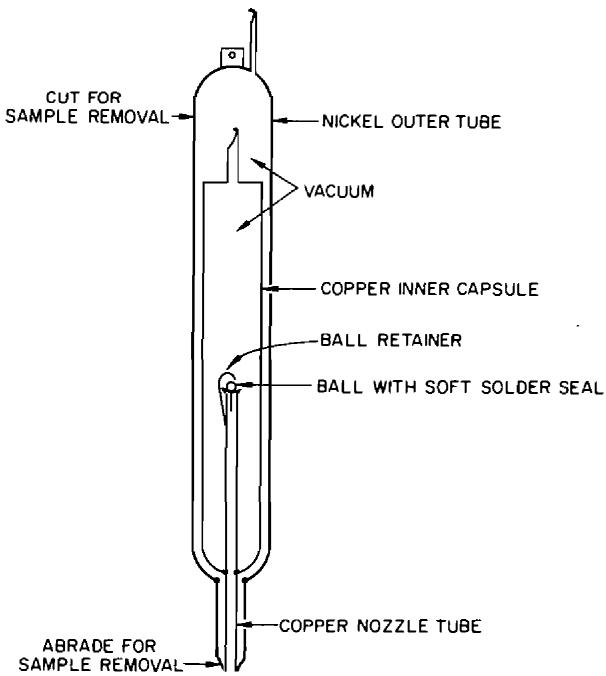  
Fig. 8.2. Double-wall sample capsule.

double-walled capsules), divided by the capsule volume. Some attributes of a number of the samples are of interest.

Samples 19-23, 19-37, and 19-56 were taken after the power had been lowered for several hours.

Samples 19-79 and 20-32 were taken after reactor shutdown and drain. Some salt constituents and noble metals still remain reasonably strong, implying that the salt mist is fairly persistent.

Sample 70 was taken "upside down"; strangely, it appeared to accumulate more salt-seeking elements. Samples 19-29, 19-64, and 19-73 were "control" samples: the internal nozzle seal, normally isoldered, was instead a bored copper bar which did not open. So data are only from the nozzle tube, as no gas could enter the capsule.

# 8.4 Effect of Mist

As it was evident that all samples tended to have salt mist, daughters of noble gases, and relatively high proportions of noble metals in them, a variety of ways were examined to separate these and to determine which materials, if any, were truly gas-borne as opposed to being components of the mist. It was concluded that the lower part of the nozzle tube (external to the gas capsule proper, but within the containment capsule) would carry mostly mist-borne materials; some of these would continue to the part of the nozzle tube that extended into the internal capsule, and of course was included with it when dissolved for analysis. The amounts of salt in nozzle and capsule segments were estimated for each sample by calculating and averaging the amounts of "inventory" salt indicated by the various salt-seeking nuclides.

For all nuclides a gross value was obtained by summing nozzle and capsule total and dividing by capsule volume. The "net" value for a given nuclide was obtained by subtracting from the observed capsule value an amount of nozzle mist measured by the salt-seeking elements and nuclides contained in the capsule; the amount remaining was then divided by capsule volume.

This was done for all gas samples taken at power during runs 19 and 20. The results are shown in Table 8.1, expressed as fractions of MSRE production indicated by the samples to have been gas-borne, with gross values including, and net values excluding, mist. Median values, which do not give undue importance to occasional high values, should represent the data best, though means are also shown.

The median values indicate that only very slight net amounts of noble metals (the table indicates $^{106}\mathrm{Ru}$ as a

Table 8.1. Gasborne percentage of MSRE production rate   
Double-wall capsules, runs 19 and 20 (sampled during power operation)   

<table><tr><td rowspan="2">Isotope</td><td colspan="4">Grossa</td><td colspan="4">Netb</td><td rowspan="2">Strippingc(calcd)</td></tr><tr><td>Number</td><td>Range</td><td>Median</td><td>Mean</td><td>Number</td><td>Range</td><td>Median</td><td>Mean</td></tr><tr><td colspan="10">Isotopes with Gaseous Precursors</td></tr><tr><td>89Sr</td><td>13</td><td>0.3–17</td><td>5.2</td><td>6.5 ± 1</td><td>11</td><td>0.06–15</td><td>3</td><td>5.7 ± 1.2</td><td>14</td></tr><tr><td>137Cs</td><td>11</td><td>6–98</td><td>22</td><td>33 ± 6</td><td>9</td><td>-1.6–91</td><td>23</td><td>25 ± 6</td><td>18</td></tr><tr><td>91Y</td><td>13</td><td>0.005–3</td><td>0.08</td><td>0.36 ± 0.17</td><td>11</td><td>-0.11–0.08</td><td>0.003</td><td>0.006 ± 0.010</td><td>0.07</td></tr><tr><td>140Ba</td><td>13</td><td>0.005–0.4</td><td>0.08</td><td>0.10 ± 0.02</td><td>11</td><td>-0.004–0.18</td><td>0.027</td><td>0.056 ± 0.013</td><td>0.16</td></tr><tr><td colspan="10">Salt-Seeking Isotopes</td></tr><tr><td>95Zr</td><td>13</td><td>0.002–0.3</td><td>0.04</td><td>0.057 ± 0.014</td><td>11</td><td>-0.007–0.05</td><td>0.006</td><td>0.012 ± 0.004</td><td></td></tr><tr><td>141C</td><td>13</td><td>0.002–0.2</td><td>0.009</td><td>0.025 ± 0.011</td><td>10</td><td>-0.03–0.009</td><td>-0.0003</td><td>-0.003 ± 0.003</td><td></td></tr><tr><td>144Cs</td><td>13</td><td>0.01–1.7</td><td>0.22</td><td>0.32 ± 0.09</td><td>11</td><td>-0.12–0.42</td><td>0.007</td><td>0.05 ± 0.03</td><td></td></tr><tr><td>147Nd</td><td>9</td><td>0.0001–0.1</td><td>0.012</td><td>0.021 ± 0.007</td><td>9</td><td>-0.01–0.01</td><td>-0.001</td><td>0.002 ± 0.002</td><td></td></tr><tr><td colspan="10">“Noble” Metal Isotopes</td></tr><tr><td>95Nb</td><td>13</td><td>0.07–7</td><td>0.7</td><td>1.9 ± 0.5</td><td>11</td><td>-0.2–3.6</td><td>0.4</td><td>0.9 ± 0.2</td><td></td></tr><tr><td>99Mo</td><td>13</td><td>0.16–16</td><td>1.0</td><td>2.7 ± 0.9</td><td>11</td><td>-0.6–7.3</td><td>0.3</td><td>1.5 ± 0.5</td><td></td></tr><tr><td>111Ag</td><td>13</td><td>0.2–20</td><td>1.5</td><td>4.0 ± 1.1</td><td>11</td><td>-0.9–4.1</td><td>0.3</td><td>0.7 ± 0.3</td><td></td></tr><tr><td>103Ru</td><td>13</td><td>0.31–20</td><td>1.8</td><td>4.3 ± 1.2</td><td>11</td><td>0.05–10</td><td>1.1</td><td>2.3 ± 0.7</td><td></td></tr><tr><td>106Ru</td><td>13</td><td>3.8–67</td><td>13</td><td>22 ± 4</td><td>11</td><td>-2–36</td><td>6</td><td>11 ± 3</td><td></td></tr><tr><td colspan="10">Tellurium-Iodine Isotopes</td></tr><tr><td>129Te</td><td>13</td><td>0.3–27</td><td>1.8</td><td>5.1 ± 1.5</td><td>11</td><td>-0.11–4</td><td>0.1</td><td>-1 ± 0.8</td><td></td></tr><tr><td>132Te</td><td>13</td><td>0.03–23</td><td>1.0</td><td>3.5 ± 1.2</td><td>11</td><td>-12–2</td><td>-0.4</td><td>-1 ± 0.8</td><td></td></tr><tr><td>131I</td><td>13</td><td>0.04–6</td><td>0.8</td><td>1.6 ± 0.4</td><td>11</td><td>-0.1–2</td><td>0.2</td><td>0.5 ± 0.1</td><td></td></tr></table>

${}^{a}$ Gross includes capsule plus nozzle isotopes.   
${}^{b}$ Net includes capsule isotopes only,less proportional quantity of material of nozzle composition,for the given sample.   
cThis is the percentage of MSRE production of the chain that is present, as the noble-gas precursor of the indicated nuclide, in the average gas in (and leaving) the pump bowl, if complete stripping occurs in the pump bowl. Daughters of the noble gas resulting from its decay while in the pump bowl are not included.

possible exception at $3\%$ are to be found as actually gas-borne, and little or no tellurium and iodine. The quantities of ${}^{89}\mathrm{Sr}(3\%)$ and ${}^{137}\mathrm{Cs}(23\%)$ are undoubtedly real and do indicate gas-borne material. Comparison with the values indicated by calculations assuming complete stripping of noble gases on passage of salt into the pump bowl (14% for ${}^{89}\mathrm{Sr}, 18\%$ for ${}^{137}\mathrm{Cs}, 0.07\%$ for ${}^{91}\mathrm{Y},$ and $0.16\%$ for ${}^{140}\mathrm{Ba})$ show that observed values in the gas phase are below fully stripped values by moderate amounts except in the case of ${}^{137}\mathrm{Cs}$ . The low values could result from some additional holdup of the gases in the sampler spiral, and high ${}^{137}\mathrm{Cs}$ values could result from the greater volatility of cesium, which might permit this, as a product of decay in the pump bowl, to remain uncondensed. Though we doubt that these arguments could stretch enough for the data to fit perfectly, the magnitudes are right, and we conclude that the net values for ${}^{89}\mathrm{Sr}$ and ${}^{137}\mathrm{Cs}$ in the gas are real and are reasonably correct.

The gas samples thereby indicate that, except for nuclides having noble-gas precursors, only small fractions of any fission product chain should be carried out of the pump bowl with the off-gas, with mist accounting for the major part of the activity in samples. The amount of salt carried out with off-gas as mist has been estimated3 as "at most a few grams a month." Far lower mist concentrations than appeared in our samples, which were taken within the sampler shield, are indicated for the off-gas. We conclude that the "net" median column, which discounts the mist, is the best measure furnished by our gas samples of the fraction of the various chains leaving the system with the off-gas.

# REFERENCES

1. S. S. Kirslis and F. F. Blankenship, "Pump Bowl Volatilization and Plating Tests," MSR Program Semiannu. Progr. Rep. Aug. 31, 1966, ORNL-4037, pp. 169-71.

2. S. S. Kirslis and F. F. Blankenship, "Freeze Valve Capsule Experiments," MSR Program Semiannu. Progr. Rep. Feb. 28, 1967, ORNL-4119, pp. 139-41.

3. J. R. Engel, P. N. Haubenreich, and A. Houtzeel, Spray, Mist, Bubbles, and Foam in the Molten Salt Reactor Experiment, ORNL-TM-3027 (June 1970).

For the fission products, each entry in the table consists of three numbers. The first number is the observed activity of the isotope in disintegrations per minute per cubic centimeter of capsule volume, corrected to time of sampling; the second number is the ratio of the activity to the production in disintegrations per minute per cubic centimeter of purge; the third number is the ratio to the activity in $1\mathrm{mg}$ of inventory salt. For U-235, the first number is the observed amount in micrograms per square centimeter of capsule surface; the second number is the ratio of this amount to the amount in $1\mathrm{mg}$ of inventory salt $(14\mu \mathrm{g})$

Table 8.2. Gas samples, $^{235}$ U operation   

<table><tr><td>Sample No.</td><td>Date</td><td>Power (MW)</td><td>Yield, % Half-life, days</td><td>Sr-89 4.79 50.4</td><td>Ba-140 6.51 12.8</td><td>U-235b</td><td>Ce-141 6.3 33</td><td>Ce-144 5.6 2.85</td><td>Zr-95 6.2 65</td><td>Nb-95 6.2 35</td><td>Mo-99 6.06 2.75</td><td>Ag-111 0.019 7.6</td><td>Ru-103 3.0 40</td><td>Ru-106 0.38 36.7</td><td>Te-132 4.24 3.21</td><td>Te-129m 0.133 37</td><td>I-131 3.1 8.05</td></tr><tr><td rowspan="2">10-11</td><td rowspan="2">12-27-66</td><td rowspan="2">8</td><td rowspan="2"></td><td>1.4E7 0.0031</td><td></td><td>0.20</td><td></td><td></td><td>&lt;1.5E5 &lt;0.0002</td><td>&lt;1.7E6 &lt;0.006</td><td>1.0E10 0.52</td><td></td><td>1.9E8 0.29</td><td>3.4E6 0.37</td><td>2.9E9 0.23</td><td></td><td>4.9E8 0.15</td></tr><tr><td>1.3</td><td>0.014</td><td></td><td></td><td></td><td>&lt;0.026</td><td>&lt;0.10</td><td>55</td><td></td><td>6.0</td><td>2.6</td><td>24</td><td></td><td>7.5</td></tr><tr><td rowspan="2">10-22c</td><td rowspan="2">1-11-67</td><td rowspan="2">8</td><td rowspan="2"></td><td>1.8E7 0.0039</td><td></td><td>0.028</td><td></td><td></td><td>&lt;0.1E6 &lt;0.0013</td><td>1.1E7 0.037</td><td>7.0E9 0.36</td><td></td><td>1.3E8 0.20</td><td>3.9E6 0.43</td><td>2.6E9 0.21</td><td></td><td>1.0E8 0.029</td></tr><tr><td>1.1</td><td>0.002</td><td></td><td></td><td></td><td>&lt;0.015</td><td>0.36</td><td>36</td><td></td><td>2.8</td><td>2.5</td><td>19</td><td></td><td>1.2</td></tr><tr><td rowspan="2">11-42d</td><td rowspan="2">4-11-67</td><td rowspan="2">0 (8?)</td><td>1.0E7</td><td></td><td>3.0</td><td></td><td></td><td></td><td>&lt;2.2E6</td><td>3.3E7</td><td>5.5E9</td><td></td><td>1.3E8</td><td>4.1E6</td><td>6.0E9</td><td></td><td>2.9E8 0.085</td></tr><tr><td>0.10</td><td></td><td>0.21</td><td></td><td></td><td></td><td>&lt;0.015</td><td>0.39</td><td>30</td><td></td><td>1.7</td><td>1.5</td><td>47</td><td></td><td>3.1</td></tr><tr><td rowspan="3">11-46</td><td rowspan="3">4-18-67</td><td rowspan="3">8</td><td>2.0E8</td><td>3.1E7</td><td>0.46</td><td></td><td></td><td></td><td>~1E6</td><td>6.5E7</td><td>1.2E10</td><td></td><td>2.3E8</td><td>4.8E6</td><td>1.7E10</td><td>4.0E7</td><td>4.9E7</td></tr><tr><td>0.25</td><td>0.0070</td><td></td><td></td><td></td><td></td><td>0.0012</td><td>0.23</td><td>0.60</td><td></td><td>0.35</td><td>0.52</td><td>1.35</td><td>1.27</td><td>0.015</td></tr><tr><td>1.8</td><td>1.6</td><td>0.03</td><td></td><td></td><td></td><td>~0.008</td><td>0.75</td><td>60</td><td></td><td>3.1</td><td>1.7</td><td>125</td><td>12</td><td>0.55</td></tr><tr><td rowspan="3">11-53e</td><td rowspan="3">5-2-67</td><td rowspan="3">8</td><td>1.8E8</td><td></td><td>1.2</td><td></td><td></td><td></td><td>9.E6</td><td>5.E8</td><td>8.E9</td><td>2.8E7</td><td>5.5E8</td><td>2.0E7</td><td>1.0E10</td><td>1.8E8</td><td>4.3E8</td></tr><tr><td>0.22</td><td></td><td></td><td></td><td></td><td></td><td>0.011</td><td>1.75</td><td>0.41</td><td>1.26</td><td>0.83</td><td>2.2</td><td>0.78</td><td>5.6</td><td>0.13</td></tr><tr><td>1.6</td><td></td><td>0.18</td><td></td><td></td><td></td><td>0.065</td><td>5.0</td><td>43</td><td>48</td><td>7.0</td><td>6.5</td><td>70</td><td>50</td><td>4.5</td></tr><tr><td rowspan="3">12-7f</td><td rowspan="3">6-21-67</td><td rowspan="3">0</td><td>4.1E7</td><td></td><td></td><td>2.4E7</td><td>2.1E6</td><td>4.3E6</td><td>1.2E8</td><td></td><td></td><td></td><td></td><td></td><td>(2.1E6)g</td><td>1.1E7</td><td></td></tr><tr><td></td><td></td><td>0.014</td><td>0.004</td><td>0.005</td><td>0.40</td><td></td><td></td><td></td><td></td><td></td><td></td><td>(0.0002)</td><td>0.35</td><td></td></tr><tr><td>0.36</td><td></td><td>0.15</td><td>0.035</td><td>0.030</td><td>1.2</td><td></td><td></td><td></td><td></td><td></td><td></td><td>(0.020)</td><td>3.2</td><td></td></tr><tr><td rowspan="3">12-26h</td><td rowspan="3">7-17-67</td><td rowspan="3">8</td><td>1.8E8</td><td></td><td>1.3</td><td></td><td></td><td>1.8E8</td><td>1.5E6</td><td>1.4E10</td><td>6.5E6</td><td>2.0E8</td><td>8.5E6</td><td>1.6E9</td><td>3.3E7</td><td>8.5E8</td><td></td></tr><tr><td>0.22</td><td></td><td></td><td></td><td></td><td>0.21</td><td>0.005</td><td>0.70</td><td>0.30</td><td>0.30</td><td>0.94</td><td>0.13</td><td>1.05</td><td>0.25</td><td></td></tr><tr><td>2.3</td><td></td><td>0.09</td><td></td><td></td><td>1.7</td><td>0.025</td><td>75</td><td>14</td><td>4.0</td><td>2.7</td><td>13</td><td>15</td><td>10.5</td><td></td></tr><tr><td rowspan="3">14-67</td><td rowspan="3">3-6-68</td><td rowspan="3">5</td><td>8.5E7</td><td>2.0E7</td><td>1.4</td><td>9.0E6</td><td>8.5E6</td><td>1.1E7</td><td>1.1E8</td><td>1.6E10</td><td></td><td>6.0E8</td><td>2.5E7</td><td>6.0E9</td><td></td><td>1.6E9</td><td></td></tr><tr><td>0.16</td><td>0.0072</td><td></td><td>0.009</td><td>0.024</td><td>0.020</td><td>0.39</td><td>1.28</td><td></td><td>1.45</td><td>-4.4</td><td>0.78</td><td></td><td>0.74</td><td></td></tr><tr><td>0.850</td><td>0.160</td><td>0.10</td><td>0.021</td><td>0.110</td><td>0.85</td><td>1.0</td><td>78</td><td></td><td>9.50</td><td>5.5</td><td>125</td><td></td><td>28</td><td></td></tr></table>

${}^{a}$ Corrected to time of sampling or to prior shutdown where necessary.   
$b_{\mathrm{Inventory}}$ : $14~\mu \mathrm{g}$ of U-235 per milligram of salt.   
After addition of $5.6\mathrm{g}$ of beryllium.   
$d_{\text{After addition of } 8.4 \, \text{g of beryllium}}$ .   
$e_{\mathrm{Helium}}$ bubbles.   
$f_{\mathrm{After42daysdown}}$   
$g_{\mathrm{Approximate}}$

Table 8.3. Data for gas samples from MSRE pump bowl during uranium-233 operation   
Fission product isotopes   

<table><tr><td>Sample number</td><td>FP15-29</td><td>FP15-43</td><td>FP15-52</td><td>FP15-58</td><td>FP15-71</td><td>FP17-6-</td><td>FP17-17</td><td>FP17-25</td></tr><tr><td>Capsule volume, cc</td><td>30.00</td><td>30.00</td><td>30.00</td><td>30.00</td><td>30.00</td><td>30.00</td><td>30.00</td><td>30.00</td></tr><tr><td>Date</td><td>10-13-68</td><td>10-29-68</td><td>11-6-68</td><td>11-12-68</td><td>11-27-68</td><td>1-22-69</td><td>2-10-69</td><td>3-14-69</td></tr><tr><td>Megawatt-hours</td><td>0.1</td><td>0.1</td><td>0.1</td><td>0.1</td><td>1.8</td><td>647.0</td><td>3408.0</td><td>7284.0</td></tr><tr><td>Power, MW</td><td>0.00</td><td>0.00</td><td>0.00</td><td>0.00</td><td>0.03</td><td>4.60</td><td>4.60</td><td>7.20</td></tr><tr><td>Rpm</td><td>1180</td><td>1180</td><td>1180</td><td>1180</td><td>1180</td><td>1180</td><td>1180</td><td>942</td></tr><tr><td>Pump bowl level, %</td><td>62.00</td><td>69.50</td><td>66.00</td><td>62.50</td><td>63.20</td><td>60.00</td><td>55.30</td><td>54.60</td></tr><tr><td>Overflow rate, lb/hr</td><td>1.4</td><td>7.4</td><td>1.0</td><td>0.8</td><td>3.7</td><td>2.2</td><td>1.6</td><td>1.0</td></tr><tr><td>Voids, %</td><td>0.60</td><td>0.00</td><td>0.00</td><td>0.00</td><td>0.60</td><td>0.60</td><td>0.60</td><td>0.00</td></tr><tr><td>Flow rate of gas, std liters/min</td><td>3.30 He</td><td>3.30 He</td><td>3.30 He</td><td>3.30 He</td><td>3.30 He</td><td>3.30 He</td><td>3.30 He</td><td>3.30 He</td></tr><tr><td>Sample line purge</td><td>On</td><td>On</td><td>On</td><td>On</td><td>On</td><td>On</td><td>On</td><td>On</td></tr></table>

<table><tr><td rowspan="2">Isotope</td><td rowspan="2">Half-life (days)</td><td rowspan="2">Fission yield (%)</td><td>1.01E7</td><td>4.70E5</td><td>4.10E4</td><td>5.67E4</td><td>3.29E6</td><td>1.44E8</td><td></td><td>4.63E7</td></tr><tr><td>1531</td><td>88.679</td><td>8.613</td><td>12.908</td><td>870</td><td>13,846</td><td></td><td>638</td></tr><tr><td rowspan="2">Sr-90</td><td>10264.00</td><td>5.86</td><td>4.87E6</td><td></td><td></td><td></td><td>2.47E6</td><td></td><td></td><td></td></tr><tr><td></td><td></td><td>1196</td><td></td><td></td><td></td><td>609</td><td></td><td></td><td></td></tr><tr><td rowspan="2">Y-91</td><td>58.80</td><td>5.57</td><td></td><td></td><td></td><td></td><td></td><td>2.24E8</td><td></td><td></td></tr><tr><td></td><td></td><td></td><td></td><td></td><td></td><td></td><td>22,626</td><td></td><td></td></tr><tr><td rowspan="2">Ba-140</td><td>12.80</td><td>5.40</td><td></td><td></td><td></td><td></td><td></td><td>6.83E8</td><td>1.18E6</td><td></td></tr><tr><td></td><td></td><td></td><td></td><td></td><td></td><td></td><td>23,727</td><td>11,346</td><td></td></tr><tr><td rowspan="2">Cs-137</td><td>10958.00</td><td>6.58</td><td>2.21E7</td><td>3.63E7</td><td>1.34E4</td><td>8.07E5</td><td>2.67E7</td><td>9.17E7</td><td></td><td>8.50E8</td></tr><tr><td></td><td></td><td>5430</td><td>8927</td><td>3.284</td><td>198</td><td>6576</td><td>22,358</td><td></td><td>185,590</td></tr><tr><td rowspan="2">Ce-141</td><td>33.00</td><td>7.09</td><td></td><td></td><td></td><td></td><td></td><td>1.57E8</td><td></td><td>5.37E4</td></tr><tr><td></td><td></td><td></td><td></td><td></td><td></td><td></td><td>9345</td><td></td><td>0.475</td></tr><tr><td rowspan="2">Ce-144</td><td>284.00</td><td>4.61</td><td>8.63E7</td><td>5.50E5</td><td>1.16E4</td><td>6.93E3</td><td>3.19E7</td><td>7.47E8</td><td></td><td>7.04E5</td></tr><tr><td></td><td></td><td>1784</td><td>11.828</td><td>0.254</td><td>0.154</td><td>736</td><td>19,096</td><td></td><td>15.678</td></tr><tr><td rowspan="2">Nd-147</td><td>11.10</td><td>1.98</td><td></td><td></td><td></td><td></td><td></td><td></td><td></td><td>2.28E7</td></tr><tr><td></td><td></td><td></td><td></td><td></td><td></td><td></td><td></td><td></td><td>544</td></tr><tr><td rowspan="2">Zr-95</td><td>65.00</td><td>6.05</td><td>2.20E7</td><td>8.43E4</td><td>2.93E3</td><td>1.48E3</td><td>5.83E6</td><td>3.14E8</td><td>1.23E8</td><td></td></tr><tr><td></td><td></td><td>1528</td><td>7.028</td><td>0.264</td><td>0.143</td><td>647</td><td>25,923</td><td>3138</td><td></td></tr><tr><td rowspan="2">Nb-95</td><td>35.00</td><td>6.05</td><td>1.23E8</td><td>1.51E7</td><td>1.68E6</td><td>1.99E6</td><td>4.67E8</td><td>1.18E8</td><td>6.63E8</td><td>6.10E7</td></tr><tr><td></td><td></td><td>14,171</td><td>1524</td><td>165</td><td>195</td><td>46,205</td><td>14,713</td><td>48,775</td><td>1848</td></tr><tr><td rowspan="2">Mo-99</td><td>2.79</td><td>4.80</td><td></td><td></td><td></td><td></td><td>7.57E8</td><td></td><td>2.38E9</td><td>3.50E9</td></tr><tr><td></td><td></td><td></td><td></td><td></td><td></td><td>315,278</td><td></td><td>18,740</td><td>41,766</td></tr><tr><td rowspan="2">Ru-103</td><td>39.60</td><td>1.99</td><td></td><td></td><td></td><td></td><td>3.50E7</td><td>1.07E8</td><td>1.35E8</td><td>8.67E7</td></tr><tr><td></td><td></td><td></td><td></td><td></td><td></td><td>35,611</td><td>25,660</td><td>7519</td><td>2992</td></tr><tr><td rowspan="2">Ru-106</td><td>367.00</td><td>0.43</td><td>1.99E7</td><td>5.10E6</td><td>1.98E6</td><td></td><td>3.32E7</td><td>4.87E6</td><td>7.60E6</td><td>5.13E6</td></tr><tr><td></td><td></td><td>3471</td><td>918</td><td>362</td><td></td><td>6303</td><td>1010</td><td>1504</td><td>968</td></tr><tr><td rowspan="2">Ag-111</td><td>7.50</td><td>0.02</td><td></td><td></td><td></td><td></td><td></td><td></td><td></td><td>1.21E7</td></tr><tr><td></td><td></td><td></td><td></td><td></td><td></td><td></td><td></td><td></td><td>24,346</td></tr><tr><td rowspan="2">Sb-125</td><td>986.00</td><td>0.08</td><td>8.03E5</td><td>1.70E5</td><td></td><td></td><td></td><td></td><td></td><td></td></tr><tr><td></td><td></td><td>7109</td><td>1518</td><td></td><td></td><td></td><td></td><td></td><td></td></tr><tr><td rowspan="2">Te-129m</td><td>34.00</td><td>0.33</td><td></td><td></td><td></td><td></td><td></td><td>6.47E7</td><td>1.24E8</td><td>9.97E7</td></tr><tr><td></td><td></td><td></td><td></td><td></td><td></td><td></td><td>87,634</td><td>37,268</td><td>19,244</td></tr><tr><td rowspan="2">Te-132</td><td>3.25</td><td>4.40</td><td></td><td></td><td></td><td></td><td>3.24E8</td><td></td><td>5.87E9</td><td>8.57E9</td></tr><tr><td></td><td></td><td></td><td></td><td></td><td></td><td>169,808</td><td></td><td>49,718</td><td>109,408</td></tr><tr><td rowspan="2">I-131</td><td>8.05</td><td>2.90</td><td></td><td></td><td></td><td></td><td>1.81E9</td><td>1.36E8</td><td>4.73E8</td><td>1.02E9</td></tr><tr><td></td><td></td><td></td><td></td><td></td><td></td><td>3,389,619</td><td>6003</td><td>6940</td><td>16,860</td></tr><tr><td colspan="11">Salt constituentsb</td></tr><tr><td colspan="11">Constituent</td></tr><tr><td colspan="11">U-233</td></tr><tr><td colspan="11"></td></tr><tr><td colspan="11">Li</td></tr><tr><td colspan="11"></td></tr><tr><td colspan="11">Be</td></tr><tr><td colspan="11"></td></tr></table>

Table 8.3. (continued) Data for gas samples from MSRE pump bowl during uranium-233 operation   

<table><tr><td>Sample number</td><td>FP17-33</td><td>FP18-14</td><td>FP18-15</td><td>FP18-21</td><td>.FP18-25</td><td>FP18-29</td><td>FP18-42</td></tr><tr><td>Capsule volume, cc</td><td>30.00</td><td>7.80</td><td>30.00</td><td>7.80</td><td>7.80</td><td>7.80</td><td>7.80</td></tr><tr><td>Date</td><td>4-4-69</td><td>5-6-69</td><td>5-6-69</td><td>5-12-69</td><td>5-17-69</td><td>5-21-69</td><td>5-28-69</td></tr><tr><td>Megawatt-hours</td><td>10695.0</td><td>16009.0</td><td>16052.0</td><td>17163.0</td><td>18002.0</td><td>18665.0</td><td>19679.0</td></tr><tr><td>Power, MW</td><td>8.00</td><td>7.80</td><td>7.70</td><td>7.90</td><td>7.00</td><td>7.80</td><td>6.60</td></tr><tr><td>Rpm</td><td>1180</td><td>1180</td><td>1180</td><td>1180</td><td>990</td><td>1180</td><td>990</td></tr><tr><td>Pump bowl level, %</td><td>60.00</td><td>63.40</td><td>60.10</td><td>60.50</td><td>55.90</td><td>60.10</td><td>53.20</td></tr><tr><td>Overflow rate, lb/hr</td><td>4.8</td><td>4.6</td><td>2.2</td><td>1.2</td><td>0.1</td><td>1.3</td><td>0.0</td></tr><tr><td>Voids, %</td><td>0.60</td><td>0.60</td><td>0.60</td><td>0.60</td><td>0.00</td><td>0.60</td><td>0.00</td></tr><tr><td>Flow rate of gas, std liters/min</td><td>3.30 He</td><td>3.30 He</td><td>3.30 He</td><td>3.30 He</td><td>3.30 He</td><td>3.30 He</td><td>2.30 He</td></tr><tr><td>Sample line purge</td><td>On</td><td>On</td><td>On</td><td>On</td><td>On</td><td>On</td><td>On</td></tr></table>

Fission product isotopes   

<table><tr><td rowspan="3">Isotope</td><td rowspan="3">Half-life (days)</td><td rowspan="3">Fission yield (%)</td><td colspan="6">\( \mathbf{S} \)</td></tr><tr><td>5.70E8</td><td>2.24E8</td><td>2.33E7</td><td>1.54E7</td><td></td><td>3.23E8</td></tr><tr><td>590</td><td>1918</td><td>199</td><td>124</td><td></td><td>2485</td></tr><tr><td>Sr-89</td><td>52.00</td><td>5.46</td><td>5.70E8</td><td>2.24E8</td><td>2.33E7</td><td>1.54E7</td><td></td><td>3.23E8</td></tr><tr><td></td><td></td><td></td><td>590</td><td>1918</td><td>199</td><td>124</td><td></td><td>2485</td></tr><tr><td>Y-91</td><td>58.80</td><td>5.57</td><td>1.85E4</td><td>2.56E6</td><td></td><td>1.03E6</td><td></td><td>3.88E6</td></tr><tr><td></td><td></td><td></td><td>0.217</td><td>24.420</td><td></td><td>9.371</td><td></td><td>33.488</td></tr><tr><td>Ba-140</td><td>12.80</td><td>5.40</td><td>8.30E6</td><td>1.59E7</td><td>3.03E6</td><td>3.09E6</td><td></td><td>2.33E7</td></tr><tr><td></td><td></td><td></td><td>57.639</td><td>102</td><td>19.423</td><td>18.840</td><td></td><td>142</td></tr><tr><td>Cs-137</td><td>10958,00</td><td>6.58</td><td>1.19E7</td><td>4.99E6</td><td>2.42E6</td><td>1.06E6</td><td></td><td>4.06E6</td></tr><tr><td></td><td></td><td></td><td>2457</td><td>970</td><td>471</td><td>203</td><td></td><td>762</td></tr><tr><td>Ce-141</td><td>33.00</td><td>7.09</td><td>5.57E5</td><td>9.60E5</td><td>3.67E5</td><td></td><td></td><td>1.16E6</td></tr><tr><td></td><td></td><td></td><td>3.787</td><td>5.649</td><td>2.144</td><td></td><td></td><td>6.272</td></tr><tr><td>Cc-144</td><td>284.00</td><td>4.61</td><td>5.33E5</td><td>5.76E5</td><td>1.09E5</td><td>5.24E5</td><td></td><td>7.13E5</td></tr><tr><td></td><td></td><td></td><td>10.336</td><td>10.261</td><td>1.934</td><td>9.103</td><td></td><td>12.000</td></tr><tr><td>Zr-95</td><td>65.00</td><td>6.05</td><td></td><td>1.86E5</td><td>4.90E5</td><td></td><td></td><td>8.29E5</td></tr><tr><td></td><td></td><td></td><td></td><td>1.721</td><td>4.495</td><td></td><td></td><td>6.855</td></tr><tr><td>Nb-95</td><td>35.00</td><td>6.05</td><td>2.05E8</td><td>1.55E7</td><td>1.95E8</td><td>2.06E7</td><td></td><td>1.99E7</td></tr><tr><td></td><td></td><td></td><td>4218</td><td>226</td><td>2834</td><td>281</td><td></td><td>246</td></tr><tr><td>Mo-99</td><td>2.79</td><td>4.80</td><td>5.63E8</td><td>1.14E9</td><td>5.60E9</td><td>1.16E9</td><td></td><td>1.51E9</td></tr><tr><td></td><td></td><td></td><td>3832</td><td>8748</td><td>42,424</td><td>7407</td><td></td><td>10,085</td></tr><tr><td>Ru-103</td><td>39.60</td><td>1.99</td><td>1.37E8</td><td>1.08E8</td><td>1.73E8</td><td>6.86E7</td><td></td><td>4.47E7</td></tr><tr><td></td><td></td><td></td><td>3604</td><td>2402</td><td>3847</td><td>1453</td><td></td><td>912</td></tr><tr><td>Ru-106</td><td>367.00</td><td>0.43</td><td>8.43E6</td><td>4.92E6</td><td>8.83E6</td><td>2.95E6</td><td></td><td>1.95E6</td></tr><tr><td></td><td></td><td></td><td>1509</td><td>838</td><td>1503</td><td>493</td><td></td><td>320</td></tr><tr><td>Ag-111</td><td>7.50</td><td>0.02</td><td>1.84E7</td><td>8.27E6</td><td>2.01E7</td><td>1.81E6</td><td></td><td>4.28E6</td></tr><tr><td></td><td></td><td></td><td>27,170</td><td>11,630</td><td>28,191</td><td>2382</td><td></td><td>5763</td></tr><tr><td>Sb-125</td><td>986.00</td><td>0.08</td><td></td><td></td><td>1.58E5</td><td></td><td></td><td></td></tr><tr><td></td><td></td><td></td><td></td><td></td><td>628</td><td></td><td></td><td></td></tr><tr><td>Te-1 29m</td><td>34.00</td><td>0.33</td><td>3.70E8</td><td>8.90E6</td><td>1.27E8</td><td>2.32E7</td><td></td><td>9.22E6</td></tr><tr><td></td><td></td><td></td><td>54,917</td><td>1135</td><td>16,152</td><td>2813</td><td></td><td>1081</td></tr><tr><td>Te-132</td><td>3.25</td><td>4.40</td><td>1.63E10</td><td>3.35E11</td><td>6.63E9</td><td>1.91E9</td><td></td><td>4.32E8</td></tr><tr><td></td><td></td><td></td><td>122,556</td><td>2,720,450</td><td>53,495</td><td>13,358</td><td></td><td>3154</td></tr><tr><td>I-131</td><td>8.05</td><td>2.90</td><td>2.55E8</td><td>2.23E8</td><td>8.77E8</td><td>1.97E8</td><td>3.99E7</td><td>1.67E8</td></tr><tr><td></td><td></td><td></td><td>3148</td><td>2600</td><td>10,182</td><td>2162</td><td>446</td><td>1858</td></tr><tr><td></td><td></td><td></td><td></td><td></td><td>Salt \( {\text{constituents}}^{b} \)</td><td></td><td></td><td></td></tr><tr><td colspan="9">Constituent</td></tr><tr><td>U-233</td><td></td><td></td><td>0.0006</td><td>0.0001</td><td>0.0002</td><td>0.0001</td><td></td><td>0.0001</td></tr><tr><td></td><td></td><td></td><td>95,402</td><td>12.276</td><td>34.560</td><td>17.646</td><td></td><td>17.646</td></tr><tr><td>Li</td><td></td><td></td><td>1.1853</td><td>0.0067</td><td>1.6333</td><td>0.0042</td><td></td><td>0.3077</td></tr><tr><td></td><td></td><td></td><td>10,262</td><td>57.720</td><td>14,141</td><td>36.630</td><td></td><td>2664</td></tr></table>

Table 8.3 (continued) Data for gas samples from MSRE pump bowl during uranium-233 operation   

<table><tr><td>Sample number</td><td>FP19-13</td><td>FP19-14</td><td>FP19-15</td><td>FP19-16</td><td>FP19-19</td><td>FP19-20</td><td>FP19-23</td><td>FP19-28</td></tr><tr><td>Capsule volume, cc</td><td>7.80</td><td>15.00</td><td>7.80</td><td>15.00</td><td>7.80</td><td>15.00</td><td>15.00</td><td>15.00</td></tr><tr><td>Date</td><td>8-21-69</td><td>8-21-69</td><td>8-21-69</td><td>8-21-69</td><td>9-4-69</td><td>9-4-69</td><td>9-10-69</td><td>9-23-69</td></tr><tr><td>Megawatt-hours</td><td>20310.0</td><td>20310.0</td><td>20310.0</td><td>20310.0</td><td>21557.0</td><td>21587.0</td><td>22255.0</td><td>23437.0</td></tr><tr><td>Power, MW</td><td>0.01</td><td>0.01</td><td>0.01</td><td>0.01</td><td>5.50</td><td>5.50</td><td>0.01</td><td>5.50</td></tr><tr><td>Rpm</td><td>1165</td><td>1165</td><td>1165</td><td>1165</td><td>1100</td><td>1100</td><td>1165</td><td>1188</td></tr><tr><td>Pump bowl level, %</td><td>63.25</td><td>64.10</td><td>63.34</td><td>65.75</td><td>62.00</td><td>60.20</td><td>66.40</td><td>67.00</td></tr><tr><td>Overflow rate, lb/hr</td><td>0.1</td><td>0.1</td><td>0.1</td><td>0.1</td><td>1.5</td><td>1.5</td><td>6.8</td><td>7.5</td></tr><tr><td>Voids, %</td><td>0.38</td><td>0.38</td><td>0.38</td><td>0.38</td><td>0.50</td><td>0.50</td><td>0.70</td><td>0.53</td></tr><tr><td>Flow rate of gas, std liters/min</td><td>3.30 He</td><td>3.30 He</td><td>3.30 He</td><td>3.30 He</td><td>2.40 Ar</td><td>2.40 Ar</td><td>2.40 Ar</td><td>2.40 He</td></tr><tr><td>Sample line purgege</td><td>On</td><td>On</td><td>On</td><td>On</td><td>Off</td><td>Off</td><td>Off</td><td>Off</td></tr></table>

Fission product isotopesa   

<table><tr><td rowspan="2">Isotope</td><td rowspan="2">Half-life (days)</td><td rowspan="2">Fission yield (%)</td><td>5.46</td><td>5.49E6</td><td>5.65E6</td><td>2.68E7</td><td>7.87E6</td><td>2.94E7</td><td>2.28E6</td><td>4.65E6</td><td>9.07E7</td></tr><tr><td>128</td><td>132</td><td>628</td><td>185</td><td>569</td><td>43.931</td><td>81.378</td><td>1430</td><td></td></tr><tr><td rowspan="2">Y-91</td><td rowspan="2">58.80</td><td rowspan="2">5.57</td><td>5.63E5</td><td>8.93E5</td><td>3.12E6</td><td>4.48E5</td><td>1.27E6</td><td>6.61E5</td><td>3.43E6</td><td>7.67E5</td><td></td></tr><tr><td>12.676</td><td>20.166</td><td>70.644</td><td>10.159</td><td>25.158</td><td>13.044</td><td>61.751</td><td>12.757</td><td></td></tr><tr><td rowspan="2">Ba-140</td><td rowspan="2">12.80</td><td rowspan="2">5.40</td><td></td><td>9.40E4</td><td>1.55E5</td><td>3.35E5</td><td>1.58E6</td><td>4.99E5</td><td>8.20E6</td><td>3.28E6</td><td></td></tr><tr><td></td><td>52.222</td><td>87.151</td><td>189</td><td>33.409</td><td>10.346</td><td>126</td><td>41.677</td><td></td></tr><tr><td rowspan="2">Cs-137</td><td rowspan="2">10958.00</td><td rowspan="2">6.58</td><td>7.47E5</td><td>3.50E6</td><td>2.00E6</td><td>1.63E6</td><td>3.04E7</td><td>3.65E6</td><td>1.37E7</td><td>1.01E6</td><td></td></tr><tr><td>139</td><td>652</td><td>372</td><td>304</td><td>5565</td><td>668</td><td>2480</td><td>180</td><td></td></tr><tr><td rowspan="2">Ce-141</td><td rowspan="2">33.00</td><td rowspan="2">7.09</td><td>2.12E5</td><td>1.37E6</td><td>1.63E6</td><td>3.48E6</td><td>1.45E5</td><td>1.19E5</td><td>3.00E6</td><td>2.16E5</td><td></td></tr><tr><td>6.631</td><td>43.187</td><td>51.525</td><td>110</td><td>2.739</td><td>2.222</td><td>46.802</td><td>2.809</td><td></td></tr><tr><td rowspan="2">Ce-144</td><td rowspan="2">284.00</td><td rowspan="2">4.61</td><td>6.47E5</td><td>4.59E6</td><td>3.49E6</td><td>8.13E6</td><td>5.22E5</td><td>6.12E5</td><td>4.59E6</td><td>2.36E5</td><td></td></tr><tr><td>13.213</td><td>93.605</td><td>71.167</td><td>166</td><td>10.457</td><td>12.265</td><td>90.646</td><td>4.600</td><td></td></tr><tr><td rowspan="2">Nd-147</td><td rowspan="2">11.10</td><td rowspan="2">1098</td><td>1.16E4</td><td></td><td>4.21E4</td><td>1.20E5</td><td>3.35E5</td><td>1.39E5</td><td>1.19E6</td><td>2.11E5</td><td></td></tr><tr><td>33.378</td><td></td><td>124</td><td>356</td><td>17.799</td><td>7.222</td><td>46.615</td><td>6.975</td><td></td></tr><tr><td rowspan="2">Zr-95</td><td rowspan="2">65.00</td><td rowspan="2">6.05</td><td>4.33E5</td><td>3.09E6</td><td>2.27E6</td><td>5.13E6</td><td>4.64E5</td><td>3.43E5</td><td>2.09E6</td><td>1.38E5</td><td></td></tr><tr><td>8.615</td><td>61.487</td><td>45.385</td><td>103</td><td>8.171</td><td>6.012</td><td>34.261</td><td>2.088</td><td></td></tr><tr><td rowspan="2">Nb-95</td><td rowspan="2">35.00</td><td rowspan="2">6.05</td><td>2.22E7</td><td>4.27E7</td><td>2.42E8</td><td>3.18E7</td><td>1.33E7</td><td>1.73E6</td><td>8.53E6</td><td>4.07E7</td><td></td></tr><tr><td>298</td><td>575</td><td>3270</td><td>429</td><td>192</td><td>24.916</td><td>125</td><td>608</td><td></td></tr><tr><td rowspan="2">Mo-99</td><td rowspan="2">2.79</td><td rowspan="2">4.80</td><td></td><td>6.19E5</td><td>1.82E6</td><td>8.40E5</td><td>1.64E8</td><td>1.16E8</td><td>1.68E8</td><td>2.08E9</td><td></td></tr><tr><td></td><td>6472</td><td>18482</td><td>8317</td><td>2075</td><td>1432</td><td>1900</td><td>22584</td><td></td></tr><tr><td rowspan="2">Ru-103</td><td rowspan="2">39.60</td><td rowspan="2">1.99</td><td>1.20E7</td><td>1.26E7</td><td>3.28E7</td><td>5.96E6</td><td>9.74E6</td><td>4.87E6</td><td>5.95E7</td><td>6.87E7</td><td></td></tr><tr><td>1053</td><td>1107</td><td>2910</td><td>529</td><td>616</td><td>304</td><td>3221</td><td>3218</td><td></td></tr><tr><td rowspan="2">Ru-106</td><td rowspan="2">367.00</td><td rowspan="2">0.43</td><td>3.22E6</td><td>3.60E6</td><td>9.65E6</td><td>1.47E6</td><td>8.21E5</td><td>6.67E5</td><td>5.44E6</td><td>3.29E6</td><td></td></tr><tr><td>613</td><td>688</td><td>1845</td><td>280</td><td>155</td><td>126</td><td>1022</td><td>613</td><td></td></tr><tr><td rowspan="2">Ag-111</td><td rowspan="2">7.50</td><td rowspan="2">0.02</td><td></td><td></td><td></td><td></td><td>7.46E5</td><td>1.76E5</td><td>1.99E5</td><td>2.47E6</td><td></td></tr><tr><td></td><td></td><td></td><td></td><td>2637</td><td>609</td><td>537</td><td>6092</td><td></td></tr><tr><td rowspan="2">Sb-125</td><td rowspan="2">986.00</td><td rowspan="2">0.08</td><td></td><td></td><td>7.05E6</td><td>8.07E4</td><td>2.04E4</td><td></td><td></td><td></td><td></td></tr><tr><td></td><td></td><td>26311</td><td>301</td><td>73.063</td><td></td><td></td><td></td><td></td></tr><tr><td rowspan="2">Te-129m</td><td rowspan="2">34.00</td><td rowspan="2">0.33</td><td>1.92E6</td><td>2.57E6</td><td>7.92E6</td><td>3.07E6</td><td>2.91E6</td><td>1.41E6</td><td>2.29E6</td><td>1.49E7</td><td></td></tr><tr><td>1238</td><td>1662</td><td>5160</td><td>2008</td><td>1172</td><td>563</td><td>766</td><td>4183</td><td></td></tr><tr><td rowspan="2">Te-132</td><td rowspan="2">3.25</td><td rowspan="2">4.40</td><td>1.05E6</td><td>2.20E6</td><td>4.49E6</td><td>3.70E6</td><td>1.06E8</td><td>9.93E7</td><td>6.31E7</td><td>6.65E8</td><td></td></tr><tr><td>13462</td><td>27329</td><td>53997</td><td>43478</td><td>1518</td><td>1385</td><td>782</td><td>8018</td><td></td></tr><tr><td rowspan="2">I-131</td><td rowspan="2">8.05</td><td rowspan="2">2.90</td><td>1.62E5</td><td>2.07E5</td><td>4.83E5</td><td>4.98E5</td><td>3.59E7</td><td>5.89E7</td><td>1.01E8</td><td>1.21E8</td><td></td></tr><tr><td>1650</td><td>2113</td><td>4957</td><td>5108</td><td>1088</td><td>1749</td><td>2314</td><td>2498</td><td></td></tr><tr><td colspan="12">Salt constituentsb</td></tr><tr><td colspan="12">Constituents</td></tr><tr><td></td><td></td><td></td><td>0.0012</td><td>0.0004</td><td>0.0007</td><td>0.0011</td><td>0.0002</td><td>0.0001</td><td>0.0005</td><td>0.0000</td><td></td></tr><tr><td></td><td></td><td></td><td>182</td><td>61.041</td><td>98.398</td><td>166</td><td>25.894</td><td>13.166</td><td>71.215</td><td>6.284</td><td></td></tr><tr><td>U-total</td><td></td><td></td><td>0.2218</td><td>0.0011</td><td></td><td>0.0010</td><td>0.0008</td><td>0.0006</td><td>0.0013</td><td></td><td></td></tr><tr><td></td><td></td><td></td><td>27,484</td><td>132</td><td></td><td>124</td><td>95.320</td><td>74.349</td><td>165</td><td></td><td></td></tr><tr><td>Li</td><td></td><td></td><td>0.0015</td><td>0.0108</td><td>0.0064</td><td>0.0147</td><td></td><td></td><td>0.0035</td><td>0.0030</td><td></td></tr><tr><td></td><td></td><td></td><td>13.320</td><td>93.506</td><td>55.500</td><td>127</td><td></td><td></td><td>30.014</td><td>25.974</td><td></td></tr><tr><td>Be</td><td></td><td></td><td></td><td>0.0114</td><td>0.0011</td><td>0.0096</td><td>0.0009</td><td>0.0018</td><td>0.0025</td><td>0.0012</td><td></td></tr><tr><td></td><td></td><td></td><td></td><td>171</td><td>16.889</td><td>144</td><td>13.435</td><td>26.946</td><td>36.926</td><td>17.964</td><td></td></tr><tr><td>Zr</td><td></td><td></td><td></td><td>0.5253</td><td></td><td></td><td></td><td></td><td></td><td></td><td></td></tr><tr><td></td><td></td><td></td><td></td><td>4540</td><td></td><td></td><td></td><td></td><td></td><td></td><td></td></tr></table>

Table 8.3. (continued) Data for gas samples from MSRE pump bowl during uranium-233 operation   

<table><tr><td>Sample number</td><td>FP19-29</td><td>FP19-37</td><td>FP19-38</td><td>FP19-41</td><td>FP19-46</td><td>FP19-54</td><td>FP19-56</td><td>FP19-62</td></tr><tr><td>Capsule volume, cc</td><td>7.80</td><td>15.00</td><td>15.00</td><td>15.00</td><td>15.00</td><td>15.00</td><td>15.00</td><td>15.00</td></tr><tr><td>Date</td><td>9-23-69</td><td>9-30-69</td><td>10-1-69</td><td>10-3-69</td><td>10-7-69</td><td>10-14-69</td><td>10-15-69</td><td>10-22-69</td></tr><tr><td>Megawatt-hours</td><td>23458.0</td><td>23936.0</td><td>24025.0</td><td>24352.0</td><td>25153.0</td><td>26601.0</td><td>26821.0</td><td>28073.0</td></tr><tr><td>Power, MW</td><td>5.50</td><td>0.01</td><td>5.50</td><td>7.00</td><td>8.00</td><td>8.00</td><td>0.01</td><td>8.00</td></tr><tr><td>Rpm</td><td>1188</td><td>611</td><td>610</td><td>1175</td><td>1176</td><td>1185</td><td>1185</td><td>1186</td></tr><tr><td>Pump bowl level, %</td><td>64.00</td><td>64.60</td><td>60.80</td><td>64.00</td><td>63.80</td><td>67.00</td><td>66.00</td><td>63.60</td></tr><tr><td>Overflow rate. lb/hr</td><td>3.9</td><td>0.5</td><td>0.9</td><td>4.3</td><td>5.8</td><td>8.3</td><td>7.0</td><td>3.9</td></tr><tr><td>Voids, %</td><td>0.53</td><td>0.00</td><td>0.00</td><td>0.53</td><td>0.53</td><td>0.53</td><td>0.53</td><td>0.53</td></tr><tr><td>Flow rate of gas, std liters/min</td><td>2.40 He</td><td>2.45 He</td><td>2.40 He</td><td>2.40 He</td><td>3.30 He</td><td>3.30 He</td><td>3.35 He</td><td>3.30 He</td></tr><tr><td>Sample line purgege</td><td>Off</td><td>Off</td><td>Off</td><td>Off</td><td>Off</td><td>Off</td><td>Off</td><td>Off</td></tr></table>

Fission product isotopes   

<table><tr><td rowspan="3">Isotope</td><td rowspan="3">Half-life (days)</td><td rowspan="3">Fission yield (%)</td><td colspan="8">%</td></tr><tr><td>7.23E6</td><td>7.67E6</td><td>2.40E7</td><td>6.29E6</td><td>1.51E8</td><td>2.69E6</td><td>1.11E6</td><td>2.56E7</td></tr><tr><td>114</td><td>119</td><td>369</td><td>92.451</td><td>2007</td><td>30.537</td><td>12.310</td><td>259</td></tr><tr><td rowspan="2">Y-91</td><td rowspan="2">58.80</td><td rowspan="2">5.57</td><td>8.71E5</td><td>4.68E5</td><td>3.65E4</td><td>3.55E5</td><td>4.67E6</td><td>1.65E5</td><td>2.99E5</td><td>4.61E5</td></tr><tr><td>14.436</td><td>7.635</td><td>0.591</td><td>5.568</td><td>66.858</td><td>2.038</td><td>3.628</td><td>5.107</td></tr><tr><td rowspan="2">Ba-140</td><td rowspan="2">12.80</td><td rowspan="2">5.40</td><td>1.83E6</td><td>5.19E5</td><td>6.58E5</td><td>1.21E6</td><td>1.33E7</td><td>1.64E5</td><td>5.69E5</td><td>1.91E6</td></tr><tr><td>23.177</td><td>6.745</td><td>8.361</td><td>13.870</td><td>123</td><td>1.188</td><td>4.067</td><td>12.544</td></tr><tr><td rowspan="2">Cs-137</td><td rowspan="2">10958.00</td><td rowspan="2">6.58</td><td>7.13E5</td><td>6.03E6</td><td>3.04E5</td><td>1.69E6</td><td>2.03E6</td><td>5.59E5</td><td>4.35E5</td><td>4.73E6</td></tr><tr><td>128</td><td>1072</td><td>53.996</td><td>299</td><td>354</td><td>95.991</td><td>74.429</td><td>798</td></tr><tr><td rowspan="2">Ce-141</td><td rowspan="2">33.00</td><td rowspan="2">7.09</td><td>5.29E5</td><td>1.90E5</td><td>2.91E3</td><td>1.85E5</td><td>3.53E6</td><td>1.19E5</td><td>3.81E5</td><td>2.55E5</td></tr><tr><td>6.859</td><td>2.402</td><td>0.036</td><td>2.165</td><td>35.582</td><td>0.973</td><td>3.045</td><td>1.837</td></tr><tr><td rowspan="2">Ce-144</td><td rowspan="2">284.00</td><td rowspan="2">4.61</td><td>9.36E5</td><td>9.07E5</td><td>1.31E4</td><td>2.64E5</td><td>2.25E6</td><td>2.79E5</td><td>2.47E5</td><td>1.54E5</td></tr><tr><td>18.244</td><td>17.639</td><td>0.254</td><td>5.077</td><td>42.310</td><td>5.057</td><td>4.465</td><td>2.702</td></tr><tr><td rowspan="2">Nd-147</td><td rowspan="2">11.10</td><td rowspan="2">1.98</td><td>2.85E5</td><td>8.00E4</td><td></td><td>9.27E4</td><td>1.41E6</td><td>7.00E4</td><td>2.35E5</td><td>1.93E5</td></tr><tr><td>9.362</td><td>2.749</td><td></td><td>2.791</td><td>33.733</td><td>1.318</td><td>4.346</td><td>3.328</td></tr><tr><td rowspan="2">Zr-95</td><td rowspan="2">65.00</td><td rowspan="2">6.05</td><td>3.63E5</td><td>1.63E6</td><td>2.51E4</td><td>3.47E5</td><td>1.91E6</td><td>1.37E5</td><td>1.69E5</td><td>9.07E4</td></tr><tr><td>5.481</td><td>24.315</td><td>0.372</td><td>4.976</td><td>25.175</td><td>1.575</td><td>1.910</td><td>0.943</td></tr><tr><td rowspan="2">Nd-95</td><td rowspan="2">35.00</td><td rowspan="2">6.05</td><td>5.95E6</td><td>4.13E7</td><td>4.17E5</td><td>3.29E7</td><td>2.47E7</td><td>2.83E6</td><td>3.74E6</td><td>3.40E6</td></tr><tr><td>88.787</td><td>619</td><td>6.238</td><td>491</td><td>367</td><td>40.848</td><td>53.736</td><td>46.897</td></tr><tr><td rowspan="2">Mo-99</td><td rowspan="2">2.79</td><td rowspan="2">4.80</td><td>3.17E8</td><td>5.88E8</td><td>2.19E7</td><td>6.93E8</td><td>9.53E8</td><td>2.81E7</td><td>1.81E8</td><td>1.51E8</td></tr><tr><td>3409</td><td>7332</td><td>257</td><td>6420</td><td>6356</td><td>162</td><td>1063</td><td>928</td></tr><tr><td rowspan="2">Ru-103</td><td rowspan="2">39.60</td><td rowspan="2">1.99</td><td>1.77E7</td><td>3.95E7</td><td>2.97E6</td><td>8.07E6</td><td>5.79E7</td><td>5.56E6</td><td>7.13E6</td><td>6.87E6</td></tr><tr><td>825</td><td>1803</td><td>134</td><td>344</td><td>2165</td><td>173</td><td>217</td><td>188</td></tr><tr><td rowspan="2">Ru-106</td><td rowspan="2">367.00</td><td rowspan="2">0.43</td><td>1.15E6</td><td>3.55E6</td><td>1.97E5</td><td>2.45E6</td><td>3.25E6</td><td>1.15E6</td><td>4.35E5</td><td>4.08E5</td></tr><tr><td>213</td><td>660</td><td>36.589</td><td>453</td><td>592</td><td>204</td><td>77.017</td><td>70.941</td></tr><tr><td rowspan="2">Ag-111</td><td rowspan="2">7.50</td><td rowspan="2">0.02</td><td>7.51E5</td><td>7.20E5</td><td>3.22E5</td><td>7.13E5</td><td>5.01E6</td><td>8.47E4</td><td>1.02E5</td><td>1.57E5</td></tr><tr><td>1841</td><td>1930</td><td>836</td><td>1621</td><td>8749</td><td>116</td><td>139</td><td>205</td></tr><tr><td rowspan="2">Te-129M</td><td rowspan="2">34.00</td><td rowspan="2">0.33</td><td>1.05E7</td><td>1.26E7</td><td>1.01E6</td><td>1.24E7</td><td>4.63E7</td><td>9.07E5</td><td>2.77E6</td><td>3.63E6</td></tr><tr><td>2922</td><td>3436</td><td>272</td><td>3128</td><td>10109</td><td>161</td><td>483</td><td>566</td></tr><tr><td rowspan="2">Te-132</td><td rowspan="2">3.25</td><td rowspan="2">4.40</td><td>5.51E8</td><td>1.47E8</td><td>2.71E7</td><td>4.46E8</td><td>2.48E9</td><td>3.61E6</td><td>8.53E7</td><td>1.77E8</td></tr><tr><td>6594</td><td>2026</td><td>355</td><td>4660</td><td>18647</td><td>23.015</td><td>554</td><td>1190</td></tr><tr><td rowspan="2">I-131</td><td rowspan="2">8.05</td><td rowspan="2">2.90</td><td>1.56E8</td><td>2.77E8</td><td>2.33E7</td><td>7.60E7</td><td>1.75E8</td><td>1.21E6</td><td>8.93E6</td><td>1.77E7</td></tr><tr><td>3218</td><td>6190</td><td>506</td><td>1450</td><td>2580</td><td>14.092</td><td>103</td><td>194</td></tr><tr><td></td><td></td><td></td><td></td><td></td><td colspan="6">Salt constituentsb</td></tr><tr><td colspan="11">Constituent</td></tr><tr><td rowspan="2">U-233</td><td></td><td></td><td>0.0002</td><td>0.0002</td><td>0.0000</td><td>0.0001</td><td>0.0004</td><td>0.0000</td><td>0.0000</td><td>0.0000</td></tr><tr><td></td><td></td><td>28.388</td><td>35.907</td><td>2.693</td><td>10.074</td><td>54.857</td><td>6.882</td><td>4.987</td><td>5.187</td></tr><tr><td rowspan="2">U-total</td><td></td><td></td><td></td><td></td><td>0.0009</td><td></td><td>0.0039</td><td></td><td></td><td></td></tr><tr><td></td><td></td><td></td><td></td><td>116</td><td></td><td>484</td><td></td><td></td><td></td></tr><tr><td rowspan="2">Li</td><td></td><td></td><td>0.0005</td><td></td><td></td><td></td><td>0.0046</td><td></td><td></td><td>0.0079</td></tr><tr><td></td><td></td><td>4.440</td><td></td><td></td><td></td><td>39.758</td><td></td><td></td><td>68.687</td></tr><tr><td rowspan="2">Be</td><td></td><td></td><td>0.0010</td><td>0.0008</td><td>0.0017</td><td>0.0014</td><td>0.0017</td><td>0.0006</td><td>0.0028</td><td>0.0011</td></tr><tr><td></td><td></td><td>15.354</td><td>11.976</td><td>25.948</td><td>20.958</td><td>25.948</td><td>8.982</td><td>41.916</td><td>15.968</td></tr></table>

Table 8.3 (continued) Data for gas samples from MSRE pump bowl during uranium-233 operation.   

<table><tr><td>Sample number</td><td>FP19-64</td><td>FP19-65</td><td>FP19-70</td><td>FP19-73</td><td>FP19-77</td><td>FP19-78</td><td>FP19-79</td></tr><tr><td>Capsule volume, cc</td><td>7.80</td><td>15.00</td><td>7.80</td><td>7.80</td><td>15.00</td><td>15.00</td><td>15.00</td></tr><tr><td>Date</td><td>10-22-69</td><td>10-23-69</td><td>10-28-69</td><td>10-29-69</td><td>10-31-69</td><td>10-31-69</td><td>11-2-69</td></tr><tr><td>Megawatt-hours</td><td>28182.0</td><td>28299.0</td><td>29219.0</td><td>29450.0</td><td>29849.0</td><td>29859.0</td><td>30247.0</td></tr><tr><td>Power, MW</td><td>8.00</td><td>8.00</td><td>8.00</td><td>8.00</td><td>8.00</td><td>8.00</td><td>0.00</td></tr><tr><td>Rpm</td><td>1188</td><td>1185</td><td>1188</td><td>1185</td><td>1185</td><td>1176</td><td>1188</td></tr><tr><td>Pump bowl level, %</td><td>63.00</td><td>63.40</td><td>63.50</td><td>63.60</td><td>65.00</td><td>63.00</td><td>0.00</td></tr><tr><td>Overflow rate, lb/hr</td><td>3.7</td><td>4.0</td><td>5.3</td><td>3.2</td><td>5.0</td><td>4.5</td><td>0.0</td></tr><tr><td>Voids, %</td><td>0.53</td><td>0.53</td><td>0.53</td><td>0.53</td><td>0.53</td><td>0.53</td><td>0.00</td></tr><tr><td>Flow rate of gas, std liters/min</td><td>3.30 He</td><td>3.25 He</td><td>3.30 He</td><td>3.25 He</td><td>3.30 He</td><td>3.30 He</td><td>3.30 He</td></tr><tr><td>Sample line purge</td><td>Off</td><td>Off</td><td>Off</td><td>Off</td><td>Off</td><td>Off</td><td>Off</td></tr></table>

Fission product isotopes   

<table><tr><td>Isotope</td><td>Half-life (days)</td><td>Fission yield (%)</td><td></td><td></td><td></td><td></td><td></td><td></td><td></td></tr><tr><td rowspan="2">Sr-89</td><td rowspan="2">52.00</td><td rowspan="2">5.46</td><td>4.27E6</td><td>4.86E7</td><td>8.41E8</td><td>1.03E7</td><td>1.09E8</td><td>1.21E8</td><td>1.02E6</td></tr><tr><td>42.821</td><td>481</td><td>7860</td><td>95.560</td><td>979</td><td>1093</td><td>9.027</td></tr><tr><td rowspan="2">Y-91</td><td rowspan="2">58.80</td><td rowspan="2">5.57</td><td>1.92E5</td><td>6.80E5</td><td>1.35E9</td><td>5.62E5</td><td>3.85E5</td><td>6.33E5</td><td>5.09E04</td></tr><tr><td>2.116</td><td>7.424</td><td>13849</td><td>5.701</td><td>3.809</td><td>6.271</td><td>0.494</td></tr><tr><td rowspan="2">Ba-140</td><td rowspan="2">12.80</td><td rowspan="2">5.40</td><td>1.38E6</td><td>4.86E6</td><td>1.73E9</td><td>3.24E6</td><td>5.26E6</td><td>6.06E6</td><td>9.47E4</td></tr><tr><td>9.050</td><td>31.558</td><td>10684</td><td>19.899</td><td>31.687</td><td>36.506</td><td>0.570</td></tr><tr><td rowspan="2">Cs-137</td><td rowspan="2">10958.00</td><td rowspan="2">6.58</td><td>2.82E6</td><td>1.53E6</td><td>1.08E8</td><td>1.21E6</td><td>9.60E5</td><td>1.08E6</td><td>2.33E5</td></tr><tr><td>475</td><td>258</td><td>17940</td><td>200</td><td>158</td><td>178</td><td>38.205</td></tr><tr><td rowspan="2">Ce-141</td><td rowspan="2">33.00</td><td rowspan="2">7.09</td><td>2.71E5</td><td>1.37E4</td><td>1.17E9</td><td>3.73E5</td><td>6.27E4</td><td>5.73E5</td><td>6.18E4</td></tr><tr><td>1.919</td><td>0.097</td><td>7675</td><td>2.423</td><td>0.397</td><td>3.624</td><td>0.384</td></tr><tr><td rowspan="2">Ce-144</td><td rowspan="2">284.00</td><td rowspan="2">4.61</td><td>1.64E5</td><td>1.47E4</td><td>6.22E8</td><td>2.90E5</td><td>4.35E4</td><td>4.40E5</td><td>6.43E4</td></tr><tr><td>2.874</td><td>0.256</td><td>10629</td><td>4.928</td><td>0.733</td><td>7.420</td><td>1.076</td></tr><tr><td rowspan="2">Nd-147</td><td rowspan="2">11.10</td><td rowspan="2">1.98</td><td>1.90E5</td><td></td><td>2.15E8</td><td>1.86E6</td><td>1.20E3</td><td>1.81E5</td><td></td></tr><tr><td>3.243</td><td></td><td>3514</td><td>30.080</td><td>0.019</td><td>2.881</td><td></td></tr><tr><td rowspan="2">Zr-95</td><td rowspan="2">65.00</td><td rowspan="2">6.05</td><td>2.24E5</td><td>1.81E4</td><td>8.28E8</td><td>3.31E5</td><td>6.65E4</td><td>1.16E6</td><td>6.11E4</td></tr><tr><td>2.318</td><td>0.186</td><td>8041</td><td>3.180</td><td>0.621</td><td>10.841</td><td>0.560</td></tr><tr><td rowspan="2">Nb-95</td><td rowspan="2">35.00</td><td rowspan="2">6.05</td><td>1.67E6</td><td>6.57E5</td><td>1.37E9</td><td>4.71E6</td><td>5.33E6</td><td>3.15E6</td><td>1.47E6</td></tr><tr><td>22.925</td><td>9.005</td><td>18169</td><td>61.747</td><td>68.906</td><td>40.655</td><td>18.613</td></tr><tr><td rowspan="2">Mo-99</td><td rowspan="2">2.79</td><td rowspan="2">4.80</td><td>8.46E7</td><td>4.12E7</td><td>3.31E9</td><td>4.10E8</td><td>1.34E8</td><td>9.80E7</td><td>3.41E7</td></tr><tr><td>516</td><td>251</td><td>20047</td><td>2486</td><td>807</td><td>590</td><td>220</td></tr><tr><td rowspan="2">Ru-103</td><td rowspan="2">39.60</td><td rowspan="2">1.99</td><td>2.96E6</td><td>1.15E6</td><td>1.26E8</td><td>1.63E7</td><td>1.52E7</td><td>6.06E6</td><td>3.66E6</td></tr><tr><td>80.203</td><td>30.956</td><td>3160</td><td>402</td><td>367</td><td>146</td><td>86.664</td></tr><tr><td rowspan="2">Ru-106</td><td rowspan="2">367.00</td><td rowspan="2">0.43</td><td>2.00E5</td><td>4.17E5</td><td>6.15E6</td><td>1.01E6</td><td>1.15E6</td><td>4.52E5</td><td>2.74E5</td></tr><tr><td>34.775</td><td>72.223</td><td>1054</td><td>172</td><td>195</td><td>76.448</td><td>46.202</td></tr><tr><td rowspan="2">Ag-111</td><td rowspan="2">7.50</td><td rowspan="2">0.02</td><td>3.46E5</td><td>6.67E4</td><td>4.45E6</td><td>9.42E5</td><td>8.67E4</td><td>4.46E4</td><td>1.29E5</td></tr><tr><td>451</td><td>86.468</td><td>5617</td><td>1184</td><td>108</td><td>55.611</td><td>163</td></tr><tr><td rowspan="2">Te-129m</td><td rowspan="2">34.00</td><td rowspan="2">0.33</td><td>1.28E7</td><td>4.89E6</td><td>8.73E7</td><td>1.56E7</td><td>1.23E6</td><td>1.42E6</td><td>2.12E6</td></tr><tr><td>1984</td><td>746</td><td>12450</td><td>2202</td><td>168</td><td>195</td><td>286</td></tr><tr><td rowspan="2">Te-132</td><td rowspan="2">3.25</td><td rowspan="2">4.40</td><td>7.65E8</td><td>2.43E8</td><td>2.09E9</td><td>8.27E8</td><td>2.12E7</td><td>3.71E7</td><td>3.94E7</td></tr><tr><td>5103</td><td>1622</td><td>13839</td><td>5476</td><td>139</td><td>244</td><td>276</td></tr><tr><td rowspan="2">I-131</td><td rowspan="2">8.05</td><td rowspan="2">2.90</td><td>6.23E7</td><td>2.10E7</td><td>7.60E07</td><td>8.13E7</td><td>1.48E7</td><td>6.87E6</td><td>3.61E7</td></tr><tr><td>679</td><td>228</td><td>801</td><td>852</td><td>154</td><td>71.379</td><td>382</td></tr></table>

Salt constituents   

<table><tr><td colspan="7">Constituent</td></tr><tr><td rowspan="2">U-233</td><td>0.0001</td><td></td><td>0.0003</td><td>0.0000</td><td>0.0001</td><td>0.0002</td></tr><tr><td>10.358</td><td></td><td>42.198</td><td>4.987</td><td>11.969</td><td>26.731</td></tr><tr><td rowspan="2">U-total</td><td></td><td>0.0667</td><td>0.1890</td><td></td><td></td><td></td></tr><tr><td></td><td>8261</td><td>23417</td><td></td><td></td><td></td></tr><tr><td rowspan="2">Li</td><td>0.0154</td><td></td><td>0.0029</td><td>0.0013</td><td>0.0019</td><td>0.0034</td></tr><tr><td>133</td><td></td><td>25.530</td><td>11.544</td><td>6.162</td><td>29.437</td></tr><tr><td rowspan="2">Be</td><td>0.0023</td><td></td><td>0.0005</td><td></td><td>0.0001</td><td>0.0013</td></tr><tr><td>34.546</td><td></td><td>7.677</td><td></td><td>0.998</td><td>19.960</td></tr></table>

Table 8.3 (continued) Data for gas samples from MSRE pump bowl during uranium-233 operation   

<table><tr><td>Sample number</td><td>FP20-9</td><td>FP20-12</td><td>FP20-27</td><td>FP20-32</td></tr><tr><td>Capsule volume, cc</td><td>13.80</td><td>13.80</td><td>13.80</td><td>15.00</td></tr><tr><td>Date</td><td>12-1-69</td><td>12-2-69</td><td>12-10-69</td><td>12-12-69</td></tr><tr><td>Megawatt-hours</td><td>31212.0</td><td>31429.0</td><td>32925.0</td><td>33297.0</td></tr><tr><td>Power, MW</td><td>8.00</td><td>8.00</td><td>8.00</td><td>0.00</td></tr><tr><td>Rpm</td><td>1188</td><td>1188</td><td>1190</td><td>1180</td></tr><tr><td>Pump bowl level, %</td><td>62.40</td><td>59.80</td><td>61.50</td><td>0.00</td></tr><tr><td>Overflow rate, lb/hr</td><td>4.6</td><td>1.3</td><td>2.0</td><td>0.0</td></tr><tr><td>Voids, %</td><td>0.53</td><td>0.53</td><td>0.50</td><td>0.00</td></tr><tr><td>Flow rate of gas, std liters/min</td><td>3.30 He</td><td>3.30 He</td><td>3.30 He</td><td>3.30 He</td></tr><tr><td>Sample line purgege</td><td>Off</td><td>Off</td><td>Off</td><td>Off</td></tr></table>

<table><tr><td rowspan="2">Isotope</td><td rowspan="2">Half-life (days)</td><td rowspan="2">Fission yield (%)</td><td></td><td></td><td colspan="2">Fission product isotopesa</td></tr><tr><td>1.41E8</td><td>6.43E7</td><td>7.54E7</td><td>1.41E6</td></tr><tr><td>Sr-89</td><td>52.00</td><td>5.46</td><td>1674</td><td>747</td><td>773</td><td>14.067</td></tr><tr><td>Y-91</td><td>58.80</td><td>5.57</td><td></td><td>5.34E5</td><td>2.26E7</td><td>3.55E5</td></tr><tr><td></td><td></td><td></td><td></td><td>6.676</td><td>251</td><td>3.843</td></tr><tr><td>Ba-140</td><td>12.80</td><td>5.40</td><td>6.96E6</td><td>2.65E6</td><td>4.33E6</td><td>4.65E5</td></tr><tr><td></td><td></td><td></td><td>90.816</td><td>31.915</td><td>36.662</td><td>3.717</td></tr><tr><td>Cs-137</td><td>10958.00</td><td>6.58</td><td>7.68E5</td><td>5.39E5</td><td>4.35E5</td><td>9.33E5</td></tr><tr><td></td><td></td><td></td><td>126</td><td>88.382</td><td>70.013</td><td>150</td></tr><tr><td>Ce-141</td><td>33.00</td><td>7.09</td><td>4.75E4</td><td>8.48E4</td><td>2.55E5</td><td>3.29E5</td></tr><tr><td></td><td></td><td></td><td>0.452</td><td>0.785</td><td>1.977</td><td>2.471</td></tr><tr><td>Ce-144</td><td>284.00</td><td>4.61</td><td>2.71E5</td><td>3.43E5</td><td>2.84E5</td><td>2.49E5</td></tr><tr><td></td><td></td><td></td><td>4.831</td><td>6.088</td><td>4.872</td><td>4.236</td></tr><tr><td>Zr-95</td><td>65.00</td><td>6.05</td><td>1.09E5</td><td>3.05E5</td><td>4.78E5</td><td>3.16E5</td></tr><tr><td></td><td></td><td></td><td>1.274</td><td>3.515</td><td>4.949</td><td>3.202</td></tr><tr><td>Nb-95</td><td>35.00</td><td>6.05</td><td>1.19E6</td><td>5.83E6</td><td>6.73E6</td><td>4.87E6</td></tr><tr><td></td><td></td><td></td><td>14.781</td><td>72.374</td><td>81.996</td><td>58.928</td></tr><tr><td>Mo-99</td><td>2.79</td><td>4.80</td><td></td><td>1.22E8</td><td>1.57E8</td><td>5.91E7</td></tr><tr><td></td><td></td><td></td><td></td><td>942</td><td>978</td><td>374</td></tr><tr><td>Ru-103</td><td>39.60</td><td>1.99</td><td>6.40E5</td><td>5.49E6</td><td>6.29E6</td><td>3.99E6</td></tr><tr><td></td><td></td><td></td><td>21.923</td><td>183</td><td>180</td><td>111</td></tr><tr><td>Ru-106</td><td>367.00</td><td>0.43</td><td>8.62E5</td><td>3.86E5</td><td>3.21E5</td><td>2.63E5</td></tr><tr><td></td><td></td><td></td><td>153</td><td>68.219</td><td>55.300</td><td>45.085</td></tr><tr><td>Ag-111</td><td>7.50</td><td>0.02</td><td></td><td>2.49E6</td><td>6.12E5</td><td>1.79E4</td></tr><tr><td></td><td></td><td></td><td></td><td>6122</td><td>986</td><td>27.487</td></tr><tr><td>Te-129M</td><td>34.00</td><td>0.33</td><td>2.98E5</td><td>5.61E5</td><td>2.15E7</td><td>8.33E5</td></tr><tr><td></td><td></td><td></td><td>60.729</td><td>111</td><td>3612</td><td>136</td></tr><tr><td>Te-132</td><td>3.25</td><td>4.40</td><td></td><td>1.51E7</td><td>5.64E8</td><td>8.93E6</td></tr><tr><td></td><td></td><td></td><td></td><td>136</td><td>3948</td><td>62.471</td></tr><tr><td>I-131</td><td>8.05</td><td>2.90</td><td>4.25E5</td><td>2.74E6</td><td>2.50E7</td><td>1.69E7</td></tr></table>

<table><tr><td>Constituent</td><td></td><td></td><td colspan="2">Salt constituentsb</td></tr><tr><td>U-233</td><td>0.0000</td><td>0.0000</td><td>0.0001</td><td>0.0000</td></tr><tr><td></td><td>6.071</td><td>5.421</td><td>7.589</td><td>6.982</td></tr><tr><td>U-total</td><td></td><td>0.0009</td><td></td><td>0.0307</td></tr><tr><td></td><td></td><td>117</td><td></td><td>3800</td></tr><tr><td>Li</td><td></td><td></td><td>0.0007</td><td>0.0043</td></tr><tr><td></td><td></td><td></td><td>6.274</td><td>37.518</td></tr><tr><td>Be</td><td></td><td></td><td>0.0008</td><td></td></tr><tr><td></td><td></td><td></td><td>11.933</td><td></td></tr></table>

# 9. SURVEILLANCE SPECIMENS

# 9.1 Assemblies 1-4

9.1.1 Preface. Considerable information about the interaction of fission products generated in fissioning fuel salt and the surfaces of materials of construction such as were used in MSRE was obtained from an array of surveillance specimens which was inserted in a central graphite bar position in the MSRE core, being removed periodically to obtain certain specimens for examination and replace them with others. A control specimen rig1 was also prepared in order to subject materials to fluoride salts with essentially the same temperature-time profile and temperature and pressure fluctuations as the reactor in the absence of radiation; it, of course, was not a source of fission product data.

A photograph of typical graphite shapes used in a stringer is shown in Fig. 9.1, their assembly into stringers in Fig. 9.2, and the containment of stringers in a perforated container basket in Fig. 9.3.

Assemblies of this design were used in exposures during runs 1 to 18; during runs 19 and 20 a different design, described later, was used.

The graphite pieces were generally rectangular slabs (with notched ends) arranged longitudinally along a stringer. The bars were 5 to 9 in. long, 0.66 in. wide, and 0.47 in. thick and were generally fabricated from pieces of MSRE graphite (CGB) selected to be crack free by radiographic examination. Bars of half this thickness were also employed. The bars were assembled into long stringers by clamping together with a pair of Hastelloy tensile specimen assemblies and an associated flux monitor tube. Three such stringers were clamped together as shown in Fig. 9.4 and placed within the perforated 2-in. cylindrical container basket (0.03-in. wall). The basket was inserted in a 2.6-in.-diam channel occupying a central bar position in the MSRE core. This central region, with no lattice bars below it, had flows around the basket that were in the low turbulent range;

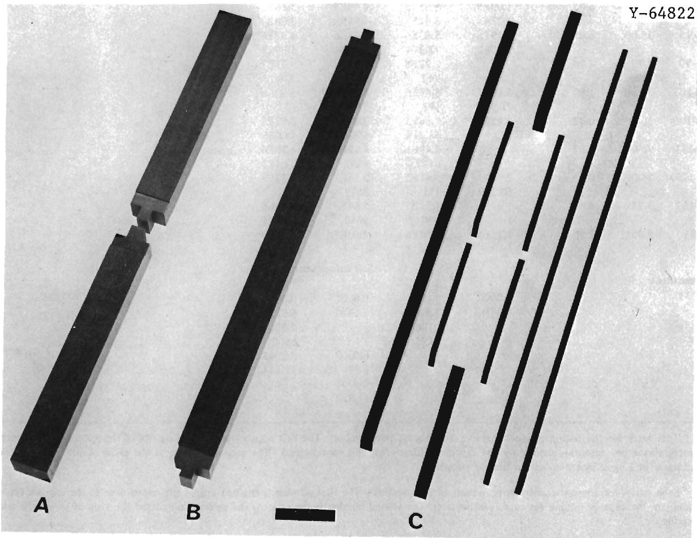  
Fig. 9.1. Typical graphite shapes used in a stringer of surveillance specimens.

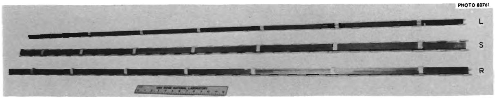  
Fig. 9.2. Surveillance specimen stringer.

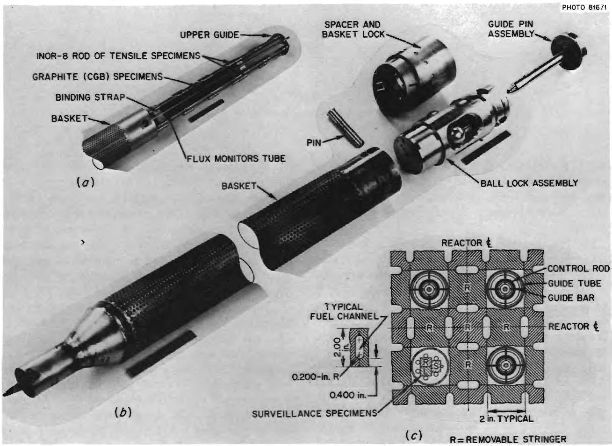  
Fig. 9.3. Stringer containment.

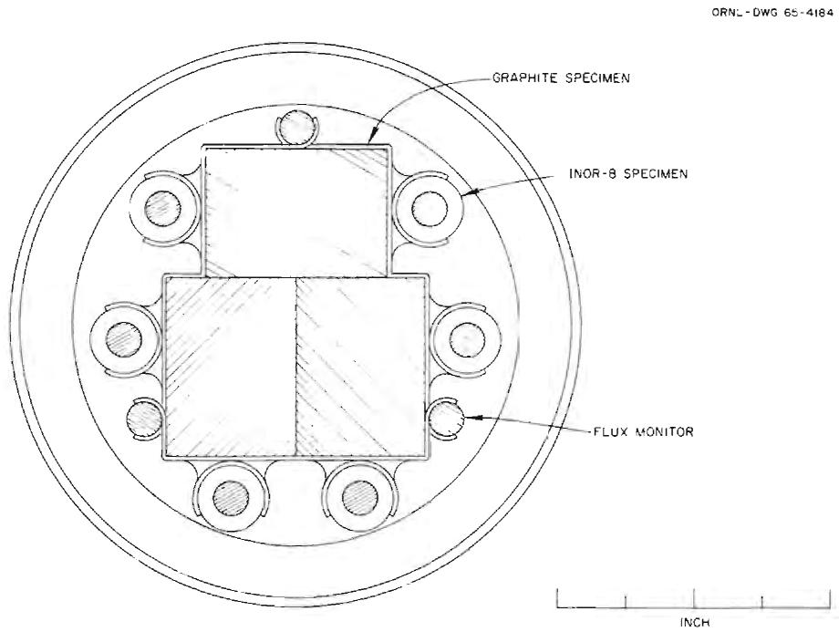  
Fig. 9.4. Stringer assembly.

within the basket along the specimens, no detailed flow analysis has been presented, but quite likely the flow may have been barely turbulent, because of entrance effects which persisted or recurred along the flow channel.

The first two times that the surveillance assemblies were removed from the MSRE (after runs 7 and 11) for fission product examinations, metal samples were obtained by cutting the perforated cylindrical Hastelloy N basket that held the assembly. The next two times (after runs 14 and 18), $\frac{1}{8}$ -in. tubing that had held dosimeter wires was cut up to provide samples. When the tubing was first used, lower values were obtained (after run 11) for the deposition of fission products. After run 18 the basket was no longer of use and was cut up to see if differences in deposition were due to differences in type of sample.

The distribution of temperatures and of neutron fluxes along the graphite sample assembly were estimated for $2^{35}\mathrm{U}$ operation (Fig. 9.5). The temperature of the graphite was generally 8 to $10^{\circ}\mathrm{F}$ greater than that of the adjacent fuel, normally which entered the channel at about $1180^{\circ}\mathrm{F}$ and emerged at $1210^{\circ}\mathrm{F}$ . The thermal-neutron flux at the center was about $4.5 \times 10^{13}$ with a fast flux of $11 \times 10^{13}$ ; these values declined to about one-third or one-fourth of the peak at the ends of the rig.

It was found on removal of the assembly after run 7 that mechanical distortion of the stringer bundle with specimen breakage had occurred, apparently because tolerance to thermal expansion had been reduced by salt frozen between ends of consecutive graphite specimens. The entire assembly was thereby replaced, with slight modifications to design; this design was used without further difficulty until the end of run 18.

After the termination of a particular period of reactor operation, draining of fuel salt, and circulation and draining of flush salt (except after run 18, when no flush was used), the core access port at the top of the reactor vessel was opened, and the cylindrical basket containing the stringer assemblies was removed, placed in a sealed shielded carrier, and transported to the segmenting cell of the High Radiation Level Examination facilities. Here the stringer assembly was removed, and one or more stringers were disassembled, being replaced by a fresh stringer assembly. Graphite bars from different regions of the stringer were marked on one face and set aside for fission product examination.

Stringers replaced after runs 11 and 14 contained graphite bars made from modified and experimental grades of graphite in addition to that obtained directly from MSRE core bars (type CGB). After runs 7 and 11, $\frac{1}{16}$ -in. rings of the cylindrical 2-in. containment basket were cut from top, middle, and bottom regions for

fission product analysis. Samples of the perforated Hastelloy N rings were weighed and dissolved. A similar approach was used after run 18.

After runs 14 and 18, seven sections of the $\frac{1}{8}$ -in.-diam (0.020-in.-wall) Hastelloy N tube containing the flux monitor wire, which was attached along one stringer, were obtained, extending from the top to the bottom of the core. These were dissolved for fission product analysis. This tube was necessarily subjected to about the same flow conditions as the adjacent graphite specimens. The flow was doubtless less turbulent than that existing on the outside of the cylindrical containment basket.

For the graphite specimens removed at the end of runs 7, 11, 14, and 18, the bars were first sectioned transversely with a thin carborundum saw to provide specimens for photographic, metallographic, autoradiographic, x-radiographic, and surface x-ray examination. The remainders of the bars - 7 in. long for the middle specimen, $2^{1/2}$ to 3 in. for the end specimens - were used for milling off successive surface layers for fission product deposition studies.

A "planer" was constructed by the Hot Cell Operations group for milling thin layers from the four long surfaces of each of the graphite bars. The cutter and collection system were so designed that the major part of the graphite dust removed was collected. By com

paring the collected weights of samples with the initial and final dimensions of the bars and their known densities, sampling losses of $18.5\%$ , $4.5\%$ , and $9.1\%$ were indicated for the top, middle, and bottom bars of the first specimen array so examined.

The pattern of sampling graphite layers shown in Fig. 9.6 was designed to minimize cross contamination between cuts. The identifying groove was made on the graphite face pressed against graphite from another stringer in the bundle and not exposed to flowing salt. After each cut the surfaces were vacuumed to minimize cross contamination between samples. The powdered samples were placed in capped plastic vials and weighed. The depth of cut mostly was obtained from sample weights, though checked (satisfactorily) on the middle bar by micrometer measurements. In this way it was possible to obtain both a "profile" of the activity of a nuclide at various depths within the graphite and also, by appropriate summation, to determine the total deposit activity related to one square centimeter of (superficial) graphite sample surface. The profiles and the total deposit intensity values, though originating in the same measurements, are most conveniently discussed separately.

9.1.2 Relative deposit intensity. In order to compare the intensity of fission product deposition under various circumstances, we generally have first obtained

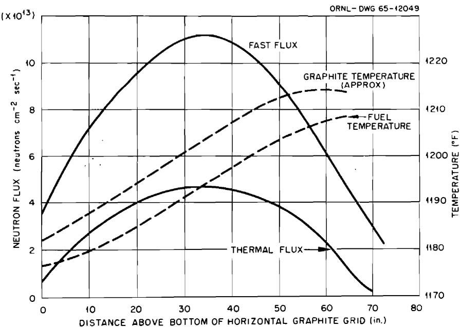  
Fig. 9.5. Neutron flux and temperature profiles for core surveillance assembly.

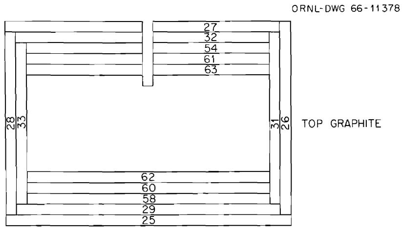

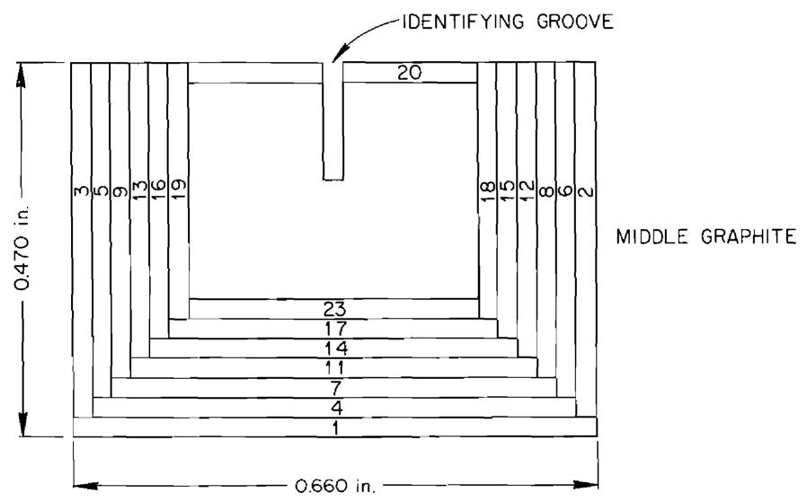

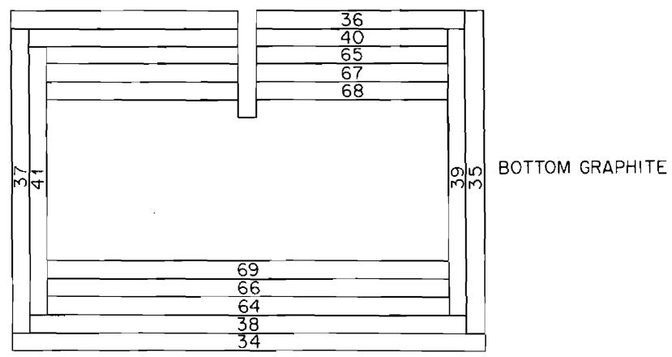  
Fig. 9.6. Scheme for milling graphite samples.

the observed activity of the nuclide in question per unit of specimen surface (observed disintegrations per minute per square centimeter). For the same time, the MSRE inventory activity was obtained and divided by the total MSRE area (metal, $0.79 \times 10^{6} \mathrm{~cm}^{2}$ ; graphite channels, edges, ends, and lattice bars, $2.25 \times 10^{6} \mathrm{~cm}^{2}$ , for a total of $3.04 \times 10^{6} \mathrm{~cm}^{2}$ ), giving an inventory value (disintegrations per minute per square centimeter) that would result if the nuclide deposited evenly on all surfaces. The ratio of observed to inventory disintegrations per minute per square centimeter then yields a relative deposit intensity which may be tabulated along with the inventory disintegrations per minute per square centimeter.

The relative deposit intensities, of course, will average between 0 and 1.0 when summed over all areas, indicating the average fraction of inventory deposited on the reactor surface. The values may be compared freely between runs, nuclides, regions, kinds of surfaces, and qualities of flow. The fraction of the total inventory estimated to be deposited on a particular surface domain is the product of the relative deposit intensity attributed to it and the fraction of the total area it represents. In particular, all the metal of the system represents $26\%$ of the total area, graphite edges a similar amount, and flow channels (and lattice bars) about $48\%$ .

Results of the examination of metal and graphite samples from surveillance arrays removed after runs 7, 11, 14, and 18 are shown, respectively, in Tables 9.1, 9.2, 9.3, and 9.4, expressed in each case as relative deposit intensities.

For each sample set the metal specimens are listed from the reactor top to the bottom, followed by graphite specimens. The nuclides with noble-gas precursors are followed by the salt-seeking isotopes, followed by noble metals and ending with tellurium and iodine.

A number of generalizations of interest may be noted. As a base line, in the absence of minute salt particles which might have come with a sample, recoils from fission in adjacent salt should give a relative deposit intensity of 0.001 to 0.003. The salt-seeking elements (Ce, Nb, Zr) on both metal and graphite and the elements with noble-gas precursors (Sr, Y, Ba, Cs) on metal specimens do show such levels of values, even generally being higher near the core midplane, consistent with the higher flux.

For graphite, the elements with noble-gas daughters have some tendency to diffuse into the graphite in the form of their short-lived noble-gas precursor. Thus the values for $^{89}\mathrm{Sr}$ are mostly in the 0.10-0.20 range,

indicating that appreciable entry has indeed taken place. Values for $^{140}\mathrm{Ba}$ and $^{91}\mathrm{Y}$ are an order of magnitude lower, consistent with noble-gas precursors of much shorter half-life; their values are still about an order of magnitude above those of the salt-seeking elements. On specimens of pyrolytic graphite, which had appreciably less internal porosity, the entry perpendicular to the graphite planes was less than that where the edges of the planes faced the salt; both directions were lower than CGB graphite. The data for $^{137}\mathrm{Cs}$ were more than an order of magnitude lower than for strontium, though the half-lives of the noble-gas precursors were similar (3.18 min for $^{89}\mathrm{Kr}$ and 3.9 min for $^{137}\mathrm{Xe}$ ). The inventory data used in the tabulation were for all material built up since first power operation; such an inventory is severalfold too high for the later runs in cases such as this where transport rather than salt accumulation is important. However, inventory adjustment is not sufficient to account for the low levels of $^{137}\mathrm{Cs}$ values. Appreciable diffusion of cesium from the graphite, as discussed later, appears to account for the low values.

The noble metals (Nb, Mo, Ru, Ag, Sb, Te) as a group exhibited deposits relatively more intense than other groups on graphite and even more intense deposits on metal, where the relative intensities on various samples approached or exceeded 1 and were in practically all cases above 0.1. Significant percentages of the noble metals appear to have been deposited on system surfaces.

Generally the deposit intensities on the 2-in.-OD perforated container cylinder (after runs 7, 11, and 18) were higher than on the $\frac{1}{8}$ -in.-OD flux monitor tube, which was attached to a stringer within the container. Flow was turbulent around the container cylinders but was less turbulent and may have been laminar along the internal tube.

The most intensely deposited elements appear to have been tellurium, antimony, and silver; on the container cylinder the relative deposit intensities were mostly above 1. The deposit intensities for flux monitor tubes were at least severalfold greater than for graphite, which should have had similar flow, so that we can conclude that these elements had definitely more tendency to deposit on metal than on graphite under comparable conditions.

To a degree only slightly less intense, molybdenum exhibited similar behavior to that described above. Niobium appeared to have deposited with roughly similar intensities on graphite and metal; deposition became somewhat less intense and varied proportion-

Table 9.1. Surveillance specimen data: first array, removed after run 7   

<table><tr><td rowspan="2">Specimen</td><td colspan="13">Ratio [(obs dis min-1cm-2)/(inventory dis min-1cm-2)]</td></tr><tr><td>89Sr</td><td>91Y</td><td>140Ba</td><td>137Cs</td><td>141Ce</td><td>144Ce</td><td>147Nd</td><td>95Zr</td><td>95Nb</td><td>99Mo</td><td>103Ru</td><td>132Te</td><td>131I</td></tr><tr><td>Hastelloy N</td><td></td><td></td><td></td><td></td><td></td><td></td><td></td><td></td><td></td><td></td><td></td><td></td><td></td></tr><tr><td>Top</td><td></td><td></td><td></td><td></td><td>0.0004</td><td>0.0004</td><td></td><td>0.019</td><td></td><td>0.83</td><td>0.56</td><td>2.8</td><td>0.068</td></tr><tr><td>Middle</td><td></td><td></td><td></td><td></td><td>0.0011</td><td>0.0014</td><td></td><td>0.027</td><td></td><td>0.79</td><td>0.37</td><td>2.4</td><td>0.044</td></tr><tr><td>Bottom</td><td></td><td></td><td></td><td></td><td>0.0016</td><td>0.0036</td><td></td><td>0.019</td><td></td><td>1.07</td><td>0.40</td><td>1.9</td><td>0.033</td></tr><tr><td>Graphite</td><td></td><td></td><td></td><td></td><td></td><td></td><td></td><td></td><td></td><td></td><td></td><td></td><td></td></tr><tr><td>Top</td><td></td><td></td><td></td><td></td><td></td><td></td><td></td><td></td><td></td><td></td><td></td><td></td><td></td></tr><tr><td>Wide, salt</td><td>0.16</td><td>0.015</td><td>0.022</td><td>0.005</td><td>0.0019</td><td>0.0006</td><td>&lt;0.0004</td><td>0.0004</td><td>0.16</td><td>0.18</td><td>0.19</td><td>0.17</td><td>0.0012</td></tr><tr><td>Side 1, salt</td><td></td><td></td><td>0.004</td><td></td><td>0.0020</td><td>0.0005</td><td></td><td></td><td>0.10</td><td>0.10</td><td>0.12</td><td>0.13</td><td>0.0011</td></tr><tr><td>Side 2, salt</td><td></td><td></td><td>0.026</td><td></td><td>0.0031</td><td>0.0008</td><td></td><td></td><td>0.14</td><td>0.19</td><td>0.10</td><td>0.26</td><td>0.0023</td></tr><tr><td>Wide, graphite</td><td></td><td>0.010</td><td>0.012</td><td>0.004</td><td>0.0016</td><td>0.0005</td><td>0.00014</td><td>0.0007</td><td>1.00</td><td>0.08</td><td>0.04</td><td>0.09</td><td></td></tr><tr><td>Middle</td><td></td><td></td><td></td><td></td><td></td><td></td><td></td><td></td><td></td><td></td><td></td><td></td><td></td></tr><tr><td>Wide, salt</td><td>0.14</td><td>0.0001</td><td>0.019</td><td>0.003</td><td>0.0047</td><td>0.0016</td><td>&lt;0.0003</td><td>0.0018</td><td>0.80</td><td>0.15</td><td>0.09</td><td>0.19</td><td>0.0027</td></tr><tr><td>Side 1, salt</td><td></td><td>0.002</td><td>0.016</td><td></td><td>0.0050</td><td>0.0017</td><td>0.00005</td><td></td><td>0.45</td><td>0.13</td><td>0.08</td><td>0.17</td><td>0.0037</td></tr><tr><td>Side 2, salt</td><td></td><td></td><td>0.023</td><td></td><td>0.0043</td><td>0.0017</td><td></td><td></td><td>0.74</td><td>0.12</td><td>0.06</td><td>0.15</td><td>0.0027</td></tr><tr><td>Wide, graphite</td><td></td><td>0.003</td><td>0.020</td><td></td><td>0.0032</td><td>0.016</td><td>&lt;0.0003</td><td>0.0016</td><td>0.61</td><td>0.02</td><td>0.07</td><td>0.17</td><td></td></tr><tr><td>Bottom</td><td></td><td></td><td></td><td></td><td></td><td></td><td></td><td></td><td></td><td></td><td></td><td></td><td></td></tr><tr><td>Wide, salt</td><td>0.25</td><td>0.008</td><td>0.051</td><td>0.092</td><td>0.0043</td><td>0.0038</td><td>0.00024</td><td>0.0035</td><td>0.67</td><td>0.21</td><td>0.12</td><td>0.19</td><td>0.0036</td></tr><tr><td>Side 1, salt</td><td></td><td>0.010</td><td>0.046</td><td>0.001</td><td>0.0079</td><td>0.0037</td><td>0.00017</td><td></td><td>1.03</td><td>0.21</td><td>0.13</td><td>0.23</td><td>0.0043</td></tr><tr><td>Side 2, salt</td><td></td><td>0.005</td><td>0.042</td><td>0.002</td><td>0.0091</td><td>0.0031</td><td>0.00009</td><td></td><td>0.66</td><td>0.21</td><td>0.13</td><td>0.21</td><td>0.0044</td></tr><tr><td>Wide, graphite</td><td></td><td>0.024</td><td>0.018</td><td></td><td>0.0060</td><td>0.0037</td><td></td><td>0.0003</td><td>0.15</td><td>0.05</td><td>0.05</td><td>0.15</td><td>0.0048</td></tr><tr><td></td><td></td><td></td><td></td><td></td><td></td><td></td><td></td><td></td><td></td><td></td><td></td><td></td><td></td></tr><tr><td></td><td>8.8E10</td><td>8.8E10</td><td>2.2E11</td><td>7.6E8</td><td>1.4E11</td><td>2.5E10</td><td>8.2E10</td><td>9.6E10</td><td>3.0E10</td><td>2.6E11</td><td>6.4E10</td><td>1.8E4</td><td>1.2E11</td></tr></table>

${}^{a}$ MSRE inventory activity divided by the total MSRE area.

Table 9.2. Survey 2, removed after run 11, inserted after run 7   

<table><tr><td rowspan="2">Specimen</td><td colspan="8">Ratio \( \left\lbrack  {\left( {\text{obs dis min}{}^{-1}{\mathrm{\;{cm}}}^{-2}}\right) /\left( {\text{inventory dis min}{}^{-1}{\mathrm{\;{cm}}}^{-2}}\right) }\right\rbrack \)</td></tr><tr><td>\( {}^{89}\mathrm{{Sr}} \)</td><td>\( {}^{95}\mathrm{{Zr}} \)</td><td>\( {}^{95}\mathrm{{Nb}} \)</td><td>\( {}^{99}\mathrm{{Mo}} \)</td><td>\( {}^{103}\mathrm{{Ru}} \)</td><td>\( {}^{106}\mathrm{{Ru}} \)</td><td>\( {}^{132}\mathrm{{Te}} \)</td><td>\( {}^{131}\mathrm{I} \)</td></tr><tr><td>Hastelloy N perforated cylindrical container</td><td>0.0010</td><td>0.0011</td><td>0.7</td><td>1.7</td><td>0.09</td><td></td><td>5.2</td><td>0.013</td></tr><tr><td>Near top</td><td>0.0054</td><td>0.0007</td><td>1.5</td><td>2.3</td><td>0.91</td><td></td><td>4.4</td><td>0.033</td></tr><tr><td>Middle</td><td>0.0263</td><td>0.0011</td><td>1.5</td><td>1.7</td><td>0.13</td><td></td><td>1.6</td><td>0.027</td></tr><tr><td>Bottom</td><td>0.0005</td><td>0.0002</td><td>0.11</td><td>0.4</td><td></td><td></td><td>1.5</td><td></td></tr><tr><td colspan="9">Graphite (CGB) specimens Top</td></tr><tr><td>Wide, salt</td><td></td><td>0.0015</td><td>0.60</td><td>0.37</td><td>0.136</td><td>0.064</td><td>0.28</td><td></td></tr><tr><td>Side 1, salt</td><td></td><td>0.0011</td><td>0.33</td><td>0.12</td><td>0.039</td><td>0.049</td><td>0.11</td><td></td></tr><tr><td>Side 2, salt</td><td></td><td>0.0016</td><td>0.40</td><td>0.21</td><td>0.076</td><td>0.074</td><td>0.014</td><td></td></tr><tr><td>Wide, graphite</td><td></td><td>0.0013</td><td>0.31</td><td>0.16</td><td>0.060</td><td>0.057</td><td>0.14</td><td></td></tr><tr><td colspan="9">Middle</td></tr><tr><td>Wide</td><td></td><td>0.0018</td><td>0.87</td><td>0.32</td><td>0.074</td><td>0.078</td><td>0.17</td><td></td></tr><tr><td>Side</td><td></td><td>0.0015</td><td>0.76</td><td>0.13</td><td>0.059</td><td>0.065</td><td>0.14</td><td></td></tr><tr><td>Side</td><td></td><td>0.0038</td><td>2.0</td><td>0.31</td><td>0.159</td><td>0.167</td><td>0.34</td><td></td></tr><tr><td>Wide</td><td></td><td>0.0017</td><td>0.93</td><td>0.36</td><td>0.083</td><td>0.075</td><td>0.17</td><td></td></tr><tr><td colspan="9">Bottom</td></tr><tr><td>Wide</td><td></td><td>0.0033</td><td>1.0</td><td>0.20</td><td>0.136</td><td>0.145</td><td>0.36</td><td></td></tr><tr><td>Side</td><td></td><td>0.0017</td><td>0.13</td><td>0.19</td><td>0.059</td><td>0.073</td><td>0.20</td><td></td></tr><tr><td>Side</td><td></td><td>0.0030</td><td>1.2</td><td>0.47</td><td>0.110</td><td>0.131</td><td>0.28</td><td></td></tr><tr><td>Wide</td><td></td><td>0.0038</td><td></td><td>0.17</td><td></td><td>0.165</td><td>0.26</td><td></td></tr><tr><td colspan="9">Inventory \( {}^{a} \) (dis \( {\mathrm{{min}}}^{-1}{\mathrm{\;{cm}}}^{-2} \) )</td></tr><tr><td></td><td>1.8E11</td><td>2.1E11</td><td>1.5E11</td><td>1.7E11</td><td>1.2E11</td><td>4.8E9</td><td>1.3E11</td><td>1.2E11</td></tr></table>

$a$ MSRE inventory activity divided by the total MSRE area.

ately more widely during the $^{233}\mathrm{U}$ operation period ending with run 18.

Ruthenium appeared to be about half (or less) as intensely deposited as molybdenum and niobium, on both graphite and metals. Like the other noble metals, it was more intensely deposited on the metal cylinder container.

The 39.6-day $^{103}\mathrm{Ru}$ and the 367-day $^{106}\mathrm{Ru}$ offer the possibility of some insight into deposition processes by comparison of their deposit intensity ratios. In particular, as will be developed in detail later, if the longer-lived isotope is present in higher relative intensity and if it is assumed that reasonably similar and steady deposition conditions have prevailed, then some kind of retention or holdup must have occurred prior to formation of the observed deposit.

By and large this appears to have been the case with ruthenium, and also to some extent with tellurium.

In these tables, with respect to $^{106}\mathrm{Ru}$ values, two factors which, though significant, appear at least roughly to offset each other have not been entered. First, the inventory used is that accumulated from first

power (January 1966) rather than during the interval of exposure. Perhaps the lower exposure period value could be used. Second, for $^{106}\mathrm{Ru}$ , in particular during $^{235}\mathrm{U}$ operation (runs 4 to 14), the fission yield increased as $^{239}\mathrm{Pu}$ grew into the fuel; about $5\%$ of the fissions at the end of run 14 were from this source, and the $^{106}\mathrm{Ru}$ yield of the fuel was roughly doubled. This would lead to increasing inventories. The effects are approximately compensatory, and we did not correct for them in this table, though they were included in the "compartment" model described later.

We have noted that less intense deposits were observed on the flux monitor tube than on the perforated cylinder container, where the flow was doubtless more turbulent. The flow conditions at graphite surfaces and flux monitor tube surfaces would appear to be more nearly similar, but differences are difficult to assess.

Mechanisms for fission product deposition from flowing salt must certainly involve a mass transfer step, as well as a statement as to the areas to which it applies and an assumption as to the properties and species (atomic, colloidal) undergoing transport. Usually a

Table 9.3. Third surveillance specimen survey, removed after run 14   
Numbers given represent relative deposit intensity assuming uniform deposition on all surfaces. Specimens inserted after run 11 unless otherwise noted   

<table><tr><td rowspan="2">Specimen</td><td rowspan="2">Position (in. from midplane)</td><td rowspan="2">Face</td><td colspan="15">Ratio [(obs dis min-1cm-2)/(inventory dis min-1cm-2)]</td><td></td></tr><tr><td>89Sr</td><td>91Y</td><td>140Ba</td><td>137Cs</td><td>141Ce</td><td>144Ce</td><td>147Nd</td><td>95Zr</td><td>95Nb</td><td>99Mo</td><td>103Ru</td><td>106Ru</td><td>110mAg</td><td>129mTe</td><td>132Te</td><td>131I</td></tr><tr><td rowspan="7">Hastel-loy Na</td><td>+30b</td><td></td><td>0.0010</td><td>0.0010</td><td>0.0008</td><td>0.00002</td><td>0.0035</td><td>0.0003</td><td>0.0007</td><td>0.0006</td><td>0.20</td><td>0.39</td><td>0.104</td><td>0.098</td><td>0.28</td><td>2.0</td><td>0.72</td><td>0.012</td></tr><tr><td>+23</td><td></td><td>0.0021</td><td></td><td>0.0020</td><td></td><td>0.0009</td><td>0.0009</td><td></td><td>0.0014</td><td>0.44</td><td>0.57</td><td>0.093</td><td>0.109</td><td></td><td>1.8</td><td>0.64</td><td>0.015</td></tr><tr><td>+9</td><td></td><td>0.039</td><td></td><td>0.0035</td><td></td><td>0.0019</td><td>0.0020</td><td></td><td>0.0033</td><td>0.55</td><td>0.71</td><td>0.114</td><td>0.150</td><td></td><td>2.1</td><td>0.91</td><td>0.017</td></tr><tr><td>0c</td><td></td><td>0.0044</td><td>0.0075</td><td>0.0016</td><td>0.0020</td><td>0.0024</td><td>0.0013</td><td>0.0019</td><td>0.0034</td><td>0.63</td><td>1.0</td><td>0.104</td><td>0.137</td><td>1.14</td><td>2.2</td><td>0.89</td><td>0.015</td></tr><tr><td>-9</td><td></td><td>0.0036</td><td></td><td>0.0030</td><td></td><td>0.0020</td><td>0.0011</td><td></td><td>0.0032</td><td>0.53</td><td>0.93</td><td>0.114</td><td>0.147</td><td></td><td>1.9</td><td>0.72</td><td>0.010</td></tr><tr><td>-19</td><td></td><td>0.0027</td><td></td><td>0.0024</td><td></td><td>0.0016</td><td>0.0010</td><td></td><td>0.0028</td><td>0.55</td><td>1.04</td><td>0.082</td><td>0.115</td><td></td><td>1.8</td><td>0.66</td><td>0.003</td></tr><tr><td>-28d</td><td></td><td>0.0028</td><td>0.0029</td><td>0.0017</td><td>0.0007</td><td>0.0010</td><td>0.0010</td><td>0.0010</td><td>0.0015</td><td>0.51</td><td>0.67</td><td>0.092</td><td>1.26</td><td>0.57</td><td>2.3</td><td>0.91</td><td>0.010</td></tr><tr><td rowspan="2">Graphite CGBe</td><td rowspan="2">+27</td><td>Wide</td><td>0.14</td><td></td><td>0.022</td><td></td><td>0.0023</td><td>0.0006</td><td></td><td>0.0008</td><td>0.16</td><td>0.085</td><td>0.035</td><td>0.053</td><td></td><td>0.47</td><td>0.12</td><td>0.0014</td></tr><tr><td>Narrow</td><td>0.11</td><td></td><td>0.019</td><td></td><td>0.0017</td><td>0.0004</td><td></td><td>0.0005</td><td>0.04</td><td>0.034</td><td>0.013</td><td>0.021</td><td></td><td>0.28</td><td>0.08</td><td>0.0005</td></tr><tr><td rowspan="2">CGBf</td><td rowspan="2">+27</td><td>Wide</td><td>0.12</td><td></td><td>0.023</td><td></td><td>0.0019</td><td>0.0004</td><td></td><td>0.0007</td><td>0.19</td><td>0.12</td><td>0.051</td><td>0.057</td><td></td><td>0.19</td><td>0.09</td><td>0.0011</td></tr><tr><td>Narrow</td><td>0.13</td><td></td><td>0.023</td><td></td><td>0.0020</td><td>0.0004</td><td></td><td>0.0006</td><td>0.24</td><td>0.11</td><td>0.042</td><td>0.051</td><td></td><td>0.17</td><td>0.08</td><td>0.0011</td></tr><tr><td rowspan="2">Pyrolytic</td><td rowspan="2">+20.8</td><td>g</td><td>0.003</td><td></td><td>0.002</td><td></td><td>0.0008</td><td>0.0007</td><td></td><td>0.0010</td><td>0.34</td><td>0.13</td><td>0.094</td><td>0.078</td><td></td><td>0.10</td><td>0.05</td><td>0.0007</td></tr><tr><td>h</td><td>0.019</td><td></td><td>0.10</td><td></td><td>0.0012</td><td>&lt;0.0012</td><td></td><td>0.0012</td><td>0.20</td><td>0.08</td><td>0.035</td><td>&lt;0.043</td><td></td><td>0.18</td><td>0.10</td><td>0.0008</td></tr><tr><td rowspan="2">Poco</td><td rowspan="2">+12.5</td><td>Wide</td><td>0.10</td><td></td><td>0.024</td><td></td><td>0.0075</td><td>0.0018</td><td></td><td>0.0028</td><td>0.50</td><td>0.025</td><td>0.063</td><td>&lt;0.070</td><td></td><td>0.71</td><td>0.26</td><td>0.0033</td></tr><tr><td>Narrow</td><td>0.08</td><td></td><td>0.20</td><td></td><td>0.0044</td><td>0.0019</td><td></td><td>0.0020</td><td>0.44</td><td>0.096</td><td>0.066</td><td>&lt;0.068</td><td></td><td>1.71</td><td>0.23</td><td>&lt;0.0040</td></tr><tr><td>CGB</td><td>+4.5</td><td>Wide</td><td>0.21</td><td></td><td>0.40</td><td></td><td>0.0075</td><td>0.0017</td><td></td><td>0.0033</td><td>1.0</td><td>0.15</td><td>0.071</td><td>0.089</td><td></td><td>0.14</td><td>0.06</td><td>0.0009</td></tr><tr><td rowspan="2">CGBf</td><td rowspan="2">+4.5</td><td>Wide</td><td>0.10</td><td></td><td>0.038</td><td></td><td>0.0071</td><td>0.0024</td><td></td><td>0.0029</td><td>0.9</td><td></td><td>0.0078</td><td>0.094</td><td></td><td>0.15</td><td></td><td></td></tr><tr><td>Narrow</td><td>0.12</td><td></td><td>0.034</td><td></td><td>0.0089</td><td>0.0023</td><td></td><td>0.0032</td><td>1.2</td><td></td><td>0.093</td><td>0.110</td><td></td><td>0.15</td><td></td><td></td></tr><tr><td rowspan="2">CGBe</td><td rowspan="2">-4.5</td><td>Wide</td><td>0.14</td><td></td><td>0.035</td><td></td><td>0.0084</td><td>0.0024</td><td></td><td>0.0040</td><td>0.54</td><td>0.16</td><td>0.050</td><td>0.076</td><td></td><td>0.51</td><td>0.13</td><td>0.0034</td></tr><tr><td>Narrow</td><td>0.10</td><td></td><td>0.034</td><td></td><td>0.0062</td><td>0.0023</td><td></td><td>0.0028</td><td>0.59</td><td>0.085</td><td>0.041</td><td>0.051</td><td></td><td>0.14</td><td>0.06</td><td>0.0029</td></tr><tr><td>CGB</td><td>-4.5</td><td>Wide</td><td>0.16</td><td></td><td>0.051</td><td></td><td>0.0102</td><td>0.0024</td><td></td><td>0.0044</td><td>1.6</td><td>0.16</td><td>0.090</td><td>0.105</td><td></td><td>0.20</td><td>0.08</td><td>0.0053</td></tr><tr><td>CGBf</td><td>-12.5</td><td>Wide</td><td>0.15</td><td></td><td>0.038</td><td></td><td>0.0066</td><td>0.0018</td><td></td><td>0.0036</td><td>1.2</td><td>0.64</td><td>0.041</td><td>0.043</td><td></td><td>0.08</td><td>0.20</td><td>0.0019</td></tr><tr><td rowspan="2">CGBe</td><td rowspan="2">-12.5</td><td>Wide</td><td>0.16</td><td></td><td>0.047</td><td></td><td>0.0062</td><td>0.0015</td><td></td><td>0.0026</td><td>1.0</td><td></td><td>0.059</td><td>0.065</td><td></td><td></td><td>0.13</td><td></td></tr><tr><td>Narrow</td><td>0.10</td><td></td><td>0.043</td><td></td><td>0.0066</td><td>0.0018</td><td></td><td>0.0032</td><td>1.2</td><td></td><td>0.094</td><td>0.114</td><td></td><td></td><td>0.17</td><td></td></tr><tr><td rowspan="2">CGBf</td><td rowspan="2">-30d</td><td>Wide</td><td>0.18</td><td></td><td>0.022</td><td></td><td>0.0049</td><td>0.0017</td><td></td><td>0.0019</td><td>0.17</td><td>0.117</td><td>0.065</td><td>0.078</td><td></td><td>0.16</td><td>0.07</td><td>0.0018</td></tr><tr><td>Narrow</td><td>0.12</td><td></td><td>0.017</td><td></td><td>0.0032</td><td>0.0010</td><td></td><td>0.0020</td><td>0.75</td><td>0.096</td><td>0.054</td><td>0.048</td><td></td><td>0.12</td><td>0.05</td><td>0.0017</td></tr><tr><td rowspan="2">CGBe</td><td rowspan="2">-30b</td><td>Wide</td><td>0.15</td><td></td><td>0.018</td><td></td><td>0.0035</td><td>0.0015</td><td></td><td>0.0016</td><td>0.29</td><td>0.081</td><td>0.039</td><td>0.061</td><td></td><td>0.29</td><td>0.11</td><td>0.0015</td></tr><tr><td>Narrow</td><td>0.15</td><td></td><td>0.017</td><td></td><td>0.0031</td><td>0.0013</td><td></td><td>0.0016</td><td>0.27</td><td>0.067</td><td>0.037</td><td>0.058</td><td></td><td>0.21</td><td>0.08</td><td>0.0013</td></tr><tr><td></td><td></td><td></td><td></td><td></td><td></td><td></td><td></td><td></td><td colspan="10">Inventoryi (dis min-1 cm-2)</td></tr><tr><td></td><td></td><td></td><td></td><td></td><td></td><td></td><td></td><td></td><td></td><td></td><td></td><td></td><td></td><td></td><td></td><td></td><td></td><td></td></tr><tr><td></td><td></td><td></td><td></td><td></td><td></td><td></td><td></td><td></td><td></td><td></td><td></td><td></td><td></td><td></td><td></td><td></td><td></td><td></td></tr></table>

$a_1 / \mathbf{g}$ -in.-OD flux monitor tube attached to stringer.   
bTop.   
Midplane.   
Bottom.   
eInserted after run 7.   
fImpregnated.   
$\mathfrak{g}$ Deposition perpendicular to graphite planes.   
$h$ Deposition parallel to graphite planes.   
MSRE inventory activity divided by the total MSRE area.   
Approximate.

No flush salt after drain

U-233 operation began with run 15

Specimens inserted after run 14 unless otherwise noted

Table 9.4. Fourth surveillance specimen survey, removed after run 18   

<table><tr><td rowspan="2">Specimen</td><td rowspan="2">Position (in. from midplane)</td><td rowspan="2">Face</td><td colspan="15">Ratio [(obs dis min-1cm-2)/(inventory dis min-1cm-2)]</td><td></td><td></td><td></td></tr><tr><td>89Sr</td><td>91Y</td><td>140Ba</td><td>137Cs</td><td>141Ce</td><td>144Ce</td><td>147Nd</td><td>95Zr</td><td>95Nb</td><td>99Mo</td><td>103Ru</td><td>106Ru</td><td>111Ag</td><td>125Sb</td><td>129mTe</td><td>132Te</td><td>131I</td><td></td></tr><tr><td colspan="19">Hastelloy N</td><td></td><td></td></tr><tr><td rowspan="2">Perforated cylindrical containera</td><td>Top</td><td></td><td>0.0038</td><td>0.0038</td><td>0.0027</td><td>0.0023</td><td></td><td>0.0003</td><td></td><td>0.0015</td><td>0.16</td><td>0.76</td><td>0.26</td><td>0.94</td><td>2.6</td><td>3.1</td><td>1.9</td><td></td><td>0.072</td><td></td></tr><tr><td>Bottom</td><td></td><td>0.0075</td><td>0.0035</td><td>0.0035</td><td>0.0016</td><td></td><td>0.0010</td><td></td><td>0.0029</td><td>0.73</td><td>1.1</td><td>0.28</td><td>1.05</td><td>3.6</td><td>2.6</td><td>2.8</td><td></td><td>0.093</td><td></td></tr><tr><td rowspan="7">Flux monitor tubeb</td><td>+30c</td><td></td><td>0.0011</td><td>0.0004</td><td>0.0043</td><td>0.0004</td><td></td><td>0.0003</td><td></td><td>0.0007</td><td>0.08</td><td>0.05</td><td>0.11</td><td>0.14</td><td>0.10</td><td>0.59</td><td>0.67</td><td>0.53</td><td>0.030</td><td></td></tr><tr><td>+23</td><td></td><td>0.0025</td><td>0.0007</td><td>0.0028</td><td>0.0006</td><td></td><td>0.0006</td><td></td><td>0.0010</td><td>0.09</td><td>0.94</td><td>0.12</td><td>0.17</td><td>0.38</td><td>0.09</td><td>0.43</td><td>0.38</td><td>0.044</td><td></td></tr><tr><td>+9</td><td></td><td>0.0031</td><td>0.0025</td><td>0.0027</td><td>0.0011</td><td></td><td>0.0010</td><td></td><td>0.0019</td><td>0.10</td><td>0.66</td><td>0.09</td><td>0.17</td><td>0.21</td><td>0.31</td><td>0.78</td><td>0.49</td><td>0.041</td><td></td></tr><tr><td>0d</td><td></td><td>0.0030</td><td>0.0035</td><td>0.0070</td><td>0.0012</td><td></td><td>0.0014</td><td></td><td>0.0024</td><td>0.14</td><td>1.07</td><td>0.14</td><td>0.29</td><td>0.42</td><td>0.15</td><td>0.81</td><td>0.52</td><td>0.048</td><td></td></tr><tr><td>-9</td><td></td><td>0.0030</td><td>0.0036</td><td>0.0027</td><td>0.0010</td><td></td><td>0.0013</td><td></td><td>0.0024</td><td>0.19</td><td>1.27</td><td>0.24</td><td>0.45</td><td>0.62</td><td>0.15</td><td>3.7</td><td>0.50</td><td>0.050</td><td></td></tr><tr><td>-19</td><td></td><td>0.0030</td><td>0.0028</td><td>0.0030</td><td>0.0010</td><td></td><td>0.0013</td><td></td><td>0.0020</td><td>0.12</td><td>0.98</td><td>0.11</td><td>0.19</td><td>0.51</td><td>0.81</td><td>0.87</td><td>0.47</td><td>0.033</td><td></td></tr><tr><td>-29e</td><td></td><td>0.0380</td><td>0.0086</td><td>0.0111</td><td>0.0267</td><td></td><td>0.0019</td><td></td><td>0.0031</td><td>0.05</td><td>0.47</td><td>0.19</td><td>0.35</td><td>0.72</td><td>0.57</td><td>1.6</td><td>0.91</td><td>0.068</td><td></td></tr><tr><td colspan="19">Graphitef</td><td></td><td></td></tr><tr><td rowspan="6">CGBg</td><td rowspan="2">+27c</td><td>Wide</td><td>0.12</td><td>0.015</td><td>0.011</td><td>0.009</td><td></td><td>0.0006</td><td></td><td>0.0036</td><td>0.036</td><td>0.034</td><td>0.018</td><td>0.033</td><td>0.69</td><td>0.057</td><td>0.15</td><td>0.083</td><td>0.0033</td><td></td></tr><tr><td>Narrow</td><td>0.16</td><td>0.025</td><td>0.013</td><td>0.013</td><td></td><td>0.0009</td><td></td><td>0.0010</td><td>0.046</td><td>0.050</td><td>0.013</td><td>0.032</td><td>0.70</td><td>0.046</td><td>0.14</td><td>0.114</td><td>0.0064</td><td></td></tr><tr><td rowspan="2">0d</td><td>Wide</td><td>0.21</td><td>0.033</td><td>0.014</td><td>0.035</td><td></td><td>0.0016</td><td></td><td>0.0013</td><td>0.180</td><td>0.035</td><td>0.024</td><td>0.054</td><td>0.87</td><td>0.119</td><td>0.09</td><td>0.08</td><td>0.0014</td><td></td></tr><tr><td>Narrow</td><td>0.30</td><td>0.015</td><td>0.026</td><td>0.038</td><td></td><td>0.0024</td><td></td><td>0.0016</td><td>0.095</td><td>0.030</td><td>0.024</td><td>0.059</td><td>1.31</td><td>0.082</td><td>0.17</td><td>0.13</td><td>0.0097</td><td></td></tr><tr><td rowspan="2">-27e</td><td>Wide</td><td>0.18</td><td>0.023</td><td>0.017</td><td>0.018</td><td></td><td>0.0028</td><td></td><td>0.0027</td><td>0.33</td><td>0.11</td><td>0.053</td><td>0.096</td><td>0.97</td><td>0.21</td><td>0.18</td><td>0.15</td><td>0.0085</td><td></td></tr><tr><td>Narrow</td><td>0.31</td><td>0.039</td><td>0.028</td><td>0.018</td><td></td><td>0.0028</td><td></td><td>0.0028</td><td>0.38</td><td>0.11</td><td>0.069</td><td>0.131</td><td>1.03</td><td>0.15</td><td>0.26</td><td>0.17</td><td>0.0090</td><td></td></tr><tr><td rowspan="2">CGB</td><td rowspan="2">+27c</td><td>Wide</td><td>0.14</td><td>0.017</td><td>0.013</td><td>0.002</td><td></td><td>0.0005</td><td></td><td>0.0006</td><td>0.036</td><td>0.044</td><td>0.10</td><td>0.006</td><td>0.63</td><td>0.011</td><td>0.065</td><td>0.061</td><td>0.0044</td><td></td></tr><tr><td>Narrow</td><td>0.13</td><td>0.050</td><td>0.014</td><td></td><td></td><td>0.0008</td><td></td><td>0.0007</td><td>0.042</td><td>0.092</td><td>0.040</td><td>0.035</td><td>0.82</td><td>0.016</td><td>0.083</td><td>0.089</td><td>0.0037</td><td></td></tr><tr><td>CGBh</td><td>+27c</td><td>Wide</td><td>0.11</td><td>0.018</td><td>0.010</td><td>0.006</td><td></td><td>0.0004</td><td></td><td>0.0005</td><td>0.020</td><td>0.064</td><td>0.026</td><td>0.013</td><td>0.47</td><td>0.008</td><td>0.048</td><td>0.052</td><td>0.0031</td><td></td></tr><tr><td rowspan="2">CGB</td><td rowspan="2">+24</td><td>Wide</td><td>0.14</td><td>0.023</td><td></td><td></td><td></td><td></td><td></td><td>0.0009</td><td>0.044</td><td>0.097</td><td>0.026</td><td>0.60</td><td>0.010</td><td>0.061</td><td>0.058</td><td>0.0052</td><td>0.0052</td><td></td></tr><tr><td>Narrow</td><td>0.18</td><td>0.020</td><td>0.010</td><td>0.001</td><td></td><td></td><td></td><td>0.0006</td><td>0.024</td><td>0.040</td><td>0.014</td><td>0.015</td><td>0.55</td><td>0.005</td><td>0.041</td><td>0.051</td><td>0.0042</td><td></td></tr><tr><td rowspan="2">Poco h</td><td rowspan="2">+19</td><td>Wide</td><td>0.14</td><td>0.031</td><td>0.016</td><td>0.002</td><td></td><td></td><td></td><td>0.0003</td><td>0.005</td><td>0.010</td><td>0.004</td><td>0.004</td><td>0.12</td><td>0.001</td><td>0.059</td><td>0.040</td><td>0.0019</td><td></td></tr><tr><td>Narrow</td><td>0.15</td><td>0.033</td><td>0.019</td><td>0.001</td><td></td><td></td><td></td><td>0.0021</td><td>0.069</td><td>0.091</td><td>0.044</td><td>0.043</td><td>1.60</td><td>0.015</td><td>0.083</td><td>0.090</td><td>0.0067</td><td></td></tr><tr><td rowspan="2">CGB</td><td rowspan="2">0d</td><td>Wide</td><td>0.16</td><td>0.030</td><td>0.022</td><td>0.005</td><td></td><td>0.0012</td><td></td><td>0.0037</td><td>0.14</td><td>0.067</td><td>0.037</td><td>0.43</td><td>0.67</td><td>0.016</td><td>0.109</td><td>0.045</td><td>0.0046</td><td></td></tr><tr><td>Narrow</td><td>0.12</td><td>0.028</td><td>0.016</td><td>0.001</td><td></td><td>0.0010</td><td></td><td>0.0015</td><td>0.17</td><td>0.069</td><td>0.026</td><td>0.23</td><td>0.55</td><td>0.004</td><td>0.039</td><td>0.059</td><td>0.0015</td><td></td></tr><tr><td rowspan="2">CGB</td><td rowspan="2">0d</td><td>Wide</td><td>0.24</td><td>0.031</td><td>0.024</td><td>0.004</td><td></td><td>0.0020</td><td></td><td>0.0036</td><td>0.14</td><td>0.083</td><td>0.055</td><td>0.071</td><td>0.94</td><td>0.025</td><td>0.072</td><td>0.052</td><td>0.0054</td><td></td></tr><tr><td>Narrow</td><td>0.24</td><td>0.032</td><td>0.024</td><td>0.004</td><td></td><td>0.0016</td><td></td><td>0.0027</td><td>0.21</td><td>0.063</td><td>0.052</td><td>0.054</td><td>1.24</td><td>0.031</td><td>0.057</td><td>0.067</td><td>0.0042</td><td></td></tr><tr><td rowspan="2">CGB</td><td rowspan="2">-27e</td><td>Wide</td><td>0.43</td><td>0.048</td><td>0.036</td><td>0.009</td><td></td><td></td><td></td><td>0.0108</td><td>0.102</td><td>0.052</td><td>0.036</td><td>0.033</td><td>1.17</td><td>0.016</td><td>0.078</td><td></td><td>0.0022</td><td></td></tr><tr><td>Narrow</td><td>0.28</td><td>0.026</td><td>0.022</td><td>0.003</td><td></td><td></td><td></td><td>0.0079</td><td>0.064</td><td>0.046</td><td>(0.003)j</td><td>0.030</td><td>1.16</td><td>0.026</td><td>0.074</td><td>0.078</td><td>0.0042</td><td></td></tr><tr><td rowspan="2">CGBh</td><td rowspan="2">-27e</td><td>Wide</td><td>0.15</td><td>0.014</td><td>0.014</td><td>0.004</td><td></td><td>0.0008</td><td></td><td>0.0015</td><td>0.057</td><td>0.041</td><td>0.023</td><td>0.25</td><td>0.79</td><td>0.013</td><td>0.037</td><td>0.032</td><td>0.0018</td><td></td></tr><tr><td>Narrow</td><td>0.30</td><td>0.002</td><td>0.024</td><td>0.006</td><td></td><td>0.0001</td><td></td><td>0.0011</td><td>0.093</td><td>0.047</td><td>0.027</td><td>0.029</td><td>0.64</td><td>0.013</td><td>0.035</td><td>0.032</td><td>0.0022</td><td></td></tr><tr><td></td><td></td><td></td><td></td><td></td><td></td><td></td><td></td><td></td><td></td><td></td><td></td><td></td><td></td><td></td><td></td><td></td><td></td><td></td><td></td><td></td></tr><tr><td></td><td></td><td></td><td></td><td></td><td></td><td></td><td></td><td></td><td></td><td></td><td></td><td></td><td></td><td></td><td></td><td></td><td></td><td></td><td></td><td></td></tr><tr><td></td><td></td><td></td><td></td><td></td><td></td><td></td><td></td><td></td><td></td><td></td><td></td><td></td><td></td><td></td><td></td><td></td><td></td><td></td><td></td><td></td></tr><tr><td></td><td></td><td></td><td></td><td></td><td></td><td></td><td></td><td></td><td></td><td></td><td></td><td></td><td></td><td></td><td></td><td></td><td></td><td></td><td></td><td></td></tr><tr><td></td><td></td><td></td><td></td><td></td><td></td><td></td><td></td><td></td><td></td><td></td><td></td><td></td><td></td><td></td><td></td><td></td><td></td><td></td><td></td><td></td></tr><tr><td></td><td></td><td></td><td></td><td></td><td></td><td></td><td></td><td></td><td colspan="11">Inventoryi (dis min-1 cm-2)</td><td></td></tr><tr><td></td><td></td><td></td><td></td><td></td><td></td><td></td><td></td><td></td><td></td><td></td><td></td><td></td><td></td><td></td><td></td><td></td><td></td><td></td><td></td><td></td></tr><tr><td></td><td></td><td></td><td></td><td></td><td></td><td></td><td></td><td></td><td></td><td></td><td></td><td></td><td></td><td></td><td></td><td></td><td></td><td></td><td></td><td></td></tr><tr><td></td><td></td><td></td><td></td><td></td><td></td><td></td><td></td><td></td><td></td><td></td><td></td><td></td><td></td><td></td><td></td><td></td><td></td><td></td><td></td><td></td></tr><tr><td></td><td></td><td></td><td></td><td></td><td></td><td></td><td></td><td></td><td></td><td></td><td></td><td></td><td></td><td></td><td></td><td></td><td></td><td></td><td></td><td></td></tr></table>

$a$ Inserted after run 11. Salt flow in the low turbulent range.   
$b1_{g}$ -in.-OD flux monitor tube attached to stringer. Salt flow barely turbulent.   
$c_{\mathrm{Top}}$   
Midplane.   
$e_{\mathrm{Bottom}}$   
fAll samples taken from faces exposed to flowing fuel salt.   
Inserted after run 7.   
$h_{\mathrm{Impregnated}}$   
MSRE inventory activity divided by the total MSRE area.   
Approximate.

factor related to the permanent adherence of deposited material to a given surface, the so-called "sticking factor," is included, usually followed by the assumption that for lack of data it will be assumed that all metal and graphite surfaces have equal values of unity -- whatever hits, sticks and stays.

# 9.2 Final Assembly

9.2.1 Design. The final surveillance specimen array, inserted after run 18 and removed after run 20, was of a different design3,4 from those previously used, in order to include capsules containing substantial quantities of $^{233}\mathrm{U}$ and other isotopes to determine accurately their neutron capture characteristics in the MSRE spectrum.

The cylindrical geometry permitted the inclusion of a surveillance array consisting of sets of paired metal and graphite specimens with differing axial positions, surface roughness, and adjacent flow velocities. Because flow conditions were the same or essentially so for metal-graphite pairs, the hydrodynamically controlled mass transport effects, if simple, should cancel in comparisons, and differences can be attributed to differences in what is commonly called sticking factor. The sample pairs are discussed below in order of increasing turbulence.

A photograph of the final surveillance specimen assembly is shown in Fig. 9.7. The individual specimens and the flow associated with them will be considered next.

9.2.2 Specimens and flow. In the noncentral regions of the core, the flow to a fuel channel had to pass

through the grid of lattice bars, and according to measurements reported on models, the velocity in the channels was 0.7 fps with a Reynolds number of 1000. However, the flow varied with the square root of head loss, implying that nonlaminar entrance conditions extended over much of these channels.

The lattice bars did not extend across the central region. The flow through central fuel channels was indicated by model studies to be 3.7 gpm, equivalent to 2.66 fps, or a Reynolds number of 3700; the associated head loss due to turbulent flow can thus be calculated as 0.45 ft. In this region were also the circular channels for rod thimbles and surveillance specimens; the same driving force across the 2.6- to 2.0-in. annulus yields a velocity of 2.6 fps and a Reynolds number of 3460. These flows are clearly turbulent.

Flow in the circular annulus around the surveillance specimen basket essentially controlled the pressure drops driving the more restricted flows around and through various specimens within the basket.

At the bottom of the basket cage was a hollow graphite cylinder (No. 7-3, Table 9.5) with a $1^{1} / 8$ -in. outside diameter and a $5 / 8$ -in. inside diameter, containing a $1 / 2$ -in.-OD Hastelloy N closed cylinder (No. 7-1, Table 9.6). The velocity in the annulus was estimated as 0.27 fps, with an associated Reynolds number of $DV\rho /\mu = 0.0104\times 0.27\times 141 / 0.00528 = 75$ ; this flow was, therefore, clearly laminar. This value was obtained by considering flow through three resistances in series - respectively, 20 holes in parallel, $1 / 8$ in. in diameter, $1 / 8$ in. long; then 6 holes in parallel, $1 / 4$ in. in diameter, $1 / 4$

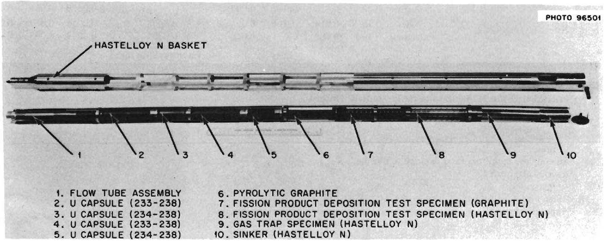  
Fig. 9.7. Final surveillance specimen assembly.

Observed $\mathrm{dpm} / \mathrm{cm}^2$ /(MSRE inventory as isotope $\mathrm{dpm} / \mathrm{MSRE}$ total metal and graphite area, $\mathrm{cm}^2$ )

Activity and inventory data are as of reactor shutdown 12/12/69

Numbers in parentheses are (MSRE inventory/MSRE total area), $\mathrm{dpm/cm^2}$

B, M, and T in sample numbers signify bottom, middle, and top regions of the core

Table 9.5. Relative deposition intensity of fission products on graphite surveillance specimens from final core specimen array   

<table><tr><td>Type</td><td>Roughness (μin.)</td><td>Centimeters from core center</td><td>Sample No.</td><td>89Sr (1.37E11a)</td><td>137Cs (8.53E9a)</td><td>140Ba (1.73E11)</td><td>141Ce (1.83E11)</td><td>144Ce (8.05E10a)</td><td>95Zr (1.35E11a)</td><td>95Nb (1.14E11)</td><td>99Mo (2.26E11)</td><td>103Ru (4.48E10a)</td><td>106Ru (4.47E9a)</td><td>125Sb (5.63E8)</td><td>132Te</td><td>129mTe (1.85E10)</td><td>131I (1.06E11)</td></tr><tr><td rowspan="3">Outside (transition flow)</td><td>5</td><td>-29</td><td>7-3-1-B outer</td><td>4.2</td><td>0.023</td><td>0.17</td><td>0.0039</td><td>0.0036</td><td>0.0021</td><td>0.21</td><td></td><td>0.083</td><td>0.069</td><td></td><td></td><td>0.011</td><td>0.0805</td></tr><tr><td>25</td><td>-27</td><td>7-3-1-M outer</td><td>1.6</td><td>0.022</td><td>0.13</td><td></td><td></td><td>0.0019</td><td>0.21</td><td></td><td>0.033</td><td>0.033</td><td></td><td></td><td>0.046</td><td>0.0059</td></tr><tr><td>125</td><td>-25</td><td>7-3-1-T outer</td><td>2.4</td><td></td><td>0.08</td><td>0.0031</td><td>0.0008</td><td>0.0018</td><td>0.18</td><td></td><td>0.035</td><td>0.035</td><td></td><td></td><td>0.029</td><td>0.0035</td></tr><tr><td rowspan="3">Outside with wire (turbulent flow)</td><td>5</td><td>+8</td><td>12-1-B outer</td><td>1.9</td><td></td><td>0.17</td><td>0.0069</td><td>0.0013</td><td>0.0025</td><td>0.25</td><td></td><td>0.040</td><td>0.0001</td><td></td><td></td><td>0.012</td><td>0.0033</td></tr><tr><td>25</td><td>+10</td><td>12-1-M outer</td><td>2.0</td><td></td><td>0.17</td><td>0.0090</td><td>0.0015</td><td>0.0023</td><td>0.15</td><td></td><td>0.039</td><td>0.039</td><td></td><td></td><td>0.025</td><td>0.0047</td></tr><tr><td>125</td><td>+12</td><td>12-1-T outer</td><td>1.8</td><td></td><td>0.16</td><td>0.0037</td><td>0.0005</td><td>0.0021</td><td>0.15</td><td></td><td></td><td></td><td></td><td></td><td>0.050</td><td>0.0050</td></tr><tr><td rowspan="3">Inside annulus (laminar flow)</td><td>5</td><td>-28</td><td>7-3-1-B inner</td><td>0.31</td><td>0.0058</td><td>0.016</td><td>0.0012</td><td>0.0006</td><td>0.0014</td><td>0.04</td><td>0.003</td><td>0.022</td><td>0.019</td><td></td><td></td><td>0.065</td><td>0.0033</td></tr><tr><td>5</td><td>-26</td><td>7-3-1-M inner</td><td>0.26</td><td>0.0016</td><td>0.009</td><td>0.0012</td><td>0.0006</td><td>0.0016</td><td>0.25</td><td>0.22</td><td>0.150</td><td>0.108</td><td></td><td></td><td>0.054</td><td>0.0026</td></tr><tr><td>125</td><td>-24</td><td>7-3-1-T inner</td><td>0.18</td><td>0.0015</td><td>0.009</td><td>0.0012</td><td>0.0011</td><td>0.0016</td><td>0.24</td><td>0.19</td><td>0.064</td><td>0.049</td><td></td><td></td><td>0.579</td><td>0.0010</td></tr><tr><td rowspan="3">Inside tube (transition flow)</td><td>5</td><td>+9</td><td>12-1-B inner</td><td>0.49</td><td>0.0029</td><td>0.046</td><td>0.0031</td><td>0.0009</td><td>0.0027</td><td>0.25</td><td></td><td>0.056</td><td>0.047</td><td></td><td></td><td>0.061</td><td>0.0031</td></tr><tr><td>5</td><td>+11</td><td>12-1-M inner</td><td>0.34</td><td>0.0010</td><td>0.028</td><td>0.0018</td><td>0.0009</td><td>0.0011</td><td>0.20</td><td></td><td>0.035</td><td>0.029</td><td></td><td></td><td>0.057</td><td>0.0019</td></tr><tr><td>125</td><td>+13</td><td>12-1-T inner</td><td>0.39</td><td>0.0032</td><td>0.033</td><td>0.0010</td><td>0.0002</td><td>0.0018</td><td>0.09</td><td></td><td>0.084</td><td>0.065</td><td></td><td></td><td>0.050</td><td>0.0017</td></tr><tr><td></td><td></td><td></td><td></td><td></td><td></td><td></td><td></td><td></td><td></td><td></td><td>99Tc</td><td></td><td></td><td></td><td></td><td>127Te (Inv = 2.9E9)</td><td></td></tr><tr><td>Postmortem: MSRE core bar segment</td><td></td><td></td><td></td><td></td><td></td><td></td><td></td><td></td><td></td><td></td><td>0.049</td><td></td><td>0.23</td><td>0.56</td><td></td><td>0.44</td><td></td></tr></table>

${}^{a}$ Inventories shown accrue from all operation beginning with original startup. To correct inventories to show the material produced during current period (runs 19 and 20) only, multiply by factors given below. To obtain similarly corrected deposition intensity ratios, divide the value in the table by the factor for the isotope. Factors are: ${52} - {\text{day}}^{89}\mathrm{{Sr}} = {0.90};{59} - {\text{day}}^{91}\mathrm{\;Y} = {0.86};{40} - {\text{day}}^{103}\mathrm{{Ru}} = {0.95};{65} - {\text{day}}^{95}\mathrm{{Zr}} = {0.84};{284} - {\text{day}}^{144}\mathrm{{Ce}} = {0.36};1 - {\text{year}}^{106}\mathrm{{Ru}} = {0.32};{30} - {\text{year}}^{137}\mathrm{{Cs}} =$ 0.14. For isotopes with shorter half-lives, corrections are trivial.

Observed $\mathrm{dpm} / \mathrm{cm}^2$ /(MSRE inventory as isotope $\mathrm{dpm} / \mathrm{MSRE}$ total metal and graphite area, $\mathrm{cm}^2$ )

Activity and inventory data are as of reactor shutdown 12/12/69

Numbers in parentheses are (MSRE inventory/MSRE total area), $\mathrm{dpm/cm}^2$

B, M, and T in sample numbers signify bottom, middle, and top regions of the core

Table 9.6. Relative deposition intensity of fission products on Hastelloy N surveillance specimens from final core specimen array   

<table><tr><td>Type</td><td>Roughness (μin.)</td><td>Centimeters from core center</td><td>Sample No.</td><td>89Sr(1.37E11a)</td><td>137Cs(8.53E9a)</td><td>140Ba(1.73E11)</td><td>141Ce(1.83E11)</td><td>144Ce(8.05E10a)</td><td>95Zr(1.35E11a)</td><td>95Nb(1.14E11)</td><td>99Mo(2.26E11)</td><td>103Ru(4.48E10a)</td><td>106Ru(4.47E9a)</td><td>125Sb(5.63E8)</td><td>132Te(2.01E11)</td><td>129mTe</td><td>131(1.06E11)</td></tr><tr><td rowspan="3">Outside (transition flow)</td><td>5</td><td>+24</td><td>14-3-B</td><td>0.0016</td><td>0.0015</td><td>0.0012</td><td>0.0009</td><td>0.0004</td><td>0.0004</td><td>0.13</td><td>3.4</td><td>0.094</td><td>0.127</td><td></td><td>6.4</td><td></td><td>0.060</td></tr><tr><td>25</td><td>+25</td><td>14-3-M</td><td>0.0013</td><td>0.0056</td><td>0.0009</td><td>0.0008</td><td>0.0003</td><td>0.0003</td><td>0.12</td><td>1.4</td><td>0.059</td><td>0.078</td><td></td><td>1.9</td><td></td><td>0.051</td></tr><tr><td>125</td><td>+27</td><td>14-3-T</td><td>0.0010</td><td>0.0006</td><td>0.0007</td><td>0.0006</td><td>0.0003</td><td>0.0003</td><td>0.14</td><td>1.7</td><td>0.056</td><td>0.079</td><td></td><td>2.2</td><td></td><td>0.046</td></tr><tr><td rowspan="3">Outside with wire (turbulent flow)</td><td>5</td><td>+16</td><td>13-2-B</td><td>0.0013</td><td>0.0009</td><td>0.0013</td><td>0.0009</td><td>0.0004</td><td>0.0003</td><td>0.26</td><td>0.46</td><td>0.10</td><td>0.09</td><td></td><td>1.1</td><td></td><td>0.22</td></tr><tr><td>25</td><td>+18</td><td>13-2-M</td><td>0.0020</td><td>0.0253</td><td>0.0018</td><td>0.0011</td><td>0.0005</td><td>0.0007</td><td>0.34</td><td>2.2</td><td>0.20</td><td>0.17</td><td></td><td>2.3</td><td></td><td>0.37</td></tr><tr><td>125</td><td>+20</td><td>13-2-T</td><td>0.0039</td><td>0.0022</td><td>0.0030</td><td>0.0012</td><td>0.0005</td><td>0.0004</td><td>0.49</td><td>0.32</td><td>0.10</td><td>0.08</td><td></td><td>3.0</td><td></td><td>0.60</td></tr><tr><td>Wire</td><td></td><td>+18</td><td>13-3 wire</td><td>0.0019</td><td>0.0006</td><td>0.0015</td><td>0.0010</td><td>0.0001</td><td>0.0005</td><td>0.21</td><td>0.85</td><td>0.14</td><td>0.23</td><td></td><td>0.17</td><td></td><td>0.09</td></tr><tr><td>Wire</td><td></td><td>+11</td><td>12-2 wire</td><td>0.0030</td><td>0.0011</td><td>0.0027</td><td>0.0016</td><td>0.0008</td><td>0.0008</td><td>0.88</td><td>1.7</td><td>0.25</td><td>0.19</td><td></td><td>0.79</td><td></td><td>0.09</td></tr><tr><td rowspan="2">Inside annulus (laminar flow)</td><td>5</td><td>-28</td><td>7-1-B</td><td>0.0018</td><td>0.0006</td><td>0.0015</td><td>0.0011</td><td>0.0005</td><td>0.0006</td><td>0.21</td><td>1.2</td><td>0.09</td><td>0.06</td><td></td><td>0.87</td><td></td><td>0.13</td></tr><tr><td>125</td><td>-26</td><td>7-1-T</td><td>0.0020</td><td>0.0007</td><td>0.0017</td><td>0.0013</td><td>0.0006</td><td>0.0006</td><td>0.39</td><td>1.4</td><td>0.15</td><td>0.23</td><td></td><td>0.93</td><td></td><td>0.19</td></tr><tr><td rowspan="3">Inside tube [transition (?) flow]</td><td>5</td><td>+16</td><td>13-1-B</td><td>0.0021</td><td>0.0005</td><td>0.0020</td><td>0.0014</td><td>0.0006</td><td>0.0007</td><td>0.37</td><td>3.7</td><td>0.34</td><td>0.32</td><td></td><td>1.2</td><td></td><td>0.18</td></tr><tr><td>5</td><td>+16</td><td>13-1-M</td><td>0.0021</td><td>0.0012</td><td>0.0018</td><td>0.0013</td><td>0.0006</td><td></td><td>0.41</td><td>4.1</td><td>0.19</td><td>0.19</td><td></td><td>1.1</td><td></td><td>0.18</td></tr><tr><td>125</td><td>+20</td><td>13-1-T</td><td>0.0019</td><td>0.0007</td><td>0.0015</td><td>0.0011</td><td>0.0005</td><td>0.0004</td><td>0.71</td><td>3.6</td><td>0.23</td><td>0.17</td><td></td><td>3.0</td><td></td><td>0.38</td></tr><tr><td rowspan="2">Stagnant (inside, liquid region)</td><td></td><td>+26</td><td>14-2-L2</td><td>0.0030</td><td>0.0020</td><td>0.0002</td><td>0.00003</td><td>0.00002</td><td>0.00001</td><td>0.0051</td><td>6.0</td><td>0.005</td><td>0.007</td><td></td><td>0.03</td><td></td><td>0.002</td></tr><tr><td></td><td>+24</td><td>14-2-L1</td><td>0.0010</td><td>0.0002</td><td>0.0002</td><td>0.00011</td><td>0.00006</td><td>0.00006</td><td>0.025</td><td>3.0</td><td>0.044</td><td>0.043</td><td></td><td>0.13</td><td></td><td>0.010</td></tr><tr><td rowspan="3">Stagnant (inside, gas region)</td><td></td><td>+29</td><td>14-2-G1</td><td>0.14</td><td>0.0027</td><td>0.0057</td><td>0.00001</td><td>0.000005</td><td>0.00003</td><td>0.0010</td><td>4.5</td><td>0.0012</td><td>0.0010</td><td></td><td>0.14</td><td></td><td>0.0008</td></tr><tr><td></td><td>+28</td><td>14-2-G2</td><td>0.47</td><td>0.0022</td><td>0.0077</td><td>0.00002</td><td>0.00001</td><td>0.00002</td><td>0.0012</td><td>5.3</td><td>0.0006</td><td>0.0006</td><td></td><td>0.03</td><td></td><td>0.0028</td></tr><tr><td></td><td>+27</td><td>14-2-G3</td><td>0.41</td><td>0.0014</td><td>0.0069</td><td>0.00004</td><td>0.00001</td><td>0.00086</td><td>0.0012</td><td>6.6</td><td>0.0009</td><td>0.0009</td><td></td><td>0.03</td><td></td><td>0.0005</td></tr><tr><td></td><td></td><td></td><td></td><td></td><td></td><td></td><td></td><td></td><td></td><td></td><td>99Tc</td><td></td><td></td><td></td><td>127Te (Inv = 2.9E9)</td><td></td><td></td></tr><tr><td>Postmortem</td><td></td><td></td><td></td><td></td><td></td><td></td><td></td><td></td><td></td><td></td><td></td><td></td><td></td><td></td><td></td><td></td><td></td></tr><tr><td>MSRE heat exchanger segment</td><td></td><td></td><td></td><td></td><td></td><td></td><td></td><td></td><td></td><td></td><td>0.20</td><td>0.55</td><td></td><td>0.13</td><td>1.4</td><td>1.0</td><td></td></tr><tr><td>MSRE rod thimble segment (core)</td><td></td><td></td><td></td><td></td><td></td><td></td><td></td><td></td><td></td><td></td><td>0.83</td><td>0.66</td><td></td><td>0.32</td><td>1.6</td><td>1.0</td><td></td></tr></table>

${}^{a}$ Inventories shown accrue from all operation beginning with original startup. To correct inventories to show the material produced during current period (runs 19 and 20) only, multiply by factors given below. To obtain similarly corrected deposition intensity ratios, divide the value in table by the factor for isotope. Factors are: 52-day ${}^{89}\mathrm{{Sr}} = {0.90};{59} - \mathrm{{day}}{}^{91}\mathrm{\;Y} = {0.86};{40} - \mathrm{{day}}{}^{103}\mathrm{{Ru}} = {0.95};{65} - \mathrm{{day}}{}^{95}\mathrm{{Zr}} = {0.84};{284} - \mathrm{{day}}{}^{144}\mathrm{{Ce}} = {0.36};1 - \text{year }{}^{106}\mathrm{{Ru}} = {0.32};{30} - \text{year }{}^{137}\mathrm{{Cs}} = {0.14}$ . For isotopes with shorter half-lives, corrections are trivial.

in. long; then an annulus $\frac{1}{16}$ in. wide, 5 in. long. A flow head loss of 0.057 ft, which should develop along the outer part of the basket, was assumed.

In the annulus between the outside of the graphite cylinder and the basket, the velocity was estimated to be about 1.5 fps; the associated Reynolds number is 2200, and the flow was either laminar or in the transition region. Some distance above, at the top of the assembly, was a Hastelloy N cylinder (No. 14, Table 9.6; No. 1 in Fig. 9.7) of similar external dimension, which presumably experienced similar flow conditions on the outside. This specimen was closed at the top and had a double wall. Inside was a bar containing electron microscope screens. The liquid around the bar within the cylinder was stagnant, and gas was trapped in the upper part of the specimen.

Below this, above the midplane of the specimen cage were located respectively graphite (Table 9.5, No. 12) and double-walled Hastelloy N (Table 9.6, No. 13) cylinders, with connecting $\frac{1}{2}$ -in.-diam bores. Flow through this tube is believed to have been transition or possibly turbulent flow, though doubtless less turbulent than around the specimen exterior. The exterior of the 1-in.-OD cylinders was wrapped with $\frac{1}{16}$ -in. Hastelloy N wire on $\frac{1}{2}$ -in. pitch as a flow disturbance. Flow in the annulus between the specimen exterior and the basket was undoubtedly the most turbulent of any affecting the set of specimens.

The data from the various specimens are presented in Table 9.5 for graphite and Table 9.6 for Hastelloy N in terms of relative deposit intensity.

We saw no effect of surface roughness, which ranged from 5 to $125\mu \mathrm{in}$ . rms, on either metal or graphite, so this will not be further considered here.

9.2.3 Fission recoil. Because the specimens were adjacent to fissioning salt in the core, some fission products should recoil into the surface. We calculate that where the fission density equals the average for the core, the relative impingement intensity of recoiling fission fragments, (recoil atoms per square centimeter)/ (reactor production/surface area), ranges from 0.0036 for light fragments to 0.0027 for heavy fragments. The ratio will be higher (around 0.005) where the fission density is highest.

9.2.4 Salt-seeking nuclides. Relative deposition intensities for salt-seeking nuclides $\left({}^{95}\mathrm{Zr},{}^{141}\mathrm{Ce}\right)$ are of the order of the calculated impingement intensities or less: for ${}^{95}\mathrm{Zr}$ , 0.001 to 0.0027 on graphite and 0.0003 to 0.0008 on metal; for ${}^{141}\mathrm{Ce}$ , 0.0010 to 0.0090 on graphite and 0.0006 to 0.0016 on metal. The deposition of 284-day ${}^{144}\mathrm{Ce}$ is consistent with this, on a current basis after adjustment for prior inventory as shown in the table footnotes.

There also appears to be some dependence on axial location, with higher values nearer the center of the core. Thus all of the salt-seeking nuclides observed on surfaces could have arrived there by fission recoil; the fact that remaining deposition intensities on metal surfaces are consistently less than impingement densities indicates that many atoms that impinge on the surface may sooner or later return to the salt.

9.2.5 Nuclides with noble-gas precursors. The nuclides with noble-gas precursors $\left({}^{89}\mathrm{Sr},{}^{137}\mathrm{Cs},{}^{140}\mathrm{Ba},\right.$ and, to a slight extent, ${}^{141}\mathrm{Ce})$ are, after formation, also salt seekers. They are found to be deposited on metal to about the same extent as isotopes of salt-seeking elements, doubtless by fission recoil. However, noble-gas precursors can diffuse into graphite before decay, providing an additional and major path into graphite. It may be seen that values for ${}^{89}\mathrm{Sr},{}^{137}\mathrm{Cs},$ and ${}^{140}\mathrm{Ba}$ for the graphite samples are generally an order of magnitude or more greater than for the salt-seeking elements.

It appears evident that the deposit intensity on graphite of the isotopes with noble-gas precursors was higher on the outside than on the inside, both of specimen 7 and specimen 12. Flow was also more turbulent outside than inside, and atomic mass transfer coefficients should be higher. [Flows are not well enough known to accurately compare the outside of the lower specimen (No. 7-3) with the inside of the upper graphite tube specimen (No. 12-1)].

Appreciably more $3.1\mathrm{-min}^{89}\mathrm{Kr}$ and $3.9\mathrm{-min}^{137}\mathrm{Xe}$ should enter the graphite than 16-sec $^{140}\mathrm{Xe}$ or 2-sec $^{141}\mathrm{Xe}$ , but the $^{137}\mathrm{Cs}$ values are considerably lower than for $^{89}\mathrm{Sr}$ . Only about $14\%$ of the $^{137}\mathrm{Cs}$ inventory was formed during runs 19 and 20. With this correction, however, $^{137}\mathrm{Cs}$ deposition intensities still are less than those observed for strontium. As will be discussed later the major part of the cesium formed in graphite will diffuse back into the salt much more strongly than the less volatile strontium; this presumably accounts for the lower $^{137}\mathrm{Cs}$ intensity.

At first glance the "fast flow" values for $^{89}\mathrm{Sr}$ on graphite appear somewhat high even though $^{89}\mathrm{Kr}$ entry to graphite from salt was facilitated by the more rapid flow. Similar intensity on all flow-channel graphite would account for the major part of the $^{89}\mathrm{Sr}$ inventory, while salt analysis for the period showed that the salt contained about $82\%$ of the $^{89}\mathrm{Sr}$ . But the discrepancy is not unacceptable, since most core fuel channels had lower velocity and less turbulent, possibly laminar flow.

On the inside of the closed tube the deposition of $^{39}\mathrm{Sr}$ and other salt-seeking daughters of noble gases was much higher in the gas space than in the salt-filled region. This is consistent with collection of $^{89}\mathrm{Kr}$ in the

gas space and the relative immobility of strontium deposits on surfaces not washed by salt.

9.2.6 Noble metals: niobium and molybdenum. Turning to the noble-metal fission products, we note that $^{95}\mathrm{Nb}$ deposited fairly strongly and fairly evenly on all surfaces. The data are not inconsistent with postmortem examination of reactor components, to be described later. Molybdenum $(^{99}\mathrm{Mo})$ deposited considerably more strongly on metal than on graphite (limited graphite data). Because the relative deposit intensity of molybdenum on metal is similar to that of $^{89}\mathrm{Sr}$ on graphite, which is attributed to atomic krypton diffusion through the salt boundary layer, it may be that molybdenum could also have been transported in appreciable part by an atomic mechanism, and presumably had a high sticking factor on metal (about 1?). Under similar flow conditions, the deposit intensity of molybdenum on graphite is much less; hence the sticking factor on graphite is doubtless much below unity. Postmortem component examination found that the $^{99}\mathrm{Tc}$ daughter also was more intensely deposited on metal than on graphite.

The widely varying $^{99}\mathrm{Mo}$ values for salt samples taken during this period, however, imply that a significant amount of $^{99}\mathrm{Mo}$ occurred along with other noble-metal isotopes in pump bowl salt samples as particulates. Since molybdenum was relatively high in the present surveillance samples also, it may be that an appreciable part of the deposition involved material from this pool.

Because molybdenum deposited more strongly than its precursor niobium, an appreciable part of the molybdenum found must have deposited independently of niobium deposition, and niobium behavior may only roughly indicate molybdenum behavior at best. This may well be due to the relation of niobium behavior to the redox potential of the salt, while molybdenum may not be affected in the same way.

9.2.7 Ruthenium. The ruthenium isotopes, $^{103}\mathrm{Ru}$ and $^{106}\mathrm{Ru}$ , showed quite similar behavior as would be expected, and did not exhibit any marked response to flow or flux variations. The ruthenium isotopes appear to deposit severalfold more intensely on metal than on graphite. The correction of inventories to material formed only during the exposure period will increase the $^{106}\mathrm{Ru}$ intensity ratios about threefold but will change the $^{103}\mathrm{Ru}$ intensity ratio very little. On such a inventory basis the $^{103}\mathrm{Ru}$ deposition will then be appreciably lower than that for $^{106}\mathrm{Ru}$ ; this indicates that an appreciable net time lag may occur before deposition and argues against a dominant direct atomic deposition mechanism for this element.

9.2.8 Tellurium. The tellurium isotopes $^{132}\mathrm{Te}$ (on metals) and $^{129\mathrm{m}}\mathrm{Te}$ (on graphite) show an appreciably stronger (almost 40 times) relative deposit intensity on metal than on graphite, indicative of real differences in sticking factor. Deposit intensities of tellurium were moderately higher in faster flow regions than in low flow regions (2 times or more), possibly indicative of response to mass transfer effects. Flux effects are not significant.

Postmortem examination of MSRE components showed $^{125}\mathrm{Sb}$ and $^{127}\mathrm{Te}$ deposition intensities which were consistent with this, except that the deposition intensity of tellurium on the core fuel-channel surfaces was higher than we observe here on surveillance specimens.

On balance, it appears that the sticking factor of tellurium on metal is relatively high. This might result from direct atomic deposition and/or deposition on particulate material which then deposits selectively but securely. Such strong intensity of tellurium in the deposits could be the result of direct deposition of tellurium, or of similar prompt deposition of precursor antimony with retention of the tellurium daughter, or both. The data do not tell.

9.2.9 Iodine. Iodine exhibits deposit intensities which appear to be at least an order of magnitude lower than tellurium, both for graphite specimens and, at considerably higher levels for both tellurium and iodine, for the metal specimens. The data for the metal surface mostly vary with tellurium, suggesting that the iodine found is a result of tellurium deposition and decay, but with most of the iodine formed having returned to the salt.

9.2.10 Sticking factors. In general the data of the final surveillance assembly are consistent with those of the earlier assemblies. The pairing of the metal and graphite specimens in the final assembly permits some conclusions about relative sticking factors that were implied but less certain in the earlier assemblies.

It appears evident, because the deposition intensity differs for different isotopes under the same flow conditions, that the sticking factor must be below unity for may of the noble-metal isotopes, either on metal or on graphite. The deposition intensity appears rather generally to be higher on metals than on graphite and could approach unity. In terms of mechanism, low values of sticking factor could result if only part of the area was active or if material was returned to the liquid, either as atoms via chemical equilibrium processes, or by pickup of deposited particulate material from the surface.

The values would be low if the inventory should be distributed over a larger area than just the sum of system metal and graphite areas. Such areas might include the surface of bubbles or colloidal particles in the circulating salt.

It is adequately clear, however, that under similar flow conditions, the intensities of deposits on metal and graphite surfaces differ significantly for most noble-metal elements, with more intense deposits of a given nuclide generally occurring on the metal surface of a similarly exposed metal-graphite pair.

# 9.3 Profile Data

9.3.1 Procedure. As described earlier in this section, for most graphite surveillance specimens a succession of thin cuts were made inward from each face to depths frequently of about 50 mils (0.050 in.). These cuts were individually bottled, weighed, and analyzed for each nuclide. The summations for the individual faces have already been given in the earlier tables of this section. It does not appear expedient to account here for the individual samples (which would increase the volume of data manyfold), since most of the information is summarized in typical profiles shown below for samples

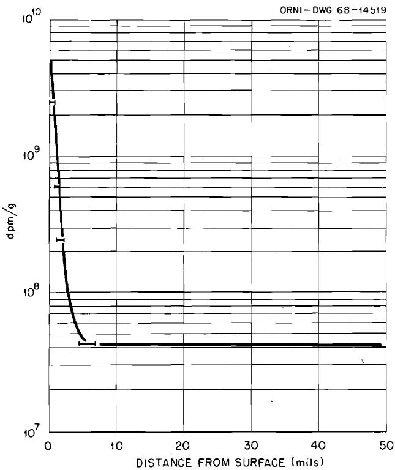  
Fig. 9.8. Concentration profile for $^{137}\mathrm{Cs}$ in impregnated CGB graphite, sample P-92.

removed after run 14. We note that improved hot-cell milling techniques permitted recovery of 95 to $99\%$ of the removed material for these samples, with little cross contamination indicated.

The results of these procedures on two samples of MSRE (CGB) graphite are shown in Figs. 9.8-9.14. The sample labeled P58 was a CGB graphite exposed slightly above the core midplane and was inserted after run 11. Sample X-13 was exposed slightly below midplane and was inserted after run 7, being withdrawn and returned after run 11.

Data for the various nuclides are presented as semilogarithmic plots of activity per unit mass of graphite vs cut depth. Although such a plot permits easy display of the data, it does tend to obscure the general fact that

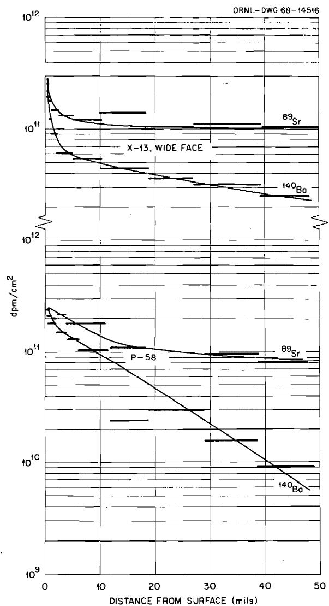  
Fig. 9.9. Concentration profiles for $^{89}\mathrm{Sr}$ and $^{140}\mathrm{Ba}$ in two samples of CGB, X-13 wide face, and P-58.

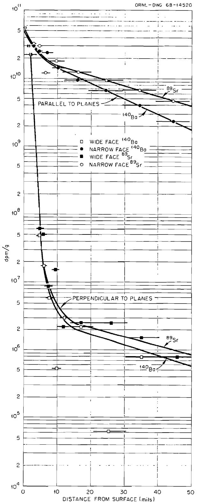  
Fig. 9.10. Concentration profiles for $^{89}\mathrm{Sr}$ and $^{140}\mathrm{Ba}$ in pyrolytic graphite.

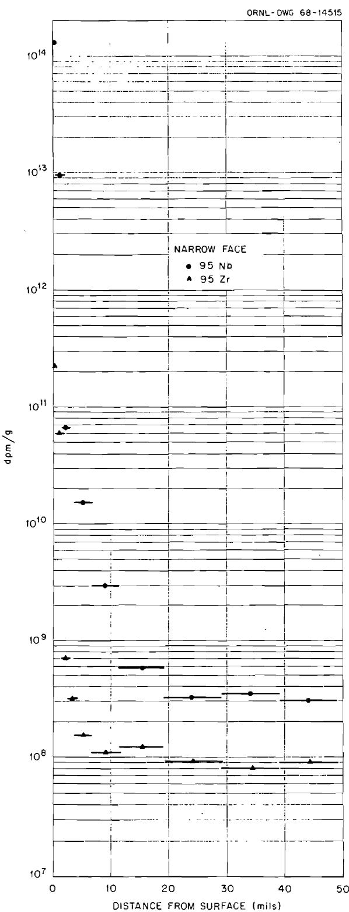  
Fig. 9.11. Concentration profiles for $^{95}\mathrm{Nb}$ and $^{95}\mathrm{Zr}$ in CGB graphite, X-13, double exposure.

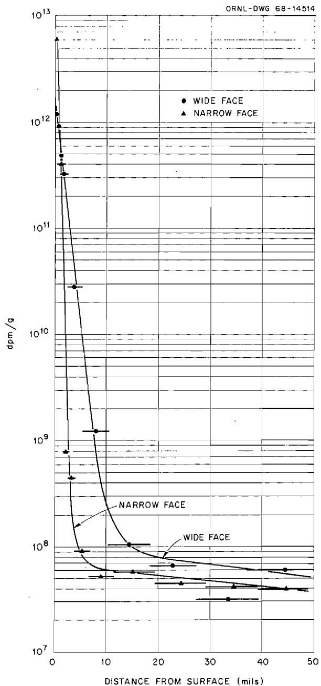  
Fig. 9.12. Concentration profiles for $^{103}\mathrm{Ru}$ on two faces of the X-13 graphite specimen, CGB, double exposure.

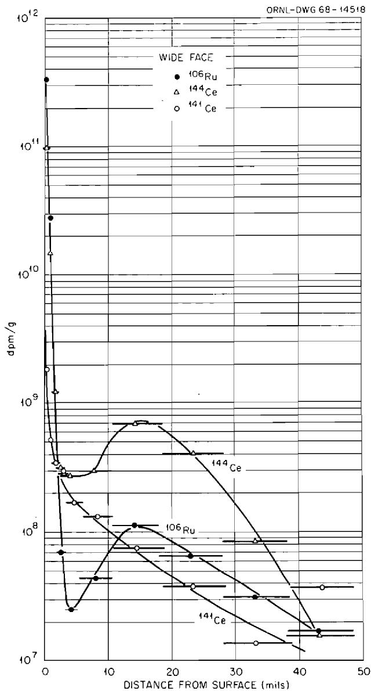  
Fig. 9.13. Concentration profiles for $^{106}\mathrm{Ru}$ , $^{141}\mathrm{Ce}$ , and $^{144}\mathrm{Ce}$ in CGB graphite, sample Y-9.

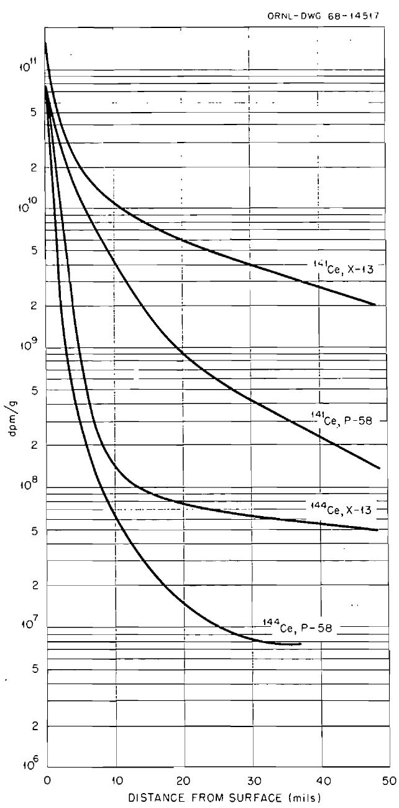  
Fig. 9.14. Concentration profiles for $^{141}\mathrm{Ce}$ and $^{144}\mathrm{Ce}$ in two samples of CGB graphite, X-13, wide face, and P-38.

by far the greatest amount of any nuclide was to be found within a very few mils of the surface. Consequently what the fission product profiles tend to display is the behavior of the small fraction of the deposited nuclide which penetrates beyond the first few mils.

Additional data on samples from this set of specimens were obtained by Cuneo and co-workers, using a technique developed by Evans. The technique offered

less possibility of cross contamination of samples. According to this technique the specimen was generally cut longitudinally and at the midplane, and a core was drilled to the outer surface. The core was then glued to a cold graphite coupon, which in turn was glued to a machined steel piston. This piston, the position of which could be measured accurately using a dial micrometer, fitted into a holder which was moved on a piece of emery paper. The resulting powder was Scotch taped in place, and the total activity of various nuclides was determined using a gamma-ray spectrometer.

9.3.2 Results. Results using this technique are shown in Figs. 9.15-9.17.

The material found on or in the graphite doubtless emerged from the adjacent salt. Transport from salt can occur by fission product atom recoil from adjacent fuel salt, by the deposition of elemental fission products diffusing out of salt as atoms or borne by salt as colloids, by chemical reaction of salt-soluble species with graphite, by diffusion of gases from salt and deposition onto graphite, and by physical transport of salt into graphite, either by pressure permeation of cracks, by wetting the graphite, or by sputtering processes due to fission spikes in salt close to the graphite surfaces.

Of these, there is no indication of reaction of fluorides with graphite (with niobium a possible exception), and volatile substances are not thought to be a factor, the noble-gas nuclides excepted. Furthermore, the graphite did not appear to be wet by salt. Occasionally there was an indication that salt entered cracks in the graphite, and this could be a factor for a few samples.

The nuclides most certain to be found at greatest depths should be the daughters of the noble gases. Profiles for $^{89}\mathrm{Sr}$ and $^{140}\mathrm{Ba}$ are shown in Fig. 9.9.

9.3.3 Diffusion mechanism relationships. Among the ways in which fission products might enter into and diffuse in graphite are (1) recoil of fission fragments from adjacent salt, (2) diffusion into graphite of noble or other short-lived gases originating in salt which on decay will deposit a nonmobile daughter, (3) formation of fission products from uranium that was found at that depth in the graphite, (4) migration of fission products by a surface diffusion mechanism.

In our consideration of any mechanisms for the migration of fission products, we will seek (1) estimates of the amount of activity on unit area, summed over all depths (expressed as disintegrations per minute per square centimeter), (2) the surface concentration (expressed as disintegrations per minute per gram of graphite), and (3) the variation of concentration with

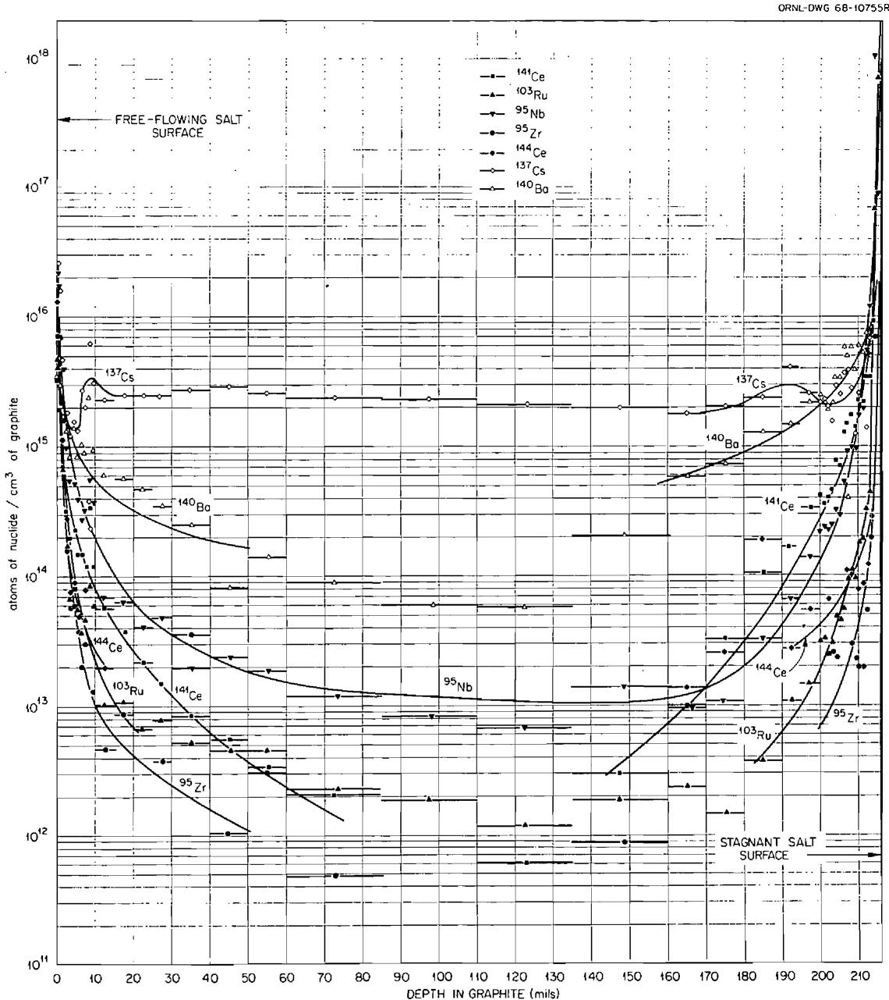  
Fig. 9.15. Fission product distribution in unimpregnated CGB (P-55) graphite specimen irradiated in MSRE|cycle ending March 25, 1968.

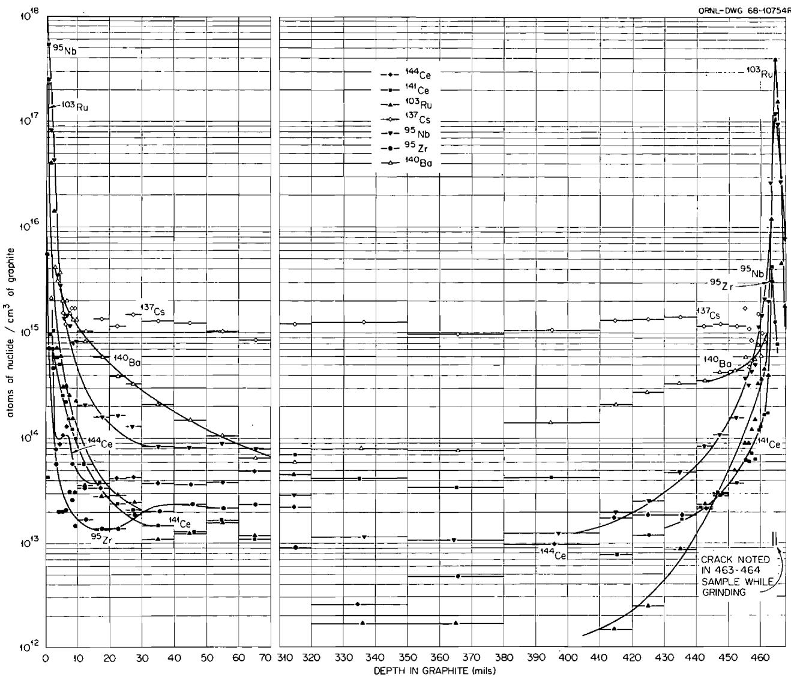  
Fig. 9.16. Fission product distribution in impregnated CGB (V-28) graphite specimen irradiated in MSRE cycle ending March 25, 1968.

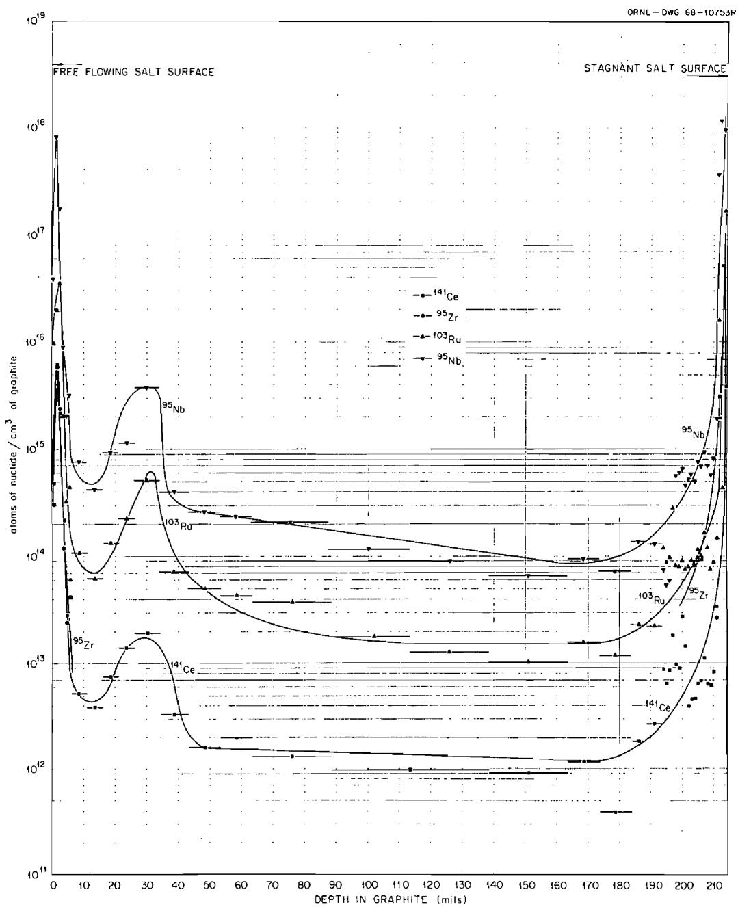  
Fig. 9.17. Distribution in pyrolytic graphite specimen irradiated in MSRE for cycle ending March 25, 1968.

depth - usually expressed as the depth required to halve (or otherwise reduce) the concentration. We should also try to relate the calculated activity to the calculated inventory activity of fuel salt (expressed as disintegrations per minute per gram of salt) developed for the exposure period.

Since $25\%$ of the fissions occurring in salt within one range unit will leave the salt and doubtless enter the adjacent graphite, and if we use as applicable to salt the range of light and heavy fragments in zirconium, determined as 7.5 and $5.9\mathrm{mg/cm^2}$ respectively, we can calculate the accumulated recoil activity:

$$
\operatorname {r e c o i l} \mathrm {d p m} / \mathrm {c m} ^ {2} = \frac {\operatorname {i n v . d p m}}{\mathrm {g s a l t}} \times I \times \left\{\frac {0 . 0 0 5 3 \text {f o r h e a v y}}{0 . 0 0 7 3 \text {f o r l i g h t}}, \right.
$$

where $I$ is the ratio of local to core average neutron flux. $(I\sim 2$ to 4 for core center specimens, depending on axial position.)

Only in the case of salt-seeking nuclides is recoil a dominant factor.

The range of fission products entering a graphite of density 1.86 was determined $^{10}$ as $3.07 \, \mathrm{mg/cm}^2$ for $^{95}\mathrm{Y}$ and $2.51 \, \mathrm{mg/cm}^2$ for $^{140}\mathrm{Xe}$ ; this corresponds to 16.5 and $13.5 \, \mu$ , so that the penetration should be limited to a nominal 0.6 mil.

The transport of fission gases in graphite has been reported11,12 for representative CGB graphites.

The diffusion of noble gases in graphite also involves diffusion through boundary layers of the adjacent salt. We will express the behavior in graphite as a function of the entering flux, and then use this as a boundary condition for diffusion from salt.

At steady state the diffusion of a short-lived gaseous nuclide into a plane-surfaced semi-infinite porous solid has been shown by Evans12 to be characterized by the following:

$$
J _ {G} = C _ {g} (\epsilon D _ {G} \lambda) ^ {1 / 2} = C _ {g} \beta D _ {G} ,
$$

$$
\beta = \left(\epsilon \lambda / D _ {G}\right) ^ {1 / 2},
$$

$$
N (y) = C _ {g} \exp (- \beta y),
$$

where

$C_g =$ atom concentration in surface gas phase,

$J_{G} =$ atom flux entering surface,

$\epsilon =$ total porosity of graphite,

$D_{G} =$ Knodsen diffusion coefficient in graphite,

$N(y) =$ concentration of atoms in gas phase in pores at depth $y$

The surface concentration of a nonmobile daughter in graphite resulting from the decay of a diffusing short-lived precursor is obtained from the accumulation expression

$$
\left(\frac {d C _ {2}}{d t}\right) _ {0} = \frac {\lambda_ {1} C _ {1} g \epsilon}{\rho_ {G}} - \lambda_ {2} C _ {2},
$$

where $C_2$ is the daughter concentration per gram of graphite. Integrating this across the power history of the run, we obtain for the activity $(a_2)$ of the daughter in disintegrations per minute per gram of graphite;

$$
\left(a _ {2}\right) _ {0} = \frac {J G ^ {0} \beta}{\rho_ {G}} \left[ \frac {\left(\operatorname {i n v .}\right) _ {\text {r u n}}}{F ^ {0} Y / \text {m a s s}} \right]; \tag {1}
$$

further,

$$
a _ {2} (y) = A \left(a _ {2}\right) _ {0} \exp (- \beta y); \tag {2}
$$

where

$J_{G}^{0} =$ gas nuclide flux into graphite at unit power,

$(\mathrm{inv.})_{\mathrm{run}}$ is the activity inventory accumulated by salt during run,

$F^0 =$ fission rate at unit power in given mass,

$Y =$ fission yield.

The total accumulation for unit surface integrated over all depths follows as

$$
\mathrm {d p m} / \mathrm {c m} ^ {2} = H _ {G} ^ {0} \frac {\left(\text {i n v .}\right) _ {\text {r u n}}}{F ^ {0} Y / \text {m a s s}}.
$$

It remains to determine the flux into the graphite, $J^0$ at unit power, by considering conditions within the salt.

The short-lived noble-gas nuclide is generated volumetrically in the salt; the characteristic distance $(D_{s} / \lambda)^{1 / 2}$ is about $0.06\mathrm{cm}$ for a 200-sec nuclide and about $0.013~\mathrm{cm}$ for a 10-sec nuclide. The salt in a boundary layer at $0.013\mathrm{cm}$ from the wall of a fuel channel with a width of $1\mathrm{cm}$ will flow more slowly than the bulk salt and will require perhaps 100 sec to traverse the core. For nuclides of 10 sec or less half-life and as an approximation for longer-lived nuclides, $\mathbf{Kedl^{13}}$ showed that such flow terms could be neglected, so that at steady state

$$
\frac {\partial^ {2} C _ {s}}{\partial r ^ {2}} = \frac {\lambda C _ {s}}{D _ {s}} - \frac {Q _ {s}}{D _ {s}},
$$

where $Q_{s}$ is the volumetric generation rate in core salt, $D_{s}$ is diffusion coefficient in salt, $C_{s}$ is the local con

centration in salt, and $r$ is the distance from the slab channel midplane.

Boundary conditions are:

1.at midplane:

$$
r = 0, \frac {d C _ {s}}{d r} = 0;
$$

2. at either surface:

$$
r = r _ {0} , \quad J _ {s} = J _ {G} ,
$$

where

$J_{s} =$ flux in salt at surface;

whereby

$$
- \left(\frac {d C _ {s}}{d r}\right) _ {r _ {0}} = \frac {J _ {s}}{D _ {s}} = \frac {C _ {g} (\epsilon \lambda D _ {G}) ^ {1 / 2}}{D _ {s}}
$$

and

$$
C _ {s} = C _ {g} K _ {c},
$$

where

$K_{c} =$ Ostwald solubility coefficient.

Integration and satisfaction of the midplane boundary condition yields:

$$
C _ {s} = C \cosh (r \sqrt {\lambda / D _ {s}}) + Q / \lambda .
$$

The second boundary condition evaluates $C$ :

$$
C = \frac {- Q / \lambda}{K _ {C} \left(D _ {s} / \epsilon D _ {G}\right) ^ {1 / 2} \sinh \left(r _ {0} \sqrt {\lambda / D _ {s}}\right) + \cosh \left(r _ {0} \sqrt {\lambda / D _ {s}}\right)}.
$$

We may now obtain

$$
J _ {G} ^ {0} = Q ^ {0} Z,
$$

where

$$
Z = \left(\frac {\epsilon D _ {G}}{\lambda_ {1}}\right) ^ {1 / 2} \left| \frac {1}{K _ {c} + (\epsilon D _ {G} / D _ {s}) ^ {1 / 2} \coth (r _ {0} \sqrt {\lambda / D _ {s}})} \right.
$$

Because coth $(r_0\sqrt{\lambda / D_s})\sim 1$ and $K_{c}\ll (\epsilon D_{G} / D_{s})^{1 / 2}$

$$
Z = \left(D _ {s} / \lambda\right) ^ {1 / 2}
$$

as

$$
Q ^ {0} = I \frac {F ^ {0} Y}{\text {m a s s}} \times \frac {\text {s a l t v o l .}}{\text {c o r e v o l .}} \times \rho_ {\text {s a l t}}.
$$

We now are able to write the desired expression for the activity of nonmobile daughters of short-lived noble gases which diffuse into graphite.

1. Surface activity, disintegrations per minute per gram of graphite:

$$
\begin{array}{l} \left(a _ {2}\right) _ {0} = (\bar {\operatorname {i n v .}}) _ {\text {r u n}} \times I \times \frac {\rho_ {\text {s a l t}}}{\rho_ {\text {g r a p h i t e}}} \\ \times \frac {\text {s a l t v o l .}}{\text {c o r e v o l .}} \times \left(\frac {\epsilon D _ {s}}{D _ {G}}\right) ^ {1 / 2}. \\ \end{array}
$$

2. Activity per gram of graphite at any depth, disintegrations per minute:

$$
a _ {2} (y) = \left(a _ {2}\right) _ {0} \exp - \beta y,
$$

$$
\beta = \left(\epsilon \lambda_ {1} / D _ {G}\right) ^ {1 / 2},
$$

$$
y _ {1 / 2} = (\ln 2) / \beta .
$$

3. Total accumulation for unit surface, integrated over all depths:

$$
\frac {\mathrm {d p m}}{\mathrm {c m} ^ {2}} = (\text {i n v .}) _ {\text {r u n}} \times I \times \frac {\text {s a l t v o l .}}{\text {c o r e v o l .}} \times \rho_ {\text {s a l t}} \times \sqrt {\frac {D _ {s}}{\lambda_ {1}}}
$$

Table 9.7 applies these results to the specimens removed at the end of run 14. A comparison with observations given earlier in Table 9.3 is commented on later.

A third possibility of developing activity within the graphite is from the traces of uranium found in the graphite.

Here the relationship is:

$$
\begin{array}{l} A s _ {2} (U) (y) = (\operatorname {i n v .}) _ {\text {r u n}} \times I \times \frac {\text {s a l t v o l .}}{\text {c o r e v o l .}} \\ \times \frac {{} ^ {2 3 5} \mathrm {U} \text {c o n c . i n g r a p h i t e a t g i v e n d e p t h}}{{} ^ {2 3 5} \mathrm {U} \text {c o n c . i n l g o f s a l t}}, \\ \end{array}
$$

under the assumption that the uranium was present in the graphite at the given location for essentially all of the run. The $^{235}\mathrm{U}$ concentration in fuel salt was about 15,500 ppm;

$$
\begin{array}{c} \text {s a l t v o l .} \\ \text {c o r e v o l .} \end{array} \sim \frac {7 1 f t ^ {3}}{2 3 f t ^ {3}} \sim 3.
$$

The concentration at various depths of $^{235}\mathrm{U}$ in a specimen of CGB graphite is shown in Fig. 9.18. The surface concentration of about 70 ppm soon falls to

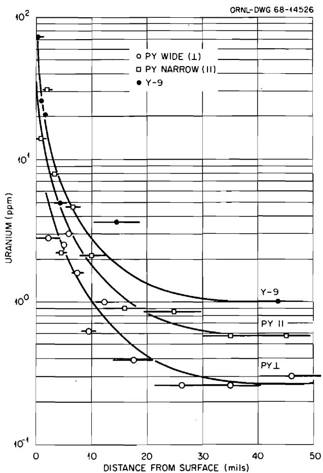  
Fig. 9.18. Uranium-235 concentration profiles in CGB and pyrolytic graphite.

near 1 ppm. Similar data were obtained for all specimens.

Table 9.8 shows that for $^{144}\mathrm{Ce}$ , $^{95}\mathrm{Zr}$ , $^{103}\mathrm{Ru}$ , and $^{131}\mathrm{I}$ , at depths greater than about 7 mils the activity could be accounted for as having been produced by the trace of $^{235}\mathrm{U}$ which was present at that depth.

The total quantity of $^{235}\mathrm{U}$ associated with graphite surfaces was quite small. Total deposition ranged between 0.15 and $2.3\mu \mathrm{g}$ of $^{235}\mathrm{U}$ per square centimeter, with a median value of about $0.8\mu \mathrm{g}$ of $^{235}\mathrm{U}$ per square centimeter. This is equivalent to less than $2\mathrm{g}$ of $^{235}\mathrm{U}$ on all the system graphite surface (about 1 on flow-channel surfaces) out of an inventory of $75,000\mathrm{g}$ of $^{235}\mathrm{U}$ in the system.

9.3.4 Conclusions from profile data. As an overview of the profile data the following observations appear valid.

Let us roughly separate the depths into surface (less than 1 mil), subsurface (about to 7 mils), moderately deep (about 7 to 20 mils), and deep (over 20 mils).

For salt-seeking nuclides, $^{103}\mathrm{Ru}$ and $^{106}\mathrm{Ru}$ and $^{131}\mathrm{I}$ the moderately deep and deep regions are a result of $^{235}\mathrm{U}$ penetration and fission. We have noted in an earlier section that for salt-seeking nuclides the total activity for unit surface was in fair agreement with recoil effects. Profiles indicate that almost all of the activity for these nuclides was very near the surface, consistent with this. For these the only region for which evidence is not clear is the subsurface (1 to 7

Table 9.7. Calculated specimen activity parameters after run 14 based on diffusion calculations and salt inventory   

<table><tr><td>Chain</td><td>89</td><td>91</td><td>137</td><td>140</td><td>141</td></tr><tr><td>Gas half-life, sec</td><td>191</td><td>9.8</td><td>234</td><td>16</td><td>1.7</td></tr><tr><td>DG, cm2/sec</td><td>1.5E-5</td><td>1.5E-5</td><td>1.2E-5</td><td>1.2E-5</td><td>1.2E-5</td></tr><tr><td>DS, cm2/sec</td><td>1.4E-5</td><td>1.4E-5</td><td>1.3E-5</td><td>1.3E-5</td><td>1.3E-5</td></tr><tr><td>ε</td><td>0.1</td><td>0.1</td><td>0.1</td><td>0.1</td><td>0.1</td></tr><tr><td>Halving depth, mils</td><td>56</td><td>13</td><td>55</td><td>14</td><td>4.7</td></tr><tr><td>Daughter</td><td>89Sr</td><td>91Y</td><td>137Cs</td><td>140Ba</td><td>141Ce</td></tr><tr><td>Inventory,a dis/min per gram of salt</td><td>1.1E11</td><td>1.3E11</td><td>4.2E9a</td><td>1.7E11</td><td>1.5E11</td></tr><tr><td>Surface concentration,b dis/min per gram of graphite</td><td>1.2E11</td><td>1.4E11</td><td>5.0E9</td><td>2.0E11</td><td>1.8E11</td></tr><tr><td>Total activity,b dis min-1cm-2</td><td>4.6E10</td><td>1.2E10</td><td>1.9E9</td><td>1.9E10</td><td>5.6E9</td></tr></table>

${}^{a}$ Inventory here is total at end of run 14. Carryover from prior runs is insignificant by the end of run 14 except in the case of ${}^{137}\mathrm{{Cs}}$ ,where operation prior to end of run 11 contributes about half the inventory at the end of run 14,319 days later.   
$b_{\mathrm{Assumes a local relative flux of 1}}$

mils), where the values, though declining rapidly, may be higher than explicable by these mechanisms.

The nuclides having noble-gas precursors (i.e., $^{89}\mathrm{Sr}$ , $^{140}\mathrm{Ba}$ , $^{141}\mathrm{Ce}$ , $^{91}\mathrm{Y}$ ) do clearly exhibit the results of noble-gas diffusion. The slopes and surface concentrations are roughly as estimated. The total disintegrations per minute per square centimeter is in accord.

In the case of $^{137}\mathrm{Cs}$ , the levels are considerably too low in the moderately deep and deep regions, indicating that cesium was probably somewhat mobile in the graphite. Additional evidence on this point is presented later.

This leaves $^{95}\mathrm{Nb}$ , $^{99}\mathrm{Mo}$ , and possibly $^{132}\mathrm{Te}$ and $^{129}\mathrm{mTe}$ . These nuclides appear to have migrated in graphite, and in particular there is about 10 times as much niobium as was explicable in terms of the parent $^{95}\mathrm{Zr}$ present or the $^{235}\mathrm{U}$ at that depth. Such migration might occur because the nuclides were volatile fluorides or because they form stable carbides at this temperature and some surface diffusion due to metal-carbon chemisorption occurred. The latter possibility, which seems most likely, seems also to explain the traces of $^{235}\mathrm{U}$ found having migrated into the graphite.

# 9.4 Other Findings on Surveillance Specimens

In visual examination of surveillance specimens, slight amounts of flush salt and, on occasion, dark green fuel salt were found as small droplets and plates on the surface of specimens, particularly on faces that had

been in contact with other specimens. A brown dusty-looking film was discerned on about half of the fuel-exposed surfaces, using a 30-power microscope. Examination by electron microscopy of a surface film removed by pressing acetone-dampened cellulose acetate tape against a graphite surface revealed only graphite diffraction patterns. Later, spectrographic analysis showed that appreciable quantities of stable molybdenum isotopes were present on many surfaces. Presumably these were not crystalline enough to show electron diffraction patterns.

Thin transverse slices of five specimens were examined by x radiography. Many of the salt-exposed surfaces and some other surfaces appeared to have a thin film of heavy material less than 10 mils thick.

Results of spectrographic analyses of samples from graphite surface cuts are shown in Table 9.9, expressed as micrograms of element per square centimeter. Data for zirconium, lithium, and iron are not included here since they showed too much scatter to be usefully interpreted.

About $15\mu \mathrm{g}$ of fuel salt would contain $1\mu \mathrm{g}$ of beryllium. Similarly, about $13\mu \mathrm{g}$ of Hastelloy N might contain $1\mu \mathrm{g}$ of chromium and also about $9\mu \mathrm{g}$ of nickel and perhaps $2\mu \mathrm{g}$ of molybdenum. Thus the spectrographic analysis for beryllium corresponds to about $6 - 60~\mu \mathrm{g}$ of fuel salt per square centimeter. The nickel analyses correspond to $7 - 9\mu \mathrm{g}$ of Hastelloy N per square centimeter, and the chromium and molybdenum (except for a high value) are in at least rough agreement.

Table 9.8. List of milled cuts from graphite for which the fission product content could be approximately accounted for by the uranium present   

<table><tr><td rowspan="2">Graphite Sampleb</td><td colspan="12">Milled Cut Numbersa</td></tr><tr><td>99Mo</td><td>132Te</td><td>129Te</td><td>103Ru</td><td>106Ru</td><td>95Nb</td><td>95Zr</td><td>89Sr</td><td>140Ba</td><td>141Ce</td><td>144Ce</td><td>131I</td></tr><tr><td>P-77</td><td></td><td></td><td>9,10</td><td>6-10</td><td>6,10</td><td></td><td>4-10</td><td></td><td></td><td>10</td><td>3-10</td><td></td></tr><tr><td>X-13 wide</td><td>10</td><td></td><td></td><td>7-10</td><td>7-10</td><td></td><td>7-10</td><td></td><td></td><td></td><td>7-10</td><td>7-10</td></tr><tr><td>X-13 narrow</td><td>10</td><td></td><td></td><td>5-10</td><td>5-10</td><td></td><td>5-10</td><td></td><td></td><td></td><td>5-10</td><td>3-10</td></tr><tr><td>Y-9</td><td></td><td></td><td></td><td></td><td></td><td></td><td>10</td><td></td><td></td><td></td><td>10</td><td>10</td></tr><tr><td>P-58</td><td></td><td>10</td><td></td><td>10</td><td>10</td><td></td><td>7-10</td><td></td><td></td><td></td><td>7-10</td><td>7-10</td></tr><tr><td>P-92</td><td></td><td></td><td>9,10</td><td>5-10</td><td>5-10</td><td></td><td>5-10</td><td></td><td></td><td>8-10</td><td>7-10</td><td></td></tr><tr><td>K-1 wide</td><td></td><td></td><td></td><td>5-7</td><td>5-7</td><td></td><td>5-10</td><td></td><td></td><td>1</td><td>1,5-10</td><td></td></tr><tr><td>K-1 narrow</td><td></td><td></td><td></td><td>5-9</td><td>5-9</td><td></td><td>5-9</td><td></td><td></td><td></td><td>5-9</td><td></td></tr><tr><td>PG ↓</td><td>2</td><td>3-10</td><td>3-10</td><td>3-6,8</td><td>3-6</td><td></td><td>2-10</td><td>2-10</td><td>2-10</td><td>2-10</td><td>2-10</td><td>3-10</td></tr><tr><td>PG II</td><td></td><td>10</td><td>7,10</td><td></td><td></td><td></td><td>2-10</td><td></td><td></td><td>10</td><td>2,8-10</td><td>5-10</td></tr></table>

The quantities of molybdenum are too high to correspond to Hastelloy N composition and strongly suggest that they are appreciably made up of fission product molybdenum.

Between the end of run 11 and run 14, about 4400 effective full-power hours were developed, and MSRE would contain about $140\mathrm{g}$ of stable molybdenum isotopes formed by fission, or about $46\mu \mathrm{g}$ per square centimeter of MSRE surface. The observed median value of 9 would correspond to a relative deposit intensity of 0.2, a magnitude quite comparable with the 0.1 median value reported for $^{99}\mathrm{Mo}$ deposit intensities on graphite for this set of stringers.

Aliquots of two of these samples were examined mass spectrographically for molybdenum isotopes. Table

Table 9.9. Spectrographic analyses of graphite specimens after 32,000 MWhr   

<table><tr><td rowspan="2">Graphite Sample</td><td colspan="4">Micrograms per Square Centimeter of Specimen</td></tr><tr><td>Be</td><td>Mo</td><td>Cr</td><td>Ni</td></tr><tr><td>NR-5W</td><td>4.1</td><td></td><td></td><td></td></tr><tr><td>NR-5N</td><td>4.6</td><td></td><td></td><td></td></tr><tr><td>P-55W</td><td>0.457</td><td></td><td></td><td></td></tr><tr><td>P-77W</td><td>1.61</td><td>17.6</td><td></td><td></td></tr><tr><td>P-77N</td><td>1.0</td><td></td><td>34.</td><td></td></tr><tr><td>X-13W</td><td>1.1</td><td>4.5</td><td></td><td></td></tr><tr><td>X-13N</td><td>0.7</td><td>7.4</td><td>0.15</td><td></td></tr><tr><td>Y-9W</td><td>0.4</td><td>9.3</td><td>1.03</td><td>4.7</td></tr><tr><td>P-58W</td><td>0.4</td><td>8.7</td><td>0.49</td><td>5.5</td></tr><tr><td>P-92W</td><td>2.00</td><td>11.3</td><td></td><td></td></tr><tr><td>P-92N</td><td>2.67</td><td></td><td></td><td></td></tr><tr><td>Poco-W</td><td>0.60</td><td>9.0</td><td>0.55</td><td>6.6</td></tr><tr><td>Poco-N</td><td>0.62</td><td>10.5</td><td></td><td></td></tr><tr><td>Pyr ↓</td><td></td><td></td><td></td><td></td></tr><tr><td>Pyr II</td><td></td><td></td><td></td><td></td></tr><tr><td>MR-10W</td><td>1.3</td><td></td><td></td><td></td></tr><tr><td>MR-10N</td><td>4.1</td><td></td><td></td><td></td></tr></table>

9.10 gives the isotopic composition (stable) for natural molybdenum, fission product molybdenum (for suitable irradiation and cooling periods), and the samples.

This table suggests that the deposits contained comparable parts of natural and fission product molybdenum. Some preferential deposition of the 95 and 97 chains seems indicated, possibly by stronger deposition of niobium precursors.

Determinations of lithium and fluorine penetration into MSRE graphite reported by Macklin, Gibbons, and co-workers $^{14-16}$ were made by inserting samples across a collimated beam of 2.06-MeV protons, measuring the $^{19}\mathrm{F}(p,\alpha \gamma)^{16}\mathrm{O}$ intense gamma ray and neutrons from the $^{7}\mathrm{Li}(p,n)^{7}\mathrm{Be}$ reaction. Graphite was appropriately abraded to permit determination of these salt constituents at various depths, up to about 200 mils.

Data for the two specimens - Y-7, removed after run 11, and X-13, removed after run 14 - are shown in Figs. 9.19-9.25.

These data for each specimen show, plotted logarithmically, a decline in concentration of lithium, and fluorine with depth. Possibly the simplest summary is that, for specimen X-13 removed after run 14, the lithium, fluorine, and, in a similar specimen, $^{235}$ U declined in the same pattern. The lithium-to-fluorine ratios scattered around that for fuel salt (not that for LiF). The $^{235}$ U content, though appearing slightly high (it was based on a separate sample), followed the same pattern, indicating no remarkable special concentrating effect for this element. The data for sample X-13 might be reproduced if by some mechanism a slight amount of fuel salt had migrated into the graphite.

The pattern for the earlier sample Y-7, removed after run 11, is similar with respect to lithium. But the fluorine values continue to decrease with depth, so that below about 20 mils there is an apparent deficiency of fluorine. Any mechanism supported by this observation would appear to require independent migration of fluorine and lithium.

It thus appears possible that slight amounts of fuel salt may have migrated into the graphite, and the presence of uranium (and resultant fission products)

Table 9.10. Percentage isotopic composition of molybdenum on surveillance specimens   

<table><tr><td></td><td>92</td><td>94</td><td>95</td><td>96</td><td>97</td><td>98</td><td>100</td></tr><tr><td>Natural</td><td>15.86</td><td>9.12</td><td>15.70</td><td>16.50</td><td>9.45</td><td>23.75</td><td>9.62</td></tr><tr><td>Fission</td><td>0</td><td>0</td><td>22-25</td><td>0</td><td>25-24</td><td>25-24</td><td>27-26</td></tr><tr><td>Samples</td><td>4.0; 5.0</td><td>2.9; 3.8</td><td>28.6; 27.3</td><td>4.8; 4.9</td><td>30.2; 29.6</td><td>15.1; 15.2</td><td>14.1; 14.4</td></tr><tr><td>Redetermination</td><td>3.4; 3.3</td><td>2.1; 1.8</td><td>28.9; 30.3</td><td>3.9; 3.6</td><td>32.7; 33.5</td><td>15.9; 14.9</td><td>13.1; 12.6</td></tr></table>

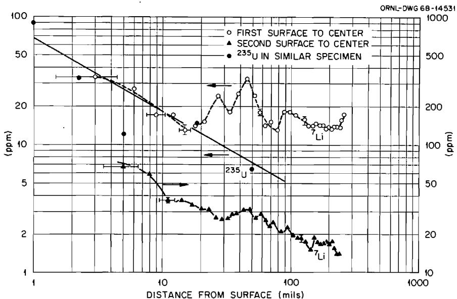  
Fig. 9.19. Lithium concentration as a function of distance from the surface, specimen Y-7.

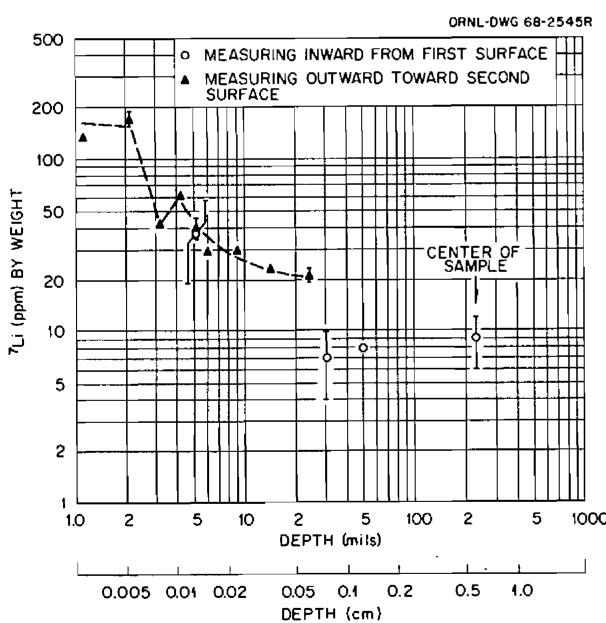  
Fig. 9.20. Lithium concentration as a function of distance from the surface, specimen X-13.

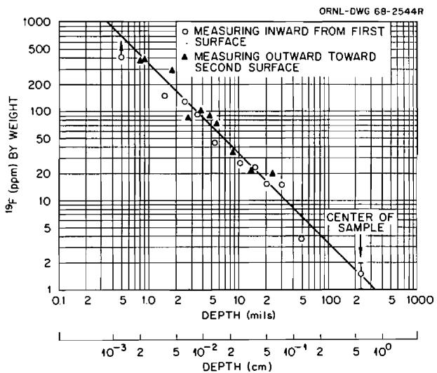  
Fig. 9.21. Fluorine concentrations in graphite sample Y-7, exposed to molten fuel salt in the MSRE for nine months. Measurements were made as the sample was ground away in layers progressing from the first surface to the center (open circles) and then from the interior toward the second surface (closed triangles). The distances shown are as measured from the nearest surface exposed to molten salts.

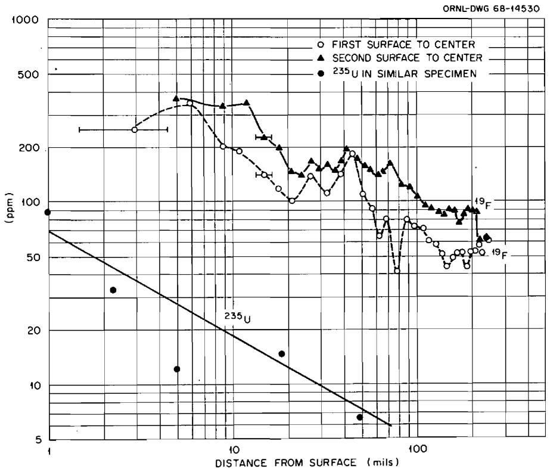  
Fig. 9.22. Fluorine concentration as a function of distance from the surface, specimen X-13.

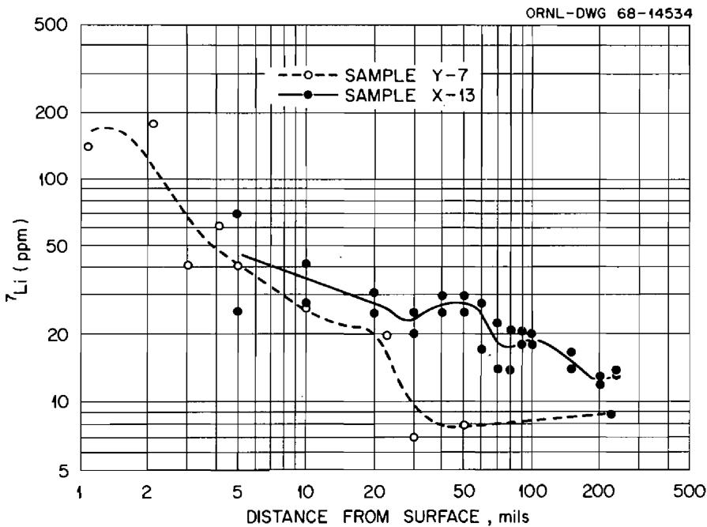  
Fig. 9.23. Comparison of lithium concentrations in samples Y-7 and X-13.

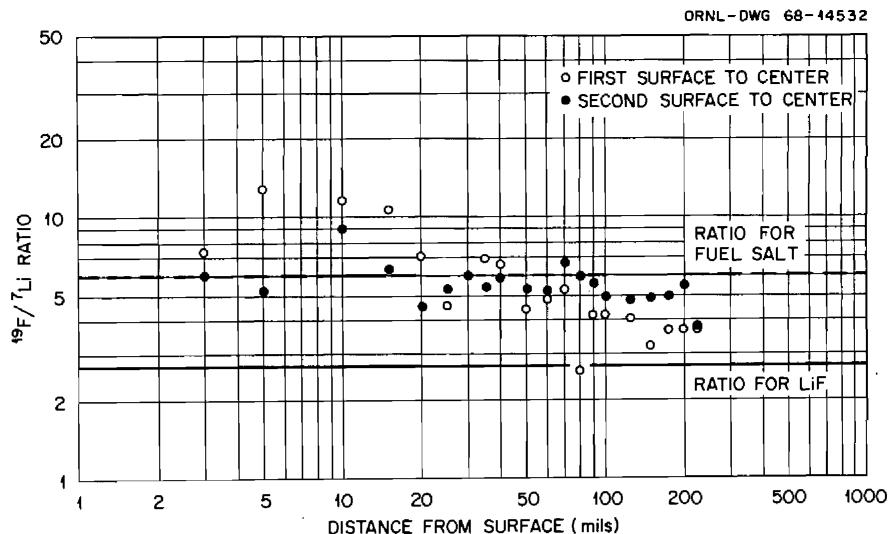  
Fig. 9.24. Mass concentration ratio, F/Li, vs depth, specimen X-13.

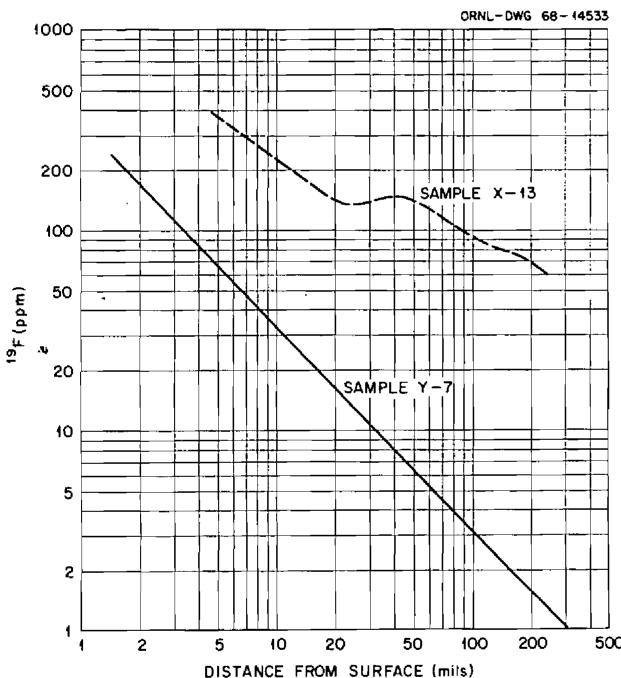  
Fig. 9.25. Comparison of fluorine concentrations in samples Y-7 and X-13, a smooth line having been drawn through the data points.

within the graphite may largely be explained by this. Microcracks, where present, would provide a likely path, as would special clusters of graphite porosity.

# References

1. W. H. Cook, "MSRE Material Surveillance Tests," MSR Program Semiannu. Progr. Rep. Feb. 28, 1965, ORNL-3812, pp. 83-86.

2. W. H. Cook, "MSRE Materials Surveillance Testing," MSR Program Semiannu. Progr. Rep. Aug. 31, 1965, ORNL-3872, p. 87.   
3. C. H. Gabbard, Design and Construction of Core Irradiation-Specimen Array for MSRE Runs 19 and 20, ORNL-TM-2743 (Dec. 22, 1969).   
4. S. S. Kirslis, F. F. Blankenship, and L. L. Fairchild, "Fission Product Deposition on the Fifth Set of Graphite and Hastelloy-N Samples from the MSRE Core," MSR Program Semiannu. Progr. Rep. Aug. 31, 1970, ORNL-4622, pp. 68-70.   
5. R. J. Kedl, Fluid Dynamic Studies of the MoltenSalt Reactor Experiment (MSRE) Core, ORNL-TM-3229 (Nov. 19, 1970).   
6. J. R. Engel and P. N. Haubenreich, Temperatures in the MSRE Core during Steady-State Power Operation, ORNL-TM-378 (Nov. 5, 1962).   
7. R. H. Perry, C. H. Chilton, and S. D. Kirkpatrick, eds., Chemical Engineers' Handbook, 4th ed., McGraw-Hill Book Co., Inc., New York, 1963, p. 5-21.   
8. W. C. Yee, A Study of the Effects of Fission Fragment Recoils on the Oxidation of Zirconium, ORNL-2742, Appendix C (April 1960).   
9. E. L. Compere and S. S. Kirslis, “Cesium Isotope Migration in MSRE Graphite,” MSR Program Semiannu. Progr. Rep. Aug. 31, 1971, ORNL-4728, pp. 51-54.   
10. R. B. Evans III, J. L. Rutherford, and R. B. Perez, "Recoil of Fission Products, II. In Heterogeneous Carbon Structures," J. Appl. Phys. 39, 3253-67 (1968).   
11. A. P. Malinauskas, J. L. Rutherford, and R. B. Evans III, Gas Transport in MSRE Moderator Graphite,

I. Review of Theory and Counter Diffusion Experiments, ORNL-4148 (September 1967).   
12. R. B. Evans III, J. L. Rutherford, and A. P. Malinauskas, Gas Transport in MSRE Moderator Graphite, II. Effects of Impregnation, III. Variation of Flow Properties, ORNL-4389 (May 1969).   
13. R. J. Kedl, A Model for Computing the Migration of Very Short-Lived Noble Gases into MSRE Graphite, ORNL-TM-1810 (July 1967).   
14. R. L. Macklin, J. H. Gibbons, E. Ricci, T. H. Handley, and D. R. Cuneo, "Proton Reaction Analysis for Lithium and Fluorine in MSR Graphite," MSR

Program Semiannu. Progr. Rep. Feb. 29, 1968, ORNL-4254, pp. 119-27.   
15. R. L. Macklin, J. H. Gibbons, and T. H. Handley, Proton Reaction Analysis for Lithium and Fluorine in Graphite, Using a Slit-Scanning Technique, ORNL-TM-2238 (July 1968).   
16. R. L. Macklin, J. H. Gibbons, F. F. Blankenship, E. Ricci, T. H. Handley, and D. R. Cuneo, "Analysis of MSRE Graphite Sample X-13 for Fluorine and Lithium," MSR Program Semiannu. Progr. Rep. Aug. 31, 1968, ORNL-4344, pp. 146-50.

# 10. EXAMINATION OF OFF-GAS SYSTEM COMPONENTS OR SPECIMENS REMOVED PRIOR TO FINAL SHUTDOWN

The off-gas from the pump bowl carried some salt mist, gaseous fission products, and oil vapors. On a few occasions, restrictions to flow developed, and in replacing the component or removing the plugging substance, samples could be obtained which provide some insight into the nature of the fission product burden of the off-gas. In addition, a special set of specimens was installed in the "jumper line" flange near the pump bowl after run 14 and was examined after run 18.

# 10.1 Examination of Particle Trap Removed after Run 7

The Mark I particle trap, which replaced the filter in off-gas line 522 just upstream of the reactor pressure control valve, was installed in April 1966, following plugging difficulties experienced in February and March 1966. It was replaced by one of similar design in September 1966, permitting its examination. The original plugging problems were attributed to polymerization of oil vapors originating in the entry into the pump bowl of a few grams of lubricating oil per day.

The particle trap accepted off-gas about 1 hr flow downstream from the pump bowl. Figure 10.1 shows the arrangement of materials in the trap. The incoming stream impinged on stainless steel mesh and then passed through coarse $(1.4\mu)$ and fine $(0.1\mu)$ felt metal filters. The stream then passed through a bed of Fiberfrax and finally out into a separate charcoal bed before continuing down the off-gas lines to the main charcoal beds.

Black deposits were found on the Yorkmesh at the end of the entry pipe, as seen in Fig. 10.2. The mesh metal was heavily carburized, indicating operating temperatures of at least $1200^{\circ}\mathrm{F}$ (the gas stream at this point was much cooler). The radiation level in some parts of this region was about $10,000\mathrm{R/hr}$ for a probe in the inlet tube.

In addition to an undetermined amount of metal mesh wire, a sample of the matted deposit showed $35\%$ weight loss on heating to $600^{\circ}\mathrm{C}$ (organic vapor), with a carbon content of $9\%$ .

Mass spectrographic analysis showed 20 wt % Ba, 15 wt % Sr, 0.2 wt % Y, and only 0.01 wt % Be and 0.05 wt % Zr, indicating that much of the deposit was daughters of noble-gas fission products and relatively little was entrained salt.

Gamma-ray spectrometry indicated the presence of $^{137}\mathrm{Cs},^{89}\mathrm{Sr},^{103}\mathrm{Ru}$ or $^{106}\mathrm{Ru},^{110}\mathrm{m}\mathrm{Ag},^{95}\mathrm{Nb}$ , and $^{140}\mathrm{La}$ . Lack of quantitative data precludes a detailed consideration of mechanisms. However, much of the deposit appears to be the polymerization products of oil. Salt mist was in this case largely absent, and the fission products listed above are daughters of noble gases or are noble metals such as were found deposited on specimens inserted in the pump bowl. One consistent model might be the collection of the noble-metal nuclides on carbonaceous material (soot?) entrained in the pump bowl in the fuel salt and discharged from there into the purge gas; such a soot could also adsorb the daughters of the noble gases as it existed as an

ORNL-DWG 66-11444R

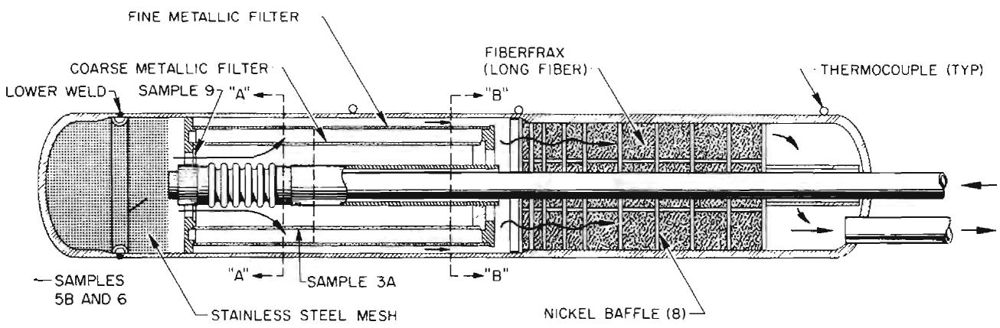  
Fig. 10.1. MSRE off-gas particle trap.

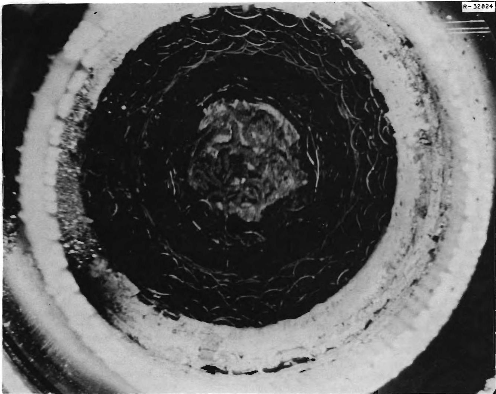  
Fig. 10.2. Deposits in particle trap Yorkmesh.

aerosol in the off-gas. Particles of appropriate size, density, and charge could remain gas-borne but be removed by impingement on an oily metal sponge.

Although the filtering efficiency was progressively better as the gas proceeded through the trap, by far the greatest activity was indicated to be in the impingement deposit, indicating that most of the nongas activity reaching this point was accumulated there (equivalent to about 1000 full-power hours of reactor operation) and that the impinging aerosol had good collecting power for the daughters of the noble gases. The aerosol would have to be fairly stable to reach this point without depositing on walls, which implies certain limits as to size and charge. Evidently the amounts of noble metals carried must be much less than the amounts of daughters of noble gases (barium, strontium) formed after leaving the pump bowl. Barium-138

(about $6\%$ chain yield: 17-min $\mathrm{Xe} \rightarrow 32$ -min $\mathrm{Cs} \rightarrow$ stable Ba) comprises most of the long-lived stable barium. Thus it appears that if the amounts of noble metals detected by mass spectrometry were small enough, relative to barium, to be unreported, the proportions of noble metals borne by off-gas must be small, although real. No difficulties were experienced with the particle trap inserted in September 1966, and it has not been removed from the system.

# 10.2 Examination of Off-Gas Jumper Line Removed after Run 14

After the shutdown of MSRE run 14, a section of off-gas line, the jumper section of line 522, was removed for examination. This line, a 3-ft section of $\frac{1}{2}$ -in.-ID open convolution flexible hose fabricated of

type 304 stainless steel with O-ring flanges on each end, was located about 2 ft downstream from the pump bowl. The upstream flange was a side-entering flange which attaches to the vertical line leaving the pump bowl, while the downstream flange was a top-entering flange which attaches to the widened holdup line. The jumper discussed here, the third used in the MSRE, was installed prior to run 10, which began in December 1966.

After the shutdown, the jumper section was transferred to the High Radiation Level Examination Laboratory for cutup and examination. Two flexible-shaft tools used to probe the line leading to the pump bowl were also obtained for examination. On opening the container an appreciable rise in hot-cell off-gas activity was noted, most of it passing the cell filters and being retained by the building charcoal trap. As the jumper section was removed from the container and placed on fresh blotter paper, some dust fell from the upstream flange. This dust was recovered, and a possibly larger amount was obtained from the flange face using a camel's-hair brush. The powder looked like soot; it fell but drifted somewhat in the moving air of the cell, as if it were a heavy dust. A sample weighing approximately $8\mathrm{mg}$ read about $80\mathrm{R/hr}$ at "contact." The downstream flange was tapped and brushed over a sheet of paper, and similar quantities of black powder were obtained from it. A sample weighing approximately $15\mathrm{mg}$ read about $200\mathrm{R/hr}$ at contact. Chemical and radiochemical analyses of these dust samples are given later.

The flanges each appeared to have a smooth, dull-black film remaining on them but no other deposits of significance (Fig. 10.3). Some unidentified bright flecks were seen in or on the surface of the upstream flange. Where the black film was gently scratched, bright metal showed through.

Short sections of the jumper-line hose (Fig. 10.4) were taken from each end, examined microscopically, and submitted for chemical and radiochemical analysis. Except for rather thin, dull-black films, which smoothly covered all surfaces including the convolutions, no deposits, attack, or other effects were seen.

Each of the flexible probe tools was observed to be covered with blackish, pasty, granular material (Fig. 10.5). This material was identified by x ray as fuel-salt particles. Chemical and radiochemical analyses of the tools will be presented later.

Electron microscope photographs (Fig. 10.6) taken of the upstream dust showed relatively solid particles of the order of a micron or more in dimension, surrounded by a material of lighter and different structure which appeared to be amorphous carbon; electron diffraction lines for graphite were not evident.

An upstream 1-in. section of the jumper line near the flange read $150\mathrm{R / hr}$ at contact; a similar section near the downstream flange read $350\mathrm{R / hr}$ .

10.2.1 Chemical analysis. Portions of the upstream and downstream powders were analyzed chemically for carbon and spectrographically for lithium, beryllium, zirconium, and other cations. In addition, $^{235}\mathrm{U}$ was determined by neutron activation analysis; this could be converted to total uranium by using the enrichment of the uranium in the MSRE fuel salt, which was about $33\%$ .

Results of these analyses are shown in Table 10.1.

Analyses of the dust samples show 12 to $16\%$ carbon, 28 to $54\%$ fuel salt, and $4\%$ structural metals. Based on activity data, fission products could have amounted to 2 to $3\%$ of the sample weight. Thereby 53 to $22\%$ of the sample weight was not accounted for in these categories or spectrographically as other metals. The discrepancies may have resulted from the small amounts of sample available. The sample did not lose weight under a heat lamp and thus did not contain readily volatile substances.

10.2.2 Radiochemical analysis. Radiochemical analyses were obtained for the noble-metal isotopes $^{111}\mathrm{Ag}$ , $^{106}\mathrm{Ru}$ , $^{103}\mathrm{Ru}$ , $^{99}\mathrm{Mo}$ , and $^{95}\mathrm{Nb}$ ; for $^{95}\mathrm{Zr}$ ; for the rare earths $^{147}\mathrm{Nd}$ , $^{144}\mathrm{Ce}$ , and $^{141}\mathrm{Ce}$ ; for the daughters of the fission gases krypton and xenon: $^{91}\mathrm{Y}$ , $^{89}\mathrm{Sr}$ , $^{90}\mathrm{Sr}$ , $^{140}\mathrm{Ba}$ , and $^{137}\mathrm{Cs}$ ; and for the tellurium isotopes $^{132}\mathrm{Te}$ , $^{129}\mathrm{Te}$ , and $^{131}\mathrm{I}$ (tellurium daughter). These analyses were obtained on samples of dust from upstream and downstream flanges, on the approximately 1-in. sections of flexible hose cut near the flanges, and on the first flexible-shaft tool used to probe the pump off-gas exit line.

Data obtained in the examination are shown in Table 10.2, along with ratios to inventory.

It appeared reasonable to compare the dust recovered from the upstream or downstream regions with the deposited material on the hose in that region; this was done for each substance by dividing the amount deposited by the amount found in $1\mathrm{g}$ of the associated dust.

Values for the inlet region were reasonably consistent for all classes of nuclides, indicating that the deposits could be regarded as deposited dust. The median value of about $0.004\mathrm{g / cm}$ indicates that the deposits in the inlet region corresponded to this amount of dust. A similar argument may be made with respect to the downstream hose and outlet dust, which appeared to be of about the same material, with the median indicating about $0.016\mathrm{g / cm}$ . Ratios of outlet and inlet dust values had a median of 1.5, indicating no great difference between the two dust samples.

PHOTO 1856-74

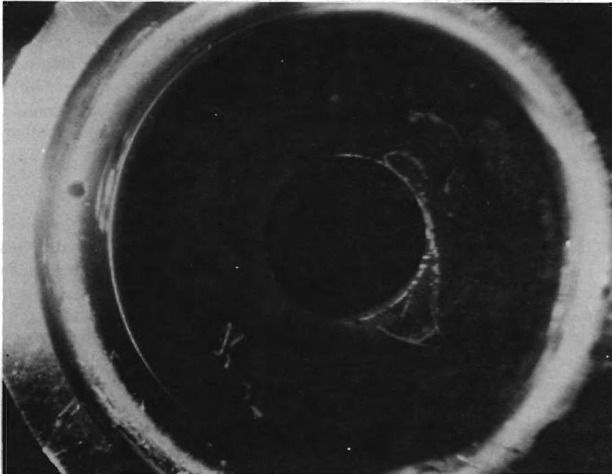

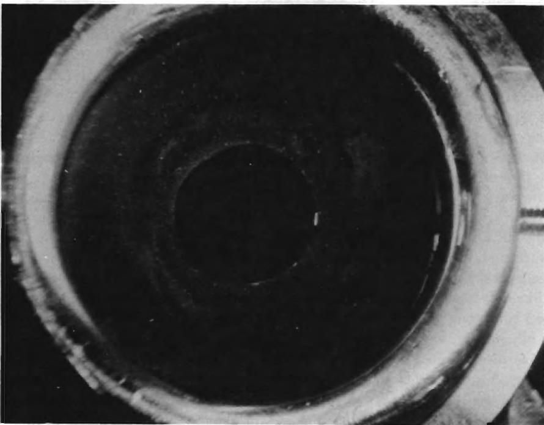  
Fig. 10.3. Deposits on jumper line flanges after run 14.

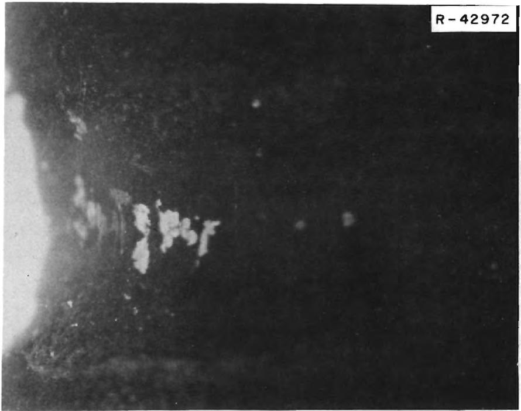

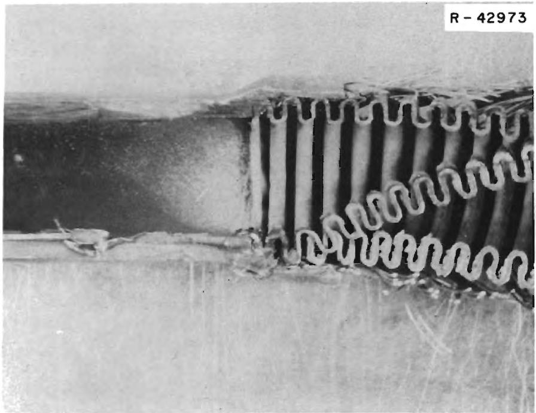  
Fig. 10.4. Sections of off-gas jumper line flexible tubing and outlet tube after run 14.

Table 10.1. Analysis of dust from MSRE off-gas jumper line   

<table><tr><td rowspan="2"></td><td colspan="2">Inlet Flange (wt %)</td><td colspan="2">Outlet Flange (wt %)</td></tr><tr><td>As Determined</td><td>Constituent</td><td>As Determined</td><td>Constituent</td></tr><tr><td>Li</td><td>3.4</td><td></td><td>7.3</td><td></td></tr><tr><td>LiF</td><td></td><td>12.6</td><td></td><td>27.1</td></tr><tr><td>Be</td><td>1.7</td><td></td><td>4.2</td><td></td></tr><tr><td>BeF2</td><td></td><td>8.9</td><td></td><td>21.9</td></tr><tr><td>Zr</td><td>2.74</td><td></td><td>1.4</td><td></td></tr><tr><td>ZrF4</td><td></td><td>5.0</td><td></td><td>2.6</td></tr><tr><td>235U</td><td>0.358</td><td></td><td>0.596</td><td></td></tr><tr><td>UF4(total)</td><td></td><td>1.4</td><td></td><td>2.4</td></tr><tr><td>Carbon</td><td>10-14</td><td></td><td>15-17</td><td></td></tr><tr><td></td><td></td><td>12</td><td></td><td>16</td></tr><tr><td>Fe</td><td>~2</td><td>2</td><td></td><td></td></tr><tr><td>Cr</td><td>~&lt;0.01</td><td></td><td></td><td></td></tr><tr><td>Ni</td><td>~1</td><td>1</td><td></td><td>(4.5)</td></tr><tr><td>Mo</td><td>~0.4</td><td>0.4</td><td></td><td></td></tr><tr><td>Al</td><td>~1</td><td>1</td><td></td><td></td></tr><tr><td>Cu</td><td>~0.1</td><td>0.1</td><td></td><td></td></tr><tr><td>FP&#x27;s (max)a</td><td></td><td>(~2)</td><td></td><td>(~3)</td></tr><tr><td>Total found</td><td></td><td>47</td><td></td><td>78</td></tr></table>

Assumes chain deposition rate constant throughout power history (includes only chains determined).

Table 10.2. Relative quantities of elements and isotopes found in off-gas jumper line ${}^{a,b}$   

<table><tr><td colspan="4">Sample</td><td>Inlet Dust (per g)</td><td>Outlet Dust (per g)</td><td>Upstream Hose (per ft)</td><td>Downstream Hose (per ft)</td><td>Flexible Tool (total)</td><td>MSRE Inventory Decay Rate (1016dis/min)</td></tr><tr><td>Element or Isotope</td><td colspan="2">t1/2c</td><td>Yieldc(%)</td><td></td><td></td><td></td><td></td><td></td><td></td></tr><tr><td>Element</td><td></td><td></td><td></td><td></td><td></td><td></td><td></td><td></td><td></td></tr><tr><td>Li</td><td></td><td></td><td></td><td>0.066</td><td>0.14</td><td>0.015</td><td>0.027</td><td>0.066</td><td></td></tr><tr><td>Be</td><td></td><td></td><td></td><td>0.057</td><td>0.14</td><td>0.006</td><td>0.010</td><td>0.031</td><td></td></tr><tr><td>Zr</td><td></td><td></td><td></td><td>0.054</td><td>0.027</td><td>0.004</td><td>0.004</td><td>0.00003</td><td></td></tr><tr><td>235U</td><td></td><td></td><td></td><td>0.050</td><td>0.083</td><td>0.009</td><td>0.023</td><td>0.0014</td><td></td></tr><tr><td>C</td><td></td><td></td><td></td><td>23</td><td>32</td><td></td><td></td><td></td><td></td></tr><tr><td>Isotope</td><td></td><td></td><td></td><td></td><td></td><td></td><td></td><td></td><td></td></tr><tr><td>111Ag</td><td>7.6</td><td>d</td><td>0.0181</td><td>~31</td><td>47</td><td>~1</td><td>~28</td><td>0.41</td><td>0.235</td></tr><tr><td>106Ru</td><td>365</td><td>d</td><td>0.392</td><td>10</td><td>33</td><td>21</td><td>125</td><td>6.9</td><td>2.53</td></tr><tr><td>103Ru</td><td>39.7</td><td>d</td><td>2.98</td><td>5.7</td><td>11</td><td>3.9</td><td>40</td><td>1.3</td><td>32.4</td></tr><tr><td>99Mo</td><td>67</td><td>hr</td><td>6.07</td><td>2.8</td><td>88</td><td>2.9</td><td>48</td><td>1.6</td><td>88.5</td></tr><tr><td>95Nb</td><td>35</td><td>d</td><td>6.26</td><td>0.54</td><td>1.2</td><td></td><td>0.047</td><td>0.065</td><td>61.4</td></tr><tr><td>95Zr</td><td>65</td><td>d</td><td>6.26</td><td>~0.013</td><td>0.025</td><td>~0.0003</td><td>&lt;0.009</td><td>&lt;0.0002</td><td>65.3</td></tr><tr><td>147Nd</td><td>11.1</td><td>d</td><td>2.37</td><td>&lt;0.06</td><td>&lt;0.02</td><td>&lt;0.003</td><td>&lt;0.02</td><td>&lt;0.0009</td><td>29.3</td></tr><tr><td>144Ce</td><td>285</td><td>d</td><td>5.58</td><td>~0.027</td><td>0.039</td><td>~0.001</td><td>~0.01</td><td>~0.0007</td><td>40.8</td></tr><tr><td>141Ce</td><td>33</td><td>d</td><td>6.44</td><td>0.0004</td><td>0.008</td><td>~0.0003</td><td>~0.001</td><td>&lt;0.0001</td><td>71.1</td></tr><tr><td>91Y</td><td>58</td><td>d</td><td>5.83</td><td>2.5 (90)</td><td>7.0 (250)</td><td>0.32 (12)</td><td>1.4 (50)</td><td>0.06 (2.0)</td><td>61.5 (1.69)</td></tr><tr><td>140Ba</td><td>12.8</td><td>d</td><td>6.39</td><td>3.6 (140)</td><td>1.8 (66)</td><td>0.75 (28)</td><td>3.5 (130)</td><td>0.13 (5.0)</td><td>77.6 (2.05)</td></tr><tr><td>89Sr</td><td>50.5</td><td>yr</td><td>4.72</td><td>120 (260)</td><td>150 (320)</td><td>13 (29)</td><td>71 (150)</td><td>0.15 (0.33)</td><td>50.4 (23.2)</td></tr><tr><td>137Cs</td><td>29.2</td><td>yr</td><td>6.03</td><td>150 (300)</td><td>110 (210)</td><td>13 (26)</td><td>62 (120)</td><td>1.5 (3.0)</td><td>2.17 (1.12)</td></tr><tr><td>90Sr</td><td>28</td><td>yr</td><td>5.72</td><td>3.6 (30)</td><td>28 (230)</td><td>3.0 (25)</td><td>13 (110)</td><td></td><td>2.14 (0.256)</td></tr><tr><td>132Te</td><td>78</td><td>hr</td><td>4.21</td><td>8.7</td><td>14</td><td>1.1</td><td>9.0</td><td>0.29</td><td>60.6</td></tr><tr><td>129mTe</td><td>37</td><td>d</td><td>0.159</td><td>28</td><td>61</td><td>4.6</td><td>30</td><td>1.7</td><td>1.74</td></tr><tr><td>131I</td><td>8.05</td><td>d</td><td>2.93</td><td>6.4</td><td>2.5</td><td>0.9</td><td>3.2</td><td>0.27</td><td>37.7</td></tr></table>

${}^{a}$ Ratio of amount found in sample to ${10}^{-6} \times  \mathrm{{MSRE}}$ inventory. The fission product inventory was computed from the power history since startup, assuming full power equals 8 Mw.   
bValues in parentheses are corrected for fraction of rare-gas precursor entering pump bowl, assuming $100\%$ stripping and negligible return in stripped salt.   
cTaken from Nuclear Data Library for the Fission Product Program by M. R. Trammell and W. A. Hennenger (Westinghouse Astro-Nuclear Laboratory, Pittsburgh, Pa.), WANL-TME-574 (rev. 1), Nov. 17, 1966. Independent yields of chain members are given, and all yields normalized to $200\%$ yield for   
129mTe differs from other published values.

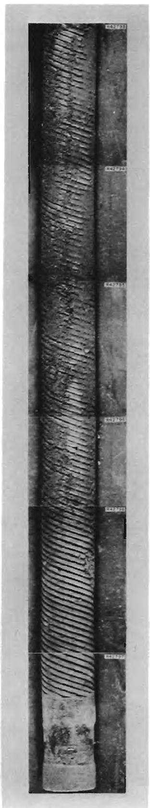  
Fig. 10.5. Deposit on flexible probe.

The electron microscope photographs of dust showed a number of fragments 1 to $4\mu$ in width with sharp edges and many small pieces 0.1 to $0.3\mu$ in width (1000 Å to 3000 Å).

The inventory values used in these calculations represent accumulations over the entire power history $(t_{2} - t_{0})$ ; the more appropriate value would of course be for the operating period $(t_{2} - t_{1})$ only:

$$
I _ {t _ {2} - t _ {0}} = I _ {t _ {2} - t _ {1}} + I _ {t _ {1} - t _ {0}} \exp \left[ - \lambda \left(t _ {2} - t _ {1}\right) \right].
$$

The second term, representing the effect of prior accumulation, is important only when values of $\lambda (t_{2} - t_{1})$ are suitably low (less than 1). So, except for 366-day $^{106}\mathrm{Ru}$ , 2-year $^{125}\mathrm{Sb}$ , 30-year $^{90}\mathrm{Sr}$ , and 30-year $^{137}\mathrm{Cs}$ , correction is not particularly significant.

We shall frequently use the approach

$$
\frac {\text {o b s}}{\text {i n v . (p r e s e n t p e r i o d)}} = \frac {\text {o b s}}{\text {i n v . (t o t a l)}} \times \frac {\text {i n v . (t o t a l)}}{\text {i n v . (p r e s e n t p e r i o d)}},
$$

where

$$
\begin{array}{l} \frac {\operatorname {i n v .} (\text {t o t a l})}{\operatorname {i n v .} (\text {p r e s e n t p e r i o d})} = \frac {I _ {t _ {2} - t _ {0}}}{I _ {t _ {2} - t _ {0}} - I _ {t _ {1} - t _ {0}} \exp [ - \lambda (t _ {2} - t _ {1}) ]} \\ = \frac {1}{1 - \left[ I _ {t _ {1}} - t _ {0} / I _ {t _ {2}} - t _ {0} \right] \exp \left[ - \lambda \left(t _ {2} - t _ {1}\right) \right]} \\ \end{array}
$$

If the prior inventory were relatively small,

$$
I _ {t _ {1} - t _ {0}} / I _ {t _ {2} - t _ {0}} \ll 1,
$$

or the present period relatively long with respect to half-life, $\lambda (t_{2} - t_{1})\gg 1$ , then the ratio

$$
I _ {\text {t o t a l}} / \text {i n v .} (\text {p r e s e n t p e r i o d})
$$

approaches 1. It can never exceed the ratio

$$
\mathrm {E F P H} _ {\text {t o t a l}} / \mathrm {E F P H} _ {\text {(t o t a l a f t e r p r i o r p e r i o d)}}
$$

(EFPH is accumulated effective full-power hours.)

Examination of the data in terms of mechanisms will be done later in the section.

# 10.3 Examination of Material Recovered from Off-Gas Line after Run 16

At the end of run 16 a restriction existed in the off-gas line (line 522) near the pump, which had developed since the line was reamed after run 14.²,³ To

clear the line and recover some of the material for examination, a reaming tool with a hollow core was attached to flexible metal tubing. This was attached to a "May pack" case and thence to a vacuum pump vented into the off-gas system. The May pack case held several screens of varied aperture and a filter paper. The specialized absorbers normally a part of the May pack assembly were not used.

The tool satisfactorily opened the off-gas line. A small amount of blackish dust was recovered on the filter paper and from the flexible tubing.

Analysis of the residue on the filter paper is shown in Table 10.3. The total amount of each element or isotope was determined and compared with the amount of "inventory" fuel salt that should contain or had produced such a value.

The constituent elements of the fuel salt appear to be present in quantities indicating 4 to $7\mathrm{mg}$ of fuel salt on the filter paper, as do the isotopes ${}^{140}\mathrm{Ba},{}^{144}\mathrm{Ce}$ , and ${}^{95}\mathrm{Zr}$ , which usually remain with the salt. It is noteworthy that ${}^{233}\mathrm{U}$ is in this group, indicating that it was transported only as a salt constituent and that the salt was largely from runs 15 and 16.

Table 10.3. Material recovered from MSRE off-gas line after run 16   
Corrected to shutdown December 16, 1968   

<table><tr><td rowspan="2"></td><td rowspan="2">Inventory (per milligram of salt)</td><td colspan="2">Found</td></tr><tr><td>Total</td><td>Ratio to inventory</td></tr><tr><td colspan="4">Elements In milligrams</td></tr><tr><td>Li</td><td>0.116</td><td>0.80</td><td>7</td></tr><tr><td>Be</td><td>0.067</td><td>0.35</td><td>5</td></tr><tr><td>Zr</td><td>0.116</td><td>0.47</td><td>4</td></tr><tr><td>U-233</td><td>0.0067</td><td>0.0396</td><td>6</td></tr><tr><td colspan="4">Fission products In disintegrations per minute</td></tr><tr><td>Sr-89</td><td>2.9E6</td><td>3.13E8</td><td>110</td></tr><tr><td>Cs-137</td><td>4.1E6</td><td>4.31E8</td><td>110</td></tr><tr><td>Ba-140</td><td>4.1E6</td><td>1.77E6</td><td>8</td></tr><tr><td>Y-91</td><td>5.2E6</td><td>1.2E8</td><td>23</td></tr><tr><td>Ce-144</td><td>4.1E7</td><td>1.48E8</td><td>4</td></tr><tr><td>Zr-95</td><td>7.4E6</td><td>3.08E7</td><td>4</td></tr><tr><td>Nb-95</td><td>9.4E6a</td><td>1.40E9</td><td>150a</td></tr><tr><td>Mo-99</td><td>3.1E4</td><td>2.76E7</td><td>900</td></tr><tr><td>Ru-106</td><td>2.8E6 (9.8E2a)</td><td>3.51E6</td><td>1400a</td></tr><tr><td>Te-129m</td><td>2.3E4</td><td>9.2E7</td><td>4000</td></tr><tr><td>I-131</td><td>9.8E4</td><td>1.01E6</td><td>10</td></tr></table>

${}^{a}$ Inventory set to zero for fuel returned from reprocessing September 1968.

The isotopes $^{89}\mathrm{Sr}$ and $^{137}\mathrm{Cs}$ , which have noble-gas precursors with half-lives of 3 to 4 min, are present in significantly greater proportions, consistent with a mode of transport other than by salt particles.

The "noble-metal" isotopes $^{95}\mathrm{Nb},^{99}\mathrm{Mo},^{106}\mathrm{Ru}$ , and $^{129}\mathrm{mTe}$ were present in even greater proportions, indicating that they were transported more vigorously than fuel salt. Comparison with inventory is straightforward in the case of 2.79-day $^{99}\mathrm{Mo}$ and 34-day $^{129}\mathrm{mTe}$ , since much of the inventory was formed in runs 15 and 16. In the case of 367-day $^{106}\mathrm{Ru}$ , although a major part of the run 14 material remains undecayed, salt samples during runs 15 and 16 show little to be present in the salt; if only the $^{106}\mathrm{Ru}$ produced by $^{233}\mathrm{U}$ fission is taken into account, the relative sample value is high.

The fuel processing, completed September 7, 1968, appeared also to have removed substantially all $^{95}\mathrm{Nb}$ from the salt. Inventory is consequently taken as that produced by decay of $^{95}\mathrm{Zr}$ from run 14 after this time and that produced in runs 15 and 16. Thus the "noble-metal" elements appear to be present in the material removed from the off-gas line in considerably greater proportion than other materials. It would appear that they had a mode of transport different from the first two groups above, though they may not have been transported all in the same way.

There remains 8.05-day $^{131}\mathrm{I}$ . The examination after run 14 of the jumper section of the off-gas line found appreciable $^{131}\mathrm{I}$ , which may have been transferred as 30-hr $^{131}\mathrm{mTe}$ . In the present case, essentially all the $^{131}\mathrm{I}$ inventory came from a short period of high power near the end of run 15. Near-inventory values were found in salt sample FP 16-4, taken just prior to the end of run 16. Thus it appears that the value found here indicates little $^{131}\mathrm{I}$ transferred except as salt.

# 10.4 Off-Gas Line Examinations after Run 18

After run 18 the specimen holder installed after run 14 in the jumper line outlet flange was removed, and samples were obtained.

The off-gas specimens were exposed during 5818 hr to about 4748 hr with fuel circulation, during runs 15, 16, 17, and 18. During this period, 2542 effective full-power hours were developed.

Near the end of run 18, a plugging of the off-gas line (at the pump bowl) developed. Restriction of this flow caused diversion of off-gas through the overflow tank, thence via line 523 to a pressure control valve assembly, and then into the 4-in. piping of line 522. These valves can be closed when it is desired to blow the accumu

lated overflow salt back into the pump bowl, but are normally open. A flow restriction also developed in line 523 near the end of run 18, and the valve assembly was removed for examination.

Data obtained from both sets of examinations will be described below.

The off-gas line specimen assembly was placed after run 14 in the flange connecting the jumper line exit to the entry pipe leading to the 4-in. pipe section of line 522. The specimen holder was made of 27 in. of $\frac{1}{2}$ -in.-OD, 0.035-in.-wall stainless steel tubing, with a flange insert disk on the upper end. Four slotted sections and one unslotted section occupied the bottom 17 in. of the tube; about 8 of the upper 10 in. were contained within the $\frac{1}{2}$ -in. entry pipe; all the rest of the specimen holder tube projected downward into the 4-in. pipe section. The specimen arrays included a holder for electron microscope screens, a pair of closed-end diffusion tubes, and a graphite specimen.

A hot-cell photograph of the partially segmented tube after exposure is shown in Fig. 10.7. The electron microscope screens were not recovered. Data from the diffusion tubes and graphite specimen will be presented below. In addition, two sections were cut from the 10-in. unslotted section, of particular interest because normally all the off-gas flow passed through this tubing. These segments of tubing were then plugged, and the

exterior was carefully cleaned and leached repeatedly until the leach activity was quite low; the sections were then dissolved and the activity determined. Data from these sections are presented in Table 10.4.

From the exterior of the tube, slightly above the upper slots, a thin black flake of deposited material was recovered weighing about $20\mathrm{mg}$ . The tube, after removal of the flake, is shown in Fig. 10.8. The underlying metal was bright and did not appear to have interacted with the flake substance. Analysis of the flake is shown in Table 10.4.

The quantity per centimeter was divided by that for 1 g of flake substance for each nuclide; the general agreement of values indicated that they were doubtless from the same source and that the deposit intensities on the two sections were about 1 and $6\mathrm{mg / cm}$ respectively (based on median ratio values). These values will be referred to later. Observed values are also shown for deposits on the upstream handling "bail."

Data were also obtained for fission product deposition on the graphite specimen (narrow and wide faces) and on consecutive dissolved 1-in. scrubbed segments of $\frac{1}{8}$ -in.- and $\frac{1}{4}$ -in.-ID diffusion tubes closed on the upper ends. The upper parts of these tubes contained packed sections of the granular absorbents $\mathrm{Al}_{2}\mathrm{O}_{3}$ and NaF.

Data on these specimens are shown in Table 10.5. As useful models for examination of the data have not

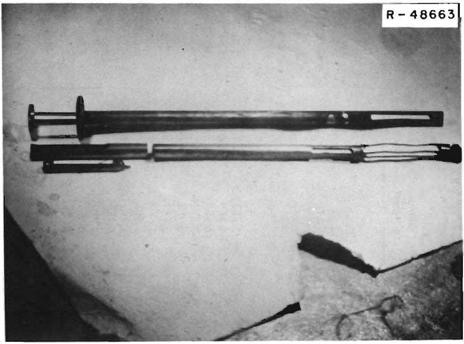  
Fig. 10.7. Off-gas line specimen holder as segmented after removal, following run 18.

Table 10.4. Data on samples or segments from off-gas line specimen holder removed following run 18   

<table><tr><td rowspan="2"></td><td rowspan="2">Inventorya per gram of salt</td><td colspan="2">Flake</td><td colspan="3">Tube section 1</td><td colspan="3">Tube section 2</td><td rowspan="2">Total upstream &quot;bail&quot; deposit</td></tr><tr><td>Amount per gram</td><td>Ratio to inventory for 1 g of salt</td><td>Amount per centimeter</td><td>Ratio to MSRE total inventory</td><td>Ratio to 1 g of flake</td><td>Amount per centimeter</td><td>Ratio to MSRE total inventory</td><td>Ratio to 1 g of flake</td></tr><tr><td colspan="11">Elements In milligrams</td></tr><tr><td>Li</td><td>113</td><td>2.89</td><td>0.026</td><td>&lt;0.016</td><td>3.2E-11</td><td>&lt;0.0054</td><td>0.019</td><td>3.7E-11</td><td>0.0064b</td><td>0.20</td></tr><tr><td>Be</td><td>67.6</td><td>7.11</td><td>0.105</td><td>~0.008</td><td>2.7E-11</td><td>~0.0011</td><td>~0.012</td><td>4.1E-11</td><td>~0.0011</td><td>0.92</td></tr><tr><td>Zr</td><td></td><td>c</td><td></td><td></td><td></td><td></td><td></td><td></td><td></td><td></td></tr><tr><td>U-233</td><td>6.7</td><td>0.517</td><td>0.078</td><td></td><td></td><td></td><td></td><td></td><td></td><td>0.14</td></tr><tr><td colspan="11">Fission products In disintegrations per minute</td></tr><tr><td>Sr-89</td><td>1.332E11</td><td>1.8E12</td><td>13</td><td>1.0E12</td><td>1.7E-6</td><td>0.011</td><td>1.3E12</td><td>2.2E-6</td><td>0.014</td><td>4.0E12</td></tr><tr><td>Y-91</td><td>1.206E11</td><td>8.8E9</td><td>0.07</td><td>1.5E10</td><td>2.8E-8</td><td>0.033</td><td>1.9E10</td><td>3.5E-8</td><td>0.041</td><td>3.0E9</td></tr><tr><td>Ba-140</td><td>1.534E11</td><td>6.4E9</td><td>0.04</td><td>1.5E10</td><td>2.2E-8</td><td>0.046</td><td>2.4E10</td><td>3.5E-8</td><td>0.073</td><td></td></tr><tr><td>Cs-137</td><td>5.450E9</td><td>2.8E10</td><td>5</td><td>8.3E9</td><td>3.5E-7</td><td>0.0058</td><td>1.0E10</td><td>4.1E-7</td><td>0.0069</td><td>3.6E10</td></tr><tr><td>Ce-141</td><td>2E11</td><td>8.0E6</td><td>0.00004</td><td></td><td></td><td></td><td></td><td></td><td></td><td>1.9E7</td></tr><tr><td>Ce-144</td><td>6.109E10</td><td>5.4E7</td><td>0.0009</td><td></td><td></td><td></td><td></td><td></td><td></td><td>3.3E8</td></tr><tr><td>Nd-147</td><td>~5E11</td><td>1.6E9</td><td>0.03</td><td></td><td></td><td></td><td></td><td></td><td></td><td></td></tr><tr><td>Zr-95</td><td>1.254E11</td><td>1.6E8</td><td>0.0012</td><td>1.0E7</td><td>1.9E-11</td><td>0.0013b</td><td>2.0E7</td><td>3.7E-11</td><td>0.0025</td><td></td></tr><tr><td>Nb-95</td><td>8.920E10</td><td>1.4E11</td><td>1.6</td><td>4.7E9</td><td>1.2E-8</td><td>0.0007</td><td>1.0E10</td><td>2.6E-8</td><td>0.0014</td><td>2.6E10</td></tr><tr><td>Ru-103</td><td>4.495E10</td><td>1.2E11</td><td>2.7</td><td>4.3E9</td><td>2.2E-8</td><td>0.0007</td><td></td><td></td><td></td><td></td></tr><tr><td>Ru-106</td><td>3.464E10</td><td>2.5E10</td><td>7</td><td>7.9E8</td><td>5.2E-9</td><td>0.0006</td><td></td><td></td><td></td><td></td></tr><tr><td>Te-129</td><td>1.872E10</td><td>2.3E10</td><td>1.2</td><td>1.2E9</td><td>1.4E-8</td><td>0.0010</td><td>1.9E9</td><td>2.3E-8</td><td>0.0016</td><td></td></tr><tr><td>I-131</td><td>8.0E10</td><td></td><td></td><td>1.5E12</td><td>4.3E-6</td><td></td><td>7.9E9</td><td>2.3E-8</td><td></td><td></td></tr></table>

${}^{a}$ This inventory covers the entire MSRE operating history; as usual,however, ${}^{95}\mathrm{{Nb}}$ is taken as zero at start of run 15 . ${}^{b}$ Median.

Table 10.5. Specimens exposed in MSRE off-gas line, runs 15-18   

<table><tr><td rowspan="2">Nuclide</td><td rowspan="2">Inventory for 1 g of salt (dis min-1g-1)</td><td colspan="2">Radioactivity on graphite specimen (dis min-1cm-2)</td><td colspan="6">Radioactivity on 1/8-in.-ID diffusion tube (dis/min)</td><td colspan="5">Radioactivity on 1/4-in.-ID diffusion tube (dis/min)</td></tr><tr><td>Wide face</td><td>Narrow face</td><td>Bottom inch</td><td>Second inch</td><td>Third inch</td><td>Fourth inch</td><td>Al2O3granules</td><td>NaF granules</td><td>Second inch</td><td>Third inch</td><td>Fourth inch</td><td>Al2O3granules</td><td>NaF granules</td></tr><tr><td>Sr-89</td><td>1.3E11</td><td>3.6E11</td><td>4.4E10</td><td></td><td></td><td></td><td></td><td></td><td></td><td></td><td></td><td></td><td></td><td></td></tr><tr><td>Y-91</td><td>1.2E11</td><td>1.1E9</td><td>4.4E7</td><td></td><td></td><td></td><td></td><td></td><td></td><td></td><td></td><td></td><td></td><td></td></tr><tr><td>Ba-140</td><td>1.5E11</td><td>3.5E10</td><td></td><td>7.9E6</td><td>1.1E7</td><td>2.5E7</td><td>1.5E8</td><td>&lt;3E8</td><td>1.5E8</td><td>7.0E8</td><td>3.5E8</td><td>1.6E8</td><td>2.8E10</td><td>2.6E9</td></tr><tr><td>Cs-137</td><td>5.4E9</td><td>4.4E9</td><td>6.2E8</td><td>3.3E7</td><td>2.4E7</td><td>1.4E8</td><td>1.3E9</td><td>6.5E8</td><td>4.6E8</td><td>8.0E8</td><td>2.7E8</td><td>5.8E9</td><td>7.0E9</td><td>1.1E10</td></tr><tr><td>Ce-144</td><td>6.1E10</td><td>1.2E6</td><td>5.2E5</td><td>2.7E5</td><td>1.9E5</td><td>3.4E6</td><td>2.9E4</td><td>&lt;1E6</td><td>&lt;1E6</td><td>&lt;4E4</td><td>&lt;5E5</td><td>&lt;2E6</td><td>&lt;2.4E6</td><td>1.5E7</td></tr><tr><td>Zr-95</td><td>1.3E11</td><td>5.3E6</td><td>6.7E5</td><td>1.1E5</td><td>&lt;5E4</td><td>&lt;1E5</td><td>&lt;1E5</td><td>2.1E5</td><td>&lt;4E5</td><td>1.3E6</td><td>&lt;6E5</td><td>&lt;3E6</td><td>&lt;1E6</td><td>&lt;3E6</td></tr><tr><td>Nb-95</td><td>8.9E10</td><td>2.8E7</td><td>a</td><td>7.9E5</td><td></td><td>4.6E6</td><td>1.0E6</td><td>1.9E9</td><td>1.9E9</td><td>4.4E7</td><td>1.4E8</td><td>1.8E7</td><td>3.0E7</td><td>&lt;8E6</td></tr><tr><td>Ru-103</td><td>4.5E10</td><td>1.5E7</td><td>1.1E6</td><td>1.9E6</td><td>1.5E6</td><td>7.9E5</td><td>5.7E5</td><td>1.2E6</td><td>1.9E6</td><td>3.5E8</td><td>6.6E7</td><td>&lt;3E6</td><td>&lt;1E7</td><td>&lt;6E6</td></tr><tr><td>Ru-106</td><td>3.5E9</td><td>3.5E7</td><td>1.3E7</td><td>2.7E6</td><td>1.2E6</td><td>1.1E6</td><td>1.1E6</td><td>5.2E6</td><td>4.7E6</td><td>2.6E7</td><td>6.4E6</td><td>5.7E6</td><td>&lt;8E6</td><td>&lt;4E6</td></tr><tr><td>Sb-125</td><td>2.9E8</td><td>8.5E4</td><td>3.7E5</td><td></td><td></td><td></td><td></td><td></td><td></td><td></td><td></td><td></td><td></td><td></td></tr><tr><td>Te-129</td><td>1.9E10</td><td>3.3E7</td><td>3.0E8</td><td></td><td></td><td></td><td></td><td></td><td></td><td></td><td></td><td></td><td></td><td></td></tr></table>

aNegligible.

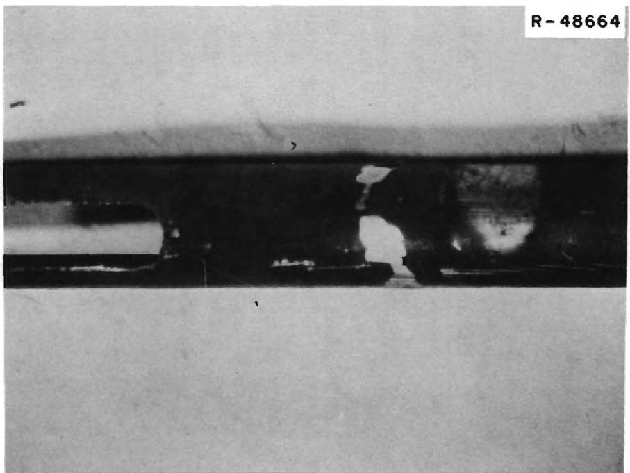  
Fig. 10.8. Section of off-gas line specimen holder showing flaked deposit, removed after run 18.

been found, these data will not be considered further here.

# 10.5 Examination of Valve Assembly from Line 523 after Run 18

The overflow line from the pump bowl opens at about the spray baffle, descends vertically, spirals around the suction line below the pump bowl, then passes through the top of the toroidal overflow tank, and terminates near the bottom of the tank. Gas may pass through this line if no salt covers the exit into the overflow tank or if the pressure is sufficient (due to clogging of regular off-gas lines, etc.) to cause bubbling through any salt that is present.

In addition, helium (about 0.7 std liter/min) flows in through two bubblers to measure the liquid level. Gas from these bubblers, along with any off-gas flow, will pass through line 523 to enter the 4-in.-diam part of the main off-gas line 522.

From time to time the salt accumulated in the overflow tank was returned to the pump bowl. This was accomplished by closing a control valve in line 523 between the overflow tank and the entry point into line 522. The entry of the bubbler gas pressurized the overflow tank until return of the accumulated salt to the pump bowl permitted the gas to pass into the pump bowl; the control valve was then reopened.

Near the end of run 18, clogging of line 523, which had been carrying most of the off-gas flow for several weeks, was experienced. This was attributed to plugging in the valve assembly, and after shutdown the assembly was replaced. The removed equipment was transported to the High Radiation Level Examination Laboratory, where it was segmented for examination.

The vertical $\frac{1}{2}$ -in. entry and exit lines to the valve assembly were spaced about 39 in. apart, terminating in O-ring flanges. Following the entry flange the line continued upward, across, and downward to the entry port of the automatic control valve HCV-523. Gas flow proceeded past the plunger into the cylinder containing the bellows plunger seal and upward into L-shaped exit holes in the flange, leaving the valve flange horizontally. Curved piping then led to a manual valve (V-523), normally open, which was entered upward. The horizontal exit pipe from this valve curved upward and then downward to the exit flange.

Examination of HCV-523 did not reveal an obstruction to flow. All surfaces were covered with sootlike deposits over bright metal; samples of this were recovered. Some samples of black dust were obtained from sections of the line between the two valves.

In the normally open V-523 the exit flow was downward. A blob of rounded black substance (about the size of a small pea) was found covering the exit

Table 10.6. Analysis of deposits from line 523 (undetermined quantity)   
Expressed as equivalent grams of inventory salt   

<table><tr><td rowspan="3"></td><td rowspan="3">Inventory for 1 g of fuel salt</td><td colspan="7">Ratio of observed value to that for 1 g of inventory salt</td></tr><tr><td colspan="3">HCV-523</td><td colspan="3">Line</td><td rowspan="2">V-523Leach</td></tr><tr><td>Leach</td><td>Dust</td><td>Dust</td><td>Dust</td><td>Dust</td><td>Dust</td></tr><tr><td colspan="9">ElementsIn milligrams</td></tr><tr><td>Li</td><td>116</td><td>0.080</td><td>0.025</td><td>0.006</td><td>&lt;0.002</td><td>&lt;0.0005</td><td></td><td>0.009</td></tr><tr><td>Be</td><td>67</td><td>1.5</td><td>1.4</td><td>0.036</td><td>0.003</td><td></td><td></td><td>0.033</td></tr><tr><td>U</td><td>6.7</td><td>0.54</td><td>0.12</td><td>0.23</td><td>0.12</td><td>0.12</td><td>0.013</td><td>0.095</td></tr><tr><td>(% U-235)</td><td></td><td></td><td>(30)</td><td>(38)</td><td>(24)</td><td>(44)</td><td>(29)</td><td></td></tr><tr><td>(% U-238)</td><td></td><td></td><td>(62)</td><td>(59)</td><td>(61)</td><td>(54)</td><td>(61)</td><td></td></tr><tr><td colspan="9">Fission productsIn disintegrations per minute</td></tr><tr><td>Sr-89</td><td>1.3E11</td><td>12</td><td>0.019</td><td>0.065</td><td>0.004</td><td>0.28</td><td>0.35</td><td>5.0</td></tr><tr><td>Sr-90</td><td>5.4E9</td><td></td><td>230</td><td>160</td><td>17</td><td></td><td></td><td></td></tr><tr><td>Y-91</td><td>1.2E11</td><td>&lt;0.006</td><td></td><td></td><td></td><td></td><td></td><td>&lt;0.005</td></tr><tr><td>Ba-140</td><td>1.5E11</td><td>0.039</td><td>0.21</td><td>0.043</td><td>0.038</td><td>0.002</td><td>0.011</td><td>0.022</td></tr><tr><td>Cs-137</td><td>5.5E9</td><td>21</td><td>33</td><td>41</td><td>1.2</td><td>0.31</td><td>0.33</td><td>94</td></tr><tr><td>Ce-141</td><td>1.9E11</td><td>0.001</td><td></td><td></td><td></td><td></td><td></td><td>0.002</td></tr><tr><td>Ce-144</td><td>6.1E10</td><td>0.009</td><td></td><td></td><td></td><td></td><td></td><td>0.013</td></tr><tr><td>Nd-147</td><td>5.6E10</td><td>&lt;0.05</td><td>0.44</td><td>0.036</td><td>0.009</td><td>0.010</td><td>0.002</td><td>&lt;0.04</td></tr><tr><td>Zr-95</td><td>1.3E11</td><td>0.004</td><td>0.40</td><td>0.017</td><td>0.006</td><td>0.0003</td><td>0.0015</td><td>0.006</td></tr><tr><td>Nb-95</td><td>8.9E10</td><td>7.5</td><td>430</td><td></td><td>27</td><td>5.2</td><td>6.4</td><td>9.2</td></tr><tr><td>Ru-103</td><td>4.5E10</td><td>14</td><td>0.57</td><td>0.18</td><td>0.13</td><td>4.6</td><td>0.036</td><td>13</td></tr><tr><td>Ru-106</td><td>3.5E9</td><td>18</td><td>0.56</td><td>0.19</td><td>0.13</td><td>4.3</td><td>0.041</td><td>20</td></tr><tr><td>Ag-111</td><td>6.7E8</td><td>&lt;30</td><td>300</td><td>24</td><td>160</td><td>0.78</td><td>19</td><td>&lt;20</td></tr><tr><td>Sb-125</td><td>2.9E8</td><td>56</td><td></td><td></td><td></td><td></td><td></td><td>82</td></tr><tr><td>Te-129</td><td>8.3E9</td><td>17</td><td>700</td><td>77</td><td>28</td><td>4.6</td><td>6.3</td><td>15</td></tr><tr><td>I-131</td><td>8.1E10</td><td>1.3</td><td>38</td><td>15</td><td>4.9</td><td>0.036</td><td>1.4</td><td>1.5</td></tr></table>

aperture, in addition to a hard black deposit on the hexagonal side of the entry port.

The black material which covered the V-523 port was glossy, quite hard and frangible, and filled with bubbles $1\mathrm{mm}$ in diameter. Examination by W.W. Parkinson4 is summarized.

The plug material analyzed $44\%$ carbon, $0.3\%$ beryllium, and $0.1\%$ lithium.

Leaching by $\mathrm{CCl_4}$ at room temperature yielded a solution indicated by its infrared spectrum to contain a saturated hydrocarbon having considerable branching. The leach residue, comprising over two-thirds of the original sample, in all probability was a saturated cross-linked and insoluble hydrocarbon. The source of this material was believed to be a hydrocarbon (lubricant or solvent) which evaporated or decomposed at elevated temperature with vapors being carried to the valve where they condensed. Condensation was thought to be followed by cross-linking, probably radiation-induced, to render the material insoluble.

The off-gas service of line 523 and its valve assembly was sporadic over the full prior history of the reactor. A good account of the amount and duration of the flow is not available, and so a detailed examination of data in terms of mechanisms related to such history will not be attempted.

The total quantities of the various elements and nuclides in the samples from each valve and the intervening line are shown in Table 10.6, where they are expressed as fractions of the inventory for $1\mathrm{g}$ of salt.

In spite of unknown mass and uncertain deposition schedule, several conclusions are evident. The uranium was largely $^{235}\mathrm{U}$ and $^{238}\mathrm{U}$ , doubtless deposited during that phase of operations. This is substantiated by high values of $^{90}\mathrm{Sr}$ and $^{137}\mathrm{Cs}$ (both long-lived) compared with 50.4-day $^{89}\mathrm{Sr}$ , indicating that the average accumulation rate was higher than the recent.

The noble metals generally were relatively high; $^{95}\mathrm{Nb}$ far exceeded $^{95}\mathrm{Zr}$ , and the two ruthenium isotopes $(^{103}\mathrm{Ru}$ and $^{106}\mathrm{Ru})$ were consistent with each other

and appreciably higher than the salt-seeking substances (Li, Be, $^{95}\mathrm{Zr},$ $^{141}\mathrm{Ce},$ $^{144}\mathrm{Ce},$ $^{147}\mathrm{Nd},$ $^{140}\mathrm{Ba}$ , etc.). Silver-111 was quite high! Antimony-125 and $^{129\mathrm{m}}\mathrm{Te}$ were quite high. Iodine-131 was lower than $^{129\mathrm{m}}\mathrm{Te}$ in each sample. On balance the pattern is not much different than that seen for other deposits from the gas phase, wherever obtained. The absolute quantities were not really very large, and no analysis would have been called for had not the plugging that developed during the use of this line for off-gas flow required removal.

# 10.6 The Estimation of Flowing Aerosol Concentrations from Deposits on Conduit Walls

We can observe the amounts of activity or mass deposited on off-gas line surfaces. To find out what this can tell us about MSRE off-gas behavior, we must consider the relevant mechanics of aerosol deposition. We will obtain a relation between the amount entering a conduit and the amount depositing on a given surface segment by either diffusional or thermophoretic mechanisms. The accumulation of such deposits over extended operating periods will then be related to observable mass or activity in terms of inventory values, fraction to off-gas, etc.

Diffusion coefficients of aerosol particles are calculated using the Einstein-Stokes-Cunningham equation,5

$$
D = \frac {k T}{6 \pi \eta r} \left(1 + A \frac {l}{r}\right),
$$

$$
A = 1. 2 5 + 0. 4 4 \mathrm {e} ^ {- 1. 0 9 r / l},
$$

where $l$ is the mean free path, $r$ the particle radius, and $\eta$ the viscosity of the gas.

The viscosity of helium is $\eta = 4.23 \times 10^{-6} T^{1.5}/(T^{0.826} - 0.409)$ .

At a pressure of 5 psig and assuming a helium collision diameter $(\sigma)$ of $2.2\AA$ , the mean free path is calculated from the usual formula:

$$
l = \frac {1}{\pi (2) ^ {1 / 2} n \sigma^ {2}},
$$

where $n$ is the number of atoms per cubic centimeter.

Values calculated for the diffusion coefficient of particles of various diameters in 5 psig of helium are shown in Table 10.7.

10.6.1 Deposition by diffusion. The deposition of aerosols on conduit walls from an isothermal gas stream in laminar flow is the result of particle diffusion and follows the Townsend equation, which is of the form

$$
n = n _ {0} \sum a _ {i} \exp \left[ - b _ {i} X / (Q / D) \right],
$$

where $n$ is the concentration of gas-borne particles at a distance $X$ from the entrance and $Q$ is the volumetric flow rate. The coefficients $a_{i}$ and $b_{i}$ are numerical calculated constants.

The derivative gives the amount deposited on unit length $(n_{s})$ in terms of the amount entering the conduit, $n_0$ :

$$
n _ {s} \equiv - d n / d z = n _ {0} \frac {D}{Q} \sum a _ {i} b _ {i} \exp \left[ - b _ {i} X / (Q / D) \right].
$$

Values of the coefficients are:

<table><tr><td>i</td><td>ai</td><td>bi</td></tr><tr><td>1</td><td>0.819</td><td>11.488</td></tr><tr><td>2</td><td>0.097</td><td>70.070</td></tr><tr><td>3</td><td>0.032</td><td>178.91</td></tr><tr><td>4</td><td>0.0157</td><td>338.0</td></tr></table>

Table 10.7. Diffusion coefficient of particles in 5 psig of helium   

<table><tr><td rowspan="2">Diameter of particle (Å)</td><td colspan="5">Diffusion coefficient (cm2/sec) at temperature of -</td></tr><tr><td>923°K</td><td>873°K</td><td>533°K</td><td>473°K</td><td>433°K</td></tr><tr><td>3</td><td>5.250</td><td>4.880</td><td>2.530</td><td>2.160</td><td>1.920</td></tr><tr><td>10</td><td>4.73E-1</td><td>4.39E-1</td><td>2.28E-1</td><td>1.95E-1</td><td>1.73E-1</td></tr><tr><td>30</td><td>5.26E-2</td><td>4.88E-2</td><td>2.54E-2</td><td>2.17E-2</td><td>1.93E-2</td></tr><tr><td>100</td><td>4.74E-3</td><td>4.40E-3</td><td>2.29E-3</td><td>1.96E-3</td><td>1.74E-3</td></tr><tr><td>300</td><td>5.31E-4</td><td>4.93E-4</td><td>2.58E-4</td><td>2.21E-4</td><td>1.97E-4</td></tr><tr><td>1,000</td><td>4.90E-5</td><td>4.56E-5</td><td>2.43E-5</td><td>2.09E-5</td><td>1.87E-5</td></tr><tr><td>1,700</td><td>1.74E-5</td><td>1.62E-5</td><td>8.83E-6</td><td>7.65E-6</td><td>6.89E-6</td></tr><tr><td>3,000</td><td>5.89E-6</td><td>5.51E-6</td><td>3.11E-6</td><td>2.73E-6</td><td>2.48E-6</td></tr><tr><td>10,000</td><td>7.05E-7</td><td>6.70E-7</td><td>4.43E-7</td><td>4.06E-7</td><td>3.81E-7</td></tr><tr><td>30,000</td><td>1.46E-7</td><td>1.41E-7</td><td>1.08E-7</td><td>1.02E-7</td><td>9.75E-8</td></tr></table>

For suitably short distance [i.e., $X < 0.01(Q / Db_i)$ ] the exponential factors approach unity, and we may write

$$
n _ {s} \approx n _ {0} \frac {D}{Q} \times 2 7.
$$

This is valid in our case for particles above $1000\mathring{\mathrm{A}}$ at distances below about $2\mathrm{m}$ .

As a point for later reference, in the case of particles of 1700 Å in $523^{\circ}\mathrm{K}$ gas flowing at 3300 std cm³ of helium per minute and 5 psig,

$$
\frac {n _ {s}}{n _ {0}} = \frac {2 7 \times 8 . 8 \times 1 0 ^ {- 6}}{8 0} = 3 \times 1 0 ^ {- 6}.
$$

10.6.2 Deposition by thermophoresis. Because the gas leaving the pump bowl (at about $650^{\circ}\mathrm{C}$ ) was cooled considerably (temperature below $500^{\circ}\mathrm{F}$ in the jumper region), the heat loss through the conduit walls implies an appreciable radial temperature gradient. A temperature gradient in an aerosol results in a thermally driven Brownian motion toward the cooler region, called thermophoresis. This effect, for example, causes deposition of soot on lamp chimney walls. The velocity of particles smaller than the mean free path is independent of size or composition. At diameters somewhat greater than the mean free path, particle velocities are again independent of diameter but are diminished if the thermal conductivity of the particle is much greater than the gas. (The effect of thermal conductivity is not appreciable in our case.)

For particles in helium the radial velocity is given as

$$
V = 0. 0 0 2 4 (T / 3 0 0) \frac {d T}{d r}.
$$

The radial heat transfer conditions determine both the internal radial gradient and also the axial temperature decrease for given flow conditions. Simple stepwise models can be set up and deposition characteristics calculated. One such model assumed $\frac{1}{2}$ -in.-ID conduit (1-in.-OD), slow slug flow at 3300 std cm³/min and 5 psig, with about 50 W of beta heat per liter in the gas, an arbitrary wall conductance, and horizontal tube convective loss to a 60°C ambient. With a 650°C inlet temperature we found the values given in Table 10.8. We probably do not know the conditions affecting heat loss too much better than this, which is believed to be reasonably representative of the MSRE conditions.

It is evident that for particles of sizes above about 100 Å the thermophoretic effect was dominant in

Table 10.8. Thermophoretic deposition parameters estimated for off-gas line   

<table><tr><td>Distance from inlet (cm)</td><td>Temperature (°C)</td><td>n/n0</td><td>ns/n0</td></tr><tr><td>10</td><td>546</td><td>0.86</td><td>1.2 × 10-2</td></tr><tr><td>50</td><td>306</td><td>0.58</td><td>3.9 × 10-3</td></tr><tr><td>100</td><td>191</td><td>0.46</td><td>1.6 × 10-3</td></tr><tr><td>150</td><td>147</td><td>0.40</td><td>9.1 × 10-4</td></tr><tr><td>200</td><td>132</td><td>0.36</td><td>6.8 × 10-4</td></tr></table>

producing the observed depositions $(n_{s} / n_{0}$ was about 6 to $16\times 10^{-4}$ for thermophoresis and about $3\times 10^{-6}$ for diffusion of 1700-Å particles).

The insensitivity of thermophoresis to particle size indicates that the observed mixture of sizes could be approximately representative of that emerging in the pump bowl off-gas stream.

Thus the ratio $Z = n_{s} / n_{0}$ of deposit per unit length, $n_{s}$ , to that entering the conduit, $n_{0}$ , can be estimated on a thermophoretic basis and on a diffusional basis. The thermophoretic effect is appreciably greater in the regions where the gas is cooled appreciably if particle sizes are above about 100 Å. We will assume below that values of $Z$ are available.

10.6.3 Relationship between observed deposition and reactor loss fractions. Four patterns of deposition will be described, and the laws relating the observed deposition to the reactor situation will be indicated.

1. Stable species in constant proportion to salt constituents follow the simple relation $n_0 = n_s / Z$ . Thus, given a value of $Z$ , the total amount entering the off-gas system can be obtained from an observation of the deposit on unit length. For jumper-line situations $Z$ is about 0.001 (within a factor of 2). Steady deposition can be assumed.

2. A second situation relates to the transport of nuclides which are not retained in the salt and part of which may be transported promptly into the off-gas system, for example, the noble metals. In developing a relationship for this mechanism, we define $I_{t - t_0}$ as the total MSRE inventory of the nuclide at time $t$ , produced after time $t_0$ . If the fraction of production which goes to off-gas is $\mathrm{fr(OG)}$ , it may be shown that $n_s = Z \times \mathrm{fr(OG)} \times I_{t - t_0}$ . Inasmuch as we have inventory values at various times,

$$
I _ {t - t _ {0}} = I _ {t} - I _ {t _ {0}} \exp \left[ - \lambda \left(t - t _ {0}\right) \right].
$$

Thus

$$
\operatorname {f r} (\mathrm {O G}) = \frac {n _ {s}}{Z I _ {t - t _ {0}}} = \frac {1}{Z} \times \frac {I _ {t}}{I _ {t - t _ {0}}} \times \frac {n _ {s}}{I _ {t}}.
$$

In many cases, $I_{t} / I_{t - t_{0}} \approx 1$ .

For many of the noble metals, $n_{s} / I_{t} \approx 10^{-7}$ to $10^{-8}$ ; thereby

$$
\operatorname {f r} (\mathrm {O G}) \leqslant \frac {1}{0 . 0 0 1} \times 1 0 ^ {- 7} <   0. 0 0 1.
$$

An extension of this case will involve holdup of the nuclide in a "pool" for some average period. If the holdup time is significantly lower than the half-life, the effect is not great and should involve an additional factor $e^{+\lambda \tau}$ .

For appreciable holdup periods and complex power histories, integral equations are not presented. Differential equations and a several-compartment model, numerically integrated through the power history, could be used to produce a value of the total atoms to off-gas $(n_0)$ .

3. A third mechanism of transport is applicable to fission products which remained dissolved in salt, with some salt transported into the off-gas, either as discrete mist particles or conceivably as small amounts accumulated on some ultimately transported particle, possibly as the result of momentary vaporization of salt along a fission spike.

If we assume a continuous transport during any interval of reactor power,

$$
\frac {d C}{d t} = P F y - \lambda C
$$

and

$$
\frac {d n _ {s}}{d t} = W Z C - \lambda n _ {s},
$$

where $C$ is the number of atoms per gram of salt, $P$ is reactor power, $F$ is the number of fissions per gram at unit power in unit time, $y$ is fission yield, $W$ is the rate of salt transport to off-gas in grams per unit time, $Z = n_{s} / n_{0}$ , and $n_{s}$ is the number of atoms in unit length of deposit.

From these for interval $i$ we find:

$$
C _ {i} = C _ {i - 1} e ^ {- \lambda t _ {i}} + \frac {P F y}{\lambda} (1 - e ^ {- \lambda t _ {i}})
$$

and

$$
\begin{array}{l} n _ {s i} = \eta_ {s (i - 1)} e ^ {- \lambda t _ {i}} + \frac {W _ {i} Z}{\lambda} \left\{C _ {i - i} \lambda t _ {i} e ^ {- \lambda t _ {i}} \right. \\ \left. + \frac {P F y}{\lambda} [ 1 - (1 + \lambda t _ {i}) e ^ {- \lambda t _ {i}} ] \right\}. \\ \end{array}
$$

The equation for $C_i$ is evidently simply a version of the inventory relationship. It appears possible to carry the second equation through the power history. If we take into account the lack of transport when the reactor is drained and assume that the rate of salt transported to off-gas is constant while the salt is circulating, we may write $W_i = Wf_i$ , where $f_i = 0$ when drained and 1 when circulating. Then the $WZ / \lambda$ term can be factored out, and the term

$$
\begin{array}{l} \operatorname {I G} (t - t _ {0}) = \sum f _ {i} \left\{C _ {i - 1} \lambda t _ {i} e ^ {- \lambda t _ {i}} \right. \\ \left. + \frac {P _ {i} F Y}{\lambda} [ 1 - (1 + \lambda t _ {i}) e ^ {- \lambda t _ {i}} ] \right\} e ^ {- \lambda \left(T _ {s} - T _ {i}\right)} \\ \end{array}
$$

can be obtained by computation through the power history in conjunction with the inventory equation:

$$
n _ {s} = \frac {W Z}{\lambda} \operatorname {I G} \left(t _ {s} - t _ {0}\right).
$$

The evaluation of $\operatorname{IG}(t - t_0)$ , the gas deposit inventory, has not yet been done.

4. The final case considers the daughters of noble gases, insofar as they are produced by decomposition in the off-gas stream. Here the mechanism changes: The daughter atoms diffuse relatively rapidly to the walls, so that to a good approximation the rate of deposition of daughter atoms on the walls is the rate of decay of xenon krypton in the adjacent gas. Thus we must, for short-lived parent atoms, define the time of flow $(\tau)$ from the conduit entrance to the point $(x)$ in question. Let

$$
\tau (x) = \frac {1}{W} \int_ {0} ^ {x} A (x) \rho (x) d x,
$$

where $\rho$ is the gas density at the point $x$ (at $T, P$ ), $W$ is the mass inlet rate of the gas, and $A$ is the cross-sectional area of the conduit.

We may now show that the accumulated activity of the daughter in disintegrations per minute per centimeter at a particular point is

$$
\frac {\lambda_ {1} A (x)}{Q (x)} e ^ {- \lambda_ {1} \tau (x)} \operatorname {f r} (\mathrm {O G}) I _ {2 (t - t _ {0})},
$$

where $\operatorname{fr}(\mathbf{OG})$ is the fraction of the parent production which enters the conduit and $I_{2(t - t_0)}$ is the MSRE inventory activity of the daughter for the period $(t, t_0)$ .

Note in particular that because deposition of atoms (rather than particulates) is rapid and the daughter atoms are formed in flow, no $Z$ factor appears here.

Actually the daughter atoms of noble gases are ubiquitous in that they might deposit from the gas onto particulate surfaces and be transported in that fashion. A major part is contained in the salt and would of course move with that. However, either of these alternative mechanisms is indicated to result in much less deposition than that which occurs by deposition from decay of a short-lived parent in the adjacent gas.

We now proceed to examine some of the data presented above in the light of these relationships.

# 10.7 Discussion of Off-Gas Line Transport

10.7.1 Salt constituents and salt-seeking nuclides. The deposit data for salt constituent elements and salt-seeking nuclides can be interpreted as total amounts of salt entering the off-gas system over the period of exposure, using the equation presented earlier, $n_0 = n_s / Z$ .

We have available to us the deposition per unit length on segments from the jumper-line corrugated tubing after run 14 and the specimen holder tube after run 18. The deposits presumably occurred by simple diffusion of particulates to the walls, or by thermophoresis. The thermophoresis mechanism is over 100-fold more rapid here. For the regions under consideration, calculations indicate that within a factor of about 2, the thermophoretic deposition per centimeter would be about 0.001 times that entering the tube, relatively independently of particle size. A similar rate could occur by diffusion alone for particles of 100 Å but electron microscope photographs showed particles 1000 to 3000 Å, as well as larger.

However, the only way for the off-gas to have cooled to the measured levels at the jumper line requires radial temperature gradients to lose the heat, and the thermophoretic effect of such gradients is well established.

Consequently, we conclude the thermophoretic effect must have controlled deposition in the off-gas line near

the pump bowl. Thus we use a value $n_{s} / n_{0} = 0.001$ . Amounts of gas-borne salt estimated to have entered the off-gas system are shown in Table 10.9.

The deposit data for the samples within a given period are passably consistent. Using the thermophoretic deposition factor, the data indicate that the amounts of salt entering the off-gas system during the given periods were of the order of only a few grams.

The calculation for the radioactive nuclides was crude; only the accumulation across runs 13-14 and 17-18 was considered, and this was treated as a single interval at average power, prior inventory being neglected. These assumptions should not introduce major error, however. We conclude this indicates that major quantities of particulate material did not pass beyond the jumper line into the off-gas system.

About $60\%$ of the particulate material leaving the pump bowl should be transported to the walls by thermophoresis in the first $2\mathrm{m}$ or so from the pump bowl.

Diffusion alone would result in rates several hundred-fold slower (for 1700-Å particles; this varies approximately inversely with the square of particle diameter). Consequently, if this mechanism controlled the observed deposits, it would imply that considerably more particulate material left the pump bowl and passed through the jumper line.

10.7.2 Daughters of noble gases. The deposit activity observed for the daughters of noble gases can be used to calculate the fraction of production of the parent noble gas which enters the off-gas system. Diffusion of daughter atoms is more rapid than thermophoresis, and deposition is assumed to occur at the same tube positions that the parent noble gas undergoes decay in the adjacent gas.

Table 10.9. Grams of salt estimated to enter off-gas system   

<table><tr><td rowspan="2">Basis of calculation</td><td colspan="2">Runs 10–14, 9112 hr</td><td colspan="2">Runs 15–18, 4748 hr</td></tr><tr><td>Upstream hose</td><td>Downstream hose</td><td>Specimen holder tube 1</td><td>Specimen holder tube 2</td></tr><tr><td>Li</td><td>2.3</td><td>4.2</td><td>0.15</td><td>0.17</td></tr><tr><td>Be</td><td>0.9</td><td>1.5</td><td>0.12</td><td>0.12</td></tr><tr><td>Zr</td><td>0.6</td><td>0.6</td><td></td><td></td></tr><tr><td>U-235</td><td>1.4</td><td>4</td><td></td><td></td></tr><tr><td>Zr-95</td><td>0.15</td><td>4</td><td>0.2</td><td>0.4</td></tr><tr><td>Ce-141</td><td>0.2</td><td>0.8</td><td></td><td></td></tr><tr><td>Ce-144</td><td>0.6</td><td>6</td><td></td><td></td></tr><tr><td>Nd-147</td><td>5</td><td>43</td><td></td><td></td></tr></table>

Table 10.10. Estimated percentage of noble-gas nuclides entering the off-gas based on deposited daughter activity and ratio to theoretical value for full stripping   

<table><tr><td rowspan="3">Gas</td><td rowspan="3">Daughter</td><td colspan="4">Runs 10–14</td><td colspan="4">Runs 15–19</td></tr><tr><td colspan="2">Upstream hose</td><td colspan="2">Downstream hose</td><td colspan="2">Specimen holder tube 1</td><td colspan="2">Specimen holder tube 2</td></tr><tr><td>Percent</td><td>Ratio</td><td>Percent</td><td>Ratio</td><td>Percent</td><td>Ratio</td><td>Percent</td><td>Ratio</td></tr><tr><td>191-sec Kr-89</td><td>Sr-89</td><td>0.8</td><td>0.06</td><td>4.0</td><td>0.28</td><td>4.0</td><td>0.28</td><td>5.2</td><td>0.36</td></tr><tr><td>33-sec Kr-90</td><td>Sr-90</td><td>0.04</td><td>0.04</td><td>0.17</td><td>0.19</td><td></td><td></td><td></td><td></td></tr><tr><td>9.8-sec Kr-91</td><td>Y-91</td><td>0.07</td><td>1.00</td><td>0.003</td><td>0.04</td><td>0.004</td><td>0.06</td><td>0.004</td><td>0.06</td></tr><tr><td>16-sec Xe-140</td><td>Ba-140</td><td>0.004</td><td>0.03</td><td>0.019</td><td>0.12</td><td>0.005</td><td>0.03</td><td>0.008</td><td>0.05</td></tr><tr><td>234-sec Xe-137</td><td>Cs-137</td><td>1.3</td><td>0.07</td><td>6.0</td><td>0.32</td><td>4.6</td><td>0.25</td><td>5.4</td><td>0.29</td></tr></table>

The fraction of noble gas (1) entering the off-gas system is calculated from daughter (2) activity:

$$
\begin{array}{l} \operatorname {f r} (1) = \left(\frac {\operatorname {o b s} \operatorname* {d i s} \min  ^ {- 1} \operatorname {c m} ^ {- 1}}{\text {i n v e n t o r y} \text {t o t a l}}\right) _ {2} \times \left(\frac {\text {i n v e n t o r y} \text {t o t a l}}{\text {i n v e n t o r y} \text {p e r i o d}}\right) _ {2} \\ \times \frac {\text {f l o w r a t e}}{\text {a r e a}} \times \frac {1}{\lambda_ {1}} e ^ {- \tau_ {1} \lambda_ {x}}. \\ \end{array}
$$

The values shown below were calculated assuming a flow rate of about $80~\mathrm{cm}^3/\mathrm{sec}$ and a delay $(\tau_{x})$ of about 2 sec between the pump bowl and the deposition point. All daughter nuclides which result from the decay of a noble-gas isotope are assumed to remain where deposited.

The indicated percentage of production entering the off-gas was compared with the amount calculated to enter the off-gas if full stripping of all of the noble-gas burden of the salt entering the pump bowl occurred, with no entrainment in the return flow, no holdup in graphite or elsewhere, etc. The results are indicated in Table 10.10. The magnitudes appear plausible.

Most of the values for the longer-lived gases $(^{89}\mathrm{Kr}$ and $^{137}\mathrm{Xe})$ are 25 to $32\%$ of the theoretical maximum, indicating that the net stripping was only partially complete, possibly attributable to bubble return, incomplete mass transfer, and graphite holdup.

The ratio values for $^{90}\mathrm{Kr}$ , $^{91}\mathrm{Kr}$ , and $^{140}\mathrm{Xe}$ mostly are 0.06 to 0.04; the net stripping appears to be somewhat less for these shorter-lived nuclides. Slow mass transfer from salt to gas phases could well account for both groups.

10.7.3 Noble metals. The activity of deposits of noble-metal nuclides can be used to estimate the fraction of production that entered the off-gas system. The relationship employed is

$$
\begin{array}{l} \operatorname {f r} (\text {o f f - g a s}) = \frac {\text {o b s e r v e d a c t i v i t y}}{\text {M S R E i n v e n t o r y}} \\ \times \frac {\text {M S R E i n v e n t o r y}}{\text {M S R E p e r i o d i n v e n t o r y}} \times \frac {1}{Z}, \\ \end{array}
$$

where $Z$ is again the ratio of the amount deposited per centimeter to the amount entering the off-gas system (here, of the nuclide in question). This factor as before is approximately 0.001 if the thermophoresis mechanism is dominant.

The period of operation was long (runs 10 to 18 extended over 380 days, runs 15 to 18 over 242 days) with respect to the half-life of most noble-metal nuclides, so that the ratio of the MSRE inventory to the MSRE period inventory is not much above unity (in the greatest case, 367-day $^{106}\mathrm{Ru}$ , it is less than 1.1 for runs 10 to 14, and for runs 15 to 18 the ratio is below 2.7, in spite of the shorter period, the longer prior period, and changes in fission yield).

Table 10.11. Estimated fraction of noble-metal production entering off-gas system   

<table><tr><td rowspan="2">Nuclide</td><td colspan="2">Runs 10–14</td><td colspan="2">Runs 15–18</td></tr><tr><td>Upstream hose</td><td>Downstream hose</td><td>Specimen holder tube 1</td><td>Specimen holder tube 2</td></tr><tr><td>Nb-95</td><td>0.000002</td><td></td><td>0.00001</td><td>0.00003</td></tr><tr><td>Mo-99</td><td>0.00010</td><td>0.00160</td><td></td><td></td></tr><tr><td>Ru-103</td><td>0.00012</td><td>0.00130</td><td>0.00002</td><td></td></tr><tr><td>Ru-106</td><td>0.00074</td><td>0.00450</td><td>0.000005</td><td></td></tr><tr><td>Ag-111</td><td>0.00009</td><td>0.00260</td><td></td><td></td></tr><tr><td>Te-129</td><td>0.00018</td><td>0.00120</td><td>0.00001</td><td>0.00002</td></tr><tr><td>Te-132</td><td>0.00004</td><td>0.00029</td><td></td><td></td></tr><tr><td>I-131</td><td>0.00003</td><td>0.00010</td><td>0.00430</td><td>0.00002</td></tr></table>

Thus, to a useful approximation,

$$
\operatorname {f r} (\text {o f f - g a s}) = \frac {\text {o b s a c t i v i t y p e r c m}}{\text {M S R E i n v e n t o r y}} \times \frac {1}{Z}.
$$

We tabulate in Table 10.11 this fraction, using for $Z$ the value of 0.001 as before.

These values, of course, indicate that only negligible amounts of noble metals entered the off-gas system, tenths to hundredths of one percent of production. We believe that the assumptions involved in the above estimate are acceptable and consequently that the estimates do indicate the true magnitude of noble-metal transport into off-gas.

Obviously, the estimated values depend directly on the inverse of the deposition factor, $Z$ . If only the diffusion mechanism were active (which we doubt), the estimated amounts transported into the off-gas would be increased several hundredfold ( $300 \times ?$ ). Even in this situation the estimated fractions of noble metals transported into the off-gas would mostly be of the order of a few percent or less.

We consequently believe that the observed activities of noble metals in off-gas line deposits indicate that only negligible, or at most minor, quantities of these substances were transported into the off-gas system.

# References

1. A. N. Smith, "Off-Gas Filter Assembly," MSR Program Semiannu. Progr. Rep. Aug. 31, 1966, ORNL-4037, pp. 74-77.   
2. E. L. Compere, "Examination of MSRE Off-Gas Jumper Line," MSR Program Semiannu. Progr. Rep. Aug. 31, 1968, ORNL-4344, pp. 206-10.   
3. E. L. Compere, "Examination of Material Recovered from MSRE Off-Gas Line," MSR Program Semiannu. Progr. Rep. Feb. 28, 1969, ORNL-4396, pp. 144-45.   
4. W. W. Parkinson (ORNL Health Physics Division), "Analysis of Black Plug from Valve in MSRE," letter to E. L. Compere (ORNL Chemical Technology Division), Jan. 21, 1970.   
5. Cited by J. W. Thomas, The Diffusion Battery Method for Aerosol Particle Size Determination, ORNL-1649 (1953), p. 48.   
6. C. F. Bonilla, *Nuclear Engineering Handbook*, ed. H. Etherington, McGraw-Hill, New York, 1959, p. 9-25.   
7. C. N. Davies, ed., Aerosol Science, Academic, New York, 1966.   
8. N. A. Fuchs, The Mechanics of Aerosols, Macmillan, New York, 1964.

# 11. POST-OPERATION EXAMINATION OF MSRE COMPONENTS

Operation of the Molten Salt Reactor Experiment was terminated on December 12, 1969, the salt drained, and the system placed in standby condition. In January 1971 a number of segments were removed from selected components in the reactor system for examination. These included a graphite bar and control rod thimble from the center of the core, tubing and a segment of the shell from the heat exchanger, and the sampler-enricher mist shield and cage from the pump bowl. The examination of these items is discussed below. It was expedient to extract parts of the original reports in preparing this summary.

# 11.1 Examination of Deposits from the Mist Shield in the MSRE Fuel Pump Bowl

In January 1971 the sampler cage and mist shield were excised from the MSRE fuel pump bowl by using a rotated cutting wheel to trepan the pump bowl top. The sample transfer tube was cut off just above the latch stop plug penetrating the pump bowl top; the adjacent approximately 3-ft segment of tube was inadvertently dropped to the bottom of the reactor cell and could not be recovered. The final ligament attaching the mist shield spiral to the pump bowl top was severed with a chisel. The assembly was transported to the High Radiation Level Examination Laboratory for cutup and examination.

Removal of the assembly disclosed the copper bodies of two sample capsules that had been dropped in 1967 and 1968 lying on the bottom of the pump bowl. Also on the bottom of the bowl, in and around the sampler area, was a considerable amount of fairly coarse granular, porous black particles (largely black flakes about 2 to $5\mathrm{mm}$ wide and up to $1\mathrm{mm}$ thick). Contact of the heated quartz light source in the pump bowl with this material resulted in smoke evolution and apparently some softening and smoothing of the surface of the accumulation.

A few grams of the loose particles were recovered and transferred in a jar to the hot cells; a week later the jar was darkened enough to prevent seeing the particles through the glass. An additional quantity of this material was placed loosely in the assembly shield carrier can. Samples were submitted for analysis for carbon and for spectrographic and radiochemical analyses. The results are discussed below.

The sampler assembly as removed from the carrier can is shown in Fig. 11.1. All external surfaces were covered with a dark-gray to black film, apparently $0.1 \mathrm{~mm}$ or

more in thickness. Where the metal of the mist shield spiral at the top had been distorted by the chisel action, black eggshell-like film had scaled off, and the bright metal below it appeared unattacked. Where the metal had not been deformed, the film did not flake off. Scraping indicated a dense, fairly hard adherent blackish deposit.

On the cage ring a soft deposit was noted, and some was scraped off; the underlying metal appeared unattacked. The heat of sun lamps used for in-cell photography caused a smoke to evolve from deposits on bottom surfaces of the ring and shield. This could have been material, picked up during handling, similar to that seen on the bottom of the pump bowl.

At this time, samples were scraped from the top, middle, and bottom regions of the exterior of the mist shield, from inside the bottom, and from the ring. The mist shield spiral was then cut loose from the pump bowl segment, and cuts were made to lay it open using a cutoff wheel. A view of the two parts is shown in Fig. 11.2.

In contrast to the outside, where the changes between gas (upper half) and liquid (lower) regions, though evident, were not pronounced, on the inside the lower and upper regions differed markedly in the appearance of the deposits.

In the upper region the deposits were rather similar to those outside, though perhaps more irregular. The region of overlap appeared to have the heaviest deposit in the gas region, a dark film up to $1\mathrm{mm}$ thick, thickest at the top. The tendency of aerosols to deposit on cooler surfaces (thermophoresis) is called to mind. In the liquid region the deposits were considerably thicker and more irregular than elsewhere, as if formed from larger agglomerates.

In the area of overlap in the liquid region, this kind of deposit was not observed, the deposit resembling that on the outside. If we recall that flow into the mist shield was nominally upward and then outward through the spiral, the surfaces within the mist shield are evidently subject to smaller liquid shear forces than those outside or in the overlap, and the liquid was surely more quiescent there than elsewhere. The conditions permit the accumulation and deposition of agglomerates.

The sample cage deposits also were more even in the upper part, becoming thickest at and on the latch stop. The deposit on the latch stop was black and hard, between 1 and $2\mathrm{mm}$ thick. Deposits on the cage rods

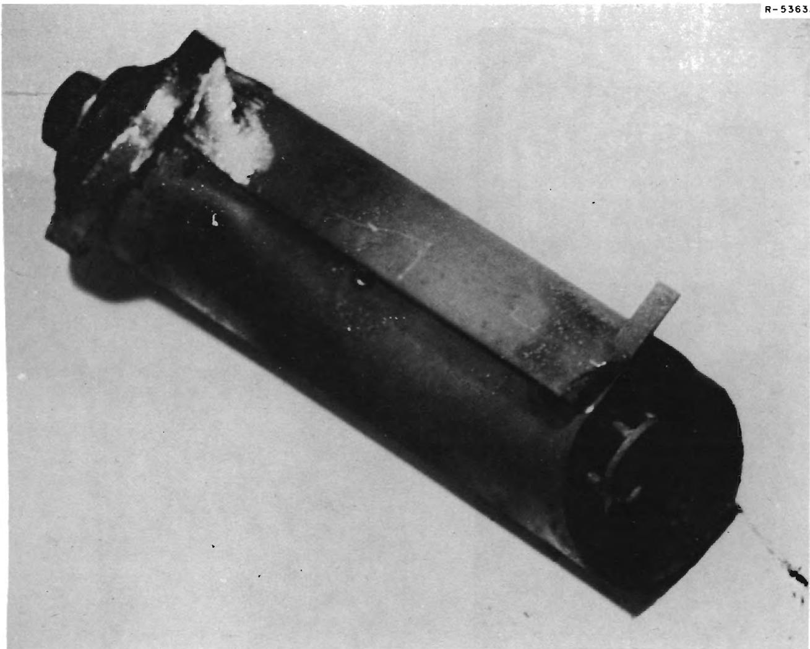  
Fig. 11.1. Mist shield containing sampler cage from MSRE pump bowl.

below the surface (see Figs. 11.3 and 11.4) were quite irregular and lumpy and in general had a brown-tan (copper or rust) color over darker material; some whitish material was also seen. Four of the rods were scraped to recover samples of the deposited material. After a gamma-radiation survey of the cage at this time, the unscraped cage rod was cut out for metallographic examination; another rod was also cut out for more thorough scraping, segmenting, and possible leaching of the surfaces.

The gamma radiation survey was conducted by lowering the cage in $\frac{1}{2}$ -in. or smaller steps past a 0.020-by 1.0-in. horizontal collimating slit in 4 in. of lead. Both total radiation and gamma spectra were obtained using a sodium iodide scintillation crystal. The radiation levels were greatest in the latch stop region at the top of

the cage and next in magnitude at the bottom ring. Levels along the rods were irregular but were higher in the liquid region than in the gas area even though considerable material had been scraped from four of the five rods in that region. In all regions the spectrum was predominantly that of 367-day $^{106}\mathrm{Ru}$ and 2.7-year $^{125}\mathrm{Sb}$ , and no striking differences in the spectral shapes were noted.

Analyses of samples recovered from various regions inside and outside the mist shield and sampler cage are shown in Table 11.1. The samples generally weighed between 0.1 and $0.4\mathrm{g}$ . The radiation level of the samples was measured using an in-cell G-M probe at about 1-in. distance and at the same distance with the sample surrounded by a $\frac{1}{8}$ -in. copper shield (to absorb the 3.5-MeV beta of the 30-sec ${}^{106m}$ Rh daughter of

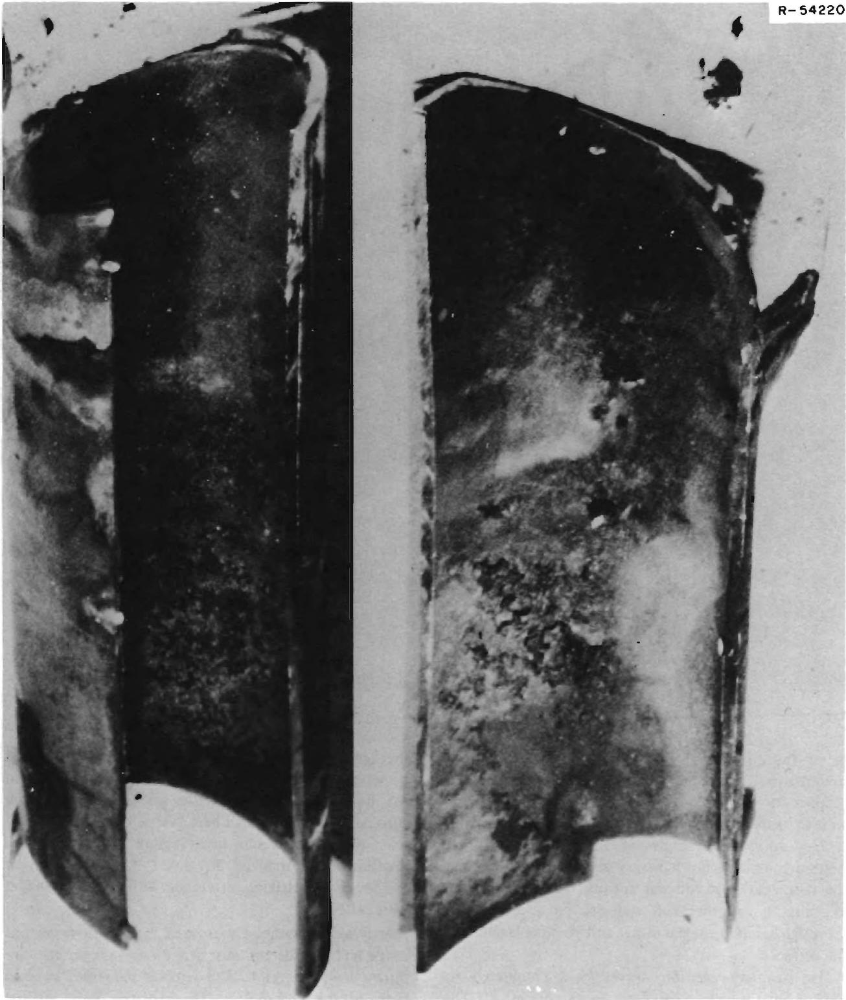  
Fig. 11.2. Interior of mist shield. Right part of right segment overlapped left part of segment on left.

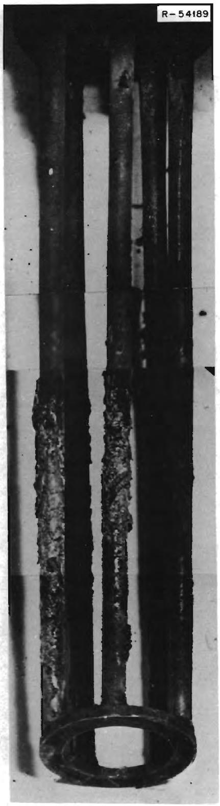  
Fig. 11.4. Deposits on sampler cage. Ring already scraped.

$^{106}$ Ru). Activities measured in this way ranged from 4 R/hr (2 R/hr shielded) to 180 R/hr (80 R/hr shielded), the latter being on a 0.4-g sample of the deposit on the latch stop at the top of the sample cage.

Spectrographic and chemical analyses are available on three samples: (1) the black lumpy material picked up from the pump bowl bottom, (2) the deposit on the latch stop at the top of the sample cage, and (3) material scraped from the inside of the mist shield in the liquid region. The material recovered from the pump bowl bottom contained $7\%$ carbon, $31\%$ Hastelloy N metals, $3.4\%$ Be $(18\% \mathrm{BeF}_2)$ , and $6\%$ Li $(22\% \mathrm{LiF})$ . Quite possibly this included some cutting debris. The carbon doubtless was a tar or soot resulting from thermal and radiolytic decomposition of lubricating oil leaking into the pump bowl. It is believed that this material was jarred loose from upper parts of the pump bowl or the sample transfer tube during the chisel work to detach the mist shield.

The hard deposit on the latch stop contained $28\%$ carbon, $2.0\%$ Be $(11\% \mathrm{BeF}_2)$ , $2.8\%$ Li $(10\% \mathrm{LiF})$ , and $12\%$ metals in approximate Hastelloy N proportions, again possibly to some extent cutting debris.

The sample taken from the inner liquid region of the mist shield contained $2.5\%$ Be $(13\% \mathrm{BeF}_2)$ , $3.0\%$ Li $(11\% \mathrm{LiF})$ , and $18\%$ metals (with somewhat more chromium and iron than Hastelloy N); a carbon analysis was not obtained.

In each case, about 0.5 to $1\%$ $\mathrm{Zr}$ (about 1 to $2\%$ $\mathrm{ZrF_4}$ ) was found, a level lower than fuel salt in proportion to the lithium and beryllium. Uranium analyses were not obtainable; so we cannot clearly say whether the salt is fuel salt or flush salt. Since fission product data suggest that the deposits built up over appreciable periods, we presume that it is fuel salt.

In all cases the dominant Hastelloy N constituent, nickel, was the major metallic ingredient of the deposit. Only in the deposit from the mist shield inside the liquid region did the proportions of Ni, Mo, Cr, and Fe depart appreciably from the metal proper. In this deposit a relative excess of chromium and iron was found, which would not be attributable to incidental metal debris from cutting operations. It is also possible that the various Hastelloy N elements were all subject to mass transport by salt during operation, and that little of that found resulted from cutup operation.

We now come to consideration of fission product isotope data. These data are shown in Table 11.2 for deposits scraped from a number of regions. The activity per gram of sample is shown as a fraction of MSRE inventory activity per gram of MSRE fuel salt to eliminate the effects of yield and power history;

Table 11.1. Chemical and spectrographic analysis of deposits from mist shield in the MSRE pump bowl   

<table><tr><td>Sample Location</td><td>Radiation level (R/hr @ 1 in.) (shielded)</td><td>Weight (mg)</td><td>Percent C</td><td>3T (dis min-1g-1)</td><td>Percent Li</td><td>Percent Be</td><td>Percent Zra</td><td>Percent Na</td><td>Percent Moa</td><td>Percent Cra</td><td>Percent Fea</td><td>Percent Mn a</td></tr><tr><td rowspan="2">Pump bowl bottom</td><td>10(5)</td><td>402</td><td></td><td>3.1 E10</td><td>6.00</td><td>3.42</td><td>0.5–1.0</td><td>20–30</td><td>2–4</td><td>1–2</td><td>0.5–1.0</td><td>0.5–1.0</td></tr><tr><td>25(12)</td><td>108</td><td>7.1</td><td></td><td></td><td></td><td></td><td></td><td></td><td></td><td></td><td></td></tr><tr><td rowspan="2">Latch stop</td><td>130(60)</td><td>291</td><td></td><td>1.85 E11</td><td>2.75</td><td>2.01</td><td>0.5–1.0</td><td>5–10</td><td>2–4</td><td>0.5–1.0</td><td>0.5–1.0</td><td>&lt;0.5</td></tr><tr><td>180(80)</td><td>365</td><td>28</td><td></td><td></td><td></td><td></td><td></td><td></td><td></td><td></td><td></td></tr><tr><td>Inside, liquid region</td><td>40(17)</td><td>179</td><td></td><td>4.7 E10</td><td>3.03</td><td>2.52</td><td>0.5–1.0</td><td>5–10</td><td>2–4</td><td>3–5</td><td>2–4</td><td>&lt;0.5</td></tr><tr><td>MSRE fuel (nominal)</td><td></td><td></td><td></td><td></td><td>11.1</td><td>6.7</td><td>11.1</td><td></td><td></td><td></td><td></td><td></td></tr><tr><td>Hastelloy N (nominal)</td><td></td><td></td><td></td><td></td><td></td><td></td><td></td><td>69</td><td>16</td><td>7</td><td>5</td><td>~1</td></tr></table>

${}^{a}$ Semiquantitative spectrographic determination.

Table 11.2. Gamma spectrographic (Ge-diode) analysis of deposits from mist shield in the MSRE pump bowl   

<table><tr><td></td><td>99Tc</td><td>95Nb</td><td>103Ru</td><td>106Ru</td><td>125Sb</td><td>127mTe</td><td>137Cs</td><td>95Zrα</td><td>144Ceα</td></tr><tr><td>Half-life</td><td>2.1 × 105years</td><td>35 days(after 95Zr)</td><td>39.6 days</td><td>367 days</td><td>2.7 years</td><td>105 days</td><td>30 years</td><td>65 days</td><td>284 days</td></tr><tr><td>Inventory, dis min-1g-1</td><td>24 μg/g</td><td>8.3 E10</td><td>3.3 E10</td><td>3.3 E9</td><td>3.7 E8</td><td>2.0 E9</td><td>6.2 E9</td><td>9.9 E10</td><td>5.9 E10</td></tr><tr><td colspan="10">Sample activity per gram expressed as fraction of MSRE inventory activity/grams fuel saltb</td></tr><tr><td>Pump bowl bottom, loose particles</td><td></td><td>0.23</td><td>36</td><td>52</td><td>20</td><td>17</td><td>2.1</td><td>0.13 ± 0.03</td><td>0.10</td></tr><tr><td>Latch stop</td><td></td><td>265</td><td>364</td><td>1000</td><td>5.7</td><td>69</td><td>3.1</td><td>0</td><td>0</td></tr><tr><td>Top Outside</td><td></td><td>122</td><td>167</td><td>328</td><td>104</td><td>98</td><td>9.5</td><td>0</td><td>0</td></tr><tr><td>Inside</td><td></td><td>42 ± 14</td><td>237 ± 163</td><td>273</td><td>1000</td><td>69</td><td>4.3</td><td>0</td><td>0</td></tr><tr><td>Middle outside</td><td></td><td>277</td><td>531</td><td>646</td><td>563</td><td>54</td><td>8.0</td><td>0</td><td>0</td></tr><tr><td>Below liquid surface Inside No. 1</td><td></td><td>354</td><td>164</td><td>224</td><td>271</td><td>143</td><td>0.6</td><td>0</td><td>0.13 ± 0.02</td></tr><tr><td>Inside No. 2</td><td>463</td><td>148</td><td>292</td><td>310</td><td>72</td><td>98</td><td>1.1</td><td>0</td><td>0</td></tr><tr><td>Cage rod</td><td></td><td>305</td><td>221</td><td>692</td><td>198</td><td>187</td><td>0.2</td><td>0</td><td>0</td></tr><tr><td>Bottom Outside</td><td></td><td>(0, &lt;60)</td><td>(0, &lt;60)</td><td>1210</td><td>167</td><td>232</td><td>3.2</td><td>0</td><td>0</td></tr><tr><td>Inside</td><td></td><td>16 ± 9</td><td>15 ± 9</td><td>189</td><td>51</td><td>27</td><td>0.32</td><td>0</td><td>0.11</td></tr></table>

${}^{a}$ Background values (limit of detection) were as follows: ${}^{95}\mathrm{{Zr}},2 - 9\mathrm{E}{10};{}^{144}\mathrm{{Ce}},1 - 2\mathrm{E}{10};{}^{134}\mathrm{{Cs}},2 - 9\mathrm{E}{8};{}^{110}\mathrm{{Ag}},1 - 3\mathrm{E}9;{}^{154}\mathrm{{Eu}},1\mathrm{E}8 - 2\mathrm{E}9$ .   
$b$ Uncertainty stated (as $\pm$ value) only when an appreciable fraction ( $>10\%$ ) of observed.

materials concentrated in the same proportion should have similar values.

We first note that the major part of these deposits does not appear to be fuel salt, as evidenced by low values of $^{95}\mathrm{Zr}$ and $^{144}\mathrm{Ce}$ . The values 0.13 and 0.11 for $^{144}\mathrm{Ce}$ average $12\%$ , and this is to be compared with the combined $24\%$ for LiF plus $\mathrm{BeF}_2$ determined spectrographically, as noted above. These would agree well if fuel salt had been occluded steadily as $24\%$ of a growing deposit throughout the operating history.

For $^{137}\mathrm{Cs}$ we note that samples below liquid level inside generally are below salt inventory and could be occluded fuel salt, as considered above. For samples above the liquid level inside, or any external sample, values are two to nine times inventory for fuel salt. Enrichment from the gas phase is indicated. Houtzeel has noted that off-gas appears to be returned to the main loop during draining, as gas from the drain tanks is displaced into a downstream region of the off-gas system. However, our deposit must have originated from something more than the gas residual in the pump bowl or off-gas lines at shutdown. An estimate substantiating this is as follows.

With full stripping, $3.3 \times 10^{17}$ atoms of the mass 137 chain per minute enter the pump bowl gas. About half actually go to off-gas, and most of the rest are reabsorbed into salt. If we, however, assume a fraction $f$ is deposited evenly on the boundaries (gas boundary area about $16,000~\mathrm{cm}^2$ ), the deposition rate would be about $2 \times 10^{13}f$ atoms of the 137 chain per square centimeter per minute. Now if in our samples the activity is $I$ relative to inventory salt ( $1.4 \times 10^{17}$ atoms of $^{137}\mathrm{Cs}$ per gram) and the density is about 2, then the time $t$ in minutes required to deposit a thickness of $X$ centimeters would be

$$
t = \frac {1 . 4 \times 1 0 ^ {1 7} \times I \times 2 \times X}{2 \times 1 0 ^ {1 3} f} = 1. 4 \times 1 0 ^ {4} \frac {I}{f} X \min .
$$

In obtaining our samples, we generally scraped at least $0.1\mathrm{g}$ from perhaps $5\mathrm{cm}^2$ , indicating a thickness of at least about $0.01~\mathrm{cm}$ , and $I$ values were about 4,whence $t$ is about $600 / f$

Thus, even if all $(f\sim 1)$ the 137 chain entering the pump bowl entered our deposits, $600~\mathrm{min}$ of flow would be required to develop their $^{137}\mathrm{Cs}$ content - too much for the 7-min holdup of the pump bowl or even the rest of the off-gas system, excluding the charcoal beds.

It appears more likely that $^{137}\mathrm{Cs}$ atoms, from $^{137}\mathrm{Xe}$ atoms decaying in the pump bowl, were steadily incorporated to a slight extent in a slowly growing deposit.

The noble-metal fission products, 35-day $^{95}\mathrm{Nb}$ , 39.6-day $^{103}\mathrm{Ru}$ , 367-day $^{106}\mathrm{Ru}$ , 2.7-year $^{125}\mathrm{Sb}$ , and 105-day $^{127m}\mathrm{Te}$ , were strongly present in essentially all samples. In all cases, 35-day $^{95}\mathrm{Nb}$ was present in quantities appreciably more than could have resulted from decay of $^{95}\mathrm{Zr}$ in the sample.

Antimony-125 appears to be strongly deposited in all regions, possibly more strongly in the upper (gas) region deposits. Clearly $^{125}\mathrm{Sb}$ must be considered a noble-metal fission product. Tellurium-127m was also found, in strong concentration, frequently in similar proportion to the $^{125}\mathrm{Sb}$ of the sample. The precursor of $^{127m}\mathrm{Te}$ is 3.9-day $^{127}\mathrm{Sb}$ . It may be that earlier observations about fission product tellurium are in fact observations of precursor antimony isotope behavior, with tellurium remaining relatively fixed.

The ruthenium isotopes were present in quantities comparable with those of $^{95}\mathrm{Nb}$ , $^{125}\mathrm{Sb}$ , and $^{127m}\mathrm{Te}$ . If the two ruthenium isotopes had been incorporated in the deposit soon after formation in the salt, then they should be found in the same proportion to inventory. But if a delay or holdup occurred, then the shorter-lived $^{103}\mathrm{Ru}$ would be relatively richer in the holdup phase as discussed later, the activity ratio $^{103}\mathrm{Ru}/^{106}\mathrm{Ru}$ would exceed the inventory ratio, and material deposited after an appreciable holdup would have an activity ratio $^{103}\mathrm{Ru}/^{106}\mathrm{Ru}$ which would be less than the inventory value. Examination of Table 11.2 shows that in all samples, relatively less $^{103}\mathrm{Ru}$ was present, which indicates that the deposits were accumulated after a holdup period. This appears to be equally true for regions above and below the liquid surface. Thus we conclude that the deposits do not anywhere represent residues of the material held up at the time of shutdown but rather were deposited over an extended period on the various surfaces from a common holdup source. Specifically this appears true for the lumpy deposits on the mist shield interior and cage rods below the liquid surface.

Data for $2.1 \times 10^{5}$ -year $^{99}\mathrm{Tc}$ are available for one sample taken from the inner mist shield surface below the liquid level. The value, $1.11 \times 10^{4} \mu \mathrm{g/g}$ , vs inventory $24 \mu \mathrm{g/g}$ , shows an enhanced concentration ratio similar to our other noble-metal isotopes and clearly substantiates the view that this element is to be regarded as a noble-metal fission product. The consistency of the ratios to inventory suggests that the noble metals represent about $5\%$ of the deposits.

The quantity of noble-metal fission products held up in this pump bowl film may not be negligible. If we take a median value of about 300 times inventory per gram for the deposited material, take pump bowl area in the gas region as $10,000\mathrm{cm}^2$ (minimum), and assume

deposits $0.1\mathrm{mm}$ thick (about $0.02\mathrm{g/cm}^2$ ; higher values were noted), the deposit thus would have the equivalent of the content of more than $60\mathrm{kg}$ of inventory salt. There was about $4300\mathrm{kg}$ of fuel salt; so on this basis, deposits containing about $1.4\%$ or more of the noble metals were in the gas space. At least a similar amount is estimated to be on walls, etc., below liquid level; and no account was taken for internal structure surfaces (shed roof, deflector plates, etc., or overflow pipe and tank).

Since pump bowl surfaces appear to have more (about 10 times) noble-metal fission products deposited on them per unit area than the surfaces of the heat exchanger, graphite, piping, surveillance specimens, etc., we believe that some peculiarities of the pump bowl environment must have led to the enhanced deposition there.

We first note that the pump bowl was the site of leakage and cracking of a few grams of lubricating oil each day. Purge gas flow also entered here, and hydrodynamic conditions were different from the main loop.

The pump bowl had a relatively high gas-liquid surface with higher agitation relative to such surface than was the case for gas retained as bubbles in the main loop. The liquid shear against walls was rather less, and deposition appeared thickest where the system was quietest (cage rods). The same material appears to have deposited in both gas and liquid regions, suggesting a common source. Such a source would appear to be the gas-liquid interfaces: bubbles in the liquid phase and droplets in the gas phase. It is known that surface-seeking species tend to be concentrated on droplet surfaces.

The fact that gas and liquid samples obtained in capsules during operation had $^{103}\mathrm{Ru} / ^{106}\mathrm{Ru}$ activity ratios higher than inventory and deposits discussed here had $^{103}\mathrm{Ru} / ^{106}\mathrm{Ru}$ activity ratios below inventory suggests that the activity in the capsule samples was from a held-up phase that in time was deposited on the surfaces which we examined here.

The tendency to agglomerate and deposit in the less agitated regions suggests that the overflow tank may have been a site of heavier deposition. The pump bowl liquid which entered the overflow pipe doubtless was associated with a high proportion of surface, due to rising bubbles; this would serve to enhance transport to the overflow tank.

The binder material for the deposits has not been established. Possibilities include tar material and perhaps structural- or noble-metal colloids. Unlikely, though not entirely excludable, contributors are oxides

formed by moisture or oxygen introduced with purge gases or in maintenance operations. The fact that the mist shield and cage were wetted by salt suggests such a possibility.

# 11.2 Examination of Moderator Graphite from MSRE

A complete stringer of graphite (located in an axial position between the surveillance specimen assembly and the control rod thimble) was removed intact from the MSRE. This 64.5-in.-long specimen was transferred to the hot cells for examination, segmenting, and sampling.

11.2.1 Results of visual examination. Careful examination of all surfaces of the stringer with a Kollmorgen periscope showed the graphite to be generally in very good condition, as were the many surveillance specimens previously examined. The corners were clean and sharp, the faint circles left upon milling the fuel channel surfaces were visible and appeared unchanged, and the surfaces, with minor exceptions described below, were clean. The stringer bottom, with identifying letters and numbers scratched on it, appeared identical to the photograph taken before its installation in MSRE.

Examination revealed a few solidified droplets of flush salt adhering to the graphite, and one small $(0.5\mathrm{-cm}^2)$ area where a grayish-white material appeared to have wetted the smooth graphite surface. One small crack was observed near the middle of a fuel channel. At the top surface of the stringer a heavy dark deposit was visible. This deposit seemed to consist in part of salt and in part of a carbonaceous material; it was sampled for both chemical and radiochemical analysis. Near the metal knob at the top of the stringer a crack in the graphite had permitted a chip (about $1\mathrm{mm}$ thick and $2\mathrm{cm}^2$ in area) to be cleaved from the flat top surface. This crack may have resulted from mechanical stresses due to threading the metal knob into the stringer (or from thermal stresses in this metal-graphite system during operation) rather than from radiation or chemical effects.

11.2.2 Segmenting of graphite stringer. Upon completion of the visual observation and photography and after removal of small samples from several locations on the surface, the stringer was sectioned with a thin Carborundum cutting wheel to provide five sections of 4-in. length, three thin (10- to 20-mil) sections for x radiography, and three thicker (30- to 60-mil) sections for pinhole scanning with the gamma spectrometer. Each set of samples contained specimens from near the top, middle, and bottom of the stringer. The large

specimens, from which surface samples were subsequently milled, included (in addition) two samples from intermediate positions.

11.2.3 Examination of surface samples by x-ray diffraction. Previous attempts to determine the chemical form of fission products deposited on graphite surveillance specimens by x-ray reflection from flat surfaces failed to detect any element except graphitic carbon. A sampling method which concentrated surface impurities was tried at the suggestion of Harris Dunn of the Analytical Chemistry Division. This method involved lightly brushing the surface of the graphite stringer with a fine Swiss pattern file which had a curved surface. The grooves in the file picked up a small amount of surface material, which was transferred into a glass bottle by tapping the file on the lip of the bottle. In this way, samples were taken at the top, middle, and bottom of the graphite stringer from the fuel-channel surface, from the surface in contact with graphite, and from the curved surface adjacent to the control rod thimble.

Three capillaries were packed and mounted in holders which fitted into the x-ray camera.

Samples from the fuel-channel surfaces yielded very dark films, which were difficult to read. Many weak lines were observed in the x-ray patterns. Since other analyses had shown Mo, Te, Ru, Tc, Ni, Fe, and Cr to be present in significant concentrations on the graphite surface, these elements and their carbides and tellurides were searched for by careful comparison with the observed patterns.

In all three of the graphite surface samples analyzed, most of the lines for $\mathrm{Mo}_2\mathrm{C}$ and ruthenium metal were certainly present. For one sample, most of the lines for $\mathrm{Cr_7C_3}$ were seen. (The expected chromium carbide in equilibrium with excess graphite is $\mathrm{Cr_3C_2}$ , but nearly half the diffraction lines for this compound were missing, including the two strongest lines.) Five of the six strongest lines for $\mathrm{NiTe_2}$ were observed. Molybdenum metal, tellurium metal, technetium metal, chromium metal, CrTe, and $\mathrm{MoTe_2}$ were excluded by comparison of their known pattern with the observed spectrum. These observations (except for that of $\mathrm{Cr_7C_3}$ ) are in accord with expected chemical behavior and are significant in that they represent the first experimental identification of the chemical form of fission products known to be deposited on the graphite surface.

11.2.4 Milling of surface graphite samples. Surface samples for chemical and radiochemical analyses were milled from the five 4-in.-long segments from the top, middle, bottom, and two intermediate locations on the

graphite stringer using a rotating milling cutter 0.619 in. in diameter. The specimen was clamped flat on the bed of the machine, and cuts were made from the flat fuel-channel surface and from one of the narrower flat edge surfaces on both sides of the fuel channel. The latter surfaces contacted the similar surfaces of an adjacent stringer in the MSRE core. After the sample was clamped in position the milling machine was operated remotely to take successive cuts 1, 2, 3, 10, 20, 30, 245, 245, and 245 mils deep to the center of the graphite stringer. The powdered graphite was collected in a tared filter bottle attached to a vacuum cleaner hose during and after each cut. The filter bottle was a plastic cylindrical bottle with a circular filter paper covering a number of drilled holes in the bottom. This technique collected most of the thinner samples but only about half of the larger 245-mil samples. After each sampling, the uncollected powder was carefully removed with the empty vacuum cleaner hose.

Before samples were cut from the narrow flats the corners of the stringer bars were milled off to a width and depth of 66 mils to avoid contamination from the adjacent stringer surfaces. Then successive cuts 1, 2, 3, 10, 20, and 30 mils deep were taken. Finally, a single cut 62 mils deep was taken on the opposite flat fuel-channel surface. Only the latter cut was taken on the two stringer samples from positions halfway between the bottom and middle and halfway between the middle and top of the stringer.

11.2.5 Radiochemical and chemical analyses of MSRE graphite. The milled graphite samples were dissolved in a boiling mixture of concentrated $\mathrm{H}_2\mathrm{SO}_4$ and $\mathrm{HNO}_3$ with provision for trapping any volatilized activities. The following analyses were run on the dissolved samples:

1. Gamma spectrometer scans for $^{106}\mathrm{Ru}$ , $^{125}\mathrm{Sb}$ , $^{134}\mathrm{Cs}$ , $^{137}\mathrm{Cs}$ , $^{110}\mathrm{Ag}$ , $^{144}\mathrm{Ce}$ , $^{95}\mathrm{Zr}$ , $^{95}\mathrm{Nb}$ , and $^{60}\mathrm{Co}$ .   
2. Separate radiochemical separations and analyses for ${}^{89}\mathrm{Sr},{}^{90}\mathrm{Sr},{}^{127}\mathrm{Te}$ , and ${}^{3}\mathrm{H}$ . A few samples were analyzed for ${}^{99}\mathrm{Tc}$ .   
3. Uranium analyses by both the fluorometric and the delayed neutron counting methods.   
4. Spectrographic analyses for Li, Be, Zr, Fe, Ni, Mo, and Cr. (High-yield fission products were also looked for but not found.)

Uranium and spectrographic analyses. Table 11.3 gives the uranium analyses (calculated as $^{233}\mathrm{U}$ ) by both the fluorometric method and the delayed neutron counting method. The type of surfaces sampled, the number of the cut, and the depth of the cut for each

Table 11.3. Chemical analyses ${}^{a}$ of milled samples   

<table><tr><td>Sample</td><td>Cut and typeb</td><td>Depth, mils</td><td>Total U, ppm, fluorometric</td><td>233U, ppm, delayed neutron</td><td>Li, ppm</td><td>Be; ppm</td><td>Zr, ppm</td><td>Metal,cpm</td></tr><tr><td>1</td><td>1 Blank</td><td>0-6</td><td></td><td></td><td>&lt;10</td><td>&lt;2</td><td>-</td><td>-</td></tr><tr><td>2</td><td>2 Blank</td><td>6-30</td><td>1</td><td>0.1 ± 0.05</td><td>&lt;2</td><td>&lt;1</td><td>-</td><td>-</td></tr><tr><td>3</td><td>1 FC</td><td>0-2</td><td>28</td><td>35.5 ± 1.5</td><td>360</td><td>320</td><td>1600</td><td>-</td></tr><tr><td>4</td><td>2 FC</td><td>1-3</td><td>21</td><td>26.9 ± 1.2</td><td>340</td><td>170</td><td>-</td><td>-</td></tr><tr><td>5</td><td>3 FC</td><td>3-6</td><td>8</td><td>11.5 ± 0.8</td><td>-</td><td>-</td><td>-</td><td>-</td></tr><tr><td>7</td><td>5 FC</td><td>16-36</td><td>2</td><td>2.6 ± 0.2</td><td>-</td><td>-</td><td>-</td><td>-</td></tr><tr><td>11</td><td>9 FC</td><td>556-801</td><td>3</td><td>2.6 ± 0.3</td><td>310</td><td>200</td><td>-</td><td>820 Fe</td></tr><tr><td>12</td><td>1 E</td><td>0-2</td><td>&lt;1 (?)</td><td>22.7 ± 3.5</td><td>250</td><td>180</td><td>-</td><td>High Fe</td></tr><tr><td>13</td><td>2 E</td><td>2-3</td><td>&lt;30</td><td>8.6 ± 2.3</td><td>110</td><td>50</td><td>-</td><td>-</td></tr><tr><td>14</td><td>3 E</td><td>3-6</td><td>9</td><td>5.5 ± 0.7</td><td></td><td></td><td></td><td></td></tr><tr><td>17</td><td>6 E</td><td>36-66</td><td>3</td><td>5.0 ± 0.3</td><td></td><td></td><td></td><td></td></tr><tr><td>18</td><td>1 Deep</td><td>0-62</td><td>2</td><td>2.4 ± 0.1</td><td>40</td><td>20</td><td>-</td><td>-</td></tr><tr><td>19</td><td>1 FC</td><td>0-5</td><td>21</td><td>21.5 ± 0.6</td><td>220</td><td>150</td><td></td><td>970 Mo,1100 Ni</td></tr><tr><td>20</td><td>2 FC</td><td>1-7</td><td>9</td><td>10.1 ± 0.8</td><td>190</td><td>100</td><td>-</td><td>-</td></tr><tr><td>21</td><td>3 FC</td><td>3-10</td><td>4</td><td>7.1 ± 0.4</td><td></td><td></td><td></td><td></td></tr><tr><td>23</td><td>5 FC</td><td>16-40</td><td>&lt;1</td><td>1.0 ± 0.7</td><td></td><td></td><td></td><td></td></tr><tr><td>26</td><td>8 FC</td><td>311-556</td><td>&lt;2</td><td>0.8 ± 0.6</td><td>10</td><td>610</td><td></td><td></td></tr><tr><td>27</td><td>1 E</td><td>0-3</td><td>3</td><td>3.8 ± 0.2</td><td>150</td><td>90</td><td>1400</td><td>High Fe</td></tr><tr><td>28</td><td>2 E</td><td>1-5</td><td>&lt;8</td><td>5.9 ± 0.1</td><td>230</td><td>110</td><td></td><td></td></tr><tr><td>29</td><td>3 E</td><td>3-8</td><td>3</td><td>5.7 ± 0.4</td><td></td><td></td><td></td><td></td></tr><tr><td>31</td><td>1 Deep</td><td>0-62</td><td>4</td><td>3.3 ± 0.1</td><td>80</td><td>50</td><td>70</td><td>150 Ni</td></tr><tr><td>32</td><td>1 Deep</td><td>0-62</td><td>14</td><td>13.0 ± 0.2</td><td>120</td><td>90</td><td>80</td><td>180 Ni</td></tr><tr><td>33</td><td>1 FC</td><td>0-0.2</td><td>12</td><td>18.1 ± 1.3</td><td>1400</td><td>290</td><td>High</td><td>High Fe + Mo</td></tr><tr><td>34</td><td>2 FC</td><td>0-3</td><td>36</td><td>29.2 ± 1.3</td><td>410</td><td>240</td><td>500</td><td>2900 Ni</td></tr><tr><td>35</td><td>3 FC</td><td>3-6</td><td>18</td><td>20.0 ± 0.9</td><td></td><td></td><td></td><td></td></tr><tr><td>36</td><td>5 E</td><td>16-36</td><td>1</td><td>2.5 ± 0.1</td><td></td><td></td><td></td><td></td></tr><tr><td>39</td><td>6 FC</td><td>36-66</td><td>3</td><td>3.5 ± 0.1</td><td></td><td></td><td></td><td></td></tr><tr><td>43</td><td>1 E</td><td>0-1</td><td>51</td><td>118 ± 6</td><td>1000</td><td>400</td><td>8000</td><td>High Fe</td></tr><tr><td>44</td><td>2 E</td><td>1-3</td><td>46</td><td>36.6 ± 1.6</td><td>40</td><td>270</td><td>550</td><td>220 Ni</td></tr><tr><td>45</td><td>3 E</td><td>3-6</td><td>8</td><td>7.8 ± 0.7</td><td></td><td></td><td></td><td></td></tr><tr><td>48</td><td>6 E</td><td>36-66</td><td>2</td><td>3.6 ± 0.2</td><td></td><td></td><td></td><td></td></tr><tr><td>49</td><td>1 Blank</td><td>0-2</td><td></td><td></td><td>&lt;10</td><td>&lt;2</td><td>-</td><td>-</td></tr><tr><td>50</td><td>2 Blank</td><td>2-30</td><td>&lt;1</td><td>0.1 ± 0.04</td><td>&lt;7</td><td>&lt;0.3</td><td>&lt;40</td><td>&lt;70 Ni</td></tr></table>

${}^{a}$ Dashes in the body of the table represent analyses showing none present. Blanks indicate the analyses were not done.   
The number is the number of cut toward the interior starting at the graphite surface. "FC" stands for a fuel channel surface, "E" for a narrow edge surface, and "Deep" for a first cut about 62 mils deep from a fuel channel surface.   
$c_{\cdot}$ "High" indicates an unbelievably high concentration (several percent).

sample are also shown in the table. Samples between 19 and 29 were inadvertently tapered from one end of the specimen block to the other so that larger-than-planned ranges of cut depth were obtained. Samples from 3 to 18 were taken from the topmost graphite stringer specimen, those from 19 to 31 and sample 36 were from the middle specimen, and those from 32 to 48 were taken from the bottom specimen.

In view of the fact that the uranium concentrations were at the extreme low end of the applicable range for the fluorometric method, the agreement with the delayed neutron counting method was quite satisfactory. The data suggest that the sizable variations

between different surfaces (e.g., the three deep-cut samples 18, 31, and 32) were real. Sizable variations also exist in uranium concentrations in the deep interior of different regions of the stringer. These values range from $2.6~\mathrm{ppm}$ at the top to $0.8~\mathrm{ppm}$ at the middle to $3~\mathrm{ppm}$ at the bottom.

The concentration profiles indicated by the data in Table 11.3 were generally similar to those previously observed both on the surface and in the interior. Concentrations dropped a factor of 10 in the first 16 mils. A rough calculation of the total $^{233}\mathrm{U}$ in the MSRE core graphite indicates about $2\mathrm{g}$ on the surface and about $9\mathrm{g}$ in the interior of the graphite. These low

values indicate that uranium penetration into moderator graphite should not be a serious problem in large-scale molten-salt reactors.

The fact that fluorometric values for total uranium and the delayed neutron counting values for $^{233}\mathrm{U}$ agreed (with the $^{233}\mathrm{U}$ value usually larger than the total uranium value) indicates that little uranium remained in the graphite from the operation of the MSRE with $^{235}\mathrm{U}$ fuel. Apparently, the $^{238}\mathrm{U}$ and $^{235}\mathrm{U}$ previously in the graphite underwent rather complete isotopic exchange with $^{233}\mathrm{U}$ after the fuel was changed. The finding of 150 to 2900 ppm nickel in a few of the surface samples is probably real. The main conclusions from the spectrographic analyses are that adherent or permeated fuel salt accounted for the uranium, lithium, and beryllium in half the samples and that a thin layer of nickel was probably deposited on some of the graphite surface.

Radiochemical analyses. Since the graphite stringer samples were taken more than a year after reactor shutdown, it was possible to analyze only for the relatively long-lived fission products. However, the absence of interfering short-lived activities made the analyses for long-lived nuclides more sensitive and precise. The radiochemical analyses are given in Table 11.4, together with the type and location of surface sampled, the number of the milling cut, and the depth of the cut for each sample.

The species $^{125}\mathrm{Sb},$ $^{106}\mathrm{Ru},$ $^{110}\mathrm{Ag},$ $^{95}\mathrm{Nb},$ and $^{127}\mathrm{Te}$ showed concentration profiles similar to those observed for noble-metal fission products $(^{99}\mathrm{Mo},$ $^{129}\mathrm{Te},$ $^{132}\mathrm{Te},$ $^{103}\mathrm{Ru},$ $^{106}\mathrm{Ru},$ and $^{95}\mathrm{Nb})$ in previous graphite surveillance specimens, that is, high surface concentrations falling rapidly several orders of magnitude to low interior concentrations. The profiles for $^{95}\mathrm{Zr}$ were of similar shape, but the interior concentrations were two or three orders of magnitude smaller than for its daughter $^{95}\mathrm{Nb}.$ It is thought that $^{95}\mathrm{Zr}$ is either injected into the graphite by a fission recoil mechanism or is carried with fuel salt into cracks in the graphite; the much larger concentrations of $^{95}\mathrm{Nb}$ (and the other noble metals) are thought to result from the deposition or plating of solid metallic or carbide particles on the graphite surface. The $^{90}\mathrm{Sr}$ (33-sec $^{90}\mathrm{Kr}$ precursor) profiles were much steeper than those previously observed in surveillance specimens for $^{89}\mathrm{Sr}$ (3.2-min $^{89}\mathrm{Kr}$ precursor), as expected. An attempt to analyze the stringer samples for $^{89}\mathrm{Sr}$ also was unsuccessful. It is difficult to analyze for one of these pure beta emitters in the presence of large activities of the other.

Surprisingly high concentrations of tritium were found in the moderator graphite samples (Table 11.4).

The tritium concentration decreased rapidly from about $10^{11}$ dis $\min^{-1} g^{-1}$ at the surface to about $10^{9}$ dis $\min^{-1} g^{-1}$ at a depth of $1/16$ in. and then decreased slowly to about half this value at the center of the stringer. If all the graphite in the MSRE contained this much tritium, then about $15\%$ of the tritium produced during the entire power operation had been trapped in the graphite. About half the total trapped tritium was in the outer $1/16$ in. layer.

Similarly high concentrations of tritium were found in specimens of Poco graphite (a graphite characterized by large uniform pores) exposed to fissioning salt in the core during the final 1786 hr of operation. Surface concentrations as high as $4.5 \times 10^{10}$ dis $\min^{-1} \mathrm{~g}^{-1}$ were found, but interior concentrations were below $10^{8}$ dis $\min^{-1} \mathrm{~g}^{-1}$ , much lower than for the moderator graphite. This suggests that the graphite surface is saturated relatively quickly but that diffusion to the interior is slow.

If it is assumed that the surface area of the graphite (about $0.5\mathrm{m}^2/\mathrm{g}$ ) is not changed by irradiation (there was no dependence of tritium sorption on flux), there was 1 tritium per 100 surface carbon atoms. Since the MSRE cover gas probably contained about 100 times as much hydrogen (from pump oil decomposition) as tritium, a remarkably complete coverage by chemisorbed hydrogen is indicated.

An overall assessment of tritium behavior in the MSRE and proposed MSBR's is presented elsewhere.

The data on fission product deposition on and in the graphite, based on Table 11.4, have been calculated as (observed activity per square centimeter) divided by (inventory activity/total area), as was done for surveillance specimens earlier. The resulting relative deposit intensities, shown in Table 11.5, can, of course, then be compared with values reported for other nuclides, other specimens, or other times. If all graphite surfaces were evenly covered at the indicated intensity, the fraction of total inventory in such deposits would be $74\%$ of the relative deposit intensity shown. For top, middle, and bottom regions and for channel and edge (graphite-to-graphite) surfaces, values are shown for surface and overall deep cuts.

As in the case of surveillance specimens, intensities for salt-seeking nuclides are at levels appropriate for fission recoil (about 0.001), the noble-gas daughters $(^{137}\mathrm{Cs}$ and $^{90}\mathrm{Sr})$ are 10 to 20 times as high, and the noble metals notably higher, though, as we shall see, not as high on balance as on metals. Where comparisons can be made, most of the deposit was indicated to be at the surface. Values for $^{95}\mathrm{Nb}$ are far above $^{95}\mathrm{Zr}$ , indicating that $^{95}\mathrm{Nb}$ was indeed deposited; the graphite

Table 11.4. Radiochemical analyses of graphite stringer samples   

<table><tr><td rowspan="2">Sample No.</td><td rowspan="2">Cut and typea</td><td rowspan="2">Depth, mils</td><td colspan="15">Disintegrations per minute per gram of graphite on 12-12-69</td></tr><tr><td>125Sb</td><td>106Ru</td><td>127Te</td><td>95Nb</td><td>110Ag</td><td>99Tc</td><td>134Cs</td><td>137Cs</td><td>90Sr</td><td>144Ce</td><td>95Zr</td><td>152Eu</td><td>154Eu</td><td>60Co</td><td>3H</td></tr><tr><td>1</td><td>Thin blank</td><td>0-6</td><td>≤8E5</td><td>≤4E6</td><td></td><td>≤7E9</td><td>≤9E5</td><td></td><td>≤3E5</td><td>≤8E8</td><td>5.79E5</td><td>6.22E6</td><td>≤2E8</td><td>2.93E7</td><td>3.12E7</td><td>1.06E7</td><td>9.15E5</td></tr><tr><td>2</td><td>Thick blank</td><td>6-30</td><td>≤8E9</td><td>8.53E5</td><td></td><td>≤7E8</td><td>≤9E4</td><td></td><td>≤3E4</td><td>≤7E4</td><td></td><td>1.56E6</td><td>≤2E7</td><td>1.85E6</td><td>1.83E6</td><td>6.81E5</td><td>2.38E6</td></tr><tr><td>3</td><td>1 FC,T</td><td>0-2</td><td>3.1E10</td><td>7.31E10</td><td>8.95E10</td><td>≤4E12</td><td>≤1E9</td><td>~330</td><td>≤3E8</td><td>1.0E9</td><td>8.7E9</td><td>8.49E9</td><td>≤1.8E10</td><td>≤4.8E8</td><td>≤5E8</td><td>3.63E8</td><td>5.92E10</td></tr><tr><td>4</td><td>2 FC,T</td><td>1-4</td><td>1.14E9</td><td>3.74E8</td><td>3.42E9</td><td>≤2.7E11</td><td>2.84E8</td><td>~13</td><td>1.06E7</td><td>2.39E8</td><td>1.1E10</td><td>4.26E8</td><td>≤1.1E9</td><td>1.76E7</td><td>2.37E7</td><td>4.4E7</td><td>1.21E10</td></tr><tr><td>5</td><td>3 FC,T</td><td>3-7</td><td>5.52E8</td><td>1.08E9</td><td>1.81E9</td><td>≤1E11</td><td>2.75E7</td><td></td><td>≤7E6</td><td>2.39E8</td><td>3.88E9</td><td>1.72E8</td><td>≤2E9</td><td>1.50E8</td><td>1.51E8</td><td>3.77E7</td><td>6.31E9</td></tr><tr><td>6</td><td>4 FC,T</td><td>6-17</td><td>1.76E8</td><td>3.72E8</td><td>5.23E8</td><td>≤3E10</td><td>≤6E7</td><td></td><td>4.39E6</td><td>3.49E8</td><td>3.38E9</td><td>5.27E7</td><td>≤3E8</td><td>≤1E7</td><td>≤1.3E7</td><td>1.51E7</td><td>1.75E9</td></tr><tr><td>7</td><td>5 FC,T</td><td>16-37</td><td>1.07E8</td><td>2.54E8</td><td>3.50E8</td><td>≤1E10</td><td>≤3.6E6</td><td></td><td>8.81E6</td><td>3.96E8</td><td>1.24E9</td><td>3.82E7</td><td>≤2E8</td><td>≤7E6</td><td>1.14E6</td><td>1.85E9</td><td></td></tr><tr><td>8</td><td>6 FC,T</td><td>36-67</td><td>5.91E7</td><td>2.02E8</td><td>1.96E8</td><td>≤9E9</td><td>≤3.3E6</td><td></td><td>2.03E6</td><td>2.69E7</td><td>2.78E8</td><td>3.79E7</td><td>≤2E8</td><td>≤9E6</td><td>≤4.8E6</td><td>1.70E6</td><td>1.03E9</td></tr><tr><td>9</td><td>7 FC,T</td><td>66-312</td><td>≤7E6</td><td>2.90E7</td><td>1.39E7</td><td>2.73E10</td><td>≤9E5</td><td></td><td>3.32E7</td><td>3.00E8</td><td>7.23E7</td><td>1.69E8</td><td>≤2.95E8</td><td>≤3E6</td><td>≤3E6</td><td>≤1.7E6</td><td>1.36E9</td></tr><tr><td>10</td><td>8 FC,T</td><td>311-557</td><td>≤8E6</td><td>≤2E7</td><td>4.89E6</td><td>≤5.4E9</td><td>≤1E6</td><td></td><td>2.47E8</td><td>1.46E8</td><td>1.12E7</td><td>≤4.1E7</td><td>≤1.2E8</td><td>≤3E6</td><td>≤2E6</td><td>≤7E5</td><td>6.32E8</td></tr><tr><td>11</td><td>9 FC,T</td><td>556-802</td><td>≤1E7</td><td>≤3.3E7</td><td>2.00E7</td><td>≤7E9</td><td>≤3E6</td><td></td><td>3.04E8</td><td>1.64E8</td><td>2.12E6</td><td>≤5E7</td><td>≤2.0E8</td><td>≤4E6</td><td>≤1.6E6</td><td>≤2E6</td><td>8.16E8</td></tr><tr><td>12</td><td>1 E,T</td><td>0-2</td><td>3.02E9</td><td>1.82E10</td><td>1.07E10</td><td>1.59E12</td><td>3.62E8</td><td></td><td>1.40E8</td><td>7.46E8</td><td>5.86E9</td><td>4.84E9</td><td>1.09E10</td><td>≤8E7</td><td>≤4.2E6</td><td>2.25E8</td><td>1.78E10</td></tr><tr><td>18</td><td>1 Deep,T</td><td>0-62</td><td>1.45E9</td><td>6.08E9</td><td>6.52E9</td><td>1.23E11</td><td>&lt;3E7</td><td></td><td>&lt;1E7</td><td>2.14E8</td><td>1.13E9</td><td>≤2E8</td><td>≤6E8</td><td>≤1E7</td><td>≤7.9E7</td><td>1.05E7</td><td>3.48E9</td></tr><tr><td>19</td><td>1 FC,M</td><td>0-5</td><td>2.49E9</td><td>9.20E9</td><td>1.21E10</td><td>1.57E12</td><td>5.22E8</td><td></td><td>3.95E8</td><td>1.10E9</td><td>1.13E10</td><td>6.68E9</td><td>1.25E10</td><td>≤6E7</td><td>≤4E7</td><td>2.73E8</td><td>5.72E9</td></tr><tr><td>20</td><td>2 FC,M</td><td>1-7</td><td></td><td></td><td>1.50E9</td><td></td><td></td><td></td><td></td><td></td><td>1.20E10</td><td></td><td></td><td></td><td></td><td>1.03E10</td><td></td></tr><tr><td>22</td><td>4 FC,M</td><td>6-20</td><td></td><td></td><td></td><td></td><td></td><td></td><td></td><td></td><td></td><td></td><td></td><td></td><td></td><td>8.33E9</td><td></td></tr><tr><td>23</td><td>5 FC,M</td><td>16-40</td><td></td><td></td><td></td><td></td><td></td><td></td><td></td><td></td><td>1.28E6</td><td></td><td></td><td></td><td></td><td>3.19E9</td><td></td></tr><tr><td>24</td><td>6 FC,M</td><td>36-70</td><td></td><td></td><td></td><td></td><td></td><td></td><td></td><td></td><td></td><td></td><td></td><td></td><td></td><td>7.95E8</td><td></td></tr><tr><td>26</td><td>8 FC,M</td><td>311-556</td><td>≤8E6</td><td>≤3.9E9</td><td>5.79E6</td><td>≤3E10</td><td>≤3E6</td><td></td><td>2.85E8</td><td>≤2E8</td><td>1.22E7</td><td>5.58E7</td><td>≤2E8</td><td></td><td>≤3E6</td><td>≤7.8E5</td><td>6.11E8</td></tr><tr><td>27</td><td>1 E,M</td><td>0-3</td><td>9.10E9</td><td>7.13E9</td><td>2.91E9</td><td>1.22E12</td><td>2.54E8</td><td></td><td>2.86E8</td><td>8.50E9</td><td>8.67E9</td><td>4.52E9</td><td>8.50E9</td><td>≤4E7</td><td>≤3E7</td><td>1.77E8</td><td>1.56E10</td></tr><tr><td>28</td><td>2 E,M</td><td>1-5</td><td>4.93E7</td><td>1.83E8</td><td>2.39E8</td><td>2.24E11</td><td>2.37E7</td><td></td><td>2.83E7</td><td>5.28E8</td><td>6.94E9</td><td>4.06E8</td><td>≤1E9</td><td></td><td>7.07E6</td><td>7.34E6</td><td>&gt;2.30E9</td></tr><tr><td>36</td><td>5 E,M</td><td>16-36</td><td>1.07E7</td><td>7.34E7</td><td>4.79E7</td><td>9.85E10</td><td>≤4E6</td><td></td><td>3.40E7</td><td>5.14E8</td><td></td><td>2.18E8</td><td>≤6E8</td><td></td><td>3.71E6</td><td>3.53E6</td><td>2.99E9</td></tr><tr><td>31</td><td>1 Deep,M</td><td>0-62</td><td>3.91E9</td><td>1.86E10</td><td>9.08E9</td><td>4.90E11</td><td>&lt;9E7</td><td></td><td>9.72E7</td><td>9.13E8</td><td>2.26E9</td><td>1.10E8</td><td>≤2E9</td><td>≤1E8</td><td>≤6E7</td><td>1.24E8</td><td>5.50E9</td></tr><tr><td>32</td><td>1 Deep,B</td><td>0-62</td><td>1.45E9</td><td>4.62E9</td><td>5.84E9</td><td>2.16E11</td><td>&lt;6.3E7</td><td></td><td>1.96E8</td><td>1.13E9</td><td>2.43E9</td><td>6.14E8</td><td>1.13E9</td><td>≤3E7</td><td>≤1.6E7</td><td>4.30E7</td><td>8.45E9</td></tr><tr><td>33</td><td>1 FC,B</td><td>0-0.2</td><td>2.96E11</td><td>4.19E11</td><td>8.22E11</td><td>2.13E13</td><td>≤2E9</td><td></td><td>1.37E9</td><td>4.69E9</td><td>1.07E10</td><td>5.09E10</td><td>≤1E11</td><td>≤3E9</td><td>≤3E9</td><td>6.82E9</td><td>1.59E11</td></tr><tr><td>34</td><td>2 FC,B</td><td>0-3</td><td>5.76E9</td><td>1.15E9</td><td>1.75E10</td><td>3.04E12</td><td>1.57E9</td><td></td><td>1.76E8</td><td>6.43E8</td><td>8.13E9</td><td>4.67E9</td><td>1.14E10</td><td></td><td>≤2.7E7</td><td>1.63E8</td><td>4.31E10</td></tr><tr><td>35</td><td>3 FC,B</td><td>3-6</td><td>1.27E9</td><td>3.29E9</td><td>3.22E9</td><td>3.78E11</td><td>2.76E8</td><td></td><td>1.17E7</td><td>2.66E8</td><td></td><td>4.51E8</td><td>≤2E9</td><td></td><td>≤1.8E7</td><td>1.94E7</td><td>1.26E10</td></tr><tr><td>38</td><td>5 FC,B</td><td>16-36</td><td>3.27E8</td><td>8.38E8</td><td>7.27E8</td><td>≤8.3E10</td><td>≤5.7E6</td><td></td><td>2.20E7</td><td>1.17E9</td><td></td><td>≤1E8</td><td>≤6E8</td><td></td><td>6.26E6</td><td>1.96E7</td><td>3.46E9</td></tr><tr><td>40</td><td>7 FC,B</td><td>66-311</td><td>3.13E7</td><td>1.04E8</td><td>5.20E7</td><td>≤1.0E10</td><td>≤2E6</td><td></td><td>1.03E8</td><td>1.33E8</td><td></td><td>≤3E7</td><td>≤2E8</td><td></td><td>≤1.6E6</td><td>3.23E6</td><td>5.69E8</td></tr><tr><td>42</td><td>9 FC,B</td><td>556-801</td><td>≤1E7</td><td>≤3.9E7</td><td>6.19E6</td><td>≤4E10</td><td>≤2E6</td><td></td><td>3.13E8</td><td>2.93E8</td><td>1.69E7</td><td>6.91E7</td><td>≤3.2E8</td><td></td><td>≤1E6</td><td>4.21E6</td><td>7.23E8</td></tr><tr><td>43</td><td>1 E,B</td><td>0-1</td><td>3.05E10</td><td>6.94E10</td><td>8.06E10</td><td>8.49E12</td><td>≤7.8E8</td><td></td><td>8.57E8</td><td>2.83E9</td><td>1.11E10</td><td>2.42E10</td><td>4.58E10</td><td>≤3.5E8</td><td>≤2E8</td><td>1.27E9</td><td>9.18E10</td></tr><tr><td>44</td><td>2 E,B</td><td>1-3</td><td>3.45E8</td><td>8.30E8</td><td>1.06E9</td><td>1.50E12</td><td>5.07E8</td><td></td><td>3.07E7</td><td>2.71E8</td><td></td><td>9.76E8</td><td>≤4E9</td><td></td><td>≤1.6E7</td><td>1.34E8</td><td>1.46E10</td></tr><tr><td>49</td><td>Thin blank</td><td>0-2</td><td>1.33E7</td><td>5.09E7</td><td></td><td>1.4E11</td><td>≤9E5</td><td></td><td>≤1.0E6</td><td>1.54E6</td><td>1.77E7</td><td>3.25E7</td><td>2.10E9</td><td>1.94E7</td><td>2.3E7</td><td>8.56E6</td><td>4.65E6</td></tr><tr><td>50</td><td>Thick blank</td><td>2-30</td><td>2.39E6</td><td>8.61E6</td><td>7.02E6</td><td>≤3.1E9</td><td>≤2E5</td><td></td><td>≤1.3E5</td><td>2.90E5</td><td></td><td>1.80E6</td><td>≤1E8</td><td>4.69E6</td><td>4.96E6</td><td>1.07E6</td><td>1.79E6</td></tr><tr><td>51</td><td>Top knob</td><td></td><td>2.24E10</td><td>1.94E10</td><td></td><td>≤1E12</td><td>≤2E8</td><td></td><td>≤8E7</td><td>1.0E8</td><td></td><td>≤7E8</td><td>≤1E10</td><td></td><td>≤3E7</td><td>2.47E9</td><td></td></tr><tr><td>KD</td><td>Top chips</td><td>0-30</td><td>2.83E10</td><td>2.19E11</td><td>8.8E10</td><td>5.82E12</td><td>≤5.7E8</td><td>3200</td><td>≤2.4E8</td><td>1.0E9</td><td>1.17E10</td><td>≤3E9</td><td>≤3.2E10</td><td></td><td>1.6E8</td><td>1.06E8</td><td>1.27E10</td></tr><tr><td></td><td></td><td></td><td>3.7E8</td><td>3.3E9</td><td>2.0E9</td><td>8.3E10</td><td>9E5</td><td></td><td>1.3E8</td><td>6.2E9</td><td>6.1E9</td><td>5.9E10</td><td></td><td></td><td></td><td>9.6E9</td><td></td></tr></table>

${}^{a}$ The number is the number of cut toward the interior starting at the graphite surface. "FC" stands for a fuel channel surface, "E" for a narrow edge surface, and "Deep" for a first cut about 62 mils deep from a fuel channel surface. T, M, and B represent samples from the top, middle, and bottom specimens of the graphite stringer, respectively.

Table 11.5. Fission products in MSRE graphite core bar after removal in cumulative values of ratio to inventory   

<table><tr><td>Location</td><td>Type</td><td>Depth (mils)</td><td>137Cs</td><td>90Sr</td><td>144Ce</td><td>95Zr</td><td>95Nb</td><td>106Ru</td><td>127Te</td><td>125Sb</td></tr><tr><td rowspan="4">Top</td><td rowspan="2">Channel</td><td>0-2</td><td>0.0008</td><td>0.007</td><td>0.0007</td><td></td><td>0.24d</td><td>0.11</td><td>0.024</td><td>0.41</td></tr><tr><td>0-800</td><td>0.087</td><td>0.072</td><td>0.0032</td><td>0.0024</td><td>0.69</td><td>0.14</td><td>0.090</td><td>0.50</td></tr><tr><td>Edge</td><td>0-2</td><td>0.0008</td><td>0.006</td><td>0.0005</td><td>0.0007</td><td>0.12</td><td>0.037</td><td>0.036</td><td>0.054</td></tr><tr><td>Edge</td><td>0-62</td><td>0.0007</td><td>0.038</td><td></td><td></td><td>0.30</td><td>0.38</td><td>0.68</td><td>0.79</td></tr><tr><td rowspan="6">Middle</td><td rowspan="2">Channel</td><td>0-3</td><td>0.0029</td><td>0.030</td><td>0.002</td><td></td><td>0.31</td><td>0.05</td><td>0.10</td><td>0.11</td></tr><tr><td>0-550</td><td></td><td>0.071</td><td>0.003</td><td></td><td></td><td></td><td>0.12</td><td></td></tr><tr><td rowspan="2">Edge</td><td>0-3</td><td>0.013</td><td>0.014</td><td>0.0008</td><td>0.0008</td><td>0.15</td><td>0.021</td><td>0.015</td><td>0.24</td></tr><tr><td>0-36</td><td>0.020</td><td>0.029</td><td>0.0011</td><td>0.0009</td><td>0.26</td><td>0.024</td><td>0.018</td><td>0.25</td></tr><tr><td>Edge</td><td>0-62</td><td>0.030</td><td>0.075</td><td>0.0004</td><td></td><td>1.00</td><td>1.16</td><td>0.94</td><td>2.14</td></tr><tr><td>Edge</td><td>0-62</td><td>0.037</td><td>0.081</td><td>0.0021</td><td>0.0023</td><td>0.53</td><td>0.29</td><td>0.60</td><td>0.79</td></tr><tr><td rowspan="3">Bottom</td><td rowspan="2">Channel</td><td>0-3</td><td>0.0015</td><td>0.014</td><td>0.0012</td><td>0.0011</td><td>0.49</td><td>0.09</td><td>0.36</td><td>0.68</td></tr><tr><td>0-800</td><td>0.069</td><td>0.017</td><td>0.0024</td><td>0.0011</td><td>0.58</td><td>0.14</td><td>0.43</td><td>0.84</td></tr><tr><td>Edge</td><td>0-3</td><td>0.0017</td><td>0.006</td><td>0.0015</td><td>0.0015</td><td>0.45</td><td>0.07</td><td>0.14</td><td>0.27</td></tr><tr><td></td><td></td><td></td><td colspan="8">Inventory (dis/min per gram of salt)</td></tr><tr><td></td><td></td><td></td><td>6.2E9</td><td>6.1E9</td><td>5.9E10</td><td>9.9E10</td><td>8.3E10</td><td>3.3E9</td><td>2.0E9</td><td>3.7E8</td></tr></table>

$a_{\mathrm{Incl}}$ duesignificant $\leqslant$ values.

values appear to be higher than those reported in the next section for metal surfaces, but the passage of a dozen half-lives between shutdown and determination may have reduced the precision of the data.

# 11.3 Examination of Heat Exchangers and Control Rod Thimble Surfaces

Among the specimens of component surfaces excised from the MSRE were two segments of control rod thimble and one each of heat exchanger shell and tubing. In addition to the fission product data we report here, these specimens were of major interest because of grain-boundary cracking of surfaces contacting molten salt fuel, as discussed elsewhere.5

Successive layers were removed electrochemically from the samples using methanol- $10\%$ HCl as electrolyte. These solutions were examined both spectrographically and radiochemically. The sample depth was calculated from the amount of nickel and the specimen geometry, etc. Concentration profiles (relative to nickel) for the fuel side of the specimen of heat exchanger tube are shown in Fig. 11.5 for constituent elements, fission product tellurium, and various fission product nuclides. It is of interest to note that concentrations 3 mils below the surface were 1 to $10\%$ of those observed near the surface. Values this high could

be the result of a grain-boundary transport of the nuclides.

For the various samples, deposit concentrations were obtained by summing the amounts determined in successive layers. These are shown, expressed as ratios to inventory concentration divided by total MSRE area $(3.0 \times 10^{6} \mathrm{~cm}^{2})$ , in Table 11.6.

As discussed for surveillance specimen and other deposit data, this ratio, the relative deposit intensity, permits direct comparison with deposits on other surfaces, for example, graphite. To calculate the fraction of inventory that deposits on a particular kind of surface, the relative deposit intensity should be multiplied by the fraction of MSRE surface represented by the deposit. The metal surface was $26\%$ of the total MSRE surface.

The most strongly deposited nuclides were $^{125}\mathrm{Sb}$ and $^{127}\mathrm{Te}$ , with most values above 1, indicative of a selective strong deposition. The variation in values from surface to surface suggests that generalizing any value to represent all metal surfaces will probably not be very accurate. Also, no values are available for certain large areas - in particular, the reactor vessel surfaces. In spite of all these caveats, the data here for tellurium and antimony are consistent with similar data from the various surveillance specimens in indicating that these

elements are very strongly deposited on metal surfaces, as well as somewhat less strongly on graphite.

It is sufficient here to note that less strong but appreciable deposition of ruthenium, technetium, and niobium was found.

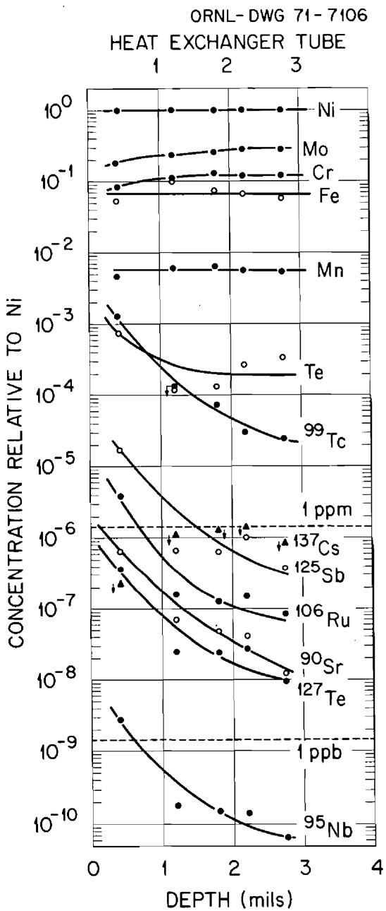  
Fig. 11.5. Concentration profiles from the fuel side of an MSRE heat exchanger tube measured about 1.5 years after reactor shutdown. (Arrows indicate level was less than or equal to that given.)

# 11.4 Metal Transfer in MSRE Salt Circuits

Cobalt-60, is formed in Hastelloy N by neutron activation of the minor amount of $^{59}\mathrm{Co}$ $(0.09\%)$ put in the alloy with nickel; the detection of $^{60}\mathrm{Co}$ activity in bulk metal serves as a measure of its irradiation history, and the detection of $^{60}\mathrm{Co}$ activity on surfaces should serve as a measure of metal transport from irradiated regions. Cobalt-60 deposits were found on segments of coolant system radiator tube, on heat exchanger tubing, and on core graphite removed from the MSRE in January 1971.

The activity found on the radiator tubing (which received a completely negligible neutron dosage) was about 160 dis $\mathrm{min}^{-1}\mathrm{cm}^{-2}$ . This must have been transported by coolant salt flowing through heat exchanger tubing activated by delayed neutrons in the fuel salt. The heat exchanger tubing exhibited subsurface activity of about $3.7\times 10^{8}$ dis/min per cubic centimeter of metal, corresponding to a delayed neutron flux in the heat exchanger of about $1\times 10^{10}$ . If metal were evenly removed from the heat exchanger and evenly deposited on the radiator tubing throughout the history of the MSRE, a metal transfer rate at full power of about 0.0005 mil/year is indicated.

Cobalt-60 activity in excess of that induced in the heat exchanger tubing was found on the fuel side of the tubing $(3.1 \times 10^{6} \text{dis min}^{-1} \text{cm}^{-2})$ and on the samples of core graphite taken from a fuel channel surface $(5 \times 10^{6}$ to $3.5 \times 10^{7} \text{dis min}^{-1} \text{cm}^{-2})$ . The higher values on the core graphite and their consistency with fluence imply that additional activity was induced by core neutrons acting on $^{59}\mathrm{Co}$ after deposition on the graphite.

The reactor vessel (and annulus) walls are the major metal regions subject to substantial neutron flux. If these served as the major source of transported metal and if this metal deposited evenly on all surfaces, a metal loss rate at full power of about 0.3 mil/year is indicated. Because deposition occurred on both the hotter graphite and cooler heat exchanger surfaces, simple thermal transport is not indicated. Thermodynamic arguments preclude oxidation by fuel.

One mechanism for the indicated metal transport might have $10\%$ of the $1.5\mathrm{W / cm}^3$ fission fragment energy in the annular fuel within a $30 - \mu$ range deposited in the metal and a small fraction of the metal sputtered into the fuel. About $0.4\%$ of the fission fragment energy entering the metal resulting in such transfer would correspond to the indicated reactor vessel loss rate of 0.3 mil/year. If this is the correct mechanism, reactors operating with higher fuel power densities

adjacent to metal should exhibit proportionately higher loss rates.

# 11.5 Cesium Isotope Migration in MSRE Graphite

Fission product concentration profiles were obtained on the graphite bar from the center of the MSRE core which was removed early in 1971. The bar had been in the core since the beginning of operation; it thus was possible to obtain profiles for 2.1-year $^{134}\mathrm{Cs}$ (a neutron capture product of the stable $^{133}\mathrm{Cs}$ daughter of 5.27-day $^{133}\mathrm{Xe}$ ) as well as the 30-year $^{137}\mathrm{Cs}$ daughter of 3.9-min $^{137}\mathrm{Xe}$ . These profiles, extending to the center of the bar, are shown in Fig. 11.6.

Graphite surveillance specimens exposed for shorter periods, and of thinner dimensions, have revealed similar profiles for $^{137}\mathrm{Cs}$ . Some of these, along with profiles of other rare-gas daughters, were used in an analysis by Kedl of the behavior of short-lived noble gases in graphite. Xenon diffusion and the possible formation of cesium carbide in molten-salt reactors have been considered by Baes and Evans.

An appreciable literature on the behavior of fission product cesium in nuclear graphite has been developed in studies for gas-cooled reactors by British investigators, the Dragon Project, Gulf General Atomic workers, and workers at ORNL.

The profiles shown in Fig. 11.6 indicate significant diffusion of cesium atoms in the graphite after their formation. The 5.27-day half-life of $^{133}\mathrm{Xe}$ must have resulted in a fairly even concentration of this isotope throughout the graphite and must have produced a flat deposition profile for $^{133}\mathrm{Cs}$ . This isotope and its neutron product $^{134}\mathrm{Cs}$ could diffuse to the bar surface and could be taken up by the salt. The $^{134}\mathrm{Cs}$ profile

shows that this occurred. The $^{134}\mathrm{Cs}$ concentration that would accumulate in graphite if no diffusion occurred has been estimated from the power history of the MSRE to be about $2 \times 10^{14}$ atoms per gram of graphite (higher if pump bowl xenon stripping is inefficient), assuming the local neutron flux was a minimum of four times the average core flux. The observed $^{134}\mathrm{Cs}$ concentration in the bar center, where diffusion effects would be least, was about $5 \times 10^{14}$ atoms of $^{134}\mathrm{Cs}$ per gram of graphite. The agreement is not unreasonable.

Data for 30-year $^{137}\mathrm{Cs}$ are shown in Fig. 11.6. For comparison, the accumulated decay profile of the parent $3.9\text{-min}^{137}\mathrm{Xe}$ is shown as a dotted line in the

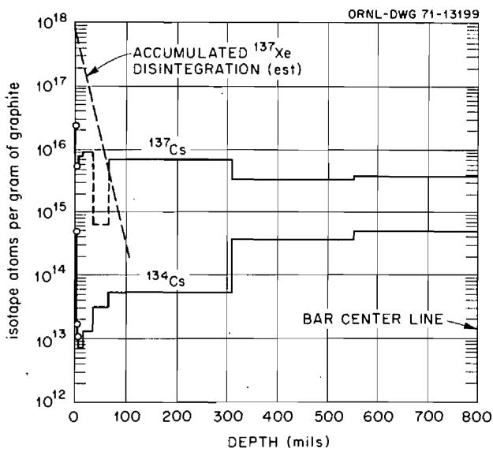  
Fig. 11.6. Concentration of cesium isotopes in MSRE core graphite at given distances from fuel channel surface.

Table 11.6. Fission products on surfaces of Hastelloy N after termination of operation expressed as (observed dis min $^{-1}$ cm $^{-2}$ )/(MSRE inventory/total MSRE surface area)   

<table><tr><td>Surface inventory</td><td>95Nb</td><td>99Tc</td><td>103Ru</td><td>106Ru</td><td>127Te</td><td>125Sb</td></tr><tr><td>Control rod thimble, bottom</td><td>0.14</td><td>1.2</td><td>1.5</td><td>0.50</td><td>1.65</td><td>3.3</td></tr><tr><td>Control rod thimble, middle</td><td>1.0</td><td>0.73</td><td>0.58</td><td>0.42</td><td>0.51</td><td>1.4</td></tr><tr><td>Mist shield outside, liquid</td><td>0.26</td><td>0.73</td><td>0.27</td><td>0.38</td><td>0.89</td><td>2.8</td></tr><tr><td>Heat exchanger, shell</td><td>0.33</td><td>1.0</td><td>0.10</td><td>0.19</td><td>1.4</td><td>2.6</td></tr><tr><td>Heat exchanger, tube</td><td>0.27</td><td>1.2</td><td>0.11</td><td>0.54</td><td>2.6</td><td>4.3</td></tr><tr><td colspan="7">MSRE inventory divided by total MSRE surface area (dis min-1cm-2)</td></tr><tr><td></td><td>8.3E10</td><td>9E5</td><td>3.3E10</td><td>3.3E9</td><td>2.0E9</td><td>3.7E8</td></tr></table>

upper left of the figure. This was estimated assuming that perfect stripping occurred in the pump bowl with a mass transfer coefficient from salt to central core graphite of $0.3\mathrm{ft / hr}^9$ and a diffusion coefficient of xenon in graphite $(10\%)$ porosity) of $1\times 10^{-5}$ $\mathrm{cm}^2 /\mathrm{sec}$

Near the surface the observed $^{137}\mathrm{Cs}$ profile is lower than the estimated deposition profile; toward the center the observed profile tapers downward but is about the imated deposition profile. This pattern should develop if diffusion of cesium occurred. The central concentration is about one-third of that near the surface. Steady diffusion into a cylinder from a constant surface source to yield a similar ratio requires that $Dt / r^2$ be about 0.14. For a cylinder of $2\mathrm{cm}$ radius and a salt circulation time of 21,788 hr, a cesium diffusion coefficient of about $7\times 10^{-9}\mathrm{cm}^2 /\mathrm{sec}$ is indicated.

Data developed for cesium-in-graphite relationships in gas-cooled reactor systems $^{1,2}$ at temperatures of 800 to $1100^{\circ}\mathrm{C}$ may be extrapolated to $650^{\circ}\mathrm{C}$ for comparison. The diffusion coefficient thereby obtained is slightly below $10^{-10}$ ; the diffusion coefficient for a gas (xenon) is about $1 \times 10^{-5} \mathrm{~cm}^{2} / \mathrm{sec}$ . Some form of surface diffusion of cesium seems indicated. This is further substantiated by the sorption behavior reported by Milstead $^{13}$ for the cesium-nuclear-graphite system.

In particular, Milstead has shown that at temperatures of 800 to $1100^{\circ}\mathrm{C}$ and concentrations of 0.04 to $1.6\mathrm{mg}$ of cesium per gram of graphite, cesium sorption on graphite follows a Freundlich isotherm (1.6 mg of cesium on $1\mathrm{m}^2$ of graphite surface corresponds to the saturation surface compound $\mathrm{CsC_8}$ ). Below this, a Langmuir isotherm is indicated. In the MSRE graphite under consideration the $^{137}\mathrm{Cs}$ content was about $10^{16}$ atoms per gram of graphite, and the 133 and 135 chains would provide similar amounts, equivalent to a total content of $0.007\mathrm{mg}$ of cesium per gram of graphite. At $650^{\circ}\mathrm{C}$ , in the absence of interference from other adsorbed species, Langmuir adsorption to this concentration should occur at a cesium partial pressure of about $2\times 10^{-18}$ atm. At this pressure, cesium transport via the gas phase should be negligible, and surface phenomena should control.

To some extent, rubidium, strontium, and barium atoms also are indicated to be similarly adsorbed and likely to diffuse in graphite.

It thus appears that for time periods of the order of a year or more the alkali and alkaline earth daughters of noble gases which get into the graphite can be expected to exhibit appreciable migration in the moderator graphite of molten-salt reactors.

# 11.6 Noble-Metal Fission Transport Model

It was noted elsewhere[14] that noble metals in MSRE salt samples acted as if they were particulate constituents of a mobile "pool" of such substances held up in the system for a substantial period and that evidence regarding this might be obtained from the activity ratio of pairs of isotopes.

Pairs of the same element, thereby having the same chemical behavior (e.g., $^{103}\mathrm{Ru}$ and $^{106}\mathrm{Ru}$ ), should be particularly effective. As produced, the activity ratio of such a pair is proportional to ratios of fission yields and decay constants. Accumulation over the operating history yields the inventory ratio, ultimately proportional (at constant fission rate) only to the ratio of fission yields. If, however, there is an intermediate holdup and release before final deposition, the activity ratio of the retained material will depend on holdup time and will fall between production and inventory values. Furthermore, the material deposited after such a holdup will, as a result, have ratio values lower than inventory. (Values for the isotope of shorter half-life, here $^{103}\mathrm{Ru}$ , will be used in the numerator of the ratio throughout our discussion.) Consequently, comparison of an observed ratio of activities (in the same sample) with associated production and inventory ratios should provide an indication of the "accumulation history" of the region represented by the sample. Since both determinations are for isotopes of the same element in the same sample (consequently subjected to identical treatment), many sampling and handling errors cancel and do not affect the ratio. Ratio values are thereby subject to less variation.

We have used the $^{103}\mathrm{Ru} / ^{106}\mathrm{Ru}$ activity ratio, among others, to examine samples of various kinds taken at various times in the MSRE operation. These include salt and gas samples from the pump bowl and other materials briefly exposed there at various times.

Data are also available from the sets of surveillance specimens removed from runs 11, 14, 18, and 20. Materials removed from the off-gas line after runs 14 and 18 offer useful data. Some information is available15 from the on-site gamma spectrometer surveys of the MSRE following runs 18 and 19, particularly with regard to the heat exchanger and off-gas line.

11.6.1 Inventory and model. The data will be discussed in terms of a "compartment" model, which will assign first-order transfer rates common for both isotopes between given regions and will assume that this behavior was consistent throughout MSRE history. Because the half-lives of $^{103}\mathrm{Ru}$ and $^{106}\mathrm{Ru}$ are quite different, 39.6 and 367 days, respectively, appreciably

different isotope activity ratios are indicated for different compartments and times as simulated operation proceeds. A sketch of a useful scheme of compartments is shown in Fig. 11.7.

We assume direct production of $^{103}\mathrm{Ru}$ and $^{106}\mathrm{Ru}$ in the fuel salt in proportion to fission rate and fuel composition as determined by MSRE history. The material is fairly rapidly lost from salt either to "surfaces" or to a mobile "particulate pool" of agglomerated material. The pool loses material to one or more final repositories, nominally "off-gas," and also may deposit material on the "surfaces." Rates are such as to result in an appreciable holdup period of the order of 50 to 100 days in the "particulate pool." Decay, of course, occurs in all compartments.

Material is also transferred to the "drain tank" as required by the history, and transport between compartments ceases in the interval.

From the atoms of each type at a given time in a given compartment, the activity ratio can be calculated, as well as an overall inventory ratio.

We shall identify samples taken from different regions of the MSRE with the various compartments and thus obtain insight into the transport paths and lags leading to the sampled region. It should be noted that a compartment can involve more than one region or kind of sample. The additional information required to establish the amounts of material to be assigned to a given region, and thereby to produce a material balance, is not available.

In comparison with the overall inventory value of $^{103}\mathrm{Ru} / ^{106}\mathrm{Ru}$ , we should expect "surface" values to equal it if the deposited material comes rapidly and only from "salt" and to be somewhat below it if, in addition, "particulate" is deposited. If there is no direct deposition from "salt" to "surface," but only "particulate," then deposited material should approach "off-gas" compartment ratio.

The "off-gas" compartment ratio should be below inventory, since it is assumed to be steadily deposited from the "particulate pool," which is richer in the long-lived $^{106}\mathrm{Ru}$ component than production, and inventory is the accumulation of production minus decay.

The particulate pool will be above inventory if material is transferred to it rapidly and lost from it at a significant rate. Slow loss rates correspond to long holdup periods, and ratio values tend toward inventory.

Differential equations involving proposed transport, accumulation, and decay of $^{103}\mathrm{Ru}$ and $^{106}\mathrm{Ru}$ atoms with respect to these compartments were incorporated into a fourth-order Runge-Kutta numerical integration scheme which was operated over the full MSRE power history.

The rates used in one calculation referred to in the discussion below show rapid loss (less than one day) from salt to particulates and surface, with about $4\%$ going directly to surface. Holdup in the particulate pool results in a daily transport of about $2\%$ per day of the pool to "off-gas," for an effective average holdup

ORNL-DWG 70-13503

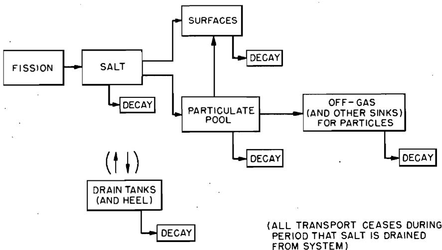  
Fig. 11.7. Compartment model for noble-metal fission transport in MSRE.

period of about 45 days. All transport processes are assumed irreversible in this scheme.

11.6.2 Off-gas line deposits. Data were reported in Sect. 10 on the examination after run 14 (March 1968) of the jumper line installed after run 9 (December 1966), on the examination after run 18 (June 1969) of parts of a specimen holder assembly from the main off-gas line installed after run 14, and on the examination of parts of line 523, the fuel pump overflow tank purge gas outlet to the main off-gas line, which was installed during original fabrication of MSRE. These data are shown in Table 11.7.

For the jumper line removed after run 14, observed ratios range from 2.4 to 7.3. By comparison the inventory ratio for the net exposure interval was 12.1. If a holdup period of about 45 days prior to deposition in the off-gas line is assumed, we calculate a lower ratio for the compartment of 7.0. It seems indicated that a holdup of ruthenium of 45 days or more is required.

Ratio values from the specimen holder removed from the 522 line after run 18 ranged between 9.7 and 5.0. Net inventory ratio for the period was 19.7, and for material deposited after a 45-day holdup, we estimated a ratio of 12.3. A longer holdup would reduce this estimate. However, we recall that gas flow through this line was appreciably diminished during the final month of run 18. This would cause the observed ratio values to be lower by an appreciable factor than would ensue from steady gas flow all the time. A holdup period of something over 45 days still appears indicated.

Flow of off-gas through line 523 was less well known. In addition to bubbler gas to measure salt depth in the overflow tank, part of the main off-gas flow from the pump bowl went through the overflow tank when flow through line 522 was hindered by deposits. The observed ratio after run 18 was 8 to 13.7, inventory was 9.6, and for material deposited after 45 days holdup the ratio is calculated to be 5.8. However, the unusually great flow during the final month of run 18 (until blockage of line 523 on May 25) would increase the observed ratio considerably. This response is consistent with the low value for material from line 522 cited above. So we believe the assumption of an appreciable holdup period prior to deposition in off-gas regions remains valid.

11.6.3 Surveillance specimens. Surveillance specimens of graphite and also selected segments of metal were removed from the core surveillance assembly after exposure throughout several runs. Table 11.8 shows values of the activity ratios for $^{103}\mathrm{Ru} / ^{106}\mathrm{Ru}$ for a number of graphite and metal specimens removed on different occasions in 1967, 1968, and 1969. Insofar as

deposition of these isotopes occurred irreversibly and with reasonable directness soon after fission, the ratio values should agree with the net inventory for the period of exposure, and the samples that had been exposed longest at a given removal time should have appropriately lower values for the $^{103}\mathrm{Ru} / ^{106}\mathrm{Ru}$ activity ratio.

Examination of Table 11.8 shows that this latter view is confirmed - the older samples do have values that are lower, to about the right extent. However, we also note that most observed ratio values fall somewhat below the net inventory values. This could come about if, in addition to direct deposition from salt onto surfaces, deposition also occurred from the holdup "pool," presumed colloidal or particulate, which was mentioned in the discussion of the off-gas deposits. Few of the observed values fall below the parenthesized off-gas values. This value was calculated to result if all the deposited material had come from the holdup pool.

Table 11.7. Ruthenium isotope activity ratios of off-gas line deposits   

<table><tr><td>Sample</td><td>Observed</td><td>Calculated</td></tr><tr><td colspan="3">I. Jumper Section of Line 522, Exposed December 1966 to March 25, 1968</td></tr><tr><td>Flextool</td><td>2.4</td><td>Productionb 58</td></tr><tr><td>Upstream hose</td><td>2.4</td><td>Net inventory 12.1</td></tr><tr><td>Downstream hose</td><td>4.1</td><td>Net deposit if:</td></tr><tr><td>Inlet dust</td><td>7.3</td><td>45-day holdup 7.0</td></tr><tr><td>Outlet dust</td><td>4.4</td><td>90-day holdup 5.5</td></tr><tr><td colspan="3">II. Specimen Holder, Line 522, Exposed August 1968 to June 1969</td></tr><tr><td>Bail end</td><td>9.7</td><td>Productionc 43</td></tr><tr><td>Flake</td><td>5.0</td><td>Net inventory 19.7</td></tr><tr><td>Tube sections</td><td>5.4, 5.9</td><td>Net deposit if:</td></tr><tr><td>Recount 7/70, corr</td><td>6, 2</td><td>45-day holdup 12.3</td></tr><tr><td></td><td></td><td>90-day holdup 9.3</td></tr><tr><td colspan="3">III. Overflow Tank Off-Gas Line (523), Exposed 1965 to June 1969</td></tr><tr><td>Valve V523</td><td>8.0</td><td>Inventory 9.6</td></tr><tr><td>Line 523</td><td>11.3, 13.7, 13.3</td><td>Net deposit if:</td></tr><tr><td>Valve HCV 523</td><td>13.3, 12.5, 10.0</td><td>45-day holdup 5.8</td></tr><tr><td></td><td></td><td>90-day holdup 4.3</td></tr></table>

$^{a}$ Corrected to time of shutdown.   
$b^{235}\mathrm{U}^{-238}\mathrm{U}$ fuel, with inbred $^{239}\mathbf{Pu}$   
$c^{233} \mathrm{U}$ fuel, including $2.1\%$ of fissions from contained $^{235} \mathrm{U}$ and $4.3\%$ from $^{239} \mathrm{Pu}$ .

Table 11.8. Ruthenium isotope activity ratios of surveillance specimens   
Observed vs calculated $\left(\frac{\mathrm{dis} / \mathrm{min}^{103}\mathrm{Ru}}{\mathrm{dis} / \mathrm{min}^{106}\mathrm{Ru}}\right)$   

<table><tr><td rowspan="2">Exposure, Runs</td><td rowspan="2">Material</td><td rowspan="2">Observed Ratios, Median Underlined</td><td colspan="3">Calculated Values of Ratio</td></tr><tr><td>Net Inventory</td><td>Plus Deposition from Holdup (45 day)</td><td>Off-Gas</td></tr><tr><td>8-11</td><td>Graphite</td><td>20,a22,23,a25,b27,52</td><td>25.5</td><td>19.2</td><td>(15.9)</td></tr><tr><td>8-14</td><td>Graphite</td><td>9,c12</td><td>11.4</td><td>8.4</td><td>(6.8)</td></tr><tr><td>12-14</td><td>Graphite Metal</td><td>11,12,d(&gt;12),13,b(&gt;13),14,(&gt;14),16,17 10,a11,12,b15</td><td>16.7</td><td>11.6</td><td>(9.3)</td></tr><tr><td>8-18</td><td>Graphite Metal basket</td><td>6,b7,a8 (3.5)b</td><td>9.8</td><td>7.2</td><td>(5.7)</td></tr><tr><td>15-18</td><td>Graphite Metal</td><td>2,10,11,b12,e13,14,15,b16,21,27 6,7,a8,9,10</td><td>19.7</td><td>14.9</td><td>(12.3)</td></tr><tr><td>19-20</td><td>Graphite Metal</td><td>10,b11,12,e13,b14,3200 6,7,e8,10,a11,a12,b13,a15</td><td>21.7</td><td>13.4</td><td>(9.6)</td></tr></table>

$^{a}$ S. S. Kirlis and F. F. Blankenship, MSR Program Semiann. Progr. Rept. Aug. 31, 1968, ORNL-4344, pp. 115-41.   
bS. S. Kirslis and F. F. Blankenship, MSR Program Semiann. Progr. Rept. Aug. 31, 1967, ORNL-4191, pp. 121-28.   
$^{c}$ F. F. Blankenship, personal communication.   
$^{d}$ E. L. Compere, MSR Program Semiann. Progr. Rept. Aug. 31, 1968, ORNL-4344, pp. 206-10.   
$^{e}$ F. F. Blankenship, S. S. Kirslis, and E. L. Compere, MSR Program Semiann. Progr. Rept. Aug. 31, 1969, ORNL-4449, pp. 104-7; Feb. 28, 1970, ORNL-4548, pp. 104-10.

Therefore we conclude that the surface deposits did not occur only by deposition of material from the "particulate pool"; calculated values are shown which assume rates which would have about two-thirds coming from a particulate pool of about 45 days holdup. The agreement is not uncomfortable.

In general, the metal segments showed lower values than graphite specimens similarly exposed, with some observed values below any corresponding calculated values. This implies that in some way in the later part of its exposure the tendency of the metal surface to receive and retain ruthenium isotope deposits became diminished, particularly in comparison with the graphite specimens. Also, the metal may have retained more particulate and less directly deposited material than the graphite, but on balance the deposits on both types of specimen appear to have occurred by a combination of the two modes.

11.6.4 Pump bowl samples. Ratio data are available on salt samples and later gas samples removed from the pump bowl spray shield beginning with run 7 in 1966. Similar data are also available for other materials exposed from time to time to the gas or liquid regions within the spray shield. Data from outer sheaths of double-walled capsules are included. Data for the activity ratios (dis/min $^{103}\mathrm{Ru}$ )/(dis/min $^{106}\mathrm{Ru}$ ) are shown for most of these in Fig. 11.8. In this figure the

activity ratios are plotted in sample sequence. Also shown on the plot are values of the overall inventory ratio, which was calculated from power history, and the production ratio, which was calculated from yields based on fuel composition. This changed appreciably during runs 4 to 14, where the plutonium content increased because of the relatively high $^{238}\mathrm{U}$ content of the fuel. The $^{106}\mathrm{Ru}$ yield from $^{239}\mathrm{Pu}$ is more than tenfold greater than its yield from $^{233}\mathrm{U}$ or $^{235}\mathrm{U}$ . The plutonium content of the fuel did not vary nearly as much during the $^{233}\mathrm{U}$ operation and was taken as constant.

Also shown are lines which have been computed assuming a particulate pool with average retention periods of 45 and 100 days. The point has been made previously that noble-metal activity associated with any materials exposed in or sampled from the pump bowl is principally from this mobile pool rather than being dissolved in salt or occurring as gaseous substances. Consequently, similar ratios should be encountered for salt and gas samples and surfaces of various materials exposed in the pump bowl.

Examination of Fig. 11.8 indicates that the preponderance of points fall between the inventory line and a line for 45 days average retention, agreeing reasonably well with an average holdup of between 45 and 100 days - but with release to off-gas, surfaces, and other

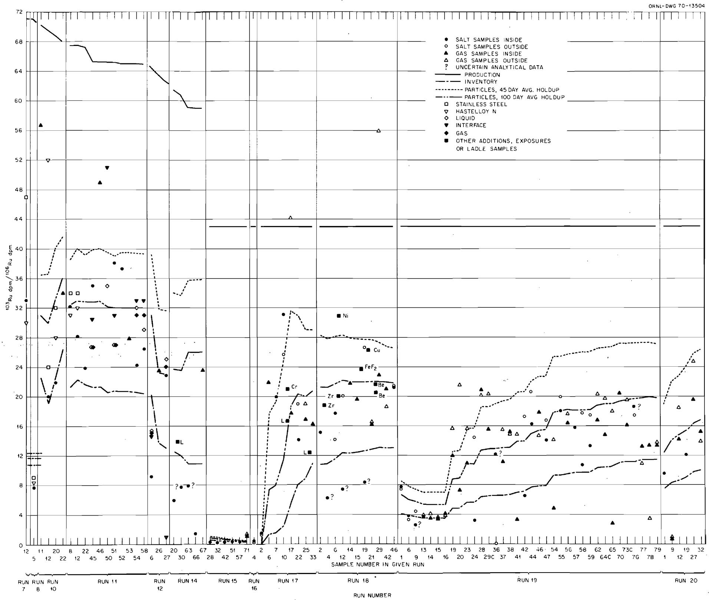  
Fig. 11.8. Ratio of ruthenium isotope activities for pump bowl samples.

regions resulting in a limited retention rather than the unlimited retention implied by an inventory value.

Although meaningful differences doubtless exist between different kinds of samples taken from the pump bowl, their similarity clearly indicates that all are taken from the same mobile pool, which loses material, but slowly enough to have an average retention period of several months.

Discussion. The data presented above represent practically all the ratio data available for MSRE samples. The data based on gamma spectrometer surveys of various reactor regions, particularly after runs 18 and 19, have not been examined in detail but in cursory views appear not too inconsistent with values given here.

It appears possible to summarize our findings about fission product ruthenium in this way:

The off-gas deposits appear to have resulted from the fairly steady accumulation of material which had been retained elsewhere for periods of the order of several months prior to deposition.

The deposits on surfaces also appear to have contained material retained elsewhere prior to deposition, though not to quite the same extent, so that an appreciable part could have been deposited soon after fission.

All materials taken from the pump bowl contain ruthenium isotopes with a common attribute: they are representative of an accumulation of several months. Thus all samples from the pump bowl presumably get their ruthenium from a common source.

Since it is reasonable to expect fission products to enter salt first as ions or atoms, presumably these rapidly deposit on surfaces or are agglomerated. The agglomerated material is not dissolved in salt but is fairly well dispersed and may deposit on surfaces to some extent. It is believed that regions associated with the pump bowl - the liquid surface, including bubbles, the shed roof, mist shield, and overflow tank - are effective in accumulating this agglomerated material. Regions with highest ratio of salt surface to salt mass (gas samples containing mist and surfaces exposed to the gas-liquid interface) have been found to have the highest quantities of these isotopes relative to the amount of salt in the sample. So the agglomerate seeks the surfaces. Since the subsurface salt samples, however, never show amounts of ruthenium in excess of inventory, it would appear that material entrained, possibly with bubbles, is fairly well dispersed when in salt.

Loss of the agglomerated material to one or more permanent sinks at a rate of 1 or $2\%$ per day is indicated. In addition to the off-gas system and to some

extent the reactor surfaces, these sinks could include the overflow tank and various nooks, crannies, and crevices if they provided for a reasonably steady irreversible loss.

Without additional information the ratio method cannot indicate how much material follows a particular path to a particular sink, but it does serve to indicate the paths and the transport lags along them for the isotopes under consideration.

# References

1. E. L. Compere and E. G. Bohlmann, "Examination of Deposits from the Mist Shield in the MSRE Fuel Pump Bowl," MSR Program. Semiannu. Prog. Rep. Feb. 28, 1971, pp. 76-85.   
2. A. Houtzeel, private communication.   
3. P. N. Haubenreich, A Review of Production and Observed Distribution of Tritium in the MSRE in the Light of Recent Findings, ORNL-CF-71-8-34 (Aug. 23, 1971). (Internal document - No further dissemination authorized.)   
4. R. B. Briggs, "Tritium in Molten Salt Reactors," Reactor Technol. 14, 335-42 (Winter 1971-1972).   
5. H. E. McCoy and B. McNabb, Intergranular Cracking of INOR-8 in the MSRE, ORNL-4829 (November 1972).   
6. S. S. Kirslis et al., "Concentration Profiles of Fission Products in Graphite," MSR Program Semiannu. Progr. Rep. Aug. 31, 1970, ORNL-4622, pp. 69-70; Feb. 28, 1970, ORNL-4548, pp. 104-5; Feb. 28, 1967, ORNL-4119, pp. 125-28; Aug. 31, 1966, ORNL-4037, pp. 180-84; D. R. Cuneo et al., "Fission Product Profiles in Three MSRE Graphite Surveillance Specimens," MSR Program Semiannu. Progr. Rep. Aug. 31, 1968, ORNL-4344, pp. 142, 144-47; Feb. 29, 1968, ORNL-4254, pp. 116, 118-22.   
7. R. J. Kedl, A Model for Computing the Migration of Very Short Lived Noble Gases into MSRE Graphite, ORNL-TM-1810 (July 1967).   
8. C. F. Baes, Jr., and R. B. Evans III, MSR Program Semiannu. Progr. Rep. Aug. 31, 1966, ORNL-4037, pp. 158-65.   
9. R. B. Briggs, "Estimate of the Afterheat by Decay of Noble Metals in MSBR and Comparison with Data from the MSRE," MSR-68-138 (Nov. 4, 1968). (Internal document - No further dissemination authorized.)   
10. R. B. Evans III, J. L. Rutherford, and A. P. Malinauskas, Gas Transport in MSRE Moderator Graphite, II. Effects of Impregnation, III. Variation of Flow Properties, ORNL-4389 (May 1969).   
11. J. Crank, p. 67 in The Mathematics of Diffusion, Oxford University Press, London, 1956.

12. H. J. de Nordwall, private communication.   
13. C. E. Milstead, "Sorption Characteristics of the Cesium-Graphite System at Elevated Temperatures and Low Cesium Pressure," Carbon (Oxford) 7, 199-200 (1969).   
14. E. L. Compere and E. G. Bohlmann, MSR Program Semiannu. Progr. Rep. Feb. 28, 1970, ORNL

4548, pp. 111-18; see also Sect. 6, this report, especially Fig. 6.5.   
15. A. Houtzeel and F. F. Dyer, A Study of Fission Products in the Molten Salt Reactor Experiment by Gamma Spectrometry, ORNL-TM-3151 (August 1972).

# 12. SUMMARY AND OVERVIEW

A detailed synthesis of all the factors known to affect fission product behavior in this reactor is not possible within the available space. Many of the comments which follow are based on a recent summary report.

Operation of the MSRE provided an opportunity for studying the behavior of fission products in an operating molten-salt reactor, and every effort was made to maximize utilization of the facilities provided, even though they were not originally designed for some of the investigations which became of interest. Significant difficulties stemmed from:

1. The salt spray system in the pump bowl could not be turned off. Thus the generation of bubbles and salt mist was ever present; moreover, the effects were not constant, since they were affected by salt level, which varied continuously.   
2. The design of the sampler system severely limited the geometry of the sampling devices.   
3. A mist shield enclosing the sampling point provided a special environment.   
4. Lubricating oil from the pump bearings entered the pump bowl at a rate of 1 to $3\mathrm{cm}^3/$ day.   
5. There was continuously varying flow and blowback of fuel salt between the pump bowl and an overflow tank.

In spite of these problems, useful information concerning fission product fates in the MSRE was gained.

# 12.1 Stable Salt-Soluble Fluorides

12.1.1 Salt samples. The fission products Rb, Cs, Sr, Ba, the lanthanides and Y, and Zr all form stable fluorides which are soluble in fuel salt. These fluorides would thereby be expected to be found completely in the fuel salt except in those cases where there is a noble-gas precursor of sufficiently long half-life to be appreciably stripped to off-gas. Table 12.1 summarizes data from salt samples obtained during the $^{233}\mathrm{U}$ operation of the MSRE for fission products with and without significant noble-gas precursors. As expected, the isotopes with significant noble-gas precursors ( $^{89}\mathrm{Sr}$ and $^{137}\mathrm{Cs}$ ) show ratios to calculated inventory appreciably lower than those without, which generally scatter around or somewhat above 1.0.

12.1.2 Deposition. Stable fluorides showed little tendency to deposit on Hastelloy N or graphite. Examinations of surveillance specimens exposed in the core of the MSRE showed only 0.1 to $0.2\%$ of the isotopes without noble-gas precursors on graphite and Hatselloy N. The bulk of the amount present stemmed from fission recoils and was generally consistent with the flux pattern.

However, the examination of profiles and deposit intensities indicated that nuclides with noble-gas precursors were deposited within the graphite by the decay of the noble gas that had diffused into the relatively porous graphite. Clear indication was noted of a further

Table 12.1. Stable fluoride fission product activity as a fraction of calculated inventory in salt samples from $^{233}\mathrm{U}$ operation   

<table><tr><td rowspan="2">Nuclide</td><td colspan="4">Without significant noble-gas precursor</td><td colspan="4">With noble-gas precursor</td></tr><tr><td>95Zr</td><td>141Ce</td><td>144Ce</td><td>147Nd</td><td>89Sr</td><td>137Cs</td><td>91Y</td><td>140Ba</td></tr><tr><td>Weighted yield, %a</td><td>6.01</td><td>6.43</td><td>4.60</td><td>1.99</td><td>5.65</td><td>6.57</td><td>5.43</td><td>5.43</td></tr><tr><td>Half-life, days</td><td>65</td><td>33</td><td>284</td><td>11.1</td><td>52</td><td>30 yr.</td><td>58.8</td><td>12.8</td></tr><tr><td>Noble-gas precursor</td><td></td><td></td><td></td><td></td><td>89Kr</td><td>137Xe</td><td>91Kr</td><td>140Xe</td></tr><tr><td>Precursor half-life</td><td></td><td></td><td></td><td></td><td>3.2 min</td><td>3.9 min</td><td>9.8 sec</td><td>16 sec</td></tr><tr><td>Activity in saltb</td><td></td><td></td><td></td><td></td><td></td><td></td><td></td><td></td></tr><tr><td>Runs 15–17</td><td>0.88–1.09</td><td>0.87–1.04</td><td>1.14–1.25</td><td>0.99–1.23</td><td>0.67–0.97</td><td>0.82–0.93</td><td>0.83–1.46</td><td>0.82–1.23</td></tr><tr><td>Run 18</td><td>1.05–1.09</td><td>0.95–0.99</td><td>1.16–1.36</td><td>0.82–1.30</td><td>0.84–0.89</td><td>0.86–0.99</td><td>1.16–1.55</td><td>1.10–1.20</td></tr><tr><td>Runs 19–20</td><td>0.95–1.02</td><td>0.89–1.04</td><td>1.17–1.28</td><td>1.10–1.34</td><td>0.70–0.95</td><td>0.81–0.98</td><td>1.13–1.42</td><td>1.02–1.20</td></tr></table>

${}^{a}$ Allocated fission yields: ${93.2}{\% }^{233}\mathrm{U},{2.3}{\% }^{235}\mathrm{U},{4.5}{\% }^{239}\mathrm{{Pu}}$ .   
$b$ As fraction of calculated inventory. Range shown is 25-75 percentile of sample; thus half the sample values fall within this range.

diffusion of the relatively volatile cesium isotopes, and possibly also of Rb, Sr, and Ba, after production within graphite.

12.1.3 Gas samples. Gas samples obtained from the gas space in the pump bowl mist shield were consistent with the above results for the salt-seeking isotopes with and without noble-gas precursors. Table 12.1 shows the percentages of these isotopes which were estimated to be in the pump bowl stripping gas, based on the amounts found in gas samples. Agreement with expected amounts where there were strippable noble-gas precursors is satisfactory considering the mist shield, contamination problems, and other experimental difficulties. Gamma spectrometer examination of the off-gas line showed little activity due to salt-seeking isotopes without noble-gas precursors. Examinations of sections of the off-gas line also showed only small amounts of these isotopes present.

# 12.2 Noble Metals

The so-called noble metals showed a tantalizingly ubiquitous behavior in the MSRE, appearing as saltborne, gas-borne, and metal- and graphite-penetrating species. Studies of these species included isotopes of Nb, Mo, Tc, Ru, Ag, Sb, and Te.

12.2.1 Salt-borne. The concentrations of five of the noble-metal nuclides found in salt samples ranged from fractions to tens of percent of inventory from sample to sample. Also, the proportionate composition of these isotopes remained relatively constant from sample to sample in spite of the widely varying amounts found. Silver-111, which clearly would be a metal in the MSRE salt and has no volatile fluorides, followed the pattern quite well and also was consistent in the gas samples. This strongly supports the contention that we were dealing with metal species.

These results suggest the following about the noble metals in the MSRE.

1. The bulk of the noble metals remain accessible in the circulating loop but with widely varying amounts in circulation at any particular time.   
2. In spite of this wide variation in the total amount found in a particular sample, the proportional composition is relatively constant, indicating that the entire inventory is in substantial equilibrium with the new material being produced.   
3. The mobility of the pool of noble-metal material suggests that deposits occur as an accumulation of finely divided, well-mixed material rather than as a "plate."

No satisfactory correlation of noble-metal concentration in the salt samples and any operating parameter could be found.

In order to obtain further understanding of this particulate pool, the transport paths and lags of noble-metal fission products in the MSRE were examined using all available data on the activity ratio of two isotopes of the same element, 39.6-day $^{103}\mathrm{Ru}$ and 367-day $^{106}\mathrm{Ru}$ . Data from graphite and metal surveillance specimens exposed for various periods and removed at various times, for material taken from the off-gas system, and for salt and gas samples and other materials exposed to pump bowl salt were compared with appropriate inventory ratios and with values calculated for indicated lags in a simple compartment model. This model assumed that salt rapidly lost ruthenium fission product formed in it, some to surfaces and most to a separate mobile "pool" of noble-metal fission product, presumably particulate or colloidal and located to an appreciable extent in pump bowl regions. Some of this "pool" material deposited on surfaces and also appears to be the source of the off-gas deposits. All materials sampled from or exposed in the pump bowl appear to receive their ruthenium activity jointly from the pool of retained material and from more direct deposition as produced. Adequate agreement of observed data with indications of the model resulted when holdup periods of 45 to 90 days were assumed.

12.2.2 Niobium. Niobium is the most susceptible of the noble metals to oxidation should the $\mathrm{U}^{4+}/\mathrm{U}^{3+}$ ratio be allowed to get too high. Apparently this happened at the start of the $^{233}\mathrm{U}$ operation, as was indicated by a relatively sharp rise in $\mathrm{Cr}^{2+}$ concentration; it was also noted that 60 to about $100\%$ of the calculated $^{95}\mathrm{Nb}$ inventory was present in the salt samples. Additions of a reducing agent (beryllium metal), which inhibited the $\mathrm{Cr}^{2+}$ buildup, also resulted in the disappearance of the $^{95}\mathrm{Nb}$ from the salt. Subsequently the $^{95}\mathrm{Nb}$ reappeared in the salt several times for not always ascertainable reasons and was caused to leave the salt by further reducing additions. As the $^{233}\mathrm{U}$ operations continued, the percentage of $^{95}\mathrm{Nb}$ which reappeared decreased, suggesting both reversible and irreversible sinks. The $^{95}\mathrm{Nb}$ data did not correlate closely with the Mo-Ru-Te data discussed, nor was there any observable correlation of its behavior with amounts found in gas samples.   
12.2.3 Gas-borne. Gas samples taken from the pump bowl during the $^{235}\mathrm{U}$ operation indicated concentrations of noble metals that implied that substantial percentages (30 to 100) of the noble metals being

produced in the MSRE fuel system were being carried out in the 4 liters (STP)/min helium purge gas. The data obtained in the $^{233}\mathrm{U}$ operation with substantially improved sampling techniques indicated much lower transfers to off-gas. In both cases it is assumed that the noble-metal concentration in a gas sample obtained inside the mist shield was the same as that in the gas leaving the pump bowl proper. (The pump bowl was designed to minimize the amount of mist in the sampling area and also at the gas exit port.) It is our belief that the $^{233}\mathrm{U}$ period data are representative and that the concentrations indicated by the gas samples taken during $^{235}\mathrm{U}$ operation are anomalously high because of contamination. This is supported by direct examination of a section of the off-gas system after completion of the $^{235}\mathrm{U}$ operation. The large amounts of noble metals that would be expected on the basis of the gas sample indications were not present. Appreciable (10 to $17\%$ ) amorphous carbon was found in dust samples recovered from the line, and the amounts of noble metals roughly correlated with the amounts of carbon. This suggests the possibility of noble-metal absorption during cracking of the oil.

In any event the gas transport of noble metals appears to have been as constituents of particulates. Analysis of

the deposition of flowing aerosols in conduits developed relationships between observable deposits and flowing concentrations or fractions of production to off-gas for diffusion and thermophoresis mechanisms. The thermophoretic mechanism was indicated to be dominant; the fraction of noble-metal production carried into off-gas, based on this mechanism, was slight (much below $1\%$ ).

# 12.3 Deposition in Graphite and Hastelloy N

The results from core surveillance specimens and from postoperation examination of components revealed that differences in deposit intensity for noble metals occurred as a result of flow conditions and that deposits on metal were appreciably heavier than on graphite, particularly for tellurium and its precursor antimony.

The final surveillance specimen array, exposed for the last four months of MSRE operations, had graphite and metal specimens matched as to configuration in varied flow conditions. The relative deposition intensities (1.0 if the entire inventory was spread evenly over all surfaces) were as shown in Table 12.2.

The examination of some segments excised from particular reactor components, including core metal and graphite, pump bowl, and heat exchanger surfaces, one

Table 12.2. Relative deposition intensities for noble metals   

<table><tr><td rowspan="2">Surface</td><td rowspan="2">Flow regime</td><td colspan="8">Deposition intensity</td></tr><tr><td>95Nb</td><td>99Mo</td><td>99Tc</td><td>103Ru</td><td>106Ru</td><td>125Sb</td><td>129mTe</td><td>132Te</td></tr><tr><td colspan="10">Surveillance specimens</td></tr><tr><td rowspan="2">Graphite</td><td>Laminar</td><td>0.2</td><td>0.2</td><td></td><td>0.06</td><td>0.16</td><td></td><td>0.15</td><td></td></tr><tr><td>Turbulent</td><td>0.2</td><td></td><td></td><td>0.04</td><td>0.10</td><td></td><td>0.07</td><td></td></tr><tr><td rowspan="2">Metal</td><td>Laminar</td><td>0.3</td><td>0.5</td><td></td><td>0.1</td><td>0.3</td><td></td><td></td><td>0.9</td></tr><tr><td>Turbulent</td><td>0.3</td><td>1.3</td><td></td><td>0.1</td><td>0.3</td><td></td><td></td><td>2.0</td></tr><tr><td colspan="10">Reactor components</td></tr><tr><td colspan="10">Graphite</td></tr><tr><td>Core bar channel</td><td>Turbulent</td><td></td><td></td><td></td><td></td><td></td><td></td><td></td><td></td></tr><tr><td>Bottom</td><td></td><td>0.54</td><td></td><td>0.07</td><td></td><td>0.25</td><td>0.65</td><td>0.46a</td><td></td></tr><tr><td>Middle</td><td></td><td>1.09</td><td></td><td></td><td></td><td>1.06</td><td>1.90</td><td>0.92a</td><td></td></tr><tr><td>Top</td><td></td><td>0.23</td><td></td><td></td><td></td><td>0.29</td><td>0.78</td><td>0.62a</td><td></td></tr><tr><td colspan="10">Metal</td></tr><tr><td>Pump bowl</td><td>Turbulent</td><td>0.26</td><td></td><td>0.73</td><td>0.27</td><td>0.38</td><td>2.85</td><td>0.89a</td><td></td></tr><tr><td>Heat exchanger shell</td><td>Turbulent</td><td>0.33</td><td></td><td>1.0</td><td>0.10</td><td>0.19</td><td>2.62</td><td>1.35a</td><td></td></tr><tr><td>Heat exchanger tube</td><td>Turbulent</td><td>0.27</td><td></td><td>1.2</td><td>0.11</td><td>0.54</td><td>4.35</td><td>2.57a</td><td></td></tr><tr><td colspan="10">Core</td></tr><tr><td colspan="10">Rod thimble</td></tr><tr><td>Bottom</td><td>Turbulent</td><td>1.42</td><td></td><td>1.23</td><td>1.54</td><td>0.50</td><td>3.27</td><td>1.65a</td><td></td></tr><tr><td>Middle</td><td>Turbulent</td><td>1.00</td><td></td><td>0.73</td><td>0.58</td><td>0.42</td><td>1.35</td><td>0.54a</td><td></td></tr></table>

year after shutdown also revealed appreciable accumulation of these substances. The relative deposition intensities at these locations are also shown in Table 12.2.

It is evident that net deposition generally was more intense on metal than on graphite, and for metal was more intense under more turbulent flow. Surface roughness had no apparent effect.

Extension to all the metal and graphite areas of the system would require knowledge of the effects of flow conditions in each region and the fraction of total area represented by the region. (Overall, metal area was $26\%$ of the total and graphite $74\%$ .)

Flow effects have not been studied experimentally; theoretical approaches based on atom mass transfer through salt boundary layers, though a useful frame of reference, do not in their usual form take into account the formation, deposition, and release of fine particulate material such as that indicated to have been present in the fuel system. Thus, much more must be learned about the fates of noble metals in molten-salt reactors before their effects on various operations can be estimated reliably.

Although the noble metals are appreciably deposited on graphite, they do not penetrate any more than the salt-seeking fluorides without noble-gas precursors.

The more vigorous deposition of noble-metal nuclides on Hastelloy N was indicated by postoperation examination to include penetration into the metal to a slight extent. Presumably this occurred along grain-boundary cracks, a few mils deep, which had developed during extended operation, possibly because of the deposited fission product tellurium.

# 12.4 Iodine

The salt samples indicated considerable $^{131}\mathrm{I}$ was not present in the fuel, the middle quartiles of results ranging from 45 to $71\%$ of inventory with a median of $62\%$ . The surveillance specimens and gas samples accounted for less than $1\%$ of the rest. The low tellurium material balances suggest the remaining $^{131}\mathrm{I}$ was permanently removed from the fuel as $^{131}\mathrm{Te}$ (half-life, $25\mathrm{min}$ ). Gamma spectrometer studies indicated the $^{131}\mathrm{I}$ formed in contact with the fuel returned to it; thus the losses must have been to a region or regions not in contact with fuel. This strongly suggests off-gas, but the iodine and tellurium data from gas samples and examinations of off-gas components do not support such a loss path. Thus, of the order of one-fourth to one-third of the iodine has not been adequately accounted for.

It is recognized that, as shown in gas-cooled reactor studies, $^{2-5}$ fission product iodine may be at partial pressures in off-gas helium that are too low for iodine to be fixed by steel surfaces at temperatures above about $400^{\circ}\mathrm{C}$ . However, various off-gas surfaces at or downstream from the jumper line outlet were below such temperatures and did not indicate appreciable iodine deposition. Combined with low values in gas samples, this indicates little iodine transport to off-gas.

# 12.5 Evaluation

The experience with the MSRE showed that the noble gases and stable fluorides behaved as expected based on their chemistry. The noble-metal behavior and fates, however, are still in part a matter of conjecture. Except for niobium under unusually oxidizing conditions, it seems clear that these elements are present as metals and that their ubiquitous properties stem from that fact since metals are not wetted by, and have extremely low solubilities in, molten-salt reactor fuels. Unfortunately the MSRE observations probably were substantially affected by the spray system, oil cracking products, and flow to and from the overflow, all of which were continuously changing, uncontrolled variables. The low material balance on $^{131}\mathrm{I}$ indicates appreciable undetermined loss from the MSRE, probably as a noble-metal precursor (Te, Sb).

Table 12.3 shows the estimated distribution of the various fission products in a molten-salt reactor, based on the MSRE studies. Unfortunately the wide variance and poor material balances for the data on noble metals make it unrealistic to specify their fates more than qualitatively. As a consequence, future reactor designs must allow for encountering appreciable fractions of the noble metals in all regions contacted by circulating fuel. As indicated in the table, continuous chemical processing and the processes finally chosen will substantially affect the fates of many of the fission products.

# References

1. M. W. Rosenthal, P. N. Haubenreich, and R. B. Briggs, The Development Status of Molten Salt Breeder Reactors, ORNL-4812 (August 1972), especially chap. 5, "Fuel and Coolant Chemistry," by W. R. Grimes, E. G. Bohrmann, et al., pp. 95-173.   
2. E. Hoinkis, A Review of the Adsorption of Iodine on Metal and Its Behavior in Loops, ORNL-TM-2916 (May 1970).   
3. C. E. Milstead, W. E. Bell, and J. H. Norman, "Deposition of Iodine on Low Chromium-Alloy Steels", Nucl. Appl. Technol. 7, 361-66 (1969).

Table 12.3. Indicated distribution of fission products in molten-salt reactors   

<table><tr><td rowspan="2">Fission product group</td><td rowspan="2">Example isotopes</td><td colspan="5">Distribution (%)</td></tr><tr><td>In salt</td><td>To metal</td><td>To graphite</td><td>To off-gas</td><td>Other</td></tr><tr><td>Stable salt seekers</td><td>Zr-95, Ce-144, Nd-147</td><td>~99</td><td>Negligible</td><td>&lt; 1 (fission recoils)</td><td>Negligible</td><td>Processinga</td></tr><tr><td>Stable salt seekers (noble gas precursors)</td><td>Sr-89, Cs-137, Ba-140, Y-91</td><td>Variable/T1/2of gas</td><td>Negligible</td><td>Low</td><td>Variable/T1/2of gas</td><td></td></tr><tr><td>Noble gases</td><td>Kr-89, Kr-91, Xe-135, Xe-137</td><td>Low/T1/2of gas</td><td>Negligible</td><td>Low</td><td>High/T1/2of gas</td><td></td></tr><tr><td>Noble metals</td><td>Nb-95, Mo-99, Ru-106, Ag-111</td><td>1-20</td><td>5-30</td><td>5-30</td><td>Negligible</td><td>Processingb</td></tr><tr><td>Tellurium, antimony</td><td>Te-129, Te-127, Sb-125</td><td>1-20</td><td>20-90</td><td>5-30</td><td>Negligible</td><td>Processingb</td></tr><tr><td>Iodine</td><td>I-131, I-135</td><td>50-75</td><td>&lt; 1</td><td>&lt; 1</td><td>Negligible</td><td>Processingc</td></tr></table>

${}^{a}$ For example,zirconium tends to accumulate with protactinium holdup in reductive extraction processing.   
$b$ Particulate observations suggest appreciable percentages will appear in processing streams.   
Substantial iodine could be removed if side-stream stripping is used to remove I-135.

4. P. R. Rowland, W. E. Browning, and M. Carlyle, Behavior of Iodine Isotopes in a High Temperature Gas Reactor Coolant Circuit, D. P. Report 736 (November 1970).

5. E. L. Compere, M. F. Osborne, and H. J. deNordwall, Iodine Behavior in an HTGR, ORNL-TM-4744 (February 1975).

# INTERNAL DISTRIBUTION

1-3. MSRP Director's Office Bldg. 4500NM, Rm. 147 (3)

4. E. J. Allen

5. R. F. Apple

6. C. F. Baes, Jr.

7. C. E. Bamberger

8. C. J. Barton

9. E. L. Beahm

10. S. E. Beall

11. H. C. Beeson

12. J. T. Bell

13. M. Bender

14. M. R. Bennett

15. C. E. Bettis

16. E. S. Bettis

17. A. L. Boch

20. E.G. Bohlmann (3)

21. C. Brashear

22. D. N. Braski

23. J. Braunstein

24. M. A. Bredig

25. R. B. Briggs

26. C. R. Brinkman

27. H. R. Bronstein

28. R. E. Brooksbank

29. C. H. Brown

30. K. B. Brown

31. G. D. Brunton

32. J. Brynestad

33. W. D. Burch

34. S. C. Cantor

35. D.W.Cardwell

36. J. A. Carter

37. W. L. Carter

38. B. R. Clark

39. R. E. Clausing

40. C. R. Coleman

41. A. L. Compere

42-56. E. L. Compere (15)

57. J. A. Conlin

58. W. H. Cook

59. J. H. Cooper

60. L. T. Corbin

61. R. M. Counce

62. G.E.Creek

63. J. L. Crowley

64. F. L. Culler

65. J. M. Dale

66. F. L. Daley

67. J. H. DeVan

68. S. E. Dismuke

69. J. R. DiStefano

70. S. J. Ditto

71. A. S. Dworkin

72. F. F. Dyer

73. W. P. Eatherly

74. R. L. Egli, ERDA-ORO

75. J.R. Engel

76. R. B. Evans, III

77. L. L. Fairchild

78. G.G.Fee

79. D. E. Ferguson

80. L. M. Ferris

81. C. H. Gabbard

82. L. O. Gilpatrick

83. J. C. Griess

84. W. R. Grimes

85. A. G. Grindell

86. R. H. Guymon

87. W. O. Harms

88. P. N. Haubenreich

89. P. W. Hembrec

90. P. G. Herndon

91. R. F. Hibbs

92. J. R. Hightower, Jr.

93. R. M. Hill

94. B. F. Hitch

95. H. W. Hoffman

96. P. P. Holz

97. R.W. Horton

98. A. Houtzell

99. W. R. Huntley

100. C. R. Hyman

101. P. R. Kasten

102. R. J. Kedl

103. C.W. Kee

104. J. R. Keiser

105. O. L. Keller

106: M. J. Kelly

107. A. D. Kelmers

108. H. T. Kerr

109. E. M. King

110. H.W. Kohn

111. U. Koskela

112. W. R. Laing

113. C.E. Lamb

114. J. M. Leitnaker

115. R. B. Lindauer

116. T. B. Lindemer

117. R. L. Lines

118. E. L. Long

119. R. A. Lorenz

120. M. I. Lundin

121. R. N. Lyon

122. R. B. Macklin

123. H. G. MacPherson

124. R. E. MacPherson

125. A. P. Malinauskas

126. G. Mamantov

127. D. L. Manning

128. W. R. Martin

129. C. L. Matthews, ERDA-ORO

130. L. Maya

131. G. T. Mays

132. H. E. McCoy

133. H. F. McDuffie

134. C. J. McHargue

135. H. A. McLain

136. B. McNabb

137. A. S. Meyer

138. J. H. Moneyhun

139. R. L. Moore

140. M. T. Morgan

141. J.W. Myers

142. F. H. Neill

143. J. P. Nichols

144. M. F. Osborne

145. G.W. Parker

146. H. A. Parker

147. W. W. Parkinson

148. P. Patriarca

149. R. L. Pearson

150. R. B. Perez

151. A. M. Perry, Jr.

152. T. W. Pickel

153. C. B. Pollock

154. F. A. Posey

155. H. Postma

156. B.E. Prince

157. H. P. Raaen

158. R.H. Rainey

159. E. Ricci

160. R. R. Rickard

161. R. C. Robertson

162. T. K. Roche

163. M. W. Rosenthal

164. J. L. Rutherford

165. A. D. Ryon

166. H. C. Savage

167. W.F. Schaffer, Jr.

168. C. D. Scott

169. D. Scott

170. H. E. Seagren

171. J. H. Shaffer

172. W. D. Shults

173. M. D. Silverman

174. M. J. Skinner

175. A. N. Smith

176. F.J. Smith

177. G.P. Smith

178. I. Spiewak

179. J. O. Stiegler

180. R. A. Strehlow

181. C. K. Talbott

182. J. R. Tallackson

183. O.K. Tallent

184. R.E. Thoma

185. J. A. Thompson

186. L. M. Toth

187. D. B. Trauger

188. W.E. Unger

189. D. Y. Valentine

190. W. C. Waggener

191. A. A. Walls

192. T. N. Washburn

193. J. S. Watson

194. A. M. Weinberg, ORAU

195. J. R. Weir

196. J. C. White

197. R. P. Wichner

198. M. K. Wilkinson

199. W. R. Winsbro

200. J. W. Woods

201. R. G. Wymer

202. J. P. Young

203. E. L. Youngblood

204-205. Central Research Library (2)

206. Document Reference Section

207-209. Laboratory Records (3)

210. Laboratory Records (LRD-RC)

# EXTERNAL DISTRIBUTION

211. Research and Technical Support Division, Energy Research and Development Administration, Oak Ridge, Operations Office, Post Office Box E, Oak Ridge, TN 37830   
212. Director, Reactor Division, Energy Research and Development Administration, Oak Ridge Operations Office, Post Office Box E, Oak Ridge, TN 37830   
213-214. Director, Division of Reactor Research and Development, Energy Research and Development Administration, Washington, D.C. 20545   
215-318. For distribution as shown in TID-4500 under UC-76, Molten-Salt Reactor Technology