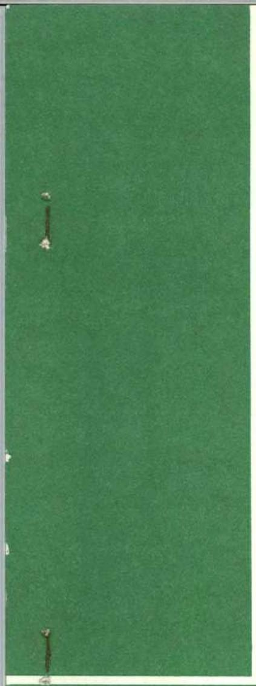

# DEVELOPMENT AND CONSTRUCTION OF A MOLYBDENUM TEST STAND

OAK RIDGE NATIONAL LABORATORY

CENTRAL RESEARCH LIBRARY

DOCUMENT COLLECTION

LIBRARY LOAN COPY

DO NOT TRANSFER TO ANOTHER PERSON

If you wish someone else to see this

document, send in name with document

and the library will arrange a loan.

UCN-7969

(3) $3 - {67}$

OAK RIDGE NATIONAL LABORATORY

OPERATED BY UNION CARBIDE CORPORATION • FOR THE U.S. ATOMIC ENERGY COMMISSION

Printed in the United States of America. Available from

National Technical Information Service

U.S. Department of Commerce

5285 Port Royal Road, Springfield, Virginia 22151

Price: Printed Copy $5.45; Microfiche $0.95

This report was prepared as an account of work sponsored by the United States Government. Neither the United States nor the United States Atomic Energy Commission, nor any of their employees, nor any of their contractors, subcontractors, or their employees, makes any warranty, express or implied, or assumes any legal liability or responsibility for the accuracy, completeness or usefulness of any information, apparatus, product or process disclosed, or represents that its use would not infringe privately owned rights.

Contract No. W-7405-eng-26

METALS AND CERAMICS DIVISION

# DEVELOPMENT AND CONSTRUCTION OF A MOLYBDENUM TEST STAND

Compiled by

J.R.DiStefano A.J.Moorhead

Principal Contributors

N.C.Cole R.E.McDonald

J.R.DiStefano A.J.Moorhead

December 1972

OAK RIDGE NATIONAL LABORATORY

Oak Ridge, Tennessee 37830

operated by

UNION CARBIDE CORPORATION

for the

U.S. ATOMIC ENERGY COMMISSION

# CONTENTS

Abstract 1

Introduction 1

Design of Test Stand 3

Fabrication Development 6

Primary Fabrication of Molybdenum Components 6

Tubing Development 10

Joining Development 14

Welding 14

Brazing 27

Mechanical Couplings 34

Construction 38

Mockup Construction 38

Fabrication and Prefit of Components 41

Fabrication of Subassemblies 42

Interconnection of Subassemblies 43

Acknowledgments 43

Appendix A - Specifications for Purchase of Molybdenum Tubing 44

Appendix B - Electron Beam Welding Parameters for Tube-to-Header Joints 57

Appendix C - Parameters for Welding of Butt Joints in Molybdenum Tubing Using an Orbiting-Arc Weld Head 58

# DEVELOPMENT AND CONSTRUCTION OF A MOLYBDENUM TEST STAND

Compiled by

J.R.DiStefano A.J.Moorhead

Principal Contributors

N.C.Cole R.E.McDonald

J.R.DiStefano A.J.Moorhead

# ABSTRACT

The discovery of a process that uses liquid bismuth at 500 to $700^{\circ}\mathrm{C}$ to remove protactinium and fission products from the molten salt fuel of a breeder reactor led to a search for suitable containment materials. Although several other refractory metals or graphite may be suitable, molybdenum appears most promising. Therefore low-carbon, low-oxygen molybdenum prepared by arc casting was chosen as the structural material for a reductive-extraction test stand that would be representative of typical equipment. We recognized that the use of molybdenum as a structural material would require unorthodox assembly procedures and impose stringent limitations on the system design. However, this material apparently possesses the best combination of properties such as fabricability, and oxidation and corrosion resistance. Final design was determined after the development of appropriate fabrication and joining techniques.

Procedures were developed for the production of closed-end molybdenum half sections by back extrusion. Parts that were generally free from cracks and had high-quality surfaces were produced by the use of $\mathrm{ZrO_2}$ -coated plungers and dies and extrusion blank preheat temperatures of 1600 to $1700^{\circ}\mathrm{C}$ . In cooperation with a commercial vendor, we found that molybdenum tubing with improved ductility could be produced by careful removal of contamination introduced during tubing fabrication.

Complex components were fabricated by welding, using either the gas tungsten- arc or electron-beam process. Welding studies centered on three major types of joint: tube-to-tube, tube-to header, and header-to-header. Two of the most important factors found to minimize weld hot cracking were stress relieving and preheating of components prior to welding. Mechanical bonding techniques were developed to join small-diameter tubing to back-extruded end sections. Experiments carried out at $250^{\circ}\mathrm{C}$ in an argon atmosphere produced helium leak-tight joints. Brazing filler metals were developed that are reasonably corrosion resistant to bismuth and molten salt up to $700^{\circ}\mathrm{C}$ . Techniques involving induction or resistance heating were developed to braze the several types of joints used in the test stand.

The Molten-Salt Reactor Program was terminated before construction of the test stand was completed, but an unjoined mockup using molybdenum components was assembled, and detailed assembly procedures were worked out. All of the techniques required for final assembly were demonstrated.

# INTRODUCTION

A key feature in the conceptual design of the single-fluid molten-salt breeder reactor is the connecting chemical processing plant to continuously remove protactinium and fission products from the fuel salt (Fig. 1). Protactinium, the intermediate element in the breeding chain between thorium and $^{233}\mathrm{U}$ , has a significant neutron capture cross section and must be kept out of the core to obtain a good breeding ratio. Rare-earth fission products are also neutron poisons and must likewise be removed for good breeding. In 1968 the chemical feasibility of a process that uses liquid bismuth containing dissolved lithium and thorium as reductants to extract protactinium and rare earths from fuel salt containing both uranium and thorium was demonstrated. A simplified flowsheet based on this process is shown in Fig. 2.

One of the requirements for the development of the reductive-extraction process is identifying materials that are compatible with both molten fluoride salts and bismuth containing reductants. Hastelloy N

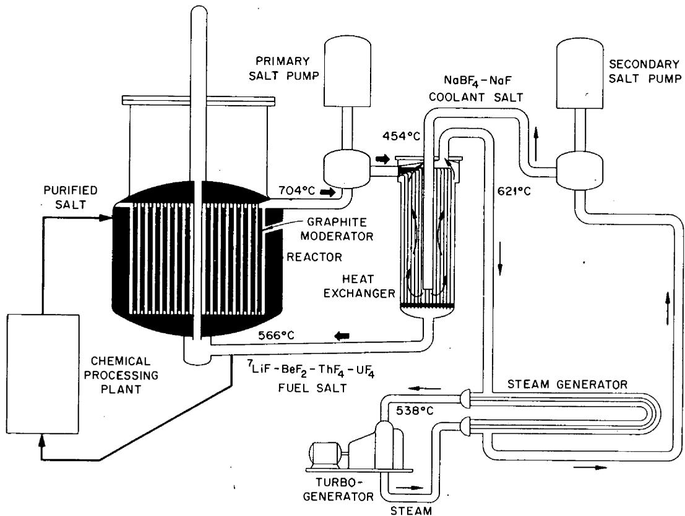  
Fig. 1. Single-fluid, two-region molten-salt breeder reactor.

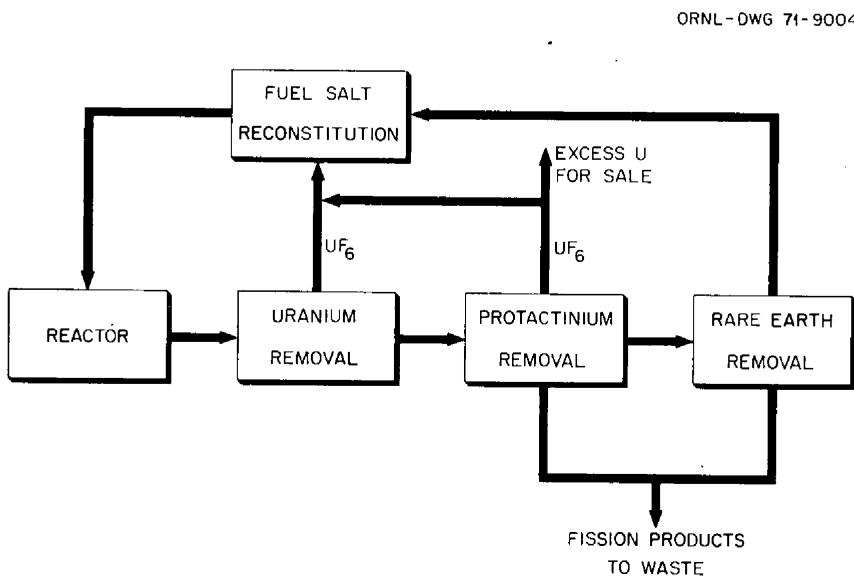  
Fig. 2. Simplified flowsheet for processing the fuel in a molten-salt breeder reactor.

$(\mathrm{Ni}-7\% \mathrm{Cr}-16\% \mathrm{Mo}-5\% \mathrm{Fe})$ is a likely material of construction for the reactor because it has excellent compatibility with molten salts at 500 to $700^{\circ}\mathrm{C}$ . However, nickel has appreciable solubility in bismuth at these temperatures and, therefore, is unsuitable for those portions of a processing plant that have to contain liquid bismuth. Other commonly used construction materials such as iron- or cobalt-base alloys have lower solubilities in bismuth but rapidly mass-transfer under conditions involving a temperature gradient. Several refractory metals (tantalum, molybdenum, tungsten, rhenium) $^{2,3}$ and graphite $^{4}$ appear promising, but each has limitations with respect to either fabricability, oxidation resistance, or compatibility with bismuth and salt.

When it was proposed to build a reductive-extraction column that would be representative of typical equipment and in which distribution coefficients for various elements could be checked and engineering performance data determined, molybdenum was chosen as the material of construction. We felt that it possessed the best combination of properties required for the processing application, namely, corrosion and oxidation resistance, availability, and fabricability. However, no system this complex had ever been constructed of molybdenum, and we foresaw many difficult fabrication problems that would have to be solved.

Molybdenum is a particularly structure-sensitive material; that is, its mechanical properties are known to vary widely, depending upon how it has been metallurgically processed. The ductile-brittle transition temperature of molybdenum varies from below room temperature to $200 - 300^{\circ}\mathrm{C}$ , depending both upon strain rate and the microstructure of the metal. Maximum ductility is provided in the stress-relieved fine-grained condition, and recrystallization and grain growth are known to reduce fracture stress and ductility. Interstitial impurities such as oxygen and carbon often segregate at grain boundaries, and this can result in a decrease in grain-boundary mobility which also favors premature fracture and low ductility.[5] However, recent advances in vacuum-melting practices have led to the production of material with improved and more reproducible metallurgical properties. The arc-melted low-carbon, low-oxygen grade of molybdenum, available commercially, affords relatively good control of grain size and interstitial impurity level. Nevertheless, the use of molybdenum as a structural material requires highly unorthodox assembly procedures and imposes stringent limitations on system design from the standpoint of geometry and rigidity.

# DESIGN OF TEST STAND

The principal molybdenum components of the test stand are the column, disengaging pots, bismuth and salt feed pots, and connecting piping (Fig. 3). The column consists of a $1 \frac{1}{8}$ -in.-OD Raschig-ring-packed central column for contacting countercurrent streams of bismuth-lithium and molten fluoride salt. Enlarged end sections ( $3 \frac{7}{8}$ -in.-OD pots) are provided for deentrainment and separation of the exit stream from the entering stream. The fluids flow countercurrently through the column because of their difference in density, and they are returned to their respective feed pots by an argon gas-lift system. Flow rates of the fluids are controlled by orifices located in the bottom of the $3 \frac{7}{8}$ -in.-OD feed pots (Fig. 4). The orifices are removable, and different sizes may be used to allow a range of flow rates compatible with the limited head available in the feed pots. The feed pots contain internal baffles and Raschig rings (Fig. 4) to deentrain

ORNL-DWG72-5404

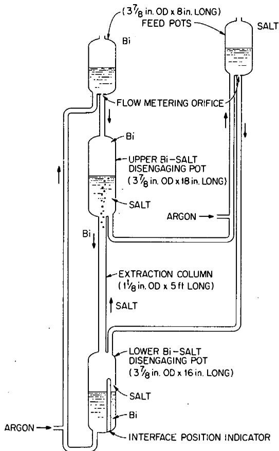  
Fig. 3. Schematic of molybdenum reduction-extraction test stand. Overall, $1^{1/2}$ ft in diameter and 17 ft high.

liquid from the argon in the gas lift and damp flow surges. The feed pots contain an access port for sampling and for adding thorium or lithium to the system. More complete details on the design of the test stand have been reported elsewhere.[6,7]

One major problem in the fabrication of complex molybdenum equipment is its lack of ductility after recrystallization. For optimum fabricability, it should be subjected to at least a $50\%$ reduction in area after recrystallization and then given a stress-relief treatment. Although we felt that the $378$ -in.-OD pots could be produced by machining from bar stock, material in this size range would have poor as-machined properties because it would have received only a limited amount of working. The capacity of available metal-working equipment was limited to using starting or blank material only slightly larger than the required finished pots. We chose instead to fabricate these components by back extrusion, a process in which a cylinder with a closed end can be produced by hot working in the range -1200 to $1700^{\circ}\mathrm{C}$ .

Although molybdenum can be welded, the process generally results in very large grains in both the fusion and heat-affected zones. Molybdenum welds are very brittle at room temperature and have a tendency to hot-crack. We thought that our best chances for successfully welding molybdenum would be

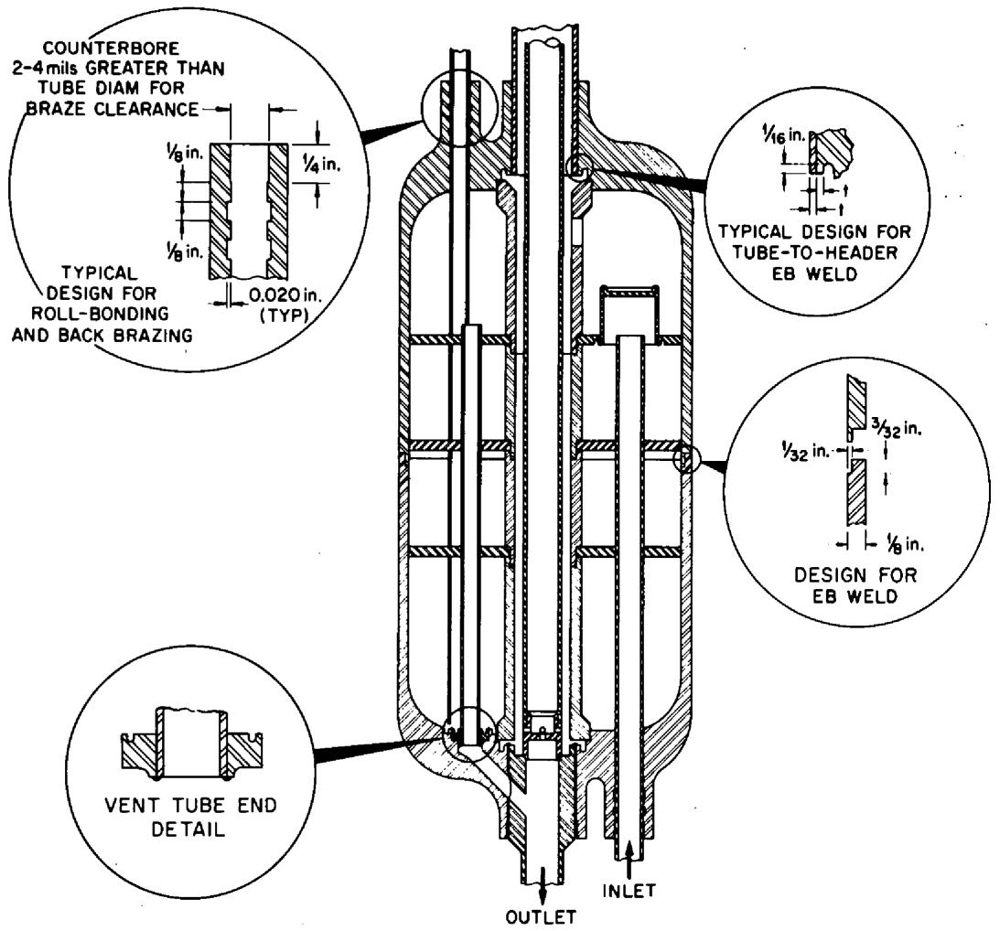  
Fig. 4. Feed pot for molybdenum chemical processing loop.

with the electron-beam process, which minimizes contamination effects, heat-affected-zone problems, and abnormal grain growth. However, electron-beam welding is not applicable for joining lengths of tubing together or for joining the tubing to a pot where the tube passes completely through the end section. A technique using the gas tungsten-arc welding process with an orbiting electrode was developed to make the tube-to-tube butt welds, and a mechanical joining technique (roll bonding) was developed to make the latter joints. In addition, reinforcement of all welded or roll-bonded joints by brazing served to strengthen the joint as well as to add a barrier to fluid leakage if a crack developed. To utilize brazing, however, required the development of a filler metal that would both be corrosion resistant to bismuth and salt and have a melting temperature below $1200^{\circ}\mathrm{C}$ , the maximum temperature that we felt could be tolerated before the molybdenum would become overly embrittled as a result of recrystallization and grain growth.

The development work undertaken was concomitant with design of the test stand, and there was a definite interrelation between the two functions. The final loop design represented a compromise between engineering requirements and progress made in the development of fabrication and joining procedures for molybdenum.

# FABRICATION DEVELOPMENT

Primary Fabrication of Molybdenum Components

R. E. McDonald

The choice of molybdenum as the construction material for the test stand presented several fabrication problems. It was originally suggested that the pots and the large-diameter heavy-wall tubing be machined from bar stock. However, our experience was that bar stock more than $1^{3/4}$ to 2 in. in diameter had poor mechanical properties. Most available mechanical properties data comes from thin sheet or small-diameter rod which has been heavily worked, and we felt that an end cap machined from 4-in.-diam bar would be weak and crack-prone.

Fabrication development started before the test-stand design was completed. One method considered in making the pots was by forging heavy plate to form end caps and then welding them to heavy-wall extruded pipe. We had previously developed techniques to fabricate heavy-wall tungsten pipe, and 4-in.-diam by $\frac{3}{8}$ in. wall by 50-in.-long sections had been made.[8] Molybdenum pipe could readily be produced using the same techniques. The forged end caps would then be welded or brazed to the large pipe body, producing the pot, and pots made by this technique would have good mechanical properties because of the mechanical working necessary to shape them. Available equipment aided us in the choice of back extrusion for producing the end caps and forward extrusion for producing heavy-wall tubing. The Metals and Ceramics Division at ORNL has available a horizontal extrusion press with an extensive tooling inventory. Three-, 4-, 5.6-, and 7-in.-diam containers with stems were on hand. The water-nitrogen accumulator system was capable of 1300 tons on the 4-in. stem, and an induction billet heater, 50 kW at 3000 cycles, was capable of heating 4-in.-diam, 10-in.-long billets to 2200°C in 45 min.

The first attempt to produce an end cap by back extrusion was made using a 4-in.-ID container with a $\mathrm{ZrO_2}$ -coated split die having provisions for integral bosses, a solid die backer, and a 3-in.-diam stem with a 3-in.-diam $\mathrm{ZrO_2}$ -coated tool-steel plunger attached. This is shown schematically in Fig. 5. A 3.950-in.-diam molybdenum blank was heated to $1300^{\circ}\mathrm{C}$ in the induction heater under an argon atmosphere, transferred to the container, and quickly pushed with the plunger. The blank neatly filled the die and flowed back over the coated plunger, producing a 4-in.-OD product. The tooling was conventionally cleared from the container, the die parted, and the plunger extracted. Several back extrusions were made to determine the optimum temperature, boss configuration, and skirt lengths. Back extrusions were successfully made at 1200, 1300, 1400, and $1500^{\circ}\mathrm{C}$ , and the maximum skirt length we obtained was 4 in. at $1500^{\circ}\mathrm{C}$ .

During this phase of development, however, cracks were noted in the hemispherical portion and the skirt ends. Although it was first suspected that they occurred during back extrusion, we noted that fine cracks had been generated on the faces of the blank during machining, and we felt they could have been transferred to the product.

In an effort to understand and eliminate this cracking problem, a blank was cut lengthwise into two sections, and a $\frac{1}{2}$ -in. square grid network of grooves was machined into each half. The grid of one half was filled with small-diameter tantalum wires, and the two halves were pinned together. The blank was heated to $1650^{\circ}\mathrm{C}$ and back-extruded. The halves of the extrusion were easily parted, and Fig. 6 shows the flow pattern of the molybdenum during extrusion. The flow pattern shows that the cylindrical extrusion blank was first pushed forward, filling the die cavities to form the bosses. After it bottomed out against the solid die backer, it flowed backward over the coated plunger to form the skirt. As the free surface of the skirt flows backward between the plunger and the die body, it is essentially undeformed. Therefore, if fine

ORNL-DWG70-3877A

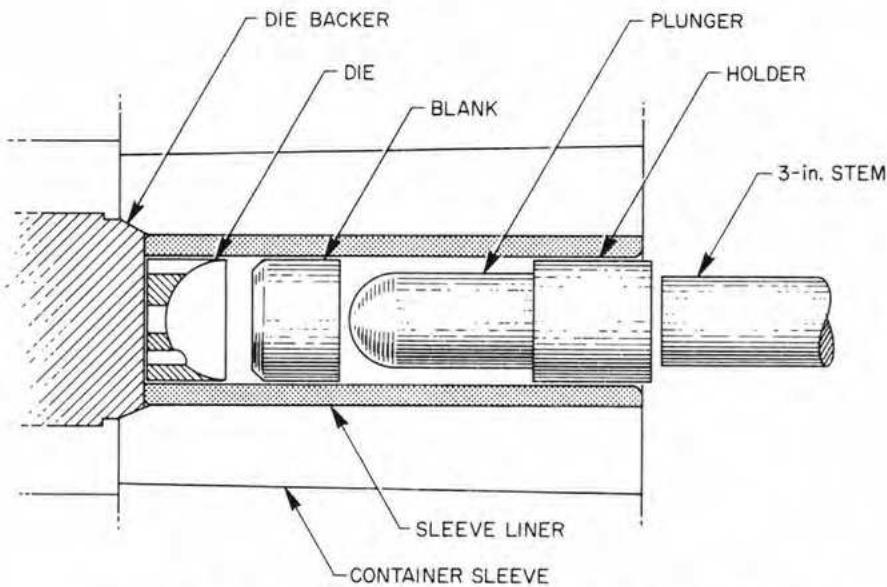  
Fig. 5. Tooling used in capsule fabrication by back extrusion.

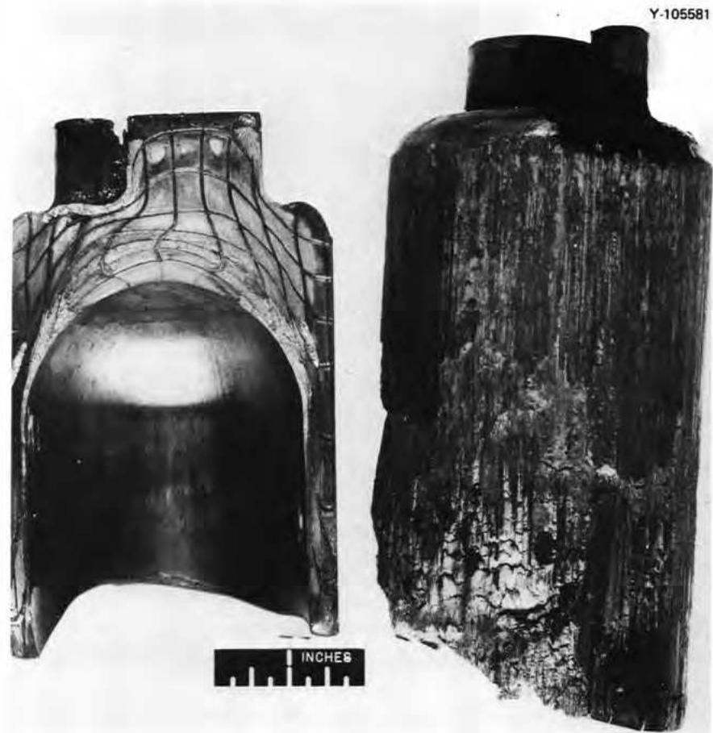  
Fig. 6. Flow pattern in a molybdenum back extrusion revealed by a network of tantalum wires installed in half of the original blank.

cracks exist on the back edge of the starting blank, then cracks in the skirt edge will occur. To minimize this type of cracking, the back edge of the starting blank was radiused and highly polished. At this point, our machining procedure was modified to require that all blanks be chemically etched and dye-penetrant-inspected after machining. Molybdenum, like tungsten, has a tendency of smearing over cracks during machining or grinding, and unless etched, it is difficult if not impossible to detect fine cracks. If cracks were detected, very fine grinding removed them prior to acceptance. This change in procedure noticeably reduced cracking in the back-extruded product.

While demonstrating that end caps could be made reliably, we noted that fairly long lengths of skirt were extruded back over the plunger. We then decided it would be feasible to back-extrude two halves to make a pot. This approach would require one girth weld instead of the two required to attach the end caps to an intermediate section of pipe, and it would also eliminate the need to extrude $37/8$ -in.-OD, $3/8$ -in.-wall pipe.

In order to back-extrude the end cap with a long cylindrical section, we thought that it would be necessary either to do it in several steps or to raise the preheat temperature of the blank. However, this led to further complications. We found that the $\mathrm{ZrO_2}$ coating on the plunger stayed intact for only one or two pushes before it had to be recoated because the inner surface of the product was adversely affected. Also, the increase in the preheat temperature to $1650^{\circ}\mathrm{C}$ caused galling and tearing of the outer surface of the extrusion because of a reaction of the molybdenum with the steel container liner (Fig. 6). The lubricant used by ORNL for all extrusions of molybdenum, molybdenum alloys, tungsten, and tungsten alloys is what we term a base-metal oxide lubricant. At the hot working temperature of these metals and alloys a liquid oxide forms which is an excellent lubricant (covered by USAEC patent 3,350,907). However, the residence time of the back extrusion in the container is long when compared with that of a conventional forward extrusion, and the liquid oxide breaks down as a lubricant as the temperature of the steel approaches its melting point. We had observed that the surfaces of the extrusion that were insulated from the steel by the plasma-sprayed $\mathrm{ZrO_2}$ were not tearing (Fig. 6); therefore the tooling was changed so that molybdenum was in contact only with $\mathrm{ZrO_2}$ -coated surfaces during extrusion. To do this the 5.6-in.-ID container was used, in which a 5.6-in.-OD, 4-in.-ID, 9-in.-long split die was inserted. The entire inner surface of the split die was plasma-sprayed with $\mathrm{ZrO_2}$ . At this point, the end design of the pot was also changed from a multiple-bossed hemispherical head to a large single-boss flat head as shown in Fig. 7. Three 8-in.-long back extrusions were made at preheat temperatures of 1600 to $1700^{\circ}\mathrm{C}$ with a stem load of up to 800 tons. When the length requirement of the half sections for the lower disengaging pot was increased to $9^{1/16}$ in., a new 12-in.-long die was made. Three long blanks were then back-extruded at 1600 to $1700^{\circ}\mathrm{C}$ with stem loads up to 800 tons. These extrusions exhibited good outer and inner surfaces, and skirt cracking did not exceed an inch in length. A typical back extrusion after machining is shown in Fig. 8.

We thus showed that by using existing equipment - the horizontal extrusion press - half sections for the bismuth, salt, and the upper and lower disengaging pots could be made by back extrusion. A total of 12 back extrusions were produced for use in constructing the molybdenum test stand, and data concerning these products are summarized in Table 1.

The second problem, the production of the large-diameter heavy-wall tubing for the packed column, was solved using techniques developed under the High Temperature Materials and Tungsten Programs at ORNL. About 6 ft of 1.16-in.-OD, 0.080-in.-wall tubing was required. For this, we used a 4-in.-OD, 1-in.-ID, 7-in.-long billet, which was heated to $1600^{\circ}\mathrm{C}$ and extruded over a $\mathrm{ZrO_2}$ -coated mandrel at a reduction ratio of 29:1. A second extrusion produced a tube $11^{1/2}$ ft in length that was concentric within 0.007 in. tolerance in radius and with excellent outer and inner surfaces. The process used was the ORNL

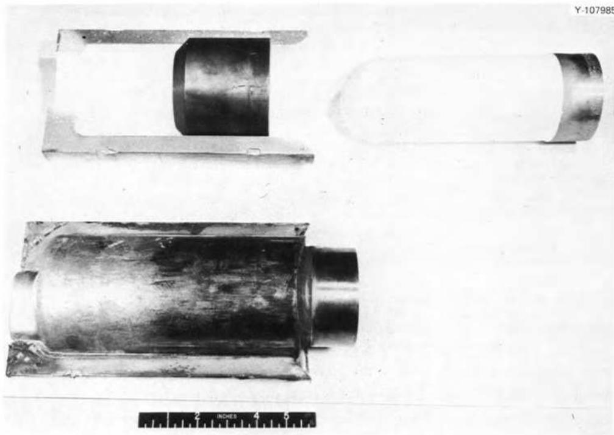  
Fig. 7. Zirconium oxide-coated back-extrusion tooling with molybdenum starting blank and as-extruded pot half section.

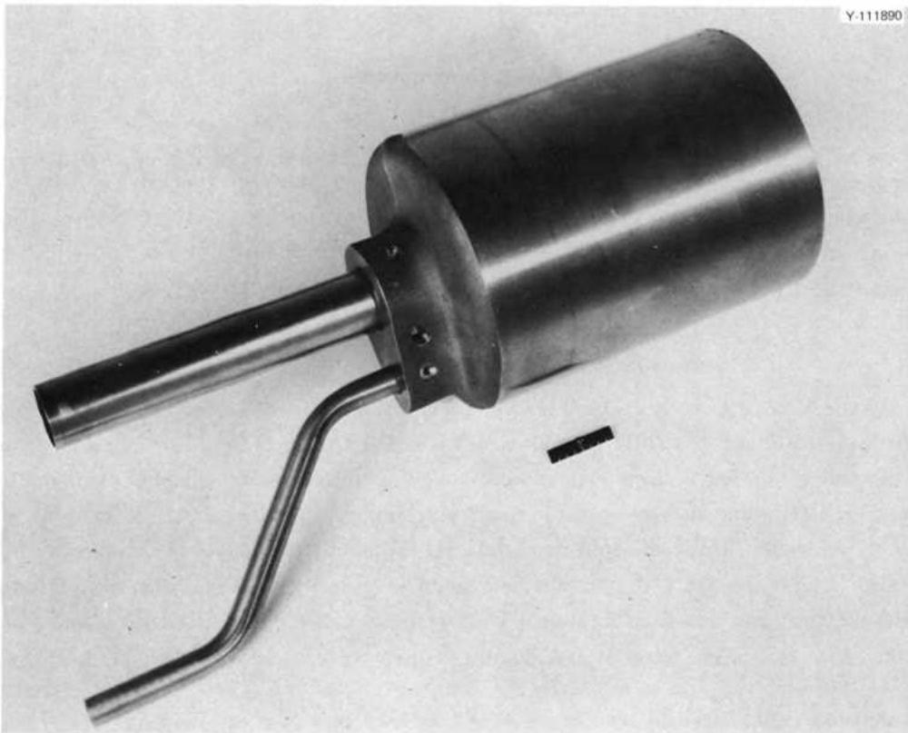  
Fig. 8. Example of molybdenum back-extruded half section after machining.

Table 1. Molybdenum half sections back-extruded for the molybdenum test stand   

<table><tr><td>Part</td><td>Extrusion number</td><td>Extrusion temperature (°C)</td><td>Internal length (in.)</td><td>Results</td></tr><tr><td>Feed Pot</td><td>1197</td><td>1600</td><td>4</td><td>No cracks</td></tr><tr><td>Feed pot</td><td>1250</td><td>1600</td><td>4</td><td>End cracks, 3.5 in. usable</td></tr><tr><td>Feed pot</td><td>1257</td><td>1600</td><td>4.5</td><td>End cracks, 3.5 in. usable</td></tr><tr><td>Feed pot</td><td>1259</td><td>1600</td><td>4.5</td><td>End cracks, 4 in. usable</td></tr><tr><td>Spare</td><td>1251</td><td>1600</td><td>4</td><td>End cracks, 3.5 in. usable, surface cracks on top</td></tr><tr><td>Spare</td><td>1256</td><td>1600</td><td>4</td><td>Surface cracks on top</td></tr><tr><td>Lower disengaging</td><td>1258</td><td>1600</td><td>8</td><td>No cracks</td></tr><tr><td>Lower disengaging</td><td>1260</td><td>1600</td><td>8</td><td>No cracks</td></tr><tr><td>Spare</td><td>1261</td><td>1600</td><td>8.5</td><td>Cracks in wall</td></tr><tr><td>Upper disengaging</td><td>1286</td><td>1700</td><td>9</td><td>No cracks</td></tr><tr><td>Upper disengaging</td><td>1290</td><td>1700</td><td>11</td><td>End cracks, 9.5 in. usable</td></tr><tr><td>Spare</td><td>1288</td><td>1700</td><td>9</td><td>Reextruded, crack in wall</td></tr></table>

floating mandrel technique, which is described in another report, $^{9}$ with the lubrication provided by molybdenum oxide.

Even though a scale-up of the test stand would be required in construction of an actual chemical processing facility, we feel that we have demonstrated primary fabrication techniques for molybdenum that would be applicable to containers up to 12 in. in diameter and 36 in. long. Fabrication of larger-sized components would require the adaptation of other fabrication techniques, such as ring rolling or power spinning, or the development of new techniques.

# Tubing Development

# J. R. DiStefano

Four sizes of molybdenum tubing were required, and these were obtained commercially, as listed in Table 2. All of the material was purchased according to the following specifications:

Specification No. (see Appendix A)

# Title

<table><tr><td>MET-RM-B208</td><td>Tentative Specification for Seamless, Arc-Cast Mo Tubing for High Temperature Service</td></tr><tr><td>MET-NDT-3</td><td>Tentative Specification for Ultrasonic Inspection of Metal Piping and Tubing</td></tr><tr><td>MET-NDT-4</td><td>Tentative Methods for Liquid Penetrant Inspection</td></tr></table>

Initial investigation of three heats of this tubing revealed differences in microstructure, hardness, and response to heat treatment, but little difference in interstitial concentration (Table 3). Inspection of the inside of the tubes revealed surfaces which were rough or pitted. Metallographic examination of the as-received $\frac{3}{8}$ -in.-OD tubing showed it was partially recrystallized. Heating to $925^{\circ}\mathrm{C}$ for 1 hr resulted in complete recrystallization. However, both the $\frac{1}{4}$ -in.- and $\frac{1}{2}$ -in.-OD tubing were received in a cold-worked condition. Heat treating to $925^{\circ}\mathrm{C}$ did not alter the hardness or microstructure of the $\frac{1}{4}$ -in. tubing, but the $\frac{1}{2}$ -in. tubing softened and was almost completely recrystallized. Since the interstitial element concentrations in the different heats were essentially the same, we can assume that the surprisingly low

Table 2. Molybdenum tubing for chemical processing loop   

<table><tr><td colspan="2">Tubing size</td><td rowspan="2">No. of heats</td><td rowspan="2">Identification</td><td rowspan="2">Stress relief by manufacturer</td><td colspan="2">Source</td></tr><tr><td>OD (in.)</td><td>Wall (in.)</td><td>Vendor</td><td>Manufacturer</td></tr><tr><td>1/4</td><td>0.020</td><td>1</td><td>CPM-1</td><td>1 hr, 870°C</td><td>TECOa</td><td>Superior Tubeb</td></tr><tr><td>3/8</td><td>0.025</td><td>3</td><td>CPM-2</td><td>1 hr, 870°C</td><td>TECO</td><td>Superior Tube</td></tr><tr><td></td><td></td><td></td><td>CPM-6</td><td>None</td><td>TECO</td><td>TECO</td></tr><tr><td></td><td></td><td></td><td>CPM-8</td><td>1 hr, 870°C</td><td>TECO</td><td>TECO</td></tr><tr><td>1/2</td><td>0.030</td><td>2</td><td>CPM-3</td><td>1 hr, 870°C</td><td>TECO</td><td>Superior Tube</td></tr><tr><td></td><td></td><td></td><td>CPM-8</td><td>1 hr, 870°C</td><td>TECO</td><td>TECO</td></tr><tr><td>7/8</td><td>0.080</td><td>1</td><td>CPM-5</td><td>1 hr, 870°C</td><td>TECO</td><td>TECO</td></tr></table>

${}^{a}$ Thermo Electron Corp., Woburn, Mass.   
bSuperior Tube Co., Norristown, Pa.

Table 3. Hardness, microstructure, and chemical analysis of molybdenum tubing as a function of heat treatment   

<table><tr><td rowspan="2">Size of tubing (OD in.)</td><td rowspan="2">Condition</td><td rowspan="2">Hardness DPH (1000 g)</td><td rowspan="2">Microstructure</td><td colspan="2">Concentration (ppm)</td></tr><tr><td>Oxygen</td><td>Carbon</td></tr><tr><td>1/4</td><td>As receiveda</td><td>237</td><td>Cold worked</td><td>69</td><td>80</td></tr><tr><td>1/4</td><td>1 hr at 800°C</td><td>258</td><td>Cold worked</td><td></td><td></td></tr><tr><td>1/4</td><td>1 hr at 925°C</td><td>250</td><td>Cold worked</td><td></td><td></td></tr><tr><td>3/8</td><td>As receiveda</td><td>200</td><td>Partially recrystallized (10-15%)</td><td>69</td><td>50</td></tr><tr><td>3/8</td><td>1 hr at 800°C</td><td>243</td><td>Partially recrystallized</td><td></td><td></td></tr><tr><td>3/8</td><td>1 hr at 925°C</td><td>168</td><td>Completely recrystallized</td><td></td><td></td></tr><tr><td>1/2</td><td>As receiveda</td><td>242</td><td>Cold worked</td><td>69</td><td>40</td></tr><tr><td>1/2</td><td>1 hr at 700°C</td><td>255</td><td>Cold worked</td><td></td><td></td></tr><tr><td>1/2</td><td>1 hr at 800°C</td><td>243</td><td>Cold worked</td><td></td><td></td></tr><tr><td>1/2</td><td>1 hr at 900°C</td><td>236</td><td>Very slightly recrystallized</td><td></td><td></td></tr><tr><td>1/2</td><td>1 hr at 925°C</td><td>206</td><td>Almost completely recrystallized (90%)</td><td></td><td></td></tr></table>

${}^{a}$ The tubing was stress relieved for $1\mathrm{{hr}}$ at ${870}^{ \circ  }\mathrm{C}$ before delivery.

recrystallization temperatures for the $3/8$ -in.- and $1/2$ -in.-OD tubing were the result of working prior to heat treating.

To evaluate the ductility of the tubing, we devised a somewhat qualitative test in which a 0.5-in.-long sample was impact-flattened a predetermined amount at different temperatures using the equipment shown in Fig. 9. The load was applied by a $2300\mathrm{g}$ weight dropped a distance of $6\mathrm{cm}$ . To obtain a quantitative measure of deformation, we divided the displacement (original ring diameter minus the minor axis diameter of the tested specimen) by the original diameter of the ring. The results of some of these tests are given in Table 4. The as-received $\frac{1}{2}$ -in.-OD tubing was "ductile" (no cracks) at room temperature, while we had to heat samples of the $\frac{3}{8}$ -in.-OD tubing to $150 - 250^{\circ}\mathrm{C}$ and the $\frac{1}{4}$ -in.-OD tubing to $300^{\circ}\mathrm{C}$ before they became ductile.

The behavior of the $1/4$ -in.-OD tubing was traced to a brittle layer on its inside surface, as indicated in Table 5. Removal of 0.004 in. from the inside diameter (0.002 in. from the wall thickness) resulted in lowering the temperature at which acceptable ductility was observed from 300 to $125^{\circ}\mathrm{C}$ ; when 0.006 in.

Stress relieved 1 hr at $870^{\circ}\mathrm{C}$

Table 4. Ductility of as-received molybdenum tubing as a function of deformation temperature   

<table><tr><td>Size of tubing (OD in.)</td><td>Deformation displacement/tube diameter (%)</td><td>Temperature (°C)</td><td>Observation</td></tr><tr><td>1/4</td><td>8</td><td>25</td><td>Cracked where ID in tension</td></tr><tr><td>1/4</td><td>8</td><td>100</td><td>Cracked where ID in tension</td></tr><tr><td>1/4</td><td>8</td><td>200</td><td>Cracked where ID in tension</td></tr><tr><td>1/4</td><td>4</td><td>25</td><td>Cracked where ID in tension</td></tr><tr><td>1/4</td><td>4</td><td>100</td><td>Cracked where ID in tension</td></tr><tr><td>1/4</td><td>4</td><td>150</td><td>Cracked where ID in tension</td></tr><tr><td>1/4</td><td>4</td><td>175</td><td>Cracked where ID in tension</td></tr><tr><td>1/4</td><td>4</td><td>200</td><td>Cracked where ID in tension</td></tr><tr><td>1/4</td><td>4</td><td>250</td><td>Cracked where ID in tension</td></tr><tr><td>1/4</td><td>4</td><td>300</td><td>No cracks</td></tr><tr><td>3/8</td><td>6.5</td><td>25</td><td>Fractured into four pieces</td></tr><tr><td>3/8</td><td>6.5</td><td>100</td><td>Cracked in three places</td></tr><tr><td>3/8</td><td>6.5</td><td>150</td><td>Cracked in three places</td></tr><tr><td>3/8</td><td>6.5</td><td>250</td><td>No cracks</td></tr><tr><td>3/8</td><td>3.25</td><td>25</td><td>Fractured into four pieces</td></tr><tr><td>3/8</td><td>3.25</td><td>100</td><td>Cracked in four places</td></tr><tr><td>3/8</td><td>3.25</td><td>150</td><td>No cracks</td></tr><tr><td>3/8</td><td>3.25</td><td>175</td><td>No cracks</td></tr><tr><td>3/8</td><td>3.25</td><td>200</td><td>No cracks</td></tr><tr><td>1/2</td><td>10</td><td>25</td><td>No cracks</td></tr></table>

Table 5. Mechanical behavior of $\frac{1}{4}$ -in.-OD tubing as a function of removing incremental layers from the inner surface   

<table><tr><td>Material removed from ID (in.)</td><td>Deformation displacement/tube diameter (%)</td><td>Temperature (°C)</td><td>Observation</td></tr><tr><td>0.002</td><td>4</td><td>25</td><td>Hairline crack</td></tr><tr><td>0.002</td><td>4</td><td>125</td><td>Hairline crack</td></tr><tr><td>0.004</td><td>4</td><td>25</td><td>Hairline cracks</td></tr><tr><td>0.004</td><td>4</td><td>125</td><td>No cracks</td></tr><tr><td>0.006</td><td>4</td><td>25</td><td>No cracks</td></tr><tr><td>0.006</td><td>4</td><td>125</td><td>No cracks</td></tr><tr><td>0.008</td><td>4</td><td>25</td><td>No cracks</td></tr><tr><td>0.008</td><td>4</td><td>125</td><td>No cracks</td></tr><tr><td>0.010</td><td>4</td><td>25</td><td>No cracks</td></tr><tr><td>0.010</td><td>4</td><td>125</td><td>No cracks</td></tr></table>

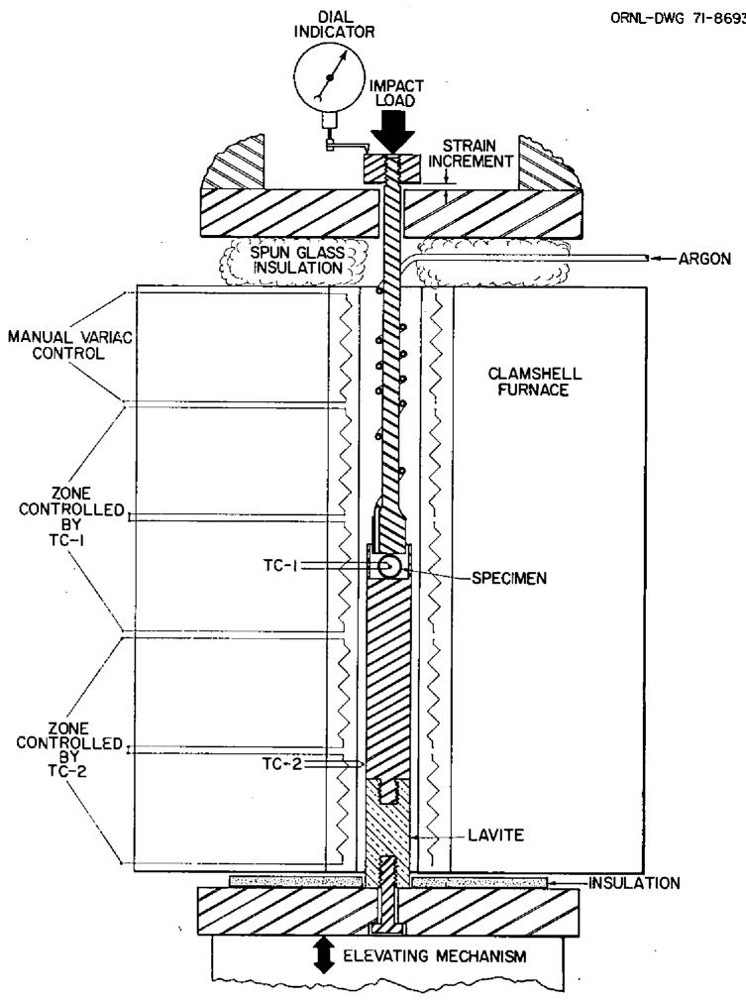  
Fig. 9. Schematic of equipment used to impact-test samples of molybdenum tubing.

was removed from the inside diameter, the material was ductile at room temperature. Chemical analysis indicated that material from near the inside surface contained higher oxygen and carbon concentrations compared with the bulk sample analyses (140 and 120 ppm, respectively, compared with 69 and 80 ppm). We suspected that contamination of the tubing occurred during fabrication and that it was not removed during subsequent cleaning or heat treating operations.

Removing material from the inside of the $\frac{3}{8}$ -in.-OD tubing also improved its room-temperature ductility, but its as-received microstructure (partially recrystallized as compared with the cold-worked fine-grained $\frac{1}{2}$ -in.-OD tubing) led us to believe that the fabrication schedule used in its production might also be responsible for its lack of ductility. Consultation with the manufacturer10 led to the following changes in our specifications:

1. Starting tube shell shall have an average grain size of ASTM No. 6. No grain shall be larger than ASTM No. 3.   
2. Starting size of tube shell to produce $\frac{3}{8}$ -in. OD × 0.025-in. wall product shall be 1.125-in. OD by 0.250-in. wall or 1.125-in. OD × 0.187 in. wall. In either case, no more than two intermediate anneals shall be used and the temperature shall be no higher than $815^{\circ}\mathrm{C}$ .

3. Prior to the final stress relief, material shall be cleaned in an alkaline solution. The inside surface shall then be mechanically cleaned by wire brushing and then pickled to remove 0.001 to 0.002 in. from the wall.   
4. Final stress relief shall be 1 hr at $800^{\circ}\mathrm{C}$ in dry hydrogen or vacuum $(< 5\times 10^{-5}$ torr).

A quantity of $\frac{3}{8}$ -in.-OD tubing was purchased according to these modified specifications and was found to be ductile at room temperature as measured by our flattening test. The $\frac{1}{4}$ -in.-OD tubing that was already on hand was acid etched to remove approximately 0.005 in. from its inside diameter, and selected samples were found to be ductile. It should be noted that, although the as-received "contaminated" tubing was not ductile in the impact flattening test, it could be bent at room temperature without fracturing. Some samples were bent up to $90^{\circ}$ without evidence of cracks. The rate of bending was found to be important, but the data were not quantitated.

Welding studies indicated that a preweld stress-relief heat treatment for 1 hr at 875 to $900^{\circ}\mathrm{C}$ was desirable to minimize weld cracking; however, samples of $\frac{1}{2}$ -in.-OD material (CPM-3) became embrittled when heated to $925^{\circ}\mathrm{C}$ , and one heat (CPM-6) became embrittled when heated to $860^{\circ}\mathrm{C}$ . Tubing selected for loop construction was heat treated for 1 hr at $900^{\circ}\mathrm{C}$ in vacuum after all bends had been made. In this way, we took advantage of the as-received ductility of the material for bending and still satisfied the requirements for a preweld heat treatment.

# JOINING DEVELOPMENT

Welding

A.J.Moorhead

Material selection and preparation. Molybdenum has several characteristics that make it difficult to fabricate into complex structures by welding. It has a tendency to (1) undergo hot-cracking, (2) develop porosity in the weld fusion zone, and (3) undergo abnormal grain growth. In addition, it has a ductile-to-brittle transition temperature in large-grained microstructures (such as occur in the heat-affected or fusion zones of a weld) well above room temperature, which can easily cause fracture at ambient temperature. This latter characteristic makes handling of welded components, such as during subsequent assembly steps, quite difficult. Consideration was given in the selection of the base material and in the design and fabrication phases of the program to ways to overcome or at least minimize these characteristics. The selection of arc-cast molybdenum with low impurity element levels was significant to the welding development portion of the program. Low impurity levels are very desirable for this metal (especially O, N, and C) since small amounts of these elements have been shown to have adverse effects on the ductile-brittle transition temperature and weldability of arc-cast molybdenum.[11-13] Oxygen is especially detrimental, as it forms low-melting eutectic films with molybdenum, and the presence of these films at grain boundaries can cause hot-cracking in welds. Molybdenum produced by powder metallurgy techniques was not considered for the test stand because welds in commercially available materials of this type have repeatedly been found to contain large amounts of porosity.[14] Therefore, the selection of low-carbon, low-oxygen arc-cast base material helped to minimize two of the detrimental factors in welding molybdenum, namely, hot-cracking and porosity formation. Great care was also taken in all subsequent operations to ensure that these

elements were not introduced into weldments by surface contamination or by an impure welding atmosphere.

In order to ensure that the welds were not adversely affected by surface contamination, all components were cleaned using the portion shown below of a complex cleaning procedure attributed to Ryan by Thompson: $^{15}$

1. Degrease with acetone.   
2. Immense for 5 min in a $65 - 80^{\circ}\mathrm{C}$ solution of 10 wt $\%$ sodium hydroxide, 5 wt $\%$ potassium permanganate, and 85 wt $\%$ distilled water.   
3. Rinse in flowing tap water, brushing to remove smut.   
4. Immense for $5 - 10\mathrm{min}$ in a room-temperature solution of $15\mathrm{vol}\%$ sulfuric acid $(95 - 97\% \cdot \mathrm{H}_2\mathrm{SO}_4)$ , $15\mathrm{vol}\%$ hydrochloric acid $(37 - 38\% \mathrm{HCl})$ , $70\mathrm{vol}\%$ distilled water, plus $6 - 10\mathrm{wt}\%$ chromium trioxide $(\mathrm{CrO}_3)$ .   
5. Rinse in tap water.   
6. Rinse in distilled water.   
7. Dry with hot air.

Although we did not find any correlation (as far as leak-tight welds were concerned) with the time between cleaning and welding, when parts had been excessively handled after the initial cleaning, we did take the precaution of repeating steps 1 and 4-7 of the procedure just prior to welding.

After chemical cleaning, all parts used were given a vacuum stress-relief treatment for $60\mathrm{min}$ at 875 to $900^{\circ}\mathrm{C}$ at a pressure of $5\times 10^{-5}\mathrm{mmHg}$ or less. In our preliminary work, we found that a stress-relief heat treatment had a major effect on the weldability of the various forms of molybdenum. For example, one half of a length of $\frac{3}{8}$ -in.-OD, 0.025-in.-wall tubing was cleaned as previously described and then stress relieved in vacuum for $60\mathrm{min}$ at $875^{\circ}\mathrm{C}$ . The other half of the tube was chemically cleaned only. In a series of bead-on-tube "field" welds on these two pieces by the orbiting gas tungsten-arc process, we found that the welds on the cleaned and stress-relieved tube were crack-free, while those on the "cleaned only" tube had extensive center-line cracking. Similar results occurred on other sizes of tubing and on back-extruded half sections. We tried several other stress-relief temperatures to determine the lowest temperature that would produce the desired improvement in weldability and at the same time have the least effect on base-metal ductility due to recrystallization. A temperature of 875 to $900^{\circ}\mathrm{C}$ was apparently optimum from a weldability standpoint for these components, and it had little effect on the base-metal microstructure, as shown by Fig. 10. The combination of the chemical and thermal treatments left the components with surfaces that were lighter gray in color than in the as-received condition, and there was no noticeable grain-boundary attack by the etchant.

Welding procedure development. Procedures were developed for welding three major joint types for the test stand, two of which are illustrated in Fig. 4. A "tube-to-header" type of joint was required in seven locations in which a line terminated in the end of a back-extruded half section. A joint which we refer to as a "cylindrical girth" joint was welded to attach pairs of half sections together to form the four vessels or pots. Many welds of the "tube-to-tube" type were required to attach various lines to stubs projecting from the pots or to one of the six tees. Each of these joint types will be discussed separately below.

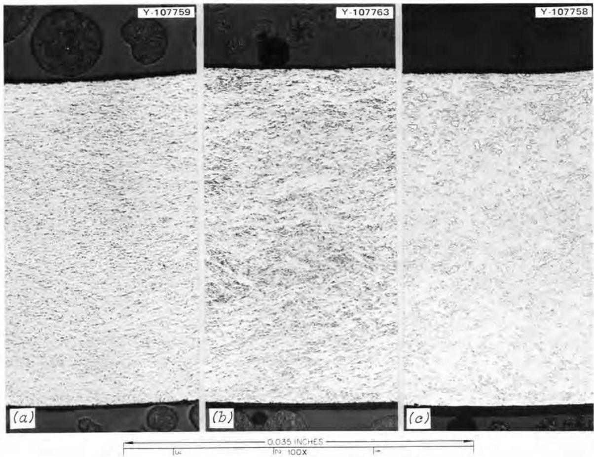  
Fig. 10. Effect of heat treatment (in vacuum) on the microstructure of ${}^{1}/2$ -in.-OD, 0.030-in.-wall molybdenum tubing. Etchant: 50 vol % H $_2$ O $_2$ –50 vol % NH $_4$ OH. (a) As received, DPH 241; (b) 60 min at 900°C, DPH 236; (c) 60 min at 925°C, DPH 206.

Tube-to-header joint. There are seven major tube-to-header joints in the test stand. Four join 0.875-in.-OD, 0.080-in.-wall tubing (which is machined to 0.050-in. wall in the joint area) to the feed pots; two attach 1.125-in.-OD, 0.060-in.-wall, 7.25-in.-long stubs of the packed column to the disengaging pots; and the seventh attaches a 5.25-in.-long machined tube (with a $\frac{1}{2}$ -in.-diam section at the weld) to the upper disengaging pot. There are also other miscellaneous joints of this type in the stand; for example, it was used in attaching the weirs to the horizontal baffle plates shown in Fig. 11.

To facilitate making this type of weld between the massive bosses on the extruded half sections and the relatively thin-walled tube, a groove or trepan was machined inside the pot around the hole to produce a corner-flange joint, as previously illustrated in Fig. 4. This design provides a good heat balance between the two components and excellent mechanical support for the weld. Its major drawbacks are that it is relatively inaccessible for welding or nondestructive examination. The use of the electron-beam process overcomes the accessibility problem for welding, and has the added benefit that it minimizes abnormal grain growth in the fusion zone because it is a process with a high energy density and a low total energy input. Because this type of joint is difficult to inspect by radiography or ultrasound, we relied on close parameter control, fluorescent dye penetrant inspection, and/or helium leak detection as our quality assurance techniques for these welds.

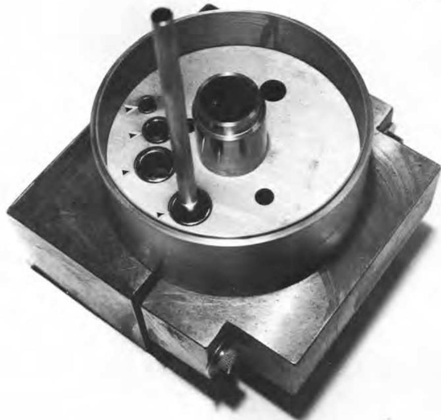  
Fig. 11. Weirs electron-beam welded (at arrowheads) to one of the baffle plates shown installed in the upper half of the bismuth feed pot.

Y-117087

Procedures were developed for electron-beam welding tube-to-header joints in tube sizes of $1/4$ , $3/8$ , $1/2$ , $7/8$ , and $11/8$ in. outside diameter. The parameters for welding all of these sizes of tubing are given in Appendix B, and an example of these two welds is shown in Fig. 12. The electron-beam welder used is of the high-voltage, low-current type (150 kV, 0.040 A max) with a chamber 36 in. wide, 23 in. deep, and 24 in. high. In our preliminary welds, in which flat plates simulated the vessel ends, we made welds both by the conventional method of rotating the work under the beam and by using a simple system for manually rotating the beam in a circle (up to $5/8$ in. in diameter) on the workpiece. Although we made acceptable welds using both techniques, we had greater difficulties in making reproducible welds with the rotating-beam technique; so all subsequent prototype welds were made by rotating the joint rather than the beam. This latter technique was somewhat complicated for the two vent tube joints, which were located away from the center line of the pot, as seen in Fig. 13. However, this was compensated for by a simple fixture with cross slides for centering the weld under the beam. A close-up of a 0.375-in.-diam tube-to-header weld is shown in Fig. 14, and a photomicrograph of a helium leak-tight weld joining a 1.125-in.-OD, 0.060-in.-wall tube to a back-extruded molybdenum header is shown in Fig. 15.

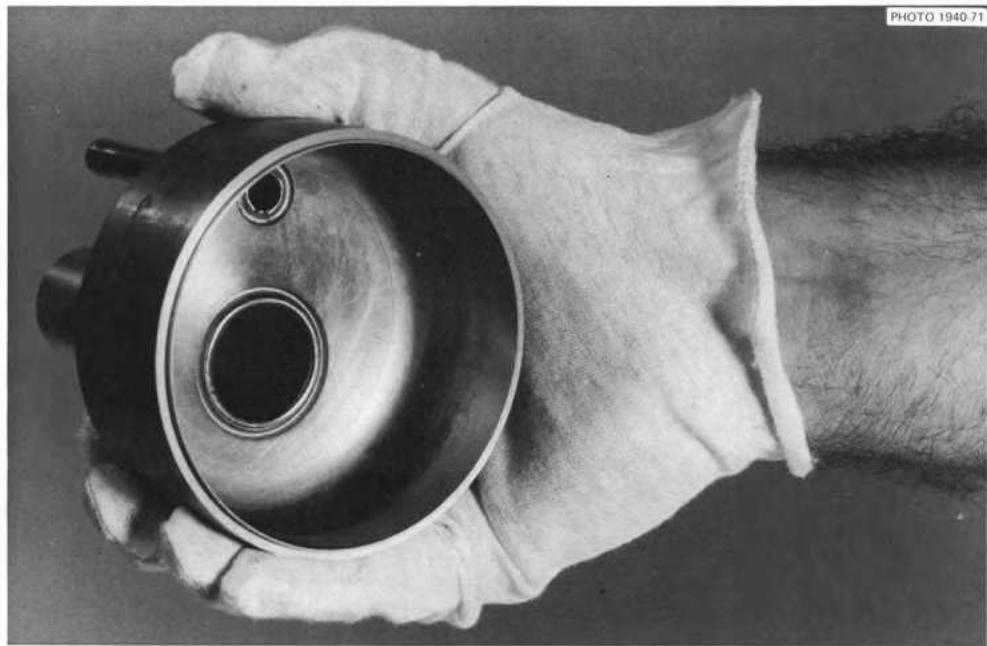  
Fig. 12. Back-extruded half section with two tube-to-header welds made by the electron-beam process.

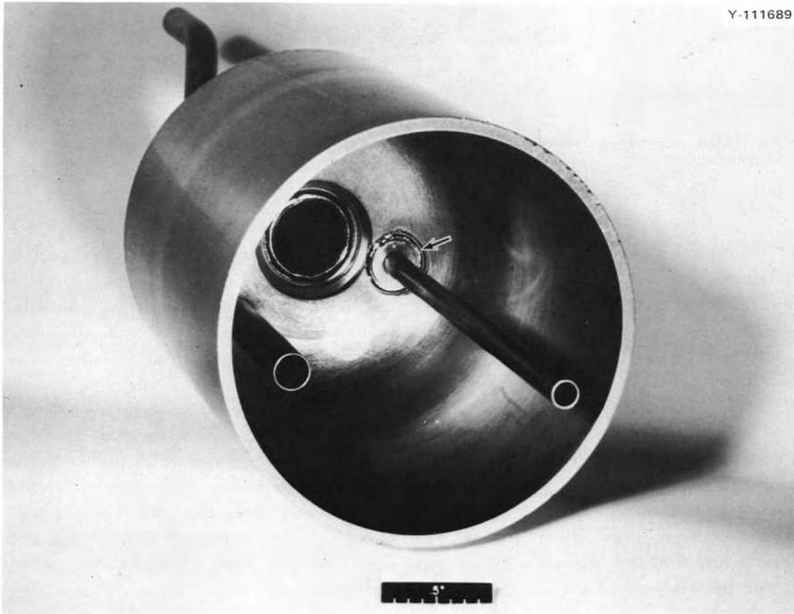  
Fig. 13. Off-centered vent tube weld (arrow) made by welding a "washer" to the tube and then welding the washer to a lip in the feed pot bottom.

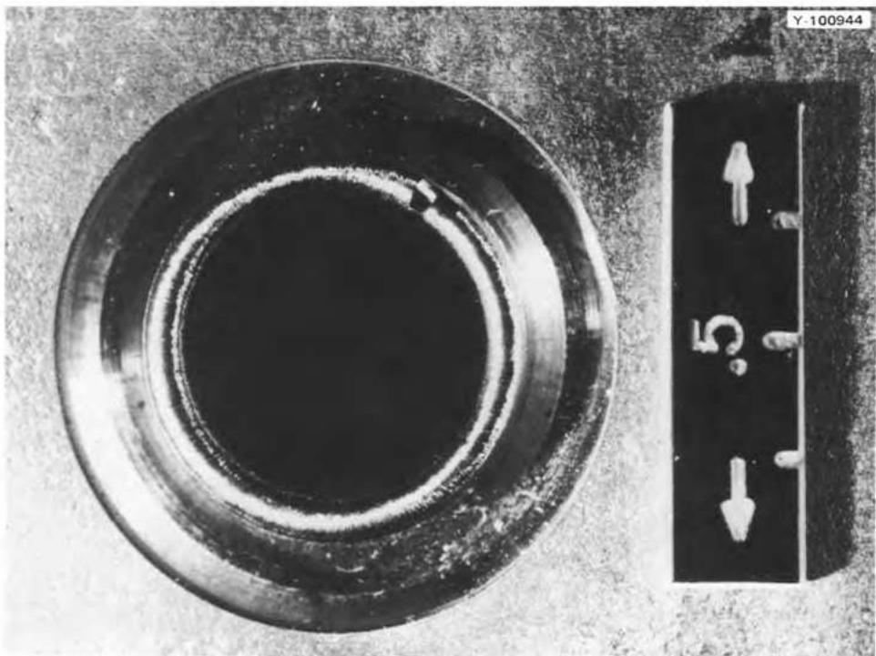  
Fig. 14. Close-up of a $3/8$ -in-diam tube-to-header weld, showing the machined trepan.

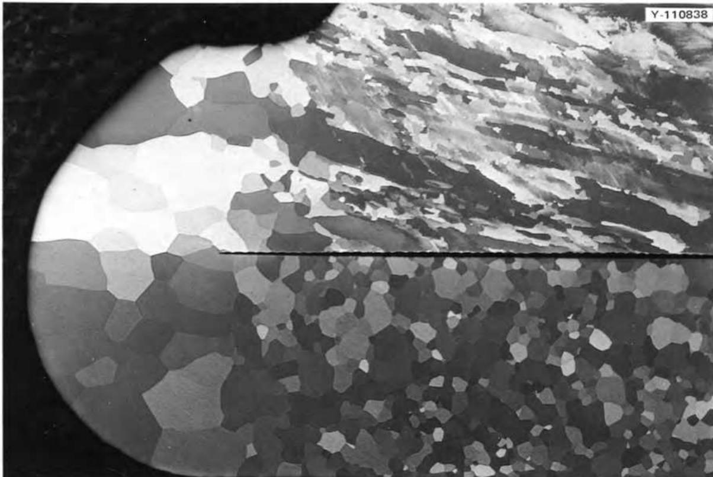  
Fig. 15. Cross section through a weld joining a 1.125-in.-OD tube to a half section. Etchant: $20\mathrm{vol}\% \mathrm{H}_2\mathrm{O}_2 - 10\mathrm{vol}\%$ $\mathrm{H}_2\mathrm{SO}_4$ $(96\% \mathrm{H}_2\mathrm{SO}_4) - 70\mathrm{vol}\% \mathrm{H}_2\mathrm{O}$ . $29\times$

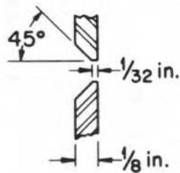  
Fig. 16. Joint design used for connecting back-extruded half sections by the gas tungsten-arc process. A root opening of $\frac{1}{8}$ in. was typically used.

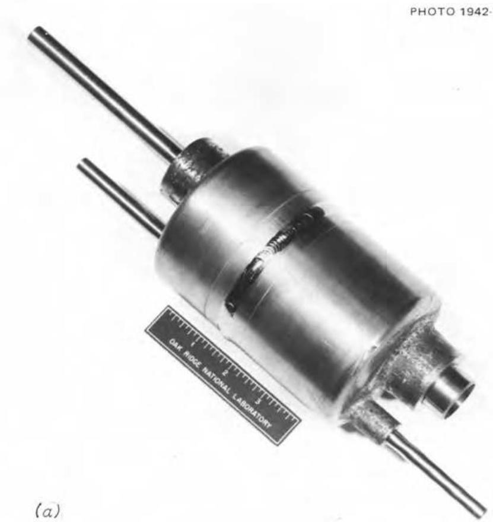

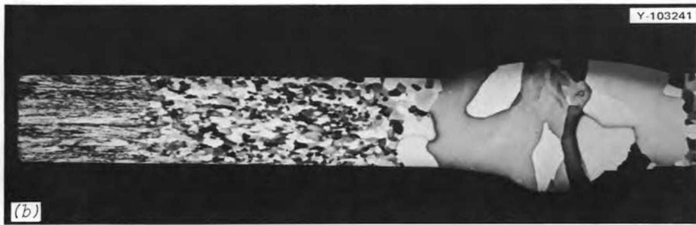  
Fig. 17. Manual gas tungsten-arc weld joining back-extruded molybdenum half sections. (a) Completed pot. (b) Cross section through the weld: etchant: $20\mathrm{vol}\% \mathrm{H}_2\mathrm{O}_2 - 10\mathrm{vol}\% \mathrm{H}_2\mathrm{SO}_4$ ( $96\% \mathrm{H}_2\mathrm{SO}_4$ )-70 vol $\% \mathrm{H}_2\mathrm{O}:6\times$

Cylindrical girth joint. Both the gas tungsten-arc and electron-beam welding processes were investigated for the welds required to join two half sections to form each of the four vessels. The joint design used for the gas tungsten-arc welds is shown in Fig. 16. The tungsten-arc welds were made manually in a vacuum-purged, argon-backed glove box. This chamber has the basic dimensions of 36 in. in inside diameter and 56 in. in length, but with available extensions the length can be increased to over 12 ft. The chamber was evacuated to a pressure of $5 \times 10^{-5} \mathrm{~mmHg}$ or less prior to backfilling with argon of $99.997\%$ minimum purity by volume. Filler metal was 0.060-in.-diam low-carbon, low-oxygen molybdenum wire prepared commercially from cast stock. The electrode was $2\%$ thoriated tungsten, $1/8$ in. in diameter. No auxiliary preheating was required for the gas tungsten-arc welds. Evidently the high conductivity of the molybdenum promotes a rapid distribution of heat throughout the parts (i.e., preheat) before the fusion temperature is reached at the joint. A photograph of one of the gas tungsten-arc cylindrical girth welds (which had a helium leak rate less than $1 \times 10^{-8} \mathrm{atm} \mathrm{cm}^3 \mathrm{sec}^{-1}$ ) and a cross section through it are shown in Fig. 17. Note that although this weldment has undergone abnormal grain growth, radiographically there was no evidence of porosity, and only two small cracks (on the inner surface in the heat-affected zone) were detected by fluorescent penetrant inspection.

Electron beam girth welds were made using the rotary fixture shown in Fig. 18. A general requirement for welding with the process, if filler metal is not added, is that the joint must be held tightly together so that coalescence will occur and so that the resulting weld bead will not be underfilled. The harmful effects of an underfilled, concave weld bead are especially pronounced in crack-sensitive materials such as

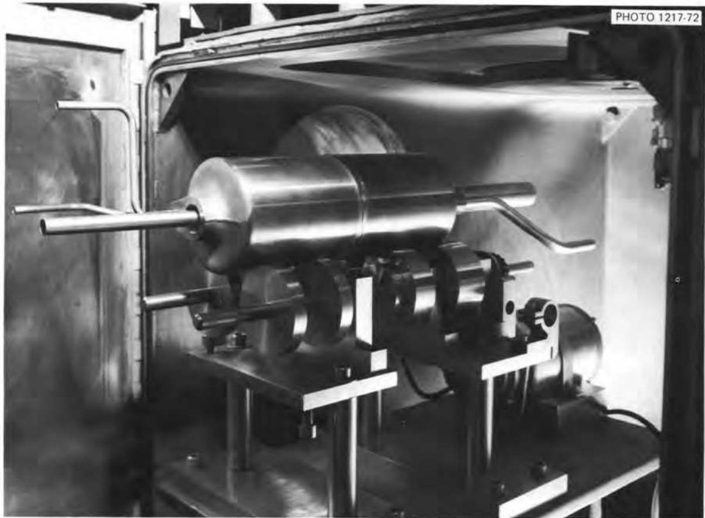  
Fig. 18. Molybdenum pot formed by an electron-beam girth weld joining two back-extruded half sections.

molybdenum. Unfortunately, the complex geometry of the vessel half sections, with their protruding tubes and internal baffle plates, made the application of end loading by conventional means (such as external pots or internal rods) quite difficult. To overcome this problem, a technique was developed in which three 0.032-in.-diam molybdenum pins through the step joint were used to hold the halves in intimate contact during welding. These pins were subsequently fused into the weld.

Parameters for joining molybdenum vessel half sections using the electron-beam process are listed below. The welds were made using a self-accelerating triode design electron gun (S-32). Manual beam current downslope was used at the end of the weld to prevent crater formation.

1. Joint type - step (illustrated in Fig. 4).   
2. Joint thickness - 0.094 in.   
3. Accelerating potential $150\mathrm{kV}$   
4. Beam current - $12\mathrm{mA}$ preheat and $25\mathrm{mA}$ weld.   
5. Number of revolutions - 6 for preheat (2 preheat passes on either side of and 1 in. away from the joint, and then 2 passes on the joint itself) and $1\frac{1}{4}$ for weld.   
6. Travel speed - 32 in./min.   
7. Focus - 0.015 A defocus.   
8. Work distance - 4 in.

Note that in this procedure, extensive preheating was carried out with the defocused beam prior to welding. A photomicrograph of a cross section through a preliminary electron-beam girth weld in which penetration through the step was not achieved is shown in Fig. 19.

Tube-to-Tube Butt Joint. Tube-to-tube welds joining five sizes of molybdenum tubes were successfully made in an argon-filled glove box by the gas tungsten-arc process both manually and using an automatic orbiting-arc technique. Using either technique, we were readily able to produce welds that were helium leak-tight and that had little or no porosity as shown by radiographic and metallographic examination.

However, the orbiting-arc technique was of particular interest after we found that our welders had considerable difficulty in making manual butt welds in thin-walled molybdenum tubing without excessive root reinforcement and without misalignment. These problems were compounded by the necessity of making the welds in a glove box, which reduces the senses of sight and touch. Several commercial orbiting-arc weld heads were evaluated, including the head shown in Fig. 20. In this unit the tungsten electrode is carried around the tube (which remains stationary) by a copper ring, which also holds a set of boron nitride gas cups. Inert gas is fed through the handle to provide an atmosphere suitable for welding in the cavity formed by the cups and body housing. The electrode carrier is rotated by a small dc motor (with tachometer feedback) in the handle. The tubes are held together and in alignment by a pair of clamshell clamps, which have removable inserts to adapt to the various tubing sizes. In order to further reduce any stresses applied to the weld (such as by tube misalignment), we used several sizes of auxiliary yoke-type fixtures outside the weld head clamps, such as the one shown in Fig. 21. Devices of this type are invaluable, as molybdenum weldments are highly susceptible to cracking under the influence of even small stresses. The $\frac{1}{4}$ -, $\frac{3}{8}$ -, and $\frac{1}{2}$ -in.-diam tube-to-tube welds were made using a magnetic amplifier power supply with capabilities for programming both variations in the welding current and in the rotational speed of the orbiting electrode carrier. The $\frac{7}{8}$ - and $\frac{1}{8}$ -in.-diam tube-to-tube welds were made with another programmable power supply, but we did not have a power supply available for varying the speed of the stepping motor in the orbiting-arc head used for the larger sizes of tubing.

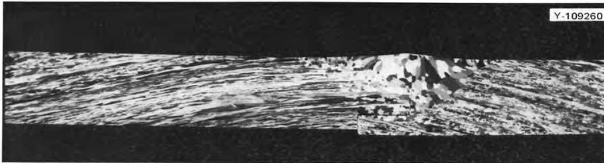  
Fig. 19. Cross section through electron-beam cylindrical girth weld shown in Fig. 18. Etchant: $20\mathrm{vol}\% \mathrm{H}_2\mathrm{O}_2 - 10\mathrm{vol}$ $\% \mathrm{H}_2\mathrm{SO}_4$ $(96\% \mathrm{H}_2\mathrm{SO}_4)$ -70 vol $\% \mathrm{H}_2\mathrm{O}$ . 6x.

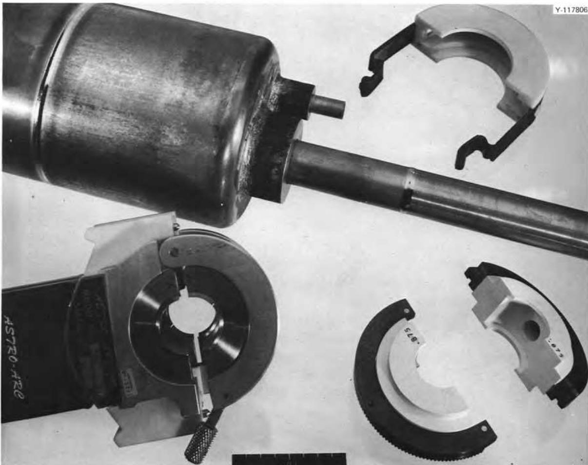  
Fig. 20. Orbiting-arc weld head and $7/8$ -in.-diam tube-to-tube butt weld.

Figure 21 also shows a feature which we added to the orbiting-arc head to permit us to make molybdenum welds outside the confinement of a glove box: molded rubber sleeves which seal tightly around the head and the tubes. Without these sleeves we were unable to make crack-free welds outside the inert gas chamber (i.e., in the "field"), whereas with the sleeves we were able to make helium leak-tight welds in the $\frac{1}{4} - \frac{3}{8}$ , and $\frac{1}{2}$ -in.-diam tubes. However, the results were not as reproducible with the field

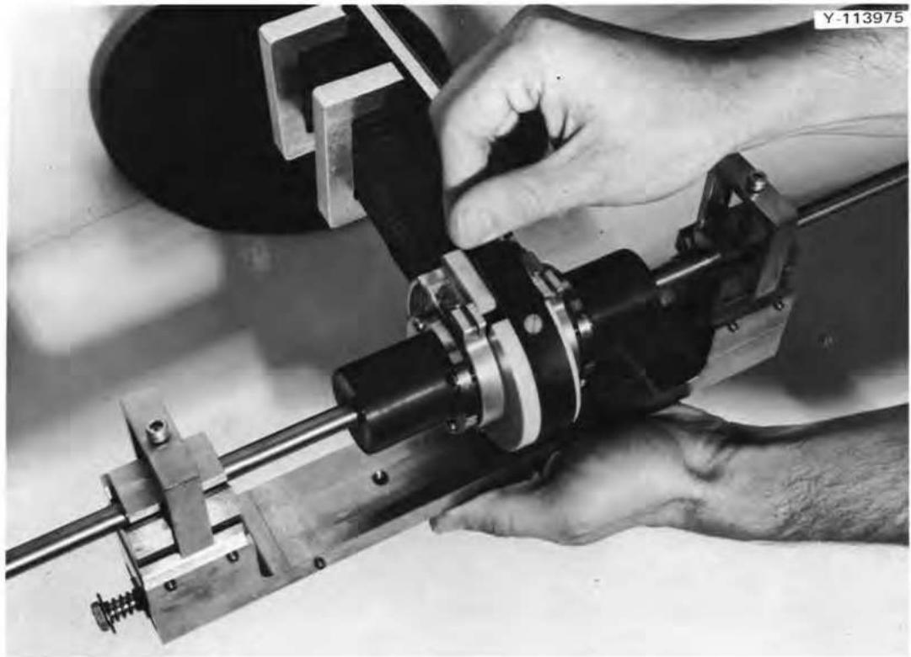  
Fig. 21. Orbiting-arc weld head with attached rubber sleeves for welding molybdenum tubing outside a glove box with yoke-type fixture.

welding technique as with the orbiting-arc unit inside the glove box. Therefore we controlled our assembly procedure and sequence so that a minimum of field welds would be required in construction of the test stand, as explained later in this report.

Weld inserts (such as the one shown in Fig. 22 between two tees) were used in the orbiting-arc welds to aid in controlling root reinforcement and joint misalignment. Because it protrudes slightly above the tube surface, it has the additional function of providing a small amount of filler metal for the joint, thus producing convex weld beads, which we have found to be less prone to cracking than concave beads.

The parameters for butt welding the tubing are given in Appendix C. The important features of the welding cycles are the relatively long portion at a lower "initial current," which provides preheating without fusion of the joint; and the gradual increase in rotational speed (in the cycles for the $1/4$ , $3/8$ , and $1/2$ -in.-diam tubes), which minimizes "weld-bead-widening" that occurs in tube welds as the overlap portion is approached. A cross section through a typical tube-to-tube butt weld made with the orbiting-arc process is shown in Fig. 23.

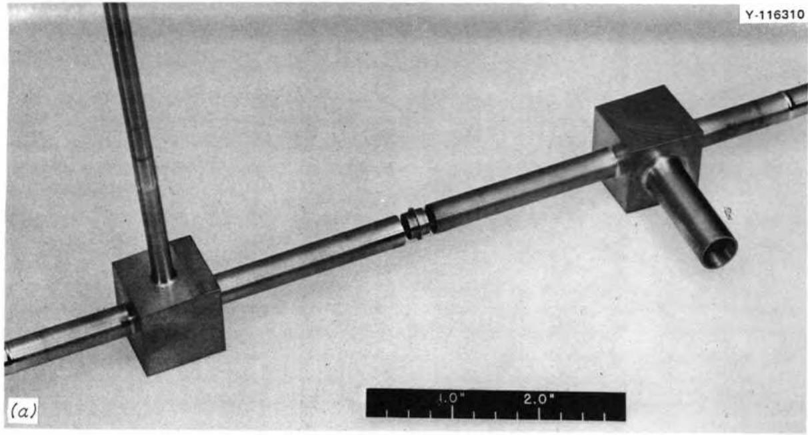

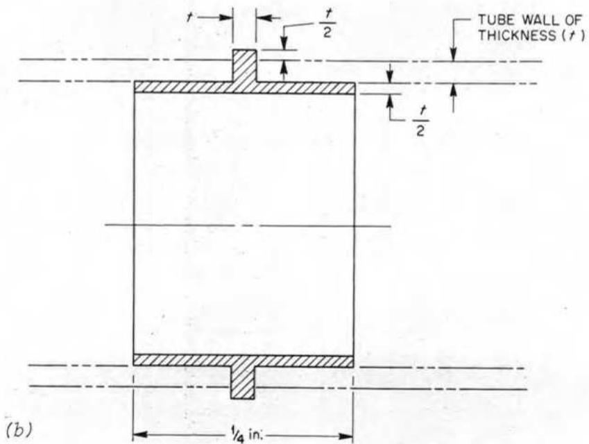  
Fig. 22. Orbiting-arc welds in molybdenum tubing. (a) Molybdenum tees with attached lines and insert in position prior to assembly for welding. (b) Design of typical insert for $\frac{1}{4}$ , $\frac{3}{8}$ , and $\frac{1}{2}$ -in.-OD tube-to-tube welds.

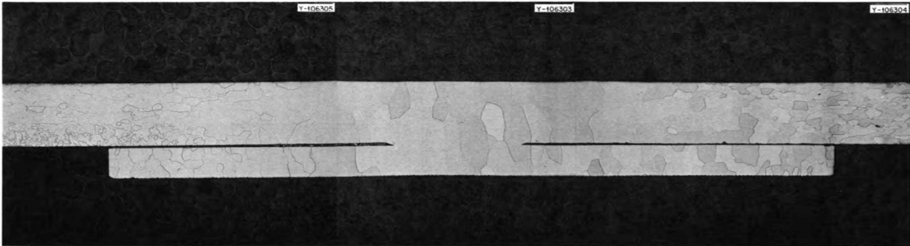  
Fig. 23. Cross section through an orbiting-arc field weld joining two 0.250-in.-OD, 0.020-in.-wall tubes. Etchant: 50 vol % $\mathrm{NH_4OH - 50vol\%H_2O_2}$ . $50\times$

# Brazing

N. C. Cole

Filler metal development. In building complex structures from molybdenum, brazing is attractive from two standpoints: (1) as a replacement for brittle welds and (2) as a reinforcement for welds. But to avoid severe loss of ductility to the base metal, the filler metal must flow below $1200^{\circ}\mathrm{C}$ .

Several commercial brazing filler metals will braze molybdenum, but they are rich in such metals as nickel, copper, silver, or gold, which are not corrosion resistant to molten bismuth at $700^{\circ}\mathrm{C}$ . In addition, silver is not resistant to corrosion by molten fluoride salts. Unfortunately, few materials adequately resist attack by bismuth. The refractory metals, such as molybdenum, tantalum, rhenium, and tungsten, possess the best resistance; however, it is difficult to depress the melting point of a refractory-metal-based alloy below $1200^{\circ}\mathrm{C}$ without completely sacrificing its corrosion resistance by the addition of large amounts of alloying elements.

Under certain conditions, iron and some of its alloys are reasonably compatible with bismuth. By alloying iron with small amounts of selected elements, we were able to depress the melting point of iron-based filler metals to below $1200^{\circ}\mathrm{C}$ . Figure 24a shows portions of the binary diagrams $^{16,17}$ of Fe-C, Fe-B, and B-C. The diagrams show that 1 to $4\%$ B or C added to Fe depresses its melting point significantly. By adding small percentages of both boron and carbon to iron, we were able to depress the melting point below $1150^{\circ}\mathrm{C}$ . We also felt that the addition of molybdenum to the filler metal would enhance its corrosion resistance to bismuth and minimize dissolution of the molybdenum base metal during brazing. Even with the addition of molybdenum, we found we could still keep the melting point of the alloy below $1200^{\circ}\mathrm{C}$ . Figure 24b shows the binary phase diagrams $^{16}$ of Fe-Mo, Fe-B, and Mo-B. Since the temperatures of the liquidus and solidus of the Fe-Mo diagram decrease as the molybdenum content increases from 0 to $35\%$ , we were able to add as much as $25\%$ Mo to the Fe-C-B ternary alloy without raising the melting temperature above $1175^{\circ}\mathrm{C}$ . From various wettability and flowability tests we found that additions of $15\%$ Mo, $4\%$ C, and $1\%$ B gave the optimum composition. In an attempt to further depress the melting temperature, we added small amounts of germanium. Adding $5\%$ Ge-depressed the melting point to $1050^{\circ}\mathrm{C}$ and, as a bonus, also improved flowability.

To determine mechanical properties of brazed joints made with these experimental filler metals, we shear-tested two of the most promising compositions. Miller-Peaslee shear-test specimens $^{18,19}$ were brazed with alloys Fe-15% Mo-5% Ge-4% C-1% B and Fe-15% Mo-4% C-1% B. They were pulled with a tensile machine at a strain rate of 0.002 in./min at both room temperature and $650^{\circ}\mathrm{C}$ . Average test results are shown in Table 6. Room-temperature shear strengths of these alloys were greater than 30,000 psi, and these compare favorably with base-metal shear strengths of about 45,000 psi. At $650^{\circ}\mathrm{C}$ the shear strengths of the joint brazed with Fe-Mo-Ge-C-B averaged 29,000 psi, whereas those with Fe-Mo-C-B were 18,000 psi. This lower strength is, however, more than adequate for most applications. The ductilities of joints brazed with both brazing alloys were outstanding at $650^{\circ}\mathrm{C}$ (elongations of 42 and 50%); and even at room temperature, where welded molybdenum is brittle, the elongations of the brazed joints were at least 10%.

16. M. Hansen, Constitution of Binary Alloys, 2d ed., McGraw-Hill, New York, 1958.   
17. R. P. Eliot, Constitution of Binary Alloys, First Supplement, McGraw-Hill, New York, 1965.   
18. F. M. Miller and R. L. Peaslee, "Proposed Procedure for Testing Shear Strength of Brazed Joints," Welding J. (N.Y.) 37(4), 144-s-150-s (1958).   
19. R. G. Gilliland and G. M. Slaughter, "The Development of Brazing Filler Metals for High Temperature Service," Welding J. (N.Y.) 48(10), 463-s-468-s (1969).

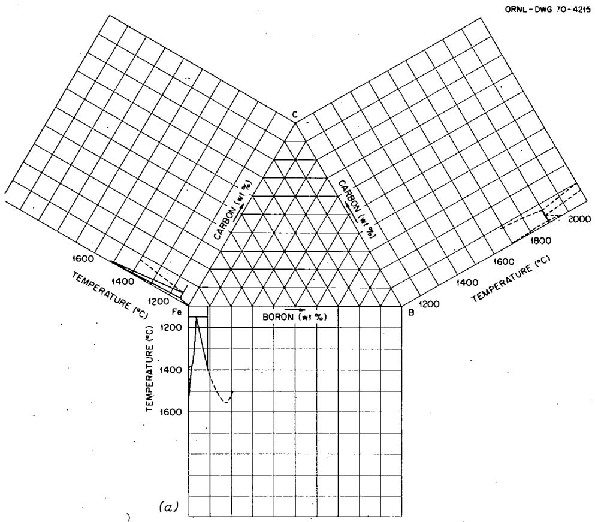

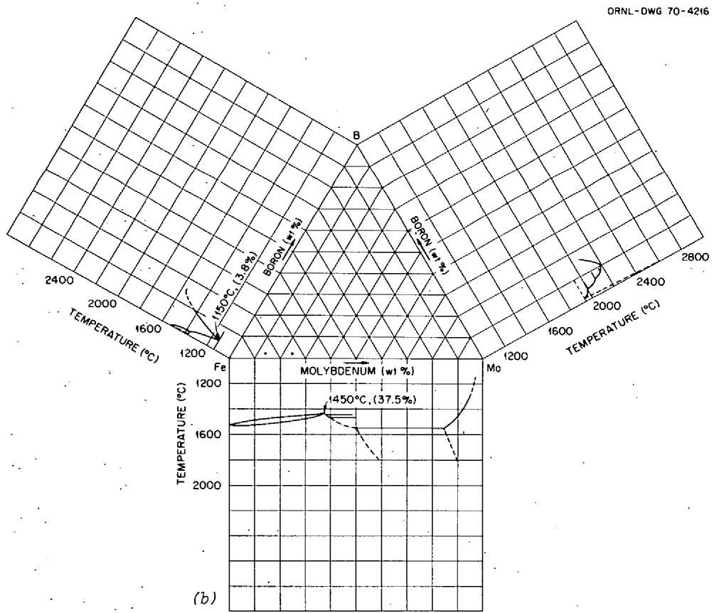  
Fig. 24. Portions of binary diagrams used to select alloy compositions for brazing studies. (a) Fe-C, Fe-B, B-C; (b) Fe-Mo, Fe-B, B-Mo.

Table 6. Mechanical properties of brazed molybdenum joints.   

<table><tr><td rowspan="2">Composition of brazing alloy (wt %)</td><td colspan="2">Shear strength (psi)</td><td colspan="2">Elongation (%)</td></tr><tr><td>Room temperature</td><td>650°C</td><td>Room temperature</td><td>650°C</td></tr><tr><td>Fe-15 Mo-5 Ge-4 C-1 B (42M)</td><td>30,000</td><td>29,000</td><td>10</td><td>50</td></tr><tr><td>Fe-15 Mo-4 C-1 B (35M)</td><td>31,000</td><td>18,000</td><td>11</td><td>42</td></tr></table>

The experimental brazing filler metals listed in Table 7 were tested in bismuth and fluoride salts at $700^{\circ}\mathrm{C}$ . All brazes survived the fluoride salt thermal convection loop tests with no metallographically detectable corrosion after $1032\mathrm{hr}$ . A typical example of the after-test appearance of these alloys is shown in Fig. 25.

For chemical processing applications, compatibility of the braze specimens with bismuth was considered the most stringent requirement, since the solubility of pure iron in bismuth is 50 ppm at $600^{\circ}\mathrm{C}$ and it is known to undergo temperature gradient mass transfer in liquid bismuth.[20,21] Molybdenum tee-joint samples brazed with four of the iron-based filler metals (Table 7) were exposed to static bismuth for 671 hr at $600^{\circ}\mathrm{C}$ . The most extensive dissolutive attack occurred in the fillet area of the sample brazed with the $\mathrm{Fe}-4\%$ C-1% B alloy. The area between the vertical and horizontal areas of the tee was more resistant to attack, and electron beam microprobe analysis showed that this area contained $15\%$ Mo, no doubt as a result of alloying during brazing. Furthermore, the specimens brazed with filler metals containing molybdenum were considerably more resistant to dissolution in the fillet areas.

Seven lap-joint specimens brazed with the four brazing filler metals were also exposed to flowing bismuth in a quartz thermal convection loop at 600 to $700^{\circ}\mathrm{C}$ for 2000 hr. All seven specimens were intact after testing. Three had been placed in the hot leg and four in the cold leg of the loop. (The Fe-C-B braze was placed only in the cold leg.) Weight-change data were not obtained, since some bismuth adhered to the specimens after test. Chemical analyses of the bismuth drained from the loop indicated that the amounts of iron and molybdenum, if present, were below the limit of detection, 3 ppm. Metallographic examination indicated the presence of one or more layers on the surface of each of the braze fillets. Microprobe analyses showed that the outer layer was rich in iron and the layer immediately under it was rich in molybdenum.

20. A. J. Romaro, C. J. Klamut, and D. H. Gurinsky, The Investigation of Container Materials for Bi and Pb Alloys. Part I. Thermal Convection Loops, BNL-811, Brookhaven National Laboratory (July 1963).   
21. B. R. T. Frost, C. C. Addison, A. Chitty, G. A. Geach, P. Gross, J. A. James, G. J. Metcalfe, T. Raine, and H. A. Soloman, "Liquid Metal Fuel Technology," Proceedings of the Second United Nations International Conference on the Peaceful Uses of Atomic Energy, Geneva, 1958, 7, 139-65, United Nations, New York, 1958.

Table 7. Characteristics of experimental filler metals for brazing molybdenum   

<table><tr><td>Composition (wt %)</td><td>Brazing temperature (°C)</td><td>Wettability and flowability</td><td>Joint integrity</td></tr><tr><td>Fe-4 C-1 B</td><td>1150</td><td>Excellent</td><td>Good</td></tr><tr><td>Fe-15 Mo-4 C-1 B</td><td>1150</td><td>Excellent</td><td>Good</td></tr><tr><td>Fe-25 Mo-4 C-1 B</td><td>1175</td><td>Excellent</td><td>(a)</td></tr><tr><td>Fe-15 Mo-5 Ge-4 C-1 B</td><td>1050</td><td>Outstanding</td><td>Good</td></tr></table>

${}^{a}$ Some tendency for cracking along base-metal-braze-metal interface.

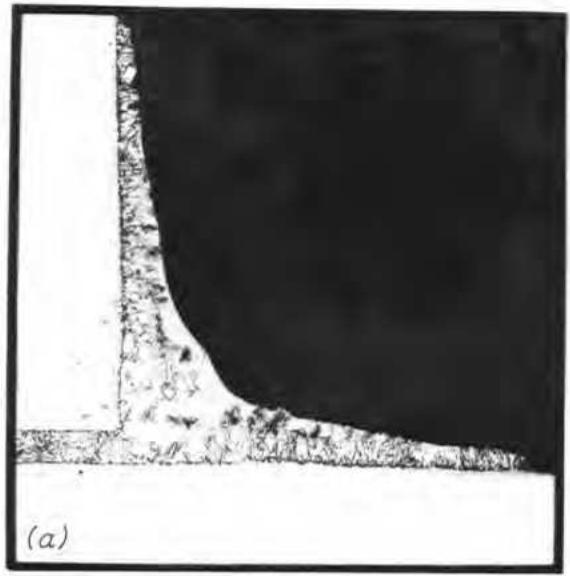  
0.035 INCHES 10.030 m 100x 10.010 m

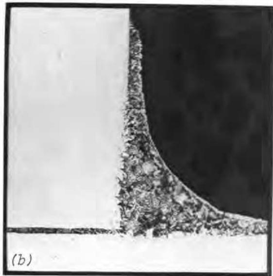  
Fig. 25. Cross section of a molybdenum lap joint brazed with 35M (Fe-15% Mo-4% C-1% B). (a) As brazed, (b) after testing in fluoride salts at $700^{\circ}C$ for 1032 hr.

Phases within the braze and along the interface between braze and base metal were also rich in molybdenum. Also, certain areas were enriched in bismuth, and it is interesting to note that those areas were associated with the regions of high molybdenum concentration. It appears that a complex intermetallic compound formed containing molybdenum, bismuth, and other unidentified elements. Because of limitations of the microprobe equipment, we were unable to analyze for the presence of boron and carbon, the other elements alloyed in the brazing filler metal.

The results for each specimen were much the same except that a larger amount of bismuth was found in the fillet of the $\mathrm{Fe - 4\%}$ C-1% B brazement. However, the fillet was still intact, contrary to the results obtained in the static capsule test reported above, where dissolution occurred. We feel that the layers rich in iron and molybdenum near the surface may have passivated the underlying material in this test.

After reviewing all filler metal requirements and the data generated on each of the alloys, we selected the composition Fe-15% Mo-5% Ge-4% C-1% B as the filler metal for brazing those sections of the chemical processing test stand that would contain bismuth.

Development of techniques for brazing. Brazing techniques were developed for two purposes: to provide reinforcement of the weld zone, which is brittle at room temperature, and to serve as a backup seal should a leak develop through a cracked joint. In building a complex system of material that has the impact sensitivity and reactivity (with oxygen) of molybdenum, many unique techniques had to be developed to ensure reliable brazed joints. Since specific brazing techniques were needed for the variety of joints required, much of our work was necessarily devoted to basic joint design and process development and improvement. We developed several methods of brazing using both resistance furnaces and high-frequency induction as the heat sources.

Furnace brazing - large pots. The four vessels with attached tubes were brazed in a resistance-heated vacuum furnace with a hot zone of $7 \times 7 \times 30$ in. In each end of the pots, two or more short lengths of tubing which were joined to the pots by roll bond or welding were back-brazed. At the same time, a split ring was brazed around the girth welds joining the two half sections. These subassemblies were brazed at $10^{-5}$ torr by heating at a rate of $5^{\circ}\mathrm{C / min}$ until flow of the brazing alloy was achieved. The temperature was monitored by several thermocouples placed at various locations throughout the furnace. The parts were

positioned in the furnace so the flow of the filler metal could be observed. Figure 26 shows an example of a $37/8$ -in.-diam molybdenum pot in which tubing joined by roll bonding or welding was back-brazed, and a split ring covering the girth weld was brazed into place.

In our preliminary work, we learned that a joint gap of at least 0.001 in. was necessary to ensure proper flow of the brazing filler metal into the joint. However, the joint preparation for roll bonding and welding required a tighter fit. Therefore, the portion of the joint to be back-brazed was counterbored an extra 0.001 to 0.002 in. on the radius to a depth of $\frac{3}{8}$ in. Filler metal feeder holes were drilled into the bosses of the vessels to serve as reservoirs for the brazing alloy powder and to ensure that the filler metal did not prematurely flow away from the joint until the thick-walled boss reached the melting temperature. We were concerned that if the filler metal were placed in the fillet area and the thin-walled tubing reached the brazing temperature faster than the heavy pot, the filler metal might flow along the hotter tube (and away from the joint) rather than into the joint. Although the procedure generally was satisfactory, cracking of the braze metal in the feeder holes proved to be a significant problem. Cracking was detected by a helium leak-check on the brazed joint and probably was the result of shrinkage stresses as the braze alloy solidified. To avoid this problem a wire was inserted into the small-diameter portion of the feeder hole before the filler metal was added, and a molybdenum cap was brazed over the outer end of the reservoir.

Furnace brazing of nozzle bodies. Several nozzle bodies extended through the stainless steel flange of the test stand. The bodies were made of nickel or stainless steel and were brazed to at least one molybdenum line. The joint design included a combination of trepans and feeder holes to obtain proper flow of brazing filler metal into the joint. We successfully brazed several mockups of these dissimilar metal joints (Fig. 27).

Since a small amount of bismuth vapor could reach the stainless steel nozzle body in the area of the body-to-molybdenum-tube braze, it was to be brazed with the iron-based filler metal. None of the nickel nozzle bodies were to be exposed to bismuth, so they could be brazed with a commercial brazing filler metal. Several filler metals were evaluated for the latter use, and Au-18% Ni was selected because it flowed adequately. Each of the nozzle brazes was to be made vertically in a vacuum furnace by resistance heating in the area of the nozzle only. To avoid several additional welded and brazed joints in the molybdenum tubing, an extension was added to the furnace to accommodate tubing up to 6 ft long.

Glove box brazing. For brazing of sections of the 17-ft-long test stand that would not fit into any available furnace, it was necessary to design and build portable furnaces for localized heating in a glove box. The controlled atmosphere of the glove box was utilized to prevent oxidation of all portions of the assembly that were heated during the brazing operation. We investigated two types of localized heating sources: resistance and induction. Each has merit for different braze joints, depending on the size and location.

Two types of resistance-heated furnaces were built, both utilizing tantalum heating elements. One had a helical heating element for brazing those joints over which it could be slipped on and off. The other had a split tantalum-sheet heater which could be opened and placed over the welded joint in situ and then removed after brazing. This feature was necessary on sections where the furnace could not be slipped over a large or complex section to reach the braze region.

We investigated induction heating for use both inside and outside an atmosphere chamber. We experienced problems with arcing in the glove box under argon or helium atmospheres as well as in vacuum when the brazing alloy binder (used for preplacing the filler metal) volatilized. We overcame this difficulty by installing an auxiliary transformer to reduce the high voltage from the power supply to low voltage and high amperage at the coil. With this new attachment, we were able to braze inside the glove box in argon or helium without arcing problems. By changing the geometry of the copper leads from thin-walled tubing to

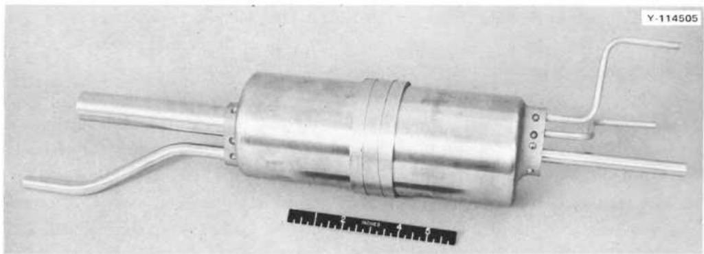

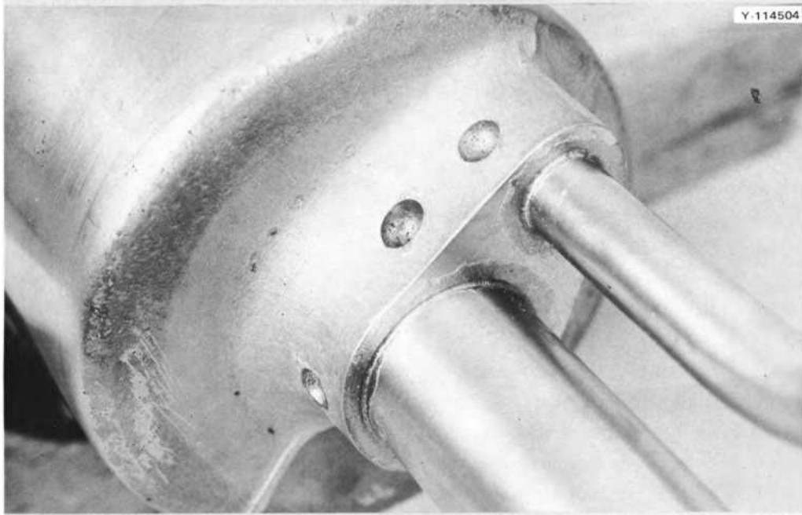

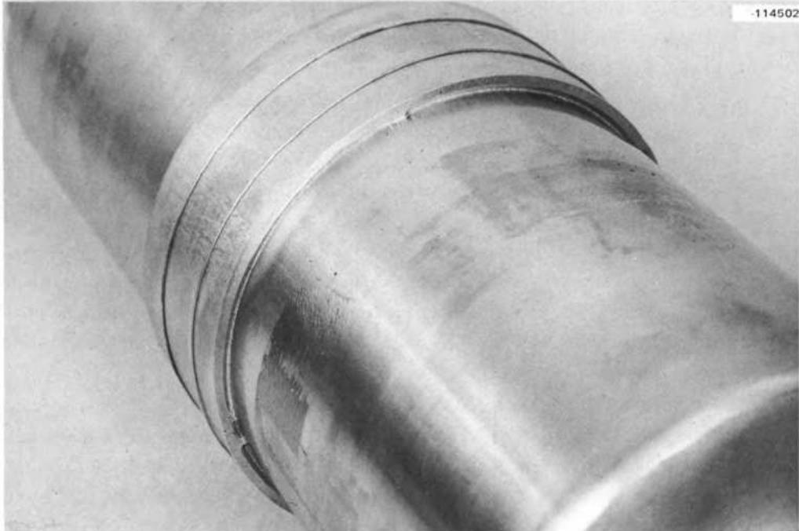  
Fig. 26. Molybdenum pot after back-brazing of tube-to-header joint and brazing of ring around cylindrical girth weld.

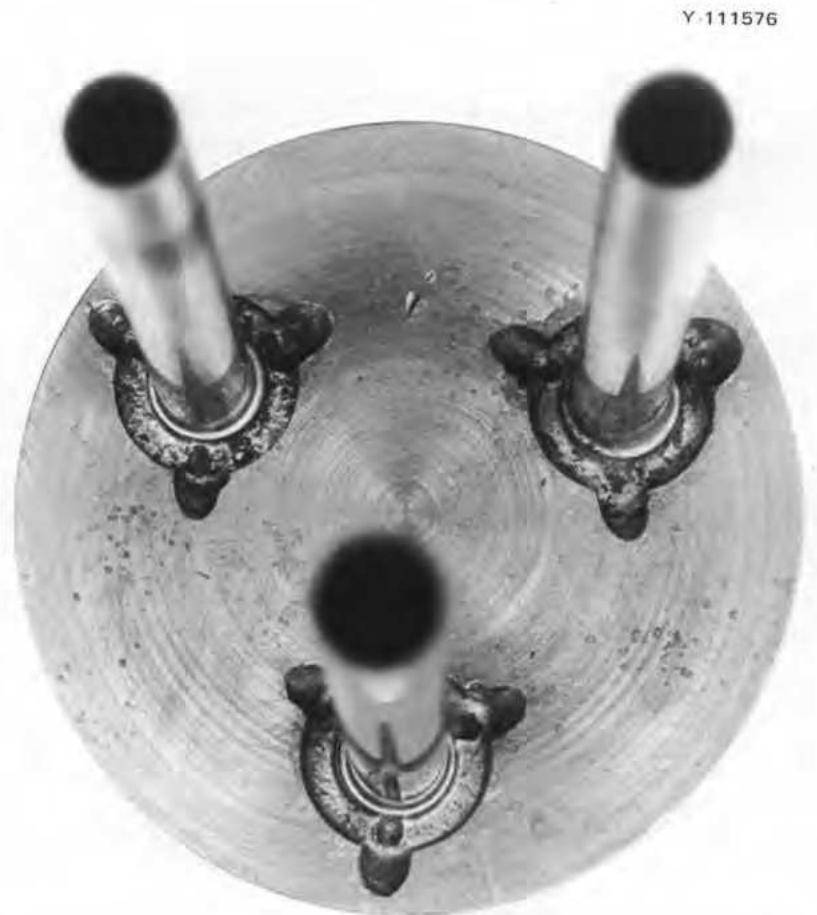  
Fig. 27. Mockup of stainless steel nozzle body brazed to molybdenum tubes. Body diameter, 2 in.

closely spaced bus bars, we were able to easily achieve brazing temperature on even the largest size of tubing with attached heat sinks. Figure 28 shows a split sleeve brazed around a weld joining a length of $1^{1/8}$ -in.-diam tubing to a stub attached to a prototype vessel. A helical induction coil was slipped over the sleeve, and brazing was completed in $35\mathrm{min}$ by heating only the immediate area of the part. The heating rate was closely controlled, and the brazing temperature was monitored by a thermocouple placed under the edge of the split sleeve. Alternatively, we brazed this same $1^{1/8}$ -in. diam configuration by heating locally with a portable resistance furnace. The portable resistance furnace is also capable of brazing all of the smaller tube-to-tube joints, provided that there is enough space around the tubing for the 3-in.-diam, 5-in.-long insulated heater and that the assembly will fit into a vacuum chamber.

Field brazing. Seven tubes have to be joined in the field to connect the subassemblies. Tubing of the size $\frac{1}{4} - \frac{3}{8} - \frac{1}{2}$ , and possibly $\frac{7}{8}$ -in. outside diameter will first be welded and the split sleeves back-brazed on site. In this regard, we field-brazed (by induction) sleeves on mockups of all of these sizes of tubing. We surrounded the part to be brazed with a quartz tube placed inside the induction coil. Helium gas flowed over the heated area to protect the braze from air. However, the induction coil was still operated in air. When the induction unit was activated, the 2-in.-long section of tubing with the split sleeve was quickly brought to brazing temperature. Because of the small mass of material being heated, adjacent areas remained relatively cool, and the entire brazing cycle took less than 5 min.

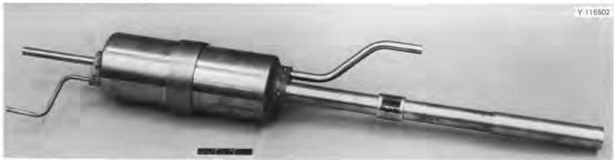  
Fig. 28. Mockup of column joined to upper disengaging section. A split sleeve was brazed with Fe-15% Mo-5% Ge-4% C-1% B over a tungsten-arc weld.

We have also investigated the use of split induction coils. Split coils have an advantage in removability, as described for the split resistance heater. With a 1-in. split coil, we reached brazing temperature on a $\frac{1}{2}$ -in.-diam tube and matching split-sleeve assembly. Unfortunately, the 1-in. split coil did not couple well enough electrically with other sizes. As a result, we obtained additional split coils for the other sizes of tubing, both smaller and larger, but this phase of our investigation was not completed.

# Mechanical Couplings

# J.R.DiStefano

Although little was known relative to mechanical couplings of molybdenum, we felt that such joints would be desirable because they would (1) allow relatively easy replacement of components in case of a failure and (2) allow us to avoid making a difficult tube-to-header weld in locations where a tube passed through the end section of a feed pot.

To investigate resealable joints, experimental metal seal couplings for $\frac{1}{4}$ -in.-OD tubing were obtained from Gamah Corporation and Aeroquip Corporation. Both of these couplings used molybdenum seal rings, but a threaded nut applied the force that sealed the Gamah joint, while an external compressive force was required to seal the Aeroquip joint and then a gate or pin used to maintain the compressive force on the metal seal ring. This latter design is aimed at remote applications and is attractive because molybdenum components easily gall and a threaded nut is particularly susceptible to this problem. However, problems encountered in sealing the Aeroquip joint resulted in our cracking one of the molybdenum components, and further evaluation was discontinued.

An additional experimental coupling was built at ORNL with the design shown in Fig. 29. The components of this coupling were all made of molybdenum, but the seal gasket was made of a laminated carbon product called Grafoil.[24] Grafoil is a low-density graphite foil $(70\mathrm{lb} / \mathrm{ft}^3)$ that is useful as a gasket material; its compressive modulus increases from 7000 to 50,000 psi as load is applied. Both this coupling and the Gamah coupling were tested for tightness by measuring their helium leak rates before and after thermally cycling from room temperature to $650^{\circ}\mathrm{C}$ . Each was leak-tight $(< 5\times 10^{-8}\mathrm{atmcm}^{3}\mathrm{sec}^{-1})$ prior to being thermally cycled ten times to $650^{\circ}\mathrm{C}$ . After thermal cycling, the ORNL-designed joint remained leak-tight, but the Gamah joint had a helium leak rate of $5\times 10^{-6}\mathrm{atmcm}^{3}\mathrm{sec}^{-1}$ . It was disassembled and returned to the company, and no further evaluation of this joint was made. We disassembled the Grafoil

ORNL-DWG 71-3181

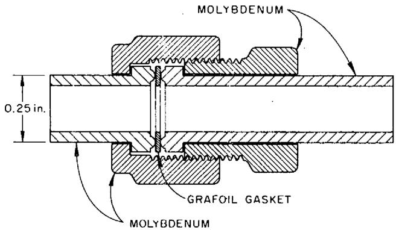  
Fig. 29. Molybdenum mechanical coupling.

seal ring coupling, resealed it, and then thermally cycled it several more times. It continued to be helium leak-tight $(< 5 \times 10^{-8}$ atm $\mathrm{cm}^3\mathrm{sec}^{-1})$ as before. This coupling was more easily disassembled than previous joints because of its modified rounded thread design. Although resealable couplings of this type were demonstrated to be experimentally feasible, they were not included in the final design of the test stand because of space and cost limitations.

In addition to joints that can be disassembled, mechanical tube-to-header connections were developed for attaching certain lines, as indicated in Fig. 4. Two techniques, magnforming and roll bonding, were investigated. In magnforming, magnetic pressures of up to 50,000 psi resulting from current discharged through a coil from a capacitor bank are applied in pulses of 10 to $20 \times 10^{-6}$ sec duration. No direct mechanical contact between the machine that applies the force and the work is involved. Four tube-to-tube joints in which one tube fitted inside the other were fabricated, but the lowest helium leak rate for these joints was $2 \times 10^{-5}$ atm cm $^3$ sec $^{-1}$ at room temperature.

In roll bonding, a tool containing expandable rollers mechanically forces the two surfaces together. Tube expanders were obtained commercially, and some of them are shown in Fig. 30. These tube expanders were specially made to meet the length requirements for joining $\frac{1}{4} - \frac{3}{8}$ , and $\frac{1}{2}$ -in.-OD tubes to the back-extruded half sections. The long lengths were required because some of the tubes to be bonded extended into the pots for some distance, and bends on the exit end prevented access from that direction. The tool expands inside the tube to force the tube wall partially onto the lands formed by grooves machined inside the boss, as shown in the upper left-hand portion of Fig. 4.

In order to lessen the chances of splitting the tube during bonding, joints were made at approximately $250^{\circ}\mathrm{C}$ . Although roll bonding was first done successfully in air at this temperature, an inert atmosphere is required to prevent contamination of areas that must be subsequently welded or brazed. Therefore, further roll-bonding development was carried out in an inert-atmosphere chamber, as shown in Fig. 31. Leak-tight joints $(<1\times 10^{-7}$ atm $\mathrm{cm}^3\mathrm{sec}^{-1})$ were made at $250^{\circ}\mathrm{C}$ using Necrolene $^{25}$ plus molybdenum disilicide as a lubricant inside the tubes under the following conditions:

<table><tr><td>Tube outside diameter (in.)</td><td>Torque (in.-lb)</td></tr><tr><td>1/4</td><td>10-12</td></tr><tr><td>3/8</td><td>30-35</td></tr><tr><td>1/2</td><td>55-60</td></tr></table>

25. Trade name for high-temperature lubricant marketed by Crawford Emulsions, Pittsburgh, Pa.

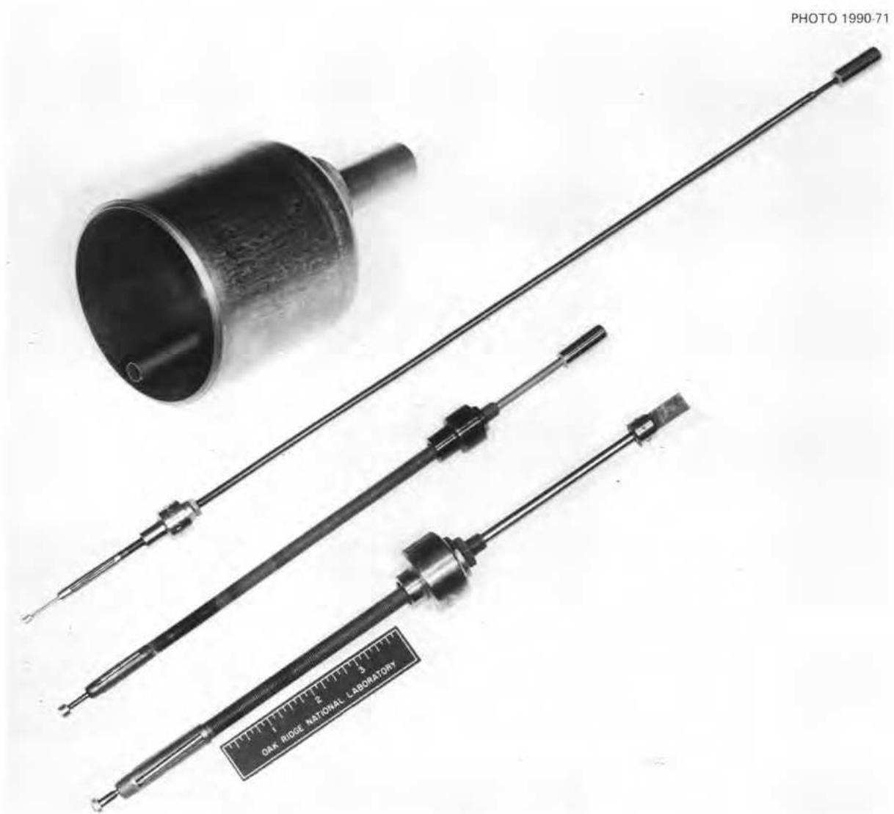  
Fig. 30. Tube expanders for roll bonding.

The torques listed are approximately the highest values that could be achieved. Attempts to increase the torque were generally unsuccessful, as the tube expanders began to slip and the molybdenum tubing began to flake on the inside surface. These joints were also leak-tight after being thermally cycled ten times from room temperature to $650^{\circ}\mathrm{C}$ .

Brazing was to be used to strengthen the roll-bonded joints, but since the filler metals developed were not completely resistant to attack by bismuth, we also investigated the application of a tungsten or molybdenum coating around the joint on the inside of the vessel. The coatings were applied by chemical vapor deposition techniques using hydrogen reduction of $\mathrm{WF}_6$ and $\mathrm{MoF}_6$ at about 600 and $900^{\circ}\mathrm{C}$ respectively.[26,27] Several mockups of a roll-bonded tungsten-coated and brazed joint were made, and a section through a typical joint is shown in Fig. 32. Higher-magnification enlargements indicate the extent of

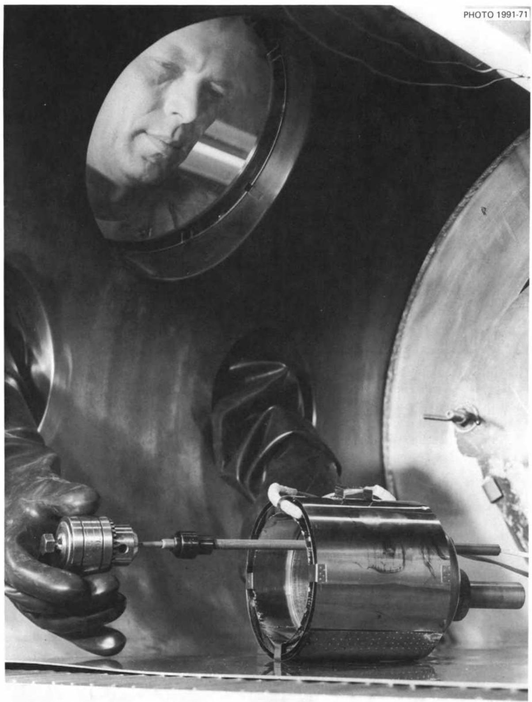  
Fig. 31. Roll bonding molybdenum at $250^{\circ}\mathrm{C}$ in inert atmosphere chamber.

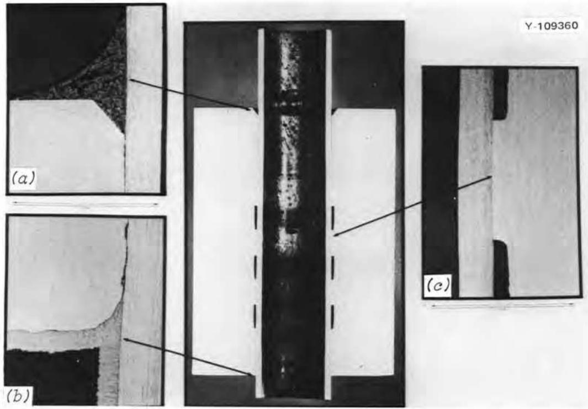  
Fig. 32. Section through molybdenum roll-bonded joint (c) sealed by chemical vapor deposition (b) and back-brazing (a).

bonding that has been effected between the tube and boss by the three methods of sealing. Note that the molybdenum tube has sealed against the boss along the land between the grooves, but there is no evidence of material flowing into the groove. This would indicate that the depth of the groove (0.020 in. in this case) is relatively unimportant in making this type of joint. Some material flows into the tube-boss crevice in both CVD tungsten coating and back-brazing. However, the brazing filler metal generally penetrated considerably further than the CVD tungsten coating did.

# CONSTRUCTION

The construction portion of this project can be divided into four stages. These are: (1) construction of a full-size mockup of the test stand, (2) fabrication and profit of components, (3) joining of components into subassemblies, and (4) interconnection of subassemblies to complete the test stand. Stage 4, however, has not been completed.

# Mockup Construction

A full-scale mockup of the test stand was constructed of wood and stainless steel tubing. It was an invaluable tool in many different areas, including design, fabrication, and assembly. The mockup was initially built from a set of preliminary piping drawings. Final piping drawings were prepared after studying the mockup and making various changes to optimize locations of lines and components.

The mockup was also used to ensure that lines were accessible for welding and brazing and to determine the specific locations of all of the weld joints. Problems encountered in constructing the mockup (such as difficulties in making complex tube bends) were worked out in this phase, thus making fabrication of the molybdenum tubes much easier. The experience gained by the pipe fitter on the mockup also proved valuable when actual test-stand construction was started.

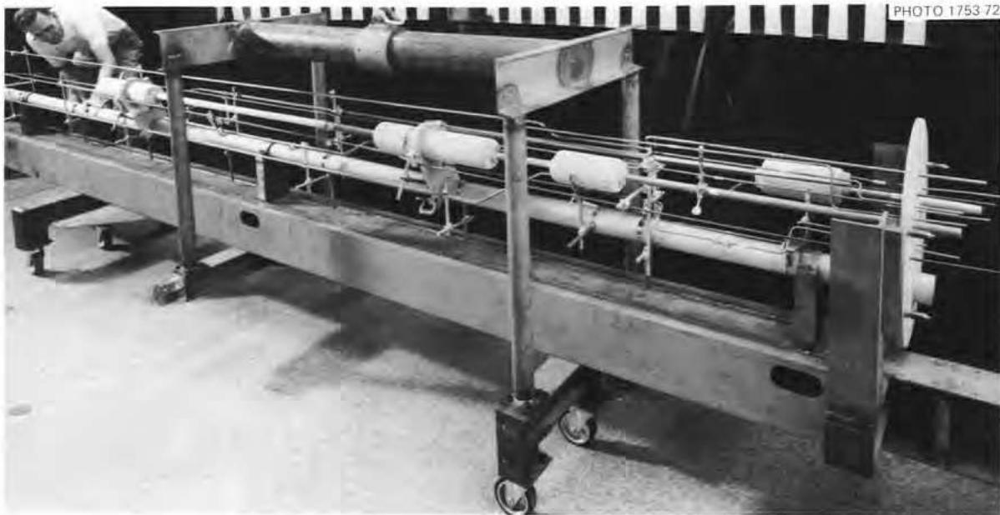  
Fig. 33. Wood and steel mockup of the molybdenum test stand installed on the assembly jig.

After design of the system was essentially finalized, an assembly jig was built that was also to be used for transporting the completed stand to the experiment cell for installation. The major design criterion for this jig was that it had to be very rigid to minimize flexing of the loop during moving. The resulting structure (as seen in Fig. 33 with the mockup installed) was a long central spine consisting of an 8-in.-wide flange 1 beam for axial stiffness, with two 8-in. channels welded on for additional resistance to torsional loads. Cross members were used to support the stainless steel flange from which the loop would be suspended, for attachment of casters, and for attachment of trunnions to be used for pivoting during erection.

A detailed procedure was written for transportation of the completed test stand from the assembly area in the Metals and Ceramics Division to the experimental cell on the third floor of the Chemical Technology Division building, where the test stand was to be operated. Because of the expected fragility of the completed system and the time delay and added expense if the loop were damaged, a full run-through of the entire transportation procedure was carried out using the mockup. The assembly jig was instrumented with strain gages to measure deflections and with accelerometers to record load magnitudes. These factors were monitored during the entire move except for a brief period while the test stand was on a truck between buildings. In addition to these quantitative measurements, several pieces of molybdenum tubing, which contained both bare welds and welds protected by brazed sleeves, were attached to the mockup at strategic locations. The mockup and assembly jig are shown in Fig. 34. The practice move was a complete success in that it was carried out very smoothly, the loads and deflections recorded were well below acceptable values, and on reinspection, we found that the welded specimens had not been damaged.

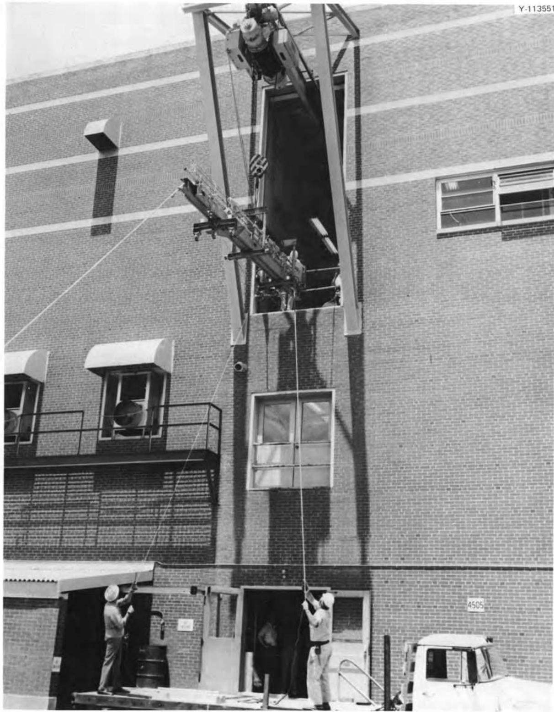  
Fig. 34. Mockup and assembly jig being lifted into the room above the experiment cell.

# Fabrication and Prefit of Components

The next stage involved the substitution of molybdenum components for the wood and steel components of the mockup on the assembly jig. The lengths of the various lines were matched with the available lengths of molybdenum tubing, and selection was made to avoid, whenever possible, any unnecessary weld joints.

All tubes were bent at room temperature with standard hand or bench-mounted tubing benders. Mandrels or other supports were not used inside the tubing, so that, in some cases, there was a slight flattening in the bend. Flattening occurred predominantly in some early bends (on $1/4-$ and $3/8$ -OD tubing) made with a hand bender with a single fixed die. We subsequently minimized this condition by switching to a bench-mounted bender which had both a fixed and a sliding die. Examples of some of the bends made on the test stand are shown in Fig. 35.

After bending, the tubes were cut at the required weld-joint locations using a specially designed abrasive cutoff device. It was necessary to cut the lines at positions about 6 in. from the pots under the constraint of the size limitations of the vacuum chamber of the electron-beam welder used for making the header-to-header welds. The relatively small size of this chamber (36 in. wide, 23 in. deep, and 24 in. high) limited the total length of a vessel half section and its protruding tubes to about 17 in. The cutoff device, which was designed and built at ORNL, features a 4-in.-diam thin abrasive wheel powered by a small dc motor mounted on a machinist's cross slide for precise movement. A slit V-block was used to support both ends of the tube being cut. With this equipment, we were able to make cuts in molybdenum tubing that required no subsequent preparation prior to joining by welding.

After all of the various lines were bent and installed, along with the unjoined pots, on the field-assembly jig, the tubing was removed, degreased with acetone, and stress-relieved in vacuum for $60\mathrm{min}$ at $900^{\circ}\mathrm{C}$ . We

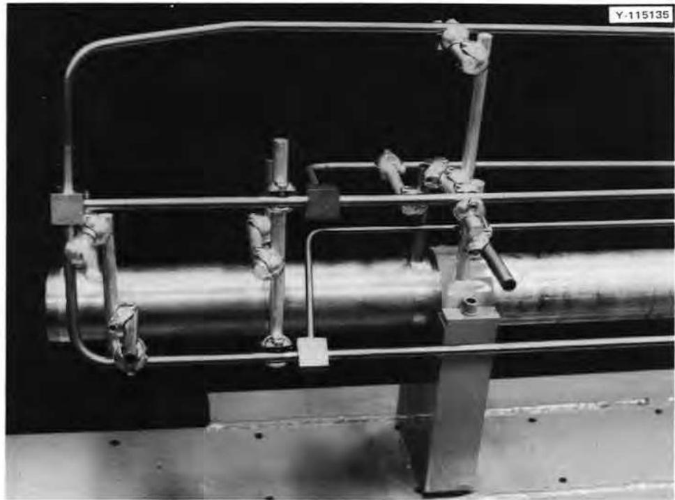  
Fig. 35. Bottom section of test stand illustrating bends in $\frac{1}{4}$ and $\frac{3}{8}$ in.-diam molybdenum tubing.

decided not to attempt to chemically clean the entire lengths of tubing using the procedure described above under "Material Selection and Preparation" but to locally clean the ends of the tubes just prior to welding. We were concerned that we would be unable to remove the smut left by cleaning from inside the bent tubing. After stress-relieving, all components were once again installed on the assembly jig for a final fit-up check prior to construction.

# Fabrication of Subassemblies

Four sections of the loop were fabricated as separate subassemblies. These were the bismuth and salt feed pots and the upper and lower disengaging sections. Although each of these subassemblies was different, the basic steps taken in their fabrication were the same, and these are as follows:

1. Join tubes to half section (header) with electron-beam weld   
2. Attach remaining tubes to half section with roll bond   
3. Helium leak check half section   
4. Apply tungsten by chemical vapor deposition to inside of half section   
5. Helium leak check   
6. Install internal components such as baffle plates   
7. Assemble two half sections and pin with molybdenum pins   
8. Join half sections with electron-beam girth weld   
9. Radiographically inspect   
10. Helium leak check   
11. Install girth band and braze along with back brazes of tube-to-header joints   
12. Helium leak check the completed subassembly

The techniques used in each step of this list were discussed in previous sections of this report. The lower disengaging subassembly is shown in Fig. 36 after the header-to-header weld was made but prior to brazing. The brazed bismuth feed pot is shown in Fig. 37. Both of these subassemblies were helium leak-tight.

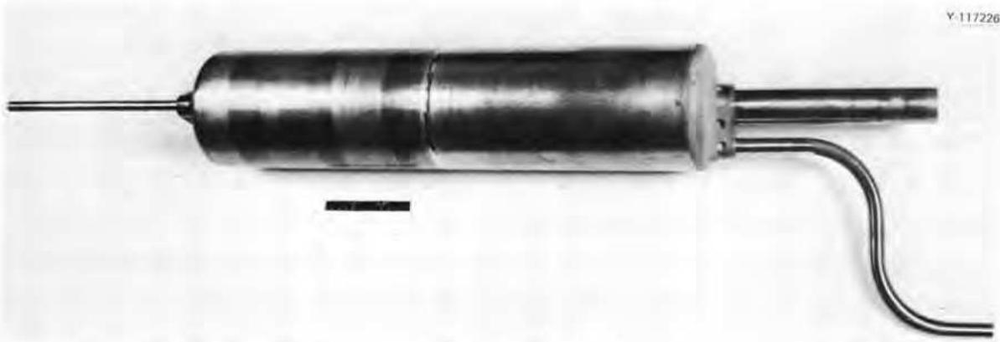  
Fig. 36. Lower disengaging section after the cylindrical girth weld was made by the electron-beam process.

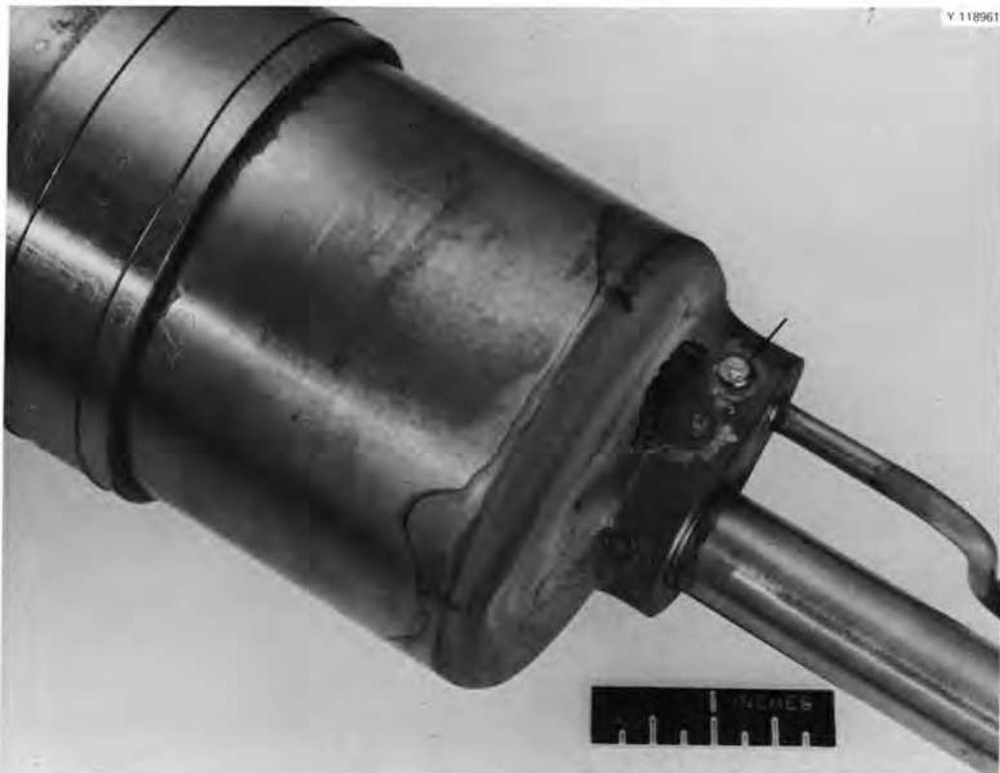  
Fig. 37. Upper end of the bismuth feed pot after furnace brazing of the girth band and tube-to-header joints with the iron-base brazing filler metal. Note the molybdenum caps brazed over the reservoirs in the boss (arrow).

# Interconnection of Subassemblies

The completed subassemblies will be reinstalled on the assembly jig for a final check of the fit-up of the various tube-to-tube weld joints. Our basic philosophy with regard to final assembly of the test stand is that wherever possible, all welds and brazes will be made in the protective atmosphere of a welding chamber. However, even with an extension that increases the length of our chamber to over 12 ft, we will be unable to accommodate the entire test stand, so that some welds will have to be made outside the glove box. However, by careful planning, we have developed an assembly sequence in which only the final 7 of 43 tube-to-tube welds will have to be made in the field. The test stand will be welded in three major sections, with each section being alternately transferred to a rigid beam for installation in the welding chamber. After all the joints on a given section have been welded and the reinforcing sleeves brazed, the completed section will be reinstalled on the assembly jig for final field welding.

# ACKNOWLEDGMENTS

The work described in this report was supported by the Molten Salt Reactor Program and extended from 1969 to the present. In addition to the authors, many others made significant contributions. E. L. Nicholson and W. F. Schaffer were responsible for design of the test stand. Chemical vapor deposition techniques were developed by J. I. Federer and roll bonding techniques by J. L. Griffith. A. C. Schaffhauser, J. D. Hudson, G. C. Nelson, and J. W. Hendricks were significant contributors to fabrication and joining studies, and J. W. Koger, O. B. Cavin, and L. R. Trotter conducted the supporting compatibility tests.

# Appendix A

# SPECIFICATIONS FOR PURCHASE OF MOLYBDENUM TUBING

# Specification MET-RM-B-208

TENTATIVE SPECIFICATION FOR SEAMLESS, ARC-CAST MOLYBDENUM TUBING FOR HIGH-TEMPERATURE SERVICE

# SCOPE

1. This specification covers wrought seamless molybdenum tubing produced from vacuum arc castings or equivalent melting practices.

# MANUFACTURE

2. Tubes shall be fabricated from arc-cast molybdenum extruded billets.

# HEAT TREATMENT

3. Tubes shall be furnished in a stress-relieved condition.

# CHEMICAL COMPOSITION

4. The chemical composition of the starting tube shell shall conform to the chemical composition requirements prescribed in Table 1.

Table 1. Chemical Composition   

<table><tr><td colspan="2">Element</td></tr><tr><td>Molybdenum</td><td>99.90 min</td></tr><tr><td>Carbon</td><td>&lt;50 ppm max</td></tr><tr><td>Aluminum</td><td>20 ppm max</td></tr><tr><td>Calcium</td><td>20 ppm max</td></tr><tr><td>Cobalt</td><td>20 ppm max</td></tr><tr><td>Copper</td><td>10 ppm max</td></tr><tr><td>Iron</td><td>100 ppm max</td></tr><tr><td>Lead</td><td>20 ppm max</td></tr><tr><td>Magnesium</td><td>20 ppm max</td></tr><tr><td>Manganese</td><td>20 ppm max</td></tr><tr><td>Nickel</td><td>20 ppm max</td></tr><tr><td>Silicon</td><td>80 ppm max</td></tr><tr><td>Tin</td><td>20 ppm max</td></tr><tr><td>Oxygen</td><td>&lt;10 ppm max</td></tr><tr><td>Hydrogen</td><td>5 ppm max</td></tr><tr><td>Nitrogen</td><td>20 ppm max</td></tr></table>

# CHECK ANALYSIS

5.(a) A check analysis shall be performed by the Seller on one finished tube from each lot. The concentration of each specified element shall be as prescribed in Table 1 except carbon shall be $< 70$ ppm and oxygen shall be $< 50$ ppm. A lot shall be defined as all finished material of the same nominal wall thickness which is produced from the same heat of alloy and subject to the same finishing treatment. The lot shall include only that material which is heat treated in the same furnace charge.

(b) The material for check analysis shall be equally divided into two (2) portions, one (1) to be used by the Seller for check analysis, and one (1) to be sent to the Company. The methods of chemical analyses used in determination of elements mentioned in Table 1 shall be approved by the Company prior to use. The results of the chemical analyses shall be reported to the Company and shall conform to the requirements specified in Table 1.

# PERMISSIBLE VARIATION IN DIMENSIONS

# 6.(a) Diameter and Wall Thickness

The permissible variation in diameter and wall thickness of tubes shall not exceed limits prescribed below:

<table><tr><td>Nominal Outside Diameter in Inches</td><td colspan="2">Variation in Outside Diameter Over and Under (in.)</td><td>Variation in Wall Thickness Over and Under (%)</td></tr><tr><td>Under 1</td><td>+0.005</td><td>-0.000</td><td>±10</td></tr><tr><td>1 to 1 l/2 incl.</td><td>+0.007</td><td>-0.000</td><td>±10</td></tr><tr><td>Over 1 l/2 to 2 excl.</td><td>+0.008</td><td>-0.000</td><td>±10</td></tr><tr><td>2 to 2 l/2 excl.</td><td>+0.010</td><td>-0.000</td><td>±10</td></tr><tr><td>2 l/2 to 3 excl.</td><td>+0.012</td><td>-0.000</td><td>±10</td></tr><tr><td>3 to 4 incl.</td><td>+0.015</td><td>-0.000</td><td>±10</td></tr></table>

# (b) Straightness

The tubing shall be supplied in straight lengths with a maximum deviation of 0.060 in. per 3-ft-length measure in any plane.

# SURFACE FINISH AND WORKMANSHIP

7.(a) The finished tubes shall be free from oxide or scale and any other foreign material.   
(b) The finished tubes shall be free of cracks, seams, laps, gouges, tears, or other defects which exceed five (5) percent of the thickness or 0.005 in., whichever is larger.   
(c) Defects may be removed by grinding, provided the nominal wall thicknesses are not decreased to less than that permitted in Section 6. Ground areas shall have the same surface finish requirements as unground areas of the material. Ground areas shall merge smoothly with the adjacent surface.

# CERTIFICATION AND INSPECTION

8.(a) The Seller shall notify the Company in writing five (5) days in advance of the date inspection shall be conducted so that the Company's inspector may be present to witness fluid-penetrant inspection, to check dimensions, and to visually inspect the material.   
(b) Visual Inspection

Each tube shall be visually inspected by the Seller under direct daylight or fluorescent light of at least 100 footcandles to ensure conformance with Section 7.

(c) Penetrant Inspection

The outside surface of the tubing shall be penetrant inspected in accordance with Company Specification, Tentative Method for Liquid-Penetrant Inspection (Designated: MET-NDT-4).

(d) Ultrasonic Inspection

The material shall be ultrasonically inspected in accordance with Company Specification, Tentative Method for Ultrasonic Inspection of Metal Pipe and Tubing (Designated: MET-RM-4) with the following exception: the depth of the notch in the calibration standard, referenced in Section 4(a) of the above mentioned specification, shall be 0.005 in. or $5\%$ of the material thickness, whichever is larger.

(e) The Seller shall submit to the Company a certified statement of compliance that all materials conform to this specification and shall attach certified reports of results of all required tests. Each test report shall be identified. The following reports shall be furnished the Company at time of shipment or earlier if available and requested by the Company.

1. Chemical analyses (check and ingot),   
2. Fluid-penetrant inspection, and   
3. Ultrasonic inspection.

# PACKING FOR DELIVERY

9. Tubes shall be capped and boxed to protect against damage and to maintain cleanliness of the tubing during handling and shipment and each container shall be marked with the following information:

1. Size and type of material and   
2. Heat number.

# MARKING

10.(a) Each end of each tube shall be tagged with the following identification marking:

1. Manufacturer's name,   
2. Specification No. MET-RM-B 208,   
3. Heat number,   
4. Lot number, and   
5. Tube diameter and wall thickness.

# Specification MET-NDT-3

# Tentative Specification for the Ultrasonic Inspection of Metal Pipe and Tubing

# Introduction

This standard includes requirements of ASTM E213-68, "Ultrasonic Inspection of Metal Pipe and Tubing for Longitudinal Discontinuities," with modifications and additional requirements. Sections and paragraphs of ASTM E213-68 not specifically mentioned in this standard remain as written in the ASTM Standard. Modified sections are arranged under the same headings and paragraph numbers as employed in ASTM E213-68 with the modified portions of the sections underlined. This specification covers both (a) longitudinal and (b) transverse flaw detection techniques.

However, only the longitudinal test is applied if a specific request for the transverse test is not specified by the service request. Requirements are mandatory unless specifically excepted by the service request which also shall specify the applicable examination level.

A. Longitudinal Flaw Detection

Scope

1. This method covers a procedure for detecting longitudinal discontinuities in metal pipe and tubing using pulse-reflection ultrasonic contact or immersion techniques. It is intended to be used for tubular products having outside diameters from approximately 1/8 to 6 in. These techniques have been used for smaller and larger sizes, however, and may be specified upon contractual agreement by the purchaser and the producer.

Calibration Standards

5. (d) The notch dimensions shall be as given below for the specified examination level. The applicable examination level shall be as specified by the service request.

Calibration of Apparatus

6. (c) A strip chart recording of each successful calibration shall be made and labeled with the appropriate identification (i.e. date, time, notch size, notch location and identification of the calibration standard).

Procedure

7. (h) During the inspection, strip chart recordings of the ultrasonic response for each tube shall be made and labeled with the appropriate identification (i.e. date, time, tube number, numbered end of the tube, tube length, the starting and stopping positions on the trace, and identification of the calibration standard).

Calibration Standard Notch Sizes   

<table><tr><td rowspan="2">Notch</td><td colspan="9">Notch Dimensions for Each Examination Level</td></tr><tr><td>S-1</td><td>S-2</td><td>S-3</td><td>S-4</td><td>S-5</td><td>S-6</td><td>S-7</td><td>S-8</td><td>S-9</td></tr><tr><td>Depth (% of Section)</td><td>5</td><td>3</td><td>3</td><td>3</td><td>3</td><td>3</td><td>3</td><td>3</td><td>3</td></tr><tr><td>Minimum Depth ± 10%</td><td>0.004</td><td>0.004</td><td>0.004</td><td>0.002</td><td>0.004</td><td>0.002</td><td>0.0015</td><td>0.0015</td><td>0.001</td></tr><tr><td>Maximum Length</td><td>1 in.</td><td>1 in.</td><td>0.500 in.</td><td>0.250 in.</td><td>0.125 in.</td><td>0.125 in.</td><td>0.125 in.</td><td>0.030 in.</td><td>0.030 in.</td></tr><tr><td>Maximum Width</td><td></td><td></td><td colspan="7">The minimum practical, but not greater than twice the depth or 0.008 in., whichever is greater.</td></tr><tr><td>Type</td><td></td><td></td><td colspan="7">Electro-discharge machined (EDM) reference notches shall be introduced on the outer and inner surfaces of the standard using a tool pre-shaped adjacent to the surface to be notched.</td></tr></table>

# Report

9. (6) The inspector shall supply appropriate calibration and inspection strip chart recordings labeled with proper identification.

# Personnel Qualification

10. All personnel performing ultrasonic examination operations under this standard shall be qualified in accordance with requirements of the 1968 edition of the ASME Code Section III, Sub-section IX-400.

# B. Transverse Flaw Detection

# Scope

1. This method covers a procedure detecting transverse discontinuities in metal pipe and tubing using pulse-reflection ultrasonic contact or immersion techniques. It is intended to be used for tubular products having outside diameters from approximately $\frac{1}{4}$ to 6 in. These techniques have been used for smaller and larger sizes, however, and may be specified upon contractual agreement by the purchaser and producer.

# Calibration Standards

5. (a) A calibration standard of a convenient length shall be prepared from a length of pipe or tube of the same diameter and wall thickness, material, surface finish, and nominal heat treatment as the material to be inspected. The calibration pipe or tube shall be free of discontinuities or other conditions producing "noise" indications which can cause constructive or destructive interference with the detection of the reference notches. A transverse reference notch shall be introduced on the outer and inner surfaces of the standard. If both reference notches are to be generated on the same end of the standard, they shall be at least 120 deg apart. All upset metal burrs, etc., adjacent to the notches shall be removed.

5. (d) The notch dimensions shall be as given below for the specified examination level. The applicable examination level shall be as specified by the service request.

# Calibration of Apparatus

6. (c) A strip chart recording of each successful calibration shall be made and labeled with the appropriate identification (i.e. date, time, notch size, notch location and identification of the calibration standard).

Calibration Standard Notch Sizes   

<table><tr><td rowspan="2">Notch</td><td colspan="9">Notch Dimensions for Each Examination Levela</td></tr><tr><td>S-1b</td><td>S-2b</td><td>S-3b</td><td>S-4</td><td>S-5</td><td>S-6</td><td>S-7</td><td>S-8</td><td>S-9</td></tr><tr><td>Depth (% of Section)</td><td>5</td><td>3</td><td>3</td><td>3</td><td>3</td><td>3</td><td>3</td><td>3</td><td>3</td></tr><tr><td>Minimum Depth ± 10%</td><td>0.004</td><td>0.004</td><td>0.004</td><td>0.002</td><td>0.004</td><td>0.002</td><td>0.0015</td><td>0.0015</td><td>0.001</td></tr><tr><td>Maximum Length</td><td>1 in.</td><td>1 in.</td><td>0.500 in.</td><td>0.250 in.</td><td>0.125 in.</td><td>0.125 in.</td><td>0.125 in.</td><td>0.030 in.</td><td>0.030 in.</td></tr><tr><td>Maximum Width</td><td></td><td></td><td colspan="7">The minimum practical, but not greater than twice the depth or 0.008 in., whichever is greater.</td></tr><tr><td>Type</td><td></td><td></td><td colspan="7">Electro-discharge machined (EDM) reference notches shall be introduced on the outer and inner surfaces of the standard using a tool pre-shaped adjacent to the surface to be notched.</td></tr></table>

aNote: S-1, S-2, S-3 and S-4 are identical to those required by RDT-F3-8T of February 1969.   
bNote: For small diameter tubing these notch length requirements could be impracticable, thus shorter notches should be used.

# Procedure

7. (c) Unless otherwise specified, the material shall be inspected with the ultrasound transmitted in only one longitudinal direction under identical conditions to those used for equipment calibration (Note 4). Upon contractual agreement between the purchaser and the producer, inspection may be required with the sound being transmitted in both longitudinal directions.   
7. (h) During the inspection, strip chart recordings of the ultrasonic response for each tube shall be made and labeled with the appropriate identification (i.e. date, time, tube number, numbered end of the tube, tube length, the starting and stopping positions on the trace, and identification of the calibration standard).

# Report

9. (6) The inspector shall supply appropriate calibration and inspection strip chart recordings labeled with proper identification.

# Personnel Qualification

10. All personnel performing ultrasonic examination operations under this standard shall be qualified in accordance with requirements of the 1968 edition of the ASME Code Section III, Sub-section IX-400.

# Specification MET-NDT-4

# TENTATIVE METHODS FOR LIQUID-PENETRANT INSPECTION

# SCOPE

1.(a) This specification covers requirements for fluorescent-penetrant and visible dye-penetrant inspection of metals or fabricated metal parts.   
(b) If details of procedure not covered in this specification arise during the course of work, these details shall be formulated by the Seller and submitted to the Company for approval prior to utilization under this specification.

# METHODS

2. This inspection method shall be either:

(a) The fluorescent-penetrant method described herein, or   
(b) The visible dye-penetrant method described herein.

# MATERIAL

3. The brand and composition of penetrants, developers, emulsifiers, and cleansers to be used in inspection must be approved by the Company before use.

# PREPARATION OF MATERIALS AND PARTS

4.(a) All materials to be inspected shall be cleaned before and after inspection. The materials must be free of any rust, scale, welding or brazing flux, spatter, grease, paint, oily films, and dirt which might interfere with penetrant inspection. Slag and oxide shall be removed from welded joints by means that will not peen nor rough the metal surface. Wire brushes having chromium-nickel stainless steel bristles or having bristles of the same material being cleaned shall be used.

(b) Abrasive blasting shall not be used.   
(c) All materials or parts shall be free of pickling or cleaning solutions prior to drying before penetrant application.   
(d) Any specified visual inspection shall be performed before penetrant inspection.   
(e) Grinding or other methods of metal removal shall not mask defects when penetrant inspected.

# DRYING AFTER CLEANING

5. All parts shall be dry after cleaning so that no water or solvent remains in or over discontinuities. Any drying shall be accomplished in still air, in drying ovens, forced-air circulation, or equivalent methods approved by the Company.

FLUORESCENT POST-EMULSIFIED PENETRANT PROCEDURE

# 6. Penetrant Application

Apply post-emulsified penetrant to the part ensuring that all surfaces remain wetted by the penetrant for the minimum time required in Table 1 prior to emulsification. The temperature of the parts and penetrant during penetrant application shall not exceed $100^{\circ}\mathrm{F}$ or be less than $60^{\circ}\mathrm{F}$ .

TABLE 1   
Process Times for Post-Emulsified and Solvent-Removable Penetrants   

<table><tr><td>Form</td><td>Minimum 
Penetration 
Time 
(min)</td><td>Maximuma 
Emulsification 
Time 
(min)</td><td>Minimum 
Developing 
Time 
(min)</td></tr><tr><td>Castings</td><td>10</td><td>15</td><td>10</td></tr><tr><td>Extrusions and Forgings</td><td>20</td><td>10</td><td>15</td></tr><tr><td>Welds</td><td>20</td><td>5</td><td>10</td></tr><tr><td>All forms with Machine 
Finish 125 rms or better</td><td>20</td><td>3</td><td>15</td></tr><tr><td>All forms Rougher than 
125 rms</td><td>20</td><td>10</td><td>15</td></tr><tr><td>Tubular Products 0.125-in. 
wall or less and Machine 
Finish 125 rms or better</td><td>20</td><td>1</td><td>15</td></tr></table>

aEmulsification time shall be demonstrated as the minimum required to remove excess penetrant from the surfaces being inspected, but not exceed the time stated in this column.

# Emulsification

7.(a) Apply the emulsifier either by dipping the part into it or by flowing or spraying it on the part.

(b) Emulsification time shall be demonstrated as the minimum time necessary to remove all excess penetrant and shall not exceed the time as stated in Table 1 of this specification.

# Rinsing

8.(a) After the emulsification period, remove the surface film of penetrant and emulsifier from the part by forceful water spray.

(b) If the surface film of penetrant on the part cannot be completely removed because of insufficient emulsification of the penetrant, the part shall be completely reprocessed through the entire liquid-penetrant inspection cycle.

# 9. Developing

Repeat drying operation as outlined in Section 5. The temperature of air used for drying shall not exceed $150^{\circ}\mathrm{F}$ for material of less than $1/4$ -in. thickness and a maximum of $200^{\circ}\mathrm{F}$ for thicker material. A minimum drying time shall be used so as to just dry the part but not permit evaporation of the penetrant. Dry developing powder shall be applied thinly and uniformly to the entire surface of the part. Excess powder shall be knocked off by gently shaking or tapping the part or by use of low-pressure clean compressed air. The developing time shall be as specified in Table 1.

# Inspection

10.(a) After the development of indications, inspect the parts with a high-intensity "black light" in a darkened area or booth. The black light for inspection shall be attained by using no less than a 100-w mercury vapor bulb of the sealed reflector type with a visible-light filter. The maximum distance between the black light and the piece being inspected shall be 15 in.   
(b) The operator shall allow his eyes to become accustomed to the darkness of the inspection booth before inspecting the parts.

# VISIBLE DYE-PENETRANT PROCEDURE

# Penetrant Application

11.(a) The application of dye penetrant shall not be attempted until the precleaning and drying operations required in Sections 4 and 5 have been completed.   
(b) Penetration time begins at the time of immersion or other application of the penetrant. The minimum penetration time is set forth in Table 1. All surfaces of the part shall be wetted for the entire time.   
(c) The temperature of parts during penetrant application shall not exceed $100^{\circ}\mathrm{F}$ or be less than $60^{\circ}\mathrm{F}$ .

# 12. Penetrant Removal

The penetrant shall be removed by wiping with a clean cloth dampened with solvent, followed by wiping with a clean, dry cloth. Use of solvent-saturated cloths or flushing with solvents for penetrant removal is prohibited.

# Developing

13.(a) After excess penetrant has been removed and parts are dried, a thin, uniform coating of developer shall be applied to the area being inspected. The developer shall be thoroughly agitated both before using and periodically during application.   
(b) The developer shall be applied so that there are no laps or runs that may obscure fine indications.

(c) If the requirements of (a) or (b) are not met or if the part displays an excessive pink hue after the developer has been applied, the part shall then be thoroughly cleaned so as to meet the cleanliness requirements of Section 4(a). The entire inspection procedure shall then be repeated.

# Appendix B

ELECTRON BEAM WELDING PARAMETERS FOR TUBE-TO-HEADER JOINTS   

<table><tr><td>Tube outside diameter, in.</td><td>0.250</td><td>0.375</td><td>0.500</td><td>0.875</td><td>1.125</td></tr><tr><td>Joint width, in.</td><td>0.040</td><td>0.050</td><td>0.060</td><td>0.100</td><td>0.120</td></tr><tr><td>Accelerating voltage, kV</td><td>120</td><td>120</td><td>110</td><td>140</td><td>120</td></tr><tr><td>Beam current, mA</td><td></td><td></td><td></td><td></td><td></td></tr><tr><td>Preheat</td><td></td><td></td><td></td><td>5</td><td>11</td></tr><tr><td>Weld</td><td>8</td><td>5</td><td>12</td><td>10</td><td>23</td></tr><tr><td>Revolutions</td><td></td><td></td><td></td><td></td><td></td></tr><tr><td>Preheat</td><td></td><td></td><td></td><td>6</td><td>6</td></tr><tr><td>Weld</td><td>1½</td><td>1½</td><td>1½</td><td>1¼</td><td>1¼</td></tr><tr><td>Travel speed, in./min</td><td>24</td><td>14</td><td>19</td><td>11</td><td>14</td></tr></table>

Note: All weld joints were of the corner-flange type as illustrated in Fig. 4. The electron gun is of the self-accelerating triode design (Hamilton Standard S-32). The beam was defocused by $15\mathrm{mA}$ in each case, and the beam current was manually "downsloped" to prevent crater formation at the end of each weld.

# PARAMETERS FOR WELDING OF BUTT JOINTS IN MOLYBDENUM TUBING USING AN ORBITING-ARC WELD HEAD

# Table C-1. Parameters for welding 0.250-, 0.375-, and 0.500-in.-OD tubing

All welds were made inside an argon-filled glove box with an Astro-Arc K-875 orbiting-arc weld head. The welding cycle, including the speed of rotation of the welding head, was controlled by a National Standard WP-150 weld programmer. Approximately 5 cfh of argon was passed through the weld head during the cycle. The electrode was $0.062$ -in-diam $2\%$ thoriated tungsten, with a $30^{\circ}$ conical tip and arc length of $\frac{1}{32}$ in. A molybdenum weld insert having the geometry shown in Fig. 22 was used for all welds.

<table><tr><td>Tube outside diameter, in.</td><td>0.250</td><td>0.375</td><td>0.500</td></tr><tr><td>Wall thickness, in.</td><td>0.020</td><td>0.025</td><td>0.030</td></tr><tr><td>Initial</td><td></td><td></td><td></td></tr><tr><td>Current, A</td><td>30.0</td><td>54.0</td><td>65.0</td></tr><tr><td>Time, sec</td><td>6.0</td><td>12.0</td><td>14.0</td></tr><tr><td>Weld</td><td></td><td></td><td></td></tr><tr><td>Current, A</td><td>56.0</td><td>75.0</td><td>92.0</td></tr><tr><td>Time, seca</td><td>10.0</td><td>14.0</td><td>17.0</td></tr><tr><td>Finish</td><td></td><td></td><td></td></tr><tr><td>Current, A</td><td>1.0</td><td>1.0</td><td>1.0</td></tr><tr><td>Time, secb</td><td>5.0</td><td>7.0</td><td>7.0</td></tr><tr><td>Travel speed, in./min</td><td></td><td></td><td></td></tr><tr><td>Initial</td><td>7.8</td><td>4.9</td><td>7.0</td></tr><tr><td>Weld</td><td>9.4</td><td>6.4</td><td>7.9</td></tr><tr><td>Finish</td><td>9.4</td><td>6.4</td><td>7.9</td></tr></table>

$a_{1}$ Includes 3-sec upslope from initial to weld current. $b$ Downslope time from weld to finish current.

# Table C-2. Parameters for welding 0.875- and 1.125-in.-OD tubing

These welds were made inside an argon-filled glove box with a modified Rytek EW-1.50 orbiting-arc weld head. The welding cycle was controlled by a Miller ESR 150 weld programmer which had been modified to increase the upslope and downslope times. The weld head was driven at a constant speed by a separate power supply. The electrode was $0.062$ -in.-diam $2\%$ thoriated tungsten, with a $30^{\circ}$ conical tip and an arc length of $\frac{1}{16}$ in.

<table><tr><td>Tube outside diameter, in.</td><td>0.875</td><td>1.125</td></tr><tr><td>Wall thickness, in.</td><td>0.050</td><td>0.060</td></tr><tr><td>Upslope time, seca</td><td>18</td><td>18</td></tr><tr><td>Weld</td><td></td><td></td></tr><tr><td>Current, A</td><td>125</td><td>125</td></tr><tr><td>Time, sec</td><td>20</td><td>30</td></tr><tr><td>Downslope time, sccb</td><td>18</td><td>18</td></tr><tr><td>Travel speed, in./min</td><td>8.7</td><td>7.0</td></tr></table>

$a_{\mathrm{Upslope}}$ from approximately 2 A initial current to weld current.   
$b$ Downslope from weld current to approximately 2 A finish current.

# INTERNAL DISTRIBUTION

(94 copies)

(3) Central Research Library

ORNL - Y-12 Technical Library Document Reference Section

(10) Laboratory Records Department

Laboratory Records, ORNL RC

ORNL Patent Office

G. M. Adamson, Jr.

S.E.Beall

R. B. Briggs

D. A. Canonico

W. L. Carter

(5) N. C. Cole

W. H. Cook

F. L. Culler

J. E. Cunningham

J.H. DeVan

(5) J. R. DiStefano

W. P. Eatherly

J. R. Engel

J. I. Federer

D. E. Ferguson

L. M. Ferris

G. M. Goodwin

J. L. Griffith

W. R. Grimes

A. G. Grindell

W. O. Harms

J. W. Hendricks

P. N. Haubenreich

R.F.Hibbs

(3) M. R. Hill

J. D. Hudson

W. R. Huntley

H. Inouye

P. R. Kasten

J.W.Koger

A. L. Lotts

R. N. Lyon

R. E. MacPherson

W.R.Martin

R.W. McClung

H. E. McCoy

(5) R. E. McDonald

C. J. McHargue

L.E.McNeese

A. S. Meyer

(5) A. J. Moorhead

G.C.Nelson

E. L. Nicholson

R. B. Parker

P. Patriarca

A. M. Perry

M. W. Rosenthal

J. L. Scott

W. F. Schaffer

A.C.Schaffhouser

G. M. Slaughter

D. B. Trauger

A.M.Weinberg

J. R. Weir

W.F.Wiffen

E. L. Youngblood

Leo Brewer (consultant)

Walter Kohn (consultant)

G. V. Smith (consultant)

W. S. Williams (consultant)

# EXTERNAL DISTRIBUTION

(116 copies)

AMAX, I Greenwich Place, Greenwich, Conn.

R.W.Gilbert, Jr.

BABCOCK & WILCOX COMPANY, P.O. Box 1260, Lynchburg, VA 24505

B. Mong

BLACK AND VEATCH, P.O. Box 8405, Kansas City, MO 64114

C. B. Deering

BRYON JACKSON PUMP, P.O. Box 2017, Los Angeles, CA 90054

G.C.Clasby

CABOT CORPORATION, STELLITE DIVISION, 1020 Park Ave., Kokomo, IN 46901

T. K. Roche

CONTINENTAL OIL COMPANY, Ponca City, OK 74601

J. A. Acciarri

EBASCO SERVICES, INC., 2 Rector Street, New York, NY 10006

D. R. deBoisblanc

T. A. Flynn

THE INTERNATIONAL NICKEL COMPANY, Huntington, WV 25720

J. M. Martin

THERMO ELECTRON CORP., 9 Crane Court, Woburn, Mass. 01801

L. W. Shaheen

UNION CARBIDE CORPORATION, CARBON PRODUCTS DIVISION, 12900 Snow Road, Parma, OH 44130

R. M. Bushong

USAEC, DIVISION OF REACTOR DEVELOPMENT AND TECHNOLOGY, Washington, DC 20545

David Elias

J. E. Fox

Norton Haberman

C. E. Johnson

T.C.Reuther

S. Rosen

J. M. Simmons

USAEC, DIVISION OF REGULATIONS, Washington, DC 20545

A. Giambusso

USAEC, RDT SITE REPRESENTATIVES, Oak Ridge National Laboratory, P.O. Box X, Oak Ridge, TN 37830

D. F. Cope

Kermit Laughon

C. L. Matthews

USAEC, OAK RIDGE OPERATIONS, P.O. Box E, Oak Ridge, TN 37830

Research and Technical Support Division

Patent Office

USAEC, Technical Information Center, P.O. Box 62, Oak Ridge, TN 37830

For distribution as shown in TID-4500 under General Reactor Technology category (25 copies - NTIS) (92)