# An Assessment of Industrial Energy Options Based on Coal and Nuclear Systems

T. D. Anderson   
H. I. Bowers   
R. H. Bryan   
J. G. Delene   
E. C. Hise   
J. E. Jones Jr.   
O. H. Klepper   
S. A. Reed   
I. Spiewak

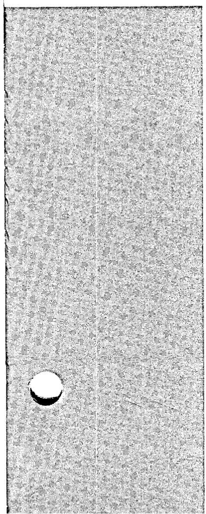

# OAK RIDGE NATIONAL LABORATORY

OPERATED BY UNION CARBIDE CORPORATION • FOR THE U.S. ATOMIC ENERGY COMMISSION

MASTER

10

Printed in the United States of America. Available from

National Technical Information Service

U.S. Department of Commerce

5285 Port Royal Road, Springfield, Virginia 22161

Price: Printed Copy $10.60; Microfiche $2.25

This report was prepared as an account of work sponsored by the United States Government. Neither the United States nor the Energy Research and Development Administration, nor any of their employees, nor any of their contractors, subcontractors, or their employees, makes any warranty, express or implied, or assumes any legal liability or responsibility for the accuracy, completeness or usefulness of any information, apparatus, product or process disclosed, or represents that its use would not infringe privately owned rights.

ORNL-4995

UC-2 - General, Miscellaneous, and

Progress Reports

Contract No. W-7405-eng-26

REACTOR DIVISION

# AN ASSESSMENT OF INDUSTRIAL ENERGY OPTIONS

# BASED ON COAL AND NUCLEAR SYSTEMS

T. D. Anderson E. C. Hise

H. I. Bowers J. E. Jones Jr.

R.H.Bryan O.H.Klepper

J.G.Delene S.A.Reed

I. Spiewak

# Industrial Participants

D. C. Azbill, Shell Oil Co.   
E. A. Bonham, Jr., Dow Chemical Co.   
J. T. Cockburn, Celanese Chemical Co.   
R.P.Gerke,UnionCarbideCorp.   
A. G. Payne, Monsanto Co.   
J. L. Ragan, Celanese Fibers Co.

E. P. Scheu, International Paper Co.   
H. G. Sommers, Crown Zellerbach Corp.   
E. J. Sundstrom, Dow Chemical Co.   
R. W. Wendes, Amoco Oil Co.   
R. L. Wright, Union Carbide Corp.

JULY 1975

-NOTICE

NOTICE This report was prepared as an account of work sponsored by the United States Government. Neither the United States nor the United States Energy Research and Development Administration, nor any of their contractors, their employees, nor any of their contractors, their employees, nor any of their contractors, or their employees, makes any subcontractors, or their employees, or assumes any legal warranty, express or implied, or assumes any legal liability or responsibility for the accuracy, completeness, liability or responsibility for the accuracy, completeness, liability or responsibility for the accuracy, completeness, liability or responsibility for the accuracy, completeness, liability or responsibility for the accuracy, completeness, liability or responsibility for the accuracy, completeness, liability or responsibility for the accuracy, completeness, liability or responsibility for the accuracy, completeness, liability or responsibility for the accuracy, completeness, liability or responsibility for the accuracy, completeness, liability or responsibility for the accuracy, completeness, liability or responsibility for the accuracy, completeness, reliability or completeness of all statements, representations or materials contained in this report.

OAK RIDGE NATIONAL LABORATORY

Oak Ridge, Tennessee 37830

operated by

UNION CARBIDE CORPORATION

for the

U. S. ENERGY RESEARCH AND DEVELOPMENT ADMINISTRATION

MASTER

# Contents

ACKNOWLEDGMENTS vii

ABSTRACT ix

# PART I. EXECUTIVE SUMMARY

1. INTRODUCTION 1

1.1 Purpose and Scope 1   
1.2 Need for Alternatives 1   
1.3 Energy Alternatives Considered 5

2. RESULTS 6

2.1 Description and Status of Energy Systems 6

2.1.1 Large Nuclear Systems 6   
2.1.2 Small PWR 6   
2.1.3 Direct Coal Firing 7   
2.1.4 Gas from Coal 8   
2.1.5 Liquid Fuels from Coal 9   
2.1.6 Solvent-Refined Coal (SRC) 9

2.2 Assessment 9

2.2.1 Resources 9   
2.2.2 General Applicability 11

2.3 Environmental Considerations 14

2.3.1 Nuclear 14   
2.3.2 Coal-Based Systems 15

2.4 Economics 17

2.4.1 Capital Investments 17   
2.4.2 Fuel Costs 18   
2.4.3 Energy Production Costs 19   
2.4.4Effects of Cost Variables on Economic Results 21

3. CONCLUSIONS 24

3.1 The Energy Need 24   
3.2 The Energy Resources 24

3.3 The Energy System Choices 24

3.3.1 Direct Firing of Coal 25   
3.3.2 On-Site Coal Gasification 25   
3.3.3 Mine-Mouth Coal-Conversion Processes 25   
3.3.4 Nuclear Energy 26

4. RECOMMENDATIONS 27

4.1 Coal Systems 27   
4.2 Nuclear Systems 27

# Part II. ENERGY SYSTEMS

# 5. NUCLEAR ENERGY SYSTEMS 29

5.1 Assessment of Uranium Resources 29

5.1.1 Uranium Availability 29   
5.1.2 Uranium Demand 31   
5.1.3 Uranium Price Projections 31   
5.1.4 Uranium Enrichment 34   
5.1.5 Fuel Cycle Capital Requirements 38

5.2 Commercial Nuclear Plants 40

5.2.1 Introduction 40   
5.2.2 The BWR Power Plant 42   
5.2.3 The PwR Power Plant 49   
5.2.4 The HTGR Power Plant 55   
5.2.5 Environmental Parameters 58   
5.2.6 Operating and Maintenance Manpower Needs 62   
5.2.7Downtime for Refueling and Other Maintenance 66   
5.2.8 Construction Schedule 69   
5.2.9 Economic Analysis 71

5.3 Special-Purpose PWR for Industry 88

5.3.1 Background and Status of the CNSG Reactor 88   
5.3.2 Reactor Plant 89   
5.3.3 Power-Conversion Plant 93   
5.3.4 Description of 1235-MW(t) System 96   
5.3.5 Economic Analysis 96  
Form-Mounted CNSG Reactor 102

6.3 Fluidized-Bed Combustion 170

6.3.1 Fluidized-Bed Boiler: General Description 170   
6.3.2 Sulfur Removal 173   
6.3.3 Regeneration of the Lime 173   
6.3.4 $\mathbf{NO}_x$ Formation 176   
6.3.5 Development Problems 177   
6.3.6 Economic Analyses 177   
6.3.7 Direct-Fired Process Heaters 179

6.4 Low- and Intermediate-Btu Gas 180

6.4.1 General Description 180   
6.4.2 State of Development and Commercial Availability 181   
6.4.3 System Characteristics 181   
6.4.4 Commercial Systems Presently Available 182   
6.4.5 New Systems under Development 188   
6.4.6 Gas Purification 188   
6.4.7 Economic Analyses 189

6.5 High-Btu Gas 193

6.5.1 General Description 193   
6.5.2 State of Development and Commercial Availability 196   
6.5.3 System Characteristics 196   
6.5.4 Economic Analysis 203   
6.5.5 Availability 205

6.6 Liquefaction and Clean Boiler Fuels from Coal 206

6.6.1 General Description 206   
6.6.2 Technology for Coal Liquefaction 207   
6.6.3 State of Development and Commercial Availability 209   
6.6.4 System Characteristics 209   
6.6.5 Economic Analysis 216

6.7 Methanol from Coal 219

# PART III. ASSESSMENT

7. ASSESSMENT OF ENERGY ALTERNATIVES 223

7.1 Nuclear Energy 223   
7.2 Direct Coal-Fired Boiler 226   
7.3 Low-, Intermediate-, and High-Btu Gas from Coal 227   
7.4 Solvent-Refined Coal and Liquid Boiler Fuel from Coal 229   
7.5 Selected Comparison of Steam Costs from Alternative Processes 230   
7.6 Retrofitting an Existing Gas-Fired Boiler (or Process Heater) 232   
7.7 Sensitivity Analysis 234   
7.8 Conclusions 234

8. INDUSTRIAL VIEW OF ALTERNATIVES 239

8.1 Pulp and Paper Manufacturing 239

8.1.1 Crown Zellerbach 239   
8.1.2 International Paper Company 241

8.2 Petrochemical Manufacturing 242

8.2.1 Celanese Chemical Company 242   
8.2.2 Dow Chemical, USA 243   
8.2.3 Monsanto Company 244   
8.2.4 Union Carbide Corporation (UCC) 245

8.3 Petroleum Refining 248

8.3.1 Amoco Oil Company 248   
8.3.2 Shell Oil Company 250

APPENDIX A. NUCLEAR FUEL CYCLE ANALYSIS 257   
APPENDIX B. STEAM LINE COST STUDY - BASIS OF COST ESTIMATE 274  
APPENDIX C. STEP-BY-STEP PROCEDURE IN AEC LICENSING OF NUCLEAR POWER REACTORS 276   
APPENDIX D. STANDARD FORMAT AND CONTENT OF SAFETY ANALYSIS REPORTS FOR NUCLEAR POWER PLANTS 280   
APPENDIX E. STANDARD FORMAT AND CONTENT OF ENVIRONMENTAL REPORTS FOR NUCLEAR POWER PLANTS 290   
APPENDIX F. POPULATION RISK PROFILES FOR TEXAS AND LOUISIANA INDUSTRIALIZED AREA 293

# Acknowledgments

The authors gratefully acknowledge the assistance of Oran L. Culberson, the University of Tennessee, in organizing the study and suggesting industrial participants and the guidance of J. O. Roberts and T. Beresovski, ERDA.

M. L. Myers, I. T. Dudley, and M. L. Winton assisted in the preparation of the nuclear cost studies. H. D. Duncan and J. W. Yarborough of UCNC Engineering Division provided data used in calculating the energy (steam) transport costs.

Special thanks is in order for the many people who were responsible for coordinating and expediting the report. These include F. M. Burkhalter (illustrations), G. C. Bower and J. O. Brown (draft preparation), M. R. Sheldon and E. D. Williams (editing), ORNL Technical Publications Department (final composition), and B. S. Harmon (makeup).

# Abstract

Industry consumes about $40\%$ of the total primary energy used in the United States. Natural gas and oil, the major industrial fuels, are becoming scarce and expensive; therefore, there is a critical national need to develop alternative sources of industrial energy based on the more plentiful domestic fuels—coal and nuclear. This report gives the results of a comparative assessment of nuclear- and coal-based industrial energy systems which includes technical, environmental, economic, and resource aspects of industrial energy supply. The nuclear options examined were large commercial nuclear power plants (light-water reactors or high-temperature gas-cooled reactors) and a small $\left[\sim 300\text{-MW(t)}\right]$ special-purpose pressurized-water reactor for industrial applications. Coal-based systems selected for study were those that appear capable of meeting environmental standards, especially with respect to sulfur dioxide; these are (1) conventional firing using either low- or high-sulfur coal with stack-gas scrubbing equipment, (2) fluidized-bed combustion using high-sulfur coal, (3) low- and intermediate-Btu gas, (4) high-Btu pipeline-quality gas, (5) solvent-refined coal, (6) liquid boiler fuels, and (7) methanol from coal.

Results of the study indicated that both nuclear and coal fuel can alleviate the industrial energy deficit resulting from the decline in availability of natural gas and oil. However, because of its broader range of application and relative ease of implementation, coal is expected to be the more important substitute industrial fuel over the next 15 years. In the longer term, nuclear fuels could assume a major role for supplying industrial steam.

# Part I. Executive Summary

# 1. Introduction

# 1.1 PURPOSE AND SCOPE

This study was a joint undertaking of the Oak Ridge National Laboratory (ORNL) and eight industrial firms representing paper, chemical process, and petroleum refining industries. The purpose of the study was to analyze alternative future sources of energy for industrial uses. The assessment includes technical, environmental, economic, and resource availability aspects of industrial energy supply. Since coal and nuclear appear to be the only domestic fuels with the potential for meeting an increased share of near-term energy demands and with an adequate long-term resource base, these were the only fuels considered.

# 1.2 NEED FOR ALTERNATIVES

The industrial sector, the largest energy user in the United States, accounts for about $40\%$ of the total primary energy consumption (Fig. 1.1). Natural gas and petroleum are the primary fuels currently used by industry; of the direct fuel uses, $51\%$ is natural gas, $27\%$ is oil, and $22\%$ is coal. Both natural gas and petroleum are becoming scarce, and the prices are escalating rapidly. Perhaps an even greater concern to industry is that no longer can a long-term supply of gas or oil be assured regardless of price. As a consequence, industry will have to rely more and more on the plentiful domestic fuel resources (i.e., coal and nuclear) in the future. From a national energy viewpoint, the use of coal or nuclear fuel in industry would release gas and oil for other uses and would move us an important step toward the national goal of self-sufficiency in energy. Figure 1.2 shows the industrial consumption of gas and petroleum projected by the Department of Interior for 1980, $^{1}$ and, for comparison, the projected U.S. shortfall by 1980. As will be noted, the use of substitute domestic fuels by industry would materially reduce our dependence on foreign supply.

Natural gas and petroleum are consumed in both fuel and nonfuel applications. Nonfuel uses include chemical feedstocks, lubricants, etc. Less than $7\%$ of the natural gas and nearly $38\%$ of the

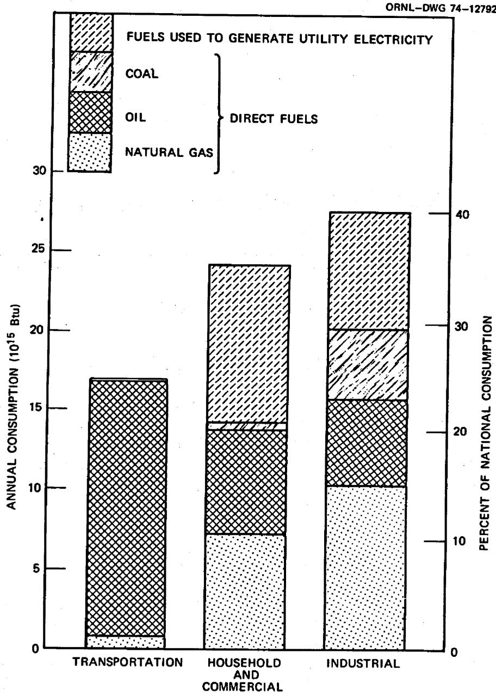  
Fig. 1.1. Energy consumption in the United States, 1971.

petroleum consumed by industry is used for nonfuel purposes. Although coal may eventually be converted to forms suitable for chemical feedstocks, the best opportunity for industrial energy substitutions is in the area of fuels.

The Department of Interior projections to the year 2000 reported by Dupree and West1 assumed that the rate of increase of industrial energy consumption would average $3.3\%$ /year. The energy increases were assumed to be borne by natural gas, petroleum, and utility-produced electricity. Although the projections were quite reasonable in 1972, recent events suggest that the use

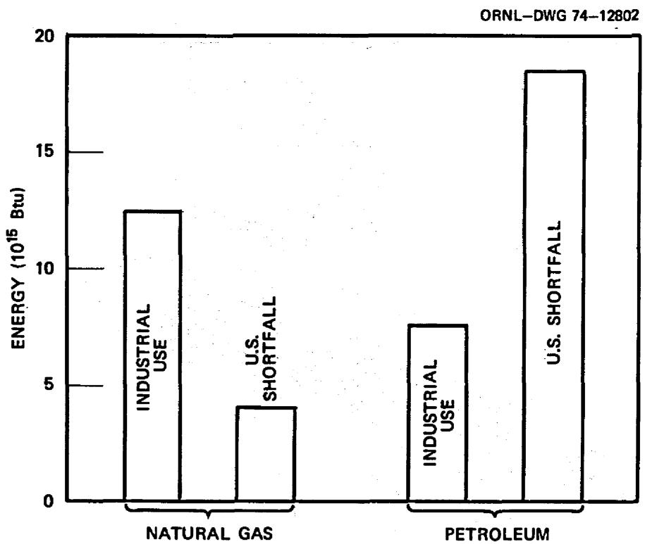  
Fig. 1.2. Comparison of industrial consumption and U.S. deficit of natural gas and petroleum in 1980. (Source: West and Dupree.)

of gas as an industrial fuel will decline because reserves are inadequate to meet demands. The increased use of oil for industrial fuel may, in fact, come about, but this is contrary to the goal of self-sufficiency in energy.

Another possible scenario developed from the Department of Interior projections is shown in Fig. 1.3. In developing these data, the following assumptions were made.

1. Total industrial energy use and the contributions of coal and electricity to the total are the same as those reported by Dupree and West.   
2. The nonfuel energy sources are the same as those reported by Dupree and West.   
3. Natural gas for industrial fuel will be phased out linearly starting in 1975 and ending in 1985.   
4. Oil for industrial fuel will be phased out linearly starting in 1980 and ending in 1990.

The deficit in industrial fuels resulting from the assumed phaseout of oil and gas, illustrated in Fig. 1.3, would have to be made up by coal, nuclear, and other energy sources. According to this scenario, the rate of changeover in the decade 1975 to 1985 would need to be very great. For example, the new capacity of industrial boilers and process heaters added in that period, as shown in Table 1.1, would be nearly $60\%$ of the thermal energy capacity that will be installed by the electric utility industry in the same time period. It should be noted that nearly three-fourths of the "new" industrial energy capacity for the 1975 to 1985 period will be obtained by retrofitting existing industrial plants. There is serious doubt as to whether the assumed rate of phaseout of gas and oil is feasible because (1) some promising methods of utilizing coal or nuclear for industrial fuels are not sufficiently developed for commercial application, and (2) equipment manufacturers and the fuel resource industries will be hardpressed to meet both the industrial and electric utility demands.

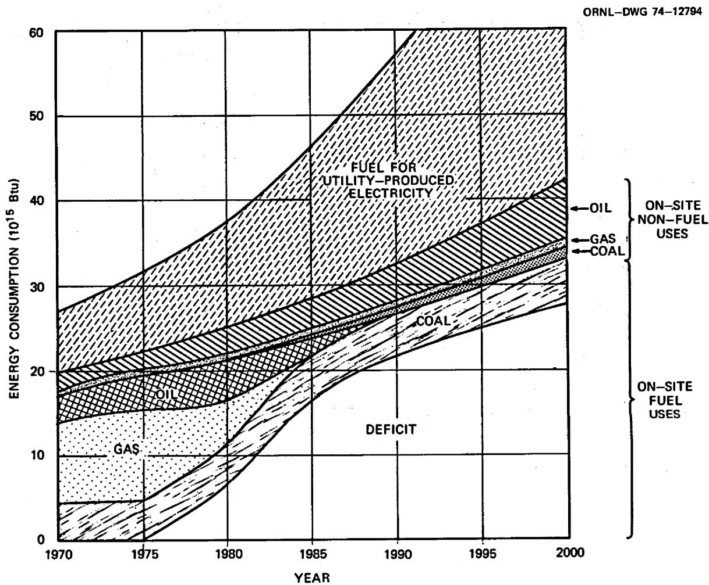  
Fig. 1.3. Industrial energy supply to the year 2000 assuming phaseout of gas and oil.

Table 1.1. New industrial boiler and process heater capacity required to the year 2000   

<table><tr><td rowspan="2">Period</td><td colspan="2">New capacitya [MW(t)]</td></tr><tr><td>For period</td><td>Annual average</td></tr><tr><td>1975–1980</td><td>289,000</td><td>57,800</td></tr><tr><td>1980–1985</td><td>449,500</td><td>89,900</td></tr><tr><td>1985–1990</td><td>222,000</td><td>44,400</td></tr><tr><td>1990–1995</td><td>126,000</td><td>25,200</td></tr><tr><td>1995–2000</td><td>125,500</td><td>25,100</td></tr><tr><td>Total 1975–2000</td><td>1,212,000</td><td>48,500</td></tr></table>

${}^{a}$ Boilers and process heaters assumed to operate at 90% plant factor and with a fuel-to-heat conversion efficiency of 85%.

The present trend in industries that burn natural gas is to convert process heaters and boilers to oil. Although most industries recognize that this could be a stop-gap measure, there are essentially no other alternatives at the present time. Thus, there is an urgent need to develop energy options based on domestic fuels for the industrial sector.

# 1.3 ENERGY ALTERNATIVES CONSIDERED

There are a number of energy systems options based on either coal or nuclear fuel. The nuclear options examined were large commercial nuclear power plants [light-water-cooled reactors (LWRs) or high-temperature gas-cooled reactors (HTGRs)] and a small $\left[\sim 300\text{-MW(t)}\right]$ special-purpose pressurized-water reactor (PWR) for industrial applications. Coal-based systems selected for study were those that appear capable of meeting environmental standards, especially with respect to sulfur dioxide; these are (1) conventional firing using either low-sulfur coal or high-sulfur coal with stack-gas scrubbing, (2) fluidized-bed combustion using high-sulfur coal, (3) low- and intermediate-Btu gas, (4) high-Btu pipeline-quality gas, (5) solvent-refined coal (SRC), (6) liquid boiler fuels, and (7) methanol from coal.

Although much of the assessment of energy systems is applicable to all regions of the country, the emphasis of the study was on the Gulf Coast area, since industries in this region are large energy consumers and the primary fuel is natural gas. Since both technical and economic data on energy systems are changing rather rapidly, it should be kept in mind that the assessment given in this study is based on data obtained during the first half of 1974. Furthermore, only those energy systems that have the potential for significant commercial implementation within the next 15 years were considered. Thus, energy sources such as breeder reactors, fusion, and solar were not examined.

# 2. Results

# 2.1 DESCRIPTION AND STATUS OF ENERGY SYSTEMS

# 2.1.1 Large Nuclear Systems

Large nuclear power plants commercially available are the boiling-water reactor (BWR), the PWR, and the HTGR. Both BWRs and PWRs use slightly enriched uranium dioxide pellets as fuel and demineralized water as coolant and moderator. The fuel of the HTGR is a mixture of uranium carbide (highly enriched in $^{235}\mathrm{U}$ ) and thorium oxide, the moderator and core structure is graphite, and the coolant is helium.

All present reactors were developed to serve the needs of the electric utility industry, and, with one exception, all existing or planned large reactors are single-purpose electricity-generating plants. The Consumers Power Midland, Michigan, nuclear station, which will commence operation in 1980, is designed to produce both electricity for the grid and process steam for the Dow Chemical Company complex located nearby.

Commercial nuclear steam supply systems are available in standard sizes, ranging from 1900 to $3800\mathrm{MW(t)}$ (Table 2.1). Typically, the BWRs and PWRs produce steam at 1000 psia saturated; the HTGR steam conditions are 2400 psia and $510^{\circ}\mathrm{C}$ ( $950^{\circ}\mathrm{F}$ ).

Table 2.1. Commercial nuclear steam supply systems   

<table><tr><td></td><td colspan="3">Reactor type</td></tr><tr><td></td><td>BWR</td><td>PWR</td><td>HTGR</td></tr><tr><td>Number of U.S. manufacturers</td><td>1</td><td>3</td><td>1</td></tr><tr><td>Size range, MW(t)</td><td>1956–3833</td><td>1882–3818</td><td>2000–3000</td></tr><tr><td>Steam conditions, psia</td><td>1040</td><td>915–1125</td><td>2400</td></tr><tr><td></td><td>(sat.)</td><td>(sat.)</td><td>(950°F)</td></tr></table>

As of Dec. 31, 1973, there were 42 large reactors operating, 56 under construction, and 101 planned or on order. The large size of the units, coupled with a relatively complex regulatory process, results in a long period of planning and construction totaling 7 to 10 years. After a reasonable shakedown period for new plants, it is expected that plant availability factors of $\sim 80\%$ can be achieved.

# 2.1.2 Small PWR

The Consolidated Nuclear Steam Generator (CNSG) is a small $[\sim 300\mathrm{-MW(t)}]$ PWR developed by Babcock and Wilcox for nuclear ship propulsion. Part of the developmental work was sponsored by the U.S. Maritime Administration. Conceptual studies of land-based and barge-mounted versions of the CNSG were made to assess, in a preliminary way, the potential value of this reactor for industrial applications.

The basic technology embodied in the CNSG is similar to that for large PWRs, but the CNSG has some unique features. It is a very compact system; the compactness is accomplished by placing the once-through steam generator inside the reactor vessel and by using a pressure-suppression containment system. Primary coolant pumps are placed on the reactor vessel, thus eliminating external coolant loops. Steam is produced at 700 psia and $237^{\circ}\mathrm{C}$ ( $458^{\circ}\mathrm{F}$ ) ( $50^{\circ}\mathrm{F}$ superheat).

Some of the unique features of the plant design, including the once-through steam generator, have already been demonstrated in the German nuclear ship "Otto Hahn"; this 38-MW(t) plant has operated successfully since 1969. The U.S. Maritime Administration is currently developing plans to apply the CNSG [313 MW(t)] to a 600,000-ton tanker. Start of construction is planned within 1 or 2 years. It would appear that only a small amount of development would be required to adapt the CNSG to industrial uses.

Since the CNSG design allows a greater degree of shop assembly than large reactors, the planning and construction period may be reduced. Planning and construction may be about 6 years for the land-based plant and $4^{1/2}$ years or less for the barge-mounted version. Assuming a mature technology, the plant availability factor is expected to be on the order of five percentage points higher than that for large reactors; the difference is attributable to less-frequent refueling and reduced refueling time.

# 2.1.3 Direct Coal Firing

Within environmental constraints, there are three methods of directly using coal for boilers. Low-sulfur coal can be burned in a conventional boiler with precipitators to reduce particulate emission. High-sulfur coal can be fired in a conventional boiler equipped with stack-gas scrubbers to remove $\mathrm{SO}_2$ or in fluidized-bed coal combustors with limestone injection. All these methods appear to also be applicable to process heaters. Coal-fired process heaters were once common, but they are not presently being manufactured in the United States; they were displaced by gas- and oil-fired heaters. Fluidized-bed process heaters would seem feasible, but no development work is currently being done.

If coal of sulfur content low enough to meet Environmental Protection Agency (EPA) standards of $1.2\mathrm{lbSO}_2$ per million Btu heat input is available, a wide selection of coal-fired boilers is available from U.S. manufacturers. However, particulate-removal equipment, usually an electrostatic precipitator, will be needed to meet the requirement of $0.1\mathrm{lb}/10^{6}$ Btu heat input set by EPA. Conventional coal-fired boilers are available to produce steam at temperatures and pressures suitable for all industrial applications in sizes ranging from a few hundred pounds per hour to several million pounds per hour. Planning and construction periods are on the order of 2 years, and plant availability factors of near $90\%$ are achievable.

A conventional boiler or direct coal-fired process heater burning high-sulfur coal would require stack-gas scrubbing; over 100 such processes have been proposed, and about a dozen have reached the pilot plant or demonstration phase. The scrubbing systems may be divided into three broad groups: throwaway, regenerable, and dry processes. The throwaway processes generally dispose of removed sulfur as a waste sludge of calcium salts. The regenerable and dry processes convert product solutions or solids to elemental sulfur or sulfuric acid. Many of the scrubbing processes remove $\mathrm{SO}_2$ with an aqueous solution or slurry of alkaline material. The electric utility industry has placed greatest emphasis on the development and demonstration of lime and limestone slurry scrubbing, which are throwaway processes. Systems are being planned for over 20 power plants.

However, operating experience to date has not been entirely satisfactory because of scaling, plugging, erosion, and corrosion.

Fluidized-bed combustion of coal, a relatively new technology, appears to be very promising as an environmentally acceptable method of burning high-sulfur coal. Combustion is accomplished in an inert bed, consisting mainly of ash and limestone, which rests on a plate containing nozzles. Combustion air introduced through the nozzles expands the bed to a level greater than its static depth. Crushed coal is injected into the bottom of the bed. Bed turbulence aids in transferring heat to the fuel and also provides intimate mixing of fuel and air, thus promoting rapid combustion. Bed temperature is controlled at 870 to $982^{\circ}\mathrm{C}$ (1600 to $1800^{\circ}\mathrm{F}$ ) by removing approximately half of the heat through heat transfer surfaces immersed in the bed. The relatively low combustion temperature sharply reduces the formation of nitrogen oxides, and the conditions of temperature and turbulence in the bed favor the reaction of sulfur oxides and limestone. Thus the injection of limestone is very effective in reducing $\mathrm{SO}_2$ emissions. Fluidized-bed boilers are not now commercially available but are under development. A demonstration boiler that produces 300,000 lb of steam per hour $[\sim 100\mathrm{MW(t)}]$ is scheduled for completion in mid-1975.

# 2.1.4 Gas from Coal

There are a number of processes for producing fuel gas from coal, some of which are in the development stage and others commercially available. The fuel gases produced are classified according to the higher heating value of the gas as follows: (1) low-Btu gas, 120 to 200 Btu/scf, (2) intermediate-Btu gas, 300 to 600 Btu/scf, and (3) high-Btu gas, 900 to 1000 Btu/scf. The high-Btu gas is similar to natural gas both in composition and heating value. Table 2.2 gives a comparison of compositions and heating values of the coal-derived gases.

Low-Btu gasification is achieved by reacting coal with steam and air. Partial combustion of the coal provides the heat necessary to cause steam to react with carbon, producing hydrogen, carbon monoxide, and small amounts of methane and other hydrocarbons. In addition to combustible gases, the fuel also contains significant quantities of $\mathrm{CO}_{2}$ and nitrogen as shown in Table 2.2. Sulfur contained in the coal appears in the gas principally as hydrogen sulfide (H $_2$ S), which can be scrubbed from the fuel gas.

Table 2.2. Representative properties of low-, intermediate-, and high-Btu gas   

<table><tr><td rowspan="2"></td><td colspan="3">Gas composition (% by volume)</td></tr><tr><td>Low Btu</td><td>Intermediate Btu</td><td>High Btu</td></tr><tr><td>Carbon dioxide</td><td>15</td><td>4-6</td><td>1</td></tr><tr><td>Carbon monoxide</td><td>15</td><td>30-41</td><td></td></tr><tr><td>Hydrogen</td><td>23</td><td>37-49</td><td>5</td></tr><tr><td>Methane</td><td>4</td><td>1-14</td><td>92</td></tr><tr><td>Nitrogen</td><td>42</td><td>4-6</td><td>2</td></tr><tr><td>Other hydrocarbons</td><td>1</td><td>0-7</td><td></td></tr><tr><td>Approx. higher heating value, Btu/scf</td><td>170</td><td>300-500</td><td>1000</td></tr></table>

The production of intermediate-Btu gas from coal is similar to the production of low-Btu gas, except that oxygen or oxygen-enriched air is used in partially oxidizing the coal. Thus, the nitrogen content of the product gas is substantially reduced.

There are a number of developmental processes for producing high-Btu gas from coal, but the process that is considered current technology is based on additional processing of intermediate-Btu gas. Two major steps are required. A shift conversion step reacts some of the carbon monoxide in the intermediate-Btu gas with steam to produce additional hydrogen. A methanation step reacts hydrogen with carbon monoxide to produce methane $\left(\mathrm{CH}_4\right)$ . El Paso Natural Gas Company is planning a coal gasification plant to produce 288 million ft³/day of pipeline-quality gas in the northwest corner of New Mexico; plans are for the plant to be completed in 1978. [Combustion of this gas would produce energy at the rate of about 3000 MW(t).]

# 2.1.5 Liquid Fuels from Coal

A number of processes are under development for the production of liquid fuels from coal. One point of emphasis in this program is the production of synthetic crude oil which could be refined into various products much like natural crude oil. The main problem in the conversion of coal to liquids is the transformation of a low-hydrogen-content solid into a liquid containing a large amount of hydrogen. The differences among the various processes are related primarily to the method of hydrogenation. Some hydrogen can be added without a catalyst, but a catalyst is generally required to make light fuel products. The Office of Coal Research is pursuing three processes for coal liquefaction, and it is expected that a commercial process will be developed by the early 1980s.

# 2.1.6 Solvent-Refined Coal (SRC)

The solvent refining process was developed to produce a low-ash, low-sulfur boiler fuel from coal with a minimum of hydrogenation. The product is a solid at room temperature. In the SRC process, crushed coal is slurried with anthracene-oil solvent and hydrogen, the mixture is heated to $\sim 427^{\circ}\mathrm{C}$ ( $\sim 800^{\circ}\mathrm{F}$ ) to dissolve the coal, and the resulting solution is filtered to remove the mineral residue. The product, which is low in sulfur, can be burned as a hot liquid or can be solidified (cooled) for shipment and use as a solid fuel. Although there is some question about remelting, limited tests suggest that the product can be remelted and fired much as a heavy residual oil.

A 50-ton/day SRC pilot plant, sponsored by the Office of Coal Research, is scheduled for startup in the fall of 1974. The plant would have a coal feed rate equivalent to about $14\mathrm{MW(t)}$ . A smaller 6-ton/day pilot plant, built by the Southern Company and Edison Electric Institute, was completed in September 1973. This unit, operating on Kentucky No. 14 coal with $3.9\%$ sulfur, produces a product with about $0.6\%$ sulfur and a heating value near $16,000\mathrm{Btu/lb}$ .

# 2.2 ASSESSMENT

# 2.2.1 Resources

Both coal and uranium are relatively abundant, but there are limitations to exploitation for each. Uranium, which is widely distributed in the earth's crust, is more abundant than gold or silver

and about the same as molybdenum or tin. However, the average concentration in the earth's crust is rather low (2 to 4 ppm), and extraction from dilute sources would be expensive. The present source of uranium ore in the United States is contained in sedimentary strata, particularly those found in the Colorado Plateau and in the Wyoming basin. The average concentration of uranium in presently mined ore is about 2100 ppm, and the market price is $6 to $10 per pound of U₃O₈. Known and estimated reserves in conventional uranium ore deposits are expected to be depleted by the end of the century. Assuming no new mining regions are discovered, the uranium supply will then shift to more dilute sources.

The Chattanooga shales contain 25 to $80~\mathrm{ppm}$ of $\mathrm{U}_3\mathrm{O}_8$ , and the cost of extraction is expected to be $50 to $100 per pound of $\mathrm{U}_3\mathrm{O}_8$ . Other sources of uranium include western lignite deposits (50 to 200 ppm), Conway granites (10 to 20 ppm), and the sea (0.003 to 0.004 ppm). The Chattanooga shales alone contain enough uranium to last over a century. Thus, the problem is not that we will run out of uranium but that its price and the environmental effects of mining low-grade ore will gradually increase until alternatives to present-day converter reactors may become more desirable. The expected trend in nuclear energy production cost based on converter reactors is illustrated in Fig. 2.1. However, studies by the U.S. Atomic Energy Commission (AEC) indicate that even to the year 2000, converter reactors will still be more economical than coal for base-load central-station

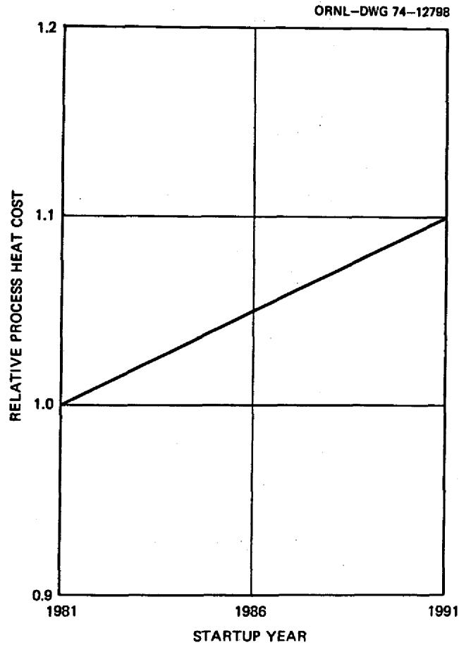  
Fig. 2.1. Relative levelized cost of steam production with a light-water reactor as a function of startup date (utility financing).

power applications. The AEC expects that the breeder reactor, which is presently under development, will begin to relieve the stress on uranium resources by the early 1990s.

The in-place reserves of coal that is minable with present technology amounts to about 394 billion tons. Assuming present mining recovery factors, the recoverable reserves amount to 220 billion tons, with 175 billion tons deep minable and 45 billion tons strippable. Of the strippable coal, 25 billion tons are low in sulfur and are located in the Rocky Mountain states. The total recoverable coal reserves are equivalent to about a 65-year supply at a rate of consumption equal to our total national energy use in 1970. It is evident that the coal reserves are adequate to meet almost any demand in the foreseeable future. The limitations on the exploitation of this resource are (1) environmental constraints on mining, (2) coal-industry development, and (3) transportation.

Most of the present concern about environmental effects is related to strip mining. Because of low capital and operating costs and reduced time for mine development relative to deep mines, strip mining is on the increase and presently accounts for about half of our total coal production. Some form of national legislation to reduce the adverse effects of stripping seems inevitable. The nature of this legislation could have a strong bearing on the rate at which coal resources can be exploited, especially in the west. Aside from the environmental constraints, there are other limitations to coal industry expansion. Large deep mines require about 5 years and substantial capital for development. Much of the financing will need to come from outside the coal industry.

The transportation industry is also an important element of the coal energy supply system. Rail transportation is particularly important, and limitations on the rate of modernization and expansion of this industry will affect the rate of coal resource development. When all factors are taken into consideration, the National Petroleum Council believes that coal production can increase at $5\%$ /year. However, it appears that a rate of over $6\%$ will be required over the next decade to simply hold the rates of oil and gas consumption in the utility and industrial sectors at their present levels. If the goal is to displace present uses of oil and gas, the coal expansion rate must be even higher. It appears that coal supply will be hard pressed to meet demand, at least over the next decade.

# 2.2.2 General Applicability

Industrial needs for energy include steam, process heat, electricity, and chemical feedstocks. Blocks of energy vary in size from a few to several hundred thermal megawatts. Much of the current need for new energy systems is for retrofitting existing industrial plants that are presently burning gas or oil, but there is also a need for energy systems for expansion of present plants and for new "grass roots" industrial plants. The energy alternatives considered in this study exhibit different degrees of flexibility relative to meeting the various requirements for industrial energy systems.

# Size

The question of how well the output of individual supply systems match the consumption of energy is of significance only for the nuclear systems. Generally, the commercial nuclear power plants produce more energy than individual industrial plants can use. Even for large petroleum refineries, which are among the most energy-intensive industrial operations, there is a mismatch between the output of commercial reactors and refinery energy needs. For example, a 500,000-bbl/day refinery would require approximately $4000\mathrm{MW(t)}$ of energy input; 2000 to 3000 $\mathrm{MW(t)}$ of this would be based on purchased fuels, and the remainder would be supplied by

internally generated fuels. Thus, a refinery slightly larger than any presently operating in the United States could take the output of one commercial reactor. However, a single unit would not provide the reliability required; at least two or possibly three units would be needed. This leads to one important result concerning the use of large nuclear power plants for industrial energy: a multiunit station will be needed, and the output will be shared by a group of industrial plants or by one or more industrial plants and an electric utility. The latter situation is illustrated by the arrangement between Dow and Consumers Power at Midland, Mich. Another consideration in supplying energy from a nuclear power station to outlying industries is that thermal energy, whether it be steam or process heat, may need to be transported over a considerable distance.

In contrast to large commercial nuclear power plants, the output of small special-purpose reactors, such as the CNSG, could be consumed by some individual industrial plants in some cases. A two- or three-unit station would provide 600 to $1000\mathrm{MW(t)}$ of steam.

# Application by energy form

Depending on the type of industrial plant, energy consumption may be in the form of electricity, steam, process heat, and chemical feedstocks. Table 2.3 shows the ranking of systems relative to the four potential energy needs. All energy sources could be used to produce electricity and steam, and all except the LWRs appear to be capable of providing process heat. Both the HTGR and the fluidized-bed combustor would require additional development before they could be applied to process heating. High- and intermediate-Btu gas and synthetic crude oil from coal could be used as sources of chemical feedstocks.

Table 2.3. Ranking of industrial systems by range of application   

<table><tr><td>System</td><td>Electricity</td><td>Steam</td><td>Process heat</td><td>Chemical feedstock</td></tr><tr><td>High-Btu gas</td><td>×</td><td>×</td><td>×</td><td>×</td></tr><tr><td>Intermediate-Btu gas</td><td>×</td><td>×</td><td>×</td><td>×</td></tr><tr><td>Liquid fuels</td><td>×</td><td>×</td><td>×</td><td>×a</td></tr><tr><td>Low-Btu gas</td><td>×</td><td>×</td><td>×</td><td></td></tr><tr><td>Solvent-refined coal</td><td>×</td><td>×</td><td>×</td><td></td></tr><tr><td>Fluidized-bed combustor</td><td>×</td><td>×</td><td>×b</td><td></td></tr><tr><td>Conventional firing</td><td>×</td><td>×</td><td>×c</td><td></td></tr><tr><td>HTGR</td><td>×</td><td>×</td><td>×b</td><td></td></tr><tr><td>Small LWR</td><td>×</td><td>×</td><td></td><td></td></tr><tr><td>Large LWR</td><td>×</td><td>×</td><td></td><td></td></tr></table>

${}^{a}$ Synthetic crude oil can be processed in a petrochemical refinery much the same as natural. Heavy boiler fuels from coal would not be a source of chemical feedstocks.   
$b$ Additional development required for process heating applications.   
${}^{\mathrm{c}}$ Direct coal-fired process heaters have been used but are not presently manufactured in the U.S.

# Ease of retrofitting

Existing industrial plants, especially those that presently use natural gas, may need to be switched to another fuel in the future. The ranking of the energy sources by the ease of retrofitting existing gas-fired installations is as follows:

1. high-Btu gas,   
2. intermediate-Btu gas,   
3. liquid fuels,   
4. solvent-refined coal,   
5.low-Btu gas,   
6. fluidized-bed combustor,   
7. conventional firing with low-sulfur coal,   
8. conventional firing with stack-gas cleanup,   
9. HTGR,   
10. small LWR,   
11. large LWR.

High- and intermediate-Btu gas from coal would require the least change in existing boilers and heaters. Liquid boiler fuels or synthetic crude oil would require about the same modifications as would residual oil. Solvent-refined coal might also be fired in a modified gas boiler or heater if remelting of the solid fuel product proves practicable. Low-Btu gas appears to be questionable as a fuel for retrofitted systems because of derating and loss of efficiency; however, these factors have not been thoroughly evaluated by test. The remaining energy systems (i.e., the fluidized-bed and conventional coal systems and the nuclear systems) would require the installation of new equipment. Light-water reactors would probably be the most difficult to retrofit because in some plants industrial turbine drives would have to be changed to use the saturated steam produced by LWRs.

# Energy acquisition

If an industry desires to obtain a new energy system, an important consideration is the number of options available in making the acquisition. Can the equipment be purchased independently or is the energy supply of such a nature that a joint undertaking with others is required? Table 2.4 shows the options for each of the energy systems. Generally, large reactors and the mine-mouth coal-conversion processes offer the fewest options. The output of large reactors must be shared because of their size. Mine-mouth coal-conversion plants would probably be owned by an energy company selling fuels.

When an energy system will be available is another important factor. Table 2.5 ranks the energy systems by year of availability. The only option available in 2 years or less that is based on proven technology is conventional firing using low-sulfur coal.

Table 2.4. Ranking of industrial energy systems by user's options for action   

<table><tr><td>System</td><td>Purchase equipment</td><td>Cooperate with others</td><td>Purchase fuel or energy</td></tr><tr><td>Low- and intermediate-Btu gas</td><td>X</td><td>X</td><td>X</td></tr><tr><td>Small reactors</td><td>X</td><td>X</td><td>X</td></tr><tr><td>Fluidized-bed combustor</td><td>X</td><td>X</td><td>X</td></tr><tr><td>Conventional firing</td><td>X</td><td>X</td><td>X</td></tr><tr><td>Large reactors</td><td></td><td>X</td><td>X</td></tr><tr><td>Liquid fuels</td><td></td><td>X</td><td>X</td></tr><tr><td>Solvent-refined coal</td><td></td><td>X</td><td>X</td></tr><tr><td>High-Btu gas</td><td></td><td></td><td>X</td></tr></table>

Table 2.5. Ranking of industrial energy systems by date of earliest commercialization or application   

<table><tr><td>System</td><td>Date</td></tr><tr><td>Conventional firing, low-sulfur coal</td><td>1976</td></tr><tr><td>Conventional firing, stack-gas cleaninga</td><td>1976</td></tr><tr><td>Low-Btu gas</td><td>1976-78</td></tr><tr><td>Intermediate-Btu gas</td><td>1976-78</td></tr><tr><td>Fluidized-bed combustora</td><td>1977-79</td></tr><tr><td>Solvent-refined coala</td><td>1979-81</td></tr><tr><td>Liquid fuelsa</td><td>1981-83</td></tr><tr><td>Large nuclear power plants</td><td>1981-84</td></tr><tr><td>Small nuclear power plantsa</td><td>1981-84</td></tr><tr><td>High-Btu gasa</td><td>1978b</td></tr></table>

$a_{\mathrm{Not}}$ commercially demonstrated. $b_{\mathrm{Earliest}}$ commercialization date is 1978; however, the capacity will not be large enough to have any impact on total gas supply.

# 2.3 ENVIRONMENTAL CONSIDERATIONS

# 2.3.1 Nuclear

The environmental consideration of greatest concern with nuclear power is health and safety of the public. This issue is complex, but it basically involves protection of people against any harmful exposure to ionizing radiation. In the safety review of nuclear plants, the AEC considers both plant design features and environmental characteristics that could adversely affect the plant's safety performance or the radiological consequences of accidents. Without exception, nuclear power plants

have been judged by the AEC on a case-by-case basis; thus, no general assessment can determine the acceptability of a given reactor at a given site. Nevertheless, this study addressed one general aspect of nuclear plant siting that is particularly important—the size of the proximate population. The prospect of using nuclear power for industrial energy raises the question as to whether it is reasonable to expect that such plants could be located in typical industrial areas. To provide some guidance on this question, population-risk estimates were made for several industrialized areas in Texas and Louisiana. The acceptability of the calculated population-risk factors was judged by comparison with risk factors estimated for existing approved reactor sites. It was found that all of the industrialized areas studied, with the exception of the central city regions, would be quite favorable as nuclear sites, at least on the basis of population risk.

# 2.3.2 Coal-Based Systems

All the coal-based energy systems examined in this study have the capability of meeting EPA emission standards. However, this does not mean that all systems are equal with respect to environmental impacts. Typical types and quantities of wastes resulting from the use of coal or coal-derived fuels are shown in Table 2.6. For direct-fired systems employing eastern coal, the use of lime or limestone slurry stack-gas scrubbing would result in the greatest environmental insult because the sludge produced is not even suitable as land fill unless it is subjected to further treatment for stabilization, provided some acceptable economical method can be found. Regenerable systems for stack-gas scrubbing are also commercially available or will be in the near future. Generally, these systems recover sulfur in the form of sulfuric acid or elemental sulfur, the latter being more acceptable from an environmental standpoint. Fluidized-bed combustion systems produce a solid, readily handled residue which would be suitable as land fill or possibly for road or masonry construction. The processes for coal-derived fuels produce some solid waste in the form of ash, char, or slag and elemental sulfur along with relatively small waste streams which can be renovated by biological treatment. On-site coal gasification plants will generate ash in amounts equivalent to direct-fired systems, and the ash can be handled in a conventional manner. For mine-mouth plants the solid wastes, including the inert elemental sulfur if it cannot be marketed, will be returned to the mine for fill.

The coal-conversion processes examined in this study require varying amounts of water $^2$ as shown in Table 2.7, which also lists water consumption rates for nuclear fuel processing and oil refining for comparison. The higher values of water consumption shown include that required for process or utility cooling, most of which is once-through. While the general trend is toward closed evaporation systems to reduce thermal pollution, these systems have a greater evaporation loss than once-through systems, and, consequently, cooling water will continue to be the largest increment of water usage. Excluding cooling requirements, the water consumption for the coal-conversion systems is modest. Typically in a liquefaction plant for producing fuel oil from coal, about $4\%$ of the total water requirement is consumed in hydrogen production. About $25\%$ is used for scrubbing or washing the gaseous and liquid product stream. All but a small fraction of this can be subjected to biological treatment and recovered for reuse. By comparison, the solvent-refined coal process requires only about one-fifth of the water needed for coal liquefaction processes.

Table 2.6. Typical wastes generated when using coal or coal-derived fuels for boiler or process heat fuel   

<table><tr><td>Method of coal utilization</td><td>Characteristics of waste product</td><td>Approximate quantity of waste available in fuel (lb/106Btu)</td></tr><tr><td colspan="3">On-site utilization</td></tr><tr><td colspan="3">Conventional firing</td></tr><tr><td>Low-sulfur (western) coal (&lt;0.5%S, 4-8% ash)</td><td>Dry ash, gaseous SO2</td><td>5-10 lb ash; &lt;1 lb SO2</td></tr><tr><td>High-sulfur (eastern) coal (3-12%S, 8-20% ash)</td><td></td><td></td></tr><tr><td>Lime or limestone slurry SO2 removal for stack gas</td><td>Thixotropic sludge (30-60% water) mixture of lime, CaSO3, and ash</td><td>13-140 lb sludge (300 ft3/ton sludge)</td></tr><tr><td>Regenerable scrubbing to remove SO2 from stack gas</td><td>H2SO4or elemental sulfuraand small waste stream of Na2SO4, CaSO4, or catalyst which can be recovered</td><td>2-10 lb elemental sulfur; &gt;2 lb Na2SO4, CaSO4, or spent catalyst; 13-32 lb ash</td></tr><tr><td>Fluidized-bed combustion using limestone injection for SO2 abatement</td><td>Dry residue composed of ash and CaSO4</td><td>9-30 lb of dry solids</td></tr><tr><td colspan="3">Coal-derived fuels</td></tr><tr><td>Low- and intermediate-Btu gas from eastern coal</td><td>Dry ash, elemental sulfur, acid wash water (which must be treated before disposal)</td><td>13-32 lb ash, 2-10 lb sulfur, 1 lb wash water</td></tr><tr><td colspan="3">Mine-mouth production (eastern coal)</td></tr><tr><td>No. 4 and No. 6 type fuel oils</td><td>Elemental sulfur, waste gas (CO2), char, waste water</td><td>2-10 lb sulfur, ~107 lb waste gas, ~7 lb char</td></tr><tr><td>Solvent-refined coal</td><td>Ash, waste water (treated), elemental sulfur</td><td>1-5 lb sulfur, 13-190 lb ash, ~60 lb waste water</td></tr><tr><td>High-Btu gas</td><td>Elemental sulfur, waste gas and water, slag</td><td>260 lb waste gas, 2-10 lb sulfur, ~10 lb slag, ~88 lb waste water</td></tr></table>

${}^{a}$ Sulfuric acid is less desirable,since it has limited commercial value and cannot be transported economically except for short distances. Elemental sulfur has commercial value and will therefore not necessarily be discarded as other waste products.

Table 2.7. Water usage for energy-conversion processes   

<table><tr><td>Process</td><td>Usage (gal/106Btu)</td></tr><tr><td>Uranium reactor fuel (including power plant consumption for electricity used in processing)</td><td>14</td></tr><tr><td>Oil refining</td><td>7</td></tr><tr><td>Pipeline gas from coal (Lurgi process)</td><td></td></tr><tr><td>Water cooling</td><td>72–158</td></tr><tr><td>Partial (85% of demand) air cooling</td><td>37–79</td></tr><tr><td>Oil from coal</td><td>31–200</td></tr><tr><td>Solvent-refined coal</td><td>6–40</td></tr></table>

# 2.4 ECONOMICS

To provide a uniform basis for comparison, costs were estimated for producing steam with each of the energy systems considered.

# 2.4.1 Capital Investments

The capital investments that must be made at the industrial site, shown in Table 2.8, range from $48 to$ 192/kW(t). The mine-mouth coal-conversion processes (high-Btu gas, liquid fuels, and SRC) require the least investment at the industrial plant, but, as will be discussed later, fuel costs are relatively high. Of the coal-based systems, low- and intermediate-Btu gas processes require the

Table 2.8. On-site capital investments required per unit of steam production (early 1974 dollars)   

<table><tr><td>System</td><td>Unit investment [$/kW(t)]</td></tr><tr><td>High-Btu gas</td><td>48a</td></tr><tr><td>Solvent-refined coal or liquid fuels</td><td>48a</td></tr><tr><td>Conventional firing with low-sulfur coal</td><td>58</td></tr><tr><td>Fluidized-bed boiler</td><td>61</td></tr><tr><td>Conventional firing with high-sulfur coal and stack-gas scrubbing</td><td>78</td></tr><tr><td>Commercial LWR, 2-unit station, 1875 MW(t) each</td><td>93</td></tr><tr><td>Commercial HTGR, 2-unit station, 2000 MW(t) each</td><td>105</td></tr><tr><td>Intermediate-Btu gas</td><td>129</td></tr><tr><td>Low-Btu gas</td><td>141</td></tr><tr><td>Barge-mounted CNSG, 2-unit station, 314 MW(t) each</td><td>154</td></tr><tr><td>Land-based CNSG, 2-unit station, 314 MW(t) each</td><td>192</td></tr></table>

${}^{a}$ Does not include off-site investments required for mine-mouth coal-conversion processes.

largest on-site investment because the costs of the gasification equipment and boilers are both included. The nuclear plant investments do not include reboilers; these may be required to isolate the nuclear steam supply system from the industrial steam system. As will be noted, the CNSG requires the largest investment per unit of output. The barge-mounted version of the CNSG is expected to cost about $20\%$ less than the land-based system because it is assumed that barge-mounted units would be factory constructed.

# 2.4.2 Fuel Costs

The prediction of future prices of energy resources is difficult because of the current state of uncertainty concerning fossil fuels. In this study, levelized nuclear fuel cycle costs were estimated for reactor startup dates to 1991 for both utility and industrial financing conditions. The estimates of nuclear fuel costs were based on what seem to be reasonable projections of uranium ore resources and uses and expected trends in the cost of $^{235}\mathrm{U}$ separation (separate work), fuel fabrication, and fuel reprocessing. Since the electric utility industry is a major consumer of both coal and nuclear fuel, it was assumed that the long-term price of coal will stabilize at a level that will make it competitive with nuclear fuel for some types of electricity generation.

The estimated nuclear fuel-cycle costs are summarized in Table 2.9. Depending on the type of reactor, the startup date, and the financing assumptions, estimated costs range from $27\mathbb{C}$ to $68\mathbb{C} / 10^{6}$ Btu.

Two sources of coal were considered in this study: eastern bituminous coal of high-sulfur content from southern Illinois or western Kentucky and western subbituminous coal of low-sulfur content from Wyoming. Estimates were made for the costs of coal at the mine and delivered to the Gulf Coast area (specifically to Houston and New Orleans). The estimates are summarized in Table 2.10. Mine-mouth values of coal were selected so that coal would be competitive with nuclear energy for producing non-base-load electricity. The reference coal values are $50\mathfrak{c} / 10^{6}$ Btu for eastern high-sulfur bituminous coal and $30\mathfrak{c} / 10^{6}$ Btu for western low-sulfur subbituminous coal. These values are somewhat lower than present market prices, especially for eastern coal, but it was assumed that present prices represent a response to a relatively short-term supply and demand situation.

Table 2.9. Reference fuel-cycle costs (early 1974 dollars)   

<table><tr><td rowspan="3">System</td><td colspan="6">Startup date</td></tr><tr><td colspan="2">1981</td><td colspan="2">1986</td><td colspan="2">1991</td></tr><tr><td>Utility</td><td>Industrial</td><td>Utility</td><td>Industrial</td><td>Utility</td><td>Industrial</td></tr><tr><td>LWR</td><td></td><td></td><td></td><td></td><td></td><td></td></tr><tr><td>\(\phi/10^{6}\)Btu</td><td>27.3</td><td>32.7</td><td>31.0</td><td>38.0</td><td>34.6</td><td>43.4</td></tr><tr><td>mills/kWhr(e)</td><td>2.91</td><td>3.49</td><td>3.31</td><td>4.05</td><td>3.69</td><td>4.63</td></tr><tr><td>HTGR</td><td></td><td></td><td></td><td></td><td></td><td></td></tr><tr><td>\(\phi/10^{6}\)Btu</td><td>30.2</td><td>38.7</td><td>33.0</td><td>43.0</td><td>35.9</td><td>47.3</td></tr><tr><td>mills/kWhr(e)</td><td>2.67</td><td>3.42</td><td>2.91</td><td>3.80</td><td>3.17</td><td>4.17</td></tr><tr><td>CNSG</td><td></td><td></td><td></td><td></td><td></td><td></td></tr><tr><td>\(\phi/10^{6}\)Btu</td><td>41.4</td><td>52.4</td><td>46.7</td><td>60.3</td><td>51.8</td><td>68.1</td></tr><tr><td>mills/kWhr(e)</td><td>4.86</td><td>6.15</td><td>5.48</td><td>7.07</td><td>6.08</td><td>7.99</td></tr></table>

Table 2.10. Cost of coal delivered to New Orleans and Houston areas (early 1974 dollars)   

<table><tr><td rowspan="3"></td><td colspan="4">Cost (€/106Btu)</td></tr><tr><td rowspan="2">Transportation</td><td rowspan="2">Coal(f.o.b. mine)</td><td colspan="2">Total delivered cost</td></tr><tr><td>Base</td><td>Range</td></tr><tr><td colspan="5">Eastern high-sulfur coal</td></tr><tr><td>To New Orleans area</td><td>18</td><td>50</td><td>68</td><td>55–81</td></tr><tr><td>To Houston area</td><td>24</td><td>50</td><td>74</td><td>60–88</td></tr><tr><td colspan="5">Eastern low-sulfur coal</td></tr><tr><td>To New Orleans area</td><td>18</td><td>80</td><td>98</td><td>85–110</td></tr><tr><td>To Houston area</td><td>24</td><td>80</td><td>104</td><td>90–118</td></tr><tr><td colspan="5">Western subbituminous coal</td></tr><tr><td>To New Orleans area</td><td>57</td><td>30</td><td>87</td><td>71–103</td></tr><tr><td colspan="5">To Houston area</td></tr><tr><td>Via New Orleans</td><td>66</td><td>30</td><td>96</td><td>78–114</td></tr><tr><td>Direct unit train</td><td>45</td><td>30</td><td>75</td><td>60–89</td></tr></table>

# 2.4.3 Energy Production Costs

The estimated costs of producing steam with new installations in the Houston, Tex., area are shown in Fig. 2.2. The steam production costs include capital charges, operation and maintenance, and fuel costs. The capital charges depend on the financing assumptions. The assumptions made in this study, shown in Table 2.11, are intended to be a representative set of conditions but not necessarily applicable to any particular industry.

The results given in Fig. 2.2 show that large nuclear plants offer steam at the lowest cost of any energy system investigated; steam costs from large nuclear plants range from $78\mathfrak{c}$ to $144\mathfrak{c} / 10^{6}$ Btu, depending on reactor type, size, and method of financing. The nuclear plants are followed by the direct coal-fired systems—conventional firing and fluidized-bed combustion; steam costs range from $154\mathfrak{c}$ to $184\mathfrak{c} / 10^{6}$ Btu. Solvent-refined coal is the most economical of the fuels derived from coal, with an estimated steam production cost of $215\mathfrak{c} / 10^{6}$ Btu. The land-based version of the CNSG would produce steam for about $242\mathfrak{c} / 10^{6}$ Btu. A factory-built, barge-mounted CNSG would be somewhat less expensive, but no overall energy cost estimates were made for this concept. The most expensive energy systems are those based on liquid and gaseous fuels derived from coal; steam production costs range from $266\mathfrak{c}$ to $345\mathfrak{c} / 10^{6}$ Btu for liquid fuels and pipeline-quality gas respectively. Methanol derived from coal (not shown in Fig. 2.2), the most expensive of all boiler fuels, would result in a steam production cost of about $400\mathfrak{c} / 10^{6}$ Btu.

The results discussed above are for new installations, but the largest near-term market for alternative energy sources is for retrofitting existing plants. Intuitively, it would seem that the coal-derived fuels, especially low- or intermediate-Btu gas, would make a better showing for the

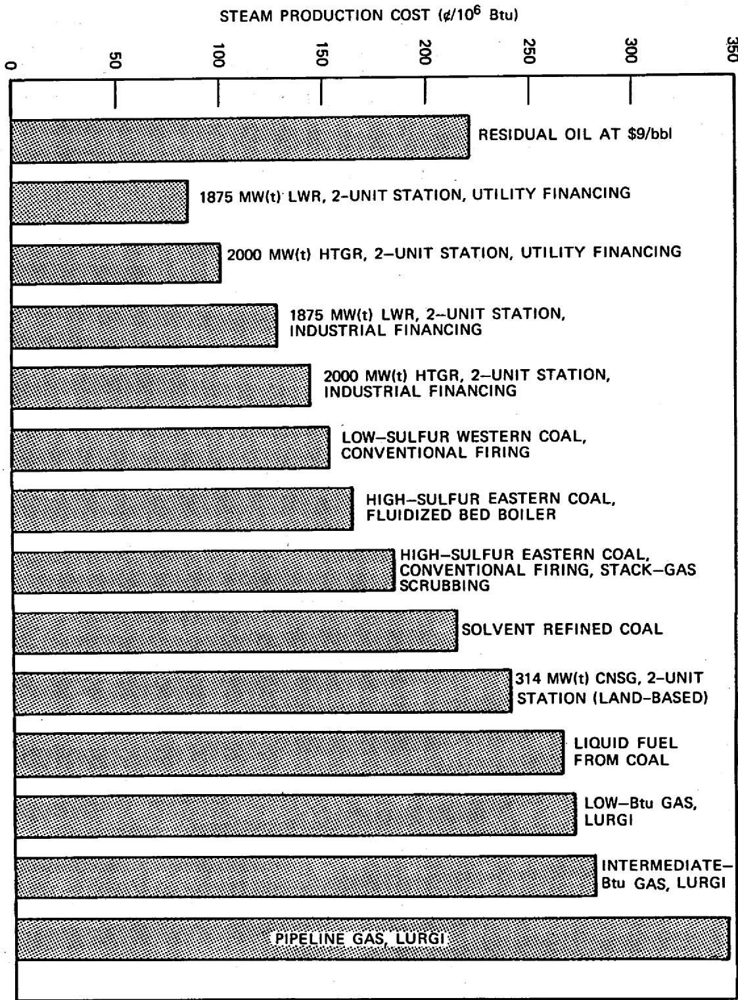  
(sop 61)   
HL6LZ1-05M07N8O

Table 2.11. Financial assumptions   

<table><tr><td></td><td colspan="2">Financial parameters (%)</td></tr><tr><td></td><td>Utility</td><td>Industrial</td></tr><tr><td>Fraction of investment in bonds</td><td>55</td><td>30</td></tr><tr><td>Interest rate on bonds</td><td>8</td><td>8</td></tr><tr><td>Return on equity</td><td>10</td><td>15</td></tr><tr><td>Federal income tax rate</td><td>48</td><td>48</td></tr><tr><td>State income tax rate</td><td>3</td><td>3</td></tr><tr><td>Gross revenues tax rate</td><td>0</td><td>0</td></tr><tr><td>Local property tax rate</td><td>3</td><td>3</td></tr><tr><td>Interim replacements rate</td><td>0.35</td><td>0.35</td></tr><tr><td>Property insurance rate</td><td>0.25</td><td>0.25</td></tr><tr><td>Plant lifetime, years</td><td>30</td><td>20</td></tr></table>

retrofitting case than for a new installation, since existing gas-fired heaters and boilers could be retained. Nevertheless, the analysis of this case showed that it will be more economical in most circumstances to replace existing gas-fired boilers with new direct coal-fired boilers. A comparison of selected energy systems for retrofitting is shown in Fig. 2.3.

In interpreting the economic results, it should be kept in mind that the comparisons are on the basis of steam production. As discussed previously, there are marked differences among the energy systems relative to the potential for supplying other energy needs. All the coal systems might be useful for supplying process heat, whereas none of the present nuclear systems have that capability. However, the HTGR could be adapted to moderate-temperature (1000 to $1400^{\circ}\mathrm{F}$ ) process heating. It should also be noted that the LWRs (including the CNSG) produce steam at a lower temperature than either the HTGR or coal-based systems. Although the large LWRs have low thermal energy costs, the thermodynamic availability of the thermal energy is less than that of most other steam sources. If the comparison were on the basis of cost per unit of shaft work capability, the large LWR cost would be near that of the HTGR.

Another factor in comparing the economics of large reactors with the other alternatives is that the cost to transport thermal energy will probably be higher than for alternative steam systems. The reason is that, since large nuclear plants are expected to serve as dual-purpose, central station electricity and industrial steam plants, the nuclear station would likely occupy a site separate from that of the industrial plant. This study indicated that steam transportation would cost $6\mathfrak{c}$ to $8\mathfrak{c} / 10^{6}$ Btu per mile of transport.

# 2.4.4 Effects of Cost Variables on Economic Results

There are a number of cost uncertainties that could affect the absolute values of estimated energy costs as well as the relative ranking of the various energy systems investigated.

Estimated capital investments are most certain for large nuclear stations and conventional coal-fired boilers and least certain for developmental systems such as fluidized-bed boilers, small

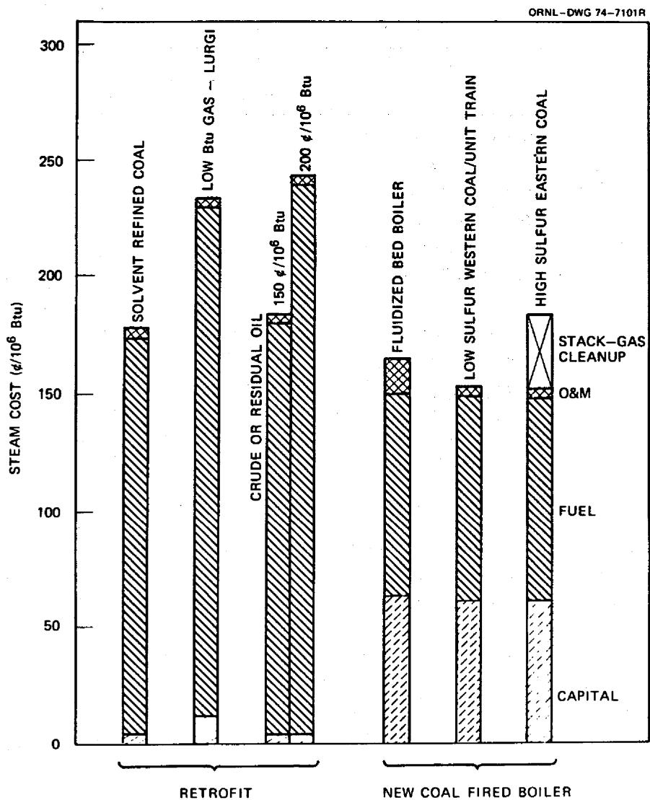  
Fig. 2.3. Selected comparison of steam cost for retrofit vs new coal-fired boiler.

reactors, and coal-derived fuels. Whether the actual costs of these systems will be more or less than the estimates given in this study cannot be determined at the present time.

The cost of money is another important economic variable, and the effects of changes in the effective cost of money on steam production costs were investigated. The higher the cost of money, the more pronounced the gap between the least expensive (direct fired) and most expensive (coal-derived fuels) coal-based systems. The economic position of utility-owned large nuclear plants relative to coal systems in not substantially altered by changes in the cost of money up to $50\%$ greater than the reference values given in Table 2.11. The cost of energy production for the small CNSG reactor is relatively sensitive to the cost of money, since the CNSG is capital intensive. Even so the ranking of all energy systems by cost is unchanged from that shown in Fig. 2.2 for changes in the cost of money up to $50\%$ greater than the reference values.

Current coal prices are substantially higher than the base values used in the present study. As discussed previously, the reference coal prices were selected on the assumption that coal prices will, in the long run, readjust to a competitive position with nuclear for some central station power applications. If coal prices do not decline, (1) the cost differential between the direct-fired systems and the coal-derived fuels will become even larger, because the direct-fired systems are more efficient converters of coal to thermal energy, and (2) the relative economic position of nuclear will be substantially improved.

# 3. Conclusions

# 3.1 THE ENERGY NEED

Industry is faced with a period of transition in fuel sources. Presently, natural gas provides over half the on-site-produced industrial energy, but this resource is becoming scarce and is expected to be phased out as an industrial fuel within the next few years. The present trend is to substitute oil for natural gas in process heaters and boilers. Although the increased use of oil is contrary to the goal of national self-sufficiency in energy, industry has few other alternatives at the present time. Therefore, there is an urgent need to develop energy options for the industrial sector based on plentiful domestic fuels. This is especially important when it is considered that industry consumes more energy than any other economic sector.

Coal and uranium are the only major domestic fuel resources that have a reasonable long-term resource base. The technologies required to use these fuels in an economical, environmentally acceptable way are under development and in some instances being applied. However, the motivation for such development has been primarily for applications other than industrial energy: the major emphasis by both the Federal Government and the energy equipment industry has been on central station power generation. Yet, relative to central station (utility) power generation, industry consumes nearly twice the petroleum and about three times the natural gas. Thus, a stronger national emphasis on the industrial fuel need is justified.

# 3.2 THE ENERGY RESOURCES

The domestic uranium and coal resources are both sufficiently large to make either fuel a reasonable long-term alternative for industrial applications. Coal reserves are particularly large, and it is likely that a major portion of the deficit in oil and gas for industry will be made up by coal. Nevertheless, there are major intermediate-term problems in exploiting our coal resources. These problems relate to environmental constraints on mining and utilization, coal-industry capitalization, and transportation. When all factors are considered, it appears that the supply of coal will be hard pressed to meet demand, at least over the next decade. The current inflated price structure appears to be a consequence of the supply-demand imbalance, but in the long term it is likely that coal will stabilize at prices lower than the present values because of competition with other fuels, particularly nuclear.

The high-grade reserves of uranium may be depleted by the end of the century. Assuming no new mining regions are discovered, the uranium supply will then shift to more dilute sources such as the Chattanooga shales. Even so, it is concluded that the total cost of nuclear energy will be relatively stable over at least the next two decades because the cost of energy production is not a strong function of uranium ore cost.

# 3.3 THE ENERGY SYSTEM CHOICES

Coal and nuclear fuel can each serve as a basis for a number of potentially attractive industrial energy system choices. Both fuels can and probably will help alleviate the energy deficit resulting from the decline in availability of natural gas and oil. Because of its broader range of application and relative ease of implementation, coal is expected to be the more important substitute industrial fuel over the period of interest in this study (the next 15 years). In the longer term, nuclear fuels

could assume a major role for supplying industrial steam. Timing and extent of use of nuclear will depend, in part, on efforts expended to resolve institutional problems. Conclusions about specific coal and nuclear energy systems are given below.

# 3.3.1 Direct Firing of Coal

Generally, the direct firing of coal in industrial boilers and process heaters will be more economical than the use of coal-derived fuels (gases, liquids, and solids). There are three methods for directly using coal to generate steam or process heat in an environmentally acceptable manner: (1) low-sulfur coal, (2) fluidized-bed combustion, and (3) high-sulfur coal with stack-gas scrubbing.

The most realistic coal-based alternative at the present time is low-sulfur coal fired in a conventional boiler. If low-sulfur coal becomes available in sufficient quantities, this is the lowest-cost coal alternative in the Gulf Coast area.

The most promising method of using high-sulfur coal is the fluidized-bed boiler. If development goals are achieved, the process offers flexibility in fuel supply as well as low cost. Fluidized-bed combustion may also hold promise for process heating, but no development work is being done on fluidized-bed process heaters.

Wet limestone scrubbing appears to be the least expensive and best developed of the stack-gas cleanup systems. With additional development, these systems will, no doubt, become workable, but overall operating experience has been poor. Wet limestone scrubbing and other throwaway processes have one distinct disadvantage for industrial applications: the large volume of waste sludge will be difficult to dispose of in many industrial areas. For this reason, it appears that widespread industrial use of stack-gas scrubbing must await the development of economical regenerable systems.

# 3.3.2 On-Site Coal Gasification

Air-blown gasifiers producing low-Btu gas ( $\sim 150$ Btu/scf) and oxygen-blown gasifiers producing intermediate-Btu gas ( $\sim 300$ Btu/scf) are commercially available. Low-Btu gas is marginally lower in cost, but intermediate-Btu gas is a better choice for industry because (1) it can be used as a retrofit fuel for existing gas-fired boilers and process heaters and (2) it is more readily usable as a chemical feedstock. As fuels, however, low- and intermediate-Btu gases are more expensive than direct-fired coal. Extensive industrial applications of on-site coal gasifiers will require the development of a low-cost intermediate-Btu gas process.

# 3.3.3 Mine-Mouth Coal-Conversion Processes

Methods are under development for converting coal to high-quality fuels at the mine mouth; the fuels to be produced include (1) solvent-refined coal; (2) liquid fuels, including synthetic crude, boiler fuels, and methanol; and (3) pipeline-quality (high-Btu) gas.

Solvent-refined coal is potentially the least expensive of the coal-derived fuels and looks especially promising if it can be remelted and used in the same manner as residual oil.

Liquid boiler fuels may have promise for the future, but the cost is likely to exceed that of SRC.

The technology for producing methanol from coal is well developed, but the cost is too high for its use as an industrial fuel. Methanol is presently an important chemical feedstock, and this is the most likely use for coal-derived methanol.

Although high-Btu (pipeline-quality) gas from coal may find limited application in small industries, the large industrial energy user has several coal-based options that are less expensive.

# 3.3.4 Nuclear Energy

With present technology, nuclear energy can supply industrial steam and electricity. The commercially available nuclear systems are very large, ranging from about 1800 to $3800\mathrm{MW(t)}$ . With further development, nuclear energy may have the capability to match most of the higher-temperature process heat applications of industry. Another developmental possibility is a smaller reactor that more nearly matches the energy demand of industrial plants. One important advantage of nuclear energy is the low fuel cost. The major drawbacks to nuclear are (1) the long lead times required in the planning and construction of power plants and (2) the difficulties in gaining site approvals and the administrative burden associated with regulatory requirements. Conclusions concerning specific nuclear alternatives are given below.

Large commercial nuclear power plants offer industrial steam and electricity at the lowest cost of the energy systems investigated. The mismatch in output of currently marketed nuclear plants and the consumption rate of individual industrial plants, coupled with the need for multiple units to provide reliability, will limit applications to joint uses of a nuclear power station. One desirable arrangement is for an electric utility to generate both electrical energy for the grid and thermal energy for local industries. This arrangement would require steam transport for a few miles in most areas.

Process heat at 1000 to $1400^{\circ}\mathrm{F}$ might be economically supplied from large HTGRs, but process heat HTGRs are not commercially available. Such units could be developed, if warranted by market potential, using essentially current technology. A related area of technological development that would be required is an economical means of transporting high-temperature thermal energy from the nuclear plant to the processes.

If fully developed, small $[\sim 300\text{-MW}(\mathfrak{t})]$ land-based PWRs could become competitive with oil (at $10/bbl) and most coal-derived fuels for producing industrial steam and electricity. To be competitive with the lowest-cost coal systems, the capital costs of small reactors need to be reduced below present estimates. The development of factory-assembled barge-mounted units has the potential for reducing capital costs. Justification for this development by reactor manufacturers will depend on their perception of market potential. Another question that requires serious consideration is whether a large number of small reactors would be more difficult to regulate to assure the same high level of safety expected with current reactors.

# 4. Recommendations

It is recommended that both government and industry reexamine their existing programs on the development and implementation of new energy technology in light of the critical national need for substitute fuels in industry. The existing programs should be supplemented, where necessary, to assure adequate consideration of industrial requirements. As a general guideline, the recommended priorities on industrial energy systems are as follows:

# Coal systems

1. First priority

Fluidized bed combustion

Solvent refined coal

# Nuclear systems

1. First priority

Dual-purpose utility-industrial nuclear power plants

2. Second priority

Regenerable stack-gas scrubbing

Low-cost process for intermediate-Btu

gas from coal

2. Second priority

Small reactors for industrial uses

Process heat HTGRs

Some specific recommendations are given below.

# 4.1 COAL SYSTEMS

- Implement a program to demonstrate fluidized-bed boilers for industrial uses. This demonstration program should be a joint effort between the government and industry and should include two or more projects with unit outputs in the range of 50,000 to 500,000 lb/hr of steam.   
- Perform design and cost studies to determine the feasibility and benefits of developing fluidized-bed process heaters.   
- Conduct analyses and tests on typical industrial boilers and process heaters to determine the feasibility of retrofitting these devices to burn solvent-refined coal.

# 4.2 NUCLEAR SYSTEMS

- Undertake a study to examine one or more realistic applications of commercial nuclear plants for the supply of industrial steam in the Gulf Coast area. The purpose of the investigation would be to determine the desirability of undertaking actual projects at specific sites. The applications envisioned would be similar to the Dow-Consumers Power arrangement at Midland, Mich. The study should be a cooperative undertaking involving the government, a power company, and one or more industrial groups.   
- Undertake a market survey of the geographical distribution of the industrial steam demand in the U.S. Estimate what fraction of the demand could be supplied in 1975 by hypothetical steam utilities. If nuclear plants were built in the 1980s for this market, determine what fraction of industry might be served by 1990 and by 2000.   
- Make a more detailed design and cost study of a factory-assembled, barge-mounted small LWR for industrial applications. This work should be oriented toward resolving the question of whether expected benefits justify a development program. A similar study should be made for a small HTGR.

- Undertake a broad assessment of the costs, benefits, and market potential of advanced gas-cooled reactors for producing high-temperature process heat.   
- Make a study to determine the feasibility and extent of potential application of central station generated electricity for process heating. Although this alternative was not examined in the present study, it is another means by which both coal and nuclear energy could be applied in industry.

# Part II. Energy Systems

This part of the report presents the characteristics of both nuclear and coal-based systems which were considered in the study. (Technologies and costs are based on data for the first half of 1974.) Chapter 5, on nuclear systems, is comprised of an assessment of uranium resources, descriptive and economic information on commercial nuclear plants and a smaller reactor that is under development, a study of thermal energy (steam) transport from nuclear plants, and a brief treatise on nuclear licensing and regulation procedures and siting considerations. Chapter 6, on coal-based systems, contains an assessment of coal resources and includes technical and economic data on conventional coal firing with and without stack-gas cleaning; fluidized-bed combustion; low-Btu, intermediate-Btu, and pipeline-quality gases; and liquid boiler fuels and methanol from coal.

An assessment of how these various systems might be suitably employed as industrial energy sources is presented in Part III.

# 5. Nuclear Energy Systems

# 5.1 ASSESSMENT OF URANIUM RESOURCES

The nuclear fuel cycle consists of several steps from the extraction of uranium ore to the disposal of radioactive wastes. The question to be covered in this section is whether an expansion of the nuclear industry to meet an increased industrial process heat load will cause any serious dislocations, due to limitations in the ability to increase the load on any of the fuel cycle items. Of particular concern is the availability and price of uranium, possible problems in acquiring the needed enrichment capacities, and the ability of the capital market to furnish the needed money for expansion.

# 5.1.1 Uranium Availability

Uranium is widely distributed, with an average concentration of 2 to 4 ppm in the continental crusts and 0.003 to 0.004 ppm in the oceans. It is more abundant than gold or silver and about the same as molybdenum or tin and is scattered in small deposits or in low concentrations. The chief present source of ore in the United States is in sedimentary strata ("conventional" deposits), particularly those found in

the Colorado Plateau and in the Wyoming basin geologic regions. Most of our known low-cost reserves are located in these areas. $^2$

Table 5.1 is an estimate of the cumulative uranium resource up to various cost-cutoff levels. Information is provided as to the reasonably assured reserves and for the estimated additional or potential reserves. This latter category refers to additional uranium which is believed to exist in favorable geologic regions primarily adjacent to areas of known reserves. It does not account for possible discoveries of new mining areas or districts.

Table 5.1. U.S. uranium resource (10 $^3$ tons $\mathbf{U}_3\mathbf{O}_8$ )   

<table><tr><td>Cost cutoff ($/lb U3O8)</td><td>Reserves</td><td>Estimated additional reserves</td><td>Total resource</td></tr><tr><td>8</td><td>273</td><td>450</td><td>723</td></tr><tr><td>10</td><td>340</td><td>770</td><td>1,110</td></tr><tr><td>15</td><td>520</td><td>1090</td><td>1,610</td></tr><tr><td>30</td><td>780</td><td>1650</td><td>2,430</td></tr><tr><td>50</td><td></td><td></td><td>7,400</td></tr><tr><td>100</td><td></td><td></td><td>15,400</td></tr></table>

Uranium below the $30/lb \mathrm{U}_{3} \mathrm{O}_{8}$ cutoff for the most part comes from conventional deposits. The $\$ 10$ and $\$ 15/lb$ cutoff potential reserve figures include 70,000 and 90,000 tons, respectively, of $\mathrm{U}_{3} \mathrm{O}_{8}$ available from phosphate and copper production through the year 2000. The estimated resource at cutoffs of less than $\$ 15/lb$ is based on Jan. 1, 1973, AEC estimates.[23] These values change yearly as more exploration is done.

The $50 and$ 100/lb cutoffs4 include uranium in Chattanooga shales. One layer of this shale contains 60 to 80 ppm U3O8 ($50/lb), and another layer contains 25 to 60 ppm U3O8 ($100/lb). This shale may also contain up to 15 gal of oil1 per ton of shale. If we are reduced to mining this substance for its uranium upon exhaustion of the lower-cost resources, the possibility of an interesting by-product relationship may be achieved with oil production. In 2000, we may need about 150,000 tons of U3O8 per year. If this comes entirely from 80-ppm uranium, 15-gal/ton oil Chattanooga shale, 670 million barrels of oil per year (1.8 million barrels per day) could be produced.

The reliability of the resource estimates shown in Table 5.1 decreases with higher price levels. This is because there is both uncertainty as to extraction costs for lower grade ores and a lack of incentive on the part of the mining industry to explore for, and to develop information about, reserves costing several times the current uranium market value.

Other potential sources include uranium in the lignite deposits in the western Dakotas and eastern Montana, which have an estimated 5 million tons of recoverable uranium5 with concentrations ranging from 50 to 200 ppm and at least one deposit averaging $0.7\%$ uranium.6 There has been a small amount of commercial development7 of high-grade uranium deposits, but no reserve cost estimates have been

found. Here also, some co-product economics might be beneficial. The possibility of using the lignite in a gasification, liquefaction, or hydrogen production process and extracting uranium from the residue may be economically feasible at some point.

There are also Conway granites (10 to 20 ppm) containing about 8 million tons of U3O8 which may be extracted at about $200/lb. The ultimate source of uranium is, however, the ocean, which contains a resource of about 4000 million tons. Cost estimates for recovery of this uranium are in excess of $200/lb.

# 5.1.2 Uranium Demand

The most detailed information on the growth of nuclear power generation and its effect on uranium resource use can be obtained from AEC nuclear power demand estimations. The results of a recent study are summarized in WASH-1139 (72). In this discussion, the reference case is the "most likely" case projection used in that study. This case projects an installed nuclear-electric capacity of 1200 million $\mathrm{kW(e)}$ by the year 2000. An effective $0.2\%$ enrichment plant tails will also be used.

The use of $0.2\%$ tails instead of the present $0.3\%$ will reduce ore requirements but, at the same time, raise the separative work requirements. There are several reasons for making this choice. Because of the present split tails policy, the $0.2\%$ figure is the effective tails currently seen by the enrichment customer, the difference in ore requirements being made up from government surplus. Also, if the conservative assumption is made that little or no additional low-cost uranium resources will be found, it follows that the price of uranium ore must rise. This in turn will lead to a lower tails enrichment, both from an economic and a resource conservation standpoint. Any assumption of a continued $0.3\%$ tails would include with it an expanding reserve picture.

The cumulative $\mathrm{U}_3\mathrm{O}_8$ requirements for the reference case are shown in Fig. 5.1. Along with the cumulative $\mathrm{U}_3\mathrm{O}_8$ requirement for an assumption of enhanced industry growth, this enhanced growth was assumed to be caused by the impact of industrial process heat. Starting in 1981, uranium requirements are assumed to increase cumulatively by $1\%$ / year over the reference case uranium requirements. This means that by 2000, the yearly ore requirements will be $20\%$ higher than the reference rate.

# 5.1.3 Uranium Price Projections

The question now is what effect the enhanced uranium demand will have on the market price of uranium and on the fuel cycle costs of reactors. In making any projections as to future price of a commodity material, one is necessarily on shaky ground. When the recent price changes in other energy resources (coal, oil, and gas) are factored in, the uncertainties increase.

In making these estimations, several assumptions were made regarding resource availability and price response as the resource is depleted. An attempt was made to be conservative in the assumptions, resulting in prices which should be considered on the high side. It was assumed that the ultimate resource availability is as given in Table 5.1, which means that the discovery rate is only sufficient to balance mining losses such as would be encountered by leaving low-grade ores behind because they are not economic.3

An orderly conversion of potential to assured reserves was also postulated. This conversion rate was assumed to be price sensitive, since as prices rise the incentives to explore also rise. At \(10/lb U_3O_8\), \(5\%\) of the potential reserves was assumed converted to assured reserves; at \)15/lb, 25%; at $20/lb, 50%;

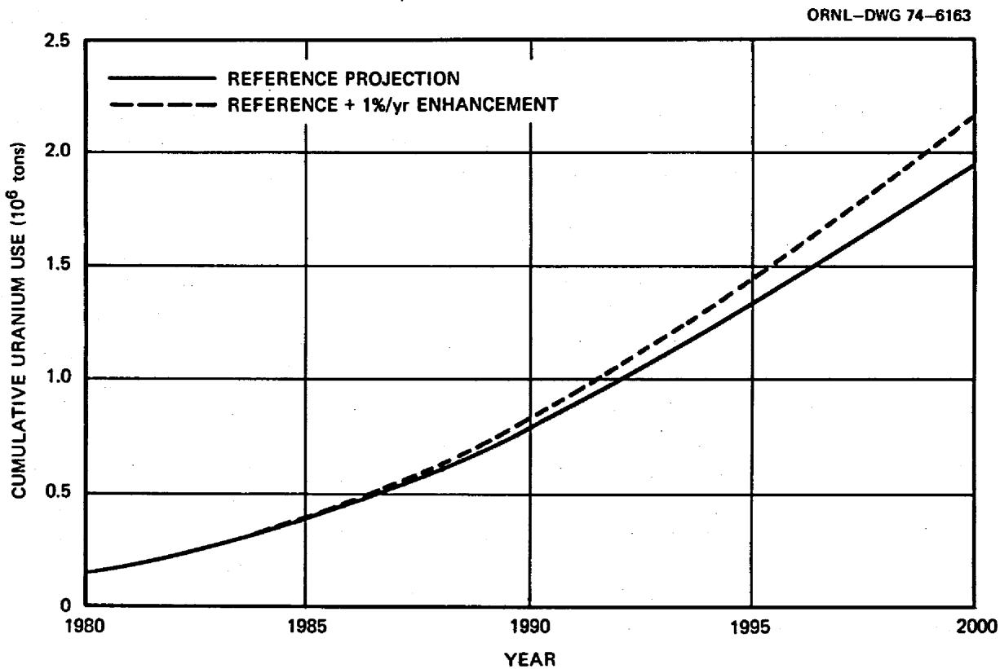  
Fig. 5.1. Cumulative uranium requirements.

at $25/lb, 75%; and at $30/lb, 100%. Figure 5.2 shows the present assured and total reserves as a function of price level. Also shown is the assumed behavior of the available reserves as a function of price level. For example, the latter curve shows that when the price of uranium reaches $20/lb (U₃O₈), there will be an accumulative availability of about 1.25 × 10⁶ lb extractable at this price or less.

The available reserve vs price curve, however, does not determine what the market price will be. First, this curve is for cost of extraction and does not include any profits. Second, since it takes a finite time to deplete a given mining operation, not all of the lower-cost reserves will be used up before mining of the higher-cost reserves is begun. Also it takes about 8 years from the start of exploratory drilling until production of the uranium concentrate begins.9 Before a mining company will undertake the development of a high-cost reserve, it must have reasonable assurance that the venture will be economic, which usually means competitive at current prices. It is postulated that an 8-year forward reserve of uranium at current prices is needed to assure adequate production.4

In this analysis, an 8-year forward reserve was assumed to exist. The ore price at a given time was assumed to be the cost cutoff at the cumulative use 8 years in the future. For instance, for 1980, based on the reference demand curve, the cumulative uranium use from 1973 to 1988 is about 610,000 tons of $\mathrm{U}_3\mathrm{O}_8$ . The price from Fig. 5.2 is about $13.20/lb for this cumulative use, which is our projected $\mathrm{U}_3\mathrm{O}_8$ price at the end of 1980.

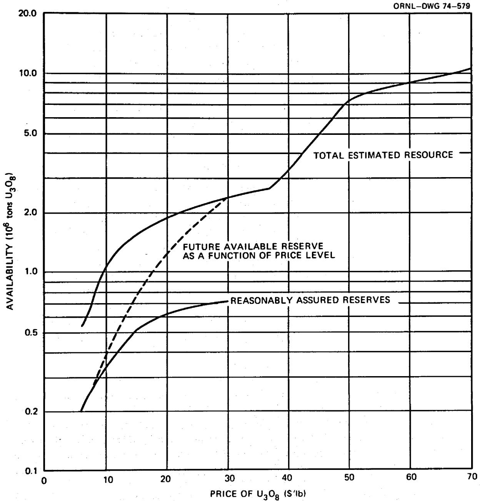  
Fig. 5.2. U.S. uranium resource.

Figure 5.3 shows projected $\mathrm{U}_{3}\mathrm{O}_{8}$ prices through the year 2000. Included are our estimates for the reference case, AEC base and high projections for our reference ore use, $^{10}$ a projection made for Northeast Utilities, $^{11}$ and some recently reported sale and asked prices. $^{12,13}$ All figures except those for the Northeast Utilities are in 1973 dollars.

Figure 5.4 shows our projected ore costs as a function of time for the reference case along with the enhanced-demand case. The discontinuity in the curves at $30/lb$ results from the transition to mining the Chattanooga shale. In the year 2000, based on our projections, the impact of increasing electrical capacity by $20\%$ over the base case is about $\$1.70/lb U_3O_8$ . This amounts to $\$2.4$ billion per year in added ore costs when the increased sales at the higher price are factored in. The relative effect of uranium price on the fuel cycle costs for PWR, HTGR, and CNSG systems is shown in Fig. 5.5. These costs are based on a constant uranium price over the reactor lifetime, a $0.2\%$ tails enrichment, and the utility economic ground rules (see Table 5.15). These curves indicate that a $\$1/lb$ ore price increase will cost $0.96c / 10^6$ Btu for a CNSG system, $0.71c$ for a PWR system, and $0.49c$ for an HTGR system.

# 5.1.4 Uranium Enrichment

The reactors considered in this study use uranium enriched in the $^{235}\mathrm{U}$ isotope. Only $0.71\%$ of natural uranium is $^{235}\mathrm{U}$ ; the balance is mainly of the $^{238}\mathrm{U}$ isotope. Currently, this enrichment is done at three government-owned plants that use the gaseous diffusion enrichment process.[14] These plants take uranium in the form of $\mathrm{UF}_6$ and return uranium of the desired enrichment in the same form.

The enrichment capacity of the present plants is 17.2 million separative work units (SWUs) per year. These plants are expected to be updated9 to a capacity of 27.7 million SWU/year by 1982, which will be adequate to supply projected U.S. enrichment needs until the early 1980s. If no disruption in nuclear power is to occur, new enrichment capacity must come on line no later than May 1983 if present "most likely" projections hold. Current plans are to add enrichment capacity in units of 8.75 million SWU/year. If May 1983 is the startup date of a new enrichment plant, a second plant will be needed about 5 months later. Two plants so close together could cause procurement problems due to the industrial impact of two nearly simultaneous large orders. To assure an orderly development of enrichment capacity, it is estimated that approximately 18 months spacing is needed between plants. Therefore, the first enrichment plant should come on line by mid-1982.

It will take from 6 to 8 years from the time a new enrichment plant is approved until startup. A decision is therefore needed sometime in 1974. If a present diffusion plant site is to be used, the decision could be delayed for about a year. Any reduction in the nuclear plant lead times or increases in orders above projections would hasten the time at which new enrichment capacity will be needed. Any increase in lead time or drop in orders below projections would delay this time. Therefore, there is still adequate time, but decisions will have to be made in the near future if no disruption is to occur in the nuclear business.

Two major decisions (one technological and one political) will have to be made before the next enrichment plant is authorized. The technological decision is the type of enrichment process to use, and the political question is whether this plant will be publicly or privately owned.

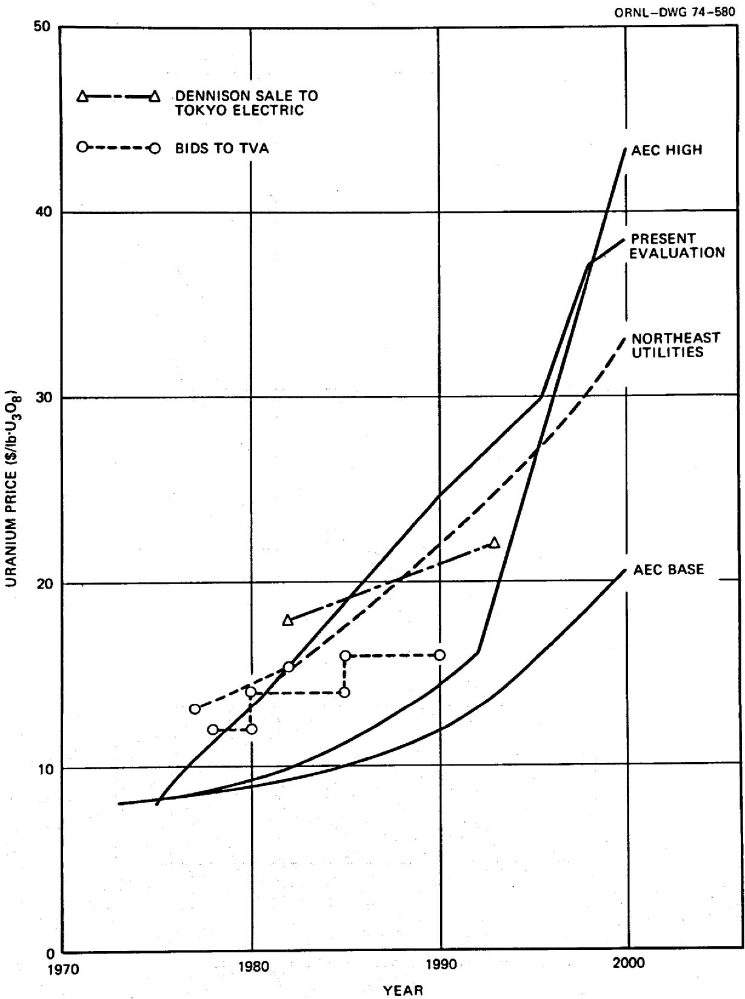  
Fig. 5.3. Comparative uranium price projections.

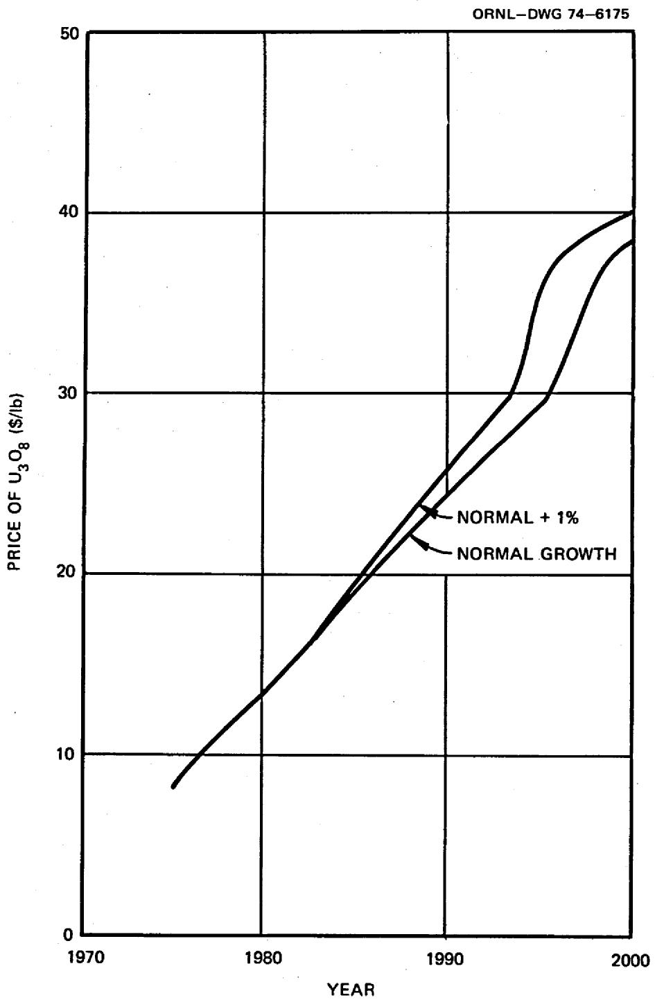  
Fig. 5.4. Uranium price projections for various industry growth rates.

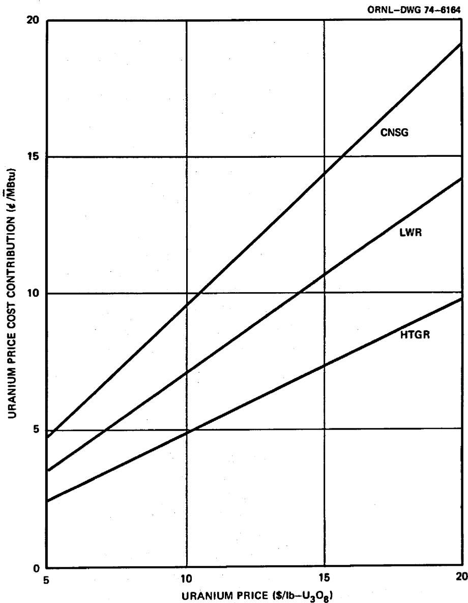  
Fig. 5.5. Effect of uranium price on fuel cycle cost.

There are two types of enrichment processes under active consideration: the gaseous diffusion process and the gas centrifuge process. A third process, laser separation, has recently been suggested; however, many technological obstacles will have to be overcome before it can be used to obtain large commercial quantities of enriched uranium. Its major advantage, besides yet undefined costs, is the possibility of extending uranium reserves by reducing the tails enrichment.

The major advantage of the gaseous diffusion process is that the technology is already well developed. The chief disadvantage is that it uses a great deal of electric power. An 8.75 million SWU/year plant needs $2400\mathrm{MW}$ of electricity-generating capacity to satisfy its needs.

The principal advantage of the gas centrifuge process is that it uses about $10\%$ of the electrical power used by the diffusion process. As the price of power rises, this will be of increasing importance. Its principal disadvantage is that it is an unproven technology except in the laboratory. Before a large-scale plant is built, there is need for assurance that the laboratory technology can be converted into a commercial manufacturing technology.

The question now relates to future separative work prices. Currently, the charge for separative work is $36/SWU; however, indications\(^{16}$ are that this will rise to about \)41 to $42 by mid-1974 due mainly to the recent increase in TVA power costs.

The estimated separative work costs for a new gaseous diffusion plant range from $51 to $65/SWU, depending on financial assumptions and ownership of the facility, public or private. These prices contain a $24/SWU power cost based on 10-mill power. The estimated separative work charge for a new centrifuge plant ranges from $30 to $45/SWU for government ownership and $40 to $60/SWU for private ownership.

In analyses of future price trends, we assume that, at most, one more diffusion process plant will be built. This, as well as the first centrifuge plant, will be government owned. All subsequent plants will be centrifuge plants and will be privately owned. Our reference price schedule is for an increase to $41/ SWU in 1974, followed by a$ 1/year increase until 1983, and constant at $50/ SWU thereafter. The price range of uncertainty is from $40 to$ 60/ SWU, which is the expected private ownership price range for the centrifuge process. Figure 5.6 shows the effect of variations in the separative work charge on fuel cycle cost for PWR, CNSG, and HTGR systems. These costs are based on the utility economic ground rules and a 0.2% tails enrichment.

# 5.1.5 Fuel Cycle Capital Requirements

The capital requirements for the projected expansion of nuclear power are large. By 2000, the 1.2 million MW reference "most likely" nuclear electric capacity will have cost about $600 billion [500/kW(e)], not counting transmission line expansion. A 20% increase in nuclear capacity by 2000, as used in this report for the impact of industrial process heat, will add another $120 billion to this total. In addition to this, capital must be expended to expand mining, milling, and enrichment capacity and to provide the necessary fuel preparation, fabrication, and recovery capacities.

The largest capital expenditures in the fuel cycle will probably be in the mining and milling industries. Estimates of these capital requirements, which cover a period from present until 1990, range from $8 to$ 10 billion.3,17-19 One estimate3 for the period until 2000 is $18 billion. For the most part, these estimates assume that adequate quantities of $8/lb ore will be available and that a 0.3% tails enrichment will be used at the enrichment plants.

Based on assumptions of no new increase in reserves and $0.2\%$ tails, the capital requirements will be substantially larger than previously estimated. We estimate $6.5 to$ 9.5 billion for exploration, $7.5 to $12.5 billion for mine and mill development for the conventional uranium deposits, and another $25 to $35 billion for the development of the Chattanooga shales. The total mining and milling capital requirements to meet the reference nuclear capacity are therefore from $40 to$ 60 billion. The $20\%$ additional nuclear demand case will add from $6 to$ 12 billion to these figures.

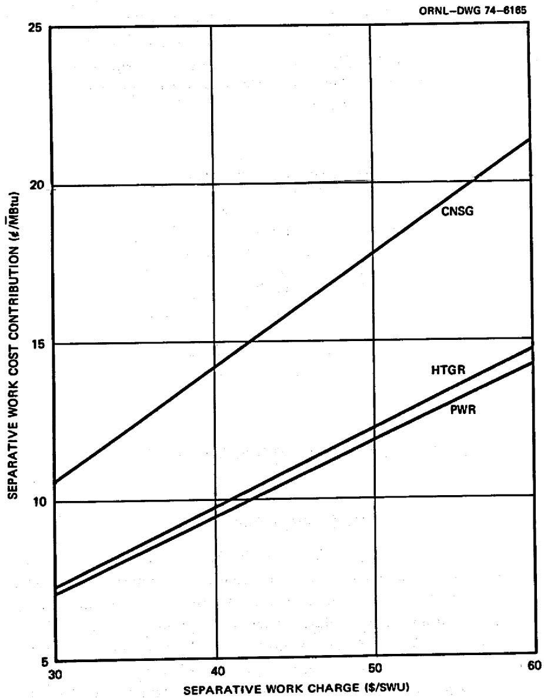  
Fig. 5.6. Effect of separative work charge on fuel cycle cost.

The second largest fuel cycle capital cost component is new enrichment plants. By the year 2000, eight additional 8.75 million SWU/year plants will be needed to satisfy the U.S. reference projection demands at $0.2\%$ tails. The cost of a new 8.75 million SWU/year diffusion plant will be $1.2 to$ 1.4 billion.9 In addition, 2400 MW(e) of generating capacity will be needed for this process. The capital cost estimates for the centrifuge process range from $1.1 to$ 1.7 billion for an 8.75 million SWU/year plant. In addition, the capital cost of the necessary electric capacity is about $0.1 billion.

The total enrichment plant capital cost for the reference nuclear demand is from $10 to$ 20 billion, depending on the process used. An additional $2 to $3 billion will be needed for the 20% additional nuclear capacity by the year 2000.

The other fuel cycle items include the conversion, fabrication, reprocessing, shipping, and waste disposal steps. Capital costs per unit of throughput and scale factors may be extracted from several

references. $^{17-20}$ The capital requirements through the year 2000 for those items are estimated as $8 billion for the reference demand case and another$ 1.5 billion for the 20% additional demand case. The estimated capital requirements are summarized in Table 5.2. The additional capital required for the 20% additional capacity case ( $9 to$ 16 billion) is considered to be small when compared with the $120 billion which may be needed to build the nuclear systems.

Table 5.2. Capital requirements through the year 2000 (\$ × 109)   

<table><tr><td>Item</td><td>Base case</td><td>Addition for 20% expansion</td></tr><tr><td>Exploration, mining, milling</td><td>40-60</td><td>6-12</td></tr><tr><td>Enrichment</td><td>10-20</td><td>2-3</td></tr><tr><td>Others</td><td>8</td><td>1-1.5</td></tr><tr><td>Total</td><td>58-88</td><td>9-16</td></tr></table>

# 5.2 COMMERCIAL NUCLEAR PLANTS

# 5.2.1 Introduction

Commercial nuclear plants presently available are BWRs, PWRs, and HTGRs. Both BWRs and PWRs use slightly enriched uranium dioxide pellets as fuel and demineralized water as coolant and moderator. The HTGR fuel is a mixture of uranium carbide highly enriched in $^{235}\mathrm{U}$ and thorium oxide. The moderator and core structural material is graphite, and the coolant is helium.

With one exception, all large nuclear plants in the United States are single-purpose electricity-generating plants. Unit 1 of the Consumers Power Midland Plant is designed both to generate electricity and to produce process steam for the Dow Chemical Company at Midland, Michigan. The reactor plant for unit 1 will generate $10,200,000 \mathrm{lb/hr}$ of prime steam. Of this amount, $400,000 \mathrm{lb/hr}$ will be used to generate high-pressure process steam at $600 \mathrm{psi}$ and $9,800,000 \mathrm{lb/hr}$ will be delivered to the turbine throttle. Turbine extraction steam will be used to generate $3,650,000 \mathrm{lb/hr}$ of low-pressure extraction steam at $125 \mathrm{psi}$ . Unit 2 will be a single-purpose electricity-generating plant.

Standard sizes available range from about 660 MW(e) [1956 MW(t)] to 1320 MW(e) [3818 MW(t)]. Overall plant efficiencies are about $33\%$ for the PWR and the BWR and about $38\%$ for the HTGR.

The commercial BWR was developed and is marketed by the General Electric Company. Dresden 1, the forerunner of the large BWR, is owned and operated by Commonwealth Edison Company. Commercial service began in August 1960 and the rated capability of $200\mathrm{MW(e)}$ was reached in 1962.

As shown in Table 5.3, General Electric is currently marketing the BWR-6 nuclear steam system in five standard sizes.

The first commercial PWR nuclear steam system was developed and marketed by Westinghouse Electric Corporation. Westinghouse and Duquesne Light Company started construction of the demonstration PWR power plant (Shippingport) in March 1955. This plant reached its full rated power of $150\mathrm{MW(e)}$ in December 1957. Combustion Engineering, Inc., and Babcock and Wilcox Company are now also marketing commercial PWR nuclear steam systems. Both the Westinghouse and Cousbustion Engineering systems produce saturated steam using U-tube steam generators, while Babcock and Wilcox systems produce slightly superheated steam using a once-through steam generator.

The Babcock and Wilcox nuclear steam system utilizes two coolant loops, each of which contains a steam generator and two primary coolant pumps. Table 5.4 lists the three sizes of these units presently being marketed.

Combustion Engineering manufactures the nuclear steam system with two coolant loops, each with a steam generator and two reactor coolant pumps. Four sizes are given in Table 5.5.

Westinghouse offers standard nuclear steam system designs with two, three, and four coolant loops. Current ratings are given in Table 5.6. The two-loop system is not available in the United States but is marketed abroad.

Table 5.3. General Electric nominal plant ratings   

<table><tr><td>Fuel assemblies</td><td>580</td><td>560</td><td>592</td><td>732</td><td>784</td></tr><tr><td>Thermal power, MW(t)</td><td>1956</td><td>2444</td><td>2894</td><td>3579</td><td>3833</td></tr><tr><td>Electrical power, MW(e)</td><td>660</td><td>830</td><td>985</td><td>1220</td><td>1290</td></tr><tr><td>Steam pressure, psia</td><td>1040</td><td>1040</td><td>1040</td><td>1040</td><td>1040</td></tr></table>

Table 5.4. Babcock and Wilcox nominal plant ratings   

<table><tr><td>Fuel assemblies</td><td>145</td><td>205</td><td>241</td></tr><tr><td>Thermal power, MW(t)</td><td>2643</td><td>3621</td><td>3818</td></tr><tr><td>Electrical power, MW(e)</td><td>880</td><td>1244</td><td>1320</td></tr><tr><td>Steam pressure, psia</td><td>925</td><td>1060</td><td>1125</td></tr></table>

Table 5.5. Combustion Engineering nominal plant ratings   

<table><tr><td>Fuel assemblies</td><td>177</td><td>217</td><td>217</td><td>241</td></tr><tr><td>Thermal power, MW(t)</td><td>2825</td><td>3410</td><td>3473</td><td>3817</td></tr><tr><td>Electrical power, MW(e)</td><td>980</td><td>1160</td><td>1190</td><td>1305</td></tr><tr><td>Steam pressure, psig</td><td>900</td><td>900</td><td>1000</td><td>1100</td></tr></table>

The HTGR plant is relatively new to the electric utility industry in this country. The first HTGR constructed in the United States was the 40-MW(e) prototype Peach Bottom unit I, which is owned and operated by the Philadelphia Electric Company. General Atomic Company was responsible for the design of the nuclear steam system associated with this plant and for the research and development on both the plant and the nuclear fuel; they also supplied the major components of the nuclear steam system.

General Atomic Company is also serving as prime contractor to Public Service Company of Colorado to construct the 330-MW(e) HTGR Fort St. Vrain Nuclear Generating Station. Like the Peach Bottom reactor, it was built under the USAEC Power Reactor Demonstration Program. Fort St. Vrain is the first plant in this country to use a prestressed concrete reactor vessel (PCRV).

The HTGR nuclear steam system built by General Atomic Company is available in two standard sizes, as shown in Table 5.7.

Table 5.6. Westinghouse nominal plant ratings   

<table><tr><td>Number of loops</td><td>2</td><td>3</td><td>4</td><td>4</td></tr><tr><td>Fuel assemblies</td><td>121</td><td>157</td><td>193</td><td>193</td></tr><tr><td>Thermal power, MW(t)</td><td>1882</td><td>2785</td><td>3425</td><td>3817</td></tr><tr><td>Electrical power, MW(e)</td><td>600</td><td>900</td><td>1150</td><td>1300</td></tr><tr><td>Steam pressure, psig</td><td>920</td><td>984</td><td>1000</td><td>1100</td></tr></table>

Table 5.7. General Atomic nominal plant ratings   

<table><tr><td>Number of loops</td><td>4</td><td>6</td></tr><tr><td>Thermal power, MW(t)</td><td>2000</td><td>3000</td></tr><tr><td>Electrical power, MW(e)</td><td>770</td><td>1160</td></tr><tr><td>Steam pressure, psia</td><td>2415</td><td>2515</td></tr></table>

# 5.2.2 The BWR Power Plant

# The nuclear steam system

The nuclear steam system includes a direct-cycle, forced-circulation BWR that produces steam in the core for direct use in the steam turbine. A diagram showing the major parameters of the nuclear system for the rated power conditions of 3579 MW(t) is shown in Fig. 5.7. Design characteristics of the system are shown in Table 5.8.

Fuel for the reactor core consists of slightly enriched uranium dioxide pellets sealed in Zircaloy tubes. These tubes (or fuel rods) are assembled into individual fuel assemblies. Gross control of the core is achieved by movable bottom-entry control rods which are cruciform in shape and are dispersed throughout the lattice of fuel assemblies. The control rods are positioned by individual control rod drives.

ORNL-DWG 74-5669A

# LEGEND

# = FLOW

F = TEMPERATURE (°F)

H,h = ENTHALPY (Btu/lb)

M = % MOISTURE

P = PRESSURE (psia)

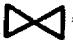

ISOLATION VALVES

ASSUMED SYSTEM LOSSES

THERMAL 1.1

MW

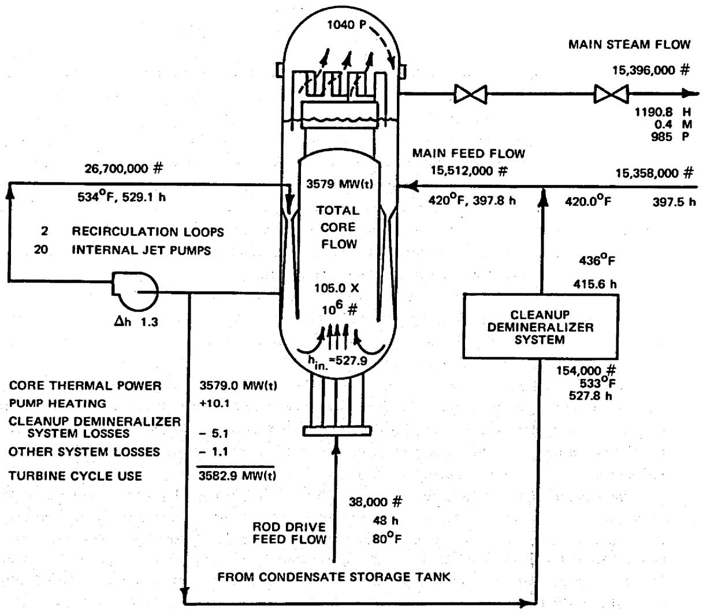  
Fig. 5.7. Heat balance at rated power (from General Electric Company BWR/6 Standard Safety Analysis Report).

Table 5.8. Design characteristics [3579-MW(t) BWR]   

<table><tr><td colspan="2">Thermal and hydraulic design</td></tr><tr><td>Rated power, MW(t)</td><td>3579</td></tr><tr><td>Steam flow rate, 106lb/hr</td><td>15</td></tr><tr><td>Core coolant flow rate, 106lb/hr</td><td>105</td></tr><tr><td>Feedwater flow rate, 106lb/hr</td><td>15</td></tr><tr><td>System pressure, nominal in steam dome, psia</td><td>1040</td></tr><tr><td>Feedwater temperature, °C (°F)</td><td>216 (420)</td></tr><tr><td colspan="2">Reactor vessel design</td></tr><tr><td>Material</td><td>Low-alloy steel/partially clad</td></tr><tr><td>Design pressure, psig</td><td>1250</td></tr><tr><td>Design temperature, °C (°F)</td><td>302 (575)</td></tr><tr><td>Inside diameter, ft-in.</td><td>19-10</td></tr><tr><td>Inside height, ft-in.</td><td>70-10</td></tr></table>

Each fuel assembly has several fuel rods with gadolinia $(\mathrm{Gd}_2\mathrm{O}_3)$ mixed in solid solution with the $\mathrm{UO_2}$ . The $\mathrm{Gd}_2\mathrm{O}_3$ is a burnable poison which diminishes the reactivity of the fresh fuel. It is depleted as the fuel reaches the end of its first cycle.

The reactor vessel contains the core and supporting structures; the steam separators and dryers; the jet pumps; the control rod guide tubes; the distribution lines for the feedwater, core sprays, and liquid control; the in-core instrumentation; and other components. The main connections to the vessel include steam lines, coolant recirculation lines, feedwater lines, control rod drive and in-core nuclear instrument housings, high- and low-pressure core spray lines, residual heat removal lines, standby liquid control line, core differential pressure line, jet pump pressure sensing lines, water level instrumentation, and control rod drive system return lines.

The reactor vessel is designed and fabricated in accordance with applicable codes for a pressure of 1250 psig. The nominal operating pressure in the steam space above the separators is 1040 psia. The vessel is fabricated of low-alloy steel and is clad internally with stainless steel (except for the top head, nozzles, and nozzle weld zones, which are unclad).

The reactor core is cooled by demineralized water that enters the lower portion of the core and boils as it flows upward around the fuel rods. The steam leaving the core is dried by steam separators and dryers located in the upper portion of the reactor vessel. The steam is then directed to the turbine through the main steam lines. Each steam line is provided with two isolation valves in series, one on each side of the containment barrier.

The reactor recirculation system pumps reactor coolant through the core. This is accomplished by two recirculation loops external to the reactor vessel but inside the containment. Each external loop contains four motor-operated valves and one hydraulically operated valve. Two of the motor-operated valves are used as pump suction and pump discharge shutoff valves. The third motor-operated valve is a small shutoff valve used to bypass the large discharge valve to warm the pipeline during hot standby. The fourth motor-operated valve is in a bypass line that bypasses both the flow control valve and the discharge shutoff valve; this valve is manually set in a fixed position to adjust the bypass flow. The variable-position flow control valve in the main recirculation pipe allows control of reactor power level through the effects of coolant flow rate on moderator void content.

The internal portion of the loop consists of jet pumps which contain no moving parts. These pumps provide a continuous internal circulation path for the major portion of the core coolant flow

and are located in the annular region between the core shroud and the vessel inner wall. A recirculation line break will still allow core flooding to approximately two-thirds of the core height—the level of the inlet of the jet pumps.

Load following is normally accomplished by varying the recirculation flow to the reactor. This method of power level control takes advantage of the reactor negative void coefficient. To increase reactor power, it is necessary only to increase the recirculation flow rate, which sweeps some of the voids from the moderator and causes an increase in core reactivity. As the reactor power increases, more steam is formed, and the reactor stabilizes at a new power level with the transient excess reactivity balanced by the new void formation. No control rods are moved to accomplish this power level change. Conversely, when a power reduction is required, it is necessary to reduce the recirculation flow rate. When this is done, more voids are formed in the moderator, and the reactor power level stabilizes commensurate with the new recirculation flow rate. No control rods are moved to accomplish the power reduction.

A power range of control of approximately $35\%$ can be achieved through the recirculation flow control system. For power ranges beyond this level of control, the control rods are moved. Ramp load changes up to $30\%/\min$ are available through use of the recirculation flow control.

Correct distribution of core coolant flow among the fuel assemblies is accomplished by the use of an accurately calibrated fixed orifice at the inlet of each fuel assembly. Each orifice is located in the fuel support piece. They serve to control the flow distribution and hence the coolant conditions within prescribed bounds throughout the design range of core operation.

The core is divided into two orificed flow zones. The outer zone is a narrow, reduced power region around the periphery of the core, and the inner zone consists of the core center region.

Refueling is accomplished by removing the pressure vessel head and flooding the volume above the pressure vessel, thus providing for underwater handling of fuel and other reactor internals. Underwater storage of the irradiated fuel and reactor internal parts is accommodated by special pool storage facilities.

The fuel loading is based on a 4-year cycle. Approximately one-fourth of the core is replaced each year. The minimum downtime required for depressurization, cooldown, refueling, repressurization, and reactor startup is estimated to be 8 to 10 days.

Auxiliary systems are provided to perform the following functions:

1. purify reactor coolant water;   
2. cool system components;   
3. remove residual heat when the reactor is shut down;   
4. cool the spent-fuel storage pool;   
5. sample reactor coolant water;   
6. provide for emergency core cooling;   
7. collect reactor containment drains;   
8. provide containment spray;   
9. provide containment ventilation and cooling;   
10. process liquid, gaseous, and solid wastes;

11. provide seal water for pipes penetrating containment following a loss-of-coolant accident (LOCA);   
12. provide redundant means of removing hydrogen from the containment following an LOCA;   
13. provide primary coolant leak-detection system;   
14. inject borated water by a standby emergency liquid control system.

# Balance of plant

The turbine-generator system design is subject to some variation. A typical 1000-MW(e) plant would have a tandem-compound 1800-rpm turbine with one high-pressure and three low-pressure sections. Six combination moisture separator-reheater units are used to dry and superheat the steam between the high- and low-pressure sections. A typical heat balance diagram for a 1000-MW(e) plant is shown in Fig. 5.8.

The containment structure completely encloses the entire reactor and reactor coolant system and ensures that essentially no uncontrolled leakage of radioactive materials to the environs would result even on gross failure of the reactor coolant system. The structure provides biological shielding for normal and accident situations and is designed to maintain its integrity under tornado wind loading, impact from tornado-generated missiles, storm winds, floods, earthquakes, tsunamis, and other natural forces at their worst foreseeable intensity within conservatively established recurrence intervals.

General Electric Company is currently marketing a containment and nuclear design designated the Mark III, which is a complex of three buildings—the reactor building, the auxiliary building, and the refueling building. The Mark III containment, shown in Fig. 5.9, uses pressure suppression with the dry containment layout. The dry well, which surrounds the reactor and primary coolant system, is a pressure boundary that channels steam from the blowdown following a postulated LOCA through the suppression pool. This pool is located in the bottom of a dry containment. A weir wall and three rows of horizontal vents are used to distribute steam flowing into the suppression pool. The entire volume of the containment is open to the suppression pool. The Mark III concept features an upper pool which provides shielding during normal operation and refueling and is used with the suppression pool for dry-well flooding following an LOCA.

The containment structure is similar to that of a standard dry containment and can be designed either as a free-standing steel containment surrounded by a concrete shield building or as a concrete pressure vessel with a liner. The dry well is not lined, since it is a pressure barrier used to channel steam from an LOCA through the suppression pool and is not a primary leakage barrier. Auxiliary buildings are provided to house the spent-fuel storage and handling facility, the core standby cooling system, and other reactor auxiliary equipment.

The turbine-generator building requires radiation shielding because of the direct cycle of the BWR. Steam generated in the reactor core conveys some fission products to the turbine. Fission product gases, $^{16}\mathrm{N}$ , and some radioisotopes enter the turbine and turbine condenser. Approximately 80% of the activity is discharged via the air ejector on the main condenser to a system utilizing catalytic recombination and low-temperature charcoal adsorption. The catalytic recombiner recombines radiolytically dissociated hydrogen and oxygen, and charcoal adsorption beds selectively adsorb and delay xenon and krypton from the bulk of the carrier gas, which is principally air. After

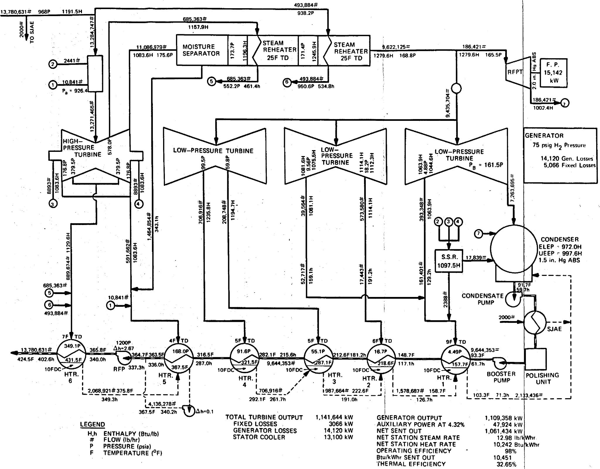  
Fig. 5.8. Typical 1000-MW(e) BWR turbine cycle heat balance diagram (from WASH-1230, Vol. II).

ORNL-DWG 74-5671

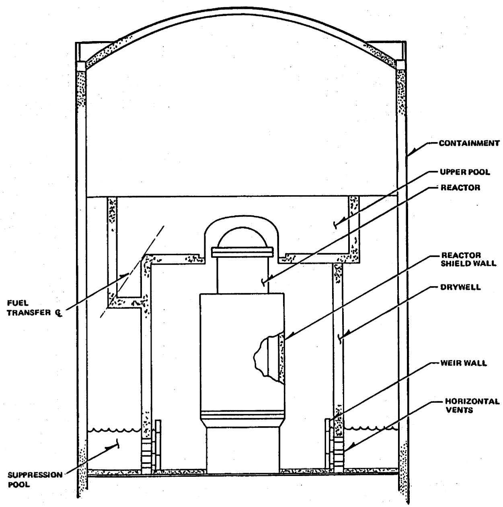  
Fig. 5.9. Typical Mark III BWR containment (from General Electric Company Report NEDO-10571).

the delay, the gas is passed through a filter and discharged to the atmosphere. The other $20\%$ of the activity follows the condensate and is treated by the condensate filter-demineralizers.

Radiation shielding is provided around the following areas:

1. main steam lines,   
2. primary and extraction steam piping,   
3. high- and low-pressure turbines,

4. feedwater pumps and turbines,   
5. moisture separators,   
6. reactor feedwater system heaters,   
7. main condenser and hot well,   
8. air ejectors and steam packing exhauster,   
9. condensate demineralizer,   
10. off-gas lines.

Some of the equipment, such as the air ejectors, feedwater pumps, and heaters, are in individual rooms, thus allowing part of the system to be shut down without interrupting plant operation.

The control room building houses the instrumentation and controls for reactor and turbine-generator controls. It is designed according to seismic, tornado, and flooding criteria and contains all the necessary instrumentation and control for plant operation under normal and accident conditions.

The diesel-generator building is designed to withstand short-term tornado loading, including tornado-generated missiles. This building houses the diesel generators that provide standby power.

Miscellaneous structures are required for maintenance shops, chemicals storage, water-intake equipment housing, etc. Other balance-of-plant equipment and systems are similar to those required for a conventional fossil-fired plant. Included are condensers, feedwater pumps, makeup water treatment systems, circulating water systems, electric plant equipment, etc.

# 5.2.3 The PWR Power Plant

# The nuclear steam system

A PWR nuclear steam system is made up of closed loops in which heat is transported from the reactor core to the steam generators by circulating pressurized water. The system consists of a reactor pressure vessel containing the reactor core, the steam generator, pumps for circulating the pressurized water, and a pressurizer that maintains and controls system pressure. A typical PWR coolant system schematic flow diagram is shown in Fig. 5.10. Characteristics typical of a PWR nuclear steam system (Babcock and Wilcox plant) are given in Table 5.9.

Fuel for the PWR core is contained in sealed tubes (fuel rods) which are mounted vertically. The fuel is cylindrical pellets of sintered, low-enriched uranium dioxide. The pellets are clad in Zircaloy tubing and sealed by welded Zircaloy end caps. The basic fuel assembly is composed of fuel rods, control rod guide tubes, one instrumentation tube assembly, segmented spacer sleeves, spacer grids, and end fittings. The guide tubes, spacer grids, and end fittings form a structural cage to arrange the rods and tubes in an array.

Core reactivity is controlled by control rod assemblies and soluble boron dissolved in the primary reactor coolant. The control rods, which move vertically, are actuated by electrically driven control rod drive mechanisms mounted on top of the reactor pressure vessel.

The reactor vessel contains the core and supporting structures, thermal shield, in-core instrumentation, and other components. The main connections to the reactor vessel are the main

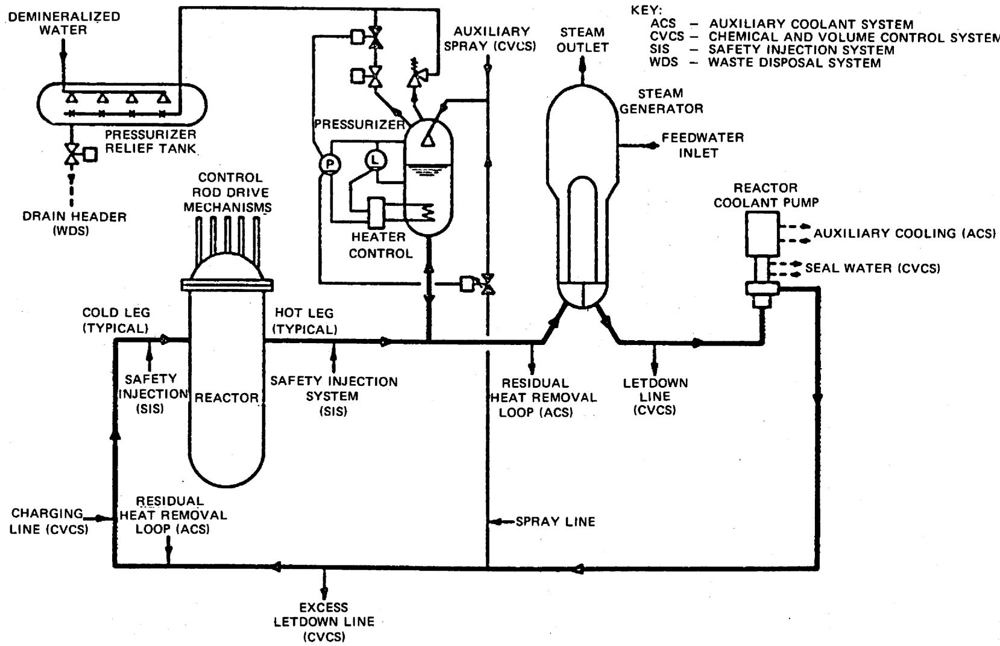  
Fig. 5.10. Typical PWR reactor coolant systemi (from Westinghouse Electric Corporation).

Table 5.9. Design characteristics [3413-MW(t) PWR]   

<table><tr><td colspan="2">Thermal and hydraulic design</td></tr><tr><td>Design core heat output, MW(t)</td><td>3413</td></tr><tr><td>Nominal system pressure, psia</td><td>2250</td></tr><tr><td>Total reactor coolant flow, 10^6 lb/hr</td><td>139</td></tr><tr><td>Vessel coolant inlet temperature, °C (°F)</td><td>301 (573)</td></tr><tr><td>Vessel coolant outlet temperature, °C (°F)</td><td>332 (630)</td></tr><tr><td colspan="2">Reactor vessel design</td></tr><tr><td>Material</td><td>SA-508, class 2 forging, 
SA-533, grade B, class 1 plate</td></tr><tr><td>Design pressure, psig</td><td>2500</td></tr><tr><td>Design temperature, °C (°F)</td><td>670</td></tr><tr><td>Inside diameter, ft-in.</td><td>15-2</td></tr><tr><td>Overall height of vessel and closure head</td><td>23-3 7/8</td></tr><tr><td>cover, control rod drives, and instrument nozzles, ft-in.</td><td></td></tr><tr><td colspan="2">Steam generator design</td></tr><tr><td colspan="2">Steam conditions at full load</td></tr><tr><td>Flow, 10^6 lb/hr</td><td>14.86</td></tr><tr><td>Temperature, °C (°F)</td><td>318 (603)</td></tr><tr><td>Pressure, psia</td><td>1075</td></tr><tr><td>Feedwater temperature, °C (°F)</td><td>245 (473)</td></tr><tr><td colspan="2">Reactor coolant side</td></tr><tr><td>Flow, 10^6 lb/hr</td><td>139</td></tr><tr><td>Inlet temperature, °C (°F)</td><td>332 (630)</td></tr><tr><td>Outlet temperature, °C (°F)</td><td>301 (573)</td></tr></table>

coolant lines on the side, control rod drive mechanisms on the top, and instrument lines on the bottom. The vessel is fabricated of low-alloy steel and is clad internally with stainless steel.

The reactor core is cooled by demineralized water that enters the side of the vessel, flows downward to the lower end of the vessel, upward through the core, around the fuel rods, and out the pipe connections on the side of the vessel. The coolant is piped to the steam generator, to the main circulating pumps, and back to the reactor vessel in a closed loop. It is necessary to maintain the primary coolant system pressure high enough to prevent boiling. This is done by an electrically heated pressurizer tied into the system that serves to control the coolant pressure and absorb some volume variations of the primary coolant. Steam generated in the steam generators is piped to the steam turbine, passed through the turbine, condensed, and returned by a boiler feedwater system in the same manner as in a conventional fossil-fired plant.

The reactor vessel, main coolant piping, steam generators, pressurizer, and coolant circulating pumps are all located inside the containment structure. Steam lines penetrate the containment and convey the steam to the turbine building, which is not a containment structure.

Refueling of the reactor is accomplished by removing the pressure vessel head and flooding the volume above the vessel. Underwater handling of fuel and other reactor components is then possible. Underwater storage of the irradiated fuel and reactor internals is accommodated by pool storage facilities.

The fuel loading of the large PWR core is generally based on a 3-year cycle. Approximately one-third of the core is replaced annually. The minimum downtime required for depressurization, cooldown, refueling, repressurization and startup is about 10 days.

Auxiliary systems are provided to perform the following functions:

1. charge the reactor coolant system;   
2. add makeup water;   
3. purify reactor coolant water;   
4. provide chemicals for corrosion inhibition and reactor control;   
5. cool system components;   
6. remove residual heat when the reactor is shut down;   
7. cool the spent-fuel storage;   
8. sample reactor coolant water;   
9. provide for emergency core cooling;   
10. collect reactor coolant drains;   
11. provide containment spray;   
12. provide containment ventilation and cooling;   
13. dispose of liquid, gaseous, and solid wastes;   
14. provide seal water for pipes penetrating containment following an LOCA;   
15. provide cooling for containment penetrations with hot pipes;   
16. provide redundant means of removing hydrogen from containment following an LOCA;   
17. provide main coolant leak-detection system.

# Balance of plant

The turbine-generator system design is subject to some variation. A typical 1000-MW(e) plant would have a tandem-compound 1800-rpm turbine with one high-pressure and three low-pressure sections. Six combination moisture separator-reheater units are employed to dry and superheat steam between the high- and low-pressure turbine sections. A typical heat balance for a 1000-MW(e) plant is shown in Fig. 5.11.

The containment structure completely encloses the entire reactor and reactor coolant system to ensure that essentially no leakage of radioactive materials to the environment would result even on gross failure of the reactor coolant system. The structure provides biological shielding for normal accident conditions and is designed to maintain its integrity under tornado wind loading, impact from tornado-generated missiles, storm winds, floods, earthquakes, tsunamis, and other natural forces at their worst foreseeable intensity within conservatively established recurrence intervals. The containment building is a concrete structure with a steel liner to ensure leak tightness. A typical 1000-MW(e) plant has a concrete containment structure with an inside diameter of approximately 135 ft and an overall inside height of approximately 67 ft. A typical PWR containment building and nuclear steam system are shown in Fig. 5.12.

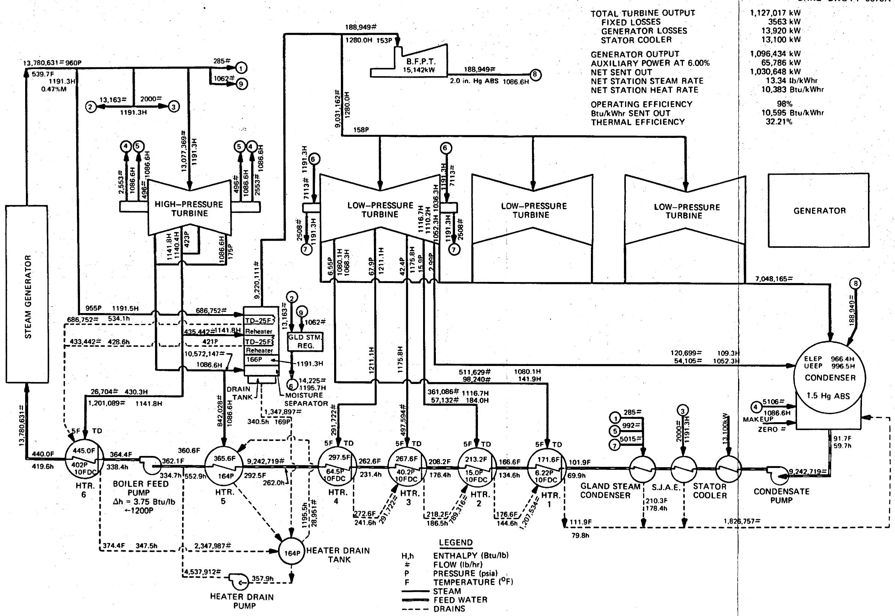  
Fig. 5.11. Typical 1000-MW(e) PWR turbine cycle heat balance diagram (from WASH-1230, Vol. I).

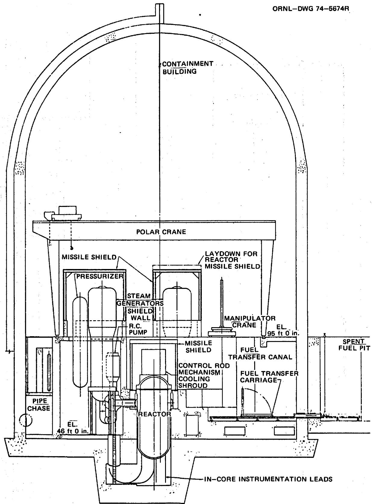  
Fig. 5.12. Typical PWR containment (from WASH-1082).

The control building houses the control room, auxiliary equipment, ventilation equipment, and the reactor plant cooling water system. It is a missile-protected building, since it houses safety-related equipment. The diesel-generator building is designed to withstand short-term tornado loading, including tornado-generated missiles. It houses the diesel generators that provide standby power. The turbine-generator building contains the turbine generator and other equipment related to the conventional portion of the plant. Building design is based on the same criteria that are used for a fossil-fired plant turbine-generator building.

Miscellaneous structures are required for fuel storage, chemicals storage, maintenance shops, water-intake equipment housing, etc. Other balance-of-plant equipment and systems are similar to those required for a conventional fossil-fired plant. Included are items such as the condensers, feedwater pumps, makeup water treatment system, circulating water systems, and electric plant equipment.

# 5.2.4 The HTGR Power Plant

# The nuclear steam system

The HTGR plants use helium gas as the reactor coolant and graphite as the moderator and core structural material. The fuel is a mixture of enriched uranium carbide and thorium oxide used in the form of particles individually clad with ceramic coatings.

All major nuclear steam system components, including the steam generators, are housed in a steel-lined, prestressed concrete reactor vessel (PCRV) which also provides the necessary biological shielding. The PCRV, in turn, is housed in a conventional reinforced concrete secondary containment building. The design of the large HTGR was based on information developed in the course of designing and constructing the Peach Bottom and the Fort St. Vrain plants.

The nuclear steam system of the 1160-MW(e) plant produces main superheated steam at $515^{\circ}\mathrm{C}$ $(955^{\circ}\mathrm{F})$ and 2500 psig and reheat steam at $540^{\circ}\mathrm{C}$ $(1002^{\circ}\mathrm{F})$ and 571 psig. Overall performance data for an HTGR plant are shown in Table 5.10. The nuclear steam system contains six independent primary coolant loops, each with a helium circulator and steam generator. Helium, at a pressure of about 710 psig, is circulated by means of steam-turbine-driven axial-flow helium circulators. The helium flows downward through the reactor core and through the single-pass steam generators, located in the PCRV in separate cavities around the main core cavity, before returning to the helium circulators. The main superheated steam produced in the steam generators at $515^{\circ}\mathrm{C}$ $(955^{\circ}\mathrm{F})$ and 2500 psig passes to the high-pressure element of the steam turbine. The steam from the high-pressure turbine exhaust is used to drive the helium circulators before passing to the reheat section of the steam generator and on to the intermediate- and low-pressure sections of the steam turbine.

The reactor core is made up of hexagonally shaped graphite fuel elements approximately 14 in. across the flats and 31 in. high. Each graphite block has a central pickup hole for handling purposes, coolant channels, and holes to accommodate fuel rods. Dowel pins in each block maintain alignment. The fuel, in the form of coated particles of highly enriched uranium carbide as the fissile material and thorium oxide as the fertile material, is contained in bonded graphite rods. The fuel elements are stacked in columns eight blocks high to form the core. This assembly is surrounded by replaceable and permanent graphite reflector blocks.

Reactor control is by control rods suspended from cables driven by electrically operated drive mechanisms. The control rods move in vertical passages in the central column of elements in each refueling region. Emergency shutdown is accomplished by injecting neutron-absorbing balls into the core cavities.

Table 5.10. Overall performance data for an HTGR plant   

<table><tr><td></td><td>3000 MW(t)</td><td>2000 MW(t)</td></tr><tr><td>General</td><td></td><td></td></tr><tr><td>Net plant output, MW(e)</td><td>1160</td><td>770</td></tr><tr><td>Net nuclear steam system output, MW(t)</td><td>2979</td><td>1982</td></tr><tr><td>Net plant efficiency, %</td><td>39</td><td>39</td></tr><tr><td>Net plant heat rate, Btu/kWhr</td><td>8843</td><td>8900</td></tr><tr><td>Turbine back pressure, in. Hg (abs)</td><td>2.25</td><td>2.25</td></tr><tr><td>Main steam flow, 10^6 lb/hr</td><td>8.1</td><td>5.4</td></tr><tr><td>Reheat steam flow, 10^6 lb/hr</td><td>8.0</td><td>5.3</td></tr><tr><td>Primary coolant system</td><td></td><td></td></tr><tr><td>Primary coolant</td><td>Helium</td><td>Helium</td></tr><tr><td>Helium pressure at circulator discharge, psig</td><td>710</td><td>710</td></tr><tr><td>Core inlet temperature, °C (°F)</td><td>320 (607)</td><td>320 (607)</td></tr><tr><td>Steam generator inlet duct temperature, °C (°F)</td><td>741 (1366)</td><td>741 (1366)</td></tr><tr><td>Total helium flow rate to steam generators, 10^6 lb/hr</td><td>11.2</td><td>7.5</td></tr><tr><td>Number of steam generators</td><td>6</td><td>4</td></tr><tr><td>Number of circulators</td><td>6</td><td>4</td></tr><tr><td>System helium pressure drop, psig</td><td>20.7</td><td>20.7</td></tr><tr><td>Reactor core</td><td></td><td></td></tr><tr><td>Number of fuel elements</td><td>3944</td><td>2744</td></tr><tr><td>Fuel residence time, years</td><td>4</td><td>4</td></tr><tr><td>Average burnup, MWd/metric ton</td><td>98,000</td><td>98,000</td></tr></table>

Core fuel elements and reflector blocks are removed and replaced through access holes in the top of the PCRV. The fuel loading is based on a 4-year cycle. Approximately one-fourth of the core is replaced each year. The minimum downtime required for depressurization, cooldown, refueling, repressurization, and reactor startup is estimated to be 14 days. Figure 5.13 illustrates the arrangement of the core and other parts of the nuclear steam system within the PCRV. Dimensions of the PCRV are shown in Table 5.11.

Table 5.11. PCRV dimensions   

<table><tr><td></td><td>3000 MW(t)</td><td>2000 MW(t)</td></tr><tr><td>Overall height</td><td>91 ft 6 in.</td><td>91 ft 6 in.</td></tr><tr><td>Outside diameter</td><td>100 ft</td><td>94 ft</td></tr><tr><td>Central cavity diameter</td><td>37 ft</td><td>32 ft 8 in.</td></tr><tr><td>Central cavity height</td><td>47 ft 4 in.</td><td>47 ft 4 in.</td></tr><tr><td>Number of steam generator/circulator cavities</td><td>6</td><td>4</td></tr><tr><td>Diameter of steam generator/circulator cavities</td><td>14 ft 2 in.</td><td>14 ft 2 in.</td></tr><tr><td>Number of auxiliary cooling cavities</td><td>3</td><td>2</td></tr><tr><td>Diameter of auxiliary cooling cavities</td><td>7 ft</td><td>8 ft 2 in.</td></tr></table>

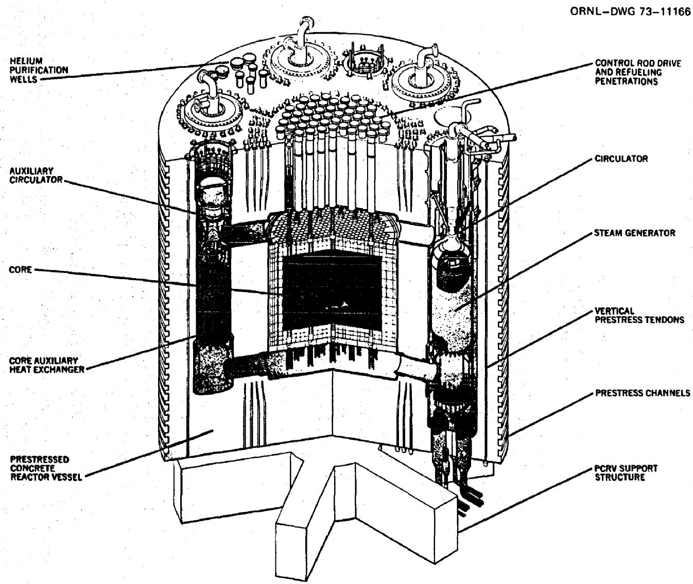  
Fig. 5.13. 1160-MW(e) HTGR nuclear system.

The intermediate cooling water system supplies the reactor systems with cooling water, which, for safety reasons, is in turn cooled in a closed circuit loop. This system serves to cool the PCRV lines, main and auxiliary helium circulators, fuel element storage systems, and helium treatment systems.

The helium treatment system is provided for the removal of contaminants from the helium coolant. The purification process takes place in a series arrangement of a high-temperature absorber, dryer, low-temperature absorber, and hydrogen absorber.

# Balance of plant

The reactor containment building provides a barrier against fission product release to the atmosphere in case of an accident. It is a concrete cylindrical structure with a total height of 125 ft and an inside diameter of 126 ft for the 1160-MW(e) nuclear steam system. The inner surface is lined with carbon steel to ensure leak tightness.

The reactor service building houses new and used fuel storage wells and reactor auxiliary systems that are not located inside the containment building. Provisions are also made for storage of reactor moderator parts in this building, which is a multistory structure adjacent to the containment building.

The control building houses the control room, auxiliary equipment, ventilation equipment, and reactor plant cooling water system. It is a missile-protected building since it houses safety-related equipment.

The diesel-generator building is designed to withstand short-term tornado loading, including tornado-generated missiles. This building houses the diesel generators that provide standby power.

The turbine-generator building contains the turbine generator and other equipment related to the conventional portion of the plant. Building design is based on the criteria used for a fossil-fired plant turbine-generator building.

Miscellaneous structures are required for storage of helium bottles, chemicals storage, water-intake equipment housing, etc.

The turbine generator and its controls act integrally with the nuclear steam system for turbine load control. The type of turbine selected is subject to variations; however, a typical heat balance diagram for a 3600-rpm tandem-compound turbine using four feedwater heaters is shown in Fig. 5.14. The circulating water system provides the major means of plant heat rejection.

Other balance-of-plant equipment and systems are similar to those required for a conventional fossil-fired plant. Included are items such as the condensers, feedwater pumps, makeup water treatment system, circulating water systems, and electric plant equipment.

# 5.2.5 Environmental Parameters

The construction of a power plant, nuclear or fossil fueled, will inevitably affect the environment, and some of the effects will be adverse. Effects are considered adverse if environmental change causes some biotic population or nonviable resource to be less safe, less abundant, or less aesthetically pleasing; if the change reduces the diversity and variety of individual choice or the standard of living; or if the change tends to lower the quality of renewable resources or to impair the recycling of depletable resources. The severity of adverse effects should be reduced to minimum practicable levels.

ORNL-DWG 74-5675A

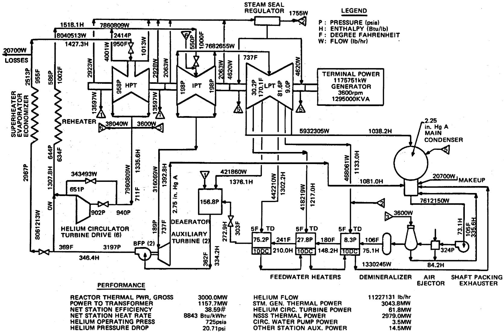  
Fig. 5.14. Typical 1160-MW(e) HTGR turbine cycle heat balance diagram (from General Atomic Company).

Prior to the issuance of a construction permit or operating license for a nuclear power plant, the utility must submit a report on the potential environmental impacts of the proposed plant and associated facilities.[21] Some of the environmental parameters considered in an environmental report are as follows:

1. the site,   
2. the plant,   
3. effects of site preparation and plant and transmission facilities construction,   
4. effects of plant operation,   
5. effluent measurement and monitoring,   
6. effects of accidents,   
7.economic and social effects of plant construction and operation,   
8. alternative energy sources and sites.

In this study, attention is confined to the environmental effects of plant operation. The two principal impacts are due to waste heat and radioactivity, although chemical effluents and others are important.

# Waste heat

Regardless of the thermal source in a power plant, about 60 to $70\%$ of the heat produced is rejected to the environment. Figure 5.15 shows heat balances for three types of plants, each producing $1000 \mathrm{MW(e)}$ . The LWR plant is assumed to have an efficiency of $33\%$ , while the HTGR and the fossil-fuel plants have efficiencies of $38\%$ . It is assumed that $85\%$ of the waste heat is carried off by the condenser cooling water for the fossil-fuel plant and $95\%$ for the nuclear-fuel plant. The LWR plant deposits about $50\%$ more waste heat in the condenser water than the fossil-fuel plant and about $35\%$ more than the HTGR plant. HTGR plants have about the same steam conditions as fossil-fuel plants and are therefore given the same efficiency, but their miscellaneous losses are more like those of the LWR plants.

The two major types of cooling systems in use are the open cycle and the closed cycle. The open cycle is generally referred to as the "once-through" system, since the cooling water from the river, lake, ocean, or other source is pumped through the condenser and then returned to the source. In the closed cycle, water is recirculated through the condenser after it has been cooled in a cooling tower or pond. Cooling towers may be either wet or dry, natural draft or mechanical draft. Cooling ponds may use large acreage (about 1 to 2 acres per megawatt of installed capacity) or sprays to ensure the desired degree of cooling.

Cooling ponds and wet towers may cause objectionable fogs, icing, or plumes. In addition, the size of the pond or tower may be objectionable.

ORNL-DWG 74-5676

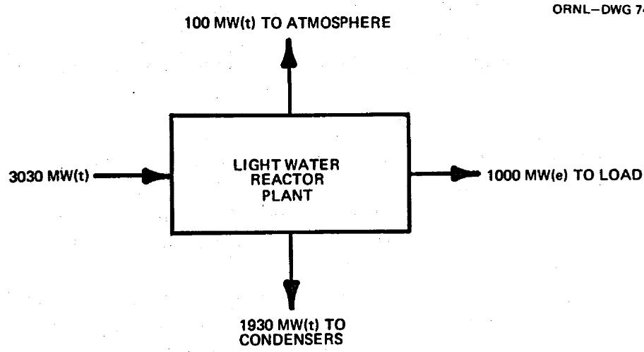

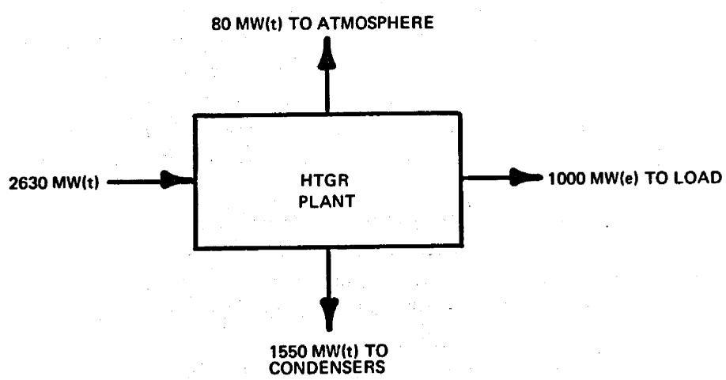

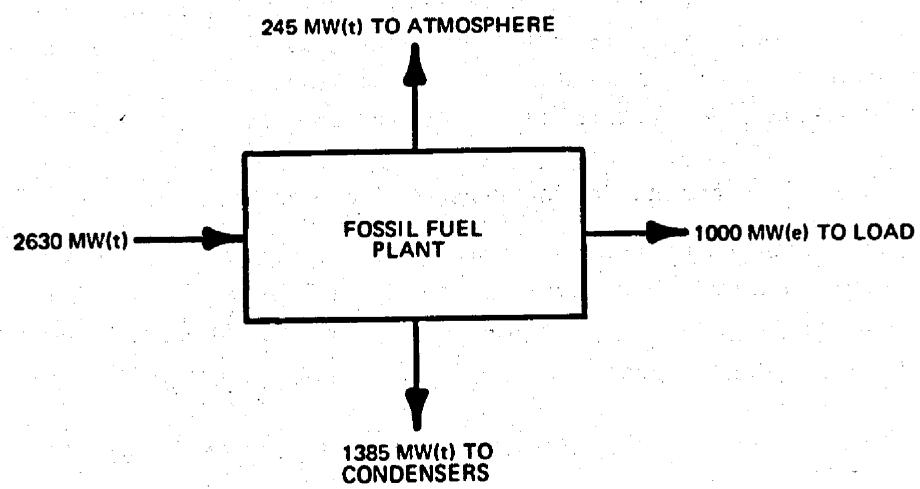  
Fig. 5.15. Heat balances for LWR, HTGR, and fossil-fuel power plants.

The plume of the wet tower can be reduced or eliminated by using wet/dry towers.[22] In these towers, only part of the heat is removed with water; enough heat is removed with the air-water vapor mixture so that the relative humidity is much reduced. Such towers also reduce water consumption.

# Radiological

During the operation of a nuclear power plant, radioactive gases are produced by activation of such materials as argon, nitrogen, and oxygen; iodine, krypton, and xenon are produced in the fuel by fission. The amount of the latter three in the reactor coolant depends on the integrity of the fuel elements. With the passage of time, the fuel cladding develops pinhole leaks, and the fission product gas escapes into the coolant.

The plants are designed $^{23}$ to operate with fuel element leakage up to about $1\%$ . In the BWR, the gases released to the primary coolant are carried to the turbine and to the condenser along with the steam. Steam is condensed back to water, but the noncondensable gases, including the very small volume of radioactive gases, are vented to a cleanup system. After some time for decay the gases are filtered and released to the environment through the stack. In the PWR, most of the radioactive gases remain in the coolant water. When the system is opened for maintenance or refueling, the gases are vented to a cleanup system from which they may be released to the atmosphere.

Also radioactive materials build up in the cooling water during reactor operation. Some of these result from activation of elements in the water itself—the naturally occurring trace elements. Others are generated by neutrons absorbed by the metals, mainly stainless steel or Zircaloy in the reactor system. Other radioactive products leak out of the fuel elements. In addition, tritium is produced in the coolant and fuel elements.

Liquids leaking into and recovered from various plant systems are collected and sent through a special liquid-waste system where the radioactivity is concentrated and put in a form suitable for shipping to disposal grounds. The effluent liquids left over are collected in monitoring tanks, checked for radioactivity, and released at a controlled rate in the plant condenser cooling water.

Solid wastes are generally disposed of off site.

For an HTGR,[24] the sources of radioactive gaseous waste that result in release to the atmosphere are $1\%$ /year PCRV leakage to the reactor containment and subsequent release to the atmosphere and losses from the turbine steam system to the atmosphere. The gaseous activity discharged to the atmosphere from the station during normal operation is (excluding tritium) about 4.4 Ci/year. The activity released from the station to the atmosphere due to losses from the turbine steam system during normal operation is 180 Ci of tritium per year.

Radioactive liquids and solids are collected in drums and disposed of off site.

# 5.2.6 Operating and Maintenance Manpower Needs

The staffing of a commercial nuclear power plant with operating and maintenance personnel requires careful selection and training of personnel as well as careful timing in the hiring of the staff. The complexity and newness of the work, the problems caused by radiation, and the high cost of outage justify more than ordinary planning in the hiring and training of a staff.

The staff of a large utility may be divided into two large groups: the home office (or headquarters staff) and the operating staff. It is assumed that the headquarters staff is already functioning, and the emphasis is on the operating and maintenance staff. The following general discussion can be applied to all types of reactors.

# Operations and maintenance staff

Although plant staff organizations can reflect variations in company policies and practices, the representative organization shown in Fig. 5.16 can be satisfactorily employed to operate a current-generation single-unit station.[25]

Each operating shift crew consists of a senior licensed shift supervisor, two licensed control operators, and two auxiliary operators. Five such crews should be trained to handle all normal and abnormal operating procedures. At least one replacement for each of the three categories should be trained and available to maintain crew strength when job shifts, resignations, or retirements occur and to accommodate on-site fuel handling procedures.

Direct day-to-day technical support for plant operations is a necessity. The vital technical areas are radiation protection, plant chemistry, instrumentation and controls, reactor, turbine generator,

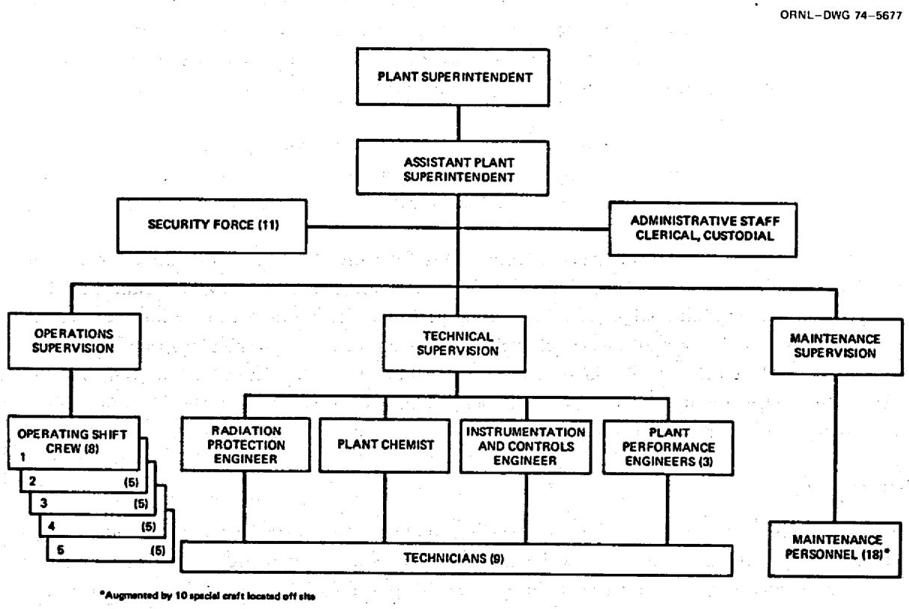  
Fig. 5.16. Representative organization for a single-unit central station nuclear power plant (from WASH-1130 Revised).

and balance-of-plant equipment. Functions include routine monitoring, surveys, sampling, analyses, instrument checking and maintenance, performance analysis, test preparations, and evaluation of results.

Electrical and mechanical maintenance requirements noted are largely aimed toward the preventive maintenance program but will allow for some repair and corrective maintenance. Certain specialized craft skills not routinely needed at the plant site may come from a more centralized systemwide maintenance staff or from outside organizations.

A plant security force of 11 provides for a supervisor and 5 shift crews of 2 men each for round-the-clock coverage. Due to the specialized training required for security force personnel, they may be administratively attached to a separate organization reporting to headquarters.

The timing of the selection and appointment of personnel to a plant staff is an important consideration to assure that full qualifications requirements are met by the staff when the plant is ready. Management and key supervisory personnel should be on board not later than 4 years before initial fuel loading. Operating crew personnel should be selected at least 3 years in advance of fuel loading so that they will have completed virtually all formal and experience training requirements by the time the preoperational test program begins. Technical support personnel should be selected and assigned within the 2- or 3-year period ahead of fuel loading for training and familiarization assignments. Security personnel may be required to protect property early in the construction period but should be fully trained and on the job during preoperational testing.

The staffing of multiple-unit stations must provide for the performance of essentially the same functions as are required for single units. There are considerations, however, which may make it unnecessary to duplicate single-unit staff entirely. Some of these are (1) the degree of similarity in design features and operating characteristics and the reflection of these in operability and maintainability, (2) the extent to which some systems (e.g., waste management) are common, and (3) the absence of overlapping startup and break-in periods for successive units during which manpower demands may be heavier.

Tables 5.12 and 5.13 display the organizational breakdown for representative multiple-unit stations. Study of the comparison shown with a single-unit station staff structure demonstrates the potential applicability of the above factors, viz., identical units with a common control room and some shared systems.

It will be noted that it also reflects an opportunity for more effective use of manpower through specialization of the operational fuel management function on site. A fuel handling team should be considered in lieu of additional "regular" operating personnel for multiple-unit stations. The team's responsibilities would cover all phases of fuel handling on site, from receipt, inspection, storage, inventory control, refueling and unloading the core, spent fuel handling, cask loading, and shipment of spent fuel. The lead fuel handlers (or foremen) of this team would be expected to qualify for senior operator licenses which can be restricted to cover the scope of their activities.

# Staff training

Concurrently with the obtaining of a staff so that the plant may be put in operation upon completion, a training program must be in operation. Various standards have been prepared describing the qualification requirements for a variety of positions. The ANSI N18.1-1971 standard, Selection and Training of Nuclear Power Plant Personnel, specifies minimum general qualifications and specific education, training, and experience for all functional levels within an operating

Table 5.12. Staffing requirements for multiple-unit nuclear steam-electric power plants   

<table><tr><td rowspan="2"></td><td colspan="4">Plant size</td></tr><tr><td>1 unit</td><td>2 units</td><td>3 units</td><td>4 units</td></tr><tr><td colspan="5">Plant management</td></tr><tr><td>Superintendenta</td><td>1</td><td>1</td><td>1</td><td>1</td></tr><tr><td>Assistanta</td><td>1</td><td>1</td><td>1</td><td>1</td></tr><tr><td>Clerks</td><td>5</td><td>5</td><td>5</td><td>5</td></tr><tr><td colspan="5">Operations</td></tr><tr><td>Operations supervisorsa</td><td>1</td><td>2</td><td>.3</td><td>4</td></tr><tr><td>Shift supervisorsa</td><td>6</td><td>6</td><td>12</td><td>12</td></tr><tr><td>Lead operators/foremena</td><td></td><td>5</td><td>5</td><td>5</td></tr><tr><td>Control operatorsb</td><td>11</td><td>16</td><td>26</td><td>31</td></tr><tr><td>Auxiliary operators</td><td>11</td><td>16</td><td>26</td><td>31</td></tr><tr><td>Lead fuel handlers/foremenc</td><td></td><td>3</td><td>3</td><td>3</td></tr><tr><td>Fuel handlers</td><td></td><td>6</td><td>9</td><td>9</td></tr><tr><td colspan="5">Technical</td></tr><tr><td>Technical supervisor</td><td>1</td><td>1</td><td>1</td><td>1</td></tr><tr><td>Professionals</td><td>6</td><td>9</td><td>12</td><td>12</td></tr><tr><td>Technicians</td><td>9</td><td>16</td><td>25</td><td>32</td></tr><tr><td colspan="5">Maintenance</td></tr><tr><td>Maintenance supervisors</td><td>1</td><td>2</td><td>3</td><td>3</td></tr><tr><td>Crafts and repairmen</td><td>18</td><td>28</td><td>44</td><td>55</td></tr><tr><td>Security</td><td>11</td><td>16</td><td>16</td><td>16</td></tr><tr><td>Total</td><td>82</td><td>133</td><td>192</td><td>221</td></tr></table>

$^{a}$ Senior licensed operator qualifications.   
$b$ Licensed operator qualifications.   
cSpecial senior licensed operator qualifications.

Table 5.13. Staffing requirements for multiple-unit nuclear process steam plants   

<table><tr><td rowspan="2"></td><td colspan="4">Plant size</td></tr><tr><td>1 unit</td><td>2 units</td><td>3 units</td><td>4 units</td></tr><tr><td colspan="5">Plant management</td></tr><tr><td>Superintendenta</td><td>1</td><td>1</td><td>1</td><td>1</td></tr><tr><td>Assistanta</td><td>1</td><td>1</td><td>1</td><td>1</td></tr><tr><td>Clerks</td><td>5</td><td>5</td><td>5</td><td>5</td></tr><tr><td colspan="5">Operations</td></tr><tr><td>Operations supervisorsa</td><td>1</td><td>2</td><td>3</td><td>4</td></tr><tr><td>Shift supervisorsa</td><td>6</td><td>6</td><td>12</td><td>12</td></tr><tr><td>Lead operators/foremena</td><td></td><td>5</td><td>5</td><td>5</td></tr><tr><td>Control operatorsb</td><td>11</td><td>16</td><td>26</td><td>31</td></tr><tr><td>Auxiliary operators</td><td>8</td><td>13</td><td>18</td><td>23</td></tr><tr><td>Lead fuel handlers/foremenc</td><td></td><td>3</td><td>3</td><td>3</td></tr><tr><td>Fuel handlers</td><td></td><td>6</td><td>9</td><td>9</td></tr><tr><td colspan="5">Technical</td></tr><tr><td>Technical supervisor</td><td>1</td><td>1</td><td>1</td><td>1</td></tr><tr><td>Professionals</td><td>6</td><td>9</td><td>12</td><td>12</td></tr><tr><td>Technicians</td><td>7</td><td>11</td><td>15</td><td>19</td></tr><tr><td colspan="5">Maintenance</td></tr><tr><td>Maintenance supervisors</td><td>1</td><td>2</td><td>3</td><td>3</td></tr><tr><td>Crafts and repairmen</td><td>12</td><td>18</td><td>24</td><td>30</td></tr><tr><td>Security</td><td>11</td><td>16</td><td>16</td><td>16</td></tr><tr><td>Total</td><td>71</td><td>115</td><td>154</td><td>175</td></tr></table>

$^{a}$ Senior licensed operator qualifications.   
$b$ Licensed operator qualifications.   
Special senior licensed operator qualifications.

organization that have a direct relationship to technical operational and maintenance aspects of a nuclear plant.

Figure 5.17 is a schedule for training senior operators and operators at the appropriate time.[25] Other plant staff members new to the nuclear industry can benefit by participation in these programs even though they will not need licenses.

Part of the training may be provided by reactor manufacturers, government agencies, universities, or consultants. In general, most utilities provide their own design familiarization and on-the-job training just prior to the initial fuel loading and power escalation program.

The typical schedule given in Fig. 5.17 assumes the individual has no prior knowledge of reactor operations but has pertinent experience in steam plant operations. Trainees who already have or are acquiring enough nuclear experience to qualify for the AEC license examinations prior to initial operation of the station usually join the station staff group for further training and experience.

The training (for operators and staff) indicated in Fig. 5.17 is keyed to several different phases considered standard.

Phase 1—Introduction to Nuclear Power. Participants receive instruction in basic nuclear physics and mathematics refresher, reactor physics concepts (flux, reactivity, cross section), and characteristics and operating behavior of power reactors.

Phase 1a—Demonstrations of Reactor Properties. A low-power research reactor is used in conjunction with or immediately following phase 1.

Phase 2—On-Shift Participation. Extensive operative experience at a similar power reactor or a combination of experience at a power reactor and a power reactor simulator serves both to give experience and show the practical applications of theory learned.

Phase 3—Design Familiarization. Lectures, together with study of plant systems and discussion with various design groups at the nuclear steam supply system designer's location, provide familiarity with systems purpose and function.

Phase 4—On-the-Job Training. Details of the individual plant operation are learned by assisting in the initial check-out, writing procedures, and operating the various plant systems. In addition, regularly scheduled training sessions should be directed toward design, nuclear characteristics, operating procedures, and administrative controls.

Phase 5—Specialty Training. Specific job functions (e.g., radiation monitoring or instrument maintenance) are generally taught at the appropriate time.

# 5.2.7 Downtime for Refueling and Other Maintenance

Most operating power reactors are refueled approximately once every year, with the first refueling within 1 or 2 years after the start of commercial operation. Refueling is not necessarily, but is invariably, accompanied by major maintenance outage.

A survey of the operating experience of ten reactors $^{26}$ for the first half of 1973 shows that the average downtime $^{27}$ during refueling was about 62 days. The actual refueling time was approximately 31 days.

ORNL-DWG 74-5678

<table><tr><td rowspan="2">PLANT PROGRESS</td><td colspan="6">YEARS BEFORE INITIAL CRITICALITY</td><td rowspan="2">GROUP INTERESTED</td></tr><tr><td>5</td><td>4</td><td>3</td><td>2</td><td>1</td><td></td></tr><tr><td>I. SUPERVISORY AND STATION TECHNICAL
STAFF LEVEL</td><td></td><td></td><td></td><td></td><td></td><td></td><td>I. THOSE WHO WILL PREPARE OPERATING
PROCEDURES, AND TRAIN THE OPERATING
CREWS . EVENTUALLY TO PROVIDE SENIOR
STAFF PERSONNEL FOR SUBSEQUENT POWER
REACTORS . CONTAINS THAT GROUP WHICH
WILL OBTAIN AEC OPERATOR AND SENIOR
OPERATOR LICENSES PRIOR TO INITIAL
CRITICALITY</td></tr><tr><td>1. SELECTION</td><td></td><td></td><td></td><td></td><td></td><td></td><td></td></tr><tr><td>2. INTRODUCTION TO NUCLEAR POWER
(PHASE 1)</td><td></td><td></td><td></td><td></td><td></td><td></td><td></td></tr><tr><td>3. DEMONSTRATION OF REACTOR PROPERTIES
(PHASE 1a)</td><td></td><td></td><td></td><td></td><td></td><td></td><td></td></tr><tr><td>4. ON-SHIFT PARTICIPATION
(PHASE 2)</td><td></td><td></td><td></td><td></td><td></td><td></td><td></td></tr><tr><td>5. DESIGN FAMILIARIZATION (PHASE 3)</td><td></td><td></td><td></td><td></td><td></td><td></td><td></td></tr><tr><td>6. ON-THE-JOB TRAINING (PHASE 4)</td><td></td><td></td><td></td><td></td><td></td><td></td><td></td></tr><tr><td>7. SPECIALIST TRAINING (PHASE 5)</td><td></td><td></td><td></td><td></td><td></td><td></td><td></td></tr><tr><td>8. AEC LICENSING (COLD)</td><td></td><td></td><td></td><td></td><td></td><td></td><td></td></tr><tr><td>II. OPERATOR LEVEL</td><td></td><td></td><td></td><td></td><td></td><td></td><td>II. OPERATING CREW CONTAINS THAT GROUP
WHICH WILL OBTAIN AEC OPERATOR AND
SENIOR OPERATOR LICENSES AFTER INITIAL
CRITICALITY</td></tr><tr><td>1. SELECTION</td><td></td><td></td><td></td><td></td><td></td><td></td><td></td></tr><tr><td>2. STEAM PLANT OPERATION</td><td></td><td></td><td></td><td></td><td></td><td></td><td></td></tr><tr><td>3. INTRODUCTION TO NUCLEAR POWER
(PHASE 1)</td><td></td><td></td><td></td><td></td><td></td><td></td><td></td></tr><tr><td>4. DEMONSTRATION OF REACTOR PROPERTIES
(PHASE 1a)</td><td></td><td></td><td></td><td></td><td></td><td></td><td></td></tr><tr><td>5. DESIGN FAMILIARIZATION (ON-SITE)
(PHASE 3)</td><td></td><td></td><td></td><td></td><td></td><td></td><td></td></tr><tr><td>6. ON-THE-JOB TRAINING (PHASE 4)</td><td></td><td></td><td></td><td></td><td></td><td></td><td></td></tr><tr><td>7. ON-SHIFT PARTICIPATION (PHASE 2)</td><td></td><td></td><td></td><td></td><td></td><td></td><td></td></tr><tr><td>8. AEC LICENSING (HOT)</td><td></td><td></td><td></td><td></td><td></td><td></td><td></td></tr></table>

$\clubsuit$ denotes a short period of 1 day to 2 weeks.   
Boxes denote a time period for specific training or experience.   
Broken lines denote a flexible schedule within the indicated period before criticality.   
Solid lines denote training by doing the job.

Fig. 5.17. Schedule for training and experience (from WASH-1130 Revised).

During refueling, there is generally a radial reshuffling of the old fuel, and about one-third of the fuel is replaced. Sometimes the utility does the refueling, and other times a vendor refueling crew under contract to the utility performs the service.

The amount of operating experience data for LWR plants that is representative of current plant designs and power levels is still somewhat limited. Although 27 nuclear plants were licensed to operate by the end of 1972, only 8 of these plants had operated 4 years or longer. Five of these eight had a design power rating of $200\mathrm{MW(e)}$ or less, and they were in effect one-of-a-kind plants.

A study of the 1972 operating records of 19 licensed nuclear power plants was conducted to examine plant availability and to assess the nature, cause, and significance of plant shutdowns.[27] In addition, the operating records for 4 of these plants were studied for the total period of commercial operation to provide a broader time base for comparison.

The average nuclear plant availability during 1972 was $73\%$ , where plant availability is defined as the time the generator was in operation divided by the total time during the period. Of the 19 plants studied, 7 achieved availabilities of $80\%$ or above.

The 4 plants for which operating records were analyzed over the total period of commercial operation had an average plant availability of $72\%$ . These plants had been in operation from 2 to 3 years. Analysis indicates that, on the average, a break-in period of from 3 to 4 years is required for a nuclear plant to achieve an availability factor of $80\%$ or above.

The average percent of forced and scheduled outage for the 19 plants during 1972 was 11 and $16\%$ respectively. For the 4 plants with longer service time, forced outages accounted for $12\%$ of the time and scheduled outages for $16\%$ of the time since they began operation.

Five of the 19 nuclear plants had forced outage factors exceeding $15\%$ in 1972. Equipment malfunctions and failures were the cause of $96\%$ of the forced outages, while operator errors were responsible for $4\%$ .

Identification of the portions of the plant causing forced outages revealed that $42\%$ of the total was attributable to nuclear-related systems and components. However, the nuclear-related equipment accounted for about $56\%$ of the downtime, indicating that the time required to repair nuclear equipment was somewhat greater than the time required to repair conventional equipment.

The major equipment items contributing to forced outages were valves, pump seals, turbines and their associated auxiliaries, control rod drives and associated controls, main electrical generators, steam generators, condensers, and feedwater system pumps and controls.

Each of the forced outages was classified with respect to its actual or potential safety significance. Outages resulting in the release of radioactive effluents from the primary coolant pressure boundary and those resulting in the actual or potential violation of the technical specifications were considered to be of potential significance to public health and safety. Evaluation of the forced outages on this basis indicated that about $46\%$ might be construed to be related to safety. However, none of the forced outages resulted in any injury to a member of the public or a release of radioactive materials in excess of permissible levels.

Scheduled outages for the 19 plants were responsible for the plants being shut down an average of $16\%$ of the time. In 6 of the 19 plants, the operating time lost because of scheduled outages was well in excess of this average value. Operating reports indicate that a significant amount of time was devoted to overhaul and repair of control rod drives, steam generators, valves, and turbines. In addition, a considerable amount of time was devoted to examination of reactor fuel.

# 5.2.8 Construction Schedule

Figure 5.18 shows in schematic form the major elements of lead time for a multiple-unit nuclear power plant project from "commitment" to commercial operation. This schedule is modeled after single-unit plant schedules developed by the Atomic Industrial Forum.[28] The time allowances are typical of the present generation of custom-designed plants but include no provision for major delays caused by strikes, contested hearings, or design revisions.

Line 1 shows a $4^{1/2}$ year on-site construction period for the first unit, followed by a 6-month period of test operation before commercial operation. Normally, on-site construction cannot commence until issuance of an AEC construction permit. The second, third, and fourth units are placed in operation at 1-year intervals.

Line 2 shows the related time scale for fabrication and delivery of long lead-time items of equipment, such as the pressure vessels, steam generators, main coolant pumps, and the turbine generators. Shop space must be reserved at least 6 months in advance of fabrication, which in turn is estimated to require 3 years for the first unit. These major items of equipment are usually scheduled for on-site delivery about 2 years before completion of construction. To meet this schedule, major financial commitments must be incurred about a year before the completion of administrative reviews and the issuance of an AEC construction permit.

Line 3 shows the two phases of the AEC safety review leading to the issuance of a construction permit and an operating license respectively. The preliminary safety analysis report should be filed 2 years prior to the issuance of a construction permit, allowing 1 year for internal AEC staff review, and 1 year for the hearing required at the construction permit stage. The final safety analysis report should be filed $1^{1/2}$ years prior to the estimated date for completion of construction, when an operating license will be required to permit core loading and initial operation. This allows 1 year for the internal AEC staff review and 6 months for a supplementary hearing.

Line 4 shows the antitrust review proceeding in parallel with the AEC safety review at the construction permit stage.

Line 5 shows that all necessary environmental approvals, state and federal, must be obtained through concurrent proceedings before all interested agencies, and that this process will proceed in parallel with the AEC safety review over a 2-year period. Allowance is made for an additional 2 years of intensive effort prior to the filing of formal applications. It is assumed that the first year will be devoted to obtaining and evaluating preliminary environmental data on several candidate sites and the second will be devoted to an in-depth study concentrated on the principal site selected.

Line 6 shows the contractual arrangements necessary to support this schedule. It is assumed that an architect-engineer will be selected at the outset to assist in the preparation of invitations for bids and in the preliminary evaluation of potential sites. This permits selection of a manufacturer and identification of the size and characteristics of the plant during the year while alternative sites are being evaluated and allows an additional year for detailed engineering and preparation of the PSAR and other permit applications.

The total lead time for the selection-licensing-construction process, as shown in Figs. 5.18 and 5.19 for a single-unit custom-designed plant, requires about 9 years, divided roughly as follows: 2 years for site and plant design selection, preapplication site reviews, and preparation of the

Years to commercial operation

ORNL-DWG 74-5679

First unit

Second unit

Third unit

Fourth unit

9 8

10 9

11 10

12 11

6

7

8

9

5

6

7

8

3

4

5

6

.

，

3

4

.

#

. 1

2

${10}/{12}$

#

1 0

1. On-site construction   
2. Long lead-time equipment   
3. AEC safety review   
4. Antitrust review   
5. Environmental review in parallel with AEC safety review   
6. Contractual arrangements

Legend Line

1. On-site construction   
2. Long lead-time equipment   
3. AEC safety review   
4. Antitrust review

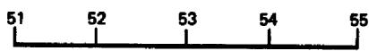

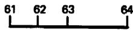  
Fig. 5.18. Estimated lead time for multiple-unit nuclear power plant project.

11: Construction permit issues, commence on-site construction.   
12: Construction complete, commence test operation.   
13: Commercial operation.

21: Reserve shop space.   
22: Commence shop fabrication.   
23: Delivery of equipment at site

31: File PSAR, commence AEC staff review.   
32: CP hearing.   
33: Construction permit issues.   
34: File FSAR, AEC staff review.   
35: OL hearing, if required.   
36: Operating license issues.

41: Applicant supplies required information, commence review by AEC and Department of Justice.   
42: Hearing, if required.   
43: Antitrust issue resolved; CP issues.

5. Environmental review   
6. Contractual arrangements

51: Environmental evaluation of candidate sites.   
52: Selection of principal site, in-depth environmental evaluation; prepare environmental reports, all necessary state and federal applications.   
53: File applications.   
54: Hearings.   
55: All necessary environmental approvals, permits, certifications issue concurrently with AEC construction permit.   
61: Engage architect-engineer, invite bids.   
62: Select manufacturer, determine size and type of reactor, establish detailed working arrangements.   
63: Detailed engineering, prepare PSAR and environmental applications.   
64: File PSAR and environmental applications.

application; 2 years for construction permit reviews and hearings; and 5 years for construction, operating license review, and operational testing.

As also shown in Fig. 5.19, standardization of plant designs in the next 3 to 4 years might make possible a reduction of about 2 years in the total lead time.[29] It is anticipated that about a year can be saved from the time required for AEC review of the construction permit application, and, as experience is gained in duplicating major portions of plants, it should be possible to reduce the required construction time by a year.

ORNL-DWG 74-5680

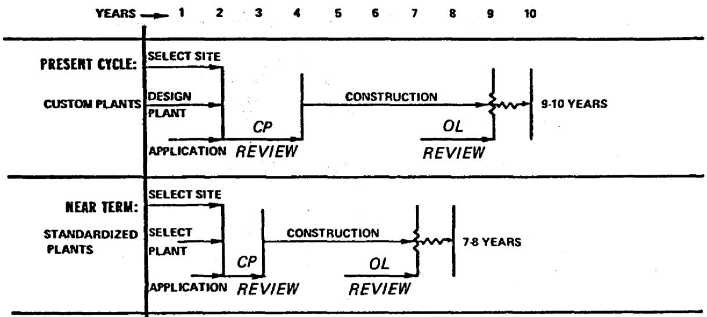  
Fig. 5.19. Estimated saving in lead time due to standardization.[29]

# 5.2.9 Economic Analysis

Production costs were estimated for large- and intermediate-size commercial nuclear electric plants and process steam plants in accordance with the economic ground rules shown in Tables 5.14 and 5.15. The estimates for large plants are for single units only, while the estimates for the intermediate-size plants are for one-, two-, three-, and four-unit plants. In all cases the length of the design and construction period was held constant, although it could be argued that the construction period for the smaller plants might be somewhat shorter. The fuel cycle costs for the intermediate-size plants were assumed to be about $1\mathfrak{c}$ to $2\mathfrak{c} / 10^{6}$ Btu higher than those for the large plants.

Table 5.16 shows a breakdown of the levelized fixed charge rates used in estimating the annual fixed charges on capital investment. The POWERCO code30 was used to perform the discounted

Table 5.14. Economic ground rules for large commercial nuclear plants   

<table><tr><td>Type</td><td colspan="2">PWR, BWR, and HTGR</td></tr><tr><td>Environmental system</td><td colspan="2">All electric power plants use mechanical draft evaporative cooling towers</td></tr><tr><td>Size (single unit)</td><td></td><td></td></tr><tr><td>LWR</td><td colspan="2">1200 MW(e), 3750 MW(t)</td></tr><tr><td>HTGR</td><td colspan="2">1200 MW(e), 3140 MW(t)</td></tr><tr><td>Net efficiency</td><td></td><td></td></tr><tr><td>LWR</td><td colspan="2">32% (10,660 Btu/kWhr)</td></tr><tr><td>HTGR</td><td colspan="2">38.2% (8930 Btu/kWhr)</td></tr><tr><td>Capacity factor</td><td colspan="2">80%</td></tr><tr><td>Location</td><td colspan="2">Texas</td></tr><tr><td>Design and construction period</td><td colspan="2">8½ years from purchase of nuclear steam system</td></tr><tr><td>Workweek</td><td colspan="2">40 hr</td></tr><tr><td>Cost basis</td><td colspan="2">Early 1974 dollars; interest during construction included in capital costsa</td></tr><tr><td>Fuel cycle costs (mid-1982) (€/106 Btu)</td><td>Utility</td><td>Industrial</td></tr><tr><td>LWR</td><td>28</td><td>34</td></tr><tr><td>HTGR</td><td>31</td><td>40</td></tr><tr><td>Financial parameters, %</td><td>Utility</td><td>Industrial</td></tr><tr><td>Fraction of investment in bonds</td><td>55</td><td>30</td></tr><tr><td>Interest rate on bonds</td><td>8</td><td>8</td></tr><tr><td>Return on equity</td><td>10</td><td>15</td></tr><tr><td>Federal income tax rate</td><td>48</td><td>48</td></tr><tr><td>State income tax rate</td><td>3</td><td>3</td></tr><tr><td>Gross revenues tax rate</td><td>0</td><td>0</td></tr><tr><td>Local property tax rate</td><td>3</td><td>3</td></tr><tr><td>Interim replacements rate</td><td>0.35</td><td>0.35</td></tr><tr><td>Property insurance rate</td><td>0.25</td><td>0.25</td></tr><tr><td>Plant lifetime, years</td><td>30</td><td>20</td></tr></table>

$a_{\mathbf{No}}$ allowance for escalation during construction.

cash flow and leveling calculations for the fixed charge rates. The higher fixed charge rate for industrial ownership results from (1) the shorter lifetime, 20 years compared with 30 years for utility ownership; (2) the lower bond fraction, $30\%$ compared with $55\%$ ; and (3) the higher return on equity, $15\%$ compared with $10\%$ . For property tax purposes the investment is depreciated uniformly and for income tax purposes by the sum-of-years digits method.

A different set of economic ground rules, especially the financial parameters, would result in a different set of production costs and a different set of relative costs.

# Large nuclear plants

Production costs for large commercial nuclear electric plants are summarized in Table 5.17 for typical utility and industrial financing assumptions. For the three types of reactors (PWR, BWR, and HTGR), total production costs are about equal—slightly over 11 mills/kWhr for utility ownership and just under 17 mills/kWhr for industrial ownership.

Production costs for large commercial nuclear plants producing only process steam are summarized in Table 5.18 for typical utility and industrial financing. Total prime steam production

Table 5.15. Economic ground rules for intermediate-size commercial nuclear plants   

<table><tr><td>Type</td><td colspan="2">PWR and HTGR</td></tr><tr><td>Environmental system</td><td colspan="2">All steam-electric plants use mechanical draft evaporative cooling towers</td></tr><tr><td>Unit size</td><td></td><td></td></tr><tr><td>PWR</td><td colspan="2">600 MW(e), 1875 MW(t)</td></tr><tr><td>HTGR</td><td colspan="2">382 MW(e), 1000 MW(t)</td></tr><tr><td></td><td colspan="2">764 MW(e), 2000 MW(t)</td></tr><tr><td>Net efficiency</td><td></td><td></td></tr><tr><td>PWR</td><td colspan="2">32% (10,660 Btu/kWhr)</td></tr><tr><td>HTGR</td><td colspan="2">38.2% (8930 Btu/kWhr)</td></tr><tr><td>Capacity factor</td><td colspan="2">80%</td></tr><tr><td>Location</td><td colspan="2">Texas</td></tr><tr><td>Design and construction period</td><td colspan="2">81/2years from purchase of nuclear steam systems to commercial operation of first unit; additional units to be placed in operation at 1-year intervals</td></tr><tr><td>Workweek</td><td colspan="2">40 hr</td></tr><tr><td>Cost basis</td><td colspan="2">Early 1974 dollars; interest during construction included in capital costs; no allowance for escalation during construction</td></tr><tr><td>Fuel cycle costs (mid-1982) 
(€/106Btu)</td><td>Utility</td><td>Industrial</td></tr><tr><td>PWR</td><td>29</td><td>36</td></tr><tr><td>HTGR</td><td>36</td><td>46 [1000 MW(t)]</td></tr><tr><td></td><td>33</td><td>42 [2000 MW(t)]</td></tr><tr><td>Financial parameters, %</td><td>Utility</td><td>Industrial</td></tr><tr><td>Fraction of investment in bonds</td><td>55</td><td>30</td></tr><tr><td>Interest rate on bonds</td><td>8</td><td>8</td></tr><tr><td>Return on equity</td><td>10</td><td>15</td></tr><tr><td>Federal income tax rate</td><td>48</td><td>48</td></tr><tr><td>State income tax rate</td><td>3</td><td>3</td></tr><tr><td>Gross revenues tax rate</td><td>0</td><td>0</td></tr><tr><td>Local property tax rate</td><td>3</td><td>3</td></tr><tr><td>Interim replacements rate</td><td>0.35</td><td>0.35</td></tr><tr><td>Property insurance rate</td><td>0.25</td><td>0.25</td></tr><tr><td>Plant lifetime, years</td><td>30</td><td>20</td></tr></table>

Table 5.16. Breakdown of levelized fixed charge rates (%)   

<table><tr><td></td><td>Utility</td><td>Industrial</td></tr><tr><td>Recovery of capital</td><td></td><td></td></tr><tr><td>Average interest rate</td><td>8.90</td><td>12.90</td></tr><tr><td>Sinking fund depreciation</td><td>0.75</td><td>1.25</td></tr><tr><td>Federal income tax</td><td>1.42</td><td>5.04</td></tr><tr><td>State income tax</td><td>0.09</td><td>0.32</td></tr><tr><td>Local property tax</td><td>2.13</td><td>2.13</td></tr><tr><td>Interim replacements</td><td>0.35</td><td>0.35</td></tr><tr><td>Property insurance</td><td>0.25</td><td>0.25</td></tr><tr><td>Total fixed charge rate</td><td>13.9</td><td>22.2</td></tr></table>

Table 5.17. Summary of levelized production costs for large commercial nuclear electric power plants   

<table><tr><td rowspan="2"></td><td colspan="2">PWR</td><td colspan="2">BWR</td><td colspan="2">HTGR</td></tr><tr><td>10^6 $/year</td><td>mills/kWhr</td><td>10^6 $/year</td><td>mills/kWhr</td><td>10^6 $/year</td><td>mills/kWhr</td></tr><tr><td colspan="7">Utility ownership</td></tr><tr><td>Fixed charges</td><td>65.9</td><td>7.84</td><td>65.9</td><td>7.84</td><td>66.6</td><td>7.92</td></tr><tr><td>O&amp;M costs</td><td>5.2</td><td>0.62</td><td>5.2</td><td>0.62</td><td>5.4</td><td>0.64</td></tr><tr><td>Fuel costs</td><td>25.1</td><td>2.99</td><td>25.1</td><td>2.99</td><td>23.2</td><td>2.76</td></tr><tr><td>Total</td><td>96.2</td><td>11.4</td><td>96.2</td><td>11.4</td><td>95.2</td><td>11.3</td></tr><tr><td colspan="7">Industrial ownership</td></tr><tr><td>Fixed charges</td><td>105.2</td><td>12.51</td><td>105.2</td><td>12.51</td><td>106.3</td><td>12.64</td></tr><tr><td>O&amp;M costs</td><td>5.2</td><td>0.62</td><td>5.2</td><td>0.62</td><td>5.4</td><td>0.64</td></tr><tr><td>Fuel costs</td><td>30.5</td><td>3.63</td><td>30.5</td><td>3.63</td><td>30.0</td><td>3.57</td></tr><tr><td>Total</td><td>140.9</td><td>16.8</td><td>140.9</td><td>16.8</td><td>141.7</td><td>16.8</td></tr></table>

Table 5.18. Summary of levelized production costs for large commercial nuclear process steam plants   

<table><tr><td rowspan="2"></td><td colspan="2">3750 MW(t) PWR</td><td colspan="2">3750 MW(t) BWR</td><td colspan="2">3140 MW(t) HTGR</td></tr><tr><td>10^6 $/year</td><td>φ/10^6 Btu</td><td>10^6 $/year</td><td>φ/10^6 Btu</td><td>10^6 $/year</td><td>φ/10^6 Btu</td></tr><tr><td colspan="7">Utility ownership</td></tr><tr><td>Fixed charges</td><td>37.2</td><td>42</td><td>35.9</td><td>40</td><td>39.9</td><td>53</td></tr><tr><td>O&amp;M costs</td><td>3.7</td><td>4</td><td>3.7</td><td>4</td><td>3.8</td><td>5</td></tr><tr><td>Fuel costs</td><td>25.1</td><td>28</td><td>25.1</td><td>28</td><td>23.2</td><td>31</td></tr><tr><td>Total</td><td>66.0</td><td>74</td><td>66.0</td><td>72</td><td>66.9</td><td>89</td></tr><tr><td colspan="7">Industrial ownership</td></tr><tr><td>Fixed charges</td><td>59.5</td><td>66</td><td>57.3</td><td>64</td><td>63.7</td><td>85</td></tr><tr><td>O&amp;M costs</td><td>3.7</td><td>4</td><td>3.7</td><td>4</td><td>3.8</td><td>5</td></tr><tr><td>Fuel costs</td><td>30.5</td><td>34</td><td>30.5</td><td>34</td><td>30.0</td><td>40</td></tr><tr><td>Total</td><td>93.7</td><td>104</td><td>91.5</td><td>102</td><td>97.5</td><td>130</td></tr></table>

costs are about equal for PWR and BWR plants, just over $70\mathfrak{c} / 10^{6}$ Btu for utility ownership and just over $\$1.00 / 10^{6}$ Btu for industrial ownership. Total prime steam production costs are about $25\%$ higher for the HTGR plant, almost $90\mathfrak{c} / 10^{6}$ Btu for utility ownership and almost $\$1.30 / 10^{6}$ Btu for industrial ownership. These higher costs for the HTGR reflect the higher capital cost of the HTGR nuclear steam system. However, it should be kept in mind that the steam is of higher quality, 2500 psi and $515^{\circ}\mathrm{C}$ ( $955^{\circ}\mathrm{F}$ ), when compared with $\sim 1000$ psi saturated steam for LWRs.

The capital cost breakdowns are summarized in Tables 5.19 through 5.21. Total capital costs for the three electric plants are essentially equal, about $400 / \mathrm{kW(e)}$ . As shown in Table 5.21, the higher cost of the HTGR nuclear steam plant is balanced by the lower cost of its turbine plant. The process steam plant costs do not include costs for reboilers and other equipment required for steam distribution. Reboilers would most likely be required for all types of reactor plants, especially for the BWR plant, to protect the steam distribution system from possible radioactive contamination and

Table 5.19. Capital cost estimate for 1200-MW(e) PWR steam-electric plants   

<table><tr><td></td><td>Steam plant</td><td>Turbine plant</td><td>Total</td></tr><tr><td colspan="4">Direct costs (106$)</td></tr><tr><td>Land and land rights</td><td>1</td><td>0</td><td>1</td></tr><tr><td colspan="4">Physical plant</td></tr><tr><td>Structures and site facilities</td><td>39</td><td>8</td><td>47</td></tr><tr><td>Reactor plant equipment</td><td>87</td><td>0</td><td>87</td></tr><tr><td>Turbine plant equipment</td><td>0</td><td>88</td><td>88</td></tr><tr><td>Electric plant equipment</td><td>15</td><td>14</td><td>29</td></tr><tr><td>Miscellaneous plant equipment</td><td>3</td><td>2</td><td>5</td></tr><tr><td>Subtotal (physical plant)</td><td>144</td><td>112</td><td>256</td></tr><tr><td>Spare parts allowance</td><td>1</td><td>1</td><td>1</td></tr><tr><td>Contingency allowance</td><td>10</td><td>7</td><td>17</td></tr><tr><td>Subtotal (total physical plant)</td><td>155</td><td>120</td><td>275</td></tr><tr><td colspan="4">Indirect costs (106$)</td></tr><tr><td>Construction facilities, equipment, and services</td><td>10</td><td>8</td><td>18</td></tr><tr><td>Engineering and construction management services</td><td>25</td><td>19</td><td>44</td></tr><tr><td>Other costs</td><td>8</td><td>6</td><td>14</td></tr><tr><td>Interest during construction</td><td>69</td><td>53</td><td>122</td></tr><tr><td>Subtotal (indirect costs)</td><td>112</td><td>86</td><td>198</td></tr><tr><td colspan="4">Total costs</td></tr><tr><td colspan="4">Total plant capital cost at start of project</td></tr><tr><td>Millions of dollars</td><td>268</td><td>206</td><td>474</td></tr><tr><td>Dollars/kW(e)</td><td></td><td></td><td>395</td></tr><tr><td>Dollars/103 Btu/hr</td><td>21</td><td></td><td></td></tr></table>

also to protect the nuclear system from industrial contamination. Capital costs for LWR steam-electric plants were estimated with an updated version of the CONCEPT code.31 This updated version includes costs of all environmental and safety-related equipment and systems required as of early 1973. Capital costs for HTGR steam-electric plants were extrapolated from those reported in WASH-1230 for a 770-MW(e) plant.32 Capital costs for the nuclear process steam plants were developed by appropriate modification of the electric plant estimates.

Tables 5.22 and 5.23 show estimated annual operation and maintenance expenses, not including fuel, for nuclear electric plants and process steam plants respectively. The costs for electric plants were estimated using the methods outlined by Myers,[33] and the process steam plant costs were estimated by appropriate modification of the electric plant estimates.

# Intermediate-size nuclear plants

Production costs for intermediate-size commercial nuclear electric plants are summarized in Tables 5.24 through 5.26 for single- and multiple-unit stations operating at $80\%$ plant capacity

Table 5.20. Capital cost estimate for 1200-MW(e) BWR steam-electric plants   

<table><tr><td></td><td>Steam plant</td><td>Turbine plant</td><td>Total</td></tr><tr><td colspan="4">Direct costs (106$)</td></tr><tr><td>Land and land rights</td><td>1</td><td>0</td><td>1</td></tr><tr><td colspan="4">Physical plant</td></tr><tr><td>Structures and site facilities</td><td>35</td><td>12</td><td>47</td></tr><tr><td>Reactor plant equipment</td><td>86</td><td>0</td><td>86</td></tr><tr><td>Turbine plant equipment</td><td>0</td><td>88</td><td>88</td></tr><tr><td>Electric plant equipment</td><td>15</td><td>15</td><td>30</td></tr><tr><td>Miscellaneous plant equipment</td><td>3</td><td>2</td><td>5</td></tr><tr><td>Subtotal (physical plant)</td><td>139</td><td>117</td><td>256</td></tr><tr><td>Spare parts allowance</td><td>1</td><td>1</td><td>2</td></tr><tr><td>Contingency allowance</td><td>9</td><td>8</td><td>17</td></tr><tr><td>Subtotal (total physical plant)</td><td>149</td><td>126</td><td>275</td></tr><tr><td colspan="4">Indirect costs (106$)</td></tr><tr><td>Construction facilities, equipment, and services</td><td>10</td><td>8</td><td>18</td></tr><tr><td>Engineering and construction management services</td><td>24</td><td>20</td><td>44</td></tr><tr><td>Other costs</td><td>8</td><td>6</td><td>14</td></tr><tr><td>Interest during construction</td><td>66</td><td>56</td><td>122</td></tr><tr><td>Subtotal (indirect costs)</td><td>108</td><td>90</td><td>198</td></tr><tr><td colspan="4">Total costs</td></tr><tr><td colspan="4">Total plant capital cost at start of project</td></tr><tr><td>Millions of dollars</td><td>258</td><td>216</td><td>474</td></tr><tr><td>Dollars/kW(e)</td><td></td><td></td><td>395</td></tr><tr><td>Dollars/103 Btu/hr</td><td>20</td><td></td><td></td></tr></table>

factor. Single-unit plants show a cost of about 1 mill/kWhr higher than multiple-unit plants for the same type of reactor. Total unit costs for the 764-MW(e) HTGRs are estimated to be about 1 mill/kWhr lower than those for comparable 600-MW(e) PWRs, and the 382-MW(e) HTGRs have total production costs about 3 mills/kWhr higher than comparable 765-MW(e) HTGRs.

Production costs for intermediate-size nuclear plants producing only process steam are summarized in Tables 5.27 through 5.29. Total prime steam production costs for PWRs are estimated to range from $82\mathfrak{c}$ to $89\mathfrak{c} / 10^{6}$ Btu for utility ownership and $\$1.19$ to $\$1.28 / 10^{6}$ Btu for industrial ownership, which compares with $94\mathfrak{c}$ to $\$1.03 / 10^{6}$ Btu and $\$1.37$ to $\$1.50 / 10^{6}$ Btu for the 2000-MW(t) HTGRs and $\$1.16$ to $\$1.34 / 10^{6}$ Btu and $\$1.71$ to $\$1.96 / 10^{6}$ Btu for the 1000-MW(t) HTGRs. Again the higher costs of process steam from the HTGR reflect the higher capital cost of the HTGR nuclear steam system. The unit costs for the intermediate-size systems are 20 to $30\%$ higher than those for the large nuclear systems, mainly because of the unfavorable scaling effects in capital costs and operation and maintenance costs for the smaller reactors.

The estimated capital cost breakdowns are summarized in Tables 5.30 to 5.32 for nuclear electric plants and in Tables 5.33 to 5.35 for nuclear process steam plants. It is estimated that a four-unit electric plant would cost in the neighborhood of $1 billion not including escalation during construction, which at present rates would add another 30% to the plant capital cost. Estimated capital costs for the four-unit process steam plants range from $500 million to almost $800 million.

Table 5.21. Capital cost estimate for 1200-MW(e) HTGR steam-electric plants   

<table><tr><td></td><td>Steam plant</td><td>Turbine plant</td><td>Total</td></tr><tr><td colspan="4">Direct costs (106$)</td></tr><tr><td>Land and land rights</td><td>1</td><td>0</td><td>1</td></tr><tr><td>Physical plant</td><td></td><td></td><td></td></tr><tr><td>Structures and site facilities</td><td>49</td><td>6</td><td>55</td></tr><tr><td>Reactor plant equipment</td><td>91</td><td>0</td><td>91</td></tr><tr><td>Turbine plant equipment</td><td>0</td><td>81</td><td>81</td></tr><tr><td>Electric plant equipment</td><td>13</td><td>13</td><td>26</td></tr><tr><td>Miscellaneous plant equipment</td><td>3</td><td>3</td><td>6</td></tr><tr><td>Subtotal (physical plant)</td><td>156</td><td>103</td><td>259</td></tr><tr><td>Spare parts allowance</td><td>1</td><td>1</td><td>2</td></tr><tr><td>Contingency allowance</td><td>10</td><td>7</td><td>17</td></tr><tr><td>Subtotal (total physical plant)</td><td>167</td><td>111</td><td>278</td></tr><tr><td colspan="4">Indirect costs (106$)</td></tr><tr><td>Construction facilities, equipment, and services</td><td>11</td><td>7</td><td>18</td></tr><tr><td>Engineering and construction management services</td><td>26</td><td>18</td><td>44</td></tr><tr><td>Other costs</td><td>8</td><td>6</td><td>14</td></tr><tr><td>Interest during construction</td><td>74</td><td>50</td><td>124</td></tr><tr><td>Subtotal (indirect costs)</td><td>119</td><td>81</td><td>200</td></tr><tr><td colspan="4">Total costs</td></tr><tr><td>Total plant capital cost at start of project</td><td></td><td></td><td></td></tr><tr><td>Millions of dollars</td><td>287</td><td>192</td><td>479</td></tr><tr><td>Dollars/kW(e)</td><td></td><td></td><td>399</td></tr><tr><td>Dollars/103 Btu/hr</td><td>27</td><td></td><td></td></tr></table>

Table 5.22. Annual operation and maintenance costs for large nuclear electric plants (10 $^6$ )   

<table><tr><td></td><td>LWR</td><td>HTGR</td></tr><tr><td colspan="3">Fixed costs</td></tr><tr><td>Staff</td><td>1.66</td><td>1.66</td></tr><tr><td>Maintenance</td><td>1.32</td><td>1.34</td></tr><tr><td>Supplies and expenses</td><td>0.26</td><td>0.35</td></tr><tr><td>Insurance and fees</td><td>0.59</td><td>0.55</td></tr><tr><td>Administrative and general</td><td>0.42</td><td>0.44</td></tr><tr><td>Total fixed costs</td><td>4.25</td><td>4.34</td></tr><tr><td colspan="3">Variable costsa</td></tr><tr><td>Maintenance</td><td>0.53</td><td>0.51</td></tr><tr><td>Supplies and expenses</td><td>0.45</td><td>0.50</td></tr><tr><td>Total variable costs</td><td>0.98</td><td>1.01</td></tr><tr><td>Total annual O&amp;M costs</td><td>5.2</td><td>5.4</td></tr></table>

$80\%$ plant capacity factor.

Table 5.23. Annual operation and maintenance costs for large nuclear process steam plants (10 $^6$ $)   

<table><tr><td></td><td>LWR</td><td>HTGR</td></tr><tr><td colspan="3">Fixed costs</td></tr><tr><td>Staff</td><td>1.50</td><td>1.50</td></tr><tr><td>Maintenance</td><td>0.75</td><td>0.77</td></tr><tr><td>Supplies and expenses</td><td>0.16</td><td>0.21</td></tr><tr><td>Insurance and fees</td><td>0.59</td><td>0.55</td></tr><tr><td>Administrative and general</td><td>0.28</td><td>0.30</td></tr><tr><td>Total fixed costs</td><td>3.28</td><td>3.33</td></tr><tr><td colspan="3">Variable costsa</td></tr><tr><td>Maintenance</td><td>0.25</td><td>0.26</td></tr><tr><td>Supplies and expenses</td><td>0.16</td><td>0.21</td></tr><tr><td>Total variable costs</td><td>0.41</td><td>0.47</td></tr><tr><td>Total annual O&amp;M costs</td><td>3.7</td><td>3.8</td></tr></table>

$a80\%$ plant capacity factor.

Table 5.24. Summary of levelized production costs for multiple-unit [600-MW(e)] PWR steam-electric plants   

<table><tr><td rowspan="2"></td><td colspan="2">1-Unit station</td><td colspan="2">2-Unit station</td><td colspan="2">3-Unit station</td><td colspan="2">4-Unit station</td></tr><tr><td>10^6 $/year</td><td>mills/kWhr</td><td>10^6 $/year</td><td>mills/kWhr</td><td>10^6 $/year</td><td>mills/kWhr</td><td>10^6 $/year</td><td>mills/kWhr</td></tr><tr><td colspan="9">Utility ownership</td></tr><tr><td>Fixed charges</td><td>42.1</td><td>10.0</td><td>79.1</td><td>9.4</td><td>117.5</td><td>9.3</td><td>157.3</td><td>9.3</td></tr><tr><td>O&amp;M costs</td><td>4.1</td><td>1.0</td><td>6.5</td><td>0.8</td><td>8.9</td><td>0.7</td><td>11.2</td><td>0.7</td></tr><tr><td>Fuel costs</td><td>13.2</td><td>3.1</td><td>26.4</td><td>3.1</td><td>39.6</td><td>3.1</td><td>52.8</td><td>3.1</td></tr><tr><td>Total</td><td>59.4</td><td>14.1</td><td>112.0</td><td>13.3</td><td>166.0</td><td>13.1</td><td>221.3</td><td>13.1</td></tr><tr><td colspan="9">Industrial ownership</td></tr><tr><td>Fixed charges</td><td>67.3</td><td>16.0</td><td>126.3</td><td>15.0</td><td>187.6</td><td>14.9</td><td>251.3</td><td>14.9</td></tr><tr><td>O&amp;M costs</td><td>4.1</td><td>1.0</td><td>6.5</td><td>0.8</td><td>8.9</td><td>0.7</td><td>11.2</td><td>0.7</td></tr><tr><td>Fuel costs</td><td>15.9</td><td>3.8</td><td>31.8</td><td>3.8</td><td>47.7</td><td>3.8</td><td>63.6</td><td>3.8</td></tr><tr><td>Total</td><td>87.3</td><td>20.8</td><td>164.6</td><td>19.6</td><td>244.2</td><td>19.4</td><td>326.1</td><td>19.4</td></tr></table>

Table 5.25. Summary of levelized production costs for multiple-unit [764-MW(e)] HTGR steam-electric plants   

<table><tr><td rowspan="2"></td><td colspan="2">1-Unit station</td><td colspan="2">2-Unit station</td><td colspan="2">3-Unit station</td><td colspan="2">4-Unit station</td></tr><tr><td>10^6 $/year</td><td>mills/kWhr</td><td>10^6 $/year</td><td>mills/kWhr</td><td>10^6 $/year</td><td>mills/kWhr</td><td>10^6 $/year</td><td>mills/kWhr</td></tr><tr><td colspan="9">Utility ownership</td></tr><tr><td>Fixed charges</td><td>49.5</td><td>9.2</td><td>91.9</td><td>8.5</td><td>136.1</td><td>8.5</td><td>182.1</td><td>8.5</td></tr><tr><td>O&amp;M costs</td><td>4.9</td><td>0.9</td><td>7.5</td><td>0.7</td><td>10.2</td><td>0.6</td><td>12.8</td><td>0.6</td></tr><tr><td>Fuel costs</td><td>15.6</td><td>2.9</td><td>31.2</td><td>2.9</td><td>46.8</td><td>2.9</td><td>62.4</td><td>2.9</td></tr><tr><td>Total</td><td>70.0</td><td>13.0</td><td>130.6</td><td>12.1</td><td>193.1</td><td>12.0</td><td>257.3</td><td>12.0</td></tr><tr><td colspan="9">Industrial ownership</td></tr><tr><td>Fixed charges</td><td>79.0</td><td>14.8</td><td>146.7</td><td>13.7</td><td>217.3</td><td>13.5</td><td>290.8</td><td>13.8</td></tr><tr><td>O&amp;M costs</td><td>4.9</td><td>0.9</td><td>7.5</td><td>0.7</td><td>10.2</td><td>0.6</td><td>12.8</td><td>0.6</td></tr><tr><td>Fuel costs</td><td>20.1</td><td>3.8</td><td>40.2</td><td>3.8</td><td>60.3</td><td>3.8</td><td>80.4</td><td>3.8</td></tr><tr><td>Total</td><td>104.0</td><td>19.5</td><td>194.4</td><td>18.2</td><td>287.8</td><td>17.9</td><td>384.0</td><td>18.2</td></tr></table>

Table 5.26. Summary of levelized production costs for multiple-unit [382-MW(e)] HTGR steam-electric plantsa   

<table><tr><td rowspan="2"></td><td colspan="2">1-Unit station</td><td colspan="2">2-Unit station</td><td colspan="2">3-Unit station</td><td colspan="2">4-Unit station</td></tr><tr><td>10^6 $/year</td><td>mills/kWhr</td><td>10^6 $/year</td><td>mills/kWhr</td><td>10^6 $/year</td><td>mills/kWhr</td><td>10^6 $/year</td><td>mills/kWhr</td></tr><tr><td colspan="9">Utility ownership</td></tr><tr><td>Fixed charges</td><td>32.4</td><td>12.1</td><td>58.7</td><td>11.0</td><td>85.8</td><td>10.7</td><td>112.9</td><td>10.5</td></tr><tr><td>O&amp;M costs</td><td>3.6</td><td>1.3</td><td>5.3</td><td>1.0</td><td>7.1</td><td>0.9</td><td>8.9</td><td>0.8</td></tr><tr><td>Fuel costs</td><td>8.6</td><td>3.2</td><td>17.2</td><td>3.2</td><td>25.8</td><td>3.2</td><td>34.4</td><td>3.2</td></tr><tr><td>Total</td><td>44.6</td><td>16.6</td><td>81.2</td><td>15.2</td><td>118.7</td><td>14.8</td><td>156.2</td><td>14.5</td></tr><tr><td colspan="9">Industrial ownership</td></tr><tr><td>Fixed charges</td><td>51.7</td><td>19.3</td><td>93.7</td><td>17.5</td><td>137.0</td><td>17.1</td><td>180.3</td><td>16.8</td></tr><tr><td>O&amp;M costs</td><td>3.6</td><td>1.3</td><td>5.3</td><td>1.0</td><td>7.1</td><td>0.9</td><td>8.9</td><td>0.8</td></tr><tr><td>Fuel costs</td><td>11.0</td><td>4.1</td><td>22.0</td><td>4.1</td><td>33.0</td><td>4.1</td><td>44.0</td><td>4.1</td></tr><tr><td>Total</td><td>66.3</td><td>24.7</td><td>121.0</td><td>22.6</td><td>177.1</td><td>22.1</td><td>266.2</td><td>21.7</td></tr></table>

$a$ Extrapolated from 770-MW(e) commercial plants.

Table 5.27. Summary of levelized production costs for multiple-unit [1875-MW(e)] PWR process plants   

<table><tr><td rowspan="2"></td><td colspan="2">1-Unit station</td><td colspan="2">2-Unit station</td><td colspan="2">3-Unit station</td><td colspan="2">4-Unit station</td></tr><tr><td>106 $/year</td><td>€/106 Btu</td><td>106 $/year</td><td>€/106 Btu</td><td>106 $/year</td><td>€/106 Btu</td><td>106 $/year</td><td>€/106 Btu</td></tr><tr><td colspan="9">Utility ownership</td></tr><tr><td>Fixed charges</td><td>24.2</td><td>54</td><td>45.3</td><td>51</td><td>67.3</td><td>50</td><td>89.8</td><td>50</td></tr><tr><td>O&amp;M costs</td><td>2.8</td><td>6</td><td>4.2</td><td>5</td><td>5.0</td><td>4</td><td>6.1</td><td>3</td></tr><tr><td>Fuel costs</td><td>13.2</td><td>29</td><td>26.4</td><td>29</td><td>39.6</td><td>29</td><td>52.8</td><td>29</td></tr><tr><td>Total</td><td>40.2</td><td>89</td><td>75.9</td><td>85</td><td>111.9</td><td>83</td><td>148.7</td><td>82</td></tr><tr><td colspan="9">Industrial ownership</td></tr><tr><td>Fixed charges</td><td>38.6</td><td>86</td><td>72.4</td><td>81</td><td>107.4</td><td>80</td><td>143.4</td><td>80</td></tr><tr><td>O&amp;M costs</td><td>2.8</td><td>6</td><td>4.2</td><td>5</td><td>5.0</td><td>4</td><td>6.1</td><td>3</td></tr><tr><td>Fuel costs</td><td>15.9</td><td>36</td><td>31.8</td><td>36</td><td>47.7</td><td>36</td><td>63.6</td><td>36</td></tr><tr><td>Total</td><td>57.3</td><td>128</td><td>108.4</td><td>122</td><td>160.1</td><td>120</td><td>213.1</td><td>119</td></tr></table>

Table 5.28. Summary of levelized production costs for multiple-unit [2000-MW(t)] HTGR process steam plants   

<table><tr><td rowspan="2"></td><td colspan="2">1-Unit station</td><td colspan="2">2-Unit station</td><td colspan="2">3-Unit station</td><td colspan="2">4-Unit station</td></tr><tr><td>106 $/year</td><td>\( \phi/10^6 \) Btu</td><td>106 $/year</td><td>\( \phi/10^6 \) Btu</td><td>106 $/year</td><td>\( \phi/10^6 \) Btu</td><td>106 $/year</td><td>\( \phi/10^6 \) Btu</td></tr><tr><td colspan="9">Utility ownership</td></tr><tr><td>Fixed charges</td><td>30.2</td><td>63</td><td>55.3</td><td>58</td><td>81.6</td><td>57</td><td>109.1</td><td>57</td></tr><tr><td>O&amp;M costs</td><td>3.3</td><td>7</td><td>4.8</td><td>5</td><td>6.4</td><td>4</td><td>7.9</td><td>4</td></tr><tr><td>Fuel costs</td><td>15.6</td><td>33</td><td>31.2</td><td>33</td><td>46.8</td><td>33</td><td>62.4</td><td>33</td></tr><tr><td>Total</td><td>49.1</td><td>103</td><td>91.3</td><td>96</td><td>134.8</td><td>94</td><td>179.4</td><td>94</td></tr><tr><td colspan="9">Industrial ownership</td></tr><tr><td>Fixed charges</td><td>48.2</td><td>101</td><td>88.4</td><td>92</td><td>130.3</td><td>91</td><td>174.3</td><td>91</td></tr><tr><td>O&amp;M costs</td><td>3.3</td><td>7</td><td>4.8</td><td>5</td><td>6.4</td><td>4</td><td>7.9</td><td>4</td></tr><tr><td>Fuel costs</td><td>20.1</td><td>42</td><td>40.2</td><td>42</td><td>60.3</td><td>42</td><td>80.4</td><td>42</td></tr><tr><td>Total</td><td>71.6</td><td>150</td><td>133.4</td><td>139</td><td>197.0</td><td>137</td><td>262.6</td><td>137</td></tr></table>

Table 5.29. Summary of levelized production costs for multiple-unit [1000-MW(t)] HTGR process steam plants   

<table><tr><td rowspan="2"></td><td colspan="2">1-Unit station</td><td colspan="2">2-Unit station</td><td colspan="2">3-Unit station</td><td colspan="2">4-Unit station</td></tr><tr><td>106$/year</td><td>€/106Btu</td><td>106$/year</td><td>€/106Btu</td><td>106$/year</td><td>€/106Btu</td><td>106$/year</td><td>€/106Btu</td></tr><tr><td colspan="9">Utility ownership</td></tr><tr><td>Fixed charges</td><td>20.6</td><td>86</td><td>36.2</td><td>76</td><td>53.2</td><td>74</td><td>71.2</td><td>74</td></tr><tr><td>O&amp;M costs</td><td>2.8</td><td>12</td><td>3.7</td><td>8</td><td>4.8</td><td>7</td><td>6.1</td><td>6</td></tr><tr><td>Fuel costs</td><td>8.6</td><td>36</td><td>17.2</td><td>36</td><td>25.8</td><td>36</td><td>34.4</td><td>36</td></tr><tr><td>Total</td><td>32.0</td><td>134</td><td>57.1</td><td>120</td><td>83.8</td><td>117</td><td>111.7</td><td>116</td></tr><tr><td colspan="9">Industrial ownership</td></tr><tr><td>Fixed charges</td><td>32.9</td><td>138</td><td>57.9</td><td>121</td><td>85.0</td><td>119</td><td>113.7</td><td>119</td></tr><tr><td>O&amp;M costs</td><td>2.8</td><td>12</td><td>3.7</td><td>8</td><td>4.8</td><td>7</td><td>6.1</td><td>6</td></tr><tr><td>Fuel costs</td><td>11.0</td><td>46</td><td>22.0</td><td>46</td><td>33.0</td><td>46</td><td>44.0</td><td>46</td></tr><tr><td>Total</td><td>46.7</td><td>196</td><td>83.6</td><td>175</td><td>112.8</td><td>172</td><td>163.8</td><td>171</td></tr></table>

Table 5.30. Capital cost estimates for 600-MW(e) PWR steam-electric plants   

<table><tr><td></td><td>1-Unit station</td><td>2-Unit station</td><td>3-Unit station</td><td>4-Unit station</td></tr><tr><td colspan="5">Direct costs (106$)</td></tr><tr><td>Land and land rights</td><td>1</td><td>1</td><td>1</td><td>1</td></tr><tr><td>Physical plant</td><td></td><td></td><td></td><td></td></tr><tr><td>Structures and site facilities</td><td>27</td><td>50</td><td>72</td><td>94</td></tr><tr><td>Reactor plant equipment</td><td>57</td><td>113</td><td>170</td><td>226</td></tr><tr><td>Turbine plant equipment</td><td>51</td><td>100</td><td>150</td><td>200</td></tr><tr><td>Electric plant equipment</td><td>19</td><td>36</td><td>52</td><td>68</td></tr><tr><td>Miscellaneous plant equipment</td><td>8</td><td>7</td><td>10</td><td>12</td></tr><tr><td>Subtotal (physical plant)</td><td>158</td><td>306</td><td>454</td><td>600</td></tr><tr><td>Spare parts allowance</td><td>1</td><td>2</td><td>3</td><td>4</td></tr><tr><td>Contingency allowance</td><td>10</td><td>20</td><td>29</td><td>39</td></tr><tr><td>Subtotal (total physical plant)</td><td>169</td><td>328</td><td>486</td><td>643</td></tr><tr><td colspan="5">Indirect costs (106$)</td></tr><tr><td>Construction facilities, equipment, and services</td><td>13</td><td>20</td><td>27</td><td>35</td></tr><tr><td>Engineering and construction management services</td><td>31</td><td>50</td><td>70</td><td>90</td></tr><tr><td>Other costs</td><td>10</td><td>16</td><td>22</td><td>28</td></tr><tr><td>Interest during construction</td><td>79</td><td>154</td><td>239</td><td>335</td></tr><tr><td>Subtotal (indirect costs)</td><td>133</td><td>240</td><td>358</td><td>488</td></tr><tr><td colspan="5">Total costs</td></tr><tr><td>Total plant capital cost at start of project</td><td></td><td></td><td></td><td></td></tr><tr><td>Millions of dollars</td><td>303</td><td>569</td><td>845</td><td>1132</td></tr><tr><td>Dollars/kW</td><td>505</td><td>474</td><td>469</td><td>472</td></tr></table>

Table 5.31. Capital cost estimates for 764-MW(e) HTGR steam-electric plants   

<table><tr><td></td><td>1-Unit station</td><td>2-Unit station</td><td>3-Unit station</td><td>4-Unit station</td></tr><tr><td colspan="5">Direct costs (106$)</td></tr><tr><td>Land and land rights</td><td>1</td><td>1</td><td>1</td><td>1</td></tr><tr><td colspan="5">Physical plant</td></tr><tr><td>Structures and site facilities</td><td>38</td><td>67</td><td>96</td><td>126</td></tr><tr><td>Reactor plant equipment</td><td>69</td><td>133</td><td>197</td><td>261</td></tr><tr><td>Turbine plant equipment</td><td>56</td><td>111</td><td>166</td><td>220</td></tr><tr><td>Electric plant equipment</td><td>20</td><td>38</td><td>54</td><td>70</td></tr><tr><td>Miscellaneous plant equipment</td><td>6</td><td>8</td><td>14</td><td>18</td></tr><tr><td>Subtotal (physical plant)</td><td>189</td><td>357</td><td>527</td><td>695</td></tr><tr><td>Spare parts allowance</td><td>1</td><td>2</td><td>4</td><td>5</td></tr><tr><td>Contingency allowance</td><td>13</td><td>24</td><td>34</td><td>45</td></tr><tr><td>Subtotal (total physical plant)</td><td>203</td><td>383</td><td>565</td><td>745</td></tr><tr><td colspan="5">Indirect costs (106$)</td></tr><tr><td>Construction facilities, equipment, and services</td><td>14</td><td>23</td><td>31</td><td>40</td></tr><tr><td>Engineering and construction management services</td><td>34</td><td>51</td><td>80</td><td>104</td></tr><tr><td>Other costs</td><td>11</td><td>18</td><td>25</td><td>32</td></tr><tr><td>Interest during construction</td><td>93</td><td>179</td><td>277</td><td>388</td></tr><tr><td>Subtotal (indirect costs)</td><td>152</td><td>277</td><td>413</td><td>564</td></tr><tr><td colspan="5">Total costs</td></tr><tr><td colspan="5">Total plant capital cost at start of project</td></tr><tr><td>Millions of dollars</td><td>356</td><td>661</td><td>979</td><td>1310</td></tr><tr><td>Dollars/kW</td><td>465</td><td>432</td><td>427</td><td>429</td></tr></table>

Table 5.32. Capital cost estimates for 382-MW(e) HTGR steam-electric plants   

<table><tr><td></td><td>1-Unit station</td><td>2-Unit station</td><td>3-Unit station</td><td>4-Unit station</td></tr><tr><td colspan="5">Direct costs (106$)</td></tr><tr><td>Land and land rights</td><td>1</td><td>1</td><td>1</td><td>1</td></tr><tr><td>Physical plant</td><td></td><td></td><td></td><td></td></tr><tr><td>Structures and site facilities</td><td>22</td><td>38</td><td>55</td><td>73</td></tr><tr><td>Reactor plant equipment</td><td>46</td><td>88</td><td>130</td><td>172</td></tr><tr><td>Turbine plant equipment</td><td>32</td><td>64</td><td>95</td><td>116</td></tr><tr><td>Electric plant equipment</td><td>13</td><td>24</td><td>36</td><td>47</td></tr><tr><td>Miscellaneous plant equipment</td><td>4</td><td>8</td><td>10</td><td>14</td></tr><tr><td>Subtotal (physical plant)</td><td>117</td><td>222</td><td>326</td><td>422</td></tr><tr><td>Spare parts allowance</td><td>1</td><td>2</td><td>2</td><td>3</td></tr><tr><td>Contingency allowance</td><td>8</td><td>15</td><td>21</td><td>28</td></tr><tr><td>Subtotal (total physical plant)</td><td>126</td><td>239</td><td>349</td><td>453</td></tr><tr><td colspan="5">Indirect costs (106$)</td></tr><tr><td>Construction facilities, equipment, and services</td><td>11</td><td>16</td><td>21</td><td>26</td></tr><tr><td>Engineering and construction management services</td><td>25</td><td>39</td><td>53</td><td>67</td></tr><tr><td>Other costs</td><td>8</td><td>12</td><td>17</td><td>21</td></tr><tr><td>Interest during construction</td><td>62</td><td>115</td><td>176</td><td>244</td></tr><tr><td>Subtotal (indirect costs)</td><td>106</td><td>182</td><td>267</td><td>358</td></tr><tr><td colspan="5">Total costs</td></tr><tr><td>Total plant capital cost at start of project</td><td></td><td></td><td></td><td></td></tr><tr><td>Millions of dollars</td><td>233</td><td>422</td><td>617</td><td>812</td></tr><tr><td>Dollars/kW</td><td>610</td><td>552</td><td>538</td><td>531</td></tr></table>

Table 5.33. Capital cost estimates for 1875-MW(t) PWR process steam plants   

<table><tr><td></td><td>1-Unit station</td><td>2-Unit station</td><td>3-Unit station</td><td>4-Unit station</td></tr><tr><td colspan="5">Direct costs (106$)</td></tr><tr><td>Land and land rights</td><td>1</td><td>1</td><td>1</td><td>1</td></tr><tr><td>Physical plant</td><td></td><td></td><td></td><td></td></tr><tr><td>Structures and site facilities</td><td>22</td><td>41</td><td>59</td><td>77</td></tr><tr><td>Reactor plant equipment</td><td>57</td><td>113</td><td>170</td><td>226</td></tr><tr><td>Turbine plant equipment</td><td>0</td><td>0</td><td>0</td><td>0</td></tr><tr><td>Electric plant equipment</td><td>9</td><td>18</td><td>26</td><td>34</td></tr><tr><td>Miscellaneous plant equipment</td><td>2</td><td>4</td><td>5</td><td>6</td></tr><tr><td>Subtotal (physical plant)</td><td>90</td><td>176</td><td>260</td><td>343</td></tr><tr><td>Spare parts allowance</td><td>1</td><td>1</td><td>2</td><td>2</td></tr><tr><td>Contingency allowance</td><td>6</td><td>11</td><td>17</td><td>22</td></tr><tr><td>Subtotal (total physical plant)</td><td>97</td><td>188</td><td>279</td><td>367</td></tr><tr><td colspan="5">Indirect costs (106$)</td></tr><tr><td>Construction facilities, equipment, and services</td><td>7</td><td>11</td><td>15</td><td>20</td></tr><tr><td>Engineering and construction management services</td><td>18</td><td>29</td><td>40</td><td>51</td></tr><tr><td>Other costs</td><td>6</td><td>9</td><td>13</td><td>16</td></tr><tr><td>Interest during construction</td><td>45</td><td>88</td><td>136</td><td>191</td></tr><tr><td>Subtotal (indirect costs)</td><td>76</td><td>137</td><td>204</td><td>278</td></tr><tr><td colspan="5">Total costs</td></tr><tr><td>Total plant capital cost at start of project</td><td></td><td></td><td></td><td></td></tr><tr><td>Millions of dollars</td><td>174</td><td>326</td><td>484</td><td>646</td></tr><tr><td>Dollars/103Btu/hr</td><td>27</td><td>25</td><td>25</td><td>25</td></tr></table>

Table 5.34. Capital cost estimates for 2000-MW(t) HTGR process steam plants   

<table><tr><td></td><td>1-Unit station</td><td>2-Unit station</td><td>3-Unit station</td><td>4-Unit station</td></tr><tr><td colspan="5">Direct costs (106$)</td></tr><tr><td>Land and land rights</td><td>1</td><td>1</td><td>1</td><td>1</td></tr><tr><td>Physical plant</td><td></td><td></td><td></td><td></td></tr><tr><td>Structures and site facilities</td><td>34</td><td>60</td><td>85</td><td>111</td></tr><tr><td>Reactor plant equipment</td><td>69</td><td>133</td><td>197</td><td>261</td></tr><tr><td>Turbine plant equipment</td><td>0</td><td>0</td><td>0</td><td>0</td></tr><tr><td>Electric plant equipment</td><td>10</td><td>19</td><td>27</td><td>35</td></tr><tr><td>Miscellaneous plant equipment</td><td>3</td><td>4</td><td>7</td><td>9</td></tr><tr><td>Subtotal (physical plant)</td><td>116</td><td>216</td><td>316</td><td>416</td></tr><tr><td>Spare parts allowance</td><td>1</td><td>1</td><td>2</td><td>3</td></tr><tr><td>Contingency allowance</td><td>8</td><td>14</td><td>20</td><td>27</td></tr><tr><td>Subtotal (total physical plant)</td><td>125</td><td>231</td><td>338</td><td>446</td></tr><tr><td colspan="5">Indirect costs (106$)</td></tr><tr><td>Construction facilities, equipment, and services</td><td>8</td><td>14</td><td>19</td><td>24</td></tr><tr><td>Engineering and construction management services</td><td>20</td><td>34</td><td>48</td><td>62</td></tr><tr><td>Other costs</td><td>7</td><td>11</td><td>15</td><td>19</td></tr><tr><td>Interest during construction</td><td>56</td><td>107</td><td>166</td><td>233</td></tr><tr><td>Subtotal (indirect costs)</td><td>91</td><td>166</td><td>248</td><td>338</td></tr><tr><td colspan="5">Total costs</td></tr><tr><td>Total plant capital cost at start of project</td><td></td><td></td><td></td><td></td></tr><tr><td>Millions of dollars</td><td>217</td><td>398</td><td>587</td><td>785</td></tr><tr><td>Dollars/103Btu/hr</td><td>32</td><td>29</td><td>29</td><td>29</td></tr></table>

Table 5.35. Capital cost estimates for 1000-MW(t) HTGR process steam plants   

<table><tr><td></td><td>1-Unit station</td><td>2-Unit station</td><td>3-Unit station</td><td>4-Unit station</td></tr><tr><td colspan="5">Direct costs (106$)</td></tr><tr><td>Land and land rights</td><td>1</td><td>1</td><td>1</td><td>1</td></tr><tr><td>Physical plant</td><td></td><td></td><td></td><td></td></tr><tr><td>Structures and site facilities</td><td>20</td><td>34</td><td>49</td><td>64</td></tr><tr><td>Reactor plant equipment</td><td>46</td><td>88</td><td>130</td><td>172</td></tr><tr><td>Turbine plant equipment</td><td>0</td><td>0</td><td>0</td><td>0</td></tr><tr><td>Electric plant equipment</td><td>6</td><td>12</td><td>18</td><td>23</td></tr><tr><td>Miscellaneous plant equipment</td><td>2</td><td>4</td><td>5</td><td>7</td></tr><tr><td>Subtotal (physical plant)</td><td>74</td><td>138</td><td>202</td><td>266</td></tr><tr><td>Spare parts allowance</td><td>1</td><td>1</td><td>1</td><td>2</td></tr><tr><td>Contingency allowance</td><td>5</td><td>9</td><td>13</td><td>18</td></tr><tr><td>Subtotal (total physical plant)</td><td>80</td><td>148</td><td>216</td><td>286</td></tr><tr><td colspan="5">Indirect costs (106$)</td></tr><tr><td>Construction facilities, equipment, and services</td><td>7</td><td>10</td><td>13</td><td>16</td></tr><tr><td>Engineering and construction management services</td><td>16</td><td>24</td><td>33</td><td>42</td></tr><tr><td>Other costs</td><td>5</td><td>7</td><td>11</td><td>13</td></tr><tr><td>Interest during construction</td><td>39</td><td>71</td><td>109</td><td>154</td></tr><tr><td>Subtotal (indirect costs)</td><td>67</td><td>112</td><td>166</td><td>225</td></tr><tr><td colspan="5">Total costs</td></tr><tr><td>Total plant capital cost at start of project</td><td></td><td></td><td></td><td></td></tr><tr><td>Millions of dollars</td><td>148</td><td>261</td><td>383</td><td>512</td></tr><tr><td>Dollars/103 Btu/hr</td><td>43</td><td>38</td><td>37</td><td>38</td></tr></table>

The process steam plant costs do not include costs for reboilers and other equipment required for steam distribution. Capital costs for PWR steam-electric plants were estimated with the updated version of the CONCEPT code. $^{31}$ Capital costs for HTGR steam-electric plants are based on those reported in WASH-1230 for a 770-MW(e) plant. $^{32}$ Capital costs for the nuclear process steam plants were developed by appropriate modification of the electric plant estimates. Since a 1000-MW(t) HTGR is not commercially available, costs were extrapolated from the 2000-MW(t) HTGR estimates.

Tables 5.36 to 5.41 show the estimated annual operation and maintenance expenses, not including fuel, for both nuclear electric plants and process steam plants. The costs for electric plants were estimated using the methods outlined by Myers,[33] and the process steam plant costs were estimated by modification of the electric plant estimates.

# Prime steam for process applications from LWRs and HTGRs

Producing prime steam for process applications or extracting steam for process applications from an LWR is a matter of providing a reboiler and adjusting the turbine-generator size (or eliminating it for total steam to process heat). Prime steam is approximately 1000 to 1050 psi and $288^{\circ}\mathrm{C}$ ( $550^{\circ}\mathrm{F}$ ). Process steam can be generated at 850 psi and $274^{\circ}\mathrm{C}$ ( $525^{\circ}\mathrm{F}$ ).

The HTGR is a more complex system. Figure 5.20 illustrates the current HTGR concept and the limits of steam extraction conditions which can be achieved [approximately 500 psi and $399^{\circ}\mathrm{C}$

Table 5.36. Annual operation and maintenance costs for 600-MW(e) PWR steam-electric plants (10 $^6$ $)   

<table><tr><td></td><td>1-Unit station</td><td>2-Unit station</td><td>3-Unit station</td><td>4-Unit station</td></tr><tr><td colspan="5">Fixed costs</td></tr><tr><td>Staff</td><td>1.39</td><td>1.85</td><td>2.31</td><td>2.77*</td></tr><tr><td>Fixed maintenance</td><td>0.95</td><td>1.69</td><td>2.30</td><td>3.06</td></tr><tr><td>Supplies and expenses</td><td>0.17</td><td>0.27</td><td>0.35</td><td>0.44</td></tr><tr><td>Insurance and fees</td><td>0.44</td><td>0.73</td><td>1.02</td><td>1.31</td></tr><tr><td>Administrative and general</td><td>0.25</td><td>0.38</td><td>0.51</td><td>0.63</td></tr><tr><td>Total fixed costs</td><td>3.20</td><td>4.92</td><td>6.59</td><td>9.21</td></tr><tr><td colspan="5">Variable costsa</td></tr><tr><td>Variable maintenance</td><td>0.47</td><td>0.88</td><td>1.27</td><td>1.65</td></tr><tr><td>Supplies and expenses</td><td>0.41</td><td>0.74</td><td>1.06</td><td>1.37</td></tr><tr><td>Total variable costs</td><td>0.88</td><td>1.62</td><td>2.33</td><td>3.02</td></tr><tr><td>Total annual O&amp;M costs</td><td>4.1</td><td>6.5</td><td>8.9</td><td>11.2</td></tr></table>

$a_{80\%}$ plant capacity factor.

Table 5.37. Annual operation and maintenance costs for 1875-MW(t) PWR process steam plants (10^6 $)   

<table><tr><td></td><td>1-Unit station</td><td>2-Unit station</td><td>3-Unit station</td><td>4-Unit station</td></tr><tr><td colspan="5">Fixed costs</td></tr><tr><td>Staff</td><td>1.25</td><td>1.66</td><td>2.08</td><td>2.49</td></tr><tr><td>Fixed maintenance</td><td>0.49</td><td>0.85</td><td>1.20</td><td>1.51</td></tr><tr><td>Supplies and expenses</td><td>0.11</td><td>0.16</td><td>0.21</td><td>0.26</td></tr><tr><td>Insurance and fees</td><td>0.44</td><td>0.73</td><td>0.49</td><td>0.61</td></tr><tr><td>Administrative and general</td><td>0.18</td><td>0.27</td><td>0.35</td><td>0.43</td></tr><tr><td>Total fixed costs</td><td>2.47</td><td>3.67</td><td>4.33</td><td>5.30</td></tr><tr><td colspan="5">Variable costsa</td></tr><tr><td>Variable maintenance</td><td>0.16</td><td>0.28</td><td>0.40</td><td>0.51</td></tr><tr><td>Supplies and expenses</td><td>0.13</td><td>0.20</td><td>0.27</td><td>0.34</td></tr><tr><td>Total variable costs</td><td>0.29</td><td>0.48</td><td>0.67</td><td>0.85</td></tr><tr><td>Total annual O&amp;M costs</td><td>2.8</td><td>4.2</td><td>5.0</td><td>6.2</td></tr></table>

$a_{80\%}$ plant capacity factor.

Table 5.38. Annual operation and maintenance costs for 764-MW(e) HTGR steam-electric plants (10 $^6$ $)   

<table><tr><td></td><td>1-Unit station</td><td>2-Unit station</td><td>3-Unit station</td><td>4-Unit station</td></tr><tr><td colspan="5">Fixed costs</td></tr><tr><td>Staff</td><td>1.66</td><td>2.22</td><td>2.77</td><td>3.32</td></tr><tr><td>Fixed maintenance</td><td>1.10</td><td>1.96</td><td>2.76</td><td>3.53</td></tr><tr><td>Supplies and expenses</td><td>0.28</td><td>0.31</td><td>0.42</td><td>0.51</td></tr><tr><td>Insurance and fees</td><td>0.45</td><td>0.76</td><td>1.06</td><td>1.37</td></tr><tr><td>Administrative and general</td><td>0.30</td><td>0.45</td><td>0.60</td><td>0.74</td></tr><tr><td>Total fixed costs</td><td>3.79</td><td>5.70</td><td>7.61</td><td>9.47</td></tr><tr><td colspan="5">Variable costsa</td></tr><tr><td>Variable maintenance</td><td>0.53</td><td>0.97</td><td>1.40</td><td>1.82</td></tr><tr><td>Supplies and expenses</td><td>0.53</td><td>0.80</td><td>1.14</td><td>1.47</td></tr><tr><td>Total variable costs</td><td>1.06</td><td>1.77</td><td>2.54</td><td>3.29</td></tr><tr><td>Total annual O&amp;M costs</td><td>4.8</td><td>7.5</td><td>10.2</td><td>12.8</td></tr></table>

$a_{80\%}$ plant capacity factor.

Table 5.39. Annual operation and maintenance costs for 2000-MW(t) HTGR process steam plants (106 $)   

<table><tr><td></td><td>1-Unit station</td><td>2-Unit station</td><td>3-Unit station</td><td>4-Unit station</td></tr><tr><td colspan="5">Fixed costs</td></tr><tr><td>Staff</td><td>1.50</td><td>1.99</td><td>2.49</td><td>2.99</td></tr><tr><td>Fixed maintenance</td><td>0.58</td><td>1.01</td><td>1.41</td><td>1.79</td></tr><tr><td>Supplies and expenses</td><td>0.17</td><td>0.19</td><td>0.25</td><td>0.31</td></tr><tr><td>Insurance and fees</td><td>0.45</td><td>0.76</td><td>1.06</td><td>1.37</td></tr><tr><td>Administrative and general</td><td>0.22</td><td>0.32</td><td>0.42</td><td>0.51</td></tr><tr><td>Total fixed costs</td><td>2.92</td><td>4.27</td><td>5.63</td><td>6.97</td></tr><tr><td colspan="5">Variable costsa</td></tr><tr><td>Variable maintenance</td><td>0.19</td><td>0.34</td><td>0.47</td><td>0.60</td></tr><tr><td>Supplies and expenses</td><td>0.20</td><td>0.23</td><td>0.31</td><td>0.39</td></tr><tr><td>Total variable costs</td><td>0.39</td><td>0.57</td><td>0.78</td><td>0.99</td></tr><tr><td>Total annual O&amp;M costs</td><td>3.3</td><td>4.8</td><td>6.4</td><td>8.0</td></tr></table>

$^\mathrm{a}80\%$ plant capacity factor.

Table 5.40. Annual operation and maintenance costs for 382-MW(e) HTGR steam-electric plants (10⁶ $)   

<table><tr><td></td><td>1-Unit station</td><td>2-Unit station</td><td>3-Unit station</td><td>4-Unit station</td></tr><tr><td colspan="5">Fixed costs</td></tr><tr><td>Staff</td><td>1.39</td><td>1.85</td><td>2.31</td><td>2.77</td></tr><tr><td>Fixed maintenance</td><td>0.70</td><td>1.24</td><td>1.75</td><td>2.23</td></tr><tr><td>Supplies and expenses</td><td>0.21</td><td>0.23</td><td>0.30</td><td>0.38</td></tr><tr><td>Insurance and fees</td><td>0.36</td><td>0.57</td><td>0.79</td><td>1.00</td></tr><tr><td>Administrative and general</td><td>0.23</td><td>0.33</td><td>0.44</td><td>0.54</td></tr><tr><td>Total fixed costs</td><td>2.89</td><td>4.22</td><td>5.59</td><td>6.92</td></tr><tr><td colspan="5">Variable costsa</td></tr><tr><td>Variable maintenance</td><td>0.32</td><td>0.58</td><td>0.84</td><td>1.08</td></tr><tr><td>Supplies and expenses</td><td>0.35</td><td>0.49</td><td>0.69</td><td>0.89</td></tr><tr><td>Total variable costs</td><td>0.67</td><td>1.07</td><td>1.53</td><td>1.97</td></tr><tr><td>Total annual O&amp;M costs</td><td>3.6</td><td>5.3</td><td>7.1</td><td>8.9</td></tr></table>

${}^{a}{80}\%$ plant capacity factor.

Table 5.41. Annual operation and maintenance costs for 1000-MW(t) HTGR process steam plants (10^6 $)   

<table><tr><td></td><td>1-Unit station</td><td>2-Unit station</td><td>3-Unit station</td><td>4-Unit station</td></tr><tr><td colspan="5">Fixed costs</td></tr><tr><td>Staff</td><td>1.25</td><td>1.66</td><td>2.08</td><td>2.49</td></tr><tr><td>Fixed maintenance</td><td>0.63</td><td>0.66</td><td>0.92</td><td>1.34</td></tr><tr><td>Supplies and expenses</td><td>0.13</td><td>0.14</td><td>0.18</td><td>0.23</td></tr><tr><td>Insurance and fees</td><td>0.36</td><td>0.57</td><td>0.79</td><td>1.00</td></tr><tr><td>Administrative and general</td><td>0.20</td><td>0.25</td><td>0.32</td><td>0.41</td></tr><tr><td>Total fixed costs</td><td>2.57</td><td>3.28</td><td>4.29</td><td>5.47</td></tr><tr><td colspan="5">Variable costsa</td></tr><tr><td>Variable maintenance</td><td>0.13</td><td>0.22</td><td>0.31</td><td>0.39</td></tr><tr><td>Supplies and expenses</td><td>0.14</td><td>0.17</td><td>0.22</td><td>0.27</td></tr><tr><td>Total variable costs</td><td>0.27</td><td>0.39</td><td>0.53</td><td>0.66</td></tr><tr><td>Total annual O&amp;M costs</td><td>2.8</td><td>3.7</td><td>4.8</td><td>6.1</td></tr></table>

$a_{80\%}$ plant capacity factor.

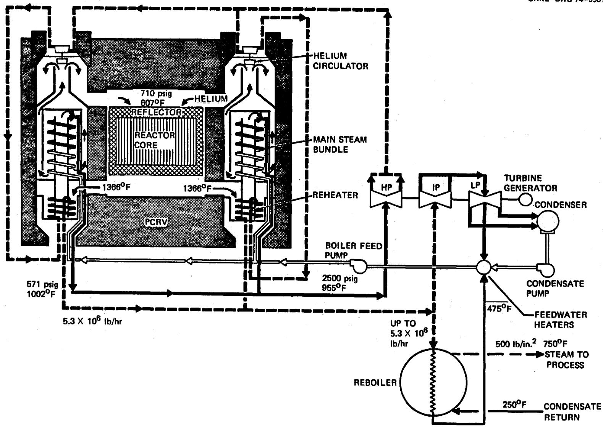  
Fig. 5.20. 2000-MW(t) HTGR with process steam extraction.

ORNL-DWG 74-5961

$(750^{\circ}\mathrm{F})]$ . The difficulty arises because the helium circulators are an integral part of the turbine cycle; that is, the total prime steam flow passes from the high-pressure turbine through the circulator drives to the internal reheater. No extraction can be taken prior to the outlet of the reheater without redesign of the nuclear steam system.

The nuclear system must be modified to provide 650 psi and $399^{\circ}\mathrm{C}$ ( $750^{\circ}\mathrm{F}$ ) steam. The helium circulator turbine would be redesigned to utilize prime steam directly, and a resuperheater might be included in the cycle following the helium circulator. High-pressure, high-temperature steam $[\sim 2000$ psi and $510^{\circ}\mathrm{C}$ ( $950^{\circ}\mathrm{F}$ )] would be available for power generation on site or for transfer through a reboiler to a secondary system for transport off site.*

A preliminary evaluation has been made for the reboiler for isolation of the nuclear steam. For the LWR, heat is transferred from saturated steam at 1050 psi and $288^{\circ}\mathrm{C}$ ( $550^{\circ}\mathrm{F}$ ) to saturated steam at 850 psi and $274^{\circ}\mathrm{C}$ ( $525^{\circ}\mathrm{F}$ ). The log mean temperature difference is approximately $14^{\circ}\mathrm{C}$ ( $25^{\circ}\mathrm{F}$ ), and the heat transfer coefficient is assumed to be 1000 Btu $\mathrm{hr}^{-1}\mathrm{ft}^{-2}$ ( $^{\circ}\mathrm{F}$ ) because of the favorable conditions of transferring heat at saturated steam conditions on both sides of the tubes. For $10^{6}\mathrm{lb/hr}$ steam,

$$
\begin{array}{l} A (\text {s u r f a c e a r e a r e q u i r e d}) = \frac {\text {Q u a n t i t y o f h e a t}}{\bar {U} \Delta t} \\ = \frac {9 8 0 \times 1 0 ^ {6} \mathrm {B t u / h r}}{1 0 0 0 (2 5)} \\ = 3 9, 2 0 0 \mathrm {f t} ^ {2} / 1 0 ^ {6} \mathrm {l b / h r}. \\ \end{array}
$$

The direct cost of high-pressure feedwater heaters is typically $15 to$ 20/ft² of surface. It is assumed the reboiler would be of similar design. Assuming a total cost of $40/ft² for the reboiler yields approximately$ 1,600,000 total cost for the reboiler or $1.60 per pound per hour of steam. The approximate unit cost for the reboiler, assuming industrial financing, would be

$$
\text {U n i t} = \frac {\mathbb {S} 1 , 6 0 0 , 0 0 0 (0 . 2 2 2 / y e a r)}{1 , 0 0 0 , 0 0 0 l b / h r (8 7 6 0 h r / y e a r) (9 8 0 B t u / l b)} \times 1 0 ^ {6} = 4 \xi / 1 0 ^ {6} B t u.
$$

The HTGR reboiler would have a much higher temperature driving force but lower heat transfer performance in the superheat regions. It is estimated to cost somewhat less than the LWR reboiler. The cost would depend on a detailed analysis of the specific prime steam conditions achieved with the modified system.

# High-temperature process heat from the HTGR

Modification of the HTGR to provide high-temperature process heat [in the order of $649^{\circ}\mathrm{C}$ $(1200^{\circ}\mathrm{F})$ or greater] would open up substantial additional opportunities for providing industrial energy. In a large modern refinery, approximately half of the energy requirement is in the form of process heat (other than steam) to heat fluids to process operating temperatures in the range of 260 to $538^{\circ}\mathrm{C}$ (500 to $1000^{\circ}\mathrm{F}$ ).

There is not sufficient information at this time to develop a cost estimate for a process heat HTGR. Indeed, substantial analysis and development work would be required to firm up a conceptual design for a process heat HTGR.

The present average core outlet temperature is approximately $760^{\circ}\mathrm{C}$ ( $1400^{\circ}\mathrm{F}$ ), and it is believed that a $899^{\circ}\mathrm{C}$ ( $1650^{\circ}\mathrm{F}$ ) average core outlet temperature can be achieved with current fuel technology. This will require some analysis and proof testing, but it appears to be reasonably close at hand. Very preliminary estimates indicate that this may result in a fuel cycle cost increase of about $10\%$ .

Preliminary studies of providing process heat to a refinery illustrate helium as the secondary heat transfer fluid passing directly from the heat exchanger within the prestressed concrete reactor vessel (PCRV) directly to the refinery. However, it is judged that this is not feasible for two major reasons: (1) isolation from possible radioactive or industrial contamination will very likely be required, and (2) helium is a poor economic choice as a fluid medium for transferring high-temperature heat over long distances.

In the range of $871^{\circ}\mathrm{C}$ ( $1600^{\circ}\mathrm{F}$ ), radioactive tritium can pass through the walls of the heat exchanger tubes and into the secondary fluid. The level of tritium concentration in the primary helium is maintained quite low, but the question of tritium must be evaluated and the additional attenuation of a secondary heat exchanger outside the PCRV must be considered. Conversely, the possibility of introducing industrial contaminants (petroleum, etc.) into the reactor vessel must also be considered and may in itself require a secondary heat exchanger.

The allowable level of radioactive contamination in the fluid leaving the reactor site is too small to be measured by on-line instrumentation or monitors. A secondary heat exchanger allows samples to be monitored from the intermediate helium loop at frequent intervals with the added safety of an additional physical barrier.

# 5.3 SPECIAL-PURPOSE PWR FOR INDUSTRY

# 5.3.1 Background and Status of the CNSG Reactor

The development of the Consolidated Nuclear Steam Generator (CNSG) for nuclear ship propulsion has been under way $^{34}$ at the Babcock and Wilcox Company since 1959. Some of the unique features of the plant design, including the once-through steam generator housed within the reactor vessel, have already been demonstrated $^{35}$ in the Federal German Republic nuclear ship "Otto Hahn," which has operated successfully since 1969. The U.S. Maritime Administration has continued to sponsor work in the areas of design, testing, and evaluation of the CNSG concept, and current

efforts $^{36}$ are directed toward a 313-MW(t) application for propelling a 600,000-ton tanker. Start of construction is hoped for within 1 or 2 years.

The CNSG design is essentially based on current technology, and relatively little development would be required for process heat applications in the 300-MW(t) power range. If a construction contract were awarded in 1975, plant startup could take place in 1981.

A larger land-based CNSG plant for generating $400\mathrm{MW(e)}$ of electrical power has been under study at Babcock and Wilcox for some time. The potential advantages of this type of plant in electric utility service include the ability to provide for utility power demand growth in smaller increments, thus reducing the temporary excess of installed capacity over demand, and shorter construction times than required for large nuclear central stations. Assuming that a detailed plant design could be developed in about 2 years and allowing about 8 years between project start and completion, plant startup might take place in 1985.

A detailed design has not been developed for this unit, and the plant costs are less well known than for the 313-MW(t) plant. The power costs presented for 600- and 900-MW(t) units are even more tentative, since they are based on interpolations of the major cost components of the 313- and the 1235-MW(t) plants.

# 5.3.2 Reactor Plant

The CNSG is an integral water reactor with the core and steam generator inside the reactor vessel (Fig. 5.21) and an electrically heated pressurizer connected to the vessel externally.[37] Four horizontally mounted reactor coolant pumps are located alternately with the steam nozzles at the reactor vessel nozzle belt. Feedwater nozzles are located in a nozzle belt below the steam generator. The reactor core consists of Zircaloy tubes containing slightly enriched uranium dioxide pellets enclosed by welded end plugs. The tubes are supported in assemblies by a spring-clip grid structure. The mechanical control rods are clusters of absorber rods that move in guide tubes within the fuel assembly.

The steam generator is a helically coiled, once-through unit located in the annulus above the top level of the core. The operation of the steam generator utilizes four sets of feedwater inlet and steam outlet nozzles. The steam generator incorporates counterflow heat transfer with tube-side boiling to produce steam at a constant pressure. The reactor coolant system operates at a constant average temperature over the normal load range. Major reactor parameters are shown in Table 5.42.

The reactor containment shell (Fig. 5.22) is a free-standing steel cylinder with elliptical heads. The containment vessel is supported at the bottom and has an operating floor approximately halfway up the containment. The center section of the upper head is removable for servicing and installation of major components and for refueling; it is fitted with a double seal. The personnel hatch, which is also a double-barrier design, is located near the operating floor, providing access for routine maintenance and inspection. The vapor-suppression pool is formed by a second cylindrical shell below the operating floor; the annular wet well is divided into eight separate compartments with one vent discharging into each compartment.

A reactor building (Fig. 5.23) completely encloses the reactor and its pressure-suppression primary containment. This structure provides secondary containment when the primary containment

ORNL-DWG 74-7104

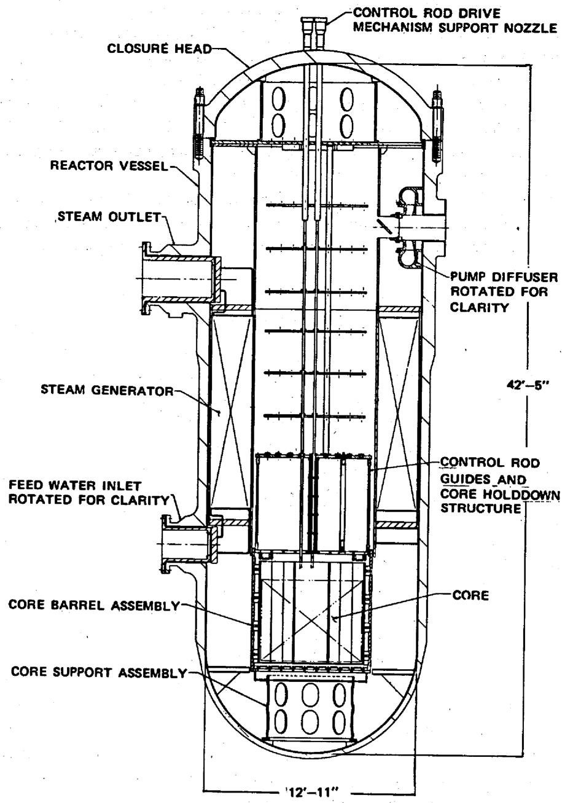  
Fig. 5.21. Internal arrangement of 313-MW(t) reactor.

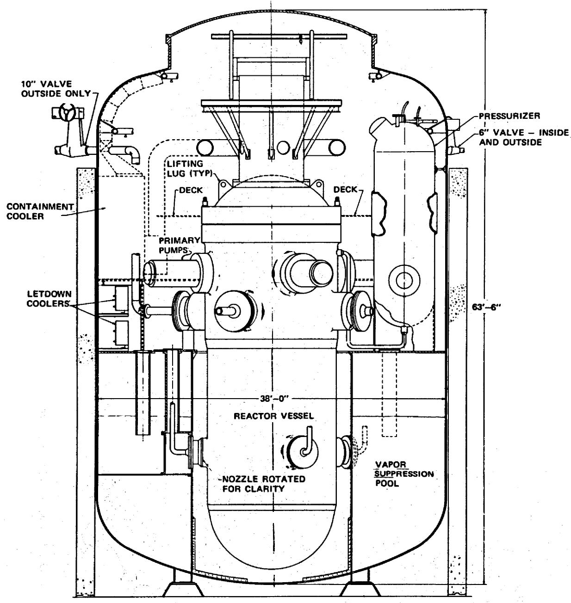  
Fig. 5.22. Containment arrangement of 313-MW(t) CNSG reactor.

ORNL-DWG 74-7103

ORNL-DWG 74-2333R

1 CIRCULATING SYSTEM INTAKE AND DISCHARGE   
2 75-ton CRANE   
3 VESSEL HEAD STORAGE   
4 FUEL HANDLING POOL AND INTERNALS STORAGE   
5 125-ton CRANE   
6 SPENT FUEL STORAGE   
7 SPENT FUEL SHIPPING PIT   
8 NEW FUEL STORAGE   
9 REACTOR BUILDING   
10 AIR LOCK   
11 DEMINERALIZER   
12 PRESSURE SUPPRESSION POOL

13 91-MW(e) TURBINE-GENERATOR   
14 REACTOR   
15 PRIMARY CONTAINMENT   
16 CONTROL ROOM   
17 SERVICE BUILDING

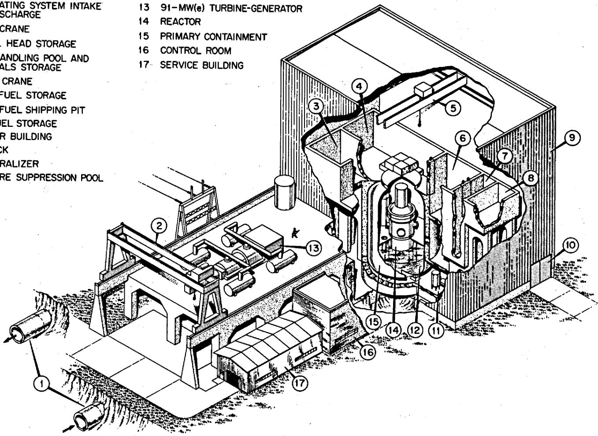  
Fig. 5.23. Nuclear steam supply for 313-MW(t) reactor with 90-MW(e) turbine generator.

Table 5.42.313-MW(t) reactor parameters   

<table><tr><td>System pressure, psia</td><td>1875</td></tr><tr><td>Core inlet temperature, °C (°F)</td><td>302 (574.5)</td></tr><tr><td>Core outlet temperature, °C (°F)</td><td>319 (604)</td></tr><tr><td>Maximum thermal output, kW/ft</td><td>16.08</td></tr><tr><td>Operating pressure, psia</td><td>1875</td></tr><tr><td>Boiler feedwater temperature, °C (°F)</td><td>204 (400)</td></tr><tr><td>Total steam generator flow, lb/hr</td><td>1.254 × 106</td></tr><tr><td>Steam side design temperature, °C (°F)</td><td>343 (650)</td></tr><tr><td>Steam side operating temperature, °C (°F)</td><td>287 (548)</td></tr><tr><td>Steam side operating pressure, psia</td><td>700</td></tr></table>

is in service and forms the primary containment during fueling or repair of the reactor system. The reactor building houses the refueling and reactor servicing equipment, new and spent-fuel storage facilities, and other reactor auxiliary or service equipment (demineralizers, standby liquid control system, control rod hydraulic system, and electrical equipment). From a safeguards consideration, the primary purpose of the secondary containment is to minimize ground level release of airborne radioactive materials and to provide for controlled and filtered release of the building atmosphere under accident conditions.

# 5.3.3 Power-Conversion Plant

Three approaches for providing process energy from the reactor plant were evaluated: (1) electrical power only, (2) steam only, and (3) electrical power and steam. The CNSG power, steam, and feedwater conditions remained unchanged throughout. Under condition 1, steam at 700 psia and $287^{\circ}\mathrm{C}$ ( $548^{\circ}\mathrm{F}$ ) ( $50^{\circ}$ superheat) drives a 91,300-kW, 3600-rpm tandem-compound condensing turbine that exhausts steam at 2 in. Hg to a once-through water-cooled condenser. For conditions 2 and 3, it was assumed that the process steam would be generated in a reboiler in order to prevent the transfer of contaminants between the nuclear steam supply and the industrial processes. The process steam was assumed to exit from the reboiler at saturated conditions; the process steam flow rate is shown in Fig. 5.24 as a function of process steam temperature. The temperature of the returning process water was generally taken as $2^{\circ}\mathrm{F}$ below that of the reboiler. However, for process steam above $205^{\circ}\mathrm{C}$ ( $402^{\circ}\mathrm{F}$ ), the returning water temperature was held constant at $400^{\circ}\mathrm{F}$ , corresponding to the CNSG design feedwater temperature of $204^{\circ}\mathrm{C}$ ( $400^{\circ}\mathrm{F}$ ). No makeup losses were assumed for the process steam system. The process heat delivered by the reboiler is shown in Fig. 5.25 as a function of process steam temperature.

Under condition 2, CNSG steam at 700 psia and $287^{\circ}\mathrm{C}$ ( $548^{\circ}\mathrm{F}$ ) flows through the tube side of the reboiler to generate $1.24 \times 10^{6} \mathrm{lb/hr}$ of 566 psia saturated steam on the shell side. To meet condition 3, electrical power is generated in a back-pressure turbine exhausting to a reboiler, which in turn generates process steam. Turbine back pressures ranged from 67 to 515 psia, corresponding to saturated process steam flows ranging from 934,000 lb/hr at 49 psia to 1,218,000 lb/hr at 423 psia respectively. Output from the turbine generator of course diminished with increasing back pressure, ranging from 5500 kW at 515 psia turbine exhaust pressure to 51,300 kW at 67 psia. The net generator output is shown in Fig. 5.26 as a function of process temperature.

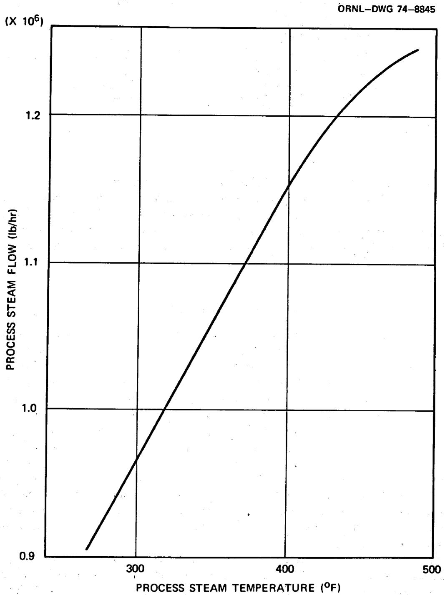  
Fig. 5.24. Process steam flow for 313-MW(t) CNSG as a function of steam temperature.

ORNL-DWG 74-8842

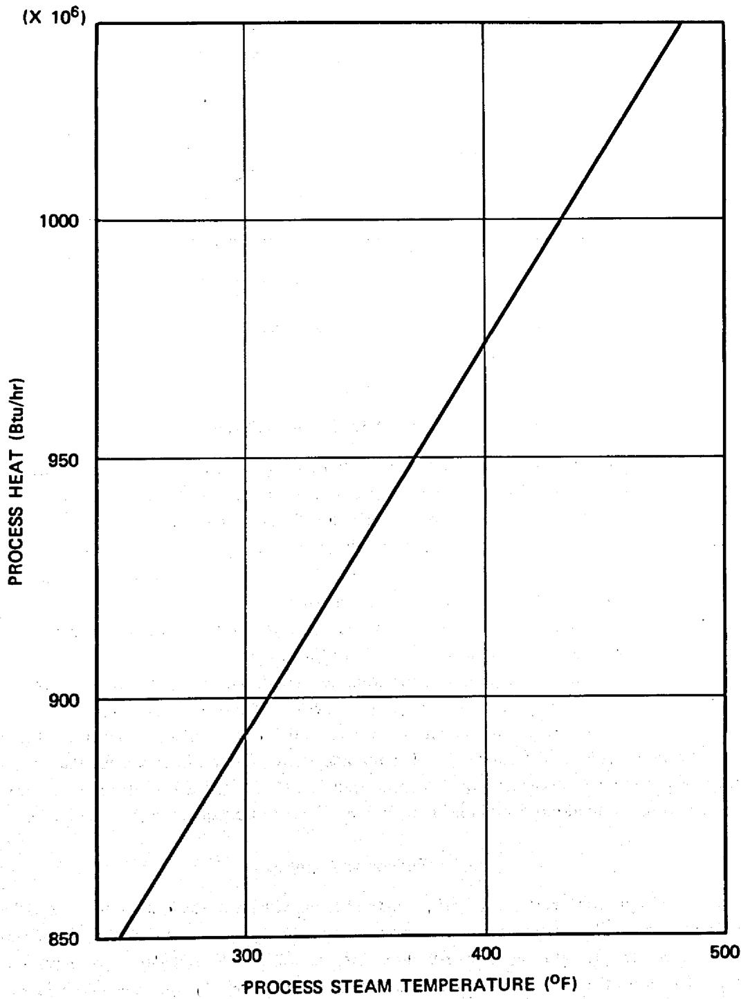  
Fig. 5.25. Process heat for 313-MW(t) CNSG as a function of steam temperature.

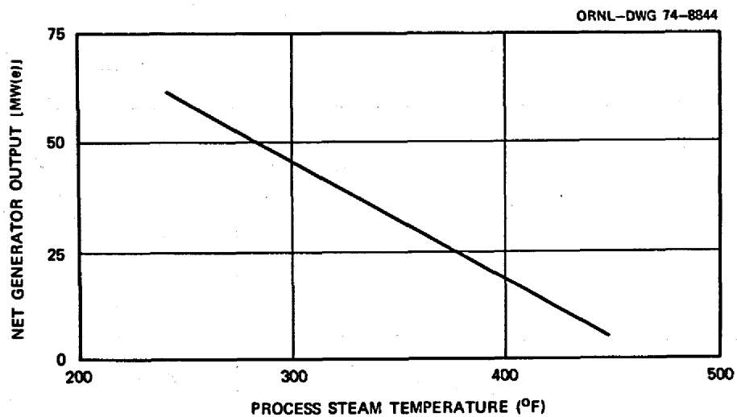  
Fig. 5.26. Net generator output for 313-MW(t) CNSG as a function of process steam temperature.

# 5.3.4 Description of 1235-MW(t) System

Detailed plant designs for larger land-based CNSG stations have not been developed at this time. Studies by Babcock and Wilcox suggest that CNSG technology is directly applicable to power levels up to $500\mathrm{MW(e)}$ , with power output limited by the size of the reactor vessel that can be fabricated in current manufacturing facilities. Plant operating conditions were assumed to approximate those of the 313-MW(t) CNSG described in a previous section. The reactor vessel diameter is about 17 ft 8 in., and vessel height is increased to about 38 ft; thermal output totals 1235 MW. The functional arrangement of the reactor containment, fuel-handling system, and reactor building remains as described for the 313-MW(t) plant.

Two alternative power-conversion systems were evaluated. The first, intended for the generation of electrical power only, consists of a 400-MW(e), 3600-rpm tandem-compound steam turbine-generator unit, supplied with steam at 700 psia and $287^{\circ}\mathrm{C}$ ( $548^{\circ}\mathrm{F}$ ), exhausting at 2 in. Hg to a once-through water-cooled condenser. For the alternative system, intended for the production of process steam only, CNSG steam at 700 psia and $287^{\circ}\mathrm{C}$ ( $548^{\circ}\mathrm{F}$ ) flows through the tube side of a reboiler to generate about 5 million lb/hr of 566 psia saturated steam on the shell side.

# 5.3.5 Economic Analysis

Capital and operating costs have been estimated for CNSG-type stations of 313 and $1235\mathrm{MW}$ of thermal capacity. The larger reactor has not been developed in as much detail as the 313-MW(t) shipboard-based design, and the cost estimates for the 1235-MW(t) station are therefore more tentative. However, the values derived are believed adequate for the purpose of evaluating the economic potential of the concept for industrial process energy applications.

# Plant capital costs

Costs for the major components of the two CNSG nuclear steam supply systems summarized in Table 5.43 are approximately $63 million for the 313-MW(t) unit and$ 117 million for the

Table 5.43. Reactor system capital cost (10 $^3$ $)   

<table><tr><td></td><td>313 MW(t)</td><td>1235 MW(t)</td></tr><tr><td colspan="3">Structures and improvements</td></tr><tr><td>Yard work</td><td>800</td><td>800</td></tr><tr><td>Reactor building</td><td>2,800</td><td>5,130</td></tr><tr><td>Diesel-generator building</td><td>150</td><td>300</td></tr><tr><td>Administration building</td><td>200</td><td>200</td></tr><tr><td>Control room</td><td>500</td><td>500</td></tr><tr><td>Service building</td><td>200</td><td>200</td></tr><tr><td>Reactor containment</td><td>2,340</td><td>3,070</td></tr><tr><td></td><td>6,990</td><td>10,200</td></tr><tr><td colspan="3">Reactor plant equipment</td></tr><tr><td>Nuclear steam supply, including radiation waste systems</td><td>33,900</td><td>49,000</td></tr><tr><td>Fuel-handling system</td><td>800</td><td>2,250</td></tr><tr><td>Radiation monitoring system</td><td>250</td><td>250</td></tr><tr><td></td><td>34,950</td><td>51,500</td></tr><tr><td>Electrical plant equipment</td><td>1,300</td><td>4,000</td></tr><tr><td>Total reactor direct cost</td><td>43,240</td><td>65,700</td></tr><tr><td>Contingency</td><td>500</td><td>6,000</td></tr><tr><td></td><td>43,740</td><td>71,700</td></tr><tr><td>Construction facilities, equipment, services (6%)</td><td>2,624</td><td>4,302</td></tr><tr><td>Engineering and construction management services</td><td>4,374</td><td>10,755</td></tr><tr><td>Other costs (5%)</td><td>2,187</td><td>3,585</td></tr><tr><td></td><td>52,925</td><td>90,342</td></tr><tr><td>Interest during construction (4 years at 10%)</td><td>9,791</td><td></td></tr><tr><td>Interest during construction (6 years at 10%)</td><td></td><td>26,470</td></tr><tr><td>Total cost in 1974</td><td>62,716</td><td>116,812</td></tr></table>

1235-MW(t) system. These costs, which are given in 1974 dollars, include the interest during construction but exclude cost escalation for startup beyond 1974. The costs for the nuclear steam supply systems remained fixed in the economic evaluation of the two alternative power-conversion options examined. The capital costs given in Table 5.44 are for power-conversion systems intended for the production of electrical power only.

The cost of a reboiler and other components that might be required to utilize the process steam and to return the process water to the nuclear steam supply system depends on the particular requirements of the energy user and is not included in the cost tabulations. The reboiler costs might increase the price of process steam from the 313-MW(t) unit by about $4\mathfrak{c} / 10^{6}$ Btu at an annual fixed charge rate of $13.9\%$ and by $7\mathfrak{c} / 10^{6}$ Btu for a $22.2\%$ charge rate. The corresponding values for the 1235-MW(t) CNSG are $4\mathfrak{c}$ and $6\mathfrak{c} / 10^{6}$ Btu respectively.

# Operating and maintenance costs

The annual operating and maintenance costs shown for the nuclear steam supply system in Tables 5.45 and 5.46 apply to both of the operating modes examined. The power-conversion system costs apply to the case of electrical power generation only. Operating and maintenance costs were not charged to the power-conversion system for the process-steam-only option.

Table 5.44. Power-conversion system capital costs (10³ $)   

<table><tr><td></td><td>313 MW(t)</td><td>1235 MW(t)</td></tr><tr><td colspan="3">Structures and improvements</td></tr><tr><td>Yard work</td><td>400</td><td>400</td></tr><tr><td>Turbine room and heater bay</td><td>450</td><td>1,700</td></tr><tr><td>Intake and discharge structures</td><td>360</td><td>360</td></tr><tr><td>Administration building</td><td>100</td><td>100</td></tr><tr><td>Service building</td><td>100</td><td>100</td></tr><tr><td></td><td>1,410</td><td>2,660</td></tr><tr><td colspan="3">Turbine plant equipment</td></tr><tr><td>Turbine generator</td><td>6,600</td><td>18,000</td></tr><tr><td>Turbine-generator foundation</td><td>150</td><td>400</td></tr><tr><td>Condensate, feedwater, other equipment</td><td>4,500</td><td>15,000</td></tr><tr><td>Instruments and controls</td><td>1,100</td><td>1,100</td></tr><tr><td></td><td>12,350</td><td>34,500</td></tr><tr><td>Electrical plant equipment</td><td>2,000</td><td>6,000</td></tr><tr><td>Miscellaneous power-conversion equipment</td><td>900</td><td>3,000</td></tr><tr><td>Total power conversion system direct cost</td><td>16,660</td><td>46,160</td></tr><tr><td>Contingency (6%)</td><td>1,000</td><td>2,770</td></tr><tr><td></td><td>17,660</td><td>48,930</td></tr><tr><td>Construction facilities, equipment, services (6%)</td><td>1,060</td><td>2,936</td></tr><tr><td>Engineering, construction, management services (15%)</td><td>2,649</td><td>7,339</td></tr><tr><td>Other costs (5%)</td><td>883</td><td>2,446</td></tr><tr><td></td><td>22,252</td><td>61,651</td></tr><tr><td>Interest during construction (4 years at 10%)</td><td>4,117</td><td></td></tr><tr><td>Interest during construction (6 years at 10%)</td><td></td><td>18,064</td></tr><tr><td>Total cost in 1974</td><td>26,369</td><td>79,715</td></tr></table>

Table 5.45. Annual operating and maintenance costs (10 $^3$ $) for 313-MW(t) plant   

<table><tr><td></td><td>Turbine-generator plant</td><td>Nuclear steam supply plant</td><td>Total</td></tr><tr><td>Operating staff</td><td>150</td><td>665</td><td>815</td></tr><tr><td>Fixed and variable maintenance</td><td>132</td><td>437</td><td>569</td></tr><tr><td>Supplies and expenses</td><td>30</td><td>74</td><td>104</td></tr><tr><td>Nuclear insurance</td><td></td><td>284</td><td>284</td></tr><tr><td>Operating fees</td><td></td><td>25</td><td>25</td></tr><tr><td>Administration and general</td><td>50</td><td>200</td><td>250</td></tr><tr><td>In-service inspection</td><td></td><td>36</td><td>36</td></tr><tr><td>Total</td><td>362</td><td>1721</td><td>2083</td></tr></table>

Table 5.46. Annual operating and maintenance costs (10 $^3$ ) for 1235-MW(t) plant   

<table><tr><td></td><td>Turbine-generator plant</td><td>Nuclear steam supply plant</td><td>Total</td></tr><tr><td>Operating staff</td><td>180</td><td>855</td><td>1035</td></tr><tr><td>Fixed and variable maintenance</td><td>367</td><td>717</td><td>1084</td></tr><tr><td>Supplies and expenses</td><td>83</td><td>122</td><td>205</td></tr><tr><td>Nuclear insurance</td><td></td><td>350</td><td>350</td></tr><tr><td>-Operating fees</td><td></td><td>80</td><td>80</td></tr><tr><td>Administration and general</td><td>60</td><td>240</td><td>300</td></tr><tr><td>In-service inspection</td><td></td><td>36</td><td>36</td></tr><tr><td>Total</td><td>690</td><td>2900</td><td>3090</td></tr></table>

# Process heat and power costs

Energy costs (in 1974 dollars) for 1981 startup of the process-steam-only plants are summarized in Tables 5.47 and 5.48. These costs are based on two alternative fixed charge rates, 13.9 and $22.2\%$ /year, which are representative of utility and private industry financing respectively. Costs were levelized over a 30- and 20-year plant life respectively. A plant factor of 0.8, commonly assumed for large nuclear central stations, was used for the 1235-MW(t) CNSG plant. A

Table 5.47. Summary of levelized production cost for 313-MW(t) CNSG nuclear process steam plant   

<table><tr><td rowspan="2"></td><td colspan="2">13.9% Fixed charge rate</td><td colspan="2">22.2% Fixed charge rate</td></tr><tr><td>10^6 $/year</td><td>\( \phi/10^6 \) Btu</td><td>10^6 $/year</td><td>\( \phi/10^6 \) Btu</td></tr><tr><td>Fixed charges</td><td>8.9</td><td>111</td><td>14.1</td><td>178</td></tr><tr><td>Operating and maintenance costs</td><td>1.7</td><td>22</td><td>1.7</td><td>22</td></tr><tr><td>Fuel costs</td><td>3.2</td><td>40</td><td>4.0</td><td>50</td></tr><tr><td>Total</td><td>13.8</td><td>173</td><td>19.8</td><td>250</td></tr></table>

${}^{a}$ Costs in 1974 dollars; startup in 1981; 85% plant factor.

Table 5.48. Summary of levelized production costsa for 1235-MW(t) CNSG nuclear process steam plant   

<table><tr><td rowspan="2"></td><td colspan="2">13.9% Fixed charge rate</td><td colspan="2">22.2% Fixed charge rate</td></tr><tr><td>10^6 $/year</td><td>\( \phi/10^6 \) Btu</td><td>10^6 $/year</td><td>\( \phi/10^6 \) Btu</td></tr><tr><td>Fixed charges</td><td>16.8</td><td>57</td><td>26.8</td><td>91</td></tr><tr><td>Operating and maintenance costs</td><td>2.4</td><td>8</td><td>2.4</td><td>8</td></tr><tr><td>Fuel costs</td><td>8.7</td><td>30</td><td>10.7</td><td>35</td></tr><tr><td>Total</td><td>27.9</td><td>95</td><td>39.9</td><td>134</td></tr></table>

${}^{a}$ Costs in 1974 dollars; startup in 1981; 80% plant factor.

plant factor of 0.85 was employed for the 313-MW(t) CNSG, since the smaller plant can be refueled more quickly. The basis for the fuel cycle costs is given in Appendix A. Process heat costs ranged from \(1.73 to \)2.50/10^6 Btu for the 313-MW(t) station and from 95¢ to \)1.34/10^6 Btu for the 1235-MW(t) plant.

Tables 5.49 and 5.50 summarize the energy costs in 1974 dollars for the case of electrical power generation only, again considering fixed charge rates of 13.9 and $22.2\%$ /year. Electrical costs ranged from 26.0 to 38.0 mills/kWhr for the smaller station and from 13.9 to 20.5 mills/kWhr for the larger plant.

Figure 5.27 shows the effect of changes in uranium ore prices on process steam costs for plant startup during the time period from 1981 to 1991. Over this 10-year span, the process energy costs for the 313-MW(t) unit increased by as much as $6\%$ ; the corresponding increase for the 1235-MW(t) plant is up to $9\%$ . Costs are presented in 1974 dollars, and escalation is, of course, not accounted for in these comparisons.

For the two power levels investigated, the results show that the CNSG unit energy costs decrease considerably with increasing power level. Therefore, it became of interest to predict the power costs at intermediate power outputs in the range from 313 to $1235\mathrm{MW(t)}$ . These results, shown in Fig. 5.28, were obtained by assuming that the plant capital costs could be represented by an equation of the form:

Capital cost $= A +$ (thermal power output) $^n$ ,

where $A$ and $n$ are constants. Experience has shown that this type of equation can express the effect of unit size on costs reasonably well. Fuel cycle costs were derived from graphical interpolation.

Table 5.49. Summary of levelized production costsa for 313-MW(t) CNSG nuclear electric plant   

<table><tr><td rowspan="2"></td><td colspan="2">13.9% Fixed charge rate</td><td colspan="2">22.2% Fixed charge rate</td></tr><tr><td>10^6 $/year</td><td>mills/kWhr</td><td>10^6 $/year</td><td>mills/kWhr</td></tr><tr><td>Fixed charges</td><td>12.4</td><td>18.2</td><td>19.8</td><td>29.0</td></tr><tr><td>Operating and maintenance costs</td><td>2.1</td><td>3.1</td><td>2.1</td><td>3.1</td></tr><tr><td>Fuel costs</td><td>3.2</td><td>4.7</td><td>4.0</td><td>5.9</td></tr><tr><td>Total</td><td>17.7</td><td>26.0</td><td>25.9</td><td>38.0</td></tr></table>

${}^{a}$ Costs in 1974 dollars; startup in 1981; 85% plant factor.

Table 5.50. Summary of levelized production costs for 1235-MW(t) CNSG nuclear electric plant   

<table><tr><td rowspan="2"></td><td colspan="2">13.9% Fixed charge rate</td><td colspan="2">22.2% Fixed charge rate</td></tr><tr><td>10^6$/year</td><td>mills/kWhr</td><td>10^6$/year</td><td>mills/kWhr</td></tr><tr><td>Fixed charges</td><td>27.3</td><td>9.7</td><td>43.6</td><td>15.6</td></tr><tr><td>Operating and maintenance costs</td><td>3.1</td><td>1.1</td><td>3.1</td><td>1.1</td></tr><tr><td>Fuel costs</td><td>8.7</td><td>3.1</td><td>10.7</td><td>3.8</td></tr><tr><td>Total</td><td>39.1</td><td>13.9</td><td>57.4</td><td>20.5</td></tr></table>

Costs in 1974 dollars; startup in 1981; $80\%$ plant factor.

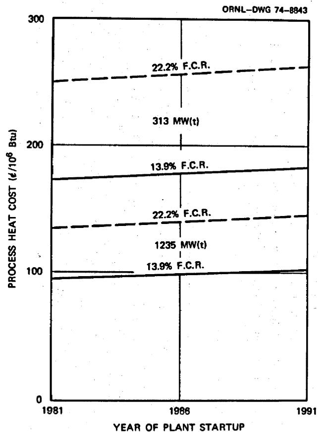  
Fig. 5.27. Process heat cost as a function of plant startup time.

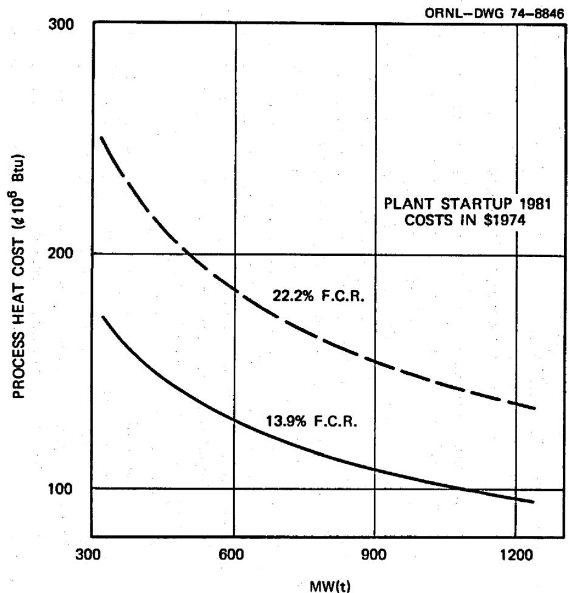  
Fig. 5.28. Process heat cost as a function of plant capacity.

Although the costs shown are quite tentative, they are believed to be useful in illustrating the effect of reactor size on process energy costs for small- and intermediate-size special-purpose reactors.

# 5.3.6 Platform-Mounted CNSG Reactor

The possibility of mounting large power reactors on floating platforms has been studied $^{38-40}$ for some time, and the commercial introduction of barge-mounted central-station type PWRs has been scheduled for 1985 by Offshore Power Systems of Jacksonville, Fla. One of the major incentives for the development of floating nuclear power stations has been the scarcity of suitable reactor sites near the areas of large electrical power demand. Siting advantages probably will not be a major consideration in the development of platform-mounted nuclear energy sources for industrial use; however, the advantages resulting from shipyard construction, including a shortened construction period, accelerated licensing procedures, and more economical construction, may be important.

The lower plant costs projected for shipyard construction are predicated on a market demand sufficient to result in the fabrication of a sizable number of duplicate units at one building yard. For example, a construction rate of four 3400-MW(t) PWRs per year is anticipated on a so called "mass production" basis at the Offshore Power Systems facility being readied at Jacksonville, Fla. A lower production rate of perhaps one or two units per year may be economical for small industrial energy reactors because they can be constructed in existing shipyards.

The potential impact of small floating industrial energy reactors on meeting the nation's energy requirements is limited by the extent of the geographical region accessible to that type of plant. Thus, a brief survey was made to identify some of the waterways that might allow passage to a barge-mounted CNSG-type reactor plant. Figure 5.29 depicts the major inland waterways41 of the central and eastern United States; this extensive network of navigable channels includes nearly 7600 miles of waterways either completed or under construction with a minimum water depth of 9 ft. During part of each year, many of these waterways are maintained at a minimum depth of 12 ft, allowing passage of craft with as much as 11 ft of draft while allowing a 1-ft clearance beneath the hull.41-44 Thus, a draft of up to about 11 ft appears acceptable for a barge-mounted industrial energy source. The beam and length of the unit are limited by the size of locks that must be passed through. These dimensions are 110 by 600 ft for the locks of the more extensively used waterways,41,42,45 limiting the barge beam to about 105 ft; the hull length permitted by the locks is considerably in excess of the length required for a small platform-mounted reactor plant. The vertical clearance under bridges places a further restriction on the dimensions of a floating power plant. A minimum

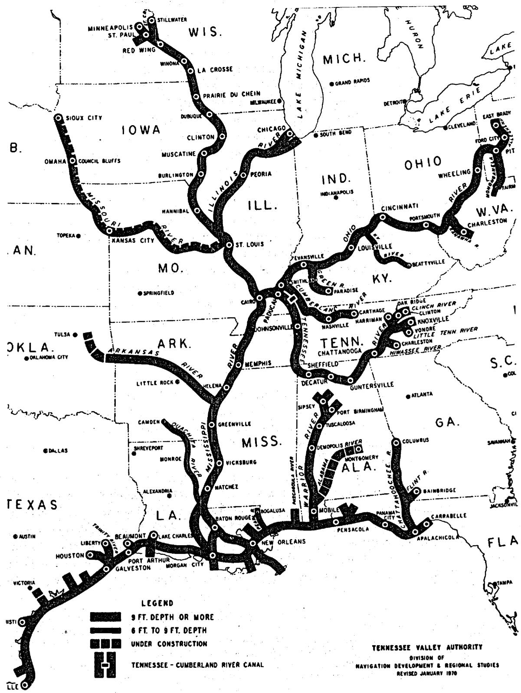  
Fig. 5.29. Tennessee River and interconnected inland waterway system.

bridge height of about 57 ft is maintained over extensive regions of the waterways,[41,42,46,47] allowing a total height of about 68 ft from the underside of the barge to the top of the superstructures. These dimensional restrictions can be met by the platform-mounted CNSG reactor concept developed by G. G. Sharp, Inc., under contract to the Oak Ridge National Laboratory,[48] and on this basis it appears that many of the waterways shown in Fig. 5.29 would be accessible. For example, on the Mississippi River, passage is feasible as far north as mile 848, within 10 miles of Minneapolis, Minn. The Illinois River would be accessible to mile 231, within about 70 miles of Chicago, Ill. The Ohio River would be passable as far as Pittsburgh, Pa. The Cumberland River could afford passage to the floating unit as far as Clarksville, Tenn., and on the Tennessee River the barge could reach Chattanooga. Extensive regions of the United States East and Gulf Coasts would be accessible via the Intracoastal Waterway[49,50] and by coastwise voyage. Coastal bays, canals, and estuaries accessible to oceangoing ships provide further access routes to the sites of possible energy-consuming industries.

No detailed assessment has been made of the number of potential industries located near waterways or of the associated power requirements. It is believed that a more detailed analysis would show a potential market sufficient to absorb the output of several facilities set up specifically for the series production of small platform-mounted reactors.

The applicability of floating nuclear industrial energy sources will also be circumscribed by the population distribution near potential operating sites. It is expected that the population separation distance requirements for a barge-mounted unit would be about the same as those for a land-based plant; thus the discussion of nuclear siting in later sections also applies to the floating reactor concept.

# Platform description

The general arrangement of a platform-mounted 313-MW(t) [91-MW(e)] CNSG reactor plant is depicted in Fig. 5.30. This configuration, designed for plant operation in a floating condition, forms the base case for the plant arrangement and cost studies. However, design modifications for placing the platform on a permanent dry foundation, as well as plants designed for the production of process steam only, were also studied.[48]

The major components of the nuclear steam supply system are identical to those of the land-based concept described previously. The turbogenerator was also assumed to be the same as for the land-based plant; however, the secondary plant auxiliaries (such as the condenser, circulating pumps, diesel generators, electrical gear, and fluid-handling systems) satisfy shipboard requirements.

The heavy reactor installation is located near the center of the barge, with the spent-fuel pit and the turbogenerator at opposite ends, thus tending to balance out the individual effect on hull trim (see Fig. 5.31). Similar to the arrangement of the land-based concept, a reactor building provides

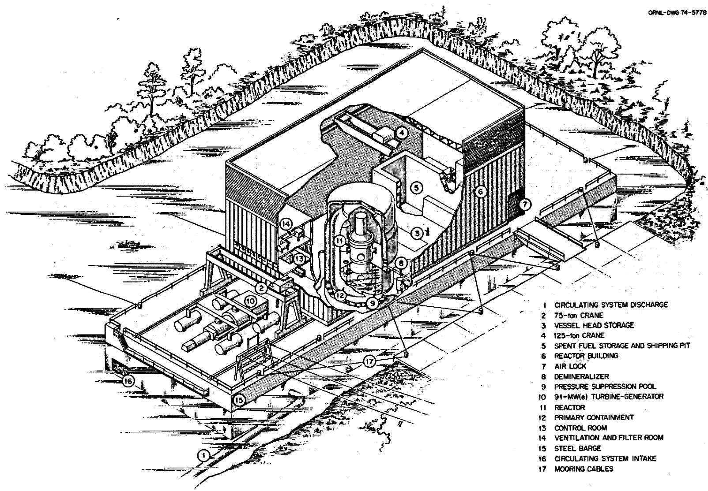  
Fig. 5.30. Platform-mounted 313-MW(t) nuclear steam supply with 91-MW(e) turbogenerator.

15

ORNL-DWG 74-8841

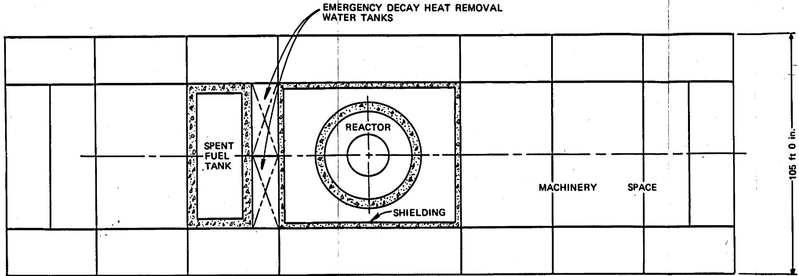

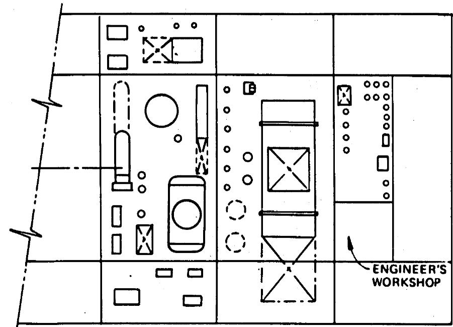  
MACHINERY SPACE   
PLAN AT 12 ft-6 in.   
LEVEL

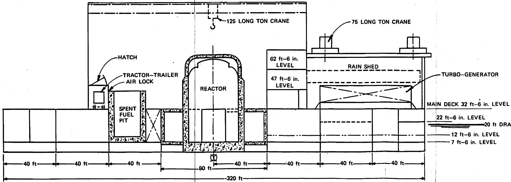

Fig. 5.31. Arrangement of platform-mounted 313-MW(t) [91 MW(e)] CNSG reactor.   
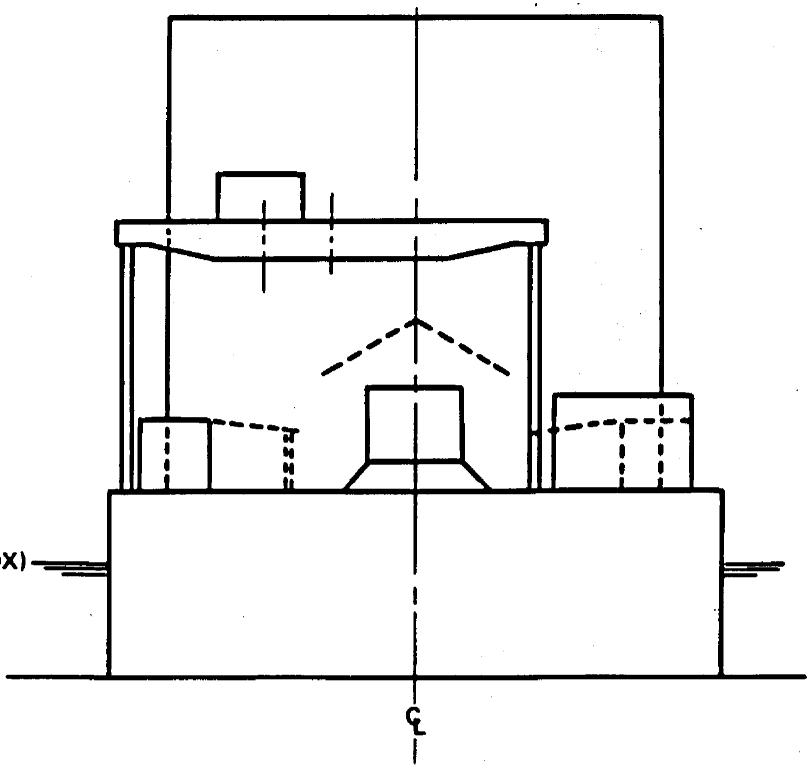  
PLAN AT 7 ft-6 in. LEVEL   
NBOARD PROFILE

secondary containment around the CNSG pressure-suppression primary containment. The building also houses the reactor auxiliary systems, laboratory spaces, the reactor control room, the radioactive waste systems, and the spent-fuel handling system.

The turbogenerator is mounted outdoors on the main deck, an arrangement suitable for a warm climate. The generator is protected by electrical switchgear mounted on the barge; however, the switchyard was assumed to be located on shore. The main condenser is arranged in the hull immediately below the turbine. Circulating water enters the hull through a submerged sea chest in the barge end; the circulating system discharge pipe passes through the barge side to remove the condenser waste heat. The bulk of the power-conversion system auxiliaries are located in the hull compartments under the turbogenerator. A bilge-and-ballast system is required for maintaining hull trim.

Hull beam was limited to 105 ft in order to allow passage through the 110-ft-wide locks commonly used on inland waterways. A barge length of 320 ft was required in order to minimize fore and aft trim under operating conditions.

The draft during the tow to the operating site can be limited to less than $\Gamma 1$ ft by deferring the installation of the concrete for the reactor shield and spent-fuel pit until after the barge is emplaced. The total weight of the complete unit is about 20,000 tons, corresponding to a draft of 20 ft. Preliminary stability calculations showed that wind loads produce quite moderate angles of hull indication; the angle of heel for a 180-mph wind would be about $4^{\circ}$ . The corresponding value for a 300-mph wind is $11^{\circ}$ .

For operation afloat the barge may have to meet the U.S. Coast Guard requirements51 for nuclear ships. Thus the hull is designed to withstand the flooding of any two compartments without sinking. Experience with the U.S. Maritime Administration layup fleet in fresh and brackish water has shown that hull corrosion can be controlled with cathodic protection systems, and the use of such a system will obviate the need for periodic drydocking to carry out hull maintenance. A hull constructed of concrete would have superior corrosion resistance; however, the hull weight could increase by as much as 3000 to 4000 tons. Because of the limitations on draft and beam, the heavier concrete barge would have to be considerably longer than a steel hull, resulting in higher capital costs.

A platform-mounted unit for the production of process heat only could be shortened to 260 ft, a reduction of 60 ft, because of the absence of the turbogenerator and its auxiliaries.

A barge hull designed for emplacement on a dry foundation will be less costly than one to be sited afloat. In the former instance, the unit will not be required to meet Coast Guard requirements for nuclear vessels, and therefore the double bottom and some of the water-tight bulkheads will not be needed. The overall length of a platform unit for the production of 91 MW of electrical power can be reduced to about 260 ft, since there will be no requirement for minimizing hull trim during plant operation. A hull length of about 230 ft will suffice for a dry emplaced unit designed for the production of process steam only.

# Platform-mounted reactor plant capital costs

The capital costs for the various platform configurations are based on data developed in Ref. 48, modified to place them on a consistent basis with the costs of land-based CNSG plants given in a

previous section. The expenditures for the support facilities needed at the site of the industrial energy user were not estimated at this time, since detailed site requirements have not been determined. The extent of facilities already existing at the industrial site (such as electrical, steam, and process fluid distribution systems) will influence the cost of siting a platform-mounted reactor plant. The local terrain, soil conditions, the type of barge emplacement (afloat or dry), and the number of reactor units will also affect the site capital expenditures by several millions of dollars. Because of these uncertainties, the present estimates are limited to predicting the capital cost for only the items that comprise a platform unit.

A representative platform building schedule was developed (assuming shipyard construction under a manufacturing license) in order to estimate the interest chargeable during the construction of a 313-MW(t) platform-mounted plant (Fig. 5.32). For comparison purposes, a project schedule for a 313-MW(t) land-based CNSG plant is also shown in the figure, indicating that actual plant construction spans a period of 43 months compared with only 19 months for the barge-mounted plant. The procurement of long-lead-time components consumes nearly two-thirds of the 55 months

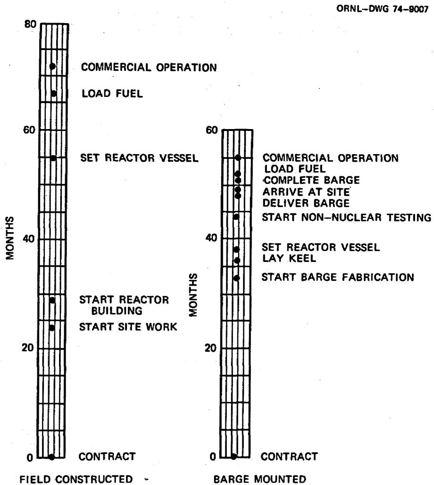  
Fig. 5.32. Schedule of events for 313-MW(t) steam-electric plant.

required to bring the barge unit on-line. Shortened procurement periods could reduce the overall plant construction schedule by a significant fraction.

Table 5.51 summarizes the capital costs for a 313-MW(t) platform-mounted reactor plant designed to furnish 91 MW(e). Costs are given in 1974 dollars without escalation for startup beyond 1974. A shipyard profit rate of $5\%$ , believed to be representative of average economic conditions, was assumed. In estimating the labor costs, credit was taken for the economies resulting from the repetitive production of a standard design. Towing charges are for a distance of 1400 miles at a speed of 6 knots. The cost category "secondary plant" also includes the cost of systems not directly associated with the turbogenerator; thus this cost category cannot be directly compared with the power-conversion system costs given in Table 5.44. The total cost of $68 million for a floating plant represents the base case for the configuration shown in Fig. 5.30. Capital costs for a platform designed for operation on a dry foundation will be about $1 million less.

The capital costs for a 313-MW(t) barge-mounted reactor for the production of process heat only (1.24 million lb/hr of 566 psia saturated steam generated in a reboiler) are listed in Table 5.52

Table 5.51. Cost summary for 313-MW(t) [91-MW(e)] platform-mounted reactor plant (in thousands of 1974 dollars)   

<table><tr><td></td><td>Floating plant</td><td>Dry emplaced plant</td></tr><tr><td>Nuclear plant</td><td></td><td></td></tr><tr><td>Nuclear steam supply, including radiation waste system</td><td>30,767</td><td>30,767</td></tr><tr><td>Fuel-handling system</td><td>650</td><td>650</td></tr><tr><td>Radiation monitoring system and health physics laboratory</td><td>274</td><td>274</td></tr><tr><td>Reactor shield and spent-fuel pit</td><td>1,189</td><td>1,189</td></tr><tr><td>Reactor containment</td><td>881</td><td>881</td></tr><tr><td></td><td>33,761</td><td>33,761</td></tr><tr><td>Secondary plant</td><td></td><td></td></tr><tr><td>Turbogenerator</td><td>6,018</td><td>6,018</td></tr><tr><td>Auxiliary systems</td><td>5,997</td><td>5,997</td></tr><tr><td></td><td>12,015</td><td>12,015</td></tr><tr><td>Electrical plant</td><td>2,168</td><td>2,168</td></tr><tr><td>Barge and equipment</td><td></td><td></td></tr><tr><td>Hull and structures</td><td>2,474</td><td rowspan="3">2,606</td></tr><tr><td>Outfit, insulation, and joiner work</td><td>520</td></tr><tr><td>Coatings and cathodic protection</td><td>157</td></tr><tr><td>Crane for turbogenerator</td><td>350</td><td>350</td></tr><tr><td></td><td>3,501</td><td>2,956</td></tr><tr><td>Total direct cost</td><td>51,445</td><td>50,900</td></tr><tr><td>Shipyard overhead (115% of direct labor)</td><td>4,049</td><td>3,756</td></tr><tr><td>Shipyard profit (5%)</td><td>2,775</td><td>2,545</td></tr><tr><td>Engineering and drafting (distributed over five units)</td><td>337</td><td>337</td></tr><tr><td>Insurance</td><td>350</td><td>350</td></tr><tr><td></td><td>58,956</td><td>57,888</td></tr><tr><td>Interest during construction (10%/year)</td><td>9,138</td><td>8,973</td></tr><tr><td></td><td>68,094</td><td>66,861</td></tr><tr><td>Towing</td><td>60</td><td>60</td></tr><tr><td>Tow insurance</td><td>200</td><td>200</td></tr><tr><td>Total cost exclusive of site improvements</td><td>68,354</td><td>67,121</td></tr></table>

Table 5.52. Cost summary for 313-MW(t) platform-mounted reactor plant for production of process heat (in thousands of 1974 dollars)   

<table><tr><td></td><td>Floating plant</td><td>Dry emplaced plant</td></tr><tr><td>Nuclear plant</td><td></td><td></td></tr><tr><td>Nuclear steam supply, including radiation waste system</td><td>30,767</td><td>30,767</td></tr><tr><td>Fuel-handling system</td><td>650</td><td>650</td></tr><tr><td>Radiation monitoring system and health physics laboratory</td><td>274</td><td>274</td></tr><tr><td>Reactor shield and spent-fuel pit</td><td>1,189</td><td>1,189</td></tr><tr><td>Reactor containment</td><td>881</td><td>881</td></tr><tr><td></td><td>33,761</td><td>33,761</td></tr><tr><td>Secondary plant</td><td>2,611</td><td>2,611</td></tr><tr><td>Electrical plant</td><td>1,110</td><td>1,110</td></tr><tr><td>Barge and equipment</td><td></td><td></td></tr><tr><td>Hull structures, outfit, insulation, joiner work, coatings, and cathodic protection</td><td>2,765</td><td>2,404</td></tr><tr><td>Total direct cost</td><td>40,247</td><td>39,886</td></tr><tr><td>Shipyard overhead (115% of direct labor)</td><td>3,568</td><td>3,376</td></tr><tr><td>Shipyard profit (5%)</td><td>2,191</td><td>2,163</td></tr><tr><td>Engineering and drafting (distributed over five units)</td><td>263</td><td>263</td></tr><tr><td>Insurance</td><td>273</td><td>273</td></tr><tr><td></td><td>46,542</td><td>45,961</td></tr><tr><td>Interest during construction (10%/year)</td><td>7,214</td><td>7,124</td></tr><tr><td></td><td>53,756</td><td>53,085</td></tr><tr><td>Towing</td><td>60</td><td>60</td></tr><tr><td>Tow insurance</td><td>160</td><td>160</td></tr><tr><td>Total cost exclusive of site improvements</td><td>53,976</td><td>53,305</td></tr></table>

for a floating and for a dry emplaced unit. Deletion of the turbogenerator allows shortening the hull by about 60 ft; the resulting cost reduction is about $400,000. The cost of a reboiler and other components that might be required to utilize the process steam and to return the process water to the nuclear steam supply system have not been included in the total cost. The total amount for a plant operating afloat is about$ 54 million; dry emplacement reduces the platform cost by about $700,000.

The capital costs for the various platform configurations are given in Table 5.53 along with costs for the corresponding land-based CNSG reactor concepts. A fair comparison between land-based and platform-mounted concepts requires that site improvement costs be added to the costs tabulated for the latter concepts. Therefore the total capital cost for the land-based platform units may increase by up to several million dollars; however, it appears that substantial savings (on the order of $20\%$ ) will still be achievable relative to field-constructed plants. An overall comparison between these two approaches must await a more detailed definition of the site facilities required for platform-mounted reactor plants, so that the capital costs as well as station maintenance and operating costs can be assessed.

Table 5.53. Capital costs for various 313-MW(t) [91-MW(e)] reactor plant configurations (in millions of 1974 dollars)   

<table><tr><td rowspan="2"></td><td colspan="2">Platform mounted</td><td rowspan="2">Land based</td></tr><tr><td>Floating emplacement</td><td>Dry emplacement</td></tr><tr><td>Process steam only plant</td><td>54</td><td>53</td><td>64</td></tr><tr><td>91-MW(e) generating plant</td><td>68</td><td>67</td><td>89</td></tr></table>

# Site facilities

The support facilities needed for operating a platform-mounted reactor plant will depend on the characteristics of the site and of the industry that uses the energy produced by the reactor plant. A detailed determination of these requirements for representative applications is beyond the scope of the present study, and this is merely a broad outline of the major requirements that must be met by the site facilities.

Basic to the plant concept is the idea that the reactor will be started up and operated at one site only and that no provision be made for moving the unit subsequently for operation elsewhere. This approach simplifies the plant design and avoids the difficulties associated with the movement of a radioactive "hot" reactor plant. A case by case determination probably is required to determine if towing the plant away for decommission will be advantageous. A central facility for decommissioning floating offshore nuclear power plants has been suggested previously;[52] that facility might also be suitable for final disposal of platform-mounted reactor plants of the type studied here.

For sites accessible only by fairly shallow navigation channels, construction equipment must be available to complete the installation of the concrete for the reactor shield and the spent-fuel pit. The top of the reactor building will have to be erected at the site if bridges or power lines encountered enroute to the site do not allow passage of the complete structure. Other site construction work will include emplacement of the barge (either afloat or on a foundation) and the installation of electrical, process, and other systems needed to connect the energy source to the industrial plant and to the local electrical grid.

The facilities for mooring a floating power plant must be capable of withstanding wind and wave forces imposed on the barge; changes in water elevation must also be accommodated. The plant must also be protected against ship collision and consequent fire or explosion if the site is exposed to these hazards. Plant sinking in shallow water can be accommodated by enclosing equipment essential to reactor safety in water-tight compartments.[39]

Emplacing the platform on a dry foundation is one alternative to mooring the barge. This could be accomplished by dredging out a basin alongside a waterway with water admitted after a concrete foundation has been constructed below the waterway level. The barge could then be floated over the foundation and the water pumped out from the basin after the latter has been sealed off. The advantages of dry emplacement include absence of hull motion, avoidance of ship collision possibility, and hull accessibility for inspection and repairs. An effective connection is essential

between the hull and the foundation to resist seismic forces and to prevent hull movement should the basin be flooded inadvertently. Refloating in this eventuality can be prevented by installing ballast in the barge and by providing flooding openings in some hull compartments.

# 5.4 THERMAL ENERGY TRANSPORT FROM NUCLEAR PLANTS

The transmission of energy in the form of high-quality steam was evaluated in conjunction with the nuclear concepts, since nuclear reactors appear to be the most likely source of energy for large blocks of thermal energy transmission. It is assumed that process steam is available at 850 psia and $525^{\circ}\mathrm{F}$ from an LWR and at 650 psia and $750^{\circ}\mathrm{F}$ from an HTGR. Producing process steam requires the use of a reboiler for the LWR and more major system modifications for the HTGR. These factors are discussed in Section 5.2.

The HTGR prime steam was originally considered for transport, but the extremely high pressure-temperature condition appears to be impractical for long-distance transportation.

Transportation costs, summarized in Table 5.54, are evaluated on a per mile basis and should be valid over the $\frac{1}{2}$ - to 10-mile range of interest.

Loss of heat is estimated to be 0.3 to $0.4\%$ / mile. Pressure drop is treated parametrically, with 12 psi pressure drop per mile being selected for an economic evaluation. Figure 5.33 shows pressure drop as a function of steam rate.

The steam line cost estimate includes a condensate return line. The estimate is believed to be conservative. It is substantially higher (by about a factor of 2) than other recent estimates of similar steam lines; however, sufficient information for a detailed comparison is not available.

Table 5.54. Steam line cost study - cost estimate summary   

<table><tr><td></td><td>Material</td><td>Labor</td><td>Indirect costs25%</td><td>Total</td></tr><tr><td>36-in.-diam pipe, 1 in. wall thick,6-in. insulation with Al jacket</td><td>$1,760,000</td><td>$1,190,000</td><td>$738,000</td><td>$3,900,000</td></tr><tr><td>Mobilization and special equipment (6%)</td><td></td><td></td><td></td><td>212,000</td></tr><tr><td></td><td></td><td></td><td></td><td>$3,900,000</td></tr><tr><td>Condensate return line (~15%)</td><td></td><td></td><td></td><td>600,000</td></tr><tr><td>Contingency (~10%)</td><td></td><td></td><td></td><td>400,000</td></tr><tr><td>Total cost per mile</td><td></td><td></td><td></td><td>$4,900,000</td></tr><tr><td>24-in.-diam pipe, sched 40,6-in. insulation with Al jacket</td><td>$833,000</td><td>$596,000</td><td>$357,000</td><td>$1,786,000</td></tr><tr><td>Mobilization and special equipment (6%)</td><td></td><td></td><td></td><td>114,000</td></tr><tr><td></td><td></td><td></td><td></td><td>$1,900,000</td></tr><tr><td>Condensate return line (~15%)</td><td></td><td></td><td></td><td>300,000</td></tr><tr><td>Contingency (~10%)</td><td></td><td></td><td></td><td>200,000</td></tr><tr><td>Total cost per mile</td><td></td><td></td><td></td><td>$2,400,000</td></tr><tr><td>30-in.-diam pipe, 0.88 in. thick,6-in. insulation with Al jacket</td><td colspan="4">(Extrapolation of 24- and 36-in. pipe estimates)</td></tr><tr><td>Total cost per mile</td><td></td><td></td><td></td><td>$3,600,000</td></tr></table>

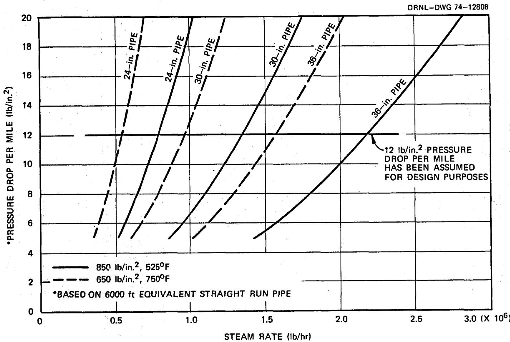  
Fig. 5.33. Pressure drop as a function of steam rate.

The estimates are based on steam transportation via a single pipeline over the size range shown. For larger flows, it is expected that multiple lines would be required. Therefore the costs presented in Fig. 5.34 cannot be directly extrapolated to larger flows.

Based on the estimate, the unit transportation cost per mile varies from $6\mathfrak{c} / 10^{6}$ Btu at $2\times 10^{6}$ lb/hr to $7\mathfrak{c}$ to $8\mathfrak{c} / 10^{6}$ Btu at $10^{6}$ lb/hr (Fig. 5.35). Considering the economic advantage of nuclear steam vs alternate fossil sources, one could conclude that transportation of nuclear steam up to about 10 miles is practical and economically attractive in comparison to alternate fossil sources that were considered. [Details of the steam line cost estimate are given in Appendix B.]

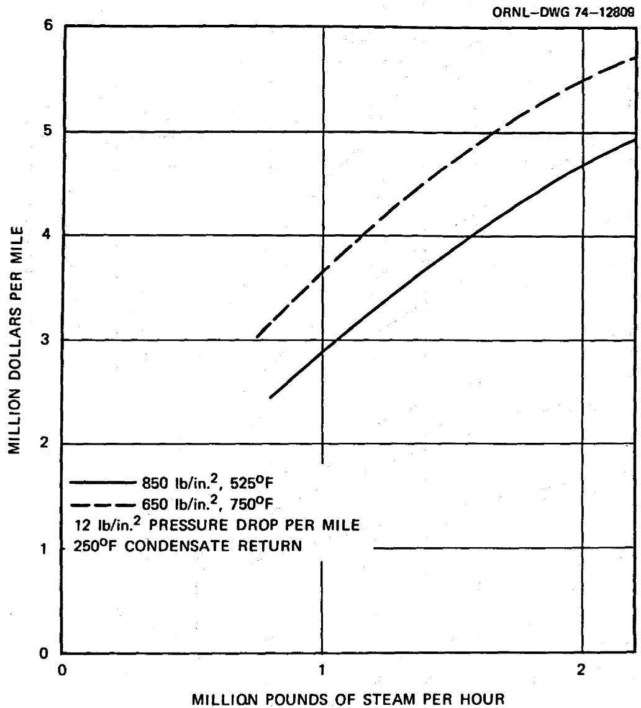  
Fig. 5.34. Unit transportation cost vs flow rate.

UNIT TRANSPORTATION COST PER MILE $(\phi /10^{6}$ Btu)

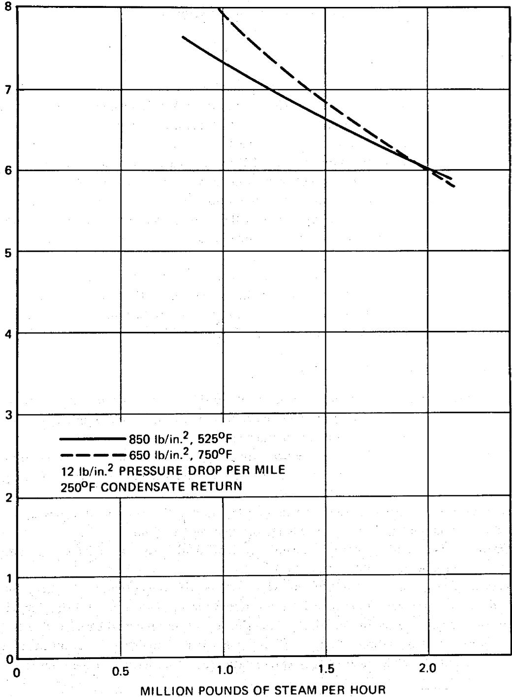  
Fig. 5.35. Total capital cost vs flow rate.

ORNL-DWG 74-12795

# 5.5 NUCLEAR PLANT SITING, LICENSING, AND REGULATION

# 5.5.1 Licensing and Regulation

# Introduction

The acquisition and use of a nuclear power plant are subject to the restrictions of the Atomic Energy Act of 1954 (AEA), as amended. Generally, the AEA prohibits, except under AEC license, the transfer or receipt in interstate commerce, manufacture, production, transfer, acquisition, possession, use, import, or export of nuclear reactors and the materials used in or produced by nuclear reactors.[53] The AEA authorizes the AEC to formulate rules and regulations and to issue general and specific licenses for these activities. The AEA prescribes conditions for various types of licenses and sets out the judicial review and administration procedures to be applied to regulatory actions of the AEC. Generally, the provisions of the Administrative Procedure Act[54] are invoked. AEC regulatory actions are also subject to the requirements of the National Environmental Policy Act (NEPA) of 1969.[55]

A firm intending to use a nuclear power plant may be required by law to obtain one or more of the following types of licenses, depending upon the relationship of the firm to the necessary facilities and activities: special nuclear material, source material, byproduct material, utilization facility. Individuals operating a nuclear reactor are licensed by the AEC also.

# Specialized terms used in AEC licensing

Byproduct material. The term "byproduct material" means any radioactive material (except special nuclear material) yielded in or made radioactive by exposure to the radiation incident to the process of producing or utilizing special nuclear material.[56]

Financial protection. The term "financial protection" means the ability to respond in damages for public liability and to meet the costs of investigating and defending claims and settling suits for such damages.[56]

Nuclear reactor. "Nuclear reactor" means an apparatus, other than an atomic weapon, designed or used to sustain nuclear fission in a self-supporting chain reaction.[57]

Operator. The term "operator" means any individual who manipulates the controls of a utilization or production facility.[56]

Person. The term "person" means (1) any individual, corporation, partnership, firm, association, trust, estage, public or private institution, group, Government agency other than the Commission, any State or any political subdivision of, or any political entity within a State, any foreign government or nation or any political subdivision of any such government or nation, or other entity; and (2) any legal successor, representative, agent, or agency of the foregoing.[56]

Production facility. "Production facility" means: (1) Any nuclear reactor designed or used primarily for the formation of plutonium or uranium 233; or (2) Any facility designed or used for the separation of the isotopes of uranium or the isotopes of plutonium, except laboratory scale facilities designed or used for experimental or analytical purposes only; or (3) Any facility designed or used for the processing of irradiated materials containing special nuclear materials, except (i) laboratory scale facilities designed or used for experimental or analytical purposes, (ii) facilities in which the only special nuclear materials contained in the irradiated material to be processed are uranium enriched in the isotope U-235 and plutonium produced by the irradiation, if the material processed contains not more than $10^{-6}$ grams of plutonium per gram of U-235 and has fission product activity not in excess of 0.25 millicuries of fission products per gram of U-235, and (iii) facilities in which processing is conducted pursuant to a license issued under Parts 30 and 70 of this chapter, or equivalent regulations of an Agreement State, for the receipt, possession, use, and transfer of irradiated special nuclear material, which authorizes the processing of the irradiated material on a batch basis for the separation of selected fission products and limits the process batch to not more than 15 grams of special nuclear material.[57]

Source material. The term "source material" means (1) uranium, thorium, or any other material which is determined by the Commission pursuant to the provisions of section 61 to be source material; or (2) ores containing one or more of the foregoing materials, in such concentration as the Commission may by regulation determine from time to time.

Special nuclear material. The term "special nuclear material" means (1) plutonium, uranium enriched in the isotope 233 or in the isotope 235, and any other material which the Commission, pursuant to the provisions of section 51, determines to be special nuclear material, but does not include source material; or (2) any material artificially enriched by any of the foregoing, but does not include source material.[56]

Utilization facility. "Utilization facility" means any nuclear reactor other than one designed or used primarily for the formation of plutonium or U-233.[57]

# AEC rules and regulations

The AEC rules and regulations are modified in Title 10, Code of Federal Regulations, Chapter 1. The parts of this chapter of interest to prospective nuclear reactor licensees are as follows:

1. statement of organization and general information;   
2. rules of practice;   
8. interpretations;   
9. public records;   
20. standards for protection against radiation;   
30. rules of general applicability to licensing of byproduct material;   
31. general licenses for byproduct material;   
32. specific licenses to manufacture, distribute, or import exempted and generally licensed items containing byproduct material;   
33. specific licenses of broad scope for byproduct material;

34. licenses for radiography and radiation safety requirements for radiographic operations;   
35. human uses of byproduct material;   
40. licensing of source material;   
50. licensing of production and utilization facilities;   
55. operators' licenses;   
70. special nuclear material;   
71. packaging of radio-active material for transport and transportation of radio-active material under certain conditions;   
73. physical protection of special nuclear material;   
100. reactor site criteria;   
140. financial protection requirements and indemnity agreements;   
170. fees for facilities and materials licenses under the Atomic Energy Act of 1954, as amended.

Nuclear power plant licensing is dominated by the processes of AEC safety and environmental evaluation of the nuclear reactor (the "utilization facility") itself. The necessary materials licenses, subject to the appropriate parts of the regulations, are considered by the AEC as part of the utilization facility licensing process.

The rules and regulations, which are issued under statutory authority, are enforceable by the AEC through administrative action of the Commission itself and through judicial action in appropriate federal courts.

# Other official regulatory guides.

The AEC has published numerous guides of interest to prospective reactor licensees. A consolidated series of Regulatory Guides was instituted in 1972. The distinction of guides from regulations is stated by the AEC as follows:[58]

"The primary purposes of Regulatory Guides are (1) to describe and make available to the public methods acceptable to the AEC Regulatory staff of the implementing specific parts of the Commission's regulations and in some cases to delineate techniques used by the staff in evaluating specific problems or postulated accidents and (2) to provide guidance to applicants concerning certain of the information needed by the Regulatory staff in its review of applications for permits and licenses. Regulatory Guides are not intended as substitutes for regulations, and therefore compliance with these guides is not required."

The major divisions of the Regulatory Guides are as follows:

1. power reactor guides,   
2. research and test reactor guides,

3. fuels and materials facilities guides,   
4. environmental and siting guides,   
5. materials and plant protection guides,   
6. product guides,   
7. transportation guides,   
8. occupational health guides,   
9. antitrust review guides,   
10. general guides.

The guides are predominantly technical in content, and those dealing with safety of power reactors (division 1) would usually be of greater interest to the designer than to the person owning and operating the plant. However, since ultimate responsibility for safety would reside with the latter, he should be familiar with the guides.

# The licensing process

The formal licensing process59 starts with the filing of an application for license (or construction permit) with the AEC and ends (if the license is issued) with the termination of the license through AEC-approved transfer or dismantling of the facility. The description of the process is presented in generally nontechnical terms to introduce the subject to persons not familiar with AEC licensing. Many details will be passed over casually; nothing more nor less than the AEC rules and regulations themselves would describe the licensing process precisely.

Several formally distinct groups of people act for the AEC in licensing actions. These groups are identified in Fig. 5.36 and described below.

Commission. The five-member Commission exercises the final authority with the agency with respect to determination of major or novel questions of policy, law, or procedure.[60] Licensing decisions or actions of an Atomic Safety and Licensing Appeal Board (ASLAB) may be reviewed by the Commission on its own motion in some circumstances.

Atomic Safety and Licensing Appeal Board. A three-member tribunal reviews initial decisions arising from public hearings of an Atomic Safety and Licensing Board (ASLB) and considers any exceptions to such decisions as may be filed by a party to the proceeding. The Commission has authorized the ASLAB to exercise the authority of the Commission with respect to such appeals and will not entertain a request for review of an ASLAB decision or action.

Atomic Safety and Licensing Board. This board conducts hearings and issues decisions in proceedings to grant, suspend, revoke, or amend licenses.

Regulatory staff. The Director of Regulation of the AEC and the officials under his authority perform the administrative review of an application for a license. They discharge other licensing functions, except where a final decision rests with an ASLB. The regulatory staff refers applications for power reactor licenses to the Advisory Committee on Reactor Safeguards (ACRS) and to the

ORNL-DWG 74-12811

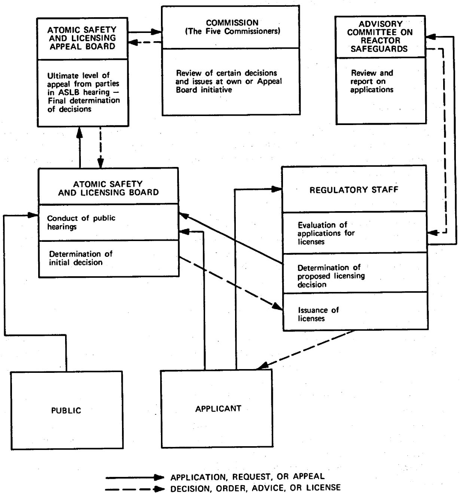  
Fig. 5.36. AEC licensing functions and relationships.

Attorney General (for review of antitrust matters). The regulatory staff is a party to the public hearing before an ASLB. The regulatory staff issues licenses and amendments to licenses, including those ordered by a board or the Commission.

Advisory Committee on Reactor Safeguards. This committee, appointed by the Commission, is required by law to review and report to the AEC on each application for a power reactor license.

The phases of the licensing process are listed in Table 5.55. Licensing may proceed with great variation in detail; therefore, only the general features of the process are described. The times indicated are also nominal representative values.

Before AEC licenses are applied for, the anticipated construction and operation would be planned and defined in sufficient detail to comply with the AEC guides for preparation of Environmental Reports (ERs) and Safety Analysis Reports (SARs). During the first step, the supplier of the nuclear steam supply system and the architect-engineer would be selected. Usually these firms prepare the portions of the SARs pertaining to their respective parts of the job. The SAR is the basis for the AEC's safety decision. Information needed for the AEC's consideration of environmental quality would also be developed for the ER, usually with the assistance of consultants in specialized fields, like aquatic ecology, if the applicant lacks expertise.

The scope and depth of these requisite documents are indicated by the tables of contents of the AEC guides shown in Appendices D and E.

The AEA requires a two-step licensing process: a construction permit and an operating license. This statutory constraint plus practical licensing problems have led to two-step applications. The

Table 5.55. Licensing steps for nuclear power plants   

<table><tr><td>Step</td><td>Time from start of construction (years)</td><td>Description</td></tr><tr><td>1</td><td>-3 to -11/2</td><td>Preparation of application for license (including a construction permit)</td></tr><tr><td>2</td><td>-11/2</td><td>Application for license</td></tr><tr><td>3</td><td>-11/2 to -11/2</td><td>Regulatory staff review, including review by the ACRS and the Attorney General</td></tr><tr><td>4</td><td>-13 to -16</td><td>ASLB public hearing (mandatory)</td></tr><tr><td>5</td><td>0</td><td>Issuance of construction permit</td></tr><tr><td></td><td>0</td><td>On-site construction commences</td></tr><tr><td>6</td><td>0 to 5</td><td>Regulatory staff inspection of construction</td></tr><tr><td>7</td><td>31/2 to 41/2</td><td>Submittal of any information required to complete the application for an operating license and to comply with the terms of the construction permit</td></tr><tr><td>8</td><td>31/2 to 43/4</td><td>Regulatory staff review of the amended application for license</td></tr><tr><td>9</td><td></td><td>ASLB public hearing (if required by circumstances)</td></tr><tr><td>10</td><td>5</td><td>Determination by regulatory staff that the facility construction is complete in accordance with the construction permit</td></tr><tr><td>11</td><td>5</td><td>Issuance of operating license</td></tr><tr><td></td><td>5</td><td>Operation commences with initial fuel loading, followed by a few months of plant testing before routine operation begins</td></tr><tr><td>12</td><td>5 to 45</td><td>Operation: regulatory actions include inspection, operating report evaluation, and authorization of changes in license conditions</td></tr><tr><td>13</td><td>40</td><td>Termination of license</td></tr></table>

application for a construction permit includes a preliminary SAR (PSAR), an ER, and other information concerning matters of financial qualifications, antitrust, and national security. It is also permissible to present at this time all the technical information requisite for an operating license. While this has not been a useful option to date for applicants proposing to construct power reactors, the development of highly standardized designs could change this situation.

In step 2 the application is submitted to the Director of Regulation, who heads the AEC's regulatory staff. After a quick preliminary review (about 30 days), the regulatory staff determines whether the application is reasonably complete. If so, the staff review and other formal licensing processes commence. An application fee, prescribed by 10 CFR, Part 170, is required, as shown in Table 5.56. Applications for multiple-reactor installations may be combined, but separate licenses will be issued.

Table 5.56. Schedule of fees   

<table><tr><td>Facility</td><td>Application fee for construction permit</td><td>Construction permit feea</td><td>Operating license feeb</td><td>Annual fee after issuance of operating license</td></tr><tr><td>Power reactorc</td><td>$70,000</td><td>$60,000 + $80/MW(t)</td><td>$125,000 + $95/MW(t)</td><td>$12/MW(t) ($12,000 minimum)</td></tr></table>

When construction permits are issued for two or more power reactors of the same design at a single power station that were subject to concurrent licensing review, the construction permit fee for the first reactor will be $60,000 + $80/MW(t) and $30/MW(t) for each additional reactor. Thermal megawatt values refer to maximum capacity stated in the permit or license.   
When operating licenses are issued for two or more power reactors of the same design at a single power station that were subject to concurrent licensing review, the operating license fee will be $125,000 + $95/MW(t) for the first reactor and $95,000 + $60/MW(t) for each additional reactor.   
For construction permits and operating licenses for power reactors with a capacity in excess of 3000 MW(t), the fee will be computed on a maximum power level of 3000 MW(t).

The regulatory staff review, step 3, is the fundamental process in which all of the requirements of law and policy are applied to the case. The more visible parts of the staff evaluation deal with technical safety and environmental issues, but the staff also determines if the questions of financial qualification, national security, and antitrust are properly settled. Ancillary licenses for licensable materials are considered in due course to permit the receipt, inspection, and storage of fuel materials on site at the proper time.

Without exception, the safety and environmental issues require preparation of supplementary information by the applicant. During the period of staff evaluation, the ACRS also considers the case. Numerous meetings of applicant, staff, and ACRS are usually held to exchange technical information, but the formal evaluation must rest upon the data formally submitted to the AEC.

In step 4, the formal issues defined by law and regulation are considered in a public hearing conducted by an ASLB. The applicant and the regulatory staff are always parties in this hearing, and other interested persons may intervene either pro or con. The formal issues are summarized below:

1. health and safety of the public,   
2. technical and financial qualifications,

3. common defense and security,   
4. national environmental policy,   
5. consistency with antitrust laws (generally considered in a separate public hearing),   
6. conflicting applications for limited opportunity,   
7. consistency with the AEA,   
8. compliance with AEC regulations,   
9. useful purpose.

The applicant bears the burden of proof in favor of issuing a construction permit. The regulatory staff may favor or oppose this proposal, but as a practical matter, it is unlikely that an applicant would pursue his case to this point in the face of staff opposition. The ASLB issues an initial decision based upon the evidence presented. The decision may be appealed to the ASLAB by any part to the proceeding. The ASLAB may refer the case to the Commission for certain determinations or the Commission itself may initiate a review in certain instances. A decision to issue a construction permit is made by the Director of Regulation.

The construction phase, step 6, must be conducted in conformance with the terms of the permit. Regulatory staff inspectors check on-site and shop activities during this time.

This phase is also generally the time when final designs and final safety evaluations are developed by the applicant and his contractors. In the course of their construction permit review, the regulatory staff identifies subject areas in which additional or more definite information must be presented in the FSAR. The SAR guide also indicates areas, such as plant staffing, in which little specific information is needed until operation is imminent. The time for presenting this information to the regulatory staff, in step 7, can be chosen by the applicant; in any case, it should precede the expected date for loading nuclear fuel by at least 12 months.

The operating license consideration by the regulatory staff, step 8, is similar to their earlier review in that the basic issues are the same and the ACRS is consulted. The construction permit is not a guarantee that an operating license will be issued, and new safety issues may be raised. However, the normal continual contact between applicant and regulatory staff during construction has always provided adequate notification of any likely complication or modification of safety standards. Therefore, this step is generally concerned with resolving particular questions that may have been raised in the construction permit review and other issues which were deferred by the applicant.

A second public hearing, step 9, is not mandatory and generally would be held only if the applicant or an intervenor requested it. If the second meeting were held, the formal issues would be limited to contested questions appropriate to the operating license stage. The Director of Regulation publishes a formal notice of intent to issue an operating license, which he would proceed to do unless a hearing is requested. The license can be issued, unless the hearing decision should be adverse, as soon as the regulatory staff determines by inspection that the facility has been completed in accordance with the construction permit and the reactor is ready to be loaded with nuclear fuel (steps 10 and 11).

The operating license consists of the license to operate a "utilization facility" under 10 CFR, Part 50, and all the ancillary AEC materials licenses needed. The licensee must, prior to licensing,

provide the financial protection and execute the indemnity agreements required by 10 CFR, Part 140, to ensure that the licensee will have the ability to respond in damages for public liability.

The period of licensed operation, step 12, involves adherence to specific operating conditions, maintenance and surveillance requirements, and staffing requirements set out in "technical specifications" incorporated in the license. These are concerned with maintaining the validity of the safety and environmental evaluations upon which the license was premised.

The licensee must have a competent nuclear plant staff, including operators and supervisors licensed as individuals under 10 CFR, Part 55. Operating licenses require the submission of reports to the regulatory staff periodically and on the occasion of problems arising which may have safety implications. Inspections of licensed facilities are made regularly. Modifications in the facility design and operating program are restricted by the technical specifications with the intent that the licensee can generally make alterations without prior approval of the AEC if they would not involve unreviewed safety questions. Other modifications are generally considered on a case-by-case basis by the regulatory staff, and appropriate approvals are granted, frequently in the form of changes to the technical specifications.

Termination of an operating license, step 13, can take many forms. Generally, the AEC regulations anticipate that a licensee would have proved his qualifications to maintain his status as a licensee in good order until the licensed facility and nuclear materials are disposed of so as to terminate his responsibility. A license for a utilization facility may be issued for a term not exceeding 40 years, but the AEC is authorized to extend a license at any time to that limit. A licensee must obtain the consent of the AEC in order to transfer, assign, or in any manner dispose of a license or any right thereunder.

# 5.5.2 Siting

# General considerations

Nuclear power plant licensing is contingent upon satisfying the AEC with respect to the issues listed in the previous section, the most difficult of which is the question of health and safety of the public. This issue is a complex one in itself but basically involves protection of people against any harmful exposure to ionizing radiation. The necessities of nuclear safety have been the object of extensive research for more than 30 years, and experience with evaluation of the safety of individual nuclear power plants covers the last 20 years.

Without exception, nuclear power plants have been judged by the AEC on a case-by-case basis; no two plants are exactly alike. To the extent that plants are alike, the AEC takes into account the way common safety problems have been resolved in the past. Thus water-cooled reactors of the BWR and PWR types and gas-cooled reactors of the HTGR type used for generating electricity are well developed in terms of safety and licensability. The use of PWRs commercially for production of process steam has precedence in the Midland, Michigan, case, in which a power plant operated by the Consumers Power Company will supply process steam to a Dow Chemical Company plant.

The case-by-case evaluation of nuclear power plant safety is prompted by several factors that distinguish one plant from another: (1) changing technology, including differences in design details; (2) safety perspectives that change with time; (3) different operating organizations; and (4) different plant sites. None of these factors will be neglected in an AEC licensing review of new applications for nuclear process heat plants, but site acceptability is a qualification of special importance.

There are two kinds of safety questions concerning siting of nuclear power plants. First, what are the environmental characteristics that could adversely affect the plant's safety performance?

Second, how do environmental characteristics affect the potential radiological consequences of accidents?

The plant environment provides the commonly accepted elements required by an industrial facility, including adequate structural foundation, operating space, and adequate water for coolant makeup and heat rejection. Although these elements are so well recognized as to make it unlikely that they would be neglected in planning a nuclear facility, their importance to safety requires that uncommon care be exercised in providing the desired support for nuclear power reactors. This special concern for safety, on the other hand, has had little influence on site selection. Sites otherwise acceptable for heavy industrial facilities have, with only one exception, been adequate in this respect. The only natural feature that has ever completely disqualified a site is tectonically active faults. The AEC rejected a California site, after several million dollars were spent in site development, because of geologic evidence of active faulting. The AEC did not at that time, and probably would not in the near future, accept an engineered accommodation of active faulting. The detailed criteria for geologic evaluation of sites is a part of the AEC regulation, Title 10, Code of Federal Regulations, Part 100, "Reactor Site Criteria." Texas and Louisiana have several proposed nuclear power plants under active review at this time, and there is no indication of any unusual concern with faulting in this region.

The second basic site-related question—environmental characteristics affecting radiological consequences of accidents—is also a subject of the AEC's "Reactor Site Criteria." As with active faulting, the size of the proximate population is the only impediment of this second category of site problems that has not been and cannot be resolved by engineering alone. A few formally proposed sites have been rejected by the AEC.

# Population risk-factor estimates

The prospect of using nuclear power reactors for process heat raises the general question as to whether it is reasonable to expect that such plants could be located safely in industrial areas. For the purpose of providing practical guidance on siting, we have evaluated the Houston Ship Channel-Galveston Bay area in Texas and areas along the lower Mississippi River in Louisiana. This study consisted of a survey of population distributions and densities throughout these two areas. The particular method utilized should yield a good indication of whether, from the standpoint of population risk, large nuclear power reactors would be licensable in such areas, inasmuch as hypothetical sites in the areas are compared with real reactor sites already evaluated and accepted by the AEC.

The areas of interest in Louisiana and Texas have been evaluated by calculating a population risk factor for a set of points within each region. The particular points for which the calculations were made are hypothetical sites only in the broadest sense. Hundreds of such points have been evaluated by this process in order to scan the regions with sufficient density to permit some conclusive characterizations to be made.

The areas evaluated in Texas and Louisiana are shown in Figs. 5.37 and 5.38 respectively. Risk scans were made along straight-line traverses within each of the 11 quadrangular areas in Texas and Louisiana. The precise locations of the traverses are described in Table 5.57. Generally the scans covered the areas with a spacing of 1 to $3\mathrm{km}$ , although some scans were made at about $0.5\mathrm{-km}$ intervals.

The population risk profile of each traverse is displayed graphically in Figs. 5.39 through 5.49. A complete set of profiles is given in Appendix F.

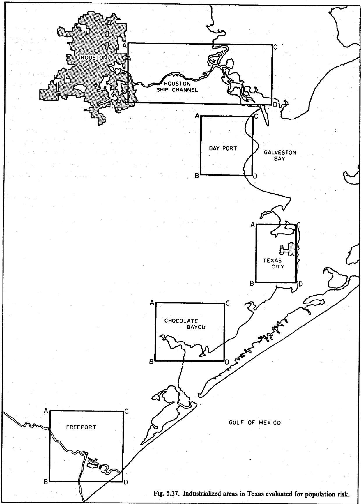

ORNL-DWG 74-12738

  
Fig. 5.38. Industrialized areas in Louisiana evaluated for population risk.

  
Fig. 5.39. Population risk profile for Houston ship channel, traverse 6.

  
Fig. 5.40. Population risk profile for Bay Port, traverse 2.

  
Fig. 5.41. Population risk profile for Texas City, traverse 3.

  
Fig. 5.42. Population risk profile for Chocolate Bayou, traverse 2.

  
Fig. 5.43. Population risk profile for Freeport, traverse 3.

  
Fig. 5.44. Population risk profile for Pointe Coupee, traverse 5.

  
Fig. 5.45. Population risk profile for Baton Rouge, traverse 5.

  
Fig. 5.46. Population risk profile for Lafourche, traverse 2.

  
Fig. 5.47. Population risk profile for New Orleans, traverse 5.

  
Fig. 5.48. Population risk profile for Plaquemine, traverse 2.

  
Fig. 5.49. Population risk profile for Taft, traverse 5.

Table 5.57. Quadrangle and traverse parameters ${}^{a}$   

<table><tr><td rowspan="3">Quadrangle</td><td rowspan="3">Number of traverses</td><td colspan="8">Geographic coordinates of corners (deg)</td></tr><tr><td colspan="2">A</td><td colspan="2">B</td><td colspan="2">C</td><td colspan="2">D</td></tr><tr><td>Latitude</td><td>Longitude</td><td>Latitude</td><td>Longitude</td><td>Latitude</td><td>Longitude</td><td>Latitude</td><td>Longitude</td></tr><tr><td colspan="10">Texas</td></tr><tr><td>Houston Ship Channel</td><td>7</td><td>29.8100</td><td>95.2900</td><td>29.6900</td><td>95.2900</td><td>29.8100</td><td>94.9600</td><td>29.6900</td><td>94.9600</td></tr><tr><td>Bay Port</td><td>7</td><td>29.6600</td><td>95.1200</td><td>29.5400</td><td>95.1200</td><td>29.6600</td><td>95.0000</td><td>29.5400</td><td>95.0000</td></tr><tr><td>Texas City</td><td>7</td><td>29.4400</td><td>94.9900</td><td>29.3200</td><td>94.9900</td><td>29.4400</td><td>94.9000</td><td>29.3200</td><td>94.9000</td></tr><tr><td>Chocolate Bayou</td><td>7</td><td>29.2800</td><td>95.2200</td><td>29.1600</td><td>95.2200</td><td>29.2800</td><td>95.0600</td><td>29.1600</td><td>95.0600</td></tr><tr><td>Freeport</td><td>11</td><td>29.0600</td><td>95.4583</td><td>28.9167</td><td>95.4583</td><td>29.0600</td><td>95.2917</td><td>28.9167</td><td>95.2917</td></tr><tr><td colspan="10">Louisiana</td></tr><tr><td>Point Coupee</td><td>5</td><td>30.7500</td><td>91.5000</td><td>30.8295</td><td>91.2865</td><td>30.5000</td><td>91.3802</td><td>30.5795</td><td>91.1667</td></tr><tr><td>Baton Rouge</td><td>8</td><td>30.5000</td><td>91.4433</td><td>30.6447</td><td>91.0982</td><td>30.0000</td><td>91.1637</td><td>30.1447</td><td>90.8186</td></tr><tr><td>Lafourche</td><td>9</td><td>29.7500</td><td>91.1300</td><td>30.1300</td><td>91.1300</td><td>29.7500</td><td>90.4000</td><td>30.1300</td><td>90.4000</td></tr><tr><td>New Orleans</td><td>7</td><td>29.7500</td><td>90.4000</td><td>30.0230</td><td>90.4000</td><td>29.7500</td><td>90.0000</td><td>30.0230</td><td>90.0000</td></tr><tr><td>Plaquemine</td><td>7</td><td>30.2600</td><td>91.2500</td><td>30.2600</td><td>91.1800</td><td>30.5300</td><td>91.2500</td><td>30.5300</td><td>91.1800</td></tr><tr><td>Taft</td><td>13</td><td>29.9600</td><td>90.5000</td><td>30.0800</td><td>90.5000</td><td>29.9600</td><td>90.4000</td><td>30.0800</td><td>90.4000</td></tr></table>

${}^{a}$ Quadrangles are approximately rectangular and are covered by the number of straight-line traverses tabulated. Corners (A, B, C, and D) are shown on area maps in Figs. 5.37 and 5.38 and are specified by the tabulated geographic coordinates as determined from U.S. Geological Survey maps, Western United States series, scale 1:250,000, sheets NH 15-6,-7,-9,and -10. The origins and terminal points of the traverses of a quadrangle are evenly spaced along lines AB and CD respectively. Line AC is the first traverse of a quadrangle, and line BD is the last.

The significance of the population risk factor is in its representation of the cumulative risk to the entire population from potential exposure to the radioactive materials released by accident from a particular hypothetical site. It is obtained by computing a weighted average of the surrounding population. The weighting function approximates the relative radiation exposure of a single individual; this relative exposure is a function of distance and was chosen for this study to vary with distance $(r)$ as $r^{-1.5}$ . This particular exponent was used in order to simplify the comparison of this study with information contained in an internal AEC regulatory staff working paper.[61] The population risk factor used for this study has also been normalized in the same way as the AEC's, namely, by requiring the risk factor to have a value of 1.0 for a site having a uniform population density of 1000 individuals per square mile within 50 miles of the hypothetical site and a density of zero beyond. A zero density, for normalization, within $0.3\mathrm{km}$ of the site, to account for a nominal plant exclusion distance, was also assumed in the present study.

The site evaluation utilized data from the official 1970 census of the United States in the form that gives the greatest detail available in the actual geographical location of each population segment. These data are the populations and geographical coordinates of each official “enumeration district.”[62-64] An enumeration district is a geographically contiguous area having nominally 1000 or less resident persons.

The calculations of this study differ from those described in the referenced AEC document in two respects: (1) the AEC lumped the entire population around a site (within 50 miles) into ten annular areas of assumed uniform density, whereas this evaluation considered each enumeration district separately; and (2) the AEC used population data evidently extracted from various licensing documents, while the basis in this study was the 1970 census.

The influence of these differences in procedure have been analyzed in detail for the Indian Point site. This is the site of a three-unit nuclear power plant owned by Consolidated Edison Company of New York, Inc., and is one of the few power reactor sites in the United States near a metropolitan area. A comparison of hypothetical sites with this important site, already evaluated and accepted by the AEC, is a significant test of the acceptability of the former.

The AEC procedure of lumping the population into large segments gives a "site population factor" for this site about $0.5\%$ less than the population risk factor, provided the 1970 census basis of this study is used for both calculations. It was already known that the effect of lumping should be small in any case except with respect to that part of the population close to a site. Therefore, it is reasonable that the two procedures should give similar results for the Indian Point site, since the population distribution is dominated by the large number of people living beyond five miles, as shown in Table 5.58. This more distant population contributes about $80\%$ to the total value of the Indian Point site population factor. In an area where the population density is more nearly uniform or is more concentrated near the site, the lumping of the population would not be as good an approximation of the ideal population risk factor.

Lumping the population near the Indian Point site leads to an underestimate of the population risk of about $13\%$ , if only the population within 5 miles is considered. This is unimportant in the Indian Point case, as explained above, when the entire population is considered. In a test case in the Houston area, the effect of lumping is more pronounced and, as with Indian Point, is an underestimate of the population risk. Therefore, the more precise procedure developed for this study has been used for the evaluation of all hypothetical sites.

In order to evaluate the effect of using population data different from that of the AEC, the two population distributions shown in Table 5.58 were used for computing the site population factor in

Table 5.58. Comparison of AEC population distribution and 1970 census distribution for Indian Point   

<table><tr><td rowspan="2">Distance (miles)</td><td colspan="2">Cumulative population</td><td rowspan="2">Ratio of AEC to 1970 census population data</td></tr><tr><td>\( AEC^a \)</td><td>1970 census</td></tr><tr><td>1</td><td>3,300</td><td>1,300</td><td>2.54</td></tr><tr><td>2</td><td>18,000</td><td>10,700</td><td>1.68</td></tr><tr><td>3</td><td>30,000</td><td>27,500</td><td>1.09</td></tr><tr><td>4</td><td>40,000</td><td>41,500</td><td>0.96</td></tr><tr><td>5</td><td>65,000</td><td>65,600</td><td>1.07</td></tr><tr><td>10</td><td>263,000</td><td>201,900</td><td>1.30</td></tr><tr><td>20</td><td>1,684,000</td><td>896,200</td><td>1.32</td></tr><tr><td>30</td><td>4,410,000</td><td>4,002,400</td><td>1.10</td></tr><tr><td>40</td><td>10,630,000</td><td>10,177,300</td><td>1.27</td></tr><tr><td>50</td><td>16,500,000</td><td>16,007,000</td><td>1.03</td></tr></table>

$a$ Estimated from crude graph.

accordance with the AEC procedure. The values of this factor, as a function of distance, are shown in Table 5.59. This tabulation demonstrates the significant effect of using imprecise population data close to the site. Although the total populations differ by only $3\%$ , the site population factors differ by $17\%$ . This disproportionality of the site population factor with respect to total population is evident in Tables 5.58 and 5.59 at all distances.

In order to be consistent in the evaluation of all sites, the value of the population risk factor computed from the 1970 census data for Indian Point was considered to be the relevant value for that site.

A site is generally at least as good as the Indian Point site if the population risk factor is no greater than 1.29. The profiles of Figs. 5.39 through 5.49 (and Appendix F) show that almost all the areas scanned are much better than Indian Point. Of all the Texas areas, only small areas along the west and south edges of the quadrangle covering the Houston Ship Channel would be of questionable acceptability. In Louisiana, a small central area in Baton Rouge and the central city of New Orleans are unfavorable.

As can be observed from the population risk profiles, there is a wide variation in the merits of a site with respect to this one factor. If all other qualities of alternative sites were equal, one would want to choose the site having the lowest population risk. The AEC would give some consideration to this possibility. Conversely, it is important to recognize that the AEC acceptance of existing nuclear power plant sites has taken such alternatives into account and would, indeed, in the future make allowance for the fact that a plant may need to be in a particular location in order to be useful. The Midland nuclear plant, which will supply process stem to an industrial facility, would probably have been located farther from the city of Midland had there not been a special need in that case. Other factors, such as size of plant, also favor the industrial process heat case in comparison with the real power reactor sites. These factors make the conclusion all the more reasonable that all the industrialized areas studied, except for the central city regions included in the survey, would be quite favorable as nuclear process heat plant sites, at least on the basis of population risk.

Table 5.59. Comparison of site population factors computed according to AEC procedure from different lumped population distributions for the Indian Point site   

<table><tr><td rowspan="2">Distance (miles)</td><td colspan="2">Site population factor</td></tr><tr><td>AEC data</td><td>1970 census</td></tr><tr><td>1</td><td>1.05</td><td>0.41</td></tr><tr><td>2</td><td>1.20</td><td>0.58</td></tr><tr><td>3</td><td>1.12</td><td>0.67</td></tr><tr><td>4</td><td>1.03</td><td>0.67</td></tr><tr><td>5</td><td>1.01</td><td>0.69</td></tr><tr><td>10</td><td>0.96</td><td>0.71</td></tr><tr><td>20</td><td>1.12</td><td>0.72</td></tr><tr><td>30</td><td>1.24</td><td>0.95</td></tr><tr><td>40</td><td>1.45</td><td>1.20</td></tr><tr><td>50</td><td>1.51</td><td>1.29</td></tr></table>

# 6. Coal-Based Systems

# 6.1 ASSESSMENT OF COAL RESOURCES, AVAILABILITY, AND COST

# 6.1.1 Resource Base

Coal deposits are widely distributed throughout the United States as shown in Fig. 6.1. The coal resource base is estimated to be $3.21 \times 10^{12}$ tons, equivalent in energy content to over 1000 years at the total energy consumption rate of the U.S. in 1970. Approximately one-half, or $1.56 \times 10^{12}$ tons, lies in beds more than 14 in. thick at depths of 3000 ft or less in mapped and explored areas. The distribution of the $1.56 \times 10^{12}$ tons by rank (type of coal) and by state is shown in Fig. 6.2. Of the total bituminous resource, two-thirds is located east of the Mississippi, with Illinois containing the largest quantity of any state. Subbituminous coal is predominantly contained in the Rocky Mountain states of Montana, Wyoming, and Colorado and in Alaska. New Mexico also has substantial reserves. About $98\%$ of the nation's lignite is located in North Dakota and Montana.

# 6.1.2 Recoverable Reserves

The coal resource base described above does not constitute a usable resource because of both technical and economic constraints. Coals considered to be available at present prices with present technology are the measured and indicated reserves with 1000 ft or less of overburden and in beds of thicknesses 28 in. or more for bituminous and anthracite and 5 ft or more for subbituminous and lignite. On this basis,[65] available reserves total $394.1 \times 10^{9}$ tons (about one-eighth of the total resource base) distributed by rank as follows: bituminous, $66\%$ ; subbituminous, $18\%$ ; lignite, $13\%$ ; and anthracite, $3\%$ . A breakdown of available reserves by rank and state is given in Table 6.1.

Of the $394.1 \times 10^{9}$ tons considered to be available, $45 \times 10^{9}$ tons are strippable; most of this would be recoverable, since the recovery factor for strip-mined coal exceeds $90\%$ . For deep-mined coal, however, the recovery factor with present mining practices is about $50\%$ ; so that of the $394.1 \times 10^{9}$ tons of deep-minable reserves, only about $175 \times 10^{9}$ tons are recoverable. The recoverable reserves are equivalent to about 65 years at a rate of consumption equivalent to the total national energy use in 1970.

Most of the low-sulfur coal is located in the western United States in the form of strippable subbituminous coal and lignite. As shown in Fig. 6.3, of the $45 \times 10^{9}$ tons of strippable reserves, about $25 \times 10^{9}$ tons are low-sulfur coal located in the Rocky Mountain states.[66]

# 6.1.3 Availability

It is evident that the coal reserves are adequate to meet almost any demand in the foreseeable future. The limiting factors on the use of coal are (1) environmental constraints on mining and combustion, (2) coal industry development, and (3) transportation.

  
Fig. 6.1. Coal fields of the conterminous United States.

  
Fig. 6.2. Estimated U.S. original and remaining coal reserves by rank, Jan. 1, 1965.

ORNL-DWG 74-12810

  
Fig. 6.3. Strippable reserves of the conterminous U.S. by region.

Source: U.S. Energy Outlook - Coal Availability, p. 116, National Petroleum Council, 1973.

Table 6.1. Total estimated remaining measured and indicated coal reserves (10 $^{6}$ tons) of the United States as of Jan. 1, 1970 $^{a}$   

<table><tr><td>State</td><td>Bituminous</td><td>Subbituminous</td><td>Lignite</td><td>Anthracite and semianthracite</td><td>Total</td></tr><tr><td>Alabama</td><td>1,731</td><td>0</td><td>b</td><td>0</td><td>1,731</td></tr><tr><td>Alaska</td><td>667</td><td>5,345</td><td>c</td><td>d</td><td>6,012</td></tr><tr><td>Arkansas</td><td>313</td><td>0</td><td>b</td><td>67</td><td>380</td></tr><tr><td>Colorado</td><td>8,811</td><td>4,453</td><td>0</td><td>16</td><td>13,280</td></tr><tr><td>Georgia</td><td>18</td><td>0</td><td>0</td><td>0</td><td>18</td></tr><tr><td>Illinois</td><td>60,007</td><td>0</td><td>0</td><td>0</td><td>60,007</td></tr><tr><td>Indiana</td><td>11,177</td><td>0</td><td>0</td><td>0</td><td>11,177</td></tr><tr><td>Iowa</td><td>2,159</td><td>0</td><td>0</td><td>0</td><td>2,159</td></tr><tr><td>Kansas</td><td>328</td><td>0</td><td>0</td><td>0</td><td>328</td></tr><tr><td>Kentucky (west)</td><td>20,876</td><td>0</td><td>0</td><td>0</td><td>20,876</td></tr><tr><td>Kentucky (east)</td><td>11,049</td><td>0</td><td>0</td><td>0</td><td>11,049</td></tr><tr><td>Maryland</td><td>557</td><td>0</td><td>0</td><td>0</td><td>557</td></tr><tr><td>Michigan</td><td>125</td><td>0</td><td>0</td><td>0</td><td>125</td></tr><tr><td>Missouri</td><td>12,623</td><td>0</td><td>0</td><td>0</td><td>12,623</td></tr><tr><td>Montana</td><td>862</td><td>31,228</td><td>6,878</td><td>0</td><td>38,968</td></tr><tr><td>New Mexico</td><td>1,339</td><td>779</td><td>0</td><td>2</td><td>2,120</td></tr><tr><td>North Carolina</td><td>e</td><td>0</td><td>0</td><td>0</td><td>b</td></tr><tr><td>North Dakota</td><td>0</td><td>0</td><td>36,230</td><td>0</td><td>36,230</td></tr><tr><td>Ohio</td><td>17,242</td><td>0</td><td>0</td><td>0</td><td>17,242</td></tr><tr><td>Oklahoma</td><td>1,583</td><td>0</td><td>0</td><td>0</td><td>1,583</td></tr><tr><td>Oregon</td><td>f</td><td>f</td><td>0</td><td>0</td><td>f</td></tr><tr><td>Pennsylvania</td><td>24,078</td><td>0</td><td>0</td><td>12,525</td><td>36,603</td></tr><tr><td>South Dakota</td><td>0</td><td>0</td><td>757</td><td>0</td><td>757</td></tr><tr><td>Tennessee</td><td>939</td><td>0</td><td>0</td><td>0</td><td>939</td></tr><tr><td>Texas</td><td>f</td><td>0</td><td>6,870</td><td>0</td><td>6,870</td></tr><tr><td>Utah</td><td>9,155</td><td>150</td><td>0</td><td>0</td><td>9,305</td></tr><tr><td>Virginia</td><td>3,561</td><td>0</td><td>0</td><td>125</td><td>3,686</td></tr><tr><td>Washington</td><td>312</td><td>1,188</td><td>0</td><td>0</td><td>1,500</td></tr><tr><td>West Virginia</td><td>68,023</td><td>0</td><td>0</td><td>0</td><td>68,023</td></tr><tr><td>Wyoming</td><td>3,975</td><td>25,937</td><td>c</td><td>0</td><td>29,912</td></tr><tr><td>Other states</td><td>f</td><td>f</td><td>46</td><td>0</td><td>46</td></tr><tr><td>Total</td><td>261,510</td><td>69,080</td><td>50,781</td><td>12,735</td><td>394,106</td></tr></table>

aFigures are reserves in ground, about half of which may be considered recoverable. Includes all beds with less than 1000 ft of overburden and over 28 in. in bed thickness for bituminous and anthracite and 5 ft or more for subbituminous and lignite.   
$b_{\text{Small}}$ reserves of lignite in beds less than 5 ft thick. $c_{\text{Small}}$ reserves of lignite included with subbituminous reserved.   
$d$ Small reserves of anthracite in the Bering River field believed to be too badly crushed and folded to be economically recoverable.   
$e$ Negligible reserves with overburden less than 1000 ft. $f_{\mathrm{Data}}$ not available to make estimate.

# Environmental constraints

Most of the present concern is related to the effects of strip mining on land and water. However, it should be noted that underground mining also has adverse impacts, including death and injury rates approximately five times higher than those for strip mining.[67] The Coal Mine Health

and Safety Act of 1969 set tighter standards to reduce the hazards of underground mining. A side effect of the Act was a decrease in productivity and an increase in capital investments required for deep mining. As a consequence, strip mining accelerated because of the improvement in the relative competitive position of this form of mining. Strip mining now accounts for approximately one-half of the total coal production. With the trend to more stripping and the vast devastation of land and water resources that have been experienced in some areas, many proposals, ranging from improved reclamation practices to outright bans, have been made to reduce the adverse effects of strip mining. Reclamation of strip-mined areas involves backfilling, compacting, soil conditioning, regrading, and revegetation to achieve a natural appearance. Current estimates[67-69] for reclamation range from $2000 to$ 6000 per acre, the latter figure corresponding to $20\mathfrak{c}$ to $30\mathfrak{c}$ per ton of coal (for coal yields of 20,000 to 30,000 tons/acre). For western coal from thick beds, the surcharge for reclamation might be only $3\mathfrak{c}$ to $4\mathfrak{c}$ /ton. It would appear, if these figures are correct, that the issue in strip mining is not reclamation costs, since the contribution to the cost of coal would be minor. Rather, the issue seems to concern the question of what constitutes acceptable reclamation. There is no reasonable way to restore stripped land to its original condition—only to a condition that some would consider acceptable. Ultimately, society must make the judgment concerning benefits and costs of surface mining. If, as some have suggested, surface mining were banned, the ability of coal to satisfy a larger portion of our nation's energy needs would be seriously impaired. The National Petroleum Council (NPC)[70] estimated that the coal production would decline by over $40\%$ , at least until 1985, if stripping were banned.

Coal production and coal processing in some western states pose additional environmental and societal problems. Water use associated with strip reclamation, slurry pipelines, and, in particular, coal gasification plants could be significant. Such use would be in direct competition with established agricultural and industrial activities. The water question will be an important issue in the expansion of the coal industry in the West.[71]

# Coal mining expansion

The NPC70 estimated that a maximum growth rate of $5\%$ /year could be sustained by the coal mining industry. This growth rate, and probably a higher figure, would seem to be supported by historical evidence. Figure 6.4 shows coal production over the period 1935 to 1970. In the years just prior to and during World War II, underground mining increased at an average rate of $8\%$ /year. Since 1954, strip mining has increased at an average rate of $6.1\%$ /year. Potential limitations to expansion include the availability of capital, equipment, and manpower. The NPC estimates that up to $15 billion 1970 dollars in capital will be required over the period 1970 to 1985. Although this is a significant sum, the capital required to mine the coal will be small relative to the capital needed to use it. Much of the capital required for expansion must come from outside the industry, and investors generally require long-term contracts for the output of a new mine before offering financing. Present uncertainties concerning the possibilities of future restrictions on certain kinds of mining and the environmental acceptability of certain types of coal encourage caution on the part of

  
Fig. 6.4. Production of bituminous coal (including lignite) and anthracite (1935-1970).

lenders. Nevertheless, the availability of capital would not appear to be seriously restrictive relative to the growth of the mining industry.

The time required to develop a new mine is a definite limitation on the rate at which the coal industry can respond to increased demands. It is estimated that the time required to develop a new mine and bring it to full production is 5 years for a deep mine and 3 years for a surface mine.[72] Delays in equipment procurement could increase these times. Examples of present equipment procurement problems are new drag lines for stripping (lead times of 4 to 5 years) and roof bolts for underground mines. Some believe that demands for heavy equipment will exceed the supply capabilities of U.S. manufacturers and that some equipment will need to be imported.[73] Other studies[74] conclude that equipment delivery will pose no serious problem in expanding mining capacity. Although there may be some near-term equipment delivery problems, it seems reasonable that the long-term development of coal mining capacity will not be limited by equipment availability.

Although there are differences in opinion on the question, it would appear that skilled manpower may be one of the more serious limitations on the rate of mining expansion. The

National Coal Association (NCA) points out that, because of a period of stagnation in coal mining, the present work force is concentrated in two age groups: over 45 and under 30. The 30- to 45-year age group, which would normally be expected to fill leadership roles in an expanding industry, is essentially missing. One specialty that is especially important for underground mining is mining engineering, and mining engineers are in short supply.[75]

# Transportation

Rail is by far the most important mode of transportation for coal, but water shipments are significant and are increasing rapidly. Coal slurry (50 wt % water) pipelining may also become important in the future, especially for western coals that must be transported long distances to markets.[76]

During the 1960s, rail coal traffic increases averaged $2.4\%$ / year.[70] A greater rate of expansion in the future would seem to be required if coal is to play a more significant role in energy supply. The railroad industry currently suffers from severe financial problems, and it is generally agreed that the Federal Government will need to underwrite the necessary modernization and expansion of railroads. The general financial problems of the rail industry have not had a noticeable effect on the investment required for coal shipment; one reason for this is that some of the new investment for coal cars and terminal facilities has come from outside sources, principally the electric utilities. Aside from future financial problems, there is substantial room for improvement in existing investment. For example, in 1968, open-top hopper (coal-carrying) cars spent only $7.7\%$ of the time in line-haul service (loaded and empty movement in trains).[70] The trend to greater use of unit trains would be expected to improve car utilization in the future.

Barge movement of coal, where applicable, is the most economical mode of transportation. A significant portion of coal movement is by joint rail-water transportation. Long-haul movements are the most rapidly growing portion of internal waterborne coal carriage. One of the more notable long-haul movements is the carriage of southern Illinois and Ohio Basin coal to Gulf Coast destinations such as New Orleans, Galveston, and western Florida. Coal for coastal areas is transported to New Orleans by barge and transshipped by oceangoing vessels. Transshipment70 in the New Orleans area increased from 0.6 million tons in 1960 to 3.1 million tons in 1969. The NPC believes that a serious impediment to long-haul coal movement is the inadequacies of locks at the central interchange of six navigable rivers on the boundary of southern Illinois. The economic capacity of these locks has already been exceeded, and, although construction of new facilities has been initiated, the bottleneck will not be removed before the latter 1970s.

Transportation system expansion is particularly crucial if there is to be extensive use of the vast reserves of low-sulfur strippable coal in the west, especially in Wyoming and Montana. Some expansion is in the planning stage. The Burlington Northern Railroad and the American Commercial Barge Line plan to develop a rail-to-barge coal terminal on the Mississippi River in north St. Louis County.[77] The facility is expected to be completed in 1976 and will handle about 20 million tons of coal per year. Low-sulfur coal will be delivered to the terminal by unit train from Wyoming and Montana and will be transferred by barge to users served by the Mississippi River

75. The Potential of Coal to Meet the Energy Crisis, National Coal Association, Dec. 20, 1973.   
76. E. J. Wasp and T. L. Thompson, "Slurry Pipelines—Energy Movers of the Future," Oil Gas J. 71(52), 45-50 (Dec. 24, 1973).   
77. "Plans for 2 New Port Facilities Announced," St. Louis Globe-Democrat, Jan. 30, 1974.

and its tributaries. Other plans for pipelines into the midsouth and to Texas have been rumored, but no confirmation is presently available.

# 6.1.4 Demand

The NPC70 estimated that the demand for coal (Table 6.2) would grow from 590 million tons in 1970 to 1 billion tons in 1985. As noted earlier, the NPC also estimated that the potential productive capacity of the coal industry could increase by $5\%$ /year, resulting in a potential capacity of 1.57 billion tons in 1985. Thus, according to this view, there will be an excess of potential capability over demand.

The NPC analysis was made before the energy supply disruptions of 1973. The general viewpoint now is that the United States should strive for energy independence. One important element that will contribute to energy independence is the substitution of coal for oil and gas where it is feasible to do so. The industrial and utility sectors are the most adaptable to coal as a substitute for other fossil fuels. To gain some insight into the effect of this substitution on coal demand, it is assumed that the projected growth of fossil fuel use in the industrial and utility sectors after 1975 will be based on coal. Table 6.3 shows that this substitution would result in an increase in demand of 300 million tons per year by 1985; adding this increase to NPC's original estimate would indicate a total demand for coal of 1.3 billion tons in 1985. The NCA believes that the coal output in 1974 will be 640 million tons. An increase in annual production from 640 million to 1.3 billion tons in 11 years would imply an average growth rate of $6.4\%$ /year. Thus, if the growth of industrial and electric utility fossil fuel use is to be based on coal, the growth of coal production must exceed the maximum rate of $5\%$ /year assumed by the NPC.

Table 6.2. Coal demand by market sector (10 $^6$ tons/year)   

<table><tr><td></td><td>1970</td><td>1975</td><td>1980</td><td>1985</td></tr><tr><td colspan="5">Coking coal</td></tr><tr><td>Blast furnaces</td><td>86</td><td>102</td><td>110</td><td>116</td></tr><tr><td>Foundries and miscellaneous</td><td>10</td><td>10</td><td>10</td><td>10</td></tr><tr><td>Total</td><td>96</td><td>112</td><td>120</td><td>126</td></tr><tr><td colspan="5">Domestic coal (U.S.)</td></tr><tr><td>Residential/commercial</td><td>10</td><td>7</td><td>5</td><td>3</td></tr><tr><td>Industrial</td><td>91</td><td>87</td><td>84</td><td>80</td></tr><tr><td>Electric utilities</td><td>322</td><td>415</td><td>525</td><td>654</td></tr><tr><td>Total</td><td>519</td><td>621</td><td>734</td><td>863</td></tr><tr><td colspan="5">Export coal</td></tr><tr><td>Coking coal</td><td>56</td><td>76</td><td>94</td><td>120</td></tr><tr><td>Electric utility</td><td>15</td><td>16</td><td>17</td><td>18</td></tr><tr><td>Total</td><td>71</td><td>92</td><td>111</td><td>138</td></tr><tr><td>Totala</td><td>590</td><td>713</td><td>845</td><td>1001</td></tr></table>

${}^{a}$ These quantities are less than the total demand figures shown in the NPC's U.S. Energy Outlook: An Initial Appraisal 1971-1985, vol. 1 (July 1971), because they do not include "Assumed Replacement for Shortfall in Other Fuel Supplies." The added quantities for coal, in terms of tons of coal, would be 30 million tons in 1975; 65 million tons in 1980; and 70 million tons in 1985.

Table 6.3. Effect of substituting coal for petroleum and natural gas for industrial and electric utility uses on coal demand   

<table><tr><td rowspan="2"></td><td colspan="3">Annual energy consumptiona(1012 Btu)</td><td rowspan="2">Coal equivalent of increase (106 tons/year)</td></tr><tr><td>1975</td><td>1985</td><td>Increase 1975-1985</td></tr><tr><td>Petroleum</td><td>10,090</td><td>15,780</td><td>5,690</td><td>247</td></tr><tr><td>Natural gas</td><td>15,540</td><td>16,690</td><td>1,150</td><td>50</td></tr><tr><td>Total</td><td>25,630</td><td>32,470</td><td>6,840</td><td>297</td></tr></table>

$a$ Projections from United States Energy Through the Year 2000, U.S. Department of Interior, December 1972.

# 6.1.5 Coal Costs

# Coal values at mine

Trends, past and present. After a long period of stability, the price of coal started rising significantly after 1969. From 1965 through 1969, the U.S. average price (f.o.b. mine) of coal sold on the open market was about $25\mathfrak{c} / 10^{6}$ Btu (constant 1974 dollar basis).78,79 By 1972, the average price had risen to about $35\mathfrak{c} / 10^{6}$ Btu. Figure 6.5 shows the price trends through 1972, the last year on which complete data are available. The U.S. average prices tend to reflect the value of coal mined east of the Mississippi. Also shown in Fig. 6.5 are prices for subbituminous coal and lignite produced in selected western states; generally, prices for western coal have tended to decline with time—at least through 1972.

The data of Fig. 6.5 are based on reports by the U.S. Bureau of Mines $^{78-80}$ and the National Coal Association. $^{79,81}$ Modifications to the original data were made to convert from cost per unit weight to cost per unit energy and to convert to a constant 1974 dollar basis. Although the heating value of coal varies substantially even within a given rank, the following values, used by the NPC, $^{70}$ were adopted for this study:

<table><tr><td>Rank</td><td>Heating value (106Btu/ton)</td></tr><tr><td>Bituminous</td><td>23</td></tr><tr><td>Subbituminous</td><td>17</td></tr><tr><td>Lignite</td><td>13.5</td></tr></table>

Price adjustments to January 1974 were made using the wholesale price index for industrial commodities.

Although there are no compilations of current coal prices, it is evident from various reports that coal prices, along with those of other fuels, rose dramatically in late 1973 and early 1974.

  
Fig. 6.5. Trends in coal prices.

The Tennessee Valley Authority (TVA) $^{82}$ reports that prices range from $8 to$ 30 per ton (f.o.b. mine), depending on the type of contract, quality of coal, and location. A reasonable range for high-sulfur (3 to 4%) strip-mined coal from western Kentucky and southern Illinois is $12 to $18 per ton (f.o.b. mine) or 50¢ to 75¢/10 $^{6}$ Btu. Coal purchases $^{83}$ for AEC plants in Kentucky and Tennessee made in the fall of 1973 were at a price of $9.75/ton. Recent (January 1974) prices were about $15 per ton (3.4% sulfur, 12,500 Btu/lb) or 60¢/10 $^{6}$ Btu. The South Carolina Public Service Authority reported $^{84}$ a coal price increase of 39% in the last five months of 1973. As of Jan. 1, 1974, the delivered price was $17.25 per ton. After allowing for transportation, the mine price is inferred to be $12 to $14 per ton. Public Service Electric & Gas Company (New Jersey) (PSE&G) paid an average of $25.36 per ton for low-sulfur coal delivered during January 1974. $^{85}$ This represented a 44% increase from the average price in October 1973. The range on January 1974 delivered prices paid by PSE&G was from $22.90 per ton for coal under contract to $29.51 per ton for spot purchases. These figures suggest a mine price of $18 to $25 per ton for eastern low-sulfur coal.

Recent data available on western coal prices are sketchy. Nebraska Public Power District86,87 purchased Colorado and Wyoming low-sulfur coal for 55¢ to 62¢/106 Btu (delivered) during October and November 1973. Allowing $5 per ton for delivery to plants at Lincoln and Bellvue, the derived mine cost would be 30¢ to 43¢/106 Btu.

November 1973 purchases by Black Hills Power and Lighting $^{87}$ of subbituminous low-sulfur coal from Wyoming for plants at Osage, Wyoming, and Lead, S.D., ranged in delivered prices from $20.3\mathfrak{c}$ to $32.8\mathfrak{c} / 10^{6}$ Btu. Since the power plants are relatively near coal fields, the transportation cost would presumably be on the order of $5\mathfrak{c} / 10^{6}$ Btu. Recent delivered prices $^{87}$ of lignite at plants in North Dakota and Montana ranged from $11.6\mathfrak{c}$ to $28.7\mathfrak{c} / 10^{6}$ Btu. Since these power plants are near the lignite deposits, the transportation component of the delivered price should be small. The general impression is that western coal prices have not increased as substantially as those for eastern coal.

Representative prices derived from the sources described above, shown in Table 6.4, range from $18\mathfrak{c} / 10^{6}$ Btu for western lignite to $86\mathfrak{c} / 10^{6}$ Btu for eastern low-sulfur bituminous coal. In

82. Personal communication, Frank Alford, TVA Chattanooga, T. D. Anderson, Oak Ridge National Laboratory, Feb. 15, 1974.   
83. Personal communication, Marvin Schwenn, Union Carbide Nuclear Division, Oak Ridge, Tenn., T. D. Anderson, Oak Ridge National Laboratory, Feb. 15, 1974.   
84. Public Power Weekly Newsletter, published by American Public Power Association, No. 74-04, p. 4, Jan. 25, 1974.   
85. "Soft Coal Prices Soared 118.5% in 3 Months; Marginally Efficient Mines Are Reopening," The Wall Street Journal, Feb. 8, 1974.   
86. Weekly Energy Report, Vol. 2(3), Jan. 21, 1974.   
87. Electrical Week, Feb. 11, 1974.

Table 6.4. Representative prices (f.o.b. mine) for coal as of first quarter 1974   

<table><tr><td rowspan="2"></td><td rowspan="2">Heating value(Btu/lb)</td><td colspan="2">Cost ($/ton)</td><td colspan="2">Cost per 106Btu (€)</td></tr><tr><td>Value</td><td>Range</td><td>Value</td><td>Range</td></tr><tr><td colspan="6">Bituminous (eastern)</td></tr><tr><td>High sulfur (&gt;3%)</td><td>11,500</td><td>14</td><td>10–18</td><td>60</td><td>43–78</td></tr><tr><td>Low sulfur (&lt;1%)</td><td>11,500</td><td>20</td><td>16–25</td><td>86</td><td>69–108</td></tr><tr><td colspan="6">Subbituminous (western)</td></tr><tr><td>Low sulfur (~0.5%)</td><td>8,500</td><td>4.25</td><td>3.40–6.80</td><td>25</td><td>20–40</td></tr><tr><td colspan="6">Lignite (western)</td></tr><tr><td>Low sulfur (~0.5%)</td><td>6,750</td><td>2.50</td><td>1.60–3.25</td><td>18</td><td>12–24</td></tr></table>

determining the future applicability of coal to industrial and other uses, it is necessary to judge whether the recent large price increases for eastern coal represent a response to a short-term supply-demand situation or whether they are permanent. This question is examined in the following section.

Future prices. The usual response of coal industry representatives to the question of future prices of coal is that coal will be competitive with alternative sources of energy. In other times this observation might be useful, but with the present fluid situation on supply and price of other fuels, particularly petroleum, the analysis of competitive positions of various fuels is highly speculative. Nevertheless, one point of competition for energy that is reasonably well defined is the electric power industry. Most projections assume that nuclear and coal will be the basic fuels used in the future expansion of the power industry. The cost of nuclear electric power should therefore influence the price of coal. A cost study was made of central station nuclear and coal plants to determine break-even prices for coal (i.e., the price of coal that would result in coal-fired central station plants being competitive with nuclear). The basic cost assumptions used in the analysis are shown in Table 6.5.

Results for base-loaded (80% plant factor) plants are given in Table 6.6. For a coal-fired central station plant burning high-sulfur coal with stack-gas sulfur-removal equipment, the 1974 break-even value of coal is $24\mathfrak{c} / 10^{6}$ Btu ( $5.50/ton) delivered to the power plant. The break-even value would be expected to increase to \(50\mathfrak{c} / 10^{6}$ Btu (\)11.50/ton) by 1991. For a plant using low-sulfur coal and no stack-gas sulfur-removal equipment, the break-even values are $49\mathfrak{c}$ and $75\mathfrak{c} / 10^{6}$ Btu for 1974 and 1991 respectively. These figures indicate that the delivered value of low-sulfur coal is $25\mathfrak{c} / 10^{6}$ Btu greater than that of high-sulfur coal.

For power plants constructed to meet intermediate-load demands (40% plant factor), the competitive position of coal is considerably improved, as indicated in Table 6.7. The delivered break-even value for high-sulfur coal is $46\mathfrak{c} / 10^{6}$ Btu in 1974 and increases to $87\mathfrak{c} / 10^{6}$ Btu in 1991.

Table 6.5. Economic data for 1300-MW(e) central station coal and nuclear plants (1974 cost basis)   

<table><tr><td rowspan="2">Cost item</td><td rowspan="2">Light-water reactor</td><td colspan="2">Coal-fired plant</td></tr><tr><td>With stack-gas cleanup</td><td>Without stack-gas cleanup</td></tr><tr><td>Capital investment (106$)</td><td>546</td><td>450</td><td>385</td></tr><tr><td>Annual O&amp;M costs (106$) excluding fuel</td><td></td><td></td><td></td></tr><tr><td>Fixed</td><td>4.48</td><td>7.1</td><td>5.75</td></tr><tr><td>Variablea</td><td>1.90</td><td>12.82</td><td>3.36</td></tr><tr><td>Total</td><td>6.38</td><td>19.92</td><td>9.11</td></tr><tr><td>Fuel costa(€/106Btu)</td><td></td><td></td><td></td></tr><tr><td>1974 startup</td><td>19.0 (13)b</td><td></td><td></td></tr><tr><td>1981 startup</td><td>31.0 (20)b</td><td>Variable</td><td></td></tr><tr><td>1991 startup</td><td>41.0 (23)b</td><td></td><td></td></tr></table>

$a$ Based on $80\%$ plant factor.   
Costs related to burnup.

Table 6.6. Estimated break-even value of coal in competition with central station base-loaded (80% plant factor) nuclear planta   

<table><tr><td rowspan="2"></td><td colspan="4">Year of startup</td></tr><tr><td>1974</td><td>1981</td><td>1991</td><td></td></tr><tr><td colspan="5">Nuclear plant annual costs (106$)</td></tr><tr><td>Capitalb</td><td>87.36</td><td>87.36</td><td>87.36</td><td></td></tr><tr><td>Fuel</td><td>18.22</td><td>30.52</td><td>40.36</td><td></td></tr><tr><td>O&amp;M</td><td>6.38</td><td>6.38</td><td>6.38</td><td></td></tr><tr><td>Total</td><td>111.96</td><td>124.26</td><td>134.10</td><td></td></tr><tr><td colspan="5">Coal plant annual costs with stack-gas cleanup (106$)</td></tr><tr><td>Capital</td><td>71.97</td><td>71.97</td><td>71.97</td><td></td></tr><tr><td>O&amp;M</td><td>19.92</td><td>19.92</td><td>19.92</td><td></td></tr><tr><td>Subtotal</td><td>91.89</td><td>91.89</td><td>91.89</td><td></td></tr><tr><td>Available for fuel</td><td>20.07</td><td>32.37</td><td>42.21</td><td></td></tr><tr><td colspan="5">Coal plant annual costs without stack-gas cleanup (106$)</td></tr><tr><td>Capital</td><td>61.60</td><td>61.60</td><td>61.60</td><td></td></tr><tr><td>O&amp;M</td><td>9.11</td><td>9.11</td><td>9.11</td><td></td></tr><tr><td>Subtotal</td><td>70.71</td><td>70.71</td><td>70.71</td><td></td></tr><tr><td>Available for fuel</td><td>41.25</td><td>53.55</td><td>63.39</td><td></td></tr><tr><td colspan="5">Break-even value of coal (delivered) (€/106Btu)</td></tr><tr><td>High sulfur</td><td>23.9</td><td>38.5</td><td>50.2</td><td></td></tr><tr><td>Low sulfur</td><td>49.1</td><td>63.7</td><td>75.4</td><td></td></tr></table>

${}^{a}$ Both coal and nuclear plants assumed to be ${1300}\mathrm{{MW}}\left( \mathrm{e}\right)$ .   
$b_{16\%}$ fixed charge rate on depreciating capital.

Table 6.7. Estimated break-even value of coal in competition with central station intermediate-load (40% plant factor) nuclear planta   

<table><tr><td rowspan="2"></td><td colspan="4">Year of startup</td></tr><tr><td>1974</td><td>1981</td><td>1991</td><td></td></tr><tr><td colspan="5">Nuclear plant annual costs (106$)</td></tr><tr><td>Capitalb</td><td>87.36</td><td>87.36</td><td>87.36</td><td></td></tr><tr><td>Fuel</td><td>12.00</td><td>20.67</td><td>29.04</td><td></td></tr><tr><td>O&amp;M</td><td>5.43</td><td>5.43</td><td>5.43</td><td></td></tr><tr><td>Total</td><td>104.79</td><td>113.46</td><td>121.83</td><td></td></tr><tr><td colspan="5">Coal plant annual costs with stack-gas cleanup (106$)</td></tr><tr><td>Capital</td><td>71.97</td><td>71.97</td><td>71.97</td><td></td></tr><tr><td>O&amp;M</td><td>13.51</td><td>13.51</td><td>13.51</td><td></td></tr><tr><td>Subtotal</td><td>85.48</td><td>85.48</td><td>85.48</td><td>85.48</td></tr><tr><td>Available for fuel</td><td>19.31</td><td>27.98</td><td>36.35</td><td></td></tr><tr><td colspan="5">Coal plant annual costs without stack-gas cleanup (106$)</td></tr><tr><td>Capital</td><td>61.60</td><td>61.60</td><td>61.60</td><td></td></tr><tr><td>O&amp;M</td><td>7.43</td><td>7.43</td><td>7.43</td><td></td></tr><tr><td>Subtotal</td><td>69.03</td><td>69.03</td><td>69.03</td><td>69.03</td></tr><tr><td>Available for fuel</td><td>35.76</td><td>44.43</td><td>52.80</td><td></td></tr><tr><td colspan="5">Break-even value of coal (delivered) (€/106Btu)</td></tr><tr><td>High sulfur</td><td>46.0</td><td>66.6</td><td>86.5</td><td></td></tr><tr><td>Low sulfur</td><td>85.1</td><td>105.7</td><td>125.7</td><td></td></tr></table>

${}^{a}$ Both coal and nuclear plants assumed to be ${1300}\mathrm{{MW}}\left( \mathrm{e}\right)$ .   
$b_{16\%}$ fixed charge rate on depreciating capital.

Values for low-sulfur coal are 85¢ and $1.26 per 10⁶ Btu for 1974 and 1991 respectively. For intermediate-load central station plants, low-sulfur coal is 39¢/10⁶ Btu greater than high-sulfur coal.

The break-even delivered coal values are summarized in Table 6.8, which also includes estimated mine values for both eastern bituminous coal delivered to eastern power plants and western subbituminous coal and lignite delivered to eastern power plants. Mine values were derived using transportation costs of $2 and$ 10 per ton for eastern and western coal respectively. The eastern coal mine values are applicable to power plants located reasonably close (on the order of 200 miles) to coal fields. Western coal values might be applicable to power plants located on the middle to lower Ohio River.

Another source of information on possible future coal prices is the study made by the NPC.[70] They developed economic models for surface and deep mining applicable to coal produced east of the Mississippi. For deep-mined coal, and assuming a $15\%$ discounted cash flow rate of return, the results indicated a sharp rise in price to the mid 1970s, leveling out at about $50\mathfrak{c} / 10^{6}$ Btu (adjusted to January 1974 dollars). Surface-mined coal would rise at a lesser rate but over a longer period of time, reaching about $36\mathfrak{c} / 10^{6}$ Btu by 1985.

Figure 6.6 summarizes the projections of the NPC, the break-even values estimated in the present study for high-sulfur eastern coal, historical trends in average coal prices, and early 1974 representative prices. Figure 6.7 presents similar data for western low-sulfur subbituminous coal. For eastern high-sulfur coal, it is concluded that the current price levels cannot be sustained if coal is to make a significant contribution to new central station power generation. On the other hand, it is also evident that prices will not fall low enough, at least in the foreseeable future, so that eastern high-sulfur coal will be competitive with nuclear plants for base-load central station power generation; competitive price levels of coal for this application would not give adequate profitability even for strip-mined coal. For purposes of the present study, a base price (f.o.b. mine) of $50\mathfrak{c} / 10^{6}$ Btu, with a range of $40\mathfrak{c}$ to $60\mathfrak{c} / 10^{6}$ Btu, was assumed, since this price level would appear to give an adequate return and still allow some degree of competitiveness with nuclear for non-base-load power generation.

Table 6.8. Summary of break-even values $(\phi /10^{6}$ Btu) for coal in competition with nuclear for central station power generation in eastern markets   

<table><tr><td rowspan="2"></td><td colspan="3">Base load</td><td colspan="3">Intermediate load</td></tr><tr><td>1974</td><td>1981</td><td>1991</td><td>1974</td><td>1981</td><td>1991</td></tr><tr><td colspan="7">Delivered values</td></tr><tr><td>High sulfur</td><td>24</td><td>39</td><td>50</td><td>46</td><td>67</td><td>87</td></tr><tr><td>Low sulfur</td><td>49</td><td>64</td><td>75</td><td>85</td><td>106</td><td>126</td></tr><tr><td colspan="7">Values at mine</td></tr><tr><td colspan="7">Eastern \( coal^a \)</td></tr><tr><td>High sulfur</td><td>15</td><td>30</td><td>42</td><td>37</td><td>58</td><td>78</td></tr><tr><td>Low sulfur</td><td>40</td><td>55</td><td>67</td><td>76</td><td>97</td><td>117</td></tr><tr><td colspan="7">\( Western\ coal^b \)</td></tr><tr><td>Subbituminous (low sulfur)</td><td>0</td><td>5</td><td>16</td><td>26</td><td>47</td><td>67</td></tr><tr><td>Lignite (low sulfur)</td><td>0</td><td>0</td><td>1</td><td>11</td><td>32</td><td>52</td></tr></table>

$^a$ Transport of eastern coal to eastern markets assumed to be $\$ 2$ per ton. $^b$ Transport of western coal to eastern markets assumed to be $\$ 10$ per ton.

  
Fig. 6.6. Eastern high-sulfur coal values—trends and projections.

Concerning western low-sulfur coals, it appears that (1) lignite is not of great interest for distant markets because of high transportation costs and (2) subbituminous coal will have a reasonable amount of non-base-load use at prices near current levels. For the present study a base price (f.o.b. mine) of $30\mathfrak{c} / 10^{6}$ Btu, with a range of $24\mathfrak{c}$ to $36\mathfrak{c} / 10^{6}$ Btu, was assumed.

# Transportation cost

Long-distance movement of coal is by rail, barge, and, in one case, pipeline. Rail is by far the most important form of transportation, but barge movement on inland waterways is significant. Coal slurry pipelines are expected by some to become an important mode of transportation, especially for moving western coals to regions of high energy use.

Rail. The average cost for coal shipment by rail is about 10 mills/ton-mile.[70] Rates are influenced by a number of factors, the most important of which are (1) distance, (2) volume, and (3) mode of shipment (by individual cars or by unit train). TVA data[82] for one particular power plant,

  
Fig. 6.7. Western low-sulfur subbituminous coal values—trends and projections.

located approximately 100 miles from the mine, indicate rates of about 14 mills/ton-mile for individual cars and 13 mills/ton-mile for unit train. In a study of coal pipelines, Wasp and Thompson76 suggested 5 to 6 mills/ton-mile for long-haul unit trains. The NPC70 indicated a rate of 5 mills for some unit-train hauls. The 1970 National Power Survey88 presented a range of 3.5 to 8 mills/ton-mile for unit train and 1.5 to 4 mills for integral coal trains. Burlington Northern's estimate, as reported by Oak Ridge National Laboratory (ORNL),89 for unit train transport of western coal from Gillette, Wyo., to St. Louis, Mo. (1074 miles), is $5.94 per ton or 5.5 mills/ton-mile.

For evaluation purposes, it is assumed that short-haul ( $\sim 100$ miles) rail transport would cost 13 mills/ton-mile with a range of 10 to 15 mills/ton-mile. Long-haul (500 miles) rates were assumed to be 5.5 mills/ton-mile with a range of 4.5 to 6.5 mills.

Barge. United States average barge rates are reported $^{70}$ to be 3 mills/ton-mile and, with large-volume contracts, as low as 2.5 mills. An ORNL study $^{89}$ indicated a rate of 3.5 mills/ton-mile for barge shipment of coal from St. Louis, Mo., to Madison, Ind. In the present study, a base rate of 3 mills/ton-mile, with a range of 2.5 to 3.5 mills, is assumed.

Pipeline. Wasp and Thompson $^{76}$ derived slurry pipeline costs for various transport distances and capacities. For a 1000-mile pipeline, estimated costs ranged from 3 mills/ton-mile for a capacity of 18 million tons/year to 6.5 mills/ton-mile for 6 million tons/year. A representative value of 4 mills, with a range of 3 to 6.5, was selected for the present study.

Unit cost summary. Basic unit transportation cost data for long hauls assumed for the present study are summarized in Table 6.9. The costs $(\mathfrak{c} / 10^{6}$ Btu) for 100 miles of movement for three ranks of coal were derived using assumed heating values discussed previously.

# Delivered coal costs

Cost estimates of various coals delivered to the Houston, Tex., and New Orleans, La., areas are shown in Table 6.10. These data were derived using previously discussed assumptions concerning coal and transportation costs. The source of eastern coals was assumed to be either southern Illinois or western Kentucky. Coal would be transported from the mine by rail (50 miles) and transferred to barge for delivery via the Mississippi River to New Orleans (1000 river miles) or to Houston (1500 miles). Western subbituminous coal was assumed to originate in Wyoming and be shipped to St. Louis by unit train (1100 miles), transferred to barge, and shipped to New Orleans (1075 miles) or

Table 6.9. Coal transportation costs for various modes of long-haul movement   

<table><tr><td rowspan="3">Coal type</td><td colspan="6">Cost per 100 miles (¢/106Btu)</td></tr><tr><td colspan="2">Unit train</td><td colspan="2">Barge</td><td colspan="2">Pipeline</td></tr><tr><td>Base</td><td>Range</td><td>Base</td><td>Range</td><td>Base</td><td>Range</td></tr><tr><td>Bituminous</td><td>2.4</td><td>2.0–2.8</td><td>1.3</td><td>1.1–1.5</td><td>1.7</td><td>1.3–2.8</td></tr><tr><td>Subbituminous</td><td>3.2</td><td>2.6–3.8</td><td>1.8</td><td>1.5–2.1</td><td>2.4</td><td>1.8–3.8</td></tr><tr><td>Lignite</td><td>4.1</td><td>3.3–4.8</td><td>2.2</td><td>1.9–2.6</td><td>3.0</td><td>2.2–4.8</td></tr></table>

Table 6.10. Cost of coal delivered to New Orleans and Houston areas ${}^{a}$   

<table><tr><td rowspan="3"></td><td rowspan="3">Transportation</td><td colspan="3">Cost (€/106Btu)</td></tr><tr><td rowspan="2">Coal(f.o.b. mine)</td><td colspan="2">Total delivered cost</td></tr><tr><td>Base</td><td>Range</td></tr><tr><td colspan="5">Eastern high-sulfur coal</td></tr><tr><td>To New Orleans area</td><td>18</td><td>50</td><td>68</td><td>55–81</td></tr><tr><td>To Houston area</td><td>24</td><td>50</td><td>74</td><td>60–88</td></tr><tr><td colspan="5">Eastern low-sulfur coal</td></tr><tr><td>To New Orleans area</td><td>18</td><td>80</td><td>98</td><td>85–110</td></tr><tr><td>To Houston area</td><td>24</td><td>80</td><td>104</td><td>90–118</td></tr><tr><td colspan="5">Western subbituminous coal</td></tr><tr><td>To New Orleans area</td><td>57</td><td>30</td><td>87</td><td>71–103</td></tr><tr><td>To Houston area</td><td></td><td></td><td></td><td></td></tr><tr><td>Via New Orleans</td><td>66</td><td>30</td><td>96</td><td>78–114</td></tr><tr><td>Direct unit train</td><td>45</td><td>30</td><td>75</td><td>60–89</td></tr></table>

aFirst quarter 1974 prices.

Houston (1575 miles). An alternative for the Houston area is shipment by unit train directly from Wyoming (1400 miles).

# 6.2 CONVENTIONAL FIRING WITH COAL

# 6.2.1 Low-Sulfur Coal with Conventional Boilers

Low-sulfur eastern and western coals may be used to fire steam boilers with no special stack-gas cleaning required, since sulfur dioxide $(\mathrm{SO}_2)$ emissions generally do not exceed the Environmental Protection Agency (EPA) standard of 1.2 lb per $10^{6}$ Btu heat input. However, particulate-removal equipment, usually an electrostatic precipitator, will be needed to meet the requirement of 0.1 lb/ $10^{6}$ Btu set by EPA.

A wide selection of coal-fired boilers is offered by U.S. manufacturers which will produce steam at various temperature and pressure conditions of interest for most industrial applications in sizes ranging from a few hundred pounds per hour to several million pounds per hour. Boilers employing either spreader-grate or pulverized-coal firing are offered in sizes up to about $0.5 \times 10^{6}$ lb of steam per hour. Larger boilers are conventionally fired with pulverized coal.

Eastern coals generally have a higher ash content (some up to 20 wt %) than western coals (typically 4 to 8 wt %); consequently, ash-handling and disposal costs will be higher for most eastern coals. Western coals generally have a higher moisture content, 12 to 37 wt % (eastern coals 1 to 6 wt %), and lower Btu content (8500 Btu/lb) than eastern coals (11,500 to 14,500 Btu/lb). Thus the type of coal used will influence the design and cost of boiler equipment.

Coal sized for spreader-grate firing may not be readily available in some sections of the country, since relatively few mines have appropriate equipment to produce this size coal.

For estimating purposes, a cost of $20 to$ 25 per pound of steam generated per hour appears reasonable for the installed capital cost of a complete coal-fired boiler plant in the size range of 1 to $3 \times 10^{6} \mathrm{lb/hr}$ using pulverized coal. Most steam plants built in temperate climates, such as the southwest and south central states, require only minimum shelter for protection against winter weather. Retrofitting an existing gas- or oil-fired boiler to use coal is generally not practical.

# 6.2.2 Conventional Boilers with Stack-Gas Treatment

Environmental Protection Agency standards for new fossil-fuel-fired steam generators require that sulfur dioxide emissions in stack gases not exceed 1.2 lb per $10^{6}$ Btu heat input (max 2 hr average) when solid fossil fuel is burned. This is equivalent to $0.7\%$ sulfur for bituminous coal. Consequently, any coal containing more than about $0.7\%$ sulfur which is to be used for firing a steam generator will necessitate some form of sulfur removal, either from the coal before it is burned or from the stack gas.

Over 100 stack-gas scrubbing processes have been proposed; however, only about a dozen have reached the pilot plant or demonstration stage. These processes may be divided into three broad groups: throwaway scrubbing, regenerable scrubbing, and dry processes.

Almost all the scrubbing processes remove $\mathrm{SO}_2$ (an acidic gas) with an aqueous solution or slurry of alkaline material. These processes require a scrubber with liquid recirculation and mist elimination, gas fans, ductwork and dampers, and gas reheat to restore plume buoyancy. If fly-ash particulates are not removed by an electrostatic precipitator, the scrubber system generally must be

expanded to allow for particulate as well as $\mathrm{SO}_2$ removal, especially with regenerable scrubbing, because particulates are usually unacceptable in the regeneration system.

The scrubbing processes all require alkali-handling systems to provide for alkali makeup and for product recovery or disposal. The throwaway processes generally dispose of removed sulfur as a waste sludge of calcium salts and require greater than stoichiometric input of alkali. Since the regenerable processes convert product solutions or solids to sulfur or sulfuric acid and recycle alkali, very little alkali makeup is required.

# 6.2.3 Throwaway Scrubbing

The lime and limestone slurry scrubbing processes have the greatest commercial appeal to the U.S. utilities. The flue gas is scrubbed with a 5 to $15\%$ slurry of calcium sulfite/sulfate containing small amounts of continuously added lime (CaO) or limestone $\left(\mathrm{CaCO}_{3}\right)$ . The solids are continuously separated from the slurry and usually disposed of in a settling pond. The processes are complicated by simultaneous dissolution and crystallization of the solids in the scrubber. Calcium scaling and plugging can occur in the scrubber and demister, and sufficient residence time and liquid recirculation must be provided for reaction of the solids with $\mathrm{SO}_{2}$ . In addition, the high solids concentration tends to cause equipment erosion and corrosion. Not the least of the problems is disposal of the "solid" waste, usually a sludge "mud" composed of tiny crystals and containing about $50\%$ water with dissolved calcium and trace metals from the fly ash.

The lime/limestone scrubbing processes are being offered by a number of developers, and systems are being planned and constructed for over 20 plants:

A number of developers are working on double-alkali systems, which regenerate the scrubbing solution by reacting it with lime or limestone to form waste calcium sulfite/sulfate sludge and recycle alkaline solution. The waste solids should be washed to remove dissolved sodium salts, but otherwise they present the same waste disposal problem as slurry scrubbing. The highly efficient sodium alkali solution permits use of very simple scrubbers, such as single-stage venturis, to remove both $\mathrm{SO}_2$ and particulates. General Motors Corporation and Caterpillar Tractor Company are designing and constructing industrial boiler applications of double-alkali systems using lime regeneration. Major development of limestone regeneration has been carried on by Showa Denko and Kureha in Japan. A 200-MW Japanese system was scheduled to start up in 1973. EPA is supporting pilot plant work by A. D. Little to generate design data on alternate double-alkali processing schemes.

Chiyoda of Japan has developed a throwaway scrubbing process with a different mode of $\mathrm{SO}_2$ removal. The $\mathrm{SO}_2$ is absorbed in dilute sulfuric acid containing ferric ion, which complexes with it. In a separate vessel, the retained $\mathrm{SO}_2$ is air-oxidized to sulfuric acid. The product stream of dilute acid is neutralized with lime or limestone to form a high-quality large-crystal-size gypsum product that is easily disposed of and may even be marketable. The system has been tested on an oil-fired boiler and with simulated coal fly-ash impurities. One commercial system is operating in Japan, and several more are under construction.

# 6.2.4 Regenerable Scrubbing

The three basic techniques for regeneration of a spent alkali scrubbing solution or slurry are (1) direct thermal treatment to produce $\mathrm{SO}_2$ , (2) acid decomposition of the alkali to $\mathrm{SO}_2$ and sulfates followed by secondary conversion of the sulfates to acid and alkali, and (3) direct reaction of the scrubbing solution with hydrogen sulfide $(\mathrm{H}_2\mathrm{S})$ or CO to produce sulfur or $\mathrm{H}_2\mathrm{S}$ . Thermal treatment

is the most direct approach and is also better developed. Reaction with $\mathbf{H}_2\mathbf{S}$ or CO will probably be the most cost-effective approach, since it can directly produce sulfur rather than $\mathbf{SO}_2$ .

Many of the regenerable processes produce concentrated gaseous $\mathrm{SO}_2$ as an intermediate product. Conversion of the $\mathrm{SO}_2$ to sulfuric acid is straightforward via reaction with air in a contact acid process, but conversion to sulfur is more difficult. Allied Chemical Company has successfully operated a very large plant (500 tons/day) that produces sulfur by reaction of methane with a smelter gas containing $15\%$ $\mathrm{SO}_2$ at temperatures greater than $816^{\circ}\mathrm{C}$ ( $1500^{\circ}\mathrm{F}$ ). The primary reactor is followed by a secondary cleanup Claus system reacting residual $\mathrm{H}_2\mathrm{S}$ and $\mathrm{SO}_2$ to sulfur. The process should work equally well on gases containing $95\%$ $\mathrm{SO}_2$ . Another approach involves reacting $\mathrm{SO}_2$ with $\mathrm{H}_2$ at $371^{\circ}\mathrm{C}$ ( $700^{\circ}\mathrm{F}$ ) to form $\mathrm{H}_2\mathrm{S}$ , followed by reaction of the remaining $\mathrm{SO}_2$ with $\mathrm{H}_2\mathrm{S}$ in a Claus system. Sulfur can also be produced by reaction of $\mathrm{SO}_2$ with CO at $371^{\circ}\mathrm{C}$ ( $700^{\circ}\mathrm{F}$ ). Regenerable processes that produce $\mathrm{H}_2\mathrm{S}$ can use the conventional Claus technology to make sulfur.

The Wellman-Lord process uses direct thermal regeneration of sodium sulfite/bisulfite scrubbing solution. The solution is completely evaporated to crystallize sodium sulfite for alkali makeup and to generate water vapor containing the removed $\mathrm{SO}_2$ . The $\mathrm{SO}_2$ is concentrated to $95\%$ by condensation of the water. Heat at $121^{\circ}\mathrm{C}$ ( $250^{\circ}\mathrm{F}$ ) for the evaporator can be supplied by low-pressure turbine steam or a heat pump. Residual sulfate formed by $\mathrm{SO}_3$ pickup or oxidation in the scrubber cannot be regenerated and is usually purged as sodium sulfate solids containing 5 to $10\%$ of the sulfur removed from the stack gas.

Wellman-Lord systems have been treating stack gas from a sulfuric acid plant since 1970 and from a Claus plant (sulfur recovery) and oil-fired boiler since 1971 (in Japan). Two new units treating sulfuric acid and Claus tail gas are being started up in the U.S. EPA is co-funding a 100-MW utility demonstration with Northern Indiana Public Service that is due to start up in late 1974. The demonstration will incorporate production of sulfur by the Allied Chemical process.

The magnesium oxide (MgO) scrubbing process, developed in the U.S. by the Chemico Corporation, differs from the lime scrubbing system in that MgO slurry is used as the absorbent. The spent slurry is treated to recover the MgO for reuse, and by-product sulfuric acid is produced. As described by Chemico, the spent slurry from a number of plants would be processed at a central location, and the regenerated MgO would be returned to the user. They believe that the sale of sulfuric acid would pay for the reduction step and still give a satisfactory return on investment to the user.

With EPA co-funding, Chemico has constructed a MgO scrubbing system for a 150-MW oil-fired boiler at Boston Edison Company. The calciner and acid plant are located at Rumford, R.I. A similar system has been constructed for Potomac Electric Company for a coal-fired boiler that will also use the calcining facilities at Rumford. Operation of the system at Boston has demonstrated utilization of the recycled MgO and better than $90\%$ $\mathrm{SO}_2$ removal, although numerous minor problems have been encountered with handling of solids.

The Stone & Webster/ Ionics and the $\mathrm{NH}_3$ -bisulfate processes use acid decomposition. The spent alkaline solution (mostly bisulfite salts) is reacted with strong bisulfate acid to produce concentrated $\mathrm{SO}_2$ gas and sulfate salts. The Stone & Webster/ Ionics process uses electrolysis to convert sodium sulfate solution to sodium hydroxide and sulfuric acid (or sodium bisulfate), and the $\mathrm{NH}_3$ -bisulfate process uses thermal decomposition of molten ammonium sulfate to ammonium bisulfate and $\mathrm{NH}_3$ . Sulfates produced in the scrubbers cannot be regenerated by acid decomposition, but they can be removed by neutralizing a portion of the bisulfate acid with limestone to produce gypsum waste. If sulfuric acid is produced from the $\mathrm{SO}_2$ , the Stone & Webster/ Ionics process can purge sulfates as dilute sulfuric acid for acid plant water makeup. EPA and Wisconsin Electric Company are

currently co-funding a pilot plant demonstration of the Stone & Webster/Ionics process. Tennessee Valley Authority has piloted ammonia scrubbing and acid decomposition. However, $\mathrm{NH}_3$ scrubbing has a problem with the formation of an ammonium salt particulate fume that escapes from the scrubber.

# 6.2.5 Dry Processes

Dry processes remove $\mathrm{SO}_2$ at temperatures in excess of $93^{\circ}\mathrm{C}$ ( $200^{\circ}\mathrm{F}$ ) and require no reheat of treated gases as is required with scrubbing systems. Systems operating above $149^{\circ}\mathrm{C}$ ( $300^{\circ}\mathrm{F}$ ) require power plant modifications to produce hot gas. Most of the systems produce sulfur or sulfuric acid.

Catalytic oxidation of $\mathrm{SO}_2$ at 454 to $482^{\circ}\mathrm{C}$ (850 to $900^{\circ}\mathrm{F}$ ) will permit its removal as 75 to $80\%$ sulfuric acid at $149^{\circ}\mathrm{C}$ ( $300^{\circ}\mathrm{F}$ ). The Monsanto Company Cat-Ox process effects this conversion using an extrapolation of contact acid technology. The flue gas must be cleaned in a high-efficiency electrostatic precipitator to prevent plugging of the catalyst bed. Hot gas would be taken from the boiler at $\sim 454^{\circ}\mathrm{C}$ ( $850^{\circ}\mathrm{F}$ ). The power plant economizer and air heater would be incorporated in the Cat-Ox process between the catalyst bed and the acid absorber, and a high-temperature precipitator would remove particulates at $454^{\circ}\mathrm{C}$ ( $850^{\circ}\mathrm{F}$ ). The treated gas containing $\mathrm{SO}_3$ is scrubbed with recycled acid to produce $80\%$ sulfuric acid. It is expected that the system will require 3-day shutdowns every 3 months to clean the catalyst of residual particulate. Monsanto operated a 15-MW prototype of the process from 1967 to 1969.

Activated carbon readily oxidizes $\mathrm{SO}_2$ and absorbs it as $\mathrm{H}_2\mathrm{SO}_4$ at 93 to $149^{\circ}\mathrm{C}$ (200 to $300^{\circ}\mathrm{F}$ ). The three approaches of carbon adsorption processes differ in their means of regeneration. The processes developed by Hitachi and Lurgi wash the loaded carbon with water to produce dilute sulfuric acid that can be neutralized with limestone to give high-quality gypsum. Systems developed by Reinluft, Sumitomo, and Bergbau-Forschung drive off 10 to $30\%$ $\mathrm{SO}_2$ by thermal treatment at 260 to $371^{\circ}\mathrm{C}$ (500 to $700^{\circ}\mathrm{F}$ ). With EPA funding, Westvaco is developing regeneration at $149^{\circ}\mathrm{C}$ ( $300^{\circ}\mathrm{F}$ ) by $\mathrm{H}_2\mathrm{S}$ to produce sulfur on the carbon. The carbon is heated to remove one-fourth of the sulfur and treated with hydrogen at $538^{\circ}\mathrm{C}$ ( $1000^{\circ}\mathrm{F}$ ) to generate $\mathrm{H}_2\mathrm{S}$ for recycle to the sulfur generation.

Hitachi and Sumitomo both have large prototype installations in Japan, and the Lurgi Sulfacid process is being used on a number of small industrial sources in Germany. Since none of the processes have been used with coal-fired flue gas, there are uncertainties as to the effect of fly ash. All these systems suffer from attrition of carbon adsorbent, though quantitative requirements have yet to be established.

The Royal Dutch Shell group has developed a process utilizing the oxidation of $\mathrm{SO}_2$ by copper loaded onto alumina to copper sulfate at approximately $730^{\circ}\mathrm{F}$ in reactors designed especially to contend with particulates. The process is cyclic; regeneration with hydrogen takes place at the same temperature to produce a concentrated $\mathrm{SO}_2$ stream which can be recovered as such, oxidized to sulfuric acid, or further hydrogenated in part to $\mathbf{H}_2\mathbf{S}$ and fed to a Claus unit. A commercial installation was made on an oil-fired boiler in Japan in 1973, and a demonstration unit is in operation in Tampa, Fla., using flue gas from a coal-fired boiler. The process is offered for license by Shell's licensing agent, Universal Oil Products Company.

Esso and Babcock and Wilcox (B&W) have developed a similar process using fixed-bed adsorption. No details have been released, but their process is probably similar to the Shell system or the alkalized alumina system worked on by EPA and the Bureau of Mines in the late sixties. A utility is considering demonstration of the Esso-B&W system.

The molten carbonate process absorbs $\mathrm{SO}_2$ in a molten eutectic of lithium, sodium, and potassium carbonates at $427^{\circ}\mathrm{C}$ ( $800^{\circ}\mathrm{F}$ ). The absorbed $\mathrm{SO}_2$ is reduced to sulfide with carbon or $\mathrm{H}_2$ reductant at $816^{\circ}\mathrm{C}$ ( $1500^{\circ}\mathrm{F}$ ), and $\mathrm{H}_2\mathrm{S}$ is stripped from the melt with $\mathrm{CO}_2$ at $538^{\circ}\mathrm{C}$ ( $1000^{\circ}\mathrm{F}$ ). The melt is returned to the scrubber, and the $\mathrm{H}_2\mathrm{S}$ is converted to sulfur. Atomics International developed this process with EPA funding and is constructing a 10-MW prototype with the funding of a group of northeast utilities. None of the commercial applications are being designed for greater than $90\%$ removal, but some of the processes could potentially get up to $99\%$ removal, which may be required to control ambient sulfate particulates.

Lime scrubbing and the Wellman-Lord processes appear to be about ready for widespread commercial application, with a number of processes with existing or planned application not far behind (e.g., Stone & Webster/ Ionics). An even greater number of processes have no commercial applications planned and can therefore have little impact on meeting the ambient air quality standards for $\mathrm{SO}_2$ in the near future. Table 6.11 summarizes the various processes and their state of commercial development.

Table 6.11. Comparative levels of development - commercial systems   

<table><tr><td>Process</td><td>Representative commercial applications</td><td>Technology gaps</td></tr><tr><td rowspan="3">Lime scrubbing</td><td>25 MW oil - 1970</td><td>Scaling and plugging</td></tr><tr><td>150 MW coal - 1972</td><td>Erosion</td></tr><tr><td>430 MW coal - 1971a</td><td>Waste disposal</td></tr><tr><td>Catalytic oxidation</td><td>100 MW coal - 1972a</td><td>Effect of particulate, flue gas reheat</td></tr><tr><td rowspan="2">MgO scrubbing</td><td>150 MW oil - 1972a</td><td>Demo sulfur production</td></tr><tr><td>125 MW coal - 1973</td><td>Solids handling</td></tr><tr><td rowspan="3">Wellman-Lord</td><td>Acid and sulfur plants</td><td>Na2SO4purge reduction</td></tr><tr><td>70 MW oil - 1971</td><td>Demo sulfur production</td></tr><tr><td>100 MW coal - 1974</td><td></td></tr><tr><td rowspan="3">Double alkali</td><td>BaSO4kiln - 1971</td><td>Waste disposal</td></tr><tr><td>40 MW coal - 1973</td><td>Solids handling</td></tr><tr><td>200 MW oil - 1973</td><td></td></tr><tr><td>Carbon adsorption (dilute H2SO4)</td><td>150 MW oil - 1972, German industrial applications</td><td>Particulate handling</td></tr><tr><td>Carbon adsorption (15% SO2)</td><td>60 MW oil - 1972</td><td>Carbon attrition, particulate handling</td></tr><tr><td>CuO adsorption</td><td>50 MW oil - 1973</td><td>Effect of particulate operation on coal</td></tr></table>

${}^{a}$ These systems have not yet successfully started up.

# 6.2.6 Environmental Impact

Generally, all the systems can achieve 90 to $95\%$ $\mathrm{SO}_2$ removal, so this is not a valid consideration for ranking. Table 6.12 ranks the systems primarily on the basis of the form of the sulfur product. In order of increasing environmental insult, the products are elemental sulfur, sulfuric acid, gypsum $(\mathrm{CaSO}_4)$ , and calcium sulfite/sulfate sludge. Sulfuric acid is less desirable than sulfur because it is

Table 6.12. Comparative environmental impact   

<table><tr><td>Process</td><td>Products and waste per ton of sulfur abated</td></tr><tr><td>MgO scrubbing</td><td>3 tons H2SO4(100%) or 1 ton sulfur</td></tr><tr><td>Regenerable adsorption (carbon or CuO)</td><td>1 ton sulfur; 0.01–0.20 ton spent adsorbent</td></tr><tr><td>Regenerable sodium alkali scrubbing</td><td>0.95 ton sulfur; 0.25 ton Na2SO4or CaSO4</td></tr><tr><td>Regenerable ammonia scrubbing</td><td>0.95–1.0 ton sulfur; 0.0–0.15 ton (NH4)2SO4; NH3and fume air emissions</td></tr><tr><td>Catalytic oxidation</td><td>3 tons H2SO4(80%)</td></tr><tr><td>Acid neutralization (Chiyoda or Hitachi carbon)</td><td>5.5 tons dry CaSO4</td></tr><tr><td>Lime throwaway scrubbing (slurry or double alkali)</td><td>6–9 tons CaSO3/SO4 wet sludge</td></tr><tr><td>Limestone throwaway scrubbing</td><td>8–13 tons CaSO3/SO4 wet sludge</td></tr></table>

more difficult to ship and market and is not a disposable waste. Calcium sulfite/sulfate sludge is least desirable because of its chemical oxygen demand and large volume per ton of sulfur. Other considerations of environmental impact include the quantity and quality of waste materials from sorbent degradation.

The MgO scrubbing system is the cleanest process; no waste products are expected from its operation. Limestone scrubbing would have the largest quantity of waste material, 8 to 13 tons of wet sludge per ton of sulfur removed. There is little doubt that regenerable processes making sulfur are far superior in environmental impact to throwaway processes making calcium sludge.

The quality and quantity of calcium sludge product vary with the type of throwaway process. The Chiyoda and Hitachi processes directly produce a high-quality marketable gypsum by neutralization of dilute sulfuric acid. Throwaway processes using lime produce less sludge than those using limestone because of greater utilization (lower stoichiometry) of the calcium value. Improvements are under development in the sludge volume and quality from lime/limestone scrubbing systems. In disposal ponds, settled sludge from limestone scrubbing is 40 to $50\%$ water and occupies $300\mathrm{ft}^3$ per ton of contained sulfur.

The dry adsorption regenerable processes are surprisingly clean. Adsorbent attrition or poisoning is expected to result in a limited quantity of waste adsorbent. Carbon adsorbent can be burned as coal, and inorganic adsorbents such as alkalized alumina and CuO on alumina must be handled as waste solids.

The regenerable scrubbing processes using sodium or ammonium alkali produce some sulfate that cannot be regenerated. Sodium sulfate can be marketed as such or converted to calcium sulfate for solid waste disposal. Ammonium sulfate can be marketed or decomposed to $\mathbf{N}_2$ and $\mathrm{SO}_2$ .

Ammonia scrubbing processes may suffer from sulfite/sulfate fume formation. There appear to be solutions to this problem, but their costs are not included in current cost estimates and their

feasibility has not been tested. In addition, ammonia scrubbing will emit 25 to $100~\mathrm{ppm}$ of gaseous $\mathrm{NH}_3$ .

Almost all the systems have potential for particulate emissions as entrained solids, slurry, or solution, but such entrainment is easily eliminated with solution scrubbing and can be eliminated for slurry scrubbing and solids contacting by properly designed mist eliminators and cyclones. The Cat-Ox process has the environmental advantage (and economic disadvantage) of complete capture of all remaining particulates in the catalyst bed.

Most of the commercial applications of stack-gas cleaning are being designed for 80 to $90\%$ $\mathrm{SO}_2$ removal, but potentially most processes could achieve up to $95\%$ . The Stone & Webster/Ionics and Sulfoxel processes are immediately capable of $99\%$ $\mathrm{SO}_2$ removal. If a stage of sodium hydroxide scrubbing were added to the Wellman-Lord and double-alkali systems, they could achieve up to $99\%$ removal. Such effective $\mathrm{SO}_2$ removal may be necessary for future abatement of sulfur pollutants.

# 6.2.7 Economic Analysis

The cost of stack-gas cleaning is an important criterion in process evaluation, because it will ultimately determine the process to be used if other considerations are equal. At the same time, process economics is the most difficult criterion to generalize on a comparative basis. On the basis of cost information from contractors and other sources, the Control Systems Laboratory, EPA, prepared and presented information representing the costs of the major wet scrubbing processes.[90] This information base has been expanded to include the double-alkali, citrate, and Cat-Ox processes.[91]

Essentially all economic comparisons published to date have been aimed at utility systems based on 500 MW generating capacity (or larger), $3.5\%$ sulfur coal, a retrofit system, and $60\%$ load factor. On this basis EPA estimates installed capital costs of $24 to$ 36/kW for throwaway systems and $39 (citrate) to $55 (Cat-Ox) per kW for recovery systems. These costs include particulate waste removal at $1 per ton, no credit for sulfur product, and no costs for waste disposal facilities, which are usually $5 to $10/kW. These published costs are considerably lower than recent estimates prepared by the TVA for throwaway lime or limestone slurry systems (Table 6.13).

The variation of costs with source parameters (size, sulfur content, load factor, etc.) is much greater than the variation of costs between processes. Depending on source conditions, the annualized cost of limestone scrubbing may conceivably vary from $40\mathfrak{c}$ to $90\mathfrak{c} / 10^{6}$ Btu, while the greatest variation in process cost is from $90\mathfrak{c} / 10^{6}$ Btu (double alkali) to $\$1.45 / 10^{6}$ Btu (Cat-Ox). The annualized costs include operating costs and $22.2\%$ capital charges for depreciation and return on investment.

Throwaway processes are favored by simultaneous particulate scrubbing and $\mathrm{SO}_2$ removal, low costs of waste disposal, and lack of a sulfur product market; regenerable processes are favored by high waste disposal costs and good credits for by-product sulfur. However, sulfur credits do not have a major impact on costs. The throwaway processes cost about the same as the regenerable

Table 6.13. TVA cost estimates of lime/limestone stack-gas cleaning systemsa   

<table><tr><td>Size (MW)</td><td>Type</td><td>Installed cost ($/kW)</td></tr><tr><td>500</td><td>Retrofit</td><td>60</td></tr><tr><td>500</td><td>New installation</td><td>50</td></tr><tr><td>100</td><td>Retrofit</td><td>70–90</td></tr></table>

${}^{a}$ 1975 dollars; assumes developed technology. TVA estimates total operating cost for a 500-MW retrofit system, at ${14.9}\%$ fixed charge rate,to be 2.7 mills/kWhr,about half of which is operating cost.

processes because the added complexities of calcium slurry scrubbing balance the requirement for sorbent regeneration and product recovery.

As viewed by EPA, the least costly processes are the newer systems under development represented by the double-alkali process. However, these new systems are only expected to reduce annualized costs 15 to $20\%$ .

The Cat-Ox process appears to be the most expensive system and is perhaps typical of the dry systems. We have no firm cost estimates of the other dry systems, but some evidence indicates that they will be more expensive than the scrubbing systems. In 1968, Kellogg93 evaluated the alkalized alumina process and also considered a number of generalized cases applicable to most dry regenerable processes. In 1971, Kellogg94 prepared estimates of several regenerable scrubbing systems on the same basis. The capital costs of the dry systems were about twice as large as those of the scrubbing systems. Similarly, capital costs of the Japanese carbon adsorption system appear to be about twice as large as those of the Japanese scrubbing systems.95

The annualized costs are primarily composed of capital charges for depreciation, return on investment, and maintenance, but utilities and materials costs are significant. The energy requirements of the processes are represented in Table 6.14. The throwaway processes have the lowest energy requirements but the greatest material requirements. The lime scrubbing process would require a total increase in fuel consumption at the power plant of about $3.5\%$ ; Stone & Webster/Ionics would require $10.7\%$ .

The estimated annualized costs of removing sulfur dioxide from the stack gases of a boiler generating 830,000 lb of steam per hour using bituminous coal containing $3.5\%$ sulfur are summarized in Table 6.15.

Thus, the following conclusions may be drawn for industrial boilers.

1. Reasonably waste-free flue gas cleaning processes are or will soon be available at annualized costs of $\leqslant 50\mathfrak{c} / 10^{6}$ Btu.   
2. Lime scrubbing and the Wellman-Lord systems are in commercial practice; other processes have specific development problems.

Table 6.14. Process energy requirements   

<table><tr><td rowspan="2">Representative process</td><td colspan="2">Energy (% of power plant output)</td></tr><tr><td>Power</td><td>Fuel</td></tr><tr><td>Throwaway scrubbing</td><td></td><td></td></tr><tr><td>Limestone scrubbing</td><td>2.2</td><td>1.6</td></tr><tr><td>Lime scrubbing</td><td>1.9</td><td>1.6</td></tr><tr><td>Chiyoda</td><td>2.2</td><td>1.6</td></tr><tr><td>Regenerable scrubbing (to sulfur)</td><td></td><td></td></tr><tr><td>Wellman-Lord</td><td>4.5b</td><td>3.1</td></tr><tr><td>MgO</td><td>2.2</td><td>5.6</td></tr><tr><td>Stone &amp; Webster/Ionics</td><td>7.6</td><td>3.1</td></tr><tr><td>NH3-bisulfate</td><td>1.9</td><td>5.1</td></tr><tr><td>Citrate, Sulfoxel</td><td>2.0</td><td>3.1</td></tr><tr><td>Dry processes</td><td></td><td></td></tr><tr><td>Catalytic oxidation</td><td>2.0</td><td>3.2</td></tr><tr><td>Copper adsorption</td><td>2.0</td><td>5.5</td></tr></table>

${}^{a}$ Based on coal with 3.5% sulfur.   
bIncludes $2.5\%$ derating of power output for steam consumption (5% at 15 psig).

Table 6.15. Estimated annual operating cost of a limestone slurry system for sulfur dioxide removala   

<table><tr><td colspan="2">Capital charges at 22.2% fixed charge rate</td><td>$1,378,620</td></tr><tr><td colspan="2">Limestone (5 tons/ton of sulfur) at $8/ton</td><td>405,640</td></tr><tr><td colspan="2">Grinding and slurry preparation (100 kWhr/ton limestone) 
at 15 mills/kWhr</td><td>76,060</td></tr><tr><td colspan="2">Water (3000 gal/ton of sulfur removed) at 15¢/1000 gal</td><td>4,560</td></tr><tr><td colspan="2">Repairs and maintenance materials (3% of capital)</td><td>186,300</td></tr><tr><td colspan="2">Disposal (15 tons of 50% solids per ton of sulfur) at $4/ton</td><td>608,400</td></tr><tr><td colspan="2">Labor ($14,520/year/man) 2.5 men/shift</td><td>108,900</td></tr><tr><td colspan="2">Fringes at 40% of labor</td><td>43,560</td></tr><tr><td colspan="2">Total annual operating cost</td><td>$2,812,100</td></tr><tr><td>Cost per ton of sulfur removed</td><td>$2.77</td><td></td></tr><tr><td>Cost per million Btu of steam</td><td>37¢</td><td></td></tr></table>

$a$ Basis: 830,000 lb of steam per hour, 49 tons of coal per hour ( $23 \times 10^6$ Btu/ton), $3.5\%$ sulfur, $90\%$ plant factor, $75\%$ scrubbing efficiency, equipment capital cost $6,210,000.

3. Cost differences between processes are rarely greater than $15\%$ . Throwaway processes are significantly less costly only where waste disposal is cheap.   
4. Regenerable processes offer less potential for environmental degradation by waste products, although sale of the by-product could be a problem.

# 6.2.8 Cost of Steam Using Coal-Fired Boilers

Table 6.16 compares the cost of steam generation using low-sulfur eastern and western coals with no stack-gas cleanup and a $3\%$ sulfur eastern coal with a limestone slurry stack-gas cleaning

Basis: $10^{6}$ lb steam/hr, $750^{\circ}$ F, 650 psig, condensate returned at $250^{\circ}$ F Installed cost of boiler plant, $25,000,000; turnkey basis; Houston, Tex. (includes all coal handling equipment, stacks, precipitators, etc.)

Plant factor, $90\%$ ;boiler efficiency, $85\%$ 1 lb steam equivalent to 1159 Btu of steam

Table 6.16. Estimated annual costs of steam generation using a coal-fired boiler   

<table><tr><td></td><td>Eastern coal (12% ash)3.5% S, 11,500 Btu/lb)</td><td>Eastern coal (12% ash)(&lt;1% S, 11,500 Btu/lb)</td><td>Western coal (4.3% ash)(~0.5% S, 8,500 Btu/lb)</td></tr><tr><td>Capital charges at 22.2% fixed charge rate</td><td>$ 5,550,000</td><td>$ 5,550,000</td><td>$ 5,550,000</td></tr><tr><td>Operating</td><td></td><td></td><td></td></tr><tr><td>467,390 tons of coal at 74¢/106 Btu</td><td>7,955,000</td><td></td><td></td></tr><tr><td>467,390 tons of coal at $1.06/106 Btu</td><td></td><td>11,395,000</td><td></td></tr><tr><td>632,350 tons of coal at 75¢/106 Btua</td><td></td><td></td><td>(8,063,000)</td></tr><tr><td>Feedwater treatment at 15¢/1000 lb feedwater, 2% makeup</td><td>26,280</td><td>26,280</td><td>26,280</td></tr><tr><td>Labor (1 shift supervisor at $12,600/year and 3 operators at $9360/year/shift)</td><td>122,040</td><td>122,040</td><td>122,040</td></tr><tr><td>Coal and ash handling (3 men, day shift only at $8320/year)</td><td>24,960</td><td>24,960</td><td>24,960</td></tr><tr><td>Ash disposal at 25¢/ton</td><td>b</td><td>12,467</td><td>6,035</td></tr><tr><td>Maintenance</td><td></td><td></td><td></td></tr><tr><td>Parts and materials</td><td>30,000</td><td>30,000</td><td>30,000</td></tr><tr><td>Labor (1 supervisor at $12,600/year and 8-man crew at $9360/year/man)</td><td>87,480</td><td>87,480</td><td>87,480</td></tr><tr><td>Fringes at 40% of labor</td><td>93,792</td><td>93,792</td><td>93,792</td></tr><tr><td>Total annual cost</td><td>$13,890,000</td><td>$17,347,000</td><td>$14,004,000</td></tr><tr><td>Steam cost, €/106 Btu</td><td>152</td><td>190</td><td>153</td></tr><tr><td>Limestone slurry sulfur removal at 37¢/106 Btu</td><td>37</td><td></td><td></td></tr><tr><td>Total steam cost, €/106 Btu</td><td>189</td><td>190</td><td>153</td></tr></table>

${}^{a}$ Coal delivered by unit train.   
$b_{\mathrm{Ash}}$ removed with sulfur.

system. Steam costs are based on the projected price of coal delivered to the Houston, Tex., areas, as discussed in Section 6.1.5.

Based on the assumptions used for these computations, low-sulfur western coal would provide the lowest steam cost ( $\sim$ 1.53/10 $^6$ Btu), and $< 1\%$ sulfur eastern coal would be the most expensive ( $\sim$ 1.90/10 $^6$ Btu).

# 6.3 FLUIDIZED-BED COMBUSTION

# 6.3.1 Fluidized-Bed Boiler: General Description

The coal-fired fluidized-bed boiler is a relatively new technology that at this point seems very promising. Combustion is accomplished in an inert bed, consisting mainly of coal ash, which rests on a plate full of nozzles. The combustion air is introduced through the nozzles and expands the bed beyond its static depth. The bed moves about and flows much like a liquid; hence the name fluidized bed. If the bed is raised to ignition temperature and crushed coal or any other combustible is introduced into the bottom of the bed, it will burn. The bed turbulence transfers heat into the fuel, promoting rapid ignition; the turbulence also provides intimate mixing of fuel and air, promoting combustion with very low excess air. Volumetric heat release rates of the order of ten times those of the powdered-coal suspension-fired furnaces are achieved. The adiabatic combustion temperature of coal-air exceeds $1649^{\circ}\mathrm{C}$ ( $3000^{\circ}\mathrm{F}$ ), so heat transfer surface is placed in the bed to absorb about half the heat released and to control combustion temperature to 871 to $982^{\circ}\mathrm{C}$ (1600 to $1800^{\circ}\mathrm{F}$ ). The remainder of the heat is removed in convection surfaces. Again, because of turbulence in the bed, the heat transfer coefficient of the surface submerged in the bed is three to six times that of convection surfaces. Further, because the combustion temperature can be controlled to 871 to $982^{\circ}\mathrm{C}$ (1600 to $1800^{\circ}\mathrm{F}$ ), the superheater surface can be confidently designed for conservative wall temperatures and therefore can be made of relatively low-alloy material.

A principal reason for the increasing interest in fluidized-bed boilers is that emission control is inherent in the combustion process. The relatively low combustion temperature sharply reduces the formation of oxides of nitrogen. The conditions of temperature and turbulence in the bed favor the reaction of sulfur oxides with limestone, so that the injection of about twice stoichiometric limestone into the bed is very effective in the removal of sulfur. Thus the bulk of the waste products are retained in the bed as dry solids, and, since the bed behaves as a fluid, the wastes can be continuously removed through an overflow pipe located at the desired maximum height of the expanded bed. Figure 6.8 presents a schematic view of one concept of an industrial fluidized-bed boiler.

Work on fluidized-bed combustion of coal began in the fifties. In some instances, the objective was to burn fuels such as anthracite fines, lignite, and washery tailings that did not burn well in other types of combustion systems. The bulk of the work was directed toward obtaining lower cost steam boilers by taking advantage of the high heat transfer coefficient in a fluidized bed. The most significant effort was started about 10 years ago in the United Kingdom by the Central Electricity Generating Board96 and has been continued at the British Coal Utilization Research Association Laboratory (BCURA).97,98 Most of the work at BCURA has been with beds having a cross-sectional

96. J. S. M. Botterill and D. E. Elliott, "Fluidized Beds: Answer to Peak Power?" Engineering, p. 146, July 31, 1964.   
97. A. M. Squires, "Species of Fluidization," Chem. Eng. Prog. 58, 66 (April 1962).   
98. Pressurised Fluidised Bed Combustion Progress Report No.10, prepared for the Office of Coal Research, Department of the Interior, by the National Research Development Corporation, London SWL 651 (August 1973).

  
Fig. 6.8. Schematic of fluidized-bed boiler.

area of about $8\mathrm{ft}^2$ . Some of the British effort was supported by the Environmental Protection Agency (EPA), and BCURA's program is continuing under a recent Office of Coal Research (OCR) contract. In the U.S., Pope, Evans, and Robbins, Inc., in Alexandria, Va., under both OCR and EPA funding, has operated several beds at atmospheric pressure, including a bed having a cross-sectional area of $10\mathrm{ft}^2$ and fitted with a carbon-burnup cell.[99] The objective in work on the latter has been to develop a small

fluidized-bed combustion chamber and boiler of about 100-MW(t) output that would lend itself to shop fabrication and shipment by rail. The work has emphasized the solution of practical design and operating problems. More recently, basic heat transfer, flow, and performance data accumulated by the British have been supplemented, with EPA funding, by small-scale studies (using beds 6 to 12 in. in diameter) at the Argonne National Laboratory (ANL)101 and Esso Research.102 Argonne and Esso explored the basic problems of fluidized beds, with the prime emphasis on optimizing the pollution control capabilities and developing a method for reconstituting the lime to eliminate the waste disposal problem for the large amounts of calcium sulfate that will be produced. Pope, Evans, and Robbins99 also worked on the lime regeneration problem. Both Westinghouse and Foster Wheeler have carried out plant design studies, and currently Foster Wheeler is working with Pope, Evans, and Robbins on the fluidized-bed steam generator mentioned above.103,104

Fluidized beds have been used extensively for roasting sulfide ores. $^{104}$ Over 200 units are currently in operation to make sulfuric acid or sodium sulfite (for paper mills) or to obtain metal oxides for reduction to the metal, but usually for both purposes. The heat released in the roasting operation often requires heat removal from the bed; this is accomplished with boiler tubes in the bed.

Work on fluidized-bed combustion in the U.S. has also included the incineration of solid wastes, both industrial and domestic. Copeland Systems, Inc., has about 30 units in service for disposal of industrial wastes, including not only obvious fuel materials such as sawdust but also slurries such as paper pulp mill waste liquor with as little as $35\%$ solids.[105] The heat of combustion of the solids is sufficient to sustain the reaction. Dorr-Oliver[106] has about 80 incinerator units in service that burn mostly industrial and domestic sewage sludge in aqueous suspension. A fluidized bed for burning municipal solid waste has been under development at Combustion Power, Inc., under EPA contracts for about 8 years.[107] In this system, the compressor of a gas turbine feeds air to a fluidized bed of sand into which shredded solid waste (mostly paper) is injected. The hot gases leaving the bed drive the turbine to produce a net electrical power output. The system has also been operated with coal as the fuel under a contract with OCR.[107]

Some insight as to the amount of operating experience that has been gained with fluidized-bed coal combustion systems is given by Table 6.17.

101. A. A. Jonke et al., "Pollution Control Capabilities of Fluidized-Bed Combustion," paper submitted for publication in AIChE Symposium Series, Air 1971, April 1972.   
102. A. Skopp et al., Studies of the Fluidized Lime-Bed Coal Combustion Desulfurization System, Esso Research and Engineering Company, Government Research Division, Linden, N.J., 1971.   
103. Evaluation of the Fluidized Bed Combustion Process, vol. I, Summary Report, Westinghouse Research Laboratories, Pittsburgh, Pa. (1972).   
104. J. L. Stillery, "Fundamentals of Fluid Bed Roasting of Sulfides," Engineering and Mining Journal, October 1964.   
105. J. Kleinau, "Pulp and Paper Mill Sludge Incineration," paper presented at the 1st Secondary Fibre Pulping Conference, Oct. 22-25, 1968.   
106. R. S. Millward, "Refinery Waste Treatment and Fluosolids Sludge Combustion," paper presented at the Antipollution Fair, Milan, Italy, November 1972.   
107. D. A. Furlong and G. L. Wade, "Use of Low Grade Solid Fuels in Gas Turbines," paper prepared for presentation at the ASME Winter Annual Meeting, New York, Nov. 17-21, 1974.

Table 6.17. Summary of operating experience with some fluidized-bed combustion systems   

<table><tr><td>Organization responsible for design and construction</td><td>Fuel</td><td>Objective</td><td>Sum total operating time (hr)</td></tr><tr><td>Copeland Systems, Inc.</td><td>Wood waste, pulp mill waste, misc. organic wastes</td><td>Incineration; in some cases heat recovery</td><td>~106</td></tr><tr><td rowspan="2">Dorr-Oliver, Inc.</td><td>Sewage sludge</td><td>Incineration</td><td>~106</td></tr><tr><td>Pyrites</td><td>Roasting to yield SO2 for acid or sulfite and/or metal oxide for reduction</td><td>~3 × 106</td></tr><tr><td>BCURA</td><td>Coal</td><td>Research and development on fluidized-bed combustion of coal and high-sulfur residual fuel oil</td><td>~104</td></tr><tr><td>Pope, Evans, and Robbins</td><td>Coal</td><td>Research and development on fluidized-bed combustion of coal</td><td>~9000</td></tr><tr><td>Argonne National Laboratory</td><td>Coal</td><td>Research and development on fluidized-bed combustion of coal and lime regeneration</td><td>700</td></tr><tr><td>Combustion Power, Inc.</td><td>Municipal solid waste, wood waste, and coal</td><td>Incineration with electrical energy as a by-product</td><td>471a271b</td></tr><tr><td>Esso Research</td><td>Coal</td><td>Research and development on coal combustion and lime regeneration</td><td>~100</td></tr></table>

$a$ Total time on bed.   
bWith turbine connected.

# 6.3.2 Sulfur Removal

The effectiveness with which $\mathrm{SO}_2$ emissions can be reduced by removing sulfur as $\mathrm{CaSO}_4$ in a fluidized-bed combustion system depends on many factors. The two most important are the calcium/sulfur feed ratio and the bed operating temperature. The effects of these two parameters $^{108}$ on $\mathrm{SO}_2$ reduction are shown in Figs. 6.9 and 6.10. The matter is complicated by the fact that limestones from different strata vary substantially in their characteristics, including their effectiveness in removing sulfur. $^{108}$

# 6.3.3 Regeneration of the Lime

It would be advantageous to regenerate the spent limestone and thus reduce both the consumption of limestone and the quantity of ash that must be hauled away. Processes have been investigated that would yield elemental sulfur, a saleable product. While somewhat different processes have been contemplated in the lime regeneration work carried out by ANL, by Esso, and by Pope, Evans, and Robbins, they all depend on roasting calcium sulfate under mildly reducing


  
Fig. 6.9. Typical variation in nitric oxide concentration with oxygen content in the flue gas.

  
Fig. 6.10. Effect of calcium/sulfur ratio and additive particle size on $\mathrm{SO}_2$ reduction (high fluidizing velocity) for Pittsburgh coal and limestone 18.

conditions to evolve a gas that is rich in sulfur dioxide. The regenerated lime has sharply less reactivity than fresh lime due to the high temperature necessary for the roast, about $1950^{\circ}\mathrm{F}$ . Fresh stone must be supplied at a rate amounting to an appreciable fraction of the sulfur to be captured, on a stoichiometric basis, and a comparable amount of lime must be withdrawn for sale or disposal. To avoid this disadvantage, workers at The City College of New York109 have proposed a regeneration scheme which would depend on reduction of the calcium sulfate by a gas containing hydrogen or carbon monoxide to yield calcium sulfide, and on subsequent reaction of the calcium sulfide with steam and $\mathrm{CO}_{2}$ to produce $\mathrm{CaCO}_{3}$ and $\mathrm{H}_{2}\mathrm{S}$ , from which sulfur may be produced in elemental form more readily than from $\mathrm{SO}_{2}$ . Westinghouse has carried out plant design studies103 that included a favorable economic assessment of The City College scheme.

# 6.3.4 $\mathbf{NO}_x$ Formation

The low combustion temperature characteristic of fluidized-bed combustion tends to keep the formation of $\mathrm{NO}_x$ to a low level, but the gas transit time through the high-temperature region is sufficiently long that the equilibrium concentration of $\mathrm{NO}_x$ can be reached. As shown in Fig. 6.11, this condition makes the $\mathrm{NO}_x$ concentration in the stack gas quite sensitive to the amount of excess

  
Fig. 6.11. Effects of gas temperature and the amount of excess air on the calculated equilibrium nitric oxide concentration in combustion products.

air, $^{98}$ and this in turn places a premium on the use of a control scheme that will hold the amount of excess air to a low level.

Fluidized-bed combustion systems can be operated over a wide range of bed temperatures and amounts of excess air, but Fig. 6.11 indicates that there is a strong incentive to keep the excess air to less than $10\%$ and the bed temperature to 816 to $871^{\circ}\mathrm{C}$ (1500 to $1600^{\circ}\mathrm{F}$ ). These conditions pose certain constraints on bed operation which may require a sophisticated instrumentation system to control air and fuel during periods of changing steam demand.

# 6.3.5 Development Problems

The major problems that have been experienced in the development work outlined above have been with the feed of the coal and limestone into the bed, flow through of fines and separation of these fines from the gases leaving the bed, and either the regeneration of the calcium sulfate to calcium oxide or finding some commercial use for the calcium sulfate-ash mixture produced from the process. Relatively little difficulty has been experienced in getting good combustion in the bed, the principal problem being the avoidance of excessive burning rates and hot spots at the points where the coal is introduced into the bed. Note that the bulk of the work carried out to date has been with beds having areas of 1 to $10\mathrm{ft}^2$ , where agitation of the bed is reasonably effective in distributing the coal. However, the beds envisioned in commercial systems will have areas of 100 to $200\mathrm{ft}^2$ ; hence scaleup uncertainties include problems associated with devising provisions for a large number of coal feed points across the bed, the distribution of coal and limestone across the bed, the upper limits of gas velocity and bed depth, the size and spacing of heat transfer tubes, and the control of power level.

The rate of corrosion/erosion attack on the combustion side of the tubes in the coal combustion chamber has received relatively little attention; thus a phase of the future ANL program will be directed toward materials compatibility.

Figure 6.12 presents the projected time schedule for the current national program to develop fluidized-bed combustion technology.[110] The fluidized-bed boiler is not commercially available and cannot be expected to be until the prototype is evaluated. It should also be noted that most of the effort is directed toward development of systems to be used by electrical utilities, although much of this technology should also apply to industrial systems.

# 6.3.6 Economic Analyses

Since there are no fluidized-bed boilers commercially available, there are no commercial prices on which to base an estimate.

Pope, Evans, and Robbins100 presented a cost estimate for a complete plant of 500,000 lb/hr at 600 psi and $399^{\circ}\mathrm{C}$ ( $750^{\circ}\mathrm{F}$ ). They itemized all capital equipment and operating costs for comparable fluidized-bed, spreader-grate, oil-fired, and gas-fired boilers. The owning and operating costs, less fuel, for the fluidized-bed boiler is 1.4 times that of the gas-fired boiler, and that for the spreader grate is 2.35 times that of the gas-fired boiler. The report rationalizes that the fluidized-bed boiler is significantly cheaper than the spreader-grate boiler because it is more compact, contains less surface, and can be factory assembled.

ORNL-DWG 75-1966

  
Fig. 6.12. National fluidized-bed combustion program.

In a telephone communication, Foster-Wheeler Company111 stated that they felt that the fluidized bed would cost about the same as a conventional coal-fired boiler; however, the total plant cost would be less because no stack-gas cleanup system is required. The cost estimate of Table 6.18 therefore is based on a "standard" coal-fired boiler cost of $25 per pound of steam per hour.

Plant capacity, $3 \times 10^{6} \mathrm{lb/hr}$

Unit boiler capacity, 300,000 lb/hr (10 units)

90% availability, 85% efficiency, 3.5% S-12% ash coal

Table 6.18. Estimated cost of steam using a fluidized-bed boiler   

<table><tr><td>Item</td><td>Annual cost (106$)</td><td>Unit cost (€/106Btu)</td></tr><tr><td>Capital cost - fuel and ash handling, flue gas cleaning, building, and electrical calculated at $25/lb/hr, $75 × 106</td><td>16.600</td><td>60.7</td></tr><tr><td>Limestone injection (at $8/ton)</td><td>1.82</td><td>6.6</td></tr><tr><td>Repairs and maintenance at 5% of capital</td><td>3.75</td><td>13.7</td></tr><tr><td>Labor, 17 men/shift at $7.70/hr</td><td>1.225</td><td>4.5</td></tr><tr><td>Electricity, 33 × 106kWhr/year at 1.5€/kWhr</td><td>0.495</td><td>1.8</td></tr><tr><td>Ash and spent limestone disposal at 25€/ton</td><td>0.099</td><td>0.4</td></tr><tr><td>Owning and operating cost, less fuel</td><td>24.039</td><td>87.7</td></tr><tr><td>Fuel, coal at 74€/106Btu</td><td>23.865</td><td>87.1</td></tr><tr><td>Total</td><td>47.9</td><td>175</td></tr></table>

# 6.3.7 Direct-Fired Process Heaters

Fluidized-bed combustion can be applied to process fluid heating in two fashions. The fluidized-bed boiler can be used as a process fluid heater essentially by pumping the process fluid through the submerged and convective heat transfer tubing. Foster Wheeler, who is familiar with both the process heaters and the fluidized-bed boiler, has done a preliminary study and feels the fluidized-bed boiler is suitable as a process fluid heater with the following reservations.

1. The heat flux in the submerged surface is about five times that of convective or radiative surfaces, so the film coefficient of the fluid must be adequate to assure transfer to the bulk fluid without overheating at the wall.   
2. The heat capacity of the bed is high; so in the event of loss of flow, even though the fuel is shut off, a significant heat addition to the fluid will continue. The system must be designed to accommodate the results of overheating the process fluid.

A fluidized-bed burner (no submerged heat transfer surface) can be used as the heat source for conventional or existing process fluid heaters (or boilers) by ducting the cleaned combustion gas to the heater. It may be desirable or necessary to install radiative surface above the bed for combustion

temperature control. The burners have been commercially available for over 12 years, have been built in sizes up to $300 \times 10^{6}$ Btu/hr, and are conventionally equipped with heat recovery boilers and emission control equipment. They have been designed to burn liquid wastes, sludges, and wood wastes (including logs) and can be designed to burn any conventional fuel, including coal. Although there have been no retrofit installations of burners to existing heaters or boilers, one manufacturer stated a willingness to design and fabricate such units and is now preparing a conceptual design and cost estimate for a prospective client. This application represents a reasonable modification of existing technology, and the design and delivery time are felt to be comparable to those of conventional industrial equipment.

# 6.4 LOW- AND INTERMEDIATE-Btu GAS

# 6.4.1 General Description

One possible way to burn coal and meet emission standards is through a two-stage combustion process in which the coal is partially oxidized in a gasifier, the particulates and sulfur are scrubbed from the gas stream, and the gas is burned in a boiler or radiant furnace. The process may be retrofitted to existing equipment burning gas, oil, or coal or may be integrated with new capacity construction. The gas produced has a heating value of 150 to 300 Btu/scf, depending on whether air or oxygen is used in the gasifier. Oxygen-blown gasifiers produce a gas with a heating value that is intermediate between low-Btu and pipeline-quality gas (1000 Btu/scf). Intermediate-Btu gas has a heating value range of about 300 to 500 Btu/scf. Because of the low-Btu content, the gas is not economical or suited for pipeline gas, but neither of these constraints apply to in-plant or perhaps regional distribution. The advantages of gasification as opposed to direct coal combustion followed by stack-gas cleanup, in addition to the fact that the gasifier may be retrofitted to existing gas- or oil-fired equipment, are that the volume of gas to be cleaned is appreciably less and that the sulfur is in the form of $\mathrm{H}_2\mathrm{S}$ as a result of the reducing atmosphere in the gasifier. Estimates of the fuel energy utilization of the processes range from 75 to $90\%$ , depending on the specific process and the amount of heat recovery equipment installed. Estimates of existing furnace derating with low- or intermediate-Btu gas range from 5 to $30\%$ , depending on the fuel it was designed for, the method of firing, and size.[112]

There are at least four companies offering gasifiers commercially in the United States and at least one industry firing its furnace with generated gas. However, that one installation is about 17 years old, and there have been no commercial gasifiers built in the United States in the interim.

Processes for the production of low-Btu gas generally contemplate the use of a gasifier in which hot coal or coke is contacted with air or oxygen and steam at temperatures ranging from 927 to $1371^{\circ}\mathrm{C}$ (1700 to $2500^{\circ}\mathrm{F}$ ) and pressures from atmospheric to about 450 psig. The oxygen in the air or from an oxygen generator reacts with carbon to form carbon monoxide, with the evolution of a

considerable quantity of heat:113

$$
\mathrm {C} + 1 / 2 \mathrm {O} _ {2} \rightarrow \mathrm {C O} (\triangle \mathrm {H} = - 2 6, 4 1 6 \mathrm {c a l} / \mathrm {g} - \text {m o l e}).
$$

This reaction supplies the heat needed for the endothermic water-gas reaction, in which carbon and steam react to produce carbon monoxide and hydrogen:

$$
\mathrm {C} + \mathrm {H} _ {2} \mathrm {O} (\mathrm {g}) \rightarrow \mathrm {C O} + \mathrm {H} _ {2} (\Delta \mathrm {H} = + 3 1, 3 8 2 \mathrm {c a l} / \mathrm {g} - \text {m o l e}).
$$

The CO shift or water-gas shift reaction also occurs to a significant extent. In this reaction, carbon monoxide reacts with steam to yield carbon dioxide and hydrogen:

$$
\mathrm {C O} + \mathrm {H} _ {2} \mathrm {O} (\mathrm {g}) \rightarrow \mathrm {C O} _ {2} + \mathrm {H} _ {2} (\Delta \mathrm {H} = - 9 8 3 8 \mathrm {c a l / g - m o l e})
$$

Another important reaction is the formation of methane from carbon and hydrogen:

$$
\mathrm {C} + 2 \mathrm {H} _ {2} \rightarrow \mathrm {C H} _ {4} (\Delta \mathrm {H} = - 1 7, 8 8 9 \mathrm {c a l} / \mathrm {g} \text {m o l e}).
$$

However, this reaction takes place only to a small extent at the conditions used in the gas producers under consideration.

Under the high-temperature conditions and in the reducing atmosphere of the reactor, sulfur compounds in the coal are decomposed principally to $\mathbf{H}_2\mathbf{S}$ , with small quantities of carbonyl sulfide (COS) and carbon disulfide $(\mathrm{CS}_2)$ also being produced. The decomposition or cracking of large coal molecules also yields tars, oxygenated compounds such as phenols, and light hydrocarbons such as methane and ethane. Some of the processes claim complete gasification of these compounds.

After particulate matter, tars, phenols, and sulfur compounds have been removed, the principal components of the low-Btu gas are carbon monoxide, hydrogen, nitrogen (if air is used), carbon dioxide, and methane.

# 6.4.2 State of Development and Commercial Availability

The principal processes for producing low- and/or intermediate-Btu gas are summarized in Table 6.19. The Lurgi process is offered by the American Lurgi Company, New York, N.Y. 10017; the Koppers-Totzek process is offered by the Koppers Company, Pittsburgh, Pa. 15219; the Wellman-Galusha process is offered by the McDowell Wellman Company, Cleveland, Ohio 44114; and the Winkler process is offered by Davy Powergas, Inc., Lakeland, Fla. 33803.

# 6.4.3 System Characteristics

Coal gasification processes may be categorized according to the type of equipment in which gasification takes place. First, there are the so-called fixed-bed processes, of which the Lurgi and Wellman-Galusha are typical. In these gasifiers, a bed of coal moves slowly downward and is contacted by an upflowing stream of hot gases. A second type is the vortex-flow combustion chamber gasifier, typified by the Koppers-Totzek process. Pulverized coal and oxygen-enriched air are injected into a refractory-lined chamber in which rapid combustion and gasification take place, and molten ash (slag) is withdrawn from the bottom. A third type includes fluidized- or entrained-bed gasifiers, typified by the Winkler process. In these gasifiers, the coal particles are

Table 6.19. Proposed processes for the production of low- and intermediate-Btu gas from coal   

<table><tr><td>Process</td><td>Gasifier type</td><td>Gasifier pressure (psig)</td><td>Oxidizing medium</td><td>Comments</td></tr><tr><td>Lurgi</td><td>Downward moving stirred bed, nonslagging</td><td>300–450</td><td>Air or oxygen</td><td>Process is in commercial operation on sized, noncaking coal; plans are under way to test operation on caking bituminous coal</td></tr><tr><td>Koppers-Totzek</td><td>Concurrent solid-gas combustion, slagging</td><td>1–5</td><td>Oxygen or oxygen-enriched air</td><td>Process is in commercial operation using oxygen; offered in sizes to 35 tons of coal per hour; tests are planned using enriched air; can handle any type of coal</td></tr><tr><td>Wellman-Galusha</td><td>Downward moving stirred bed, nonslagging</td><td>1–300</td><td>Air or oxygen</td><td>Process is in commercial operation using coke or noncaking coals, mostly in the steel and ceramics industries; offered in sizes to 7000 lb per hour of bituminous coal; Bureau of Mines has a pilot plant operating on caking coal at pressures up to 125 psig, capacity about 20 tons/day; tests are planned at 300 psig to increase throughput</td></tr><tr><td>Winkler</td><td>Fluidized bed</td><td>15</td><td>Air or oxygen</td><td>Sixteen installations were built outside the U.S. from 1926 to 1960 with generator capacities of 100–300 × 10^6 Btu/hr; three installations are presently in operation; process description states it will operate on all coals; tests are planned at 15 atm</td></tr></table>

suspended in rapid motion in an upflowing stream of hot gases. Several gasifiers, including the Bigas, Hygas, Synthane, $\mathrm{CO}_{2}$ Acceptor, Bureau of Mines hydrogasification, and Union Carbide ash-agglomerating types, are under development. The three categories mentioned comprise most of the processes proposed thus far. Other types include the Kellogg process and the Atgas process, in which the gasification reactions occur in molten salts and molten iron respectively.

The subsections that follow contain more detailed information concerning the various gasification processes and processes for removing sulfur compounds from the raw gas.

# 6.4.4 Commercial Systems Presently Available

# Lurgi process

The Lurgi114 gasifier (Fig. 6.13) operates at a pressure of about 300 to 450 psig. Sized coal enters the top of the gasifier through a lock hopper, and air and steam are blown in at the bottom. The gasifier may also be oxygen blown. The coal travels downward and, after gasification is completed, is discharged as a dry ash through a rotating grate. Raw gas exits from the top of the gasifier and is routed to a scrubbing system where solids, tars, $\mathbf{H}_2\mathbf{S}$ , and COS are removed. The finished gas has a higher heating value of 150 to 230 Btu/scf and is at a pressure of about 290 to 450 psig.

  
Fig. 6.13. Lurgi dry-ash fuel gas generator.

Many Lurgi gasifiers have been operated successfully on nonswelling coals. More than 50 units have been built, primarily in Europe. The capability of the Lurgi gasifier for operating on typical eastern U.S. bituminous coals, which tend to swell, become sticky, and cake, is now being demonstrated.

Commonwealth Edison Company115 is proceeding with an installation of three Lurgi gasifiers at their Powerton Station. The plant capacity to be supplied by low-Btu gas is 120 MW(e); startup is

expected to be in 1975. A feature of this installation is that the finished low-Btu gas will be expanded (not combusted) in a power recovery turbine to slightly above atmospheric pressure before being burned in the existing Powerton steam boiler. The turbine will drive a generator which will provide approximately $4\mathrm{MW(e)}$ , furnishing the electricity needed to drive the compressor for the air supply to the gasifiers, plus some excess power. This scheme will permit the station to operate at full power with no derating. The net power efficiency of the low-Btu gas system is estimated at about $80\%$ by Commonwealth; desulfurization efficiency is expected to be about $90\%$ .

# Koppers-Totzek process

In the Koppers-Totzek116 process (Fig. 6.14), pulverized coal, oxygen (or oxygen-enriched air), and steam are injected into a refractory-lined cylindrical vessel operating at about atmospheric pressure. Tangential injection provides a high degree of turbulence. Combustion of the coal occurs within 18 in. of the point of injection, and the reduction reactions take place in the remaining space. Molten slag is tapped from the bottom of the gasifier, granulated by quenching, and removed

  
Fig. 6.14. Koppers-Totzek gasifier.

through a water seal. The process has the advantage that it can gasify any type of coal; swelling or caking type coals present no problem. The process requires oxygen or oxygen-enriched air, which adds appreciably to the cost, but produces higher Btu gas.

# Wellman-Galusha process

The Wellman-Galusha117 gas producer (Fig. 6.15) utilizes a slowly descending bed of sized coal contacted by an upflowing air-steam mixture at about atmospheric pressure. Approximately 1000 of these units have been built to serve the open-hearth steel, ceramics, and other industries. The largest units built thus far have a capacity of about 100 tons of coal per day. Operation has been satisfactory on sized coke, anthracite, and nonswelling bituminous coals. No commercial experience

ORNL-DWG 73-12395

  
Fig. 6.15. Wellman-Galusha fuel gas generator.

has been accumulated on bituminous coals, such as those typically found in the eastern United States which tend to swell, become sticky, and cake when heated. There is considerable doubt that the standard Wellman-Galusha unit could handle coals of this type. However, methods for use with such coals are being investigated in a pilot-scale gasifier of the Wellman-Galusha type which has operated for several years at the U.S. Bureau of Mines facility118 at Morgantown, W. Va. This unit (see Fig. 6.16) has been operated successfully on caking coals at pressures ranging from slightly above atmospheric to about 200 psig. Plans are under way to operate it at about 300 psig in order to increase throughput rates.119 Caking is avoided by using a stirrer which has an up-and-down as well as a rotary motion. Rotational speed varies from 7 to 30 min per revolution. The bed is supported

  
Fig. 6.16. U.S. Bureau of Mines pilot-scale gasifier.

on a revolving grate, and the ashes fall into a conical hopper at the bottom of the gasifier and are removed through a lock hopper system.

A major goal of the Morgantown pilot plant work has been to characterize the swelling-caking nature of United States coals. In increasing order of the difficulty of handling characteristics they are: Illinois No. 6, Elkhorn, Ky., and Logan, W. Va.—very easy; Upper Freeport, Ohio No. 6, and W. Kentucky No. 9 HVBB—satisfactory; and New Mexico bituminous (25% ash)—very difficult.

Hydrogen sulfide removal was assumed to be accomplished by means of iron oxide absorbers. These absorbers are on stream for 8 hr and require 4 hr for regeneration. Regeneration is accomplished by blowing air through the absorber at about atmospheric pressure. The $\mathrm{SO}_2$ produced is then converted to ammonium sulfate using purchased ammonia.

# Winkler process

In the Winkler process (Fig. 6.17), crushed, dried coal is transferred from fuel bunkers to the gas generators with variable-speed screws. A fluidized bed of coal particles is maintained in the gasifiers by the high-velocity gas stream of steam and oxygen flowing up from the bottom of the generator. Because of the relatively high temperatures [800 to $1000^{\circ}\mathrm{C}$ (1472 to $1832^{\circ}\mathrm{F}$ )], all the tars and heavy hydrocarbons are reacted to form product gas.

As a result of the fluidization, the ash particles are segregated according to size and density; the heavier particles fall down through the fluidized bed and pass into the ash discharge unit at the bottom of the generator, while the lighter particles are carried up out of the bed by the product gas

  
Fig. 6.17. Winkler fuel gas generator.

to be further gasified in the space above the bed. The manufacturer claims that great flexibility in capacity can be provided and that shutdown can be achieved in minutes; e.g., a generator with a nominal capacity of $2 \times 10^{6}$ scf/hr can be operated without appreciable loss of efficiency over the range of $0.5 \times 10^{6}$ to $3 \times 10^{6}$ scf/hr.

# 6.4.5 New Systems Under Development

Several additional coal gasifications schemes are under development but are not being offered commercially at the present.

# Union Carbide ash-agglomerating fluid-bed process

In this process, $^{120}$ crushed coal is fed to the gasifier either as a water slurry or as a dry solid. It is subsequently contacted by steam and by the hot ash agglomerates produced by the combustion process. The hot ash agglomerates furnish the heat needed by the endothermic steam-carbon reaction. The gas produced contains carbon monoxide, hydrogen, and about $10\%$ methane.

One of the advantages claimed is that the gas from the reactor is essentially dust free. A second advantage of this process is that the nitrogen in the air used for regeneration does not appear in the product gas (since the combustion gas from the regenerator is not mixed with the product gas from the gasifier). Another advantage is that the self-agglomerating characteristics of the gasifier help to collect the ash particles in the coal, thus producing a product gas that contains very little particulate matter. This simplifies the gas cleanup and facilitates use of the gas in an expander turbine for energy recovery.

The use of fluidized-bed gasification avoids the problems of swelling, stickiness, and caking that may be encountered in fixed-bed processes operating on eastern U.S. bituminous coals. If the process proves successful, it should be insensitive to the type of coal used and should be suitable for a wide variety of feedstocks, including eastern and western coal, lignites, or char.

# Atgas Process

The Applied Technology Corporation Atgas process $^{120}$ is a continuous process in which ground coal (1/8 to 1/4 in.) is dissolved by injection into a pool of molten iron. Simultaneously, the dissolved coal carbon is oxidized to CO by air injected below the surface of the iron. Limestone is continuously added to react with sulfur present in the coal.

The Bigas and $\mathrm{CO}_{2}$ Acceptor processes, discussed in Sect. 6.5.3, can also produce low- or intermediate-Btu gas.

# 6.4.6 Gas Purification

When coal is gasified, most of the sulfur is converted to $\mathrm{H}_2\mathrm{S}$ , which subsequently appears in the raw product gas. Small amounts of carbonyl sulfide (COS), phenol, etc., are also formed. Gas treating processes are concerned principally with the removal of these sulfur compounds. The processes fall into

two general classes: those in which the $\mathbf{H}_2\mathbf{S}$ is absorbed by scrubbing with a solution of a regenerable absorbent and those in which the $\mathbf{H}_2\mathbf{S}$ is absorbed by reaction with a solid material.

A solid material absorption process that will operate at effluent gas temperature would improve the economy and efficiency of gasification by eliminating the gas cooling step.

Liquid scrubbing processes $^{121}$ for $\mathbf{H}_2\mathbf{S}$ removal have been in commercial use for many years and are highly developed. These processes can be divided into two general categories: those in which absorption is accompanied by chemical reaction and those in which absorption takes place by physical solvent action alone. The latter came into prominence in the 1960s, whereas the former have been in use longer.

Currently, the manufacturers of coal gasification equipment offer an alkali scrubbing system (e.g., potassium carbonate solution followed by a Claus unit to produce elemental sulfur). A Stretford plant is also offered as an alternate to produce elemental sulfur as well as several proprietary schemes. Additional processes are also available, as shown in Table 6.20.

Table 6.20. Summary of liquid processes for desulfurizing raw low-Btu gas   

<table><tr><td>Process</td><td>Solvent</td><td>Temperature [°C (°F)]</td><td>Pressure (psig)</td><td>Regeneration</td><td>Product form</td></tr><tr><td colspan="6">Liquid chemical absorption</td></tr><tr><td>Monoethanolamine (MEA)</td><td>15–20% aqueous solution</td><td>32.2–54 (90–130)</td><td>1–1000</td><td>a</td><td>H2S</td></tr><tr><td>Diethanolamine (DEA)</td><td>15–20% aqueous solution</td><td>32.2–54 (90–130)</td><td>1–1000</td><td>a</td><td>H2S</td></tr><tr><td>Potassium carbonate</td><td>30% aqueous solution</td><td>110–127 (230–260)</td><td>1–1000</td><td>a</td><td>H2S</td></tr><tr><td>Benfield</td><td>Potassium carbonate solution plus additives</td><td>110–127 (230–260)</td><td>1–1000</td><td>a</td><td>H2S</td></tr><tr><td>Alkazid</td><td>Alkazid M or Alkazid DIKB</td><td>32.2–54 (90–130)</td><td>1–1000</td><td>a</td><td>H2S</td></tr><tr><td>Giammarco-Vetrocoke (H2S)</td><td>Sodium arsenite-arsenate solution</td><td>32.2–54 (90–130)</td><td>1–1000</td><td>Air blowing</td><td>S</td></tr><tr><td>Stretford</td><td>c</td><td>32.2–54 (90–130)</td><td>1–1000</td><td>Air blowing</td><td>S</td></tr><tr><td colspan="6">Liquid physical solvent absorption</td></tr><tr><td>Propylene carbonate</td><td>Propylene carbonate</td><td></td><td></td><td></td><td>H2S</td></tr><tr><td>Sulfinol</td><td>Sulfolane, diisopropanolamine</td><td></td><td></td><td></td><td>H2S</td></tr><tr><td>Selexol</td><td>Dimethyl ether polyethylene glycol</td><td></td><td></td><td></td><td>H2S</td></tr><tr><td>Purisol</td><td>n-Methyl-2-pyrrolidone</td><td>32.2–54 (90–130)</td><td>~1–1000</td><td>d</td><td>H2S</td></tr><tr><td>Rectisol</td><td>Methanol</td><td>-17.8–-16.7 (0–2)</td><td>600–1000</td><td>e</td><td>H2S</td></tr></table>

$a$ Regenerate rich solution in a reboiler stripper column.   
bAlkazid M is the potassium salt of methyl amino propionic acid, and Alkazid DIK is the potassium salt of dimethyl amino acetic acid. The latter is preferred for the selective absorption of $\mathbf{H}_2\mathbf{S}$   
$c$ Aqueous solution of sodium carbonate, sodium vanadate, and anthraquinone disulfonic acid.   
$d_{\text{Two-stage flashing and stripping}}$ (see Ref. 120).   
"Flashing and stripping (see Ref. 121).

# 6.4.7 Economic Analyses

The major items in the cost of gas production are coal, capital, labor, electricity, water, and maintenance. In an oxygen-blown gasification plant, the capital and operating costs of the plant are also significant. As shown in Table 6.21, the oxygen required per pound of fuel differs considerably, depending on which of the commercially available gasifiers is used. At oxygen-coal cost ratios between 1.5 and 2, the cost of oxygen represents about $50\%$ of the raw material cost for the Lurgi process and about $60\%$ for the Koppers-Totzek suspension gasifier.

Four U.S. vendors of coal gasification equipment have supplied budgeting costs for turn-key plants with the two caveats that the amount of installed equipment is a function of the type of coal and that their unit cost estimates are being restudied and possibly will be revised. Further, there is little recent U.S. operating experience with coal gasification plants.

Cost estimates are presented in Tables 6.22 through 6.25 for production of low-Btu gas (air blown) and intermediate-Btu gas from oxygen-blown plants using different gas producers and feed coals. Oxygen plant costs were supplied by the Linde Division of Union Carbide Corporation, and coal preparation and handling costs were based on unpublished Bureau of Mines data. In some cases, vendor estimates were stated to be $\pm 50\%$ of a firm bid cost, pending exact site location, availability of water, sulfur recovery scheme used, and delivery schedules. Because of the uncertainties in cost data supplied by some vendors, we have presented two cost estimates each for low- and intermediate-Btu gas. We believe these estimates span the range of costs, and possibly the high estimate for low-Btu gas may be the most realistic.

Estimated gas costs ranged from $1.86 per 10\(^{6}$ Btu for low-Btu gas using eastern $3.5\%$ sulfur coal delivered via New Orleans to the Houston area to \)2.37 per 10 $^{6}$ Btu for intermediate-Btu

Table 6.21. Oxygen requirements of various commercial intermediate-Btu gasifiers   
Table 6.22. Estimated cost of producing low-Btu gas - eastern coal, $3.5\%$ sulfur, 11,500 Btu/lb   

<table><tr><td>Gasifier type</td><td>Oxygen required (lb O/lb fuel)</td></tr><tr><td>Lurgi</td><td>0.37</td></tr><tr><td>Winkler</td><td>0.49</td></tr><tr><td>Koppers-Totzek</td><td>0.80</td></tr></table>

Annual production = 32.850 × 10 $^{12}$ Btu/year of 120 Btu/scf gas; air-blown slagging gasifiers; 80% coal conversion efficiency; gas producers, 62 units (6 are spares); $100.24 × 10 $^{6}$ installed capital cost, including cost of coal handling and preparation equipment (first quarter 1974 dollars)

<table><tr><td></td><td>Annual (106$) cost</td><td>Unit cost (€/106Btu)</td></tr><tr><td>Capital charges at 22.2% fixed charge rate</td><td>22.25</td><td>67.7</td></tr><tr><td>Repairs and maintenance materials at 2% of capital</td><td>2.52</td><td>6.1</td></tr><tr><td>Labor (includes 40% G&amp;A overhead)</td><td>0.85</td><td>2.6</td></tr><tr><td>Water, 3959 × 106gal at 35¢/1000 gal</td><td>1.39</td><td>4.2</td></tr><tr><td>Electricity, 18 kWh/ton coal at $0.015/kWhr</td><td>0.65</td><td>2.0</td></tr><tr><td>Coal handling and ash disposal</td><td>0.30</td><td>0.9</td></tr><tr><td>Sulfur removal and recovery</td><td>3.14</td><td>9.6</td></tr><tr><td>Annual cost less fuel</td><td>30.58</td><td>93.1</td></tr><tr><td>Coal at 74¢/106Btu</td><td>30.39</td><td>92.5</td></tr><tr><td>Total</td><td>61.97</td><td>186</td></tr></table>

Table 6.23. Estimated cost of low-Btu gas

Production: $1564 \times 10^{6}$ Btu/hr of 183 Btu/scf gas = 11.646 × 10 $^{12}$ Btu/hr

Conversion efficiency: $78\%$

Air-blown pressurized, stirred, nonslagging gasifier, $85\%$ on-stream factor

Illinois coal: $23 \times 10^6$ Btu/ton, $3.5\%$ sulfur

6 gasifiers (1 is spare): $38.58 × 10⁶ installed cost (first quarter 1974 dollars)

Table 6.24. Estimated cost of intermediate-Btu gas   

<table><tr><td></td><td>Annual cost ($106)</td><td>Unit cost (€/106Btu)</td></tr><tr><td>Capital charges at 22.2% fixed charge rate</td><td>8.56</td><td>73.5</td></tr><tr><td>Repairs and maintenance materials at 2% of capital</td><td>0.77</td><td>6.6</td></tr><tr><td>Electricity, 16 kWh/ton coal (649 × 103tons/year) at $0.015/kWh</td><td>0.16</td><td>1.4</td></tr><tr><td>Water</td><td>0.20</td><td>1.7</td></tr><tr><td>Treated for steam (502 × 103lb/hr steam)449 × 106gal/year at 27¢/1000 gal</td><td></td><td></td></tr><tr><td>Cooling tower makeup at 0.1% of288,000 gpm at 2¢/1000 gal</td><td></td><td></td></tr><tr><td>Labor [4 shifts (includes 40% G&amp;A overhead)]12 operators/shift at $7.70/hr</td><td></td><td>7.6</td></tr><tr><td>1 supervisor/shift at $17,640/year</td><td></td><td></td></tr><tr><td>Coal preparation and ash handling</td><td>0.58</td><td>5.0</td></tr><tr><td>Annual cost less coal</td><td>11.15</td><td>95.8</td></tr><tr><td>Coal at 74¢/106Btu</td><td>11.05</td><td>94.9</td></tr><tr><td>Total</td><td>22.20</td><td>191</td></tr></table>

Production: $2400 \times 10^{6}$ Btu/hr of 320 Btu/scf gas = 17.87 × 10 $^{12}$ Btu/year

Conversion efficiency: $78\%$

Oxygen-blown stirred nonslagging gasifier; $85\%$ on-stream factor; oxygen requirement, 1500 tons/day

Illinois coal: $23 \times 10^{6}$ Btu/ton, $3.5\%$ sulfur

7 gasifier units (1 is spare): $45 × 10⁶ installed cost (first quarter 1974 dollars)

Oxygen plant: $12 × 10

Total installed cost: $57 × 106

<table><tr><td></td><td>Annual cost (\$106)</td><td>Unit cost \( \left( {\phi /{10}^{6}\mathrm{{Btu}}}\right) \)</td></tr><tr><td>Capital charges at 22.2% fixed charge rate</td><td>12.65</td><td>70.8</td></tr><tr><td>Repairs and maintenance materials at 2% of capital</td><td>1.14</td><td>6.4</td></tr><tr><td>Electricity at $0.015/kWhr</td><td>3.03</td><td>17.0</td></tr><tr><td>400 kWhr/ton oxygen</td><td></td><td></td></tr><tr><td>16 kWhr/ton coal (996 x 103tons/year)</td><td></td><td></td></tr><tr><td>Water</td><td>0.87</td><td>4.9</td></tr><tr><td>Treated for steam (625 x 103lb/hr steam), 561 x 106gal/year at 27¢/1000 gal</td><td></td><td></td></tr><tr><td>Cooling tower makeup, 0.1% of 360,000 gpm at 2¢/1000 gal</td><td></td><td></td></tr><tr><td>Oxygen plant cooling water, 405 x 103gal/hr at 20¢/1000 gal</td><td></td><td></td></tr><tr><td>Oxygen plant supplies and maintenance</td><td>0.28</td><td>1.6</td></tr><tr><td>Labor [4 shifts/(includes 40% G&amp;A overhead)]</td><td>1.28</td><td>7.2</td></tr><tr><td>Gas plant - 14 operators/shift at $7.70/hr, 1 supervisor/shift at $17,640/year Oxygen plant - 3 operators/shift at $7.70/hr, 1 asst. supervisor/shift at $14,700/year</td><td></td><td></td></tr><tr><td>Coal preparation and ash disposal</td><td>0.70</td><td>3.9</td></tr><tr><td>Annual cost less coal</td><td>19.95</td><td>111.8</td></tr><tr><td>Coal at 74¢/106 Btu</td><td>16.95</td><td>94.9</td></tr><tr><td>Total annual cost</td><td>36.90</td><td>207</td></tr></table>

Table 6.25. Estimated cost of intermediate-Btu gas using vortex-flow slagging gasifiers   

<table><tr><td>Production: 2.86 × 109Btu/hr of 266 Btu/scf = 21.296 × 1012Btu/year</td></tr><tr><td>Conversion efficiency: 69.7%</td></tr><tr><td>Oxygen-blown, 4-headed gasifiers; 85% on-stream factor; oxygen requirement, 3214 tons/day</td></tr><tr><td>Illinois coal: 23 × 106Btu/ton, 3.5% sulfur</td></tr><tr><td>7 gasifiers (1 is spare): $51 × 106installed cost</td></tr><tr><td>Oxygen plant: $19 × 106installed cost</td></tr><tr><td>Coal preparation facilities: $3.6 × 106installed cost</td></tr><tr><td>Total installed cost: $73.6 × 106(first quarter 1974 dollars)</td></tr></table>

<table><tr><td></td><td>Annual cost ($/10^6)</td><td>Unit cost (€/10^6 Btu)</td></tr><tr><td>Capital charges at 22.2% fixed charge rate</td><td>16.33</td><td>76.7</td></tr><tr><td>Repairs and maintenance materials at 2% of capital</td><td>1.47</td><td>6.9</td></tr><tr><td>Electricity at $0.015/kWhr</td><td>6.30</td><td>29.6</td></tr><tr><td>400 kWhr/ton oxygen</td><td></td><td></td></tr><tr><td>16 kWhr/ton coal (1.328 × 10^6 tons/year)</td><td></td><td></td></tr><tr><td>Water</td><td>1.42</td><td>6.7</td></tr><tr><td>Treated for steam, 655,795 gpd at 27¢/1000 gal</td><td></td><td></td></tr><tr><td>Oxygen plant cooling water, 20.832 × 10^6 gpd at 20¢/1000 gal</td><td></td><td></td></tr><tr><td>Cooling tower makeup, 0.1% of 838 gpm at 2¢/1000 gal</td><td></td><td></td></tr><tr><td>Labor [4 shifts (includes 40% G&amp;A overhead)]</td><td>0.98</td><td>4.6</td></tr><tr><td>Gas plant - 8 operators/shift at $7.70/hr, 1 supervisor/shift at $17.640/year</td><td></td><td></td></tr><tr><td>Oxygen plant - 6 operators/shift at $7.70/hr, 1 supervisor/shift at $17,640/year</td><td></td><td></td></tr><tr><td>Oxygen plant supplies and maintenance</td><td>0.45</td><td>2.1</td></tr><tr><td>Coal preparation and ash disposal</td><td>0.82</td><td>3.9</td></tr><tr><td>Annual cost less coal</td><td>27.77</td><td>131</td></tr><tr><td>Coal (30.55 × 10^12 Btu) at 74¢/10^6 Btu</td><td>22.61</td><td>106</td></tr><tr><td>Total annual cost</td><td>50.38</td><td>237</td></tr></table>

gas prepared from high-sulfur (Illinois) coal delivered via New Orleans. Also costs of intermediate-Btu gas varied with the type of gasifier used and the oxygen requirements per ton of coal. All installed plant costs and coal costs are based on a Houston area facility.

Estimates of the cost of steam using low- and intermediate-Btu gas-fired boilers are presented in Table 6.26. Note that the installed cost of the plant using low-Btu gas was estimated to be about $16\%$ higher than the plant using intermediate-Btu gas due to the additional costs for larger ducts, fans, stack, etc., which would be required to accommodate the increased volume of gas resulting from the use of low-Btu gas. Resulting steam costs range from $\$2.64/10^6$ Btu using low-Btu gas to $\$3.18/10^6$ Btu using intermediate-Btu gas.

Estimates of steam costs using low-Btu fuel assume new installations which have been designed specifically to handle low-Btu gas. There is some uncertainty about the use of low-Btu gas in existing boilers.

Basis: $10^{6}$ lb steam/hr at $750^{\circ}\mathrm{F}$ , 650 psig, $85\%$ boiler efficiency; $90\%$ plant availability; 1159 Btu/lb of steam with condensate returned at $250^{\circ}\mathrm{F}$ ; turn-key basis, Houston, Tex.; installed capital cost of boiler plant: low-Btu gas, $17,500,000 and intermediate-Btu gas, $15,000,000

Table 6.26. Estimated cost of steam generation using low- and intermediate-Btu gas-fired boilers   

<table><tr><td rowspan="2"></td><td colspan="4">Annual cost ($10^6)</td></tr><tr><td colspan="2">Low-Btu gas</td><td colspan="2">Intermediate-Btu gas</td></tr><tr><td>Capital charges at 22.2% fixed charge rate</td><td colspan="2">3.885</td><td colspan="2">3.330</td></tr><tr><td>Feedwater treatment at 15¢/1000 lb</td><td colspan="2">0.026</td><td colspan="2">0.026</td></tr><tr><td>feedwater (2% makeup)</td><td colspan="2"></td><td colspan="2"></td></tr><tr><td>Labor (4 shifts)</td><td colspan="2">0.118</td><td colspan="2">0.118</td></tr><tr><td>Operating - 1 shift supv. at $12,600/year; 3 operators at $9,360/year</td><td colspan="2"></td><td colspan="2"></td></tr><tr><td>Maintenance - 1 shift supv. at $12,600/year; 5-man crew at $9,360/year</td><td colspan="2"></td><td colspan="2"></td></tr><tr><td>Fringes at 40% of labor</td><td colspan="2">0.047</td><td colspan="2">0.047</td></tr><tr><td>Maintenance parts and materials</td><td colspan="2">0.025</td><td colspan="2">0.025</td></tr><tr><td>Annual operating cost less fuel</td><td colspan="2">4.10</td><td colspan="2">3.55</td></tr><tr><td>Annual gas cost (10.750 × 10^12 Btu/year):</td><td colspan="2"></td><td colspan="2"></td></tr><tr><td>$/10^6 Btu</td><td colspan="2"></td><td colspan="2"></td></tr><tr><td>186</td><td colspan="2">20.00</td><td colspan="2"></td></tr><tr><td>1.91</td><td></td><td>20.53</td><td colspan="2"></td></tr><tr><td>2.07</td><td></td><td></td><td colspan="2">22.25</td></tr><tr><td>237</td><td></td><td></td><td></td><td>25.48</td></tr><tr><td>Total cost</td><td>24.10</td><td>24.27</td><td>25.8</td><td>29.03</td></tr><tr><td>Unit cost, €/10^6 Btu steam</td><td>264</td><td>270</td><td>282</td><td>318</td></tr></table>

# 6.5 HIGH-Btu GAS

# 6.5.1 General Description $^{122,123}$

# Basic chemistry

The hydrogen content of coal, averaging about $5\%$ by weight, is very low compared to that of methane $(25\%)$ , which must be the major component of pipeline gas. Therefore, a key problem in conversion of coal to pipeline gas is the generation of large quantities of hydrogen which comes from water decomposed by reaction with coal or char. The reaction of coal and steam is highly endothermic, requiring almost 60,000 Btu per mole of steam at temperatures of about $871^{\circ}\mathrm{C}$ $(1600^{\circ}\mathrm{F})$ to $1038^{\circ}\mathrm{C}$ $(1900^{\circ}\mathrm{F})$ for acceptable reaction rates. Heat supply of this magnitude and temperature level is expensive and is an important factor in the cost of coal gasification.

At sufficiently elevated pressure, hydrogen will react directly with coal at the steam decomposition temperatures and liberate substantial quantities of heat (about 40,000 Btu per mole

of methane). Since 1 mole of methane is stoichiometrically equivalent to a mole of steam being decomposed, it is clear that the coal hydrogenation reaction can supply a major portion of the heat needed for the steam decomposition reaction if both reactions occur in the same zone. This will result in reducing the endothermic, high-temperature heat supply to one-third of the steam decomposition heat in the absence of hydrogenation, thus significantly reducing pipeline gas costs.

To the extent that hydrogenation (i.e., hydrogen consumption) is incomplete, the reactor heat duty increases, and, in addition, synthesis gas generated at about $871^{\circ}\mathrm{C}$ ( $1600^{\circ}\mathrm{F}$ ) flows from the high-temperature reactor and must be converted to methane in a methanation reactor. This latter reaction, which occurs at about $316^{\circ}\mathrm{C}$ ( $600^{\circ}\mathrm{F}$ ), releases almost 100,000 Btu per mole of methane formed from synthesis gas and requires a volumetric gas flow through a number of process steps four times as great as the equivalent volumetric flow of methane. Consequently, decreasing synthesis gas methanation is also important in reducing the cost of pipeline gas.

The various processes for pipeline gas production available or under development differ primarily with respect to the method of gas-solid contact, supply of heat to the steam decomposition reaction, and the extent to which direct hydrogenation of coal to methane is combined with steam decomposition in the high-temperature reaction system. Table 6.27 illustrates these key reactions.

In addition to these two major process steps, the complete pipeline gas plant requires important facilities to prepare the coal for reaction, to purify and convert the high-temperature gases for methanation, and to dry the pipeline gas.

Table 6.27. Reactions in coal gasification   

<table><tr><td colspan="3">Major reactions</td></tr><tr><td>Steam decomposition</td><td>C + H2O → CO + H2</td><td>-60,000 Btu/lb-mole</td></tr><tr><td>Hydrogenation</td><td>C + 2H2→ CH4</td><td>+40,000 Btu/lb-mole</td></tr><tr><td>Methanation</td><td>CO + 3H2→ CH4 + H2O</td><td>+100,000 Btu/lb-mole</td></tr><tr><td colspan="3">Auxiliary reactions</td></tr><tr><td>Heat supply</td><td>C + O2→ CO2</td><td>+170,000 Btu/lb-mole</td></tr><tr><td>Water gas shift</td><td>CO + H2O → CO2 + H2</td><td>+14,000 Btu/lb-mole</td></tr></table>

${}^{a}$ Heats of reaction at gasification temperature levels.

# High-Btu gas production

A block diagram of the individual operations that must be carried out in sequence to make pipeline gas from coal is shown in Fig. 6.18. On being recovered from the stockpile, coal is crushed, ground, and dried. The coal is then charged to a pretreatment and hydrogenation operation, where it is reacted with hydrogen-rich synthesis gas and steam under pressures ranging from 400 to 1200 psi and temperatures from 649 to $871^{\circ}\mathrm{C}$ (1200 to $1600^{\circ}\mathrm{F}$ ). In this operation, coal is hydrogenated to yield methane in amounts that depend on the pressure and coal activity, and the exothermic heat is transferred to the coal-steam reaction, decomposing water to generate a hydrogen-carbon monoxide mixture (synthesis gas). The process can be carried out in a commercially proved moving-bed system or under fluidized-bed or entrained solids conditions in several other processes under active

  
Fig. 6.18. Pipeline gas from coal-integrated facility.

development. The products of the pretreatment-hydrogenation step are raw gas and hot char. In general, the pretreatment step is unnecessary for noncaking coals but is necessary for caking coals in some reaction systems such as moving or fluidized beds.

The hot char is transferred to a final gasification step, where it decomposes steam to generate synthesis gas for use in the hydrogenation step. The temperature in this part of the process will depend on the method of heat supply but could rise to above $1093^{\circ}\mathrm{C}$ ( $2000^{\circ}\mathrm{F}$ ). Various processes available or under development combine the hydrogenation and gasification reactions in different ways.

The stream of gases leaving the hydrogenation section is passed through a waste heat recovery section which cools the gases to the temperature required for further processing. Depending on the rank and analysis of the coal and on the balance between the hydrogenation and water decomposition reactions used in a particular situation, the composition of this gas stream will vary and may or may not be of suitable stoichiometry for the final methanation reaction. Consequently, the cooled gas may be subjected to water-gas shift and purification steps in such combination as is suitable for methanation. The methanation reaction will provide a final gas having no more CO, H₂, and CO₂ than is permitted to meet pipeline gas specification with good methanation catalyst life.

After composition adjustment and purification, the synthesis gas is converted to pipeline gas in a catalytic methanation step using a nickel catalyst. This reaction is used commercially in removing carbon oxides from ammonia synthesis gas, but its use in pipeline gas processing represents an important extension of the available technology. This is a result of the much higher carbon oxides content of the gas, which results in much greater heat release during reaction. Dissipation of this heat and control of temperatures are important considerations in adapting current methanation technology to pipeline use, but these are not considered major problems in pipeline gas development.

The extreme sensitivity of nickel catalysts requires a very thorough removal of all sulfur compounds in the purification step. Hence, synthetic pipeline gas will stand out as a gas that is unusually sulfur free.

After pipeline gas has been produced by methanation, the water produced by the reaction must be removed in order to meet dryness specifications for pipeline use. The major areas undergoing extensive development at the present time are the steam decomposition/coal hydrogenation steps. These are the processes that provide the best potential for cost reduction.

Figure 6.19 is a comparison of high- and low-Btu gasification processes.

# 6.5.2 State of Development and Commercial Availability

A commercially developed process, available from the well-known firm Lurgi G.m.b.H., is well suited to most western coals and can handle the caking coals of the eastern fields after pretreatment, including agglomeration of the fines, which cannot be used in the Lurgi moving-bed reactors. This coal preparation would require some modest development work.

Some development work is also needed for catalytic methanation, but this effort should be substantially smaller than that needed for gasification.

Other steps, such as crushing, drying, water-gas shift, and gas purification, are well known and available commercially. These would require very minor adaptation for pipeline gas operations.

A number of coal gasification processes are currently under active development in the U.S. These are concerned largely with the coal gasification and coal hydrogenation reactions and with the method of heat supply. A development program between the Office of Coal Research (OCR) and the American Gas Association (AGA), now under way, is funded at the level of $30 million per year. The major emphasis of this program is on three processes: Hygas, CO $_2$ Acceptor, and Bigas. The Bureau of Mines is independently involved in work on two processes. The most advanced of these, with respect to stage of development, is the Synthane process.

Other processes which are being investigated include Atgas, Molten Carbonate, and Hydrane.[122]

The Lurgi process and each of the four major U.S. processes under development (Hygas, $\mathrm{CO}_{2}$ Acceptor, Bigas, and Synthane) are described in more detail below.

# 6.5.3 System Characteristics

# Lurgi process

The Lurgi process124 offers a commercial method for producing high-Btu gas. El Paso Natural Gas Company is planning to operate a coal mine and build a coal gasification plant in the northwest corner of New Mexico. This facility, known as the Burnham Coal Gasification Complex (Fig. 6.20), will convert 28,249 tons/day of Navajo coal to 288 million ft3 of pipeline-quality gas. The complex will utilize Lurgi coal gasification, purification, and enrichment technology to produce 972-Btu/scf gas plus by-products such as sulfur, coal tar, tar oil, naphtha, crude phenol, and ammonia solution.

In the Lurgi gasifier, crushed raw coal less than 1 in. in size is heated and then devolatilized by the countercurrent upward flow of hot gases generated by coal combustion and steam decomposition in the

ORNL-DWG 75-1969

  
Fig. 6.19. Comparison of high- and low-Btu gasification processes.

  
Fig. 6.20. Simplified process flow diagram of Burnham coal gasification complex (El Paso, 1972).

gasifier base. The gasifier is essentially a refractory-lined, water-cooled cylindrical shell approximately 12 ft in diameter with dry ash removed in granular form via a lock hopper. To prevent clinker formation, the highest temperature in the gasifier is held below the coal ash fusion temperature 1093 to $1482^{\circ}\mathrm{C}$ (2000 to $2700^{\circ}\mathrm{F}$ ). Because the coal moves by gravity to a fixed grate at the base of the gasifier, it is sometimes called a gravitating-bed gasifier. Low-Btu producer gas leaving the gasifier at approximately $510^{\circ}\mathrm{C}$ ( $950^{\circ}\mathrm{F}$ ) and 300 psi is cooled to saturation temperature $[160^{\circ}\mathrm{C}$ ( $320^{\circ}\mathrm{F}$ )] in a waste heat boiler and cleaned in a water scrubber to remove residual tar and dust. Sulfur compounds ( $\mathrm{H}_2\mathrm{S}$ and COS) may be removed by any of a number of wet or dry processes. Most desulfurization systems absorb the sulfur compounds with a material which is subsequently regenerated. The $\mathrm{H}_2\mathrm{S}$ -rich gas from the stripper regenerator may then be sent to a Claus converter to produce elemental sulfur.

Final processing includes the shift conversion and methanation, which will increase the heating value of the gas to about 972 Btu/scf.

# Hygasprocess(InstituteofGasTechnology)

The main units in this process (Fig. 6.21) are a two-stage fluidized-bed hydrogasifier and a fluidized-bed synthesis-gas generator, both operating at 1000 to 1500 psi in generally countercurrent flow of solids and gas. Caking coal $(<^{1} / 8$ in.) is first made nonagglomerating by pretreatment (partial devolatilization) with hot air in a fluidized bed at 1 atm and $399^{\circ}\mathrm{C}$ $(750^{\circ}\mathrm{F})$ (with off-gas not entering the product-gas stream) and is then mixed with light oil to form a slurry which is pumped into a fluidized drying bed, operating at $316^{\circ}\mathrm{C}$ $(600^{\circ}\mathrm{F})$ and 1000 to 1500 psi, where the light oil evaporates.

Coal from the drying bed passes successively through the first stage of the gasifier, where devolatilization and partial noncatalytic methanation occur at 704 to $816^{\circ}\mathrm{C}$ (1300 to $1500^{\circ}\mathrm{F}$ ) in the presence of hydrogen-rich gas; then as char into the second stage, where partial gasification at 927 to $982^{\circ}\mathrm{C}$ (1700 to $1800^{\circ}\mathrm{F}$ ) occurs by reaction with steam plus hydrogen-rich gas; then in part as a by-product char sidestream (sometimes oxygen) and in part as residual char into the synthesis gas generator for reaction with steam at 982 to $1038^{\circ}\mathrm{C}$ (1800 to $1900^{\circ}\mathrm{F}$ ); and finally out as ash. Generally counter to the solids movement is the flow of steam and oxygen into the synthesis gas generator. The hydrogen-rich gas from the generator, together with more steam, goes to the second or bottom-stage gasifier for partial methanation, small in amount but sufficient to supply thermal needs for the steam-carbon reaction; to the cooler first stage for more methanation; and then to the drying bed and out as product gas to the purification and catalytic methanation system.

Synthesis gas is produced from hydrogasifier spent char, steam, and oxygen in a fluidized bed operating at the pressure of the hydrogasifier. The Institute of Gas Technology has developed a controlled-divergence feed of the oxygen-steam into the fluidized bed that was found necessary to prevent local hot spots and associated agglomeration. The synthesis gas is shifted in composition by steam addition, catalysis, and carbon dioxide removal. The hydrogen-rich gas is mixed with steam and fed to the second stage of the hydrogasifier. Because the oxygen is added in a separate reactor followed by shift conversion and $\mathrm{CO}_{2}$ removal, considerably less is required than in other processes which add oxygen directly to the gasifier.

An 80-ton/day $(1.5 \times 10^{6} \mathrm{ft}^{3} / \mathrm{day})$ Hygas pilot plant125 is located in Chicago and is currently operating for periods up to 6 or 7 days. The plant has been using the electrothermal method of

  
Fig. 6.21. Hygas process.

hydrogen production, which is a batch operation in the pilot plant, but the economic potential of electrothermal hydrogen is not good. The alternate, steam-oxygen, will be incorporated in the middle of March 1974 with operation expected in May. Plans are to run the plant continuously for 30 days, which should be adequate to demonstrate the gasifier technology.

# $\mathbf{CO}_2$ -Acceptor process (Consolidation Coal Company)

In this process $^{126}$ (Fig. 6.22), lignite $\left({}^{1}/{}_{8}\right.$ to ${}^{1}/{}_{4}$ in.) is devolatilized at 140 psia in the presence of steam, carbon monoxide, hydrogen, and dolomitic calcine ( $\mathrm{MgO}\cdot\mathrm{CaO}$ ) in a fluidized-bed devolatilizer kept at $816^{\circ}\mathrm{C}$ ( $1500^{\circ}\mathrm{F}$ ) by addition of calcine at $1021^{\circ}\mathrm{C}$ ( $1870^{\circ}\mathrm{F}$ ). Char from the latter is fed to a gasifier bed containing calcine and operating at $827^{\circ}\mathrm{C}$ ( $1520^{\circ}\mathrm{F}$ ) and 150 psia in a fluidized-bed regenerator which receives separate streams of partially carbonated calcine ( $\mathrm{MgO}\cdot\mathrm{CaCO}_{3}$ ) from the devolatilizer and gasifier, returns regenerated calcine to the same units, and sends waste gas to an energy recovery system. The circulating solid material, introduced as

  
Fig. 6.22. $\mathbf{CO}_2$ -Acceptor process.

dolomite $(\mathrm{MgCO}_{3} \cdot \mathrm{CaCO}_{3})$ , evolves carbon dioxide with absorption of sensible and chemical energy in the regenerator and accepts carbon dioxide and releases both sensible and chemical energy in the devolatilizer and gasifier. Gas from the gasifier, rich in hydrogen and carbon monoxide, is fed with steam to the devolatilizer; the gas is then purified, catalytically methanated, and compressed.

The process is also designed to operate at about 300 psia, in which case temperatures in the regenerator and gasifier change to $1060^{\circ}\mathrm{C}$ (1940°F) and $857^{\circ}\mathrm{C}$ (1575°F), and the gasifier operates with a recycle stream.

The 30-ton/day $\mathrm{CO}_{2}$ -Acceptor pilot plant125 is located in Rapid City, S.D. The pilot plant simulates only the gasification part of the complete commercial plant and runs on lignite or subbituminous coal. The plant has had runs up to $100\mathrm{hr}$ producing synthesis gas; plans are to run the plant continuously for 30 days to demonstrate the gasifier technology. Some current problems are agglomeration of the dolomite and sulfur corrosion.

# Bigas process (Bituminous Coal Research, Inc.)

This process127 (Fig. 6.23) uses a vertical-axis two-stage gasifier which operates at 750 to 1500 psi on either caking or noncaking coal. Pulverized coal is injected with steam near the bottom of the

ORNL-DWG 74-12807

  
Fig. 6.23. Bigas process.

top chamber $[760 - 927^{\circ}\mathrm{C}$ ( $1400 - 1700^{\circ}\mathrm{F}$ )], where it mixes with synthesis gas rising from the lower chamber and volatilizes and partially methanates. The product gas—unreacted char mixture leaving the top passes through a cyclone separator from which the unreacted char stream ( $94\%$ as large as the raw coal feed stream, which indicates only a little more than $50\%$ reaction per pass, on the average) is then fed tangentially into the upper part of the lower cyclone gasification chamber where it gasifies with oxygen and steam under slagging conditions $[1482 - 1538^{\circ}\mathrm{C}$ ( $2700 - 2800^{\circ}\mathrm{F}$ )]; the gas product is purified and catalytically methanated. The slag is water quenched to granular form and dropped to atmospheric pressure by means not yet specified.

A 120-ton/day pilot plant $^{124}$ is under construction near Homer City, Pa. The pilot plant is to be completed in early 1975.

# Synthane process (Bureau of Mines)

This process128 (Fig. 6.24), operating at 600 psi (with proposal to go to 1000), gasifies pulverized caking or noncaking coal by passage in succession through the three zones of a gasifier: (1) a fluidized coal-pretreating top section $[399^{\circ}\mathrm{C}(750^{\circ}\mathrm{F})]$ in which the coal, injected with hot steam and oxygen, is partially devolatilized; (2) a dense fluidized bed in an expanded midsection that is fluidized by hot gases from below and provides the main residence time for completion of

  
Fig. 6.24. Synthane process.

devolatilization and for uncatalyzed methanation at 593 to $799^{\circ}\mathrm{C}$ (1100 to $1470^{\circ}\mathrm{F}$ ); and (3) a hot, dilute fluidized bed in the contracted bottom section, where entering oxygen and steam furnish reaction heat and material for producing, at 954 to $1010^{\circ}\mathrm{C}$ (1750 to $1850^{\circ}\mathrm{F}$ ), the synthesis-gas mixture $(\mathbf{H}_2\text{-CO})$ entering zone 2. Char residue is withdrawn at the bottom of the gasifier, and the gas product leaves the system at a point between zones 1 and 2. The product gas is cleaned, passed through a water-gas shift converter, scrubbed almost free of sulfur compounds and carbon dioxide, and methanated catalytically.

A 72-ton/day $(1.3 \times 10^{6} \mathrm{ft}^{3} / \mathrm{day})$ pilot plant125 is under construction by the U.S. Bureau of Mines and is scheduled for completion by the end of 1974.

# 6.5.4 Economic Analysis

# Lurgi process

The Lurgi process123 is the only commercially available process for producing high-Btu gas from coal. An excellent source of economic data for this process is from El Paso's Burnham Coal Gasification Project (Table 6.28).

Table 6.28. Burnham Coal Gasification Project data   

<table><tr><td>Gasification technology</td><td>Lurgi</td></tr><tr><td>Plant capacity</td><td>288 × 106scf/day</td></tr><tr><td>Coal required</td><td>28,249 tons/day</td></tr><tr><td>Coal analysis (est. average)</td><td></td></tr><tr><td>Btu/lb</td><td>8664</td></tr><tr><td>Ash</td><td>19.3%</td></tr><tr><td>Moisture</td><td>16.2%</td></tr><tr><td>Volatiles</td><td>30.7%</td></tr><tr><td>Fixed carbon</td><td>33.8%</td></tr><tr><td>Sulfur</td><td>0.69%</td></tr><tr><td>High-Btu gas (higher heating value)</td><td>972 Btu/scf</td></tr><tr><td>Gross investment</td><td>$491.36 million</td></tr><tr><td>Employment</td><td>833 full-time employees</td></tr><tr><td>Site area (gasification plant)</td><td>960 acres</td></tr><tr><td>Annual water required for gasification plant</td><td>8253 acre-ft</td></tr><tr><td>Annual operating and maintenance cost (excluding coal cost)</td><td>$31.97 million</td></tr><tr><td>By-products</td><td>Sulfur, coal tar, tar oil, naphtha, crude phenol, and ammonia solution</td></tr><tr><td>Annual income from by-products</td><td>$15.86 million</td></tr><tr><td>Projected load factor</td><td>0.91</td></tr></table>

${}^{a}$ Cost data in mid-1973 dollars.

Using the example ground rules of $22.2\%$ fixed charge rate and $50\mathfrak{c} / 10^{6}$ Btu for mine-mouth subbituminous coal, the cost of high-Btu gas from the Lurgi technology can be determined as follows:

$$
2 8 8 \times 1 0 ^ {6} \text {s c f / d a y p l a n t (L u r g i)}
$$

$$
\begin{array}{l} \text {A n n u a l} = \$ 4 9 1. 3 6 \times 1 0 ^ {6} \\ = \$ 1 0 9. 0 8 \times 1 0 ^ {6} \\ \end{array}
$$

$$
\text {A n n u a l} \mathbf {O} \& \mathbf {M} = \\ 3 1. 9 7 \times 1 0 ^ {6}
$$

$$
\text {A n n u a l c o s t c o a l} = (2 1, 2 8 3 \text {t o n s / d a y}) (2 0 0 0 \mathrm {l b / t o n}) (1 1, 5 0 0 \mathrm {B t u / l b}) = 4 8 9, 5 0 0 \times 1 0 ^ {6} \mathrm {B t u / d a y}
$$

$$
\text {C o s t} = (\$ 0. 5 0 / 1 0 ^ {6} \text {B t u}) (4 8 9, 5 0 0 \times 1 0 ^ {6} \text {B t u / d a y}) = \$ 2 4 4, 7 5 0 / \text {d a y}
$$

$$
\text {A n n u a l} = (\mathbb {S} 2 4 4, 7 5 0 / \text {d a y}) (3 6 5 \text {d a y / y e a r}) (0. 9 1 \text {l o a d f a c t o r}) = \mathbb {S} 8 1. 2 9 \times 1 0 ^ {6}
$$

$$
\text {T o t a l a n n u a l c o s t} = \$ 2 2 2. 3 5 \times 1 0 ^ {6}
$$

$$
\begin{array}{l} \text {A n n u a l p r o d u c t i o n h i g h - B t u g a s} = (2 8 8 \times 1 0 ^ {6} \text {s c f / d a y}) (3 6 5 \text {d a y / y e a r}) (0. 9 1 \text {l o a d f a c t o r}) \\ = 9 5, 6 6 0 \times 1 0 ^ {6} \text {s c f / y e a r} \\ = (9 5, 6 6 0 \times 1 0 ^ {6} \text {s c f / y e a r}) (9 7 2 B t u / s c f) = 9 2. 9 8 \times 1 0 ^ {1 2} B t u / y e a r \\ \end{array}
$$

$$
\text {H i g h - B t u g a s p r o d u c t} = \frac {\mathbb {S} 2 2 2 . 3 5 \times 1 0 ^ {6} / \text {y e a r}}{9 2 . 9 8 \times 1 0 ^ {1 2} \text {B t u / y e a r}} = \mathbb {S} 2. 3 9 / 1 0 ^ {6} \text {B t u}
$$

# Economic potential of developmental processes

Estimates of the investment and operating costs of the gasification processes under development have been published. $^{122}$ These figures are based on small-scale test data and are quite variable. Until pilot plant verification of the assumptions used in plant designs and cost estimates becomes available, it appears proper to use these estimates primarily to guide the research and development programs. Nevertheless, it is possible to derive an idea of the potential of the cost savings these processes may provide upon satisfactory completion of the work now under way.

The available estimates differ widely and are based on a variety of coals and on a variety of means of carrying out the required reactions. The plant investments for capacities of about 250 million scf/day, including utility facilities, range from about 55 to $95\%$ of the Lurgi estimates on an equivalent basis. Although the first plant of any of the processes under development will cost more because of allowances that will have to be included to ensure dependability, it seems reasonable that some of the new processes should provide savings over the established process. Real savings would appear to be available as a result of the incorporation of increased direct hydrogenation in the gasifier and decreased downstream catalytic methanation, resulting in an important decrease in endothermic heat requirements.

A potential savings in capital investment of perhaps $15\%$ would appear to be possible, and a $5\%$ increase in fuel economy may be achieved. Based on these estimates, one can project a reasonable anticipated cost for the developmental process of $\$2.19 / 10^{6}$ Btu. In terms of add-on costs over and above the coal cost, these may be interpreted as $\$1.89 / 10^{6}$ Btu for the Lurgi process and $\$1.69 / 10^{6}$ Btu for the developmental processes, as shown below.

$$
2 5 0 \times 1 0 ^ {6} \text {s c f / d a y p l a n t (d e v e l o p m e n t a l U . S . p r o c e s s e s)}
$$

$$
\text {C a p i t a l} = \$ 3 6 3 \times 1 0 ^ {6}
$$

$$
\text {A n n u a l} = \mathbb {S} 8 0. 5 \times 1 0 ^ {6}
$$

$$
\text {A n n u a l} = \mathbf {O} \& \mathbf {M} = 2 8 \times 1 0 ^ {6}
$$

$$
\text {A n n u a l} = 6 6 \times 1 0 ^ {6} (\text {a t} 5 0 e / 1 0 ^ {6} B t u)
$$

$$
\text {T o t a l a n n u a l c o s t} = \$ 1 7 4. 5
$$

$$
\text {A n n u a l} = \text {B t u g a s} = 1 2 5 \times 1 0 ^ {6}
$$

$$
\begin{array}{c} \text {A n n u a l p r o d u c t i o n o f h i g h - B t u g a s} = (2 5 0 \times 1 0 ^ {6} \text {s c f / d a y}) (3 6 5 \text {d a y s / y e a r}) (0. 9 \text {l o a d f a c t o r}) \times (9 7 0 \\ \text {B t u / s c f}) = 7 9. 6 6 \times 1 0 ^ {1 2} \text {B t u} \end{array}
$$

$$
\text {H i g h - B t u g a s c o s t} = \frac {\mathbb {S} 1 7 4 . 5 \times 1 0 ^ {6}}{7 9 . 6 6 \times 1 0 ^ {1 2} \text {B t u}} = \mathbb {S} 2. 1 9 / 1 0 ^ {6} \text {B t u}
$$

# 6.5.5 Availability

The Lurgi process is currently available. For a $250 \times 10^{6}$ scf/day plant, the anticipated construction period (from start of construction) is 3 years.

The developmental processes could be available in about 5 years. This assumes a demonstration plant is started in about $1^{1/2}$ years with $2^{1/2}$ years construction time and 1 year for operation. Allowing an additional 4 years for construction of a plant, one can see that it will be at least 9 years before high-Btu gas could be available from the developmental processes.

The cost of steam generation using high-Btu gas from coal is given in Table 6.29.

Table 6.29. Cost of steam generation using high-Btu gas from coal   
Basis: $10^{6}$ lb/hr of steam at $750^{\circ}$ F, 650 psia; estimated cost of boiler = \ $15 \times 10^6$   

<table><tr><td></td><td>Annual cost (106$)</td><td>Unit cost (€/106Btu)</td></tr><tr><td>Capital charges at 22.2% fixed charge rate</td><td>3.33</td><td>42</td></tr><tr><td>Operating and maintenance (excluding fuel cost)</td><td>0.31</td><td>3</td></tr><tr><td>Unit fuel cost at production site</td><td></td><td></td></tr><tr><td>Lurgi</td><td></td><td>239</td></tr><tr><td>U.S. developmental</td><td></td><td>219</td></tr><tr><td></td><td>Houston</td><td>New Orleans</td></tr><tr><td>Shipping cost</td><td>18</td><td>12</td></tr><tr><td>Delivered fuel cost</td><td></td><td></td></tr><tr><td>Lurgi</td><td>257</td><td>251</td></tr><tr><td>U.S. developmental</td><td>237</td><td>231</td></tr><tr><td>Steam cost (at 85% boiler efficiency)</td><td></td><td></td></tr><tr><td>Lurgi</td><td>347</td><td>340</td></tr><tr><td>U.S. developmental</td><td>324</td><td>317</td></tr></table>

# 6.6 LIQUEFACTION AND CLEAN BOILER FUELS FROM COAL

# 6.6.1 General Description $^{129,130}$

The production of synthetic liquid fuels from coal involves the development of technology in two areas: conversion of coal to liquids by hydrogenation and production of hydrogen from coal at a lower cost than that available from existing technology.

The main problem in the conversion of coal to liquids is to transform a low-hydrogen-content solid into a liquid containing substantially higher amounts of hydrogen. The extent of the hydrogen addition is illustrated in Table 6.30. In normal petroleum refining, the hydrogen consumption may be in the order of 500 to 1500 scf/barrel, depending on the specific type of processing used and the properties of the refinery feedstock. Experience in coal liquefaction has shown that much more hydrogen processing is needed, requiring large amounts of hydrogen and severe processing conditions. To convert the organic material in coal to a petroleum-like liquid theoretically requires about 5000 scf/barrel. This amount of hydrogen would suffice to remove the sulfur, oxygen, and nitrogen compounds and yield a liquid containing about $13\%$ hydrogen without producing any substantial amounts of light hydrocarbon gases.

In practice, the hydrogen consumption is much higher, ranging from 6000 to 10,000 scf/ barrel, due primarily to a substantial production of light hydrocarbon gases and to loss of hydrogen into the unliquefied solid residue. As a result, the production of hydrogen represents a major factor in coal liquefaction and the processing of coal liquids.

Other problems arise from the nature of coal itself. The presence of organic nitrogen compounds inhibits many of the reactions in converting the coal liquids. Further, the presence of ash has several

Table 6.30. Typical analysis (wt %) of coal, solvent-refined coal (SRC), and crude liquid from coal   

<table><tr><td>Analysis</td><td>Bituminous coal</td><td>SRC</td><td>Petroleum</td></tr><tr><td>C</td><td>60.0</td><td>88.4</td><td>86</td></tr><tr><td>H</td><td>4.1</td><td>5.2</td><td>13</td></tr><tr><td>O</td><td>6.3</td><td>3.7</td><td></td></tr><tr><td>N</td><td>1.2</td><td>1.8</td><td>0.1</td></tr><tr><td>S</td><td>2.4</td><td>0.8</td><td>0.9</td></tr><tr><td>H2O</td><td>16b</td><td></td><td></td></tr><tr><td>Ash</td><td>10</td><td>0.1</td><td></td></tr><tr><td>Total</td><td>100</td><td>100</td><td>100</td></tr></table>

${}^{a}$ Approximate ${\mathrm{H}}_{2}$ requirements (lb ${\mathrm{H}}_{2}$ /ton coal): syncrude, 130; SRC, 25 to 30.   
$b_{\text{Moisture}}$ varies widely with coal source.

harmful effects. In carrying out catalytic reactions, the ash can cause plugging of the bed and deactivation and permanent damage to the catalyst. The ash and unconverted organic residues also pose a waste disposal problem, which may be costly and also require substantial antipollution measures. A further technical problem arises in separating the heavy liquids from the solid residues. The unconverted solids have a small particle size, many being below $10\mu$ , requiring appreciable and careful processing to prevent a loss of liquid yield due to sticking or occlusion with the fine solids.

Many of the techniques for processing coal are geared to circumventing various aspects of the above problems. Some of the general techniques are described in the following sections.

# 6.6.2 Technology for Coal Liquefaction

# Pyrolysis

The general technique of pyrolysis seeks to recover liquids from coal by the application of heat without the direct addition of hydrogen. In essence, this technique would reject carbon as a solid and recover a liquid containing a substantial amount of hydrogen. Pyrolysis processes, in general, operate at temperatures above $427^{\circ}\mathrm{C}$ ( $800^{\circ}\mathrm{F}$ ) and at atmospheric pressures. The specific temperature used is normally determined by the desired quality and end use of the char product. In general, pyrolysis makes a very low oil yield, usually less than about 0.8 barrel per ton of coal.

# Fischer-Tropsch process

The Fischer-Tropsch process was originally developed in Germany for the synthesis of hydrocarbon liquids from gaseous CO and $\mathbf{H}_2$ . The synthesis gas could be made from steam reforming of methane or by gasifying coal. The liquid product is a highly oxygenated liquid. If high-quality motor fuel is desired, the oxygenated liquid must be further processed with hydrogen to remove most of the oxygen.

Some application of this process was made in Germany from 1936 to 1939. This process and others were also employed in Germany during World War II. Immediately after World War II, a large pilot plant was built in Brownsville, Tex., using methane as the primary feed. However, severe technical difficulties were encountered in the synthesis reactions, and the project was abandoned.

In general, the economics of the Fischer-Tropsch process are considered unfavorable for fuel products.

# Catalytic hydrogenation

The processes which have been studied most extensively for the conversion of coal involve the use of a catalyst. It is possible to react hydrogen directly with coal in the presence of a catalyst and a slurry oil vehicle to produce gas, oil products, and a solid residue. Many catalysts were developed in Germany prior to World War II and have been extensively studied in the United States. Early work involved the use of cheap "throwaway" catalysts such as iron oxide and iron oxalate, which were discarded with the solid residue. The general reaction conditions were extremely severe—pressures generally in the range of 5000 to 10,000 psia and temperatures usually $454^{\circ}\mathrm{C}$ ( $850^{\circ}\mathrm{F}$ ) or higher. Immediately after World War II, the U.S. Bureau of Mines built a large demonstration plant for this process at Louisiana, Mo. In general, the plant operated successfully, but the economics of the process were extremely poor.

Subsequent research into this type of processing has been aimed toward (1) developing better catalysts so as to lower the severity of reaction conditions (with accompanying improvement in yields) and (2) developing new technology for gas/solids contacting.

# Hydrogen donor solvents

Another approach to coal liquefaction is to remove the coal ash by dissolving most of the coal in a hydrogen donor solvent prior to the catalytic hydrogenation step. The basis of this process is to heat coal in the presence of a hydroaromatic material, such as tetralin or its analogs, at 371 to $454^{\circ}\mathrm{C}$ (700 to $850^{\circ}\mathrm{F}$ ) and 200 to 1000 psia pressure. The coal gradually dissolves, and the large coal molecules are stabilized by the transfer of hydrogen from the donor solvent to the coal fragments. The unconverted coal and ash are filtered from the solution of solvent and extract. The spent solvent is subsequently recovered from the extract and rehydrogenated for recycle. This process was originally developed in Germany and is known as the Pott-Broche process. It was applied to some extent in Germany during World War II and has been pursued in the United States by CONSOL. In general, the liquid product is an extremely heavy extract—its molecular weight is well above 1000, thus requiring that the extract be upgraded substantially to make fuel products. This upgrading can be accomplished by adding hydrogen catalytically (e.g., using an ebullating bed of catalyst). A fixed bed can also be used if the extract is essentially free of solid particles.

# Low-sulfur fuel oils from coal

Heavy fuel oils can also be produced from coal. Since a great deal of the sulfur in coal is tied up as inorganic constituents of the ash, it is possible, by liquefaction and removal of the ash, to produce a heavy fuel oil (or de-ashed coal) from which a portion of the sulfur has been removed. This material has a high melting point [above $93^{\circ}\mathrm{C}$ ( $200^{\circ}\mathrm{F}$ )]. The sulfur content of the de-ashed coal depends on the coal feed. The usual type of processing consists in contacting coal (in a slurry oil vehicle) with hydrogen at 1000 to 5000 psia and 399 to $454^{\circ}\mathrm{C}$ ( $750$ to $850^{\circ}\mathrm{F}$ ). Under these conditions, the coal depolymerizes sufficiently, so that the total mixture can be filtered to recover the heavy oil product and a solid residue.

# 6.6.3 State of Development and Commercial Availability

Coal liquefaction is not as close to commercialization as coal gasification. However, there are some definite advantages to liquefaction as compared with high-Btu gasification which merit consideration. Less hydrogen is required to convert coal $(\mathrm{CH}_{0.7 - 0.9})$ to a liquid fuel (about $\mathrm{CH}_{t,1}$ ) than is needed for production of pipeline gas $(\mathrm{CH}_4)$ , and synthetic fuel oil is easy to store. Costs for transportation of oil are about half those for pipeline gas. The energy conversion efficiency of coal liquefaction is considerably better than that for high-Btu gas production from coal and approximately equal to that for low-Btu gas production with present technology.

Four major processes that offer merit in coal liquefaction are being funded by the OCR (over $20 million each). These processes (solvent-refined coal, CONSOL, COED, and H-coal) are described in more detail in the following section.

# 6.6.4 System Characteristics

# Solvent-refined coal $^{131-133}$

If the only objective of coal treating is to produce a clean fuel, hydrogenation to produce solution can be minimized and be followed by ash separation and conversion of sulfur to removable form. Solvent refining was initiated with the limited objective of producing a low-cost antipollution alternative to residual oil and natural gas for use under boilers.

A process flowsheet is given in Fig. 6.25. Coal from crushers $(-1/8$ in.) is slurried with anthracene-oil-type solvent and 30 to $40\mathrm{lb}$ of hydrogen per ton of coal. The slurry is heated and passed to a high-pressure flash vessel at a temperature such that the liquid is filterable. The vapor stream from this stage is processed through a series of flash vessels at successively lower pressure and temperature to separate various fractions for hydrogen recycling, phenol and cresylic acid recovery, and acid gas removal.

The liquid portion of the dissolver effluent is flashed to the filter pressure and passed to precoated rotary filters for the removal of the mineral residue, which includes nearly all the ash, all the pyritic sulfur, and half the organic sulfur in the coal (bringing the sulfur content below $1\%$ for most American coals). The residue is solvent-washed and stored for use as a fuel. Gas from the filter is removed and combined with the condensate from the vapor removed from the dissolver effluent for treatment.

The liquid filtrate is heated and flashed in a vacuum vessel. The liquid residue from this stage can be used either in liquid form as a fuel or solidified to form the final fuel product. The solidification process at commercial scale is likely to require considerable development, but Stearns-Roger has indicated the use of flaking drums and silos for product solidification and storage.

The condensate from the vapors removed by the vacuum flash stage passes through two fractionators to recover various products. The first separates coal solvent from the wash solvent for the mineral residues and light oil products; and the second separates wash solvent from the light ends. Vapors from this process are recovered for processing in the acid gas removal plant, while the final liquid yields phenols, cresylic acid, and light oil. An additional planned by-product of the plant will be sulfur,

ORNL-DWG 73-7747

  
Fig. 6.25. Solvent-refined coal process.

coming from a Claus process running on the $\mathbf{H}_2\mathbf{S}$ from the acid-gas-removal unit and the $\mathrm{SO}_2$ from the flue gas generated by burning the mineral residue from the filters.

A variation of the original process is the splitting of the liquid de-ashed product stream into two parts, one of which goes through a delayed coking process which adds coke, coke gas oil, and more light oil to the original products.

A 50-ton/day SRC pilot plant located near Tacoma, Wash., is essentially complete and scheduled for startup about Sept. 1, 1974. A smaller SRC pilot plant (6 tons/day) has been built by the Southern Company and Edison Electric Institute in Wilsonville, Ala. This plant was completed about Sept. 1, 1973, and is presently in the shakedown and development stage.

The 6-ton/day plant uses Kentucky No. 14 coal, which is $3.9\%$ sulfur, roughly half organic and half pyritic. The process is expected to remove essentially all the pyritic sulfur and $60\%$ of the organic sulfur. A recent sample of the SRC product has $0.6\%$ sulfur and a 15,840-Btu/lb higher heating value.

A 45-day continuous run at two-thirds of full design load was recently completed. The first part of the run was concentrated on the front end of the process, and the mineral filter was only on line during the last 20 days.

Hydroclones are presently being installed which will be tested as an alternate to the rotary precoat filter.

# CONSOL process

In the CONSOL process134 for synthetic crude production (Fig. 6.26), coal containing $2\%$ moisture is crushed to 8 mesh or finer, slurried at $93^{\circ}\mathrm{C}$ $(200^{\circ}\mathrm{F})$ with a process-derived hydrogen-donor solvent in the ratio of 1 part coal to 2.5 parts of solvent, and heated to 371 to $427^{\circ}\mathrm{C}$ $(700$ to $800^{\circ}\mathrm{F})$ , where the coal undergoes a complex dissolution and cracking process from which gases and water are evolved. The remaining liquid is a high-molecular-weight black oil having a melting temperature around $204^{\circ}\mathrm{C}$ $(400^{\circ}\mathrm{F})$ and consisting of solvent and 50 to $70\%$ moisture- and ash-free coal in solution, with undissolved coal and ash in suspension. The black oil extract is cooled to 260 to $371^{\circ}\mathrm{C}$ $(500$ to $700^{\circ}\mathrm{F})$ and put through cyclone separators to form a relatively solids-free stream and a solids concentrate. The latter is sent to a low-temperature carbonizer where it undergoes severe cracking to produce char and synthetic distillates.

The filtrate or cyclone overflow stream is flashed, and the bottoms are washed with water at 1750 psi and $304^{\circ}\mathrm{C}$ ( $580^{\circ}\mathrm{F}$ ) to remove the residual ash. The resulting ash-free extract is hydrogenated with zinc chloride catalyst in an ebullated bed operating at 4200 psi, and the hydroproduct is dropped in pressure and separated by distillation into heavy recycle solvent bottoms (containing the hydrogen donor) and synthetic crude product. The solvent bottoms are returned to the coal-slurrying point.

The Consolidation Coal Company has for many years been developing processes for making synthetic liquid fuels from coal, leading in 1963 to a contract with the Office of Coal Research for design of a pilot plant.[135] The plant, dedicated in 1967, was intended to make liquids in the gasoline range and was christened Project Gasoline (Consolidation Coal Co., 1970). Later studies indicated the advisability of changing the objective to the manufacture of low-sulfur synthetic crude oil; the latter process was described above.

This process has been subjected to detailed examination by a National Academy of Engineering Panel and the Foster Wheeler Corporation, resulting in a recommendation for extensive modifications

  
Fig. 6.26. CONSOL synthetic fuel process.

of the pilot plant (Foster Wheeler Corp., 1971). Funds were not made available to carry out the recommendations. This facility is now being converted to provide a facility for testing various coal liquefaction processes.

# COED process

The Char Oil Energy Development (COED) process $^{136,137}$ developed by F.M.C. Corporation, is based on the multistage fluidized-bed pyrolysis of coal to produce oil, gas, and char. Catalytic hydrotreating of the oil yields a synthetic crude oil that is suitable as a petroleum refinery feedstock. The product gas can be re-formed to produce a high-Btu pipeline gas or hydrogen. The char product can be used as a boiler fuel for power generation or it can be gasified to produce synthesis gas.

Figure 6.27 is an incomplete flowsheet of the process. Pulverized coal is fed through an air lock into two parallel trains of equipment, each of which includes a coal dryer, four fluidized stages of pyrolysis, fluidized char cooler, and oil recovery and gas-recycle systems. The heat and gas required to dry the coal and to fluidize it in the first stage are supplied by burning recycle gas from the oil recovery system. Dried coal leaves the dryer at $191^{\circ}\mathrm{C}$ ( $375^{\circ}\mathrm{F}$ ) and flows to the stage 1 reactor. The bulk of the exit gases from the dryer ( $\mathbf{N}_2$ , $\mathbf{CO}_2$ , and $\mathbf{H}_2\mathbf{O}$ ) is sent to or around the first stage, and the remainder is vented. Exit gases from stage 1 ( $\mathbf{N}_2$ , $\mathbf{CO}_2$ , and $\mathbf{H}_2\mathbf{O}$ ) are venturi scrubbed and used partly for fluidization in the char cooler and partly for recycle to the dryer; the oil and liquor from the scrubber go to a skimmer-decanter system in the second-stage recovery system.

Stages 2 and 3 are combined in one vessel. Product gas and recycle char at $871^{\circ}\mathrm{C}$ ( $1600^{\circ}\mathrm{F}$ ) from stage 4 supply the heat required in the second- and third-stage reactors. Product gases from stage 2 flow to the oil recovery system. Product char from stage 3 at $538^{\circ}\mathrm{C}$ ( $1000^{\circ}\mathrm{F}$ ) is heated to $871^{\circ}\mathrm{C}$ ( $1600^{\circ}\mathrm{F}$ ) in stage 4 by combustion of a portion of the char with oxygen. Product char from stage 4 is cooled in a fluidized-bed char cooler. The product gas from stage 2 at $454^{\circ}\mathrm{C}$ ( $850^{\circ}\mathrm{F}$ ) passes through a venturi condenser, where it is cooled to $77^{\circ}\mathrm{C}$ ( $170^{\circ}\mathrm{F}$ ). Essentially all the oils are condensed and removed in the gas-liquid separator. The effluent gas flows through an electrostatic precipitator for fog removal and then to a spray tower to remove the last traces of oil. The gas leaving the tower at $38^{\circ}\mathrm{C}$ ( $100^{\circ}\mathrm{F}$ ) is sent to a gas purification unit (not shown). The decanted oil, including that from the stage 1 recovery system, flows to an oil dehydrator, a filter for removal of char carried over from the second-stage reactor, and an oil hydrotreating section. There the oil is pumped to 3100 psi, joined by recycle and makeup hydrogen, and heated to $343^{\circ}\mathrm{C}$ ( $650^{\circ}\mathrm{F}$ ) by heat exchange on the product stream from the bottom of the hydrotreater. This stream is heated further to $413^{\circ}\mathrm{C}$ ( $775^{\circ}\mathrm{F}$ ) in a gas-fired furnace prior to entering the top of the hydrotreater. Oil product is separated from the lighter hydrocarbons in a series of coolers and flash drums, and the product oil is pumped to bulk storage.

The product gas from the oil-recovery section is compressed to 410 psia. The $\mathrm{H}_2\mathrm{S}$ and $\mathrm{CO}_{2}$ are removed by a purification system, followed by a zinc oxide guard for removal of sulfur traces. The hydrocarbon gases are then reformed and shifted with steam at approximately 300 psia, and the $\mathrm{CO}_{2}$ is removed. A methanation step then follows for the final removal of CO. A portion of the COED product gas is used as process heat for the reformer section and for the other areas where heat is required.

Instead of using the COED process to make the three products listed above, the fuel gas (of about $500\mathrm{Btu / ft}^3$ ) can be used to make hydrogen at a claimed rate of about $12,000\mathrm{ft}^3$ per ton of coal for use in

136. S. K. Reed, Project COED (Char, Oil, Energy, Development), F.M.C. Corporation, September 1966.   
137. H. A. Shearer, Economic Evaluation of COED Process plus Char Gasification, American Oil Company, September 1972.

  
Fig. 6.27. COED process.

oil hydrogenation. Similarly, the char can be used to make synthesis gas. With a scale of operation large enough to consider the gas streams from COED as raw material for pipeline-quality gas, this process might be considered for integration with the methanation operations of one of the gas-making processes.

A 36-ton/day pilot plant135 is located at Princeton, N.J. The COED process has operated well in pilot plants.

The COED process is intended to maximize the gas yield obtainable by coal pyrolysis alone, with temperature staging to avoid agglomeration and countercurrent gas-char flow to minimize product decomposition. It produces about the same char yield as the standard ASTM proximate analysis for fixed carbon plus ash. The process is stated to have produced, on a 30-day run on Colorado bituminous

coal, the following yields based on dry coal feed:

<table><tr><td></td><td>Pilot plant</td><td>Bench scale (approx.)</td></tr><tr><td>Char</td><td>56.0%</td><td>60%</td></tr><tr><td>Oil</td><td>18.7%</td><td>20%</td></tr><tr><td>Gas</td><td>9000 scf/ton</td><td>8000 scf/ton</td></tr><tr><td></td><td>16.9%</td><td>15%</td></tr><tr><td>Gas heating value</td><td></td><td>535 Btu/scf</td></tr></table>

The second column gives, for comparison, the results of earlier bench-scale experiments. These and other results, combined with product heating values, correspond to thermal efficiencies in the vicinity of $100\%$ . Such a high value is not realistic, and it is not clear whether there were other thermal inputs; however, the data do support the reasonable conclusion that this process operates at high thermal efficiency. The oil yield of $18.7\%$ corresponds to about 1.2 barrels per ton of coal.

# H-coal process

Hydrocarbon Research, Inc. (HRI), under sponsorship of the Office of Coal Research, has developed a process for coal liquefaction by catalytic hydrogenation. $^{138,139}$ Crushed coal (Fig. 6.28) is mixed with recycle oil to form a slurry which is pumped with hydrogen into a preheater operating at 2700 psi. The slurry and preheated recycle gas from the main reactor are pumped into the H-coal reactor, an ebullated-catalyst column operating at 2700 psi and $454^{\circ}\mathrm{C}$ ( $850^{\circ}\mathrm{F}$ ). The catalyst, cobalt molybdate, settles below a point in the bed at which liquid product is drawn off to a hot atmospheric flash drum. There the product separates into an overhead stream that is split, part going to a vacuum flash drum which separates it into vacuum overhead product and bottoms slurry product and part to a return line to the slurrying operation. At the reactor the overhead vapors are partly condensed, and the uncondensed gas (containing most of the fuel sulfur as $\mathrm{H}_2\mathrm{S}$ ) is sent to a naphtha recovery operation, to acid gas removal, and finally to the hydrogen plant with other fuel gas. The flowsheet (Fig. 6.28) shows final products which must be subjected to further refinery operations. The char-oil product, containing unconverted solids, can be used as a fuel or can be carbonized to obtain more liquid product.

The process135 has had bench-scale development in a 3-ton/day process development unit. A proposal has recently been made that a variation of the process, known as the HRI fuel-oil process, be tested at pilot-plant scale at the Cresap pilot plant of Consolidation Coal Company, under contract of both companies to the Office of Coal Research. The fuel-oil process will differ somewhat from the one described above. A two-reactor, two-stage conversion system will be used, with the light and middle distillate materials recycled with coal to yield the fuel-oil product stream. Residual materials remaining unconverted would require separation and carbonization.

  
Fig. 6.28. H-coal process development unit.

# 6.6.5 Economic Analysis

For both solvent-refined coal and clean liquid fuel, it is appreciably more economical to consider a large mine-mouth plant that distributes product to several industries rather than a small plant at the industrial site. Both products are cheaper to ship than the coal and there are economic advantages of scaling to a large plant size.

# Solvent-refined coal

A 31,100-ton/day (as received) SRC plant is considered to be located in the southern Illinois area. $^{140}$ The plant uses high-sulfur bituminous coal at an estimated cost of $50\mathrm{e} / 10^{6}$ Btu at the minemouth plant. The technical and economic data for this plant are tabulated in Table 6.31, and the unit cost of steam generation using SRC is shown in Table 6.32.

Table 6.31. Technical and economic data for a 31,100-ton/day SRC plant   

<table><tr><td>Coal required (as received)</td><td>31,100 tons/day</td></tr><tr><td>Unit coal cost</td><td>50¢/106Btu</td></tr><tr><td>Plant factor</td><td>0.9</td></tr><tr><td>Annual coal cost</td><td>$117.5 × 106</td></tr><tr><td>Total capital investment</td><td>$339 × 106</td></tr><tr><td>Annual capital cost (at 22.2% fixed charge rate)</td><td>$75.2 × 106</td></tr><tr><td>Annual O&amp;M cost (not including coal)</td><td>$35 × 106</td></tr><tr><td>Total annual cost</td><td>$227.7 × 106</td></tr><tr><td>By-products</td><td></td></tr><tr><td>Light oil</td><td>16,856 bbl/day (2697 tons/day)</td></tr><tr><td>Phenol</td><td>90 tons/day</td></tr><tr><td>Cresylic acid</td><td>300 tons/day</td></tr><tr><td>Total</td><td>3087 tons/day</td></tr><tr><td>SRC production</td><td>14,650 tons/day at 15,650 Btu/lb</td></tr><tr><td>Total production</td><td>17,737 tons/day = 5.83 × 106tons/year = 182.5 × 1012Btu/year</td></tr><tr><td>SRC unit cost</td><td>$227.7 × 106182.5 × 1012Btu = $1.25/106Btu</td></tr><tr><td>Shipping cost</td><td></td></tr><tr><td>To New Orleans</td><td>$0.13/106Btu</td></tr><tr><td>To Houston</td><td>$0.18/106Btu</td></tr><tr><td>Total delivered SRC cost</td><td></td></tr><tr><td>Houston</td><td>$1.43/106Btu</td></tr><tr><td>New Orleans</td><td>$1.38/106Btu</td></tr></table>

Table 6.32. Cost of steam generation using SRC   
Basis: $10^{6}$ lb/hr of steam at $750^{\circ}$ F, 650 psia Estimated cost of boiler, $\$ 18.75 \times 10^{6}$   

<table><tr><td></td><td>Annual cost ($106)</td><td>Unit cost (€/106 Btu)</td></tr><tr><td>Capital charges at 22.2% fixed charge rate</td><td>4.16</td><td>45.5</td></tr><tr><td>Operating and maintenance (excluding fuel cost)</td><td>0.31</td><td>3.4</td></tr><tr><td>Unit fuel cost at production site</td><td></td><td>125</td></tr><tr><td>Shipping cost</td><td>18a</td><td>13b</td></tr><tr><td>Delivered fuel cost</td><td>143a</td><td>138b</td></tr><tr><td>Steam cost (at 85% boiler efficiency)</td><td>217</td><td>211</td></tr></table>

$a_{\text{Houston}}$   
$b_{\text{New Orleans}}$

# Liquid boiler fuel

Cost analyses have been prepared for producing liquid boiler fuel or syncrude using the direct hydrogenation method (H-coal) or a two-step extraction-hydrogenation method (using the basic SRC process plus hydrogenation). These processes appear to have about equal economic potential at this time.

Table 6.33 presents a cost estimate for the extraction-hydrogenation process. Data are derived from an extrapolation of a Ralph M. Parsons Co. Report.[142] This estimate is considered to be more conservative than similar estimates for the H-coal process.[143] Two liquid boiler fuel products are produced plus by-product naphtha. The two products are roughly equivalent to No. 6 and No. 4 fuel oil. The boiler fuel cost presented does not distinguish between these two products.

The unit cost of steam generation using the liquid boiler fuel from coal is shown in Table 6.34.

141. J. M. Holmes, ORNL, personal communication to J. E. Jones, Jr., ORNL, May 1974.   
142. Demonstration Plant: Clean Boiler Fuels from Coal, Ralph M. Parsons Company, OCR R&D Report 82, undated.   
143. "Coal Conversion Technology," Chem. Engr., pp. 88-102, July 22, 1974.

Table 6.33. Cost estimate for a 43,800-ton/day extraction/hydrogenation plant   

<table><tr><td>Coal required (as received)</td><td>43,800 tons/day</td></tr><tr><td>Unit coal cost</td><td>50€/106Btu</td></tr><tr><td>Plant factor</td><td>0.9</td></tr><tr><td>Annual coal cost</td><td>$165.5 × 106</td></tr><tr><td>Total capital investment</td><td>$857 × 106</td></tr><tr><td>Annual capital cost (22.2% fixed charge rate)</td><td>$190 × 106</td></tr><tr><td>Annual O&amp;M cost (not including coal)</td><td>$32 × 106</td></tr><tr><td>Total annual cost</td><td>$387.5 × 106</td></tr><tr><td>By-product naphtha production</td><td>7900 bbl/day</td></tr><tr><td>Boiler fuel production</td><td>101,520 bbl/day = 627 × 109Btu/day</td></tr><tr><td>Total production</td><td>109,420 bbl/day = 676 × 109Btu/day = 222 × 1012Btu/year</td></tr><tr><td>Boiler fuel unit cost</td><td>$387.5 × 106222 × 1012Btu = $1.75/106Btu</td></tr><tr><td>Our estimate of the confidence range of this estimate</td><td>±10%</td></tr><tr><td>Range of boiler fuel unit cost</td><td>$1.58 to $1.92/106Btu</td></tr><tr><td>Shipping cost</td><td></td></tr><tr><td>To Houstona</td><td>$0.12/106Btu</td></tr><tr><td>To New Orleans</td><td>$0.09/106Btu</td></tr><tr><td>Total delivered fuel oil unit cost</td><td></td></tr><tr><td>Houston</td><td>$1.87/106Btu</td></tr><tr><td>New Orleans</td><td>$1.84/106Btu</td></tr></table>

${}^{a}$ Assumed to be approximately half of the shipping cost of coal.

Table 6.34. Cost of steam generation using liquid boiler fuel from coal   
Basis: $10^{6}$ lb/hr of steam at $750^{\circ}\mathrm{F}$ ; 650 psia; estimated cost of boiler, $\$15 \times 10^{6}$   

<table><tr><td></td><td>Annual cost ($106)</td><td>Unit cost (€/106 Btu)</td></tr><tr><td>Capital charges at 22.2% fixed charge rate</td><td>3.33</td><td>36.4</td></tr><tr><td>Operating and maintenance (excluding fuel cost)</td><td>0.31</td><td>3.4</td></tr><tr><td>Unit fuel cost at production site</td><td></td><td>175</td></tr><tr><td>Shipping cost</td><td>12a</td><td>9b</td></tr><tr><td>Delivered fuel cost</td><td>187a</td><td>184b</td></tr><tr><td>Steam cost (at 85% boiler efficiency)</td><td>260</td><td>256</td></tr></table>

$a_{\text{Houston.}}$   
$b_{\mathrm{New Orleans}}$

# 6.7 METHANOL FROM COAL

The technology for making methanol is available. Several types of suitable coal gasifiers are available, and at least two methanol synthesis processes are in commercial use. However, no integration of this technology has ever been attempted on a currently commercial scale of production.

Methanol via coal gasification would undoubtedly be produced at or near the mine mouth to obviate the extra handling and transport of raw coal. Selection of a gasifier for a methanol-from-coal plant would be significantly influenced by the site chosen for the plant and the type of coal used for feed stock. For example, for an eastern site and caking bituminous coal, the Koppers-Totzek gasifier appears to be the optimum choice. On the other hand, for a western site and noncaking subbituminous coal, Lurgi gasifiers would be the likely choice.

There are many options for combining the gasification and the methanol synthesis steps required for the production of methanol from coal. Most economic evaluations which have been published have focused on the production of "methyl-fuels" for the automotive market.[144,145] Because of its high cost, methanol holds no promise as a base fuel for utility boilers. However, since it can be readily transported and stored in conventional equipment, it might, under some circumstances, be of interest as a standby or peak-shaving fuel. A 2-week firing program carried out in 1973 by Vulcan Cincinnati, Inc., at the A. B. Patterson Steam Generating Station of New Orleans Public Service demonstrated that "methyl-fuel" is suitable for firing utility boilers.[146]

Cost estimates for producing methanol via coal gasification are presented in Tables 6.35 and 6.36. The cost of steam generation using methanol fuel is estimated in Table 6.37. These estimates are based on an unpublished report which was prepared by three of the Atomic Energy Commission's National Laboratories for Project Independence. The process flowsheet and equipment costs were supplied by manufacturers of coal gasification and methanol synthesis equipment. Based on using a high-volatile bituminous coal having a mine-mouth cost of $50\text{€} /10^{6}$ Btu, the estimated cost of methanol (based on 9770 Btu/lb of methanol) would be approximately $\$2.90/10^{6}$ Btu.

Table 6.35. Cost of methanol via coal gasification   
Basis: Oxygen-blown Koppers-Totzek or Winkler gasifiers; shift conversion; acid gas $(\mathrm{H}_2\mathrm{S},\mathrm{CO}_2)$ removal; methanol synthesis using Imperial Chemical Industries low-temperature, low-pressure process with copper catalyst; coal feed: high-volatile bituminous A, $15\%$ ash, $4 \%$ sulfur, 10,690 Btu/lb   

<table><tr><td colspan="2">Raw materials</td></tr><tr><td>As-received coal, tons/day</td><td>8260</td></tr><tr><td>Oxygen, tons/day</td><td>6700</td></tr><tr><td>Water, gpm</td><td>3320</td></tr><tr><td>Energy input, 109 Btu/day</td><td>177</td></tr><tr><td colspan="2">Power for utilities and off sites</td></tr><tr><td>As-received coal, tons/day</td><td>1650</td></tr><tr><td>Energy input, 109 Btu/day</td><td>35</td></tr><tr><td colspan="2">Products and effluents</td></tr><tr><td>Methanol (at 9770 Btu/lb), tons/day</td><td>5000</td></tr><tr><td>Total energy output, 109 Btu/day</td><td>97.7</td></tr><tr><td>Sulfur, tons/day</td><td>390</td></tr><tr><td>Ash, tons/day</td><td>1260</td></tr><tr><td colspan="2">Process efficiency</td></tr><tr><td>Total energy output/total energy input, %</td><td>46</td></tr><tr><td colspan="2">Estimated capital requirement (1973 dollars), $106</td></tr><tr><td colspan="2">On-site process unitsa</td></tr><tr><td>Gasification</td><td>54.5</td></tr><tr><td>Oxygen production</td><td>36.1</td></tr><tr><td>Gas shift conversion and purification</td><td>28.6</td></tr><tr><td>Methanol synthesis</td><td>38.1</td></tr><tr><td>Off-site units and utilitiesa</td><td>28.6</td></tr><tr><td>Contingency</td><td>18.6</td></tr><tr><td>Total plant investment</td><td>204.5</td></tr><tr><td>Interest during construction</td><td>34.5</td></tr><tr><td>Startup costs</td><td>9.7</td></tr><tr><td>Working capital</td><td>4.1</td></tr></table>

${}^{a}$ Includes overhead and profit and engineering and design costs,based on third quarter 1973 dollars.

Table 6.36. Estimated annual operating costs   

<table><tr><td></td><td>Cost ($106)</td></tr><tr><td>Coal (mine mouth) at 50¢/106 Btu</td><td>40.81</td></tr><tr><td>Catalysts and chemicals</td><td>0.88</td></tr><tr><td>Raw water at 30¢/1000 gal</td><td>0.47</td></tr><tr><td>Labor</td><td></td></tr><tr><td>Process operating labor ($5.50/man-hour)</td><td>2.89</td></tr><tr><td>Maintenance labor (1.5%/year of total plant investment)</td><td>3.50</td></tr><tr><td>Supervision (15% of operating labor)</td><td>0.96</td></tr><tr><td>Administrative and general overhead (60% of total labor, including supervision)</td><td>4.40</td></tr><tr><td>Supplies</td><td></td></tr><tr><td>Operating</td><td>0.87</td></tr><tr><td>Maintenance</td><td>3.50</td></tr><tr><td>Capital charges at 22.2% fixed charge rate</td><td>-45.39</td></tr><tr><td>Total annual operating cost</td><td>103.67</td></tr><tr><td>Unit cost, $/106 Btu</td><td>2.91</td></tr></table>

$a$ $103.67\times 10^{6}$ annual cost (5000 tons/day) (2000 lb/ton) (9770 Btu/lb) (365)

Table 6.37. Cost of steam generation using methanol derived from coal   
Basis: $10^{6}$ lb/hr of steam at $750^{\circ}$ F, 650 psia; estimated cost of boiler, $15 × 10^6   

<table><tr><td></td><td>Annual cost ($106)</td><td>Unit cost (€/106 Btu)</td></tr><tr><td>Capital charges at 22.2% fixed charge rate</td><td>3.33</td><td>36.4</td></tr><tr><td>Operating and maintenance (excluding fuel cost)</td><td>0.31</td><td>3.4</td></tr><tr><td>Unit fuel cost at production site</td><td></td><td>291</td></tr><tr><td>Shipping cost</td><td>12a</td><td>9b</td></tr><tr><td>Delivered fuel cost</td><td>303a</td><td>300b</td></tr><tr><td>Steam cost (at 85% boiler efficiency)</td><td>396</td><td>393</td></tr></table>

$a_{\text{Houston.}}$   
New Orleans.

# Part III. Assessment

Part III is an overall assessment of the various options described in Part II in the context of costs, commercial availability, and potential for retrofitting systems that are presently being fired with natural gas or oil. Individual assessments by the industrial representatives who participated in the study are included in this section.

# 7. Assessment of Energy Alternatives

The following general assessment of coal and nuclear energy alternatives for industrial energy is specifically directed toward large industrial energy applications in the Gulf Coast region of the U.S., where industry has been using low-cost, high-quality natural gas almost exclusively. Natural gas is now quite expensive and, more importantly, may soon be unavailable to industry for steam generation and process heating at any cost. Conversion to an alternate energy source involves an almost unmanageable number of options and decisions, many of which may be affected by national or international policies beyond the control of the industries concerned.

This assessment is intended to provide some useful guidelines for the industries involved and to contribute, along with industrial input, to a better understanding within the Federal Government of energy system development needs for industrial applications.

Each system is evaluated in terms of its application in or near Houston, Tex. Selection of this reference site has tended to make western coal more attractive as compared with some alternate site east of the Mississippi River. The reader should be cognizant of this factor in interpreting these results for alternate sites.

# 7.1 NUCLEAR ENERGY

Three nuclear systems were evaluated in various sizes: commercial LWRs (PWRs and BWRs), HTGRs, and the consolidated nuclear steam generator (CNSG), a small LWR development concept.

The cost of steam for a typical two-unit utility-financed reactor station is shown in Fig. 7.1. The 3750-MW(t) PWR and the 3000- and 2000-MW(t) HTGRs are standard commercial sizes. The

  
Fig. 7.1. Cost of steam from a utility-financed nuclear reactor.

1875-MW(t) PWR is marketed in Europe but not in this country currently. The 1000-MW(t) HTGR is an extrapolation of our cost information and is not presently being marketed. Steam costs, including an isolation loop, vary from $78\mathfrak{c} / 10^{6}$ Btu for the largest LWR to $\$1.25 / 10^{6}$ Btu for the 1000-MW(t) HTGR. The CNSG is not illustrated with utility financing.

The cost of steam from a two-unit station with industrial financing is shown on Fig. 7.2. In this case, costs, including an isolation loop, vary from $1.08 / 10^6 \text{Btu}$ for the largest PWR to \)2.41 / 10^6 \text{Btu}\( for the 314-MW(t) CNSG.

Several comments are needed to qualify and explain these results. First, the cost difference between the equivalent PWR and HTGR sizes is compensated for by the higher quality of the steam generated in the HTGR. In terms of electricity production, these systems are equally competitive. However, the current HTGR design precludes the extraction of high-quality steam. Our estimate presumes a modification of the helium circulator design so that prime steam is available.

Transportation of the HTGR prime steam or very high-temperature, high-pressure process steam which could be generated from an isolation loop is not economically attractive. We have assumed transportation of 650 psi, $750^{\circ}\mathrm{F}$ steam from the HTGR without any credit for by-product power which could be produced.

  
Fig. 7.2. Cost of steam from an industry-financed nuclear reactor.

Recently the General Atomic Company has proposed a "boosted reheat" cycle for HTGR process steam application. This cycle provides a modest amount of power from the high-pressure turbine [130 MW(e) for a 2000-MW(t) reactor] and still provides steam from the reheater at approximately 726 psia and $913^{\circ}\mathrm{F}$ . A major advantage of this cycle other than the improved steam conditions is that the steam pressure is greater than the reactor helium pressure throughout the steam-generator/reheater. Thus the potential for radioactive contamination within the steam is greatly reduced. The question of whether a reboiler is required in this case may be debatable, but even if it is required, industrial steam conditions of 650 to 675 psia and $750^{\circ}\mathrm{F}$ should be available. The modified cycle is accomplished by adding a pressure control valve on the outlet line of the reheater. Other system components are identical to the conventional HTGR cycle equipment.

A quick evaluation of the effect of this improved cycle on the cost of steam from an HTGR reveals that by allowing credit of 12 mills/kWhr for the power generated (17 mills/kWhr for

industrial financing) and estimating the turbine generator costs, the net effect is a reduction in cost of steam of about $14\mathfrak{c} / 10^{6}$ Btu for utility financing and about $19\mathfrak{c} / 10^{6}$ Btu for industrial financing. If the reboiler can be eliminated, there would be additional cost savings.

The incremental cost increase due to the LWR reboiler is estimated to be $5\mathfrak{c} / 10^{6}$ Btu. The steam conditions of the modified HTGR will probably be more favorable, although they are uncertain at this time. The same isolation loop cost $(5\mathfrak{c} / 10^{6}$ Btu) was arbitrarily applied to the HTGR.

Steam transportation costs for the PWR and the HTGR are essentially the same. An average cost of $7\mathfrak{c} / 10^{6}$ Btu per mile is applied in this analysis. It is assumed, because of the nature of nuclear reactor siting, that the nuclear steam supply may be farther away from the industrial application than alternate coal-based systems. Transportation costs must be separately evaluated in each case.

The availability of a nuclear steam plant should be of the order of 85 to $90\%$ . The question of a backup of standby steam supply to provide the 98 to $99\%$ availability needed for the industrial applications is a difficult one. This backup is generally achieved through a multiple of small units. The more economical nuclear units are very large. The CNSG is a much more attractive unit size, but its small size results in a substantial economic penalty.

If the industrial plant is, or can be, located near a large electric utility nuclear station, there is no doubt that nuclear energy is the best buy.

It is also possible that a group of neighboring industrial plants could jointly utilize a two- or three-unit industrially financed nuclear station. Even so, it would be more attractive to induce the local utility to build and operate the facility either as an industrial energy supply only or as a dual-purpose industrial and electrical energy supply.

# 7.2 DIRECT COAL-FIRED BOILER

Three direct coal-fired options have been evaluated: (1) low-sulfur western coal in a conventional boiler, (2) high-sulfur eastern coal in a conventional boiler with stack-gas cleanup, and (3) high-sulfur eastern coal in a fluidized-bed boiler. The cost of steam from these systems is shown in Fig. 7.3. Two costs are presented for low-sulfur western coal as a function of coal transportation costs. The steam costs are $1.53 / 10^{6}$ Btu for western coal delivered by unit train to Houston and $\$1.78 / 10^{6}$ Btu for western coal delivered by unit train to the St. Louis area and by barge to Houston. The mine-mouth coal cost is estimated at $30\mathfrak{c} / 10^{6}$ Btu, and the total cost of coal delivered to Houston is $75\mathfrak{c} / 10^{6}$ Btu and $96\mathfrak{c} / 10^{6}$ Btu for the two routes. Once again we should point out that the major effect of transportation cost on western coal must be carefully considered for alternate sites.

High-sulfur eastern coal is estimated to cost $50\mathfrak{c} / 10^{6}$ Btu at the mine mouth and $74\mathfrak{c} / 10^{6}$ Btu in Houston. The cost of steam for a high-sulfur eastern-coal-fired boiler with stack-gas cleanup is estimated to be $\$1.84 / 10^{6}$ Btu. The stack-gas cleanup system cost, illustrated separately, is estimated to contribute $37\mathfrak{c} / 10^{6}$ Btu to the total steam cost.

The fluidized-bed boiler is currently under development. The total steam cost from this boiler is estimated at $1.65 / 10^6 \text{ Btu}$ . This estimate, which is admittedly a crude one, should be updated as the development and commercial design program progresses. However, it seems obvious at this time, barring some major setback in scaling up the concept, that the fluidized-bed boiler will be a most attractive approach for direct coal-fired boilers with high-sulfur coal. It may also be applicable for process heaters using coal.

  
Fig. 7.3. Cost of steam from a coal-fired boiler.

# 7.3 LOW-, INTERMEDIATE-, AND HIGH-Btu GAS FROM COAL

The cost of steam from a gas-fired boiler is illustrated in Fig. 7.4. Two bars are illustrated for each process; the first represents the cost of producing the gas from coal, and the second represents the cost of steam from a gas-fired boiler utilizing the gas production cost (first bar) to develop the fuel cost for the boiler.

The two processes illustrated for low-Btu gas, Wellman and Lurgi, show steam costs of $2.38 and $2.72/10^6 Btu respectively. The gas production costs are $1.57/10^6 Btu for Wellman and $1.86/10^6 Btu for Lurgi. This cost difference is almost entirely in capital cost of the equipment.

Intermediate-Btu gas costs for the Lurgi and Koppers oxygen-blown gasifiers are $2.01 and$ 2.38/10 $^{6}$ Btu respectively. In this case the processes are quite different, and the cost difference can be explained by the much higher oxygen and electricity requirements of Koppers process. The cost

poyy 888 888 888 888 888 888 888 888 888 888   
  
960L-2 LDM-7N80

of steam from the gas-fired boiler for these processes is $2.82/10^6 Btu for Lurgi and $3.26/10^6 Btu for Koppers.

High-Btu gas production by the Lurgi process is presented along with a projection of probable costs for the U.S. development processes. High-Btu gas is assumed to be a mine-mouth process at $50\mathfrak{c} / 10^{6}$ Btu coal cost. Four major processes are under development in the U.S., and several others are receiving less emphasis. The composite projection assumes a $15\%$ reduction in capital cost and a $5\%$ increase in conversion efficiency as compared with the Lurgi process. The costs for high-Btu gas delivered to Houston are $2.39$ and $\$2.19 / 10^{6}$ Btu for the Lurgi and U.S. development processes respectively. Steam costs are $\$3.46$ and $\$3.22 / 10^{6}$ Btu respectively.

Low-quality steam is produced as a by-product for all gasification processes. The Koppers process yields more steam than the others. In our analysis, no credit or value has been assumed for this steam. However, in a paper mill, where there is a large demand for low-quality steam for drying, this by-product steam could be of significant value.

Two advantages of gasification, especially intermediate or high Btu, are ease of retrofitting and possible use as feedstock. The major disadvantage is obviously higher cost than some alternate methods of coal utilization.

# 7.4 SOLVENT-REFINED COAL AND LIQUID BOILER FUEL FROM COAL

The cost of steam from an oil-fired boiler using solvent-refined coal (SRC) and liquid boiler fuel from coal is shown in Fig. 7.5. For comparison, the costs of steam from an oil-fired boiler using crude or residual oil at $1.50,$ 2.00, and $2.50/10^6$ Btu are also presented. These are approximately equivalent to $9,$ 12, and $15 per barrel respectively.

Solvent-refined coal is a developmental process in which the coal is dissolved in a coal-derived solvent at about 700 to $800^{\circ}\mathrm{F}$ with a minimum of hydrogenation. Minerals are removed by filtration, and light oils and gas are removed by distillation. Inorganic sulfur is removed in the minerals, and organic sulfur is removed as $\mathrm{H}_2\mathrm{S}$ from the vent gas. The process shows great potential for producing a low-cost clean boiler fuel from coal. Solvent-refined coal solidifies at about $300^{\circ}\mathrm{F}$ and apparently can be remelted at about $400^{\circ}\mathrm{F}$ and fed as a liquid boiler fuel or pulverized and fed like coal. The product is about 0.6 to $0.7\%$ sulfur and 0.1 to $0.4\%$ ash with a higher heating value of 15,650 Btu/lb. It should be suitable for oil-fired boilers or gas-fired boilers converted to oil.

Liquid boiler fuel from coal is produced by extraction-hydrogenation (the SRC process plus additional catalytic hydrogenation) or by the H-coal process.

Both the SRC and liquid fuel processes provide 10 to $20\%$ of the product in the form of high-quality gas and light oils. Our analysis does not include any higher value credit; that is, these by-products are considered to have the same value as the SRC or liquid boiler fuel.

The cost of SRC is estimated to be \(1.25 / 10^6 \text{ Btu} at the mine mouth, and the cost of steam generation in Houston using SRC is } \\(2.15 / 10^6 \text{ Btu. Liquid boiler fuel costs } \\)1.75 / 10^6 \text{ Btu at the mine mouth, and the cost of steam generation in Houston using the liquid boiler fuel is } \\(2.66 / 10^6 \text{ Btu.}\)

The cost of producing methanol fuel from coal was also evaluated but was not presented in Fig. 7.5 because it far exceeds any of the alternatives. Methanol fuel from coal costs \(2.91 / 10^6 \text{ Btu}\) at the mine mouth, and the cost of steam generation in Houston using methanol fuel is \)4.01 / 10^6 \text{ Btu}\).

  
Fig. 7.5. Cost of steam from an oil-fired boiler.

# 7.5 SELECTED COMPARISON OF STEAM COSTS FROM ALTERNATIVE PROCESSES

Figure 7.6 illustrates steam costs for many of the alternatives previously discussed. This comparison and all analyses to this point have assumed all new equipment (boilers, etc). One point which seems obvious is that any process which is not competitive with crude or residual oil is of little near-term economic interest. Unfortunately, the long-term cost of crude oil is very uncertain.

STEAM COST $(\varepsilon /10^{6}$ Btu)

ssssssssssssssssssssssssssssssssssssssssssssssssssssssssssssssssssssssssssss   
  
860L-4L 5MO-1NHO

# 7.6 RETROFITTING AN EXISTING GAS-FIRED BOILER (OR PROCESS HEATER)

All data to this point have been presented in terms of new capacity. The cost of steam from retrofitting an existing gas-fired boiler is presented in Fig. 7.7. High-Btu gas involves no capital expense; only fuel, operation, and maintenance costs are involved. We have assumed that conversion to intermediate-Btu gas or to oil will require $10\%$ of the capital cost of a new boiler, and conversion to low-Btu gas will require $25\%$ of the capital cost of a new boiler. It is presumed that adequate modifications are made, so that no loss of efficiency or capacity is incurred.

  
Fig. 7.7 Cost of steam from retrofitting an existing gas-fired boiler (or process heater).

It seems logical that gas-fired process heaters could also be converted to alternate fuels with similar capital expenditures.

Again, crude or residual oil is included for comparison. The cost of steam varies from $1.77/10^6 Btu for SRC to $3.03/10^6 Btu for high-Btu gas.

Figure 7.8 illustrates a selected comparison of steam costs for retrofitting vs new coal-fired boilers. The new coal-fired boiler for western low-sulfur coal at $1.53 / 10^6 \, \text{Btu}$ and the fluidized-bed boiler at $\$1.65 / 10^6$ Btu are more favorable economically than any of the retrofit processes. Factors such as process heating or a limited plant life, which are not considered, would tend to favor the retrofit systems.

  
Fig. 7.8. Selected comparison of steam costs for retrofit vs new coal-fired boiler.

# 7.7 SENSITIVITY ANALYSIS

The sensitivity of the cost of the coal-based processes to changes in coal prices, capital investment, and cost of money was evaluated. Occasionally, an evaluation such as this reveals the fact that certain processes are very sensitive to the ground rules assumed and perhaps much less (or more) attractive when assumptions are varied. In this case, the results in general do not change the order of preference of the processes significantly.

Figure 7.9 illustrates the cost of steam from coal processes vs coal cost. The high-Btu gas, liquid fuel from coal, and SRC are mine-mouth processes at a reference coal cost of $50\mathfrak{c} / 10^{6}$ Btu. The low-sulfur western coal reference cost is $75\mathfrak{c} / 10^{6}$ Btu delivered to Houston by unit train; the other processes are based on eastern coal delivered to Houston at $74\mathfrak{c} / 10^{6}$ Btu.

Figure 7.10 illustrates the cost of steam from coal-based processes as a function of the percent of reference design capital cost. The capital cost of conventional boilers was not varied; only the capital cost of the fuel process was varied. The high-Btu gas processes and liquid fuel from coal are the most capital-intensive processes.

Figure 7.11 shows the effects of changes in the cost of money on the cost of producing steam for selected energy systems. As noted previously, the reference costs of money values used in this study are interest rate on bonds, $8\%$ ; return on equity for utility financing, $10\%$ ; and return on equity for industrial financing, $15\%$ .

Generally, the effect on the coal-based systems of increasing the cost of money is to widen the gap between the direct-fired systems based on processed coal (high capital investment). Energy systems most sensitive to cost of money are the CNSG (small reactor) and high-Btu gas derived from coal.

# 7.8 CONCLUSIONS

A general ranking of the various processes in other ways may provide additional insight. Table 7.1 presents a ranking by range of application. High- and intermediate-Btu gas processes are the only ones considered suitable as feedstock. Liquid fuels, low-Btu gas, and SRC could be used in process heaters. All systems are suitable for steam generation, and the HTGR and direct coal-fired systems may also be developed for process heat.

The processes, ranked according to ease of retrofit to existing gas-fired equipment, are as follows:

1. high-Btu gas,   
2. intermediate-Btu gas,   
3. liquid fuels,   
4. solvent-refined coal,   
5.low-Btu gas,   
6. fluidized-bed boiler,   
7. conventional boiler with low-sulfur coal,   
8. conventional boiler with stack-gas cleanup,   
9. HTGR,

  
Fig. 7.9. Cost of steam from coal processes vs coal cost.

  
Fig. 7.10. Cost of steam from coal processes vs capital cost.

  
Fig. 7.11. Effects of changes in the cost of money on the economics of selected energy systems.

10. small LWR,   
11. large LWR.

Tables 7.2 and 7.3 present date of rankings by the user's options for action and by date of earliest commercialization or application respectively. In a sense, these are interrelated in that some of the promising developmental processes are not likely to reach commercialization on any reasonable schedule without interest and cooperation from industry as well as industrial influence on the government's development programs.

Table 7.1. Ranking of industrial energy systems by range of application at industrial plant   

<table><tr><td>System</td><td>Steam</td><td>Heat</td><td>Feedstock</td></tr><tr><td>High-Btu gas</td><td>x</td><td>x</td><td>x</td></tr><tr><td>Intermediate-Btu gas</td><td>x</td><td>x</td><td>x</td></tr><tr><td>Liquid fuels</td><td>x</td><td>x</td><td>?</td></tr><tr><td>Low-Btu gas</td><td>x</td><td>x</td><td></td></tr><tr><td>Solvent-refined coal</td><td>x</td><td>x</td><td></td></tr><tr><td>Fluidized-bed boiler</td><td>x</td><td>?</td><td></td></tr><tr><td>Conventional firing</td><td>x</td><td>?</td><td></td></tr><tr><td>HTGR</td><td>x</td><td>?</td><td></td></tr><tr><td>Small LWR</td><td>x</td><td></td><td></td></tr><tr><td>Large LWR</td><td>x</td><td></td><td></td></tr></table>

Table 7.2. Ranking of industrial energy systems by user's options for action   

<table><tr><td>System</td><td>Purchase equipment</td><td>Cooperate with others</td><td>Purchase fuel or energy</td></tr><tr><td>Low-Btu gas</td><td>x</td><td>x</td><td>x</td></tr><tr><td>Small reactors</td><td>x</td><td>x</td><td>x</td></tr><tr><td>Fluidized-bed boilers</td><td>x</td><td>x</td><td>x</td></tr><tr><td>Conventional boilers</td><td>x</td><td>x</td><td>x</td></tr><tr><td>Large reactors</td><td></td><td>x</td><td>x</td></tr><tr><td>Liquid fuels</td><td></td><td>x</td><td>x</td></tr><tr><td>Solvent-refined coal</td><td></td><td>x</td><td>x</td></tr><tr><td>High-Btu gas</td><td></td><td></td><td>x</td></tr></table>

Table 7.3. Ranking of industrial energy systems by date of earliest commercialization or application   

<table><tr><td>System</td><td>Date</td></tr><tr><td>Conventional boiler, low-sulfur coal</td><td>1976</td></tr><tr><td>Conventional boiler, stack-gas cleaning</td><td>1976</td></tr><tr><td>Low-Btu gas</td><td>1975-78</td></tr><tr><td>Intermediate-Btu gas</td><td>1976-78</td></tr><tr><td>Fluidized-bed boiler</td><td>1977-79</td></tr><tr><td>Solvent-refined coal</td><td>1979-81</td></tr><tr><td>Liquid fuels</td><td>1981-83</td></tr><tr><td>Nuclear power</td><td>1982-84</td></tr><tr><td>High-Btu gas</td><td>a</td></tr></table>

${}^{a}$ Earliest commercialization date is 1978; however,the product will be for pipeline and is not presumed to be available for industry.

# 8. Industrial View of Alternatives

# 8.1 PULP AND PAPER MANUFACTURING

# 8.1.1 Crown Zellerbach

Crown Zellerbach Corporation, a major producer in the wood industry, has sawmills and pulp and paper mills mainly located in the southern states and the west coast of America and Canada. The annual sawmill production is 589 million bd ft, and pulp and paper production is 2,636,000 tons.

There are two pulp and paper operations located at St. Francisville and Bogalusa, La. The major difference in the operation of these two mills is that St. Francisville pulps continuously in a Kamyr digester and Bogalusa uses batch digesters. The energy requirements and problems are basically the same. The energy requirements for the Bogalusa operation, which are typical, are described here.

The mill is located in the town of Bogalusa, some 60 miles north of New Orleans. The population of the total complex is 2230.

The timber supply originates from local forests managed by Crown Zellerbach and others. The mill consumes about 600,000 cunits $(\cong 100\mathrm{ft}^3$ of solid wood) of southern pine and hardwood and produces 468,000 tons of paper annually. Twenty percent of this production is converted on the mill site to customer requirements, and the balance is converted at other Crown Zellerbach plants.

# Energy requirement

The overall process from wood room to finished product requires energy in the form of heat for process steam and electricity. This energy is used as follows:

Wood room debarking and chipping 38 kWhr/ton

Pulping 173 kWh/ton

10,727,000 Btu/ton

Paper machines 429 kWh/ton

9,128,000 Btu/ton

Converting and power generation 177 kWh/ton

10,355,000 Btu/ton

This amounts to a total of $817\mathrm{kWhr / ton}$ and 30,210,000 Btu/ton of paper produced.

Present fuels are natural gas, bark, and black liquor from the pulping process. The amounts required per day are: natural gas, $32.5 \times 10^{6} \mathrm{ft}^{3}$ ; bark, 240 cunits; and black liquor, 3,290,000 lb solids. These fuels supply the requirements of 30,210,000 Btu/ton.

# Special problems

The major problem at the Bogalusa mill is the shortage of natural gas. The mill was designed to burn 34 million ft $^3$ /day and has an installed generating capacity of 55,000 kW. This allowed the mill to be independent of outside electrical supply except for emergencies.

With today's gas shortage due to the depletion of the company's reserves, about $24 \times 10^{6} \mathrm{ft}^{3}$ /day of gas is available. The plant does not have the ability to increase bark burning; therefore, the net result is that there is idle generating capacity and $18,000 \mathrm{kWhr}$ must be purchased from the local authority.

Crown Zellerbach cannot purchase further gas supplies, and present gas reserves are depleting at a rate that they will be exhausted by December 1978 or earlier.

To continue producing, the plant is being converted to use No. 6 fuel oil. A gas-fired boiler will be shut down and replaced with a 125,000-lb/hr package unit which will burn No. 6 oil; this unit is to be on line Jan. 15, 1974. The line kiln will be converted to No. 6 oil by Jan. 15, 1974, and the first existing boiler will be converted to No. 6 oil Mar. 1, 1974. These three units will release 5 million ft³ of gas per day, which will only be banked to improve reserves.

Plans are to convert an additional five boilers by the end of 1976, leaving two more to be converted in 1977 and 1978.

# Energy alternatives at Bogalusa

1. Short-term conditions are satisfied by converting from natural gas to No. 6 fuel oil.   
2. Black liquor recovery boilers will continue utilizing the heat value of spent cooking liquor (6800 Btu/lb).   
3. The study is complete on conversion to coal as major fuel as follows: (a) install new 880,000-lb/hr pulverized-coal-fired boiler (850 psig) with precipitator; (b) continue to operate 250,000-lb/hr wood waste and oil-fired boiler at 850 psig; (c) continue to operate two recovery boilers generating 380,000 lb/hr at 850 psig; (d) install new 40,000-kW double automatic extraction condensing turbogenerator; and (e) continue to operate existing 15,000-kW single automatic extraction condensing turbine.   
4. Continue efforts to obtain a further gas supply. Increase of gas price to fuel oil equivalent price is resulting in increased activity in further explorations and to date indicates an upgrading of reserves which may take this segment of industry through the next five years. This could change the near-term conversion plan to No. 6 fuel oil on all existing units.

# Recommendations

Bogalusa outlined the following six recommendations.

1. continue study on mass produced CNSG;   
2. further develop barge-mounted application of CNSGs;   
3. examine commercial reactors to use in industrial park development concept;   
4. use fluidized-bed boilers as base load units and incinerator capabilities;   
5. continue development of SRC, aiming toward end product as a liquid;   
6. continue research and development on low-Btu gas.

# Priorities

Priorities were established as follows:

1. conventional boilers with stack-gas cleaning,   
2. low-Btu gas,   
3. CNSG, barge mounted,

4. fluidized bed,   
5. SRC,   
6. large reactors applied to industrial park.

# 8.1.2 International Paper Company

Most International Paper Company mills are located in areas which made natural gas the primary fuel for many years, and most of the equipment was purchased and installed on this basis. This equipment has since been converted to have fuel oil capabilities. Fuel oil is now the primary fuel.

Also keep in mind that in our industry we self-generate (black liquor and bark) some $40\%$ of our fuel requirement. Also, we generate practically all of our electrical requirements through the use of extraction turbines.

# Recommendations

The application of nuclear systems for industrial energy is not feasible at present, and future opportunities would appear to be limited. One of the most significant limitations is the availability factor of a nuclear steam plant. Dual plants or a backup steam and power supply of some type would be essential.

If the development of factory-assembled barge-mounted units should progress to the point that a multiple of such small units could be justified, nuclear energy could certainly become feasible. However, under the present state of the art, this approach is not economically possible. Another possibility of future nuclear power for industrial application would be through establishment of an "energy center," that is, the location of a large nuclear station and industrial plants so that the utility could furnish steam and power to the industries. This appears to be a remote possibility but is worthy of possible future consideration. Here again, multiple units or backup of some type would have to be provided.

The preferred method of a coal-based system would be direct firing, both from an economical standpoint as well as maximum utilization of existing equipment. Recognizing that there will not be sufficient low-sulfur coal economically available, the preference would be high-sulfur coal with stack-gas cleanup. Present stack-gas scrubbing systems are not satisfactory, and more research is needed in this area for industrial boiler application. The direct coal-fired boiler with high-sulfur coal and an improved stack-gas cleanup system is the most promising system, both for application to existing equipment as well as for new installations. More study is needed to better define the harmful elements of stack gas in relation to real and more meaningful requirements, giving full consideration to feasibility and side effects or consequences, and the overall net effect obtained toward achieving the desired results.

Fluidized-bed boilers could have application for new installations, but they are handicapped for industrial application due to poor load change characteristics. One base-loaded fluidized-bed unit in a plant with other boilers to carry the load changes could offer good future possibilities.

On-site gasification does not appear feasible for application at this time due to high cost of gasification equipment, as well as the problems of coal, availability, transportation, disposal, etc., associated with direct firing. It simply does not make sense to expend huge amounts of capital, material, equipment, and manpower to gasify coal at the plant site instead of firing the coal in a boiler designed for coal firing.

Mine-mouth conversion processes appear to offer good application but would probably still be more expensive than direct firing with coal. Solvent-refined coal appears to be the best possibility of the mine-mouth processes.

Based on the above, we recommend study program preferences as follows:

1. stack-gas cleanup for direct firing with high-sulfur coal system;   
2. solvent-refined coal:   
3. mine-mouth coal gasification—intermediate and high Btu;   
4. fluidized-bed combustion:   
5. energy center, process steam and power from multiple units, utility plant to industrial plant:   
6. small shop-assembled industrial plant reactor

# 8.2 PETROCHEMICAL MANUFACTURING

# 8.2.1 Celanese Chemical Company

A hypothetical plant in the Houston, Tex., area was assumed for this study. The plant produces oxygenated petrochemicals for the bulk market with an annual capacity in excess of $2 \times 10^{9}$ lb. Steam consumption is approximately $1.5 \times 10^{6}$ lb/hr at 650 psig and $750^{\circ}\mathrm{F}$ , and electrical consumption is in the order of 25 MW(e). Direct process heat is required in a single furnace, designed exclusively for fuel gas, and is not considered part of the problem. Only a small portion of the 600-psig steam is utilized in process heaters. Most of the steam is broken down across turbines to 150 and 50 psig steam and condensed at that pressure. All electricity is purchased. Because of the costs and hazards involved in shutdowns, the steam plant reliability must be essentially $100\%$ , with each individual boiler at $98.6\%$ . Sufficient capacity is installed to allow the largest single boiler to be down without a total shutdown of a unit.

About the only near-term option available for this plant is low-sulfur western coal. There is no way that nuclear reactors in this size range can be economically installed prior to the depletion of gas, which should be around 1980. While this is actually a near-term option, once the money is committed for boiler replacements, it becomes the primary long-term option. There are some suboptions, such as direct firing of solvent-refined coal or the char products from some of the liquefaction processes. Since coal-fired boilers could probably be easily adapted to these fuels, they represent the only long-term option. Their justification would probably be based on freight savings and by-product recovery. They must be relegated to a second-generation step, since it is difficult to imagine full commercialization on a significant scale prior to the time boilers would be ordered for 1980 operation. Also, it would probably be in the early 1980s before freight is escalated sufficiently to justify an approach of this sort. Another possible suboption is the use of fluidized-bed boilers. It appears that the cost will be essentially the same as that of the conventional coal-fired boilers; however, there is an advantage in the ability to run high-sulfur coals. This advantage would be more pronounced in areas where high-sulfur coal is located.

Oil was considered as an option due to its lower capital requirements and other intrinsic advantages. Low-sulfur No. 6 oil is probably the only oil which will be available, but this is only in limited supply. Whether oil is viable over the long term depends on the availability and cost relative to coal. This could vary among companies, depending upon whether they hold reserves and other

factors. In this particular case, no reserves or refining capacity is available; therefore, while judgmental, it appears that oil cannot compete with coal.

There are several major problem areas in implementing a conversion to coal. First is the capital required in a relatively short period of time. Of almost equal importance is the technical manpower required for the program. Equipment delivery could also be a problem, not only for the plant but for rolling stock as well. Railroad reliability could be questioned as the existing lines become loaded.

In essence, the future of this particular plant is reasonably well established insofar as fuel supply is concerned. Continued study is required, however, for the plants of the future. This could be accomplished by keeping the current program, but on a much lower key (e.g., an update of the presentation plus new developments every 6 months). Currently, participating companies would probably be willing to furnish representatives for industrial input. In addition, special studies might be required from time to time, and provisions for these studies should be made in a request for appropriations. In connection with research and development requirements, it is felt that a new program should be initiated, perhaps with the same participants, to give direction to the research and development funds currently furnished by the Federal Government. It would seem today that the research and development effort is much too fragmented to be effective, and there seems to be appreciable misdirection. For example, most liquefaction processes seem to be directed toward heavy oils for power plants where coal could be used. It would seem more appropriate to direct this effort toward lighter fuels and petrochemical feedstocks. One of the longer term goals of a national program should be the marriage of manufacturing and power plants for economy and reduction of thermal pollution. How ORNL could motivate power companies to enter into arrangements of this type is not known; however, this does require acceleration of the HTGR program. The one overall problem which will continue to be an impediment to the use of nuclear power in chemical plants and refineries is the lead times required. It is felt that the AEC should take the initiative in reducing these lead times. Just how this could be done through ORNL is not known, but it is a must if we are to avoid economic stagnation.

# 8.2.2 Dow Chemical, USA

The Dow Chemical plant complex in Freeport, Tex., is a large integrated plant. The product mix includes chlorine, caustic, magnesium metal, and petrochemicals such as ethylene glycol, ethylene oxides, polyethylenes, and styrene.

The basic energy requirements are supplied from five power plants delivering approximately 6 million lb/hr of process steam and 1 million kWhr of electricity. A block of power is also purchased from the local utility. These plants, which range in age from 30 years to 4 years, are presently fueled by natural gas. The power plants have conventional-fired boilers and also several advanced combined-cycle gas turbine-waste heat steam turbine systems. The power plants, to a degree, use the chemical plant heat sink to generate electric power.

The alternatives in energy use are being studied and are somewhat limited. Gas turbines and waste heat boilers require premium fuels such as natural gas and No. 2 diesel oil due to metallurgical restraints and heat-recovery surface conditions. These fuels are becoming increasingly scarce and prohibitively expensive. Our power plants will soon have the capability of burning any oil from crude to No. 6. The petroleum fuels do not seem to be a firm alternative.

Coal is an alternative, but it requires new facilities to supply, transport, unload, burn, and generate steam and power. Ash handling, stack-gas treatment, and other environmental considerations are staggering in their capital and land use requirements.

Designing and building coal-burning equipment require a firm coal supply that will last for the life of the plant. Boilers must be designed with the ash constituents known in order to have a highly reliable, maintainable system. Industrial power plants operate in a much more demanding environment than the typical public utility.

The last alternative is nuclear power. The HTGR has a steam cycle that is quite attractive to a large base-loaded industrial plant, and its low fuel cycle costs insist that it be considered. However, the problems are large, varied, and complex; the largest plant to date—the 300-MW(e) Fort St. Vrain Demonstration Plant—has taken much too long to get to full power. The 10- to 12- year lead time and large capital cost are way out of the normal industrial planning and decision-making envelope. It is difficult to commit to a specific technology and not be able to use it for 12 years into the future and also not be able to react to new technology.

This study has done a tremendous job in bringing together the present alternatives in coal and nuclear. The computer code ORCOST is a good tool to evaluate costs for large utility plants. It would be difficult to expand the model to include smaller units and industrial backpressure turbine units, but this kind of tool is needed for our evaluations. We are waiting for the results from the demonstration of the fluidized-bed coal-burning boiler. This has the potential of allowing industrial plants to use much advanced steam cycles with an improved heat rate and still use marginal coals that otherwise would be environmentally unacceptable.

The solvent-refined coal research is interesting and should contribute to future energy systems.

Coal technology needs much continuing research and development.

More research and development are needed on underground mining to develop new technology to remove more coal from the seam. Coal preparation should be able to upgrade raw coal to remove more ash, in particular, sulfur compounds at the mine site. This particular study has reviewed stack-gas cleaning and showed how difficult and expensive this tail-end effort is. Much more work needs to be done on the front end before we contaminate the combustion air.

The fluidized-bed boiler is being demonstrated for small utility use (300,000 lb/hr). There is a very great need for a smaller size to replace the numerous package boilers that are capable of burning gas or oil.

# 8.2.3 Monsanto Company

For plants such as our two at Texas City and Chocolate Bayou, Tex., as well as our nylon plant at Pensacola, Fla., the near-term energy options are probably (1) a transition from natural gas to residual fuel oil for boiler fuel and (2) the installation of new coal-fired boilers. Fluidized-bed combustion appears to be the choice for new coal-burning units. During the near-term period, we would hope to be able to continue the use of natural gas for direct-fired process heating.

Over the longer term, we must seriously consider nuclear energy. The small HTGR seems best suited to our overall requirements. Siting limitations, while perhaps less severe than originally anticipated, may still be one of the major obstacles to overcome. Long lead times, capital costs, and operational reliability are other critical factors.

In the area of future research and development priorities, fluidized-bed combustion should be given added emphasis immediately, since it has the potential for solving the stack-gas problems

associated with the use of coal as a basic energy source. Both industrial and central station utility energy problems should be lessened if fluidized-bed combustion yields the results it seems to offer.

For the petroleum and petrochemical industries, a high priority should be given to the small HTGR. One further area for research and development effort should be transport of high-temperature fluids. A central station energy source with the capability for producing and transporting high-temperature fluids for use by customers presently being supplied with electric energy only could have a major impact on the industrial energy supply problem.

The approximate energy use for the Texas City and Alvin, Tex., plants is as follows:

<table><tr><td></td><td>Texas City</td><td>Alvin
(Chocolate Bayou)</td></tr><tr><td>Product</td><td>Stynne monomer</td><td>Ethylene</td></tr><tr><td>Pounds per year</td><td>1.3 × 109</td><td>0.5 × 109</td></tr><tr><td>Energy use</td><td></td><td></td></tr><tr><td>Steam, Btu/hr</td><td>1500 × 106</td><td>2100 × 106</td></tr><tr><td>Fuel (natural gas) for process heaters, Btu/hr</td><td>350 × 106(1600°F)</td><td>1400 × 106(1400°F)</td></tr><tr><td>Electricity purchased, kW</td><td>36,000</td><td>60,000</td></tr><tr><td>Annual load factor, %</td><td>90</td><td>96</td></tr></table>

# 8.2.4 Union Carbide Corporation (UCC)

A typical UCC Chemicals and Plastics Division plant is located on the Gulf Coast. This location was dictated by the availability of low-cost natural gas and of ethane and propane derived from this gas and usable for chemical feedstock.

A typical plant contains one or two units for the production of ethylene and propylene. First-line derivatives of ethylene and propane are manufactured, including polyethylene, ethylene oxide, ethanol, butanol, isopropanol, etc. Second-line derivatives of some of the first-line derivatives are also produced. Shipment from these plants may range from 1.0 to $4.0 \times 10^{9}$ lb/year.

Energy requirements in these plants obviously will vary considerably, depending on the products made at the location. Energy requirements for one of the larger plants are outlined below.

${}^{a}$ See also Fig. 8.1.   

<table><tr><td colspan="2">Steam requirementsa</td></tr><tr><td>Pressure level (psig)</td><td>Usage (103lb/hr)</td></tr><tr><td>600</td><td>1500</td></tr><tr><td>200</td><td>650</td></tr><tr><td>70/10</td><td>350</td></tr><tr><td>Total</td><td>2500</td></tr></table>

Some of the steam requirements are made available by by-product recovery from the process units.

  
Fig. 8.1. Typical energy cycle of UCC E&P Division.

Power requirements are about 80 MW. These requirements may be supplied by a combination of topping turbines, a minimum of condensing turbines, gas turbine generators, and purchased power. Projections indicate a trend to higher power requirements in relation to the steam requirements.

In addition to the fuel required to generate steam and/or power, the plant has a fuel usage of $75 \times 10^{9}$ Btu/day; $50 \times 10^{9}$ Btu/day is produced as by-products from processing units, particularly Olefin units, and the balance must be purchased. This fuel is required for process heat, compressor drives, and raw materials.

Economics have dictated that the energy systems have a $99 + \%$ availability to the consuming units.

UCC is currently assessing alternate energy sources for the Gulf Coast plants. The possibilities follow:

# Fuel source

Natural gas

Liquid natural gas

Fuel oils (3)

Crude oil

Coal, direct fired

Coal, gasified, high Btu

Coal, gasified, intermediate Btu

Coal, gasified, low Btu

Coal, liquefied, solvent refined

Coal, liquefied, hydrogenated

Nuclear, large

Nuclear, small

Methyls

UCC by-product, liquid

UCC by-product, gas

Purchased power

Purchased steam

# Fuel type

Gas, high Btu

Gas, low Btu

Liquid, distillates

Liquid, residues

Solids, lumps

Solids, fines

# Fuel user

Boilers, direct

Boilers, combined cycles

Gas turbines

Reciprocating engines

Raw materials

Process furnaces

In general, UCC conclusions parallel those of the ORNL study; UCC does not expect that natural gas will be available for the intermediate term. Fuel oils are acceptable alternatives in many situations, but pricing problems are apparent. Union Carbide agrees that the direct use of coal to generate steam is a likely prospect for the Gulf Coast plants. Problems in sizing, timing, and reliability will preclude the use of nuclear plants in the early 1980s.

A particular problem to UCC will be to supply the process heat requirements that cannot be met with steam. Some of the requirements are not readily adaptable to fuels oils, particularly the heavier residues. Second-generation coal gasification technology will not be available until the early 1980s. Gasification is a logical choice for supplying those requirements.

The major problem areas in implementing conversion of Gulf Coast plants to coal revolve around environmental considerations. Uncertainties in governmental policies regarding leasing of federally owned coal deposits in the west and in restrictions regarding restoring stripped areas make planning difficult. Uncertainties regarding future EPA regulations on sulfur dioxide removal also present a problem. Other problems include lengthening equipment delivery times, particularly for the mining equipment; financing for the considerable investment required; and competition for engineering and construction labor.

Regarding future studies, ORNL could serve a very useful purpose as a focal point for updating the current studies. As technology develops further information will be forthcoming on coal gasification and liquefaction. ORNL could serve as a focal point for industry assessment of these alternates.

Perhaps ORNL could also fill a role in assessing the economic impact of overly restrictive government regulations. The cost/benefit ratio of environmental restrictions needs to be determined. Opinions of an independent agency such as ORNL may carry more weight than a presumably biased industrial opinion.

Possible items for intensified research and development include:

1. development of a small nuclear reactor sized for industrial plants and with an investment per unit low enough to make nuclear energy available at lower cost than coal-based energy,   
2. development of coal liquefaction and gasification technology,   
3. development of the fluidized-bed burner for steam or process requirements,   
4. use of electrical energy for process heat requirements above 1000-lb steam temperatures.

# 8.3 PETROLEUM REFINING

# 8.3.1 Amoco Oil Company

A typical oil refinery processes raw crude oil into a large number of products, including gasoline, kerosene and jet fuels, heating and diesel oils, industrial fuels, waxes, lubricating oils and greases, asphalts, petroleum coke, and chemical plant feedstocks. Amoco's largest refinery currently can process 330,000 bbl of crude oil per day.

# Energy requirements

Fuel usage in most existing refineries averages about 8 to $10\%$ of crude charged. This represents the entire heat requirement, including steam and electric power generation and coke burned in the regeneration of catalyst. A new modern refinery is estimated to require only about 7 to $9\%$ of crude charged for its fuel requirements.

Energy consumed at our largest refinery, including the needs of a styrene unit and two ammonia units, is projected to be:

<table><tr><td>Electricity, kW</td><td>106,000</td></tr><tr><td>Steam, lb/hr</td><td>5,250,000</td></tr><tr><td>Fuel, 106 Btu/hr (net)</td><td></td></tr><tr><td>Steam generators</td><td>3700</td></tr><tr><td>Process heaters</td><td>6600</td></tr><tr><td>Gas turbine generators</td><td>370</td></tr><tr><td>Gas turbine mechanical drives</td><td>830</td></tr></table>

Steam and gas turbine generators produce $68,000\mathrm{kW}$ , and $38,000\mathrm{kW}$ will be purchased. Of the steam requirements, 2,600,000 lb/hr will be produced by recovery of process heat including CO boilers and heat-recovery units on process heaters.

The energy requirements of a new 330,000-bbl/day grass-roots refinery is estimated to be:

600 psig $750^{\circ}\mathrm{F}$ steam

150 psig $500^{\circ}\mathrm{F}$ steam

Electricity

1,200,000 lb/hr

300,000 lb/hr

82,000 kW

High-temperature process heat duty:

At 650-700°F

At $800^{\circ}\mathbf{F}$

At 950-1000°F

At $1650^{\circ}\mathrm{F}$

$1000 \times 10^{6}$ Btu/hr

$500\times 10^{6}$ Btu/hr

$900 \times 10^{6} \mathrm{Btu/hr}$

$200 \times 10^{6} \mathrm{Btu/hr}$

Energy supply for refinery operations must be highly reliable, because disruptions can result in hazardous operating conditions and costly damage to processing equipment. Also, the continual escalation in cost of increasingly sophisticated refinery equipment makes high operating factors imperative to hold down capital charges against production costs. A temporary unscheduled loss of about $25\%$ of energy supply can be tolerated with minimal economic penalty. An unscheduled loss of more than 30 to $35\%$ of energy supply can result in hazardous operating conditions and substantial economic penalties. Planned reductions in energy supply can be handled safely, but large reductions for extended periods of time, as may be needed for refueling of nuclear reactors, are not acceptable from an economic point of view. A planned maintenance shutdown of an entire refinery or a large part thereof to coincide with an outage of energy supply is impractical. The large amount of trained manpower and equipment required for such an operation just would not be available.

# Energy sources

Amoco's refineries currently use gas and oil supplemented by purchased electric power to supply all energy needs. In the near-term future, we expect to increasingly use oil in place of gas as the sources of gas decrease. This will require retrofitting of fuel-firing equipment in areas where natural gas was previously low in cost and plentiful as in the southwest.

If the cost of liquid fuels continues to increase faster than the cost of coal, as current projections indicate, gasification of coal will become an attractive source of fuel for existing refineries. It requires the least amount of retrofitting of existing fuel-firing equipment.

Along with the advent of coal gasification, new steam-generating equipment in existing refineries probably will be coal fired using either low-sulfur coal in conventional boilers or high-sulfur coal in a fluidized-bed boiler. The choice will depend primarily on delivered cost of coal and reliability of supply. The same coal (or petroleum coke) would be used for both gasification and steam generation. In cases where low-sulfur coal is available, it will cost less to replace existing gas-fired steam generators with coal-fired units rather than go the coal gasification route. Electric power will be purchased from electric utilities wherever supply is reliable and its cost reasonably reflects the true cost of delivery. A nuclear-based electric utility should be able to deliver energy at a lower cost than industrial self-generation systems using fossil fuels. Economy of scale and the relatively stable cost of nuclear fuel should be unbeatable. However, if industrial utility rates are leveled or made regressive in the erroneous belief that this will lead to the conservation of energy or to subsidization of the cost of electricity to the consuming public, self-generation will quickly become attractive. Industrial energy plans must allow for such an eventuality.

The energy supply to a new grass-roots refinery probably will be coal based. The purchase of both steam and electricity from a nearby electric utility would be an attractive alternative. Steam supply will be via process heat recovery and coal-fired steam generators. Process heaters will be designed to use fuel oil and a mixture of refinery by-product gas and low-Btu coal gas. Low-sulfur coal-fired crude heaters also would be a likely alternative.

In the foregoing, other energy alternatives were tentatively ruled out for reasons stated below:

<table><tr><td>Liquid fuels</td><td>High cost</td></tr><tr><td>High-Btu gas from coal</td><td>High cost</td></tr><tr><td>Solvent-refined coal</td><td>More development work needed; 400°F melting temperature</td></tr><tr><td>Stack-gas scrubbing</td><td>Fluidized-bed combustion appears preferable at present stage of development for steam generation</td></tr><tr><td>Nuclear reactors</td><td></td></tr><tr><td>General</td><td>Lead time too long; siting problems</td></tr><tr><td>Small reactors (CNSG)</td><td>Capital cost too high</td></tr><tr><td>Large reactors</td><td>LWRs cannot supply energy at high temperature levels needed for about 50% of total refinery energy demands; it is feasible to use HTGRs to supply process heat at high temperature levels, but further development work is needed; neither LWRs nor HTGRs appear economic in sizes of less than about 2000 MW(t); a single HTGR of this size would furnish all the energy needs of a 500,000-bbl/day oil refinery; in view of the need for multiple units for reliability, no single refinery can justify a nuclear system on its own</td></tr></table>

# Recommendations

Continue the cooperative study of industrial energy alternatives to monitor developments in all forms of energy systems and to provide a forum for the exchange of information between government and industry.

Promote the idea of large-scale industrial parks with a centrally located electric utility furnishing all industrial energy needs, including steam, electricity, and possibly high-temperature process heat. State governments conceivably could sponsor such parks as means of attracting industry to their areas.

Develop a HTGR designed to furnish process heat at high temperature levels and study alternative methods for transmission of a high-temperature heating medium.

Continue development of the CNSG or a similar shop-assembled package type nuclear reactor with emphasis on reduction of cost and delivery time.

# 8.3.2 Shell Oil Company

# Introduction

The hypothetical complex conceived for this study would require 500 acres of usable land to accommodate the processing equipment, wharf, and tank farm. Additional land requirements would include (1) exclusion zones for a nuclear complex; (2) coal handling, storage, gasification, etc., if coal is used; and (3) some acreage for a surrounding green belt as required by appropriate state or local agencies to reduce the visual impact on the neighborhood.

Since the future use of natural gas by industry could be severely curtailed and the supply and demand balance for petroleum products will continue to be critical, alternate energy sources or a combination of direct fired and gasified coal into a grass-roots complex will be required.

# Characteristics of the plant and environs

The intended product slate would include a full petroleum product line (i.e., light products, middle distillates, heavy oils, and chemicals). Production rates of any given product would vary depending upon the need at the time (i.e., heating oils in the fall and winter and gasoline during the spring and summer) and the type of crude being processed. The production rates would be maximized based on a crude intake of 300,000 bbl/calendar day.

It is assumed that the necessary land will be available to accommodate the needs of the project.

The site would be adjacent to a major waterway or coastline on land zoned for heavy industrial use. Easy access to water transportation is most desirable; however, rail, truck, and pipeline access will also be required.

Process requirements for cooling can be partially satisfied with air coolers; however, approximately $8500\mathrm{gpm}$ of makeup cooling water would be required. An additional $3000\mathrm{gpm}$ of makeup water is needed for process steam requirements. Water required for reactor cooling, steam for electrical generation, etc., is not included in this figure.

Due to the size and weight of normal processing equipment, wind loading designs of tall columns, etc., relatively good soil conditions are required. Unusual geological conditions such as faults are as undesirable for process equipment as they are for reactors. Meteorological conditions will affect process design; however, petrochemical complexes can and do operate in all climates and under almost any weather conditions.

Petrochemical complexes are designed for safe and orderly shutdowns under all normal and abnormal conditions (abnormal conditions include total power failures). This complex would be designed to satisfy all known conditions relative to protecting the environment.

# Energy requirements

Energy requirements, classified by temperature and pressure, are as follows:

<table><tr><td>Pressure (psig)</td><td>Temperature (°F)</td><td>Quantity required (103lb/hr)</td></tr><tr><td>1250</td><td>900</td><td>1500</td></tr><tr><td>650</td><td>750</td><td>2000</td></tr><tr><td>200</td><td>500</td><td>750a</td></tr><tr><td>50</td><td>300</td><td>550a</td></tr></table>

${}^{a}$ Depressed from 1250/650 pressure levels through topping turbines and not included in total steam generated.

Normal design contingencies will require enough excess capacity so that normal operations will not be affected by a shutdown of the largest single steam-generating unit.

The quantity of steam used is based on a total of the normal demands for each of the refinery/chemical processes. On the basis of long operating intervals experienced between maintenance shutdowns by most operating processes (frequently up to 3 years), an annual utilization factor of $95\%$ has been selected.

The direct furnace heat required is given below.

<table><tr><td>Heat absorbed (106Btu/hr)</td><td>Transfer temperature (°F)</td></tr><tr><td>30</td><td>470</td></tr><tr><td>90</td><td>525</td></tr><tr><td>230</td><td>550</td></tr><tr><td>90</td><td>600</td></tr><tr><td>170</td><td>650</td></tr><tr><td>260</td><td>700</td></tr><tr><td>580</td><td>725</td></tr><tr><td>70</td><td>740</td></tr><tr><td>80</td><td>750</td></tr><tr><td>180</td><td>805</td></tr><tr><td>170</td><td>930</td></tr><tr><td>140</td><td>950</td></tr><tr><td>280</td><td>1010</td></tr><tr><td>1800</td><td>1500</td></tr></table>

The heat absorption rates shown above are for individual blocks as listed for the particular temperature.

In a conventional petrochemical complex, each unit within the complex has its own independent heaters; therefore, only a single unit is shut down if a heater fails. Process units are shut down for normal maintenance either individually or in groups, depending upon their reliance on each other. In any design utilizing waste heat for process heat, some sectionalizing would be required to minimize the need for large blocks or even total complex shutdowns.

Most refinery/chemical processes (including direct-fired heaters) have operating onstream factors of $95\%$ or higher. Therefore, a direct furnace heat utilization factor of $95\%$ has been selected.

This complex would require approximately 200 MW of power, assumedly all self-generated. The method of generation will depend on the levels of steam available vs the levels required by the process. Some turbines will probably be extraction type to balance the steam needs and the remainder condensing units.

# Energy alternatives

The systems showing the greatest promise from technological and economical standpoints are as follows:

# 1. Coal-based systems

A. Direct firing: low-sulfur coal; high-sulfur coal and stack-gas scrubbing; and fluidized-bed combustion.   
B. Coal conversion: pyrolysis—char, gas, or liquid fuel; solvent-refined coal; and liquid fuels, including methanol.   
C. Gasification: gasification coupled with a combined cycle for improved efficiency.

# 2. Nuclear systems (commercial plants)

A. Utility or cooperative ownership producing electricity and low-cost process steam; maximum steam transport distance is limited to about 10 miles.   
B. Small PWRs for individual industrial electricity and steam needs.   
C. Process heat reactors producing heat to 1200 to $1400^{\circ}\mathrm{F}$

The major problem relative to direct firing of coal concerns transportation to the plant site. Unit trains are satisfactory to a point; however, the amount of coal that can be burned becomes self-limiting as available land for process units is used for coal yards, train switching trees, etc. Slurry pipelines could be one answer to this problem.

Grass-roots sites for petrochemical complexes in themselves are hard enough to find, but that factor, coupled with sites for a nuclear package, may be an insurmountable obstacle. Siting/EPA/AEC restrictions must be resolved before any serious investigations of the use of nuclear energy are warranted.

Except for direct firing of low-sulfur coal, none of the systems presented in the study are developed to the extent required for full-scale "commercial" operation. At this point in the study, it appears that the following systems should rate the highest priority for research and development efforts:

1. Near term (alternate fuels): stack-gas scrubbing; coal pyrolysis—char for boiler fuel and/or liquid or gas for process heaters; and fluidized-bed combustion.   
2. Intermediate term (alternate raw materials): solvent-refined coal; lower cost process for producing gas from coal coupled with a combined cycle for improved efficiency; process heat reactors using HTGRs; and small PWRs.

# Appendices

# Appendix A

# Nuclear Fuel Cycle Analysis

The nuclear fuel cycle consists of all steps involved in supplying fuel for the nuclear reactor to the disposal of waste products. Figure A.1 shows a simplified picture of these steps. Uranium is purchased, enriched, and fabricated into fuel elements. In the case of the HTGR, thorium must also be purchased for use as a fertile material. This fuel is placed into the reactor, and energy is produced

ORNL-DWG 74-6167

  
Fig. A.1. Nuclear fuel cycle.

from nuclear fission and fissile material is produced from neutron capture in the fertile materials (Th and $^{238}\mathrm{U}$ ).

When the fuel is removed from the core, it is shipped (after a cooling period) to a reprocessing plant where the fission products are separated from the uranium and plutonium. The uranium is sent back to the enrichment plant for further use. Bred fissile material may either be sold or be recycled back through the system.

# SYSTEM MASS BALANCES

Thirty-year fuel cycle mass balances were used for an HTGR, a PWR, and a CNSG system. The PWR fuel cycle was used for both the PWR and BWR systems. Although some difference in cost exists between the two systems, this difference is small.

The PWR uses an annual refueling scheme. A non-recycle mode is used where all plutonium produced is sold. Reprocessed uranium is returned to the enrichment plant for reuse.

The CNSG system uses a biannual refueling, with the sale of any bred plutonium. Reprocessed uranium is returned to the enrichment plant.

The HTGR system considered uses highly enriched uranium as fuel and thorium as the fertile material. Bred $^{233}\mathrm{U}$ is recycled continuously throughout the reactor life, and the remaining inventory at the end of the reactor life is sold. The reprocessed uranium from the fuel elements containing the highly enriched uranium has a large proportion of $^{236}\mathrm{U}$ . Because of this, the credit received when this material is returned to the enrichment plant is reduced to 70% of what uranium of the returned enrichment would ordinarily be worth. The HTGR has an annual refueling scheme.

A $0.5\%$ fabrication loss and a $1.0\%$ reprocessing loss are used for non-recycled fuel. For the recycled $^{233}\mathrm{U}$ and its products in the HTGR, a net loss of $1\%$ is used.

# UNIT COSTS

Estimations of the nuclear fuel cycle unit costs in 1974 dollars were made for a period of from present until the year 2022. As one might expect, there is considerable uncertainty in predicting prices 40 to 50 years in the future, even on a constant dollar basis. These uncertainties not only involve technology and the ability to find the necessary uranium, but also uncertainties as to the degree of penetration of various nuclear systems. Increased penetration will lead to reduced unit costs due to the economics of scale in items such as fabrication and reprocessing plants. With these caveats in mind, we have put together our best estimates of unit prices. An attempt is also made to give the degrees of reasonable uncertainty.

# Raw Material Price

The price of $\mathbf{U}_3\mathbf{O}_8$ was discussed in Section 5.1. The reference price schedule used in the economics calculations is that for the $20\%$ above the AEC "most likely" demand case by the year 2000. The price after 2000 is assumed to rise linearly to $\$46.80/\mathrm{lb}$ by 2022. This price schedule is also considered to be the high price in the range of reasonable uncertainty.

The lower range of uncertainty was taken as the AEC base ore use-price estimate, assuming an added $20\%$ to nuclear capacity by the year 2000. We further assumed for this price schedule that enough low-grade ore will be found so that the price never rises above $\$30/\mathrm{lb}$ of $\mathbf{U}_3\mathbf{O}_8$ . Plots of uranium price vs time are shown in Fig. A.2.

  
Fig. A.2. Uranium ore price.

The effect of thorium price on system economics is small even if thorium is not recycled. In this study we use the current value recommended by General Atomic1 of $9/kg of ThO2. This price is not varied with time.

In our economics calculations, the cost of converting $\mathbf{U}_3\mathbf{O}_8$ to $\mathbf{UF}_6$ as needed in the enrichment plant is included with the uranium purchase price. This is not a major expense. Present prices are around $1/lb of $\mathbf{U}_3\mathbf{O}_8$ . This price was assumed to be an invariant throughout the study.

# Separative Work

Separative work was discussed in Section 5.1. The reference price schedule used in this study starts at $42/SWU in 1975 and increases by$ 1/SWU each year until it reaches $50/SWU; it remains constant at $50/SWU thereafter. The range of reasonable uncertainty is assumed to be the range of uncertainty in privately financed centrifuge enrichment plants, or$ 40 to $60/SWU. The high side price schedule starts at $44/SWU in 1975 and increases$ 2/SWU per year to 1983 and then remains constant at $60/SWU. The low price schedule assumes a constant$ 40/SWU throughout. Figure A.3 shows a plot of these prices.

  
Fig. A.3. Separative work cost.

# Fabrication

Since each system has a different fuel element, the fabrication cost is different for each. Our reference unit fabrication plus reconversion costs for the PWR and HTGR systems are those used in the current cost/benefit analysis done as part of the LMFBR environmental impact statement.2

In attempting to establish a range of reasonable uncertainty for this cost, we assumed that the PWR costs have a great deal of near-term reliability. By 1980 we assumed a $\pm 10\%$ reliability and by 2000 a $\pm 20\%$ reliability. The PWR fabrication cost vs time is shown in Fig. A.4.

The HTGR unit fabrication cost estimation has more uncertainty because of the variety of HTGR fuel cycles and greater uncertainty as to penetration. A \(\pm \\) 50 / kg\( uncertainty was applied to the reference fabrication cost. These costs are also plotted in Fig. A.4.

The unit costs for the CNSG fuel element fabrication were estimated based on fabrication in a PWR fuel element plant. Costs were assumed to be the same as for PWR fuel, with cost penalties caused by cleanup of the fabrication facility due to changeover to and from the CNSG element and additional material unit costs in fabricating the shorter CNSG element.

The cleanup cost is assumed to be carried $100\%$ by the CNSG fuel. This cost is dependent on plant size and may be expected to increase fabrication costs by approximately 1.6 to 2.4 times the unit costs without cleanup.3 We estimate that the increased hardware costs would increase unit fabrication costs by 1.12 to 1.24 times the price of a standard PWR fuel element.

The net effect is that the CNSG fuel fabrication will probably cost 1.8 to 3 times the unit cost for PWR fuel. Our reference price schedule uses 2.4 times the PWR reference unit fabrication price. The range of uncertainty is 1.8 and 3.0 times the PWR costs. These prices are also plotted in Fig. A.4.

When doing the economics calculations, shipping costs of the fresh fuel were included with the fabrication costs. These costs are not varied in this study and are given in Table A.1.

2. Studies and Evaluations—Civilian, HEDL Monthly Resume, December 1973, Hanford Engineering Development Laboratory, Jan. 9, 1974.   
3. J. A. Lane et al., Evaluations of an External-Loop Pressurized-Water Reactor Steam Supply for Maritime Applications, ORNL-4453 (Special) (November 1969).

Table A.1. Economic data   

<table><tr><td>Conversion of U3O8 to UF6, $/lb U3O8</td><td>1.00</td></tr><tr><td>Thorium price, $/kg ThO2</td><td>9.00</td></tr><tr><td>Fresh fuel shipping cost, $/kg</td><td></td></tr><tr><td>LWR-CNSG fuel</td><td>3.50</td></tr><tr><td>HTGR</td><td>25.00</td></tr><tr><td>Spent-fuel shipping cost, $/kg</td><td></td></tr><tr><td>LWR-CNSG fuel</td><td>6.50</td></tr><tr><td>HTGR</td><td>50.00</td></tr></table>

  
Fig. A.4. Fuel fabrication unit costs.

# Fuel Recovery

In our economic calculations, the fuel recovery costs include shipping of spent fuel, fuel reprocessing, waste disposal, and conversion of uranium to $\mathrm{UF}_6$ for return to the diffusion plant. The unit shipping charges, assumed to remain constant in time, are given in Table A.1.

For the fuel recovery cost, excluding the shipping charge, we use the cost structure assumed in the LMFBR cost/benefit analysis work. The values used here for the PWR unit costs represent a

significant increase in estimated cost when compared with previous estimates. $^{4,5}$ The current estimates represent a more realistic approach to costs of a yet unbuilt plant and to the costs of waste disposal. The range of uncertainty for the PWR fuel reprocessing unit costs was taken at $\pm 10\%$ in 1980, increasing to $\pm 20\%$ in the year 2000. These unit costs are plotted in Fig. A.5. The CNSG recovery costs were assumed to be the same as those for other light-water reactor fuels.

4. Reactor Fuel Cycle Costs for Nuclear Power Evaluations, WASH-1099 (December 1971).   
5. Guide for Economic Evaluation of Nuclear Reactor Plant Designs, NUS-531 NUS Corporation (January 1969).

  
Fig. A.5. Fuel recovery unit costs.

The HTGR recovery costs used in the LMFBR cost/benefit analysis work are based on current estimates of General Atomic. We have arbitrarily applied a $\pm 20\%$ uncertainty to these numbers.

# Bred Material Worth

The light-water reactors produce saleable quantities of plutonium; HTGRs produce $^{233}\mathrm{U}$ which may also be sold. The values of these fissionable materials will probably be determined by the price of enriched uranium, since they are a competitive fuel with $^{235}\mathrm{U}$ in some types of fuel cycles. The price of plutonium will also be strongly influenced by its use in fast breeder systems beginning toward the end of the century.

Plutonium price estimates $^{6,7}$ range from about $6 to$ 9/g for use in plutonium recycle in PWRs and between $15 to $25/g in fast breeder systems. $^{6}$ However, these estimates are based on uranium ore price projections lower than those used in this study. Previous studies $^{3}$ at ORNL have used a plutonium price of 5/6 that of fully enriched uranium. We also chose to use this price schedule as our reference in this study. A range of uncertainty of ±1/6 the value of highly enriched uranium is also considered.

Whereas $^{239}\mathrm{Pu}$ is less valuable than $^{235}\mathrm{U}$ for use in thermal reactors, $^{233}\mathrm{U}$ is somewhat more valuable. The price of $^{233}\mathrm{U}$ used in this study is $7/6 \pm 1/6$ . The value of highly enriched uranium. The price projections for fissile plutonium and $^{233}\mathrm{U}$ used in this study are plotted in Fig. A.6.

# COST EVALUATION METHODS

Average fuel-cycle costs calculated in this study for a 30-year reactor lifetime were based on present value discounting techniques. The average, or levelized, fuel cost was determined by computing the present value (value discounted to reactor startup) of all fuel costs and credits and dividing this by the discounted amount of energy sold during the life of the plant.

In the discounted cash flow procedure used here, the sum of the present-worsted cash incomes must equal the sum of the present-worsted cash expenditures. These expenditures include direct costs such as ore purchase and fuel fabrication as well as taxes. For income tax purposes, the direct costs are assumed to be deductible on a pro-rata basis with power production.

The fuel cycle cost is made up of two components, the direct cost and the indirect charges associated with an item of cost. The direct cost contribution is obtained by summing up all costs and credits during the reactor history and dividing this by the total energy sold with no discounting, or

$$
D = \frac {\sum_ {n} Z _ {n}}{\sum_ {n} E _ {n}}, \tag {A.1}
$$

where $D$ is total direct cost, $Z_{n}$ is total fuel costs and credits during period $n$ , and $E_{n}$ is energy produced during period $n$ .

The indirect charges consist of return on outstanding investment, interest payments, taxes, etc. To calculate the indirect charges, we first determine the total discounted present value of all direct

  
Fig. A.6. Bred material price.

fuel costs over the reactor lifetime and divide this by the discounted amount of energy delivered, or

$$
T = \frac {\sum_ {n} (1 + x) ^ {- n} Z _ {n}}{\sum_ {n} (1 + x) ^ {- n} E _ {n}}, \tag {A.2}
$$

where $x$ is discount factor and $T$ is total cost before pro-rata effect. The result is the total cost, if all expenses can be deducted for tax purposes as they occur. The total indirect charge, including the pro-rata effect, is the difference between this total cost and the direct cost multiplied by

$$
\frac {1 . 0}{(1 - t) (1 - S)} \tag {A.3}
$$

or

$$
I = (T - D) \frac {1 . 0}{(1 - t) (1 - S)}, \tag {A.4}
$$

where $t$ is federal income tax rate, $S$ is state income tax rate, and $I$ is total indirect cost.

The discount factor to be used with this procedure is given by

$$
x = (1 - b) i _ {e} + (1 - t) (1 - S) b i _ {b}, \tag {A.5}
$$

where $b$ is a fraction of investment from debt; $i_{e}$ is earnings rate on equity after taxes; and $i_{b}$ is interest rate on debt. The total fuel cycle cost ( $C_{FC}$ ), including taxes, is the sum of the direct and indirect charges

$$
C _ {\mathrm {F C}} = D + I. \tag {A.6}
$$

It is assumed in doing these calculations that debt and equity remain in constant proportion throughout the life of the project. For calculational purposes, we assumed that income from energy generated or fissile material sales during a semiannual accounting period is received at the end of the period. Costs such as fuel purchase, fabrication, and reprocessing were charged at the beginning of the period in which they occurred. The accounting lead and lag times used in the fuel cycle are shown in Table A.2.

Table A.2. Fuel cycle lead times   

<table><tr><td></td><td>Number of 6-month periods</td></tr><tr><td>First core</td><td></td></tr><tr><td>U3O8 purchase to startup</td><td>3</td></tr><tr><td>Separative work purchase to startup</td><td>3</td></tr><tr><td>Fabrication purchase to startup</td><td>2</td></tr><tr><td>Reloads</td><td></td></tr><tr><td>U3O8 purchase to recharge</td><td>2</td></tr><tr><td>Separative work purchase to recharge</td><td>2</td></tr><tr><td>Fabrication purchase to recharge</td><td>1</td></tr><tr><td>Discharge to reprocessing payment</td><td>1</td></tr><tr><td>Discharge to fissile sale</td><td>2</td></tr></table>

# FUEL CYCLE COSTS

Fuel cycle costs as a function of discount factor before income tax are shown in Figs. A.7 to A.9. These costs were calculated using Eq. (A.2) and are based on our reference unit cost structure and mass balances for the PWR, CNSG, and HTGR reactor systems. Also tabulated on these

  
Fig. A.7. LWR fuel cycle costs.

figures are the direct costs calculated using Eq. (A.1). Three startup dates, Jan. 1, 1981, 1986, and 1991, are considered. Using these curves and Eqs. (A.4) to (A.6), the total fuel cycle cost may be calculated for a wide variety of tax and financial assumptions.

For example, using Eq. (A.5) and the utility reference case assumptions, we have $10\%$ after tax return on equity, $8\%$ cost of borrowed money, $55\%$ of investment on borrowed money, $48\%$ federal income tax rate, and $3\%$ state and local income tax rate. The discount factor from Eq. (A.5) is $6.72\%$ . For a 1986 startup of an LWR (PWR or BWR), the fuel cycle cost before income taxes from Fig. A.7 for this discount rate is $26\mathfrak{c}$ per $10^{6}$ Btu. The direct cost is $22\mathfrak{c}/10^{6}$ Btu. The indirect

  
Fig. A.8. CNSG fuel cycle costs.

charge multiplier from Eq. (A.3) is 1.983. From Eq. (A.4), the total indirect cost is $9\mathfrak{c} / 10^{6}$ Btu, and the total fuel cycle cost from Eq. (A.6) is $31\mathfrak{c} / 10^{6}$ Btu.

All the fuel cycle costs given here are based on an $80\%$ plant factor. For other plant factors, the indirect costs will be inversely proportional to the plant factor, while the direct costs will be unchanged.

A summary of the fuel cycle costs calculated for the utility and industrial reference cases is given in Table A.3. Tables A.4 and A.5 give the value of the initial core and the average yearly direct fuel cycle expenses respectively.

The fuel cycle costs calculated for the PWR and HTGR reactor systems are fairly close for the same startup dates and economic groundrules. The calculated heat cost for the HTGR is slightly

  
Fig. A.9. HTGR fuel cycle costs.

Table A.3. Reference fuel cycle costs for three startup dates   

<table><tr><td rowspan="2">System</td><td colspan="2">1981</td><td colspan="2">1986</td><td colspan="2">1991</td></tr><tr><td>Utility</td><td>Industrial</td><td>Utility</td><td>Industrial</td><td>Utility</td><td>Industrial</td></tr><tr><td>LWR</td><td></td><td></td><td></td><td></td><td></td><td></td></tr><tr><td>€/106Btu</td><td>27.3</td><td>32.7</td><td>31.0</td><td>38.0</td><td>34.6</td><td>43.4</td></tr><tr><td>mills/kWhr(e)</td><td>2.91</td><td>3.49</td><td>3.31</td><td>4.05</td><td>3.69</td><td>4.63</td></tr><tr><td>HTGR</td><td></td><td></td><td></td><td></td><td></td><td></td></tr><tr><td>€/106Btu</td><td>30.2</td><td>38.7</td><td>33.0</td><td>43.0</td><td>35.9</td><td>47.3</td></tr><tr><td>mills/kWhr(e)</td><td>2.67</td><td>3.42</td><td>2.91</td><td>3.80</td><td>3.17</td><td>4.17</td></tr><tr><td>CNSG</td><td></td><td></td><td></td><td></td><td></td><td></td></tr><tr><td>€/106Btu</td><td>41.4</td><td>52.4</td><td>46.7</td><td>60.3</td><td>51.8</td><td>68.1</td></tr><tr><td>mills/kWhr(e)</td><td>4.86</td><td>6.15</td><td>5.48</td><td>7.07</td><td>6.08</td><td>7.99</td></tr></table>

Table A.4. Value $(\$ 10^6)$ of initial core for three startup dates   

<table><tr><td>System</td><td>1981</td><td>1986</td><td>1991</td></tr><tr><td>LWR</td><td>29.2</td><td>35.2</td><td>41.0</td></tr><tr><td>HTGR</td><td>40.7</td><td>46.5</td><td>51.0</td></tr><tr><td>CNSG</td><td>6.2</td><td>7.3</td><td>8.3</td></tr></table>

Table A.5. Average yearly direct fuel cycle expenses $^a$ (\$10 $^6$ )   

<table><tr><td>System</td><td>1981</td><td>1986</td><td>1991</td></tr><tr><td>LWR</td><td>16.20</td><td>17.57</td><td>18.75</td></tr><tr><td>HTGR</td><td>13.80</td><td>14.63</td><td>15.36</td></tr><tr><td>CNSG</td><td>1.97</td><td>2.14</td><td>2.28</td></tr></table>

$a_{\mathrm{Incl}}$ esinitiorcore.

higher than that for the PWR. However, since the HTGR system has a higher thermal efficiency, its electrical energy cost is slightly less than that for the PWR. The fuel cycle cost for the CNSG is significantly higher than that for the reference HTGR or the PWR. This is mainly due to the higher fuel enrichment in the CNSG when compared to larger LWRs. This higher fuel enrichment is necessitated because of the higher relative neutron leakage from the small CNSG core. A CNSG reactor of the same size as a PWR system should have the same fuel cycle costs if operated in a like manner, including similar fueling schedules.

# FUEL CYCLE COST SENSITIVITIES

The effect on the fuel cycle costs of variations in the unit costs were calculated for the utility reference economic conditions. The high and low unit cost price schedules mentioned previously were used. The results are given in Table A.6.

It can be seen from this cost breakdown that the largest direct cost component is the uranium cost, followed by separative work cost. There is a large fissile sales (Pu) credit for the PWR and CNSG systems. The HTGR, which recycles the bred $^{233}\mathrm{U}$ , has a lower fissile credit which arises from the sale of the core at the end of life. The fabrication and reprocessing costs, although significant, are smaller than the enriched uranium cost (uranium purchase plus separative work). For 1981 startup, the fabrication and reprocessing together account for about $20\%$ of the PWR and CNSG direct costs and about $32\%$ of the HTGR direct cost for the reference (base) unit price conditions. These percentages become smaller for later startups due to the decrease in these unit costs with time compared to the rise in ore cost with time.

Table A.6. Fuel cycle cost breakdown $(\ell /10^{6}$ Btu)   

<table><tr><td rowspan="2"></td><td colspan="3">1981 startup</td><td colspan="3">1986 startup</td><td colspan="3">1991 startup</td></tr><tr><td>Base</td><td>High</td><td>Low</td><td>Base</td><td>High</td><td>Low</td><td>Base</td><td>High</td><td>Low</td></tr><tr><td colspan="10">PWR</td></tr><tr><td>Uranium purchase</td><td>13.53</td><td>13.53</td><td>7.83</td><td>15.79</td><td>15.79</td><td>9.42</td><td>17.69</td><td>17.69</td><td>10.93</td></tr><tr><td>Separative work</td><td>8.48</td><td>10.13</td><td>6.83</td><td>8.53</td><td>10.24</td><td>6.83</td><td>8.53</td><td>10.24</td><td>6.83</td></tr><tr><td>Fabrication</td><td>1.74</td><td>1.99</td><td>1.50</td><td>1.63</td><td>1.88</td><td>1.38</td><td>1.55</td><td>1.81</td><td>1.28</td></tr><tr><td>Fuel recovery</td><td>2.13</td><td>2.45</td><td>1.80</td><td>2.01</td><td>2.33</td><td>1.68</td><td>1.95</td><td>2.29</td><td>1.62</td></tr><tr><td>Fissile sales</td><td>(6.03)a</td><td>(5.22)</td><td>(4.94)</td><td>(6.42)</td><td>(5.54)</td><td>(5.33)</td><td>(6.75)</td><td>(5.79)</td><td>(5.66)</td></tr><tr><td>Total direct costb</td><td>19.85</td><td>22.88</td><td>13.02</td><td>21.54</td><td>24.70</td><td>13.98</td><td>22.97</td><td>26.24</td><td>15.00</td></tr><tr><td>Indirect chargec</td><td>7.45</td><td>7.55</td><td>5.94</td><td>9.44</td><td>9.76</td><td>5.96</td><td>11.63</td><td>12.00</td><td>7.05</td></tr><tr><td>Total fuel cycle cost</td><td>27.30</td><td>30.43</td><td>18.96</td><td>30.98</td><td>34.46</td><td>19.94</td><td>34.60</td><td>38.24</td><td>22.05</td></tr><tr><td colspan="10">HTGR</td></tr><tr><td>Uranium purchase</td><td>8.10</td><td>8.10</td><td>4.80</td><td>9.51</td><td>9.51</td><td>5.69</td><td>10.77</td><td>10.77</td><td>6.59</td></tr><tr><td>Separative work</td><td>6.86</td><td>8.17</td><td>5.56</td><td>6.95</td><td>8.34</td><td>5.56</td><td>6.95</td><td>8.34</td><td>5.56</td></tr><tr><td>Fabrication</td><td>3.84</td><td>4.64</td><td>3.04</td><td>3.64</td><td>4.44</td><td>2.84</td><td>3.44</td><td>4.24</td><td>2.64</td></tr><tr><td>Fuel recovery</td><td>2.28</td><td>2.54</td><td>2.02</td><td>2.16</td><td>2.43</td><td>1.89</td><td>2.16</td><td>2.43</td><td>1.89</td></tr><tr><td>Fissile sales</td><td>(1.85)</td><td>(2.26)</td><td>(1.16)</td><td>(1.89)</td><td>(2.31)</td><td>(1.16)</td><td>(1.93)</td><td>(2.35)</td><td>(1.16)</td></tr><tr><td>Total direct costb</td><td>19.23</td><td>21.19</td><td>14.26</td><td>20.37</td><td>22.41</td><td>14.82</td><td>21.39</td><td>23.43</td><td>15.52</td></tr><tr><td>Indirect chargec</td><td>10.94</td><td>12.49</td><td>8.16</td><td>12.65</td><td>14.49</td><td>8.10</td><td>14.50</td><td>16.36</td><td>8.85</td></tr><tr><td>Total fuel cycle cost</td><td>30.17</td><td>33.68</td><td>22.42</td><td>33.02</td><td>36.90</td><td>22.92</td><td>35.89</td><td>39.79</td><td>24.37</td></tr><tr><td colspan="10">CNSG</td></tr><tr><td>Uranium purchase</td><td>15.33</td><td>15.33</td><td>8.75</td><td>18.17</td><td>18.17</td><td>10.72</td><td>20.54</td><td>20.54</td><td>12.56</td></tr><tr><td>Separative work</td><td>11.10</td><td>13.23</td><td>8.96</td><td>11.20</td><td>13.44</td><td>8.96</td><td>11.20</td><td>13.44</td><td>8.96</td></tr><tr><td>Fabrication</td><td>3.64</td><td>4.52</td><td>2.76</td><td>3.38</td><td>4.20</td><td>2.57</td><td>3.21</td><td>3.98</td><td>2.44</td></tr><tr><td>Fuel recovery</td><td>1.91</td><td>2.20</td><td>1.62</td><td>1.82</td><td>2.11</td><td>1.51</td><td>1.77</td><td>2.07</td><td>1.47</td></tr><tr><td>Fissile sales</td><td>(5.61)</td><td>(4.85)</td><td>(4.61)</td><td>(5.97)</td><td>(5.14)</td><td>(4.96)</td><td>(6.26)</td><td>(5.38)</td><td>(5.26)</td></tr><tr><td>Total direct costb</td><td>26.37</td><td>30.43</td><td>17.48</td><td>28.60</td><td>32.78</td><td>18.80</td><td>30.46</td><td>34.65</td><td>20.17</td></tr><tr><td>Indirect costc</td><td>15.01</td><td>16.08</td><td>11.49</td><td>18.14</td><td>19.45</td><td>11.62</td><td>21.38</td><td>22.72</td><td>12.96</td></tr><tr><td>Total fuel cycle cost</td><td>41.38</td><td>46.51</td><td>28.97</td><td>46.74</td><td>52.23</td><td>30.42</td><td>51.84</td><td>57.37</td><td>33.12</td></tr></table>

${}^{a}$ Numbers in parentheses indicate fuel cycle credit.   
$b$ Direct costs are independent of financing assumptions.   
cIndirect charges for utility reference case; assume $80\%$ plant factor.

The fissile credit shown for the high and low cost cases is not the absolute highest (more positive) or lowest (more negative) cost. This cost is consistent with the uranium and separative work costs and a price range of $5/6 \pm 1/6$ times the value of highly enriched uranium for plutonium sales and $7/6 \pm 1/6$ the value of highly enriched uranium for $^{233}\mathrm{U}$ sales.

The total cost shown for the high and low conditions are simply the totals of the individual high and low cost components. It is not expected that all costs will be high or low in tandem. Except for the fact that $\mathrm{Pu}$ and $^{233}\mathrm{U}$ prices are based on the highly enriched uranium price, interactive effects were not considered. Such interactions could be caused by the availability of more low-cost uranium, leading to the low uranium purchase cost estimate. If this were to occur, the enrichment plant tails would probably be higher than the $0.2\%$ used here. This would increase the ore usage and decrease the separative work required. Also, if more uranium is available, the plutonium recycle option in LWRs will be less attractive, and the incentive for fast breeder reactors will also be reduced. This could lead to a decrease in plutonium demand, which would be reflected in a reduced price.

# ALTERNATE SIZE REACTORS

Fuel cycle costs were also estimated for a 1900-MW(t) PWR, a 1235-MW(t) CNSG system, and for both a 2000-MW(t) and a 1000-MW(t) HTGR. Lifetime fuel cycle calculations were not made for these alternate systems. The fuel cycle costs shown in Table A.7 are based on extrapolations from the reference size PWR [3420 MW(t)] and HTGR [3000 MW(t)].

Table A.7. Fuel cycle costs $(\phi /10^{6}$ Btu) for alternate size reactors   

<table><tr><td rowspan="2">System</td><td rowspan="2">Size [MW(t)]</td><td colspan="2">1981</td><td colspan="2">1986</td><td colspan="2">1991</td></tr><tr><td>Utility</td><td>Industrial</td><td>Utility</td><td>Industrial</td><td>Utility</td><td>Industrial</td></tr><tr><td>PWR</td><td>1900</td><td>28.2</td><td>33.8</td><td>32.1</td><td>39.3</td><td>35.9</td><td>44.9</td></tr><tr><td>CNSG</td><td>1235</td><td>29.4</td><td>36.1</td><td>33.5</td><td>42.0</td><td>37.5</td><td>48.2</td></tr><tr><td>HTGR</td><td>2000</td><td>31.8</td><td>40.7</td><td>34.9</td><td>45.4</td><td>38.0</td><td>50.1</td></tr><tr><td></td><td>1000</td><td>34.8</td><td>44.6</td><td>38.3</td><td>50.0</td><td>41.9</td><td>55.3</td></tr></table>

If the size of a reactor system is decreased, there will be a greater neutron leakage from the smaller core. A larger fissile material loading is then needed to compensate for this increased leakage. This causes an increase in the fuel cycle costs. The fuel cycle cost for the 1900-MW(t) PWR was estimated by computing the change in fissile loading required to compensate for the increased fractional neutron leakage from the smaller core. The results are consistent with a comparison of a 600-MW(e) and a 1000-MW(e) PWR reactor as given in WASH-1082.

The fuel cycle costs for the 1235-MW(t).CNSG were estimated based on information furnished by Babcock and Wilcox with adjustments for economic assumptions and fuel element size.

Information on the fissile material loading for a 3000- and a 2000-MW(t) HTGR was obtained from preliminary safety analysis reports.[9,10] The specific inventory $(\mathrm{kg} / \mathrm{kW})$ of the 1000-MW(t) HTGR was estimated by extrapolating from the respective 3000- and 2000-MW(t) values. The fuel cycle costs for the 2000- and 1000-MW(t) HTGR reflect the cost penalty of the higher specific inventories of these two systems when compared to the 3000-MW(t) reference design.

9. Preliminary Safety Analysis Report, Fulton Generating Station, Units 1 and 2, Philadelphia Electric Company, January 1974.   
10. Preliminary Safety Analysis Report, Summit Power Station, Delmarva Power and Light Company, December 1973.

# Appendix B

# Steam Line Cost Study—Basis of Cost Estimate

This estimate is based on conceptual assumptions furnished by John Yarbrough of the Engineering Mechanics Department, UCC Nuclear Division. The material listed covers the requirements for 1 mile of line. The pipe is assumed to be in 20-ft lengths with ends beveled for welding. The calcium silicate insulation will be installed in 2-in. layers of material premolded in segments conforming to the diameter of the pipe. Three layers will be applied, and the insulation will be covered with aluminum jacketing. Supports will consist of concrete footings with concrete piers extending above the ground and saddles of metal plate. Rollers will be used to allow for expansion and contraction.

It is assumed that road and small stream crossings can be accommodated by the arrangement of expansion loops which are included. No provisions are made for wide stream crossings or rugged terrain. Average accessibility and terrain conditions are assumed.

Escalation must also be applied after July 1974. Labor prices are those which are current in the Oak Ridge, Tenn., area and will need adjusting to the area in which the work is planned. The costs as shown indicate construction funding per mile of proposed line. No provisions for costs of land, land rights, easements, or engineering are made in this estimate.

The calculations in Tables B.1 and B.2 were made in order to estimate the cost of a steam pipeline, either 24 or 36 in. diameter, to deliver steam from a generating facility to distribution points. The pipeline is 5 to 10 miles long.

No actual geography was considered, and it was assumed that all obstacles, such as roads, could be cleared by the expansion loops (10 loops/mile) (Fig. B.1). Any larger obstacles, such as wide rivers, would require special consideration and would result in considerable cost increase.

The design parameters obtained were not optimized or refined but are representative for purposes of estimating cost. The steam operating condition considered was 850 psig, $525^{\circ}\mathrm{F}$ . An additional condition of 2400 psig, $950^{\circ}\mathrm{F}$ steam was included initially but was dropped due to excessive wall thickness requirements.

The design was based on seamless pipe: A-106 grade B for the 850 psig, $525^{\circ}\mathrm{F}$ condition; and SA-199 grade 3b for the 2400 psig, $950^{\circ}\mathrm{F}$ condition. From availability considerations, welded pipe may have to be substituted. This may affect the cost.

Steam traps were not included in the design but should be covered (costwise) within the $5\%$ contingency.

  
ORNL-DWG 75-8145   
Fig. B.1. Expansion loop details.

Table B.1. Design summary   

<table><tr><td rowspan="2"></td><td colspan="2">850 psig, 525°F</td><td colspan="2">2400 psig, 950°F</td></tr><tr><td>24 in.</td><td>36 in.</td><td>24 in.</td><td>36 in.</td></tr><tr><td>Pipe</td><td></td><td></td><td></td><td></td></tr><tr><td>Material</td><td>A-106B</td><td>A-106B</td><td>SA-199</td><td>SA-199</td></tr><tr><td>Length,b ft/mile</td><td>6200</td><td>6200</td><td>6200</td><td>6200</td></tr><tr><td>Wall thickness, in.</td><td>Sched.-40, 0.687</td><td>1.0</td><td>2.7</td><td>4</td></tr><tr><td>Cost, $/ft</td><td>~75</td><td>~165</td><td></td><td></td></tr><tr><td>Expansion loop</td><td></td><td></td><td></td><td></td></tr><tr><td>U, ft</td><td>528</td><td>528</td><td>528</td><td></td></tr><tr><td>W, ft</td><td>150</td><td>150</td><td>150</td><td></td></tr><tr><td>H, ft</td><td>35</td><td>40</td><td>35</td><td></td></tr><tr><td>No./mile</td><td>10</td><td>10</td><td>10</td><td></td></tr><tr><td>Distance between supports,c ft</td><td>56</td><td>65</td><td></td><td></td></tr><tr><td>Insulation</td><td></td><td></td><td></td><td></td></tr><tr><td>Thickness, in.</td><td>6</td><td>6</td><td>8</td><td>9</td></tr><tr><td>Cost, $/ft</td><td>~24</td><td>~33</td><td>~35</td><td>~47</td></tr><tr><td>90° Ells</td><td></td><td></td><td></td><td></td></tr><tr><td>Number/mile</td><td>40</td><td>40</td><td>40</td><td>40</td></tr><tr><td>Cost each, $</td><td>~1100</td><td>~3800</td><td>360</td><td>360</td></tr><tr><td>Weldsdnumber/mile (approximate)</td><td>360</td><td>360</td><td></td><td></td></tr></table>

${}^{a}$ All prices current, $\sim  5/1/{74}$ .   
bTo buy in 20-ft lengths (6400 ft in 40-ft lengths).   
$c$ Assumes hydrostatic test (will hold water).   
$d_{20}$ -ft lengths, 220 welds/mile for 40-ft lengths.

Table B.2. Steam line cost study   

<table><tr><td rowspan="2">Material and description</td><td rowspan="2">Quantity</td><td rowspan="2">Unita</td><td colspan="2">Material</td><td colspan="3">Labor</td></tr><tr><td>Unit cost ($)</td><td>Total ($)</td><td>Hours</td><td>Rate ($/hr)</td><td>Total ($)</td></tr><tr><td colspan="8">36-in. pipe, 1-in. wall (steel)</td></tr><tr><td>In place only</td><td>6200</td><td>LF</td><td>175</td><td>1,085,000</td><td>2</td><td>9.25</td><td>114,700</td></tr><tr><td>Welds (circumference)</td><td>360</td><td>Each</td><td>100</td><td>36,000</td><td>80</td><td>9.25</td><td>266,400</td></tr><tr><td>Radiograph (welds)</td><td>360</td><td>Each</td><td>100</td><td>36,000</td><td></td><td>4.00</td><td>144,000</td></tr><tr><td>Stress relieve</td><td>360</td><td>Each</td><td>100</td><td>36,000</td><td></td><td>4.00</td><td>144,000</td></tr><tr><td>Supports</td><td>120</td><td>Each</td><td>500</td><td>60,000</td><td></td><td>10.00</td><td>120,000</td></tr><tr><td>Rigid anchors</td><td>10</td><td>Each</td><td>500</td><td>5,000</td><td></td><td>20.00</td><td>20,000</td></tr><tr><td>90° ells (in place only)</td><td>40</td><td>Each</td><td>4000</td><td>160,000</td><td>12</td><td>9.25</td><td>4,440</td></tr><tr><td>Insulation (St. sect.)b</td><td>6200</td><td>LF</td><td>35</td><td>217,000</td><td>4</td><td>9.75</td><td>241,800</td></tr><tr><td>Insulation (ells)b</td><td>40</td><td>Each</td><td>630</td><td>25,200</td><td>64</td><td>9.75</td><td>24,960</td></tr><tr><td></td><td></td><td></td><td></td><td>1,660,200</td><td></td><td></td><td>1,080,300</td></tr><tr><td>Misc.</td><td></td><td></td><td></td><td>99,800</td><td></td><td></td><td>109,700</td></tr><tr><td></td><td></td><td></td><td></td><td>1,760,000</td><td></td><td></td><td>1,190,000</td></tr><tr><td colspan="8">24-in. pipe, sched.40</td></tr><tr><td>In place only</td><td>6200</td><td>LF</td><td>75</td><td>465,000</td><td>1</td><td>9.25</td><td>57,350</td></tr><tr><td>Welds (includes align.)</td><td>360</td><td>Each</td><td>50</td><td>18,000</td><td>40</td><td>9.25</td><td>133,200</td></tr><tr><td>Radiograph welds</td><td>360</td><td>Each</td><td>50</td><td>18,000</td><td></td><td>2.00</td><td>72,000</td></tr><tr><td>Stress relieve welds</td><td>360</td><td>Each</td><td>50</td><td>18,000</td><td></td><td>2.00</td><td>72,000</td></tr><tr><td>Supports</td><td>120</td><td>Each</td><td>400</td><td>48,000</td><td></td><td>6.00</td><td>72,000</td></tr><tr><td>Rigid anchors</td><td>10</td><td>Each</td><td>400</td><td>4,000</td><td></td><td>10.00</td><td>10,000</td></tr><tr><td>90° ells (in place only)</td><td>40</td><td>Each</td><td>1200</td><td>48,000</td><td>4</td><td>9.25</td><td>1,480</td></tr><tr><td>Insulation (Calsil)b</td><td>6200</td><td>LF</td><td>25</td><td>155,000</td><td>2</td><td>9.25</td><td>114,700</td></tr><tr><td>Insulation (ells only)b</td><td>40</td><td>Each</td><td>300</td><td>12,000</td><td>24</td><td>9.25</td><td>8,880</td></tr><tr><td></td><td></td><td></td><td></td><td>786,000</td><td></td><td></td><td>541,610</td></tr><tr><td>Misc.</td><td></td><td></td><td></td><td>47,000</td><td></td><td></td><td>54,390</td></tr><tr><td></td><td></td><td></td><td></td><td>833,000</td><td></td><td></td><td>596,000</td></tr></table>

$\pmb{a}_{\mathbf{LF}} =$ linear feet.   
$b_{\mathrm{Incl}}$ dcludes aluminum jacket.

# Appendix C

# Step-by-Step Procedure in AEC Licensing of Nuclear Power Reactors*

# RADIOLOGICAL SAFETY AND ENVIRONMENTAL IMPACT REVIEW

1. An electric utility planning to build and operate a nuclear power plant for the purpose of generating electricity for distribution to its service area must seek approval from the Atomic Energy Commission.   
2. The AEC licensing process for a nuclear power plant involves a two-stage procedure. The initial stage consists of the filing and processing of an application for a construction permit. The second stage consists of the filing and processing of an application for an operating license. Construction of a nuclear power plant may not begin until a construction permit has been issued by the AEC. Similarly, a nuclear power plant may not be loaded with fuel or operated until an operating license has been issued by the AEC.   
3. A construction permit application is prepared with the assistance of the utility's contractors including the contractor for the nuclear steam supply system. The application contains a detailed description of the proposed site and proposed design of the plant, an accounting of the financial qualifications of the utility as well as other information which is generally provided for in the Commission's Regulations on "Licensing of Production and Utilization Facilities." At the time the application is submitted the applicant must also submit to the AEC an environmental impact report relating to the proposed plant. Guides to the preparation of the reports, detailing the kind of information required to be included, have been developed by the AEC Regulatory Staff.   
4. The AEC arranges for documents and correspondence relating to the case to be available for public inspection at a local public document room (usually in a public library) established in the vicinity of the proposed facility as well as in the AEC Public Document Room in Washington, D.C.   
5. Each application is initially reviewed by the AEC Regulatory Staff to determine whether the application, including the preliminary safety analysis report and the environmental report, contains sufficient information to satisfy the AEC requirements for a complete application. In addition, a substantive review and inspection of the applicant's quality assurance program covering design and procurement is conducted. If the application is not sufficiently complete and/or the quality assurance program is not acceptable, the application is rejected. If the application satisfies the AEC requirements it is formally accepted for detailed review. The initial acceptance review takes about 30 days.   
6. AEC is required under the Atomic Energy Act to hold a public hearing before issuance of a construction permit. The hearing is conducted by a three-man Atomic Safety and Licensing Board, the Chairman of which is a lawyer qualified in the conduct of administrative proceedings and two

other members who have appropriate qualifications. Within a few weeks of acceptance of an application, the Commission issues a notice of the public hearing which will be held after the safety and environmental reviews have been completed. The notice of hearing includes the basic issues which must be considered at the hearing. Opportunity is afforded to interested members of the public to intervene as a party to the proceeding or to participate in the form of a "limited appearance" simply to express their views. An intervenor in the proceeding may take a position either in support of or against the proposed construction permit. The notice of hearing is issued at this early stage of the licensing process, even though the actual hearing will not be held for several months, in order to provide for full public participation in the decision making process.

Because of the quasi-judicial nature of the hearing, there are specific requirements for becoming a full party to the proceedings by intervention. A petition to intervene, accompanied by a supporting affidavit, must state in reasonably specific detail, the petitioner's interest, how that interest may be affected by the proceeding, the specific aspects of the case on which he wishes to intervene and the basis for his contentions. In addition, the petition must be filed within the time specified in the notice of hearing. Participation by limited appearance is less formal and the only requirement is that a request be made to the Commission or the Licensing Board. The Regulatory Staff may hold meetings with potential intervenors to discuss their concerns.

Within 60 days of publication of the notice of hearing in the Federal Register, a special prehearing conference is convened to consider the petitions to intervene; to permit identification of the issues in controversy, if any; to determine the need for discovery by the parties (obtaining further information and documents); and to discuss a further schedule of actions.

7. In the meantime, the AEC Regulatory Staff has begun its comprehensive study of the application for the purpose of determining whether there is reasonable assurance that the plant as proposed can be built to operate safely with minimum environmental impact. This study which takes several months involves a review of the technical reports submitted by the applicant, meetings with the utility and nuclear supply system manufacturer and others as necessary to discuss the design of the plant and details of the proposed site from the radiological safety standpoint.

After the Staff formulates its final position with respect to radiological safety, it issues a Safety Evaluation which also is made available to the public. The safety aspects of the application then are reviewed by the independent statutory Advisory Committee on Reactor Safeguards. The ACRS furnishes its advice on the safety of the reactor in writing to the Atomic Energy Commission. This letter becomes a part of the public record.

The Regulatory Staff also prepares and circulates a draft environmental statement on the impact of the proposed plant for concurrent study by other Federal and State agencies as required under the provisions of the National Environmental Policy Act, and the regulations of the Council on Environmental Quality and the AEC implementing that Act. After evaluation of comments received on the draft, the Regulatory Staff prepares a Final Environmental Statement which is made available to the public.

The Final Environmental Statement and Safety Evaluation, including changes in design or other aspects of the application, will be offered as evidence by the Regulatory Staff at the public hearing.

8. The public hearing begins normally at the nearest suitable place in the vicinity of the proposed plant site. If the hearing is uncontested, it may require as little as one day. In an uncontested case, the presiding Atomic Safety and Licensing Board's function is to consider, without duplicating the review already performed by the Regulatory Staff and the ACRS, whether the

application and the record contain adequate information to support the issuance of the construction permit. However, if the hearing is contested, it may require many weeks of testimony by expert witnesses. The time will depend on the nature of the matters in dispute and the vigor with which opposing intervenors present their case. In a contested case, the Licensing Board must decide the issues in controversy.

9. After the public hearing is completed, the Atomic Safety and Licensing Board issues an initial decision. Under the Commission Regulations, if the initial decision authorizes the issuance of a construction permit, the AEC may issue the construction permit promptly on the basis of the initial decision. Any party to the proceeding may file exceptions to the initial decision, but such exceptions do not interfere with any authorization to issue a construction permit or require that construction be stopped if the permit has been issued pending any action by the Appeal Board.   
10. The initial decision and any exceptions are reviewed by an Atomic Safety and Licensing Appeal Board. Normally, the administrative review process will end with the Atomic Safety and Licensing Appeal Board; however, the Commissioners can, on their own initiative, review particular issues.   
11. AEC Regulations prohibit the beginning of construction of nuclear power plants and other licensed facilities until a construction permit has been issued. This includes activities such as clearing of land, excavation, construction of non-nuclear facilities (such as turbo-generators and turbine buildings), or other substantial action that would adversely affect the natural environment of a site.

However, certain activities such as preconstruction monitoring to establish background information related to the suitability of the site or to the protection of environmental values are permitted. This includes geologic, seismic, hydrologic, and meteorologic investigations and such clearing and building of roads and physical structures as are reasonably necessary for the purpose of determining site suitability. These activities must be conducted in a manner that would keep their environmental impact to a minimum.

In some cases, the AEC can issue specific exemptions which authorize certain other preconstruction permit activities where good cause exists. However, these exemptions are made on a case-by-case basis.

12. After about two years of construction work, the utility files with the AEC a final technical safety analysis and another environmental report in support of its application for an operating license. These are subjected to the same kind of thorough safety review by the Regulatory Staff as was the case at the construction permit stage. The ACRS again reviews the project and furnishes its advice to the Commission. The environmental review at this licensing stage takes into account any environmental impact matters which are significantly different from those considered earlier.   
13. Soon after acceptance of the operating license application, the Commission publishes notice that it is considering issuance of the license. The notice provides that any person whose interest may be affected by the proceeding may petition the AEC to hold a hearing and specifies the period of time within which such petitions must be filed. The requirements for a valid petition are the same as those described earlier at the construction permit stage.

If no hearing is requested, the AEC issues an operating license after the safety and environmental reviews are completed and the facility is inspected to be sure it has been satisfactorily completed and ready for fuel loading.

If a request for a hearing is received and granted, the hearing process proceeds in much the same fashion as for the construction permit stage. Obviously, if a hearing is held at the operating

license stage, it will be a contested one and authorization of an operating license would depend on a favorable decision of the Atomic Safety and Licensing Board.

The "appeals process" in the event exceptions are filed to an initial decision at the operating license stage is the same as indicated above for the construction permit stage.

14. During this entire process, from the start of construction through the operating lifetime of the facility, routine monitoring is carried out by the Directorate of Regulatory Operations to insure compliance with specifications set forth in the permit or license and other AEC Regulations.

# Appendix D

# Standard Format and Content of Safety Analysis Reports for Nuclear Power Plants

# CHAPTER 1.0 - INTRODUCTION AND GENERAL DESCRIPTION OF PLANT

1.1 Introduction   
1.2 General Plant Description   
1.3 Comparison Tables

1.3.1 Comparisons with Similar Facility Designs   
1.3.2 Comparison of Final and Preliminary Information

1.4 Identification of Agents and Contractors   
1.5 Requirements for Further Technical Information   
1.6 Material Incorporated by Reference

# CHAPTER 2.0 - SITE CHARACTERISTICS

2.1 Geography and Demography

2.1.1 Site Location   
2.1.2 Site Description   
2.1.3 Population and Population Distribution   
2.1.4 Uses of Adjacent Lands and Waters

2.2 Nearby Industrial, Transportation and Military Facilities

2.2.1 Locations and Routes   
2.2.2 Descriptions   
2.2.3 Evaluations

2.3 Meteorology

2.3.1 Regional Climatology   
2.3.2 Local Meteorology   
2.3.3 Onsite Meteorological Measurements Programs   
2.3.4 Short Term (Accident) Diffusion Estimates   
2.3.5 Long Term (Routine) Diffusion Estimates

2.4 Hydrologic Engineering

2.4.1 Hydrologic Description   
2.4.2 Floods   
2.4.3 Probable Maximum Flood (PMF) on Streams and Rivers   
2.4.4 Potential Dam Failures (Seismically Induced)   
2.4.5 Probable Maximum Surge and Seiche Flooding   
2.4.6 Probable Maximum Tsunami Flooding   
2.4.7 Ice Flooding   
2.4.8 Cooling Water Canals and Reservoirs

2.4.9 Channel Diversions   
2.4.10 Flooding Protection Requirements   
2.4.11 Low Water Considerations   
2.4.12 Environmental Acceptance of Effluents   
2.4.13 Groundwater   
2.4.14 Technical Specifications and Emergency Operation Requirements

2.5 Geology and Seismology

2.5.1 Basic Geologic and Seismic Information   
2.5.2 Vibratory Ground Motion   
2.5.3 Surface Faulting   
2.5.4 Stability of Subsurface Materials   
2.5.5 Slope Stability

CHAPTER 3.0 - DESIGN OF STRUCTURES, COMPONENTS, EQUIPMENT, AND SYSTEMS

3.1 Conformance With AEC General Design Criteria   
3.2 Classification of Structures, Components and Systems

3.2.1 Seismic Classification   
3.2.2 System Quality Group Classification

3.3 Wind and Tornado Loadings

3.3.1 Wind Loadings   
3.3.2 Tornado Loadings

3.4 Water Level (Flood) Design

3.4.1 Flood Elevations   
3.4.2 Phenomena Considered in Design Loading Calculations   
3.4.3 Flood Force Application   
3.4.4 Flood Protection

3.5 Missile Protection

3.5.1 Missile Barriers and Loadings   
3.5.2 Missile Selection   
3.5.3 Selected Missiles   
3.5.4 Barrier Design Procedures   
3.5.5 Missile Barrier Features

3.6 Protection Against Dynamic Effects Associated With the Postulated Rupture of Piping

3.6.1 Systems in which Design Basis Piping Breaks Occur   
3.6.2 Design Basis Piping Break Criteria   
3.6.3 Design Loading Combinations   
3.6.4 Dynamic Analyses   
3.6.5 Protective Measures

3.7 Seismic Design

3.7.1 Seismic Input   
3.7.2 Seismic System Analysis   
3.7.3 Seismic Subsystem Analysis   
3.7.4 Seismic Instrumentation Program   
3.7.5 Seismic Design Control

3.8 Design of Category I Structures

3.8.1 Concrete Containment   
3.8.2 Steel Containment System   
3.8.3 Concrete and Structural Steel Internal Structures of Steel or Concrete Containments   
3.8.4 Other Category I Structures   
3.8.5 Foundations and Concrete Supports

3.9 Mechanical Systems and Components

3.9.1 Dynamic System Analysis and Testing   
3.9.2 ASME Code Class 2 and 3 Components   
3.9.3 Components Not Covered by ASME Code

3.10 Seismic Design of Category I Instrumentation and Electrical Equipment

3.10.1 Seismic Design Criteria   
3.10.2 Analyses, Testing Procedures and Restraint Measures

3.11 Environmental Design of Mechanical and Electrical Equipment

3.11.1 Equipment Identification   
3.11.2 Qualification Tests and Analyses   
3.11.3 Qualification Test Results   
3.11.4 Loss of Ventilation

# CHAPTER 4.0 - REACTOR

4.1 Summary Description   
4.2 Mechanical Design

4.2.1 Fuel   
4.2.2 Reactor Vessel Internals   
4.2.3 Reactivity Control Systems

4.3 Nuclear Design

4.3.1 Design Bases   
4.3.2 Description   
4.3.3 Analytical Methods   
4.3.4 Changes

4.4 Thermal and Hydraulic Design

4.4.1 Design Bases   
4.4.2 Description   
4.4.3 Evaluation   
4.4.4 Testing and Verification   
4.4.5 Instrumentation Requirements

# CHAPTER 5.0 - REACTOR COOLANT SYSTEM AND CONNECTED SYSTEMS

5.1 Summary Description

5.1.1 Schematic Flow Diagram   
5.1.2 Piping and Instrumentation Diagram   
5.1.3 Elevation Drawing

5.2 Integrity of Reactor Coolant Pressure Boundary

5.2.1 Design of Reactor Coolant Pressure Boundary Components   
5.2.2 Overpressurization Protection   
5.2.3 General Material Considerations   
5.2.4 Fracture Toughness   
5.2.5 Austenitic Stainless Steel   
5.2.6 Pump Flywheels   
5.2.7 Reactor Coolant Pressure Boundary Leakage Detection Systems   
5.2.8 Inservice Inspection Program

5.3 Thermal Hydraulic System Design

5.3.1 Analytical Methods and Data   
5.3.2 Operating Restrictions on Pumps   
5.3.3 Power-Flow Operating Map (BWR)   
5.3.4 Temperature-Power Operating Map (PWR)   
5.3.5 Load Following Characteristics   
5.3.6 Transient Effects   
5.3.7 Thermal and Hydraulic Characteristics Summary Table

5.4 Reactor Vessels and Appurtenances

5.4.1 Protection of Closure Studs   
5.4.2 Special Processes for Fabrication and Inspection   
5.4.3 Features for Improved Reliability   
5.4.4 Quality Assurance Surveillance   
5.4.5 Materials and Inspections   
5.4.6 Reactor Vessel Design Data   
5.4.7 Reactor Vessel Schematic

5.5 Component and Subsystem Design

5.5.1 Reactor Coolant Pumps   
5.5.2 Steam Generators   
5.5.3 Reactor Coolant Piping   
5.5.4 Main Steam Line Flow Restrictions   
5.5.5 Main Steam Line Isolation System   
5.5.6 Reactor Core Isolation Cooling System   
5.5.7 Residual Heat Removal System   
5.5.8 Reactor Coolant Cleanup System   
5.5.9 Main Steam Line and Feed Water Piping

5.5.10 Pressurizer

5.5.11 Pressurizer Relief Tank   
5.5.12 Valves   
5.5.13 Safety and Relief Valves   
5.5.14 Component Supports

5.6 Instrumentation Requirements

# CHAPTER 6.0 - ENGINEERED SAFETY FEATURES

6.1 General   
6.2 Containment Systems

6.2.1 Containment Functional Design   
6.2.2 Containment Heat Removal Systems   
6.2.3 Containment Air Purification and Cleanup Systems   
6.2.4 Containment Isolation Systems   
6.2.5 Combustible Gas Control in Containment

6.3 Emergency Core Cooling System

6.3.1 Design Bases   
6.3.2 System Design   
6.3.3 Performance Evaluation   
6.3.4 Tests and Inspections   
6.3.5 Instrumentation Requirements

6.4 Habitability Systems

6.4.1 Habitability Systems Functional Design

6.X Other Engineered Safety Features

6.X.1 Design Bases   
6.X.2 System Design   
6.X.3 Design Evaluation   
6.X.4 Tests and Inspections   
6.X.5 Instrumentation Requirements

# CHAPTER 7.0 - INSTRUMENTATION AND CONTROLS

7.1 Introduction

7.1.1 Identification of Safety Related Systems   
7.1.2 Identification of Safety Criteria

7.2 Reactor Trip System

7.2.1 Description   
7.2.2 Analysis

7.3 Engineered Safety Feature Systems

7.3.1 Description   
7.3.2 Analysis

7.4 Systems Required for Safe Shutdown

7.4.1 Description   
7.4.2 Analysis

7.5 Safety Related Display Instrumentation

7.5.1 Description   
7.5.2 Analysis

7.6 All Other Systems Required for Safety

7.6.1 Description   
7.6.2 Analysis

7.7 Control Systems Not Required for Safety

7.7.1 Description   
7.7.2 Analysis

# CHAPTER 8.0 - ELECTRIC POWER

8.1 Introduction   
8.2 Offsite Power System

8.2.1 Description   
8.2.2 Analysis

8.3 Onsite Power Systems

8.3.1 A-C Power Systems   
8.3.2 D-C Power Systems

# CHAPTER 9.0 - AUXILIARY SYSTEMS

9.1 Fuel Storage and Handling

9.1.1 New Fuel Storage   
9.1.2 Spent Fuel Storage   
9.1.3 Spent Fuel Pool Cooling and Cleanup System   
9.1.4 Fuel Handling System

9.2 Water Systems

9.2.1 Station Service Water System   
9.2.2 Cooling System for Reactor Auxiliaries   
9.2.3 Demineralized Water Make-Up System   
9.2.4 Potable and Sanitary Water Systems   
9.2.5 Ultimate Heat Sink   
9.2.6 Condensate Storage Facilities

9.3 Process Auxiliaries

9.3.1 Compressed Air Systems   
9.3.2 Process Sampling System   
9.3.3 Equipment and Floor Drainage System   
9.3.4 Chemical, Volume Control, and Liquid Poison Systems   
9.3.5 Failed Fuel Detection System

9.4 Air Conditioning, Heating, Cooling, and Ventilation Systems

9.4.1 Control Room   
9.4.2 Auxiliary Building   
9.4.3 Radwaste Area   
9.4.4 Turbine Building

9.5 Other Auxiliary Systems

9.5.1 Fire Protection System   
9.5.2 Communication Systems   
9.5.3 Lighting Systems   
9.5.4 Diesel Generator Fuel Oil Storage and Transfer System   
9.5.5 Diesel Generator Cooling Water System   
9.5.6 Diesel Generator Starting System   
9.5.7 Diesel Generator Lubrication System

# CHAPTER 10.0 - STEAM AND POWER CONVERSION SYSTEM

10.1 Summary Description   
10.2 Turbine-Generator

10.2.1 Design Bases   
10.2.2 Description   
10.2.3 Turbine Missiles   
10.2.4 Evaluation

10.3 Main Steam Supply System

10.3.1 Design Bases   
10.3.2 Description   
10.3.3 Evaluation   
10.3.4 Inspection and Testing Requirements   
10.3.5 Water Chemistry

10.4 Other Features of Steam and Power Conversion System

10.4.1 Main Condensers   
10.4.2 Main Condensers Evacuation System   
10.4.3 Turbine Gland Sealing System   
10.4.4 Turbine Bypass System   
10.4.5 Circulating Water System   
10.4.6 Condensate Clean-Up System   
10.4.7 Condensate and Feedwater Systems   
10.4.8 Steam Generator Blowdown Systems

# CHAPTER 11.0 - RADIOACTIVE WASTE MANAGEMENT

11.1 Source Terms   
11.2 Liquid Waste Systems

11.2.1 Design Objectives   
11.2.2 Systems Descriptions   
11.2.3 System Design   
11.2.4 Operating Procedures   
11.2.5 Performance Tests  
11.2.6 Estimated Releases   
11.2.7 Release Points   
11.2.8 Dilution Factors   
11.2.9 Estimated Doses

11.3 Gaseous Waste Systems

11.3.1 Design Objectives   
11.3.2 Systems Descriptions   
11.3.3 System Design   
11.3.4 Operating Procedures   
11.3.5 Performance Tests   
11.3.6 Estimated Releases   
11.3.7 Release Points

11.3.8 Dilution Factors   
11.3.9 Estimated Doses

11.4 Process and Effluent Radiological Monitoring Systems

11.4.1 Design Objectives   
11.4.2 Continuous Monitoring   
11.4.3 Sampling   
11.4.4 Inservice Inspections, Calibration, and Maintenance

11.5 Solid Waste System

11.5.1 Design Objectives   
11.5.2 System Inputs   
11.5.3 Equipment Description   
11.5.4 Expected Volumes   
11.5.5 Packaging   
11.5.6 Storage Facilities   
11.5.7 Shipment

11.6 Offsite Radiological Monitoring Program

11.6.1 Expected Background   
11.6.2 Critical Pathways   
11.6.3 Sampling Media, Locations and Frequency   
11.6.4 Analytical Sensitivity   
11.6.5 Data Analysis and Presentation   
11.6.6 Program Statistical Sensitivity

# CHAPTER 12.0 - RADIATION PROTECTION

12.1 Shielding

12.1.1 Design Objectives   
12.1.2 Design Description   
12.1.3 Source Terms   
12.1.4 Area Monitoring   
12.1.5 Operating Procedures   
12.1.6 Estimates of Exposure

12.2 Ventilation

12.2.1 Design Objectives   
12.2.2 Design Description   
2.2.3 Source Terms   
2.2.2.4 Airborne Radioactivity Monitoring   
2.2.5 Operating Procedures   
2.2.6 Estimates of Inhalation Doses

12.3 Health Physics Program

12.3.1 Program Objectives   
12.3.2 Facilities and Equipment   
12.3.3 Personnel Dosimetry

# CHAPTER 13.0 - CONDUCT OF OPERATIONS

13.1 Organizational Structure of Applicant

13.1.1 Corporate Organization   
13.1.2 Operating Organization   
13.1.3 Qualification Requirements for Nuclear Plant Personnel

13.2 Training Program

13.2.1 Program Description   
13.2.2 Retraining Program   
13.2.3 Replacement Training   
13.2.4 Records

13.3 Emergency Planning   
13.4 Review and Audit

13.4.1 Review and Audit - Construction   
13.4.2 Review and Audit - Test and Operation

13.5 Plant Procedures   
13.6 Plant Records

13.6.1 Plant History   
13.6.2 Operating Records   
13.6.3 Event Records

13.7 Industrial Security

13.7.1 Personnel and Plant Design   
13.7.2 Security Plan

# CHAPTER 14.0 - INITIAL TESTS AND OPERATION

14.1 Test Program

14.1.1 Administrative Procedures (Testing)   
14.1.2 Administrative Procedures (Modifications)   
14.1.3 Test Objectives and Procedures   
14.1.4 Fuel Loading and Initial Operation   
14.1.5 Administrative Procedures (System Operation)

14.2 Augmentation of Applicant's Staff for Initial Tests and Operation

14.2.1 Organizational Functions, Responsibilities and Authorities   
14.2.2 Interrelationships and Interfaces   
14.2.3 Personnel Functions, Responsibilities and Authorities   
14.2.4 Personnel Qualifications

# CHAPTER 15.0 - ACCIDENT ANALYSES

15.1 General

15.1.X Event Evaluation

# CHAPTER 16.0 - TECHNICAL SPECIFICATIONS

# CHAPTER 17.0 - QUALITY ASSURANCE

17.1 Quality Assurance During Design and Construction

17.1.1 Organization   
17.1.2 Quality Assurance Program   
17.1.3 Design Control   
17.1.4 Procurement Document Control   
17.1.5 Instructions, Procedures, and Drawings   
17.1.6 Document Control   
17.1.7 Control of Purchased Material, Equipment, and Services   
17.1.8 Identification and Control of Materials, Parts and Components   
17.1.9 Control of Special Processes   
17.1.10 Inspection   
17.1.11 Test Control   
17.1.12 Control of Measuring and Test Equipment   
17.1.13 Handling, Storage, and Shipping   
17.1.14 Inspection, Test and Operating Status   
17.1.15 Nonconforming Materials, Parts or Components   
17.1.16 Corrective Action   
17.1.17 Quality Assurance Records   
17.1.18 Audits

17.2 Quality Assurance Program for Station Operation

# Appendix E

# Standard Format and Content of Environmental Reports for Nuclear Power Plants

# 1. PURPOSE OF THE PROPOSED FACILITY

1.1 Need for power

1.1.1 Load characteristics   
1.1.2 Power supply   
1.1.3 Capacity requirement   
1.1.4 Statement on area need

1.2 Other objectives   
1.3 Consequences of delay

# 2. THE SITE

2.1 Site location and layout   
2.2 Regional demography, land and water use   
2.3 Regional historic, scenic, cultural and natural landmarks   
2.4 Geology   
2.5 Hydrology   
2.6 Meteorology   
2.7 Ecology   
2.8 Background radiological characteristics   
2.9 Other environmental features

# 3. THE PLANT

3.1 External appearance   
3.2 Reactor and steam-electric system   
3.3 Plant water use   
3.4 Heat dissipation system   
3.5 Radwaste systems   
3.6 Chemical and biocide wastes   
3.7 Sanitary and other waste systems   
3.8 Radioactive materials inventory   
3.9 Transmission facilities

# 4. ENVIRONMENTAL EFFECTS OF SITE PREPARATION, PLANT AND TRANSMISSION FACILITIES CONSTRUCTION

4.1 Site preparation and plant construction   
4.2 Transmission facilities construction   
4.3 Resources committed

# 5. ENVIRONMENTAL EFFECTS OF PLANT OPERATION

5.1 Effects of operation of heat dissipation system   
5.2 Radiological impact on biota other than man

5.2.1 Exposure pathways   
5.2.2 Radioactivity in environment   
5.2.3 Dose rate estimates

5.3 Radiological impact on man

5.3.1 Exposure pathways   
5.3.2 Liquid effluents   
5.3.3 Gaseous effluents   
5.3.4 Direct radiation

5.3.4.1 Radiation from facility   
5.3.4.2 Transportation of radioactive materials

5.3.5 Summary of annual radiation doses

5.4 Effects of chemical and biocide discharges   
5.5 Effects of sanitary and other waste discharges   
5.6 Effects of operation and maintenance of the transmission system   
5.7 Other effects   
5.8 Resources committed   
5.9 Decommissioning and dismantling

# 6. EFFLUENT AND ENVIRONMENTAL MEASUREMENTS AND MONITORING PROGRAMS

6.1 Applicant's pre-operational environmental programs

6.1.1 Surface waters   
6.1.2 Ground water   
6.1.3 Air   
6.1.4 Land   
6.1.5 Radiological surveys

6.2 Applicant's proposed operational monitoring programs

6.2.1 Radiological monitoring   
6.2.2 Chemical effluent monitoring   
6.2.3 Thermal effluent monitoring   
6.2.4 Meteorological monitoring   
6.2.5 Ecological monitoring

6.3 Related environmental measurement and monitoring programs

# 7. ENVIRONMENTAL EFFECTS OF ACCIDENTS

7.1 Plant accidents involving radioactivity   
7.2 Other accidents

# 8. ECONOMIC AND SOCIAL EFFECTS OF PLANT CONSTRUCTION AND OPERATION

8.1 Benefits   
8.2 Costs

# 9. ALTERNATIVE ENERGY SOURCES AND SITES

9.1 Alternatives not requiring the creation of new generating capacity   
9.2 Alternatives requiring the creation of new generating capacity

9.2.1 Selection of candidate areas   
9.2.2 Selection of candidate site-plant alternatives

9.3 Cost-effectiveness comparison of candidate site-plant alternatives

# 10. PLANT DESIGN ALTERNATIVES

10.1 Cooling system (exclusive of intake and discharge)   
10.2 Intake system   
10.3 Discharge system   
10.4 Chemical waste treatment   
10.5 Biocide treatment   
10.6 Sanitary waste system   
10.7 Liquid radwaste systems   
10.8 Gaseous radwaste systems   
10.9 Transmission facilities   
10.10 Other systems

# 11. SUMMARY BENEFIT-COST ANALYSIS

# 12. ENVIRONMENTAL APPROVALS AND CONSULTATIONS

# 13. REFERENCES

# TABLES

Table 1 Benefits from the Proposed Facility   
Table 2 Monetized Bases for Generating Costs   
Table 3 Environmental Factors to be Used in Comparing Alternative Plant Systems   
Table 4 Basic Tabulation to be Used in Comparing Alternative Plant Systems   
Table 5 Basic Tabulation to be Used in Comparing Alternative Transmission Routes   
Table 6 Cost Description of Proposed Facility and Transmission Hookup

# APPENDICES

1. Questionnaire for Eliciting Data for Radioactive Source-Term Calculations   
2. Example of Charts Showing Radiation Exposure Pathways

# Appendix F

# Population Risk Profiles for Texas and Louisiana Industrialized Areas


  
Fig. F.1. Population risk factors for Houston ships channel.


  
Fig. F.1 (continued)


  
Fig. F.2. Population risk factors for Bay Port, Tex.


  
Fig. F.2 (continued)


  
Fig. F.3. Population risk factors for Texas City, Tex.

  
Fig. F.3 (continued)


  
Fig. F.4. Population risk factors for Chocolate Bayou, Tex.

  
Fig. F.4 (continued)


  
Fig. F.5. Population risk factors for Pointe Coupee, La.

  
Fig. F.5 (continued)


  
Fig. F.6. Population risk factors for Freeport, Tex.

  
Fig. F.6 (continued)


  
Fig. F.6 (continued)

  
Fig. F.7. Population risk factors for Baton Rouge, La.


  
Fig. F.7 (continued)

  
Fig. F.8. Population risk factors for Lafourche, La.


  
Fig. F.8 (continued)


  
Fig. F.8 (continued)


  
Fig. F.9. Population risk factors for New Orleans, La.


  
Fig.F.S (continued)


  
Fig. F.10. Population risk factors for Plaquemine, La.


  
Fig. F.10 (continued)


  
Fig. F.11. Population risk factors for Taft, La.


  
Fig. F.11 (continued)


  
Fig. F.11 (continued)


  
Fig. F.11 (continued)

# ORNL-4995

# UC-2 - General, Miscellaneous, and Progress Reports

# INTERNAL DISTRIBUTION

1-200. T.D. Anderson

201. S.E. Beall   
202. L.L. Bennett   
203. H.I. Bowers   
204. R.H. Bryan   
205. R.S. Carlsmith   
206. H.D. Cochran   
207. O.L. Culberson   
208. F.L. Culler   
209. J.G. Delene   
210. H.D. Duncan   
211. G.G. Fee   
212. R.C. Forrester   
213. A.P. Fraas   
214. W. Fulkerson   
215. C.W. Gehrs   
216. W.R. Gambill   
217. V. O. Haynes   
218. R.F. Hibbs   
219. E.C. Hise   
220. J.M. Holmes   
221. J.K. Huffstetler   
222. J.D. Jenkins   
223. J.E. Jones   
224. S.I. Kaplan

225. O.H. Klepper   
226. R.N. Lyon   
227. G.B. Marrow   
228. J.W. Michel   
229. J.C. Moyers   
230. J.B. Nichols   
231. T.W. Pickel   
232. H. Postma   
233. S.A. Reed   
234. M.W. Rosenthal   
235. Royce Salmon   
236. Myrtleen Sheldon   
237. G.P. Smith   
238. I. Spiewak   
239. D.B. Trauger   
240. M.E. Whatley   
241. G.D. Whitman   
242. W.J. Wilcox   
243. J.W. Yarborough   
244. ORNL Patent Office

245-247. Central Research Library   
248. Y-12 Document Reference Section   
249-254. Laboratory Records Department   
255. Laboratory Records (RC)

# EXTERNAL DISTRIBUTION

256. C.J. Aas, Administrator, Coal Utilization Programs, Northern States Power Co., 414 Nicollet Mall, Minneapolis, Minn. 55401   
257-259. D.C. Azbill, Shell Oil Co., P.O. Box 2463, Houston, Tex. 77001   
260-262. Enos A. Bonham, Jr., Dow Chemical Co., Plaquemine, La. 70764   
263. W.C. Bull, Director of Research, The Pittsburg and Midway Coal Mining Co., 9009 West 67th St., Merriam, Kans. 66202   
264. Neill Cochran, U.S. Energy Research and Development Administration, Fossil Energy-Coal Conversion Utilization, 2100 M St., NW, Washington, D.C. 20545   
265-267. J.T. Cockburn, Celanese Chemical Co., 777 South Post Oak Rd., Houston, Tex. 77027   
268. E.N. Cramer, S. California Edison, Box 800, Rm. 453, Rosemead, Calif. 91770   
269-271. P.F. Cunningham, Monsanto Co., Mail Zone F3EB, 800 N. Lindbergh, St. Louis, Mo. 63166   
272. E.L. Daman, Vice President, Foster-Wheeler Corp., Livingston, N.J. 07039   
273. Roger Detman, C.F. Braun and Co., Alhambra, Calif. 91802   
274. C.D. Dickinson, Energy Services, Evans and Co., Inc., 300 Park Ave., New York, N.Y. 10022   
275. R.L. Dunning, Westinghouse Electric Corp., Energy Utilization Project, 700 Braddock Ave., East Pittsburgh, Pa. 15112

276. William Eckert, Research Director, U.S. Bureau of Mines, Morgantown Energy Research Center, Morgantown, W. Va. 26505   
277. D.M. Eissenberg, Union Carbide Corp., 270 Park Ave., New York, N.Y. 10014   
278. H. Falkenberry, Tennessee Valley Authority, Chattanooga, Tenn. 37401   
279. A.P. Foster, Vice President, International Paper Co., 220 East 42nd St., New York, N.Y. 10017   
280-282. R.P. Gerke, Union Carbide Corp., P.O. Box 8361, South Charleston, W. Va. 25303   
283. M.J. Goglia, Vice Chancellor-Research, Regents, University System of Georgia, 244 Washington St., SW, Atlanta, Ga. 30334   
284. F.L. Green, Manufacturing Development, General Motors Co., G.M. Technical Center, Warren, Mich. 48090   
285. Tom Gross, Office of Industrial Programs, Energy Conservation and Environment, Federal Energy Agency, Washington, D.C. 20461   
286. A.R. Hakl, Manager, Program Development, Astronuclear Laboratory, Westinghouse Electric Corp., P.O. Box 10864, Pittsburgh, Pa. 15236   
287. H.M. Hart, Research and Development Department, American Oil Co., P.O. Box 431, Whiting, Ind. 46394   
288. Anne R. Headley, Federal Energy Administration, Office of Conservation and Environment, Washington, D.C. 20545   
289. J.L. Henderson, Manager, Administration Services, Champion Papers, Pasadena, Tex. 77501   
290. Maxwell Hill, Union Carbide Corp., 270 Park Avenue, New York, N.Y. 10017   
291. J.F. Jones, Manager, Project COED, FMC Corp., Chemical Research and Development Center, P.O. Box 8, Princeton, N.J. 08540   
292. A.E. Kakretz, Manager, Gas Reactor Development, General Electric Co., Fairfield, Conn. 06430   
293. J.M. Kovacic, General Electric Co., Schenectady, N.Y. 12305   
294. G.A. Kemeny, Manager, Advanced Systems Concepts, Power Circuit Breaker Division, Westinghouse Electric Corp., Trafford, Pa. 15085   
295. W.E. Kessler, Consumers Power Co., 1945 Parnall Road, Jackson, Mich. 49201   
296. H.R. Linden, Executive Vice President and Director, Institute of Gas Technology, 3424 South State St., Chicago, Ill. 60616   
297. Elmer Mays, Assistant Plant Manager, Crown Zellerbach Corp., Bogalusa La. 70427   
298. W.J. McCarthy, Jr., Vice President, The Detroit Edison Co., 1450 Pilgrim Rd., Birmingham, Mich. 48009   
299. J.P. McGee, U.S. Bureau of Mines, Morgantown Energy Research Center, Morgantown, W. Va. 26505   
300. B.J. McKinney, Environmental Resource Section, Tennessee Valley Authority, 524 Power Building, Chattanooga, Tenn. 37401   
301. A.T. McMain, Jr., Manager, Advanced Reactor Projects Marketing, Gulf General Atomic, P.O. Box 81608, San Diego, Calif. 92138   
302. Alex Mills, U.S. Energy Research and Development Administration, Fossil Energy-Coal Conversion Utilization, 2100 M St., NW, Washington, D.C. 20545   
303. R.C. Mitchell, Nuclear Energy Division, General Electric Co., 175 Courtner Ave., San Jose, Calif. 95114   
304. Z.E. Murphy, Division of Fossil Fuels, U.S. Bureau of Mines, Arlington, Va. 22210   
305. J.B. O'Hara, The Ralph M. Parsons Co., P.O. Box 54802, Los Angeles, Calif. 90054   
306. G.W. Oprea, Jr., Executive Vice President, Houston Lighting and Power Co., P.O. Box 1700, Houston, Tex. 77001   
307. Henry Phillips, Foster Wheeler Corp., 110 S. Orange Ave., Livingston, N.J. 07039   
308. R.N. Quade, General Atomic Co., P.O. Box 81608, San Diego, Calif. 92138   
309-311. J.L. Ragan, Celanese Fibers Co., P.O. Box 1414, Charlotte, N.C. 28201   
312. E.H. Reichl, Vice President, Consolidation Coal Co., Research Division, Library, Pa. 15129   
313. J.L. Renzetti, Naval Nuclear Power Unit, 13101 Pelfrey Lane, Fairfax, Va. 22030   
314. J.O. Roberts, Special Studies Group, Nuclear Regulatory Commission, Bethesda, Md. 20555

315. James Samuels, Power Generation Group, Babcock and Wilcox, P.O. Box 1260, Lynchburg, Va. 24505   
316. Kenneth Schepple, Vice President, Gibbs and Hill, Inc., 393 Seventh Ave., New York, N.Y. 10001   
317-319. E.P. Scheu, International Paper Co., 220 East 42nd St., New York, N.Y. 10017   
320. H.M. Siegel, Manager, Synthetic Fuels Research Dept., Esso Research and Engineering Co., P.O Box 101, Florham Park, N.J. 07932   
321. A.J. Smith, President, Power Systems Engineering Inc., P.O. Box 19398, Houston, Tex. 77024   
322. W.R. Smith, Nuclear Power Generation Division, Babcock and Wilcox, P.O. Box 1260, Lynchburg, Va. 24505   
323-325. H.G. Sommers, Crown Zellerbach Corp., Vancouver, Wash. 97663   
326. Michael Stollmeyer, Engineering Division, U.S. Army, Engineer Power Group, Building 2377, Ft. Belvoir, Va. 22060   
327. W.G. Sullivan, Dept. of Industrial Engineering, University of Tennessee, Knoxville, Tenn. 37916   
328-330. E.J. Sundstrom, Dow Chemical Co., Texas Division, Freeport, Tex. 77541   
331. George Switzer, Gilbert Associates, Inc., P.O. Box 1498, Reading, Pa. 19603   
332. J.J. Taylor, Vice President and General Manager, Advanced Nuclear Systems Division, Westinghouse Electric Corp., P.O. Box 355, Pittsburgh, Pa. 15230   
333. Marion Thomas, American Potato Co., Blackfoot, Idaho 83221   
334. S.A. Trumbower, Westinghouse Electric Corp., Energy Utilization Project, 700 Braddock Ave., East Pittsburgh, Pa. 15112   
335. Raymond E. Vener, U.S. Energy Research and Development Administration, Fossil Energy-Coal Conversion Utilization, 2100 M St., NW, Washington, D.C. 20545   
336. A.M. Weinberg, Oak Ridge Associated Universities, P.O. Box 117, Oak Ridge, Tenn. 37830   
337-339. R.W. Wendes, Amoco Oil Co., M.C. 1105, Box 6110Z, Chicago, Ill, 60680   
340. R.S. Wishart, Union Carbide Corp., 270 Park Ave., New York, N.Y. 10017   
341. O.G. Woike, General Electric Co., Building D, P.O. Box 15132, Cincinnati, Ohio 45215   
342-344. R.L. Wright, Union Carbide Corp., P.O. Box 186, Port Lavaca, Tex. 77979   
345-346. Director, Division of Reactor Research and Development, U.S. Energy Research and Development Administration, Washington, D.C. 20545   
347-351. T. Beresovski, Division of Reactor Research and Development, U.S. Energy Research and Development Administration, Washington, D.C. 20545   
352. J.C. Montgomery, Division of Reactor Research and Development, U.S. Energy Research and Development Administration, Washington, D.C. 20545   
353. Kermit Laughon, Division of Reactor Research and Development, U.S. Energy Research and Development Administration, Washington, D.C. 20545   
354. Director, Reactor Division, U.S. ERDA, ORO   
355. Research and Technical Support Division, U.S. ERDA, ORO   
356. R.L. Philippone, U.S. ERDA, ORO (Bldg. 4500)   
357. John Shacter, UCC-ND (Y-12)   
358-546. Given distribution as shown TID-4500 under Category UC-2 (including 25 copies to NTIS)