# Molten-Salt Reactor Program

Semiannual Progress Report for Period Ending August 31, 1974

OAK RIDGE NATIONAL LABORATORY

CENTRAL RESEARCH LIBRARY

DOCUMENTCOLLECTION

LIBRARY LOAN COPY

DO NOT TRANSFER TO ANOTHER PERSON

If you wish someone else to see this

document, send in name with document

and the library will arrange a loan.

${1CN} \cdot  7 = {250}$

OAK RIDGE NATIONAL LABORATORY

OPERATED BY UNION CARBIDE CORPORATION • FOR THE U.S. ATOMIC ENERGY COMMISSION

Printed in the United States of America. Available from National Technical Information Service

U.S. Department of Commerce

5285 Port Royal Road, Springfield, Virginia 22161

Price: Printed Copy $7.60; Microfiche $2.25

This report was prepared as an account of work sponsored by the United States Government. Neither the United States nor the Energy Research and Development Administration, nor any of their employees, nor any of their contractors, subcontractors, or their employees, makes any warranty, express or implied, or assumes any legal liability or responsibility for the accuracy, completeness or usefulness of any information, apparatus, product or process disclosed, or represents that its use would not infringe privately owned rights.

ORNL-5011

UC-76 - Molten-Salt Reactor Technology

Contract No. W-7405-eng-26

MOLTEN-SALT REACTOR PROGRAM

SEMIANNUAL PROGRESS REPORT

FOR PERIOD ENDING AUGUST 31, 1974

L. E. McNeese

Program Director

JUNE 1975

OAK RIDGE NATIONAL LABORATORY

Oak Ridge, Tennessee 37830

operated by

UNION CARBIDE CORPORATION

for the

ENERGY RESEARCH AND DEVELOPMENT ADMINISTRATION

This report is one of a series of periodic reports that describe the progress of the program. Other reports issued in this series are listed below.

ORNL-2474 Period Ending January 31, 1958

ORNL-2626 Period Ending October 31, 1958

ORNL-2684 Period Ending January 31, 1959

ORNL-2723 Period Ending April 30, 1959

ORNL-2799 Period Ending July 31, 1959

ORNL-2890 Period Ending October 31, 1959

ORNL-2973 Periods Ending January 31 and April 30, 1960

ORNL-3014 Period Ending July 31, 1960

ORNL-3122 Period Ending February 28, 1961

ORNL-3215 Period Ending August 31, 1961

ORNL-3282 Period Ending February 28, 1962

ORNL-3369 Period Ending August 31, 1962

ORNL-3419 Period Ending January 31, 1963

ORNL-3529 Period Ending July 31, 1963

ORNL-3626 Period Ending January 31, 1964

ORNL-3708 Period Ending July 31, 1964

ORNL-3812 Period Ending February 28, 1965

ORNL-3872 Period Ending August 31, 1965

ORNL-3936 Period Ending February 28, 1966

ORNL-4037 Period Ending August 31, 1966

ORNL-4119 Period Ending February 28, 1967

ORNL-4191 Period Ending August 31, 1967

ORNL-4254 Period Ending February 29, 1968

ORNL-4344 Period Ending August 31, 1968

ORNL-4396 Period Ending February 28, 1969

ORNL-4449 Period Ending August 31, 1969

ORNL-4548 Period Ending February 28, 1970

ORNL-4622 Period Ending August 31, 1970

ORNL-4676 Period Ending February 28, 1971

ORNL-4728 Period Ending August 31, 1971

ORNL-4782 Period Ending February 29, 1972

ORNL-4832 Period Ending August 31, 1972

# Contents

INTRODUCTION vii

SUMMARY ix

# PART 1. MSBR DESIGN, DEVELOPMENT, AND SAFETY

# 1. DESIGN AND SYSTEMS ANALYSIS 2

1.1 ORNL Study of MSR Designs 2

1.1.1 Plant and Equipment Studies 2   
1.1.2 Neutronic Analysis 2   
1.1.3 Xenon Behavior 3

1.2 Tritium Behavior in Molten-Salt Systems 3

1.2.1 Reactor Calculations 3   
1.2.2 Studies of Loop Experiments 4

1.3 Molten-Salt Reactor Information System 5

# 2. SYSTEMS AND COMPONENTS DEVELOPMENT 6

2.1 Gaseous Fission Product Removal 6

2.1.1 Bubble Generator 6   
2.1.2 Bubble Separator 6   
2.1.3 Bubble Formation and Coalescence Test 6   
2.1.4 Bubble Size Measurement 7   
2.1.5 Mass Transfer to Circulating Bubbles 7   
2.1.6 Bubble Generation Analysis 8

2.2 Molten-Salt Steam Generator Industrial Program 9

2.2.1 Resumption of the Conceptual Design Study 9   
2.2.2 Preliminary Results 9

2.3 Gas Systems Technology Facility 10   
2.4 Coolant-Salt Technology Facility 10

2.5 Forced Convection Loop (MSR-FCL-2 and 2b) 14

2.5.1 Introduction 14   
2.5.2 Operation of MSR-FCL-2 with Fluoroborate 14   
2.5.3 Post Run Inspections 14   
2.5.4 Cleanup and Modifications 15   
2.5.5 Purging the System and Adding Salt 15   
2.5.6Operation of MSR-FCL-2b with Fuel Salt 16

# 3. REACTOR SAFETY 18

3.1 Safety Events in MSBR 18   
3.2 MSBR Neutronic Excursions 18

# PART 2. CHEMISTRY

# 4. FUEL SALT CHEMISTRY 22

4.1 The Chemistry of Tellurium in Molten $\mathrm{Li}_2\mathrm{BeF}_4$ 22   
4.2 Exposure of Metallurgical Samples to Tellurium Vapor 22   
4.3 Removal of Iodide from $\mathsf{LiF - BeF}_2$ Melts by HF- $\mathbf{H}_2$ Sparging: Application to Iodine Removal from MSBR Fuel 23   
4.4 Protactinium Oxide Precipitation Studies 24   
4.5 Solubility of $\mathbf{BF}_3$ in Salts of Molten-Salt Reactor Interest 24

# 5.COOLANT SALT CHEMISTRY 25

5.1 Oxide and Hydroxide Chemistry of Fluoroborate Melts 25   
5.2 Corrosion of Structural Alloys by Fluoroborate Melts 25   
5.3 Evaluation of Fluoroborate and Alternate Coolants 26   
5.4 Density and Viscosity of Several Molten Fluoride Mixtures 28

# 6. TRITIUM BEHAVIOR 30

6.1 Permeation of Hydrogen Isotopes Through Structural Metals 30   
6.2 The Solubilities of Hydrogen, Deuterium, and Helium in Molten $\mathbf{Li}_2\mathbf{BeF}_4$ 30   
6.3 Chemisorption of Tritium on Graphite 30

# 7. OTHER RESEARCH 34

7.1 The Wetting of Graphite by Bismuth and Bismuth-Lithium Alloys as Determined by the Sessile Drop Method 34

# 8. DEVELOPMENT AND EVALUATION OF ANALYTICAL METHODS 35

8.1 In-Line Analysis of Breeder Fuel 35   
8.2 Determination of Trivalent Uranium in Simulated MSRE Fuel 36   
8.3 In-Line and Other Support Analyses for Circulating NaF-NaBF4 Coolant 37   
8.4 Studies on the Electroreduction of Uranium(IV) in Molten LiF-BeF $_2$ -ZrF $_4$ 42   
8.5 Electroanalytical Studies of Tellurium in Molten LiF-BeF $_2$ -ZrF $_4$ (65.6-29.4-5.0 mole %) 43   
8.6 Electroanalytical Studies of Bismuth in Molten LiF-BeF $_2$ -ZrF $_4$ (65.6-29.4-5.0 mole %) 43   
8.7 Electroanalytical Studies in Molten $\mathrm{NaBF_4}$ 44   
8.8 Spectrophotometric Research 45   
8.9 Spectral Studies of $f$ -d and $f$ -f Transitions of $\mathrm{Pa}(\mathrm{IV})$ in Molten LiF-BeF $_2$ -ThF $_4$ 45   
8.10 Spectrophotometric Developments for Improved Analytical Methods for Fluoroborate Coolant Systems 46

# 9. INORGANIC AND PHYSICAL CHEMISTRY 47

9.1 The Equilibrium of Dilute $\mathbf{U}\mathbf{F}_3$ Solutions Contained in Graphite 47   
9.2Effects of Oxygen on the $\mathrm{UF}_3 / \mathrm{UF}_4$ Equilibrium 48   
9.3 Porous Electrode Studies 49

9.4 Formation Free Energies and Activity Coefficients in Fuel Salt Mixtures 51   
9.5 The Chemistry and Thermodynamics of Molten-Salt Reactor Fuels 51   
9.6 Oxide Chemistry of Niobium(V) in Molten LiF-BeF $_2$ Mixtures 53

# PART 3. MATERIALS DEVELOPMENT

# 10. DEVELOPMENT OF MODIFIED HASTELLOY N 57

10.1 Procurement of New Test Materials 57   
10.2 Weldability of Commercial Alloys of Modified Hastelloy N 57   
10.3 Mechanical Properties of Modified Hastelloy N 61   
10.4 Transmission Electron Microscopy of Ti-Modified Hastelloy N Alloys 62   
10.5 Salt Corrosion Studies 69

10.5.1 Fuel Salt Thermal Convection Loop Results 69   
10.5.2 Coolant Salt Thermal Convection Loop Results 74   
10.5.3 Blanket Salt Thermal Convection Loop Results 75   
10.5.4 Status of Thermal Convection Loop Program with Fuel and Coolant Salts 75   
10.5.5 Forced Circulation Loop Results 75   
10.5.6 Surveillance Specimens from the Coolant-Salt Technology Facility 77

10.6 Corrosion of Hastelloy N and Other Alloys in Steam 77   
10.7 Intergranular Cracking of Alloys Exposed to Tellurium 79   
10.8 Chemistry of Salt-Metal-Tellurium System 79   
10.9 Auger Observations Relative to Intergranular Cracking 80

10.9.1 Fracture Surface Analysis 81   
10.9.2 High Temperature Surface Studies 81

10.10 In-Reactor Fueled Experiments 81

10.10.1 Design 82   
10.10.2 Calculated Operation and Test Conditions 82   
10.10.3 Preliminary Operating Data 84

# 11. FUEL PROCESSING MATERIALS DEVELOPMENT 86

11.1 Static Capsule Tests of Graphite with Bismuth and Bismuth-Lithium Solutions 86   
11.2 Thermal Convection Loop Tests of Molybdenum, Tantalum, and Graphite in Bismuth-Lithium Solution 89

# 12. GRAPHITE STUDIES 92

12.1 Property Changes in Near-Isotropic Grades of Graphite Irradiated at $715^{\circ}\mathrm{C}$ to Fluences as High as $4.2 \times 10^{22}$ neutrons/cm² 92

12.1.1 Materials 92   
12.1.2 Testing 94   
12.1.3 Property Changes as Functions of Fluence 95   
12.1.4 Conclusions 95

# PART 4. FUEL PROCESSING FOR MOLTEN-SALT REACTORS

# 13. PROCESSING CHEMISTRY 100

13.1 Chemistry of Fluorination and Fuel Reconstitution 100   
13.2 Equilibria in Fused Salt-Liquid Alloy Systems 101

14. ENGINEERING DEVELOPMENT OF PROCESSING OPERATIONS 102

14.1 Examination of Equipment from Metal Transfer Experiment MTE-3 102   
14.2 Installation of Metal Transfer Experiment MTE-3B 112   
14.3 Design of the Metal Transfer Process Facility 114   
14.4 Salt-Metal Contactor Development: Experiments with a Mechanically Agitated Nondispersing Contactor in the Salt-Bismuth Flow-through Facility 114   
14.5 Salt-Metal Contactor Development: Experiments with a Mechanically Agitated Nondispersing Contactor Using Water and Mercury 119

14.5.1 Theory 119   
14.5.2 Experimental Apparatus 121   
14.5.3 Results and Conclusions 121

14.6 Continuous Fluorinator Development: Autoresistance Heating Test AHT-3 122

14.6.1 Experimental Equipment and Procedure 122   
14.6.2 Experimental Results 124   
14.6.3 Distribution of Current Densities in the Autoresistance Heating Equipment 124

14.7 Fuel Reconstitution Development: Design of a Fuel Reconstitution Engineering Experiment 127   
14.8 Performance of Open Bubble Columns 129

14.8.1 Axial Dispersion in Open Bubble Columns 130   
14.8.2 Mass Transfer Rates in Open Bubble Columns 130

14.9 Conceptual Design of an MSBR Processing Engineering Laboratory 132

# PART 5. SALT PRODUCTION

15. PRODUCTION OF FLUORIDE-SALT MIXTURES FOR RESEARCH AND DEVELOPMENT PROGRAM 134

# Introduction

The objective of the Molten-Salt Reactor (MSR) Program is the development of nuclear reactors that use fluid fuels that are solutions of fissile and fertile materials in suitable carrier salts. The program is an outgrowth of the effort begun over 20 years ago in the Aircraft Nuclear Propulsion (ANP) program to make a molten-salt reactor power plant for aircraft. A molten-salt reactor, the Aircraft Reactor Experiment, was operated at Oak Ridge National Laboratory (ORNL) in 1954 as part of the ANP program.

The major goal now is to achieve a thermal breeder reactor that will produce power at low cost while simultaneously conserving and extending the nation's fuel resources. Fuel for this type of reactor would be $^{233}\mathrm{UF}_4$ dissolved in a salt that is a mixture of LiF and $\mathrm{BeF}_2$ , but $^{235}\mathrm{U}$ or plutonium could be used for startup. The fertile material would be $\mathrm{ThF}_4$ dissolved in the same salt or in a separate blanket salt of similar composition. The technology being developed for the breeder is also applicable to high-performance converter reactors.

A major program activity through 1969 was the operation of the Molten-Salt Reactor Experiment (MSRE). This reactor was built to test the types of fuels and materials that would be used in thermal breeder and converter reactors; it also provided operation and maintenance experience. The MSRE operated at $1200^{\circ}\mathrm{F}$ and produced $7.3\mathrm{MW}$ of heat. The initial fuel contained $0.9\mathrm{mole}\% \mathrm{UF}_4,5\%$ $\mathrm{ZrF_4}$ $29\%$ $\mathrm{BeF_2}$ ,and $65\%$ LiF; the uranium was about $33\%$ $^{235}\mathrm{U}$ .The fuel circulated through a reactor vessel and an external pump and heat exchange system. Heat produced in the reactor was transferred to a coolant salt, and the coolant salt was pumped through a radiator to dissipate the heat to the atmosphere. All this equipment was constructed of Hastelloy N, a nickel-molybdenum-ironchromium alloy. The reactor core contained an assembly of graphite moderator bars that were in direct contact with the fuel.

Design of the MSRE was started in 1960, fabrication of equipment began in 1962, and the reactor was taken critical on June 1, 1965. Operation at low

power began in January 1966, and sustained power operation was begun in December 1966. One run continued for six months, until stopped on schedule in March 1968.

Completion of this six-month run ended the first phase of MSRE operation, in which the objective was to show on a small scale the attractive features and technical feasibility of these systems for civilian power reactors. The conclusion was that this objective had been achieved and that the MSRE had shown that molten-fluoride reactors can be operated at $1200^{\circ}\mathrm{F}$ without corrosive attack on either the metal or graphite parts of the system; also the fuel is stable; the reactor equipment can operate satisfactorily at these conditions; xenon can be removed rapidly from molten salts; and when necessary, the radioactive equipment can be repaired or replaced.

The second phase of MSRE operation began in August 1968, when a small facility in the MSRE building was used to remove the original uranium charge from the fuel salt by treatment with gaseous $\mathbf{F}_2$ . In six days of fluorination, $221~\mathrm{kg}$ of uranium was removed from the molten salt and loaded into absorbers filled with sodium fluoride pellets. The decontamination of the equipment and recovery of the uranium were completed.

After the fuel was processed, a charge of $^{233}\mathrm{U}$ was added to the original carrier salt, and in October 1968 the MSRE became the world's first reactor to operate on $^{233}\mathrm{U}$ . The nuclear characteristics of the MSRE with the $^{233}\mathrm{U}$ were close to the predictions, and the reactor was quite stable.

In September 1969, small amounts of $\mathrm{PuF}_3$ were added to the fuel to obtain some experience with plutonium in a molten-salt reactor. The MSRE was shut down permanently December 12, 1969, so that the funds supporting its operation could be used elsewhere in the research and development program.

Because of limitations on the chemical processing methods available in the past, most of our work on breeder reactors was aimed at two-fluid systems in which graphite tubes would be used to separate

uranium-bearing fuel salts from thorium-bearing fertile salts. In late 1967, however, a one-fluid breeder became feasible because of the development of processes that use liquid bismuth to isolate protactinium and remove rare earths from a salt that also contains thorium. Our studies showed that a one-fluid breeder based on these processes can have fuel utilization characteristics approaching those of our two-fluid designs. Since the graphite serves only as moderator, the one-fluid reactor is more nearly a scale-up of the MSRE. These advantages caused a change in the emphasis of the program from the two-fluid to the one-fluid breeder; most of the design and development effort is now directed to the one-fluid system.

In the congressional authorization report on the AEC's programs for FY 1973, the Joint Committee on Atomic Energy recommended that the molten-salt reactor be appraised so that a decision could be made about its continuation and the level of funding appropriate for it. Consequently, a thorough review of molten-salt technology was undertaken to provide information for an appraisal. A significant result of the review was the preparation of ORNL-4812, "The Development Status of Molten-Salt Breeder Reactors." A subsequent decision was made by the AEC to terminate work on molten-salt

reactors for budgetary reasons; in January 1973 ORNL was directed to conclude MSR development work. A progress report covering work carried out subsequent to August 31, 1972, was not prepared because of attention required for closing out the development program; for this reason, the present report summarizes work carried out after that date.

In January 1974, the AEC program for molten-salt reactor development was reinstated. A considerable effort since that time has been concerned with assembling a program staff, making operational a number of development facilities used previously, and replacing a number of key developmental facilities that had been reassigned to other reactor programs. A significant undertaking was the formulation of detailed plans for the development of molten-salt breeder reactors and the preparation of ORNL-5018, "Program Plan for Development of Molten-Salt Breeder Reactors."

Most of the Molten-Salt Reactor Program is now devoted to the technology needed for molten-salt reactors. The program includes conceptual design studies and work on materials, the chemistry of fuel and coolant salts, fission product behavior, processing methods, and the development of systems and components.

# Summary

# PART 1. MSBR DESIGN, DEVELOPMENT, AND SAFETY

# 1. Design and Systems Analysis

Additional reviews of the ORNL reference design MSBR indicated a number of areas in which additional effort would be required to produce a system with acceptable performance properties. The core layout should be modified to permit graphite replacement in small units rather than as a single assembly and stresses should be reduced in some portions of the vessel; tube plugging, rather than tube-bundle replacement, should be provided for in the primary heat exchanger; the fuel letdown and return system and the cell containment and cooling system should be developed in more detail.

Studies were made of long-term fission-product poisoning in molten-salt converter reactors intended to operate for as long as six years without fission-product removal. Calculations that treated fission-product poisoning in detail showed that the less rigorous treatment provided by the computer code ROD accurately predicted the effect.

Calculations made with the computer code MSRXEP and revised nuclear properties for the mass-135 nuclides indicated a poison fraction due to $^{135}\mathrm{Xe}$ of 0.0047 for the reference system with low permeability graphite.

A simplified computer program for calculating tritium behavior in molten-salt systems was made operational. Calculations made for the reference design MSBR suggest that significant reductions in tritium transport to the steam system can be achieved with oxide coatings on the steam side of steam-generator tubes. Additional parameter studies are being made for the MSBR, and the code is being adapted to represent the Coolant-Salt Technology Facility to help define and analyze experiments involving deuterium injection.

The Molten-Salt Reactor Information System, a data file containing 373 abstracts of MSR-related documents, was restored to operational status in the ORNL computer system. The entries may be

searched and examined via established conversational-mode computer methods.

# 2. Systems and Components Development

Development work was completed in 1972 for an axial-flow centrifugal bubble separator to be installed in the Gas Systems Technology Facility. A $500\mathrm{gpm}$ separator with a gas capacity of about 1.3 scfm at $1300^{\circ}\mathrm{F}$ was tested and shown to have a separation efficiency of 80 to $95\%$ , depending on bubble diameter and liquid properties. A venturi bubble generator was also developed and empirical relationships were derived from tests with aqueous solutions to predict overall head loss, gas injection pressure, and bubble diameter.

Tests were performed in an effort to determine characteristic bubble sizes in simulated MSBR fuel salt. Technical difficulties prevented definite measurements, but very small bubbles, as well as larger ones near $1.25\mathrm{mm}$ in diameter appeared to form in experiments where salt was agitated at 1000 strokes per min at $650^{\circ}\mathrm{C}$ . No further tests have been performed since the MSR Program was reactivated.

Preliminary studies were made of devices that might be suitable for measuring bubble size distributions in operating molten-salt systems. Gamma densitometer methods, acoustic absorption methods, and laser techniques were considered, but no firm conclusions were reached. This work has been discontinued for the present.

Additional tests were performed to evaluate liquid-to-bubble mass transfer in a 1 1/2-in.-diam conduit using 25 and $37.5\%$ mixtures of glycerine in water. The results were consistent with data for a 2-in.-diam conduit when compared on the basis of power dissipation.

A dimensional analysis was performed to facilitate the prediction of bubble diameters produced by bubble generators. When the analysis was adjusted to properly account for power dissipation in the fluid, relationships were obtained which agreed with the observed dependence of bubble diameter on the -0.8 power of the bubble-generator-throat

Reynolds number and the $3/5$ power of a dimensionless grouping of fluid properties.

Prior to the interruption of the MSR Program in 1973, the Foster Wheeler Corporation was working, under subcontract to ORNL, on the conceptual design of MSBR steam generators. This contract was resumed to allow completion of the design for the ORNL 1000-MWe MSBR reference steam cycle and to permit an assessment of Hastelloy N-tosteam corrosion. Refinements made in earlier calculations and an allowance for a $15\%$ margin in surface area indicate that an effective tube length of 140 ft is required for the unit. Allowance for fouling on the salt side of the tubes lowered the outlet steam temperature by 33 to $41^{\circ}\mathrm{F}$ . Part-load studies with coolant salt bypass around the steam generator showed that flow rates slightly greater than the full-load design value were required for some intermediate loads.

Most of the construction work required for water testing of the Gas Systems Technology Facility was completed. Instrument installation is continuing in preparation for detailed checkout of the loop. Fabrication and construction required for salt operation have been temporarily deferred.

The Coolant-Salt Technology Facility was operated with sodium fluoroborate salt for a total of 1063 hr in two runs prior to program interruption in 1973. Some difficulties were encountered with the salt cold trap in both runs, and minor modifications were made to the system. Operating experience was generally favorable, although an apparent cavitation problem prevented salt circulation at the design flow rate. The facility is currently being recommissioned for further development work. Test plans and operating procedures are being formulated to study the behavior of deuterium (tritium) in the loop; instruments are being checked and calibrated; and a revision of the load-orifice arrangement is being studied as a possible cure for the cavitation problem.

The forced convection loop MSR-FCL-2 was shut down in October 1972, after 7000 hr operation with fluoroborate salt. The salt was subsequently drained and the loop was cleaned and modified for operation with fuel salt. A new salt mixture, LiF $\mathrm{BeF}_2$ -ThF $_4$ -UF $_4$ (68-20-11.7-0.3 mole %) was loaded into the system (now designated MSR-FCL-2b) in March 1974. The system has since been operated isothermally for 2700 hr at temperatures from 560 to $730^{\circ}\mathrm{C}$ , primarily to study the oxidation-reduction behavior of the salt. Operation of the loop has been generally favorable.

# 3. Reactor Safety

Events with potential safety significance in MSBRs are being identified, categorized, and evaluated. The primary criterion for establishing safety significance is the existence of a potential threat to the health and safety of the public and/or reactor operating staff. Three classes of events that must be considered for MSBRs are events that directly cause mixing or spilling of salt, events that cause major temperature excursions in the primary system, and events that cause major gaseous releases from or within the primary system.

General failure modes and effects analyses were performed for a number of events that could lead to reactivity perturbations and hence, to neutronic excursions. None of the events examined appear to be capable of overriding the inherent shutdown mechanisms of the reactor. However, a reliable poison-rod shutdown system would be required to prevent reattainment of criticality after the initial excursion.

# PART 2. CHEMISTRY

# 4. Fuel Salt Chemistry

The behavior of tellurium and $\mathrm{Li}_2\mathrm{Te}$ was studied in molten $\mathrm{Li}_2\mathrm{BeF}_4$ under various redox conditions by absorption spectrometry. Researchers found that a colored soluble tellurium species, tentatively identified as $\mathrm{LiTe}_3$ , can exist in the melt.

An experimental test stand has been constructed to permit exposure of metallurgical specimens to tellurium vapor at a defined temperature. The tellurium is delivered to the specimen at a predetermined rate by diffusion through argon. A theoretical model of the diffusion process was developed and is being tested.

The results of earlier transpiration experiments, in which dissolved iodide was removed from melts by sparging with mixtures of $\mathrm{HF - H_2}$ , were explained by means of a kinetic model that assumes that the diffusion of the iodide ion to the surface of the melt is the rate-controlling step. The removal of iodine from MSBR fuel was analyzed in terms of the redox potential required to accomplish the removal efficiently while preventing undesirable reactions in the fuel.

The precipitation of protactinium oxide, $\mathrm{Pa}_2\mathrm{O}_5$ from MSBR fuel salt by reaction of dissolved $\mathrm{PaF}_5$ with $\mathrm{H}_2\mathrm{O}$ -HF-Ar gas mixtures was investigated and the results were published.

# PART 3. MATERIALS DEVELOPMENT

# 10. Development of Modified Hastelloy N

New test facilities are being developed for the thermal convection loops and for mechanical property testing. Work is progressing well on both facilities and they should be in partial operation by the end of calendar year 1974.

Procurement of a 10,000-lb heat of the $2\%$ Timodified Hastelloy N has been initiated. The heat has been melted and partially forged. Tests performed on small commercial melts of this composition continue to show that the alloy has adequate resistance to irradiation damage. Production of the 10,000-lb heat, as various product forms, is an important step in the scale-up process.

Screening tests indicate that the $2\%$ Ti-modified Hastelloy N has better resistance to intergranular cracking than standard Hastelloy N, but the test conditions must be made to coincide more closely with those of an MSBR to determine whether the resistance is adequate. Meanwhile, additions of niobium and the rare earths (cerium, lanthanum) were noted to impart additional resistance to cracking, and small heats of several alloy compositions are being prepared for evaluation. Test techniques are being developed for basic phase-equilibria studies involving tellurium and Hastelloy N.

. A fueled irradiation experiment containing fuel pins made of standard Hastelloy N, type 304 stainless steel, and Inconel 601 is now in process. These materials will be strained and examined for intergranular cracks following irradiation.

The thermal convection loop program has received considerable attention from the planning standpoint. Some of the loops in operation previously will be restarted with fuel salt, and several of the coolant loops will be destructively examined. Several additional loops will be fabricated and started during the next few months. Forced circulation loop FCL-2b, initially operated with coolant salt, has been modified for operation with fuel salt. The loop has completed about $3000\mathrm{hr}$ of operation during which techniques were demonstrated for measuring and controlling the redox potential of the salt. The steam corrosion test chamber was reassembled with both new and previously exposed specimens and was returned to the Bull Run Steam Plant for continued exposure.

# 11. Fuel Processing Materials Development

Capsule studies of graphite in bismuth-lithium solutions have shown penetration by bismuth at

$650^{\circ}\mathrm{C}$ but no changes in the lattice parameters of the graphite that would indicate chemical interaction with the solutions. The concentrations of carbon in the bismuth-lithium solutions after exposure to graphite were found to increase with the lithium concentration of the solution.

Examination of samples from a molybdenum thermal convection loop which had operated for $8700\mathrm{hr}$ at a maximum temperature of $700^{\circ}\mathrm{C}$ showed that slight dissolution $(<  0.5$ mil) and deposition of molybdenum had occurred in hot and cold leg specimens, respectively. Maximum weight loss was $3.62~\mathrm{mg / cm}^2$ , and room temperature tensile tests showed few changes as compared with data taken before the test.

# 12. Graphite Studies

Graphite samples irradiated to neutron fluences up to $4.2 \times 10^{22}$ neutrons/cm $^2$ ( $E > 50~\mathrm{keV}$ ) at $715^{\circ}\mathrm{C}$ were subjected to several types of postirradiation tests including thermal expansivity, brittle-ring fracture strength and strain, shear modulus, and Young's modulus. The property changes due to irradiation were large in some cases but were not thought to limit the performance of graphite in an MSBR.

# PART 4. FUEL PROCESSING FOR MOLTEN-SALT REACTORS

# 13. Processing Chemistry

Studies of certain aspects of the chemistry of fuel reconstitution and of the metal transfer process were conducted between September 1972 and the temporary termination of the MSR Program in January 1973. The investigation of the reaction of gaseous $\mathrm{UF_6}$ with $\mathrm{UF_4}$ dissolved in $\mathrm{LiF - BeF_2 - ThF_4}$ (72-16-12 mole $\%$ ) to form dissolved $\mathrm{UF_5}$ was partially completed and the results were published. Studies of the distribution of $\mathrm{Li}_3\mathrm{Bi}$ between molten LiCl and liquid Li-Bi alloys were completed and the results were published. After the MSR Program was reactivated in February 1974, apparatus was assembled to conduct studies on the chemistry of fluorination and reconstitution of MSBR fuel salt. These studies are now in progress.

# 14. Engineering Development of Processing Operations

The equipment used in metal transfer experiment MTE-3 was opened and examined. No significant

products. This was a highly practical application, because it eliminated a number of steps in the fuel preparation and loading procedure, and it materially reduced the time required for the operation.

In-line voltammetric measurements were also performed in NaF-NaBF $_4$ , a proposed coolant for molten-salt reactors, in support of the operation of the Coolant-Salt Technology Facility (CSTF). Reproducible waves for the reduction of 100 ppm of $\mathrm{Fe}^{2+}$ and 30 ppm of $\mathrm{Cr}^{3+}$ were recorded at gold electrodes inserted in the melt in a specially designed salt monitoring vessel that was fed by a side stream from the CSTF. Reduction waves were also observed for $\mathrm{Ni}^{2+}$ , $\mathrm{Fe}^{3+}$ , and an unknown species that was probably $\mathrm{Mo}^{3+}$ .

Traces of an electroactive proton species in the coolant were observed as an increase in the pressure within an evacuated palladium electrode held cathodic to the melt. From such measurements, the half-life of this species in the CSTF was estimated to be about $10\mathrm{hr}$ . Demonstrations showed that by a standard addition of water, concentrations of this species in the parts-per-billion range could be measured. These observations, together with electroanalytical and spectrophotometric research, indicate that the active proton species is distinct from $\mathrm{BF}_3\mathrm{OH}^-$ and highly mobile (diffusion coefficient about $8\times 10^{-5}\mathrm{cm}^2/\mathrm{sec}$ ). Since the active proton species is in equilibrium with a condensable species, probably $\mathrm{BF}_3\cdot \mathrm{H}_2\mathrm{O}$ , in the cover gas, it may serve as an agent for the containment of tritium. A large distribution coefficient, $(C_{\text{condensate}} / C_{\text{melt}}) = \sim 10^5$ , was observed for tritium leached from the CSTF components.

Square wave voltammetry, a technique that is expected to provide general improvement of in-line electroanalytical methods, was tested for applications to the reversible $\mathrm{U}^{4 + }\rightarrow \mathrm{U}^{3 + }$ couple in MSRE fuel solvent. Voltammetric studies have provided information on the reduction and oxidation potentials of tellurium metal in fluoride melts and have shown that a soluble reduced tellurium species is adsorbed at electrode surfaces. Electroanalytical studies of $\mathrm{Bi}^{3 + }$ are directed toward establishing the limit of voltammetric detection and the mechanism for the previously observed loss of bismuth from analytical research melts. Evidence of loss through volatilization has been found. Voltammetric studies of combinations of corrosion product ions were performed in fluoroborate melts. An anodic wave at gold electrodes was found to correspond to the oxidation of $\mathrm{BF}_3\mathrm{OH}^-$ . Calibration studies are being

performed for application to experiments in the CSTF. Currently, no spectrophotometric research is being funded by the MSR Program; however, the analytical research program in transuranium chemistry is contributing basic information expected to be of future value. A spectrum of tetravalent protactinium in fuel is reported. Preparations are being made to improve the sensitivity of the spectrophotometric measurement of $\mathrm{BF}_3\mathrm{OH}^-$ and $\mathrm{BF}_3\mathrm{OD}^-$ in fluoroborate samples.

# 9. Inorganic and Physical Chemistry

The low $(\mathrm{UF}_3)^4 /(\mathrm{UF}_4)^3$ equilibrium quotients that were observed in contaminated studies of the equilibrium, $3\mathrm{UF}_4(\mathrm{d}) + \mathrm{UC}_2(\mathrm{c})\leftrightarrow 4\mathrm{UF}_3(\mathrm{d}) + 2\mathrm{C}(\mathrm{c})$ have been duplicated repeatedly. Capsule equilibra tions of $\mathrm{UO_2}$ and $\mathrm{UC}_2$ in contact with $\mathrm{UF_4}$ in LiF- $\mathrm{BeF_2}$ solutions have shown the formation of no new oxycarbide phase and an unexpected increase in the $\mathrm{UC}_2$ lattice parameters. A gas manifold for equilibrating $\mathrm{UF}_3\text{-UF}_4$ solutions with controlled atmospheres has been constructed and is being used to determine the effect of parts-per-million CO impurities on the equilibrium quotient.

Assembly of equipment for studying the electrode behavior of a packed bed of glassy carbon spheres in a LiCl-KCl eutectic melt was completed. The chloride melt system is being studied in a quartz cell that allows visual observation of the operations; this method will help establish operating procedures for the development of a metal system using fluoride fuels. Initial voltammetric scans indicated very satisfactory behavior of the packed-bed electrode without complications from non-Faradaic processes.

Equipment to determine the free energy of formation and activity coefficient in fuel salt mixtures is being assembled. Initial studies will involve the attainment of such data using the equilibrium

$$
\mathrm {T h O} _ {2} (\mathrm {c}) + 2 \mathrm {N i F} _ {2} (\mathrm {d}) = \mathrm {T h F} _ {4} (\mathrm {d}) + 2 \mathrm {N i O} (\mathrm {c}).
$$

Summaries of work completed prior to reactivation of the MSR Program but not previously reported in these progress reports are given. Included are "The Chemistry and Thermodynamics of Molten-Salt Reactor Fuels" by C. F. Baes, Jr., and "Oxide Chemistry of Niobium(V) in Molten LiF $\mathsf{BeF}_2$ Mixtures," by Gann Ting, C. F. Baes, Jr., C. E. Bamberger, and G. Mamantov.

Measurements of the solubility of $\mathrm{BF}_3$ in LiF $\mathrm{BeF}_2$ -ThF $_4$ showed that Henry's law is obeyed. The enthalpy of solution (-15 kcal/mole) indicated strong chemical interaction between the solute and molten fluorides. Solubilities of $\mathrm{BF}_3$ , measured in a melt containing 8 mole % NaF in MSBR fuel salt, suggested that even in the event of large coolant leakage, very high partial pressures of $\mathrm{BF}_3$ are unlikely, provided equilibrium or near-equilibrium solubility of $\mathrm{BF}_3$ occurs.

# 5. Coolant Salt Chemistry

Individual compounds are being synthesized and characterized to aid in identification and understanding of the hydrolysis products encountered in actual $\mathrm{NaBF_4}$ systems. Knowledge of the reactions of these compounds may lead to methods for trapping tritium in the coolant. The following compounds have been prepared: $\mathrm{H}_3\mathrm{OBF}_4$ $\mathrm{HBF}_2(\mathrm{OH})_2$ $\mathrm{H}_3\mathrm{OBF}_3\mathrm{OH}$ , and $\mathrm{NaBF}_3\mathrm{OH}$ .

To help predict corrosion behavior of Ni-Cr-Fe alloys in molten $\mathrm{NaBF}_4$ -NaF, a program was initiated to measure the free energies of formation $(\triangle G_{f}^{\circ})$ of the known complex corrosion-product fluorides. The $\triangle G_{f}^{\circ}$ of $\mathrm{NaNiF_3}$ and $\mathrm{NaFeF_3}$ were determined and published. A similar determination for $\mathrm{Na}_{3}\mathrm{CrF}_{6}$ was complicated by the formation of another complex, $\mathrm{Na}_{5}\mathrm{Cr}_{3}\mathrm{F}_{14}$ . Experiments are continuing to investigate the stabilities of both of these chromium complexes.

Fluoroborate and many other possible MSBR coolants were evaluated for performance and safety characteristics required to fulfill the functions of the intermediate coolant. These characteristics exclude alkali metals, lead, bismuth, and low-melting molten salts that contain oxide or ions more oxidizing than $\mathrm{Ni}^{2+}$ . The MSRE coolant was rejected because of its high melting point. The primary disadvantages of fluoroborate are associated with the consequences of fuel-coolant interleakage. One of the low-melting eutectics of NaF-LiF-BeF $_2$ would present minimal effects in the event of leaks.

Densities and viscosities of several molten fluoride mixtures of reactor interest were accurately measured. Molar volumes obtained from the density measurements agreed within $2\%$ with molar volumes calculated from additive contributions of the components. The viscosities of fluoroborate coolant were found to be less than two centipoise at all normal coolant temperatures (850 to $1150^{\circ}\mathrm{F}$ ). The viscosity of two melts composed of LiF, $\mathrm{BeF}_2$ , and $\mathrm{ThF}_4$ , one being the MSBR fuel-carrier salt,

were analogous to viscosities reported for similar mixtures containing $\mathrm{UF_4}$ instead of $\mathrm{ThF_4}$ .

# 6. Tritium Behavior

The permeation of hydrogen isotopes through structural metals was studied to determine whether oxide films on steam generator materials would impede tritium transport to the steam generator. It appeared that oxides could decrease tritium flow by many orders of magnitude under well controlled conditions. Work is continuing under conditions more germane to actual applications.

Solubilities of hydrogen, deuterium, and helium in molten $\mathrm{Li}_2\mathrm{BeF}_4$ have been measured and values of the Ostwald coefficient have been determined.

Chemisorption of tritium on graphite has been studied. From the data obtained to date, a loading of a few milligrams of tritium per kilogram of graphite would be expected in an MSBR.

# 7. Other Research

An apparatus was constructed for measuring contact angles between graphite specimens and bismuth alloys. Published results suggest that the presence of additional metallic species in bismuth may lead to the formation of stable carbides.

# 8. Development and Evaluation of Analytical Methods

Onsite measurements, using proposed in-line electroanalytical methods, were applied to molten fuel compositions in two facilities. Voltammetric measurements of $\mathrm{U}^{3+}/\mathrm{U}^{4+}$ ratios and corrosion products in the fuel circulated in a forced convection loop showed qualitative differences between the electroanalytical properties of uranium and chromium ions in an experimental breeder fuel solvent LiF-BeF $_2$ -ThF $_4$ (68-20-12 mole %) and those in MSRE solvent, LiF-BeF $_2$ -ZrF $_4$ (66-29-5 mole %). Sufficient data were taken to provide a comparison between this fuel and the reference fuel, LiF-BeF $_2$ -ThF $_4$ (72-16-12 mole %), which will later be circulated in the same loop. Measurements recorded during the stepwise reduction of the fuel with beryllium metal are expected to provide basic information on equilibria in the fuel when analyses of the data are completed. Measurements of $\mathrm{U}^{3+}/\mathrm{U}^{4+}$ ratios were used to establish the redox condition of simulated MSRE fuel in capsules prepared for in-pile studies of intergranular corrosion by fission

corrosion had occurred inside the vessels, but serious air oxidation of the carbon steel vessels had occurred on the outside of the vessels because the nickel aluminide spray failed to protect against air oxidation. A superior coating for protection against air oxidation has been found and tested. Analyses of the bismuth phases indicated that the surfaces in contact with the salts were enriched in thorium and iron. Evidence of oxide was found only in the stripper vessel. Oxides at the LiCl-Bi-Th interface in the contactor were suspected of having contributed to the lower-than-expected mass transfer rates seen in that experiment. No firm conclusions can be drawn concerning the relationship of the findings of the examination and the low mass transfer rates. Experiment MTE-3 will be repeated with new equipment to determine the cause of the low mass transfer rates.

Mass transfer coefficients in the mechanically agitated nondispersing contactors were measured in the Salt-Bismuth Flow-through Facility. The mass transfer coefficients that have been measured are about 30 to $40\%$ of those predicted by the preferred literature correlation but were not as low as those seen in some of the runs in MTE-3. Additional studies using water-mercury systems to simulate molten salt-bismuth systems have indicated that the model used to interpret results from previous measurements in the water-mercury system has significant deficiencies. The results must be analyzed differently to extract information that would be useful for designing contactors for molten salt-bismuth systems.

Autoresistance heating studies were continued to develop a means of internal heat generation for

frozen-wall fluorinators. Equipment was built for testing one design of a side arm for the heating electrode. Results of experiments with this equipment indicate that for proper operation the wall temperature must be held much lower than that for which the equipment was designed. Studies with an electrical analog of the equipment indicate that there are no regions of abnormally high current density in the side arm.

Engineering studies of fuel reconstitution are currently under way. Equipment is described for carrying out the reaction of gaseous $\mathbf{U}\mathbf{F}_6$ with $\mathbf{U}\mathbf{F}_4$ dissolved in molten salt and the subsequent reduction with hydrogen of the resultant $\mathbf{U}\mathbf{F}_5$ .

Future development of the fuel processing operations will require a large facility for containing engineering experiments. Work has been started on a conceptual design of a processing engineering laboratory where these experiments can be carried out.

# PART 5. SALT PRODUCTION

# 15. Production of Fluoride Salt Mixtures for Research and Development

Reactivation of the MSR Program required resumption of production of fluoride salt mixtures for the research and development efforts. The salt production facilities used previously were modified to meet safety and operational requirements, and production of fluoride salt mixtures was resumed on a limited scale.

# Part 1. MSBR Design, Development, and Safety

J. R. Engel

The composite objectives of the MSBR design, development, and safety activities are to evolve a conceptual design for an MSBR with adequately demonstrated performance, safety, and economic characteristics that will make it attractive for commercial power generation and to develop the associated reactor technology required for the detailed design, construction, and operation of such a system. Since commercial systems likely will be preceded by one or more intermediate-scale test and demonstration reactors, these objectives include the design and development work associated with the intermediate systems. In addition, molten-salt reactors may be attractive for applications other than electricity generation in large central stations powered by breeding cores; therefore, these activities also include the examination of alternate MSR concepts.

A conceptual breeder design has been prepared and described by ORNL, and an independent design study was done by an industrial group under subcontract to ORNL. The industrial study and other internal reviews have shown that several aspects of the basic conceptual design could be modified and improved to enhance its overall attractiveness. A firmer conceptual design ultimately will be required as a basis for establishing criteria for the design and construction of test and demonstration reactors. The current emphasis in the MSR Program is on the development of the basic system technology, and no specific design work is now in progress. Design-related studies are being performed as required to support technology development, particularly with respect to safety analyses, tritium management, high-temperature design

methods, and evaluation of basic design alternatives. Additional studies to evaluate more accurately the performance and economies of MSBRs will be undertaken as the need for such information develops.

The design work on MSBRs has indicated several areas in which reactor technology must be developed to properly make use of the inherent features of this reactor concept. Components and subsystems will be developed and operated on various scales up to full-size to contribute to this technology. Currently, two engineering-scale and some smaller-scale development efforts are being pursued. A Gas-Systems Technology Facility is being constructed to permit studies of helium bubble injection and stripping, on a scale representative of a test reactor, by methods expected to be applicable to larger systems. The facility will also be used to study other engineering phenomena (e.g., xenon and tritium behavior and heat transport) in a system that contains MSBR fuel salt.

A Coolant-Salt Technology Facility is being reactivated to permit studies on a similar scale in coolant salt. The purpose of the initial studies will be to better understand tritium behavior and management and the behavior of corrosion products in sodium fluoroborate. The facility may also be used to study, on a small scale, the generation of steam with molten salt. Also, these loops will contribute to a better understanding of the technology of molten-salt pumps. Smaller facilities are being built and operated to expose samples of candidate structural alloys to rapidly flowing molten salt that contains various chemical additives (e.g., tellurium) and to static salt in a reactor-like environment (in-pile capsules).

Because the fuel in an MSR is molten and is circulated through the primary circuit, safety considerations differ from those of solid-fueled systems. Detailed studies are being initiated to evaluate the safety behavior and safety margins of MSRs under possible accident conditions.

# 1. Design and Systems Analysis

J. R. Engel

# 1.1 ORNL STUDY OF MSR DESIGNS

Although the current MSR Program does not include activities specifically in the area of reactor design, some work was done by the ORNL design-study team, prior to the interruption of the program, which has not been reported in previous semiannual progress reports. The following subsections provide a summary of that work and also indicate the general status of the ORNL reference design.

# 1.1.1 Plant and Equipment Studies

E. S. Bettis

Additional reviews and analyses were made of the equipment and subsystems described as part of the reference design, primarily to identify areas in which improvements or modifications could increase the viability of the concept. No significant changes were implemented, but the work did indicate the need for such changes and their possible nature.

The design of the reactor vessel and internal graphite structure needs revision. Further consideration has raised serious questions as to the practicality of replacing the moderator for the entire core as a "cartridge" unit. The handling problems and possible hazards of such a procedure may rule it out as a practical approach. Since graphite replacement is required for the reference concept, design studies should be carried out for a moderator assembly that is replaceable in modules or in subsections. In addition, studies of the vessel design revealed areas where stresses are excessive; design modifications will be required to eliminate the high stresses.

It appears desirable to adopt a design for the primary heat exchanger in which plugging of failed tubes, rather than replacement of an entire tube bundle, can be used for maintenance. One possible way to do this would use a U-tube design. The original cartridge-tube heat exchanger, because of the double shell, could not adequately reject the afterheat from deposited fission products if both the primary and secondary salt were drained.

One area in which design changes have been reported previously is the system for transporting reactor off-gas and salt from the primary circuit to the drain tank and for returning the salt to the circuit.2 Other changes will be in the cell (primary containment) structure and cooling.3 Although the modified designs appear workable, some additional effort will be needed to firmly establish good conceptual designs.

Other general design studies would be required to evaluate the effects of release of boron trifluoride, $\mathbf{BF}_3$ , in the fuel circuit in the case of a leak of fluoroborate coolant into the primary circuit and to provide appropriate protection in the design. Pressurization of the primary system must be limited, and the $\mathbf{BF}_3$ must not be permitted to produce adverse effects in the off-gas system, particularly the charcoal adsorber beds.

# 1.1.2 Neutronic Analysis

J. R. Engel

Neutronic performance calculations have been described for a class of molten-salt coverter reactors (MSCR) that use plutonium and some uranium as fuel feed material with batch processing of the fuel salt at intervals of several years. Such reactors, with a lifetime-average conversion ratio of about 0.9, appear economically attractive.

The fuel-conversion performance of an MSCR, especially with infrequent fuel processing, is sensitive to the buildup of fission-product poisons between processing operations. Since the comprehensive performance studies were made with the ROD computer program, which has limited capability for treating the build-up and neutronic effects of fission products, some uncertainty existed in the predicted conversion ratios. Therefore, a series of com

putations was made to more carefully evaluate fission-product poisoning so as to determine the validity of the ROD results. The approach chosen was to adopt a fission-product treatment6 originally developed for solid-fueled reactors and to adjust the yields to allow for the chemical behavior of the nuclides in a circulating-fuel system. The basic treatment deals explicitly with 26 nuclides in 11 chains and then adds two pseudoelements to account for lumped long-term effects of slowly saturating and nonsaturating fission products. The actual treatment used was reduced by several nuclides to allow (as in ROD) for the rapid disappearance of noble-metal and noble-gas fission products from the circulating system. The daughters of noble-gas radionuclides having half-lives longer than 40 sec were assumed to be removed from the reactor fuel salt, whereas daughter-products of noble-gases having shorter half-lives were assumed to be produced in the salt at their full fission yield.

The resultant fission-product set was described for treatment by the CITATION code, which evaluates, explicitly, the concentration of each nuclide as a function of power history. Input data required for the CITATION treatment include fission yields (as functions of fissile nuclides), decay constants, and energy-dependent cross sections. The fission yields and decay constants for those nuclides treated explicitly were taken from the tabulation by Bell, whereas those for the pseudoelements were based on Bennett's values. The cross-section data were obtained from the 123-energy-group GI23 library in XSDRN. These were processed with XSDRN to produce composition-, energy-, and geometry-weighted cross sections in 87 energy groups for the particular reactor configuration. The final cross-section set included 30 energy groups in the thermal range $E < 1.86 \mathrm{eV}$ to ensure reasonable accounting for the large resonance peak in the $^{240}\mathrm{Pu}$ cross section at $1 \mathrm{eV}$ . The CITATION calculations were then done in 87 energy groups with a point model of the reactor to evaluate the fission-product poison fraction as a function of time.

Computations were performed for both the initial and final 6-year fuel cycles for a converter reactor concept that had been analyzed with ROD. The first cycle was of particular interest, because, for the postulated fueling strategy, major changes occurred in the mix of fissile nuclides which affected both the fission-product yields and the reactor neutron energy spectrum. The last cycle was used as a representative example for fission-product buildup in a reactor fueled primarily with $^{233}\mathrm{U}$ . For both cases, the more detailed CITATION calculations essentially duplicated, in all important respects, the fission-product poisoning predicted from the ROD calculations. The results added considerably to the confidence in ROD predictions of fuel-conversion performance. In a similar way, the results add confidence to design studies made with ROD for breeding systems.

# 1.1.3 Xenon Behavior

# J. R. Engel

The program MSRXEP developed by H. A. McLain and L. W. Gilley was used by McLain to estimate the xenon-poison fraction in the reference design MSBR for one set of reactor parameters, but with revised nuclear data for the mass-135 nuclides. For coated graphite with a xenon diffusion coefficient of $2.6 \times 10^{-9} \mathrm{~cm}^2/\mathrm{sec}$ in the coating and $2.6 \times 10^{-6} \mathrm{~cm}^2/\mathrm{sec}$ in the bulk material, the estimated poison fraction was revised from 0.0040 to 0.0047. Some uncertainty still remains for this value; the uncertainty is due partly to uncertainties in nuclear data and partly to lack of detailed experimental verification of the model itself. However, the target xenon-poison fraction of $<0.005$ apparently can be achieved with xenon stripping in a $^{233}\mathrm{U}$ -fueled system if low-permeability graphite is available.

The mathematical model and the computer program for this work have been described.10

# 1.2 TRITIUM BEHAVIOR IN MOLTEN SALT SYSTEMS

# G. T. Mays

# 1.2.1 Reactor Calculations

Prior to the interruption of the MSR Program, calculations were made and internally documented

by R. B. Briggs concerning the effect of oxide coatings and molton-salt films on the permeation of hydrogen through metal walls. The purpose was to identify conditions and parameter values that could significantly affect the distribution of tritium in MSRs.

The permeation rate for the metal was described by the relation $Q / A = P_{\mathrm{m}}(p^{1 / 2} - p_{\mathrm{o}}^{1 / 2})$ and the permeation rate for the coating by the relation $Q / A = P_{\mathrm{o}}(p - P_{\mathrm{o}})$ , where $p$ and $p_{\mathrm{o}}$ are the higher and lower partial pressures of hydrogen at the surfaces of the material in question which define the driving force for transport through that material, and $p_{\mathrm{m}}$ and $P_{\mathrm{o}}$ are overall permeabilities of the metal and oxide measured when $p = 1$ torr. At $p > 1$ torr, the metal provided the major resistance to permeation until $P_{\mathrm{o}} / P_{\mathrm{m}} < 1$ . At $p < 1$ torr, the coatings became increasingly important and were the major resistance to permeation when $P_{\mathrm{o}} / P_{\mathrm{m}} < 100$ at $p < 10^{-4}$ torr. Curves of $Q / (P_{\mathrm{m}}A)$ vs $p$ for $10^{-3} < P_{\mathrm{o}} / P_{\mathrm{m}} < \infty$ and $10^{-8} < p < 10^{3}$ were generated which have use in analyzing experimental data and in applying the data to reactor systems.

Work on a detailed computer program, MSRTRI, that describes tritium behavior in an MSBR was done by H. A. McLain late in 1972. Programming was largely completed, but no specific results were generated. Later, this program will be made operational and used for parametric studies that will be compared with results of a less detailed program developed by R. B. Briggs and implemented by C. W. Ncstor.[11]

The latter program is now operational, and revisions have been made to provide a more direct treatment of the processes involved. Initial calculations made to compare results with those of earlier calculations indicate that further revisions may be necessary. Subsequent calculations will involve parametric studies that describe tritium behavior in an MSBR.

# 1.2.2 Studies of Loop Experiments

Prior to the program interruption in 1973, analytical work was done by H. A. McLain in connection with experiments to be performed in the

Coolant-Salt Technology Facility (CSTF) to study the behavior of hydrogen isotopes in molten salt.

Experiments now being planned for the CSTF use this work as a basis and represent a continuation of it. The necessary equipment is under construction whereby deuterium can be diffused into the CSTF salt through an injection probe located in the main circulating salt stream. The purpose of this work is to simulate the behavior and disposition of tritium that enters the MSBR coolant-salt system and to investigate the possibility of using this system to limit the amount of tritium that passes into the MSBR steam system. In addition to indicating whether tritium can be trapped in the MSBR coolant salt, the CSTF may provide data on the role of the coolant salt off-gas system in removing tritium.

Deuterium was selected as the gas for this experiment, because it can be identified separately from hydrogen and tritium that might be present in the CSTF. Deuterium will be diffused into rather than bubbled into the salt to simulate the MSBR conditions as closely as possible. The rate of adding deuterium to the salt for 1- and 4-atom deuterium pressure inside the injection probe will be about 1.3 and 2.8 cc(STP)/hr, respectively; the main-loop salt flow rate is about 2972 liters/min.

The location of the injection probe was judiciously chosen to ensure that the deuterium could not pass directly into the off-gas system without first coming in contact with the circulating salt. The injected deuterium can permeate through the metal walls of the loop or simply accumulate in the salt. The objective of this series of studies is to determine the disposition of the deuterium injected into the salt. To do so, various determinations are to be made of the deuterium dissolved in and combined with the salt. Also, the off-gas and any condensate collected from the off-gas will be analyzed for deuterium. The necessary equipment for these analyses is being developed. It has not been determined whether an attempt will be made to measure the deuterium permeation through the salt boundary layer and the metal loop walls in the first tests. If the measurement is not made, it should be an objective of future experiments, the details of which will depend on the results of this experiment.

Future experiments will be based on data generated by a modified tritium-transport computer program. The program is expected to provide information on the importance of various associated physical characteristics and on the significant ranges of these characteristics.

# 1.3 MOLTEN-SALT REACTOR INFORMATION SYSTEM

D. W. Cardwell

J. R. Engel

A substantial body of technical information that relates to MSRs has accumulated since 1947, when work in this area was started. This information is dispersed throughout a large number of documents and publications that are nominally available at ORNL but are not uniformly distributed. To provide a more generally accessible source of information related to MSRs, a Molten-Salt Reactor Information System (MSRIS) was established within the program. This system, or data set, contains bibliographic information and brief abstracts of documents that deal with MSR technology. The MSRIS is not, and will not become, a repository for such documents; nor is it expected to be a complete file of all MSR information. However, it does contain, in a readily accessible and computer-searchable format, information about many of the more important publications in all areas of MSR technology.

Information on MSR documents was accumulated, as an incidental effort, by many members of the

MSRP staff in 1971-1972. The information was prepared in a standard format and was stored in the computer system at ORNL as a data set that now contains 373 "entries" or abstracts. The entries were designed to be compatible with conversational-mode data-retrieval programs under development at ORNL for other similar data sets.

After reactivation of the MSR Program, the existing data set and the current information-retrieval system were reexamined, and the judgement was made that the MSRIS could be reactivated with minor effort. A number of errors in the data set were identified and were corrected, and several trial searches were run to verify the capability of the system. A report was completed to describe the system, to establish methods for updating it, and to provide procedures for search and retrieval which are applicable to the system; the report will be published soon. No further updating of the data file is currently planned.

The MSRIS is generally available to the ORNL-MSRP staff, and can, in principle, be made available to other qualified agencies through arrangements with ERDA.

# 2. Systems and Components Development

A substantial amount of systems and components development work was in progress in the MSR Program when it was interrupted in February 1973. While some of this work was generic in nature, much of it was in direct support of activities associated with the construction or operation of the various engineering-scale facilities. Some aspects of this work have been completed since the last progress report1 was issued, some have been deferred, and some are still in progress. However, because of the lower level of such activity in the present program, program participants anticipate that in future progress reports developmental accomplishments in support of particular facilities will be described in the sections dealing with those facilities. As efforts are initiated to develop particular reactor components (e.g., pumps or valves), sections will be added under this heading to describe technical progress in those areas. This chapter contains an initial section to permit the recording of technical progress, prior to program interruption, in areas that are not at present being treated as separate development areas.

# 2.1 GASEOUS FISSION PRODUCT REMOVAL

# 2.1.1 Bubble Generator

R. H. Guymon

A venturi-type bubble generator was developed for use in the xenon removal system proposed for a molten-salt breeder reactor. Gas injected into the high-velocity liquid at the venturi throat is formed into bubbles by the fluid turbulence in the diffuser cone. Tests were conducted using aqueous solutions to determine the various pressure drops of the bubble generator as a function of liquid and gas flow rates and to determine the bubble diameter produced. Empirical relationships were developed which could be used in combination with the more conventional fluid flow equations to predict the overall head loss and the gas injection pressure of the bubble generator. A dimensionless correlation for predicting

the bubble diameter was developed for bubble generators of similar geometry.

# 2.1.2 Bubble Separator

R. H. Guymon

Work associated with the development of a bubble separator for installation and testing in the Gas-Systems Technology Facility (GSTF) was concluded in 1972, and an internal report describing the development was published. The nature and scope of the publication are indicated in the following abstract of the report.

An axial-flow centrifugal-type bubble separator was developed for application in the xenon removal system proposed for a molten-salt breeder reactor. The gas bubbles in this type separator would be driven toward the center line by the radial pressure gradient developed in the liquid vortex. The gas would be collected in a void along the center line and would be removed along with some entrained liquid through take-off ports on both the upstream and downstream ends of the separator. This report covers the theory of operation as well as the design and development testing of a $500\mathrm{gpm}$ separator having a gas capacity of about 1.3 scfm at $1300^{\circ}\mathrm{F}$ . The separation efficiency at design flow ratios varied between 80 and $95\%$ , depending on the bubble diameter and test fluid.

# 2.1.3 Bubble Formation and Coalescence Test

R. H. Guymon

In October 1972, attempts were made to obtain information regarding characteristic sizes of gas bubbles in simulated MSBR fuel salt. This work was subsequently discontinued, and studies were made of methods that might be used in circulating salt loops. The results of this work, as originally reported by C. H. Gabbard, are presented below.

Still photographs and 1000 frame/sec movies were taken of a capsule containing 72-16-12 mole $\%$ LiF $\mathrm{BeF}_2$ -ThF $_4$ salt at $1200^{\circ}\mathrm{F}$ ( $650^{\circ}\mathrm{C}$ ) for comparison

with photographs made earlier with other liquids. The still photographs taken after agitation at 1000 strokes/min indicated a bubble size between that of $2\mathrm{LiF - BeF_2}$ salt and of $\mathrm{CaCl_2}$ solution. The high speed movies were too dark to be of value for observing the formation and coalescence of the bubbles. However, bubbles could be observed breaking the surface of the salt for a period of about 0.8 sec (real time), indicating a population of bubbles of about 0.050 in. $(1.25\mathrm{mm})$ in diameter in addition to the population of smaller bubbles which made the salt essentially opaque. This same double population was observed in some of the still photos and in the high speed movies of a demineralized water capsule. However, the population density of small bubbles in the water capsule was very low.

The salt capsule cracked and leaked salt during the test program, but exactly when this occurred is unknown. Evidence of salt leakage was observed in the first movie. Oxide contamination resulting from this leak could have affected the bubble size distribution observed in the tests.

# 2.1.4 Bubble Size Measurement

# R. H. Guymon

Methods of measuring the bubble size distribution in a molten salt were investigated by C. H. Gabbard and T. S. Kress in 1972 and early 1973 and are reported below.

Preliminary studies were made on two devices based on bubble rise velocity. The first device consisted of a continuous flow U-tube which depends on slip velocity to produce a void fraction between the two vertical legs. This work was discontinued due to the difficulty of adjustment and measurement of liquid flow rates to cover various size ranges. The second device consisted essentially of a vertical column through which the bubble-liquid mixture would flow. The flow would be stopped and the transient void fraction due to the bubbles would be measured using gamma densitometers. A theoretical analysis4 was made to derive the relations needed to extract the bubble size distribution from the measured void fraction transient. This analysis indicated that the technique is theoretically feasible, but there may be overriding practical considerations (e.g., thermal convection currents) which are important for small bubble diameters.

An alternate method studied consisted of passing acoustic waves of different frequency through the mixture and measuring the absorption. The amount of acoustic energy absorbed by a bubble strongly peaks at the resonant frequency, and it should be possible to extract the size distribution from these measurements. This method appears to be most attractive if sufficient sensitivity can be obtained by the use of wave guides as conduit penetrations which would serve to couple acoustic generators and receivers with the molten salt.

A size spectrometer based on the scattering of a laser beam was dropped from consideration because of the very small sampling volume, defined by the intersection of the laser beam and the field of view of the detector, which would be required for our range of size and void fraction. This sampling volume was estimated to be $6 \times 10^{-6} \mathrm{~cm}^3$ for our range of interest.

# 2.1.5 Mass Transfer to Circulating Bubbles

# T. S. Kress

Liquid-to-bubble mass transfer data were obtained in 1972 and early 1973 in the 11/2-in.-diam test section using both 25 and $37.5\%$ mixtures of glycerine in water.

The original correlation established using 2-in. conduit data was

$$
\mathrm {S h} / \mathrm {S c} ^ {1 / 2} = 0. 3 4 R e ^ {0. 9 4} (d _ {v s} / D),
$$

where Sh is the Sherwood number, Sc is the Schmidt number, $D$ is the conduit diameter, and $d_{vs}$ is the bubble Sauter-mean diameter.

The mass transfer Sherwood numbers measured for the $25\%$ mixture generally fell only about $10\%$ higher than the correlation developed from data taken in a 2-in.-diam conduit. However, the measured Sherwood numbers for the $37.5\%$ mixture in the 11/2-in. conduit were consistently about twice the values obtained using the correlation obtained with the 2-in.-diam conduit. However, the data appeared to be consistent with the previous 2-in. conduit data when compared on an equivalent power dissipation basis. On plots of log Sherwood number vs the log of the power dissipation parameter,

$$
\left(\epsilon_ {m} \mathrm {g} _ {\mathrm {c}} d _ {\mathrm {v s}} ^ {4} / v ^ {3}\right) ^ {1 / 3}
$$

where

$\epsilon_{m} =$ power dissipation per unit mass,

$g_{c} =$ proportionality constant,

$d_{\nu s} =$ Sauter-mean bubble diameter,

$\upsilon =$ liquid kinematic viscosity,

both the 25 and $37.5\%$ data for the 11/2-in. conduit fell on straight line extensions of the 2-in. conduit data.

# 2.1.6 Bubble Generation Analysis

# T. S. Kress

As a guide for taking experimental data to characterize the bubble generator, a dimensional analysis was made. Based on data already available, the important variables controlling the bubble size were assumed to be

$$
d = F (D, \sigma , \rho , \mu , V),
$$

where

$d =$ mean bubble diameter,

$D =$ throat diameter of bubble generator,

$g_{c} =$ proportionality constant,

$V =$ liquid velocity in the bubble generator throat,

$\mu =$ liquid viscosity,   
$\rho =$ liquid density,   
$\sigma =$ surface tension.

Using the $\Pi$ theorem, it was assumed that a correlation can be found of the form,

$$
(d / D) = C \left(V D \rho / \mu\right) ^ {a} \left(\mu^ {2} / \sigma g _ {c} D \rho\right) ^ {b}. \tag {1}
$$

In an earlier report, the relationship

$$
d _ {v s} \sim \left(g _ {c} \sigma / \rho\right) ^ {3 / 5} \left(\rho / \epsilon_ {v} g _ {c}\right) ^ {2 / 5}, \tag {2}
$$

where $\epsilon_{\nu} =$ power dissipation per unit volume, was obtained from a balance of surface tension and inertial forces. It was further noted that use of the power dissipation for well-developed conduit flow gave

$$
d _ {v s} / D \sim \left(g _ {c} \sigma \rho D / \mu^ {2}\right) ^ {3 / 5} R e ^ {- 1. 1}, \tag {3}
$$

where

$D =$ bubble generator throat diameter,

$\mu =$ liquid density,

$Re =$ bubble generator throat Reynolds number.

Bubble size measurements on the bubble generator used in the mass transfer facility appeared to confirm Eq. (3). However, tests on the generator proposed for

the Gas-Systems Technology System (GSTF) appeared to confirm only the $3/5$ power on the fluid properties term, but the bubble size was better correlated by a power of $-0.8$ on the Reynolds number.

A fundamental difference exists between the two generators. In the former, gas is injected through a centrally located probe and the bubbles are formed near midstream. In the latter, gas is injected at the wall, creating a gas annulus. It is conceivable that the local power dissipation could be quite different in the two cases. Consequently, Eq. (2) may be valid for both only if the proper choice is made for the power dissipation.

In the case of the mass transfer facility generator, the use of a power dissipation applicable for flow in conduits seems reasonable, thus giving Eq. (3). For the GSTF generator, however, the presence of the gas annulus creates a condition quite different from that of liquid flow in a conduit. The pressure gradient in this device should be given by,

$$
d P / d x \sim \tau_ {w} / D \sim (\mu_ {g} d V / d y | \text {w a l l}) / g _ {c} D, \tag {4}
$$

where

$V =$ local axial velocity,

$P =$ local pressure,

$x =$ axial coordinate,

$y =$ coordinate normal to the wall,

$\tau_w =$ wall shear stress.

Assuming the velocity boundary layer lies within a gas annulus of thickness $\delta$ , then the velocity gradient could be approximated by

$$
d V / d y | _ {w a l l} \sim \bar {V} / \delta ,
$$

where $\vec{V} =$ bulk average axial velocity, and the pressure gradient becomes

$$
d P / d x \sim \mu_ {g} \bar {V} / g _ {c} D \delta ,
$$

where $\mu_{g} =$ gas viscosity. Consequently, the local power dissipation per unit volume is given by

$$
\epsilon_ {v} = \bar {V} d P / d x \sim \left(\mu_ {g} / g _ {c} \delta D\right) \bar {V} ^ {2}, \tag {5}
$$

where $\epsilon_{\nu} =$ power dissipation per unit volume. Substituting Eq. (5) into Eq. (2) gives for the bubble size,

$$
d _ {v s} / D \sim \left(g _ {c} \sigma \rho D ^ {1 / 3} \delta^ {2 / 3} / \mu^ {2 / 3} \mu^ {4 / 3}\right) ^ {3 / 5} R e ^ {- 0. 8}. \tag {6}
$$

Equation (6) predicts the observed $-0.8$ power dependence on Reynolds number and still retains the $3/5$ power on the physical properties grouping.

# 2.2 MOLTEN-SALT STEAM GENERATOR INDUSTRIAL PROGRAM

# 2.2.1 Resumption of the Conceptual Design Study

J. L. Crowley

The Molten-Salt Steam Generator Design Study by Foster-Wheeler Corporation has been reactivated. The previous study subcontract was to consist of four tasks and two critical reviews entitled as follows:

1. Task I—Conceptual Design of a Steam Generator for the ORNL 1000 MWe MSBR “Reference Steam Cycle.”   
2. Task II—Feasibility Study and Conceptual Design of Steam Generators Using Lower Feedwater Temperature.   
3. Task III—Conceptual Design of a Steam Generator for a Molten-Salt Reactor of about 150 MWt.   
4. Task IV—Description of a Research and Development Program for Task III Steam Generator.   
5. Critical reviews: Past and present Hastelloy N-to-steam corrosion work; and ORNL's steam generator technology loop.

Foster-Wheeler personnel performing this study had progressed to the final stages of Task I when the subcontract was terminated in January 1973. A large portion of the reactivation work consisted of the examination and reevaluation of the raw data and notes stored since the cancellation. The documentation of this work in a Task I final report and the review of past and present Hastelloy N-to-steam corrosion work are to be performed during the first and second quarters of FY 1975. The remainder of the tasks are to be further postponed.

# 2.2.2 Preliminary Results

Some of the preliminary results as reported by Foster-Wheeler's monthly progress reports follow.

Unit size. Further refinements of design calculations by Foster-Wheeler have resulted in an increase in the steam tube length and thus the overall unit size. With the application of a $15\%$ surface area margin and a necessary increase in tube wall thickness, the effective tube length is now calculated to be 140 ft (from 114 ft), making an overall unit height of about 145 ft nozzle-to-nozzle. The single unit per coolant loop with a thermal capacity of 483

MW would have 1014 tubes and 13 tie rods located in a 39 1/2-in.-ID shell. The tubes would be 0.482 in. minimum ID, with a maximum wall thickness of 0.134 in.

Salt-side fouling factor. Data are unavailable concerning the salt-side fouling factor that should be applied to a sodium fluoroborate heated steam generator. ORNL designs in the past have assumed zero salt-side fouling for other salt compositions, and, indeed, this assumption seemed to be the case in the experience with MSRE heat exchangers. The sodium fluoroborate coolant salt of the present reference system is likely to lead to some tube fouling due to the deposition of corrosion products. Foster-Wheeler was requested to base their reference design on zero salt-side fouling but also to determine the effect on thermal performance of a reasonable fouling factor based on their own experience.

Foster-Wheeler Corporation calculated thermal performance of the reference design (1014 tubes, 140 ft long) using two different salt-side fouling resistances of 0.000086 (ref. 6) and 0.005 hr ft $^{-2}$ - ${}^{\circ}\mathrm{F}/\mathrm{Btu}$ .

The thermal performance calculations, based on thcsc resistances, resulted in outlet salt temperature increases of about 2 and $14^{\circ}\mathrm{F}$ (1 and $8^{\circ}\mathrm{C}$ ), respectively, and outlet steam temperature decreases of about 33 and $41^{\circ}\mathrm{F}$ (18 and $23^{\circ}\mathrm{C}$ ), respectively.

Part load performance if coolant salt is bypassed around primary heat exchanger. Due to the restraints of the fuel salt liquidus temperature (about $500^{\circ}\mathrm{C}$ for the reference salt), special precautions must be taken at startup and at part load to maintain both the fuel system and coolant system temperatures above their respective liquidus temperatures. Of the several possible means of accomplishing this goal, only two are attractive, and both require that the coolant salt flow be varied with (but not proportional to) load. These methods are: (1) to vary coolant salt flow as necessary to maintain desirable salt temperatures while allowing the steam temperature to increase above $537^{\circ}\mathrm{C}$ $(1000^{\circ}\mathrm{F})$ , or (2) to vary the total coolant salt flow through the steam generator and bypass part of the flow around the primary heat exchanger. The bypass of the second method is more desirable from the standpoint of the steam generator

Table 2.1. Molten-salt part load performance, method 2 (Outlet salt temperature $= 850^{\circ}\mathrm{F}$ )   

<table><tr><td>Salt flow rate (%)</td><td>Load (%)</td><td>Inlet salt temperature (°F)</td></tr><tr><td>100.00</td><td>100.00</td><td>1150.0</td></tr><tr><td>101.75</td><td>89.64</td><td>1114.3</td></tr><tr><td>103.00</td><td>79.62</td><td>1081.9</td></tr><tr><td>101.66</td><td>69.60</td><td>1055.4</td></tr><tr><td>96.50</td><td>59.62</td><td>1035.5</td></tr><tr><td>87.25</td><td>49.62</td><td>1020.6</td></tr><tr><td>73.90</td><td>39.68</td><td>1011.1</td></tr><tr><td>57.60</td><td>29.74</td><td>1004.9</td></tr><tr><td>39.15</td><td>19.82</td><td>1001.8</td></tr></table>

since this bypass not only reduces the maximum temperature difference between the coolant-salt cold leg and the inlet feedwater at part load but also eliminates the necessity for outlet steam attempera-tion and the resulting hazard to the turbine. The disadvantage of this method is that a salt diversion valve is necessary.

Foster-Wheeler was asked to design the steam generator for the first method above, which requires steam attemperation but no salt bypass valve. As a point of interest Foster-Wheeler was asked to also perform a thermal performance analysis of the resulting design under certain specified conditions of the second method above (the details of which are not included here).

Table 2.1 lists salt flows and temperatures in the steam generator which result from the part-load control method 2, which maintains constant outlet steam temperature $537^{\circ}\mathrm{C}$ $(1000^{\circ}\mathrm{F})$ and constant outlet salt temperature of $455^{\circ}\mathrm{C}$ $(850^{\circ}\mathrm{F})$ . Note that the maximum salt flow of about $103\%$ of full-load flow is required at about $80\%$ load.

# 2.3 GAS SYSTEMS TECHNOLOGY FACILITY

R. H. Guymon

Most of the construction necessary for the water tests on the Gas-Systems Technology Facility has been completed. The critical path item is the refurbishing of the salt pump rotor, and work on this has been restarted. The electric drive motor for the salt pump was reconditioned. The motor was cleaned and checked out electrically, and new bearings were

installed. Machining and dynamic balancing was done on a new 11 3/4-in.-OD coolant-salt impeller, which will be used on the Mark II salt pump. Fabrication was also completed on the temporary spool piece to replace the shield plug during the initial water runs. This is to allow measurement of the shaft deflection.

Two instrument panels and parts of a third were removed during the project shutdown for use by another project. Replacement instruments have been located, but construction of the panels is not complete, which prevents detailed checkout of the loop.

The swirl and recovery vane assemblies for the bubble separator were tested by C. H. Gabbard in the water test loop. The performance was satisfactory in regard to void stability, gas outlet flow rates, and gas capacity. The head difference between the separator inlet and gas outlet from the swirl and recovery vanes was 89 ft. On the development model this difference, which had been 89 ft for the swirl vane and 77 ft for the recovery vane, was probably caused by a reduction in the removal port size from 0.5 to 0.413 in. and will probably necessitate changing the size of the orifices in the gas outlet lines. The bubble generator and bubble separator casings were being fabricated by an outside vendor at the time the project was terminated. After reactivation of the project, the vendor declined to complete the job, and it was finished at ORNL.

The vertical variable flow restrictor (FE-104A) was tested by C. H. Gabbard in the water test loops. There was some hydraulic noise at $500\mathrm{gpm}$ at the predicted stem positions (2.1 in. for FE-104A and 2.3 in. for FE-102A). However, there was no evidence of wear areas which would indicate vibration after $16\mathrm{hr}$ of operation at the 2.1 in. setting.

Due to limited funds in this fiscal year, fabrication and construction which are not needed for the water runs have been stopped.

# 2.4 COOLANT-SALT TECHNOLOGY FACILITY

A. N. Smith

The last report issued was for the period ending August 31, 1972;[10] therefore, this report covers activities from September 1972 through August 1974.

Checkout of the instruments and equipment and purging of the salt circulating system were completed. Salt was circulated for the first time on October 5, 1972, and operation of the loop was continued (Run No. 1) for a period of $603\mathrm{hr}$ . The following observations were made during Run No. 1.

1. Cavitation was observed at the load orifice (Fig. 2.1). The cavitation was ascribed to formation of $\mathrm{BF}_3$ bubbles at the load orifice, because the vena contracta pressure at the load orifice was too low relative to the $\mathrm{BF}_3$ partial pressure of the salt. Based on the calculated pressure profile (Fig. 2.2), a pump tank (pump suction) pressure of 35 psia should have been adequate to suppress cavitation at a pump speed of 1760 rpm. However, experimental data that were taken to define points of incipient cavitation as a function of pump speed and pump tank pressure (Fig. 2.3) indicated by extrapolation that a pump tank pressure of 75 psi would be required to completely suppress cavitation at maximum pump speed (1760 rpm).   
2. The salt level in the salt cold trap rose excessively whenever the salt pump was operated in the upper end of the speed range. Because of this problem and the cavitation problem mentioned above, circulation was normally done at reduced speed using the motor-generator set.

3. After about $100\mathrm{hr}$ of operation, a restriction developed in the cold trap circuit. The flow decreased gradually from an initial value of 0.53 liter/min to zero after about $400\mathrm{hr}$ .   
4. The $\mathrm{BF}_3$ content of the $\mathrm{BF}_3$ -He off-gas stream (1.5 liters/min) was reduced from $2.7\%$ $\mathrm{BF}_3$ (equivalent to a salt temperature of $508^{\circ}\mathrm{C}$ and a pump bowl pressure of 5 psig) to $1.1\%$ $\mathrm{BF}_3$ by volume in passing through the $\mathrm{BF}_3$ economizer. This reduced volume compares with a theoretical exit concentration of $0.5\%$ based on the economizer operating temperature of $440^{\circ}\mathrm{C}$ .   
5. A calibration was made for the salt flow through the salt monitoring vessel as a function of pump speed (Fig. 2.4).

On November 1, 1972, the Coolant-Salt Technology Facility (CSTF) was shut down and drained to examine the surveillance specimens. The top coupon was missing, the center one was deformed, and the bottom one was in good condition. It is believed that the damage occurred because of misalignment of the specimen holder during insertion prior to the start of Run No. 1. The missing coupon (1.2-g std Hastelloy N, 1/32 in. by 3/16 in. by 111/16 in.) is probably lodged at the bottom of the pipe immediately upstream of the load orifice. While the loop was shut down, the cold finger was removed

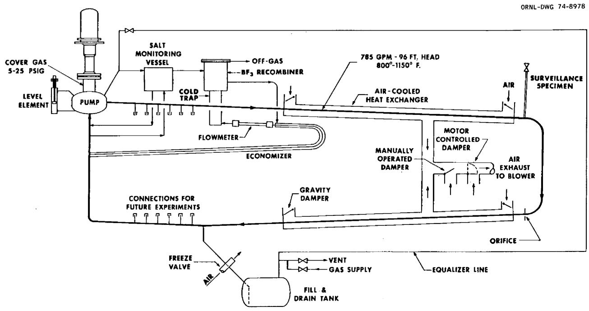  
Fig. 2.1. Coolant-Salt Technology Facility schematic.

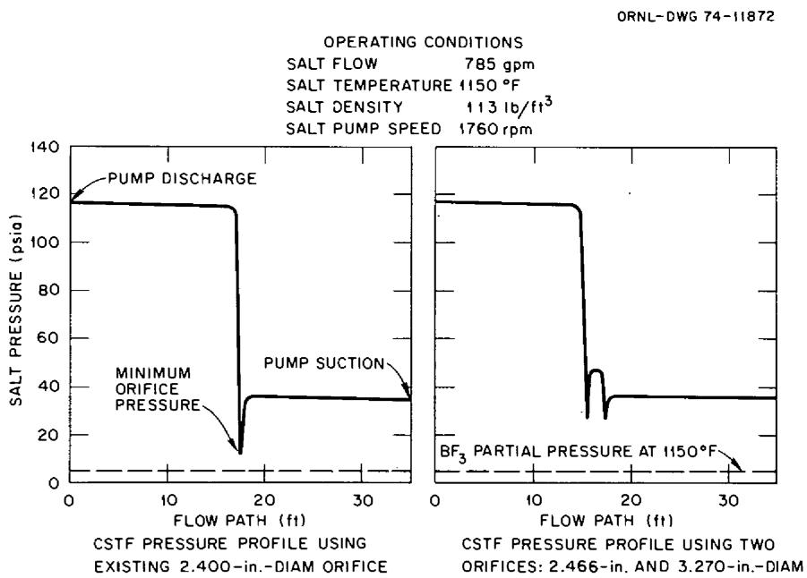  
Fig. 2.2. Calculated pressure profiles for the Coolant-Salt Technology Facility.

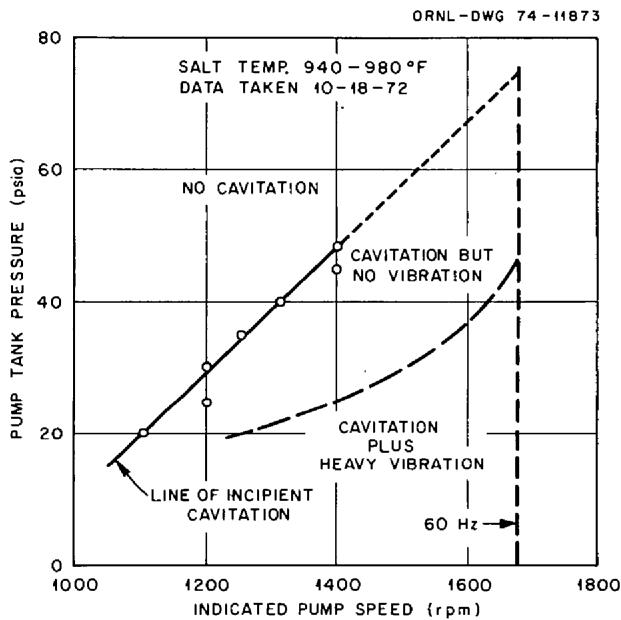  
Fig. 2.3. Experimental data showing line of incipient cavitation as a function of pump speed and pump tank pressure.

from the cold trap, and the 0.104-in. orifice at the cold trap inlet was probed with a wire rod in an attempt to clear the flow restriction.

Operation of the CSTF was resumed on December 1, 1972, and salt circulation was continued for a period of $460\mathrm{hr}$ (Run No. 2). The following observations were made during Run No. 2:

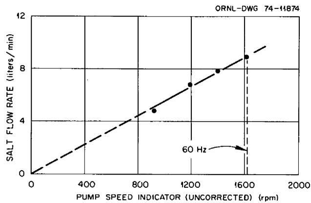  
Fig. 2.4. Flow rate through salt monitoring vessel as a function of pump speed.

1. Flow through the cold trap circuit was low at the outset and dropped to zero at the end of $42\mathrm{hr}$   
2. Measurements were made of cold trap salt level as a function of pump speed, in order to determine the corrective action needed to cure the cold trap high-salt-level problem.   
3. One gram of water was injected 5 in. below the surface of the salt in the pump bowl. The purpose of this test was to use the analytical probes in the salt monitoring vessel to observe the effect of a water addition on the proton activity in the salt.   
4. A 3-in.-diam by 22-in.-long NaOH trap was inserted in the off-gas line to test the line's effec

tiveness in removing $\mathbf{BF}_3$ from the off-gas stream. The experience during Run No. 2 was mostly negative because of plugging of the trap.

Circulation was stopped, and the loop was drained on December 20, 1972. The 0.104-in. orifice at the cold trap inlet was removed from the system. The orifice was found to be plugged with a spongy-metallic material, whose major constituent was shown to be nickel by spectrographic analysis. Visual examination failed to provide a definite answer as to whether the plug had been formed from particles entrained in the salt stream or by precipitation as a result of the reduced salt temperature at the cold trap inlet. A new orifice, fabricated from 0.030-in. Hastelloy N sheet and using the same 0.104-in. hole diameter, was installed about 1 in. upstream from the point where the old orifice had been located. The purpose of the new location was to move the orifice to a place where the salt temperature is higher in case the precipitation mechanism is controlling. Concurrently, in case settling out of entrained particles is the controlling mechanism, the pipe immediately upstream of the orifice was packed with nickel wool to serve as a filter. While this work was being carried out, the elevation of the cold trap was raised by $41/2$ in. This change was made to correct the cold trap high-salt-level problem.

During Runs Nos. 1 and 2, analyses were obtained on 15 salt samples—the first ten taken from the pump bowl and the last five from the salt monitoring vessel (Fig. 2.5). None of the constituents show any significant increase or decrease with circulating time. The concentrations of Fe, Cr, Ni, and O appear to be consistent with prior experience in the FCL-2 and PK fluoroborate loops.[11,12] Comparable data are not available for the other constituents.

While the CSTF was in operation, all of the off-gas was passed through at $0^{\circ}\mathrm{C}$ cold trap. A brown fluid was collected in the trap at a rate that decreased with time. The average collection rates for Runs Nos. 1 and 2 were $6 \times 10^{-5}$ and $3 \times 10^{-5}\mathrm{g}$ of fluid per liter of off-gas, respectively.

On February 26, 1973, the CSTF was placed in standby because of cancellation of the MSR program. From February 1973 through March 1974, the system was maintained in standby, namely, room temperature with a static pressure of 5 psig helium

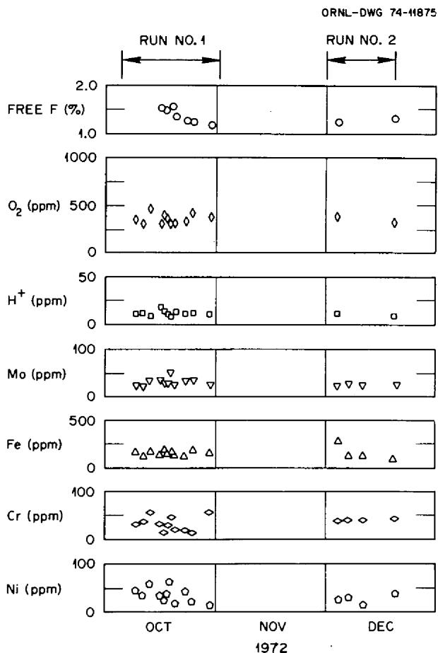  
Fig. 2.5. Coolant-Salt Technology Facility sample results.

blanketing the salt-containing portions. In April 1973, work was begun on recommissioning the CSTF, and this work was still in progress at the end of the report period. The following are some of the activities that are under way.

Preparation of test plans and operating procedures. In 1972, plans were formulated for a test to study the behavior of tritium in fluoroborate systems. A known quantity of deuterium will be allowed to diffuse into the circulating salt stream, and the distribution of the deuterium will be checked by sampling the salt and the off-gas stream. The work necessary to complete the planning phase of this test is now in progress.

Checkout of instruments and systems. Instrument calibrations are being checked and flow, pressure, and temperature regulating systems are being tested to make sure they are functioning properly.

Load orifice cavitation problem. This problem is being evaluated to determine if operation will be possible at moderate pump tank pressure either without cavitation or with only moderate cavitation.

Calculations indicate minimum salt pressure can be increased by 15 psi by using two load orifices in series (Fig. 2.2), and plans are being made to make this change to the system.

# 2.5 FORCED CONVECTION LOOP (MSR-FCL-2 AND 2b)

W. R. Huntley

# 2.5.1 Introduction

Forced convection loop MSR-FCL-2 is constructed of 1/2-in. OD and 0.042-in. wall commercial Hastelloy N tubing, and it contains three corrosion test specimen assemblies exposed to circulating salt at thrcc different temperatures with bulk flow velocities of 10 and 20 fps.[13] The loop was operated with sodium fluoroborate until it was shut down on October 23, 1972. After the molten-salt program was rtracted, circulation with a fuel-type salt was started on April 18, 1974, to evaluate the tellurium cracking problem. The test facility will be designated as MSR-FCL-2b during operation with fuel salt.

# 2.5.2 Operation of MSR-FCL-2 with Fluoroborate

The MSR-FCL-2 facility operated satisfactorily for about 7000 hr until operation was terminated on October 23, 1972. A report summarizing the loop design and corrosion results during this period has been issued.[14] Loop operation was stopped because of a rough power trace and a loss of purge gas flow to the ALPHA pump, which were later found to be caused by salt deposits in the shaft annulus and helium purge inlet line. This failure was probably due to level surging and trapping which had occurred in earlier operations when plugged filling lines between the dump tank and system piping resulted in improper salt filling.

# 2.5.3 Post Run Inspections

The ALPHA pump15 was removed from corrosion test facility MSR-FCL-2 and disassembled to deter

mine the cause of a loss of purge gas flow through the lower oil seal catch basin and an intermittent increase in friction in the drive. Inspection showed that the liquid salt level had been about 3 in. too high in the pump bowl. Frozen salt was found in the pump shaft annulus and in the purge gas inlet line, which can account for both the loss of purge and the increased drive friction. The rough power trace for the pump drive motor was caused by the frozen salt rubbing against the rotating shaft in the narrow (0.010-in. radial clearance) annulus region, which normally contains only gases.

The pump shaft was not worn seriously and was rcused. Slight scoring occurred where the wedging action of the frozen salt caused the shaft to rub against the stainless steel labyrinth threads on the outer diameter of the annulus. The shaft deflection in the annulus region also caused the impeller hub to rub against the lower shroud assembly, but again, only minor scratching occurred.

The cause of the plugged fill lines was found to be faulty installation of tubular electric heaters, which had left two different sections of drain line unheated along lengths of about 5 in. The 1/4-in.-OD drain line was also removed and examined and no internal restrictions were found. This examination indicated that the plugged line observed previously was due to the heater installation and not corrosion product accumulation or salt segregation as had been speculated.[16] The heaters on the two other drain lines were also inspected and found to need replacement due to short unheated areas 1 to 2 in. long. Rplacement heaters were x-rayed to ensure that the exact location of the heating element was known before installing the heaters on the salt lines.

The pump bowl was clean and appeared to be in excellent condition after $6800\mathrm{hr}$ of operation. No carbonaceous deposits were visible, which indicates that no significant oil contamination occurred during operation. Only minute amounts of green corrosion products were visible above the normal liquid level. Color photographs were taken of both the pump bowl and the rotary assembly.

Post-test inspection showed that the metal-to-metal static seal between the two halves of the impeller casing performed well. This Hastelloy N toroidal seal is U-shaped in cross section and has a 0.002- to 0.003-in.-thick nickel plating. During 6800 hr of operation, the seal was immersed in $850^{\circ}\mathrm{F}$

sodium fluoroborate salt at $850^{\circ}\mathrm{F}$ and had a pressure difference of 143 psi across its sealing surfaces. There was no evidence of leakage on either the seal or the matching Hastelloy N surfaces.

The shaft bearings and oil seals were in good condition when removed from the pump, which suggests that they could have continued in service at $4800\mathrm{rpm}$ for much longer than $6800\mathrm{hr}$ .

Examination of the spark plug probes from MSR-FCL-2 resulted in observations that pertain to long-term operation of sodium fluoroborate systems. The 3/16-in.-diam Hastelloy N spark plug probes in both the dump tank and auxiliary pump tank were badly corroded after being in use for about 9000 hr. The probes were immediately checked and confirmed to have been fabricated of Hastelloy N. Record photographs were also taken. The upper dump tank probe had lost about 1 in. of length, and the probes in the auxiliary pump tank had lost up to $1 / 8$ in. of their original length. Corrosion on the cylindrical surfaces of the probes varied greatly. Possible causes of the severe corrosion were inleakage of impurities, the active nature of sodium fluoroborate, or the newly designed "Triac" power supply which energizes these probes. Studies of the probes indicated that the accelerated corrosion was due to the current that passes from the probes through the salt to the container wall.

# 2.5.4 Cleanup and Modifications

The sodium fluoroborate salt was effectively removed from the piping and dump tank of MSR-FCL-2 by recirculation of hot, distilled water. Fifty-five gallons of water was used in removing 1.6 gal of frozen salt from the system. The majority of the salt was located in the 5-in.-diam dump tank, where it had been drained during loop shutdown. During the entire cleaning operation, water was kept in the Hastelloy N piping system for a total time of about 4 weeks. Complete removal of all salt in the dump tank and auxiliary pump tank was verified by use of a boroscope after all water was removed.

The ALPHA pump was cleaned and reassembled with new bearings and oil seals and successfully operated in the cold shakedown test stand for $450\mathrm{hr}$ at $5000~\mathrm{rpm}$ . Seal oil leakage during the cold shakedown test was similar to that observed during previous operation of the ALPHA pump in corrosion test facility, MSR-FCL-2; that is, the lower seal leakage rate was less than 1 cc/day and the upper seal leaked about $25~\mathrm{cc / day}$ . The reason for greater oil leakage at the upper seal is not known, but it might be

related to shaft deflections or vibrations from the Vbelt drive. In any event, an oil leak rate of $25\mathrm{cc / day}$ is not considered to be excessive for the pump in its new application in the MSR-FCL-2b test facility. The cold shakedown test was terminated, and the pump was prepared for installation in the facility during January 1973.

A new 71/2-hp adjustable-speed electric motor was installed to replace the previously used 5-hp motor because the fuel salt is more dense than the previously pumped sodium fluoroborate salt. The new drive motor also features a brushless design and a transistorized control system that should increase reliability. A recording wattmeter was installed in the main control panel of MSR-FCL-2b to assist the facility operators to monitor pump and drive motor performance. New Hastelloy N corrosion specimens were installed at all three locations.

During fluoroborate operation, batch-analyzed bottled helium from plant stores had been used. However, due to the greater sensitivity of fuel salt to oxygen contamination, a connection was made to the GSTF-CSTF helium supply, which is processed by the MSRE helium treatment station. On-line analytical instruments show that the purified helium contains less than 1 ppm of oxygen and less than 1 ppm of water vapor.

The loop temperature profile was calculated, and the loop design was reviewed to assure adequacy for the higher temperatures and higher pressures required for operation with fuel salt. A revised set of operating procedures was prepared. All instruments were recalibrated and new alarm set points were established for operation with the fuel salt mixture. Lcak testing of the cover gas-piping system and gas control panels was done with a mass spectrometer helium-leak detector to ensure that all fittings and valves were tightly sealed. Three small leaks were found and corrected.

# 2.5.5 Purging the System and Adding Salt

The dump tank and the piping system were heated to $260^{\circ}\mathrm{C}$ and then evacuated and backfilled with helium about ten times to outgas the metal surfaces and remove water vapor prior to charging the system with salt. The fuel salt mixture for MSR-FCL-2b was taken from a full transfer pot containing 8.7 liters of $\mathrm{LiF - BcF_2 - ThF_4 - UF_4}$ (68-20-11.7-0.3 mole %) which had been reserved for use in MSR-FCL-2b in 1973. Six liters of the fuel salt at $670^{\circ}\mathrm{C}$ were transferred into the loop dump tank on March 15, 1974.

A series of salt samples taken from the dump tank and from the salt remaining in the transfer pot suggested thorium segregation may have occurred during the freezing-thawing cycles that preceded the salt transfer. These salt analyses are shown in Table 2.2. The first sample (1A and 1B) taken from the dump tank on March 18 contained only $28.28\mathrm{wt}\%$ thorium instead of the expected $42.4\mathrm{wt}\%$ . A special sample from the heel of salt remaining in the transfer pot seemed to confirm that some segregation had occurred, since this salt contained about $52\%$ thorium. Surprisingly, a second salt sample (3A and 3B) from the dump tank indicated a thorium content of $39.8\%$ , even though nothing intentional had been done to the salt in the dump tank since the preceding sample 1A and 1B. The salt in the dump tank was transferred back into the transfer pot and helium was bubbled through the transfer pot dip tube for $2\mathrm{hr}$ to mix the entire salt charge. After bubbling of helium was stopped, the salt was immediately transferred back to the dump tank on April 1. A salt sample taken from the dump tank on April 2 showed a thorium content of $39.4\%$ and an acceptable oxygen level of $135~\mathrm{ppm}$ . Based on sample 2A and 2B, the salt composition appears to be $67.4 - 22 - 10.3 - 0.37$ mole $\%$ in lieu of the nominal composition of $68 - 20 - 11.7 - 0.3$ mole $\%$ . It was decided to start operation with this charge of salt and to replace it after new fuel salt is available from the reactivated salt production facilities.

Possible errors in sampling and analytical techniques preclude exact definition of the degree of salt segregation which may have occurred. The unusual analytical results of sample IA may have been due to the near freezing that occurred shortly before sampling since a second sample, taken one week later, had more normal analysis. However, the incident does suggest that mixing of the salt with helium bubbles is advisable before any salt transfer operation. Also, the salt should be maintained at least $300^{\circ}\mathrm{F}$ above the liquidus temperature of $898^{\circ}\mathrm{F}$ for at least 24 hr before any salt sampling or salt transferring operations are made.

# 2.5.6 Operation of MSR-FCL-2b with Fuel Salt

The MSR-FCL-2b piping system was filled with 4.4 liters of fuel salt on April 18, 1974. An electrochemical probe has been in use to monitor the redox potential and $\mathrm{Cr}^{2+}$ , $\mathrm{Ni}^{2+}$ , and $\mathrm{Fe}^{2+}$ concentrations in the salt since the loop was first filled. Collection of electrochemical data is hampered by vibrations from the belt-driven pump or perhaps by liquid movements within the auxiliary tank which severely affect the output signal from the probe at pump speeds above $1500\mathrm{rpm}$ . Therefore, it has been necessary to reduce the normal pump speed or preferably, stop the pump when readings are taken. Future loops will require modifications to overcome this problem.

Table 2.2. MSR-FCL-2b salt analysis (wt %)   

<table><tr><td rowspan="2">Elements</td><td colspan="5">Samples</td></tr><tr><td>1A &amp; 1Ba</td><td>3A &amp; 3Bb</td><td>Specialc</td><td>2A &amp; 2Bd</td><td>Theoreticale</td></tr><tr><td>Li</td><td>9.1</td><td>7.66</td><td>~6.0</td><td>7.8</td><td>7.37</td></tr><tr><td>Be</td><td>4.14</td><td>3.21</td><td>~1.4</td><td>3.28</td><td>2.81</td></tr><tr><td>Th</td><td>28.28</td><td>39.8</td><td>~52.0</td><td>39.4</td><td>42.4</td></tr><tr><td>U</td><td>1.66</td><td>1.46</td><td>~1.35</td><td>1.46</td><td>1.11</td></tr><tr><td>F</td><td>53.21</td><td>48.8</td><td>~40.0</td><td>48.9</td><td>46.31</td></tr><tr><td>Totals</td><td>96.39</td><td>100.93</td><td></td><td>100.84</td><td>100.00</td></tr><tr><td>Fe</td><td>185(ppm)</td><td></td><td></td><td></td><td></td></tr><tr><td>Cr</td><td>85(ppm)</td><td></td><td></td><td></td><td></td></tr><tr><td>Ni</td><td>30(ppm)</td><td></td><td></td><td></td><td></td></tr><tr><td>O</td><td>240(ppm)</td><td>150 (ppm)</td><td></td><td>135 (ppm)</td><td></td></tr></table>

aTaken 3/18/74 from dump tank at $648^{\circ}\mathrm{C}$   
bTaken 3/27/74 from dump tank at $537^{\circ}\mathrm{C}$   
Average of three analyses along 1/4-in. OD tube.   
${}^{d}$ Taken $4/2/{74}$ from dump tank at ${626}^{ \circ  }\mathrm{C}$ .   
Expected composition for 68-20-11.7-0.3 mole % LiF-BeF $_2$ -ThF $_4$ -UF $_4$ .

The loop was shut down and drained on May 7, 1974, for repairs and for examination of the 18 corrosion specimens after $418\mathrm{hr}$ of operation. Photographs recorded the bright, clean appearance of the specimens. Very few droplets of salt clung to the specimens and stringer assembly, which again demonstrated the excellent drainability of the fuel salt mixture. Average weight loss of the specimens during operation was equivalent to a corrosion rate of about 0.2 mils/year. Metals and Ceramics Division weighed the specimens; results of their detailed examination are reported in Part III. All specimens, except one, were reinstalled in the loop for further testing. Specimen number 45 was kept for possible future examination because it had a slight burnished appearance. Loop operation was resumed on May 21, 1974.

The major effort during June and July 1974 was the addition of small increments of beryllium at the auxiliary pump tank to lower the oxidation potential of the fuel salt mixture. Beryllium additions were made by lowering small pieces of 0.023-in.-thick beryllium sheet below the salt surface on a platinum-tipped push rod where they completely dissolved. A total of $208\mathrm{mg}$ of beryllium was added to the 4.4-liter salt inventory in eight increments ranging in weight from 8 to $68\mathrm{mg}$ . The beryllium additions resulted in expected increases in the $\mathrm{U}^{3+}/\mathrm{U}^{4+}$ ratio as monitored with the electrochemical probe. This work is discussed in greater detail in Part III.

Fifteen salt samples have been taken at varying intervals since isothermal salt circulation was started in mid-April 1974. The metallic impurity level of chromium has averaged about $100~\mathrm{ppm}$ throughout the operation. The iron content has decreased from the initial level of $185~\mathrm{ppm}$ to a recent average of about $55~\mathrm{ppm}$ . Nickel content has ranged from 20 to $35~\mathrm{ppm}$ in most samples with no trends observable.

The oxygen analyses of the salt have ranged from 80 to $200~\mathrm{ppm}$ . These relatively high oxygen levels might be expected to exceed the solubility limits of the salt, but no oxide has been observed in petrographic microscope examinations, which have been made on every sample. To further evaluate oxide precipitation, a test was run from August 21 to 23 by reducing the loop operating temperature from its normal value of 650 to $565^{\circ}\mathrm{C}$ . Two salt samples taken at the lowered operating temperature had no oxide precipitates when examined petrographically, and no significant change in oxide level was observed in the chemical analyses.

At the end of August 1974, corrosion loop MSR-FCL-2b had accumulated 2700 hr of isothermal operation circulating fuel salt at temperatures from 560 to $730^{\circ}\mathrm{C}$ and at a flow rate of about $3.2\mathrm{gpm}$ . Detailed results of the electrochemical probe performance are reported in Part II. Operation is continuing with plans for another corrosion specimen examination followed by additions of $\mathrm{NiF_2}$ to the salt.

# 3. Reactor Safety

J. R. Engel

Studies have been started to systematically identify, categorize, and evaluate events of safety significance that can be postulated for molten-salt reactor systems. Initially, a broad spectrum of events is being qualitatively examined for safety significance. The events thus identified will be subjected to transient analyses to determine safety margins and/or to establish requirements for additional lines of defense.

# 3.1 SAFETY EVENTS IN MSBR

E. S. Bettis J. R. Engel

The primary criterion being used, at least initially, to determine safety significance is whether or not a given event or its consequences represents a potential threat to the health and safety of the public and/or the reactor operating staff. In this context, it is presumed that events which reduce to one the number of barriers between a major fraction of the plant's radioactive inventory and the environment are safety significant, even though the resultant hazard to the public health and safety is minimal. Since the MSBR conceptual design requires double containment, $^{1}$ of special safety significance are those events that cause or threaten to cause a breach of the primary containment with an attendant major release of radioactivity from the primary or secondary salt system. While breaches of the primary system boundary which release radioactivity into the primary containment appear to present no immediate threat to the integrity of the primary containment, it is conceivable that long-term exposure of the containment liner to spilled salt could result in liner attack, particularly if an off-normal (wet) containment atmosphere is present. Therefore, events that may breach the primary system boundary and spill salt are currently being treated as hazards. However, heat-exchanger tube failures, which lead to some mixing of the primary and secondary salts, are not automatical-

ly included in this class of primary system failures, because the secondary salt system may also be doubly contained.

Studies performed to date indicate that three general classes of events must be considered in the safety of MSBRs: (1) events that directly cause mixing or spilling of salts; (2) events that cause major temperature excursions in the primary system; and (3) events that cause major gaseous releases within or from the primary system. Each of these key events may be caused by a variety of primary events and may, in turn, lead to a variety of consequences. Only those combinations that fall within the primary safety criterion discussed above will be analyzed initially.

Since event sequences depend, to a degree, on the particular MSR system under study, current work is being limited to the ORNL reference design MSBR with sodium fluoroborate as the secondary coolant. This study requires, for example, consideration of the consequences of the release of $\mathrm{BF}_3$ gas when fuel and coolant salt are mixed; however, this consideration would not be valid for some other coolant salts. Thus far, no single events have been identified which could lead to unacceptable consequences.

# 3.2 MSBR NEUTRONIC EXCURSIONS

J. R. Engel

Neutronic excursions, as a class, are the primary events that have the greatest potential capability for causing positive excursions in fuel salt temperature that could damage the primary system boundary. (Salt freezing as a result of negative temperature excursions can, in principle, also cause damage, but in practice, such freezing is limited to the tubes of the primary heat exchanger in the reference design.) Several varieties of nuclear excursions have been examined in the past, primarily by O. L. Smith, from the standpoint of the source of the reactivity perturbation that causes the excursion. Events that have been considered, but which must be studied in more detail include the following:

1. Control or safety-rod malfunctions   
2. Externally caused temperature perturbations   
3. Salt flow perturbations   
4. Redistribution of graphite moderator

5. Core voiding   
6. Introduction of excess fuel

The principal factors that tend to limit the consequences of power excursions resulting from these events are the following:

1. The small amount of reactivity that must be controlled by the rods during normal operation, as a consequence of on-line fuel reprocessing and concentration adjustment (about 8 dollars).2   
2. The prompt negative temperature coefficient of reactivity of the fuel salt $(-2.7\mathrm{cents} / {}^{\circ}\mathrm{C})$   
3. The lower limit on fuel-salt temperature imposed by its liquidus temperature (about $500^{\circ}\mathrm{C}$ ).   
4. The small void coefficient of the core (33 cents per percent voids), coupled with the high boiling temperature of the salt (about $1430^{\circ}\mathrm{C}$ vs normal temperature of about $630^{\circ}\mathrm{C}$ ).

5. The small amount of excess fuel available for introduction from the chemical processing plant (about 9 dollars) coupled with its slow rate of addition.

None of the events examined appear to be capable of adding enough reactivity sufficiently fast to override the inherent shutdown capability of the core and thus endanger the integrity of the primary system boundary. However, a reliable poison-rod shutdown system might be required to prevent reattainment of criticality after the initial excursion and subsequent excessive temperatures. Such a shutdown system would have several seconds in which to act.

# Part 2. Chemistry

L. M. Ferris

The research and development activities described below deal with the chemical problems related to design and ultimate operation of molten-salt reactor systems. Much of the information reported here was obtained between September 1972 and March 1973, at which time the MSR Program was temporarily terminated. Much of the effort since February 1974 (the time at which the program was reinstituted) has been devoted to program planning and reactivation of the experimental work.

Tellurium chemistry in fuel salt is under investigation, since tellurium apparently is responsible for the intergranular cracking of Hastelloy N observed in the MSRE. An experimental test stand has been constructed to expose metallurgical test specimens to $\mathrm{Te}_2$ vapor at defined temperatures and deposition rates. This work is being conducted in close cooperation with members of the Metals and Ceramics Division. Work previously completed, but not reported, includes an investigation of the chemistry of tellurium in molten $\mathrm{Li}_2\mathrm{BeF}_4$ and the formation of the ion $\mathrm{Te}_3$ . Another aspect of fuel salt chemistry is the removal of iodine by HF- $\mathrm{H}_2$ sparging. The results indicate that this may be a practical approach if the $\mathrm{U}^{3+}/\mathrm{U}^{4+}$ ratio can be adjusted to the desired range.

Other previously unreported studies are summarized here. These include work on the precipitation of protactinium oxides from MSBR fuel salt and on the solubility of $\mathbf{BF}_3$ in several molten fluoride mixtures.

To better define the chemistry of fluoroborate coolant, several aspects are being investigated. The behavior of hydroxy and oxy compounds in molten $\mathrm{NaBF_4}$ is being investigated to define reactions and compounds that may be involved in corrosion and/or could be involved in methods for trapping tritium. A systematic approach to synthesize and characterize compounds is under way; this information will then permit an understanding of the hydrolysis products in actual systems. The chemistry of chromium(III) compounds in fluoroborate melts is of importance since chromium is the most easily oxidized compo

nent of the Hastelloy N. Two corrosion products, $\mathrm{Na}_3\mathrm{CrF}_6$ and $\mathrm{Na}_5\mathrm{Cr}_3\mathrm{F}_{14}$ , have been identified from fluoroborate systems. The simultaneous appearance of two compounds has complicated efforts to determine free energies of formation. Work is continuing to define the stability of these compounds with regard to temperature, melt composition, etc., and to determine their solubilities. Studies performed before the interruption of the program, but not previously reported in a semiannual progress report, include a determination of the free energies of formation of $\mathrm{NaNiF}_3$ and $\mathrm{NaFeF}_3$ and measurements of the density and viscosity of several molten fluoride mixtures.

A significant problem area is the evaluation of fluoroborate and alternate coolants. Although the present candidate coolant, $\mathrm{NaBF_4}$ -NaF (92-8 mole $\%$ ), has a number of advantages, it is less than ideal with regard to corrosivity to the Hastelloy N containment, and the consequences of fuel-coolant mixing as a result of leaks in the primary heat exchangers are unfavorable and could be unacceptable from safety considerations. Other potential coolants are being evaluated and compared.

The behavior of hydrogen and its isotopes constitutes an important area of chemical research, because approximately $2400\mathrm{Ci}/$ day of tritium will be produced in a 1000-MWe MSBR and probably little of this amount is safe enough to reach the environment. Research on tritium behavior is currently funded by the Division of Physical Research. Some results not previously reported are summarized here. The solubilities of hydrogen, deuterium, and helium in $\mathrm{Li}_2\mathrm{BeF}_4$ are very low. The sorption of tritium on graphite is significant (a few milligrams of tritium per kilogram of graphite), possibly providing a means of sequestering a portion of the tritium produced. Initial work on the permeation of tritium through structural metals coated with an oxide film offered encouraging results for the control of tritium. In some cases, the permeation rate was 100 times lower than that for clean metals.

Other research reported here includes an investigation of the wetting of graphite by bismuth and bismuth-lithium alloys. The work was terminated before much data was accumulated, but a review of the literature indicated that rare earths dissolved in bismuth may react with graphite.

Development of analytical methods has continued with emphasis on voltammetric and spectrophotometric techniques for the in-line analysis of corrosion products such as $\mathrm{Fe}^{2+}$ and $\mathrm{Cr}^{3+}$ and the determination of the $\mathrm{U}^{3+}/\mathrm{U}^{4+}$ ratio in MSBR fuel salt. Similar studies were conducted with the $\mathrm{NaBF}_4$ -NaF coolant salt. Information developed during the previous operation of the CSTF has been assessed and used to formulate plans for evaluation of in-line analytical methods in future CSTF operations. Electroanalytical and spectrophotometric research suggests that an electroactive protonic species is present in molten $\mathrm{NaBF}_4$ -NaF, and that this species rapidly equilibrates with a volatile proton-containing species. Data obtained from the CSTF indicated that tritium was

concentrated in the volatile species. Other research activities include studies of the electroreduction of uranium(IV) in fluoride melts, redox chemistry of tellurium species in fuel salt, electroanalytical behavior of bismuth in fuel salt, and voltammetric and spectrophotometric analysis of corrosion products in fluoroborate. Previously conducted spectrophotometric studies on the $f$ - $d$ and $f$ - $f$ transitions of protactinium(IV) in fuel salt are summarized.

In other research, no evidence was found for the formation of uranium oxycarbides when $\mathrm{LiF - BeF_2}$ melts containing both $\mathrm{UF}_3$ and $\mathrm{UF}_4$ were equilibrated with $\mathrm{UO}_2$ and $\mathrm{UC}_2$ . Equipment has been assembled in preparation for a systematic study of the potential use of packed-bed, glassy-carbon electrodes for continuous on-line monitors for trace elements (Bi-Te-O) in MSBR fuel salt. To enhance the general knowledge regarding molten fluoride mixtures, a program to determine formation free energies and activity coefficients in ternary systems has been started.

# 4. Fuel Salt Chemistry

A. D. Kelmers

# 4.1 THE CHEMISTRY OF TELLURIUM IN MOLTEN $\mathsf{Li}_2\mathsf{BeF}_4$

C. E. Bamberger J. P. Young R. G. Ross

A description of the work done on the chemistry of tellurium in molten $\mathrm{Li}_2\mathrm{BeF}_4$ (ref. 1) was published and a summary follows.

Because tellurium seems to play a role in the intergranular cracking of Hastelloy N and other alloys, its behavior in the presence of molten $\mathrm{Li_2BeF_4}$ was investigated. Absorption spectrophotometry was the main experimental technique used; silica was chosen for containment to avoid undesirable reactions with metals. The "as received" $\mathrm{Li_2Te}$ dissolved in $\mathrm{Li_2BeF_4}$ giving a strongly colored solution that absorbed light with a maximum at $478\mathrm{nm}$ . The same absorption was noted when $\mathrm{Te_2(g)}$ reacted with purified $\mathrm{Li_2Te}$ in the presence of $\mathrm{Li_2BeF_4}$ . This was probably the result of a reaction such as

$(m / 2)\mathrm{Li}_2\mathrm{Te}(\mathrm{c}) + [(2n - m) / 4]\mathrm{Te}_2(\mathrm{g}) = \mathrm{Li}_m\mathrm{Te}_n(\mathrm{d})$ (1) leading to the formation of a colored species $\mathrm{Li}_m\mathrm{Te}_n$ (where $m$ and $n$ represent values that are as yet unknown). It was also learned that the same species could be formed in solution by partially reducing $\mathrm{Te}_2$ with silicon or by partially oxidizing $\mathrm{Li}_2\mathrm{Te}$ with air or $\mathrm{Fe}^{2+}$ . When $\mathrm{LiTe}_3$ (prepared at Argonne National Laboratory) was contacted with molten $\mathrm{Li}_2\mathrm{BeF}_4$ , color developed immediately in the melt, but no significant $\mathrm{Te}_2$ was observed in the gas phase. This suggested that $m / n$ was equal to, or very close to $1 / 3$ . From other limited experiments it was estimated that the solubility of $\mathrm{Te}_2$ in $\mathrm{Li}_2\mathrm{BeF}_4$ is of the order of $10^{-3}$ wt $\%$ or less at $655^{\circ}\mathrm{C}$ .

# 4.2 EXPOSURE OF METALLURGICAL SAMPLES TO TELLURIUM VAPOR

A. D. Kelmers' D. Y. Valentine

An experiment is now in progress to expose metallurgical samples to tellurium vapor at controlled rates to aid in the evaluation of grain boundary attack and cracking observed in the MSRE. Tensile specimens of Hastelloy N, Incoloy 600, and modified Hastelloy N will be exposed to tellurium vapor. This procedure will test whether

alloying additives provide increased resistance to grain boundary cracking. The experimental parameters partially simulate the exposure conditions of the Hastelloy N reactor vessel used in the MSRE.

An exposure time of $1000\mathrm{hr}$ has been chosen, with the tensile specimens at $700^{\circ}\mathrm{C}$ and the tellurium at a temperature calculated to deposit by concentration diffusion a specified amount of tellurium in the specimens. Six tensile specimens are positioned near the top of each of four quartz tubes, $24\mathrm{mm}$ ID by 42 in. long. Tellurium is loaded into the bottom of the tubes (which are positioned in a rack inside a flanged stainless steel vessel); the tubes are then sealed to contain 1 atm argon at operating temperatures. The specimens and the tellurium are maintained at separate constant temperatures with a linear temperature gradient between them.

Two extra tensile specimens were sealed in a quartz tube under these conditions and used in a trial run of $100\mathrm{hr}$ . These specimens will be weighed after the run, and the 100-hr experiment will be repeated twice. This procedure serves two purposes: (1) any necessary improvements in the experimental system can be identified and completed before the actual samples are used in the 1000-hr run; and (2) the three 100-hr runs will provide data to test the theoretical model of the diffusion process.

Results from the first 100-hr trial run showed that several modifications to the existing apparatus were necessary. The reaction vessel was lengthened to modify the seal; the vessel purge gas was changed to provide a reducing atmosphere for protection of the copper heat distribution blocks; one heater was replaced; and various valves, meters, controllers and other parts were replaced to improve the control and reproducibility of the experiment.

The theoretical model of the process was improved to better define the experimental parameters. The diffusion coefficient, $D$ , estimated by the Chapman-Enskog kinetic theory method, as a function of absolute temperature, is given by

$$
D _ {\mathrm {T e}, \mathrm {A r}} = \frac {0 . 0 0 1 8 5 8 3 \left[ \mathrm {T} ^ {3} \left(1 / M _ {\mathrm {T e}} + 1 / M _ {\mathrm {A r}}\right) \right] ^ {1 / 2}}{P \left(\sigma_ {\mathrm {T e} , \mathrm {A r}} ^ {2} \Omega_ {\mathrm {T}}\right)}
$$

where $M$ is the mass; $\Omega_{\mathrm{T}}$ is a tabulated function of $\mathrm{k}T / \epsilon$ ; $P$ is the total gas pressure; and $\sigma$ and $\epsilon$ are the Lennard-Jones potential parameters. For $\mathrm{Te}_2$ in 1 atm Ar, the diffusion coefficient varies from 0.3643 $\mathrm{cm}^2/\mathrm{sec}$ at $440^{\circ}\mathrm{C}$ to $0.6466\mathrm{cm}^2/\mathrm{sec}$ at $700^{\circ}\mathrm{C}$ .

Values of the diffusion coefficient were used in the solution of Fick's first law of diffusion

$$
\begin{array}{l} J _ {a} = c D \nabla x _ {a} - g (t) \\ = \frac {(2 - \xi) \left[ \left(T _ {\mathrm {t s}} / T _ {\mathrm {T e}}\right) - 1 \right] D _ {\mathrm {T e} , \mathrm {A r}} M _ {\mathrm {T e}} A p _ {\mathrm {T e}}}{l R T _ {\mathrm {T e}} \left[ \left(T _ {\mathrm {t s}} / T _ {\mathrm {T e}}\right) ^ {2} - \xi - 1 \right]} t \\ \end{array}
$$

where

$T_{\mathrm{ts}} =$ temperature at the tensile specimens,

$T_{\mathrm{Te}} =$ tellurium temperature,

$$
T _ {t s} > T _ {T e},
$$

$D_{\mathrm{ts}} =$ diffusion coefficient at the specimen temperature,

$D_{\mathrm{Te}} =$ diffusion coefficient at the solid tellurium temperature,

$$
\xi = \ln \left(D _ {\mathrm {t s}} / D _ {\mathrm {T c}}\right) / \ln \left(T _ {\mathrm {t s}} / T _ {\mathrm {T c}}\right),
$$

$l =$ diffusion path length,

$A =$ cross-sectional area of the diffusion path,

$p_{\mathrm{Te}} \ll p_{\mathrm{Ar}}$ ( $p$ denotes partial pressure of designated gas).

Therefore, to deposit $10,000~\mathrm{ppm}$ of tellurium to a depth of 5 mils (about $8\mathrm{mg}$ per specimen) on the tensile specimens in $1000\mathrm{hr}$ , the temperature of the solid tellurium will have to be maintained at $440^{\circ}\mathrm{C}$ . Since the deposition rate is a sensitive function of temperature, approximately doubling for every $20^{\circ}$ increase, care must be taken to accurately control this temperature to $\pm 1^{\circ}\mathrm{C}$ or better. These calculations were made using the assumptions of complete getting of the $\mathrm{Te_2}$ at the specimen, and that the reaction of $\mathrm{Te_2}$ vapor with the specimens is not limited by diffusion of tellurium into the solid specimen.

In addition, the Metals and Ceramics Division has also supplied Hastelloy N sheet samples and foils for x-ray diffraction and electron microscopy analysis. These samples will be run along with the tensile specimens in the next 100-hr trial runs.

# 4.3 REMOVAL OF IODIDE FROM LiF-BeF $_2$ MELTS BY HF-H $_2$ SPARGING: APPLICATION TO IODINE REMOVAL FROM MSBR FUEL

C. F. Baes, Jr. R. P. Wichner

C. E. Bamberger B. F. Freasier

A paper describing this work has been submitted for publication; it presents experimental data reported in refs. 4 and 5, which were subsequently interpreted by a model developed by R. P. Wichner. An abstract of the paper follows.

The results of experiments in which iodine dissolved as $\Gamma^{-}$ in LiF-BeF $_2$ melts was stripped as H $^1$ by sparging with HF- $H_2$ mixtures have indicated that the use of such a treatment to remove iodine from the molten fluoride mixtures used in MSR fuels may be possible. This concept is particularly significant to MSR technology, because it provides an indirect means for removing a large fraction of $^{135}\mathrm{Xe}$ , a decay daughter of $^{135}\mathrm{I}$ .

Data obtained from transpiration experiments indicated a linear decrease in the logarithm of the iodine concentration of the melt with the number of HF moles passed, and a linear increase of the reciprocal of the apparent equilibrium quotient $Q_{\mathrm{app}}' = P_{\mathrm{HI}} / [P_{\mathrm{HE}}(\mathrm{l})]$ with the partial pressure of HF in the sparge gas. The iodine removal mechanism is explained by a model that assumes that the rate-controlling step is the transport of $\mathbf{I}^{-}$ from the bulk of the melt to the surface, and that the rates of the other steps are rapid.

The removal of iodine from an MSBR fuel was analyzed in terms of the redox potential required to efficiently remove the iodine while preventing undesirable reactions in the fuel or between the fuel and its environment.

The relative abundances of different iodine species present in the off-gas during sparging of an MSBR

fuel were estimated and, as expected, the results indicated a strong dependence on the temperature and hydrogen partial pressure. Low hydrogen pressures and low temperatures favor the formation of molecular iodine. High temperatures and low hydrogen pressures favor the formation of atomic iodine, while HI is formed at high temperatures and relatively higher hydrogen pressures.

# 4.4 PROTACTINIUM OXIDE PRECIPITATION STUDIES

O. K. Tallent L. M. Ferris

Studies of the selective precipitation of protac-tinium oxide from MSBR fuel salt were concluded and a publication7 was issued, an abstract of which follows.

Molten LiF-BeF $_2$ -ThF $_4$ -UF $_4$ (71.9-16-12-0.1 mole %) containing dissolved PaF $_5$ was equilibrated with various H $_2$ O-HF-Ar gas mixtures at 535 to $670^{\circ}\mathrm{C}$ . The data obtained indicate that the protactinium was precipitated as Pa $_2$ O $_5$ and, hence, that the reaction involved was PaF $_5(\mathrm{d}) + 5/2$ H $_2$ O(g) = 1/2Pa $_2$ O $_5(\mathrm{c}) + 5$ HF(g), for which the equilibrium quotient is $Q_1 = P_{\mathrm{HF}}^5 P_{\mathrm{H}_2\mathrm{O}}^{-5/2} N_{\mathrm{PaF}_5}^{-1}$ . The values of $Q_1$ derived from the data can be expressed as log $Q_1 = [12.50 - 10,690 / T(^{\circ}\mathrm{K})] \pm 0.2$ . In these expressions (d), (c), (g), $P$ , and $N$ denote dissolved component, solid, gas, partial pressure (atm), and mole fraction, respectively. The point at which uranium oxide began to precipitate along with protactinium oxide was determined at several temperatures, using salt mixtures with different UF $_4$ concentrations. These data were considered in terms of the equilibria UF $_4(\mathrm{d}) + 2$ H $_2$ O(g) = $\mathrm{UO}_2(\mathrm{ss}) + 4$ HF(g) and 1/2Pa $_2$ O $_5(\mathrm{c}) + 5/4$ UF $_4(\mathrm{d}) = \mathrm{PaF}_5(\mathrm{d}) + 5/4$ UO $_2(\mathrm{ss})$ , in which (ss) denotes UO $_2$ -ThO $_2$ solid solution. The respective equilibrium quotients can be expressed as log $Q_2 = [9.27 - 8966 / T(^{\circ}\mathrm{K})] \pm 0.08$ and log $Q_3 = [-0.827 - 590 / T(^{\circ}\mathrm{K})] \pm 0.1$ . These results are consistent with the estimated thermodynamic properties of protactinium compounds.

# 4.5 SOLUBILITY OF $\mathbf{BF}_3$ IN SALTS OF MOLTEN-SALT REACTOR INTEREST

S. Cantor

A paper, which has been published, gives detailed measurements in four molten fluoride mixtures, each containing LiF and $\mathrm{BeF}_2$ ; an abstract follows.

Using a volumetric method, solubilities of $\mathrm{BF}_3$ were measured in four molten solvents, $\mathrm{LiF - BeF_2}$ (66-34 mole $\%$ ), $\mathrm{LiF - BeF_2 - ThF_4 - UF_4}$ (71.7-16-12-0.23 mole $\%$ ), $\mathrm{LiF - BeF_2 - ThF_4}$ (76-12-12 mole $\%$ ), and $\mathrm{LiF - BeF_2 - ThF_4 - NaF}$ (66-15-11-8 mole $\%$ ). The purposes of the study were to investigate the interaction of $\mathrm{BF}_3$ with fluoride ions in these melts and to aid in evaluating $\mathrm{BF}_3$ in reactor control and in reactor safety. Within the pressure and concentration ranges studied, solubilities obeyed Henry's law. Enthalpies of solution, derived from the temperature dependence of Henry's law constant, varied from -15 to -18 kcal/mole; these large negative values indicate strong chemical interaction between dissolved $\mathrm{BF}_3$ and molten fluorides, most likely the formation of tetrafluoroborate ion, $\mathrm{BF_4}$ . Entropies of solution were interpreted as the loss of most of the rotational entropy of $\mathrm{BF}_3$ . From the observed solubilities, estimates were made of the partial pressures of $\mathrm{BF}_3$ that would occur following accidental mixing of reactor fuel salt with coolant liquid composed of $\mathrm{NaBF_4 - NaF}$ (92-8 mole $\%$ ). Barring massive in-leakage of coolant into fuel salt, the high solubility of $\mathrm{BF}_3$ in fluoride melts would prevent very high partial pressures of $\mathrm{BF}_3$ . The rate of solution of $\mathrm{BF}_3$ was measured in quiescent reactor fuel salt. The results indicate that $\mathrm{BF}_3$ is useful in a control system for "scramming" a molten-salt reactor.

# 5. Coolant Salt Chemistry

A. D. Kelmers

# 5.1 OXIDE AND HYDROXIDE CHEMISTRY OF FLUOROBORATE MELTS

L. Maya

The work in this area is directed toward developing knowledge of the behavior of hydroxy and oxy compounds in $\mathrm{NaBF_4}$ that may be involved in corrosion reactions or in reactions that lead to the trapping of tritium as THO, TF, or tritiated compounds in the fluoroborate coolant salt. Individual compounds are being synthesized and characterized to simplify the identification and understanding of the behavior of hydrolysis products in actual systems. The following compounds were prepared $^{1-4}$ in the period covered by this report: $\mathrm{H}_3\mathrm{OBF}_4$ , $\mathrm{HBF}_2(\mathrm{OH})_2$ , $\mathrm{BF}_3\cdot 2\mathrm{H}_2\mathrm{O}$ $[\mathrm{H}_3\mathrm{OBF}_3\mathrm{OH}]$ , and $\mathrm{NaBF}_3\mathrm{OH}$ .

The first three compounds might be components of the volatile fraction above the melt. Dihydroxyfluoboric acid $\left[\mathrm{HBF}_2(\mathrm{OH})_2\right]$ appears to be a likely candidate as one of the volatile components, since it is thermally stable and can be distilled (bp $159^{\circ}\mathrm{C}$ ). The proton nuclear magnetic resonance (NMR) (kindly run by B. Benjamin, Chemistry Division) of all three compounds consists of a single line. The respective chemical shifts from TMS (tetramethylsilane) are -10.8, -8.55, and -8.66 ppm. The presence of a single line indicates a rapid exchange of protons between hydronium ions, undissociated acid, and the anion. This fast exchange could be important in providing a mechanism to trap tritium in these acids if they are present in actual systems.

An experiment was run whereby dihydroxyfluoboric acid (DHFBA) and $\mathrm{NaBF_4}$ were simultaneously produced according to the reaction

$$
\begin{array}{l} 4 \mathrm {B F} _ {3} + 2 \mathrm {N a H F} _ {2} + 3 \mathrm {H} _ {2} \mathrm {O} + \mathrm {B} _ {2} \mathrm {O} _ {3} \\ \rightarrow 2 \mathrm {N a B F} _ {4} + 4 \mathrm {H B F} _ {2} (\mathrm {O H}) _ {2} \tag {1} \\ \end{array}
$$

The resulting slurry was distilled, yielding DHFBA and leaving $\mathrm{NaBF_4}$ as the residue. Both products were identified by analysis and x-ray powder diffraction for the salt. This experiment demonstrates that under certain conditions these species are compatible, and it lends support to the hypothesis that DHFBA could be volatilized out of partially hydrolyzed coolant melts.

The fluorine NMR (run by A. Rutenberg, Chemistry Division) for DHFBA and $\mathbf{BF}_3\cdot \mathbf{H}_2\mathbf{O}$ consisted of single lines in both cases; the shifts from

$\mathrm{C_6F_6}$ were -20.2 and -18.8 ppm, respectively. Thus, the fluorine NMR could be of value as an identification tool for these species.

The compound $\mathrm{NaBF}_3\mathrm{OH}$ was prepared according to the reactions

$$
\mathrm {B F} _ {3} + \mathrm {N a H C O} _ {3} \xrightarrow [ 0 ^ {\circ} ]{\mathrm {H} _ {2} \mathrm {O}} \mathrm {N a B F} _ {3} \mathrm {O H} + \mathrm {C O} _ {2} \tag {2}
$$

$$
2 \mathrm {N a H F} _ {2} + \mathrm {H} _ {3} \mathrm {B O} _ {3} \rightarrow \mathrm {N a F} + \mathrm {N a B F} _ {3} \mathrm {O H} + 2 \mathrm {H} _ {2} \mathrm {O} \tag {3}
$$

Reaction (2) gave a product of $80\%$ purity; the main contaminant was $\mathrm{NaBF}_4$ . Reaction (3) gave a product of greater than $90\%$ purity. It was slightly contaminated with NaF but was free of $\mathrm{NaBF}_4$ . This is an advantage since the $\mathrm{BF}_4^-$ ion can interfere with infrared characterization of this product as well as with that of $\mathrm{Na}_2\mathrm{B}_2\mathrm{F}_6\mathrm{O}$ , which will be prepared from the $\mathrm{NaBF}_3\mathrm{OH}$ .

The compounds described in this report, as well as others such as $\mathrm{Na}_2\mathrm{B}_2\mathrm{F}_6\mathrm{O}$ and $\mathrm{Na}_3\mathrm{B}_3\mathrm{F}_6\mathrm{O}_3$ , will be completely characterized by chemical and physical means (IR, NMR, DTA, etc.) to generate data that will be useful in the identification of compounds formed in actual $\mathrm{NaBF_4}$ -NaF systems. Research will be initiated to study the chemical interactions among these compounds.

# 5.2 CORROSION OF STRUCTURAL ALLOYS BY FLUOROBORATE MELTS

B. F. Hitch S. Cantor C. E. Bamberger C. F. Baes, Jr.

When oxidants are introduced into $\mathrm{NaBF_4}$ NaF melts in contact with nickel alloys containing iron and chromium, complex fluorides are formed from these elements. The chemical stabilities of these

elements are being determined to help predict the corrosion behavior of Hastelloy N and other nickel alloys in $\mathrm{NaBF_4}$ -NaF. Previously, the free energies of formation of $\mathrm{NaNiF}_3$ and $\mathrm{NaFeF_3}$ were determined and the results were published, an abstract of which follows.5

The free energies of formation of $\mathrm{NaNiF}_3$ and $\mathrm{NaFeF}_3$ were estimated from measurements of the following equilibria in molten $\mathrm{NaBF}_4$ :

$$
\mathrm {N a M F} _ {3} (\mathrm {c}) = \mathrm {N a F} (\mathrm {d}) + \mathrm {M F} _ {2} (\mathrm {d})
$$

where M represents either nickel or iron. The necessary activities of NaF were estimated from measurements of $\mathrm{BF}_3$ pressures corresponding to the dissociation pressures of the solvent, $\mathrm{NaBF_4}$ . The data obtained permit the calculation of corrosion equilibria such as

$$
\begin{array}{l} 2 \mathrm {H F} (\mathrm {g}) + \mathrm {M} (\text {i n a N i a l l o y}) + \mathrm {N a F} (\mathrm {d}) \\ = \mathrm {N a M F} _ {3} (\mathrm {c}) + \mathrm {H} _ {2} (\mathrm {g}). \\ \end{array}
$$

Corrosion by $\mathrm{NaBF_4}$ of alloys containing chromium usually results in the formation of $\mathrm{Na}_3\mathrm{CrF}_6$ a green salt with a cryolite structure which is only slightly soluble in molten fluoroborate. The chemical stability of this compound has not been quantitatively determined. Accordingly, the present study is intended to determine the free energy of formation $(\Delta G^{\prime})$ of $\mathrm{Na}_3\mathrm{CrF}_6$ so that equilibria can be predicted for reactions in which this compound is a product. Such prediction will lead to a better understanding of potential corrosion problems with fluoroborate as well as alternative MSBR coolants that contain NaF.

We attempted to use the following equilibrium to yield $\Delta G^{\prime}$ of $\mathrm{Na}_3\mathrm{CrF}_6(\mathrm{c})$

$$
\begin{array}{l} \mathrm {C r F} _ {3} (\mathrm {c}) + 3 \mathrm {N a B F} _ {4} (\mathrm {d}) \\ = \mathrm {N a} _ {3} \mathrm {C r F} _ {6} (\mathrm {c}) + 3 \mathrm {B F} _ {3} (\mathrm {g}). \tag {4} \\ \end{array}
$$

In the experiment, vapor pressures of $\mathrm{BF}_3$ were measured in a vessel charged with $\mathrm{CrF}_3$ , $\mathrm{NaBF}_4$ , and $\mathrm{Na}_3\mathrm{CrF}_6$ . The latter compound was synthesized by heating a 3:1 solid mixture of NaF and $\mathrm{CrF}_3$ with a small quantity of $\mathrm{NaBF}_4$ ; x-ray diffraction analysis indicated only $\mathrm{Na}_3\mathrm{CrF}_6$ after heating. During the first experimental run, $\mathrm{CrF}_3$ was added until successive increments gave the same logarithmic plot of $\mathrm{BF}_3$ pressure versus reciprocal temperature. Following the vapor pressure measurements, the vessel was quenched, cut open, and samples removed for petrographic and x-ray analyses. Petrographic examination revealed another $\mathrm{NaF - CrF_3}$ crystalline phase in addition to $\mathrm{Na}_3\mathrm{CrF}_6$ . The x-ray powder pattern of this phase showed lines and intensities matching those reported for the compound,

$\mathrm{Na}_{5}\mathrm{Cr}_{3}\mathrm{F}_{14}$ . No $\mathrm{CrF}_3$ was present in the quenched salt.

It is quite possible that, instead of reaction (4), we have measured the equilibrium

$$
\begin{array}{l} 1 / 3 \mathrm {N a} _ {5} \mathrm {C r} _ {3} \mathrm {F} _ {1 4} (\mathrm {c}) + 4 / 3 \mathrm {N a B F} _ {4} (\mathrm {d}) \\ = \mathrm {N a} _ {3} \mathrm {C r F} _ {6} (\mathrm {c}) + 4 / 3 \mathrm {B F} _ {3} (\mathrm {g}). \tag {5} \\ \end{array}
$$

The additions of $\mathrm{CrF}_3$ to the reaction vessel may have altered the proportions of the two complex compounds; i.e.,

$$
\begin{array}{l} 5 / 3 \mathrm {N a} _ {3} \mathrm {C r F} _ {6} (\mathrm {c}) + 4 / 3 \mathrm {C r F} _ {3} (\mathrm {c}) \\ \rightarrow \mathrm {N a} _ {5} \mathrm {C r} _ {3} \mathrm {F} _ {1 4} (\mathrm {s}). \tag {6} \\ \end{array}
$$

Chromium(III) chemistry in molten $\mathrm{NaBF_4}$ is apparently more complicated than originally anticipated. Conceivably, $\mathrm{Na}_{5}\mathrm{Cr}_{3}\mathrm{F}_{14}$ may be a corrosion product in fluoroborate coolant. This compound is green and, without a microscope, cannot be visually differentiated from $\mathrm{Na}_3\mathrm{CrF}_6$ . However, x-ray analysis of green crystals, selected from fluoroborate that circulated in an Inconel loop, $^9$ indicated only $\mathrm{Na}_3\mathrm{CrF}_6$ .

Another series of $\mathrm{BF}_3$ vapor pressure measurements are being carried out to investigate the effects of NaF concentration on a mixture of $\mathrm{CrF}_3$ , $\mathrm{Na}_3\mathrm{CrF}_6$ , and $\mathrm{NaBF}_4$ . These measurements are being supplemented by quench studies in which encapsulated salt of the same composition as that present in the vapor pressure vessel is examined to help determine what conditions favor the formation of $\mathrm{Na}_5\mathrm{Cr}_3\mathrm{F}_{14}$ . In addition, other methods for determining the $\Delta G^f$ of $\mathrm{Na}_3\mathrm{CrF}_6$ are under consideration.

# 5.3 EVALUATION OF FLUOROBORATE AND ALTERNATE COOLANTS10

S. Cantor

The objective of this study is to evaluate the performance and safety characteristics of fluoroborate coolant $\mathrm{NaBF_4 - NaF}$ (92-8 mole %) and

other coolants as these characteristics relate to the functions of the MSBR intermediate coolant. In an MSBR, the coolant serves two basic functions: (1) to bridge the temperature difference between the freezing point $(500^{\circ}\mathrm{C})$ of the fuel salt and the feedwater temperature (about $300^{\circ}\mathrm{C}$ ) of the steam system, and (2) to act as a protective barrier between the highly radioactive fuel circuit and the steam system.

To fulfill these functions, the following nine criteria have been identified.

(1) The chemical composition of the coolant is required to be limited to compounds or elements that are tolerable in the fuel or which may be removed from the fuel; the limits are necessary to minimize or reverse the effects of leaks between fuel and coolant.   
(2) If leaks occur in the steam-generating system, mixing of coolant and water must not cause violent chemical reactions or cause failure of major plant components.   
(3) The coolant should have heat-transfer and fluid characteristics compatible with the relatively low fuel inventories characteristic of molten-salt reactors.   
(4) The degree of corrosion by the coolant must be acceptable.   
(5) Normal radiation levels within primary heat exchangers should not greatly increase the corrosivity or vapor pressure of the coolant.   
(6) The coolant should have a freezing point below $330^{\circ}\mathrm{C}$ $(626^{\circ}\mathrm{F})$ to permit a $304^{\circ}\mathrm{C}$ $(580^{\circ}\mathrm{F})$ feedwater temperature for conventional supercritical steam cycles; higher coolant freezing points entail cost penalties, but if the feedwater must be preheated to $427^{\circ}\mathrm{C}$ $(800^{\circ}\mathrm{F})$ to prevent the coolant from freezing, the increased cost penalties are probably too great.[11]   
(7) The vapor pressure of the coolant should be low at the highest normal operating temperature; if the vapor pressure is not low, it is advantageous if the vapor does not condense as a solid.   
(8) Since the coolant will probably have to play a significant role in preventing tritium from entering the steam system, it is advantageous if the coolant or tolerable additives in the coolant can chemically scquester tritium entering the coolant circuit.   
(9) The coolant should be low in price and available in high purity.

The nine general attributes stated above can serve to eliminate many possible coolants. Sodium and other alkali metals, although possessing superb heat-transfer properties, are unacceptable because leaks into the fuel will chemically reduce and precipitate the fuel. Fluids that contain a high concentration of oxide would also precipitate the fuel in case of leaks. Low-melting molten salts that contain ions more

oxidizing than $\mathrm{Ni}^{2+}$ would be too corrosive. The heavy liquid metals, lead and bismuth, are too corrosive toward nickel-base structural alloys. The MSRE coolant, ${}^7\mathrm{LiF - BeF}_2$ (66-34 mole $\%$ ) is unacceptable because of its high melting point $(860^{\circ}\mathrm{F})$ and perhaps because it is too costly.

The present candidate coolant $\mathrm{NaBF_4 - NaF}$ (92-8 mole $\%$ ) has the advantages of low cost, minimal radiation decomposition, $^{12}$ and low viscosity. The thermal conductivity and heat capacity are adequate. The freezing point of $384^{\circ}\mathrm{C}$ ( $723^{\circ}\mathrm{F}$ ) necessitates some modification to a conventional supercritical steam system. The decomposition pressure of $\mathrm{BF}_3$ from this coolant requires measures to protect pump parts and lubricating oils.

A disadvantage of fluoroborate coolant is the increased corrosion and mass transfer that follows inleakage of steam or moisture. An associated complication is the formation of the relatively insoluble corrosion products, $\mathrm{Na}_3\mathrm{CrF}_6$ and $\mathrm{NaNiF}_3$ which may foul steam-generator surfaces if they are not removed from the coolant circuit. Although the inherent corrosivity of fluoroborate is probably tolerable, corrosion reactions with minor alloy constituents (Cr, Ti, Mn, Si, Hf) in the primary heat exchangers may cause radiation embrittlement; this embrittlement would be started by boron deposited on tube surfaces as metal borides, followed by diffusion of boron into tube walls; the helium produced within the tube walls by delayed neutrons, $^{10}\mathbf{B}(\mathbf{n},^4\mathbf{He})_3^7\mathbf{Li}$ , would probably shorten the design life of the heat exchangers.

The consequences of fuel-coolant interleakage are, at the very least, unpleasant and may represent a serious shortcoming of fluoroborate. Small leaks of coolant into fuel will lead to the release of some $\mathbf{BF}_3$ that might damage the charcoal beds; $\mathbf{BF}_3$ dissolved in the fuel can probably be removed by inert-gas sparging; but sodium ions, which cannot be removed by present chemical treatments, will slightly decrease the breeding performance of the fuel. A large inleakage of coolant will have more deleterious effects; besides possible pressure surges due to $\mathbf{BF}_3$ release, damage to the charcoal beds could also involve release of krypton and xenon, and, although most of the coolant will probably be immiscible,

enough NaF may dissolve in the fuel salt to necessitate discarding part of the fuel salt. Any inleakage of fuel into the coolant will be followed by precipitation of the fuel; immiscible droplets of fuel salt (whose freezing point is $500^{\circ}\mathrm{C}$ ) will either freeze in the cold leg $(454^{\circ}\mathrm{C})$ of the coolant loop or, more likely, the LiF will dissolve in the coolant and the remaining fuel salt components will precipitate out.

Sequestering of tritium in fluoroborate coolant is, as yet, undemonstrated. Although an ionic species, $\mathrm{BF}_3\mathrm{OH}^-$ , can be maintained in molten $\mathrm{NaBF}_4$ -NaF, the protium in this species does not readily exchange with other hydrogen isotopes. $^{14}$ There is evidence $^{15}$ of another dissolved protonic species that may exchange more readily with tritium. Oxidation within the coolant may be another chemical method for trapping tritium (e.g., $\mathrm{T}_2 + \mathrm{Ni}^{2+} \rightarrow \mathrm{Ni}^0 + 2\mathrm{T}^+$ ). The oxidation may be aided by the presence of dissolved oxide: $\mathrm{T}_2 + \mathrm{Ni}^{2+} + 2\mathrm{O}^{2-} \rightarrow \mathrm{Ni}^0 + 2\mathrm{OT}^-$ . Both methods, isotope exchange and oxidation, will increase the corrosivity of the coolant. The increased corrosivity must be tolerable to materials of construction.

Fluoride mixtures composed of NaF and $\mathrm{BeF}_2$ with lesser amounts of LiF are possible alternate coolants. Examples are two eutectic mixtures, NaF $\mathrm{BeF}_2$ -LiF (53-42-5 and 43-36-21 mole $\%$ ); freezing points of either mixture permit conventional feedwater temperatures. Other advantages are minimal effects in case of leaks and negligible vapor pressure and radiation decomposition. Volumetric heat capacities and thermal conductivities are greater than those of fluoroborates; viscosities are also greater (by factors of 10 to 20) and may require a significant increase in pumping requirements. These melts are less corrosive than fluoroborate; however, in the event of steam leaks, the insoluble corrosion products (BeO and perhaps $\mathrm{Na}_3\mathrm{CrF}_6$ ) may also foul steam generator surfaces. A disadvantage of these mixtures is their high price; $8500\mathrm{ft}^3$ of $\mathrm{NaF - BeF}_2$ - $^7$ LiF (43-36-21 mole $\%$ ) costs about $8 million, about twenty times more than an equal volume of fluoroborate coolant. $^{16}$ Cost and viscosity disadvan

tages may be alleviated by substituting $\mathrm{MgF_2}$ , $\mathrm{AlF_3}$ , or $\mathrm{ZrF_4}$ for part of the $\mathrm{BeF_2}$ ; optimizing the coolant circuit may also reduce the volume and cost of the coolant inventory. As is currently the case with fluoroborate, these mixtures may also be capable of trapping tritium by means of protonic or oxidizing additives.

Other single intermediate coolants (e.g., helium or molten chlorides) as well as double-coolant combinations (e.g., a molten salt in a first coolant loop followed by a second molten salt or gaseous coolant in another loop) are currently under consideration.

# 5.4 DENSITY AND VISCOSITY OF SEVERAL MOLTEN FLUORIDE MIXTURES

# S. Cantor

The measurements of density and viscosity of several molten fluoride mixtures have been reported. The objectives of this work were (1) to determine, with high accuracy, densities and expansivities of several molten fluoride mixtures of significance to molten-salt reactors, (2) to derive additive molar volume contributions that can serve to predict densities in LiF-BeF $_2$ -(Th,U)F $_4$ melts, (3) to estimate density changes upon melting of the fuel-carrier and coolant salts and, (4) to determine the viscosity of fluoroborate coolant and of fuel-carrier salt. An abstract of the report, modified to include least-squares equations of the data, follows.

Table 5.1 gives densities, which were obtained by using a dilatometric method, for several molten-salt

Table 5.1. Densities of specified molten-salt compositions   

<table><tr><td>Composition</td><td>Mole %</td><td>Density (g/cm3) at temperature t (°C)</td></tr><tr><td>Li-BeF2</td><td>66-34</td><td>2.280 - 4.88 × 10-4t</td></tr><tr><td rowspan="3">LiF-BeF2-ThF4</td><td>70.1-23.9-6.0</td><td>3.112 - 6.71 × 10-4t</td></tr><tr><td>70-18-12</td><td>3.824 - 8.06 × 10-4t</td></tr><tr><td>70-15-15</td><td>4.181 - 9.53 × 10-4t</td></tr><tr><td>LiF-BeF2-ZrF4</td><td>64.7-30.1-5.2</td><td>2.539 - 5.77 × 10-4t</td></tr><tr><td>LiF-BeF2-ZrF4-UF4</td><td>64.79-29.96-4.99-0.26</td><td>2.553 - 5.62 × 10-4t</td></tr><tr><td>NaBF4-NaF</td><td>92-8</td><td>2.252 - 7.11 × 10-4t</td></tr><tr><td>KNO3</td><td>Pure</td><td>2.125 - 7.43 × 10-4t</td></tr></table>

compositions. The last salt was measured to assure the accuracy of the method; the densities measured for $\mathrm{KNO}_3$ agreed within $0.15\%$ with critically evaluated densities obtained by Archimedean methods.

For the fluorides, molar volumes obtained from the density measurements agreed within $2\%$ with volumes calculated from additive contributions of the components. The expansivities of three $\mathrm{LiF - }$ $\mathrm{BeF_2 - ThF_4}$ mixtures were practically identical, $2.5\times$ $10^{-4}$ per ${}^{\circ}\mathbf{C}$

Density-temperature curves from 25 to $700^{\circ}\mathrm{C}$ for $\mathrm{LiF - BeF_2 - ThF_4}$ (72-16-12 mole $\%$ ) and for $\mathrm{NaBF_4 - }$ NaF (92-8 mole $\%$ ) were derived from room-temperature pycnometric determinations and from estimated expansivities of the solid salts. The calculated expansion upon melting is $7\%$ for LiF $\mathrm{BeF_2 - ThF_4}$ and is $8\%$ for $\mathrm{NaBF_4 - NaF}$ .

The following viscosities of three salt mixtures were determined by oscillating-cup methods.

$$
\begin{array}{l} \mathrm{NaBF}_{4} - \mathrm{NaF} (92 - 8 \text { mole } \% ) \\ \eta (\mathrm {c P}) = 0. 0 8 7 7 \exp [ 2 2 4 0 / \mathrm {T} (^ {\circ} \mathrm {K}) ] \\ \end{array}
$$

$$
\begin{array}{l} \mathrm{LiF - BeF_2 - ThF_4(72.7 - 15.7 - 11.6~mole\%)} \\ \eta = 0. 1 0 9 4 \exp [ 4 0 9 2 / T (^ {\circ} K) ] \\ (70.1 - 23.9 - 6.0 \text {mole} \\ \eta = 0. 0 6 6 0 2 \exp [ (4 3 8 0 / T (^ {\circ} K) ] \\ \end{array}
$$

Viscosity measurements were conducted at Mound Laboratory, Miamisburg, Ohio, using capsules and samples prepared at ORNL. The viscosities of the two melts composed of LiF, $\mathrm{BeF}_2$ , and $\mathrm{ThF_4}$ were analogous to viscosities reported for similar mixtures containing $\mathrm{UF_4}$ instead of $\mathrm{ThF_4}$ .

# 6. Tritium Behavior

A. D. Kelmers

# 6.1 PERMEATION OF HYDROGEN ISOTOPES THROUGH STRUCTURAL METALS

R. A. Strehlow

H. C. Savage

One means of impeding the permeation of tritium from the reactor fuel through the heat exchangers and coolant into the water in the steam system is to develop an oxide film on the steam side of the steam-raising system. An initial investigation of oxide films was completed and the results were published, of which the following is an abstract.

The permeation and the pressure dependence of the permeation of hydrogen isotopes through metals and oxidized metals were studied at temperatures from 300 to $800^{\circ}\mathrm{C}$ and at pressures of $10^{-3}$ torr to 1 atm. Such knowledge is important to tritium management in both fusion and fission nuclear reactors. An adequate basis for predicting the permeation of hydrogen at very low pressures has not previously been established; therefore, the two complementary objectives of this study were (1) to determine the pressure dependence of hydrogen permeation through materials of which steam generators might be built, and (2) to determine whether an oxide film might serve as a tritium permeation barrier.

The metals studied included nickel, Type-403 L stainless steel, Hastelloy N, Incoloy 800, Croloy T9, Croloy T22, and Type-406 stainless steel. Deuterium, rather than normal hydrogen, was used as the permeating gas to achieve high sensitivity in the mass spectrometric analyses. At a given temperature, the permeation rate of deuterium through metals that are substantially free of oxide films was found to proceed with a half-power pressure dependence in accordance with the relationship

$$
J = K \left(P _ {1} ^ {1 / 2} - P _ {2} ^ {1 / 2}\right),
$$

where $J$ is the permeation flow rate, $K$ is a constant, and $P_{1}$ and $P_{2}$ are the upstream and downstream gas pressures, respectively.

The rates of the permeation of deuterium through oxidized metals were usually lower than through unoxidized metals, and the observed pressure dependence was frequently greater than the halfpower. For some alloys, a reduction in permeation rate by a factor of 100 or more at 1-atm pressure was observed; the reduction at low pressures was even

greater. The observations made are consistent with considerations of the chemical stability of the oxide and of the presence of cracks or other imperfections in the oxide film.

Additional research on this subject has been initiated and results will be reported in the future.

# 6.2 THE SOLUBILITIES OF HYDROGEN, DEUTERIUM, AND HELIUM IN MOLTEN Li $_2$ BeF $_4$

A. P. Malinauskas D. M. Richardson

The results of this experimental work have been published and an abstract follows.2

Solubilities of hydrogen, deuterium, and helium in molten $\mathrm{Li}_2\mathrm{BeF}_2$ have been measured. Values of the Ostwald coefficient $K_{c}$ (equilibrium ratio of gas concentration in the dissolved state to the gas-phase concentration), which were determined for helium, can be described over the temperature range 773 to $1073^{\circ}\mathrm{K}$ by the expression $\log (10^{3}K_{c}) = \log T - (1177 / T) - 0.7954$ , whereas the combined data for hydrogen and deuterium can be represented over the temperature range 773 to $973^{\circ}\mathrm{K}$ by the expression $\log (10^{3}K_{c}) = \log T - (1535 / T) - 0.7684$ .

# 6.3 CHEMISORPTION OF TRITIUM ON GRAPHITE

R.A.Strehlow H.E.Robertson

The discovery of significant amounts of tritium on the graphite from the MSRE prompted a study of the chemisorption of tritium on graphites. The MSRE data suggested that the bonding of the tritium was tenacious, even at the high temperatures of the reactor and that the kinetics of sorption were fast in comparison with the fuel salt circulation time.

An apparatus was constructed and operated to permit exposure of graphite at elevated temperatures to a gaseous mixture of tritium in helium. The apparatus is shown schematically in Fig. 6.1. The

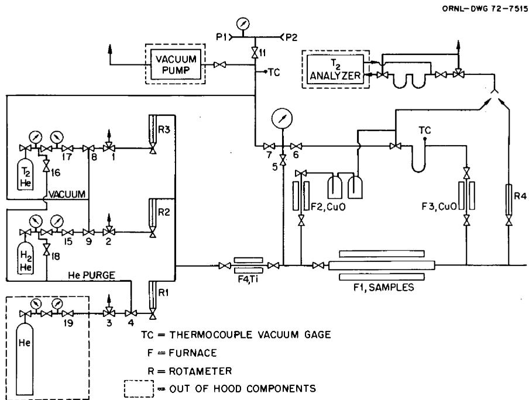  
Fig. 6.1. Apparatus for study of tritium sorption on graphite.

Table 6.1. Tritium sorption on commercial graphites   

<table><tr><td rowspan="2">Type of graphite</td><td colspan="2">Exposure conditions</td><td rowspan="2">Amount of tritium sorbed (μg T2/g)</td></tr><tr><td>Concentration (μCi of T2/cm3He)</td><td>Temperature (°C)</td></tr><tr><td rowspan="2">POCO</td><td rowspan="2">8</td><td rowspan="2">750</td><td>0.67 (surface)</td></tr><tr><td>0.07 (internal)</td></tr><tr><td rowspan="2">CGB</td><td rowspan="2">8</td><td rowspan="2">750</td><td>&gt;1.0 (surface)</td></tr><tr><td>0.03 (internal)</td></tr><tr><td rowspan="2">POCO</td><td rowspan="2">0.77</td><td rowspan="2">780</td><td>0.3 (surface)</td></tr><tr><td>0.04 (internal)</td></tr><tr><td rowspan="2">CGB</td><td rowspan="2">0.77</td><td rowspan="2">780</td><td>0.4 (surface)</td></tr><tr><td>0.016 (internal)</td></tr><tr><td rowspan="2">H-327</td><td rowspan="2">6.4</td><td rowspan="2">790</td><td>0.18 (surface)</td></tr><tr><td>0.068 (internal)</td></tr></table>

furnaces containing copper oxide (F2 and F3 in Fig. 6.1) were operated in conjunction with the apparatus for water analyses as well as continuous tritium analyses. These furnaces converted tritium to the oxide for use in some studies of the interaction of $\mathrm{T}_2\mathrm{O}$ with graphite. The exposure of $1\text{-cm}^3$ samples of graphite to the tritium-helium mixtures was carried out in the sample furnace (F1 in Fig. 6.1) in a quartz reactor. The tritium concentration was in the range of 1 to $10~\mathrm{ppm}$ by volume, partial pressures of about 0.1 Pa $(10^{-3}$ torr). Data were obtained on four types of

graphite: CGB (MSRE-type), POCO, H-327, and a carbon-black-pitch-bonded graphite A-681 (made at ORNL). After exposure conditions of about 4 hr at $750^{\circ}\mathrm{C}$ , the graphite pieces were sampled by removing successive 0.0152-cm (0.006-in.) samples that were analyzed for tritium. The tritium contents of the sample were substantially the same as those found in the examination of MSRE graphite, with values of several times $10^{9}$ dis $\min^{-1}g^{-1}$ for the outermost cut, decreasing to values below $10^{8}$ dis $\min^{-1}g^{-1}$ for interior samples. Tritium contents of 6 to $8\times 10^{10}$ dis

$\min^{-1} g^{-1}$ were found for some samples of high surface area (1 g tritium $\simeq 2.2 \times 10^{16}$ dis $\min^{-1}$ ).

The gradient of tritium concentration within the graphite qualitatively reflected the microstructure of the specimens (Table 6.1). Graphite sample H-327, with a ratio of 2 between external and internal tritium, appeared under the microscope to be most porous, whereas type CGB, which was highly impregnated, had a ratio of over 300. The third cut was found in several tests to be near the mean value at great depths. The data in Table 6.1 indicate a square-root dependence of sorption amount with $\mathbb{T}_2$ in pressure, and the dissociative process suggested is

$$
1 / 2 \mathrm {T} _ {2} (\mathrm {g}) + \mathrm {C} (\mathrm {s}) \rightarrow \mathrm {T} - \mathrm {C} (\mathrm {s}).
$$

Rinsing with water and alcohol did not remove significant amounts of tritium; hence, the chemical form of the tritium is uncertain. However, the large amount adsorbed at these very high temperatures is surprising.

The effect of surface area is shown by data in Table 6.2 obtained with several varieties of graphite that

had been oxidized with steam to increase their surface areas and were simultaneously exposed. All of the oxidized and unoxidized samples sorbed tritium to the extent of about $5 \times 10^{12}$ atoms/cm² with some differences attributable to graphite types. A similar experiment with $\mathrm{T}_{2}\mathrm{O}$ as the sorbent resulted in about $5 \times 10^{10}$ atoms/cm² except for the extensively impregnated CGB type. The tritium sorbed in this latter experiment possibly was sorbed as $\mathrm{T}_{2}$ rather than $\mathrm{T}_{2}\mathrm{O}$ . These data are shown in Table 6.3.

The amount of tritium in the moderator of an MSBR cannot be estimated with precision because of the uncertain effect of neutron irradiation damage to the graphite and the achieved tritium pressure. From the data obtained so far in this work, a few milligrams of tritium per kilogram of graphite would be expected. If the kinetics prove to be adequate, carbon might be useful in coolant processing for the removal of tritium. The daily production rate of tritium in an MSBR is about $250\mathrm{mg}$ . Thus, a processing method using perhaps a few hundred kilograms of graphite could possibly be effective for tritium removal.

Table 6.2. Tritium chemisorbed on three graphite types after exposure to tritium at $750^{\circ}\mathrm{C}$ for 6.5 hr $\mathrm{PT}_{2} = 0.14\mathrm{Pa}$ $(1.1\times 10^{-3}\mathrm{torr})$   

<table><tr><td rowspan="2">Graphite type and sample number</td><td colspan="3">Cut No. (μg T2/g C)</td><td rowspan="2">BET surface area (m2/g)</td><td rowspan="2">Tritiuma (atoms/cm2)</td></tr><tr><td>1</td><td>2</td><td>3</td></tr><tr><td>A681</td><td></td><td></td><td></td><td></td><td></td></tr><tr><td>17b</td><td>1.3</td><td>0.86</td><td>0.86</td><td>1.43</td><td>1.21×1013</td></tr><tr><td>18b</td><td>3.4</td><td>2.7</td><td>2.3</td><td>2.25</td><td>2.1 × 1013</td></tr><tr><td>21</td><td>0.31</td><td>0.11</td><td>0.981</td><td>0.203</td><td>8 × 1012</td></tr><tr><td>CGB</td><td></td><td></td><td></td><td></td><td></td></tr><tr><td>9b</td><td>2.1</td><td>0.79</td><td>0.52</td><td>1.68</td><td>6.2 × 1012</td></tr><tr><td>10b</td><td>3.0</td><td>0.88</td><td>0.59</td><td>2.31</td><td>5.1 × 1012</td></tr><tr><td>13</td><td>0.24</td><td>0.011</td><td>0.0076</td><td>0.218</td><td>7 × 1011</td></tr><tr><td>14</td><td>0.29</td><td>0.011</td><td>0.0077</td><td>0.319</td><td>5 × 1011</td></tr><tr><td>AXF-5QBG</td><td></td><td></td><td></td><td></td><td></td></tr><tr><td>1b</td><td>0.59</td><td>0.21</td><td>0.151</td><td>0.72</td><td>4 × 1012</td></tr><tr><td>2b</td><td>0.32</td><td>0.131</td><td>0.081</td><td>0.757</td><td>2.1 × 1012</td></tr><tr><td>5</td><td>0.40</td><td>0.026</td><td>0.027</td><td>0.180</td><td>3 × 1012</td></tr><tr><td>6</td><td>0.30</td><td>0.030</td><td>0.028</td><td>0.213</td><td>2.6 × 1012</td></tr></table>

${}^{a}$ Based on cut No. 3. ${}^{b}$ Oxidized.

Table 6.3. Tritium chemisorbed on three graphite types after exposure to $\mathbf{T}_2\mathbf{0}$ for $4\mathrm{hr}$ $\mathbf{P}_{\mathbf{T}_2\mathbf{0}} = 0.04\mathrm{Pa}(3\times 10^{-4}\mathrm{torr})$ and at several temperatures   

<table><tr><td rowspan="2">Graphite type and sample number</td><td rowspan="2">Temperature (°C)</td><td colspan="3">Cut number (μT2/g C)</td><td rowspan="2">BET surface area (m2/g)</td><td rowspan="2">Tritiuma (atoms/cm2)</td></tr><tr><td>1</td><td>2</td><td>3</td></tr><tr><td>A681</td><td></td><td></td><td></td><td></td><td></td><td></td></tr><tr><td>3b</td><td>728</td><td>0.21</td><td>0.144</td><td>0.117</td><td>1.51</td><td>1.6 × 1011</td></tr><tr><td>12b</td><td>194</td><td>6 × 10-4</td><td>6 × 10-4</td><td>5 × 10-4</td><td>2.08</td><td>5 × 108</td></tr><tr><td>8</td><td>626</td><td>0.19</td><td>0.15</td><td>0.13</td><td>0.506</td><td>5 × 1011</td></tr><tr><td>CGB</td><td></td><td></td><td></td><td></td><td></td><td></td></tr><tr><td>2b</td><td>726</td><td>0.17</td><td>0.095</td><td>0.074</td><td>1.66</td><td>9 × 1010</td></tr><tr><td>1</td><td>725</td><td>0.019</td><td>5 × 10-4</td><td>2 × 10-4</td><td>0.292</td><td>2.4 × 108</td></tr><tr><td>AXF-5QBG (POCO)</td><td></td><td></td><td></td><td></td><td></td><td></td></tr><tr><td>5b</td><td>728</td><td>0.11</td><td>0.0086</td><td>0.0054</td><td>1.04</td><td>1 × 1010</td></tr><tr><td>4</td><td>728</td><td>0.070</td><td>0.0029</td><td>0.0019</td><td>0.205</td><td>1.9 × 1010</td></tr></table>

$^\mathrm{a}$ Based on cut No. 3.   
$^b$ Oxidized.

# 7. Other Research

# 7.1 THE WETTING OF GRAPHITE BY BISMUTH AND BISMUTH-LITHIUM ALLOYS AS DETERMINED BY THE SESSILE DROP METHOD

G. E. Creek

C. E. Bamberger

Alloys of bismuth and lithium are used in processing the fluoride salts of a molten-salt reactor, and, since graphite is being considered as a material of construction for the processing equipment, it was of interest to determine whether graphite would be wetted by bismuth-lithium alloys. If the contact angle (measured through the liquid) of a sessile drop resting on a smooth surface of a solid is less than $90^{\circ}$ , the liquid is said to wet the solid.

The objective of these experiments was to measure the contact angles between sessile drops of bismuth and various bismuth-lithium alloys and surfaces of various types of graphite. After determination of the contact angles, values of the surface tension and density of the various alloys could be computed as additional information.

To perform these measurements, a silica furnace with a flat window and appropriate gas delivery and exit lines was constructed. To test the procedure, the contact angle of bismuth on ATJ graphite was measured at several temperatures. The corresponding surface tension was estimated to be 298 dyne-cm at $564^{\circ}\mathrm{C}$ and 327 dyne-cm at $704^{\circ}\mathrm{C}$ ; the values predicted from literature values were 359 and 348 dyne-cm, respectively. The disparity between the measured and predicted values could be due to adsorbed gases, or the fact that the contact angles were all greater than $150^{\circ}$ , making the contact points difficult to measure. At this time, the project was halted and the equipment was dismantled.

The only conclusions we are able to draw concerning the applicability of graphite as a container for bismuth and bismuth-lithium alloys are those based on a review of the literature. In the experiments described above, using molten bismuth on type ATJ graphite, the minimum value obtained for a contact angle was $155^{\circ}$ at $704^{\circ}\mathrm{C}$ . Since the criterion for wetting is a contact angle of less than $90^{\circ}$ , no wetting occurred. The surface tension $(\tau)$ of bismuth at $470^{\circ}\mathrm{C}$ is 363 dyne-cm, with a temperature coefficient $(d\tau /dt)$ of $-0.069$ dyne-cm/ $^{\circ}\mathrm{C}$ . The surface tension of lithium at its melting point is 398 dyne-cm with a temperature coefficient of $-0.14$ dyne-cm/ $^{\circ}\mathrm{C}$ . At

$700^{\circ}\mathrm{C}$ , the surface tensions of bismuth and lithium would be 348 and 325 dyne-cm, respectively; thus, one would expect the surface tension of alloys of these two metals, particularly those of low lithium concentration, to differ by a negligible amount from that of pure bismuth at this temperature.

However, wetting is not the only important aspect to consider when studying compatibility. The reactions of lithium with graphite to form intercalates and carbides change the geometry of the components and very probably change the nature of the contact surface.

If the lithium-bismuth alloys are used as proposed, the presence of other metals, such as uranium, cerium, and other fission products, must be expected. Klamut et al. reported that $\mathrm{CeC_2}$ was identified on graphite contacted with 25 ppm cerium in bismuth at $700^{\circ}\mathrm{C}$ for $110\mathrm{hr}$ , and that 180 ppm neodymium in bismuth reacts with graphite, with the neodymium concentrated at the graphite-liquid-metal interface. From diffusivity studies and because bismuth seems to permeate the pores of reactor grade graphite, Klamut et al. indicated that uranium, magnesium, zirconium and fission products may diffuse into graphite.

Cavin et al. report that pure lithium reacted with graphite at $700^{\circ}\mathrm{C}$ to form $\mathrm{Li}_2\mathrm{C}_2$ ; however, they estimate that lithium-bismuth (50-50 at. $\%$ ) would not react. They also report that tests with graphite crucibles indicate that the major problem is penetration of liquid metal into the pores. Although the project was terminated at a stage too early to obtain the data sought, the results quoted lead us to infer that graphite might not be a good choice for components exposed to alloys of such elements as Bi-Li-Re.

# 8. Development and Evaluation of Analytical Methods

A. S. Meyer

# 8.1 IN-LINE ANALYSIS OF BREEDER FUEL

R.F.Apple J.M.Dale

D. L. Manning A. S. Meyer

In-line electrochemical analyses of the fuel are planned for every major installation and many minor facilities of the MSR Program. Such measurements will determine the redox condition of the fuel $(\mathrm{U}^{4+} / \mathrm{U}^{3+}$ ratios) and, at present, allow estimates of the concentration of corrosion product ions. The performance of such analyses in a variety of systems will also provide practical experience that will be useful in perfecting in-line analytical devices for ultimate applications to reactor salt streams.

The first installation to resume operation was FCL-2b, a forced convection loop in which fluoroborate coolant had been circulated. This loop, which is designed to study corrosion of structural materials under conditions simulating flow velocities and temperature gradients in an MSBR, had been modified to provide a single penetration for electrodes. An electrode assembly consisting of two iridium electrodes in a 3/4-in. shield tube has recorded several thousand voltammograms from the initial filling of the loop and throughout controlled reduction of the fuel by beryllium additions. These measurements have provided initial experience in electrochemical measurements in breeder fuel compositions. The solvent for the initial runs, $\mathrm{LiF - BeF_2 - }$ $\mathrm{ThF_4}$ (68-20-12 mole $\%$ ), will later be replaced with the reference fuel composition (72-16-12 mole $\%$ ). Measurements in FCL-2b will, therefore, provide a comparison of the electroanalytical properties of the reference fuel with those of the more familiar MSRE compositions $(\mathrm{LiF - BeF_2 - ZrF_4})$ and, at least qualitatively, the effects of variations in composition in the region of the reference fuel. Also, because the conditions of measurement are far from ideal (the electrodes are located in an auxiliary vessel that is affected by pump-induced vibrations), experience is gained in making measurements under unfavorable conditions. Currently, diffusion-limited voltammograms can be obtained only when the pump is stopped and measures are taken to disrupt convective flow patterns within the electrode shield. A novel electrode assembly is being fabricated which contains five assorted electrodes within a 1/2-in. shield tube

that can be heated in the region above the melt level to minimize convection.

Measurements have been made of several hundred electroanalytical waves including peak heights and potentials and parameters for the assessment of ideality of wave shapes. Quantitative interpretation of these measurements is now in progress but is somewhat involved because both the temperature of the melt and the area of the exposed electrode changes continually after the pump is turned off. These values are expected to be sufficient to permit a comparison of the electroanalytical properties of the present and reference fuels, and certain qualitative observations can be made.

Because of the absence of zirconium, the thorium-bearing fuel exhibits a higher cathodic limit than MSRE compositions; this allows the observation of the $\mathrm{U}^{3+} \rightarrow \mathrm{U}^0$ reduction wave as well as the useful $\mathrm{U}^{4+} \rightarrow \mathrm{U}^{3+}$ wave. The measurements confirm the validity of the voltammetric $\mathrm{U}^{4+}/\mathrm{U}^{3+}$ ratio method in this fuel. As expected, the initial charge was quite oxidizing, $\mathrm{U}^{4+}/\mathrm{U}^{3+} \sim 10^5$ . Additions of beryllium metal in increments of from 8 to $60\mathrm{mg}$ reduced the uranium in an expected manner. In the mid-range reductions, the yield of trivalent uranium reached a value equivalent to about $90\%$ of the added beryllium metal. In earlier additions, a substantial fraction of the beryllium metal was consumed by $\mathrm{FeF}_2$ and other oxidants, while in the more reducing melts some $\mathrm{CrF}_2$ was reduced. Reductions were continued until about $2\%$ of the uranium was converted to $\mathrm{U}^{3+}$ and a significant reduction in the height of the $\mathrm{Cr}^{2+} \rightarrow \mathrm{Cr}^0$ wave was observed. The data will allow an estimate of the equilibrium quotient for the reaction

$$
2 U ^ {4 +} + \mathrm {C r} ^ {0} \leftrightarrow 2 U ^ {3 +} + \mathrm {C r} ^ {2 +}.
$$

The measurements have also pointed out problems in the application of stripping techniques to practical systems—even small variations in flow must be eliminated—and have revealed interesting anomalies in the behavior of $\mathrm{Cr}^{2+}$ in this melt. The chromium reduction wave is generally better separated from the uranium wave than in LiF-BeF $_2$ -ZrF $_4$ melts. It has been observed, from stripping measurements, that the plating of chromium virtually ceases when reductions are made at potentials several hundred millivolts more negative than the reduction wave (Fig. 8.1). Earlier it had been postulated that such an

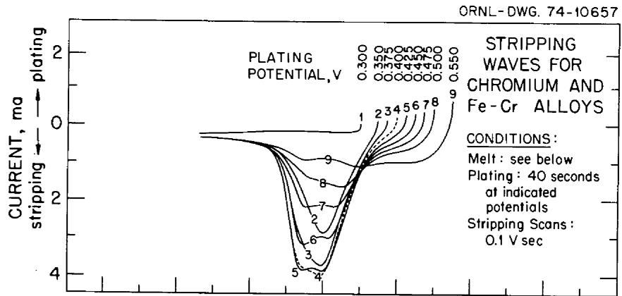

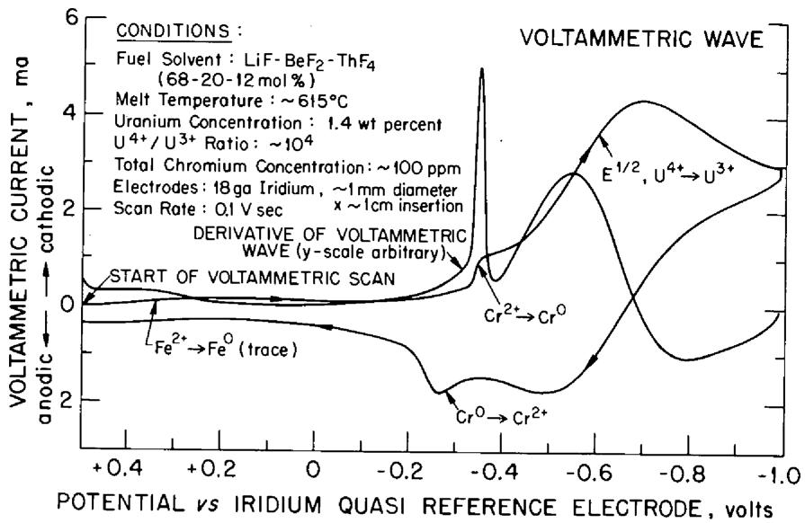  
Fig. 8.1. Typical electroanalytical measurements of MSBR fuel in a forced convection loop (FCL-2b).

effect could occur as a result of homogeneous reduction of $\mathrm{Cr}^{2+}$ by $\mathrm{U}^{3+}$ diffusing from the working electrode, but this effect had not been demonstrated in MSRE fuel, and there was no literature reference to similar phenomena, at least for inorganic systems. When the temperature of the fuel is increased, the height of the chromium waves decreases, followed by slow recovery. This behavior is unexpected because higher temperatures tend to favor increased dissolution of chromium and reaction rates have generally been assumed to be quite rapid in the molten fuels. Work is now in progress to examine the fuel during reoxidation by nickel fluoride additions.

# 8.2 DETERMINATION OF TRIVALENT URANIUM IN SIMULATED MSRE FUEL

J.M.Dale D.L.Manning A.S.Meyer

The equipment for the automated in-line determination of $\mathrm{U}^{3+} / \mathrm{U}^{4+}$ ratios in molten-salt reactor fuels was used to measure the reduction of the synthetic fuel charged to fuel pins (metal capsules fabricated from proposed structural alloys) for an in

pile experiment, TeGen-1. This experiment was the first of a series to investigate the effects of fission products, particularly tellurium, on the intergranular corrosion of alloys for molten-salt reactor fuel containment. To simulate the conditions of reactor operations in which the fuel would be maintained in a reducing condition, the $\mathrm{U}^{3+}/\mathrm{U}^{4+}$ ratio in the charge was adjusted to a level sufficient to maintain a reducing fuel (approximately $1\%$ of the uranium as $\mathrm{U}^{3+}$ ) despite the oxidation resulting from the fission process. Moreover, calculations showed that oxide on the inner surface of the capsules might be sufficient to consume a substantial fraction of the $\mathrm{U}^{3+}$ , and therefore, a pre-equilibration contact of the pin with the fuel was required to assure a known concentration of $\mathrm{U}^{3+}$ in the capsules. One proposal was to drain the pins after the equilibration period and recharge them with reduced fuel. This operation would require cooling the system and breaking and reconnecting numerous fittings, a procedure that might jeopardize the experiment. It would also consume time from an exceedingly tight schedule. Accordingly J. H. Shaffer, Chemical Technology Division, designed the following procedure to permit analyses of the equilibrated fuel and requested that we adapt our analytical techniques to it.

The fuel (MSRE solvent with $^{233}\mathrm{UF}_4$ ) was mixed in a reaction vessel and partially reduced by hydrogen sparging. After analysis, the $\mathrm{U}^{3+}/\mathrm{U}^{4+}$ ratio was adjusted to the desired range by successive treatments with beryllium metal. A portion of the fuel was then transferred to a prefill vessel connected to the fuel pin assemblies; this portion was again analyzed. The pins (three sets of four pins, each set fabricated from a different alloy) were filled and held at temperature for four days. Following this equilibration, the excess fuel from each set of pins, about $4\mathrm{cm}^3$ , was sequentially blown back into a small cavity at the bottom of the prefill vessel and again analyzed. If the ratios remained within the desired reducing range, the filling operation would be terminated and the costly refilling operation would be eliminated.

Electrode systems to fulfill these unusually exacting requirements were designed and installed. Because of the hazards from the $^{233}\mathrm{U}$ in the fuel, the operations were done in a dry box in an alpha containment facility. To protect the equipment from contamination, the electronic components, voltammeter and PDP-8/I computer were located in an adjacent room. Thus, the operation fulfilled many of the criteria of the proposed use for in-line analysis, including remote operation and the rapid acquisition of data without the hazard of sample withdrawal.

Table 8.1. MSR-ORR capsule TeGen-1 fuel analysis   

<table><tr><td>Operation</td><td>U3* wt %</td></tr><tr><td colspan="2">Preparation container</td></tr><tr><td>After fuel hydrogenation</td><td>1.88</td></tr><tr><td>Fuel frozen—remelted</td><td>1.76</td></tr><tr><td colspan="2">Prefill container</td></tr><tr><td>After transfer from prep container</td><td>1.83</td></tr><tr><td colspan="2">After pin equilibration</td></tr><tr><td>Stainless steel 304-L</td><td>1.75</td></tr><tr><td>Inconel 601</td><td>1.61</td></tr><tr><td>Hastelloy N</td><td>1.50</td></tr></table>

Table 8.1 summarizes results of the analyses. The agreement among the first three values reflects both the precision of the analyses and the care in the performance of the operation by the personnel involved. The ratios found in the samples from the fuel pins follow a trend that would be expected if the fuel were partially oxidized during the transfer, then reduced during equilibration in proportion to the activity of chromium in these different alloys. In view of the limited amount of data, this correspondence may well be fortuitous.

The first ratio in the table, $1.88\%$ , was substantially higher than expected. On the basis of the rate of evolution of HF at the termination of the hydrogenation step, a ratio below $0.7\%$ had been calculated from equilibrium coefficients for the reduction of $\mathrm{UF_4}$ in $\mathrm{LiF - BeF_2}$ melts with hydrogen. An investigation to resolve this discrepancy revealed that the thermocouple used to measure the melt temperature was malfunctioning. The ratio recalculated at the corrected temperature was in reasonable agreement with the analytical results. Had beryllium reduction been performed on the basis of the initially calculated ratios, the upper concentration limit of $2\%$ would most surely have been exceeded and the results of the experiment would have been compromised. Thus, this operation serves as an example of the practical value of the in-line analytical methods that are being developed for reactor salt streams.

# 8.3 IN-LINE AND OTHER SUPPORT ANALYSES FOR CIRCULATING NaF-NaBF4 COOLANT

J.M.Dale D.L.Manning A.S.Meyer

During the last quarter of 1972, a large fraction of the analytical chemistry research and development effort was expended in support of the Coolant-Salt

Technology Facility (CSTF), a pumped loop in which about $500\mathrm{kg}$ of the $\mathrm{NaBF_4 - NaF}$ eutectic mixture is circulated at a flow rate of about 785 gpm through the loop once every 10 sec. The facility contains a salt monitoring vessel to provide access to the salt for experiments carried out by various project members.

The salt monitoring vessel is fed by a side stream that enters the bottom of the vessel through a throttling valve that permits control of salt flow from 0.2 to $2\mathrm{gpm}$ at maximum loop pumping speed. The salt flows upward through a funnel-shaped vessel and overflows to produce a relatively stable surface. The top of the salt monitoring vessel is penetrated by six risers, each fitted with 1.5-in. ball valves. Two of these risers are fitted with Pyrex windows and angled so that their axes intersect the axis of one of the vertical risers at the surface of the melt and thus provide for illumination and observation of the melt. For the initial operations, three of these vertical risers, including the one equipped for observation, were assigned to analytical measurements. Thus, an unusual opportunity was provided to study more carefully the proposed in-line electroanalytical methods. Experience at the MSRE has demonstrated that the composition of large quantities of salt can be more readily controlled than that of the much smaller research melts.

On the basis of these research investigations, we expected to perform voltammetric measurements of certain corrosion products and electroactive protonated species, and to measure the melt potential vs a lanthanum-fluoride-membrane electrode that uses the $\mathrm{Fe - FeF_2}$ couple as a reference. Before starting the loop, we made voltammetric measurements in a quiescent melt on the material used to charge the CSTF to determine whether the material presented any unusual features.

At $500^{\circ}\mathrm{C}$ , the melt exhibited the anticipated reduction waves for iron and a rather large proton wave (despite low $\mathrm{BF}_3\mathrm{OH}^-$ analysis and careful thorough evacuation before remelting), but it exhibited no chromium wave. Subsequent analyses of samples from the CSTF indicated that the total chromium content of the salt was 30 ppm or less initially. On heating to $600^{\circ}\mathrm{C}$ , the cathodic limit of the melt decreased several hundred millivolts, so that observation of the reduction of 200 ppm of added $\mathrm{Cr}^{3+}$ at a platinum electrode was not possible. Previously, at $500^{\circ}\mathrm{C}$ , a $\mathrm{Cr}^{3+} \rightarrow \mathrm{Cr}^0$ reduction wave had been observed at about $-1.0\mathrm{V}$ , which is near the cathodic limit of the melt. An even greater decrease in the cathodic limit was seen at the palladium

electrode. This change in limit is attributed to the alloying of the boron reduction product with the electrode material.

We screened a number of alternative electrode materials and found that iridium, pyrolytic graphite, and copper yield resolved $\mathrm{Cr}^{3+}$ waves at $600^{\circ}\mathrm{C}$ comparable to those obtained from platinum at $500^{\circ}\mathrm{C}$ . However, on a gold electrode the chromium wave appeared about $100\mathrm{mV}$ earlier, giving better resolution from the melt limit, apparently as a result of alloying of the deposited chromium. Silver offers no advantages, and rhenium and tantalum are too active for use in $\mathrm{NaBF}_4$ melts.

On the basis of these studies, we selected electrode systems which included the evacuable palladium electrode for the measurement of the protonated species and pyrolytic graphite, and copper, iridium, and gold electrodes for the measurement of corrosion products. Some of these electrodes were installed in a shield tube that was inserted in one of the vertical risers. The shield is a 1-in. tube of thin-walled Inconel which penetrates the melt to below the level of the electrodes. It can be purged with $\mathrm{He - BF_3}$ cover gas and then connected to the melt blanket gas to provide fresh melt surfaces and an essentially quiescent melt around the electrodes. The remaining electrodes were installed without shields beneath the viewing ports so that the effects of surface films on the measurements could be evaluated. From these preliminary measurements, we expected to observe milliampere reduction waves in the salt monitoring vessel of the protonated species at the palladium electrode and of $\mathrm{Fe}^{3 + }\rightarrow \mathrm{Fe}^{2 + }$ at about $0\mathrm{V}$ , $\mathrm{Fe}^{2 + }\rightarrow \mathrm{Fe}^0$ at about $-0.4\mathrm{V}$ , and $\mathrm{Cr}^{3 + }\rightarrow \mathrm{Cr}^0$ at $-0.7$ to $-0.8\mathrm{V}$ at the gold, pyrolytic graphite, iridium, and copper electrodes.

Actually, our first measurements revealed a large previously unobserved wave of about $100\mathrm{mA}$ near 0 V. The wave and its attendant stripping wave were quite persistent and were obtained on all electrodes. After several hours of scanning, the wave began to decrease with each successive scan (Fig. 8.2). This wave is attributed to deposition of nickel on the surface of the electrode, and indeed a plating of metallic nickel was later observed on electrodes removed from the salt monitoring vessel. When the electrode is set at the initial anodic potential, a film of sparingly soluble $\mathrm{NiF_2}$ is formed, which blocks further current flow. With cathodic scanning, as the sharp peak is observed, slightly negative of zero volt, the film is reduced rapidly. On the return scan, the

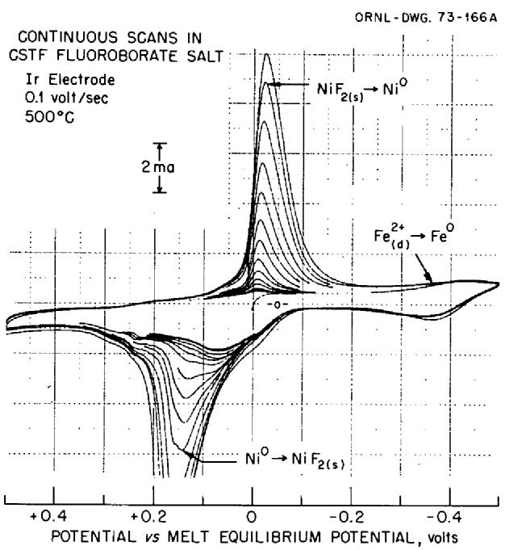  
Fig. 8.2. Decrease in $\mathrm{NiF}_2\rightarrow \mathrm{Ni}^0$ wave during scanning.

$\mathrm{NiF}_2$ blocking layer is re-formed when the potential becomes anodic. The nickel film forms even on an electrically isolated electrode, apparently by mass transfer to the electrodes, which are slightly cooled by conduction of heat up the support rod. At present, this nickel wave does not appear to offer any practical analytical application and is primarily a nuisance. It can be substantially eliminated by holding the electrodes at anodic potentials $(\geq +0.3\mathrm{V})$ when not in use.

By using this technique and by using faster scan rates $(0.5\mathrm{V}\sec^{-1})$ to minimize the effects of flow variations, we were able to obtain corrosion product voltammograms of the quality shown in Fig. 8.3, which is an actual recording of a series of voltage scans. Accurate interpretation of these scans in terms of concentrations is not yet possible, because the baseline at this scan rate is not accurately established. Tentatively, the curves have been estimated to correspond to values of $100~\mathrm{ppm}$ of iron and 15 to 30 ppm of chromium. These concentrations are somewhat lower than those measured by wet chemical analyses of samples withdrawn from the loop (about $150~\mathrm{ppm}$ of iron and $40~\mathrm{ppm}$ of chromium). This result is to be expected, because the voltammetric method is sensitive only to soluble ionic species while the chemical analyses include insoluble species such as free metals. The small peak between the $\mathrm{Fe}^{3+}$ and $\mathrm{Fe}^{2+}$ reduction waves has not been

observed previously. Mamantov has suggested that its potential (about $-0.2\mathrm{V}$ ) might correspond to the reduction of $\mathsf{Mo}^{3+}$ to the metal. About $25~\mathrm{ppm}$ of molybdenum was reported by chemical analysis.

The precision of the measurement was quite satisfactory when parameters were held constant. Although during the early stages of operation many experimental changes were made, sufficient measurements were made at the gold electrode at a $0.5\mathrm{-V}$ -sec-1 scan rate to permit an estimate of the precision of the voltammetric measurements. For 25 measurements over a six-week operating period, the wave heights for the $\mathrm{Cr}^{3 + }$ and $\mathrm{Fe}^{2 + }$ waves were reproducible to better than $\pm 15\%$ . These values were calculated by including statistically rejectable values and without attempting to correct for possible systematic variations in the actual concentration of $\mathrm{Cr}^{3 + }$ and $\mathrm{Fe}^{2 + }$ in the salt. Reproducibility would be expected to improve with additional data and more careful evaluation. The precision of measurement of the $\mathrm{Fe}^{3 + }$ wave, which is subject to interference from the residual nickel wave, and the smaller unidentified wave, is of the order of $\pm 20\%$ . Therefore, the

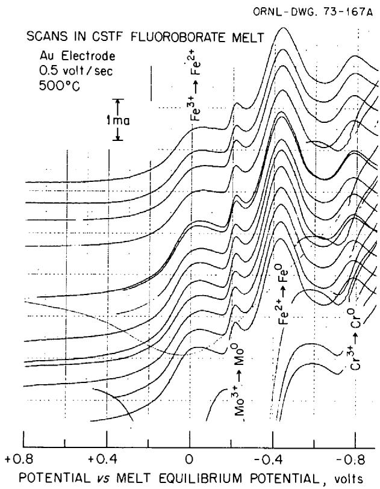  
3. G. Mamantov, personal communication, 1972.   
Fig. 8.3. Voltammograms of corrosion products in CSTF.

voltammetric method, although requiring much additional experimental work, should offer a practical method for the in-line monitoring of corrosion products in reactor coolant streams.

Electroanalytical and spectrophotometric research suggests that the electroactive protonic species in fluoroborate melts is present in very small concentration and is highly mobile, in contrast to infrared-active $\mathrm{BF}_3\mathrm{OH}^-$ , which appears to be relatively stable and perhaps covalent. Moreover, the electroactive species rapidly equilibrates with a volatile species that apparently corresponds to the condensate found in downstream sections of the off-gas systems of engineering test loops. Based on evidence from various sources, the phenomena observed are best explained by postulated equations of the following types:

$$
\begin{array}{l} 2 \mathrm {N a B F} _ {3} \mathrm {O H} (\mathrm {d}) + \mathrm {N a B F} _ {4} (\mathrm {d}) \stackrel {\text {s l o w}} {\rightleftarrows} (\mathrm {N a B F} _ {3}) _ {2} \mathrm {O} (\mathrm {d}) \\ \begin{array}{c} \mathrm {B F} _ {3} \cdot \mathrm {H} _ {2} \mathrm {O} (\mathrm {g}) \\ 1 \downarrow \end{array} \\ + \mathrm {N a F} (\mathrm {d}) + \left[ \mathrm {H B F} _ {3} \mathrm {O H} (\mathrm {d}) \right] \\ \mathrm {H} ^ {+} (\mathrm {d}) + \mathrm {B F} _ {3} \mathrm {O H} ^ {-} (\mathrm {d}) \\ \end{array}
$$

The actual composition of the compounds on the right of the above equations is not established; the intermediate, $\mathrm{HBF}_3\mathrm{OH}$ , is expected to be of only transient stability, and the free proton is surely solvated, probably as $\mathrm{HF}_2^-$ . Attempts to establish stoichiometry and equilibrium constants by variational methods in small research melts were inconclusive because of the adventitious introduction of traces of protons during additions made to modify gross melt composition. The large salt volumes in the CSTF offered promise for more precise studies of these protonated species.

During the initial operations of the CSTF, the nickel wave obscured any voltammetric measurements of the electroactive protonic species. The relative concentration of active protons could be measured by observing the pressure rise within the hollow palladium electrode when held at a potential cathodic to the wave (about $-0.5\mathrm{V}$ ). The rate of pressure rise decreased rapidly to approach the limit of detection with a thermocouple vacuum gage during the first week's operation. After the loop was

drained for a maintenance shutdown, some uncirculated salt was brought up from the drain tank, and a significant pressure rise was again noted. The rate of pressure rise over a two-day period is plotted as the upper curve in Fig. 8.4. The data are in good agreement with a first-order reaction of $10\mathrm{hr}$ half-life. After the protons had been removed substantially from the melt, $1\mathrm{cm}^3$ of water was injected via a stream of helium into the pump bowl. The data plotted in the lower curve show a similar rate of decay.

If all the hydrogen in the water had been converted to active protons, a concentration of 200 ppb would have been obtained. Since infrared measurements

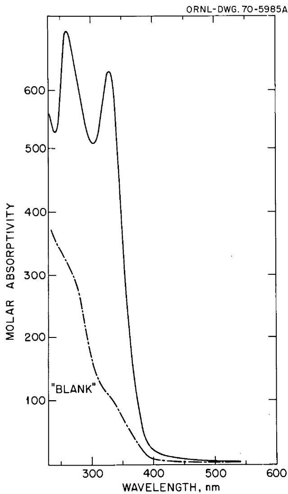  
Fig. 8.4. Decay of active protons in CSTF fluoroborate melt.

have demonstrated that some of the water absorbed on $\mathrm{NaBF_4}$ is converted to $\mathrm{BF}_3\mathrm{OH}^-$ on melting, and since some of the injected water may not have been absorbed, the initial rate of pressure rise apparently corresponds to a concentration of no more than 100 ppb of protons. By combining these values with wave heights and pressure rise rates observed at similar electrodes in a research melt, we have calculated a diffusion coefficient of $8\times 10^{-5}\mathrm{cm}^2\mathrm{sec}^{-1}$ at $500^{\circ}\mathrm{C}$ . This calculation confirmed our earlier conclusions that the active protonated species, probably a loosely solvated proton, must be more mobile than other ions in fluoroborate melts, whose diffusion coefficients are typically $10^{-6}\mathrm{cm}^2\mathrm{sec}^{-1}$ .

The above experiments supported our hypothesis regarding the nature of proton reactions in molten fluoroborate. We, therefore, suggested that the active proton species might be exploited to minimize the amount of tritium that could be released to the environment from MSBRs by diffusion through heat exchangers and steam generators. Earlier suggestions that the tritium could be held up via exchange with $\mathrm{BF}_3\mathrm{OH}^-$ appear to be of dubious value, since no significant exchange between $\mathrm{BF}_3\mathrm{OH}^-$ and diffused deuterium has been demonstrated. Exchange with the active protons would appear much more likely and would offer an avenue for stripping the tritium through the off-gas system via either condensation or collection in a proton-depleted salt.

Dunlap Scott of the Reactor Division suggested that if this hypothesis were valid, residual tritium diffusing from the MSRE components from which the CSTF was fabricated would have collected in the condensate. The values reported in Table 8.2 clearly demonstrate a high concentration factor of about $10^{5}$ in the collected condensate.

7. J. P. Young, J. B. Bates, and G. E. Boyd, MSR Program Semiannu. Progr. Rep. Aug. 31, 1972. ORNL-4832, p. 52.

These data are indeed promising but are not sufficient to establish the mechanism of the tritium transport or its overall effectiveness. We have no reliable information as to the quantities of tritium that could have diffused into the melt, the efficiency of trapping of the condensate and its chemical nature, or the nature of tritium bonding to the black film on the surface of the fluoroborate samples. We have performed analyses on the limited quantities of condensate available and on synthetic condensate generated by the reaction of $\mathrm{BF}_3$ with water. Typical results are shown in Table 8.3.

Attempts to perform material and ionic balances on these results and to use nuclear magnetic resonance and infrared spectra of such material indicate that it is a mixture rather than a simple compound. The synthetic mixture corresponds reasonably well to a mixture of $\mathrm{BF}_3\cdot \mathrm{H}_2\mathrm{O}$ with HF and $\mathrm{H}_3\mathrm{BO}_3$ . The condensate from the CSTF contains much less free fluoride and has a lower density than the synthetic products. Possibly, its composition had been modified during the extended sweeping periods and by reaction with the glass traps used for collection. The density of pure $\mathrm{BF}_3\cdot \mathrm{H}_2\mathrm{O}$ is reported to be 1.82.

Table 8.2. Tritium content of NaF-NaBF4 coolant loop exposed to tritium   

<table><tr><td>Sample</td><td>Range of tritium values (nCi g-1)</td></tr><tr><td>Off-gas condensate</td><td>0.8×106to 3.0×106</td></tr><tr><td>Salt</td><td>4 to 10</td></tr><tr><td>Black film concentrate</td><td>&gt;200°</td></tr></table>

A sample of black film was impossible to obtain without including some salt substrate. This value is certainly a minimum value; the tritium content of the black film only may be an order of magnitude higher.

Table 8.3. Analyses of BF, condensates   

<table><tr><td>Component (millimoles/g)</td><td>Melt condensatea</td><td>Product from BF3-liquid H2Ob</td><td>Product from BF3-H2O vaporb</td></tr><tr><td>H+</td><td>12.0</td><td>12.1</td><td>12.9</td></tr><tr><td>Free F-</td><td>0.22</td><td>7.7</td><td>7.1</td></tr><tr><td>Bound F-</td><td>22.6</td><td>19.5</td><td>20.1</td></tr><tr><td>Total B</td><td>9.3</td><td>11.9</td><td>12.0</td></tr><tr><td>B as H3BO3</td><td>c</td><td>c</td><td>4.6</td></tr></table>

Density, $1.52\mathrm{g / cm}^3$   
Density, $1.72\mathrm{g / cm}^3$   
Not determined.

We have assisted Reactor Division personnel in planning additional experiments that involve the controlled diffusion of deuterium into the CSTF. Such experiments should answer fundamental and practical questions about the effectiveness of $\mathrm{NaBF_4}$ as a tritium containment medium, and establish whether the interdiction of tritium can be achieved through the exchange with active protons or through a proposed redox mechanism such as

$$
1 / 2 \mathrm {T} _ {2} + \mathrm {O} ^ {2 -} + 1 / 3 \mathrm {C r} ^ {3 +} \rightarrow \mathrm {O T} ^ {-} + 1 / 3 \mathrm {C r} ^ {0}. ^ {. 9}
$$

Calculations based on various proposed mechanisms have indicated that, in some cases, analytical methods of improved sensitivity will be required to provide definitive data for the interpretation of deuterium injection experiments. The needed improvements are being investigated under the areas of electroanalytical and spectrophotometric research and development as discussed in the following sections.

# 8.4 STUDIES ON THE ELECTROREDUCTION OF URANIUM(IV) IN MOLTEN LiF-BeF $_2$ -ZrF $_4$

D. L. Manning Gleb Mamantov

We applied square-wave voltammetry to a study of the reduction of $\mathrm{U}^{4+}$ in molten $\mathrm{LiF - BeF_2 - ZrF_4}$ . The low resistance of molten-salt solutions, which results in a low resistive capacitance time constant for small-area electrodes, should render them attractive for square-wave voltammetric techniques. Other attractive features of square-wave voltammetry are the ability to measure Faradaic current in the virtual absence of charging current and the increased sensitivity afforded over conventional voltammetry. However, until now there has been only one application of square-wave voltammetry to the study of solute species in molten salts.[10]

At $500^{\circ}\mathrm{C}$ under our conditions, the equation for the peak current of a square-wave voltammogram is given as

$$
i _ {\max } = 3. 4 9 6 \times 1 0 ^ {5} n ^ {2} A D ^ {1 / 2} C F ^ {1 / 2} \triangle E, \tag {1}
$$

where $i_{\mathrm{max}} =$ peak current (amps), $n =$ number of electrons, $A =$ electrode area $(\mathrm{cm}^2)$ , $D =$ diffusion coefficient $(\mathrm{cm}^2 \sec^{-1})$ , $C =$ concentration of diffusing

species (moles $\mathrm{cm}^{-3}$ ), $F =$ square-wave frequency (Hz), and $\triangle E =$ magnitude of the square-wave step (V).

A melt was prepared which contained $0.09\mathrm{MU}^{4+}$ , the concentration of interest in the MSRE fuel salt. We recorded current-voltage curves at small platinum and iridium electrodes by superimposing a square-wave voltage on the controlled potential ramp of a controlled-potential, controlled-current cyclic voltammeter. Oscillographic recordings were made of both cathodic and anodic branches of the cell current simultaneously. We observed that $i_{\mathrm{max}}$ varied with frequency and amplitude of the square wave, as predicted from Eq. (1). The frequency and amplitude were varied from 100 to $1600\mathrm{Hz}$ and 0.01 to $0.05\mathrm{V}$ , respectively. Linear voltage scan rates that were used varied from about 0.02 to $0.1\mathrm{V}\sec^{-1}$ . From these observations, square-wave voltammetry appears well suited for the study of reversible electrode processes in molten salts. The apparent rapid decay of double-layer charging renders feasible the use of higher square-wave frequencies than normally used for aqueous systems. This work is reported in more detail in Electrochimica Acta.[11]

# 8.5 ELECTROANALYTICAL STUDIES OF TELLURIUM IN MOLTEN LiF-BeF $_2$ -ZrF $_4$ (65.6-29.4-5.0 mole %)

D. L. Manning Gleb Mamantov

While awaiting delivery of the thorium-containing MSR fuel salt, we set up two cells for electrochemical studies on tellurium and bismuth in molten LiF $\mathrm{BeF}_2$ - $\mathrm{ZrF}_4$ remaining from the earlier program. Electroanalytical studies of tellurium are of interest, since tellurium occurs in nuclear reactors as a fission product and recently has been considered a prime cause of shallow intergranular cracking in structural metals and alloys.[12] For the tellurium studies, the melt was contained in a pyrolytic boron nitride cup, and the holder for a small tellurium pool electrode (1/8-in.-diam) was fabricated from hot pressed boron nitride. Contact to the molten pool was made with iridium wire.

Immediately after dipping the electrodes into the melt at $500^{\circ}\mathrm{C}$ , cathodic polarization curves on the

tellurium pool electrode revealed a prewave at about $-0.6\mathrm{V}$ vs an iridium quasi-reference electrode, followed by the limit at about $0.75\mathrm{V}$ . The anodic limit occurs at about $0.9\mathrm{V}$ . After about $24\mathrm{hr}$ , the anodic limit remained the same; however, the prewave shifted to about $-0.8\mathrm{V}$ , and the cathodic limit was seen at about $-0.9\mathrm{V}$ . After this initial shift, the potentials of the prewave and cathodic limit remained stable.

The anodic limit is believed to be due to the oxidation of tellurium, and the cathodic limit corresponds to the $2\mathrm{Li}^{+} + \mathrm{Te} + 2\mathrm{e}\rightarrow \mathrm{Li}_{2}\mathrm{Te}$ reaction. The voltage span from anodic to cathodic limit of about $1.6\mathrm{V}$ (fresh tellurium surface) and $1.8\mathrm{V}$ aged surface) can be compared to $1.2\mathrm{V}$ in LiCl-KCl at $450^{\circ}\mathrm{C}$ reported by Bodewig and Plambeck.13 However, these workers did not report a prewave prior to the cathodic limit as observed in the molten LiF-BeF-ZrF4.

The reaction responsible for this prewave has not been established. It was not seen on background scans, and the wave height has not changed significantly with time after the tellurium electrode was dipped into the melt. One possibility is the reduction to a lower valent tellurium species, such as $\mathrm{LiTe}_3$ , by some impurity route. Bamberger, Young, and Ross have reported the existence of such $\mathrm{Li}_m\mathrm{Te}_n$ species in molten fluorides based on spectral studies.

Chronopotentiograms recorded for this wave at the tellurium pool electrode, although not well defined in all cases, did reveal a ratio of forward-to-reverse transition time $(\tau)$ of about 3:1. Adsorption of the tellurium species at the electrode was also indicated from the chronopotentiometric data since the $i\tau^{1/2}$ product consistently increased with increased current density.

Adsorption of the supposed tellurium species was also noted at gold and iridium electrodes as indicated from voltammetric and chronopotentiometric data. The chronopotentiometric results best fit the equation that pertains to the simultaneous reduction of diffusing and adsorbed species15 which is given as

$$
i \tau = 1 / 2 n F \pi^ {1 / 2} A D ^ {1 / 2} C \tau^ {1 / 2} + n A F \Gamma . \tag {2}
$$

The symbol $\Gamma$ represents surface excess (moles $\mathrm{cm}^{-2}$ ); the other terms have their usual significance. By assuming an $n$ value of 2 (probably the limiting case),

calculation of the $\Gamma$ term gives a value of about $4\times 10^{-9}$ moles $\mathrm{cm}^{-2}$ , which can be compared to about $10^{-10}$ moles $\mathrm{cm}^{-2}$ typical for aqueous systems.

These observations support other work $^{12}$ that points to intergranular cracking by tellurium. Adsorption of tellurium compounds would provide a reservoir of tellurium at the surface. The adsorbed $\mathrm{Li}_m\mathrm{Te}_n$ species may disproportionate to more stable tellurides and elemental tellurium. Elemental tellurium in molten $\mathrm{LiF - BeF_2 - ZrF_4}$ is more difficult to reduce than $\mathrm{Ni}^{2 + }$ or $\mathrm{Fe}^{2 + }$ , because it is comparable to $\mathrm{Cr}^{2 + }$ and more easily reduced than $\mathrm{U}^{4 + }$ . As known $\mathrm{Li}_m\mathrm{Te}_n$ species become available, standard additions to the fuel salt are planned for electroanalytical studies. If the electrode reactions are reversible, the limits of detection by pulsed voltammetric techniques may be extended.

# 8.6 ELECTROANALYTICAL STUDIES OF BISMUTH IN MOLTEN

# LiF-BeF $_2$ -ZrF $_4$ (65.6-29.4-5.0 mole %)

Gleb Mamantov D. L. Manning

Bismuth, because of its use in fuel processing systems, $^{16}$ is a possible impurity in MSBR fuel salt. This study is directed toward the characterization of the electroanalytical chemistry of $\mathrm{BiF}_3$ in molten fluoride salts to assess the potential of the in-line measurement of traces of bismuth in the return stream from processing systems. For our previous work on bismuth, $^{17}$ the melt was contained in graphite or copper cells. Bismuth (added as $\mathrm{BiF}_3$ ) was slowly lost from the molten LiF- $\mathrm{BeF}_2$ - $\mathrm{ZrF}_4$ at $500^{\circ}\mathrm{C}$ . The two main routes for the loss would appear to be the reduction of the $\mathrm{Bi}^{3+}$ by the container material or volatilization of the $\mathrm{BiF}_3$ . To further investigate this problem, a cell containing $\mathrm{Bi}^{3+}$ was set up; the melt was contained in a glassy carbon cell.

Well defined voltammograms and chronopotentiograms were obtained in a melt of approximately 10 millimoles in $\mathrm{BiF}_3$ at gold, iridium, and glassy carbon electrodes. The peak potential for the $\mathrm{Bi}^{3+} \rightarrow \mathrm{Bi}^0$ reduction occurs at about $-0.1\mathrm{V}$ vs an iridium quasi-reference electrode (Ir QRE). (Prior results showed that this reduction occurs at about $+0.1\mathrm{V}$ vs $\mathrm{Ni}^{2+}/\mathrm{Ni}$ reference electrode.) For the chronopotentiograms,

the ratio of the forward-to-reverse transition time was essentially unity at the three indicator electrodes. Again, however, the bismuth was slowly lost from the melt as revealed by a gradual decrease in the peak height of the voltammograms. To check for volatilization, a cold finger was placed in the cell for a few days and an x-ray fluorescence analysis of the deposited film indicated that the major constituent was indeed bismuth. Thus, bismuth appears to be slowly lost from molten $\mathrm{LiF - BeF_2 - ZrF_4}$ at least in part by volatilization; this conclusion is in agreement with the work of Cubicciotti.[18]

These studies to determine the lower limits of detection by voltammetry and stripping techniques will continue. We believe meaningful analytical results from on-line measurements can still be obtained, because the rate of bismuth loss is slow. Nickel constitutes a primary interference. Therefore, studies will be made on melts that contain both bismuth and nickel. Transpiration techniques will be investigated as methods to separate the volatile $\mathrm{BiF}_3$ for determination by high-sensitivity gas analytical methods, for example, flameless atomic absorption.

# 8.7 ELECTROANALYTICAL STUDIES IN MOLTEN NaBF4

D. L. Manning B. R. Clark

E. R. Malone19 R. V. Buhl20

We have resumed electroanalytical studies in a fluoroborate coolant melt prepared from materials purified during the earlier program. Planned studies of the free proton wave have been delayed by the failure of our only remaining hollow palladium electrode. While awaiting materials for the fabrication of new electrodes, we have started studies of corrosion products. Observations reveal that the $\mathrm{Fe}^{2+}$

$\rightarrow \mathrm{Fe}^0$ reduction conforms to a soluble species reduction at a gold electrode and to a partially soluble species reduction at an iridium electrode. This solubility was demonstrated by chronopotentiometric measurements that serve as useful indicators of the nature of the electroreductions. For the soluble species case, the ratio of the forward-to-reverse transition time is 3:1, while for the insoluble case it is 1:1. For both electrode materials, the

observed ratio is approximately 3:1. It was noted earlier,[20] on the basis of wave positions and slopes, that chromium alloys with gold but not with iridium or pyrolytic graphite electrodes.

Establishment of the nature of the electrodeposition reactions is of practical analytical interest. Generally, the alloying is favorable for direct voltammetric measurements, because the position of the waves does not change with concentration and such soluble systems are amenable to square-wave voltammetry. Square-wave voltammetry offers increased sensitivity and stability.[11] This technique (typically a $400\mathrm{-Hz}$ , 50-mV square wave superimposed on a 0.1-V-sec linear ramp) has produced well defined waves with current enhancement in close agreement with theoretical predictions.

After adding chromium as $\mathrm{Na}_3\mathrm{CrF}_6$ to the melt, the iron and chromium waves were resolved without difficulty. The peak potentials are separated by about $350~\mathrm{mV}$ , which is adequate for analytical purposes. However, at slow scan rates $(< 0.5\mathrm{Vsec}^{-1})$ the chromium wave in the presence of iron is not as well defined as in the absence of iron. This effect is probably caused in part by the predeposition of iron on the gold electrode which alters the surface characteristics of the electrode by the time chromium is deposited. At faster scan rates, this distortion for the most part disappears, and the waves are well defined. Linear $i_p$ vs $\mathbf{v}^{1 / 2}$ plots were obtained for both species. A calculation of the iron concentration from the slope of the line agreed well with the value from chemical analysis (about $300~\mathrm{ppm}$ ). A similar calculation for the concentration of chromium revealed a value of $130~\mathrm{ppm}$ . This value is low when compared to the amount of chromium (about $260~\mathrm{ppm}$ ) added to the melt, but it is in agreement with the value of chromium (about $125~\mathrm{ppm}$ ) obtained from chemical analysis. The melt, therefore, is probably saturated in chromium at about $125~\mathrm{ppm}$ at $500^{\circ}\mathrm{C}$ . We will make measurements and take a sample at $600^{\circ}\mathrm{C}$ to observe the effect of temperature on the chromium solubility. Concentration values from square-wave voltammograms recorded at 400 and $900~\mathrm{Hz}$ were in agreement with the linear scan results. As expected, the addition of chromium exhibited no effect on the chronopotentiograms for the iron wave, which conforms to a soluble species reduction at a gold electrode.

Voltammetric studies were also carried out for an anodic wave seen at a gold electrode at about $+1.5\mathrm{V}$ vs an iridium quasi-reference electrode. This wave seems to be related to the $\mathrm{NaBF}_3\mathrm{OH}$ content of the melt, the electrode reaction probably being $-\mathrm{OH}^{-}\rightarrow$

$\mathrm{H}^{+} + 1 / 2\mathrm{O}_{2} + 2\mathrm{e}$ . The wave is reasonably well defined; noise is encountered on the diffusion current plateau which is indicative of gas formation at the electrode surface. However, the wave is irreversible; no reverse current is seen even at relatively fast $(20\mathrm{V}\sec^{-1})$ scan rates. In nonrecrystallized "as received" $\mathrm{NaBF_4}$ which was found to be 16 millimoles $\mathrm{NaBF}_3\mathrm{OH}$ by infrared, the wave height was about $1.5\mathrm{mA}$ . In a recrystallized batch of $\mathrm{NaBF_4}$ now analyzing about 120 millimoles $\mathrm{NaBF}_3\mathrm{OH}$ , the wave height increased to about 30 mA. The wave height varied in proportion to the ratio of known mixtures of the nonrecrystallized and recrystallized salt used for melt preparation, and it appears to be stable with time. Additional calibration will be required, but this anodic wave will probably prove valuable for the investigation of the effect of $\mathrm{BF}_3\mathrm{OH}^-$ on corrosion and on tritium containment by coolant salt.

A review of the analysis of the deuterium injection experiment at the $\mathrm{CSTF}^8$ has indicated that improvement will be needed in the sensitivity of the palladium electrode, particularly for the measurement of dissolved elemental deuterium that may be present at about $10^{-4}$ torr. Calculations are being made to optimize the design of the electrode-vacuum assembly (palladium probe) with respect to parameters such as active electrode area, maximized conductance of connecting tube consistent with small volume requirements, and the combination of vacuum gages to accommodate the range of elemental deuterium and active proton concentrations that are predicted under various assumptions. Highly sensitive thermocouple gages (range $10^{-4}$ to $10^{-2}$ torr) are being obtained for improved measurement of the collected hydrogen isotopes. Use of the more sensitive ionization gages is precluded by their high pumping rates for hydrogen.

# 8.8 SPECTROPHOTOMETRIC RESEARCH

# J. P. Young

No spectral measurements are currently being made in MSBR salts, because we have assigned our resources to more urgent needs of the MSR Program. Since the interruption of the program, we have been conducting basic spectrophotometric research in the analytical chemistry of transuranic elements which, while not of direct and immediate application to molten-salt reactors, is expected to provide basic data for later development of in-line methods. Such investigations include a study to relate absorption

spectra and coordination of rare earth halides,[21] the development of a new class of isotopic light sources,[22] and preparations for the characterization of unusual oxidation states of transuranic elements in molten salt solvents.[22] Isotope pairs of widely divergent activity have been requested for two transuranic elements, curium and plutonium, to measure their relative solubilities in fuel solvents (by spectrophotometry) and thus to test an hypothesis that oxide is removed from fuel by radiolytic processes. Experimental work will begin when isotopic pairs of either element are made available.

Results of work completed since the interruption of the MSR Program are summarized below, together with a program of spectrophotometric studies for the improved analysis of fluoroborate coolant salt.

# 8.9 SPECTRAL STUDIES OF $f$ -d AND $f$ -f TRANSITIONS OF $\mathrm{Pa(IV)}$ IN MOLTEN LiF-BeF $_2$ -ThF $_4$

J. P. Young C. E. Bamberger R. G. Ross

The following paragraph is a condensed version of a note published in J. Inorg. Nucl. Chem. $^{23}$

The transparency of the solvent for MSBR fuel, $\mathrm{LiF - BeF_2 - ThF_4}$ (72-16-12 mole $\%$ ), in the range 200 nm to $2.5\mu$ permits detailed examination of the absorption spectra of dissolved $\mathrm{Pa(IV)}$ a species of particular interest to the MSR Program. Solutions of 600 to $2000~\mathrm{ppm}$ $\mathrm{Pa(IV)}$ were prepared by hydrogen reduction of $\mathrm{Pa(V)}$ solutions in oxide-free fuel solvent. The dissolved $\mathrm{Pa(IV)}$ exhibited two areas of light-absorption, one in the ultraviolet region attributable to $f - d$ transitions and one in the nearinfrared attributable to $f - f$ transitions (Figs. 8.5 and 8.6).

The ultraviolet spectrum of $\mathrm{Pa(IV)}$ observed in molten $\mathrm{LiF - BeF_2 - ThF_4}$ is similar to that seen for $\mathrm{Pa(IV)}$ in aqueous $15M\mathrm{NH}_4\mathrm{F}$ . The spectrum we observe in the melt is likewise similar to the spectrum reported for solid $\mathrm{PaF_4}$ as a Nujol mull but shows less detail than that seen for solid $7RbF\cdot 6PaF_{4}$ . As is the

21. A. S. Meyer et al., Anal. Chem. Div. Annu. Progr. Rep. Sept. 30, 1974, ORNL-5006, p. 28.   
22. Rcf. 21, p. 29.   
23. J. P. Young, C. E. Bamberger, and R. G. Ross, J. Inorg. Nucl. Chem., in press.   
24. M. Haissinsky, R. Muxart, and H. Arapaki, Bull. Soc. Chem., France, 2248 (1961).   
25. L. B. Asprey, F. H. Kruse, and R. A. Penneman, Inorg. Chem. 6, 544 (1967).

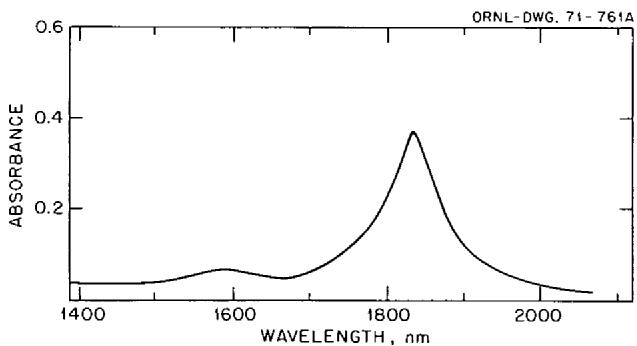  
Fig. 8.5. $f$ -d spectrum of $\mathrm{Pa}(\mathrm{IV})$ in molten LiF-BeF $_2$ -ThF $_4$ at $570^{\circ}$ C.

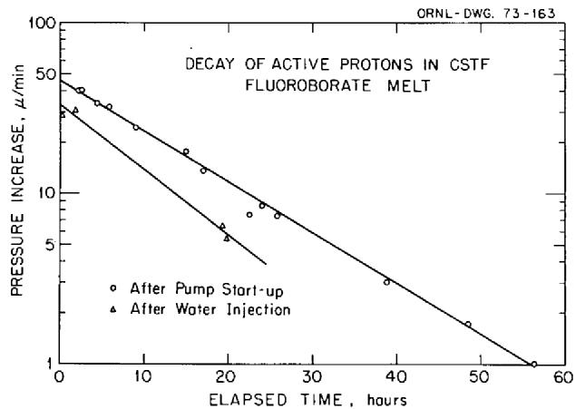  
Fig. 8.6. $f - f$ spectrum of $\mathrm{Pa}(\mathrm{IV})$ in molten LiF-BeF $_2$ -ThF $_4$ at $570^{\circ}\mathrm{C}$ .

case with $\mathrm{Pa(IV)}$ in aqueous $\mathrm{NH_4F}$ no absorption peaks are observed in the visible region of the spectrum. There have been no previous solution spectra of the complete $f - f$ transition range for $\mathrm{Pa(IV)}$ . The molten fluoride solvent system used permits unambiguous measurements in this region.

Since $\mathrm{Pa(V)}$ dissolved in the same solvent exhibits no interfering absorptions, these spectra may prove

useful in developing an analytical technique for determining the redox status of protactinium in fluoride melts.

# 8.10 SPECTROPHOTOMETRIC DEVELOPMENTS FOR IMPROVED ANALYTICAL METHODS FOR FLUOROBORATE COOLANT SYSTEMS

B. R. Clark R. F. Apple J. P. Young

At least one order of magnitude improvement in the sensitivity of the determination of $\mathrm{BF}_3\mathrm{OD}^-$ by the measurement of its infrared absorption in pressed-pellet samples of $\mathrm{NaBF_4}$ -NaF eutectic will be needed to assure that the disposition of deuterium can be followed during its injection into the CSTF. No calibrations for $\mathrm{BF}_3\mathrm{OD}^-$ have been made; but we are assured[26] that its molar absorbancy will be indistinguishable from that of $\mathrm{BF}_3\mathrm{OH}^-$ . Therefore, calibrations (by solid state standard additions of the sodium salt) with either isotope should suffice. Extension of sensitivity to needed levels (typically 50 ppb as hydrogen) should be possible by performing absorption measurements on thicker pellets. The technology of pressing thick pellets of $\mathrm{NaBF_3}$ has not yet been developed; in fact, it cannot currently be experimentally investigated for $\mathrm{BF}_3\mathrm{OH}^-$ because its residual concentration in any existing $\mathrm{NaBF_4}$ is too high for accurate measurement in thick pellets. The inorganic preparations group of the Analytical Chemistry Division is examining the possibility of preparing isotopically pure $\mathrm{NaBF}_3\mathrm{OD}$ , and we are considering routes for producing highly purified $\mathrm{NaBF_4}$ . This material would also be useful for electroanalytical studies. We are also using spectrophotometry to support our chemical studies on the nature of the condensate from cover gas and on practical techniques for collecting it.

# 9. Inorganic and Physical Chemistry

# 9.1 THE EQUILIBRIUM OF DILUTE UF3 SOLUTIONS CONTAINED IN GRAPHITE

L.M.Toth L.O.Gilpatrick

The equilibrium of dilute $\mathbf{U}\mathbf{F}_3\text{-}\mathbf{U}\mathbf{F}_4$ molten-fluoride solutions in contact with graphite and $\mathsf{UC}_2$

$$
3 \mathrm {U F} _ {4} (\mathrm {d}) + \mathrm {U C} _ {2} (\mathrm {c}) = 4 \mathrm {U F} _ {3} (\mathrm {d}) + 2 \mathrm {C} (\mathrm {c}), \tag {1}
$$

has been studied as a function of temperature (370 to $700^{\circ}\mathrm{C}$ ), melt composition, and atmospheric contamination. Equilibrium quotients $\mathbf{Q} = (\mathbf{U}\mathbf{F}_3)^4 /(\mathbf{U}\mathbf{F}_4)^3$ for reaction (1) were determined by measuring the $\mathbf{U}\mathbf{F}_3$ and $\mathbf{U}\mathbf{F}_4$ concentrations spectrophotometrically. The solvents used were primarily LiF-BeF $_2$ mixtures. Results from this solvent system were related to the reactor solvents LiF-BeF $_2$ -ZrF $_4$ (65.6-29.4-5 mole %) and LiF-BeF $_2$ -ThF $_4$ (72-16-12 mole %). The equilibrium quotient has been found to be very sensitive to both temperature and solvent changes, increasing as either the temperature increases or as the alkali-metal fluoride content of the solvent decreases. $^1$

Figure 9.1 shows equilibrium quotients in LiF- $\mathrm{BeF}_2$ -ThF $_4$ (72-16-12 mole%). These data, which are similar to those in LiF-BeF $_2$ (66-34 mole%), show that more than $10\%$ of the total uranium in solution can exist as UF $_3$ at temperatures greater than $550^{\circ}\mathrm{C}$ .

Experiments also showed that the large temperature and solvent effects measured for reaction (1) could be explained on the basis of a difference in the heats of solution between $\mathbf{U}\mathbf{F}_3$ and $\mathbf{U}\mathbf{F}_4$ . By assuming $\triangle H_{\mathrm{soln}}$ for $\mathbf{U}\mathbf{F}_3$ is equivalent to the $\triangle H_{\mathrm{soln}}$ of $\mathrm{CeF_3}$ obtained from solubility studies, and by using the difference in the enthalpies of reaction determined from our data and from the respective heats of formation, $\triangle H_{\mathrm{soln}}$ for $\mathbf{U}\mathbf{F}_4$ was found to be -16 kcal/mole. No previous determinations of solution enthalpies for $\mathbf{M}^{4 + }$ ions in fluoride melts are known, but this value is in agreement with previous predictions based on the greater ionic potential of the $\mathbf{U}^{4 + }$ ion.

Equilibrium quotient data for all the solvent systems studied are summarized in Fig. 9.2. In addition to the four solvent mixtures (plots A to D), plots E and F identified as "oxide contaminated" are shown. These data were obtained in the early stages of the $\mathrm{UF}_3\mathrm{-UF}_4$ equilibrium study when the equilibrium of reaction (1) was approached from the

right-hand side. Because these values were much lower than the ones measured for plots A and D and because they were accompanied by the formation of $\mathrm{UO_2}$ , trace contamination by some oxygen-bearing impurity had presumably lowered the equilibrium quotient and a more stable oxycarbide phase was formed in place of the pure carbide. Studies ultimately showed that more stringent control of the experimental conditions could hold the $\mathrm{UF_3}$ disproportionation equilibrium at the values indicated in plots A to D.

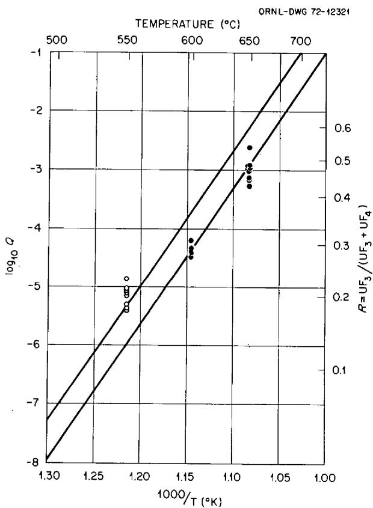  
Fig. 9.1. Equilibrium quotients $Q = (\mathrm{UF}_3)^4 /(\mathrm{UF}_4)^3$ vs temperature for $\mathrm{UF}_3 / \mathrm{UF}_4$ in LiF-BeF2-ThF4 (72-16-12 mole %).

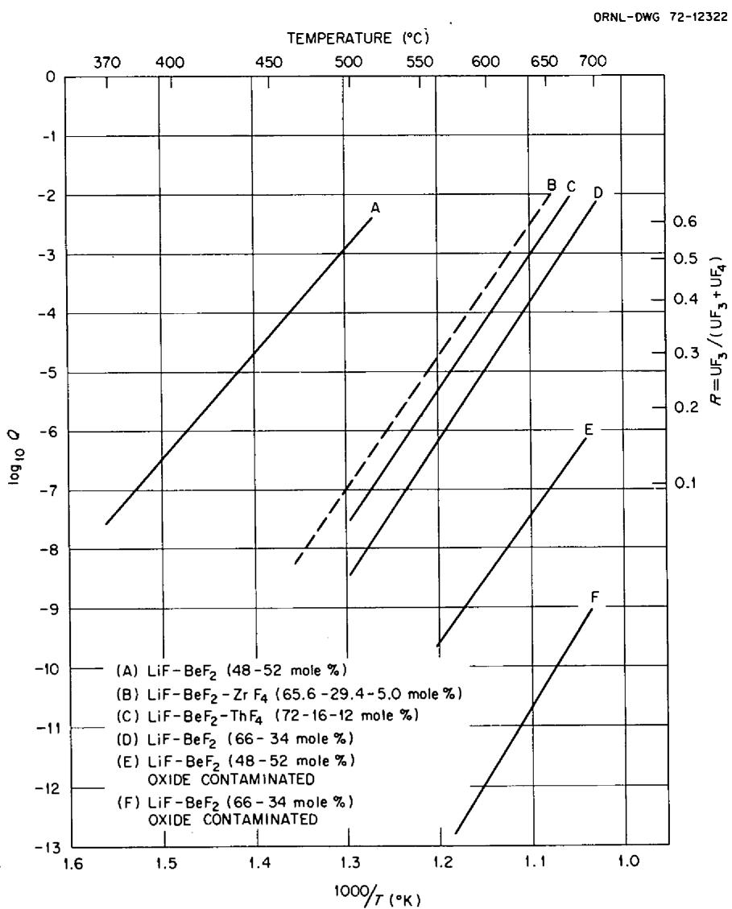  
Fig. 9.2. A comparison of equilibrium quotients vs temperature for $\mathrm{UC}_2 + 3\mathrm{UF}_4(\mathrm{d}) = 4\mathrm{UF}_3(\mathrm{d}) + 2\mathrm{C}$ in various solvent systems.

# 9.2 EFFECTS OF OXYGEN ON THE $\mathbf{U}\mathbf{F}_3 / \mathbf{U}\mathbf{F}_4$ EQUILIBRIUM

L. O. Gilpatrick R. M. Waller L. M. Toth

In view of the previous results suggesting that the $\mathrm{UF_3 - UF_4}$ equilibria in molten fluorides contained in graphite were different from those measured with a pure $\mathrm{UC}_2$ phase, a study was initiated during this period to determine (1) if the "oxide contaminated" equilibria were real and reproducible, (2) if any U-C-O phases were formed at temperatures below $1000^{\circ}\mathrm{C}$ through the action of the $\mathrm{UF_3 - UF_4}$ reaction with graphite and oxygen-containing impurities, and (3) if the impurity and its partial pressure at equilibrium

could be identified. The $\mathrm{LiF - BeF_2}$ (48-52 mole $\%$ ) solvent system, (LB), was selected for this study, because the equilibrium quotient is higher (Fig. 9.2, plots E and F) than in the 66-34 mole $\%$ $(\mathbb{L}_2\mathbb{B})$ solution and, consequently, the $\mathrm{UF_3}$ concentrations are easier to measure spectrophotometrically. Ultimately, these results will be compared with the $\mathbb{L}_2\mathbb{B}$ solvent. The experimental procedure involves both equilibrium studies in sealed graphite capsules and spectrophotometric experiments with controlled atmospheres over melt mixtures.

The capsule experiments were intended to equilibrate $\mathrm{UO_2}$ and $\mathrm{UC_2}$ in a graphite container by means of the $\mathrm{UF_3 - UF_4}$ reaction in a LiF-BeF $_2$ solution. The reaction of $\mathrm{UF_3}$ with graphite to form

uranium carbides would then occur in the presence of an oxide-saturated melt. If any U-C-O phase existed which was more stable than $\mathrm{UC}_2$ , it should form by the overall reaction of oxide ion with $\mathrm{UC}_2$ . Capsules were equilibrated for periods of 30 and 90 days with solvents of $\mathrm{L}_2\mathrm{B}$ and LB composition. The formation of an oxycarbide phase was sought by x-ray analysis and was expected to be identified as either a new phase or a noticeable decrease in the lattice parameter of the existing uranium carbide phases. Neither expectation has been verified at this time. Instead, an increase in the $\mathrm{UC}_2$ tetragonal structure lattice parameter was shown by the following results:

Before:

$$
a = 3. 5 2 2 5 \pm 0. 0 0 0 2 \mathrm {A}, c = 5. 9 9 4 6 \pm 0. 0 0 0 7 \mathrm {A}
$$

After:

$$
a = 3. 5 3 5 2 \pm 0. 0 0 0 9 \mathrm {A}, c = 6. 0 2 4 0 \pm 0. 0 0 4 7 \mathrm {A}
$$

At present the increase cannot be explained. However, these results do suggest that no U-C-O phase forms when $\mathrm{UO_2}$ and $\mathrm{UC}_2$ are equilibrated during the above time intervals.

The spectrophotometric study was intended to verify the previous "oxide contaminated" observation and to shift the equilibrium accordingly by control of the atmosphere over the melt. The previous observations have been repeatedly reproduced by allowing $\mathrm{UF}_3$ to react with the graphite spectrophotometric cell. Furthermore, while at equilibrium, the furnace atmosphere was sampled directly through a variable leak valve into a time-of-flight mass spectrometer to identify any impurity gases over the melt. Hydrogen fluoride at an estimated pressure of $10^{-6}$ to $10^{-9}$ torr was the only gas seen at 600 and $700^{\circ}\mathrm{C}$ while the furnace was either at 1 atm argon or under vacuum. It was possible that CO was also present, but it could not be distinguished from the background mass 28 of the spectrometer.

Experiments currently in progress and continuing into the next reporting period involve contact of the melt solutions with dilute gas mixtures of CO in argon. These experiments will test the effect of mildly oxidizing mixtures on the $\mathrm{UF_3 - UF_4}$ equilibria in graphite. Quantitative results will be obtained as a function of gas composition in the ppm range of CO.

# 9.3 POROUS ELECTRODE STUDIES

H. R. Bronstein

F. A. Posey

Studies were initiated on the feasibility of using a porous or packed-bed electrode as a continuous, on-line monitor of the concentration of dissolved bismuth in MSBR fuel salt. Part-per-million concentrations of various chemical species (e.g., oxygen, tellurium, bismuth) can profoundly affect molten-salt reactor systems, and thus a device is needed to monitor, and perhaps remove, dissolved bismuth and/or other deleterious species from fuel salt. Porous electrodes have provided excellent means of monitoring and eliminating similarly low-level impurities in aqueous systems[6-7] and should have applicability in molten salts.

Design and fabrication of a prototype quartz cell for study of electrolytic monitoring and removing dissolved bismuth was completed during the report period. The cell is a part of a bench-scale test assembly that was used in a preliminary study of the LiCl-KCl eutectic system; this study was carried out in a furnace that permitted visual observation of the quartz cell assembly during operation. In this way, proper operating procedures can be established for later studies on MSBR fuel salt, for which a metal cell assembly will be required. Figure 9.3 is a photograph of the quartz cell assembly contained in a tantalum holder that could be lowered into the LiCl-KCl eutectic melt. The electrode itself was a packed bed of glassycarbon spheres (about 100 microns in diameter) supported on a fritted quartz disk. Another fritted quartz disk was pressed onto the bed from above, providing compaction and allowing use of a glassy carbon rod for electrical contact with the bed. A long stainless-steel rod (not shown in Fig. 9.3) contacted the top of the glassy carbon rod and led through the top of the test vessel, which could be evacuated or pressurized with inert gas, as required. The melt flowed up through the central tube (Fig. 9.3), through the packed bed, and out a number of vertical slots into an overflow chamber. In this way, a reproducible volume of melt could be obtained inside the packed-bed electrode. The area-to-volume ratio with this type of electrode system is quite high and permits rapid exhaustion of electroactive species from the

melt. We estimate that the area-to-volume ratio is approximately $1.2 \times 10^{3} \, \mathrm{cm}^{2} / \mathrm{cm}^{3}$ of solution volume; the total bed volume is approximately $2.5 \, \mathrm{cm}^{3}$ . Other components used in the bench-scale test assembly were conventional items for temperature control, instrumentation for accurate measurement of the temperature of the melt, and a manifold for vacuum and inert pressure control over the melt.

Some results of the first experiment carried out in the LiCl-KCl (58.8-41.2 mole %) eutectic melt at $414^{\circ}\mathrm{C}$ are shown in Fig. 9.4. Small quantities of iron

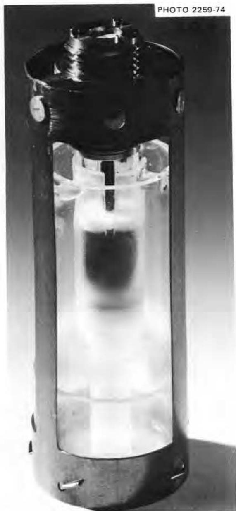  
Fig. 9.3. Packed-bed electrode assembly with glassy carbon spheres for use in molten salts.

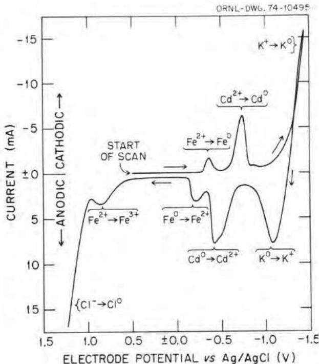  
Fig. 9.4. Linear-sweep voltammetry with packed bed of glassy carbon spheres. Melt, LiCl-KCl (58.8-41.2 mole $\%$ ) + about $1\times$ $10^{-4}M\mathrm{Fe}^{2+}$ + about $4\times 10^{-4}M\mathrm{Cd}^{2+}$ ; temperature, $414^{\circ}\mathrm{C}$ ; sweep rate, $10\mathrm{mV / sec}$ ; reference electrode, $\mathrm{Ag / AgCl(0.1m)}$ in LiCl-KCl eutectic/Pyrex glass.

and cadmium salts were added to the melt to provide species with known electroactive properties. The reference electrode was a Pyrex glass tube containing $0.1\mathrm{mAgCl}$ dissolved in LiCl-KCl eutectic melt into which a silver wire was inserted; the conductivity of the Pyrex glass was sufficient to allow satisfactorily low impedance between reference and test solutions at the temperature of the melt. The counter electrode was a cylindrical graphite sheath surrounding a thermocouple well. Figure 9.4 shows a voltammetric current-voltage curve obtained at linearly varying potential (scan rate $= 10~\mathrm{mV / sec}$ ). The peaks observed during the cathodic sweep correspond to reduction of ferrous ions to metallic iron (about $-0.37\mathrm{V}$ ) and of cadmium ions to metallic cadmium (about $-0.75\mathrm{V}$ ) on the electrode surfaces; the limit for cathodic decomposition of the melt (deposition of potassium) is seen at still lower potentials. The return anodic sweep also shows the expected behavior and peak sequence, that is, redissolution of potassium (about $-1.1\mathrm{V}$ ), cadmium (about $-0.45\mathrm{V}$ ), and then iron (about $-0.20\mathrm{V}$ ), followed by further oxidation of Fe(II) to Fe(III) (about $+0.85\mathrm{V}$ ) and finally the limit for anodic decomposition of the melt (chlorine

evolution). Estimation of the number of coulombs under the iron and cadmium peaks (with a planimeter) shows that approximately $5\mu \mathrm{g}$ of iron and $38~\mu \mathrm{g}$ of cadmium were contained within the bed. These results show the inherent sensitivity of this method of analysis and suggest that use of a coulometric technique with electronic integration7 could enhance sensitivity still further. We have recently acquired instrumentation that will allow us to record simultaneously current-voltage and charge-voltage curves for these electrode systems. The results suggest also that the background current due to non-Faradaic processes (such as charging of the double-layer capacity) is small with little variation over a wide potential range (approximately $+1.0\mathrm{V}$ to $-1.0\mathrm{V}$ vs $\mathrm{Ag / AgCl}$ ). Successful operation of the cell, instrumentation, and auxiliary systems will allow us to proceed with studies of bismuth species in the LiCl-KCl system as soon as fabrication is completed on a modified cell container assembly that will allow easy addition of various substances to the melt. Subsequently, we expect to design and construct a similar apparatus for use in molten fluoride melts, which will facilitate studies of the applicability of the packed-bed electrode to monitoring and/or removal of bismuth from MSBR fuel salt.

# 9.4 FORMATION FREE ENERGIES AND ACTIVITY COEFFICIENTS IN FUEL SALT MIXTURES

C.F.Baes,Jr. W.C.Waggener

We are resuming a program in which measurements of heterogeneous equilibria between solid oxides and molten fluoride mixtures will be used to derive formation free energies and activity coefficients of the components in the MSBR fuel. Staffing was completed, and the assembly of equipment was begun during August 1974.

The apparatus will consist primarily of a vigorously stirred, sealed nickel vessel that can be maintained at a controlled temperature $(\pm 2^{\circ}\mathrm{C})$ in the range of 500 to $700^{\circ}\mathrm{C}$ . Provision will be made for intermittent salt addition, sampling, and for insertion of an electrode assembly for voltammetric analysis—all under a purified argon atmosphere. The voltammeter needed for the analyses is also under construction.

The first reaction to be studied will be

$$
\mathrm {T h O} _ {2} (\mathrm {c}) + 2 \mathrm {N i F} _ {2} (\mathrm {d}) = \mathrm {T h F} _ {4} (\mathrm {d}) + 2 \mathrm {N i O} (\mathrm {c}). \tag {2}
$$

At a given temperature, the variation of the equilibrium quotient, $Q = X_{\mathrm{ThF}_4} / X_{\mathrm{NiF}_2}^2$ , with melt composition should reflect the changes in the activity coefficients, $\gamma_{\mathrm{NiF}_2}$ and $\gamma_{\mathrm{ThF}_4}$ , so that $Q = K\gamma_{\mathrm{NiF}_2}^2 / \gamma_{\mathrm{ThF}_4}$ . Here $K$ is the equilibrium constant, defined equal to $Q$ in $\mathrm{Li}_2\mathrm{BeF}_4$ . From the value of $K$ we obtain the free energy change

$$
\begin{array}{l} - R T \ln K = \Delta G ^ {\mathrm {o}} = \bar {G} _ {\mathrm {T h F} _ {4}} ^ {\mathrm {f}} \\ + 2 \Delta G _ {\mathrm {N i O}} ^ {\mathrm {f}} - 2 \Delta \bar {G} _ {\mathrm {N i F} _ {2}} ^ {\mathrm {f}} - \Delta G _ {\mathrm {T h O} _ {2}} ^ {\mathrm {f}}. \\ \end{array}
$$

The formation free energies of the oxides are quite well known, as is that for $\mathrm{NiF}_2$ in $\mathrm{Li}_2\mathrm{BeF}_4(\Delta \overline{G}_{\mathrm{NiF}_2}^{\mathrm{f}})$ . Hence, from $\Delta G^{\circ}$ we can obtain an improved value for the formation free energy of $\mathrm{ThF}_4$ . $\mathrm{Li}_2\mathrm{BeF}_4$ .

The activity coefficient of $\mathrm{NiF}_2$ in the fuel salt mixture $[\mathrm{NiF}_2(\mathrm{c}) = \mathrm{NiF}_2(\mathrm{d})]$ can be derived from a measurement of the solubility of $\mathrm{NiF}_2$ where

$$
K = X _ {\mathrm {N i F} _ {2}} \gamma_ {\mathrm {N i F} _ {2}}. \tag {3}
$$

From $\gamma_{\mathrm{NiF}_2}$ and the quotient $\gamma_{\mathrm{NiF}_2}^2 /\gamma_{\mathrm{ThF}_4}$ , obtained from a measurement of reaction (2) in the same LiF-BeF $_2$ -ThF $_4$ salt mixture, we can obtain the activity coefficient of ThF $_4$ in this fuel salt mixture.

# 9.5 THE CHEMISTRY AND THERMODYNAMICS OF MOLTEN-SALT REACTOR FUELS

C. F. Baes, Jr.

The fuel of an MSBR, in which fissile $^{233}\mathrm{U}$ is bred from $^{232}\mathrm{Th}$ by thermal neutrons, will probably consist of the mixture $\mathrm{LiF - BeF_2 - ThF_4}$ (72-16-12 mole %) at about $600^{\circ}\mathrm{C}$ in which less than 1 mole % of fissile $\mathrm{UF_4}$ or $\mathrm{PuF_3}$ is dissolved. A fairly detailed knowledge of the chemistry of such a molten salt mixture has been gained from measurements of heterogeneous equilibria involving various gaseous (e.g., HF, $\mathrm{H}_2\mathrm{O}$ ) and solid (usually oxide) compounds combined with

the thermochemical data available for the pure compounds.

The entropy of a fluoride component in the fuel can be estimated with useful accuracy from the known entropy of the corresponding oxide and the charge on the cation (Fig. 9.5). The activity coefficients of $\mathrm{BeF}_2$ , $\mathrm{ThF}_4$ , and $\mathrm{UF_4}$ decrease strongly as the mole percentage of LiF in an LiF- $\mathrm{BeF}_2$ - $\mathrm{ThF}_4$ solvent is increased, but the variations do not exceed a factor of 10 from activity coefficient values in the reference composition LiF- $\mathrm{BeF}_2$ (67-33 mole %). The activity coefficient changes for $\mathrm{CeF}_3$ , $\mathrm{UF_3}$ , $\mathrm{PuF_3}$ , and $\mathrm{NiF_2}$ are less pronounced.

The solubility of oxides in such molten fluoride mixtures generally decreases with $z_{+}^{2} / r_{+}$ (the square of the charge of the cation divided by its radius) for the cation involved (Fig. 9.6). Thus, BeO, ZrO $_2$ , the actinide dioxides, and especially Pa $_2$ O $_5$ show a low solubility in MSBR fuels. The actinide dioxides form solid solutions that can exchange tetravalent cations with the molten fluoride and could prove useful in fuel reprocessing. The oxide Pa $_2$ O $_5$ (or an addition compound of it) is so insoluble that it could be used selectively to remove $^{233}\mathrm{Pa}$ bred in the fuel (Fig. 9.7).

The fuel of the MSBR will be maintained mildly reducing with the ratio $\mathrm{U}^{4+} / \mathrm{U}^{3+}$ in the range 10 to 100. The other actinides then will be present as $\mathrm{Th}^{4+}$ , $\mathrm{Pa}^{4+}$ , and $\mathrm{Pu}^{3+}$ . Corrosion reactions with the metals

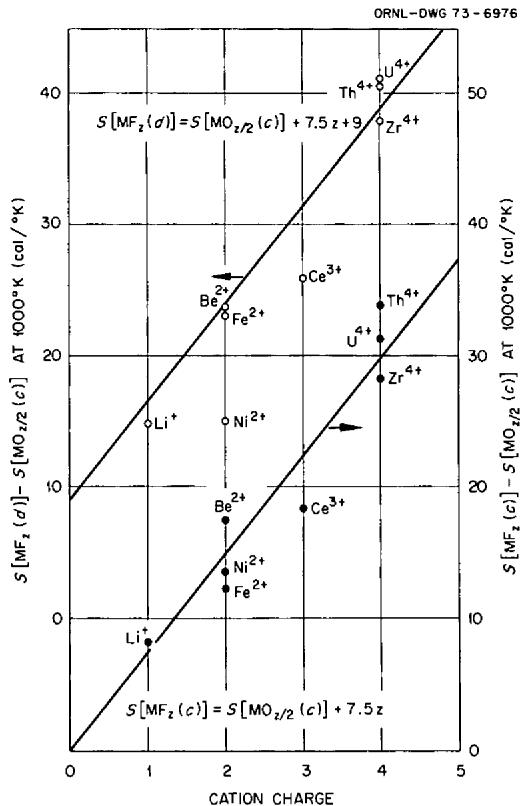  
Fig. 9.5. Correlation of entropies of crystalline fluorides and of fluorides dissolved in molten $\mathrm{LiF - BeF_2}$ (67-33 mole %) with entropies of crystalline oxides.

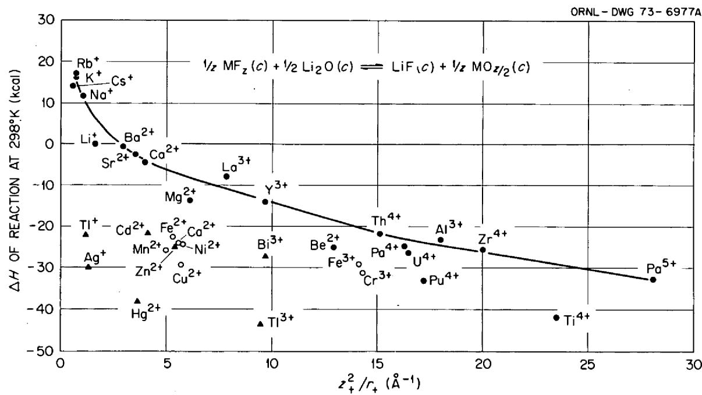  
Fig. 9.6. Effect of cation charge and radius on the relative stability of oxides and fluorides. $\bullet$ , pre-transition; $\mathbf{O}$ , transition; and $\triangle$ , post-transition elements.

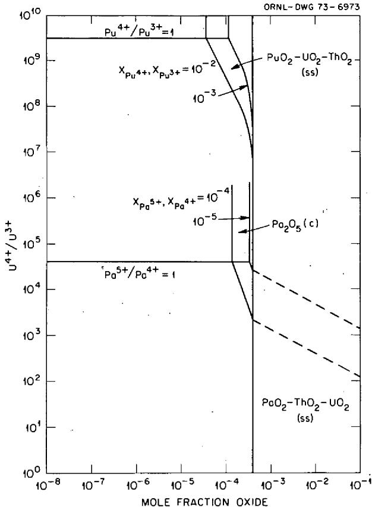  
Fig. 9.7. Pourbaix diagram for the actinide elements in LiF-BeF $_2$ -ThF $_4$ (72-16-12 mole %) at $600^{\circ}\mathrm{C}$ . X denotes mole fraction; ss denotes solid solution.

of the nickel-base container alloy (Hastelloy N) will not be favored thermodynamically (Fig. 9.8). The noble-gas fission products are insoluble and can be removed by continuous stripping with an inert gas. Group VII, I, II, III, and IV fission products should appear as dissolved species in their normal valences. The remaining fission products (principally Nb, Mo, Te, and Ru) should be reduced to the metallic state.

# 9.6 OXIDE CHEMISTRY OF NIOBIUM (V) IN MOLTEN LiF-BeF $_2$ MIXTURES10

Gann Tang

C. F. Baes, Jr.

C. E. Bamberger

G. Mamantoy

The chemistry of niobium in molten fluorides is relevant to the MSR Program for several reasons: (I) During the operation of the MSRE, the appearance of fission product $^{95}\mathrm{Nb}$ in the fuel seemed to be a sensitive function of the state of oxidation (the $\mathrm{U}^{4+}/\mathrm{U}^{3+}$ ratio) of the fuel. This effect, which

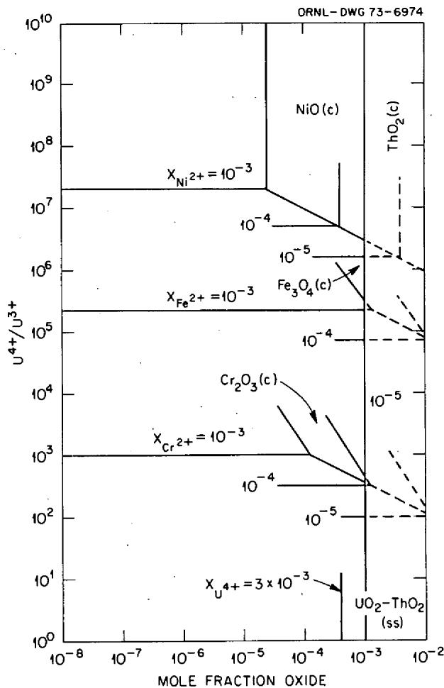  
Fig. 9.8. Pourbaix diagram for structural metals in $\mathrm{LiF - BeF_2 - }$ $\mathrm{ThF_4}$ (72-16-12 mole $\%$ ) at $600^{\circ}\mathbf{C}$ . The horizontal lines denote equilibrium between the indicated mole fraction of ions and the pure metal.

presumably involves the oxidation of the metal to a soluble species, might be a useful indicator of the state of oxidation of the fuel. (2) Niobium pentoxide $(\mathrm{Nb}_{2}\mathrm{O}_{5})$ , like protactinium pentoxide $(\mathrm{Pa}_{2}\mathrm{O}_{5})$ , is expected to be sparingly soluble in molten fluorides, and $\mathrm{Nb(V)}$ has been proposed for use as a stand-in for $\mathrm{Pa(V)}$ in studies of fuel reprocessing methods that

involve oxide precipitation. However, the small size of $\mathrm{Nb}^{5+}$ ion (0.69 Å) compared with $\mathrm{Pa}^{5+}$ ion (0.89 Å) might produce oxy ions of $\mathrm{Nb(V)}$ , while none were found for $\mathrm{Pa(V)}$ . This would profoundly affect the chemistry of $\mathrm{Nb(V)}$ in molten fluorides containing oxide. (3) In the system $\mathrm{NiO-Nb_2O_5}$ , at least two intermediate compounds, $\mathrm{NiNb_2O_6}$ and $\mathrm{Ni_4Nb_2O_9}$ , are known, and since NiO is also a sparingly soluble oxide, precipitation of these nickel niobates may be expected further to complicate the chemistry of $\mathrm{Nb(V)}$ in an MSBR fuel contained in a nickel-base alloy.

The results of our equilibrations at $600^{\circ}\mathrm{C}$ that involve the sparingly soluble oxides $\mathrm{BeO}$ , $\mathrm{NiO}$ , $\mathrm{Nb}_{2}\mathrm{O}_{5}$ , and $\mathrm{NiNb}_{2}\mathrm{O}_{6}$ in molten LiF- $\mathrm{BeF}_{2}$ (67-33 mole %) are represented by the solid boundaries shown in Fig. 9.9. The reactions that correspond to each of these three-phase equilibria (two oxide phases and the molten fluoride phase) are listed in Table 9.1, reactions (1), (4), and (5). The dashed boundaries can be constructed from the stoichiometries of the derived reactions (2) and (3). Contrary to reports in the literature,[15] the compound $\mathrm{Ni}_{4}\mathrm{Nb}_{2}\mathrm{O}_{9}$ could not be established as a stable phase in this system.

The boundary between $\mathrm{NiNb_2O_6}$ and NiO in Fig. 9.9 was of special interest, since its slope gives direct evidence for the formation of an oxyion, $\mathrm{NbO_2^+}$ , in the molten fluoride phase. This evidence can be seen from the general reaction (d indicates dissolved species)

$$
\begin{array}{l} x / 2 \mathrm {N i N b} _ {2} \mathrm {O} _ {6} (\mathrm {c}) + y / 2 \mathrm {N i F} _ {2} (\mathrm {d}) \\ = \mathrm {N b} _ {x} \mathrm {O} _ {(5 x - y) / 2} \mathrm {F} _ {y} (\mathrm {d}) + (x + y) / 2 \mathrm {N i O} (\mathrm {c}) \\ \end{array}
$$

14. R. G. Ross, C. E. Bamberger, and C. F. Baes, Jr., J. Inorg. Nucl. Chem. 35, 433 (1973).   
15. E. V. Tkatchenko, F. Abbattista, and A. Burdeze, Izv. Akad. Nauk SSSR, Neorg. Mater. 5, 1671 (1969); F. Abbattista, E. V. Tkatchenko, and C. T. Chiantavetto, Atti Accad. Sci. Torino, Cl. Sci. Fis., Mat. Nat. 103, 605 (1969).

and from its equilibrium quotient ( $X$ denotes mole fraction)

$$
Q = X \left[ N b _ {x} O _ {(5 x - y) / 2} F _ {y} \right] / \left[ X (N i F _ {2}) \right] ^ {y / 2}.
$$

From the slope of $1 / 2$ observed for the boundary in Fig. 9.9 corresponding to this reaction, the value of $\mathcal{V}$ is $1$ . From this value we conclude that $\mathrm{Nb(V)}$ forms the oxy ion $\mathrm{NbO_2^+}$ in solution. The alternative polynuclear ions that are possible (such as $\mathrm{Nb}_3\mathrm{O}_7^+$ and $\mathrm{Nb}_{5}\mathrm{O}_{12}^{+}$ ) seem quite unlikely at the low concentrations of niobium involved.

The magnitude of the solubility of $\mathrm{Nb}_{2}\mathrm{O}_{5}$ (i.e., the height of the $\mathrm{Nb}_{2}\mathrm{O}_{5} / \mathrm{BeO}$ boundary in Fig. 9.9), which is much greater than originally expected, provides additional strong evidence that an oxyion of $\mathrm{Nb(V)}$ is formed in solution. The stability of $\mathrm{Nb}^{5+}$ otherwise required to explain this high solubility

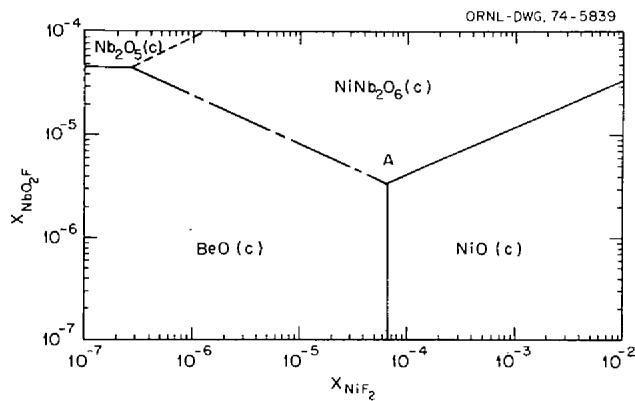  
Fig. 9.9. Phase diagram representing the $\mathrm{NbO_2F}$ and $\mathrm{NiF_2}$ concentrations in molten LiF-BeF $_2$ (67-33 mole %) at $600^{\circ}\mathrm{C}$ as a function of the oxide phases present at equilibrium.

Table 9.1. Equilibria of ${\mathrm{{Nb}}}_{2}{\mathrm{O}}_{3}$ ,NiO,and BeO with LiF-BeF ${}_{2}$ (67-33 mole %) at ${600}^{ \circ  }\mathrm{C}$   

<table><tr><td>Reaction</td><td>Boundary</td><td>Equilibrium reaction</td><td>Qa</td></tr><tr><td>(1)</td><td>Nb2O3(c)/ BeO(c)</td><td>1/2Nb2O5(c) + 1/2BeF2(d) ⇌ NbO2F(d) + 1/2BeO(c)</td><td>X(NbO2F)=10-4.34</td></tr><tr><td>(2)</td><td>Nb2O3(c)/ NiNb2O6(c)</td><td>Nb2O5(c) + 1/2 NiF2(d) ⇌ NbO2F(d) + 1/2NiNb2O6(c)</td><td>X(NbO2F)/[X(NiF2)]1/2=10-1.06</td></tr><tr><td>(3)</td><td>NiNb2O6(c)/ BeO(c)</td><td>1/2NiNb2O6(c)+ BeF2(d) ⇌ NbO2F(d) + 1/2NiF2(d)+ BeO(c)</td><td>X(NbO2F) X(NiF2)1/2=10-6.50</td></tr><tr><td>(4)</td><td>NiO(c)/ BeO(c)</td><td>NiO(c)+ BeF2(d) ⇌ NiF2(d) + BeO(c)</td><td>X(NiF2)=10-4.18</td></tr><tr><td>(5)</td><td>NiNb2O6(c)/ NiO(c)</td><td>1/2NiNb2O6(c) + 1/2NiF2(d) ⇌ NbO2F(d) + NiO(c)</td><td>X(NbO2F)/[X(NiF2)]1/2=10-3.44</td></tr></table>

${}^{a}$ In LiF-Be ${\mathrm{F}}_{2}$ (67-33 mole %) the activity of ${\mathrm{{BeF}}}_{2}\left( \mathrm{\;d}\right)$ has been defined as unity.

would be so great that the $\mathbf{Nb}^{4+}$ found by Weaver et al. to be formed by the reaction17

$$
\mathrm {N b} ^ {0} (\mathrm {c}) + 4 \mathrm {H F} (\mathrm {g}) \rightleftharpoons \mathrm {N b F} _ {4} (\mathrm {d}) + 2 \mathrm {H} _ {2} (\mathrm {g}) \tag {4}
$$

should have disproportionated almost completely as

$$
\mathrm {N b F} _ {4} (\mathrm {d}) \leftrightarrow 4 / 5 \mathrm {N b F} _ {5} (\mathrm {d}) + 1 / 5 \mathrm {N b} ^ {0} (\mathrm {c}). \tag {5}
$$

This was clearly not the case.

From the measured equilibrium quotients and the formation free energies of the other oxides and dissolved fluorides involved, we obtain the following free energy of formation of $\mathrm{NbO_2F}$ in the mole fraction standard state in LiF-BeF $_2$ (67-33 mole $\%$ ): $\triangle \vec{G}^f[\mathrm{NbO_2F(d)}] = -250.7 + 45.9 T / 10^3 \mathrm{kcal / mole}$ , and for $\mathrm{NiNb_2O_6}$ we obtain

$\triangle G^{f}[\mathrm{NiNb}_{2}\mathrm{O}_{6}(\mathrm{c})] = -509.0 + 112.7T / 10^{4}\mathrm{kcal / mole}$ With the measurements of the equilibrium quotient for reaction (4), we can also construct the Pourbaix diagram (Fig. 9.10), wherein the conditions of oxide concentration and redox potential are shown under which the various forms of niobium are stable in a molten-salt breeder reactor fuel.

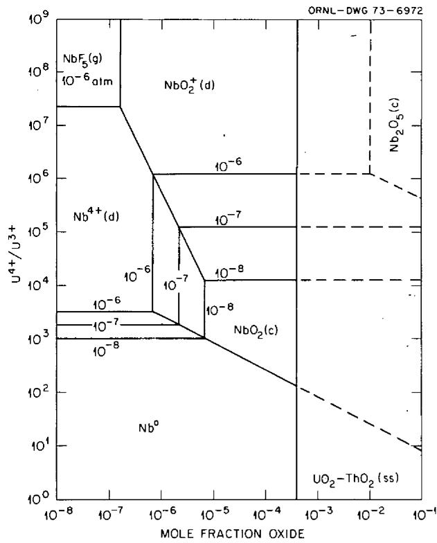  
Fig. 9.10. Pourbaix diagram for niobium in LiF-BeF $_2$ -ThF $_4$ (72-16-12 mole %) at $600^{\circ}\mathrm{C}$ .

# Part 3. Materials Development

H. E. McCoy

The main thrust of our materials program is aimed at the development of structural material for the primary circuit which would have adequate resistance to embrittlement by neutron irradiation and to intergranular cracking by fission product penetration. A modified composition of Hastelloy N containing $2\%$ Ti has good resistance to irradiation embrittlement, but some question remains as to whether it has sufficient resistance to intergranular cracking. Further modification of the alloy with higher chromium or rare earth additions to impart better resistance to intergranular cracking may be necessary. Laboratory tests are in progress to answer this very important question.

A 10,000-lb production heat of the $2\%$ Ti-modified Hastelloy N is being procured, and smaller heats of several other modified compositions are being procured. The evaluation program includes irradiated and unirradiated mechanical property tests, tellurium-compatibility tests, salt corrosion studies, microstructural characterization, and steam corrosion studies.

Much of the effort during this report period has been to reestablish the test facilities previously used by this program. Most of these facilities were either made available to other programs or dismantled. A new facility is being built for the thermal convection loops and a new mechanical property and general test facility is also under construction.

The work on chemical processing materials is concentrated on graphite. The primary question is whether chemical reactions occur between the bismuth-lithium solutions used in the processing flow sheet and graphite. Several bench experiments are in progress to study this question.

Tests run previously have shown that some existing commercial graphites will maintain good structural integrity to target fluences of $3 \times 10^{22}$ neutrons/cm $^2$ . Although our development work has shown that graphites with higher allowable fluences can be developed, this is not a high priority item and is not currently being pursued. We are preparing a status report on our graphite coating efforts but do not have an active experimental program in this area.

# 10. Development of Modified Hastelloy N

H. E. McCoy

The purpose of this program is to develop metallic structural material for an MSBR. The current emphasis is on the development of a material for the primary circuit, since this appears to be the most important materials problem at the present time. The material for the primary circuit will be exposed to a modest thermal neutron flux and to fuel salt that contains fission products. Researchers currently believe that a modification of standard Hastelloy N will be a satisfactory material for this application. An alloy that contains $2\%$ Ti seems to adequately resist irradiation embrittlement, but whether or not this alloy satisfactorily resists intergranular embrittlement by the fusion product tellurium remains to be demonstrated. Small amounts of niobium and rare earths (e.g., cerium and lanthanum) also improve the resistance to intergranular cracking, and likely will not reduce the beneficial effects of titanium from the neutron embrittlement standpoint. Currently, scale-up of the $2\%$ Ti alloy is being pursued while smaller heats are being made of alloys that contain both $2\%$ Ti and additions of niobium and rare earths. These materials are being evaluated in several ways.

Considerable effort has been expended in development and construction of new test facilities since the program was restarted. Most of the test facilities previously in use were made available to other programs when the MSR Program was terminated. The two major facilities constructed recently consist of a new thermal convection loop test facility and a mechanical property laboratory. The loop facility will accommodate 12 loops and will likely be in operation before the end of CY 1974. The mechanical property laboratory will have a total of 30 creep machines, 5 strain cycle machines, a heat treating facility, and facilities for bench tests. This equipment will gradually become operational, with at least $50\%$ in use by the end of CY 1974.

# 10.1 PROCEDURE OF NEW TEST MATERIALS

One small (about 50 lb) commercial heat of $2\%$ Ti-modified Hastelloy N was received from the International Nickel Corporation just as the MSR

Program was terminated. The composition of this alloy, designated 73-008, is given in Table 10.1 along with the analyses of several heats of material that will be discussed in this chapter. Heat 73-008 was received in the form of $\frac{1}{2}$ -in.-thick plate and appeared sound. This material has been included in all phases of the Hastelloy N development program.

Four small ( $\sim 125$ lb) commercial melts chosen to study the combined effects of titanium and rare earths have been melted and partially fabricated by Cabot Corporation. Each of the four heats contains $2\%$ Ti and three of the heats also contain additions of about $0.01\%$ rare earths. The three rare earth additions being evaluated are cerium, lanthanum, and Misch metal (primarily cerium and lanthanum). These heats were melted by vacuum-induction melting (VIM) followed by electroslag remelting (ESR). The material has been fabricated to 1/2-in.-thick plate and is being conditioned for shipment.

Procurement has been initiated on a 10,000-lb heat of $2\%$ Ti-modified Hastelloy N which will be fabricated into numerous product forms. The material has been melted and forged to 19 in. $\times 10$ in. $\times$ length. Fabrication into the various product forms is in progress.

# 10.2 WELDABILITY OF COMMERCIAL ALLOYS OF MODIFIED HASTELLOY N

B. McNabb H. E. McCoy

A small heat of $2\%$ Ti-modified Hastelloy N (heat 73-008) was received from the International Nickel Company in the form of 1/2-in.-thick plate, 4 in. wide $\times 18$ in. long. The chemical analysis of this material is given in Table 10.1.

Stripes that were 1/2-in. square were sawed from the plate, and the corners rounded and swaged to a 1/4-in.-diam rod. Some of the rod was used for mechanical property specimens and some was swaged to 3/32-in. weld wire. The remaining portion of the 1/3-in.-thick plate was sawed into two 9-in.-long pieces, and the edges were beveled to produce a $100^{\circ}\mathrm{C}$ -included angle for the weld deposit. The beveled plates were welded to a 4-in.-

Table 10.1. ORNL analysis of several heats of modified Hastelloy N   
The heat numbers are often used with a prefix of "4." This designation means that the $\frac{1}{2}$ -in.-thick, as-received plate was cut into strips $\frac{1}{2} \times \frac{1}{2}$ in. and swaged cold to $\frac{1}{4}$ -in.-diam rod.   

<table><tr><td rowspan="2">Element</td><td colspan="6">Concentration, wt %</td></tr><tr><td>Heat 71-114a</td><td>Heat 71-583b</td><td>Heat 72-503c</td><td>Heat 72-604b</td><td>Heat 72-115c</td><td>Heat 73-008b</td></tr><tr><td>Cr</td><td>7.4</td><td>7.25</td><td>6.79</td><td>6.69</td><td>7.03</td><td>7.63</td></tr><tr><td>Mo</td><td>12.5</td><td>12.4</td><td>12.9</td><td>11.5</td><td>11.9</td><td>12.4</td></tr><tr><td>Fe</td><td>0.062</td><td>0.13</td><td>0.089</td><td>0.048</td><td>0.02</td><td>0.18</td></tr><tr><td>C</td><td>0.058</td><td>0.057</td><td>0.066</td><td>0.118</td><td>0.091</td><td>0.078</td></tr><tr><td>Si</td><td>0.026</td><td>0.055</td><td>0.089</td><td>0.12</td><td>0.073</td><td>0.06</td></tr><tr><td>Mn</td><td>0.02</td><td>0.03</td><td>&lt;0.01</td><td>0.03</td><td>&lt;0.01</td><td>0.45</td></tr><tr><td>P</td><td>0.007</td><td>0.007</td><td>0.0008</td><td>0.003</td><td>0.0028</td><td></td></tr><tr><td>S</td><td>0.01</td><td>0.004</td><td>0.002</td><td>0.002</td><td>0.002</td><td></td></tr><tr><td>Al</td><td>0.07</td><td>0.2</td><td>0.09</td><td>0.17</td><td>0.08</td><td>0.03</td></tr><tr><td>B</td><td>0.00005</td><td>0.00005</td><td>0.00007</td><td>&lt;0.00002</td><td>&lt;0.00002</td><td>&lt;0.003</td></tr><tr><td>Ti</td><td>1.75</td><td>1.44</td><td>2.16</td><td>&lt;0.005</td><td>&lt;0.005</td><td>2.1</td></tr><tr><td>Hf</td><td></td><td></td><td>&lt;0.003</td><td>0.12</td><td>0.62</td><td></td></tr><tr><td>Zr</td><td>&lt;0.03</td><td>&lt;0.03</td><td>0.003</td><td>0.009</td><td>0.015</td><td></td></tr><tr><td>H</td><td></td><td></td><td></td><td></td><td></td><td>0.0022</td></tr><tr><td>N</td><td>0.0012</td><td>0.0029</td><td>0.0003</td><td>0.0008</td><td>0.0004</td><td>0.0010</td></tr><tr><td>O</td><td>0.0003</td><td>0.012</td><td>0.0017</td><td>0.0031</td><td>0.0017</td><td>&lt;0.001</td></tr><tr><td>Co</td><td>0.07</td><td>0.1</td><td>0.05</td><td>0.05</td><td>0.05</td><td></td></tr><tr><td>Cu</td><td>0.007</td><td>0.015</td><td>0.01</td><td>0.03</td><td>0.02</td><td></td></tr><tr><td>Cb</td><td></td><td></td><td>0.05</td><td>&lt;0.005</td><td>&lt;0.005</td><td></td></tr><tr><td>V</td><td></td><td></td><td>&lt;0.01</td><td>&lt;0.01</td><td>&lt;0.01</td><td></td></tr><tr><td>W</td><td></td><td></td><td>&lt;0.05</td><td>&lt;0.005</td><td>&lt;0.05</td><td></td></tr><tr><td>Mg</td><td></td><td></td><td>0.01</td><td>0.01</td><td>0.02</td><td></td></tr></table>

${}^{a}$ The melting process used was vacuum induction melt (VIM).   
${}^{b}$ The melting process used was consumable electrode vacuum melt (CEVM).   
The melting process used was electroslag remelt (ESR).

thick steel strongback for a fully restrained weld test, and weld metal was deposited in the beveled area in the horizontal position. The weld was made in 18 passes, with the first, second, and sixth passes being made with the base metal at room temperature. The welding current for the first pass was $80\mathrm{A}$ , increasing about $10\mathrm{A}$ per pass for three passes, then $20\mathrm{A}$ per pass up to $180\mathrm{A}$ on the seventh pass. The remainder of the passes were made at $180\mathrm{A}$ with the interpass temperature at about $77^{\circ}\mathrm{C}$ $(170^{\circ}\mathrm{F})$ .

The root pass and the final passes were inspected by liquid dye penetrant, and the intermediate passes were inspected visually. No flaws were detected. The completed weld was then x-ray inspected and one small spot of porosity was detected. The welding operation was somewhat difficult due to dense smoke from the weld puddle, but this phenomenon could not be explained from the reported chemical analysis or from the cleaning procedures used to prepare the materials before

welding. The same cleaning procedure was used as with previous heats of modified Hastelloy N which did not have this problem. The weld wire was electropolished and both the wire and beveled plates were cleaned with acetone prior to welding.

Side-bend specimens (1/8-in. thick $\times$ 1/2-in. wide) were sawed from the weld area and bent around a 3/8-in.-radius mandrel in a guided bend test. Dye penetrant inspection revealed several fine shallow cracks in the weld as shown in Fig. 10.1. One specimen appeared to have some cracks in the base metal in the bend area adjacent to the weld. Accordingly, a section of the base metal from the same specimen was bend tested, but no cracks were revealed by dye penetrant inspection. Figure 10.2 shows the shallowness of the weld cracks and their nonpropagation through the specimen during bending. Figure 10.3 is a photomicrograph of the bend area of the same specimen shown in Fig. 10.2, and shows the very shallow cracks in the weld metal and the heat-affected zone. The bend around a 3/8

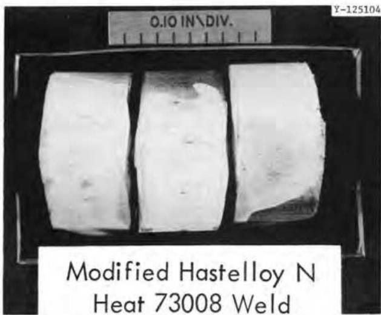  
Fig. 10.1. Photomicrograph of side bend specimens 1/8-in. thick by 1/2-in. wide bent around a 3/8-in.-radius mandrel. Dye penetrant has been applied, and dark streaks indicate shallow cracks.

in.-radius mandrel is a very severe test, and cracking to the depth shown could be tolerated in most applications.

Tensile specimens were machined from the weld area of the plate and from the 1/4-in.-diam rod that was swaged from this heat for comparison of base metal and weld properties. Table 10.2 gives the tensile properties of the base metal and weld metal at temperatures of 25 and $650^{\circ}\mathrm{C}$ . The weld metal in the as-welded condition had higher yield stress than the base metal, but only one half as much ductility or elongation. The usual stress-relief anneal of 8 hr at $871^{\circ}\mathrm{C}$ $(1600^{\circ}\mathrm{F})$ lowered the yield stress of the weld metal with no recovery of ductility. The solution anneal of 1 hr at $1177^{\circ}\mathrm{C}$ $(2150^{\circ}\mathrm{F})$ further lowered the yield stress of the weld metal, and the ductility recovered to that of the base metal.

Apparently, heat 73-008 can be satisfactorily welded and, by proper heat treatment, can attain properties equivalent to those of the base metal.

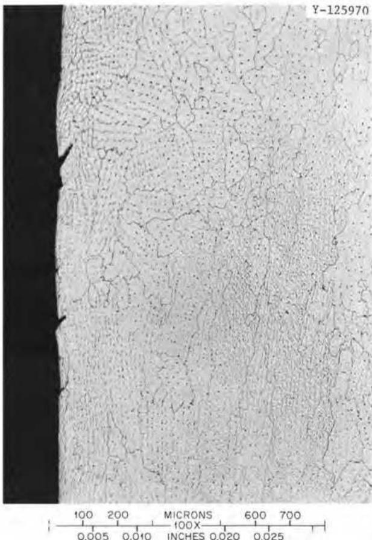  
Fig. 10.2. Photomicrograph of weld in bend area of side bend specimen. Cracks at surface that was in tension are approximately 1 mil deep. Etched with $50\%$ HCl, $10\%$ $\mathrm{HNO}_3$ , $100\times$ .

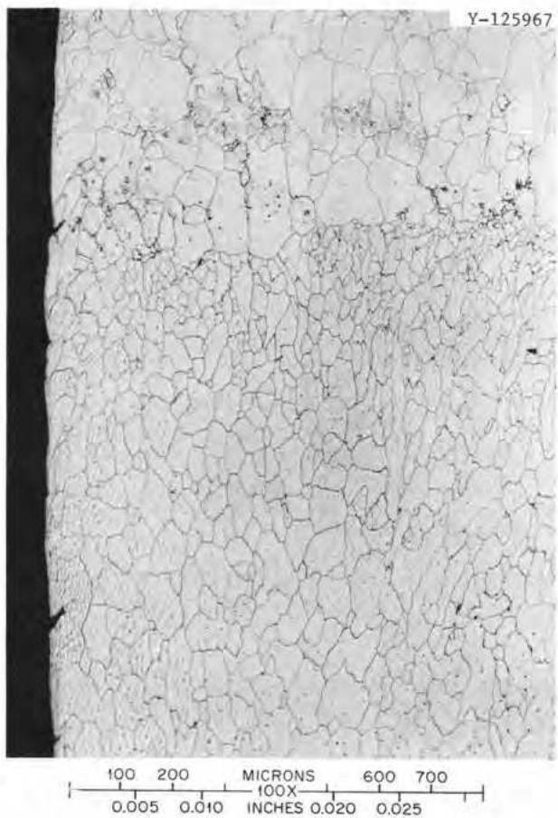  
Fig. 10.3. Photomicrograph of bend area of side bend specimen at fusion line. Approximately 1-mil-deep cracks do not propagate in weld or base metal. Etched with $50\%$ HCl, $10\%$ $\mathrm{HNO}_3$ , $100\times$ .

Table 10.2. Comparison of base metal and weld metal tensile properties of modified Hastelloy N heat 73-008 at 25 and $650^{\circ}\mathrm{C}$   

<table><tr><td rowspan="2">Specimen Number</td><td rowspan="2">Condition</td><td rowspan="2">Test temperature (°C)</td><td colspan="3">Stress \( \left( {\mathrm{{psi}} \times  {10}^{3}}\right) \)</td><td rowspan="2">Total elongation (%)</td><td rowspan="2">Reduction in area (%)</td></tr><tr><td>Yield</td><td>Ultimate tensile</td><td>Fracture</td></tr><tr><td>14530</td><td>1 hr at \( {1177}^{ \circ  }\mathrm{C} \)</td><td>25</td><td>53.7</td><td>139.0</td><td>104.0</td><td>46.20</td><td>52.84</td></tr><tr><td>14589</td><td>As-welded</td><td>25</td><td>80.2</td><td>120.2</td><td>94.1</td><td>21.67</td><td>35.05</td></tr><tr><td>14623</td><td>Welded-8 hr at \( {871}^{ \circ  }\mathrm{C} \)</td><td>25</td><td>68.4</td><td>111.5</td><td>105.4</td><td>21.39</td><td>42.80</td></tr><tr><td>14621</td><td>Welded-1 hr at \( {1177}^{ \circ  }\mathrm{C} \)</td><td>25</td><td>48.3</td><td>113.6</td><td>104.8</td><td>41.90</td><td>42.60</td></tr><tr><td>14531</td><td>1 hr at \( {1117}^{ \circ  }\mathrm{C} \)</td><td>650</td><td>39.1</td><td>97.3</td><td>80.0</td><td>25.30</td><td>28.94</td></tr><tr><td>14590</td><td>As-welded</td><td>650</td><td>59.5</td><td>78.1</td><td>55.4</td><td>10.37</td><td>35.70</td></tr><tr><td>14624</td><td>Welded-8 hr at \( {871}^{ \circ  }\mathrm{C} \)</td><td>650</td><td>51.9</td><td>75.1</td><td>61.7</td><td>9.91</td><td>31.80</td></tr><tr><td>14622</td><td>Welded-1 hr at \( {1177}^{ \circ  }\mathrm{C} \)</td><td>650</td><td>32.4</td><td>78.9</td><td>71.2</td><td>27.60</td><td>23.05</td></tr></table>

# 10.3 MECHANICAL PROPERTIES OF MODIFIED HASTELLOY N

H. E. McCoy

The creep properties of three heats of $2\%$ Timodified Hastelloy N and two heats of Hf-modified Hastelloy N were reported previously. The results for the unirradiated condition showed clearly that all five heats were as strong as or stronger than standard Hastelloy N at test temperatures of 650 and $760^{\circ}\mathrm{C}$ . These data have not been expanded significantly since that time. Samples of these heats have also been irradiated and a few of the postirradiation creep tests completed. Many additional postirradiation tests have been completed since that time, and these will be discussed in more detail later in the report.

The postirradiation stress-rupture observations at $650^{\circ}\mathrm{C}$ for the three Ti-modified heats are shown in

I. H. E. McCoy and B. McNabb, MSR Program Semiannu. Progr. Rep. Aug. 31, 1972, ORNL-4832, p. 117.

Fig. 10.4. The numbers by the individual points are the fracture strain. Although all three heats had excellent properties after irradiation at $650^{\circ}\mathrm{C}$ , the properties of heat 72-503 were superior. Irradiation at $704^{\circ}\mathrm{C}$ reduced the rupture life and strain, but the properties of all heats are acceptable under these conditions. Irradiation at $760^{\circ}\mathrm{C}$ caused an even larger drop in rupture life and strain. The properties of heat 72-503 are acceptable, but the properties of the other two heats at stress levels above 30,000 psi are poor. At lower stress levels, the properties of heats 71-114 and 71-583 improve. This type of behavior has been noted previously, suggesting that there may be some critical stress below which irradiation has little effect on the mechanical properties.

Our studies have generally shown that optimum postirradiation properties are obtained when the material is annealed $1\mathrm{hr}$ at $1177^{\circ}\mathrm{C}$ prior to irradiation. Since the improved resistance to irradiation damage results from obtaining a specific carbide morphology, continued attention must be given to

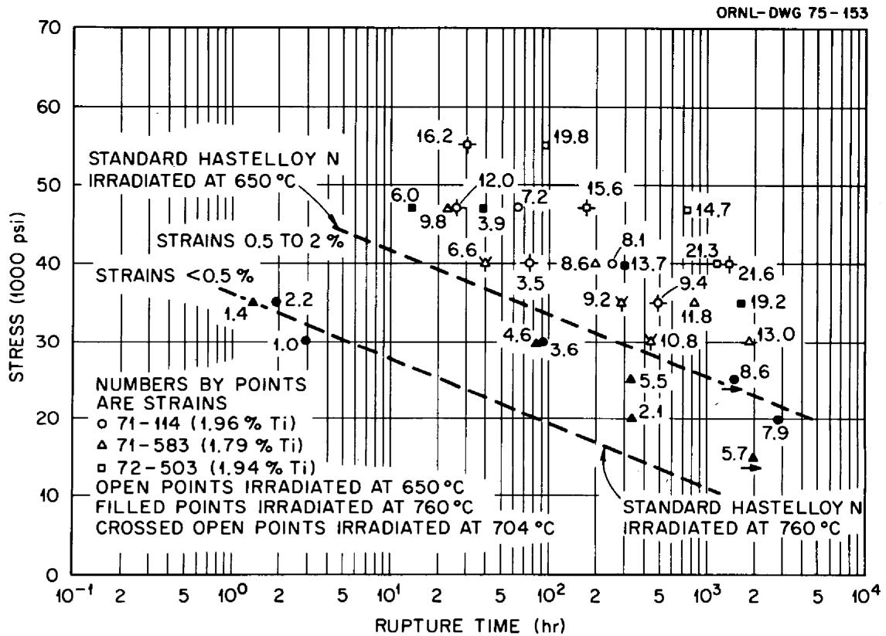  
Fig. 10.4. Postirradiation creep properties of Ti-modified alloys at $650^{\circ}\mathrm{C}$ after irradiation at indicated temperature to thermal fluence of $3 \times 10^{20}$ neutrons/cm². Numbers by points indicate fracture strains.

the possible importance of heat treatment. Specimens of heat 71-114 were annealed for $1\mathrm{hr}$ at temperatures from 1038 to $1260^{\circ}\mathrm{C}$ and irradiated at $760^{\circ}\mathrm{C}$ . The results of the creep test at $650^{\circ}\mathrm{C}$ are shown in Fig. 10.5. These data show that the optimum rupture life and strain occur from annealing at $1204^{\circ}\mathrm{C}$ . However, samples annealed at $1177^{\circ}\mathrm{C}$ are "second best" with an indicated trend of the two anneals resulting in equivalent properties at stresses below about 20,000 psi.

Weld samples of heat 71-114 and 71-583 were irradiated and the results of postirradiation creep tests are shown in Fig. 10.6. The test matrix is not complete, but the data indicate that the properties of both heats irradiated in the as-welded condition at 650 and $760^{\circ}\mathrm{C}$ are very poor. Postweld annealing at $1177^{\circ}\mathrm{C}$ greatly improved the properties of heat 71-583 after irradiation at $650^{\circ}\mathrm{C}$ . Postweld annealing at $1177^{\circ}\mathrm{C}$ will probably produce markedly improved properties in both heats after irradiation at either 650 or $760^{\circ}\mathrm{C}$ .

The results of postirradiation tests on the two Hf-modified heats are shown in Fig. 10.7. After irradiation at $650^{\circ}\mathrm{C}$ both heats had good properties, although the properties of heat 72-115 with $0.7\%$ Hf were superior. Irradiation at $704^{\circ}\mathrm{C}$ reduced the rupture life and strain compared with those observed at $650^{\circ}\mathrm{C}$ . The fracture strain of heat 72-604 was reduced to a marginal level. Irradiation at

$760^{\circ}\mathrm{C}$ reduced the properties of both heats to about the levels noted for standard Hastelloy N.

We found previously1 that heat 72-115 with $0.5\%$ Hf formed weld metal cracks during welding. This problem, coupled with the difficulty of holding a metal as reactive as hafnium in the melt, discourages further development of the Hf-modified Hastelloy N. Future efforts will be concentrated on the development of the Ti-modified alloy.

# 10.4 TRANSMISSION ELECTRON MICROSCOPY OF Ti-MODIFIED HASTELLOY N ALLOYS

D. N. Braski J. M. Leitnaker G. A. Potter

The near-term objective of this investigation is to explain why two Ti-modified alloys, heat 471-114 and 472-503, behaved so differently in the postirradiation creep tests described in the previous section. The 472-503 alloy was vastly superior to the 471-114 material; in some tests the rupture lives of 472-503 specimens exceeded those of 471-114 by greater than two orders of magnitude. These results are surprising since the two alloys have virtually identical compositions (Table 10.1). To understand the results of the postirradiation creep tests, the combined effects of long exposure times at elevated temperature in the reactor and the radia

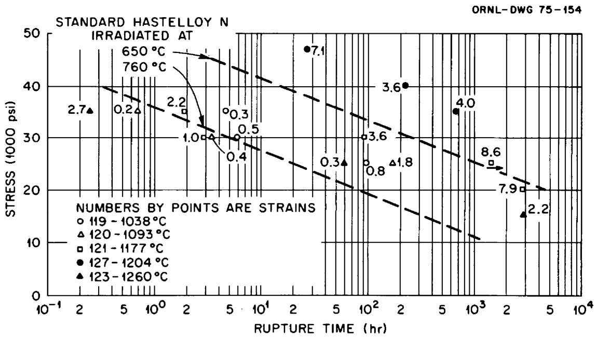  
Fig. 10.5. Influence of preirradiation annealing on the postirradiation creep behavior of heat 71-114 at $650^{\circ}\mathrm{C}$ . Samples annealed for 1 hr at the indicated temperature and then irradiated at $760^{\circ}\mathrm{C}$ to a thermal fluence of $3 \times 10^{20}$ neutrons/ $\mathrm{cm}^2$ . The numbers by each point are the 7.1 fracture strains.

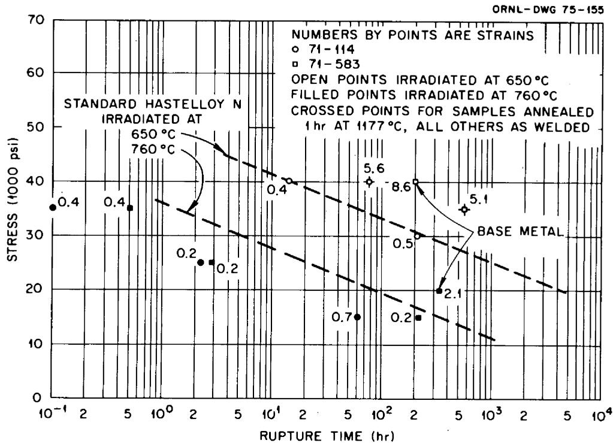  
Fig. 10.6. Postirradiation creep properties at $650^{\circ}\mathrm{C}$ of welds after irradiation to a thermal fluence of $3 \times 10^{20}$ neutrons/ $\mathrm{cm}^2$ . The numbers by each point are the fracture strain.

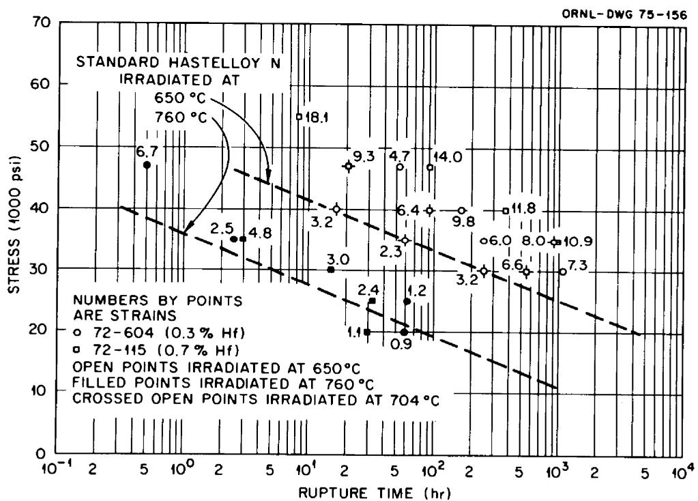  
Fig. 10.7. Postirradiation creep properties of Hf-modified alloys at $650^{\circ}\mathrm{C}$ after irradiation of indicated temperature to thermal fluence of $3 \times 10^{20}$ neutrons/ $\mathrm{cm}^2$ . The numbers by each point are the fracture strain.

tion damage itself must be considered separately. For this reason, duplicate samples of the two alloys were annealed in furnaces for $1000\mathrm{hr}$ at the irradiation temperature to assess the effect of the thermal treatment alone on their respective microstructures. Sections of the samples were subsequently examined in a $200\mathrm{-kv}$ transmission electron microscope, and the results of these observations are presented. Electron microscopy studies of the irradiated samples are currently under way and will be discussed in a later report.

Before comparing the two alloys, the microstructure of Ti-modified Hastelloy N alloys must first be considered. After the alloy is fabricated into a given form it is usually given a solution annealing treatment of 1 hr at 1177 to $1260^{\circ}\mathrm{C}$ . The microstructure after this anneal consists of equiaxed grains, twins, a low density of dislocations, and precipitate particles. The precipitates have various morphologies (Fig. 10.8a) for a $1.2\%$ Ti-modified alloy. Large "blocky" precipitates are often found in grain boundaries, while more spherical-shaped ones are located within the grains. Interfacial dislocations are nearly always observed with the primary spherical precipitates. After the alloy had been aged for 200 hr at $760^{\circ}\mathrm{C}$ , other fine precipitates were observed on stacking faults which usually emanated from the primary precipitates within the grains (see Fig. 10.8b). This interesting phenomenon has been studied in some detail for austenite stainless steels by Silcock and Tunstall who proposed that (1) solute atoms segregated to dislocations; (2) the dislocations dissociated into partials by the reaction $a/2[110] \rightarrow a/3[111] + a/6[112]$ ; (3) MC carbides nucleated on the tension side of the $a/3$ [111] Frank partial dislocation; and (4) the stacking fault and MC carbide precipitates developed simultaneously. This mechanism appears to also apply to the titanium modified Hastelloy N alloys.

Two $2\%$ Ti-modified alloys were aged for 1000 hr at temperatures of 650, 704, and $760^{\circ}\mathrm{C}$ , and typical microstructures of samples of heats 471-114 and 472-503 aged at these temperatures are shown in Figs. 10.9, 10.10, and 10.11, respectively. All of the samples contain stacking-fault precipitates which formed during the thermal aging period. Using

selected-area electron diffraction and the photomicrographs, these stacking-fault precipitates were found to lie on [111] planes. Selected-area diffraction and dark-field techniques were used to identify the stacking-fault precipitates as MC-type carbides. Similar analyses identified grain boundary and primary precipitates also as MC. These MC precipitates are face-centered cubic (fcc) and were simply related to the fcc matrix such that $(100)_{\mathrm{MC}}\parallel (100)_{\mathrm{matrix}}$ . The lattice parameters of the MC particles measured ranged from about $4.20\AA$ to $4.28\AA$ . This range is similar to that reported by Scssions using x-ray diffraction on extracted MC precipitates. The exact composition of the MC particles in the two $2\%$ Ti-modified alloys has not yet been determined. However, extrapolation of Sessions data on alloys containing from 0.5 to $1.2\%$ Ti predicts that a $2\%$ Ti alloy would contain $(\mathrm{Mo}_{0.67}\mathrm{Ti}_{0.33})\mathrm{C}$ . We plan to verify this result by extracting the MC particles from the alloy and analyzing them by spectroscopic methods.

The main effect of the 1000-hr aging treatment, therefore, was to cause precipitation of MC particles in a stacking fault morphology along [111] planes. Lesser amounts of MC were also observed to decorate the large grain boundary precipitates and, in a few instances, along twin boundaries. The effect of increasing the aging temperature from 650 to $760^{\circ}\mathrm{C}$ was to form coarser precipitates at the higher temperatures for the same aging time. This point is illustrated by comparing the coarse MC precipitates along the stacking faults in Fig. 10.8a with the finer ones observed in Fig. 10.9a. The amount of precipitation occurring at different temperatures and in the different alloys is not known quantitatively, but extraction experiments are being initiated to determine these quantities.

After examination of many electron photomicrographs for both the 471-114 and 472-503 alloys, no obvious qualitative differences in their microstructures were noted at the respective aging temperatures. This result is demonstrated in typical photomicrographs (Figs. 10.9-10.11), although admittedly, comparison by the reader is difficult with only one photomicrograph per condition. Apparently, thermal aging alone cannot account for the difference in postirradiation creep behavior. This tentative conclusion will be strengthened if the precipitate extraction experiments also indicate that the respective precipitates of the alloy are similar. We expect to find significant differences between the microstructures of the irradiated 471-114 and 472-503 alloys.

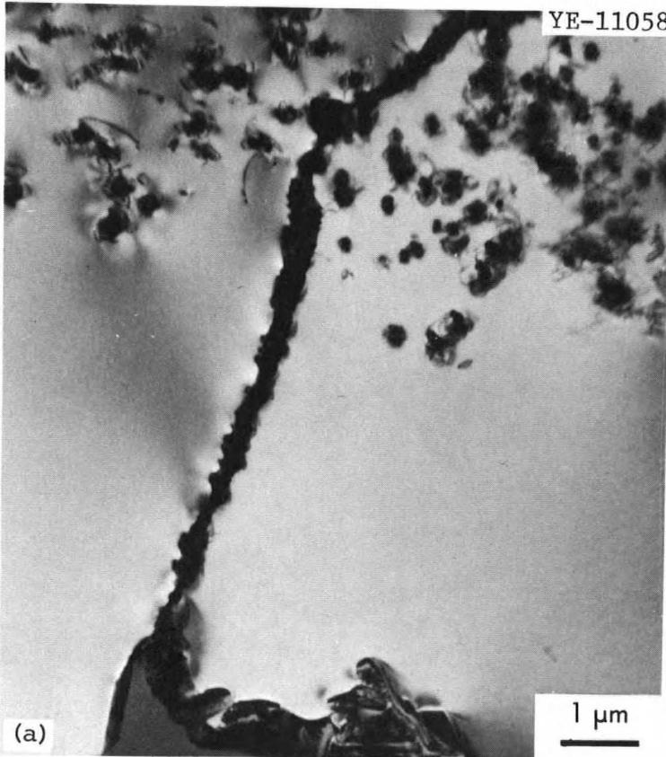

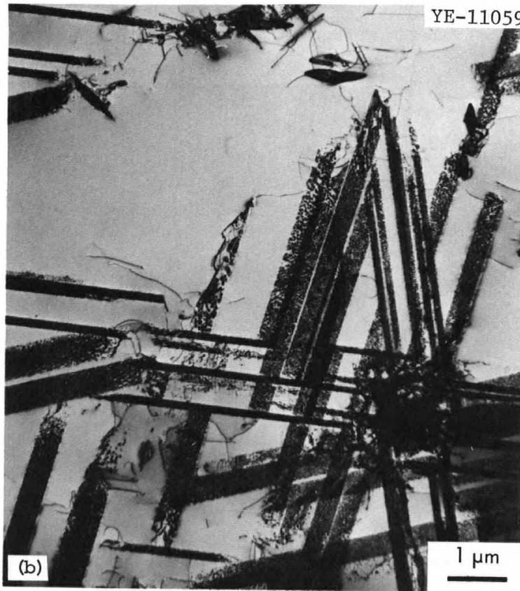  
Fig. 10.8. Effect of aging at $760^{\circ}\mathrm{C}$ on microstructure of $1.2\%$ Ti-modified Hastelloy N. (a) Solution annealed 1 hr at $1260^{\circ}\mathrm{C}$ . (b) Solution annealed 1 hr at $1260^{\circ}\mathrm{C}$ and aged 200 hr at $760^{\circ}\mathrm{C}$ .

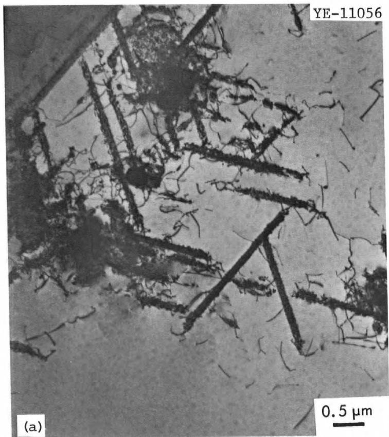

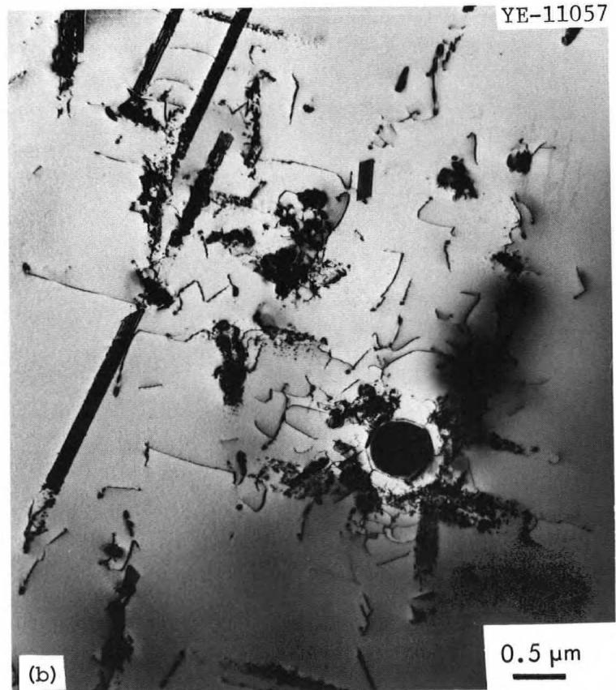  
Fig. 10.9. Microstructure of $2\%$ Ti-modified Hastelloy N after solution annealing 1 hr at $1177^{\circ}\mathrm{C}$ and aging 1000 hr at $650^{\circ}\mathrm{C}$ . (a) 471-114. (b) 472-503.

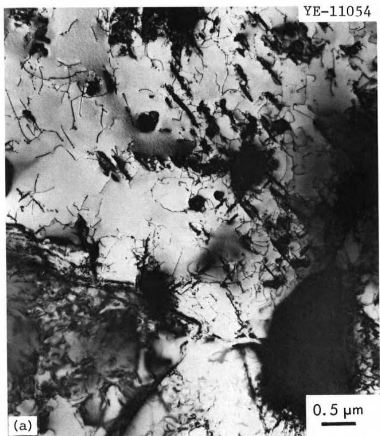

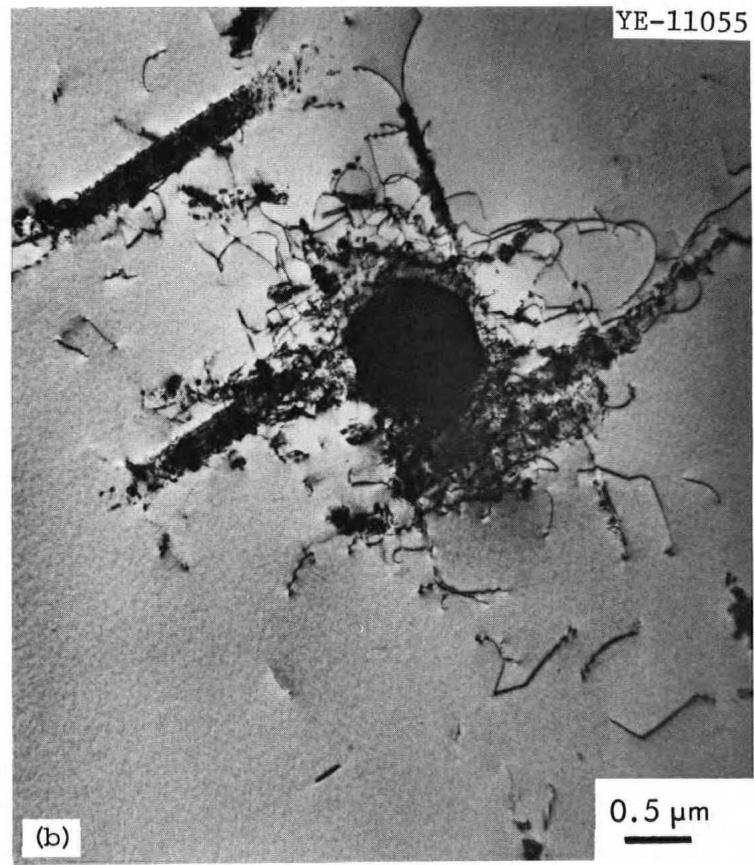  
Fig. 10.10. Microstructure or $2\%$ Ti-modified Hastelloy N after solution annealing 1 hr at $1177^{\circ}\mathrm{C}$ and aging 1000 hr at $704^{\circ}\mathrm{C}$ . (a) 471-114. (b) 472-503.

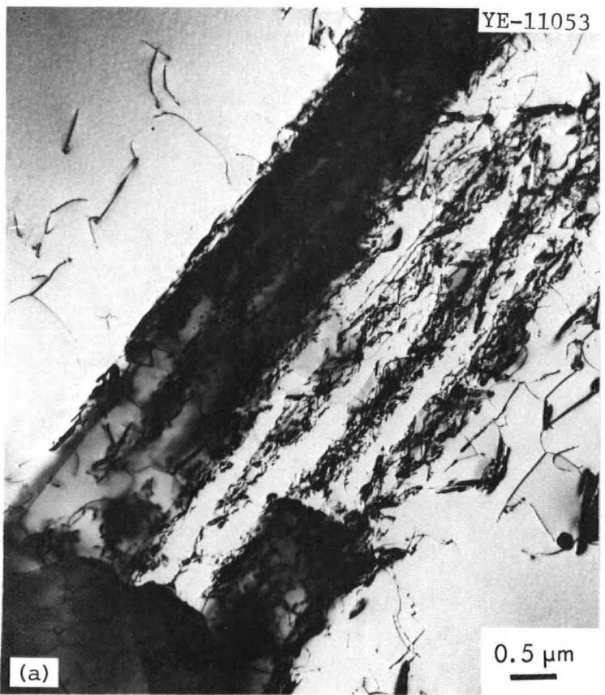

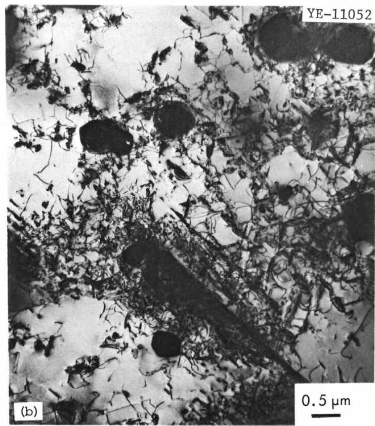  
Fig. 10.11. Microstructure of $2\%$ Ti-modified Hastelloy N after solution annealing 1 hr at $1177^{\circ}\mathrm{C}$ and aging 1000 hr at $760^{\circ}\mathrm{C}$ . (a) 471-114. (b) 472-503.

# 10.5 SALT CORROSION STUDIES

J.R.DiStefano J.R.Keiser

Hastelloy N exhibits excellent corrosion resistance to fluoride salts containing LiF, $\mathrm{BeF}_2$ , $\mathrm{ThF}_4$ , and $\mathrm{UF_4}$ . The most reactive constituent of Hastelloy N is chromium, which constitutes about $7\%$ of the alloy. If the fuel salt is pure and the metal is clean, $\mathrm{UF_4}$ is the strongest oxidant, and corrosion of Hastelloy N occurs from the reaction

$$
\begin{array}{l} \mathrm {U F} _ {4} (\text {s a l t}) + 1 / 2 \mathrm {C r} (\text {a l l o y}) \\ \leftarrow \mathrm {U F} _ {3} (\text {s a l t}) + 1 / 2 \mathrm {C r F} _ {2} (\text {s a l t}). \tag {1} \\ \end{array}
$$

Other reactions can result from impurities in the melt such as

$$
\begin{array}{l} \mathrm {C r} (\text {a l l o y}) + \mathrm {F e F} _ {2} (\text {s a l t}) \\ \leftrightarrow \mathrm {C r F} _ {2} (\text {s a l t}) + \mathrm {F e} (\text {a l l o y}), \tag {2} \\ \end{array}
$$

or

$$
\mathrm {C r} (\text {a l l o y}) + 2 \mathrm {H F} (d) \rightleftharpoons \mathrm {C r F} _ {2} (\text {s a l t}) + \mathrm {H} _ {2} (g). \tag {3}
$$

Oxide films on the metal surface will react according to

$$
\begin{array}{l} \mathrm {N i O} (\text {a l l o y}) + \mathrm {U F} _ {4} (\text {s a l t}) \\ \leftrightarrow \mathrm {U O} _ {2} (s) + 2 \mathrm {N i F} _ {2} (\text {s a l t}), \tag {4} \\ \end{array}
$$

followed by reaction of $\mathrm{NiF}_2$ with Cr. Reactions such as Eqs. (2), (3), and (4) proceed essentially to completion, which results in a high initial corrosion rate followed by a decline as the impurities are consumed.

The equilibrium constant for Eq. (1) is temperature dependent and thereby affords a driving force in monisothermal systems for continuous chromium

rc removal in hot regions and deposition in the cooler regions.

A secondary coolant will link the fuel circuit to the steam generator in an MSBR. A mixture of sodium fluoride and sodium fluoroborate (NaF $\mathrm{NaBF}_4$ ) has a number of attractive properties for this application. Although thermodynamic data are not yet well established, predictions and demonstrations thus far reveal that Hastelloy N is very compatible with $\mathrm{NaBF}_4$ -NaF mixtures. However, oxidizing impurities in the fluoroborate mixture, such as $\mathrm{FeF}_2$ or HF, will readily attack chromium (and perhaps iron and nickel) in the alloy.

The objective of the experiments discussed in this section is to quantitatively determine corrosion rates in fluoride salt-alloy systems. Test variables include salt purity, salt velocity, system temperature, exposure time, and alloy composition.

# 10.5.1 Fuel Salt Thermal Convection Loop Results

Prior to termination of the MSR Program in January 1973, a number of thermal convection loops circulating fuel salt were in operation (Table 10.3). The purposes of these tests were to (1) evaluate electrochemical methods for determining $\mathrm{U}^{4+} / \mathrm{U}^{3+}$ and $\mathrm{Cr}^{2+}$ in the salt (NCL-21); (2) determine the corrosion rates of iron-based alloys in fuel salt (1258 and NCL-22); (3) study the mass transfer of tellurium in fuel salt (NCL-16A); (4) determine the effect of entrained bismuth in salt on the corrosion resistance of Hastelloy N (NCL-19A); and (5) evaluate the corrosion resistance of several alloys having improved resistance to cracking by tellurium in fuel salt (NCL-18A).

Table 10.3. Fuel salt thermal convection loop tests in operation January 1973   

<table><tr><td>Loop number</td><td>Material</td><td>Specimen</td><td>Salt composition (mole %)</td><td>Maximum temperature (°C)</td><td>Operating time (hr)</td></tr><tr><td>1258</td><td>Type 304L SS</td><td>Type 304L SS</td><td>LiF-BeF2-ZrF4-ThF4-UF4(70-23-5-1-1)</td><td>688</td><td>80,000</td></tr><tr><td>NCL-16A</td><td>Hastelloy N</td><td>Te-coated Hastelloy N</td><td>LiF-BeF2-UF4(65.5-34-05)</td><td>704</td><td>5,878</td></tr><tr><td>NCL-18A</td><td>Hastelloy N</td><td>Various alloys</td><td>LiF-BeF2-ThF4-UF4(68-20-11.7-0.3)</td><td>704</td><td>5,351</td></tr><tr><td>NCL-19A</td><td>Hastelloy N</td><td>Hastelloy N plus modified Hastelloy N</td><td>LiF-BeF2-ThF4-UF4(68-20-11.7-0.3) plus Bi in Mo hot finger</td><td>704</td><td>24,515</td></tr><tr><td>NCL-21</td><td>Hastelloy N</td><td>Hastelloy N</td><td>LiF-BeF2-ZrF4-UF4(65.4-29.1-5.0-0.5)</td><td>650</td><td>13,800</td></tr><tr><td>NCL-22</td><td>Type 316 SS</td><td>Type 316 SS</td><td>LiF-BeF2-ThF4-UF4(68-20-11.7-0.3)</td><td>650</td><td>4.298</td></tr></table>

Electrochemical analysis of salts. According to Eq. (1) the oxidizing potential of the melt is determined by the amounts of $\mathrm{UF_4}$ and $\mathrm{UF_3}$ present. Loop NCL-21 was equipped with electrochemical probes to measure the ratio of uranium (IV) to uranium (III) in the salt. Weight losses and gains in specimens from the hot and cold legs were monitored during loop operation. In general, the ratio measurements showed excellent reproducibility and were consistent with test conditions.

Iron-based alloys. Loop 1258, which was constructed of type 304L stainless steel, was shut down after it had accumulated over 80,000 hr of operation. Two sets of specimens were exposed to fuel salt during this period. The second set had been exposed to 49,057 hr at loop shutdown. Maximum weight loss of the latter set was $95\mathrm{mg/cm}^2$ (0.86 mil/year). Weight losses and depth of void formation were proportional to time to the one-half

power, indicating that solid state diffusion of chromium was the rate controlling step.

Loop NCL-22 was constructed of type 316 stainless steel and operated for $4491\mathrm{hr}$ prior to termination. Weight changes of the specimens as a function of position and temperature are shown in Fig. 10.12. After $2842\mathrm{hr}$ , the maximum weight loss was $6.2\mathrm{mg/cm}^2$ (0.96 mil/year). At this time, $\mathrm{UF}_3$ was added to the salt to make it less oxidizing. In the next 645-hr period, the maximum corrosion rate was $0.83\mathrm{mil/year}$ , but in the final 811-hr period it was $>1\mathrm{mil/year}$ . The average uniform corrosion rate for the hottest specimen was $1\mathrm{mil/year}$ for the entire 4298 hr of exposure to salt. Figure 10.13 shows the microstructure of the hottest and coldest specimens. The maximum depth of attack in the hot leg was approximately 3 mils, and the attack area is probably depleted in chromium.[7]

4. J. M. Dale and A. S. Meyer, MSR Program Semiannu. Progr. Rep. Aug. 31, 1971, ORNL-4728, pp. 69-70.   
5. J. W. Koger, Alloy Compatibility with LiF-BeF $_2$ Salts Containing ThF $_4$ and UF $_4$ , ORNL-TM-4286, pp. 23-27 (December 1972).

6. J. W. Koger, Alloy Compatibility with LiF-BeF $_2$ Salts Containing ThF $_4$ and UF $_4$ , ORNL-TM-4286, pp. 31-33 (Decem-ber 1972).   
7. J. W. Koger, Alloy Compatibility with LiF-BeF $_2$ Salis Containing ThF $_4$ and UF $_4$ , ORNL-TM-4286, pp. 23-27 (Decem ber 1972).

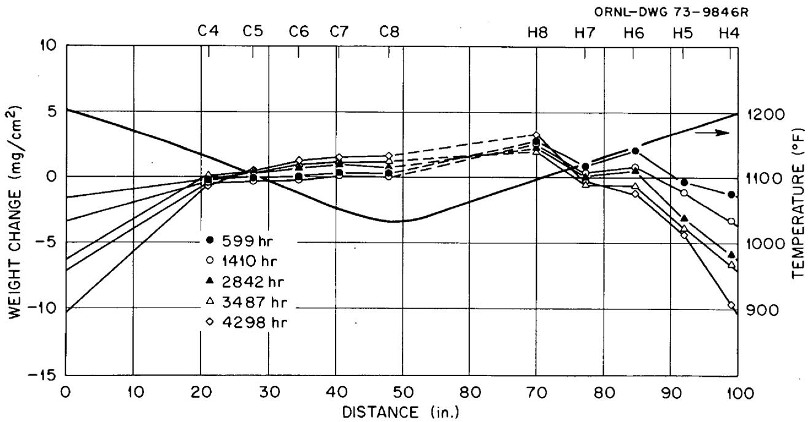  
Fig. 10.12. Weight changes of type 316 stainless steel specimens in Loop 22 exposed to LiF-BeF $_2$ -ThF $_4$ -UF $_4$ (68-20-11.7-0.3 mole %) as a function of position and temperature.

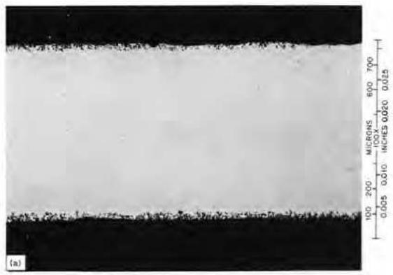

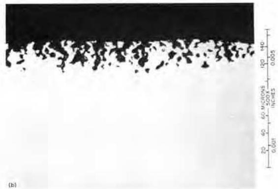

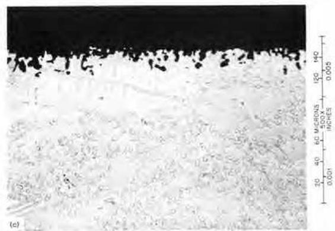

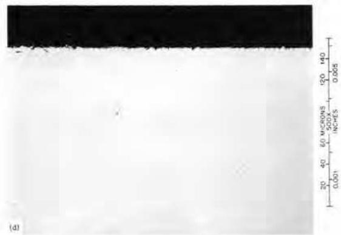  
Fig. 10.13. Microstructures of type 316 stainless steel specimens in Loop 22 exposed to LiF-BeF $_2$ -ThF $_4$ -UF $_4$ (68-20-11.7-0.3 mole %) after 4298 hr. Hot leg, $650^{\circ}\mathrm{C}$ : (a) cross section of specimen, $100\times$ ; (b) as polished, $500\times$ ; (c) etched, $500\times$ . Cold leg, $560^{\circ}\mathrm{C}$ : (d) as polished, $500\times$ .

Tellurium mass transfer. Examination of Hastelloy N samples from the MSR experiment revealed that all surfaces exposed to fuel salt had intergranular cracks. Evidence gathered thus far indicates that the cracking may have been due to intergranular penetration of the Hastelloy N by the fission product tellurium. Loop NCL-16A was operated to determine whether tellurium would transfer through the salt from one part of the system to another. Initially the loop contained standard Hastelloy N specimens in hot and cold leg sections plus one Te-coated Hastelloy N specimen $(1.6\mathrm{mg/cm}^2)$ . In the first $1300\mathrm{hr}$ of operation, the weight loss of the Te-coated specimen equaled the amount of tellurium that had been added to the specimen. In the next $2100\mathrm{hr}$ , the weight loss of the Te-coated specimen was the same as the uncoated Hastelloy N specimen in a neighboring position. Approximately half of the tellurium removed from the coated sample was found on a specimen in the cold leg, and analysis of the salt indicated that it contained the remainder of the tellurium. These results suggest that tellurium has some solubility in fuel salt and will mass transfer in a temperature-gradient system.

Radioactive $(^{127m}\mathrm{Te})$ Te-coated Hastelloy N specimens were put into the hot and cold leg sections of loop NCL-16A, replacing the previous specimens. After the first 42 hr in the loop, all specimens lost $>66\%$ of their initial ${}^{127m}\mathrm{Te}$ activity. By comparison, a control sample stored in air at room temperature lost $4\%$ of its ${}^{127m}\mathrm{Te}$ activity. After 159 hr all loop specimens had lost $75\%$ of their initial activity while the control specimen had lost $8\%$ . Analyses after 396 and 701 hr indicated that hot leg specimens were continuing to lose ${}^{127m}\mathrm{Te}$ , but that a small increase in activity was found in cold leg specimens. Measurements after 1318 and 1792 hr indicated no further changes in ${}^{127m}\mathrm{Te}$ activity on specimens in either the hot or cold leg. Weight change measurements generally corroborated the directions of the changes in ${}^{127m}\mathrm{Te}$ activity. Overall, specimens in the hot leg lost weight while those in the cold leg gained weight. Since the loop operating temperature was above the melting temperature of tellurium, and most of the loss in tellurium occurred during the first 42 hr (the first time period at which measurements were made), the mechanism of tellurium loss into the salt is undetermined.

However, the overall pattern of high initial loss on all specimens, followed by smaller losses in hot leg specimens and gains in cold leg specimens is consistent with a temperature-gradient mass transfer model.

Bismuth-salt-Hastelloy N. Loop NCL-19A was operated to determine whether contact of the salt with liquid bismuth would affect the corrosion rate of Hastelloy N immersed in the salt. The bismuth was contained in a molybdenum "finger" that was attached to the bottom of the hot leg. The loop operated for 24,515 hr, and weight loss results are shown in Fig. 10.14. Assuming uniform loss, the maximum change was $-0.02\mathrm{mil/year}$ . A modified Hastelloy N alloy (Ni- $13\%$ Mo- $8\%$ Cr- $0.17\%$ Fe- $0.8\%$ Te- $1.6\%$ Nb) lost slightly less weight than a standard alloy at the same position. After 18,000 hr, chromium in the salt increased 194 ppm, iron decreased 70 ppm, and bismuth was not detected. There appeared to be little or no entrainment of bismuth in the salt under these test conditions; therefore, the effect of small quantities of bismuth in the salt on corrosion of Hastelloy N cannot be inferred from this test.

Corrosion resistance of alloys having improved resistance to tellurium cracking. Several alloys having improved resistance to tellurium cracking were exposed to fuel salt in loop NCL-18A. Table 10.4 shows the compositions of the alloys tested

Table 10.4. Nominal compositions of test alloys (wt %)   

<table><tr><td>Alloy</td><td>Ni</td><td>Cr</td><td>Fe</td><td>Mo</td><td>Cu</td><td>Al</td><td>Nb</td><td>Mn</td></tr><tr><td>Moncl</td><td>65</td><td></td><td></td><td></td><td>35</td><td></td><td></td><td></td></tr><tr><td>Hastelloy N</td><td>~70</td><td>7</td><td>5</td><td>16</td><td></td><td></td><td></td><td></td></tr><tr><td>Inconcl 600</td><td>~75</td><td>15</td><td>7</td><td></td><td></td><td></td><td></td><td></td></tr><tr><td>Inconcl 606</td><td>~70</td><td>20</td><td>2</td><td></td><td></td><td></td><td>2</td><td>3</td></tr><tr><td>Inconcl 601</td><td>~60</td><td>23</td><td>14</td><td></td><td></td><td>1</td><td></td><td></td></tr><tr><td>Inconcl 690</td><td>~50</td><td>30</td><td>15</td><td></td><td></td><td></td><td></td><td></td></tr><tr><td>Incoloy 811E</td><td>~30</td><td>21</td><td>47</td><td></td><td></td><td></td><td></td><td></td></tr></table>

and Table 10.5 shows the weight changes after an exposure of $2776\mathrm{hr}$ at $690^{\circ}\mathrm{C}$ . Testing several different materials together in the same system introduces the possibility of mass transfer of certain constituents between the alloys because of activity gradient effects. However, there was a good correlation between weight changes and the chromium and iron content of the alloy, and the Ni-based alloys were more corrosion resistant than the Fe-based alloys.

Microstructures of the alloys tested are shown in Fig. 10.15. Hastelloy N and Inconel 600, which had the smallest weight loss, showed the least attack. Large areas of void formation can be seen in Inconel 601 (5 mils deep), Inconel 690 (15 mils deep), and Incoloy 811E (18 mils deep). Monel, which showed a weight gain, showed a surface layer and

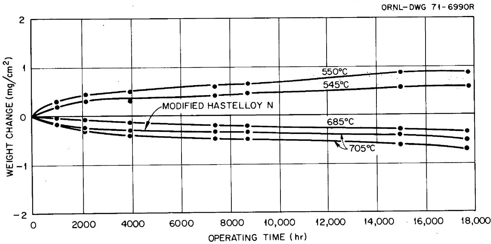  
Fig. 10.14. Weight changes of Hastelloy N from Loop 19 exposed to LiF-BeF $_2$ -ThF $_4$ -UF $_4$ (68-20-11.7-0.3 mole %) for various times.

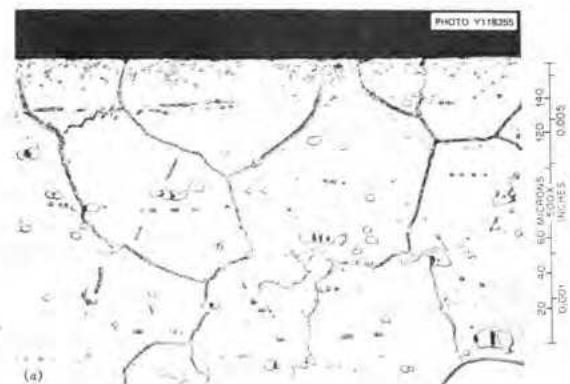

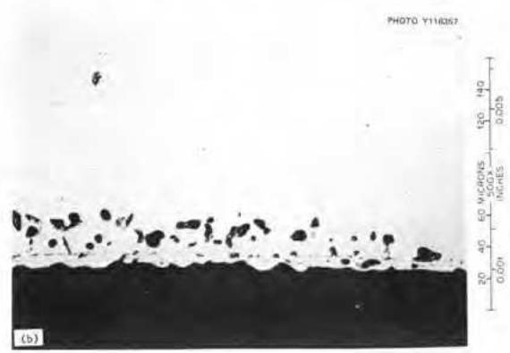

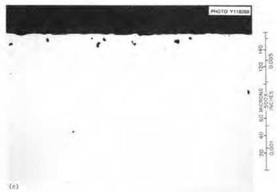

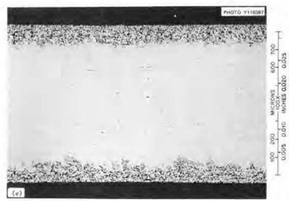

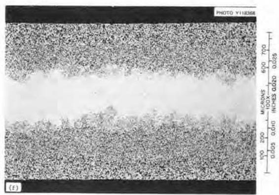

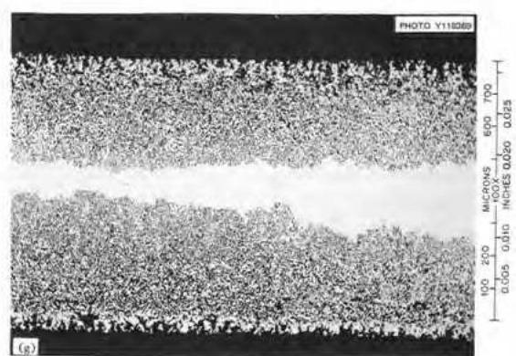

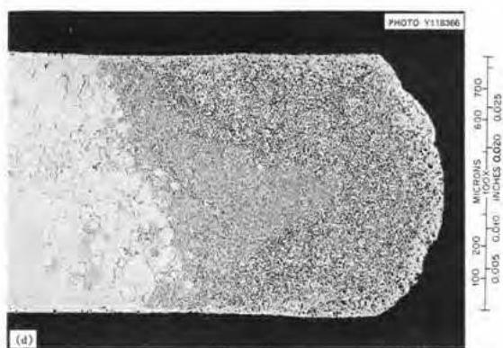  
Fig. 10.15. Microstructures of various alloys exposed to LiF-BeF2-ThF4-UF4 (68-20-11.7-0.3 mole %) at $690^{\circ}\mathrm{C}$ for 2776 hr. (a) Hastelloy N 500×; (b) Monel, 500×; (c) Inconel 600, 500×; (d) Inconel 606, 100×; (e) Inconel 601, 100×; (f) Inconel 690, 100×; (g) Incoloy 811E, 100×.

Table 10.5 Weight changes of alloys exposed to LiF-BeF2-ThF4-UF4(68-20-11.7-0.3 mole %) at ${690}^{ \circ  }\mathrm{C}$ for ${2776}\mathrm{{hr}}$   

<table><tr><td rowspan="2">Alloy</td><td colspan="2">Content (%)</td><td rowspan="2">Total active alloying constituentsa(%)</td><td rowspan="2">Weight change (mg/cm2)</td></tr><tr><td>Chromium</td><td>Iron</td></tr><tr><td>Monel</td><td>0</td><td>1</td><td>2</td><td>+0.78</td></tr><tr><td>Hastelloy N</td><td>7</td><td>5</td><td>14</td><td>-0.15</td></tr><tr><td>Inconcl 600</td><td>15</td><td>7</td><td>25</td><td>-0.49</td></tr><tr><td>Inconcl 606</td><td>20</td><td>2</td><td>27</td><td>-6.6</td></tr><tr><td>Inconcl 601</td><td>23</td><td>14</td><td>38</td><td>-16.0</td></tr><tr><td>Inconcl 690</td><td>30</td><td>15</td><td>45</td><td>-55.5</td></tr><tr><td>Ineoloy 811E</td><td>21</td><td>47</td><td>70</td><td>-116.7</td></tr></table>

${}^{a}$ Constituents that tend to form rather stable fluorides. All corrosion specimens were annealed $1\mathrm{{hr}}$ at ${1121}^{ \circ  }\mathrm{C}$ except Monel,which was annealed $1\mathrm{{hr}}$ at ${800}^{ \circ  }\mathrm{C}$ .

subsurface void formation. The weight gain was probably the result of activity gradient mass transfer from constituents of the other alloys which gave rise to the surface layer. The amount of subsurface void formation indicates that Monel would probably show a greater weight loss than that exhibited by Hastclloy N and Inconel 600 if it had been tested in a system where deposition from other constituents did not occur.

# 10.5.2 Coolant Salt Thermal Convection Loop Results

Four Hastelloy N thermal convection loops containing coolant salt were in operation when the program was terminated in January 1973 (see Table 10.6). Loop Nos. NCL-13A and NCL-14 had been operated for over 4 and 5 years, respectively, and their purpose was to evaluate the compatibility of Hastelloy N and Ti-modified Hastelloy with $\mathrm{NaBF_4 - NaF}$ (92-8 mole%). The maximum uniform corrosion rate at the highest temperature, $607^{\circ}\mathrm{C}$ , was determined to be 0.7 mil/year.[10,11]

Loop NCL-17 was operated to determine the effect of steam in leakage in a fluoroborate salt-Hastelloy N circuit. After 1000 hr of normal operation, steam was injected into the loop.[12] The loop then operated over 30,000 hr following that injection. Measurements made after 24,000 hr (which included 1000 hr of normal operation) showed a maximum corrosion rate of 1.6 mils/year.

Loop NCL-20C was originally operated as NCL-20 with standard Hastelloy N specimens to evaluate their compatibility with fluoroborate coolant salt under conditions expected for the MSBR secondary circuit $(687^{\circ}\mathrm{C}$ maximum, $438^{\circ}\mathrm{C}$ mini

mum). Since experience indicated that corrosion in fluoroborate systems is largely due to impurities (particularly water) in the system, subsequent experiments were conducted in this loop to simulate the effects of water in the coolant salt. After the original salt was drained from NCL-20, a fresh batch was added and the loop was redesigned NCL-20A. $\mathrm{KBF}_3\mathrm{OH}$ was added to the salt to simulate the reactions that occur when water interacts with the salt, namely,

$$
\mathrm {H} _ {2} \mathrm {O} + \mathrm {N a B F} _ {4} \rightleftharpoons \mathrm {N a B F} _ {3} \mathrm {O H} + \mathrm {H F}
$$

$$
\mathrm {N a B F} _ {3} \mathrm {O H} \rightleftharpoons \mathrm {N a B F} _ {2} \mathrm {O} + \mathrm {H F}
$$

$$
6 \mathrm {H F} + 6 \mathrm {N a F} + 2 \mathrm {C r} \leftrightarrow 2 \mathrm {N a} _ {3} \mathrm {C r F} _ {6} + 3 \mathrm {H} _ {2}.
$$

However, leaks which developed in the system made the salt highly oxidizing, thereby increasing the observed corrosion rate. Because of these operational difficulties, weight change data were difficult to interpret. A tentative conclusion was that the addition of $\mathrm{KBF}_3\mathrm{OH}$ increased the corrosion rate. New salt was added to the loop (NCL-20B and NCL-20C), but additional difficulties with cover gas leaks were encountered and no further data were obtained.

Table 10.6. Coolant salt thermal convection loop tests in operation January 1973   

<table><tr><td>Loop number</td><td>Material</td><td>Specimen</td><td>Salt composition (mole %)</td><td>Maximum temperature (°C)</td><td>Operating time (hr)</td></tr><tr><td>NCL-13A</td><td>Hastelloy N</td><td>Hastelloy N, Ti-modified</td><td>NaBF4-NaF (92-8) plus tritium addition</td><td>607</td><td>37,338</td></tr><tr><td rowspan="2">NCL-14</td><td rowspan="2">Hastelloy N</td><td>Ti-modified</td><td rowspan="2">NaBF4-NaF (92-8)</td><td rowspan="2">607</td><td rowspan="2">46,016</td></tr><tr><td>Hastelloy N</td></tr><tr><td rowspan="2">NCL-17</td><td rowspan="2">Hastelloy N</td><td>Hastelloy N, Ti-modified</td><td rowspan="2">NaBF4-NaF (92-8) plus steam additions</td><td rowspan="2">607</td><td rowspan="2">31,680</td></tr><tr><td>Hastelloy N</td></tr><tr><td rowspan="2">NCL-20C</td><td rowspan="2">Hastelloy N</td><td>Hastelloy N, Ti-modified</td><td rowspan="2">NaBF4-NaF (92-8) plus KBF3OH</td><td rowspan="2">687</td><td rowspan="2">2,594</td></tr><tr><td>Hastelloy N</td></tr></table>

All of the coolant salt loops were terminated in January 1973, and they have been stored during the interim period. None of these loops will be restarted, but they will be sectioned for metallographic and chemical analyses.

# 10.5.3 Blanket Salt Thermal Convection Loop Results

Before the 1968 advances in fuel processing techniques, the design of a molten-salt breeder reactor called for a two fluid system. In addition to the uranium-containing fuel salt, there was a thorium-containing blanket salt. To determine the compatibility of Hastelloy N with this blanket salt, thermal convection loop 15A was operated. Loop 15A was made of Hastelloy N, it circulated $\mathrm{LiF - BeF_2 - ThF_4}$ (73-2-25 mole $\%$ ) salt, and contained Hastelloy N and modified Hastelloy N specimens. After a total specimen exposure time of 37,792 hr, the corrosion rate in terms of uniform material removal was 0.05 mil/year. Because the current design of an MSBR is a one-fluid system, no further work with blanket salt is anticipated.

# 10.5.4 Status of Thermal Convection Program with Fuel and Coolant Salts

Facilities for the operation of ten thermal convection loops are currently being constructed. Startup of the first loop is scheduled for October 1974, with startup of additional loops scheduled for about one per month. Table 10.7 provides a listing of the loops to be operated along with a description of the purpose of each loop.

# 10.5.5 Forced Circulation Loop Results

Forced circulation loops FCL-1A and FCL-2 were operated to determine the compatibility of Hastelloy N with sodium fluoroborate under high-velocity salt flow.

Loop FCL-1A was shut down (November 10, 1972) after $8079\mathrm{hr}$ of operation at a maximum temperature of $620^{\circ}\mathrm{C}$ . Assuming uniform dissolution, during the last $1977\mathrm{hr}$ of operation the maximum corrosion rate was $0.33\mathrm{mil/year}$ , and for the entire $8079\mathrm{-hr}$ period the maximum corrosion rate was about $1.7\mathrm{mils/year}$ (5.75 fps velocity).

Forccd circulation loop FCL-2 was operated at a maximum temperature of $620^{\circ}\mathrm{C}$ for 6806 hr before being shut down (October 23, 1972). Assuming uniform dissolution, the maximum corrosion rate was $0.74\mathrm{mil}/$ year at a velocity of 10.9 fps and 0.94 mil/year at a velocity of 20.8 fps.

Forced circulation loop FCL-2B was operated previously under the designation FCL-2 for over 6800 hr to evaluate compatibility of standard Hastelloy N with sodium fluoroborate. As FCL-2B, it will circulate fuel salt $^{14}$ to determine (1) the corrosion rate of standard Hastelloy N as a function of $\mathrm{U}^{4+}/\mathrm{U}^{3+}$ of the salt and (2) the mass transfer of tellurium and its effect on standard Hastelloy N as a function of $\mathrm{U}^{4+}/\mathrm{U}^{3+}$ ratio, and $\mathrm{Cr}^{2+}$ concentration and other corrosion products in the salt. $^{15}$

Previously obtained forced circulation loop results with Hastelloy N have shown that initial cor

Table 10.7. Thermal convection loop tests   

<table><tr><td>Loop number</td><td>Material</td><td>Samples</td><td>Electrochemical probe</td><td>Purpose</td></tr><tr><td colspan="5">MSBR fuel salt</td></tr><tr><td>21A</td><td>Hastelloy N</td><td>Hastelloy N</td><td>Yes</td><td>(1) Analytical method development
(2) Effect of graphite on stability of uranium fluorides in molten salts</td></tr><tr><td>23</td><td>Inconel 601</td><td>Inconel 601</td><td>Yes</td><td>(1) Determine if high Cr alloy such as Inconel 601 can be used in fuel under MSBR conditions; vary temperature and redox potential of salt
(2) Te mass transfer studies</td></tr><tr><td rowspan="2">18B</td><td rowspan="2">Hastelloy N</td><td>2% Ti modified Hastelloy N</td><td rowspan="2">No</td><td rowspan="2">(1) Screening test loop for modified alloys</td></tr><tr><td>2% TiLa modified Hastelloy N</td></tr><tr><td>22A</td><td>316 SS</td><td>316 SS</td><td>No</td><td>(1) Determine if Fe-based alloy can be used in fuel under MSBR conditions; vary temperature and redox potential of salt</td></tr><tr><td>24</td><td>Hastelloy N</td><td>2% Ti+Ce modified Hastelloy N</td><td>Yes</td><td>(1) Screening test loop for modified alloys</td></tr><tr><td rowspan="2">25</td><td rowspan="2">Hastelloy N</td><td>Hastelloy N</td><td rowspan="2">Yes</td><td>(1)Te mass transfer studies</td></tr><tr><td>Modified Hastelloy N alloys</td><td>(2) Effect of Te on mechanical properties of samples</td></tr><tr><td rowspan="3">26</td><td rowspan="3">2% Ti-modified Hastelloy N</td><td>2% Ti modified Hastelloy N</td><td rowspan="3">Yes</td><td>(1) Baseline corrosion data on modified alloys</td></tr><tr><td>Other modified Hastelloy N</td><td>(2) Te mass transfer studies</td></tr><tr><td></td><td>(3) Effect of Te on mechanical properties of samples</td></tr><tr><td rowspan="3">27</td><td rowspan="3">316 SS</td><td>316 SS, other Fe-based alloys</td><td rowspan="3">Yes</td><td>(1) Replace loop 22A
(2) Te mass transfer studies</td></tr><tr><td></td><td>(3) Effect of Te on mechanical properties of samples</td></tr><tr><td></td><td>(4) Redox potential studies</td></tr><tr><td colspan="5">MSBR coolant salt</td></tr><tr><td rowspan="3">28</td><td rowspan="3">Hastelloy N</td><td>Hastelloy N</td><td rowspan="3">Yes</td><td>(1) Analytical method development</td></tr><tr><td>Modified Hastelloy N</td><td>(2) Baseline corrosion data</td></tr><tr><td></td><td>(3) Tritium studies</td></tr><tr><td>29</td><td>Incoloy 800</td><td>Incoloy 800</td><td>Yes</td><td>(1) Baseline corrosion studies of high Cr alloy that has potential for use in a steam circuit</td></tr><tr><td rowspan="3">30</td><td rowspan="3">2% Ti modified Hastelloy N</td><td>2% Ti modified Hastelloy N</td><td rowspan="3">Yes</td><td>(1) Baseline corrosion studies</td></tr><tr><td>Other modified Hastelloy N alloys</td><td>(2) Tritium studies</td></tr><tr><td></td><td>(3) Studies to determine if borides form in alloy and effect on properties of alloy</td></tr></table>

rosion rates are high because, in addition to oxidation of chromium by $\mathrm{UF_4}$ in the salt, there are reactions of iron and chromium with impurities in the salt. As the impurity concentrations decrease, the overall corrosion rate has been found to decrease until a steady-state condition occurs during which the surface concentration of chromium is determined by the $\mathrm{U}^{+4} / \mathrm{U}^{+3}$ ratio of the salt, and the rate of mass transfer under temperature gradient conditions is controlled by the rate of chromium diffusion to the surface from which it is being removed.

The Hastelloy N specimens from forced convection loop FCL-2B were weighed and examined after time periods of 418 and $2748\mathrm{hr}$ of near-isothermal exposure to $\mathrm{LiF - BeF_2 - ThF_4 - UF_4}$ (68-20-11.7-0.3 mole $\%$ ) salt. The average weight loss $(0.38\mathrm{mg})$ during the initial 418-hr test period was significantly higher than the average loss $(0.06\mathrm{mg})$ during the ensuing $2330\mathrm{hr}$ . The decrease in weight loss with time is due in part to decreasing impurity concentrations in the salt, but beryllium additions were also made to the salt. In terms of a uniform corrosion rate, for the first period of 418 hr the average loss was $0.09\mathrm{mil / year}$ and the maximum loss was $0.14\mathrm{mil / year}$ . For the second period of $2330\mathrm{hr}$ , the average value for the uniform corrosion rate was $< 0.01\mathrm{mil / year}$ and the maximum rate was $0.01\mathrm{mil / year}$ .

During the forthcoming isothermal-operation period, $\mathrm{NiF}_2$ additions to the salt will be made. These additions should increase the corrosion rate initially.

# 10.5.6 Surveillance Specimens from the Coolant-Salt Technology Facility

The Coolant-Salt Technology Facility (CSTF) provides an opportunity for investigations in a pumped, isothermal coolant salt loop. Three metallurgical specimens, two standard and one modified Hastelloy N, were exposed to $\mathrm{NaBF_4 - NaF}$ (92-8 mole %) at 500 to $510^{\circ}\mathrm{C}$ and a flow rate of 520 gpm ( $\sim 12$ fps). During the first 600 hr, one of the standard Hastelloy N specimens lost $0.3\mathrm{mg/cm}^2$ while the modified Hastelloy N specimen lost 0.5 mg/cm². The third specimen came off the specimen holder and was lost. After an additional 460-hr exposure to the salt, two standard and one modified Hastelloy N specimens all gained weight. These weight gains suggested that the oxidation potential of the salt had decreased and that there were surfaces in the loop system which were somewhat hotter than the surveillance specimens.

# 10.6 CORROSION OF HASTELLOY N AND OTHER ALLOYS IN STEAM

B. McNabb H. E. McCoy

A program has been in progress to investigate the corrosion in steam of a number of iron-, nickel-, and cobalt-based alloys. Unstressed specimens of these materials in the form of 2-in.-long $\times$ 1/2-in.-wide $\times$ 0.035-in.-thick coupons were exposed to flowing steam (approximately $1000\mathrm{lb / hr}$ ) at $538^{\circ}\mathrm{C}$ for up to 15,000 hr at TVA's Bull Run Steam Plant. A report detailing the results of this work has been issued and the results will only be summarized in this report.

Figure 10.16 compares the corrosion behavior (weight change) of some of the alloys. To show the approximate magnitude of corrosion, plots of calculated uniform metal reaction rates of 0.1 and 0.25 mil/year are shown in the figure. The range of weight changes for the alloys studied was from 0.01 $\mathrm{mg/cm^2}$ for Inconel 718 at 4000 hr to $12\mathrm{mg/cm^2}$ for the Croloys at 14,000 hr. Hastelloy N continues to show good compatability with steam at $538^{\circ}\mathrm{C}$ for exposure times up to 15,000 hr. For exposures between 4000 and 15,000 hr, the weight change can be described by an equation of the form

$$
\Delta W = K t ^ {0. 2 1},
$$

where $\Delta W$ is the weight change in $\mathrm{mg/cm}^2$ , $t$ is the time in hours, and $K$ is a constant. Incoloy 800 is widely used in steam systems, and although its weight change in 1000 hr was higher than for other alloys, its corrosion rate for times greater than 2000 hr was low (in proportion to $K t^{0.08}$ ).

Low alloy ferritic steels such as Croloy $21/4\mathrm{Cr - 1}$ Mo steel are conventional steam plant construction materials, and several alloys of this type containing from 1 to $9\%$ Cr were included in the test program. These materials have the highest corrosion rates of the alloys studied. Inconel 600 and type 347 stainless steel both gained weight more rapidly than Hastelloy N, and their weight changes were proportional to $Kt^{0.5}$ . Hastelloy X and Haynes alloy No. 188 had low corrosion rates, and the rate for Inconel 718 was so low that it was difficult to measure.

Structural materials are often placed in service in steam systems with some residual cold work

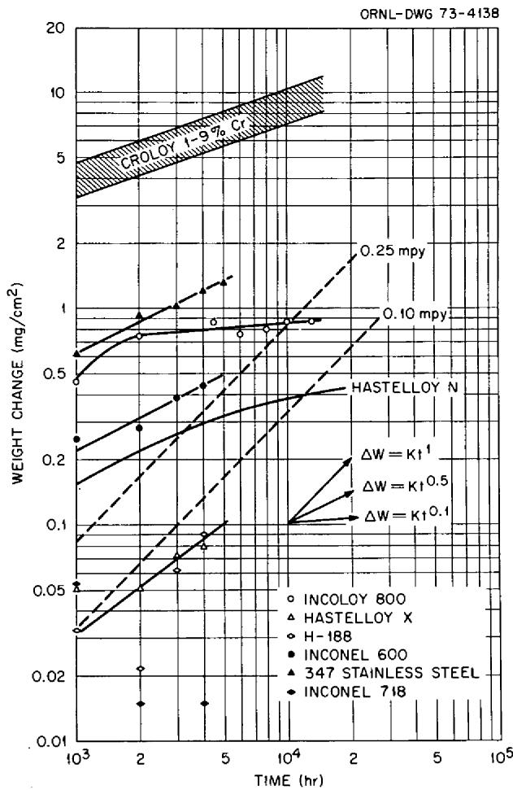  
Fig. 10.16. Corrosion of several alloys in steam at $538^{\circ}\mathrm{C}$ and 3500 psi.

present. Since cold working introduces a variable that can influence the corrosion characteristics, samples of many of the alloys were exposed in the $50\%$ cold-worked as well as the annealed conditions. Cold working $(50\%)$ had a large effect on the corrosion of type 201 stainless steel $(16.55\% \mathrm{Cr},$ $5.23\%$ Ni, $7.28\%$ Mn, $0.076\%$ C, $0.54\%$ Si, $0.034\%$ P, and $0.059\%$ N). The corrosion rate of annealed material was much higher than cold-worked material, and the difference became progressively greater as the exposure time increased. The rates for annealed 201 and 347 stainless steels were approximately equivalent. Figure 10.17 compares the rates for annealed and $50\%$ cold-worked 201 stainless steel and Hastelloy N. Interesting to note is that for times up to $15,000~\mathrm{hr}$ , the cold work had no effect on the corrosion rate of Hastelloy N.

Various alloy additions have been made to modified Hastelloy N for radiation damage resistance, and some of these alloys are compared to standard Hastelloy N in Fig. 10.18. Maximum and minimum weight changes for these alloys differed by less than a factor of 2, but only the alloy containing $1.03\%$ Nb gained less weight than the standard Hastelloy N.

The sample holder for stressed and unstressed specimens has been reassembled and delivered to Bull Run Steam Plant for reinsertion into the steam corrosion facility. Several new specimens were installed in the sample holder. Some unstressed specimens removed at the conclusion of the program had accumulated $15,000\mathrm{hr}$ and most of these specimens were reinstalled. Several alloys of the Croloy type (Fe 2 I/4 Cr-1 Mo) containing from 1 to $9\%$ Ce in the annealed and cold-worked conditions were included in this loading.

Stressed specimens currently in the facility include some that were previously exposed and some replacements for ruptured specimens that were removed. The stresses range from 28,000 psi to 76,600 psi.

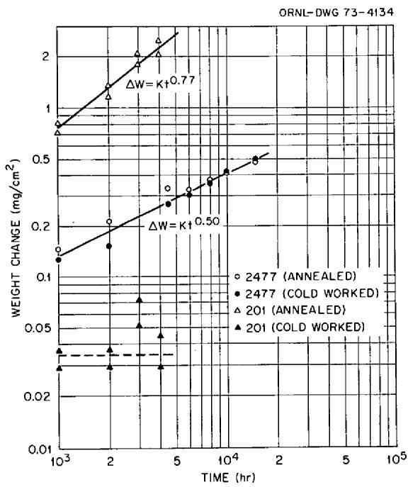  
Fig. 10.17. Effect of cold work on the corrosion of Hastelloy N (Heat 2477) and type 201 stainless steel in steam at $538^{\circ}\mathrm{C}$ and 3500 psi.

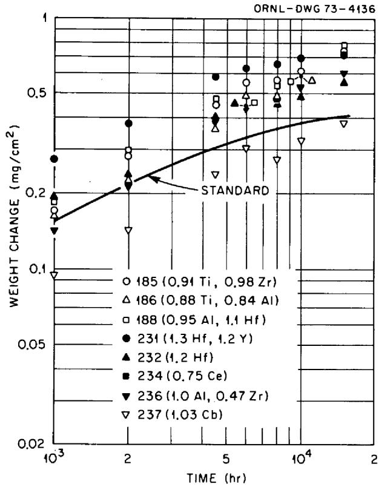  
Fig. 10.18. Corrosion of various modified compositions of Hastelloy N in steam at $538^{\circ}\mathrm{C}$ and 3500 psi.

# 10.7 INTERGRANULAR CRACKING OF ALLOYS EXPOSED TO TELLURIUM

H. E. McCoy

The status of our test program was given in several references[17-19] prior to discontinuation of the program early in 1973. At the time these status reports were written, numerous experiments were in progress. Many samples from these experiments are of vital importance, but the first order of priorities has been to revitalize the program with new lab facilities and new personnel.

The screening tests that we ran previously showed that copper, Monel, and iron-based alloys completely resisted intergranular embrittlement by tellurium. The experiments with nickel-based alloys indicated that the propensity for intergranular crack formation decreased with increasing concentrations of Cr, Ti, Nb, and Ce. However, the screening experiments were not sufficient to ascertain the concentrations of these elements required to prevent cracking under typical MSBR operating conditions.

We had already begun work toward the development of a more realistic screening test late in 1972, and this effort has been revived. In the tests leading to the trends described above, the samples were sealed in a quartz vial with a small amount of tellurium. They were heated slowly to 650 and $700^{\circ}\mathrm{C}$ , and the specimens and the tellurium were allowed to react for times from 200 to 10,000 hr. Initially, the specimens were exposed to a relatively high flux of tellurium compared with that which would be observed in an MSBR where tellurium would be produced at a constant (after an initial saturation period), slow rate. To a large extent, the flux of tellurium controls the tellurium activity which in turn determines the nature of the tellurium-metal reaction. For example, high tellurium activities would cause nickel tellurides to be formed, whereas only chromium tellurides would be stable at lower tellurium activities. The tellurium activities required to form the various tellurides are not known accurately, so experiments with total assurance of relating to MSBR conditions are difficult to design.

Although the information needed to develop a new screening test was not available, we concluded that the tellurium flux must be of the order of $10^{12}$ atoms $\mathrm{cm}^2/\mathrm{sec}$ . Also, the flux must be known and held reasonably constant during the experiment. Since the screening test must maintain the features of being relatively quick and cheap, several ideas are currently being pursued for screening tests.

# 10.8 CHEMISTRY OF SALT-METAL-TELLURIUM SYSTEM

J. Brynestad

The chemistry of tellurium in the MSBR system is complex and largely unknown. An important feature is that the system as a whole is never in chemical equilibrium with regard to the tellurium that is continually produced in the fission process. Once tellurium is formed, it reacts with the melt environment and assumes the valence states dic

tated by the (variable) redox potential in the melt, by the chemical nature of the melt, and by the kinetics of the processes. But since the melt is not in thermodynamic equilibrium with the construction metals, the tellurium species formed in the melt will in turn react more or less aggressively with the metals, depending upon the redox potential of the melt at any given time, and upon the nature of the construction metal.

One objective is to obtain and maintain a defined redox condition of the melt at which the corrosivity of the formed tellurium species is at a minimum (ideally zero). Another alternate or simultaneous objective would be to obtain construction metals that are resistant to tellurium attack over a wide redox potential range.

Towards these objectives, it is important to obtain information about the products of reactions between tellurium and the construction metals (including potential new alloy constituents), namely their thermodynamic stabilities, crystal structures, and their rates of formation as a function of the redox potential of the melt. To minimize the tellurium corrosivity, it is important to learn about the tellurium/salt interactions; namely, the nature and stabilities of the formed tellurium entities in the redox potential range of interest, as compared to the stabilities of the construction metal tellurides.

Our present work is focused on the interaction between Hastelloy N and tellurium at moderate and low tellurium activities. The phase relationships and phase stabilities of he metal-rich end of the Ni-Mo-Cr-Te system are being investigated. Also, the corrosion of Hastelloy N by tellurium at controlled tellurium activities is under study.

The nickel-tellurium phase diagram is largely known,[20] and the most nickel-rich compound in this system is $\mathrm{Ni}_3\mathrm{Te}_{2 + x}$ . There is no information on the solid solubility of tellurium in nickel metal, except that it is low. The chromium-tellurium phase diagram is not well known. However, the most chromium-rich compound seems to be $\mathrm{Cr_7Te_8}$ (ref. 21), and the most tellurium-rich compound is $\mathrm{Cr_2Te_3}$ . The molybdenum-tellurium phase diagram is not well known. The most metal-rich compound seems to be $\mathrm{MoTe}_{1.14}$ (ref. 22). Work by Weaver and Redman[23] and our own observations indicate that chromium forms by far the most stable binary tellurium compound in the metal-rich end of the Ni-Mo-Cr-Te system. We are currently investigating the metal-rich end of the Ni-Cr-Te system where preliminary results indicate that a ternary com

pound exists. Work is in progress to identify this compound and to assess its stability relative to the binary chromium tellurides.

It is important to know which tellurium compounds are formed with Hastelloy N as a function of tellurium activity. We have verified that tellurium attacks Hastelloy N even at tellurium activities so low that $\mathrm{Ni}_3\mathrm{Te}_2$ cannot be formed. At higher tellurium activities, $\mathrm{Ni}_3\mathrm{Te}_2$ is also formed. However, whether the formation of chromium telluride(s) (and/or ternary compounds) causes tellurium embrittlement in Hastelloy N is not yet known. We know that $\mathrm{Ni}_3\mathrm{Te}_2$ causes embrittlement in pure nickel and probably in Hastelloy N. If the formation of chromium tellurides does not cause embrittlement, whereas the formation of $\mathrm{Ni}_3\mathrm{Te}_2$ does, a possible solution would be to keep the redox potential of the melt low enough to prevent the formation of $\mathrm{Ni}_3\mathrm{Te}_2$ . Higher chromium contents in the alloy would cause the requirements on the redox potential. Therefore, it is important to ascertain whether chromium tellurides cause embrittlement in Hastelloy N, and work is in progress to resolve this question.

# 10.9 AUGER OBSERVATIONS RELATIVE TO INTERGRANULAR CRACKING

R.E.Clausing L.Heatherly

Auger electron spectroscopy and other newly developed techniques for surface analysis provide powerful and versatile methods for studying the role of tellurium or other fission products in producing intergranular fracture or cracking. Not only can we determine the elemental composition of suitably prepared fracture surfaces and the distribution of elements in the immediate vicinity of the fracture surface, but we can also examine in a nondestructive way the changes in surface composition as a function of time and temperature while thermal treatments are in progress. This last capability provides a way of rapidly determining the tendency for surface segregation and mobility of elements on or

near solid surfaces. By using this kind of information we may be able to deduce useful information relative to the behavior of surfaces and grain boundaries of Hastelloy N in the molten salt reactor application.

Our efforts during the past few months have been directed toward (1) a review of old reports and previous work, (2) the development of a new program coordinated with other new programs, (3) the acquisition of existing samples (from previous studies), (4) the planning for and preparation of new samples, and (5) the development of techniques for the new program. The new program will make full-cest possible use of improved surface research techniques; thus, this program will require the acquisition, adaptation, and development of both equipment and techniques. We are upgrading the resolution of one of our Auger systems to provide analysis of areas as small as $2.5 \times 10^{-7} \mathrm{~cm}^2$ so that we can analyze fracture surfaces in great detail. We have improved our ability to examine samples at high temperatures and can now examine samples at temperatures up to $800^{\circ}\mathrm{C}$ under ultrahigh vacuum conditions.

# 10.9.1 Fracture Surface Analysis

The methods used for examination of fracture surfaces and obtaining information on the elemental composition gradients near the fracture surface have been described previously; these methods remain unchanged except that we will soon be able to use a much smaller diameter beam of about $5\mu$ diam FWHM (full width at half-maximum intensity). Sample preparation was also described previously and is essentially unchanged.

Progress during this report period consists primarily of making equipment modifications and acquisitions to provide the small diameter electron beam. Commercially available parts are being used wherever possible. We expect the initial system testing to be finished by January 1, 1975. Samples of Hastelloy N and other alloys that have been exposed to tellurium vapor at $700^{\circ}\mathrm{C}$ for 500 hr will be available, and they will be examined if the equipment and techniques give good results.

# 10.9.2 High Temperature Surface Studies

Apparatus has been designed, constructed, and tested to permit heating of Hastelloy N samples to

$800^{\circ}\mathrm{C}$ so that Auger analyses may be made continuously while thermal treatments are in progress. The equipment is operational and several preliminary runs have been made in which samples of modified Hastelloy N alloys containing tellurium were heated stepwise to $800^{\circ}\mathrm{C}$ . The results are encouraging; strong segregation of carbon and sulfur to the surfaces occur on Hastelloy N; sulfur, carbon, and tellurium segregate to the surface of a special Hastelloy N alloy that does not contain chromium. These results are preliminary and are intended only to indicate the extent of our progress. Carefully controlled experiments now in progress will be required before we attempt to present quantitative results or draw conclusions.

# 10.10 IN-REACTOR FUELED EXPERIMENTS

# C. R. Hyman

The MSR in-reactor irradiation experiment TcGen-1 has been resumed after a period of almost two years. Previously, a capsule had been designed for the study of the effect of fission products on prospective MSR containment materials.[25] The development and construction of the experiment had reached the point that only a small amount of work had to be performed before insertion of the capsule into the Oak Ridge Research Reactor (ORR). However, the experiment was not done because of termination of the MSR Program. The reactor was dismantled to remove the fuel. Since revival of the irradiation program, the work has been in the reorganization and fabrication of TcGen-1, which is the first in a series of related tests.

TcGen-1 contains three fuel pins, each filled with fuel of approximately the MSR experiment composition. The three materials under test are type 304 stainless steel, standard Hastelloy N, and Inconel 601. The experiment is designed to produce fission product concentrations and to operate at temperature ranges that were found to produce cracking in standard Hastelloy N in the MSR experiment. Bc

havior of the different materials will be evaluated by straining specimens of each material after irradiation.

# 10.10.1 Design

Each of the three test specimens or fuel pins consists of a 1/2-in.-OD $\times$ 0.43-in.-ID tube of the particular test material with welded end caps to provide a 3.5-in.-long internal cavity. Each pin is filled with $7.14~\mathrm{cm}^3$ (3-in. depth) of fuel salt leaving a 1/2-in. helium-filled gas plenum at the top. The wetted surface area in each specimen is $27.1~\mathrm{cm}^2$ . The fuel composition is the same for each pin [LiF-BeF $_2$ -ZrF $_4$ -UF $_4$ (63.1-29.3-5.1-2.5 mole %)]. Except for a slightly higher UF $_4$ loading, this fuel is practically the same as that used in the MSRE. The uranium is ${}^{233}\mathrm{U}$ rather than ${}^{235}\mathrm{U}$ since ${}^{233}\mathrm{U}$ produces more tellurium (the suspected cause of cracking of Hastelloy N in the MSRE). The design power, $34.4~\mathrm{W/cm}^3$ of salt ( $1.2~\mathrm{kW/ft}$ of fueled length), is expected to produce $5\times 10^{16}$ atoms of stable tellurium per square centimeter of wetted surface in the planned 1100-hr irradiation. The specimen (fuel pin wall) operating temperature is $700^{\circ}\mathrm{C}$ .

The capsule experiment itself is typical of ORR poolside experiments. It consists of a double-walled containment vessel connected to a lead tube that carries instrumented gas and heater leads to the capsule. The three specimens are suspended within the inner containment and are submerged in NaK, which serves as a heat transfer medium. Each specimen is instrumented with four thermocouples along its length (Fig. 10.19). Thermocouples in the bottom of the capsule will sense abnormally high temperatures if salt should leak from a pin and react with NaK to precipitate uranium. The annulus between the primary and secondary containment vessels is argon-filled and is sized to provide the thermal resistance required to achieve the design specimen temperature of $700^{\circ}\mathrm{C}$ during operation.

Each specimen is provided with a 1/16-in.-OD stainless steel-sheathed heater coiled around the ends (Fig. 10.19). The heater serves the dual purpose of minimizing axial temperature variations at the ends of the specimens by providing heat where there is no fuel, and of maintaining the salt above $150^{\circ}\mathrm{C}$ at all times when the reactor is down. The latter condition is specified to prevent the radiolytic dissociation of the fuel and the release of fluorine from irradiation of fuel salt at low temperatures.

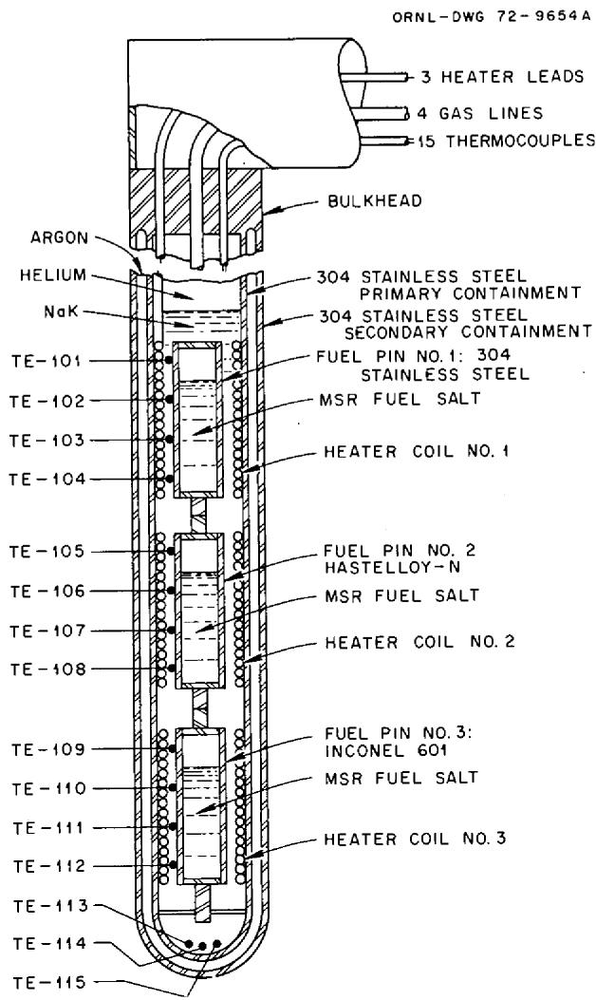  
Fig. 10.19. Schematic drawing of TeGen-1 capsule.

The capsule rides in an adjustable track in the ORR poolside facility. Therefore, the capsule position, relative to the reactor, and hence the fission power and neutron flux, is adjustable.

# 10.10.2 Calculated Operation and Test Conditions

The capsule is designed to operate at a linear power density of $1.2\mathrm{kW / ft}$ in the fueled regions of the specimens and with a fuel-to-metal interface temperature of $700^{\circ}\mathrm{C}$ . Figure 10.20 presents the calculated one-dimensional radial temperature profile through the capsule and the middle test element. The upper curve is for the case of $20\%$ overpower excursion, a most improbable occurrence. The rather steep radial gradient from 700 to $962^{\circ}\mathrm{C}$

Fig. 10.20. TeGen-1 schematic temperature profile from GENGTC calculations. Temperatures are in $^\circ \mathrm{C}$ .   
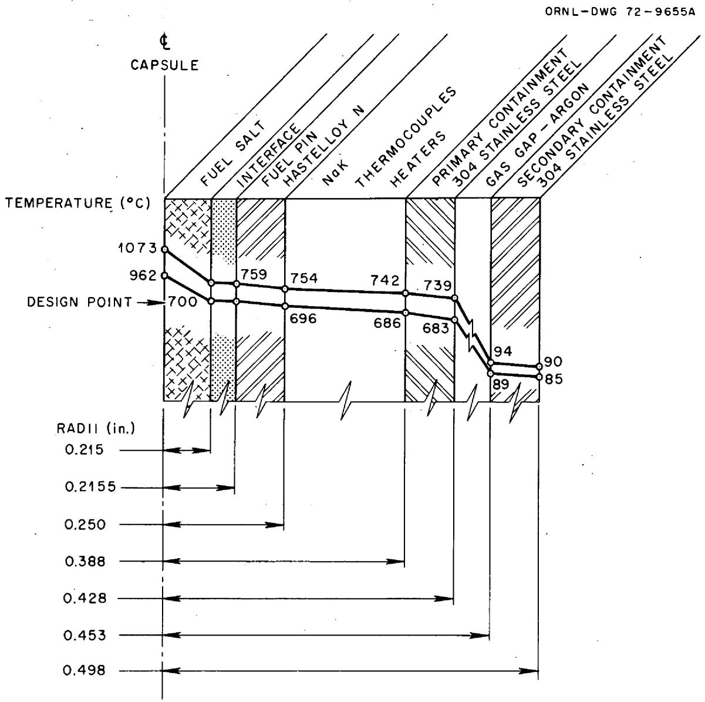  
UPPER LINE REPRESENTS TEMPERATURE PROFILE WITH CAPSULE OPERATING AT 120% NOMINAL OPERATING POWER. ASSUMES 1.43 kW/ft FISSION POWER AND 0.2 W/g GAMMA HEAT.  
LOWER LINE REPRESENTS TEMPERATURE PROFILE WITH CAP-SULE OPERATING AT NOMINAL DESIGN POWER. ASSUMES 1.19 kW/ft FISSION POWER AND 0.2 W/g GAMMA HEAT.

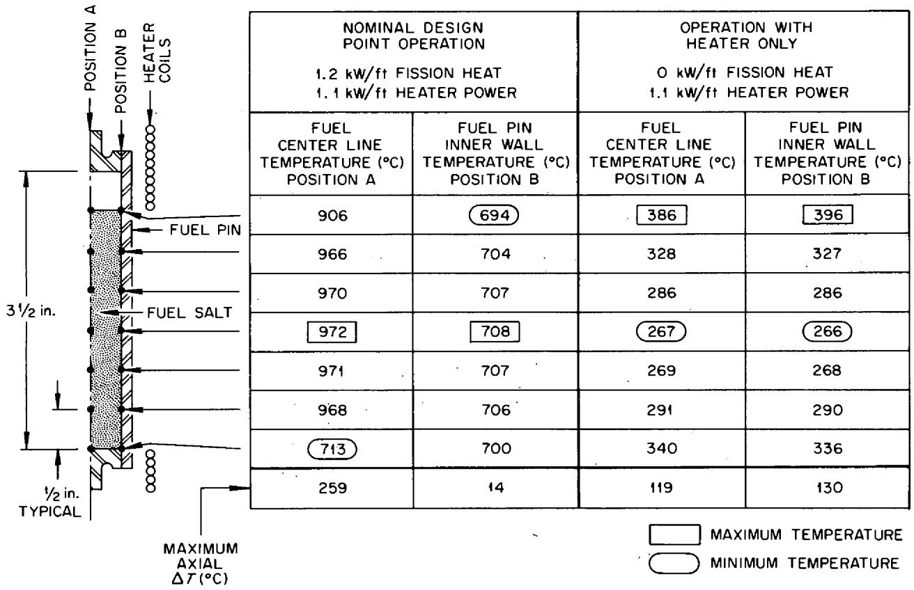  
Fig. 10.21. TeGen-1 capsule two-dimensional temperature profiles at various operating conditions.

through the salt assumes no convection currents within the salt. Such steep gradients are expected to cause some convection currents and a reduction in this temperature difference. Fission power generation in the upper and lower specimens will be less, due to the axial variation of the ORR neutron flux. The upper specimen will operate at about $14\%$ less power and the lower specimen will operate at a power between the other two. The heaters will be adjusted to compensate for this variation and to maintain the required temperatures.

Figure 10.21 indicates the location of the heater coils and gives the temperature distribution calculated with the 3-dimensional heat conduction code HEATING 3. (The $1.2\mathrm{kW / ft}$ fission power and 1.1 kW/ft heater power refer to the fueled sections and the heated sections only, not to the averages over the length of the capsule.) The calculated distribution for normal operation indicates that the spread in temperature at different points on a fuel pin will be acceptably small. Thermal convection effects, neglected in these calculations, will tend to lower

center-line temperatures but possibly increase the spread of temperatures along the pin wall. The calculated temperatures for the case of zero fission heat also show that the design power of the heaters is ample to keep the salt temperature well above $150^{\circ}\mathrm{C}$ , the threshold for fluorine evolution.

# 10.10.3 Preliminary Operating Data

Although the capsule irradiation did not begin until September 1974 (past the August 31, 1974 deadline for this report), Table 10.8 presents a typical set of operating data taken during the first week of irradiation. (See Fig. 10.19 for thermocouple locations.) Figure 10.20 shows that there is about a $7^{\circ}\mathrm{C}$ difference between the salt-to-specimen wall interface and what would be the junction of a $1/16$ -in.-diam thermocouple strapped to the outside of the specimen can. Thus, temperature presented in Table 10.8 should be increased by about this amount to represent the salt-wall interface operat

ing condition. There is a definite pattern in the temperatures for each fuel pin. In the upper and lower pins the uppermost thermocouples (adjacent to the gas void) are hotter than those at the bottom which tend to be at the lowest temperature. In future capsules, the heaters will be redistributed to achieve more of a uniform temperature distribution

over the length of the specimen. The middle specimen shows a different temperature profile with the temperature at the top of the fuel being the hottest. This variation is as would be expected since the middle pin generates the maximum fission power. The heater power to each pin (Table 10.8) is also indicative of the difference in fission heat.

Table 10.8. Typical operating conditions for irradiation capsule TeGen-1 Capsule position 7.8 in. retracted from reactor face   

<table><tr><td>Specimen</td><td>Thermocouple numbera</td><td>Temperature (°C)</td><td>Heater power (watts)</td></tr><tr><td rowspan="4">Top (304 stainless steel)</td><td>101</td><td>705</td><td rowspan="4">346</td></tr><tr><td>102</td><td>692</td></tr><tr><td>103</td><td>678</td></tr><tr><td>104</td><td>688</td></tr><tr><td rowspan="4">Middle (Hastelloy N)</td><td>105</td><td>694</td><td rowspan="4">92</td></tr><tr><td>106</td><td>713</td></tr><tr><td>107</td><td>693</td></tr><tr><td>108</td><td>681</td></tr><tr><td rowspan="4">Bottom (Inconel 601)</td><td>109</td><td>737</td><td rowspan="4">186</td></tr><tr><td>110</td><td>705</td></tr><tr><td>111</td><td>684</td></tr><tr><td>112</td><td>651</td></tr></table>

aSee Fig. 10.19 for thermocouple location.

# 11. Fuel Processing Materials Development

J. R. DiStefano

H. E. McCoy

Materials requirements for molten-salt fuel processes include containment of the following environments:

1. molten fluorides plus $\mathbf{HF - H_2}$ mixtures at 550 to $650^{\circ}\mathrm{C}$ (hydrofluorination process),   
2. molten fluorides plus $\mathbf{F}_2\text{-}\mathbf{U}\mathbf{F}_6$ gaseous mixtures at 500 to $550^{\circ}\mathrm{C}$ (fuel reconstitution process), and   
3. molten fluorides or molten LiCl in the presence of bismuth containing 5 to 50 at. $\%$ Li at 550 to $650^{\circ}\mathrm{C}$ (metal transfer process).

If a frozen salt layer can be maintained on the container wall, a nickel-base alloy can be used in the fluorination and fuel reconstitution portion of the system. The present objectives of the materials program are to identify materials that will satisfactorily contain bismuth-lithium-thorium solutions, and to develop the technology necessary to construct a processing facility.

Initial studies showed that iron-, nickel-, or cobalt-base alloys would not be suitable because of their rapid rate of mass transfer in bismuth systems having a temperature gradient. Recent studies have indicated that graphite, molybdenum, and tantalum (alloys) are promising, and work is continuing to evaluate the compatibility of these materials with bismuth-lithium solutions and molten salts in capsule and thermal convection loop tests.

# 11.1 STATIC CAPSULE TESTS OF GRAPHITE WITH BISMUTH AND BISMUTH-LITHIUM SOLUTIONS

J. R. DiStefano O. B. Cavin J. L. Griffith L. R. Trotter

Graphite has a very low solubility in bismuth $(< 1\mathrm{ppm}$ at $600^{\circ}\mathrm{C})$ and has been demonstrated to have excellent resistance to corrosion by molten fluoride salts. Therefore, it is an attractive candidate as a containment material in molten-salt chemical processing applications. Of principal interest is the compatibility of graphite with bismuth-lithium solutions at temperatures from 550 to $700^{\circ}\mathrm{C}$ . Results of static capsule tests conducted previously are summarized below and those from thermal convection loop tests are given later in the report.

1. Bismuth-lithium solutions penetrate the open porosity of graphite. The extent of penetration is a function of graphite bulk density, accessible pore volume, pore diameter, and time.   
2. No evidence of chemical interaction has been found between graphite and bismuth or bismuth-lithium solutions (containing up to 3 wt $\%$ Li) at temperatures as high as $700^{\circ}\mathrm{C}$ .   
3. Lithium reacts with graphite at $700^{\circ}\mathrm{C}$ ; $\mathrm{Li}_2\mathrm{C}_2$ was identified as a corrosion product. Vitreous carbon completely disintegrates when exposed to lithium even at temperatures as low as $200^{\circ}\mathrm{C}$ .

Additional tests have been conducted to determine more precisely the nature of any interactions between graphite and bismuth-lithium solutions. In one series of tests, several grades of graphite specimens were exposed to bismuth solutions containing 0, 0.01, 0.17, and 3 wt $\%$ Li in three different grades of graphite crucibles for 3000 and 10,000 hr at $650^{\circ}\mathrm{C}$ . From these tests, data were obtained on (1) the extent of penetration of the solutions into the graphite crucibles, (2) the amount of bismuth in the graphite samples, and (3) the lattice parameters of the graphite samples after exposure to the bismuth-lithium solutions.

Penetration results are summarized in Table 11.1. After $3000\mathrm{hr}$ , limited penetration of PGX and PGXX graphite had occurred, but there was no penetration of pyrolytic-carbon-coated capsules. After $10,000\mathrm{hr}$ , PGX graphite was penetrated completely by bismuth and the bismuth-lithium solutions. However, PGXX graphite, which is PGX base stock that has been liquid impregnated, showed only slight evidence of penetration. Each capsule contained samples of PGX, PGXX, AXF-5Q (ref. 1), and H-337 graphite.

Results of lattice parameter measurements are summarized (Table 11.2). The lattice parameter in the $a$ crystallographic direction was determined from the (1120) diffraction maxima and was found to be constant at $2.466 \pm 0.001\text{\AA}$ for all samples. The $c$ parameter was determined from the (0004) diffraction maxima. It varied slightly with the type

Table 11.1. Extent of penetration of graphite by bismuth and bismuth-lithium solutions at ${650}^{ \circ  }\mathrm{C}$   

<table><tr><td rowspan="2">Type of graphite capsule</td><td colspan="2">Bismuth</td><td colspan="2">Bi-0.01% Li</td><td colspan="2">Bi-0.17% Li</td><td colspan="2">Bi-3% Li</td></tr><tr><td>3000 hr</td><td>10,000 hr</td><td>3000 hr</td><td>10,000 hr</td><td>3000 hr</td><td>10,000 hr</td><td>3000 hr</td><td>10,000 hr</td></tr><tr><td>PGXa</td><td>Slight</td><td>Complete</td><td>Slight</td><td>Complete</td><td>Slight</td><td>Complete</td><td>Heavy</td><td>Complete</td></tr><tr><td>PGXXb</td><td>Slight</td><td>Slight</td><td>Slight</td><td>Slight</td><td>Slight</td><td>Slight</td><td>Slight</td><td>Medium</td></tr><tr><td>Pyrocarbon-coated graphitec</td><td>None</td><td>d</td><td>None</td><td>d</td><td>None</td><td>d</td><td>None</td><td>d</td></tr></table>

aPGX graphite: bulk density, $1.8\mathrm{g / cm}^3$ ; maximum pore diameter, $7\mu$ average pore diameter, 1 to $2\mu$   
${}^{t}$ PGXX graphite: bulk density, ${1.85}\mathrm{\;g}/{\mathrm{{cm}}}^{3}$ ; maximum pore diameter, ${6\mu }$ ; average pore diameter, $1$ to ${2\mu }$ . This graphite is PGX base stock that has been liquid impregnated.   
Pyrocarbon-coated graphite: bulk density, $1.8 - 2.2\mathrm{g / cm}^3$ ; however, this type of graphite is generally impervious to gases because of the way it is made.   
${}^{d}$ Not tested for ${10},{000}\mathrm{{hr}}$ .

Table 11.2. Two physical characteristics of graphite samples exposed to bismuth and bismuth-lithium solutions for 3000 and 10,000 hr at $650^{\circ}\mathrm{C}$   

<table><tr><td rowspan="2">Type of graphite</td><td colspan="2">Average value lattice parameters (Å) for indicated crystallographic direction</td><td rowspan="2">Diffracted light intensity of bismuth (counts/sec)</td></tr><tr><td>a</td><td>c</td></tr><tr><td>PGX</td><td>2.466</td><td>6.750</td><td>260</td></tr><tr><td>PGXX</td><td>2.466</td><td>6.754</td><td>70</td></tr><tr><td>AXF-5Q</td><td>2.466</td><td>6.781</td><td>26</td></tr><tr><td>H-337</td><td>2.466</td><td>6.755</td><td>34</td></tr></table>

of graphite, but was relatively constant for any grade of graphite and was not affected by length of exposure or the solution to which it was exposed. The concentration of bismuth was measured by the intensity of the (014) diffraction peak. Values shown in Table 11.2 have been averaged for all test conditions. PGX graphite, which has the greatest amount of accessible porosity, showed the highest uptake of bismuth. Intensity data (Table 11.3) show that there was no consistent increase in bismuth with time of exposure, but values were generally higher in samples exposed to Bi- $0.17\%$ Li and Bi $3\%$ Li. Lithium was not detected in any of the samples, but the x-ray techniques used are not sensitive to low concentrations of lithium.

The solutions from these tests were analyzed for carbon, and these results showed higher concentra

tions of carbon in the $\mathrm{Bi - 3\%}$ Li samples than in solutions containing lower concentrations of lithium. Based on these results, tests were started to determine the carbon content of a series of bismuth-lithium solutions after exposure to graphite at $650^{\circ}\mathrm{C}$ . Solutions of Bi-100 ppm Li, Bi-1% Li, Bi-2% Li, and Bi-3% Li were heated in PGX, PGXX, and ATJ crucibles for 1000 hr at $650^{\circ}\mathrm{C}$ . The samples were protected from contamination during sampling and analysis by an inert gas atmosphere.

Severe segregation of lithium occurred when the bismuth-lithium melt solidified; two to three samples were submitted for analyses from each test. The values listed (Table 11.4) relate the nominal lithium content of the melt to the average values found for carbon. Although the individual data points were more scattered, there is a definite trend indicating increasing carbon concentrations in melts having successively higher lithium. No differences were noted among the three types of graphite.

Thermal convection loop results reported in the following section indicate no significant mass transport of carbon in Bi-100 ppm Li after 3000 hr of operation at $700^{\circ}\mathrm{C}$ maximum temperature and a $100^{\circ}\mathrm{C}$ temperature difference. However, the high carbon concentrations found in the above tests indicate that mass transport could be a significant problem at higher lithium concentrations. A test is now being constructed in which graphite will be exposed to a $\mathrm{Bi}-2.5\%$ Li solution in a molybdenum thermal convection loop under conditions similar to those above.

Table 12.3. Additional physical properties of graphite grades AXF, AXF-5QBG-3, H-395, and P-03 as functions of fluences from 0 to $42.1 \times 10^{21}$ neutrons/ $\mathrm{cm}^2$ ( $>50\mathrm{keV}$ ) accumulated at $715^\circ \mathrm{C}^a$   

<table><tr><td rowspan="2">Specimen number (orien-tation)b</td><td rowspan="2">Fluencec(1021neutrons/cm2)</td><td colspan="3">*Crystallography, Å</td><td>Layer heightd(μm)</td><td rowspan="2">*Bacon anisotropy factor(BAF)</td><td colspan="2">*Anisotropy factor</td><td colspan="3">Coefficient of thermal expansion, CTE 200 to 600°C × 10-6</td><td>ΔLfg</td><td>ΔDhvg</td><td rowspan="2">ΔVlg</td><td rowspan="2">Brittle-ring strengthg(103psi)</td><td rowspan="2">Fracture straing/ε/ (%)</td><td rowspan="2">ΔGk</td><td>ΔYf</td></tr><tr><td>a</td><td>c</td><td>La</td><td>Lc</td><td>Rge</td><td>Re</td><td>With grain</td><td>Across grain</td><td>L0(%)</td><td>De(%)</td><td>V0(%)</td><td></td></tr><tr><td colspan="18">Grade AXF</td><td></td></tr><tr><td>122</td><td>0</td><td>2.462p</td><td>6.768p</td><td>500p</td><td>200p</td><td>2.8o</td><td>1.03p</td><td>0.673q</td><td>0.663q</td><td>7.56</td><td></td><td></td><td></td><td>16.53</td><td>0.95</td><td></td><td></td><td></td></tr><tr><td>120</td><td>5.4</td><td></td><td></td><td></td><td></td><td>1.1</td><td></td><td></td><td></td><td>7.90</td><td>0</td><td>0</td><td>0</td><td>14.93(2)</td><td>0.72(2)</td><td>1.25</td><td>1.14</td><td></td></tr><tr><td>118</td><td>8.9</td><td></td><td></td><td></td><td></td><td></td><td></td><td></td><td></td><td>5.13</td><td>0.74</td><td>0.75</td><td>2.28</td><td>15.34</td><td>0.57</td><td>1.48</td><td>1.27</td><td></td></tr><tr><td>119</td><td>34.2</td><td></td><td></td><td></td><td></td><td>0.51</td><td></td><td></td><td></td><td>3.16</td><td>0.91</td><td>1.02</td><td>2.95</td><td>9.963</td><td>0.22</td><td>3.28</td><td>2.78</td><td></td></tr><tr><td colspan="18">Grade AXF-5QBG-3&#x27;</td><td></td></tr><tr><td>174</td><td>0</td><td>2.463p</td><td>6.750p</td><td>750p</td><td>350p</td><td>1.05p</td><td>0.656q</td><td>0.671q</td><td>6.48</td><td></td><td></td><td></td><td></td><td>14.15</td><td>1.03</td><td></td><td></td><td></td></tr><tr><td>170</td><td>7.6</td><td></td><td></td><td></td><td></td><td>1.35</td><td></td><td></td><td></td><td>7.60</td><td>0.73</td><td>0.26</td><td>1.25</td><td>15.57</td><td>0.77</td><td>1.48</td><td>1.37</td><td></td></tr><tr><td>173</td><td>10.2</td><td></td><td></td><td></td><td></td><td>1.87</td><td></td><td></td><td></td><td>7.95</td><td>0.09</td><td>0.18</td><td>0.44</td><td>13.48</td><td>0.59</td><td>1.69</td><td>1.65</td><td></td></tr><tr><td>171</td><td>38.3</td><td></td><td></td><td></td><td></td><td>0.32</td><td></td><td></td><td></td><td>3.96</td><td>1.28</td><td>1.57</td><td>4.40</td><td>10.35</td><td>0.18</td><td>2.97</td><td>2.95</td><td></td></tr><tr><td>177</td><td>42.3</td><td></td><td></td><td></td><td></td><td>0.30</td><td></td><td></td><td></td><td>3.98</td><td>5.37</td><td>3.92</td><td>12.90</td><td>6.950</td><td>0.18</td><td>2.60</td><td>2.34</td><td></td></tr><tr><td colspan="18">Grade H-395</td><td></td></tr><tr><td>835(II)</td><td>0</td><td></td><td></td><td></td><td></td><td>1.03p</td><td>0.659p</td><td>0.670p</td><td>6.91</td><td></td><td></td><td></td><td></td><td>9.460</td><td>0.62</td><td></td><td></td><td></td></tr><tr><td>832(III)</td><td>4.8</td><td></td><td></td><td></td><td></td><td></td><td></td><td></td><td>8.77</td><td></td><td>-0.20</td><td>-0.12</td><td>-0.44</td><td>10.55</td><td></td><td></td><td></td><td></td></tr><tr><td>833(IV)</td><td>20.5</td><td></td><td></td><td></td><td></td><td></td><td></td><td></td><td>4.15</td><td></td><td>0.63</td><td>0.31</td><td>1.25</td><td>10.78</td><td>0.22</td><td>2.84</td><td>2.90</td><td></td></tr><tr><td>834(IV)</td><td>23.0</td><td></td><td></td><td></td><td></td><td></td><td></td><td></td><td>4.14</td><td></td><td>0.66</td><td>0.35</td><td>1.37</td><td>13.41</td><td>0.26</td><td>2.96</td><td>3.02</td><td></td></tr><tr><td>840(⊥)</td><td>0</td><td></td><td></td><td></td><td></td><td></td><td></td><td></td><td></td><td></td><td>6.60</td><td></td><td></td><td>10.29</td><td></td><td></td><td></td><td></td></tr><tr><td>839(⊥)</td><td>12.7</td><td></td><td></td><td></td><td></td><td></td><td></td><td></td><td></td><td></td><td>4.54</td><td>0.13</td><td>0.06</td><td>0.01</td><td>13.48</td><td></td><td></td><td></td></tr><tr><td colspan="18">Grade P-03</td><td></td></tr><tr><td>759(II)</td><td>0</td><td></td><td></td><td></td><td></td><td>1.001p</td><td>0666p</td><td>0.670p</td><td></td><td></td><td>4.22</td><td></td><td></td><td>9.431</td><td>0.54</td><td></td><td></td><td></td></tr><tr><td>756(II)</td><td>5.7</td><td></td><td></td><td></td><td></td><td></td><td></td><td></td><td></td><td></td><td>5.99</td><td>-0.27</td><td>-0.42</td><td>-1.10</td><td>12.23</td><td>0.36</td><td>1.89</td><td>1.92</td></tr><tr><td>757(II)</td><td>37.3</td><td></td><td></td><td></td><td></td><td></td><td></td><td></td><td></td><td></td><td>4.18</td><td>7.12</td><td>7.31</td><td>21.3</td><td>6.328</td><td>0.21</td><td>1.60</td><td>1.67</td></tr><tr><td>758(II)</td><td>42.1</td><td></td><td></td><td></td><td></td><td></td><td></td><td></td><td></td><td></td><td>4.15</td><td>12.57</td><td>11.41</td><td>33.44</td><td>4.457(2)</td><td>0.23(2)</td><td>0.94</td><td>1.00</td></tr><tr><td>769(⊥)</td><td>0</td><td></td><td></td><td></td><td></td><td></td><td></td><td></td><td>4.72</td><td></td><td></td><td></td><td></td><td>8.877</td><td></td><td></td><td></td><td></td></tr></table>

${}^{a}$ All data were taken directly on the actual control or irradiated specimens except in those columns headed with an asterisk (*). In the columns headed with an asterisk (*),the data were taken on other special specimens taken from the same parent stock or they are representative data.   
${}^{b}$ The axis of rotation of the specimen is parallel with the axis of rotation of the stock for the symbol ||; it is perpendicular to the axis of rotation of the stock for the symbol $\bot$ . No symbol means the material is near isotropic.

$E > 50\mathrm{keV}$

Layer height $= 2 /$ BET surface area $\times$ helium density

$\mathrm{R}_{||} = \int_{0}^{\pi /2}\int_{0}^{2\pi}\mathrm{I}(\phi ,\beta)\sin^{3}\phi \mathrm{d}\phi \mathrm{d}\beta /\int_{0}^{\pi /2}\int_{0}^{2\pi}\mathrm{I}(\phi ,\beta)\sin \phi \mathrm{d}\phi \mathrm{d}\beta$

where

$\phi =$ angle between normals to sample surface and basal planes,   
$\beta =$ angle of rotation about sample normal,   
$\mathrm{I}(\phi ,\beta) = \mathbf{x}$ -ray intensity at position $\phi$ and $\beta$   
$\mathbb{R}_{\parallel}$ measured experimentally and $\mathbb{R}_{\perp}$ obtained from $\mathbb{R}_{\perp} = 1 - (\mathbb{R}_{\parallel} / 2)$ .   
Change in length; $\mathrm{L}_{o} =$ initial length.   
${}^{g}$ All reported values are averages of three test values unless specified otherwise by suffix numerals in parentheses.

$^h$ Change in diameter; $\mathrm{D_o} =$ initial diameter.   
${}^{i}$ Change in volume; ${\mathrm{V}}_{\mathrm{o}} =$ initial volume.   
The small volumes stressed make these values approximately $1.33 \times$ higher than those obtained on specimens having a geometry approaching the ideal conditions for pure flexural (bending) strength tests.   
${}^{k}$ Change in shear modulus; ${\mathrm{G}}_{\mathrm{o}} =$ initial shear modulus.   
'Change in Young's modulus; $\Upsilon_{\circ} =$ initial Young's modulus.   
Porosity that is closed to helium.   
With grain = direction in which most crystallites a-axes are oriented; against grain = direction in which most crystallites c-axes are oriented; near-isotropic graphite data are listed between the with-grain and against-grain columns.   
"Data in this column were reported by C. R. Kennedy, MSR Program Semiannu. Progr. Rep. Aug. 31, 1970, ORNL-4622, p. 147.   
${}^{p}$ Private communication from O. B. Cavin of the Metals and Ceramics Division of the Oak Ridge National Laboratory.   
$^{q}$ O. B. Cavin, MSR Program Semiannu. Progr. Rep. Feb. 28, 1960. ORNL-4396. p. 221.   
'This grade AXF-5QBG was fired for 1 hr at $3000^{\circ}\mathrm{C}$

Table 11.4. Carbon concentration in bismuth-lithium melts after equilibration for ${1000}\mathrm{{hr}}$ at ${650}^{ \circ  }\mathrm{C}$   

<table><tr><td rowspan="2">Nominal % Li</td><td colspan="4">Carbon concentration (ppm)</td></tr><tr><td>PGXa</td><td>PGXX</td><td>ATJ</td><td>Average</td></tr><tr><td>0.01</td><td>15, 15</td><td>10</td><td>15</td><td>15</td></tr><tr><td>1</td><td>45, 40</td><td>50</td><td>45</td><td>45</td></tr><tr><td>2</td><td>50, 75</td><td>60</td><td>90</td><td>70</td></tr><tr><td>3</td><td>155, 140</td><td>125</td><td>135</td><td>140</td></tr></table>

"Duplicate tests.

# 11.2 THERMAL CONVECTION LOOP TESTS OF MOLYBDENUM, TANTALUM, AND GRAPHITE IN BISMUTH-LITHIUM SOLUTION

J. R. DiStefano L. R. Trotter

One important requirement of materials that must contain bismuth-lithium solutions at 550 to $700^{\circ}\mathrm{C}$ is resistance to mass transfer in the presence of a temperature gradient. Graphite, molybdenum, and tantalum alloys have shown promise as containment materials, and the weight changes in samples exposed in quartz thermal convection loops containing Bi-100 ppm Li are summarized in Table 11.5. These loops were operated for 3000 hr at a maximum temperature of $700^{\circ}\mathrm{C}$ with a temperature gradient of $100^{\circ}\mathrm{C}$ . In addition, little or no metallographic evidence of attack was seen in specimens from these tests. Maximum attack occurred in unalloyed tantalum to depths of 1 to 1.5 mils, while $< 0.5$ -mil attack occurred in the other materials. No significant changes in the mechanical properties of molybdenum or of Ta- $10\%$ W were found. However, T-111 (Ta- $8\%$ W- $2\%$ Hf) became embrittled as a result of small increases in oxygen content (100 to 200 ppm).

Two additional thermal convection loop tests have been conducted using Bi-2.5% Li solutions. One loop was constructed of T-111 and was operated for 3000 hr while the other was constructed of

Table 11.5. Weight changes in materials tested in Bi-100 ppm Li for 3000 hr in quartz thermal convection loop   

<table><tr><td rowspan="2">Material</td><td colspan="2">Maximum loss</td><td rowspan="2">Maximum gain (mg/cm2)</td></tr><tr><td>(mg/cm2)</td><td>(mils/year)</td></tr><tr><td>Mo</td><td>3.2</td><td>0.4</td><td>1.1</td></tr><tr><td>Ta</td><td>45</td><td>3</td><td>b</td></tr><tr><td>T-111c</td><td>4.5</td><td>0.3</td><td>0.4</td></tr><tr><td>Ta-10 % W</td><td>0.1</td><td>0.01</td><td>0.2</td></tr><tr><td>Graphite</td><td>0.1</td><td>0.01</td><td>3.6</td></tr></table>

${}^{a}$ Maximum temperature ${700}^{ \circ  }\mathrm{C}$ ; temperature differential ${100}^{ \circ  }\mathrm{C}$ .   
${}^{h}$ All samples lost weight.   
Samples were brittle.

molybdenum and operated for 8700 hr. The maximum weight loss for T-111 was $2.73\mathrm{mg/cm}^2$ (0.19 mil/year), and no loss in ductility was found for specimens that were tensile tested at room temperature.

The molybdenum loop operated for 8700 hr and was terminated when the MSR Program was discontinued in January 1973. Weight changes for specimens from hot and cold leg sections of the loop are shown in Fig. 11.1. The maximum weight loss was $3.62\mathrm{mg/cm}^2$ ( $\sim 0.15\mathrm{mil/year}$ ), and occurred in the specimen located in the maximum temperature section at the top of the hot leg. Deposition occurred in all cold leg samples and in the first three samples in the heated section. The maximum loss of $3.62\mathrm{mg/cm}^2$ is about the same as that found in a previous quartz loop test that circulated Bi-100 ppm Li for 3000 hr (Table 11.1) and indicates that mass transport of molybdenum is relatively insensitive to the lithium content of the bismuth.

Metallographic examination of samples from the molybdenum loop revealed dissolution and deposition of molybdenum in the hot and cold leg samples, respectively. Attack was intergranular (Fig. 11.2) and occurred to depths less than $0.5\mathrm{mil}$ .

Mechanical properties of selected specimens from the hot and cold leg sections are shown in Table 11.6. Specimens from the hot leg were, on the average, more ductile and weaker than those from the cold leg. However, the properties of all specimens fall within a normal range for this material.

Table 11.6. Room temperature mechanical properties of molybdenum exposed to Bi-2.5% Li for 8700 hr in thermal convection loop test   

<table><tr><td>Sample number</td><td>Leg location</td><td>Temperature (°C)</td><td>Elongation (% in 1.125 in.)</td><td>Ultimate tensile strength (psi)</td><td>0.2% Offset yield strength (psi)</td></tr><tr><td>1</td><td>Hot</td><td>700</td><td>15.1</td><td>100,800</td><td>98,300</td></tr><tr><td>3</td><td>Hot</td><td>680</td><td>12.5</td><td>104,100</td><td>103,700</td></tr><tr><td>5</td><td>Hot</td><td>650</td><td>13.6</td><td>97,700</td><td>93,400</td></tr><tr><td>7</td><td>Hot</td><td>630</td><td>17.5</td><td>93,900</td><td>80,900</td></tr><tr><td>9</td><td>Hot</td><td>620</td><td>15.2</td><td>96,700</td><td>87,700</td></tr><tr><td>Average</td><td>Hot</td><td></td><td>14.8</td><td>98,600</td><td>92,800</td></tr><tr><td>11</td><td>Cold</td><td>600</td><td>8.5</td><td>120,000</td><td>110,900</td></tr><tr><td>13</td><td>Cold</td><td>615</td><td>8.4</td><td>117,600</td><td>109,100</td></tr><tr><td>15</td><td>Cold</td><td>630</td><td>8.1</td><td>113,100</td><td>108,200</td></tr><tr><td>17</td><td>Cold</td><td>640</td><td>9.8</td><td>118,900</td><td>113,100</td></tr><tr><td>19</td><td>Cold</td><td>650</td><td>10.4</td><td>111,100</td><td>106,100</td></tr><tr><td>Average</td><td>Cold</td><td></td><td>9.0</td><td>116,100</td><td>109,500</td></tr></table>

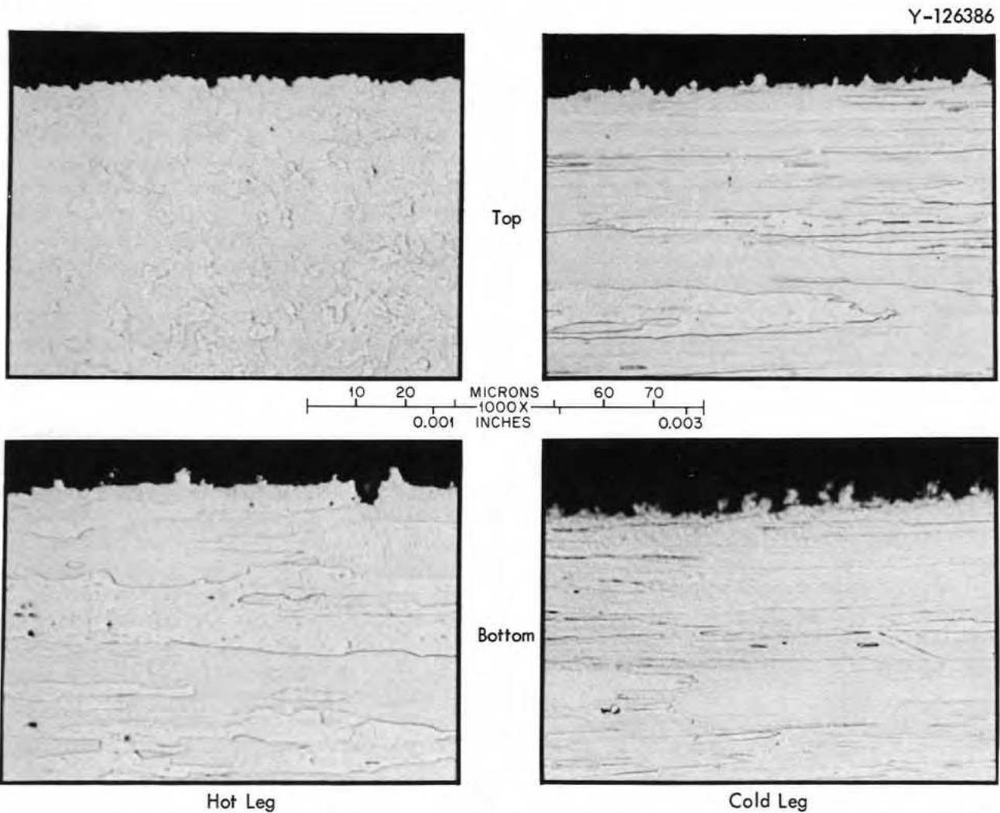  
Fig. 11.1. Photomicrographs of the edges of specimens from a molybdenum thermal convection loop containing B-2.5% Li. The loop operated for 8700 hr at a maximum temperature of $700^{\circ}\mathrm{C}$ with a temperature difference of $100^{\circ}\mathrm{C}$ .

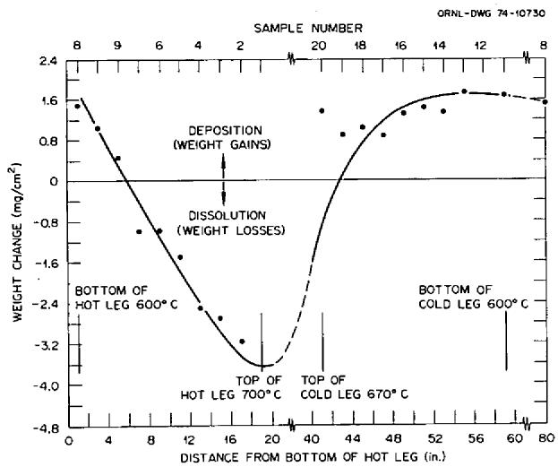  
Fig. 11.2. Weight changes of molybdenum samples in a molybdenum thermal convection loop that contained Bi- $2.5\%$ Li and operated for $8700\mathrm{hr}$ at a maximum temperature of $700^{\circ}\mathrm{C}$ with a temperature difference of $100^{\circ}\mathrm{C}$ .

# 12. Graphite Studies

H. E. McCoy W. P. Eatherly

The characterization of property changes in various grades of graphite as a function of fluence at $715^{\circ}\mathrm{C}$ has been a continuing part of the graphite studies for the Molten-Salt Reactor Program (MSRP). In these studies, almost all of the specimens, nominally 0.126 in. ID by 0.400 in. OD by 0.500 in. long, have been irradiated in target pin locations in the High Flux Isotope Reactor (HFIR). The target pin location dictated the size and geometry of the specimens. The specimens were machined so that they and their parent stock had parallel axes of rotation. The specimens were physically characterized in the unirradiated condition. After irradiation, their dimensional changes were determined as functions of the fluence. Other postirradiation data such as BET surface area, helium densities, open-pore porosities, and layer heights were measured for some grades of graphite.

These studies were discontinued at the interruption of the MSR Program and do not have sufficient priority to be reinstituted at our present funding level. However, we have been able to extend this experimental work through funding from the Air Force Materials Laboratory. The additional data acquired on the MSR Program specimens as functions of accumulated fluence were thermal expansivity from room temperature to $625^{\circ}\mathrm{C}$ and mechanical properties measured at room temperature. The mechanical properties included brittle ring strengths, fracture strains, Young's moduli, shear moduli, and calculated thermal shock resistivities. The purpose of the studies for the Air Force Materials Laboratory was to determine whether neutron-damaged graphite had properties beneficial for some aerospace applications.

# 12.1 PROPERTY CHANGES IN NEAR-ISOTROPIC GRADES OF GRAPHITE IRRADIATED AT $715^{\circ}\mathrm{C}$ TO FLUENCES AS HIGH AS $4.2 \times 10^{22}$ NEUTRONS/cm²

W. H. Cook C. R. Kennedy W. P. Eatherly

# 12.1.1 Materials

Graphite grade AXF was chosen for this study because of its near isotropy and high strength. We

included in this study other near-isotropic grades; principally, grades AXF-5QBG-3, H-395 (ref. 2), and P-03, to acquire additional information associated with the aerospace applications and nuclear reactors such as the Molten-Salt Breeder Reactors (MSBRs) and High-Temperature Gas-Cooled Reactors (HTGRs). Brief introductory descriptions and the sources of the four grades AXF, AXF-5QBG-3, H-395, and P-03 plus a few other grades used for reference purposes are given (Table 12.1).

The typical microstructures of graphite grade AXF and the other three grades, AXF-5QBG-3, H-395, and P-03, studied with it are shown in their unirradiated states (Fig. 12.1). Although all of these are binderless' grades of graphite, they tend to have relatively uniform pore distribution except for grade P-03. The porosity for grade P-03 appears to be larger and concentrated between large particles. Additional relative microscopical characteristics are distinguishable with the use of a rotatable sensitive tint plate. The monolithic nature of these binderless grades of graphite tends to limit some measurements to judgments.

Both grades AXF and AXF-5QBG-3 have equiaxed optical domains approximately $5\mu \mathrm{m}$ in average diameter. This means that there are about five optical domains in the largest particle $(25\mu \mathrm{m})$ used to fabricate these materials.

Grade H-395 appears to have been fabricated with filler particles similar in size to those used in grades AXF and AXF-5QBG-3. However, the average optical domains are slightly larger; there is a scattering of a few particles that had optical domains two to three times larger than the average; and the optical domains were not as equiaxed as those in grades AXF and AXF-5QBG-3. The stock of grade H-395 is atypical for this grade, because it is slightly marred structurally with balls of agglomerated filler particles ranging from 250 to $500\mu \mathrm{m}$ in diameter (Fig. 12.1c).

Y-126237

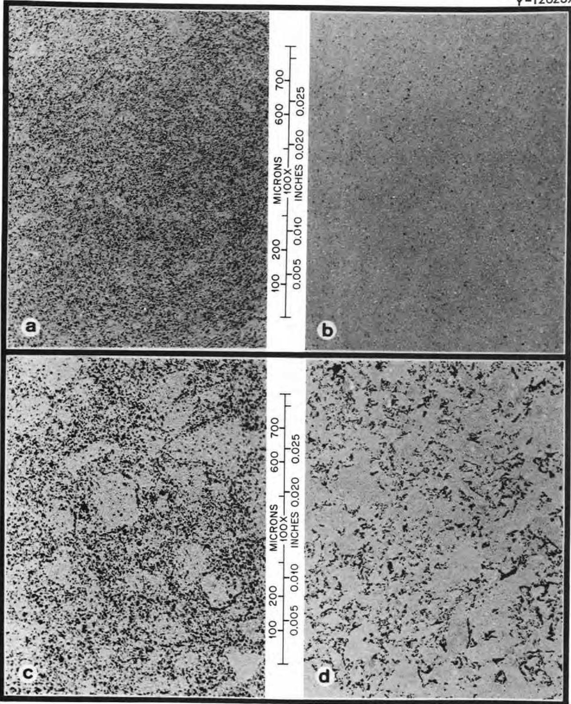  
Fig. 12.1. Photomicrographs of the microstructures of unirradiated graphite grades (a) AXF, (b) AXF-5QBG-3, (c) H-395, and (d) P-03. As polished, $100\times$

Table 12.1. A summary of the grades of graphite studied and used for reference purposes   

<table><tr><td colspan="2">Graphite grade</td><td rowspan="2">Density (g/cm3)</td><td rowspan="2">Form</td><td rowspan="2">Maximum particle size (in.)</td><td rowspan="2">Comment</td></tr><tr><td>AFML/MXS study</td><td>G/Gdreference plots</td></tr><tr><td>AXFa</td><td></td><td>1.82</td><td>Near-isotropic</td><td>0.001</td><td>No microscopically visible binder, uniform pore structure with nominal pore diameter of 1 μm</td></tr><tr><td>AXF-5QBG-3a</td><td></td><td>1.87</td><td>Near-isotropic</td><td></td><td>This is AXF-5QBG that has been ORNL-fired at 3000°C for 1 hr, grade AXF-5QBG is manufactured from AXF and is carbon-impregnated and regraphitized</td></tr><tr><td>H-395b</td><td></td><td>1.79</td><td>Near-isotropic</td><td></td><td>Probably a raw coke-based fabrication process, rated by manufacturer as improved H-337 and H-364</td></tr><tr><td>P-03c</td><td></td><td>1.82</td><td>Near-isotropic</td><td>0.006</td><td>Molded, medium-grained</td></tr><tr><td></td><td>AXMa</td><td>1.71</td><td>Near-isotropic</td><td>0.001</td><td>Less dense but made similarly to AXF</td></tr><tr><td></td><td>AXF-UFGa</td><td>1.85</td><td></td><td>≈0.001</td><td>0.001 usual maximum particle size in AX series</td></tr><tr><td></td><td>H-337b</td><td>2.00</td><td></td><td></td><td>Made using raw coke, heavily impregnated with carbon and regraphitized</td></tr><tr><td></td><td>H-364b</td><td>1.94</td><td></td><td></td><td>Pilot plant product, precursor to H-337</td></tr></table>

a Manufactured by POCO Graphite, Inc., Decatur, Texas.   
Manufactured by Great Lakes Carbon Corp., New York, New York.   
Manufactured by Pure Carbon Company, St. Mary's, Pennsylvania.   
${}^{d}$ Change in shear modulus.

Grade P-03 has large and small filler particles. The large particles range from 100 to $150\mu \mathrm{m}$ and the smaller particles appear to be 5 to $25\mu \mathrm{m}$ in size. The optical domains are not equiaxed and their dimensions range from 20 to $40\mu \mathrm{m}$ with smaller ones intermingled that are approximately 6 $\mu \mathrm{m}$ in diameter.

# 12.1.2 Testing

We used the MSR specimens that were nominally 0.400 in. OD by 0.126 in. ID by 0.500 in. long which had been irradiated in the High Flux Isotope Reactor (HFIR) at $715^{\circ}\mathrm{C}$ to various fluences up to $4.2 \times 10^{22}$ neutrons/cm $^2$ ( $E > 50~\mathrm{keV}$ ). The initial Young's and shear moduli were determined

on the existing specimens by ultrasonic techniques.4 The thermal expansion of the specimens in the directions of their axes of rotation was determined from room temperature to $625^{\circ}\mathrm{C}$ in a quartz dilatometer. These measurements concluded the necessary nondestructive testing of the specimens. The flexural strength tests were destructive and were obtained using the brittle-ring technique.

# 12.1.3 Property Changes as Functions of Fluence

The volume changes of these grades of graphite were reported previously,[6,7] but are shown again for reference purposes (Figs. 12.2 and 12.3). The damage model used to explain these data was reviewed in some detail by Engle and Eatherly.[8]

The physical properties of the unirradiated and irradiated grades are summarized in Table 12.2. These effects of the fluence are respectively shown graphically for the coefficients of thermal expansion, brittle-ring stresses (strengths), changes in Young's moduli of elasticity, changes in shear moduli, and fracture strains (Figs. 12.4, 12.5, 12.6, 12.7, 12.8 and 12.9).

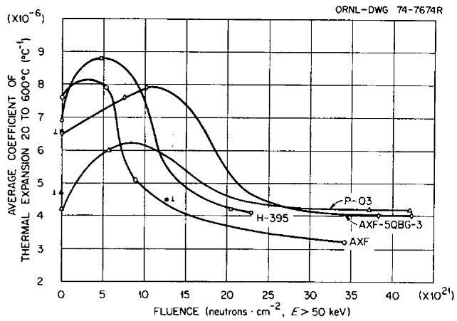  
Fig. 12.4. The average coefficients of thermal expansion from 20 to $600^{\circ}\mathrm{C}$ vs fluence accumulated at $715^{\circ}\mathrm{C}$ for graphite grades AXF, AXF-5QBG-3, H-395, and P-03.

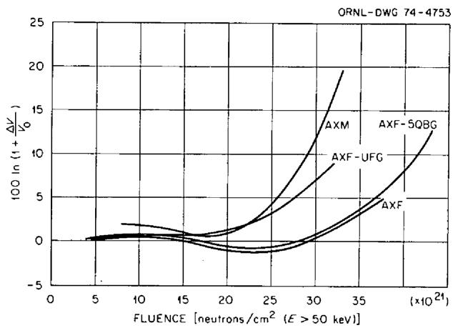  
Fig. 12.2. A comparison of volume changes of various POCO grades of graphite vs fluence accumulated at $715^{\circ}\mathrm{C}$ .

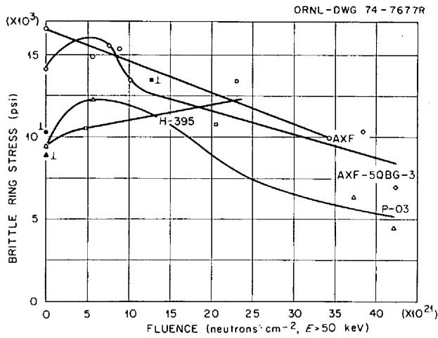  
Fig. 12.5. Brittle-ring stresses vs fluence accumulated at $715^{\circ}$ C for graphite grades AXF, AXF-5QBG-3, H-395, and P-03.

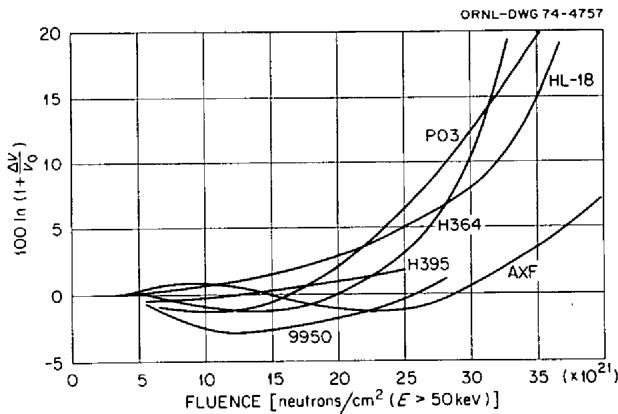  
Fig. 12.3. A comparison of volume changes of various binderless grades of graphite vs fluence accumulated at $715^{\circ}\mathrm{C}$ .

# 12.1.4 Conclusions

The MSBR design life for the graphite moderator has been set as $3 \times 10^{22}$ neutrons/cm $^2$ ( $E > 50\mathrm{keV}$ ) (rcf. 9) based on the dimensional changes. Fluences of $3 \times 10^{22}$ neutrons/cm $^2$ and beyond ultimately reduced the values of all parameters involved in these most recent studies with the exceptions of the coef

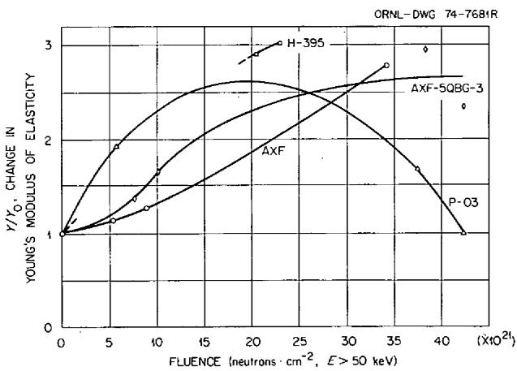  
Fig. 12.6. Changes in Young's moduli of elasticity vs fluence accumulated at $715^{\circ}\mathrm{C}$ for graphite grades AXF, AXF-5QBG-3, H-395, and P-03.

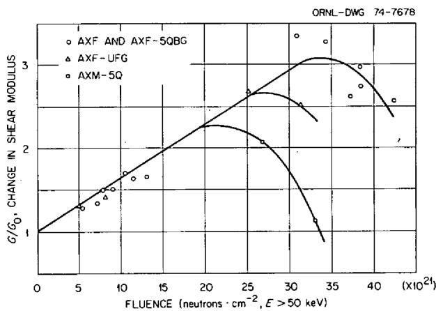  
Fig. 12.7. Changes in shear moduli vs fluence accumulated at $715^{\circ}\mathrm{C}$ for graphite grades AXF, AXF-5QBG-3, AXF-UFG, and AXM.

ficient of thermal expansion (CTE) of grade P-03 and the strength of grade H-395. In general, the results of these studies do not reveal any changes in the specific parameters studied for these grades of graphite that would seriously affect their performance in an MSBR to a fluence of $3 \times 10^{22}$ neutrons/cm $^2$ . The data acquired make possible a more rigorous analysis of the preceding general statement, and suggest a satisfying degree of potential ranges of control for attaining desired properties through the proper fabrication processes.

The CTE values were not measured beyond $600^{\circ}\mathrm{C}$ to prevent annealing out of property changes acquired through the neutron irradiations at $715^{\circ}\mathrm{C}$ that were to be subsequently measured on the same

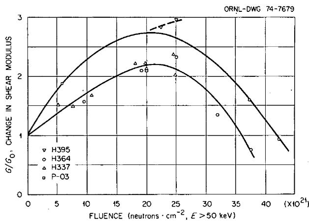  
Fig. 12.8. Changes in shear moduli vs fluence accumulated at $715^{\circ}\mathrm{C}$ for graphite grades H-395, P-03, H-364, and H-337.

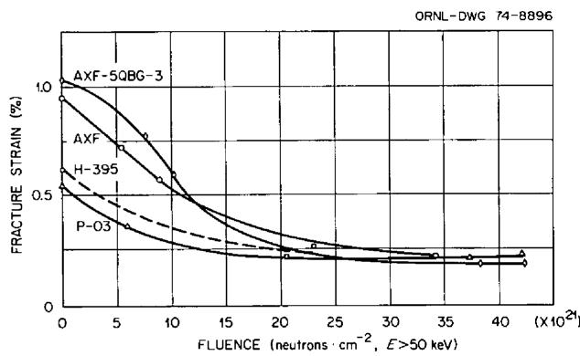  
Fig. 12.9. Fracture strains vs fluence accumulated at $715^{\circ}\mathrm{C}$ for graphite grades AXF, AXF-5OBG, H-395, and P-03.

specimens after the CTE determinations. All CTE values for graphite grades AXF, AXF-5QBG-3, H-395, and P-03 behaved in a similar manner (Fig. 12.4). With increasing fluence, they all initially increased by 10 to $40\%$ and then decreased to 40 to $60\%$ depending on the grade involved, with the exception of grade P-03 which returned essentially to its original value. Fortunately, the CTE values are small enough that these should not create dimensional design problems. For example, in a 1000-MWe power MSBR with a diameter of approximately 20 ft,[10] the diameter change from room temperature to the operating temperature would be 0.2 to 1.2 in. in the absence of irradiation. Therefore, a $\pm 40$ to $60\%$

change in these values does not appear to create serious design problems.

Brittle-ring strength measurements have been shown by C. R. Kennedy of this Laboratory and others to be a simple, accurate method for determining the strengths of various grades of graphite. This method is well suited for the HFIR-type samples. We obtained three specimens from each

HFIR-type sample by cutting the samples transversely to their axes of rotation. The brittle-ring stress values are plotted vs fluence using averages of three values (Fig. 12.5). These values are high be

11. S. A. Bortz and H. H. Lund, “Evaluation of a Tension Test for Brittle Materials,” p. 531 in the Proceedings of the Fourth Conference on Carbon, New York, 1960.

Table 12.2. Some physical properties of graphite grades AXF, AXF-5QBG-3, H-395, and P-03 as functions of fluences from 0 to $42.1 \times 10^{21}$ neutrons / cm $^2$ ( $>50$ keV) accumulated at $715^{\circ}C^a$   

<table><tr><td rowspan="2">Speci-men number (orien-tation)b</td><td rowspan="2">Fluencec(1021neutrons/cm2)</td><td colspan="2">Density, g/cm3</td><td colspan="3">Porosity, %</td><td rowspan="2">Pore entrance diameter range for 90% of open porosity (μm)</td><td rowspan="2">BET surface area (m2/g)</td><td rowspan="2">* Permeability to helium at I atm at room temperature (10-3)</td><td colspan="2">* Electrical resistivity (μm-cm)</td><td colspan="2">* Thermal conductivity (cal/sec·cm-°C)</td></tr><tr><td>Bulk</td><td>Helium</td><td>Open Closedd</td><td>Total</td><td></td><td>With grain</td><td>Across grain</td><td>With grain</td><td>Across grain</td></tr><tr><td colspan="14">Grade AXF</td></tr><tr><td>122</td><td>0</td><td>1.82</td><td>2.14e</td><td>15.4e</td><td>4.1</td><td>19.5</td><td>1.0</td><td>0.34e</td><td>40</td><td>1475</td><td></td><td></td><td>0.154f</td></tr><tr><td>120</td><td>5.4</td><td></td><td>2.08</td><td>13.0</td><td>8.0</td><td>21.0</td><td></td><td>0.9</td><td></td><td></td><td></td><td></td><td></td></tr><tr><td>118</td><td>8.9</td><td></td><td></td><td></td><td></td><td></td><td></td><td></td><td></td><td></td><td></td><td></td><td></td></tr><tr><td>119</td><td>34.2</td><td></td><td>2.07</td><td>15.0</td><td>8.4</td><td>23.4</td><td></td><td>1.9</td><td></td><td></td><td></td><td></td><td></td></tr><tr><td colspan="14">Grade AXF-5QBG-3g</td></tr><tr><td>174</td><td>0</td><td>1.87(39)h</td><td></td><td></td><td></td><td>17.3</td><td>0.5-2.0</td><td></td><td>~ 0.62</td><td>1020(6)</td><td>1095(6)</td><td></td><td></td></tr><tr><td>170</td><td>7.6</td><td></td><td>2.11e</td><td>10.4e</td><td>6.7</td><td>17.1</td><td></td><td>0.7e</td><td></td><td></td><td></td><td></td><td></td></tr><tr><td>173</td><td>10.2</td><td></td><td>2.14</td><td>12.1</td><td>5.3</td><td>17.4</td><td></td><td>0.5</td><td></td><td></td><td></td><td></td><td></td></tr><tr><td>171</td><td>38.3</td><td></td><td>2.11</td><td>14.2</td><td>6.7</td><td>20.9</td><td></td><td>4.1</td><td></td><td></td><td></td><td></td><td></td></tr><tr><td>177</td><td>42.3</td><td></td><td>2.11</td><td>20.4</td><td>6.7</td><td>27.1</td><td></td><td>3.2</td><td></td><td></td><td></td><td></td><td></td></tr><tr><td colspan="14">Grade H-395</td></tr><tr><td>835(||)</td><td>0</td><td>1.79(30)</td><td></td><td></td><td></td><td>20.8</td><td></td><td></td><td></td><td>1260(6)</td><td>1300(6)</td><td></td><td></td></tr><tr><td>832(||)</td><td>4.8</td><td></td><td></td><td></td><td></td><td></td><td></td><td></td><td></td><td></td><td></td><td></td><td></td></tr><tr><td>833(||)</td><td>20.5</td><td></td><td></td><td></td><td></td><td></td><td></td><td></td><td></td><td></td><td></td><td></td><td></td></tr><tr><td>834(||)</td><td>23.0</td><td></td><td></td><td></td><td></td><td></td><td></td><td></td><td></td><td></td><td></td><td></td><td></td></tr><tr><td>840(⊥)</td><td>0</td><td></td><td></td><td></td><td></td><td></td><td></td><td></td><td></td><td></td><td></td><td></td><td></td></tr><tr><td>839(⊥)</td><td>12.7</td><td></td><td></td><td></td><td></td><td></td><td></td><td></td><td></td><td></td><td></td><td></td><td></td></tr><tr><td colspan="14">Grade P-03</td></tr><tr><td>759(||)</td><td>0</td><td>1.82(30)</td><td></td><td></td><td></td><td>19.5</td><td></td><td></td><td></td><td>1600(6)</td><td>1655(6)</td><td>0.145f</td><td>0.135f</td></tr><tr><td>756(||)</td><td>5.7</td><td></td><td></td><td></td><td></td><td></td><td></td><td></td><td></td><td></td><td></td><td></td><td></td></tr><tr><td>757(||)</td><td>37.3</td><td></td><td></td><td></td><td></td><td></td><td></td><td></td><td></td><td></td><td></td><td></td><td></td></tr><tr><td>758(||)</td><td>42.1</td><td></td><td></td><td></td><td></td><td></td><td></td><td></td><td></td><td></td><td></td><td></td><td></td></tr><tr><td>769(⊥)</td><td>0</td><td></td><td></td><td></td><td></td><td></td><td></td><td></td><td></td><td></td><td></td><td></td><td></td></tr></table>

${}^{a}$ All data were taken directly on the actual control or irradiated specimens except in those columns headed with an asterisk (*) . In the columns headed with an asterisk $\left( {*}\right)$ ,the data were taken on other special specimens taken from the same parent stock or they are representative data.   
The axis of rotation of the specimen is parallel with the axis of rotation of the stock for the symbol $\parallel$ ; it is perpendicular to the axis of rotation of the stock for the symbol $\perp$ . No symbol means the material is near isotropic.   
$E > 50\mathrm{keV}$   
$^d$ Porosity that is closed to helium.   
Data in this column were reported by C. R. Kennedy, MSR Program Semiannu. Progr. Rep. Aug. 31, 1970, ORNL-4622, p. 147.   
$^{1}$ At $600^{\circ}\mathrm{C}$ , ORNL Intra-Laboratory Correspondence of July 7, 1970, from D. L. McElroy to A. F. Zulliger.   
This grade AXF-5QBG was fired for 1 hr at $3000^{\circ}\mathrm{C}$ .   
${}^{h}$ Suffix numerals enclosed in parentheses indicate the number of values averaged.

cause the stresses were concentrated in a small volume; however, direct experimental data show that the values may be readily and accurately converted to true flexural stress values by multiplying by 0.75.

As shown in Fig. 12.5, irradiation is ultimately deleterious to the strengths of grades AXF, AXF-5QBG-3, and P-03 while the strength of grade H-395 is still increasing at a fluence level of $2.3 \times 10^{22}$ neutrons/cm $^2$ ( $E > 50 \mathrm{keV}$ ). No evidence exists of any saturation effects for the first three grades; however, their strengths at the design life of $3 \times 10^{22}$ neutrons/cm $^2$ are several factors greater than the strength required for the MSBR graphite. There is no obvious reason for the different strength behavior of grade H-395. This strength increase is also present in samples taken perpendicular to each other from the parent stock (Fig. 12.5). Grade H-395 and AXF tend to have similar characteristics in most properties except strength. Unfortunately, the maximum fluence accumulated on a sample of grade H-395 was only $2.3 \times 10^{22}$ neutrons/cm $^2$ .

The changes in Young's and shear moduli naturally reflect the changes in strength and fracture strain values. The latter is the parameter in which all four grades of graphite, AXF, AXF-5QBG, H

395, and P-03, behave in the most strikingly similar manner with increasing fluence values. The fracture strains for all four grades (Fig. 12.9) have decreased as much as $40\%$ for an accumulated fluence of only $1 \times 10^{22}$ neutrons/cm² ( $E > 50~\mathrm{keV}$ ), and they all appear to be saturating between 60 to $85\%$ of their original values at fluences greater than 2.5 $\times 10^{22}$ neutrons/cm². Apparently, all grades are approaching the same critical flaw size. The significance of these mechanical changes will have to be determined by more detailed analyses.

Further studies should include measurements of pore entrance diameter distributions, permeabilities to helium gas, and thermal conductivities. The surprisingly different strength behavior of grade H-395 vs fluence also warrants additional study. Graphite research programs have reached a significant plateau in qualitatively relating fabrication processes and irradiation behavior. An irradiation program within relatively narrow limits of graphite types, but with heavy commitments for characterization of raw materials and of the unirradiated and irradiated properties of the finished graphite bodies, would have appreciable benefits.

# Part 4. Fuel Processing for Molten-Salt Reactors

J. R. Hightower, Jr.

Part 4 deals with the development of processes for the isolation of protactinium and for the removal of fission products from molten-salt breeder reactors. During the period covered by this report, we resumed work on the chemistry of fluorination and reconstitution. An experimental batch reactor facility has been reconstructed for delivery and metering of fluorine, hydrogen, HF, $\mathrm{UF}_6$ , and argon to a gold-lined nickel reaction vessel.

Studies of equilibria in fused salt-liquid alloy systems were completed and the results have been published.

The metal transfer experiment MTE-3 was completed and the equipment used in that experiment was examined. The examination showed that no serious corrosion had occurred on the internal surfaces of the vessels, but that serious air oxidation occurred on the external surfaces of the vessels. Analyses of the bismuth phases indicated that the surfaces in contact with the salts were enriched in thorium and iron. We plan to repeat experiment MTE-3 to determine the cause of low mass transfer rates seen in that experiment. The carbon steel vessels are being replaced with new vessels; and purified fuel carrier salt, bismuth, and lithium chloride will be used.

Mass transfer coefficients in the mechanically agitated nondispersing contactors were measured in the Salt/Bismuth Flow-through Facility. The measured mass transfer coefficients are about 30 to $40\%$ of those predicted by the preferred literature cor

relation, but were not as low as those seen in some of the runs in MTE-3. Additional studies using water-mercury systems to simulate molten salt-bismuth systems have indicated that the model used to interpret results from previous measurements in the water-mercury system has significant deficiencies. We must analyze the results differently to extract information useful for designing contactors in molten salt-bismuth systems.

Autoresistance heating studies were continued to develop a means of internal heat generation for frozen-wall fluorinators. Equipment was built to test a design of a side arm for the heating electrode. Results of experiments with this equipment indicate that for proper operation the wall temperature must be held much lower than that for which the equipment was designed. Studies with an electrical analog of the equipment indicate that no regions of abnormally high current density exist in the side arm.

We are beginning engineering studies of fuel reconstitution. Equipment is described in this report for carrying out the reaction of gaseous $\mathrm{UF_6}$ with $\mathrm{UF_4}$ dissolved in molten salt and the subsequent reduction with hydrogen of the resultant $\mathrm{UF_5}$ .

Future development of the fuel processing operations will require a large facility for carrying out engineering experiments. Work was initiated for a conceptual design of a processing engineering laboratory where these engineering experiments can be carried out.

# 13. Processing Chemistry

A. D. Kelmers

Studies of certain aspects of the chemistry of the metal transfer process and of fuel reconstitution were conducted between September 1972 and the temporary termination of the MSR Program in March 1973. Investigation of the reaction of gaseous $\mathrm{UF_6}$ with $\mathrm{UF_4}$ dissolved in LiF-BeF $_2$ -ThF $_4$ (72-16-12 mole %) to form dissolved $\mathrm{UF_5}$ was partially completed, and the results were published. Studies of the distribution of $\mathrm{Li_3Bi}$ between molten LiCl and liquid Li-Bi alloys were completed and the results were published. After reactivation of the MSR Program in February 1974, apparatus was assembled for conducting studies on the chemistry of fluorination and reconstitution of MSBR fuel salt. These studies are now in progress.

# 13.1 CHEMISTRY OF FLUORINATION AND FUEL RECONSTITUTION

M.R.Bennett L.M.Ferris A.D.Kelmers

The reaction of gaseous $\mathrm{UF_6}$ with $\mathrm{UF_4}$ dissolved in molten LiF-BeF $_2$ -ThF $_4$ (72-16-22 mole %) had been under investigation for some time. The results obtained prior to March 1973 have been published; an abstract follows:

The reaction of gaseous $\mathrm{UF_6}$ with $\mathrm{UF_4}$ dissolved in molten LiF-BeF $_2$ -ThF $_4$ (72-16-12 mole %) was studied over the temperature range $550 - 650^{\circ}\mathrm{C}$ . Chemical and spectrophotometric evidence showed that U(V) was formed in the salt according to the reaction $\mathrm{UF_6(g)} + \mathrm{UF_4(d)} = 2\mathrm{UF_5(d)}$ , in which (g) and (d) denote gas and dissolved species, respectively. The studies were conducted using gold apparatus, since gold was the only material found to be inert to both gaseous $\mathrm{UF_6}$ and dissolved $\mathrm{UF_5}$ . When $\mathrm{UF_5}$ was present in low concentrations, it disproportionated slowly according to the reverse of the above reaction; the rate was second-order with respect to the $\mathrm{UF_5}$ concentration. The results indicated that, when $\mathrm{UF_5}$ was present in high concentrations, its vaporization from the salt and subsequent disproportionation in the

vapor phase were significant. Under all conditions studied, however, the pressure of uranium-containing species in the vapor phase was less than 0.004 atm.

An experimental batch reactor facility has been constructed so that studies of fluorination and fuel reconstitution can be continued. The facility includes systems for the delivery and metering of fluorine, hydrogen, HF, $\mathrm{UF}_6$ , and argon. The initial experiments will be conducted in a gold-lined nickel reaction vessel to investigate reactions involved in continuous fluorination and the subsequent fuel reconstitution. The overall reactions may be represented as follows:

for fluorination,

$$
\mathrm {U F} _ {4} (\mathrm {d}) + \mathrm {F} _ {2} (\mathrm {g}) \rightarrow \mathrm {U F} _ {6} (\mathrm {g}) \tag {1}
$$

and for reconstitution,

$$
\mathrm {U F} _ {6} (\mathrm {g}) + \mathrm {H} _ {2} (\mathrm {g}) \rightarrow \mathrm {U F} _ {4} (\mathrm {d}) + 2 \mathrm {H F} (\mathrm {g}). \tag {2}
$$

The above reactions are useful for calculating stoichiometric chemical reagent use, but they fail to reveal the complexity of the actual operating conditions.

The continuous fluorinator is envisioned as a countercurrent device operating at about $510^{\circ}\mathrm{C}$ with fuel salt entering one end and fluorine gas being introduced at the other end. Thus, $\mathrm{UF}_6$ gas and unreacted $\mathbf{F}_2$ gas would exit from the reactor countercurrent to the fuel salt, and salt depleted of uranium would exit countercurrent to the fluorine. The following reactions can occur in the fluorinator

$$
\mathrm {U F} _ {4} (\mathrm {d}) + \mathrm {U F} _ {6} (\mathrm {g}) \rightarrow 2 \mathrm {U F} _ {5} (\mathrm {d}), \tag {3}
$$

$$
\mathrm {U F} _ {5} (\mathrm {d}) + 1 / 2 \mathrm {F} _ {2} (\mathrm {g}) \rightarrow \mathrm {U F} _ {6} (\mathrm {g}), \tag {4}
$$

$$
\mathrm {U F} _ {4} (\mathrm {d}) + 1 / 2 \mathrm {F} _ {2} (\mathrm {g}) \rightarrow \mathrm {U F} _ {5} (\mathrm {d}). \tag {5}
$$

In addition, $\mathbf{U}\mathbf{F}_5$ can distribute to the gas phase

$$
\mathrm {U F} _ {5} (\mathrm {d}) = \mathrm {U F} _ {5} (\mathrm {g}) \tag {6}
$$

where it would be oxidized to $\mathrm{UF}_6$ by $\mathbf{F}_2$ :

$$
\mathrm {U F} _ {5} (\mathrm {g}) + 1 / 2 \mathrm {F} _ {2} (\mathrm {g}) \rightarrow \mathrm {U F} _ {6} (\mathrm {g}). \tag {7}
$$

Preliminary experiments have investigated some of these reactions. The results indicate that the oxidation reactions (3) and (4) are rapid and that the equilibrium constants must be quite large. The existence of dissolved $\mathrm{UF}_5$ was confirmed, but a measure of the partial pressure of $\mathrm{UF}_5(\mathrm{g})$ was not obtained.

In the fuel reconstitution step the gas entering from the fluorinator will be a mixture of $\mathrm{UF_6}$ with the unreacted $\mathbf{F}_2$ . These gases will be reduced with an excess of $\mathrm{UF_4}$ contained in a circulating salt stream:

$$
\mathrm {U F} _ {6} (\mathrm {g}) + \mathrm {U F} _ {4} (\mathrm {d}) \rightarrow 2 \mathrm {U F} _ {5} (\mathrm {d}) \tag {3}
$$

$$
1 / 2 \mathrm {F} _ {2} (\mathrm {g}) + \mathrm {U F} _ {4} (\mathrm {d}) \rightarrow \mathrm {U F} _ {5} (\mathrm {d}). \tag {5}
$$

Thus, for this processing step it is also important to have an estimate of the equilibrium constant for reaction (3).

Ultimately, the dissolved $\mathbf{U}\mathbf{F}_5$ will be reduced in a separate chamber with hydrogen gas

$$
\mathrm {U F} _ {5} (\mathrm {d}) + 1 / 2 \mathrm {H} _ {2} (\mathrm {g}) \rightarrow \mathrm {U F} _ {4} (\mathrm {d}) + \mathrm {H F} (\mathrm {g}). \tag {8}
$$

It is necessary to conduct the two fuel reconstitution reduction reactions separately to avoid mixing $\mathbf{H}_2$ and $\mathbf{F}_2$ gases. The situation in the hydrogen reduction vessel is further complicated by the simultaneous gas-phase disproportionation of $\mathbf{U}\mathbf{F}_5$

$$
2 \mathrm {U F} _ {5} (\mathrm {g}) \rightarrow \mathrm {U F} _ {4} (\mathrm {c}) + \mathrm {U F} _ {6} (\mathrm {g}) \tag {9}
$$

where (c) represents the condensed or solid phase. This disproportionation could lead to isolation of some of the uranium as solid $\mathrm{UF_4}$ in regions of the vessel not in contact with salt. This reaction should not be a complication where $\mathbf{F}_2$ is present in the gas.

Preliminary results2 indicate that reaction (8) is slower than reaction (3) and, when carried out in a batch contactor, many times the stoichiometric quantity of $\mathbf{H}_2$ was required to reduce all the $\mathrm{UF}_5$ . This may be due to the expected low solubility of $\mathbf{H}_2$ in fuel salt melts. Additional experiments are planned to investigate the fuel reconstitution reactions.

# 13.2 EQUILIBRIA IN FUSED SALT-LIQUID ALLOY SYSTEMS

L. M. Ferris M. A. Bredig3 F. J. Smith  
J. F. Land

Preliminary results from a study of the distribution of lithium and bismuth between molten LiCl and

liquid Li-Bi alloys were reported previously. This study was completed and the results were published; an abstract follows:

The distribution of lithium and bismuth between Li-Bi alloys and molten LiCl was measured at several temperatures between 650 and $800^{\circ}$ . The extent of their distribution to the LiCl increased dramatically at each temperature with a moderate increase in the lithium concentration of the alloy; for example, at $650^{\circ}$ , the bismuth concentration in the LiCl increased from about 5 to $4800\mathrm{ppm}$ as the lithium concentration in the alloy increased from 10 to 50 at. $\%$ . The ratio of "excess" lithium to bismuth in the LiCl generally was about 3, suggesting that salt-like $\mathrm{Li}_3\mathrm{Bi}$ was selectively dissolved from the alloys. The measured equilibrium bismuth concentrations in the LiCl in the temperature range $650 - 800^{\circ}$ can be expressed as

$$
\begin{array}{l} \ln N _ {\mathrm {B i} (\mathrm {d})} = 4 \ln N _ {\mathrm {L i} (\mathrm {m})} + 2. 5 7 9 N _ {\mathrm {L i} (\mathrm {m})} + 2. 2 1 \mathrm {H} \\ - 9 4 6 5 / T ^ {\left(^ {\circ} \mathrm {K}\right)} + 0. 0 8 3 2 \exp \left[ 3 0 9 0 / T ^ {\left(^ {\circ} \mathrm {K}\right)} \right], \\ \end{array}
$$

with an estimated uncertainty in $\ln N_{\mathrm{Bi(d)}}$ of $\pm 0.2$ . In this expression, $N$ , (d), and (m) denote mole fraction, dissolved in salt phase, and dissolved in alloy phase, respectively. Some data were obtained using molten LiBr as the salt phase at $650^{\circ}$ . Bismuth concentrations (mole fractions) in the LiBr were about twice as high as those obtained with LiCl at the same alloy concentrations.

# 14. Engineering Development of Processing Operations

J. R. Hightower, Jr.

Studies related to the development of a number of processing operations were resumed in January 1974, after the interruption of the MSR Program. During this report period, the equipment in which metal transfer experiment MTE-3 was carried out was examined, indicating that no serious corrosion had occurred on the interior of the vessels, although serious air oxidation had occurred on the external surfaces. Analyses of the bismuth phases indicated that those portions of the bismuth which were adjacent to a salt-bismuth interface were enriched in iron and thorium. Evidence of oxide was found only in the stripper vessel. We plan to repeat experiment MTE-3 to determine the reason for the low mass transfer rates seen in that experiment. The carbon steel vessels are being replaced with new vessels and purified fuel carrier salt, bismuth, and lithium chloride will be used. Results of tests with a new oxidation resistant coating indicate its superiority over the nickel aluminide used on the previous test vessels.

A flow-through mechanically agitated nondispersing contactor was installed in place of the packed column in the Salt/Bismuth Flow-through Facility. Mass transfer rates measured in this contactor are lower than those predicted by literature correlations. Studies in the same type contactor using a water-mercury system indicate that the model previously used for describing mass transfer in this system had serious deficiencies and that a more accurate model must be found.

Studies were continued of autoresistance heating as a means of internal heat generation for frozen-wall fluorinators. Equipment is described for testing one design of a side arm for the heating electrode. Results of experiments with this equipment indicate that for proper operation the wall temperature must be held much lower than that for which the equipment is designed. Studies with an electrical analog of the equipment indicate that no regions of abnormally high current density exist in the side arm.

Equipment is described for studying fuel reconstitution via the reaction of $\mathbf{U}\mathbf{F}_6$ with $\mathbf{U}\mathbf{F}_4$ dissolved in molten salt and the subsequent reduction with $\mathbf{H}_2$ of the resultant $\mathbf{U}\mathbf{F}_5$ .

Work was initiated on the conceptual design of a laboratory for carrying out large engineering experiments on fuel processing.

# 14.1 EXAMINATION OF EQUIPMENT FROM METAL TRANSFER EXPERIMENT MTE-3

H. C. Savage

The reference processing flowsheet1 shows the metal transfer process for removing rare earths from molten-salt breeder reactor fuel salt. In this process, fuel salt, which is free of uranium and protactinium but contains the rare earths, is countercurrently contacted with bismuth that contains reductant to extract the rare earths into the bismuth. The bismuth stream, which contains the rare earths and thorium, is then countercurrently contacted with lithium chloride. Because of favorable distribution coefficients, significant fractions of the rare earths transfer to the lithium chloride with a negligible amount of thorium. The final steps of the process consist of extracting the rare earths from the lithium chloride by contact with bismuth having lithium concentrations of 5 and 50 at. $\%$

Four engineering scale experiments (MTE-1, -2, -2B, and -3) have been carried out to study the steps in the metal transfer process and to obtain information, such as mass transfer rates of the rare earths between the salt and bismuth phases that are necessary to determine the size and type of equipment needed for the process. Results from these experiments have been reported. Experiments MTE-1, -2, and -2B demonstrated the selective removal of rare earths (lanthanum and $^{147}\mathrm{Nd}$ ) from MSBR fuel carrier salt (72-16-12 mole % LiF-BeF $_2$ -ThF $_4$ ) and transfer to Li

Bi acceptor alloy. Experiment MTE-3 was a larger experiment that included features such as mechanical agitation of the salt and metal phases to improve mass transfer rates of the rare earths across the three salt-metal interfaces. This equipment was designed to measure the mass transfer rates across the three interfaces as a function of agitator speed for comparison with calculated values using a mass transfer correlation developed by J. B. Lewis.[7]

Metal Transfer Experiment MTE-3 (Fig. 14.1) consisted of three interconnected vessels: a 14-in.-diam fuel salt reservoir, a 10-in.-diam salt-metal contactor, and a 6-in.-diam rare earth stripper. The salt-metal contactor was divided into two compartments that were interconnected through an opening in the bottom of the divider by a pool of bismuth containing thorium and lithium. The stripper contained a lithium-bismuth solution. Mechanical agitators were used in both compartments of the contactor and in the lithium-bismuth stripper to promote mass transfer across the three salt-metal interfaces. All vessels were carbon steel with an oxidation-resistant coating of nickel aluminide on the outside surfaces.

The purpose of MTE-3 was to evaluate this type of contactor and stipper for use in removing rare earths from molten-salt reactor fuel. Fluoride salt and LiCl

flow rates in the MTE-3 system were about $1\%$ of those required for removing rare earths from a 1000-MWe MSBR. The operating temperature was about $650^{\circ}\mathrm{C}$ ; phases were $\mathrm{LiF - BeF_2 - ThF_4}$ (72-16-12 mole $\%$ fuel carrier salt, 0.13 at. $\%$ thorium-bismuth solution containing about 0.3 at. $\%$ lithium as reductant, and a 5 at. $\%$ lithium-bismuth solution in the stripper. In this process the rare earths are extracted from the carrier salt into the thoriumbismuth solution. Next, the rare earths are extracted from the thorium-bismuth with molten lithium chloride and finally, they are stripped from the LiCl into bismuth-lithium alloy.

Mass transfer coefficients for radium, europium, lanthanum, and neodymium were measured during 13 runs using agitator speeds ranging from 100 to 400 rpm for comparison with values predicted by a literature correlation based on data obtained with aqueous-organic systems. Many of the mass transfer coefficients were lower than those predicted by factors of 6 to 25. Termination of the MSR program precluded further investigation of the mass transfer rates and postoperative examination of the MTE-3 equipment to determine the reason for the lower than expected transfer rates. The system was shut down and was placed in standby condition in February 1973 with all salt and metal phases frozen.

During operation, metal transfer experiment MTE-3 was maintained at approximately $650^{\circ}\mathrm{C}$ for about 1 year (about 8700 hr). During the final run

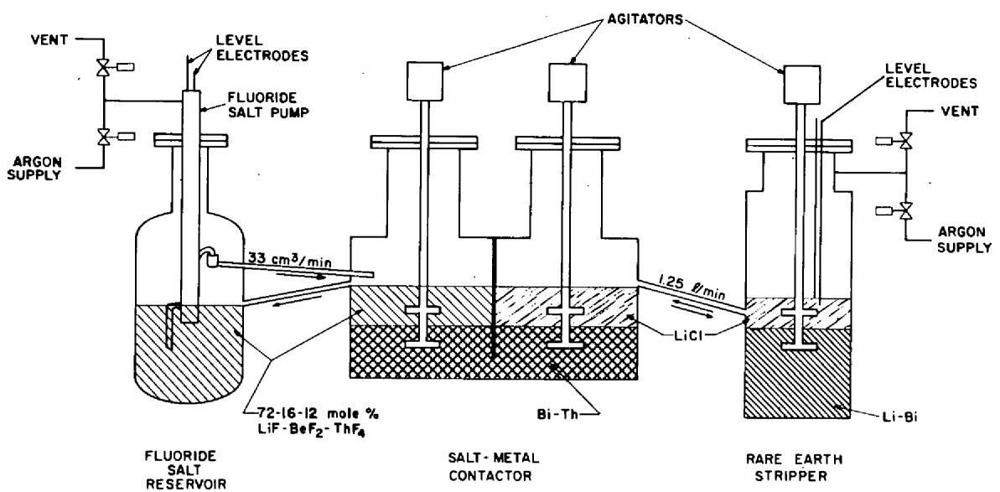  
ORNL-DWG-71-147-R1   
Fig. 14.1. Flow diagram of metal transfer experiment MTE-3.

(EU-9), with agitator speeds of $400~\mathrm{rpm}$ , fluoride salt was entrained into the LiCl in the contactor (about 10 wt $\%$ fluoride into the LiCl). This also resulted in the transfer of thorium into the LiCl which was extracted into the lithium-bismuth solution in the stripper.

After the MSR Program was reinstated in January 1974, the vessels used in MTE-3 were opened for inspection. To remove the three agitator assemblies for examination of the molybdenum shafts and agitator blades, it was necessary to melt the salt and metal phases in the contactor and stripper vessels. After a check of all heater circuits and recalibration of instrumentation, the contactor and stripper vessels were heated to about $650^{\circ}\mathrm{C}$ and the agitator assemblies were removed without difficulty. The agitator ports were immediately sealed with blank flange cover plates and the vessels were cooled to ambient temperature. During the removal of the agitators, an argon atmosphere was maintained in the vessels.

From a cursory visual examination, the molybdenum shafts and blades appeared to be in good condition. No areas of heavy corrosion attacks were noted. However, some areas of the shaft and blades had deposits of salt and metal. Figure 14.2 is a photograph of the molybdenum agitator shafts taken immediately after they were removed.

We removed the thermal insulation from MTE-3 and some of the stainless steel shimstock that surrounded the electric heaters. The outside surfaces of the carbon steel vessels were found to be badly oxidized due to failure of the nickel aluminide oxidation resistant coating. The vessels had been maintained at about $650^{\circ}\mathrm{C}$ for approximately one year (8700 hr). The depth of oxidation is estimated to be 1/16 in. or less and thus did not significantly affect the mechanical integrity of the vessels (initial wall thickness $= 3 / 8$ in.) at the operating conditions of MTE-3. The oxidation resistant protective coating consisted of a 0.015 to 0.020-in.-thick nickel aluminide coating applied by flame spraying with wire flame spray equipment. The nickel aluminide material is identified as METCO No. M405-10 (METCO, Inc., Westburg Long Island, New York). A representative of METCO recommended that a much better oxidation-resistant coating would be obtained by using a nickel chromium alloy with $6\%$ aluminum composite in powder form (METCO No. P443-10) applied with plasma spray equipment. Test sections of carbon steel pipe with the two coatings described above were prepared and tested for oxidation

resistance in air at temperatures of 700 and $815^{\circ}\mathrm{C}$ .  
Results are discussed in Sect. 14.2.

We obtained samples of the salts (fuel carrier salt and LiCl) and bismuth from the MTE-3 vessels at various locations by removing 2-in.-diam plugs using a holc saw. No foreign material was seen at the interfaces between the fluoride salt-Bi-Th and the LiCl-Bi-Th phases in the contactor whereas there was a layer of material of different structure (about 1/32-in. thick) between the LiCl-Li-Bi phase in the stripper. The surface of the Bi-Th phase in contact with the LiCl in the contactor had an etched appearance whereas the surface in contact with the fluoride salt did not. Corrosion of the inside surfaces of the 2-in.-diam vessel wall sections appeared minimal on visual examination of the 2-in.-diam plugs.

A small (about 1/8-in. by about 1/4-in.) sample of bismuth was taken at each of the three metal-salt interfaces for metallographic examination. Each section included the bismuth surface in contact with the salt phase. Photomicrographs of these samples are shown (Figs. 14.3, 14.4 and 14.5). As seen in the photomicrograph some foreign material exists near each surface of the bismuth that was in contact with the salt phase (fuel carrier salt and LiCl). Whether this material was present at the interface during operation of metal transfer experiment MTE-3 or segregated at the surface when the phases were cooled without agitation is unknown.

Scanning electron microprobe analyses identified the material seen at the interfacial surfaces of the bismuth (Figs. 14.6, 14.7 and 14.8). The bismuth in contact with the fluoride carrier salt contained a surface layer enriched with thorium and iron along with some manganese and lanthanum (lanthanum was one of the rare earths used to measure mass transfer rates in MTE-3). Thorium and iron were identified at the surface of the bismuth in contact with the lithium chloride in the contactor. Iron and thorium were also identified at the surface of the bismuth in contact with the lithium chloride in the stripper. The thorium in the stripper was most probably transferred over when fuel salt was entrained into the LiCl at the end of experiment MTE-3.

Samples of material were removed from the vicinity (within $1/32$ in.) of each of the three salt-metal interfaces in the MTE-3 equipment and analyzed by x-ray diffraction (Table 14.1). The only oxides found in the system were found at the interface between LiCl and the Li-Bi stripper alloy in the stripper vessel. A

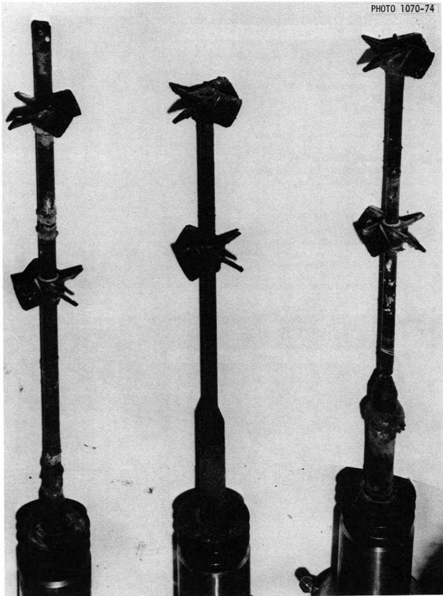  
Fig. 14.2. Photograph of agitator shafts removed from MTE-3 equipment.

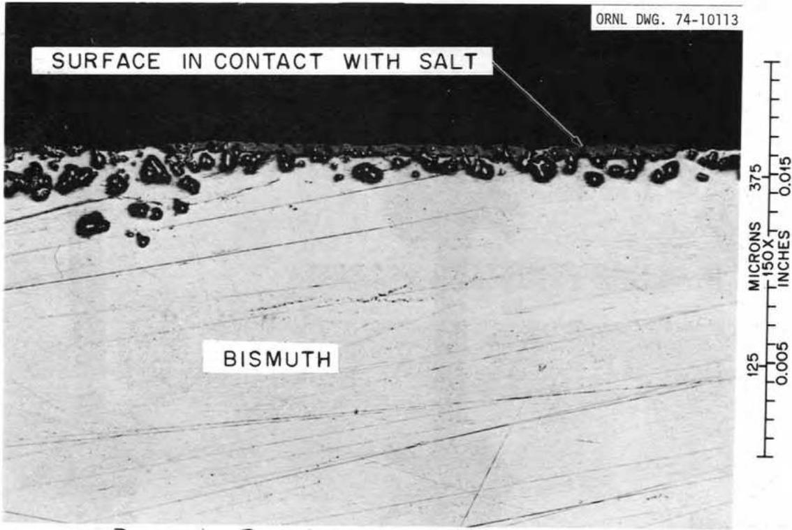  
Fig. 14.3. Photomicrograph of the Bi-Th phase from the contactor at the fluoride salt interface, MTE-3.

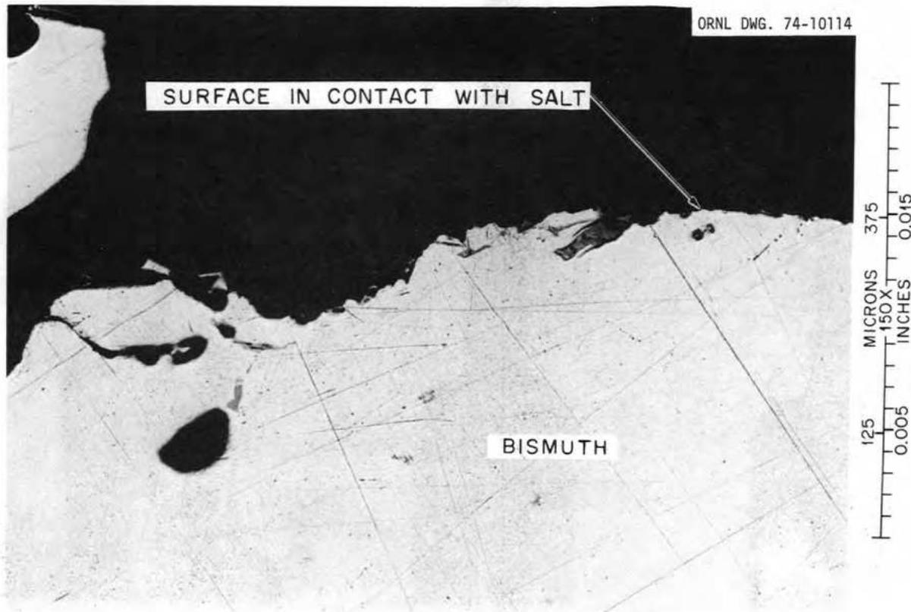  
Fig. 14.4. Photomicrograph of the Bi-Th phase from the contactor at the LiCl interface, MTE-3.

high concentration of $\mathrm{ThO_2}$ was found in the LiCl at this interface. Although no thorium should have been present during most of the operating time, the thorium could be expected to combine with any oxides present when the fluoride salt (containing Th) was entrained into the chloride salt.

No oxides were detected at the LiCl-Bi-Th interface in the contactor. The analysis of the mass transfer rates observed during this experiment sug

gusted that some hindrance of mass transfer was occurring at this interface. Oxide films were suspected. However, analyses of the material near this interface do not support the theory that oxide films at the LiCl-Bi-Th interface slowed down the mass transfer.

The samples taken for x-ray diffraction analysis were extremely small (of the order of $2 - 3\mathrm{mm}^3$ material was removed from the interface for each sample)

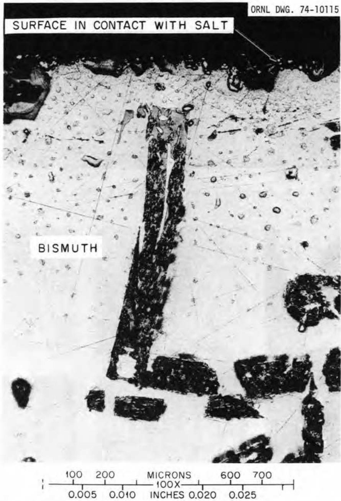  
Fig. 14.5. Photomicrograph of the Li-Bi phase from the stripper at the LiCl interface, MTE-3.

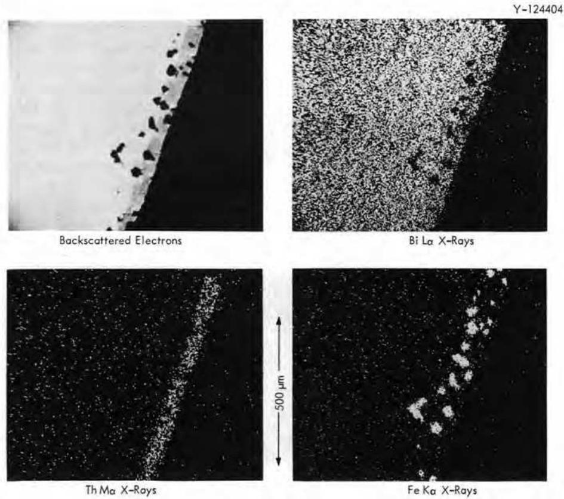  
Fig. 14.6. Electron beam scanning images of elements in the Bi-Th phase, MTE-3 contactor.

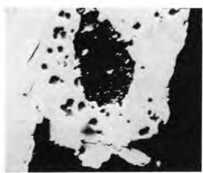  
Backscattered Electrons

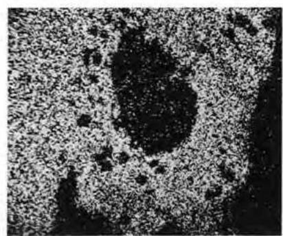  
Bi La X-Roys

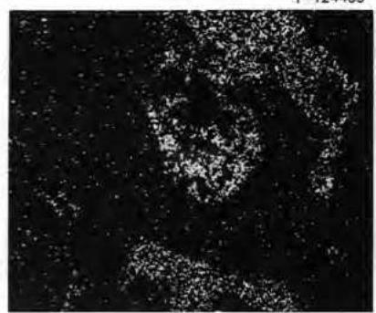  
Th Ma X-Rays

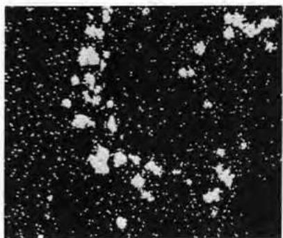  
Fe Ka X-Rays

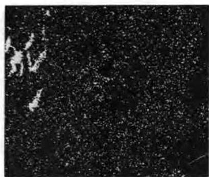  
Mn K a X-Roys

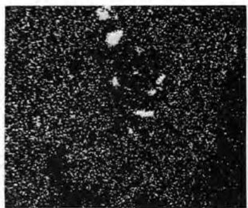  
La La X-Rays

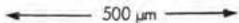  
Fig. 14.7. Electron beam scanning images of elements in the Bi-Th phase at the fluoride salt interface, MTE-3 contactor.

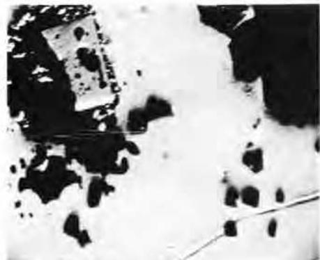  
Backscattered Electrons

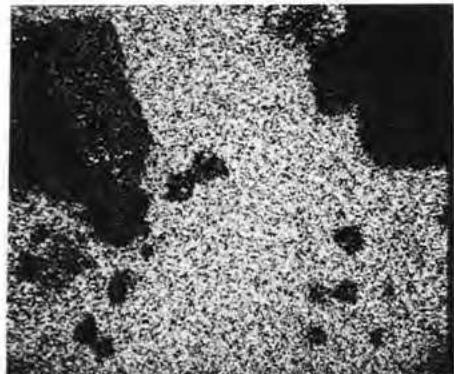  
BiLa X-Rays

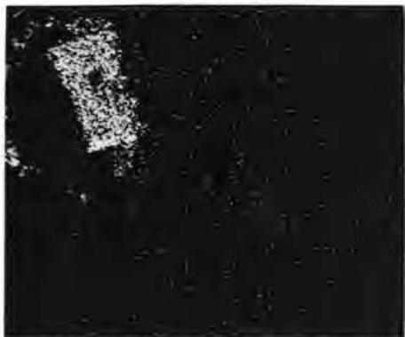  
ThMa X-Roys

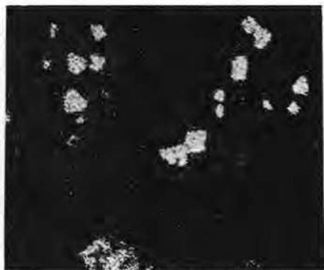  
Fe Ka X-Rays   
Fig. 14.8. Electron beam scanning images of elements in the Li-Bi phase at the LiCl interface, MTE-3 stripper.

and effects of segregation during freezing will make interpretation of results of these analyses very difficult. For instance, in the sample of LiCl from the interface in the stripper vessel, no LiCl was detected.

Bismuth was detected in each of the salt samples analyzed by x-ray diffraction. It is likely that during freezing bismuth was forced into the already frozen salt and was not present in the salt when both phases were molten.

Petrographic examination was made of a sample of the fluoride salt from the contactor at a point near the Bi-Th phase and the tank wall. This examination indicated that the sample was predominately crystals of $3\mathrm{LiF}\cdot \mathrm{ThF}_4$ .From the phase diagram of the 72-16- 12 mole $\%$ LiF-BeF2-ThF4, the 3 LiF-ThF4 would be expected to crystalize from solution on cooling.

Samples of the Bi-Th, Li-Bi, and LiCl phases taken at or near the salt-metal interfaces contained significant amounts of iron. Significantly lower concentrations of iron were found in samples taken some distance (2 to 8 in.) from the interface (Table 14.2).

Some black material was seen when sampling the LiCl in the stripper about I in. above the LiCl-Li-Bi

interface. We were able to separate some of this black material (about $1/2\mathrm{g}$ ) from the salt for analysis. Chemical analysis of the material gave the following composition (wt $\%$ ): bismuth, 52.7; thorium, 18.7; chlorine, 4.1; lithium, 2.8; fluorine, 2.4; iron, 0.26; and beryllium, 1 ppm.

These constituents total $81\%$ and leave $19\%$ unaccounted for. No other elements, excepting the possibility of oxygen or water contamination, are known to be present in the system. If one assumes that the remainder is predominantly oxygen, this amount would be sufficient to form oxides and/or hydroxides of all of the cationic species (Bi, Th, Li, Fc). The gram equivalent of these species is about 0.015 while the anion gram equivalent of iron and chlorine is only 0.0025. For $19\mathrm{wt}\%$ oxygen in the material, the oxygen gas equivalent is 0.024 or 0.011 of hydroxide.

A section of the Li-Bi-LiCl across the interfacial area in the stripper (which included the layer of different structure between the Li-Bi and LiCl) was examined by scanning electron microscopy. Scanning electron photomicrographs at magnifications of

Table 14.1. Results of x-ray diffraction analyses of material removed from vicinity of salt-metal interfaces in experiment MTE-3   

<table><tr><td>Phase</td><td>Identified material</td><td>Approximate composition(wt%)\( ^a \)</td></tr><tr><td rowspan="4">LiCl in stripper</td><td>Bi</td><td>25-50</td></tr><tr><td>\( Li_3ThF_7 \)</td><td>10-30</td></tr><tr><td>\( ThO_2 \)</td><td>40-80</td></tr><tr><td>unidentified solid solution</td><td></td></tr><tr><td rowspan="2">Li-Bi alloy in stripper</td><td>Bi</td><td>75-95</td></tr><tr><td>\( BeF_2 \)</td><td>2-10</td></tr><tr><td>Bi-Th in contact with LiCl in contactor</td><td>Bi</td><td>90%</td></tr><tr><td rowspan="3">LiCl in contactor</td><td>Bi</td><td>30-70</td></tr><tr><td>LiCl</td><td>30-70</td></tr><tr><td>\( Li_3ThF_7 \)</td><td>10-30</td></tr><tr><td rowspan="3">Fluoride salt in contactor</td><td>Bi</td><td>20-40</td></tr><tr><td>\( Li_3ThF_7 \)</td><td>40-80</td></tr><tr><td>\( Li_7Th_6F_{31} \)</td><td>5-15</td></tr><tr><td rowspan="3">Bi-Th in contact with fluoride salt in contactor</td><td>Bi</td><td>60-90</td></tr><tr><td>Th (unidentified compound)</td><td></td></tr><tr><td>Fe (no x-ray data available)</td><td>trace</td></tr></table>

${}^{a}$ X-ray diffraction can only detect $> 5\%$ .

Table 14.2. Iron in samples of metal and salt phases from metal transfer experiment MTE-3 at various distances from the metal-salt interfaces   

<table><tr><td>Material</td><td>Location</td><td>Iron (ppm)</td></tr><tr><td rowspan="4">Bi-Th</td><td colspan="2">Contactor, LiCl side</td></tr><tr><td>~1/8 in. from interface</td><td>2500</td></tr><tr><td>~2 in. from interface</td><td>18</td></tr><tr><td>~4-1/2 in. from interface</td><td>17</td></tr><tr><td rowspan="4">Bi-Th</td><td colspan="2">Contactor, fluoride salt side</td></tr><tr><td>~1/4 in. from interface</td><td>1100</td></tr><tr><td>~2 in. from interface</td><td>37</td></tr><tr><td>~4 in. from interface</td><td>9</td></tr><tr><td rowspan="4">Li-Bi</td><td colspan="2">Stripper</td></tr><tr><td>≤1/8 in. from interface</td><td>1400</td></tr><tr><td>~2 in. from interface</td><td>108</td></tr><tr><td>~5 in. from interface</td><td>7</td></tr><tr><td rowspan="5">LiCl</td><td colspan="2">Stripper</td></tr><tr><td>~1/2 in. from interface</td><td>650</td></tr><tr><td>~1 in. from interface</td><td>200</td></tr><tr><td>~6-3/4 in. from interface</td><td>115</td></tr><tr><td>~8-3/4 in. from interface</td><td>35</td></tr><tr><td rowspan="2">LiF-BeF2-ThF4(72-16-12 mole %)</td><td colspan="2">Contactor</td></tr><tr><td>~1/8 in. from interface</td><td>320, 88&quot;</td></tr></table>

Results of two different samples. All other results are for one sample.

20, 100, 500, and $2000\times$ were taken of the interface (Fig. 14.9). These photographs were taken of the rough polished surface. No identifiable film or foreign material can be seen at the interface in these photomicrographs.

X-ray fluorescence analyses were made at five locations across the LiCl-Li-Bi interface and are identified as 1, 2, 3, 4, and 5 on the $20\times$ photomicrograph of Fig. 14.9. Results are given below:

1. In the LiCl some distance from Bi-LiCl boundary, some Th and a small amount of Bi and La were detected.

2. In the LiCl near the Bi-LiCl boundary, very small amounts of Th, Fe, and Bi were detected.

3. On the Bi-LiCl boundary Th and Fe as well as Bi and Cl were detected.   
4. In the Bi area near the Bi-LiCl boundary, large amounts of Th, Fe, and Cl as well as the Bi were detected.   
5. In the Bi area some distance from the Bi-LiCl boundary, only Bi was detected.

The presence of iron (or iron oxides) at or near the interface is consistent with the relative densities of bismuth $(9.6\mathrm{g} / \mathrm{cm}^3)$ and iron $(7.6\mathrm{g} / \mathrm{cm}^3)$ or possibly iron oxides (about $5.5\mathrm{g} / \mathrm{cm}^3$ that would be expected to come out of solution during cooling of the bismuth phase.

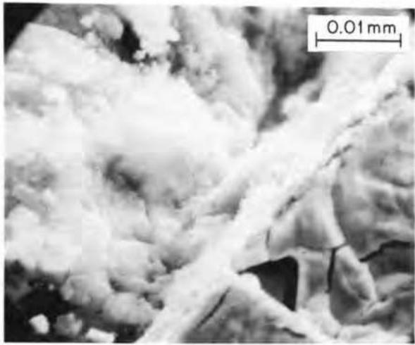  
MAG.2000X

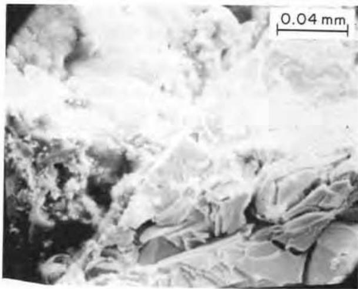  
ORNL DWG. 74-10116   
MAG.500X

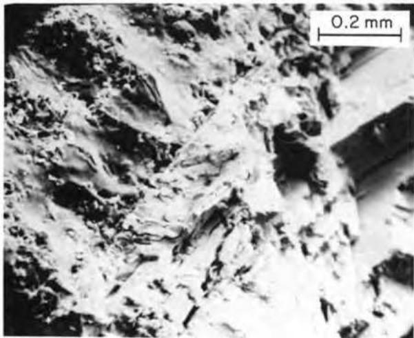  
MAGIOO X

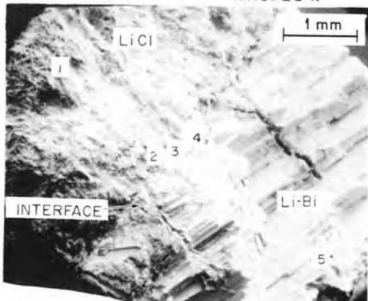  
MAG 20x   
Fig. 14.9. Scanning electron photomicrographs of the interface between LiCl and Li-Bi in the stripper from experiment MTE-3. Unpolished.

Firm conclusions cannot be drawn about the relationship of these observations to the low mass transfer rates seen in experiment MTE-3. The transfer of fluoride salt into the chloride salt just prior to shutdown and the length of time between shutdown and inspection (from February 1973 to February 1974) introduce a great deal of uncertainty into the interpretation of the analyses.

# 14.2 INSTALLATION OF METAL TRANSFER EXPERIMENT MTE-3B

H. C. Savage

Wc plan to continue studies of the mass transfer rates of rare earths between fuel carrier salt, bismuth, and lithium chloride in a new experiment dcsignated MTE-3B. New vessels, salts, and bismuth will be used.

During this report period fabrication and assembly of new carbon steel vessels was completed. An oxidation resistant protective coating, METCO No. P443-10, about 0.015 in. thick was applied to the outside surfaces of the carbon steel vessels and interconnecting lines to prevent air oxidation at the operating temperature of $650^{\circ}\mathrm{C}$ . A new pump for transferring fuel carrier salt between the salt reservoir and contactor was fabricated and installed. New molybdcnum agitator shafts and blades have also been obtained.

The vccells and their contents (fuel carrier salt, lithium chloride, and bismuth) previously used in experiment MTE-3 were removed from Bldg. 3541 and sent to the burial ground for disposal. The new vessels have been installed and we are renovating the experimental area where the metal transfer experiment is located. The renovation includes rerouting some of the service lines to improve access to sampling stations; relocation of some pressure gauges, flowmeters, and valves for better visibility and access; calibration and replacement (where required) of pressure gauges, flowmeters and solenoid valves; and recalibration of temperature controller and recorders.

We have completed tests on two different oxidation-resistant protective coatings using a different method of application for each type coating. The coatings were applied to test sections made from longitudinal half-sections of 6-in. sched 40 mild steel pipe. The test sections were coated on all exposed surfaccs. One test piece was coated with the nickel aluminide material (METCO No. M405-10 wire) by

flame spraying with a wire gun to obtain a coating thickness of $\sim 0.010$ in. duplicating the coating used on the MTE-3 vessels. The second test piece was coated with a nickel chromium alloy containing $6\%$ aluminum (METCO No. P443-10 powder) applied with a plasma spray gun to a thickness of about 0.010 in. as recommended by the manufacturer. The two pieces were placed on fire bricks inside a furnace and heated to the test temperature. During the test, the pieces were thermally cycled several times by cooling the furnace to about $100^{\circ}\mathrm{C}$ , then returning to the test temperature.

The initial test temperature was $700^{\circ}\mathrm{C}$ . After about 400 hr at $700^{\circ}\mathrm{C}$ with eight thermal cycles the pieces were examined, weighed, and photographed (Fig. 14.10a). The M405-10 coating was covered extensively with rust-colored oxidation product, but there was no sign of spalling of the coating. The piece coated with P443-10 had a much better appearance with onc edge showing a rust color. Weight gain of the P443-10 test coated test piece was about $7.3\mathrm{mg/cm}^2$ while the M405-10 coating gained about $10.3\mathrm{mg/cm}^2$ .

The test temperature was then increased to $815^{\circ}\mathrm{C}$ for evaluation at a higher temperature. The test was continued for 520 hr at $815^{\circ}\mathrm{C}$ with eight thermal cycles to $100^{\circ}\mathrm{C}$ . The test pieces were again examined, weighed, and photographed (Fig. 14.10b). The M405-10 coating had deteriorated to the point where spalling had occurred, while the P443-10 coating had no spalling except along one edge where there was some rust-colored oxidation product and some spalling. Total weight gain of the M405-10 coated test piece was $69.2\mathrm{mg/cm}^2$ and $20.5\mathrm{mg/cm}^2$ for the P443-10 test piece. Metallographic examinations were made of the best and worst appearing areas of the two specimens. In the best appearing areas, both coatings were adherent, but a thin layer of oxide formed at the metal-coating interface of the specimen coated with METCO M405-10. This indicates that oxygen diffused through the coating. The metal-coating interface of the specimen coated with METCO P443-10 was free of visible oxide, indicating that it is a good barrier to oxygen diffusion. For the worst areas of both coatings, oxide at the metal-coating interfaces did cause some spalling where the coating may not have been thick enough to prevent oxygen diffusion through the coatings. The oxide that formed underneath the P443-10 coating (in a spalled area occurring only along one edge) appeared to be more dense and protective than that formed on the M405-10 coated specimen. This indicates that some of the

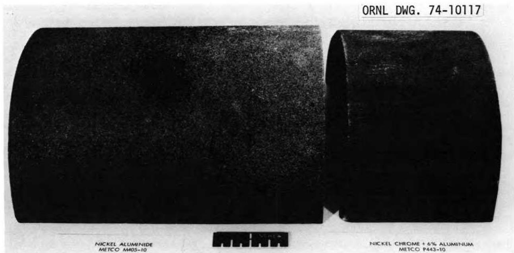  
(a)

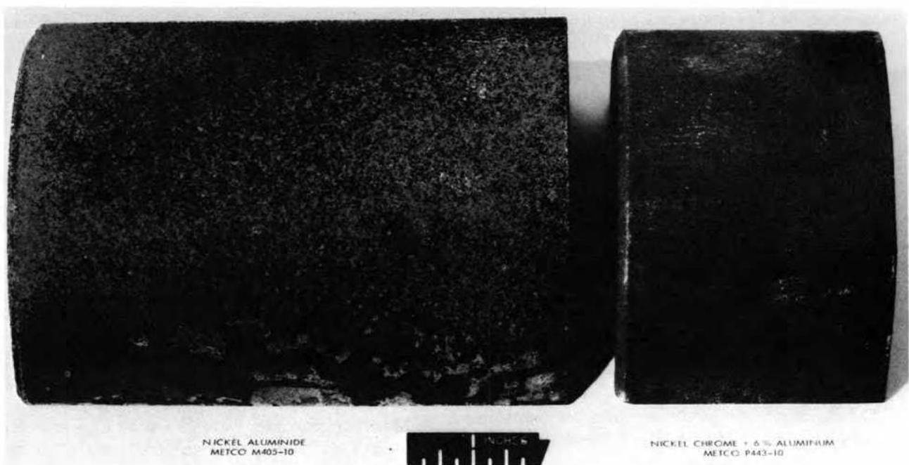  
(b)   
Fig. 14.10. Photographs of 6-in. sched 40 mild steel pipe with oxidation resistant protective coatings: (a) after 400 hr at $700^{\circ}\mathrm{C}$ in air, (b) after an additional 500 hr at $815^{\circ}\mathrm{C}$ in air.

elements in the P443-10 coating may have diffused into the base metal and imparted a measure of protection even though the coating had separated in this area.

This limited test clearly demonstrated the superiority of the plasma spray P443-10 coating over M405-10 wire gun sprayed material previously used for the MTE-3 vessel, and the plasma spray coating has been applied to the external surfaces of the MTE-3B vessels that will operate at elevated temperatures.

# 14.3 DESIGN OF THE METAL TRANSFER PROCESS FACILITY

W. L. Carter

H. C. Savage

Design of the metal transfer process facility in which the fourth metal transfer experiment (MTE-4) will be carried out was under way when the MSR program was terminated in 1973. Briefly, MTE-4 is an engineering experiment that will use salt flow rates that are 5 to $10\%$ of the rates required for processing a 1000-MWe MSBR. Conceptual designs of the three-stage salt-metal contactor, made of graphite, and its containment vessel were completed. The primary purposes of MTE-4 are:

1. Demonstration of the removal of rare-earth fission products from MSBR fuel carrier salt and accumulation of these materials in a Li-Bi solution in equipment of a significant size;   
2. Determination of mass transfer coefficients between mechanically agitated salt and bismuth phases;   
3. Determination of the rate of removal of rare earths from the fluoride salt in multistage equipment;   
4. Evaluation of potential materials of construction, graphite in particular;   
5. Testing of mechanical devices, such as pumps and agitators, that will be required in a processing plant; and   
6. Development of instrumentation for measurement and control of process variables such as salt-metal interface location, salt flow rate, and salt or bismuth liquid level.

We are currently reviewing the design of metal transfer experiment MTE-4. A mathematical model

of the system has been devised, and a computer program has been written to simulate transient operation of the experiment. Computations can be made to determine the concentration of each nuclide being transferred at each stage and at the feed and receiving vessels as a function of operating time. The program allows the experimenter to make parametric studies for such design features as interfacial area, number of stages, flow rates, agitator speed, and inventorics of materials. The program (METTRAN) is being used to analyze the MTE-4 experiment to ascertain the significance of various design features on metal transfer rates in order to fix optimal design conditions.

Due to space limitations in Bldg. 4505, we are planning to locate MTE-4, along with several of the engineering experiments on molten-salt processing in the MSRE Building (7503). General cleanup and checkout of existing building services (electrical circuits, ventilation, and air filtration systems) is under way. A 480-V, 3-phase, $60\mathrm{Hz}$ , 300-kW diesel generator will be installed in the existing generator building at the MSRE site to provide emergency power for maintaining portions of engineering experiments which contain salt or bismuth at temperatures above the liquidus temperatures. A purchase order for the generator set has been issued and the system design has been completed.

# 14.4 SALT-METAL CONTACTOR DEVELOPMENT: EXPERIMENTS WITH A MECHANICALLY AGITATED NONDISpersING CONTACTOR IN THE SALT-BISMUTH FLOW-THROUGH FACILITY

J. A. Klein C. H. Brown, Jr. J. R. Hightower, Jr.

Mechanically agitated nondispersing contactors are being considered for extracting protactinium and the rare-earth fission products from the fuel-carrier salt of a molten-salt breeder reactor into molten bismuth that contains dissolved reductant.

Mass transfer rates were measured in a mild steel contactor that was fabricated and installed in the Salt-Bismuth Flow-through Facility. This experimental system allows (1) periodic purification of the feed salt and metal, (2) removal of surface contamination from the salt-metal interface, and (3) variance of the distribution ratio of the material interest between the salt and bismuth.

The new stirred interface contactor uses the existing piping equipment and instrumentation pres

ent in the Salt-Bismuth Flow-through Facility that was used to study salt-bismuth flow in packed columns.10-14 A simplified flow diagram of the facility is shown in Fig. 14.11. The facility consists of five vessels, the associated piping, and the contactor assembly. The vessels consist of a salt-feed tank, a salt-collection tank, a bismuth-feed tank, a bismuthcollection tank, and a vessel (the treatment vessel, T5) for sparging both salt and metal with mixtures of HF and $\mathbf{H}_2$ .To conserve space, feed and collection tanks for both salt and metal are concentric tanks. Feed and collection tanks and piping are made of low-carbon steel, and the treatment vessel is made of stainless steel and has a graphite liner.

A diagram of the contactor is shown in Fig. 14.12. The contactor consists of a 6-in.-diam low-carbon steel vessel that contains four 1-in.-wide vertical baffles. The agitator consists of two 2 7/8-in.-diam stirrers with four 3/4-in.-wide noncanted blades. A 3/4-in.-diam overflow at the interface allows the removal of interfacial films with the salt and metal effluent streams. Salt and bismuth are fed in the contactor below the surface of the respective phase. The system was operated in essentially the same manner as that employed with the packed column.[10-14] The salt and bismuth phases were equilibrated prior to an experiment. After transfer of the salt and metal phases to the feed tanks,[97] Zr and $^{237}\mathrm{U}$ tracers were added to the salt. With this technique, the rates at which $^{97}\mathrm{Zr}$ and $^{237}\mathrm{U}$ tracers transfer from the salt to the bismuth could be measured in a system that was otherwise at chemical equilibrium.

The experimentally determined data from the system are sufficient to allow three independent expressions for the overall mass transfer coefficient to be derived for the contactor in the Salt-Bismuth Flow-through Facility from steady-state material balance relationships. These expressions for the

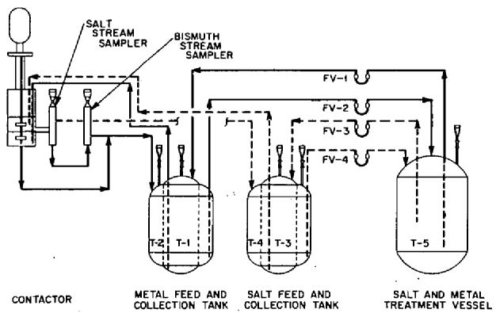  
ORNL DWG 74-694RI   
Fig. 14.11. Flow diagram of the Salt-Bismuth Flow-through Facility with the mechanically agitated contactor installed.

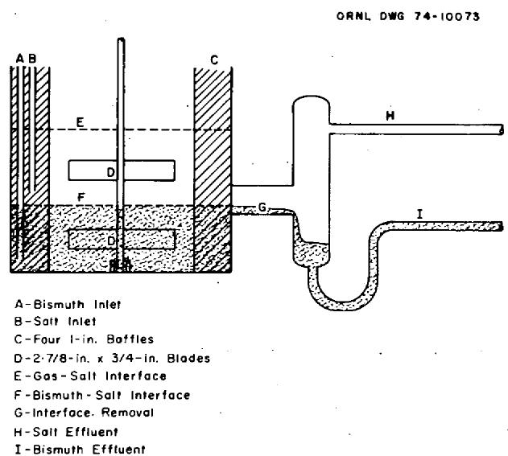  
Fig. 14.12. Diagram of the mechanically agitated nondispersing contactor installed in the Salt-Bismuth Flow-through Facility.

overall mass transfer coefficient are given below in terms of the measured quantities $C_1, C_s, C_m, F_1, F_2, D,$ and $A$ :

$$
K _ {s _ {1}} = \frac {F _ {1} [ 1 - \left(C _ {s} / C _ {1}\right) ]}{A \left(C _ {s} / C _ {1}\right) + (A / D) \left(C _ {s} / C _ {1}\right) \left(F _ {1} / F _ {2}\right) - (A / D) \left(F _ {1} / F _ {2}\right)}. \tag {1}
$$

$$
K _ {s _ {2}} = \frac {F _ {2} \left(C _ {m} / C _ {1}\right)}{A - A \left(C _ {m} / C _ {1}\right) \left(F _ {2} / F _ {1}\right) - \left(C _ {m} / C _ {1}\right) (A / D)}, \tag {2}
$$

and

$$
K _ {s _ {3}} = \frac {F _ {2} \left(C _ {m} / C _ {s}\right)}{A - \left(C _ {m} / C _ {s}\right) (A / D)}. \tag {3}
$$

where

$F_{1} =$ flow rate of salt, $\mathrm{cm}^3 /\mathrm{sec}$

$F_{2} =$ flow rate of metal, $\mathrm{cm}^3 /\mathrm{sec}$

$C_1 =$ tracer concentration in salt inflow, units/cm³,

$C_s =$ tracer concentration in salt outflow, units/cm³,

$C_{m} =$ tracer concentration in metal outflow, units $\mathrm{cm}^3$

$A =$ interfacial area, $\mathbf{cm}^2$

$D =$ distribution coefficient $=$ ratio of concentration in metal phase to concentration in salt phase at equilibrium, $(\mathrm{moles} / \mathrm{cm}^3)$ $\mathrm{(moles / cm^3)}$

The subscripts 1, 2, and 3 on $K_{s}$ indicate the equation used to evaluate the overall mass transfer coefficient $K_{s}$ . The overall mass transfer coefficient is related to the mass transfer coefficients in the individual phases through the relation

$$
1 / K _ {s} = 1 / k _ {s} + 1 / \left(D k _ {m}\right), \tag {4}
$$

where

$K_{s} =$ overall mass transfer coefficient based on saltphase concentrations, cm/sec,

$k_{s} =$ individual mass transfer coefficient in salt phase, $\mathrm{cm / sec}$

$k_{m}$ = individual mass transfer coefficient in metal phase, cm/sec.

Within experimental error, the distribution coefficient $D$ can be set as desired. To minimize effects of uncertainties in the value of $D$ on the calculated value of the overall mass transfer coefficient, $D$ should be made fairly large. For the values of concentrations and flow rates used in these experiments, the terms which contain $D$ in Eqs. (1), (2), and (3) are less than 5% of the values of the other terms for values of $D$ greater than 20 and can be neglected with little error. By assuming that the terms that contain $D$ can be neglected, Eqs. (1), (2), and (3) reduce to

$$
K _ {s _ {1}} = \frac {F _ {1}}{A} \left[ \frac {1 - \left(C _ {s} / C _ {1}\right)}{\left(C _ {s} / C _ {1}\right)} \right] \tag {5}
$$

$$
K _ {s _ {2}} = \frac {F _ {2}}{A} \left[ \frac {\left(C _ {m} / C _ {1}\right)}{1 - \left(F _ {2} / F _ {1}\right) \left(C _ {m} / C _ {1}\right)} \right] \tag {6}
$$

and

$$
K _ {s _ {3}} = \left(F _ {2} / A\right) \left(C _ {m} / C _ {s}\right). \tag {7}
$$

Uncertainties in the distribution coefficient do not affect the accuracy of the overall mass transfer coefficient. However, as shown by Eq. (4), when $D$ is very large, the overall mass transfer coefficient is essentially the individual salt-phase coefficient, since resistance to mass transfer in the metal phase is negligible in comparison.

Six runs have been completed to date, and all runs were performed by using the same procedure. While the fluoride salt and bismuth are in contact in T5, the treatment vessel, sufficient beryllium is added electrolytically to the salt to produce the desired distribution coefficient, $D$ . Since complete exclusion of oxidants is impossible, beryllium must be added periodically to maintain a relatively high distribution coefficient. Salt and bismuth are transferred periodically throughout the system to keep the system in equilibrium.

Before a run, the salt and bismuth phases are separated by pressurizing the salt-bismuth purification vessel and transferring salt and bismuth to their respective feed tanks. Approximately $7\mathrm{mCi}$ of ${}^{97}\mathrm{Zr}-{}^{97}\mathrm{Nb}$ and 50 to $100\mathrm{mCi}$ of ${}^{237}\mathrm{U}_{3}\mathrm{O}_{8}$ are allowed to dissolve in the salt phase about $2\mathrm{hr}$ prior to an experiment.

Salt and bismuth streams are passed through the contactor vessel at the desired flow rates by controlled pressurization of the salt and bismuth feed tanks. The contactor is maintained at about $590^{\circ}\mathrm{C}$ for all runs. Both phases exit through a common overflow line, separate, and return to the salt and bismuth catch vessels. Both exit streams are sampled periodically by means of flowing-stream samplers installed in the exit lines from the contactor.

Samples were analyzed by first counting the sample capsules for the radioactivity of $^{237}\mathrm{U}$ (207.95 keV $\beta^{-}$ ) and the radioactivity of $^{97}\mathrm{Zr}-^{97}\mathrm{Nb}$ (743.37 keV and 658.18 keV $\beta^{-}$ , respectively) after secular equilibrium was reached between $^{97}\mathrm{Zr}$ and its daughter, $^{97}\mathrm{Nb}$ . The material in the sample capsules was then dissolved and the radioactivity of $^{237}\mathrm{U}$ was counted again after the $^{97}\mathrm{Zr}-^{97}\mathrm{Nb}$ radioactivity had decayed to a very low level. This procedure was followed to correct for self-adsorption in the solid samples. Mass transfer rates were then calculated from the ratios of tracer concentrations, as discussed previously.

Results of measurements of overall mass transfer coefficients are shown in Table 14.3. Three different equations for calculating mass transfer coefficients were used to determine the results for any one run, and the results are presented as an average of three calculated values with the standard deviation. Values are given both for results based on the uranium counting data and for results based on the zirconium counting data.

Run TSMC-1 was mainly a preliminary run designed to test the procedure. Salt and bismuth flows were about $200\mathrm{cm}^3/\mathrm{min}$ , and the stirrer rate was 123 rpm. Unfortunately, the distribution coefficient was too low to effect any significant mass transfer; thus, mass transfer rates could not be determined accurately; thus, Table 14.3 does not include results for this run.

During run TSMC-2 the equipment operated very smoothly. The salt and bismuth flow rates were 228 and $197~\mathrm{cm}^3 /\mathrm{min}$ , respectively. The distribution coefficients were higher than for the previous run but were lower than desired with a concomitant large degree of uncertainty. Several determinations of $D_{\mathbf{U}}$ were made in a range of 0.94 to 34. One determination of $D_{Zr}$ gave the value 0.96. Consequently, only a range of possible values for the overall mass transfer coefficient could be stated for the results based on uranium. A value for overall mass transfer coefficient based on zirconium is given, but, since the value for $D_{Zr}$ must be considered to be uncertain, more uncertainty exists in the mass transfer coefficient than is indicated by the reported standard deviation given in Table 14.2.

If one assumes that the ratio of salt-side mass transfer coefficient to bismuth-side mass transfer coefficient can be determined from the Lewis correlation, then for the results based on zirconium, the salt-side mass transfer coefficients for run TSMC-2 are higher than the overall mass transfer coefficient by a factor of 1.55.

A bismuth-line leak occurred immediately preceding run TSMC-3. During the resulting delay for repairs, the $^{97}\mathbf{Zr}$ decayed and only the $^{237}\mathrm{U}$ tracer could be used. The remainder of the run went smoothly. Salt and bismuth flow rates were 166 and $173\mathrm{cm}^3/\mathrm{min}$ , and the stirrer rate was $162\mathrm{rpm}$ . A high value for $D_{\mathrm{U}}$ (greater than 34) was maintained for this run.

In run TSMC-4, flow rates of 170 and $144~\mathrm{cm}^3/\mathrm{min}$ were set for the salt and bismuth flows, and a stirrer rate of 205 rpm was maintained. The distribution coefficients as determined from samples taken before, after, and during the run were greater than 172 for $D_{\mathrm{U}}$ and greater than 24 for $D_{\mathrm{Zr}}$ . This value is large enough to make Eqs. (5), (6), and (7) valid. Large distribution coefficients cannot be determined precisely due to the inability to determine very small amounts of uranium in the salt phase. No problems arose during this run.

Runs TSMC-5 and TSMC-6 were performed without incident. The distribution coefficients were maintained at high levels for both runs. Run TSMC-5 had a stirrer rate of $124\mathrm{rpm}$ and salt and bismuth flows of 219 and $175~\mathrm{cm}^3 /\mathrm{min}$ . Salt and bismuth flows for run TSMC-6 were 206 and $185~\mathrm{cm}^3 /\mathrm{min}$ , respectively, with a stirrer rate of $180~\mathrm{rpm}$ .

As mentioned previously, when the distribution coefficient is large, the overall mass transfer coefficient is essentially the individual salt-phase mass transfer coefficient. Thus, results for runs TSMC-3 through TSMC-6 can be compared directly with the Lewis correlation. The Lewis correlation for mass transfer in the nondispersing contactor is

$$
6 0 k _ {1} / \nu_ {1} = (6. 7 6 \times 1 0 ^ {- 6}) \left[ R e _ {1} + R e _ {2} \left(\eta_ {2} / \eta_ {1}\right) \right] ^ {1. 6 5} +! \tag {8}
$$

where

$k =$ individual mass transfer coefficient, $\mathrm{cm} / \mathrm{sec}$ - $\nu =$ kinematic viscosity $(\eta /\rho)$ $\mathrm{cm}^2 /\mathrm{sec}$

Table 14.3. Experimental results from the salt-metal contactor   

<table><tr><td rowspan="2">Runa</td><td rowspan="2">Salt flow (cm3/min)</td><td rowspan="2">Bismuth flow. (cm3/min)</td><td rowspan="2">Stirrer rate (rpm)</td><td rowspan="2">D1</td><td rowspan="2">DZr</td><td rowspan="2">Fraction of tracer transferredb</td><td colspan="2">Ks(cm/sec)</td></tr><tr><td>Based on U</td><td>Based on Zr</td></tr><tr><td>TSMC-2</td><td>228</td><td>197</td><td>121</td><td>0.94 to 34</td><td>0.96</td><td>0.17</td><td>0.0059 to 0.0092</td><td>0.0083±0.0055</td></tr><tr><td>TSMC-3</td><td>166</td><td>173</td><td>162</td><td>&gt;34</td><td></td><td>0.50</td><td>0.012 ± 0.003</td><td></td></tr><tr><td>TSMC-4</td><td>170</td><td>144</td><td>205</td><td>&gt;172</td><td>&gt;24</td><td>0.78</td><td>0.054 ± 0.02</td><td>0.035 ± 0.02</td></tr><tr><td>TSMC-5</td><td>219</td><td>175</td><td>124</td><td>&gt;43</td><td>&gt;24</td><td>0.35</td><td>0.0095 ± 0.0013</td><td>0.0163±0.0159</td></tr><tr><td>TSMC-6</td><td>206</td><td>185</td><td>180</td><td>&gt;172</td><td>&gt;24</td><td>0.64</td><td>0.049 ± 0.02</td><td>0.020 ± 0.01</td></tr></table>

Turbulent salt-metal contactor. Fraction of tracer transferred $= 1 - C_{s} + C_{l}$

$$
\rho = \text {d e n s i t y}, \mathrm {g} / \mathrm {c m} ^ {3},
$$

$\eta =$ viscosity,poises,   
$Re = nd^{2} / \nu$ , dimensionless,   
$\dot{a} =$ agitator diameter, cm,   
$n =$ agitator speed, rps.

The subscripts 1 and 2 refer to salt and bismuth, respectively. Fig. 14.13 shows a comparison of the measured values of mass transfer coefficient with the Lewis correlation. The effects of mass transfer resistance in the bismuth phase cannot be accounted for accurately in the results of run TSMC-2; thus, these results are not included in Fig. 14.13.

Figure 14.13 shows that two runs produced values of mass transfer coefficients that included 30 to $40\%$ of the values predicted by the Lewis correlation, whereas two runs produced values slightly greater than those predicted by the Lewis correlation. The mass transfer coefficients based on zirconium are consistently lower (though only slightly) than the values based on uranium. The mass transfer coefficients based on zirconium are considered to be less reliable than those based on uranium, since in all runs only about $60\%$ of the ${}^{97}\mathrm{Zr}$ tracer could be accounted for, whereas more than $80\%$ of the ${}^{237}\mathrm{U}$ tracer could

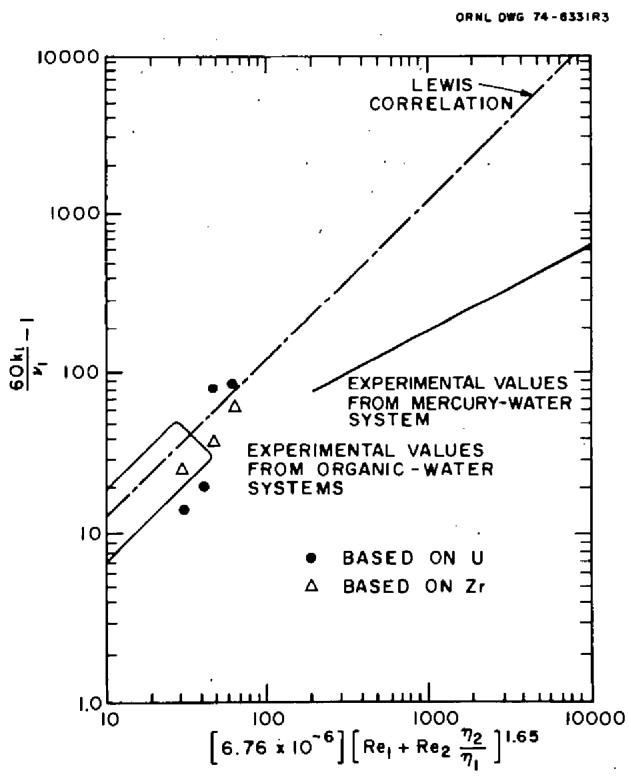  
Fig. 14.13. Experimental results from the salt-bismuth contactor.

be accounted for. This discrepancy is probably related to self-absorption of the $743.37\mathrm{keV}\beta^{-}$ from $^{97}\mathrm{Zr}$ in the bismuth samples.

We believe that at a stirrer speed of 160 to $180~\mathrm{rpm}$ , entrainment of salt into the bismuth begins to occur, and the apparent increase in mass transfer coefficient is a manifestation of an increase in the surface area for mass transfer due to surface motion. Experiments with water-mercury and water-methylene bromide systems support this belief.

If, as Fig. 14.13 indicates, the mass transfer coefficients in the salt-bismuth system are lower than those predicted from the Lewis correlation by a factor of about 0.35, this corrected correlation could be used to estimate the area and the bismuth flow rate required in the rare-earth-removal contactor in the present flowsheet. The Lewis correlation predicts that mass transfer coefficients are approximately proportional to the agitator diameter, $d$ , raised to the 3.30 power. Since studies show that the allowable agitator speed below which no phase dispersal occurs is inversely proportional to $d^{1.43}$ (ref. 16), at speeds slightly below the limiting agitator speed, the mass transfer coefficient appears to be proportional to $d^{0.94}$ . These results were used to estimate the area required for a single-stage contactor and for the bismuth flow rate to remove cerium, which has the shortest removal time (16.6 days) of the rare earths in the reference flowsheet. For a salt flow rate of 0.88 gpm (which corresponds to the 10-day cycle time used in the reference processing flowsheet) and for a distribution coefficient of 0.062 (the distribution coefficient assumed in the reference processing flowsheet), a mass transfer area of 10 ft² will allow removal of cerium on a 16.6-day cycle if the bismuth flow rate through the contactor is 30 gpm and if a 3-ft-diam agitator is used. This bismuth flow rate is only about 2 1/2 times the flow rate specified in the processing plant flowsheet on the basis of equilibrium calculations. For example, use of a higher distribution coefficient and of multiple stages can result in a reduction of either the bismuth flow rate or the mass transfer area. However, these changes will result in changes in other areas of the flowsheet, and more extensive calculations are required to evaluate these effects.

# 14.5 SALT-METAL CONTACTOR DEVELOPMENT: EXPERIMENTS WITH A MECHANICALLY AGITATED NONDISpersing Contactor Using WATER AND MERCURY

C. H. Brown, Jr.

A critical part of the proposed MSBR processing plant is the extraction of rare earths from the fluoride-fuel-carrier salt to an intermediate bismuth stream. One device being considered for this extraction is a mechanically agitated nondispersing contactor in which bismuth and fluoride salt phases are agitated to enhance the mass transfer rate of rare earths across the salt-bismuth interface. Previous reports[15,17,18] have shown that the following reaction in the water-mercury system is suitable for simulating and for studying mass transfer rates in systems with high density differences:

$$
\mathrm {P b} ^ {2 +} \left(\mathrm {H} _ {2} 0\right) + \mathrm {Z n} (\mathrm {H g}) \rightarrow \mathrm {Z n} ^ {2 +} \left(\mathrm {H} _ {2} 0\right) + \mathrm {P b} (\mathrm {H g}). \tag {9}
$$

A large amount of data has been reported $^{15}$ for the water-mercury system under the assumption that the limiting resistance to mass transfer exists entirely in the mercury phase, as suggested by literature correlations. During this report period, a series of experiments was performed in the water-mercury contactor to determine which phase actually controls the rate of mass transfer and also at what concentration of $\mathrm{Pb}^{2+}$ the control of mass transfer changes from one phase to the other.

# 14.5.1 Theory

The reaction under consideration, Eq. (9), is a liquid-phase ionic reaction that occurs entirely at the mercury-water interface, since zinc metal and lead metal are insoluble in water and no ionic lead or zinc can be in the mercury. Because this is a typical ionic reaction, it is assumed to be essentially instantaneous and irreversible. The equilibrium constant for the reaction is given by the equation

$$
K = C _ {\mathrm {P b}} C _ {\mathrm {Z n} ^ {2 +}} / C _ {\mathrm {P b} ^ {2 +}} C _ {\mathrm {Z n}} \tag {10}
$$

where

$K =$ equilibrium constant,   
$C_{\mathrm{Pb}} =$ concentration of Pb metal in mercury, gmole/liter,   
$C_{\mathrm{Pb}^{2+}} = \text{concentration of Pb}^{2+}$ in water, g mole/liter,   
$C_{\mathbf{Zn}} =$ concentration of Zn metal in mercury, gmole/liter,   
$C_{\mathrm{Zn}^{2+}} = \text{concentration of } \mathrm{Zn}^{2+}$ in water, g矿物/liter.

The equilibrium constant is very large, which implies that at equilibrium the ionic lead and metallic zinc cannot coexist at appreciable concentrations at the interface. Since the equilibrium reaction is assumed to be an extremely fast reaction, it must be satisfied at all times near the interface.

For the instantaneous irreversible reaction discussed previously, two situations could occur near the liquid-liquid interface, depending on the relative magnitudes of mass transfer coefficients of the individual phases and on the bulk phase concentrations of the transferring species in each phase.19 Figure 14.14 illustrates these two conditions.

In Fig. 14.14a, the limiting resistance to mass transfer is assumed to occur in the mercury phase. Equating the tranfer rate of equivalents of zinc to the interface to the transfer rate of equivalents of $\mathrm{Pb}^{2+}$ to

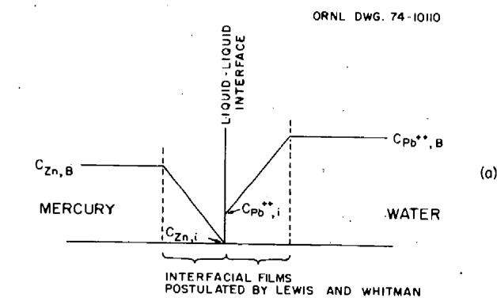

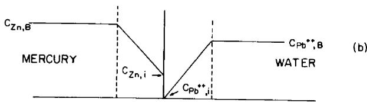  
Fig. 14.14. Interfacial behavior for an instantaneous irreversible reaction occurring between two liquid phases. (a) Mercury phase controlling mass transfer. (b) Water phase controlling mass transfer.

the interface can show that the product of the bulk-phase concentration of reactant and the individual-phase mass transfer coefficient in the phase where the limitation occurs must be less than the product of the bulk-phase concentration of the other reactant and the individual-phase mass transfer coefficient in the other phase. The concentration of zinc in mercury near the interface decreases from the bulk concentration to near zero at the mercury-water interface. The concentration at the interface is very small because of the instantaneous irreversible reaction that occurs at the interface. At the interface in the water phase, the concentration of $\mathrm{Pb}^{2+}$ has a finite value and increases through the interfacial film to the bulk-phase value.

Figure 14.14b illustrates the condition under which the limiting resistance to mass transfer is assumed to occur in the water phase. The explanation of the concentration gradients in the interfacial films is entirely analogous to the case explained above. The concentration profiles of lead in the mercury, $\mathbf{Z}\mathbf{n}^{2+}$ in the water, and $\mathrm{NO}_3^-$ (the anion) in the water are not shown in Fig. 14.14.

Several correlations have been developed and presented in the literature for predicting individual-phase mass transfer coefficients in nondispersing, stirred interface contactors. For the mercury-water system, all these correlations predict that the mercury-phase mass transfer coefficient would be smaller than the water-phase coefficient.

In all previous work done with the mercury-water system,[16,17] the concentrations of the reactants were equal. This condition, coupled with the fact that the mercury-phase mass transfer coefficient was predicted to be significantly smaller than the water-phase coefficient, indicated that the limiting resistance to mass transfer should occur in the mercury phase.

To test the assumption that mass transfer is controlled by the mercury phase, we can write the following relations for transfer of the reactants from the bulk phase to the interface where they react, based on the two-film representation shown in Fig. 14.14:

$$
N _ {\mathrm {Z} n} = k _ {\mathrm {H g}} A \left(C _ {\mathrm {Z} n, \mathrm {B}} - C _ {\mathrm {Z} n, \mathrm {i}}\right), \tag {11}
$$

$$
N _ {\mathrm {P b} ^ {2 +}} = k _ {\mathrm {H} _ {2} \mathrm {O}} A \left(C _ {\mathrm {P b} ^ {2 +}, \mathrm {B}} - C _ {\mathrm {P b} ^ {2 +}, \mathrm {i}}\right) \tag {12}
$$

where

$k =$ individual-phase mass transfer coefficient, cm/sec,

$N =$ rate of mass transfer to the interface, $\mathbf{g} / \sec$

$A =$ interfacial area, $\mathbf{cm}^2$

$C =$ concentration (B denotes bulk-phase concentration, i denotes interfacial concentration), $\mathrm{g / cm^3}$

The subscripts $\mathrm{Hg}$ and $\mathbf{H}_2\mathbf{O}$ indicate the phase being considered. As stated above, we assumed that the rate at which reaction (11) proceeds is controlled by the rate of transfer of zinc through the mercury phase to the interface. The conditions necessary to the validity of this assumption are:

1. The equilibrium constant for the reaction must be large (i.e., the reaction should be irreversible).   
2. The product of the mass transfer coefficient times the bulk concentration of reactant in the phase where the rate of mass transfer is limiting must be less than that product in the other phase.

Since 1 mole of $\mathbf{Z}\mathbf{n}$ is equivalent to 1 mole of $\mathrm{Pb}^{2 + }$ according to Eq. (1), $N_{\mathrm{Pb}^{2 + }} = N_{\mathrm{Zn}}$ . By substituting Eqs. (11) and (12) into this expression and by assuming that the controlling resistance is in the mercury phase, the following expression is obtained for the apparent mercury-phase mass transfer coefficient:

$$
k _ {\mathrm {H g}, \mathrm {A}} = \left[ k _ {\mathrm {H} _ {2} \mathrm {O}} \left(C _ {\mathrm {P b} ^ {2 +}, \mathrm {B}} - C _ {\mathrm {P b} ^ {2 +}, \mathrm {i}}\right) / C _ {\mathrm {Z n}, \mathrm {B}} \right] \tag {13}
$$

where

$k_{\mathrm{Hg},A} =$ apparent individual-phase mass transfer coefficient for the mercury phase, cm/sec, $k_{\mathrm{H_2O}} =$ true individual-phase mass transfer coefficient for the water phase.

In Eq. (13), the actual mass transfer coefficient differs from the apparent mass transfer coefficient only when the mercury phase does not control the rate of mass transfer. The transient method used to determine the mass transfer coefficient has been described previously.[16]

From an argument similar to the one that leads to the development of Eq. (13), an equation for the apparent aqueous-phase mass transfer coefficient can be written for the case where the limiting resistance is in the water.

The concentration of $\mathrm{Pb}^{2+}$ in the water, below which the limiting resistance to mass transfer is in the water (at a fixed concentration of zinc in the mercury), can be determined as follows. If the $\mathrm{Pb}^{2+}$ concentration is sufficiently high, the limiting resistance to mass transfer will be in the mercury, and the interfacial concentration of $\mathrm{Pb}^{2+}$ and $C_{\mathrm{Pb}^{2+},\mathrm{i}}$ will have a finite value. If $C_{\mathrm{Pb}^{2+},\mathrm{B}}$ is lowered by an amount $\Delta$ (not large enough to cause the limiting resistance to change phases), Eq. (13) indicates that $C_{\mathrm{Pb}^{2+},\mathrm{i}}$ must also decrease by the same amount $\Delta$ , which would keep the difference $C_{\mathrm{Pb}^{2+},\mathrm{B}} -$

$C_{\mathrm{Pb}^{2+},\mathrm{i}}$ constant. The water-phase mass transfer coefficient, although the value for which is not known, is assumed to remain constant. If $C_{\mathrm{Pb}^{2+},\mathrm{B}}$ is reduced sufficiently, $C_{\mathrm{Pb}^{2+},\mathrm{i}}$ will decrease to zero, and if $C_{\mathrm{Pb}^{2+},\mathrm{B}}$ is further reduced, $C_{\mathrm{Pb}^{2+},\mathrm{i}}$ will remain zero, and the limiting resistance will change from the mercury phase to the water phase. At high values of $C_{\mathrm{Pb}^{2+},\mathrm{B}}$ , the apparent mercury-phase mass transfer coefficient will remain constant as $C_{\mathrm{Pb}^{2+},\mathrm{B}}$ is lowered to the point where the limiting resistance moves into the water phase. As $C_{\mathrm{Pb}^{2+},\mathrm{B}}$ is further reduced, $C_{\mathrm{Pb}^{2+},\mathrm{i}}$ will be zero or very nearly zero, and Eq. (13) shows that the apparent mercury-phase mass transfer coefficient will vary directly with $C_{\mathrm{Pb}^{2+},\mathrm{B}}$ , since $C_{\mathrm{Zn},\mathrm{B}}$ is fixed, and the true water-phase mass transfer coefficient is assumed to be constant. Figure 14.15 shows this dependence of the apparent mercury-phase mass transfer coefficient on the concentration of $\mathrm{Pb}^{2+}$ in the water. The dependence of the analogously defined apparent water-phase mass transfer coefficient is also shown. Thus, by calculating the apparent mercury-phase mass transfer coefficient as a function of the initial aqueous-phase lead concentration for a single agitator speed, the transition from mercury-phase controlling to aqueous-phase controlling should be identifiable by a change in slope of the line that is determined by plotting the apparent mercury-phase mass transfer coefficient vs the initial aqueous-phase lead concentration.

ORNL DWG. 74-10111

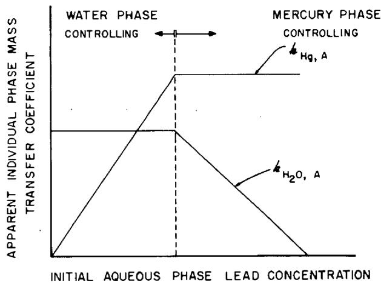  
Fig. 14.15. Theoretical relationship between the apparent mass transfer coefficients and the initial aqueous-phase lead concentration.

# 14.5.2 Experimental Apparatus

A series of mass transfer experiments was performed in a mercury-water contactor to determine the point at which control of mass transfer changes from the mercury phase to the aqueous phase. The experimental apparatus used in the study is shown schematically in Fig. 14.16. The equipment consists of a 5- by 7- by 10-in. (height) Plexiglas vessel that contains two phases, each 3 in. deep. An agitator shaft to which two 4-vaned, flat paddles are attached is suspended from a variable-speed motor. The paddles are positioned at the midpoint of each phase.

In this study, the two phases were 1.8 liters of clean mercury that contained $0.1M\mathrm{Zn}$ and 1.8 liters of distilled water that contained 0.02 to $0.10M$ $\mathrm{Pb(NO_3)_2}$ .

# 14.5.3 Results and Conclusions

Five experiments were run to measure the apparent mercury-phase mass transfer coefficient as a function of the initial aqueous-phase lead concentration. The initial mercury-phase zinc concentration was held constant at $0.1M$ . Phase volumes and agitator speed were also held constant at 1.8 liters and about 150 rpm, respectively.

The experimental results are presented graphically in Fig. 14.17. The apparent mercury-phase mass transfer coefficient decreased for all initial lead concentrations less than those used in previous experiments. This decrease indicates that under these conditions, the limiting resistance to mass transfer does not appear to be in the mercury phase. However,

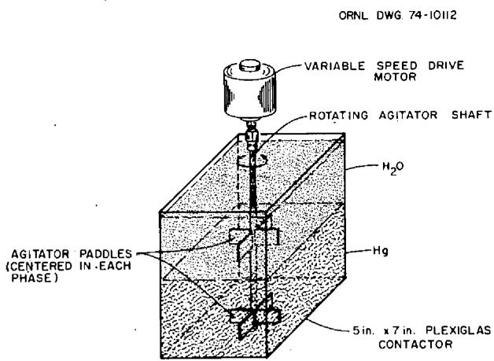  
Fig. 14.16. Schematic diagram of the Plexiglas contactor used for the mercury-water system.

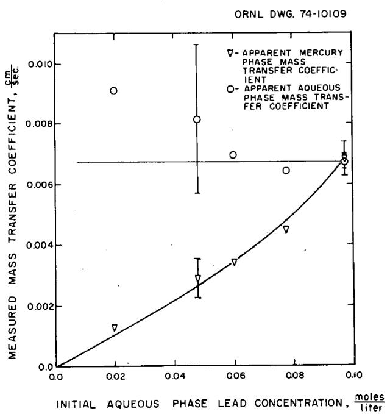  
Fig. 14.17. Experimental results showing the apparent mercury-phase transfer coefficients as a function of the initial aqueous lead concentration at constant agitator speed.

based on the one point at the lowest $\mathrm{Pb}^{2+}$ concentration, the apparent aqueous-phase mass transfer coefficient does not seem to remain a constant, as would be predicted by the model described above. This point must be clarified by additional data.

From these results, the conclusion can be drawn that, for the conditions under which these and all other runs were performed, the resistance to mass transfer was not in the mercury phase, as previously believed. Further studies are needed to test other assumptions used in analyzing results from the transient mass transfer equipment.

# 14.6 CONTINUOUS FLUORINATOR DEVELOPMENT: AUTORESISTANCE HEATING TEST AHT-3

J.R.Hightower,Jr. R.M.Counce

A nonradioactive demonstration of frozen salt corrosion protection in a continuous fluorinator requires a heat source in the molten salt which is immune to attack by the gaseous fluorine. We have previously demonstrated that autoresistance heating of the salt is feasible,[20] and we have designed and built a fluorinator mockup to test a design for an

electrode side arm in which the electrode does not contact the fluorine stream.[21]

Five experiments (experiments AHT3-1 through AHT3-5) were run using this equipment before the Molten-Salt Reactor Program was interrupted between January 1973 and January 1974. This equipment remained idle but intact during the interruption of the program. The equipment has been put back into operating condition, and tests of autoresistance heating have resumed.

# 14.6.1 Experimental Equipment and Procedure

A simplified flow diagram of the equipment used in the autoresistance heating tests is shown in Fig. 14.18. The equipment, which is located in cell 3 of Bldg. 4505, consists of a feed tank, a test vessel, a vessel into which salt remaining in the sidearm can be drained, and a $60\mathrm{-Hz}$ , 100-V, 100-A power supply to provide the necessary internal heat generation.

The test vessel (Fig. 14.19) is made from sched 40 nickel pipe. This vessel is essentially a shortened version of the fluorinator which would be used in a proposed continuous fluorinator experimental facility. The vertical portion of the test section (corresponding to the fluorination zone) is 3 ft long. An angled gas inlet, which can be protected from corrosion by a frozen salt layer, is provided at the bottom of the section. The side arm is also made from

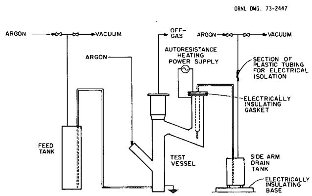  
Fig. 14.18. Flow diagram of equipment for autoresistance heating tests.

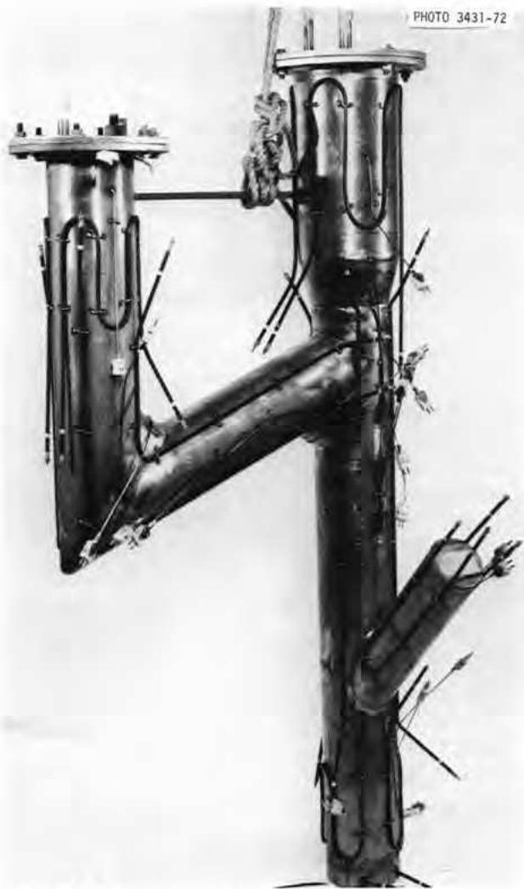  
Fig. 14.19. Photograph of the test vessel used in autoresistance heating test AHT-3.

6-in. sched 40 nickel pipe so that the autoresistance heating current density in the side arm will equal that in the fluorination section.

A diagram of the upper electrode is shown (Fig. 14.20). The electrode is made from 1/2-in. Inconel tubing and also serves as the dip tube for draining the side arm. The electrode is inserted into the vertical portion of the side arm and is insulated from the test vessel by means of a Teflon gasket. Cartridge heaters are provided in the electrode to keep the salt molten in the vertical portion of the side arm.

At the beginning of an experiment, molten salt is transferred from the feed tank and from the side arm drain tank into the test vessel. The test vessel is maintained initially at a temperature above the

liquidus temperature $(505^{\circ}\mathrm{C})$ of the salt mixture $\left[\mathrm{LiF - BeF_2 - ThF_4}\right.$ 72-16-12 mole $\%$ ). The insulation is then removed from the test section, and the wall of the test section is allowed to cool by radiation and convection to the cell environment. Frozen salt forms on the vessel wall during this period. When the wall reaches the desired temperature, the autoresistance heating current is turned on, and the heating rate is adjusted until steady-state conditions are reached. The attainment of steady state is determined by the condition that the wall temperatures in the test section must remain constant at some value below the salt liquidus temperature with a molten zone throughout the test section. After the equipment is maintained at the desired conditions for the desired time period, the feed tank and the side arm drain tank are evacuated and the molten salt is removed from the test vessel, leaving the frozen material on the wall. The equipment is then cooled to room temperature and opened, and the frozen salt layer is examined.

ORNL DWG. 73-2448

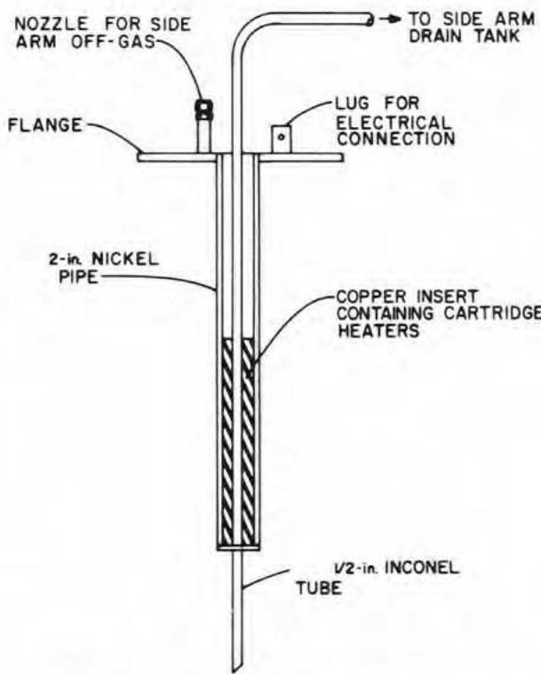  
Fig. 14.20. Diagram of upper electrode used in autoresistance heating test AHT-3.

# 14.6.2 Experimental Results

During this report period experiments AHT3-6A, -6B, -7, -8, and -9 were run. In runs AHT3-6A, -6B, -8, and -9, the autoresistance heating was begun when the wall temperature of the test section was cooled to $350^{\circ}\mathrm{C}$ , the lowest temperature at which liquid can exist in the $\mathrm{LiF - BeF_2 - ThF_4}$ system. In run AHT3-7, no internal heating was attempted.

The circuit resistance during cooldown in runs AHT3-6A and AHT3-6B remained at about 0.01 to $0.03\Omega$ until the wall temperature dropped to approximately $500^{\circ}\mathrm{C}$ , the temperature at which the fuel salt begins to freeze. As the wall temperature dropped from 500 to $350^{\circ}\mathrm{C}$ , the resistivity increased; at about $350^{\circ}\mathrm{C}$ , the resistance increased sharply. Presumably, this event occurred because the salt layer becomes nonconducting; shorting to the wall is prevented only when the temperature is low enough that no liquid can exist in the frozen salt layer. For the $\mathrm{LiF - BeF_2 - ThF_4}$ system, no liquid can exist below $350^{\circ}\mathrm{C}$ .

When the wall temperature reached $350^{\circ}\mathrm{C}$ , autoresistance heating was started. We had planned to increase the current through the salt until the wall temperatures indicated steady state. Before this condition was reached, the resistance through the conducting path dropped suddenly from $0.5\Omega$ in run 6A and $0.4\Omega$ in run 6B to zero, indicating a loss of film integrity and subsequent shorting of the heating current. Increases in the wall temperatures at the time of shorting indicated that the shorting occurred near the bend in the electrode side arm nearest to the electrode. The cause of this shorting is not known.

In run AHT3-7 the wall temperature of the test vessel was lowered to $425^{\circ}\mathrm{C}$ , and the remaining liquid salt was transferred to the feed tank. Internal heat generation was not attempted. The frozen salt wall was inspected after the equipment was cooled to room temperature. The salt was almost completely frozen across the vessel just above the lower side arm inlet, although a much thinner salt layer (about 3/4 in.) was present both below the inlet and higher in the test section. This freezing was caused by the unheated argon contacting the liquid salt. Heaters have been added on the argon lines to the test vessel to reduce this problem.

The maximum resistance during the autoresistance heating in runs AHT3-6A and AHT3-6B was 0.5 and $0.4\Omega$ , respectively. In run AHT3-8, which was made after argon heaters were added, the maxi

mum resistance during autoresistance heating was $2.4\Omega$ the autoresistance heating period lasted for $25\mathrm{min}$ During this time, the current was increased from 5 A to 24 A. Although the wall temperatures continued to decrease during this time, they appeared to be approaching a constant value above room temperature. After $25\mathrm{min}$ of autoresistance heating, the resistance suddenly decreased at the same time that the temperature rose rapidly in the bend of the electrode side arm near the electrode, indicating that this was the area where the salt film had melted.

Run AHT3-9 was performed using the same procedure as before, except that the current was limited to a maximum of 17 A. The electrode in these tests consisted of a 1/2-in. Inconel tube, as described previously, that extended to the intersection of the centerlines of the vertical section and the sloping section of the electrode side arm. In the first nine runs, the salt depth in the electrode side arm above the end of the tube was measured by bubbling argon through the tube. Before run AHT3-9 was begun, this level measurement indicated that the salt level in the electrode side arm was lower than the salt level measured in the main compartment (gas-salt contacting zone) of the test vessel. Also, abnormally high resistances were observed during this run. The highest resistance during autoresistance heating in run AHT3-9 was 4.3 Ω. At the end of the experiment the salt was transferred to the feed tank from the test vessel. The captive volume of salt in the electrode side arm could not be removed. After allowing the equipment to cool, the electrode was removed and examined. The lower 6 in. of the 1/2-in. Inconel tube of which the electrode was made had been melted off during an attempt to heat the transfer line to the side arm drain tank with no frozen salt present in the side arm. With no frozen salt present, the current for heating the transfer line took the path of low resistance through the molten salt. The low resistance led to much higher currents than would otherwise have occurred, and the tube was melted.

# 14.6.3 Distribution of Current Densities in the Autoresistance Heating Equipment

We have constructed an electrical analog of the electrode side arm to determine if there are regions of localized high current density that might be causing the frozen salt film near the electrode to melt. The electrical analog was made from electri

cally conducting photographic paper cut in the shape of the side arm and the contained electrode. With the use of this electrically conducting paper, a two-dimensional model may be constructed for the study of steady-state current flow in simple or complex geometry.[22]

The geometric model used isopotential nonconducting wall conditions that were represented in the model by lines of conductive paint. By giving the opposing walls separate and distinct potentials, an electric field was created which could be mapped by using a high impedance voltmeter with an electric probe. The isopotential lines generated between

22. C. F. Kayan, "An Electric Geometrical Analogue for Complex Heat Flow," Trans. ASME 67, 713-16 (1945),

the walls in this manner represented current flow lines.

The paper used in the model was black photographic paper of grade 506-L by Knowlton Bros., Watertown, New York. The paper has a resistance sufficiently high for this purpose. Silver paint made by Dupont Electrochemicals of Wilmington, Delaware was used. The Bivar potential source and probe used to measure the electric field was made by Electronic Associates, Inc., of Long Beach, New Jersey. An accompanying Variplotter, also by Electronic Associates, Inc., provided the connections to the voltage source and an insulated surface to hold the model. A high impedance voltmeter was required to measure the field potentials.

The lines in Figs. 14.21, 14.22, and 14.23 represent current stream lines. The distance between two

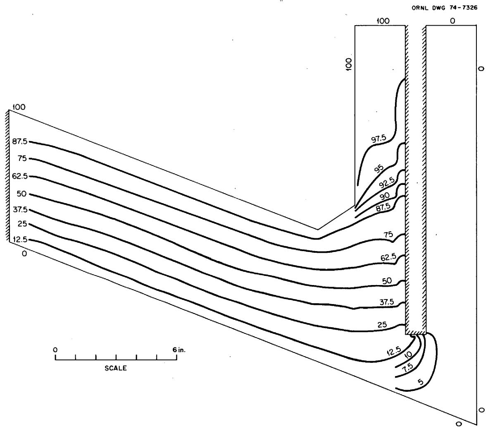  
Fig. 14.21. Calculated current distribution in the electrode side arm of autoresistance heating test AHT-3. The percentage of the total current flowing between two stream lines is equal to the difference between the number on the stream lines.

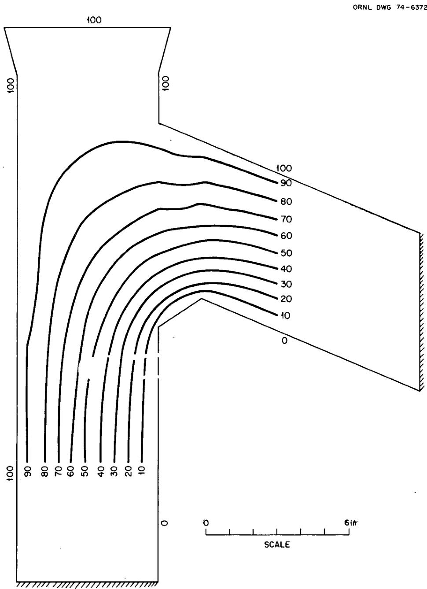  
Fig. 14.22. Calculated current distribution at the junction of the electrode side arm and the fluorination section in autoresistance heating test AHT-3. The percentage of total current flowing between two stream lines is equal to the difference between the numbers on the stream lines.

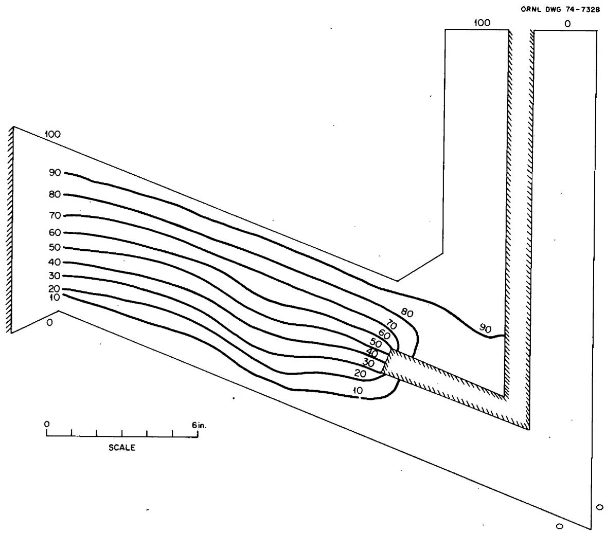  
Fig. 14.23. Calculated current distribution in the electrode side arm using a new electrode design. The percentage of the total current flowing between two stream lines is equal to the difference between the numbers on the stream lines.

stream lines in Fig. 14.21 represents the passage of $12.5\%$ of the total current. In Figs. 14.22 and 14.23, the distance between stream lines represents $10\%$ of the total current.

Figures 14.21 and 14.22 show that there are no regions of abnormally high current densities in the vicinity of the two bends in the electrode side arm. The present side arm design seems adequate with regard to localized heat generation rates.

Figure 14.23 shows an alternate electrode design that would further reduce localized heating at the side arm bend near the electrode. This design has the additional advantage that it could also be used as the device for introducing the feed to the fluorinator.

# 14.7 FUEL RECONSTITUTION DEVELOPMENT: DESIGN OF A FUEL RECONSTITUTION ENGINEERING EXPERIMENT

R. M. Counce

The reference flowsheet for processing the fuel salt from a molten-salt breeder reactor is based upon removal of uranium by fluorination to $\mathrm{UF_6}$ as the first processing step. The uranium removed in this step must subsequently be returned to the fuel salt stream before it returns to the reactor. The method for recombining the uranium with the fuel carrier salt (reconstituting the fuel salt) is to absorb

gaseous $\mathrm{UF_6}$ into a recycled fuel salt stream containing dissolved $\mathrm{UF_4}$ as described by the reaction

$$
\mathrm {U F} _ {6} (\mathrm {g}) + \mathrm {U F} _ {4} (\mathrm {d}) = 2 \mathrm {U F} _ {5} (\mathrm {d}). \tag {14}
$$

The resultant $\mathrm{UF}_5$ would be reduced to $\mathrm{UF}_4$ with hydrogen in a separate vessel according to the reaction

$$
\mathrm {U F} _ {5} (\mathrm {d}) + 1 / 2 \mathrm {H} _ {2} (\mathrm {g}) = \mathrm {U F} _ {4} (\mathrm {d}) + \mathrm {H F} (\mathrm {g}). \tag {15}
$$

We are beginning engineering studies of the fuel reconstitution step to provide the technology necessary for the design of larger equipment for recombining $\mathrm{UF_6}$ generated by fluorinators in the processing plant with the processed fuel salt returning to the reactor. During this report period, equipment for studying the fuel reconstitution process has been designed. The equipment is described in this section.

A flow diagram of the equipment to be used for the fuel reconstitution engineering experiment (FREE) is shown in Fig. 14.24. The equipment for this experiment consists of a 36-liter feed tank; a $\mathrm{UF_6}$ absorption vessel; a $\mathbf{H}_2$ reduction column; an effluent stream sampler; a 36-liter receiver; NaF traps for collecting excess $\mathrm{UF_6}$ and for disposing of HF; gas supplies for argon, hydrogen, and $\mathrm{UF_6}$ ; and means for analyzing the gas streams from the reaction vessels.

The experiment is operated by pressurizing the feed tank with argon to displace salt from the feed tank to the $\mathrm{UF_6}$ absorption tank at rates from 50 to $300~\mathrm{cm}^3 /\mathrm{min}$ . From the $\mathrm{UF_6}$ absorption tank, the salt is siphoned into the $\mathbf{H}_2$ reduction column. From the $\mathbf{H}_2$ reduction column, the salt flows by gravity through the effluent stream sampler to the receiver. The feed salt will be LiF-BeF $_2$ -ThF $_4$ (72-16-12 mole %) MSBR fuel carrier salt containing up to 0.3 mole % UF $_4$ . Absorption of UF $_6$ by reaction with dissolved UF $_4$ will occur in the UF $_6$ absorption vessel, and the resultant UF $_5$ will be reduced with hydrogen in the $\mathbf{H}_2$ reduction column. The UF $_6$ flow rates from 60 to 360 std cm $^3$ /min and the $\mathbf{H}_2$ flow rates from 60 to 720 std cm $^3$ /min will be used. The effluent salt will be collected in the receiver for return to the feed tank at the end of the run. The off-gas from the absorption vessel and the reduction column will be analyzed for UF $_6$ and for HF, respectively. The salt in the feed tank will be analyzed, and salt samples from the effluent salt from the column will be analyzed for uranium. The performance of the column will be determined from these analyses. The effluent HF and any UF $_6$ passing through the column will be collected on the

NaF traps before the gas is exhausted to the off-gas system.

The fuel reconstitution engineering experiment will be installed in the high bay area at the MSRE site in Bldg. 7503. Scaffolding erected for a previous experiment will serve the FREE equipment adequately. The system, except for the upper section of the column, will be enclosed by a splash shield.

The $\mathrm{UF_6}$ absorption vessel will have an inside diameter of 4 in. and an inside height of 11 in. The vessel will be constructed from 4 in. sched 40 nickel pipe mounted vertically with a 150-lb standard Monel flange at the top and a 0.25-in. nickel plate at the bottom. Two 1/2-in. nozzles provide for the salt to flow in and out of the vessel. Two 3/8-in. nozzles provide for the $\mathrm{UF_6(g)}$ to flow in and off-gas to flow out of the tank.

The $\mathbf{H}_2$ reduction column will have an overall height of 115 in. It will be constructed of 1 1/2-in. sched 40 nickel pipe mounted vertically with a 150-lb Monel flange on the upper end and a sched 40 nickel welded cap at the lower end. Gas enters through a 3/8-in. sched 40 nickel side arm at the

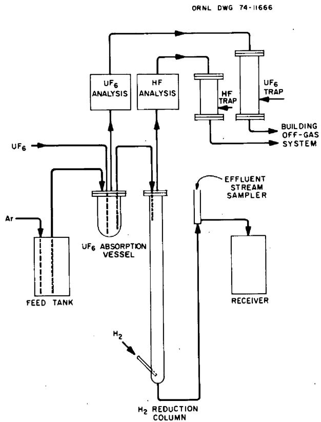  
Fig. 14.24. Flow diagram for equipment used in the fuel reconstitution engineering experiment.

bottom, while 1/2-in. and 3/8-in. nozzles provide for salt entrance and an off-gas exit.

Because of the highly corrosive nature of dissolved $\mathbf{U}\mathbf{F}_5$ , all equipment exposed to significant quantities of $\mathbf{U}\mathbf{F}_5$ will be gold or gold-plated after a startup and demonstration period using the equipment described in this report.

The 36-liter feed tank will have an inside diameter of 10 in. and an inside height of 33 in. It will be composed of nickel with 0.25-in.-thick walls, equipped with two 1/2-in. nozzles for salt exit and entrance lines, two 3/8-in. nozzles for argon sparging and off-gas exit, and a 3/4-in. sampling port. The receiver vessel will be essentially identical to the feed tank.

All piping exposed to the liquid phase (MSBR carrier salt) or temperatures in excess of $100^{\circ}\mathrm{C}$ will be nickel pipe or tubing. Off-gas lines carrying $\mathrm{UF_6}$ or HF will consist of nickel tubing, and all other gas lines will consist of copper tubing. Off-gas lines and liquid phase piping will be 1/2-in. tubing.

Standard brass valves can be used throughout the gas system except on gas lines carrying $\mathbf{U}\mathbf{F}_6$ or HF, where nickel bellows-seal valves are required. Stainless steel, full-bore ball valves will introduce the sample ladles into the flowing stream salt sampler.

Two NaF traps are required for $\mathrm{UF_6}$ absorption and for HF absorption. These traps are identical except for their lengths. The $\mathrm{UF_6}$ removal trap is 55 5/8 in. long, and the HF trap is 31 5/8 in. long. The traps are constructed of 4-in. sched 40 Monel pipe mounted vertically with 150-lb standard flanges at both ends for charging and removing NaF pellets. The gas enters from 1/2-in. nickel tubing through the upper flanged end and exits through the lower flanged end. A 6-in. section in the lower end of the trap contains 4-in.-diam Monel York mesh to keep pellets from plugging the exit.

The experiment will be monitored by analyzing the off-gas from each leg of the column. GOW-MAC gas density detectors are being considered for this analysis. The detector elements of this analysis system are not exposed to the measured gas stream which, in this case, is corrosive.

The liquid phase will be sampled periodically by withdrawing salt samples from the effluent stream from the hydrogen reduction column. The sampler is a vertically mounted 3/4-in. sched 40 pipe 20 3/4 in. long with a stainless steel full-bore valve located 12 1/4 in. from the lower end to allow access to the flowing salt stream. The sampler is vented to the off-gas system above and below the ball valve. The

salt flows into the lower end of the sampler from 1/2-in. tubing and exits 1 1/4 in. from the end also by 1/2-in. tubing. This flow assures a minimum of 1/4 in. of salt for insertion of a sampler. The sampler is a stainless steel 0.250-in.-diam by 1-in.-long tube with a 0.050-in. fritted metal filter on the lower end. It is connected to a 1/16-in. stainless steel tube, which in turn is attached to a vacuum pump.

Engineering sketches for all the equipment, except the $\mathbf{U}\mathbf{F}_6$ supply, have been completed. The scaffolding in Bldg. 7503 is being cleared to make room for this experiment.

# 14.8 PERFORMANCE OF OPEN BUBBLE COLUMNNS

Conceptual designs for the primary fluorinator and $\mathrm{UF}_5$ reduction columns in a MSBR fuel reprocessing plant call for open bubble columns. These columns are simple, unpacked gas-liquid contactors with a continuous liquid phase. The gas phase is introduced into the bottom of the column and bubbles travel upward through the liquid. In open columns, the wall can be protected from corrosive fluorine or $\mathrm{UF}_5$ in the salt by freezing a layer of salt on the vessel walls. Although open bubble columns look attractive for these MSBR applications, there are few data available for designing such systems. We have developed an experimental program to produce and correlate the necessary data. These efforts have included measurements of axial dispersion and mass transfer coefficients in open bubble columns. Dispersion is particularly severe in these systems and greatly affects the performance of the columns.

During this report period, studies of open bubble columns continued as part of the Chemical Engineering Research Program (sponsored by the AEC Division of Physical Research). The results of these studies have been reported in other publications;[23-26] therefore, all the results will not be reported here. Only the most recent results on axial

dispersion and mass transfer rates are given below. Some of the earlier data are only summarized here, but the complete data are available from the cited references.

# 14.8.1 Axial Dispersion in Open Bubble Columns

J. S. Watson H. D. Cochran, Jr.

Measurements of gas holdup and axial dispersion in open bubble columns with diameters of 1, 1.5, 2, 3, and 6 in. have been made over a wide range of operating conditions and liquid properties. During this report period these data, along with a large collection of the best data in the literature, have been reduced to generalized correlations based on dimensionless groups.

The hydrodynamic performance of open bubble columns is characterized by two flow regimes with an intermediate transition region. At low superficial gas velocities, the gas rises in the form of discrete single bubbles. This flow regime is called the bubbly regime. At very high superficial gas velocities, the gas surges through the column in large cylindrical slugs that occupy nearly the entire cross section of the column. This flow regime is called the slugging regime. In the intermediate transition region, discrete bubbles coalesce as they rise through the column to form slugs near the top. We have found it useful to distinguish between the two regimes of flow in correlating hydrodynamic results.

In the bubble flow regime the axial dispersion coefficient has been correlated by using dimensionless groups as follows:

$$
N _ {P e} = 1 1. 1 2 N _ {R e} ^ {0, 8 2} N _ {A r} ^ {0, 4 5}, \tag {16}
$$

where

$$
\begin{array}{l} N _ {P e} = \text {P e c l e t n u m b e r} = D U / E, \\ N _ {R e} = \text {R e y n o l d s n u m b e r} = D U / \nu , \\ N _ {A r} = \text {A r c h i m e d e s n u m b e r} = D ^ {3} g / \nu^ {2}, \\ D = \text {c o l u m n d i a m e t e r}, \mathrm {c m}, \\ U = \text {s u p e r f i c i a l} \quad \text {g a s v e l o c i t y ,} \mathrm {c m / s e c}, \\ E = \text {a x i a l} \quad \text {d i s p e r s i o n} \quad \text {c o e f f i e n t}, \quad \mathrm {c m} ^ {2} / \sec , \\ \nu = \text {l i q u i d k i n e m a t i c v i s c o s i t y ,} \mathrm {g / c m} \cdot \sec , \\ g = \text {a c c e l e r a t i o n} \mathrm {g r a v i t y}, \mathrm {c m} / \sec^ {2}. \\ \end{array}
$$

In the slugging regime the axial dispersion coefficient has been correlated using dimensionless groups as follows:

$$
N _ {P e} = 0. 3 8 7 N _ {R e} ^ {0. 2 5} N _ {S u} ^ {- 0. 1 3}, \tag {17}
$$

where

$$
\begin{array}{l} N _ {S u} = \text {S u r a t m a n n u m b e r} = D \rho \sigma / \mu^ {2}, \\ \sigma = \text {i n t e r f a c i a l} \quad \text {t e n s i o n}, \quad \mathrm {d y n e} / \mathrm {c m}, \\ \rho = \text {l i q u i d} \quad \mathrm {d e n s i t y}, \mathrm {g} / \mathrm {c m} ^ {3}, \\ \mu = \text {l i q u i d v i s c o s i t y ,} \mathrm {g / c m} \cdot \sec . \\ \end{array}
$$

The transition between bubbly flow and slugging flow may be reliably predicted from the intersection of Eqs. (16) and (17). The observed Peclet number tends to follow the lower (greater axial mixing) value of the Peclet number across the transition.

This method predicts the transition in flow regime, and correlates the gas phase holdup of each regime; in the bubbly regime,

$$
\theta = 0. 3 2 2 \left(\rho U ^ {4} / g \sigma\right) ^ {0. 2 1 9}; \tag {18}
$$

in the slugging regime,

$$
\theta = 0. 8 4 8 \left(U ^ {2} / g D\right) ^ {0. 3 6 2}; \tag {19}
$$

where $\theta =$ gas holdup fraction.

The correlations for axial mixing and gas holdup comprise a complete description of the hydrodynamic performance of open bubble columns.

# 14.8.2 Mass Transfer Rates in Open Bubble Columns

J. M. Begovich H D. Cochran, Jr.

J. S. Watson28

Studies of mass transfer rates in open bubble columns have been made by several groups of MIT Practice School students and by ORNL personnel during the period covered by this report. Because most of these results have been reported elsewhere, only the most recent data will be presented here. All studies have measured $\mathrm{CO}_{2}$ sorption rates in water or aqueous solutions. The most recent group of MIT students obtained data that confirmed results from the earlier studies with $\mathrm{CO}_{2}$ -water in a 1:1/2-in. column, and the group extended these results to a larger 3-in.-diam column. In addition, subsequent ORNL studies have produced data for high viscosity solutions of glycerol (approximately 10 cP).

Experimental. The experimental technique has been used in all bubble column mass transfer studies and has been described previously.[23-25] At the conclusion of the last MIT study, two modifications were made in the experiment. An automatic titrator (Radiometer Type TTTla) significantly reduced the time involved per titration and appeared to improve the precision of the measurements. This instrument titrates the samples to a preset $\mathsf{pH}$ , and the titration time can be adjusted by controlling the maximum solution flow rate. We are currently allowing approximately 20 to 30 sec per titration. This rate is faster than most operators can titrate accurately, so there is less time for $\mathrm{CO}_{2}$ sorption or desorption from the atmosphere during titration.

A basic modification in the equipment piping was required to use the glycerol solutions. The apparatus currently in use is shown (Fig. 14.25). Two 55-gal drums have been installed as feed or receiving tanks; glycerol and water can be mixed to the desired composition in either tank. The feed pump can be used to mix the solutions. There are two ways to operate the system. The glycerol solution can be pumped into the column from one tank and then returned to the other tank. This mode of operation is convenient for small column diameters (and heights) and for low liquid rates. Once the feed tank is empty, the $\mathrm{CO}_{2}$ must be stripped from the receiving tank with an air sparge before starting again. Since the receiving tank can be sparged as it is filled, this does not necessarily delay the experi

ments greatly, but care must be taken to ensure that the $\mathrm{CO}_{2}$ content of the feed is known and is preferably low. With higher liquid rates (such as those required for the 3-in. column), the first mode of operation does not allow time to take enough samples after steady state is reached. Under these conditions, two columns can be operated, one as a sorber and one as a stripper. This is a steady-state operation, and to reach steady state rapidly, it is desirable to maintain the inventory of liquid in the two drums as low as practical. Both techniques have been used successfully.

The glycerol was obtained from Fisher Scientific Company, and the viscosity of the solution used was checked regularly with a Brookfield viscometer. The applicability of Henry's law to glycerol solutions was verified.

Effects of column diameter. The MIT students collected data with a 3-in.-diam column and compared their results with the results from previous groups that used a 1.5-in. column. For the same superficial gas velocity, the larger column gave larger mass transfer coefficients. The mass transfer coefficient could be correlated by the equation

$$
K _ {L} a = 0. 0 0 2 8 8 ^ {\circ} (U D) ^ {0. 7 2 \pm 0. 1 3}, \tag {20}
$$

where $U$ is the superficial gas velocity (cm/sec), $D$ is the column diameter (cm), and $K_{La}$ is the volumetric mass transfer coefficient $(\sec^{-1})$ .

Studies on the effect of liquid viscosity on the mass transfer coefficient were initiated during this

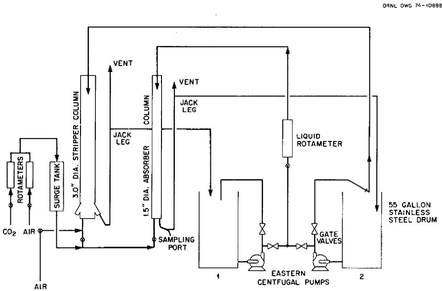  
Fig. 14.25. Flow diagram of equipment used to measure mass transfer coefficients in bubble columns.

report period. At this time, mass transfer coefficients have been measured only for the 46 volume $\%$ glycerol solution having a viscosity of about 10 cP and a single gas rate of $6.7~\mathrm{cm / sec}$ in a 1.5-in. column. The liquid flow rate was $4.10~\mathrm{cm / sec}$ , and several column heights were used. The mass transfer coefficient, $K_{l}a$ , measured under these conditions was $0.0154~\mathrm{sec}^{-1}$ , and the standard error in the coefficient was $\pm 23\%$ .

This initial information can be compared with the MIT Practice School results to show the effects of viscosity. For the same flow rates, Eq. (20) describing the data with water (viscosity of about 1 cP) predicts a coefficient of $0.030\mathrm{sec}^{-1}$ , which is about twice the value mentioned above. Thus, the higher viscosity reduces the mass transfer rate significantly. Since the MIT results suggest that the mass transfer coefficient is proportional to approximately equal powers of $U$ and $D$ , the dependence on viscosity may be the inverse of this power; that is, the three terms may be grouped into a Reynolds number. Although the present data are limited, viscosity appears to have less effect upon mass transfer rates than gas velocity or column diameter. The exponent on viscosity currently appears to be approximately 0.3. Viscosity probably enters into other terms besides the Reynolds number. Further data will elucidate the effects of these parameters.

# 14.9 CONCEPTUAL DESIGN OF AN MSBR PROCESSING ENGINEERING LABORATORY

J. R. Hightower, Jr.

A conceptual design is being prepared for a $12 million MSBR Processing Engineering Laboratory

for which FY 1977 authorization is proposed. The building will provide space for the engineering development of the fuel processing technology developed to date only on a scale of about $1\%$ of that required for a 1000-MWe MSBR. With the proposed building, operation of the entire processing system should be possible on a scale that is 25 to $50\%$ of that required for a 1000-MWe MSBR. Near-full-scale testing of the complete processing system in the absence of high radiation levels will be adequate to demonstrate most aspects of component performance and to provide the technology necessary for design of processing equipment for further evaluation in reactor systems. No facilities exist at ORNL that meet the specific requirements for engineering development of the MSBR processing system.

The building will have offices for technical staff, laboratories for chemical and small-scale engineering experiments, shop areas equipped to handle beryllium-contaminated items, a three-story high-bay area for large-scale engineering experiments, and, if space and money permit, facilities for salt purification and preparation.

Candidate floor plans are being considered. Current plans call for a three-story concrete and masonry building approximately 125 ft x 130 ft with a three-story high-bay area 125 ft x 80 ft. The building will be suitable for housing beryllium-containing experiments.

# Part 5. Salt Production

R. W. Horton

The salt production facility at Y-12 is operated to supply purified mixtures of fluoride salts for MSR Program experiments and for the Metals and Ceramics, Chemistry, and Chemical Technology Divisions. Supplies of lithium fluoride, beryllium fluoride, thorium fluoride, and uranium fluoride

which are maintained can be mixed in any of the compositions needed, and melted and processed in specially designed equipment. Processing involves treatment with hydrofluoric acid and hydrogen, and also filtration to remove solids.

# 15. Production of Fluoride-Salt Mixtures for Research and Development Program

R.W.Horton F.L.Daley

Reactivation of the MSR Program has required that the source of salt for experimental purposes be reestablished. This has been done, and production on a limited scale has been started. Considerable time was spent modifying the facility and locating materials and supplies used previously to meet safety and operational requirements.

The current objectives of the program are (1) to maintain salt production facilities already available to satisfy the more immediate demands, and (2) to start production in the larger-scale equipment as soon as possible to accumulate an inventory of salt for future larger-scale test programs. Our best estimate is that $3100\mathrm{kg}$ (350 liters) of salt will be needed by July 1, 1976.

The preoperational work at the salt production facility included an inventory period during which the new operating group became familiar with the equipment, operating areas, and related items. Specific units were chosen for immediate operation; these units were completely tested and rebuilt as needed. During the same time period, two large reactor vessels were designed to code standards and built in local shops. The accumulated inventory of old vessels, receivers, furnaces, instruments, process chemicals, and other items was examined and sorted for disposition. The older vessels containing varying amounts of salt for which no record existed (or the information available indicated that recovery

would be unwise) were sent to the burial ground; source and special nuclear materials included were written off. The chemical supplies, in metal or cardboard drums, that were sufficiently identified were stored in a Y-12 warehouse for recall when needed.

As these preliminaries were ending, the educational period for the operating group progressed to the actual practice of melting, treating, sampling, and transferring salt. Methods for controlling flow of process gases were developed and checked. Safety equipment was acquired and some gas system modifications were made to bring hydrogen gas handling practice up to the level suggested by Y-12 fire protection and safety groups. We also worked with health physics and industrial hygiene personnel to ensure that our methods for handling toxic chemicals were acceptable.

Processing started at the end of June 1974 and proceeded concurrently with some of the activities mentioned. By the end of August 1974, we had processed $72\mathrm{kg}$ of 72-16-12 fuel salt and $2\mathrm{kg}$ of $\mathrm{L}_2\mathrm{B}$ ; a $35\mathrm{kg}$ batch of 72-16-11.7-0.3 (uranium-bearing fuel salt) was in process. Operation was generally satisfactory during this initial period, and although complete analytical data were not available, we believe that we are capable of producing satisfactory material for the MSR Program.

# MOLTEN-SALT REACTOR PROGRAM

L. E. McNEESE, PROGRAM DIRECTOR

<table><tr><td>MSBR DESIGN, DEVELOPMENT, AND SAFETY
J. R. ENGEL** R</td></tr><tr><td>DESIGN AND SYSTEMS ANALYSIS
E. J. ALLEN* R
H. T. KERR* R
G. T. MAYS R
CONSULTANTS
E. S. BETTIS*,** 
D. W. CARDWELL*</td></tr><tr><td>SYSTEMS AND COMPONENTS
DEVELOPMENT
R. H. GUYMAN R
J. L. CROWLEY* R
W. R. HUNTLEY R
A. N. SMITH R
E. L. BIDDLE R
H. E. ROBERTSON R</td></tr><tr><td>REACTOR SAFETY
J. R. ENGEL** R
CONSULTANT
E. S. BETTIS*,**</td></tr></table>

*PART TIME ON MSRP

**DUAL CAPACITY

***DECEASED

AC ANALYTICAL CHEMISTRY DIVISION   
C CHEMISTRY DIVISION   
CT CHEMICAL TECHNOLOGY DIVISION   
M&C METALS AND CERAMICS DIVISION   
R REACTOR DIVISION   
UT UNIVERSITY OF TENNESSEE

<table><tr><td>MATERIALS
H. E. McCOY**</td><td>M&amp;C</td></tr><tr><td colspan="2">HASTELLOY N STUDIES</td></tr><tr><td>H. E. McCOY**</td><td>M&amp;C</td></tr><tr><td>D. N. BRASKI</td><td>M&amp;C</td></tr><tr><td>J. BRYNESTAD*</td><td>M&amp;C</td></tr><tr><td>R. E. CLAUSING*</td><td>M&amp;C</td></tr><tr><td>R. S. CROUSE*</td><td>M&amp;C</td></tr><tr><td>J. R. DiSTEFANO**</td><td>M&amp;C</td></tr><tr><td>C. R. HYMAN</td><td>R</td></tr><tr><td>J. R. KEISER</td><td>M&amp;C</td></tr><tr><td>B. C. LESLIE*</td><td>M&amp;C</td></tr><tr><td>B. McNABB</td><td>M&amp;C</td></tr><tr><td>T. K. ROCHE</td><td>M&amp;C</td></tr><tr><td>A. C. SCHAFFHAUSER*</td><td>M&amp;C</td></tr><tr><td>J. W. WOODS*</td><td>M&amp;C</td></tr><tr><td colspan="2">GRAPHITE STUDIES</td></tr><tr><td>H. E. McCOY**</td><td>M&amp;C</td></tr><tr><td>W. H. COOK*</td><td>M&amp;C</td></tr><tr><td>W. P. EATHERLY*</td><td>M&amp;C</td></tr><tr><td colspan="2">CHEMICAL PROCESSING MATERIALS</td></tr><tr><td>J. R. DiSTEFANO**</td><td>M&amp;C</td></tr><tr><td>O. B. CAVIN*</td><td>M&amp;C</td></tr><tr><td>A. J. MOORHEAD*</td><td>M&amp;C</td></tr><tr><td colspan="2">TECHNICAL SUPPORT</td></tr><tr><td>K. W. BOLING*</td><td>M&amp;C</td></tr><tr><td>C. E. DUNN*</td><td>M&amp;C</td></tr><tr><td>W. H. FARMER*</td><td>M&amp;C</td></tr><tr><td>J. C. FELTNER</td><td>M&amp;C</td></tr><tr><td>J. L. GRIFFITH*</td><td>M&amp;C</td></tr><tr><td>L. HEATHERLY*</td><td>M&amp;C</td></tr><tr><td>J. W. HENDRICKS*</td><td>M&amp;C</td></tr><tr><td>T. J. HENSON*</td><td>M&amp;C</td></tr><tr><td>J. D. HUDSON*</td><td>M&amp;C</td></tr><tr><td>E. J. LAWRENCE</td><td>M&amp;C</td></tr><tr><td>G. A. POTTER</td><td>M&amp;C</td></tr><tr><td>L. G. RARDON*</td><td>M&amp;C</td></tr><tr><td>R. H. SHANNON</td><td>M&amp;C</td></tr><tr><td>L. J. SHERSKY*</td><td>R</td></tr><tr><td>C. K. THOMAS*</td><td>M&amp;C</td></tr><tr><td>L. R. TROTTER*</td><td>M&amp;C</td></tr><tr><td>C. A. WALLACE*</td><td>R</td></tr><tr><td>J. J. WOODHOUSE*</td><td>M&amp;C</td></tr></table>

<table><tr><td colspan="2">MSBR PROCESSING DEVELOPMENT
J. R. HIGHTOWER, JR.** CT</td></tr><tr><td colspan="2">CHEMICAL DEVELOPMENT
A. D. KELMERS CT
M. R. BENNETT CT</td></tr><tr><td colspan="2">ENGINEERING DEVELOPMENT
J. R. HIGHTOWER, JR.** CT
C. H. BROWN, JR. CT
W. L. CARTER* CT
R. M. COUNCE CT
C. W. KEE* CT
J. A. KLEIN CT
H. C. SAVAGE CT
J. BEAMS CT
P. P. HAYDON* CT
R. O. PAYNE CT</td></tr></table>

<table><tr><td colspan="2">MSBR CHEMISTRY</td></tr><tr><td>L. M. FERRIS*</td><td>CT</td></tr><tr><td>A. D. KELMERS</td><td>CT</td></tr><tr><td>L. MAYA</td><td>CT</td></tr><tr><td>B. F. HITCH*</td><td>CT</td></tr><tr><td>S. CANTOR*</td><td>CT</td></tr><tr><td>C. E. BAMBERGER*</td><td>CT</td></tr><tr><td>D. E. HEATHERLY</td><td>CT</td></tr><tr><td>D. Y. VALENTINE</td><td>CT</td></tr></table>

<table><tr><td colspan="2">ANALYTICAL CHEMISTRY</td></tr><tr><td colspan="2">RESEARCH AND DEVELOPMENT</td></tr><tr><td>A. S. MEYER*</td><td>AC</td></tr><tr><td>R. F. APPLE*</td><td>AC</td></tr><tr><td>B. R. CLARK*</td><td>AC</td></tr><tr><td>J. M. DALE*</td><td>AC</td></tr><tr><td>D. L. MANNING</td><td>AC</td></tr><tr><td>J. P. YOUNG*</td><td>AC</td></tr><tr><td colspan="2">ANALYSES</td></tr><tr><td>L. T. CORBIN*</td><td>AC</td></tr><tr><td>J. H. COOPER*</td><td>AC</td></tr><tr><td>W. R. LAING*</td><td>AC</td></tr><tr><td colspan="2">CONSULTANT</td></tr><tr><td>G. MAMANTOV*</td><td>UT</td></tr></table>

# INORGANIC AND PHYSICAL CHEMISTRY

<table><tr><td>L. M. TOTH*</td><td></td><td>CT</td></tr><tr><td>L. O. GILPATRICK*</td><td></td><td>C</td></tr><tr><td>R. M. WALLER***</td><td></td><td>C</td></tr><tr><td>F. A. POSEY*</td><td>!</td><td>C</td></tr><tr><td>H. R. BRONSTEIN*</td><td></td><td>C</td></tr><tr><td>C. F. BAES, JR.*</td><td></td><td>C</td></tr><tr><td>W. C. WAGGENER*</td><td></td><td>C</td></tr></table>

<table><tr><td colspan="2">SALT PRODUCTION</td></tr><tr><td>R. W. HORTON</td><td>CT</td></tr><tr><td>F. L. DALEY</td><td>CT</td></tr><tr><td>W. J. BRYAN</td><td>CT</td></tr><tr><td>P. P. HAYDON*</td><td>CT</td></tr><tr><td>A. L. JOHNSON</td><td>CT</td></tr></table>