# Molten-Salt

# Reactor Program

Semiannual Progress Report

for Period Ending February 28, 1975

OAK RIDGE NATIONAL LABORATORY

CENTRAL RESEARCH LIBRARY

DOCUMENT COLLECTION

LIBRARY LOAN COPY

DO NOT TRANSFER TO ANOTHER PERSON

If you wish someone else to see this

document, send in name with document

and the library will arrange a loan.

UCN-7969

(3) $3 - {67}$

OAK RIDGE NATIONAL LABORATORY

OPERATED BY UNION CARBIDE CORPORATION • FOR THE U.S. ATOMIC ENERGY COMMISSION

Printed in the United States of America. Available from National Technical Information Service

U.S. Department of Commerce

5285 Port Royal Road, Springfield, Virginia 22161

Price: Printed Copy $7.60; Microfiche $2.25

This report was prepared as an account of work sponsored by the United States Government. Neither the United States nor the Energy Research and Development Administration, nor any of their employees, nor any of their contractors, subcontractors, or their employees, makes any warranty, express or implied, or assumes any legal liability or responsibility for the accuracy, completeness or usefulness of any information, apparatus, product or process disclosed, or represents that its use would not infringe privately owned rights.

ORNL-5047

UC-76 - Molten-Salt Reactor Technology

Contract No. W-7405-eng-26

MOLTEN-SALT REACTOR PROGRAM

SEMIANNUAL PROGRESS REPORT

FOR PERIOD ENDING FEBRUARY 28, 1975

L. E. McNeese

Program Director

SEPTEMBER 1975

OAK RIDGE NATIONAL LABORATORY

Oak Ridge, Tennessee 37830

operated by

UNION CARBIDE CORPORATION

for the

ENERGY RESEARCH AND DEVELOPMENT ADMINISTRATION

This report is one of a series of periodic reports that describe the progress of the program. Other reports issued in this series are listed below.

ORNL-2474 Period Ending January 31, 1958

ORNL-2626 Period Ending October 31, 1958

ORNL-2684 Period Ending January 31, 1959

ORNL-2723 Period Ending April 30, 1959

ORNL-2799 Period Ending July 31, 1959

ORNL-2890 Period Ending October 31, 1959

ORNL-2973 Periods Ending January 31 and April 30, 1960

ORNL-3014 Period Ending July 31, 1960

ORNL-3122 Period Ending February 28, 1961

ORNL-3215 Period Ending August 31, 1961

ORNL-3282 Period Ending February 28, 1962

ORNL-3369 Period Ending August 31, 1962

ORNL-3419 Period Ending January 31, 1963

ORNL-3529 Period Ending July 31, 1963

ORNL-3626 Period Ending January 31, 1964

ORNL-3708 Period Ending July 31, 1964

ORNL-3812 Period Ending February 28, 1965

ORNL-3872 Period Ending August 31, 1965

ORNL-3936 Period Ending February 28, 1966

ORNL-4037 Period Ending August 31, 1966

ORNL-4119 Period Ending February 28, 1967

ORNL-4191 Period Ending August 31, 1967

ORNL-4254 Period Ending February 29, 1968

ORNL-4344 Period Ending August 31, 1968

ORNL-4396 Period Ending February 28, 1969

ORNL-4449 Period Ending August 31, 1969

ORNL-4548 Period Ending February 28, 1970

ORNL-4622 Period Ending August 31, 1970

ORNL-4676 Period Ending February 28, 1971

ORNL-4728 Period Ending August 31, 1971

ORNL-4782 Period Ending February 29, 1972

ORNL-4832 Period Ending August 31, 1972

ORNL-5011 Period Ending August 31, 1974

# Contents

Introduction vii

SUMMARY ix

# PART 1. MSBR DESIGN, DEVELOPMENT, AND SAFETY

1. DESIGN AND SYSTEMS ANALYSIS 3

1.1 Tritium Behavior in Molten-Salt Systems 3

1.1.1 MSBR Tritium Studies 3   
1.1.2 Coolant Salt Technology Facility Calculations 11

1.2 Neutronic Analyses 14

1.3 High-Temperature Design 15

1.3.1 Analytical Investigation of the Applicability of Simplified Ratchetting and Creep-Fatigue Rules to Reactor System Component Geometries 15   
1.3.2 Inelastic Analyses of MSR Piping Subjected to Internal Pressure and Transient Temperature Cycles 21

2. SYSTEMS AND COMPONENTS DEVELOPMENT 23

2.1 Molten-Salt Steam Generator Industrial Program 23   
2.2 Gas-Systems Technology Facility 23

2.2.1 General 23   
2.2.2 Mark II Pump 24   
2.2.3Densitometer 25

2.3 Coolant-Salt Technology Facility 25   
2.4 Forced-Convection Loops 29

2.4.1 Operation of MSR-FCL-2b 29   
2.4.2 MSR FCL-3 and FCL-4 31

3. SAFETY STUDIES 32

3.1 Salt-Spill Accidents 32

3.1.1 Potential Causes 32   
3.1.2 Direct Consequences 34   
3.1.3 Deferred Consequences 35

# PART 2. CHEMISTRY

4. FUEL-SALT CHEMISTRY 37

4.1 Tellurium Deposition on Hastelloy N Surfaces in an MSBR 37   
4.2 Exposure of Metallurgical Samples to Tellurium Vapor 40

4.3 Effect of Oxygen on the $\mathrm{UF}_3 / \mathrm{UF}_4$ Equilibrium in Molten Fluoride Solutions 41   
4.4 The Uranium Tetrafluoride-Hydrogen Equilibrium in Molten Fluoride Solutions 43   
4.5 Porous-Electrode Studies 44

# 5.COOLANT-SALT CHEMISTRY 47

5.1 Chemistry of Sodium Fluoroborate 47   
5.2 Corrosion of Structural Alloys by Fluoroborates 49

5.2.1 Thermodynamics of Cr(III) in Fluoroborate 49   
5.2.2 Metal Boride Formation 50   
5.2.3 Corrosion of Nickel 51

# 6. DEVELOPMENT AND EVALUATION OF ANALYTICAL METHODS 52

6.1 In-line Analysis of Molten MSBR Fuel 52   
6.2 Electroanalytical Studies of Bismuth in Molten LiF-BeF $_2$ -ZrF $_4$ 56   
6.3 Electroanalytical Studies in Molten $\mathrm{NaBF}_4$ -NaF 57

# PART 3. MATERIALS DEVELOPMENT

# 7. DEVELOPMENT OF MODIFIED HASTELLOY N 60

7.1 Procurement and Fabrication of Experimental Alloys 60

7.1.1 Production Heats 60   
7.1.2 Semiproduction Heats 63   
7.1.3 Laboratory Heats 66

7.2 Weldability of Commercial Alloys of Modified Hastelloy N 68   
7.3 Stability of Various Titanium-Modified Hastelloy N Alloys 71   
7.4 Mechanical Properties of Titanium-Modified Hastelloy N Alloys in the Unirradiated Condition 73   
7.5 Postirradiation Mechanical Properties of Modified Hastelloy N 79   
7.6 Microstructural Analysis of Titanium-Modified Hastelloy N 83

7.6.1 Microstructure of Aged 503 and 114 Alloys 83   
7.6.2 X-Ray Analysis of Precipitates 84   
7.6.3Irradiation and Creep Testing 84   
7.6.4 Microstructure of Irradiated 503 and 114 Alloys 85

7.7 Salt Corrosion Studies 90

7.7.1 Status of Thermal-Convection Loop Program 90   
7.7.2 Fuel Salt Thermal-Convection Loop Results 91   
7.7.3 Forced-Circulation Loop Results 91   
7.7.4 Coolant-Salt Technology Facility Results 94   
7.7.5 Static Pot Tests 94

7.8 Corrosion of Hastelloy N and Other Alloys in Steam 94   
7.9 Development of a Tellurium-Delivery System for a Representative Tellurium-Corrosion Screening Test Method 102

7.10 Reactions of Tellurium with Nickel at Low Tellurium Activities 102   
7.11 Surface- and Grain-Boundary Studies Related to Hastelloy N Grain-Boundary Embrittlement 104

7.11.1 Development of Improved Techniques 104   
7.11.2 High Temperature Studies of the Behavior of Tellurium in and on Experimental Alloys 104

7.12 Identification of Reaction Layers on Hastelloy N Exposed to Nickel Tellurides 105

7.12.1 Metallographic Examination 105   
7.12.2 Electron Microprobe Analysis 105   
7.12.3 X-Ray Diffraction Analysis 109   
7.12.4 Conclusions 109

7.13 Examination of Hastelloy N Specimens Exposed to Tellurium 109

7.14 Operation and Analysis of TeGen-1 119

7.14.1 Operating History of TeGen-1 119   
7.14.2 Data Analysis for TeGen-1 119   
7.14.3 Future Irradiations 123

7.15 Examination of TeGen-1 123

8. FUEL PROCESSING MATERIALS DEVELOPMENT 137

8.1 Static Capsule Tests of Graphite with Bismuth and Bismuth-Lithium Solutions 137   
8.2 Thermal Convection Loop Tests 140   
8.3 Tests of Oxidation-Resistant Coatings on Mild Steel Pipe 141

# PART 4. FUEL PROCESSING FOR MOLTEN-SALT BREEDER REACTORS

9. CHEMISTRY OF FLUORINATION AND FUEL RECONSTITUTION 150   
10. ENGINEERING DEVELOPMENT OF PROCESS OPERATIONS 152

10.1 Installation of Metal Transfer Process 152   
10.2 Salt-Metal Contactor Development: Experiments with a Mechanically Agitated Nondispersing Contactor in the Salt-Bismuth Flow-through Facility 152

10.3 Salt-Metal Contactor Development: Experiments with a Mechanically Agitated Nondispersing Contactor Using Water and Mercury 157

10.3.1 Theory 158   
10.3.2 Experimental Results 159   
10.3.3 Polaric Determination of Mass-Transfer Coefficients 160

10.4 Continuous Fluorinator Development 162

10.4.1 Autoresistance Heating Test AHT-3 162   
10.4.2 Design of Equipment for Autoresistance Heating Test AHT-4 163

10.5 Fuel-Reconstitution Development: Installation of Equipment for a Fuel-Reconstitution Engineering Experiment 165

10.6 Mass-Transfer Rates in Open Bubble Columns 174

10.6.1 Experimental 176   
10.6.2 Effect of Liquid Velocity on $K_{L}a\rfloor_{d}^{\infty}$ 178   
10.6.3 Effect of Viscosity on $K_{L}a\big]_{d}^{\infty}$ 178   
10.6.4 Analysis of Previous Data 178   
10.6.5 Correlation of Column Parameters 180   
10.6.6 Conclusions 182

10.7 Conceptual Design of MSBR Fuel Processing Engineering Center 182

# PART 5. SALT PRODUCTION

11. PRODUCTION OF FLUORIDE-SALT MIXTURES FOR RESEARCH AND DEVELOPMENT 184

ORGANIZATION CHART 187

# Introduction

The objective of the Molten-Salt Reactor (MSR) Program is the development of nuclear reactors that use fluid fuels that are solutions of fissile and fertile materials in suitable carrier salts. The program is an outgrowth of the effort begun over 20 years ago in the Aircraft Nuclear Propulsion (ANP) Program to make a molten-salt reactor power plant for aircraft. A molten-salt reactor, the Aircraft Reactor Experiment, was operated at Oak Ridge National Laboratory in 1954 as part of the ANP Program.

The major goal now is to achieve a thermal breeder reactor that will produce power at low cost while simultaneously conserving and extending the nation's fuel resources. Fuel for this type of reactor would be $^{233} \mathrm{UF}_4$ dissolved in a mixture of LiF and $\mathrm{BeF}_2$ , but $^{235} \mathrm{U}$ or plutonium could be used for startup. The fertile material would be $\mathrm{ThF}_4$ dissolved in the same salt or in a separate blanket salt of similar composition. The technology being developed for the breeder is also applicable to high-performance converter reactors.

A major program activity through 1969 was the operation of the Molten-Salt Reactor Experiment (MSRE). This reactor was built to test the types of fuels and materials that would be used in thermal breeder and converter reactors; it also provided operation and maintenance experience. The MSRE operated at $1200^{\circ}\mathrm{F}$ and produced $7.3\mathrm{MW}$ of heat. The initial fuel contained $0.9\mathrm{mole}\% \mathrm{UF}_4,5\% \mathrm{ZrF}_4,29\% \mathrm{BeF}_2,$ and $65\%$ LiF; the uranium was about $33\% ^{2}35\mathrm{U}$ . The fuel circulated through a reactor vessel and an external pump and heat exchange system. Heat produced in the reactor was transferred to a coolant salt, and the coolant salt was pumped through a radiator to dissipate the heat to the atmosphere. All this equipment was constructed of Hastelloy N, a nickel-molybednum-iron-chromium alloy. The reactor contained an assembly of graphite moderator bars in direct contact with the fuel.

Design of the MSRE was started in 1960, fabrication of equipment began in 1962, and the reactor became critical on June 1, 1965. Operation at low power began in January 1966, and sustained power operation was

begun in December 1966. One run continued for six months, until stopped on schedule in March 1968.

Completion of this six-month run ended the first phase of MSRE operation, in which the objective was to show, on a small scale, the attractive features and technical feasibility of these systems for commercial power reactors. The conclusion was that this objective had been achieved and that the MSRE had shown that molten-fluoride reactors can be operated at $1200^{\circ}\mathrm{F}$ without corrosive attack on either the metal or graphite parts of the system; also the fuel is stable; the reactor equipment can operate satisfactorily at these conditions; xenon can be removed rapidly from molten salts; and when necessary, the radioactive equipment can be repaired or replaced.

The second phase of MSRE operation began in August 1968, when a small facility in the MSRE building was used to remove the original uranium charge from the fuel salt by treatment with gaseous $\mathbf{F}_2$ . In six days of fluorination, $221\mathrm{kg}$ of uranium was removed from the molten salt and loaded into absorbers filled with sodium fluoride pellets. The decontamination and recovery of the uranium were very good.

After the fuel was processed, a charge of $^{233}\mathrm{U}$ was added to the original carrier salt, and in October 1968 the MSRE became the world's first reactor to operate on $^{233}\mathrm{U}$ . The nuclear characteristics of the MSRE with the $^{233}\mathrm{U}$ were close to the predictions, and the reactor was quite stable. In September 1969, small amounts of $\mathrm{PuF}_3$ were added to the fuel to obtain some experience with plutonium in a molten-salt reactor. The MSRE was shut down permanently December 12, 1969, so that the funds supporting its operation could be used elsewhere in the research and development program.

Because of limitations on the chemical-processing methods available in the past, most of our work on breeder reactors was aimed at two-fluid systems in which graphite tubes would be used to separate uranium-bearing fuel salts from thorium-bearing fertile salts. However, in late 1967 a one-fluid breeder became

feasible with the development of processes that use liquid bismuth to isolate protactinium and remove rare earths from a salt that also contains thorium. Our studies showed that a one-fluid breeder based on these processes can have fuel-utilization characteristics approaching those of our two-fluid design concepts. Since the graphite serves only as moderator, the one-fluid reactor is more nearly a scale-up of the MSRE. These advantages caused a change in the emphasis of the program from the two-fluid to the one-fluid breeder; most of the design and development effort is now directed to the one-fluid system.

In the congressional authorization report on the AEC's programs for FY 1973, the Joint Committee on Atomic Energy recommended that the molten-salt reactor be appraised so that a decision could be made about its continuation and the level of funding appropriate for it. Consequently, a thorough review of molten-salt technology was undertaken to provide information for an appraisal. A significant result of the review was the preparation of ORNL-4812, The Development Status of Molten-Salt Breeder Reactors. A subsequent decision was made by the AEC to terminate work on molten-salt reactors for budgetary reasons; in January 1973 ORNL was directed to conclude MSR development work.

In January 1974, the AEC program for molten-salt reactor development was reinstated. A considerable effort since that time has been concerned with assembling a program staff, making operational a number of development facilities used previously, and replacing a number of key developmental facilities that had been reassigned to other reactor programs. A significant undertaking was the formulation of detailed plans for the development of molten-salt breeder reactors and the preparation of ORNL-5018, Program Plan for Development of Molten-Salt Breeder Reactors.

Most of the Molten-Salt Reactor Program is now devoted to the technology needed for molten-salt reactors. The program includes conceptual design studies and work on materials, the chemistry of fuel and coolant salts, fission-product behavior, processing methods, and the development of systems and components. The most important single aspect of the program presently is the development and demonstration of an alloy that is suitable for the primary circuit of an MSBR and has adequate resistance to tellurium-induced shallow intergranular cracking, which was first observed in MSRE surveillance specimens.

# Summary

# PART 1. MSBR DESIGN, DEVELOPMENT, AND SAFETY

# 1. Design and Analysis

Calculations were made to evaluate the steady-state distributions of tritium and the rate at which tritium enters the steam system in the reference-design MSBR. The calculations were based on current estimates of material and system properties, and effects of changes in these properties were examined. Potentially variable system operating parameters were varied over wide ranges to determine their importance in limiting the rate at which tritium enters the steam system. In the absence of tritium fluoride sorption on the core graphite, the tritium release to the steam system could be limited to 2 Ci/day or less only by purging the secondary salt system with HF and assuming a reduction in the hydrogen (tritium) permeability of the steam-generator tubes by a factor of 100. This approach could be questionable if the HF (TF) present at low concentrations in the salt reacts rapidly with metal surfaces to release hydrogen for diffusion through the metal. Considerable improvement could be achieved, without HF purging, if a highly efficient external gas-stripping system could be developed to replace the planned stripping system, which results in circulating gas bubbles. The most promising approach appears to be the addition of a chemical getter to convert the tritium to a nonreactive and readily removable form within the secondary salt.

Flux mapping and monitoring experiments were performed in conjunction with the capsule irradiation program associated with the effort to develop an improved alloy for the MSBR primary circuit. The results were used to evaluate fission rates in the fueled capsules and to calculate fission-product inventories.

Work is being done in the ORNL High-Temperature Design Program to determine the applicability to Hastelloy N of simplified design procedures and rules

being developed for type 304 stainless steel and to evaluate the severity of thermal-ratchetting and creep-fatigue damage problems in the MSBR. This effort, which is just beginning, will eventually be factored into the work leading to submission of an ASME code case for the structural material of the MSBR primary circuit.

# 2. Systems and Components Development

A conceptual design study of a steam generator to operate in the ORNL 1000-MW(e) MSBR reference design was completed by the Foster-Wheeler Corporation under subcontract to ORNL. The steam generator design chosen by Foster-Wheeler was an L-shaped tube-and-shell heat exchanger with an effective tube length of 140 ft, which operates in a supercritical steam cycle. Foster-Wheeler also completed a literature survey of Hastelloy-to-steam corrosion.

The first phase of the water runs was completed in the Gas-Systems Technology Facility. The resulting data indicated that the pump performance will be satisfactory during salt operation, although the motor horsepower requirement will be higher than anticipated. Simulated tests indicate that the densitometer that is to be used for measuring the void fraction of the circulating water or salt may not be capable of supplying information necessary to adequately evaluate the bubble-separator performance.

Operation of the Coolant-Salt Technology Facility was restarted with sodium fluoroborate, the secondary coolant salt for the MSBR reference design. The revised load-orifice arrangement eliminated the cavitation that had occurred previously. After 240 hr of operation, the loop was shut down due to plugging in the off-gas lines and in the salt filter upstream of the cold trap. Plans are being formulated and equipment assembled for the first tritium trapping tests.

Forced-convection loop MSR-FCL-2b was operated with $\mathrm{LiF - BeF_2 - ThF_4 - UF_4}$ (68-20-11.7-0.3 mole %) salt until October 1974, when the loop had accumulated

4000 hr of isothermal operation. The salt was then replaced with newly prepared MSBR reference-design fuel salt (72-16-12-0.3 mole $\%$ LiF-BeF $_2$ -ThF $_4$ -UF $_4$ ). At the end of this report period, the loop had accumulated 800 hr of operation with the salt circulating at design conditions with a temperature difference of $250^{\circ}\mathrm{F}$ . During both isothermal and $\Delta T$ operation, the condition of the surveillance specimens indicated low corrosion rates, as expected.

Two additional forced-convection-loop facilities, designated MSR-FCL-3 and MSR-FCL-4, have been authorized and are in the early stages of construction. They are being fabricated of $2\%$ titanium modified Hastelloy N.

# 3. Reactor Safety

Studies examined the safety significance and potential causes of salt spills within the primary containment of an MSBR. Such spills would not lead to failure of the primary containment, and the secondary containment would provide additional protection of the public health and safety. No probable events or event sequences (other than an arbitrarily postulated piping failure as the primary event) were identified as potential causes of salt spills. Cleanup and recovery from a postulated salt spill would require some effort to limit the safety significance of such activities.

# PART 2. CHEMISTRY

# 4. Fuel-Salt Chemistry

The deposition rate of tellurium on Hastelloy N surfaces in a 1000-MW(e) MSBR was estimated. If each atom of Te (stable and radioactive) that contacts a Hastelloy N surface is assumed to react, a cumulative exposure to the heat-exchanger surfaces equivalent to about $52.1\mathrm{mg/cm}^2$ would occur in 30 effective full-power years. The concentration of tellurium present after 30 effective full-power years would be much lower: $9.11\mathrm{mg/cm}^2$ of stable tellurium plus $0.012\mathrm{mg/cm}^2$ of radioactive isotopes of tellurium.

Apparatus for the exposure of tensile test specimens to tellurium vapor was constructed and initial tests completed. Hastelloy N specimens exhibited grain-boundary cracking after 400 hr exposure.

Extended graphite capsule equilibrations were completed at $600^{\circ}\mathrm{C}$ with dilute $\mathrm{UF_3 - UF_4}$ molten fluoride solutions in contact with equal molar amounts of solid $\mathrm{UO}_2$ and $\mathrm{UC}_2$ . Equilibrations were also conducted with dilute CO-Ar gas mixtures, and the resulting $\mathrm{UF_3 / UF_4}$

ratios were measured spectrophotometrically. No oxycarbide phases were formed at $600^{\circ}\mathrm{C}$ , and no stabilized oxygen activity was observed which could account for the apparently lower equilibrium values obtained in earlier work.

A reexamination of the hydrogen reduction of uranium tetrafluoride in molten fluoride melts has been initiated. A system has been built and is now being tested which will allow reversible equilibrium measurements to be made spectrophotometrically at variable $\mathrm{HF / H_2}$ ratios.

A prototype packed-bed electrode of glassy carbon spheres was tested. Results of linear-sweep voltammetric measurements showed that the cell, the instrumentation, and the auxiliary systems functioned successfully; also, these results demonstrated the inherent sensitivity of this method of analysis.

# 5. Coolant-Salt Chemistry

The compounds $\mathrm{H}_3\mathrm{OBF}_4$ $\mathrm{BF_3}\cdot 2\mathrm{H}_2\mathrm{O}$ $\mathrm{HBF}_2(\mathrm{OH})_2$ $\mathrm{NaBF}_3\mathrm{OH}$ $\mathrm{Na}_{2}\mathrm{B}_{2}\mathrm{F}_{6}\mathrm{O}$ and $\mathrm{Na}_3\mathrm{B}_3\mathrm{F}_6\mathrm{O}_3$ have been prepared and characterized. Ternary solubility diagrams for the system $\mathrm{H}_3\mathrm{OBF}_4\text{- - } \mathrm{HBO}_2\text{- - } \mathrm{H}_2\mathrm{O}$ at $25^{\circ}$ and $60^{\circ}$ were established experimentally to help in the interpretation of analysis of condensates of volatile fractions above the coolant melt. There are indications that a compound with the empirical formula $\mathrm{Na}_2\mathrm{B}_3\mathrm{F}_5\mathrm{O}_3$ might be a stable oxygen-containing species in fluoroborate melts up to $550^{\circ}\mathrm{C}$ . Simple species such as $\mathbf{B}_2\mathbf{O}_3$ or $\mathbf{BO}_2^{-}$ are not stable and are converted to species containing B-F bonds in molten fluoroborate.

Studies of chromium chemistry in molten $\mathrm{NaBF}_4$ showed $\mathrm{CrF}_3$ to be more stable by 6.3 kcal/mole in $\mathrm{Na}_3\mathrm{CrF}_6$ than in $\mathrm{Na}_5\mathrm{Cr}_3\mathrm{F}_{14}$ ; this explains why $\mathrm{Na}_3\mathrm{CrF}_6$ rather than $\mathrm{Na}_5\mathrm{Cr}_3\mathrm{F}_{14}$ precipitates from the $\mathrm{NaBF}_4$ -NaF coolant. Equilibration of Hastelloy N and Inconel 600 with $\mathrm{NaBF}_4$ -NaF eutectic for up to 72 days at $640^{\circ}\mathrm{C}$ caused minor increases in the surface boron content for Hastelloy N and significant increases for Inconel 600. Evidence of reaction of $\mathrm{CrF}_3$ with nickel was obtained. Evaluation of the data for the reaction $\mathrm{NaF(c)} + \mathrm{NiF}_2(c) = \mathrm{NaNiF}_3(c)$ showed that the enthalpy change at $25^{\circ}\mathrm{C}$ was virtually zero.

# 6. Development and Evaluation of Analytical Methods

Voltammetric techniques are used to measure $\mathrm{U}^{4+}/\mathrm{U}^{3+}$ ratios and to observe corrosion-product ions in MSBR fuel in all corrosion test loops that are in current operation. Ratios are presented graphically for the initial period of operation of forced-convection loop

FCL-2b. During this report period the redox condition of uranium in an experimental fuel solvent, $\mathrm{LiF - BeF_2 - }$ $\mathrm{ThF_4}$ (68-20-12 mole %), was adjusted by additions of beryllium metal and nickel fluoride. Effects of additions of reductant and oxidant are clearly distinguishable on the plots, and stoichiometric reduction by beryllium of tetravalent uranium to the trivalent state was demonstrated. After additions of both reductants and oxidants, a tendency for the $\mathrm{U}^{4 + } / \mathrm{U}^{3 + }$ ratio to return to the value prior to the addition was observed during the following few days of fuel circulation. Attempts to make quantitative interpretations of chromium waves are in progress. Similar measurements are now being made of reference fuel in this loop and in two thermal-convection loops.

Continued studies of the voltammetric measurement of $\mathrm{BiF}_3$ in LiF-BeF $_2$ -ZrF $_4$ were made in the presence of $\mathrm{NiF}_2$ , an anticipated interference. Limits of detection were about 10 ppm by direct scan voltammetry but were extended to a level estimated to be less than 25 ppb by stripping techniques. Preparations are being made to perform similar studies in reference fuel solvent.

An anodic wave, discovered at a gold electrode in $\mathrm{NaBF_4}$ -NaF eutectic, has been shown to be directly proportional to $\mathrm{NaBF}_3\mathrm{OH}$ concentration. The wave is complicated by catalytic regeneration of the reactant. However, when measured under constant voltammetric conditions, its height is proportional to the concentration of $\mathrm{BF}_3\mathrm{OH}^-$ as determined by infrared measurements.

# PART 3. MATERIALS DEVELOPMENT

# 7. Development of Modified Hastelloy N

Scale-up of the $2\%$ Ti-modified Hastelloy N was advanced by melting two large commercial melts weighing 8,000 and 10,000 lb. Fabrication of the first heat (10,000 lb) was difficult because of its narrow working temperature range. The working temperature range was much broader for the second heat; so fabrication was easier. Several products were obtained, and other products, including tubing, are being fabricated. Small commercial melts were obtained which contained $2\%$ Ti and small additions of rare earths. These alloys had good weldability, and their mechanical properties in the unirradiated and irradiated conditions were superior to those of standard Hastelloy N.

Two thermal-convection loops and one forced-circulation loop, FCL-2b, circulating the fuel salt are in operation. The operating times are short, but the Inconel 601 thermal-convection loop exhibited rather high corrosion rates. The other two systems are

constructed of standard Hastelloy N and exhibited lower corrosion rates. Hastelloy N specimens exposed in the stressed and unstressed conditions to steam in the Bull Run Steam Plant fail to show any adverse effects of the steam.

Considerable effort was spent to develop a screening test for evaluating the compatibility of metals with tellurium. Several methods of delivering tellurium to metal surfaces at a controlled rate are being evaluated. Several analytical techniques were developed or improved for studying the specimens reacted in these tests. Nickel foil was exposed to a partial pressure of tellurium too low to form a stable telluride, but it was embrittled.

The first fueled irradiation experiment was fabricated and irradiated successfully. The three fuel pins from this experiment (TeGen-1) were partially examined. Metallographic examination of strained segments of the fuel pins showed that the standard Hastelloy N cracked profusely, that Inconel 601 was almost totally resistant to cracking, and that type 304 stainless steel formed very shallow cracks. These three cracking responses are essentially those predicted on the basis of our laboratory experiments.

# 8. Fuel Processing Materials Development

Experiments were continued to determine the compatibility of graphite with lithium and bismuth-lithium solutions. The solubility of carbon was found to increase with increasing lithium content in bismuth-lithium solutions at $650^{\circ}\mathrm{C}$ . The rate of thermal-gradient mass transfer of graphite is being determined in a molybdenum loop circulating Bi-2.5% Li at $700^{\circ}\mathrm{C}$ maximum temperature with a temperature differential of $100^{\circ}\mathrm{C}$ .

No evidence of intercalation compounds was found in graphite exposed to Bi-Li-K and Bi-Li-Cs at 450 or $650^{\circ}\mathrm{C}$ . However, there was mass transfer of molybdenum to graphite in three-component test systems at $650^{\circ}\mathrm{C}$ .

Lithium was found to react with graphite at both 250 and $650^{\circ}\mathrm{C}$ . No evidence of intercalation compounds between graphite and lithium was found at either temperature, but at $650^{\circ}\mathrm{C}$ , the graphite was converted to $\mathrm{Li}_2\mathrm{C}_2$ .

Coatings of Ni-Al and Ni-Cr-Al were applied to a plain carbon steel to determine their effectiveness in preventing air oxidation of the base metal. Samples were heated at $700^{\circ}\mathrm{C}$ for 401 hr and at $815^{\circ}\mathrm{C}$ for 520 hr in air and thermally cycled 16 times to lower temperatures. The Ni-Cr-Al coating (Metco P-443-10) was

superior to the Ni-Al coating (Metco M-405-10) under these conditions and appeared to give adequate protection when applied properly.

# PART 4. FUEL PROCESSING FOR MOLTEN-SALT BREEDER REACTORS

# 9. Chemistry of Fluorination and Fuel Reconstitution

The rate of reduction of $\mathrm{UF}_5$ dissolved in fuel salt by hydrogen gas followed zero-order kinetics at $550^{\circ}\mathrm{C}$ . The rate constant was independent of uranium concentration, hydrogen flow rate, and hydrogen partial pressure. Hydrogen utilization in these tests was $< 1\%$ . The apparent reaction rate was increased by approximately two orders of magnitude and hydrogen utilization increased to near stoichiometric by the addition of platinum catalysts to the melt. Even trace quantities of platinum that combined with the gold reaction vessel liner were adequate to effect the same increase; thus practical application of this catalytic effect of platinum can be readily attained in the fuel reconstitution step.

# 10. Engineering Development of Processing Operations

Engineering experiments to study the steps in the metal-transfer process for removing rare-earth fission products from MSBR fuel salt are to be continued in new process vessels which duplicate those used in a previous experiment, MTE-3. Installation and preoperational testing of the new equipment for the experiment, designated MTE-3B, have been completed. The addition of the several salt and bismuth phases to the salt-bismuth contactor and stripper vessels is under way. One to two months will be needed to complete these additions before experiments can begin to measure the transfer rates for removal of rare earths from the fuel carrier salt.

The seventh, eighth, and ninth tracer runs (TSMC-7, -8, and -9) were completed in the mild steel contactor installed in the salt-bismuth flow-through facility in Building 3592. Run TSMC-7 was made at a low agitator speed (68 rpm) to help define the effect of agitator speed on the salt-phase mass-transfer coefficient under conditions where salt is not dispersed into the bismuth. The mass-transfer coefficient for this run was $0.0057 \pm 0.0012 \mathrm{~cm} / \mathrm{sec}$ , which is $65\%$ of the value predicted by the Lewis correlation. Run TSMC-9 was made at a high agitator speed (244 rpm) to determine the mass-transfer coefficient under conditions where salt is dispersed into the bismuth and to determine if large amounts of bismuth and salt are entrained in the other phase. The

mass-transfer coefficient was $0.121 \pm 0.108 \, \text{cm/sec}$ , which is $178\%$ of the value predicted by the Lewis correlation. The data suggest that when the phases are not dispersed the effect of agitator speed on the mass-transfer coefficient is less than that predicted by the Lewis correlation.

Mass-transfer rates between water and mercury have been measured in a mechanically agitated contactor using the reaction

$$
\mathrm {P b} ^ {2 +} \left[ \mathrm {H} _ {2} \mathrm {O} \right] + \mathrm {Z n} \left[ \mathrm {H g} \right]\rightarrow \mathrm {Z n} ^ {2 +} \left[ \mathrm {H} _ {2} \mathrm {O} \right] + \mathrm {P b} \left[ \mathrm {H g} \right].
$$

Data from a series of five experiments have been reanalyzed using a model that was based on the assumptions that the reaction is instantaneous and irreversible and occurs entirely at the water-mercury interface; this reanalysis is to determine if an apparent change in mass-transfer coefficient during the execution of a run was due to the controlling resistance to mass transfer changing from one phase to the other. Several inconsistencies were found between the model and the experimental data. Several runs were made in the water-mercury contactor at an elevated temperature $(\sim 40^{\circ}\mathrm{C})$ to test the validity of the assumption that the interfacial reaction is instantaneous. Results from these tests were inconclusive.

Investigation was initiated to determine if polarography is a viable alternative method for measuring mass-transfer rates in a stirred interface contactor using mercury and an aqueous electrolyte solution. Several electrolyte solutions were investigated, but none was found to be entirely inert to mercury. Information found in the literature suggested that the $\mathrm{Fe}^{2+}$ - $\mathrm{Fe}^{3+}$ redox couple (using iron complexed with oxalate ions) may be suitable as an electrolyte for our application. Further tests will be performed to determine whether the iron oxalate electrolyte will produce suitable polarograms.

Additional runs were made in a simulated fluorinator in which the vessel wall is protected by a frozen-salt film and fission-product heating is simulated by auto-resistance heating. MSBR fuel salt was used in these tests. Successful operation was not achieved with the electrode in a side arm (necessary to avoid corrosion when using fluorine). However several apparently successful runs were made with the electrode at the top of the vertical test section. Successful operation with the electrode in the side arm may be demonstrated in the next experiment, now being installed, which will employ a circulating salt stream.

Measurements of mass-transfer rates in open bubble columns during $\mathrm{CO}_{2}$ absorption in water were con

tinued. Results were extended to include the effects of liquid viscosity as well as effects of gas- and liquid-flow rates on mass-transfer rates. Further improvements were made in the experimental technique and all previous data were critically reevaluated. The new data were combined with the most reliable data from earlier work to produce correlations for estimating liquid-film mass-transfer coefficients.

Installation of the fuel-reconstitution engineering experiment in Building 7503 is expected to be completed in early April 1975. Details of the equipment for this experiment are described.

A floor plan for the MSBR Fuel-Processing Engineering Center has been developed, reviewed, and approved. The conceptual design of the building is under way and an Engineering Job Plan has been developed for the design.

# PART 5. SALT PRODUCTION

# 11. Production of Fluoride Salt Mixtures for Research and Development

Activities during the report period fall in three categories: (1) salt production, (2) facility and equipment modification, and (3) peripheral areas that include preparation of transfer vessels, assistance to others in equipment clean-up, and reactivation of liquid-waste handling facilities and procedures.

Salt production for the period, totaling $358\mathrm{kg}$ in three different compositions, was delivered in 22 different containers and required a total of 30 salt transfers. Most of the salt was produced in an 8-in.-diam purification vessel and had acceptable purity levels.

A significant effort was devoted to installing of a new 12-in.-diam purification reactor and a new melt-down vessel in the large production facility, to upgrading the associated electrical power system, and to placing the remainder of the facility in operating condition. Loading of the first batch of salt to the large production system was in progress at the end of the report period.

# Part 1. MSBR Design, Development, and Safety

J. R. Engel

The composite objectives of this program are to evolve a conceptual design for an MSBR with adequately demonstrated performance, safety, and economic characteristics that will make it attractive for commercial power generation and to develop the associated reactor and safety technology required for the detailed design, construction, and operation of such a system. Since it is likely that commercial systems will be preceded by one or more intermediate-scale test and demonstration reactors, these objectives include the conceptual design and technology development associated with the intermediate systems. In addition, molten-salt reactors may be attractive for applications other than electricity generation in large central stations powered by breeding cores, so this program also includes the examination of alternate MSR concepts.

A conceptual breeder design has been prepared and described by ORNL and an independent design study was performed by an industrial group under subcontract to ORNL. In addition, an initial conceptual design has been developed, under subcontract, for a molten-salt-heated steam generator to produce supercritical steam for an MSBR plant. The design of the remainder of the plant, including the secondary salt systems and the steam system, is incomplete; therefore, the safety, performance, and economic analyses cannot be precisely made. The industrial study and other internal reviews have shown that several aspects of the basic conceptual design of the primary system could be improved to enhance its overall attractiveness.

The current emphasis in the MSR Program is on the development of the basic system technology, and no specific design work is now in progress. Design-related studies are being performed as required to support technology development, particularly with respect to safety analyses, tritium management, high-temperature design methods, and evaluation of basic design alternatives. As the basic technology becomes more firmly established, the design effort will be expanded to provide a better basis for the required performance and safety analyses.

The design work on MSBRs has indicated several areas in which reactor technology must be developed to properly make use of the inherent features of these systems. Components and subsystems will be developed and operated on various scales up to full size to contribute to this technology. Currently two engineering-scale and some smaller scale development efforts are being pursued. A Gas-Systems Technology Facility is being constructed to permit studies of helium-bubble injection and stripping, on a scale representative of a test reactor, by methods that are expected to be applicable to larger systems. This facility will also be used to study other engineering phenomena, for example, xenon and tritium behavior and heat transport, in a system containing MSBR fuel salt. A Coolant-Salt Technology Facility is being reactivated to permit studies on a similar scale with the sodium fluoroborate coolant salt. The initial studies will be aimed at developing a better understanding of tritium behavior and management, and the behavior of corrosion products in sodium fluoroborate. This facility may also be used to study, on a small scale, the generation of steam with molten salt. These loops will also contribute to a better understanding of the technology of moltensalt pumps.

A small forced-circulation loop is being operated and two others are under construction to support the development of a structural alloy for the MSR primary

circuit. These facilities permit the exposure of candidate structural materials to MSBR salts at maximum design temperature $(1300^{\circ}\mathrm{F})$ and temperature differential $(250^{\circ}\mathrm{F})$ with realistic salt flow velocities in chemical environments that can be readily manipulated. Effects of specific fission products (e.g., tellurium) and salt redox conditions (e.g., $\mathrm{U}^{4+}/\mathrm{U}^{3+}$ ratio) can be studied under conditions that simulate many features of the reactor system. In addition, small capsules of stationary fuel salt and alloy test specimens are irradiated to study

separately the effects of reactor-generated fission products and radiation on materials.

Because the fuel in an MSR is molten and is circulated through the primary circuit, safety considerations for this concept differ from those of solid-fueled systems. Studies are being made in order to identify and describe the postulated events and event sequences that are important to MSBR safety. These events will be evaluated in greater detail as the system conceptual designs evolve.

# 1. Design and Systems Analysis

J. R. Engel

# 1.1 TRITIUM BEHAVIOR IN MOLTEN-SALT SYSTEMS

G. T. Mays

# 1.1.1 MSBR Tritium Studies

Revisions of the computer program for calculating the steady-state distribution and transport of tritium in an MSBR were completed. The program has been used to investigate tritium behavior in the 1000-MW(e) reference design MSBR, in which a tritium production rate of $2420\mathrm{Ci / day}$ is expected. Reference values for some of the parameters in the computer program have not been confirmed experimentally, so the potential effects of these parameters upon tritium transport were examined for a number of combinations of operating conditions. Various hypothetical methods of limiting tritium transport to the steam system to within the design objective of 2 Ci/day were examined also. If the tritium entering the steam system at this rate were routinely released in the condenser cooling-water effluent ( $\sim 560,000$ gpm for once-through cooling), the tritium concentration would be a factor of 4600 below the limits of 10 CFR 20 and a factor of 8 below the guideline of the proposed Appendix I of 10 CFR 50 for light-water reactors.

1.1.1.1 Background and basis for computer calculations. Tritium distribution is calculated for the reference design MSBR plant having a primary salt system, a secondary salt system, and a steam system consisting of a steam generator, steam reheater, and superheater. The fluid in each of these three systems is assumed to be well mixed and to contain uniform bulk concentrations of all constituents under steady-state conditions. In addition, hydrogen isotopic exchange reactions are assumed to proceed rapidly in all the chemical forms considered, so that isotopic equilibrium exists throughout each system.

The mathematical model of the primary system provides for production of tritium in the fuel salt, mass transfer of elemental hydrogen to and permeation through the metal walls of the reactor vessel and piping

into the primary containment atmosphere, removal of gaseous $\mathbf{H}_2$ and HF by purging the salt with circulating helium gas bubbles4, sorption of gaseous $\mathbf{H}_2$ and HF on graphite, and transfer of elemental forms to and through the metal walls of the primary heat exchanger tubes into the secondary salt system. The equations for the secondary system treat the transfer of elemental forms through the piping into the cell atmosphere, purging by circulating helium gas bubbles, and transfer through the tubing walls of the steam generator, superheater, and reheater into the steam system. The introduction of chemical agents into the primary and secondary salt systems for removal of tritium is also provided for.

The steam system and the cells around the reactor primary and secondary systems are considered to be sinks for tritium. Disposition of the tritium that reaches these locations is not treated explicitly in the model, but the tritium probably would appear in liquid wastes.

Some of the processes identified above are not discussed explicitly in the description of the reference design MSBR; they were included in the computational model to provide greater flexibility in considering potential approaches for achieving the design objective for tritium release. These processes are the circulating-bubble purge of the secondary salt, sorption of gaseous forms of hydrogen in the secondary system, and the addition of chemical agents to facilitate removal of tritium from the primary and secondary systems. The results given in the remainder of this section include consideration of all these processes except the sorption process in the secondary salt. (No simple procedure could be visualized for implementing the sorption process in a reactor system.)

Hydrogen is presumed to exist in the fuel salt in an elemental form $(\mathrm{H}_2)$ and a chemically combined form

(HF) in relative amounts that depend on the redox potential of the salt of the $\mathrm{UF_4 / UF_3}$ ratio; that is $\mathrm{UF_4} + \frac{1}{2}\mathrm{H}_2\rightleftharpoons \mathrm{UF_3} + \mathrm{HF}$ . In addition, the $\mathrm{UF_4 / UF_3}$ ratio determines largely the corrosion potential in the primary system because of reactions of the type: $2\mathrm{UF_4} + \mathrm{M^0}\rightleftharpoons 2\mathrm{UF_3} + \mathrm{MF_2}$ . If the corrosion effects resulting from a $\mathrm{UF_4 / UF_3}$ ratio greater than the value of 100 assumed in the reference design are found to be tolerable, a larger fraction of the tritium would be present as tritium fluoride. Under some conditions, tritium fluoride might react with the metal walls of the reactor system to produce elemental tritium, which could then diffuse through the walls, that is,

$$
2 \mathrm {H F} + \mathrm {M} ^ {0} \rightleftharpoons \mathrm {M F} _ {2} + \mathrm {H} _ {2}
$$

However, for these calculations it was assumed that hydrogen fluoride, at low concentrations and tolerable salt redox potentials, would react sufficiently slowly with the metal walls that the contribution of $^3\mathrm{HF}$ to tritium transport through the walls could be neglected. However, the rate at which HF reacts with the metal wall under these conditions is not known, and neglecting this effect could cause the calculations to underestimate tritium release in circumstances where much of the tritium is present as tritium fluoride.

In the primary circuit, hydrogen fluoride will be produced by the reaction:

$$
\mathrm {U F} _ {4} + \frac {1}{2} \mathrm {H} _ {2} \rightleftharpoons \mathrm {U F} _ {3} + \mathrm {H F},
$$

for which the equilibrium quotient may be written:

$$
\frac {X (\mathrm {U F} _ {3})}{X (\mathrm {U F} _ {4})} \times \frac {P (\mathrm {H F})}{[ P (\mathrm {H} _ {2}) ] ^ {1 / 2}} = M,
$$

where

$X =$ concentration,

$P =$ partial pressure.

The reference value used for the equilibrium quotient, $M = 1.12 \times 10^{-6} \, \text{atm}^{1/2}$ , is that predicted by the data of Long and Blankenship5. Although the value is based on experimental measurements, there is some uncertainty about its magnitude. A decrease in the value of the equilibrium quotient would have the same effect with respect to tritium behavior as decreasing the

$\mathrm{UF_4 / UF_3}$ ratio (with a given equilibrium quotient value) while an increase in the value would have the opposite effect.

The secondary system of an MSBR would not normally contain constituents that are capable of oxidizing hydrogen to hydrogen fluoride to limit the availability of hydrogen for diffusion through the metal walls. Therefore, the model provides for the addition of protium fluoride or other compounds containing protium to the secondary system. It is assumed that the tritium will exchange with the protium in the added compound and that the compound can then be removed.

Several mass-transfer processes are involved in the description of tritium behavior. These include the transport of $\mathbf{H}_2$ and HF from the fuel salt to the graphite moderator in the reactor core, the transport of $\mathbf{H}_2$ from salt to various metal surfaces in both the primary and secondary systems, and the transport of $\mathbf{H}_2$ from the steam system to steam-generator surfaces. In all cases, these processes are described by conventional mass-transfer relations of the form:

$$
\frac {Q}{A} = h (C _ {B} - C _ {S})
$$

where

$\frac{Q}{A} = \frac{\text{transport rate per unit of interfacial area,}}{\text{atoms/(sec cm}^2\text{)}}$

$h =$ mass-transfer coefficient, $\mathrm{cm} / \mathrm{sec}$ , and

$C_B, C_S =$ concentrations in the bulk fluid and at the interfaces, atoms per cubic centimeter of salt.

The interfacial areas are appropriate for the reference design MSBR, and the mass-transfer coefficients were calculated from heat-transfer-mass-transfer analogies for the fluids in question. The reference values for areas and mass-transfer coefficients are listed (Table 1.1); these values were not varied in the studies reported here.

In addition to the mass-transfer processes that were treated explicitly, the effects of mass transfer of hydrogen and HF to the circulating purge gases were described, also. Preliminary calculations indicated that the transfer of hydrogen and HF will be limited by the saturation concentrations of the stripped gases in the bubbles, rather than by mass transfer to the bubbles, so that equilibration between the gas and liquid phases could be assumed. As a consequence, effective $\mathbf{H}_2$ and

Table 1.1. Mass-transfer coefficients and interfacial areas used in tritium calculations   

<table><tr><td>Material transferred</td><td>Transfer from:</td><td>Transfer to:</td><td>Mass-transfer coefficient (cm/sec)</td><td>Interfacial area (cm2)</td></tr><tr><td>H2</td><td>Fuel salt</td><td>Primary loop hot-leg piping</td><td>1.6 x 10-2</td><td>6.0 x 105</td></tr><tr><td>H2</td><td>Fuel salt</td><td>Primary loop cold-leg piping</td><td>6.0 x 10-3</td><td>5.0 x 105</td></tr><tr><td>H2</td><td>Fuel salt</td><td>Reactor vessel and primary loop heat exchanger shells</td><td>9.0 x 10-5</td><td>3.5 x 106</td></tr><tr><td>H2</td><td>Fuel salt</td><td>Primary loop heat exchanger tubes</td><td>1.9 x 10-2</td><td>4.9 x 107</td></tr><tr><td>H2, HF</td><td>Fuel salt</td><td>Core graphite</td><td>3.0 x 10-3</td><td>5.2 x 107</td></tr><tr><td>H2</td><td>Coolant salt</td><td>Secondary loop hot-leg piping</td><td>7.4 x 10-2</td><td>1.1 x 107</td></tr><tr><td>H2</td><td>Coolant salt</td><td>Secondary loop cold-leg piping</td><td>3.4 x 10-2</td><td>8.8 x 106</td></tr><tr><td>H2</td><td>Coolant salt</td><td>Secondary loop heat exchanger tubes</td><td>9.7 x 10-2</td><td>4.9 x 107</td></tr><tr><td>H2</td><td>Coolant salt</td><td>Secondary loop steam generator tubes</td><td>4.3 x 10-2</td><td>3.1 x 107</td></tr><tr><td>H2</td><td>Coolant salt</td><td>Secondary loop superheater tubes</td><td>4.7 x 10-2</td><td>2.7 x 107</td></tr><tr><td>H2</td><td>Coolant salt</td><td>Secondary loop reheater tubes</td><td>4.0 x 10-2</td><td>1.8 x 107</td></tr><tr><td>H2, HF</td><td>Coolant salt</td><td>Surfaces of sorber</td><td>8.0 x 10-1</td><td>0</td></tr><tr><td>H2</td><td>Water</td><td>Steam system steam generator tubes</td><td>5.8</td><td>3.1 x 107</td></tr><tr><td>H2</td><td>Water</td><td>Steam system superheater tubes</td><td>12.0</td><td>2.7 x 107</td></tr><tr><td>H2</td><td>Water</td><td>Steam system reheater tubes</td><td>30.0</td><td>1.8 x 107</td></tr></table>

HF removal efficiencies were calculated for the bypass streams, from which bubbles are stripped, as a function of purge gas throughput rate for application to the salt bypass flow rates and the nominal salt concentrations. For the reference gas purge rates of 10 and 20 scfm for the fuel and coolant systems, respectively, and gas stripping from $10\%$ of the salt flow, the $\mathbf{H}_2$ and HF removal efficiencies are:

<table><tr><td>For:</td><td>Fuel salt</td><td>Coolant salt</td></tr><tr><td>H2</td><td>50%</td><td>18%</td></tr><tr><td>HF</td><td>1.7%</td><td>0.18%</td></tr></table>

At metal surfaces, the dissociation and diffusion of hydrogen through the metal is described by:

$$
\frac {Q}{A} = \frac {p}{t} \left(P _ {I} ^ {1 / 2} - P _ {O} ^ {1 / 2}\right),
$$

where

$$
p = \text {p e r m e a b i l i t y} \frac {\left(\text {a t o m s H}\right) (\mathrm {m m})}{\left(\sec\right) \left(\mathrm {c m} ^ {2}\right) \left(\mathrm {a t m} ^ {1 / 2}\right)},
$$

$$
t = \text {m e t a l}
$$

$$
P _ {I}, P _ {O} = \text {p a r t i a l p r e s s u r e o f h y d r o g e n a t i n n e r a n d}
$$

The premeability coefficients for hydrogen diffusion through Hastelloy N are based on work by Webb; later

measurements by Strehlow and Savage $^{7,8}$ are in reasonable agreement with these values. Webb's relation:

$$
p = \alpha \exp \left(- \frac {\beta}{R T}\right),
$$

where

$$
\alpha = 2. 8 4 \times 1 0 ^ {1 8} \frac {\left(\text {a t o m s H}\right) (\mathrm {m m})}{\left(\sec\right) \left(\mathrm {c m} ^ {2}\right) \left(\mathrm {a t m} ^ {1 / 2}\right)},
$$

$$
\beta = 1 3, 8 0 0 \mathrm {c a l} / \mathrm {m o l e},
$$

$$
R = 1. 9 8 \mathrm {c a l} / \mathrm {m o l e} ^ {\circ} \mathrm {K},
$$

$$
T = \text {t e m p e r a t u r e}, ^ {\circ} \mathbf {K},
$$

was used for the reference values in the computer program. These values apply to bare metal in the primary and secondary system piping in all of the calculations; However, these coefficients could be lower for the steam-system components due to the formation of oxide films on the steam side. Reductions in the nominal permeability coefficients by factors ranging from 10 to 1000 might be expected, which would decrease tritium transport to the steam system. Oxide

films may also cause the transport process to vary with partial pressure raised to a power greater than $\frac{1}{2}$ , with an upper limit of 1. The permeability coefficients may be varied in the computational model, but no provision is made for changing the exponent on the pressure terms from $\frac{1}{2}$ . Use of the $\frac{1}{2}$ -power relationship would tend to overestimate the rate of tritium transport through the metal walls if the actual process were proportional to the pressure to a power greater than $\frac{1}{2}$ . The calculations would not underestimate the transport unless the partial pressure of hydrogen exceeded the reference pressure for the permeability coefficient, which is usually 1 atm.

Partial pressures of dissolved gases are used to describe the sorption processes, as well as the permeation of metals by hydrogen. Therefore, solubilities of $\mathbf{H}_2$ and HF in both the fuel and coolant salt are required. The partial pressure, $P$ , of a dissolved gas is related to its concentration at a given temperature by:

$$
P = K C,
$$

where

$K =$ Henry's law constant for the solubility of gas in salt, $\mathrm{atm} / (\mathrm{atomH} / \mathrm{cm}^3\mathrm{salt})$

$C =$ concentration in the salt, atoms $\mathrm{cm}^3$

The solubility coefficient or Henry's law constant for $\mathbf{H}_2$ in the fuel salt is described by an empirical relationship $^{10}$ based on experimental data, from which estimates $^{11}$ of $\mathbf{H}_2$ solubility in sodium fluoroborate were also derived. This relation probably yields reasonably accurate values for the fuel salt, but the values for sodium fluoroborate are less certain. Experimental data $^{12}$ were used to estimate the solubility coefficient of HF in fuel salt and to infer a coefficient for coolant salt. Reference values of the solubility coefficients for $\mathbf{H}_2$ and HF in various parts of the system are listed (Table 1.2). Owing to the greater solubility in salts for HF than for $\mathbf{H}_2$ , significant variations in the solubility coefficients for HF would be expected to have a greater effect on the calculated

tritium behavior than comparable variations in $\mathbf{H}_2$ solubility.

Evidence from the MSRE and other experimental work13 indicate that tritium will be sorbed on graphite, but sorption of tritium fluoride on graphite is questionable, owing largely to the low permeability of the graphite with respect to gases. Since the calculations indicate that tritium fluoride sorption on graphite would be a significantly more important tritium-removal mechanism than sorption of elemental tritium on graphite, conditions neglecting sorption on graphite were also examined. To permit consideration of the core graphite as either a highly efficient sorber for $\mathbf{H}_2$ and for HF or as a nonsorber, an expression was developed to describe the sorption process as a mass-transfer rate. In developing this expression it was assumed that the concentration of gas sorbed (either $\mathbf{H}_2$ or HF, either tritiated or not) on the surface of the sorber is proportional to the square root of the tritium partial pressure in the gas phase at the sorber surface and that the sorber surface could be replaced at an arbitrarily specified rate. The latter assumption permits use of the same expression to describe the continuous addition and removal of a sorber in the secondary salt system. The resultant expression is:

$$
\frac {Q}{A} = B W P ^ {1 / 2},
$$

where

$$
B = \text {s o r p t i o n c o e f f i c i e n t , a t o m s} / \left(\mathrm {c m} ^ {2} \mathrm {a t m} ^ {1 / 2}\right),
$$

$W =$ sorber replacement rate, fraction/sec,

$P^{\prime} =$ gas partial pressure, atm.

To eliminate sorption as a mechanism, the sorber surface area, $A$ , is set equal to zero, and to describe a highly effective sorber, that is, an infinite sink, the surface replacement rate, $W$ , may be made arbitrarily large (e.g. $1 \sec^{-1}$ ). A sorption coefficient for $\mathrm{H}_{2}$ (and HF) was calculated from the observation that, at $600^{\circ} \mathrm{C}$ and $10^{-6} \mathrm{atm}$ , hydrogen is sorbed on graphite to the extent of about 0.01 of a monolayer. This value, coupled with the observation that tritium in the MSRE was sorbed to a depth of about $1.5 \mathrm{~mm}$ on graphite with a density of $1.8 \mathrm{~g} / \mathrm{cm}^{3}$ and a surface area of $\sim 1 \mathrm{~m}^{2} / \mathrm{g}$ , leads to a sorption coefficient of $3 \times 10^{21} \mathrm{atoms} / (\mathrm{cm}^{2} \mathrm{atm}^{1/2})$ , in terms of the superficial graphite surface area. However, since only extreme cases were

Table 1.2. Henry's Law (solubility) coefficients and temperatures used in tritium calculations   

<table><tr><td>Solute</td><td>Solvent</td><td>Location</td><td>Henry&#x27;s Law coefficient (atm)/(atm H/cm3 salt)</td><td>Temperature (°K)</td></tr><tr><td>H2</td><td>Fuel salt</td><td>Primary loop hot-leg piping</td><td>1.2 x 10-7</td><td>973</td></tr><tr><td>H2</td><td>Fuel salt</td><td>Primary loop cold-leg piping</td><td>2.0 x 10-7</td><td>838</td></tr><tr><td>H2</td><td>Fuel salt</td><td>Reactor vessel and primary loop heat exchanger shells</td><td>1.5 x 10-7</td><td>908</td></tr><tr><td>H2</td><td>Fuel salt</td><td>Primary loop heat exchanger</td><td>1.5 x 10-7</td><td>908</td></tr><tr><td>H2</td><td>Fuel salt</td><td>Core graphite</td><td>1.4 x 10-7</td><td>923</td></tr><tr><td>HF</td><td>Fuel salt</td><td>Core graphite</td><td>1.5 x 10-9</td><td>923</td></tr><tr><td>H2</td><td>Coolant salt</td><td>Secondary loop hot-leg piping</td><td>3.4 x 10-8</td><td>894</td></tr><tr><td>H2</td><td>Coolant salt</td><td>Secondary loop cold-leg piping</td><td>5.0 x 10-8</td><td>723</td></tr><tr><td>H2</td><td>Coolant salt</td><td>Secondary loop heat exchanger</td><td>4.0 x 10-8</td><td>809</td></tr><tr><td>H2</td><td>Coolant salt</td><td>Secondary loop steam generator</td><td>4.5 x 10-8</td><td>783</td></tr><tr><td>H2</td><td>Coolant salt</td><td>Secondary loop superheater</td><td>3.5 x 10-8</td><td>866</td></tr><tr><td>H2</td><td>Coolant salt</td><td>Secondary loop reheater</td><td>4.0 x 10-8</td><td>810</td></tr><tr><td>H2</td><td>Coolant salt</td><td>Surfaces of sorber</td><td>4.4 x 10-8</td><td>773</td></tr><tr><td>HF</td><td>Coolant salt</td><td>Surfaces of sorber</td><td>1.1 x 10-20</td><td>773</td></tr><tr><td>H2</td><td>Steam</td><td>Steam system steam generator</td><td>4.5 x 10-20</td><td>660</td></tr><tr><td>H2</td><td>Steam</td><td>Steam system superheater</td><td>5.1 x 10-20</td><td>775</td></tr><tr><td>H2</td><td>Steam</td><td>Steam system reheater</td><td>4.8 x 10-20</td><td>714</td></tr></table>

considered in the calculations, the specific value of the sorption coefficient is unimportant for the results obtained to date.

Calculations have been made to estimate the behavior and distribution of tritium in a 1000-MW(e) MSBR with parameter values and operating conditions associated with the reference design and for a number of other assumed parameter values and conditions. The primary purpose was to determine if possible combinations could be identified which would limit the rate of tritium transport to the steam system to 2 Ci/day or less. The reference design conditions include sorption of $\mathrm{H}_{2}$ and HF by the core graphite, a $\mathrm{UF}_4 / \mathrm{UF}_3$ ratio of $10^{2}$ , and steam-system tube permeabilities to hydrogen that are appropriate for clean metal. Other parameter variations and operating conditions examined thus far consist in the following:

1. deletion of sorption of $\mathbf{H}_2$ and HF by the core graphite,   
2. $\mathrm{UF_4 / UF_3}$ ratio,   
3. permeability of the steam-system tubes to hydrogen,   
4. rate of addition of hydrogen to the primary and/or secondary system,   
5. rate of addition of hydrogen fluoride to the secondary system,   
6. salt bypass flow rates and purge-gas flow rates in the primary and secondary systems,   
7. an alternate side-stream contacting process for the primary and/or secondary system, such as a spray

tower or packed column, with no limitation on the purge-gas flow rate through the contactor and an assumed removal efficiency of $99\%$ for $\mathbf{H}_2$ and HF in the bypass salt stream (10% of main flow),

8. rate of hydrogen back-diffusion from the steam system as a consequence of hydrogen concentrations in the steam system greater than the reference values, due either to deliberate additions or to corrosion effects,   
9. rate of addition (and removal) of a hydrogen-bearing chemical species or getter to the secondary system to establish the circulating concentration necessary to limit tritium transport to the steam system to 2 Ci/day or less, for a predetermined rate of processing the secondary coolant.

In addition to the calculation of the effects on tritium distribution of each of the above parameters and operating conditions singly, with the others held at their reference values, calculations were also made to show the effects of variations in combination with reduced steam-tube permeabilities, higher $\mathrm{UF_4 / UF_3}$ ratios, and no sorption of HF or $\mathbf{H}_2$ on core graphite, because of the potentially large effects of these three parameters.

1.1.1.2 Calculated tritium behavior for various operating conditions. Under reference conditions (no special measures taken to limit tritium transport, sorption of HF and $\mathbf{H}_2$ by graphite included, a $\mathrm{UF_4 / UF_3}$ ratio of $10^{2}$ , and steam-system tube permeabilities that correspond to clean metal), $\sim 30.2\%$ (731 Ci/day) of the 2420 Ci/day of tritium produced transfers to the steam

system. When sorption by graphite is assumed not to occur, about $58.9\%$ of the tritium produced (1425 Ci/day) transfers to the steam system. These values are to be compared with the design objective for tritium transport to the steam system of 2 Ci/day (about $0.1\%$ of the production rate).

The effect of increasing the $\mathrm{UF_4 / UF_3}$ ratio for a range of steam-system tube permeabilities both with and without sorption of hydrogen and HF on graphite is shown (Fig. 1.1). If unlimited sorption on core

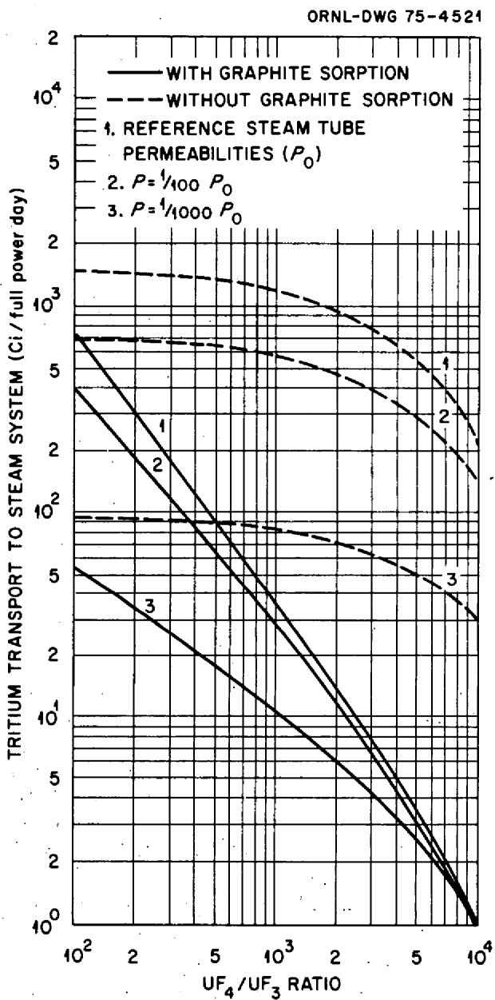  
Fig. 1.1. Effects of $\mathrm{UF}_4 / \mathrm{UF}_3$ ratio on tritium transfer to steam system for various steam tube permeabilities both with and without sorption of tritium-containing species on graphite.

graphite is assumed to occur, the tritium transfer rate to the steam system will be $2\mathrm{Ci}/$ day or less for $\mathrm{UF_4 / UF_3}$ ratios of $7\times 10^{3}$ or higher, even with clean steam tubes. Under these conditions, a large fraction of the tritium is present as tritium fluoride, and sorption of tritium fluoride by graphite would become the primary mechanism for removal of tritium from the fuel salt. However, if graphite sorption is assumed not to occur, unacceptably large quantities of tritium would enter the steam system even with the steam-tube permeability value reduced from the clean-metal value by a factor of 1000 and a $\mathrm{UF_4 / UF_3}$ ratio of $10^4$ .Under these latter conditions the primary system purge-gas stream would remove $87\%$ of the tritium,but 34 Ci of tritium would still reach the steam system. Thus, the rate of tritium transport to the steam system can be limited to 2 Ci/day in the absence of special removal processes only if sorption of both hydrogen and HF on graphite is assumed.

The effects of reduced permeability of the steam tubes on the rate at which tritium transfers to the steam system with a $\mathrm{UF_4 / UF_3}$ ratio of 100 both with and without sorption on core graphite are shown (Fig. 1.2). Permeability reductions by a factor of about $4\times 10^{4}$ would be required to meet the 2-Ci/day limit if reduction of steam-tube permeability were the only measure considered for limiting tritium transport. As the reductions in steam-tube permeability values are increased, larger amounts of tritium transfer into the secondary-system containment cell.

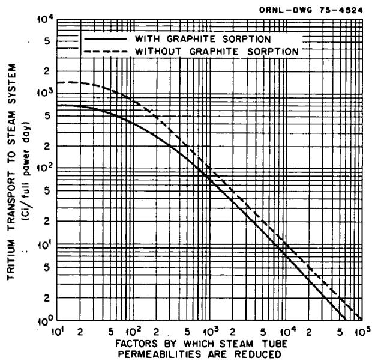  
Fig. 1.2. Effects of steam-tube permeability reductions on tritium transport.

With steam-tube permeabilities that correspond to clean metal, addition of $\mathbf{H}_2$ to the primary and/or secondary salt systems increases the rate at which tritium is transported to the steam system for addition rates that are below about $10^{5}$ times the tritium production rate. The protium addition has two direct effects: an increase in the total HF concentration due to the reaction $\mathrm{UF_4} + \frac{1}{2}\mathrm{H_2}\rightleftharpoons \mathrm{UF_3} + \mathrm{HF}$ , and a much larger decrease in the ${}^3\mathrm{H}_2 / {}^1\mathrm{H}_2$ ratio. With isotopic equilibrium in both the elemental and combined states, the net result is a decrease in the fraction of the total tritium present as ${}^3\mathrm{HF}$ and an increase in the absolute concentration of dissolved ${}^3\mathrm{H}_2$ . In addition, the metal-permeation rates that result from low protium addition rates are low enough that the dominant resistance to hydrogen transfer to the steam system is the salt film, rather than the metal wall. Hence, the rate of hydrogen transport to the steam system is almost directly proportional to the first power of the total concentration of dissolved hydrogen, and the rate of tritium permeation increases with the increase in concentration of elemental tritium. At higher protium addition rates, additional increases in HF concentration and decreases in ${}^3\mathrm{H}_2 / {}^1\mathrm{H}_2$ ratio occur, leading to still higher concentrations of dissolved elemental tritium.

However, the rate of hydrogen permeation through the metal becomes sufficiently high that the metal resistance begins to become dominant over the fluid-film resistance. As a consequence, the total hydrogen permeation rate into the steam system increases only as the square root of the dissolved hydrogen concentration while the ${}^{3}\mathrm{H}_{2} / {}^{1}\mathrm{H}_{2}$ ratio decreases more rapidly. This leads to a net decrease in the rate of tritium transport to the steam system. When lower steam-tube permeabilities are considered, the tube-wall resistance is dominant at very low hydrogen permeation rates. Thus, even low rates of protium addition, in conjunction with lower steam-tube permeability values, significantly reduce the rate at which tritium transfers to the steam system (Fig. 1.3). Both the primary- and secondary-system purge streams remove substantial amounts of tritium under these conditions.

A protium addition rate of $10^{6}$ times the tritium production rate along with a reduction in steam-tube permeability by a factor of 100 is required to adequately restrict the rate of tritium transfer to the steam system. However, the dilution of the tritium as a result of adding protium at this rate would not be acceptable. The tritium production rate of 2420 Ci/day corresponds to only $0.8\mathrm{cm}^3 /$ day of ${}^{3}\mathrm{H}_{2}\mathrm{O}$ . However, if the ${}^{3}\mathrm{H}_{2}\mathrm{O}$ were diluted with ${}^{1}\mathrm{H}_{2}\mathrm{O}$ by a factor of $10^{6}$ , about $8800\mathrm{m}^3$ of water would result after 30 years of reactor opera

tion. Storing this much water is not economically acceptable. Reducing the steam-tube permeability by a factor of 1000 reduces the required ${}^{1}\mathrm{H}_{2}$ addition rate to $10^{4}$ times the tritium production rate. The effect of graphite sorption at these protium addition rates is considerably less pronounced than in the reference case. The results were essentially the same for a given rate of protium addition to either the primary or secondary system. Simultaneous additions to both primary and secondary circuits provide little advantage over addition of hydrogen to either circuit.

Addition of protium fluoride to the secondary system as a means of suppressing the rate of tritium transport to the steam system requires that the rate of exchange of tritium for protium in HF to form $^3\mathrm{HF}$ shall be rapid and that the $^3\mathrm{HF}$ shall not react rapidly with the metal walls to liberate tritium. As shown in Fig. 1.4, addition of $^1\mathrm{HF}$ to the secondary circuit at 500 times the tritium production rate (5.5 cm³/sec) limits the rate of tritium transport to the steam system to 2 Ci/day or less without assuming sorption of $\mathbf{H}_2$ or HF or a reduction in the permeability of the steam system tubes below that of clean metal. Addition of $^1\mathrm{HF}$ at this rate would require adding and removing about 42 g-moles of HF per day or about 0.84 kg per day. The corresponding steady-state concentration of HF in the secondary salt would be 0.6 ppm.

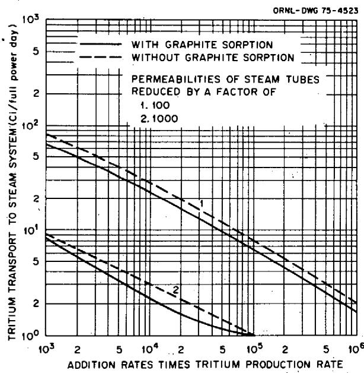  
Fig. 1.3. Effects of hydrogen addition to the primary or secondary system on the rate of tritium transport to MSBR steam system.

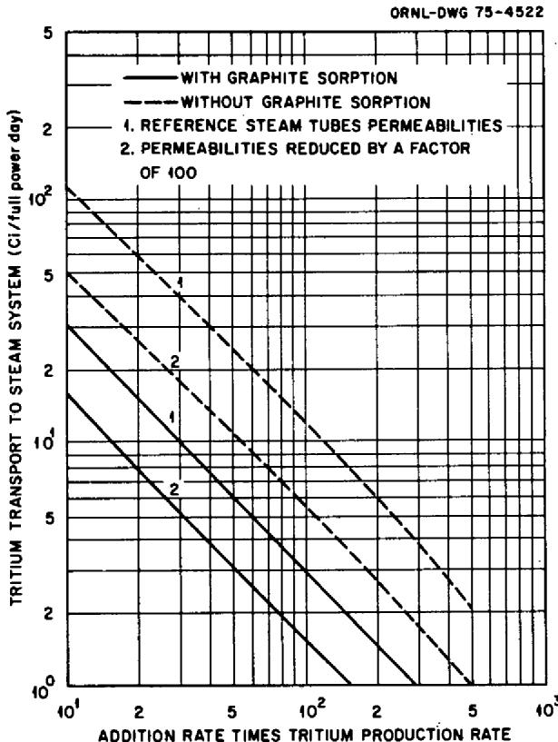  
Fig. 1.4. Effects of HF addition to the secondary system on the rate of tritium transport to the steam system.

Increasing the secondary purge-gas flow rate from 20 cfm (reference value) to 100 cfm along with addition of ${}^{1}\mathrm{HF}$ resulted in essentially no further reduction in the rate at which tritium transferred to the steam system. Increasing the $\mathrm{UF_4 / UF_3}$ ratio above the reference value of $10^2$ with ${}^{1}\mathrm{HF}$ additions also proved no more effective because the increase in removal of ${}^{3}\mathrm{HF}$ by the purge systems gained from the higher $\mathrm{UF_4 / UF_3}$ ratio was negated by the decrease in removal of elemental tritium in the purge systems due to the same increased $\mathrm{UF_4 / UF_3}$ ratio.

The gas-purge system of the reference-design MSBR involves the injection of helium gas bubbles directly into the salt stream, bubble circulation throughout the loop, and gas stripping from a bypass flow on the main loop. This system is explicitly provided for the fuel salt, and for this investigation, a similar system is presumed for the secondary salt. Variations in the operating parameters for such systems are limited by the bypass flow rates, nominally $10\%$ , that are economically acceptable and by the circulating void fractions[14] associated with the gas purge rates, nominally 10 and 20 cfm for the primary and secondary circuits, respectively. Nevertheless,

less, various combinations of increased bypass flows in the primary and secondary circuits, $15\%$ ; increased purge-gas flows, 20 cfm and 40 cfm for the primary and secondary systems, respectively; a further increase of the secondary purge gas flow, 100 cfm; higher $\mathrm{UF_4 / UF_3}$ ratio, $10^{3}$ ; and consideration of graphite sorption and permeability reduction of the steam tubes were all examined. However, the results of the calculations indicated that the design objective of 2 Ci/day would not be attained with the most favorable combination of these particular parameter values within the ranges indicated above. Only when the $\mathrm{UF_4 / UF_3}$ ratio was $10^{3}$ , with graphite sorption allowed, steam-tube permeabilities reduced by a factor of 1000, bypass flows increased to $15\%$ , and gas purge flows increased to 20 cfm and 100 cfm for the primary and secondary systems, respectively (where 9 Ci/day entered the steam system) was the 2 Ci/day rate even approached. Thus stripping via circulating gas bubbles in the absence of the addition of protium or protium-bearing materials will not adequately limit tritium transport to the steam system.

These results led to a consideration of gas-stripping systems outside the main loops, for example, spray towers or packed columns, in which the gas flow rates would be less restricted. For calculation purposes, it was assumed that $99\%$ stripping efficiencies for $\mathbf{H}_2$ and HF could be achieved. The calculations indicated that high stripping efficiencies alone, on $10\%$ salt bypass streams, would not adequately limit tritium transport to the steam system. The objective of a 2 Ci/day or less tritium release rate was reached when the $99\%$ stripping efficiencies were assumed for $20\%$ salt bypass streams, with the $\mathrm{UF_4 / UF_3}$ ratio at $10^{3}$ and steam-tube permeabilities reduced by a factor of 100. In this case nearly all the tritium was removed in the primary-system stripper, as ${}^{3}\mathrm{HF}$ . Thus, small HF injections, with high stripping efficiency, would achieve the 2 Ci/day objective with less drastic changes in the other operating parameters.

Some hydrogen will be present in the steam system of an MSBR as a consequence of metal corrosion and the thermal dissociation of water at high temperatures, as well as from hydrogen added for corrosion control or tritium management. If water dissociation is the only source of hydrogen, the hydrogen concentrations in steam will be $4 \times 10^{-3}$ ppb (by volume) in the steam generator, 0.2 ppb in the superheater, and 0.14 ppb in

the steam reheater; these quantities are used as reference values in the mathematical model. The effect of back-diffusion of hydrogen from the steam system to the secondary salt circuit on the rate of tritium transport into the steam system was examined for steam-system hydrogen concentrations ranging from 1 ppb to 100 ppm by volume.

With all other system parameters and operating conditions at their reference values, increased hydrogen back-diffusion increased the rate of tritium transport to the steam system until the hydrogen concentration reached $\sim 10$ ppm (Fig. 1.5). (When $\mathrm{H}_{2}$ and HF sorption on core graphite was eliminated, the rate of tritium transport to the steam system peaked at $\sim 5$ ppm $\mathrm{H}_{2}$ .) At higher steam-system hydrogen concentrations and when the steam-tube permeabilities were reduced by a factor of 100, tritium transport to the steam system was inhibited. The rationale for this behavior is essentially the same as that described earlier in connection with direct hydrogen injections into the primary and secondary systems. However, inhibition by hydrogen back-diffusion was insufficient to limit tritium transport to the steam system to the desired 2 Ci/day (Fig. 1.5).

If tritium entering the secondary salt system of an MSBR could be converted to a chemically inert form (i.e., a form which would not yield elemental tritium), tritium transport to the steam system could be greatly reduced. Consequently, tritium distribution calculations

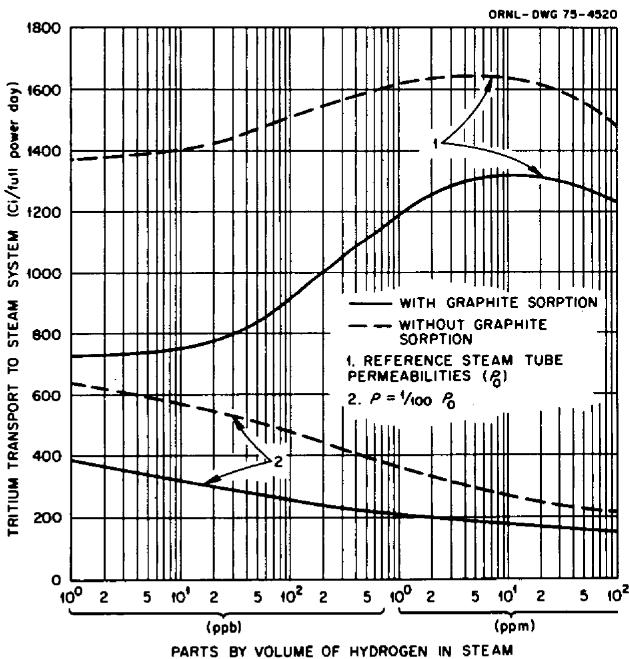  
Fig. 1.5. Effects of hydrogen back diffusion on tritium transport.

were made for conditions in which a hypothetical hydrogen-bearing chemical, or getter, was continuously added to the secondary salt and continuously removed from a $10\%$ salt bypass stream, with an efficiency of $80\%$ , by an unspecified process. It was assumed that rapid isotopic exchange would occur between tritium in the salt and one atom of hydrogen per molecule of getter and that the getter was completely inert. Under these assumptions, with reference values for all other system parameters and operating conditions but without $\mathbf{H}_2$ and HF sorption on core graphite, tritium transport to the steam system was limited to $\sim 1$ Ci/day for gram-mole addition rates of the getter equal to $10^{3}$ times the gram-atom production rate of tritium, or 42 kg/day if the getter molecular weight is 50. Note that these results are quite similar to those obtained for the addition of protium fluoride to the secondary salt for the case where sorption on graphite was assumed not to occur and with reference steam-tube permeability values (Fig. 1.4).

Under the assumptions stated above and for fixed operating conditions (other than salt bypass flow rate) the required rate of getter addition to achieve a given rate of tritium transport to the steam system is independent of the salt bypass flow rate. However, the salt bypass flow rate determines the equilibrium concentration of the getter in the secondary salt. Section 1 of Table 1.3 shows the resultant concentrations in the secondary salt at several different salt bypass flow rates, along with the specific activity of tritium in the getter (waste).

Because of the effect of hydrogen back-diffusion from the steam system on the tritium transport rate to the steam system and the fact that the hydrogen concentration to be expected in an MSBR steam system is not accurately known, additional calculations were made to determine the getter addition rates required to limit tritium transport to the steam system to $\sim 1$ Ci/day. The results for hydrogen-in-steam concentrations of $100\mathrm{ppb}$ and $100\mathrm{ppm}$ are shown in Sects. 2 and 3, respectively, of Table 1.3. Substantially more getter would be required at higher concentrations if high concentrations of hydrogen in steam are encountered.

In Table 1.4 are presented the calculated distributions for removal of tritium in curies per full-power day for some of the various conditions previously discussed.

# 1.1.2 Coolant-Salt Technology Facility Calculations

The computer program used to study tritium transport in the MSBR was adapted to describe a set of

Table 1.3. Required addition rates and concentrations of a chemical getter in an MSBR secondary salt system to limit tritium transport to the steam system to $\sim 1$ Ci/day   

<table><tr><td>Salt by-pass flow rateb(% of main flow)</td><td>Getter concentration in secondary salt</td><td>Addition (and removal) rate of chemical getter (kg/day)</td><td>Specific activity of tritiated getter (Ci/g)</td></tr><tr><td colspan="4">1. Reference value hydrogen concentrations in steam system (≤0.2 ppb)c; getters added at 103times tritium-production rate</td></tr><tr><td>10</td><td>64 ppb</td><td>42</td><td>0.5</td></tr><tr><td>1</td><td>640 ppb</td><td>42</td><td>0.5</td></tr><tr><td>0.1</td><td>64 ppm</td><td>42</td><td>0.5</td></tr><tr><td>0.01</td><td>64 ppm</td><td>42</td><td>0.5</td></tr><tr><td>0.001</td><td>640 ppm</td><td>42</td><td>0.5</td></tr><tr><td colspan="4">2. Hydrogen concentration 100 ppb in steam system; getters added at 3 × 104times tritium-production rate</td></tr><tr><td>10</td><td>2 ppm</td><td>126</td><td>0.2</td></tr><tr><td>1</td><td>20 ppm</td><td>126</td><td>0.2</td></tr><tr><td>0.1</td><td>200 ppm</td><td>126</td><td>0.2</td></tr><tr><td>0.01</td><td>2×103ppm</td><td>126</td><td>0.2</td></tr><tr><td>0.001</td><td>2×104ppm</td><td>126</td><td>0.2</td></tr><tr><td colspan="4">3. Hydrogen concentration 10 ppm in steam system; getters added at 7 × 105times tritium-production rate</td></tr><tr><td>10</td><td>44 ppm</td><td>2833</td><td>7×10-4</td></tr><tr><td>1</td><td>440 ppm</td><td>2833</td><td>7×10-4</td></tr><tr><td>0.1</td><td>4.4×103ppm</td><td>2833</td><td>7×10-4</td></tr><tr><td>0.01</td><td>4.4×104ppm</td><td>2833</td><td>7×10-4</td></tr><tr><td>0.001</td><td>4.4×105ppm</td><td>2833</td><td>7×10-4</td></tr></table>

aOne exchangeable hydrogen atom per molecule; molecular weight $= 50$   
$b_{\text{Getter removal efficiency, } 80\%}$ .   
$c$ Clean-metal permeabilities for steam-system tubes; no $\mathbf{H}_2$ or HF sorption on graphite.

proposed deuterium injection experiments for the Coolant-Salt Technology Facility (CSTF). The purpose of the experiments was to investigate the possibility of tritium retention in sodium fluoroborate coolant salt using deuterium as a stand-in for tritium. The results of the calculations could be applied to either deuterium or tritium for the conditions considered.

The parameters to be varied were temperature (850, 1000, $1150^{\circ}\mathrm{F}$ ) of the loop, salt flow rate (785, 520 gpm), and deuterium injection rate (1.33, 2.8 cc/hr).

The results indicate that, for reference permeability values of the loop walls, the steady-state concentrations of deuterium in the salt and off-gas could be expected to range from 0.013 ppb to 0.34 ppb and from 0.04 ppm to 1.1 ppm, respectively. For a reduction of wall permeabilities by a factor of 10 the concentrations in the salt and off-gas would range from 0.3 ppb to 7.3 ppb and from 0.9 ppm to 24 ppm, respectively. The results are presented as $\mathbf{D}_2$ or $\mathbf{T}_2$ concentrations in the salt as a function of the test parameters (Table 1.5).

Table 1.4. Calculated distributions in an MSBR for various conditions   

<table><tr><td colspan="4">Conditions</td><td colspan="3">Chemical additions</td><td colspan="8">Removal rate (Ci/full-power day)</td></tr><tr><td rowspan="3">Case No.</td><td rowspan="3">U4+/U3+ ratio</td><td rowspan="3">Steam tube permeability reduction factor</td><td rowspan="3">Graphite sorption?</td><td rowspan="3">Material added</td><td rowspan="3">Added to</td><td rowspan="3">Rate (ratio of addition rate to production rate)</td><td colspan="5">Primary system</td><td colspan="3">Secondary system</td></tr><tr><td colspan="2">Graphite in core</td><td colspan="2">Purge</td><td rowspan="2">T through walls</td><td colspan="2">Purge</td><td rowspan="2">T through walls</td></tr><tr><td>T</td><td>TF</td><td>T</td><td>TF</td><td>T</td><td>TF</td></tr><tr><td>1.</td><td>102a</td><td>1a</td><td>Yesa</td><td>Nonea</td><td></td><td></td><td>184</td><td>980</td><td>212</td><td>38</td><td>15</td><td>20</td><td></td><td>241</td></tr><tr><td>2.</td><td>102</td><td>100</td><td>Yes</td><td>None</td><td></td><td></td><td>189</td><td>999</td><td>218</td><td>39</td><td>16</td><td>43</td><td></td><td>511</td></tr><tr><td>3.</td><td>102</td><td>1</td><td>No</td><td>None</td><td></td><td></td><td></td><td></td><td>413</td><td>52</td><td>30</td><td>39</td><td></td><td>461</td></tr><tr><td>4.</td><td>102</td><td>100</td><td>No</td><td>None</td><td></td><td></td><td></td><td></td><td>440</td><td>54</td><td>32</td><td>101</td><td></td><td>1132</td></tr><tr><td>5.</td><td>103</td><td>1</td><td>Yes</td><td>None</td><td></td><td></td><td>9</td><td>2261</td><td>11</td><td>89</td><td>1</td><td>1</td><td></td><td>12</td></tr><tr><td>6.</td><td>103</td><td>100</td><td>Yes</td><td>None</td><td></td><td></td><td>9</td><td>2262</td><td>11</td><td>89</td><td>&lt;1</td><td>1</td><td></td><td>18</td></tr><tr><td>7.</td><td>103</td><td>1</td><td>No</td><td>None</td><td></td><td></td><td></td><td></td><td>339</td><td>475</td><td>24</td><td>32</td><td></td><td>380</td></tr><tr><td>8.</td><td>103</td><td>100</td><td>No</td><td>None</td><td></td><td></td><td></td><td></td><td>357</td><td>490</td><td>26</td><td>78</td><td></td><td>894</td></tr><tr><td>9.</td><td>104</td><td>1</td><td>Yes</td><td>None</td><td></td><td></td><td>&lt;1</td><td>2328</td><td>&lt;1</td><td>91</td><td>&lt;1</td><td>&lt;1</td><td></td><td>&lt;1</td></tr><tr><td>10.</td><td>104.</td><td>1</td><td>No</td><td>None</td><td></td><td></td><td></td><td></td><td>60</td><td>2080</td><td>4</td><td>6</td><td></td><td>68</td></tr><tr><td>11.</td><td>104</td><td>100</td><td>No</td><td>None</td><td></td><td></td><td></td><td></td><td>60</td><td>2088</td><td>4</td><td>9</td><td></td><td>116</td></tr><tr><td>12.</td><td>102</td><td>100</td><td>Yes</td><td>H2</td><td>Primary</td><td>104</td><td>670</td><td>19</td><td>774</td><td>&lt;1</td><td>17</td><td>792</td><td></td><td>125</td></tr><tr><td>13.</td><td>102</td><td>1000</td><td>Yes</td><td>H2</td><td>Primary</td><td>104</td><td>674</td><td>19</td><td>778</td><td>&lt;1</td><td>17</td><td>804</td><td></td><td>124</td></tr><tr><td>14.</td><td>102</td><td>100</td><td>No</td><td>H2</td><td>Primary</td><td>104</td><td></td><td></td><td>1116</td><td>1</td><td>21</td><td>1110</td><td></td><td>147</td></tr><tr><td>15.</td><td>102</td><td>1000</td><td>No</td><td>H2</td><td>Primary</td><td>104</td><td></td><td></td><td>1122</td><td>1</td><td>21</td><td>1125</td><td></td><td>148</td></tr><tr><td>16.</td><td>102</td><td>100</td><td>Yes</td><td>H2</td><td>Primary</td><td>105</td><td>785</td><td>7</td><td>905</td><td>&lt;1</td><td>8</td><td>673</td><td></td><td>36</td></tr><tr><td>17.</td><td>102</td><td>1000</td><td>Yes</td><td>H2</td><td>Primary</td><td>105</td><td>786</td><td>7</td><td>906</td><td>&lt;1</td><td>8</td><td>678</td><td></td><td>37</td></tr><tr><td>18.</td><td>102</td><td>100</td><td>No</td><td>H2</td><td>Primary</td><td>105</td><td></td><td></td><td>1406</td><td>&lt;1</td><td>10</td><td>953</td><td></td><td>43</td></tr><tr><td>19.</td><td>102</td><td>1000</td><td>No</td><td>H2</td><td>Primary</td><td>105</td><td></td><td></td><td>1408</td><td>&lt;1</td><td>10</td><td>958</td><td></td><td>44</td></tr><tr><td>20.</td><td>102</td><td>1</td><td>Yes</td><td>HF</td><td>Secondary</td><td>50</td><td>180</td><td>960</td><td>208</td><td>38</td><td>15</td><td>&lt;1</td><td>1012</td><td>2</td></tr><tr><td>21.</td><td>102</td><td>1</td><td>No</td><td>HF</td><td>Secondary</td><td>50</td><td></td><td></td><td>397</td><td>50</td><td>28</td><td>&lt;1</td><td>1914</td><td>7</td></tr><tr><td>22.</td><td>102</td><td>1</td><td>Yes</td><td>HF</td><td>Secondary</td><td>500</td><td>180</td><td>960</td><td>208</td><td>38</td><td>15</td><td>&lt;1</td><td>1020</td><td>&lt;1</td></tr><tr><td>23.</td><td>102</td><td>1</td><td>No</td><td>HF</td><td>Secondary</td><td>500</td><td></td><td></td><td>397</td><td>50</td><td>28</td><td>&lt;1</td><td>1942</td><td>&lt;1</td></tr><tr><td>24.</td><td>103b</td><td>100</td><td>No</td><td>None</td><td></td><td></td><td></td><td></td><td>2</td><td>2415</td><td>&lt;1</td><td>&lt;1</td><td></td><td>1</td></tr><tr><td>25.</td><td>102c</td><td>1</td><td>Yes</td><td>H2species</td><td>Secondary</td><td>102</td><td>180</td><td>959</td><td>208</td><td>38</td><td>15</td><td>&lt;1</td><td>1016d</td><td>1</td></tr><tr><td>26.</td><td>102c</td><td>1</td><td>No</td><td>H2species</td><td>Secondary</td><td>102</td><td></td><td></td><td>397</td><td>50</td><td>28</td><td>&lt;1</td><td>1930</td><td>4</td></tr><tr><td>27.</td><td>102c</td><td>100</td><td>Yes</td><td>H2species</td><td>Secondary</td><td>102</td><td>181</td><td>952</td><td>209</td><td>37</td><td>15</td><td>&lt;1</td><td>1773</td><td>2</td></tr><tr><td>28.</td><td>102c</td><td>100</td><td>No</td><td>H2species</td><td>Secondary</td><td>102</td><td></td><td></td><td>397</td><td>48</td><td>28</td><td>&lt;1</td><td>1931</td><td>9</td></tr><tr><td>29.</td><td>102c</td><td>1</td><td>Yes</td><td>H2species</td><td>Secondary</td><td>103</td><td>180</td><td>959</td><td>208</td><td>38</td><td>15</td><td>&lt;1</td><td>1020</td><td>&lt;1</td></tr><tr><td>30.</td><td>102</td><td>1</td><td>No</td><td>H2species</td><td>Secondary</td><td>103</td><td></td><td></td><td>397</td><td>50</td><td>28</td><td>&lt;1</td><td>1944</td><td>&lt;1</td></tr></table>

$a$ Reference design conditions.   
$b99\%$ removal efficiency in primary system on $20\%$ bypass flow.   
${}^{c}{80}\%$ removal efficiency in secondary system on ${10}\%$ bypass flow.   
$d_{\text{With respect to the H}_2\cdot \text{species addition}}$ to the secondary system, this column for removal is actually the tritiated form of the species and not TF.

Table 1.5. $\mathbf{D}_2$ or $\mathbf{T}_2$ concentration in CSTF   

<table><tr><td colspan="3">CSTF test parameters</td><td colspan="4">D2or T2concentration</td></tr><tr><td rowspan="2">Injection rate (cm3/hr)</td><td rowspan="2">Temperature (°F)</td><td rowspan="2">Salt flow rate (gpm)</td><td colspan="2">Reference permeability</td><td colspan="2">Permeability reduced by 10</td></tr><tr><td>Salt (ppb)</td><td>Off-gas (ppm)</td><td>Salt (ppb)</td><td>Off-gas (ppm)</td></tr><tr><td>1.33</td><td>850</td><td>785</td><td>0.086</td><td>0.3</td><td>2.6</td><td>8.6</td></tr><tr><td>1.33</td><td>1000</td><td>785</td><td>0.026</td><td>0.84</td><td>0.9</td><td>3.0</td></tr><tr><td>1.33</td><td>1150</td><td>785</td><td>0.013</td><td>0.04</td><td>0.3</td><td>0.9</td></tr><tr><td>2.8</td><td>850</td><td>785</td><td>0.3</td><td>1.0</td><td>6.8</td><td>23.</td></tr><tr><td>2.8</td><td>1150</td><td>785</td><td>0.034</td><td>0.1</td><td>1.0</td><td>3.5</td></tr><tr><td>2.8</td><td>850</td><td>520</td><td>0.34</td><td>1.1</td><td>7.3</td><td>24.</td></tr><tr><td>2.8</td><td>1150</td><td>520</td><td>0.043</td><td>0.14</td><td>1.0</td><td>3.5</td></tr></table>

# 1.2 NEUTRONIC ANALYSES

H. T. Kerr E. J. Allen

Estimates of the $^{233}\mathrm{U}$ fission rate and the tellurium production rate in the recently completed TeGen-1 capsule experiment (Sect. 7.14) were obtained from a flux mapping experiment, direct flux monitoring in the TeGen-1 capsule, and computational analyses.

In the flux mapping experiment, aluminum tubes containing various monitor materials were inserted into an aluminum-iron capsule intended to simulate the TeGen-1 capsule. These monitors were irradiated in selected positions in the P4B poolside facility of the ORR. (The TeGen-1 capsule was operated in the adjacent facility, P4A.) The $^{233}\mathrm{U}$ fission rate in the TeGen-1 capsule was then estimated, based on the induced activities of these monitors.

Various monitor wires were also contained within the TeGen-1 capsule. When the TeGen-1 capsule was disassembled, these wires were recovered and the induced activities for the following reactions were measured:

$^{59}$ Co(n,γ) $^{60}$ Co,   
$^{54}\mathrm{Fe}(n,p)^{54}\mathrm{Mn},$   
58 Fe(n,γ)59 Fe.

The activities of these monitors indicate a $^{233}\mathrm{U}$ fission rate (and tellurium production) which is $40\%$ less than that previously estimated from the flux mapping experiment.

To determine the source of this discrepancy, calculations were made using the neutron transport code XSDRNM15. The calculations indicate that the TeGen-1 capsule reduces the flux by about $35\%$ more

than the aluminum-iron mockup capsule, which accounts for the discrepancy between the two experimental values for the $^{233}\mathrm{U}$ fission rate.

The corrected full-power fission rates and heat generation rates for the three fuel pins in the TeGen-1 capsule are:

<table><tr><td></td><td>Fission rate (fissions/sec atom)</td><td>Fission heat rate (W)</td></tr><tr><td>Upper fuel pin</td><td>2.93 × 10-9</td><td>192.4</td></tr><tr><td>Middle fuel pin</td><td>3.23 × 10-9</td><td>211.5</td></tr><tr><td>Lower fuel pin</td><td>2.90 × 10-9</td><td>190.4</td></tr></table>

An average fission rate of $2.15 \times 10^{-9}$ fission/sec per atom of $^{233}\mathrm{U}$ was used to estimate the amounts of the various tellurium isotopes produced by the irradiation. These amounts are expressed as equivalent uniform tellurium-deposition densities on the salt-wetted metal surface $(27~\mathrm{cm}^2)$ of each fuel pin (Table 1.6). The calculated quantities are based on yield data from ref. 16 with the assumption that all the tellurium deposits instantaneously on the metal surface. The maximum integrated tellurium exposure was computed from the total amount produced during the 67-day irradiation; but this calculated value is clearly an overestimate since significant fractions of the shorter-lived isotopes would decay before the atoms could reach the metal surface. The remaining two columns indicate the amount of tellurium that theoretically could have been on the surface after irradiation for 33.5 and 67 days, with appropriate

Table 1.6. Calculated tellurium production in TeGen-1 fuel pinsa   

<table><tr><td rowspan="2">Isotope</td><td rowspan="2">233U fission yieldb (%)</td><td rowspan="2">Half-life (hr)</td><td rowspan="2">Maximum integrated tellurium exposure after 67 days (1016 atoms/cm2)</td><td colspan="2">Residual tellurium deposit (1016 atoms/cm2)</td></tr><tr><td>Irradiated 33.5 days</td><td>Irradiated 67 days</td></tr><tr><td>125Te</td><td>0.116c</td><td>Stable</td><td></td><td></td><td></td></tr><tr><td>126Te</td><td>0.016d</td><td>Stable</td><td>0.017</td><td>0.0084</td><td>0.017</td></tr><tr><td>127mTe</td><td>0.119</td><td>2616.0</td><td>0.125</td><td>0.0563</td><td>0.1017</td></tr><tr><td>127Te</td><td>0.555</td><td>9.4</td><td>0.583</td><td>0.0049</td><td>0.0049</td></tr><tr><td>128Te</td><td>0.931</td><td>Stable</td><td>0.978</td><td>0.4888</td><td>0.978</td></tr><tr><td>129mTe</td><td>0.346</td><td>801.6</td><td>0.363</td><td>0.131</td><td>0.196</td></tr><tr><td>129Te</td><td>1.24</td><td>1.17</td><td>1.30</td><td>0.0014</td><td>0.0014</td></tr><tr><td>130Te</td><td>2.33</td><td>Stable</td><td>2.45</td><td>1.223</td><td>2.45</td></tr><tr><td>131mTe</td><td>1.16</td><td>30</td><td>1.22</td><td>0.0328</td><td>0.0328</td></tr><tr><td>131Te</td><td>2.30</td><td>0.417</td><td>2.42</td><td>0.0009</td><td>0.0009</td></tr><tr><td>132Te</td><td>4.52</td><td>78</td><td>4.75</td><td>0.3321</td><td>0.3321</td></tr><tr><td>133mTe</td><td>3.20</td><td>0.923</td><td>3.36</td><td>0.0028</td><td>0.0028</td></tr><tr><td>133Te</td><td>1.40</td><td>0.208</td><td>1.47</td><td>0.0003</td><td>0.0003</td></tr><tr><td>134Te</td><td>3.04</td><td>0.700</td><td>3.19</td><td>0.0020</td><td>0.0020</td></tr><tr><td>135Te</td><td>1.19</td><td>0.00533</td><td>1.25</td><td></td><td></td></tr><tr><td>136Te</td><td>0.349</td><td>0.00583</td><td>0.366</td><td></td><td></td></tr><tr><td>Total</td><td></td><td></td><td>23.84</td><td>2.28</td><td>4.12</td></tr></table>

${}^{a}$ Irradiated 67 days at an average fission rate of ${2.15} \times  {10}^{-9}$ fission/sec per atom of ${}^{233}\mathrm{U}$ .   
$b_{\mathbf{Y}}$ yield to ground state does not include that which decays from the isomeric state to the ground state.   
$c$ Yield is for 2.7-year $^{125}\mathrm{Sb}$ precursor; Te production in 67 days is negligible.   
$d_{\mathbf{Y}}$ yield is taken as sum of direct yields to $^{126}\mathrm{Sb}$ and $^{126}\mathrm{Te}$ only; yield to the $10^{5}$ -year $^{126}\mathrm{Sn}$ precursor is neglected.

allowance for decay on the surface. The final value, $4.12 \times 10^{16}$ atoms/cm $^2$ , indicates that the design objective $^{17}$ of $\sim 5 \times 10^{16}$ atoms/cm $^2$ was met. This final value is also well above the lowest calculated deposition densities ( $\sim 1 \times 10^{16}$ atoms/cm $^2$ ) for MSRE specimens in which surface cracking of standard Hastelloy N was observed. $^{17}$ Measured tellurium concentrations on MSRE surfaces removed after the final shutdown ranged from 0.74 to $4.5 \times 10^{17}$ atoms/cm $^2$ (ref. 18).

ORIGEN (ORNL Isotope Generation and Depletion Code) calculations of fission-product concentrations were also done to aid in postirradiation chemical analyses of TeGen-1.

# 1.3 HIGH-TEMPERATURE DESIGN

J.M.Corum G.T.Yahr

Thermal ratchetting and creep-fatigue damage are important considerations in the design of reactor systems that will operate at elevated temperatures. The

investigation described in the following section is being performed under the ORNL High-Temperature Design Program, which is supported in part by the MSR Program. From the results to be obtained, simplified ratchetting rules can be developed and/or evaluated, modeling procedures for applying simplified ratchetting rules to prototypic component geometries and loadings can be examined, and the conservative applicability of simplified rules and procedures and of elastic creep-fatigue rules can be tested. Although the reference material being used in these studies currently is type 304 stainless steel, a careful assessment of the applicability of the results to Hastelloy N will be made. A series of inelastic pipe-ratchetting analyses will be done using Hastelloy N properties and typical MSBR temperature and pressure histograms to determine the severity of the thermal-ratchetting and creep-fatigue damage problems in the MSBR (Sec. 1.3.2).

# 1.3.1 Analytical Investigation of the Applicability of Simplified Ratchetting and Creep-Fatigue Rules to Reactor System Component Geometries

1.3.1.1 Purpose. The purpose of the analytical studies being performed under this task is twofold.

First, modeling procedures for applying the simplified ratchetting rules given in ASME Code Case 1592 (ref. 19), RDT Standard F9-4 (ref. 20), and RDT Standard F9-5 (ref. 21) to geometries and loadings prototypic of those encountered in high-temperature reactor component designs are to be identified. Second, the conservative applicability of these ratchetting rules and procedures and of elastic creep-fatigue rules will probably be demonstrated and placed on a reasonably sound and defensible engineering basis.

The basic approach is to perform a relatively small number of carefully planned and coordinated rigorous elastic-plastic-creep ratchetting-type analyses. The problems being examined range from prototypic three-dimensional component geometries and loadings to more basic two-dimensional axisymmetric problems specially contrived to augment the more complex problems by delineating the individual factors that determine or influence ratchetting behavior in realistic structures. Each inelastic analysis will include a complete Code evaluation for accumulated strains and creep-fatigue damage. Also associated with each inelastic analysis are a number of elastic analyses to provide the input parameters required to apply the various simplified ratchetting rules and procedures and elastic creep-fatigue rules.

1.3.1.2 Discussion of problem. ASME Code Case 1592 and RDT Standard F9-5 provide simplified rules and procedures that, in certain specified situations, can be used in lieu of a detailed inelastic analysis for demonstrating that the maximum accumulated inelastic strains do not exceed the specified Code limits. In addition to the O'Donnell-Porowski method $^{22}$ that is included in Code Case 1592, RDT Standard F9-4 also allows the use of a modified Bree complete relaxation method $^{23}$ and of a detailed one-dimensional (pipe

ratchetting) inelastic analysis to predict accumulated strains in more complex structures. Both the O'Donnell-Porowski method and the Bree complete relaxation method use the results of elastic calculations. In fact, even the one-dimensional inelastic analysis must properly reflect the elastically calculated primary membrane and secondary discontinuity stresses.

All of these simplified rules and procedures are, as explained in RDT Standard F9-5 (ref. 21), based on mathematically one-dimensional inelastic analyses of thin-walled cylindrical vessels under sustained internal pressure with a cyclic temperature gradient through the wall. The conservative applicability of these simplified rules and procedures to straight pipes with axisymmetric thermal and mechanical secondary stresses has been verified through comparisons with the results of detailed inelastic analyses.[24] These simplified rules and procedures have also been shown to be applicable to a nozzle-to-spherical-shell geometry with axisymmetric loadings[25,26] and to thin-walled pipes subjected to nonaxisymmetric bending loads.[27] On the basis of these few comparisons, RDT Standard F9-5 states that the simplified rules and procedures can, with caution, generally be applied to axisymmetric shells subjected to axisymmetric loadings in locations where there are no local structural discontinuities[28] and to straight pipes subjected to net nonaxisymmetric bending. For the latter case, the maximum outer fiber bending stress must be treated as an axisymmetric axial primary stress in the one-dimensional evaluation.

As stated, the applicability of these procedures is severely limited. Without justification and owner approval they cannot be used in many, if not most, realistic design situations. These limitations were recognized when the rules were written, but it was expected that they would be shown to conservatively apply to a broader class of structural situations as additional inelastic analyses of prototypic structures were performed and experience was accumulated.

This study will provide the basis and justification for removing the limitations placed on the applicability of the simplified ratchetting rules and procedures. The validity of the application of these procedures to regions of local structural discontinuity, to nonaxisymmetric loading on axisymmetric shell-type structures, and to general nonaxisymmetric shell-type structures (such as nozzle-to-cylinder attachments, valve bodies, piping elbows, etc.) is being systematically and progressively studied. Although these specific applications are limited by present Code restrictions, this study is to show that the procedures are appropriate for any general shell-type structure.

If costly and time-consuming rigorous inelastic analyses are to be avoided in design, the elastic creep-fatigue rules must be satisfied as well as the simplified ratchetting rules. The elastic creep-fatigue rules in Code Case 1592 include the use of an approximate equation for estimating the maximum inelastic strain from elastically calculated quantities for determining fatigue damage. The fatigue curves to be used include reductions for slow strain rates and hold times. Creep damage is based only on primary and secondary stresses resulting from sustained operating conditions; secondary stresses generated by transients are assumed to relax off and thus be taken care of by the hold-time effects that are factored into the elastic analysis fatigue curves.

The conservatism of these and other possible elastic analysis creep-fatigue rules relative to the more rigorous inelastic analysis rules is currently being evaluated by the ASME Code Working Group on Creep-Fatigue for simple cylindrical shells.[29] ORNL participated in this evaluation by performing a series of comparative elastic and inelastic analyses and evaluations.[30] The conservative applicability of the procedures to more prototypic geometries and loadings is even more uncertain. Thus, comparative elastic and inelastic creep-fatigue evaluations are an important part of the study described herein. These evaluations allow an assessment to be made of the conservatism of the various elastic creep-fatigue procedures and also help to establish the relation between the simplified ratchetting rules and

procedures and elastic creep-fatigue rules and procedures.

1.3.1.3 Scope of Study. The analytical study consists of five types of elastic-plastic-creep ratchetting analyses:

1. notched circular cylindrical shells - 2 cases,   
2. circular cylindrical shells with axial temperature, pressure, and/or wall thickness variations - 7 cases,   
3. prototypic nozzle-to-spherical-shell attachment (FFTF IHX inlet nozzle geometry) - 1 case,   
4. prototypic nozzle-to-cylindrical-shell attachment (FFTF IHX inlet nozzle geometry) - 1 case.   
5. comparison infinite cylinder (one-dimensional pipe ratchetting) analyses - 30 to 40 cases.

These five types of analyses are described with a brief statement of the purpose of each and a description of the types of loadings to be applied and the analyses to be performed (Table 1.7).

These analyses are being carried out in a closely coordinated manner by ORNL and ORNL subcontractors. The axisymmetric analyses (types 1 and 2) and the one-dimensional pipe ratchetting analyses (type 5) are being performed at ORNL using the two-dimensional elastic-plastic-creep finite-element program PLACRE. The nozzle-to-sphere and nozzle-to-cylinder analyses were subcontracted by ORNL to two LMFBR component manufacturers experienced in performing complex inelastic analyses on realistic component geometries. The MARC computer program is being used for these cases, and a three-dimensional element idealization will be used to properly represent the reinforced junction region in detail.

Although the analyses are being performed at different locations using different computer programs, the analysis efforts are being jointly planned and coordinated by the several participants. Of course, it is imperative in a study of this kind that the various inelastic analyses be completely compatible with one another. As far as possible, the mesh layouts and the degree of mesh refinement are similar in all cases. Identical constitutive relations and material behavior

Table 7.7. Summary of analyses to be performed to investigate the applicability of simplified ratchetting and creep-fatigue rules   

<table><tr><td>Structural probes</td><td>Description</td><td>Purpose</td><td>Inelastic analysesa</td></tr><tr><td>TYPE 1: NOTED CYLindrical SHells
P
P</td><td>Notched circular cylindrical shell subjected to internal pressure, axial load (to magnify the notch effect), and repeated internal Na thermal downshocks followed by hold periods.
Two separate inelastic analyses are planned, with varying notch geometries and thermal and mechanical loadings.</td><td>To verify the conservative applicability of simplified ratchetting and creep-fatigue rules and modelling procedures in regions containing local structural discontinuities.</td><td>Axisymmetric finite-element analyses to be performed at ORNL using the PIACRE computer program. Ten cycles minimum for each case.</td></tr><tr><td>TYPE 2: CYLindrical shells
O
O
O
O
O
O
O
O
O
O
O
O
O
O
O
O
O
O
O
O
O
O
O
O
O
O
O
O
O
O
O
O
O
O
O
O
O
O
O
O
O
O
O
O
O
O
O
O
O
O
0
0
0
0
0
0
0
0
0
0
0
0
0
0
0
0
0
0
0
0
0
0
0
0
0
0
0
0
0
0
0
0
0
0
0
0
0
0
0
0
0
0
0
0
0
0
0
0
0
0
O
O
O
O
O
O
O
O
O
O
O
O
O
O
O
O
O
O
O
O
O
O
O
O
O
O
O
O
O
O
O
O
O
O
O
O
O
O
O
O
O
O
O
O
O
O
O
O
O
o
o
o
o
o
o
o
o
o
o
o
o
o
o
o
o
o
o
o
o
o
o
o
o
o
o
o
o
o
o
o
o
o
o
o
o
o
o
o
o
o
o
o
o
o
o
o
o
o
o
O
O
O
O
O
O
O
O
O
O
O
O
O
O
O
O
O
O
O
O
O
O
O
O
O
O
O
O
O
O
O
O
O
O
O
O
O
O
O
O
O
O
O
O
O
O
O
O
O
P
S
T
U
W
X
Y
Z
A
B
C
D
E
F
G
H
I
J
K
L
M
N
O
O
O
O
O
O
O
O
O
O
O
O
O
O
O
O
O
O
O
O
O
O
O
O
O
O
O
O
O
O
O
O
O
O
O
O
O
O
O
O
O
O
O
O
O
O
O
O
O
D
O
O
O
O
O
O
O
O
O
O
O
O
O
O
O
O
O
O
O
O
O
O
O
O
O
O
O
O
O
O
O
O
O
O
O
O
O
O
O
O
O
O
O
O
O
O
O
O
O
C
C
C
C
C
C
C
C
C
C
C
C
C
C
C
C
C
C
C
C
C
C
C
C
C
C
C
C
C
C
C
C
C
C
C
C
C
C
C
C
C
C
C
C
C
C
C
C
C
C
O
O
O
O
O
O
O
O
O
O
O
O
O
O
O
O
O
O
O
O
O
O
O
O
O
O
O
O
O
O
O
O
O
O
O
O
O
O
O
O
O
O
O
O
O
O
O
O
O
Q
Q
Q
Q
Q
Q
Q
Q
Q
Q
Q
Q
Q
Q
Q
Q
Q
Q
Q
Q
Q
Q
Q
Q
Q
Q
Q
Q
Q
Q
Q
Q
Q
Q
Q
Q
Q
Q
Q
Q
Q
Q
Q
Q
Q
Q
Q
Q
Q
Q
O
O
O
O
O
O
O
O
O
O
O
O
O
O
O
O
O
O
O
O
O
O
O
O
O
O
O
O
O
O
O
O
O
O
O
O
O
O
O
O
O
O
O
O
O
O
O
O
O
E
F
G
H
I
J
K
L
M
N
O
O
O
O
O
O
O
O
O
O
O
O
O
O
O
O
O
O
O
O
O
O
O
O
O
O
O
O
O
O
O
O
O
O
O
O
O
O
O
o
o
o
o
o
o
o
o
o
o
O
O
O
O
O
O
O
O
O
O
O
O
O
O
O
O
O
O
O
O
O
O
O
O
O
O
O
O
O
O
O
O
O
O
O
O
O
O
O
o
o
o
o
o
o
o
o
o
o
e
e
e
e
e
e
e
e
e
e
e
e
e
e
e
e
e
e
e
e
e
e
e
e
e
e
e
e
e
e
e
e
e
e
e
e
e
e
e
e
e
e
e
e
e
e
e
e
e
e
o
o
o
o
o
o
o
o
o
o
o
o
o
o
o
o
o
o
o
o
o
o
o
o
o
o
o
o
o
o
o
o
o
o
o
o
o
o
o
o
o
o
o
o
o
o
o
o
o
e
e
e
e
e
e
e
e
e
e
e
e
e
e
e
e
e
e
e
e
e
e
e
e
e
e
e
e
e
e
e
e
e
e
e
e
e
e
e
o
o
o
o
o
o
o
o
o
o
e
e
e
e
e
e
e
e
e
e
e
e
e
e
e
e
e
e
e
e
e
e
e
e
e
e
e
e
e
e
e
e
e
e
e
e
e
e
e
c
c
c
c
c
c
c
c
c
c
c
c
c
c
c
c
c
c
c
c
c
c
c
c
c
c
c
c
c
c
c
c
c
c
c
c
c
c
c
c
c
c
c
c
c
c
c
c
c
c
C
C
C
C
C
C
C
C
C
C
C
C
C
C
C
C
C
C
C
C
C
C
C
C
C
C
C
C
C
C
C
C
C
C
C
C
C
C
C
C
C
C
C
C
C
C
C
C
C
c
c
c
c
c
c
c
c
c
c
c
c
c
c
c
c
c
c
c
c
c
c
c
c
c
c
c
c
c
c
c
c
c
c
c
c
c
c
c
c
c
c
c
c
c
c
c
c
c
e
e
e
e
e
e
e
e
e
e
e
e
e
e
e
e
e
e
e
e
e
e
e
e
e
e
e
e
e
e
e
e
e
e
e
e
e
e
e
e
e
e
e
e
e
e
e
e
e
c
c
c
c
c
c
c
c
c
c
e
e
e
e
e
e
e
e
e
e
e
e
e
e
e
e
e
e
e
e
e
e
e
e
e
e
e
e
e
e
e
e
e
e
e
e
e
e
e
c
c
c
c
c
c
c
c
c
c
C
C
C
C
C
C
C
C
C
C
C
C
C
C
C
C
C
C
C
C
C
C
C
C
C
C
C
C
C
C
C
C
C
C
C
C
C
C
C
c
c
c
c
c
c
c
c
c
c
C
C
C
C
C
C
C
C
C
C
C
C
C
C
C
C
C
C
C
C
C
C
C
C
C
C
C
C
C
C
C
C
C
C
C
C
C
C
C
O
O
O
O
O
O
O
O
O
O
C
C
C
C
C
C
C
C
C
C
C
C
C
C
C
C
C
C
C
C
C
C
C
C
C
C
C
C
C
C
C
C
C
C
C
C
C
C
C
c
c
c
c
c
c
c
c
c
c
e
e
e
e
e
e
e
e
e
e
e
e
e
e
e
e
e
e
e
e
e
e
e
e
e
e
e
e
e
e
e
e
e
e
e
e
e
e
e
C O O O O O O O O O O O O O O O O O O O O O O O O O O O O O O O O O O O O O O O O O O O O O O O O O O O O O O O O O O O O O O O O O O O O O O O O O O O O O O O O O O O O O O O O O O O O O O O O O O O O D E A C E A C E A C E A C E A C E A C E A C E A C E A C E A C E A C E A C E A C E A C E A C E A C E A C E A C E A C E A C E A C E A C E A C E A C E A C E A C E A C E A C E A C E A C E A C E A C E A C E A C F F F F F F F F F F F F F F F F F F F F F F F F F F F F F F F F F F F F F F F F F F F F F F F F F F F F F F F F F F F F F F F F F F F F F F F F F F F F F F F F F F F F F F F F F F F F F F F F F F F F f e f f f f f f f f f f f f f f f f f f f f f f f f f f f f f f f f f f f f f f f f f f f f f f f f f f f f f f f f f f f f f f f f f f f f f f f f f f f f f f f f f f f f f f f f f f f f f f f f f f f f d f f f f f f f f f f f f f f f f f f f f f f f f f f f f f f f f f f f f f f f f f f f f f f f f f f f f f f f f f f f f f f f f f f f f f f f f f f f f f f f f f f f f f f f f f f f f f f f f f f f l f f f f f f f f f f f f f f f f f f f f f f f f f f f f f f f f f f f f f f f f f f f f f f f f f f f f f f f f f f f f f f f f f f f f f f f f f f f f f f f f f f f f f f f f f f f f f f f f f f f c c c c c c c c c c c c c c c c c c c c c c c c c c c c c c c c c c c c c c c c c c c c c c c c c c c c c c c c c c c c c c c c c c c c c c c c c c c c c c c c c c c c c c c c c c c c c c c c c c c c d c d c d c d c d c d c d c d c d c d c d c d c d c d c d c d c d c d c d c d c d c d c d c d c d c d c d c d c d c d c d c d c d c d c d c d c d c d c d c d c d c d c d c d c d c d c d c d c d c d c c d c d c d c d c d c d c d c d c d c d c d c d c d c d c d c d c d c d c d c d c d c d c d c d c d c d c d c d c d c d c d c d c d c d c d c d c d c d c d c d c d c d c d c d c d c d c d c d c d C C C C C C C C C C C C C C C C C C C C C C C C C C C C C C C C C C C C C C C C C C C C C C C C C C C C C C C C C C C C C C C C C C C C C C C C C C C C C C C C C C C C C C C C C C C C C C C C C C C C G C C C C C C C C C C C C C C C C C C C C C C C C C C C C C C C C C C C C C C C C C C C C C C C C C C C C C C C C C C C C C C C C C C C C C C C C C C C C C C C C C C C C C C C C C C C C C C C C C C C S C C C C C C C C C C C C C C C C C C C C C C C C C C C C C C C C C C C C C C C C C C C C C C C C C C C C C C C C C C C C C C C C C C C C C C C C C C C C C C C C C C C C C C C C C C C C C C C C C C C T P R M P R M P R M P R M P R M P R M P R M P R M P R M P R M P R M P R M P R M P R M P R M P R M P R M P R M P R M P R M P R M P R M P R M P R M P R M P R M P R M P R M P R M P R M P R M P R M P R M P R M R P R M P R M R P R M P R M R P R M P R M R P R M R P R M R P R M R P R M R P R M R P R M R P R M R P R M R P R M R P R M R P R M R P R M R P R M R P R M R P R M R P R M R P R M R P R M R P R M R P R M R P R M R P R M R P R M R P R M R P R M P R R M P R M R P R M R P R M R P R M R P R M R P R M R P R M R P R M R P R M R P R M R P R M R P R M R P R M R P R M R P R M R P R M R P R M R P R M R P R M R P R M R P R M R P R M R P R M R P R M R P P R M R P R M R P R M R P R M R P R M R P R M R P R M R P R M R P R M R P R M R P R M R P R M R P R M R P R M R P R M R P R M R P R M R P R M R P R M R P R M R P R M R P R M R P R M R P R M R P R M M R P R M R P R M R P R M R P R M R P R M R P R M R P R M R P R M R P R M R P R M R P R M R P R M R P R M R P R M R P R M R P R M R P R M R P R M R P R M R P R M R P R M R P R M R P R M R P R M R P P R R M R P R M R P R M R P R M R P R M R P R M R P R M R P R M R P R M R P R M R P R M R P R M R P R M R P R M R P R M R P R M R P R M R P R M R P R M R P R M R P R M R P R M R P R M R P R M R P R M R R P R M R P R M R P R M R P R M R P R M R P R M R P R M R P R M R P R M R P R M R P R M R P R M R P R M R P R M R P R M R P R M R P R M R P R M R P R M R P R M R P R M R P R M R P R M R P R M R P R MR P R M R P R M R P R M R P R M R P R M R P R M R P R M R P R M R P R M R P R M R P R M R P R M R P R M R P R M R P R M R P R M R P R M R P R M R P R M R P R M R P R M R P R M R P R M R P R M R P R M RM R M R M R M R M M M M M M M M M M M M M M M M M M M M M M M M M M M M M M M M M M M M M M M M M M M M M M M M M M M M M M M M M M M M M M M M M M M M M M M M M M M M M M M M M M M M M M M M M M M M M M M M M M M M N N N N N N N N N N N N N N N N N N N N N N N N N N N N N N N N N N N N N N N N N N N N N N N N N N N N N N N N N N N N N N N N N N N N N N N N N N N N N N N N N N N N N N N N N N N N N N N N N N N N NO N N N N N N N N N N N N N N N N N N N N N N N N N N N N N N N N N N N N N N N N N N N N N N N N N N N N N N N N N N N N N N N N N N N N N N N N N N N N N N N N N N N N N N N N N N N N N N N N N N N No. 1500-0000-0000-0000-0000-0000-0000-0000-0000-0000-0000-0000-0000-0000-0000-0000-0000-0000-0000-0000-0000-0876-0000-0876-0000-0876-0000-0876-0000-0876-0000-0876-0000-0876-0000-0876-0000-0876-0000-0876-0000-0875-0000-0875-0000-0875-0000-0875-0000-0875-0000-0875-0000-0875-0000-0875-0000-0875-0000-0875-0000-0876-0000-0876-0000-0876-0000-0876-0000-0876-0000-0876-0000-0876-0000-0876-0000-0876-0000-0874-0000-0874-0000-0874-0000-0874-0000-0874-0000-0874-0000-0874-0000-0874-0000-0874-0000-0874-0000-0875-0000-0875-0000-0875-0000-0875-0000-0875-0000-0875-0000-0875-0000-0875-0000-0875-0000-0874-0000-0874-0000-0874-0000-0874-0000-0874-0000-0874-0000-0874-0000-0874-0000-0874-0000-0873-0000-0873-0000-0873-0000-0873-0000-0873-0000-0873-0000-0873-0000-0873-0000-0873-0000-0873-0000-0874-0000-0874-0000-0874-0000-0874-0000-0874-0000-0874-0000-0874-0000-0874-0000-0874-0000-0872-0000-0872-0000-0872-0000-0872-0000-0872-0000-0872-0000-0872-0000-0872-0000-0872-0000-0872-0000-0873-0000-0873-0000-0873-0000-0873-0000-0873-0000-0873-0000-0873-0000-0873-0000-0873-0000-0872-0000-0872-0000-0872-0000-0872-0000-0872-0000-0872-0000-0872-0000-0872-0000-0872-0000-0874-0000-0874-0000-0874-0000-0874-0000-0874-0000-0874-0000-0874-0000-0874-0000-0874-0000-0871-0000-0871-0000-0871-0000-0871-0000-0871-0000-0871-0000-0871-0000-0871-0000-0871-0000-0871-0000-0872-0000-0872-0000-0872-0000-0872-0000-0872-0000-0872-0000-0872-0000-0872-0000-0872-0000-0871-0000-0871-0000-0871-0000-0871-0000-0871-0000-0871-0000-0871-0000-0871-0000-0871-0000-0873-0000-0873-0000-0873-0000-0873-0000-0873-0000-0873-0000-0873-0000-0873-0000-0873-0000-0871-0000-0871-0000-0871-0000-0871-0000-0871-0000-0871-0000-0871-0000-0871-0000-0871-0000-0874-0000-0874-0000-0874-0000-0874-0000-0874-0000-0874-0000-0874-0000-0874-0000-0874-0000-0876-0000-0876-0000-0876-0000-0876-0000-0876-0000-0876-0000-0876-0000-0876-0000-0876-0000-0877-0000-0877-0000-0877-0000-0877-0000-0877-0000-0877-0000-0877-0000-0877-0000-0877-0000-0877-0000-0878-0000-0878-0000-0878-0000-0878-0000-0878-0000-0878-0000-0878-0000-0878-0000-0878-0000-0878-0000-0879-0000-0879-0000-0879-0000-0879-0000-0879-0000-0879-0000-0879-0000-0879-0000-0879-0000-0879-0000-0878-0111-1111-1111-1111-1111-1111-1111-1111-1111-1111-1111-1111-1111-1111-1111-1111-1111-1111-1111-1111-1111-2211-2211-2211-2211-2211-2211-2211-2211-2211-2211-2211-2211-2211-2211-2211-2211-2211-2211-2211-2211-2311-2311-2311-2311-2311-2311-2311-2311-2311-2311-2311-2311-2311-2311-2311-2311-2311-2311-2311-2311-2211-2211-2211-2211-2211-2211-2211-2211-2211-2211-2211-2211-2211-2211-2211-2211-2211-2211-2211-2876-2876-2876-2876-2876-2876-2876-2876-2876-2876-2876-2876-2876-2876-2876-2876-2876-2876-2876-2876-2875-2875-2875-2875-2875-2875-2875-2875-2875-2875-2875-2875-2875-2875-2875-2875-2875-2875-2875-2875-2876-2876-2876-2876-2876-2876-2876-2876-2876-2876-2876-2876-2876-2876-2876-2876-2876-2876-2876-2878-2878-2878-2878-2878-2878-2878-2878-2878-2878-2878-2878-2878-2878-2878-2878-2878-2878-2878-2878-2879-2879-2879-2879-2879-2879-2879-2879-2879-2879-2879-2879-2879-2879-2879-2879-2879-2879-2879-2879-2878-2879-2879-2879-2879-2879-2879-2879-2879-2879-2879-2879-2879-2879-2879-2879-2879-2879-2879-2878-2878-2878-2878-2878-2878-2878-2878-2878-2878-2878-2878-2878-2878-2878-2878-2878-2878-2878-2873-2873-2873-2873-2873-2873-2873-2873-2873-2873-2873-2873-2873-2873-2873-2873-2873-2873-2873-2873-2879-2879-2879-2879-2879-2879-2879-2879-2879-2879-2879-2879-2879-2879-2879-2879-2879-2879-2879-2873-2873-2873-2873-2873-2873-2873-2873-2873-2873-2873-2873-2873-2873-2873-2873-2873-2873-2873-2875-2875-2875-2875-2875-2875-2875-2875-2875-2875-2875-2875-2875-2875-2875-2875-2875-2875-2875-2873-2873-2873-2873-2873-2873-2873-2873-2873-2873-2873-2873-2873-2873-2873-2873-2873-2873-2873-2874-2874-2874-2874-2874-2874-2874-2874-2874-2874-2874-2874-2874-2874-2874-2874-2874-2874-2874-2874-2873-2873-2873-2873-2873-2873-2873-2873-2873-2873-2873-2873-2873-2873-2873-2873-2873-2873-2873-2871-2871-2871-2871-2871-2871-2871-2871-2871-2871-2871-2871-2871-2871-2871-2871-2871-2871-2871-2871-2873-2873-2873-2873-2873-2873-2873-2873-2873-2873-2873-2873-2873-2873-2873-2873-2873-2873-2873-287 3 3 3 3 3 3 3 3 3 3 3 3 3 3 3 3 3 3 3 3 3 3 3 3 3 3 3 3 3 3 3 3 3 3 3 3 3 3 3 3 3 3 3 3 3 3 3 3 3 3 4 4 4 4 4 4 4 4 4 4 4 4 4 4 4 4 4 4 4 4 4 4 4 4 4 4 4 4 4 4 4 4 4 4 4 4 4 4 4 4 4 4 4 4 4 4 4 4 4 4 5 5 5 5 5 5 5 5 5 5 5 5 5 5 5 5 5 5 5 5 5 5 5 5 5 5 5 5 5 5 5 5 5 5 5 5 5 5 5 5 5 5 5 5 5 5 5 5 5 5 4 4 4 4 4 4 4 4 4 4 4 4 4 4 4 4 4 4 4 4 4 4 4 4 4 4 4 4 4 4 4 4 4 4 4 4 4 4 4 4 4 4 4 4 4 4 4 4 4 6 6 6 6 6 6 6 6 6 6 6 6 6 6 6 6 6 6 6 6 6 6 6 6 6 6 6 6 6 6 6 6 6 6 6 6 6 6 6 6 6 6 6 6 6 6 6 6 6 6 5 5 5 5 5 5 5 5 5 5 5 5 5 5 5 5 5 5 5 5 5 5 5 5 5 5 5 5 5 5 5 5 5 5 5 5 5 5 5 5 5 5 5 5 5 5 5 5 5 6 6 6 6 6 6 6 6 6 6 6 6 6 6 6 6 6 6 6 6 6 6 6 6 6 6 6 6 6 6 6 6 6 6 6 6 6 6 6 6 6 6 6 6 6 6 6 6 6 4 4 4 4 4 4 4 4 4 4 4 4 4 4 4 4 4 4 4 4 4 4 4 4 4 4 4 4 4 4 4 4 4 4 4 4 4 4 4 4 4 4 4 4 4 4 4 4 4 3 3 3 3 3 3 3 3 3 3 3 3 3 3 3 3 3 3 3 3 3 3 3 3 3 3 3 3 3 3 3 3 3 3 3 3 3 3 3 3 3 3 3 3 3 3 3 3 3 5 5 5 5 5 5 5 5 5 5 5 5 5 5 5 5 5 5 5 5 5 5 5 5 5 5 5 5 5 5 5 5 5 5 5 5 5 5 5 5 5 5 5 5 5 5 5 5 5 1 1 1 1 1 1 1 1 1 1 1 1 1 1 1 1 1 1 1 1 1 1 1 1 1 1 1 1 1 1 1 1 1 1 1 1 1 1 1 1 1 1 1 1 1 1 1 1 1 1 3 3 3 3 3 3 3 3 3 3 3 3 3 3 3 3 3 3 3 3 3 3 3 3 3 3 3 3 3 3 3 3 3 3 3 3 3 3 3 3 3 3 3 3 3 3 3 3 3 6 6 6 6 6 6 6 6 6 6 6 6 6 6 6 6 6 6 6 6 6 6 6 6 6 6 6 6 6 6 6 6 6 6 6 6 6 6 6 6 6 6 6 6 6 6 6 6 6 1 1 1 1 1 1 1 1 1 1 1 1 1 1 1 1 1 1 1 1 1 1 1 1 1 1 1 1 1 1 1 1 1 1 1 1 1 1 1 1 1 1 1 1 1 1 1 1 1 5 5 5 5 5 5 5 5 5 5 5 5 5 5 5 5 5 5 5 5 5 5 5 5 5 5 5 5 5 5 5 5 5 5 5 5 5 5 5 5 5 5 5 5 5 5 5 5 5 3 3 3 3 3 3 3 3 3 3 3 3 3 3 3 3 3 3 3 3 3 3 3 3 3 3 3 3 3 3 3 3 3 3 3 3 3 3 3 3 3 3 3 3 3 3 3 3 3 1 1 1 1 1 1 1 1 1 1 1 1 1 1 1 1 1 1 1 1 1 1 1 1 1 1 1 1 1 1 1 1 1 1 1 1 1 1 1 1 1 1 1 1 1 1 1 1 1 4 4 4 4 4 4 4 4 4 4 4 4 4 4 4 4 4 4 4 4 4 4 4 4 4 4 4 4 4 4 4 4 4 4 4 4 4 4 4 4 4 4 4 4 4 4 4 4 4 1 o o o o o o o o o o o o o o o o o o o o o o o o o o o o o o o o o o o o o o o o o o o o o o o o o o o o o o o o o o o o o o o o o o o o o o o o o o o o o o o o o o o o o o o o o o o o o o o o o o o o u o o o o o o o o o o o o o o o o o o o o o o o o o o o o o o o o o o o o o o o o o o o o o o o o o o o o o o o o o o o o o o o o o o o o o o o o o o o o o o o o o o o o o o o o o o o o o o o o o o o oo o o o o o o o o o o o o o o o o o o o o o o o o o o o o o o o o o o o o o o o o o o o o o o o o o o o o o o o o o o o o o o o o o o o o o o o o o o o o o o o o o o o o o o o o o o o o o o o o o o o O O O O O O O O O O O O O O O O O O O O O O O O O O O O O O O O O O O O O O O O O O O O O O O O O O O O O O O O O O O O O O O O O O O O O O O O O O O O O O O O O O O O O O O O O O O O O O O O O O O Q Q Q Q Q Q Q Q Q Q Q Q Q Q Q Q Q Q Q Q Q Q Q Q Q Q Q Q Q Q Q Q Q Q Q Q Q Q Q Q Q Q Q Q Q Q Q Q Q Q Q Q Q Q Q Q Q Q Q Q Q Q Q Q Q Q Q Q Q Q Q Q Q Q Q Q Q Q Q Q Q Q Q Q Q Q Q Q Q Q Q Q Q Q Q Q Q Q Q Q O O O O O O O O O O O O O O O O O O O O O O O O O O O O O O O O O O O O O O O O O O O O O O O O O O O O O O O O O O O O O O O O O O O O O O O O O O O O O O O O O O O O O O O O O O O O O O O O O O O OD OD OD OD OD OD OD OD OD OD OD OD OD OD OD OD OD OD OD OD OD OD OD OD OD OD OD OD OD OD OD OD OD OD OD OD OD OD OD OD OD OD OD OD OD OD OD OD OD OD OD OD OD OD OD OD OD OD OD OD OD OD OD OD OD OD OD OD OD OD OD OD OD OD OD OD OD OD OD OD OD OD OD OD OD OD OD OD OD OD OD OD OD OD OD OD OD OD OD OD od od od od od od od od od od od od od od od od od od od od od od od od od od od od od od od od od od od od od od od od od od od od od od od od od od od od od od od od od od od od od od od od od od od od od od od od od od od od od od od od od od od od od od od od od od od od od od od od od od od od Od OD OD OD OD OD OD OD OD OD OD OD OD OD OD OD OD OD OD OD OD OD OD OD OD OD OD OD OD OD OD OD OD OD OD OD OD OD OD OD OD OD OD OD OD OD OD OD OD OD OD OD OD OD OD OD OD OD OD OD OD OD OD OD OD OD OD OD OD OD OD OD OD OD OD OD OD OD OD OD OD OD OD OD OD OD OD OD OD OD OD OD OD OD OD OD OD OD OD OD DD DD DD DD DD DD DD DD DD DD DD DD DD DD DD DD DD DD DD DD DD DD DD DD DD DD DD DD DD DD DD DD DD DD DD DD DD DD DD DD DD DD DD DD DD DD DD DD DD DD DD DD DD DD DD DD DD DD DD DD DD DD DD DD DD DD DD DD DD DD DD DD DD DD DD DD DD DD DD DD DD DD DD DD DD DD DD DD DD DD DD DD DD DD DD DD DD DD DD DD DDR DDR DDR DDR DDR DDR DDR DDR DDR DDR DDR DDR DDR DDR DDR DDR DDR DDR DDR DDR DDR DDR DDR DDR DDR DDR DDR DDR DDR DDR DDR DDR DDR DDR DDR DDR DDR DDR DDR DDR DDR DDR DDR DDR DDR DDR DDR DDR DDR DDR DDR DDR DDR DDR DDR DDR DDR DDR DDR DDR DDR DDR DDR DDR DDR DDR DDR DDR DDR DDR DDR DDR DDR DDR DDR DDR DDR DDR DDR DDR DDR DDR DDR DDR DDR DDR DDR DDR DDR DDR DDR DDR DDR DDR DDR DDR DDR DDR DDR DDRDDR DDR DDR DDR DDR DDR DDR DDR DDR DDR DDR DDR DDR DDR DDR DDR DDR DDR DDR DDR DDR DDR DDR DDR DDR DDR DDR DDR DDR DDR DDR DDR DDR DDR DDR DDR DDR DDR DDR DDR DDR DDR DDR DDR DDR DDR DDR DDR DDR DDR DDR DDR DDR DDR DDR DDR DDR DDR DDR DDR DDR DDR DDR DDR DDR DDR DDR DDR DDR DDR DDR DDR DDR DDR DDR DDR DDR DDR DDR DDR DDR DDR DDR DDR DDR DDR DDR DDR DDR DDR DDR DDR DDR DDR DDR DDR DDR DDR DDR DDR DD DD DD DD DD DD DD DD DD DD DD DD DD DD DD DD DD DD DD DD DD DD DD DD DD DD DD DD DD DD DD DD DD DD DD DD DD DD DD DD DD DD DD DD DD DD DD DD DD DD DD DD DD DD DD DD DD DD DD DD DD DD DD DD DD DD DD DD DD DD DD DD DD DD DD DD DD DD DD DD DD DD DD DD DD DD DD DD DD DD DD DD DD DD DD DD DD DD DD dd dd dd dd dd dd dd dd dd dd dd dd dd dd dd dd dd dd dd dd dd dd dd dd dd dd dd dd dd dd dd dd dd dd dd dd dd dd dd dd dd dd dd dd dd dd dd dd dd dd dd dd dd dd dd dd dd dd dd dd dd dd dd dd dd dd dd dd dd dd dd dd dd dd dd dd dd dd dd dd dd dd dd dd dd dd dd dd dd dd dd dd dd dd dd dd dd dd dd dddd dd dd dd dd dd dd dd dd dd dd dd dd dd dd dd dd dd dd dd dd dd dd dd dd dd dd dd dd dd dd dd dd dd dd dd dd dd dd dd dd dd dd dd dd dd dd dd dd dd dd dd dd dd dd dd dd dd dd dd dd dd dd dd dd dd dd dd dd dd dd dd dd dd dd dd dd dd dd dd dd dd dd dd dd dd dd dd dd dd dd dd dd dd dd dd dd dd dd dd DD DD DD DD DD DD DD DD DD DD DD DD DD DD DD DD DD DD DD DD DD DD DD DD DD DD DD DD DD DD DD DD DD DD DD DD DD DD DD DD DD DD DD DD DD DD DD DD DD DD DD DD DD DD DD DD DD DD DD DD DD DD DD DD DD DD DD DD DD DD DD DD DD DD DD DD DD DD DD DD DD DD DD DD DD DD DD DD DD DD DD DD DD DD DD DD DD DD DD.
C.4.4.4.4.4.4.4.4.4.4.4.4.4.4.4.4.4.4.4.4.4.4.4.4.4.4.4.4.4.4.4.4.4.4.4.4.4.4.4.4.4.4.4.4.4.4.4.4.4.4.5.4.4.4.4.4.4.4.4.4.4.4.4.4.4.4.4.4.4.4.4.4.4.4.4.4.4.4.4.4.4.4.4.4.4.4.4.4.4.4.4.4.4.4.4.4.4.4.4.4.6.6.6.6.6.6.6.6.6.6.6.6.6.6.6.6.6.6.6.6.6.6.6.6.6.6.6.6.6.6.6.6.6.6.6.6.6.6.6.6.6.6.6.6.6.6.6.6.6.6.11.11.11.11.11.11.11.11.11.11.11.11.11.11.11.11.11.11.11.11.11.11.11.11.11.11.11.11.11.11.11.11.11.11.
C.4.4.4.4.4.4.4.4.4.4.4.4.4.4.4.4.4.4.4.4.4.4.4.4.4.4.4.4.4.4.4.4.4.4.4.4.4.4.4.4.4.4.4.4.4.4.4.4.5.3.3.3.3.3.3.3.3.3.3.3.3.3.3.3.3.3.3.3.3.3.3.3.3.3.3.3.3.3.3.3.3.3.3.3.3.3.3.3.3.3.3.3.3.3.3.3.3.3.3.4.4.4.4.4.4.4.4.4.4.4.4.4.4.4.4.4.4.4.4.4.4.4.4.4.4.4.4.4.4.4.4.4.4.4.4.4.4.4.4.4.4.4.4.4.4.4.4.4.11.11.11.11.11.11.11.11.11.11.11.11.11.11.11.11.11.11.11.11.11.11.11.11.11.11.11.11.11.11.11.11.11 .11 .11 .11 .11 .11 .11 .11 .11 .11 .11 .11 .11 .11 .11 .11 .11 .11 .11 .11 .11 .11 .11 .11 .11 .11 .11 .11 .11 .11 .11 .11 .11 .11 .</td><td></td><td></td><td></td></tr></table>

Each inelastic analysis includes an evaluation of accumulated strains and an inelastic creep-fatigue evaluation. Also, each inelastic analysis will be accompanied by a series of elastic analyses for each individual loading and, where appropriate, by a transient thermal analysis.

representations are being used in all cases. The constitutive equations being used are those recommended in RDT Standard F9-5 (ref. 21), and the physical and mechanical properties were obtained from the Nuclear Systems Materials Handbook. $^{31}$

To assure that the inelastic analyses performed by the various participating groups are completely compatible, each group is performing an identical analysis of a straight pipe subjected to an internal pressure and to repeated internal sodium downshocks followed by hold periods. Five cycles are being analyzed in this benchmark problem. Any significant differences between the various results will be resolved before the final inelastic analyses are run.

As previously mentioned, each inelastic analysis will be accompanied by a number of additional supporting analyses. In many of the cases, a transient thermal analysis is required. Common heat transfer and physical properties are being used in all the thermal analyses. Also, each inelastic analysis will have a series of companion elastic analyses for the individual mechanical and thermal loadings at different points during the transients. Primary and secondary stress magnitudes and elastic strain concentration values from these elastic analyses will be used in applying the simplified ratchetting rules and the elastic creep-fatigue rules at various critical cross sections or locations.

Each inelastic analysis will include a determination of inelastic strains during each hold period as follows:

1. strain averaged through the thickness at critical locations,   
2. surface strains at critical locations due to equivalent linear distributions through the thickness, and   
3. maximum strains at critical locations.32

The inelastic strains of interest are the maximum positive principal strains computed from the strain components as specified in Code Case 1592 guidelines. Each inelastic analysis will also include inelastic creep-fatigue damage calculations at critical locations using Code Case 1592 rules.

Experience has shown that at least ten cycles of loading should be analyzed to determine the trend in ratchetting behavior. Thus, all the inelastic analyses will be for a minimum of ten loading cycles, except for the three-dimensional analyses, where cost makes this

number totally impracticable. Hold periods will be 200 hr.

Analytical results will in all cases include plots of selected stress-strain histories, strain accumulation vs time, and creep and fatigue damage accumulation vs time.

The material assumed for all analyses is type 304 stainless steel. Maximum temperatures are $1100^{\circ}\mathrm{F}$ , and sodium downshocks are from 1100 to $800^{\circ}\mathrm{F}$ .

The five different types of elastic-plastic-creep ratchetting analyses are discussed separately below:

Type 1. Notched-cylindrical-shell analyses. The limitation that the simplified ratchetting rules cannot be applied in regions containing local structural discontinuities has been criticized by some as being overly conservative. Because of the localized nature of a local discontinuity, gross ratchetting will not be significantly affected in such regions.

Shallow notches are representative of severe local discontinuities. Thus, a notched-cylinder geometry has been chosen to evaluate the effect of a local discontinuity on ratchetting and to verify, if possible, the conservative applicability of simplified ratchetting and creep-fatigue rules and modeling procedures. Two problems, with variations in the notch geometry and/or the loadings, are planned. By comparing the predicted ratchetting in undisturbed regions of the shell with the ratchetting strains across the shell at the notch location, the effects of the localized notch can be assessed.

Although the notched cylindrical shell is geometrically simple, it represents a sizable finite-element problem because of the mesh refinement required to represent adequately the notch region (see ref. 33 for a description of a similar finite-element analysis). The length of the cylinder modeled will be sufficient to eliminate any interaction between the notch effects and end discontinuities.

The loading will consist of an internal pressure, an axial load (to magnify the notch effect), and a repeated internal sodium thermal downshock followed by hold periods. The loading magnitudes will be chosen so that a moderate amount of ratchetting strain is predicted in the undistributed region of the cylinder by a one-dimensional pipe-wall ratchetting analysis.[34]

Probably, the results of the inelastic analyses will show that, even in the relatively severe case of a notch, a local discontinuity has a negligible effect on ratchetting. If the effect is not negligible, the aim will be to develop the proper modeling procedures for using elastic analysis results as input parameters to the simplified rules to obtain conservative inelastic ratchetting strain predictions.

Type 2. Cylindrical-shell analyses. The ratchetting behavior at a given point in a general shell-type structure is dependent not only on the conditions through the wall at that location but also on the behavior at other points. Adjacent sections which are thicker or thinner, hotter or colder, etc., may drive the ratchetting strains at the point being considered to higher values than conditions at the point would indicate, or they may constrain the ratchetting to smaller values than would be indicated. Likewise, the elastic follow-up associated with mechanical and/or thermally induced discontinuity stresses can affect ratchetting. Of course, it is these structural interactions that interfere with a straightforward application of the simplified one-dimensional rules to complex structures using only the conditions through the wall at the location of interest.

Probably, with appropriate modeling rules, conditions at adjacent sections can be covered by using elastic analysis results. As an example of a special modeling rule, Code Case 1592 states that in using the simplified ratchetting rules, "any stresses with elastic follow-up (e.g., secondary stresses other than those caused by radial temperature variations) should be included as primary stresses for purposes of predicting ratchetting strains unless otherwise justified." This appears to be a conservative requirement that might be adequate even for general nonaxisymmetric situations. However, no general experience with applying this procedure exists.

The axisymmetric cylinder problems are to help delineate the effects of the individual factors, discussed above, that affect ratchetting at a given point. Results from this type of problem will provide a better understanding and assessment of the results of the prototypic nozzle-to-sphere and nozzle-to-cylinder problems (types 3 and 4).

There are four different types of cylindrical shell problems. The first, type $2a$ , is a cylinder with a localized step increase in wall thickness. This geometry is intended to represent, in a very simple way, a reinforced junction region. By properly choosing the pressures $p_1$ and $p_2$ , pressure discontinuity stresses can be included or eliminated. In one analysis, the transient loading comes from repeated internal sodium thermal

downshocks. Because of the varying cooling rates in the thick and thin sections, thermally induced discontinuities occur during the transients. In another analysis, the transients are produced by linear thermal gradients pivoted about the midsurface. In this case, the thermally induced discontinuity stresses other than those caused by the radial temperature variation are eliminated. Four problems of type $2a$ are planned.

In problem $2b$ there is no wall-thickness discontinuity, but there is an abrupt change in the magnitude of the linear through-the-wall temperature transient.35 Thus the two halves of the cylinder will ratchet at different rates, allowing a basic examination of the driving or constraining effect of adjacent regions.

Problem $2c$ is a uniform cylinder with a nonlinear axial thermal gradient. In cases where the temperature distribution tends to create high discontinuity stress, a simplified ratchetting analysis may not apply.[26] This problem will examine this possibility.

Finally, problem $2d$ is a cylinder built in at one end. Built-in cylinders have been repeatedly cited as an example of elastic follow-up, and thus the problem is included here to provide a test of both ratchetting and creep-fatigue procedures under such conditions.

A study of problems of the built-in cylinder type is expected to provide a clearer and more defensible understanding of modeling rules to be used in applying the simplified ratchetting procedures. The rules derived from these problems will be applied to the prototypic structures in problem types 3 and 4.

Type 3. Nozzle-to-spherical-shell analysis. The nozzle-to-spherical-shell problem is an intermediate step in identifying ways of conservatively applying simplified procedures to general structures. Here, a non-axisymmetric load -- a bending moment applied to the nozzle -- is applied to an axisymmetric shell-type structure. Probably, the method of treating net bending of a straight pipe that is given in RDT Standard F9-5 could just as well be applied to any axisymmetric shell-type structure. In fact, Code Case 1592 states that "nonaxisymmetric loads such as bending of a pipe or vessel may often be conservatively included as axisymmetric loads and the present rules may be applied." The nozzle-to-sphere analysis is intended to check this premise.

To be realistic, the geometry to be analyzed is that of the FFTF IHX inlet nozzle. The details of the junction region are to be accurately modeled in the finite

element representation. In addition to the sustained nozzle bending moment, the loading will consist of an internal pressure and a repeated internal sodium thermal downshock followed by hold periods. The magnitudes of the loads were chosen to produce moderate ratchetting in the membrane regions of the nozzle.

This problem, even though in axisymmetric geometry, will require a complex and costly three-dimensional analysis. The inelastic ratchetting evaluations and the inelastic creep-fatigue damage calculations will be carried out across the thickness at various circumferential positions around the shell and at discrete meridional locations starting in the membrane region of the nozzle and ending in the membrane region of the sphere.[36] Parameters from the elastic analyses will be required at these same locations.

It is expected that the results of the nozzle-to-sphere analysis, together with the results from the type 2 cylinder analysis, will demonstrate that the simplified procedures can be conservatively applied to the case of an axisymmetric vessel with nonaxisymmetric loading and also will explain why the procedures are conservative.

Type 4. Nozzle-to-cylindrical-shell analyses. The prototypic nozzle-to-cylindrical-shell problem is the final step in the progressively more complex series. It represents a general shell-type structure, but at the same time it is a logical extension of the earlier problems in the series.

The geometry will be that of the FFTF IHX inlet nozzle, and in the transverse cross section of symmetry (through the nozzle) the dimensions will be exactly the same as for the nozzle-to-sphere problem. The loading will be an out-of-plane bending moment applied to the nozzle, an internal pressure, and a repeated internal sodium thermal downshock followed by hold periods. The magnitudes of the loads will be exactly the same as those used for the nozzle-to-sphere analysis.

Of course, this problem is completely three-dimensional. To reduce the problem size, symmetric boundary conditions, representative of a membrane region, will be taken at either end of the cylindrical shell. In this way only half of the structure will need to be considered. As in the case of the nozzle-to-sphere attachment, the junction transition region and reinforcing will be realistically modeled. The nozzle will be

long enough for a well-defined membrane region to be established.

Inelastic ratchetting and creep-fatigue damage evaluations will be carried out through the thickness at points along lines defined by planes containing the axis of the nozzle. The longitudinal plane of symmetry, the transverse plane of symmetry, and at least one intermediate plane will be examined. Parameters must be obtained from the associated elastic analyses for each of the locations examined.

Possibly the results of the nozzle-to-cylinder analysis will provide the final demonstration of the applicability of the simplified procedures.

Type 5. Infinite cylinder (one-dimensional piperatchetting) analyses. The inelastic pipe-ratchetting analyses will be used in a number of ways throughout this study. First, pipe-ratchetting calculations will establish the suitability of the loading magnitudes chosen for each inelastic analysis problem.

Second, a number of analyses will establish lines of constant ratchet strain for each cycle of loading (hold time $= 200\mathrm{hr}$ ) on a Miller- or Bree-type diagram. Although previous ORNL studies have shown that a given point on the Bree-type diagram (characterized by the maximum values of $P$ and $Q$ during the cycle) does not have a completely unique value of accumulated strain associated with it,[37] these Bree-type plots will be used in making first-pass correlations and comparisons.

Third, critical regions identified by the elastic analyses associated with each problem will be examined by one-dimensional pipe-ratchetting calculations that are tailored specifically to the conditions at that point by various potential modeling procedures. The correct parameters to be modeled, and the method of modeling, will be identified by comparing these final one-dimensional analyses with the inelastic results at the critical locations in each problem.

# 1.3.2 Inelastic Analyses of MSR Piping Subjected to Internal Pressure and Transient Temperature Cycles

A series of four or five detailed inelastic analyses will be done to examine the severity of the thermal ratchetting and creep-fatigue damage that will be encountered in the MSBR. The analyses will all be done on axisymmetrically loaded pipes subjected to internal pressure and transient radial temperature distributions.

The temperature and pressure histories as well as the pipe sizes will be typical of those expected in an MSBR. The temperature dependence of the instantaneous coefficient of thermal expansion, thermal conductivity, heat capacity, and heat transfer coefficient as well as as the mechanical properties of the Hastelloy N will be taken into account. The two-dimensional elastic

plastic-creep finite-element program (PLACRE) will be used to perform these analyses. The results of these analyses will allow an assessment of the applicability of the simplified methods study described in the preceding section to Hastelloy N. Also, these results will help define the magnitude of the high-temperature design problem in an MSBR.

# 2. Systems and Components Development

R. H. Guymon

# 2.1 MOLTEN-SALT STEAM GENERATOR INDUSTRIAL PROGRAM

J. L. Crowley

Task I of the Molten-Salt Steam Generator Design Study has been completed by the Foster Wheeler Corporation under subcontract to ORNL and a design report summarizing the work was issued. In this study a steam generator was designed to operate in the ORNL 1000-MW(e) reference-design MSBR. The supercritical steam cycle employed in this design requires that feedwater be supplied to the steam generator at supercritical pressure and $700^{\circ}\mathrm{F}$ with full-load outlet conditions of 3600 psia and $1000^{\circ}\mathrm{F}$ . The Foster Wheeler Corporation chose an L-shaped tube-and-shell heat exchanger with a thermal capacity of 483 MW to be operated as a single unit per coolant circuit. (The MSBR reference design incorporates four coolant loops with $\mathrm{NaBF_4 - NaF}$ as the intermediate coolant and with both steam-generating and steam-reheat exchangers in each circuit.)

The design uses an all-welded construction with $100\%$ radiography of all pressure-boundary welds. The pressure shell is designed to minimize salt volume, and, where the shell must be of a larger diameter than the tube bundle, a flow shroud maintains the flow velocity over the bundle. Individual tubes are connected to the tube sheet with an internal bore-welding process which provides a full-penetration weld that can be completely radiographed.

An axial salt flow was used in the hydraulic design after several attempts at using the more efficient crossflow pattern failed to meet the conflicting design requirements for tube vibration and pressure drop. However, this compromise is not so significant in this unit, because the thick tube wall necessary for supercritical pressure becomes a dominant resistance to heat transfer in the overall thermal performance. Some of the basic design parameters are listed in Table 2.1

The Design Report includes extensive thermal-hydraulic analyses that cover important steam-generator characteristics during startup and part-load performance, as well as investigations of dynamic and static

Table 2.1. Molten-salt steam generator basic design parameters   

<table><tr><td>Design code</td><td>ASME Section III, Class I</td></tr><tr><td>Overall height, nozzle-to-nozzle, ft</td><td>138</td></tr><tr><td>Shell inside diameter, in.</td><td>391/2</td></tr><tr><td>Number of tubes per unit</td><td>1014</td></tr><tr><td>Tube pitch, in.</td><td>11/8 triangle</td></tr><tr><td>Tube size, in. OD</td><td>3/4</td></tr><tr><td>Tube wall thickness, in.</td><td>0.125</td></tr><tr><td>Effective length, ft</td><td>140</td></tr><tr><td>Surface area based on tube OD, ft2</td><td>27,874</td></tr><tr><td>Thermal capacity, MW(t)</td><td>483</td></tr><tr><td>Steam flow at full load, lb/hr</td><td>2.54 × 106</td></tr></table>

stability. Also discussed are unique needs for auxiliary systems such as water-chemistry control system and a pressure relief system for the intermediate coolant.

The status of Hastelloy-to-steam corrosion was investigated thoroughly and is reported with extensive references in the design report. The Foster Wheeler Corporation provided a summary of its literature survey and included recommendations for additional investigations.

Considerable structural analysis demonstrated the feasibility of the design. Major components of the steam generator were given an elastic analysis, and simplified inelastic analyses were conducted on highly stressed members such as the salt-inlet nozzle, the outlet tube sheet, the shell, and the tubes. Outline versions of a manufacturing plan and maintenance procedures are included in the design report.

# 2.2 GAS-SYSTEMS TECHNOLOGY FACILITY

R. H. Guymon W. R. Huntley

# 2.2.1 General

Construction of the Gas-Systems Technology Facility (GSTF) was carried to a point that permitted water operation, and the first phase of the water runs was completed during this period.

After the salt-pump rotary assembly was refurbished (Sect. 2.2.2), it was installed along with the drive motor and the auxiliary lines and was supplied with the necessary electrical power. Since the instrument panels and other miscellaneous jobs had already been installed, checkout of the system was started. As is usual in complex systems, several leaks were found and repaired, and

difficulties with some equipment and instrumentation had to be resolved.

The loop was filled with distilled water, and circulation was started on February 10, 1975. Since the purposes of the first tests were to check salt-pump shaft deflection and to obtain other data on pump characteristics, the loop-bypass line was blanked, and the entire flow was directed through the main loop, which contains a venturi flowmeter and a variable flow restrictor. The salt pump was operated at speeds of 800 to 1790 rpm and at flow rates up to 840 gpm with various settings of the variable flow restrictor. The information obtained indicates that the $11\frac{3}{4}$ -in.-diam impeller presently in the system will provide the design conditions of 100-ft head at 1000 gpm. The power data show that the 75-hp drive motor will have to be overloaded to about 125 hp to provide GSTF design conditions with fuel salt. Motor design and performance data indicate that the motor probably can be operated with this large overload. Thermocouples have been located on the motor windings to measure the heating effects of the proposed overload condition.

# 2.2.2 Mark II Pump

The critical frequency of the Mark II pump rotary assembly was investigated to ensure that the pump would operate satisfactorily at proposed rotational speeds up to $1790\mathrm{rpm}$ . The assembly was mounted in a cold shakedown test stand and vibrated to evaluate the critical frequency. An MSRE coolant-pump impeller weighing 29.4 lb was mounted on the shaft for these tests, since this type of impeller is needed to meet GSTF flow conditions. The critical frequency occurred at 38 cps, which is equivalent to a rotational speed of 2280 rpm (Fig. 2.1). The maximum GSTF pump speed will be $1790\mathrm{rpm}$ , when the pump is operated with no fluid in the pump bowl, so the pump should be satisfactory for the intended service. For comparison, the vibration testing was repeated using an MSRE fuel-pump impeller weighing 39 lb. The critical frequency was lowered, as expected, and occurred at an equivalent speed of 2040 rpm with the heavier impeller. Similarly, a test run without an impeller on the shaft raised the critical speed to more than 3000 rpm.

After vibration testing was completed, the pump rotary assembly was disassembled to replace the ball bearings and mechanical face seals. Although the Mark II pump had previously been operated more than 16,000 hr in a test loop in Building 9201-3, the bearings and seals showed normal but not excessive wear.

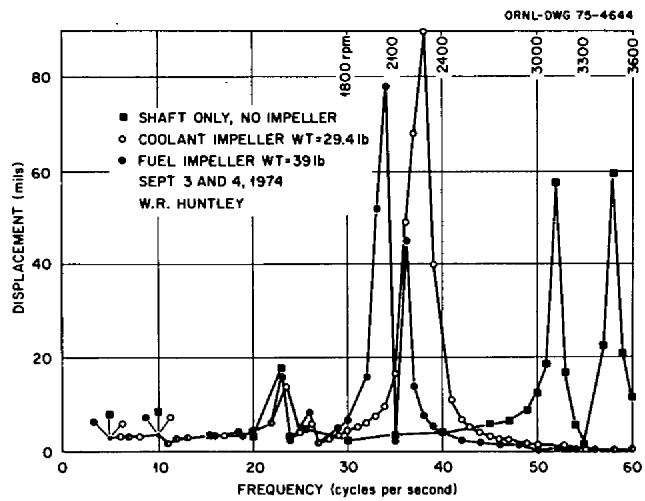  
Fig. 2.1. Critical frequency test of Mark II pump rotary assembly.

Shaft scoring (about $\frac{1}{8}$ in. deep) was found in the narrow annulus of the shield plug when the Mark II rotary assembly was disassembled. The shaft scoring must have been caused by accumulations of frozen salt mist from within the pump tank. Previous progress reports showed that plugging of the pump-shaft annulus had occurred at least nine times and was troublesome during the previous operation. Similar problems are not expected in the GSTF, since the salt spray ring within the pump bowl will no longer be in use. The pump shaft was not seriously damaged by the scoring action and was reused as is; no damage was found on the stationary annulus wall within the shield plug. Record photographs of the scored shaft and shield plug were made. This shaft scoring, due to mist accumulation and freezing, must be considered if future molten-salt development returns to the use of a spray ring within the pump bowl.

The cleaning facilities in Building 9419-1 were reactivated after salt deposits were found within the Mark II pump. The fuel-salt deposits were removed by use of a $6\%$ oxalic acid solution that was heated to about $94^{\circ}\mathrm{C}$ . Soaking periods of from 24 to 48 hr were required to remove the salt deposits. After the cleaning, beryllium and alpha contamination were found to be within acceptable limits.

Attempts to dynamically balance the Mark II pump shaft-impeller subassembly in the UCCND shops were unsuccessful, because the large overhang of the impeller prevented satisfactory shaft rotation on its two bearing surfaces while mounted horizontally in the balancing machine. Therefore, a portable balancing system was used which permits dynamic balancing of the pump

rotary assembly as the shaft rotates vertically in the cold shakedown test stand. The pump shaft, with new bearings and relapped seals, was balanced at 1500 rpm and was operated satisfactorily above 1790 rpm immediately after the balancing. However, the pump shaft repeatedly went out of balance and vibrated excessively after operating sufficiently long for the bearing housing to approach its normal operating temperature in the cold shakedown test of about $110^{\circ}\mathrm{F}$ . The excessive vibration was found to be caused by an interference fit between the bearing-housing bore and the outer races of the lower pair of bearings. The interference fit prevented axial movement of the lower bearings as the bearing-housing temperature increased to the normal operation temperature. Although small, the temperature rise created differential thermal expansions and shaft bending of a few thousandths of an inch, which in turn led to large dynamic imbalances at the desired operating speed. The bearing-housing bore was increased by 0.003 in. to a diameter of 6.694 in., which corrected the problem.

The pump was reassembled and operated satisfactorily at 1775 rpm for a period of five days in the cold shakedown test stand. During cold shakedown testing the oil-seal leakage rates were also found to be acceptable with no measurable leakage from the lower seal and about 10-cc/day leakage at the upper seal. After cold shakedown testing was completed, two eddy-current probes were installed and were calibrated for future use in measuring pump-shaft deflection during water testing. The Mark II rotary assembly and drive motor were installed in the GSTF on January 7, 1975, for initial water testing.

When the pump rotary assembly was removed from the pump bowl on February 20, after the initial water tests, scoring of the outer diameter of the impeller inlet hub was present. This scoring occurred as a result of shaft deflection, which exceeded the 0.034-in. radial clearance in this region. No significant damage occurred from the rubbing of the impeller against the stationary labyrinth surface at the pump inlet. Based on the information from the shaft deflection probes, the clearances were increased to the following values:

Upper labyrinth 0.066 in. radial

Lower labyrinth 0.072 in. radial

Impeller hub 0.082 in. radial

To allow for the additional fountain flow created by the larger clearances, eighteen $5 / 16$ -in.-diam holes were added which lead from the labyrinth-fountain region to the pump tank.

# 2.2.3 Densitometer

To evaluate the efficiency with which circulating bubbles are removed from water or salt in the loop by the bubble separator, the void fraction downstream of the bubble separator must be measured. A project decision had been made in 1972 to employ an existing densitometer for this purpose. The densitometer had been used in 1965 at the MSRE and consisted of a $30\text{-Ci}^{137}\text{Cs}$ source located in a collimated shield on one side of the 5-in. pipe and a shielded scintillation detector on the other side of the pipe. The detector and associated electronics were restored to operational condition, and tests that simulated the intended operating mode were made in the Instrumentation and Controls Division. It soon became apparent that signal noise and drift were very high compared with the small change in signal expected from changes in void fraction. Subsequent upgrading of the electronic components has produced only limited improvements. Data from the simulation tests indicate that the error in measured void fraction (with water in the loop) would amount to an error of about $\pm 5\%$ in the calculated bubble separator efficiency with a helium input flow rate equivalent to $1\%$ void fraction at the core centerline. This error would increase as the helium flow rate is decreased and would be about $\pm 25\%$ at rates equivalent to $0.2\%$ void fraction at the core centerline. During salt operation, these errors would be reduced in proportion to the densities and would be about $\pm 1.5\%$ and $\pm 8\%$ respectively.

Some improvement could possibly be obtained by periodically interrupting the gas flow to check the zero output of the detector and by inserting shims to calibrate the detector span. Another possibility is to intermittently impose a constant gamma flux directly on the detector to provide calibration data.

# 2.3 COOLANT-SALT TECHNOLOGY FACILITY

# A. N. Smith

During this report period, the recommissioning of the CSTF was completed, some equipment modifications were made, and the shakedown of the system was continued.

The system had been held under a static inert-cover-gas pressure since the shutdown in January 1973. In September 1974, the cover gas contained 58 pCi of

tritium per standard cubic centimeter of gas.4 The tritium is assumed to have been present in the walls of the piping during operation of the Molten-Salt Reactor Experiment (MSRE), was transferred with the portions of the MSRE piping used in construction of the CSTF, and then was diffused from the pipe walls into the salt when operation of the CSTF was initiated.

A design change was made to eliminate cavitation at the throat of the load orifice. The change consisted in adding a new 2.466-in.-diam orifice about 2 ft upstream of the existing orifice and enlarging the existing orifice diameter from 2.400 to 3.270 in. The calculated pressure profiles for the old and the new orifice arrangements are given in the previous report. When the system was opened to make the orifice modifications, the missing material-surveillance specimen6 was found lodged against the upstream side of the old orifice, as expected.

Work was completed on the checkout of instruments and of flow and pressure controls, and a new set of material-surveillance specimens was installed. The loop was filled with the MSBR secondary coolant (sodium fluoroborate) on December 19, 1974. Salt circulation was started but was terminated after $1\frac{1}{2}\mathrm{hr}$ because of instrument trouble. On January 14, 1975, salt circulation was again initiated and was continued until January 24, 1975, when the system was shut down because of a flow restriction in the off-gas line. During this 240-hr operating period, the following measurements and observations were made:

1. Cavitation measurements were run at various salt temperatures and pump speeds to check the effectiveness of the modified load orifice installation. The results indicate that, for pump bowl overpressures of 10 psig and higher, the CSTF can be operated at maximum conditions of temperature $(1150^{\circ}\mathrm{F})$ and pump speed (1790 rpm) without significant load orifice cavitation. Operation at these conditions by use of the old orifice resulted in violent cavitation.[7]   
2. Measurements were made of the salt level in the salt cold trap at various flow rates to determine whether the high-salt-level problem $^{8}$ had been resolved. It was found that at maximum flow the gas deflector was submerged about $\frac{1}{4}$ in., so that the off-gas

stream, upon entering the salt cold trap, bubbled through a column of salt. This bubbling action is undesirable, because it might increase the salt mist in the off-gas.

3. Periodic measurements were made of the salt flow through the salt-cold-trap circuit by use of the flow calorimeter that is an integral part of the salt-flow circuit. The salt flow appeared to remain fairly steady at the design flow rate (about $0.2\mathrm{gpm}$ ) for the first seven days. On the eighth day, the flow dropped to about $0.1\mathrm{gpm}$ and on the ninth day to about $0.02\mathrm{gpm}$ , indicating the development of a severe flow restriction.   
4. The off-gas stream (1.9 liters/min STP) was passed through a Dry-Ice-alcohol $(-70^{\circ}\mathrm{F})$ cold trap. About 2 drops of fluid were collected during the 240-hr period. Although actual data are not available, if certain assumptions are made, an estimate may be made for the average concentration of condensable material in the off-gas stream. Thus, assuming $10\mathrm{drops} / \mathrm{cm}^3$ , a condensate density of $1\mathrm{g} / \mathrm{cm}^3$ , and a cold-trap efficiency of $100\%$ , the average concentration of condensables in the off-gas stream is calculated to be about $7\mu \mathrm{g} / \mathrm{cm}^3$ . The rate at which the condensable material is being removed from the salt is decreasing with time as shown by the following comparison of the current operating period with the two previous operating periods:

<table><tr><td>Operating period</td><td>Total hours</td><td>Estimated drops of material collected</td><td>Average rate (drops/hr)</td></tr><tr><td>10/5/72 to 11/1/72</td><td>624</td><td>30</td><td>0.05</td></tr><tr><td>11/30/72 to 12/20/72</td><td>480</td><td>10</td><td>0.02</td></tr><tr><td>1/14/75 to 1/24/75</td><td>240</td><td>2</td><td>0.01</td></tr></table>

After shutdown of the operation, an analysis of the condensate for tritium $^{9}$ showed that the concentration was equivalent of $4400 \mu \mathrm{Ci} / \mathrm{g}$ . By comparison, the tritium analysis of salt samples taken from the pump bowl showed an activity of $0.014 \mu \mathrm{Ci} / \mathrm{g}$ , so that the tritium content of the condensate is higher than that of the salt by a factor of at least $10^{5}$ . One possible explanation for this result is that the tritium which was in the walls of the loop piping (as a result of the operation of the Molten-Salt Reactor Experiment) has been transferred to the salt by isotopic exchange with a hydrogenous impurity in the salt and that the impurity, now tritiated, is carried out with the off-gas stream and condensed in the cold trap.

After shutdown the system was cooled to room temperature and flooded with argon. The material-surveillance specimen holder was removed from the loop, and, as in the case of the previous operating period, the upper specimen was missing and is presumably lodged somewhere inside the loop piping. The remaining two specimens had the shiny, etched appearance typical for high-temperature service with fluoroborate salt. $^{10}$ Both the off-gas system and the salt-cold-trap salt-flow circuit were examined to determine the causes for the flow restrictions. The following is a summary of the findings and the remedial actions that were taken:

The top flange and integral cold finger were removed from the salt cold trap. The interior surfaces at and near the top of the trap were uniformly coated with a white solid (Fig. 2.2) that was subsequently found to be $\mathrm{NaBF}_4$ . The $3_{16}$ -in.-ID off-gas line leading from the trap was completely plugged with the same material. The plug was located at the trap outlet and was only about $1/4$ in. long. The gas line downstream of the plug was relatively free of deposit. Apparently, the flow restriction was caused by an accumulation of salt particles that resulted from the freezing of salt-mist droplets which were present in the off-gas stream, so the phenomenon was the same as had been observed previously during test work on a similar system.[11] Probably, the salt mist is caused by mechanical agitation of the salt in the pump bowl, by effervescence at the salt-gas interfaces due to the release of $\mathrm{BF}_3$ bubbles, or by a combination of the two mechanisms. Mist droplets small enough to remain gas-borne are carried along with the gas until a point is reached where the temperature drops below the freezing point of the salt; at this point the droplets freeze and stick to nearby surfaces. In the CSTF the upper part of the salt cold trap is the first point in the off-gas line where the temperature drops below the salt freezing point. To prevent future gas-line plugs, a filter was installed in the upper part of the salt cold trap so that the cooled gas is filtered before passing into the exit line. The filter medium is stainless steel Huyck Feltmetal, type FM-225, with an effective surface area of 30 sq. in. As a backup measure in the event the filter does not prove effective, a cleanout plug was installed just downstream of the salt cold trap so that flow restrictions can be rodded out with a minimum of downtime.

The salt-cold-trap salt-inlet line was cut open to check for a restriction at the 0.104-in.-diam flow orifice since a restriction had occurred at this point during a previous operating period, $^{12}$ but this time the flow orifice was completely unrestricted. The salt filter just upstream of the flow orifice was then cut open, and the nickel wire-mesh filter element was found clogged with a dark-gray magnetic material in which the major metallic constituent was determined by mass spectrography to be nickel. A gas-flow test was made through the remainder of the salt-flow circuit, and no significant flow restriction was observed. Probably the flow restriction was caused by the accumulation of material in the salt filter. The material probably results from corrosion of the Hastelloy N surfaces followed by reduction of the nickel to the elemental form, although it is possible that some of the material might be due to self-corrosion of the filter material. The nickel is insoluble in the salt and circulates with the salt as a slurry or scum unless separated out by some mechanism such as filtering. It was decided that the design of the salt-cold-trap salt-flow circuit would be revised to provide an arrangement capable of operating under stable flow conditions. Since the cold-trap salt-flow circuit is not an essential part of the planned deuterium trapping test, the salt-flow lines were disconnected from the pump suction line and from the salt cold trap, and the loop side openings were capped off. After this change, there will no longer be a salt flow through the salt cold trap, but it will still serve as part of the off-gas piping arrangement.

During the report period, work was continued on plans for the deuterium test.13 A draft of the test plan was issued for comment, and fabrication of the deuterium injection assembly was completed. Near the end of the report period, a status review was made, and it was concluded that the analytical equipment and techniques needed for the determination of deuterium in the salt and in the off-gas stream, at the anticipated concentration levels,14 will not be available in the required time. It was further concluded that the test can be done using tritium as the test gas because tritium, at the expected concentration levels, can be readily measured by established radiation counting and isotopic ratio techniques. Therefore, work is currently under way to determine and effect those changes in design and procedure which

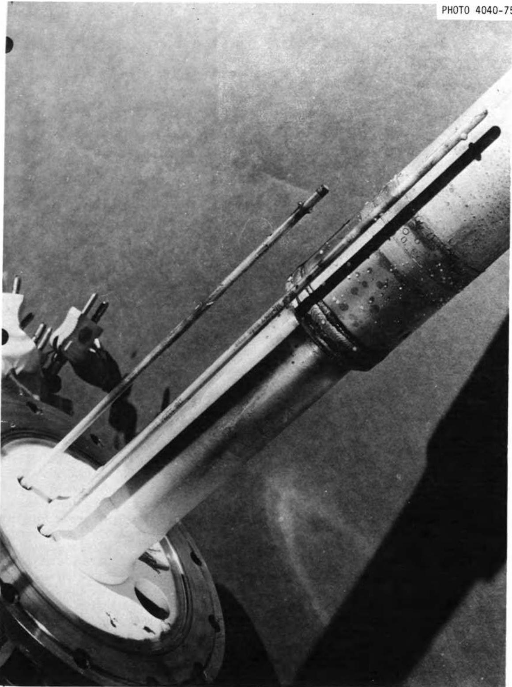  
Fig. 2.2. Top flange and cold finger from CSTF salt cold trap showing accumulation of frozen salt mist following shutdown of the CSTF on January 14, 1975.

will be required as a result of switching from a deuterium test to a tritium test.

At the close of the report period, the CSTF was still shut down for the purpose of effecting the previously discussed changes to the off-gas system and the salt-cold-trap flow circuit.

# 2.4 FORCED-CONVECTION LOOPS

W. R. Huntley M. D. Silverman

The Forced-Convection Corrosion-Loop Program is part of the effort to develop a satisfactory structural alloy for molten-salt reactors. Corrosion loop MSR-FCL-2b is presently operating with reference fuel salt at typical MSBR velocities and temperature gradients in a study to evaluate the corrosion and mass transfer of standard Hastelloy N. Tellurium injections into MSR-FCL-2b are planned after baseline corrosion data are obtained in the absence of tellurium. At this time, the loop has operated approximately 800 hr at design $\Delta T$ conditions with the expected low corrosion rates.

Two additional corrosion-loop facilities, designated MSR-FCL-3 and MSR-FCL-4, have been authorized and are in the early stages of construction. They are being fabricated of a modified Hastelloy N alloy containing $2\%$ titanium, which is expected to be more resistant to tellurium attack than standard Hastelloy N. Like FCL-2b, each of the new forced-convection loops will be constructed of $\frac{1}{2}$ -in-OD, 0.042-in.-wall tubing and will contain three easily removable corrosion-test specimen assemblies exposed to circulating salt at three different temperatures.

# 2.4.1 Operation of MSR-FCL-2b

Corrosion loop MSR-FCL-2b continued to operate $^{15}$ with $\mathrm{LiF - BeF_2 - ThF_4 - UF_4}$ (68-20-11.7-0.3 mole %) until October 1974, at which time the test was halted to replace the salt. The test had been run from April to October 1974 primarily to evaluate an electrochemical probe for on-line monitoring of salt chemistry; the loop operated isothermally most of this time. During the latter part of the test run, three additions of powdered $\mathrm{NiF_2}$ were made to the salt in the loop. The $\mathrm{NiF_2}$ was added by lowering the powdered material below the salt surface within the auxiliary tank using the salt sampling apparatus, which consists of a removable air lock with

ball valves and a hydrogen-fired copper bucket. The nickel fluoride powder was placed in the prefired bucket within a dry box and protected from atmospheric contamination until inserted into the loop.

The expected effects on the oxidation potential were noted by Analytical Chemistry personnel with the electrochemical probe as detailed in Part II of this report. However, pump-drive-motor power increases of 10 to $25\%$ were noted after each of the three small $\mathrm{NiF}_2$ additions (1 to $1.6\mathrm{g}$ to the $14,000\mathrm{-g}$ salt inventory). The third and final $\mathrm{NiF}_2$ addition of $1.6\mathrm{g}$ was made specifically to confirm the two previous indications of drive-motor power change. Power input to the motor was $3.75\mathrm{kW}$ prior to the $\mathrm{NiF}_2$ addition with the salt circulating isothermally at $663^{\circ}\mathrm{C}$ at a pump speed of $4020\mathrm{rpm}$ . The pump was stopped for $3\mathrm{hr}$ during the $\mathrm{NiF}_2$ addition, and when these conditions were restored, the motor power was $25\%$ higher ( $4.6\mathrm{kW}$ ). The motor power decreased gradually, as had been the case with the previous $\mathrm{NiF}_2$ additions, until it had reached $4.3\mathrm{kW}$ after three days. The loop was operated with a $50\mathrm{-kW}$ input to heater No. 2 to compare heat-transfer data with similar data taken just before the third $\mathrm{NiF}_2$ addition. No changes in apparent salt density due to possible outgassing or changes in viscosity could be inferred from the two sets of heat-transfer data, so the cause of the motor-power changes is as yet unexplained. No sharp changes in pumping power were noted during many previous pump stoppages for electrochemical readings or for beryllium additions, but step increases were noted after each of the $\mathrm{NiF}_2$ additions.

Shortly after the $\mathrm{NiF}_2$ additions were completed, the pump was disassembled to replace a defective static O-ring seal. This provided an opportunity to search for defective bearings and mechanical seals, salt deposits, or shaft rubbing which might explain the powerrequirement increases. Close examination showed that the bearings and seals were in good condition after $\sim 4000\mathrm{hr}$ of operation, and no salt or metal deposits were found in the pump shaft annulus that would explain the increased pump-power requirements.

Nineteen salt samples were taken from the auxiliary tank from April to October 1974 to monitor the salt composition; no significant variations in the major salt constituents were noted over this period. The last four of the nineteen samples were taken while $\mathrm{NiF}_2$ was being added to the loop, and increased metallic impurity levels were observed in the salt. Chromium increased from an average level of $100\mathrm{ppm}$ before addition of $\mathrm{NiF}_2$ to about $150\mathrm{ppm}$ after the additions. Iron content increased from about 55 to $90\mathrm{ppm}$ . Nickel

content ranged from 20 to $35~\mathrm{ppm}$ before the $\mathrm{NiF}_2$ additions and from 38 to $60~\mathrm{ppm}$ afterward. The oxygen concentrations in the salt ranged from 40 to 80 ppm during the $\mathrm{NiF}_2$ additions.

An oil leak occurred in the ALPHA pump on November 1, 1974, which resulted in about 200 cc of Gulfspin-35 oil draining into the empty salt-piping system. The pump and piping had just been drained and cooled to room temperature, in preparation for changing the salt charge, $^{16}$ when the oil leak occurred, so the oil was not carbonized within the piping system. The pump was removed from the pump bowl, and disassembly revealed that the failure of a hardened, inelastic Viton O-ring in the lower oil seal assembly caused the oil leak. Probably this static O-ring seal overheated and hardened during 4000 hr of operation, pumping salt at temperatures up to $700^{\circ}\mathrm{C}$ . Also, a review of the loop log book showed that the oil flow was interrupted for several hours while hot salt remained in the pump bowl during in-situ pump repair operations in July 1974, and it is possible that O-ring damage occurred at that time. The oil leak occurred just after the pump bowl was heated twice from room temperature to $650^{\circ}\mathrm{C}$ to promote complete salt drainage. Differential expansion and contraction during this thermal cycling apparently caused the oil to leak past the hardened O-ring. The pump was reassembled with new Viton seals and reused without design modification. To reduce the probability of future O-ring failures, no in-situ pump repairs will be made when the pump bowl is at elevated temperatures. The salt in the pump bowl will also be at a lower temperature (about $565^{\circ}\mathrm{C}$ ) during most of the future operation.

The corrosion specimens had been removed from MSR-FCL-2b for examination before the oil leak occurred. These specimens had been exposed to the fuel salt for a total of $4224\mathrm{hr}$ , of which 3682 hr was in isothermal operation, 100 hr with a typical MSBR thermal gradient, and 442 hr with the salt not flowing. Corrosion and mass-transfer rates were apparently increased by the $\mathrm{NiF}_2$ additions to the salt but were still low overall (Part III).

A thorough loop cleaning was required because of the leakage of pump oil into the piping system. All three drain lines were cut to aid in oil removal. The piping system was flushed by filling and draining three times

with perchloroethylene and twice with denatured ethyl alcohol. The oil content of each flush charge was checked by chemical analysis to confirm effective oil removal. After flushing operations were completed, the piping system was dried by flowing helium and then evacuated and heated to about $150^{\circ}\mathrm{C}$ to outgas metal surfaces and any remaining salt droplets within the piping system. The cut drain lines were then rewelded in place.

The ALPHA pump rotary element was reassembled and operated successfully in the cold shakedown test stand to check out new bearings and oil seals and was then reinstalled in the pump bowl of the loop. All repairs to the piping system and routine maintenance of instruments were completed by January 14, 1975, and preheating operations were started. A flush charge of MSBR reference fuel salt was circulated isothermally at a pump speed of $2000\mathrm{rpm}$ for $48\mathrm{hr}$ at $593^{\circ}\mathrm{C}$ to clean the piping system of residual salt from the previous salt charge and also to remove any oil or atmospheric contaminants from the oil leak. The corrosion specimens were not installed during this flushing operation. Salt samples were taken before and after circulation of the flush charge, and analyses for carbon and sulfur confirmed that essentially all traces of oil had been removed by the perchloroethylene. The flush salt was removed from the loop and discarded, and a new charge of fuel salt was placed in the drain tank.

New standard Hastelloy N corrosion specimens were installed, and the piping system was filled with fuel salt on February 3, 1975. The system was operated isothermally at about $650^{\circ}\mathrm{C}$ for 166 hr as the pump speed was gradually raised to its normal operating value of 4000 rpm. A rather rapid decrease in the $\mathrm{U}^{4+}/\mathrm{U}^{3+}$ ratio, from approximately $7\times 10^{3}$ to approximately $4\times 10^{2}$ , was indicated by the electrochemical probe during this period, but the ratio has since leveled at approximately $2\times 10^{2}$ . Operation with a typical MSBR bulk-fluid thermal gradient was started on February 10, 1975. The first examination of the new corrosion specimens was made after 494 hr operation under thermal gradient conditions with the specimens exposed to salt velocities of 8 and 16 fps; the corrosion rates were very low, less than 0.1 mil/year (Section 7.7.3).

Oil leakage from the mechanical oil seals of the ALPHA pump has been higher since operation was resumed in February 1975 than in the past. Oil leakage from the lower pump seal gradually increased to 25 cc/day, and the upper seal leakage rose to 50 cc/day during the first week of pump operation. However, the leakage did not increase further during the next four weeks, so the pump operation appears trouble free.

# 2.4.2 MSR FCL-3 and FCL-4

A request for $300,000 was granted by AEC for FCL-3 in November 1974, and$ 260,000 was granted for FCL-4 by ERDA in February 1975. Since these two loops are similar, the design, fabrication, and construction will be done concurrently to the extent possible to reduce costs. The expected completion date is January 1, 1976, for FCL-3 and March 31 for FCL-4. The overall design of FCL-3 is approximately 75% complete. Mechanical and instrumentation design should be completed by the end of April 1975. Electrical design should be completed by the end of May.

Construction drawings have been issued for the ALPHA pumps, auxiliary pump tanks, metallurgical sample stations, cooler housings, coolers, ventilation ducts, and structural support frames. The fill and drain tank for FCL-3 has been completed. Fabrication of the instrument panels for FCL-3 is expected to be completed by the end of May 1975. The longest procurement lead-time item for both loops is the pump motors. Delivery has been promised for September 1975.

Equipment previously used in other development programs has been removed to make room for FCL-3 and FCL-4. Layout drawings have been completed for equipment placement on the track floor. Two variable-speed motor-generator sets previously used in another program have been refurbished and will be installed to supply power to the pump motors for the new loops.

Plate and forgings of titanium-modified Hastelloy N were received in February for use in fabrication of parts for the two loops. Edge and surface cracking on the forgings required their machining and testing to ensure suitability of the material. Bar stock arrived in March; however, weld-wire delivery is behind schedule, and tubing will not be available before May 15, 1975. The delay of these deliveries will cause some delay in the fabrication of components.

A compendium of work orders, purchase requisitions, vendors, and costs for the major items ordered for FCL-2 has been made in order to ascertain any potential fabrication and procurement problems for FCL-3 and FCL-4.

# 3. Safety Studies

J. R. Engel

# 3.1 SALT-SPILL ACCIDENTS

J.R.Engel E.S.Bettis

Preliminary studies of MSBR safety indicated that the events with the greatest potential for safety-significant consequences are those which involve salt spills within the primary containment. As a result, the work during this period was directed primarily toward events of this kind. These studies indicated that the consequences of such an accident do not pose a threat to the integrity of the primary containment and, also, that only very unlikely events, or combinations of events, will lead to salt spills. While the immediate risk associated with salt spills is limited by the probability of their occurrence and by the containment systems, these events share with some others a potential for delayed safety significance when (and if) remote operations are undertaken to recover from the accident or to decommission the plant.

# 3.1.1 Potential Causes

Although the direct consequences of salt spills are tolerable, any such spill would require an extended plant shutdown and substantial maintenance activity, either for recovery or, at worst, decommissioning of the plant. Therefore, the frequency with which spills might occur is an important consideration in determining the overall risk associated with MSBR systems. Several conceivable accident sequences were examined to determine their potential for causing a break of the primary coolant pressure boundary (PCPB).

Primary failure in piping. Although they are not accident sequences in the normal sense, primary failures in the system piping must be considered as events that could lead directly to salt spills. Such failures could conceivably result from inadequate quality assurance during design, construction, or operation of the plant that would allow conditions to arise for which the plant was not designed. If it is presumed that adequate quality assurance is practiced and that appropriately conservative design procedures are employed, the probability of a primary failure should be extremely low.

Pressure excursions. Pressure excursions of sufficient magnitude to breach the PCPB and cause a salt spill could, in principle, be produced by a variety of event sequences. Those of primary interest in an MSBR system are (1) neutronic excursions, (2) primary heat-exchanger failures, and (3) steam-tube failures.

Positive neutronic transients may cause temperature as well as pressure excursions, but in an MSBR only the most severe transients will cause pressure excursions of sufficient magnitude to be of direct interest. Preliminary analyses of a variety of neutronic events indicated that none of the commonly considered transients would lead to significant pressure rises. Included in this category are control-rod malfunctions, externally produced fuel-salt temperature and flow perturbations, salt-composition perturbations that might result from processing plant malfunctions or partial salt freezing, and perturbations in the circulating bubble fraction. In principle, uniformly distributed voiding of salt from the core region could lead to a major neutronic transient, but no mechanisms are known for producing such voiding.

The only process by which a neutronically induced pressure transient of sufficient magnitude to threaten the PCPB could be produced is a return to the core of a "cloud" of uranium that had been previously separated from the salt and held up in a region of low nuclear importance. A theoretical mechanism for such hideout exists in the form of $\mathrm{UO}_2$ precipitation if the fuel salt becomes sufficiently contaminated with oxygen. However, the solubility of oxides in the salt appears to be high enough, and the rate at which oxygen (either elemental or combined) could be added in normal operation is low enough, that ample time (of the order of weeks) would be available to identify and correct the developing condition before any precipitation could occur. On this basis, neutronically induced pressure excursions do not appear to constitute a significant mechanism for breaching the PCPB.

Failures within a primary heat exchanger which lead to intermixing of the fuel and coolant salts are, in a sense, breaches of the PCPB in that they cause radioactive contamination of a system that would otherwise be only mildly radioactive. However, such failures would not release salt to the primary containment. If, on the other hand, gases were released as a consequence of salt mixing, pressures could be generated that might cause other failures of the PCPB. The mechanisms for

releasing $\mathbf{BF}_3$ on mixing MSBR fuel salt with the $\mathrm{NaBF_4}$ -NaF coolant are not yet sufficiently well defined to permit any conclusions regarding the safety significance of such events.

Since the steam system of an MSBR plant could operate at very high pressure (approximately 3500 psig), steam-tube ruptures could impose severe pressure transients on the rest of the plant. Such failures are to be expected; so the plant must be designed to accommodate them without serious consequences. In the MSBR reference design, rupture disks are provided in the secondary salt system at both ends of the steam generator to limit the pressure transients. The presence of these devices eliminates steam-tube ruptures as a mechanism for breaching for PCPB.

Temperature excursions. Since the estimated boiling temperature of MSBR fuel salt $-1525^{\circ}\mathrm{C}$ at 1 atm - is above the melting point of the Hastelloy N structural material, it is conceivable that extreme temperature excursions in the primary system could lead directly to failures of the PCPB. Such temperature excursions could result either from nuclear transients or from fission product afterheat if the provisions for afterheat removal fail.

The nuclear transients that were examined to evaluate temperature effects are the same as those discussed earlier in connection with pressure excursions. None of the events, with the possible exception of the return of precipitated uranium, produced excessive salt temperatures, provided that salt circulation and heat removal were maintained. The temperatures also remained within reasonable limits in the absence of negative-reactivity insertion to limit the initial transients. (These results imply that a fast-acting safety scram system may not be absolutely essential for an MSBR.) These studies show that the temperatures associated with neutronic transients do not represent a significant threat to the PCPB.

Since the fuel salt in an MSBR is also the primary core coolant, a possibility for attaining unacceptably high temperatures could be associated with interruption of the fuel-salt flow. Two general types of events were considered in this context: interruption of flow through a limited number of core fuel passages, such as might result from the appearance of an obstruction at the inlet(s) of the passage(s), and total interruption of all core flow by events that reduce the performance of all four primary-salt circulation pumps.

Blockage of one (or a few) fuel passages in an MSR core might reasonably be expected to occur at sometime during the life of any given reactor. The most likely cause would be the appearance of a foreign object

at the passage inlet(s), and the most significant consequences would result from complete blockage of passages in the region of the maximum core power density. The maximum salt temperature in a single blocked passage at the maximum power density would tend to approach $1730^{\circ}\mathrm{C}$ if a steady state could be achieved. However, since this temperature is above the boiling temperature of the salt, the rise would be checked by the onset of boiling in the affected passage(s).

The first effect of a flow blockage would be a temperature rise in the salt at about $120^{\circ}\mathrm{C} / \mathrm{sec}$ in the maximum-power-density passage. However, the MSBR core design and the nuclear reactivity effect of the rise are such that it probably would be undetectable. Then, about 8 sec after occurrence of the blockage, salt boiling would commence, which would cause voiding of the salt from the affected channel. For the MSBR fuel-salt mixture, vaporization of only about $3\times 10^{-4}$ of the liquid in any passage would produce enough vapor to displace all of the remaining liquid. Thus, voiding would proceed rapidly, and since abundant nucleation sites (in the form of helium bubbles circulating with the salt) are available for growth of vapor bubbles, little temperature or pressure overshoot would occur. More than $99\%$ of the vapor formed would be $\mathrm{BeF}_2 + \mathrm{LiBeF}_3$ , so that all the uranium and thorium would be expelled with the salt, leaving a "pure" void in the core. The voiding would terminate the heat generation in the affected passage. The fuel passage would then refill with cooler salt, and the heat-up and boiling sequence would be repeated. The positive reactivity effect associated with the voiding of a few 4-in.-square fuel cells $^2$ - $5\times 10^{-5}$ $\Delta k / k$ per cell - would be insignificant from a nuclear-excursion standpoint, but the increased "noise" in the neutron flux due to repeated voiding and refilling of blocked fuel passages would reveal the presence of the blockage, and corrective action would be taken at once. In this situation, both the overheated salt and the vapor would contact only the graphite in the core and therefore would not constitute a threat to the PCPB. (The effects of salt vapor on graphite will be investigated experimentally in other areas of the Program to determine if such interaction could have safety significance.)

A fuel-flow interruption that affects the entire core could result from an electric power failure, which causes all four primary circulation pumps to stop, or from a loss of salt from the primary circuit, which

leaves all the pumps (at the high points of the loops) above the salt level. In the event of a power failure to all four primary-pump motors, the following events would occur:

1. automatic shutdown of nuclear power by insertion of shutdown rods,   
2. salt circulation continued at a low rate in one or more loops, with the pumps being driven by auxiliary (pony) motors which have redundant and diverse direct-current power supplies, and   
3. drainage of fuel-salt if undesirably high temperatures are reached.

If salt circulation were absolutely prevented (as by seizure of all four pumps or loss of system level) the salt would have to be drained to prevent the eventual attainment of excessive temperatures in the core from fission product decay heat.

Even if the nuclear shutdown rods failed to insert as expected, the fission power would be reduced by the negative temperature coefficient of reactivity of the fuel salt. In the absence of salt circulation, the salt temperature is equal to or higher than that of the graphite, thereby ensuring lower core reactivity than when the graphite (which has a positive temperature coefficient) is above the fuel temperature. Although some heating would continue due to fission product decay, preliminary calculations suggest that temperatures would remain tolerable for times longer than the 5 min required to initiate a salt drain under even the most adverse conditions. Considerably more time would be available if the shutdown rods were effective in accelerating the rate of nuclear power reduction. Therefore, it was concluded that even this highly improbable combination of events is unlikely to cause a failure of the PCPB.

Missiles. Since the primary system of an MSBR is enclosed in the primary containment, which also provides biological shielding (several feet of reinforced concrete), and a secondary containment, it is highly unlikely that missiles originating outside the primary containment could affect the integrity of the PCPB. The only rapidly moving components inside the primary containment are the rotary elements of the fuel circulation pumps. Preliminary investigations of the consequences of a pump-impeller failure indicated that the resultant missiles would not penetrate both the pump volute and the pump tank, as would be required to breach the PCPB.

# 3.1.2 Direct Consequences

Although salt spills could result from a number of event sequences and could involve either fuel salt or

coolant salt or both, the consequences are not strongly dependent on either the nature or the magnitude of the spill. Thus, for the purpose of this description, it is assumed that the salt is spilled from a double-ended pipe failure that occurs with the reactor at full power, and that all the salt flows out of the failed system.

The expected response of the system to such a spill would be an opening of the thermally actuated containment drain valve to allow the salt to flow into the fuel drain tank. Since the design ambient temperature inside the primary containment is above the salt liquidus temperatures, there would be no freezing, and essentially all of the salt would reach the drain tank. Any salt remaining in the primary system would also flow to the drain tank through the normal drain line. The redundant cooling systems in the drain tank would remove fission product afterheat from the salt while limiting the salt temperatures to acceptable levels.

After the containment drains, an open line would still remain between the drain tank and the containment, which would allow much of the gaseous fission product inventory to be released from the drain tank to the primary containment. Quantitative estimates have not been made of the fission product inventory in the containment at this stage of the event sequence, but it is clear that the primary containment ought to remain intact to avoid a challenge to the secondary containment and any possibility of releasing activity to the environment. If only fuel salt were involved in the spill, there would be no significant pressure rise and hence no threat to the primary containment.

If coolant salt $(\mathrm{NaBF}_4\text{-NaF})$ were involved in the spill, as much as $730\mathrm{ft}^3$ could flow into the drain tank to mix with the fuel salt. While some $\mathrm{BF}_3$ gas would be evolved as the two salts were mixed, there is currently no basis for accurately estimating the extent of this release or the primary-containment pressure that would result. Very likely, additional engineered safeguards would be developed, if needed, to limit the pressure rise to an acceptable value.

Probably, the most adverse condition that could arise during a salt spill would be a failure of the containment drain line to open. In the case of a fuel-salt spill, this would leave essentially the entire inventory in the primary containment and would require removal of the fission product afterheat by way of the containment-wall cooling system. Preliminary analyses of the primary-containment design concept described with the reference design3 indicated that heat removal would be

inadequate and that failure of the containment probably would occur as a consequence of overheating. However, similar analyses of an alternate concept which provides for water cooling outside the containment liner showed that this system would provide the needed heat removal capability without intolerable liner temperatures.

The conclusion from these considerations is that salt spills can safely be retained within a properly designed primary containment system for an MSBR, provided that any pressure rises associated with the mixing of fuel and coolant salts can be limited to system design values. Since MSBR includes secondary containment as well, any spill would thus be doubly contained and would not release significant quantities of radioactivity to the environment.

# 3.1.3 Deferred Consequences

The above investigations indicated that a breach of the PCPB of an MSBR system is highly unlikely and

that if such a breach were to occur, the short-term consequences would be limited by the primary containment, so that there would be no significant hazard to the public health and safety. However, any major release of activity inside the containment of an MSBR presents another safety problem which should receive some attention. This problem is the cleanup operation that would be necessary either to restore the plant to an operable condition or to decommission it afterward. Such an operation would require that the primary containment be opened, leaving only the secondary containment to limit releases to the environment. By the time the cleanup was started, any spilled salt would probably be frozen, and the containment atmosphere could be purged of gas-borne activity. Experience in the operation of the MSRE showed that radioactivity is not readily dispersed from frozen salt, so the task would be difficult but not impossible. To establish the extent to which this process should be factored into the plant design, the existence of cleanup possibilities must be considered along with the very low probability of requiring such action.

# Part 2. Chemistry

L. M. Ferris

At ORNL the chemical research and development efforts related to the design and ultimate operation of molten-salt breeder reactor systems are concentrated on fuel- and coolant-salt chemistry, including the development of analytical methods for use in these systems.

The chemistry of tellurium in fuel salt is being studied to help elucidate the role of this element in the intergranular cracking of Hastelloy N. This work includes the estimation of the rate of tellurium deposition on Hastelloy N surfaces in a 1000-MW(e) MSBR. Another phase of the program was the construction of a test stand in which Hastelloy N and other alloys are exposed to tellurium vapor at controlled temperatures and deposition rates.

Studies were continued of the effect of oxygen-containing species on the equilibrium between dissolved $\mathrm{UF}_3$ and dissolved $\mathrm{UF}_4$ , and, in some cases, between the dissolved uranium fluorides and graphite, and the $\mathrm{UC}_2$ . The presence of dissolved oxide or gaseous CO did not convert the solid $\mathrm{UC}_2$ to an oxycarbide. A general conclusion of these studies is that $\mathrm{UC}_y\mathrm{O}_{2 - y}$ phases are metastable with respect to $\mathrm{UO}_2$ and $\mathrm{UC}_2$ at temperatures below $700^{\circ}\mathrm{C}$ . Apparatus is being assembled to redetermine the equilibrium quotient for the important reaction $\mathrm{UF}_4(\mathrm{d}) + \frac{1}{2}\mathrm{H}_2(\mathrm{g}) = \mathrm{UF}_3(\mathrm{d}) + \mathrm{HF}(\mathrm{g})$ , using a spectrophotometric method. In preparation for studies of the electrolytic removal of bismuth, oxide, and other species from fuel salt, a prototype packed-bed electrode of glassy carbon spheres has been constructed and tested.

Several aspects of coolant-salt chemistry are also under investigation. Specifically, hydroxy and oxy compounds that could be formed in molten $\mathrm{NaBF_4}$ are being synthesized and characterized. These studies will help define reactions and compounds that may be involved in corrosion or in methods for trapping tritium. The phase diagram of the system $\mathrm{H}_3\mathrm{OBF}_4$ - $\mathrm{HBO_2 - H_2O}$ has been defined at $25^{\circ}C$ as an aid in

determining the composition of mixtures of condensed species produced by the interaction of water with $\mathrm{NaBF_4}$ . Studies of the chemistry of chromium(III) compounds in fluoroborate melts were continued as part of a systematic investigation of the corrosion of structural alloys by coolant salt. The compound $\mathrm{CrF_3}$ was found to be thermodynamically more stable in $\mathrm{Na}_3\mathrm{CrF}_6$ than in $\mathrm{Na}_5\mathrm{Cr}_3\mathrm{F}_{14}$ , which explains why the former compound is the one that precipitates when Hastelloy N is corroded by $\mathrm{NaBF_4}$ . Thermodynamic calculations have shown that $\mathrm{NaBF_4}$ might react with Hastelloy N to form borides. Consequently, an apparatus has been assembled to test boride deposition on and penetration of structural alloys. Preliminary results from 72-day exposures of Hastelloy N and Inconel 600 to $\mathrm{NaBF_4}$ -NaF eutectic at $640^{\circ}\mathrm{C}$ show that the boron concentration at the surface of the Hastelloy N was increased by a minor amount and that the surface boron concentration was increased significantly in the case of Inconel 600.

The development of analytical methods for both fuel and coolant salt was continued. An in-line voltammetric method for determining $\mathrm{U}^{4+}/\mathrm{U}^{3+}$ ratios in fuel salt was tested in a forced-convection loop, FCL-2b, over a six-month period. The redox potential of the system was changed intermittently by adding either beryllium metal or nickel fluoride to the loop. The subsequent changes of the $\mathrm{U}^{4+}/\mathrm{U}^{3+}$ ratio were readily determined, but quantitative determination of chromium was not possible. Similar voltammetric measurements of $\mathrm{BiF}_3$ in molten LiF- $\mathrm{BeF}_2$ - $\mathrm{ZrF}_4$ were made in the presence of $\mathrm{NiF}_2$ , an anticipated interference. By use of a stripping technique, the limit of detection was extended to less than 25 ppb. With $\mathrm{NaBF}_4$ - $\mathrm{NaF}$ coolant salt, an anodic wave has been found which is directly proportional to the $\mathrm{NaBF}_3\mathrm{OH}$ concentration. This latter development could provide the basis for a continuous in-line determination of hydroxy species in molten fluoroborate.

# 4. Fuel-Salt Chemistry

A. D. Kelmers

# 4.1 TELLURIUM DEPOSITION ON HASTELLOY N SURFACES IN AN MSBR

A. D. Kelmers

D. Y. Valentine

An estimate of the deposition rate of tellurium on Hastelloy N surfaces in a 1000-MW(e) MSBR is needed to design deposition experiments for investigation of tellurium-induced corrosion and grain-boundary cracking to be encountered on the Hastelloy N surfaces of the MSBR. To make a conservative estimate (i.e., a maximum value) of the amount of tellurium that could deposit on various Hastelloy N surfaces in an MSBR, the overall disposition of tellurium both in the primary system and in the drain tank must be considered. For the purpose of these calculations, the sources of tellurium were taken as the direct fission yield of tellurium from the fuel salt plus all significant decay-chain yields. Contributions from various tellurium isotopes to the total accumulation can be obtained from steady-state rate and mass-transfer calculations. To write a steady-state rate balance for production vs decay of tellurium produced from direct fission and decay of precursors, the following assumptions have been made:

1. A steady state has been achieved.   
2. Noble-metal fission products are homogeneously dispersed in the fuel salt.   
3. Tellurium and its precursors are insoluble in the fuel salt.   
4. The reaction with all surfaces is rapid, and the tellurium remains with the surface once contact is made.   
5. The mass-transfer coefficients can be estimated with conventional theory (i.e., Newtonian behavior of fuel-salt fluid, independent migration of tellurium species in the fuel salt, etc.).   
6. Deposition is homogeneous on the Hestelloy N surfaces.

The species under consideration include the tin and antimony precursors as well as tellurium produced directly. The assumption is also made that iodine does not remain on the Hastelloy N surface but redissolves in the fuel salt immediately. If the diffusivity of tellurium in Hastelloy N were large compared with the decay half-life of a particular tellurium isotope, the iodine daughter might form far enough below the surface to be

trapped there. However, from observations of the fission product behavior in the MSRE, this condition does not appear to be the case.4

Two more assumptions were made to approximate the concentration of tellurium that deposits on any of three types of surfaces found in the MSBR - metal (Hastelloy N), graphite, and bubbles:

1. The residence times of tellurium and its precursors in the salt and the half-lives of these species are long compared with the fuel-salt circuit time (13 sec). The residence half-life is defined as $(1\mathrm{n}2) / X$ where

$$
\begin{array}{l} X = \lambda + \frac {1}{V} [ \sum H _ {s \rightarrow m} A _ {m} \\ \left. + \sum H _ {s \rightarrow g} A _ {g} + \sum H _ {s \rightarrow b} A _ {b} \right], \mathrm {h r} ^ {- 1}, \\ \end{array}
$$

$H =$ mass-transfer coefficient, ft/hr,

$A =$ area of the particular surface, $\mathrm{ft}^2$

$V =$ fuel-salt volume, ft3,

$\lambda =$ decay constant for isotope under consideration (small in comparison with the rest of the expression and may be omitted),

for transfer considered from the fuel salt $(s)$ to metal $(m)$ , graphite $(g)$ , and bubble $(b)$ surfaces. For a tellurium particle size of 2.8 Å, the residence half-life in the fuel salt is 89 sec and the dacay half-lives of the shortest lived species are 50 sec and about 30 sec for $^{134}\mathrm{Sb}$ and $^{135}\mathrm{Te}$ respectively. Thus, this assumption is valid and assures that the contributions from fission yields in the core are uniformly distributed throughout the primary system.

2. In addition, the residence times of tellurium and its precursors are short compared with the half-lives of these species, assuring that deposition occurs as fast as production and that the total inventory is somewhere on a surface. For most isotopes involved, this second assumption holds for the 2.8-A-particle-size residence half-life of 89 sec. It is violated for 50-sec $^{134}\mathrm{Sb}$ and about 30-sec $^{135}\mathrm{Te}$ ; however, the yields of these isotopes are so low that no significant error is introduced. Although 89 sec is not much shorter than the decay half-lives of 2.2-min $^{132}\mathrm{Sn}$ and 2.1-min $^{132}\mathrm{Sb}$ , the yields of which are considerably higher, the final decay product, $^{132}\mathrm{Te}$ , has a half-life of 105 days, and again the second assumption holds. For 100-A tellurium particles the residence half-life is 12.3 min. Subtraction of species in violation of the second assumption introduces an error of only $0.02\%$ , so the assumption is still valid. However, for 1000-A particles the residence half-life becomes 67 min. Quite a few species have half-lives in this range or shorter. Fortunately, the yields of these species are fairly low, and the estimated maximum error is only about $6.5\%$ . The validity of the second assumption assures that decay during transport to a surface is negligible, thus allowing a simplified calculation that provides a reliable estimate of tellurium deposition on surfaces.

At steady state, then, the production rate of the first parent in a chain will equal the decay rate, where

production rate (atoms/min)

$$
= \text {(f i s s i o n s / m i n)} (\text {y i e l d / f i s s i o n})
$$

and

decay rate $= (\lambda)$ (number of atoms present).

Thus, the steady-state inventory of a species (number of atoms present) may be found from

$$
N = \text {i n v e n t o r y} = \frac {\left(\text {f i s s i o n r a t e}\right) (\text {y i e l d})}{\lambda}.
$$

When deposition from the fuel salt was calculated for a parent of Te (Sn, Sb), the tellurium surface concentration was obtained by successively balancing production and decay rates; for example, for a decay chain leading to $^{127}$ Te, the balance would be written as

$$
(B \lambda N) _ {1 2 7 S n} = (\lambda N) _ {1 2 7 S b},
$$

$$
(B \lambda N) _ {1 2 7 S b} = (\lambda N) _ {1 2 7 T e},
$$

where $B$ denotes the branching ratio.

The total inventory may then be proportioned to the various surfaces of interest according to the laws of mass transport. The fraction² sticking to a particular surface (metal, for example) is given by

$$
F _ {m} = \frac {S _ {m} H _ {s \rightarrow m} A _ {m}}{S _ {m} \sum H _ {s \rightarrow m} A _ {m} + S _ {g} \sum H _ {s \rightarrow g} A _ {g} + S _ {b} \sum H _ {s \rightarrow b} A _ {b}},
$$

where $S =$ sticking coefficient. The effective sticking coefficient for noble-metal particles to bubble surfaces appeared to be much smaller (0.1 or less) than for metal (1.0) or graphite (1.0) in the MSRE. However, it was not determined whether the sticking coefficient for bubble surfaces was truly smaller or only appeared smaller because the particles were reentrained and recirculated in the salt after leaving the pump bowl. To provide a maximum estimate of tellurium deposition on the heat-exchanger surfaces in an MSBR, a sticking coefficient of 1.0 was used for the metal and graphite surfaces and 0.05 was used for the bubble surfaces.

Finally,

$$
(N) (F) / \text {a r e a} = \text {a t o m s} / \text {a r e a}
$$

on each surface. This calculation was done for deposition of tellurium particle sizes of 2.8, 100, and $1000\mathrm{A}$ on heat-exchanger surface areas in an MSBR (Tables 4.1, 4.2). Values of $H_{s\rightarrow j}$ and the areas were taken from

Table 4.1. Rates of deposition of stable tellurium isotopes on MSBR heat-exchanger surfaces   

<table><tr><td rowspan="2">Te isotope</td><td rowspan="2">Fission yield (%)</td><td colspan="3">103x deposition rate [mg/(cm2day)]</td></tr><tr><td>2.8 Å</td><td>100 Å</td><td>1000 Å</td></tr><tr><td>125</td><td>0.084</td><td>0.0165</td><td>0.0162</td><td>0.0179</td></tr><tr><td>126</td><td>0.200</td><td>0.0396</td><td>0.0388</td><td>0.0430</td></tr><tr><td>128</td><td>1.210</td><td>0.244</td><td>0.239</td><td>0.264</td></tr><tr><td>130</td><td>2.600</td><td>0.532</td><td>0.521</td><td>0.577</td></tr><tr><td></td><td>Total</td><td>0.832</td><td>0.814</td><td>0.902</td></tr></table>

Table 4.2. Steady-state concentrations of radioactive tellurium isotopes on MSBR heat-exchanger surfaces   

<table><tr><td rowspan="2">Te isotope</td><td rowspan="2">Half-life (min)</td><td colspan="3">104X concentration (mg/cm2)</td></tr><tr><td>2.8 Å</td><td>100 Å</td><td>1000 Å</td></tr><tr><td>127m</td><td>151,200</td><td>29.56</td><td>28.94</td><td>32.06</td></tr><tr><td>127</td><td>558</td><td>0.378</td><td>0.370</td><td>0.410</td></tr><tr><td>129m</td><td>53,280</td><td>46.08</td><td>45.11</td><td>49.97</td></tr><tr><td>129</td><td>72</td><td>0.159</td><td>0.156</td><td>0.172</td></tr><tr><td>131m</td><td>1,800</td><td>4.93</td><td>4.82</td><td>5.34</td></tr><tr><td>131</td><td>24</td><td>0.119</td><td>0.116</td><td>0.129</td></tr><tr><td>132</td><td>4,620</td><td>37.80</td><td>37.01</td><td>40.99</td></tr><tr><td>133m</td><td>52</td><td>0.362</td><td>0.355</td><td>0.393</td></tr><tr><td>133</td><td>2</td><td>0.00714</td><td>0.00699</td><td>0.00775</td></tr><tr><td>134</td><td>43</td><td>0.282</td><td>0.276</td><td>0.306</td></tr><tr><td>135</td><td>0.5</td><td>0.00125</td><td>0.00123</td><td>0.00136</td></tr><tr><td></td><td>Total</td><td>119.7</td><td>117.2</td><td>129.8</td></tr></table>

Table AII-1, ref. 2. These results show that the particle size has little influence on the deposition rates. Therefore, further discussion will concentrate on the 2.8-A particle size only.

The deposition on Hastelloy N surfaces of the heat exchangers may be expressed as:

$$
(0. 8 3 1 6 \times 1 0 ^ {- 3} t + 0. 1 1 9 7 \times 1 0 ^ {- 1}) \mathrm {m g / c m ^ {2}},
$$

with $t$ in effective full-power days (EFPD). The first term in this expression represents the deposition of stable tellurium isotopes, and the second term represents the steady-state amount of radioactive tellurium isotopes at the heat exchanger surfaces, or, if $t$ is expressed in effective full-power years (EFPY):

$$
\begin{array}{l} (0. 3 0 3 5 t + 0. 0 1 2) \mathrm {m g} / \mathrm {c m} ^ {2} \\ = (1. 4 0 6 t + 0. 0 5 5) \mathrm {X} 1 0 ^ {1 8} \text {a t o m s / c m} ^ {2}. \\ \end{array}
$$

Previous estimates gave a value of $(0.88t + 0.03)$ $\mathrm{X10^{18}}$ atoms/cm². Thus in 30 EFPY, $9.105\mathrm{mg / cm}^2$ of stable tellurium isotopes would deposit on Hastelloy N surfaces. In addition, $43.08\mathrm{mg / cm}^2$ of radioactive isotopes of tellurium would have at one time contacted a Hastelloy N surface (steady-state amount times time times $0.6931 / t_{1 / 2}$ ). Since neither the rate of diffusion of tellurium into Hastelloy N nor the mechanism of any surface reactions is known, the effect of the radioactive isotopes cannot be accurately predicted. However, if each atom of tellurium (stable and radioactive) that ever contacts a Hastelloy N surface is assumed to react, a cumulative exposure equivalent to about 52.1 $\mathrm{mg / cm}^2$ would have been available in 30 EFPY to the heat-exchanger surfaces.

Tellurium deposition on the Hastelloy N surfaces in the drain tank must also be considered. The surface area and disposition of the bubbles used to remove fission products from the primary system to the drain tank may vary considerably with different reactor design modifications. A centrifugal separator is envisioned to extract the bubbles from the salt along with a small amount of salt; both the bubbles and this small amount of salt will then flow to the drain tank. The salt phase is in the drain tank about 1 min and then returns to the primary salt system from the bottom of the drain tank. However, the gas phase has an average residence time in the drain tank of about 6 hr before proceeding to a particle trap and cleanup system. The disposition of the noble-metal fission products in this system is somewhat uncertain except that they are removed from the primary system and that the opportunity exists for deposition to occur on the drain-tank surfaces.

Consistent with the assumptions made for the heat-exchanger calculation above, a cumulative exposure equivalent to about $5.5\mathrm{mg / cm}^2$ $(0.965\mathrm{mg / cm}^2$ stable Te isotopes $+4.57\mathrm{mg / cm}^2$ cumulative radioactive Te isotopes) would have been available to the drain tank surface in 30 EFPY. This estimate assumes that all the tellurium arriving in the drain tank on bubble surfaces ends up uniformly distributed on the $17,802\text{-ft}^2$ drain-tank surface area. Probably, however, a higher concentration of noble-metal fission products will be found in a ring at the gas-liquid interface area around the drain tank. A correction to the steady-state amount that enters the drain tank must be made if the time required to circulate the entire fuel-salt inventory through the drain tank $(\tau_{dt} = 20\mathrm{min})$ is not short compared with the sum of the mean lives of a decay chain $(\tau_s)$ , where, for example, $\tau_{s} = \tau_{1} + \tau_{2} + \tau_{3}$ for the reaction

$$
\mathrm {S b} \xrightarrow {\tau_ {1}} \mathrm {S n} \xrightarrow {\tau_ {2}} \mathrm {T e} \xrightarrow {\tau_ {3}} \mathrm {I}.
$$

If $\tau_{dt} \geqslant \tau_s$ , a significant fraction of radioactive tellurium from the chain under consideration will decay on bubbles in the primary circuit. The fraction that does not so decay may then be described approximately by $e^{-\tau_{dt} / \tau_s}$ . If all the tellurium isotopes produced from decay chains having $\tau_s \leqslant 2\tau_{dt}$ were omitted, the resulting error in the calculation would be only about $0.3\%$ . Therefore, this correction has been neglected in these calculations.

Further estimates of the tellurium exposure that might be encountered by the Hastelloy N surfaces in the drain tank if the bubble fraction in the primary circuit were increased were made by increasing the bubble surface area from about $10\%$ of the total surface area (value used in the previous calculations) to about $48\%$ of the total surface area and by calculating the amount of tellurium that adhered to bubbles. A bubble-surface-area fraction of $48\%$ represents a bubble surface area of about 100,000 ft², which corresponds to the maximum allowable void fraction in the core of 1 to $2\%$ . Also, since considerable uncertainty exists concerning the value of the bubble-sticking coefficient, equal sticking probabilities were assigned to each surface (1.0) for the purpose of maximizing the drain-tank estimates.

In the maximum case calculated (48% bubble surface area) the tellurium deposition in the drain tank may be expressed as

$$
(0. 2 6 4 7 \mathrm {X} 1 0 ^ {- 2} t + 0. 3 8 1 0 \mathrm {X} 1 0 ^ {- 1}) \mathrm {m g / c m ^ {2}},
$$

with $t$ in EFPD. Cumulative tellurium exposure accrued may be proportioned from the values calculated for the heat exchangers. Thus, in 30 EFPY, $29.0\mathrm{mg / cm}^2$ of stable isotopes would deposit on and $137.1\mathrm{mg / cm}^2$ of radioactive isotopes would contact the Hastelloy N surface of the drain tank; such a deposit would amount to a cumulative exposure equivalent to $166.1\mathrm{mg / cm}^2$ . In this case, the tellurium exposure on the heat-exchanger surfaces would be reduced to $9.7\mathrm{mg / cm}^2$ (stable Te isotopes, $1.70\mathrm{mg / cm}^2 +$ cumulative radioactive Te isotopes, $8.019\mathrm{mg / cm}^2$ ).

# 4.2 EXPOSURE OF METALLURGICAL SAMPLES TO TELLURIUM VAPOR

A. D. Kelmers D. Y. Valentine

Investigation of the Hastelloy N surfaces in the MSRE showed that the grain boundaries of this alloy had been selectively attacked and that intergranular cracking had occurred. Subsequently, tellurium, produced as a fission product in the MSRE fuel salt, has been shown to induce such cracking. Probably, resistance to tellurium attack can be achieved by modifying the Hastelloy N alloy by minor additions of Ti, Nb, or rare earth elements or by small increases in the Cr content. An experiment, described in the previous semiannual report, $^{10}$ is now in progress to evaluate the extent of tellurium-induced grain-boundary cracking that occurs when Hastelloy N or its various modified alloys are exposed to tellurium vapor.

Three consecutive test exposures of standard Hastelloy N have been made for periods of 100, 100, and 200 hr, respectively. In the first 100-hr test, four tensile specimens, one sheet sample, and one foil sample were exposed to tellurium vapor at a diffusion rate to the specimens of $0.048\mathrm{mg}$ of Te per hour. With the temperature difference between solid tellurium and the specimens as the controlling variable, this particular diffusion rate was produced by holding the solid tellurium at $440^{\circ}\mathrm{C}$ and the specimens at $700^{\circ}\mathrm{C}$ . After this exposure, visual inspection of the test specimens showed deposition almost exclusively on the end of the specimens nearest the tellurium source. At a specimen temperature of $700^{\circ}\mathrm{C}$ , the rate of reaction of the tellurium vapor with the specimens appeared to be as

rapid as the rate at which tellurium diffused to the specimens. Thus, the initial assumption of perfect gettering used in the transport model10 appears to be valid. The samples were removed and weighed. The weight of tellurium deposited on the specimens averaged one-fourth of the value predicted by the transport-model diffusion equation.

The specimens were replaced for a second 100-hr exposure after having been turned end for end, so that the end oriented toward the tellurium source was that which showed no visual signs of having reacted in the first 100-hr exposure. The identical $\mathrm{Te}_2$ vapor exposure procedure was repeated. After the second 100-hr exposure, the specimens were darkened on the end closest to the tellurium source as before, with no reaction visible in the center of the specimens; this verified the rapid reaction rate. However, when weighed, two samples had lost weight and the other two showed no weight change. Although no volatile tellurides had been expected, possibly the preliminary procedure of heating the specimens and the quartz tube under vacuum for outgassing purposes prior to loading the tellurium could have removed some material from the specimens before the second exposure began.

To test this possibility, the deposition was repeated a third time for an increased period of 200 hr. Visual inspection of the specimens after the 200-hr exposure revealed a uniform darkening of the entire surface area. However, the weight data were still inconsistent. Two specimens gained weight slightly, and two lost weight. In addition, there was a gray deposit on the inside of the quartz tube in a position that could have been as much as $5^{\circ}\mathrm{C}$ cooler than the specimen temperature. Apparently, material had been transported from the specimens to the quartz surface. X-ray diffraction analysis of this material showed it to be $\mathrm{NiTe}_{0.7}$ . No elemental tellurium was detected. Since a volatile nickel telluride species was formed, material could well have been lost from the specimens during outgassing procedures prior to the $\mathrm{Te}_{2}$ exposure in addition to the material lost to the quartz during the exposure itself. This loss would explain the failure to record weight gains from tellurium addition.

Various techniques were used to analyze the surfaces of the tensile and sheet specimens. X-ray diffraction identified $\mathrm{Ni}_3\mathrm{Te}_2$ and $\mathrm{NiTe}_{0.69}$ on the surface of the sheet specimen. Relative amounts of these species could not be obtained, because their diffraction patterns overlap to a great extent. Auger spectroscopy was used

to examine the first few atom layers on one of the tensile specimens. The elements Cr, O, C, and possibly some Te were detected. The distribution of these elements along the length of the tensile specimen appeared to be fairly uniform. The Cr and O are believed to result from a thin $\mathrm{Cr_2O_3}$ surface coating that may have been present on the specimens before the exposure began. The carbon is presumed to arise from the diffusion of oil in the vacuum system.

The other two tensile specimens were tensile tested and examined for intergranular cracking. No loss of yield strength or tensile strength was recorded. However, under microscopic examination, extensive intergranular cracking was visible over the entire surface of the specimens, with an average along the length of the specimen of about 75 cracks/cm. The depth of the cracking ranged from 1 to 5 mils, with most of the cracking occurring to a depth of about 2 mils (Fig. 4.1).

Quantitative data on tellurium accretion to tensile specimens cannot be obtained by this vapor-deposition method due to the unexpected formation of volatile nickel tellurides. However, this method is capable of producing tellurium-induced intergranular cracking in the tensile specimens and appears to be a useful screening method to initially test the extent to which Hastelloy N modifications are attacked intergranularly by tellurium. In view of this possible screening method, another test is in progress in which tensile specimens of three modified alloys will be exposed, along with another set of standard Hastelloy N specimens. The modified alloys contain: increased Nb content, $2.6\%$ ; increased Ti content, $2.16\%$ ; or both increased Nb content, $2.6\%$ , and increased Ti content, $0.71\%$ , in the same alloy. These four alloys, each in a separate quartz tube, will be exposed as before with the exception that the exposure time will be increased to 1000 hr. The 1000-hr period corresponds to $10^{18}$ atoms of Te per square centimeter, which is about $2.4\%$ of the exposure expected during 30 effective full-power years of 1000-MW(e) MSBR operation (Sect. 4.2).

# 4.3 EFFECTS OF OXYGEN ON THE $\mathrm{UF}_3 / \mathrm{UF}_4$ EQUILIBRIUM IN MOLTEN FLUORIDE SOLUTIONS

L. O. Gilpatrick R. M. Waller1 L. M. Toth

Equilibria involving the $\mathrm{U}^{4 + } / \mathrm{U}^{3 + }$ redox couple in molten fluoride solutions have been under continuing study.12-1 Results in the previous report suggested that the inadvertent admission of an oxygen-containing species could alter the equilibrium quotient for the

reaction $4\mathrm{UF}_3 + 2\mathrm{C} = 3\mathrm{UF}_4 + \mathrm{UC}_2$ possibly by forming an oxycarbide rather than a pure dicarbide phase. Two series of experiments were conducted recently by use of fixed oxygen activities in attempts to better explain the previous findings.

In the first series, solid $\mathrm{UO}_2$ was used to fix the oxide activity. Sealed graphite capsules were rocked at $600^{\circ}\mathrm{C}$ to equilibrate $\mathrm{UO}_2$ and $\mathrm{UC}_2$ using molten fluoride salts dilute in $\mathrm{UF}_3\text{-}\mathrm{UF}_4$ as a flux medium for either 41 or 90 days in an attempt to produce a stable oxycarbide phase such as $\mathrm{UO}_y\mathrm{C}_{2 - y}$ of lower reducing potential than $\mathrm{UC}_2$ . The capsules contained $\mathrm{LiF - BeF_2}$ mixtures (66-34 or 48-52 mole %), respectively. In the capsules contained $\mathrm{UF}_4$ at a molarity of 0.935 and equimolar amounts of pure solid $\mathrm{UO}_2$ and $\mathrm{UC}_2$ totaling $50\%$ of the solution weight. Analyses of the $\mathrm{UO}_2$ and $\mathrm{UC}_2$ recovered from the capsules after the tests indicated no significant changes from the results reported earlier. An unaltered cubic lattice parameter of 5.4711 Å for $\mathrm{UO}_2$ and a slightly expanded $\mathrm{UC}_2$ lattice were detected by x-ray diffraction. No new phases could be detected.

Three of the solutions recovered were examined spectrophotometrically to determine if the $\mathrm{UF}_3 / \mathrm{UF}_4$ ratio had fallen to the level indicated previously $^{12}$ as a result of the extended contact with $\mathrm{UO}_2$ . Each solution contained concentrations of $\mathrm{UF}_3$ equivalent to or greater than those of the previous experiments with pure carbide equilibria. $^{15}$ These results give further support to the observation that $\mathrm{UO}_2$ does not alter the equilibrium of $\mathrm{UC}_2$ with $\mathrm{UF}_3 - \mathrm{UF}_4$ in these molten fluoride solutions.

A second possible fixed oxygen activity that could account for the lower $\mathrm{UF}_3$ equilibrium concentration observed earlier $^{12}$ would be the presence of oxygen-containing species in the gas phase above the melt. Therefore, controlled-atmosphere experiments were conducted. A gas manifold was constructed to blend high-purity (99.9999%) argon and 99.99% carbon monoxide so that a variety of mixtures having low partial pressures of CO could be produced. Solutions

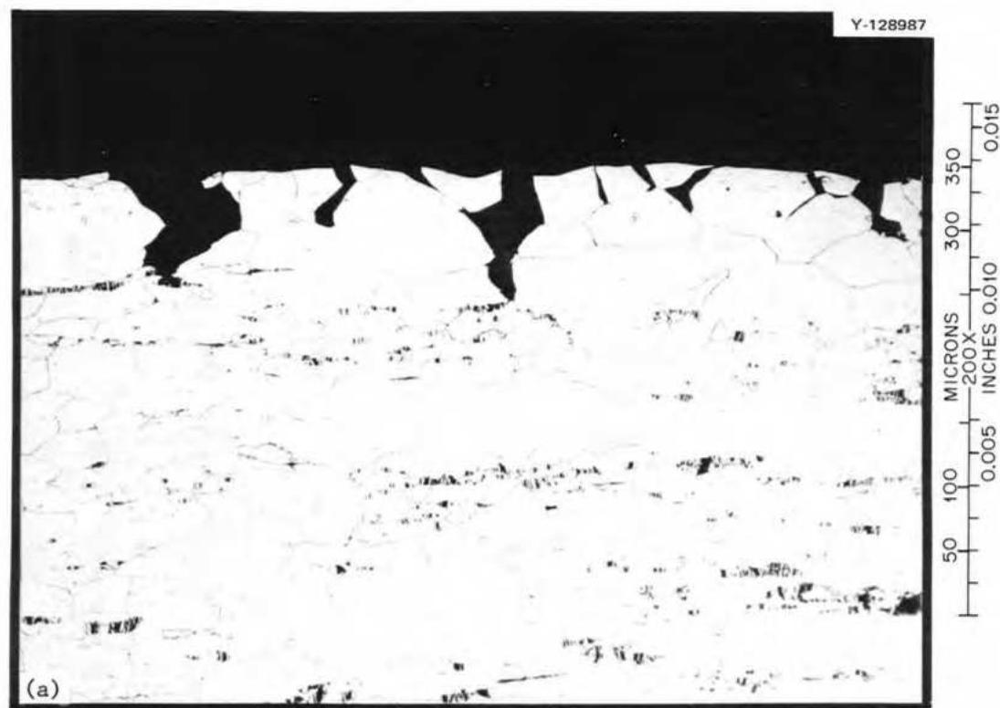

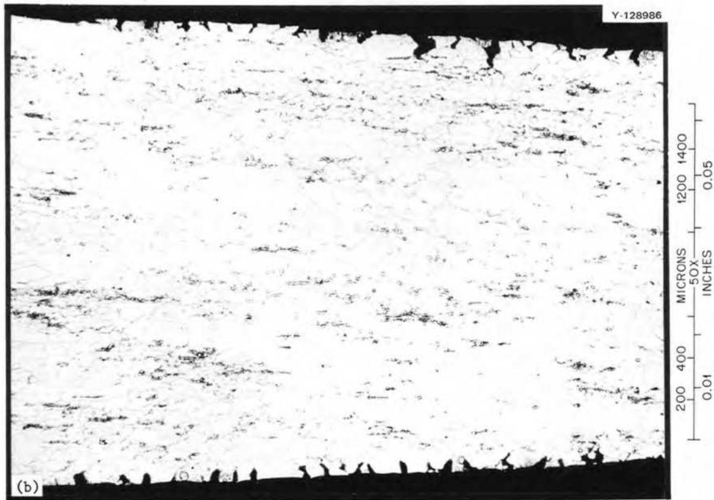  
Fig. 4.1. Hastelloy N specimen after tensile testing. Specimen has been cut in half and etched to show the grain boundaries. (a) magnification $200\times$ ; (b) magnification $50\times$ . Reduced $14\%$ .

that contained 0.07 mole $\%$ $\mathrm{UF_3}$ were then exposed to the flowing gas mixture at a total pressure of 1 atm. Preliminary trials with CO and $\mathrm{CO_2}$ at 1 atm indicated that both were much too oxidizing to maintain any measurable $\mathrm{UF_3}$ concentration at $600^{\circ}$ or $700^{\circ}\mathrm{C}$ . The oxygen pressure from reaction (1) can be easily calculated from standard equilibrium tabulations:

$$
\mathrm {C O} = \mathrm {C} + \frac {1}{2} \mathrm {O} _ {2}. \tag {1}
$$

A second reaction results in the conversion of $\mathrm{UF}_3$ to $\mathrm{UF}_4$ and $\mathrm{UO}_2$ ; the $\mathrm{UO}_2$ was identified as an end product in all cases:

$$
\begin{array}{l} 4 \mathrm {U F} _ {3} (\mathrm {d}) + 2 \mathrm {C O} (\mathrm {g}) \\ = 3 \mathrm {U F} _ {4} (\mathrm {d}) + \mathrm {U O} _ {2} (\mathrm {c}) + 2 \mathrm {C} (\mathrm {c}). \tag {2} \\ \end{array}
$$

Oxygen fugacities can be lowered by dilution with argon. Partial pressures of CO equal to $2 \times 10^{-8}$ atm would be necessary to achieve equilibrium (2) at $600^{\circ} \mathrm{C}$ for $\mathrm{UF}_{3}$ and $\mathrm{UF}_{4}$ concentrations of $6.7 \times 10^{-4}$ and $6.7 \times 10^{-2}$ mole $\%$ , respectively. Measurements were made at successively lower CO partial pressures until the practical experimental limit was reached at $1.5 \times 10^{-6}$ atm. In all cases, as predicted, reaction (2) proceeded to completion within the limits of detection.

These data indicate that impurities such as oxide ion from $\mathrm{UO_2}$ or oxygen from CO do not react with $\mathrm{UC}_2$ to form uranium oxycarbides. The compound $\mathrm{UO_2}$ has no observable effect on the $\mathrm{UF_3 - UF_4}$ equilibrium, but traces of CO oxidize $\mathrm{UF_3}$ to $\mathrm{UF_4}$ and $\mathrm{UO_2}$ . Therefore, $\mathrm{UC_yO_{2 - y}}$ phases are metastable with respect to $\mathrm{UO_2}$ and $\mathrm{UC_2}$ at temperatures less than $700^{\circ}\mathrm{C}$ , and, as a result, the maximum tolerable oxide concentration in the fuel solution will be determined by the solubility limit of $\mathrm{UO_2}$ or $\mathrm{Pa_2O_5}$ .

# 4.4 THE URANIUM TETRAFLUORIDE-HYDROGEN EQUILIBRIUM IN MOLTEN FLUORIDE SOLUTIONS

L.O.Gilpatrick L.M.Toth

Discrepancies exist between the equilibrium quotients measured for the reaction:

$$
4 \mathrm {U F} _ {3} (\mathrm {d}) + 2 \mathrm {C} = 3 \mathrm {U F} _ {4} (\mathrm {d}) + \mathrm {U C} _ {2} \tag {4}
$$

and those predicted from other sources. We have undertaken a reexamination of the equilibrium:

$$
\mathrm {U F} _ {4} (\mathrm {d}) + \frac {1}{2} \mathrm {H} _ {2} = \mathrm {U F} _ {3} (\mathrm {d}) + \mathrm {H F}, \tag {5}
$$

previously studied by Long and Blankenship17 because of the importance of reactions (4) and (5) to MSBR fuel-salt chemistry.

In previous work, $^{17}$ the progress of the reaction and the concentrations of $\mathrm{UF}_3$ and $\mathrm{UF}_4$ in solution were inferred from the amount of HF evolved from the melt, so it was difficult to distinguish between side reactions and reaction (5). In addition, equilibrium could be approached only by reducing $\mathrm{UF}_4$ . This procedure may be improved in several ways. In-situ spectrophotometric measurements of both $\mathrm{UF}_3$ and $\mathrm{UF}_4$ concentrations as a function of time, temperature, and $\mathrm{HF} / \mathrm{H}_2$ ratio are now possible. In addition, the recently available fluoride-sensitive electrodes allow measurement of much lower HF concentrations. These improvements permit a wider range of temperatures to be explored, especially lower temperatures in the range of interest to the Molten-Salt Reactor Program. Another advantage of the new procedure is the possibility of reversing the equilibrium by changes of temperature or gas composition so that equilibrium can be approached from either side while under constant monitoring and control.

Preparation of equipment and the assembly of a gas-handling and -analysis system for the study of reaction (5) are nearly complete. Pure $\mathbf{H}_2$ is generated by an electrolysis-palladium-diffuser unit. The hydrogen gas stream is saturated with HF (in low concentrations) from the dissociation $\mathrm{KHF}_2 = \mathrm{KF} + \mathrm{HF}$ at a carefully controlled temperature. This three-phase system (excess KF is present) gives a controlled partial pressure of HF. $^{18}$ The blended gas stream is then passed over (or sparged through) the fluoride solution that contains $\mathrm{UF}_3$ and $\mathrm{UF}_4$ , which is contained in a graphite cell. A newly designed pure-nickel spectral furnace encloses the cell. Nickel construction allows for a cleaner system than was previously possible, because of the more thorough removal of oxide species, which is possible by $\mathbf{H}_2$ reduction prior to use. Gas mixtures entering and leaving the furnace are analyzed for flow rate, pressure, and HF content. Hydrogen fluoride determination is made by aqueous scrubbing of the gas stream and measuring the fluoride ion concentration with a specific-ion electrode.

# 4.5 POROUS-ELECTRODE STUDIES

H. R. Bronstein F. A. Posey

Studies were continued on the development of porous and packed-bed electrode systems as continuous, online monitors of the concentrations of electroactive substances in MSBR fuel salt. First priority was given to the design and testing of a device that could monitor, and perhaps remove, dissolved bismuth from fuel salt, since small concentrations of bismuth in fuel salt returning to the reactor from the processing plant could result in corrosion of the Hastelloy N of which the reactor primary circuit would be constructed. Continuing studies in support of other programs have demonstrated the usefulness of porous and packed-bed electrodes for electroanalysis and for recovery of trace amounts of reducible inorganic pollutants from various effluents and process streams.[19,20]

During the previous report period, a prototype packed-bed electrode of glassy-carbon spheres (about $100\mu$ in diameter) was tested in a preliminary study by use of the LiCl-KCl eutectic system.2 Results of linear-sweep voltammetric measurements, carried out in the presence of small quantities of iron salts and cadmium salts, showed that the cell, instrumentation, and auxiliary systems functioned successfully and demonstrated the inherent sensitivity of this method of analysis. However, the tests on the prototype cell showed the need to modify the experimental apparatus to facilitate the addition of known amounts of various substances to the melt and to allow operation under vacuum or inert atmosphere over long periods of time.

Most of the effort during this report period has been devoted to the redesign of the experimental assembly, to the acquisition of more advanced and convenient instrumentation than that used previously, and to the construction and testing of the assembly prior to the resumption of experimental measurements. An overall view of the new experimental assembly and the necessary control and measurement equipment is shown (Fig. 4.2). The cell, located inside a test chamber, which is mounted on a portable test stand (shown in the center of the picture), is inserted into a furnace that permits direct observation of the quartz cell assembly during operation. The experimental assembly will permit establishing proper operating procedures for later studies on MSBR fuel salt, for which a metal cell assembly will be required. Attached to the top of the test chamber are various entry ports for insertion of the

packed-bed electrode assembly and for addition of reagents, a thermocouple well, a counterelectrode, and an $\mathrm{Ag / AgCl}$ reference electrode, as well as pressure and/or vacuum fittings for the cell and for the valve assemblies. At the left in Fig. 4.2 are shown cabinets that contain equipment for precise control of the temperature of the furnace and cell assembly. To the right of the test stand are rack-mounted instruments for carrying out the electrochemical measurements (potentiostat with electronic auto-ranging coulometer, electrode-potential programmer, and electrometer). Also shown at the right is a two-pen $X - Y_{1},Y_{2}$ recorder for simultaneous recording of current-potential and charge-potential curves for the packed-bed electrode.

The newly designed packed-bed electrode is shown (Fig. 4.3). The packed bed of glassy-carbon spheres is supported on a porous quartz frit and is contained in a quartz sheath. Another porous quartz frit presses on the bed from above. A glassy-carbon rod penetrates the upper quartz frit to provide compaction of the bed and electrical contact with a long stainless steel rod that is insulated from the surrounding tantalum support tube. The electrode is dipped into the melt so that the molten salt flows up through the interior of the packed bed and out an overflow slot. By this means, a reproducible volume of melt can be obtained inside the packed-bed electrode.

Preliminary testing of the entire experimental assembly has been completed, and experimental measurements will be resumed immediately following preparation and loading of the salt mixture for the melt. Initially, work will be in LiCl-KCl eutectic, since the behavior of a number of electroactive substances has already been established for this medium, and thus the new cell assembly can be conveniently checked out and calibrated. Results of experimental measurements on the bismuth system and on other electroactive substances will be presented in a subsequent report. Following successful testing of the present cell assembly, a similar apparatus will be designed and constructed for use with molten fluoride melts.

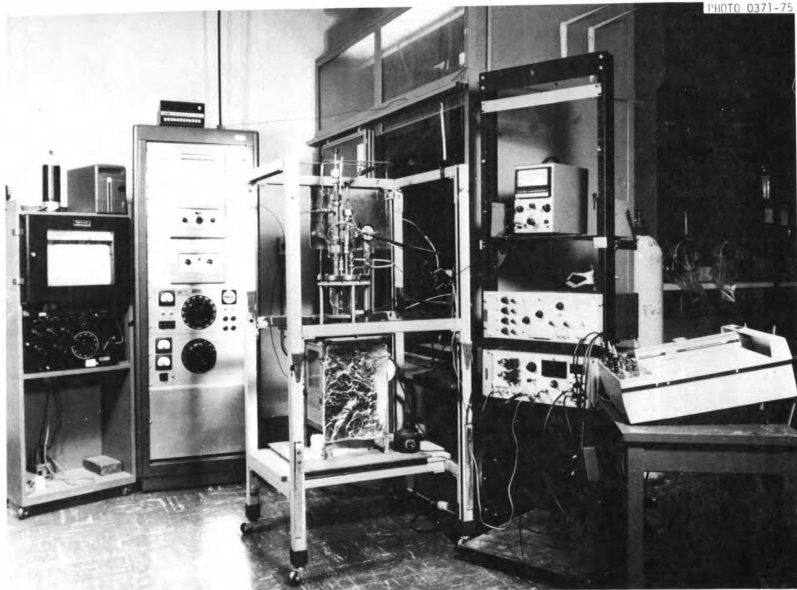  
Fig. 4.2. Experimental assembly for study of electroanalysis of electroactive substances in molten salts with a packed-bed electrode of glassy carbon spheres.

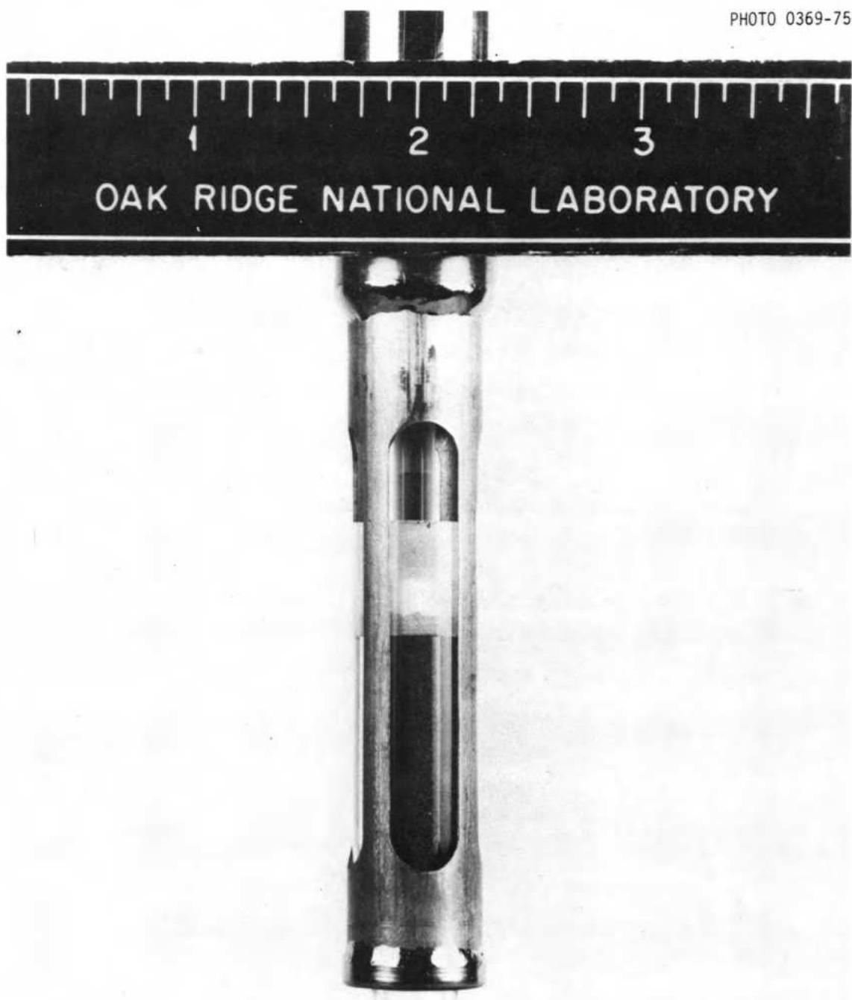  
Fig. 4.3. Packed-bed electrode assembly with glassy carbon spheres for use in molten salts.

# 5. Coolant-Salt Chemistry

# 5.1 CHEMISTRY OF SODIUM FLUOROBORATE

L. Maya

An unacceptable amount of the tritium (731 Ci/day) produced in a 1000-MW(e) MSBR could reach the steam system unless it is trapped by the coolant. Indications are that a sodium fluoroborate melt, $\mathrm{NaBF}_4$ -NaF (92-8 mole %), presently considered as one possible coolant in the MSBR, could sequester tritium. Work done in the past with this coolant melt in the CSTF, as well as in laboratory experiments, has shown the presence of at least two hydrogen-containing species, one acidic and the other $\mathrm{NaBF}_3\mathrm{OH}$ . In addition, one or more oxygen-containing species exist above the melt and also above the melt are additional volatile hydrogen-containing species that are condensable at room temperature. These compounds constitute a potential sink for exchanging and/or trapping the tritium. The present work is to identify these species, study their chemistry, and ascertain their ability to trap tritium. The approach chosen consisted of preparing and studying a number of model compounds. The initial work, reported in the preceding report, involved the synthesis and characterization of the following compounds: $\mathrm{H}_3\mathrm{OBF}_4$ , $\mathrm{BF}_3\cdot 2\mathrm{H}_2\mathrm{O}$ , $\mathrm{HBF}_2(\mathrm{OH})_2$ , $\mathrm{NaBF}_3\mathrm{OH}$ . Also reported was the synthesis of $\mathrm{Na}_2\mathrm{B}_2\mathrm{F}_6\mathrm{O}$ and $\mathrm{Na}_3\mathrm{B}_3\mathrm{F}_6\mathrm{O}_3$ . Availability of these materials permitted an evaluation of the analytical tools available to identify these compounds in actual systems.

During this report period the system $\mathrm{HBO}_2\cdot \mathrm{H}_3\mathrm{OBF}_4\cdot$ $\mathbf{H}_2\mathbf{O}$ was characterized to help explain the behavior and composition of the volatile fractions condensed from fluoroborate melts. The compounds $\mathrm{H_3OBF_4}$ $\mathrm{HBF}_2(\mathrm{OH})_2$ ,and $\mathrm{BF}_3\cdot 2\mathrm{H}_2\mathrm{O}$ , which are constituents of this system, were examined using nuclear magnetic resonance (NMR) spectroscopy. The protons in all these compounds undergo exchange among the hydronium ions, the undissociated acid, and the anion; furthermore, there is also proton exchange in mixtures of these compounds. The fluorine NMR showed that the fluorine atoms are equivalent in these compounds, as would be expected, and that there is fluorine exchange in mixtures of these compounds. The NMR of these compounds is thus of limited value as an analytical tool in view of the exchange processes taking place; no specific signal could be assigned with certainty to a particular species.

Ternary diagrams for the system $\mathrm{HBO}_2\cdot \mathrm{H}_3\mathrm{OBF}_4\cdot \mathrm{H}_2\mathrm{O}$ at 25 and $60^{\circ}\mathrm{C}$ have been constructed to aid in characterization of these compounds in the pure state or as mixtures. The diagram for the system at $25^{\circ}\mathrm{C}$ (Fig. 5.1) shows a large area of compositions having an equilibrium solid phase. The main features at $60^{\circ}\mathrm{C}$ are the same as those observed at $25^{\circ}\mathrm{C}$ . The solid phase is boric acid for compositions of relatively high water content and metaboric acid for compositions of low water content; there is also a limited region which contains both solid phases. The composition of volatile fractions from fluoroborate melt, expressed in terms of molecular species, can be found from the fluorine and boron chemical analysis of the mixture. The fluorine concentration is expressed as $\mathrm{H}_3\mathrm{OBF}_4$ , and the boron content, after subtraction of the amount present in $\mathrm{H}_3\mathrm{OBF}_4$ , is expressed as $\mathrm{HBO}_2$ , thus fixing a composition in the diagram. This is illustrated for an actual condensate collected in the Coolant-Salt Technology Facility. The analysis was 22.6 millimoles of F per gram and 9.3 millimoles of B per gram. This gives a composition of 60.2 wt $\%$ $\mathrm{H}_3\mathrm{OBF}_4$ and 16.4 wt $\%$ $\mathrm{HBO}_2$ , the difference being water. Expressing this in terms of the stable

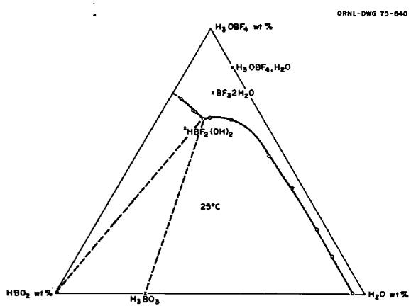  
Fig. 5.1. Ternary phase diagram for the system $\mathbf{HBO}_2$ - $\mathbf{H}_3\mathbf{BOF}_4$ - $\mathbf{H}_2\mathbf{O}$ at $25^{\circ}\mathrm{C}$ .

molecular species for this region of the phase diagram gives the composition: $79\% \mathrm{BF}_3\cdot 2\mathrm{H}_2\mathrm{O}$ , $12\% \mathrm{H}_3\mathrm{BO}_3$ and $9\% \mathrm{H}_2\mathrm{O}$ .

The ternary diagram is useful also in predicting the relative stabilities of the molecular species. It has been found that $\mathrm{HBF}_2(\mathrm{OH})_2$ is a metastable species at $25^{\circ}\mathrm{C}$ that should disproportionate according to:

$$
3 \mathrm {H B F} _ {2} (\mathrm {O H}) _ {2} \rightarrow \mathrm {H B O} _ {2} + 2 \left(\mathrm {B F} _ {3} \cdot 2 \mathrm {H} _ {2} \mathrm {O}\right). \tag {1}
$$

This prediction was experimentally substantiated. The $\mathrm{BF}_3:2\mathrm{H}_2\mathrm{O}$ has a relatively high free energy of formation, which accounts for the fact that boric acid is dehydrated at room temperature according to:

$$
\mathrm {B F} _ {3} + 2 \mathrm {H} _ {3} \mathrm {B O} _ {3} \rightarrow \mathrm {H B O} _ {2} + \mathrm {B F} _ {3} \cdot 2 \mathrm {H} _ {2} \mathrm {O}. \tag {2}
$$

The NMR studies and the work done in preparing the phase diagrams indicate that the molecular species of the system can form stable solutions under certain conditions and interchange easily on addition of HF, $\mathrm{BF}_3$ or $\mathrm{H}_2\mathrm{O}$ ; therefore the volatile fractions formed from the fluoroborate melt are most likely a mixture of compounds rather than a single compound. Also, this means that isotopic equilibrium should be readily attained between protium, deuterium, and/or tritium, which suggests that isotopic exchange should be a viable method of tritium trapping in the MSBR.

Determination of the oxide and hydroxide species present in the melt at low concentrations is a much more difficult task since the quantity of fluoroborate will interfere. The compound $\mathrm{NaBF}_3\mathrm{OH}$ can be determined by the OH absorption in the infrared region,

but the bands for oxide species are not specific and appear as broad signals in the region from 700 to 1400 $\mathrm{cm}^{-1}$ , where there is considerable overlap of the sodium fluoroborate bands. X-ray powder diffraction analysis is of limited value since it cannot distinguish less than about 5 mole % of foreign species in fluoroborate. NMR is also of limited use unless the species are in solution. Thus, the development of separation techniques or the finding of more sensitive spectroscopic means of detection are required. Dimethyl sulfoxide (DMSO) has been examined in an initial attempt to work out separation procedures since it dissolves up to 20 wt % $\mathrm{NaBF}_4$ at room temperature without decomposition. The solubility of $\mathrm{Na}_3\mathrm{B}_3\mathrm{F}_6\mathrm{O}_3$ in this solvent is very low, less than 0.5 mg of B per milliliter; thus, DMSO was used to separate these two compounds. On the other hand, DMSO reacts with $\mathrm{NaBF}_3\mathrm{OH}$ and $\mathrm{Na}_2\mathrm{B}_2\mathrm{F}_6\mathrm{O}$ , producing acidity and $\mathrm{BF}_4^-$ ions.

The compounds $\mathrm{Na}_2\mathrm{B}_2\mathrm{F}_6\mathrm{O}$ and $\mathrm{Na}_3\mathrm{B}_3\mathrm{F}_6\mathrm{O}_3$ , potential oxygen-containing species in the melt, were examined by differential thermal analysis and thermogravimetric analysis. Both are thermally unstable and do not show a sharp melting point; instead, they form glasses, and a crystalline phase segregates that is composed of NaF and $\mathrm{NaBF_4}$ in the case of $\mathrm{Na}_2\mathrm{B}_2\mathrm{F}_6\mathrm{O}$ and of NaF in the case of $\mathrm{Na}_3\mathrm{B}_3\mathrm{F}_6\mathrm{O}_3$ . This finding would tend to eliminate these compounds as possible oxygencontaining species in the melt; however, this is not certain since $\mathrm{NaBF}_3\mathrm{OH}$ is also unstable as a pure compound but has limited stability in the melt. Experiments were made in order to find alternate stable compounds in the system NaF- $\mathrm{NaBF_4 - B_2O_3}$ , of which both $\mathrm{Na}_2\mathrm{B}_2\mathrm{F}_6\mathrm{O}$ and $\mathrm{Na}_3\mathrm{B}_3\mathrm{F}_6\mathrm{O}_3$ are components. Five mixtures in the system were examined:

Molecular ratio   

<table><tr><td>Mixture</td><td>NaF</td><td>\( {\mathrm{{NaBF}}}_{4} \)</td><td>\( {\mathrm{B}}_{2}{\mathrm{O}}_{3} \)</td></tr><tr><td>1</td><td>2</td><td>1</td><td>1</td></tr><tr><td>2</td><td>1</td><td>1</td><td>1</td></tr><tr><td>3</td><td>1</td><td>2</td><td>1</td></tr><tr><td>4</td><td>2</td><td>2</td><td>1</td></tr><tr><td>5</td><td>0</td><td>2</td><td>1</td></tr></table>

Each mixture was melted in a platinum container under a nitrogen stream at either 450 or $550^{\circ}\mathrm{C}$ . There was no significant weight loss except for mixture 5, which showed a weight loss corresponding to the volatilization of one mole of $\mathbf{BF}_3$ . In addition to these mixtures, $\mathrm{Na}_3\mathrm{B}_3\mathrm{F}_6\mathrm{O}_3$ , $\mathrm{Na}_2\mathrm{B}_2\mathrm{F}_6\mathrm{O}$ , and a mixture composed of $\mathrm{NaBF_4}$ and $\mathrm{NaBO_2}$ (2:1 ratio) were also examined. All these mixtures formed glasses; however, a crystalline phase could be separated from all except the 1:1:1 mixture. Chemical analysis indicated, and later x-ray

diffraction analysis confirmed, that the identity and approximate quantity of the crystalline phase corresponded to the component (or components) in excess of the ratio 1:1:1. Chemical analysis also showed that boric oxide or the metaborate was converted into a compound containing B-F bonds.

The following conclusions can be derived from these experiments: (1) Simple B-O-containing compounds, such as $\mathbf{B}_2\mathbf{O}_3$ or $\mathrm{BO_2}^-$ , can be discounted as the oxygen-containing species in molten fluoroborate; any B-O species up to a certain concentration will contain fluorine as well; (2) fluoroborate melts can contain relatively large amounts of oxide species without forming a separate solid phase; and (3) there are indications that a compound containing NaF, $\mathrm{NaBF_4}$ , and $\mathbf{B}_2\mathbf{O}_3$ in a molar ratio of 1:1:1 is especially stable. This would correspond to a compound with the empirical formula $\mathrm{Na_2B_3F_5O_3}$ . Further spectroscopic evidence for this will be sought.

The compound $\mathrm{NaBF}_3\mathrm{OD}$ was prepared by the reaction:

$$
\mathrm {N a F} + \mathrm {D B F} _ {2} (\mathrm {O D}) _ {2} \rightarrow \mathrm {N a B F} _ {3} \mathrm {O D} + \mathrm {D} _ {2} 0
$$

in an $88.6\%$ isotopic purity, for the development of an infrared method of analysis by the Analytical Chemistry Division.

Samples of salt and condensate obtained during a recent run7 of the Coolant-Salt Technology Facility were prepared for analysis. The tritium content of these materials was found to be $4.35 \times 10^{3} \mu \mathrm{Ci} / \mathrm{g}$ for the salt, which gives a tritium concentration factor of $7.6 \times 10^{5}$ in the condensate relative to the fluoroborate melt. These values are similar to those previously reported,3 confirming that fluoroborate melts can contain tritium and that the condensate provides a means to concentrate and eliminate the tritium. The mechanism for the process is still unknown.

# 5.2 CORROSION OF STRUCTURAL ALLOYS BY FLUOROBORATES

S. Cantor B.F.Hitch

# 5.2.1 Thermodynamics of $\mathrm{Cr(III)}$ in Fluoroborate

When oxidants (e.g., $\mathrm{O}_2$ , $\mathrm{H}_2\mathrm{O}$ , $\mathrm{Ni}^{2+}$ ) are introduced into molten $\mathrm{NaBF}_4$ -NaF in contact with alloys containing chromium, a sparsely soluble green salt, $\mathrm{Na}_3\mathrm{CrF}_6$ , is formed. Other complex salts might also have been expected to form since the $\mathrm{NaF - CrF_3}$ phase diagram8 shows the existence of $\mathrm{Na}_3\mathrm{CrF}_6$ , $\mathrm{Na}_5\mathrm{Cr}_3\mathrm{F}_{14}$ ,

and $\mathrm{NaCrF_4}$ . An experiment was designed to obtain the free energy of formation $(\Delta G^f)$ of $\mathrm{Na}_3\mathrm{CrF}_6$ by measuring the equilibrium $\mathrm{BF}_3$ pressure from the reaction

$$
\begin{array}{l} \mathrm {C r F} _ {3} (\mathrm {c}) + 3 \mathrm {N a B F} _ {4} (\mathrm {d}, a \sim 1) \\ = \mathrm {N a} _ {3} \mathrm {C r F} _ {6} (\mathrm {c}) + 3 \mathrm {B F} _ {3} (\mathrm {g}). \tag {1} \\ \end{array}
$$

However, it was found that $\mathrm{Na}_5\mathrm{Cr}_3\mathrm{F}_{14}$ also forms when $\mathrm{CrF}_3$ and molten $\mathrm{NaBF}_4$ interact; thus, it was not possible to measure $\Delta G^f$ of $\mathrm{Na}_3\mathrm{CrF}_6$ by reaction (1), but the relative stabilities of $\mathrm{Na}_3\mathrm{CrF}_6$ and $\mathrm{Na}_5\mathrm{Cr}_3\mathrm{F}_{14}$ could be determined from the equilibrium

$$
\begin{array}{l} \% \mathrm {Na} _ {5} \mathrm {Cr} _ {3} \mathrm {F} _ {1 4} (\mathrm {c}) + \% \mathrm {NaBF} _ {4} (\mathrm {d}, a \underset {\wedge}{\sim} 1) \\ = \mathrm {N a} _ {3} \mathrm {C r F} _ {6} (\mathrm {c}) + 4 \% \mathrm {B F} _ {3} (\mathrm {g}), \tag{2} \\ \end{array}
$$

for which the equilibrium constant is

$$
K = P _ {\mathrm {B F} _ {3}} ^ {4 / 3}, \tag {3}
$$

where $P_{\mathrm{BF}_3}$ is the equilibrium pressure.

Measurements of $\mathbf{BF}_3$ pressures taken over mixtures of differing proportions of crystalline $\mathrm{Na}_{5}\mathrm{Cr}_{3}\mathrm{F}_{14}$ and $\mathrm{Na}_{3}\mathrm{CrF}_{6}$ in molten $\mathrm{NaBF_4}$ yielded the same pressure date (Fig. 5.2) in the temperature range 408 to $592^{\circ}\mathrm{C}$ .

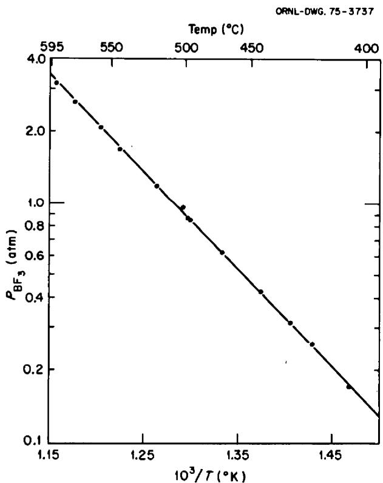  
Fig. 5.2. $\mathbf{BF}_3$ pressures from the reaction: $\mathrm{Na}_{5}\mathrm{Cr}_{3}\mathrm{F}_{14}(\mathrm{s}) + \frac{4}{3}\mathrm{NaBF}_4(\mathrm{d}) = \mathrm{Na}_3\mathrm{CrF}_6(\mathrm{s}) + \frac{4}{3}\mathrm{BF}_3(\mathrm{g})$ .

A least-squares fit of the data is given by:

$$
\ln P _ {\mathrm {B F} _ {3}} (\mathrm {a t m}) = 1 1. 9 1 0 \pm 0. 0 8 9 - \frac {9 2 9 3 \pm 6 8}{T (^ {\circ} \mathrm {K})}. \tag {4}
$$

The dispersion values are standard deviations from least-squares solutions of these constants.

The free energy change for reaction (2) is given by the expression

$$
\Delta G ^ {\circ} = - 4 / 3 R T \ln P _ {\mathrm {B F} _ {3}}; \tag {5}
$$

at $T = 800^{\circ}\mathrm{K}$ , $\Delta G^{\circ} = -0.62\mathrm{kcal}$ . The enthalpy change for (2) is

$$
\Delta H ^ {\circ} = - 4 / 3 R d \ln P _ {\mathrm {B F} _ {3}} / d T ^ {- 1} = 2 4. 6 \mathrm {k c a l}. \tag {6}
$$

From the thermodynamic date $^{9,10-1,2}$ for the equilibrium

$$
\mathrm {N a F} (\mathrm {c}) + \mathrm {B F} _ {3} (\mathrm {g}) = \mathrm {N a B F} _ {4} (l) \tag {7}
$$

it can be shown that, at $800^{\circ}\mathrm{K}$ , the difference between the molar free energies of formation of $\mathrm{BF}_3(\mathrm{g})$ and $\mathrm{NaBF}_4(l)$ is 122 kcal;

$$
\Delta G ^ {f} _ {\mathrm {B F} _ {3} (\mathrm {g})} - \Delta G ^ {f} _ {\mathrm {N a B F} _ {4} (l)} = 1 2 2 \mathrm {k c a l}. \tag {8}
$$

This is combined with $\Delta G^{\circ}$ at $800^{\circ}\mathrm{K}$ for reaction (2) to obtain a free energy difference between the two complexes:

$$
\Delta G ^ {f} _ {\mathrm {N a} _ {3} \mathrm {C r F} _ {6}} - 1 / 3 \Delta G ^ {f} _ {\mathrm {N a} _ {5} \mathrm {C r} _ {3} \mathrm {F} _ {1 4}} = - 1 6 3 \mathrm {k c a l}. \tag {9}
$$

This difference permits the calculation of the difference in $\Delta G^{\circ}$ between the following two reactions of complex formation:

$$
3 \mathrm {N a F} (\mathrm {c}) + \mathrm {C r F} _ {3} (\mathrm {c}) = 3 \mathrm {N a F} \cdot \mathrm {C r F} _ {3} (\mathrm {c}), \tag {10}
$$

$$
\frac {5}{3} \mathrm {N a F (c)} + \mathrm {C r F _ {3} (c)} = \frac {5}{3} \mathrm {N a F} \cdot \mathrm {C r F _ {3} (c)}. \tag {11}
$$

At $800^{\circ}\mathrm{K}, \Delta G^{\circ}(10) - \Delta G^{\circ}(11) = -6.3\mathrm{kcal}$ . In other words, a mole of $\mathrm{CrF}_3$ is more stable by 6.3 kcal in

$\mathrm{Na}_{3}\mathrm{CrF}_{6}$ than in $\mathrm{Na}_{5}\mathrm{Cr}_{3}\mathrm{F}_{14}$ . This greater stability explains why $\mathrm{Cr(III)}$ corrosion products precipitate from fluoroborate coolant as $\mathrm{Na}_{3}\mathrm{CrF}_{6}$ rather than as $\mathrm{Na}_{5}\mathrm{Cr}_{3}\mathrm{F}_{14}$ .

# 5.2.2 Metal Boride Formation

Thermochemical data for the borides of Fe, Cr, Ni, Ti, and Mo are sparse and often unreliable. Thus, it is difficult to accurately predict the extent to which reactions such as

$$
\begin{array}{l} 2 \mathrm {N a F} (\mathrm {d}) + \mathrm {N a B F} _ {4} (\mathrm {d}) + (x + 1) \mathrm {C r} (\mathrm {c}) \\ = \mathrm {N a} _ {3} \mathrm {C r F} _ {6} (\mathrm {c}) + \mathrm {C r} _ {x} \mathrm {B} (\mathrm {c}) \tag {12} \\ \end{array}
$$

may occur in an MSBR coolant loop. The free energy of this reaction is probably negative; thus, molten $\mathrm{NaBF}_4$ -NaF in contact with chromium or a chromiun-containing alloy is likely to form borides. To test boride deposition and penetration of structural alloys, an apparatus has been assembled in which metal specimens are equilibrated for varying periods of time in molten $\mathrm{NaBF}_4$ -NaF (92-8 mole %) at $640^{\circ}\mathrm{C}$ ; specimens and salt are kept under a protective argon atmosphere. Specimens removed from the salt are first washed in boiling water for several minutes to dissolve salt adhering to metal surfaces; the metal is then analyzed for boron by spark-source mass spectrometry (SSMS) and by ion microprobe.

Spark-source mass spectrometry showed increased surface boron concentrations for specimens of Hastelloy N, modified Hastelloy N containing $2\%$ Ti, and Inconel 600 that were equilibrated with molten $\mathrm{NaBF_4}$ -NaF for periods up to 72 days. Typical analysis showed about $100~\mathrm{ppm}$ B for Hastelloy specimens and up to $1500~\mathrm{ppm}$ B in Inconel 600, compared with unreacted controls in which B contents ranged from 10 to $30~\mathrm{ppm}$ . Ion microprobe mass analyses were made on two metal samples: Inconel 600, in which SSMS showed $1500~\mathrm{ppm}$ B, and Hastelloy N, $80~\mathrm{ppm}$ B. Boron was found distributed in small particles on the surface of the Inconel 600 sample, but the ion microprobe analysis could not quantify the amount. Chromium was significantly depleted from the surface. Boron was also observed on the Hastelloy surface; removal of part of the surface showed only a much lesser residual concentration ( $<100~\mathrm{ppm}$ ) of B, and this was not present in discrete particles. In contrast with the Inconel 600 specimen, the Hastelloy specimen did not show a surface depletion of chromium when the sample was observed through a depth of about $1\mu \mathrm{m}$ .

# 5.2.3 Corrosion of Nickel

In heating crystalline NaF and $\mathrm{CrF_3}$ to $890^{\circ}\mathrm{C}$ in nickel capsules, finely divided nickel metal particles were found in the cooled salt, which indicates that the nickel is evidently attacked. An explanation of this result is that the reaction

$$
\begin{array}{l} \mathrm {N a F} (\mathrm {c}) + 2 \mathrm {C r F} _ {3} (\mathrm {c}) + \mathrm {N i} (\mathrm {c}) \\ = \mathrm {N a N i F} _ {3} (\mathrm {c}) + 2 \mathrm {C r F} _ {2} (\mathrm {c}) \tag {13} \\ \end{array}
$$

occurs, proceeding to the right at high temperature and reversing at low temperatures. Sturm13 reported that mixtures of $\mathrm{CrF}_3$ and $\mathrm{CrF}_2$ , when heated in nickel, underwent the reaction

$$
2 \mathrm {C r F} _ {3} + \mathrm {N i} = \mathrm {N i F} _ {2} + 2 \mathrm {C r F} _ {2}. \tag {14}
$$

This proceeded to the right at 800 to $1000^{\circ}\mathrm{C}$ but was reversed upon cooling, although the $\Delta G^{\circ}$ values of reactions (13) and (14) seem to be positive. Possibly these reactions serve as mechanisms for mass transfer of nickel. That nickel undergoes mass transfer in an Inconel pump loop14 can be rationalized by a reaction analogous to (16) and (17),

$$
\begin{array}{l} 2 \mathrm {C r F} _ {3} (\mathrm {d}) + \mathrm {N i} (\text {I n c o n e l}) \\ \xrightarrow {\mathrm {N a B F} _ {4} \cdot \mathrm {N a F}} \mathrm {N i F} _ {2} (\mathrm {d}) + 2 \mathrm {C r F} _ {2} (\mathrm {d}). \tag {15} \\ \end{array}
$$

Indirect evidence for reaction (15) comes from a study of $\mathrm{Na}_3\mathrm{CrF}_6$ solubility in $\mathrm{NaBF}_4$ -NaF. Barton15 reported that two samples taken at temperatures close to $700^{\circ}\mathrm{C}$ gave values of 300 and 390 ppm nickel, possibly indicating corrosion of the nickel container.

By combining the data measured16 for the equilibrium

$$
\mathrm {N i F} _ {2} (\mathrm {c}) + \mathrm {N a B F} _ {4} (l) = \mathrm {N a N i F} _ {3} (\mathrm {c}) + \mathrm {B F} _ {3} (\mathrm {g}) \tag {16}
$$

with calorimetric $^{17,18}$ ( $\mathrm{NaF}$ , $\mathrm{NiF}_2$ ) and estimated $(\mathrm{NaNiF}_3)$ enthalpies, the thermodynamics of the reaction

$$
\mathrm {N a F} (\mathrm {c}) + \mathrm {N i F} _ {2} (\mathrm {c}) = \mathrm {N a N i F} _ {3} (\mathrm {c}) \tag {17}
$$

was obtained. At $298.15^{\circ}\mathrm{K}$ , the calculated results for reaction (17) are: $\Delta H^{\circ} = 0.7 \pm 1.4\mathrm{kcal / mole}$ , $\Delta S^{\circ} = 4.9$ cal mole $^{-1}$ ${}^{\circ}\mathrm{K}^{-1}$ . The uncertainty in $\Delta H^{\circ}$ is that assigned $^{16}$ to the formation free energy of $\mathrm{NaNiF}_3$ .

An interesting aspect of reaction (17) is that $\Delta H^{\circ}$ is nearly zero. In essence, the stability of the complex $(\mathrm{NaNiF}_3)$ depends on its entropy, which is greater than the entropy of the component salts. The thermodynamics of crystalline $\mathrm{NaFeF}_3$ is likely to be similar. An analogous situation exists for $\mathrm{MgF}_2$ . For the reaction

$$
\mathrm {N a F} (\mathrm {c}) + \mathrm {M g F} _ {2} (\mathrm {c}) = \mathrm {N a M g F} _ {3} (\mathrm {c}), \tag {6}
$$

$\Delta H_{298}^{0} = 0.1 \pm 0.5 \, \mathrm{kcal/mole}$ , the data having been obtained by aqueous solution calorimetry. $^{19}$

The stability of $\mathrm{Na}_3\mathrm{CrF}_6$ (the green salt that is the characteristic corrosion product of any chromium-containing alloy found in eutectic $\mathrm{NaBF}_4$ -NaF) is certain to be much greater. For the reaction

$$
\mathrm {N a F} (\mathrm {c}) + \frac {1}{3} \mathrm {C r F} _ {3} (\mathrm {c}) = \frac {1}{3} \mathrm {N a} _ {3} \mathrm {C r F} _ {6} (\mathrm {c}), \tag {7}
$$

$\Delta H_{298}^{\circ}$ is probably $-6\mathrm{kcal}$ (per mole of NaF); this enthalpy change is estimated from the analogous aluminum reaction. $^{17}$

# 6. Development and Evaluation of Analytical Methods

A. S. Meyer

# 6.1 IN-LINE ANALYSIS OF MOLTEN MSBR FUEL

R.F.Apple B.R.Clark

J.M.Dale D.L.Manning A.S.Meyer

Much of the program effort during this report period was spent in doing in-line analyses in corrosion test loops. Presently the $\mathrm{U}^{4+}/\mathrm{U}^{3+}$ concentration ratio is being measured in one forced-convection loop (FCL-2b) and two thermal-convection loops (NCL-21 and NCL-23). During the coming year this effort will expand to include in-line analyses in as many as a dozen circulating-salt facilities. To perform these measurements, which must be carried out at widely spaced locations, two additional voltammeters have been fabricated and are now being checked out prior to installation. Voltammetric data generated for the determination of $\mathrm{U}^{4+}/\mathrm{U}^{3+}$ should also be useful for later estimation of relative changes in corrosion-product ion concentrations. The chromous-ion reduction wave and anodic stripping wave may be suitable for making semiquantitative measurements of the chromous-ion concentrations.

A relatively long record of the $\mathrm{U}^{4+}/\mathrm{U}^{3+}$ ratio was obtained during the first six months of operation of FCL-2b. This forced-convection loop initially contained an experimental fuel of LiF-BeF $_2$ -ThF $_4$ (68-20-12 mole %) with about 1.4 wt $\%$ $^{238}\mathrm{U}$ . This facility is now operating with a reference fuel composition of 72-16-12 mole $\%$ ; electroanalytical measurements are in progress.

Initial attempts to obtain electroanalytical data on the circulating salt were complicated by various convective modes of mass transfer to the electrode surface, namely, vibrations from the pump motor and thermal gradients near the electrode. Reasonably good data were obtained when the circulation was temporarily interrupted for the measurements. In the near future, an electrode assembly will be installed with special features to eliminate or minimize the problems encour

tered in obtaining reliable measurements during circulation of the melt.

Many electroanalytical measurements were made throughout the operating period of April 18 to October 24, 1974. These measurements have provided our first experience in the voltammetric analysis of thorium-bearing fuels, and the data provide a basis for comparison with electroanalytical measurements being made in the reference fuel salt, $\mathrm{LiF - BeF_2 - ThF_4}$ (72-16-12 mole $\%$ ), which has a significantly higher "free fluoride" concentration.

As reported earlier, qualitative differences are evident between electrochemical behavior in this fuel solvent and in the more familiar MSRE compositions $\mathrm{(LiF - BeF_2 - ZrF_4)}$ . One of the more significant differences was an apparent improvement in the resolution between the chromium and uranium reduction waves. Because of the absence of zirconium in the thorium-bearing fuel, a higher cathodic limit is observed, and the reduction wave for $\mathrm{U}^{3 + } + 3\mathrm{e}^{-}\rightarrow \mathrm{U}^{0}$ can be observed if the potential is scanned a few hundred millivolts beyond the $\mathrm{U}^{4 + }$ reduction wave.

Under conditions of minimized convection and reasonably fast scan rates (0.1 to 0.5 V/sec), voltammograms are obtained which exhibit a shape closely resembling the theoretical shape for the reversible $\mathrm{U}^{4 + } + \mathrm{e}^{-}\rightleftarrows \mathrm{U}^{3 + }$ reduction. A typical wave of this sort has been illustrated previously. Not all the waves used for the calculation of $\mathrm{U}^{4 + } / \mathrm{U}^{3 + }$ ratios were close to ideal, and hence many were not easily interpretable. The method used for the calculation of the $\mathrm{U}^{4 + } / \mathrm{U}^{3 + }$ ratio has been reported previously. Two points must be measured to use this method: (1) the rest potential of the highimpedance iridium quasi-reference electrode and (2) the

half-wave potential of the $\mathrm{U}^{4 + }\rightarrow \mathrm{U}^{3 + }$ couple. The first point is the zero-current potential between two iridium electrodes, and the second point (half-wave potential) is extracted from the uranium reduction wave generated with linear-sweep voltammetry.

The precision of this method appears to be limited by the assignment of half-wave potentials from the raw data. In a potential-sweep experiment, the theoretical half-wave potential is the point on the curve which occurs at $85.2\%$ of the peak height. This is true only for reversible systems and does not include contributions to the current from sources other than the reduction or oxidation of the couple in question. In actuality, curves are seldom ideal because charging currents and extraneous Faradaic currents are included in the total current responses. A more reliable method for obtaining half-wave potentials from nonideal curves is to choose the potentials at the midpoint between the peak potentials of the cathodic and anodic peaks. Such a treatment makes the reasonable assumption that the shift in the peak potentials occurs to the same extent (but in opposite directions) for both the cathodic and the anodic waves. In the ideal case, the half-wave potential is midway between the peak potentials. In the treatment of these data, the half-wave potentials were assigned using the two methods outlined above. In addition, a theoretical point was chosen about $50\mathrm{mV}$ more negative than the derivative-wave peak potential. Half-wave potentials for each curve were computed by these three methods; the bisection method gave the more

3. R. S. Nicholson and I. Shain, *Anal. Chem.* 36, 706 (1964).

consistent results. Whenever the curves approached ideality, all three methods yielded potentials in good agreement with each other (about $5\mathrm{mV}$ ).

Data obtained during the six-month operation with the experimental fuel melt have been evaluated for $\mathrm{U}^{4+}/\mathrm{U}^{3+}$ ratios, and the calculated ratios are recorded as a function of time (Fig. 6.1). The data in this figure can best be considered in four sections: (1) the initial period of 40 to 50 days during which attempts were made to make measurements in circulating melts (there were frequent variations in loop operation interspersed with maintenance shutdowns), (2) a period of about three weeks during which the ratio was deliberately adjusted by the addition of beryllium metal, (3) an interval of essentially steady-state operation ( $\sim$ 50 days), and (4) a terminal period during which additions of nickel-fluoride were made to reoxidize the fuel.

The initial period is characterized by widely scattered data, which can be interpreted only as general trends. In view of the quality of many of the voltammograms recorded in the interval, this scatter must in large part be attributed to the analytical method. Initially the fuel was quite oxidizing $(\mathrm{U}^{4+}/\mathrm{U}^{3+}$ ratio about $10^{5}$ , perhaps the upper limit of the method); the ratio was rapidly reduced to about $10^{4}$ by reactions with the loop metals, principally chromium. On continued operation the ratio underwent a gradual decrease, with a concurrent increase in the height of the observed chromium wave. When the ratio had decreased to about 3000 and the chromium wave had become quite pronounced, incremental beryllium additions began.

These additions were made using beryllium foil specimens of sequentially increasing weight calculated to

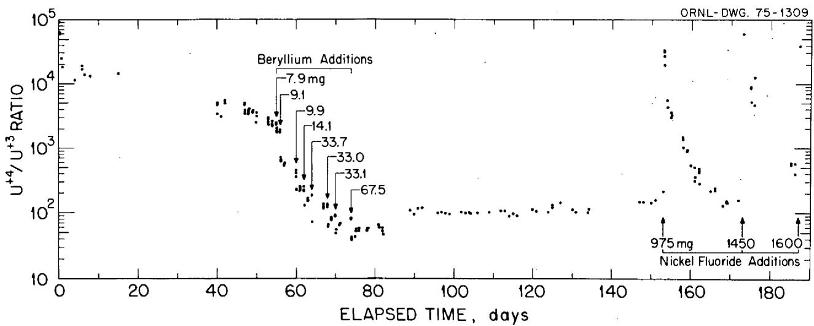  
Fig. 6.1. $\mathbf{U}^{4+} / \mathbf{U}^{3+}$ ratios in fuel in forced convection loop FCL-2b.

yield an unambiguous decrease in the ratio. The specimens were crimped in a loop of platinum-rhodium wire which was welded to a rod that could be inserted through a Teflon bushing on the sampling port. An effort was made to avoid shorting the support rod to the apparatus, so that contact of the specimen with the fuel could be detected electrically; however, in most cases the support rod was inadvertently shorted to the loop either during insertion or through vibration when circulation was started. The beryllium specimens were inserted 1 to 2 in. below the quiescent fuel surface, circulation was resumed, and the progress of the reduction was followed, qualitatively, during the next few hours by voltammetric measurements. Although the effects of stirring and vibration mentioned earlier precluded measurements of the uranium wave, shifts in the position of the distinct two-electron chromium wave could be detected.

Potentiometric measurements of the melt using the reference electrode vs the beryllium support rod and vs the loop structure were made for some of the reduction steps. It was observed that when the beryllium was shorted to the loop, reduction took place smoothly and rapidly to ostensible completion in 2 to $4\mathrm{hr}$ . On one occasion when the support rod was electrically isolated from the structure, reduction slowed to an undetectable rate but accelerated when the rod was deliberately shorted. An electrically isolated beryllium specimen assumed a potential $>1\mathrm{V}$ negative to the melt. When the specimen was connected to the loop structure, the potential decreased to a value less than $100\mathrm{mV}$ , so that the potential of the fuel was positive to both the walls of the loop and the beryllium specimen. Therefore, it is evident that the bulk of the reaction occurred by electrolytic reduction of $\mathbf{U}^{4+}$ at the inner walls of the loop rather than by direct chemical reaction at the beryllium, which would be rate-limited by transport of $\mathbf{U}^{4+}$ to the small surface of the metal specimen. Although no further reduction could be detected after $4\mathrm{hr}$ , the support wire was left in place for at least $24\mathrm{hr}$ to ensure quantitative reaction with residual beryllium or its reduction products.

The results of beryllium additions are shown in Fig. 6.2, an enlargement of a section of Fig. 6.1. The overall curve in this region resembles a titration curve, and indeed the reduction experiments represent an uncommon potentiometric titration. An examination of detailed response to addition reveals a reasonably consistent pattern (after the third reductant addition) of an immediate decrease in ratio (reduction of fuel) followed by a slow increase in the ratio toward recovery of the initial value. With some license taken in connecting

sparse data points, the tendency toward recovery can be interpreted as approaching a new steady-state value within a period of several days. Regrettably, the time between additions was not enough to achieve steady-state ratios, nor was the frequency or precision of the measurements sufficient to permit mathematical analysis of the observed recovery regions. The recovery can be readily explained by the oxidation of $\mathrm{U}^{3+}$ by $\mathrm{Cr}^{2+}$ , but the slow nature of the recovery may reflect heterogeneous reactions involving either the loop walls or particulate metal in the fuel.

Figure 6.3 illustrates the yield of $\mathbf{U}^{3+}$ from individual reduction steps. For each reduction the unshaded bar represents the equivalents of beryllium added and the shaded bar represents the total equivalents of $\mathbf{U}^{3+}$ produced during the immediate rapid reduction (calculated

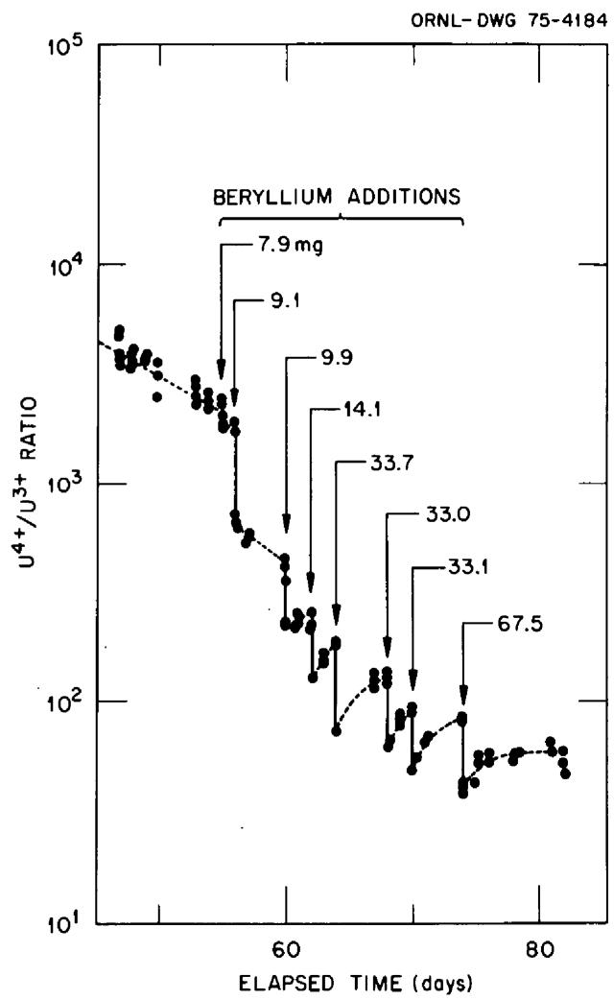  
Fig. 6.2. Effect of beryllium additions on circulating MSBR fuel.

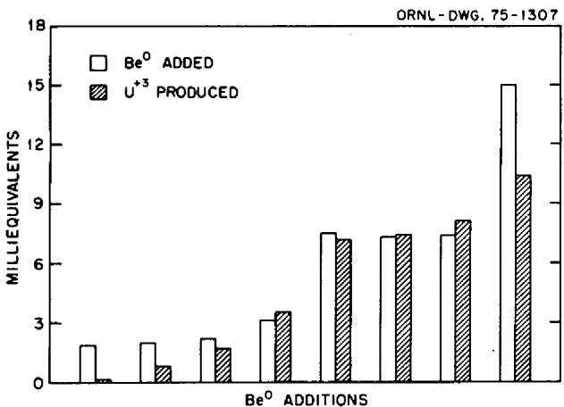  
Fig. 6.3. Yield of $\mathbf{U}^{3+}$ from beryllium additions to MSBR fuel.

from the increments in ratio and the total equivalents of uranium in the loop). Low yields in the early reductions were expected because at high ratios the beryllium is largely consumed by strong oxidants such as $\mathrm{Fe}^{2+}$ . For the intermediate additions, stoichiometric reduction was obtained within the precision of this method. The low yield in the last reduction can be attributed to consumption of beryllium by chromous ions. A decrease in ionic chromium concentration was evident from voltammograms but has not yet been quantified. The overall yield of the additions was $85\%$ . Thus, the results of the reduction experiments show that the present method for determining the $\mathrm{U}^{4+}/\mathrm{U}^{3+}$ ratio is also reliable in thorium-bearing breeder fuels and needs only to be optimized for maximum sensitivity and precision.

During the third period, of less eventful operation, the data are more consistent, with an estimated overall precision of measurement of about $10\%$ . This value may not fairly represent the reproducibility of the analytical measurements, however, because some of the variations may reflect changes in ratio with minor changes in loop operating conditions, for example, temperature, $\Delta T$ operations, etc. In earlier measurements, made in a thermal-convection loop under more favorable conditions, a precision of about $2\%$ was obtained. A final plotting of the most probable ratio in the fuel and final evaluation of the measurement will be delayed until a comparison of in-line analytical data with the operating history of the loop can be made.

During the fourth period of operation, three $\mathrm{NiF}_2$ additions were made. An expected oxidation of the fuel (increase in $\mathrm{U}^{4+}/\mathrm{U}^{3+}$ ratio) occurred, followed by a relatively slow reduction (Fig. 6.1). Again it may be necessary to evoke heterogeneous reactions to explain this slow recovery. It is doubtful that quantitative interpretations can be made for these additions, because the $\mathrm{NiF}_2$ reagent was so finely subdivided that it is not possible to be sure that all of it mixed or reacted quantitatively with fuel.

We are now attempting to interpret the data from these measurements for chromium concentrations. These concentrations will be used to test electron balances during recovery periods after the additions of reductants and oxidants (e.g., check the agreement with stoichiometry of the reaction $2\mathrm{U}^{3+} + \mathrm{Cr}^{2+} \rightleftharpoons 2\mathrm{U}^{4+} + \mathrm{Cr}^0$ during these periods). In addition, an estimate of the equilibrium quotient will be made for the above reaction, and the data will be examined for evidence of $\mathrm{Cr}_2\mathrm{O}_3$ formation in oxidizing melts. Quantitative interpretation of the chromium data is complicated by interference from the adjacent uranium wave, variation in the area of the working electrode, low tolerance of stripping methods to disturbances in the melt, and absence of basic experimental data such as diffusion coefficients in the thorium-bearing breeder fuels.

The loop FCL-2b has been recharged with fuel of the reference composition $\mathrm{LiF - BeF_2 - ThF_4}$ (72-16-12 mole %) vs (68-20-12 mole %) used in the original study. At this time, no efforts have been made to adjust the redox condition of the fuel, and voltammetric measurements are being made on a weekly basis. Immediately after the loop was filled on February 10, the fuel was oxidizing (ratio $7\times 10^{2}$ ); however, the $\mathrm{U}^{4 + } / \mathrm{U}^{3 + }$ ratio has diminished to about $2\times 10^{2}$ , presumably by reaction with chromium in the walls of the loop or in the specimens. Measurements are also being made on the fuel in two thermal-convection loops, NCL-21 and NCL-23. In NCL-21, which was fabricated from Hastelloy N and had been operated with MSRE fuel salt previously, there has been little indication of reaction. The $\mathrm{U}^{4 + } / \mathrm{U}^{3 + }$ ratio was about 200 initially and decreased during the first month to about 28, where it appeared to stabilize. About a week after Inconel specimens were inserted, a second trend of reduction was evident, and the ratio is now approaching 10. This melt is now one of the most reducing so far, and it may well be approaching the applicable limit of this voltammetric method.

# 6.2 ELECTROANALYTICAL STUDIES OF BISMUTH IN MOLTEN LiF-BeF $_2$ -ZrF $_4$

G. Mamantov6

D. L. Manning

Voltammetric studies of bismuth in molten $\mathrm{LiF - BeF_2 - ZrF_4}$ (65.6-29.4-5.0 mole $\%$ ) were continued to ascertain the lower limits of detection by linear-scan voltammetry and anodic stripping techniques. This study is directed toward determining the feasibility of making in-line measurements of traces of bismuth in the return stream from processing systems. As indicated previously, $^7$ bismuth is slowly lost from the melt, at least in part, by volatilization, presumably as $\mathbf{BiF}_3$ .

Because nickel is an anticipated interference, the effect of nickel on the bismuth voltammograms was determined while enough bismuth (approximately 5 millimolar) remained to produce well-defined curves. Nickel as $\mathrm{NiF}_2$ was added to give an $\mathrm{Ni}^{2+}$ concentration of 15 millimolar. Voltammograms were recorded at gold, iridium, and glassy carbon electrodes. At the three electrodes, the reduction of bismuth occurs first at approximately $-0.05\mathrm{V}$ , followed by nickel at about $-0.25\mathrm{V}$ vs a quasi-reference electrode (QRE). Thus, the peak potentials are separated by about $200\mathrm{mV}$ which, although not ideal, warrants investigation at lower concentration levels. In general, the best resolution, definition, and reproducibility are obtained at the gold electrode. However, on reverse scans, a single stripping peak is observed at gold, which may correspond to the oxidation of a Bi-Ni alloy.

Voltammograms showing the reduction of bismuth in the presence of nickel at an iridium electrode are shown in Fig. 6.4. For the upper curve, the melt contained approximately $500~\mathrm{ppm}$ $\mathrm{Bi}^{3+}$ and $240~\mathrm{ppm}$ $\mathrm{Ni}^{2+}$ . The nickel wave is poorly defined; however, two clearly separated stripping peaks were obtained on reverse scans. The first peak could correspond to the oxidation of Ni or possibly Ni-Bi alloy, and the second peak corresponds to stripping bismuth from the electrode. When the scan is started at an initial potential of about $+0.4\mathrm{V}$ vs Ir QRE, a small prewave is seen, which, although not yet completely understood, is believed to result from the adsorption of bismuth at the electrode surface. The second voltammogram corresponds to about $10~\mathrm{ppm}$ $\mathrm{Bi}^{3+}$ and $240~\mathrm{ppm}$ $\mathrm{Ni}^{2+}$ . The bismuth reduction wave has practically disappeared, and only one stripping peak

(largely due to nickel) is present. The prewave, which is shown on an expanded scale in the lower curve, did not change significantly.

The slow loss of bismuth from the melt at $600^{\circ}\mathrm{C}$ was followed voltammetrically; the concentration decreased from approximately 400 to about 7 ppm in 40 days. This is about the lowest concentration that can be measured by direct linear-scan voltammetry. Anodic stripping techniques were used for measurements at lower concentrations. By plating bismuth under controlled conditions of time, potential, etc., onto glassy carbon at a potential sufficiently cathodic to reduce Bi(III) but not Ni(II), and then scanning the potential anodically, the bismuth is stripped from the electrode, and the peak height of the anodic stripping curve is a

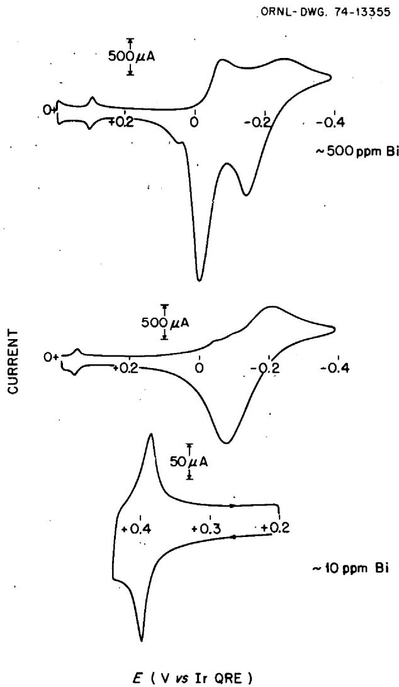  
Fig. 6.4. Voltammograms for the reduction of bismuth(III) and nickel(II) at an iridium electrode.

function of the concentration of bismuth (Fig. 6.5). Calibration of the anodic stripping method was achieved by comparing the peak height of the stripping curves to the concentration of bismuth calculated from voltammetry and by assuming linearity at lower bismuth concentrations. The peak height of the stripping curves is approximately a linear function of plating time (Fig. 6.5). The concentration of bismuth during continued loss from the melt was followed with this technique to sub-ppm (<25 ppb) amounts by employing plating times of about 30 min. Longer plating times were not practical, due to small signal-to-noise ratios. Also, at longer plating times, the interference of nickel is more severe.

The prewave observed at the iridium electrode did not change appreciably until the bismuth concentration decreased below $\sim 1$ ppm; then the prewave decreased markedly but not linearly with bismuth concentration. In fact, a small prewave is still observed although the bismuth concentration is below detection by anodic stripping. This prewave may prove of value, possibly as a qualitative indicator of bismuth.

Additional anodic stripping studies will be made on reference fuel-salt solutions having low bismuth concentrations but with no nickel.

# 6.3 ELECTROANALYTICAL STUDIES IN MOLTEN $\mathrm{NaBF}_4$ -NaF

D. L. Manning E. R. Malone $^{8}$ R. V. Buhl $^{9}$

Voltammetric studies were continued in the coolant salt, $\mathrm{NaBF_4}$ NaF (92-8 mole %), with emphasis on characterizing an anodic wave seen at a gold electrode at approximately $+1.5\mathrm{V}$ vs an iridium quasi-reference

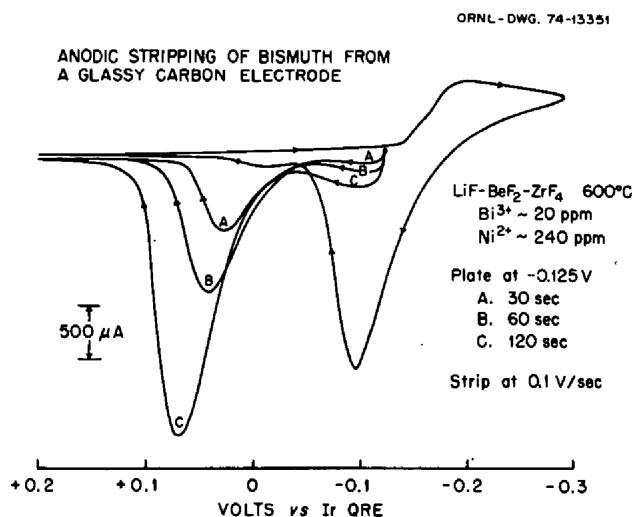  
Fig. 6.5. Bismuth stripping curves from a glassy carbon electrode.

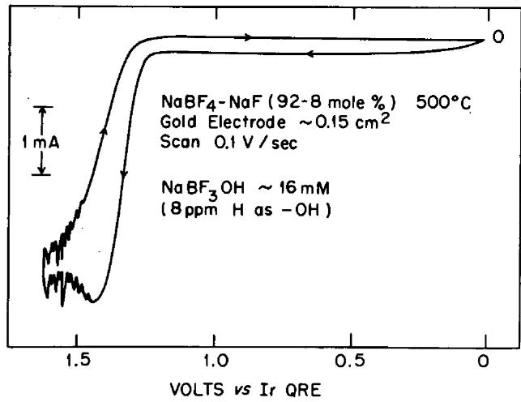  
ORNL-DWG.74-13353   
Fig. 6.6. Voltammetric oxidation wave for $\mathrm{NaBF}_3\mathrm{OH}$ .

electrode. As indicated previously, $^{10}$ the wave seems to be directly proportional to the $\mathrm{NaBF}_3\mathrm{OH}$ content of the melt. The anodic voltammogram is well defined (Fig. 6.6). However, noise is encountered on the diffusion-current plateau, which usually indicates gas formation at the electrode surface. The wave is also irreversible; no reverse current is seen at the scan rate of $0.1\mathrm{V / sec}$ (Fig. 6.6). This is also true at much faster (20 V/sec) scan rates. Further scan-rate studies revealed that the electrode reaction also exhibits catalytic complications whereby the reagent is regenerated at the electrode surface. For reversible and irreversible charge transfers in the absence of catalytic complications, plots of $i_p / v^{1 / 2}$ vs v (where $i_{p}$ is the peak current and v is the scan rate) consist of horizontal lines. For the catalytic case, the $i_p / v^{1 / 2}$ values are large at the slower scan rates $(< 0.1\mathrm{V / sec})$ and usually level off at fast scans $(>10$ V/sec). For the anodic wave in fluoroborate, the $i_p / v^{1 / 2}$ values (Fig. 6.7) continuously decreased with scan rate (up to $100\mathrm{V / sec}$ ). This indicates that the rate of regeneration of the reagent is extremely fast. The reaction

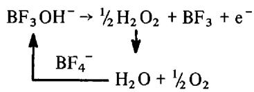

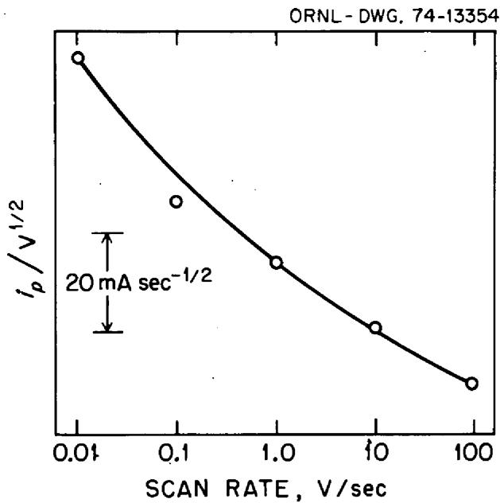  
Fig. 6.7. Diagnostic study of mechanism of anodic wave for $\mathrm{NaBF}_3\mathrm{OH}$ in $\mathrm{NaBF}_4$

appears plausible and would be consistent with the data. Here the $-\mathrm{OH}$ is oxidized to the peroxide, which then decomposes thermally (at $500^{\circ}\mathrm{C}$ ) to provide a route for the regeneration of $\mathrm{NaBF}_3\mathrm{OH}$ .

Since the anodic wave is complicated from a theoretical standpoint, the wave-height measurements were calibrated against values obtained with the infrared pellet method for the determination of $\mathrm{NaBF}_3\mathrm{OH}$ . The results from 15 determinations in melts ranging from approximately 8 to 60 ppm hydrogen present as

$\mathrm{NaBF}_3\mathrm{OH}$ gave a factor of about $2.3 \pm 0.7$ ppm H per milliampere for the voltammetric method. The calibration graph (Fig. 6.8) is a least-squares line through the points of a plot of peak current vs the concentration of hydrogen as measured by the infrared method. In-line monitoring of both hydroxy and protonic species in the fluoroborate coolant is now possible. Additional anodic voltammograms on salt in the Coolant-Salt Technology Facility are planned when operation of the facility is resumed.

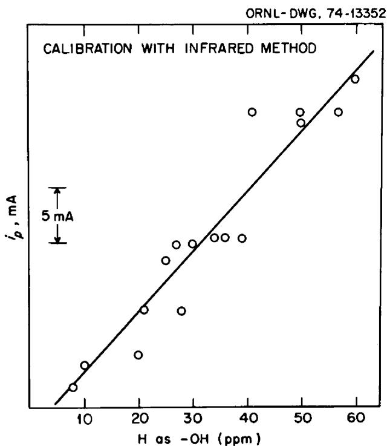  
Fig. 6.8. Calibration curve for voltammetric determination of $\mathrm{NaBF}_3\mathrm{OH}$ in $\mathrm{NaBF}_4$

# Part 3. Materials Development

H. E. McCoy

The main thrust of this materials program is toward the development of a structural material for the MSBR primary circuit which has adequate resistance to embrittlement by neutron irradiation and to intergranular cracking by fission product penetration. A modified composition of Hastelloy N containing $2\%$ Ti has good resistance to irradiation embrittlement, but some question remains whether it has sufficient resistance to intergranular cracking. Numerous laboratory tests are in progress to answer this important question. It may be necessary to further modify the alloy with rate-earth, niobium, or higher chromium additions to impart better resistance to intergranular cracking.

Laboratory programs to study Hastelloy N-salt-tellurium interactions are being established including methods for exposing test materials under simulated reactor operating conditions. Surface-analysis capabilities are being improved so that the reaction products can be identified.

The procurement of products from two commercial heats (8000 and 10,000 lb) of $2\%$ Ti modified Hastelloy N has continued. Many products have been

obtained and much experience gained in learning to fabricate the new alloy. The products will be used in all phases of the materials program.

The work on chemical-processing materials is concentrating on graphite. Capsule tests are in progress to study possible chemical interactions between graphite and bismuth-lithium solutions and to evaluate the mechanical intrusion of those solutions into the graphite. Since the solubility of graphite in bismuth-lithium solutions seems to increase with increasing lithium concentration, a molybdenum thermal-convection loop that contains graphite specimens has been started to study mass transfer in Bi-2.5% Li.

Much of the effort during this reporting period was in reestablishing test facilities. Two thermal-convection loops are in operation in the new loop facility, which will accommodate at least ten loops. The mechanical property and general test facility is partially operational, but numerous test fixtures remain to be assembled and tests started. An air lock has been added to the general test facility to make it more functional.

# 7. Development of Modified Hastelloy N

H. E. McCoy

This program is for developing metallic structural material(s) for an MSBR. The current emphasis is on the development of a material for the primary circuit, since this appears to be the most important problem at the present time. The material for the primary circuit will be exposed to a modest thermal-neutron flux and to fuel salt that contains fission products. Probably, a modification of standard Hastelloy N will be a satisfactory material for this application. An alloy that contains $2\%$ Ti seems to adequately resist irradiation embrittlement, but it remains to be demonstrated whether this alloy satisfactorily resists intergranular embrittlement by fission product tellurium. Small amounts of niobium and rare earths (e.g., cerium, lanthanum) also improve the resistance to intergranular cracking and likely will not reduce the beneficial effects of titanium from the neutron-embrittlement standpoint. Currently, factors associated with production of the $2\%$ Ti alloy in commercial quantities are being studied, while smaller heats are being made of alloys containing both $2\%$ Ti and additions of Nb and rare earths. These materials are being evaluated in several ways.

Two large heats, one 10,000 lb and the other 8,000 lb, of the $2\%$ Ti modified alloy have been melted by a commercial vendor. Product shapes including plate, bar, and wire have been obtained for use in several parts of the program. Tubing is currently being produced by two independent routes. These products are being used to fabricate the salt-contacting portions of two forced-circulation loops.

Laboratory methods for studying Hastelloy N-salt-tellurium reactions are under development. Methods must be developed for exposing candidate structural materials to simulated reactor operating conditions. Essential to this program are adequate techniques for identifying and characterizing the reaction products. Several methods for the analysis of surfaces are under development.

Materials determined to resist intergranular cracking in laboratory tests will be exposed to fissioning salt in the Oak Ridge Research Reactor TeGen fuel-capsule series. Three materials (standard Hastelloy N, Inconel 601, and type 304 stainless steel) were irradiated in the first TeGen experiment and are currently being examined. Additional capsules are being prepared.

# 7.1 PROCEDURE AND FABRICATION OF EXPERIMENTAL ALLOYS

T. K. Roche B. McNabb J. C. Feltner

# 7.1.1 Production Heats

Two production heats, one 10,000 and one 8000 lb, of $2\%$ Ti modified Hastelloy $\dot{\mathbf{N}}$ have been produced by an outside vendor. Plate, bar, wire, and tubing converted from these heats will be used for experimental work, with a principal use being the construction of two forced-circulation loops for studying the compatibility of the alloy with fuel salt.

Both heats were double melted by vacuum induction melting followed by electroslag remelting. Chemical analyses of the heats are shown in Table 7.1. Some difficulty was experienced with the hot workability of the first heat, heat 2810-4-7901 (or 74901), in that some edge cracking was noted on forging the ingot to a 10- by 19-in. slab. Subsequent forging of a portion of this slab to 5-in.-thick sheet bar and then rolling to 2-, 1-, $\frac{1}{2}$ -, and $\frac{1}{8}$ -in.-thick plate resulted in products having both edge and surface cracks. The balance of the $10 \times 19$ in. slab was reforged to $4 \times 4$ in. round-cornered square bar and 5-in.-diam round bar. The temperature for these hot-working operations was approximately $1200^{\circ}\mathrm{C}$ . Further conversion work on this heat was held up at this stage, and a sample of $\frac{1}{2}$ -in.-thick plate was obtained from the vendor for evaluation.

The $\frac{1}{2}$ -in.-thick plate with its attendant surface cracks can be seen in Fig. 7.1. A metallographic section revealed that most of the cracks were 5 to 15 mils deep. The piece of $\frac{1}{2}$ -in.-thick plate from heat 2810-4-7901 was cut into two pieces, approximately $3 \times 12$ in., for a restrained weld test and into $\frac{1}{2}$ -in. square strips. The strips were swaged to $\frac{3}{32}$ and $\frac{1}{8}$ -in.-diam weld wire and $\frac{1}{4}$ -in.-diam rod for preparation of mechanical property and Gleeble test specimens. Gleeble tests determine the tensile ductility of an alloy under conditions of temperature and strain rate that approximate hot-working operations such as forging and rolling, and are useful for defining limits of the hot-working temperature range. Gleeble specimens given a prior anneal at $1177^{\circ}\mathrm{C}$ were tested over the

temperature range 982 to $1260^{\circ}\mathrm{C}$ at a speed of 5 in./sec. The results of post-test ductility (reduction in area) measurements are compared with data obtained on specimens of standard Hastelloy N tested under the same conditions (Fig. 7.2). The curve for standard Hastelloy N is relatively flat with fairly high values of ductility between 982 and $1177^{\circ}\mathrm{C}$ , indicative of a broad hot-working temperature range and good fabricability. Heat 2810-4-7901 of $2\%$ Ti-modified

Table 7.1. Chemical analysis of production heats of $2\%$ Ti modified Hastelloy $\mathbf{N}^a$   

<table><tr><td rowspan="2">Element</td><td colspan="2">Composition (wt %)</td></tr><tr><td>Heat2810-4-7901b</td><td>Heat8918-5-7421c</td></tr><tr><td>Al</td><td>0.10</td><td>0.12</td></tr><tr><td>B</td><td>&lt;0.002</td><td>&lt;0.001</td></tr><tr><td>C</td><td>0.06</td><td>0.07</td></tr><tr><td>Co</td><td>0.02</td><td>0.02</td></tr><tr><td>Cr</td><td>6.97</td><td>7.10</td></tr><tr><td>Cu</td><td>0.02</td><td>&lt;0.01</td></tr><tr><td>Fe</td><td>0.08</td><td>0.06</td></tr><tr><td>Mn</td><td>0.02</td><td>0.12</td></tr><tr><td>Mo</td><td>12.97</td><td>11.93</td></tr><tr><td>N</td><td>0.003</td><td>0.007</td></tr><tr><td>Ni</td><td>Balance</td><td>Balance</td></tr><tr><td>P</td><td>0.002</td><td>0.004</td></tr><tr><td>S</td><td>0.002</td><td>&lt;0.002</td></tr><tr><td>Si</td><td>0.03</td><td>0.04</td></tr><tr><td>Ti</td><td>1.80</td><td>1.90</td></tr><tr><td>W</td><td>0.01</td><td>&lt;0.05</td></tr></table>

${}^{a}$ Vendor analyses.   
$b_{10,000\mathrm{lb}}$   
$c_{8000\mathrm{lb}}$

Hastelloy N exhibits a peak in ductility between 1093 and $1177^{\circ}\mathrm{C}$ with a sharp ductility decrease below $1093^{\circ}\mathrm{C}$ , indicating a narrow hot-working temperature range for this particular heat. Although the cause for this behavior is unknown, it is probably related in one way or another to melting practice.

The previously rolled 2-, 1-, and $\frac{1}{2}$ -in.-thick plate, which showed cracking, was conditioned by surface grinding and rerolled in the temperature range of maximum ductility to thicknesses of 1, $\frac{1}{2}$ , and $\frac{1}{8}$ in., respectively. Fabricability was improved, but some edge cracking was still evident. The rerolled plate yielded a usable product which has been received.

Upset forgings were substituted for 2-in.-thick plate. Segments of billet stock cut from the previously forged $4 \times 4$ in. round-cornered square bar were upset at $1121^{\circ}\mathrm{C}$ by the vendor to obtain approximately $2\frac{1}{4}$ -in.-thick forgings. The forgings, 8 to 11 in. in diameter and $2\frac{1}{4}$ in. thick (Fig. 7.3), had very minor edge cracks, in the center of each face was a 4- to 6-in.-diam cracklike defect outlining the ends of the starting billet. This defect is caused by "die lock," that is, friction between the press tooling and the billet that prevents the billet ends from moving laterally during forging and results in a fold. In the case of these forgings the depth of the fold was $1/8$ in. or less and was readily removed while machining the forgings to a thickness of 2 in. A chord was cut from four of the forgings by the vendor for determination of room-temperature tensile properties. The forgings are of sufficient size for machining pump components for the planned forced-circulation loops.

For producing bar and wire, the 5-in.-diam forged bar was further forged to 4-in. round-cornered square to provide starting stock for bar-mill rolling. A pilot run

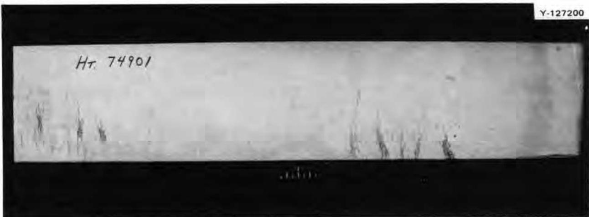  
Fig. 7.1. Surface cracks observed on $\frac{1}{2}$ -in.-thick hot-rolled plate of production heat of $2\%$ Ti-modified Hastelloy N (Heat 2810-4-7901).

demonstrated that bar stock could be rolled with care down to about a 1-in. diameter at $1149^{\circ}\mathrm{C}$ , but for smaller diameters apparently chilling action by the rolls caused excessive cracking - predictable from the Gleeble data previously reported. Therefore, an attempt was made to produce small-diameter bar $(\frac{1}{2} -$ and $\%_{16}$ -in.diameter) and wire $(\frac{1}{8} -$ and $\%_{32}$ -in.diameter) by cold drawing of approximately 1-in.-diam bar with

intermediate annealing treatments at $1177^{\circ}\mathrm{C}$ . This approach was only marginally successful, because the drawn bar was found to be susceptible to stress-induced annealing cracks. This problem was partially solved by either of two ways: flexing of the drawn product in straightening equipment prior to annealing at $1177^{\circ}\mathrm{C}$ , or lowering the intermediate annealing temperature to $1121^{\circ}\mathrm{C}$ .

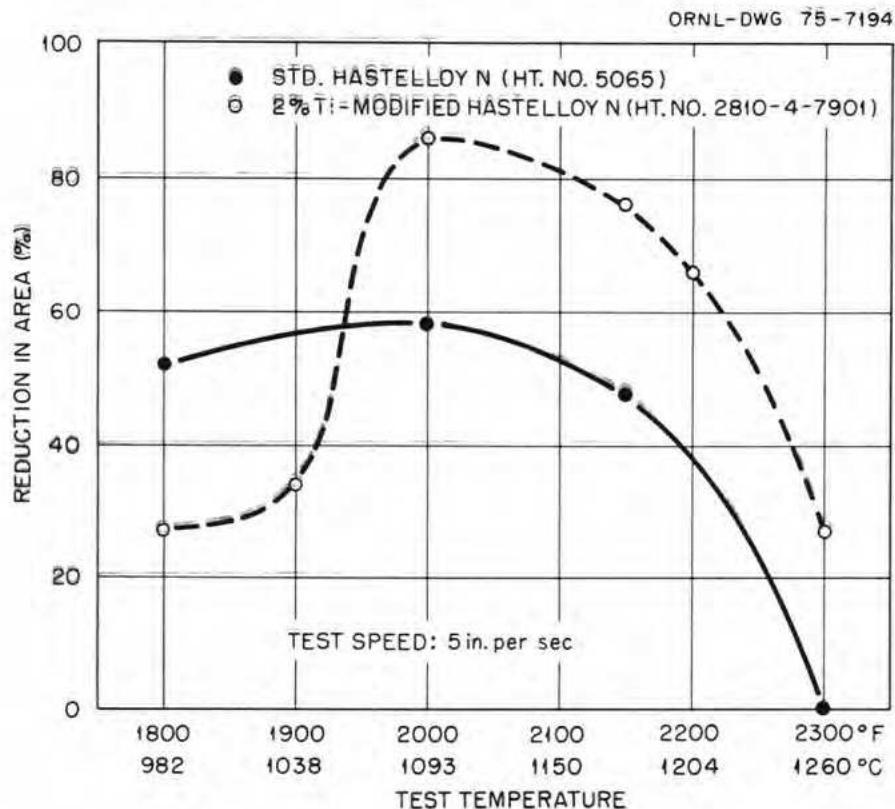  
Fig. 7.2. High-temperature ductility of standard Hastelloy N (Heat 5065) and $2\%$ Ti-modified Hastelloy N (Heat 2810-4-7901) determined by Gleeble testing.

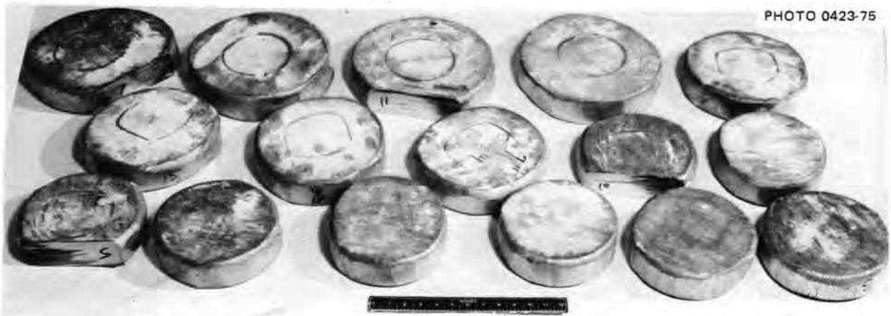  
Fig. 7.3. Upset forgings of $2\%$ Ti-modified Hastelloy N (Heat 2810-4-7901). Approximately $2^{1/4}$ -in. thick.

A significant quantity of material was consumed in establishing the processing parameters for producing bar and wire, and only a small quantity of $\frac{1}{2}$ - and $\frac{5}{16}$ -in.-diam bar and $\frac{3}{2}$ -in.-diam weld wire was received from this first heat. However, the requirement for 100 ft of 1-in.-diam bar and 30 ft of $1 \frac{1}{2}$ -in.-diam bar was met. The flow diagram summarizes the process routing for heat 2810-4-7901 (Fig. 7.4).

The second heat (8918-5-7421) has been scheduled for conversion to tubing, round bar, and wire (Fig. 7.5). To date, fabrication has progressed smoothly with no cracking during hot working or during annealing after cold working as experienced with the first heat. The processing parameters developed for the first heat are being used for the second heat.

Gleeble data for the second heat were obtained by the vendor on specimens taken from 4-in.-square forged bar. The results are compared with the earlier data from the first heat (Fig. 7.6). The much broader temperature range of high ductility for the second heat suggests that greater latitude in processing parameters is permissible and that the fabrication problems encountered with the first heat are not inherent to the basic alloy composition but were peculiar to that specific heat.

The tubing to be produced from the second heat presents a scheduling problem in that the vendor will be assisted by two other conversion sources, one for trepanning the billet stock and the other for drawing to final size. This results in a long projected delivery time. To shorten this time, a forged bar $4 \times 4 \times 60$ in. will be processed by an alternate route to produce at least the

minimum quantity of tubing required for one forcedcirculation loop.

# 7.1.2 Semiproduction Heats

Six semiproduction heats of $2\%$ Ti modified Hastelloy N, four of which contain rare-earth additions (lanthanum, cerium, or misch metal), have been included in the alloy evaluation program. These alloys will test the effectiveness of rare-earth additions as gettering elements for tellurium to minimize shallow intergranular cracking. Each alloy was a 120-lb double-melted (vacuum induction plus electroslag remelt) heat produced by an outside vendor. The compositions of the alloys are shown in Table 7.2. Because the aluminum content of heats 74533, 74534, 74535, and 74539 was somewhat higher than the specified $0.15\%$ maximum, two heats, 74557 and 74558, were produced with much less aluminum.

The 4-in.-diam ingot of each alloy was forged to a 2-in.-thick slab at $1177^{\circ}\mathrm{C}$ , then hot rolled to $\frac{1}{2}$ -in.-thick plate at the same temperature. A portion of the plate product from each of the heats is shown in Figs. 7.7 and 7.8. The fabricability of heats 74533, 74534, 74535, and 74539 was better than that of heats 74557 and 74558, which exhibited profuse edge cracking. There is an apparent connection between the aluminum content of the alloys and their fabricability which may be real; but factors such as melting environment, type and quantity of other malleabilizing additions made to the alloy, and timing of these additions during the

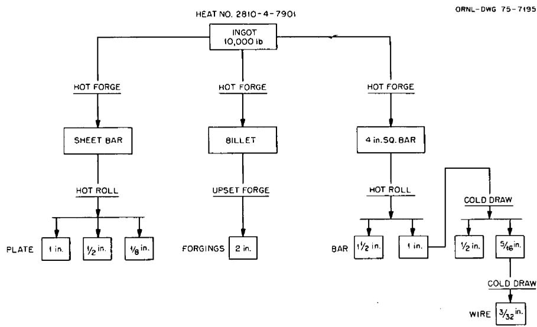  
Fig. 7.4. Process routing for 10,000-lb heat of $2\%$ Ti-modified Hastelloy N (Heat 2810-4-7901).

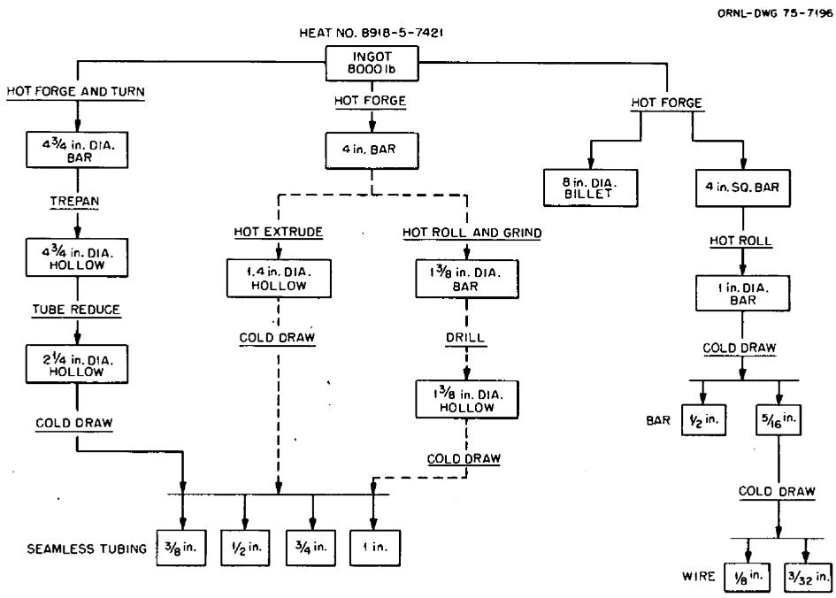  
Fig. 7.5. Process routing for 8,000-lb heat of $2\%$ Ti-modified Hastelloy N (Heat 8918-5-7421).

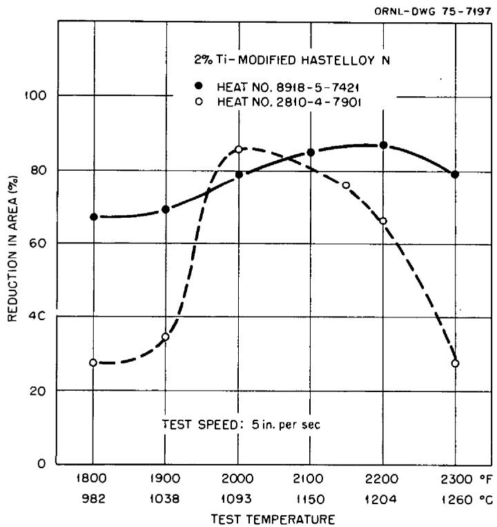  
Fig. 7.6. High-temperature ductility of two production heats (2810-4-7901 and 8918-5-7421) of $2\%$ Ti-modified Hastelloy N determined by Gleeble testing.

Table 7.2. Chemical analysis of rare-earth-containing semiproduction heats of $2\%$ Ti modified Hastelloy $\mathbf{N}^a$   

<table><tr><td rowspan="2">Element</td><td colspan="6">Composition (wt %)</td></tr><tr><td>Heat 74533</td><td>Heat 74534</td><td>Heat 74535</td><td>Heat 74539</td><td>Heat 74557</td><td>Heat 74558</td></tr><tr><td>Al</td><td>0.48</td><td>0.53</td><td>0.55</td><td>0.20</td><td>0.02</td><td>0.02</td></tr><tr><td>B</td><td>0.002</td><td>&lt;0.002</td><td>0.002</td><td>0.002</td><td>&lt;0.002</td><td>&lt;0.002</td></tr><tr><td>C</td><td>0.05</td><td>0.08</td><td>0.08</td><td>0.08</td><td>0.04</td><td>0.07</td></tr><tr><td>Co</td><td>0.03</td><td>0.03</td><td>0.03</td><td>0.06</td><td></td><td></td></tr><tr><td>Cr</td><td>7.02</td><td>7.12</td><td>7.30</td><td>7.14</td><td>7.23</td><td>7.20</td></tr><tr><td>Cu</td><td>&lt;0.01</td><td>0.02</td><td>0.01</td><td>0.01</td><td>&lt;0.01</td><td>&lt;0.01</td></tr><tr><td>Fe</td><td>0.03</td><td>0.06</td><td>0.05</td><td>0.07</td><td>0.08</td><td>0.07</td></tr><tr><td>Mn</td><td>&lt;0.01</td><td>&lt;0.01</td><td>&lt;0.01</td><td>&lt;0.01</td><td>&lt;0.01</td><td>&lt;0.01</td></tr><tr><td>Mo</td><td>11.67</td><td>11.66</td><td>11.79</td><td>11.47</td><td>11.91</td><td>12.00</td></tr><tr><td>N</td><td>0.005</td><td>0.007</td><td>0.006</td><td>0.006</td><td>0.009</td><td>0.012</td></tr><tr><td>Ni</td><td>Balance</td><td>Balance</td><td>Balance</td><td>Balance</td><td>Balance</td><td>Balance</td></tr><tr><td>S</td><td>&lt;0.002</td><td>&lt;0.002</td><td>&lt;0.002</td><td>&lt;0.002</td><td>0.0012</td><td>0.002</td></tr><tr><td>Si</td><td>0.03</td><td>0.03</td><td>0.03</td><td>0.04</td><td>0.03</td><td>0.03</td></tr><tr><td>Ti</td><td>2.17</td><td>2.09</td><td>2.13</td><td>1.93</td><td>2.14</td><td>2.05</td></tr><tr><td>W</td><td>0.14</td><td>0.14</td><td>0.10</td><td>0.11</td><td>0.02</td><td>0.02</td></tr><tr><td>La</td><td></td><td>0.013</td><td>0.01</td><td></td><td></td><td>0.02</td></tr><tr><td>Total REb</td><td></td><td></td><td>0.04</td><td></td><td></td><td></td></tr><tr><td>Ce</td><td></td><td></td><td></td><td>0.03</td><td></td><td></td></tr></table>

$a$ Vendor analyses.   
$b_{\mathrm{RE}}$ rare earths.

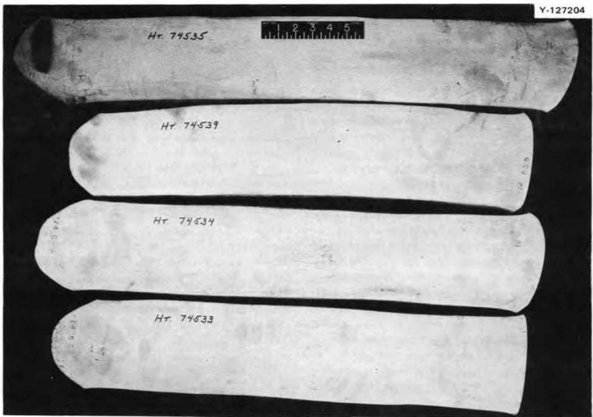  
Fig. 7.7. One-half-inch-thick hot-rolled plate of semiproductn heats of $2\%$ Ti-modified Hastelloy N. Heat 74533 - $2\%$ Ti Base Composition $+0.48\%$ Al. Heat 74534 - base composition $+0.53\%$ Al $+0.013\%$ La. Heat 74539 - base composition $+0.20\%$ Al $+0.03\%$ Ce. Heat 74535 - base composition $+0.55\%$ Al $+0.04\%$ Misch metal.

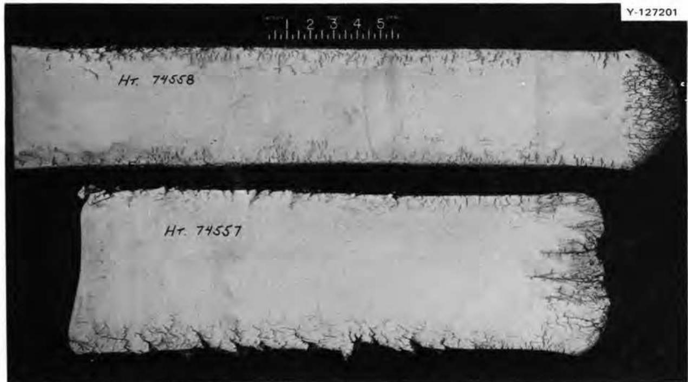  
Fig. 7.8. One-half-inch-thick hot-rolled plate of semiproduction heats of $2\%$ Ti-modified Hastelloy N. Heat 74557 - $2\%$ Ti base composition + 0.02% Al. Heat 74558 - base composition + 0.02% Al + 0.02% La.

melting operation can also significantly influence fabricability.

Gleeble evaluation tests were performed on heats 74533 and 74557 over the temperature range 982 to $1260^{\circ}\mathrm{C}$ (Fig. 7.9). The results are consistent with fabrication experience in that heat 74533 showed excellent ductility between 982 and $1200^{\circ}\mathrm{C}$ , and the ductility of heat 74557 fell off sharply above $1150^{\circ}\mathrm{C}$ . Both alloys were hot worked at $1177^{\circ}\mathrm{C}$ .

Current studies on the semiproduction heats include weldability and the measurement of mechanical properties in the irradiated and unirradiated conditions. Weld wire and mechanical-property-specimen stock were obtained by swaging strips cut from the $1/2$ -in.-thick plate. Tubular specimens have been machined from heats 74533 and 74534 for future fuel-capsule studies. In addition, an attempt is being made to process welded and drawn tubing of heats 74533, 74534, 74535, and 74539 to provide specimen stock for strain-cycle and in-reactor fueled-capsule testing. The tube blanks were produced by rolling $1/2$ -in.-thick plate to 0.140-in.-thick strips and then cold forming the sheet into semicircular (clamshell) shapes. The seams of pairs of the clamshells were closed by electron-beam welding, and the blanks are now ready for drawing.

Typical tube blanks before and after welding are shown (Fig. 7.10).

# 7.1.3 Laboratory Heats

Earlier work has shown that niobium additions to titanium-modified Hastelloy N enhance resistance to tellurium embrittlement. Aluminum is also an important addition to these alloys, since it is often used as a deoxidizer during melt preparation. However, Nb, Ti, and Al can combine with Ni to form intermetallic compounds causing embrittlement of the alloy. Therefore, laboratory heats based nominally upon $\mathrm{Ni - 12\%}$ Mo-7% Cr with varying Nb, Ti, Al, and C contents are being studied to determine the concentrations of these elements that can be added before precipitation of intermetallic compounds occurs.

The alloys (Table 7.3) were prepared at ORNL as 1-in.-diam, 2-lb ingots by arc-melting and drop-casting techniques. The ingots were worked to $\frac{1}{4}$ -in.-diam rod by hot swaging at $1177^{\circ}\mathrm{C}$ from the 1-in. diameter to approximately 0.437-in. diameter and then to final size by cold swaging using intermediate anneals at $1177^{\circ}\mathrm{C}$ .

Solution-annealed specimens of the alloys have been subjected to aging heat treatments between 650 and

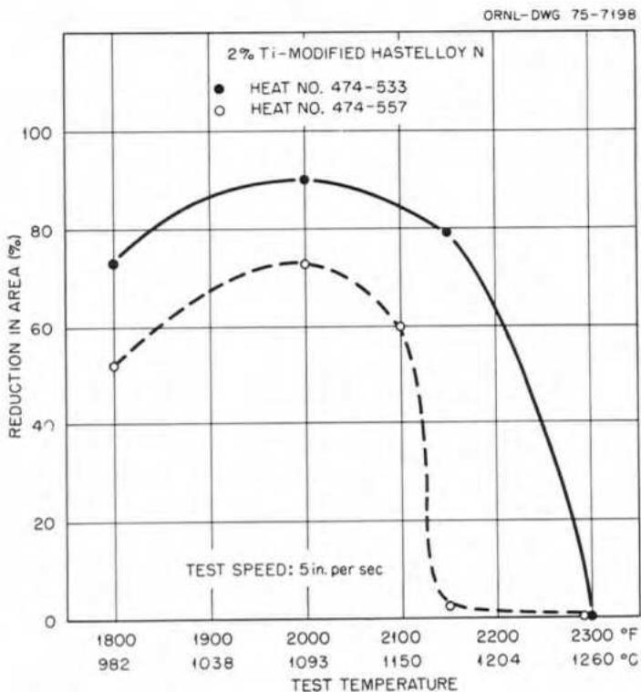  
Fig. 7.9. High-temperature ductility of two semiproduction heats (74533 and 74557) of $2\%$ Ti-modified Hastelloy N determined by Gleeble testing.

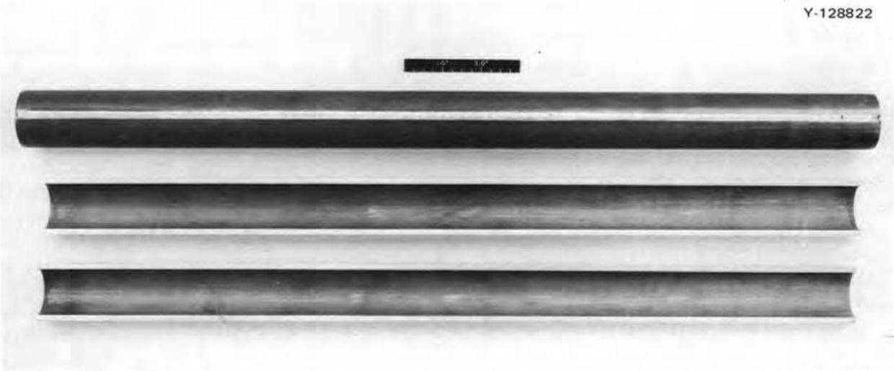  
Fig. 7.10. Typical electron-beam welded tube hollow fabricated from semiproduction heats of $2\%$ Ti-modified Hastelloy N alloys.

Table 7.3. Chemical analysis of laboratory heats of modified Hastelloy N with varying Nb, Ti, Al, and C contents   

<table><tr><td rowspan="2">Heat</td><td colspan="4">Composition (wt %)</td></tr><tr><td>Nb</td><td>Ti</td><td>Al</td><td>C</td></tr><tr><td>427</td><td></td><td>2.40</td><td>0.18</td><td>0.14</td></tr><tr><td>428</td><td></td><td>2.47</td><td>0.16</td><td>0.064</td></tr><tr><td>429</td><td></td><td>2.40</td><td>0.35</td><td>0.017</td></tr><tr><td>430</td><td></td><td>2.50</td><td>0.34</td><td>0.073</td></tr><tr><td>431</td><td></td><td>2.50</td><td>0.74</td><td>0.016</td></tr><tr><td>432</td><td></td><td>2.35</td><td>0.69</td><td>0.057</td></tr><tr><td>418</td><td>1.2</td><td>2.0</td><td>0.05</td><td>0.058</td></tr><tr><td>424</td><td>1.0</td><td>1.8</td><td>0.10</td><td>0.063</td></tr><tr><td>420</td><td>1.1</td><td>1.8</td><td>0.15</td><td>0.055</td></tr><tr><td>435b</td><td>1.5</td><td>2.3</td><td>0.25</td><td>0.04</td></tr><tr><td>438b</td><td>2.0</td><td>2.3</td><td>0.25</td><td>0.05</td></tr><tr><td>433</td><td>1.88</td><td>2.2</td><td>0.33</td><td>0.024</td></tr><tr><td>434</td><td>1.88</td><td>2.2</td><td>0.32</td><td>0.061</td></tr><tr><td>441b</td><td>2.5</td><td>2.3</td><td>0.25</td><td>0.05</td></tr><tr><td>442</td><td>3.0</td><td>2.3</td><td>0.25</td><td>0.052</td></tr></table>

${}^{a}$ Base: Ni-12% Mo-7% Cr.   
$b_{\mathrm{Nominal~composition}}$

$800^{\circ}\mathrm{C}$ and are being evaluated for stability (absence of intermetallic compound precipitation) by post-heat-treatment hardness measurements and microstructural analyses. Mechanical property specimens of certain of the alloys have been prepared and are being creep tested in both the irradiated and unirradiated conditions.

# 7.2 WELDABILITY OF COMMERCIAL ALLOYS OF MODIFIED HASTELLOY N

B. McNabb H. E. McCoy T. K. Roche

As shown by the successful operation of the MSRE, Hastelloy N is fabricable and weldable to quality levels required for nuclear reactors. Modified compositions of Hastelloy N with improved resistance to radiation damage and tellurium embrittlement must also fulfill these requirements for use in an MSBR. Six small semiproduction heats (120 lb) and two large production heats (8000 and 10,000 lb) of modified Hastelloy N containing approximately $2\%$ Ti, with and without small rare-earth additions, have been received from an outside vendor. The chemical analyses of these heats are shown in Tables 7.1 and 7.2.

The six small heats were each received in the form of four pieces of $\frac{1}{2}$ -in.-thick plate approximately 5 in. wide by approximately 24 in. long in the rolling direction. One plate of each heat was cut in half and the edges beveled to give a $100^{\circ}$ included angle when placed

together for welding, thus yielding a finished welded plate approximately 10 in. wide by 12 in. long. Strips $\frac{1}{2}$ in. by $\frac{1}{2}$ in. by 12 in. long were sawed from one plate of each heat, the corners were rounded, and the bars swaged to $\frac{1}{4}$ in. in diameter for mechanical property tests. Some of this $\frac{1}{4}$ -in.-diam rod was further swaged to $\frac{1}{8}$ and $\frac{3}{2}$ -in.-diam weld wire for autogenous welding of the prepared weld plates. Intermediate anneals at $870^{\circ}\mathrm{C}$ in air during swaging stress-relieved the material, and sand blasting removed the oxide after swaging. The weld wire was electrochemically cleaned and the prepared plates were cleaned with acetone before welding.

The first product received of the 10,000-lb heat (74901) was a plate approximately $\frac{1}{2}$ in. thick, 6 in. wide, and 24 in. in the cross-rolled direction. This plate was cut into two pieces, each approximately $3 \times 12$ in., and the remainder into $\frac{1}{2}$ -in.-square strips for fabrication of wire and rod. The plate and wire were prepared for welding by the same procedure as the small heats.

Prior to the weld test, plates were welded to a 4-in.-thick steel strongback to achieve a restrained condition. All welds were made by ORNL Welding Procedure WPS 1402. Each pass was visually inspected, and the first, third, and final weld passes were inspected with dye penetrant. A wire brush was used as needed to clean the surface between passes. Weld wire having a diameter of $\frac{3}{32}$ in. was used for the root and next two passes, and $\frac{1}{8}$ -in.-diam wire was used for the approximately 20 remaining passes. The root, second, and fourth passes were made with the weld plates at room temperature; the other interpass temperatures averaged about $93^{\circ}\mathrm{C}$ . The root pass was made at approximately 14 V and 85 A, pass No. 2 at 110 A, No. 3 at 115 A, No. 4 at 17 V and 180 A, and the remainder of the passes at 17 V and 190 A. After the welding, the plates were x-rayed; no cracks or porosity was noted for any of the plates. The welds were sound, with no cracking found either visually or by dye-penetrant inspection.

Side-bend specimens $\frac{1}{8}$ in. thick were sawed from the welded plates and dressed down on each side with an abrasive grinding wheel. These were then bent in a $\frac{3}{8}$ -in.-radius bend fixture and dye-penetrant-inspected for cracks in the weld. Figure 7.11a is a photograph of the tension side of two such side-bend specimens of heat 74533 (modified Hastelloy N, $2.1\%$ Ti- $0.48\%$ Al). One specimen shows no flaws, and one has two small indications at the edges but still should pass the side-bend test, which allows open flaws up to $\frac{1}{16}$ in. Figure 7.11b is a photograph of the tension side of two side-bend specimens of heat 74534 (modified Hastelloy

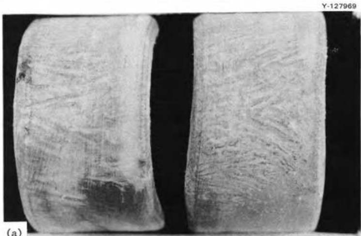

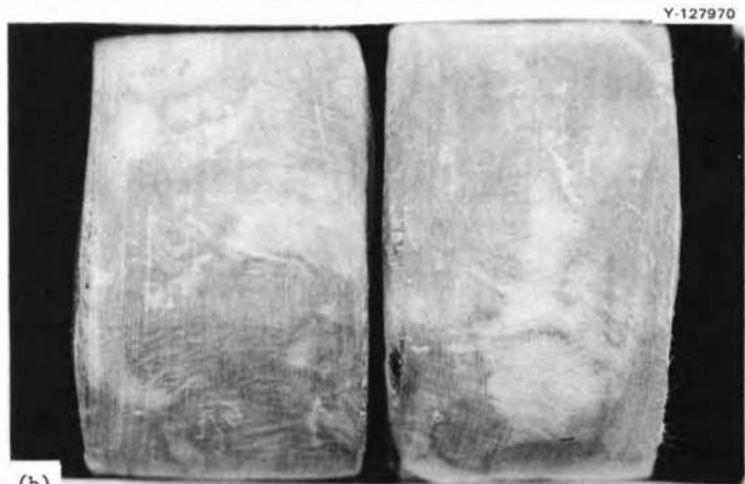

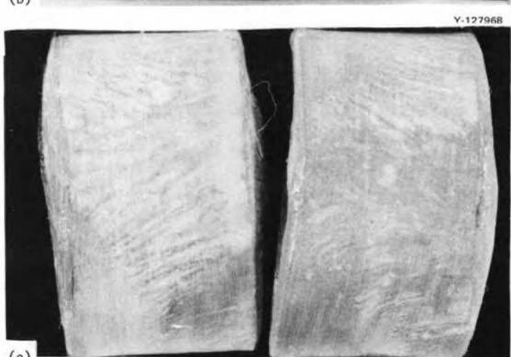

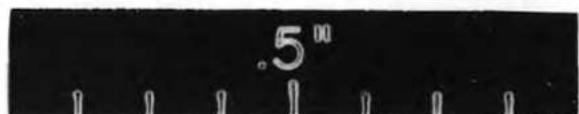  
Fig. 7.11. Photographs of side-bend specimens of modified Hastelloy N. Dye penetrant has been applied. Dark spots indicate flaws. (a) Heat 74533. (b) Heat 74534. (c) Heat 74535. Reduced $26\%$ .

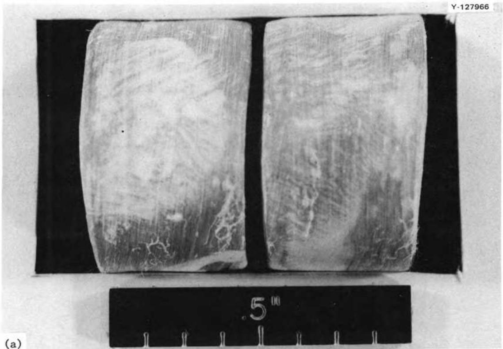

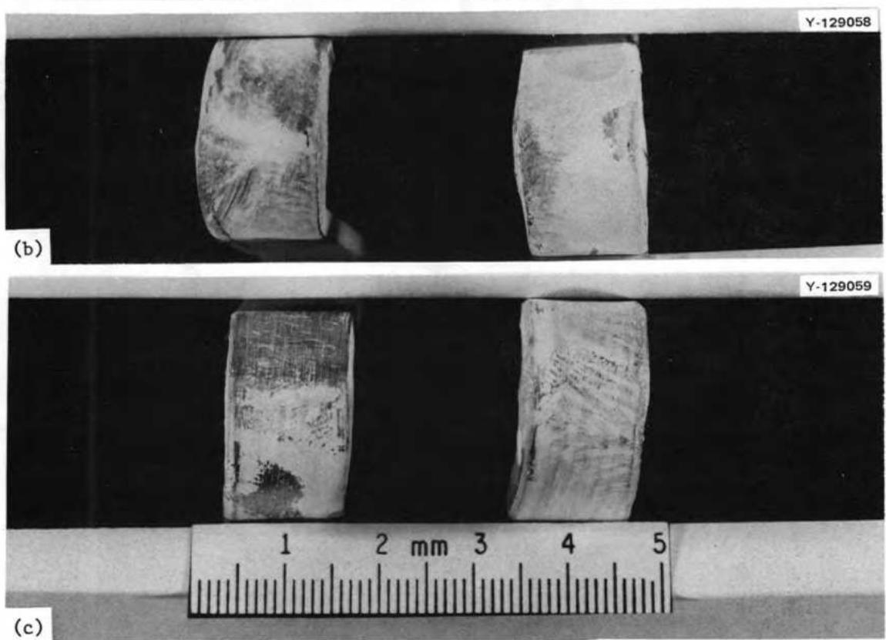  
Fig. 7.12. Photographs of the tension side or side-bend specimens of modified Hastelloy N. Dye penetrant has been applied. Dark spots indicate cracks. (a) Heat 74539. (b) Heat 74557. (c) Heat 74558. Reduced $11\%$ .

N, $2.1\%$ Ti-0.53% Al-0.013% La). One specimen is free of flaws, and one has a small flaw at one edge, less than $\frac{1}{16}$ in. long. Figure 7.11c is a photograph of the tension side of two side-bend specimens of heat 74535 (modified Hastelloy N, $2.1\%$ Ti-0.55% Al-0.04% misc metal). Both side-bend specimens are free of flaws, indicating that the addition of 0.04% rare earths as misc metal has no adverse effect on the weld properties.

Figure 7.12a is a photograph of heat 74539 (modified Hastelloy N, $1.9\%$ Ti-0.20% Al-0.03% Ce). Both specimens are free of flaws, indicating that $0.05\%$ Ce in this alloy has no adverse effects on the weld properties. Figure 7.12b is a photograph of the tension side of bend specimens of heat 74557 (modified Hastelloy N, approximately $2\%$ Ti-0.02 Al). Although this heat had relatively poor hot workability, it appears to have acceptable weld properties, as only a very small flaw is shown on each of the side-bend specimens. Figure 7.12c is a photograph of the tension side of two side-bend specimens of heat 74558 (modified Hastelloy N, $2.1\%$ Ti-0.02% Al-0.02% La). Both specimens are free of flaws, indicating that the small lanthanum addition is not detrimental. Darker areas on the specimens were caused by spalling of the thicker dye-penetrant developer after it had dried.

Figure 7.13a is a photograph of the tension side of side-bend specimens of heat 74901 (10,000-lb heat). There are some small flaws near the root pass on both specimens, which are oriented differently. One of the specimens was examined metallographically, and a typical photomicrograph is shown in Fig. 7.13b. This photomicrograph shows some grain-boundary separation in the weld area, although the weldment was still quite strong. Another side-bend specimen was given a post-weld anneal of $1\mathrm{hr}$ at $1177^{\circ}\mathrm{C}$ in argon before bending. There were some small dye indications on the bend specimen. Even though the sample appeared ductile, there was some localized grain-boundary separation (Fig. 7.13c).

Heat 74901 appears to have lower weld ductility than some of the other heats, but considerable deformation can be accommodated without massive failure. The grain-boundary separations are localized and do not propagate in a catastrophic manner (as in sudden brittle fracture). Tensile specimens tested at $25^{\circ}\mathrm{C}$ had ultimate tensile strengths of 109,000 and 110,000 psi, elongations of $30\%$ in a 1-in. gage length, and reduction in area of 35 and $40\%$ . Mechanical property specimens are being prepared from the six semiproduction and first commercial heats for further evaluation of tensile and creep properties of welds in both irradiated and unirradiated conditions.

# 7.3. STABILITY OF VARIOUS TITANIUM-MODIFIED HASTELLOY N ALLOYS

T. K. Roche D. N. Braski J. C. Feltner

Additions of Nb, Ti, and Al to modified Hastelloy N enhance resistance to tellurium-induced intergranular cracking, improve resistance to radiation embrittlement, and deoxidize the alloy, respectively. However, excess amounts of these elements can cause aging reactions by the precipitation of $\gamma^{\prime}\text{-Ni}_{3}(\text{Al},\text{Ti})$ or $\text{Ni}_{3}\text{Nb}$ . These precipitates can cause hardening and loss of ductility. As a first approach toward determining the limits to which these elements can be tolerated in modified Hastelloy N before encountering intermetallic precipitation, specimens of the alloys whose compositions are shown in Table 7.3, together with specimens from the first production heat and one semiproduction heat (heats 74901 and 74533), were given aging heat treatments at 650, 704, and $800^{\circ}\text{C}$ for up to 1000 hr. Their respective tendencies to form gamma prime are being evaluated by post-aging hardness measurements. Presently, 100-hr aging data have been obtained (Table 7.4). The data for alloys that show significant hardening relative to the as-annealed condition have been blocked off in the tabulation. The data suggest the following important trends:

1. As expected, carbon is an effective hardening addition. This can be seen by comparing the data for several of the pairs of alloys, namely, heats 427 and 428, 429 and 430, 431 and 432, and 433 and 434.   
2. For alloys that do not contain niobium, about $2.0\%$ Ti plus $0.5\%$ Al can be present before gamma-prime precipitation occurs. Increasing the titanium content to about $2.5\%$ with $0.34\%$ Al results in hardening (Table 7.4) and in gamma-prime precipitation (Fig. 7.14).   
3. For alloys containing about $2\%$ Ti, no more than about $1\%$ Nb and $0.1\%$ Al can be added before aging occurs at $650^{\circ}\mathrm{C}$ . Increasing the alloy content to $1.5\%$ Nb and $0.25\%$ Al broadens the aging temperature range to $704^{\circ}\mathrm{C}$ .   
4. Aging occurs at 650, 704, and $800^{\circ}\mathrm{C}$ when the niobium content is increased to $3\%$ with about $2\%$ Ti and $0.25\%$ Al present.

Limited microstructural analyses using transmission electron microscopy and selected-area diffraction techniques have correlated the hardness data with the precipitation reactions in the alloys. Heat 430 after aging $100\mathrm{hr}$ at $650^{\circ}\mathrm{C}$ shows a dispersion of fine spherical gamma prime in the microstructure (Fig. 7.14). Metal carbide (MC) precipitates were also identified in grain boundaries. As shown in Fig. 7.15, a

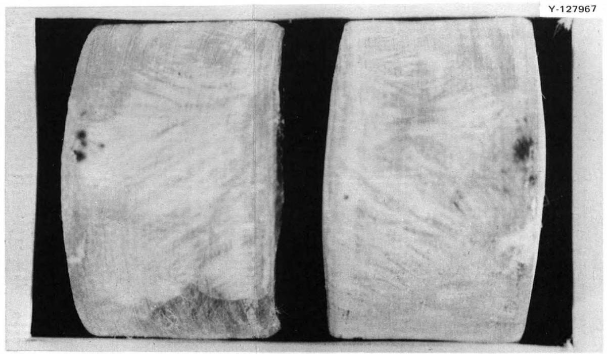  
(a)

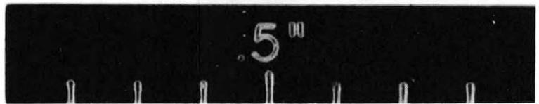

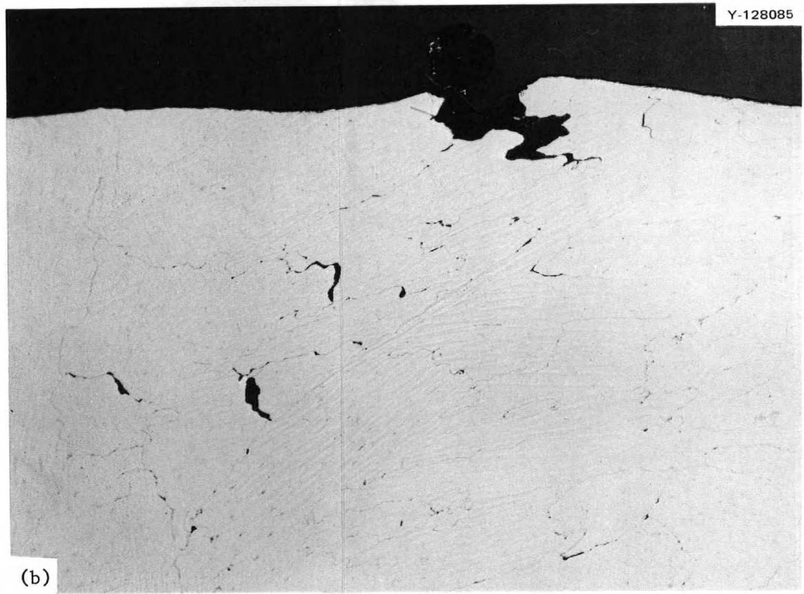

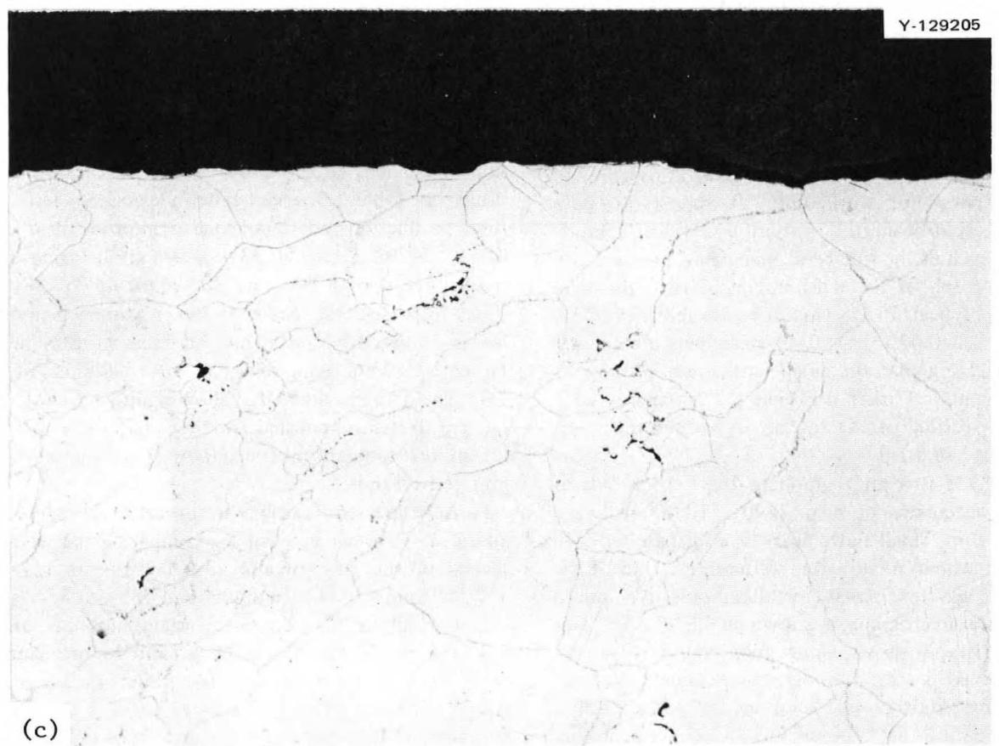

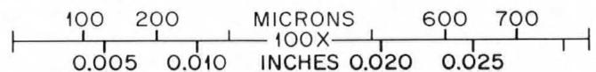  
Fig. 7.13. Modified Hastelloy N Heat 74901. (a) Photograph of tension side of side-bend specimens, dye penetrant applied. Dark areas indicate flaws or cracks. (b) Photomicrograph of bend area of side-bend specimen as welded. Etched with glyceria regia. $100\times$ (c) Photomicrograph of bend area of side-bend specimen given a post-weld anneal $1\mathrm{hr}$ at $1177^{\circ}\mathrm{C}$ . Etched with glyceria regia. $100\times$

Table 7.4. Hardness of various heats of modified Hastelloy $\mathbf{N}^{\mathcal{Q}}$ after aging 100 hr at 650, 704, and $800^{\circ}\mathrm{C}$   
Data in blocks indicate significant hardening relative to the as-annealed condition   

<table><tr><td rowspan="3">Heat</td><td colspan="4">Composition (wt %)</td><td colspan="4">Rockwell B hardness</td></tr><tr><td rowspan="2">Nb</td><td rowspan="2">Ti</td><td rowspan="2">Al</td><td rowspan="2">C</td><td rowspan="2">Annealedb</td><td colspan="3">Aged 100 hr</td></tr><tr><td>650°C</td><td>704°C</td><td>800°C</td></tr><tr><td>74901</td><td></td><td>1.8</td><td>0.10</td><td>0.06</td><td>79.4</td><td>81.8</td><td>82.9</td><td>85.1</td></tr><tr><td>427</td><td></td><td>2.4</td><td>0.18</td><td>0.014</td><td>74.7</td><td>74.9</td><td>76.5</td><td>77.4</td></tr><tr><td>428</td><td></td><td>2.47</td><td>0.16</td><td>0.064</td><td>82.5</td><td>84.2</td><td>86.1</td><td>84.7</td></tr><tr><td>74533</td><td></td><td>2.17</td><td>0.48</td><td>0.05</td><td>81.0</td><td>84.3</td><td>84.6</td><td>85.4</td></tr><tr><td>429</td><td></td><td>2.4</td><td>0.35</td><td>0.017</td><td>76.9</td><td>89.5</td><td>80.1</td><td>79.8</td></tr><tr><td>430</td><td></td><td>2.5</td><td>0.34</td><td>0.073</td><td>88.6</td><td>95.7</td><td>90.7</td><td>88.6</td></tr><tr><td>431</td><td></td><td>2.5</td><td>0.74</td><td>0.016</td><td>78.6</td><td>90.9</td><td>95.1</td><td>91.9</td></tr><tr><td>432</td><td></td><td>2.35</td><td>0.69</td><td>0.057</td><td>87.4</td><td>98.8</td><td>99.9</td><td>98.2</td></tr><tr><td>418</td><td>1.2</td><td>2.0</td><td>0.05</td><td>0.058</td><td>89.1</td><td>90.0</td><td>90.1</td><td>89.9</td></tr><tr><td>424</td><td>1.0</td><td>1.8</td><td>0.10</td><td>0.063</td><td>88.6</td><td>89.3</td><td>89.1</td><td>89.9</td></tr><tr><td>420</td><td>1.1</td><td>1.8</td><td>0.15</td><td>0.055</td><td>88.7</td><td>100.8</td><td>90.3</td><td>88.5</td></tr><tr><td>435c</td><td>1.5</td><td>2.3</td><td>0.25</td><td>0.04</td><td>88.6</td><td>102.5</td><td>100.6</td><td>87.3</td></tr><tr><td>438c</td><td>2.0</td><td>2.3</td><td>0.25</td><td>0.05</td><td>91.8</td><td>103.9</td><td>103.2</td><td>91.6</td></tr><tr><td>433</td><td>1.88</td><td>2.2</td><td>0.33</td><td>0.024</td><td>84.8</td><td>102.2</td><td>101.5</td><td>86.7</td></tr><tr><td>434</td><td>1.88</td><td>2.2</td><td>0.32</td><td>0.061</td><td>93.3</td><td>104.5</td><td>103.2</td><td>92.0</td></tr><tr><td>441c</td><td>2.5</td><td>2.3</td><td>0.25</td><td>0.05</td><td>93.1</td><td>107.5</td><td>105.8</td><td>97.9</td></tr><tr><td>442c</td><td>3.0</td><td>2.3</td><td>0.25</td><td>0.052</td><td>95.0</td><td>108.1</td><td>108.0</td><td>105.6</td></tr></table>

${}^{a}$ Base: $\mathrm{{Ni}} - {12}\% \mathrm{{Mo}} - 7\% \mathrm{{Cr}}$ .   
$b_{1\mathrm{hrat}1177^{\circ}\mathrm{C}}$   
$c_{\text{Nominal composition}}$ .

coarser dispersion of gamma prime was found in heat 431 after aging $100\mathrm{hr}$ at $800^{\circ}\mathrm{C}$ . This alloy also contained small blocky MC precipitates both at grain boundaries and within the grains themselves. The microstructure of an aged niobium-containing alloy is presented in Fig. 7.16. Heat 433 was aged $100\mathrm{hr}$ at $704^{\circ}\mathrm{C}$ and contains both $\mathrm{Ni}_3\mathrm{Nb}$ and gamma-prime precipitates. Carbides of the MC type were also identified in the alloy and were generally concentrated in grain boundaries, whereas the $\mathrm{Ni}_3\mathrm{Nb}$ and gamma prime were dispersed uniformly throughout the grains.

This study will be continued by extending the aging times and by measuring the tensile properties of certain of the alloys to determine the effects of aging on strength and ductility.

# 7.4 MECHANICAL PROPERTIES OF TITANIUM-MODIFIED HASTELLOY N ALLOYS IN THE UNIRRADIATED CONDITION

T. K. Roche J. C. Feltner B. McNabb

The mechanical properties of the latest production and semiproduction heats of $2\%$ Ti modified Hastelloy

N are being determined in the unirradiated condition. These data will serve as a reference for comparison with the properties of standard and other modified Hastelloy N alloys both in the unirradiated and irradiated conditions. Included in this work are the determination of room- and elevated-temperature tensile properties and of creep-rupture properties in air at 650, 704, and $760^{\circ}\mathrm{C}$ . Facilities will soon be completed for performing creep-rupture and strain-cycle tests in fluoride salts.

The room-temperature tensile properties reported by the vendor for specimens taken from the various mill products received from the 10,000-lb production heat (74901) of $2\%$ Ti modified Hastelloy N are compared with data from three earlier semiproduction heats of the same alloy and with typical data for standard Hastelloy N (Table 7.5). The yield strengths of all heats fall in the range of 43,000 to 53,000 psi; further testing will be required to determine whether the differences are significant. The ultimate strengths for the products of the 10,000-lb heat are slightly less than those determined for the earlier heats of the $2\%$ Ti modified alloy. The lower ultimate tensile strength is accompanied by a lower elongation; both properties may be a reflection of fabrication history. The elongations of the

Y-128782

  
Fig. 7.14. Transmission electron micrograph of Heat 430, aged 100 hr at $650^{\circ}\mathrm{C}$ , showing dispersion of spherical gamma prime (200-300 Å diam) and coarser MC precipitates.

Y-128783

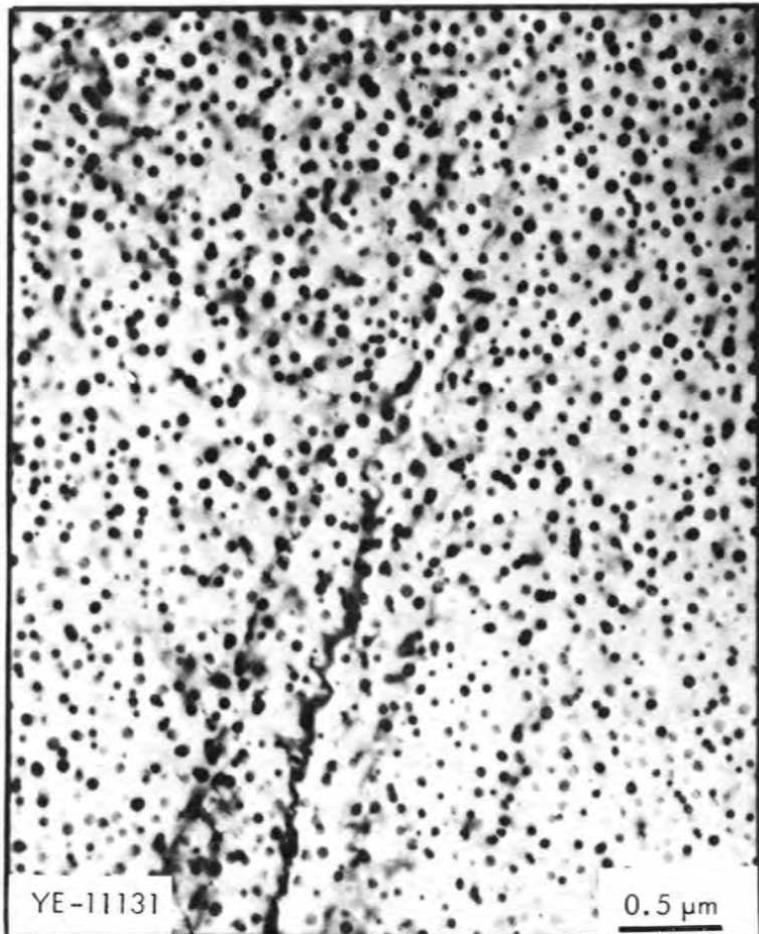

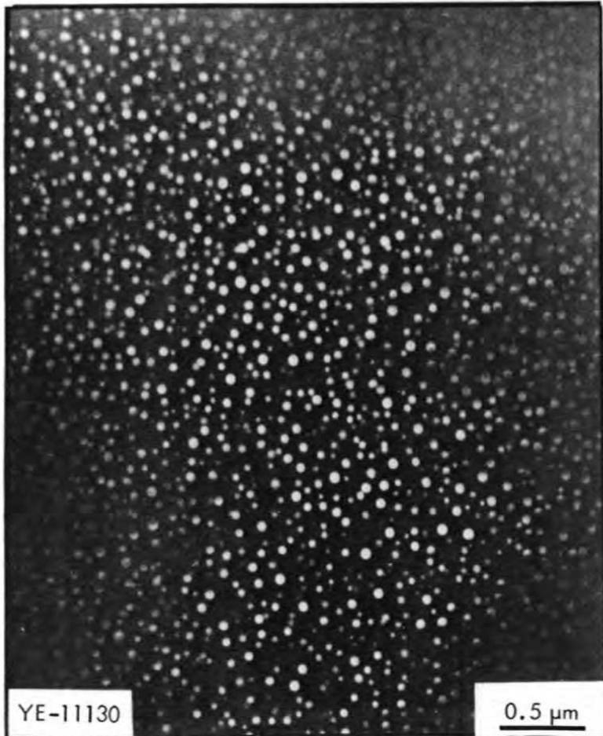  
Fig. 7.15. Transmission electron micrograph of Heat 431, aged 100 hr at $800^{\circ}\mathrm{C}$ , showing dispersion of spherical gamma prime (300-600 Å diam). On left, bright field contrast; on right, dark field contrast.

Y-128785

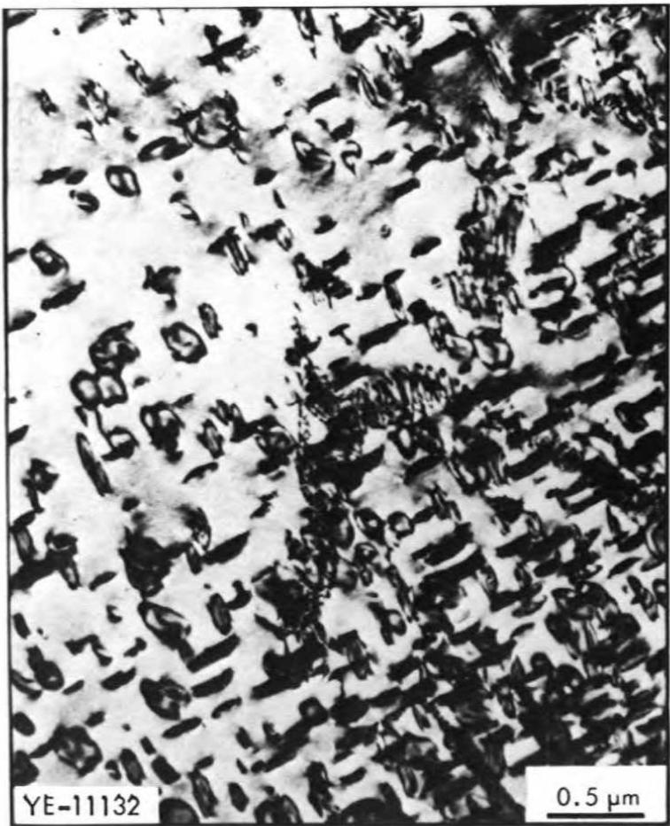

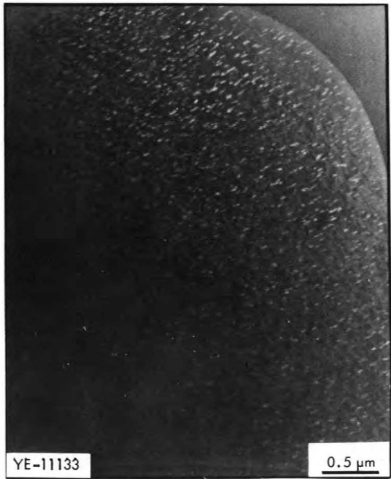  
Fig. 7.16. Transmission electron micrograph of Heat 433, aged 100 hr at $704^{\circ}\mathrm{C}$ , showing dispersion of gamma prime and $\mathrm{Ni}_3\mathrm{Nb}$ platelets. On left, bright field contrast; on right, dark field contrast.

Table 7.5. Comparison of room-temperature tensile properties of 10,000-lb heat (2810-4-7901) of $2\%$ Ti modified Hastelloy N with properties of previous heats of same alloy and standard Hastelloy $\mathbf{N}^a$   

<table><tr><td>Product</td><td>Ultimate tensile stress (103 psi)</td><td>Yield stress (103 psi)</td><td>Elongation (%)</td></tr><tr><td colspan="4">10,000-lb heat (2810-4-7901) of 2% Ti modified Hastelloy N</td></tr><tr><td>2-in.-thick forgings</td><td>111.5</td><td>45.0</td><td>65.0</td></tr><tr><td>1-in.-thick plate</td><td>118.5</td><td>46.5</td><td>64.6</td></tr><tr><td>1/2-in.-thick plate</td><td>114.0</td><td>43.0</td><td>64.5</td></tr><tr><td>1/8-in.-thick plate</td><td>103.0</td><td>48.5</td><td>60.0</td></tr><tr><td>11/2-in.-diam bar</td><td>113.5</td><td>53.5</td><td>63.3</td></tr><tr><td>1-in.-diam bar</td><td>113.5</td><td>50.0</td><td>64.1</td></tr><tr><td colspan="4">Previous heats of 2% Ti modified Hastelloy N</td></tr><tr><td>Swaged rod (heat 71114)</td><td>120.7</td><td>44.8</td><td>72.6</td></tr><tr><td>Swaged rod (heat 71583)</td><td>121.8</td><td>45.9</td><td>73.3</td></tr><tr><td>Swaged rod (heat 72503)</td><td>123.8</td><td>46.0</td><td>68.7</td></tr><tr><td colspan="4">Standard Hastelloy N</td></tr><tr><td>Typical</td><td>115.1</td><td>45.5</td><td>50.0</td></tr></table>

${}^{a}$ All specimens annealed at ${1177}^{ \circ  }\mathrm{C}$ in argon prior to testing.

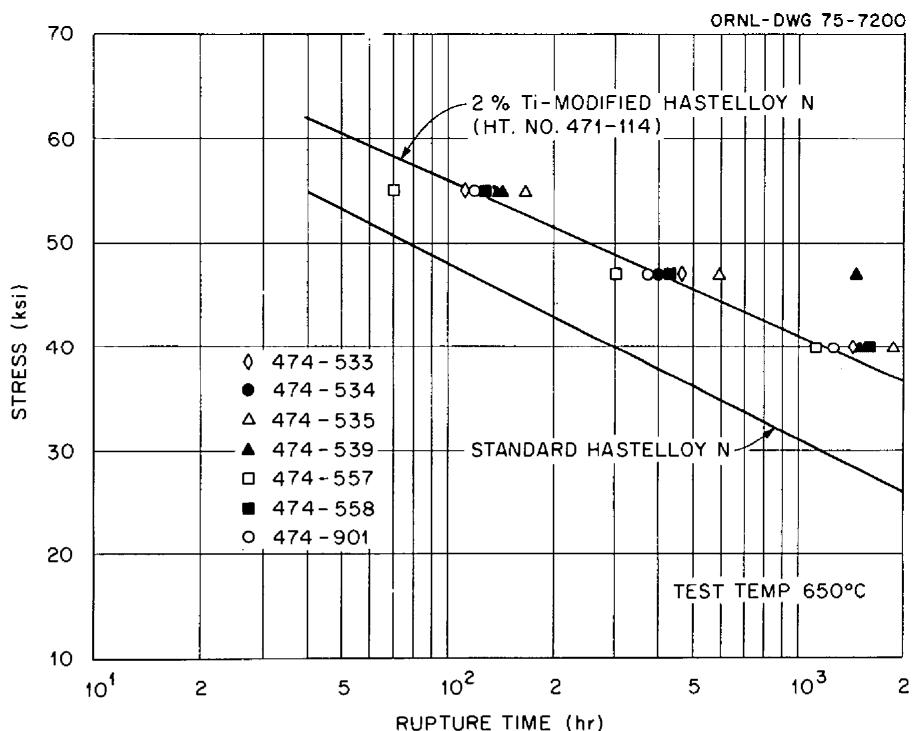  
Fig. 7.17. Stress-rupture properties of several heats of $2\%$ Ti-modified Hastelloy N and standard Hastelloy N at $650^{\circ}\mathrm{C}$ .

modified heats are greater than for standard Hastelloy N. In general, the tensile properties of the $2\%$ Ti modified alloy are about the same as those of standard Hastelloy N.

Data from creep-rupture tests in air are being obtained on the latest heats of $2\%$ Ti modified Hastelloy N. Tests currently in progress are designed to establish reference creep and stress-rupture curves at 650, 704, and $760^{\circ}\mathrm{C}$ . Specimens were obtained from swaged rod of the various alloys and were annealed 1 hr at $1177^{\circ}\mathrm{C}$ prior to test. Stress-rupture data obtained to

date are given in Table 7.6. These same data are compared with stress-rupture curves for standard Hastelloy N and a previous heat of $2\%$ Ti-modified Hastelloy N (Figs. 7.17 and 7.18). The newer heats of $2\%$ Ti-modified Hastelloy N are essentially equivalent in strength to the earlier heat, and there appear to be no significant effects from the rare-earth additions to the $2\%$ Ti-modified alloy. As determined from past work and confirmed by the recent tests, the modified alloys exhibit longer rupture lives than standard Hastelloy N at both temperatures.

Table 7.6. Stress-rupture properties of several heats of $2\%$ Ti modified Hastelloy N at 650 and $704^{\circ}\mathrm{C}^{a}$   

<table><tr><td rowspan="2">Heatb</td><td rowspan="2">Alloy</td><td colspan="2">Test conditions</td><td rowspan="2">Rupture life (hr)</td><td rowspan="2">Total elongation (%)</td></tr><tr><td>Stress (103psi)</td><td>Temperature (°C)</td></tr><tr><td rowspan="3">74533</td><td rowspan="3">Basec</td><td>40</td><td>650</td><td>1486</td><td>27</td></tr><tr><td>47</td><td>650</td><td>465</td><td>28</td></tr><tr><td>55</td><td>650</td><td>112</td><td>28</td></tr><tr><td rowspan="2">74534</td><td rowspan="2">Basec + 0.013% La</td><td>47</td><td>650</td><td>394</td><td>43</td></tr><tr><td>55</td><td>650</td><td>136</td><td>51</td></tr><tr><td rowspan="3">74535</td><td rowspan="3">Basec + 0.04 misch metal</td><td>40</td><td>650</td><td>1883</td><td>36</td></tr><tr><td>47</td><td>650</td><td>591</td><td>33</td></tr><tr><td>55</td><td>650</td><td>166</td><td>38</td></tr><tr><td rowspan="2">74539</td><td rowspan="2">Basec + 0.03% Ce</td><td>47</td><td>650</td><td>1467</td><td>43</td></tr><tr><td>55</td><td>650</td><td>137</td><td>43</td></tr><tr><td rowspan="2">74557</td><td rowspan="2">Basec</td><td>47</td><td>650</td><td>302</td><td>20</td></tr><tr><td>55</td><td>650</td><td>70</td><td>18</td></tr><tr><td rowspan="3">74558</td><td rowspan="3">Basec + 0.02% La</td><td>40</td><td>650</td><td>1554</td><td>25</td></tr><tr><td>47</td><td>650</td><td>413</td><td>27</td></tr><tr><td>55</td><td>650</td><td>139</td><td>26</td></tr><tr><td rowspan="3">74901</td><td rowspan="3">10,000-lb production heat</td><td>40</td><td>650</td><td>1247</td><td>26</td></tr><tr><td>47</td><td>650</td><td>395</td><td>27</td></tr><tr><td>55</td><td>650</td><td>117</td><td>24</td></tr><tr><td>74533</td><td>Basec</td><td>35</td><td>704</td><td>196</td><td>42</td></tr><tr><td rowspan="2">74534</td><td rowspan="2">Basec + 0.013% La</td><td>30</td><td>704</td><td>308</td><td>37</td></tr><tr><td>35</td><td>704</td><td>172</td><td>46</td></tr><tr><td rowspan="2">74535</td><td rowspan="2">Basec + 0.04% misch metal</td><td>25</td><td>704</td><td>1078</td><td>43</td></tr><tr><td>35</td><td>704</td><td>193</td><td>52</td></tr><tr><td rowspan="2">74539</td><td rowspan="2">Basec + 0.03% Ce</td><td>25</td><td>704</td><td>1137</td><td>42</td></tr><tr><td>35</td><td>704</td><td>187</td><td>63</td></tr><tr><td>74557</td><td>Basec</td><td>35</td><td>704</td><td>207</td><td>45</td></tr><tr><td>74558</td><td>Basec + 0.02% La</td><td>35</td><td>704</td><td>189</td><td>44</td></tr></table>

${}^{a}$ All specimens annealed $1\mathrm{{hr}}$ at ${1177}^{ \circ  }\mathrm{C}$ in Ar prior to testing.   
$b_{\mathrm{See Tables 7.1 and 7.2 for detailed chemical composition}}$   
$c_{\mathrm{Ni - 12\% Mo - 7\% Cr - 2\% Ti - 0.06C}}$

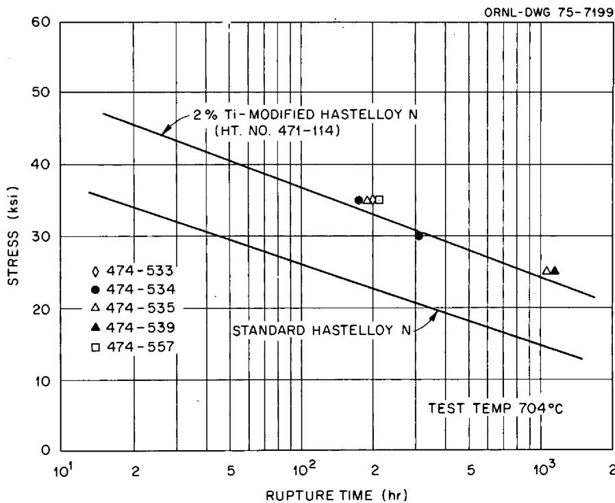  
Fig. 7.18. Stress-rupture properties of several heats of $2\%$ Ti-modified Hastelloy N and standard Hastelloy N at $704^{\circ}\mathrm{C}$ .

# 7.5 POSTIRRADIATION MECHANICAL PROPERTIES OF MODIFIED HASTELLOY N

H. E. McCoy

Samples of the modified compositions of Hastelloy N are irradiated in the Oak Ridge Research Reactor (ORR) and subjected to postirradiation creep tests to evaluate the influence of irradiation on the mechanical properties. Samples of the heats shown in Tables 7.1, 7.2, and 7.7 have been irradiated under several conditions and are ready for creep testing. Twelve in-cell creep machines are available for this work. The test matrices are fragmentary at this time.

Figure 7.19 shows the postirradiation stress-rupture results at $650^{\circ}\mathrm{C}$ of several heats of Hastelloy N containing nominally $2\%$ titanium. The fracture strains are shown by the individual data points. These samples were irradiated at $650^{\circ}\mathrm{C}$ in the ORR poolside facility to a thermal fluence of about $3 \times 10^{20}$ neutrons/cm². The minimum creep rates (Fig. 7.20) for many of the same tests indicate several important trends.

1. The variation in rupture lives for the heats is large (more than a factor of 10 from the shortest to the longest). The titanium concentrations vary from 1.4 to $2.2\%$ , with alloy 471-583 containing the least and

alloy 474-533 the most, but the variations in rupture life do not appear to be simply proportional to the titanium concentration.

2. Minimum creep rates vary by a factor of 10, but generally less than the variation noted for the rupture life.   
3. Both the rupture life and the minimum creep rate vary considerably for the heats in the unirradiated condition.   
4. The rupture life of each heat except 472-503 is reduced by irradiation. The rupture life, minimum creep rate, and fracture strain for this heat are extremely good.   
5. The rupture lives and fracture strains of all other heats are reduced by irradiation, but the extent of reduction varies from heat to heat.   
6. The minimum creep rate does not appear to be influenced by irradiation at lower stress levels, but the minimum creep rate does appear to be increased at the higher stress levels. Further analysis of the individual curves will be required to conclude whether this is a true effect.   
7. Heat 73-008 has the lowest fracture strains of all heats evaluated. Electron microscopy has shown that this heat has an inhomogeneous, generally coarse carbide structure.

Table 7.7. Analysis of several heats of standard and modified Hastelloy N   

<table><tr><td rowspan="2">Hcat numbera</td><td colspan="22">Concentration (wt %)</td><td rowspan="2">Melting processb</td></tr><tr><td>Cr</td><td>Mo</td><td>Fe</td><td>C</td><td>Si</td><td>Mn</td><td>P</td><td>S</td><td>Al</td><td>B</td><td>Ti</td><td>Hf</td><td>Zr</td><td>H</td><td>N</td><td>O</td><td>Cu</td><td>Cu</td><td>Cb</td><td>V</td><td>W</td><td>Mg</td></tr><tr><td>70-727</td><td>7.4</td><td>13.0</td><td>0.05</td><td>0.044</td><td>&lt;0.05</td><td>0.37</td><td></td><td></td><td></td><td>0.0008</td><td>2.1</td><td>&lt; 0.01</td><td>0.011</td><td></td><td></td><td></td><td></td><td></td><td>&lt;0.01</td><td></td><td></td><td></td><td>VIM</td></tr><tr><td>71-114</td><td>7.4</td><td>12.5</td><td>0.062</td><td>0.058</td><td>0.026</td><td>0.02</td><td>0.007</td><td>0.01</td><td>0.07</td><td>0.00005</td><td>1.75</td><td></td><td>&lt;0.03</td><td></td><td>0.0012</td><td>0.0003</td><td>0.07</td><td>0.007</td><td></td><td></td><td></td><td>VIM</td><td></td></tr><tr><td>71-583</td><td>7.25</td><td>12.4</td><td>0.13</td><td>0.057</td><td>0.055</td><td>0.03</td><td>0.007</td><td>0.004</td><td>0.2</td><td>0.00005</td><td>1.44</td><td></td><td>&lt;0.03</td><td></td><td>0.0029</td><td>0.012</td><td>0.1</td><td>0.015</td><td></td><td></td><td></td><td>VIM + CEVM</td><td></td></tr><tr><td>72-503</td><td>6.79</td><td>12.9</td><td>0.089</td><td>0.066</td><td>0.089</td><td>&lt; 0.01</td><td>0.0008</td><td>0.002</td><td>0.09</td><td>0.00007</td><td>2.16</td><td>&lt;0.003</td><td>0.003</td><td></td><td>0.0003</td><td>0.0017</td><td>0.05</td><td>0.01</td><td>0.05</td><td>&lt; 0.01</td><td>&lt;0.05</td><td>0.01</td><td>VIM + ESR</td></tr><tr><td>72-604</td><td>6.69</td><td>11.5</td><td>0.048</td><td>0.118</td><td>0.12</td><td>0.03</td><td>0.003</td><td>0.002</td><td>0.17</td><td>&lt; 0.00002</td><td>&lt;0.005</td><td>0.12</td><td>0.009</td><td></td><td>0.0008</td><td>0.0031</td><td>0.05</td><td>0.03</td><td>&lt;0.005</td><td>&lt; 0.01</td><td>&lt;0.05</td><td>0.01</td><td>VIM + CEVM</td></tr><tr><td>72-115</td><td>7.03</td><td>11.9</td><td>0.02</td><td>0.091</td><td>0.073</td><td>&lt; 0.01</td><td>0.0028</td><td>0.002</td><td>0.08</td><td>&lt; 0.00002</td><td>&lt;0.005</td><td>0.62</td><td>0.015</td><td></td><td>0.0004</td><td>0.0017</td><td>0.05</td><td>0.02</td><td>&lt;0.005</td><td>&lt; 0.01</td><td>&lt;0.05</td><td>0.02</td><td>VIM + ESR</td></tr><tr><td>73-008</td><td>7.63</td><td>12.4</td><td>0.18</td><td>0.078</td><td>0.06</td><td>0.45</td><td></td><td></td><td>0.03</td><td>&lt; 0.003</td><td>2.1</td><td></td><td></td><td>0.0022</td><td>0.0010</td><td>&lt; 0.001</td><td></td><td></td><td></td><td></td><td></td><td>VIM + CEVM</td><td></td></tr><tr><td>5065</td><td>7.1</td><td>16.0</td><td>4.0</td><td>0.06</td><td>0.57</td><td>0.55</td><td></td><td></td><td>&lt;0.03</td><td>0.001</td><td>&lt;0.01</td><td></td><td></td><td></td><td></td><td></td><td></td><td></td><td></td><td></td><td></td><td>Air melted</td><td></td></tr></table>

The heat numbers are often used with a prefix of "4" which means that the $\frac{1}{2}$ -in.-thick as-received plate was cut into strips $\frac{1}{2} \times \frac{1}{2}$ in. and swaged cold to $\frac{1}{4}$ -in.-diam rod.   
bVIM, vacuum induction melt; CEVM, consummable electrode vacuum melt; ESR, electroslag rmelt.

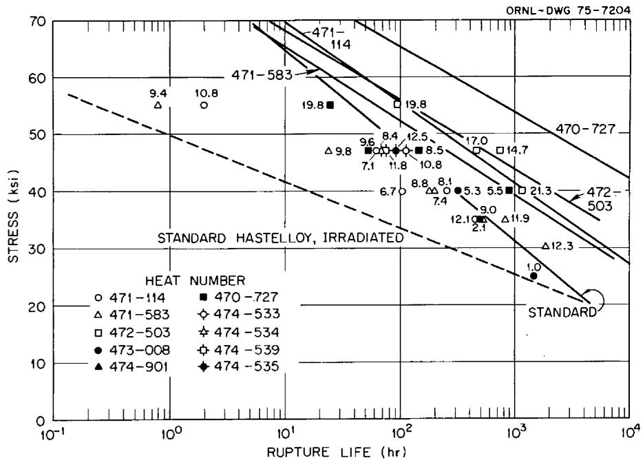  
Fig. 7.19. Postirradiation stress-rupture properties at $650^{\circ}\mathbf{C}$ of several heats of Ti-modified Hastelloy N. Samples were irradiated at $650^{\circ}\mathbf{C}$ to a thermal fluence of $3 \times 10^{20}$ neutrons/cm $^2$ . The numbers by the individual data points are the fracture strains in %. The solid lines are for the heats in the unirradiated condition.

  
Fig. 7.20. Postirradiation creep properties at $650^{\circ}\mathrm{C}$ of several heats of Ti-modified Hastelloy N. Samples were irradiated at $650^{\circ}\mathrm{C}$ to a thermal fluence of $3 \times 10^{20}$ neutrons/cm $^2$ . The solid lines are for heats in the unirradiated condition unless noted otherwise.

8. Three heats (474-534, 474-539, 474-535) contained small additions of rare-earth elements, but the postirradiation properties of these heats appear equivalent to those of heat 474-533 from the same series, which did not contain a rare-earth-element addition.

The data presented in Figs. 7.19 and 7.20 are for samples irradiated at $650^{\circ}\mathrm{C}$ . It was shown previously that irradiation at higher temperatures causes a further decrease in the rupture life and strain. This change is associated with carbide coarsening and varies from heat to heat. This subject can be dealt with more quantitatively after the completion of additional postirradiation creep tests.

A number of tests have been completed which strongly suggest that the postirradiation creep properties of the titanium-modified alloys are sensitive to the preirradiation annealing treatment. The post-irradiation testing is not complete, and the data have

not been critically reviewed for errors, so it is difficult to make firm conclusions yet. One of the more complete sets of data is shown in Table 7.8 for discussion. The preirradiation anneals at 1038 and $1093^{\circ}\mathrm{C}$ resulted in short rupture lives and fracture strains generally less than $1\%$ . Preirradiation annealing at $1177^{\circ}\mathrm{C}$ resulted in some improvement in rupture life and ductility. Annealing at $1204^{\circ}\mathrm{C}$ resulted in slightly lower fracture strains, but the rupture life and minimum creep rate were improved. Increasing the annealing temperature to $1260^{\circ}\mathrm{C}$ caused a dramatic decrease in the rupture life at a given stress and a decrease in fracture strain.

Although the trends discussed above are generally supported by the data, there are some tests which do not fit in this pattern. For example, there should be

Table 7.8. Influence of preirradiation annealing treatment on the postirradiation creep properties of modified Hastelloy N (heat 471-114).   
Irradiated at $760^{\circ}\mathrm{C}$ and tested at $650^{\circ}\mathrm{C}$   

<table><tr><td>Test no. R-</td><td>Preirradiation anneala</td><td>Stress (103psi)</td><td>Rupture life (hr)</td><td>Minimum creep rate (%/hr)</td><td>Total elongation (%)</td></tr><tr><td>1691</td><td>A</td><td>35</td><td>4.7</td><td>0.014</td><td>0.33</td></tr><tr><td>1712</td><td>A</td><td>30</td><td>6.0</td><td>0.010</td><td>0.48</td></tr><tr><td>1736</td><td>A</td><td>25</td><td>96.2</td><td>0.0022</td><td>0.78</td></tr><tr><td>1692</td><td>B</td><td>35</td><td>0.7</td><td>0.20</td><td>0.22</td></tr><tr><td>1746</td><td>B</td><td>30</td><td>3.4</td><td>0.029</td><td>0.36</td></tr><tr><td>1719</td><td>B</td><td>25</td><td>171.5</td><td>0.0009</td><td>1.8</td></tr><tr><td>1683</td><td>C</td><td>35</td><td>1.6</td><td>0.17</td><td>2.3</td></tr><tr><td>1706</td><td>C</td><td>30</td><td>93.6</td><td>0.029</td><td>3.6</td></tr><tr><td>1786</td><td>C</td><td>30</td><td></td><td></td><td></td></tr><tr><td>1715</td><td>C</td><td>25</td><td>1463.6b</td><td>0.0042</td><td>8.6</td></tr><tr><td>1792</td><td>C</td><td>20</td><td>2850.0</td><td>0.0010</td><td>8.1</td></tr><tr><td>1777</td><td>D</td><td>47</td><td>27.3</td><td>0.090</td><td>7.1</td></tr><tr><td>1737</td><td>D</td><td>40</td><td>223.0</td><td>0.011</td><td>3.6</td></tr><tr><td>1693</td><td>D</td><td>35</td><td>663.3</td><td>0.0044</td><td>4.0</td></tr><tr><td>1694</td><td>E</td><td>35</td><td>0.3</td><td>0.3</td><td>2.7</td></tr><tr><td>1720</td><td>E</td><td>25</td><td>60.0</td><td>0.0028</td><td>0.35</td></tr><tr><td>1794</td><td>E</td><td>15</td><td>2782.1</td><td>0.0006</td><td>2.1</td></tr></table>

$a\mathbf{A}$ -annealed 1 hr at $1038^{\circ}\mathrm{C}$ in argon.   
B - annealed 1 hr at $1093^{\circ}\mathrm{C}$ in argon.   
C - annealed 1 hr at $1177^{\circ}\mathrm{C}$ in argon.   
D - annealed 1 hr at $1204^{\circ}\mathrm{C}$ in argon.   
E - annealed 1 hr at $1260^{\circ}\mathrm{C}$ in argon.   
$b_{\text{Discontinued prior to failure}}$

more variation in the rupture lives of tests R-1691 and R-1712, the results of tests R-1706 and R-1786 run at "equivalent" conditions do not compare favorably, and the fracture strain of test R-1720 seems too low. More detailed data analysis and further testing will be required to determine the true effects of preirradiation annealing conditions. The possible effects of inhomogeneities in the test samples and of unknown variables in test parameters will be explored.

# 7.6 MICROSTRUCTURAL ANALYSIS OF TITANIUM-MODIFIED HASTELLOY N

D. N. Braski J. M. Leitnaker G. A. Potter

This investigation was to determine why two titanium-modified Hastelloy N heats, alloys 472-503 (503) and 471-114 (114), having virtually identical compositions (Table 7.7), displayed such different postirradiation creep properties. This problem was approached by examining the microstructure of both alloys in detail after furnace aging at 650, 704, and $760^{\circ}\mathrm{C}$ and after irradiation in the Oak Ridge Research Reactor (ORR) for similar times and temperatures. The reasoning behind this approach was that an understanding of the problem would be less difficult if the effects of temperature and irradiation on the precipitation processes in the alloys could be separated.

The electron microscopy of 503 and 114 aged at 650, 704, and $760^{\circ}\mathrm{C}$ has been reported previously. In brief, both alloys showed essentially the same development of stacking-fault precipitates along {111} planes, with some coarsening of the precipitates at the higher aging temperatures. The sections immediately below describe recent results from aging studies on unirradiated specimens and electron microscopy examinations of irradiated samples.

# 7.6.1 Microstructure of Aged 503 and 114 Alloys

An electrochemical extraction technique using a solution of 10 parts of HCL in 90 parts of water removed the precipitates from 503 and 114. After extraction, the precipitates were weighed with a microbalance and then analyzed by x-ray diffraction and x-ray fluorescence. The amounts of precipitate

extracted form 503 and 114 are given in Fig. 7.21. The data plotted are values taken for a 4-hr extraction of precipitates from the button head of tensile samples that were aged for $1000\mathrm{hr}$ . A 4-hr cleaning extraction was conducted previous to these runs to remove any surface effects. The results show that a greater amount of precipitate was extracted from 503 than 114 at all three aging temperatures. This might be expected since the 503 alloy contains more carbon. The amount of precipitate formed in both alloys generally decreases with increasing temperature. However, the experimental values probably do not represent equilibrium amounts of precipitate that will form at these temperatures. Long-time aging studies of 503 and 114 are under way which should help determine the equilibrium quantities.

In another experiment, precipitates were extracted through the entire thickness of 503 and 114 samples that had been aged at $650^{\circ}\mathrm{C}$ for 1000 hr. The distribution of precipitates was not homogeneous (Fig. 7.22); in both alloys more precipitates were located in the outer layers of the sample than in the central region. The total weight percent of precipitates collected across the sample was $0.62\%$ for 503 and $0.56\%$ for 114. These results cast some doubt on the findings in Fig. 7.21, where only one extraction near the outer surface was considered. We can only speculate as to the cause of the inhomogeneity in the two samples (Fig. 7.22), but it is possibly related to the processing of the alloys from ingots to tensile specimens. The effects of inhomogeneity on the performance of the alloys in a reactor are also unknown. However, a later section of this report (Sect. 7.6.3) shows that a uniform distribution of carbide precipitates in the microstructure

  
Fig. 7.21. Amount of precipitate extracted from 503 and 114 alloys as a function of aging temperature. Aging time = 1000 hr.

  
Fig. 7.22. Amount of precipitate extracted from 503 and 114 as a function of location in sample. Samples were aged for 1000 hr at $650^{\circ}\mathrm{C}$ .

appears to be desirable for radiation resistance. Therefore, these observed inhomogeneities will be further investigated.

# 7.6.2 X-Ray Analysis of Precipitates

After the amounts of precipitates in 503 and 114 samples were determined using the extraction technique, the extracted particles were analyzed by x-ray diffraction. The data showed that the precipitates formed at all three temperatures and in both alloys were face-centered cubic MC (metal carbide)-type carbides. The lattice parameters $(a_0)$ varied from 4.22 to $4.30\AA$ depending on aging temperature. Generally, the higher the aging temperature, the greater the lattice parameter of the MC. This indicates that the composition of the MC particles depends to some extent on aging temperature. There is also evidence that the composition of MC may not be completely uniform for any particular aging treatment. All of the MC peaks formed upon aging at 650, 704, or $760^{\circ}\mathrm{C}$ were asymmetric with "tailing" toward the higher 20 values. Therefore the MC which precipitated out at these temperatures fell within a range of compositions and had lattice parameters that were all slightly smaller than the $4.30\text{-}\mathring{\mathrm{A}}$ value observed for primary MC.

The x-ray diffraction data showed an additional difference between 503 and 114 - namely, extra lines that could not be indexed as MC were found in the 503 alloy. The extra lines were not consistent from one aging temperature to the next, so it was not possible to relate them to any of the more obvious metal carbides.

However, it is still quite possible that a third phase exists in the 503 alloy. There was also a possibility of contamination (from the extraction process) causing the extra lines, but this seems rather remote since no extra lines were detected in MC extracted from the 114 alloy, which was processed identically.

The x-ray fluorescence data in Table 7.9 also show some difference in precipitate composition between 503 and 114. Precipitates from both alloys contained Mo, Ni, Ti, Cr, and Fe, but 503 also contained traces of Nb, Zr, Pt, and Sr. Furthermore, the iron content was always higher in the 503 precipitates. Although the platinum and strontium may be contaminants (e.g., platinum from the specimen holder), the other extra elements cannot be ignored. (Carbon cannot be detected by the x-ray fluorescence techniques.) The composition of MC in 503 is different from 114, and, again, the existence of a third phase in 503 should not be ruled out. Many of these questions will be answered by quantitative elemental analysis of the precipitates.

# 7.6.3 Irradiation and Creep Testing

Tensile samples of the 503 and 114 alloys were irradiated in the Oak Ridge Reactor (ORR run 226) for $1203\mathrm{hr}$ at 650, 704, and $760^{\circ}\mathrm{C}$ . The nominal fluence

Table 7.9. X-ray fluorescence analysis of precipitates   

<table><tr><td>Temperature</td><td>503</td><td>114</td></tr><tr><td rowspan="8">650°C</td><td>Mo</td><td>Mo</td></tr><tr><td>Ni</td><td>Ni</td></tr><tr><td>Ti</td><td>Ti</td></tr><tr><td>Cr</td><td>Cr</td></tr><tr><td>Fea</td><td>Fe</td></tr><tr><td>Zr</td><td></td></tr><tr><td>Nb</td><td></td></tr><tr><td>Pt</td><td></td></tr><tr><td rowspan="7">704°C</td><td>Mo</td><td>Mo</td></tr><tr><td>Ni</td><td>Ni</td></tr><tr><td>Ti</td><td>Ti</td></tr><tr><td>Cr</td><td>Cr</td></tr><tr><td>Fea</td><td>Fe</td></tr><tr><td>Zr</td><td></td></tr><tr><td>Nb</td><td></td></tr><tr><td rowspan="6">760°C</td><td>Mo</td><td>Mo</td></tr><tr><td>Ni</td><td>Ni</td></tr><tr><td>Ti</td><td>Ti</td></tr><tr><td>Cr</td><td>Cr</td></tr><tr><td>Fea</td><td>Fe</td></tr><tr><td>Sr</td><td></td></tr></table>

${}^{a}$ Amount is more than present in 114.

Table 7.10. Results of postirradiation creep tests on 472-503 and 471-114 alloys (ORR 226) $^a$   

<table><tr><td>Alloy</td><td>Irradiation temperature (°C)</td><td>Stress level (103psi)</td><td>Creep rupture life (hr)</td><td>Total strain (%)</td></tr><tr><td>503</td><td>650</td><td>40</td><td>1109.4</td><td>21.4</td></tr><tr><td>114</td><td>650</td><td>40</td><td>250.5</td><td>8.1</td></tr><tr><td>503</td><td>704</td><td>40</td><td>1344.0</td><td>21.6</td></tr><tr><td>114</td><td>704</td><td>40</td><td>74.5</td><td>3.5</td></tr><tr><td>503</td><td>760</td><td>35</td><td>1667.2</td><td>19.2</td></tr><tr><td>114</td><td>760</td><td>35</td><td>1.9</td><td>2.2</td></tr></table>

${}^{a}$ All samples given a preirradiation anneal of $1\mathrm{{hr}}$ at ${1177}^{ \circ  }\mathrm{C}$ .

was about $3 \times 10^{20}$ neutrons/cm $^2$ . One sample of each alloy at the different irradiation temperatures was designated for examination by transmission electron microscopy. The remainder of the samples were creep tested. The results of some of these tests are given in Table 7.10. The 503 alloy demonstrated longer creep rupture lives and larger total strains than the 114 at every condition.

# 7.6.4 Microstructure of Irradiated 503 and 114 Alloys

The microstructures of 503 and 114 after irradiation, but before creep testing, are shown in the electron micrographs in Figs. 7.23-7.26. Figure 7.20 shows the alloys after irradiation at $650^{\circ}\mathrm{C}$ . Both alloys contained ribbons of stacking-fault precipitates of MC-type carbides, but the ribbon lengths were considerably shorter than those observed in samples aged in furnaces at similar times and temperatures.[2] Therefore, the neutron irradiation must be hindering the stacking-fault precipitation mechanism that was described originally by Silcock and Tunstall.[4] Also present in both alloys were thin MC platelets lying on $\{111\}$ planes which usually had dislocations associated with them. The dislocations were probably produced as the matrix accommodated the large lattice of the MC platelets. Not seen in the micrograph were other large MC particles located in grain boundaries and occasionally in the grain interiors. These primary carbides were present after the alloy was solution annealed $1\mathrm{hr}$ at $1177^{\circ}\mathrm{C}$ .

Figure 7.24 shows the alloys after irradiation at $704^{\circ}\mathrm{C}$ . Both micrographs were taken near grain boundaries to illustrate the differences found between 503

and 114 at this temperature. The 503 alloy contained MC platelets that were distributed fairly evenly throughout the matrix. However, precipitation in 114 was localized as large platelets or structures resembling stacking-fault precipitate ribbons. The particles were generally located near grain boundaries and primary MC precipitates.

After irradiation at $760^{\circ}\mathrm{C}$ the microstructures of 503 and 114 were quite similar to those for $704^{\circ}\mathrm{C}$ (Fig. 7.25). The 503 contained MC platelets within the grain interiors (Fig. 7.22a), while the 114 had isolated MC particles in the vicinity of primary MC precipitates (Fig. 7.25b). The micrographs in Fig. 7.26 illustrate two additional microstructural features. The first is shown in a 503 sample irradiated at $760^{\circ}\mathrm{C}$ (Fig. 7.26a). Besides the 0.2- to $0.5\text{-}\mu \mathrm{m}$ -diam platelets of MC already discussed, particles that were approximately $200\mathring{\mathrm{A}}$ in diameter were dispersed throughout the 503 samples irradiated at $760^{\circ}\mathrm{C}$ . It is not known at this time whether the fine precipitate is simply MC that follows a different nucleation and growth mechanism due to the irradiation or whether there is a third phase present as indicated by the x-ray analyses. The second observation is a difference between the distribution of MC precipitates in 503 and 114 near grain boundaries. In general, a higher concentration of MC platelets was found near grain boundaries in the 503 (Fig. 7.26a), while precipitation near the primary MC particles effectively produced a denuding of MC at grain boundaries in 114 (Fig. 7.26b).

The electron micrographs of irradiated 503 and 114 just presented have shown several marked differences in microstructure that might help explain the differences in postirradiation creep properties. Precipitates dispersed throughout a material can increase radiation resistance, probably by tying up various impurities and possibly by serving as sinks for helium produced during irradiation. The impurities and helium are thus prevented from segregating at grain boundaries and causing embrittlement of the material. Such a mechanism may be operating in the case of the 503 alloy but not in the 114. Although precipitation of MC occurred in 114 it was localized and consequently may have not been effective in trapping impurities. The uniformly dispersed fine precipitates found in 503 after irradiation at


  
Fig. 7.23. Electron micrographs of alloys 503 (left) and 114 (right) after irradiation at $650^{\circ}\mathrm{C}$ for $1200\mathrm{hr}$ .


  
Fig. 7.24. Electron micrographs of alloys 503 (left) and 114 (right) after irradiation at $704^{\circ}\mathrm{C}$ for $1200\mathrm{hr}$ .


  
Fig. 7.25. Electron micrographs of alloys 503 (left) and 114 (right) after irradiation at $760^{\circ}\mathrm{C}$ for $1200\mathrm{hr}$ .


  
Fig. 7.26. Typical grain boundary region of alloys in

$760^{\circ}\mathrm{C}$ might also explain why the postirradiation creep properties seem to improve with increasing irradiation temperature for that alloy. Whether the fine precipitate is a third phase or a different morphology of MC, its presence could provide a more effective network of sites for trapping impurities and helium.

# 7.7 SALT CORROSION STUDIES

J.R.Keiser J.R.DiStefano

Several hundred thousand hours of corrosion experience have now been accumulated with Hastelloy N and fluoride salts in thermal-convection and forced-circulation systems. This experience has shown that in clean fluoride salts containing uranium the predominant corrosion mechanism is the leaching of chromium from Hastelloy N. Impurity fluorides such as $\mathrm{FeF_2}$ , $\mathrm{MoF_2}$ , and $\mathrm{NiF_2}$ will also react with chromium to form $\mathrm{CrF_2}$ . Water will react with the salt to form HF, which oxidizes all metallic components of the alloy. In the MSRE the overall corrosion of Hastelloy N was quite low during almost four years at temperature, attesting to the excellent corrosion resistance of this alloy in an actual system. However, operation of the MSRE also revealed that Hastelloy N was embrittled at grain boundaries due to interaction with fission products (probably tellurium) contained in the fuel salt. Subsequent studies have shown that certain chemical modifications improve the alloy's resistance to neutron irradiation and also increase its resistance to intergranular cracking by tellurium.

The experiments discussed in this section are being conducted to determine the corrosion behavior of regular and modified Hastelloy N as well as other selected alloys in molten fluoride salts and to determine the effect of tellurium in the fuel salt on the alloys. These corrosion experiments include the use of thermal-convection loops, a forced-circulation loop, and the Coolant-Salt Technology Facility.

# 7.7.1 Status of Thermal-Convection Loop Program

The facility for operation of thermal-convection loop tests is essentially complete. Two loop tests are currently in operation (Table 7.11), and six loop systems are under construction. Two of the six loop systems will use some components from previously operated systems (18B and 22A), while the other four will be completely new systems. All will have provisions for electrochemical probe measurements to follow the U(IV)/U(III) ratios of the circulating salt. Table 7.12

Table 7.11. Thermal-convection loops in operation   
Salt composition (mole %), $\mathrm{LiF - BeF_2 - ThF_4 - UF_4}$ (72-16-11.7-0.3); maximum temperature, $704^{\circ}\mathrm{C}$ ; temperature differential, $139^{\circ}\mathrm{C}$   

<table><tr><td>Loop</td><td>Loop material</td><td>Specimen material</td><td>Specimen exposure time (hr)</td></tr><tr><td>21A</td><td>Hastelloy N</td><td>Hastelloy N</td><td>2295</td></tr><tr><td>23</td><td>Inconel 601</td><td>Inconel 601</td><td>721</td></tr></table>

Table 7.12. Thermal-convection loops under construction   

<table><tr><td>Loop</td><td>Loop material</td><td>Specimen material</td><td>Salt</td><td>Objectives</td></tr><tr><td>18B</td><td>Hastelloy N</td><td>Modified Hastelloy N</td><td>MSBR fuel salta</td><td>Screening test loop for modified alloys</td></tr><tr><td>22A</td><td>316 stainless steel</td><td>316 stainless steel</td><td>MSBR fuel salt</td><td>Determine if Fe-base alloy can be used in fuel under MSBR conditions</td></tr><tr><td>24</td><td>Hastelloy N</td><td>Modified Hastelloy N</td><td>MSBR fuel salt</td><td>Screening test loop for modified alloys</td></tr><tr><td>25</td><td>Hastelloy N</td><td>Modified Hastelloy N</td><td>MSBR fuel salt</td><td>Te mass transfer studies and effect on mechanical properties</td></tr><tr><td>31</td><td>316 stainless steel</td><td>316 stainless steel</td><td>LiF-BeF2</td><td>Analytical method development and baseline corrosion data</td></tr><tr><td>28</td><td>Hastelloy N</td><td>Hastelloy N, modified Hastelloy N</td><td>MSBR coolant salt</td><td>Analytical method development and baseline corrosion data</td></tr></table>

$a_{\mathrm{LiF - BeF_2 - ThF_4 - UF_4}}$ (72-16-11.7-0.3 mole%).

gives a description of the six loop systems presently under construction.

# 7.7.2 Fuel Salt Thermal-Convection Loop Results

The thermal-convection loop program is to (1) develop electrochemical methods for evaluation of corrosion data in molten salt systems, (2) study the behavior of tellurium in molten salt systems and determine its effect on potential MSBR containment materials, and (3) evaluate the corrosion resistance of Hastelloy N, modified Hastelloy N, and other potential containment materials to the MSBR fuel salt LiF-BeF $_2$ -ThF $_2$ -UF $_4$ (72-16-11.7-0.3 mole%).

Thermal-convection loop 23 is constructed of Inconel 601, a material which shows resistance to tellurium-induced grain-boundary embrittlement. However, Inconel 601 has a high chromium content (23 wt %) and is more susceptible to oxidation by $\mathrm{UF_4}$ than Hastelloy N. During initial operation of loop 23, electrochemical measurements were made at regular intervals, and after 721 hr, corrosion insert specimens were removed for examination. The results of the electrochemical measurements (Sect. 6.1) indicate that the U(IV)/U(III) ratio dropped rapidly after the salt was put into the loop. The U(IV)/U(III) ratio was initially above $10^4$ , but after 15 min it was 200, and after six days it was 40. A short time before the specimens were removed, the ratio had decreased to about 20. A decrease in the U(IV)/U(III) ratio of this magnitude implied that extensive corrosion had occurred. Examination of the removable specimens verified that the corrosion rate was indeed high. All the specimens that were in the salt lost weight; those in the hottest positions lost nearly $1\%$ of their initial weight. Weight loss as a function of temperature and location is shown in Fig. 7.27. Because of a malfunction of the heaters, the temperature of the lower portion of the hot leg was higher than the design temperature for a short time. Consequently, the weight losses of specimens in the lower portion of the hot leg are probably greater than would have been the case if no malfunction had occurred. (These points are not plotted in Fig. 7.27.)

Thermal-convection loop 21A is a Hastelloy N loop which had been previously operated before the MSR Program was terminated in early 1973. The loop has been restarted with new specimens and fresh MSBR fuel salt. The U(IV)/U(III) ratio in this loop has remained at a relatively high level. After one day of salt circulation, U(IV)/U(III) was $1.2 \times 10^{5}$ , after 11 days it was $5 \times 10^{4}$ , and after 45 days it had only decreased to about $1.5 \times 10^{4}$ , indicating that the corrosion rate was fairly

low. Insert specimens were examined after 2760 hr. Four specimens in the hottest portion of the loop lost weight, while all others gained weight. Weight change as function of temperature and position in the loop is shown in (Fig. 7.28).

A comparison of Figs. 7.27 and 7.28 shows that Inconel 601 is corroding more rapidly than Hastelloy N. More serious attack of the Inconel 601 would have occurred if the U(IV)/U(III) ratio had been maintained in the range of $10^{2.5}$ to $10^{4.2}$ , as presently considered appropriate for an MSBR. Therefore the compatibility of Inconel 601 with MSBR fuel salt does not appear adequate for service at the present design temperature.

# 7.7.3 Forced-Circulation Loop Results

Hastelloy N forced-circulation loop FCL-2b completed preliminary operations near the end of October 1974. During this period, the loop contained MSRE fuel salt $\mathrm{LiF - BeF_2 - ThF_4 - UF_4}$ (68-20-11.7-0.3 mole %) and operated isothermally for all but the last week. Operation was interrupted by an oil leak and was resumed in January 1975 (Sect. 2.4).

During the preliminary operational period, Hastelloy N metallurgical insert specimens were removed twice, once in early September after six beryllium additions had been made to the fuel salt and a second time near the end of October, after three $\mathrm{NiF}_2$ additions had been made. The beryllium additions made the salt less oxidizing by lowering the U(IV)/U(III) ratio, while the $\mathrm{NiF}_2$ additions raised the U(IV)/U(III) ratio and made the salt more oxidizing. Consequently, the corrosion rate was expected to be very low during the first period and somewhat higher during the latter period. Results are given in Table 7.13.

During the first period, when the salt had a low $\mathrm{U(IV) / U(III)}$ ratio and operation was isothermal, weight losses and corrosion rates were low, as expected. During the second period of preliminary operation, the $\mathrm{U(IV) / U(III)}$ ratio was much higher, and, in addition, there was a $139^{\circ}\mathrm{C}$ $(250^{\circ}\mathrm{F})$ temperature gradient imposed on the loop for part of the period. Consequently, the maximum weight loss and attendant corrosion rates were higher than during the first period. Data obtained during the preliminary period showed that changes in the oxidation potential of the salt could

  
Fig. 7.27. Weight change as a function of temperature for Inconel 601 exposed to MSBR fuel salt in Thermal-Convection Loop 23 after 721 hr.

  
Fig. 7.28. Weight change as a function of temperature for Hastelloy N exposed to MSBR fuel salt in Thermal-Convection Loop 21A after 2760 hr.

Table 7.13. Weight loss and corrosion rate in metallurgical specimens from FCL-2b   

<table><tr><td>Period</td><td>Time interval (hr)</td><td>Weight loss (mg cm-2year-1), max</td><td>Corrosion ratea (mils/year), max</td></tr><tr><td colspan="4">Preliminary operating conditions</td></tr><tr><td>1</td><td>2330</td><td>0.2</td><td>0.01</td></tr><tr><td>2</td><td>1476</td><td>2.8</td><td>0.12</td></tr><tr><td colspan="4">Design operating conditions</td></tr><tr><td>3</td><td>666</td><td>2.7</td><td>0.12</td></tr></table>

$a$ Assuming uniform removal.

be followed electrochemically and could be correlated with weight-change measurements.

During the next period, FCL-2b was operated under conditions designed to gather baseline corrosion data using MSBR fuel salt $\mathrm{LiF - BeF_2 - ThF_4 - UF_4}$ (72-16-11.7-0.3 mole%). The specimens were examined after one month's exposure (Table 7.13). Because this exposure was almost entirely under the MSBR reference-design operating conditions of $704^{\circ}\mathrm{C}$ $(1300^{\circ}\mathrm{F})$ maximum temperature and $139^{\circ}\mathrm{C}$ $(250^{\circ}\mathrm{F})$ temperature differential, corrosion rates were higher than during the earlier periods of isothermal operation, when there was no contribution from mass transfer. However, corrosion rates remained well within acceptable limits.

# 7.7.4 Coolant-Salt Technology Facility Results

The Coolant-Salt Technology Facility has provisions for exposing three metallurgical specimens to high-velocity $\mathrm{NaBF}_4$ -NaF (92-8 mole %) coolant salt. During this reporting period, three Hastelloy N specimens were exposed for a ten-day period. When the specimen holder was removed from the test facility, one of the specimens was missing, and another was damaged during removal from the holder. Examination of the third specimen showed that its surface had been scratched. Salt was observed in the scratches by microscopic examination, which indicates that the specimen was damaged prior to exposure or, possibly, as a result of abrasion by the missing specimen.

Both of the recovered specimens showed weight losses, but these losses reflect other effects in addition to corrosion of the specimens by the fluoroborate salt. Assuming that all weight lost was material that was removed uniformly, the material removal rate was

almost 1 mil/year. However, because some material was lost by mechanical means, this rate overestimates the true corrosion rate.

The next experiment to be performed in this facility will make use of a different specimen holder designed to prevent loss of specimens from the holder.

# 7.7.5 Static Pot Tests

A series of experiments is planned using thermal-convection and forced-circulation loops to study mass transport of tellurium in fuel salt and its effect on the ductility of the containment material. However, a method must be developed that will effectively simulate the production of tellurium in fuel salt as it occurs under reactor conditions. Several methods for adding tellurium have been proposed, and two test vessels are being constructed to evaluate the various methods. The first vessel will have viewing ports, electrochemical probes, and accesses for stirring, sampling, or making additions. Pellets containing measured amounts of lithium telluride will be added to the salt to simulate production of tellurium. The second vessel will have electrochemical probes and accesses for stirring and sampling and will use nickel or chromium telluride for supplying tellurium to the salt.

# 7.8 CORROSION OF HASTELLOY N AND OTHER ALLOYS IN STEAM

B. McNabb H.E.McCoy

The corrosion of standard and modified Hastelloy N and other iron-, nickel-, and cobalt-base alloys is being evaluated in steam at $538^{\circ}\mathrm{C}$ in TVA's Bull Run Steam Plant. Unstressed sheet specimens 2 in. long, $\frac{1}{2}$ in. wide, and 0.035 in. thick have been exposed to flowing steam (approx 1000 lb/hr) for up to 17,000 hr. Weight changes and observations have been reported previously for 15,000 hr exposure, and the same trends are continuing with increased exposure.

One material of considerable metallurgical interest was type 201 stainless steel. This material, when $50\%$ cold worked, had markedly lower weight gains in the cold-worked condition than in the annealed condition. After 6000 hr exposure the cold-worked specimens had average weight gains of $0.146 \, \mathrm{mg/cm}^2$ . X-ray diffraction patterns were made from the oxides on two of

these specimens $^9$ , and the specimens were returned to the Bull Run facility for additional exposure. Preliminary analysis indicates that the annealed specimen (No. 353) formed oxides of $\mathrm{Fe}_3\mathrm{O}_4$ and $\alpha\text{-Fe}_2\mathrm{O}_3$ sufficiently thick that no matrix peaks were detected. These data and some additional information on control specimens are given in Table 7.14. The cold-worked specimen (No. 354) had a (body centered cubic) matrix (strong intensity) with a lattice parameter of $2.878 \pm 0.002\mathring{\mathrm{A}}$ , which could correspond to an $\mathrm{Fe}-60\%$ chromium ferritic alloy. Some (face centered cubic) phase (weak intensity) with a lattice parameter of $3.594\mathring{\mathrm{A}}$ was present, indicating that the transformation of the matrix from fcc to bcc must be rather sluggish not to have been completed in $6000\mathrm{hr}$ at $538^{\circ}\mathrm{C}$ . The oxide layer consisted of $\mathrm{MnFe}_2\mathrm{O}_4$ (medium) and $\alpha\text{-Fe}_2\mathrm{O}_3$ (weak). The matrix lines dominated the pattern, indicating that the oxide was thin. This was also indicated by interference colors still visible in the oxide layer. A cold-worked specimen which had been oxidized 4000 hr in air (No. 422, $117\mathrm{mg/cm}^2$ ) also had the same strong bcc matrix with a lattice parameter of $2.875\mathring{\mathrm{A}}$ and oxides $\mathrm{MnFe}_2\mathrm{O}_4$ (medium), $(\mathrm{Mn},\mathrm{Fe})_2\mathrm{O}_3$ (weak), and $\alpha\text{-Fe}_2\mathrm{O}_3$ (very weak), which accounted for most of the lines in the x-ray pattern. There was slightly more of the fcc matrix ( $3.591 \pm 0.003\mathring{\mathrm{A}}$ ) present in this

9. O. B. Cavin, ORNL, private communication.

specimen than in the one exposed to steam. The lower exposure time (4000 hr vs 6000 hr) probably accounts for this, since the transformation to bcc ferrite at this temperature $(538^{\circ}\mathrm{C})$ appears sluggish. Annealed and cold-worked samples which had not been exposed to high temperature $(538^{\circ}\mathrm{C})$ had fcc (austenite) matrix with a lattice parameter of 3.598 Å. The transformation to bcc from fcc under the influence of cold work and annealing is not completely understood, but this is being investigated.

The effect of stress on the compatibility of Hastelloy N in steam is being evaluated by tube-burst-type specimens using the 3500-psig steam pressure and varying wall thickness to obtain the desired stress on the specimens. A double-walled tube arrangement is being used with the annulus between the tubes connected by a capillary tube to the condenser. When rupture of the inner tube occurs, steam passes through the capillary tube and is sensed by a thermocouple attached to the capillary tube. Thermocouples from the ten instrumented tube-burst specimens are connected to a multipoint recorder, and a temperature increase indicates rupture of a specimen.

Two heats of standard Hastelloy N, N15095 and N25101, have been tested in argon and in steam. The tests in argon used that gas as the pressurizing medium and as a cover gas over the outside of the specimen. The reduced-wall-section specimens were identical in geom

Table 7.14. Results of x-ray studies of type 201 stainless steel specimens   

<table><tr><td rowspan="3">Specimen no.</td><td rowspan="3">Exposure conditions</td><td colspan="5">X-ray information</td></tr><tr><td colspan="2">Matrix</td><td rowspan="2">Lattice parameter (Å)</td><td colspan="2">Oxide</td></tr><tr><td>Structure</td><td>Intensity</td><td>Identification</td><td>Intensity</td></tr><tr><td>353</td><td>Annealed 1 hr at 1050°C in argon, annealed 600 hr at 538°C in steam</td><td></td><td></td><td></td><td>Fe3O4α-Fe2O34 unidentified peaks</td><td>Strong Weak Very weak</td></tr><tr><td rowspan="2">354</td><td rowspan="2">Cold worked 50%, annealed 6000 hr at 538°C in steam</td><td>Bcc</td><td>Strong</td><td>2.878</td><td rowspan="2">MnFe2O4α-Fe2O3Several unidentified peaks</td><td rowspan="2">Medium Weak Weak</td></tr><tr><td>Fcc</td><td>Weak</td><td>3.594</td></tr><tr><td rowspan="2">422</td><td rowspan="2">Cold worked 50%, annealed 4000 hr at 538°C in air</td><td>Bcc</td><td>Strong</td><td>2.875</td><td rowspan="2">MnFe2O4MnFe2O3α-Fe2O3</td><td rowspan="2">Medium Weak Very weak</td></tr><tr><td>Fcc</td><td>Weak</td><td>3.591</td></tr><tr><td>Annealed</td><td>Annealed 1 hr at 1050°C in argon</td><td>Fcc</td><td>Strong (strain free)</td><td>3.5975</td><td></td><td></td></tr><tr><td>Cold Worked</td><td>Cold worked 50%</td><td>Fcc</td><td>Strong (line broadening)</td><td>3.59</td><td></td><td></td></tr></table>

etry to those tested in steam except that the argon test specimens had plugs welded in each end with one plug having a capillary tube connected to an argon supply for pressurizing. The specimen geometry used in steam has been detailed previously. $^{10}$

The stress-rupture properties of heat N15095 are shown in Fig. 7.29. As discussed previously, flaws in some specimens probably contributed significantly to the scatter in the data both in argon and in steam. There appears to be some effect of the steam only at higher stresses and shorter times. These data were obtained before ultrasonic inspection of the specimens was instituted. A number of tests are still in progress as indicated by the arrows in Fig. 7.29; the specimens in argon and steam environments appear to have equivalent rupture times. This indicates that under these conditions steam does not shorten the rupture life of Hastelloy N (heat N15095).

Figure 7.30 shows the stress-rupture properties of heat N25101. All of the annealed, highly stressed specimens tested in steam had shorter rupture times than those tested in argon. These test specimens were not ultrasonically inspected, so it is not known if they had flaws. Specimens that were inspected and tested in steam in the "as received" condition appear to have

10. B. McNabb and H. E. McCoy, MSR Program Semiannu. Progr. Rep. Aug. 31, 1972, ORNL-4832, pp. 137-46.

rupture times equivalent to those of specimens tested in argon. Several are still in test, as indicated by the arrows in Fig. 7.30. Annealed specimens that have been ultrasonically inspected will be tested to determine if there is an effect of cold work or pretest annealing on the rupture life of stressed specimens. There appears to be no effect of cold work on weight gains of unstressed specimens of Hastelloy N.

At $538^{\circ}\mathrm{C}$ the fracture mode of Hastelloy N can be shifted very easily from intergranular to transgranular. Thus it is not too surprising that the fracture appearances are rather randomly distributed between intergranular and transgranular modes regardless of rupture time and test environment. Figure 7.31 shows photomicrographs of the fractures of Hastelloy N heat N15095 tube-burst specimens tested at $538^{\circ}\mathrm{C}$ in steam in the as-received or as-machined condition. Specimen a was stressed at 66,000 psi; it ruptured at 4.0 hr with a ductile fracture. Specimen b was stressed at 49,400 psi; it ruptured at 2088.8 hr (approximately half the normal rupture life) with a brittle fracture. Specimen c was stressed at 53,200 psi; it ruptured between 5000 and 6000 hr with a ductile fracture. The cracks in the outside surface of the tube and deformation at the outside edge of the fracture were caused by the impact of the stressed tube at rupture with the outside tube of the double-walled specimen. The 3500-psig steam pressure was on the inside of the stressed tube.

  
Fig. 7.29. Rupture life of Hastelloy N (Heat N15095). Tubes stressed in argon and steam environments at $538^{\circ}\mathrm{C}$

  
Fig. 7.30. Rupture life of Hastelloy N (Heat N25101). Tubes stressed in argon and steam environments at $538^{\circ}\mathrm{C}$

Figure 7.32 shows photomicrographs of the fractures of Hastelloy N heat N15095 tube-burst specimens tested in the annealed condition (1 hr at $1177^{\circ}\mathrm{C}$ ) in steam at $538^{\circ}\mathrm{C}$ . Specimen $a$ was stressed at 64,000 psi; it ruptured in 28.8 hr with a ductile fracture. Specimen $b$ was stressed at 59,500 psi; it ruptured in 75.3 hr with a ductile fracture. Specimen $c$ was stressed at 55,500 psi; it ruptured in 1443 hr with a ductile fracture. These specimens had considerable deformation at the outside of the fracture caused by impacting the outside tube at rupture. This ability to deform indicates that the material was not embrittled by the exposure to steam.

Figure 7.33 shows photomicrographs of Hastelloy N heat N25101 tube-burst specimens tested in the asreceived condition at $538^{\circ}\mathrm{C}$ in steam. Specimen a, stressed at 71,300 psi, ruptured in 5.1 hr; specimen b, stressed at 70,000 psi, ruptured in 174.3 hr; and specimen c, stressed at 56,000 psi, ruptured in 5000 to 6000 hr. Specimen c, which was not an instrumented specimen, had not failed when inspected at 5000 hr, but had failed when inspected at 6000 hr. The cracks on the outside surface of each tube were caused by the impact of the stressed inner tube with the outer tube of the double tube specimen. All three of these specimens tested in steam appear to have ductile fractures and to have rupture times equivalent to or greater than those of specimens tested in argon. In fact, specimen c had a longer rupture time than a similar test in argon which was stressed at 55,000 psi and ruptured in 1525.8 hr.

Figure 7.34 shows the fractures of Hastelloy N heat N25101 tube-burst specimens tested in the annealed

condition (1 hr at $1177^{\circ}\mathrm{C}$ ) in steam at $538^{\circ}\mathrm{C}$ . Specimen $a$ was stressed at 70,000 psi; it ruptured in 1.3 hr with a ductile-type fracture and considerable deformation of the outside of the fracture on impact with the outside wall. Photomicrographs $b$ and $c$ were made of a specimen stressed at 56,500 psi that ruptured in 19.5 hr with a brittle fracture. An area away from the primary fracture is shown in $c$ . The reason for these variable test results is not presently known.

As reported previously, some specimens tested in argon ruptured prematurely and exhibited some cracking on both the inside and the outside of the specimen wall. All of the specimens tested in steam in the annealed condition (1 hr at $1177^{\circ}\mathrm{C}$ ) ruptured at shorter times than similar stressed specimens tested in argon. The annealed series of specimens had not been ultrasonically inspected before testing, so they could possibly have contained some flaws. However, it is unlikely that all of them would have contained flaws. The very similar heat N15095 in the annealed condition had ductile failures (Fig. 7.32). In both heats the specimens were machined, annealed 1 hr at $1177^{\circ}\mathrm{C}$ , then welded into the double-walled specimen geometry before testing. As far as is known, the same cleaning procedures were used before welding (thorough degreasing in acetone), but different welding facilities were used in the fabrication of the specimens. The annealed specimens (N25101) were fabricated by outside vendors; the others were fabricated by ORNL personnel. Other specimens will be prepared with close control over these variables to resolve the differences.


  
Fig. 7.31. Photomicrographs of the fractures of Hastelloy N (Heat N15095) tube-burst specimens tested in the "as received" condition in steam at $538^{\circ}\mathrm{C}$ . (a) Stressed at 66,000 psi and ruptured in 40 hr. As polished. $100\times$ . (b) Stressed at 49,400 psi and ruptured in 2088.8 hr. Etched with glyceria regia. $100\times$ . (c) Stressed at 53,200 psi and ruptured in 5000 to 6000 hr. Etched with glyceria regia. $200\times$ . Reduced $19\%$ .


  
Fig. 7.32. Photomicrographs of the fractures, Hastelloy N Heat N15095 tube-burst specimens tested in the annealed condition (1 hr at $1177^{\circ}\mathrm{C}$ ). (a) Stressed at 64,000 psi, ruptured at 28.8 hr. $100\times$ . (b) Stressed at 59,500 psi, ruptured at 75.3 hr. $100\times$ . (c) Stressed at 55,500 psi, ruptured at 1443 hr. $200\times$ . All specimens etched with glyceria regia. Reduced $29\%$ .


  
Fig. 7.33. Photomicrographs of Hastelloy N Heat N25101 tube-burst specimens tested in the "as received" condition at $538^{\circ}\mathrm{C}$ in steam. (a) Stressed at 71,300 psi, ruptured in 5.1 hr. $200\times$ . (b) Stressed at 70,000 psi, ruptured in 174.3 hr. $200\times$ . (c) Stressed at 56,000 psi, ruptured in 5000 to 6000 hr. $100\times$ . Etched in glyceria regia. Reduced $18\%$ .


  
(c)

  
Fig. 7.34. Photomicrographs of the fractures of Hastelloy N Heat N25101 tube-burst specimens tested in the annealed condition (1 hr at $1177^{\circ}\mathrm{C}$ ) in steam at $538^{\circ}\mathrm{C}$ . (a) Stressed at 70,000 psi, ruptured in 1.3 hr. Etched with glyceria regia. $200\times$ . (b,c) Stressed at 56,500 psi, ruptured in 19.5 hr. As polished. $100\times$ .

# 7.9 DEVELOPMENT OF A TELLURIUM-DELIVERY SYSTEM FOR A REPRESENTATIVE TELLURIUM-CORROSION SCREENING TEST METHOD

J. Brynestad

Several factors are important to the development of a good tellurium-corrosion screening test system for study of tellurium-induced intergranular cracking. The test system must expose the test specimens to a tellurium level that exceeds that encountered at any vulnerable place in the MSBR, and in such a way that the test results can be used to predict the materials' behavior under MSBR conditions. On the other hand, the exposure level should not be unreasonably high.

At this stage, the tellurium exposure level in an MSBR is not defined. Although it is possible to estimate the total amount of tellurium produced during the life-span of an MSBR, the activity of the tellurium is not defined. However, one must assume that a considerable part of the tellurium that contacts the alloy will be in a highly activated state, whereas the remainder will react with the melt and assume the redox state imposed by the melt. The kinetics of all these reactions are unknown.

The test system must be reproducible; that is, it must expose all specimens in the same way. The duration of the test must be relatively short as compared with the lifetime of an MSBR without violating the first requirement. The system ought to be reliable and relatively simple to operate.

Among these requirements, the tellurium exposure level is the most nebulous one. At present, it is not known what tellurides, if any, were formed with Hastelloy N in the MSRE. However, it is known that tellurium can cause intergranular embrittlement of nickel at low chemical activities.

To obtain more information about tellurium-induced intergranular attack of Hastelloy at different tellurium activities, three different nickel-tellurium equilibrium systems were prepared with different, but timeconstant, tellurium activities:

1. $\mathrm{Ni}_3\mathrm{Te}_2(\beta_2)(s) + \mathrm{Ni}(s)$ (low tellurium activity),   
2. $\mathrm{Ni}_3\mathrm{Te}_{2 + x}(\beta_2)(s) + \mathrm{NiTe}_{0.776}(\gamma_1)(s)$ (medium tellurium activity), and   
3. $\mathrm{NiTe}_{0.85}(\gamma_1)(s) + \mathrm{NiTe}_{1.08}(\delta)(s)$ (high tellurium activity).

The designations of the nickel-tellurium phases are the same as used by Klepp and Komarek.11 Of these systems, system 1 should be unable to form any nickel

telluride on Hastelloy N by isothermal interaction, since the activity of nickel in this system equals 1, whereas the activity of nickel in Hastelloy N is less than 1. Three different compositions of Hastelloy N tensile specimens were embedded in each of these granulated mixtures in evacuated and sealed silica capsules and were treated for $200\mathrm{hr}$ at $700^{\circ}\mathrm{C}$ .

The high-tellurium-activity system did in fact have too high tellurium activity, since it almost completely destroyed the samples. The low-tellurium-activity system had little effect on the specimens, indicating that the activity indeed is too low, or that the exposure time was too short. The medium-tellurium-activity system showed considerable attack on the specimens, more than desired for a screening test.

To test further, systems 1 and 2 were retested using system 1 at $700^{\circ}\mathrm{C}$ for $1000\mathrm{hr}$ and system 2 at $650^{\circ}\mathrm{C}$ for $250\mathrm{hr}$ . Again, the medium tellurium activity was quite active, whereas the low tellurium activity was substantially less.

It appears that a tellurium activity somewhere between those of systems 1 and 2 may prove to be most like that actually in an MSBR. The system $\mathrm{Cr_2Te_3 - }$ $\mathrm{Cr}_3\mathrm{Te}_4$ is such a system, and experiments are in progress to obtain more information.

# 7.10 REACTIONS OF TELLURIUM WITH NICKEL AT LOW TELLURIUM ACTIVITIES

J. Brynestad R.E.Clausing

It is important to obtain meaningful, basic information concerning the nature of the grain-boundary products or "surface compounds" which give rise to intergranular embrittlement. Necessary steps toward this goal are information about the equilibrium distribution of tellurium between the bulk phase of the metal and the grain boundaries, about the relative stabilities of the "surface compounds" vs the regular (bulk) tellurides, and about the tellurium activity levels at

which the surface compounds are formed. The nickel-tellurium system was chosen for preliminary study.

In the experiment a 1.5-mil-thick nickel foil about $1\mathrm{cm}$ wide and $4\mathrm{cm}$ long was exposed for $2500\mathrm{hr}$ to tellurium vapor at $990^{\circ}\mathrm{C}$ (lower end) to $1005^{\circ}\mathrm{C}$ (upper end). The tellurium vapor was delivered from the equilibrium system $\mathrm{Ni(s)} + \beta_{1}$ -Ni telluride(s) ( $\sim 37$ at. $\%$ Te), which was kept at $\sim 980^{\circ}\mathrm{C}$ , which is a lower temperature than that of any point on the foil. The whole system was contained in an evacuated, sealed silica capsule. Since $\beta_{1}$ -Ni telluride is the most nickel-rich telluride in the nickel-tellurium system at these temperatures, this setup ensured that the nickel foil could not react as to form any bulk nickel telluride, but could only form solid solutions of tellurium in nickel and surface compounds. After equilibration for $2500\mathrm{hr}$ , the system was removed from the furnace and air-cooled.

The foil was visibly deformed and quite brittle. A piece of the foil was investigated by x-ray analysis. No bulk nickel tellurides were detectable. The lattice parameter of the nickel was found to be $3.5272 \pm 0.0002\text{\AA}$ ( $20^{\circ}\mathrm{C}$ ), as compared with Jette and Foote's $^{13}$ value of $3.52394\text{\AA}$ ( $25^{\circ}\mathrm{C}$ ), indicating a slight lattice expansion. (A control thermal test of unexposed nickel foil is being done.)

Chemical analysis of a piece of the foil gave an overall content of 0.25 at. % of tellurium. A piece of the sample was investigated by Auger spectroscopy using a newly acquired high-resolution, small-area Auger spectrometer with a beam size of $\leq 5\mu$ . Both surface and grain-boundary areas were examined, and both showed tellurium concentrations of about 10 at. % (when normalized to $\% \mathrm{Ni} + \% \mathrm{Te} = 100\%$ ). No corrections have yet been made for chemical effects on the nickel spectra or the inhomogeneous distribution of tellurium with depth. Neither of these corrections can be made satisfactorily until special standardization techniques have been established. Probably, both corrections will increase the measured tellurium concentration, with the combined effect that the tellurium concentrations may be double the reported values. Sputtering the surface and grain-boundary regions to a depth of about $10\mathring{\mathrm{A}}$ reduced the tellurium concentration by about $75\%$ and $85\%$ , respectively, and sputtering to about $100\mathring{\mathrm{A}}$ reduced the tellurium concentration to about 1 at. % on the surface and to $\lesssim 0.2$ at. % in the grain-boundary region.

Strong chemical effects were seen in the nickel Auger spectra. These complicate the present analysis but offer a potential method for identifying compounds by the nature of the chemical bond formed.

These results indicate that tellurium has a strong tendency for surface-compound formation on grain boundaries in nickel, with a distribution ratio $\lesssim 100$ for the distribution of tellurium between the grain-boundary phase and the bulk phase. This indicates, in the case of nickel, that tellurium vapor can embrittle nickel by intergranular surface-compound formation at pressures that are much lower than those required for the formation of bulk nickel tellurides. The question remains as to what extent this also holds true in the case of Hastelloy N. Most probably, the distribution ratios of the alloying constituents in Hastelloy N between bulk and grain boundaries are not unity. Therefore, depending upon this distribution and upon the properties of the various surface-compound tellurides, a given alloy composition may be embrittled by tellurium more or less than pure nickel. The tellurides of chromium and titanium are thermodynamically more stable than the nickel tellurides, as are also some ternary compounds (nickel-titanium tellurides), and it might seem plausible to assume that the same would apply to surface-compound tellurides, so that surface-compound tellurides in Hastelloy N would be expected to be more stable than those in pure nickel. However, the stability of an intergranular surface compound must be measured relative to the stabilities of the possible bulk metal tellurides and to solid-solution-type structural units. If an alloying constituent causes a shift in the relative stabilities of surface-compound telluride formation vs regular bulk telluride formation, the constituent could prevent intergranular embrittlement, although at the expense of increased corrosion by bulk telluride formation. However, this would represent an advantage in an MSBR, where the total amount of tellurium produced is very small.

A serious obstacle in this work is the fact that our understanding of intergranular surface compounds in general is still very limited. Largely unknown are the nature and strength of bonding, thickness, and structures as a function of the nature of the grain boundaries (low angle, high angle). Also, only limited analytical tools and methods are as yet available for attacking these problems. However, a coordinated study involving Auger spectroscopy, low-energy electron diffraction, electron spectroscopy for chemical analysis, electron microscopy, x-ray analysis, and thermodynamic and chemical methods certainly bear the promise of significant gains in this area.

# 7.11 SURFACE AND GRAIN-BOUNDARY STUDIES RELATED TO HASTELLOY N GRAIN-BOUNDARY EMBRITTLEMENT

R.E.Clausing L.Heatherly

Auger electron spectroscopy and other new surface-sensitive techniques are being applied to study the grain-boundary embrittlement of Hastelloy N which was observed in some specimens removed from the MSRE. This effort is intended to (1) confirm that tellurium was indeed present in the grain boundaries of samples removed from the MSRE in amounts sufficient to cause the observed embrittlement, (2) examine samples prepared in various screening tests to determine the nature and extent of grain-boundary and surface reactions of various alloys with tellurium, (3) study in detail specially prepared materials designed to help understand the mechanisms, chemistry, and metallurgy of this form of grain-boundary embrittlement, (4) determine the equilibrium partition of tellurium between bulk, surface, and grain boundaries in nickel, Hastelloy N, and modified Hastelloy N, and (5) explore the use of high-temperature in situ Auger electron spectroscopy for rapid and direct screening of alloys for resistance to tellurium attack. Items 1, 2, and 3 depend heavily on the availability of the high-performance Auger spectrometer described below. Accordingly, most emphasis is on this effort. The spectrometer is now in operation, and data are being obtained on a regular basis. The continuing development of supporting equipment (especially for data acquisition and handling) will increase the usefulness of the spectrometer.

The equipment is being continually improved for in situ high-temperature studies; some data recently obtained using this technique are reported in Sect. 7.11.2. Presently under study is the diffusion of tellurium, sulfur, and carbon to the surface of several samples prepared from the shoulders of tensile samples made from alloys containing tellurium. Data obtained in a few hours with this technique can provide information on the partition of tellurium between the bulk and surface of a sample and on the rate of diffusion of tellurium to the surface. A tellurium evaporator has been designed for use with the high-temperature equipment so that the inward diffusion of tellurium from the surface of an alloy may be studied in an experiment which is more or less the inverse of the above experiment. This new experiment will provide information on the penetration of tellurium into grain boundaries and bulk material from the surface as a function of time, temperature, and alloy content.

Construction and use of this equipment are not presently proceeding because of budget limitations.

# 7.11.1 Development of Improved Techniques

An apparatus developed to provide Auger electron spectroscopic analysis of areas as small as $5\mu$ in diameter is operating satisfactorily. This provides the ability to analyze surfaces and grain-boundary fracture surfaces in great detail. The small-diameter electron beam used for analysis is rastered to produce a scanning electron microscope type of display (using absorbed sample current) at a magnification of several hundred times the actual size, and can position the beam on selected spots for complete elemental analysis. The analysis is nondestructive, and as many points as desired may be analyzed for all elements except hydrogen and helium. Auger signals are obtained only from the first few atom layers of the exposed surface. These surface layers can be removed by sputtering to expose successive depths for analysis, so that we may determine composition as a function of distance below the original surface and therefore the distribution of elements in and near the embrittled grain boundaries.

The analysis of a thin nickel foil embrittled with tellurium and fractured to expose the grain boundaries (Sect. 7.10) illustrates an application of the new equipment in a situation where the older apparatus would not have provided satisfactory results.

# 7.11.2 High Temperature Studies of the Behavior of Tellurium in and on Experimental Alloys

This work has been given less priority than the work with the small-diameter beam; nevertheless, several recent runs have been made with tellurium-doped Hastelloy N heats 359 (7% Cr) and 361 (<1% Cr). The compositions of these alloys are given in Table 7.15.

The most significant results thus far are that these alloys both appear to have about 2.5 at. $\%$ tellurium and 10 to 15 at. $\%$ sulfur on their surfaces in vacuum at

Table 7.15. Compositions of tellurium-doped Hastelloy N-type alloys   
In weight percent   

<table><tr><td>Heat</td><td>Mo</td><td>Cr</td><td>Fe</td><td>Mn</td><td>Si</td><td>Te</td><td>S</td></tr><tr><td>359</td><td>14.3</td><td>&lt;1.0</td><td>3.3</td><td>0.6</td><td>0.45</td><td>0.04</td><td>0.002a</td></tr><tr><td>361</td><td>15.8</td><td>6.75</td><td>4.35</td><td>0.5</td><td>0.46</td><td>0.06</td><td>0.002</td></tr></table>

$a_{\mathrm{Estimated level}}$

$700^{\circ}\mathrm{C}$ . This represents a surface enrichment over the bulk of about 4000 for sulfur and about 100 for tellurium. The tellurium surface-enrichment factor in these alloys is similar to that reported in the previous section for tellurium in nickel at $1000^{\circ}\mathrm{C}$ . Because of the differences in temperature, alloy content, sulfur levels, and exposure conditions, this result is interesting and worthy of further investigation but does not allow a direct comparison. Additional nickel samples prepared at lower temperatures will be examined, and additional experiments with tellurium-doped alloys are planned.

# 7.12 IDENTIFICATION OF REACTION LAYERS ON HASTELLOY N EXPOSED TO NICKEL TELLURIDES

D.N.Braski O.B.Cavin R.S.Crouse

This study was to identify the reaction layers formed on Hastelloy N alloys after 250 hr exposure to $\beta_{2}$ and $\gamma_{1}$ nickel tellurides at $700^{\circ}\mathbf{C}$ . The three alloys included in the study were 5065, 583 (shortened from 471-583), and 114 (shortened from 471-114), whose compositions are listed in Table 7.7. These experiments were part of a series to determine an alloy's susceptibility to intergranular cracking due to tellurium. The conditions of the screening tests were probably orders of magnitude more severe than would be found in an actual molten-salt breeder reactor. Nevertheless, rapid screening of candidate structural alloys with regard to tellurium attack is useful in alloy development. Such tests may also help characterize the corrosion process and provide clues toward understanding the mechanism. The following paragraphs describe the results of metallographic, electron microprobe, and x-ray diffraction analyses of reaction products on the three alloys.

# 7.12.1 Metallographic Examination

Sections of tested tensile samples of 5065, 583, and 114 alloys were mounted in epoxy and polished for

metallographic examination. All three materials were coated with reaction products caused by exposure to tellurium at $700^{\circ}\mathrm{C}$ . The nominal thicknesses of these layers are listed in Table 7.16. The titanium-modified alloys, 583 and 114, exhibited considerably thicker reaction layers than the standard Hastelloy N (5065). The number and average depth of intergranular cracks that were opened up along the length of the tensile samples after tensile testing at $25^{\circ}\mathrm{C}$ are also given in Table 7.16. Fewer cracks were observed in alloy 114 $(1.75\% \mathrm{Ti})$ than in either alloy 5065 or 583 $(1.44\% \mathrm{Ti})$ . The average depth of cracks in both titanium-modified alloys was less than one-third of that found with alloy 5065. However, since crack depth was measured from the metal-reaction-layer interface, the reaction-layer thickness must also be considered in comparing the different alloys. The titanium-modified alloys had shallow cracks but were subject to moderate general corrosion, while alloy 5065 showed deep cracks but no corrosion. These results are difficult to interpret for screening purposes. Therefore, it would probably be better to reduce the severity of the tellurium attack so that only intergranular cracking resulted. A 1000-hr test using a lower activity of tellurium is currently being evaluated.

# 7.12.2 Electron Microprobe Analysis

Electron microprobe scans of tellurium-reaction layers on 5065, 583, and 114 alloys are given in Figs. 7.35, 7.36, and 7.37 respectively. The backscattered-electron scan for 5065 (Fig. 7.35) shows a relatively thin reaction zone with a very uneven interface between it and the base metal. The reaction layers contain Ni, Cr, Mo, and Te. The amount of nickel was slightly less than was present in the base alloy and was distributed evenly throughout the layer. Chromium was present in approximately the same concentration as in the base alloy $(7\%)$ , but was confined to a layer close to the reaction-layer-base-metal interface. The molybdenum concentration in the reaction layer appeared to be

Table 7.16. Metallographic data from Hastelloy N samples exposed to $\beta_{2} + \gamma_{1}$ nickel tellurides at $700^{\circ}\mathrm{C}$ for 250 hr   

<table><tr><td>Sample no.</td><td>Alloy</td><td>Thickness of reaction layer (cm)</td><td>Number of cracks per centimeter</td><td>Average depth of cracks (cm)</td></tr><tr><td>79614</td><td>5065</td><td>7.6 × 10-3</td><td>34.7</td><td>7.8 × 10-3</td></tr><tr><td>79615</td><td>471-583</td><td>2.0 × 10-2</td><td>40.0</td><td>2.2 × 10-3</td></tr><tr><td>79616</td><td>471-114</td><td>1.6 × 10-2</td><td>17.8</td><td>2.0 × 10-3</td></tr></table>

  
Ni K $_{\alpha}$ X-rays

  
Cr K X-rays

  
Backscattered Electrons

  
Mo L X-rays

  
Te $\mathsf{L}_{\alpha}$ X-rays   
Fig. 7.35. Electron beam scanning images of Hastelloy N (Heat 5065) after 250 hr at $700^{\circ}\mathrm{C}$ in $\beta_{2} + \gamma$ , nickel tellurides. Reduced $11\%$ .


  
Fig. 7.36. Electron beam scanning images of Hastelloy N + 1.79% Ti (583) after 250 hr at $700^{\circ}\mathrm{C}$ in $\beta_{2} + \gamma$ , nickel tellurides. Reduced 13%.


  
Fig. 7.37. Electron beam scanning images of Hastelloy $\mathbf{N} + 1.96\%$ Ti (114) after $250\mathrm{hr}$ at $700^{\circ}\mathrm{C}$ in $\beta_{2} + \gamma$ , nickel tellurides. Reduced $12\%$ .

slightly higher than in the base metal. The tellurium was detected throughout the reaction layer and appeared to concentrate in areas that were low in molybdenum. Atomic-absorption analysis showed the concentration of tellurium in the reaction layers to be $33.6\mathrm{wt}\%$

The scans for 583 alloy, containing $1.79\%$ Ti, are given in Fig. 7.36. A thicker reaction layer (actually two layers together) was observed for this alloy (note the magnification of only 200 times). The interface between the metal and reaction layers was nearly a straight line. Nickel was observed in high concentration in the layer nearest the base metal, but only small amounts were found in the thinner outer layer. The reverse situation was detected for chromium. Again, molybdenum appeared slightly concentrated in the first layer. However, no molybdenum was present in the outer layer. Titanium was distributed uniformly throughout both layers. The tellurium was found in both layers but appeared to be concentrated in the outer layer. The average tellurium content for the combined layers was $39.9\%$ . In other areas of the same sample, chromium was not always detected in the outer layer. The explanation for this is unclear at this time.

The results for the $2\%$ Ti modified alloy 114 are shown in Fig. 7.37. As in the case for 583, a relatively thick reaction layer had a uniform interface. However, a distinct outer layer was not present. Nickel appeared to be present in the reaction layer in moderate quantity, and the amount of chromium was less than $5\%$ . Again, the reaction layer appeared to be slightly enriched in molybdenum. Titanium was observed in about the same concentration as in the base metal. Tellurium was detected throughout the reaction layer but was slightly depleted in a layer near the interface. The tellurium content of the reaction layer was 37.5 wt $\%$ as determined by atomic absorption.

The results above differ somewhat from earlier investigations by Gehlbach and Henson where Hastelloy N foils were exposed to tellurium vapor at different temperatures.14 We did not find any striated nickel-chromium tellurides of the type that were observed in their Knudsen cell exposures at $750^{\circ}\mathrm{C}$ . However, both their earlier work and ours found material near the outer surface that was enriched in molybdenum. Additional quantitative analyses of reaction products are in progress to broaden our understanding of tellurium attack. The results should be useful in characterizing the Hastelloy N-tellurium reactions in ways that will be helpful in interpreting the alloy screening tests.

# 7.12.3 X-Ray Diffraction Analysis

X-ray diffraction has been used to analyze the reaction products scraped off 5065 and 114 specimens. In both cases, $\mathrm{Ni}_3\mathrm{Te}_2$ appeared to be the main reaction product. This result is similar to that reported by Gehlbach and Henson. $^{14}$ $\mathrm{NiTe}_{0.69}$ may also have been produced, but differentiation between the two compounds is difficult since the interplanar spacings of both are nearly identical. Other extra lines can be indexed to several lines for molybdenum tellurides ( $\mathrm{MoTe}_2$ , $\mathrm{Mo}_3\mathrm{Te}_4$ ) and/or chromium tellurides ( $\mathrm{Cr}_2\mathrm{Te}_3$ , $\mathrm{CrTe}$ ), but the identification of these lines must be considered tentative. The extra lines may actually be due to the formation of ternary compounds such as Ni-Cr-Te. Positive identification of such compounds is difficult because their interplanar spacings have not yet been indexed and do not appear in the ASTM file system.

# 7.12.4 Conclusions

1. Hastelloy N alloys were severely corroded by direct contact to $\beta_{2}$ and $\gamma_{1}$ nickel tellurides at $700^{\circ}C$ for 250 hr.   
2. The titanium-modified alloys, 583 and 114, exhibited only shallow intergranular cracks after tensile testing but were subject to moderate general tellurium corrosion. The reverse situation was observed for standard Hastelloy N (5065).   
3. Electron microprobe scans showed the presence of Ni, Cr, Mo, and Te in the reaction layers. Titanium was also present in the corrosion products on 583 and 114.   
4. The concentrations (by weight) of tellurium in the reaction layers, as determined by atomic absorption, were 33.6, 39.9, and $37.5\%$ for 5065, 583, and 114 alloys respectively.   
5. The main reaction product appeared to be $\mathrm{Ni}_3\mathrm{Te}_2$ or $\mathrm{NiTe}_{0.69}$ as shown by x-ray diffraction analysis. Numerous other x-ray lines were not positively indexed and may be associated with other binary and/or ternary tellurides.

# 7.13 EXAMINATION OF HASTELLOY N SPECIMENS EXPOSED TO TELLURIUM

H. E. McCoy J. Brynestad D. Kelmers B. McNabb

The status of screening tests for evaluating the influence of tellurium on Hastelloy N was previously discussed.15 Since that time, screening tests for expos-

Table 7.17. Summary of observations of Hastelloy N-Te reactions in several screening tests   

<table><tr><td rowspan="2">Exposure conditionsa</td><td rowspan="2">Heat numberb</td><td rowspan="2">Weight change (g)</td><td rowspan="2">Metallographic observations</td><td colspan="2">Stress (103 psi)</td><td colspan="2">Elongation (%)</td><td rowspan="2">Reduction in area (%)</td></tr><tr><td>Yieldc</td><td>Ultimate tensile</td><td>Uniform</td><td>Total</td></tr><tr><td rowspan="3">As Annealed</td><td>405065</td><td></td><td></td><td>47.7</td><td>128.4</td><td>41.2</td><td>44.7</td><td>32.6</td></tr><tr><td>471583</td><td></td><td></td><td>45.9</td><td>121.9</td><td>68.3</td><td>73.3</td><td>60.2</td></tr><tr><td>471114</td><td></td><td></td><td>45.8</td><td>122.4</td><td>66.3</td><td>71.8</td><td>48.9</td></tr><tr><td rowspan="4">250 hr at 650°C in telluride mixture B</td><td>405065</td><td>Loss</td><td>Reaction layer, cracks ≤1.5 mils</td><td>46.1</td><td>112.4</td><td>38.9</td><td>41.3</td><td>47.6</td></tr><tr><td>471114</td><td>Loss</td><td>Reaction layer, few cracks ≤1 mil</td><td>39.3</td><td>92.1</td><td>48.6</td><td>50.6</td><td>59.2</td></tr><tr><td>474533</td><td>Loss</td><td>Reaction layer, cracks ≤1 mil</td><td>41.2</td><td>96.2</td><td>42.5</td><td>44.3</td><td>58.6</td></tr><tr><td>474534</td><td>Loss</td><td>Reaction layer, cracks ≤1 mil</td><td>48.8</td><td>106.1</td><td>37.3</td><td>39.6</td><td>58.4</td></tr><tr><td rowspan="3">250 hr at 700°C in telluride mixture A</td><td>405065</td><td>0.0022</td><td>No cracks</td><td>47.9</td><td>121.9</td><td>45.1</td><td>48.0</td><td>47.7</td></tr><tr><td>471114</td><td>0.0014</td><td>Few cracks, ≤0.02 mil</td><td>49.5</td><td>117.7</td><td>49.9</td><td>52.8</td><td>49.1</td></tr><tr><td>471583</td><td>0.0016</td><td>Few cracks, ≤0.03 mil</td><td>51.8</td><td>127.4</td><td>46.5</td><td>48.9</td><td>46.3</td></tr><tr><td rowspan="4">1000 hr at 700°C in telluride mixture A</td><td>405065</td><td>0.0219</td><td>Some isolated surface reaction, few cracks</td><td>53.6</td><td>132.8</td><td>39.2</td><td>42.5</td><td>43.2</td></tr><tr><td>471114</td><td>0.0299</td><td>Some isolated surface reaction, few cracks</td><td>61.5</td><td>118.9</td><td>45.5</td><td>50.8</td><td>51.1</td></tr><tr><td>471533</td><td>0.0219</td><td>Some isolated surface reaction, few cracks</td><td>52.9</td><td>124.1</td><td>49.2</td><td>52.9</td><td>53.5</td></tr><tr><td>471534</td><td>0.0293</td><td>Some isolated surface reaction, few cracks</td><td>57.5</td><td>130.0</td><td>42.9</td><td>46.7</td><td>54.4</td></tr><tr><td rowspan="3">250 hr at 700°C in telluride mixture B</td><td>405065</td><td>Loss</td><td>Reaction layer, cracks 5 mils deep</td><td>37.4</td><td>91.4</td><td>37.5</td><td>37.9</td><td>44.3</td></tr><tr><td>471114</td><td>Loss</td><td>Reaction layer, few cracks ≤1 mil</td><td>38.0</td><td>90.1</td><td>46.3</td><td>48.7</td><td>60.5</td></tr><tr><td>471583</td><td>Loss</td><td>Reaction layer, few cracks ≤1 mil</td><td>40.2</td><td>98.2</td><td>42.7</td><td>44.9</td><td>60.0</td></tr><tr><td rowspan="3">250 hr at 700°C in telluride mixture C</td><td>405065</td><td>Loss</td><td>Reaction layer, cracks ≤1 mil</td><td>34.4</td><td>84.6</td><td>46.1</td><td>48.1</td><td>66.4</td></tr><tr><td>471114</td><td>Loss</td><td>Reaction layer, no cracks</td><td>33.3</td><td>79.9</td><td>51.6</td><td>54.3</td><td>68.3</td></tr><tr><td>471583</td><td>Loss</td><td>Reaction layer, no cracks</td><td>34.0</td><td>81.6</td><td>44.3</td><td>46.7</td><td>60.7</td></tr><tr><td rowspan="3">1000 hr at 700°C in Te vapor (Te at 300°C)</td><td>405065</td><td>0.0007</td><td>Cracks ≤5 mil</td><td>43.4</td><td>103.5</td><td>34.3</td><td>34.9</td><td>33.3</td></tr><tr><td>471114</td><td>0.0096</td><td>Shallow reaction layer, cracks ≤5 mils</td><td>49.1</td><td>109.2</td><td>52.2</td><td>55.0</td><td>43.9</td></tr><tr><td>471583</td><td>0.0126</td><td>Shallow reaction layer, cracks ≤5 mils</td><td>51.7</td><td>119.6</td><td>42.6</td><td>45.0</td><td>43.6</td></tr><tr><td rowspan="2">400 hr at 700°C in Te vapor (Te at 450°C)</td><td>405065</td><td>Loss</td><td>Cracks ≤3 mil</td><td>50.9</td><td>122.1</td><td>43.9</td><td>46.8</td><td>39.7</td></tr><tr><td>405065</td><td>Loss</td><td></td><td>51.1</td><td>122.5</td><td>43.4</td><td>45.7</td><td>41.1</td></tr></table>

${}^{a}$ Telluride mixtures were compounded as follows: $\mathrm{A} =$ nickel $+ {\beta }_{2}$ nickel telluride, $\mathrm{B} = {\beta }_{2} + {\gamma }_{1}$ nickel tellurides,and $\mathrm{C} = {\gamma }_{1} + \delta$ nickel tellurides.   
$b$ See Tables 7.2 and 7.7. (Titanium concentrations nominally $2\%$ for heats 471583, 471114, 474533, and 474534 and $0\%$ for heat 405065.)   
${}^{c}$ Tests run at ${25}^{ \circ  }\mathrm{C}$ at a strain rate of ${0.05}{\mathrm{\;{min}}}^{-1}$ .

ing tensile specimens to tellurium are being considered. In an MSBR the flux of tellurium will be about $10^{10}$ atoms $\mathrm{cm}^{-2}$ sec $^{-1}$ , so the screening tests need to involve fluxes of similar magnitudes. The methods investigated thus far use the dissociation pressure of nickel tellurides or the vapor pressure of tellurium metal as sources of tellurium. Tensile specimens were exposed, and these were subsequently deformed to failure. The fractured samples were examined metallographically to determine the extent of intergranular cracking. The results of the tests done to date are summarized in Table 7.17.

Samples of four heats were exposed to telluride mixture B (Table 7.17) for $250\mathrm{hr}$ at $650^{\circ}\mathrm{C}$ . The samples were embedded in small particles of the mixture in a quartz tube, evacuated, and sealed. The photomicrographs shown in Fig. 7.38 show that the specimens formed thick reaction layers and shallow intergranular cracks to a depth of 1 to 1.5 mils. The samples lost weight during the exposure because of spalling of the reaction product. The losses in cross-sectional area are likely responsible for the decreases in the yield and tensile stresses.

Samples were exposed to nickel telluride mixture A, which had a lower dissociation pressure of tellurium than mixtures B and C. The first group was exposed for 250 hr at $700^{\circ}\mathrm{C}$ , and the weight gains were about $2\mathrm{mg}$ which corresponds to a flux of about $2\times 10^{11}$ atoms $\mathrm{cm}^{-2}\sec^{-1}$ . No reaction layers formed, and only shallow cracks $\leq 0.3$ mil formed in the two titanium-modified alloys (Fig. 7.39). The samples exposed for 1000 hr gained about $20\mathrm{mg}$ , with an effective tellurium flux of about $5\times 10^{11}$ atoms $\mathrm{cm}^{-2}\sec^{-1}$ . However, these specimens did have isolated regions where surface reactions occurred. Thus, the weight gain includes particles which effectively sintered to the specimens, and the flux of reactive tellurium is lower than the above value. These specimens had a few shallow cracks (Fig. 7.40). Some small changes occurred in the mechanical properties, but these likely resulted from carbide precipitation during the 250- and 1000-hr anneals at $700^{\circ}\mathrm{C}$ .

Samples exposed to mixture B for $250\mathrm{hr}$ at $700^{\circ}\mathrm{C}$ underwent extensive chemical reaction. A detailed post-test examination of these specimens was made by Braski. $^{16}$ Thick reaction films were produced, and large weight losses occurred due to their spalling. An interesting difference was that the titanium-modified alloys had thicker reaction layers, but the cracks formed during tensile testing were shallower (Fig. 7.41). The reduc

tions in yield and tensile stresses were likely due to reduction in the cross-sectional area by the extensive reaction layers.

The samples exposed to mixture C underwent even further chemical reaction. There was very little tendency for intergranular crack formation (Fig. 7.42). The reductions in the strength parameters were likely due to reductions in the cross sections by chemical reaction. However, the total elongation and reduction in area were not reduced more than could be accounted for by carbide precipitation.

One set of samples was exposed in a quartz capsule at $700^{\circ}\mathrm{C}$ with tellurium at $300^{\circ}\mathrm{C}$ . The partial pressure of tellurium under these conditions is about $1 \times 10^{-4}$ torr. The three samples were in the same capsule, and the weight gains shown in Table 7.17 are indicative of the extent of the bulk chemical reaction. The standard Hastelloy N specimen gained only about $0.1\mathrm{mg}$ , whereas the titanium-modified alloys gained about $1\mathrm{mg}$ each. The standard specimen did not have a visible reaction layer, but the two modified specimens did have reaction layers. The average tellurium flux reacting with the standard specimen was about $10^{10}$ atoms $\mathrm{cm}^{-2}$ sec $^{-1}$ , whereas that reacting with the titanium-modified alloys was $10^{11}$ atoms $\mathrm{cm}^{-2}$ sec $^{-1}$ . The extent of cracking in all three specimens was about equivalent, and the maximum crack depth was about 5 mils (Fig. 7.43). The changes in mechanical properties were quite small and can be accounted for by changes due to carbide precipitation.

The last two specimens (Table 7.17) were exposed to tellurium vapor in an experiment designed to limit the rate of transport to the specimens; examination after the first $100\mathrm{hr}$ showed that the reaction proceeded more rapidly at the end of the specimen closest to the tellurium. The samples were turned twice and exposed at $700^{\circ}\mathrm{C}$ for a total of $400\mathrm{hr}$ . The weight changes were negative, and nickel tellurides were formed elsewhere in the system. No reaction layer was metallographically visible on the specimen, but the deformed sample formed cracks to a depth of about 3 mils (Fig. 7.44).

The tests described in this section represent a variety of test conditions and specimen compositions. They are not adequate for firm conclusions, but they indicate some important trends:

1. The tests reaffirmed the extreme sensitivity of standard Hastelloy N to intergranular embrittlement when exposed to tellurium fluxes of only about $10^{10}$ atoms $\mathrm{cm}^{-2} \sec^{-1}$ . However, the unknown partial pressure of tellurium in equilibrium with telluride mixture A was not sufficient to cause significant cracking.


  
Fig. 7.38. Photomicrographs of Hastelloy N specimens exposed to telluride mixture B for 250 hr at $650^{\circ}\mathrm{C}$ and strained at $25^{\circ}\mathrm{C}$ . Edge photographs near fracture. Etched glyceria regia. $33\times$ . (a) Heat 405065. (b) Heat 471-114. (c) Heat 474533. (d) Heat 474534. Typical edge reaction on unstressed part. As polished. (e) Heat 405065. $100\times$ . (f) Heat 405065. $500\times$ . (g) Heat 474533. $100\times$ . (h) Heat 474533. $500\times$ .

2. The bulk chemical reactivity of the titanium-modified Hastelloy N with tellurium vapor seems greater than that of standard Hastelloy N. Since the total quantity of tellurium produced in an MSBR will be small, the greater bulk chemical reactivity of the modified Hastelloy N may reduce the amount of tellurium reaching the grain boundaries.   
3. The titanium-modified Hastelloy N is not immune to intergranular cracking. The present tests do not

provide the data required for quantitative conclusions about the relative cracking tendencies of standard and titanium-modified Hastelloy N.

4. The nickel telluride mixtures designated A, B, and C provide partial pressures of tellurium which are too low, too high, and too high respectively. Tests of other telluride mixtures are in progress.


  
(b)

  
(c)

  
Fig. 7.39. Photomicrographs of Hastelloy N specimens exposed to telluride mixture A for $250\mathrm{hr}$ at $700^{\circ}\mathrm{C}$ and strained at $25^{\circ}\mathrm{C}$ . Edge of strained specimen near fracture. As polished. $100\times$ (a) Heat 5065, (b) Heat 471-583, (c) Heat 471-114.


  
Fig. 7.40. Photomicrographs of Hastelloy N specimens exposed to telluride mixture A for 1000 hr at $700^{\circ}\mathrm{C}$ and strained at $25^{\circ}\mathrm{C}$ . Edges of strained specimen near fracture. As polished. $33\times$ . (a) Heat 405065 (standard Hastelloy N), (b) Heat 471-114, (c) Heat 474533, (d) Heat 474534, (e) edge of unstressed portion of sample (Heat 474-533) showing typical reaction product. As polished. $500\times$ .


  
(a)

  
(b)

  
(c)

  
(d)

  
(e)   
(f)

  
Fig. 7.41. Photomicrographs of Hastelloy N specimens exposed to telluride mixture B for $250\mathrm{hr}$ at $700^{\circ}\mathrm{C}$ and strained at $25^{\circ}\mathrm{C}$ . Edges of strained specimens near fracture. As polished. $100\times$ (a) Heat 405065, (b) Heat 471-114, (c) Heat 471-583. Edges of unstressed portions showing reaction layers. As polished. $100\times$ (d) Heat 405065, (e) Heat 471-114, and (f) Heat 471-583. Reduced $12\%$ .


  
(a)

  
(b)

  
(d)


  
(e)   
（f）

  
Fig. 7.42. Photomicrographs of Hastelloy N specimens exposed to telluride mixture C for 250 hr at $700^{\circ}\mathrm{C}$ and strained at $25^{\circ}\mathrm{C}$ . Edge of strained specimens near fracture. As polished. $100\times$ . (a) Heat 405065, (b) Heat 471-114, (c) Heat 471-583. Typical reaction layers on unstressed portions. (d) Heat 405065, (e) Heat 471-114, and (f) Heat 471-583. Reduced $20\%$ .


  
Fig. 7.43. Photomicrographs of Hastelloy N specimens exposed to tellurium vapor ( $\sim$ 1 × 10 $^{-4}$ torr) at $700^{\circ}\mathrm{C}$ for 1000 hr and strained at $25^{\circ}\mathrm{C}$ . Section near fracture. Etched with glyceria regia. 33×. (a) Heat 405069. (b) Heat 471-114. (c) Heat 471-583. Unstressed shoulder. As polished, 500×. (d) Heat 405065. (e) Heat 471-114. (f) Heat 471-583.


  
Fig. 7.44. Photomicrographs of Hastelloy N specimens exposed to tellurium vapor (Transpiration Experiment) for $400\mathrm{hr}$ at $700^{\circ}\mathrm{C}$ and Strained at $25^{\circ}\mathrm{C}$ . Heat 405065. (a) Section near fracture, etched with glyceria regia. $33\times$ . (b) Unstressed shoulder, as polished. $500\times$ .

# 7.14 OPERATION AND ANALYSIS OF TeGen-1

C. R. Hyman

TeGen-1 was the first in a series of ORR poolside irradiation experiments designed to irradiate prospective MSBR vessel materials under conditions expected in a molten-salt breeder reactor. The experiment was designed to produce a fission product inventory similar to that found in the MSRE when intergranular cracking was first observed. Probably the fission product tellurium is the chief cause of this cracking. Therefore, this experiment was designed specifically to produce a tellurium inventory of at least $5 \times 10^{16}$ Te atoms/ $\mathrm{cm}^2$ at the metal-to-salt interface together with a representative mix of other fission products.

The test device was an irradiation capsule containing three $\frac{1}{2}$ -in.-OD, 0.035-in.-wall, 4-in.-long tubular fuel pins, partially filled with fuel salt. The three fuel pins were type 304 stainless steel, standard Hastelloy N, and Inconel 601. The fuel pins were filled with $7.1~\mathrm{cm}^3$ of fuel-salt, leaving a $\frac{1}{2}$ -in. void at the top of the pin, which was filled with helium. The fuel salt was a mixture of LiF-BeF $_2$ -ZrF $_4$ - $^{233}\mathrm{UF}_4$ - $^{238}\mathrm{UF}_4$ (63.5-29-5-1.0-1.5 mole%).

The fuel pins were arranged vertically inside a double-walled type 304 stainless steel vessel. The void between the fuel pins and the inner wall of the vessel was filled with NaK for improving heat transfer. A schematic drawing of TeGen-1 is shown in Fig. 7.45. The capsule was instrumented with four Chromel-Alumel thermocouples per fuel pin. One electrical resistance heater was wrapped around each fuel pin, and these heaters were positioned to minimize axial temperature gradients while the experiment was operating. The heaters also kept the fuel pins about $150^{\circ}\mathrm{C}$ during periods when the reactor was down and while the capsule was removed from the reactor after completion of the irradiation but prior to hot cell disassembly. Fission product decay radiation in cold $(<150^{\circ}\mathrm{C})$ irradiated fuel causes dissociation of the fuel salt components and consequently leads to the release of fluorine. Calculations indicate that fluorine pressures as high as 440 psia could be generated inside the fuel pins if they were allowed to remain for long periods at ambient temperature.

The design operating temperature for the specimens was $700^{\circ}\mathrm{C}$ at the salt-to-metal interface and was maintained as uniform as possible over the length of the specimens throughout the duration of the irradiation. Bulk temperature control was maintained by adjusting the experiment position with respect to the reactor by

means of the movable track on which the experiment was placed in the ORR poolside facility. This movement changes the neutron flux at the experiment and thus varies the fission heat produced. Fine temperature adjustment and uniform axial temperatures were attained by heater power manipulation. A more complete description of the experiment may be found in an earlier report.[17]

# 7.14.1 Operating History of TeGen-1

TeGen-1 was inserted into the ORR poolside irradiation facility position P-4A on September 19, 1974. It was irradiated for $145.8\mathrm{hr}$ during ORR fuel cycles 121 and 122 with the reactor at the full 30-MW(t) operating power. The irradiation was terminated on November 25, 1974, at which time the capsule was retracted to 13 in. away from the reactor face. On December 3, 1974, the capsule was removed from the poolside facility and hung on the south side of the ORR pool with all the instrumentation left intact. During this time, the specimen temperatures were maintained at an average of $200^{\circ}\mathrm{C}$ .

The only occurrence not expected during the irradiation was the change in flux that occurred upon the removal of a large experiment in the P-5 position adjacent to the P4-A position. Before removal of this adjacent experiment, the TeGen-1 experiment was operating at $700^{\circ}\mathrm{C}$ . After removal of this other experiment, the TeGen-1 capsule had to be inserted 2.3 in. further toward the reactor to compensate for the decrease in the local thermal-neutron flux.

On February 10, 1975, the capsule was transferred to the ORR hot cell, at which time it was disassembled. Personnel from the Metals and Ceramics Division then took charge of performing the chemical and metallurgical evaluation.

# 7.14.2 Data Analysis for TeGen-1

Table 7.18 gives typical operating data. The average thermocouple reading over the length of the experiment was $703^{\circ}\mathrm{C}$ . This corresponds to a calculated average temperature at the fuel-salt-to-fuel-pin interface of about $710^{\circ}\mathrm{C}$ . The maximum temperature variation occurred in the bottom fuel pin. This temperature difference of $103^{\circ}\mathrm{C}$ can be explained by convection currents existing in the NaK at the bottom of the

  
Fig. 7.45. TeGen-1 schematic diagram.

primary containment. Figure 7.46 gives the relative locations of the thermocouples both vertically and circumferentially as well as their orientation relative to the face of the reactor.

Several sets of temperature data are plotted in Fig. 7.47. The top set of curves represents normal operating conditions with the heater power as noted (Table 7.18). The middle set of curves denotes temperatures at the same capsule position but without heater power. The bottom set of curves denotes the retracted position with heater power the same as noted (Table 7.18). This latter condition represents negligible gamma and fission heat.

Neutronics data gave the fission reaction rates existing in each of the fuel pins. These reaction rates were 2.93

$\times 10^{-9}$ , $3.23 \times 10^{-9}$ , and $2.90 \times 10^{-9}$ fission per second per $^{233}\mathrm{U}$ atom for the top, middle, and bottom fuel pins respectively. The reaction rates were obtained for an average operating distance of 5.6 in. away from the face of the reactor. Each pin had $0.88\mathrm{g}$ , or $2.88 \times 10^{21}$ atoms, of $^{233}\mathrm{U}$ . The above reaction rates were assumed to be constant throughout the irradiation; also assumed was an effective absorbed energy in the pin per fission of $180\mathrm{MeV}$ . The average linear fission heat generation rate was $0.509\mathrm{kW / ft}$ . For an irradiation time of $1145.8\mathrm{hr}$ , an inventory of $3.82 \times 10^{18}$ Te atoms should have been produced, assuming known fission yields of tellurium from $^{233}\mathrm{U}$ . This would give $1.23 \times 10^{18}$ , $1.36 \times 10^{18}$ , and $1.23 \times 10^{18}$ atoms of tellurium in the top, middle, and bottom fuel pins

Table 7.18. Typical operating conditions for irradiation capsule TeGen-1a   

<table><tr><td>Specimen</td><td>Heater power (W)</td><td>Thermocouple number</td><td>Temperature (°C)</td></tr><tr><td rowspan="4">Top (304 stainless steel)</td><td rowspan="4">392.4</td><td>101</td><td>723</td></tr><tr><td>102</td><td>708</td></tr><tr><td>103</td><td>698</td></tr><tr><td>104</td><td>712</td></tr><tr><td rowspan="4">Middle (Hastelloy N)</td><td rowspan="4">91.8</td><td>105</td><td>726</td></tr><tr><td>106</td><td>734</td></tr><tr><td>107</td><td>718</td></tr><tr><td>108</td><td>683</td></tr><tr><td rowspan="4">Bottom (Inconel 601)</td><td rowspan="4">95.2</td><td>109</td><td>710</td></tr><tr><td>110</td><td>707</td></tr><tr><td>111</td><td>688</td></tr><tr><td>112</td><td>634</td></tr></table>

$a$ Capsule position 5.6 in. retracted from reactor face.

ORNL-DWG75-7865

  
Fig. 7.46. Thermocouple location and orientation information.

  
Fig. 7.47. Fuel pin surface temperature versus axial position.

respectively. If all the tellurium were deposited on the specimen metal surface, the specific inventory of tellurium would be $4.7 \times 10^{16}$ , $5.2 \times 10^{16}$ , and $4.7 \times 10^{16}$ Te atoms per square centimeter of metal area for the top, middle, and bottom fuel pins respectively. These calculations assume that all the tellurium was deposited below the salt level. These specific inventories are acceptably close to the $5 \times 10^{16}$ Te atoms/ $\mathrm{cm}^2$ required by design criteria.

Figure 7.48 presents the design temperature profile as a function of radial distance from the center of the fuel pin. This profile was based on a one-dimensional analysis using GENGTC. This analysis did not take into account the end heat losses, nor did it account for the convection currents that may occur in the hot fuel salt. Also, the input data to this program assumed that the fission and heater heat were averaged over an effective length of 14 in. Figure 7.49 gives the relative radial temperature-profile estimates for the top, middle, and bottom fuel pins respectively. Although exact temperature distributions are not known, the differences in the respective fission reaction rates in the fuel pins cause the centerline temperatures of the middle and bottom fuel pins to be higher than for the top fuel pin. As a result, the temperature gradients in the fuel

pins differ substantially, radially as well as axially, and therefore may effect the corresponding fission product deposition rates on the surfaces of the fuel specimens. This occurs in spite of having the same temperature along the outside of the fuel pins. Note that the temperatures at the surfaces of the fuel pins are the respective averages of the lower three thermocouple readings on each fuel pin in Table 7.18. These thermocouple readings represent actual fuel region temperatures and not those of the void region above the salt. Also note that the heater powers (Table 7.18) provide heat to the ends of the fuel pins where little or no fission heat is produced. This has the effect of leveling out the temperatures over the length of the experiment (Table 7.18).

During the data analysis, a comparison was made of the fission heats produced as calculated from neutronics support and those indicated by a thermal heat balance. The thermal heat balance technique required certain assumptions. First was the assumption that absolute heater power inputs were known. However, the original design did not specify precise measurement of heater power, and, as a result, the instrumentation was not calibrated to provide high precision. Second, gamma heating rates were assumed to be the same as when the experiment was first designed. This was not precisely correct, because the reactor core configuration has been changed since that time, thus changing the gamma flux. Since the gamma heating rates as well as the electrical

  
Fig. 7.48. TeGen-1 schematic radial temperature profile design from GENGTC calculations.

heating rates were a large fraction of the total heating rate, any calculation of the fission heat by heat balance would be subject to inherent errors. Finally, the thermal model used in the heat balance did not take into account the heat losses that occur in the ends of the fuel pins.

As a result of the above uncertainties and the uncertainties involved with neutronics methods, the disagreement of the two calculations amounted to a maximum of $20\%$ in the fission heat production rates. Additional information on fission product production will be obtained when complete chemical and metallurgical analyses are performed.

# 7.14.3 Future Irradiations

Future TeGen capsules will be basically the same as TeGen-1, but with different fuel pin materials. In addition, eight $\frac{1}{2} \times \frac{3}{8} \times 0.005$ in. foils will be suspended inside each fuel pin. Four will be placed in the space above the fuel salt, while four foils will be suspended in the fuel salt at the bottom of each fuel pin. These foils will be made of the same material as the respective fuel pins.

In addition the heater coils will be distributed to give a more uniform axial temperature profile, and heater power instrumentation will be improved by installing

calibrated meters on line so that accurate electrical power measurements can be made. Accurate gamma heating measurements as well as improved flux mappings of the poolside facility are planned, also. With these improvements, a more precise thermal calculation should be possible.

# 7.15 EXAMINATION OF TeGen-1

B. McNabb H.E.McCoy

TeGen-1 was designed to study the effect of tellurium and other fission products on containment materials of interest to the MSR Program.[19] (TeGen is an acronym for tellurium generator.) The experiment was operated in the ORR poolside facility P4A for 1145 hr at $700^{\circ}\mathrm{C}$ with the ORR operating at 30 MW(t) during fuel cycles 121 and 122.

Three fuel pins (length, 4 in.; diameter, $\frac{1}{2}$ in.; wall thickness, 0.035 in.) were each filled with $7.14 \, \text{cm}^3$ (3 in. depth) of MSR fuel salt containing $0.78 \, \text{g}^{233} \, \text{U}$ . A total of approximately 3400 Ci of mixed fission product activity was estimated to be generated in each


  
RADIAL DISTANCE (in.)   
Fig. 7.49. Relative radial temperature profiles for the top, middle, and bottom fuel pins. Fission heat noted; gamma heat was 0.5 W/g; thermal conductivity of fuel was 0.6936 Btu/hr-ft-°F (0.0120 W/cm-°C).

pin, and the tellurium concentration was estimated to be about $5 \times 10^{16}$ Te atoms per square centimeter of contact area. The operating conditions and design characteristics were reported previously.[17] The fuel pins were made of (1) type 304 stainless steel, (2) standard Hastelloy N, and (3) Inconel 601 and were doubly contained in a type 304 stainless steel sheath. The fuel pins were in contact with NaK on the outside surface and with fuel salt on the inside. There was a $\frac{1}{2}$ -in.-high helium-filled gas plenum above the fuel salt.

TeGen-1 was removed from the reactor flux on November 25, 1974, by retracting the experiment 13 in. from the reactor face. On December 3, 1974, it was removed from the poolside facility and hung on the south side of the pool with the fuel pins kept at $150^{\circ}\mathrm{C}$

to prevent fluorine evolution from the fuel salt. On February 10, 1975, the power was cut off the heaters, and the fuel pins were moved to the ORR hot cells for disassembly.

The fuel pins were examined visually and photographs were taken during disassembly. Figure 7.50 is a composite photograph of the three fuel pins when first removed from the NaK-filled assembly. A $50\%$ mixture of alcohol and mineral oil was used to remove the NaK residue. Some unreacted residue can be seen on the thermocouple wires at the top left in the photograph. The Inconel 601 fuel pin was at the bottom (right), Hastelloy N in the middle, and type 304 stainless steel at the top (left). All the fuel pins, heater coils, thermocouples, and flux monitors appeared to be in

R-66467

  
Fig. 7.50. Composite photograph of TeGen-1 fuel capsules as removed from assembly with heater coils, thermocouples and flux monitor intact. Inconel 601 fuel pin at bottom right, Hastelloy N in middle, and 304 stainless steel at top left.

excellent condition. It was determined from flux monitors and thermocouple readings that the surface shown in the photograph was facing the reactor during operation. The longer section of $\frac{1}{16}$ -in. heater coils was at the top and the shorter coil at the bottom of each fuel pin. The thermocouples are the same size ( $\frac{1}{16}$ in.) as the heater coils, and the flux monitors are smaller wires. The shaded areas in the photograph arise from a difference in lighting for the several photographs required for the composite. The titanium flux monitors were embrittled and could not be removed intact, but the other monitors were in excellent condition. The fuel pins were separated from the assembly, identified, and placed in a furnace at $150^{\circ}\mathrm{C}$ to prevent fluorine evolution. They were maintained at this temperature except during transfer between hot cells and during gamma scanning and sectioning in the hot cells.

The fuel pins were gamma-scanned in the High - Radiation Level Examination Laboratory (HRLEL)

facility using a sodium iodide detector in conjunction with a 17-in.-thick lead collimator with a 1-X-0.01-in. slit. A counting time of 1 min and an excitation potential of $10\mathrm{keV}/$ channel were used for the irradiated-salt-bearing portions of fuel pins, and a 10-min counting time was used for the gas plenum and an unirradiated control pin (Hastelloy N pin 2A) and for background. Figure 7.51 shows the gamma scans of the three fuel pins (length in inches vs counts per minute, with 100,000 being full scale) scanning from the bottom to the top. Note that the top pin (type 304 stainless steel) and the middle pin (Hastelloy N) have a spike or sudden increase in activity at the top of the fuel, but the bottom pin (Inconel 601) has lower activity and does not have the spike. No explanation can be given presently for these differences.

Figure 7.52 is a plot of energy vs counts per minute per channel for each of the three fuel pins at the helium-filled plenum approximately $\frac{1}{4}$ in. above the

  
Fig. 7.51. Gamma scans of fuel pins from the TeGen-1 experiment. Scans made vertically from bottom to top of each pin.

salt level. The activated constituent elements of the fuel pins appear to be in qualitative agreement with their initial chemical analysis. For example, $^{51}\mathrm{Cr}$ is higher in Inconel 601, intermediate in type 304 stainless steel, and lowest in Hastelloy N. Additionally, $^{60}\mathrm{Co}$ is higher in Hastelloy N, intermediate in type 304 stainless steel, and lowest in Inconel 601. These can occur by $(n,p)$ or $(n,\gamma)$ reactions with the chromium, nickel, iron, and cobalt in the alloys. The chemical analyses of the fuel pins are given in Table 7.19.

Figure 7.53 shows gamma-scan plots of energy vs counts per minute per channel for the three fuel pins at or near the top of the fuel. For the type 304 stainless steel and the Hastelloy N pins, the scan was on the activity spike noted in Fig. 7.51. Inconel 601 did not have an activity spike at the top of the fuel, and a scan was taken approximately $\frac{1}{2}$ in. from the top of the fuel. The major difference in the scans appeared to be in the peak at approximately 0.485 MeV contributed to by $^{103}\mathrm{Ru}$ , $^{140}\mathrm{La}$ , $^{85}\mathrm{Kr}$ , and $^{58}\mathrm{Co}$ and in the peak at

  
Fig. 7.52. Elemental scans of the TeGen-1 capsules with the detector located $\frac{1}{4}$ in. above the salt level.

Table 7.19. Chemical analyses of TeGen-1 materials   

<table><tr><td rowspan="2">Alloy</td><td rowspan="2">Heat no.</td><td colspan="9">Weight percent</td></tr><tr><td>Ni</td><td>Cr</td><td>Fe</td><td>Mo</td><td>Mn</td><td>C</td><td>Si</td><td>Al</td><td>Ti</td></tr><tr><td>Type 304 stainless steel</td><td>17691X</td><td>9.2</td><td>18.6</td><td>~70.0</td><td></td><td>0.86</td><td>0.06</td><td>0.52</td><td></td><td></td></tr><tr><td>Hastelloy N</td><td>N15097</td><td>~72.0</td><td>7.0</td><td>4.2</td><td>16.2</td><td>0.47</td><td>0.06</td><td>0.62</td><td></td><td>0.02</td></tr><tr><td>Inconel 601</td><td>NX3510M</td><td>61.3</td><td>21.9</td><td>15.0</td><td></td><td>0.13</td><td>0.03</td><td>0.26</td><td>1.32</td><td>0.31</td></tr></table>

  
Fig. 7.53. Elemental scans of the TeGen-1 capsules with the detector located near the salt-gas interface.

0.78 MeV contributed to by $^{95}\mathrm{Zr}$ and $^{95}\mathrm{Nb}$ . Scans were taken at the middle and bottom of the fuel, but the scans were similar to the ones just discussed except that the peak intensities were slightly lower.

The diameters of the fuel pins were measured in the hot cells with a micrometer (Table 7.20). The pre-test diameters were only known to satisfy the design range of 0.500 to 0.501 in. The tubes were generally smaller at the gas plenum and largest near the middle. The maximum diametral change of $0.9\%$ occurred in the Inconel 601 pin. These changes most likely occurred from several cycles of alternately melting and freezing the salt.

The pins were sectioned in HRLEL according to the schematic in Fig. 7.54. The $\frac{1}{16}$ -in. rings (designated $A$ ) were for mechanical property tests, Auger, and metallographic examination, the $\frac{1}{4}$ -in. rings (designated $B$ ) were for leach and salt analysis, and the remaining sections (designated $C$ ) were retained as backup speci-

mens. The rings were cut by flexible abrasive cutoff wheel (dry) with the pins held in a rotating chuck so that cuts were made just through the tube wall and not through the salt. The abrasive cutoff wheel was approximately 0.030 in. thick, but cuts nearly 0.06 in. wide were made due to the slight flexing of the blade during cutting.

Visual examination of the meniscus of the fuel salt revealed differences in the appearance of the three pins. Figure 7.55 shows macrophotographs (approx $6\times$ ) of the meniscus after removal of the top cap and one $\frac{1}{16}$ -in. ring for pin A, the top cap and four $\frac{1}{16}$ -in. and one $\frac{1}{4}$ -in. ring for pin B, and the top cap and two $\frac{1}{16}$ -in. and one $\frac{1}{4}$ -in. ring for pin C. The meniscus of the type 304 stainless steel pin appeared to be level, with dendritic structure and shrinkage voids formed on solidification of the salt. It was difficult to obtain proper lighting on the meniscus at that depth from the lights on the stereomicroscope. The meniscus on the

Table 7.20. Diameter of irradiated fuel pins   
In inches   

<table><tr><td>Alloy</td><td>Gas plenum</td><td>Top of salt</td><td>Middle of salt</td><td>Bottom of salt</td></tr><tr><td>Type 304 stainless</td><td>0.5025</td><td>0.5035</td><td>0.5035</td><td>0.5040</td></tr><tr><td>Hastelloy N</td><td>0.5000</td><td>0.5010</td><td>0.5019</td><td>0.5010</td></tr><tr><td>Inconel 601</td><td>0.5005</td><td>0.5045</td><td>0.5045</td><td>0.5040</td></tr></table>

  
Fig. 7.54. Schematic of TeGen fuel pin showing sections to be cut.


  
Fig. 7.55. Photographs of the meniscus of the fuel salt with the top of the fuel pin removed. $6 \times$ (a) 304 stainless steel fuel pin, top. (b) Hastelloy N fuel pin, middle. (c) Inconel 601 fuel pin, bottom. Reduced $22\%$ .

Hastelloy N pin (Fig. 7.55b) had a different appearance, and the salt appeared to have solidified at an angle (with the high side toward the reactor face or possibly $180^{\circ}$ away). The marking identifying the side facing the reactor was wiped off accidentally and remarked by its relationship with the top and bottom pins, so there could have been a $180^{\circ}$ rotation of the mark. At higher magnification there was some dendritic appearance, and some holes were visible in the salt surface. The meniscus of the salt in the Inconel 601 pin also appeared to have solidified at an angle, with the high side of the salt toward the reactor face. Holes were visible at the salt surface and where the abrasive saw went through the top of the meniscus. The salt surface had a dendritic appearance, and some shrinkage voids were present.

No explanation can be given at this time for the differences in the appearance of the salt surfaces in the three fuel pins. Chemical analysis of the salt near the top and bottom of the salt may provide additional information. As the experiment was retracted from the reactor flux, about 13 in. away from the reactor face, the slightly higher flux in the middle (Hastelloy N) and bottom (Inconel 601) pins probably kept them molten for a longer time than the top (type 304 stainless steel) pin. When fully retracted the pins were at a small angle from vertical, with the pivotal point being 132 in. above the bottom pin. The pins were at a small angle $(2.3^{\circ})$ when in operating position, vertical when retracted 8 in., and at a small angle $(4.6^{\circ})$ in the other direction when retracted 13 in. from the reactor face.

Ten of the $1_{16}$ -in. rings from each pin (Fig. 7.54) were tensile-tested in an Instron tensile machine in the hot cells. The rings were slipped over a split-ring fixture and pulled in tension until failure occurred. Due to the difficulty of deburring the rings without damaging the important inside surfaces, most of the rings were not deburred properly, and some slipped out of the fixture upon loading. A clamp held most of the rings in the fixture to prevent their slipping out. Friction of the clamp on the pull rods probably contributed to the higher yield stress on some of the specimens, but the ultimate tensile strength probably was not affected as much because of the higher loads. No correction has been made for the clamp friction. The clamp friction varied from 20 to 70 lb for typical runs, and the ultimate loads were approximately 500 lb. The control specimens included for comparison were tested without the clamp.

Tensile data for the irradiated fuel pins and unirradiated control specimens are given in Tables 7.21-7.23. An arbitrarily assumed gage length of 0.5 in. was used in the calculation of the yield strength and the uniform and total elongations. The values in the tables are not absolute but are useful for comparisons within the series. The properties affected most were the reduction in area and the elongation. Hastelloy N was affected most, type 304 stainless steel was intermediate, and Inconel 601 was affected least, if at all. These changes are due to the combined effects of the thermal neutrons and the shallow cracking caused by the fission products.

Table 7.21. Tensile properties of Inconel 601 rings sawed from pin ${\mathbf{1}}^{a}$   

<table><tr><td rowspan="2">Ring number</td><td rowspan="2">Cross-sectional area (10-3in.2)</td><td rowspan="2">Proportional limit (103psi)</td><td colspan="3">Stress (103psi)</td><td colspan="2">Elongation (%)</td><td rowspan="2">Reduction in area (%)</td></tr><tr><td>Yieldb</td><td>Ultimate tensile</td><td>Fracture</td><td>Totalb</td><td>Uniformb</td></tr><tr><td>1-8</td><td>5.24</td><td>70.7</td><td>75.1</td><td>112.3</td><td>110.8</td><td>17.40</td><td>16.20</td><td>16.62</td></tr><tr><td>1-2</td><td>4.67</td><td>64.3</td><td>68.5</td><td>107.7</td><td>101.1</td><td>15.60</td><td>13.80</td><td>27.99</td></tr><tr><td>1-3</td><td>6.80</td><td>60.3</td><td>63.6</td><td>101.3</td><td>99.2</td><td>19.80</td><td>18.64</td><td>20.44</td></tr><tr><td>1-4</td><td>5.92</td><td>56.1</td><td>60.0</td><td>101.3</td><td>74.0</td><td>18.10</td><td>16.32</td><td>31.77</td></tr><tr><td>1-5</td><td>5.05</td><td>46.5</td><td>51.1</td><td>106.1</td><td>100.9</td><td>19.60</td><td>18.80</td><td>23.86</td></tr><tr><td>1-6</td><td>4.80</td><td>59.1</td><td>62.5</td><td>104.5</td><td>97.9</td><td>13.72</td><td>10.20</td><td>41.21</td></tr><tr><td>1-8</td><td>4.25</td><td>64.3</td><td>70.6</td><td>121.7</td><td>115.3</td><td>18.00</td><td>16.96</td><td>33.50</td></tr><tr><td>1-11</td><td>2.96</td><td>70.6</td><td>74.3</td><td>109.1</td><td>92.9</td><td>11.80</td><td>9.64</td><td>15.86</td></tr><tr><td>1-13</td><td>4.48</td><td>74.3</td><td>80.4</td><td>113.8</td><td>107.1</td><td>14.60</td><td>12.80</td><td>22.06</td></tr><tr><td>1-16</td><td>5.21</td><td>72.4</td><td>76.8</td><td>118.3</td><td>115.2</td><td>17.68</td><td>16.80</td><td>18.90</td></tr><tr><td>Annealed control</td><td></td><td></td><td>53.8</td><td>98.4</td><td>88.1</td><td></td><td></td><td>39.73</td></tr><tr><td>Annealed control</td><td></td><td></td><td>54.2</td><td>98.2</td><td>91.2</td><td></td><td></td><td>24.13</td></tr><tr><td>As-Received control</td><td>4.56</td><td>54.8</td><td>59.2</td><td>104.0</td><td>98.7</td><td>26.00</td><td>23.80</td><td>21.49</td></tr></table>

${}^{a}$ Tested at ${25}^{ \circ  }\mathrm{C}$ .   
$b_{\mathrm{Based~on~a~gage~length~of~0.5~in}}$

Table 7.22. Tensile properties of Hastelloy N rings sawed from pin $2^{a}$   

<table><tr><td rowspan="2">Ring Number</td><td rowspan="2">Cross-sectional area (10-3in.2)</td><td rowspan="2">Proportional limit (103psi)</td><td colspan="3">Stress (103psi)</td><td colspan="2">Elongation (%)</td><td rowspan="2">Reduction in area (%)</td></tr><tr><td>Yieldb</td><td>Ultimate tensile</td><td>Fracture</td><td>Totalb</td><td>Uniformb</td></tr><tr><td>2-1c</td><td>5.35</td><td>89.8</td><td>91.6</td><td>103.4</td><td>97.2</td><td>14.6</td><td>14.0</td><td>18.69</td></tr><tr><td>2-2c</td><td>3.49</td><td>93.9</td><td>97.3</td><td>118.0</td><td>113.1</td><td>9.4</td><td>8.0</td><td>7.47</td></tr><tr><td>2-3</td><td>5.04</td><td>62.1</td><td>65.5</td><td>111.5</td><td>107.7</td><td>18.0</td><td>17.40</td><td>19.0</td></tr><tr><td>2-4</td><td>5.09</td><td>70.7</td><td>73.7</td><td>112.0</td><td>106.1</td><td>18.1</td><td>17.2</td><td>17.58</td></tr><tr><td>2-5c</td><td>5.66</td><td>69.8</td><td>77.4</td><td>108.7</td><td>100.8</td><td>14.24</td><td>13.56</td><td>12.69</td></tr><tr><td>2-6</td><td>3.56</td><td>67.5</td><td>72.6</td><td>113.6</td><td>99.8</td><td>15.6</td><td>14.2</td><td>16.21</td></tr><tr><td>2-8d</td><td>4.45</td><td>94.8</td><td>98.8</td><td>107.1</td><td>107.5</td><td>6.6</td><td>5.6</td><td>25.22</td></tr><tr><td>2-11</td><td>4.42</td><td>71.7</td><td>77.0</td><td>115.1</td><td>105.2</td><td>14.4</td><td>13.0</td><td>17.92</td></tr><tr><td>2-14e</td><td></td><td></td><td></td><td></td><td></td><td></td><td></td><td></td></tr><tr><td>2-15</td><td>4.34</td><td>94.9</td><td>81.8</td><td>122.0</td><td>121.0</td><td>17.8</td><td>17.0</td><td>13.99</td></tr><tr><td>2-16</td><td>4.58</td><td>80.8</td><td>84.5</td><td>103.8</td><td>96.6</td><td>10.6</td><td>9.0</td><td>10.71</td></tr><tr><td>Annealed control</td><td></td><td></td><td>54.0</td><td>116.2</td><td>115.0</td><td></td><td></td><td>29.54</td></tr><tr><td>Annealed control</td><td></td><td></td><td>51.2</td><td>108.2</td><td>107.1</td><td></td><td></td><td>30.76</td></tr><tr><td>Vendor&#x27;s certified test report</td><td></td><td></td><td>53.8</td><td>121.8</td><td></td><td></td><td></td><td></td></tr></table>

${}^{a}$ Tested at ${25}^{ \circ  }\mathrm{C}$ .   
$b_{\mathrm{Based}}$ on a gage length of 0.5 in.   
$c_{\mathrm{Prestressed}}$ - used clamp to hold in fixture.   
$d_{\mathrm{Ring}}$ had a notch - also prestressed.   
$e_{\mathrm{Test~invald}}$

Table 7.23. Tensile properties of type 304 stainless steel rings sawed from ${3}^{a}$   

<table><tr><td rowspan="2">Ring number</td><td rowspan="2">Cross-sectional area (10-3in.2)</td><td rowspan="2">Proportional limit (103psi)</td><td colspan="3">Stress (103psi)</td><td colspan="2">Elongation (%)</td><td rowspan="2">Reduction in area (%)</td></tr><tr><td>Yieldb</td><td>Ultimate tensile</td><td>Fracture</td><td>Totalb</td><td>Uniformb</td></tr><tr><td>3-1c</td><td>8.33</td><td>42.4</td><td>48.8</td><td>83.1</td><td></td><td>33.40</td><td>29.10</td><td>26.82</td></tr><tr><td>3-2</td><td>4.39</td><td>66.5</td><td>69.0</td><td>95.2</td><td>75.2</td><td>38.90</td><td>35.20</td><td>37.67</td></tr><tr><td>3-3c</td><td>5.53</td><td>67.3</td><td>69.6</td><td>75.2</td><td></td><td></td><td></td><td>1.27</td></tr><tr><td>3-4</td><td>6.23</td><td>52.8</td><td>57.0</td><td>102.6</td><td>72.2</td><td>35.00</td><td>29.8</td><td>31.24</td></tr><tr><td>3-6</td><td>4.94</td><td>70.8</td><td>73.3</td><td>98.5</td><td>87.4</td><td>29.74</td><td>18.20</td><td>29.45</td></tr><tr><td>3-8</td><td>6.27</td><td>69.8</td><td>71.8</td><td>91.0</td><td>63.9</td><td>25.10</td><td>18.40</td><td>30.90</td></tr><tr><td>3-11</td><td>4.99</td><td>47.1</td><td>52.5</td><td>107.6</td><td>99.2</td><td>34.00</td><td>30.80</td><td>19.93</td></tr><tr><td>3-13</td><td>3.42</td><td>79.6</td><td>84.0</td><td>118.0</td><td>109.8</td><td>31.40</td><td>27.20</td><td>26.63</td></tr><tr><td>3-16</td><td>5.15</td><td>32.0</td><td>37.9</td><td>99.0</td><td>67.9</td><td>35.80</td><td>33.00</td><td>29.72</td></tr><tr><td>Annealed control</td><td></td><td></td><td>39.8</td><td>86.9</td><td>78.4</td><td></td><td></td><td>27.44</td></tr><tr><td>Annealed control</td><td>39</td><td></td><td>39.6</td><td>86.8</td><td>81.1</td><td></td><td></td><td>66.72</td></tr><tr><td>As received</td><td>5.28</td><td>40.7</td><td>44.5</td><td>87.2</td><td>79.6</td><td>57.54</td><td>53.80</td><td>44.34</td></tr><tr><td>Vendor&#x27;s certified test report</td><td></td><td></td><td>44.0</td><td>88.5</td><td></td><td>52.0</td><td></td><td></td></tr></table>

${}^{a}$ Tested at ${25}^{ \circ  }\mathrm{C}$ .   
$b_{\mathrm{Based}}$ on a gage length of 0.5 in.   
$c$ Bent too badly to obtain rupture.

The rings were numbered consecutively from the top of each fuel pin as shown in Fig. 7.54.

Several rings were chosen near the fuel level for examination. In the MSRE, the most severe cracking of deformed Hastelloy N occurred near the salt-to-gas interface. Rings No. 2 (at or just above the interface), No. 5 (just below the surface), and No. 16 (near the bottom of the fuel salt) were examined metallographically. Figure 7.56 shows photomicrographs of the fractures of 304 stainless steel fuel pin rings after tensile testing at $25^{\circ}\mathrm{C}$ . There were some cracks approx 1 mil deep in each of the pins on the surfaces that were exposed to fuel salt and fission products, but the cracking frequency was slightly greater in ring 4, at or just below the salt surface.

Figure 7.57 shows photomicrographs of the Hastelloy N irradiated fuel-pin rings tensile-tested at $25^{\circ}\mathrm{C}$ . Ring 2 was at or just above the salt surface, ring 5 was at or just below the salt surface, and ring 16 was at the bottom of the salt. All rings developed extensive intergranular cracks, but rings 2 and 16 appeared to have about equal depth ( $\sim$ 2 mils) and frequency of cracks, and ring 5 had shallower cracks about 1 mil deep. The reason for the difference is not known.

Figure 7.58 shows photomicrographs of the rings from the Inconel 601 fuel pin after tensile-testing at $25^{\circ}\mathrm{C}$ . Ring 2 was at or just above the salt level, ring 5 was at or just below the salt level, and ring 16 was at the bottom of the salt. Ring 2 had the greatest depth of cracking of approximately $\frac{1}{2}$ mil. Ring 5 had some fine cracking averaging approximately $\frac{1}{4}$ mil. Ring 16 at the bottom of the salt resisted cracking to the greatest degree of any of the specimens. There were a few tiny cracks (approx 0.1 mil) on both the inside exposed to salt and the outside exposed to NaK, but a few such cracks might be expected in unexposed tubing tested in this manner. Inconel 601 appears to be the most resistant to cracking caused by exposure to fuel salt and fission products of the three materials tested in TeGen-1.

These observations strengthen our supposition that tellurium is responsible for the intergranular cracking in Hastelloy N. Laboratory experiments showed that intergranular cracking could be caused in Hastelloy N by exposure to tellurium and that alloys such as Inconel 601, which contain $23\%$ Cr, were resistant to cracking under reasonable exposure conditions. The profuse cracking of Hastelloy N and the sparsity of cracks in Inconel 601 in the TeGen-1 experiment are in excellent agreement with the laboratory experiments. The behavior of type 304 stainless steel was not pursued adequately in our laboratory experiments to make a prediction about how it would react with fission products other than tellurium. Numerous studies by other investigators have indicated interactions between stainless steels and fission products such as iodine and cesium. However, these studies were not made with salt systems, and the applicability of such studies to the TeGen-1 capsules is questionable.

Analytical chemistry samples were taken from each fuel pin designated B in Fig. 7.54, numbering consecutively from the top. Specimen B-1 was from the gas plenum, B-2 from near the top of the salt, and B-3 from near the bottom of the salt. The three metal rings of each pin will be leached with a "verbocit" leach to remove salt residue and loosely bound fission products, and a second leach (aqua regia) to remove approximately 1 mil of the metal from each surface. The solutions from both leaches will be gamma-scanned for fission products, and chemical separations will be performed as needed for further analysis. Salt samples were taken from specimens B-2 and B-3 of each fuel pin. These are being gamma-scanned for fission products and analyzed for corrosion products. These analyses are not complete but should help in understanding the differences noted in the behavior of the fuel pins.


  
Fig. 7.56. Photomicrographs of type 304 stainless steel fuel pin rings tensile tested at $25^{\circ}\mathrm{C}$ . As polished. $100\times$ . (a) Ring 2 at or just above salt level. (b) Ring 4 at or just below salt level. (c) Ring 16 at bottom of salt in fuel pins. The inside diameter exposed to fuel salt is at the bottom. Reduced $24\%$ .


  
Fig. 7.57. Photomicrographs of Hastelloy N fuel pin rings tensile tested at $25^{\circ}\mathrm{C}$ . As polished. $100\times$ . (a) Ring 2 at or just above salt level. (b) Ring 5 at or just below salt level. (c) Ring 16 at bottom of salt in fuel pin. The inside diameter exposed to the fuel salt is at the bottom. Reduced $29\%$ .


  
Fig. 7.58. Photomicrographs of Inconel 601 fuel pin rings tensile tested at $25^{\circ}\mathrm{C}$ . As polished. $100\times$ . (a) Ring 2 at or just above salt level. (b) Ring 5 at or just below salt level. (c) Ring 16 at bottom of salt pin. The inside diameter exposed to the fuel salt is at the top. Reduced $20\%$ .

# 8. Fuel Processing Materials Development

J.R.DiStefano H.E.McCoy

A principal requirement for structural materials to be used in the reductive extraction and metal-transfer processes for fuel salt processing is compatibility with bismuth-lithium and molten salt solutions. Past studies have indicated that iron-, nickel-, or cobalt-base alloys are not acceptable because of high rates of temperature-gradient mass transfer in bismuth-lithium; but graphite, molybdenum, and tantalum alloys are promising. Graphite has low solubility in pure bismuth (less than 1 ppm at $600^{\circ}\mathrm{C}$ ) and has excellent compatibility with molten fluoride salts. Although attacked by lithium, graphite has shown excellent resistance to bismuth-lithium solutions (up to 3 wt $\%$ Li) at temperatures as high as $700^{\circ}\mathrm{C}$ . The open structure of the graphite does permit intrusion of liquid, and the amount of penetration has been found to be a function of graphite bulk density, accessible pore volume, and pore diameter. During the reporting period, studies concentrated on graphite-bismuth-lithium systems.

# 8.1 STATIC CAPSULE TESTS OF GRAPHITE WITH BISMUTH AND BISMUTH-LITHIUM SOLUTIONS

J.R.DiStefano O.B.Cavin

The program to evaluate the compatibility of graphite with fuel processing fluids was directed to five research problems:

1. the solubility of carbon in bismuth-lithium solutions at $650^{\circ}\mathrm{C}$   
2. the rate of thermal-gradient mass transfer of graphite in Bi- $2.5\%$ Li (Section 8.2),   
3. the formation of intercalation compounds between graphite and fuel processing fluids,   
4. the evaluation of coatings and impregnation techniques to reduce penetration of graphite by fuel processing fluids, and   
5. the penetration of graphite as a function of pore size and density of the graphite and lithium content of the bismuth-lithium solution.

The results reported for the last period1 indicated increased carbon in bismuth-lithium solutions as a function of increasing lithium content after exposure to graphite for 1000 hr at $650^{\circ}\mathrm{C}$ . The grades of graphite included were $\mathrm{PGX},^2$ $\mathrm{PGXX},^3$ and ATJ.4 These were exposed to Bi-100 ppm Li, Bi-1% Li, Bi-2% Li, and Bi-3% Li. Additional tests have been run for 3000 hr. Results were similar to those found after 1000 hr except that slightly lower values of carbon were measured in the 3000-hr tests.

Previously, improper handling of bismuth-lithium samples before analysis led to spuriously high carbon and oxygen values. In all cases, samples are exposed to air during the few seconds it takes to transfer them into the analytical apparatus. However, slightly different procedures were used in subsequently handling the 1000-hr and 3000-hr samples. Samples analyzed after 1000-hr exposures were loaded into the apparatus, and then the system was evacuated and filled with argon. Samples analyzed after 3000-hr exposure were loaded into the apparatus after it had previously been evacuated and backfilled with argon. Determinations of carbon are compared in Table 8.1 along with values for oxygen that were obtained on the samples exposed for 3000 hr. Lower values for carbon after 3000 hr may be related to the handling procedure. However, probably the low oxygen values and the relative consistency of the data confirm that the carbon solubility in bismuth-lithium does increase with increasing lithium content of the solution.

Table 8.1. Concentration of carbon and oxygen in bismuth-lithium alloy after exposure to graphite for 1000 and $3000\mathrm{hr}$ at $650^{\circ}\mathrm{C}$   

<table><tr><td colspan="2">Concentration of lithium in bismuth-lithium alloy (%)</td><td colspan="3">Concentration in bismuth-lithium after test (ppm)</td></tr><tr><td rowspan="2">Nominal</td><td rowspan="2">Measured</td><td colspan="2">Carbon</td><td>Oxygen</td></tr><tr><td>3000 hr</td><td>1000 hr</td><td>3000 hr</td></tr><tr><td>0.01</td><td>&lt;0.01</td><td>9, 9</td><td>15a</td><td>2, 18</td></tr><tr><td>1</td><td>0.85</td><td>37, 33</td><td>45a</td><td>21, 21</td></tr><tr><td>2</td><td>1.76</td><td>49, 18</td><td>70a</td><td>44, 15</td></tr><tr><td>3</td><td>2.53</td><td>104, 101</td><td>140a</td><td>40, 15</td></tr></table>

$a_{\mathrm{Average}}$ values.

Graphite $(\mathrm{PGX},^2\mathrm{PGXX},^3\mathrm{ATJ},^4\mathrm{pyrocarbon}$ coated,5 and $\mathbf{AXF - 5Q^{6}}$ ) was also exposed to Bi- $3 \%$ Li-100 ppm K and to Bi- $3 \%$ Li-100 ppm Cs for 1000 hr at 450 and $650^{\circ}C.$ Potassium and cesium are possible fission product or trace contaminants in fuel salt, and they have been reported to form intercalation compounds with graphite.7 Compounds of this type are formed by chemical interaction at the edge of the graphite layer planes, and diffusion can then occur into the graphite between the layer planes. Thus, one method of detecting the formation of these compounds is an expansion of the $c$ lattice parameter of the graphite. Visual observations did not indicate any differences among the various tests except that graphite tested in molybdenum containers at $650^{\circ}C$ had a metallic appearance. The results are summarized in Table 8.2.

No expansion of the lattice parameters of any of the graphites was found, but several samples did show unidentified lines. Chemical analyses showed that the samples all contained Li, Bi, and either K or Cs. (The various analytical methods used vary with regard to the size of the sample, so the reported values should be considered as indicative of trends rather than absolute values.) Bismuth was detected in all but one of the sample sets analyzed by x ray, but the other elements, which were usually present in smaller concentrations, were not. Chemical analyses also confirmed that mass transfer of molybdenum to graphite occurred at $650^{\circ}\mathrm{C}$ .

Selected metallographic samples showed that penetration was greater in PGX and PGXX graphites than in the other graphites. This was expected since they have greater amounts of open porosity. Although none of the pyrocarbon-coated samples showed evidence of penetration, the coating spalled from several of the samples after the tests. Since the base graphite appeared

quite porous, it seems that more adherent coatings are required.

Previous tests of graphite with lithium at $700^{\circ}\mathrm{C}$ resulted in conversion of lithium to $\mathrm{Li}_2\mathrm{C}_2$ after 1000 hr. To further study reactions of lithium with graphite, tests were conducted for 1000 hr at 250 and $650^{\circ}\mathrm{C}$ using several different grades of graphite specimens in an ATJ graphite holder. Extensive reactions occurred at both temperatures, and in no case could the specimens be separated from the holder. Specimens exposed at $250^{\circ}\mathrm{C}$ were soaked in alcohol and then water to remove the excess lithium that did not drain from them. As a result they formed a black surface layer which could easily be removed by sanding. However, when left in air they turned black again, indicating that they contained lithium, which continued to react with air. Graphite with unchanged $a$ and $c$ lattice parameters along with other unidentified lines were found by x-ray analysis. The unidentified lines did not correspond to $\mathrm{Li}_2\mathrm{C}_2$ or to the intercalation compounds $\mathrm{C}_{16}\mathrm{Li}$ and $\mathrm{C}_{40}\mathrm{Li}$ .

After exposure to lithium at $650^{\circ}\mathrm{C}$ in a molybdenum container, one set of graphite specimens was contacted with alcohol and water. The specimens dissolved in the solution accompanied by the strong order of acetylene. Acetylene could have formed from the reaction $\mathrm{Li}_2\mathrm{C}_2 + 2\mathrm{H}_2\mathrm{O} = 2\mathrm{LiOH} + \mathrm{C}_2\mathrm{H}_2$ . This indicates that the graphite had probably been converted to lithium carbide during exposure to lithium. Additional graphite specimens were also exposed at $650^{\circ}\mathrm{C}$ , except this time in a graphite capsule instead of a molybdenum one. The samples and graphite holder were converted to a chalky, greenish-yellow product. An x-ray powder sample of this product was prepared in an argon-atmosphere chamber and loaded into a sealed capillary tube to prevent reaction of the product with air prior to analysis. The reaction product was identified as orthorhombic $\mathrm{Li}_2\mathrm{C}_2$ .

Capsule tests are now in progress to evaluate the effectiveness of chemically vapor-deposited molybdenum coatings in sealing ATJ graphite against penetration by Bi- $3\%$ Li at $650^{\circ}\mathrm{C}$ . Graphites having variable density and different but uniform pore sizes are being used in tests to characterize more precisely penetration as a function of the internal structure of the graphite.

Table 8.2. Results from graphite samples exposed to Bi-Li-K and Bi-K-Cs at 450 and $650^{\circ}\mathrm{C}$   

<table><tr><td rowspan="2">Element added to Bi-3% Li</td><td rowspan="2">Temperature (°C)</td><td rowspan="2">Container</td><td rowspan="2">Visual</td><td rowspan="2">Weight change</td><td rowspan="2">Metallographic</td><td rowspan="2">X ray</td><td colspan="5">Concentrationa in graphite holder (ppm)</td></tr><tr><td>Li</td><td>Bi</td><td>K</td><td>Cs</td><td>Mo</td></tr><tr><td>100 ppm K</td><td>450</td><td>Mo</td><td>Graphite relatively unaffected</td><td>Gain</td><td>Not submitted for analysis</td><td>No change in lattice parameters of graphite; some bismuth detected</td><td>100</td><td>1200</td><td>150</td><td>&lt;20b</td><td>&lt;50</td></tr><tr><td>100 ppm K</td><td>450</td><td>Graphite</td><td>Samples fractured during post-test separation</td><td></td><td>Negligible penetration of all samples</td><td>Not submitted for analysis</td><td>1200c</td><td>800c</td><td>790c</td><td>&lt;20b</td><td>Not determined</td></tr><tr><td>100 ppm Cs</td><td>450</td><td>Mo</td><td>Samples fractured during post-test separation</td><td></td><td>Penetration of grades PGX and PGXX only</td><td>No change in lattice parameters of graphite; some bismuth detected</td><td>540c</td><td>1.4cd</td><td>&lt;50</td><td>44c</td><td>Not determined</td></tr><tr><td>100 ppm Cs</td><td>450</td><td>Graphite</td><td>Graphite relatively unaffected</td><td>Gain</td><td>Not submitted for analysis</td><td>No change in lattice parameters of graphite; no bismuth detected, but some unidentified lines</td><td>400</td><td>1300</td><td>&lt;50</td><td>300b</td><td>Not determined</td></tr><tr><td>100 ppm K</td><td>650</td><td>Mo</td><td>Slight metallic appearance to graphite</td><td>Gain</td><td>Penetration of all samples except for pyro-carbon-coated graphite; heaviest in PGX and PGXX</td><td>No change in lattice parameters of graphite; some bismuth detected plus unidentified lines</td><td>150</td><td>γd</td><td>100</td><td>&lt;20b</td><td>200</td></tr><tr><td>100 ppm K</td><td>650</td><td>Graphite</td><td>Samples black</td><td>Gain</td><td>Not submitted for analysis</td><td>No change in lattice parameters of graphite; some bismuth detected</td><td>90</td><td>1400</td><td>150</td><td>&lt;20b</td><td>Not determined</td></tr><tr><td>100 ppm Cs</td><td>650</td><td>Mo</td><td>Metallic deposit on graphite</td><td>Gain</td><td>Some penetration of all samples, except pyrocarbon-coated graphite; heaviest in PGX and PGXX</td><td>No change in lattice parameters of graphite; some bismuth detected</td><td>80</td><td>3d</td><td>&lt;50</td><td>1000b</td><td>250b</td></tr><tr><td>100 ppm Cs</td><td>650</td><td>Graphite</td><td>Samples black</td><td>Gain</td><td>Not submitted for analysis</td><td>No change in graphite lattice parameters; some bismuth detected</td><td>70</td><td>1200</td><td>&lt;50</td><td>300b</td><td>Not determined</td></tr></table>

${}^{a}$ Determined by optical emission except where noted.   
$b_{\text{Spark-source mass spectroscopy}}$   
$c_{\text{Flame emission}}$   
$d_{\text{Concentration in weight percent}}$

# 8.2 THERMAL-CONVECTION LOOP TESTS

# J. R. DiStefano

An important requirement of materials to be used for containment of bismuth-lithium solutions during fuel processing is resistance to mass transfer in the presence of a temperature gradient. Although graphite has low solubility in pure bismuth (less than 1 ppm at $600^{\circ}\mathrm{C}$ ), recent capsule tests suggest that considerably higher concentrations are present in $\mathrm{Bi}-2\%$ Li and $\mathrm{Bi}-3\%$ Li solutions. To avoid the developmental problems associated with fabrication of a graphite loop, a molybdenum loop was constructed, and interlocking tabular graphite specimens were suspended in the hot- and cold-leg sections (Fig. 8.1). The solution $\mathrm{Bi}-2.5\%$ Li is being circulated at $700^{\circ}\mathrm{C}$ maximum hot-leg temperature and a temperature gradient of approximately $100^{\circ}\mathrm{C}$ . It has completed approximately 800 hr of a scheduled 3000 hr of operation.

Apparatus (Fig. 8.2) was constructed to prepare the bismuth-lithium solution for this test. Lithium was first purified by hot getting with zirconium foil at $800^{\circ}\mathrm{C}$ , and the required amount was transferred into a type

  
Fig. 8.1. Thermal convection loop for chemical processing materials studies.

  
Fig. 8.2. Schematic of bismuth-lithium alloy system.

304 stainless steel container as shown. Sequential steps were then as follows:

1. Solid bismuth was loaded into a molybdenum-lined stainless steel container and the container sealed under argon atmosphere.   
2. The bismuth container was evacuated and heated to $650^{\circ}\mathrm{C}$   
3. Hydrogen was bubbled through the molten bismuth for 24 hr.   
4. The temperature of the bismuth was raised to $700^{\circ}\mathrm{C}$ , and lithium in a separate type 304 stainless steel vessel was heated to $250^{\circ}\mathrm{C}$ .   
5. Lithium was transferred into the bismuth container using a pressure differential.   
6. The mixture was bubbled with argon about $2\mathrm{hr}$ for mixing.

After alloying, a sample was taken and the following analyses obtained: Li, $2.35\%$ $\mathrm{H}_{2}$ 14 ppm; $\mathrm{O}_2$ ,90 ppm. The alloy was cooled to room temperature and the container attached to the loop by means of a mechanical connector. Although the melting temperature of the alloy should be about $450^{\circ}\mathrm{C}$ , transfer into the loop could not be effected until the bismuth-lithium was heated to $900^{\circ}\mathrm{C}$ for over $24\mathrm{hr}$

This test measures the corrosion rate of graphite exposed to a high-lithium-bismuth solution in a temperature-gradient system. However, capsule test results (Sect. 8.1) suggest that mass transfer of molybdenum to graphite will likely occur. If so, accurate temperature-gradient mass-transfer data may not be obtained.

# 8.3 TESTS OF OXIDATION-RESISTANT COATINGS ON MILD STEEL PIPE

B. McNabb J. A. Hackney H. E. McCoy

Carbon steel vessels have been used extensively in fuel processing studies. Mild steel vessels have acceptable compatibility with fuel salt, bismuth, and molten LiCl in many applications but must be protected from the external air environment to prevent excessive oxidation at higher temperatures. In the past, one approach to protection from oxidation was to flame spray the outside of the vessels with various aluminide coatings. In most instances, these coatings offered excellent resistance, but some failures of the coatings had been noted. In discussions with the vendor (Metco) and the Plant and Equipment Division personnel who apply the coatings, some suggestions were made as to the type of coating and method of application for uniformity of the coating.

The type of coating used most frequently in the past was Metco M405-10; however, the type recommended most highly by Metco for this application was Metco P443-10. Metco M405-10 is a self-bonding coating; the "M" denotes metallizing wire. Its composition is $80\%$ nickel and $20\%$ aluminum. It is flame-sprayed, using oxygen and acetylene and deposits as a nickel-aluminum alloy plus oxides in the coating.

Metco P443-10 is a self-bonding argon-plasma-sprayed coating. The "P" denotes plasma-sprayed powder. A nitrogen-hydrogen mixture can also be used in the plasma-spraying process, but argon is recommended. The composition is nominally $80\%$ nickel and $20\%$ chromium, to which $6\%$ aluminum powder is added. The coating density is about $7.5 \mathrm{~g} / \mathrm{cm}^3$ , and the typical particle size is $-120$ to $+325$ mesh. The approximate melting point (aluminum constituents) is $660^{\circ} \mathrm{C}$ . The aluminum reacts with the base material exothermically to yield a self-bonding coating. A spray or grit-blasted surface preparation is recommended for both coatings.

Two longitudinal half sections of 6-in.-diam mild steel pipe were metal-sprayed with these two different coatings. One half section, $8^{1/2}$ in. long, was flamesprayed using a wire gun and the nickel aluminide coating wire (Metco No. M405-10). The other half section, $4^{1/4}$ in. long, was plasma-sprayed with a nickel-chromium alloy containing $6\%$ aluminum (Metco No. P443-10 powder). Both pieces were coated on all exposed surfaces to a depth of approximately 0.010 in., and the wall thickness of the pipe was approximately 0.3 in.

The two coated pieces were placed on firebricks in the center of a furnace and heated at $700^{\circ}\mathrm{C}$ $(1292^{\circ}\mathrm{F})$ over a 2-hr period. Samples were held 48 hr at $700^{\circ}\mathrm{C}$ and furnace-cooled to $100^{\circ}\mathrm{C}$ , and the cycle was repeated. The total time at $700^{\circ}\mathrm{C}$ $(1292^{\circ}\mathrm{F})$ was 403.7 hr; there were five thermal cycles to $100^{\circ}\mathrm{C}$ $(212^{\circ}\mathrm{F})$ and three thermal cycles to room temperature for visual examination. In a photograph of the two coated pieces, after 403.7 hr at $700^{\circ}\mathrm{C}$ $(1292^{\circ}\mathrm{F})$ with eight thermal cycles to lower temperatures, both coatings appear intact (Fig. 8.3). The darker areas on the Metco M405-10 piece were reddish (rust colored), and the lighter areas were light gray. The weight gain was about $10.3\mathrm{mg/cm}^2$ . The nickel-chromium plus $6\%$ aluminum coating was a uniform darker gray, with only a small area of rust-colored oxidation product at one edge. The weight gain was about $7.3\mathrm{mg/cm}^2$ .

Both coatings appear satisfactory for use at $700^{\circ}\mathrm{C}$ $(1292^{\circ}\mathrm{F})$ for relatively short times of exposure, but the nickel-chromium plus $6\%$ aluminum coating appears to be superior.

Y-124942

  
Fig. 8.3. Photograph of two coated half sections of 6-in. pipe after oxidizing for $403.7\mathrm{hr}$ at $700^{\circ}\mathrm{C}$ in air, with eight thermal cycles to lower temperatures.

In fuel processing studies it is desirable to know the effects of temperature excursions to higher-than-normal operating temperatures. Therefore, evaluation of these coatings at $815^{\circ}\mathrm{C}$ $(1500^{\circ}\mathrm{F})$ was also undertaken. In addition to the 403.7 hr at $700^{\circ}\mathrm{C}$ $(1292^{\circ}\mathrm{F})$ , the total time at $815^{\circ}\mathrm{C}$ $(1500^{\circ}\mathrm{F})$ was 520 hr, with five thermal cycles to $100^{\circ}\mathrm{C}$ $(212^{\circ}\mathrm{F})$ and three thermal cycles to room temperature for visual examination. The cycling at $815^{\circ}\mathrm{C}$ was done on the same schedule as the $700^{\circ}\mathrm{C}$ that is, 48 hr at the upper temperature between cycles to lower temperatures. The total weight gain for the oxidation at $700^{\circ}\mathrm{C}$ and $815^{\circ}\mathrm{C}$ was $69.18\mathrm{mg/cm}^2$ for the M405-10 coating and $20.54\mathrm{mg/cm}^2$ for the P443-10 coating. Some spalling near the edges of the pipe section occurred on the M405-10 coating, so the weight change may actually be a little large. Some of the scale had cracked near one edge of the P443-10 coating, but it appeared to be intact at the time of weighing.

Figures 8.4 and 8.5 are photographs of the coated half sections of pipe after oxidizing in air for $403.7\mathrm{hr}$ at $700^{\circ}\mathrm{C}$ $(1292^{\circ}\mathrm{F})$ and $520\mathrm{hr}$ at $815^{\circ}\mathrm{C}$ $(1500^{\circ}\mathrm{F})$ . Figure 8.4 shows the worst area of coating M405-10 on the left where some spalling occurred. Figure 8.5 shows the worst area on the P443-10 coating on the right. The darker areas are reddish (rust) colored, and the lighter

areas are grayish. The P443-10 coating appears smooth and adherent except at one edge, where the coating may have been thinner. No measurements were made on coating thickness, and variations in wall thickness of the pipe were probably of the order of the coating thickness. Wall thickness of the pipe plus the coating varied from 0.263 in. at one edge to 0.299 in. at another edge for the M4-5-10 coated piece.

Metallographic specimens were cut from the worst and best areas of each coated piece for examination of the bond between the metal and coating. Figures 8.6-8.8 are photographs of the M405-10 coated sections. Figure 8.6 is a magnification of a section through the worst and best areas of the pipe section coated with M405-10. Oxide formed beneath the coating and lifted it from the surface. The thickness of the remaining unoxidized metal was reduced considerably in the worst-appearing area. Figure 8.7 is a photomicrograph of a typical edge of the wrost-appearing area showing the separation of the oxide from the surface. Figure 8.8 is a photomicrograph of a typical edge of the best-appearing area. Note that oxide was formed beneath the coating, which indicates that the coating is not an effective barrier to diffusion of oxygen. When a sufficient thickness of oxide was formed beneath the coating, the volume change accompanying the forma

  
Fig. 8.4. Photograph of two coated half sections of 6-in. pipe after oxidizing $403.7\mathrm{hr}$ at $700^{\circ}\mathrm{C}$ and $520\mathrm{hr}$ at $815^{\circ}\mathrm{C}$ in air with sixteen thermal cycles to lower temperatures. Worst area of coating M405-10 on lower left.

  
Fig. 8.5. Photograph of two coated half sections of 6-in. pipe after oxidizing $403.7\mathrm{hr}$ at $700^{\circ}\mathrm{C}$ and $520\mathrm{hr}$ at $815^{\circ}\mathrm{C}$ in air with sixteen thermal cycles to lower temperatures. Worst area of coating P443-10 on right. Same pipes as those shown in Fig. 2.4 but viewed from the opposite side.

  
Fig. 8.6. Photomicrograph of the worst (upper) and best (lower) appearing areas of pipe coated with M405-10. Note spalling of coating at top and oxidation of metal under spalled coating. As polished. $4.5 \times$

  
Fig. 8.7. Photomicrograph of a typical edge of the worst appearing area of pipe coated with M405-10. The oxide has separated from the metal during thermal cycling. As polished, $100\times$

  
Fig. 8.8. Photomicrograph of a typical edge of the best appearing area of pipe coated with M405-10. Oxidation occurred beneath the coating. As polished. $100\times$

tion of the oxide and the differential expansion of the metal and oxide during thermal cycling caused the oxide to spall.

Figure 8.9 is a photomicrograph of the worst- and best-appearing areas of the pipe section coated with P443-10. In the worst-appearing area the oxide has separated from the metal, but the remaining unoxidized metal was thicker than was the M405-10 coating in similar areas (Fig. 8.6).

Figure 8.10 is a photomicrograph of an area where the oxide and coating separated but very little oxidation occurred below the coating. This possibly indicates that some of the elements in the coating may have diffused into the base metal. A comparison of Figs. 8.6

and 8.9 shows that more unoxidized metal remained on the P443-10 coated pipe section than on the M405-10 section in the worst of each case. Figure 8.11 is a photomicrograph of a typical edge of the best-appearing area of coating P443-10. There appears to be very little oxidation of the metal at the coating-to-metal interface, indicating that the coating is an effective barrier to the inward diffusion of oxygen.

In this admittedly limited testing of oxidation-resistant coatings, it appears that the P443-10 coating is superior to the M405-10 coating for this application. It appears to give adequate protection when applied properly.

  
Fig. 8.9. Photomicrograph of the worst and best appearing areas of the 6-in. pipe section coated with P443-10. In the worst appearing area (top) the oxide has separated from the metal. As polished, $4.25 \times$

  
Fig. 8.10. Photomicrograph of an area of coating P443-10 where the oxide and coating has separated from the metal due to thermal cycling, but little oxidation has occurred underneath coating. As polished. $100\times$

  
Fig. 8.11. Photomicrograph of a typical edge of the best appearing area of coating P443-10. Very little oxidation has occurred at the coating to metal interface. As polished, $100\times$

# Part 4. Fuel Processing for Molten-Salt Breeder Reactors

J.R.Hightower, Jr.

Part 4 deals with the development of processes for the isolation of protactinium and the removal of fission products from molten-salt breeder reactors. During this period studies were continued of the chemistry of fuel reconstitution, studies of autoresistance heating for use in a frozen-wall fluorinator, studies of mass transfer in agitated contactors using both molten-salt-bismuth and mercury-water systems, and installation of experimental equipment for a metal transfer experiment and a fuel reconstitution engineering experiment. Studies of mass transfer in open bubble columns (carried out in the Chemical Engineering Research Program funded by the ERDA Division of Physical Research) were continued. Floor plans for an MSBR Fuel Processing Engineering Center were accepted, and the conceptual design was started.

In studies of the chemistry of fuel reconstitution it was found that the rate of reduction of $\mathrm{UF}_5$ dissolved in fuel salt by hydrogen gas followed zero-order kinetics at $550^{\circ}\mathrm{C}$ . The rate constant was independent of uranium concentration, hydrogen flow rate, and hydrogen pressure. Hydrogen utilization in these tests was less than $1\%$ . The reaction appeared to follow first-order kinetics at $675^{\circ}\mathrm{C}$ . The apparent reaction rate was increased by approximately two orders of magnitude and hydrogen utilization was increased to nearly stoichiometric by the addition of platinum catalysts to the melt. Even trace quantities of platinum that combined with the gold reaction vessel liner were adequate to effect the same increase; thus practical application of this finding can be readily attained in the fuel reconstitution step.

Engineering experiments to study the steps in the metal transfer process for removing rare-earth fission products from molten-salt breeder reactor fuel salt are to be continued in new process vessels which duplicate those used in a previous experiment, MTE-3. Installation and preoperational testing of the equipment for this experiment, designated MTE-3B, have been completed. The addition of the several salt and bismuth

phases to the salt-bismuth contactor and stripper vessels is under way. Probably one to two months will be needed to complete these additions before starting experiments to measure the transfer rates for removal of rare earths from the fuel carrier salt.

The seventh, eighth, and ninth tracer runs (TSMC-7, -8, and -9) were completed in the mild steel contactor installed in the salt-bismuth flow-through facility in Building 3592. Run TSMC-7 was made at a low agitator speed (68 rpm) to help define the effect of agitator speed on the salt-phase mass-transfer coefficient under conditions where salt is not dispersed into the bismuth. The mass-transfer coefficient for this run was $0.0057 \pm 0.0012 \mathrm{~cm/sec}$ , which is $65\%$ of the value predicted by the Lewis correlation. Run TSMC-9 was made at a high agitator speed (244 rpm) to determine the mass-transfer coefficient under conditions where salt is dispersed into the bismuth and to determine if large amounts of bismuth and salt are entrained in the other phase. The mass-transfer coefficient was $0.121 \pm 0.108 \mathrm{~cm/sec}$ , which is $178\%$ of the value predicted by the Lewis correlation. The data suggest that when the phases are not dispersed, the effect of agitator speed on the mass-transfer coefficient is less than that predicted by the Lewis correlation.

Mass-transfer rates between water and mercury have been measured in a mechanically agitated contactor using the reaction

$$
\mathrm {P b} ^ {2 +} \left[ \mathrm {H} _ {2} \mathrm {O} \right] + \mathrm {Z n} \left[ \mathrm {H g} \right]\rightarrow \mathrm {Z n} ^ {2 +} \left[ \mathrm {H} _ {2} \mathrm {O} \right] + \mathrm {P b} \left[ \mathrm {H g} \right].
$$

Data from a series of five experiments have been reanalyzed using a model that was based on the assumptions that the reaction is instantaneous and irreversible and occurs entirely at the water-mercury interface in an attempt to determine if an apparent change in mass-transfer coefficient during the execution of a run was due to the controlling resistance to mass transfer changing from one phase to the other. Several inconsistencies were found between the model and the

experiment data. Several runs were made in the water-mercury contactor at an elevated temperature $(\sim 40^{\circ}\mathrm{C})$ to test the validity of the assumption that the interfacial reaction is instantaneous. Results from these tests were inconclusive.

Investigation was started to determine if polarography is a viable alternative method for measuring mass-transfer rates in a stirred interface contactor using mercury and an aqueous electrolyte solution. Several electrolyte solutions were investigated but none was found to be entirely inert to mercury. Information found in the literature suggested that the $\mathrm{Fe}^{2+}$ - $\mathrm{Fe}^{3+}$ redox couple (using iron complexed with oxalate ions) may be suitable as an electrolyte for this application. Further tests will be performed to determine whether the iron oxalate electrolyte will produce suitable polarograms.

Additional runs were made in a simulated fluorinator in which the vessel wall is protected by a frozen salt film and fission product heating is simulated by autoresistance heating. MSBR fuel salt was used in these tests. Successful operation was not achieved with the electrode in a side arm (necessary to avoid corrosion when using fluorine). However, several apparently

successful runs were made with the electrode at the top of the vertical test section. It is believed that successful operation with the electrode in the side arm will be demonstrated in the next experiment, now being installed, which will use a circulating salt stream.

Measurements of mass-transfer rates in open bubble columns during $\mathrm{CO}_{2}$ absorption in water were continued. Results were extended to include the effects of liquid viscosity as well as effects of gas and liquid flow rates on mass-transfer rates. Further improvements were made in the experimental technique, and all previous data were critically reevaluated. The new data were combined with the most reliable data from earlier work to produce correlations for estimating liquid-film mass-transfer coefficients.

Installation of the fuel reconstitution engineering experiment in Building 7503 is expected to be completed in early April 1975. Details of the equipment for this experiment are described.

A floor plan for the MSBR Fuel Processing Engineering Center has been developed, reviewed, and approved. The conceptual design of the building is under way, and an Engineering Job Plan for the design has been developed.

# 9. Chemistry of Fluorination and Fuel Reconstitution

M. R. Bennett

A. D. Kelmers

The chemistry of the fluorination and fuel reconstitution steps of the reference processing plant flowsheet was reviewed in the preceding report. In previous experimental studies of the reaction of hydrogen with $\mathrm{UF}_5$ dissolved in fuel carrier salt, the hydrogen utilization and the rate of reaction were found to be low.

A detailed investigation of the reaction

$$
2 \mathrm {U F} _ {5} (\mathrm {d}) + \mathrm {H} _ {2} (\mathrm {g}) \rightarrow 2 \mathrm {U F} _ {4} (\mathrm {d}) + 2 \mathrm {H F} (\mathrm {g}) \tag {1}
$$

was carried out during this report period. In a typical experiment, a 200-g charge of fuel carrier salt (72-16-12 mole $\%$ LiF-BeF $_2$ -ThF $_4$ ) plus about 1 to 4 wt $\%$ UF $_4$ was placed in a gold reactor and sparged with equimolar H $_2$ -HF at $600^{\circ}\mathrm{C}$ for about 24 hr to remove oxide contaminants. Then the stoichiometric amount of gaseous UF $_6$ was contacted with the salt at $600^{\circ}\mathrm{C}$ to convert all the uranium to UF $_5$ . The temperature was then adjusted to the desired reaction temperature, and the salt was sparged with hydrogen to reduce the UF $_5$ to UF $_4$ . Samples of the salt were withdrawn at intervals and subsequently analyzed for U $^{5+}$ and U $^{4+}$ content by the Analytical Chemistry Division using the procedure described previously. Normally, the reducing gas flow rate was 40 cc/min for the first 4 hr and then 120 cc/min for an additional 4 hr. The reducing gas was either pure hydrogen or an argon-hydrogen mixture.

In the first series of tests, at $550^{\circ}\mathrm{C}$ , the rate of reduction followed zero-order kinetics. In this case, the rate of the reaction is independent of the concentration of the reacting substance; thus,

$$
- \frac {d n}{d t} = K, \tag {2}
$$

where $n$ is the number of moles of substance undergoing reduction, $t$ is the time in hours, and $K$ is the rate constant. From the integrated form of Eq. (2), it follows that a plot of the number of moles of $\mathrm{UF}_5$ reduced vs time should be linear with a slope of $K$ . Data from the experiments at $550^{\circ}\mathrm{C}$ are plotted in this manner (Fig. 9.1). All the data are consistent with

zero-order behavior. The rate of reduction was independent of uranium concentration, hydrogen flow rate, and hydrogen partial pressure. The data yield a rate constant of 0.00135 mole/hr.

The effect of temperature was evaluated in one test at $675^{\circ}\mathrm{C}$ . A pronounced increase in the rate of reaction was observed, and the data gave an excellent fit for first-order kinetics, a linear relationship of $\ln [\mathrm{U}^{5+}]$ vs time, indicating a probable change in the reaction mechanism or rate-limiting step at the higher temperature. In all the tests the hydrogen utilization was low ( $<1\%$ ); most of the gas simply bubbled through the melt.

Dissociation of the hydrogen molecule to yield reactive hydrogen atoms is often a rate-limiting step in hydrogenation reactions and would be consistent with the zero-order kinetics observed at $550^{\circ}\mathrm{C}$ . Therefore,

  
Fig. 9.1. Reduction of dissolved $\mathbf{U}\mathbf{F}_{5}$ at $550^{\circ}\mathrm{C}$ . Test 2UR, $\bigcirc$ , initial $\mathbf{U}\mathbf{F}_{5}$ concentration was 1.78 wt $\%$ reducing gas was pure $\mathbf{H}_{2}$ . Test 5UR, $\square$ , initial $\mathbf{U}\mathbf{F}_{5}$ concentration was 4.60 wt $\%$ reducing gas was pure $\mathbf{H}_{2}$ . Test 6UR, $\triangle$ , initial $\mathbf{U}\mathbf{F}_{5}$ concentration was 2.32 wt $\%$ and reducing gas was $\mathbf{H}_{2}$ -Ar (33-67 mole \%).

tests were initiated to study the effect of adding catalysts to the molten salt prior to hydrogen reduction. When $500\mathrm{mg}$ of platinum-black catalyst was added to the salt prior to sparging with hydrogen in Test 8-UR (Table 9.1), the reduction was complete in less than $30\mathrm{min}$ and the hydrogen utilization was 90 to $100\%$ . The possibility that a reaction was occurring between the platinum catalyst and the $\mathrm{UF_5}$ to yield $\mathrm{UF_4}$ or that catalytic disproportionation of $\mathrm{UF_5}$ was occurring to yield some $\mathrm{UF_4}$ was precluded in Test 11-UR (Table 9.1), in which the $\mathrm{U}^{5+}$ concentration was increased to $4.14\mathrm{wt\%}$ and the solution was exposed to the catalyst for $2\mathrm{hr}$ in the absence of $\mathrm{H_2}$ . No $\mathrm{U}^{5+}$ reduction occurred. Following introduction of hydrogen, the reduction was again nearly complete in $30\mathrm{min}$ .

Following these tests, during cleanup of the reactor, a discoloration and granular appearance on the bottom of the gold liner and also at the salt-gas interface indicated,

presumably, that some of the platinum had alloyed with or sintered to the liner. Test 12-UR was then made to see whether this material exhibited catalytic activity. The results (Table 9.1) again showed complete reduction in less than $30\mathrm{min}$ and near stoichiometric hydrogen utilization. This fortuitous result suggests that it will be easy to take advantage of the catalytic effect in engineering-scale apparatus by combining platinum with gold components of the fuel reconstitution equipment. The catalyst increased the rate of reduction of $\mathrm{UF}_5$ to about 100 times the previous value and will thus permit the design of smaller and simpler engineering apparatus.

Additional experiments are under way to attempt to define the rate-limiting step in the catalytic reduction and also to investigate the effect, if any, of noble-metal fission products likely to be found in this portion of an MSBR processing system.

Table 9.1. Catalytic reduction of dissolved $\mathrm{UF}_5$ by hydrogen at $550^{\circ}\mathrm{C}$   

<table><tr><td rowspan="2">Run no.-UR</td><td rowspan="2">Platinum catalyst</td><td rowspan="2">H2flow rate (sccm)</td><td rowspan="2">Time (hr)</td><td colspan="2">Initial U conc. (w %)</td><td rowspan="2">U+reduced (%)</td><td rowspan="2">H2used (%)</td></tr><tr><td>Total U</td><td>U+</td></tr><tr><td rowspan="2">8</td><td rowspan="2">Blacka</td><td>0</td><td>0</td><td>3.92</td><td>2.56</td><td>0</td><td rowspan="2">90-100</td></tr><tr><td>40</td><td>0.5</td><td>3.86</td><td>&lt;.05</td><td>100</td></tr><tr><td rowspan="6">11</td><td rowspan="6">Spongeb</td><td>0</td><td>0</td><td>5.24</td><td>4.08</td><td></td><td></td></tr><tr><td>0c</td><td>1.0</td><td>5.18</td><td>4.18</td><td>0</td><td></td></tr><tr><td>0c</td><td>2.0</td><td>5.26</td><td>4.14</td><td>0</td><td></td></tr><tr><td>40</td><td>0.25</td><td>5.66</td><td>0.96</td><td>66.8</td><td></td></tr><tr><td>40</td><td>0.5</td><td>5.40</td><td>0.14</td><td>96.6</td><td>90-100</td></tr><tr><td>40</td><td>1.0</td><td>5.24</td><td>&lt;.05</td><td>100</td><td></td></tr><tr><td rowspan="4">12</td><td rowspan="4">Alloyd</td><td>0</td><td>0</td><td>2.18</td><td>1.96</td><td>0</td><td></td></tr><tr><td>0</td><td>1.0c</td><td>2.28</td><td>1.64</td><td>0</td><td></td></tr><tr><td>0</td><td>2.0</td><td>2.37</td><td>1.90</td><td>0</td><td></td></tr><tr><td>40</td><td>0.5</td><td>2.41</td><td>&lt;.05</td><td>100</td><td>90-100</td></tr></table>

$a_{\mathrm{Granular}}(\sim 100\mathrm{mesh},500\mathrm{mg})$   
$b_{\mathrm{Granular}}$ (45-65 mesh, 500 mg).   
$c_{\mathrm{Under~argon}}$   
$d_{\text{Small amount of Pt alloyed with or sintered to gold liner.}}$

# 10. Engineering Development of Process Operations

J. R. Hightower, Jr.

# 10.1 DEVELOPMENT OF METAL TRANSFER PROCESS

H. C. Savage

Engineering experiments to study the steps in the metal transfer process for removing rare-earth fission products from molten-salt breeder reactor fuel salt will be continued in new process vessels which duplicate those used in a previous experiment, MTE-3.1 Mechanically agitated contactors2 will be used to achieve effective rates of transfer of the rare-earth fission products between the salt and metal phases.

Installation of the new equipment for the experiment, designated MTE-3B, in Building 3541 was completed during this report period. The preoperational testing of the vessels, mechanical agitator, and associated auxiliary equipment is complete. Work is now in the initial stages of adding the salt and bismuth phases to the fuel-salt reservoir vessel and the mechanically agitated contactor and stripper vessels.

# 10.1.1 Installation and Preoperational Tests of Metal Transfer Experiment MTE-3B

Installation of equipment for experiment MTE-3B was completed during this report period. Figure 10.1 is a photograph of the process vessels with the heaters and thermocouples attached. Figure 10.2 is a photograph of the completed experimental facility with the thermal insulation on the vessels and with the mechanical agitators and all process piping and associated equipment installed.

On completion of the installation, all process instrumentation (cooling water and purge-gas flowmeters, pressure gages, thermocouples, temperature indicators and recorders, and the agitator speed control units) were tested and calibrated. The carbon steel process vessels were then heated to $\sim 650^{\circ}\mathrm{C}$ , and the interior surfaces of the equipment were hydrogen treated to remove any residual oxides.

The charging of the several salt and bismuth phases to the vessels is now under way. All the necessary

materials are on hand. We have received the required fuel carrier salt ( $\sim 120$ kg of 72-16-12 mole $\%$ LiF- $\mathrm{BeF}_2$ -ThF $_4$ ) from the salt production facility at Y-12. The bismuth, thorium, and lithium chloride are available from stocks used previously in experiment MTE-3. The charging of the salts and bismuth requires the temporary installation of the charging vessels along with the required heaters and temperature indicating and control circuits. Careful procedures are followed to ensure that the correct amounts of each phase are added to the system and to prevent contamination of the salts and metals by oxides (air, water) during the charging operations. Probably, one to two months will be required to complete these additions before experiments are started to measure the rates of removal of rare-earth elements from the fuel carrier salt.

Currently we have installed the bismuth charging vessel and have hydrogen-fired it, added $\sim 90\mathrm{kg}$ of bismuth metal to the vessel, and sparged the bismuth with hydrogen to remove oxides; we are preparing to transfer the bismuth into the salt-metal contactor.

# 10.2 SALT-METAL CONTACTOR DEVELOPMENT: EXPERIMENTS WITH A MECHANICALLY AGITATED NONDISPERSING CONTACTOR IN THE SALT-BISMUTH FLOW-THROUGH FACILITY

C. H. Brown, Jr.

In continued operation is a facility in which mass-transfer rates between molten $\mathrm{LiF - BeF_2 - ThF_4}$ (72-16-12 mole %) and molten bismuth can be measured in a mechanically agitated nondispersing contactor of the Lewis type. A total of nine experimental runs have been completed to date. Results from the first six runs have been previously reported. Preparation for and results obtained from the seventh, eighth, and ninth runs (TSMC-7, -8, and -9, respectively) are discussed in the following sections.

In preparation for each of the three runs made during this report period it was necessary to (1) add beryllium to the salt to adjust the uranium distribution coefficient, (2) contact the salt and bismuth by passing both

PHOTO 2607-75

  
Fig. 10.1. Photograph of processing vessels for Metal Transfer Experiment MTE-3B with heaters and thermocouples installed.

  
Fig. 10.2. Photograph of Metal Transfer Experiment MTE-3B installation.

phases through the mild steel contactor to ensure that chemical equilibrium was achieved between the salt and bismuth, and (3) add a sufficient quantity of $^{237}\mathrm{U}$ tracer to the salt while it was in the salt feed tank. The experimental procedure that was followed in the first six runs has been previously reported, and was followed in the last three runs.

In run TSMC-7, salt and bismuth flow rates were maintained at $152~\mathrm{cc / min}$ and $170~\mathrm{cc / min}$ , respectively, by controlled pressurization of the salt and bismuth feed tanks. The agitator was operated at $68~\mathrm{rpm}$ for this run. At such a low agitator speed, no dispersal of salt into the bismuth was expected. Results from this run expand the data base for defining the effect of the agitator speed on the mass-transfer rate in the nondispersed regime. The uranium distribution coefficient was measured to be greater than 97, which is greater than the minimum desired value of 20 which is necessary for decreasing the sensitivity of the measured data to small errors in the distribution coefficient for uranium. The run was made without incident; however, the pre-run phase equilibration procedure required three attempts before a successful flow-through of the salt and bismuth was achieved. During the first two attempts, a leak developed in the transfer line from the bismuth feed tank to the contactor. This transfer line was completely replaced along with the associated heaters and thermal insulation.

Run TSMC-8 was done with salt and bismuth flow rates of $152~\mathrm{cc / min}$ and $164~\mathrm{cc / min}$ respectively. The uranium distribution coefficient was maintained at a high level $(>40)$ for this run. The agitator was thought

5. J. A. Klein, Engineering Development Studies for Molten-Salt Breeder Reactor Processing No. 18, ORNL-TM-4698, (March 1975) pp. 1-22.

to have been operated at 241 rpm, which is high enough to produce mild dispersion of the phases in the contactor and therefore result in a high measured mass-transfer rate. However, results from this run indicated that little $(\sim 25\%)$ of the $^{237}\mathrm{U}$ tracer was actually transferred from the salt to the bismuth. Inspection of the magnetically coupled agitator drive assembly indicated that an accumulation of a highly viscous carbonaceous material between the upper carbon bearing and the agitator drive shaft had prevented proper rotation of the shaft. The drive assembly was cleaned of all foreign material, reassembled, and found to operate satisfactorily.

The ninth tracer run, TSMC-9, was performed as a repeat of the eighth run. Salt and bismuth flow rates were set at $169~\mathrm{cc / min}$ and $164~\mathrm{cc / min}$ respectively. The agitator was operated at $244~\mathrm{rpm}$ during this run. A high stirring rate was maintained to determine the effects of dispersal of one phase in the other on the mass-transfer rate and to determine if large amounts of bismuth and salt are entrained in the other phase after passing through the small settling chamber in the contactor effluent line. The uranium distribution coefficient was greater than 47 during this run. No operating difficulties were encountered, and the run was performed smoothly.

Operating conditions along with mass-transfer results for runs TSMC-7, -8, and -9 are summarized in Table 10.1 along with the results from runs TSMC-2 through -6. The salt-phase mass-transfer coefficient was calculated using three different equations derived previously from an overall mass balance around the contactor based on three of the four measured concentrations of a given material in the inlet and outlet streams. The average measured mass-transfer coefficient is reported (Table 10.1) along with the corresponding standard deviation.

Table 10.1. Experimental results of mass-transfer measurements in the salt-bismuth contactor   

<table><tr><td rowspan="2">Run TSMC-</td><td rowspan="2">Salt flow (cc/min)</td><td rowspan="2">Bismuth flow (cc/min)</td><td rowspan="2">Stirrer rate (rpm)</td><td rowspan="2">\(D_{\text{U}}\)</td><td rowspan="2">\(D_{\text{Zr}}\)</td><td rowspan="2">Fraction of tracer transferreda</td><td colspan="2">\(K_{s}\ (\text{cm/sec})\)</td></tr><tr><td>Based on U</td><td>Based on Zr</td></tr><tr><td>2</td><td>228</td><td>197</td><td>121</td><td>94--34</td><td>0.96</td><td>0.17</td><td>0.0059 - 0.0092</td><td>0.0083 ± 0.0055</td></tr><tr><td>3</td><td>166</td><td>173</td><td>162</td><td>&gt;34</td><td></td><td>0.50</td><td>0.012 ± 0.003</td><td></td></tr><tr><td>4</td><td>170</td><td>144</td><td>205</td><td>&gt;172</td><td>24</td><td>0.78</td><td>0.054 ± 0.02</td><td>0.035 ± 0.02</td></tr><tr><td>5</td><td>219</td><td>175</td><td>124</td><td>&gt;43</td><td>24</td><td>0.35</td><td>0.0095 ± 0.0013</td><td>0.0163 ± 0.159</td></tr><tr><td>6</td><td>206</td><td>185</td><td>180</td><td>&gt;172</td><td>24</td><td>0.64</td><td>0.039 ± 0.05</td><td>0.020 ± 0.01</td></tr><tr><td>7</td><td>152</td><td>170</td><td>68</td><td>&gt;97</td><td></td><td>0.40</td><td>0.0057 ± 0.0012</td><td></td></tr><tr><td>8</td><td>152</td><td>164</td><td>~0</td><td>&gt;40</td><td></td><td>0.25</td><td>0.0022 ± 0.0010</td><td></td></tr><tr><td>9</td><td>169</td><td>164</td><td>244</td><td>&gt;47</td><td></td><td>0.94</td><td>0.121 ± 0.108</td><td></td></tr></table>

${}^{a}$ Fraction of tracer transferred $= 1 - {C}_{s}/{C}_{1}$ .

The mass-transfer coefficient measured in run TSMC-7 is $0.0057 \pm 0.0012 \, \text{cm/sec}$ . This value corresponds to $65\%$ of the value predicted by the Lewis correlation. As previously discussed in the first of Sect. 10.2, the agitator failed to operate properly in run TSMC-8, which explains the rather low mass-transfer rate measured during this run, $0.0022 \pm 0.0010 \, \text{cm/sec}$ . The measured mass-transfer coefficient obtained in run TSMC-9 is $0.121 \pm 0.108 \, \text{cm/sec}$ , which corresponds to $178\%$ of the Lewis correlation. As shown by the high value for the standard deviation, the three determinations for the mass-transfer coefficient in this run differ greatly. One possible explanation for this is that the $^{237}\mathrm{U}$ tracer balance around the contactor showed closure to within only $50\%$ .

A Lewis plot of the results from the six runs which have produced meaningful results is shown (Fig. 10.3). The nomenclature used in Fig. 10.3 is:

$k =$ individual phase mass-transfer coefficient, cm/sec,

$\pmb{\nu} =$ kinematic viscosity, $\mathrm{cm}^2 /\mathrm{sec}$

$\mathrm{Re} =$ Reynolds number $(ND^2 /\nu)$ , dimensionless,

$D =$ stirrer diameter, cm,

$N =$ stirrer rate, $\sec^{-1}$

subscripts $1,2 =$ phase being considered.

The values of the mass-transfer group based on uranium for runs 3, 5, and 7 are between $33\%$ and $65\%$ of the Lewis correlation, while the values for that same group for runs 4, 6, and 9 are greater than $100\%$ of the Lewis correlation (Fig. 10.3). In all but one case, the mass-transfer results based on zirconium are consistently slightly lower than the values based on uranium. This discrepancy is probably related to the inability to correct for the self-absorption of the $743.37\text{-keV}\beta^{-}$ resulting from the decay of $^{97}\mathrm{Zr}$ in the solid bismuth samples.

Results from the runs performed in the nondispersed regime, runs TSMC-3, -5, and -7, suggest that the dependence of the mass-transfer group on the Reynolds number group is slightly less than that predicted by the Lewis correlation. The exponent appears to be closer to 1.0 than to 1.65. This is consistent with the data of Lewis, which show that for a single aqueous-organic system the exponent on the Reynolds number group is more nearly 1.0 than 1.65.

Probably, at a stirrer speed between 160 and $180\mathrm{rpm}$ the entrainment of salt into the bismuth begins to occur and the apparent increase in mass-transfer coefficient at

  
ORNL DWG 75-758   
Fig. 10.3. Mass-transfer results measured in the salt-bismuth contactor with $^{237}\mathrm{U}$ and $^{97}\mathrm{Zr}$ tracers, compared to the values predicted by the Lewis correlation.

higher agitator speeds is a manifestation of an increase in the surface area for mass transfer due to surface motion. This effect is verified by the high mass-transfer rates measured in runs 4, 6, and 9. Experiments with water-mercury and water-methylene bromide systems indicate also that phase dispersal occurs initially at agitator speeds near $180~\mathrm{rpm}$ .

It is possible that at high agitator rates $(>170~\mathrm{rpm})$ some salt or bismuth is entrained in the other phase and is carried out of the contactor. This effect is detectable if sufficient settling time is not available between the times when the salt and bismuth exit from the contactor and when the flowing stream samples are taken. Figure 10.4 shows the results of analysis for beryllium in the bismuth flowing stream samples taken in runs TSMC-5, -6, and -9, which were performed at 124, 180, and $244~\mathrm{rpm}$ respectively. The concentration of Be in bismuth samples fell within the range of 10 to 464 ppm. A concentration of $1~\mathrm{ppm}$ of Be in bismuth corresponds to $1.1\times 10^{-6}$ vol $\%$ salt entrained in bismuth.

It is assumed that any beryllium present in the bismuth is due to entrainment of salt in the bismuth phase. Even when dispersion is suspected, there is

  
Fig. 10.4. Beryllium concentration in the bismuth flowing-stream samples in the dispersed and nondispersed hydrodynamic regime.

essentially no more beryllium, and hence no more salt, present in the bismuth stream than when the phases are not dispersed (Fig. 10.4). In the middle of a run there does not appear to be an effect of agitator speed on the amount of beryllium in the bismuth. The effect of salt entrainment in the bismuth would be most significant in the metal transfer process, where the presence of fluoride ions in the lithium chloride at concentrations above several mole percent decreases the separation between the rare-earth elements and thorium. Thus, it appears that the LiCl-Bi contactors can probably be operated under conditions of mild phase dispersal.

Analyses of bismuth in the salt samples could not be obtained. However, no gross amounts of bismuth were indicated from the weights of the salt samples. It is possible that the increased mass-transfer rate afforded by mild dispersal of the salt and bismuth phases in a stirred contactor can be taken advantage of without imposing any detrimental effects to the reactor vessel or adding a large burden to the bismuth removal step. A series of runs at high agitator speeds is planned to investigate more closely the magnitude of entrainment effects in this type of contactor.

# 10.3 SALT-METAL CONTACTOR DEVELOPMENT: EXPERIMENTS WITH A MECHANICALLY AGITATED NONDISpersING CONTACTOR USING WATER AND MERCURY

C. H. Brown, Jr.

The reference flowsheet for the proposed MSBR processing plant calls for the extraction of rare-earth

elements from the fluoride fuel carrier salt to an intermediate bismuth stream. One device being considered for this extraction is a mechanically agitated nondispersing contactor in which bismuth and fluoride salt phases are agitated to increase the mass-transfer rate of rare earths across the salt-bismuth interface. Previous reports $^{6-8}$ have indicated that the following reaction in the water-mercury system is suitable for simulating and studying mass transfer in the water-mercury system, which approximates molten salt-bismuth systems:

$$
\mathrm {P b} ^ {2 +} \left[ \mathrm {H} _ {2} \mathrm {O} \right] + \mathrm {Z n} \left[ \mathrm {H g} \right]\rightarrow \mathrm {Z n} ^ {2 +} \left[ \mathrm {H} _ {2} \mathrm {O} \right] + \mathrm {P b} \left[ \mathrm {H g} \right]. \tag {1}
$$

A large amount of data has been reported for the water-mercury system under the assumption that the limiting resistance to mass transfer existed entirely in the mercury phase, as suggested by literature correlations.

A series of experiments was previously described10 which was designed to identify the phase in which the controlling resistance to mass transfer occurs. In these experiments it was noticed that the mass-transfer coefficient appeared to vary during the course of the run if the initial concentrations of zinc in the mercury phase and $\mathrm{Pb}^{2+}$ in the water phase were not equal. The value of the mass-transfer coefficient would change rather abruptly after the experiment ran about 12 to 18 min. During this report period the following has been accomplished: (1) data reanalyzed from the experiments which were done in the water-mercury contactor in an attempt to determine if the apparent change in mass-transfer coefficient was due to the controlling resistance changing from one phase to the other during the course of an experiment, (2) further experiments done in the water-mercury contactor, at an elevated temperature, to verify the assumption that the reaction given by Eq. (1) is instantaneous, and (3) experiments begun to determine if polarography is a workable alternative method for determining individual water-phase mass-transfer coefficients in the nondispersing stirred interface contactor.

# 10.3.1 Theory

As was previously reported, the reaction being studied, Eq. (1), is considered to be a fast irreversible ionic reaction which occurs entirely at the mercury-water interface. The rate of transport of reactants from the bulk phase to the interface where they react is given by:

$$
N _ {\mathrm {Z n} ^ {0}} = k _ {\mathrm {H g}} A \left(C _ {\mathrm {Z n} ^ {0}, B} - C _ {\mathrm {Z n} ^ {0}, i}\right), \tag {2}
$$

$$
N _ {\mathrm {P b}} ^ {2 +} = k _ {\mathrm {H} _ {2} \mathrm {O}} A \left(C _ {\mathrm {P b}} ^ {2 +}, B - C _ {\mathrm {P b}} ^ {2 +}, i\right), \tag {3}
$$

where

$k =$ individual phase mass-transfer coefficient, cm/sec,

$N =$ rate of mass transport to the interface, g/sec,

$A =$ interfacial area, $\mathrm{cm}^2$

$C =$ concentration, $\mathrm{g / cm^3}$

$B =$ bulk phase,

$i =$ interface

and $\mathrm{Hg}$ $\mathbf{H}_2\mathbf{O}$ refer to the phase being considered. Since one mole of $\mathbf{Zn}^0$ is equivalent to one mole of $\mathbf{Pb}^{2 + }$ according to Eq.(1), $N_{\mathbf{Pb}}{}^{2 + } = N_{\mathbf{Zn}}{}^0$ . Substituting Eqs. (2) and (3) into this expression yields the following equality;

$$
\begin{array}{l} k _ {\mathrm {H g}} (C _ {\mathsf {Z n} ^ {0}, B} - C _ {\mathsf {Z n} ^ {0}, i}) \\ = k _ {\mathrm {H} _ {2} \mathrm {O}} (C _ {\mathrm {P b} ^ {2 +}, B} - C _ {\mathrm {P b} ^ {2 +}, i}). \quad (4) \\ \end{array}
$$

As earlier reported, $^{10}$ if the controlling resistance to mass transfer is assumed to occur in one phase, the interfacial reactant concentration in that phase is small with respect to the bulk reactant concentration. In the experiments which have been done, $^{10}$ it may be possible for the limiting resistance to mass transfer to change from one phase to the other during the course of an experiment. At this transition point the following equality exists, since both interfacial reactant concentrations are small with respect to their bulk phase concentrations:

$$
k _ {\mathrm {H g}} C _ {\mathrm {Z n} ^ {0}, B} = k _ {\mathrm {H} _ {2} \mathrm {O}} C _ {\mathrm {P b} ^ {2 +}, B}. \tag {5}
$$

If the controlling resistance to mass transfer is in the aqueous phase, two equations, one in terms of measured concentrations of $\mathbf{Pb}^{2+}$ and one in terms of measured concentrations of $\mathbf{Zn}^{2+}$ , can be derived:

$$
\begin{array}{l} \ln \left[ \frac {C _ {\mathrm {P b}} ^ {2 +} (t)}{C _ {\mathrm {P b}} ^ {2 +} (0)} \right] = - \frac {k _ {\mathrm {H} _ {2} \mathrm {O}} A}{V _ {\mathrm {H} _ {2} \mathrm {O}}} t, (6) \\ \ln \left[ \frac {C _ {\mathrm {P b}} ^ {2 +} (0) - C _ {\mathrm {Z n}} ^ {2 +} (t)}{C _ {\mathrm {P b}} ^ {2 +} (0)} \right] = - \frac {k _ {\mathrm {H} _ {2} \mathrm {O}} A}{\mathrm {V} _ {\mathrm {H} _ {2} \mathrm {O}}} t, (7) \\ \end{array}
$$

where

$$
\begin{array}{l} V = \text {v o l u m e} \text {o f p h a s e , c m} ^ {3}, \\ t = \text {t i m e}, \sec , \\ \end{array}
$$

and quantities in parentheses indicate times.

If the mercury phase contains the controlling resistance to mass transfer, two other equations, one in terms of measured concentrations of $\mathbf{Pb}^{2+}$ and one in terms of measured concentrations of $\mathbf{Zn}^{2+}$ , can be derived:

$$
\begin{array}{l} \ln \left[ \frac {C _ {\mathrm {Z n} ^ {0}} (0) - C _ {\mathrm {P b}} ^ {2 +} (0) + C _ {\mathrm {P b}} ^ {2 +} (t)}{C _ {\mathrm {Z n} ^ {0}} (0)} \right] \\ = - \frac {k _ {\mathrm {H g}} A}{V _ {\mathrm {H g}}} t, \tag {8} \\ \end{array}
$$

$$
\ln \left[ \frac {C _ {\mathrm {Z n} ^ {0}} (\mathrm {G}) - C _ {\mathrm {Z n}} {} ^ {2 +} (t)}{C _ {\mathrm {Z n} ^ {0}} (0)} \right] = - \frac {k _ {\mathrm {H g}} A}{\mathrm {V} _ {\mathrm {H g}}} t. \tag {9}
$$

Equations (6), (7), (8), and (9) are all of the form

$$
y = - m t, \tag {10}
$$

where $y$ is the natural logarithm of a concentration ratio, $m$ is a mass-transfer coefficient times the interfacial area divided by the phase volume, and $t$ is time, which indicates that a plot of the logarithm of the concentration ratio vs time should yield a straight line with the slope being proportional to the mass-transfer coefficient. If the control of mass transfer switches from one phase to the other during an experiment, then the slope of the line mentioned above would change.

Equation (5) can be used with experimental values of $k_{\mathrm{Hg}}$ , $k_{\mathrm{H_2O}}$ , and concentrations of $Zn^{2+}$ and $\mathrm{Pb}^{2+}$ evaluated at the time of apparent change of mass-transfer coefficient and at the beginning of the experiment, to determine the phase in which the limiting mass-transfer resistance occurred at the beginning of the run. The first step in the determination of the mass-transfer limiting phase at the beginning of a run is to find the pair of individual phase mass-transfer coefficients, one before and one after the transition point,

which satisfy Eq. (5) with the bulk reactant concentrations evaluated at the transition point. Two combinations of mass-transfer coefficients are possible, giving Eq. (5) the following two forms:

$$
k _ {\mathrm {H g}} ^ {(1)} C _ {\mathrm {Z n} _ {\mathrm {t r}} ^ {0}} = k _ {\mathrm {H} _ {2} \mathrm {O}} ^ {(2)} C _ {\mathrm {P b}} ^ {2 +} _ {\mathrm {t r}}, \tag {11}
$$

$$
k _ {\mathrm {H g}} ^ {(2)} C _ {\mathrm {Z n} _ {\mathrm {t r}} ^ {0}} = k _ {\mathrm {H} _ {2} \mathrm {O}} ^ {(1)} C _ {\mathrm {P b} ^ {2 +}} \text {,} \tag {12}
$$

where superscripts 1 and 2 refer to the slope in Eq. (10) before and after the transition, respectively, and the subscript tr refers to the transition point. Equation (6) or (7) is used to determine $k_{\mathrm{H}_2\mathrm{O}}^{(1)}$ and $k_{\mathrm{H}_2\mathrm{O}_2}^{(2)}$ , and Eq. (8) or Eq. (9) is used to determine $k_{\mathrm{Hg}}^{(1)}$ and $k_{\mathrm{Hg}}^{(2)}$ .

Once it has been determined from this test which pair of mass-transfer coefficients is applicable to a particular run, the mass-transfer limiting phase at the beginning of the run may be determined by comparing the magnitude of the product of mass-transfer coefficient and bulk reactant concentration at the beginning of the run. The individual phase mass-transfer coefficient in the limiting phase times the bulk reactant concentration in that same phase must be less than the same product in the nonlimiting phase. Therefore, if Eq. (11) is satisfied, then the direction of the following inequality determines the initial mass-transfer limiting phase:

$$
k _ {\mathrm {H g}} ^ {(1)} C _ {\mathrm {Z n} ^ {\circ}} (0) \underset {<  } {>} k _ {\mathrm {H} _ {2} \mathrm {O}} ^ {(2)} C _ {\mathrm {P b}} ^ {2 +} (0), \tag {13}
$$

and similarly if Eq. (12) is satisfied the limiting phase is determined by the direction of the inequality

$$
k _ {\mathrm {H g}} ^ {(2)} C _ {\mathrm {Z n} ^ {\circ}} (0) <   k _ {\mathrm {H} _ {2} \mathrm {O}} ^ {(1)} C _ {\mathrm {P b} ^ {*}} (0). \tag {14}
$$

# 10.3.2 Experimental Results

Five experiments were run in the water-mercury contactor to determine if the apparent change in mass-transfer coefficient was due to a shift in the controlling resistance from one phase to the other during the course of an experiment. The initial mercury-phase zinc concentration was held constant at 0.1 M. Phase volumes and agitator speed were also held constant at 1.8 liters and $\sim 150$ rpm respectively.

The data obtained from these five runs were analyzed with the equations given in the previous section. The results of this analysis for determination of the phase in which the limiting resistance to mass transfer occurred at the beginning of each run are given in Table 10.2, along with the measured value of the mass-transfer coefficient in the limiting phase.

The results given in Table 10.2 indicate that, in the runs made with the initial aqueous-phase lead concentration equal to or less than the initial mercury-phase zinc concentration, the limiting resistance to mass transfer was initially in the mercury phase. For the runs made with an initial lead ion concentration greater than the initial zinc amalgam concentration the aqueous phase controls mass transfer. The results from run 148, in which the initial reactant concentrations are nearly equal, are difficult to analyze because only a slight change of slope in a plot of Eq. (10) was detected.

In runs 145 and 149, the initial lead ion concentration was low with respect to the zinc amalgam concentration. This would indicate that the aqueous phase should initially contain the limiting resistance since the initial lead ion concentration times the mass-transfer coefficient should be less than the initial zinc amalgam concentration times the mass-transfer coefficient in that phase. Similarly, in runs 146 and 147

Table 10.2. Initial lead ion concentration and mass-transfer coefficients in the phase initially containing the limiting resistance to mass transfer for runs 145-149   

<table><tr><td rowspan="2">Run number</td><td rowspan="2">Initial lead ion concentration (M)</td><td colspan="2">Mass-transfer coefficient in the phase controlling mass transfer initially (cm/sec)</td></tr><tr><td>kHg</td><td>kH2O</td></tr><tr><td>145</td><td>0.0197</td><td>0.0012</td><td></td></tr><tr><td>149</td><td>0.0192</td><td>0.0013</td><td></td></tr><tr><td>148</td><td>0.0960</td><td>0.0056</td><td></td></tr><tr><td>146</td><td>0.141</td><td></td><td>0.0061</td></tr><tr><td>147</td><td>0.184</td><td></td><td>0.0046</td></tr></table>

the initial lead ion concentration was large with respect to the zinc amalgam concentration, which would indicate that the mercury phase should initially contain the limiting resistance to mass transfer.

According to the model developed, if the aqueous phase initially contains the limiting resistance to mass transfer the following inequality is satisfied:

$$
k _ {\mathrm {H g}} C _ {\mathrm {Z n} ^ {0}} (0) > k _ {\mathrm {H} _ {2} \mathrm {O}} C _ {\mathrm {P b} ^ {2 +}} (0). \tag {15}
$$

During an experimental run, the inequality given by Eq. (15) should always be satisfied, since the lead ion concentration decreases, with an equal decrease in the zinc amalgam concentration. This indicates that the aqueous phase should control mass transfer throughout the run with no change of slope, corresponding to a change in the controlling phase, in a plot of Eq. (6). The parameters of Eq. (6) are plotted for the data obtained in run 146 (Fig. 10.5). A definite change of slope is recognizable at a value of the abscissa (time) between 15 and $18\mathrm{min}$ , which would indicate a change in the phase containing the limiting resistance to mass transfer.

The value of the individual phase mass-transfer coefficient should be the same for all runs since the agitator speed was not varied. However, the experimental results indicate that the measured mass-transfer coefficient for the mercury phase in runs 145, 148, and 149 increased in direct proportion to the initial lead ion concentration (Table 10.2). Similarly the values

  
Fig. 10.5. Logarithm of the concentration ratio vs time for run 146 in the water-mercury contactor.

reported for the aqueous phase mass-transfer coefficient in runs 146 and 147 vary inversely with the initial lead ion concentration.

Several runs were made in which the temperature of the contactor and reactants was raised to approximately $40^{\circ}\mathrm{C}$ . The results from these runs are inconclusive because it was found that at this elevated temperature, hydrochloric acid, which was present in the aqueous phase to prevent oxide formation at the mercury surface, reacted with zinc to form zinc chloride. This makes the mass-transfer analysis more difficult by introducing a competing reaction. Also, depletion of the acid caused formation of a spongy lead compound on the agitator blades and at the water-mercury interface.

From the results presented here it is clear that sufficient uncertainty exists in this method of determining mass-transfer coefficients in water-mercury systems that another method should be developed. The next section discusses initial attempts to develop such a method.

# 10.3.3 Polarographic Determination of Mass-Transfer Coefficients

Polarography has been suggested as an alternate method for determining the water phase mass-transfer coefficient in the water-mercury contactor. The necessary experimental equipment has been assembled, and preliminary tests have been made to determine a suitable redox couple and an electrolyte which will produce the desired polarization curves while being chemically inert to mercury.

10.3.3.1 Theory. The polarographic technique for determining mass-transfer coefficients involves oxidation of a reduced species or reduction of an oxidized species at an electrode which is at a condition of concentration polarization. One system which has been previously studied11 is the reduction of ferricyanide ions at a polarized nickel electrode. As ferricyanide was reduced at the cathode, ferrocyanide was oxidized at the anode. There was no net consumption of chemicals or change in the composition of the electrolyte solution. Polarization of the cathode can be accomplished in one of two ways: either the cathode surface area is made very large with respect to the anode surface area, or the concentration of the oxidized species is made very small with respect to the reduced species.

The migration of an ion in both electric and concentration fields is described by the Nernst-Planck equation:

$$
Q = D \left(\nabla C + \frac {Z C F}{R T} \dot {\nabla} \phi\right), \tag {16}
$$

where

$C =$ concentration of reacting ion, moles/liter,

$Q =$ flux of the ion, moles $\mathrm{cm}^{-2}$ sec-1,

$D =$ diffusion coefficient, $\mathrm{cm}^2 /\mathrm{sec}$

$Z =$ valence,

$R =$ gas constant,

$T =$ absolute temperature, ${}^{\circ}\mathrm{K}$

$F =$ Faraday's constant, C/mole,

$\phi =$ electric potential, $\mathbf{V}$

The first term in the expression represents the contribution of ordinary diffusion to the flux, and the second term represents the contribution of electromigration. A large concentration (relative to that of the reacting ion) of an inert electrolyte alters the dielectric properties of the solution so that the potential will decrease smoothly across the region between the electrodes while the concentration drops sharply across the thin polarized layer near the cathode. Thus, the term containing the electric potential becomes relatively small and

$$
Q \approx D \nabla C. \tag {17}
$$

Then the current flowing between the electrodes is a measure of mass-transfer rates governed by ordinary molecular diffusion. This current is sometimes called the diffusion current.

The impressed current is proportional to the mass flux across the stagnant layer between the bulk electrolyte and the polarized cathode, and the mass-transfer coefficient is given by:

$$
k = \frac {I}{Z A F C _ {B}}, \tag {18}
$$

where

$k =$ mass-transfer coefficient through the film, cm/sec,

$I =$ polarization current, A,

$A =$ area of the polarized electrode, $\mathrm{cm}^2$

$C_B =$ concentration in $\mathbf{g}$ -moles $/\mathrm{cm}^3$ of transferring species in the bulk liquid.

Thus, it is possible to determine mass-transfer rates from the bulk electrolyte to the electrode surface using experimentally determined values for $I$ , $C_B$ , and $A$ .

10.3.3.2 Experimental equipment. The experimental apparatus which will measure mass-transfer rates in the water-mercury stirred contactor is shown schematically in Fig. 10.6. The equipment consists of a $5 \times 7$ in. Plexiglas contactor which was used in previous work with the water-mercury system. The mercury surface in the contactor acts as the cathode in the electrochemical cell. The cathode is electrically connected to the remainder of the circuit by a $1/8$ in.diam stainless steel

  
Fig. 10.6. Schematic diagram of the equipment used to measure polarization currents in the water-mercury electrochemical cell contactor.

rod which is electrically insulated from the electrolyte phase by a Teflon sheath. The anode of the cell is suspended in the aqueous electrolyte phase and consists of a $1/8$ -in.-thick piece of nickel sheet which is formed to fit the inner perimeter of the Plexiglas cell. The current through the cell is inferred from the voltage drop across a $0.1 \pm 0.0005 \Omega$ , 10-W precision resistor. The voltage drop across the resistor is recorded as the $y$ coordinate on a Hewlett-Packard $x, y$ plotter. The $x$ coordinate on the plotter is produced by the direct current voltage supplied to the cell from a $0-10 \mathrm{~V}$ , 0-10 A Hewlett-Packard dc power supply.

10.3.3.3 Experimental results. Several different electrolyte solutions have been evaluated subject to two different criteria: the electrolyte must be chemically inert to mercury, and it must be possible to polarize the mercury surface with the given electrolyte. The different electrolytes that have been examined are (1) potassium ferrocyanide and potassium ferricyanide with a sodium hydroxide supporting electrolyte, (2) potassium ferrocyanide and potassium ferricyanide with a sodium chloride supporting electrolyte, (3) potassium ferro- and ferricyanides with a sodium nitrate supporting electrolyte, (4) ferrous and ferric sulfate with a sodium hydroxide supporting electrolyte, and (5) ferrous and ferric sulfate with sulfuric acid as the supporting electrolyte.

None of the electrolytes mentioned above met both of the required criteria. The ferrous and ferric sulfate system with sulfuric acid as the supporting electrolyte was the only combination which proved to be chemically inert to the mercury cathode. However, it was found, that the ferric ions reacted with the mercury cathode at a voltage less than that required to polarize the mercury cathode. This phenomenon has been previously discussed in the literature by Kolthoff and Lingane, $^{12}$ who reported that the following reaction occurs when ferric ions are contacted with mercury:

$$
2 \mathrm {F e} ^ {3 +} + 2 \mathrm {H g} = 2 \mathrm {F e} ^ {2 +} + \mathrm {H g} _ {2} ^ {2 +}, \tag {19}
$$

making the half-wave potential of ferric ions not directly measurable.

The reversible oxidation and reduction of ferrous and ferric ions have been reported to be feasible when the iron ions are complexed with excess oxalate ions. This system will be examined in detail for potential application to the experiment under development.

# 10.4 CONTINUOUS FLUORINATOR DEVELOPMENT

R. B. Lindauer

The investigation is continuing into autoresistance heating as a heat source for the nonradioactive demonstration of frozen-salt corrosion protection in a continuous fluorinator. Successful operation in a simple vertical test vessel using 66-34 mole $\%$ LiF-BeF $_2$ (AHT-2) has been reported. $^{13}$ A fluorinator mockup (AHT-3) that was designed to test an electrode in a side arm out of the fluorine path has been previously described. $^{14,15}$ Initial test runs in this equipment using MSBR fuel salt, LiF-BeF $_2$ -ThF $_4$ (72-16-12 mole $\%$ ), have also been reported. $^{15,16}$ Additional runs were made with this equipment as designed but with little success. Subsequently several apparently successful runs were made with fuel salt but with the electrode in the vertical section instead of in the side arm.

A circulating salt system is being installed to complete the frozen wall formation tests planned before tests are started using fluorine. This test (AHT-4) uses the same test vessel as AHT-3 but with an argon gas lift to circulate the salt. The salt will be introduced through the electrode in the side arm. Probably, the circulating salt will reduce wall-temperature differences throughout the test vessel during the formation of the frozen salt film, thus maintaining a molten core until a continuous electrically insulating film has been formed on the vessel wall.

# 10.4.1 Autoresistance Heating Test AHT-3

As previously reported, $^{15}$ this equipment was built and five unsuccessful runs were attempted before the MSR Program was terminated in the spring of 1973. Four more runs were also attempted in the previous report period, ending with the melting off of the lower 6 in. of the $\frac{1}{2}$ -in. Inconel electrode. Therefore the initial work in this period was concerned with draining

the electrode side arm and recovering the melted portion of the electrode. A drain line was installed between the bottom of the side arm and the vertical section of the test vessel, and the side arm was drained. A new electrode was fabricated of $\frac{3}{4}$ -in. sched 40 nickel pipe with a 5-in.-long section pointing up the slanting section of the side arm. This is the configuration planned for the circulating system of AHT-4 to avoid impingement of the molten salt directly on the frozen wall. The other modification made at this time consisted of the installation of $\frac{3}{8}$ -in. stainless steel cooling coils on the test section. Air, with a small amount of water to increase the heat capacity, was used as a coolant. This eliminated the need to remove (or loosen) the insulation during each test and reduced the cooling time.

Seven runs were made with the side arm electrode, but a uniform, nonconducting salt film could not be formed before complete freezing of the salt occurred. During the most successful of these runs, AHT3-15, an autoresistance power of $1130 \mathrm{~W}$ was reached. The resistance between electrodes was $1.3 \Omega$ . However, a short occurred, and the power could not be increased to that required to balance the heat loss.

To demonstrate that stable operation could be maintained with the 72-16-12 mole $\%$ LiF-BeF $_2$ -ThF $_4$ salt, an electrode was installed in the top of the vertical section of the test section, and the salt in the electrode side arm was frozen. This shortened the length of the test section from 44 to 24 in. and eliminated the side arm junction from the current path. Reasonably steady conditions were maintained but with a much lower resistance than anticipated. The resistance across the 2-ft test section was $\sim 0.1 \Omega$ , indicating that the resistivity of the salt was about one-third of the 0.75 $\Omega$ -cm value stated in the literature. $^{17}$ Salt from the test vessel could not be transferred with a frozen wall present in the test section to verify the thickness of the salt film. It can be inferred that the resistivity was probably between 0.1 and $0.2 \Omega$ -cm (Fig. 10.7). An average film thickness of $\frac{1}{2}$ in. is probably necessary to prevent shorting, since the film is not normally uniform. This implies a resistivity of $0.2 \Omega$ -cm or greater to account for the resistance $(0.1 \Omega)$ measured in run 21. Similarly, if the resistivity were less than $0.1 \Omega$ -cm, the average film thickness in run 15 would have been $2^{\frac{1}{2}}$ in. or greater, and current blockage by freezing would probably have occurred at some point.

# 10.4.2 Design of Equipment for Autoresistance Heating Test AHT-4

The next equipment to be used in the development of the frozen-wall fluorinator consists of a circulating salt system using autoresistance heating. The flow diagram for the equipment is shown in Fig 10.8. Salt is

  
Fig. 10.7. Resistivity vs film thickness for runs AHT3-15 and AHT3-21.

  
Fig. 10.8. Flow diagram for autoresistance heating test AHT-4.

circulated from the surge tank to the gas-liquid separator by means of an argon gas lift. The salt then flows by gravity to the test vessel via a special insulated flange and the electrode. The salt leaves the bottom of the test vessel and passes through a heat flowmeter before being returned to the surge tank through another insulated

flange. The insulated flanges are water-cooled to permit the use of Teflon gaskets. The bolts are insulated by a Bakelite sleeve and Teflon washers (Fig. 10.9). A deflector is located in the return line at the point where it enters the surge tank to prevent short-circuiting across the liquid stream (Fig. 10.10). The surge tank

  
Fig. 10.9. Electrically-insulated bolt.

  
Fig. 10.10. Surge tank inlet flange showing heaters and salt deflector.

and separator are therefore at the same electrical potential as the electrode and must be insulated from the equipment supports. Gas lines to these two vessels have insulated sections. An air-cooled freeze valve is located in the line between the separator and the test vessel to make it possible to pressurize the test vessel and transfer the molten salt from the test vessel to the surge tank after a run to determine the thickness of the frozen salt layer. The individual equipment pieces are described next.

10.4.2.1 Test vessel. The test vessel is the same one used in AHT-3. Inspection of the vessel after draining salt from the last run revealed about 11 liters of material which failed to drain. This was due partly to runback but mainly to plugging of the side arm drain line with impurities (oxides and structural metal fluorides) accumulated over the past two years of operation. The bottom $6\frac{1}{2}$ in. of the vessel was filled with salt and was cut off. Another cut was made below the electrode side arm to allow submergence of the vessel in an open vat; there it was contacted with a hot $(\sim 200^{\circ}\mathrm{F})$ $6 \%$ oxalic acid solution for seven days and hot ammonium oxalate for two days. The solution was changed two times during the cleaning operation. Cleaning was complicated by the salt remaining in the electrode side arm, which prevented removal of the electrode and flange. This prevented circulation of the oxalic acid through the side arm. After the electrode was broken loose, the residual salt was broken up manually, and decontamination was completed. New heaters and cooling coils have been installed on the test vessel for better control of temperature. The electrode (Fig. 10.11) is similar to that used in AHT-3 but has an open-end pipe for salt flow.

10.4.2.2 Fluoride salt surge tank (Figs. 10.12 and 10.13). This is a dual-diameter vessel having a lower section of 6-in. sched 40 nickel pipe 46 in. long and an upper section of $\frac{1}{8}$ -in.-thick nickel 24 in. in diameter by 11 in. high. The long 6-in.-diam section provides ample submergence for the gas lift, while the large-diameter upper section provides sufficient capacity to contain the salt from the entire system. A sensitive (0.20 in. of water) liquid-level instrument in the large-diameter section will indicate any unusual buildup of salt at the top of the test vessel or separator as well as measuring the volume of the frozen salt film after a test run.

10.4.2.3 Gas-liquid separator. This is an 8-in.-diam, 12-in.-high cone-bottom nickel vessel containing an 8-in.-deep layer of Yorkmesh nickel demister. Two baffle plates are located below the Yorkmesh for separation of the bulk of the salt from the argon-salt

mixture from the gas lift. A differential pressure instrument will detect any liquid buildup in the bottom or any excessive pressure drop across the separator. A thermowell that is located in the Yorkmesh will be maintained above the melting point of the salt.

10.4.2.4 Heat flowmeter (Fig. 10.14). The salt leaving the test vessel passes through a 28-in.-long section of 2-in. nickel pipe containing a cartridge heater. Heat loss from the flowmeter will be balanced by external heaters. The internal heater can be operated on either $120\mathrm{V}$ (750 W) or $240\mathrm{V}$ (3000 W) depending on the salt flow rate. A temperature rise of about $10^{\circ}\mathrm{C}$ through the flowmeter will indicate a salt flow rate of either 0.9 or 3.6 liters/min depending on the voltage.

# 10.5 FUEL RECONSTITUTION DEVELOPMENT: INSTALLATION OF EQUIPMENT FOR A FUEL RECONSTITUTION ENGINEERING EXPERIMENT

R. M. Counce

The reference flowsheet for processing the fuel salt from a molten-salt breeder reactor is based upon removal of uranium by fluorination to $\mathrm{UF_6}$ as the first processing step. The uranium removed in this step must subsequently be returned to the fuel salt stream before it returns to the reactor. The method for recombining the uranium with the fuel carrier salt (reconstituting the fuel salt) consists of absorbing gaseous $\mathrm{UF_6}$ into a recycled fuel salt stream containing dissolved $\mathrm{UF_4}$ by using the reaction:

$$
\mathrm {U F} _ {6} (\mathrm {g}) + \mathrm {U F} _ {4} (\mathrm {d}) = 2 \mathrm {U F} _ {5} (\mathrm {d}). \tag {20}
$$

The resultant $\mathrm{UF}_5$ would be reduced to $\mathrm{UF}_4$ with hydrogen in a separate vessel according to the reaction:

$$
2 \mathrm {U F} _ {5} (\mathrm {d}) + \mathrm {H} _ {2} (\mathrm {g}) = 2 \mathrm {U F} _ {4} (\mathrm {d}) + 2 \mathrm {H F} (\mathrm {g}). \tag {21}
$$

Engineering studies of the fuel reconstitution step have been started to provide the technology necessary for the design of larger equipment for recombining $\mathrm{UF}_6$ generated in fluorinators in the processing plant with the processed fuel salt returning to the reactor. During this report period, equipment previously described was fabricated and is being installed in the high-bay area of Building 7503. This report describes the details of the experimental equipment.

  
Fig. 10.11. Electrode and salt inlet pipe.

PHOTO 0038-75

  
Fig. 10.12. Fluoride salt surge tank and gas lift pump-bottom view.

  
Fig. 10.13. Fluoride salt surge tank and gas lift pump-top view.

  
Fig. 10.14. Heat flowmeter.

Factors important in carrying out reactions (20) and (21) will be studied in experimental process equipment described later in this report. The parameters that are expected to be of interest are gas flow rates, liquid flow rates, and reaction temperature. Results will be determined by analyzing the efficiency of $\mathrm{UF_6}$ absorption for reaction (20) and hydrogen utilization for reaction (21) under various operating conditions. These quantities will be determined by component mass balances around the respective reaction vessels. The major components of the equipment for this experiment are a $\mathrm{UF_6}$ absorption vessel, a $\mathbf{H}_2$ reduction column, feed and receiver tanks, feed tank and effluent stream

samplers, transfer lines and freeze valves, packed-bed traps of NaF pellets for collecting excess $\mathrm{UF}_6$ and for disposing of HF, gas supplies for $\mathrm{UF}_6$ , argon, hydrogen, and nitrogen, and instrumentation and controls (Fig 10.15).

The experiment will be operated by pressurizing the feed tank with argon at a controlled rate to displace salt from the feed tank to the $\mathrm{UF_6}$ absorption vessel at rates from 50 to $300~\mathrm{cm^3 / min}$ . From the $\mathrm{UF_6}$ absorption vessel, the salt will be siphoned into the $\mathbf{H}_2$ reduction column. From the $\mathrm{H}_{2}$ reduction column, the salt will flow by gravity through the effluent stream sampler to the salt receiver. The feed salt will be LiF-BeF $_2$ -ThF $_4$

  
Fig. 10.15. Flow diagram for equipment used in Fuel Reconstitution Engineering Experiment.

(72-16-12 mole $\%$ ) MSBR fuel carrier salt containing up to 0.3 mole $\%$ $\mathrm{UF_4}$ Absorption of $\mathrm{UF_6}$ by reaction with dissolved $\mathrm{UF_4}$ will occur in the $\mathrm{UF_4}$ absorption vessel, and the resultant $\mathrm{UF_5}$ will be reduced with hydrogen in the $\mathrm{H}_2$ reduction column. $\mathrm{UF_6}$ flow rates from 60 to $360\mathrm{stdcm}^3 /\mathrm{min}$ and $\mathrm{H}_{2}$ flow rates from 60 to $720\mathrm{stdcm}^3 /\mathrm{min}$ will be used. The effluent salt will be collected in the receiver for return to the feed tank at the end of the run. The off-gas streams from the absorption vessel and the reduction column will be analyzed for $\mathrm{UF_6}$ and for HF respectively. The salt in the feed tank will be analyzed, and samples of the effluent salt from the column will be analyzed for uranium. The performance of the column will be evaluated from these analyses. The effluent HF and $\mathrm{UF_6}$ passing through the column will be collected on the NaF traps before the gas is exhausted to the building off-gas system.

In the initial series of experiments all components contacting molten salt will be made of nickel; however, later series may involve the use of gold-lined vessels and

lines for all equipment that contacts molten salt containing dissolved $\mathrm{UF}_5$ .

The $\mathrm{UF}_6$ absorption vessel (Fig. 10.16) is constructed of 4-in. sched 40 pipe with an inside height of 11 in. The vessel is mounted vertically with a 150-lb rated, standard Monel flange at the top and a 0.25-in.-thick bottom plate. The top of the vessel has four nozzles. The hydrogen reduction column (Fig. 10.17) is constructed of $1\frac{1}{2}$ -in. sched 40 pipe mounted vertically with a 150-lb Monel flange on the upper end and a sched 40 welded cap on the lower end. The column is 115 in. long. The top of the column has two nozzles. Gas enters through a $3/8$ -in. sched 40 side arm at the bottom. A photograph of the feed tank is shown in Fig. 10.18. The feed and receiver tanks are identical in construction, except that the feed tank has an additional nozzle. Both tanks have 0.25-in.-thick walls and $1/2$ -in. top and bottom plates. The vessels have inside diameters of 10 in. and inside heights of 33 in. Both the feed tank and the salt effluent portion of the hydrogen reduction column are provided with sample ports.

  
Fig. 10.16. $\mathrm{UF}_6$ absorption vessel (side view).

  
Fig. 10.17. $\mathbf{H}_2$ reduction column.

  
Fig. 10.18. Feed tank.

These ports are made from $\frac{3}{4}$ -in. sched 40 pipe fitted with a ball valve through which the liquid phase may be sampled.

The direction of salt flow through the facility is controlled by two freeze valves in the transfer lines. These are located in the transfer line extending from the feed tank to the $\mathrm{UF_6}$ absorption vessel and in a transfer line running from the receiver tank to the feed tank. These freeze valves are small vertically mounted cylindrical vessels fabricated from $1\frac{1}{2}$ -in. sched 40 pipe 4 in. in length with $3\frac{1}{6}$ -in. top- and bottom- welded plates. The salt inlet line extends through the top plate to within $1\frac{1}{2}$ in. of the bottom, while the overflow line extends through the bottom to within $1\frac{1}{2}$ in. of the top plate. To prevent flow through a freeze valve, the heating circuit to the valve is turned off, allowing the salt to freeze.

The experimental facility, which is of welded construction, contains approximately 30 ft of salt transfer lines $(\frac{3}{8}$ and $\frac{1}{2}$ -in. pressure tubing). The $\mathrm{UF}_6$ and HF traps are identical in construction except for their lengths. They are fabricated from 4-in. sched 40 Monel pipe and are vertically mounted with 150-lb standard flanges on both ends for charging and removing NaF pellets. The $\mathrm{UF}_6$ trap (Fig. 10.19) is $55\%$ in. long, while the HF trap is $31\%$ in. long. Each trap has a $\frac{3}{8}$ -in. fitting on the top and bottom for the gas inlet and outlet. A 6-in. section in the lower end of each trap contains 4-in.-diam nickel Yorkmesh to keep pellets from plugging the exit.

The uranium hexafluoride for the fuel reconstitution engineering experiment comes in 5-in.-diam-by-36-in.-high cylinders. These cylinders contain up to 55 lb of $\mathrm{UF}_6$ . The $\mathrm{UF}_6$ will be supplied to the experiment as gas by maintaining the $\mathrm{UF}_6$ cylinder at $220^{\circ}\mathrm{F}$ , where the vapor pressure will be 70 psia. This heating will be done with 17.2-psia steam. The steam heats the cylinders directly through $3/8$ -in. copper tubing, which is coiled around the entire cylinder. The lower 18 in. of the cylinder and tubing are plastered with a conductive material to minimize thermal response time. The cylinder and associated valves are then enclosed in a cabinet that is insulated with 2 in. of fiberglass insulation.

Purified argon will be used for all applications requiring an inert gas: pressurization of tanks for transferring salt, dip-leg bubblers for liquid-level measurements, purging of equipment and lines, etc. Cylinder argon is passed through a bed of uranium metal turnings, where water and oxygen are removed. This bed operates at $600^{\circ}\mathrm{C}$ . Cylinder hydrogen is purified sufficiently by passing it through a Deoxo unit,

where oxygen is converted to water. No further purification of the nitrogen is needed, since it is sufficiently pure for calibrating the gas-density cells.

The flow rate of salt to the $\mathrm{UF}_6$ absorption tank is controlled by regulating the change of liquid level in the feed tank. This liquid level is inferred from the pressure of argon that is supplied to a dip-leg bubbler in the tank. An adjustable ramp generator and an electric-top-pneumatic converter are used to linearly decrease the set point of a controller that senses liquid level in the feed tank and controls the level by controlling the flow rate of pressurizing argon to the gas space of the feed tank. The result should be a uniformly decreasing salt level and, hence, a uniform discharge rate of salt from the tank. This control system should be unaffected by small increases in back pressure caused by plugging of transfer lines, decreasing feed tank level, etc., or leakage of pressurizing argon (a small argon bleed is provided to improve pressure control).

The equipment for the fuel reconstitution engineering experiment is being installed in Building 7503 and will be ready by early April 1975.

# 10.6 MASS-TRANSFER RATES IN OPEN BUBBLE COLUMN

J.M.Begovich J.S.Watson

Measurement of mass-transfer rates in open bubble columns continued during this report period $^{19,20}$ using $\mathrm{CO}_{2}$ absorption in aqueous solutions. Results were extended to include the effects of liquid viscosity as well as the effects of liquid and gas flow rates on mass-transfer rates. In addition, further improvements were made in the experimental technique, and all previous data were critically reevaluated. The new data were combined with the most reliable data from our earlier work to produce correlations for estimating the effects of gas velocity, liquid viscosity, and column diameter on liquid-film mass-transfer coefficients. This work in support of MSR fuel processing was done in the Chemical Engineering Research Program supported by ERDA Division of Physical Research.

  
Fig. 10.19. $\mathrm{UF}_6$ trap.

# 10.6.1 Experimental

The equipment used in these studies has been described previously,[21] but several refinements were made in the experimental technique. The experimental apparatus is shown in Fig. 10.20. The liquid phase was pumped from a 55-gal stainless steel feed tank through a rotameter to the top of either the 1.5- or 3-in.-ID Plexiglas column. Carbon dioxide and air passed separately through rotameters and were mixed in a surge tank. The gas stream then entered the bottom of the column and countercurrently contacted the liquid. The exiting gas stream was vented to the atmosphere, while the exiting liquid stream was passed through a 6-ft-high, 6-in.-ID Plexiglas stripping column and then returned to the feed tank. The stripper column was operated using a high air flow rate and removed the carbon dioxide from the liquid.

21. C. D. Scott, et al., (eds.), Experimental Engineering Section Semiannual Progress Report, March 1, 1974 to August 31, 1974, ORNL-TM-4777 (in preparation).

A manometer attached just below the column measured the gas pressure at the rotameters. There were no valves or other restrictions between this point and the gas rotameters, and hence no large pressure drops. For slug flow, the gas valve just beneath the column was completely open, so the manometer pressure was essentially the pressure at the bottom of the column. For slug flow, the stripper and absorption columns were operated simultaneously because liquid flow rates were high. Samples were taken every $15\mathrm{min}$ from the feed tank. If no change in carbon dioxide concentration occurred between consecutive samplings, the system was assumed to be at steady state. Samples of liquid were also taken from the bottom of the column every $15\mathrm{min}$ . If two consecutive samplings showed no difference in carbon dioxide concentration, this again indicated that the system was at steady state. The time to attain steady-state conditions was a minimum of 45 min.

The experimental equilibrium measurements (Henry's law constant, $m_{\mathrm{exp}}$ ) were made after each run in which a new gas flow rate had been used. The liquid flow was

  
Fig. 10.20. Apparatus for mass-transfer rate determinations in open bubble columns.

stopped, and the liquid in the column was allowed to equilibrate with the gas stream. Liquid samples were collected at the 50-cm port every 15 min until equilibrium was established. Comparison of measured Henry's law constants with literature values2 proved to be a useful way to check the reliability of earlier data.

Accurate determination of the carbon dioxide concentration in aqueous samples required considerable care in sampling, in handling samples, and in titration. Three steps were followed carefully to ensure accuracy:

1. Initially $10 \, \text{ml}$ of $0.01 \, N \, \text{NaOH}$ was emptied into a sample bottle. A steady flow of argon into the sample bottle was applied to create an inert argon blanket above the NaOH. This prevented NaOH absorption of $\text{CO}_2$ from air. The sample bottle was then covered with a ground-glass cap until the column sample to be tested was prepared.

2. Samples were taken from the tank and column in the following manner: (a) 10-ml samples from the tank were obtained by filling a 10-ml pipet with liquid twice: first to rinse the pipet and then to remove the sample. Care was taken so that no gas bubbles would be drawn into the pipet. (b) Samples from the bottom of the column were obtained from the bleed tube located on the jackleg running between the column and the stripper holding tank. Approximately 25 ml of solution was allowed to flow through the pipet before the sample was collected. No gas bubbles were allowed to be entrapped in the sample. (c) Equilibrium samples were taken from a side port in the same manner described in step 2b.

After the 10-ml sample was collected, it was drained into the sample bottle already containing NaOH. The sampling pipet had been adapted with a No. 10 rubber stopper to provide a snug fit with the sampling bottle, so that air and additional $\mathrm{CO}_{2}$ could be kept out of the sample bottle. Also, the tip of the pipet was below the surface of the NaOH to prevent the argon from stripping $\mathrm{CO}_{2}$ from the sample solution.

3. The resulting $20\mathrm{ml}$ of solution $(10\mathrm{ml}$ of NaOH and $10\mathrm{ml}$ of column sample) was then titrated with $0.01N\mathrm{HCl}$ to an end point of 8.3 (as recommended by the American Society for Testing and Materials) $^{2,3}$ using a Radiometer Copenhagen automatic titrator. During titrations, samples were again kept under an argon atmosphere.

A stoichiometric coefficient based on the weighted equilibrium fraction of $\mathrm{H}_2\mathrm{CO}_3$ , $\mathrm{HCO}_3^-$ , and $\mathrm{CO}_3^{2-}$ species present at pH 8.3 is needed to determine the actual total $\mathrm{CO}_2$ in all samples. Equivalents of base can neutralize $\mathrm{CO}_2$ in one of two ways:

$$
\mathrm {H} _ {2} \mathrm {C O} _ {3} + \mathrm {N a O H} \stackrel {\rightarrow} {\leftarrow} \left(\mathrm {H C O} _ {3} ^ {-}\right)\left(\mathrm {N a} ^ {+}\right) + \mathrm {H} _ {2} \mathrm {O}, \tag {22}
$$

$$
\mathrm {N a H C O} _ {3} + \mathrm {N a O H} \stackrel {\rightarrow} {\leftarrow} \mathrm {N a} _ {2} \mathrm {C O} _ {3} + \mathrm {H} _ {2} \mathrm {O}. \tag {23}
$$

If the reaction stops after the first step, one equivalent of base per mole of $\mathrm{CO}_{2}$ is required. But if it continues as in step (2), two equivalents of base per mole of $\mathrm{CO}_{2}$ are required. The stoichiometric coefficient needed to calculate the true $\mathrm{CO}_{2}$ concentration at a final $\mathsf{pH}$ of 8.3 can be calculated:

$$
\begin{array}{l} K _ {\text {s t o i c}} = \frac {\text {e q u i v a l e n t b a s e t o n e u t r a l i z e} \mathrm {C O} _ {3} ^ {2 -}}{\text {m o l e C O} _ {2}} \\ \times \left(\text {f r a c t i o n} \mathrm {C O} _ {2} \text {a s C O} _ {3} ^ {2 -}\right) \\ + \frac {\text {e q u i v a l e n t b a s e t o n e u t r a l i z e H C O} _ {3} ^ {-}}{\text {m o l e C O} _ {2}} \\ \times (\text {f r a c t i o n} \mathrm {C O} _ {2} \text {a s H C O} _ {3} ^ {-}) \\ \end{array}
$$

$$
\begin{array}{l} + \frac {\text {e q u i v a l e n t b a s e t o n e u n t r a l i z e H} _ {2} \mathrm {C O} _ {3}}{\text {m o l e C O} _ {2}} \\ \times \left(\text {f r a c t i o n} \mathrm {C O} _ {2} \text {a s u n - i o n i z e d H} _ {2} \mathrm {C O} _ {3}\right). \tag {24} \\ \end{array}
$$

The fractions of total $\mathrm{CO}_{2}$ present as $\mathrm{CO}_{3}^{2-}$ , $\mathrm{HCO}_{3}^{-}$ , and $\mathrm{H}_{2} \mathrm{CO}_{3}$ at pH 8.3 (ref. 5) were found to be 0.0090, 0.9795, and 0.115 respectively. The $K_{\text{stoic}}$ value was calculated as

$$
\begin{array}{l} K _ {\text {s t o i c}} = 2 \times 0. 0 0 9 0 + 0. 9 7 9 5 \times 1 + 0 \times 0. 0 1 1 5 \\ = 0. 9 9 7 5. \tag {25} \\ \end{array}
$$

Thus, at pH 8.3, essentially all the $\mathrm{CO}_{2}$ exists as bicarbonate, which is desirable for limiting absorption or desorption of carbon dioxide. Using the stoichiometric coefficient and the titration data, the concentration of $\mathrm{CO}_{2}$ is determined by:

$$
C _ {x} = \left(N _ {B} V _ {B} - N _ {A} V _ {A}\right) / V _ {s} K _ {\text {s t o i c}}, \tag {26}
$$

where

$$
\begin{array}{l} C _ {x} = \text {c o n c e n t r a t i o n o f C O} _ {2} \text {i n l i q u i d , g - m o l e s p e r l i t e r} \\ \text {o f s o l u t i o n ,} \end{array}
$$

$N =$ normality, equivalents per liter of solution,

$V =$ volume, ml,

subscripts: $A =$ acid,

$$
B = \text {b a s e},
$$

$$
S = \text {s a m p l e}.
$$

Carbon dioxide concentrations determined using this technique yielded results that agreed to within $4\%$ with those obtained using a Beckman infrared analyzer. However, the titration technique was considered more accurate, since results were more difficult to reproduce with the Beckman analyzer.

# 10.6.2 Effect of Liquid Velocity on $K_{\mathcal{L}}a \big]_d^\infty$

Both dispersion and mass-transfer coefficients in open bubble columns appear to be determined principally by the gas flow rate; the liquid flow rate has a much smaller effect. With earlier data, the significance of the effects of the liquid flow rate could not be determined. New data show the effect of liquid flow rate, $U_{L}$ , on the number of transfer units, NTU, in the slugging regime (Fig. 10.21). Each data point shown represents an average of three or more runs, with data taken at different heights to eliminate end effects. The data shown were obtained in the 1.5-in.-ID column with the same gas rate, $U_{g}$ , but with three different liquid flow rates. The mass-transfer coefficient can be obtained from each curve using the relation:

$$
\left. K _ {L} a \right] _ {d} ^ {\infty} = U _ {L} \frac {d (\mathrm {N T U})}{d H} \tag {27}
$$

Figure 10.22 shows the mass-transfer coefficient for the three liquid velocities tested. Note that in the slug region there was no significant effect of liquid velocity on $K_{L}a]_{d}^{\infty}$ .

# 10.6.3 Effect of Viscosity on $K_{L}a]_{d}^{\infty}$

Figure 10.23 shows the effect of viscosity on $K_{L}a]_{d}^{\infty}$ . Different aqueous glycerol solutions with liquid viscosities of 0.96, 4.4, and 9.3 cP were used. The data were taken in both the 1.5- and 3-in.-ID columns with a single set of flow rates ( $U_{G} = 4.5$ and $U_{L} = 6.7$ cm/sec). Again, each data point shown in Fig. 10.23 represents the slope of one or more curves such as those shown in Fig. 10.21 and includes several experimental measurements. The mass-transfer coefficient in the 1.5-in.-ID column decreased approximately as the square root of

ORNL-DWG 75-939

  
Fig. 10.21. Effect of liquid flow rate on NTU in slug flow regime.

the liquid viscosity. At viscosities of 0.96 and $4.4\mathrm{cP}$ there appeared to be little difference between results from the two columns. However, at 9.3 cP, the mass-transfer coefficient for the 3-in.-ID column fell significantly below that for the 1.5-in.-ID column.

# 10.6.4 Analysis of Previous Data

An extensive analysis was made of all previous data, and several sources of experimental error were uncovered:

1. Even small errors in titration volumes caused large changes in NTU values calculated by the computer code.   
2. Large deviations of the experimentally determined Henry's law constant from the literature value created uncertainty in the resulting NTU values. These could have resulted from error either in the titrations or rotameter settings (i.e., gas compositions).

ORNL-DWG 75-941

  
Fig. 10.22. Effect of $\mathbf{U}_L$ on $K_{La}]$ in slug flow regime.

  
Fig. 10.23. Effect of viscosity on $K_{L}a]_{\bar{d}}^{2}$ .

3. At large values of $F$ or small $X$ values, the error associated with computing NTU was large (Fig. 10.24). Some earlier data were not taken near an optimum value for $F$ .   
4. Some previous measurements did not allow sufficient time to reach steady state. The time required to attain steady state in both the column and the feed tank was greater than $45\mathrm{min}$

To select data for correlation, criteria were developed for discarding or retaining data points from previous investigations.19,20,24-26 These criteria were as follows:

1. Proper $F$ and $X$ values were used, and NTU did not exceed 3. This ensured that the run was carried out at a point where the Miyauchi-Vermeulen $^{27}$ computational technique was less sensitive to experimental error.   
2. Experimentally determined Henry's law constants, $m_{\mathrm{exp}}$ , were consistent with other runs in the same investigation or with literature values. Where $m_{\mathrm{exp}}$ diverged significantly (more than 30%) from preceding and succeeding runs or from the available literature value, the point was rejected.   
3. Scatter in titration data was not excessive. Usually, the range for titration of our earlier studies was not larger than $0.25\mathrm{ml}$ ; however, scatter larger than this led to rejection of the data.   
4. There was a minimum of four points on the NTU vs $H$ plot (such as Fig. 10.21).   
5. Sufficient time was allowed to attain steady state. Experience showed that the necessary time was approximately 45 min; hence, whenever past data indicated that less than 30 min was allowed to reach steady state, the point was discarded.   
6. The scatter of the NTU vs $H$ plot was not excessive. A regression coefficient (concerning the least-squares linear fit, $\mathrm{NTU} = aH + b$ ) of less than 0.9 was indicative of scatter. Table 10.3 lists all data sets retained.

# 10.6.5 Correlation of Column Parameters

The volumetric mass-transfer coefficient, $K_{L}a \big]_{d}^{\infty}$ , corrected for end effects and dispersion, was correlated with superficial gas velocity, liquid viscosity, and column diameter. Additional correlations were made using dimensionless parameters. $K_{L}a \big]_{d}^{\infty}$ , expressed in terms of a modified Sherwood number, was correlated with Reynolds number, Schmidt number, Suratman number, and Archimedes number, where

$$
\begin{array}{l} \mathrm {R e} = \text {R e y n o l d s n u m b e r} = U _ {G} \rho_ {L} \mathrm {D} _ {c} / \mu_ {L}, \\ \mathrm {S c} = \text {S c h m i d t n u m b e r} = \mu_ {L} / \rho_ {L} D _ {1 2}, \\ \mathrm {A r} = \text {A r c h i m e d e s n u m b e r} = g \rho_ {L} ^ {2} D _ {c} ^ {3} / \mu_ {L} ^ {2}, \\ \mathrm {S u} = \text {S u r a t m a n n u m b e r} = D _ {C} \rho_ {L} \sigma_ {L} / \mu_ {L} ^ {2}, \\ \mathrm {S h} = \text {m o d i f i e d S h e r w o o d n u m b e r} = \left(K _ {L} a\right) D _ {c} ^ {2} / D _ {1 2}, \\ U _ {G} = \text {s u p e r f i c i a l g a s v e l o c i t y , c m / s e c}, \\ \rho_ {L} = \text {l i q u i d d e n s i t y , g / c c}, \\ \end{array}
$$

  
ORNL-DWG 75-942   
Fig. 10.24. Effect of $F$ and $X$ on NTU

Table 10.3. Sets of data used in regression correlation   

<table><tr><td>Text ref.</td><td>Set</td><td>UL(cm/sec)</td><td>UG(cm/sec)</td><td>μL(cP)</td><td>ρL(g/cc)</td><td>γL(dynes/cm)</td><td>D12×105(cm2/sec)</td><td>Dc(cm)</td><td>KLal∞d(sec-1)</td></tr><tr><td rowspan="4">24</td><td>7</td><td>3.29</td><td>4.17</td><td>0.96</td><td>1.00</td><td>72.75</td><td>1.77</td><td>3.81</td><td>0.0116</td></tr><tr><td>8</td><td>2.04</td><td>6.42</td><td>0.96</td><td>1.00</td><td>72.75</td><td>1.77</td><td>3.81</td><td>0.0215</td></tr><tr><td>9</td><td>3.51</td><td>8.11</td><td>0.96</td><td>1.00</td><td>72.75</td><td>1.77</td><td>3.81</td><td>0.0246</td></tr><tr><td>10</td><td>2.04</td><td>2.32</td><td>0.96</td><td>1.00</td><td>72.75</td><td>1.77</td><td>3.81</td><td>0.0062</td></tr><tr><td rowspan="4">25</td><td>17-1</td><td>4.18</td><td>6.50</td><td>0.93</td><td>1.00</td><td>72.75</td><td>1.77</td><td>3.81</td><td>0.0290</td></tr><tr><td>18-2</td><td>1.91</td><td>4.12</td><td>1.00</td><td>1.00</td><td>72.75</td><td>1.77</td><td>3.81</td><td>0.0223</td></tr><tr><td>19-1</td><td>1.11</td><td>2.11</td><td>0.96</td><td>1.00</td><td>72.75</td><td>1.77</td><td>3.81</td><td>0.0153</td></tr><tr><td>21-2</td><td>1.91</td><td>3.96</td><td>0.96</td><td>1.00</td><td>72.75</td><td>1.77</td><td>3.81</td><td>0.0213</td></tr><tr><td rowspan="2">26</td><td>1</td><td>1.05</td><td>1.68</td><td>0.91</td><td>1.00</td><td>71.97</td><td>1.77</td><td>7.62</td><td>0.0092</td></tr><tr><td>6</td><td>0.33</td><td>0.89</td><td>0.91</td><td>1.00</td><td>71.97</td><td>1.77</td><td>7.62</td><td>0.0040</td></tr><tr><td rowspan="7">19</td><td>I</td><td>4.06</td><td>10.45</td><td>9.62</td><td>1.14</td><td>70.00</td><td>0.163</td><td>3.81</td><td>0.0123</td></tr><tr><td>II</td><td>4.56</td><td>6.71</td><td>9.08</td><td>1.14</td><td>70.00</td><td>0.163</td><td>3.81</td><td>0.0081</td></tr><tr><td>III</td><td>0.32</td><td>0.83</td><td>9.20</td><td>1.14</td><td>70.00</td><td>0.163</td><td>3.81</td><td>0.0010</td></tr><tr><td>V</td><td>4.56</td><td>6.77</td><td>4.40</td><td>1.11</td><td>70.40</td><td>0.341</td><td>3.81</td><td>0.0123</td></tr><tr><td>VI</td><td>4.56</td><td>10.24</td><td>4.40</td><td>1.11</td><td>70.40</td><td>0.341</td><td>3.81</td><td>0.0182</td></tr><tr><td>VII</td><td>0.32</td><td>0.85</td><td>4.40</td><td>1.11</td><td>70.40</td><td>0.341</td><td>3.81</td><td>0.0017</td></tr><tr><td>VIII</td><td>0.32</td><td>0.58</td><td>4.40</td><td>1.11</td><td>70.40</td><td>0.341</td><td>3.81</td><td>0.0017</td></tr><tr><td rowspan="9">27</td><td>I</td><td>4.52</td><td>6.80</td><td>4.40</td><td>1.11</td><td>70.40</td><td>0.341</td><td>3.81</td><td>0.0126</td></tr><tr><td>III</td><td>1.49</td><td>6.70</td><td>4.30</td><td>1.11</td><td>70.40</td><td>0.341</td><td>3.81</td><td>0.0121</td></tr><tr><td>IV</td><td>0.41</td><td>0.53</td><td>0.94</td><td>1.00</td><td>72.75</td><td>1.77</td><td>3.81</td><td>0.0044</td></tr><tr><td>VII</td><td>4.56</td><td>6.70</td><td>0.95</td><td>1.00</td><td>72.75</td><td>1.77</td><td>3.81</td><td>0.0235</td></tr><tr><td>VIII</td><td>3.29</td><td>4.10</td><td>0.95</td><td>1.00</td><td>72.75</td><td>1.77</td><td>3.81</td><td>0.0137</td></tr><tr><td>IX</td><td>2.04</td><td>2.40</td><td>0.95</td><td>1.00</td><td>72.75</td><td>1.77</td><td>3.81</td><td>0.0070</td></tr><tr><td>X</td><td>1.25</td><td>6.00</td><td>0.96</td><td>1.00</td><td>72.75</td><td>1.77</td><td>7.62</td><td>0.0226</td></tr><tr><td>XII</td><td>1.25</td><td>6.00</td><td>4.60</td><td>1.11</td><td>70.40</td><td>0.341</td><td>7.62</td><td>0.0146</td></tr><tr><td>XIII</td><td>1.25</td><td>6.00</td><td>9.70</td><td>1.14</td><td>70.00</td><td>0.163</td><td>7.62</td><td>0.0047</td></tr></table>

$$
\begin{array}{l} D _ {c} = \text {c o l u m n d i a m e t e r , c m}, \\ \mu_ {L} = \text {l i q u i d v i s c o s i t y}, \mathrm {c P}, \\ D _ {1 2} = \text {d i f f u s i v i t y}, \mathrm {c m} ^ {2} / \sec , \\ g = \text {g r a v i t a t i o n a l} = 9 8 0 \mathrm {c m} / \sec^ {2}, \\ \sigma_ {L} = \text {s u r f a c e t e n s i o n , d y n e s / c m}, \\ \end{array}
$$

$K_{L}a =$ volumetric mass-transfer coefficient, sec-1.

To facilitate the correlations, a computer code was written to calculate the dimensionless groups and to interface with an IBM Scientific Subroutine Package for multiple linear regression. The criteria for evaluating the quality of each correlation were

1. the multiple correlation coefficient, which represents the fraction of the total variance explained by the regression coefficients,   
2. the $t$ statistic for each independent variable, which indicates each independent variable's relative value in the correlation, and   
3. the $F$ statistic, which is indicative of the overall degree of confidence in the correlation.

Only regressions with a correlation coefficient greater than 0.9 were considered. Correlation with the column diameter in any combination was low in power dependence (absolute value less than 0.2) and of low significance. Although this is in disagreement with earlier findings,[25] only five sets of data in the larger diameter column were used in the correlations. The best correlation in terms of both correlation coefficient and $F$ statistic was:

$$
\begin{array}{l} \left. K _ {L} a \right] _ {d} ^ {\infty} \tag {28} \\ = 0. 0 0 4 9 0 \mathrm {U} _ {G} ^ {0. 8 4 3 \pm 0. 1 2 4} \mu_ {L} ^ {0. 5 1 7 \pm 0. 1 2 0}. \\ \end{array}
$$

with the $90\%$ confidence intervals of the exponent. Figure 10.25 shows the correlation and all of the reliable data.

Correlation of the modified Sherwood number with Reynolds, Schmidt, and Suratman numbers also yielded high correlation coefficients and F statistics. Their correlation was:

$$
\begin{array}{l} \mathrm {S h} = 1. 1 1 \times 1 0 ^ {- 1 1} \mathrm {R e} ^ {0. 8 4 9 \pm 0. 1 2 6} \\ \mathrm {S c} ^ {1. 8 \pm 0. 4 1} \mathrm {S u} ^ {1. 1 5 \pm 0. 4 2} \tag {29} \\ \end{array}
$$

  
Fig. 10.25. Effect of superficial gas velocity and viscosity on $K_{L}a]_{d}^{\infty}$ .   
Figure 10.26 presents a plot of Eq. (29) for all the reliable data. Equation (29) was chosen over those involving the Archimedes number for three reasons:

1. Equation (29) was statistically better.   
2. The Suratman number is more applicable to slug flow, as evidenced by the fact that Peclet number has been correlated with Suratman number in the slug regime and with Archimedes number in the bubble regime and most of the points corresponded to slug flow.[28]   
3. The Suratman number introduces a new variable, $\sigma_L$ . Although $\sigma_L$ does not vary greatly throughout the study, the correlation indicates that $\sigma_L$ is a significant variable. Future studies which investigate varying surface tension will check this point.

# 10.6.6 Conclusions

1. The titration technique used was shown to be both accurate and precise.   
2. In the slug-flow regime, liquid-flow rate has a negligible effect on liquid-film mass-transfer coefficients, $K_{L}a]_{d}^{\infty}$ .

3. The two best correlations for liquid-film mass-transfer coefficients (determined by evaluation of $t$ statistics, $F$ statistics, and the overall correlation coefficient) were:

$$
\begin{array}{l} \left. K _ {L} a \right] _ {d} ^ {\infty} = 0. 0 0 4 9 \mathrm {U} _ {G} 0. 8 4 3 \pm 0. 1 2 4 \\ \mu_ {L} - 0. 5 1 7 \pm 0. 1 2 0 (3 0) \\ \end{array}
$$

$$
\begin{array}{l} \mathrm {S h} = 1. 1 1 \times 1 0 ^ {- 1 1} \mathrm {R e} ^ {0. 8 4 9 \pm 0. 1 2 6} \\ \mathrm {S c} ^ {1. 8 0 0 \pm 0. 4 1 0} \mathrm {S u} ^ {1. 1 5 \pm 0. 4 2}. \tag {31} \\ \end{array}
$$

# 10.7 CONCEPTUAL DESIGN OF MSBR FUEL PROCESSING ENGINEERING CENTER

J. R. Hightower, Jr.

A conceptual design is being prepared for a $12 million MSBR Fuel Processing Engineering Center. The building will provide space for the engineering development of fuel processing technology.

A floor plan for the Fuel Processing Engineering Center (FPEC) building has been developed, reviewed, and accepted. The three-story building will contain

  
Fig. 10.26. Effect of Reynolds, Schmidt, and Suratman numbers on modified Sherwood number.

office space for about 40 people, a high bay area for large experiments, laboratories, equipment storage areas, change facilities, a lunch room, and a conference room. The building will be approximately 150 ft wide $\times$ 175 ft long $\times$ 50 ft high, with a high bay area which will be 81 ft wide $\times$ 128 ft long $\times$ 45 ft high.

The high bay and laboratories will be suitably ventilated to house beryllium and thorium fluorides. Space has been provided for a facility to prepare and

purify molten salt mixtures needed in the MSBR program.

The design discipline effort necessary to complete the FPEC conceptual design has been started. The Engineering Job Plan which has been developed calls for a preliminary schedule 44 construction project data sheet to be submitted by April 15; a final schedule 44 to be submitted by June 30; and the conceptual design report to be issued and approved by September.

# Part 5. Salt Production

# 11. Production of Fluoride Salt Mixtures for Research and Development

A salt production facility is operated for preparation of salt mixtures required by experimenters in the MSR Program. The composition of the mixtures and the packaging for delivery are controlled to maintain purity.

Major objectives during this reporting period were continued production of salt in the small-scale research facility, and completion and start-up of the larger-scale production facility. The first objective was attained without major delay to the program, and the second was very close to schedule with loading of the first batch of salt started on February 28, 1975.

Activities during the report period fall in three categories: (1) salt production, (2) facility and equipment modification, and (3) peripheral activities that include preparation of salt-transfer vessels, assistance to others in equipment clean-up, and reactivation of liquid-waste handling facilities and procedures.

Salt was produced continuously during this period except for interruptions for analyses and for transfers into other vessels. Total production of salt was $358\mathrm{kg}$ in three different compositions. This material was delivered in 22 different containers, requiring a total of 30 salt transfers. In all cases the vessels used were pretreated with hydrogen at temperatures $>650^{\circ}\mathrm{C}$ to reduce metallic oxides.

Most of the salt $(350\mathrm{kg})$ was produced in the 8-in.-diam reactor. Ten batches $(35\mathrm{-kg}$ each) were processed for $18\mathrm{hr}$ each with $\mathrm{HF - H_2}$ and for $30\mathrm{hr}$ with $\mathbf{H}_2$ alone (average times). The average HF content of the offgas was reduced from 0.45 meg per liter of off-gas at $1\mathrm{hr}$ of $\mathbf{H}_2$ stripping to 0.02 meg per liter of off-gas at $30\mathrm{hr}$ . At this point, the reduction rate was changing so slowly that the processing was terminated. These values are based on titration of HF in the off-gas stream with KOH using phenolphthalein indicator. The gas volume which has been stripped of HF is determined by passing the gas through a displacement

(wet-test) gas meter. The method does not provide highly precise values but by observing the trend of a sample series the end points for $\mathrm{HF - H_2}$ treatment and for $\mathbf{H}_2$ reduction can be estimated. The salt is sampled at the end of the run by inserting a copper sample cup into the melt through an argon-purged sampling device; the sampling rod and cup which contacts the salt are hydrogen-fired to eliminate oxides before sampling. Analytical results on the salt made to date show iron at $130~\mathrm{ppm}$ , chromium at $49~\mathrm{ppm}$ , nickel at $38~\mathrm{ppm}$ , sulfur at $6~\mathrm{ppm}$ and oxygen at $112~\mathrm{ppm}$ . These are averages for all samples, and probably the values are reasonably representative except for oxygen. Due to early sampling and sample handling problems, many of the oxygen results are high. The behavior of these salts in corrosion loop experiments tends to verify this last statement.

The facility and equipment-preparation effort has been concerned mainly with the large production facility. A new 12-in.-diam processing reactor and a new meltdown vessel which were designed and fabricated to pressure-vessel code requirements were installed in the existing furnaces in the production facility. The electrical power system was upgraded to provide separate contactors for the furnace operating controls and for the high-temperature safety cut-off. All metallic parts of the equipment were grounded and new auxiliary line-heating circuits with Variac control were installed. All piping was either renewed or inspected and cleaned. The charging system for loading the component materials into the meltdown vessel was rebuilt for more positive flow of solids into the vessel. All control and alarm circuits were checked and unused circuits and equipment were removed. A new hydrogen-control system was installed for protection against loss of hydrogen pressure or loss of electrical power.

The peripheral functions included cleaning and fabrication of salt containers to be used for delivery

purposes. A variety of vessels is needed to meet the needs of experimenters, and all must be of suitable materials (copper or high-nickel alloys) and must be thoroughly cleaned. Other work included preparation of a heated vat (located in a special building) for removing beryllium-containing fluoride salts from equipment before repair or modifications. Solutions from the vat are drained into an open concrete pit where they are held temporarily. When a sufficient volume accumulates, the solution (contaminated with

beryllium and thorium) is pumped into a tank trailer and taken away for disposal. A 1200-gal steel tank located in Building 9201-3 which serves as a holding tank for solutions from floor drains and sinks in the salt-production area was leaking and was repaired.

Work at the present and in the immediate future will be concentrated on production of salt having the composition 72-16-12 mole $\%$ LiF-BeF $_2$ -ThF $_4$ in the large production facility (155 kg per batch).


# INTERNAL DISTRIBUTION

1-10. MSRP Director's Office

11. E.J. Allen   
12. R.F. Apple   
13. C. F. Baes, Jr.   
14. C. E. Bamberger   
15. H. C. Beeson   
16. J. T. Bell   
17. M. Bender   
18. M. R. Bennett   
19. E. S. Bettis   
20. A. L. Boch   
21. C. Brashear   
22. D. N. Braski   
23. J. Braunstein   
24. M. A. Bredig   
25. R. B. Briggs   
26. C. R. Brinkman   
27. H. R. Bronstein   
28. R.E. Brooksbank   
29. C. H. Brown, Jr.   
30. J. Brynestad   
31. W. D. Burch   
32. S. Cantor   
33. D. W. Cardwell   
34. J. A. Carter   
35. W. L. Carter   
36. B.R.Clark   
37. R.E. Clausing   
38. J. A. Conlin   
39. W.H. Cook   
40. J. H. Cooper   
41. L. T. Corbin   
42. J.M. Corum   
43. R. M. Counce   
44. J. L. Crowley   
45. F. L. Culler   
46. J.M.Dale   
47. F. L. Daley   
48. J.H. DeVan   
49. J. R. DiStefano

50. W. P. Eatherly

51-57. J.R. Engel

58. G.G.Fee

59. D. E. Ferguson

60. L. M. Ferris

61. L. O. Gilpatrick

62. W. R. Grimes

63. A. G. Grindell

64. R. H. Guymon

65. W-O. Harms

66. P. N. Haubenreich

67. P.G.Herndon

68. R.F. Hibbs

69. J. R. Hightower, Jr.

70. R.M.Hill

71. B.F.Hitch

72. H. W. Hoffman

73. P. P. Holz

74. R.W.Horton

75. W. R. Huntley

76. C. R. Hyman

77. P. R. Kasten

78. C.W. Kee

79. J. R. Keiser

80. O. L. Keller

81. A. D. Kelmers

32. H. T. Kerr

83. W. R. Laing

84. J.M. Leitnaker

35. R. B. Lindauer

36. M. I. Lundin

37. H. G. MacPherson

38. R. E. MacPherson

89. G. Mamantov

90. D. L. Manning

91. W.R.Martin

92. C. L. Matthews

93. L. Maya

94. G. T. Mays

95-101. H.E.McCoy

102. H. F. McDuffie   
103. C. J. McHargue   
104. H. A. McLain   
105. B. McNabb   
106. A. S. Meyer   
107. R.L. Moore   
108. F. H. Neill   
109. P. Patriarca   
110. T.W. Pickel   
111. C. B. Pollock   
112. F.A. Posey   
113. H. Postma

114-115. H.P.Raaen

116. D. L. Reed   
117. T. K. Roche   
118. M. W. Rosenthal   
119. H. C. Savage   
120. C. D. Scott   
121. W. D. Shults   
122. M. D. Silverman   
123. M. J. Skinner   
124. A.N. Smith   
125. F.J. Smith

126. G.P. Smith   
127. I. Spiewak   
128. J. O. Stiegler   
129. R.E. Thoma   
130. A. J. Thompson   
131. L.M. Toth   
132. D. B. Trauger   
133. D.Y. Valentine   
134. T. N. Washburn   
135. A.M. Weinberg   
136. J. R. Weir   
137. J. C. White   
138. M. K. Wilkinson   
139. W. R. Winsbro   
140. J.W. Woods   
141. R.G. Wymer   
142. G.T. Yahr   
143. J. P. Young   
144. E. L. Youngblood

145-146. Central Research Library   
147. Document Reference Section   
148-150. Laboratory Records   
151. Laboratory Records, ORNL R.C.

# EXTERNAL DISTRIBUTION

152. Research and Technical Support Division, ERDA, Oak Ridge Operations Office, Post Office Box E, Oak Ridge, TN 37830   
153. Director, Reactor Division, ERDA, Oak Ridge Operations Office, Post Office Box E, Oak Ridge, TN 37830   
154-155. Director, Division of Reactor Research and Development, ERDA, Washington, DC 20545   
156-259. For distribution as shown in TID-4500 under UC-76, Molten Salt Reactor Technology category (25 copies - NTIS)