# MOLTEN-SALT REACTOR PROGRAM

Semiannual Progress Report

Period Ending August 31, 1975

This document has been reviewed and is determined to be APPROVED FOR PUBLIC RELEASE.

Name/Title: Leesa Laymance, ORNL TIO

Date: 7/27/2017

OAK RIDGE NATIONAL LABORATORY

CENTRAL RESEARCH LIBRARY

DOCUMENT COLLECTION

LIBRARY LOAN COPY

DO NOT TRANSFER TO ANOTHER PERSON

If you wish someone else to see this

document, send in name with document

and the library will arrange a loan.

UCN-7969

(3-3-67)

OAK RIDGE NATIONAL LABORATORY

OPERATED BY UNION CARBIDE CORPORATION FOR THE ENERGY RESEARCH AND DEVELOPMENT ADMINISTRATION

Printed in the United States of America. Available from

National Technical Information Service

U.S. Department of Commerce

5285 Port Royal Road, Springfield, Virginia 22161

Price: Printed Copy $8.50; Microfiche $2.25

This report was prepared as an account of work sponsored by the United States Government. Neither the United States nor the Energy Research and Development Administration, nor any of their employees, nor any of their contractors, subcontractors, or their employees, makes any warranty, express or implied, or assumes any legal liability or responsibility for the accuracy, completeness or usefulness of any information, apparatus, product or process disclosed, or represents that its use would not infringe privately owned rights.

ORNL-5078

UC-76 - Molten-Salt Reactor Technology

Contract No.W-7405-eng-26

MOLTEN-SALT REACTOR PROGRAM

SEMIANNUAL PROGRESS REPORT

FOR PERIOD ENDING AUGUST 31, 1975

L. E. McNeese

Program Director

FEBRUARY 1976

OAK RIDGE NATIONAL LABORATORY

Oak Ridge, Tennessee 37830

operated by

UNION CARBIDE CORPORATION

for the

ENERGY RESEARCH AND DEVELOPMENT ADMINISTRATION

This report is one of a series of periodic reports that describe the progress of the program. Other reports issued in this series are listed below.

ORNL-2474 Period Ending January 31, 1958

ORNL-2626 Period Ending October 31, 1958

ORNL-2684 Period Ending January 31, 1959

ORNL-2723 Period Ending April 30, 1959

ORNL-2799 Period Ending July 31, 1959

ORNL-2890 Period Ending October 31, 1959

ORNL-2973 Periods Ending January 31 and April 30, 1960

ORNL-3014 Period Ending July 31, 1960

ORNL-3122 Period Ending February 28, 1961

ORNL-3215 Period Ending August 31, 1961

ORNL-3282 Period Ending February 28, 1962

ORNL-3369 Period Ending August 31, 1962

ORNL-3419 Period Ending January 31, 1963

ORNL-3529 Period Ending July 31, 1963

ORNL-3626 Period Ending January 31, 1964

ORNL-3708 Period Ending July 31, 1964

ORNL-3812 Period Ending February 28, 1965

ORNL-3872 Period Ending August 31, 1965

ORNL-3936 Period Ending February 28, 1966

ORNL-4037 Period Ending August 31, 1966

ORNL4119 Period Ending February 28, 1967

ORNL-4191 Period Ending August 31, 1967

ORNL-4254 Period Ending February 29, 1968

ORNL-4344 Period Ending August 31, 1968

ORNL-4396 Period Ending February 28, 1969

ORNL-4449 Period Ending August 31, 1969

ORNL-4548 Period Ending February 28, 1970

ORNL-4622 Period Ending August 31, 1970

ORNL-4676 Period Ending February 28, 1971

ORNL-4728 Period Ending August 31, 1971

ORNL-4782 Period Ending February 29, 1972

ORNL-4832 Period Ending August 31, 1972

ORNL-5011 Period Ending August 31, 1974

ORNL-5047 Period Ending February 28, 1975

# Contents

SUMMARY

# PART 1 - MSBR DESIGN AND DEVELOPMENT

1. SYSTEMS AND ANALYSIS 2

1.1Tritium Behavior in Molten Salt-Systems 2

1.1.1 MSBR Calculations 2   
1.1.2 Coolant Salt Technology Facility 3

1.2 Xenon Behavior in MSBR 8

1.3 Neutronic Analysis 9

1.3.1 MSBR Studies 9   
1.3.2 TeGen Capsules 12

1.4 High-Temperature Design Methods 12

2. SYSTEMS AND COMPONENTS DEVELOPMENT 16

2.1 Gas-Systems Technology Facility 16

2.1.1 Cavitation and Salt-Pump Shaft Oscillations 16   
2.1.2 Salt-Pump Performance Data and Calibration of Variable-Flow Restrictors 18   
2.1.3 Salt-Pump Fountain Flow 19   
2.1.4 Densitometer Studies 22

2.2 Coolant-Salt Technology Facility (CSTF) 22

2.2.1 Loop Operation 22   
2.2.2 Salt Mist Test 23   
2.2.3TritiumExperiments 24

2.3 Forced Convection Loops 26

2.3.1 Operation of'MSR-FCL-2b 26   
2.3.2 Design and Construction of FCL-3 and FCL4 27

# PART 2. CHEMISTRY

3. FUEL SALT CHEMISTRY 29

3.1 Compounds in the Lithium-Tellurium System 29   
3.2 Spectroscopy of Tellurium Species in Molten Salts 30   
3.3 The Uranium Tetrafluoride-Hydrogen Equilibrium in Molten Fluoride Solutions 31   
3.4 Porous Electrode Studies in Molten Salts 32   
3.5 Fuel Salt-Coolant Salt Interaction Studies 34   
3.6 Lattice and Formation Enthalpies of First-Row Transition Metal Fluorides 37

4. COOLANT SALT CHEMISTRY 41

4.1 Chemistry of Sodium Fluoroborate 41   
4.2 Corrosion of Structural Alloys by Fluoroborates 42

5. DEVELOPMENT AND EVALUATION OF ANALYTICAL METHODS 44

5.1 In-line Analysis of Molten MSBR Fuel 44   
5.2 Tritium Addition Experiments in the Coolant-Salt Technology Facility 45   
5.3 Electroanalytical Studies of Iron(II) in Molten LiF-BeF $_2$ -ThF $_4$ (72-16-12 mole %) 47   
5.4 Voltammetric Studies of Tellurium in Molten LiF-BeF $_2$ -ThF $_4$ (72-16-12 mole %) 48

# PART 3. MATERIALS DEVELOPMENT

6. DEVELOPMENT OF MODIFIED HASTELLOY N 52

6.1 Development of a Molten-Salt Test Facility 52

6.2 Procurement and Fabrication of Experimental Alloys 65  
6.2.1 Production Heats of $2\%$ Ti-Modified Hastelloy N 65

6.2.2 Semiproductn Heats of $2\%$ Ti-Modified Hastelloy N Containing Niobium 69

6.3 Weldability of Commercial Alloys of Modified Hastelloy N 69

6.4 Stability of Various Modified Hastelloy N Alloys in the Unirradiated Condition 74

6.5 Mechanical Properties of Titanium-Modified Hastelloy N Alloys in the Unirradiated Condition 78

6.6 Postirradiation Creep Properties of Modified Hastelloy N 82

6.7 Microstructural Analysis of Titanium-Modified Hastelloy N 84

6.7.1 Microstructural Analysis of Alloys 503 and 114 85   
6.7.2 Homogeneous Hastelloy N Alloys 88

6.8 Salt Corrosion Studies 91

6.8.1 Fuel Salt Thermal Convection Loops 93   
6.8.2 Fuel Salt Forced Circulation Loop 94   
6.8.3 Coolant Salt Thermal Convection Loops 94

6.9 Corrosion of Hastelloy N and Other Alloys in Steam 97   
6.10 Observations of Reactions in Metal-Tellurium-Salt Systems 100

6.11 Operation of Metal-Tellurium-Salt Systems 101

6.11.1 Tellurium Experimental Pot Number 1 101   
6.11.2 Chromium Telluride Solubility Experiment 102   
6.11.3 Tellurium Experimental Pot Number 2 103

6.12 Grain Boundary Embrittlement of Hastelloy N by Tellurium 103   
6.13 X-Ray Identification of Reaction Products of Hastelloy N Exposed to Tellurium-Containing Environments 107   
6.14 Metallographic Examination of Samples Exposed to Tellurium-Containing Environments 108   
6.15 Examination of TeGen-1 119

6.15.1 Metallographic Observations 123   
6.15.2 Chemical Analyses for Tellurium 124

6.16 Salt Preparation and Fuel Pin Filling for TEGen-2 and -3 131

7. FUEL PROCESSING MATERIALS DEVELOPMENT 132

7.1 Static Capsule Tests of Graphite with Bismuth and Bismuth-Lithium Solutions 132   
7.2 Thermal Gradient Mass Transfer Test of Graphite in a Molybdenum Loop 133

7.2.1 Weight Changes 133   
7.2.2 Compositional Changes 133   
7.2.3 Microstructural Changes 137   
7.2.4 Discussion of Results 137

# PART 4. FUEL PROCESSING FOR MOLTEN-SALT REACTORS

8. ENGINEERING DEVELOPMENT OF PROCESSING OPERATIONS 142

8.1 Metal Transfer Process Development 142

8.1.1 Addition of Salt and Bismuth Phases to Metal Transfer Experiment MTE-3B 143   
8.1.2 Run Nd-1 144   
8.1.3 Run Nd-2 145   
8.1.4 Discussion of Results 145

8.2 Salt-Bismuth Contactor Development 147

8.2.1 Experiments with a Mechanically Agitated Nondispersing Contactor in the Salt-Bismuth Flowthrough Facility 148   
8.2.2 Experiments with a Mechanically Agitated Nondispersing Contactor Using Water and Mercury 149

8.3 Continuous Fluorinator Development 152

8.3.1 Installation and Initial Operation of Autoresistance Heating Test AHT-4 152   
8.3.2 Design of a Continuous Fluorinator Experiment Facility (CFEF) 155   
8.3.3 Fluorine Disposal System for Bldg. 7503 156   
8.3.4 Frozen Wall Corrosion Protection Demonstration 156

8.4 Fuel Reconstitution Engineering Development 157

8.4.1 Instrumentation for Analyzing Reaction Vessel Off-Gases 158   
8.4.2 Design of the Second Fuel Reconstitution Engineering Experiment 160

8.5 Conceptual Design of a Molten-Salt Breeder Reactor Fuel Processing Engineering Center 161

# PART 5. SALT PRODUCTION

9.PRODUCTION OF FLUORIDE SALT MIXTURES FOR MSR PROGRAM RESEARCH AND DEVELOPMENT 163

9.1 Quantities of Salt Produced 163   
9.2 Operating Experience in 12-in.-diam Reactor 163

9.2.1Charging and Melting of Raw Materials 164   
9.2.2 Hydrofluorination and Hydrogen Reduction 166

9.3 Summary 166

ORGANIZATION CHART 167

# Summary

# PART 1. MSBR DESIGN AND DEVELOPMENT

J. R. Engel

# 1. Systems and Analysis

Calculations of the expected tritium behavior in the reference-design MSBR were continued with studies of the possible effects of oxide films on heat exchange surfaces in the steam system and on surfaces exposed to the containment atmosphere. The presence of oxide films with very low permeability on the heat transfer surfaces would significantly reduce the rate of tritium migration to the steam system because of the increasing importance of the oxide-film resistance at very low partial pressures of hydrogen and tritium. However, the reduction from this effect alone would be insufficient to limit the rate of tritium migration to the steam system to desired values. At high rates of tritium transport to the steam system, the presence of oxide-film resistances on loop walls tends to increase the rate of tritium flow into the steam. However, this effect is insignificant at the low migration rates required.

Potential distributions of tritium in the Coolant-Salt Technology Facility were estimated for the conditions of planned experiments. In the absence of tritium interaction with the salt, other than simple dissolution, as much as $99\%$ of the added tritium could be expected to escape through the loop walls. Removal of significant fractions in the loop off-gas could be expected only if the effective permeability of the loop walls were 10 to 100 times less than that of bare metal.

Substantial chemical interaction of tritium with $\mathrm{NaBF}_4$ -NaF was observed in the two tritium addition tests performed. Ratios of combined-to-elemental tritium in the salt, inferred from elemental concentrations in the off-gas and combined concentrations in the salt, were 50 and 530 for the two tests. Approximately $1/2$ to $2/3$ of the added tritium was removed in the off-gas stream, principally in a chemically combined, water-soluble form.

An updated neutronics model of the 1000-MW(e) reference-design MSBR is being developed. Multidimensional, multigroup calculations will use the VENTURE code, with neutron cross-section data derived entirely from the ENDF-IV libraries. Processing of the cross-section data was completed for 38 of 39 nuclides at four temperatures of interest for the planned calculations. Cross-section data are also being examined for the two-step thermal reaction $^{58}\mathrm{Ni}(n,\gamma)^{59}\mathrm{Ni}(n,a)^{56}\mathrm{Fe}$ , which is expected to be the principal source of helium in MSBR structural metals.

A review of the data and calculations used to estimate tellurium inventories in the TeGen-1 experiment indicates an uncertainty of $\pm 20\%$ .

Work is continuing on the study of thermal ratchetting and creep fatigue in reactor structural materials. Analytical methods are being developed which will be applied to the reference-design MSBR to evaluate the significance of these processes in Hastelloy N.

# 2. Systems and Components Development

The Gas-Systems Technology Facility was operated with water throughout the report period. Efforts to reduce the amplitude of the salt-pump shaft oscillations have been unsuccessful. The amplitude of these oscillations is largely dependent upon shaft speed, so a larger-diameter impeller, which will give the design flow and head at lower speeds, is being fabricated. A method was developed for estimating the pump fountain flow. Since this flow was higher than desirable, back vanes will be used on the new impeller to limit the flow. Tests made at the loop indicate that the densitometer can be used to determine bubble-separator efficiencies if short-term tests are used.

Routine operation of the Coolant-Salt Technology Facility was established with more than 2500 hr of salt circulation without plugging in the loop off-gas line. Measurements of the amount of salt mist in the off-gas stream showed 100 to $500\mathrm{ng/cm^3}$ (STP), depending on

the salt temperature and the $\mathbf{BF}_3$ flow rate into the loop gas space. The mist trap installed in the salt cold trap was effective in preventing the plugging that had been experienced earlier. Two tritium injection tests were conducted, in which 85 and $97\mathrm{mCi}$ , respectively, of tritiated hydrogen were added to the loop during two 10-hr periods. Frequent salt and off-gas samples were taken to monitor the tritium behavior in the loop.

The forced-convection loop, MSR-FCL-2b, has accumulated $3000\mathrm{hr}$ of operation with MSBR reference fuel salt at design $\Delta T$ conditions with the expected low corrosion rates. Data obtained on the heat transfer characteristics of this salt are being analyzed. The design is essentially complete for forced-convection loops FCL-3 and FCL-4. Components are being fabricated and electrical installation is proceeding.

# PART 2. CHEMISTRY

# 3. Fuel-Salt Chemistry

Relatively pure $\mathrm{Li}_2\mathrm{Te}$ (about $99\%$ on a mole basis) was prepared by the controlled addition of tellurium to liquid lithium. The reaction was begun at $250^{\circ}\mathrm{C}$ , but ultimately temperatures greater than $500^{\circ}\mathrm{C}$ were required to complete the reaction. $\mathrm{LiTe}_3$ was prepared by reacting the stoichiometric amounts of $\mathrm{Li}_2\mathrm{Te}$ and tellurium for 2-hr at $550^{\circ}\mathrm{C}$ .

Apparatus for the spectroscopic study of tellurium species in MSBR fuel salt has been assembled. Preliminary work with lithium tellurides in chloride melts has shown that at least two light-absorbing species are present with compositions in the range $\mathrm{Li}_2\mathrm{Te}$ to $\mathrm{LiTe_4}$ . Furthermore, studies with $\mathrm{Te}_{2}$ in LiCl-KCl eutectic have shown that, in addition to $\mathrm{Te}_{2}$ , a second species is present at high temperatures and/or high halide ion activity.

Apparatus for the spectrophotometric study of the equilibrium $\mathrm{UF}_4(\mathrm{d}) + \frac{1}{2}\mathrm{H}_2(\mathrm{g}) = \mathrm{UF}_3(\mathrm{d}) + \mathrm{HF}(\mathrm{g})$ has been assembled, and measurements using $\mathrm{Li}_2\mathrm{BeF}_4$ as the solvent have begun. A preliminary value of about $10^{-6}$ was obtained for the equilibrium quotient at $650^{\circ}\mathrm{C}$ . This value is in good agreement with the value obtained previously by other workers.

Development proceeded on porous and packed-bed electrode systems as continuous, on-line monitors of concentrations of electroactive species in molten salt solutions. The packed-bed electrode of glassy carbon spheres was calibrated using $\mathrm{Cd^{2+}}$ ions in LiCl-KCl eutectic before experiments were conducted with $\mathrm{Bi}^{3+}$ ions in solution. The results of the experiments demonstrated the capability of the electrode for monitoring these and other ions.

Preliminary experiments were conducted to evaluate some questions relating to the mixing of $\mathrm{NaBF_4}$ -NaF coolant salt with MSBR fuel salt, LiF-BeF2-ThF4-UF4 (72-16-11.7-0.3 mole %). The results showed that the rate of evolution of $\mathrm{BF}_3$ gas on mixing was low. Mixing of small amounts of coolant salt with fuel salt did not result in the precipitation of uranium- or thorium-containing compounds. No data were obtained on the mixing of small amounts of fuel salt with coolant salt. Results of experiments in which a small amount of coolant salt containing oxide was mixed with fuel salt suggested that oxide species more stable than $\mathrm{UO_2}$ were present, since no precipitation of $\mathrm{UO_2}$ was observed.

A study of lattice enthalpies of first-row transition-metal fluorides was undertaken to provide a theoretical basis for evaluating thermochemical data for structural metal fluorides being obtained from solid-electrolyte galvanic cells. Ligand-field corrections to plots of lattice enthalpy vs atomic number for the two series $\mathrm{CaF}_2$ to $\mathrm{ZnF}_2$ and $\mathrm{ScF}_3$ to $\mathrm{GaF}_3$ indicated that the standard enthalpies of formation $(\Delta H_f^0)$ of $\mathrm{NiF}_2$ and $\mathrm{VF}_3$ were satisfactory, but that more accurate experimental values of $\Delta H_f^0$ for $\mathrm{TiF}_3$ , $\mathrm{VF}_2$ , $\mathrm{CrF}_2$ , $\mathrm{CrF}_3$ , $\mathrm{FeF}_2$ , and $\mathrm{FeF}_3$ would be desirable.

# 4. Coolant-Salt Chemistry

Analyses of samples of condensate collected during operation of the Coolant-Salt Technology Facility indicate that the vapor above the salt is not a single molecular compound but rather a mixture of simple gaseous species such as $\mathrm{H}_2\mathrm{O}$ , HF, and $\mathrm{BF}_3$ . The condensate showed a tritium concentration ratio of about $10^{5}$ relative to the salt. This result suggests a possible method for concentrating and collecting tritium in an MSBR. Related work showed that $\mathrm{NaBF}_3\mathrm{OH}$ dissolved in coolant salt undergoes a reaction that reduces the $\mathrm{OH}^-$ concentration in the salt, producing a volatile fraction. Physical and chemical observations were made on the system $\mathrm{NaF - NaBF_4 - B_2O_3}$ at 400 to $600^{\circ}\mathrm{C}$ . Work with compositions typical of the usual coolant salt (oxide concentrations up to 1000 ppm) showed that at least two oxygen-containing species are present. One species is $\mathrm{Na}_3\mathrm{B}_3\mathrm{F}_6\mathrm{O}_3$ ; the other has not yet been identified.

Studies were continued to determine the extent to which borides were formed in Hastelloy N and Inconel 600 by reaction with $\mathrm{NaBF_4}$ -NaF at $640^{\circ}C$ Data obtained thus far indicate some formation of chromium and nickel borides; however, after four months of exposure of the alloy samples to salt the boride concentration on the metal surfaces did not exceed 500 ppm in

Hastelloy N and 1000 ppm in Inconel 600. The results also showed that chromium in these alloys was selectively oxidized by the salt.

# 5. Development and Evaluation of Analytical Methods

During this period $\mathrm{U}^{4 + } / \mathrm{U}^{3 + }$ ratios were monitored by voltammetric techniques in two thermal-convection loops and one forced-circulation loop. Stable redox conditions continue to exist in thermal-convection loops 21A and 23; the $\mathrm{U}^{4 + } / \mathrm{U}^{3 + }$ ratio is approximately $7.6\times$ $10^{3}$ and 5 respectively. In forced-convection loop FCL-2b, the $\mathrm{U}^{4 + } / \mathrm{U}^{3 + }$ ratio is about 80. No attempts have yet been made to reoxidize the $\mathrm{U}^{3 + }$ in the melt by the addition of nickel fluoride or some other oxidant.

The results from the first series of tritium addition experiments at the Coolant-Salt Technology Facility show that very little tritium exists in the off-gas in the elemental state; the bulk of the tritium occurs in a combined or water-soluble form. It appears that about $50\%$ of the injected tritium experienced significant holdup in the salt and was eventually removed in the system off-gas stream.

It was observed that the $\mathrm{Fe}^{2+} \rightarrow \mathrm{Fe}^0$ electrode reaction in molten LiF-BeF $_2$ -ThF $_4$ (72-16-12 mole %) closely approximates the soluble product case at a gold electrode, the insoluble product case at pyrolytic graphite, and, depending on the temperature, both soluble and insoluble product cases at an iridium electrode.

Voltammetric measurements were made in molten $\mathrm{LiF - BeF_2 - ThF_4}$ following additions of $\mathrm{Li}_2\mathrm{Te}$ in an effort to identify soluble electroactive tellurium species in the melt. No voltammetric evidence of such compounds was obtained. These observations were in general agreement with chemical analysis that indicated $< 5$ ppm Te in the salt.

# PART 3. MATERIALS DEVELOPMENT

# 6. Development of Modified Hastelloy N

Work is partially complete on the molten-salt test facility to be used mostly for mechanical property testing. Much of the test equipment is operational.

All products except the seamless tubing of the $2\%$ Ti-modified Hastelloy N were received. The first heat weighed 10,000 lb and had a fairly narrow working temperature range. The second heat weighed 8000 lb and had a wider working temperature range. Seamless tubing is being fabricated by two vendors. Weldability studies

on these two heats showed that their welding characteristics were equivalent to those of standard Hastelloy N and that existing welding procedures for standard Hastelloy N could be used for the $2\%$ Ti-modified alloy.

The mechanical properties of Hastelloy N modified with titanium, niobium, and aluminum were evaluated in the irradiated and unirradiated conditions. These properties were used to estimate the individual and combined concentrations of titanium, niobium, and aluminum required to produce brittle intermetallic phases. The formation of brittle phases in the alloys containing niobium was enhanced by an applied stress.

Specimens of modified Hastelloy N were exposed to tellurium from several different sources. The partial pressure of tellurium above $\mathrm{Cr_3Te_4}$ at $700^{\circ}\mathrm{C}$ seems reasonably close to that anticipated for MSBRs. Metallographic examination of the exposed specimens after straining revealed that alloys containing 0.5 to $1\%$ Nb were resistant to intergranular cracking by tellurium.

Further analysis of the data from TeGen-1 showed that most of the tellurium in each fuel pin was concentrated on the tube wall. The concentration in the salt was 1 ppm or less. The salt has been prepared for filling the fuel pins in TeGen-2 and-3, and the pins for TeGen-2 have been assembled for filling.

# 7. Fuel Processing Materials Development

Experiments were continued to evaluate graphite as a material for fuel processing applications. The penetration of graphite by bismuth-lithium solutions was found to increase with increasing lithium concentration of the solution and pore diameter of the graphite. Decreasing the pore diameter of the graphite by pitch impregnation decreased the average depth of penetration. However, because the structure of the graphite was variable, greater-than-average penetration occurred in regions of low density.

A thermal-convection loop constructed of molybdenum contained ATJ graphite specimens in hot- and cold-leg regions and circulated Bi-2.4 wt % (42 at. %) Li for 3000 hr at $700^{\circ}\mathrm{C}$ maximum temperature, with a temperature differential of $100^{\circ}\mathrm{C}$ . Very large weight increases (30 to $67\%$ ) occurred in all of the graphite samples, primarily as a result of bismuth intrusion into the open porosity of the graphite. Dissimilar-metal mass transfer between molybdenum and graphite was also noted. These results and previous capsule test results suggest that the presence of molybdenum enhances intrusion of bismuth-lithium solutions into graphite. Thin carbon layers were noted on the molybdenum.

# PART 4. FUEL PROCESSING FOR MOLTEN-SALT REACTORS

# 8. Engineering Development of Processing Operations

Addition of the salt and bismuth solutions to the process vessels in metal transfer experiment MTE-3B was completed. Two experiments were performed to measure the removal rate and overall mass transfer coefficients of neodymium. In the first run about $13\%$ of the neodymium originally added to the fuel salt (72-16-12 mole $\%$ LiF-BeF $_2$ -ThF $_4$ ) in the fuel-salt reservoir was removed during the 100 hr of continuous operation. Overall mass transfer coefficients for neodymium across the three salt-bismuth interfaces were lower than predicted by literature correlations, but were comparable to results seen in experiment MTE-3.

For the first 60 hr of the second experiment, which was a repeat of the first experiment, the rate of removal of neodymium was similar. The second run was terminated because of unexpected entrainment of the fuel salt into the lithium chloride in the contactor, which resulted in depletion of the lithium from the Bi-Li solution in the stripper and stopped further neodymium transfer.

Future experiments in MTE-3B will depend on determining the reason for the unexpected entrainment of fluoride salt into the lithium chloride, and it will be necessary to remove and replace the lithium chloride that is presently contaminated with fluoride salt.

A hydrodynamic run intended to determine the effect of increased agitator speed on the extent of entrainment of one phase into the other in the salt-bismuth contactor was performed. No visual evidence of gross entrainment was found. Analytical results indicate that the bismuth concentration in the fluoride salt phase decreased with increasing agitator speed. This unexpected result is probably due to sample contamination.

Development work continued on an electrochemical technique for measuring electrolyte film mass transfer coefficients in a nondispersing mechanically agitated contactor, using an aqueous electrolyte solution and mercury to simulate molten salt and bismuth. During this report period experiments with $\mathrm{Fe}^{3+}-\mathrm{Fe}^{2+}$ were made with improved experimental apparatus. A standard calomel electrode which enables measurement of the mercury surface potential was obtained. Electronic filters were attached to the inputs on the $x,y$ plotter to damp out noise in the signal to the plotter. Near the end of the report period, a potentiostat was obtained which will automate the scan procedure now performed with

the dc power supply. Copper, iron, and gold anodes have been tested. The gold anode is the most satisfactory choice, since it does not react with the electrolyte solution. By noting that the active anode area in the cell could be decreased with no resulting change in the diffusion current, it was determined that the mercury cathode rather than the gold anode is polarized. Results indicate that the ferric iron is being reduced by some contaminant in the system. Further tests with purified mercury and electrolytes in the absence of oxygen indicate that the contaminant was present in the mercury. Analytical results for $\mathrm{Fe}^{3+}$ and $\mathrm{Fe}^{2+}$ concentrations in the electrolyte phase are inconsistent with expected results. Qualitative results indicate that a buffered quinone-hydroquinone system may be useful as an alternate to the $\mathrm{Fe}^{3+}-\mathrm{Fe}^{2+}$ system.

Installation of autoresistance heating test AHT-4, in which molten salt will be circulated through an autoresistance-heated test vessel in the presence of a frozen-salt film, was completed and operation was begun. A conceptual design was made of a continuous fluorinator experimental facility for the demonstration of fluorination in a vessel protected by a frozen-salt film. Design was completed and installation was begun on a fluorine disposal system in Building 7503, using a vertical scrubber with a circulating KOH solution. Installation was completed of equipment to demonstrate the effectiveness of a frozen-salt film as protection against fluorine corrosion in a molten-salt system.

Off-gas streams from the reaction vessels in the fuel reconstitution engineering experiments will be continuously analyzed with Gow-Mac gas density detectors. To determine whether hydrogen back-diffusion in the cell body will be a problem during the analysis of the $\mathrm{HF - H_2}$ mixture from the hydrogenation column, the cell was calibrated with $\mathbf{N}_2\cdot \mathbf{H}_2$ mixtures. It was found that when the reference gas flow rate to the cell is sufficiently high, the effect of hydrogen back-diffusion is not seen. The second engineering experiment will be conducted in equipment which is either gold plated or gold lined to eliminate or minimize effects resulting from equipment corrosion. Several alternatives for gold lining or gold plating are discussed. The factors which must be considered in deciding between lining or plating are listed.

A design is being prepared to define the scope, estimated design and construction costs, method of accomplishment, and schedules for a proposed Molten-Salt Breeder Reactor Fuel Processing Engineering Center. The proposed building will provide space for preparation and purification of salt mixtures, for engineering experiments up to the scale required for a 1000-MW(e)

MSBR, and for laboratories, maintenance areas, and offices. The estimated cost of the facility is $15,000,000; authorization will be proposed for FY 1978.

# PART 5. SALT PRODUCTION

# 9. Production of Fluoride Salt Mixtures for Research and Development

Activities during the report period fall in three categories: (1) salt production, (2) facility and equip

ment maintenance and modification, and (3) peripheral areas that include preparation of transfer vessels and assistance to others in equipment cleanup.

Salt produced in this period, totaling about $600\mathrm{kg}$ was delivered in more than 30 different containers. About one-half of the salt was produced in an 8-in.-diam purification vessel and had acceptable purity levels. The remaining salt was produced in the 12-in.-diam purification vessel during five runs, each of which involved about $150\mathrm{kg}$ of salt.

# Part 1. MSBR Design and Development

J. R. Engel

The overall objective of MSBR design and development activities is to evolve a conceptual design for an MSBR with adequately demonstrated performance, safety, and economic characteristics that will make it attractive for commercial power generation and to develop the associated reactor and safety technology required for the detailed design, construction, and operation of such a system. Since it is likely that commercial systems will be preceded by one or more intermediate-scale test and demonstration reactors, these activities include the conceptual design and technology development associated with the intermediate systems.

Although no system design work is in progress, the ORNL reference conceptual design1 is being used as a basis to further evaluate the technical characteristics and performance of large molten-salt systems. Calculations are being made to characterize the behavior and distribution of tritium in a large system and to identify potential methods for limiting tritium release to the environment. These analytic studies are closely correlated with the experimental work in engineering-scale facilities. Studies were started, in this reporting period, to reexamine the expected behavior of xenon in an MSBR. This work will ultimately use information from experiments in the Gas-Systems Technology Facility (GSTF) to further refine 135 Xe-poisoning projections and to help define the requirements for MSBR core graphite.

Additional core neutronics calculations are being made for the reference MSBR, using widely accepted, evaluated nuclear data and a two-dimensional computational model. These calculations will provide updated estimates of the nuclear performance, as well as additional information on core characteristics. Analogous methods and data are employed to provide support for in-reactor irradiation work.

The GSTF is an engineering-scale loop to be used in the development of gas injection and gas stripping technology for molten-salt systems and for the study of xenon and tritium behavior and heat transfer in MSBR fuel salt. The facility is being operated with water to measure loop and pump characteristics that will be required for the performance and analysis of developmental tests with fuel salt.

The Coolant-Salt Technology Facility is being operated routinely to study processes involving the MSBR reference-design coolant salt, $\mathrm{NaBF_4}$ -NaF eutectic. Tests are in progress to evaluate the distribution and behavior of tritium in this system.

Candidate MSBR structural materials are exposed to fuel salt at reference-design temperatures and temperature differences $(704^{\circ}\mathrm{C}$ maximum and $139^{\circ}\mathrm{C}\Delta T)$ and representative salt velocities in forced-convection loops to evaluate corrosion effects under various chemical conditions. These operations, which are principally in support of the materials development effort, also provide experience in the operation of molten-salt systems and data on the physical and chemical characteristics of the salt. One loop, MSR-FCL-2b, which is made of standard Hastelloy N, is in routine operation; two others, to be made of titanium-modified Hastelloy N, are under construction.

# 1. Systems and Analysis

J. R. Engel

# 1.1 TRITIUM BEHAVIOR IN MOLTEN-SALT SYSTEMS

Studies to elucidate the behavior of tritium in large molten-salt systems were continued in this reporting period. Additional calculations were made for the 1000-MW(e) reference-design MSBR to examine the effects that an oxide film on metal surfaces might have on the distribution of tritium. Analysis of the information being generated by the tritium addition experiments in the Coolant-Salt Technology Facility (CSTF) was begun. As additional data and results are developed, they will be incorporated into the MSBR studies.

# 1.1.1 MSBR Calculations

# G. T. Mays

Calculations were performed to examine the potential effects on tritium transport to the steam system caused by the formation of oxide films on the steam side of the tubes in the steam raising equipment of an MSBR. The rate of diffusion of hydrogen (tritium) through metal oxides typically is proportional to the first power of the hydrogen partial pressure in the gas phase, as opposed to the $\frac{1}{2}$ power for diffusion through metals (i.e., the diffusion process is molecular rather than atomic). In addition, at moderate hydrogen partial pressures, the permeability coefficients of the oxides may be as low or lower than those of pure metals. Thus, at the very low hydrogen partial pressures that would be expected in an MSBR, oxide films could offer substantial resistance to hydrogen (tritium) permeation. However, the efficiency of such films would be limited by the degree of metal surface coverage that could be established and maintained during operation of the system.

The computational model for studying tritium behavior at steady state provides for variation of the metal permeability coefficients of the steam-system tubes, but assumes that diffusion through the tube walls varies only with the $\frac{1}{2}$ power of hydrogen partial pressure. Variations in metal permeability were considered in previously reported results. However, the model also includes the effect of a mass transfer coefficient for tritium transport through a salt film inside the tubes. Since transport through the salt film depends upon the first power of tritium concentration (or partial pressure), this value was used to estimate the effects of oxide films. Effective mass transfer coefficients were

computed which included the resistances of the oxide films as well as those of the salt films.3

Tritium distribution calculations were made for a variety of situations in which it was assumed that the effective permeabilities of the oxide coatings in the steam system were $1, 10^{-1}, 10^{-2}$ , and $10^{-3}$ times those of the bare metal at a hydrogen partial pressure of 1 torr $(130\mathrm{Pa})$ . These results were compared with cases without oxide coatings in which the permeabilities of the bare metal were reduced by factors of 1, 10, $10^{2}$ , and $10^{3}$ . The comparisons were made at three values of the $\mathrm{U}^{4+}/\mathrm{U}^{3+}$ ratio $(10^{2}, 10^{3}$ , and $10^{4}$ ) and, in all cases, sorption of hydrogen or HF on core graphite was assumed to be negligible.

The results (Table 1.1) indicate that a low-permeability oxide coating would be more effective than a low permeability in the metal itself for limiting tritium transport to the steam system. When an oxide film resistance equal to that of the metal was added, the rate of tritium transport to the steam system was approximately halved, as would be expected. (The total resistance to tritium transport was not doubled because of the contribution from the salt film.) The results with a factor of $10^{3}$ reduction in a steam-tube permeability due to oxide formation indicate that tritium transport to the steam system could be limited to the design objective of 2 Ci/day. However, it may be unreasonable to expect to obtain and maintain oxide films of this quality in an operating system.

Additional calculations were performed to investigate the effect of reduced permeability of the primary and secondary loop walls through the formation of oxide coatings. These coatings can be expected to form in a manner similar to those expected on the steam equipment. For a given steam-tube permeability, reducing the permeabilities of the loop walls would be expected to increase the amount of tritium transported to the steam system. With the reduced loop-wall permeabilities, less

Table 1.1. Effect of oxide films on tritium transport to the steam system of an MSBR   

<table><tr><td rowspan="2">Ratio of oxide or metal permeability to nominal metal permeabilityb</td><td rowspan="2">U4+/U3+ ratio</td><td colspan="2">Rate of 3H migration to steam system (Ci/day)</td></tr><tr><td>Oxid film inside tubesc</td><td>Reduced metal permeabilityd</td></tr><tr><td>1</td><td>102</td><td>811</td><td>1425</td></tr><tr><td>1</td><td>103</td><td>656</td><td>1169</td></tr><tr><td>1</td><td>104</td><td>115</td><td>203</td></tr><tr><td>10-1</td><td>102</td><td>173</td><td>1351</td></tr><tr><td>10-1</td><td>103</td><td>138</td><td>1114</td></tr><tr><td>10-1</td><td>104</td><td>23</td><td>198</td></tr><tr><td>10-2</td><td>102</td><td>19</td><td>662</td></tr><tr><td>10-2</td><td>103</td><td>16</td><td>575</td></tr><tr><td>10-2</td><td>104</td><td>3</td><td>142</td></tr><tr><td>10-3</td><td>102</td><td>2</td><td>93</td></tr><tr><td>10-3</td><td>103</td><td>1.5</td><td>84</td></tr><tr><td>10-3</td><td>104</td><td>&lt;1</td><td>31</td></tr></table>

$^a$ No sorption of $\mathbf{H}_2$ or HF on core graphite.   
$b_{\mathrm{At}}$ a hydrogen partial pressure of 1 torr.   
cWith nominal metal permeability.   
$d_{\mathrm{No~oxide~film}}$

tritium would permeate through the loop walls into the primary and secondary system containments, eliminating a potential sink for tritium. A higher tritium concentration (or partial pressure) in the secondary system would result, creating an increased driving force for tritium transport to the steam system.

The results of the calculations did indicate that, without the presence of a chemical getter in the secondary coolant, more tritium was transported to the steam system when the primary- and secondary-loop wall permeabilities were reduced than in the same cases with reference permeabilities for loop walls. However, more importantly, for those cases where tritium transport to the steam system had been reduced to the design-limit objective of 2 Ci/day through chemical additions of $\mathrm{H}_{2}$ , HF, or a chemical getter, results showed essentially no increase over the 2-Ci/day rate. Thus, it appears that reduced loop-wall permeability has little effect on tritium transport for cases where a tritium exchange material is present in the secondary coolant.

# 1.1.2 Coolant-Salt Technology Facility

J.R.Engel G.T.Mays

A 1000-MW(e) MSBR is expected to generate about 2420 Ci of tritium per full-power day. Calculations showed that, unless a major fraction of this tritium

were converted to a chemical form less mobile than elemental HT, the rate of migration of tritium through the metal walls of heat exchange surfaces to the steam system could be unacceptably high. The purpose of the tritium addition experiments in the CSTF is to simulate the general conditions in the MSBR coolant-salt system to determine the extent to which tritium can be held up in the $\mathrm{NaBF_4}$ -NaF salt. There is evidence that hydrogen-containing compounds in the salt may retain significant amounts of tritium.

In the experiments, the first two in a planned series, tritiated hydrogen was diffused into the circulating salt through the walls of a hollow Hastelloy N tube. The tritium could accumulate in the salt, pass into the off-gas system, or permeate through the metal walls of the loop to the ventilated loop enclosure. Tritium concentrations were monitored in the salt and in the loop off-gas. In the first two experiments, 85 and $97\mathrm{mCi}$ of tritium diffused through the Hastelloy N injection tube. For a detailed description of the experimental conditions, see Sect. 2.2.

The computer program for calculating the expected tritium distribution in a 1000-MW(e) MSBR was modified to describe the CSTF and was used to calculate potential tritium distributions for the experiments under the following assumptions:

1. steady-state conditions,   
2. only dissolution of elemental tritium (hydrogen) in the salt with no chemical reaction with the salt or any of its components,   
3. all transport through metal walls varies as the $\frac{1}{2}$ power of hydrogen partial pressure.

Calculations were made for addition rates of tritiated hydrogen equivalent to those achieved in the CSTF experiments, using assumed loop-wall permeabilities ranging from the value expected for bare metal to $10^{-3}$ of that value. The results (Table 1.2) show a significant effect of loop wall permeability on the fraction of the added material that could escape through the walls. This table also shows the calculated steady-state concentrations of elemental tritium in the salt $(\mathrm{nCi / g})$ and in the off-gas $(\mathrm{pCi / cm^3})$ in the same units that are being used in reporting experimentally observed concentrations. Also shown are the inventories of elemental tritium in the loop walls that would be associated with the calculated transport rates through the walls. Since these cal

Table 1.2. Calculated steady-state tritium distributions in CSTF for experimental addition rates   

<table><tr><td rowspan="2" colspan="2">Addition rate</td><td rowspan="2">Loop wall permeability (fraction of bare-metal value)</td><td rowspan="2">Time to reach 85% of steady-state conditionsa (hr)</td><td rowspan="2">Fraction of addition rate which permeates loop walls (%)</td><td colspan="2">Elemental tritium removal in off-gas</td><td rowspan="2">Elemental tritium concentration in salt (nCi/g)</td><td rowspan="2">Tritium inventory in metal walls (Ci)</td></tr><tr><td>Fraction of addition rate removed (%)</td><td>Concentration (pCi/cm3)</td></tr><tr><td rowspan="4">3.1b</td><td rowspan="4">7.9</td><td>1</td><td>0.3</td><td>99.4</td><td>0.6</td><td>400</td><td>1.3</td><td>0.1</td></tr><tr><td>10-1</td><td>9.5</td><td>77.1</td><td>22.9</td><td>15000</td><td>50</td><td>0.8</td></tr><tr><td>10-2</td><td>38</td><td>14.9</td><td>85.1</td><td>55000</td><td>200</td><td>1.6</td></tr><tr><td>10-3</td><td>42</td><td>1.6</td><td>98.4</td><td>64000</td><td>220</td><td>1.7</td></tr><tr><td rowspan="4">3.3c</td><td rowspan="4">9.3</td><td>1</td><td>0.3</td><td>99.4</td><td>0.6</td><td>500</td><td>1.7</td><td>0.13</td></tr><tr><td>10-1</td><td>10.3</td><td>75.7</td><td>24.3</td><td>19000</td><td>64</td><td>1.0</td></tr><tr><td>10-2</td><td>37</td><td>14.3</td><td>85.7</td><td>67000</td><td>230</td><td>1.9</td></tr><tr><td>10-3</td><td>42</td><td>1.5</td><td>98.5</td><td>77000</td><td>260</td><td>2.0</td></tr></table>

${}^{a}$ Salt and off-gas concentrations only,longer times required for steady-state permeation through loop walls.   
$b_{0.1\%}$ tritium in hydrogen.   
$c_{0.11\%}$ tritium in hydrogen.

culations represent steady-state conditions, and the tritium addition experiments involve transients, it is useful to consider the time required to reach the steady state. At high loop-wall permeabilities, the concentrations of elemental tritium in the salt and off-gas are low and tend to reach steady values quickly for the assumed addition rates (see Table 1.2). Somewhat longer times are required to reach the higher concentrations associ-

ated with lower assumed loop-wall permeabilities. In all cases substantially longer times are required to reach steady-state rates of tritium release through the loop walls. However, this has little effect on the ultimate steady-state levels in the salt and off-gas.

Figures 1.1 and 1.2 show the results of tritium concentration measurements in the salt and off-gas from the CSTF during the first and second tritium addition

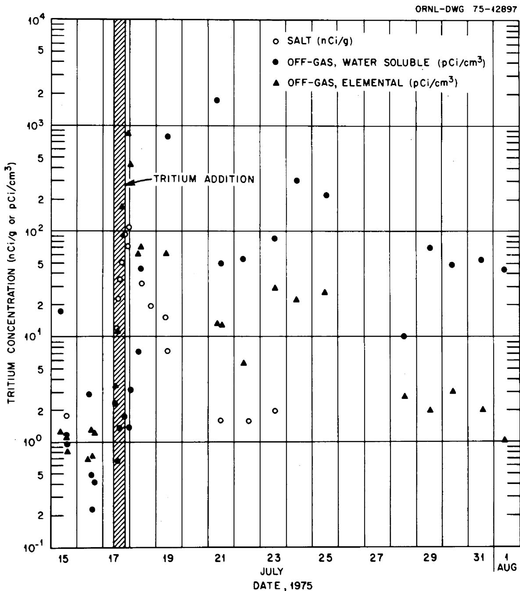  
Fig. 1.1. Observed tritium concentrations in CSTF, test 1.

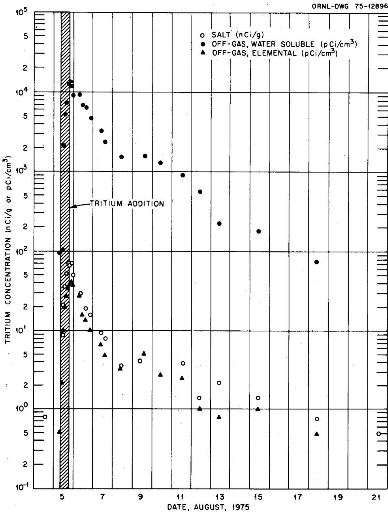  
Fig. 1.2. Observed tritium concentrations in CSTF, test 2.

tests. The concentrations reported for the salt represent tritium in a chemically combined form, since any elemental HT trapped in the samples would have been released in preparing them for scintillation counting. The tritium in the off-gas was present in two distinctly different chemical forms. Part of the tritium activity was present in a water-soluble form, implying a chemical compound, since HT does not interact significantly with water at room temperature. The other form is presumed to be elemental HT, since it was trapped in water after passage of the sample stream through a bed of hot CuO.

In all cases the results are presented in Figs. 1.1 and 1.2 as reported, with no corrections for apparent baseline concentrations. However, the results of samples taken before and after each test suggest that nonzero baseline concentrations were present. The apparent baseline concentrations for the two experiments were:

<table><tr><td></td><td>1st experiment</td><td>2d experiment</td></tr><tr><td>In salt</td><td>1.7 nCi/g</td><td>1 nCi/g</td></tr><tr><td>In off-gas, elemental</td><td>1 pCi/cm3</td><td>1 pCi/cm3</td></tr><tr><td>In off-gas, water soluble</td><td>1 pCi/cm3</td><td>50 pCi/cm3</td></tr></table>

During the tritium addition period for the first experiment the tritium concentration in the salt (Fig. 1.1, open circles) increased, almost linearly, to a maximum of about $100\mathrm{nCi / g}$ , and then decreased approximately exponentially over the following 3 to 4 days to its pretest baseline concentration. In the second experiment (Fig. 1.2, open circles) the tritium concentration in the salt reached a maximum of $70\mathrm{nCi / g}$ and returned to the baseline concentration about 6 to 7 days later. If baseline corrections are applied to the salt-sample data, the apparent half-lives for tritium removal from the salt for the two experiments are 9.2 and $12\mathrm{hr}$ respectively.

If tritium removal from the salt is assumed to be a pure first-order process or combination of such processes, and if it is assumed that the processes were also active during the addition period, the buildup of the tritium inventory in the salt (for a constant addition rate) should be described by

$$
N (t) = \underset {\lambda} {\overset {A} {\longrightarrow}} \left(1 - e ^ {- \lambda t}\right),
$$

where

$N(t) =$ tritium inventory in salt at any time $t$ during the addition,

$A =$ tritium addition rate,

$\lambda =$ time constant for the removal process (or processes).

If several first-order processes were involved in the tritium removal from the salt, the time constant $\lambda$ would be the sum of the several individual time constants, but the individual values would not be identifiable. Substitution of the actual addition rate into this equation gives the expected tritium inventory in the salt at any time, if all of the tritium were reacting with the salt. Conversely, substitution of observed inventory values permits evaluation of the effective addition rate (the rate at which tritium did react with the salt). In either case the results may be expressed as tritium trapping efficiencies with values of 85 and $50\%$ , respectively, for the two experiments. These trapping efficiencies imply that significant quantities of the added material were reacting with and being trapped (at least temporarily) by the salt. Data from the second experiment suggest the presence of other mechanisms with significantly longer time constants for removal of tritium from the salt. Because of the apparent scatter in the data at longer times, the extraction of these time constants was not attempted.

The water-soluble tritium in the off-gas during the first experiment (Fig. 1.1, closed circles) did not increase significantly until after the injection was completed, and then rose to $1750\mathrm{pCi/cm^3}$ . The level then dropped rapidly to about $50\mathrm{pCi/cm^3}$ , rose again to about $300\mathrm{pCi/cm^3}$ 6.5 days after the addition, and then decreased to lower values. In the second experiment the water-soluble tritium in the off-gas rose rapidly during the addition period and reached a maximum value at the end of the addition of $13,100\mathrm{pCi/cm^3}$ . Also, the ratio of the concentration of water-soluble tritium in the off-gas to that of the elemental form was substantially greater in the second experiment than in the first.

Owing to the apparent scatter in the data involving the water-soluble tritium in the off-gas for the first experiment, no quantitative evaluation was attempted. However, in the second test, the initial decrease in concentration has an apparent half-life of $18\mathrm{hr}$ , but the data again suggest the presence of other time constants. An attempt was made to separate the time constants by assuming that the decay curve was made up of two simple, first-order exponentials. This led to apparent half-lives of 9.3 and $37\mathrm{hr}$ for the two processes. Numerical integration of the water-soluble tritium data for the second experiment yielded a total flow of $58\mathrm{mCi}$ through the off-gas line during the removal period and $7.5\mathrm{mCi}$ during the addition period. Thus, a total of $65\mathrm{mCi}$ or about $65\%$ of the tritium added is accounted for as combined tritium in the off-gas stream during this test. Since the concentration of elemental tritium was

always less than 0.01 of the combined tritium concentration, the presence of any elemental tritium does not significantly affect this observation.

The concentration of elemental tritium in the off-gas samples rose during the addition phase of each experiment and apparently began to decrease as soon as the addition was stopped. The maximum concentration in the first test was about $800\mathrm{pCi/cm^3}$ and only 40 $\mathrm{pCi/cm^3}$ in the second. In both cases the decrease in concentration with time after the addition was too irregular to justify any quantitative evaluation.

Although no measure of elemental tritium concentration in the salt is available, a value can be inferred from the concentration in the off-gas by (1) assuming that the elemental tritium in the off-gas samples represents release from the salt and only from the salt, and (2) assigning reasonable values to gas stripping parameters in the CSTF pump tank. Concentrations of elemental tritium calculated in this way indicate that the ratios of combined/elemental tritium in the salt were about 50 and 530 in the first and second experiments respectively. It appears that chemical interactions between the tritium-containing compound in the off-gas and the new metal of the sample line may have been responsible for the high concentrations of elemental tritium in the off-gas samples from the first test and that the actual ratio of combined/elemental tritium in the salt may have been higher than 50.

The inferred maximum concentration of elemental tritium in the salt during the second experiment is about $0.13\mathrm{nCi / g}$ . Extension of the calculated tritium distribution with nominal metal-wall permeability (Table 1.2) to lower concentrations indicates that, at $0.13\mathrm{nCi / g}$ , tritium permeation through the loop walls could account for no more than about one-third of the tritium added to the system. Since this is close to the amount not accounted for in the off-gas samples, it appears that the effective permeability of the loop walls is near that of bare metal.

# 1.2 XENON BEHAVIOR IN THE MSBR

# G. T. Mays

The computer program MSRXEP (Molten-Salt Reactor Xenon Poisoning) describing the $^{135}\mathrm{Xe}$ behavior in the reference-design MSBR was used to perform calculations to study the effects of the Knudsen diffusion coefficient for xenon in the bulk graphite and graphite coating of the reactor core on the $^{135}\mathrm{Xe}$ poison fraction. The program has been described previously.[6,7]

Following the fission of the fuel, the decay of the mass-135 fission fragments is assumed to follow the decay chain shown below:

$$
\begin{array}{l} ^ {1 3 5} \mathrm {S b} \xrightarrow {\beta} ^ {1 3 5} \mathrm {T e} \xrightarrow {\beta} ^ {1 3 5} \mathrm {I} \\ (1. 7 \sec) \end{array}
$$

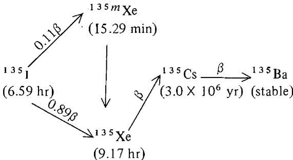

This diagram illustrates the half-life of each isotope and the branching ratio of the $^{135}\mathbf{I}$ decaying to $^{135}m\mathbf{Xe}$ and $^{135}\mathbf{Xe}$ assumed for this study. Along with this decay chain the following input data were used:

Bubble concentration: 44 bubbles per cubic centimeter of salt

Total helium dissolved in salt and present in gas bubbles: $1.0 \times 10^{-6} \, \text{mole/cm}^3$

Bubble separator efficiency: $90\%$

For these conditions the mass transfer correlation in the program gives a bubble mass transfer coefficient of 0.0166 cm/sec, which leads to a loop-averaged void fraction of $0.55\%$ with an average bubble diameter of 0.65 mm. The calculated $^{135}\mathrm{Xe}$ poison fraction is 0.0046.

The reference Knudsen diffusion coefficients for the bulk graphite and graphite coating associated with the 0.0046 poison fraction are $2.58 \times 10^{-9}$ and $2.58 \times 10^{-6} \, \text{cm}^2/\text{sec}$ respectively.* The bulk graphite values were varied from $2.58 \times 10^{-9}$ to $2.58 \times 10^{-6} \, \text{cm}^2/\text{sec}$ , assuming no graphite coating was present (Table 1.3, cases 1, 3, 5, 7), to observe the effect on the poison fraction. The low-permeability graphite coating - 0.28 mm thick - was assigned bulk-graphite values for the Knudsen diffusion coefficient and porosity, making the coating part of the bulk graphite for calculation purposes. Under these conditions the porosity of the bulk graphite was held constant at a value about 31 times

Table 1.3. $^{135}\mathrm{Xe}$ poison fraction as a function of the Knudsen diffusion coefficient for the graphite coating and bulk graphite of the reactor core   

<table><tr><td></td><td colspan="2">Knudsen diffusion coefficient (cm3 gas/sec · cm graphite)</td><td rowspan="2">Calculated 135 Xe poison fraction</td></tr><tr><td></td><td>Bulk graphitea</td><td>Graphite coating</td></tr><tr><td>1.</td><td>2.58 × 10-6b</td><td>No coating</td><td>0.0153</td></tr><tr><td>2.</td><td>2.58 × 10-6</td><td>2.58 × 10-6</td><td>0.0152</td></tr><tr><td>3.</td><td>2.58 × 10-7</td><td>No coating</td><td>0.0140</td></tr><tr><td>4.</td><td>2.58 × 10-6</td><td>2.58 × 10-7</td><td>0.0145</td></tr><tr><td>5.</td><td>2.58 × 10-8</td><td>No coating</td><td>0.0113</td></tr><tr><td>6.</td><td>2.58 × 10-6</td><td>2.58 × 10-8</td><td>0.0107</td></tr><tr><td>7.</td><td>2.58 × 10-9</td><td>No coating</td><td>0.0077</td></tr><tr><td>8.</td><td>2.58 × 10-6</td><td>2.58 × 10-9c</td><td>0.0046d</td></tr></table>

${}^{a}$ Bulk graphite porosity value remains constant in all cases, $\sim  {31}$ times greater than the value for the graphite coating.   
$b_{\mathrm{Reference}}$ value for bulk graphite.   
$c_{\mathrm{Reference}}$ value for graphite coating.   
$d_{\text{Poisson fraction for reference case}}$ .

greater than that of the graphite coating.* In addition, the Knudsen diffusion coefficient for the graphite coating was varied within the same, aforementioned range while the diffusion coefficient of the bulk graphite was held constant at its reference value of $2.58 \times 10^{-6}$ $\mathrm{cm}^2/\mathrm{sec}$ to observe the effects on the poison fraction (cases 2, 4, 6, 8). The previously stated values involving bubble characteristics and mass transfer were held constant throughout this series of calculations.

The results (Table 1.3) indicate that Knudsen diffusion coefficients for the bulk graphite and graphite coating at least as low as the reference values $(2.58 \times 10^{-6}$ and $2.58 \times 10^{-9} \mathrm{~cm}^2/\mathrm{sec}$ , i.e., case 8) would be required to meet the 0.005 target value for the $^{135}\mathrm{Xe}$ poison fraction. A diffusion coefficient of less than $2.58 \times 10^{-9} \mathrm{~cm}^2/\mathrm{sec}$ would be required for the bulk graphite with no coating, because of its higher porosity. If the permeability of the graphite coating did not yield a diffusion coefficient equal to that of the reference value, such a coating would have little effect on xenon poisoning. The penalty for not coating the graphite is about 0.01 in xenon poison fraction, or 0.01 in breeding ratio, if no attempt is made to decrease the permeability or porosity of the base material.

It may be noted in case 3 that a slight reduction in the Knudsen diffusion coefficient for the bulk graphite is

more effective in reducing the $^{135}\mathrm{Xe}$ poison fraction than a similar reduction in the Knudsen diffusion coefficient for the graphite coating in case 4. In cases 6 and 8, where the permeability of the coating is very low, reducing the Knudsen diffusion coefficient for the graphite coating affects the $^{135}\mathrm{Xe}$ poison fraction much more strongly.

# 1.3 NEUTRONIC ANALYSIS

H. T. Kerr D. L. Reed E. J. Allen

The neutronic analysis work during this reporting period has involved several tasks aimed at additional description of the neutronic characteristics of an MSBR and the provision of neutronics information for the fueled in-reactor irradiation experiments.

# 1.3.1 MSBR Studies

Neutronic analysis studies for the reference-design MSBR are in progress in three areas:

1. development of a two-dimensional neutronic computational model of the MSBR, using the computer code VENTURE and reestablishing the operability of a reactor optimization code (ROD),   
2. updating the neutron cross-section data base used by various computer programs,   
3. calculation of the rate at which helium will be produced in the reactor vessel of the MSBR.

Computational models. A neutronic computational model of the MSBR, using the computer code VENTURE, is being developed. VENTURE is a multidimensional, multigroup, neutron diffusion computer code. The MSBR model will have nine neutron energy groups and the $(r - z)$ geometry shown in Fig. 1.3. The various zones in the model allow for different core compositions and cross-section sets. In addition to providing a check of the design studies made with the ROD code using one-dimensional calculations, this model will permit explicit evaluation of the nuclear reactivity effects associated with localized core perturbations, such as limited core voiding. Previously such effects were conservatively estimated from calculations for an infinite medium of salt and graphite.

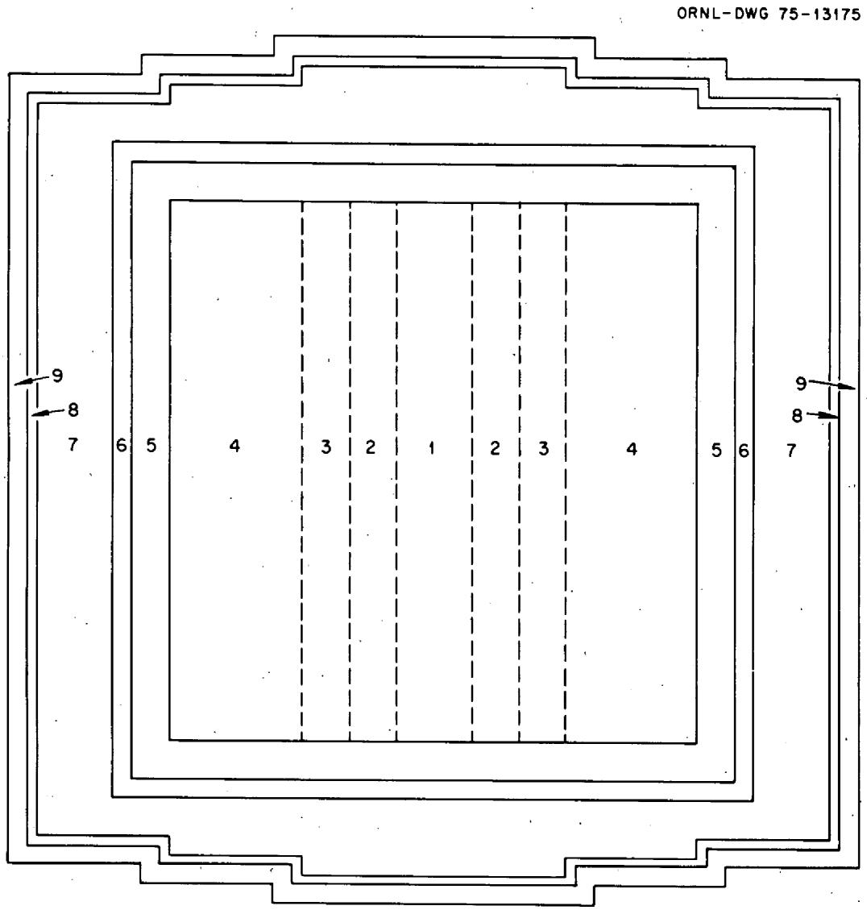  
Fig. 1.3. Two-dimensional computational model of MSBR.

<table><tr><td rowspan="2">ZONE</td><td rowspan="2">NO.</td><td rowspan="2"></td><td rowspan="2">PERCENT FUEL SALT</td><td colspan="2">THICKNESS (cm)</td></tr><tr><td>RADIAL</td><td>AXIAL</td></tr><tr><td>1</td><td></td><td>CONTROL RODS</td><td></td><td>17.2</td><td>219.5</td></tr><tr><td>2</td><td></td><td>CORE IA</td><td>13.2</td><td>32.8</td><td>219.5</td></tr><tr><td>3</td><td></td><td>CORE IA</td><td>13.2</td><td>50.0</td><td>219.5</td></tr><tr><td>4</td><td></td><td>CORE IB</td><td>13.2</td><td>119.5</td><td>219.5</td></tr><tr><td>5</td><td></td><td>CORE II A AND B</td><td>37.0</td><td>38.1</td><td>25.4</td></tr><tr><td>6</td><td></td><td>SALT ANNULUS</td><td>100.0</td><td>5.1</td><td>5.1</td></tr><tr><td>7</td><td></td><td>GRAPHITE REFL.</td><td>1.0</td><td>76.2</td><td>61.0 (MAX.)</td></tr><tr><td>8</td><td></td><td>SALT ANNULUS</td><td>100.0</td><td>0.6</td><td>0.6</td></tr><tr><td>9</td><td></td><td>REACTOR VESSEL</td><td></td><td>5.1</td><td>5.1</td></tr></table>

ROD is a computer program for nuclear and fuel-cycle analyses of circulating-fuel reactors. It consists essentially of a neutronics subprogram, an equilibrium-concentration subprogram, and an optimization subprogram. Variables such as breeding ratio, fuel composition, etc., can be optimized with respect to cost.

The operational status of the ROD code has been re-established by running a test case for the reference-design 1000-MW(e) MSBR, using the old cross-section data previously generated for the MSR program. The test case will be rerun using the ENDF/B-IV cross sections, and any significant differences will be evaluated and reported.

Generation of updated cross-section data. The necessary descriptive information for the neutronic model for use in the computer code VENTURE has been collected, and the most recent $\mathrm{ENDF}^{10}$ cross-section data are needed. (The neutron cross-section data used for MSBR analysis were originally derived from the GAM-II and ENDF/B-I libraries with some ORNL modifications,[11] and no recent updates have been made.) The new cross-section data are being obtained exclusively from the ENDF/B-IV data files, using the $\mathrm{AMPX}^{12}$ processing system. This effort will provide evaluated cross-section data and neutron energy spectra for typical regions of an MSBR and will serve as the data base for subsequent MSBR nuclear analyses. The steps involved in this process are:

1. Calculate 123-neutron-energy-group cross sections from the ENDF/B-IV library. The ENDF point data for 39 nuclides are weighted over an assumed energy spectrum to derive multigroup cross sections. Thermal scattering cross sections are treated at 300, 600, 900, and $1200\mathrm{K}$ for each nuclide.   
2. Determine contributions to the multigroup cross sections from resolved resonances; resonance self-shielding is treated for the various fuel configurations at $900\mathrm{K}$ .   
3. Perform fuel-moderator cell calculations for four geometries to adjust the cross sections for the flux depressions in regions having a high concentration of fuel or moderator (cell homogenization calculations).

4. Perform a one-dimensional neutron transport calculation of the MSBR core to determine 123-group spectra and collapse the 123-group cross-section set to nine groups for each of the various zones in the model.   
5. Reorder the nine-group set from nuclide ordering to group ordering; the cross sections are then ready for use in VENTURE and ROD.

The initial processing step is capable of treating nuclides in groups of from 1 to 3, depending upon the amount of data in the ENDF/B-IV file for each nuclide. This step is now complete for all the nuclides of interest, except $^{232}$ Th.

Helium production in reactor vessel. The helium production in the reactor vessel for the present reference design and possible alternate designs will be estimated in conjunction with the neutronic modeling of the MSBR. (Neutron energy spectra and flux magnitudes in the reactor vessel as obtained from the neutronic model provide the basis for calculating helium production rates.)

Helium is produced in nickel-base alloys primarily from these reactions:

$$
\begin{array}{l} { } ^ { 5 8 } \mathrm { N i } \xrightarrow { n } { } ^ { 5 9 } \mathrm { N i } \xrightarrow { n } { } ^ { 5 6 } \mathrm { F e } + { } ^ { 4 } \mathrm { H e } , \\ { } ^ { 5 . 8 } \mathrm { N i } \xrightarrow { n } { } ^ { 5 . 5 } \mathrm { F e } + { } ^ { 4 } \mathrm { H e } , \\ { } ^ { 6 0 } \mathrm { N i } \xrightarrow { n } { } ^ { 5 7 } \mathrm { F e } + { } ^ { 4 } \mathrm { H e } . \\ \end{array}
$$

The $^{58}\mathrm{Ni}(n,\alpha)$ and the $^{60}\mathrm{Ni}(n,\alpha)$ reactions are induced only by high-energy neutrons, whereas the $^{58}\mathrm{Ni}(n,\gamma)$ and $^{59}\mathrm{Ni}(n,\alpha)$ reactions are induced primarily by low-energy neutrons. In highly thermalized neutron energy spectra, as in the MSBR vessel, the two-step reaction $^{58}\mathrm{Ni}(n,\gamma)^{59}\mathrm{Ni}(n,\alpha)$ is the principal source of helium. The $^{59}\mathrm{Ni}$ cross sections are not well known, but differential measurements are being made by ENDF participants. $^{13}$ Also, helium analyses are available from several irradiated nickel specimens, and effective integral cross sections will be derived from these data for comparisons with the measured cross sections.

At present, some cross-section information is available for the $^{59}\mathrm{Ni}(n,\alpha)$ reaction. Values for the 2200-m/sec (i.e., 0.0253-eV) cross section have been reported as 13.7 barns $^{14}$ and 18 barns. $^{13}$ It has also been reported $^{13}$ that a large resonance occurs at 203.9 eV with a total width, $\Gamma$ , of 13.9 eV. From this information a preliminary estimate of the shape and magnitude of the

cross section can be deduced and 123-group cross sections generated.

From the Breit-Wigner one-level formula,

$$
o (E) = \left. (K / E ^ {1 / 2}) \left\{1 / \left[ (E - E _ {r}) ^ {2} + \Gamma^ {2} / 4 \right] \right\} \right.,
$$

where

$$
K = \text {c o n s t a n t},
$$

$$
E = \text {n e u t r o n}
$$

$$
E _ {r} = \text {r e s o n a n c e e n e r g y (2 0 3 . 9 e V)},
$$

$$
\Gamma = \text {t o t a l} (1 3. 9 \mathrm {e V}).
$$

The constant $K$ can be determined from the value of the cross section at 0.0253 eV, which for this study is assumed to be either 13.7 or 18 barns. Energy-dependent cross sections can be generated, and the helium production can then be estimated with the following equation:

$$
\begin{array}{l} N _ {\mathrm {H e}} (t) = \left[ \sigma_ {3} \sigma_ {1} / \left(\sigma_ {2} - \sigma_ {1}\right) \right] N ^ {0} \\ \times \left\{\left[ 1 - \exp \left(- \sigma_ {1} \phi t\right) \right] / \sigma_ {1} \right. \\ \left. - \left[ 1 - \exp \left(- \sigma_ {2} \phi t\right) \right] / \sigma_ {2} \right\}, \\ \end{array}
$$

where

$$
\begin{array}{l} \sigma_ {1} = (n, \gamma) \text {c r o s s s e c t i o n o f} ^ {5 8} \mathrm {N i}, \\ \sigma_ {2} = \text {a b s o r p t i o n c r o s s s e c t i o n o f} ^ {5 9} \mathrm {N i}, \\ \sigma_ {3} = (n, \alpha) \text {c r o s s s e c t i o n o f} ^ {5 9} \mathrm {N i}, \\ N ^ {\infty} = \text {i n i t i a l} ^ {5 8} \mathrm {N i} \text {c o n c e n t r a t i o n}, \\ \phi = \text {n e u t r o n} f l u x, \\ t = \text {t i m e}, \\ N _ {\mathrm {H e}} (t) = \text {h e l i u m c o n c e n t r a t i n g} t. \\ \end{array}
$$

# 1.3.2 Analysis of TeGen Experiments

Fission rates and tellurium production rates for the fuel pins in the TeGen-1 irradiation experiment were reported in the preceding MSR semiannual report. The fission rates were estimated by a flux mapping experiment, direct flux monitoring of the TeGen-1 capsule, and computational analyses. The tellurium concentrations in the fuel pins were calculated from these fission rates, but no estimates for the accuracy of the calculated tellurium concentrations were given in the report.

The accuracy of the $^{233}\mathrm{U}$ fission product yield data leads to an estimated uncertainty for the yield of tellurium in the TeGen-1 capsule of about $13.5\%$ . Assuming that the uncertainty in the estimated fission rates is $\pm 15\%$ , the uncertainty in the reported tellurium concentrations is about $20\%$ .

The TeGen-2 experimental capsule is scheduled to be inserted into the ORR for irradiation in October 1975. Flux monitors will be loaded into the capsule prior to the capsule's insertion into the ORR. After the TeGen-2 capsule is removed from the reactor, the monitors will be recovered and their induced activities measured to develop estimates of the tellurium production rates for TeGen-2.

# 1.4 HIGH-TEMPERATURE DESIGN METHODS

# G. T. Yahr

Thermal ratchetting and creep-fatigue damage are important considerations in the structural design of high-temperature reactor systems. Simplified analytical methods in ASME Code Case 1592 (ref. 17) and RDT Standard F9-4T (ref. 18) permit the assessment of ratchetting and creep-fatigue damage on the basis of elastic-analysis results, provided a number of restrictive conditions are met. Otherwise, detailed inelastic analyses, which are usually quite expensive for the conditions where they are currently necessary, are required to show that code requirements are met. Analytical investigations to extend the range over which simplified ratchetting and creep-fatigue rules may be used to show compliance with code requirements are being performed under the ORNL High-Temperature Structural Design Program, which is supported in part by the MSRP. Modeling procedures for applying the simplified ratchetting rules to geometries and loadings prototypic of those encountered in LMFBR component designs are to be identified. Then the conservative applicability of these ratchetting rules and procedures and of elastic creep-fatigue rules will be demonstrated and placed on a reasonably sound and defensible engineering basis. Finally, an assessment will be made of the applicability of the simplified design methods to Hastelloy N under MSBR design conditions, and the importance of thermal ratchetting in an MSBR will be determined.

The detailed plans for achieving the stated objectives were given in a previous progress report. The basic approach is to perform a relatively small number of carefully planned and coordinated rigorous elastic-plastic-creep ratchetting-type analyses of the geometries illustrated in Fig. 1.4. Each geometry is subjected to the axial, bending, thermal transient, and pressure loadings described in Table 1.3.1 of ref. 19. Structural problems 1 and 2 are being analyzed at ORNL, using the PLACRE computer program, while problems 3 and 4 are being analyzed by Atomics International and Combustion Engineering, respectively, using the MARC computer program. Each inelastic analysis will include a complete code evaluation for accumulated strains and creep-fatigue damage. Also associated with each in

elastic analysis are a number of elastic analyses to provide the input parameters required to apply the various simplified ratchetting rules and procedures and elastic creep-fatigue rules. The progress to date on these studies is discussed below.

Both AI and CE have encountered difficulties in their three-dimensional inelastic analyses. Although consider-

19. J. M. Corum and G. T. Yahr in MSR Program Semiannu. Progr. Rep. Feb. 28, 1975, ORNL-5047, pp. 15-22.   
20. W. K. Sartory, "Finite Element Program Documentation," High-Temperature Structural Design Methods for LMFBR Components Quart. Progr. Rep. Dec. 31, 1971, ORNL-TM-3736, p. 66.   
21. MARC-CDC, developed by MARC Analysis Research Corporation, Providence, RI.

ORNL-DWG75-7268

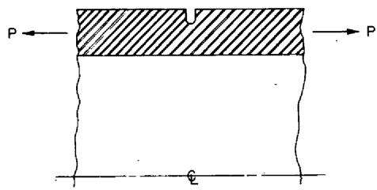  
TYPE I: NOTCHED CYLINDRICAL SHELLS

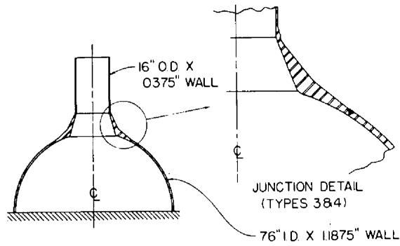  
TYPE 3: NOZZLE-TO-SPHERICAL SHELL

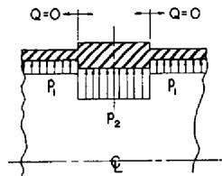  
TYPE 2: CYLINDRICAL SHELLS   
(a) STEPPED WALL THICKNESS

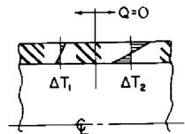  
(b) UNIFORM WALL WITH DIFFERENTIAL RATCHETTING

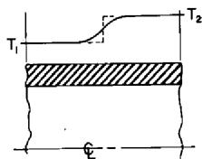  
(c) UNIFORM WALL WITH AXIAL TEMPERATURE VARIATION

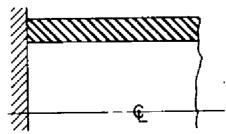  
(d) BUILT-IN CYLINDER

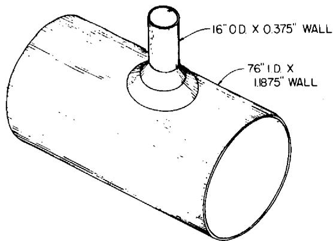  
TYPE 4: NOZZLE-TO-CYLINDRICAL SHELL (IHX INLET NOZZLE)   
Fig. 1.4. Structural configurations used in the analytical investigation of the applicability of simplified ratchetting and creep-fatigue rules.

able effort has gone into developing finite-element models that are of a size that can be accommodated on present-day computers and into improving the MARC computer program, the large 3-D inelastic analyses are proving considerably more expensive to run than had been expected.

The experience at AI and CE indicates the importance of developing simplified methods of analysis. Three-dimensional inelastic analysis of many realistic component geometries is too expensive and time consuming at present to be used routinely. Although developments in computers and stress analysis programs may bring the cost down in the future, it is desirable, meanwhile, to minimize the number of inelastic analyses that must be done.

# 1.4.1 Circular Cylindrical Shells*

Nine cases of circular cylindrical shells have been proposed for the present study. Two of the cases involve notched shells. The other seven cases involve axial variations in temperature, pressure, and/or wall thickness, or a built-in wall. All nine cases were to be analyzed using the ORNL in-house finite-element program PLACRE.

A ten-cycle inelastic analysis and a one-cycle elastic analysis have now been completed for all nine cases. Both the inelastic and the elastic results for all nine cases have been completely postprocessed.

Because of modifications to the creep-fatigue damage rules presently under study by the ASME Boiler and Pressure Vessel Code Working Group on Creep/Fatigue, it may be necessary to modify the ORNL postprocessor and repeat some of the postprocessing to keep the present study up to date.

# 1.4.2 Nozzle-to-Spherical Shell†

After some difficulties, the MARC computer code is operational on the IBM computer at the Rockwell International Western Computing Center, and check cases have demonstrated that this code will perform satisfactorily.

Considerable effort has gone into developing the finite-element model of the nozzle-to-spherical shell. An isoparametric three-dimensional 20-node brick element will be used to model the entire geometry. Because of symmetry about the plane of the applied moment, only half of the nozzle-to-spherical shell has to be modeled. There are six $30^{\circ}$ -wide elements around

the half-model. There are three elements through the wall at the root section of the nozzle and only one element through the wall in both the nozzle and the sphere away from the intersection region.

A series of elastic analyses must be done, since this is a thermal stress problem in which temperature varies with time. Since the moment applied to the nozzle is the only nonaxisymmetric load, the principle of superposition will be used to reduce the cost of the elastic analyses. A series of axisymmetric analyses were done to determine the stresses due to the internal pressure and temperature, and one three-dimensional analysis was done to determine the stresses due to the moment applied to the nozzle. The stresses from the three-dimensional analysis will be added to the stresses from the axisymmetric analyses to obtain the total elastic stresses.

The axisymmetric model in the elastic analyses was used to determine what maximum thermal load increment may be employed without having to do an excessive number of iterations during each increment. On this basis, the first cycle of the three-dimensional inelastic analysis was divided into 32 increments. The first three increments of the three-dimensional inelastic analysis have been completed. The computer cost for these three increments was higher than anticipated. Efforts will be made to find some way to reduce the cost to an acceptable level.

# 1.4.3 Nozzle-to-Cylinder Intersection

The original concept for the inelastic ratchetting-type analysis of the nozzle-to-cylinder intersection was to perform two separate analyses: (1) a thin-shell analysis of the whole structure, and (2) a detailed three-dimensional solid analysis of the intersection only. Displacements and forces to be applied at the boundaries of the three-dimensional solid model of the intersection were to be determined from the shell model at the end of each loading increment. The total computer time of the two analyses would be less than that required for the solution of the problem, using one model of the complete nozzle-to-cylinder intersection with sufficiently small elements in the intersection region. However, the transfer of the forces and deflections from the shell analysis to the three-dimensional solid analysis was found to be more difficult than anticipated. Because the shell element and solid element have different displacement functions, a special constraint must be imposed on the shell elements at the boundaries of the three-dimensional solid model to assure compatibility. This

stiffens the intersection in the shell model. When running the initial elastic analyses, it was found that small changes in the displacement boundary conditions applied to the solid model would produce large changes in the results of the analysis. From a pragmatic viewpoint, the biggest difficulty with the two-model method is assuring that the correct data are transferred from the shell analysis to the solid analysis at every increment in loading.

Due to the above considerations, it was decided to do the analysis by using only one model, made up of a combination of a reduced integration shell element and a 20-node solid element which are fully compatible with each other.

It was necessary to restructure a large portion of the MARC program to perform the inelastic analysis for the

3-D model of the nozzle-to-cylinder intersection. This restructuring made a larger core available for the analysis. The restructuring involved stripping unneeded portions of the program, putting common space on low-cost storage, and eliminating mesh optimization and its correspondence table.

The inelastic analysis of the nozzle-to-cylinder intersection was started. The full pressure and nozzle-moment loadings were imposed on the structure, which resulted in stresses less than 0.936 of the yield stress at $870\mathrm{K}$ $(1100^{\circ}\mathrm{F})$ . When the first increment of thermal load was applied, convergence was not obtained because of an error in the computer program, which is being corrected.

# 2. Systems and Components Development

R. H. Guymon

# 2.1 GAS-SYSTEMS TECHNOLOGY FACILITY

R.H.Guymon G.T.Mays

After a brief shutdown at the beginning of this reporting period to modify running clearances in the pump, water operation of the Gas-Systems Technology Facility (GSTF) was resumed on March 11, 1975, with the bypass loop blanked (Fig. 2.1). Considerably larger salt-pump shaft oscillations were encountered than before the labyrinth clearances were increased. After obtaining calibration data for the main-loop variable-flow restrictor and for the salt pump at low flows, the loop was shut down to install the bypass loop variable-flow restrictor. Water testing was then resumed on April 14 and continued throughout the period.

Data for calibration on the bypass loop variable-flow restrictor and for the salt pump were obtained. At normal pump speed the head-capacity performance of the installed impeller was $\sim 3\%$ below the nominal loop design conditions. At the nominal liquid flow rate and pressure drop in the main loop, the flow rates from the gas outlets of the bubble separator were satisfactory. Although loop cavitation (as indicated by noise level) was reduced by replacing the variable-flow restrictors with orifices, the amplitude of the salt-pump shaft oscillations was not reduced appreciably. Preliminary infor

1. R. H. Guymon and W. R. Huntley, MSR Program Semiannu. Progr. Rep. Feb. 28, 1975, ORNL-5047, pp. 23-25.

mation shows that leakage past the salt-pump shaft labyrinth is higher than desirable, and attempts will be made to reduce this.

Tests under actual operating conditions with water in the loop indicated that the densitometer will be satisfactory for salt operation. Preliminary information obtained from saturating the loop water with air and then stripping the air by injecting helium at the bubble generator indicated the need for monitoring the oxygen concentration in the off-gas from the bulk salt separator, in the off-gas from the salt pump, in the loop water, and perhaps in the water in the pump tank. Difficulties were also encountered with the response time of the oxygen monitors and with the reproducibility of their readings.

# 2.1.1 Cavitation and Salt-Pump Shaft Oscillations

Data on the salt-pump shaft deflections and oscillations obtained during the previous period1 indicated that the running clearances at the labyrinth (fountain flow area) and at the impeller hub should be increased to prevent contact of the metal surfaces during operation with salt (Fig. 2.2). After increasing the clearances, water operation was restarted with the bypass loop blanked off. The shaft oscillations were much larger than they had been previously under similar conditions. Turbulence or cavitation as indicated by noise was the apparent cause. For more flexibility in operating conditions, the bypass-loop variable-flow restrictor was installed. Loop parameters were then recorded at many

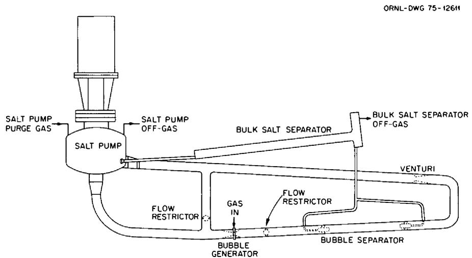  
Fig. 2.1. Gas-Systems Technology Facility.

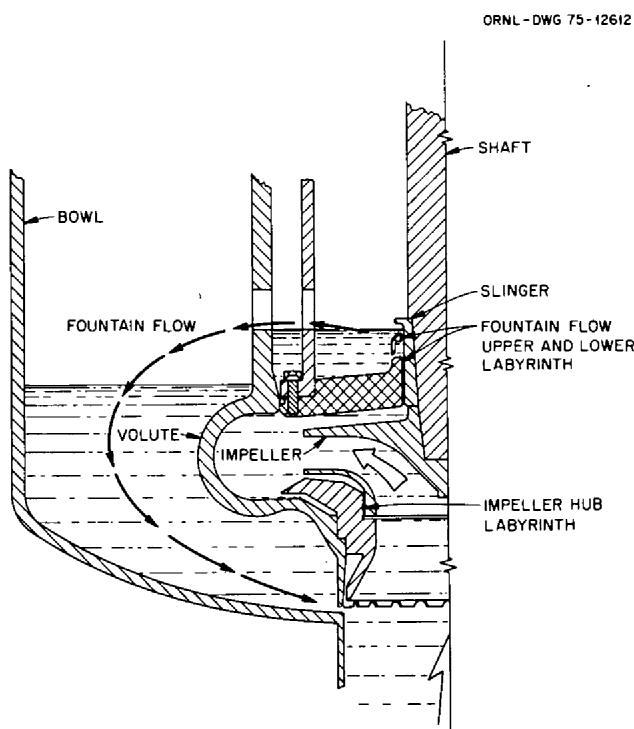  
Fig. 2.2. GSTF salt pump.

combinations of salt-pump speed and settings of the main-loop and bypass-loop variable-flow restrictors.

Log-log plots were made of pressure drops across various sections of the loop as functions of the flow rates through the segments. Since the head loss for a fixed resistance is proportional to a fixed power of the fluid velocity, the curves should be straight lines unless the character of the resistance changes due to cavitation. The plots indicated that cavitation was occurring in the main loop between the inlet to the main-loop variable-flow restrictor (FE-102A) and the throat of the bubble generator at flow rates above $320\mathrm{gpm}$ (1200 liters/min) with the variable-flow restrictor set at 1 in. $(25\mathrm{mm})$ above $470\mathrm{gpm}$ with the variable-flow restrictor at 2 in. (1800 liters/min at $51\mathrm{mm}$ ), above $600\mathrm{gpm}$ with the variable-flow restrictor at 3 in. (2300 liters/min at $76\mathrm{mm}$ ) and above $630\mathrm{gpm}$ with the variable-flow restrictor at 4 in. (2400 liters/min at $102\mathrm{mm}$ ). The data were not sufficiently precise to determine whether cavitation was also occurring in the bypass loop; however, noise indicated that it was.

Since the loop turbulence and/or cavitation as indicated by noise and the salt-pump shaft oscillations were unacceptable at conditions required by the bubble separator design, changes were made in the main-loop and bypass-loop flow restrictions. By replacing each variable-flow restrictor with two or more orifices in series, the loop noise level was decreased, but there was

little or no decrease in the amplitude of the shaft oscillations.

The amplitude of the shaft oscillations was plotted as a function of salt-pump speed at various operating conditions (Fig. 2.3). At salt-pump speeds less than about $1600\mathrm{rpm}$ , the oscillations were reasonably small and at any given speed appeared to be unaffected by: (1) flow rates between 450 and $1050\mathrm{gpm}$ (1700 to 4000 liters/min), (2) salt-pump overpressures between 5 and 15 psig $(1.3\times 10^{5}$ to $2.0\times 10^{5}\mathrm{Pa})$ , (3) type of restriction (variable-flow restrictors, orifices, or a combination of these), or (4) flow route (through the main loop, bypass loop, or both). At higher speeds the oscillation amplitude increased rapidly with increases in speed, and there was more scatter in the data, making it difficult to evaluate improvement in cavitation and effects of other variables. However, at any given speed above about $1700\mathrm{rpm}$ , increasing the flow rate (between 450 and $1050\mathrm{gpm}$ ) caused larger oscillations.

One possible explanation for the increased amplitude of the oscillations at higher speeds is that the shaft is approaching its critical vibration frequency and is therefore more sensitive to disturbances, such as loop turbulence or cavitation. The critical speed of this impeller assembly is $2280\mathrm{rpm}$ in air, which would indicate a maximum normal operating speed of $1710\mathrm{rpm}$ , using the normal industrial practice of operating pumps at less than $75\%$ of critical speed.

If the pump shaft oscillations were, in fact, a consequence of operation near the critical speed of the rotating assembly, two obvious alternatives were available to reduce the amplitude of the oscillations:

1. further reduction of the loop disturbances to minimize the driving forces that cause oscillation,   
2. operation at lower speeds to reduce the oscillatory response to disturbances.

The first alternative was rejected because it would have required extensive modification of the loop, and it was difficult to guarantee that all sources of such disturbances could be reduced to satisfactory levels. Design calculations showed that the desired flow and head (3800 liters/min at $30.5\mathrm{m}$ or 1000 gpm at 100 ft) could be obtained by replacing the present $11\%$ in.-diam $(290\mathrm{-mm})$ impeller with a 13-in.-diam $(330\mathrm{-mm})$ unit and operating it at $1500~\mathrm{rpm}$ . A larger impeller is being machined from an available Hastelloy N rough casting. Since the larger impeller will be somewhat heavier than the original one, it will cause a reduction in the critical speed of the rotating assembly. The estimated critical speed with the new impeller is $2000~\mathrm{rpm}$ , which makes the operating speed $75\%$ of the critical speed.

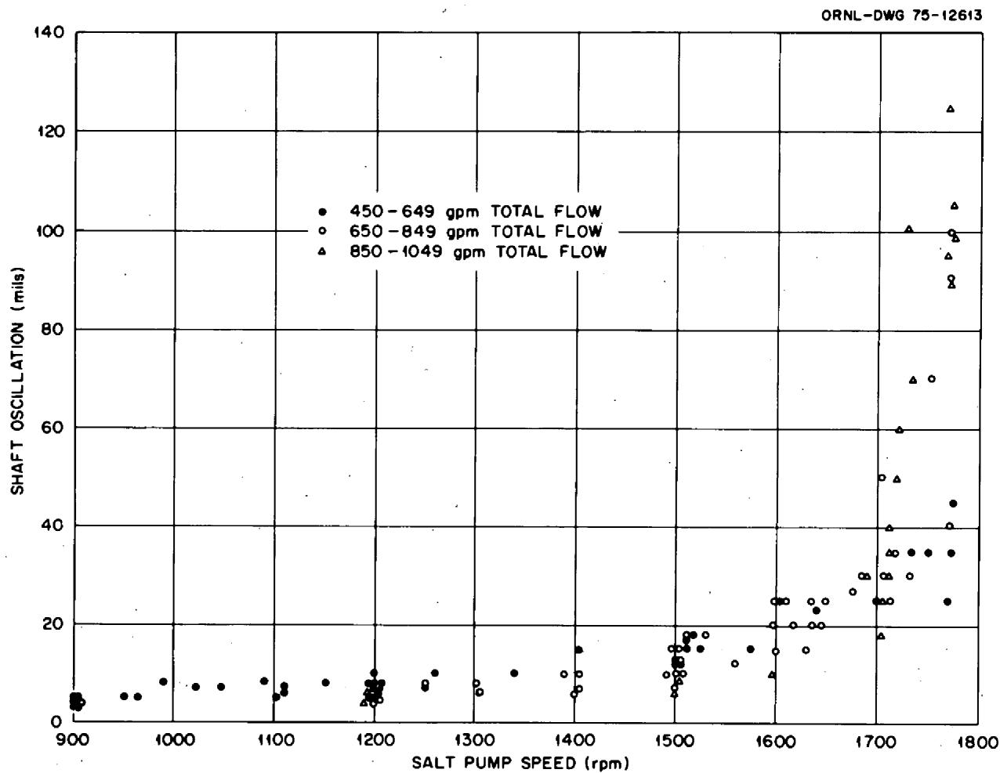  
Fig. 2.3. GSTF pump shaft oscillations.

At a few off-design conditions during some of the later runs, the pump shaft deflection records showed random spikes in one direction superimposed on the relatively uniform oscillations described earlier. These occurred with higher than normal flow rates in the main loop or at reduced system overpressure. Since either increasing the overpressure or injecting gas at the bubble generator reduced or eliminated these random oscillations, it was concluded that they were a consequence of cavitation at the bubble generator. Such cavitation and the attendant oscillations are not expected to occur at normal operating conditions.

# 2.1.2 Salt-Pump Performance Data and Calibration of the Variable-Flow Restrictors

The original design of the GSTF provided for varying the salt-pump speed and/or changing the variable-flow restrictor settings to obtain different flow rates or pres

sures needed for future experiments. However, instrumentation will not be provided for measuring the bypass-loop flow rate during salt operation, and only two salt pressure measuring devices will be installed (at the salt-pump discharge and at the bubble-separator discharge). Also, since the salt pump was modified and has a mismatched impeller-volute combination, no performance data were available. Therefore, extra pressure indicators were installed for the water tests, and loop pressure profiles were obtained at various pump speeds, flow rates, and variable-flow restrictor settings to evaluate the pump performance.

The calibration of the main-loop variable-flow restrictor and of the salt pump at low flow rates was straightforward, since, with the bypass loop blanked off, the total pump flow was measured directly by the main-loop venturi. However, once the bypass-loop variable-flow restrictor was installed, the calibration of it and

the pump was complicated. The main-loop variable-flow restrictor was closed, and the bypass-loop variable-flow restrictor was calibrated at low flow rates, using the pump calibration curves established before it was installed. The main-loop variable-flow restrictor was then opened to various settings, and the pump calibration curves were extended by adding the measured flow through the main loop to the flow through the bypass loop taken from the bypass-loop variable-flow restrictor calibration curves. Then using these extended head-capacity curves for the pump, it was possible to extend the calibration curves to higher flows.

The pump calibration curves (Fig. 2.4) indicate that at $1770\mathrm{rpm}$ the pump flow rate will be $970\mathrm{gpm}$ (3700 liters/min) at 100 ft $(30.5\mathrm{m})$ of head. The original design called for $500\mathrm{gpm}$ (1900 liters/min) through each loop; however, the bypass flow rate can be reduced to $470\mathrm{gpm}$ (1800 liters/min) without compromising any of the objectives.

To determine the main-loop variable-flow restrictor setting for normal operation with a flow rate of 500 gpm in the main loop, plots were made of the pump head vs flow for several settings of the flow restrictor. From these, a curve was made of pump head at 500 gpm (1900 liters/min) vs settings (Fig. 2.5). A 1.85-in. (47-mm) setting will give the desired head of 100 ft (30.5 m) at 500 gpm.

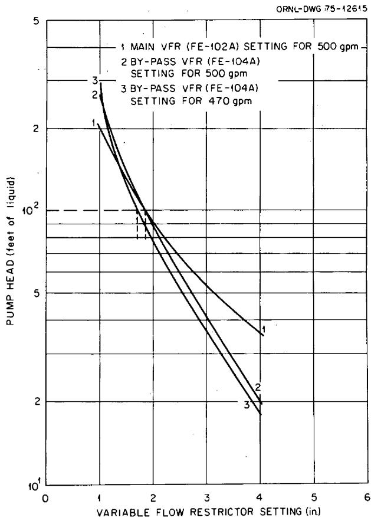  
Fig. 2.5. Variable-flow restrictor calibrations.

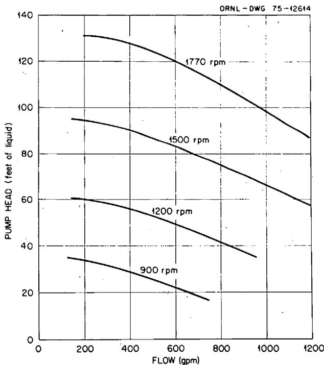  
Fig. 2.4. Head capacity curves for the GSTF pump.

The bypass variable-flow restrictor settings were determined similarly and found to be 1.85 in. (47 mm) at 500 gpm (1900 liters/min) or 1.70 in. (43 mm) at 470 gpm (1800 liters/min).

# 2.1.3 Salt-Pump Fountain Flow

The GSTF salt pump is a centrifugal sump pump having an impeller which rotates in a volute section which in turn is located in a pump bowl. The clearance between the impeller and the volute assembly at the pump inlet allows leakage from the discharge directly to the pump suction (see Fig. 2.2). A second bypass flow, called the fountain flow, escapes through the clearances between the impeller shaft and the volute assembly. This bypass stream flows into the pump bowl, circulates downward, and reenters the main stream at the pump suction. Due to the large liquid holdup and large surface area in the pump bowl, significant gas-liquid mass transfer can occur in the fountain flow stream, and therefore its flow rate is important in analyzing mass transfer processes in the loop. Since the fountain flow is not measured directly, a method using mass balances on

measured gas flows was developed to determine this flow rate.

A lumped-parameter model of the GSTF was used to develop equations from which an expression for the fountain flow was derived. The system model contains two major regions: the pump bowl and the primary loop (main and bypass segments), consisting of a gas section and a liquid section. Each section was assumed to be perfectly mixed. The three general time-dependent equations for a specific gas in a gas mixture are given in Table 2.1, representing gas mass balances for the pump-bowl gas section, the pump-bowl liquid section, and the primary-loop gas section (circulating voids).

These were simplified by applying the following assumptions:

1. There is no gas carry-under in the pump bowl, which implies that $(a)$ the efficiency for separation of bubbles from the fountain flow $(\epsilon_{f})$ is unity and $F_{L} = F_{f}(1 - \Psi_{L}) + F_{BS}$ , $(b)$ the bubble surface area in the pump bowl $(A_{2})$ , the void fraction in the pump bowl $(\Psi_{PB})$ , and the concentration of gas in the pump bowl $(C_{5})$ are nonapplicable or zero.   
2. Mass transfer equilibrium exists in the primary loop, which implies that the mass transfer term $h_3A_3(C_4 - KRTC_3)$ is zero.   
3. Steady-state conditions exist, making all time derivatives zero.   
4. $F_{P} = 0$ , since there was no gas purge flow during the experiments.

Therefore, Eq. (3), Table 2.1, reduces to

$$
F _ {B} - F _ {f} \Psi_ {L} - Q \Psi_ {L} \epsilon_ {s} = 0. \tag {4}
$$

Solving for $\Psi_L$

$$
\Psi_ {L} = F _ {B} / \left(F _ {f} + Q \epsilon_ {s}\right). \tag {5}
$$

By adding Eqs. (1) and (2), Table 2.1, and simplifying,

$$
\begin{array}{l} F _ {f} \Psi_ {L} C _ {3} + F _ {f} (1 - \Psi_ {L}) C _ {4} + F _ {B S} C _ {4} \\ - F _ {1} C _ {1} - F _ {f} \left(1 - \Psi_ {L}\right) C _ {2} + F _ {B S} C _ {2} = 0. \tag {6} \\ \end{array}
$$

By substituting Eq. (5) into Eq. (6), $F_{f}$ may be expressed in terms of a quadratic equation:

$$
\begin{array}{l} (C _ {4} - C _ {2}) F _ {f} ^ {2} + [ (Q \epsilon_ {s} - F _ {B} + F _ {B S}) (C _ {4} - C _ {2}) \\ + F _ {B} C _ {3} - F _ {1} C _ {1} ] F _ {f} + \\ \end{array}
$$

$$
Q \epsilon_ {S} \left[ F _ {B S} \left(C _ {4} - C _ {2}\right) - F _ {1} C _ {1} \right] = 0. \tag {7}
$$

Equation (7) is a general solution for the fountain flow, which depends upon the gas concentrations in

each of the three sections of the model. If it is assumed that mass transfer equilibrium exists at the gas-liquid interface in the pump bowl, the gas concentration in the pump bowl liquid $(C_2)$ is related to the corresponding concentration in the pump bowl gas section $(C_1)$ by Henry's law. If only one gas is involved (e.g., helium), $C_1$ follows directly from the pump bowl overpressure. Further, since mass transfer equilibrium was assumed for the primary loop, the gas concentration in the loop liquid (for a single gas) follows from the loop average pressure and Henry's law. Thus, the fountain flow may be evaluated from Eq. (7), using other known liquid flow rates and measurable gas flow rates into and out of the system. If no mass transfer is assumed to occur at the gas-liquid interface in the pump bowl, the gas concentration in the liquid leaving the pump bowl is the same as that in the entering liquid (i.e., $C_2 = C_4$ ), and Eq. (7) reduces to

$$
F _ {f} = \frac {Q \epsilon_ {s}}{\left(F _ {B} C _ {3} / F _ {1} C _ {1}\right) - 1}. \tag {8}
$$

Since the rate of mass transfer in the pump bowl is neither infinite nor zero, Eq. (7) will give a low indication and Eq. (8) will give a high indication of the fountain flow rate. The deviation from the actual fountain flow rate will depend on how much mass transfer actually occurs in any experiment. If the loop void fraction is increased (by increasing the gas input rate), the contribution of mass transfer across the gas-liquid interface to the flow rate of gas out of the pump bowl will be reduced relative to the bubble contribution. Therefore, a plot of the calculated fountain flow vs the reciprocal of the gas input rate at several different conditions should give the actual fountain flow rate when extrapolated to zero (infinite gas flow rate), using either Eq. (7) or (8).

The preceding equations and approach were used to calculate the fountain flow for the GSTF pump. Results from the plot indicated that the curves generated were not defined well enough to provide accurately the required extrapolations. The range of fountain flows at the highest gas input rate at which data were obtained was 100 to $200\mathrm{gpm}$ (380 to 760 liters/min).

Even the lower estimated value for the fountain flow may excessively complicate future mass transfer experiments; so efforts will be made to reduce this flow. Since the labyrinth clearances cannot be reduced without incurring metal-to-metal contact between the pump shaft and the volute, back vanes will be installed on the top of the impeller to minimize the differential pressure which drives the fountain flow.

Table 2.1. Gas mass balance equations for computation model of GSTF   

<table><tr><td rowspan="2">Equation1</td><td colspan="2">Rate of change of gas inventory in pump bowl in gas space</td><td>=</td><td>gas purge flow in</td><td>+</td><td>bubbles separated from fountain flow</td><td>+</td><td>mass transfer of dissolved gas across liquid-gas interface</td><td>-</td><td>flow of off-gas from pump bowl</td><td></td></tr><tr><td colspan="2">V1dC1/dt</td><td>=</td><td>FpCp</td><td>+</td><td>FfΨLfC3</td><td>+</td><td>h1A1(C2-KRTC1)</td><td>-</td><td>F1C1</td><td></td></tr><tr><td rowspan="2">Equation2</td><td>Rate of change of gas inventory dissolved in pump bowl liquid</td><td>=</td><td>dissolved gas present in incoming fountain flow</td><td>+</td><td>dissolved gas present in flow from bubble generator via bulk salt separator</td><td>-</td><td>mass transfer of dissolved gas across liquid interface</td><td>-</td><td>mass transfer of dissolved gas to bubbles in pump bowl</td><td>-</td><td>dissolved gas present in flow from pump bowl to loop</td></tr><tr><td>V2dC2/dt</td><td>=</td><td>Ff(1-ΨL)C4</td><td>+</td><td>FBSC4</td><td>-</td><td>h1A1(C2-KRTC1)</td><td>-</td><td>h2A2(C2-KRTC5)</td><td>-</td><td>FL(1-ΨPB)C2</td></tr><tr><td rowspan="2">Equation3</td><td>Ratio of change of gas inventory in loop voids</td><td>=</td><td>flow of gas to bubble generator</td><td>+</td><td>flow of bubbles from pump bowl to loop</td><td>+</td><td>mass transfer of dissolved gas to bubbles in loop</td><td>-</td><td>bubbles in fountain flow</td><td>-</td><td>bubble removed by bubble separator</td></tr><tr><td>VLdΨL/dt</td><td>=</td><td>Fβ</td><td>+</td><td>FLΨPB</td><td>+</td><td>h3A3(C4-KRTC3)</td><td>-</td><td>FfΨLf</td><td>-</td><td>QΨLεS</td></tr></table>

# 2.1.4 Densitometer Studies

The void fraction of the liquid after it leaves the bubble separator must be known in order to evaluate the bubble-separator efficiency. Densitometer instrumentation (using a digital voltmeter for readout) was installed at the loop, and tests were made using the 30-Ci $(1.1 \times 10^{12} \mathrm{~dis/sec})^{137}\mathrm{Cs}$ source. The effects of changing void fraction were simulated by inserting plastic sheets 3 and 6 mils (0.076 and $0.152 \mathrm{~mm}$ ) thick between the source and detector and by using the metallic shim slide containing stainless steel calibration plates 10 to 250 mils (0.254 to $6.35 \mathrm{~mm}$ ) thick which were designed for this purpose.

The drift encountered during development testing was still present. The hourly drift would be equivalent to a change in bubble-separator efficiency of about $10\%$ during salt operation (assuming a void fraction of $0.3\%$ at the inlet to the bubble separator). Thus, short-term tests will be required to determine the bubble-separator efficiencies.

Based on densitometer readings, the bubble-separator efficiency was greater than $98\%$ at various operating conditions with water, which is slightly higher than predicted.

# Nonmenclature

$A_{1} =$ area of liquid-gas interface in pump bowl

$A_{2} =$ bubble surface area in pump bowl

$A_{3} =$ bubble surface area in loop

$C_1 =$ gas concentration in pump bowl gas space

$C_2 =$ gas concentration in pump bowl liquid

$C_3 =$ gas concentration in the loop bubbles

$C_4 =$ gas concentration in loop liquid

$C_{5} =$ gas concentration in pump bowl bubbles

$C_p =$ gas concentration in gas purge entering the pump bowl gas space

$F_{1} =$ flow of total off-gas from pump bowl

$F_{B} =$ gas flow rate to bubble generator

$F_{BS} =$ liquid flow from bubble separator via the bulk salt separator to the pump bowl (assume no bubbles)

$F_{f} =$ fountain flow (liquid and bubbles)

$F_{p} =$ flow of gas purge into pump bowl gas space

$F_{L} =$ flow of liquid and bubbles from pump bowl to loop

$h_1 =$ mass transfer coefficient for gas dissolved in pump bowl liquid to gas space in pump bowl

$h_2 =$ mass transfer coefficient for gas dissolved in pump bowl liquid to bubbles in pump bowl

$h_3 =$ mass transfer coefficient for dissolved gas in loop liquid to bubbles in loop liquid

$K =$ Henry's law (solubility) coefficient

$Q =$ flow of liquid and bubbles to bubble separator

$R =$ universal gas constant

$T =$ temperature

$V_{1} =$ total gas volume in pump bowl

$V_{2} =$ volume of liquid and bubbles in pump bowl

$V_{L} =$ volume of circulating liquid and bubbles in main loop

$\epsilon_{s} =$ bubble separator efficiency

$\epsilon_{f} =$ efficiency for separation of bubbles from fountain flow

$\Psi_L =$ void fraction in loop fluid

$\Psi_{PB} =$ void fraction in pump bowl fluid

# 2.2 COOLANT-SALT TECHNOLOGY FACILITY (CSTF)

# A. N. Smith

Modifications to the salt cold trap (SCT) were completed, and the loop was started up on March 14, 1975, and operated for 1279 hr to check the effectiveness of the salt mist filter, to obtain data on salt mist generation rates under different operating conditions, and to obtain salt and off-gas sample data in preparation for the tritium tests. Work was completed on design, fabrication, installation, and checkout of the tritium addition system, and the tritium test program was started. At the end of the report period, two tritium additions had been completed, and plans were being made for additional tritium addition tests as well as tests designed to examine how the tritium behavior is affected by the injection of steam into the salt.

# 2.2.1 Loop Operation

The SCT flow lines were disconnected from the system, and the loop was started up on March 14, 1975. The loop operated continuously until May 6, 1975, when it was shut down to permit installation of equipment in the containment enclosure for the tritium tests. The loop was started again on June 27, 1975, and it was still in operation at the end of the report period, when more than $2500\mathrm{hr}$ of operating time had been logged without plugging in the off-gas line. This is convincing evidence that the salt mist filter has been effective, since the off-gas line had plugged after only $240\mathrm{hr}$ of operation before the mist filter was installed.3

The loop is operating at a pump speed of 1790 rpm (estimated salt flow rate, 54 liters/sec) and a pump bowl

gas overpressure of $2.67 \times 10^{5} \mathrm{~Pa}$ (2000 mm Hg abs). The pump bowl off-gas flow, which consists of helium containing a few percent of $\mathrm{BF}_{3}$ , plus trace quantities of condensible material, is about 2 liters/min (STP). The $\mathrm{BF}_{3}$ concentration of the off-gas is a function of the $\mathrm{BF}_{3}$ partial pressure in the salt, which in turn is a strong function of the salt temperature. Except for short periods of time when special tests required a different setting, the salt circulating temperature has been maintained at 535 to $540^{\circ} \mathrm{C}$ , at which point the $\mathrm{BF}_{3}$ concentration in the off-gas stream is about $2.5\%$ by volume. The loop off-gas stream, except for a $100-\mathrm{cm}^{3}/\mathrm{min}$ sample stream, is passed through a $-72^{\circ} \mathrm{C}$ cold trap (dry ice-alcohol bath). Material which is a dirty white solid at trap temperature and a dirty brown fluid upon warming to room temperature, and which is rich in tritium (about $10^{6} \mathrm{nCi/g}$ ), continues to collect in the cold trap at a rate of 1 to $10 \mathrm{ng/cm}^{3}$ . (STP) of off-gas. This material is believed to be a variable mixture whose composition depends on the relative partial pressures of $\mathrm{BF}_{3}$ , HF, and $\mathrm{H}_{2} \mathrm{O}$ over the salt (see Sect. 4.1).

As of 0800 on August 31, 1975, the loop had accumulated 3073 hr of salt circulating time since being reactivated in December 1974.

# 2.2.2 Salt Mist Test

Between March 25, 1975, and April 24, 1975, a series of tests was run to determine the concentration of salt

mist in the off-gas stream as a function of salt temperature and $\mathrm{BF}_3$ flow. For each test, the loop operating conditions were set at the desired values, and the off-gas stream was shunted through a metallic 5- to $9\text{-}\mu \mathrm{m}$ filter which was inserted into the salt-sample access nozzle on the pump bowl. The salt mist concentration was calculated using the gain in weight of the filter and the total flow of gas. A total of ten tests were carried out. The test time was normally about 12 to $15\mathrm{hr}$ , but in two cases it was shortened to about $3\mathrm{hr}$ because of the buildup of a high-pressure drop across the filter. Pump bowl pressure was $2.67\times 10^{5}\mathrm{Pa}$ , and total off-gas flow was 2.1 liters/min (STP). When $\mathrm{BF}_3$ was added to the helium entering the pump bowl, the $\mathrm{BF}_3$ flow was adjusted so that the $\mathrm{BF}_3$ partial pressure in the incoming gas was the same as the calculated partial pressure of the $\mathrm{BF}_3$ over the salt, assuming the eutectic mixture of $\mathrm{NaBF_4}$ and NaF. The salt circulating temperature was controlled at either 535 or $620^{\circ}\mathrm{C}$ . The observed concentrations of mist in the off-gas (Table 2.2) ranged from $\sim 100\mathrm{ng/cm}^3$ at the lower temperature to as high as $500\mathrm{ng/cm}^3$ at the higher temperature. At the lower temperature, where the expected partial pressure of $\mathrm{BF}_3$ in the salt was low, the addition of $\mathrm{BF}_3$ with the cover gas was ineffective in reducing the amount of mist in the off-gas. At the higher temperature (higher $\mathrm{BF}_3$

4. Ibid, p. 27.

Table 2.2. CSTF salt mist test, March 1975   

<table><tr><td>Salt temperature (°C)</td><td>Calculated BF3 vapor pressurea (mm Hg)</td><td>BF3 flow (cm3/min, STP)</td><td>Salt mist concentration (ng salt/cm3STP off-gas)</td></tr><tr><td rowspan="4">620</td><td rowspan="4">250</td><td rowspan="4">250</td><td>198</td></tr><tr><td>336</td></tr><tr><td>160</td></tr><tr><td>Average 230</td></tr><tr><td rowspan="4">620</td><td rowspan="4">250</td><td rowspan="4">0</td><td>308</td></tr><tr><td>532</td></tr><tr><td>532</td></tr><tr><td>Average 455</td></tr><tr><td rowspan="3">535</td><td rowspan="3">50</td><td rowspan="3">50</td><td>80</td></tr><tr><td>100</td></tr><tr><td>Average 90</td></tr><tr><td rowspan="3">535</td><td rowspan="3">50</td><td rowspan="3">0</td><td>111</td></tr><tr><td>88</td></tr><tr><td>Average 95</td></tr></table>

Assuming the eutectic composition.

partial pressure in the salt) a significant reduction was observed in the mist concentration when $\mathrm{BF}_3$ was added with the cover gas. However, it was not reduced to as low a value as at the lower temperature. These results, while not completely definitive, suggest that $\mathrm{BF}_3$ evolution from the salt may not be the only mist-producing mechanism in the pump tank; that is, simple mechanical agitation of the salt in the pump bowl may also produce some mist. In addition, no data were obtained with excess $\mathrm{BF}_3$ concentrations in the cover gas. Since the installation of the salt-mist filter in the off-gas line was effective in eliminating the operational problems in the CSTF caused by the mist, further investigations of methods to limit or control the mist have been deferred in favor of experiments to study tritium behavior in the system.

# 2.2.3 Tritium Experiments

The decision to use tritium rather than deuterium as a test gas in the CSTF necessitated additional design effort and a somewhat more elaborate test setup in order to satisfy applicable radiation safety requirements. A conceptual design was prepared for the tritium addition system, and a preliminary radiation safety analysis was performed for the proposed test. Engineer

ing design, procurement, fabrication, and installation of the tritium addition system were completed by the third week in June 1975. The addition tube and the addition procedure for tritium are essentially the same as those devised for the addition of deuterium. The inner tube of the addition assembly is pressurized with hydrogen containing a small amount of tritium, and the gas is allowed to diffuse through the Hastelloy N tube which forms the lower end of the addition tube, and which is immersed in the flowing salt stream (see Fig. 2.6). The Hastelloy N tube is $120\mathrm{mm}$ long by $12.7\mathrm{mm}$ in OD by $10.6\mathrm{mm}$ in ID, and provision is made to fasten metallurgical specimens to the upstream face. The portion of the addition tube immediately adjacent to the Hastelloy N section is surrounded by an evacuated annulus monitored to check for extraneous tritium leakage. The hydrogen-tritium mixture is passed through a purifier (Pd-Ag tube) to remove impurities such as $\mathrm{O}_2$ , $\mathbf{N}_2$ , and $\mathrm{H}_2\mathrm{O}$ which might interfere with the permeation process. The probe volume, $V_{p}$ (injection tube plus adjacent tubing), and a calibrated reference volume, $V_{r}$ , are interconnected and pressurized with the $\mathrm{H}_2\mathrm{-T}_2$ mixture at the start of the test. The two volumes are then isolated from each other while the addition is in progress. At the end of the addition

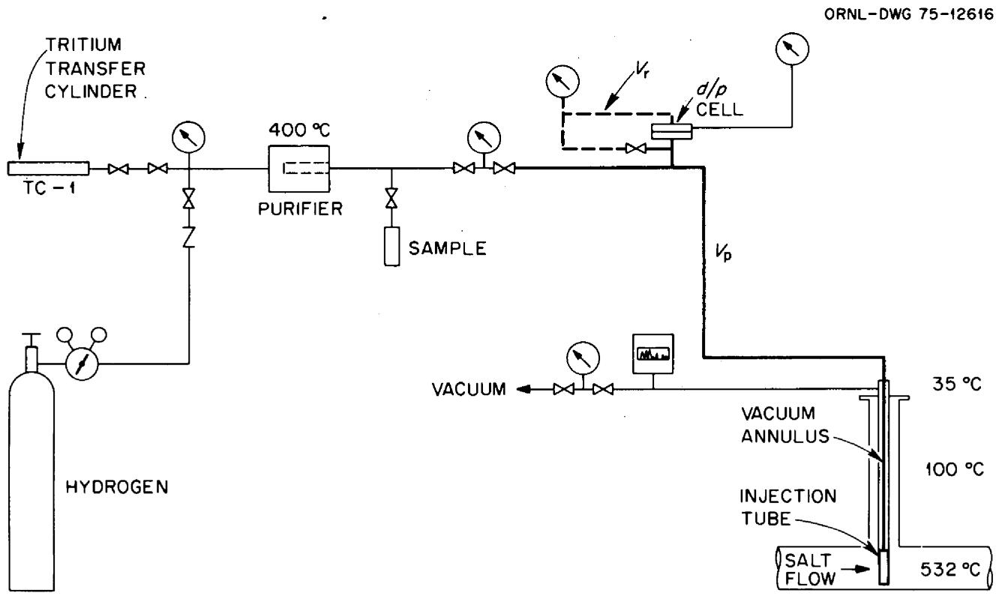  
Fig. 2.6. Tritium addition system for GSTF.

period, the difference in pressure between $V_{p}$ and $V_{r}$ is recorded; then the two volumes are equilibrated and the final equilibrium pressure is recorded. The initial and final pressures in $V_{p}, p_{1}$ and $p_{2}$ respectively, the final equilibrium pressure, $p_{3}$ , and the known volume and temperature of $V_{r}$ are then used to calculate the amount of gas which permeated the addition probe according to the equation

$$
n = \frac {\left(p _ {1} - p _ {2}\right) \left(p _ {1} - p _ {3}\right)}{\left(p _ {3} - p _ {2}\right)} \times \frac {V _ {r}}{R T _ {r}},
$$

where $n$ is the number of moles of gas transferred, $R$ is the molar gas constant, $T_r$ is the reference volume temperature, and the other symbols are as previously defined.

During the addition, the amount of extraneous leakage is calculated from pressure rise measurements in the evacuated annulus, and this quantity is subtracted from $n$ to obtain the net amount of gas transferred into the salt. The tritium content of the hydrogen-tritium mixture is determined by mass spectrometer analysis, and the net amount of added tritium is then calculated.

Tritium (and hydrogen) which enters the salt stream is assumed either to remain in the salt or to leave the salt by one of two paths: either by permeation through the walls of the loop piping or by transfer to the gas phase in the pump bowl or in the salt monitoring vessel (SMV) and leaving the loop with the off-gas stream. During and after an addition, the tritium content of the salt is monitored by taking samples of salt from the salt pool in the pump bowl or in the SMV, and the tritium content of the off-gas stream is monitored by taking samples from the off-gas line at a point about $1\mathrm{m}$ downstream of the pump bowl. The off-gas sample stream is passed first through a water trap to collect chemically combined (water-soluble) tritium, and then through an oxidizing atmosphere to convert elemental tritium to tritiated water, which is collected in a second trap. The tritium contents of the salt samples and of both the off-gas samples are determined by a scintillation counting technique. During the initial tritium addition experiments, no provision was made for measuring loop wall permeation, so that the tritium lost by this mechanism is assumed to be the difference between the amount of tritium added and the sum of the quantities which leave in the off-gas stream and which remain in the salt.

During the March 14, 1975, to May 6, 1975, operating period, a number of salt and off-gas samples were taken to obtain baseline values for tritium concentration and to shake down and evaluate the sampling techniques. During shutdown of the CSTF in May and June

1975, the tritium addition probe was installed in the surveillance-specimen access tube, and the final installation work was done on the tritium addition system. A stainless steel valve (HV-253A) and some stainless steel tubing, which were part of the original off-gas sample-line installation, were removed and replaced with a Monel valve and Hastelloy N tubing, because it was felt that the Monel and Hastelloy N would be less likely to react with the off-gas sample stream. Two 2.5-cm-diam $\times$ 45-cm-long Hastelloy N tubes were filled with salt from the drain tank and set aside as representative samples of the salt as it existed prior to the start of the tritium tests.

On June 27, 1975, the loop was filled and salt circulation was resumed. Several additions of hydrogen were made to check out the operation of the addition system and to obtain data on permeation rates. A total of 313 $\mathrm{cm}^3$ (STP) of hydrogen was added in these tests, and the last addition (31 cm $^3$ STP) was made on July 16, 1975. With the addition tube pressurized to $1.37 \times 10^5$ Pa, the measured permeation rate was about $3 \mathrm{~cm}^3/\mathrm{hr}$ , compared with a predicted value of $1.3 \mathrm{~cm}^3/\mathrm{hr}$ . The first addition of tritium was made on July 17, 1975, and a second addition, with conditions essentially the same as for the first addition, was made August 5, 1975. In each case, salt and off-gas samples were taken during the tritium addition (about 10 hr) and for about 2 weeks afterward, until sample results indicated that the tritium levels had returned to their pretest values or had stabilized. Data for calculation of the amount of added gas are shown in Table 2.3. A mathematical analysis and discussion of the sample results are presented in Sect. 1.1.2.

Table 2.3. Tritium addition data for CSTF tests   

<table><tr><td>Test number</td><td>T1</td><td>T2</td></tr><tr><td>Date</td><td>7-17-75</td><td>8-5-75</td></tr><tr><td>Addition started</td><td>1002</td><td>0846</td></tr><tr><td>Addition ended</td><td>2050</td><td>1912</td></tr><tr><td>Addition time (hr)</td><td>10.8</td><td>10.4</td></tr><tr><td>Initial pressure, p1(Pa)</td><td>1.38 × 10^5</td><td>1.37 × 10^5</td></tr><tr><td>Final pressure, p2(Pa)</td><td>1.06 × 10^5</td><td>1.07 × 10^5</td></tr><tr><td>Equilibrium pressure, p3(Pa)</td><td>1.24 × 10^5</td><td>1.23 × 10^5</td></tr><tr><td>Vr volume (cm^3)</td><td>155</td><td>155</td></tr><tr><td>Tr temperature (°K)</td><td>303</td><td>306</td></tr><tr><td>Gross permeation rate (cm^3/hr)</td><td>3.10</td><td>3.33</td></tr><tr><td>Average leak rate (cm^3/hr)</td><td>0.07</td><td>0.04</td></tr><tr><td>Net permeation rate (cm^3/hr)</td><td>3.03</td><td>3.29</td></tr><tr><td>Tritium concentration in mixed gas (ppm)</td><td>1010</td><td>1100</td></tr><tr><td>Total tritium added (cm^3)</td><td>0.033</td><td>0.038</td></tr><tr><td>Total tritium added (mCi)</td><td>85</td><td>97</td></tr></table>

# 2.3 FORCED-CONVECTION LOOPS

W.R.Huntley M.D.Silverman H.E.Robertson

The Forced-Convection Corrosion Loop Program is part of the effort to develop a satisfactory structural alloy for molten-salt reactors. Corrosion loop MSR-FCL-2b is operating with reference fuel salt at typical MSBR velocities and temperature gradients to evaluate the corrosion and mass transfer of standard Hastelloy N. Addition of tellurium to the salt in MSR-FCL-2b is planned after baseline corrosion data are obtained in the absence of tellurium. At this time, the loop has operated approximately 3000 hr at design $\Delta T$ conditions with the expected low corrosion rates.

Two additional corrosion loop facilities, designated MSR-FCL-3 and MSR-FCL-4, are being constructed. They are being fabricated of $2\%$ titanium-modified Hastelloy N alloy which is expected to be more representative of the final material of construction for an MSBR than standard Hastelloy N.

# 2.3.1 Operation of MSR-FCL-2b

Loop FCL-2b was operated continuously for about 3000 hr from February to June 1975, under design $\Delta T$ (565°C minimum, 705°C maximum) conditions. During this period, standard Hastelloy N corrosion specimens installed in the loop in January 1975 were exposed to circulating fuel salt at three different temperatures, (565, 635, and 705°C). As expected, corrosion rates were low; the highest value was 0.1 mil/year (3μm/year) at the highest temperature station.

Salt samples taken at intervals have been analyzed for major constituents, metallic impurities, and oxygen (Table 2.4). Except for an occasional high value for oxygen or iron, the analyses are relatively consistent and indicate that the observed corrosion processes have had very little effect on the concentrations of the various species present in the fuel salt. Analytical probe readings for the $\mathrm{U}^{4+}/\mathrm{U}^{3+}$ ratio, indicative of the redox condition of the salt, have been taken on a weekly basis. This ratio, which was about $7\times 10^{3}$ at the beginning of the corrosion run, rapidly dropped to about $1\times 10^{3}$ after the first 24 hr of operation. The ratio then gradually fell to $\sim 1\times 10^{2}$ by the end of March ( $\sim 1500$ hr elapsed time), and it has remained at that level during the latter part of the operation.

After the corrosion specimens were removed for the 3000-hr weight-change measurements, preparations were made for obtaining heat transfer data on the Li-Be-Th-U fuel salt (71.7-16-12-0.3 mole %). At this

time a Calrod electric tubular heater failure was discovered on the pipe line (12.7-mm-OD × 1.1-mm-wall) which runs from metallurgical station No. 3 to the inlet of cooler No. 1. After removing the thermal insulation, about 10 to $20~\mathrm{cm}^3$ of salt was found on the loop piping and the burned-out heater. Grainy material was present on the heater sheath at three locations directly opposite peeled-off sections of oxide layer on the Hastelloy N piping. A small crack ( $\sim 5 \mathrm{~mm}$ long) was found on a tubing bend directly under the failed heater. Whether the heater arced, causing the piping to fail, or whether the salt leak from the loop caused the heater burnout is uncertain at this time. Examination of specimens from these regions is continuing.

The fuel salt was drained from the loop into the fill-and-drain tank after the leak was discovered. Analytical results on a sample taken from the tank indicated that no obvious contamination of the fuel salt had occurred. A new section of piping was installed (approximately $2.4\mathrm{m}$ , from metallurgical station No. 3 to the inlet to cooler No. 1). During the shutdown, several defective thermocouples and two defective clam-shell electric heaters were replaced. Ball valves were refurbished, numerous small repairs were made, and instruments were recalibrated. After the thermal insulation had been replaced, baseline heat loss measurements were made, with no salt in the loop, in preparation for taking heat transfer data. The loop was ready for refilling at the end of July, approximately four weeks after the salt leak was discovered. After filling the loop, heat transfer measurements were obtained with flowing salt. The ALPHA pump speed was varied from 1000 to 4600 rpm, resulting in salt flows of approximately 2.7 to 16 liters/min, which correspond to Reynolds numbers that vary from 1600 to 14,000. The lower limit for salt flow was set to prevent freezing, and the upper limit was dictated by the power required for driving the pump. At the lowest flow rate, unusual wall temperature profiles were noted, which probably were caused by entrance conditions and transitional flow effects. The heat transfer measurements were completed near the end of this reporting period, and analysis of the data is in progress.

The stringers containing the Hastelloy N corrosion specimens were reinserted in the loop, and $\Delta T$ operation (565°C minimum, 705°C maximum) was resumed in order to complete the originally planned 4000-hr corrosion run. If no unusual corrosion behavior is encountered in the next 1000 hr of operation, nickel fluoride $(\mathrm{NiF}_2)$ additions will be made to the loop in order to raise the oxidation potential of the salt to a level corresponding to a $\mathrm{U}^{4+}/\mathrm{U}^{3+}$ ratio of about $10^3$ , and a new set of corrosion specimens will be exposed.

Table 2.4. Salt sample analysis during MSR-FCL-2b operation with LiF-BeF $_2$ -ThF $_4$ -UF $_4$   

<table><tr><td rowspan="2">Sample No.</td><td rowspan="2">Date sampled (1975)</td><td rowspan="2">Total hours of salt circulation when sampled</td><td colspan="5">Major components (wt %)</td><td colspan="6">Trace materials (ppm)</td><td rowspan="2">Notes</td></tr><tr><td>Li</td><td>Be</td><td>Th</td><td>U</td><td>F</td><td>Fe</td><td>Cr</td><td>Ni</td><td>O</td><td>C</td><td>S</td></tr><tr><td>1b</td><td>1-17</td><td>0</td><td>7.8</td><td>2.21</td><td>43.2</td><td>1.11</td><td>46.7</td><td>101</td><td>40</td><td>23</td><td>&lt;50</td><td>11</td><td>9.9</td><td>Flush salt</td></tr><tr><td>2b</td><td>1-23</td><td>48</td><td></td><td></td><td></td><td></td><td></td><td></td><td></td><td></td><td>60</td><td>42</td><td>5.2</td><td></td></tr><tr><td>3b</td><td>1-28</td><td>0</td><td>7.99</td><td>1.74</td><td>43.0</td><td>0.98</td><td>46.3</td><td>75</td><td>70</td><td>15</td><td>125</td><td>29</td><td>4.3</td><td>New salt</td></tr><tr><td>4b</td><td>2-11</td><td>177</td><td></td><td></td><td></td><td></td><td></td><td>137</td><td>63</td><td>60</td><td>75</td><td></td><td></td><td></td></tr><tr><td>5b</td><td>2-18</td><td>355</td><td></td><td></td><td></td><td></td><td></td><td>154</td><td>64</td><td>68</td><td>45</td><td></td><td></td><td></td></tr><tr><td>6b</td><td>2-24</td><td>498</td><td></td><td></td><td></td><td></td><td></td><td>98</td><td>63</td><td>28</td><td>48</td><td></td><td></td><td></td></tr><tr><td>7b</td><td>3-3</td><td>676</td><td>7.68</td><td>2.36</td><td>42.8</td><td>1.05</td><td>46.3</td><td>147</td><td>67</td><td>35</td><td>45</td><td>23</td><td>17</td><td></td></tr><tr><td>8b</td><td>3-25</td><td>1146</td><td>7.01</td><td>2.55</td><td>43.0</td><td>1.04</td><td>45.8</td><td>256</td><td>59</td><td>57</td><td>&lt;25</td><td>14</td><td>9</td><td></td></tr><tr><td>9b</td><td>4-16</td><td>1647</td><td>8.16</td><td>2.29</td><td>43.2</td><td>0.97</td><td>45.2</td><td>45</td><td>70</td><td>30</td><td>20</td><td>78</td><td>15</td><td></td></tr><tr><td>10b</td><td>5-12</td><td>2197</td><td>8.29</td><td>2.64</td><td>43.0</td><td>1.03</td><td>45.5</td><td>62</td><td>85</td><td>30</td><td>60</td><td></td><td></td><td></td></tr><tr><td>11b</td><td>6-9</td><td>2838</td><td>8.23</td><td>2.25</td><td>42.7</td><td>1.00</td><td>44.5</td><td>30</td><td>70</td><td>25</td><td>140</td><td></td><td></td><td></td></tr><tr><td>12b</td><td>6-23</td><td>3173</td><td>8.20</td><td>2.08</td><td>43.3</td><td>1.04</td><td>45.1</td><td>35</td><td>75</td><td>25</td><td>152</td><td></td><td></td><td></td></tr><tr><td>13b</td><td>7-3</td><td>3177</td><td>8.30</td><td>2.18</td><td>43.0</td><td>1.04</td><td>45.2</td><td>70</td><td>80</td><td>40</td><td>30</td><td></td><td></td><td>Fill-and-drain tank</td></tr><tr><td>14b</td><td>8-7</td><td>3246</td><td>7.28</td><td>2.03</td><td>45.0</td><td>1.00</td><td>45.0</td><td>45</td><td>85</td><td>70</td><td>58</td><td></td><td></td><td></td></tr></table>

a71.7-16-12-0.3 mole %

# 2.3.2 Design and Construction of FCL-3 and FCL-4

The design work for FCL-3 and FCL-4 was essentially completed; any changes or revisions which occur during construction of FCL-3 will also be made on FCL-4.

The piping support frame for FCL-3 was installed, and installation of electrical equipment is proceeding. Conduit lines have been run from the variable-speed motor-generator set on the ground floor up to the electrical rack installed on the experiment floor, and a sizable

number of transformers, starters, switches, etc., have been installed. The instrument panel cabinets have been positioned, and cable trays are now being installed. Fabrication of two ALPHA-pump rotary elements and two pump bowls is $90\%$ complete. A large number of completed items for both loops (e.g., dump tanks, auxiliary pump tanks, cooler housings, blower-duct assemblies, electric drive motors, purge gas cabinets, etc.) are on hand, awaiting installation. Fabrication of the titanium-modified Hastelloy N tubing for the salt piping of the loop is in progress.

# Part 2. Chemistry

L. M. Ferris

Chemical research and development related to the design and ultimate operation of MSBRs are still concentrated on fuel- and coolant-salt chemistry and the development of analytical methods for use in these systems.

Studies of the chemistry of tellurium in fuel salt have continued to aid in elucidating the role of this element in the intergranular cracking of Hastelloy N and related alloys. An important initial phase of this work involves the preparation of the pure tellurides $\mathrm{Li}_2\mathrm{Te}$ and $\mathrm{LiTe}_3$ for use in solubility measurements, loop experiments, electroanalytical studies, and studies of tellurium redox behavior in molten salts. Techniques for preparing these tellurides have been developed, and experimental quantities have been prepared. Spectroscopic studies of tellurium chemistry in molten salts and of the equilibrium $\frac{1}{2}\mathrm{H}_{2}(\mathrm{g}) + \mathrm{UF}_{4}(\mathrm{d}) = \mathrm{UF}_{3}(\mathrm{d}) + \mathrm{HF}(\mathrm{g})$ have also been initiated. In work using molten chloride solvents, at least two light-absorbing tellurium species have been shown to be present. These species are as yet unidentified, but have compositions in the range $\mathrm{Li}_2\mathrm{Te}$ to $\mathrm{LiTe}_4$ . Preliminary values of the quotients for the above equilibrium have been obtained, using $\mathrm{Li}_2\mathrm{BeF}_4$ as the solvent. These values are in reasonable agreement with those obtained previously by other workers.

A packed-bed electrode of glassy carbon spheres was constructed, calibrated with $\mathrm{Cd^{2+}}$ ions, and used in experiments with $\mathrm{Bi^{3+}}$ ions in LiCl-KCl eutectic. It was concluded that this electrode was prototypic of one that could be used for the electroanalysis or electrolytic removal of bismuth, oxide, and other species in MSBR fuel salt. Preliminary experiments were also conducted to evaluate some questions relating to the mixing of fuel

and coolant salts. The results suggest that, on mixing small amounts of coolant salt with large amounts of fuel salt, the rate of evolution of $\mathrm{BF}_3$ gas will not be intolerably high and that some oxide can be present in the coolant salt without effecting precipitation of $\mathrm{UO}_2$ or $\mathrm{ThO}_2$ . Lattice enthalpies of first-row transition metal fluorides were calculated to provide a theoretical basis for evaluating thermochemical data for structural-metal fluorides.

Work on several aspects of coolant-salt chemistry has continued. Analyses of condensates from the Coolant-Salt Technology Facility (CSTF) indicate that the vapor above the salt is a mixture of simple gases such as $\mathrm{BF}_3$ , HF, and $\mathrm{H}_2\mathrm{O}$ rather than a single molecular compound. Tritium concentrates in the condensates by about a factor of $10^5$ relative to the salt. Studies of the system $\mathrm{NaF - NaBF_4 - B_2O_3}$ at 400 to $600^{\circ}\mathrm{C}$ show that at least two oxygen-containing species are present in typical coolant salt. One species is $\mathrm{Na}_3\mathrm{B}_3\mathrm{F}_6\mathrm{O}_3$ , while the other has not yet been identified.

The development of analytical methods for both fuel and coolant salt was also continued. An in-line voltammetric method was used to monitor $\mathrm{U}^{4+}/\mathrm{U}^{3+}$ ratios in two thermal-convection and one forced-circulation loops. Two additions of tritium were made at the CSTF. The salt in the loop did significantly retain tritium, and the tritium ultimately appeared in the off-gas. Work was begun on using various electrodes for determining iron in MSBR fuel salt. Previous work had been conducted with solvents that did not contain thorium. Preliminary voltammetric experiments were conducted to identify soluble electroactive tellurium species in MSBR fuel salt.

# 3. Fuel-Salt Chemistry

A. D. Kelmers

# 3.1 COMPOUNDS IN THE LITHIUM-TELLURIUM SYSTEM

D.Y.Valentine A.D.Kelmers

It has been demonstrated that tellurium vapor can induce shallow grain-boundary attack in Hastelloy N similar to that observed on the surfaces of the fuel-salt circuit of the MSRE. However, the actual oxidation state or states in which tellurium is present in MSBR fuel salt, an $\mathrm{LiF - BeF_2 - ThF_4 - UF_4}$ mixture, and the chemical reactions with the Hastelloy N surfaces remain to be determined. The lithium-tellurium system is being investigated to determine which Li-Te species can be present and to synthesize samples of all possible lithium tellurides. The solubility of these compounds in the fuel salt will then be determined. In addition, they will be used in spectrophotometric and electrochemical investigations of tellurium species in melts.

During this report period, samples of $\mathrm{Li}_2\mathrm{Te}$ and $\mathrm{LiTe}_3$ were prepared. The preparations were made in an argon-atmosphere vacuum box equipped with an enclosed evacuated heater which held a molybdenum crucible. All handling of Li-Te compounds was done in inert-atmosphere boxes; sometimes the compounds were sealed under vacuum to minimize oxygen, nitrogen, or $\mathrm{H}_2\mathrm{O}$ contamination. Lithium having an oxygen content of $< 100~\mathrm{ppm}$ was supplied by the Materials Compatibility Laboratory, Metals and Ceramics Division. Tellurium metal of $99.999+$ wt $\%$ purity was obtained from Alpha Ventron Products.

The $\mathrm{Li}_2\mathrm{Te}$ was first prepared by dropping small pieces of lithium into molten tellurium contained in a molybdenum crucible at $550^{\circ}\mathrm{C}$ . The reaction was extremely exothermic, emitting fumes and light flashes after each lithium addition. Solid formation occurred at lower lithium concentrations than expected from the reported phase diagram. Further lithium additions continued to be absorbed after first melting on the surface of the solid phase. An amount of lithium necessary to satisfy the $\mathrm{Li}_2\mathrm{Te}$ stoichiometry was taken up in this manner. However, because of the loss of vapor and of some solid material which splashed out of the crucible during the early additions of lithium, it is doubtful that the stoichiometry was in fact preserved.

The $x$ -ray diffraction pattern showed a single phase, identified as $\mathrm{Li}_2\mathrm{Te}$ , having a face-centered cubic struc

ture with a lattice parameter of $6.5119 \pm 0.0002\mathring{\mathrm{A}}$ . The oxygen contamination in the product totaled about 375 ppm. Spectrographic analysis reported 0.5 wt % molybdenum present. Since the oxygen level and molybdenum impurities were fairly low, a larger-scale preparation was attempted as well as a direct preparation of $\mathrm{LiTe}_3$ by the same method. In both cases the product was contaminated unacceptably with molybdenum, and these preparations were discarded. Apparently the first preparation had affected the surface of the crucible such that the reaction with molybdenum was accelerated in these subsequent experiments.

The molybdenum crucible was used for one further preparation, after cleaning and polishing the inside surface. The $\mathrm{Li}_2\mathrm{Te}$ was prepared from the lithium-rich side of the phase diagram by dropping tellurium into molten lithium. Since molybdenum is relatively inert toward lithium,4 less reaction with the crucible was expected. In addition, this preparation could be made at a much lower temperature. The tellurium was added to the lithium in small increments with the temperature held at $250^{\circ}\mathrm{C}$ . Each of the first additions resulted in a smooth, quiet reaction with a solid phase forming on the bottom of the crucible. However, since completion of the reaction was not visibly apparent, the temperature of the system was increased above the tellurium melting point to about $550^{\circ}\mathrm{C}$ to ensure that unreacted tellurium was not on the bottom of the crucible. More additions of tellurium were then made. Above $500^{\circ}\mathrm{C}$ a popping noise was heard after each addition of tellurium. After about three-fourths of the tellurium had been added, the system was mostly solid. As more tellurium was added, the amount of solid in the system became so great that further additions of tellurium were

not covered by the liquid. Subsequent additions produced light flashes and popping associated with the highly exothermic reaction as encountered in the previous preparations of $\mathrm{Li}_2\mathrm{Te}$ . Finally, enough additional tellurium was added to the system to satisfy the $\mathrm{Li}_2\mathrm{Te}$ stoichiometry, and the system was allowed to cool to room temperature.

Upon crushing the cooled product, four differently colored substances were distinguishable: gray opaque material, wine-red to pink opaque material, colorless translucent crystals, and metallic tellurium. Analyses were performed separately on each type of material:

1. Gray opaque material. The x-ray diffraction pattern revealed $\mathrm{Li}_2\mathrm{Te}$ and $\mathrm{LiTe}_3$ ; no other lines were present. The oxygen level was about 218 ppm. Spectrographic analysis indicated the presence of about 0.1 wt % molybdenum.   
2. Red-hue material. Only a few crystals of all-red material could be isolated. The remainder of the red-hue material was ground together with some surrounding gray material. The x-ray diffraction pattern corresponded mainly to $\mathrm{Li}_2\mathrm{Te}$ . A small amount of $\mathrm{LiTe}_3$ was also present. The oxygen content was reported to be about 275 ppm. Spectrographic analysis reported $<0.01$ wt % molybdenum.   
3. Colorless translucent and isolated red crystals. Both these products gave an x-ray diffraction pattern corresponding to pure $\mathbf{L}\mathbf{i}_2\mathbf{T}\mathbf{e}$ with no indication of a second phase.

To ensure a uniform product, all the various colored materials were recombined and thoroughly mixed. The $\mathrm{Li}_2\mathrm{Te}$ mixture was then placed in a 2-in.-diam tungsten boat, which had previously been enclosed in a quartz bottle. The quartz bottle was then evacuated, sealed, and heated to $550^{\circ}\mathrm{C}$ for about $16\mathrm{hr}$ . The product obtained after cooling was almost completely cream-white. However, when the bottle was broken open, the product began to turn beige upon exposure to the environment of the inert-atmosphere box. The product was then crushed roughly and placed in sample bottles. On standing in the bottles, the product gradually reverted to the red-gray color it had been before the heat treatment, with the exception that the product in one bottle remained beige. The reason for the lack of uniform behavior is as yet unknown. Some of the darkened product was returned to the tungsten boat in another quartz bottle and the heat treatment repeated. It again turned the cream-white color. The products, both the light beige and the red-gray color forms, gave x-ray diffraction patterns for a single phase, $\mathrm{Li}_2\mathrm{Te}$ . Analysis of this $\mathrm{Li}_2\mathrm{Te}$ is given in Table 3.1.

Table 3.1. Analysis of ${\mathrm{{Li}}}_{2}\mathrm{{Te}}$ and ${\mathrm{{LiTe}}}_{3}$   

<table><tr><td></td><td>Li2Te</td><td>LiTe3</td></tr><tr><td>Li (wt %)</td><td>9.5 ± 0.1</td><td>1.7 ± 0.1</td></tr><tr><td>Te (wt %)</td><td>89.9 ± 0.5</td><td>98.4 ± 0.5</td></tr><tr><td>Li2Te (mole %)</td><td>98.7 ± 1.6</td><td></td></tr><tr><td>LiTe3(mole %)</td><td>1.4 ± 0.5</td><td>82.9 ± 5.0</td></tr><tr><td>Te (mole %)</td><td></td><td>17.1 ± 15.0</td></tr><tr><td>X-ray diffraction</td><td>Single phase</td><td>Single phase</td></tr><tr><td>Oxygen (ppm)</td><td>740 (±10%)</td><td>275 (±10%)</td></tr><tr><td>Molybdenum (wt %)</td><td>0.05</td><td>≤0.01</td></tr><tr><td>Tungsten (wt %)</td><td>≤0.01</td><td>≤0.01</td></tr></table>

Red-gray $\mathrm{Li}_2\mathrm{Te}$ was mixed with the amount of tellurium required to satisfy the $\mathrm{LiTe}_3$ stoichiometry. The mixture was then sealed in a quartz bottle under vacuum and heated to $550^{\circ}\mathrm{C}$ for $2\mathrm{hr}$ . The hot liquid was dark metallic gray. On cooling, the solid appeared bright silver-gray. The x-ray diffraction pattern confirmed the presence of a single phase, $\mathrm{LiTe}_3$ , having a near body-centered cubic structure with a pseudocell lattice parameter of $6.1620 \pm 0.0002\mathring{\mathrm{A}}$ . The well-exposed Debye-Scherrer diffraction patterns suggest that the structure of this compound is more complex than previously reported. Work will continue in an effort to describe this structure. The oxygen content was reported to be $275~\mathrm{ppm}$ . Spectrographic analysis reported no molybdenum or tungsten contamination. Analysis of this $\mathrm{LiTe}_3$ is also given in Table 3.1.

# 3.2 SPECTROSCOPY OF TELLURIUM SPECIES IN MOLTEN SALTS

B.F.Hitch L.M.Toth

A spectroscopic investigation of tellurium behavior in molten salts has been initiated to identify the species present in solution and to obtain thermodynamic data which will permit the determination of the species' redox behavior in MSBR fuel salt. A previous investigation5 had indicated that $\mathrm{Te}_3^-$ is present in LiF-BeF2 (66-34 mole %) on the basis of an absorption band occurring at 478 nm when LiTe3 was the added solute; however, the work was terminated before these observations had been fully substantiated. The current work is an extension of those earlier measurements which

should lead ultimately to a measurement of redox equilibria such as

$$
\mathrm {L i T e} _ {3} + 5 / 2 \mathrm {H} _ {2} + 5 \mathrm {L i F} = 3 \mathrm {L i} _ {2} \mathrm {T e} + 5 \mathrm {H F}, \tag {1}
$$

$$
\frac {3}{2} \mathrm {T e} _ {2} + \mathrm {L i F} + \frac {1}{2} \mathrm {H} _ {2} = \mathrm {L i T e} _ {3} + \mathrm {H F}. \tag {2}
$$

These data should then permit the prediction of tellurium redox chemistry as a function of $\mathrm{UF}_3 / \mathrm{UF}_4$ ratio.

During the past several months, most of the effort was devoted to assembly of the apparatus necessary for the fluoride measurements. This involved fabrication and assembly of the following: a furnace for the fluoride studies, diamond-windowed spectrophotometric cells, a vacuum and inert gas system, and a $\mathrm{KHF}_2$ saturator through which $\mathbf{H}_2$ is passed to generate HF- $\mathbf{H}_2$ mixtures of known proportions.

Also during the period of preparation, some attention was given to a supporting study in chloride melts. The advantages of working in chlorides are:

1. previous ground-work investigations have already been reported,7   
2. chlorides are easier to hold in silica cells without container corrosion,   
3. the greater solubility of the tellurides in chlorides may reveal greater detail because of more intense spectra.

Absorption spectra have been measured for $\mathrm{Li}_2\mathrm{Te}$ , $\mathrm{LiTe}_3$ , and tellurium solutes as well as during titrations of $\mathrm{Li}_2\mathrm{Te}$ with $\mathrm{Te}_2$ in the LiCl-KCl eutectic at 450 to $700^{\circ}\mathrm{C}$ . These data indicate that at least two light-absorbing species are present in molten chlorides containing lithium tellurides with compositions in the range $\mathrm{Li}_2\mathrm{Te}$ to $\mathrm{LiTe}_4$ : Furthermore, an examination of $\mathrm{Te}_2$ in the LiCl-KCl eutectic has indicated that there is a second species present besides $\mathrm{Te}_2$ which is formed at high temperatures and/or high halide ion activity. More detailed experiments are anticipated using purer lithium telluride solutes in the diamond-windowed cell to demonstrate that the additional species are not related to impurities from the reagent or silica corrosion.

# 3.3 URANIUM TETRAFLUORIDE-HYDROGEN EQUILIBRIUM IN MOLTEN FLUORIDE SOLUTIONS*

L.O.Gilpatrick L.M.Toth

The equilibrium

$$
\mathrm {U F} _ {4} (\mathrm {d}) + \frac {1}{2} \mathrm {H} _ {2} (\mathrm {g}) = \mathrm {U F} _ {3} (\mathrm {d}) + \mathrm {H F} (\mathrm {g}) \tag {1}
$$

is under investigation, using improved methods of analyses and control. The effects of temperature and solvent composition changes on the equilibrium quotient

$$
Q = \frac {\left[ \mathrm {U F} _ {3} \right]}{\left[ \mathrm {U F} _ {4} \right]} \frac {P _ {\mathrm {H F}}}{\left(P _ {\mathrm {H} _ {2}}\right) ^ {1 / 2}}. \tag {2}
$$

are the immediate objectives of this work and are sought to resolve previous discrepancies noted in fuelsalt redox behavior.8

The procedure involves sparging a small (approximately $1\mathrm{g}$ ) sample of salt solution $\left(\mathrm{UF}_4\right.$ concentration of 0.038 to 0.13 mole/liter or 0.065 to 0.22 mole $\%$ with $\mathbf{H}_2$ gas at 550 to $850^{\circ}\mathrm{C}$ until partial reduction of $\mathrm{UF}_4$ to $\mathrm{UF}_3$ is observed; HF is added to oxidize the desired amount of $\mathrm{UF}_3$ back to $\mathrm{UF}_4$ . When an equilibrium between the $\mathrm{HF} / \mathrm{H}_2$ gas mixture and the $\mathrm{UF}_3 - \mathrm{UF}_4$ in solution is reached, a spectrophotometric determination of the $\mathrm{UF}_3$ and $\mathrm{UF}_4$ concentrations is made. These data are combined with the analytically determined $^8$ $\mathrm{HF} / (\mathrm{H}_2)^{1/2}$ ratio to obtain the equilibrium quotient at a given set of conditions.

The assembly of the system for this experiment has been completed, and measurements of equilibrium quotients, using $\mathrm{LiF - BeF_2}$ (66-34 mole %) as the solvent, have been initiated. Some delay has occurred because of trace water in the $\mathrm{HF / H_2}$ sparge gas which was responsible for the hydrolysis of uranium tetrafluoride and the subsequent precipitation of $\mathrm{UO_2}$ . The problem has been partially alleviated by treatment of the $\mathrm{KHF_2}$ saturator, gas supply lines, and spectrophotometric furnace with fluorine at room temperature. However, back diffusion of water vapor into the furnace from the exit gas line has also caused substantial solute losses and has been reduced by using higher $\mathrm{HF - H_2}$ flow

rates. Together, these modifications have reduced the solute losses to an acceptable level (2% per day).

Equilibrium has been achieved at $650^{\circ}\mathrm{C}$ for measured $\mathrm{UF}_3 / \mathrm{UF}_4$ ratios of approximately $0.2\times 10^{-2}$ to $3.1\times$ $10^{-2}$ . Although the $\mathrm{UF}_3 / \mathrm{UF}_4$ values are reproducible at fixed $\mathrm{KHF_2}$ saturator temperatures, the analytically determined HF values are not as yet. Consequently, the standard error (approximately $50\%$ ) in the equilibrium quotients is still rather high. So far, a value of $Q\cong 10^{-6}$ has been determined at $650^{\circ}\mathrm{C}$ , which compares favorably with the previous' value of $9.16\times 10^{-7}$ . Most of the immediate effort is being devoted to improving the precision of the HF determination.

Tritium control in an MSBR would be favored by higher equilibrium quotients. In an MSBR, the $\mathrm{UF}_3 / \mathrm{UF}_4$ ratio will probably be fixed by equilibria involving the structural metals. The tritium inventory will be established by the tritium production rate and the various tritium removal processes. If $Q$ is larger than previously anticipated, the partial pressure of HF would be higher and the partial pressure of $\mathbf{H}_2$ would be lower than previously estimated. Thus, TH would be available at a lower concentration for permeation through the heat exchanger to contaminate the coolant loop (and ultimately the steam system), and a larger proportion of the tritium would be present as TF, which would be removed in the helium gas stream.

# 3.4 POROUS ELECTRODE STUDIES IN MOLTEN SALTS

# H. R. Bronstein F. A. Posey

Work continued on development of porous and packed-bed electrode systems as continuous on-line monitors of the concentrations of electroactive substances, especially dissolved bismuth, in MSBR fuel salt. In previous work,[10,11] a prototype packed-bed electrode of glassy carbon spheres ( $\sim 100$ microns in diameter) was tested in the LiCl-KCl eutectic system. Linear-sweep voltammetric measurements, carried out in the presence of small amounts of iron and cadmium salts, showed that the cell, instrumentation, and auxiliary systems functioned successfully and demonstrated

the sensitivity of this method of analysis. However, these measurements showed the need for redesign of the experimental assembly to permit removal and replacement of the cell and addition of substances to the melt.

During this report period the redesigned packed-bed electrode of glassy carbon spheres was tested again in LiCl-KCl (58.8-41.2 mole %) eutectic, since the behavior of a number of electroactive substances has already been established in this medium. The packed bed of glassy carbon spheres was supported on a porous quartz frit and contained in a quartz sheath. Another porous quartz frit pressed on the bed from above. A glassy carbon rod penetrated the upper quartz frit to provide compaction of the bed and electrical contact with a long stainless steel rod which was insulated from the surrounding tantalum support tube. The electrode assembly was dipped into the melt so that the molten salt flowed up through the interior of the bed and out an overflow slot. By this means it was possible to obtain a reproducible volume of melt inside the packed-bed electrode.

Voltammetric and coulometric scans of the pure melt at $395^{\circ}\mathrm{C}$ showed that the background current was small. A typical set of current-potential and charge-potential background curves is shown in Fig. 3.1. A 2-V

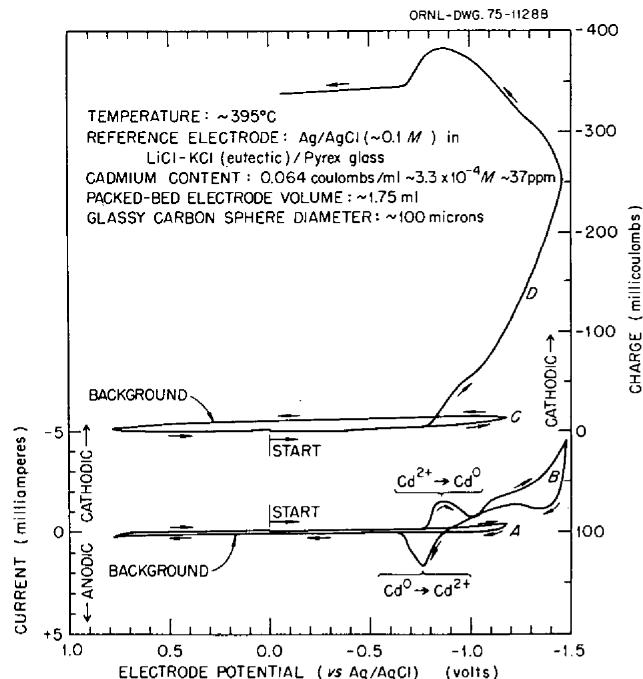  
Fig. 3.1. Linear-sweep voltammetry and coulometry of cadmium in LiCl-KCl (58.8-41.2 mole %) eutectic with a packed-bed electrode of glassy carbon spheres. Curve $A$ : current background (sweep rate = 10 mV/sec); curve $B$ : current with $\mathrm{Cd}^{2+}$ present (sweep rate = 5 mV/sec); curve $C$ : background charging curve (sweep rate = 10 mV/sec); curve $D$ : charging curve with $\mathrm{Cd}^{2+}$ present (sweep rate = 5 mV/sec).

range of electrode potential could be swept without evidence of significant amounts of oxidizable or reducible impurities in the melt. For calibration purposes, a known quantity of cadmium ions $(\mathrm{Cd}^{2+})$ was added to the melt by anodization of molten cadmium metal contained in a specially designed graphite cup which could be lowered into the melt. The amount of cadmium added (Fig. 3.1) was monitored by use of an electronic autoranging coulometer.

Following addition of cadmium, the voltammetric and coulometric scans indicated that only a small fraction of the known cadmium content inside the void space of the packed-bed electrode was being measured. After removal of the cell assembly, examination showed that the glassy carbon contact rod had somehow fractured, possibly due to excessive pressure from the mating stainless steel contact rod, and resulted in loss of electrical contact with the packed-bed electrode.

The cell assembly was then redesigned and rebuilt to permit electrical contact to be maintained without undue pressure and to allow accurate measurement of the working volume of the packed-bed electrode. The new design was similar to that of the previous cell, except that the upper fritted quartz disk was permanently sealed to the surrounding quartz sheath. A small hole in the center of the disk permitted loading of the glassy carbon spheres into the electrode assembly and provided accurate positioning of the glassy carbon contact rod into the bed. Prior to loading of the spheres, the volume contained between the porous quartz disks was measured with mercury.

Some voltammetric and coulometric scans in the presence of cadmium ions are shown in Fig. 3.1. As in previous studies in aqueous media with the packed-bed electrode, more accurate analytical results were obtained on the anodic half cycle (stripping) than on the cathodic half cycle (deposition). Approximately 40 mC of cadmium was estimated to be within the packed-bed electrode. The coulometric results shown in Fig. 3.1 are quite consistent with this value. Thus it is possible, knowing the geometry of a packed-bed electrode, to estimate the response and sensitivity within reasonable limits (the accuracy of estimation depends upon void fraction, the accuracy of the volume measurement, and other factors). Repeated scans over a period of many days showed good reproducibility and also established that diffusion through the quartz frits during the time of measurement (only a few minutes) has very little effect on the results.

Another cell was packed with $200 - \mu$ -diam glassy carbon spheres and used to obtain the results shown in Fig. 3.2. In this case a quantity of $\mathrm{Bi}^{3 + }$ ions had been anodized into the melt in a manner similar to that used for cadmium. At the time of these measurements the same melt had been in use for many weeks. Fig. 3.2 shows voltammetric and coulometric anodic stripping curves in the vicinity of the anodic peak for stripping of bismuth which had previously been deposited on the internal surfaces of the electrode during the cathodic half cycle. In agreement with observations of others, we found that volatility of $\mathrm{BiCl}_3$ precluded close correspondence between added and observed quantities of bismuth, and that the bismuth peak decreased steadily with time. The appearance of the bismuth peak suggests that possibly some alloying of bismuth with the cadmium took place.

Other experiments on bismuth reduction and stripping will be carried out in the future in which cadmium, used for calibration of the cell system, is absent. In addition, the present apparatus will be used to study the electrochemistry of lithium telluride in the LiCl-KCl eutectic. Observations on the tellurium system in the chloride melt may be useful in interpretation of tellurium behavior in later studies with MSBR fuel salt. The

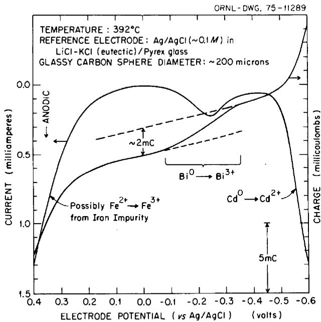  
Fig. 3.2. Linear-sweep anodic stripping voltammetry and coulometry of bismuth electrodeposited onto a packed-bed electrode of glassy carbon spheres. Solid lines: experimental current-potential and charge-potential curves in the region of the bismuth stripping peak; dashed lines: estimated background charging curves.

capability of the packed-bed, electrode of glassy carbon spheres for monitoring electroactive species in molten salts has been shown to be satisfactory. Consequently, plans are now under way for design and fabrication of cells and apparatus for testing the electrode system in molten fluoride media including MSBR fuel salt. In bismuth-containing fluoride melts, whether bismuth is present as $\mathbf{Bi}^0$ or $\mathrm{Li}_3\mathrm{Bi}$ , or both, it should be possible to identify and determine the quantities of each species. The packed-bed electrode offers hope of removing, as well as monitoring, dissolved bismuth in the fuel salt which may be present as a result of the reductive extraction process for removal of fission products.

# 3.5 FUEL SALT-COOLANT SALT INTERACTION STUDIES

A. D. Kelmers D. E. Heatherly

In the alternate coolant evaluation,13 several areas of potential concern were defined with regard to the applicability of the conceptual design coolant salt $\left[\mathrm{NaBF}_4\cdot \right.$ NaF (92-8 mole $\%$ )] for MSBRs. These centered primarily around events associated with off-design transient conditions, particularly primary heat exchanger leaks, which would allow intermixing of fuel salt and coolant salt. If coolant salt leaked into the fuel salt, the quantity and rate of evolution of $\mathrm{BF}_3$ gas from reaction (1),

$$
\mathrm {N a B F} _ {4} (\mathrm {d}) _ {\text {c o o l a n t}} \rightarrow \mathrm {B F} _ {3} (\mathrm {g}) + \mathrm {N a F} (\mathrm {d}) _ {\text {f u e l s a l t}}, \tag {1}
$$

would determine the transient pressure surges to be encountered in the heat exchanger and reactor. Also, previous work $^{14}$ indicated a substantial redistribution of the ions $\mathrm{Li^{+}}$ , $\mathrm{Na^{+}}$ , $\mathrm{Be}^{2+}$ , $\mathrm{F^{-}}$ , and $\mathrm{BF_4^-}$ between the resulting immiscible two-phase system formed on mixing $\mathrm{Li_2BeF_4}$ and $\mathrm{NaBF_4}$ . The solubilities of $\mathrm{UF_4}$ and $\mathrm{ThF_4}$ have not been measured in such systems; thus the distribution of uranium and thorium between such phases and the resulting concentrations are unknown. In addition, if oxide species were present in the coolant salt, either deliberately added to aid in tritium trapping or inadvertently present due to steam leaks in the steam-raising system, the precipitation of $\mathrm{UO_2}$ following mixing of an oxide-containing coolant salt with fuel salt has not been investigated. Therefore, a series of experiments were carried out to investigate these areas.

The experimental apparatus consisted of a quartz vessel heated by a quartz furnace so that the volume of the resulting phases could be observed at temperature and measured with a cathetometer. The quartz vessel extended up out of the furnace and was closed with an O-ring fitting and end plate. A nickel stirring shaft, driven by a constant-speed dc motor, penetrated the end plate and during the tests was driven at a speed adequate to stir the two phases without appreciable visible dispersion. Access for sample filter sticks was provided through the end plate as was done also for the argon inlet and exit lines. A very low argon flow maintained an inert atmosphere over the melt during the experiment.

Predetermined weights of fuel salt [nominal composition $\mathrm{LiF - BeF_2ThF_4 - UF_4}$ (72-16-11.7-0.3 mole %)] and coolant salt [nominal composition $\mathrm{NaBF_4 - NaF}$ (92-8 mole %)] were placed in the quartz vessel and rapidly heated to $550^{\circ}\mathrm{C}$ . Bubbles of gas could be observed due to $\mathrm{BF}_3$ generation via reaction (1) as soon as the coolant salt melted during the heatup period. When the temperature reached $550^{\circ}\mathrm{C}$ , counted as time zero, stirring was initiated. The volume of the phases was periodically determined, and filter-stick samples were taken at 30- or 60-min intervals.

The reaction between the fuel salt and coolant salt proceeded slowly: approximately 30 to $60\mathrm{min}$ was required to complete the visible evolution of $\mathbf{BF}_3$ gas at $550^{\circ}\mathrm{C}$ . When the initial coolant salt content was 20 wt $\%$ or less of the total material, no coolant salt phase remained after approximately 1 hr. All the NaF dissolved in the fuel salt phase and all the $\mathbf{BF}_3$ gas left the reaction vessel. With larger initial weights of coolant salt, up to 50 wt $\%$ , a small residual volume of coolant salt phase could be observed after 1 to 3 hr. Severe corrosion of the quartz reaction vessel occurred at the interface between the coolant salt phase and the argon cover gas in the experiments with the larger initial weights of coolant salt, presumably due to attack of the quartz by $\mathbf{BF}_3$ via a reaction such as

$$
2 \mathrm {B F} _ {3} (\mathrm {g}) + 3 \frac {1}{2} \mathrm {S i O} _ {2} (\mathrm {c}) \rightarrow 3 \frac {1}{2} \mathrm {S i F} _ {4} (\mathrm {g}) + \mathrm {B} _ {2} \mathrm {O} _ {3} (\mathrm {d}). \tag {2}
$$

In experiments 6 and 7, holes were corroded completely through the vessel wall, and the surface of the stirred molten coolant salt phase was exposed to air for 1 to 2 hr at $550^{\circ}\mathrm{C}$ .

In most of the experiments, samples of the fuel-salt phase were withdrawn at intervals of 1, 2, 3, and 4 hr. Samples were also taken after the conclusion of the experiment; after the melt had cooled to room temperature the quartz vessel was broken away from the solid salt. All these samples gave essentially identical analyti

Table 3.2. Composition of fuel-salt phase and coolant-salt phase after contact at $550^{\circ}\mathrm{C}$   

<table><tr><td rowspan="2">Experiment No.</td><td colspan="2">Initial mixture (wt %)</td><td colspan="5">Fuel-salt phase (mole %)</td><td colspan="8">Coolant-salt phase (mole %)</td></tr><tr><td>\( Fuel~salt^a \)</td><td>\( Coolant~salt^b \)</td><td>LiF</td><td>NaF</td><td>\( BeF_2 \)</td><td>\( ThF_4 \)</td><td>\( UF_4 \)</td><td>LiF</td><td>NaF</td><td>\( BeF_2 \)</td><td>\( ThF_4 \)</td><td>\( UF_4 \)</td><td>\( Na_2SiF_6 \)</td><td>\( B_2O_3 \)</td><td>\( NaBF_4 \)</td></tr><tr><td>2</td><td>100</td><td>0</td><td>68.8</td><td>2.3</td><td>17.2</td><td>11.5</td><td>0.24</td><td></td><td></td><td></td><td></td><td></td><td></td><td></td><td></td></tr><tr><td>3</td><td>90</td><td>10</td><td>63.3</td><td>9.3</td><td>16.7</td><td>10.5</td><td>0.24</td><td></td><td></td><td></td><td></td><td></td><td></td><td></td><td></td></tr><tr><td>4</td><td>80</td><td>20</td><td>60.4</td><td>12.3</td><td>16.5</td><td>10.6</td><td>0.25</td><td>c</td><td></td><td></td><td></td><td></td><td></td><td></td><td></td></tr><tr><td>5</td><td>70</td><td>30</td><td>54.4</td><td>19.0</td><td>15.5</td><td>10.9</td><td>0.24</td><td>21.2</td><td>19.1</td><td>4.4</td><td>0.18</td><td>0.013</td><td>d</td><td>55.1</td><td>0</td></tr><tr><td>6</td><td>60</td><td>40</td><td>50.8</td><td>26.3</td><td>13.1</td><td>9.6</td><td>0.22</td><td>12.8</td><td>36.6</td><td>3.8</td><td>0.50</td><td>0.017</td><td>3.1</td><td>38.6</td><td>4.7</td></tr><tr><td>7</td><td>50</td><td>50</td><td>44.0</td><td>36.6</td><td>8.9</td><td>10.4</td><td>0.20</td><td>9.4</td><td>43.9</td><td>3.9</td><td>0.74</td><td>0.028</td><td>1.9</td><td>23.3</td><td>16.9</td></tr></table>

aNominal composition $\mathrm{LiF - BeF_2 - ThF_4 - UF_4}$ (72-16-11.7-0.3 mole%).   
bNominal composition $\mathrm{NaBF}_4$ -NaF (92-8 mole $\%$   
${}^{c}$ No coolant-salt phase remained.   
$d_{\mathrm{Not~analyzed}}$

cal values; therefore, the fuel-salt phase analyses (Table 3.2) represent an average of 3 to 5 values. Further support for the contention that reactions involving the fuel-salt phase were complete in $60\mathrm{min}$ or less is shown by the plots of volume vs time in Fig. 3.3. The coolant-salt phase volume decreased rapidly for about $30\mathrm{min}$ due to reaction (1); thereafter, the volume change was slower, presumably due to reaction (2).

It was impossible to obtain coolant-salt phase samples with the filter sticks, both because the phase volume was small and the salt tended to drain out of the filter sticks. Therefore, all coolant-salt phase analyses (Table 3.3) were from samples obtained after completion of the experiment and represent only single values.

The analyses (Table 3.3) show substantial redistribution of the ions $\mathrm{Li^{+}}$ , $\mathrm{Na^{+}}$ , and $\mathrm{Be}^{2+}$ between the two phases. Thorium and uranium exhibited low solubility in the coolant-salt phase. Neither $\mathrm{NaBF_4}$ nor the oxygenated fluoroborate compound (represented as $\mathrm{B}_2\mathrm{O}_3$ in the table) was soluble in the fuel-salt phase. Fuel salt stirred in contact with a coolant-salt phase containing up to about 50 mole $\%$ $\mathrm{B}_2\mathrm{O}_3$ showed no precipitation of $\mathrm{UO_2}$ . The coolant phase compositions were ex

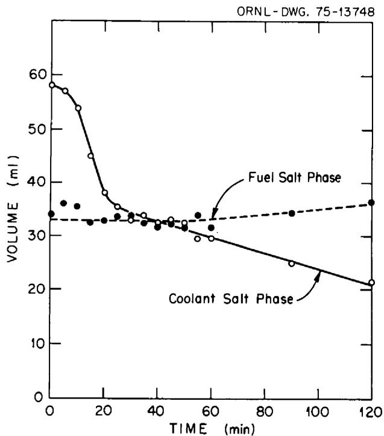  
Fig. 3.3. Volume of coolant-salt phase and fuel-salt phase vs time in mixing experiment No. 6. Initial mixture was $60 \, \text{wt} \%$ fuel salt and $40 \, \text{wt} \%$ coolant salt. After heating to $550^{\circ} \text{C}$ , stirring was begun and the depth of the two phases was periodically measured.

Table 3.3. Composition of coolant-salt phase expressed as components of the ternary system $\mathrm{{MF}} - {\mathrm{B}}_{2}{\mathrm{O}}_{3} - {\mathrm{{NaBF}}}_{4}$   

<table><tr><td colspan="2">Initial mixture (wt %)</td><td colspan="3">Coolant-salt phase (mole %)</td></tr><tr><td>Fuel salt</td><td>Coolant salt</td><td>\( MF^a \)</td><td>\( B_2O_3 \)</td><td>\( NaBF_4 \)</td></tr><tr><td>70</td><td>30</td><td>47.5</td><td>52.5</td><td>0</td></tr><tr><td>60</td><td>40</td><td>64.2</td><td>31.9</td><td>3.9</td></tr><tr><td>50</td><td>50</td><td>65.3</td><td>20.1</td><td>14.6</td></tr></table>

$a_{\mathrm{MF}} = \mathrm{Na} - \mathrm{NaBF}_4 + \mathrm{Li} + 2\mathrm{Be} + 4\mathrm{Th} + 4\mathrm{U} + 4\mathrm{Si}$

pressed (Table 3.3) in terms of the ternary system $\mathrm{MF - B_2O_3 - NaBF_4}$ . The compositions are close to the glass-forming regions of the ternary phase diagram15 for the system $\mathrm{NaF - B_2O_3 - NaBF_4}$ , where discrete compounds have not been established.

The following pertinent observations can be made:

1. The rate of evolution of $\mathrm{BF}_3$ gas on mixing was low; presumably the rate-limiting step is the transfer of NaF across the salt-salt interface. Thus, in a reactor system with turbulent flow, the release would be more rapid; however, these results are encouraging relative to MSBRs in that very rapid gas release resulting in significant pressure surges was not experienced.   
2. No tendency was observed for the fuel salt constituents thorium or uranium to redistribute or to form more concentrated solutions, or to precipitate following mixing of coolant salt into fuel salt. These experiments do not yield information relative to mixing fuel salt into coolant salt, since it was impossible to contain predominantly coolant-salt phase mixtures in quartz at $550^{\circ}\mathrm{C}$ . Thus the question of uranium (and/or thorium) precipitation as $\mathrm{UF_4\cdot NaF}$ complexes, as observed16 in an engineering loop, remains unresolved.   
3. Apparently an oxide species forms in the coolant-salt phase which is more stable than $\mathrm{UO}_2$ , since no $\mathrm{UO}_2$ precipitation was observed. Thus, large amounts of oxygenated compounds could be added to the fluoroborate coolant salt for the purpose of sequestering tritium, since leakage of such a coolant salt into the fuel salt would not lead to uranium or thorium precipitation.

# 3.6 LATTICE AND FORMATION ENTHALPIES OF FIRST-ROW TRANSITION-METAL FLUORIDES*

S. Cantor

The primary purpose of this investigation is to provide a theoretical basis for critically evaluating the thermodynamic data that will be obtained in an experimental program recently initiated with Division of Physical Research funding. In the experiments, free energies of formation will be deduced from emf measurements of solid-electrolyte galvanic cells. The first-row transition metals include common structural metals (Fe, Ni, Cr) and other metals (Ti, V) which may be used in fission or fusion reactors. When these metals are corroded or otherwise oxidized in fluoride media used in these reactors, metal fluorides are formed; reliable thermodynamic information for these compounds is valuable in predicting their chemical behavior in the reactor system.

For a metallic fluoride, $\mathbf{MF}_n$ (where $n$ is the valence of the metallic ion), the relationship between lattice enthalpy $\Delta H_{L}$ and enthalpy of formation $\Delta H_{f}$ is given by the equation

$$
\Delta H _ {L} = \Delta H _ {f} - \Delta H _ {n ^ {+}} - n \Delta H _ {F} ^ {-}. \tag {1}
$$

The lattice enthalpy is the heat of the reaction

$$
\mathrm {M} ^ {n +} (\mathrm {g}) + n \mathrm {F} ^ {-} (\mathrm {g}) = \mathrm {M F} _ {n} (\mathrm {c}) \tag {2}
$$

at $298.15^{\circ}\mathrm{K}$ . The lattice enthalpy is very similar to the lattice "energy," the latter being somewhat more difficult to obtain from experimental information: $\Delta H_{f}$ is the standard heat of formation of $\mathrm{MF}_n(\mathbf{c})$ ; $\Delta H_{n+}$ is the standard enthalpy of formation, at $298.15^{\circ}\mathrm{K}$ , of the gaseous cation and electrons $(e^{-})$ formed from the crystalline metal:

$$
\mathrm {M} (\mathrm {c}) \rightarrow \mathrm {M} ^ {n +} (\mathrm {g}) + n e ^ {-} (\mathrm {g}). \tag {3}
$$

$\Delta H_{F}^{-}$ is the standard enthalpy at $298.15^{\circ}\mathrm{K}$ of a mole of gaseous fluoride ions formed from the ideal gases, electrons, and diatomic fluorine:

$$
{ } ^ { 1 } / _ { 2 } \mathrm { F } _ { 2 } ( \mathrm { g } ) + e ^ { - } ( \mathrm { g } ) \rightarrow \mathrm { F } ^ { - } ( \mathrm { g } ) . \tag {4}
$$

The enthalpies of formation for reactions (3) and (4) are deduced mostly from atomic or molecular data. $\Delta H_{n+}$ is obtained by summing the first $n$ ionization potentials of M and its enthalpy of sublimation and coverting these quantities, where necessary, to $298.15^{\circ}\mathrm{K}$ ; values of $\Delta H_{n+}$ are given in Tables 3.4 and 3.5. The enthalpy of reaction (4) at $298.15^{\circ}\mathrm{K}$ is -61.24

Table 3.4. Standard enthalpies of formation of ${3d}$ divalent fluorides $\left( {\Delta {H}_{f}}\right)$ and their cations $\left( {\Delta {H}_{2 + }}\right)$ ; lattice enthalpies $\left( {\Delta {H}_{L}}\right)$   

<table><tr><td>Fluoride</td><td>-ΔHf(kcal/mole)</td><td>-ΔH2+(kcal/mole)a</td><td>-ΔHL(kcal/mole)</td></tr><tr><td>CaF2</td><td>291.5b</td><td>460.3</td><td>629.3</td></tr><tr><td>ScF2</td><td>(239)c</td><td>540</td><td>(657)c</td></tr><tr><td>TiF2</td><td>(217)c</td><td>586.6</td><td>(681)c</td></tr><tr><td>VF2</td><td>(208)c</td><td>620.0</td><td>(706)c</td></tr><tr><td>CrF2</td><td>186d±5</td><td>635.3</td><td>699 ± 5</td></tr><tr><td>MnF2</td><td>205.4 ± 1e</td><td>602.2</td><td>685.1 ± 1</td></tr><tr><td>FeF2</td><td>170c±5</td><td>658.3</td><td>706 ± 5</td></tr><tr><td>CoF2</td><td>160.5 ± 1g</td><td>682.3</td><td>720.3 ± 1</td></tr><tr><td>NiF2</td><td>157.2 ± 0.4h</td><td>703.5</td><td>738.2 ± 0.4</td></tr><tr><td>CuF2</td><td>131.2 ± 0.8c</td><td>732.3</td><td>741.0 ± 0.8</td></tr><tr><td>ZnF2</td><td>182.7i</td><td>665.1</td><td>725.3</td></tr></table>

$a$ Ionization potentials from C. E. Moore, NSRDS-NBS 34 (1970); enthalpies of sublimation from ref. 19; valence state preparation energy corrections from ref 20.   
$b_{\mathrm{NBS}}$ Technical Note 270-6 (1971).   
$c_{\mathrm{Estimated}}$ in this investigation.   
$d_{\mathrm{NBS}}$ Technical Note 270-4 (1969).   
$^{e}$ T. N. Rezukhina et al., J. Chem. Thermodyn. 6, 890 (1974).   
$f_{\text{Derived}}$ from solid galvanic-cell emf data given in W. H. Skelton and J. W. Patterson, J. Less-Common Metals 31, 47 (1973).   
gJANAF. Thermochemical Tables, 2d ed., NSRDS-NBS 37 (1971).   
$^h$ E. Rudzitis et al., J. Chem. Eng. Data 12, 133 (1967).   
$^{i}$ NBS Technical Note 270-3 (1968).

kcal per gram-ion; it is based on Popp's value $^{17}$ (3.400 eV) for the electron affinity of fluorine, the dissociation energy $(1.58\mathrm{eV})$ measured by Chupka and Berkowitz, $^{18}$ and the enthalpy difference of $\mathbf{F}_2$ (ideal gas), $H_{298} - H_0$ , listed by Hultgren et al. $^{19}$

The lattice enthalpies of the divalent fluorides are listed in Table 3.4 and are plotted against atomic number in Fig. 3.4. The curious double hump has been interpreted $^{20}$ in terms of ligand-field theory. By this theory, differences between actual values of $\Delta H_{L}$ and those lying on a smooth curve drawn to fit the data of $\mathrm{CaF}_2$ , $\mathrm{MnF}_2$ , and $\mathrm{ZnF}_2$ are primarily due to ligand-field stabilization energy (LFSE). For this series of compounds,

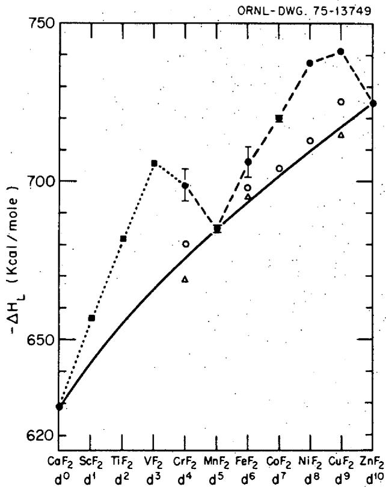  
Fig. 3.4. Lattice enthalpies of $3d$ divalent fluorides. Solid circles $(\bullet)$ are experimental $\Delta H_{L}$ calculated from Eq.(1); error bars are uncertainties in $\Delta H_{f}$ . Open circles $(\circ)$ are $\Delta H_{L}$ minus ligand-field stabilization energy. Triangles $(\Delta)$ are $\Delta H_{L}$ minus both LFSE and Jahn-Teller energy. Solid squares $(\blacksquare)$ were estimated by adding LFSE plus $3\mathrm{kcal / mole}$ as an empirical correction to the smooth curve.

the ligands are fluoride ions octahedrally coordinated (except for $\mathrm{CaF}_2$ ) to the cation; the octahedral "field" of fluoride ions acts to "stabilize" the splitting of $d$ -electron energy levels of the metal ions. In a spherically symmetrical field, the $d$ -electron levels would be degenerate, that is, be at the same energy. In Fig. 3.4, the smooth curve drawn through, for example, $\mathrm{NiF}_2$ represents the $\Delta H_L$ $\mathrm{NiF}_2$ would have if the field of fluoride ions around the nickel cation were spherically symmetrical. Octahedrally coordinated cations with unfilled, half-filled, or fully filled $3d$ orbitals will not have a ligand-field stabilization energy; hence a smooth curve is drawn through $\mathrm{CaF}_2(d^0)$ , $\mathrm{MnF}_2(d^5)$ , and $\mathrm{ZnF}_2(d^{10})$ .

Values of the LFSE can be deduced from optical spectra. For $\mathrm{FeF_2}$ , $\mathrm{NiF_2}$ , and $\mathrm{CoF_2}$ , subtraction of optically derived LFSE (Table 3.6) from $\Delta H_{L}$ yields values (open circles in Fig. 3.4) which are above the smooth curve by 2 to $3\mathrm{kcal / mole}$ . Similar LFSE subtractions for $\mathrm{CrF_2}$ and $\mathrm{CuF_2}$ yield values (denoted by

Table 3.5. Lattice enthalpy $(\Delta H_{L})$ and standard enthalpy of formation $(\Delta H_{f})$ of $3d$ trivalent fluorides; standard enthalpy of formation of $3d$ cations $(\Delta H_{3+})$   

<table><tr><td>Fluoride</td><td>-ΔHf(kcal/mole)</td><td>-ΔH3+(kcal/mole)a</td><td>-ΔHL(kcal/mole)</td></tr><tr><td>ScF3</td><td>394.1 ± 2b</td><td>1112</td><td>1322.4 ± 2</td></tr><tr><td>TiF3</td><td>336.1 ± 3.5c</td><td>1222</td><td>1374 ± 3.5</td></tr><tr><td>VF3</td><td>295d± 5</td><td>1298</td><td>1409</td></tr><tr><td>CrF3</td><td>277e</td><td>1351.6</td><td>1445</td></tr><tr><td>MnF3</td><td>238 ± 7c</td><td>1381</td><td>1436 ± 7</td></tr><tr><td>FeF3</td><td>249 ± 3c</td><td>1365.4</td><td>1431 ± 3</td></tr><tr><td>CoF3</td><td>193.8e</td><td>1455.6</td><td>1465.7</td></tr><tr><td>NiF3</td><td>(165)g</td><td>1515.5</td><td>(1497)g</td></tr><tr><td>CuF3</td><td>(120)g</td><td>1584</td><td>(1520)g</td></tr><tr><td>GaF3</td><td>278h</td><td>1389</td><td>1483</td></tr></table>

$a$ Ionization potentials from C. E. Moore, NSRDS-NBS 34 (1970); enthalpies of sublimation from ref. 19; valence state preparation energy corrections from ref 20.   
bT. N. Rezukhina et al., J. Chem. Thermodyn. 6, 890 (1974).   
cQ. Kubaschewski et al., pp. 334, 354 in Metallurgical Thermochemistry, 4th ed., Pergamon, Oxford, England, 1967.   
$d_{\text{Derived from solid galvanic-cell emf data given in W. H. Skelton and J. W. Patterson, J. Less-Common Metals 31, 47}}$ (1973).   
$^{e}$ NBS Technical Note 270-4 (1969).   
$f_{JANAF}$ Thermochemical Tables, 2d ed., NSRDS-NBS 37 (1971).   
$g$ Estimated in this investigation.   
$h_{NBS}$ Technical Note 270-3 (1968).

open circles) above the smooth curve by 5 and 7 kcal/mole respectively. Both $\mathrm{CrF}_2$ and $\mathrm{CuF}_2$ (and to a lesser extent, $\mathrm{FeF}_2$ ) are known from crystal structure data to exhibit major tetragonal departures from octahedral coordination geometry. This is attributed to the Jahn-Teller effect,[21] which confers an additional stabilization energy. (Jahn-Teller energy is abbreviated herein as JTE.) For $\mathrm{CuF}_2$ and $\mathrm{FeF}_2$ , the JTE can be derived optically (Table 3.6). When LFSE and JTE are additively applied to $\mathrm{CuF}_2$ and $\mathrm{CrF}_2$ , the lattice enthalpy is overcorrected as is shown by the triangles in Fig. 3.4.

The methods outlined above can be applied to predict $\Delta H_{L}$ for $\mathrm{VF}_2$ and $\mathrm{TiF}_2$ . Neither compound would be expected to have a significant JTE. The formula used is

$$
\Delta H _ {L} (\mathrm {k c a l / m o l e}) = \Delta H _ {L} ^ {\prime} + \mathrm {L F S E} + 3, \tag {5}
$$

where $\Delta H_{L}^{\prime}$ is the value for the compound lying on the smooth curve in Fig. 3.4. The 3 kcal/mole on the right-hand side of Eq. (5) is an empirical correction reflecting

Table 3.6. Ligand-field parameter (10Dq), stabilization energy (LFSE), Jahn-Teller splitting $(\delta)$ and energy (JTE) for the di- and trifluorides of $3d$ metals   

<table><tr><td>Electron levels</td><td>Fluoride</td><td>10Dq (cm-1)a</td><td>LFSE (kcal/mole)</td><td>δ (cm-1)a</td><td>JTE (kcal/mole)</td></tr><tr><td rowspan="2">d1</td><td>ScF2</td><td></td><td>(-12)b</td><td></td><td></td></tr><tr><td>TiF3</td><td>16,000c</td><td>-18.2</td><td>910</td><td>-1.7</td></tr><tr><td rowspan="2">d2</td><td>TIF2</td><td>(10,700)d</td><td>(-24)</td><td></td><td></td></tr><tr><td>VF3</td><td>15,900e</td><td>-36.4</td><td></td><td></td></tr><tr><td rowspan="2">d3</td><td>VF2</td><td>11,000f</td><td>(-38)</td><td></td><td></td></tr><tr><td>CrF3</td><td>14,600</td><td>-50.1</td><td></td><td></td></tr><tr><td rowspan="2">d4</td><td>CrF2</td><td>11,000</td><td>-18.9</td><td></td><td>(-11)g</td></tr><tr><td>MnF3</td><td>17,400</td><td>-29.8</td><td>9000</td><td>-12.9</td></tr><tr><td rowspan="2">d6</td><td>FeF2</td><td>6,900</td><td>-7.9</td><td>1400</td><td>-2.7</td></tr><tr><td>CoF3</td><td>11,400</td><td>-13.0</td><td></td><td></td></tr><tr><td rowspan="2">d7</td><td>CoF2</td><td>7,200</td><td>-16.5</td><td></td><td></td></tr><tr><td>-NiF3</td><td>16,200i</td><td>-37.0</td><td></td><td></td></tr><tr><td rowspan="2">d8</td><td>NiF2</td><td>7,400</td><td>-25.4</td><td></td><td></td></tr><tr><td>CuF3</td><td>14,100i</td><td>-48.4</td><td></td><td></td></tr><tr><td>d9</td><td>CuF2</td><td>7,400</td><td>-15.3</td><td>7500</td><td>-10.7</td></tr></table>

$a$ Values given in D. Oelkrug, Struct. Bonding (Berlin) 9, 1-26 (1971) unless otherwise indicated.   
$b_{\mathrm{LFSE}}$ estimated very roughly as $\frac{1}{2}$ of $\mathrm{TiF_2}$ .   
$C$ Based on $\mathbf{K}_2\mathrm{NaTiF}_6$   
$d_{\text{Estimated by assuming 10Dq is } \frac{2}{3}\text{ that of } \mathrm{TiF}_3$ .   
${}^{e}$ Based on ${\left( {\mathrm{{NH}}}_{4}\right) }_{3}{\mathrm{{VF}}}_{6}$ .   
$f_{\text{Estimated by Jorgensen's method}}: 10 \mathrm{Dq} = g \times k; g = 12,300 \mathrm{~cm}^{-1}, k = 0.9.$   
gRough estimate from JTE of $\mathrm{CuF_2}$   
$h_{\mathrm{Based}}$ on $\mathbf{K}_3\mathrm{CoF}_6$   
$^{i}$ G. C. Allen and K. O. Warren, Struct. Bonding (Berlin) 9, 107 (1971).

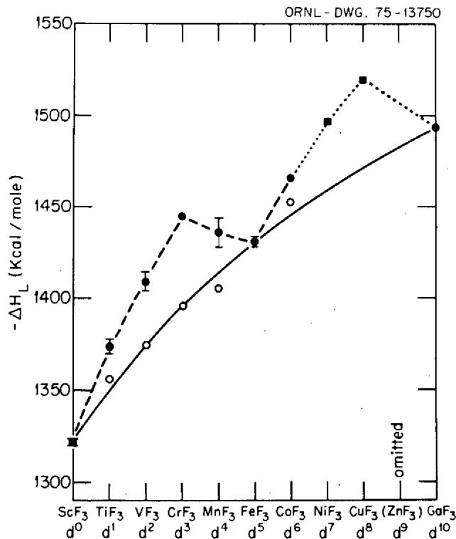  
Fig. 3.5. Lattice enthalpies of $3d$ trivalent fluorides. Solid circles $(\bullet)$ are experimental $\Delta H_{L}$ calculated from Eq. (1); error bars are published uncertainties in $\Delta H_{L}$ . Open circles $(\odot)$ are $\Delta H_{L}$ minus ligand-field stabilization energy. Solid squares $(\blacksquare)$ are estimated by adding LFSE to the smooth curve.

the difference between theoretical and thermochemical lattice enthalpies for $\mathrm{NiF}_2$ and $\mathrm{CoF}_2$ . The standard enthalpy of formation $(\Delta H_f)$ for $\mathrm{TiF}_2$ and $\mathrm{VF}_2$ is then obtained from Eq. (1) and is listed in Table 3.4.

Analogous considerations were applied to study $\Delta H_{L}$ for trivalent fluorides. The data and results are presented in Table 3.5 and in Fig. 3.5. The double-hump pattern of the data is evident in Fig. 3.5. Subtraction of LFSE (given in Table 2.6) yields very satisfactory agreement between theoretical and experimental lattice enthalpies of $\mathrm{VF}_3$ and $\mathrm{CrF}_3$ ; the agreement for $\mathrm{TiF}_3$ (and for $\mathrm{CoF}_3$ ) is less satisfactory. As may be seen by the open circle below the curve in Fig. 3.5, subtraction of LFSE from $\Delta H_{L}$ overcorrects $\mathrm{MnF}_3$ . This is somewhat surprising, since $\mathrm{MnF}_3$ , with its $3d^4$ electronic configuration for $\mathrm{Mn}^{3+}$ , also has a sizable JTE (Table 2.6). If the JTE were also subtracted, the discrepancy from the smooth curve would be much greater. In short, the thermochemical data for $\mathrm{MnF}_3$ are questionable.

In estimating $\Delta H_{L}$ and $\Delta H_{f}$ for $\mathrm{NiF}_3$ and $\mathrm{CuF}_3$ (Table 3.5), only the LFSE was added to the spherically symmetrical values (i.e., smooth curve values) of $\Delta H_{L}$ . In other words, Eq. (5) was applied without the empirical correction of $3\mathrm{kcal / mole}$ .

With regard to the $\Delta H_{f}$ of the structural-metal fluorides, the theory, as applied above, suggests that there is little need to determine $\Delta H_{f}$ for $\mathrm{NiF}_2$ . Moreover, from the value of $\Delta H_{f}$ of $\mathrm{TiF}_2$ obtained in this study, it is understandable why $\mathrm{TiF}_2$ has never been prepared as a pure solid; it can be easily shown that $\mathrm{TiF}_2$ would readily disproportionate to $\mathrm{TiF}_3$ and Ti. However, a more accurate experimental determination of $\Delta H_{f}$ for $\mathrm{TiF}_3$ would be desirable for both practical as well as theoretical reasons. The same may be said for $\mathrm{VF}_2$ , $\mathrm{VF}_3$ , $\mathrm{CrF}_2$ , $\mathrm{CrF}_3$ , $\mathrm{FeF}_2$ , and $\mathrm{FeF}_3$ .

# 4. Coolant-Salt Chemistry

A. D. Kelmers

# 4.1 CHEMISTRY OF SODIUM FLUOROBORATE

L. Maya W.R.Cahill\*

The composition of the condensable fraction of the vapor phase in equilibrium with molten fluoroborate can be defined by the system $\mathrm{H}_3\mathrm{OBF}_4\cdot \mathrm{HBO}_2\cdot \mathrm{H}_2\mathrm{O}$ , as described in the previous report. The work done during this report period was aimed at spectroscopic identification of the molecular species present. The B NMR as well as IR and Raman spectra of $\mathrm{BF}_3\cdot 2\mathrm{H}_2\mathrm{O}$ , $\mathrm{HBF}_2(\mathrm{OH})_2$ , and of other intermediate compositions was obtained. Dihydroxyfluoroboric acid (DHFBA) participates in exchange processes which could be described by the following equilibria:

$$
2 \mathrm {H B F} _ {2} (\mathrm {O H}) _ {2} = \mathrm {B F} _ {3} \cdot \mathrm {H} _ {2} \mathrm {O} + \mathrm {H} _ {3} \mathrm {B O} _ {3},
$$

$$
\mathrm {B F} _ {3} \cdot \mathrm {H} _ {2} \mathrm {O} + \mathrm {H} _ {3} \mathrm {B O} _ {3} = \mathrm {B F} _ {3} \cdot 2 \mathrm {H} _ {2} \mathrm {O} + \mathrm {H B O} _ {2}.
$$

The presence of $\mathrm{H}_3\mathrm{BO}_3$ and $\mathrm{HBO}_2$ was detected by IR and Raman spectra, and the pronounced broadening of the $^{19}\mathrm{F}$ and $^{11}\mathrm{B}$ NMR signals is an indication of exchange processes. The Raman spectrum of DHFBA indicates that this compound is a tetrahedral molecule. Exchange processes were not detected for $\mathrm{BF}_3\cdot 2\mathrm{H}_2\mathrm{O}$ . This compound appears to be stable at room temperature. The structural information derived from the Raman spectrum, which identified $\mathrm{BF}_3\cdot 2\mathrm{H}_2\mathrm{O}$ as a

*ORAU summer participant.

1. L. Maya, MSR Program Semiannu. Progr. Rep. Feb. 28, 1975, ORNL-5047, p. 47.

tetrahedral molecule, agrees with the x-ray structural determination of this compound.

Additional samples of condensate collected during the operation of the Coolant Salt Test Facility (CSTF) were analyzed (Table 4.1). Silicon is present because of attack on the glass trap used to collect the condensate. Variations in the chemical composition of the samples can be interpreted as an indication that the condensed material is not a single molecular compound but, rather, a mixture formed by combination of the simpler gaseous species present in the system, that is, $\mathrm{H}_2\mathrm{O}$ , HF, and $\mathrm{BF}_3$ . The relatively high tritium content of these fractions should be noted. Tritium is present in the system, since some of the Hastelloy N in the loop was originally used in the MSRE. The condensates show a tritium concentration factor of about $10^5$ relative to the salt, suggesting that fluoroborate coolant salt $[\mathrm{NaBF}_4\text{-NaF} (92 - 8\text{mole}\%)]$ may be an effective means of concentrating and conveying tritium out of the system.

Attempts were made to generate a condensable fraction in laboratory-scale experiments by heating coolant salt containing up to $200\mathrm{ppmH}$ as $\mathrm{NaBF}_3\mathrm{OH}$ to $400^{\circ}\mathrm{C}$ in a closed system equipped with a cold finger. The $\mathrm{OH}^{-}$ concentration in the salt decreased to $50~\mathrm{ppm}$ , and the composition of the condensate in a typical run was $53.2\%$ $\mathrm{H}_3\mathrm{OBF}_4$ , $14.8\%$ $(\mathrm{H}_3\mathrm{O})_2\mathrm{SiF}_6$ and $32\%$ free water found by difference. The boron concentration in the condensed material did not reach as high a level as in

2. W. B. Bang and G. B. Carpenter, Acta. Cryst. 17, 742 (1964).

Table 4.1. Analyses of CSTF trap condensates   

<table><tr><td rowspan="2">Sample</td><td rowspan="2">Operation period</td><td rowspan="2">Amounta</td><td colspan="3">Chemical compositionb(wt %)</td><td rowspan="2">Tritium content (mCi/g)</td></tr><tr><td>H3OBF4</td><td>HBO2</td><td>SiF62-</td></tr><tr><td>1</td><td>1972</td><td>Not avail.</td><td>60.4</td><td>15.7</td><td>Not det.</td><td>0.8 to 3.0c</td></tr><tr><td>2</td><td>1/14/75 - 1/24/75</td><td>100 mg</td><td>92.3</td><td>0</td><td>2.1</td><td>5.7</td></tr><tr><td>3</td><td>3/14/75 - 4/15/75d</td><td>2.5 g</td><td>84.1</td><td>12.4</td><td>4.0</td><td>3.4</td></tr><tr><td>4</td><td>4/15/75 - 5/6/75</td><td>800 mg</td><td>83.0</td><td>12.1</td><td>0.1</td><td>0.6</td></tr></table>

${}^{a}$ Approximate amount. Some of the material remained in the trap.   
$b_{\text{Difference from 100% is H}_2\text{O}}$   
$c_{\mathrm{Given}}$ as a range. Apparently more than one sample was analyzed for tritium content. Data from A.   
S. Meyer and J.M. Dale, Anal. Chem. Div. Annu. Progr. Rep. Jan. 1974, ORNL-4930, p. 28.   
$d_{\text{The loop}}$ was not in operation between $1/24/75$ and $3/14/75$ .

the CSTF samples, and there was considerable corrosion. Nevertheless, these experiments showed a possible mechanism for the conversion of dissolved $\mathrm{NaBF}_3\mathrm{OH}$ into a volatile fraction.

An apparatus was assembled to measure the vapor density of $\mathrm{BF}_3\cdot 2\mathrm{H}_2\mathrm{O}$ and related compounds at elevated temperatures to determine the degree of dissociation of these materials. This work tested the hypothesis that the condensable materials collected in the operation of the CSTF are completely dissociated at operating temperatures $(400 - 600^{\circ}\mathrm{C})$ and only combine to form more complex molecules in the colder parts of the system. The procedure consists in measuring the pressure developed in a closed system containing a known amount of $\mathrm{BF}_3\cdot 2\mathrm{H}_2\mathrm{O}$ or DHFBA in order to establish the degree of dissociation according to the equilibrium described below:

$$
\mathrm {B F} _ {3} \cdot 2 \mathrm {H} _ {2} \mathrm {O} = \mathrm {B F} _ {3} + 2 \mathrm {H} _ {2} \mathrm {O}.
$$

At this time, volumes in the apparatus have been determined, and pressure determinations have been made using argon as a test gas. Initial runs with $\mathrm{BF}_3\cdot 2\mathrm{H}_2\mathrm{O}$ indicate that this compound may be completely dissociated at $400^{\circ}\mathrm{C}$ .

Work on determining the oxide species present in molten fluoroborate is being continued, and the survey1 of the system $\mathrm{NaF - NaBF_4 - B_2O_3}$ at 400 to $600^{\circ}\mathrm{C}$ has been extended to include IR and x-ray diffraction analyses in addition to physical and chemical observations of the behavior of selected compositions. The observations indicate that there are three main areas in the system:

1. A region of compositions in which $\mathbf{BF}_3$ is evolved. This occurs with compositions having a deficiency, in terms of equimolar ratios, of NaF relative to the $\mathbf{B}_2\mathbf{O}_3$ present.   
2. A region of compositions in which stable glasses are formed on cooling. This corresponds to mixtures containing more than 33 mole $\% \mathrm{B}_2\mathrm{O}_3$   
3. A region in which crystalline phases and glasses coexist. The tendency to form glasses on cooling decreases with decreasing $\mathbf{B}_2\mathbf{O}_3$ content.

Usually coolant salt $\left[\mathrm{NaBF}_4\text{-NaF}\right.$ (92-8 mole $\%$ ) contains relatively small amounts of oxide, up to 1000 ppm, and its composition lies within area 3; thus, work has been directed toward characterizing the oxide species in this area. At least two species were present; one formed at the boundary of the glass area (high oxide content), and the other was $\mathrm{Na}_3\mathrm{B}_3\mathrm{F}_6\mathrm{O}_3$ , which formed in compositions having NaF: $\mathrm{NaBF}_4:\mathrm{B}_2\mathrm{O}_3$ mole ratios of 2:2:1 and 2:4:1 and was possibly present in

compositions containing as little as 3 mole $\%$ $\mathbf{B}_2\mathbf{O}_3$ . Experiments at the 1.5 to 4.0 mole $\%$ $\mathbf{B}_2\mathbf{O}_3$ level, approaching the coolant composition, have been impeded by the relatively low sensitivity of IR and x-ray powder diffraction. The difficulty with IR, using the KBr pellet method, arises from the fact that, at these oxide levels, the only band not covered by $\mathbf{BF}_4^-$ absorptions is the one at $810~\mathrm{cm}^{-1}$ . This band has a relatively low absorptivity, and it is common to $\mathbf{NaBF}_3\mathbf{OH}$ , $\mathbf{Na}_2\mathbf{B}_2\mathbf{F}_6\mathbf{O}$ , $\mathbf{Na}_3\mathbf{B}_3\mathbf{F}_6\mathbf{O}_3$ , and possibly other BOF compounds, although the intensity and line shape are different for each compound. A more certain IR identification can be made only when at least two typical bands can be identified (presently observable only at higher concentrations), as was the case in the identification of $\mathbf{Na}_3\mathbf{B}_3\mathbf{F}_6\mathbf{O}_3$ at an oxide level corresponding to 14 mole $\%$ $\mathbf{B}_2\mathbf{O}_3$ . Difficulties with x-ray diffraction arise from the low sensitivity of this technique coupled with the fact that the species have a tendency to form glasses. Raman work on melts is being planned as the next step in this study.

# 4.2 CORROSION OF STRUCTURAL ALLOYS BY FLUOROBORATES

S. Cantor D. E. Heatherly B. F. Hitch

Alloys containing chromium in contact with molten $\mathrm{NaBF_4}$ -NaF would be expected to form a boride, because the reaction

$$
\begin{array}{l} (1 + x) \mathrm {C r} (\mathrm {c}) + \mathrm {N a B F} _ {4} (\mathrm {d}) + 2 \mathrm {N a F} (\mathrm {d}) \\ = \mathrm {N a} _ {3} \mathrm {C r F} _ {6} (\mathrm {c}) + \mathrm {C r} _ {x} \mathrm {B} (\mathrm {c}) \tag {1} \\ \end{array}
$$

has a negative standard free-energy change $(\Delta G^0)$ . At a temperature of $800^{\circ}\mathrm{K}$ , $\Delta G_{800}^{0} = -10$ kcal. This value is based on an estimated standard free energy of formation $(\Delta G_f^0)$ of $\mathrm{Na}_3\mathrm{CrF}_6$ of $-600$ kcal/mole. In reaction (1), the exact value of $x$ is unknown; however, $\Delta G_f^0$ of the more stable chromium borides $(\mathrm{Cr_2B},\mathrm{Cr_5B_3})$ is estimated to be $-22$ kcal per gram-atom of boron. In nickel-base alloys, reaction (1) may proceed more readily because of the probable exothermic nature of the reaction

$$
\operatorname {C r} _ {x} \mathrm {B} (\mathrm {c}) + y \mathrm {N i} (\text {a l l o y}) = \operatorname {C r} (\text {a l l o y}) + \mathrm {N i} _ {y} \mathrm {B} (\mathrm {c}). \tag {2}
$$

Assuming that $\Delta G_{f}^{0}$ of $\mathbf{N}\mathbf{i}_{y}\mathbf{B}$ equals its enthalpy of formation, $\Delta G_{f}^{0}$ for reaction (2) is about $-3\mathrm{kcal}$ per gram-atom of boron.

An experiment to determine the extent of boride formation in the nickel-base alloys Hastelloy N (7% Cr) and Inconel 600 (15% Cr) has been in progress for several months. In this experiment, metal specimens are equilibrated with $\mathrm{NaBF_4}$ -NaF (92-8 mole %) at $640^{\circ}\mathrm{C}$ under an argon atmosphere and are periodically removed, washed free of salt, using water, and analyzed by spark-source mass spectrometry (SSMS) and, less routinely, by ion microprobe mass analysis (IMMA).

Analysis for boron on specimen surfaces by SSMS suggests some boride formation. Hastelloy N specimens that had equilibrated for up to 129 days were found to contain 30 to $1000~\mathrm{ppm}$ B; Inconel 600 specimens contained 80 to $2000~\mathrm{ppm}$ B. Control specimens that had not been in contact with the molten salt showed 5 to 20 ppm when analyzed by SSMS. Boron in Inconel 600 increased with equilibration time; but, with Hastelloy N, the data were much more scattered and showed virtually no time dependence.

Several specimens analyzed by SSMS were also investigated by IMMA. Boron was present within the first few hundred monolayers of metal, in inclusions also containing sodium and fluorine in specimens of $2\%$ Ti-modified Hastelloy N that had equilibrated for 72 days. These contained 150 ppm B as determined by SSMS.

The only plausible explanation seems to be that some $\mathrm{NaBF_4}$ remains on (or in) the metal surface despite the washing (5-10 min in boiling water) intended to remove adhering traces of salt. Some of the scatter in the boron analyses by SSMS is probably due to salt contamination of the metal surface. Inconel 600 specimens scanned by IMMA showed a similar pattern of surface inclusions containing B, Na, and F. Unfortunately, IMMA does not provide quantitative analyses for these elements. As yet, the extent of boride formation cannot be quantified in either Hastelloy N or in Inconel 600 by a combination of SSMS and IMMA. Probably, however, reactions (1) and (2) occur to a small extent; boride is deposited at levels not greater than $500~\mathrm{ppm}$ on Hastelloy N and not exceeding $1000~\mathrm{ppm}$ on Inconel 600 after four months of contact with molten $\mathrm{NaBF_4 - NaF}$ .

IMMA was also used to obtain depth profiles of alloy constituents through about 5000 layers. In control specimens, elemental concentrations were uniform with depth. In equilibrated Hastelloy N, molybdenum was uniformly distributed throughout the depth explored, but chromium and titanium concentrations increased linearly from the surface inward; the iron concentration appeared to decrease slowly with depth. Equilibrated Inconel 600 showed virtually no chromium in the first 500 layers, but chromium increased linearly in the next 4500 layers; iron and nickel were uniform through the depth studied. Thus, IMMA indicates that chromium is selectively oxidized by $\mathrm{NaBF_4}$ -NaF (92-8 mole $\%$ ) or by oxidants contained in this molten mixture.

# 5. Development and Evaluation of Analytical Methods

A. S. Meyer

# 5.1 IN-LINE ANALYSIS OF MOLTEN MSBR FUEL

R.F.Apple

B. R. Clark

D. L. Manning

A. S. Meyer

Corrosion test loops described previously have continued operation with circulating reference fuel carrier salt, $\mathrm{LiF - BeF_2ThF_4}$ (72-16-12 mole $\%$ ). No additional loops have been placed in operation during this reporting period, although several are expected to begin operation within the next few months.

Measurements of the $\mathrm{U}^{4 + } / \mathrm{U}^{3 + }$ ratio in the forced convection loop (FCL-2b) indicate a "steady-state" value of about 100 (Fig. 5.1). This is somewhat lower than the

1. H. E. McCoy et al., MSR Program Semiannu. Progr. Rep. Aug. 31, 1974; ORNL-5011, p. 76.   
2. A. S. Meyer et al., MSR Program Semiannu. Progr. Rep. Feb. 28, 1975, ORNL-5047, p. 52.

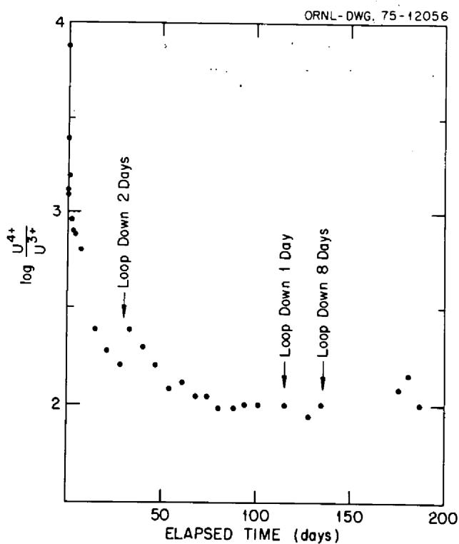  
Fig. 5.1. $\mathrm{U}^{4+}/\mathrm{U}^{3+}$ ratios in forced convection loop FCL-2b.

apparent steady-state value obtained with the fluoride mixture, $\mathrm{LiF - BeF_2 - ThF_4}$ (68-20-12 mole $\%$ ), indicating a less oxidizing melt. The melt, which started at a ratio of around 1000, reached this level via a redox process which presumably involves reaction with the chromium in the walls of the vessel or in the specimens. No attempts have yet been made to reoxidize the $\mathbf{U}^{3 + }$ in the melt by suitable additions of $\mathrm{NiF}_2$ or some other oxidant. It is interesting that the decrease to a steady-state value occurred after about 75 days, with a rapid decrease in the first 30 days. Previous data from the experimental fuel showed $^2$ a rather stable value near $10^{4}$ for about 60 days, until beryllium additions were made to force reduction of the $\mathbf{U}^{4 + }$ .

Some of oscillations in the data probably result from air contamination with subsequent oxidation when the loop was down. This was most prominent with the experimental melt (68-20-12 mole %) when the $\mathrm{U}^{4+}/\mathrm{U}^{3+}$ ratio was substantially greater than the steady-state value reached at a later date.

Ratios of $\mathrm{U}^{4+}/\mathrm{U}^{3+}$ measured in the two thermal convection loops, NCL 21A and NCL 23, are summarized in Figs. 5.2 and 5.3 respectively. No unusual trend is apparent in the oxidation-state history of the fuel melt in NCL 21A. This loop was operated for about 240 days with Hastelloy N corrosion specimens. The curve shows a rather dramatic rise in the ratio whenever new specimens are added. This effect is attributed to additions of moisture and air which partially oxidize $\mathrm{U}^{3+}$ . A recovery to lower ratios follows each increase in repetitive fashion.

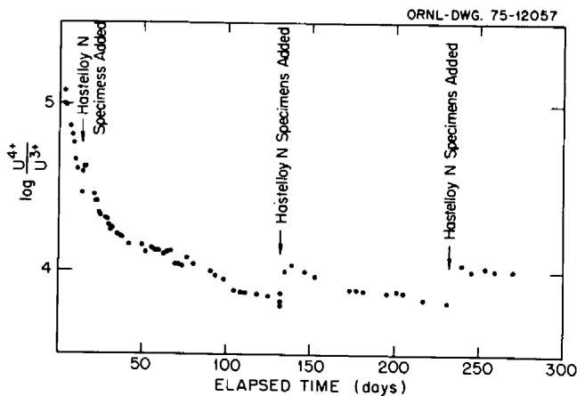  
Fig. 5.2. $\mathbf{U}^{4 + } / \mathbf{U}^{3 + }$ ratios in thermal convection loop NCL-21A.

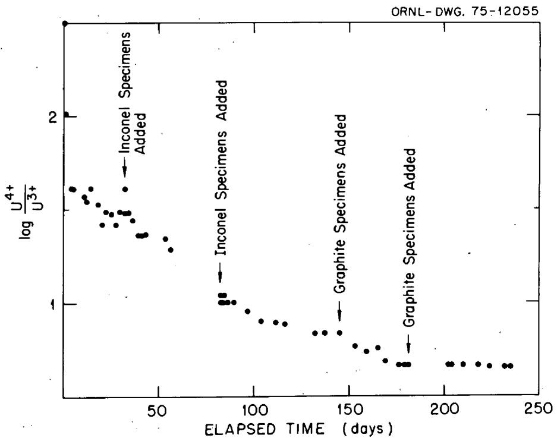  
Fig. 5.3. $\mathrm{U}^{4+}/\mathrm{U}^{3+}$ ratios in thermal convection loop NCL-23.

The $\mathbf{U}^{4+}$ in the melt in the Inconel 601 loop, NCL 23, was rapidly reduced until a $\mathrm{U}^{4+}/\mathrm{U}^{3+}$ ratio of around 40 was reached. Since then the ratio has continued to decline, reaching a relatively stable value near 5. The high level of chromium in the Inconel 601 (23 wt $\%$ ) provides a sufficiently active reductant to reduce the $\mathbf{U}^{4+}$ more extensively than has been observed in Hastelloy N loops; therefore, the greater $\mathbf{U}^{3+}$ concentration is not surprising.

# 5.2 TRITIUM ADDITION EXPERIMENTS IN THE COOLANT-SALT TECHNOLOGY FACILITY

R.F.Apple B.R.Clark A.S.Meyer

One major concern in the development of an MSBR is the release of tritium to the surroundings. A potential method for limiting tritium release rates to acceptable levels involves trapping and removal of the tritium in the secondary coolant system. This method must be tested before a complete understanding is possible of the manner by which tritium will be retained in an MSBR. The present series of tritium addition experiments involving sodium fluoroborate will provide data on this method.

The Coolant-Salt Technology Facility (CSTF) is being operated for testing the $\mathrm{NaBF_4}$ - $\mathrm{NaF}$ eutectic mixture

with regard to its suitability as a possible secondary coolant system. In cooperation with loop engineers and technicians, the Analytical Chemistry Group has been engaged in experiments to determine the fate and behavior of elemental tritium added directly to the circulating salt to simulate, at least in part, the predicted transport of tritium into the coolant system via diffusion through the primary heat exchanger. This section describes the methodology and results of the first two experiments.

About $80\mathrm{mCi}$ of tritium (diluted about 1:1000 with protium) was introduced into the salt stream over a period of about 11 hr beginning on July 17. Tritium concentrations were measured in the salt and the cover gas during the addition and for several days thereafter. Salt samples were collected directly from the pumpbowl access port with a copper thimble covered with a copper frit. One-gram samples of the cooled salt were diluted volumetrically, and aliquots were mixed with a scintillation emulsion for beta counting.

Cover-gas sampling has proven to be somewhat difficult. At present a sidestream is being sampled; the difficulty arises from the passage of this stream through a nickel sampling line that is not completely inert chemically to cover-gas components. Thus the amount of elemental tritium finally measured may not be an accurate

measure of tritium level within the loop gas system. More definitive experiments will require the use of inert precious metals in the sampling system to remove doubt of chemical alteration of the cover-gas stream composition by the sampling system.

The off-gas collection train consists of

1. a series of three water scrubber pretraps which serve to trap $\mathbf{BF}_3$ and any other water-soluble compounds;   
2. a hot $(400^{\circ}\mathrm{C})$ copper oxide-filled tube;   
3. a condensation trap to collect water formed in or passing through the copper oxide;   
4. a liquid-nitrogen cold trap to remove the last traces of water;   
5. a wet test meter to measure the volume of the inert gas component of the cover gas, that is, helium.

Results of the first injection experiment are summarized for the off-gas (Table 5.1) and salt (Table 5.2) samples.

Several days after operation had begun, some liquid collected in the short glass section between the stopcock used to divert the gas stream and the first trap in the analysis train. The liquid was washed from the glass, counted, and found to contain about $60\mu \mathrm{Ci}$ of tritium. This discovery clearly complicates the interpretation of previously collected samples, since a large portion of total cover-gas tritium never reached the analysis train. Furthermore, no conclusion is possible regarding the chemical state of the tritium in the liquid. The data suggest that the concentration of elemental tritium

Table 5.1. Tritium content in cover-gas samples after first tritium addition in CSTF   

<table><tr><td rowspan="2">Date(July)</td><td rowspan="2">Time</td><td colspan="2">Tritium in gas(pCi/ml)</td></tr><tr><td>H2O soluble</td><td>Elemental</td></tr><tr><td rowspan="5">17</td><td>1046</td><td>2.3</td><td>3.4</td></tr><tr><td>1305</td><td>0.7</td><td>12</td></tr><tr><td>1700</td><td>1.4</td><td>170</td></tr><tr><td>1911</td><td>1.8</td><td>93</td></tr><tr><td>2243</td><td>1.4</td><td>830</td></tr><tr><td rowspan="3">18</td><td>0100</td><td>3.2</td><td>420</td></tr><tr><td>0805</td><td>7.3</td><td>61</td></tr><tr><td>1000</td><td>44</td><td>71</td></tr><tr><td>19</td><td>1037</td><td>790</td><td>62</td></tr><tr><td rowspan="2">21</td><td>0905</td><td>1800</td><td>13</td></tr><tr><td>1325</td><td>50</td><td>13</td></tr><tr><td>22</td><td>0925</td><td>55</td><td>5.8</td></tr><tr><td>23</td><td>1303</td><td>85</td><td>29</td></tr><tr><td>24</td><td>1000</td><td>300</td><td>22</td></tr><tr><td>25</td><td>1315</td><td>340</td><td>26</td></tr><tr><td>28</td><td>1245</td><td>10</td><td>2.7</td></tr></table>

Table 5.2. Tritium content in salt samples after first tritium addition in CSTF   

<table><tr><td>Date
(July)</td><td>Sample
No.</td><td>Time</td><td>Tritium
(nCi/g)</td></tr><tr><td rowspan="7">17</td><td>45</td><td>1108</td><td>12</td></tr><tr><td>46</td><td>1308</td><td>23</td></tr><tr><td>47</td><td>1512</td><td>35</td></tr><tr><td>48</td><td>1718</td><td>51</td></tr><tr><td>49</td><td>1930</td><td>93</td></tr><tr><td>50</td><td>2145</td><td>73</td></tr><tr><td>51</td><td>2321</td><td>112</td></tr><tr><td rowspan="2">18</td><td>52</td><td>1102</td><td>32</td></tr><tr><td>53</td><td>1912</td><td>20</td></tr><tr><td rowspan="2">19</td><td>54</td><td>0830</td><td>15</td></tr><tr><td>SMV</td><td>0952</td><td>7.5</td></tr><tr><td>21</td><td>55</td><td>1132</td><td>1.6</td></tr><tr><td>22</td><td>56</td><td>1400</td><td>1.6</td></tr><tr><td>23</td><td>57</td><td>1330</td><td>2.0</td></tr></table>

increased in both the cover-gas and salt samples when the liquid was washed out between sampling periods (July 23-25).

A second tritium addition was made August 5. During this experiment no changes were made in the sampling apparatus, but that region of the sampling train (described above) where liquid had been accumulating was washed with each sample collection and counted separately. The tritium found there was added to the watersoluble tritium measured in the pretraps. Data for this experiment are summarized in Tables 5.3 and 5.4.

An exhaustive analysis of the analytical and sampling aspects of these data is not warranted at this time, since several variables which affect the addition, sampling, and the tritium losses have not yet been established. A general discussion on the behavior of tritium in the CSTF is given elsewhere. The preliminary data are sufficiently encouraging to merit a more extensive investigation into the extent and mechanism of tritium interaction with salt and cover-gas components. Plans are now under way to monitor the tritium diffusion through a portion of the loop wall and to measure the level of active protons in the salt during addition of tritium. A more intricate cover-gas sampling device (a probe designed for the salt monitoring vessel or salt sample port) is being considered and may be fabricated if no simpler solution to the gas sampling problems can be found.

Table 5.3. Tritium content in cover-gas samples after second tritium addition in CSTF   

<table><tr><td rowspan="2">Date (August)</td><td rowspan="2">Time</td><td colspan="2">Tritium in gas (pCi/ml)</td></tr><tr><td>H2O soluble</td><td>Elemental</td></tr><tr><td rowspan="9">5</td><td>0730</td><td>96</td><td>0.5</td></tr><tr><td>0930</td><td>110</td><td>2.2</td></tr><tr><td>1130</td><td>2,200</td><td>10</td></tr><tr><td>1330</td><td>5,300</td><td>20</td></tr><tr><td>1530</td><td>7,500</td><td>27</td></tr><tr><td>1830</td><td>13,000</td><td>34</td></tr><tr><td>1920</td><td>13,000</td><td>39</td></tr><tr><td>2100</td><td>12,000</td><td>40</td></tr><tr><td>2315</td><td>9,300</td><td>39</td></tr><tr><td rowspan="4">6</td><td>0730</td><td>9,300</td><td>28</td></tr><tr><td>1100</td><td>7,000</td><td>16</td></tr><tr><td>1500</td><td>6,500</td><td>14</td></tr><tr><td>2000</td><td>4,700</td><td>10</td></tr><tr><td rowspan="2">7</td><td>0940</td><td>3,300</td><td>6.8</td></tr><tr><td>1415</td><td>2,400</td><td>4.9</td></tr><tr><td>8</td><td>0930</td><td>1,600</td><td>3.4</td></tr><tr><td>9</td><td>1450</td><td>1,600</td><td>5.2</td></tr><tr><td>10</td><td>1040</td><td>1,300</td><td>2.8</td></tr><tr><td>11</td><td>1230</td><td>900</td><td>2.5</td></tr><tr><td>12</td><td>1010</td><td>570</td><td>1.1</td></tr><tr><td>13</td><td>1010</td><td>230</td><td>0.8</td></tr><tr><td>15</td><td>1000</td><td>182</td><td>1.0</td></tr><tr><td>18</td><td>0935</td><td>76</td><td>0.5</td></tr><tr><td>21</td><td>1010</td><td>73</td><td>0.5</td></tr></table>

Table 5.4. Tritium content in salt samples after second tritium addition in CSTF   

<table><tr><td>Date (August)</td><td>Sample No.</td><td>Time</td><td>Tritium (nCi/g)</td></tr><tr><td>4</td><td>58</td><td>1313</td><td>0.8</td></tr><tr><td>5</td><td>59</td><td>0954</td><td>9.0</td></tr><tr><td></td><td>60</td><td>1145</td><td>21</td></tr><tr><td></td><td>61</td><td>1350</td><td>36</td></tr><tr><td></td><td>62</td><td>1548</td><td>52</td></tr><tr><td></td><td>63</td><td>1848</td><td>71</td></tr><tr><td></td><td>64</td><td>1932</td><td>68</td></tr><tr><td></td><td>65</td><td>2125</td><td>71</td></tr><tr><td></td><td>66</td><td>2335</td><td>50</td></tr><tr><td>6</td><td>67</td><td>0830</td><td>30</td></tr><tr><td></td><td>68</td><td>1507</td><td>19</td></tr><tr><td></td><td>69</td><td>2010</td><td>16</td></tr><tr><td>7</td><td>70</td><td>1014</td><td>9.5</td></tr><tr><td></td><td>71</td><td>1528</td><td>8.1</td></tr><tr><td>8</td><td>72</td><td>1018</td><td>3.6</td></tr><tr><td>9</td><td>73</td><td>0916</td><td>4.2</td></tr><tr><td>11</td><td>74</td><td>1248</td><td>3.9</td></tr><tr><td>12</td><td>75</td><td>1035</td><td>1.4</td></tr><tr><td>13</td><td>76</td><td>1048</td><td>2.2</td></tr><tr><td>15</td><td>77</td><td>1010</td><td>1.4</td></tr><tr><td>18</td><td>78</td><td>1010</td><td>0.7</td></tr><tr><td>21</td><td>SMV 10-A</td><td>1308</td><td>0.5</td></tr></table>

# 5.3 ELECTROANALYTICAL STUDIES OF IRON(II) IN MOLTEN LiF-BeF $_2$ -ThF $_4$ (72-16-12.MOLE %)

D. L. Manning G. Mamantov

Electroanalytical studies in molten fluorides have particular importance for possible use as in-line analytical methods for molten-salt reactor streams. Iron(II) is a corrosion product present in molten-salt reactor fuels. We have previously $^{4-8}$ carried out electrochemical studies of iron(II) in molten LiF-NaF-KF (46.5-11.5-42.0 mole %), LiF-BeF $_2$ -ZrF $_4$ (69.6-25.4-5.0 mole %), and NaBF $_4$ -NaF (92-8 mole %). Since the fuel solvent for the MSBR is a thorium-containing salt, LiF-BeF $_2$ -ThF $_4$ (72-16-12 mole %), it is of interest to conduct voltammetric and chronopotentiometric studies of iron(II) in this fuel solvent. To determine concentration and/or diffusion coefficients by linear sweep voltammetry, it is necessary to know whether the product of the electrochemical reaction is soluble or insoluble. The measurements discussed below were done with this purpose in mind.

A voltammogram showing the reduction of iron(II), $\mathrm{Fe}^{2+} \rightarrow \mathrm{Fe}^0$ , at a gold electrode is shown in Fig. 5.4. The circles represent the theoretical shape based on current functions tabulated by Nicholson and Shain for a reversible wave where both the oxidized and reduced forms of the electroactive species are soluble. Thus, even though $\mathrm{Fe}^{2+}$ is reduced to the metal at gold, the electrode reaction very closely approximates the soluble-product case, apparently through the formation of iron-gold surface alloys. Further evidence that the $\mathrm{Fe}^{2+} \rightarrow \mathrm{Fe}^0$ electrode reaction at gold conforms to the soluble product case is illustrated by the chronopotentiograms in Fig. 5.5. The ratio of the forward to reverse transition times $(\tau_f / \tau_r)$ compares favorably with the

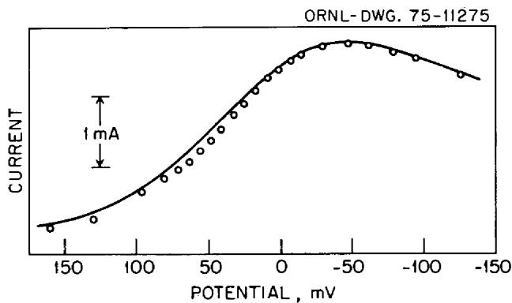  
Fig. 5.4. Stationary electrode voltammogram for the reduction of $\mathbf{Fe}^{2+}$ at a gold electrode in molten LiF-BeF $_2$ -ThF $_4$ . Potential axis is $(E - E_{1/2}) / 2$ . Solid line is experimental. Circles are theoretical shape for soluble product. Iron(II) concentration $0.027f$ ; electrode area, $0.25\mathrm{cm}^2$ ; temperature, $650^{\circ}\mathrm{C}$ .

theoretical value of 3 (ref. 10) for the soluble case, which again points to the formation of surface alloys.

The reduction of $\mathrm{Fe}^{2+}$ at a pyrolytic graphite electrode is illustrated by the voltammogram in Fig. 5.6 and the chronopotentiograms shown in Fig. 5.7. For the reversible deposition of an insoluble substance where $\eta = 2$ , the voltammetric $E_{p} - E_{p / 2} = 30.5 \, \mathrm{mV}$ at $650^{\circ}\mathrm{C}$ (ref. 11) is in good agreement with the experimental value. The chronopotentiometric ratio $(\tau_{f} / \tau_{r})$ is approximately unity, $^{10}$ which also is indicative that $\mathrm{Fe}^{2+}$ is reduced to metallic iron without any apparent interaction with the pyrolytic graphite and that all the iron is stripped from the electrode upon current reversal. Therefore, iron appears to be reversibly reduced to a soluble form at gold and to an insoluble material at pyrolytic graphite. Thus the effect of electrode substrate on an electrochemical reaction is illustrated by this example.

Chronopotentiograms for the reduction of $\mathrm{Fe}^{2+}$ at an iridium electrode at 518 and $600^{\circ}\mathrm{C}$ are shown in Fig. 5.8. The ratio at $518^{\circ}\mathrm{C}$ is approximately unity and is 3 at $600^{\circ}\mathrm{C}$ , which is evidence that $\mathrm{Fe}^{2+}$ reduction at iridium approximates the insoluble-species case (as with pyrolytic graphite) at $518^{\circ}\mathrm{C}$ and the soluble-product case (as with gold) at $600^{\circ}\mathrm{C}$ . This change in reduction behavior with temperature was not as pronounced at gold or at pyrolytic graphite.

The chronopotentiometric transition time $\tau$ for an electroactive species is given by the Sand equation1

$$
\tau^ {1 / 2} = (\pi^ {1 / 2} \eta F A D ^ {1 / 2} C) / 2 i.
$$

Average diffusion coefficients of $\mathrm{Fe}^{2+}$ in this melt evaluated from the chronopotentiometric measurements by means of the Sand equation are approximately $4.2 \times 10^{-6}$ , $8.0 \times 10^{-6}$ , and $1.5 \times 10^{-5} \, \mathrm{cm}^2/\mathrm{sec}$ at 518, 600, and $700^{\circ}\mathrm{C}$ respectively.

# 5.4 VOLTAMMETRIC STUDIES OF TELLURIUM IN MOLTEN LiF-BeF $_2$ -ThF $_4$ (72-16-12 MOLE %)

D. L. Manning A. S. Meyer G. Mamantov

Tellurium occurs in nuclear reactors as a fission product and results in shallow intergranular cracking in structural metals and alloys. It is of interest to characterize this substance electrochemically and ascertain the feasibility of in situ measurements by electroanalytical means. We previously carried out preliminary polarization measurements at a small tellurium pool electrode in molten $\mathrm{LiF - BeF_2 - ZrF_4}$ to establish the potentials at which tellurium is oxidized and reduced in the molten fluoride environment. These preliminary observations indicated that the electrode reactions are complex.

For tellurium screening studies, J. R. Keiser of the Metals and Ceramics Division fabricated an experimental cell equipped with viewing ports and electrode ports for studying the stability of lithium telluride, $\mathrm{Li}_2\mathrm{Te}$ , in molten $\mathrm{LiF - BeF_2 - ThF_4}$ . The $\mathrm{Li}_2\mathrm{Te}$ was added as pellets following which voltammograms were recorded at gold and iridium electrodes.

As $\mathrm{Li}_2\mathrm{Te}$ was added to the melt, the voltammograms became complex and are not yet completely understood. For clarity, pertinent observations at the iridium and gold electrodes are tabulated separately.

1. Upon adding one $35\mathrm{-mg}$ pellet of $\mathsf{Li}_2\mathsf{Te}$ , a reduction wave observed at $-0.9\mathrm{V}$ vs the Ir quasireference electrode (QRE) disappeared. This wave is not yet

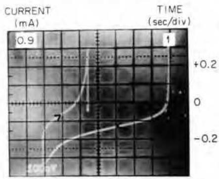

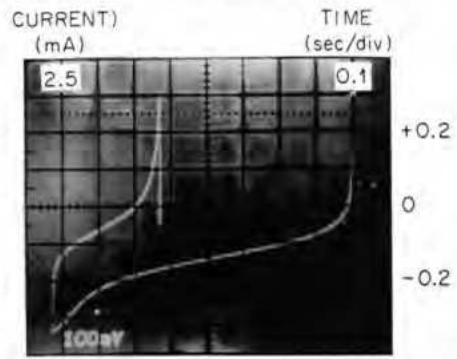

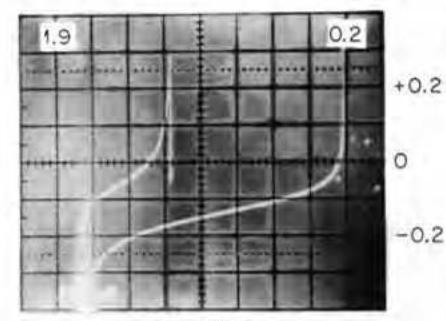

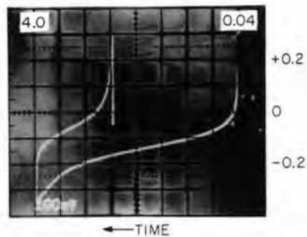  
Fig. 5.5. Cyclic chronopotentiograms for the reduction of iron(II) at a gold electrode. Formality of iron(II), 0.15; electrode area, $0.25\mathrm{cm}^2$ ; temperature, $600^{\circ}\mathrm{C}$ ; potential scale, volts vs Ir QRE.

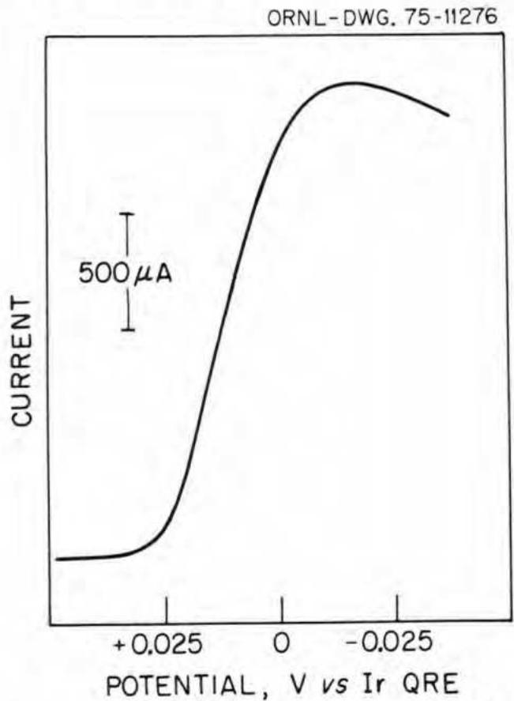  
Fig. 5.6. Stationary electrode voltammogram for the reduction of iron(II) at a pyrolytic graphite electrode. Insoluble product at $650^{\circ}\mathrm{C}$ , theoretical $E_{p} \cdot E_{p/2} = 30.5\mathrm{mV}$ ; measured $\sim 30$ mV. Iron(II) concentration, 0.027 f; electrode area, 0.1 cm².

identified. The pellets did not melt or dissolve immediately. Relics of the pellets could be seen on the surface for several days. The windows of the viewports became coated with a bluish-gray deposit after a few days, making viewing of the melt impossible. The bluish-gray deposit is believed to be tellurium metal. This indicates that tellurium species added as $\mathrm{Li}_2\mathrm{Te}$ are not stable in the melt.

2. Voltammograms recorded in molten $\mathrm{LiF - BeF_2}$ $\mathrm{ThF_4}$ after additions of $\mathrm{Li}_2\mathrm{Te}$ did not reveal any waves that could be attributed to soluble electroactive tellurium species. Chemical analysis indicated $<  5$ ppm Te in the melt.   
3. Also at an iridium electrode, a reduction wave was observed at $-0.45\mathrm{V}$ vs the Ir QRE, which was reasonably well defined at a scan rate of $0.02\mathrm{V / sec}$ . This wave is due to $\mathrm{Cr}^{2 + }$ reduction; the wave height increased upon adding $\mathrm{CrF_2}$ but did not change upon adding $\mathrm{Li}_2\mathrm{Te}$ . At our normal scan rate of $0.1\mathrm{V / sec}$ , the wave was not well defined, which explains in part why it was not positively identified on background scans that are normally recorded at $0.1\mathrm{V / sec}$ .   
4. Voltammetric waves indicative of telluride films on a gold electrode were observed. However, these waves disappeared after adding $\mathrm{CrF}_2$ to the melt. The voltammograms recorded at gold following the $\mathrm{Li}_2\mathrm{Te}$ additions became complex, and the electrode reactions are not yet resolved.   
Additional voltammetric measurements are planned whereby the supposedly more soluble and stable $\mathrm{LiTe}_3$ species will be added to the fuel melt.

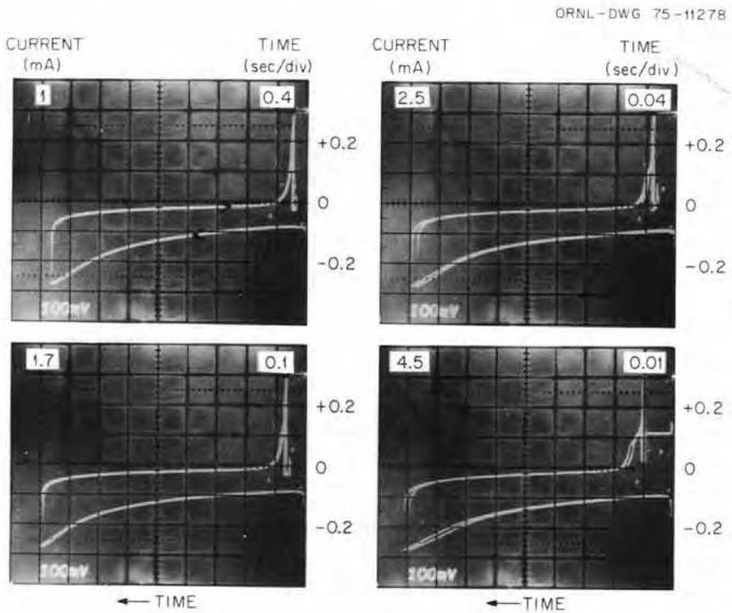  
Fig. 5.7. Cyclic chronopotentiograms for the reduction of iron(II) at a pyrolytic graphite electrode. Formality of iron(II), 0.027; electrode area, $0.1\mathrm{cm}^2$ ; temperature, $650^{\circ}\mathrm{C}$ ; potential scale, volts vs Ir QRE.

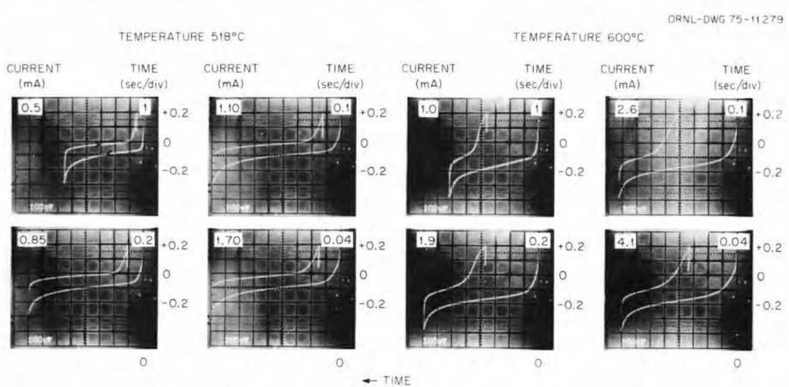  
Fig. 5.8. Cyclic chronopotentiograms for the reduction of iron(II) at an iridium electrode. Formality of iron(II), 0.015; electrode area, $0.2\mathrm{cm}^2$ ; potential scale, volts vs Ir QRE.

# Part 3. Materials Development

H. E. McCoy

The main thrust of the materials program is the development of a structural material for the MSBR primary circuit which has adequate resistance to embrittlement by neutron irradiation and to shallow intergranular attack by fission product penetration. A modified Hastelloy N containing $2\%$ Ti has good resistance to irradiation embrittlement; however, it remains to be shown that the alloy has sufficient resistance to shallow intergranular cracking. Numerous laboratory tests are in progress to answer this important question. It may be necessary to further modify the alloy with rare-earth, niobium, or higher chromium additions to impart better resistance to shallow intergranular cracking.

Laboratory programs to study Hastelloy N-salt-tellurium interactions are being established, including the development of methods for exposing test materials under simulated reactor operating conditions. Surface-analysis capabilities have been improved so that the reaction products in the affected grain boundaries can be identified.

The procurement of products from two commercial heats (8000 and 10,000 lb) of $2\%$ Ti-modified Hastelloy N continued. All products except seamless

tubing were received, and much experience was gained in the fabrication of the new alloy. The products will be used in all phases of the materials program.

The work on chemical processing materials is concentrated on graphite. Capsule tests are in progress to study possible chemical interactions between graphite and bismuth-lithium solutions and to evaluate the mechanical intrusion of these solutions into the graphite. Since the solubility of graphite in bismuth-lithium solutions appears to increase with increasing lithium concentration, a molybdenum thermal-convection loop that contained graphite specimens was run to study mass transfer in a Bi-2.5% Li solution.

Some of the effort during this reporting period was expended in reestablishing test facilities. Four thermal-convection loops are in operation in the new loop facility, which will accommodate at least ten loops. The mechanical property and general test facility is partially operational, but numerous test fixtures remain to be assembled and tests started. An air lock has been added to the general test facility to make it more functional, and plans were developed partially for further expansion of the facility.

# 6. Development of Modified Hastelloy N

H. E. McCoy

The purpose of this program is the development of metallic structural material(s) for an MSBR. The current emphasis is on the development of a material for the primary circuit, which is the most important problem at present. The material for the primary circuit will be exposed to a modest thermal-neutron flux and to fuel salt that contains fission products. It is believed that a modification of standard Hastelloy N will be a satisfactory material for this application. An alloy that contains $2\%$ Ti appears to adequately resist irradiation embrittlement, but it remains to be demonstrated that this alloy satisfactorily resists shallow intergranular attack by the fission product tellurium. Small additions of niobium and rare earths (e.g., cerium, lanthanum) to the alloy also improve the resistance to shallow intergranular cracking and likely will not reduce the beneficial effect of titanium in reducing neutron embrittlement. Increasing the chromium concentration from the present $7\%$ to a value in the range of 12 to $15\%$ may also be beneficial in preventing shallow intergranular attack. Currently, factors associated with production of the $2\%$ Ti-modified alloy in commercial quantities are being studied, while smaller heats are being made of Hastelloy N containing both $2\%$ Ti and additions of niobium and rare earths. These materials are being evaluated in several ways.

Two large heats, one 10,000 lb and the other 8000 lb, of the $2\%$ Ti-modified alloy have been melted by a commercial vendor. Product shapes including plate, bar, and wire have been obtained for use in several areas of the alloy development program. Tubing is currently being produced by two independent routes. The various product forms from the two large heats are being used to fabricate the salt-contacting portions of two forced-circulation loops.

Laboratory methods for studying Hastelloy N-salt-tellurium reactions are under development. Methods must be developed for exposing candidate structural materials to simulated reactor operating conditions. Tests are being run in which specimens are exposed at $700^{\circ}\mathrm{C}$ to the low partial pressure of tellurium vapor in equilibrium with tellurium metal at $300^{\circ}\mathrm{C}$ . Other tests involve metal tellurides that are either added to salt or sealed in evacuated quartz vials to provide a source of tellurium. Several experimental alloys have been exposed to tellurium, and the extent of intergranular cracking was evaluated metallographically. Essential to this program are adequate techniques for identifying

and characterizing the reaction products. Several methods for the analysis of surface layers are under development.

Materials that are found to resist shallow intergranular cracking in laboratory tests will be exposed to fissioning salt in the Oak Ridge Research Reactor TeGen fueled-capsule series. Three materials (standard Hastelloy N, Inconel 601, and type 304 stainless steel) were exposed in this manner during the first TeGen experiment, and their cracking tendencies closely parallel those noted in laboratory tests in which these materials were exposed to tellurium vapor. Fuel pins for a second experiment have been filled with salt containing $^{233}\mathrm{U}$ and will be irradiated in the near future.

# 6.1 DEVELOPMENT OF A MOLTEN-SALT TEST FACILITY

H.E.McCoy K.W.Boling B.McNabb T.K.Roche J.C.Feltner

When the MSRP was terminated early in 1973, most of the equipment was reassigned to active programs. When the MSRP was reactivated a year later, the construction and installation of new equipment were necessary before testing could begin. Building 2011, acquired by moving the occupants into a smaller building, had been used as a mechanical testing area about 12 years previously and was already equipped with emergency power and air conditioning. However, numerous improvements in the building were necessary in addition to the acquisition and placement of new equipment. Although all of the equipment is not operational, this report will describe the status of the facility.

The building is a two-story structure with nominal dimensions of $50 \times 50$ ft. The first floor is quite thick and more suitable for mounting vibration-sensitive test equipment. The second floor is of lighter capacity and is more useful for offices and support activities. There are two stairways leading to the second floor, but all heavy items must be brought up by an overhead crane which extends from the west side of the building. The west wall had deteriorated, and large doors leading into the first-floor experimental area made close temperature control almost impossible. An air lock having the dimensions $10 \times 30$ ft was added to the west side of the building which greatly increased the building's usefulness for experimental work. An inoperable emergency power generator, located in a small building on the east

side of Building 2011, was removed and the space renovated to provide a small shop area.

Figure 6.1 is a photograph of the west side of Building 2011. The air lock which was added is visible on the left-hand side. The crane for transporting materials to the second floor is also shown. Figure 6.2 is a view of the north side. Gas storage racks, the new emergency power generator, and the small shop area (left side) are evident.

Figure 6.3 shows the equipment layout for the first floor. Some of the equipment in the southwest corner is used by the Analytical Chemistry Division for determining the concentration of oxygen in liquid-metal samples. A neutron generator is located beneath the salt storage area and is used for oxide activation analyses. This analytical capability is quite unique and will likely be maintained. The 14 lever-arm creep machines on the north side are for testing in an air environment, the 8 machines in the next row are for testing in a salt environment, the 8 machines in the next row are for testing in an air environment. Five strain cycle machines are located in the southeast corner and will operate with

test specimens in a salt environment. The temperature and strain readout equipment is centrally located. Salt storage facilities and salt charging equipment are used in conjunction with the tests operating in salt environments.

The equipment layout on the second floor is shown in Fig. 6.4. Six dead-load creep machines for testing in an air environment are located on the south wall. The tube-burst equipment is only partially installed, and its installation is not considered a high-priority item. The annealing facility consists of ten furnaces having various temperature and environmental capabilities. A separate laboratory in the northwest corner is used for experiments involving tellurium-Hastelloy N interactions. The other facilities on the second floor include offices, a data storage and processing area, an instrument repair shop, and general storage.

A view of some of the 22 lever-arm creep machines for testing in an air environment is shown in Fig. 6.5, and a closeup is shown in Fig. 6.6. All of these machines are in operation. The control cabinet shown in Fig. 6.6 contains the instrumentation for two creep machines.

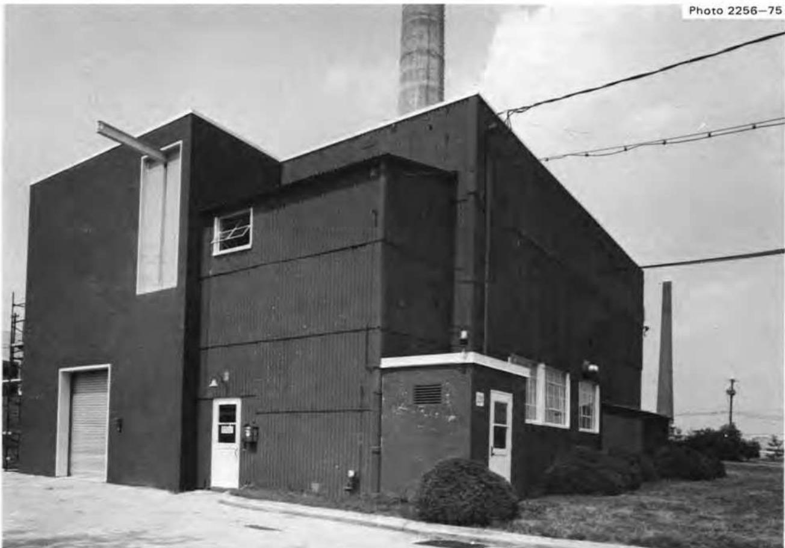  
Fig. 6.1. Molten-Salt Test Facility (Building 2011) from the west side. The newly constructed air lock is on the left.

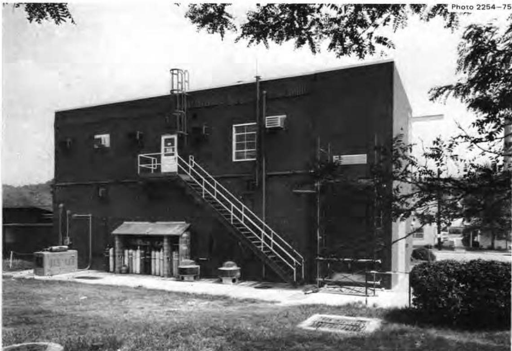  
Fig. 6.2. Molten-Salt Test Facility (Building 2011) from the north side. Features of interest include the shop area on the extreme left, the emergency generator on the left, gas storage rack in the center, and the newly constructed air lock on the right.

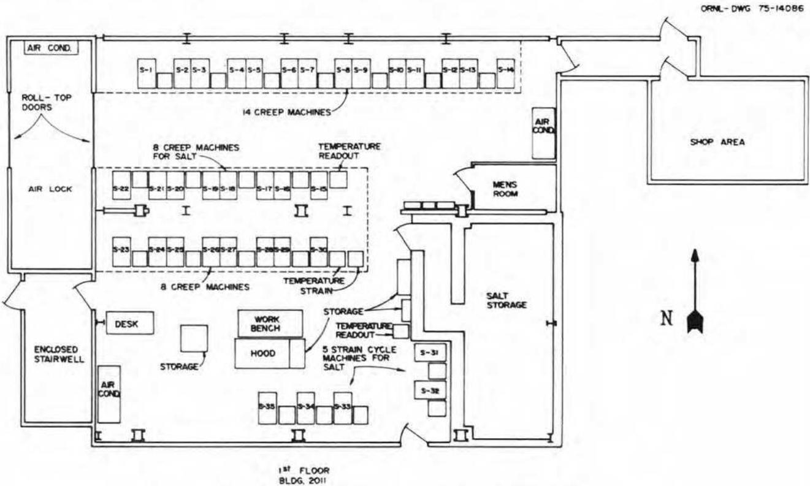  
Fig. 6.3. Equipment layout for the first floor of Building 2011.

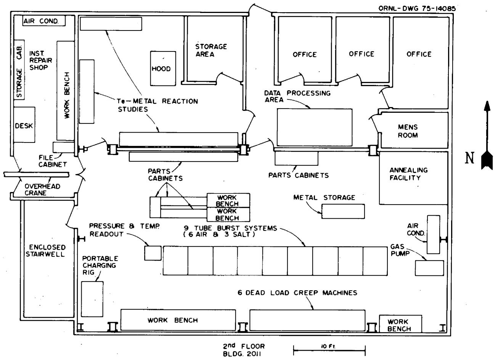  
Fig. 6.4. Equipment layout for the second floor of Building 2011.

The frame is of welded steel construction. The lever arms have two sets of knife-edge pivots so that the weight on the back of the arm is multiplied by factors of 6 or 12. The pull rods and extensometers are currently arranged for testing small specimens having gage dimensions $1\frac{1}{8}$ in. long by $\frac{1}{8}$ in. in diameter. Pull rods and extensometers for larger specimens (required for code testing) were also fabricated and can be used in the same machines.

The specimen deformation can be determined by the dial gage or by a transducer which measures the deflection of the dial gage shaft. This transducer signal is converted to a dc signal by the instrumentation in the bottom of the control cabinet on the right (Fig. 6.6) and is printed at another location. The electronic circuit will also accommodate averaging transducers which will be used on more precise code work. The instrumentation in the bottom of the control cabinet also has a module for measuring load from a load cell (not shown) which fits in the bottom on the creep machine. The specimen is heated by a resistance-wound furnace

having a maximum temperature capability of $1200^{\circ}\mathrm{C}$ . The temperature is measured by up to four Chromel-Alumel $(\pm 3 / 8\%)$ accuracy) thermocouples located at various positions on the specimen gage length. The signal from one of these thermocouples is used by the Leeds and Northrup type 80 proportioning controller to control the furnace temperature. Switches within this unit activate an alarm shown in the upper left corner of the control cabinet (Fig. 6.6) if the temperature varies more than $\pm 6^{\circ}\mathrm{C}$ from the control temperature. This alarm unit activates a local light and bell alarm as well as causing an alarm to sound in the Shift Operations Office. A second thermocouple is tied to an over-temperature monitor (lower left side of control cabinet in Fig. 6.6). This monitor is set 10 to $15^{\circ}\mathrm{C}$ above the control temperature and will interrupt power to the furnace. The monitor must be reset manually. The furnace is powered by a solid-state power supply designed by T. Hutton of the Instrumentation and Controls Division. The unit incorporates a digital Variac which allows power settings of 0, 10, 25, 50, 75, and

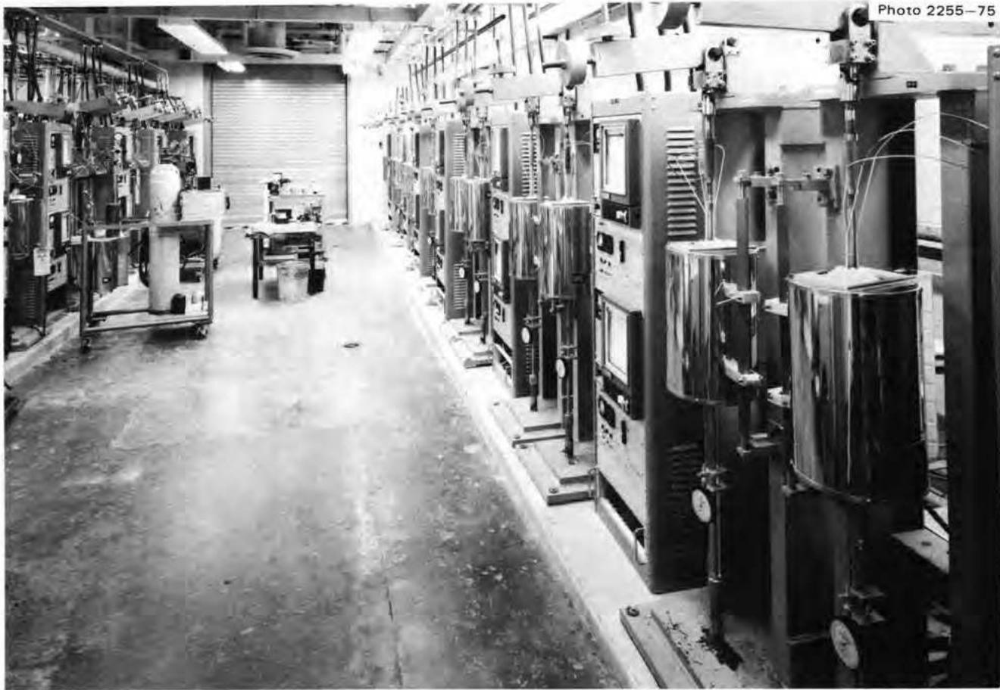  
Fig. 6.5. General view of salt-environment creep machines on the left and air-environment creep machines on the right.

$100\%$ of line voltage. Power is pulsed through the unit as called for by the Leeds and Northrup controller.

The six dead-load creep machines on the second floor are quite similar to the lever-arm creep machines just described. As shown in Fig. 6.7 these machines are not in operation, but the construction work is complete. Since the load is applied directly to the bottom of the specimen, the equipment is limited to specimen stresses of about 20,000 psi. However, the frames can be converted to the lever-arm type.

Two salt environment creep machines are shown in Fig. 6.8. The frames and control instrumentation are the same as for the air environment machines shown in Fig. 6.6. The primary modification is a stress unit which can be immersed in salt. Four load-bearing rods run from the bottom of the specimen to a flange near the top of the frame. A rod from the lever arm passes through a seal in the flange to the top of the specimen. Thus, weights placed on the back of the lever arm place the specimen under tensile stress, with the pulling force being transferred back to the flange. No rods protrude

far below the bottom of the specimen, and a salt container can easily slip over the stress unit. This container seals against the underside of the flange. Extensometer rods for measuring the strain pass through seals in the flange, and strain can either be measured by a dial gage or a transducer. A 4-in.-diam furnace fits over the salt container. There are several openings through the flange into the container for gas lines and ball valves for electrochemical probes and for making additions to the salt. Figure 6.9 shows the salt-creep machine which is in service. The salt was transferred into the pot on the right in the salt preparation facility at Y-12. The transfer pot was placed in a furnace, after which the transfer pot and the receiver vessel were heated to about $600^{\circ}\mathrm{C}$ before the salt was transferred by applying argon pressure to the transfer pot. The temperature was stabilized in the creep chamber, and a stress was applied to the test specimen.

One of the five strain-cycle units is shown in Fig. 6.10. The test specimen is a 1-in.-OD tube with a reduced gage section having a length of 1 in. The tube is

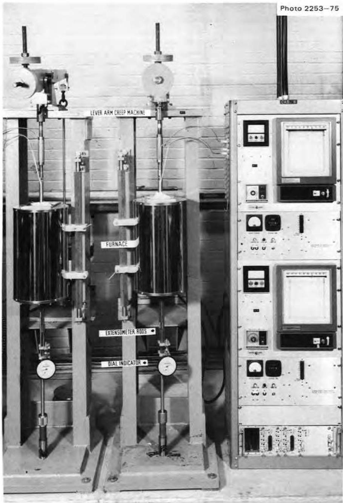  
Fig. 6.6. Close-up of two air-environment creep machines with associated instrumentation.

welded in place and stressed by a rod which extends from the bottom of the specimen to a piston above the specimen. The piston is moved by applying air pressure to either side, resulting in a tensile or compressive force on the specimen. The specimen assembly is immersed in salt while it is being stressed. Extensometer rods extend through the top flange to measure the strain. These rods move transducers whose signals are recorded on the bottom instrument. Switches inside the recorder can be

adjusted to change the stress from tensile to compressive when the strain reaches certain values. The test can also be controlled on a time basis and the strain recorded. Other modes of control are also possible. This type of test is to study the rate of crack propagation through thin-walled tubes of varying composition in the presence of tellurium. Installation of the equipment has been completed, and test specimens are welded in place. The tests will be started as manpower becomes avail

able. These machines will be used for alloy screening, and more precise work will be done on MTS equipment to be procured at a later date.

The main data collection station is on the first floor (Fig. 6.11). The upper part of the cabinet on the left contains switches, a digital readout, and a single point recorder for temperatures from about one-third of the machines. The bank of switches in the top of the right-hand cabinet is for selecting strain ranges for each

machine. The strain readings from each machine are printed out on one of the multipoint recorders. A data logging instrument is located in the middle of the right-hand cabinet. This instrument will print out 100 points on the designated frequency (usually $1\mathrm{hr}$ ). This is sufficient capacity to print out one temperature and one strain reading for each piece of equipment. Two other temperature measuring stations are located elsewhere on the first floor.

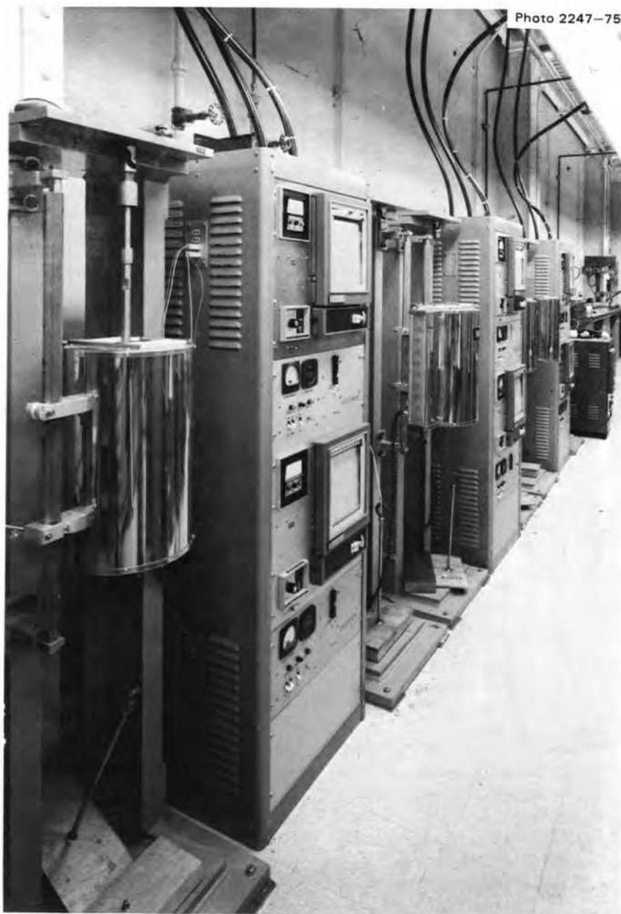  
Fig. 6.7. General view of air-environment dead-load creep machines.

The annealing area is on the second floor (Fig. 6.12). The two furnaces on the lower level have environmental control and are used for short-term anneals. Eight other furnaces are used for long-term anneals in which the samples are encapsulated.

Figure 6.13 shows a typical area in the second-floor laboratory used for tellurium-Hastelloy N studies. The

equipment includes a quartz encapsulation apparatus, special gradient furnaces for annealing the capsules, equipment for measuring gas-metal reaction rates, and a general-purpose hood.

The tube-burst equipment is on the second floor (Fig. 6.14). There are nine test stations with each station having four test positions. This equipment is pressurized

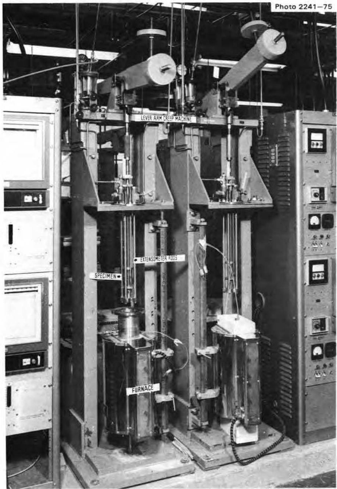  
Fig. 6.8. Close-up of two salt-environment lever-arm creep machines. The salt chamber on the left-hand machine seals against the horizontal flange and the furnace is raised a proportionate distance. The temperature control and strain-measurement instrumentation are shown on both sides of the creep machines.

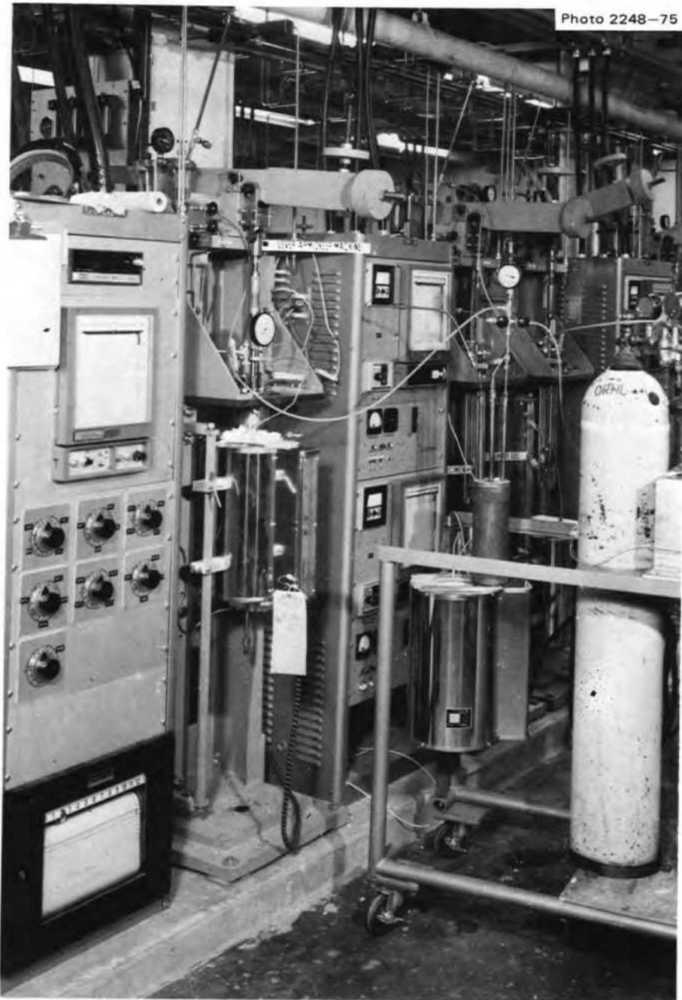  
Fig. 6.9. Lever-arm salt-environment creep machines in operation. The salt chamber and furnace have been raised. Salt was transferred by argon pressure from the vessel on the right into the test chamber. The cabinet on the left contains switching and temperature readout instrumentation for several creep machines.

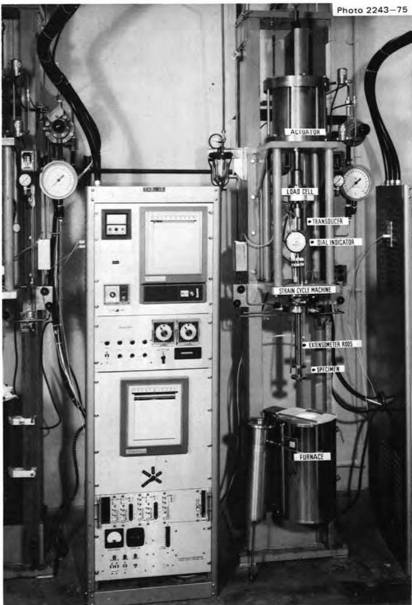  
Fig. 6.10 Close-up of a salt-environment strain cycle machine and associated instrumentation. The test specimen is a 1-in.-diam tube welded on the bottom to a rod and on the top to a heavy-walled tube. The rod passes through the tube, and alternating tensile and compressive stresses are imposed on the specimen by the actuator (piston-cylinder combination). The instrumentation is used to control and record the stress-strain-time history.

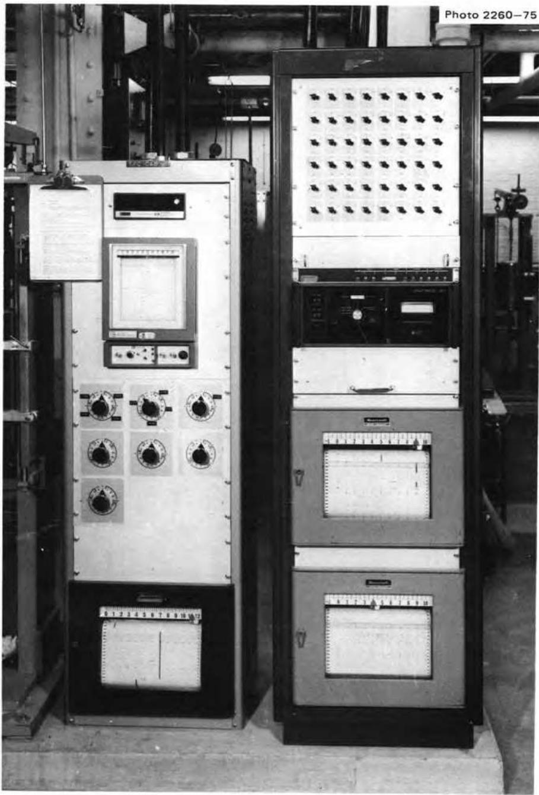  
Fig. 6.11. The cabinet on the left is one of several readout stations for temperature. Chromel-Alumel sensors from several creep machines are run to this cabinet. The switches make it possible to read each thermocouple individually on the digital unit at the top of the cabinet. One point at a time can be recorded on the Azar recorder. The cabinet on the right contains a data logging unit for recording strain and temperature on all the machines on the first floor. The three recorders in the bottoms of the two cabinets record strain data from all machines.

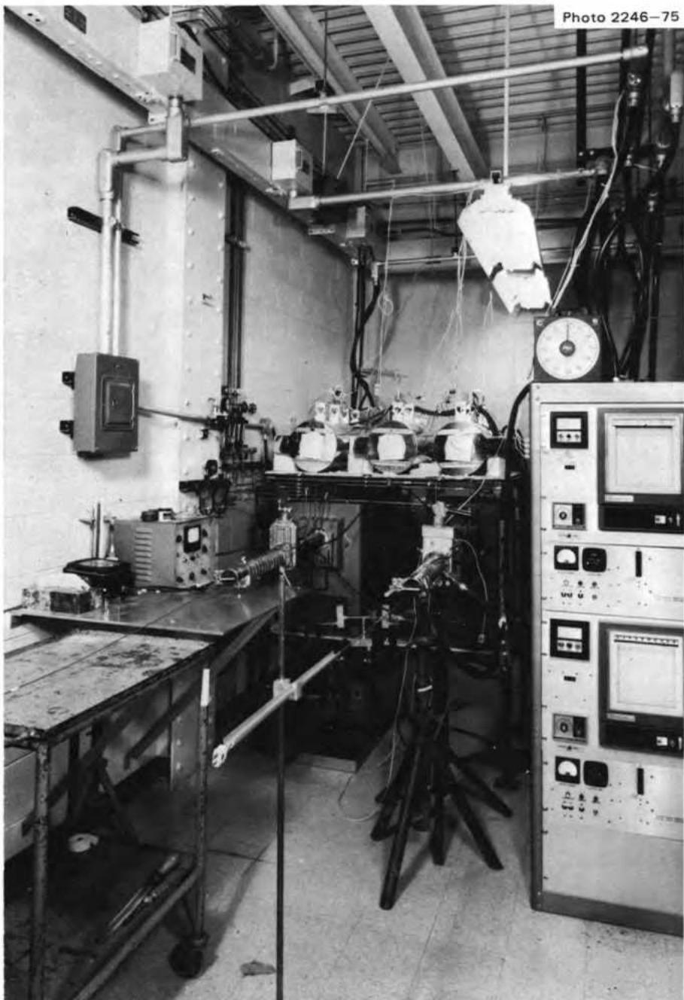  
Fig. 6.12. Photograph of heat-treating facility. The two lower furnaces have controlled argon environments. Eight other furnaces (all not visible) have air environments and are used for long-time anneals.

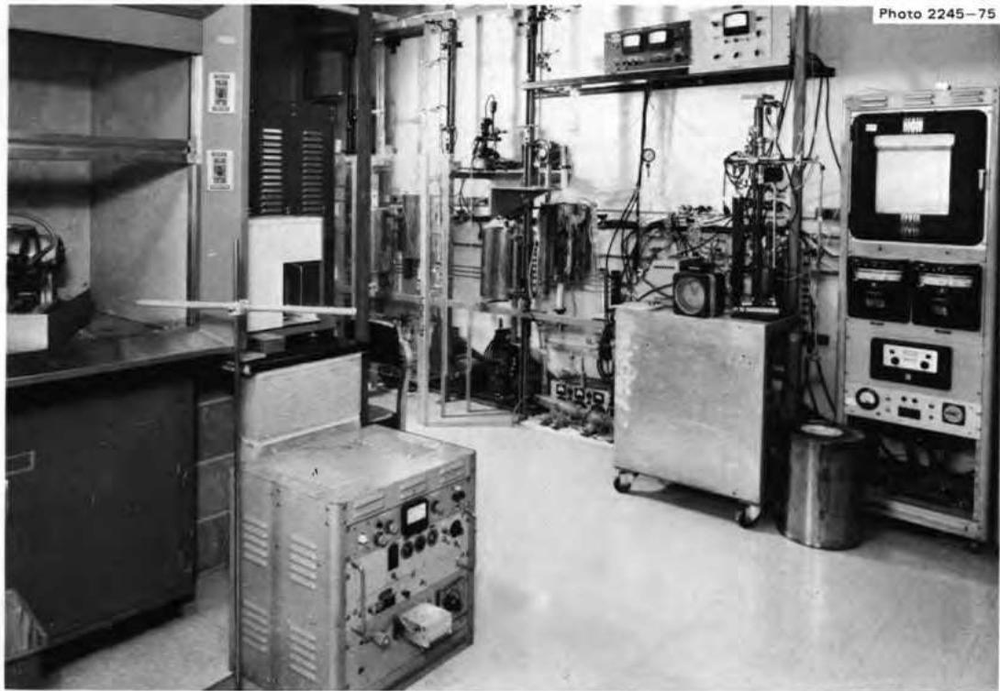  
Fig. 6.13. Typical view of general-purpose laboratory used primarily to study tellurium-metal reactions. The hood on the left is used to clean salt from specimens tested in salt environments.

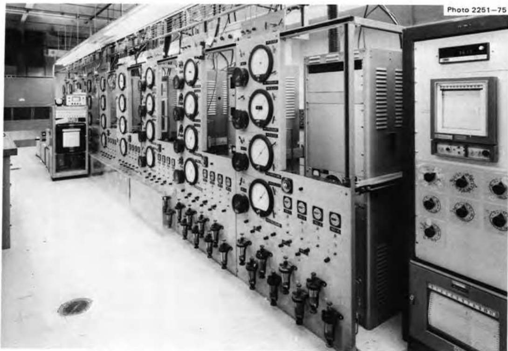  
Fig. 6.14. General view of tube-burst testing equipment used to stress tubular specimens by internal pressure. The front panels contain only the pressure-related equipment. The furnaces where the test specimens are located and their associated control instrumentation are behind the pressure panels.

by a pump with a vent pressure of 14,400 psi. The pump and the associated reservoir cylinders have been approved for operation, and the individual test stations will be put in service on a low-priority basis.

Immediate emphasis will be placed on getting all equipment into operation. Longer-term objectives will include procurement and installation of an MTS fatigue machine and possible expansion of the first floor to accommodate additional creep machines.

# 6.2 PROCEDURE AND FABRICATION OF EXPERIMENTAL ALLOYS

T. K. Roche R. E. McDonald

B. McNabb J.C.Feltner

# 6.2.1 Production Heats of $2\%$ Ti-Modified Hastelloy N

One of the more promising alloys at present for the primary circuit of an MSBR is $2\%$ Ti-modified Hastelloy N. Progress has been made in the scale-up of this alloy with the production of two large heats, one 10,000 lb and the other 8000 lb, by a commercial vendor. The analysis of the heats was reported previously. These heats were used to establish processing parameters for producing plate, bar, and wire; and more recently emphasis has been placed on processing seamless tubing. Mill products from these heats are being tested in the general alloy development program and used in the construction of two forced-circulation loops for studying the compatibility of the alloy with fuel salt.

As reported previously, several fabrication problems were encountered with the first heat (heat 2810-4-7901 or 74-901; 10,000 lb) in that it was prone to cracking during hot-working operations, particularly during hot rolling of the plate. However, with the aid of Gleebie evaluation tests which defined the hot-working temperature range of the heat to be between 1090 and $1177^{\circ}\mathrm{C}$ , plate products were successfully rolled. A second problem was the susceptibility of the heat to cracking during the annealing treatment following cold drawing in the production of bar and wire products. This problem was partially solved by either flexing the drawn product in straightening equipment prior to annealing at $1177^{\circ}\mathrm{C}$ or by lowering the intermediate annealing temperature to $1121^{\circ}\mathrm{C}$ .

Because a considerable amount of the first heat was consumed in establishing processing parameters, a

second heat was produced (heat 8918-5-7421 or 75-421; 8000 lb) for conversion to tubing, bar, and wire. The hot-forging behavior of this heat was quite good as confirmed by Gleeble data, which showed a very broad hot-working temperature range of 930 to $1260^{\circ}\mathrm{C}$ . Approximately one-half of this heat was forged and turned to 4.5-in.-diam bar for conversion to seamless tubing by the vendor. Also, a forged bar $4 \times 4 \times 60$ in. was produced for conversion to tubing by an alternate route. The balance of the heat was converted to the following products, which have been received: 6-in.-diam bar (630 lb), 0.5-in.-diam bar (292 ft), 0.312-in.-diam bar (996 ft), 0.125-in.-diam wire (405 lb), and 0.094-in.-diam wire (338 lb).

For making products in the range $\frac{1}{2}$ -in.-diam bar through $\frac{3}{2}$ -in.-diam wire, forged bar was hot rolled to about 1-in.-diam bar, and an attempt was made to convert this material by cold drawing to final sizes with intermediate annealing treatments. This routing proved satisfactory until a diameter of 0.395 in. was reached, but annealing cracks, as experienced with heat 74-901, were encountered to some degree during processing of the 0.312-in.-diam bar and the wire products. For example, during a run involving about 850 lb of stock, about $2\%$ of the product was lost due to cracking during annealing after the material was drawn from 0.395 in. in diameter to 0.312 in. in diameter. The bar was mechanically flexed prior to annealing, a technique used to minimize cracking in material from the first production heat of the alloy (heat 74-901). The annealing cracks were observed to run parallel to the longitudinal axis of the bar. Examination of a transverse section of the cracked 0.312-in.-diam stock showed that the cracks were intergranular in nature and up to 0.065 in. deep in the section examined (Fig. 6.15).

It has been possible to reproduce the annealing crack phenomenon on a laboratory scale. Samples of 0.5-in.-diam bar of each of the two production heats were cold drawn to 0.395 in. in diameter (37% reduction) and annealed at $1177^{\circ}\mathrm{C}$ . Heat 74-901 developed longitudinal cracks; heat 75-421 did not. These results are consistent with the vendor's observation that heat 74-901 is more susceptible to the cracking problem. Since the cracking can be reproduced on a laboratory scale, it may be possible to more fully characterize the problem and define fabrication parameters necessary for its prevention.

Of the two routes being pursued for the procurement of seamless tubing, one by the commercial vendor involves trepanning forged and turned bar stock to 4.5-in. $\mathrm{OD} \times 0.5$ -in. wall, cold tube reducing (or pilgering) the material in three steps to 2.0-in. $\mathrm{OD} \times 0.187$ -in. wall,

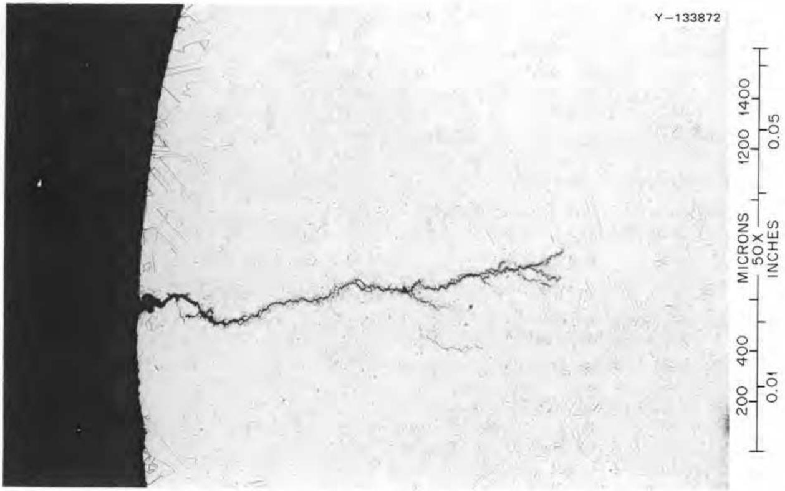  
Fig. 6.15. Annealing cracks in 0.312-in.-diam bar of $2\%$ Ti-modified Hastelloy N (heat 75-421). Bar was cold drawn $37\%$ and annealed at $1065^{\circ}\mathrm{C}$ . Etched with glyceria regia, $50\times$ .

followed by cold drawing to final sizes of 1.0-, 0.75-, 0.5-, and 0.377-in. $\mathrm{OD} \times 0.035-$ to 0.072-in. wall. This route for tubing production depends upon the efforts of two other vendors, one for trepanning the bar and the other for drawing to final sizes. The trepanning operation has been completed and resulted in six tube hollows each approximately 6 ft long. Each of these pieces was processed through the first tube reducing pass to a 3.75-in. $\mathrm{OD} \times 0.375-$ in. wall (36.7% reduction) with no difficulty. From this point, work was confined to one tube hollow to determine its response to in-process annealing at $1121^{\circ}\mathrm{C}$ and water quenching followed by further tube reduction. Annealing of the hollow between each tube reducing operation was preceded by the annealing of a sample which was then liquid-penetrant inspected to determine any evidence of cracking. With this procedure the hollow was taken through the remaining two tube reducing steps and three annealing treatments with no major problems. A few shallow surface flaws did develop, but these were readily conditioned from the product. Therefore, on hand at present is approximately 24 ft of 2.0-in.- $\mathrm{OD} \times 0.187-$ in.-wall stock which will be scheduled with the redraw vendor for processing to final sizes. The tube reduction of the remaining five hollows will also proceed.

The second route for obtaining seamless tubing involves hot extrusion of tube shells at ORNL followed by cold drawing to size by an outside source. Starting stock was the forged bar of the alloy, $4 \times 4 \times 60$ in. (Fig. 6.16). The bar was machined into six billets, each of which measured 3.950 in. in OD by approximately 9.5 in. long and had a $45^{\circ}$ tapered nose for extrusion out of a 4.060-in.-diam press container through a conical die. Two of the billets were drilled 0.812 in. in ID and four were drilled 1.0 in. in ID to accommodate a mandrel and to allow for a slight variation in extrusion ratio. A glass coating, which was molten at the extrusion temperature, was applied to the billets and served as the primary lubricant. Additional lubrication was provided by Fisk-604 grease that was applied to the tooling. Five of the billets were extruded at $1200^{\circ}\mathrm{C}$ and one at $1250^{\circ}\mathrm{C}$ . Low extrusion rates (ram speeds) were used to prevent a sufficiently large temperature increase that the incipient melting temperature of the alloy would be exceeded; otherwise serious cracking could result. This problem was encountered during the development of standard Hastelloy N, but was solved by control of extrusion rate.

The results of extruding the $2\%$ Ti-modified Hastelloy N billets, in the order performed, are pre

sented in Table 6.1. For the first three tube blanks produced (extrusions 1603, 1604, and 1605), the low rate of extrusion caused mandrel failure due to excessive heating of the tooling. However, the length of tube blanks obtained with various extrusion ratios and ram speeds suggested that the combination of tooling used for extrusion 1604 (extrusion ratio of 9.4:1) with an extrusion speed approximately equal to that of extrusion 1605 (2.5 in./sec) should produce a complete tube blank. This was the case for extrusions 1608 and 1609. In an attempt to reduce the force required to make these extrusions, the final tube blank (extrusion 1611)

was extruded at a slightly higher temperature, $1250^{\circ}\mathrm{C}$ . A rather long length of good extrusion was obtained, but mandrel failure again occurred due to the low extrusion speed.

Visual inspection of the tube blanks showed the OD surfaces to be quite good as illustrated in Fig. 6.17, which shows the leading end of extrusions 1608 and 1609. On the other hand, boroscopic examination of the IDs by the outside vendor performing the redraw operation revealed flaws which were subsequently removed by gun drilling. These flaws, shown typically in Fig. 6.18, are believed to be caused by inadequate lubri

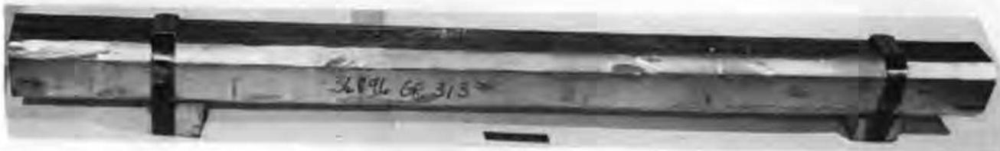  
Photo 1273-75   
Fig. 6.16. Forged bar, $4 \times 4 \times 60$ in., of $2\%$ Ti-modified Hastelloy N (heat 75-421). Stock for extrusion billets to produce seamless tubing.

Table 6.1. Conditions and results of tube blank extrusions of $2\%$ Ti-modified Hastelloy N (heat 8918-5-7421) $^a$   

<table><tr><td rowspan="2">Extrusion</td><td rowspan="2">Die diameter (in.)</td><td rowspan="2">Mandrel diameter (in.)</td><td rowspan="2">Extrusion ratio</td><td rowspan="2">Ram speed (in./sec)</td><td colspan="2">Force (tons)</td><td rowspan="2">Results</td></tr><tr><td>Maximum</td><td>Running</td></tr><tr><td>1603</td><td>1.475</td><td>0.812</td><td>10.4:1</td><td>1.5</td><td>1230</td><td>1111</td><td>Good OD surface; 22 in. of tube blank extrusion before mandrel failure</td></tr><tr><td>1604</td><td>1.625</td><td>1.0</td><td>9.4:1</td><td>1.5</td><td>1160</td><td>1100</td><td>Good OD surface; 45 in. of tube blank extrusion before mandrel failure</td></tr><tr><td>1605</td><td>1.475</td><td>0.812</td><td>10.4:1</td><td>2.5</td><td>1290</td><td>1290</td><td>Good OD surface; 40 in. of tube blank extrusion before mandrel failure</td></tr><tr><td>1607</td><td>1.625</td><td>1.0</td><td>9.4:1</td><td></td><td></td><td></td><td>Stalled; operational error</td></tr><tr><td>1608</td><td>1.625</td><td>1.0</td><td>9.4:1</td><td>3.6</td><td>1290</td><td>1290</td><td>Good OD surface; 70 in. tube blank extrusion</td></tr><tr><td>1609</td><td>1.625</td><td>1.0</td><td>9.4:1</td><td>3.6</td><td>1290</td><td>1290</td><td>Good OD surface; 70 in. tube blank extrusion</td></tr><tr><td>1611</td><td>1.625</td><td>1.0</td><td>9.4:1</td><td>1.0</td><td>1000</td><td>900</td><td>Repeat of extrusion 1607; good OD surface; 55 in. of tube blank extrusion before mandrel failure</td></tr></table>

Notes: Container diam: 4.060 in. Extrusion temp: $1200^{\circ}\mathrm{C}$ except extrusion 1611 at $1250^{\circ}\mathrm{C}$ . Lubrication: glass on billets, Fisk-604 grease on tooling.

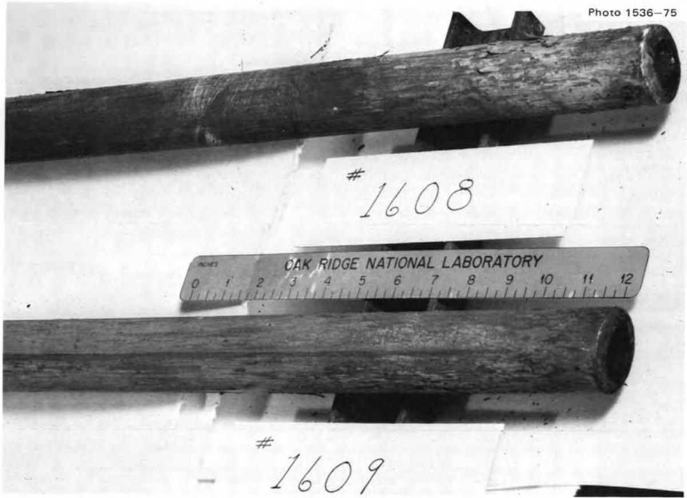  
Fig. 6.17. Tube-blank extrusions of $2\%$ Ti-modified Hastelloy N (heat 75-421). These are the leading ends of the two extrusions and were photographed in the as-extruded condition.

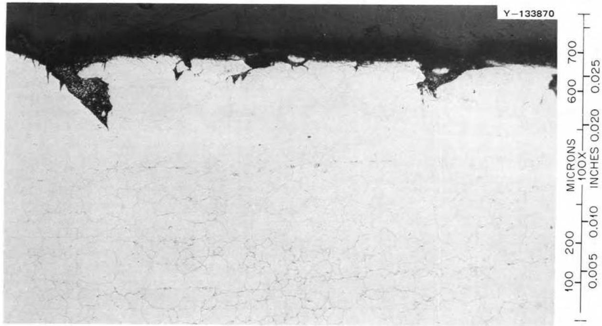  
Fig. 6.18. Typical defects on the inside diameter of extruded tube blanks of $2\%$ Ti-modified Hastelloy N (heat 75-421). Longitudinal section. Etched with glyceria regia. $100\times$

cation during extrusion. Therefore, several additional extrusions are planned to test this assumption and to evaluate other lubricants. The billets will be prepared from the 6-in.-diam bar fabricated from the same commercial heat used for the previous billets.

The products of the six extrusions (Table 6.1) were sent to an outside vendor for redrawing to finished tubing. More effort was required than anticipated due to several factors: the conditioning required to clean up the surfaces of the extrusions, experimentation with both plug and rod drawing techniques to establish a workable processing schedule, and more frequent and longer intermediate annealing treatments than anticipated for the alloy. The vendor believes that a satisfactory drawing schedule has been developed and is proceeding with processing of the remaining extrusions. The vendor's preferred process involves rod drawing and sinking operations requiring about 18 to $20\%$ deformation per pass, with intermediate annealing treatments at $1177^{\circ}\mathrm{C}$ followed by water quenching. Quality control steps after each process step include light etching followed by visual inspection of the OD and boroscopic inspection of the ID for defects. It is believed that the yield of tubing from the redrawn ORNL extrusions will be sufficient for at least one of the two forced-circulation loops now under construction.

A 6-ft length of cold-worked 0.75-in.-OD × 0.072-in.-wall tubing was received as product from the development work required to establish a drawing schedule. The tubing is being evaluated by nondestructive techniques. Liquid-penetrant inspection of the OD showed no defects. Silicone rubber replication together with radiographic inspection indicated the presence of relatively shallow cracklike indications on the ID over a 4-ft length. Metallographic examination of a small sample from the end of the 6-ft section showed the defects to be a maximum of 0.028 in. deep. The tube will be annealed and inspection will be repeated, including examination by an eddy-current technique. In view of the number of process variations to which the tube was subjected in developing a drawing schedule, the quality of the OD and that of portions of the ID is encouraging.

# 6.2.2 Semiproduction Heats of $2\%$ Ti-Modified Hastelloy N Containing Niobium

To provide stock for a more complete characterization of niobium-titanium-modified Hastelloy N, eight 50-lb heats and one 2500-lb heat (Table 6.2) are being prepared by a commercial vendor. Niobium additions to the $2\%$ Ti-modified Hastelloy N base are of interest for enhancing resistance to tellurium embrittlement, and

Table 6.2. Nominal composition of semiproduction heats of $2\%$ Ti-modified Hastelloy N containing niobium   
Base: Ni-12% Mo-7% Cr-2% Ti-0.07% C   

<table><tr><td rowspan="2">Alloy</td><td colspan="4">Addition of the indicated elementa (%)</td><td rowspan="2">Heat size (lb)</td></tr><tr><td>Fe</td><td>Si</td><td>Mn</td><td>Nb</td></tr><tr><td>1</td><td>1.0</td><td>0.1</td><td>0.2</td><td>0.85–1.15</td><td>2500</td></tr><tr><td>2</td><td>1.0</td><td>0.1</td><td>0.2</td><td>0.4–0.6</td><td>50</td></tr><tr><td>3</td><td>1.0</td><td>0.1</td><td>0.2</td><td>1.35–1.65</td><td>50</td></tr><tr><td>4</td><td>1.0</td><td>0.1</td><td>0.2</td><td>1.8–2.2</td><td>50</td></tr><tr><td>5</td><td>3.0–5.0</td><td>0.1</td><td>0.2</td><td>0.85–1.15</td><td>50</td></tr><tr><td>6</td><td>1.0</td><td>0.1–0.2</td><td>0.2</td><td>0.85–1.15</td><td>50</td></tr><tr><td>7</td><td>1.0</td><td>0.1</td><td>0.2–0.5</td><td>0.85–1.15</td><td>50</td></tr><tr><td>8</td><td>3.0–5.0</td><td>0.1–0.2</td><td>0.2–0.5</td><td>0.85–1.15</td><td>50</td></tr><tr><td>9</td><td>1.0</td><td>0.1</td><td>0.2</td><td>0.85–1.15</td><td>50</td></tr></table>

${}^{a}$ Individual values denote maximum concentration.

niobium levels between 0.5 and $2\mathrm{wt}\%$ will be investigated. In addition, the compositions of four of the alloys were chosen to investigate different levels of the residual elements, Fe, Mn, and Si. These results will be important because of the beneficial effects of the residual elements upon oxidation resistance and will allow greater latitude in scrap recycle.

The nine alloys have been melted and will be processed to products in the near future. The eight 50-lb melts will be forged and rolled to $\frac{1}{2}$ -in.-thick plate approximately 4 in. wide. This material will be used for weldability, salt corrosion, tellurium compatibility, and mechanical property tests. The 2500-lb heat will be converted to $1\%_{16}$ , $\frac{3}{4}$ , and $\frac{5}{16}$ -in.-diam bar products and to a $4 \times 4$ in. round-cornered square bar. About half the material will be retained in the last form to allow future capability for producing additional products of sheet, bar, and tubing.

# 6.3 WELDABILITY OF COMMERCIAL ALLOYS OF MODIFIED HASTELLOY N

B. McNabb H. E. McCoy T. K. Roche

Welding at ORNL is generally performed in accordance with Section IX of the ASME Boiler and Pressure Vessel Code.2 Basically this requires that a procedure for welding a material (or class of similar materials) be developed and that welders demonstrate that they are qualified to weld by the procedure. The procedure must

be a written document including the essential variables associated with making the weld and must be backed by test reports, including bend and tensile tests which show that the weld is sound. A welder can then be qualified to use the procedure by making a weld which is subjected to bend tests to show that it is sound. This is a very simplified view of the process used to develop and maintain high welding standards, and the ASME Boiler and Pressure Vessel Code, Section IX, $^2$ should be consulted for more detail. The Plant and Equipment Division maintains a weld test shop under the supervision of D. R. Frizzell to implement the process, and this shop is frequently assisted by the Inspection Engineering Department.

Procedures were previously developed for joining Hastelloy N to Hastelloy N (WPS-1402), and Hastelloy N to the austenitic stainless steels (WPS-2604), but it was necessary to demonstrate whether these procedures apply equally well to $2\%$ Ti-modified Hastelloy N. Therefore, ½-in.-thick test plates of $2\%$ Ti-modified Hastelloy N (vendors heat 2810-4-7901, designated ORNL heat 74-901) were prepared and welded as follows: autogenous welds with 74-901 weld wire, welds with $2\%$ Ti-modified Hastelloy N weld wire (vendor's heat 8918-5-7421, designated ORNL heat 75-421), welds to standard Hastelloy N heat Nl-5075 with $2\%$ Ti-modified Hastelloy N heat 75-421 weld wire, and welds of type 304 stainless steel heat 18024 with Inco 82T heat NX59138-D weld wire. Each weld was subjected to visual, dye penetrant, x-ray, and metallographic examination, and to two tensile and four side-bend tests. These tests were conducted in accordance with the ASME Boiler and Pressure Vessel Code, Section IX, $^{2}$ and all of the above-mentioned welds passed the tests. The tensile specimens were machined from the test plates with the weld in the reduced-section gage length and were tested in a Baldwin tensile machine. All Hastelloy N welds exceeded the required minimum 100,000 psi ultimate tensile strength except the weld of $2\%$ Ti-modified Hastelloy N to type 304 stainless steel, which ruptured in the type 304 stainless steel base metal at 93,300 psi. The side-bend specimens were $\frac{1}{2} \times \frac{1}{2} \times$ approx 8 in. long with the weld in the center, and were bent around a 1-in. radius in a guided bend fixture.

The chemical analyses of the various materials involved are shown in Table 6.3. The side-bend specimens are $\frac{1}{2}$ in. thick $\times$ in. wide, bent around a 1-in.-radius mandrel in a guided bend test. The specimens were macroetched in a solution of HCl-20% HNO₃-20% H₂O to delineate the weld and heat-affected zones. Figure 6.19 is a macrophotograph of side-bend specimens of standard Hastelloy N heat

NI-5075 $1/2$ -in.-thick plate welded with standard Hastelloy N weld wire heat NI-5101. There were no flaws in the specimens after bending; and visual, dye penetrant, x-ray, and metallographic examination before bending showed that the welds were sound. This weld was made and tested to recertify the welder and to update the welding procedure specification. Figure 6.20 is a macrophotograph of side-bend specimens of $2\%$ Ti-modified Hastelloy N (top) (heat 74-901) welded to standard Hastelloy N (bottom) (heat NI-5075) with $2\%$ Ti-modified Hastelloy N (heat 75-421) weld wire by welding procedure specification WPS 1402. There were no flaws in the welds, and the strain markings delineate the weld areas.

Figure 6.21 is a macrophotograph of $2\%$ Ti-modified Hastelloy N plates (heat 74-901) welded with $2\%$ Ti-modified Hastelloy N (heat 74-901) weld wire on welding procedure specification WPS 1402. There were no flaws in the welds, and the specimens were macroetched to delineate the weld areas. Figure 6.22 is a macrophotograph of the same heat of $2\%$ Ti-modified Hastelloy N (74-901) welded with $2\%$ Ti-modified Hastelloy N (heat 75-421) weld wire by specification WPS 1402. There were no flaws in the welds and the specimens. Figure 6.23 is a macrophotograph of side-bend specimens of type 304 stainless steel $\frac{1}{2}$ -in. plate (heat 18024) (top) welded to $2\%$ Ti-modified Hastelloy N (heat 74-901) (bottom) with Inco 82T (heat NX 59138-D) weld wire by welding procedure specification WPS 2604. There were no flaws in the welds, and the specimens were macroetched to delineate the weld areas.

Although special welding procedures were prepared for the joining of standard to $2\%$ Ti-modified Hastelloy N with $2\%$ Ti-modified Hastelloy N filler wire (WPS 1403) and for joining stainless steel to $2\%$ Ti-modified Hastelloy N with Inco 82T filler wire (WPS-2606), the parameters used in making these welds were identical to those used in procedures WPS 1402 and WPS-2604 developed for standard Hastelloy N. Thus, we believe that the test welds adequately demonstrate that standard and $2\%$ Ti-modified Hastelloy N have equivalent welding characteristics and that procedures WPS 1402 and WPS 2604 can be used for both materials.

Supplies of standard Hastelloy N weld wire were depleted over a period of time, and additional wire was purchased to the materials specifications MET-RM-304B. However, the weldability test was performed by ORNL. Plates of standard Hastelloy N (heat 5067) $1\%$ $\times 4\times 10$ in. were welded with the new heat of weld wire from Teledyne Allvac (heat 9725), using welding procedure specification WPS 1402, and were accepted

Table 6.3. Compositions of standard and modified Hastelloy N alloys used in weldability studies   

<table><tr><td rowspan="2">Heat number</td><td colspan="16">Concentration (%)</td><td></td><td></td></tr><tr><td>Mo</td><td>Cr</td><td>Fe</td><td>Mn</td><td>Si</td><td>C</td><td>Ti</td><td>Al</td><td>W</td><td>V</td><td>Co</td><td>Cu</td><td>P</td><td>S</td><td>B</td><td>Ni</td><td>Nb + Ta</td><td>Other</td></tr><tr><td>N1-5075</td><td>16.3</td><td>6.7</td><td>4.0</td><td>0.44</td><td>0.58</td><td>0.06</td><td>0.01</td><td>0.01</td><td>0.04</td><td>0.28</td><td>0.07</td><td>0.01</td><td>0.003</td><td>0.006</td><td>0.001</td><td>Balance</td><td></td><td></td></tr><tr><td>N1-5067</td><td>17.3</td><td>7.4</td><td>4.0</td><td>0.5</td><td>0.43</td><td>0.06</td><td>0.01</td><td>0.01</td><td>0.06</td><td>0.28</td><td>0.08</td><td>0.01</td><td>0.004</td><td>0.007</td><td>0.006</td><td>Balance</td><td></td><td></td></tr><tr><td>N1-5101</td><td>16.4</td><td>6.9</td><td>3.9</td><td>0.45</td><td>0.62</td><td>0.06</td><td>0.01</td><td>0.01</td><td>0.06</td><td>0.34</td><td>0.10</td><td>0.01</td><td>0.001</td><td>0.009</td><td>0.007</td><td>Balance</td><td></td><td></td></tr><tr><td>474-901</td><td>12.9</td><td>7.0</td><td>0.07</td><td>0.02</td><td>0.04</td><td>0.06</td><td>1.8</td><td>0.1</td><td>0.02</td><td></td><td>0.02</td><td>0.02</td><td>0.003</td><td>0.002</td><td>0.001</td><td>Balance</td><td></td><td></td></tr><tr><td>475-421</td><td>11.9</td><td>7.1</td><td>0.06</td><td>0.12</td><td>0.04</td><td>0.07</td><td>1.9</td><td>0.12</td><td>&lt;0.06</td><td></td><td>0.02</td><td>&lt;0.01</td><td>0.004</td><td>&lt;0.002</td><td>&lt;0.001</td><td>Balance</td><td></td><td></td></tr><tr><td>1NCO 82-Ta</td><td></td><td>20.0</td><td>3.0</td><td>3.0</td><td>0.5</td><td>0.1</td><td>0.75</td><td></td><td></td><td></td><td></td><td>0.5</td><td>0.03</td><td>0.015</td><td></td><td>67.0</td><td>2.5</td><td>0.5</td></tr><tr><td>Type 304</td><td>19.0</td><td>Balance</td><td>2.0b</td><td>1.0b</td><td>0.08b</td><td></td><td></td><td></td><td></td><td></td><td></td><td></td><td>0.045b</td><td>0.030b</td><td></td><td>10.0</td><td></td><td></td></tr><tr><td>SSa</td><td></td><td></td><td></td><td></td><td></td><td></td><td></td><td></td><td></td><td></td><td></td><td></td><td></td><td></td><td></td><td></td><td></td><td></td></tr></table>

$a$ Nominal Composition.   
$b_{\mathrm{Maximum}}$

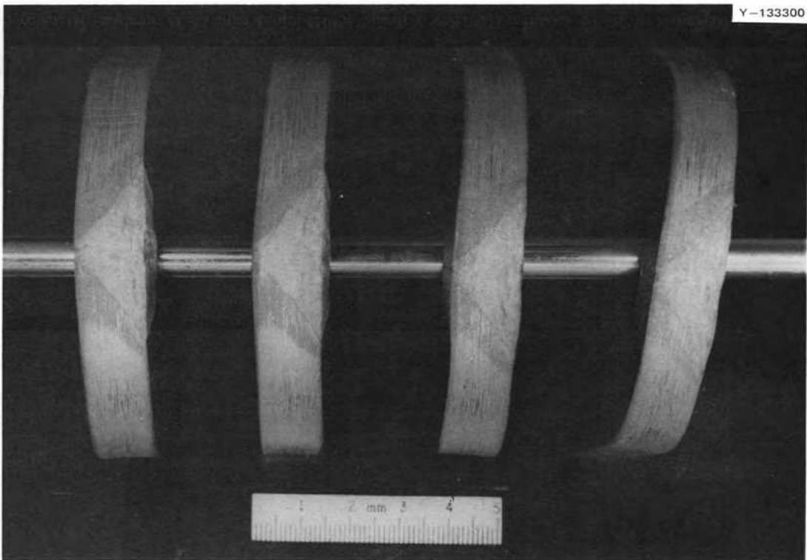  
Fig. 6.19. Bend specimens of standard Hastelloy N (heat N1-5075) joined with standard Hastelloy N filler wire (heat 5101).

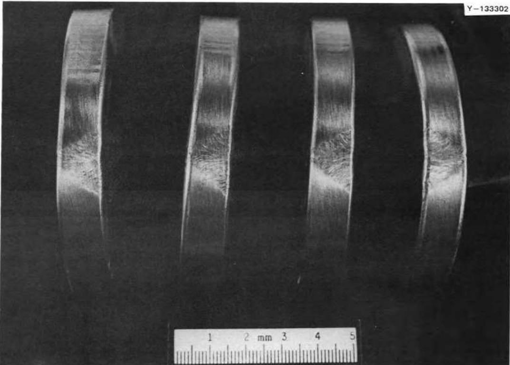  
Fig. 6.20. Bend specimens of $2\%$ Ti-modified Hastelloy N (heat 74-901) and standard Hastelloy N (heat N1-5075) joined with Ti-modified Hastelloy N filler wire (heat 75-421).

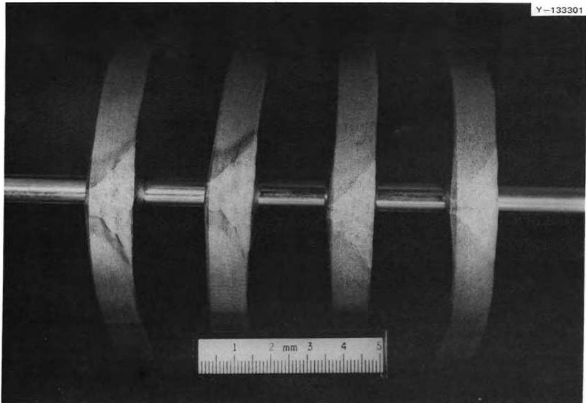  
Fig. 6.21. Bend specimens of $2\%$ Ti-modified Hastelloy N (heat 74-901) joined with $2\%$ Ti-modified Hastelloy N filler wire (heat 74-901).

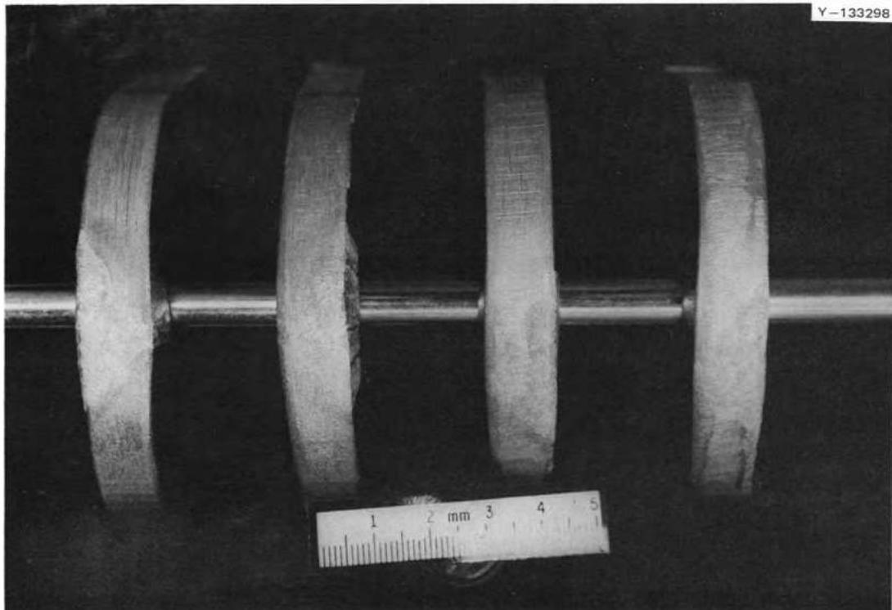  
Fig. 6.22. Bend specimens of $2\%$ Ti-modified Hastelloy N (heat 74-901) joined with $2\%$ Ti-modified Hastelloy N filler wire (heat 75-421).

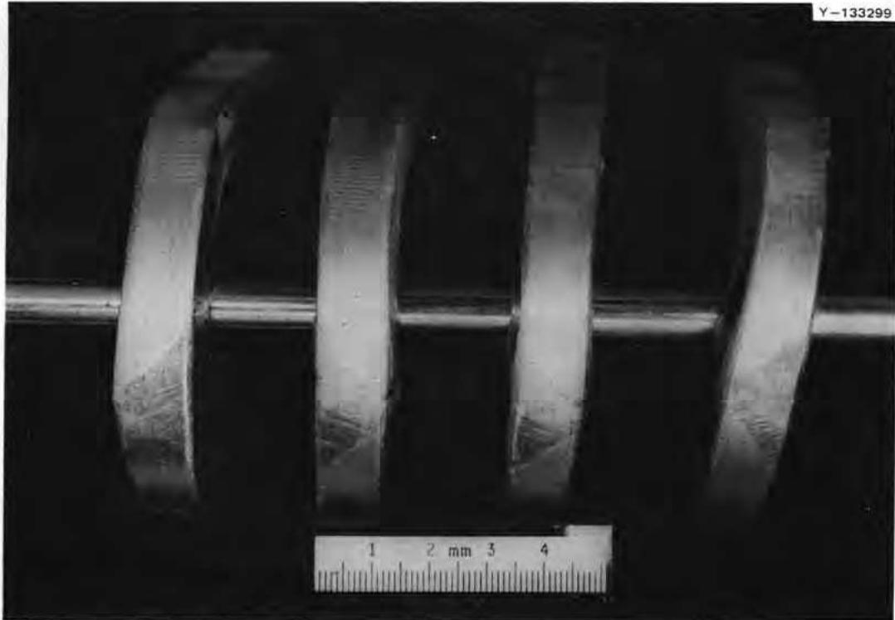  
Fig. 6.23. Bend specimens of type 304 stainless steel and $2\%$ Ti-modified Hastelloy N (heat 74-901) joined with 82T filler wire.

as passing all tests, including one all-weld-metal tensile test and four side-bend tests with no flaws in the welds. This material has been made available for general project use.

# 6.4 STABILITY OF VARIOUS MODIFIED HASTELLOY N ALLOYS IN THE UNIRRADIATED CONDITION

T.K.Roche H.E.McCoy J.C.Feltner

The stability of $\mathrm{Nb - }$ Ti, and Al-containing modified Hastelloy N with respect to intermetallic precipitation, known as aging, is being studied. It is known that additions of these elements are desirable, respectively, for enhancing resistance to tellurium-induced intergranular cracking, for improving resistance to radiation embrittlement, and for deoxidizing the alloy during melting. However, beyond certain levels these elements can cause aging reactions by the precipitation of gamma prime $[\mathrm{Ni}_3(\mathrm{Al},\mathrm{Ti})]$ or $\mathrm{Ni}_3\mathrm{Nb}$ , which, in turn, causes hardening or strengthening and loss of ductility. Therefore, studies are in progress for defining the amounts of Nb, Ti, and Al which can be added to Hastelloy N and still maintain a reasonable degree of stability. The stabilities of a number of alloys, including laboratory, semiproduction, and production heats, having varying amounts of the

elements in question are being determined by hardness, tensile properties, creep-rupture properties, and microstructural evaluation.

The first approach to evaluating stability has been the determination of the room-temperature hardness of the various alloys before and after heat treatment at 650, 704, and $800^{\circ}\mathrm{C}$ for periods up to $1000\mathrm{hr}$ . The data for alloys held at these temperatures for $100\mathrm{hr}$ were reported previously, and during the present period the $1000\mathrm{hr}$ data presented in Table 6.4 were obtained. The data for alloys which show significant hardening relative to the as-annealed condition are blocked off in the table.

The hardness of the various alloys after a 1000-hr aging period follows the same pattern noted for the 100-hr aging period. However, the previously reported niobium concentrations of the niobium-containing alloys were low due to an analytical error; the correct values are shown in Table 6.4. The present data show that with low aluminum concentrations (0.05 wt %), niobium contents approaching $2\%$ (rather than $1\%$ as concluded earlier) can be tolerated in $2\%$ Ti-modified

Table 6.4. Hardness of various heats of modified Hastelloy $\mathbf{N}^a$ after aging 1000 hr at 650, 704, and $800^{\circ}\mathrm{C}$   
Data in blocks indicate significant hardening relative to the as-annealed condition   

<table><tr><td rowspan="3">Heat</td><td colspan="4">Composition (wt %)</td><td colspan="4">Rockwell B Hardness</td></tr><tr><td rowspan="2">Nb</td><td rowspan="2">Ti</td><td rowspan="2">Al</td><td rowspan="2">C</td><td rowspan="2">Annealedb</td><td colspan="3">Aged 1000 hr</td></tr><tr><td>650°C</td><td>704°C</td><td>800°C</td></tr><tr><td>474-557</td><td></td><td>2.14</td><td>0.02</td><td>0.04</td><td>81.5</td><td>87.8</td><td>88.8</td><td>87.4</td></tr><tr><td>472-503</td><td></td><td>1.94</td><td>0.09</td><td>0.06</td><td>84.4</td><td>89.8</td><td>88.2</td><td>89.1</td></tr><tr><td>474-901</td><td></td><td>1.8</td><td>0.10</td><td>0.06</td><td>79.4</td><td>85.7</td><td>86.3</td><td>85.6</td></tr><tr><td>471-114</td><td></td><td>1.96</td><td>0.12</td><td>0.05</td><td>79.2</td><td>82.9</td><td>84.6</td><td>84.4</td></tr><tr><td>427</td><td></td><td>2.4</td><td>0.18</td><td>0.014</td><td>74.7</td><td>78.4</td><td>77.3</td><td>77.9</td></tr><tr><td>428</td><td></td><td>2.47</td><td>0.16</td><td>0.064</td><td>82.5</td><td>85.2</td><td>86.1</td><td>86.0</td></tr><tr><td>474-533</td><td></td><td>2.17</td><td>0.48</td><td>0.05</td><td>81.0</td><td>85.7</td><td>86.2</td><td>84.9</td></tr><tr><td>474-534</td><td></td><td>2.09</td><td>0.53</td><td>0.08</td><td>89.3</td><td>92.5</td><td>90.4</td><td>90.9</td></tr><tr><td>429</td><td></td><td>2.4</td><td>0.35</td><td>0.017</td><td>76.9</td><td>94.8</td><td>85.8</td><td>78.8</td></tr><tr><td>430</td><td></td><td>2.5</td><td>0.34</td><td>0.073</td><td>88.6</td><td>100.1</td><td>88.9</td><td>91.2</td></tr><tr><td>431</td><td></td><td>2.5</td><td>0.74</td><td>0.016</td><td>78.6</td><td>97.8</td><td>98.4</td><td>92.8</td></tr><tr><td>432</td><td></td><td>2.35</td><td>0.69</td><td>0.057</td><td>87.4</td><td>103.4</td><td>103.4</td><td>97.8</td></tr><tr><td>425</td><td>0.48</td><td>1.9</td><td>0.08</td><td>0.037</td><td>80.1</td><td>84.1</td><td>85.8</td><td>85.2</td></tr><tr><td>421</td><td>1.04</td><td>1.9</td><td>0.07</td><td>0.048</td><td>87.3</td><td>86.5</td><td>87.8</td><td>86.7</td></tr><tr><td>424</td><td>1.34</td><td>1.8</td><td>0.10</td><td>0.063</td><td>88.6</td><td>90.2</td><td>88.9</td><td>90.4</td></tr><tr><td>418</td><td>1.92</td><td>2.0</td><td>0.05</td><td>0.058</td><td>89.1</td><td>90.4</td><td>90.0</td><td>90.8</td></tr><tr><td>420</td><td>1.90</td><td>1.8</td><td>0.15</td><td>0.055</td><td>88.7</td><td>101.5</td><td>91.6</td><td>91.3</td></tr><tr><td>435</td><td>1.42</td><td>2.3</td><td>0.15</td><td>0.04</td><td>88.6</td><td>105.0</td><td>102.1</td><td>90.3</td></tr><tr><td>438</td><td>1.80</td><td>2.4</td><td>0.13</td><td>0.05</td><td>91.8</td><td>106.6</td><td>105.1</td><td>96.8</td></tr><tr><td>433</td><td>1.89</td><td>2.2</td><td>0.33</td><td>0.024</td><td>84.8</td><td>104.3</td><td>102.1</td><td>88.1</td></tr><tr><td>434</td><td>1.86</td><td>2.2</td><td>0.32</td><td>0.061</td><td>93.3</td><td>107.0</td><td>103.8</td><td>95.7</td></tr><tr><td>441</td><td>2.52</td><td>2.2</td><td>0.15</td><td>0.05</td><td>93.1</td><td>108.8</td><td>107.6</td><td>104.1</td></tr><tr><td>442</td><td>3.0</td><td>2.2</td><td>0.14</td><td>0.052</td><td>95.0</td><td>109.8</td><td>109.6</td><td>107.2</td></tr></table>

${}^{a}$ Base: Ni-12% Mo-7% Cr.   
b1hrat 117°C.

Hastelloy N before aging occurs. However, the tolerance for niobium decreases with small increases in the titanium and aluminum contents. It must be emphasized that the hardness data were obtained on unstressed specimens, and that creep-rupture tests now under way indicate that lower concentrations of niobium are tolerable when the alloys are subjected to stress. These results are described later in this section.

The effect of aging on room-temperature and elevated-temperature tensile properties is being determined for most of the alloys. Limited room-temperature results have been obtained after a 100-hr aging period at 650 and $800^{\circ}\mathrm{C}$ (Table 6.5). There is good correlation between the tensile data and the previously reported hardness data. As would be expected, alloys which age harden during a given thermal treatment (data underlined in Table 6.5) also show an increase in strength and a corresponding decrease in ductility relative to the solution-annealed condition.

In the case of the titanium-aluminum-modified Hastelloy N alloys the hardening phase is most likely gamma prime, and this phase has been identified in heat 430 $(2.5\% \mathrm{Ti} + 0.34\% \mathrm{Al})$ after $100\mathrm{hr}$ at $650^{\circ}\mathrm{C}$ .

Stress-rupture results for the titanium-aluminum-modified Hastelloy N alloys at 650 and $704^{\circ}\mathrm{C}$ are shown in Tables 6.6 and 6.7 respectively. Again, there is very good correlation between age-hardening behavior as determined from short-term hardness data and the corresponding rupture life in the stress-rupture tests. Also, the effect of temperature upon aging can be seen by comparing the data sets for heats 429 and 430 at 650 and $704^{\circ}\mathrm{C}$ . At the lower temperature both of these alloys hardened, but neither hardened at $704^{\circ}\mathrm{C}$ . Since hardening in these alloys is due primarily to the formation of gamma prime, these results suggest that the gamma prime solvus temperature is located between 650 and $704^{\circ}\mathrm{C}$ for these two alloys. This observation and the other aging data in Tables 6.4, 6.5, and 6.6 were

Table 6.5. Room-temperature tensile data for various heats of Nb-Ti-Al modified Hastelloy $\mathbf{N}^a$ in annealed and aged conditions   
Underlined data indicate significant strengthening relative to the as-annealed condition   

<table><tr><td rowspan="3">Heat</td><td colspan="4">Composition (wt %)</td><td rowspan="3">Condition</td><td colspan="3">Tensile properties</td><td rowspan="3">Hardness, \( R_B \)</td></tr><tr><td rowspan="2">Nb</td><td rowspan="2">Ti</td><td rowspan="2">Al</td><td rowspan="2">C</td><td colspan="2">Strength (103psi)</td><td rowspan="2">Elongation (%)</td></tr><tr><td>Ultimate tensile</td><td>Yield</td></tr><tr><td rowspan="3">474-901</td><td></td><td>1.8</td><td>0.10</td><td>0.06</td><td>Annealed 1 hr, 1177°C</td><td>114.0</td><td>44.2</td><td>66.7</td><td>79.4</td></tr><tr><td></td><td></td><td></td><td></td><td>Aged 100 hr, 650°C</td><td>116.8</td><td>50.0</td><td>55.9</td><td>81.8</td></tr><tr><td></td><td></td><td></td><td></td><td>Aged 100 hr, 800°C</td><td>119.0</td><td>51.2</td><td>53.7</td><td>85.1</td></tr><tr><td rowspan="3">428</td><td></td><td>2.47</td><td>0.16</td><td>0.06</td><td>Annealed 1 hr, 1177°C</td><td>124.5</td><td>49.0</td><td>56.2</td><td>82.5</td></tr><tr><td></td><td></td><td></td><td></td><td>Aged 100 hr, 650°C</td><td>125.3</td><td>50.5</td><td>52.7</td><td>84.2</td></tr><tr><td></td><td></td><td></td><td></td><td>Aged 100 hr, 800°C</td><td>123.7</td><td>51.1</td><td>48.1</td><td>84.7</td></tr><tr><td rowspan="3">430</td><td></td><td>2.5</td><td>0.34</td><td>0.07</td><td>Annealed 1 hr, 1177°C</td><td>125.6</td><td>50.0</td><td>54.1</td><td>88.6</td></tr><tr><td></td><td></td><td></td><td></td><td>Aged 100 hr, 650°C</td><td>134.8</td><td>63.4</td><td>43.7</td><td>95.7</td></tr><tr><td></td><td></td><td></td><td></td><td>Aged 100 hr, 800°C</td><td>126.8</td><td>53.1</td><td>50.0</td><td>88.6</td></tr><tr><td rowspan="3">424</td><td>1.34</td><td>1.8</td><td>0.10</td><td>0.06</td><td>Annealed 1 hr, 1177°C</td><td>137.2</td><td>52.7</td><td>51.2</td><td>88.6</td></tr><tr><td></td><td></td><td></td><td></td><td>Aged 100 hr, 650°C</td><td>138.5</td><td>52.5</td><td>47.7</td><td>89.3</td></tr><tr><td></td><td></td><td></td><td></td><td>Aged 100 hr, 800°C</td><td>137.7</td><td>54.7</td><td>45.8</td><td>89.9</td></tr><tr><td rowspan="3">435</td><td>1.42</td><td>2.3</td><td>0.15</td><td>0.04</td><td>Annealed 1 hr, 1177°C</td><td>128.4</td><td>51.0</td><td>58.6</td><td>88.6</td></tr><tr><td></td><td></td><td></td><td></td><td>Aged 100 hr, 650°C</td><td>169.0</td><td>89.3</td><td>35.3</td><td>102.5</td></tr><tr><td></td><td></td><td></td><td></td><td>Aged 100 hr, 800°C</td><td>133.9</td><td>54.5</td><td>53.8</td><td>87.3</td></tr><tr><td rowspan="3">442</td><td>3.0</td><td>2.2</td><td>0.14</td><td>0.05</td><td>Annealed 1 hr, 1177°C</td><td>139.8</td><td>60.7</td><td>58.2</td><td>95.0</td></tr><tr><td></td><td></td><td></td><td></td><td>Aged 100 hr, 650°C</td><td>190.5</td><td>108.7</td><td>25.1</td><td>108.1</td></tr><tr><td></td><td></td><td></td><td></td><td>Aged 100 hr, 800°C</td><td>169.4</td><td>83.8</td><td>39.9</td><td>105.6</td></tr></table>

${}^{a}$ Base: $\mathrm{{Ni}} - {12}\% \mathrm{{Mo}} - 7\% \mathrm{{Cr}}$ .

Table 6.6. Stress-rupture data for various heats of Nb-Ti-Al modified Hastelloy $\mathbf{N}^a$ at $650^{\circ}\mathrm{C}$ and $47.0\times 10^{3}$ psi   

<table><tr><td rowspan="2">Heat</td><td colspan="4">Composition (wt %)</td><td rowspan="2">Rupture life (hr)</td><td rowspan="2">Total strain (%)</td><td rowspan="2">Age hardens at 650°Cb</td></tr><tr><td>Nb</td><td>Ti</td><td>Al</td><td>C</td></tr><tr><td>474-901</td><td></td><td>1.8</td><td>0.10</td><td>0.06</td><td>395.0</td><td>27.0</td><td>No</td></tr><tr><td>474-533</td><td></td><td>2.17</td><td>0.48</td><td>0.05</td><td>465.0</td><td>28.0</td><td>No</td></tr><tr><td>427</td><td></td><td>2.4</td><td>0.18</td><td>0.014</td><td>86.6</td><td>21.7</td><td>No</td></tr><tr><td>428</td><td></td><td>2.47</td><td>0.16</td><td>0.064</td><td>115.0c</td><td>7.3</td><td>No</td></tr><tr><td>429</td><td></td><td>2.4</td><td>0.35</td><td>0.017</td><td>957.2</td><td>16.3</td><td>Yes</td></tr><tr><td>430</td><td></td><td>2.5</td><td>0.34</td><td>0.073</td><td>1698.0c</td><td>7.3</td><td>Yes</td></tr><tr><td>431</td><td></td><td>2.5</td><td>0.74</td><td>0.016</td><td>2309.0</td><td>10.1</td><td>Yes</td></tr><tr><td>432</td><td></td><td>2.35</td><td>0.69</td><td>0.057</td><td>4171.0c</td><td>2.1</td><td>Yes</td></tr><tr><td>425</td><td>0.48</td><td>1.9</td><td>0.08</td><td>0.037</td><td>1430.1</td><td>23.7</td><td>No</td></tr><tr><td>421</td><td>1.04</td><td>1.9</td><td>0.07</td><td>0.048</td><td>2007.0d</td><td>7.3</td><td>No</td></tr><tr><td>424</td><td>1.34</td><td>1.8</td><td>0.10</td><td>0.063</td><td>3953.0c</td><td>6.5</td><td>No</td></tr><tr><td>418</td><td>1.92</td><td>2.0</td><td>0.05</td><td>0.058</td><td>3955.0c</td><td>3.2</td><td>No</td></tr><tr><td>420</td><td>1.90</td><td>1.8</td><td>0.15</td><td>0.055</td><td>3951.0c</td><td>1.9</td><td>Yes</td></tr><tr><td>433</td><td>1.89</td><td>2.2</td><td>0.33</td><td>0.024</td><td>4169.0c</td><td>1.0</td><td>Yes</td></tr><tr><td>434</td><td>1.86</td><td>2.2</td><td>0.32</td><td>0.061</td><td>3955.0c</td><td>0.9</td><td>Yes</td></tr></table>

${}^{a}$ Base: $\mathrm{{Ni}} - {12}\% \mathrm{{Mo}} - 7\% \mathrm{{Cr}}$ .   
$b_{\mathrm{Based}}$ on hardness measurements on aged, unstressed specimens.   
Test still in progress.   
$d_{\text{Test discontinued prior to fracture}}$

used to estimate the gamma prime solvus temperature boundaries at 650 and $704^{\circ}\mathrm{C}$ as a function of aluminum and titanium concentrations. Alloys with compositions lying below the proposed boundaries in Fig. 6.24 are stable at the indicated temperature, and those above will precipitate gamma prime.

With the addition of niobium to titanium-aluminum-modified Hastelloy N, defining or predicting stable compositions becomes more complex. There is evidence3 that mechanical stress significantly affects age hardening of these alloys, which is not uncommon. The room-temperature hardness data for annealed and aged specimens of the various Nb-Ti-Al modified Hastelloy N alloys suggest a tolerance of about $2\%$ Nb in a $2\%$ Ti- $0.5\%$ Al modified Hastelloy N base (heat 418) before aging occurs. Further increases in the aluminum, niobium, and titanium contents lead to age hardening at $650^{\circ}\mathrm{C}$ , then at $704^{\circ}\mathrm{C}$ , and finally as high as $800^{\circ}\mathrm{C}$ when the niobium content is increased to about $2.5\%$ with $2.2\%$ Ti and $0.15\%$ Al (heat 441). If the broad assumption is made that the three elements are equally effective in promoting an age-hardening reaction, and a plot is made of the total atomic percent of these elements (at. $\%$ Nb + Ti + Al) in the various alloys against the increase in hardness $(\Delta R_{B})$ caused from aging 1000 hr at $650^{\circ}\mathrm{C}$ , a curve is obtained (Fig. 6.25). A sharp break, indicative of appreciable aging, occurs between 3.8 and 3.9 at. $\%$ (Nb + Ti + Al). Adding the variable of stress to aging response and plotting the parameter of minimum creep rate from creep tests at $650^{\circ}\mathrm{C}$ and 47.0 $\times 10^{3}$ psi (Table 6.8) against total atomic percent (Nb + Ti + Al) results in the curve shown in Fig. 6.26. The break now is indicated between 2 and 3 at. $\%$ (Nb + Ti + Al). The creep rate of alloys containing up to about 2 at. $\%$ (Nb + Ti + Al) is 1.5 to $3.0 \times 10^{-2}$ /hr. Three heats (70-835, 69-648, and 69-344) in the 2 to 3 at. $\%$

region which are high in niobium and low in titanium are known to age upon creep testing at $650^{\circ}\mathrm{C},$ and exhibit creep rates around $1\times 10^{-3}\% /\mathrm{hr}$ One heat (425) with the reverse combination, low in niobium and

4. H. E. McCoy, MSR Program Semiannu. Progr. Rep. Feb. 29, 1972, ORNL-4782, pp. 167-69.

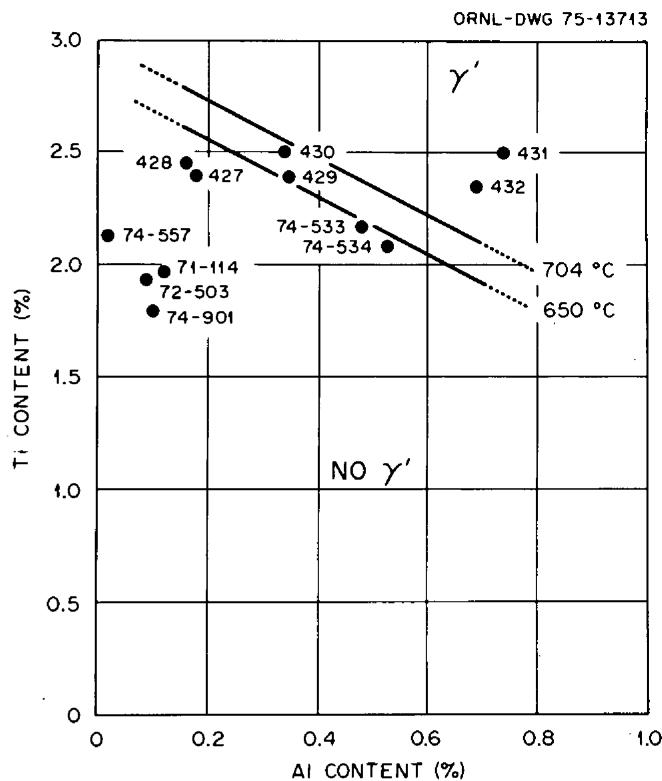  
Fig. 6.24. Proposed boundaries separating stable from unstable alloys of $\mathrm{Ni - }12\%$ Mo-7% Cr + Al and Ti with respect to gamma prime precipitation at 650 and $704^{\circ}\mathrm{C}$ . Alloys above the lines will form gamma prime and those below will not (see Table 6.4 for the compositions of the various alloys).

Table 6.7. Stress-rupture data for several heats of titanium-aluminum modified Hastelloy $\mathbf{N}^{\alpha}$ at $704^{\circ}\mathrm{C}$ and $35.0\times 10^{3}$ psi   

<table><tr><td rowspan="2">Heat</td><td colspan="3">Composition (wt %)</td><td rowspan="2">Rupture life (hr)</td><td rowspan="2">Total strain (%)</td><td rowspan="2">Age hardens at 704°Cb</td></tr><tr><td>Ti</td><td>Al</td><td>C</td></tr><tr><td>474-901</td><td>1.8</td><td>0.10</td><td>0.06</td><td>193.2</td><td>39.4</td><td>No</td></tr><tr><td>474-533</td><td>2.17</td><td>0.48</td><td>0.05</td><td>196.0</td><td>42.0</td><td>No</td></tr><tr><td>427</td><td>2.4</td><td>0.18</td><td>0.014</td><td>82.0</td><td>23.4</td><td>No</td></tr><tr><td>428</td><td>2.47</td><td>0.16</td><td>0.064</td><td>201.8</td><td>61.0</td><td>No</td></tr><tr><td>429</td><td>2.4</td><td>0.35</td><td>0.017</td><td>200.6</td><td>22.7</td><td>No</td></tr><tr><td>430</td><td>2.5</td><td>0.34</td><td>0.073</td><td>212.4</td><td>55.8</td><td>No</td></tr><tr><td>431</td><td>2.5</td><td>0.74</td><td>0.016</td><td>2938.3</td><td>6.8</td><td>Yes</td></tr><tr><td>432</td><td>2.35</td><td>0.69</td><td>0.057</td><td>3611.5</td><td>13.7</td><td>Yes</td></tr></table>

${}^{a}$ Base: $\mathrm{{Ni}} - 12\% \mathrm{{Mo}} - 7\% \mathrm{{Cr}}$ .   
Results of hardness measurements taken on aged, unstressed specimens.

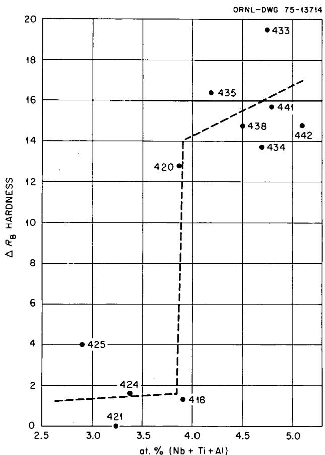  
Fig. 6.25. Change in hardness of unstressed specimens of various heats of Nb-Ti-Al-modified Hastelloy N after aging 1000 hr at $650^{\circ}\mathrm{C}$ (see Table 6.4 for the compositions of the various alloys).

high in titanium, does not seem to show much aging. Alloys containing 3 to 5 at. $\%$ (Nb + Ti + Al) age appreciably with creep rates of about $1 \times 10^{-3} \% / \mathrm{hr}$ or less.

The above results indicate that alloys containing approximately 2.5 at. $\%$ or less $(\mathrm{Nb} + \mathrm{Ti} + \mathrm{Al})$ will be satisfactory from the aging standpoint. Such an alloy would be represented by the composition on a weight percent basis of $0.5\%$ Nb-1.5% Ti-0.1% Al. Alloys having concentrations of $\mathrm{Nb} + \mathrm{Ti} + \mathrm{Al}$ above the 2.5 at. $\%$ range will be more susceptible to aging.

Future work will include evaluation of microstructure for a number of these specimens to confirm present conclusions, evaluation of additional alloys to test the indicated boundaries for stable compositions, and an extension of data analysis to determine whether a quantitative relationship can be derived that separates the relative effects of the individual elements, Nb, Ti, and Al, on the stability of alloys of this type.

# 6.5 MECHANICAL PROPERTIES OF TITANIUM-MODIFIED HASTELLOY N ALLOYS IN THE UNIRRADIATED CONDITION

T. K. Roche J. C. Feltner B. McNabb

Several tests were completed or are in progress to determine the mechanical properties of recently received heats of $2\%$ Ti-modified Hastelloy N in the unirradiated condition. These alloys include two production heats (74-901 and 75-421) and six semiproduction heats (74-533, 74-534, 74-535, 74-539, 74-557, and 74-558).

Table 6.8. Comparison of hardness changesa and creep behaviorb of several heats of Hastelloy Nc modified with Nb, Ti, and Al   

<table><tr><td rowspan="3">Heat</td><td colspan="5">Composition</td><td colspan="3">Hardness, RB</td><td rowspan="3">Minimum creep rate (%/hr)</td></tr><tr><td colspan="4">wt %</td><td>at. %</td><td rowspan="2">Annealedd</td><td rowspan="2">1000 hr at 650°C</td><td rowspan="2">Change</td></tr><tr><td>Nb</td><td>Ti</td><td>Al</td><td>C</td><td>Nb + Ti + Al</td></tr><tr><td>237</td><td>1.03</td><td>0.04</td><td>&lt;0.05</td><td></td><td>0.84</td><td></td><td></td><td></td><td>1.5 × 10-2</td></tr><tr><td>63</td><td>2.5</td><td></td><td>&lt;0.01</td><td>0.13</td><td>1.66</td><td></td><td></td><td></td><td>1.1 × 10-2</td></tr><tr><td>181</td><td>1.85</td><td>0.50</td><td>&lt;0.01</td><td>0.045</td><td>1.86</td><td></td><td></td><td></td><td>3.1 × 10-2</td></tr><tr><td>69-648</td><td>1.95</td><td>0.92</td><td>0.05</td><td>0.043</td><td>2.55</td><td></td><td></td><td></td><td>7.0 × 10-4</td></tr><tr><td>69-344</td><td>1.7</td><td>0.77</td><td>0.24</td><td>0.10</td><td>2.63</td><td></td><td></td><td></td><td>2.6 × 10-3</td></tr><tr><td>70-835</td><td>2.6</td><td>0.71</td><td>0.10</td><td>0.053</td><td>2.82</td><td></td><td></td><td></td><td>6.0 × 10-4</td></tr><tr><td>425</td><td>0.48</td><td>1.9</td><td>0.08</td><td>0.037</td><td>2.90</td><td>80.1</td><td>84.1</td><td>4.0</td><td>7.8 × 10-3</td></tr><tr><td>421</td><td>1.04</td><td>1.9</td><td>0.07</td><td>0.048</td><td>3.24</td><td>87.3</td><td>86.5</td><td>-0.8</td><td>1.3 × 10-3</td></tr><tr><td>424</td><td>1.34</td><td>1.8</td><td>0.1</td><td>0.063</td><td>3.38</td><td>88.6</td><td>90.2</td><td>1.6</td><td>7.1 × 10-4</td></tr><tr><td>418</td><td>1.92</td><td>2.0</td><td>0.05</td><td>0.058</td><td>3.91</td><td>89.1</td><td>90.4</td><td>1.3</td><td>2.2 × 10-4</td></tr><tr><td>420</td><td>1.90</td><td>1.8</td><td>0.15</td><td>0.055</td><td>3.87</td><td>88.7</td><td>101.5</td><td>12.8</td><td>1 × 10-5</td></tr><tr><td>433</td><td>1.89</td><td>2.2</td><td>0.33</td><td>0.024</td><td>4.75</td><td>84.8</td><td>104.3</td><td>19.5</td><td>2 × 10-5</td></tr><tr><td>434</td><td>1.86</td><td>2.2</td><td>0.32</td><td>0.061</td><td>4.70</td><td>93.3</td><td>107.0</td><td>13.7</td><td>3 × 10-5</td></tr></table>

$a$ Alloys aged for 1000 hr at $650^{\circ}\mathrm{C}$ and hardness measured in unstressed condition.   
$b_{\mathrm{Creep}}$ tested at $650^{\circ}\mathrm{C}$ and $47.0 \times 10^{3}$ psi.   
$c_{\mathrm{Base}}$ : Ni-12% Mo-7% Cr.   
$d_{\mathrm{1hrat}1177^{\circ}\mathrm{C}}$

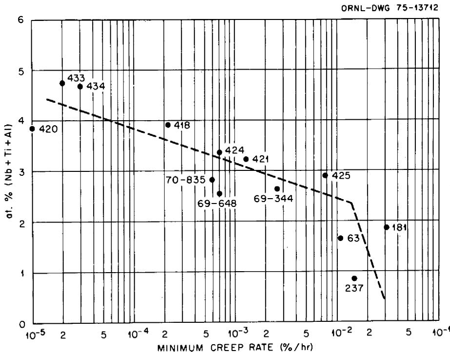  
Fig. 6.26. Minimum creep rate of various heats of Nb-Ti-Al-modified Hastelloy N tested at $650^{\circ}\mathrm{C}$ and $47.0 \times 10^{3}$ psi (see Table 6.4 for the alloy composition).

Four of the six semiproduction heats contain small additions of rare earths, lanthanum, cerium, and misch metal. The compositions of these alloys were chosen to study the effectiveness of rare-earth additions for minimizing the extent of shallow intergranular cracking. Each of the six semiproduction alloys was the product of a 120-lb double-melted (vacuum induction plus electroslag remelt) heat produced by an outside vendor. The chemical analysis of the alloys was reported previously.5 The mechanical-property studies include the determination of room- and elevated-temperature tensile properties and creep-rupture properties in air at 650, 704, and $760^{\circ}\mathrm{C}$ . These data serve as a reference for comparison with the properties of standard and other modified Hastelloy N alloys both in the unirradiated and irradiated conditions.

The principal effort during this report period was directed toward completing the creep-rupture data on the above heats. Tests are being run at three stress levels for each of the three test temperatures. Most of the tests were completed, with the major exception being heat 75-421, the 8000-lb production heat, for which specimens are being prepared. Specimens of the other

heats were obtained from swaged rod and were annealed for $1\mathrm{hr}$ at $1177^{\circ}\mathrm{C}$ prior to test.

Figures 6.27 through 6.29 are plots of rupture time as a function of stress at 650, 704, and $760^{\circ}\mathrm{C}$ , respectively, for the $2\%$ Ti-modified Hastelloy N heats and are compared with plots for a previous heat (471-114) of the same alloy and standard Hastelloy N. Minimum creep rates measured from these tests at the three temperatures are shown in Fig. 6.30 as a function of stress. As concluded previously, the more recent heats of $2\%$ Ti-modified Hastelloy N are essentially equivalent in strength to the earlier heat, and there is no significant effect resulting from the addition of rare earths to the $2\%$ Ti-modified alloy. As determined from past work and confirmed by the recent tests, the modified alloy exhibits longer rupture lives than standard Hastelloy N at the three temperatures.

Additionally, the first of eight creep machines capable of tests in molten fluoride fuel salt was put into operation. A specimen of heat 474-533 has been in test at $650^{\circ}\mathrm{C}$ and $30.0 \times 10^{3}$ psi for slightly over $1300\mathrm{hr}$ . Data are not available, as yet, on this same heat in air, but a comparison is made in Table 6.9 with an air test of an earlier heat (471-114) of the same nominal composition.

The data appear to be falling within a normal scatter band for alloys with the same nominal composition that

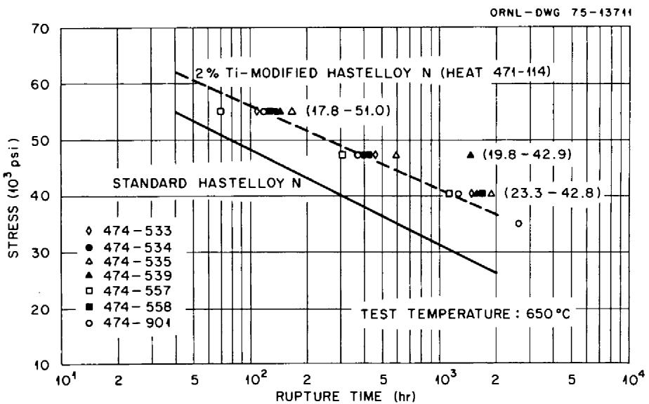  
Fig. 6.27. Stress-rupture properties of several heats of $2\%$ Ti-modified Hastelloy N and standard Hastelloy N at $650^{\circ}\mathrm{C}$ . (Ranges of rupture strain indicated in parentheses.)

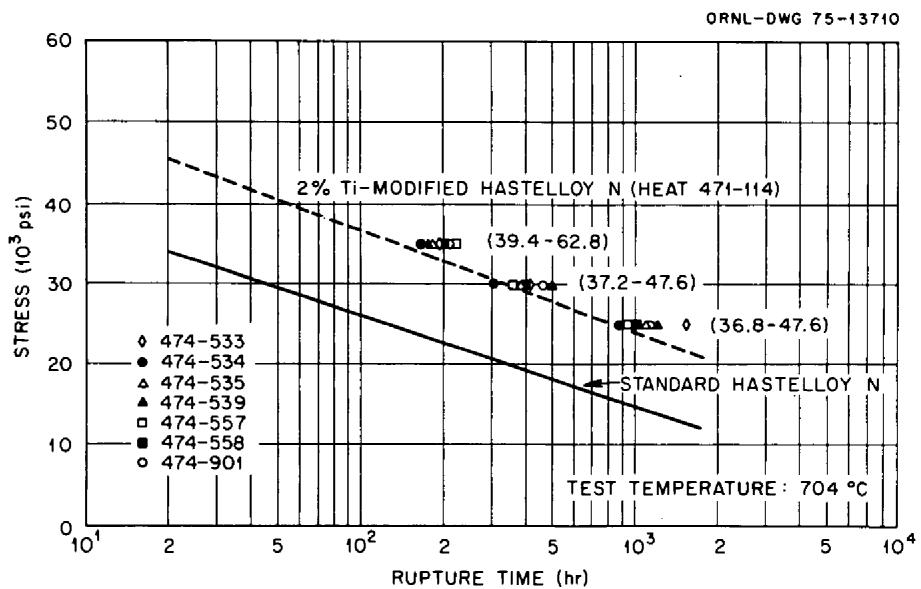  
Fig. 6.28. Stress-rupture properties of several heats of $2\%$ Ti-modified Hastelloy N and standard Hastelloy N at $704^{\circ}\mathrm{C}$ . (Ranges of rupture strains indicated in parentheses.)

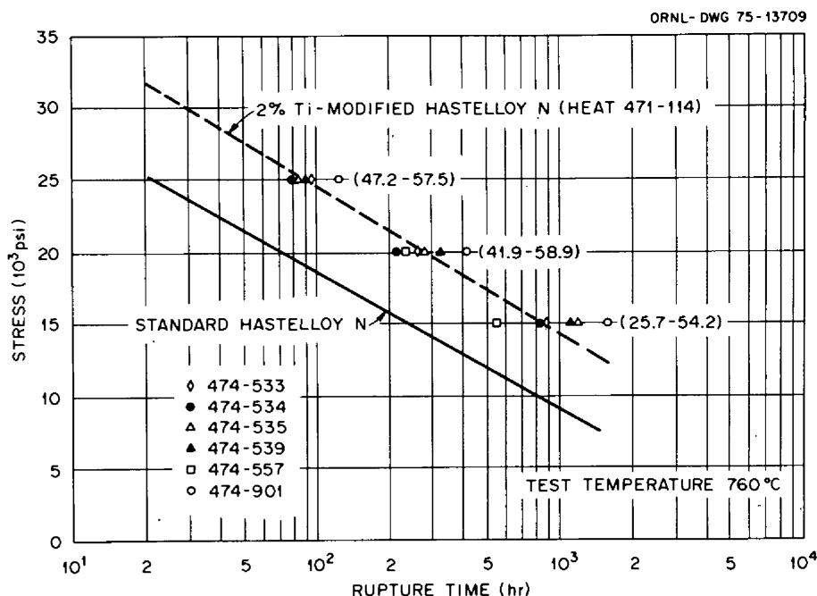  
Fig. 6.29. Stress-rupture properties of several heats of $2\%$ Ti-modified Hastelloy N and standard Hastelloy N at $760^{\circ}\mathrm{C}$ . (Ranges of rupture strains indicated in parentheses.)

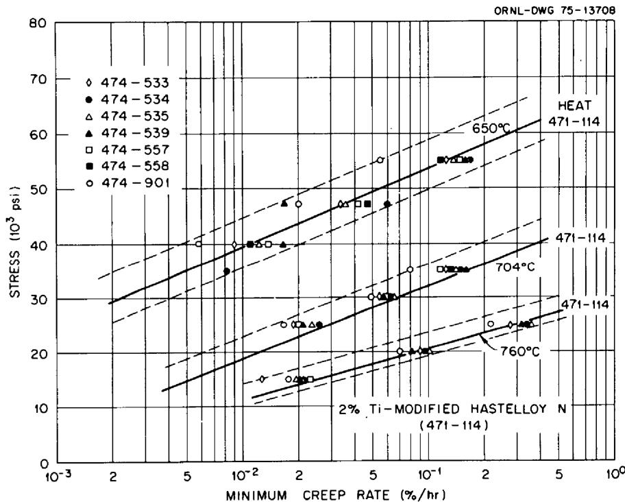  
Fig. 6.30. Creep properties of several heats of $2\%$ Ti-modified Hastelloy N at 650, 704, and $760^{\circ}\mathrm{C}$ . Solid lines are for heat 71-114, and the dashed lines indicate bands which contain the data for the other modified alloys.

Table 6.9. Creep data for specimens of two heats of $2\%$ Ti-modified Hastelloy N in salt and air environments   

<table><tr><td rowspan="2">Time (hr)</td><td colspan="2">Accumulated strain (%)</td></tr><tr><td>474-533 (fluoride fuel)</td><td>471-114 (air)</td></tr><tr><td>500</td><td>1.3</td><td>2.4</td></tr><tr><td>1000</td><td>2.8</td><td>4.4</td></tr><tr><td>1300</td><td>3.5</td><td>5.5</td></tr></table>

${}^{a}$ Tests run at ${650}^{ \circ  }\mathrm{C}$ and ${30.0} \times  {10}^{3}\mathrm{{psi}}$ .

are tested under similar conditions, and there is no indication that corrosion by the molten fluoride fuel salt represents a significant factor.

# 6.6 POSTIRRADIATION CREEP PROPERTIES OF MODIFIED HASTELLOY N

H.E.McCoy T.K.Roche

Postirradiation creep tests are in progress on specimens from five experiments that were irradiated in the

poolside of the ORR. Each experiment contains 102 miniature creep specimens in an instrumented facility in which temperatures can be measured and controlled by supplying heat from auxiliary heaters. Only 12 in-cell creep machines are available for postirradiation creep testing; hence the testing proceeds rather slowly. The most recent tests have concentrated on (1) the properties of six 125-lb semiproduction heats that contain $2\%$ Ti and low concentrations of rare earths, and (2) the properties of several alloys containing both niobium and titanium.

The results of tests completed to date on the six heats that contain titanium and rare-earth additions and the 10,000-lb commercial heat that contains titanium are summarized in Table 6.10. Previous tests at temperatures of 650 and $704^{\circ}\mathrm{C}$ showed that the creep properties of these heats are about equivalent. The rupture life at $650^{\circ}\mathrm{C}$ and $40.0 \times 10^{3}$ psi varied from 1200 to 1800 hr, and the rupture life at $704^{\circ}\mathrm{C}$ and $35.0 \times 10^{3}$ psi varied from 170 to 200 hr. Final conclusions con

6. T. K. Roche, J. C. Feltner, and B. McNabb, MSR Program Semiannu. Progr. Rep. Feb. 28, 1975, ORNL-5047, p. 78.

Table 6.10. Postirradiation creep properties of titanium-modified Hastelloy N at $650^{\circ}\mathrm{C}$ after irradiation at the indicated temperaturea   

<table><tr><td>Alloy</td><td>Test number</td><td>Irradiation temperature (°C)</td><td>Stress (103psi)</td><td>Minimum creep rate (%/hr)</td><td>Rupture life (hr)</td><td>Total fracture strain (%)</td><td>Compositionb</td></tr><tr><td rowspan="4">474-533</td><td>R-1912</td><td>650</td><td>40.0</td><td>0.025</td><td>231.1</td><td>7.2</td><td>2.17% Ti, 0.48% Al</td></tr><tr><td>R-1908</td><td>650</td><td>47.0</td><td>0.050</td><td>111.8</td><td>7.8</td><td></td></tr><tr><td></td><td>704</td><td>40.0</td><td></td><td>58.2</td><td>6.6</td><td></td></tr><tr><td>R-1929</td><td>760</td><td>35.0</td><td>0.035</td><td>202.2</td><td>7.8</td><td></td></tr><tr><td rowspan="4">474-534</td><td>R-1913</td><td>650</td><td>40.0</td><td>0.021</td><td>572.2</td><td>16.2</td><td>2.09% Ti, 0.53% Al, 0.013% La</td></tr><tr><td>R-1909</td><td>650</td><td>47.0</td><td>0.087</td><td>66.0</td><td>6.9</td><td></td></tr><tr><td></td><td>704</td><td>40.0</td><td></td><td>58.8</td><td>3.5</td><td></td></tr><tr><td>R-1930</td><td>760</td><td>35.0</td><td>0.0085</td><td>73.9</td><td>2.8</td><td></td></tr><tr><td rowspan="4">474-535</td><td>R-1915</td><td>650</td><td>40.0</td><td>0.016</td><td>767.1</td><td>13.6</td><td>2.13% Ti, 0.55% Al, 0.04% rare earth</td></tr><tr><td>R-1911</td><td>650</td><td>47.0</td><td>0.099</td><td>93.0</td><td>7.5</td><td></td></tr><tr><td>R-1922</td><td>704</td><td>40.0</td><td>0.023</td><td>467.7</td><td>12.3</td><td></td></tr><tr><td>R-1926</td><td>771</td><td>35.0</td><td>0.019</td><td>645.4</td><td>13.9</td><td></td></tr><tr><td rowspan="4">474-539</td><td>R-1914</td><td>650</td><td>40.0</td><td>0.020</td><td>601.8</td><td>10.8</td><td>1.93% Ti, 0.20% Al, 0.03% Ce</td></tr><tr><td>R-1910</td><td>650</td><td>47.0</td><td>0.11</td><td>73.9</td><td>9.7</td><td></td></tr><tr><td>R-1921</td><td>713</td><td>40.0</td><td>0.031</td><td>429.5</td><td>16.5</td><td></td></tr><tr><td>R-1925</td><td>774</td><td>35.0</td><td>0.0080</td><td>1220.0</td><td>11.4</td><td></td></tr><tr><td rowspan="3">474-557</td><td>R-1920</td><td>671</td><td>47.0</td><td>0.045</td><td>217.4</td><td>10.6</td><td>2.14% Ti, 0.02% Al</td></tr><tr><td>R-1923</td><td>713</td><td>40.0</td><td>0.044</td><td>186.2</td><td>9.5</td><td></td></tr><tr><td>R-1927</td><td>771</td><td>35.0</td><td>0.019</td><td>434.5</td><td>8.3</td><td></td></tr><tr><td rowspan="3">474-558</td><td>R-1916</td><td>650</td><td>47.0</td><td>0.092</td><td>74.8</td><td>7.9</td><td>2.05% Ti, 0.02% Al, 0.02% La</td></tr><tr><td>R-1924</td><td>716</td><td>40.0</td><td>0.021</td><td>179.3</td><td>8.6</td><td></td></tr><tr><td>R-1928</td><td>795</td><td>35.0</td><td>0.012</td><td>42.5</td><td>1.1</td><td></td></tr><tr><td rowspan="3">474-901</td><td>R-1936</td><td>650</td><td>47.0</td><td>0.069</td><td>171.6</td><td>13.6</td><td>1.80% Ti, 0.10% Al</td></tr><tr><td>R-1937</td><td>704</td><td>47.0</td><td>0.15</td><td>33.2</td><td>5.2</td><td></td></tr><tr><td>R-1907</td><td>732</td><td>47.0</td><td>0.14</td><td>52.5</td><td>7.4</td><td></td></tr></table>

${}^{a}$ All specimens annealed $1\mathrm{{hr}}$ at ${1177}^{ \circ  }\mathrm{C}$ prior to irradiation for $\sim  {1100}\mathrm{{hr}}$ to a thermal fluence of $\sim  3 \times  {10}^{20}$ neutrons $/{\mathrm{{cm}}}^{2}$ .

cerning the postirradiation properties (Table 6.10) are not possible, because the test matrix has not been completed. Specimens irradiated at $650^{\circ}\mathrm{C}$ and tested at $650^{\circ}\mathrm{C}$ have rupture lives that are about half those of the unirradiated specimens, but there are no differences in the properties of the various heats that are considered significant in view of the limited data. The properties of all heats are considered good after irradiation at $650^{\circ}\mathrm{C}$ . After irradiation at $704^{\circ}\mathrm{C}$ and testing at $650^{\circ}\mathrm{C}$ and $40.0 \times 10^{3}$ psi, the rupture lives of heats 474-533 and 474-534 appear to be lower than those for the other heats by a factor of 3. In all cases the rupture life and the fracture strain were lower after irradiation at $704^{\circ}\mathrm{C}$ than at $650^{\circ}\mathrm{C}$ . After irradiation at $\sim 760^{\circ}\mathrm{C}$ and testing at $35.0 \times 10^{3}$ psi at $650^{\circ}\mathrm{C}$ , the rupture life varied from 43 to 1220 hr and the fracture strain from 1.1 to $11.4\%$

respectively. Thus, differences in creep behavior of these alloys likely become progressively more important as the irradiation temperature is increased.

The fracture strains of the various heats appear to show significant trends with increasing irradiation temperature. Heats 474-533 and 474-557 have good fracture strains (6 to $10\%$ ) which do not decrease appreciably with increasing irradiation temperature. The fracture strains of heats 474-535 and 474-539 are in the range of 10 to $16\%$ and do not change appreciably with irradiation temperature. Alloys 474-534 and 474-558 show decreasing fracture strains with increasing irradiation temperature. The behavior of alloy 474-901 appears to be unique in that it shows a marked drop in fracture strain as the irradiation temperature is increased from $650^{\circ}$ to $704^{\circ}\mathrm{C}$ . However, this effect may

Table 6.11. Postirradiation creep properties of several modified Hastelloy N alloys at ${650}^{ \circ  }{\mathrm{C}}^{a}$   

<table><tr><td>Alloyb</td><td>Test number</td><td>Stress (103psi)</td><td>Minimum creep rate (%/hr)</td><td>Rupture life (hr)</td><td>Total fracture strain (%)</td></tr><tr><td>428</td><td>R-1948</td><td>47.0</td><td>0.043</td><td>222.1</td><td>11.9</td></tr><tr><td>474-533</td><td>R-1908</td><td>47.0</td><td>0.050</td><td>111.8</td><td>7.8</td></tr><tr><td></td><td>R-1912</td><td>40.0</td><td>0.025</td><td>231.1</td><td>7.2</td></tr><tr><td>430</td><td>R-1947</td><td>47.0</td><td>≤0.0049</td><td>972.0c</td><td>4.8c</td></tr><tr><td>432</td><td>R-1946</td><td>47.0</td><td>&lt;0.00051</td><td>972.0c</td><td>0.5c</td></tr><tr><td>431</td><td>R-1945</td><td>47.0</td><td>&lt;0.0024</td><td>972.0c</td><td>2.3c</td></tr><tr><td>424</td><td>R-1919</td><td>35.0</td><td>~0</td><td>316.0d</td><td></td></tr><tr><td></td><td></td><td>40.0</td><td>0.00024</td><td>140.6d</td><td></td></tr><tr><td></td><td></td><td>47.0</td><td>0.00033</td><td>452.6d</td><td></td></tr><tr><td></td><td></td><td>55.0</td><td>0.0066</td><td>949.4d</td><td>7.8d</td></tr><tr><td>424</td><td>R-1944</td><td>63.0</td><td>0.0096</td><td>355.4</td><td>10.4</td></tr><tr><td>420</td><td>R-1918</td><td>35.0</td><td>~0</td><td>532.2d</td><td></td></tr><tr><td></td><td></td><td>40.0</td><td>~0</td><td>140.5d</td><td></td></tr><tr><td></td><td></td><td>47.0</td><td>0.00021</td><td>450.9d</td><td></td></tr><tr><td></td><td></td><td>55.0</td><td>0.00037</td><td>695.9d</td><td></td></tr><tr><td></td><td></td><td>63.0</td><td>0.00080</td><td>334.3d</td><td></td></tr><tr><td></td><td></td><td>70.0</td><td>0.0062</td><td>277.6d</td><td>4.3d</td></tr><tr><td>420</td><td>R-1943</td><td>63.0</td><td>&lt;0.0017</td><td>1068.0c</td><td>1.8c</td></tr><tr><td>418</td><td>R-1917</td><td>35.0</td><td>0.00002</td><td>652.4d</td><td></td></tr><tr><td></td><td></td><td>40.0</td><td>0.00007</td><td>140.6d</td><td></td></tr><tr><td></td><td></td><td>47.0</td><td>0.00014</td><td>452.3d</td><td></td></tr><tr><td></td><td></td><td>55.0</td><td>0.0040</td><td>794.8d</td><td>5.4d</td></tr><tr><td>418</td><td>R-1942</td><td>63.0</td><td>0.0022</td><td>559.2</td><td>7.2</td></tr><tr><td>434</td><td></td><td>63.0</td><td>&lt;0.085</td><td>12.9</td><td>1.1</td></tr><tr><td>433</td><td>R-1949</td><td>63.0</td><td>&lt;0.0011</td><td>660.0c</td><td>0.75c</td></tr></table>

${}^{a}$ All specimens annealed $1\mathrm{{hr}}$ at ${1177}^{ \circ  }\mathrm{C}$ prior to irradiation. Irradiation carried out at ${650}^{ \circ  }\mathrm{C}$ for approximately ${1100}\mathrm{{hr}}$ to a thermal fluence of $\sim  3 \times  {10}^{20}$ neutrons $/{\mathrm{{cm}}}^{2}$ .   
$b_{\mathrm{See~Table~6.4~for~detailed~chemical~analyses}}$   
$c_{\mathrm{Test}}$ still in progress.   
$d_{\mathrm{Stress}}$ increased on the same specimen in the increments shown.

Table 6.12. Summary of information relative to metallurgical stability of several compositions of modified Hastelloy N   

<table><tr><td rowspan="2">Heata</td><td colspan="3">Age hardens at 650°C based on indicated parameter</td><td colspan="3">Composition (wt %)</td><td>Composition (at. %)</td></tr><tr><td>Hardness, unstressed specimen, 1000-hr annealb</td><td>Unirradiated creep behaviorc</td><td>Postirradiation creep behavior, irradiated at 650°C for ~1100 hr d</td><td>Nb</td><td>Ti</td><td>Al</td><td>Nb + Ti + Al</td></tr><tr><td>428</td><td>No</td><td>No</td><td>No</td><td>2.47</td><td>0.16</td><td>3.57</td><td></td></tr><tr><td>474-533</td><td>No</td><td>No</td><td>No</td><td>2.17</td><td>0.48</td><td>3.92</td><td></td></tr><tr><td>430</td><td>Yes</td><td>Yes</td><td>Yes</td><td>2.5</td><td>0.34</td><td>4.02</td><td></td></tr><tr><td>432</td><td>Yes</td><td>Yes</td><td>Yes</td><td>2.35</td><td>0.69</td><td>4.63</td><td></td></tr><tr><td>431</td><td>Yes</td><td>Yes</td><td>Yes</td><td>2.5</td><td>0.74</td><td>4.94</td><td></td></tr><tr><td>424</td><td>No</td><td>Yes</td><td>Yes</td><td>1.34</td><td>1.8</td><td>0.10</td><td>3.38</td></tr><tr><td>420</td><td>Yes</td><td>Yes</td><td>Yes</td><td>1.90</td><td>1.8</td><td>0.15</td><td>3.87</td></tr><tr><td>418</td><td>No</td><td>Yes</td><td>Yes</td><td>1.92</td><td>2.0</td><td>0.05</td><td>3.91</td></tr><tr><td>434</td><td>Yes</td><td>Yes</td><td>Yes</td><td>1.86</td><td>2.2</td><td>0.32</td><td>4.70</td></tr><tr><td>433</td><td>Yes</td><td>Yes</td><td>Yes</td><td>1.89</td><td>2.2</td><td>0.33</td><td>4.75</td></tr></table>

${}^{a}$ See Table 6.4 for detailed chemical analyses.   
$b_{\mathrm{FromTable6.4}}$   
From Table 6.6 based on considerations of data on rupture life and total strain.   
$d_{\mathrm{FromTable6.11}}$

be related to the strain rate. In summary, these sparse data suggest that the fracture strains of alloys containing only titanium and those containing titanium plus cerium remain at adequate levels as the irradiation temperature is increased, while the fracture strains of the two alloys (474-534 and 474-558) that contain lanthanum do not. Additional specimens were irradiated and tested to check this important point.

Section 6.4 of this report deals in detail with the metallurgical stability of alloys containing Nb, Ti, and Al in the unirradiated condition. Some of these alloys have been irradiated, and limited test results are available (Table 6.11). The alloys were annealed for $1\mathrm{hr}$ at $1177^{\circ}\mathrm{C}$ prior to irradiation for about $1100\mathrm{hr}$ at $650^{\circ}\mathrm{C}$ . The anneal at $1177^{\circ}\mathrm{C}$ should have dissolved most of the alloying elements, and the subsequent period at $650^{\circ}\mathrm{C}$ may have resulted in the formation of gamma prime. Precipitation of this embrittling phase also strengthens an alloy; hence the postirradiation creep tests should show whether significant quantities of gamma prime were formed. As discussed in Sect. 6.4, precipitation of this phase may be strain induced, and a detailed analysis of the creep data will be required to determine whether the gamma prime formed in the specimens during irradiation or whether it formed as the specimens were stressed initially.

The data from Table 6.11 and information from Sect. 6.4 are summarized in Table 6.12, which shows that the

same conclusions are reached with regard to aging of creep specimens in the unirradiated and irradiated conditions. However, hardness measurements on unstressed, unirradiated specimens fail to be a good indication of aging in alloys containing niobium. Alloys having a combined titanium and aluminum content as high as 3.57 at. $\%$ had excellent postirradiation properties. Alloys with higher combined concentrations are quite strong, but no conclusion can be made about their fracture strains. All of the alloys containing Nb, Ti, and Al are quite strong, and can take considerable strain before fracturing. Alloy 434 has a low fracture strain, while no conclusion can be drawn relative to alloy 433.

The alloys containing Nb, Ti, and Al which have been evaluated thus far are likely too highly alloyed even though some of the fracture strains are acceptable. Less highly alloyed materials are being irradiated.

# 6.7 MICROSTRUCTURAL ANALYSIS OF TITANIUM-MODIFIED HASTELLOYN

D.N.Braski J.M.Leitnaker G.A.Potter

The first part of this section presents the results of microstructural studies of two titanium-modified Hastelloy N alloys, 472-503 (designated as 503) and 471-114 (designated as 114). Previous analyses of these same two alloys dealt with their microstructures after

aging7 and after postirradiation creep tests.8 In the present investigation the microstructures of both alloys were analyzed in an attempt to explain some unusual postirradiation creep results in specimens that were given a slightly higher solution annealing treatment before irradiation. The analysis showed that many of the test specimens were quite inhomogeneous and that the poor creep properties could in some cases be related to the inhomogeneities. This finding prompted a study aimed at producing more homogeneous Hastelloy N alloys. The problem is being approached by reducing the carbon content of the alloy and by giving careful attention to the fabrication parameters. The results of initial experiments to fabricate homogeneous alloys are presented in the second part of this section.

# 6.7.1 Microstructural Analysis of Alloys 503 and 114

Postirradiation creep tests. The results of creep tests on specimens of alloys 503 and 114, which had been previously irradiated in the ORR at $760^{\circ}\mathrm{C}$ , are given in Fig. 6.31. The creep tests were conducted at $650^{\circ}\mathrm{C}$ at a stress level of $35.0 \times 10^{3}$ psi. This particular series of specimens was designed to show the effect of solution annealing temperature on the postirradiation creep rupture life of the materials. The solution anneal was a 1-hr heat treatment and was given to all specimens before they were irradiated. As seen in Fig. 6.31, the 503 specimen given the standard 1 hr at $1177^{\circ}\mathrm{C}$ solution anneal demonstrated good creep rupture life, while the 114 specimen given the same treatment had a comparably short lifetime. However, with an increase of only $\sim 30^{\circ}\mathrm{C}$ in annealing temperature, alloy 503 had a greatly reduced lifetime, while alloy 114 showed marked improvement. It was considered unlikely that these results could be caused by changes in solution annealing temperature alone, and other possible explanations were sought. It is important to note that despite the apparent instability in creep behavior, the properties of the $2\%$ Ti-modified alloys are generally good. The problem is thus to determine why some specimens have poor properties. A solution to this problem was sought by carefully analyzing the microstructures of the two alloy 503 and 114 specimens described above.

7. D. N. Braski, J. M. Leitnaker, and G. A. Potter, MSR Program Semiannu. Progr. Rep. Aug. 31, 1974, ORNL-5011, pp. 62-68.   
8. D. N. Braski, J. M. Leitnaker, and G. A. Potter, MSR Program Semiannu. Progr. Rep. Feb. 28, 1975, ORNL-5047, pp. 83-90.

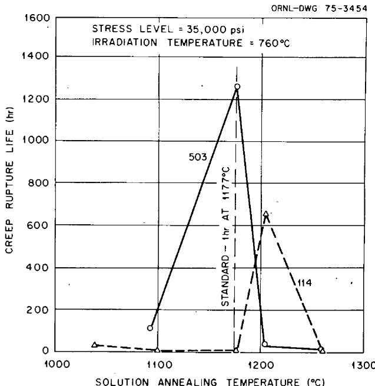  
Fig. 6.31. Creep-rupture life of $2\%$ Ti-modified Hastelloy N alloys 503 and 114 at $650^{\circ}\mathrm{C}$ after irradiation in ORR for 1200 hr.

Transmission electron microscopy. Samples were prepared for transmission electron microscopy (TEM) by electropolishing small transverse sections of the tested creep specimens in perchloric acid solutions. Figures 6.32 and 6.33 show electron micrographs representative of 503 and 114 specimens respectively. Figure $6.32a$ shows an area near a grain boundary in the 503 specimen annealed at $1177^{\circ}\mathrm{C}$ . The microstructure was observed to contain MC-type carbides - both in the grain boundary and in the form of small platelets. Dislocations were nearly always found to be associated with the MC platelets. The 503 specimen annealed at $1204^{\circ}\mathrm{C}$ had similar features (Fig. 6.32b). In both specimens the MC platelets were concentrated near the grain boundaries. This suggests that the element or elements (probably titanium) making up the MC-type carbide in both specimens were not uniformly distributed throughout the matrix. Figure 6.33 shows electron micrographs of the 114 specimens annealed at $1177^{\circ}\mathrm{C}$ (Fig. 6.33a) and $1204^{\circ}\mathrm{C}$ (Fig. 6.33b). These specimens also contained fine MC-type carbides, but instead of forming platelets they precipitated out on stacking faults. The stacking fault precipitates initiate from dislocations associated with preexisting or primary MC carbides and grow along (111) planes. The primary MC carbides (the dark

spherical particles in Fig. 6.33) were not dissolved during the solution anneal. Although not shown in these micrographs, a nonuniform distribution of MC precipitates was also observed near many grain boundaries in both 114 specimens. However, in this case, a denuded zone was observed rather than a higher concentration of MC at the grain boundaries. This implies that at least

one of the elements (probably titanium) needed to form MC-type carbides remained in the volume surrounding the primary carbides. Since most of these primary carbides were located within grain interiors, the areas near grain boundaries were free of carbides. Transmission electron microscopy has revealed several interesting differences in carbide morphology between specimens of

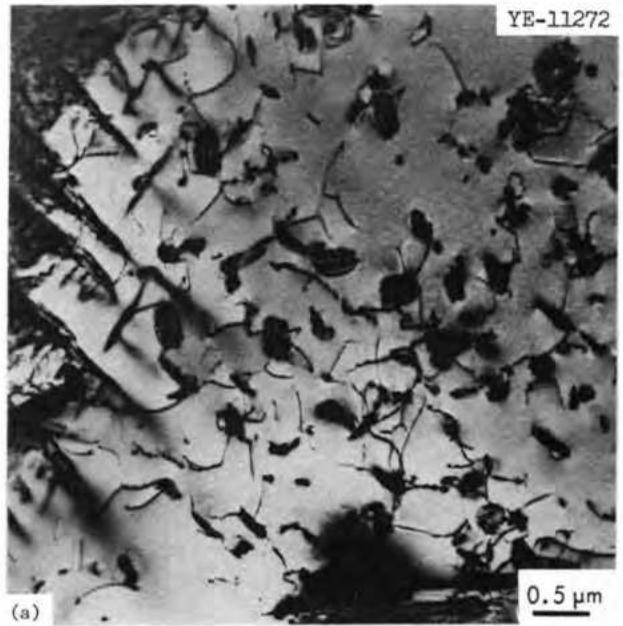

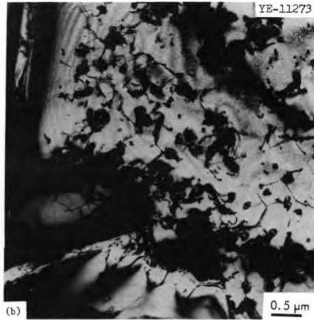  
Fig. 6.32. Specimens of alloy 503 after 1200 hr in ORR at $760^{\circ}\mathrm{C}$ and creep testing at $650^{\circ}\mathrm{C}$ . (a) Solution anneal of 1 hr at $1177^{\circ}\mathrm{C}$ . (b) Solution anneal of 1 hr at $1204^{\circ}\mathrm{C}$ .

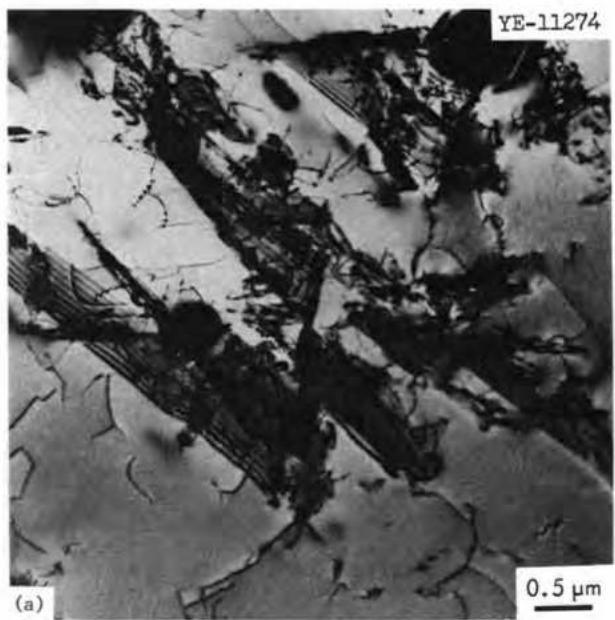

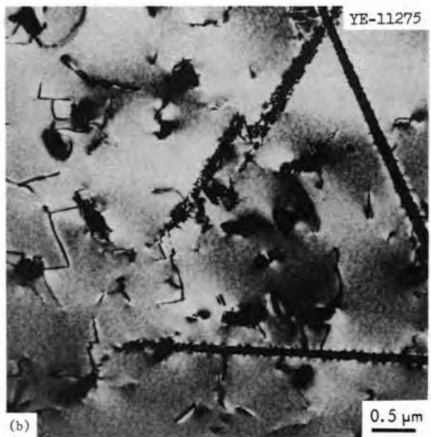  
Fig. 6.33. Specimens of alloy 114 after 1200 hr in ORR at $760^{\circ}\mathrm{C}$ and creep testing at $650^{\circ}\mathrm{C}$ . (a) Solution anneal of 1 hr at $1177^{\circ}\mathrm{C}$ . (b) Solution anneal of 1 hr at $1204^{\circ}\mathrm{C}$ .

the two titanium-modified Hastelloy N alloys. The investigation also showed two different types of nonuniform MC-type carbide distributions near grain boundaries in both alloys. Unfortunately, it was not possible to identify differences in microstructure by TEM that could be directly related to the wide variation in creep properties with changes in solution annealing temperature.

Metallography. The same two pairs of 503 and 114 specimens studied by TEM were also examined in the Radiation Metallography Laboratory at ORNL. Polished longitudinal sections of 503 and 114 specimens were examined near the fracture surfaces. Micrographs of these areas are shown for 503 and 114 in Figs. 6.34 and 6.35 respectively. The 503 specimen annealed at $1177^{\circ}\mathrm{C}$ (Fig. 6.34a), which had a long creep rupture life, had many intergranular cracks along its outer surface. Several cracks or evidence of grain boundary separation was also observed within the specimen interior. Carbide stringers were found to be distributed uniformly across the entire section of the sample. The carbide stringers are composed of numerous MC-type particles which lie in lines parallel to the primary working direction in fabrication. Some carbide stringers are more clearly illustrated in Fig. 6.36 by the higher magnification micrographs taken of the 503 specimen. The 503 specimen annealed at $1204^{\circ}\mathrm{C}$ had only a few cracks (Fig. 6.34b), but one of them was apparently able to

propagate quite rapidly, leading to early fracture. Note also the striking differences in microstructure of the surface region, which extends to a depth of $\sim 0.012$ in. This region was free of carbide stringers and had a grain size of at least twice that seen in more central areas. Quite similar microstructural features were also observed for the 114 specimens having poor creep properties. The 114 specimen annealed at $1177^{\circ}\mathrm{C}$ which had a short creep rupture life, also had a $\sim 0.012$ -in.-thick carbide-free layer (Fig. 6.35a). However, a large grain size was not observed in the layer as seen in the 503 specimen (Fig. 6.34b). It was also found that surface cracks never penetrated beyond the carbide-free layer. The 114 specimens annealed at $1204^{\circ}\mathrm{C}$ (Fig. 6.35b) demonstrated better creep properties and had a microstructure much like that shown for the better 503 samples (Fig. 6.35a). The carbide-free layer found in the 503 and 114 specimens with poor creep properties may have been caused by decarburization during the solution anneal at $1177^{\circ}\mathrm{C}$ in argon. Decarburization layers of $\sim 1$ mm (0.039 in.) were observed in Inconel 617 after creep tests at $1000^{\circ}\mathrm{C}$ for $127\mathrm{hr}$ in helium containing $500~\mathrm{ppm}$ oxygen.[10] The lack of carbides in the surface layer may have, in turn,

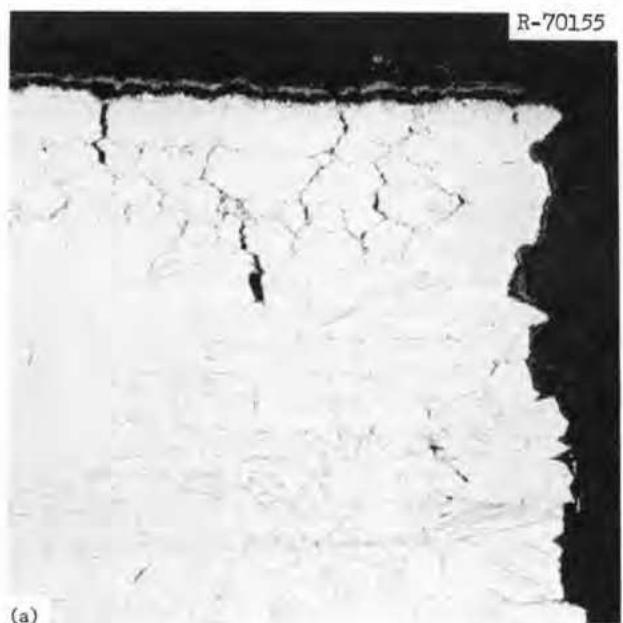

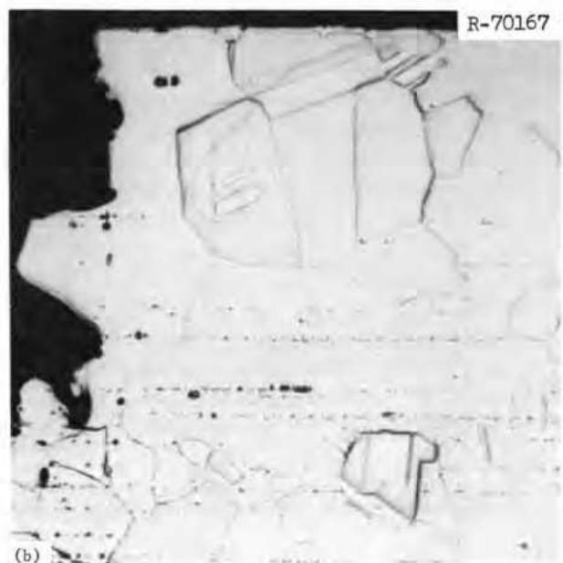

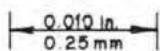  
Fig. 6.34. Microstructure of specimens of alloy 503 near fracture surfaces after 1200 hr in ORR at $760^{\circ}\mathrm{C}$ and creep testing at $650^{\circ}\mathrm{C}$ . (a) Solution anneal of 1 hr at $1177^{\circ}\mathrm{C}$ . (b) Solution anneal of 1 hr at $1204^{\circ}\mathrm{C}$ .

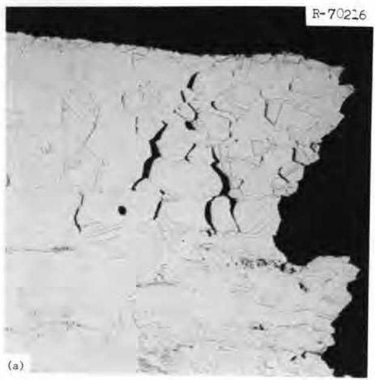

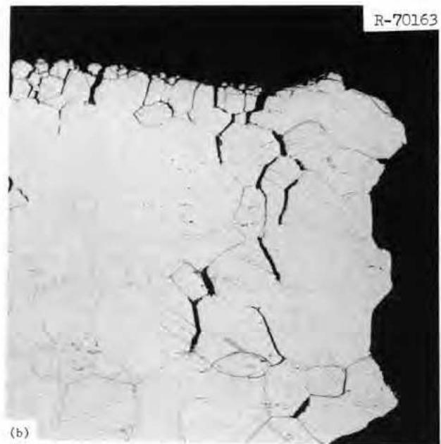

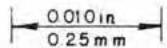  
Fig. 6.35. Microstructure of specimens of alloy near fracture surfaces after 1200 hr in ORR at $760^{\circ}\mathrm{C}$ and creep testing at $650^{\circ}\mathrm{C}$ . (a) Solution anneal of 1 hr at $1177^{\circ}\mathrm{C}$ . (b) Solution anneal of 1 hr at $1204^{\circ}\mathrm{C}$ .

encouraged grain growth in the 503 specimen (Fig. 6.35b) during the solution anneal. It is unclear as to why only certain specimens have the carbide-free layers when all specimens were supposedly fabricated in the same way.

The results of the metallographic and TEM examinations cannot be used to fully explain the mechanisms which led to the early creep failure of two of the specimens studied. However, we have shown that a number of microstructural inhomogeneities exist in the $2\%$ Ti-modified Hastelloy N alloys, including carbide-free surface layers, large-grain-size surface layers, generalized carbide stringers, and nonuniform distributions of MC-type carbide near grain boundaries. Some of these inhomogeneities appeared to affect the results of mechanical tests and may also influence other important tests, such as those relating to tellurium attack. Consequently, a study was initiated to produce Hastelloy N alloys with more homogenous microstructures.

# 6.7.2 Homogeneous Hastelloy N Alloys

The problem of producing Hastelloy N alloys with homogeneous microstructures is being approached in two ways. The first is to reduce the carbon content in the alloy to ensure that all of the MC-type carbides are dissolved during the solution annealing treatment. If all

the carbides could be held in solution during fabrication, the formation of carbide stringers might be eliminated. The second approach is a detailed evaluation of the fabrication process. This latter effort is primarily aimed at identifying the steps at which the different inhomogenities are introduced and finding suitable alternate processing methods to remove the inhomogenities. A definite concern throughout the entire study is that any successful fabrication changes also be compatible with commercial practices.

Carbon content. The first series of experiments was designed to eliminate carbide stringers by reducing the carbon content of the alloy. Thermodynamic calculations using data from previous experiments indicated that all of the carbides should dissolve at $1177^{\circ}\mathrm{C}$ in alloys with carbon contents of less than 0.045 wt %. Therefore, two alloys, 451 and 453, both with a nominal Hastelloy N composition (13 wt % Mo, 7 wt % Cr, bal Ni) and 1.94 wt % Ti, were cast into 1-in.-diam ingots having carbon contents of 0.017 and 0.035 wt % respectively. The fabrication schedule called for the cast ingots to be hot swaged at $1177^{\circ}\mathrm{C}$ from a 1-in. to a 0.430-in. diameter and then to be annealed at $1177^{\circ}\mathrm{C}$ for 1 hr. The rods were further reduced to a 0.337-in. diameter by cold swaging, annealed at $1177^{\circ}\mathrm{C}$ for 1 hr, and cold swaged to a final diameter of 0.250 in. One-inch-long samples were then cut from each alloy rod,

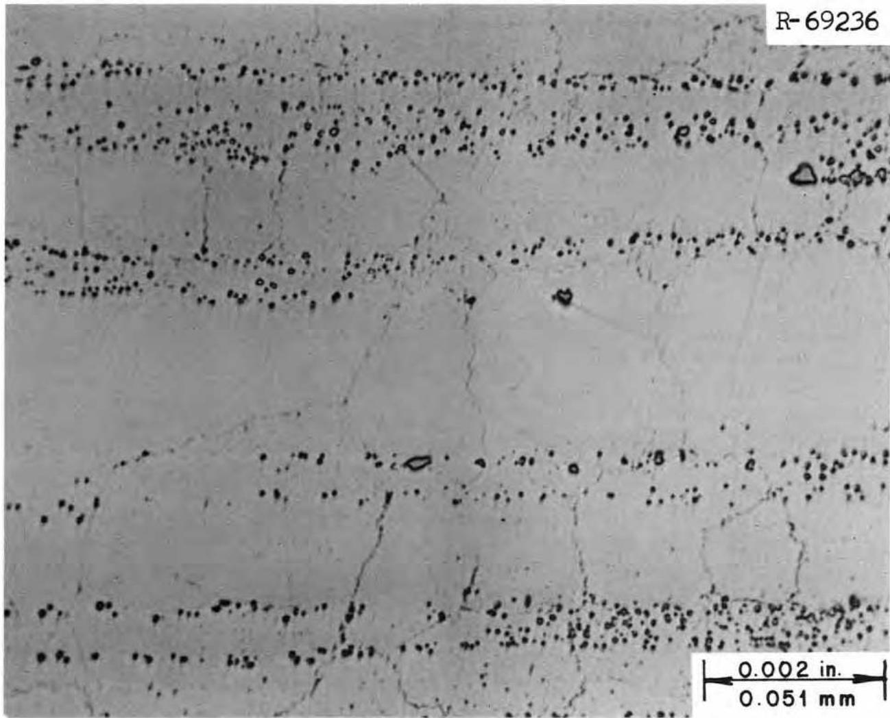  
Fig. 6.36. Carbide stringers in specimen of alloy 503 after irradiation at $760^{\circ}\mathrm{C}$ and creep testing at $650^{\circ}\mathrm{C}$ .

encapsulated in quartz under an argon atmosphere, and aged at $760^{\circ}\mathrm{C}$ for 116.5 hr to precipitate the carbides. After aging, the carbides in alloy 453 $(0.035\%)$ were extracted electrochemically in a methanol- $10\%$ HCl solution. Consecutive extractions produced the profile shown in Fig. 6.37 of wt $\%$ carbide precipitate through the thickness of the sample. The profile for alloy 453 is considerably more uniform than those observed for alloys 503 and 114 specimens aged at $750^{\circ}\mathrm{C}$ for 1000 hr. The difference may not be entirely due to a reduction in carbon content, because the 503 and 114 specimens were swaged from bars cut from $\frac{1}{2}$ -in.-thick plate, not from drop-cast ingots. (Carbides are fairly uniformly distributed in the grain boundaries of the 2-lb laboratory ingots, while they appear as stringers in the $\frac{1}{2}$ -in. plate.) Metallographic examination of the aged 451 and 453 samples (Fig. 6.38) showed that the reduc

tion in carbon content did not eliminate the carbide stringers. However, the stringers were finer and more evenly distributed than those observed previously (Fig. 6.34b). Carbide-free surface layers were observed in both specimens; a typical surface layer in a heavily etched 453 sample is shown in Fig. 6.39. The depth of the carbide-free surface layer was $\sim 0.003$ in.

Fabrication. One of the most critical steps in fabricating Hastelloy N alloys with respect to its effect on microstructure is the solution anneal. Electrochemical extractions on an as-swaged alloy 453 $(0.035\%)$ sample showed that a moderate number of carbide particles $(\sim 0.2\%)$ was present in the microstructure after processing. It is suspected that the sample was not adequately annealed at $1177^{\circ}\mathrm{C}$ prior to the final cold swaging operation. That is, the annealing time was too short or the annealing temperature was actually less than

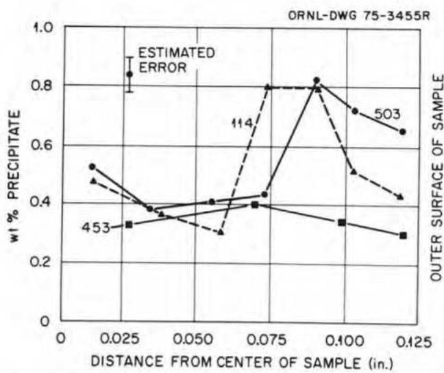  
Fig. 6.37. Distribution of carbides through the specimen thickness of titanium-modified Hastelloy N alloys. Alloys 503 and 114 solution annealed at $1177^{\circ}\mathrm{C}$ and aged at $650^{\circ}\mathrm{C}$ for 1000 hr. Alloy 453 swaged and aged at $760^{\circ}\mathrm{C}$ for 116.5 hr.

$1177^{\circ}\mathrm{C}$ . Therefore, the response of titanium-modified Hastelloy to solution annealing at $1177^{\circ}\mathrm{C}$ was studied as a function of time at temperature.

Samples of alloy 451 $(0.017\%)$ were annealed in argon at $1177^{\circ}\mathrm{C}$ for $15\mathrm{min}$ to $8\mathrm{hr}$ . The samples were cleaned electrochemically for $6\mathrm{hr}$ to remove any surface effects, and the carbides were electrochemically extracted, separated, and weighed. The results of this experiment are plotted in Fig. 6.40. Only extremely small amounts of precipitates were present in samples annealed for $2\mathrm{hr}$ or more. At times less than $2\mathrm{hr}$ , there was some scatter in the data, but, in general, slightly more precipitate was extracted. These results indicate that 30 to $60\mathrm{min}$ are needed in addition to the standard 1-hr solution anneal at $1177^{\circ}\mathrm{C}$ to dissolve the carbides completely. Micrographs of sections from each of the samples of alloy 451 from the first annealing series are shown in Fig. 6.41. Little grain growth was observed between the 15-min and 1-hr anneals, while slight grain growth was evident after $2\mathrm{hr}$ at $1177^{\circ}\mathrm{C}$ . As expected, rather extensive growth occurred at the longer annealing times of 4 and $8\mathrm{hr}$ .

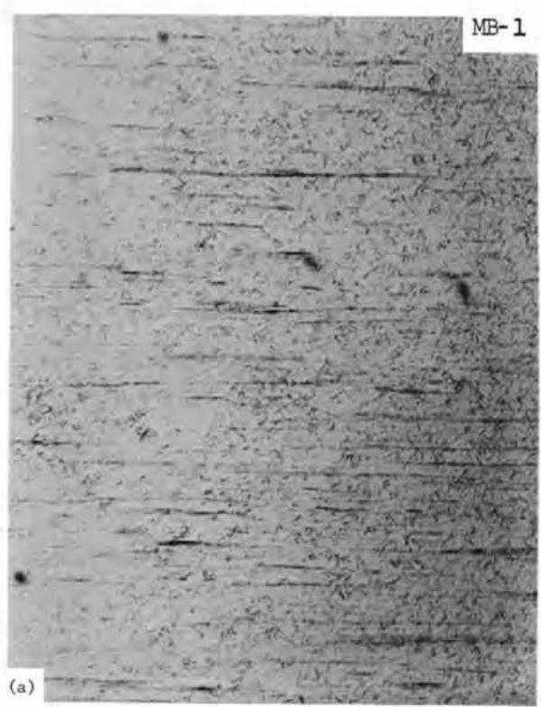

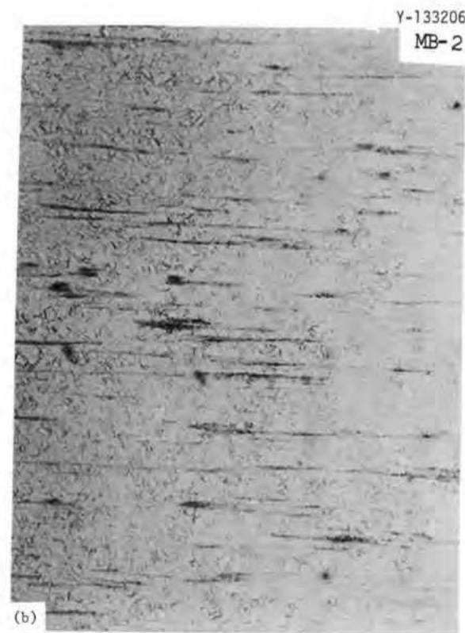

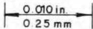  
Fig. 6.38. Microstructure of titanium-modified Hastelloy N alloys 451 (0.017% C) and 453 (0.035% C) after cold swaging and aging at $760^{\circ}\mathrm{C}$ for 116.5 hr. (a) Alloy 451. (b) Alloy 453.

Although most of the effort in this study has been directed toward elimination of carbide stringers in the alloys, experiments are also under way to determine the cause of the carbide-free layers. In one experiment, sam

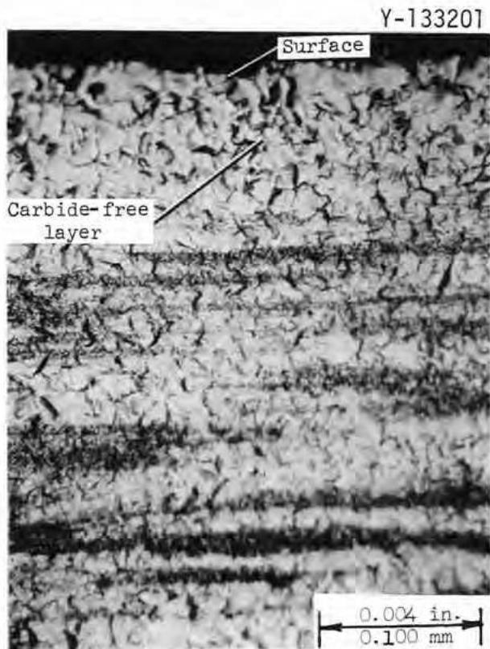  
Fig. 6.39. Carbide-free surface layer in sample of alloy 453 $(0.035\%)$

plies will be examined metallographically before and after a solution anneal at $1177^{\circ}\mathrm{C}$ . This is a reasonable starting point, because carbide-free layers are found along the reduced section of machined tensile specimens; that is, any effects of hot or cold swaging would have been removed by machining in that area. Finally, there is the consideration of fabrication practice, which may, in fact, be the key to producing a homogeneous alloy. A number of relatively minor changes in the way the material is handled may have dramatic effects on the resultant microstructure. Duplicate ingots of alloys 451 and 453 are available and will be fabricated to 0.250-in.-diam rod, with special attention paid to the fabrication parameters. Metallographic samples will be cut from the work piece throughout the processing so that the associated microstructural features may be observed.

# 6.8 SALT CORROSION STUDIES

J.R.Keiser J.R.DiStefano E.J.Lawrence

The corrosion of both nickel- and iron-base alloys by molten fluoride salts has been the subject of extensive research for many years. Results show that impurities such as $\mathrm{FeF_2}$ , $\mathrm{NiF_2}$ , and HF in the salt react with constituents of the alloys, but corrosion from these sources is limited by the supply of reactants. The strongest oxidant of the normal constituents of fuel salt is $\mathrm{UF_4}$ and of the major constituents of most iron- and nickel-base alloys, chromium forms the most stable fluoride. Consequently, the major corrosion reaction between

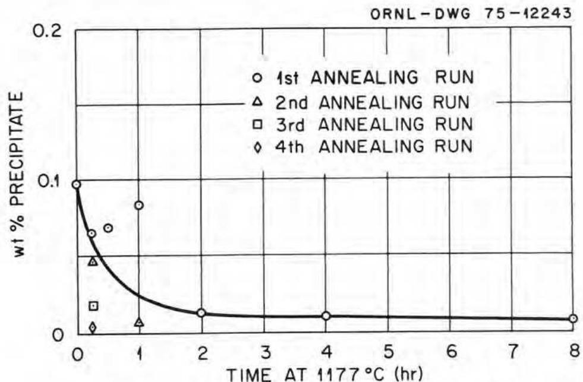  
Fig. 6.40. Amount of carbides extracted from alloy 451 as a function of time at solution annealing temperature of $1177^{\circ}\mathrm{C}$ .

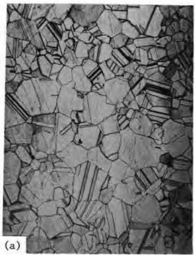

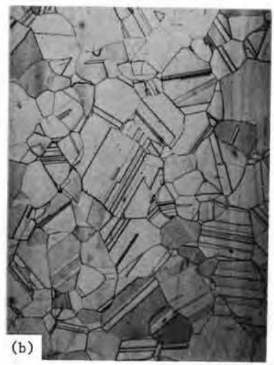

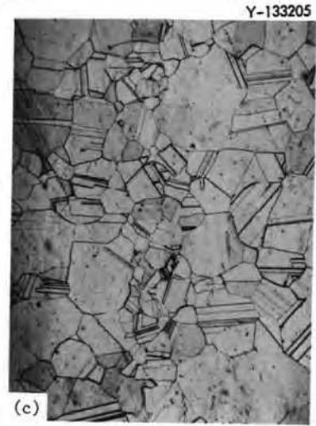

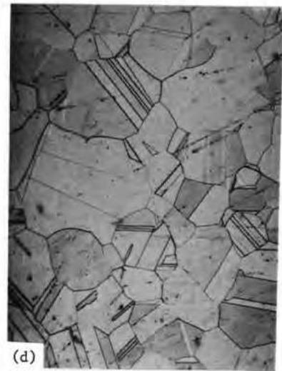

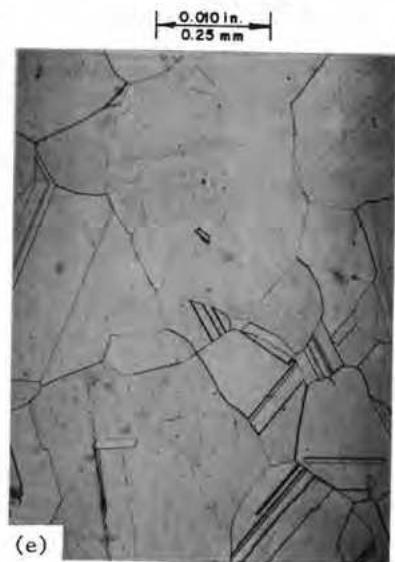

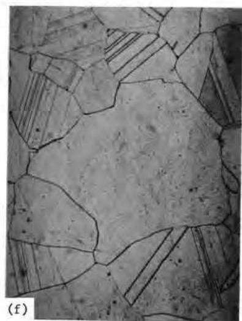  
Fig. 6.41. Micrographs of samples of alloy 451 after solution annealing at $1177^{\circ}\mathrm{C}$ for different times. (a) $15\mathrm{min}$ ; (b) $30\mathrm{min}$ ; (c) $1\mathrm{hr}$ ; (d) $2\mathrm{hr}$ ; (e) $4\mathrm{hr}$ ; and (f) $8\mathrm{hr}$ .

nickel- or iron-base alloys and molten-salt reactor fuel salt has been found to be

$$
2 \mathrm {U F} _ {4} (\mathrm {d}) + \mathrm {C r} (\mathrm {c}) \rightleftharpoons 2 \mathrm {U F} _ {3} (\mathrm {d}) + \mathrm {C r F} _ {2} (\mathrm {d}).
$$

Because the equilibrium constant for this reaction has a small temperature dependence, temperature gradient mass transfer can occur and results in continuous removal of chromium from the hotter sections of a system and a continuous deposition of chromium in the cooler sections.

The experiments described in this section are being conducted to determine the corrosion rate of various

salt-alloy systems under controlled test conditions. The variables include composition of the alloy, oxidation potential of the salt, temperature, and exposure time. All loops incorporate electrochemical probes to measure the concentrations of uranium and transition-metal fluorides. The systems used to conduct these experiments include one forced circulation loop operated by personnel in the Reactor Division and three thermal convection loops. Five additional thermal convection loops have been constructed and are being prepared for operation. The status of these eight thermal convection loops is summarized in Table 6.13.

Table 6.13. Status of thermal convection loop tests on August 31, 1975   

<table><tr><td>Loop number</td><td>Loop material</td><td>Insert specimens</td><td>Salt type</td><td>Status</td><td>Purpose</td></tr><tr><td>21A</td><td>Hastelloy N</td><td>Hastelloy N</td><td>MSBR fuel salt</td><td>Operating 6969 hr</td><td>1. Analytical method developmenta
2. Baseline corrosion data
3. Tellurium mass transfer studies</td></tr><tr><td>23</td><td>Inconel 601</td><td>Inconel 601</td><td>MSBR fuel salt</td><td>Operating 6035 hr</td><td>1. Baseline corrosion data for high-chromium alloy under MSBR conditions
2. UF3-graphite reaction</td></tr><tr><td>31</td><td>Type 316 SS</td><td>Type 316 SS</td><td>Li2BeF4</td><td>Operating 248 hr</td><td>1. Baseline corrosion data
2. Effect of oxidation potential of salt on corrosion rate</td></tr><tr><td>18B</td><td>Hastelloy N</td><td>Modified Hastelloy N</td><td>MSBR fuel salt</td><td>In preparation</td><td>1. Screening test loop for modified alloys</td></tr><tr><td>24</td><td>Hastelloy N</td><td>Nb-Ti modified Hastelloy N</td><td>MSBR fuel salt</td><td>In preparation</td><td>1. Baseline corrosion data for modified alloys
2. Tellurium mass transfer</td></tr><tr><td>25</td><td>Hastelloy N</td><td>Nb-Ti modified Hastelloy N</td><td>MSBR fuel salt</td><td>In preparation</td><td>1. Baseline corrosion data for modified alloys
2. Tellurium mass transfer</td></tr><tr><td>27</td><td>Type 316 SS</td><td>Type 316 SS and other iron-base alloys</td><td>MSBR fuel salt</td><td>In preparation</td><td>1. Oxidation potential studies
2. Tellurium mass transfer
3. Effect of tellurium on mechanical properties of specimens</td></tr><tr><td>29</td><td>Hastelloy N</td><td>Standard and modified Hastelloy N</td><td>MSBR coolant salt</td><td>In preparation</td><td>1. Analytical method development
2. Baseline corrosion data
3. Tritium transport data</td></tr></table>

$a$ All eight thermal convection loops are equipped with electrochemical probes.

# 6.8.1 Fuel Salt Thermal Convection Loops

Two thermal convection loops, NCL 21A and NCL 23, have been operating with MSBR fuel salt (LiF-BeF $_2$ -ThF $_4$ -UF $_4$ , 72-16-11.7-0.3 mole %) to obtain baseline corrosion data. NCL 21A is a Hastelloy N loop with specimens of the same material. As with all thermal convection loops, eight specimens are inserted in the hot and the cold legs. The 16 specimens are removed periodically for visual examination and weighing. The results of the weight change measurements are shown in Fig. 6.42. The corrosion rate of the hottest specimen in this loop is somewhat higher than has been observed in other Hastelloy N systems (see Sect. 6.8.2 discussion of FCL-2b). The higher corrosion rate of loop 21A relates to the relatively high oxidation potential of the salt in this loop ( $U^{4+}/U^{3+}$ about $10^4$ ). However, assuming uniform removal of material, the corrosion rate of the hottest specimen was 0.24 mil/year, which is within acceptable limits. This loop will continue to be used to obtain corrosion data for Hastelloy N in salt with a relatively high oxidation potential.

Loop NCL 23 is constructed of Inconel 601 and has specimens of the same material. A loop was built of Inconel 601 because of this alloy's resistance to grain boundary penetration by tellurium. Since the alloy contains $23\%$ Cr, there was concern about its ability to resist attack by molten fluoride salt. The corrosion rate of Inconel 601 in fuel salt was determined from weight measurements of the 16 specimens of loop 23, and the results are shown in Fig. 6.43. All specimens lost weight, and the loss shown by the hottest specimen was very large. The material lost by the hottest specimens did not result in uniform removal of the surface, but resulted in the formation of the porous surface structure shown in Fig. 6.44. As shown in Fig. 6.45, electron microprobe examination of this specimen showed high thorium concentration in the pores. The only known source of thorium was the salt which contained $\mathrm{ThF_4}$ , so it is very likely that the salt penetrated the pores. Continuous line scans with the microprobe indicated a depletion of chromium near the surface. Figure 6.46 shows the results of analysis for Ni, Cr, and Th. This figure clearly shows the chromium concentration gra

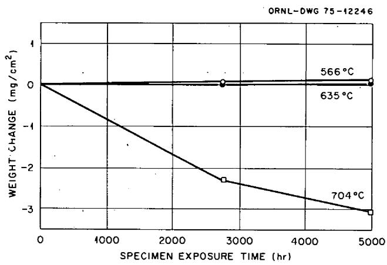  
Fig. 6.42. Weight changes of Hastelloy N specimens from loop NCL-21A exposed to MSBR fuel salt at the indicated temperature.

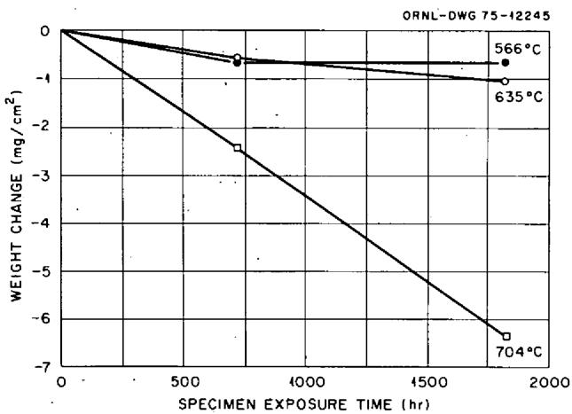  
Fig. 6.43. Weight changes of Inconel 601 specimens from loop NCL-23 exposed to MSBR fuel salt at the indicated temperature.

dient and provides further evidence of the presence of thorium in the pores. Deposits such as those shown in Fig. 6.47 formed on the specimens in the cold leg, and the deposits were identified by microprobe analysis as chromium. This compatibility test of Inconel 601 in MSBR fuel salt shows a relatively high corrosion rate, and it is doubtful that this alloy would be suitable for use in an MSBR under the conditions of this test.

The lower limit for the $\mathrm{U}^{4 + } / \mathrm{U}^{3 + }$ ratio in an MSBR will likely be determined by the conditions under which the reaction

$$
4 \mathrm {U F} _ {3} + 2 \mathrm {C} \rightleftharpoons 3 \mathrm {U F} _ {4} + \mathrm {U C} _ {2}
$$

proceeds to the right. Because the salt in loop NCL 23 is strongly reducing with a $\mathrm{U}^{4+}/\mathrm{U}^{3+}$ ratio of less than 6, it was decided to try to reproduce the results of Toth and

Gilpatrick, $^{11}$ which predicted that at temperatures below $550^{\circ}\mathrm{C}$ and $\mathrm{U}^{4+}/\mathrm{U}^{3+}$ ratios below 6 the $\mathrm{UC}_2$ would be stable. However, graphite specimens exposed to the salt for 500 hr did not show any evidence of $\mathrm{UC}_2$ . The specimens used were made of pyrolytic graphite, and it is likely that the high density of the material limited contact of the salt and graphite. The experiment is being repeated with a less dense graphite.

# 6.8.2 Fuel Salt Forced Circulation Loop

Hastelloy N forced circulation loop FCL-2b has been operated during this reporting period to gather baseline corrosion data under conditions where the $\mathrm{U}^{4+}/\mathrm{U}^{3+}$ ratio was relatively low (see Sect. 2.3). Eighteen Hastelloy N specimens were exposed to MSBR fuel salt with a $\mathrm{U}^{4+}/\mathrm{U}^{3+}$ ratio of about 100. The specimens were removed at predetermined intervals for visual examination and weighing, and the weight changes are shown in Fig. 6.48. Six specimens were held at each of three temperatures: 704, 635, and $566^{\circ}\mathrm{C}$ . Of the six specimens at each temperature, three were exposed to salt having a velocity of $0.49\mathrm{m/sec}$ and three to salt having a velocity of $0.24\mathrm{m/sec}$ . No effect of salt velocity on the corrosion rate was found, so each data point represents the average weight loss of the six specimens. The weight loss of the specimens at the highest temperature corresponds to a uniform corrosion rate of $0.11\mathrm{mil/year}$ . Uniform corrosion at this rate is acceptable and well within the limits which can be tolerated in an MSBR.

Following termination of the $\sim 3200\mathrm{-hr}$ corrosion experiment, FCL-2b was to be used to make heat transfer measurements. This operation has been delayed, because a salt leak developed and a section of the $1 / 2$ in-diam Hastelloy N tubing had to be replaced (see Sect. 2.3). Examination of the tubing in the vicinity of the leak is under way.

Further corrosion measurements will be made in this loop with the $\mathrm{U}^{4 + } / \mathrm{U}^{3 + }$ ratio at about $10^{3}$ . Additions of $\mathrm{NiF}_2$ to the salt will be made to raise the $\mathrm{U}^{4 + } / \mathrm{U}^{3 + }$ ratio to the desired level.

# 6.8.3 Coolant Salt Thermal Convection Loops

Thermal convection loop NCL 31 is constructed of type 316 stainless steel and contains $\mathrm{LiF - BeF_2}$ (66-34 mole $\%$ ) coolant salt. The 16 removable corrosion specimens are also made of type 316 stainless steel. The maximum temperature of the loop is $639^{\circ}\mathrm{C}$ , and the minimum temperature is $482^{\circ}\mathrm{C}$ . The initial objective of

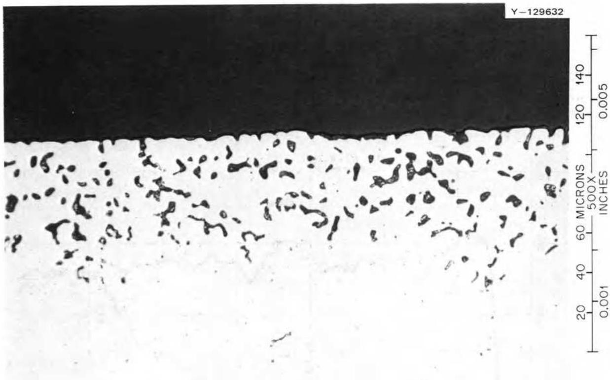  
Fig. 6.44. Microstructure of Inconel 601 exposed to MSBR fuel salt at $704^{\circ}\mathrm{C}$ for $720\mathrm{hr}$ . As polished.

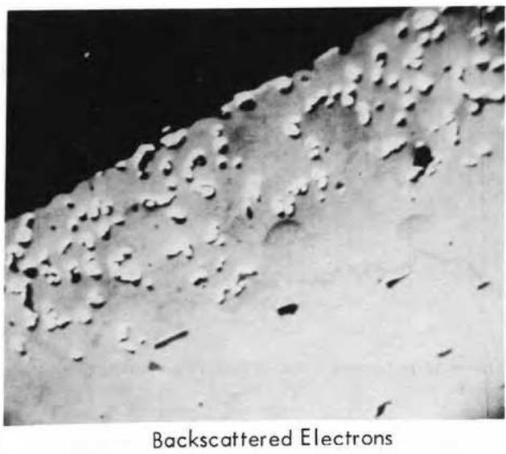

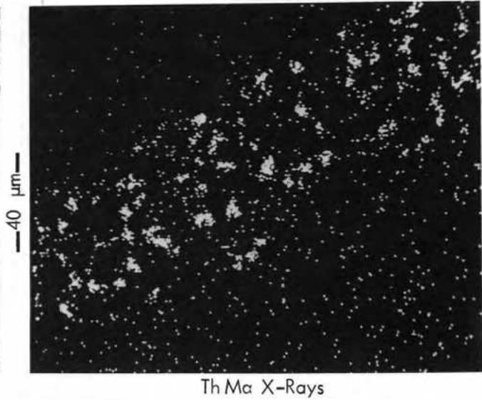  
Fig. 6.45. Electron beam scanning images of Inconel 601 exposed to MSBR fuel salt for $720\mathrm{hr}$ at $704^{\circ}\mathrm{C}$ .

Y-131294

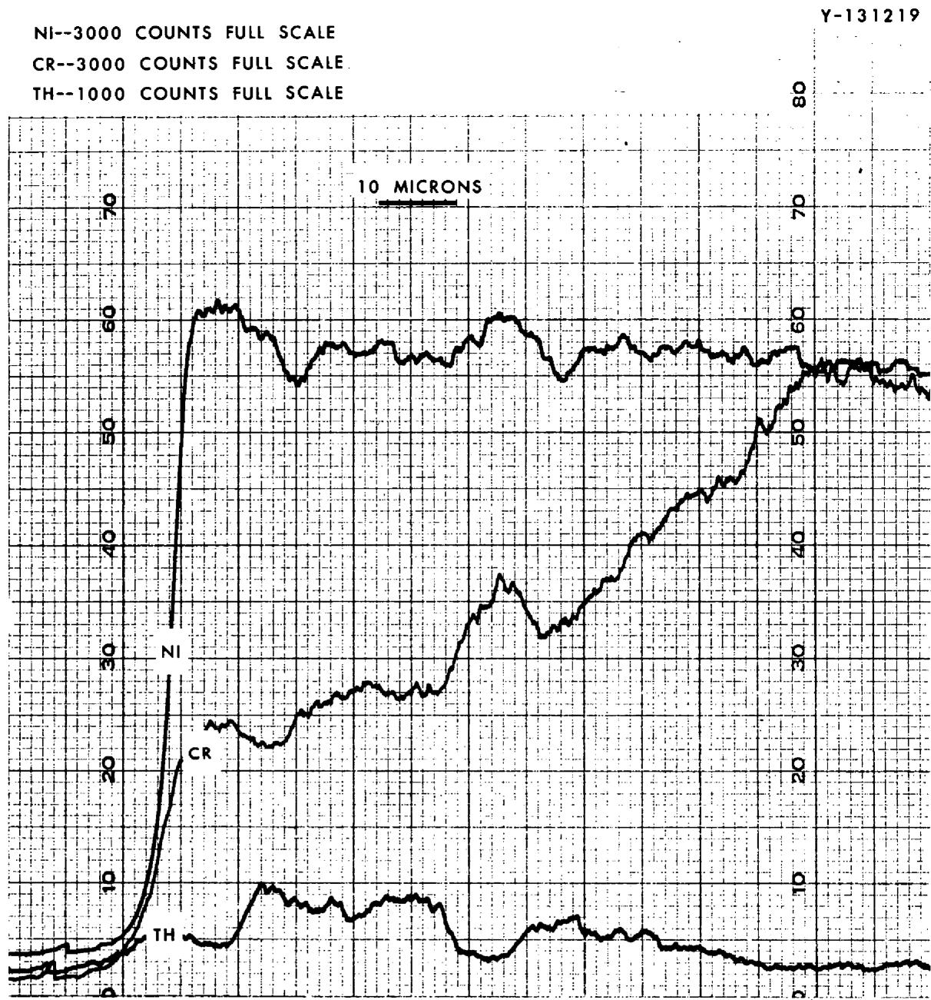  
Fig. 6.46. Microprobe continuous line scan across corroded area in Inconel 601 exposed to MSBR fuel salt for $720\mathrm{hr}$ at $704^{\circ}\mathrm{C}$ .

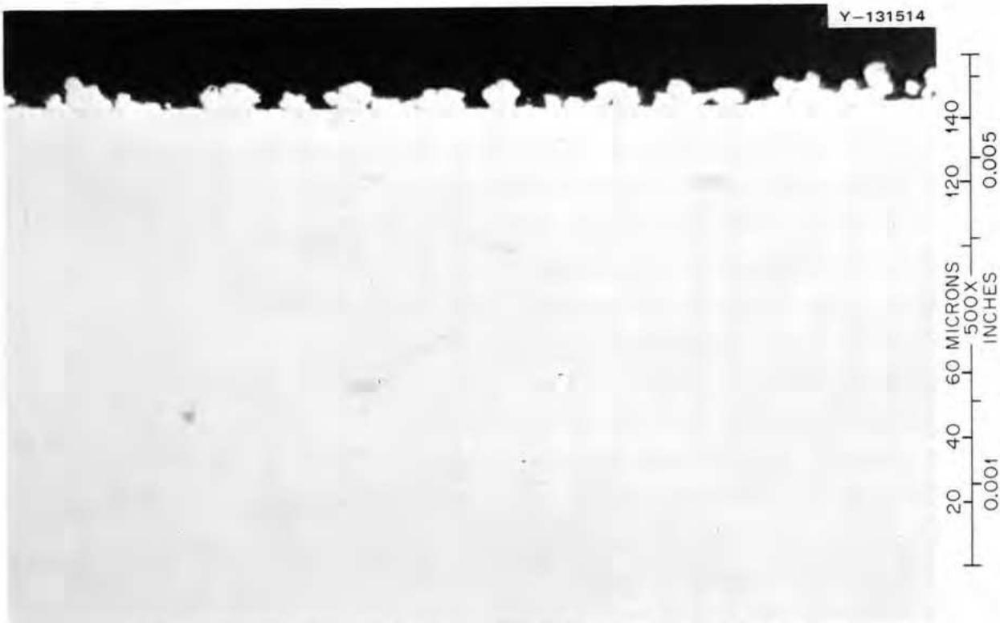  
Fig. 6.47. Microstructure of Inconel 601 exposed to MSBR fuel salt at $566^{\circ}\mathrm{C}$ for 720 hr. As polished.

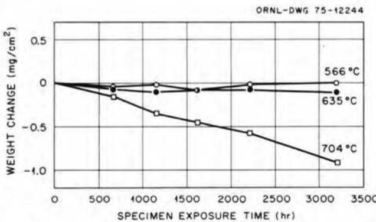  
Fig. 6.48 Weight changes of Hastelloy N from loop FCL-2b exposed to MSBR fuel salt at the indicated temperature.

this loop is to provide baseline corrosion data on a commercial iron-base alloy. The loop has been in operation for $248\mathrm{hr}$

# 6.9 CORROSION OF HASTELLOY N AND OTHER ALLOYS IN STEAM

B. McNabb H.E.McCoy

The corrosion resistance of several heats of standard and modified Hastelloy N and other iron-, nickel-, and

cobalt-base alloys is being evaluated in the unstressed condition in the TVA Bull Run Steam Plant. Two heats of standard Hastelloy N tubing (N15095 and N15101) are being evaluated in the stressed condition from 28.0 × 10³ to 77.0 × 10³ psi.

The method whereby the specimens are stressed is shown in Fig. 6.49. The wall thickness of the gage section of the specimens was varied from 0.010 in. $(77.0\times$ $10^{3}$ psi) to 0.030 in. $(28.0\times 10^{3}$ psi) to produce the desired stress range. The $\%$ in.-OD capillary tube connects the annulus between the two tubes to the condenser. When the inner tube ruptures, steam passes through the capillary, and a rise in temperature of a thermocouple attached to the capillary indicates rupture. Time to rupture can be taken directly from the multipoint recorder and plotted vs stress for design purposes. Data of this type for periods as long as 11,000 hr were reported previously.[12]

A photograph of the specimen holder (Fig. 6.50) shows the ten instrumented stressed specimens, the four uninstrumented stressed specimens in the filter basket, and the unstressed sheet specimens bolted to the speci

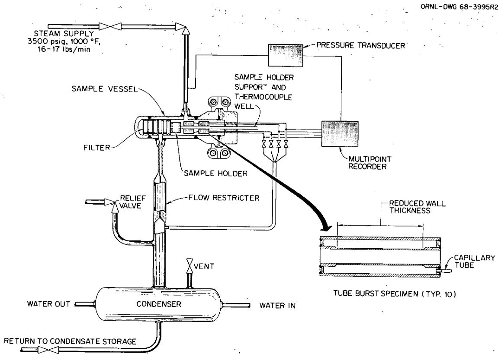  
Fig. 6.49. Schematic of double-walled tube-burst specimen.

men holder. The filter basket bolts to the small flanges on each side of the sheet specimens (shown exposed), so that the specimens are covered and the flow of steam is directed over the specimens rather than around them. The steam enters the specimen chamber near the middle of the stressed specimens in front of the unstressed specimen holder and is directed lengthwise over the two stacks of 2-in.-long $\times$ $1/2$ -in.-wide $\times$ 0.035-in.-thick sheet specimens. The steam passing over the specimens flows through the Neva-Clog filter to prevent scale from entering the flow restricter orifice or the remainder of the steam system. The steam is condensed and returned to the condensate storage vessel. No specimen has lost any scale so far, but some of the Croloy-type alloys are beginning to develop blisters, a prelude to scaling. The oxide on all Hastelloy N specimens is thin and adherent, with no evidence of scaling. Some of the unstressed Hastelloy N specimens have been exposed to steam for 19,000 hr at $538^{\circ}\mathrm{C}$ and 3500 psig. Several alloys were included in this study, and, as reported previously, $^{13}$ they displayed a wide range of oxidation rates. Several obeyed the parabolic rate law, $\Delta w = Kt^{0.5}$ , where $\Delta w$ is the weight change in $\mathrm{mg/cm}^2$ , $t$ is the time in hours, and $K$ is a constant. Figure 6.51 is a

log-log plot of weight change in $\mathrm{mg/cm^2}$ as a function of time in hours. Note the sudden increase in the rate of weight change, with each alloy gaining approximately $0.5\mathrm{mg/cm^2}$ over the last 4000 hr. This probably indicates deposition of some substance on the specimens at a rate that was equal for all specimens. We noted previously that fine particles of iron oxide that was entrained in the steam had deposited on the specimens, but this deposition occurred at a much lower and constant rate.

The increased rate of weight gain for the specimens was discussed with Bull Run engineers. The Bull Run facility has had several instances of condenser tube leaks in the last year of operation, whereas in previous years, few if any condenser leaks occurred. The cooling water in the condensers is at higher pressure than the condensing steam to prevent back pressure on the turbines, and when a leak occurs, untreated cooling water is introduced into the steam system hot well. Continuous monitoring of silicon in the four hot wells (condensed

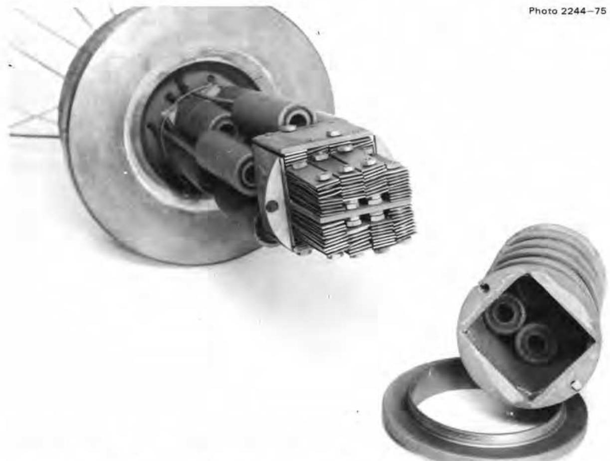  
Fig. 6.50. Photograph of the steam corrosion chamber after $19,000\mathrm{hr}$ of exposure. Features to note are the stressed but uninstrumented specimens in the filter (foreground), the two groups of unstressed specimens, and the ten instrumented stressed specimens. The stressed specimens have an outside diameter of 1 in. and a length of 3 in.

steam wells) indicates a condenser leak when the silicon level increases, and the leaking condenser can be isolated and repaired. The condensed steam (and any cooling water introduced by condenser leakage) passes through demineralizers and is monitored again, with silicon and other impurities being held below acceptable limits before the condensate is returned to the steam system. Even though care is taken to prevent excessive amounts of impurities in the steam system, the facility is evidently operating with a different level of impurities than had been experienced before condenser problems developed. Some evidence of sodium silicate, as a blackish gray deposit, has been observed on some safety-valve seats, and this is possibly the material that has deposited on the specimens. The oxide on most of the specimens is black or gray, and no changes in its appearance were noticed during routine examination and weighing of the

specimens. When the specimen holder is removed for the next scheduled examination, an effort will be made to determine the composition and nature of the deposit. A scheduled replacement of condenser tubes is planned by Bull Run engineers in the near future to eliminate the problem of condenser leaks.

Some of the alloys represented in Fig. 6.51 lost weight initially before gaining at an accelerated rate during the last $4000\mathrm{hr}$ . These alloys were Hastelloy X, Haynes alloy 188, and Inconel 718, and they contain approximately $20\%$ Cr. Other investigators have reported weight losses due to loss of chromium in steam at high temperatures. It is probable that these alloys would have continued to lose weight if the steam conditions had not changed; new specimens of some of the alloys will be inserted in the test facility when steam conditions improve.

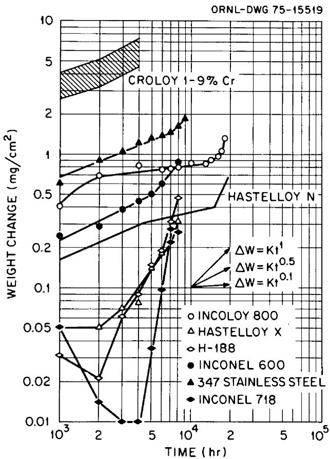  
Fig. 6.51. Corrosion of several alloys in steam at $1000^{\circ}\mathrm{F}$ $(538^{\circ}\mathrm{C})$ and $3500\mathrm{psi}$ .

# 6.10 OBSERVATIONS OF REACTIONS IN METAL-TELLURIUM-SALT SYSTEMS

J. Brynestad

Several criteria must be met for a good screening test system for the tellurium corrosion of Hastelloy N:

1. The tellurium activity must be appropriate, reproducible, and known.   
2. The tellurium must be delivered uniformly over the sample surfaces and at a rate sufficient to prevent excessive testing times.   
3. Preferably, the system should operate under invariant conditions during the test run.   
4. The system must be relatively cheap, simple, and easy to operate.

In the MSBR the production of tellurium per time unit will quickly reach a constant value, and in due time a steady state will be reached where tellurium is removed from the melt at a rate that equals the rate at which tellurium is produced.

In addition to reacting with the material of which the primary circuit is constructed, tellurium could be removed by several means which include the following:

1. The processing system: Since the MSBR is to be equipped with a processing system to remove fission products, tellurium might be effectively removed from the salt by appropriate measures.   
2. The gas phase: If the gas phase is contacted with a getter such as chromium wool, the tellurium activity in the melt might be kept close to that defined by the equilibrium

$$
\frac {1}{4} \mathrm {C r} _ {7} \mathrm {T e} _ {8} (\mathrm {s}) \rightleftharpoons \mathrm {T e} _ {2} (\mathrm {g}) + \frac {7}{4} \mathrm {C r} (\mathrm {s}).
$$

This activity is sufficiently low that Hastelloy N would not be attacked.   
3. A "getter" immersed in the salt melt: Obvious disadvantages of this arrangement would be the problems of mass transport in temperature gradients and the lack of a candidate material.

Until the steady-state condition in an MSBR is more clearly defined, it is impossible to state the likely tellurium activity. It is only known that in the MSRE, standard Hastelloy N was embrittled (probably by tellurium). In the MSRE the steady-state tellurium activity -- if ever reached -- probably was defined by gas phase removal and was likely rather high.

Until the steady-state situation in the MSBR is defined, it must be assumed that one must deal with the MSRE condition, under which standard Hastelloy N is embrittled. In order to define this condition, we have tested several systems with defined tellurium activities with regard to their behavior toward Hastelloy N:

1. equilibrium mixture of $\mathrm{Cr}_2\mathrm{Te}_3(s) + \mathrm{Cr}_3\mathrm{Te}_4(s)$ ,   
2. equilibrium mixture of $\mathrm{Ni}_3\mathrm{Te}_2(\beta_2, 41$ at. $\%$ Te) + $\mathrm{NiTe}_{0.775}(\gamma_1 \sim 43.7$ at. $\%$ Te),   
3. equilibrium mixture of $\mathrm{Cr}_3\mathrm{Te}_4(s) + \mathrm{Cr}_5\mathrm{Te}_6(s)$ ,   
4. equilibrium mixture of $\mathrm{Ni}_3\mathrm{Te}_2(s) + \mathrm{Ni}(s)$ .

The systems are arranged in sequence of decreasing $\mathrm{Te}_2$ activity, as determined by isopiestic experiments. Typical corrosion experiments were conducted at $700^{\circ}\mathrm{C}$ for 250 to $1000\mathrm{hr}$ . The arrangements were by isothermal gas phase transport of $\mathrm{Te}_2$ in previously evacuated, sealed-off quartz ampuls; by embedding the specimens in the mixtures; and, in the $\mathrm{Cr}_2\mathrm{Te}_3\text{-}\mathrm{Cr}_3\mathrm{Te}_4$ and $\mathrm{Cr}_3\mathrm{Te}_4\text{-}\mathrm{Cr}_5\mathrm{Te}_6$ cases, by transport in molten salt. The most pertinent results are as follows:

1. Hastelloy N samples exposed to $\mathrm{Ni}_3\mathrm{Te}_2(s) + \mathrm{Ni}(s)$ (system 4) did not show intergranular cracking. This is promising, because if one can establish a steady

state condition in which the tellurium activity is lower than that defined by this system, standard Hastelloy N will not be embrittled.

2. Systems 1 and 2 have tellurium activities that are too high. These systems corrode Hastelloy N severely under all the experimental arrangements used.   
3. System 3 $\left[\mathrm{Cr}_{3} \mathrm{Te}_{4}(\mathrm{s}) + \mathrm{Cr}_{5} \mathrm{Te}_{6}(\mathrm{s})\right]$ shows promise as a tellurium-delivery method in molten salt, since it is sufficiently corrosive to cause intergranular cracking of Hastelloy N but does not form reaction layers.

It is of value to note that the system $\mathrm{Cr_7Te_8(s) + }$ $\mathrm{Cr(s)}$ has a tellurium activity that is much lower than the system $\mathrm{Ni}_3\mathrm{Te}_2(\mathrm{s}) + \mathrm{Ni}(\mathrm{s})$ . This system also is promising, since high-surface chromium might be used as a tellurium getter in the gas phase. Experiments are under way to measure the tellurium activities of the above systems.

# 6.11 OPERATION OF METAL-TELLURIUM-SALT SYSTEMS

J.R.Keiser J.Brynestad J.R.DiStefano E.J.Lawrence

The discovery of shallow intergranular cracking of Hastelloy N parts of the Molten-Salt Reactor Experiment which were exposed to fuel salt led to a research effort which identified the fission product tellurium as the probable cause of the cracking. Experiments showed that Hastelloy N specimens which had been electroplated with tellurium or exposed to tellurium vapor exhibited shallow intergranular cracking like that of specimens exposed in the MSRE. Subsequently, a program was initiated to find an alloying modification for Hastelloy N which would enhance its resistance to tellurium. The resistance of these modified alloys to cracking is measured by exposing specimens to tellurium vapor, deforming them, and then evaluating their surfaces by metallographic and Auger methods. However, the chemical activity of tellurium in these experiments is significantly higher than it was in the MSRE. In order to simultaneously expose specimens to the combined corrosive action of molten fluoride salt and tellurium at a more realistic chemical activity, a method is being sought for adding tellurium to molten salt in a manner that would simulate the appearance of tellurium as a fission product. Experiments have been started that will permit evaluation of several methods to determine whether they will produce the desired conditions.

# 6.11.1 Tellurium Experimental Pot $1^{14}$

Tellurium experimental pot 1 was built to evaluate the use of lithium telluride as a means for adding tellu

rium to salt. This pot (Fig. 6.52) allows tellurium to be added periodically in the form of salt pellets containing a measured amount of lithium telluride. Three viewing ports permit observation of the pellets after their addition to the salt. Electrochemical probes are inserted through Teflon seals and are used to detect and measure the concentration of certain species in the salt. The salt

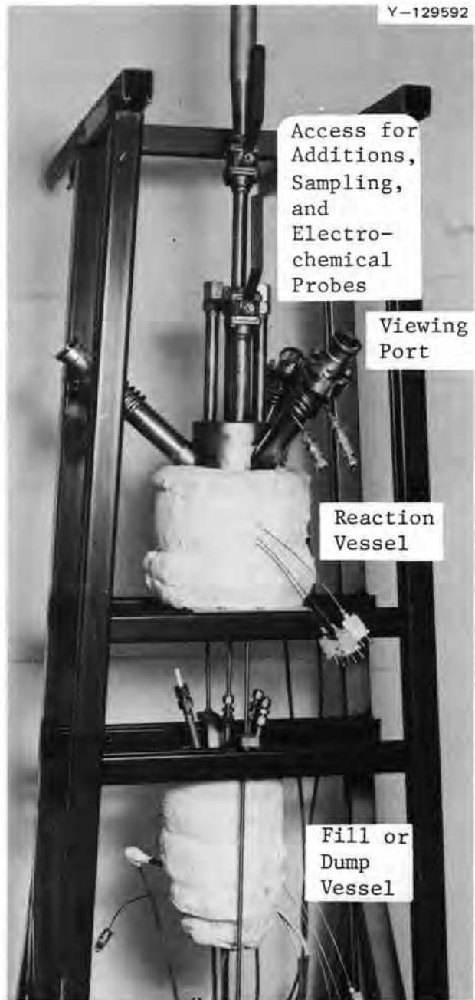  
Fig. 6.52. Lithium telluride experimental pot No.1.

used is $\mathrm{LiF - BeF_2 - ThF_4}$ (72-16-12 mole %), and its temperature is maintained at $650^{\circ}\mathrm{C}$ .

In the first experiment, tellurium was added as the lithium telluride $\mathrm{Li}_2\mathrm{Te}$ , which was prepared by the Chemistry Division (Sect. 3.1). Initially, two pellets containing a total of $0.070\mathrm{g}$ of $\mathrm{Li}_2\mathrm{Te}$ were added to $600\mathrm{ml}$ of salt. Electrochemical examination of the salt by members of the Analytical Chemistry Division gave no indication of the presence of tellurium (Sect. 5.3). Subsequently, three more $\mathrm{Li}_2\mathrm{Te}$ pellets were added, and a sample of the salt was taken for chemical analysis. Three additions of $\mathrm{CrF}_2$ totalling $1.82\mathrm{g}$ were then made, followed by the addition of three more $\mathrm{Li}_2\mathrm{Te}$ pellets. A final addition consisting of $0.2\mathrm{g}$ of $\mathrm{BeO}$ was made.

Results can be summarized as follows:

1. The $\mathbf{L}\mathbf{i}_2\mathbf{T}\mathbf{e}$ pellets did not melt and disappear immediately; some evidence of the pellets remained on the salt surface for the duration of the experiment.   
2. No electrochemical evidence of a soluble tellurium species was detected.   
3. Following the $\mathbf{L}\mathbf{i}_2$ Te additions, visibility through the view ports was limited by a bluish-grey deposit that was subsequently identified as being predominately tellurium.   
4. Chemical analysis of the salt sample taken after the addition of five $\mathrm{Li}_2\mathrm{Te}$ pellets showed that the tellurium content was less than 5 ppm.

The conclusion is that use of the compound $\mathrm{Li}_2\mathrm{Te}$ does not provide an adequate means for adding tellurium to MSBR fuel salt. However, it is thought that $\mathrm{LiTe}_3$ is much more soluble in MSBR fuel salt than is $\mathrm{Li}_2\mathrm{Te}$ . Considerable difficulty was encountered by the Chemistry Division in synthesizing $\mathrm{LiTe}_3$ (Sect. 3.1), but material is now available and the experiment will be repeated with $\mathrm{LiTe}_3$ as the source of tellurium.

# 6.11.2 Chromium Telluride Solubility Experiment

The addition of a soluble chromium telluride, either $\mathrm{Cr_2Te_3}$ or $\mathrm{Cr_3Te_4}$ , represents another method for adding tellurium to molten MSBR fuel salt. If an excess of chromium telluride is maintained, the activity of tellurium in solution in the salt will be constant provided the temperature is not changed and no changes are made in the salt composition. To determine whether there is a temperature at which either of these chromium tellurides can provide a reasonable amount of tellurium in solution, an attempt was made to determine the solubility of the chromium tellurides as a function of temperature.

A Hastelloy N pot was filled with the salt $\mathrm{LiF - BeF_2 - }$ $\mathrm{ThF_4}$ (72-16-12 mole $\%$ ) and the temperature controlled at $700^{\circ}\mathrm{C}$ . After a sample of the salt had been taken, $\mathrm{Cr}_3\mathrm{Te}_4$ was added and a small Hastelloy N sheet specimen was inserted into the salt. After 170 hr the specimen was removed and after 250 hr a salt sample was taken. The temperature was then lowered to $650^{\circ}\mathrm{C},$ and a day later a salt sample was again taken. This sequence was then repeated at $600^{\circ}\mathrm{C}$ Next, the salt temperature was raised to $700^{\circ}\mathrm{C}$ $\mathrm{Cr}_2\mathrm{Te}_3$ was added, and another Hastelloy N specimen inserted. The specimen was removed and salt samples were taken under the same time-temperature conditions as discussed above.

The two Hastelloy N specimens were weighed and submitted for Auger examination. No weight changes were detected, but evidence of tellurium in the grain boundaries was found (Sect. 6.12). The results of the chemical analysis of the salt sample are shown in Table 6.14. Tellurium concentrations at $700^{\circ}\mathrm{C}$ were not as high as was expected, but the fact that some tellurium was in solution is demonstrated by the tellurium found on the specimens. Additional $\mathrm{Cr_2Te_3}$ was added to the solution, and two salt samples were taken. Preliminary results indicate that the solution may not have been saturated when the first series of salt samples was taken.

Following the solubility measurements, two tensile specimens were exposed to the salt- $\mathrm{Cr_2Te_3}$ solution. Both specimens, one of regular Hastelloy N and one of $2.6\%$ Nb-0.7% Ti-modified Hastelloy N, showed a weight increase after 500 hr exposure at $700^{\circ}\mathrm{C}$ . After room-temperature tensile testing, the regular Hastelloy N specimen was observed to have significantly more and deeper cracks than did the modified Hastelloy N specimen (Sect. 6.14).

Table 6.14. Results of chromium telluride solubility experiment   

<table><tr><td rowspan="2">Sampling temperature (°C)</td><td colspan="3">Tellurium and chromium content of salt samples (ppm)</td></tr><tr><td>Background (no Te)</td><td>After Cr3Te4addition</td><td>After Cr2Te3addition</td></tr><tr><td rowspan="2">700</td><td>Te 5</td><td>Te &lt;5</td><td>Te &lt;5</td></tr><tr><td>Cr 44</td><td>Cr 75</td><td>Cr 90</td></tr><tr><td rowspan="2">650</td><td></td><td>Te 15.1</td><td>Te 7.5</td></tr><tr><td></td><td>Cr 105</td><td>Cr 120</td></tr><tr><td rowspan="2">600</td><td></td><td>Te &lt;5</td><td>Te &lt;5</td></tr><tr><td></td><td>Cra</td><td>Cr 88</td></tr></table>

$a$ Insufficient sample.

The experimental assembly is being used to expose standard Hastelloy N specimens to salt containing $\mathrm{Cr_2Te_3}$ to obtain data on the extent of attack at $700^{\circ}\mathrm{C}$ as a function of time.

# 6.11.3 Tellurium Experimental Pot 2

When a technique for introducing tellurium into salt at an acceptable chemical activity has been developed, a method will be needed for exposing a large number of specimens to salt-tellurium solutions. A large experimental pot has been constructed for this purpose. The pot has a stirring mechanism, facilities for introduction of electrochemical probes, and sufficient accesses to allow simultaneous exposure of a large number of specimens. Operation of the system will begin when a satisfactory tellurium addition technique is available.

# 6.12 GRAIN BOUNDARY EMBRITTLEMENT OF HASTELLOY N BY TELLURIUM

R.E.Clausing L.Heatherly

Auger electron spectroscopy (AES) is a powerful technique for studying grain boundary embrittlement of Hastelloy N by tellurium. The recent development of the technique to permit AES analysis using a small-diameter $(\sim 5 - \mu)$ electron beam to excite the Auger electrons of a specimen surface has made truly microscopic analysis possible. $^{15}$ The development of techniques for scanning the beam and the development of electronic data processing equipment have continued to be a central part of our efforts. As the techniques improve, our ability to see the details of the tellurium embrittlement process improves dramatically. We can now not only provide a qualitative image of the elemental distribution on intergranular fracture surfaces at a magnification of several hundred times, but we can also provide a semi-quantitative elemental analysis as the beam is scanned along a line across the sample. However, it is not presently practical to provide a quantitative analysis along a line across an intergranular fracture surface, since Auger intensities at each point on a rough surface vary according to topography. This effect can be corrected in principle by a normalization technique, but data for each point must be normalized individually, and the present equipment cannot handle the volume of data required. The data presented below are typical of several samples of tellurium-embrittled Hastelloy N that were examined recently. These samples are being studied in various

parts of our previously outlined efforts to understand the tellurium embrittlement of nickel-based alloys. The sample chosen for the present discussion demonstrates our state-of-the-art capabilities and limitations and at the same time provides some new insights into the nature of the tellurium embrittlement of Hastelloy N.

A sample of Hastelloy N that had been exposed to tellurium vapor at low partial pressure for 500 hr at $700^{\circ}\mathrm{C}$ was fractured in the AES system, and the resulting fracture surface was analyzed using Auger electron spectroscopy. The fracture surface is shown in Fig. 6.53. The scanning electron micrographs, made by Crouse, reveal that intergranular fracture occurred along the edges of the sample and that the central region failed in a ductile manner. One fairly large area of ductile shear can be seen. Three types of Auger data presentations are used below: imaging, line scans, and selected area analyses. The first is qualitative, while the second and third are progressively more quantitative.

Figure 6.54a is an image obtained using the scanning beam in the AES system and the absorbed sample current to produce the image contrast. It is similar to the scanning electron micrograph (1a), but, because of the larger electron beam and the different method for producing the image contrast, the resolution in Fig. 6.54a is poorer, and some distortion is evident. Nevertheless, it is relatively easy to correlate the features shown in Fig. 6.54a with those in Fig. 6.53a. Figure 6.54b is an image of the same area shown in Fig. 6.54a but with image contrast produced by the tellurium Auger signal. A careful comparison of the areas of high tellurium concentration with the areas of intergranular fracture shows that a good correlation exists between the two. No tellurium can be detected in the regions of ductile or shear fracture. Figure 6.55 is a series of line scans showing the peak-to-peak intensity of the Auger signals for nickel, molybdenum, chromium, and tellurium as the electron beam was scanned along the path shown by the bright line in Fig. 6.54a. Some of the observations that can be made are: (1) The intensities of the Auger signals are influenced considerably by topography; that is, some features, such as the shear region between feature $Y$ and the tellurium-embrittled region below it, show lower Auger emission for all elements (this dependence on topography accounts for much of the jagged nature of the line scan). (2) The tellurium concentration is quite high in the region of intergranular fracture near each original surface. (3) There is a definite tendency for the concentration of molybdenum to be higher in the regions of intergranular fracture. (4) The nickel and chromium concentrations are in approximately the same ratio throughout the scan.

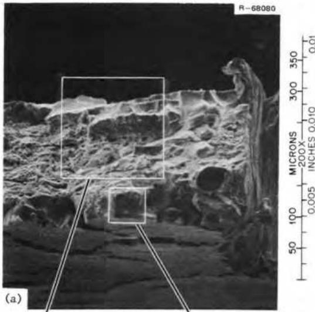

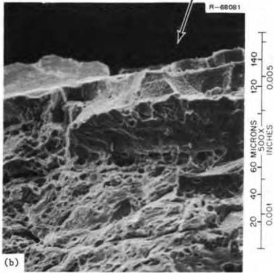

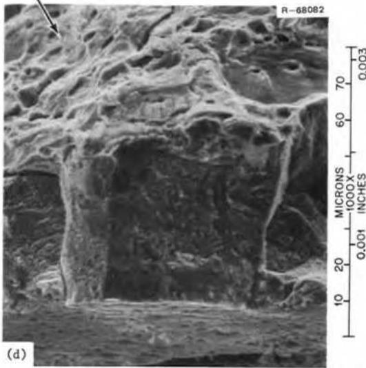

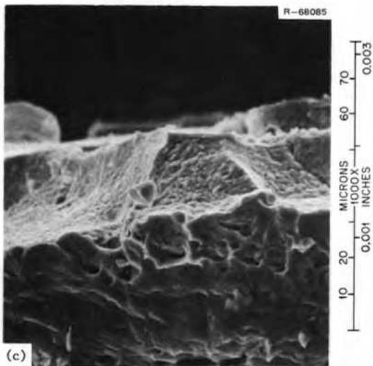

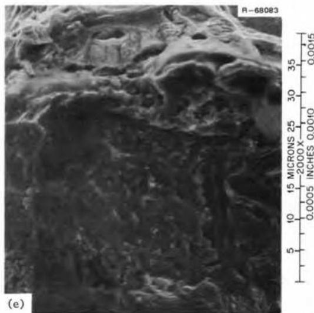  
Fig. 6.53. Scanning electron micrographs of fracture surface of Hastelloy N sample exposed to tellurium vapor at $700^{\circ}\mathrm{C}$ for 500 hr showing the region examined by Auger electron spectroscopy. (a) $200\times$ , (b) $500\times$ , (c) $1000\times$ , (d) $1000\times$ , (e) $2000\times$ . The lower half of (c) shows an area of ductile shear.

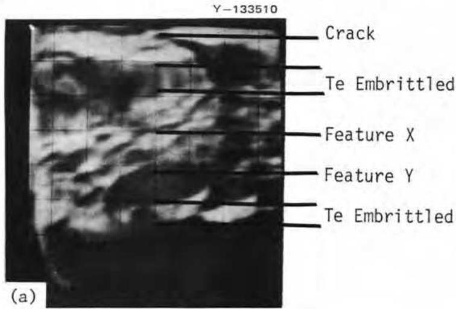

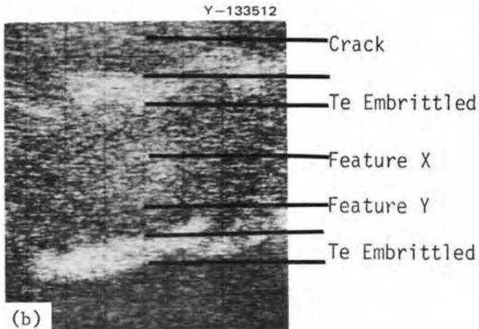

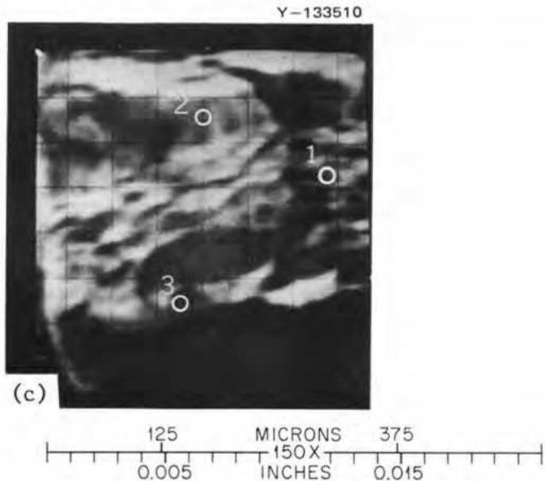  
Fig. 6.54. (a) Scanning electron micrograph obtained in the AES apparatus using absorbed sample current to produce image contrast. The bright vertical line shows the path of the line scan and identifies regions in Fig. 6.55. (b) Image of the same region at the same magnification using the tellurium Auger signal to produce contrast. The embrittled grain boundary regions next to the original sample surfaces are obvious. (c) Same image as (a) with the regions analyzed and reported in Table 6.15 identified.

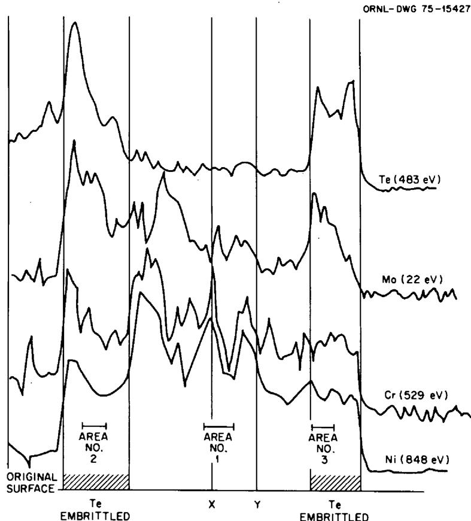  
Fig. 6.55. Auger signal intensities for scans along the path indicated in Fig. 6.54a. The vertical axis is displaced and the vertical scales arbitrarily varied to permit a qualitative comparison of the variations of Ni, Cr, Te, and Mo as a function of distance along the scan line. The zones and features identified along the horizontal axis are also identified in Fig. 6.54a and c. The AES analysis of the regions labeled area 1, area 2, and area 3 are given in Table. 6.15.

Another observation based on the detailed examination of this and other samples is that the tellurium concentration in the grain boundary is not a monotonically decreasing function as one proceeds inward from the original surface. On nearly all of the embrittled samples examined thus far, the tellurium concentration is uniformly high throughout the embrittled area as, for example, is shown on the right in Fig. 6.55. (The signal intensity on the left is strongly influenced by topography. If this effect were removed by a normalization process, this area would have a more nearly uniform composition similar to that on the right.) The high, relatively uniform tellurium concentration in the embrittled regions suggests that either a particular grain boundary phase of fixed composition may exist or that the tellurium atoms fill all of the appropriate grain boundary sites in the embrittled region. Sputtering this fracture surface (and those of similar samples) to a depth of a few atomic layers (3 to 10) reduced the tellurium concentration to below 1 at. $\%$ , showing that the tellurium is concentrated very sharply in the grain boundary. It is

therefore unlikely that the tellurium present in the grain boundary exhibits the properties of a bulk telluride. The molybdenum concentration remained high during sputtering operation, indicating that the concentration of molybdenum is high in the bulk phase, perhaps in a phase that has precipitated in the grain boundary.

Table 6.15 shows quantitative selected-area analyses made in the three regions of the sample indicated in Fig. 6.54c. The compositions have been normalized to equal 100 at. $\%$ in each row. The three rows for each area are obtained from one Auger spectra, but some elements were ignored in the first two rows to make changes in the relative amounts of the other elements more obvious. These results confirm the above conclusions and show (1) that tellurium is present in relatively large amounts in the embrittled regions and (2) that area 3, which is near the extreme of the depth to which the tellurium penetrated, contains about as much tellurium as area 2, which is located near the center of the upper embrittled region. Regions 2 and 3 are both enriched in molybdenum and carbon as indicated in the line scans.

Table 6.15. Composition of regions on the fracture surface of a Hastelloy N sample exposed to tellurium for 500 hr at $700^{\circ}\mathrm{C}$   

<table><tr><td rowspan="2">\( \text{Region}^a \)</td><td colspan="8">Composition (at. %)\( ^b \)</td></tr><tr><td>Ni</td><td>Mo</td><td>Cr</td><td>Te</td><td>C</td><td>O</td><td>S</td><td>Si</td></tr><tr><td rowspan="3">Composition in the lower region area 3 (intergranular fracture)</td><td>70</td><td>19</td><td>11</td><td></td><td></td><td></td><td></td><td></td></tr><tr><td>64</td><td>17</td><td>10</td><td>9</td><td></td><td></td><td></td><td></td></tr><tr><td>40</td><td>11</td><td>6</td><td>6</td><td>33</td><td>2</td><td>1</td><td>1</td></tr><tr><td rowspan="3">Composition in central region area 1 (ductile fracture)</td><td>75</td><td>16</td><td>9</td><td></td><td></td><td></td><td></td><td></td></tr><tr><td>75</td><td>16</td><td>9</td><td></td><td></td><td></td><td></td><td></td></tr><tr><td>61</td><td>13</td><td>8</td><td></td><td>13</td><td>1</td><td>1</td><td>3</td></tr><tr><td rowspan="3">Composition in the upper region area 2 (intergranular fracture)</td><td>64</td><td>25</td><td>12</td><td></td><td></td><td></td><td></td><td></td></tr><tr><td>58</td><td>23</td><td>11</td><td>8</td><td></td><td></td><td></td><td></td></tr><tr><td>42</td><td>17</td><td>8</td><td>6</td><td>23</td><td>1</td><td>1</td><td>2</td></tr></table>

$a_{\mathrm{Areas}}$ identified in Fig. 6.54c.   
$b$ The composition in each row is normalized to equal 100 at. $\%$ . The three rows for each region are from the same data, but are normalized so as to make changes in relative amounts of the elements more obvious. For convenience and consistency in reporting data we assume the AES spectra (Paul Palmberg et al., Handbook of Auger Electron Spectroscopy, Physical Electronics Industries, Inc., Edina, Minn., 1972) are accurate and directly applicable to our data. Elemental sensitivities are taken directly from the spectra presented in the handbook with no attempt to correct for chemical effects, line shape, matrix effects, escape depth, or distribution of elements as a function of depth in the sample. The analyzer used is Varian model 981-2707, operated with an 8000-eV electron beam energy.

The above results suggest the need for a detailed examination of the causes and effects of the high molybdenum and carbon contents in the grain boundary region and also an examination of the implications that the presence of a two-dimensional tellurium-rich grain boundary phase may have on the time dependence of tellurium penetration into the alloy.

# 6.13 X-RAY IDENTIFICATION OF REACTION PRODUCTS OF HASTELLOY N EXPOSED TO TELLURIUM-CONTAINING ENVIRONMENTS

D. N. Braski

Hastelloy N and several modifications of the alloy have been exposed to tellurium to determine their relative susceptibilities to intergranular cracking. Different methods for exposing samples to tellurium have also been studied in an attempt to develop a suitable screening test for the alloy development program. Some specimens were exposed directly to tellurium vapor at $700^{\circ}\mathrm{C}$ , while others were subjected to attack by nickel or chromium tellurides at 700 and $750^{\circ}\mathrm{C}$ respectively. This section presents the results of x-ray diffraction analyses of reaction products produced during the tests. Knowledge of the reaction products aids in evaluating a

given method of tellurium exposure and may provide information relating to the mechanisms of intergranular cracking.

A number of Hastelloy N tensile specimens and flat x-ray samples were exposed to tellurium vapor at $700^{\circ}\mathrm{C}$ for 1000 hr in an experiment conducted by Kelmers and Valentine. The specimens were positioned in the top portion of a long quartz tube having a small amount of tellurium at the bottom. The tube was evacuated, backfilled with argon, and placed in a gradient furnace with the specimens at $700^{\circ}\mathrm{C}$ and the tellurium source at $440^{\circ}\mathrm{C}$ . With this arrangement, tellurium vapor diffused upward through the tube at a rate dependent on the temperature difference between the specimens and the tellurium $(\sim 0.05\mathrm{mgTe / hr})$ . At the end of 1000 hr exposure, the specimens were covered with a very fine, hairlike, deposit similar to that observed previously in creep tests at $650^{\circ}\mathrm{C}$ . The results of x-ray diffraction analyses on these deposits are given in Table 6.16. The first alloy listed is standard Hastelloy N, while the other three have titanium and niobium additions. The main

Table 6.16. X-ray diffraction results for specimens exposed for $1000\mathrm{hr}$ at $700^{\circ}\mathrm{C}$   

<table><tr><td>Heat number</td><td>Wt % alloying additions to nominal Hastelloy N composition</td><td>Method of tellurium exposure</td><td>Surface reaction products</td></tr><tr><td>405065</td><td>None</td><td>Kelmers-Valentine experimenta</td><td>Ni3Te2+ Cr3Te4</td></tr><tr><td>472-503</td><td>2.16% Ti</td><td>Kelmers-Valentine experimenta</td><td>Ni3Te2</td></tr><tr><td>470-835</td><td>0.71% Ti + 2.6% Nb</td><td>Kelmers-Valentine experimenta</td><td>Ni3Te2+ Cr3Te4</td></tr><tr><td>180</td><td>1.84% Nb</td><td>Kelmers-Valentine experimenta</td><td>Ni3Te2</td></tr><tr><td>474-533</td><td>2.0% Ti</td><td>Brynestadb - low Te activity exposure Ni3Te2(s) + Ni(s)</td><td>Ni3Te2+ unidentified substance</td></tr><tr><td>405065</td><td>None</td><td>Brynestad: LiCl + Cr2Te3</td><td>Ni3Te2+ NiTe0.69</td></tr></table>

$^{a}$ A. D. Kelmers and D. Y. Valentine; MSR Program Semiannu. Progr. Rep. Feb. 28, 1975, ORNL-5047, pp. 40-41.   
$^{b}$ J. Brynestad, MSR Program Semiannu. Progr. Rep. Feb. 28, 1975, ORNL-5047, p. 102.

reaction product was $\mathrm{Ni}_3\mathrm{Te}_2$ , which was detected on the surfaces of all four alloys. $(\mathrm{Ni}_3\mathrm{Te}_2$ was found on earlier samples exposed for shorter times in the same apparatus.16) X-ray lines which could be indexed as $\mathrm{Cr_3Te_4}$ were also found on standard Hastelloy N and on the alloy modified with $0.71\%$ Ti plus $2.6\%$ Nb.The $\mathrm{Cr_3Te_4}$ interplanar spacings and relative intensities were calculated by H. L. Yakel, Metals and Ceramics Division, from the crystallographic data in ref. 18. The presence of $\mathrm{Cr_3Te_4}$ in the reaction layer is reasonable, because both chromium and tellurium were detected previously on Hastelloy N exposed to nickel tellurides by electron microprobe analysis.19 In addition, chromium tellurides were previously identified by x-ray diffraction on Hastelloy N exposed to tellurium vapor.17

Brynestad $^{20}$ exposed $2\%$ Ti-modified Hastelloy N specimens to a low tellurium activity $(\mathrm{Ni}_3\mathrm{Te}_2 + \mathrm{Ni}$ mixture) at elevated temperatures. The specimens were first placed in a quartz tube and the $\mathrm{Ni}_3\mathrm{Te}_2 + \mathrm{Ni}$ powder mixture packed around the specimens. The tube was then sealed off under vacuum and placed in a furnace at $700^{\circ}\mathrm{C}$ for $1000\mathrm{hr}$ . The reaction products obtained in this test also contained $\mathrm{Ni}_3\mathrm{Te}_2$ , but the remaining four lines could not be satisfactorily indexed to any of the

Ni, Cr, or Mo tellurides. The unusually broadened x-ray diffraction peaks suggest that a complicated telluride, such as Ni-Cr-Te, may have been formed. In another tellurium experiment, Brynestad exposed a standard Hastelloy N tensile specimen to a melt of LiCl containing $\mathrm{Cr_2Te_3}$ (solid) at $750^{\circ}\mathrm{C}$ . Some $\mathrm{Cr_2Te_3}$ dissolved in the LiCl melt and reacted with the Hastelloy N. After 146 hr the tensile specimen was removed, and the flat surface on one end was analyzed by x-ray diffraction. The results (Table 6.16) showed that $\mathrm{Ni}_3\mathrm{Te}_2$ and $\mathrm{NiTe}_{0.69}$ were produced.

In summary, these tests have shown that the primary reaction product between Hastelloy N and tellurium near $700^{\circ}\mathrm{C}$ is $\mathrm{Ni}_3\mathrm{Te}_2$ . X-ray lines corresponding to $\mathrm{Cr}_3\mathrm{Te}_4$ were also present in patterns from the surfaces of several Hastelloy N alloys exposed to tellurium vapor at $700^{\circ}\mathrm{C}$ . Exposure of Hastelloy N to tellurium at low activities $(\mathrm{Ni}_3\mathrm{Te}_2 + \mathrm{Ni}$ mixture) may have produced some complicated Ni-Cr-Te compounds in addition to $\mathrm{Ni}_3\mathrm{Te}_2$ as evidenced by the unusually broadened x-ray lines.

# 6.14 METALLOGRAPHIC EXAMINATION OF SAMPLES EXPOSED TO TELLURIUM-CONTAINING ENVIRONMENTS

H.E.McCoy B.McNabb J.C.Feltner

Several samples of modified Hastelloy N were exposed to tellurium-containing environments. They were deformed to failure at $25^{\circ}\mathrm{C}$ , a procedure which forms surface cracks if the grain boundaries are brittle; a

metallographic section of each was prepared to determine the extent of cracking. These tests have two objectives. The first is to develop a method for exposing samples to tellurium to produce a reaction rate comparable to those anticipated for an MSBR. This rate is thought to be a flux of tellurium of about $10^{10}$ atoms $\mathrm{cm}^{-2}\sec^{-1}$ . The second is to compare the cracking tendencies of various alloys of modified Hastelloy N.

A new technique developed for measuring the extent of cracking is more nearly quantitative than that used previously. In the new technique a mounted and polished longitudinal section of a deformed specimen is viewed on a standard metallurgical microscope. The eyepiece has a filar which can be moved to various locations in the field being viewed. The filar is attached to a transducer which produces an output voltage that is a func

tion of the location. The output signal is interfaced with a small computer which will, on command, compute crack lengths and several statistical parameters. The information is displayed on a teletypewriter. The cracked edge of the mounted specimen is scribed every 0.1 in., and the operator measures all cracks in successive 0.1-in. intervals until at least 30 cracks have been measured. The computer then calculates and displays the average crack length, the maximum crack length, the standard deviation, and the $95\%$ confidence interval. A typical scan requires about $10\mathrm{min}$ and is considerably faster than other methods used thus far.

The experimental conditions associated with the ten experiments to be discussed in this report are summarized in Table 6.17. The chemical compositions of the alloys studied are given in Table 6.18. In all cases the

Table 6.17. General description of Te-Hastelloy N exposures   

<table><tr><td>Experiment Designation</td><td>Experimenters</td><td>Exposure conditions</td><td>Alloys includeda</td><td>General comments</td></tr><tr><td>75-1</td><td>Brynestad</td><td>LiCl + Cr2Te3for 146 hr at ~750°C</td><td>405065</td><td>Heavy reaction layers</td></tr><tr><td>75-2</td><td>Kelmers, Valentine</td><td>Te vapor for 1000 hr at 700°Cb</td><td>405065, 470-835, 472-503, 180</td><td>Whisker growth, evidence of inhomogeneous reaction with Te</td></tr><tr><td>75-3</td><td>Brynestad</td><td>250 hr at 650°C packed in Cr2Te3</td><td>405065, 474-534, 474-535</td><td>Heavy reaction layers</td></tr><tr><td>75-4</td><td>Brynestad</td><td>200 hr at 700°C packed in Cr3Te4</td><td>405065</td><td>Heavy reaction layers</td></tr><tr><td>75-5</td><td>Brynestad, Keiser</td><td>504 hr at 700°C in salt + Cr2Te3</td><td>405065 470-835</td><td>Reaction layers</td></tr><tr><td>75-6</td><td>Brynestad</td><td>1000 hr at 700°C with vapor above Cr3Te4</td><td>405065</td><td>No visible reaction layers</td></tr><tr><td>75-7</td><td>Brynestad</td><td>1000 hr at 700°C with vapor above Cr2Te3</td><td>405065</td><td>Shallow reaction layers</td></tr><tr><td>75-8</td><td>Brynestad</td><td>1000 hr at 700°C with vapor above β2+ γ1nickel tellurides</td><td>405065</td><td>No visible reaction layers</td></tr><tr><td>75-9</td><td>McNabb, McCoy</td><td>250 hr at 700°C in vapor above Te at 300°C</td><td>405065, 471-114, 474-534, 474-535, 600600, 62, 63, 181, 237, 295, 297, 298, 303, 305, 306, 345, 346, 347, 348, 21543, 469-344, 469-648, 469-714, 470-786, 470-835</td><td>No visible reaction layers</td></tr><tr><td>75-10</td><td>McNabb, McCoy</td><td>250 hr at 700°C in vapor above Te at 300°C</td><td>405065, 21543, 345, 348, 411, 413, 421, 424, 425</td><td>No visible reaction layers</td></tr></table>

${}^{a}$ See Table 6.18 for chemical compositions.   
bA. D. Kelmers and D. Y. Valentine, MSR Program Semiannu. Progr. Rep. Feb: 28, 1975, ORNL-5047, pp. 40-41.

Table 6.18. Chemical analyses of nickel-base alloys used in tellurium cracking studies (weight percent)   

<table><tr><td>Heat number</td><td>Mo</td><td>Cr</td><td>Fe</td><td>Mn</td><td>C</td><td>Si</td><td>Ti</td><td>Nb</td><td>Al</td><td>Other</td></tr><tr><td>62</td><td>11.34</td><td>7.52</td><td>a</td><td>0.20</td><td>0.042</td><td>0.01</td><td>a</td><td>1.9</td><td>a</td><td></td></tr><tr><td>63</td><td>11.45</td><td>7.33</td><td>a</td><td>0.20</td><td>0.135</td><td>0.01</td><td>a</td><td>2.5</td><td>a</td><td></td></tr><tr><td>180</td><td>11.2</td><td>7.0</td><td>0.040</td><td>0.22</td><td>0.046</td><td>0.01</td><td>&lt;0.02</td><td>1.84</td><td>a</td><td></td></tr><tr><td>181</td><td>11.5</td><td>6.84</td><td>0.054</td><td>0.23</td><td>0.45</td><td>0.01</td><td>0.50</td><td>1.85</td><td>a</td><td>0.03 W</td></tr><tr><td>237</td><td>12.0</td><td>6.7</td><td>4.3</td><td>0.49</td><td>0.032</td><td>a</td><td>0.04</td><td>1.03</td><td>&lt;0.05</td><td></td></tr><tr><td>295</td><td>11.4</td><td>8.06</td><td>4.02</td><td>0.28</td><td>0.057</td><td>&lt;0.02</td><td>&lt;0.02</td><td>0.85</td><td>a</td><td>0.05 W</td></tr><tr><td>296</td><td>11.5</td><td>8.09</td><td>3.96</td><td>0.28</td><td>0.059</td><td>&lt;0.02</td><td>&lt;0.02</td><td>1.2</td><td>a</td><td>0.2 W</td></tr><tr><td>297</td><td>12.0b</td><td>7.0b</td><td>4.0b</td><td>0.2b</td><td>0.06</td><td>0.02</td><td>0.24</td><td>0.57</td><td>a</td><td></td></tr><tr><td>298</td><td>12.0b</td><td>7.0b</td><td>4.0b</td><td>0.2b</td><td>0.06</td><td>0.02</td><td>&lt;0.01</td><td>2.0</td><td>a</td><td></td></tr><tr><td>303</td><td>12.0b</td><td>7.0b</td><td>4.0b</td><td>0.2b</td><td>0.06b</td><td>0.02</td><td>0.49</td><td>0.84</td><td>a</td><td></td></tr><tr><td>305</td><td>11.2</td><td>8.25</td><td>4.16</td><td>0.22</td><td>0.072</td><td>0.09</td><td>0.88</td><td>1.3</td><td>a</td><td></td></tr><tr><td>306</td><td>10.6</td><td>8.04</td><td>3.11</td><td>0.18</td><td>0.065</td><td>0.27</td><td>0.01</td><td>0.55</td><td>a</td><td></td></tr><tr><td>345</td><td>11.0</td><td>7.1</td><td>3.8</td><td>0.26</td><td>0.05b</td><td>0.22</td><td>0.02</td><td>0.45</td><td>a</td><td></td></tr><tr><td>346</td><td>11.0</td><td>6.7</td><td>3.7</td><td>0.18</td><td>0.05b</td><td>0.48</td><td>0.02</td><td>0.49</td><td>a</td><td></td></tr><tr><td>347</td><td>12.0</td><td>7.6</td><td>4.3</td><td>0.25</td><td>0.05b</td><td>0.47</td><td>&lt;0.02</td><td>0.88</td><td>a</td><td></td></tr><tr><td>348</td><td>12.0</td><td>7.2</td><td>0.07</td><td>0.19</td><td>0.05b</td><td>0.47</td><td>&lt;0.02</td><td>0.62</td><td>a</td><td></td></tr><tr><td>411</td><td>12.0b</td><td>7.0b</td><td>a</td><td>0.2b</td><td>0.05b</td><td>a</td><td>a</td><td>1.15</td><td>a</td><td></td></tr><tr><td>413</td><td>12.0b</td><td>7.0b</td><td>a</td><td>0.2b</td><td>0.05b</td><td>a</td><td>1.0b</td><td>1.13</td><td>a</td><td></td></tr><tr><td>421</td><td>12.0b</td><td>7.0b</td><td>a</td><td>0.2b</td><td>0.05b</td><td>a</td><td>2.19</td><td>1.04</td><td>0.07</td><td></td></tr><tr><td>424</td><td>12.0b</td><td>7.0b</td><td>a</td><td>0.2b</td><td>0.05b</td><td>a</td><td>1.8</td><td>1.34</td><td>0.10</td><td></td></tr><tr><td>425</td><td>12.0b</td><td>7.0b</td><td>a</td><td>0.2b</td><td>0.05b</td><td>a</td><td>1.9</td><td>0.48</td><td>0.08</td><td></td></tr><tr><td>405065</td><td>16.0</td><td>7.1</td><td>4.0</td><td>0.55</td><td>0.06</td><td>0.57</td><td>&lt;0.01</td><td>a</td><td>&lt;0.03</td><td></td></tr><tr><td>472-503</td><td>12.9</td><td>6.79</td><td>0.089</td><td>&lt;0.01</td><td>0.066</td><td>0.089</td><td>2.16</td><td>0.05</td><td>0.09</td><td></td></tr><tr><td>471-114</td><td>12.5</td><td>7.4</td><td>0.062</td><td>0.02</td><td>0.058</td><td>0.026</td><td>1.75</td><td>a</td><td>0.07</td><td></td></tr><tr><td>474-534</td><td>11.66</td><td>7.12</td><td>0.06</td><td>&lt;0.01</td><td>0.08</td><td>0.03</td><td>2.09</td><td>a</td><td>0.53</td><td>0.14 W, 0.013 La</td></tr><tr><td>474-535</td><td>11.79</td><td>7.30</td><td>0.05</td><td>&lt;0.01</td><td>0.08</td><td>0.03</td><td>2.13</td><td>a</td><td>0.55</td><td>0.10 W, 0.010 La, 0.03 Ce</td></tr><tr><td>600600(Inconel 600)</td><td></td><td>16.0b</td><td>8.0b</td><td></td><td></td><td>0.19</td><td>0.27</td><td></td><td></td><td></td></tr><tr><td>469-648</td><td>12.8</td><td>6.9</td><td>0.30</td><td>0.34</td><td>0.043</td><td>a</td><td>0.92</td><td>1.95</td><td>a</td><td></td></tr><tr><td>469-714</td><td>13.0</td><td>8.5</td><td>0.10</td><td>0.35</td><td>0.013</td><td>a</td><td>0.80</td><td>1.60</td><td>a</td><td></td></tr><tr><td>470-835</td><td>12.5</td><td>7.9</td><td>0.68</td><td>0.60</td><td>0.052</td><td>a</td><td>0.71</td><td>2.60</td><td>a</td><td>0.031% Hf</td></tr><tr><td>470-786</td><td>12.2</td><td>7.6</td><td>0.41</td><td>0.43</td><td>0.044</td><td>a</td><td>0.82</td><td>0.62</td><td>a</td><td>0.024 Zr</td></tr><tr><td>469-344</td><td>13.0</td><td>7.4</td><td>4.0</td><td>0.56</td><td>0.11</td><td>a</td><td>0.77</td><td>1.7</td><td>a</td><td>0.019 Zr</td></tr><tr><td>421543</td><td>12.4</td><td>7.3</td><td>0.04</td><td>0.08</td><td>0.050</td><td>0.019</td><td>a</td><td>0.7</td><td>0.02</td><td></td></tr></table>

${}^{a}$ Not analyzed,but no intentional addition made of this element.   
$b_{\text{Not analyzed, but nominal concentration indicated}}$

sample was a small tensile specimen $\frac{1}{4}$ in. in diameter $\times 1\%$ in. long having a reduced section $\frac{1}{8}$ in. in diameter $\times 1\%$ in. long. All specimens were annealed 1 hr at $1177^{\circ}\mathrm{C}$ in argon prior to exposure to tellurium. The results of crack measurements and data resulting from the tensile tests at $25^{\circ}\mathrm{C}$ that were used to open the embrittled grain boundaries are shown in Table 6.19.

Experiment 75-1 was run by Brynestad and involved a sample of standard Hastelloy N that was immersed in LiCl saturated with $\mathrm{Cr_2Te_3}$ for $146\mathrm{hr}$ at $750^{\circ}\mathrm{C}$ . The specimen formed a heavy reaction layer (Table 6.17) but lost weight (Table 6.19). Figure 6.56 shows that the reaction was rather extensive, with some obvious grain

boundary penetration which resulted in extensive crack formation in the deformed section. The extent of reaction in this experiment was higher than anticipated for an MSBR, and therefore it is not believed that the experimental conditions employed constitute a good screening method.

Experiment 75-2 was run by Kelmers and Valentine, and the detailed results were described previously. [21] All samples lost weight in this experiment (Table 6.19). Although the samples had more reaction product on

Table 6.19. Intergranular crack formation and tensile properties ${}^{a}$ of samples exposed to tellurium and strained to failure at ${25}^{ \circ  }\mathrm{C}$   

<table><tr><td rowspan="2">Experiment number</td><td rowspan="2">Heat number</td><td colspan="2">Cracks/unit length</td><td colspan="2">Depth (μ)</td><td rowspan="2">Standard deviation (μ)</td><td rowspan="2">91% confidence interval (μ)</td><td rowspan="2">Weightb change (mg)</td><td rowspan="2">Yield stress (103 psi)</td><td rowspan="2">Ultimate tensile stream (103 psi)</td><td rowspan="2">Fracture stress (103 psi)</td><td rowspan="2">Uniform elongation (103 psi)</td><td rowspan="2">Fracture strain (%)</td><td rowspan="2">Reduction in area (%)</td></tr><tr><td>Cracks/in.</td><td>Cracks/cm</td><td>Average</td><td>Maximum</td></tr><tr><td>75-1</td><td>405065</td><td>310</td><td>122</td><td>101.1</td><td>187.2</td><td>46.3</td><td>16.6</td><td>-1.7</td><td>48.9</td><td>114.3</td><td>111.8</td><td>38.4</td><td>39.5</td><td></td></tr><tr><td>75-2</td><td>405065</td><td>320</td><td>126</td><td>46.3</td><td>75.7</td><td>12.8</td><td>4.5</td><td>-1.0</td><td>51.7</td><td>124.7</td><td>117.8</td><td>40.4</td><td>41.8</td><td>42.1</td></tr><tr><td></td><td>470-835</td><td>167</td><td>66</td><td>26.7</td><td>70.9</td><td>15.6</td><td>4.4</td><td>-2.1</td><td>57.7</td><td>142.0</td><td>136.0</td><td>42.5</td><td>44.0</td><td>35.3</td></tr><tr><td></td><td>472-503</td><td>300</td><td>118</td><td>53.3</td><td>97.0</td><td>26.4</td><td>9.6</td><td>-1.8</td><td>56.9</td><td>133.8</td><td>123.0</td><td>38.9</td><td>40.4</td><td>41.0</td></tr><tr><td></td><td>180</td><td>63</td><td>25</td><td>24.3</td><td>60.2</td><td>13.2</td><td>6.1</td><td>-4.7</td><td>54.5</td><td>124.2</td><td>115.8</td><td>34.2</td><td>39.6</td><td>23.7</td></tr><tr><td>75-3</td><td>405065</td><td>240</td><td>95</td><td>27.2</td><td>42.9</td><td>8.0</td><td>2.7</td><td>-287</td><td>46.7</td><td>116.0</td><td>109.0</td><td>40.2</td><td>42.4</td><td>48.4</td></tr><tr><td></td><td>474-534</td><td>220</td><td>87</td><td>14.5</td><td>27.6</td><td>4.5</td><td>1.4</td><td>-245</td><td>56.6</td><td>114.0</td><td>109.0</td><td>41.1</td><td>44.2</td><td>52.7</td></tr><tr><td></td><td>474-535</td><td>230</td><td>91</td><td>20.3</td><td>34.4</td><td>5.4</td><td>1.6</td><td>-231</td><td>45.9</td><td>110.6</td><td>99.7</td><td>47.4</td><td>50.6</td><td>54.3</td></tr><tr><td>75-4</td><td>405065</td><td>410, 570</td><td>161, 224</td><td>69.3, 59.1</td><td>118.1, 123.5</td><td>28.3, 25.1</td><td>8.9, 6.7</td><td>-788, -631</td><td>44.8, 44.0</td><td>103.7, 100.9</td><td>99.3, 96.8</td><td>32.2, 31.0</td><td>33.2, 32.4</td><td>48.6, 46.0</td></tr><tr><td>75-5</td><td>405065</td><td>370</td><td>146</td><td>42.5</td><td>69.0</td><td>15.9</td><td>5.2</td><td>-60.1</td><td>50.9</td><td>121.2</td><td>117.3</td><td>36.5</td><td>37.2</td><td>28.2</td></tr><tr><td></td><td>470-835</td><td>180</td><td>71</td><td>33.1</td><td>54.7</td><td>10.8</td><td>3.6</td><td>-58.8</td><td>55.6</td><td>131.2</td><td>126.7</td><td>37.0</td><td>37.9</td><td>38.4</td></tr><tr><td>75-6</td><td>405065</td><td>215</td><td>85</td><td>85.2</td><td>148.3</td><td>29.4</td><td>9.0</td><td>+0.02</td><td>51.6</td><td>121.3</td><td>117.2</td><td>40.4</td><td>42.0</td><td>33.9</td></tr><tr><td>75-7</td><td>405065</td><td>520</td><td>205</td><td>40.0</td><td>106.6</td><td>24.9</td><td>6.9</td><td>-25.5</td><td>52.4</td><td>124.9</td><td>118.5</td><td>38.7</td><td>39.4</td><td>33.3</td></tr><tr><td>75-8</td><td>405065</td><td>360</td><td>142</td><td>59.5</td><td>92.0</td><td>21.9</td><td>7.3</td><td>-36.3</td><td>52.2</td><td>123.8</td><td>117.6</td><td>40.0</td><td>41.4</td><td>32.9</td></tr><tr><td>75-9</td><td>405065</td><td>360</td><td>142</td><td>41.6</td><td>75.3</td><td>15.1</td><td>5.0</td><td>-7.6</td><td>52.9</td><td>127.5</td><td>122.0</td><td>39.5</td><td>41.1</td><td>39.4</td></tr><tr><td></td><td>471-114</td><td>185</td><td>73</td><td>37.4</td><td>63.9</td><td>13.3</td><td>4.4</td><td>+8.4</td><td>47.9</td><td>113.4</td><td>105.0</td><td>49.6</td><td>54.1</td><td>46.6</td></tr><tr><td></td><td>474-534</td><td>360</td><td>142</td><td>22.5</td><td>43.5</td><td>10.7</td><td>3.6</td><td>-2.7</td><td>56.9</td><td>126.9</td><td>112.4</td><td>43.3</td><td>45.5</td><td>48.8</td></tr><tr><td></td><td>474-535</td><td>240</td><td>95</td><td>20.1</td><td>37.1</td><td>9.1</td><td>3.7</td><td>-0.9</td><td>52.5</td><td>122.4</td><td>113.3</td><td>46.3</td><td>48.3</td><td>47.9</td></tr><tr><td></td><td>600600</td><td>265</td><td>104</td><td>17.8</td><td>32.5</td><td>6.6</td><td>1.8</td><td>+3.0</td><td>39.9</td><td>101.9</td><td>79.4</td><td>32.1</td><td>37.5</td><td>57.2</td></tr><tr><td></td><td>345</td><td>100</td><td>39</td><td>25.6</td><td>64.1</td><td>11.3</td><td>3.6</td><td>+0.7</td><td>61.7</td><td>119.9</td><td>107.7</td><td>39.1</td><td>41.8</td><td>46.3</td></tr><tr><td></td><td>346</td><td>160</td><td>63</td><td>20.7</td><td>44.8</td><td>10.0</td><td>3.5</td><td>+0.4</td><td>55.1</td><td>128.9</td><td>111.7</td><td>42.1</td><td>44.7</td><td>47.1</td></tr><tr><td></td><td>348</td><td>9</td><td>4</td><td>9.6</td><td>15.9</td><td>3.1</td><td>2.1</td><td>-0.3</td><td>54.8</td><td>123.4</td><td>107.5</td><td>42.5</td><td>45.9</td><td>50.3</td></tr><tr><td></td><td>347</td><td>270</td><td>106</td><td>18.8</td><td>37.3</td><td>6.6</td><td>1.8</td><td>+2.9</td><td>58.8</td><td>131.2</td><td>116.2</td><td>40.1</td><td>43.1</td><td>46.3</td></tr><tr><td></td><td>306</td><td>450</td><td>177</td><td>21.0</td><td>37.9</td><td>7.3</td><td>2.2</td><td>+0.8</td><td>60.0</td><td>130.0</td><td>119.2</td><td>37.6</td><td>40.1</td><td>42.8</td></tr><tr><td></td><td>303</td><td>430</td><td>169</td><td>14.6</td><td>26.8</td><td>6.1</td><td>1.9</td><td>+1.3</td><td>56.2</td><td>122.3</td><td>110.0</td><td>47.1</td><td>49.5</td><td>49.0</td></tr><tr><td></td><td>297</td><td>310</td><td>122</td><td>18.0</td><td>41.0</td><td>6.2</td><td>2.2</td><td>+2.3</td><td>61.1</td><td>129.2</td><td>117.2</td><td>35.3</td><td>37.8</td><td>48.5</td></tr><tr><td></td><td>295</td><td>25</td><td>10</td><td>10.1</td><td>17.9</td><td>3.6</td><td>2.3</td><td>-2.5</td><td>53.5</td><td>122.1</td><td>114.5</td><td>43.3</td><td>46.2</td><td>44.9</td></tr><tr><td></td><td>237</td><td>85</td><td>33</td><td>14.8</td><td>38.5</td><td>8.5</td><td>2.9</td><td>-0.9</td><td>58.4</td><td>122.6</td><td>108.5</td><td>43.5</td><td>46.5</td><td>49.4</td></tr><tr><td></td><td>305</td><td>360</td><td>142</td><td>16.9</td><td>32.7</td><td>7.3</td><td>2.4</td><td>+0.5</td><td>53.6</td><td>126.5</td><td>117.3</td><td>46.8</td><td>48.9</td><td>47.7</td></tr><tr><td></td><td>298</td><td>330</td><td>130</td><td>17.3</td><td>30.7</td><td>6.4</td><td>2.2</td><td>+0.4</td><td>72.3</td><td>123.6</td><td>110.4</td><td>42.7</td><td>49.9</td><td>49.7</td></tr><tr><td></td><td>181</td><td>220</td><td>87</td><td>16.7</td><td>38.6</td><td>8.7</td><td>3.7</td><td>-7.4</td><td>54.9</td><td>127.1</td><td>118.8</td><td>45.4</td><td>45.6</td><td>39.5</td></tr><tr><td></td><td>62</td><td>30</td><td>12</td><td>29.3</td><td>146.0</td><td>44.5</td><td>25.7</td><td>-5.9</td><td>47.9</td><td>117.5</td><td>110.1</td><td>49.7</td><td>50.7</td><td>42.8</td></tr><tr><td></td><td>63</td><td>440</td><td>173</td><td>12.7</td><td>26.7</td><td>5.3</td><td>1.6</td><td>-8.9</td><td>58.1</td><td>133.4</td><td>121.7</td><td>33.3</td><td>38.0</td><td>42.3</td></tr><tr><td></td><td>469-648</td><td>330</td><td>130</td><td>14.8</td><td>43.3</td><td>7.4</td><td>2.6</td><td>+0.2</td><td>58.9</td><td>135.7</td><td>127.3</td><td>43.7</td><td>45.9</td><td>44.3</td></tr><tr><td></td><td>469-714</td><td>83</td><td>33</td><td>12.4</td><td>50.4</td><td>12.9</td><td>4.5</td><td>+0.08</td><td>49.9</td><td>121.7</td><td>116.3</td><td>53.7</td><td>53.3</td><td>43.6</td></tr><tr><td></td><td>470-835</td><td>93</td><td>37</td><td>8.6</td><td>24.7</td><td>5.0</td><td>1.9</td><td>-0.03</td><td>55.9</td><td>137.5</td><td>130.4</td><td>46.4</td><td>47.7</td><td>43.9</td></tr><tr><td></td><td>470-786</td><td>32</td><td>13</td><td>13.8</td><td>57.8</td><td>14.5</td><td>7.3</td><td>-0.3</td><td>49.5</td><td>116.7</td><td>107.3</td><td>50.6</td><td>52.7</td><td>40.8</td></tr><tr><td></td><td>469-344</td><td>360</td><td>142</td><td>9.1</td><td>17.1</td><td>3.8</td><td>1.3</td><td>+0.07</td><td>58.7</td><td>138.8</td><td>129.0</td><td>38.0</td><td>39.7</td><td>41.4</td></tr><tr><td></td><td>421543</td><td>85</td><td>33</td><td>8.8</td><td>29.6</td><td>4.8</td><td>1.7</td><td>-1.2</td><td>45.4</td><td>110.6</td><td>99.1</td><td>54.7</td><td>57.9</td><td>53.3</td></tr><tr><td>75-10</td><td>405065</td><td>340</td><td>133</td><td>17.7</td><td>48.5</td><td>7.8</td><td>1.9</td><td>+0.04</td><td>53.1</td><td>132.6</td><td>122.0</td><td>40.9</td><td>36.4</td><td>40.9</td></tr><tr><td></td><td>425</td><td>300</td><td>118</td><td>27.1</td><td>54.8</td><td>11.2</td><td>4.1</td><td>+0.5</td><td>51.8</td><td>126.0</td><td>117.9</td><td>46.7</td><td>48.5</td><td>42.1</td></tr><tr><td></td><td>425</td><td>240</td><td>95</td><td>22.7</td><td>51.0</td><td>12.4</td><td>3.6</td><td>+0.02</td><td>51.8</td><td>126.3</td><td>116.3</td><td>46.3</td><td>42.0</td><td>47.9</td></tr><tr><td></td><td>421</td><td>340</td><td>133</td><td>24.4</td><td>60.1</td><td>10.8</td><td>2.6</td><td>-0.03</td><td>53.0</td><td>129.7</td><td>122.3</td><td>43.7</td><td>45.6</td><td>42.9</td></tr><tr><td></td><td>424</td><td>430</td><td>169</td><td>26.7</td><td>50.8</td><td>8.4</td><td>2.6</td><td>-0.03</td><td>57.4</td><td>139.3</td><td>132.7</td><td>44.2</td><td>45.8</td><td>38.3</td></tr><tr><td></td><td>298</td><td>208</td><td>82</td><td>8.7</td><td>20.6</td><td>3.4</td><td>0.74</td><td>+0.1</td><td>53.6</td><td>125.8</td><td>112.0</td><td>47.5</td><td>51.2</td><td>52.7</td></tr><tr><td></td><td>295</td><td>26</td><td>10</td><td>10.6</td><td>29.5</td><td>6.9</td><td>3.8</td><td>+0.2</td><td>53.4</td><td>122.1</td><td>115.7</td><td>42.4</td><td>44.6</td><td>47.5</td></tr><tr><td></td><td>348</td><td>34</td><td>13</td><td>16.1</td><td>36.2</td><td>7.2</td><td>3.5</td><td>+5.4</td><td>49.8</td><td>121.9</td><td>107.1</td><td>44.8</td><td>47.6</td><td>54.7</td></tr><tr><td></td><td>345</td><td>13</td><td>5</td><td>8.9</td><td>14.1</td><td>3.3</td><td>3.0</td><td>+0.01</td><td>59.1</td><td>119.8</td><td>107.9</td><td>44.3</td><td>47.4</td><td>45.4</td></tr><tr><td></td><td>413</td><td>80</td><td>32</td><td>10.5</td><td>25.7</td><td>5.3</td><td>1.5</td><td>+0.08</td><td>52.0</td><td>126.9</td><td>115.5</td><td>46.9</td><td>49.4</td><td>44.0</td></tr><tr><td></td><td>411</td><td>22</td><td>9</td><td>14.8</td><td>33.9</td><td>9.2</td><td>5.1</td><td>+1.4</td><td>42.1</td><td>113.6</td><td>97.9</td><td>51.9</td><td>54.2</td><td>53.6</td></tr><tr><td></td><td>421543</td><td>17</td><td>7</td><td>10.9</td><td>23.7</td><td>6.1</td><td>3.9</td><td>+2.9</td><td>47.3</td><td>113.9</td><td>101.4</td><td>52.3</td><td>55.7</td><td>53.7</td></tr></table>

aTensile test run at $25^{\circ}\mathrm{C}$ at a strain rate of 0.044 min   
$b_{\text{Total weight of specimen 6.1 to 6.2 g}}$

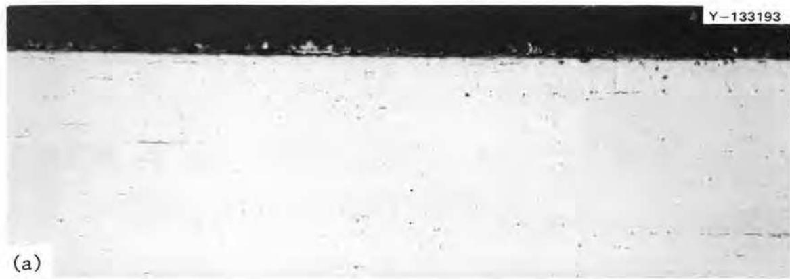

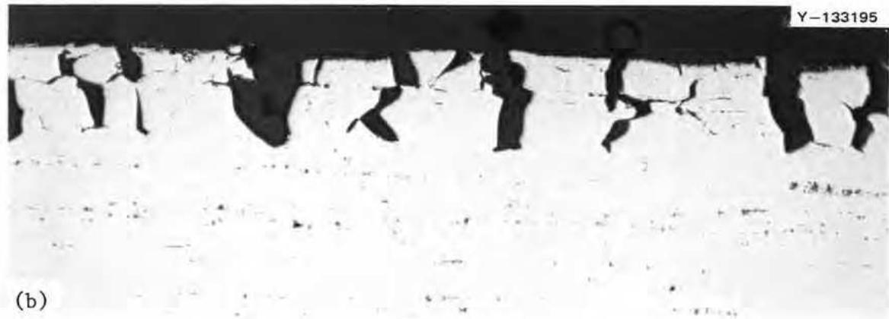

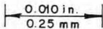  
Fig. 6.56. Standard Hastelloy N (heat 5065) exposed to LiCl saturated with $\mathrm{Cr_2Te_3}$ at $750^{\circ}\mathrm{C}$ for 146 hr. (a) Edge of unstressed portion of specimen, (b) edge of stressed portion of specimen. As polished, $100\times$ .

one end than the other, the extent of cracking seemed reasonably uniform. Typical photomicrographs of the four materials are shown in Fig. 6.57. Alloys 405065 (standard) and 472-503 $(2.16\%$ Ti) formed extensive cracks, but alloys 470-835 $(0.71\%$ Ti, $2.60\%$ Nb) and 180 $(1.84\%$ Nb) were considerably more resistant to cracking.

In experiment 75-3, three samples were packed in $\mathrm{Cr_2Te_3}$ granules for $250\mathrm{hr}$ at $650^{\circ}\mathrm{C}$ . The samples formed heavy nonadherent reaction products and lost weight (Table 6.19). All three materials formed extensive cracks (Table 6.19, Fig. 6.58), with the depth of cracking being slightly less in the two modified alloys (474-534 and 474-535) than in standard Hastelloy N (heat 5065). However, the extent of reaction is too high under these conditions for the results to be meaningful.

In experiment 75-4, duplicate samples of standard Hastelloy N (405065) were packed in granules of $\mathrm{Cr_3Te_4}$ and heated $200\mathrm{hr}$ at $700^{\circ}\mathrm{C}$ . The samples formed nonadherent reaction films and lost weight during the test (Table 6.19). The reaction layer and the

intergranular cracking produced during stressing are shown in Fig. 6.59. Again, the reaction rate was unreasonably high for use of the exposure conditions as a screening test.

In experiment 75-5, Brynestad and Keiser exposed two specimens to MSBR fuel carrier salt (containing no uranium) that was saturated with $\mathrm{Cr_2Te_3}$ . The exposure was for $504\mathrm{hr}$ at $700^{\circ}\mathrm{C}$ . These samples formed reaction layers but lost weight (Table 6.19). As shown in Fig. 6.60 both materials formed reaction layers, but in heat 470-835 $(0.71\%$ Ti, $2.60\%$ Nb) there appeared to be less penetration of the reactants along the grain boundaries. The standard Hastelloy N had regions where layers of grains dropped out during the exposure. The number and depth of cracks in the stressed portion of the samples were less for heat 470-835 than for standard Hastelloy N, but both materials formed extensive intergranular cracks.

Since the samples packed in the various tellurides reacted extensively, several experiments were run in which the samples and the telluride were separated in

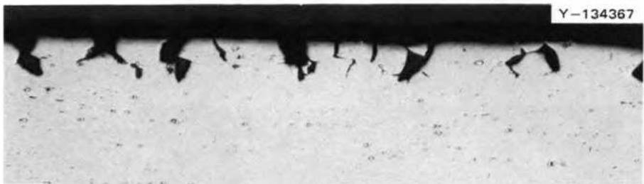  
(a)

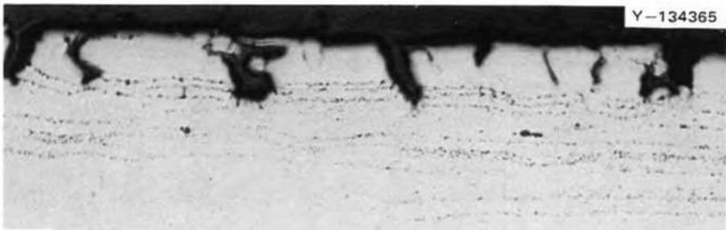  
(b)

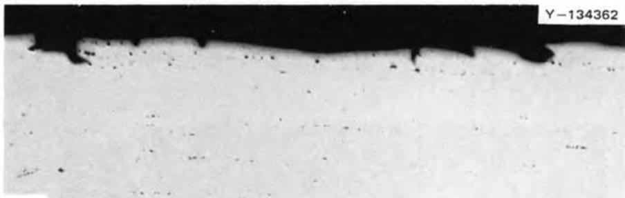  
(c)

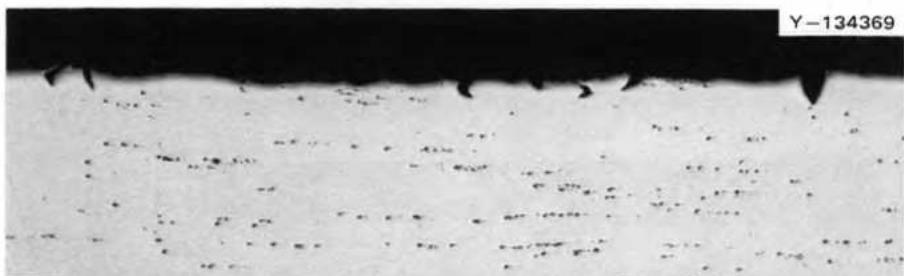  
(d)

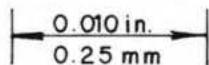  
Fig. 6.57. Specimens from experiment 75-2 which were exposed to a low partial pressure of tellurium for $1000\mathrm{hr}$ at $700^{\circ}\mathrm{C}$ . (a) Heat 405065, (b) heat 472-503 $(2.16\% \mathrm{Ti})$ , (c) heat 470-835 $(0.71\% \mathrm{Ti}, 2.6\% \mathrm{Nb})$ , (d) heat 180 $(1.84\% \mathrm{Nb})$ . As polished. $100\times$

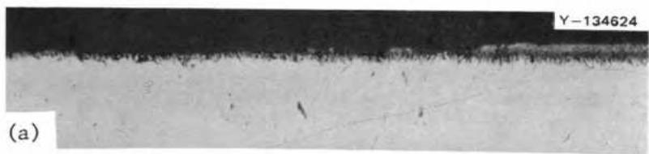

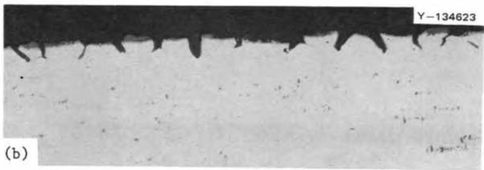

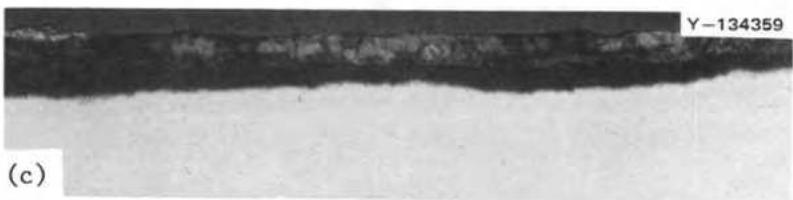

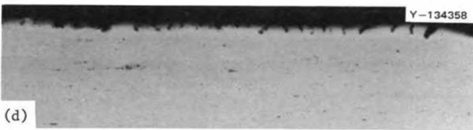

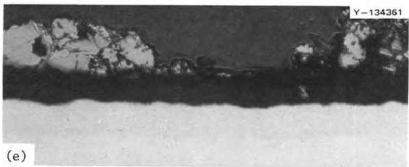

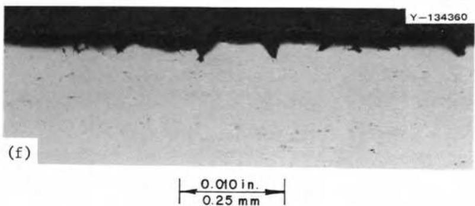  
Fig. 6.58. Specimens from experiment 75-3. Packed in $\mathrm{Cr_2Te_3}$ granules for 250 hr at $650^{\circ}\mathrm{C}$ and deformed to fracture at $25^{\circ}\mathrm{C}$ . (a) Heat 405065, unstressed, (b) heat 405065, stressed, (c) heat 474-534 (2.09% Ti, 0.013% La), unstressed, (d) heat 474-534, stressed, (e) heat 474-535 (2.13% Ti, 0.01% La, 0.03% Ce), unstressed, (f) heat 474-535, stressed. As polished. 100x.

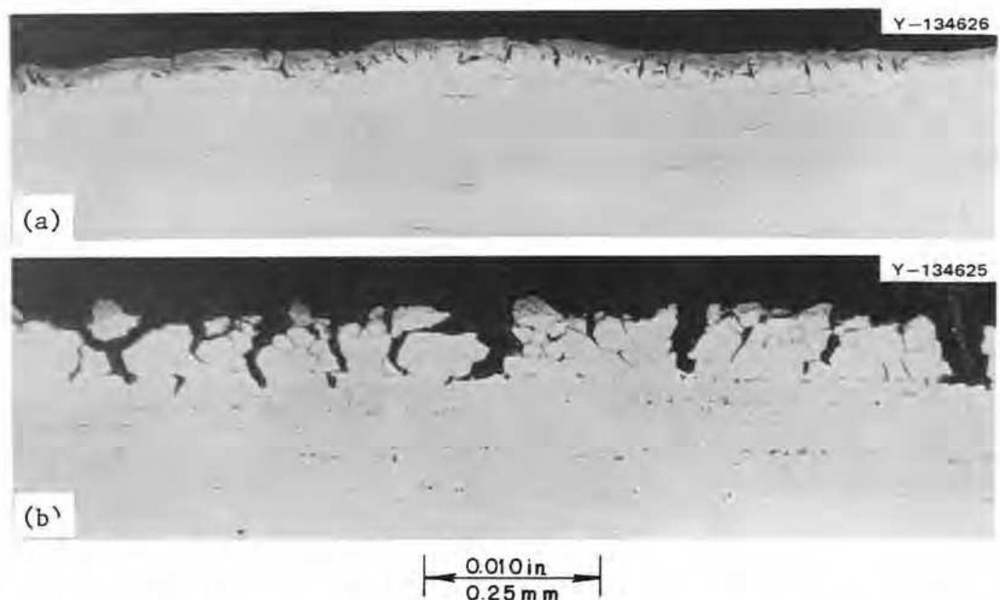  
Fig. 6.59. Specimen of standard Hastelloy N (heat 405065) from experiment 75-4. Packed in $\mathrm{Cr}_3\mathrm{Te}_4$ granules for $200\mathrm{hr}$ at $700^{\circ}\mathrm{C}$ and deformed to fracture. (a) Edge of unstressed shoulder, (b) edge of stressed gage length. As polished. $100\times$

the reaction capsule. In experiment 75-6, standard Hastelloy N was reacted with the vapor above $\mathrm{Cr}_3\mathrm{Te}_4$ at $700^{\circ}\mathrm{C}$ for 1000 hr. The specimen gained a small amount of weight (Table 6.19), did not form an obvious reaction layer (Fig. 6.61), but did form extensive intergranular cracks (Fig. 6.61, Table 6.19). Experiment 75-7 was run in the same way, but $\mathrm{Cr}_2\mathrm{Te}_3$ was used. The sample lost weight, formed a surface reaction product, and formed intergranular cracks when strained (Table 6.19, Fig. 6.62). In experiment 75-8 the source of tellurium was two nickel tellurides, $\beta_{2}$ and $\gamma_{1}$ . The specimen lost weight, did not form a visible surface reaction product, and did form intergranular cracks (Table 6.19, Fig. 6.63). From these experiments it was concluded that the tellurium activity produced by $\mathrm{Cr}_3\mathrm{Te}_4$ was likely that best suited for screening studies.

Experiment 75-9 included 25 alloys which were exposed to tellurium vapor at $700^{\circ}\mathrm{C}$ for $250\mathrm{hr}$ . The weight changes covered a range of $+8.4$ to $-7.4\mathrm{mg}$ , with no obvious correlation between weight change and crack depth or number (Table 6.19). These specimens were sealed in four different capsules for exposure to tellurium, and there were differences in the extent of discoloration of the samples. These differences are likely associated with slight differences in the extent of reaction due to variation of the temperature of the tellurium metal in the various capsules. Thus, it is questionable as to how far one should carry the analysis of the data from this experiment.

One further problem concerning data analysis which applies equally well to all data sets is the basis that should be used for comparison. The number of cracks and their average depth are two very important parameters. However, it is possible that a specimen can have a large number of shallow cracks (e.g., heat 63, Table 6.19) or a few rather deep cracks (e.g., heat 62, Table 6.19). The formation of intergranular cracks of any depth is important, because this may indicate a tendency for embrittlement. The depth of the cracks is important, because this is a measure of the rate of penetration of tellurium along the grain boundaries. However, for a relatively short test time [test 75-9 (250 hr)], the formation of numerous shallow cracks may be indicative of a near-surface reaction which will not lead to rapid penetration with time. Obviously, longer-term tests are needed to determine the rate of penetration of tellurium into the metal.

On the basis of number of cracks formed, the alloys in experiment 75-9 which formed less than 40 cracks per centimeter were 345, 470-835, 421543, 237, 469-714, 470-786, 62, 295, and 348. The alloys forming cracks with an average depth of $\leq 12.7\mu$ were 63, 469-714, 295, 348, 469-344, 421543, and 470-835. Several of the alloys appear good on the basis of both criteria. These alloys all contain niobium and several contain niobium and titanium. Another parameter used for comparison was the product of the number of cracks and the average crack depth. The alloys from experi

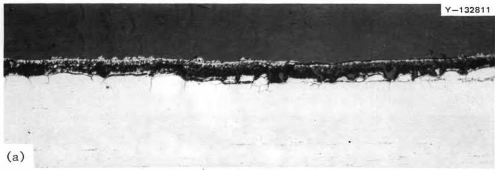

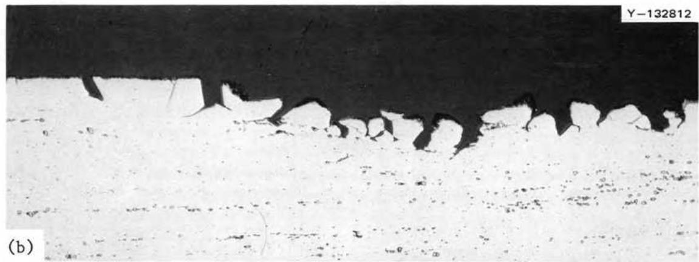

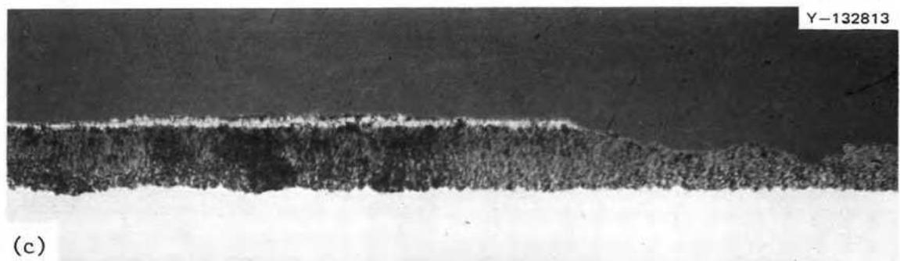

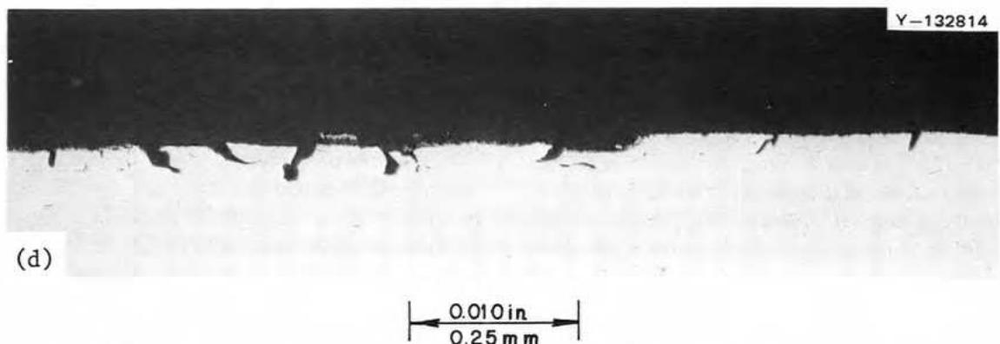  
Fig. 6.60. Samples from experiment 75-5. Samples exposed to fuel salt saturated with $\mathrm{Cr_2Te_4}$ for $504\mathrm{hr}$ at $700^{\circ}\mathrm{C}$ and strained to fracture at $25^{\circ}\mathrm{C}$ . (a) Standard Hastelloy N, unstressed shoulder, (b) standard Hastelloy N, stressed gage length showing region where grains were lost during salt exposure, (c) heat 470-835 (0.71% Ti, 2.60% Nb), unstressed shoulder, (d) heat 470-835, stressed portion. As polished. $100\times$

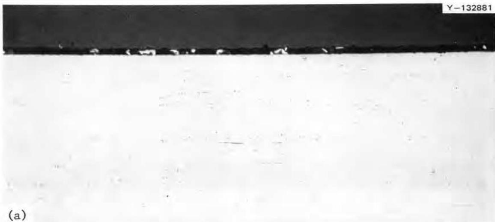

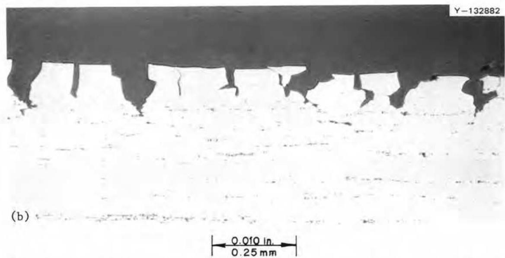  
Fig. 6.61. Standard Hastelloy N (heat 405065) from experiment 75-6. Samples exposed to the vapor above $\mathrm{Cr}_3\mathrm{Te}_4$ at $700^{\circ}\mathrm{C}$ for 1000 hr and strained to failure. (a) Edge of unstressed portion, (b) edge of stressed portion. As polished, $100\times$

ment 75-9 are ranked on this basis (Table 6.20). Standard Hastelloy N is significantly different from all other heats on this basis. There are large variations among the other heats, but it is difficult to pick out general trends on the basis of niobium and titanium concentrations.

Several typical photomicrographs of samples from experiment 75-9 are shown in Fig. 6.64. No reaction films were visible on any of these specimens. The pictures show clearly the wide range of cracking experienced by the various heats.

The mechanical property data show small, but significant, variations in the yield and ultimate tensile stresses of the various heats (Table 6.19). The higher stresses are generally associated with the alloys containing the higher amounts of niobium and titanium. However, the

high fracture strain and reduction in area for all heats indicate that only very small (if any) amounts of gamma prime formed during the $250\mathrm{hr}$ at $700^{\circ}\mathrm{C}$ .

In experiment 75-10, steps were taken to ensure that the specimens were at a uniform $700^{\circ}\mathrm{C}$ and that the tellurium was at $300^{\circ}\mathrm{C}$ . The weight changes were very erratic and show no correlation with the number of cracks or the depth of crack formation (Table 6.19). A sample of heat 425 was included in each of the two capsules used in this experiment to obtain some idea of reproducibility. The reproducibility was reasonably good. Samples of alloys 405065, 298, 295, 348, and 345 were included in experiments 75-9 and 75-10. Heats 405065, 298, and 345 in experiment 75-9 cracked more severely than in experiment 75-10. Alloy

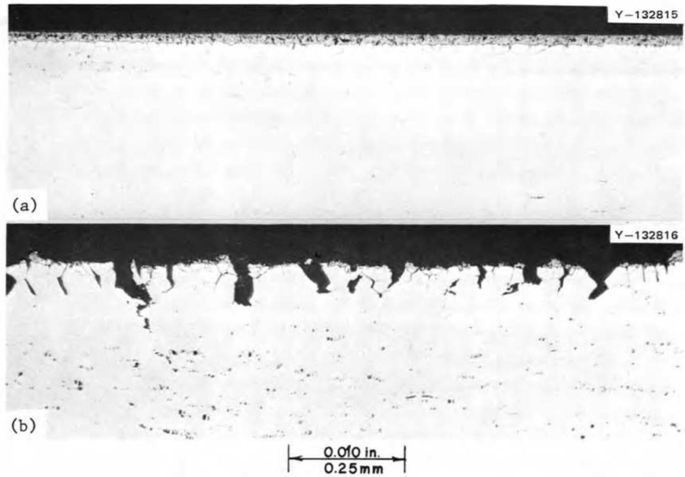  
Fig. 6.62. Standard Hastelloy N (heat 405065) from experiment 75-7. Samples exposed to the vapor above $\mathrm{Cr_2Te_3}$ at $700^{\circ}\mathrm{C}$ for $1000\mathrm{hr}$ and strained to failure. (a) Edge of unstressed portion, (b) edge of stressed portion. As polished. $100\times$

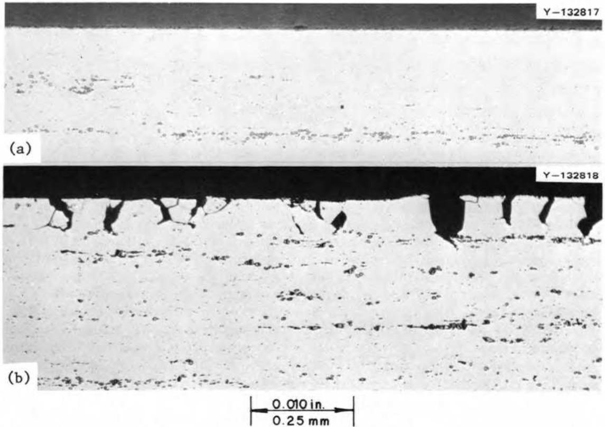  
Fig. 6.63. Standard Hastelloy N (heat 405065) from experiment 75-8. Samples exposed to the vapor above $\beta_{2} + \gamma_{1}$ nickel tellurides at $700^{\circ}\mathrm{C}$ for 1000 hr and strained to failure. (a) Edge of unstressed portion. (b) edge of stressed portion. As polished. $100\times$

Table 6.20. Ranking of materials from experiment 75-9   

<table><tr><td rowspan="2">Product of number of cracks and average depth (cracks/cm× microns)</td><td rowspan="2">Heat number</td><td colspan="3">Concentration (%)a</td></tr><tr><td>Ti</td><td>Nb</td><td>Other</td></tr><tr><td>5907</td><td>405065</td><td></td><td></td><td></td></tr><tr><td>3717</td><td>306</td><td></td><td>0.55</td><td>0.27 Si</td></tr><tr><td>3195</td><td>474-534</td><td>2.09</td><td></td><td>0.013 La</td></tr><tr><td>2730</td><td>471-114</td><td>1.75</td><td></td><td></td></tr><tr><td>2467</td><td>303</td><td>0.49</td><td>0.84</td><td></td></tr><tr><td>2400</td><td>305</td><td>0.88</td><td>1.3</td><td></td></tr><tr><td>2249</td><td>298</td><td></td><td>2.0</td><td></td></tr><tr><td>2197</td><td>63</td><td></td><td>2.5</td><td></td></tr><tr><td>2196</td><td>297</td><td>0.24</td><td>0.57</td><td></td></tr><tr><td>1993</td><td>347</td><td></td><td>0.88</td><td>0.47 Si</td></tr><tr><td>1924</td><td>469-648</td><td>0.92</td><td>1.95</td><td></td></tr><tr><td>1910</td><td>474-535</td><td>2.13</td><td></td><td>0.04 La + Ce</td></tr><tr><td>1851</td><td>600600</td><td>0.27</td><td></td><td>15 Cr</td></tr><tr><td>1453</td><td>181</td><td>0.50</td><td>1.85</td><td></td></tr><tr><td>1304</td><td>346</td><td>0.48</td><td>0.49</td><td></td></tr><tr><td>1292</td><td>469-344</td><td>0.77</td><td>1.7</td><td></td></tr><tr><td>998</td><td>345</td><td></td><td>0.45</td><td>0.22 Si</td></tr><tr><td>488</td><td>237</td><td></td><td>1.03</td><td></td></tr><tr><td>409</td><td>469-714</td><td>0.80</td><td>1.60</td><td></td></tr><tr><td>352</td><td>62</td><td></td><td>1.9</td><td></td></tr><tr><td>318</td><td>470-835</td><td>0.71</td><td>2.60</td><td></td></tr><tr><td>290</td><td>421543</td><td></td><td>0.7</td><td></td></tr><tr><td>179</td><td>470786</td><td>0.82</td><td>0.62</td><td></td></tr><tr><td>101</td><td>295</td><td></td><td>0.85</td><td></td></tr><tr><td>38</td><td>348</td><td></td><td>0.62</td><td>0.47 Si</td></tr></table>

${}^{a}$ See Table 6.18 for detailed chemical analyses.

348 was less severely cracked in experiment 75-10, and heat 295 reacted similarly in both tests. Such differences emphasize the importance of duplicating test results before making important conclusions.

The alloys in experiment 75-10 that formed $\leq 32$ cracks/cm were 413, 34, 295, 411, 421543, and 345. Those with average crack depths $\leq 10.9\mu$ were 421543, 295, 413, 345, and 298. Again, this ranking is of questionable value, because alloy 298 had the shallowest cracks of the 12 specimens, but formed a large number of cracks. In an effort to combine the factors of number and depth of cracks, the two factors were multiplied and the alloys ranked as shown in Table 6.21. There is a very large step between alloys 425 and 298, and the better alloys appear to be ones containing from 0.45 to $2.0\%$ Nb with titanium additions of $1\%$ or less.

The tensile data show small variations, but do not show evidence of embrittlement due to gamma prime formation during $250\mathrm{hr}$ at $700^{\circ}\mathrm{C}$ (Table 6.19). In specimens from experiment 75-10 the wide range of cracking behavior is apparent (Figs. 6.65 and 6.66).

These tests have shown that several methods are available for exposing metal specimens to tellurium. The metal telluride, $\mathrm{Cr_3Te_4}$ , has an activity most consistent with our estimates of tellurium activity in an MSBR. Specimens can be exposed to salt containing $\mathrm{Cr_3Te_4}$ or exposed to vapor above the compound. Tellurium metal at about $300^{\circ}\mathrm{C}$ has a vapor pressure of about $1\times 10^{-4}$ torr and appears to provide a tellurium activity comparable to that expected in an actual MSBR. The specimens exposed thus far show that niobium is effective in reducing the extent of intergranular embrittlement of Hastelloy N.

# 6.15 EXAMINATION OF TeGen-1

B. McNabb H. E. McCoy

The TeGen series of capsules was designed for studying the effects of tellurium and other fission products on metals. The fuel capsule is a $\frac{1}{2}$ -in.-OD × 0.035-in.-wall × 4-in.-long tube segment of the metal under

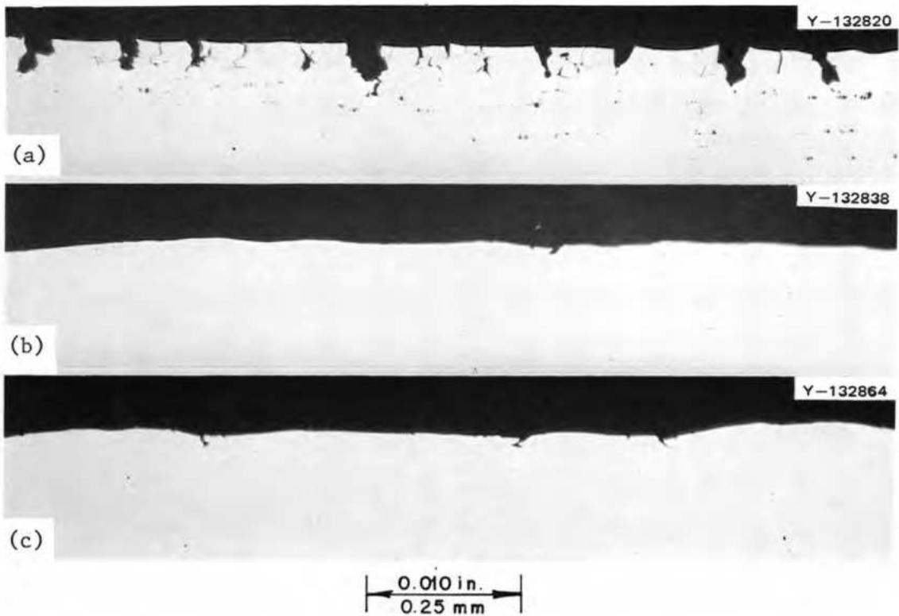  
Fig. 6.64. Comparison of intergranular cracking in Hastelloy N type alloys exposed to partial pressure of tellurium of $\sim 10^{-4}$ torr for $250\mathrm{hr}$ at $700^{\circ}\mathrm{C}$ and strained to fracture at $25^{\circ}\mathrm{C}$ . (a) Standard Hastelloy N (heat 405065) (142 cracks/cm, av depth $41.6\mu$ ), (b) modified Hastelloy N containing $0.85\%$ Nb (alloy 295) (10 cracks/cm, av depth $10.1\mu$ ), (c) modified Hastelloy N containing $0.82\%$ Ti, $0.62\%$ Nb (alloy 470-786) (13 cracks/cm, av depth $8.6\mu$ ). $100\times$

Table 6.21. Ranking of materials from experiment 75-10   

<table><tr><td rowspan="2">Product of number of cracks and average depth (cracks cm × microns)</td><td rowspan="2">Alloy number</td><td colspan="3">Concentration (%)a</td></tr><tr><td>Ti</td><td>Nb</td><td>Other</td></tr><tr><td>4512</td><td>424</td><td>1.8</td><td>1.34</td><td></td></tr><tr><td>3245</td><td>421</td><td>2.19</td><td>1.04</td><td></td></tr><tr><td>3198</td><td>425</td><td>1.98</td><td>0.48</td><td></td></tr><tr><td>2328</td><td>405065</td><td></td><td></td><td></td></tr><tr><td>2157</td><td>425</td><td>1.98</td><td>0.48</td><td></td></tr><tr><td>713</td><td>298</td><td></td><td>2.0</td><td></td></tr><tr><td>336</td><td>413</td><td>1.0</td><td>1.13</td><td></td></tr><tr><td>209</td><td>348</td><td></td><td>0.62</td><td>0.47 Si</td></tr><tr><td>133</td><td>411</td><td></td><td>1.15</td><td></td></tr><tr><td>106</td><td>295</td><td></td><td>0.85</td><td></td></tr><tr><td>76</td><td>421543</td><td></td><td>0.7</td><td></td></tr><tr><td>45</td><td>345</td><td></td><td>0.45</td><td>0.22 Si</td></tr></table>

${}^{a}$ See Table 6.18 for detailed chemical analyses.

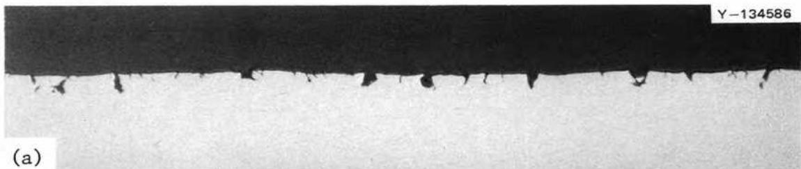

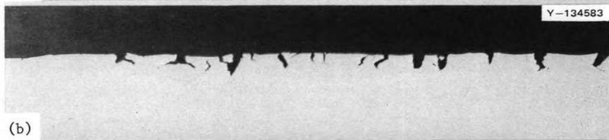

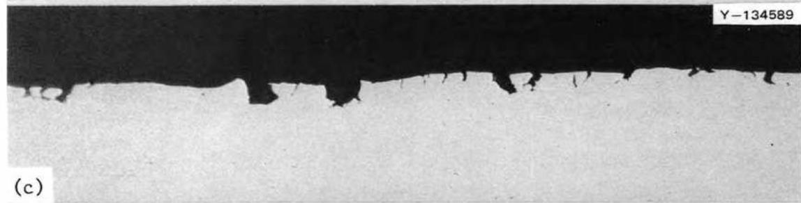

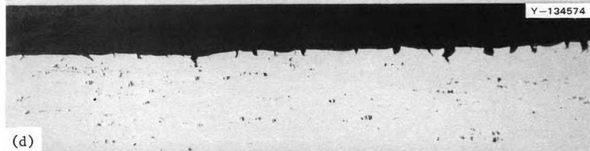

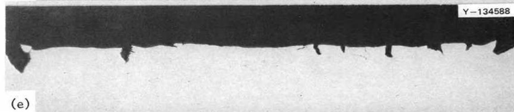

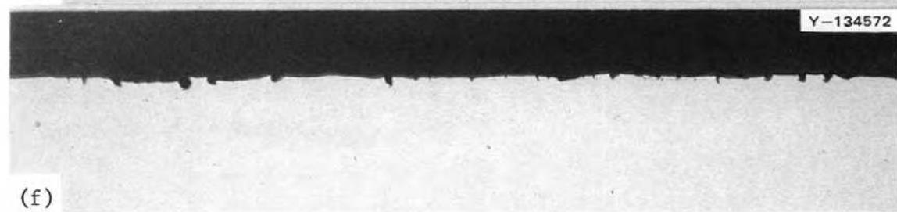

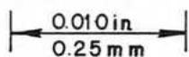  
Fig. 6.65. Strained specimens from experiment 75-10. Specimens were exposed for $250\mathrm{hr}$ at $700^{\circ}\mathrm{C}$ to the vapor above tellurium metal at $300^{\circ}\mathrm{C}$ . (a) Alloy 424, (b) alloy 421, (c) alloy 425, (d) alloy 405065, (e) alloy 425, (f) alloy 298. As polished. $100\times$

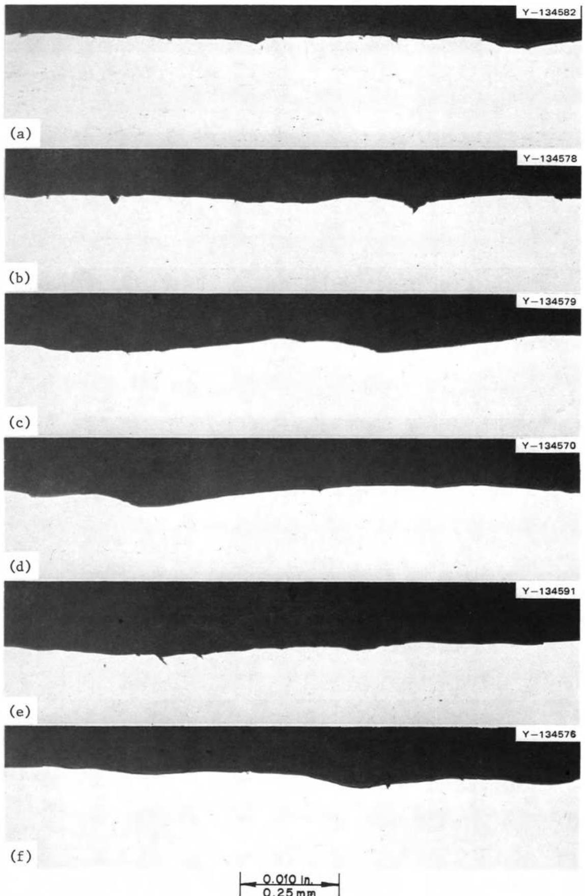  
Fig. 6.66. Strained specimens from experiment 75-10 exposed for $250\mathrm{hr}$ at $700^{\circ}\mathrm{C}$ to the vapor above tellurium metal at $300^{\circ}\mathrm{C}$ . (a) Alloy 413, (b) alloy 348, (c) alloy 411, (d) alloy 295, (e) alloy 421543, (f) alloy 345. As polished. $100\times$

study. The capsule is partially filled with the MSRE-type fuel salt and irradiated in the ORR to produce fission products.

The first experiment of this series involved fuel pins made of Inconel 601, standard Hastelloy N, and type 304 stainless steel, and the irradiation time was such that the amount of tellurium produced per unit area of metal in contact with salt was equal to that at the end of operation of the MSRE. Some of the details of the postirradiation examination were described previously.[22] A typical fuel pin is shown schematically in Fig. 6.67. The segments marked “A” were subjected to tensile tests, using the fixture shown in Fig. 6.68. The mechanical property data obtained from the rings and the results of limited metallographic examination were reported previously.[22] More detailed metallographic studies have been completed during this report period. The segments marked “B” were used for chemical studies. The salt from each segment was analyzed, and the fission product distributions on the tube surface and a short distance into the tube were determined from two successive leach solutions. The first leach used a “verbocit” solution (sodium versenate, boric acid, and sodium citrate) which should have dissolved only residual salt from the metal surface. The second solution was aqua regia, and the time was sufficient to remove about

22. B. McNabb and H. E. McCoy, MSR Program Semiannu. Progr. Rep. Feb. 28, 1975, ORNL-5047, pp. 123-36.

1 mil of the tube. Both solutions were subjected to various chemical procedures to analyze for various nuclides and elements. These results are partially analyzed, and the results for tellurium will be discussed. The tube segments marked "C" were retained for possible future studies.

# 6.15.1 Metallographic Observations

Photomicrographs of the three materials in the undeformed condition are shown in Fig. 6.69. Numerous voids were present near the surface of the Inconel 601 specimen to a depth of about $0.2\mathrm{mil}$ . Voids were likely caused by the removal of chromium from the alloy via reaction with $\mathbf{U}\mathbf{F}_4$ in the salt. The Hastelloy N section shows no evidence of chemical reaction with the salt. The type 304 stainless steel shows some grain boundary attack to a depth of about $0.5\mathrm{mil}$ . This was likely caused by selective removal of chromium along the grain boundaries. The features in the type 304 stainless steel appear much like shallow cracks and may have influenced the number of cracks that were observed in stressed samples of this material.

Composite photomicrographs of the Inconel 601 rings after straining to failure are shown in Fig. 6.70. Rings 2 and 4 from near the salt-vapor interface exhibit some evidence of attack, but the other samples are almost entirely free of indications of chemical reaction.

Photomicrographs of the deformed rings from the Hastelloy N capsule are shown in Fig. 6.71. The count

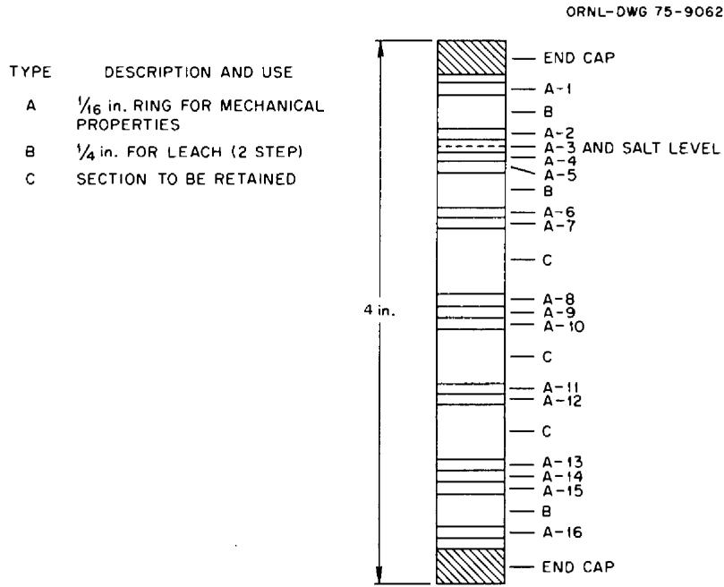  
Fig. 6.67. Schematic diagram of individual fuel pin showing the locations of test specimens.

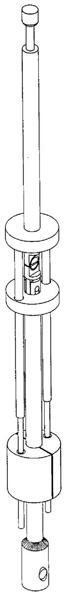  
Fig. 6.68. Fixture for tensile testing rings from TeGen fuel pins.

ORNL-DWG-75-17506

of crack frequency shown in Table 6.22 was made in an effort to detect significant differences in cracking among the various specimens. These counts are subject to numerous problems, the main one being the inhomogeneous distribution of strain within the sample. In deforming the ring specimens in the fixture shown in Fig. 6.68, the small portions of the ring located between the two parts of the fixture likely deformed very uniformly, but this length is very short relative to the total length. The part of the ring that contacted the fixture likely deformed in some areas but was restrained in other areas by surface friction from the fixture. The

metallographic sample includes the fracture and an adjacent segment. Since the fracture occurred at different locations, the metallographic specimen contains varying amounts of inhomogeneously deformed material. For example, Fig. 6.71e includes a very small segment of homogenously deformed material, whereas Fig. 6.71f includes a relatively long segment. As shown by the photomicrographs in Fig. 6.71 and the data in Table 6.22, specimens from the vapor region (2-A-1), the salt-vapor interface (2-A-2), and the bottom of the salt (2-A-16) cracked most severely. Three samples from other locations formed shallower cracks. It is not known whether these differences are significant.

Typical photomicrographs of deformed rings from the type 304 stainless steel capsule are shown in Fig. 6.72. These specimens, located on the inside surface, had shallow cracks with an average depth of about 0.4 mil (Table 6.22). These cracks were rather uniformly distributed in the samples from all four locations. As noted in Fig. 6.69, the unstressed specimen also contained cracklike features having a maximum depth of about 0.5 mil. Hence, the cracks in the stressed specimens may simply be the result of further opening of features that are likely related to corrosion.

# 6.15.2 Chemical Analyses for Tellurium

The tube segments designated B-1, B-2, and B-3 in Fig. 6.67 were subjected to several types of chemical analyses, but only the results for tellurium have been analyzed in sufficient detail to report at this time. The results for the three pins are shown in Table 6.23. The

Table 6.22. Summary of crack frequency and depth information for rings from TeGen-1 fuels after straining to failure at $25^{\circ}\mathrm{C}$   

<table><tr><td rowspan="2">Specimen number</td><td rowspan="2">Crack frequency (cracks/in.)</td><td colspan="2">Crack depth (mils)</td></tr><tr><td>Average</td><td>Maximum</td></tr><tr><td colspan="4">Hastelloy N</td></tr><tr><td>2-A-1</td><td>480</td><td>0.80</td><td>2.0</td></tr><tr><td>2-A-2</td><td>450</td><td>1.1</td><td>2.2</td></tr><tr><td>2-A-4</td><td>410</td><td>0.60</td><td>1.2</td></tr><tr><td>2-A-5</td><td>480</td><td>0.58</td><td>1.2</td></tr><tr><td>2-A-8</td><td>330</td><td>0.46</td><td>1.0</td></tr><tr><td>2-A-16</td><td>380</td><td>1.4</td><td>2.5</td></tr><tr><td colspan="4">Type 304 stainless steel</td></tr><tr><td>3-A-2</td><td>160</td><td>0.49</td><td>1.2</td></tr><tr><td>3-A-4</td><td>310</td><td>0.42</td><td>1.0</td></tr><tr><td>3-A-8</td><td>260</td><td>0.36</td><td>1.0</td></tr><tr><td>3-A-16</td><td>202</td><td>0.37</td><td>1.0</td></tr></table>

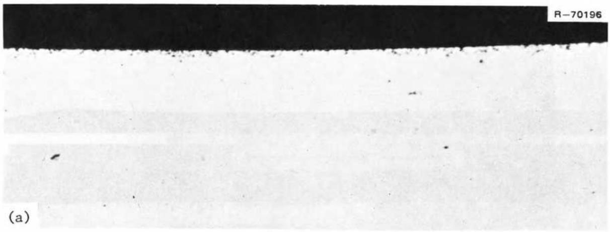

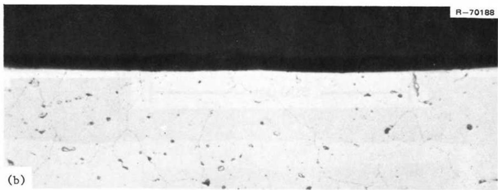

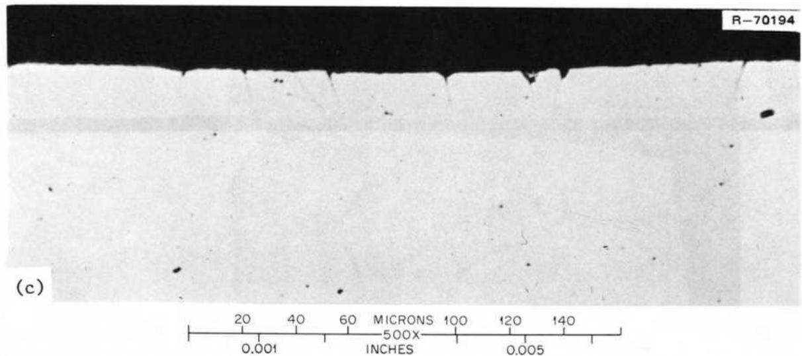  
Fig. 6.69. Undeformed rings (sample No. 9) from each TeGen fuel pin near the middle of the fuel salt. (a) Inconel 601, (b) Hastelloy N, (c) type 304 stainless steel. As polished. $500\times$

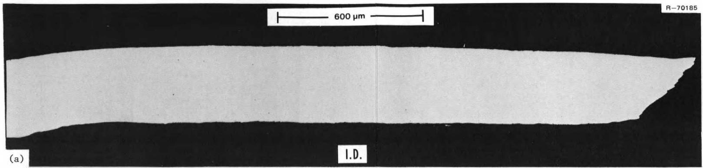

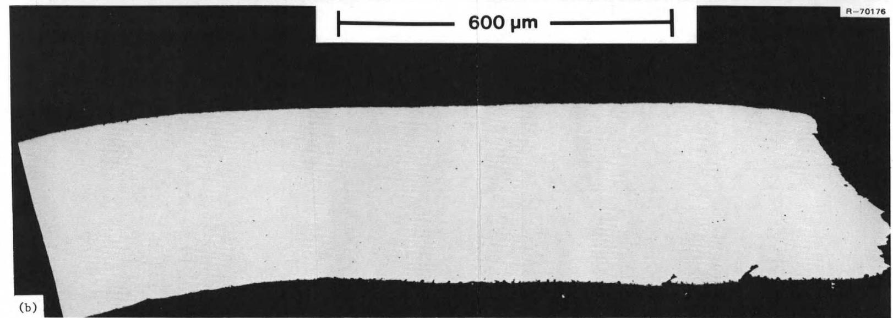

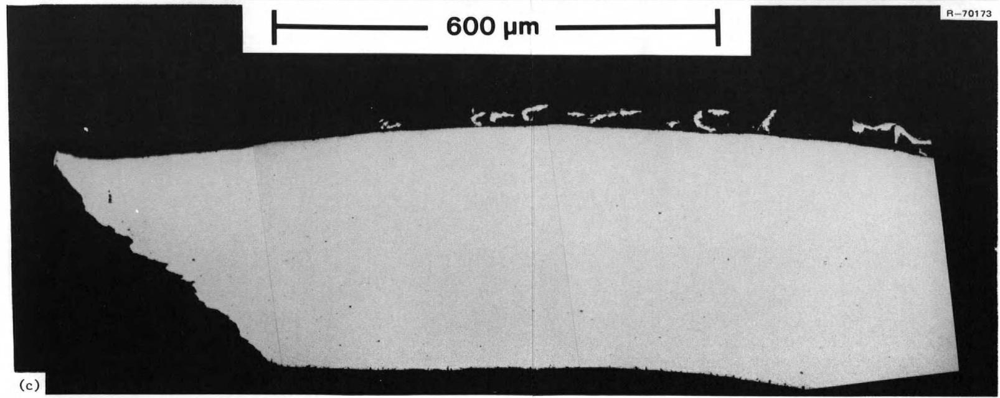

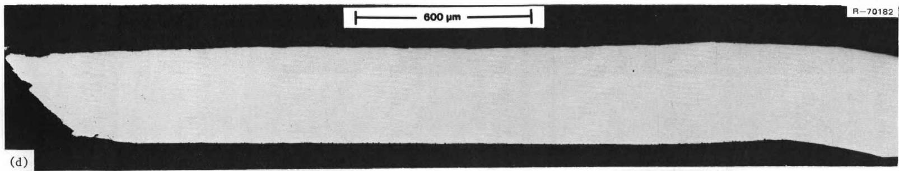

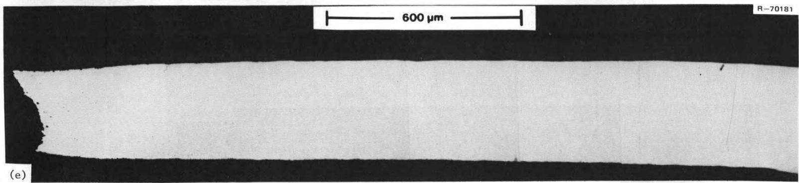

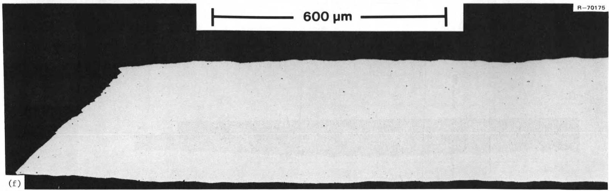  
Fig. 6.70. Samples from Inconel 601 fuel pin from TeGen-1. Rings taken from the locations shown in Fig. 6.67 and deformed to failure at $25^{\circ}\mathrm{C}$ . Portion of specimen exposed to fuel salt is on the lower side of each figure. (a) Location A-1, (b) location A-2, (c) location A-4, (d) location A-5, (e) location A-8, (f) location A-16.

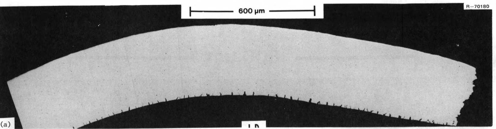

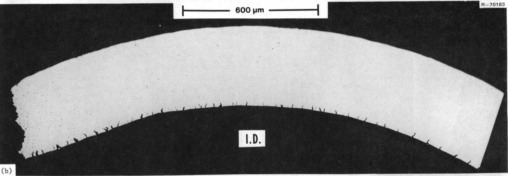

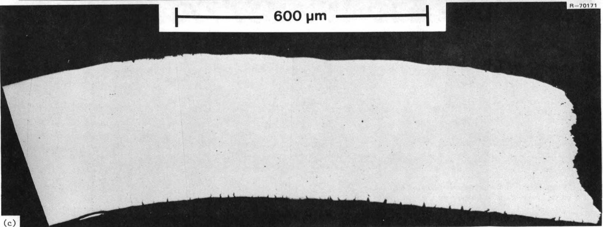

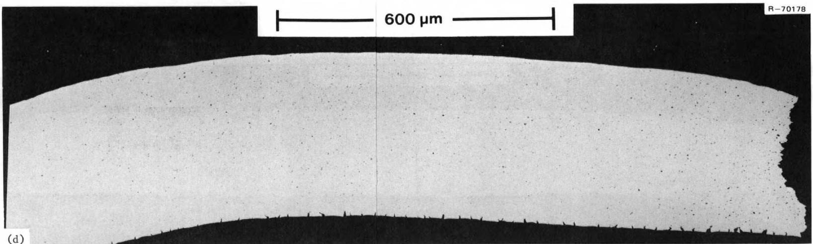

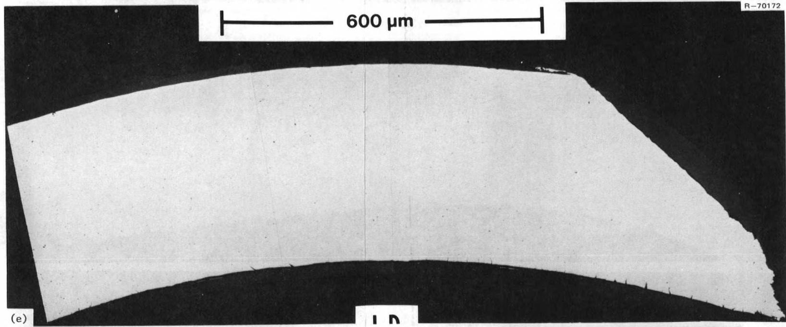

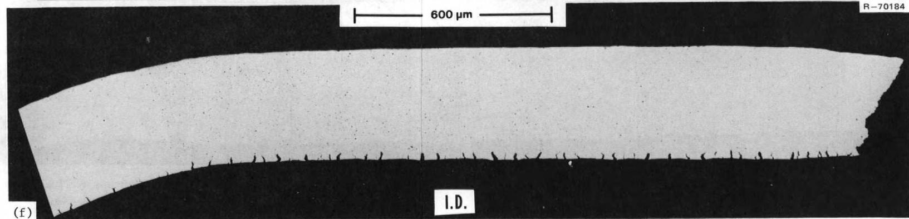  
Fig. 6.71. Samples from Hastelloy N fuel pin from TeGen-1. Rings taken from the locations shown in Fig. 6.67 and deformed to failure at $25^{\circ}\mathrm{C}$ . Portion of specimen exposed to fuel salt is on the lower side of each figure. (a) Location A-1, (b) location A-2, (c) location A-4, (d) location A-5, (e) location A-8, (f) location A-16.

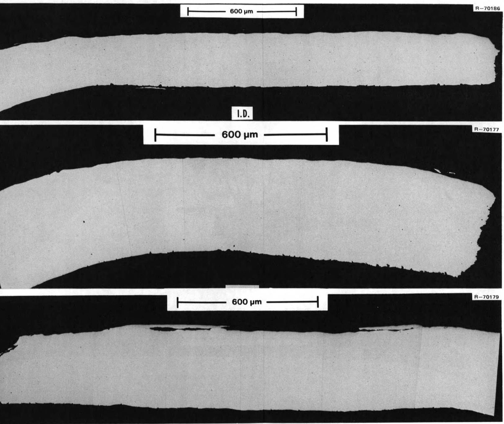

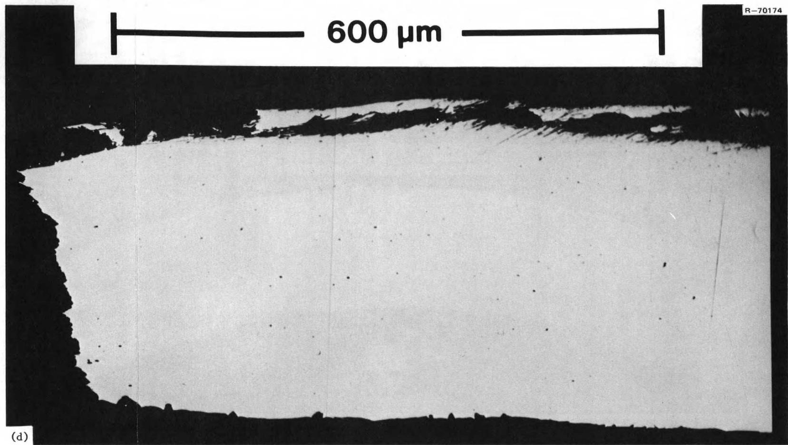  
Fig. 6.72. Samples from type 304 stainless steel fuel pin from TeGen-1. Rings taken from the locations shown in Fig. 6.67 and deformed to failure at $25^{\circ}\mathrm{C}$ . Portion of specimen exposed to fuel salt is on the lower side of each figure. (a) Location 2A, (b) location 4A, (c) location 8A, (d) location 16A.

Table 6.23. Chemical analyses for ${}^{127}m\mathrm{{Te}}$ and ${}^{129}m\mathrm{{Te}}$ nuclides in the three fuel pins from TeGen-1   

<table><tr><td rowspan="2">Pin identification</td><td rowspan="2">Sample location</td><td rowspan="2">Type chemistry samplea</td><td colspan="2">Concentration of 127mTe</td><td colspan="2">Concentration of 129mTe</td></tr><tr><td>dpm total or dpm/gb</td><td>g/cm2or g/gc</td><td>dpm total or dpm/gb</td><td>g/cm2or g/gc</td></tr><tr><td rowspan="8">No. 1 – Inconel 601</td><td>1B1</td><td>A</td><td>≤2.2 × 107</td><td>d</td><td>≤9.5 × 106</td><td>d</td></tr><tr><td>1B1</td><td>B</td><td>4.65 × 108</td><td>2.57 × 10-5</td><td>2.37 × 108</td><td>4.46 × 10-8</td></tr><tr><td>1B2</td><td>A</td><td>≤2.5 × 107</td><td>d</td><td>≤2.37 × 107</td><td>d</td></tr><tr><td>1B2</td><td>B</td><td>1.59 × 109</td><td>8.75 × 10-8</td><td>6.00 × 108</td><td>1.13 × 10-7</td></tr><tr><td>1B2</td><td>C</td><td>7.85 × 106</td><td>1.14 × 10-9</td><td>7.44 × 106</td><td>4.5 × 10-9</td></tr><tr><td>1B3</td><td>A</td><td>≤5.3 × 106</td><td>d</td><td>≤1.7 × 106</td><td>d</td></tr><tr><td>1B3</td><td>B</td><td>6.27 × 108</td><td>3.45 × 10-8</td><td>3.06 × 108</td><td>5.76 × 10-8</td></tr><tr><td>1B3</td><td>C</td><td>2.47 × 107</td><td>3.58 × 10-9</td><td>1.63 × 107</td><td>9.9 × 10-9</td></tr><tr><td rowspan="8">No. 2 – Hastelloy N</td><td>2B1</td><td>A</td><td>≤6.0 × 106</td><td>d</td><td>≤8.64 × 106</td><td>d</td></tr><tr><td>2B1</td><td>B</td><td>7.49 × 108</td><td>3.86 × 10-8</td><td>4.97 × 108</td><td>0.94 × 10-7</td></tr><tr><td>2B2</td><td>A</td><td>≤8.5 × 107</td><td>d</td><td>≤5.4 × 107</td><td>d</td></tr><tr><td>2B2</td><td>B</td><td>2.95 × 108</td><td>1.52 × 10-8</td><td>2.02 × 108</td><td>3.76 × 10-8</td></tr><tr><td>2B2</td><td>C</td><td>6.78 × 107</td><td>6.58 × 10-9</td><td>5.94 × 107</td><td>2.4 × 10-8</td></tr><tr><td>2B3</td><td>A</td><td>≤5.4 × 106</td><td>d</td><td>≤5.8 × 106</td><td>d</td></tr><tr><td>2B3</td><td>B</td><td>8.19 × 108</td><td>4.22 × 10-8</td><td>8.05 × 108</td><td>1.51 × 10-7</td></tr><tr><td>2B3</td><td>C</td><td>3.48 × 107</td><td>2.69 × 10-9</td><td>3.93 × 107</td><td>1.61 × 10-8</td></tr><tr><td rowspan="8">No. 3 – type 304 · stainless steel</td><td>3B1</td><td>A</td><td>5.52 × 108</td><td>3.04 × 10-8</td><td>9.59 × 108</td><td>1.80 × 10-7</td></tr><tr><td>3B1</td><td>B</td><td>1.31 × 108</td><td>0.72 × 10-8</td><td>1.83 × 108</td><td>3.44 × 10-8</td></tr><tr><td>3B2</td><td>A</td><td>9.54 × 107</td><td>6.29 × 10-9</td><td>3.04 × 107</td><td>8.51 × 10-9</td></tr><tr><td>3B2</td><td>B</td><td>2.50 × 108</td><td>1.66 × 10-8</td><td>3.60 × 107</td><td>10.1 × 10-9</td></tr><tr><td>3B2</td><td>C</td><td>9.00 × 107</td><td>1.31 × 10-8</td><td>10.62 × 107</td><td>6.48 × 10-8</td></tr><tr><td>3B3</td><td>A</td><td>1.66 × 107</td><td>1.10 × 10-9</td><td>5.42 × 106</td><td>3.3 × 10-9</td></tr><tr><td>3B3</td><td>B</td><td>1.27 × 108</td><td>0.84 × 10-8</td><td>3.15 × 107</td><td>1.9 × 10-8</td></tr><tr><td>3B3</td><td>C</td><td>5.38 × 107</td><td>7.8 × 10-9</td><td>3.23 × 107</td><td>1.97 × 10-8</td></tr></table>

${}^{a}$ A denotes ${100}{\mathrm{\;{cm}}}^{3}$ solution obtained by leaching the metal sample in "verbocit" (sodium versenate, boric acid, and sodium citrate). B denotes ${100}{\mathrm{\;{cm}}}^{3}$ solution obtained by leaching the metal sample in aqua regia to remove about $1\mathrm{{mil}}$ of metal. C denotes ${100}{\mathrm{\;{cm}}}^{3}$ solution obtained by dissolving about $1\mathrm{\;g}$ of salt in nitric acid $\left( {8M}\right)$ saturated with boric acid.   
$b$ Counts for individual nuclides given in disintegrations per minute (dpm) total for chemistry sample types A and B and dpm per gram of salt for type C chemistry sample. These counts are laboratory numbers and subject to several corrections which have not been made.   
These concentrations are expressed as grams of the particular nuclide per $\mathrm{cm}^2$ of metal surface for chemistry sample types A and B and as grams of nuclide per gram of salt for chemistry sample type C. The values have been corrected back to the conclusion of the irradiation.   
$d_{\mathrm{Concentration}}$ through sufficiently low to be ignored.

sample numbers ending with 1 (i.e., 1B1, 2B1, and 3B1) designate the material that came from the fuel pin wall exposed to the gas space above the salt. The sample numbers ending with 2 designate material that came from the fuel pin exposed to the fuel salt just below the salt-gas interface, and the sample numbers ending with 3 designate material that came from the portion of the fuel pin exposed to fuel salt near the bottom of the capsule. Solutions were prepared for analysis by leaching metal samples of each tube in "verbocit" to remove residual salt (type A solution in Table 6.23), leaching the rings in aqua regia (type B solution in Table 6.23), and dissolving about $1\mathrm{g}$ of salt removed from the metal rings in nitric acid (type C solution in Table 6.23). These solutions were counted to determine the amounts of $^{127}m$ Te and $^{129}m$ Te present. The direct results of

these analyses are presented in Table 6.23, but cannot be interpreted directly because a number of corrections have not been made. The data have been corrected as well as possible to reflect the concentration of each nuclide at the end of irradiation. The concentrations for the leaches from the metal specimens are expressed as grams per square centimeter of tube wall exposed to the fuel salt, and the concentrations for the salt samples are expressed as grams per gram of salt.

The ORIGEN code was used by Kerr and Allen to predict the concentrations of tellurium isotopes that should have been present. These calculations have been used extensively in the subsequent analysis of the data. Table 6.24 compares the quantities of $^{127m}$ Te and $^{129m}$ Te found in the three fuel pins with those predicted to be present by the ORIGEN calculations. For

each fuel pin the one sample taken of the tube in the gas space was assumed to be typical of that region, and the two samples from the salt-covered parts were averaged to obtain a typical value for the salt-covered region. As shown in Table 6.24, generally about $20\%$ of the $^{127m}$ Te and $^{129m}$ Te was found. The percent of tellurium found in the Inconel 601 capsule was appreciably higher due to the higher amount found on the salt-covered metal surfaces.

There are several possible explanations why the concentrations of $^{127}m$ Te and $^{129}m$ Te found are only about 20% of those produced. One possibility is that the amounts calculated are too high. This appears not to be the case, but the calculations will be checked further. The most likely explanation is that the acid leach was not sufficient to remove all of the tellurium from the wall. The tube segments were suspended in the acid with the inside and outside surfaces of the tube wall exposed, as well as the cut surfaces on each side of the $\frac{1}{4}$ -in. tube segment. Based on the weight changes observed and the assumption of uniform metal removal, the thickness of metal removed appears to be about 0.8 mil. Since the cracks extended deeper than 0.8 mil in the Hastelloy N, the tellurium likely penetrated deeper than did the leaching solution. However, the cracks in the other two materials were very shallow, and the

0.8-mil dissolution should have recovered a higher fraction of the tellurium if one can equate the depth of cracking to the depth of tellurium penetration. The results in Table 6.24 show no evidence of a systematic variation in the percent recovered from the three tubes. Several possible explanations for the apparent discrepancy in the quantities of tellurium generated and that actually found are being investigated, but none appears reasonable at this time.

The concentrations of $^{127m}\mathrm{Te}$ and $^{129m}\mathrm{Te}$ found in the salt can be used to predict upper limits for the solubility of tellurium in fuel salt under these conditions. The $^{127m}\mathrm{Te}$ nuclide concentration in the salt ranges from $1.14 \times 10^{-9}$ to $1.31 \times 10^{-8}$ g per gram of salt (Table 6.23). The ORIGEN calculations were used to estimate the ratio of $^{127m}\mathrm{Te}$ to total tellurium, and this ratio was used to convert the above concentrations of $^{127m}\mathrm{Te}$ to total tellurium concentrations of 0.07 to 0.83 ppm. Similarly, the concentration of $^{129m}\mathrm{Te}$ ranged from $4.5 \times 10^{-9}$ to $6.48 \times 10^{-8}$ g per gram of salt, and these correspond to total tellurium concentrations of 0.08 to 1.13 ppm. The low values in both cases were noted in the Inconel 601 pin, and the higher values were observed in the type 304 stainless steel pin. The concentrations in the Hastelloy N pin were only slightly less than noted for the type 304 stainless steel pin. The

Table 6.24. Amount of Tellurium in various locations of fuel pins from TeGen-1 (g)   

<table><tr><td rowspan="2">Location</td><td colspan="2">Inconel 601</td><td colspan="2">Hastelloy N</td><td colspan="2">Type 304 stainless steel</td></tr><tr><td>\( ^{127}mTe \)</td><td>\( ^{129}mTe \)</td><td>\( ^{127}mTe \)</td><td>\( ^{129}mTe \)</td><td>\( ^{127}mTe \)</td><td>\( ^{129}mTe \)</td></tr><tr><td>Salt</td><td>\( 4.1 \times 10^{-8} \)</td><td>\( 1.3 \times 10^{-7} \)</td><td>\( 1.0 \times 10^{-7} \)</td><td>\( 3.5 \times 10^{-7} \)</td><td>\( 1.8 \times 10^{-7} \)</td><td>\( 7.4 \times 10^{-7} \)</td></tr><tr><td>Metal-vapor space</td><td>\( 1.4 \times 10^{-7} \)</td><td>\( 2.4 \times 10^{-7} \)</td><td>\( 2.1 \times 10^{-7} \)</td><td>\( 5.0 \times 10^{-7} \)</td><td>\( 2.0 \times 10^{-7} \)</td><td>\( 1.2 \times 10^{-6} \)</td></tr><tr><td>Metal-salt covered</td><td>\( 1.7 \times 10^{-6} \)</td><td>\( 2.3 \times 10^{-6} \)</td><td>\( 7.8 \times 10^{-7} \)</td><td>\( 2.6 \times 10^{-6} \)</td><td>\( 4.4 \times 10^{-7} \)</td><td>\( 3.9 \times 10^{-7} \)</td></tr><tr><td>Total found</td><td>\( 1.9 \times 10^{-6} \)</td><td>\( 2.7 \times 10^{-6} \)</td><td>\( 1.1 \times 10^{-6} \)</td><td>\( 3.45 \times 10^{-6} \)</td><td>\( 8.2 \times 10^{-7} \)</td><td>\( 2.3 \times 10^{-6} \)</td></tr><tr><td>Total formed</td><td>\( 3.62 \times 10^{-6} \)</td><td>\( 1.34 \times 10^{-5} \)</td><td>\( 4.0 \times 10^{-6} \)</td><td>\( 1.48 \times 10^{-5} \)</td><td>\( 3.6 \times 10^{-6} \)</td><td>\( 1.34 \times 10^{-5} \)</td></tr><tr><td>Percent found</td><td>52</td><td>20</td><td>28</td><td>23</td><td>23</td><td>17</td></tr></table>

Table 6.25. Concentration of tellurium in various locations of fuel pins from TeGen-1 $(10^{-8}\mathrm{g / cm}^2)$   

<table><tr><td rowspan="2">Location</td><td colspan="2">Inconel 601</td><td colspan="2">Hastelloy N</td><td colspan="2">Type 304 stainless steel</td></tr><tr><td>127Te</td><td>129Te</td><td>127Te</td><td>129Te</td><td>127Te</td><td>129Te</td></tr><tr><td>Metal-vapor space, B1</td><td>2.57</td><td>4.46</td><td>3.86</td><td>9.4</td><td>3.76</td><td>21.4</td></tr><tr><td>Metal-salt location, B2</td><td>8.75</td><td>11.3</td><td>1.52</td><td>3.76</td><td>2.29</td><td>1.86</td></tr><tr><td>Metal-salt location, B3</td><td>3.45</td><td>5.76</td><td>4.22</td><td>15.1</td><td>0.95</td><td>1.03</td></tr><tr><td>Average if total yield evenly distributed</td><td>11.2</td><td>41.3</td><td>12.3</td><td>45.6</td><td>11.2</td><td>41.3</td></tr></table>

higher chromium concentration of the Inconel 601 may have caused the lower tellurium concentration in the fuel salt.

The concentrations of $^{127m}$ Te and $^{129m}$ Te are expressed in Table 6.25 in terms of grams per unit surface area. There appear to be significant variations within each capsule, but there is no consistency between the various pins. The high value for $^{129m}$ Te in the vapor space of the type 304 stainless steel pin is likely anomalous, since the $^{127m}$ Te is not as high. Thus, at this time we conclude that the tellurium is distributed uniformly over the entire surface area of the pin.

# 6.16 SALT PREPARATION AND FUEL PIN FILLING FOR TeGen-2 AND -3

M. R. Bennett A. D. Kelmers

The purpose of this portion of the TeGen activity is to prepare purified MSRE-type fuel salt containing $^{233}\mathrm{U}$ and to then transfer a known quantity of this salt into fuel pins for subsequent irradiation in the ORR. One batch of purified salt will be prepared and used, in two filling operations, to fill two sets of six fuel pins each, identified as TeGen-2 and TeGen-3. Similar activities in 1972 to fill the fuel pins used in experiment TeGen-1 have been previously described. $^{23}$ To MSRE

type fuel carrier salt containing $\mathrm{LiF - BeF_2 - ZrF_4}$ (64.7-30.1-5.2 mole %), sufficient $^{233}\mathrm{UO}_2$ and $^{238}\mathrm{UF_4}$ were added to produce a final composition of $\mathrm{LiF - BeF_2 - }$ $\mathrm{ZrF_4 - }^{233}\mathrm{UF_4 - }^{238}\mathrm{UF_4}$ (63.08-29.35-5.07-1.00-1.50 mole %) after hydrofluorination to reduce the oxide content. The uranium will be reduced by hydrogen, or by beryllium if necessary, to a $\mathrm{U}^{3 + }$ content of 1.0 to $1.8\%$ , and a measured volume of salt will be transferred into the fuel pins. The design permits obtaining a predetermined volume in the pins by flushing through an excess salt volume and then blowing back the salt in the upper portion of the pins to leave a predetermined volume.

The equipment in Building 4508 used previously for this work was reactivated and modified where appropriate. A safety summary and step-by-step operating procedure have been prepared and approved. During the latter part of this report period the salt components were charged to the salt purification vessel, and a 36-hr hydrofluorination at $600^{\circ}\mathrm{C}$ was completed. Both filtered and unfiltered samples were obtained after hydrofluorination in copper filter sticks. After analytical results indicating satisfactory removal of oxide have been received, hydrogen reduction of about $1\%$ of the $\mathrm{UF_4}$ will be carried out.

23. R. L. Senn, J. H. Shaffer, H. E. McCoy, and P. N. Haubenreich, MSR Program Semiannu. Progr. Rep. Aug. 31, 1972, ORNL-4832, pp. 90-94.

# 7. Fuel Processing Materials Development

J.R. DiStefano H.E.McCoy

The processes that are being developed for isolation of protactinium and removal of fission products from molten-salt breeder reactors require materials that are corrosion resistant to bismuth-lithium and molten fluoride solutions. Past experience has indicated that, although their solubilities in bismuth are low, iron-base alloys mass transfer rapidly in bismuth at 500 to $700^{\circ}\mathrm{C}$ . The most promising materials for salt processing are molybdenum, Ta-10% W, and graphite. Molybdenum has been tested in a wide range of bismuth-lithium solutions for up to 10,000 hr and has shown excellent compatibility. Thermodynamic data and literature reports indicate that molybdenum will also be compatible with molten fluoride mixtures.

Ta-10% W also has excellent compatibility with bismuth-lithium solutions, but tests are required to measure its compatibility with molten fluoride salts. A thermal convection loop has been constructed of Ta-10% W, and a test with LiF-BeF $_2$ -ThF $_4$ -UF $_4$ (72-16-11.7-0.3 mole %) will be started during the next reporting period.

Graphite has shown excellent compatibility with both bismuth-lithium solutions and molten salts. Although no chemical interaction between bismuth-lithium solutions and graphite has been found, the liquid-metal solution tends to penetrate the open porosity of graphite. Recent tests have evaluated the extent of penetration as a function of structure of the graphite and the lithium concentration of the bismuth-lithium solution. Dynamic tests of graphite with bismuth-lithium have thus far been limited to quartz loop tests circulating Bi-0.01 wt $\%$ (0.3 at. $\%$ ) Li. During the report period a test was

completed in which graphite samples were exposed to Bi-2.4 wt $\%$ (42 at. $\%$ ) Li in a molybdenum thermal convection loop for 3000 hr at 600 to $700^{\circ}\mathrm{C}$ .

# 7.1 STATIC CAPSULE TESTS OF GRAPHITE WITH BISMUTH AND BISMUTH-LITHIUM SOLUTIONS

# J. R. DiStefano

Samples of graphite with varying densities and pore diameters were exposed to Bi-0.17 wt $\%$ (4.8 at. $\%$ ) Li and Bi-3 wt $\%$ (48 at. $\%$ ) Li in capsule tests for 3000 hr at $650^{\circ}\mathrm{C}$ . Two of the graphites (Table 7.1) were pitch impregnated to increase their densities and reduce their pore sizes. The relatively high densities of these graphites indicate that impregnation was effective, but the pore size distribution in the samples shows that some of the larger pores were unfilled or only partially filled. Specimens were graphite rods $6\mathrm{mm}$ (0.24 in.) $\times 38.1$ mm (1.5 in.) long that were threaded into an ATJ graphite holder. The specimens and holder fit into a graphite capsule which contained the bismuth-lithium solution (Fig. 7.1). The entire assembly was sealed in a stainless steel outer capsule by welding in argon. Samples exposed to Bi-0.17 wt $\%$ (4.8 at. $\%$ ) Li showed little evidence of penetration except in low-density areas (Fig. 7.2). Samples exposed to Bi-3 wt $\%$ (48 at. $\%$ ) Li were penetrated more uniformly, and the depth

1. All graphites were fabricated by C. R. Kennedy of the Carbon and Graphite Group, Metals and Ceramics Division, ORNL.

Table 7.1. Penetration of graphite by bismuth-lithium solutions in capsule tests for 3000 hr at $650^{\circ}\mathrm{C}$   

<table><tr><td rowspan="2">Graphite identification</td><td rowspan="2">Bulk density (g/cm3)</td><td rowspan="2">Range of pore diam (μ)</td><td rowspan="2">Maximum pore diameter that contributes 10% to total porosity (μ)</td><td colspan="2">Penetration (mils)</td></tr><tr><td>Bi-0.17% Li</td><td>Bi-3% Li</td></tr><tr><td>33-6K</td><td>1.84</td><td>0.1–1</td><td>1</td><td>0</td><td>5</td></tr><tr><td>44-25Ka</td><td>1.84</td><td>0.1–2</td><td>1.2</td><td>0-17b</td><td>8</td></tr><tr><td>33-38K</td><td>1.80</td><td>0.1–2</td><td>1.5</td><td>0-5b</td><td>5</td></tr><tr><td>44-26Ka</td><td>1.80</td><td>0.1–3.5</td><td>1.5</td><td>0-2b</td><td>8</td></tr><tr><td>44-23K</td><td>1.59</td><td>0.1–4.5</td><td>4.5</td><td>0-2b</td><td>15</td></tr></table>

$a_{\mathrm{Impregnated}}$   
$b_{\text{Nonuniform}}$ , penetration in one or two areas only.

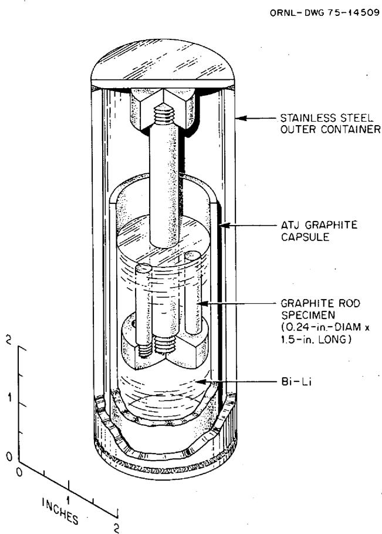  
Fig. 7.1. Graphite (bismuth-lithium) capsule test assembly.

of penetration increased with increasing pore size and decreasing density. Results from previous tests have been inconclusive as to the effect of lithium concentration in bismuth on penetration of graphite. In the current series all graphites were penetrated to a greater extent by Bi-3 wt % (48 at. %) Li than by Bi-0.17 wt % (4.8 at. %) Li. Tests of 10,000 hr duration with these graphites are continuing.

# 7.2 THERMAL GRADIENT MASS TRANSFER TEST OF GRAPHITE IN A MOLYBDENUM LOOP

# J. R. DiStefano

Although graphite has low solubility in pure bismuth (less than 1 ppm at $600^{\circ}\mathrm{C}$ ), capsule test results have shown that higher carbon concentrations are present in Bi-2 wt $\%$ (38 at. $\%$ ) Li and Bi-3 wt $\%$ (48 at. $\%$ ) Li solutions after contact with graphite. To avoid the joining problems associated with fabrication of a graphite loop, a molybdenum loop was constructed, and interlocking, tabular graphite specimens were suspended

in the vertical hot- and cold-leg sections. In addition to mass transfer of graphite from hot- to cold-leg areas, penetration of graphite by bismuth-lithium and mass transfer between graphite and molybdenum were evaluated.

# 7.2.1 Weight Changes

The loop (CPML-4) circulated Bi-2.4 wt % (42 at. %) Li for 3000 hr at $700^{\circ}\mathrm{C}$ (approximately) maximum temperature and $600^{\circ}\mathrm{C}$ minimum temperature. Weight changes in the graphite samples are given in Tables 7.2 and 7.3. After the bismuth-lithium solution was drained from the loop, the samples were removed and weighed ("after-test" column in Tables 7.2 and 7.3). Subsequently, they were cleaned at room temperature in ethyl alcohol and in an $\mathrm{H}_2\mathrm{O}-\mathrm{HNO}_3$ (100 ml $\mathrm{H}_2\mathrm{O}-30$ ml $90\% \mathrm{HNO}_3$ ) solution to remove bismuth-lithium adhering to the surfaces of some samples. Samples from the cold leg were weighed and then kept in air for two days prior to the alcohol treatment. After soaking in alcohol, these samples showed larger weight gains than the after-test weight gains, and this is attributed to reaction of lithium in the sample with moisture in the air during the two-day period. All samples showed large weight gains (33–67%), and gains in hot-leg samples were, on the average, larger than those in the cold-leg samples.

# 7.2.2 Compositional Changes

Graphite samples were analyzed before and after treatment with $\mathrm{H}_2\mathrm{O}-\mathrm{HNO}_3$ , and the results are shown in Table 7.4. These results indicate that bismuth was primarily responsible for the large weight increases and that samples picked up molybdenum, but treating them with $\mathrm{H}_2\mathrm{O}-\mathrm{HNO}_3$ completely removed the molybdenum. An electron-beam microprobe analysis of a graphite sample before acid cleaning showed that molybdenum was present on the outer surface of the specimen (Fig. 7.3). Chemical analyses of other graphite samples after acid cleaning are shown in Table 7.5.

Analyses of bismuth-lithium samples from the loop are shown in Table 7.6. For sampling, the hot leg was sectioned so that one sample came from the surface that was in contact with the molybdenum tube wall while the other sample was taken from the interior of the section, away from the wall. The concentration of carbon in the melt was highest in the sample from the hot leg, and both molybdenum and carbon concentra

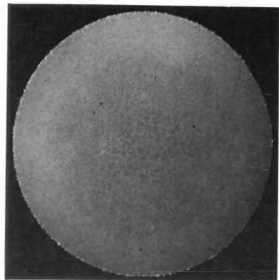

$$
\begin{array}{l} \rho = 1. 8 \mathrm {g} / \mathrm {c m} ^ {3} \\ \sim 75 \% \text{of} \text{pores} = 1 \mu \text{diam} \\ \end{array}
$$

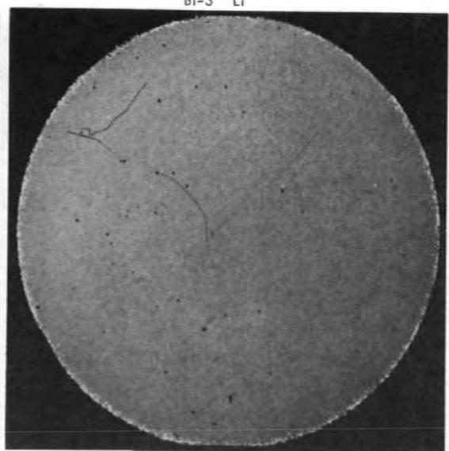

$$
\begin{array}{l} \rho = 1. 8 \mathrm {g} / \mathrm {c m} ^ {3} \\ \sim 25 \% \text{of pores} = 1 - 4 \mu \text{diam} \\ \text {B i - 0 . 1 7 L i} \\ \end{array}
$$

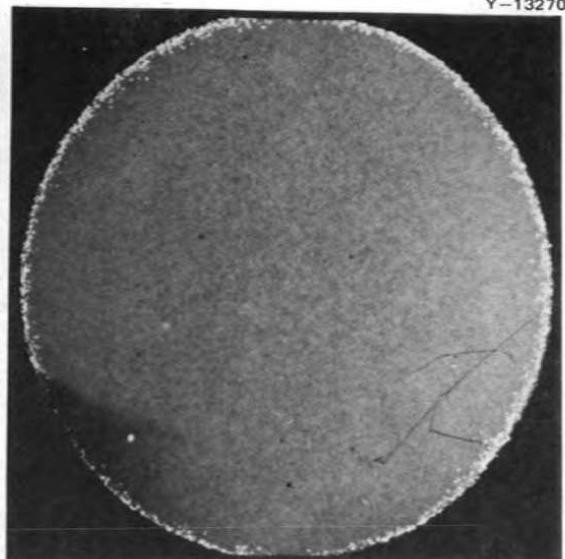

$$
\begin{array}{l} \rho = 1. 6 g / c m ^ {3} \\ \sim 50 \% \text{of pores} = 4 \mu \text{diam} \\ \end{array}
$$

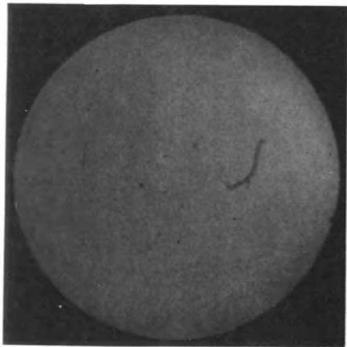

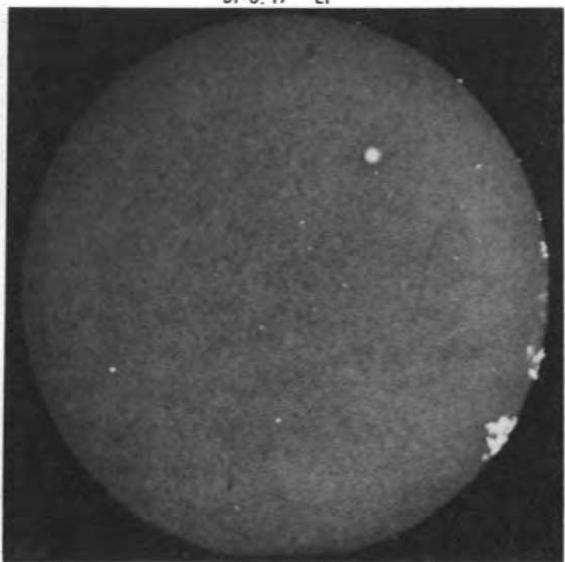

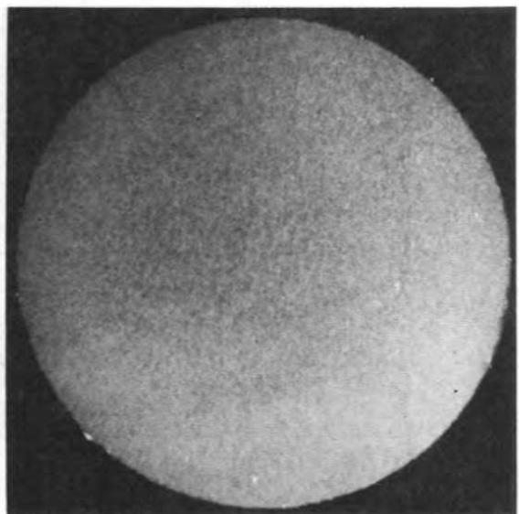  
Fig. 7.2. Penetration of graphite as a function of structure of graphite and lithium in bismuth. Conditions: $1000\mathrm{hr}$ at $650^{\circ}\mathrm{C}$ .

Table 7.2. Weight increases in ATJ graphite hot-leg samples from CPML-4   

<table><tr><td rowspan="2">Sample number</td><td colspan="4">Weight (g)</td><td colspan="2">Weight increase</td></tr><tr><td>Before test</td><td>After test</td><td>After cleaning in alcohol</td><td>After cleaning in H2O-HNO3</td><td>(g)</td><td>(%)</td></tr><tr><td>5a</td><td>0.4563</td><td>0.8244</td><td>0.8122</td><td>0.7006</td><td>0.2443</td><td>54</td></tr><tr><td>7</td><td>0.5220</td><td>0.9706</td><td>0.9656</td><td>0.8298</td><td>0.3078</td><td>59</td></tr><tr><td>9</td><td>0.4994</td><td>0.9551</td><td>0.9336</td><td>0.8298</td><td>0.3304</td><td>66</td></tr><tr><td>10</td><td>0.4800</td><td>0.9596</td><td>0.9819</td><td>0.7944</td><td>0.3144</td><td>66</td></tr><tr><td>11</td><td>0.4326</td><td>0.8339</td><td>0.8303</td><td>0.7102</td><td>0.2776</td><td>64</td></tr><tr><td>12</td><td>0.4594</td><td>0.9302</td><td>0.9263</td><td>0.7669</td><td>0.3075</td><td>67</td></tr><tr><td>13</td><td>0.4753</td><td>0.9796</td><td>0.9764</td><td>0.7686</td><td>0.2933</td><td>62</td></tr><tr><td>16</td><td>0.4632</td><td>0.9175</td><td>0.9152</td><td>0.7658</td><td>0.3026</td><td>65</td></tr><tr><td>17</td><td>0.4742</td><td>0.9099</td><td>0.9058</td><td>0.7694</td><td>0.2952</td><td>62</td></tr><tr><td>18</td><td>0.5070</td><td>0.9005</td><td>0.8956</td><td>0.7975</td><td>0.2905</td><td>57</td></tr><tr><td>19</td><td>0.4709</td><td>0.8189</td><td>0.8142</td><td>0.7168</td><td>0.2459</td><td>52</td></tr><tr><td>20</td><td>0.5369</td><td>0.9184</td><td>0.9149</td><td>0.8107</td><td>0.2738</td><td>51</td></tr><tr><td>21</td><td>0.5163</td><td>0.8652</td><td>0.8629</td><td>0.7626</td><td>0.2453</td><td>48</td></tr><tr><td>22</td><td>0.5184</td><td>0.8499</td><td>0.8459</td><td>0.7591</td><td>0.2407</td><td>46</td></tr><tr><td>23</td><td>0.5389</td><td>0.9103</td><td>0.9066</td><td>0.7475</td><td>0.2067</td><td>38</td></tr><tr><td>24b</td><td>0.5405</td><td>0.8545</td><td>0.8497</td><td>0.7235</td><td>0.1830</td><td>33</td></tr></table>

$a_{\mathrm{Top}}$ of hot leg; temperature: $680 - 700^{\circ}\mathbf{C}$   
$b_{\mathrm{Bottom}}$ of hot leg; temperature: $600 - 620^{\circ}\mathrm{C}$

Table 7.3. Weight changes in ATJ graphite cold-leg samples from CPML-4   

<table><tr><td rowspan="2">Sample number</td><td colspan="4">Weight (g)</td><td colspan="2">Weight increase</td></tr><tr><td>Before test</td><td>After test</td><td>After standing in air for two days and then cleaning in alcohol</td><td>After cleaning in H2O-HNO3</td><td>(g)</td><td>(%)</td></tr><tr><td>27a</td><td>0.4614</td><td>0.7469</td><td>0.7622</td><td>0.6408</td><td>0.1794</td><td>39</td></tr><tr><td>28</td><td>0.4821</td><td>0.8284</td><td>0.8412</td><td>0.6260</td><td>0.1439</td><td>30</td></tr><tr><td>29</td><td>0.4717</td><td>0.7793</td><td>0.7913</td><td>0.6433</td><td>0.1716</td><td>36</td></tr><tr><td>30</td><td>0.4776</td><td>0.7136</td><td>0.7239</td><td>0.6291</td><td>0.1515</td><td>32</td></tr><tr><td>31</td><td>0.4848</td><td>0.7209</td><td>0.7315</td><td>0.6396</td><td>0.1548</td><td>32</td></tr><tr><td>32</td><td>0.4827</td><td>0.7629</td><td>0.7744</td><td>0.6647</td><td>0.1820</td><td>38</td></tr><tr><td>33</td><td>0.4788</td><td>0.7193</td><td>0.7300</td><td>0.6331</td><td>0.1543</td><td>32</td></tr><tr><td>34</td><td>0.4708</td><td>0.7566</td><td>0.7672</td><td>0.6536</td><td>0.1828</td><td>39</td></tr><tr><td>35</td><td>0.4624</td><td>0.7382</td><td>0.7485</td><td>0.6290</td><td>0.1666</td><td>36</td></tr><tr><td>36</td><td>0.4823</td><td>0.7496</td><td>0.7598</td><td>0.6343</td><td>0.1520</td><td>32</td></tr><tr><td>37</td><td>0.4667</td><td>0.7331</td><td>0.7432</td><td>0.6239</td><td>0.1572</td><td>34</td></tr><tr><td>38</td><td>0.4713</td><td>0.7513</td><td>0.7619</td><td>0.6418</td><td>0.1705</td><td>36</td></tr><tr><td>39</td><td>0.4745</td><td>0.7498</td><td>0.7603</td><td>0.6506</td><td>0.1761</td><td>37</td></tr><tr><td>40</td><td>0.4628</td><td>0.7285</td><td>0.7390</td><td>0.6233</td><td>0.1605</td><td>35</td></tr><tr><td>41</td><td>0.4725</td><td>0.7458</td><td>0.7553</td><td>0.6419</td><td>0.1694</td><td>36</td></tr><tr><td>42</td><td>0.4800</td><td>0.7427</td><td>0.7525</td><td>0.6526</td><td>0.1726</td><td>36</td></tr><tr><td>43b</td><td>0.4766</td><td>0.7280</td><td>0.7401</td><td>0.6478</td><td>0.1712</td><td>36</td></tr></table>

${}^{a}$ Top of cold leg; temperature: ${660} - {680}^{ \circ  }\mathrm{C}$ .   
$b_{\mathrm{Bottom}}$ of cold leg; temperature: $620 - 630^{\circ}\mathrm{C}$

Table 7.4. Chemical analyses of graphite exposed to bismuth-lithium solution in a molybdenum loop   

<table><tr><td rowspan="2">Sample number</td><td rowspan="2">Condition</td><td colspan="3">Concentration (wt %)</td></tr><tr><td>Bi</td><td>Li</td><td>Mo</td></tr><tr><td>4 (hot leg)</td><td>Uncleaned</td><td>46</td><td>0.6</td><td>0.1</td></tr><tr><td>4 (hot leg)</td><td>Acid cleaned</td><td>38</td><td>0.3</td><td>&lt;0.01</td></tr><tr><td>26 (cold leg)</td><td>Uncleaned</td><td>43</td><td>1.2</td><td>0.04</td></tr><tr><td>26 (cold leg)</td><td>Acid cleaned</td><td>40</td><td>0.4</td><td>&lt;0.01</td></tr></table>

tions were higher than were found previously in quartz loop tests circulating Bi-0.01 wt $\%$ (0.3 at. $\%$ Li.3 Quartz loop test 11 contained molybdenum samples, and analysis of the bismuth-lithium solution after test showed that it contained $2.5\mathrm{ppm}$ molybdenum.Quartz loop 8 contained samples of three different grades of graphite, and the bismuth-lithium solution contained 10 to $15~\mathrm{ppm}$ carbon after the test.

3. O. B. Cavin and L. R. Trotter, MSR Program Semiannu Progr. Rep. Feb. 28, 1971, ORNL-4676, p. 228.

Y-133056

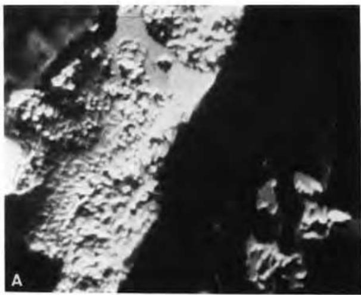  
40μm   
BACKSCATTERED   
ELECTRONS

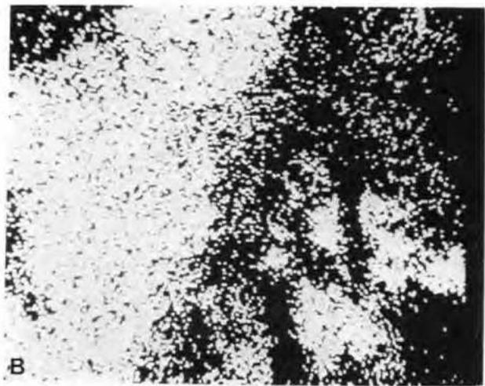  
Bi $M_{\alpha}$ X-RAYS

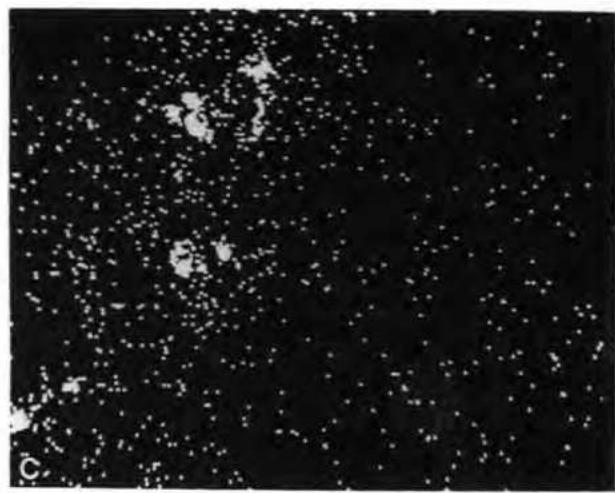  
Mo L X-RAYS   
Fig. 7.3. Electron beam scanning images of graphite exposed to bismuth. View (A) is backscattered electron picture of sample surface; dark material is graphite and bright material is bismuth and molybdenum as indicated by (B) and (C).

Table 7.5. Chemical analyses of graphite samples ${}^{a}$ from CPML-4   

<table><tr><td rowspan="2">Sample number</td><td rowspan="2">Location</td><td colspan="3">Concentration (wt %)</td></tr><tr><td>Bi</td><td>Li</td><td>Mo</td></tr><tr><td>1</td><td>Hot leg</td><td>37</td><td>0.35</td><td>&lt;0.01</td></tr><tr><td>9</td><td>Hot leg</td><td>42</td><td>0.44</td><td>&lt;0.01</td></tr><tr><td>15</td><td>Hot leg</td><td>46</td><td>0.47</td><td>&lt;0.01</td></tr><tr><td>19</td><td>Hot leg</td><td>36</td><td>0.35</td><td>&lt;0.01</td></tr><tr><td>24</td><td>Hot leg</td><td>23</td><td>0.25</td><td>&lt;0.01</td></tr><tr><td>27</td><td>Cold leg</td><td>36</td><td>0.35</td><td>&lt;0.01</td></tr><tr><td>31</td><td>Cold leg</td><td>21</td><td>0.25</td><td>&lt;0.01</td></tr><tr><td>36</td><td>Cold leg</td><td>19</td><td>0.26</td><td>&lt;0.01</td></tr><tr><td>42</td><td>Cold leg</td><td>23</td><td>0.26</td><td>&lt;0.01</td></tr></table>

${}^{a}$ Samples acid cleaned in ${\mathrm{H}}_{2}\mathrm{O} - {\mathrm{{HNO}}}_{3}$ prior to analysis.

Table 7.6. Analysis of bismuth-lithium solution from CPML-4   

<table><tr><td rowspan="2">Sample location</td><td colspan="3">Concentrationa</td></tr><tr><td>C (ppm)</td><td>Mo (ppm)</td><td>Li (%)</td></tr><tr><td>Hot leg (core)b</td><td>43</td><td>17</td><td>2.3</td></tr><tr><td>Hot leg (surface)c</td><td>106</td><td>102</td><td>3.0</td></tr><tr><td>Cold leg (core)b</td><td>24</td><td>14</td><td>1.6</td></tr></table>

$a_{\mathrm{On}}$ a weight basis.   
$b_{\mathrm{Interior~sample}}$   
${}^{c}$ Surface sample in contact with molybdenum tube wall.

# 7.2.3 Microstructural Changes

Selected graphite samples from hot- and cold-leg regions are shown in Fig. 7.4. The white phase distributed throughout the samples is bismuth. These samples were acid cleaned and it is evident that bismuth was dissolved from the area near the surface. Molybdenum samples from hot- and cold-leg regions are shown in Fig. 7.5. Surface layers measuring 0.015 to $0.025\mathrm{mm}$ (0.6-1 mil) thick were found on the hot-leg sample. In some areas there was a single layer, while a double layer was found in other areas. Electron-beam microprobe analysis indicated the single layer and/or outer layer to be primarily molybdenum. This layer was much harder than the base metal (1000-1200 DPH compared with about 200 DPH), indicating that it is probably $\mathrm{Mo}_2\mathrm{C}$ . Where there is a double layer the outer layer appears to be $\mathrm{Mo}_2\mathrm{C}$ , but the inner layer is primarily bismuth. One explanation is that the $\mathrm{Mo}_2\mathrm{C}$ layer cracked and/or spalled, allowing the entry of bismuth which did not drain when the test was terminated. The molybdenum sample from the cold leg also exhibited a surface layer

less than 0.1 mil thick that was similar in composition to that found in the hot leg. Samples of molybdenum from hot and cold legs have been submitted for chemical analysis.

# 7.2.4 Discussion of Results

The principal objective of this experiment was to evaluate temperature-gradient mass transfer of graphite in bismuth containing a relatively high concentration of lithium. However, mass transfer data were obscured by the gross pickup of bismuth by the graphite samples. Previous capsule and quartz loop tests with ATJ graphite had indicated much less intrusion of the graphite by bismuth than occurred in the molybdenum loop test. This suggests that the permeability of ATJ graphite to bismuth-lithium does not depend simply on the porosity of the graphite. It is generally accepted that some fraction of the pores in graphite is effectively sealed off and contributes nothing to flow. Therefore, the connected pore system controls the permeability. The shape of the connected pores influences the type of flow and the length of the path the fluid takes through the sample. For a nonwetting liquid, the external pressure forcing the liquid into the pores, $\Delta P$ , must overcome the surface tension of the liquid. This defines a critical pore radius, $r_c$ , and until the pressure exceeds the value given by

$$
\Delta P = 2 \gamma \cos \theta / r _ {\mathrm {c}}, \tag {1}
$$

where $\gamma$ is the surface tension and $\theta$ the wetting angle, the pore cannot support flow. Thus, for a given $\Delta P, r_c$ is the minimum pore size that will be penetrated. In both the metal and quartz thermal convection loops $\Delta P$ is determined by the argon overpressure ( $<1$ atm) and the height of bismuth-lithium solution above the sample, and these were essentially the same in both types of tests. Temperature affects both $\sigma$ and $\theta$ , but all of the tests were operated under similar time-temperature- $\Delta T$ conditions. Graphite samples used in the quartz loop tests had almost four times the surface area of the tabular specimens used in the current test, but they were almost three times as thick. The larger surface area of the quartz loop specimens should have increased the relative amount of bismuth-lithium intrusion, but the greater thickness of these samples would reduce the percentage increase. ATJ graphite samples from the quartz loop tests increased in weight by 0.1 to 0.6 wt%, far less than the 30 to 67 wt% increases noted in samples from the current loop test. Thus, specimen geometry alone does not seem to explain the differences noted. However, the surface tension $\sigma$ and wetting angle $\theta$ were

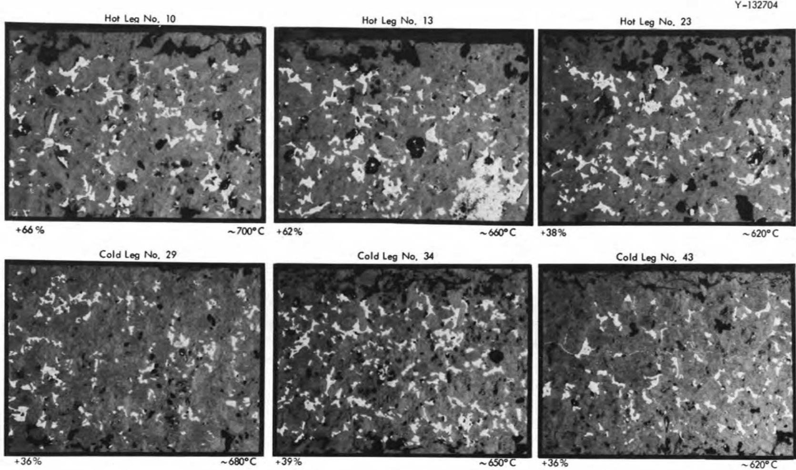  
Fig. 7.4. Graphite samples after exposure to Bi-2.4% Li for 3000 hr in CPML-4.

100 200 MICRONS 600 700 100x 100x 0.010 INCHES 0.020

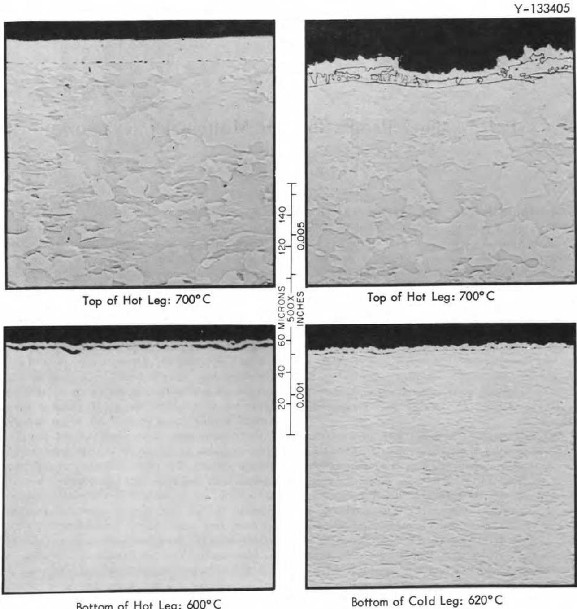  
Fig. 7.5. Molybdenum tube wall from thermal convection loop CPML-4 that circulated Bi-2.4% Li and contained graphite specimens.

probably different because the lithium concentrations of the bismuth-lithium solutions were different, and molybdenum was present in the current test. It is possible that the presence of molybdenum on the surface of the graphite had a marked effect on the contact angle $\theta$ . In an earlier series of tests, the bismuth content of graphite specimens was much higher when they were tested in molybdenum capsules instead of graphite cap

sules.4 Accordingly, data on the wetting of graphite by bismuth containing lithium and other constituents of processing solutions would be useful for predicting the resistance of graphite to penetration.

# Part. 4. Fuel Processing for Molten-Salt Reactors

J. R. Hightower, Jr.

The activities described in this section deal with the development of processes for the isolation of protac-tinium and for the removal of fission products from molten-salt breeder reactors. Continuous removal of these materials is necessary for molten-salt reactors to operate as high-performance breeders. During this report period, engineering development progressed on continuous fluorinators for uranium removal, the metal transfer process for rare-earth removal, the fuel reconstitution step, and molten salt-bismuth contactors to be used in reductive extraction processes. Work on chemistry of fluorination and fuel reconstitution was deferred to provide experienced personnel for the preparation of salt for the TeGen-2 and -3 experiments (Sect. 6.17).

The metal transfer experiment MTE-3B was started. In this experiment all parts of the metal transfer process for rare-earth removal are demonstrated using salt flow rates which are about $1\%$ of those required to process the fuel salt in a 1000-MW(e) MSBR. This experiment repeats a previous one (MTE-3) to determine the reasons for the unexpectedly low mass transfer coefficients seen in MTE-3. During this report period the salt and bismuth phases were transferred to the experimental vessels, and two runs with agitator speeds of 5 rps were made to measure the rate of transfer of neodymium from the fluoride salt to the Bi-Li stripper solution. However, in these runs the fluoride salt was entrained at low rates into the LiCl, which resulted in depletion of the lithium from the Bi-Li solution in the stripper. Fuel-salt entrainment was unexpected, since no entrainment was seen in experiment MTE-3 under (as far as can be determined) identical conditions. The measurement of mass transfer coefficient in these first two runs was not compromised by the entrainment. The measured mass transfer coefficients were lower than

predicted by literature correlations, but the values are comparable to those obtained from experiment MTE-3.

Mechanically agitated nondispersing salt-metal contactors of the type used in experiment MTE-3B are of interest, because entrainment of bismuth into the fuel salt can be minimized, because very high ratios of bismuth flow rate to salt flow rate can be more easily handled than in column-type contactors, and because these contactors appear to be more easily fabricated from molybdenum and graphite components than are column-type contactors. Attempts were made to measure entrainment rates of fluoride salt in bismuth and entrainment rates of bismuth in fluoride salt under conditions where the phases were not dispersed and under conditions where some phase dispersal was expected. These measurements were made in the 6-in.-diam (0.15-m) contactor installed in the Salt-Bismuth Flow-through Facility. The results indicate that mild phase dispersal with its concomitant high mass transfer coefficients might be allowable in the reductive extraction processes. We are continuing development of methods for measuring mass transfer coefficients in mercury-water systems to learn how to scale up contactors which would be used with salt and bismuth.

A nonradioactive demonstration of frozen salt corrosion protection in a continuous fluorinator requires a heat source that is not subject to attack by fluorine in the fluorinator. To provide such a heat source for future fluorinator experiments we have continued our studies of autoresistance heating of molten salt. During the report period we have completed new equipment for studying autoresistance heating of molten salt in a flow system similar to a planned continuous fluorinator experiment; three preliminary runs have been made with the equipment. The design was started for a facility for developing continuous fluorinators, and equipment is

being installed for an experiment to demonstrate the effectiveness of frozen salt for protection against fluorine corrosion.

The uranium removed from the fuel salt by fluorination must be returned to the processed salt in the fuel reconstitution step before the fuel salt is returned to the reactor. An engineering experiment to demonstrate the fuel reconstitution step is being installed. In this experiment gold-lined equipment will be used to avoid introducing products of corrosion by $\mathrm{UF}_6$ and $\mathrm{UF}_5$ . Alternative methods for providing the gold lining include electroplating and mechanical fabrication. The choice between the two depends on availability of gold from ERDA precious-metal accounts and the price of gold from the open market. Instrumentation for the analysis

of the vessel off-gas streams has been installed and is being calibrated.

Future development of the fuel processing operations will require a large facility for engineering experiments. A design report is being prepared to define the scope, estimated design and construction costs, method of accomplishment, and schedules for a proposed MSBR Fuel Processing Engineering Center. The building will provide space for preparation and purification of salt mixtures, for engineering experiments up to the scale required for a 1000-MW(e) MSBR, and for laboratories, maintenance areas, and offices. The estimated cost of this facility is $15,000,000; and authorization is proposed for FY 1978.

# 8. Engineering Development of Processing Operations

J. R. Hightower, Jr.

# 8.1 METAL TRANSFER PROCESS DEVELOPMENT

H. C. Savage

During this report period the salt and bismuth solutions were charged to the process vessels of the metal transfer experiment MTE-3B. Two experiments were completed in which the rate of removal of neodymium from molten-salt breeder reactor fuel salt (72-16-12 mole $\%$ LiF-BeF $_2$ -ThF $_4$ ) was measured.

The MTE-3B process equipment (Fig. 8.1) consisted of three interconnected vessels: a 14-in.-diam $(0.36\mathrm{-m})$ fuel salt reservoir, a 10-in.-diam $(0.25\mathrm{-m})$ salt-metal contactor, and a 6-in.-diam $(0.15\mathrm{-m})$ rare-earth stripper. The salt-metal contactor is divided into two compartments interconnected through two 0.5-in.-high $(13\mathrm{-mm})$

1. H. C. Savage, Engineering Development Studies for Molten-Salt Breeder Reactor Processing No. 20, ORNL-TM-4870 (in preparation).

by 3-in.-wide (76-mm) slots in the bottom of the divider. Bismuth containing thorium and lithium is circulated through the slots. Thus fluoride fuel salt was in contact with the Bi-Th in one compartment, and LiCl was in contact with the Bi-Th in the other compartment. The stripper contains lithium-bismuth solution (5-95 at. $\%$ ) in contact with the LiCl. Mechanical agitators having separate blades in each phase in the contactor and stripper were used to promote mass transfer across the three salt-metal interfaces. The fluoride fuel salt was circulated between the reservoir and contactor by means of a gas-operated pump with bismuth check valves. The LiCl was circulated between the stripper and contactor by alternately pressurizing and venting the stripper vessel.

The bismuth-thorium phase was circulated between the two compartments of the contactor by the action of the agitators, and no direct measurement of this flow rate was made during the experiment; however, measurements made in a mockup using a mercury-water system indicated that the Bi-Th circulation rate between

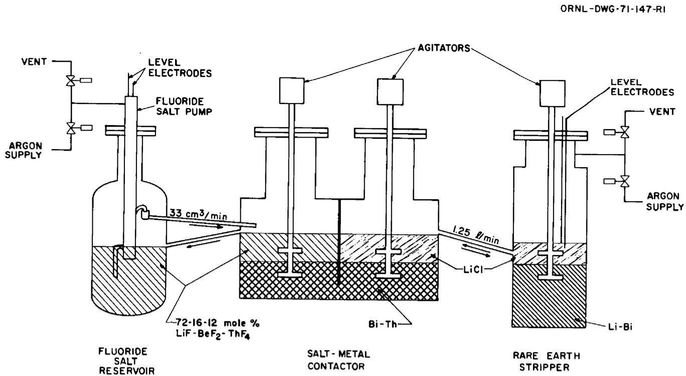  
Fig. 8.1. Flow diagram for metal transfer experiment MTE-3.

the two compartments should be high enough to keep the concentration of rare earths in both compartments essentially the same. This was found to be the case in the two experiments in MTE-3B.

In this experiment, neodymium is extracted from the fuel carrier salt into the thorium-bismuth solution. Next, the neodymium is extracted from the thorium-bismuth into molten LiCl, and finally, the neodymium is stripped from the LiCl into bismuth-lithium alloy.

Operating variables in the experiment are:

1. the flow rate of the fluoride fuel salt between the fuel salt reservoir and the contactor,   
2. the flow rate of the lithium chloride salt between the contactor and the stripper vessel,   
3. the degree of agitation of the salt and bismuth phases in the contactor and stripper,   
4. the amount of reductant (lithium) in the bismuth phase in the contactor.

The operating temperature of the system is $\sim 650^{\circ}\mathrm{C}$ . Overall mass transfer rates for representative rare-earth fission products are determined by adding the rare earth to the fluoride fuel salt in the reservoir and observing the rate of transfer of the rare earth across the three salt-bismuth interfaces as a function of time by periodic sampling of all phases.

2. H. O. Weeren and L. E. McNeese, Engineering Development Studies for Molten-Salt Breeder Reactor Processing No. 10, ORNL-TM-3352 (September 1974) pp. 57-59.

During the course of the experiments the concentrations of neodymium in each phase were determined by counting the 0.53-MeV gamma radiation emitted by $^{147}\mathrm{Nd}$ tracer added to the neodymium originally in the fuel salt. This provided a rapid method for following the transfer rate. More accurate data necessary for calculating the overall mass transfer coefficients at each of the three salt-metal interfaces were obtained by analyzing samples of the salt and bismuth phases for total neodymium via an isotopic dilution mass spectrometry technique. Use of this technique allows measurement of neodymium concentrations as low as 0.01 ppm (wt).

# 8.1.1 Addition of Salt and Bismuth Phases to Metal Transfer Experiment MTE-3B

The quantities of salts and bismuth charged to the process vessels of experiment MTE-3B are listed in Table 8.1. All internal surfaces of the carbon-steel vessels were hydrogen treated at $650^{\circ}\mathrm{C}$ for $\sim 7$ hr to remove any oxides prior to the addition of the salt and bismuth solutions. The auxiliary charging vessels used in the additions were also hydrogen treated. Subsequently a purified argon atmosphere was maintained in all the vessels to prevent oxide contamination (via ingress of air or moisture) of the vessels and process solutions.

The charging vessels were 10-in.-diam $(0.25\mathrm{-m})$ carbon-steel vessels of about 22 liters $(0.022\mathrm{m}^3)$ in volume equipped with electric heaters for melting the salts and bismuth. Nozzles and access ports were pro

Table 8.1. Quantities of salts and bismuth for experiment MTE-3B   

<table><tr><td>Material</td><td>Vessel</td><td>Volumea at 650°C (liters)</td><td>Weight (kg)</td><td>g-moles</td></tr><tr><td>Fluoride fuel saltb(72-16-12 mole % LiF-BeF2-ThF4)</td><td>Reservoir</td><td>29.4</td><td>97.0</td><td>1535</td></tr><tr><td>Fluoride fuel salt(72-16-12 mole % LiF-BeF2-ThF4)</td><td>Contactor</td><td>3.1</td><td>10.2</td><td>161</td></tr><tr><td>Bismuth-thorium [~1500 ppm (wt) Th, ~50 ppm Li]</td><td>Fluoride salt side of contactor</td><td>2.9</td><td>27.6</td><td>132</td></tr><tr><td>Bismuth-thorium [~1500 ppm (wt) Th, ~50 ppm Li]</td><td>LiCl side of contactor</td><td>3.5</td><td>33.8</td><td>161</td></tr><tr><td>Lithium chloride</td><td>Contactor</td><td>2.9</td><td>4.3</td><td>101</td></tr><tr><td>Lithium chloride</td><td>Stripper</td><td>3.8</td><td>5.6</td><td>132</td></tr><tr><td>Bismuth-5 at. % lithium in stripper</td><td>Stripper</td><td>4.3</td><td>41.8</td><td>200</td></tr></table>

${}^{a}$ Densities at ${650}^{ \circ  }\mathrm{C}$ : fluoride fuel salt $= {3.30}\mathrm{\;g}/\mathrm{{cc}};\mathrm{{LiCl}} = {1.48}\mathrm{\;g}/\mathrm{{cc}};\mathrm{{Bi}} = {9.66}\mathrm{\;g}/\mathrm{{cc}}$ .   
$b_{\mathrm{Mole~weight}} = 63.2\mathrm{g}$

vided for the addition of the salts and bismuth, argon and hydrogen purge gas lines, and lines required to transfer the salt and bismuth phases into the process vessels.

Bismuth, hydrogen treated in the charging vessel to remove oxides, was the first material to be added to the contactor. The fluoride fuel salt was then contacted in the charging vessel (using argon sparging) with a bismuth-0.15 wt $\%$ thorium solution (50% of Th saturation) for several days prior to transfer into the fuelsalt reservoir and the fluoride salt compartment of the contactor. Thorium metal $(0.1197\mathrm{kg})$ was then added to the $61.4\mathrm{kg}$ of bismuth in the contactor. This quantity of thorium is about $50\%$ of the amount that would be soluble and was calculated to produce a lithium concentration of $\sim 40~\mathrm{ppm}$ (wt) in the thorium-bismuth phase in the contactor based on previously reported data3 on the distribution of thorium and lithium between molten bismuth and fluoride fuel salt.

Following the additions of bismuth to the contactor and the fluoride fuel salt (72-16-12 mole $\%$ LiF-BeF $_2$ -ThF $_4$ ) to the contactor and fuel-salt reservoir, a new charging vessel was installed for makeup and charging of the bismuth-5 at. $\%$ lithium to the stripper and the LiCl to the contactor and stripper. First, bismuth was added to the charging vessel and was hydrogen treated to remove oxides by sparging with hydrogen at $\sim 600^{\circ}\mathrm{C}$ ( $873^{\circ}\mathrm{K}$ ) for $\sim 7$ hr. The charging vessel contained 67.87 kg of bismuth to which was added $0.120\mathrm{kg}$ of lithium metal to produce the bismuth-5 at. $\%$ lithium for the stripper. Part of the bismuth-5 at. $\%$ lithium solution ( $41.8\mathrm{kg}$ ) was then transferred into the stripper vessel.

Thorium metal $(0.109\mathrm{kg})$ was added to the $26\mathrm{kg}$ of bismuth-lithium solution remaining in the charge vessel, and $15.88\mathrm{kg}$ of LiCl that had been oven dried at $200^{\circ}\mathrm{C}$ $(473^{\circ}\mathrm{K})$ was added to the charge vessel. The bismuth-lithium-thorium and LiCl phases were sparged with argon, using a gas-lift sparge tube, for four days. The LiCl was then transferred into the LiCl side of the contactor and the stripper vessel.

The salt and bismuth solutions were filtered through molybdenum filters $\left[\sim 30\mu (3.0\times 10^{-5}\mathrm{m})\right.$ in pore diameter] installed in the transfer lines during transfer from the charging vessels into the MTE-3B process vessels.

# 8.1.2 Run Nd-1

For the first run in MTE-3B, $3300\mathrm{mg}$ of $\mathrm{NdF}_3$ (2360 mg of Nd) was added to the $97\mathrm{kg}$ of fluoride fuel salt (72-16-12 mole $\%$ LiF-BeF $_2$ -ThF $_4$ ) in the fuel salt reservoir on June 6, 1975. The neodymium contained 72.2 mCi of $^{147}\mathrm{Nd}$ tracer ( $t_{1/2} = 11$ days) at the time of

addition. The neodymium concentration in the fuel salt in the reservoir was calculated to be $24\mathrm{ppm}$ (wt), which approximates that expected in the fuel salt of a single-region 1000-MW(e) MSBR. Neodymium was chosen as the representative rare-earth fission product for the first series of experiments in MTE-3B for several reasons:

1. results could be compared with those obtained using neodymium in the previous experiment,4 MTE-3,   
2. $^{147}\mathrm{Nd}$ tracer used for following the rate of transfer of neodymium has a relatively short half-life (11 days), which would prevent excessive levels of radioactivity in the experimental equipment as additional neodymium, containing $^{147}\mathrm{Nd}$ , was added to the fuel salt during the experiment.   
3. neodymium is one of the more important trivalent rare-earth fission products to be removed from MSBR fuel salt.

An attempt was made to start the first run (Nd-1) on June 9, 1975. However, a malfunction in the electronics of the speed control unit for the stripper-vessel agitator prevented startup. After this unit was repaired, run Nd-1 was started on June 15, 1975, and the scheduled period of operation $(100\mathrm{hr})$ was completed on June 20, 1975. Operating conditions of run Nd-1 were: 650 to $660^{\circ}\mathrm{C}$ (923 to $933^{\circ}\mathrm{K}$ ), 5 rps agitator speeds in both contactor and stripper, fluoride salt flow rate of 35 cc/min $(5.8\times 10^{-7}\mathrm{m}^{3} / \mathrm{sec})$ , and LiCl flow rate of 1.2 liters/min $(2.0\times 10^{-5}\mathrm{m}^{3} / \mathrm{sec})$ .

After $100\mathrm{hr}$ of fluoride salt and LiCl salt circulation, the fluoride salt circulation was stopped and the run was continued for $16\mathrm{hr}$ . This was done to observe the expected larger decrease in the concentration of neodymium in the smaller amount of fluoride salt in the contactor $(10.2\mathrm{kg})$ , as compared with the $107.2\mathrm{kg}$ contained in both the contactor and reservoir. These data would provide a more accurate measure of the rate of transfer of neodymium across the fluoride salt—bismuth—thorium interface.

Finally, the circulation of LiCl was also stopped. The agitators in the contactor and stripper vessels were then operated for $\sim 24$ hr over a three-day period (8 hr each day) to allow the salt and bismuth phases to equilibrate in an attempt to determine neodymium distribution coefficients between the phases.

The experimental equipment operated satisfactorily throughout run Nd-1. All operating variables were maintained at desired conditions. Results obtained during run Nd-1 are discussed in Sect. 8.1.4.

# 8.1.3 Run Nd-2

Run Nd-2 was done with the same operating conditions as run Nd-1 except for run duration (139 hr instead of 100 hr). Prior to run Nd-2, $3590\mathrm{mg}$ of $\mathrm{NdF_2}$ $(2580\mathrm{mg}$ of Nd) containing $101\mathrm{mCi}$ of. $^{147}\mathrm{Nd}$ tracer was added to the $97\mathrm{kg}$ of fuel salt in the reservoir. Including the neodymium remaining in the fuel salt at the end of run Nd-1, estimated to be $18~\mathrm{ppm}$ (wt), the neodymium concentration in the fuel salt in the reservoir at the start of run Nd-2 is estimated to be $45~\mathrm{ppm}$ . The neodymium concentration in the fuel salt in the contactor is estimated to be $9\mathrm{ppm}$ at the start of run Nd-2. We are uncertain of the amounts of neodymium in the other phases at the beginning of run Nd-2, as discussed in Sect. 8.1.4.

Run Nd-2 was started on July 13, 1975, and was terminated on July 19, 1975, after $139\mathrm{hr}$ of operation. During the first $50\mathrm{hr}$ of operation the rate of transfer of neodymium into the lithium-bismuth phase in the stripper appeared to be about the same as observed during run Nd-1, based on counting of the $^{14}7$ Nd tracer in samples taken at regular intervals. After about $60\mathrm{hr}$ of operation, the transfer of neodymium into the bismuth-lithium phase in the stripper suddenly stopped, and it was observed that neodymium was being extracted from the bismuth-lithium phase in the stripper into the LiCl in the stripper and contactor. During the run a significant decrease in the emf between the stripper vessel and the contactor occurred (from $\sim 160\mathrm{mV}$ to $\sim 25\mathrm{mV}$ over a 30-hr period), indicating loss of lithium reductant from the bismuth-lithium phase. The run was terminated after $139\mathrm{hr}$ of operation, when it became clear that useful information could no longer be obtained and it appeared that fluoride salt was being entrained into the LiCl in the contactor.

# 8.1.4 Discussion of Results

Subsequent investigation and results of chemical analyses of samples of the salt and bismuth phases indicate that fluoride fuel salt was being entrained into the LiCl in the contactor throughout both runs Nd-1 and Nd-2. Estimates of the amount entrained are shown below:

<table><tr><td colspan="2">Estimated amount of fluoride salt transferred into LiCl</td><td>Basis of estimate</td></tr><tr><td>Nd-1 (104 hr)</td><td>Nd-1 and -2 (301 hr)</td><td></td></tr><tr><td>0.292 kg</td><td></td><td>Fluoride in LiCl phase</td></tr><tr><td></td><td>0.607 kg</td><td>Thorium in Bi-Li phase</td></tr><tr><td></td><td>0.400 kg</td><td>Increase in LiCl level in stripper</td></tr></table>

Based on fluoride analyses of LiCl samples taken during run Nd-1, the entrainment of fluoride salt appears to have occurred at a relatively constant rate throughout the run. The total amount of neodymium which transferred into the Li-Bi phase in the stripper during run Nd-1 is estimated to be $300\mathrm{mg}$ . The amount of neodymium contained in the entrained fuel salt is estimated to be $6\mathrm{mg}$ . Thus, most of the neodymium which transferred into the Li-Bi in the stripper vessel was by mass transfer rather than as a result of entrainment.

The reason for the observed entrainment is not clear at present. One explanation is that the 5.0-rps agitator speed is sufficient to cause entrainment (entrainment of fluoride salt into the chloride salt occurred in the previous experiment MTE-3 at 6.7 rps, but not at 5.0 rps). Experiments are in progress for determining whether this explanation is correct, and results to date indicate that entrainment does not occur at 3.3 rps. Further experiments in MTE-3B will depend on determining the reason for the unexpected entrainment of fluoride salt into the LiCl. However, it appears feasible to continue rare-earth mass transfer experiments in MTE-3B by removing the LiCl (contaminated with fluoride salt) and the Li-Bi solution from the stripper vessel, after which purified LiCl and Li-Bi solution will be added to the system.

The main purpose of the metal transfer experiment is to measure mass transfer coefficients for the rare earths at the various salt-metal interfaces in the system and to determine whether a literature correlation (based on studies with aqueous-organic systems) which relates many transfer coefficients to the agitator speed and other physical properties of the system is applicable to molten salt-bismuth systems. Data obtained from run Nd-1 have been analyzed, and estimates have been made of overall mass transfer coefficients for neodymium at the three salt-metal interfaces. Even though entrainment of fluoride salt into LiCl occurred during run Nd-1, it is believed that the mass transfer rate for neodymium was not significantly affected. The concentration of fluoride in the LiCl at the end of run Nd-1 was $\sim 1.3$ wt $\%$ or 0.03 mole fraction. Based on previous studies, the distribution coefficient, $D_{M}$ , for neodymium between the molten bismuth-thorium solution and LiCl (mole fraction Nd in bismuth/mole fraction Nd in LiCl), would be decreased by $\sim 20\%$ , while the distribution coefficient for thorium would be decreased by a factor of $\sim 150$ . This would result in a decrease in the separation factor

5. J. B. Lewis, Chem. Eng. Sci. 3, 248-59 (1954).   
6. L. M. Ferris et al., "Distribution of Lanthanide and Actinide Elements Between Liquid Bismuth and Molten LiCl-LiF and LiBr-LiF Solutions," J. Inorg. Nucl. Chem. 34, 313-20 (1972).

between neodymium-thorium from $\sim 10^4$ to $\sim 10^2$ , with an increase in the amount of thorium transferred into the LiCl.

The rate of transfer of neodymium across the three salt-metal interfaces was determined by analyses of samples taken throughout the run. Two analytical methods were used: (1) counting of the 0.53-MeV gamma radiation emitted by the $^{147}\mathrm{Nd}$ tracer and (2) isotopic dilution mass spectrometry. Based on counting of the $^{147}\mathrm{Nd}$ tracer, a material balance of the neodymium of $>95\%$ obtained at the end of run Nd-1 indicated that about $13\%$ of the neodymium originally added to the fuel salt reservoir had been transferred into the Li-Bi solution in the stripper.

The counting technique is a rapid method and provided information on the rate of transfer while the runs were in progress. However, it does not provide the accuracy required for calculation of the overall mass transfer coefficients, particularly in the Bi-Th and LiCl phases in the contactor and stripper vessels in which the neodymium concentrations are usually less than 1 ppm (wt). The isotopic dilution analysis is capable of accurately determining neodymium concentration down to $\sim 0.01$ ppm (wt), and results obtained from the isotopic dilution technique for the Bi-Th and LiCl phases were used for calculations of the overall mass transfer coefficients.

Values for distribution coefficients for neodymium at the three salt-metal interfaces were measured at the end of run Nd-1 for comparison with those calculated from the data of Ferris $^{3,7}$ (Table 8.2). The experimental values are in reasonable agreement with the calculated values in the absence of fluoride contamination, indica

7. L. M. Ferris et al., "Distribution of Lanthanide and Actinide Elements Between Molten Lithium Halide Salts and Liquid Bismuth Solutions," J. Inorg. Nucl. Chem. 34, 2921-33 (1972).

Table 8.2. Distribution coefficients for neodymium in experiment MTE-3B, run Nd-1   

<table><tr><td>Salt-metal interface</td><td>Calculatedb</td><td>Experimental</td></tr><tr><td>Fluoride salt–Bi–Th</td><td>0.006</td><td>0.013</td></tr><tr><td>LiCl-Bi-Th</td><td>0.94</td><td>0.64</td></tr><tr><td>LiCl-Li-Bi</td><td>3.5 × 104</td><td>&gt;1 × 103</td></tr></table>

$a$ Distribution coefficient $=$ (m.f. Nd in bismuth)/(m.f. Nd in salt).   
$b$ Conditions: $650^{\circ}\mathrm{C}$ $(923^{\circ}\mathrm{K})$ , Li concentration in Bi-Th = 40 ppm, Li concentration in Li-Bi = 5 at. $\%$ , no fluoride in LiCl phase.

ting that the distribution coefficients for neodymium were not seriously affected by the entrainment of the fluoride salt into the chloride.

Data obtained during run Nd-1 were analyzed by simultaneous solution of seven time-dependent differential material-balance equations (Fig. 8.2) that relate the

ORNL DWG. 71-13962R2

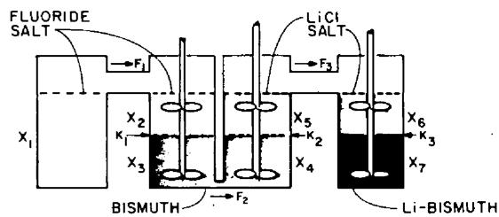  
EQUATIONS USED TO CALCULATE MASS TRANSFER COEFFICIENTS FOR METAL TRANSFER EXPERIMENT MTE-3B   
Fig. 8.2. Equations used to calculate mass transfer coefficients for the metal transfer process experiment. $V =$ volume of each phase; $x =$ rare-earth concentration; $t =$ time; $A =$ mass transfer area; $F =$ flow rate; $D =$ rare-earth distribution coefficient; $K =$ overall mass transfer coefficient.

$$
\begin{array}{l} V _ {1} \frac {d x _ {1}}{d t} = - F _ {1} (X _ {1} - X _ {2}) \\ V _ {2} \frac {d x _ {2}}{d t} = - K _ {1} A _ {1} (X _ {2} - \frac {X _ {3}}{D _ {A}}) + F _ {1} (X _ {1} - X _ {2}) \\ V _ {3} \frac {d x _ {3}}{d t} = + K _ {1} A _ {1} (X _ {2} - \frac {X _ {3}}{D _ {A}}) - F _ {2} (X _ {3} - X _ {4}) \\ V _ {4} \frac {d x _ {4}}{d t} = - K _ {2} A _ {2} (X _ {4} - D _ {8} X _ {5}) + F _ {2} (X _ {3} - X _ {4}) \\ V _ {5} \frac {d x _ {5}}{d t} = + K _ {2} A _ {2} (X _ {4} - D _ {B} X _ {5}) - F _ {3} (X _ {5} - X _ {6}) \\ V _ {6} \frac {d x _ {6}}{d t} = - K _ {3} A _ {3} \left(X _ {6} - \frac {X _ {7}}{D _ {C}}\right) + F _ {3} \left(X _ {5} - X _ {6}\right) \\ V _ {7} \frac {d x _ {7}}{d t} = + K _ {3} A _ {3} \left(X _ {6} - \frac {X _ {7}}{D _ {C}}\right) \\ V = M O L A R V O L U M E O F E A C H P H A S E \\ F = F L O W \quad R A T E, M O L E S / S E C. \\ \end{array}
$$

$$
D _ {A}, D _ {B}, D _ {C} = \text {R A R E - E A R T H D I S T R I B U T I O N C O E F F I C I E N T S ,}
$$

$$
A = A R E A A T E A C H I N T e r F A C E, C M ^ {2}
$$

$$
K _ {1}, K _ {2}, K _ {3} = \text {R A R E - E A R T H O V E R A L L M A S S T R A N S F E R}
$$

$$
X _ {1 - 7} = \text {R A R E - E A R T H C O N C E N T R A T I O N I N E A C H} \quad \text {P H A S E}, \text {M O L E S / C M} ^ {3}
$$

rate at which the rare earths are transferred through the several stages to the distribution coefficients of the rare earth, the mass flow rates, and the mass transfer coefficients at each salt-metal interface. The set of equations was solved, using a computer program, by selecting values for the mass transfer coefficients which resulted in the best agreement between the experimental data on rate of change of neodymium concentration in all phases in the system and the calculated values. Several trial-and-error iterations were required, using adjusted values of mass transfer coefficients, until a "best-fit" solution was obtained.

The final calculated results for run Nd-1 are shown in Table 8.3, where the values for the overall mass transfer coefficients are given and are compared with values calculated by the correlation of Lewis. The coefficients are lower than predicted and are similar to results obtained in the previous experiment, MTE-3. Final analytical results for run Nd-2 are not yet available. However, for the first $50\mathrm{hr}$ of operation, the rate of accumulation of neodymium in the Li-Bi solution in the stripper appeared to be similar to that observed in run Nd-1. The significance of these absolute values of mass transfer coefficient cannot be assessed until the scaling laws in this type of contactor are known.

8. L. E. McNeese, Engineering Development Studies for Molten-Salt Breeder Reactor Processing No. 11, ORNL-TM-3774 (in preparation).

# 8.2 SALT-BISMUTH CONTACTOR DEVELOPMENT

C. H. Brown, Jr.

Mechanically agitated nondispersing salt-bismuth contactors are being considered for the protactinium removal step and the rare-earth removal step in the reference MSBR processing plant flowsheet. These contactors have several advantages over packed-column salt-bismuth contactors:

1. they can be operated under conditions that minimize entrainment of bismuth to the fuel salt returning to the reactor,   
2. they can be fabricated more economically from graphite and molybdenum components,   
3. they can handle more easily large flow-rate ratios of bismuth and molten salt.

Experimental development of stirred interface contactors is being carried out in two different systems, a facility in which molten fluoride salt is contacted with bismuth containing a dissolved reductant and a system in which mercury and an aqueous electrolyte phase are used to simulate bismuth and molten salt. These two systems and the development work performed during this report period are described in Sects. 8.2.1 and 8.2.2.

Table 8.3. Overall mass transfer coefficients for neodymium in metal transfer experiment MTE-3B, run Nd-1   

<table><tr><td colspan="2">K1 (mm/sec)b</td><td colspan="2">K2 (mm/sec)b</td><td colspan="2">K3 (mm/sec)b</td></tr><tr><td>Measuredc value</td><td>Predicted value (%)</td><td>Measuredc value</td><td>Predicted value (%)</td><td>Measuredc value</td><td>Predicted value (%)</td></tr><tr><td>0.0035</td><td>39</td><td>0.25</td><td>20</td><td>0.13</td><td>2.5</td></tr></table>

${}^{a}$ Based on the neodymium in the salt phase.   
$b\frac{1}{K_1} = \frac{1}{k_1} +\frac{1}{k_2D_A}$ ,at fluoride salt-Bi-Th interface.   
$\frac{1}{K_2} = \frac{1}{k_3} + \frac{D_B}{k_4}$ , at LiCl-Bi-Th interface.   
$\frac{1}{K_3} = \frac{1}{k_4} + \frac{1}{k_3 D_C}$ , at LiCl-Li-Bi interface,   
$k_{1} =$ individual mass transfer coefficient, fluoride salt to bismuth,   
$k_{2} =$ individual mass transfer coefficient, bismuth to fluoride salt,   
$k_{3} =$ individual mass transfer coefficient, bismuth to lithium chloride,   
$k_{4} =$ individual mass transfer coefficient, lithium chloride to bismuth,

where

$D_{A} =$ distribution coefficient between fluoride salt and bismuth,   
$D_{B} =$ distribution coefficient between chloride salt and bismuth,   
$D_{C} =$ distribution coefficient between chloride salt and lithium-bismuth.

${}^{c}$ Agitator speed is 5.0 rps.

# 8.2.1 Experiments with a Mechanically Agitated Nondispersing Contactor in the Salt-Bismuth Flowthrough Facility

Operation of a facility has continued in which mass transfer rates are being measured between molten LiF-BeF $_2$ -ThF $_4$ (72-16-12 mole %) and molten bismuth in a mechanically agitated nondispersing contactor. The equipment consists of a graphite-lined stainless steel vessel, salt and bismuth feed and receiver vessels, and the contactor vessel. In the first of these the salt and bismuth phases are stored between runs. The other vessels allow for treatment of the phases with HF and H $_2$ . The contactor consists of a 6-in.-diam carbon-steel vessel containing four 1-in.-wide vertical baffles. The agitator consists of two 3-in.-diam stirrers having four noncanted blades. A ¾-in.-diam overflow at the interface allows removal of interfacial films, if present, with the salt and metal effluent streams. During a run the salt and bismuth phases are fed to the contactor by controlled pressurization of the respective feed tanks; the phases return to the receiver vessels by gravity flow. A detailed description of the facility and operating procedures has been previously reported. $^9$ A total of nine mass transfer runs have been completed to date along with one hydrodynamic run intended to determine the amount of entrainment of one phase into the other at a series of different agitator speeds. Results from the nine mass transfer runs have been previously reported. $^{9-1^2}$ The experimental procedure for, and results obtained from, the hydrodynamic run and treatment of the salt and bismuth with HF and H $_2$ are discussed in the remainder of this section.

Experimental operation during the hydrodynamic run. The hydrodynamic run was performed with salt and bismuth flow rates of $\sim 150$ and $\sim 140~\mathrm{cc / min}$ respectively. The agitator was operated at three different speeds during the run, 250, 310, and $386~\mathrm{rpm}$ . At 250 and $310~\mathrm{rpm}$ , three sets of unfiltered salt and bismuth samples from the contactor effluent streams were taken at 4-min intervals. Three sets of unfiltered effluent samples were also taken with the agitator operating at $386~\mathrm{rpm}$ , but the samples were taken at 2-min intervals.

To avoid contamination of the sample contents with extraneous material, the sample capsules were cleaned of foreign matter by the following procedure: Gross amounts of salt or bismuth were first removed with a file; then the sample capsule was polished with emery cloth, and finally the capsule was washed with acetone.

The sample capsules were then cut open with a tubing cutter, and the contents of each sample were drilled out

and visually inspected for the presence of one phase in the other. No such evidence of gross entrainment was found. In some of the salt samples, small flecks of metal were noticed which were probably small pieces of the sample capsule produced during the drilling operation. The contents of each sample were then sent to the Analytical Chemistry Division for determination of bismuth present in the salt samples and beryllium present in the bismuth samples. It is assumed that any beryllium present in the bismuth is indicative of entrained fluoride salt. The results of these analyses are given in Table 8.4. The bismuth concentration in the salt samples shows a general decrease with increasing stirrer speed, with very low values occurring at the highest stirrer speed. It also seems evident that the bismuth concentration in the salt phase may have been a function of the run time, since after the fourth sample the bismuth concentration remained at a relatively constant value of $50 \pm 11$ ppm, which is quite different from the values reported for the first four samples, which ranged from 1800 to 155 ppm.

These results are significantly higher than those of Lindauer, $^{13}$ who saw less than 10 ppm of bismuth in

9. J. A. Klein et al., Engineering Development Studies for Molten-Salt Breeder Reactor Processing No. 19, ORNL-TM-4863 (July 1975) pp. 21-38.   
10. C. H. Brown, Jr., Engineering Development Studies for Molten-Salt Breeder Reactor Processing No. 21, ORNL-TM-4894 (in preparation).   
11. J. A. Klein, Engineering Development Studies of Molten-Salt Breeder Reactor Processing No. 18, ORNL-TM-4698 (September 1974) pp. 1-22.   
12. C. H. Brown, Jr., Engineering Development Studies for Molten-Salt Breeder Reactor Processing No. 20, ORNL-TM-4810 (in preparation).   
13. R. B. Lindauer, Engineering Development Studies of Molten-Salt Breeder Reactor Processing No. 17, ORNL-TM-4178 (in preparation).

Table 8.4. Analyses of salt and bismuth samples taken during the hydrodynamic run   

<table><tr><td>Agitator speed (rpm)</td><td>Bi sample number</td><td>Be in Bi (ppm)</td><td>Salt sample number</td><td>Bi in salt (ppm)</td></tr><tr><td>250</td><td>428</td><td>215</td><td>437</td><td>1800</td></tr><tr><td>250</td><td>429</td><td>125</td><td>438</td><td>205</td></tr><tr><td>250</td><td>430</td><td>215</td><td>439</td><td>155</td></tr><tr><td>310</td><td>431</td><td>85</td><td>440</td><td>270</td></tr><tr><td>310</td><td>432</td><td>910</td><td>441</td><td>53</td></tr><tr><td>310</td><td>433</td><td></td><td>442</td><td>34</td></tr><tr><td>386</td><td>434</td><td>110</td><td>443</td><td>64</td></tr><tr><td>386</td><td>435</td><td>175</td><td>444</td><td>54</td></tr><tr><td>386</td><td>436</td><td>50</td><td>445</td><td>43</td></tr></table>

fluoride salt in contact with bismuth in several different contacting devices. It is likely that sample contamination is a contributing factor to the high bismuth concentrations measured. Three possible sources of sample contamination have been reported:13

1. contamination by withdrawing samples through a sample port which has been in contact with bismuth,   
2. contamination during sample handling and in the analytical laboratory by the use of equipment routinely used for bismuth analyses,   
3. contamination from a low-density bismuth-containing material which may be floating on the salt surface.

Since no maximum permissible rate of bismuth entrainment in the fuel salt going to the bismuth removal step or in the salt returning to the reactor from the fuel processing plant has been set, it is difficult to assess the significance of these results. However, the bismuth concentrations in the salt do not seem to be inordinately high at the highest stirrer speed, and it seems likely that some degree of phase dispersal might be tolerated in order to achieve higher mass transfer rates.

The beryllium concentrations in the bismuth samples at each agitator speed show both high and low values with no discernable dependence on agitator speed. These results agree well with previously reported data for beryllium concentration in the bismuth phase during mass transfer runs in this system at agitator speeds of 124, 180, and 244 rpm. Previous experiments with water-mercury and organic-mercury systems suggest entrainment of the light phase into the heavy phase at an agitator speed of about 170 rpm. The concentration of beryllium in the bismuth phase is not significantly different from previous results observed at lower agitator speeds. The effect of entrained fluoride salt in the bismuth would be most detrimental in the metal transfer process, where fluoride salt in the chloride salt phase decreases the separation factors between thorium and the rare-earth fission products.

$\mathbf{H}_2$ HF treatment of salt and bismuth. The mass transfer runs completed to date in the salt-bismuth contactor have all been performed under conditions where the controlling resistance to mass transfer is in the interfacial salt film. One final mass transfer run will be performed in which the bismuth-film mass transfer coefficient is measured. In preparation for this run, the salt and bismuth in the graphite-lined treatment vessel were treated with HF diluted with $\mathbf{H}_2$ to oxidize the reductants present in the bismuth phase. The procedure used was essentially that reported previously.[14] The salt and bismuth at $\sim 600^{\circ}\mathrm{C}$ were sparged with 25 scfh of $30\%$ (mole) HF for 9 hr. The HF utilization decreased from

$75\%$ at the beginning of treatment to $35\%$ during the final 2 hr of treatment. Analysis of the salt and bismuth phases before and after treatment with HF and $\mathbf{H}_2$ indicated that essentially all of the reductant in the bismuth phase was oxidized by hydrofluorination. The uranium distribution ratio decreased from 740 moles/ mole prior to the treatment to 0.03 mole/mole after the HF- $\mathbf{H}_2$ treatment.

# 8.2.2 Experiments with a Mechanically Agitated Nondispersing Contactor Using Water and Mercury

We have continued development of a mechanically agitated nondispersing two-phase contactor, using an aqueous electrolyte and mercury to simulate molten salts and bismuth.

As previously reported, $^{10}$ we have investigated the feasibility of using a polarographic technique for measuring electrolyte-film mass transfer coefficients in this type of contactor. During this report period we have

1. tested three different anode materials,   
2. produced cathodic polarization waves corresponding to the reduction of $\mathrm{Fe}^{3+}$ , complexed with excess oxalate ions, at the mercury surface,   
3. obtained and calibrated a slow-scan controlled-potential cyclic voltameter,   
4. examined the quinone-hydroquinone redox couple as a possible alternate to the $\mathrm{Fe}^{3+}$ - $\mathrm{Fe}^{2+}$ couple now being used.

Modifications to experimental equipment. With the exception of the tests made with the quinone-hydroquinone redox couple, all tests made during this period were performed with the equipment previously described. $^{15}$ The equipment consists of the $5 \times 7$ in. Plexiglas contactor used in previous work with the water-mercury system. The mercury surface in the contactor acts as the cathode in the electrochemical cell. The cathode is electrically connected to the rest of the circuit by a $1/8$ -in.-diam stainless steel rod electrically insulated from the electrolyte phase by a Teflon sheath. The anode of the cell is suspended in the aqueous electrolyte phase and consists of a metallic sheet formed to fit the inner perimeter of the Plexigas cell. The current through the cell is inferred from the voltage drop across a $0.1 - \Omega \pm 0.5\%$ , 10-W precision resistor. The signal produced

across the resistor is recorded as the $y$ coordinate on a Hewlett-Packard $x,y$ plotter. The $x$ coordinate on the plotter is produced by the potential difference between the mercury surface and a standard calomel electrode (SCE) suspended in the electrolyte phase.

Prior to studies made on the quinone-hydroquinone system, a slow-scan controlled-potential cyclic voltameter (potentiostat) was obtained from the Analytical Chemistry Division to replace the Hewlett-Packard dc power supply previously used. The cyclic voltameter is a three-electrode instrument which controls the potential between the mercury surface and a standard calomel reference electrode while passing a current between the auxiliary electrode and the mercury surface. Voltages can be scanned between $+2\mathrm{V}$ vs SCE and $-2\mathrm{V}$ vs SCE at a scan rate up to $1\mathrm{V / min}$ . The potentiostat can carry a current of up to $2.5\mathrm{A}$ between the auxiliary and mercury electrodes.

Experiments with the $\mathbf{Fe}^{3+}$ - $\mathbf{Fe}^{2+}$ system. The electrolyte used for all the experiments performed during this report period was nominally $0.001M\mathrm{Fe}^{2+}$ obtained from ferrous sulfate, $0.00025M\mathrm{Fe}^{3+}$ obtained from ferric sulfate, and $0.8M$ potassium oxalate. The oxalate ions form a stable complex with both the $\mathbf{Fe}^{3+}$ and $\mathbf{Fe}^{2+}$

which facilitates measurements of the $\mathrm{Fe}^{3+}$ reduction wave directly.

Three anode materials have been tested: copper, iron, and gold; and satisfactory polarization waves were produced with all three materials. However, the copper and iron reacted with the electrolyte solution. This additional side reaction caused poor reproducibility in the data and could also possibly alter the properties of the solution. To avoid this problem, an anode was fabricated by plating gold on a 0.0625-in.-thick sheet of nickel, which was formed to fit the inner perimeter of the electrochemical cell.

Shown in Fig. 8.3 is a polarogram measured with the electrolyte described above in the $5 \times 7$ in. Plexiglas contactor using the gold anode with phase volumes of about 1.8 liters each and no agitation. The cell current is plotted as a function of the mercury surface potential vs the SCE. The current increases from zero at zero applied potential to a relatively constant value at an applied potential of about $-0.35\mathrm{V}$ vs SCE. In this region continuous electrolysis is taking place in the cell, corresponding to reduction of $\mathrm{Fe(C_2O_4)_3}^3$ at the mercury cathode. In the region of applied potential from $-0.35\mathrm{V}$ vs SCE to $-0.80\mathrm{V}$ vs SCE, the cell current

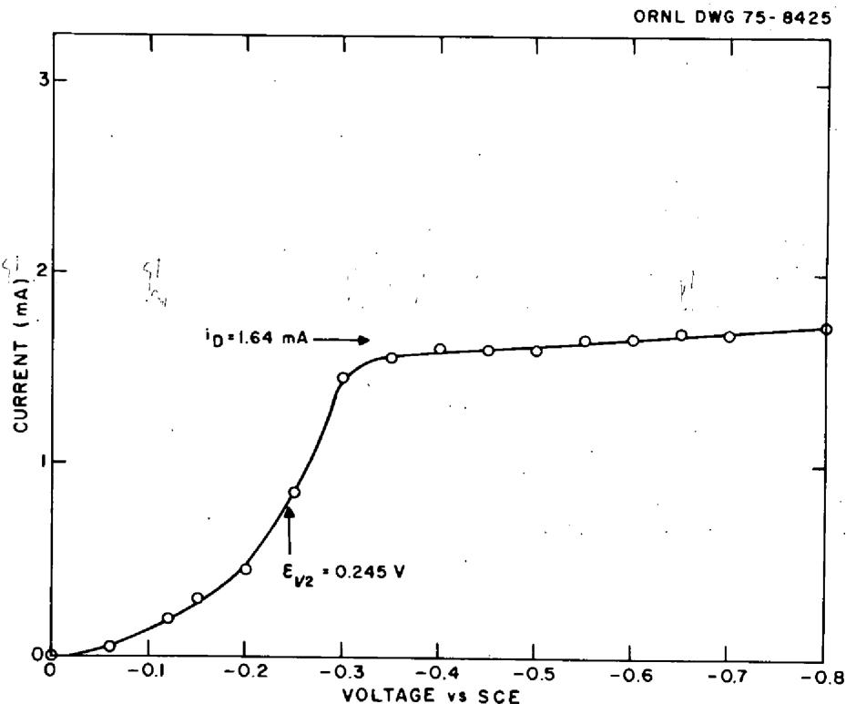  
Fig. 8.3. Cathodic polarization wave for $\mathrm{Fe}(\mathrm{C}_2\mathrm{O}_4)_3^3$ - measured in the $5\times 7$ in. rectangular contactor with no agitation.

increases only a small amount; here, the current is limited by the rate of diffusion of the $\mathrm{Fe(C_2O_4)_3}^{3-}$ to the mercury surface, where this ion is reduced. The diffusion current can be related to the mass transfer coefficient through the electrolyte film as previously discussed. $^{10}$

The half-wave potential is defined as the potential at which the current is equal to one-half the limiting value. Figure 8.3 shows the measured half-wave potential for the ferric oxalate complex. The half-wave potential of $-0.245\mathrm{V}$ measured in the contactor agrees well with the value reported in the literature of $-0.24\mathrm{V}$ vs SCE for the reduction of ferric oxalate. $^{16}$

Under ideal conditions, the diffusion current is directly proportional to the polarized electrode surface area and the bulk concentration of the limiting ion. To determine that the mercury surface was actually being polarized, two tests were performed. First, the anode surface area was decreased by about $48\%$ . This had no effect on the magnitude of the diffusion current, indicating that the mercury surface (cathode) was polarized rather than the anode surface. In the second test, the concentration of the ferric ion was doubled, but no concomitant increase in diffusion current was seen. Since the diffusion current is directly proportional to the concentration of the limiting ion $(\mathrm{Fe}^{3+})$ , the current should have doubled. The only explanation for this behavior is that the $\mathrm{Fe}^{3+}$ had been reduced by some contaminant in the system, possibly present in the mercury. This would have caused ferric ions to be present at only a very low concentration during cell operation, due to electrolytic oxidation of the ferrous iron.

To eliminate the possibility of reductant being present in the mercury, a supply of purified mercury was obtained from the Analytical Chemistry Division. A test was performed using the purified mercury and an electrolyte having the same nominal $\mathrm{Fe}^{3+}$ and $\mathrm{Fe}^{2+}$ concentrations given above. Preparation of the electrolyte was completed in the absence of oxygen to preclude possible oxidation of $\mathrm{Fe}^{2+}$ to $\mathrm{Fe}^{3+}$ . Again, the anode surface area was decreased with no discernable decrease in the diffusion current, indicating that the mercury surface was polarized. An increase of the $\mathrm{Fe}^{3+}$ concentration from $\sim 0.25 \mathrm{mM}$ to $\sim 0.5 \mathrm{mM}$ resulted in an increase in the diffusion current by a factor of 2, indicating that the wave being measured was the ferric ion reduction wave. However, the half-wave potential was measured to be $-0.75 \mathrm{~V}$ vs SCE, which is about three times the reported value.

To calculate the aqueous-film mass transfer coefficient from polarographic data, the bulk concentration of the oxidized species must be accurately known. The

method for this measurement is a polarographic technique using the dropping-mercury electrode. Samples of the electrolyte used in the second of the two tests mentioned above were analyzed for $\mathrm{Fe}^{3+}$ and $\mathrm{Fe}^{2+}$ by this method. Results indicated that the $\mathrm{Fe}^{3+}$ and $\mathrm{Fe}^{2+}$ concentrations were 1.7 and $0.28\mathrm{mM}$ respectively, which is in poor agreement with the expected values of $0.50\mathrm{mM}$ $\mathrm{Fe}^{3+}$ and $1.0\mathrm{mM}$ $\mathrm{Fe}^{2+}$ . One possible cause for the poor agreement is that the $\mathrm{Fe}^{2+}$ was oxidized to $\mathrm{Fe}^{3+}$ during the period when the solution was held in the sample bottles. However, this was not expected, since the electrolyte had been sparged with argon to remove dissolved oxygen, and the sample bottles were purged with argon to remove air.

To aid in determining if the reported analytical results were in error due to analytical technique or to method of solution preparation, two standard solutions were prepared and sampled for analysis. One solution was prepared to contain $56\mu \mathrm{g / mlFe}^{3 + }$ ,and the other solution was prepared to contain $56~\mu \mathrm{g / mlFe}^{2 + }$ . Both solutions were $1M$ in $\mathrm{K}_2\mathrm{C}_2\mathrm{O}_4\cdot \mathrm{H}_2\mathrm{O}$ . Subsequent analytical results indicated that both solutions had essentially the same concentrations of $\mathrm{Fe}^{3 + }$ and $\mathrm{Fe}^{2 + }$ , 50 and $27~\mu \mathrm{g / ml}$ respectively. Further investigation will be necessary to determine the correct method for preparing and/or analyzing iron oxalate solutions.

Experiments with the quinone-hydroquinone system. A possible alternate to the $\mathrm{Fe}^{3+}$ - $\mathrm{Fe}^{2+}$ system for measuring electrolyte-phase mass transfer coefficients is the reversible reduction of quinone to hydroquinone at the mercury cathode.

The reaction under consideration is

$$
\mathrm {C} _ {6} \mathrm {H} _ {4} \mathrm {O} _ {2} + 2 \mathrm {H} ^ {+} + 2 e ^ {-} \rightleftarrows \mathrm {C} _ {6} \mathrm {H} _ {4} (\mathrm {O H}) _ {2}. \tag {1}
$$

Since hydrogen ion as well as quinone is a reacting material, a strong buffer must be present to serve as a supporting electrolyte. The buffer causes the $\mathbf{H}^{+}$ concentration to be essentially constant across the interfacial electrolyte film, because the rate at which the buffer equilibrium is established is relatively rapid compared with the quinone diffusion rate.[17]

A qualitative test was made with the quinone system to determine whether acceptable polarization waves could be measured and to determine whether the quinone electrolyte is inert to mercury. The electrolyte was $0.01M$ hydroquinone and $0.005M$ quinone with a 0.05 $M$ phosphate buffer at a $\mathsf{pH}$ of 7.0. Satisfactory polari

zation waves were obtained in a small cell with a large copper anode and a mercury pool cathode. The electrolyte was chemically inert to mercury during the tests. The color of the quinone electrolyte changed from a light yellow to deep brown within several hours. This phenomenon is due to the decomposition of quinone by ultraviolet light. Further studies in the $5 \times 7$ in. contactor will be done to determine whether this system is suitable for mass transfer measurements.

# 8.3 CONTINUOUS-FLUORINATOR DEVELOPMENT

R. B. Lindauer

Continuous fluorinators are used at two points in the reference flowsheet for MSBR processing. The first of these is the primary fluorinator, where $99\%$ of the uranium is removed from the fuel salt prior to the removal of ${}^{233}\mathrm{Pa}$ by reductive extraction. The second point is where uranium produced by decay of ${}^{233}\mathrm{Pa}$ is removed from the secondary fluoride salt in the protac-tinium decay tank circuit. These fluorinators will be protected from fluorine corrosion by frozen-salt layers formed on the internal surfaces of the fluorinator which are exposed to both fluorine and molten salt. To keep frozen material on the walls while maintaining a molten-salt core in the fluorinator, an internal heat source is necessary to support the temperature gradient. Heat from decay of the fission products in the salt will be used in the processing plant. However, to test frozen-wall fluorinators in nonradioactive systems,

another internal heat source which is not attacked by fluorine is needed. Since electrolytic or autoresistance heating of molten salt has proven to be a feasible means for providing this heat source, studies of autoresistance heating of molten salts are continuing. A conceptual design was made for a continuous fluorinator experimental facility (CFEF) to demonstrate fluorination in a vessel protected by a frozen-salt film. Design was completed and installation was begun of a fluorine disposal system in Building 7503 which uses a vertical spray tower and a recirculating KOH solution. Installation was completed of equipment to demonstrate the effectiveness of a frozen-salt film as protection against fluorine corrosion in a molten salt system.

# 8.3.1 Installation and Initial Operation of Autoresistance Heating Test AHT-4

Equipment for autoresistance heating test AHT-4 was installed in cell 3 of Building 4505. In this system (Fig. 8.4) molten $\mathrm{LiF - BeF_2 - ThF_4}$ (72-16-12 mole %) is circulated by means of an argon gas lift from a surge tank to a gas-liquid separator from which the salt flows by gravity through the autoresistance electrode, through the test vessel, and returns from the bottom of the test vessel to the surge tank. The test vessel (Fig. 8.5) used in experiment AHT-3 was decontaminated, equipped with new cooling coils, heaters, and thermocouples, and reinstalled for experiment AHT-4.

The test vessel is made of 6-in. sched-40 nickel pipe with a 44-in.-long (1.1-m) cooled section from the electrode to below the gas inlet side arm. The cooled section is divided into five separate zones, each with two

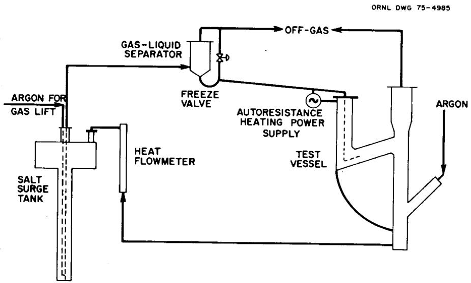  
Fig. 8.4. Flowsheet for autoresistance heating test, AHT-4.

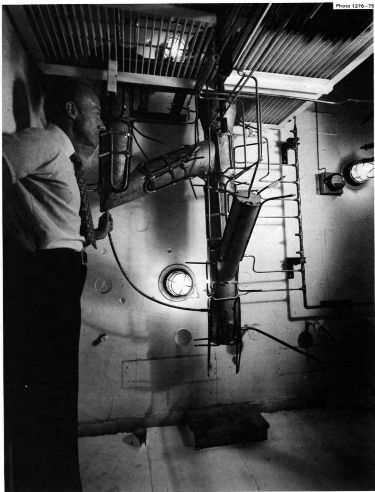  
Fig. 8.5 AHT-4 test vessel.

parallel coils through which an air-water mixture flows. The gas outlet section above the salt level has an increased diameter for gas-salt disengagement and is made of 8-in. sched-40 pipe. The surge tank has a 46-in.-long $(1.2\mathrm{-m})$ , 6-in.-diam $(0.15\mathrm{-m})$ section to provide submergence for the gas lift. The upper section of the surge tank is 24 in. $(0.61\mathrm{~m})$ in diameter and provides sufficient capacity to contain the salt inventory for the entire system. The gas-liquid separator is an 8-in.-diam $(0.20\mathrm{-m})$ conical-bottom vessel with baffles and York mesh in the upper part for gas-liquid disengagement. In the heat flowmeter the salt is heated by an internal cartridge heater, and the flow rate is calculated from the heat input and the temperature rise of the salt stream.

The system is started up by heating the equipment and lines to $600^{\circ}\mathrm{C}$ $(873^{\circ}\mathrm{K})$ . The argon gas lift is started, and initially the salt flow rate is determined by the decrease in surge-tank liquid level. After the salt levels in the tank, separator, and test vessel are constant, cooling of the test vessel is started. The resistance between the high-voltage electrode and the test vessel walls is checked periodically by applying a low voltage to the electrode and measuring the current. As cooling progresses, this resistance will increase until the point is reached where heat can be produced in the salt at a significant rate (several hundred watts) without causing a reduction (shorting) of the resistance.

The 80-liter salt batch was charged to the surge tank; and after minor modifications to the heating system, operation was started. Four preliminary runs were made, lasting from 4 to $12\mathrm{hr}$ (from the time the gas lift was started until plugging occurred). In the first run, plugging apparently occurred in the electrode when the liquid level in the separator fell too low to provide sufficient head for flow to the test vessel.

Salt flow in the second run was much smoother, and circulation continued for 11 hr without adjustment of the gas lift. During this time the test vessel was being cooled, and the salt flow rate slowly decreased by $\sim 7\%$ , from 450 to $425~\mathrm{cm}^3 /\mathrm{min}$ . This was probably caused by an increase in salt viscosity, a buildup of frozen salt in the test vessel, or a combination of the two. The steady salt flow rate and higher salt temperature ( $>873^{\circ}\mathrm{K}$ and $20 - 30^{\circ}\mathrm{K}$ higher than in run No. 1) kept the electrode from freezing, but the heat supply at the bottom of the test vessel was insufficient to keep the salt outlet from freezing, which terminated run 2. The resistance between the high-voltage electrode and the vessel wall increased from 0.01 to $0.08\Omega$ , but autoresistance heating was not attempted. The vertical portion of the test

section had been cooled to $639^{\circ}\mathrm{K}$ (solidus temperature, $623^{\circ}\mathrm{K}$ ).

Before the third run, the output of the powerstat controlling the test vessel bottom heaters was increased by $44\%$ to keep the salt outlet above the freezing point. The run was terminated by salt freezing in the electrode. This resulted from too low a salt flow rate (the heat flowmeter was inoperative because of a burned out heater) and too low an initial temperature $(723^{\circ}\mathrm{K}$ vs $823^{\circ}\mathrm{K}$ in the second run) in the vertical section of the side arm through which the electrode passes.

The fourth run was started with some heat on the vertical section of the side arm. This section was unheated previously. As cooling progressed, the bottom heaters on the test vessel were inadequate at the salt flow rate being used. Increasing the salt flow rate prevented freezing at the bottom of the test vessel. After $7 \frac{1}{2}$ hr of operation, the liquid levels in the separator and test vessel started to increase, indicating salt flow problems both at the inlet and exit of the test vessel. Although the salt resistance had only increased from 0.01 to $0.03\Omega$ and the average test vessel wall temperature (in the cooled zone) was $658^{\circ}\mathrm{K}$ , autoresistance heating was started. This freed the plug in the electrode, allowing salt flow from the separator to the test vessel, and the increased flow raised the test vessel bottom temperature, and flow resumed from the test vessel. However, salt flow rates were erratic for the next $2\mathrm{hr}$ , and $9 \frac{1}{2}$ hr after the start of the run the test vessel level started to rise, indicating a frozen salt restriction in the vessel. It was decided to try to transfer the molten salt from the test vessel to the surge tank before complete plugging occurred. This was done successfully, and 5.6 liters of salt was transferred to the surge tank. After cooling, radiographs were taken of the test vessel by the Inspection Engineering Department, using a 35-Ci $^{192}$ Ir source. In the test section of the test vessel, radiation penetration was insufficient to permit measurement of the film thickness. The bottom of the vessel between the salt outlet and the gas inlet was free of salt as expected, and the radiograph of the top of the vessel showed a 25-mm-thick ring of salt above the normal liquid level. This is salt deposited on the colder pipe wall by the action of the gas bubbling through the salt. Calculations from the volume of salt transferred indicated an average film thickness of $45\mathrm{mm}$ (a 65-mm-diam molten core). The salt resistance at the end of the run was $0.18\Omega$ , and the maximum autoresistance heating used was $450\mathrm{W}$ .

The main problem seems to be the forming of a uniform salt film. Near the electrode where the hot molten

salt enters, cooling is much slower than in the vertical section above the gas inlet. It is probably in the vertical section where the salt film becomes too thick and restricts the salt flow.

# 8.3.2 Design of a Continuous-Fluorinator Experimental Facility (CFEF)

The purpose of the CFEF is to measure the performance of a continuous fluorinator which has frozen-wall corrosion protection in terms of uranium removal. The uranium which is not volatilized, but is oxidized to $\mathrm{UF}_5$ , will be reduced back to $\mathrm{UF}_4$ in a hydrogen reduction column. The facility will be used to obtain operating experience and process data, including fluorine utilization, reaction rate, and flow-rate effects; and to demonstrate protection against corrosion, using a frozen salt film.

The facility will be installed in a cell in Building 7503 to provide beryllium containment. The system will contain about $8\mathrm{ft}^3$ $(0.23\mathrm{m}^3)$ of MSBR fuel carrier salt (72-16-12 mole $\%$ LiF-BeF $_2$ -ThF $_4$ ) containing 0.35 mole $\%$ uranium initially. The salt will be circulated through the system at rates up to $50\%$ of MSBR flow rate $(6.7\times 10^{-5}\mathrm{m}^{3} / \mathrm{sec})$ . Because of the short fluorinator height (1 to $2\mathrm{m}$ ) the amount of uranium volatilized will be between 80 and $95\%$ per pass. The variables

of salt flow rate, fluorine flow rate, and fluorine concentration will be studied by measuring the $\mathrm{UF_6}$ concentration in the fluorinator off-gas stream and by sampling the salt stream after reduction of $\mathrm{UF_5}$ to $\mathrm{UF_4}$ . The fluorinator will have two fluorine inlets to provide data for determining the column end effects. Reduction of $\mathrm{UF_5}$ will be carried out in a gas lift in which hydrogen will be used as the driving gas and also as the reductant. If additional reduction is required, this can be done in the salt surge tank. The surge tank is designed to provide sufficient salt inventory for about $10\mathrm{hr}$ of fluorination with $95\%$ uranium volatilization per pass. About $99\%$ of the uranium should have been removed from the salt batch after this period of time.

The facility flowsheet is shown in Fig. 8.6. Salt will enter the fluorinator through the electrode in a side arm out of the fluorine path. The electrode flange will be insulated from the rest of the fluorinator, and the autoresistance power will be connected to a lug on the flange. The salt will leave at the bottom of the fluorinator below the fluorine inlet side arm. The fluorinator wall will be cooled by external air-water coils to form the frozen salt film which will serve the dual purpose of preventing nickel corrosion and of providing an electrically insulating film for the autoresistance current. Below the fluorine inlet the fluorinator wall will not be cooled, and the molten salt will complete the electrical

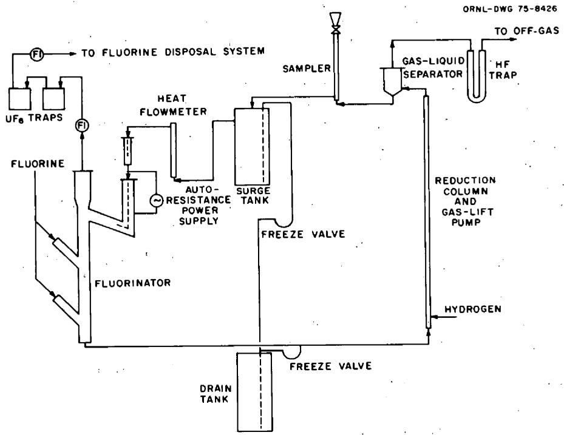  
Fig. 8.6. Continuous fluorinator experimental facility flowsheet.

ORNL DWG 75-15057

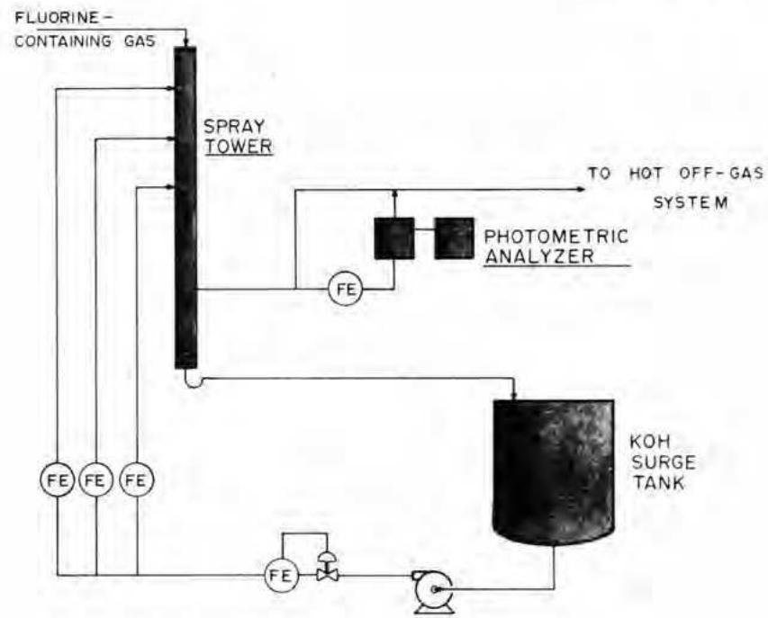  
Fig. 8.7. Fluorine disposal system.

circuit to the vessel wall. Since all of the uranium will not be volatilized from the salt, there will be some $\mathrm{UF}_5$ in the salt at the bottom of the fluorinator. The fluorinator bottom, exit line, and reduction column will be protected from the highly corrosive $\mathrm{UF}_5$ by gold lining or plating. The molten salt containing $\mathrm{UF}_5$ will enter the bottom of the column where the salt will be contacted with hydrogen. The hydrogen will enter through a palladium tube, which will result in the formation of atomic hydrogen and greatly increase the reduction rate to $\mathrm{UF}_4$ . The hydrogen reduction column will also act as a gas lift to raise the salt to a gas-liquid separator. The salt will then flow by gravity to the fluorinator through a salt sampler, surge tank, heat flowmeter, and electrical circuit-breaking pot. Off-gas from the separator which contains HF and excess hydrogen will pass through an NaF bed for removal of the HF. Uranium hexafluoride from the fluorinator will also be removed by NaF. Mass flowmeters before and after the NaF beds will be used to continuously measure the $\mathrm{UF}_6$ flow rate.

# 8.3.3 Fluorine Disposal System for Building 7503

The CFEF (Sect. 8.3.2) will be the first test of the frozen-wall fluorinator using fluorine. For the disposal of the excess fluorine, a vertical scrubber is being in

stalled in Building 7503. A flow diagram of the system is shown in Fig. 8.7. The scrubber is a 6-in.-diam, 8-ft-high (0.15-by $2.4\mathrm{-m}$ ) Monel pipe with three spray nozzles in the upper half of the vessel. The surge tank contains 200 gal $(0.95\mathrm{m}^3)$ of an aqueous solution containing 15 wt $\%$ KOH and 5 wt $\%$ KI. This equipment is designed to be able to dispose of one trailer of fluorine $(18\mathrm{stdm}^3)$ at a flow rate of 1.2 scfm $(9\times 10^{-4}$ std $\mathrm{m}^3 /\mathrm{sec})$ .The KOH solution will be circulated through the spray nozzles at a total flow rate of $15\mathrm{gpm}$ 0.001 $\mathrm{m}^3 /\mathrm{sec})$ . The fluorinator off-gas stream will flow cocurrently with this stream. The scrubber exit stream passes through a photometric analyzer for monitoring the efficiency of the scrubber.

# 8.3.4 Frozen-Wall Corrosion Protection Demonstration

Equipment has been installed for demonstrating that a frozen salt film will protect a nickel vessel against fluorine corrosion by preventing the $\mathrm{NiF}_2$ corrosion product film from being dissolved in the molten salt. A small vessel containing $6\times 10^{-3}\mathrm{m}^3$ of molten LiF-BeF $_2$ -ThF $_4$ (72-16-12 mole %) will be used for the demonstration (Fig. 8.8). The fluorine inlet consists of three concentric tubes which provide a path for an air coolant

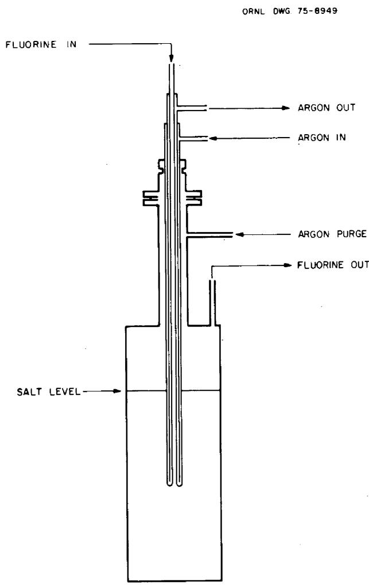  
Fig. 8.8. Frozen salt protection demonstration test vessel.

stream that will be used for freezing a salt film on the outside of the outer tube. The wall of the inner tube through which the fluorine will flow is 31 mils (0.79 mm) thick. The inner tube of the fluorine inlet will not be protected from corrosion. The vessel wall is also unprotected but is 280 mils (7.11 mm) thick. Fluorine will be passed at a low flow rate ( $\sim$ 830 mm³/sec) through the salt until failure occurs, which is expected in less than 100 hr at the tip of the probe near the gas-liquid-solid interface. Wall thickness measurements before and after the demonstration will show to what extent the salt film afforded protection.

A flow diagram for the system is shown in Fig. 8.9. The argon back pressure will be recorded to provide an indication of corrosive failure. Failure of the tube below the salt film will allow some salt to leak into the argon cooling annulus. The salt will be entrained up into the cool portion of annular space, causing a restriction to

the argon flow. The system will be designed such that the fluorine flow is terminated automatically when either a low argon pressure is detected in the annulus or when a high argon back pressure occurs.

# 8.4 FUEL RECONSTITUTION ENGINEERING DEVELOPMENT

R. M. Counce

The reference flowsheet for processing the fuel salt from an MSBR is based upon removal of uranium by fluorination to $\mathrm{UF}_6$ as the first processing step.[18] The uranium removed in this step must subsequently be returned to the fuel carrier salt before its return to the reactor. The method for recombining the uranium with the fuel carrier salt (reconstituting the fuel salt) consists in absorbing gaseous $\mathrm{UF}_6$ into a recycled fuel salt stream containing dissolved $\mathrm{UF}_4$ according to the reaction

$$
\mathrm {U F} _ {6} (\mathrm {g}) + \mathrm {U F} _ {4} (\mathrm {d}) = 2 \mathrm {U F} _ {5} (\mathrm {d}). \tag {2}
$$

The resultant $\mathrm{UF}_5$ would be reduced to $\mathrm{UF}_4$ with hydrogen in a separate vessel according to the reaction

$$
\mathrm {U F} _ {5} (\mathrm {d}) + \frac {1}{2} \mathrm {H} _ {2} (\mathrm {g}) = \mathrm {U F} _ {4} (\mathrm {d}) + \mathrm {H F} (\mathrm {g}). \tag {3}
$$

Engineering studies of the fuel reconstitution step are being started to provide the technology necessary for 'the design of larger equipment for recombining $\mathrm{UF}_6$ generated in fluorinators in the processing plant with the processed fuel carrier salt returning to the reactor. During this report period, equipment previously described $^{19}$ was fabricated and has been installed in the high-bay area of Building 7503. This report describes instrumentation for off-gas analysis, including a preliminary calibration curve, and two alternatives for providing corrosion-resistant gold linings for equipment to be installed later.

The nickel reaction vessels presently installed will be used to test the salt metering devices and gas supply systems. After the initial shakedown work is completed, the $\mathrm{UF}_6$ absorption vessel, $\mathbf{H}_{2}$ reduction column, flowing-stream samplers, and associated transfer lines will be replaced with gold or gold-lined equipment. Gold is being used because of its resistance to corrosion by $\mathrm{UF}_6$ gas and $\mathrm{UF}_5$ dissolved in the salt.

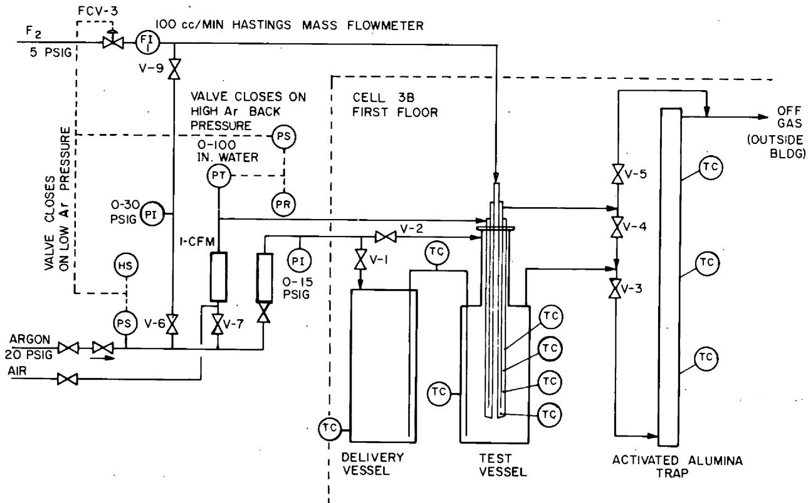  
Fig. 8.9. Frozen salt protection demonstration flowsheet.

# 8.4.1 Instrumentation for Analyzing Reaction Vessel Off-Gases

The equipment for the second phase of the experiment will consist of a feed tank, a $\mathrm{UF}_6$ absorption vessel, an $\mathbf{H}_2$ reduction column, flowing-stream samplers, a receiver tank, NaF traps for collecting excess $\mathrm{UF}_6$ and for disposing of HF, gas supplies for argon, hydrogen, nitrogen, and $\mathrm{UF}_6$ , and means for analyzing the gas streams from the reaction vessels (Fig. 8.10). The equipment will be operated by pressurizing the feed tank with argon in order to displace salt from the feed tank to the $\mathrm{UF}_6$ absorption vessel. From the $\mathrm{UF}_6$ absorption vessel, the salt flows by gravity through a flowing-stream sampler into the $\mathbf{H}_2$ reduction column. From the $\mathbf{H}_2$ reduction column the salt flows by gravity through a flowing-stream sampler to the receiver tank. Absorption of gaseous $\mathrm{UF}_6$ by reaction with dissolved $\mathrm{UF}_4$ will occur in the $\mathrm{UF}_6$ absorption vessel, and the resultant $\mathrm{UF}_5$ will be reduced by hydrogen in the $\mathbf{H}_2$ reduction column. The effluent salt is collected in the receiver tank for return to the feed tank at the end of the run.

The off-gas from the absorption vessel and the reduction column will be analyzed for $\mathrm{UF}_6$ and for HF respectively.

The respective off-gas streams will be continuously analyzed with the use of the Gow-Mac gas density balance. A sample stream is taken from the main off-gas stream and passed through the balance for analysis (Fig. 8.11). These analyses will be used in determining the efficiencies of $\mathrm{UF}_6$ absorption and $\mathbf{H}_2$ utilization.

The efficiency of $\mathrm{UF_6}$ absorption will be determined by metering $\mathrm{UF_6}$ and Ar to the $\mathrm{UF_6}$ reaction vessel and determining the $\mathrm{UF_6}$ content in the vessel off-gas, using a model 11-373 Gow-Mac gas density cell. The $\mathrm{H_2}$ utilization will be determined similarly. Hydrogen will be metered to the $\mathrm{H_2}$ reduction column, and the column off-gas will be analyzed for $\mathrm{H_2}$ content, also using a model 11-373 Gow-Mac gas density cell. The Gow-Mac cell, commonly used as a gas chromatograph

ORNL DWG 74-11666R3

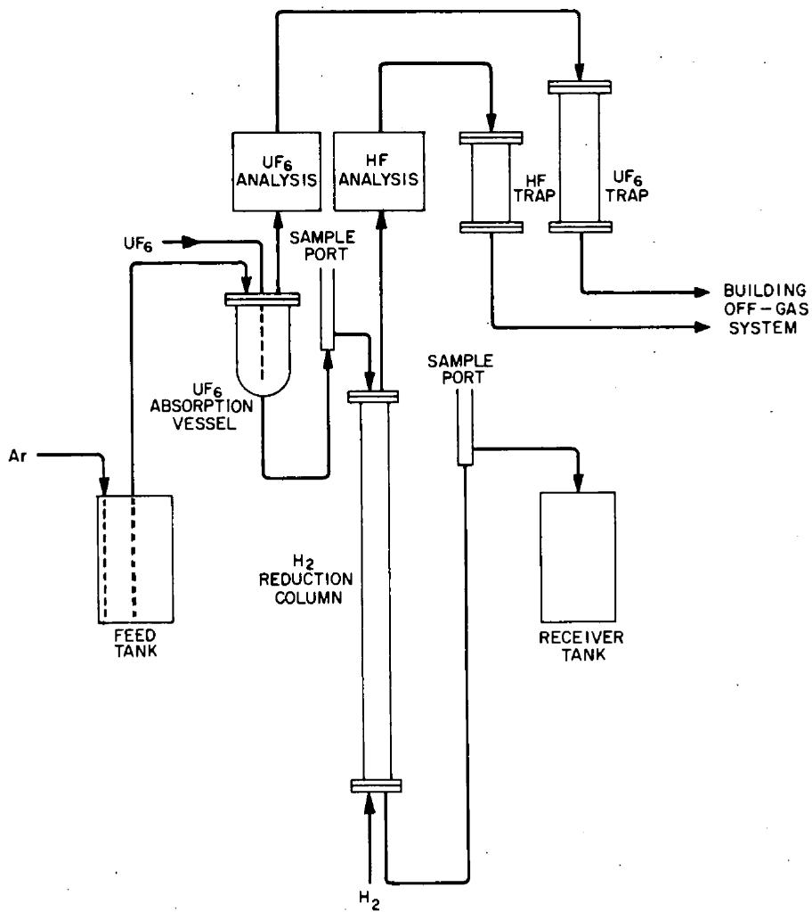  
Fig. 8.10. Flow diagram of equipment used in the second fuel reconstitution engineering experiment.

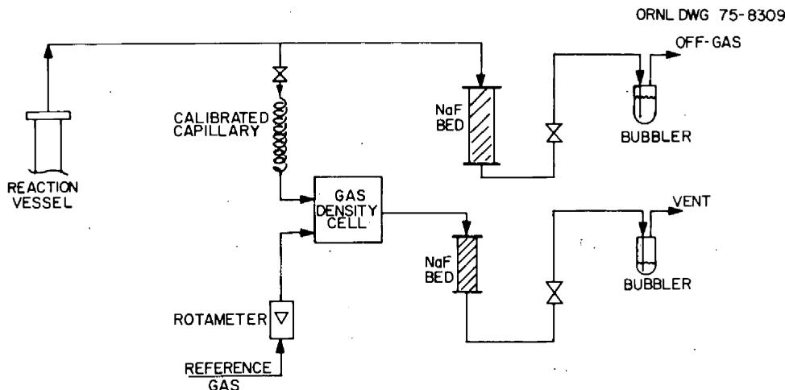  
Fig. 8.11. Schematic diagram of fuel reconstitution engineering experiment off-gas system.

detector, provides a continuous signal which varies directly with the density of the sample gas, allowing continuous analysis of the sample gas stream with accuracies of 3 to $4\%$ . Because the detector elements are not exposed to the sample stream, the gas density cell is useful in analyzing corrosive gas mixtures.

Nitrogen and argon will be reference gases for the gas density cells used for analyzing the off-gas from the $\mathrm{UF_6}$ absorption vessel and the $\mathbf{H}_2$ reduction column respectively. The response of the gas density cell is fairly insensitive to changes in the sample gas flow rate when nitrogen or argon is used as a reference gas.[2,2] To measure varying Ar- $\mathrm{UF_6}$ and $\mathbf{H}_2$ -HF ratios with the gas density detectors, it is necessary to control the reference gas flow rate precisely. However, high precision is not required for controlling the sample gas flow rate. The reference gas flow rates are controlled sufficiently by rotameter and separate gas supply systems. A satisfactory means for providing reproducible sample flow rates has been developed. The sample stream is taken from the main off-gas stream (Fig. 8.11) and flows through a capillary tube, the gas density detector, an NaF trap to remove the corrosive constituent ( $\mathrm{UF_6}$ or HF), and a bubbler to provide a constant downstream pressure. The pressure upstream from the capillary is maintained at a higher constant value by means of a similar bubbler in the off-gas line downstream from the NaF trap. The NaF traps provide sufficient volume in the lines so that small pressure fluctuations from bubbles in the process vessels and in the bubblers are effectively damped out. The flow rate is not constant (although it is reproducible), because, as the concentration of the sample gas changes, its viscosity changes, producing changes in sample flow rate under the prevailing conditions. These flow rate changes superimposed upon concentration changes in the sample stream to the gas density detector result in a nonlinear response of the gas density detector to changes in concentration. The effects are reproducible, however, and a reproducible calibration can be obtained. Such a calibration was obtained with mixtures of hydrogen and nitrogen (Fig. 8.12).

For sample gases containing hydrogen and at reference gas flow rates below a certain critical flow rate, hydrogen will diffuse countercurrently into the reference gas stream to the area of the detector elements.

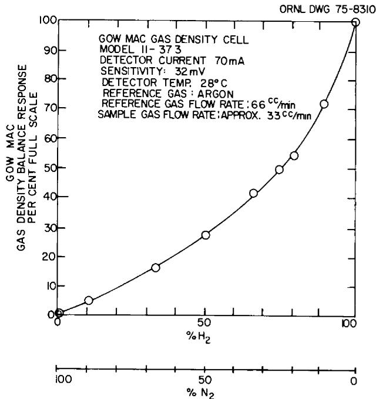  
Fig. 8.12. Calibration curve of Gow-Mac gas density cell model in fuel reconstitution engineering equipment for $\mathbf{H}_2$ and $\mathbf{N}_2$ .

Due to the high thermal conductivity of $\mathbf{H}_2$ , the back diffusion of $\mathbf{H}_2$ can greatly affect the sensitivity of the gas density cell. However, if sufficiently high reference flow rates are maintained, this problem can be overcome.

# 8.4.2 Design of the Second Fuel Reconstitution Engineering Experiment

The design of equipment for the second fuel reconstitution engineering experiment (FREE-2) is continuing. The equipment for FREE-2 will be similar in design to the equipment for experiment FREE-1 except for the addition of an intermediate liquid-phase sample port between the $\mathrm{UF}_6$ absorption vessel and the $\mathbf{H}_2$ reduction column (Fig. 8.10). In addition, all vessels and transfer lines exposed to dissolved $\mathrm{UF}_5$ , with the possible exception of the receiver tank, will be gold or gold lined. Gold sheet 0.010 in. $(0.25\mathrm{mm})$ thick is on hand for the fabricated liner of the $\mathrm{UF}_6$ absorption vessel. Two alternatives exist for lining the $\mathbf{H}_2$ reduction column and the receiver vessel: interior gold plating or a fabricated gold liner.

The minimum plating thickness that would probably provide a pinhole-free lining is approximately 0.005 in. (0.13 mm). The minimum thickness for a fabricated gold liner in vessels of this size is approximately 0.010

in. (0.25 mm). Fabricated gold liners are economically competitive with gold plating in the thicknesses mentioned, because gold sheet is available at ERDA precious-metal account prices, approximately $34.99/troy oz ($1.13/g), and gold in commercial gold-plating solutions is available only at market prices of about $164/troy oz ($5.27/g) as of June 18, 1975. Some comparisons important in the choice between interior gold plating or fabrication of a gold liner are:

1. the technology involved in fabricating a welded gold vessel is available, while some technology would need to be developed for interior plating of vessels having a high length/diameter ratio such as the $\mathbf{H}_2$ reduction column,   
2. the time involved in both approaches is approximately the same,   
3. the plating will be difficult to inspect, and there will be no guarantee of pinhole-free coverage, while dye penetrant examination of welded joints is available for a fabricated liner.

Because it is unclear whether there is sufficient gold in the ERDA precious-metals account for lining the receiver tank liner, gold plating is favored. There is the additional alternative of not lining the receiver tank, since corrosion of the receiver vessel by $\mathrm{UF}_5$ in the salt could be tolerated, and corrosion products could be removed by hydrogen reduction and filtration between runs.

# 8.5 CONCEPTUAL DESIGN OF A MÖLTEN-SALT BREEDER REACTOR FUEL PROCESSING ENGINEERING CENTER

D. L. Gray* J. R. Hightower, Jr.

A conceptual design is being prepared to define the scope, estimated final design and construction costs, method of accomplishment, and schedules for a proposed MSBR Fuel Processing Engineering Center (FPEC). The proposed building will provide space for the preparation and purification of fluoride salt mixtures required by the Molten-Salt Reactor Program, for intermediate- and large-scale engineering experiments associated with the development of components required for the continuous processing capability for an MSBR, and for laboratories, maintenance work areas, and offices for the research and development personnel assigned to the FPEC.

The project will consist of a new three-story engineering development center approximately 156 ft $(47.5\mathrm{m})$ wide by 172 ft $(52.4\mathrm{m})$ long. The building will have a gross floor area and volume of $54,900\mathrm{ft}^2$ $(5100\mathrm{m}^2)$ and $1,218,000\mathrm{ft}^3$ $(34,500\mathrm{m}^3)$ , respectively, and will be constructed of reinforced concrete, structural steel, concrete block masonry, and insulated metal paneling. The building will be sealed and will be operated at negative pressures of up to 0.3 in. of $\mathrm{H}_2\mathrm{O}$ $(75\mathrm{Pa})$ to provide containment of toxic materials. The FPEC will be located in the 7900 area approximately 300 ft $(91\mathrm{m})$ west-southwest of the High Flux Isotope Reactor. The engineering center will contain:

1. Seven multipurpose laboratories built on a $24 \times 24$ ft $(7.3 \times 7.3\mathrm{m})$ module, for laboratory-scale experiments requiring glove boxes and walk-in hoods;   
2. A high-bay area, $84 \times 126$ ft ( $25.6 \times 38.4$ m), equipped with a 10-ton (9000-kg) crane, for large-scale development of processes and equipment for fuel processing at the pilot-plant level;   
3. A facility for preparing and purifying $16,000\mathrm{kg}$ per year of fluoride salt mixtures needed for the Molten-Salt Reactor Program;   
4. Support facilities, including counting room, process control rooms, change rooms, lunch and conference room, and data processing room;   
5. Fabrication and repair shop, decontamination room, and clean storage areas;   
6. A truck air lock to prevent excessive ingress of outside air during movement of large equipment items into and out of the high-bay area;   
7. Two 5-ton (4500-kg) service elevators, one inside the building to service the regulated areas and one outside to service the clean areas and to move filters to filter housings on the third floor and roof;   
8. General service and building auxiliaries, including special gas distribution systems, liquid and solid waste collection and disposal, and filtered air-handling and off-gas scrubbing facilities.

The experimental program planned for the building involves large engineering experiments that use $^{238}\mathrm{U}$ , $^{232}\mathrm{Th}$ , Be, hazardous gases ( $\mathbf{F}_2$ , $\mathbf{H}_2$ , and HF), molten bismuth, and various fluoride and chloride salts. Initially, radioactivity will be limited to that necessary for low-level beta-gamma tracer experiments. The laboratory area can later be upgraded, if desired, for use with alpha-emitting materials at levels up to 1 kg of $^{239}\mathrm{Pu}$ .

The laboratory area will consist of seven $24 \times 24$ ft $(7.3 \times 7.3\mathrm{m})$ modular-type laboratories and a general-purpose room. Bench-scale experiments of the type now performed in Buildings 4505, 3592, and 3541 will be

carried out in these laboratories. Problems encountered in the large-scale experiments can be studied via small subsystems. Inert-atmosphere glove boxes will provide space for examination of samples removed from both the large and the small experiments. The laboratory area will be maintained at a negative pressure of 0.3 in. of $\mathrm{H}_2\mathrm{O}$ (75 Pa).

The high-bay area will be the main experimental area where large engineering experiments will be performed. Experiments will involve circulating molten mixtures of $\mathrm{LiF - BeF_2 - ThF_4}$ , lithium chloride, and molten Bi-Li alloys. The experiments will also use elemental fluorine, hydrogen fluoride, hydrogen chloride, and hydrogen gases as reactants and will use purified argon for purging. Excess fluorine, hydrogen fluoride, and hydrogen chloride will be neutralized in a caustic scrubber using KOH solutions, and the cleaned and filtered off-gas will be ducted to a building exhaust system. The experimental equipment and components will be housed in steel cubicles with floor pans which can contain any salt spill. The cubicles will be maintained at a negative pressure with respect to the high-bay ambient. The high-bay area can be supplied with up to 45,000 cfm (21.2 $\mathrm{m^3 / sec}$ ) of air. This air can be from recirculated inside

air or fresh air from the outside. The high-bay exhaust system will be designed for 30,000 cfm (14.2 m³/sec) at floor level and 50,000 cfm (23.6 m³/sec) at the roof framing level. All exhaust ducts will contain fire barriers upstream from the double HEPA filter banks.

The salt preparation and purification area will consist of a 25-ft-wide by 35-ft-long by 14-ft-high $(7.6 \times 10.7 \times 4.3\mathrm{m})$ raw materials storage room, a $22 \times 22 \times$ 28-ft-high $(6.7 \times 6.7 \times 8.5\mathrm{m})$ room for weighing and blending the salt constituents, and a 40-ft-wide by 45-ft-long by 28-ft-high $(12.2 \times 13.7 \times 8.5\mathrm{m})$ room for melting, $\mathrm{H}_{2}$ -HF treating, and filtering the fluoride salt mixtures. This facility should be capable of producing $16,000\mathrm{kg}$ per year of fluoride salt mixtures, using the batch processing method in use at the facility at Y-12.

The estimated cost for the FPEC is $15,000,000, of which$ 5,200,000 provides for inflation during the three years required for design and construction of the building.

The design is essentially complete, and the conceptual design report is scheduled to be issued in September 1975. Authorization for this project will be proposed for FY 1978.

# Part 5. Salt Production

9. Production of Fluoride Salt Mixtures for MSR Program Research and Development

F. L. Daley R. W. Horton*

A salt production facility is operated by the Fluoride Salt Production Group for preparation of salt mixtures required by experimenters in the MSR Program. The group is responsible for blending, purifying, and packaging salt of the required compositions.

Much of the salt produced is used in studies on Hastelloy N development in which the concentrations of metal fluorides, particularly nickel, iron, and chromium, are important study parameters. It is thus desirable to use salt in which the concentrations of these metal fluorides are low and also reproducible from one salt batch to the next. Oxides are undesirable salt contaminants primarily because of the adverse effect of uranium precipitation, and also because of the effect of oxides on corrosion behavior of the salt. Sulfur is another contaminant present in the raw materials used for preparing salt mixtures. Sulfur is quite destructive to nickel-based alloys at temperatures above $350^{\circ}\mathrm{C}$ , because a nickel-nickel sulfide eutectic which melts at about $645^{\circ}\mathrm{C}$ penetrates the grain boundaries and leads to intergranular attack of the metal. The maximum desired levels for these contaminants in the fluoride salt mixtures are iron, 50 ppm; chromium, 25 ppm; nickel, 20 ppm; sulfur, $<5$ ppm; oxygen, $<30$ ppm. Other duties of the group include procurement of raw materials, construction and installation of processing equipment, and refinement of process operating methods based on results from operation of the production facility.

When the facility was reactivated during 1974, initial production was carried out in existing small-scale (8-in.-

diam) reactors while new large-scale (12-in.-diam) reactors were being installed. Experience with both the small and large units is summarized in the remainder of this chapter.

# 9.1 QUANTITIES OF SALT PRODUCED

The 8-in.-diam reactor was used for production from startup of the program in early 1974 through the first three months of 1975. During this period, a total of nine full-scale batches (315 kg total) were processed and made available to investigators. Salt from the nine batches was shipped in a total of 23 containers of appropriate sizes. In general, operation of the 8-in.-diam reactor proceeded smoothly, and the resulting salt was of acceptable composition and purity.

Production in the 12-in.-diam reactor was started in March 1975. Five production runs, each involving about $150\mathrm{kg}$ of salt, have been carried out. Of the five salt batches processed, four were suitable for use; most of the salt from these four runs was used for fuel processing experiments. In contrast to the earlier runs in the 8-in.-diam reactor, difficulty has been observed in the 12-in.-diam reactor with corrosion of dip lines in the meltdown vessel and with increasing concentrations of metallic impurities in the product salt.

# 9.2 OPERATING EXPERIENCE IN 12-in.-diam REACTOR

Operating data from the five production runs in the 12-in. reactor are summarized in Table 9.1. Analyses of the resulting salt batches are given in Table 9.2. A description of the processing operations and conditions

Table 9.1. Processing data derived from flow rate, time, and titration of inlet and outlet flows   

<table><tr><td>Batch number (FS-)</td><td>Batch size (kg)</td><td>Total time (hr)</td><td>HF in (moles)</td><td>H2in (moles)</td><td>HF out (moles)</td><td>HF reacted (moles)</td></tr><tr><td colspan="7">During hydrofluorination</td></tr><tr><td>101</td><td>150</td><td>12.5</td><td>19.53</td><td>425.3</td><td>17.12</td><td>2.41</td></tr><tr><td>102</td><td>150</td><td>10.25</td><td>23.31</td><td>273.8</td><td>23.31</td><td>0</td></tr><tr><td>103</td><td>150</td><td>9.75</td><td>18.08</td><td>260.3</td><td>14.19</td><td>3.89</td></tr><tr><td>104</td><td>150</td><td>9.5</td><td>28.53</td><td>247.3</td><td>24.54</td><td>3.99</td></tr><tr><td>105</td><td>112</td><td>14.0</td><td>37.52</td><td>285.7</td><td>18.77</td><td>18.76</td></tr><tr><td rowspan="2">Batch number (FS-)</td><td rowspan="2">Batch size (kg)</td><td rowspan="2">Total time (hr)</td><td rowspan="2">Total H2in (moles)</td><td rowspan="2">Total HF out (moles)</td><td colspan="2">HF in off-gas (meq per liter of H2)</td></tr><tr><td>Start</td><td>Finish</td></tr><tr><td colspan="7">During hydrogen reduction</td></tr><tr><td>101</td><td>150</td><td>17.6</td><td>472.5</td><td>0.026</td><td>0.0018</td><td>0.0064</td></tr><tr><td>102</td><td>150</td><td>18.6</td><td>499.5</td><td>0.595</td><td>0.100</td><td>0.050</td></tr><tr><td>103</td><td>150</td><td>24.4</td><td>652.0</td><td>1.560</td><td>0.625</td><td>0.016</td></tr><tr><td>104</td><td>150</td><td>44.0</td><td>1204.0</td><td>2.180</td><td>0.746</td><td>0.008</td></tr><tr><td>105</td><td>112</td><td>32.0</td><td>857.14</td><td>3.290</td><td>0.476</td><td>0.102</td></tr></table>

Table 9.2. Analyses of ${150} - \mathrm{{kg}}$ batches of ${\mathrm{{LiF} - {BeF}}}_{2} - {\mathrm{{ThF}}}_{4}$ (72-16-12 mole %) produced in the 12-in. reactor   

<table><tr><td rowspan="2">Batch number (FS-)</td><td colspan="9">Analyses</td></tr><tr><td>Li (%)</td><td>Be (%)</td><td>Th (%)</td><td>F (%)</td><td>Fe (ppm)</td><td>Cr (ppm)</td><td>Ni (ppm)</td><td>S (ppm)</td><td>O (ppm)</td></tr><tr><td>Nominal</td><td></td><td></td><td></td><td></td><td></td><td></td><td></td><td></td><td></td></tr><tr><td>72-16-12</td><td>7.90</td><td>2.28</td><td>44.11</td><td>45.71</td><td></td><td></td><td></td><td></td><td></td></tr><tr><td>101</td><td>7.95</td><td>2.52</td><td>43.92</td><td>46.20</td><td>82</td><td>24</td><td>17</td><td>7.37</td><td>&lt;25</td></tr><tr><td>102</td><td>8.64</td><td>2.22</td><td>42.00</td><td>46.00</td><td>75</td><td>30</td><td>600</td><td>8.0</td><td>360</td></tr><tr><td>103</td><td>8.11</td><td>2.31</td><td>43.27</td><td>45.74</td><td>60</td><td>25</td><td>.8</td><td>2.5</td><td>350</td></tr><tr><td>104</td><td>8.39</td><td>2.00</td><td>43.81</td><td>45.32</td><td>85</td><td>65</td><td>10</td><td>9.1</td><td>110</td></tr><tr><td>105</td><td>10.46</td><td>2.90</td><td>34.55</td><td>51.25</td><td>820</td><td>125</td><td>.8</td><td>5.76</td><td></td></tr></table>

prevailing during hydrofluorination and hydrogen reduction is given in the remainder of this section.

# 9.2.1 Charging and Melting of Raw Materials

The salt produced in the 12-in.-diam reactor has been of the MSBR fuel carrier salt composition (72-16-12 mole $\%$ LiF-BeF $_2$ -ThF $_4$ ); production of salt of this composition will continue, except that some batches will also contain 0.3 mole $\%$ UF $_4$ . If the production schedule permits, an inventory of non-uranium-bearing salt will be accumulated before beginning the production of uranium-bearing salt. The LiF raw material for

the salt production facility is supplied by Y-12 as needed; the $\mathrm{BeF}_2$ and $\mathrm{ThF}_4$ are taken from raw materials that have been on hand for several years. The only apparent effect of the long storage time on the raw materials is an increased moisture content of the $\mathrm{BeF}_2$ .

The production unit includes two 12-in.-diam, 72-in.-high, type 304 stainless steel vessels, each of which is fitted internally with a full-length, open-top copper cylinder in which the salt is contained. One vessel is used for batch melting of the raw materials, which are charged to the meltdown vessel by gravity transfer through a 2-in.-diam pipe; the pipe extends into a weighing and charging room and is closed by a sealing

flange except during the loading operation. The second unit, the processing vessel, is identical to the meltdown vessel except for the charging line. Both vessels are fitted with dip lines for introducing gas to the bottom of the vessels for mixing or purifying a salt batch, and both are connected to an off-gas system. Each vessel is supported in a stainless steel liner, and while in use is located in a heavy-duty electrical furnace. The receiver vessel, to which the salt product is transferred, is 12 in. in diameter, 36 in. high, and is supported similarly in a furnace adjacent to the processing vessel furnace. Salt transfer lines from the meltdown vessel to the processing vessel and from the processing vessel to the receiver are autoresistance heated via a 24-V power supply.

The operational sequence includes salt charging, melting and mixing in the meltdown vessel, and transfer of the resulting salt to the processing vessel for purification. The process steps include hydrofluorination, hydrogen reduction, and filtration during transfer of the purified salt from the processing vessel to the receiver vessel. During both the hydrofluorination and hydrogen reduction steps, the receiver and processing vessels are maintained at the same temperature, and the process gases are passed through the receiver before being fed to the processing vessel in order to eliminate any oxide film on the interior of the receiver.

The raw materials are loaded into the meltdown vessel by technicians wearing air suits having a supply of cooled fresh air. The work is carried out in a small, enclosed room in which containment is maintained by positive flow of air through the room to a bank of absolute filters. The appropriate quantities of each of the raw materials are weighed and charged through a loading chute directly into the 12-in.-diam meltdown vessel, which is at room temperature. The larger lumps of $\mathrm{BeF}_2$ and occasional lumps of LiF are broken by hand to facilitate loading and to provide improved mix

ing. The $\mathrm{ThF_4}$ is a fine powder which does not require size reduction. The charging method leaves much to be desired; melting would be more rapid and more predictable if the particle size of the raw materials could be reduced and all components mixed well before they are charged to the meltdown vessel.

Some of the more important impurities in the raw materials are listed in Table 9.3. The values shown are average values in most cases. The metallic impurities are satisfactorily low; however, sulfur and possible silicon contribute to corrosion problems during melting of the raw materials. The moisture content of the raw materials is not shown but is an important parameter. It is believed that hydrolysis of the fluorides during the initial heating period generates hydrofluoric acid which subsequently reacts with sulfur- and silicon-containing compounds in the raw materials to form hydrogen sulfide and fluorosilicic acid. The quantities of these materials produced appear to be dependent on the temperature at which the meltdown vessel is held during the initial portion of the melting operation, with $\mathrm{H}_2\mathrm{S}$ production being most noticeable at temperatures above $500^{\circ}\mathrm{C}$ . An acidic compound, which contains silicon and fluorine, is evolved freely at lower temperatures, in the 125 to $500^{\circ}\mathrm{C}$ range; however, the extent to which the material is corrosive to the meltdown vessel is not known. Analytical data necessary to determine whether these low-temperature gases contain sulfur-bearing compounds are not available.

The major effect of hydrogen sulfide on nickel components at temperatures in the range 600 to $700^{\circ}\mathrm{C}$ is rapid embrittlement of the nickel. This action has resulted in breakage of dip legs in the meltdown vessel at the rate of one dip leg per run. Breakage is observed to occur in the gas space above the melt, and the broken dip leg falls to the bottom of the meltdown vessel, where it is available for further attack by corrosive materials dissolved in the salt. After melting, batch

Table 9.3. Impurities in raw materials used in fluoride salt production (ppm)   

<table><tr><td rowspan="2">Component</td><td colspan="2">S</td><td colspan="2">Si</td><td colspan="2">Fe</td><td colspan="2">Cr</td></tr><tr><td>Avg</td><td>Max</td><td>Avg</td><td>Max</td><td>Avg</td><td>Max</td><td>Avg</td><td>Max</td></tr><tr><td>LiF</td><td>21</td><td>44</td><td>100</td><td>100</td><td>20</td><td>25</td><td>&lt;1</td><td>&lt;1</td></tr><tr><td>BeF2</td><td>300</td><td>500</td><td>100</td><td>100</td><td>50</td><td>100</td><td>20</td><td>40</td></tr><tr><td>ThF4</td><td>&lt;100</td><td>&lt;100</td><td>&lt;10</td><td>&lt;10</td><td>25</td><td>62</td><td>11</td><td>17</td></tr><tr><td>Mixed raw materialsa</td><td>100</td><td>131</td><td>47</td><td>47</td><td>26</td><td>56</td><td>9</td><td>15</td></tr></table>

$a_{\text{Mixture}}$ required to produce salt having composition of 72-16-12 mole $\%$ LiF-BeF $_2$ -ThF $_4$ .

FS-101 was passed through a nickel filter having a mean pore size of $40\mu$ , but plugging of the filter on subsequent transfers led to its removal from the system. Transfers from the meltdown vessel are now made after allowing a period for particulate material to settle.

A stainless steel dip leg was used in the meltdown vessel during the melting of batch FS-105 in an attempt to avoid cracking of the dip leg. The use of stainless steel was later concluded to be unsuitable because of the increased concentrations of iron and chromium observed in the resulting salt product. The dip leg did not embrittle nor break during melting of the salt, but extensive corrosion was noted on the submerged portion of the leg. As a result of these observations, a dip leg of copper and nickel was constructed by placing a copper sheath over a heavy-wall nickel tube. The nickel tube provides rigidity, and the copper is used both outside and inside of the nickel tube to obtain resistance to corrosion. The copper sheaths are welded together at the lower end of the dip leg located in the meltdown vessel. This combination of materials is expected to result in an increased dip leg life and less contamination of the product salt.

An error was made in charging the $\mathbf{ThF_4}$ for batch FS-105 which resulted in salt that did not have the desired composition.

# 9.2.2 Hydrofluorination and Hydrogen Reduction

After a salt batch has been melted in the meltdown vessel, it is transferred at a temperature of about $750^{\circ}\mathrm{C}$ to the processing vessel, where it is sparged with an $\mathrm{HF - H_2}$ mixture at a temperature of about $625^{\circ}\mathrm{C}$ for a period of about 10 hr. The salt is then sparged with $\mathrm{H}_{2}$ at $700^{\circ}\mathrm{C}$ ; the $\mathrm{H}_{2}$ flow rate of 10 std liters/min used during the hydrofluorination step is continued for 30 hr to reduce iron and nickel fluorides to their respective metals.

Progress of the hydrofluorination step is monitored by determining the HF content of the $\mathrm{HF - H_2}$ inlet and exit gas streams by absorption and titration of the HF in a metered volume of exit gas. When the HF concentration of the inlet and exit streams becomes equal (or the concentration in the exit stream becomes slightly higher than that in the inlet stream), contact of the salt with the $\mathrm{HF - H_2}$ mixture is stopped. A relatively low temperature, about $100^{\circ}\mathrm{C}$ above the salt liquidus temperature, is used to minimize the rate of corrosion of equipment and to maximize the rate at which oxides are hydrofluorinated. The hydrofluorination step is followed by treatment of the salt with hydrogen at $700^{\circ}\mathrm{C}$

to reduce iron and nickel fluorides. The utilization of hydrogen during this step is low, and large volumes of $\mathbf{H}_2$ are required. Since the reduction reaction releases HF, the concentration of HF in the off-gas stream is monitored, and hydrogen treatment is stopped when the HF concentration reaches a low value (about 0.02 meq/liter) and remains constant within the detection limits of the titration method.

The total gas flows $(\mathrm{H}_{2}$ and HF) during the processing operations are shown in Table 9.1. The values in the table reflect a steadily increasing quantity (from FS-101 to FS-105) of HF generated by $\mathbf{H}_2$ reduction of metallic fluorides that can be ascribed to a buildup of metals (largely iron and nickel) in the salt heels in the meltdown vessel and in the processing vessel during operation. These metals are converted to fluorides during hydrofluorination, and thus add to the total quantity of metal fluoride to be reduced during hydrogen treatment.

# 9.3 SUMMARY

The information presented in the previous sections indicates that the following factors are important in producing high-quality salt:

1. Analyses of the raw materials indicate that there will be no concern with metallic contaminants unless metallic corrosion products are introduced during the salt purification or melting steps.

2. The sequential buildup of metallic impurities in the salt produced in the 12-in.-diam facility is the result of corrosion of the equipment. This corrosion can be minimized by use of copper whenever possible when equipment is simultaneously exposed to salt and process gases. Periodic hydrofluorination and discard of flush salt in the processing vessel should control any minor buildup of corrosion products.

3. Although not demonstrated by data shown in this chapter, it is believed that oxygen contamination can be held at low levels by maximizing the removal of moisture from the raw materials before they are melted and by improving control of the hydrofluorination process. A method for measuring the $\mathrm{H}_2\mathrm{O}$ produced by reaction of HF with oxides in the starting materials is being tested. This should aid in determining the proper time at which to terminate contact of the salt with the HF- $\mathrm{H}_2$ mixture. Also, it may be necessary to determine the sulfur content of the off-gas, since this may be the most difficult contaminant to remove from the salt.

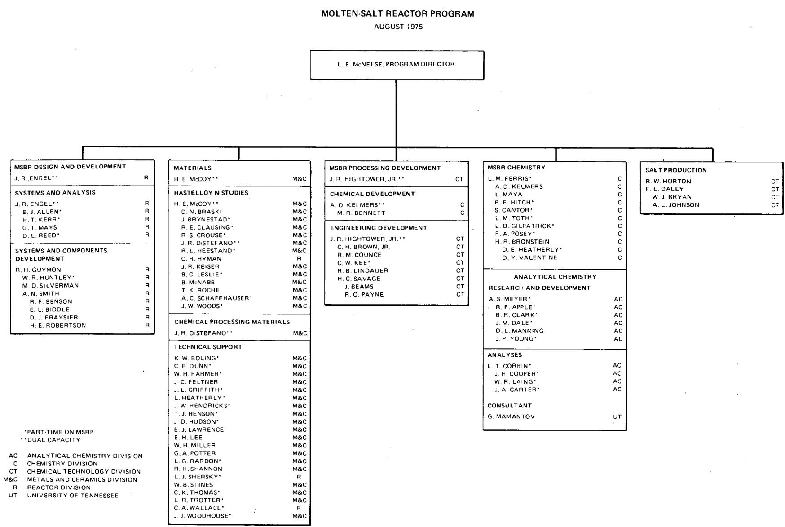

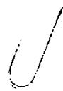

# INTERNAL DISTRIBUTION

1-10. MSRP Director's Office

11. E.J. Allen

12. R.F. Apple

13. C. F. Baes, Jr.

14. C. E. Bamberger

15. H.C. Beeson

16. J. T. Bell

17. M. Bender

18. M. R. Bennett

19. E. S. Bettis

20. A. L. Boch

21. C. Brashear

22. D. N. Braski

23. J. Braunstein

24. M. A. Bredig

25. R. B. Briggs

26. C. R. Brinkman

27. H. R. Bronstein

28. R. E. Brooksbank

29. C. H. Brown, Jr.

30. J. Brynestad

31. W.D. Burch

32. S. Cantor

33. D. W. Cardwell

34. J. A. Carter

35. W. L. Carter

36. B. R. Clark

37. R. E. Clausing

38. J. A. Conlin

39. W.H.Cook

40. J. H. Cooper

41. L. T. Corbin

42. J. M. Corum

43. R.M. Counce

44. J. L. Crowley

45. F. L. Culler

46. J. M. Dale

47. F. L. Daley

48. J. H. DeVan

49. J. R. DiStefano

50. W.P. Eatherly

51-57. J. R. Engel

58. G.G.Fee

59. D. E. Ferguson

60. L. M. Ferris

61. L. O. Gilpatrick

62. W. R. Grimes

63. A. G. Grin

64. W. S. Groenier

65. R. H. Guymon

66. W. O. Harms

67. P. N. Haubenreich

68. P. G. Herndon

69. R.F. Hibbs

70. J. R. Hightower, Jr.

71. R.M.Hill

72. B. F. Hitch

73. H.W. Hoffman

74. P. P. Holz

75. R.W.Horton

76. W. R. Huntley

77. C. R. Hyman

78. P. R. Kasten

79. C.W. Kee

80. J. R. Keiser

81. O. L. Keller

82. A. D. Kelmers

83. H. T. Kerr

84. W. R. Laing

85. J. M. Leitnaker

86. R. B. Lindauer

87. M. I. Lundin

88. H.G. MacPherson

89. R. E. MacPherson

90. G. Mamantov

91. D. L. Manning

92. W. R. Martin

93. C. L. Matthews

94. L. Maya

95. G. T. Mays

96-102. H.E.McCoy

103. H. F. McDuffie   
104. C.J. McHargue   
105. H. A. McLain   
106. B. McNabb   
107. A. S. Meyer   
108. R. L. Moore   
109. F. H. Neill   
110. P. Patriarca   
111. T. W. Pickel   
112. C. B. Pollock   
113. F. A. Posey   
114. H. Postma

115-116. H.P.Raaen

117. D. L. Reed   
118. T.K. Roche   
119. M.W. Rosenthal   
120. H.C. Savage   
121. C. D. Scott   
122. W. D. Shults   
123. M. D. Silverman   
124. M. J. Skinner   
125. A. N. Smith   
126. F.J. Smith

127. G.P. Smith   
128. I. Spiewak   
129. J. O. Stiegler   
130. R.E. Thoma   
131. A. J. Thompson   
132. L.M. Toth   
133. D. B. Trauger   
134. D.Y. Valentine   
135. T. N. Washburn   
136. A. M. Weinberg   
137. J. R. Weir   
138. J. C. White   
139. M. K. Wilkinson   
140. W. R. Winsbro   
141. J.W. Woods   
142. R.G.Wymer   
143. G.T. Yahr   
144. J. P. Young   
145. E. L. Youngblood   
147. Central Research Library   
148. Document Reference Section   
151. Laboratory Records   
152. Laboratory Records, ORNL R.C.

# EXTERNAL DISTRIBUTION

153. Research and Technical Support Division, ERDA, Oak Ridge Operations Office, Post Office Box E, Oak Ridge, TN 37830   
154. Director, Reactor Division, ERDA, Oak Ridge Operations Office, Post Office Box E, Oak Ridge, TN 37830   
155-156. Director, Division of Reactor Research and Development, ERDA, Washington, DC 20545   
157-258. For distribution as shown in T1D-4500 under UC-76, Molten Salt Reactor Technology category (25 copies - NTIS)