3445604452553

# Molten-Salt

# Reactor Program

Semiannual Progress Report for Period Ending February 29, 1976

OAK RIDGE NATIONAL LABORATORY

CENTRAL RESEARCH LIBRARY

DOCUMENT COLLECTION

LIBRARY LOAN COPY

DO NOT TRANSFER TO ANOTHER PERSON

If you wish someone else to see this

document, send in name with document

and the library will arrange a loan.

UCN-7969

(3) 3-67

OAK RIDGE NATIONAL LABORATORY

OPERATED BY UNION CARBIDE CORPORATION FOR THE ENERGY RESEARCH AND DEVELOPMENT ADMINISTRATION

Printed in the United States of America. Available from

National Technical Information Service

U.S. Department of Commerce

5285 Port Royal Road, Springfield, Virginia 22161

Price: Printed Copy $7.75; Microfiche $2.25

This report was prepared as an account of work sponsored by the United States Government. Neither the United States nor the Energy Research and Development Administration/United States Nuclear Regulatory Commission, nor any of their employees, nor any of their contractors, subcontractors, or their employees, makes any warranty, express or implied, or assumes any legal liability or responsibility for the accuracy, completeness or usefulness of any information, apparatus, product or process disclosed, or represents that its use would not infringe privately owned rights.

Contract No. W-7405-eng-26

# MOLTEN-SALT REACTOR PROGRAM SEMIANNUAL PROGRESS REPORT FOR PERIOD ENDING FEBRUARY 29, 1976

L. E. McNeese

Program Director

AUGUST 1976

OAK RIDGE NATIONAL LABORATORY

Oak Ridge, Tennessee 37830

operated by

UNION CARBIDE CORPORATION

for the

ENERGY RESEARCH AND DEVELOPMENT ADMINISTRATION

This report is one of a series of periodic reports that describe the progress of the program. Other reports issued in this series are listed below.

ORNL-2474 Period Ending January 31, 1958

ORNL-2626 Period Ending October 31, 1958

ORNL-2684 Period Ending January 31, 1959

ORNL-2723 Period Ending April 30, 1959

ORNL-2799 Period Ending July 31, 1959

ORNL-2890 Period Ending October 31, 1959

ORNL-2973 Periods Ending January 31 and April 30, 1960

ORNL-3014 Period Ending July 31, 1960

ORNL-3122 Period Ending February 28, 1961

ORNL-3215 Period Ending August 31, 1961

ORNL-3282 Period Ending February 28, 1962

ORNL-3369 Period Ending August 31, 1962

ORNL-3419 Period Ending January 31, 1963

ORNL-3529 Period Ending July 31, 1963

ORNL-3626 Period Ending January 31, 1964

ORNL-3708 Period Ending July 31, 1964

ORNL-3812 Period Ending February 28, 1965

ORNL-3872 Period Ending August 31, 1965

ORNL-3936 Period Ending February 28, 1966

ORNL-4037 Period Ending August 31, 1966

ORNL-4119 Period Ending February 28, 1967

ORNL-4191 Period Ending August 31, 1967

ORNL-4254 Period Ending February 29, 1968

ORNL-4344 Period Ending August 31, 1968

ORNL-4396 Period Ending February 28, 1969

ORNL-4449 Period Ending August 31, 1969

ORNL-4548 Period Ending February 28, 1970

ORNL-4622 Period Ending August 31, 1970

ORNL-4676 Period Ending February 28, 1971

ORNL-4728 Period Ending August 31, 1971

ORNL-4782 Period Ending February 29, 1972

ORNL-4832 Period Ending August 31, 1972

ORNL-5011 Period Ending August 31, 1974

ORNL-5047 Period Ending February 28, 1975

ORNL-5078 Period Ending August 31, 1975

# Contents

INTRODUCTION vii

SUMMARY ix

# PART 1. MSBR DESIGN AND DEVELOPMENT

1. SYSTEMS AND ANALYSIS 2

1.1 TRITIUM BEHAVIOR IN THE COOLANT-SALT TECHNOLOGY FACILITY 2

1.1.1 Analysis of Experiments T1 and T2 2   
1.1.2 Analysis of Experiment T3 3   
1.1.3 Analysis of Experiment T4 5

1.2 NEUTRONIC ANALYSIS 7

1.2.1 Cross Section Processing for MSBR Calculations 7   
1.2.2 MSBR Performance Calculations 9   
1.2.3 Helium Production in the MSBR Vessel 9   
1.2.4 Production of $^{232}\mathrm{U}$ in the MSBR 10   
1.2.5 Neutronic Analyses of TeGen Experiments 12

1.3 HIGH-TEMPERATURE DESIGN METHODS 12

1.3.1 Circular Cylindrical Shells 13   
1.3.2 Nozzle-to-Spherical Shell Attachment 13   
1.3.3 Nozzle-to-Cylinder Intersection 13   
1.3.4 Inelastic Analyses of MSR Piping Subjected to Internal Pressure and Transient Temperature Cycles 13

2. SYSTEMS AND COMPONENTS DEVELOPMENT 15

2.1 GAS-SYSTEMS TECHNOLOGY FACILITY 15   
2.2 COOLANT SALT TECHNOLOGY FACILITY 16

2.2.1 Loop Operation 16   
2.2.2 Tritium Tests 16   
2.2.3 Equipment Modifications 18

2.3 FORCED CONVECTION LOOPS 19

2.3.1 Operation of MSR-FCL-2b 19   
2.3.2 Heat Transfer Studies in MSR-FCL-2b 21   
2.3.3 Design and Construction of FCL-3 and FCL-4 22

# PART 2. CHEMISTRY

3. FUEL-SALT CHEMISTRY 24

3.1 Solubility of Lithium Tellurides in Fluoride Melts 24   
3.2 Spectroscopy of Telluride Species in Molten Salts 27

3.3 Decomposition Pressure of $\mathrm{LiTe}_3$ 28   
3.4 Porous Electrode Studies in Molten Salts - Electrochemistry of Tellurium in the LiCl-KCl Eutectic System 29   
3.5 The Uranium Tetrafluoride-Hydrogen Equilibrium in Molten Fluoride Solutions 29

4.COOLANT-SALT CHEMISTRY 32

4.1 Hydrolytic Behavior of $\mathbf{Na}_3\mathbf{B}_3\mathbf{F}_6\mathbf{O}_3$ 32   
4.2 Vapor Density Studies in the System $\mathbf{BF}_3\text{-}\mathbf{H}_2\mathbf{O}$ 34

5. DEVELOPMENT AND EVALUATION OF ANALYTICAL METHODS 36

5.1 In-line Analysis of MSBR Fuel 36   
5.2 Tritium Addition Experiments in the Coolant-Salt Technology Facility 36   
5.3 Electrochemical Studies of Tellurium in Molten $\mathrm{LiF - BeF_2 - ThF_4}$ (72-16-12 mole %) 38   
5.4 Electrochemical Studies of Oxygenated Species in Molten Fluorides 39

# PART 3. MATERIALS DEVELOPMENT

6. DEVELOPMENT OF MODIFIED HASTELLOY N 42

6.1 Procurement and Fabrication of Experimental Alloys 42

6.1.1 Production Heats of $2\%$ Titanium-Modified Hastelloy N 42   
6.1.2 Semiproduction Heats of $2\%$ Titanium-Modified Hastelloy N That Contain Niobium 45

6.2 Stability of Various Modified Hastelloy N Alloys in the Unirradiated Condition 45   
6.3 Mechanical Properties of Modified Hastelloy N Alloys in the Unirradiated Condition 47   
6.4 Postirradiation Creep Properties of Modified Hastelloy N 52   
6.5 Microstructural Analysis of Modified Hastelloy N 59

6.5.1 Production of $2\%$ Titanium-Hastelloy N Alloys with Uniform Carbide Distribution 59   
6.5.2 Carbon Behavior in Ni-Mo-Cr-Ti Alloys 70

6.6 Salt Corrosion Studies 75

6.6.1 Thermal Convection Loop Results 76   
6.6.2 Forced Circulation Loop Results 77

6.7 Corrosion of Hastelloy N and Other Alloys in Steam 80   
6.8 Vapor Pressure Measurements of Metal Tellurides 85

6.9Operation of Metal-Tellurium-Salt Systems 86

6.9.1 Tellurium Experimental Pot No. 1 86   
6.9.2 Chromium Telluride Solubility Tests 87   
6.9.3 Tellurium Screening Test 87   
6.9.4 $\mathbf{N}\mathbf{i}_3\mathbf{T}\mathbf{e}_2$ Capsule Test 87   
6.9.5 Chromium-Tellurium-Uranium Interaction Experiment 87

6.10 Examination of a Hastelloy N Foil Sample Embrittled in the Molten-Salt Reactor Experiment 88

6.10.1 Sample History 88   
6.10.2 Sample Fracture and Analysis Techniques 88   
6.10.3 Observations 89   
6.10.4 Discussion of Observations 93

6.11 High-Resolution Fractography of Hastelloy N Alloys Exposed to Tellurium 95   
6.12 Metallographic Examination of Samples Exposed to Tellurium-Containing Environments 100   
6.13 Salt-Tellurium Creep Studies 121

6:14 Salt Preparation and Fuel Pin Filling for MSR Program Capsule Irradiation Experiment TeGen-2 127

6.14.1 Salt Preparation 129   
6.14.2 Hydrofluorination 130   
6.14.3 $\mathrm{U}^{4 + } / \mathrm{U}^{3 + }$ Ratio Adjustment 132   
6.14.4 Preparation of Salt Fill Vessel 132   
6.14.5 Salt Transfer 132

6.15 Salt Preparation and Filling of TeGen-3 and -4 135

6.16 Operation of TeGen-2 and -3 136

6.16.1 Operating History of TeGen-2 and -3 139   
6.16.2 Data Analysis for TeGen-2 and -3 139   
6.16.3 Preliminary Results of TeGen-2 141   
6.16.4 Future Irradiations 142

6.17 Examination of TeGen-2 143

7. FUEL PROCESSING MATERIALS DEVELOPMENT 163

7.1 Summary of Compatibility Studies 163

7.1.1 Ta- $10\%$ W Thermal Convection Loop Test 163   
7.1.2 Dissimilar Material Tests 163

# PART 4. FUEL PROCESSING FOR MOLTEN-SALT REACTORS

8. CHEMISTRY OF FLUORINATION AND FUEL RECONSTITUTION 170   
9. ENGINEERING DEVELOPMENT OF PROCESSING OPERATIONS 172

9.1 Metal Transfer Process Development 172

9.1.1 Entrainment Studies in Experiment MTE-3B 172   
9.1.2 Removal of LiCl and Bi-Li Phases and Addition of Purified Solutions 173   
9.1.3 Experiments Nd-3 and Nd-4 173   
9.1.4 Results 174

9.2 Mass-Transfer Studies Using Water-Mercury Contactors 177

9.2.1 Experimental Equipment and Procedure 178   
9.2.2 Experimental Results 179

9.3 Continuous Fluorinator Development 184

9.3.1 Autoresistance Heating Test AHT-4 185   
9.3.2 Frozen-Salt Corrosion Protection Demonstration (FSCPD) 186

9.4 Fuel Reconstitution Engineering Development 189

9.4.1 Hydrodynamic Operation 191   
9.4.2 Calibration of the $\mathrm{UF}_6$ Metering System 192   
9.4.3 Calibration of Ar-UF Gas Density Detector 192   
9.4.4 Calibration of the $\mathrm{HF - H_2}$ Gas Density Cell 193

# PART 5. SALT PRODUCTION

10. PRODUCTION OF FLUORIDE SALT MIXTURES FOR RESEARCH AND DEVELOPMENT 197

# Introduction

The objective of the Molten-Salt Reactor (MSR) Program is the development of nuclear reactors that use fluid fuels that are solutions of fissile and fertile materials in suitable carrier salts. The program is an outgrowth of the effort begun over 20 years ago in the Aircraft Nuclear Propulsion (ANP) Program to make a molten-salt reactor power plant for aircraft. A molten-salt reactor, the Aircraft Reactor Experiment, was operated at Oak Ridge National Laboratory in 1954 as part of the ANP Program.

The major goal now is to achieve a thermal breeder reactor that will produce power at low cost while simultaneously conserving and extending the nation's fuel resources. Fuel for this type of reactor would be $^{233}\mathrm{UF}_4$ dissolved in a mixture of LiF and $\mathrm{BeF}_2$ , but $^{235}\mathrm{U}$ or plutonium could be used for startup. The fertile material would be $\mathrm{ThF}_4$ dissolved in the same salt or in a separate blanket salt of similar composition. The technology being developed for the breeder is also applicable to high-performance converter reactors.

A major program activity through 1969 was the operation of the Molten-Salt Reactor Experiment (MSRE). This reactor was built to test the types of fuels and materials that would be used in thermal breeder and converter reactors; it also provided operation and maintenance experience. The MSRE operated at $650^{\circ}\mathrm{C}$ and produced $7.3\mathrm{MW}$ of heat. The initial fuel contained $0.9\mathrm{mole}\% \mathrm{UF}_4,5\% \mathrm{ZrF}_4,$ $29\% \mathrm{BeF}_2$ ,and $65\%$ LiF; the uranium was about $33\%$ ${}^{235}\mathrm{U}$ . The fuel circulated through a reactor vessel and an external pump and heat exchange system. Heat produced in the reactor was transferred to a coolant salt, and the coolant salt was pumped through a radiator to dissipate the heat to the atmosphere. All this equipment was constructed of Hastelloy N, a nickel-molybednum-iron-chromium alloy. The reactor contained an assembly of graphite moderator bars in direct contact with the fuel.

Design of the MSRE was started in 1960, fabrication of equipment began in 1962, and the reactor became critical on June 1, 1965. Operation at

low power began in January 1966, and sustained power operation was begun in December 1966. One run continued for six months, until stopped on schedule in March 1968.

Completion of this six-month run ended the first phase of MSRE operation, in which the objective was to show, on a small scale, the attractive features and technical feasibility of these systems for commercial power reactors. The conclusion was that this objective had been achieved and that the MSRE had shown that molten-fluoride reactors can be operated at $650^{\circ}\mathrm{C}$ without corrosive attack on either the metal or graphite parts of the system; also the fuel is stable; the reactor equipment can operate satisfactorily at these conditions; xenon can be removed rapidly from molten salts; and when necessary, the radioactive equipment can be repaired or replaced.

The second phase of MSRE operation began in August 1968, when a small facility in the MSRE building was used to remove the original uranium charge from the fuel salt by treatment with gaseous $\mathbf{F}_2$ . In six days of fluorination, $221\mathrm{kg}$ of uranium was removed from the molten salt and loaded into absorbers filled with sodium fluoride pellets. The decontamination and recovery of the uranium were very good.

After the fuel was processed, a charge of $^{233}\mathrm{U}$ was added to the original carrier salt, and in October 1968 the MSRE became the world's first reactor to operate on $^{233}\mathrm{U}$ . The nuclear characteristics of the MSRE with the $^{233}\mathrm{U}$ were close to the predictions, and the reactor was quite stable. In September 1969, small amounts of $\mathrm{PuF}_3$ were added to the fuel to obtain some experience with plutonium in a molten-salt reactor. The MSRE was shut down permanently December 12, 1969, so that the funds supporting its operation could be used elsewhere in the research and development program.

Because of limitations on the chemical-processing methods available in the past, most of our work on breeder reactors was aimed at two-fluid systems in which graphite tubes would be used to separate

uranium-bearing fuel salts from thorium-bearing fertile salts. However, in late 1967 a one-fluid breeder became feasible with the development of processes that use liquid bismuth to isolate protactinium and remove rare earths from a salt that also contains thorium. Our studies showed that a one-fluid breeder based on these processes can have fuel-utilization characteristics approaching those of our two-fluid design concepts. Since the graphite serves only as moderator, the one-fluid reactor is more nearly a scale-up of the MSRE. These advantages caused a change in the emphasis of the program from the two-fluid to the one-fluid breeder; most of the design and development effort is now directed to the one-fluid system.

In the congressional authorization report on the AEC's programs for FY 1973, the Joint Committee on Atomic Energy recommended that the molten-salt reactor be appraised so that a decision could be made about its continuation and the level of funding appropriate for it. Consequently, a thorough review of molten-salt technology was undertaken to provide information for an appraisal. A significant result of the review was the preparation of ORNL-4812, The Development Status of Molten-Salt Breeder Reactors. A subsequent decision was made by the AEC to terminate work on molten-salt reactors for budgetary reasons; in January 1973 ORNL was directed to conclude MSR development work.

In January 1974, the AEC program for molten-salt reactor development was reinstated. A considerable effort during 1974 was concerned with assembling a program staff, making operational a number of development facilities used previously, and replacing

a number of key developmental facilities that had been reassigned to other reactor programs. A significant undertaking was the formulation of detailed plans for the development of molten-salt breeder reactors and the preparation of ORNL-5018, Program Plan for Development of Molten-Salt Breeder Reactors.

During 1974 and 1975, work in the Molten-Salt Reactor Program was devoted to the technology needed for molten-salt reactors. The work included conceptual design studies and work on materials, the chemistry of fuel and coolant salts, fission-product behavior, processing methods, and the development of systems and components. The most important single aspect of the program was work on the development and demonstration of an alloy that is suitable for the primary circuit of an MSBR and has adequate resistance to tellurium-induced shallow intergranular cracking, which was first observed in MSRE surveillance specimens. A second important area consisted of studies of the chemical interaction of tritium with the MSBR secondary coolant, both in laboratory chemistry studies and in a large engineering facility (Coolant-Salt Technology Facility). These studies culminated in the demonstration of an adequate basis for management of tritium in a 1000-Mw(e) MSBR.

In February 1976, ORNL was directed by ERDA to again terminate the Moltén-Salt Reactor Program for budgetary reasons. Work during the remainder of FY 1976 was directed toward completion of short-term work in the Program, reporting of associated information, and the assignment of the MSRP staff and experimental facilities to other ORNL programs.

# Summary

# PART 1. MSBR DESIGN AND DEVELOPMENT

J. R. Engel

# 1. Systems and Analysis

The investigation of tritium behavior in the MSBR reference coolant salt, $\mathrm{NaBF_4}$ -NaF eutectic, is continuing in the Coolant-Salt Technology Facility (CSTF). Results have been evaluated for three shortterm tritium-addition tests, and preliminary results have been obtained for a steady-state test that is still in progress.

The buildup rate of tritium in the salt during the short-term (10-hr) additions indicated that $50 - 60\%$ of the added tritium was being trapped in the salt in a chemically combined form. However, subsequent evaluations of the total tritium flow through the CSTF off-gas system indicated that additional tritium was being accumulated somewhere in the system and released to the salt after the additions were stopped. The extra material may have been temporarily accumulated in the loop walls as elemental tritium. The concentrations of elemental tritium in the salt immediately after each of the short-term additions were estimated from the concentrations of elemental tritium in the off-gas samples and an assumed value for stripping efficiency in the pump bowl. The results, in conjunction with the measured concentrations of combined tritium in the salt, indicated that the ratio of combined-to-elemental tritium in the salt was about 300 to 500.

Before the fourth (steady-state) tritium addition test, equipment was added to the CSTF to permit direct measurement of the partial pressure of hydrogen in the salt and to provide data on the rate of hydrogen permeation through the loop walls. These additions were designed to provide all data necessary for an overall hydrogen (and tritium) material balance.

The attainment of steady-state conditions required considerably more time than had been projected from the short-term tests. (Accumulation of elemen

tal hydrogen in the loop walls is thought to be the rate-limiting process.) After about four weeks of tritium addition, the sample results indicated that 96 to $99\%$ of the tritium leaving the CSTF was being removed in the loop off-gas, and only 1 to $4\%$ was permeating through the loop walls. The overall material balance on tritium flow rate appeared to be between 0.89 and 0.97. Measurements of the partial pressure of hydrogen in the salt $(0.43\mathrm{Pa})$ were reasonably consistent with the apparent partial pressure of elemental hydrogen in the pump-bowl gas space, as indicated by the observed concentration of elemental tritium in off-gas samples. Use of the measured partial pressure with the measured tritium concentration in the salt gives a value of 4700 for the ratio of combined-to-elemental tritium in the salt. If this concentration ratio were attained in the reference-design MSBR, only $\sim 3.5\mathrm{Ci / d}$ of tritium would be released to the steam system and, hence, to the environment.

The development of a 123-energy-group neutron cross-section library, based on ENDF/B, Version IV, was completed. The library includes cross sections at four temperatures from $300\mathrm{K}$ to $1200\mathrm{K}$ for several fuel-moderator ratios that are appropriate to the reference-design MSBR. Further processing to produce few-group cross sections for multidimensional diffusion-theory calculations of the reactor performance were delayed by difficulties with the relevant computer codes. However, estimates were obtained for the flux spectrum and the flux density in both the reactor and the reactor vessel of the reference-design MSBR. While the work required to complete the cross-section processing and the performance calculations has been identified, it will not be done because the MSR program will be terminated at the end of FY 1976.

The estimated helium concentration in the Hastelloy N pressure vessel of an MSBR after 30 full-power years, due principally to two-step ${}^{58}\mathrm{Ni}(n,\gamma)$ ${}^{59}\mathrm{Ni}(n,\alpha)$ reactions, is 38 ppm at the inner surface. The concentration would decrease by about $500\%$ for

each centimeter of penetration into the vessel wall, which is expected to have a thickness of about $5\mathrm{cm}$

The calculated steady-state concentration of $^{232}\mathrm{U}$ in the uranium in an MSBR is 20 ppm if protactinium is removed from the salt on a 10-day cycle and if no $^{230}\mathrm{Th}$ is present. (About 15 years would be required to approach equilibrium.) Approximately 27% of the $^{232}\mathrm{U}$ results from $(n,2n)$ and $(\gamma ,n)$ reactions in $^{233}\mathrm{U}$ , and the remainder is due to similar reactions in $^{232}\mathrm{Th}$ . A concentration of 23 ppm $^{230}\mathrm{Th}$ in thorium would double the steady-state concentration of $^{232}\mathrm{U}$ .

Neutron-flux monitors were provided for two additional in-pile irradiation capsules, TeGen-2 and TeGen-3. The irradiated wires were recovered from TeGen-2 and are being analyzed, and TeGen-3 is still being irradiated.

The development of simplified high-temperature structural design methods, which could be applicable to MSBR design, is continuing, principally for other reactor programs. Some cases have been identified in which the simplified, elastic-analysis rules are nonconservative in comparison with more accurate (and more expensive) inelastic analyses. Potential sources of the lack of conservatism are being investigated. Some of the data (thermal transients and material properties) have been obtained to estimate the magnitude of thermal ratchetting and creep-fatigue damage that might occur in an MSBR. These estimates will indicate the applicability of the simplified design procedures to Hastelloy N.

# 2. Systems and Components Development

A larger diameter impeller was installed in the salt pump of the Gas-Systems Technology Facility, and additional water tests were made. The amplitude of the pump shaft oscillations was acceptable; however, the hydraulic imbalance between the volute and impeller, caused by operation far from the pump design point, resulted in unacceptable deflections of the shaft. Extensive pump modifications would be required to meet the loop design requirements. It appears that the back vanes installed on the larger impeller overcompensated for the shaft seal leakage and reversed the direction of the flow. Because of the termination of the MSR Program at the end of FY 1976, the loop has been drained and put in standby condition.

Another transient tritium addition test was completed on the Coolant-Salt Technology Facility, and a long-term steady-state test is in progress. Several changes were made in the sampling systems for the loop off-gas and for the enclosure ventilation

air to improve the reliability of the data and to permit the collection of data that will allow the evaluation of tritium material balances for the system. Operation of the facility has been highly reliable.

The forced-convection loop, MSR-FCL-2b, has accumulated 4000 hr of operation with MSBR reference fuel salt at design conditions $(566^{\circ}\mathrm{C}$ minimum, $704^{\circ}\mathrm{C}$ maximum; 2.5 and $5.0\mathrm{m / s}$ salt velocities), with the expected low corrosion rates in standard Hastelloy N. Additions of $\mathrm{NiF}_2$ were made in preparation for determining the corrosion rates for this alloy at higher $\mathrm{U}^{4 + } / \mathrm{U}^{3 + }$ ratios. Increases in pump power, which previously had accompanied increases in the oxidation potential of the salt, were again observed at each addition. These tests were interrupted by two successive loop piping ruptures that resulted from salt freezing in the loop during offnormal conditions. Modifications were made in conjunction with the loop repairs to reduce the possibility of future similar failures. Because of the decision to terminate the MSR Program at the end of FY 1976, the corrosion studies with standard Hastelloy N were discontinued; tests are now in progress to examine the corrosion of Hastelloy N modified by the addition of $1\%$ niobium.

Construction of two additional forced-convection loops, MSR-FCL-3 and -4, is being stopped because of cancellation of the MSR Program.

# PART 2. CHEMISTRY

# 3. Fuel-Salt Chemistry

Measurements were made of the solubility of $\mathrm{Li}_2\mathrm{Te}$ in molten $\mathrm{Li}_2\mathrm{BeF}_4$ over the range from 500 to $700^{\circ}\mathrm{C}$ . $\mathrm{Li}_2\mathrm{Te}$ was prepared using a mixture of stable tellurium and $^{123m}\mathrm{Te}$ tracer. Salt that had been equilibrated with the solid $\mathrm{Li}_2\mathrm{Te}$ was sampled, and the tracer was counted using a lithium-drifted germanium detector. The most recent data indicate a solubility below $10^{-5}$ mole fraction at $700^{\circ}\mathrm{C}$ .

Spectrophotometric studies of lithium tellurides in molten $\mathrm{LiF - BeF_2}$ mixtures were continued. This work has progressed to the point where three tentative conclusions can be made: (1) $\mathrm{Li}_2\mathrm{Te}$ is quite insoluble in $\mathrm{LiF - BeF_2}$ melts; (2) the light-absorbing species in $\mathrm{LiF - BeF_2}$ melts apparently can be represented as $\mathrm{Te}_n^{n-}$ ; (3) although the results are not conclusive, it is reasonable to expect the $\mathrm{Te}_3^-$ ion to exist in molten-salt solutions.

In other spectral studies, the pressures of tellurium due to the equilibrium $2\mathrm{LiTe}_3 = \mathrm{Li}_2\mathrm{Te} + {}^5 /_2\mathrm{Te}_2(\mathrm{g})$ were determined over the range from 500 to $750^{\circ}\mathrm{C}$ . Previously determined vapor pressures for pure

tellurium were used to calibrate the system. The measured equilibrium pressures of $\mathrm{Te}_2$ over $\mathrm{LiTe}_3$ were only about a factor of 1.5 lower than the vapor pressures of $\mathrm{Te}_2$ and can be represented by the equation $\ln P(\mathrm{mmHg}) = 15.938 - 12,720 / T(\mathrm{K})$ . Evidence for a slightly volatile lithium telluride was found at temperatures around $1000^{\circ}\mathrm{C}$ .

Electrochemical studies were initiated on the lithium tellurides $\mathrm{Li}_2\mathrm{Te}$ and $\mathrm{LiTe}_3$ in LiCl-KCl eutectic at $400^{\circ}\mathrm{C}$ . Both of these tellurides were insoluble in the melt at this temperature. Cathodization of a tellurium electrode did show that a one-electron process was occurring. It was also observed that the presence of moisture in these systems led to the formation of colored soluble species.

Studies of the equilibrium $\mathrm{UF_4(d) + \Omega^1 / 2H_2(g) =}$ $\mathrm{UF}_3(\mathrm{d}) + \mathrm{HF}(\mathrm{g})$ in molten LiF-BeF $_2$ mixtures were continued using a spectroscopic method. Initially, the molar extinction coefficient for $\mathrm{UF}_3$ was determined in LiF-BeF $_2$ (66-34 and 48-52 mole $\%$ ). Values of the quotient for the above equilibrium were then determined in the two solvents over the range from 500 to $800^{\circ}\mathrm{C}$ . The quotients in the 66-34 mole $\%$ solvent were essentially the same as those measured previously by Long and Blankenship; however, those in the 48-52 mole $\%$ solvent were about 10 times greater than those determined by Long and Blankenship. The change in the present values with change in solvent composition is consistent with expectations based on prior studies of similar equilibria.

# 4. Coolant-Salt Chemistry

Raman and $^{19}\mathrm{F}$ NMR spectroscopy were used to study the hydrolytic behavior of $\mathrm{Na}_3\mathrm{B}_3\mathrm{F}_6\mathrm{O}_3$ since this compound appears to be the stable oxygen-containing species in NaF-NaBF $_4$ (8-92 mole %) when the total oxygen concentration is low. The results showed that $\mathrm{Na}_3\mathrm{B}_3\mathrm{F}_6\mathrm{O}_3$ and $\mathrm{NaBF}_3\mathrm{OH}$ reversibly interconvert in the presence of water. Assuming that this is also true in molten NaF-NaBF $_4$ , a possible mechanism for trapping of tritium in the melt is postulated.

Studies of the vapor density in the system $\mathrm{BF}_3\text{-H}_2\mathrm{O}$ were continued. At temperatures above $200^{\circ}\mathrm{C}$ , $\mathrm{BF}_3\cdot 2\mathrm{H}_2\mathrm{O}$ is completely dissociated. Below $200^{\circ}\mathrm{C}$ , association in the vapor phase becomes pronounced, and, with sufficient $\mathrm{BF}_3\cdot 2\mathrm{H}_2\mathrm{O}$ in the system, a stable liquid phase is formed. The vapor pressure of the liquid reaches 1 atm at about $200^{\circ}\mathrm{C}$ . Attempts to determine equilibrium constants for the vapor-phase reactions are in progress.

# 5. Development and Evaluation of Analytical Methods

The monitoring of $\mathrm{U}^{4+}/\mathrm{U}^{3+}$ ratios, which reflect the oxidation potential of the fuel salt, was continued during this period for one forced-convection loop, four thermal-convection loops, and eight creep-test machines. Forced-convection loop FCL-2b, after a shutdown period, was recharged with new salt and is back in operation. The $\mathrm{U}^{4+}/\mathrm{U}^{3+}$ ratio at startup was about $5.3 \times 10^{-3}$ . Thermal-convection loops NCL-21A and -23 continue to operate at stabilized redox conditions. Thermal convection loops 18C and 24 have shown a gradual decline in the $\mathrm{U}^{4+}/\mathrm{U}^{3+}$ ratio, which is presently about $1.7 \times 10^{2}$ and 80 respectively. The $\mathrm{U}^{4+}/\mathrm{U}^{3+}$ ratios for the eight creep-test machines are presented in tabular form. Generally, the melts have tended to become more reducing with time.

The results from the third tritium injection experiment at the Coolant-Salt Technology Facility are similar to those from the first two experiments. Most of the tritium occurs in a water-soluble or combined form. Very little tritium in the off-gas was in the elemental form. A fourth tritium injection experiment is now under way.

Voltammetric measurements were made in molten $\mathrm{LiF - BeF_2 - ThF_4}$ following additions of $\mathrm{LiTe}_3$ and $\mathrm{Cr_3Te_4}$ compounds in an effort to identify soluble electroactive tellurium species. No voltammetric evidence of such compounds was obtained. Electrochemical studies were carried out on the tellurium species generated in situ in molten $\mathrm{LiF - BeF_2 - ThF_4}$ when a tellurium electrode is cathodized. The results indicated that the species generated is of the type $\mathrm{Te_m}^-$ ( $M\geqslant 1$ ) and appears to be unstable under the existing experimental conditions.

Voltammetric studies were initiated on two anodic waves that are observed at a gold electrode in molten $\mathrm{LiF - BeF_2 - ThF_4}$ and also in molten $\mathrm{LiF - BeF_2 - ZrF_4}$ . Although the results are tentative, it is believed that these waves are associated with oxygenated species in the melts. The first wave possibly conforms to the oxide $\rightarrow$ peroxide electrode reaction, and the second wave represents the continued oxidation of peroxide species ultimately to oxygen gas. Noise on the diffusion current plateau indicates gas-bubble formation at the electrode surface.

# PART 3. MATERIALS DEVELOPMENT

# 6. Development of Modified Hastelloy N

Tubing of $2\%$ titanium-modified Hastelloy N was produced in a pilot run using the fabrication schedule

for austenitic stainless steels. One commercial 2500-lb melt of Hastelloy N modified with $2\%$ titanium and $1\%$ niobium was fabricated successfully into several bar configurations. Eight small commercial alloys containing $2\%$ titanium and various amounts of niobium were melted and fabricated into ${}^{1}/2$ -in.-thick plate. Laboratory alloys containing up to $4\%$ niobium were prepared and converted to ${}^{1}/4$ -in.-diam rod for evaluation.

Various types of tests were run in which specimens were exposed to tellurium-containing environments. The source of tellurium that is most representative of tellurium in an MSBR appears to be a mixture of $\mathrm{Cr}^{3}\mathrm{Te}^{4}$ plus $\mathrm{Cr}^{5}\mathrm{Te}^{6}$ . Examination of specimens exposed in these various screening tests indicated that alloys containing from 0.5 to $2\%$ niobium are most resistant to intergranular cracking by tellurium. Mechanical property tests showed that these alloys have slightly lower creep strength than $2\%$ titanium-modified Hastelloy N, but higher strength than standard Hastelloy N. Postirradiation creep tests showed that the niobium-modified alloys have excellent properties after irradiation at $650^{\circ}\mathrm{C}$ , acceptable properties after irradiation at $704^{\circ}\mathrm{C}$ , and poor properties after irradiation at $760^{\circ}\mathrm{C}$ .

A fueled capsule containing pins of $2\%$ titanium-modified Hastelloy N, $2\%$ titanium plus rare-earth-element-modified Hastelloy N, and Inconel 600 revealed that all three materials were embrittled intergranularly by exposure to the fission-product containing salt. Two other fuel capsules (six materials) are in various stages of assembly and irradiation.

# 7. Fuel Processing Materials Development

A thermal-convection loop constructed of Ta-10% W is being operated to evaluate the compatibility of this alloy with fuel salt. Several graphite capsules containing various bismuth-lithium solutions and either molybdenum or Ta-10% W specimens were heated for 1000 hr at 600 or $700^{\circ}\mathrm{C}$ . All capsules demonstrated excellent compatibility although some important differences were noted between the various capsules.

# 8. Chemistry of Fluorination and Fuel Reconstitution

Studies of the chemistry of fuel reconstitution were resumed. A test of the effectiveness of smooth platinum for catalyzing the hydrogen reduction of $\mathbf{U}^{5+}$ to $\mathbf{U}^{4+}$ in small gold equipment has shown that

smooth platinum sheet of limited surface area would provide appreciable catalytic activity in the hydrogen reduction column of the Fuel Reconstitution Engineering Experiment. Niobium is an important fission product with volatile fluorides and would be carried from the fluorinator to the fuel reconstitution step. Studies of the hydrogen reduction of $\mathrm{NbF_4}$ showed that in the absence of granular platinum, the $\mathrm{NbF_4}$ was reduced slowly to $\mathrm{Nb}^0$ . In the presence of granular platinum, the rate of $\mathrm{NbF_4}$ was rapid for the first 2 hr and decreased to a value similar to that experienced in the uncatalyzed reaction. The reason for this behavior is being sought, since, if it is due to poisoning of the platinum, it has significant implications for the use of platinum catalysts in a reactor processing plant.

# 9. Engineering Development of Processing Operations

Two additional runs were made in Metal Transfer Experiment MTE-3B. These runs were made using agitator speeds of 4.17 and 1.67 rps to determine the effect of agitation on the transfer rate of neodymium from the fluoride fuel salt to the bismuth-lithium stripper solution. Prior to these runs, it was determined that the previously observed entrainment of the fluoride salt into the LiCl resulted from operation of the agitators at 5 rps. This was unexpected since no entrainment was seen in experiment MTE-3 under similar conditions. Tests showed that no entrainment occurred at agitator speeds up to 4.58 rps. Before the two additional (and final) runs were made, the LiCl and bismuth-lithium solutions, contaminated with fluoride salt, were removed from the process vessels and replaced with fresh LiCl and bismuth-lithium. Results of the two runs show that the rate of transfer of neodymium was increased by 300 to $400\%$ when the agitator speed increased from 1.67 to 4.17 rps. However, overall mass-transfer coefficients for neodymium were lower than predicted by literature correlations, particularly at the LiCl-bismuth interfaces.

Students from the MIT School of Chemical Engineering Practice have completed measuring water-side mass-transfer coefficients in three stirred, nondispersing, water-mercury contactors. A wide range of agitator diameters and speeds was covered in these measurements. These measurements have provided a great deal of data covering a wide range of physical parameters which will be useful in developing correlations to be used for estimating mass-transfer rates in large-scale nondispersing stirred

contactors required in the MSBR reductive extraction processes.

A fifth run was made with autoresistance heating test AHT-4 using a different cooling procedure. This run demonstrated that the main problem is the plugging in the unheated end of the salt inlet tube (electrode). A new electrode has been designed to alleviate this problem. Eight cooling tests were made with the Frozen Salt Corrosion Protection Demonstration equipment prior to the introduction of fluorine. The purpose was to define the conditions under which a satisfactory frozen salt film could be formed. The fluorine inlet (inner) tube plugged before the outer wall of the tube was cold enough to form a satisfactory film. During the sixth test, air oxidation resulted in a leak in the cooled tube. A second smaller tube was fabricated with a separate fluorine inlet tube, but a satisfactory film was not formed in the first two tests using argon coolant.

During this report period a preliminary hydrodynamic test of the experimental equipment for the fuel reconstitution engineering experiment (FREE) was successfully completed in which salt flow through the system was maintained under simulated experimental conditions. A calibration of the $\mathrm{UF}_6$ metering

system was completed; a gas density cell used for measuring concentrations of $\mathrm{UF_6}$ in argon was calibrated; and apparatus for producing known concentrations of HF in hydrogen was developed and was used to calibrate the gas density cell for measuring concentrations of HF in hydrogen.

# PART 5. SALT PRODUCTION

# 10. Production of Fluoride Salt Mixtures for Research and Development

Three $150\mathrm{-kg}$ batches of fuel-carrier salt were produced in a new copper-lined treatment vessel and vessel head. The first two of these batches were of significantly improved purity because the copper linings reduced vessel corrosion products.

A total of $1975\mathrm{kg}$ of salts (of various compositions) were produced since activation of the facility in 1974. Of this, $678\mathrm{kg}$ are stored for possible future use.

Since the program has now been ended, all production areas are decommissioned and decontaminated. All materials and equipment are appropriately disposed of.

# Part 1. MSBR Design and Development

J. R. Engel

The overall objective of MSBR design and development activities is to evolve a conceptual design for an MSBR with adequately demonstrated performance, safety, and economic characteristics that will make it attractive for commercial power generation and to develop the associated reactor and safety technology required for the detailed design, construction, and operation of such a system. Since it is likely that commercial systems will be preceded by one or more intermediate-scale test and demonstration reactors, these activities include the conceptual design and technology development associated with the intermediate systems.

Although no system design work is currently in progress, the ORNL reference conceptual design is being used as a basis to further evaluate the technical characteristics and performance of large molten-salt systems. A major effort in this regard is the evaluation of tritium behavior in the Coolant-Salt Technology Facility and the extrapolation of those results to the MSBR. Early results indicate that the reference coolant salt, $\mathrm{NaBF_4 - NaF}$ eutectic, will permit limitation of the tritium release to a few curies per day.

Additional core neutronics calculations are being made for the reference MSBR, using nuclear data from ENDF/B, Version IV. These calculations will provide updated estimates of the nuclear performance, as well as additional information on core characteristics. Analogous methods and data are employed to provide support for inpile irradiation work.

Analytic studies are in progress to assess the potential significance of thermal ratchetting and creep-fatigue considerations in the design of Hastelloy N components for operation at high temperatures.

The Gas-Systems Technology Facility is an engineering-scale loop built for use in the development of gas-injection and gas-stripping technology for molten-salt systems and for the study of xenon and tritium behavior and heat transfer in MSBR fuel salt. The facility was operated briefly with water to measure loop and pump characteristics that would be required for the performance and analysis of developmental tests with fuel salt. This facility is now shut down and in a standby condition.

The Coolant-Salt Technology Facility is being operated routinely to study processes involving the MSBR reference-design coolant salt, $\mathrm{NaBF_4 - NaFe}$ eutectic. Tests are currently in progress to evaluate the distribution and behavior of tritium in this system.

Candidate MSBR structural materials are exposed to fuel salt at reference design temperatures and temperature differences $(704^{\circ}\mathrm{C}$ maximum and $139^{\circ}\mathrm{C}\Delta T)$ and at representative salt velocities in forced-convection loops to evaluate corrosion effects under various chemical conditions. These operations, which are principally in support of the materials development effort, also provide experience in the operation of molten-salt systems and data on the physical and chemical characteristics of the salt. At present one loop, MSR-FCL-2b, which is made of standard Hastelloy N, is in routine operation as part of a study of the corrosion of Hastelloy N containing $1\%$ niobium. Construction of a major fraction of two other loops was completed before work on them was discontinued because of the decision to terminate the MSR Program at the end of FY 1976.

# 1. Systems and Analysis

J. R. Engel

# 1.1 TRITIUM BEHAVIOR IN THE COOLANT-SALT TECHNOLOGY FACILITY

J.R.Engel G.T.Mays

Experiments to elucidate the behavior of hydrogen (tritium) in MSBR coolant salt are continuing in the Coolant-Salt Technology Facility (CSTF). To date, three relatively short transient tests have been performed, and a longer steady-state test is currently in progress. In all these tests, a substantial fraction of the tritiated hydrogen that was added to the salt has been retained in the salt in a chemically combined form that was slowly removed from the system by transfer to the loop cover gas. This retention significantly reduced the amount of elemental hydrogen that was available for transport through the loop walls.

Preliminary results of the first two transient tests were presented in the previous semiannual report. Additional results for these tests and for the third transient test are presented in the next two sections (1.1.1-1.1.2). Preliminary results are also presented for the steady-state test that is in progress. Extrapolation of these results to the reference-design 1000-MW(e) MSBR indicates that tritium migration to the steam system (and hence to the environment) would be less than 10 Ci/day (370 GBq/d).

# 1.1.1 Analysis of Experiments T1 and T2

In experiment T1 it was previously reported that the apparent half-life for removal of water-soluble (combined) tritium from the salt was 9.2 hr. This value, when incorporated into the buildup of combined tritium in the salt during the addition phase of the experiment, implies a trapping efficiency of $85\%$ . After the results from experiments T2 and T3 were analyzed and after the apparent trapping efficiencies of $50\%$ and $55\%$ , respectively, were calculated, the trapping efficiency of experiment T1 was reexamined. Depending on the inventory at the end of the addition period and on how the data for the subsequent salt samples are extrapolated back to the end of the addition period, a half-life of $12\mathrm{hr}$ for removal of tritium from the salt could be determined. This would lead to a trapping efficiency of $60\%$ ,

which is more nearly consistent with the trapping efficiencies for experiments T2 and T3.

In test T2, because of a greater number of sample measurements and less scatter in the salt data during the removal portion of the experiment immediately after the addition period, a more reliable estimate of the half-life for removal of tritium from the salt could be made. For experiment T2, a 12-hr half-life also was determined. Even though the data from the second experiment suggested the presence of one or more other mechanisms for removal of tritium from the salt with significantly longer time constants, the extraction of these time constants was not attempted because of the scatter in the data at longer times. Consequently, a single first-order process with a 12-hr half-life was used to describe both the removal of tritium from the salt and the initial buildup. If the longer time constant or constants could be extracted, the half-life for the short-term process would be less than 12 hr. However, neglecting the longer time constant and using only the 12-hr half-life provide a reasonable basis for calculating the expected rate of tritium buildup in the salt. The comparison of calculated and observed inventories (Fig. 1.1) as functions of time during the addition period illustrate reasonable agreement. Improved agreement would be expected if additional time constants were factored into the calculation.

Based on the off-gas flow rate and the measured concentrations of water-soluble tritium in the off-gas during experiment T2, approximately $65\mathrm{mCi}$ (2.4 GBq) of water-soluble tritium had flowed through the off-gas system during the first $240\mathrm{hr}$ after the start of the experiment. However, only about $50\mathrm{mCi}$ (1.8 GBq) could be accounted for in terms of water-soluble tritium released from the salt during the addition and the inventory in the salt at the end of the addition. Part of this discrepancy can be explained by a few apparently high off-gas sample results that were used in evaluating the integrated tritium off-gas flow. However, the magnitude of the discrepancy and the long time constant for tritium removal from the salt suggest that the water-soluble form of tritium continued to appear in the salt (and to be stripped out in the off-gas) after the deliberate tritium addition was stopped. It is suggested that some of the added tritium temporarily accumulated in a reservoir other than the salt (possibly as elemental tritium in the pipe

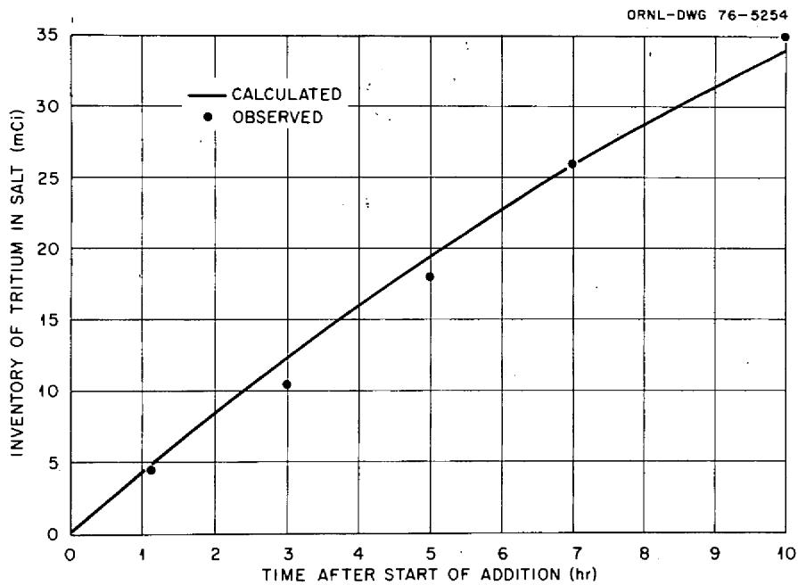  
Fig. 1.1. Buildup of tritium in salt of CSTF during the addition period of T2.

walls) and then transferred back into the salt when the salt concentration had decayed to a sufficiently low level.

# 1.1.2 Analysis of Experiment T3

In experiment T3 approximately $49\mathrm{mCi}$ (1.8 GBq) of tritium were added in $30.5~\mathrm{cm}^3$ of gas during the 9.87-hr addition period. Immediately prior to the start of the third test, single samples of the salt and off-gas indicated the following tritium concentrations:

<table><tr><td>In salt</td><td>1.6 nCi/g</td><td>(59 kBq/kg)</td></tr><tr><td>In off-gas, elemental</td><td>0.42 pCi/cm3</td><td>(15.5 kBq/m3)</td></tr><tr><td>In off-gas, combined</td><td>38 pCi/cm3</td><td>(1.4 MBq/m3)</td></tr></table>

These concentrations are comparable to those obtained at the end of both the first and second experiments. The sample results for experiment T3 (Fig. 1.2) are presented without corrections for any baseline concentrations.

The tritium concentration in the salt peaked at 40 $\mathrm{nCi / g}$ (1.5 MBq/kg) at the end of the addition period and decreased in a manner similar to that observed in experiments T1 and T2. If two first-order processes for removal of tritium from the salt are assumed, as suggested by the data, the apparent half-lives for the processes are 8.7 and $\sim 108$ hr. These processes lead to an apparent trapping efficiency of $55\%$ for the salt. Recalling that the apparent efficiencies in experiments T1 and T2 were $60\%$ and $50\%$ , respectively, the

trapping efficiencies for the three experiments are reasonably consistent.

Using the 8.7 and 108-hr values for the half-lives, a comparison was made between the calculated and observed inventories as functions of time during the tritium addition (Fig. 1.3). The two processes associated with these half-lives provide a reasonable description of both the buildup and decay of tritium concentration in the salt.

Elemental tritium in the off-gas reached a maximum concentration of $40~\mathrm{pCi/cm^3}$ (1.5 $\mathrm{MBq/m^3}$ ), which was significantly higher in relation to the tritium concentration in the salt than in test T2. The concentration of elemental tritium in the salt, inferred from the elemental tritium concentration in the off-gas, was $0.1~\mathrm{nCi/g}$ ( $3.9~\mathrm{kBq/kg}$ ), which led to a ratio of 380 for the combined-to-elemental hydrogen in the salt.

The concentration of water-soluble tritium in the loop off-gas at the end of the addition period was $10,200\mathrm{pCi} / \mathrm{cm}^3 (\sim 380\mathrm{MBq} / \mathrm{m}^3)$ . This result was also significantly higher than the tritium concentration in the salt at the comparable time during experiment T2. Two first-order time constants were extracted from the time variation of the concentration of watersoluble tritium in the off-gas. The half-life of the more rapid process ranged from 7 to $15\mathrm{hr}$ , while the half-life for the longer process was about $70\mathrm{hr}$ .

About 150 hr after the start of the third addition, $37\mathrm{mCi}$ (1.3 GBq) of tritium in the water-soluble form

had passed through the off-gas system while only 25 mCi could be accounted for from salt-sample results. Again, the indication is that of a tritium inventory that is not revealed by salt samples.

Measurements of the tritium concentration in the exhaust air from the loop enclosure of the CSTF were made shortly after the end of the addition period in

an attempt to determine the rate of tritium permeation through the loop walls. These measurements were invalidated by simultaneous operations to dispose of excess tritium from the addition station by venting to the loop enclosure at the end of the third addition. When the loop sample results had reached previous baseline values, the loop sampling fre

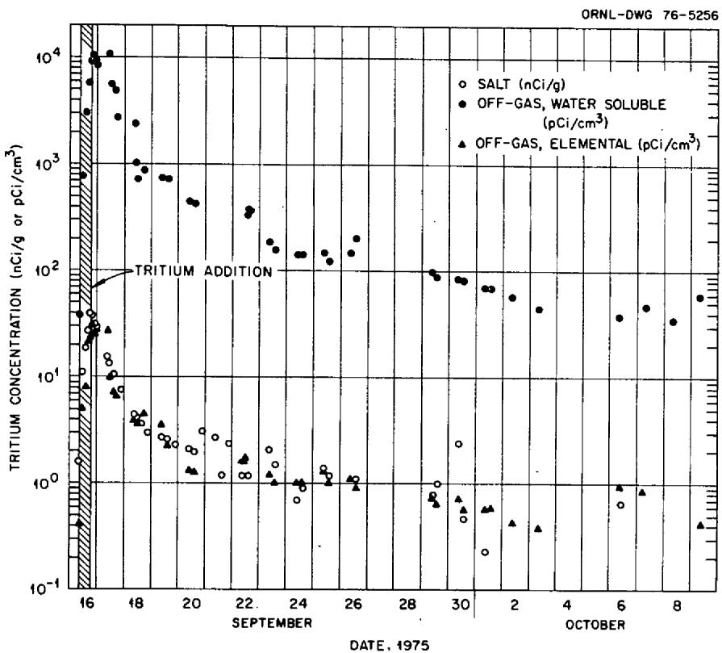  
Fig. 1.2. Observed tritium concentrations in CSTF, Test 3.

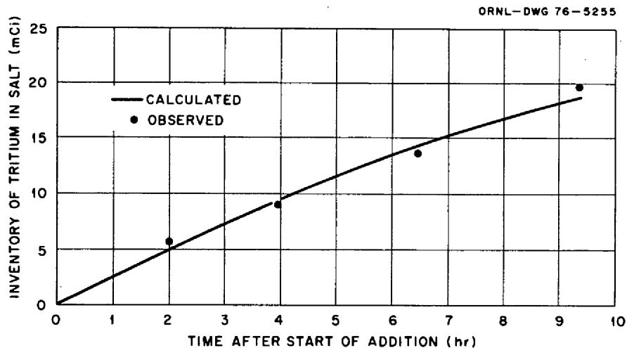  
Fig. 1.3. Buildup of tritium in salt of CSTF during the addition period of T3.

quency was reduced and several tests were made to develop a method for determining the rate of permeation of tritium through the loop walls. Tritium was added to the loop enclosure and to one of the cooling shrouds on the loop piping while samples of the ventilation air were analyzed for tritium content. These tests led to the use of an air-sample tap in the discharge line from one of the coolers and to modification of the cooler inlets to supply fresh air (instead of air from within the enclosure) to that cooler. The results indicated that the tritium concentration in the air leaving the cooler would be readily and accurately measurable if anticipated loop-wall permeation rates were experienced.

Immediately after the end of the tritium addition phase of test T3, some preliminary data were obtained to determine if the addition tube (or a similar device immersed in the main salt stream) could be used to measure the partial pressure of elemental hydrogen in the circulating salt. The addition tube was evacuated several times and then "isolated"; it was expected that any pressure rise within the isolated tube would be due to hydrogen partial pressure in the salt, but the pressure did not reach a steady value. It was subsequently determined that stray inleakage (presumably of air) was occurring and that the rate of inleakage was not sufficiently consistent to permit the extraction of meaningful data about the hydrogen partial pressure. However, it appeared that a sufficiently leaktight device could be used to measure hydrogen partial pressure. Therefore, a partial-pressure probe was constructed and installed in the CSTF for experiment T4.

# 1.1.3 Analysis of Experiment T4

The fourth tritium experiment—a steady-state experiment—in the CSTF is in progress. This experiment was started on February 3, 1976. Data are still being accumulated, and results obtained thus far are preliminary. The operational and experimental conditions for this test are described in Sect. 2.2.

An attempt was made to start this experiment on January 27, 1976, with tritiated hydrogen being added to the loop at $6\mathrm{cm}^3 (\mathrm{STP}) / \mathrm{hr}$ . This attempt was discontinued when the bypass rate of tritiated hydrogen into the vacuum guard chamber surrounding the addition probe was found to be significantly greater than had been observed during previous tritium tests. This bypass rate was about 14 times the rate at which tritium was reaching the circulating salt.

Flow tests to measure the leakage as a function of addition-tube pressure indicated that, for an addition-tube pressure of $35\mathrm{kPa}$ (5 psia), the bypass rate would be $1.5\mathrm{cm}^3 (\mathrm{STP}) / \mathrm{hr}$ , approximately equal to the addition rate to the salt, which was considered tolerable.

Prior to the attempted addition on January 27, samples from the CSTF showed the following tritium concentrations:

Tritium in the salt: $< 1$ to $8\mathrm{nCi / g}$ ( $< 40$ to 300 kBq/kg)

Water-soluble (combined) tritium in off-gas: 20 to 50 $\mathrm{pCi} / \mathrm{cm}^3$ (0.7 to $2\mathrm{MBq} / \mathrm{m}^3$

Elemental tritium in off-gas: 5 to $17\mathrm{pCi} / \mathrm{cm}^3$ (0.2 to $0.6\mathrm{MBq} / \mathrm{m}^3$ )

Elemental tritium in cooling-duct air: $\sim$ Background*

Those pretest samples taken on February 3, prior to the actual start of the test, were biased by the tritium added on the January 27 attempt.

The tritium concentration in the salt (Fig. 1.4) rose in a manner similar to that observed in previous tests to $500\mathrm{nCi / g}$ $(\sim 20\mathrm{MBq / kg})$ about 2.5 days after the start of the addition. The tritium concentration subsequently rose to a value of $700\mathrm{nCi / g}$ (24.5 MBq/kg) $(\pm 10\%)$ .

The concentration of water-soluble tritium in the off-gas increased to a value of $150,000\mathrm{pCi} / \mathrm{cm}^3$ (5.5 $\mathrm{GBq} / \mathrm{m}^3$ ) about four days after the start of the addition. It then gradually increased to 180,000 to $190,000\mathrm{pCi} / \mathrm{cm}^3$ (6.7 to $7.0\mathrm{GBq} / \mathrm{m}^3$ ). This corresponds to a flow rate of 22 to $23\mathrm{mCi} / \mathrm{hr}$ (0.22 to 0.23 $\mathrm{GBq} / \mathrm{s}$ ) of tritium or 1.5 to $1.6\mathrm{cm}^3 /\mathrm{hr}$ of total hydrogen (at 5600 ppm tritium in hydrogen) in the off-gas in the water-soluble form.

The elemental tritium concentration in the off-gas showed irregular behavior and scatter for about one day following the start of the addition before increasing in an orderly fashion to a value of 22,000 $\mathrm{pCi} / \mathrm{cm}^3 (\sim 0.8\mathrm{GBq} / \mathrm{m}^3)$ . This irregular behavior was not entirely unexpected and may have been due to conditioning of new piping in the off-gas system that had been installed prior to this experiment. A somewhat similar phenomenon occurred during the first tritium addition experiment. The concentration of elemental tritium in the off-gas subsequently decreased to a value between 10,000 and 11,000 $\mathrm{pCi} / \mathrm{cm}^3$ (0.37 GBq/m³ and 0.41 GBq/m³). There-

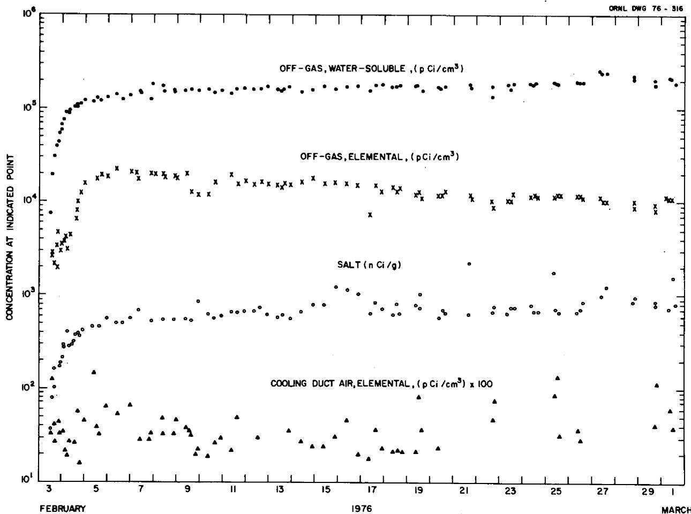  
Fig. 1.4. Tritium concentrations at various points in the Coolant-Salt Technology Facility during experiment T4.

fore, elemental tritium is appearing in the off-gas system at a rate of 1.2 to $1.32\mathrm{mCi / hr}$ ( $\sim 12.5$ to 13.6 $\mathrm{MBq / s}$ ) or 0.08 to $0.09~\mathrm{cm}^3 /\mathrm{hr}$ total hydrogen.

Measurable concentrations of tritium were observed in the first sample of air taken from the loop cooling duct 2 hr after the start of the experiment. Since then, the concentration has varied between 0.2 and $0.8\mathrm{pCi} / \mathrm{cm}^3$ (7 to $30\mathrm{kBq} / \mathrm{m}^3$ ). These concentrations correspond to a net flow of 0.2 to $0.8\mathrm{mCi} / \mathrm{hr}$ (2.1 to $2.2\mathrm{MBq} / \mathrm{s}$ ) of tritium or 0.013 to $0.054\mathrm{cm}^3 / \mathrm{hr}$ of total hydrogen through the walls of the loop piping and pump bowl. Thus the total flow rate of tritiated hydrogen out of the CSTF is from 1.6 to 1.75 $\mathrm{cm}^3 (\mathrm{STP}) / \mathrm{hr}$ via the off-gas system and permeation of the metal walls, with 96 to $99\%$ of the total being removed through the off-gas system.

Measurement of the bypass rate of hydrogen around the addition probe indicated an average rate of $\sim 1.2\mathrm{cm}^3 /\mathrm{hr}$ .Tritiated hydrogen is being consumed (addition rate to loop plus bypass rate) at $\sim 3.0$

$\mathrm{cm}^3 /\mathrm{hr}$ .Thus,with 1.6 to $1.75~\mathrm{cm}^3 (\mathrm{STP}) / \mathrm{hr}$ being removed from the CSTF,89 to $97\%$ of the tritium that is fed to the addition probe can be accounted for.

The measured concentration of elemental tritium in the off-gas corresponds to a partial pressure of 0.2 Pa $(1.5\mu \mathrm{mHg})$ for elemental tritiated hydrogen in the pump bowl gas space. This value compares favorably with the measured hydrogen partial pressure in the main circulating salt stream, $0.43\mathrm{Pa}$ $(3.2\mu \mathrm{mHg})$ . If the liquid in the pump bowl is assumed to be in equilibrium with the gas phase, the change in the hydrogen partial pressure between the salt in the loop and that in the pump bowl may be used to estimate the solubility of elemental hydrogen in the $\mathrm{NaBF_4 - NaF}$ mixture. For the nominal flow rate of salt through the pump bowl, $15\mathrm{gpm}(0.95\times 10^{-3}\mathrm{m}^3 /\mathrm{s})$ , the solubility coefficient for elemental hydrogen would be $1.7\times 10^{-18}$ atm $(\mathrm{atom / cm^3})^{-1}$ , compared to an earlier estimate of $4\times 10^{-18}$ . Conversely, if the earlier estimate of solubility is

used, the salt flow rate through the pump bowl is 36 gpm $(2.3\times 10^{-3}\mathrm{m}^3 /\mathrm{s})$ . Since both values are within reasonable limits, the solubility of hydrogen cannot be defined more precisely from these data.

A similar analysis of the data for combined tritium (hydrogen) in the off-gas indicates a hydrogen partial pressure of $8.3\mathrm{Pa}$ $(62\mu \mathrm{mHg})$ in the gas phase, assuming ideal-gas behavior and one atom of tritium or hydrogen per molecule of compound. If this value represents equilibrium between the liquid and gas phases, the solubility coefficient for the water-soluble hydrogen form is $1.7\times 10^{-20}$ atm (molecule/ $\mathbf{cm}^3$ salt) $^{-1}$ . This is close to the value of $1.1\times 10^{-20}$ estimated for the solubility of HF, which is one possible form of the water-soluble compound.

The apparent rate of hydrogen permeation through the loop walls, based on the observed tritium concentration in the loop cooling duct, is between 0.7 and $2.7 \times 10^{-6} \mathrm{~cm}^3 (\mathrm{STP}) / \mathrm{m}^2 \cdot \mathrm{s}$ . If the hydrogen partial pressure in the salt is $0.43 \mathrm{~Pa}$ , this rate requires the effective permeability of the loop piping to be between 10 and 50 times lower than that of bare metal. A reduction of this magnitude would be consistent with the presence of an oxide film on the exterior metal surfaces.

Based on the measured concentration of water-soluble tritium in the salt $(700\mathrm{nCi / g})$ and the measured partial pressure of elemental hydrogen (0.43 Pa), the ratio of the concentration of total hydrogen in the water-soluble (combined) form to that in the elemental form is $\sim 4700$ . If this concentration ratio were established in the coolant salt of an MSBR and for the following conditions:

1. removal of combined tritium from a $10\%$ salt bypass stream (8000 gpm) with $80\%$ efficiency;   
2. no sorption of HT or TF on the core graphite;   
3. reference value of $10^{2}$ for the $\mathrm{U}^{4 + } / \mathrm{U}^{3 + }$ ratio in the primary salt;   
4. bare-metal permeability for the steam tubes (no oxide film);

about $3.5\mathrm{Ci}/$ day $(1.5\mathrm{MBq / s})$ of tritium would enter the steam system and be released to the environment. This release rate of tritium to the environment would be within the range of release rates from pressurized-water reactors (PWRs) currently operating. The release rate of tritium for the MSBR includes the entire fuel cycle, while that for PWRs would be about $80\mathrm{Ci}/$ day if releases associated with fuel reprocessing were included.

# 1.2 NEUTRONIC ANALYSIS

H. T. Kerr E. J. Allen D. L. Reed

The neutronic analysis efforts during this reporting period have focused primarily on the processing of cross section data for MSBR performance evaluations and for investigation of specific related problems. Some work has been done in support of in-reactor irradiation experiments.

# 1.2.1 Cross Section Processing for MSBR Calculations

Neutron cross sections from the ENDF/B-IV data files* have been processed to form a 123-energy-group library with thermal scattering matrices for temperatures ranging from $300\mathrm{K}$ to $1200\mathrm{K}$ . This library includes all nuclides of interest to the MSR program and will serve as a data base for all subsequent neutronics analyses. In addition to the ENDF/B-IV data, graphite cross sections obtained from General Atomics Company have been included. The cross section data available in this base library must be further processed-for each unique application. Significant changes in the fuel salt composition or in the fuel-moderator cell design can strongly influence the effective cross sections, particularly for strong absorbers such as $^{232}\mathrm{Th}$ .

The core of the reference design MSBR is divided into two major zones. Zone I is characterized by approximately 13 vol % fuel salt, and Zone II is characterized by approximately 37 vol % fuel salt. Each of these two major zones contains two unique fuel-moderator cell designs (Fig. 1.5). The cylindrical equivalent of each cell design is also shown. Neutronic calculations based on one-dimensional neutron transport theory were done for each cylindrical cell to produce cell-averaged 123-energy-group neutron cross sections for the salt constituents in each fuel channel and for the graphite. Spectrum-averaged capture and fission cross sections for some isotopes are summarized (Table 1.1); the strong dependence on fuel channel dimensions is apparent. However, volume averaging the cross sections for both fuel channels in cells having the same total fuel salt fraction gives total cell-averaged cross sections that are not very sensitive to fuel channel dimensions. Therefore, cell-averaged cross sections for a nominal fuel salt composition are primarily dependent upon the volume fraction of fuel salt in the cell.

ORNL-OWG 76-5257

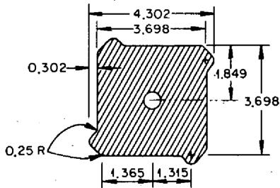  
REACTOR   
GEOMETRY   
ZONE 1-A

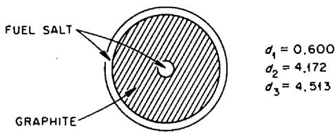  
COMPUTATIONAL   
MODEL   
ZONE 1-A

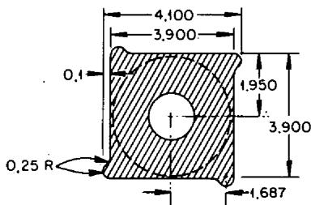  
ZONE 1-B

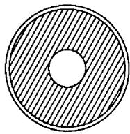  
ZONE 1-B

$$
d _ {1} = 1. 3 4 0
$$

$$
d _ {2} = 4. 4 0 0
$$

$$
\sigma_ {3} = 4. 5 1 3
$$

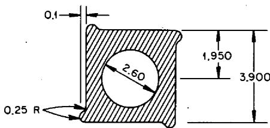  
ZONE 2-A

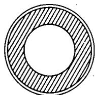  
ZONE 2-A

$$
d _ {4} = 2. 6 0 0
$$

$$
d _ {2} = 4. 4 0 0
$$

$$
d _ {3} = 4. 5 1 3
$$

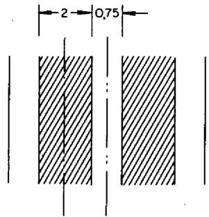  
ZONE 2-B

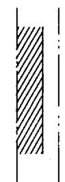  
DIMENSIONS IN INCHES   
Fig. 1.5. Sketches of MSBR core pieces and equivalent cylindrical cells.

ZONE 2-8

$$
t _ {a} = 4. 0 0 0
$$

$$
I _ {9} = 0. 3 7 5
$$

Table 1.1. Cell-averaged neutron cross sections for the four cell designs in an MSBR core   

<table><tr><td rowspan="3">Reaction</td><td colspan="7">Cell-averaged cross section (b)a</td></tr><tr><td colspan="2">Core zone I-A</td><td colspan="2">Core zone I-B</td><td colspan="2">Core zone II-A</td><td>Core zone II-B</td></tr><tr><td>Central hole</td><td>Outer annulus</td><td>Central hole</td><td>Outer annulus</td><td>Central hole</td><td>Outer annulus</td><td>Gap</td></tr><tr><td colspan="8">For each fuel channel</td></tr><tr><td>232Th(n,γ)</td><td>2.418</td><td>2.202</td><td>2.044</td><td>2.902</td><td>1.458</td><td>2.751</td><td>1.905</td></tr><tr><td>233U(n,γ)</td><td>13.03</td><td>12.10</td><td>12.54</td><td>14.25</td><td>6.825</td><td>8.342</td><td>8.805</td></tr><tr><td>233U(n,f)</td><td>110.5</td><td>102.1</td><td>108.2</td><td>123.3</td><td>50.96</td><td>62.30</td><td>69.44</td></tr><tr><td>238U(n,γ)</td><td>9.721</td><td>9.101</td><td>8.458</td><td>9.220</td><td>9.863</td><td>11.54</td><td>9.774</td></tr><tr><td colspan="8">For total cell</td></tr><tr><td>232Th(n,γ)</td><td>2.225</td><td></td><td>2.352</td><td></td><td>1.627</td><td></td><td>1.905</td></tr><tr><td>233U(n,γ)</td><td>12.20</td><td></td><td>13.15</td><td></td><td>7.022</td><td></td><td>8.805</td></tr><tr><td>233U(n,f)</td><td>103.0</td><td></td><td>113.6</td><td></td><td>52.4</td><td></td><td>69.44</td></tr><tr><td>238U(n,γ)</td><td>9.168</td><td></td><td>8.731</td><td></td><td>10.08</td><td></td><td>9.774</td></tr></table>

$a_1b = 10^{-28}m^2.$

As originally conceived, the cell-weighted cross sections previously described were to be used in a 123-group one-dimensional transport theory calculation of an MSBR. Neutron energy spectra produced in this calculation were to be used to collapse the isotopic cross sections in each core zone into a few groups (nominally 9) of a form suitable for multidimensional performance calculations. However, considerable delays have been encountered with the transport calculation in the AMPX code. First, several program errors were discovered which necessitated re-running all the cell calculations. Then the observation was made that the calculated radial flux profiles in the one-dimensional reactor model, particularly in the reflector and reactor-vessel regions, were strongly dependent on the initial flux guess used to start the iterative procedure. This unacceptable situation results from the use of convergence criteria in AMPX which are not suitable for one-dimensional reactor flux calculations in regions having very low neutron source densities. Program modifications are being made to incorporate suitable convergence criteria, and alternate computational schemes are being considered.

# 1.2.2 MSBR Performance Calculations

Multidimensional performance calculations for the reference design MSBR require collapsed, few-group cross-section data for each zone of the reactor. However, for the reasons previously given (Sect. 1.2.1), the appropriate cross sections are not

available. This fact and the planned termination of the MSR Program at the end of FY 1976 will preclude completion of the performance calculations.

# 1.2.3 Helium Production in the MSBR Vessel

The mechanisms for helium generation from nickel in Hastelloy N (ref. 5) are: (1) thermal-neutron capture in $^{58}\mathrm{Ni}$ followed by thermal $(n,\alpha)$ reactions in the product $^{59}\mathrm{Ni}$ and (2) direct, high-energy $(n,\alpha)$ reactions in $^{58}\mathrm{Ni}$ . At moderate neutron fluences (below about $10^{22}$ neutrons/cm² with the nominal neutron energy spectrum expected in the MSBR vessel), the concentration of helium in Hastelloy N due to the two-step, thermal process is adequately represented by

$$
\operatorname {H e} _ {1} (t) = \frac {N \sigma_ {1} \sigma_ {2}}{2} (\phi t) ^ {2}, ^ {*}
$$

where $N$ is the atom fraction of $^{58}\mathrm{Ni}$ in the alloy, $\sigma_{1}$ is the effective, spectrum-averaged cross section for $^{58}\mathrm{Ni}(n,\gamma)^{59}\mathrm{Ni}$ reaction, $\sigma_{2}$ is the effective spectrum-averaged cross section for $^{59}\mathrm{Ni}(n,\alpha)^{56}\mathrm{Fe}$ reaction, $\phi$ is the total neutron flux, and $t$ is time.

The dependence on the square of the fluence results from the fact that the intermediate nuclide, $^{59}\mathrm{Ni}$ , must be generated by neutron captures. The comparable approximation for helium concentration due to the high-energy, $(n,\alpha)$ process is

$$
\mathrm {H e} _ {2} (t) = N \sigma_ {3} \phi t,
$$

where $\sigma_{3}$ is the effective, spectrum-averaged cross section $^{58}\mathrm{Ni}(n,\alpha)^{55}\mathrm{Fe}$ reaction.

The ratio of these two concentrations is a linear function of fluence. Thus the high-energy process is the dominant source of helium at low fluences, and the two-step thermal process becomes dominant at higher fluences. These relations also indicate that changing the neutron flux spectrum (e.g., reduction of the thermal component) would change the relative importance of the two processes, as well as the total helium concentration that would be generated in a given time period.

Cross sections for the $^{58}\mathrm{Ni}(n,\gamma)$ reaction are fairly well known, and available information for the $^{59}\mathrm{Ni}(n,\alpha)$ cross sections indicates that a value of 13 b $(13 \times 10^{-28} \mathrm{~m}^2)$ at 2200 m/sec is reasonable. The neutron fluxes in an MSBR have been calculated with several different computational models and are generally in good agreement for the fueled regions of the reactor. However, calculating neutron fluxes in the reactor vessel is a particularly difficult problem because the codes available for the source-type problems are not designed for neutron flux convergence in zones of low nuclear importance. A 20-group $S_n$ transport calculation with special convergence criteria was done.

By combining the available cross-section data for nickel with neutron fluxes from this calculation estimates were made for the amount of helium generated in the reactor vessel during the reactor lifetime. The spectrum-weighted cross sections and flux information used to estimate the helium concentration at the inside wall are summarized (Table 1.2). Using these values, calculated maximum helium concentration in the vessel is $38~\mathrm{ppm}$ .* About $90\%$ of the higher concentration is associated with the two-step thermal process discussed above.

Although some uncertainty exists in the helium concentration calculated at the inner surface of the vessel, the calculated flux has a steep radial gradient

Table 1.2. Spectrum-weighted neutron cross sections ${}^{a}$ and fluxes ${}^{b}$ for calculation of helium production in the MSBR vessel   

<table><tr><td>Reaction</td><td>σT(b)c</td></tr><tr><td>58Ni(n,γ)</td><td>1.29</td></tr><tr><td>58Ni(n,α)</td><td>1.20 × 10-3</td></tr><tr><td>59Ni(n,α)</td><td>3.78d</td></tr><tr><td>59Ni(n,abs)</td><td>26.8</td></tr></table>

$$
^ a \sigma_ {T} = \frac {\int_ {0} ^ {\infty} \sigma (E) \phi (E) d E}{\int_ {0} ^ {\infty} \phi (E) d E}
$$

where

$\sigma_{T} =$ spectrum-weighted cross section,

$\sigma (E) =$ energy-dependent cross section,

$\phi (E) =$ energy-dependent neutron flux, and

$E =$ neutron energy.

The maximum calculated total flux at the inside wall of the reactor vessel at the horizontal midplane is $5.73 \times 10^{12}$ reactions/cm²·sec.

$$
c _ {1} b = 1 0 ^ {- 2 8} m ^ {2}.
$$

$d_{\mathrm{Normalized}}$ to 13 b at $2200\mathrm{m / sec}$

in the vessel. This gradient causes a reduction in helium concentration by a factor of about five for each centimeter of penetration into the vessel wall. Thus the concentration of helium in the Hastelloy N vessel wall appears to be acceptably low.

# 1.2.4 Production of $^{232}\mathbf{U}$ in the MSBR

Uranium-232 has a decay chain that approaches equilibrium over a several-year period; the nuclides in this chain emit high-energy $\alpha$ -alpha particles and gamma rays. The alpha particles, in turn, may react with other nuclides to produce neutrons. As a result, shielding and handling costs of reactor fuels increase as the $^{232}\mathrm{U}$ content increases. Increasing the content of $^{232}\mathrm{U}$ in fuels of conventional reactors for which reprocessing and refabrication are required raises the cost by which these processes are performed and lowers the value of the discharged fuel. In the absence of light nuclides which can undergo $(\alpha,n)$ reactions, the principal radiations from the standpoint of shielding are the 2.6-MeV gamma from $^{208}\mathrm{Tl}$ and the

2.2-MeV gamma from $^{212}\mathrm{Bi}$ . However, in the presence of light nuclides (e.g., F, Be, and Li), as may be the case for MSBR fuel, a significant neutron source would also be present.

The $^{232}\mathrm{U}$ production in the reference design MSBR was examined to determine the concentration of $^{232}\mathrm{U}$ that would be present in the MSBR. Decay of $^{232}\mathrm{U}$ is not a direct problem for fuel used in the MSBR (because no fabrication is required), but the content of this isotope in excess bred fuel could affect handling and shipping costs. The five processes by which $^{232}\mathrm{U}$ can be produced are

$$
\begin{array}{l} { } ^ { 2 3 3 } \mathrm { U } \xrightarrow [ ( \gamma , n ) ] { ( n , 2 n ) } \Rightarrow { } ^ { 2 3 2 } \mathrm { U } \\ { } ^ { 2 3 0 } \mathrm { T h } \xrightarrow { n , \gamma } { } ^ { 2 3 1 } \mathrm { T h } \xrightarrow { \beta - } { } ^ { 2 3 1 } \mathrm { P a } \xrightarrow { n , \gamma } { } ^ { 2 3 2 } \mathrm { P a } \xrightarrow { \beta - } { } ^ { 2 3 2 } \mathrm { U } \\ { } ^ { 2 3 2 } \mathrm { T h } \xrightarrow [ \gamma , n ] { n , 2 n } \gg { } ^ { 2 3 1 } \mathrm { T h } \xrightarrow { \beta ^ { - } } { } ^ { 2 3 1 } \mathrm { P a } \xrightarrow { n , \gamma } { } ^ { 2 3 2 } \mathrm { P a } \xrightarrow { \beta ^ { - } } { } ^ { 2 3 2 } \mathrm { U } \\ \end{array}
$$

For the $^{232}\mathrm{Th}$ : $^{233}\mathrm{U}$ ratios ( $\sim 56$ ) expected in the MSBR, the $(n,2n)$ reaction in $^{232}\mathrm{Th}$ is more important than the $(n,2n)$ reaction in $^{233}\mathrm{U}$ . However, removal of the protactinium isotopes by fuel processing on a 10-day cycle greatly reduces the production of $^{232}\mathrm{U}$ from $^{232}\mathrm{Th}$ reactions. As a consequence, the net production rates of $^{232}\mathrm{U}$ from the two $(n,2n)$ processes may be comparable in an MSBR.

The equilibrium concentration* of $^{232}\mathrm{U}$ in the MSBR is given by the equation:

$$
N _ {2 2} = \frac {1}{\sigma_ {5} \phi + \lambda_ {5}} \left[ \frac {\lambda_ {2} \sigma_ {3} \phi (\phi \sigma_ {i} N _ {0 0} + R _ {2} N _ {0 2})}{(\lambda_ {2} + \lambda_ {R}) (\sigma_ {3} \phi + \lambda_ {R})} + R _ {4} N _ {2 3} \right].
$$

where

$$
\begin{array}{l} N _ {2 2} = ^ {2 3 2} \mathrm {U} \text {c o n c e n t r a t i o n}, \\ N _ {0 0} = ^ {2 3 0} \text {T h c o n c e n t r a t i o n}, \\ N _ {0 2} = ^ {2 3 2} \text {T h c o n c e n t r a t i o n}, \\ N _ {2 3} = ^ {2 3 3} \mathrm {U} \text {c o n c e n t r a t i o n}, \\ \phi = \text {n e u t r o n} \\ \lambda_ {2} = \text {d e c a y} ^ {2 3 2} \mathrm {P a}, \\ \lambda_ {5} = \text {d e c a y} ^ {2 3 2} U, \\ \lambda_ {R} = \text {r e m o v a l c o n s t a n t} \mathrm {P a}, \\ \sigma_ {1} = (n, \gamma) \text {c r o s s} ^ {2 3 0} \mathrm {T h}, \\ R _ {2} = \phi \sigma_ {2} + \phi_ {\gamma} \sigma_ {2 \gamma}, \\ \sigma_ {2} = (n, 2 n) \text {c r o s s s e c t i o n} ^ {2 3 2} \mathrm {T h}, \\ \end{array}
$$

$$
\begin{array}{l} \sigma_ {2 \gamma} = (\gamma , n) \text {c r o s s s e c t i o n o f} ^ {2 3 2} \mathrm {T h}, \\ \phi_ {\gamma} = \text {g a m m a f l u x}, \\ \sigma_ {3} = (n, \gamma) \text {c r o s s s e c t i o n} ^ {2 3 1} \mathrm {P a}, \\ R _ {4} = \phi \sigma_ {4} + \phi_ {\gamma} \sigma_ {4 \gamma}, \\ \sigma_ {4 \gamma} = (\gamma , n) \text {c r o s s s e c t i o n o f} ^ {2 3 3} \mathrm {U}, \\ \sigma_ {4} = (n, 2 n) \text {c r o s s} ^ {2 3 3} U, \text {a n d} \\ \sigma_ {5} = (n, \text {a b s}) \text {c r o s s s e c t i o n} ^ {2 3 2} \mathrm {U}. \\ \end{array}
$$

The equation assumes that the concentrations of $^{233}\mathrm{U}$ , $^{230}\mathrm{Th}$ , and $^{232}\mathrm{Th}$ are constant and that other isotopic concentrations are in equilibrium.

Based on neutron fluxes obtained from the diffusion theory model of the MSBR, values were obtained for the various reaction rates. The reaction rate values, in reactions per atom per second, are summarized below.

$$
\begin{array}{l} \sigma_ {1} \phi = 1. 2 5 \times 1 0 ^ {- 8}, \\ \sigma_ {2} \phi = 1. 9 2 \times 1 0 ^ {- 1 3}, \\ \sigma_ {2 \gamma} \phi_ {\gamma} = 1. 9 6 \times 1 0 ^ {- 1 4}, \\ \sigma_ {3} \phi = 4. 3 0 \times 1 0 ^ {- 8}, \\ \sigma_ {4} \phi = 1. 1 1 \times 1 0 ^ {- 1 3}, \\ \sigma_ {4 \gamma} \phi_ {\gamma} = 1. 9 6 \times 1 0 ^ {- 1 4}, \\ \sigma_ {5} \phi = 1. 5 7 \times 1 0 ^ {- 8}, \\ \lambda_ {2} = 6. 0 8 \times 1 0 ^ {- 6}, \\ \lambda_ {5} = 3. 0 5 \times 1 0 ^ {- 1 0}, \\ \lambda_ {R} = 1. 1 6 \times 1 0 ^ {- 6} (\text {t e n - d a y c y c l e}). \\ \end{array}
$$

The $^{230}\mathrm{Th}(n,\gamma)$ cross section was based on a 2200 m/sec value of 22.7 b $(22.7\times 10^{-28}\mathrm{m}^2)$ and a resonance integral of 996 b $(966\times 10^{-28}\mathrm{m}^2)$ . The $(\gamma ,n)$ cross sections for both $^{233}\mathrm{U}$ and $^{232}\mathrm{Th}$ were taken as 0.05 b $(0.05\times 10^{-28}\mathrm{m}^2)$ for gamma energies above 6.0 MeV and zero for gamma energies below 6.0 MeV. These very conservative $(\gamma ,n)$ cross sections are based on the limited information available for these reactions. The gamma flux was approximated by assuming a volumetric fission source of gammas in an infinite medium of pure graphite with a density equal to that of pure graphite in the MSBR. The remaining cross sections are better known, and the corresponding reaction rates should be more reliable.

Substituting the reaction-rate values into the equation for the equilibrium concentration of $^{232}\mathrm{U}$ gives

Solution of this expression for the reference design 1000 MW(e) MSBR with a ten-day processing cycle for protactinium removal and no $^{230}\mathrm{Th}$ leads to an equilibrium concentration of 20 ppm for $^{232}\mathrm{U}$ in total uranium. Of this amount, $27\%$ is produced by reactions in $^{233}\mathrm{U}$ . The $^{232}\mathrm{U}$ source from $^{230}\mathrm{Th}$ would about equal the combined source from $^{232}\mathrm{Th}$ and $^{233}\mathrm{U}$ at a concentration of 23 ppm $^{230}\mathrm{Th}$ in thorium. Thorium-230, which is a decay product of $^{234}\mathrm{U}$ , is present to about 17 ppm in natural uranium. Thus, if the thorium to be used in a reactor is obtained from mineral deposits that also contain uranium, such thorium could contain a significant amount of $^{230}\mathrm{Th}$ . The Th:U ratio in Monazite sands, a major thorium resource, is typically about 20. Hence, thorium from such deposits could be expected to contain only about 1 ppm $^{230}\mathrm{Th}$ an insignificant concentration from the standpoint of $^{232}\mathrm{U}$ production. However, in the absence of a large thorium industry, initial demands for thorium conceivably could be met by material recovered from uranium mill tailings, where the Th:U ratio in the raw ore could have been 0.2 or less. (The uranium ores at Blind River in Canada, for example, have Th:U ratios of about 0.2.) Hence the $^{230}\mathrm{Th}$ content could exceed 100 ppm, which would raise the equilibrium $^{232}\mathrm{U}$ concentration to about 107 ppm in total uranium in an MSBR.

# 1.2.5 Neutronic Analyses of TeGen Experiments

The neutronic analysis for the TeGen experiments, as described in the previous semiannual progress report, was based primarily on a flux mapping experiment in the ORR poolside and on flux monitors included in the TeGen-1 experiment. Flux monitors have now been loaded into the TeGen-2 and TeGen-3 capsules and will provide additional data for characterizing the TeGen experiments.

The flux monitors in both TeGen-2 and TeGen-3 are identical and consist of two natural iron wires and two vanadium-cobalt $(0.215\mathrm{wt}\%)$ wires. One wire of each type is placed on the side of the fuel specimen toward the reactor core, and the other wire of each type is placed on the side away from the reactor core. The iron wires are $343\mathrm{mm}$ long and extend along the entire length of the fuel pin region. The vanadium-cobalt wires are $76\mathrm{mm}$ long and are located only along the middle fuel pin.

The flux monitors have been recovered from the TeGen-2 capsule and are being analyzed to determine the induced activities. The irradiation of the TeGen-3 capsule has not been completed.

# 1.3 HIGH-TEMPERATURE DESIGN METHODS

G. T. Yahr

Simplified analysis methods in ASME Code Case 1592 (ref. 7) and RDT Standard F9-4T (ref. 8) permit the assessment of ratchetting and creep-fatigue damage on the basis of elastic-analysis results, provided a number of restrictive conditions are met. Otherwise, detailed inelastic analyses, which are usually quite expensive for the conditions where they are currently necessary, are required to show that code requirements are met. Analytical investigations to extend the range over which simplified ratchetting and creep-fatigue rules may be used to show compliance with code requirements are being made under the ORNL High-Temperature Structural Design Program, which is supported in part by the MSR Program. Modeling procedures for applying the simplified ratchetting rules to geometries and loadings prototypic of those encountered in LMFBR component designs are to be identified. Then the conservative applicability of these ratchetting rules and procedures and of elastic creep-fatigue rules will be demonstrated and placed on a reasonably sound engineering basis. Finally, an assessment will be made of the applicability of the simplified design methods to Hastelloy N under MSBR design conditions, and the importance of thermal ratchetting in an MSBR will be determined.

The detailed plans for achieving the stated objectives were given in a previous progress report. The basic approach is to perform a relatively small number of carefully planned and coordinated rigorous elastic-plastic-creep ratchetting-type analyses of several geometries. Each geometry is subjected to the axial, bending, thermal-transient, and pressure loadings described in Table 1.7 of ref.9. Several two-dimensional cylindrical shell problems are being analyzed at ORNL using the PLACRE computer program, while three-dimensional nozzle-to-shell problems are being analyzed by Atomics International and Combustion Engineering using the MARC computer program.* Each inelastic analysis will include a complete code evaluation for accumulated strains and creep-fatigue damage. Also associated with each inelastic analysis are a number of elastic analyses to provide the input parameters required to apply the various simplified ratchetting rules and procedures and elastic creep-fatigue rules.

The inelastic analysis results for the nine axisymmetrical shell cases have been tabulated and compared with the results of the Code Case 1592-3 elastic creep-fatigue rules. The elastic rules were found to be conservative in all cases for combined creep-fatigue, but the creep damage components were not conservative for the notched cylinder and the stepped cylinder, compared to the predictions of the inelastic rules. One-dimensional inelastic analyses simulating various locations in the shells are now being performed.

Both of the three-dimensional inelastic analyses of nozzle-to-shell configurations are under way again after various problems, including cost overruns, temporarily stopped the work. Combustion Engineering has completed an analysis of three of the five thermal downshocks to be applied to the nozzle-to-cylinder configuration, and Atomics International is approximately halfway through the analysis of the one thermal downshock to be applied to the nozzle-to-spherical shell configuration.

# 1.3.1 Circular Cylindrical Shells*

Results for the nine circular cylindrical shell cases of this study have now been tabulated, and the results of Code Case 1592-3 elastic rules have been compared with the inelastic results. The elastic fatigue damage rules have been found to be conservative in all cases studied. Both the elastic ratchetting rules and the elastic creep-damage rules have been found to be nonconservative in some cases. There are two types of geometries in which nonconservatism has arisen—at a notch in a pipe wall and in the thick-walled portion of a shell involving a stepped-wall thickness.

Work is now under way to carry out one-dimensional inelastic analyses simulating various locations in the nine circular cylindrical shell cases. It is expected that these simulations will throw further light on the nonconservatism found.

# 1.3.2 Nozzle-to-Spherical Shell Attachment†

The project on three-dimensional inelastic analysis of a nozzle-to-spherical shell attachment was discontinued for approximately five months because of funding problems associated with computer costs. It was reactivated early in November, but the scope has been reduced from a five-cycle to a one-cycle

inelastic analysis. The elastic thermal stress analysis and the full-scale inelastic analysis are now being continued.

At this time, 26 thermal load increments and 1 zero load increment have been completed. The temperature in the entire thin-walled nozzle section of the attachment reached $427^{\circ}\mathrm{C}$ $(800^{\circ}\mathrm{F})$ at the twenty-first increment. The maximum temperature in the structure at the twenty-sixth increment is $576^{\circ}\mathrm{C}$ $(1036^{\circ}\mathrm{F})$ . There are approximately six more increments to complete the thermal down-transient. Problems associated with the number of increments which could be submitted at one time, computer hardware and system problems, and problems associated with the error messages in the MARC program have slowed the rate of analysis, but these problems have been resolved.

# 1.3.3 Nozzle-to-Cylinder Intersection

This investigation involves a detailed inelastic analysis (elastic-plastic and creep analysis) of a nozzle-to-cylinder intersection. The geometry of the intersection is that of the primary inlet nozzle of the intermediate heat exchanger (IHX) for the fast-flux test facility (FFTF).

Cyclic thermal and mechanical loading will be repeated until the strain-stress history shows a repetitive pattern or steady-state response. A maximum of five cycles will be done. The inelastic analysis has been performed for the first three cycles.

# 1.3.4 Inelastic Analyses of MSR Piping Subjected to Internal Pressure and Transient Temperature Cycles

The temperature histograms for two of the most severe thermal-transients that might occur in an MSBR have been obtained to serve as a basis for evaluating the magnitude of thermal ratchetting and creep-fatigue damage that might be expected. One of the transients results from a $60\%$ decrease in load demand from full power operation in just 3 sec. The maximum thermal downshock rate during this event is only $3.3^{\circ}\mathrm{C} / \sec$ (5.9°F/sec), and 120 such events might occur over a 30-year life. The other event considered is a control-rod scream, which results in a maximum thermal downshock rate of $19.3^{\circ}\mathrm{C} / \sec$ (34.7°F/sec). This rather severe transient is expected to occur no more often than once each year.

Creep-rupture data and creep curves for Hastelloy N at 593, 704, and $816^{\circ}\mathrm{C}$ (1100, 1300, and $1500^{\circ}\mathrm{F}$ ) have also been obtained. When cyclic stress-strain data are obtained for Hastelloy N, solution of the sample problems will proceed. Results from the sample problems will be examined to determine whether thermal ratchetting and/or creep-fatigue damage will be significant problems in an MSBR.

# REFERENCES

1. Molten-Salt Reactor Program Staff, Conceptual Design Study of a Single-Fluid Molten-Salt Breeder Reactor, ORNL-4541 (June 1971).   
2. J. R. Engel and G. T. Mays, MSR Program Semiannu. Progr. Rep. Aug. 31, 1975, ORNL-5078, pp. 3-8.   
3. O. L. Smith, Preparation of 123-Group Master Cross Section Library for MSR Calculation, ORNL/TM-4066 (March 1973).

4. N. M. Greene et al., $AMPX$ : A Modular Code System for Generating Coupled Multigroup Neutron-Gamma Libraries from ENDF/B, ORNL/TM-3706 (March 1976).   
5. H. T. Kerr, D. L. Reed, and E. J. Allen, MSR Semiannu. Progr. Rep. Aug. 31, 1975, ORNL-5078, pp. 9-12.   
6. E. G. Fuller, National Bureau of Standards, personal communication, February 1976.   
7. Code Case 1592, Interpretations of ASME Boiler and Pressure Vessel Code, American Society of Mechanical Engineers, New York, 1974.   
8. RDT Standard F9-4T, Requirements for Construction of Nuclear System Components at Elevated Temperatures (Supplement to ASME Code Cases 1592, 1593, 1594, 1595, and 1596), September 1974.   
9. J. M. Corum and G. T. Yahr, MSR Program Semiannu. Progr. Rep. Feb. 28, 1975, ORNL-5047, pp. 15-22.   
10. W. K. Sartory, "Finite Element Program Documentation," High-Temperature Structural Design Methods for LMFBR Components Quart. Progr. Rep. Dec. 31, 1971, ORNL/ TM-3736, p. 66.

# 2. Systems and Components Development

R. H. Guymon

# 2.1 GAS-SYSTEMS TECHNOLOGY FACILITY

R. H. Guymon

The Gas-Systems Technology Facility (GSTF) was operated for a short time during this period to obtain more information on the salt pump problems. Previous tests had indicated that the pump shaft oscillations might be reduced if the operating speed was not close to the critical speed. This could be accomplished by using a larger impeller and operating at lower speeds. Therefore a 330-mm-diam impeller was finish-machined from an existing casting to replace the old 298-mm-diam impeller. Back vanes were also installed on the upper surface to reduce the fountain flow. After final balancing and installation of the pump rotary element, the loop was refilled with water and testing was resumed on October 2, 1975. This impeller developed the desired loop flow rate at significantly lower speed (Table 2.1).

The amplitudes of the shaft oscillations were smaller with the larger impeller, but the deflections were greater. At 1509 rpm with the 330-mm-diam impeller, the deflections varied between 1.5 and 2.2 mm from run to run and at times showed definite signs that the rotary element was rubbing against stationary parts. The reasons for the variations under apparently identical conditions are not known. The deflections are high because of the performance mismatch between the impeller and the volute. This mismatch resulted from pump design modifications made in an effort to use an existing pump.[2]

The operating characteristics of an MSRE coolant pump would be satisfactory for the present requirements of this loop, and the shaft oscillations and deflections should be low. Therefore, consideration was given to converting the Mark II pump into a coolant pump. This could be accomplished by installing an available coolant-pump volute in the Mark II bowl and using a coolant-pump impeller. The bowl could also be shortened so that an existing short-shaft rotary element could be used. The cost of these modifications was estimated at $104,000.

The effectiveness of the impeller back vanes in reducing the fountain flow was determined.* With no gas flow to the bubble generator, the rate of off-gas flow from the bubble separator was about 1 liter/min when the water level was below the centerline of the pump volute and a few tenths of a liter/min at levels

Table 2.1. Performance comparison for impellers in GSTF pump   

<table><tr><td>Parameter</td><td colspan="2">Value</td></tr><tr><td>Impeller diameter, mm</td><td>298</td><td>330</td></tr><tr><td>Main-loop flow rate,a m³/min</td><td>1.93</td><td>1.89</td></tr><tr><td>Pump speed, rpm</td><td>1770</td><td>1509</td></tr><tr><td>Pump speed, % of critical speed</td><td>78</td><td>75</td></tr><tr><td>Pump-tank gage pressure, MPa</td><td>0.10</td><td>0.10</td></tr><tr><td>Pump discharge gage pressure, MPa</td><td>0.41</td><td>0.41</td></tr><tr><td>Motor power, kW</td><td>28</td><td>32</td></tr><tr><td>Shaft oscillation amplitude, mm</td><td>2.4</td><td>0.5</td></tr><tr><td>Shaft deflection, mm</td><td>0.5</td><td>&gt;1.5</td></tr></table>

${}^{a}$ Desired nominal value is ${1.90}{\mathrm{\;m}}^{3}/\mathrm{{min}}$ .

about $100\mathrm{mm}$ above the centerline of the volute. This was thought to be due to a reverse fountain flow injecting gas from the pump bowl into the loop, and it would indicate that the impeller back vanes are too long. The water flow rate in the fountain area was $0.38\mathrm{m}^3/\mathrm{min}$ at a pump speed of $1500\mathrm{rpm}$ , based on gas-flow material balances in the pump tank. However, these tests do not provide information to differentiate between fountain flow and reverse fountain flow. Operation at lower pump speeds gave a lower fountain flow rate. This would be expected for normal fountain flow because of the lower head developed. However, changing the speed could also affect the reverse fountain flow by changing the ratio of the pumping efficiency of the back vanes to that of the main impeller vanes. It might be possible to determine whether the flow is normal fountain flow or reverse fountain flow by running tests at different heads but at the same salt-pump speed or at different liquid levels in the pump tank.

Work restarted on fabrication of components required for salt operation was stopped because of the planned termination of the MSR Program at the end of FY 1976. The loop has been drained and put in standby condition, and all records and parts have been stored.

# 2.2 COOLANT SALT TECHNOLOGY FACILITY

A. N. Smith

A third transient tritium addition test was completed by the end of October 1975. The loop was then shut down to (1) install a probe to measure the partial pressure of hydrogen in the circulating salt, (2) revise the off-gas sample system, and (3) install a cooling-air sample system to measure pipe-wall permeation. Operation of the loop was resumed on January 16, 1976, and a steady-state tritium addition test was started on February 3, 1976. At the end of the report period, the steady-state test was still under way, and work on the fabrication of a second hydrogen addition tube had been started. The first tube, now in service, developed a leak, which makes it unsuitable for use in subsequent planned tests. The data accumulated thus far indicate that improvement is still needed in both the salt and air sampling procedures; efforts are being directed toward this end.

# 2.2.1 Loop Operation

The loop was in operation at the beginning of the report period, and operation continued until November 4, 1975, when the system was shut down to make equipment changes related to the tritium tests (Sect. 2.2.3). Operation was resumed on January 16, 1976, and continued throughout the remainder of the report period at $540^{\circ}\mathrm{C}$ with other basic loop operating conditions described previously. The operating experience with the off-gas cold trap continues to agree with the previous experience. The off-gas system has operated without any sign of plugging, indicating that the salt mist filter is effective. As of 0800 on February 29, 1976, the loop had accumulated 5673 hr of salt circulating time since being reactivated in December 1974.

# 2.2.2 Tritium Tests

A third transient tritium addition test (Test No. T3), similar to those described previously, was started on September 16, 1975. Data for calculation of the amount of added gas are shown (Table 2.2). The tritium concentration in the salt declined to about background levels approximately $300\mathrm{hr}$ after the addition was stopped, and the concentrations in the loop off-gas continued to decline for several more days. A few additional salt and off-gas samples were obtained during the next four weeks while experiments were performed to determine the nature of the planned system modifications. The analyses of these samples showed no significant changes from earlier results. The CSTF was then shut down on November 4, 1975, to make the modifications.

On January 27, 1976, an attempt was made to start a steady-state tritium addition test by pressurizing the tritium addition tube to an absolute pressure of $550\mathrm{kPa}$ . The test was discontinued when it was noted that the bypass into the vacuum annulus surrounding the tritium addition tube was about 1400 times higher than the rate which had been observed during the previous tritium tests. Under these conditions, the hydrogen bypass rate was about 14 times higher than the planned rate of input into the salt $(84\mathrm{cm}^3 /\mathrm{hr}$ vs 6 $\mathrm{cm}^3 /\mathrm{hr})$ . Tests indicated that the bypass rate decreased rapidly with addition tube pressure, and at an absolute pressure of $35\mathrm{kPa}$ , the leak rate was about the same magnitude as the permeation rate into the salt. A bypass rate of this size would be tolerable; so the steady-state test was started on February 3, 1976, with a nominal absolute pressure in the tritium addition tube of $35\mathrm{kPa}$ .

The basic plan for the steady-state test is to add tritiated hydrogen to the circulating salt at a relatively constant rate long enough for the tritium concentration in the salt and the rate of transfer of tritium to the two sinks (off-gas and permeation

Table 2.2. Tritium addition data for Test T3   

<table><tr><td>Addition started</td><td>0924, 9-16-75</td></tr><tr><td>Addition time, hr</td><td>9.87</td></tr><tr><td>Initial absolute pressure in the transfer cylinder, Pa</td><td>1.37 × 105</td></tr><tr><td>Final absolute pressure in the transfer cylinder, Pa</td><td>1.08 × 105</td></tr><tr><td>Total gas transferred, cm3(STP)</td><td>30.8</td></tr><tr><td>Stray leakage, cm3(STP)</td><td>0.3</td></tr><tr><td>Net gas transferred to salt, cm3(STP)</td><td>30.5</td></tr><tr><td>Tritium concentration, vol %</td><td>0.0615</td></tr><tr><td>Total tritium transferred to salt, mCi</td><td>48</td></tr><tr><td>Average tritium addition rate, mCi/hr</td><td>4.9</td></tr></table>

through the salt pipe walls) to approach steady state. The absolute pressure in the addition tube is controlled at an average value of about $35\mathrm{kPa}$ by pressurizing to $42\mathrm{kPa}$ and then repressurizing when the pressure has dropped to about $32\mathrm{kPa}$ . A $500\mathrm{-cm}^3$ volume was added to the addition-tube piping (Fig. 2.1) to reduce the absolute rate of pressure drop and thus permit operation for at least $24\mathrm{hr}$ before having to repressurize the addition tube. The rate of pressure drop in the addition tube is continually monitored, and these readings are used to evaluate the rate at which tritiated hydrogen is being supplied to the system. The rate at which tritiated hydrogen is being bypassed into the vacuum annulus is evaluated by periodically isolating an appended $1000\mathrm{-cm}^3$ volume and noting the rate of pressure increase. The net rate at which tritiated hydrogen is being added to the circulating salt is then the difference between the total addition rate and the rate of bypass into the vacuum annulus (in the absence of other leaks). The net input of tritium into the system is determined from the input gas rate and the tritium concentration of the input gas, which is determined by collecting periodic samples of the input gas for analysis by mass spectrometry.

The outflow of tritium in the off-gas stream is determined, as in the previous transient tests, by sampling the off-gas stream. To estimate the rate at which tritium permeates through the salt pipe walls, samples of the air from the lower loop cooling duct are taken, and the air flow from the duct is measured. The ratio of the total permeation rate to the permeation rate into the cooler is assumed to equal

the ratio of the respective pipe surface areas. The inventory of chemically combined tritium in the salt is determined by sampling the salt, while the concentration of elemental tritium in the salt is inferred from readings taken on the hydrogen pressure probe (Sect. 2.2.3). Independent estimates of the elemental tritium in the salt are also inferred from the concentration of elemental tritium in the off-gas stream and from the rate at which tritium is permeating the salt pipe walls.

The status of the steady-state test at the end of the report period, at which time the test was still in progress, is summarized as follows:

1. As of 0800 on February 29, 1976, the steady-state test had been in progress for $622\mathrm{hr}$ .   
2. The concentration of the addition gas was about 5700 ppm tritium, the net rate of gas input to the salt was about $1.8~\mathrm{cm}^3 (\mathrm{STP}) / \mathrm{hr}$ , and the rate of tritium input was about $26~\mathrm{mCi / hr}$ .   
3. During the initial phase of the test, samples were taken at about 2-hr intervals. After the tritium concentrations started to level off, the sample frequency was reduced to three per day.   
4. The salt sample results showed considerable scatter, and work is in progress to determine if this is caused by the sampling procedure.   
5. The tritium level in the air samples from the loop cooling duct varied randomly between about 0.3 and $0.8\mathrm{pCi} / \mathrm{cm}^3$ . This concentration is near the limit of sensitivity of the analytical method being

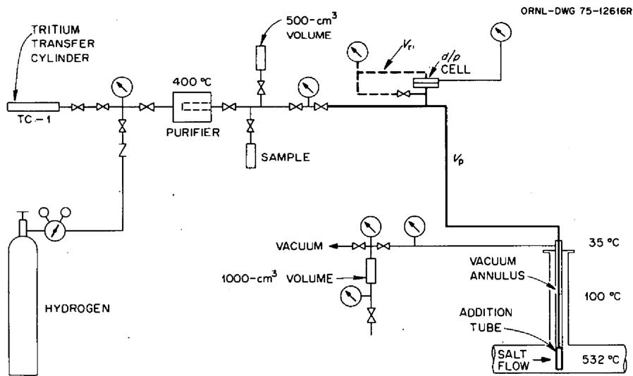  
Fig. 2.1. Tritium addition system for CSTF.

used, and various schemes are being considered for increasing the tritium concentration, such as reducing the cooling-air flow and raising the concentration of tritium in the addition gas.

6. The data from the hydrogen partial-pressure probe indicate that the partial pressure of elemental hydrogen in the salt is quite low (less than $10\mu \mathrm{mHg}$ ), which is generally in agreement with the low concentration of tritium found in the cooling-air samples and also with the concentrations of elemental tritium found in the off-gas samples. Plans are being made to verify the hydrogen pressure probe readings by using a mass-spectrometer leak detector machine.

# Test results are discussed in Sect. 1.1.3.

At the end of the report period, the tritium levels in the salt, off-gas, and cooling air appeared to be at steady state. The plan is to continue the test long enough to examine various schemes for improving or verifying the data for tritium concentration in the cooling air and in the salt and to provide better estimates of the tritium material balance, trapping efficiency, and mass-transfer processes. In the meantime, a new tritium addition tube is being fabricated for subsequent tests. These will be designed to show variations in trapping efficiency as a function of the gas addition rate and the presence of chemical additives in the salt.

# 2.2.3 Equipment Modifications

During the loop shutdown beginning November 4, 1975, the test equipment was changed to improve the quality of the data and to provide additional data. The following is a summary of the changes:

1. Hydrogen Pressure Probe. A probe was inserted in the main salt stream at a point about 1.25 m downstream from the salt pump discharge to measure the partial pressure of elemental hydrogen in the salt. The probe consisted of a sealed Hastelloy N tube, $12.7\mathrm{mm}$ $\mathrm{OD} \times 1.1\mathrm{mm}$ wall, connected to the necessary valving and instrumentation to permit pressure readings inside the probe in the range of 0.01 to $100\mathrm{Pa}$ (0.1 to $1000\mu \mathrm{mHg}$ ). Since this probe is completely submerged in salt, its response should depend only on conditions in the salt.

2. Off-Gas Sample System. Several changes were made for the purpose of improving the reliability of the sample system and the quality of the sample data: (a) A salt mist filter was fabricated from porous copper sheet (made from pressed and sintered copper

powder) with a porosity of 0.23 and a pore hydraulic radius of $6.0\mu \mathrm{m}$ . The filter, housed in a Hastelloy N body, was installed at the inlet to the gas sample line with a heater and insulation to permit operation at $540^{\circ}\mathrm{C}$ and was oriented such that trapped salt could drain back to the off-gas line. (b) A 3-way Monel valve was installed in place of the 3-way glass stopcock immediately upstream of the first tritium pretrap. The glass unit had some leakage and condensation of fluid and also was not suited for operation at the higher temperature now being used. (c) The temperature of the gas sample line from the salt mist filter to the inlet to the first tritium pretrap was increased from 150 to $200^{\circ}\mathrm{C}$ . This change was to minimize the condensation of fluids in the gas sample line. Such fluids, collected in the sample lines, were probably partly responsible for some earlier erratic sample results.

3. Exhaust-Air Sample System. Equipment was installed for collecting samples that can be used to estimate the rate at which tritium is being lost due to permeation through the loop pipe walls. A sample tap was installed in the air line coming from the lower loop cooling duct (Fig. 2.2); this tap was connected to a diaphragm pump that circulates sample gas at a rate of about $1700~\mathrm{cm}^3/\mathrm{min}$ and vents the gas into the loop enclosure. At the pump discharge, where the pressure is controlled at an absolute pressure of 140 kPa, a $100~\mathrm{cm}^3/\mathrm{min}$ side stream is taken off for tritium trapping. The sample stream is mixed with 20 $\mathrm{cm}^3/\mathrm{min}$ of humidified helium, and the combined streams are passed through a CuO furnace to convert the tritium to tritiated water and then through a water trap and a cold trap to collect the tritiated water. The tritium content is determined by scintillation counting in a manner similar to that used for the off-gas samples. The air intakes to the lower cooling duct were extended so that the air is drawn from outside the loop enclosure, thus avoiding contamination of the air samples by extraneous tritium which might be in the enclosure. The flow of air through the cooling duct is determined by sampling the air stream while adding a known flow of tritium to the air inlet.

In the original design of the tritium addition system, a vacuum pump maintained a low pressure (less than $75\mathrm{Pa}$ ) in the vacuum annulus surrounding the addition tube. The discharge gas from the vacuum pump was vented into the loop enclosure and was eventually discharged to the stack along with the loop ventilation air. Thus the air exhausted from the loop enclosure normally contained a small amount of tritium from the vacuum annulus in addition to the tritium that permeated through the loop pipe walls.

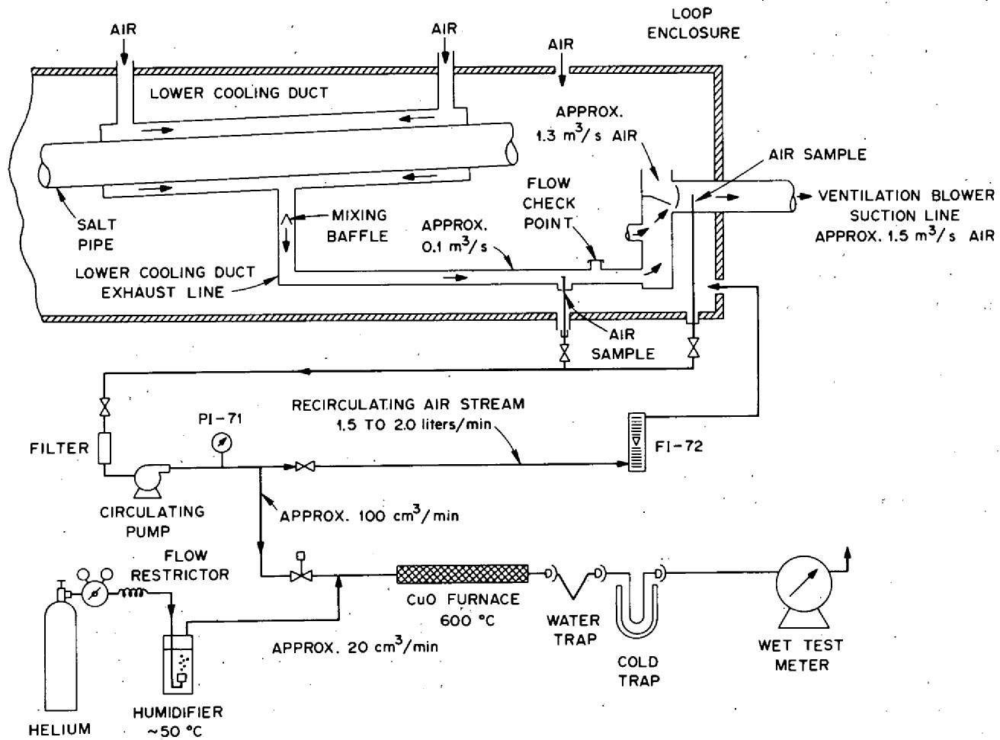  
Fig. 2.2. Diagram for air sampling system CSTF tritium experiment.

During the steady-state test, (Sect. 2.2.2), the amount of addition gas which is bypassed into the vacuum annulus is about $10^{3}$ higher than was the case during the earlier transient tests. This extra tritium must be kept out of the loop enclosure because extra tritium there would interfere with the evaluation of pipe-wall permeation from the tritium content of the loop exhaust air. Therefore, shortly after the steady-state test was started, a new line was installed to route the vacuum pump exhaust around the loop enclosure and directly to the suction of the stack fan.

# 2.3 FORCED CONVECTION LOOPS

W.R.Huntley R.H.Guymon

M. D. Silverman

Operation of forced-convection loops is part of the effort to develop a satisfactory structural alloy for molten-salt reactors. Corrosion loop MSR-FCL-2b

is presently operating with reference fuel salt at typical MSBR velocities and temperature gradients to evaluate the corrosion and mass transfer in Hastelloy N alloys. At this time, the loop has operated approximately 4000 hr with fuel salt at MSBR reference design conditions with the expected low corrosion rates in the standard alloy. A test has been started to obtain corrosion data on specimens of Hastelloy N containing $1\%$ niobium.

Construction of two additional corrosion loop facilities, designated MSR-FCL-3 and MSR-FCL-4, continued for most of this reporting period, but this effort has been discontinued because of the decision to terminate the MSR Program at the end of FY 1976.

# 2.3.1 Operation of MSR-FCL-2b

A 4000-hr corrosion test was completed on October 2, 1975, in which standard Hastelloy N

specimens were exposed to fuel salt at typical MSBR operating temperatures. During the test, 18 corrosion specimens were exposed to salt at velocities up to $5\mathrm{m / sec}$ at three different temperature levels—565, 635, and $705^{\circ}\mathrm{C}$ . As expected, corrosion rates were low throughout the test period and $< 3\mu \mathrm{m}/$ year (0.1 mil/year) during the final 1000-hr increment of the test. A detailed discussion of the corrosion results is presented under Salt Corrosion Studies (Sect. 6.6).

On October 6, a series of $\mathrm{NiF}_2$ additions to the loop salt was begun to increase the $\mathrm{U}^{4+}/\mathrm{U}^{3+}$ ratio. It was planned to increase the $\mathrm{U}^{4+}/\mathrm{U}^{3+}$ ratio from the earlier equilibrium value of about 100 to a new level of about 1000 and then to evaluate corrosion rates at the higher level, which reflects a more oxidizing condition in the salt. The $\mathrm{NiF}_2$ was added by dropping small pellets of $\mathrm{NiF}_2$ -fuel carrier salt (50-50 wt%) from a sealed air lock, via a ball valve and riser pipe, to the fuel-salt surface within the auxiliary pump tank. During the additions, the loop was operated isothermally at $\sim 695^{\circ}\mathrm{C}$ with a pump speed of $4000~\mathrm{rpm}$ to provide a salt flow rate of about 12 liters/min. Four separate additions of $0.8\mathrm{g}$ of $\mathrm{NiF}_2$ were made between October 6 and October 21, followed by a final addition of $1.6\mathrm{g}$ on November 3, 1975 ( $4.8\mathrm{g}$ total addition to the $14\mathrm{-kg}$ salt inventory). The work was interrupted at this time by operational problems, but the limited observations made are described below.

The effects of $\mathrm{NiF}_2$ additions were similar to those observed in September and October 1974, when fine $\mathrm{NiF}_2$ powder was added to the salt inventory of FCL-2b. Immediate pump-power increases of 8 to $10\%$ were again noted with each $0.8\mathrm{-g}$ addition. The salt level in the auxiliary tank decreased with each $\mathrm{NiF}_2$ addition, which suggests that $\mathrm{NiF}_2$ affected the salt surface tension and may have thereby reduced helium ingassing in the pump bowl. During the first four $\mathrm{NiF}_2$ additions of $0.8\mathrm{g}$ each, the salt level dropped about $1^{1/2}\mathrm{mm}$ immediately after each addition. A $1^{1/2}\mathrm{mm}$ level change represents an apparent salt density increase of about $1\%$ ; therefore, density change of the pumped salt should account for only about one-tenth of the pump-power increases noted, and the remaining power increase is believed to be due to increased drag forces on the pump impeller. The final addition of $1.6\mathrm{g}$ of $\mathrm{NiF}_2$ resulted in a $14\%$ increase in pump power and a larger-than-expected level drop of $12\mathrm{mm}$ at the auxiliary tank.

Each $\mathrm{NiF}_2$ addition to the salt resulted in an immediate increase in the $\mathrm{U}^{4+}/\mathrm{U}^{3+}$ ratio, which reached a maximum in a few hours, followed by asymptotic decay; e.g., the first addition increased

the ratio from $\sim 100$ to $>1000$ , but after three days of isothermal operation at $695^{\circ}\mathrm{C}$ , the ratio had decreased to 130. Similarly, the fourth addition increased the ratio from $\sim 250$ to 10,000, but it had dropped to 200 after eight days. Just prior to the final $1.6 - \mathrm{g} \mathrm{NiF}_2$ addition on November 3, the $\mathrm{U}^{4+} / \mathrm{U}^{3+}$ ratio was 150. Two hours after the 1.6-g addition, the ratio was $2.6 \times 10^4$ , and a day later the ratio had fallen to $4.8 \times 10^3$ . No further readings were obtained because of a salt leak in the piping system which occurred on November 5, 1975. The plan to run a corrosion test at a high $\mathrm{U}^{4+} / \mathrm{U}^{3+}$ ratio was abandoned at this time.

The loop did not accumulate any significant operating time between November 5, 1975, and February 18, 1976, because of salt leaks that occurred on November 5 and December 10, 1975. Both leaks resulted from tube ruptures during reheating operations immediately after transfer from $\Delta T$ to isothermal operation of the loop.

Salt freezing had always occurred in the coolers of FCL-2b after a loop scram* because of the large mass of air-cooled metal within the cooler housing and the relatively small mass of hot salt within the cooler coils. This had not caused significant problems during the past 20,000 hr of operation, other than delaying resumption of salt circulation for a few hours while gradual remelting occurred. However, in each of the two recent shutdowns where leakage occurred, salt froze in another portion of the loop not monitored by a thermocouple, in addition to the known freezing in the coolers. Since the second frozen area was not apparent to the operators during either incident, normal operating and remelting procedures were followed which resulted in salt liquid expansion and pipe rupture between the frozen coolers and the unsuspected salt plug.

The salt leak of November 5, 1975, occurred in a resistance-heated section of the loop piping $(I^2 R$ heater No. 2). The location and cause of the frozen area which precipitated this failure are not definitely known, but the cold spot was probably at metallurgical station No. 2. The salt leak of December 10, 1975, occurred at metallurgical station No. 3, where an adapter (for line S08) is saddle-welded to $19\mathrm{-mm - OD}\times 1.8\mathrm{-mm}$ wall tubing. The cause of the frozen area related to this leak was a $10\mathrm{-cm}$ long uninsulated portion of a salt drain line (S-112). Insulating this portion of line had been overlooked during prior

repair operations because of piping complexity and inaccessibility.

Several design modifications were made to the loop to reduce the likelihood of further incidents of this type. The scram circuits were revised to provide continuous salt-pump operation at a reduced speed of $2000\mathrm{rpm}$ after each scram instead of the previous procedure, which stopped the pump. This provides more heat energy to the cooled metal within the cooler housing via the flowing salt. Also, the cooler housing was modified by adding internal thermal insulation and electric heaters to reduce the mass of cold metal to which the salt-containing cooler coil can transfer heat. Thirdly, an automatic solenoid valve was added to turn off auxiliary cooling air to the resistance-heating lugs on the main heaters after a scram or whenever the main heaters are deactivated.

Piping replacement and modification were necessary after each of the two incidents of salt leakage. The entire length of the standard Hastelloy N resistance-heated section ( $I^2 R$ heater No. 2) was replaced, as well as metallurgical station No. 3. Drain lines were replaced because of damage from salt running down the exterior tube surfaces from the leakage areas above. All three 6.3-mm-OD drain lines were replaced with 9.5-mm-OD lines because the original lines were too small and had hampered operation and repair functions. A new, larger standard Hastelloy N fill-and-drain tank was also installed because the original tank had a marginal capacity.

The loop repairs and modifications were completed in February 1976, and $20.25\mathrm{kg}$ of new fuel salt mixture was transferred to the new Hastelloy N drain tank. The salt was sampled after transfer into the drain tank, and impurity levels were found to be low, which indicated that the new salt was in good condition.

The loop piping was filled with salt on February 18. After the salt circulated isothermally for $3\mathrm{hr}$ , the oxidation potential of the salt was measured electrochemically and found to correspond to a $\mathrm{U}^{4+}/\mathrm{U}^{3+}$ ratio of about 4600. The $\mathrm{U}^{4+}/\mathrm{U}^{3+}$ ratio dropped rapidly, as had been the previous experience, and decreased to a value of about 500 after two days' operation at design conditions and full $\Delta T$ .

A scram test from $\Delta T$ operation was made to verify that the recent design modifications would prevent salt from freezing in the coolers. The test was successful and showed that the original scram circuits functioned and that the newly added automatic features worked as planned; that is, the pump speed reduced from 4000 to 2000 rpm, the guard heaters on

the coolers were deenergized, and the cooling air on the resistance-heater lugs was cut off. Because of the new design modifications, the salt continued to flow at a reduced rate after the scream and the isothermal circulating salt temperature fell to only $565^{\circ}\mathrm{C}$ , which is considered a safe level above the salt liquidus temperature of $500^{\circ}\mathrm{C}$ .

At the completion of the scram tests, 18 new corrosion specimens were installed in the three metallurgical sample stations. The corrosion specimens are fabricated from modified Hastelloy N containing $1\%$ niobium, instead of the standard Hastelloy N specimens tested previously in FCL-2b. After the specimens were inserted, the loop was operated isothermally at about $700^{\circ}\mathrm{C}$ over the weekend and was brought to design $\Delta T$ conditions on February 23. Operation is continuing, and removal of the corrosion specimens for their first examination is planned after $500\mathrm{hr}$ of $\Delta T$ operation.

# 2.3.2 Heat Transfer Studies in MSR-FCL-2b

The heat transfer performance of the fuel salt proposed for an MSBR (LiF-BeF-ThF $_4$ -UF $_4$ ; 71.7-16-12-0.3 mole $\%$ ) was measured in one of the resistance-heated sections of MSR-FCL-2b. Heat transfer data were obtained over the following range of variables: Reynolds moduli, 1540 to 14, 200; Prandtl moduli, 6.6 to 14.2; heat fluxes, 142 to 630 kW/m $^2$ ; salt velocities, 0.5 to 2.5 m/sec; and fluid temperatures, 549 to $765^{\circ}\mathrm{C}$ .

Film coefficients ranged from 1.32 to $11.8\mathrm{kW / m^2}\cdot \mathrm{K}$ at Nusselt moduli of 11 to 102. There was satisfactory agreement with the empirical Sieder-Tate correlation in the turbulent region at Reynolds moduli from $\sim 8000$ to 14,200 (Fig. 2.3). Between Reynolds moduli of $\sim 2100$ and 8000, the experimental data follow a modified Hausen equation, which is normally applicable to the transition region between laminar and turbulent flow. The extended transition region is probably due to the high viscosity and large negative temperature coefficient of viscosity of the fuel salt. Hydrodynamic stability theory predicts the possibility of such an extension when heat is transferred from a solid interface to a fluid whose viscosity decreases with temperature. Insufficient data were obtained in the laminar flow region to allow any conclusions to be drawn. The results of these experiments are similar to those obtained in FCL-2 with coolant salt (NaBF $_4$ -NaF; 92-8 mole %) and indicate that the proposed fuel salt behaves as a normal heat transfer fluid.

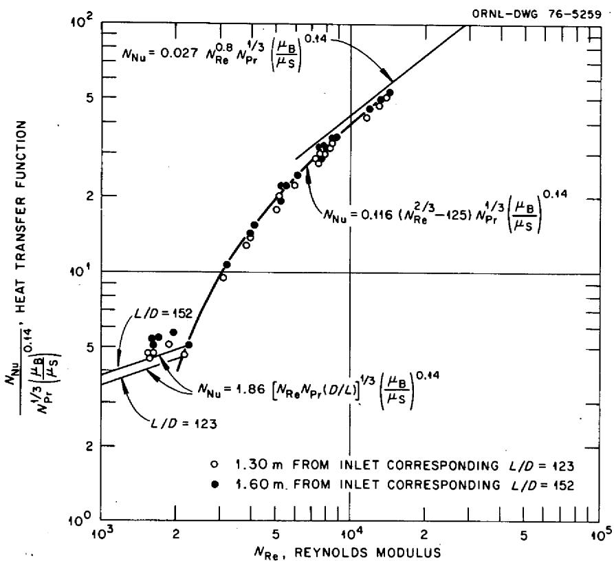  
Fig. 2.3. Heat transfer characteristics of $\mathsf{LiF}\cdot \mathsf{BeF}_2\cdot \mathsf{ThF}_4\cdot \mathsf{UF}_4$ (72-16-12-03 mole %) flowing in a 0.416-in. ID tube.

# 2.3.3 Design and Construction of FCL-3 and FCL-4

All components for FCL-3 and FCL-4 are on hand except the finned-cooler sections, which were to be fabricated of titanium-modified Hastelloy N tubing. Components received during this report period include the resistance-heater lugs, loop shielding, two ALPHA-pump bowls, FCL-4 control panels, and parts for four ALPHA-pump rotary assemblies. Assembly of the electrical power supply and auxiliary piping for FCL-3 progressed as far as practical in the absence of tubing for the salt loop. Assembly work on FCL-4 electrical power supplies and auxiliary piping was continued for most of this reporting period. However, the FCL-4 assembly work has now been stopped because of the decision to terminate the MSR Program at the end of FY 1976.

# REFERENCES

1. R. H. Guymon and G. T. Mays, MSR Program Semiannu. Progr. Rep. Aug. 31, 1975, ORNL-5078, pp. 16-22.   
2. A. G. Grindell et al., MSR Program Semiannu. Progr. Rep. Aug. 31, 1971, ORNL-4728, p. 35.   
3. A. N. Smith, MSR Program Semiannu. Progr. Rep. Aug. 31, 1975, ORNL-5078, pp. 22-23.   
4. Ref. 3, p. 23.   
5. A. N. Smith, MSR Program Semiannu. Progr. Rep. Feb. 28, 1975, ORNL-5047, p. 27.   
6. A. N. Smith, MSR Program Semiannu. Progr. Rep. Aug. 31, 1975, ORNL-5078, pp. 24-25.   
7. E. N. Sieder and G. E. Tate, Heat Transfer and Pressure Drops of Liquids in Tubes, Ind. Eng. Chem. 28(12): 1429-35 (1936).   
8. H. Hausen, Z. Ver. Deut. Ing. Beih., Verfahrenstechnik (4), pp. 91-98 (1943).   
9. W. R. Huntley, MSR Program Semiannu. Progr. Rep. Aug. 31, 1971, ORNL-4728, p. 152.

# Part 2. Chemistry

L. M. Ferris

Chemical research and development related to the design of MSBRs have concentrated on fuel- and coolant-salt systems chemistry and the development of analytical methods for use in these systems. This work is presently being phased out along with the rest of the MSR Program.

The chemistry of tellurium in fuel salt has been emphasized because this element is responsible for the shallow intergranular cracking of Hastelloy N. Preliminary measurements of the solubility of $\mathrm{Li}_2\mathrm{Te}$ in molten $\mathrm{Li}_2\mathrm{BeF}_4$ confirmed the expected low solubility. High-temperature spectroscopy was used to study the behavior of tellurium species in molten $\mathrm{LiF - BeF_2}$ mixtures. The results of these studies are in agreement with the measured low solubility of $\mathrm{Li}_2\mathrm{Te}$ , and they show that the soluble species can probably be represented as $\mathrm{Te}_{n}^{n-}$ . Spectroscopy was also used to determine the equilibrium tellurium pressures for the reaction $2\mathrm{LiTe}_3 = \mathrm{Li}_2\mathrm{Te} + {}^5/2\mathrm{Te}_2$ , but the method could not be used for similar studies with nickel and chromium tellurides because of their very low dissociation pressures. In other spectroscopic work, equilibrium quotients for the reaction $\mathrm{UF}_4(\mathrm{d}) + {}^1/2\mathrm{H}_2(\mathrm{g}) = \mathrm{UF}_3(\mathrm{d}) + \mathrm{HF}(\mathrm{g})$ were determined in LiF- $\mathrm{BeF}_2$ mixtures and in MSBR fuel salt, $\mathrm{LiF - BeF}_2$ -ThF $_4$ (72-16-12 mole %). The values obtained generally are in agreement with those obtained previously by other workers using a different method.

Electrochemical studies of lithium tellurides confirmed the low solubility of both $\mathrm{Li}_2\mathrm{Te}$ and $\mathrm{LiTe}_3$ in LiCl-KCl eutectic at $400^{\circ}\mathrm{C}$ , but they did indicate

that an oxidant such as water vapor could generate more soluble and colored species.

Work on several aspects of coolant-salt chemistry was continued. It was shown that $\mathrm{Na}_3\mathrm{B}_3\mathrm{F}_6\mathrm{O}_3$ is the stable oxygen-containing species in the system $\mathrm{NaF - }$ $\mathrm{NaBF_4 - B_2O_3}$ at low oxygen concentrations. This compound reversibly interconverts with $\mathrm{NaBF}_3\mathrm{OH}$ in aqueous systems, a situation which is probably also the case in the coolant salt. Based on this assumption, a plausible mechanism for trapping tritium from an MSBR in $\mathrm{NaF - NaBF_4}$ coolant salt has been postulated. Vapor density studies of the system $\mathrm{BF}_3\text{-H}_2\mathrm{O}$ were also continued. It was shown that $\mathrm{BF}_3\cdot 2\mathrm{H}_2\mathrm{O}$ is completely dissociated in the vapor phase at temperatures above about $200^{\circ}\mathrm{C}$ . Below $200^{\circ}\mathrm{C}$ , association occurs, and a stable liquid phase can be formed.

Monitoring of $\mathrm{U}^{4+}/\mathrm{U}^{3+}$ ratios in several forced-convection loops, thermal-convection loops, and creep-test machines was continued. Data were obtained during the third tritium injection experiment at the CSTF. The results were similar to those from the first two experiments in that most of the tritium was found in a water-soluble or combined form. Electroanalytical studies indicated that $\mathrm{LiTe}_3$ and $\mathrm{Cr}_3\mathrm{Te}_4$ are insoluble in MSBR fuel salt. Cathodization of a tellurium electrode in the presence of fuel salt apparently produced a species of the type $\mathrm{Te}_n^-$ ( $n \geqslant 1$ ), which was unstable under the experimental conditions. Some evidence for oxide and/or peroxide species was obtained in other electrochemical studies.

# 3. Fuel-Salt Chemistry

A. D. Kelmers

# 3.1 SOLUBILITY OF LITHIUM TELLURIDES IN FLUORIDE MELTS

D.Y.Valentine A.D.Kelmers

It has been demonstrated that fission-product tellurium is the agent responsible for the shallow intergranular cracking of Hastelloy N surfaces which was observed in the MSRE. However, the state or states in which tellurium is actually present in the $\mathrm{LiF - BeF_2 - ThF_4 - UF_4}$ (71.7-16-12-0.3 mole%) fuel salt under reactor operating conditions remains to be determined. The lithium-tellurium system was the first to be investigated. The two species that are known to exist in the Li-Te system, $\mathrm{Li}_2\mathrm{Te}$ and $\mathrm{LiTe}_3$ have been prepared. $\mathrm{LiTe}_3$ undergoes disproportionation to $\mathrm{Li}_2\mathrm{Te}$ and Te quite easily and thus does not lend itself to dynamic solubility measurements. On the other hand, $\mathrm{Li}_2\mathrm{Te}$ is quite stable and was used here to make the first tellurium solubility estimates. Molten $\mathrm{Li}_2\mathrm{BeF}_4$ was used instead of the thorium-containing fuel salt since the density of $\mathrm{Li}_2\mathrm{Te}$ (3.4 g/cm³) is similar to the density of the fuel salt (3.75 g/cm³). However, $\mathrm{Li}_2\mathrm{BeF}_4$ has a density of 2.2 g/cm³, which is probably sufficiently different from $\mathrm{Li}_2\mathrm{Te}$ to prevent the suspension of $\mathrm{Li}_2\mathrm{Te}$ particulates in the melt.

The solubility study was carried out in a closed nickel vessel completely lined with POCO-AXF-5Q graphite. The various parts are shown before assembly (Fig. 3.1). Openings in the graphite liner lid accommodate a thermocouple (TC) well and a sparge tube, both $\frac{1}{4}$ -in.-OD, also made from POCO-AXF-5Q graphite. The TC well and sparge tube were joined to the top of the nickel pot by brazing a tantalum ring between the graphite and the nickel pot. Design of the graphite parts and the graphite-Ta-Ni joint was contributed by H. C. Cook of the Metals and Ceramics Division. The brazing techniques were developed by J. F. King of the Welding and Brazing Laboratory, Metals and Ceramics Division. This type of joint is reported to withstand temperatures up to $1150^{\circ}\mathrm{C}$ . It has been in continuous use in this experiment for many weeks over a temperature range of $500^{\circ}\mathrm{C}$ to $800^{\circ}\mathrm{C}$ without showing signs of failure.

Two stainless steel ball values welded to the top of the pot allow samples to be taken with filter sticks. The filter sticks were also made of POCO-AXF-5Q graphite. A screw cap on the end of each filter stick

holds a graphite frit disk in place.* The pore size of the frit is about $150\mu$ . The filter stick, frit, and screw cap are shown in the foreground of Fig. 3.1. The filter stick $(^{3}/8$ -in.-OD, $^{1}/16$ -in.-ID) was found to be extremely strong. An enlarged chamber behind the frit holds the sample. The filter stick is admitted to the melt through a Teflon sleeve above the ball valves on the pot top. A Swagelok fitting is used around the filter stick, allowing it to pass into the pot through a closely fitting Teflon sleeve. In addition, an overpressure of argon is maintained while the filter stick is being lowered into the melt, assuring that contamination of the melt from ingress of air does not occur.

Enriched $(95.07\%)$ $^{122}\mathrm{Te}$ was purchased from Isotope Sales Division, ORNL. Irradiation of this isotope in the Bulk Shielding Reactor for 48 hr produced $^{123m}\mathrm{Te}$ having a half-life of 117 days. This isotope emits a 159-keV gamma ray suitable for counting with a lithium-drifted germanium detector. The $^{123m}\mathrm{Te}$ was melted with natural tellurium (purity $99.999 + \mathrm{wt\%}$ from Alpha Ventron Products Co.) in a tungsten crucible. The tracer-labeled tellurium $(\mathrm{Te}^{\ast})$ was then used to prepare $\mathrm{Li}_2\mathrm{Te}^*$ in the same tungsten crucible by melting the lithium on the surface of the $\mathrm{Te}^{\ast}$ and slowly raising the temperature until reaction occurred. The $\mathrm{Li}_2\mathrm{Te}^*$ product was then ground and sintered to evaporate any excess reactants and bottled for removal to the counting facility. The dilution and subsequent preparation of $\mathrm{Li}_2\mathrm{Te}^*$ were carried out in an argon atmosphere vacuum box equipped with a heater designed especially for use in vacuum boxes.

After the vessel top was welded into place, the empty vessel was installed in the vacuum-argon system and heated under vacuum to $800^{\circ}\mathrm{C}$ to test the weld joints. The graphite parts had previously been outgassed at $1000^{\circ}\mathrm{C}$ for 24 hr under vacuum. The evacuated vessel was then transferred to the argon atmosphere box, where it was loaded through the ball valves with $\mathrm{Li}_2\mathrm{Te}^*$ followed by $\mathrm{Li}_2\mathrm{BeF}_4$ . The vessel was then replaced in the argon-vacuum system and heated while maintaining a $50~\mathrm{cm}^3/\mathrm{min}$ argon sparge flow. The furnace temperature was controlled by an Electromax II controller to $\pm 1^{\circ}\mathrm{C}$ . The entire assembly is shown in Fig. 3.2.

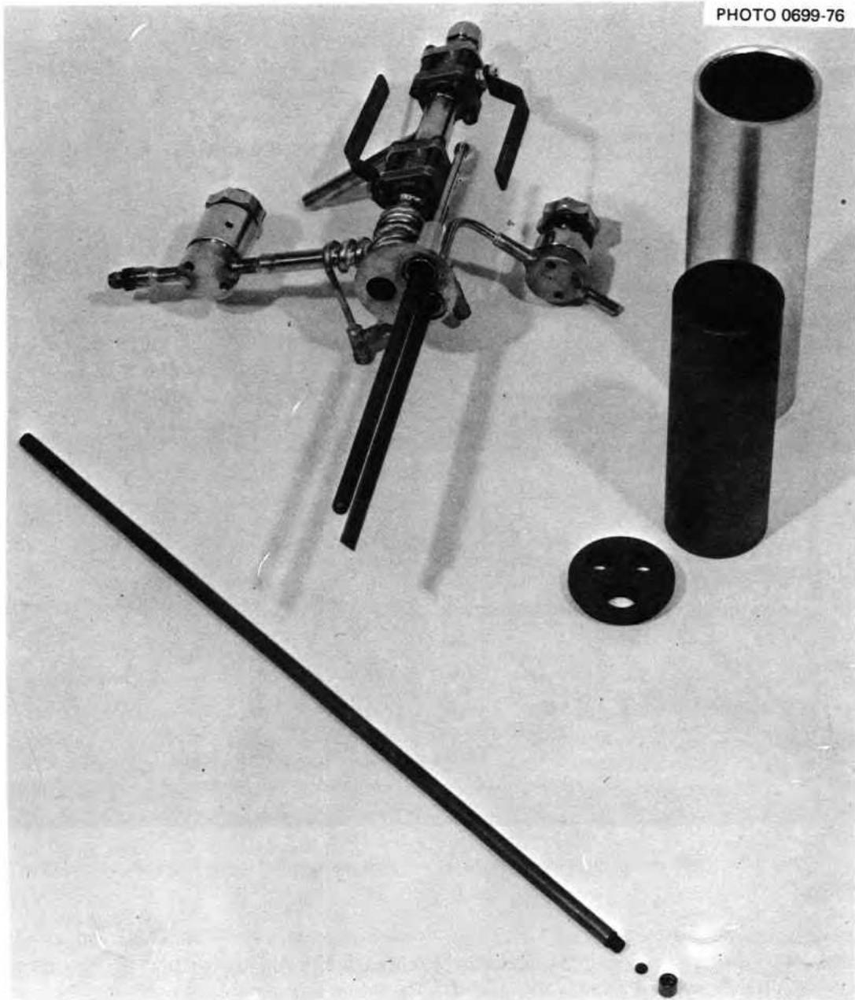  
Fig. 3.1. Parts of $\mathsf{Li}_2\mathsf{Te}$ solubility pot before assembly: nickel pot, graphite liner with lid, nickel lid with ball valves, graphite thermocouple well and sparge tube attached. Foreground shows filter stick parts before assembly: tube, frit, screw-on end cap.

Samples were taken at temperatures between $500^{\circ}\mathrm{C}$ and $700^{\circ}\mathrm{C}$ . No wetting of the graphite by the salt occurred, and the filter sticks could be withdrawn smoothly. After a sample had been taken, the filter stick end cap was unscrewed, the frit removed, and the body of the filter stick encapsulated under vacuum in a quartz tube. The tube was then heated in a furnace to about $750^{\circ}\mathrm{C}$ , allowing the sample to flow by gravity into a quartz cup in the bottom of the

tube. The sample did not adhere to the quartz; so uniformly shaped sample buttons were produced which were then weighed and counted.

The $159\mathrm{-keV}$ gamma rays from the $^{123m}$ Te tracer were detected with a high-resolution lithium-drifted germanium detector (10% relative efficiency). A PDP-11/05-based pulse-height-analysis system was used to acquire the energy spectra and subsequently

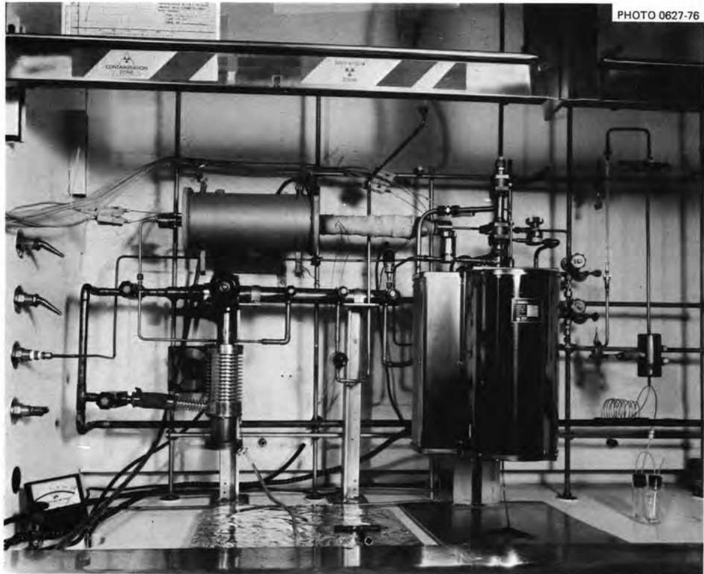  
Fig. 3.2. Overall view of equipment with $\mathrm{Li}_2\mathrm{Te}$ solubility pot installed in argon-vacuum system.

to perform quantitative isotopic analyses.* The first few samples were counted at two source-to-detector distances (0 cm, directly on the detector endcap, and 30.5 cm, a distance at which the photon detection efficiency was accurately known from previous calibrations) to establish the efficiency at closer geometries. Subsequent samples were counted at 0 cm only.

To perform the quantitative analysis, the computer estimates the baseline under the full energy peak and

then integrates the peak. Data such as half-life and branching ratio are supplied to the computer in the form of an isotope table and are used in the activity calculation (corrected to any arbitrary reference date and time). The only correction not automatically applied by the program is that resulting from selfabsorption in the sample. However, the gamma-ray attenuation length for $\mathrm{Li_2BeF_4}$ is about $3.6\mathrm{cm}$ at 159 keV, and since the samples are small (less than 0.5 cm), this correction does not exceed $10\%$ . In addition, the production of sample buttons of consistent size and shape facilitated this correction.

The first samples taken indicated a solubility of $10^{-4}$ to $10^{-3}$ mole fraction over the range between

$475^{\circ}\mathrm{C}$ to $700^{\circ}\mathrm{C}$ . More recent data indicate a solubility below $10^{-5}$ mole.fraction at $700^{\circ}\mathrm{C}$ . It is suspected that particulates of $\mathrm{Li}_2\mathrm{Te}$ may have contaminated the first measurements. The melt has been examined for possible oxidation, and no evidence of an oxidized tellurium species was seen. Samples will continue to be taken until reproducibility can be achieved, which presumably will indicate that any particulate settling process has been completed. The melt will also be examined for suspended colloids.

# 3.2 SPECTROSCOPY OF TELLURIDE SPECIES IN MOLTEN SALTS

B.F.Hitch L.M.Toth

Spectrophotometric studies of lithium tellurides in molten salts have continued. Several experiments involving the addition of tellurium compounds to $\mathrm{LiF - BeF_2}$ (66-34 mole $\%$ ) mixtures have been conducted using a diamond-windowed graphite cell. The primary objective of these experiments is to identify the anionic tellurium species present in fluoride melts at $500 - 700^{\circ}\mathrm{C}$ which absorb in the 200-to 2500-nm range.

When $\mathrm{Li}_2\mathrm{Te}$ was equilibrated with $\mathrm{LiF - BeF_2}$ melts, the diamond-windowed cell was used in the conventional manner with the atmosphere above the melt in contact with the atmosphere inside the furnace. However, when $\mathrm{LiTe}_3$ was used as a solute, the entire cell was encapsulated in quartz and the cell-capsule assembly was positioned in the furnace such that the entire unit was isothermal to prevent mass transport of $\mathrm{Te}_2$ to the cell walls by the decomposition reaction:

$$
2 \mathrm {L i T e} _ {3} - \mathrm {L i} _ {2} \mathrm {T e} + ^ {5 / 2} \mathrm {T e} _ {2} (\mathrm {g}). \tag {1}
$$

In $\mathrm{LiF - BeF_2}$ melts, $\mathrm{Li}_2\mathrm{Te}$ did not show any absorbance except in one case where a small (0.1 absorbance unit) broad band appeared at approximately $470 - 480\mathrm{nm}$ . This band disappeared when the cell was evacuated, indicating that the absorbing species was probably not due to $\mathrm{Li}_2\mathrm{Te}$ but instead to a species of greater tellurium activity which was present in $\mathrm{Li}_2\mathrm{Te}$ ; that is, the $\mathrm{Li}_2\mathrm{Te}$ was not stoichiometric and may have contained a slight excess of tellurium.

Additions of $\mathrm{LiTe}_3$ to $\mathrm{LiF - BeF_2}$ mixtures gave a small band (0.2 absorbance unit) at $450~\mathrm{nm}$ which remained stable. Previous work in chlorides indicated that maximum absorbance was obtained with solutions in which the lithium-tellurium stoichiometry was approximately one. Thus a $\mathrm{Li}_2\mathrm{Te}$ addition

was made to the $\mathrm{LiF - BeF_2}$ mixture containing $\mathrm{LiTe}_3$ which shifted the lithium-tellurium stoichiometry to 45-55 at. $\%$ . After the $\mathrm{Li_2Te}$ addition, a very large band (2 to 3 absorbance units) at $465~\mathrm{nm}$ was observed (Fig. 3.3) which remained stable during two weeks of measurements. The color of the solution was deep orange. Following these measurements, enough tellurium metal was added to return the lithium-tellurium stoichiometry to 25-75 at. $\%$ $(\mathrm{LiTe}_3)$ . The absorbance decreased slightly, but not to the original 0.2 absorbance unit seen for the melt in contact with $\mathrm{LiTe}_3$ . The anomalous behavior of $\mathrm{LiTe}_3$ may arise from slow kinetics involved in its equilibration with melts.

These results suggest that the most soluble tellurium species in $\mathrm{LiF - BeF_2}$ (66-34 mole $\%$ ) melts under isothermal conditions is an ion such as $\mathrm{Te}_2^{2 - }$ or $\mathrm{Te^{-}}$ . Our work in chloride melts, the work of Bamberger et al., and recent electrochemical studies support the interpretation.

Currently, preparations are being made to carefully titrate a fluoride melt containing $\mathsf{Li}_2\mathsf{Te}$ with tellurium metal and to locate the lithium-tellurium

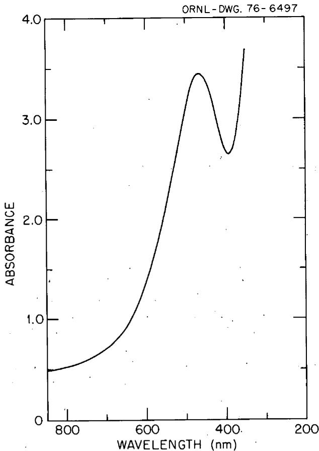  
Fig. 3.3. Absorbance spectrum of $\mathrm{Te}_n^{n-}$ .

ratio which gives the maximum absorbance. This information will establish the stoichiometry of the soluble lithium-tellurium species, and once this stoichiometry is known, addition of this compound (or mixture) to $\mathrm{LiF - BeF_2}$ melts would establish its solubility and absorption coefficient.

The following tentative conclusions are drawn: (1) $\mathrm{Li}_2\mathrm{Te}$ does not appear to be soluble in $\mathrm{LiF - BeF_2}$ melts, or, if it is soluble, the $\mathrm{Te}^{2 - }$ ion does not absorb in the region investigated. (2) The light-absorbing species present in $\mathrm{LiF - BeF_2}$ solution (as well as in molten chlorides) appears to be one represented by $\mathrm{Te}_n^{\prime \prime}$ (e.g., $\mathrm{Te^{-}}$ or $\mathrm{Te_2}^{2 - }$ ), based on our titration measurements. Although solid compounds such as $\mathrm{LiTe}$ or $\mathrm{Li}_2\mathrm{Te}_2$ have not been observed in phase diagram studies, the stability of a $\mathrm{Te}_n^{\prime \prime}$ ion in melts could easily be explained by solvation effects. (3) The experimental results have not been sufficiently consistent to establish that the $\mathrm{Te}_3^-$ ion exists in molten-salt solutions as a light-absorbing species. It is, nevertheless, reasonable that it should occur as one of a series of colored ions derived from the $\mathrm{Te}^{-}$ ion in the following manner:

$$
\mathrm {T e} ^ {-} + \mathrm {T e} _ {2} = \mathrm {T e} _ {3} ^ {-},
$$

or, in general,

$$
\mathrm {T e} _ {n} ^ {n -} + m \mathrm {T e} _ {2} = \mathrm {T e} _ {n + 2 m} ^ {n -}.
$$

# 3.3 DECOMPOSITION PRESSURE OF $\mathrm{LiTe}_3$

B. F. Hitch

L. M. Toth

In spite of frequent reference to $\mathrm{LiTe}_3$ as a source of tellurium in MSR experimental work, $^{3,6-8}$ no equilibrium data are available for its decomposition reaction:

$$
2 \mathrm {L i T e} _ {3} \leftarrow \mathrm {L i} _ {2} \mathrm {T e} + ^ {5 / 2} \mathrm {T e} _ {2} (\mathrm {g}). \tag {1}
$$

As a result, $\mathrm{Te}_{2}$ pressures over $\mathrm{LiTe}_{3}$ (either solid or liquid) have been a matter of considerable conjecture. The relatively high $\mathrm{Te}_{2}$ pressures (as indicated by the characteristic yellow color over $\mathrm{LiTe}_{3}$ at temperatures greater than $600^{\circ}\mathrm{C}$ ) could be determined for an isothermal $\mathrm{LiTe}_{3}$ system by means of absorption spectroscopy; a Cary 14-H spectrophotometer measured the $\mathrm{Te}_{2}$ pressure over $\mathrm{LiTe}_{3}$ by monitoring the 4130-A band of $\mathrm{Te}_{2}$ vapor.

Approximately $155\mathrm{mg}$ of $\mathrm{LiTe}_3$ was loaded (under an inert atmosphere) into a shallow tungsten crucible, which was, in turn, placed in a 1-cm silica cell, which was evacuated before being sealed off. The

crucible was necessary to prevent attack of the silica by $\mathrm{Li}_2\mathrm{Te}$ formed during the decomposition. The absorbance of $\mathrm{Te}_2$ vapor over molten tellurium metal was similarly measured, and the absorbances were related to known vapor pressure data. $^{10}$ This calibration enabled the conversion of the absorbance data for $\mathrm{Te}_2$ over molten $\mathrm{LiTe}_3$ to pressures and also permitted determination of the molar extinction coefficient $(\epsilon = 3232 \pm 132 \times \mathrm{mole}^{-1} \mathrm{cm}^{-1})$ for $\mathrm{Te}_2$ (Fig. 3.4). The upper curve gives the values for the vapor pressure of pure tellurium. The equilibrium pressures of $\mathrm{Te}_2$ over molten $\mathrm{LiTe}_3$ are given by the lower curve and can be represented by the equation $\ln P(\mathrm{mmHg}) = 15.938 - 12.720 / T^{\circ}\mathrm{K}$ . As seen, the pressures of $\mathrm{Te}_2$ over molten $\mathrm{LiTe}_3$ are quite high, being only about a factor of 1.5 lower than the vapor pressures for pure tellurium. This technique is applicable only to tellurides with similarly high $\mathrm{Te}_2$ decomposition pressures; therefore, decomposition pressures of chromium and nickel tellurides cannot be measured spectrophotometrically.

Earlier measurements by this technique indicated somewhat lower pressures of $\mathrm{Te}_2$ over $\mathrm{LiTe}_3$ . The observed pressures decreased continuously with

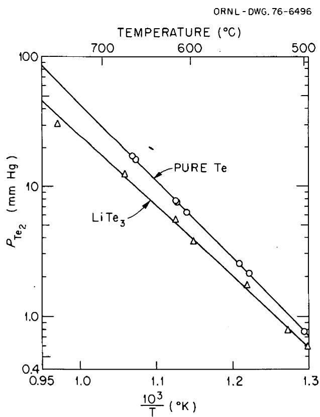  
Fig. 3.4. Vapor pressure of tellurium over $\mathrm{LiTe}_3$ and pure tellurium as a function of temperature.

prolonged exposure at $700^{\circ}\mathrm{C}$ with the simultaneous appearance of silica attack in the vapor space above the crucible. Since $\mathrm{Te}_{2}$ does not attack silica, even at $1050^{\circ}\mathrm{C}$ , probably one of the lithium tellurides has some slight volatility at these temperatures. The experiments reported above were performed at lower temperatures to avoid this attack.

This study will be concluded with a determination of the $\mathrm{Te_2}$ pressure over a solid mixture of $\mathrm{Li_2Te}$ and $\mathrm{LiTe}_3$ , which will provide an equilibrium constant for Eq. (1). With this constant and the above data for molten $\mathrm{LiTe}_3$ , the activity coefficients for $\mathrm{Li_2Te}$ dissolved in the molten $\mathrm{LiTe}_3$ phase can be determined.

# 3.4 POROUS ELECTRODE STUDIES IN MOLTEN SALTS—ELECTROCHEMISTRY OF TELLURIUM IN THE LiCl-KCl EUTECTIC SYSTEM

H. R. Bronstein F. A. Posey

Our previous studies have established the capability of the packed-bed electrode of glassy carbon spheres for monitoring electroactive species in molten salts by use of voltage-scanning coulometry techniques. It has been generally established that intergranular attack and subsequent embrittlement of the structural material of the MSRE was caused by fission-produced tellurium. It would therefore be highly desirable to establish the solubility and the valence state of tellurium species present in the MSBR fuel salt. The complex behavior of tellurium species derived from the apparent dissolution of $\mathrm{Li}_2\mathrm{Te}$ and $\mathrm{LiTe}_3$ in various molten salts has been amply demonstrated by spectrophotometric studies.

An electrochemical study of these tellurides in the LiCl-KCl eutectic was initiated to provide additional information which would help in the elucidation and interpretation of the results obtained spectrophotometrically. Of almost immediate impact was the observation that the addition of $\mathrm{Li}_2\mathrm{Te}$ to the highly purified and dehydrated LiCl-KCl eutectic melt $(400^{\circ}\mathrm{C})$ produced no color, as was observed in previous spectrophotometric studies.[6,12] A voltammetric scan showed no species attributable to the dissolution of $\mathrm{Li}_2\mathrm{Te}$ . This means that $\mathrm{Li}_2\mathrm{Te}$ is not soluble in this solvent at $400^{\circ}\mathrm{C}$ .

Next, $\mathrm{LiTe}_3$ was added to the melt. No color was observed and no trace of soluble tellurium species was detected by volt-ammetry. Again, the conclusion must be that $\mathrm{LiTe}_3$ also is not soluble in this solvent at

$400^{\circ}\mathrm{C}$ . Removal of the carbon addition cup revealed that the $\mathrm{LiTe}_3$ had decomposed and had deposited metallic tellurium on the outer surface surrounding the holes in the cup. In light of the above results, the decomposition of $\mathrm{LiTe}_3$ releasing metallic tellurium can probably be written as

$$
\mathrm {T e} _ {3} ^ {-} \rightarrow \mathrm {T e} ^ {-} + \mathrm {T e} _ {2}.
$$

Cathodization of an accurately weighed tellurium electrode produced no color formation around the electrode. From the coulomb accumulation and weight loss of the electrode, a sone-electron process was derived, in agreement with the finding of D. L. Manning in fluoride melts. $^{8}$ The lack of color on cathodization is also in agreement with that of Plambeck. $^{13}$

Our experiments, along with those of Plambeck13 have shown that, not only are the lithium tellurides insoluble in the LiCl-KCl eutectic at $400^{\circ}\mathrm{C}$ , but also in highly purified melts the reaction products are not present which lead to colored solutions.

These colored solutions may be due to interaction of the tellurides and trace amounts of moisture present as a contaminant in the melt. To test this premise, LiCl-KCl eutectic- $\mathrm{Li}_2\mathrm{Te}$ mixtures were contaminated with varying quantities of moisture and melted in sealed quartz tubes. As anticipated, the tube with the largest contamination of moisture developed the darkest color, whereas the least contaminated melt had the lightest color. However, if true solubility of tellurides should occur in other melts, colored solutions could arise due to the presence of polytelluride ions such as those observed for the polysulfides.[14]

# 3.5 THE URANIUM TETRAFLUORIDE-HYDROGEN EQUILIBRIUM IN MOLTEN FLUORIDE SOLUTIONS*

L. O. Gilpatrick L. M. Toth

A continuing study15 of the redox equilibrium

$$
\mathrm {U F} _ {4} (\mathrm {d}) + ^ {1} / _ {2} \mathrm {H} _ {2} (\mathrm {g}) = \mathrm {U F} _ {3} (\mathrm {d}) + \mathrm {H F} (\mathrm {g})
$$

has produced values for the equilibrium quotient,

$$
Q = \left[ \left(\mathrm {U F} _ {3}\right) \left(P _ {\mathrm {H F}}\right) \right] \div \left[ \left(\mathrm {U F} _ {4}\right) \left(P _ {\mathrm {H} _ {2}}\right) ^ {1 / 2} \right],
$$

at a range of temperatures for the solvents $\mathrm{LiF - BeF}_2$ (66-34 mole %) and (48-52 mole %). Details of the procedure have been given previously.15

Since the spectroscopically measured $\mathrm{UF}_3$ and $\mathrm{UF}_4$ concentrations are directly dependent on their molar extinction coefficients* ( $\epsilon$ ), it was necessary that accurate values be known for both the uranium ions in solution. Although $\epsilon$ values have already been reported for $\mathrm{UF}_4$ , no corresponding values exist for $\mathrm{UF}_3$ at $360~\mathrm{nm}$ (which is the wave length used to monitor the $\mathrm{UF}_3$ ). Therefore, the equilibrium study was interrupted to obtain these data.

The reduction of a dilute $\mathrm{UF_4}$ solution with zirconium metal was found to be the most satisfactory procedure for obtaining $\mathrm{UF_3}$ excitation coefficients. By preparing $\mathrm{UF_4}$ solutions of known composition and reducing all the $\mathrm{UF_4}$ to $\mathrm{UF_3}$ with excess zirconium, an accurate determination of $\epsilon_{\mathrm{UF_3}}$ at $360~\mathrm{nm}$ was possible. At the same time, the presence of trace $\mathrm{Zr}^{4+}$ ion $(< 0.1M)$ in solution, either as a result of the reduction or intentionally added, served to getter any trace oxide ion which would otherwise precipitate $\mathrm{UO_2}$ and upset the accuracy of the analysis.

Surprisingly, solutions of pure $\mathrm{UF}_3$ were stable up to $700^{\circ}\mathrm{C}$ with respect to carbide formation in the graphite spectrophotometric cell; therefore, it was possible to perform the calibration on pure $\mathrm{UF}_3$ solutions. Above $700^{\circ}\mathrm{C}$ , loss of $\mathrm{U}_2\mathrm{F}_3$ was observed (with the presumed formation of $\mathrm{UC}_2$ ), and it was then necessary to extrapolate back to the time where the instability occurred in order to obtain an estimate of the absorption coefficients at higher temperatures. Consequently, the high-temperature calibration data are not as good as those at the lower temperatures.

Values of $\epsilon_{360}$ apparently decrease somewhat with increasing temperature, but the magnitude is within the present experimental error. The average values for the two solvents LiF-BeF $_2$ (66-34 mole %) and (48-52 mole %) were found to be 1030 (for $500 - 750^{\circ}\mathrm{C}$ ) and 1155 $\mathfrak{k}$ mole $^{-1}$ cm $^{-1}$ (for $400 - 750^{\circ}\mathrm{C}$ ) respectively. A discrepancy in the calibration experiments for the latter solvent led to a rather high ( $\pm 10\%$ ) error. These experiments will be repeated if time permits at the end of the H $_2$ reduction studies.

Equilibrium quotients at a given temperature were determined by sparging the system with a fixed $\mathrm{HF} / \mathrm{H}_2$ gas ratio for a day or more until the $\mathrm{UF}_4 / \mathrm{UF}_3$

ratio became constant. This length of time was also necessary to obtain consistent HF analyses from the furnace inlet and outlet gas streams because of the very low $\mathrm{HF / H_2}$ ratios $(10^{-4}$ to $10^{-6})$ which equilibrated very slowly with the furnace and gas lines as well as with the melt.

The values measured for $Q$ are shown in Fig. 3.5 along with standard derivation $(\sigma)$ bars. Included also are the $Q$ values calculated from the Long and Blankenship (L & B) equation,

$$
\begin{array}{l} \log_ {1 0} Q = 4. 0 - 9. 3 3 \left(1 0 ^ {3} / T\right) \\ + 3. 7 7 X _ {U F _ {4}} \div 2. 0 9 \left(X _ {B c F _ {3}} - 0. 3 0\right), \\ \end{array}
$$

in which $X$ denotes mole fraction. The heat of reaction, $\Delta H$ , for LiF-BeF $_2$ (66-34 mole %) determined from our data is 42 kcal and compares favorably with the L & B value of 42.7 kcal. However, our individual Q values all fall slightly higher than the previous L & B values except for those at $800^{\circ}\mathrm{C}$ .

The equilibrium quotients for the 48-52 mole $\%$ solvent are approximately ten times greater than those calculated from the L&B equation. These cannot be due to the $10\%$ uncertainty in the $\epsilon_{360}(\mathrm{UF}_3)$ values because the error in the $Q$ values is equivalent to the error in the absorption coefficient. The 48-52 mole $\%$ solvent composition falls outside the range of

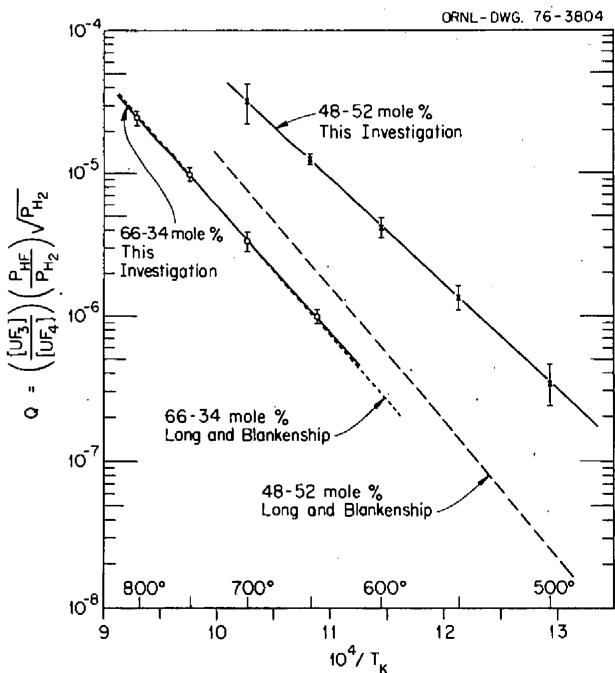  
Fig. 3.5. $Q$ values measured in LiF-BeF $_2$ solvents (66-34 mole % and 48-52 mole %) at several temperatures for the reaction $\mathbf{U}\mathbf{F}_4(\mathbf{d}) + \frac{1}{2}\mathbf{H}_2(\mathbf{g})^2 = \mathbf{U}\mathbf{F}_3(\mathbf{d}) + \mathbf{H}\mathbf{F}(\mathbf{g})$ .

the L & B data, and there is some indication in their data that the $Q$ values are not linearly related to the $\mathrm{BeF}_2$ concentration, as suggested by the above equation (see Fig. 9 of ref. 17). Therefore, such deviations due to gross solvent changes do not necessarily conflict with the L & B data.

The heat of reaction in the 48-52 mole $\%$ composition is $34.0\mathrm{kcal}$ and is $8.0\mathrm{kcal}$ lower than in the 66-34 mole $\%$ melt. This is what one would expect for a change in solution in going from a fluoride-rich to a fluoride-deficient solvent and is in agreement with our previous analysis[18] for the $\mathrm{UF_4 - UC_2}$ equilibrium with $\mathrm{UF_3}$ and graphite.

This study will be concluded by measuring $Q$ with $\mathrm{LiF - BeF_2 - ThF_4}$ (72-16-12 mole $\%$ ) as the solvent.

# REFERENCES

I. A. D. Kelmers and D. Y. Valentine, MSR Program Semiannu. Progr. Rep. Feb. 28, 1975, ORNL-5047, p. 40.   
2. D. Y. Valentine and A. D. Kelmers, MSR Program Semiannu. Progr. Rep. Aug. 31, 1975, ORNL-5078, p. 29.   
3. B. F. Hitch and L. M. Toth, Sect. 3.2, this report.   
4. J. F. King, personal communication.

5. B. F. Hitch and L. M. Toth, MSR Program Semiannu. Progr. Rep. Aug. 31, 1975, ORNL-5078, p. 30.   
6. C. E. Bamberger, J. P. Young, and R. G. Ross, J. Inorg. Nucl. Chem. 36, 1158 (1974).   
7. H. R. Bronstein and F. A. Posey, Sect. 3.4, this report.   
8. D. L. Manning and G. Mamantov, Sect. 5.3, this report.   
9. P. T. Cunningham, S. A. Johnson, and E. J. Cairns, J. Electrochem. Soc. 120, 328 (1973).   
10. A. A. Kadryartsev and G. P. Ustyugov, Zhur. Neorg. Khim. 6, 1227 (1961).   
11. H. R. Bronstein and F. A. Posey, MSR Program Semiannu. Progr. Rep. Aug. 21, 1975, ORNL-5078, p. 32.   
12. D. M. Gruen, et al., J. Phys. Chem. 70, 472 (1966).   
13. F. G. Bodewig and J. A. Plambeck, *J. Electrochem. Soc.* 117, 618 (1970); J. A. Plambeck, personal communication, Jan. 14, 1976.   
14. F. G. Bodewig and J. A. Plambeck, J. Electrochem. Soc. 117, 904 (1970).   
15. L. O. Gilpatrick and L. M. Toth, MSR Program Semiannu. Progr. Rep. Aug. 31, 1975, ORNL-5078, p. 31.   
16. L. M. Toth and L. O. Gilpatrick, The Equilibrium of Dilute $UF_{3}$ Solutions Contained in Graphite, ORNL-4056, p. 12 (December 1972).   
17. G. Long and F. F. Blankenship, The Stability of Uranium Trifluoride, Part II. Stability in Molten Fluoride Solution, ORNL/TM-2065, Part II (November 1969).   
18. L. M. Toth and L. O. Gilpatrick, J. Phys. Chem. 77, 2799 (1973).

# 4. Coolant-Salt Chemistry

A. D. Kelmers

# 4.1 HYDROLYTIC BEHAVIOR OF $\mathrm{Na}_3\mathrm{B}_3\mathrm{F}_6\mathrm{O}_3$

L. Maya

The hydrolytic behavior of $\mathrm{Na}_3\mathrm{B}_3\mathrm{F}_6\mathrm{O}_3$ was studied by means of $^{19}\mathrm{F}$ nuclear magnetic resonance (NMR) and Raman spectroscopy to clarify the possible mechanisms of the conversion of this species into hydroxide. The compound $\mathrm{Na}_3\mathrm{B}_3\mathrm{F}_6\mathrm{O}_3$ appears to be the stable oxygen-containing species at relatively low oxide concentrations (3-15 mole $\%$ $\mathrm{B_2O_3}$ ) in the system $\mathrm{NaF - NaBF_4 - B_2O_3}$ . These compositions approach that of the coolant melt, although the latter contains a lower oxide concentration. This finding is of significance since tritium trapping by coolant melt

probably involves an equilibrium between oxide and hydroxide species. A knowledge of the nature of these species and their chemistry would provide further understanding of the trapping process.

The Raman spectrum of a $0.66 - M$ solution of $\mathrm{Na}_3\mathrm{B}_3\mathrm{F}_6\mathrm{O}_3$ is given (Fig. 4.1). It was concluded that the lines at 875 and $760~\mathrm{cm}^{-1}$ were due to $\mathrm{H}_3\mathrm{BO}_3$ and $\mathrm{BF}_3\mathrm{OH}^-$ resulting from the depolymerization of the $\mathrm{B}_3\mathrm{F}_6\mathrm{O}_3^{3-}$ ion as described by the following sequential reactions:

$$
\mathrm {N a} _ {3} \mathrm {B} _ {3} \mathrm {F} _ {6} \mathrm {O} _ {3} + 3 \mathrm {H} _ {2} \mathrm {O} = 3 \mathrm {N a B F} _ {2} (\mathrm {O H}) _ {2} \tag {1}
$$

$$
2 \mathrm {N a B F} _ {2} (\mathrm {O H}) _ {2} =
$$

$$
\mathrm {N a B F} _ {3} \mathrm {O H} + \mathrm {H} _ {3} \mathrm {B O} _ {3} + \mathrm {N a F}. \tag {2}
$$

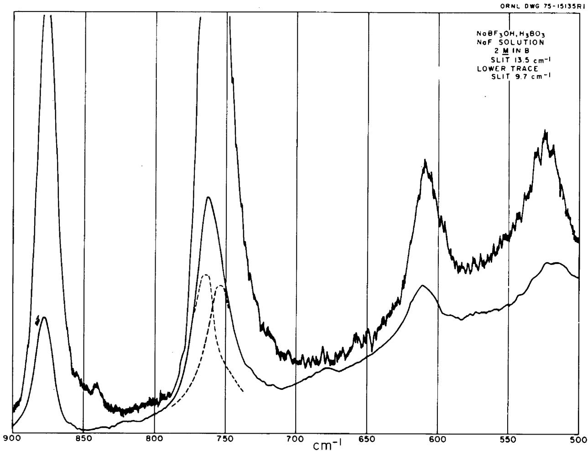  
Fig. 4.1. Raman spectrum of a solution $2M$ in boron with an $\mathbf{F} / \mathbf{B}$ ratio of 2.

This situation is not surprising since tetraborate is depolymerized in water into $\mathrm{H}_3\mathrm{BO}_3$ and $\mathrm{B(OH)}_4^-$ . Hibben1 observed such behavior on the basis of Raman spectra.

The stoichiometry of the depolymerization required that sodium fluoride, which was not observed in the Raman spectrum, would be formed. This suggested that boric acid, sodium fluoride, and sodium hydroxyfluoroborate that were dissolved in equivalent proportions should generate the same spectrum as aqueous $\mathrm{Na}_3\mathrm{B}_3\mathrm{F}_6\mathrm{O}_3$ . This was found to be the case; furthermore, evaporation of the solution yielded pure $\mathrm{Na}_3\mathrm{B}_3\mathrm{F}_6\mathrm{O}_3$ , as established by elemental analysis, infrared spectroscopy, alkalimetric titration and the x-ray powder diffraction pattern. This

experiment proved the reversibility of the equations described above and gave an alternate and simpler method of synthesizing the complex salt. In spite of the apparently straightforward chemistry described above, closer scrutiny of the Raman spectrum revealed some inconsistencies. Pure $\mathrm{NaBF}_3\mathrm{OH}$ absorbs at $763~\mathrm{cm}^{-1}$ , and the $760~\mathrm{cm}^{-1}$ band actually observed appeared to be asymmetric. A band at 610 $\mathrm{cm}^{-1}$ was also detected. The intensity of this band proved to be temperature dependent, increasing at lower temperatures. This suggested the presence of more species than originally assumed. The $^{19}\mathrm{F}$ NMR spectrum (Fig. 4.2) revealed a considerable proportion of species containing an $\mathrm{F / B}$ ratio of 2.0. The spectral evidence indicates that the equilibria

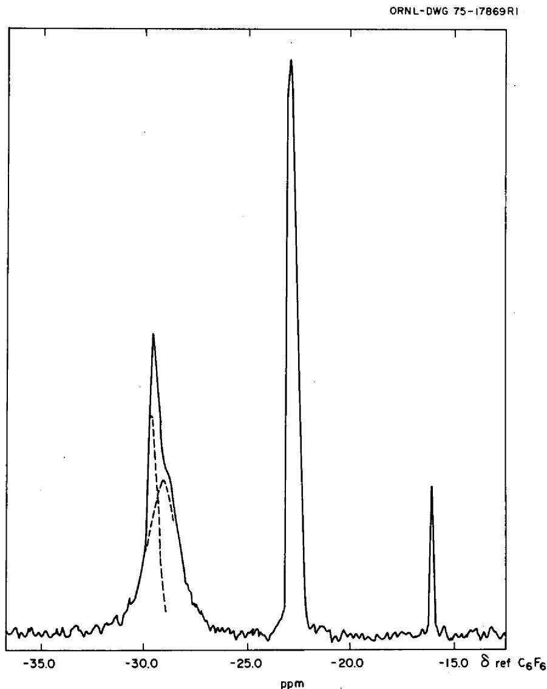  
Fig. 4.2. $^{19}\mathbf{F}$ NMR spectrum run at $0^{\circ}\mathbf{C}$ of a solution $2M$ in boron with an $\mathbf{F} / \mathbf{B}$ ratio of 2.

described in Eqs. (1) and (2) are not shifted completely to the right and that there are considerable amounts of $\mathrm{BF}_2(\mathrm{OH})_2^-$ and $\mathrm{B}_3\mathrm{F}_6\mathrm{O}_3^{3-}$ ions present. Analysis of the $760~\mathrm{cm}^{-1}$ band with a curve resolver revealed two components at 763 and 753 $\mathrm{cm}^{-1}$ , the first being due to $\mathrm{BF}_3\mathrm{OH}^-$ , as assigned on the basis of pure $\mathrm{NaBF}_3\mathrm{OH}$ , and the second due to $\mathrm{BF}_2(\mathrm{OH})_2^-$ . This gives an additional point to the correlation of the $\nu_{1}$ band frequency of partially substituted fluoroborates with the degree of substitution. Thus, $\mathrm{BF}_4^-$ absorbs at $770~\mathrm{cm}^{-1}$ , $\mathrm{BF}_3\mathrm{OH}^-$ at 763 $\mathrm{cm}^{-1}$ , $\mathrm{BF}_2(\mathrm{OH})_2^-$ at $753~\mathrm{cm}^{-1}$ , and $\mathrm{B(OH)}_4^-$ at 745 $\mathrm{cm}^{-1}$ . Similarly, analysis of the $^{19}\mathrm{F}$ NMR signal at $-29.6$ ppm ( $\delta$ referenced to $\mathrm{C}_6\mathrm{F}_6$ ) revealed two signals, one due to $\mathrm{BF}_2(\mathrm{OH})_2^-$ and the other apparently due to the $\mathrm{B}_3\mathrm{F}_6\mathrm{O}_3^{3-}$ . The presence of $\mathrm{B}_3\mathrm{F}_6\mathrm{O}_3^{3-}$ is confirmed by the band at $610~\mathrm{cm}^{-1}$ in the Raman spectrum. This line corresponds to the line at $595~\mathrm{cm}^{-1}$ observed in the spectrum of the solid.

A semiquantitative material balance, based on the intensities of the $^{19}\mathrm{F}$ NMR and a calibration of the $\mathrm{B(OH)_3}$ and $\mathrm{NaBF}_3\mathrm{OH}$ lines in the Raman spectrum, gives the following approximate distribution for a solution $2M$ in boron prepared by dissolving equimolar amounts of $\mathrm{NaBF}_3\mathrm{OH}$ , NaF, and $\mathrm{H}_3\mathrm{BO}_3$ :

$$
\mathrm {B F} _ {3} \mathrm {O H} ^ {-} \quad \mathrm {B F} _ {2} (\mathrm {O H}) _ {2} ^ {-} \quad \mathrm {B} _ {3} \mathrm {F} _ {6} \mathrm {O} _ {3} ^ {3 -} \quad \mathrm {F} ^ {-} \quad \mathrm {H} _ {3} \mathrm {B O} _ {3}
$$

Approximate 0.5 0.5 0.2 0.5 0.2 molarity

Free fluoride is not shown in the spectrum given in Fig. 4.2. It absorbs at about $-44\mathrm{ppm}$ and is not resolved from $\mathrm{BF(OH)_3^-}$ ; thus, among other uncertainties, it is a potential source of error in the material balance.

Having established that $\mathrm{Na}_3\mathrm{B}_3\mathrm{F}_6\mathrm{O}_3$ and $\mathrm{NaBF}_3\mathrm{OH}$ interconvert reversibly in the presence of water, it is possible to assume that a similar mechanism operates in the melt. This led to the postulation of a number of plausible reactions which could take place in the melt involving these species, hydrogen (tritium), and dissolved metal fluorides.

$$
\mathrm {H} _ {2} + \mathrm {M F} _ {2} = 2 \mathrm {H F} + \mathrm {M} ^ {0} \tag {3}
$$

$$
2 \mathrm {H F} + 2 \mathrm {N a B F} _ {3} \mathrm {O H} = 2 \mathrm {N a B F} _ {4} + 2 \mathrm {H} _ {2} \mathrm {O} \tag {4}
$$

$$
\begin{array}{l} 2 \mathrm {H} _ {2} \mathrm {O} + ^ {4} / 6 \mathrm {N a} _ {3} \mathrm {B} _ {3} \mathrm {F} _ {6} \mathrm {O} _ {3} = \\ \mathrm {N a B F} _ {3} \mathrm {O H} + \mathrm {N a F} + \mathrm {H} _ {3} \mathrm {B O} _ {3} \tag {5} \\ \end{array}
$$

$$
\mathrm {H} _ {3} \mathrm {B O} _ {3} = ^ {1} / _ {2} \mathrm {B} _ {2} \mathrm {O} _ {3} + ^ {3} / _ {2} \mathrm {H} _ {2} \mathrm {O} \tag {6}
$$

$$
\mathrm {^ 1 / _ {2} B _ {2} O _ {3}} + \mathrm {N a F} + \mathrm {^ 1 / _ {2} N a B F _ {4}} = \mathrm {^ 3 / _ {6} N a _ {3} B _ {3} F _ {6} O _ {3}} \tag {7}
$$

$$
\mathrm {^ 3 / 2 N a B F _ {4} + ^ {3 / 2} H _ {2} O = ^ {3 / 2} N a B F _ {3} O H + ^ {3 / 2} H F} \tag {8}
$$

The overall reaction is

$$
\begin{array}{l} 2 \mathrm {H} _ {2} + 2 \mathrm {M F} _ {2} + ^ {1} / _ {3} \mathrm {N a} _ {3} \mathrm {B} _ {3} \mathrm {F} _ {6} \mathrm {O} _ {3} = \\ 3 \mathrm {H F} + 2 \mathrm {M} ^ {0} + \mathrm {N a B F} _ {3} \mathrm {O H}. \tag {9} \\ \end{array}
$$

The equilibrium constant for this reaction is

$$
K _ {1} = \frac {P _ {\mathrm {H F}} ^ {3} (\mathrm {N a B F} _ {3} \mathrm {O H})}{(\mathrm {N a} _ {3} \mathrm {B} _ {3} \mathrm {F} _ {6} \mathrm {O} _ {3}) ^ {1 / 3} (\mathrm {M F} _ {2}) ^ {2} P _ {\mathrm {H} _ {2}} ^ {2}}.
$$

The above expression is not entirely representative of the system since HF and $\mathrm{NaBF}_3\mathrm{OH}$ can react according to:

$$
\mathrm {H F} + \mathrm {N a B F} _ {3} \mathrm {O H} = \mathrm {H} _ {2} \mathrm {O} + \mathrm {N a B F} _ {4}. \tag {10}
$$

This equilibrium constant for this reaction is

$$
K _ {2} = \frac {P _ {\mathrm {H} _ {2}} \mathrm {O}}{P _ {\mathrm {H F}} (\mathrm {N a B F} _ {3} \mathrm {O H})}.
$$

$\mathrm{NaBF_4}$ is not incorporated in the expression since it is the solvent. Finally, the system could be represented by combining $K_{1}$ and $K_{2}$ into the following expression:

$$
K _ {3} = \frac {P _ {\mathrm {H F}} ^ {4} (\mathrm {N a B F} _ {3} \mathrm {O H}) ^ {2}}{(\mathrm {N a} _ {3} \mathrm {B} _ {3} \mathrm {F} _ {6} \mathrm {O} _ {3}) ^ {1 / 3} (\mathrm {M F} _ {2}) ^ {2} P _ {\mathrm {H} _ {2}} ^ {2} P _ {\mathrm {H} _ {2} \mathrm {O}}}
$$

Evaluation of the constant $\mathbf{K}_3$ would lead to a quantitative description of the system. A more practical qualitative observation based on this expression is that tritium trapping will be favored by relatively high concentrations of oxide and/or metal fluoride in the salt along with a relatively high value for the partial pressure of water.

# 4.2 VAPOR DENSITY STUDIES IN THE SYSTEM $\mathbf{BF}_3\mathrm{-H}_2\mathbf{O}$

L. Maya S.N.Russell\*

In the last report, it was stated that dissociation of $\mathrm{BF}_3\cdot 2\mathrm{H}_2\mathrm{O}$ is complete at $400^{\circ}\mathrm{C}$ . The present set of experiments was aimed at establishing the temperature threshold at which association or condensation of the vapor species takes place. These experiments showed that at about $200^{\circ}\mathrm{C}$ there is a departure from complete dissociation. This departure becomes

pronounced at $150^{\circ}\mathrm{C}$ , and, with increasing amounts of $\mathrm{BF}_3\cdot 2\mathrm{H}_2\mathrm{O}$ , a stable liquid phase is formed, giving a saturation vapor pressure which remains constant with varying amounts of $\mathrm{BF}_3\cdot 2\mathrm{H}_2\mathrm{O}$ . This behavior was unexpected, in view of the report that $\mathrm{BF}_3\cdot 2\mathrm{H}_2\mathrm{O}$ decomposes upon distillation; however, that work was done in glass in an open system. This finding led to a series of experiments to obtain a set of saturation vapor pressure data at different temperatures (Table 4.1).

Table 4.1 Saturation vapor pressures of $\mathrm{BF}_3\cdot 2\mathrm{H}_2\mathrm{O}$ temperature $(^{\circ}\mathrm{C})$   

<table><tr><td></td><td>101</td><td>127</td><td>150</td><td>166</td><td>167</td><td>170</td></tr><tr><td>P1, mm Hga</td><td>44</td><td>99</td><td>212</td><td>299</td><td>335</td><td>362</td></tr><tr><td>P2, mm Hgb</td><td>42</td><td>103</td><td>208</td><td>324</td><td>333</td><td>361</td></tr></table>

$a_{P_1} =$ experimentally determined pressure. $bP_{2} =$ pressure calculated from a least-squares fit of the data: $\log P(\mathrm{mmHg}) = (-2242\pm 91) / T + (7.62\pm 0.21)$

A plot of $\ln P$ vs $T^{-1}$ for $\mathrm{BF}_3\cdot 2\mathrm{H}_2\mathrm{O}$ gave an extrapolated "boiling point" (actually the temperature at which dissociation pressure and vapor pressure reach 1 atm) of $200^{\circ}\mathrm{C}$ and an enthalpy of vaporization $(\triangle H_{\nu})$ of $10.6~\mathrm{kcal / mole}$ , which is similar to the $\triangle H_{\nu}$ of a number of etherates of $\mathrm{BF}_3$ .

Another set of experiments was conducted to study the dissociation behavior of $\mathrm{BF}_3\cdot 2\mathrm{H}_2\mathrm{O}$ and $\mathrm{BF}_3\cdot \mathrm{H}_2\mathrm{O}$ in the vapor phase. This was done choosing conditions such that no liquid phase could be present. Typical results of these runs are presented in Table 4.2.

Table 4.2 Dissociation pressures (calculated and experimental) of boron trifluoride hydrates $(\mathrm{mmHg})$   

<table><tr><td rowspan="2">Temperature (°C)</td><td colspan="2">BF3·2H2O</td><td colspan="2">BF3·H2O</td></tr><tr><td>PFa</td><td>Pcb</td><td>PFa</td><td>Pcb</td></tr><tr><td>150</td><td>146</td><td>206</td><td>158</td><td>189</td></tr><tr><td>160</td><td>166</td><td>212</td><td>188</td><td>214</td></tr><tr><td>170</td><td>284</td><td>341</td><td>314</td><td>338</td></tr><tr><td>181</td><td>364</td><td>402</td><td></td><td></td></tr></table>

$a_{\mathbf{P}_{\mathrm{F}}} =$ pressure determined experimentally. $\pmb{b}_{\mathrm{P}_{\mathrm{C}}} =$ calculated pressure assuming complete dissociation.

Consideration was given to using the data in the calculation of equilibrium constants and thermodynamic quantities, but it was felt that because of the uncertainty in the determination, valid results would not be obtained. On the other hand, the results clearly show that there is association between $\mathrm{BF}_3$ and $\mathrm{H}_2\mathrm{O}$ in the vapor phase.

# REFERENCES

1. J. H. Hibben, Am. J. Sci. 113 (1938).   
2. R. E. Mesmer and A. C. Rutenberg, Inorg. Chem. 12, 699 (1973).   
3. L. Maya, MSR Program Semiannu. Progr. Rep. Aug. 31, 1975, ORNL-5078, p. 33.   
4. J. S. McGrath, G. G. Stack, and P. A. McClusker, J. Am. Chem. Soc. 66, 1263 (1944).   
5. H. C. Brown and R. M. Adams, J. Am. Chem. Soc. 64, 2557 (1942).

# 5. Development and Evaluation of Analytical Methods

A. S. Meyer* J. M. Dale

# 5.1 IN-LINE ANALYSIS OF MOLTEN MSBR FUEL

R.F.Apple D.L.Manning

Corrosion test loops described previously have continued operation with circulating reference fuel carrier salt, $\mathrm{LiF - BeF_2 - ThF_4 - UF_4}$ (71.7-16-12-0.3 mole%). Ratios of $\mathrm{U}^{4 + } / \mathrm{U}^{3 + }$ in thermal convection loops NCL-21A and 23 continue to show no unusual trend in the redox behavior of the melt. A temporary rise in the ratio in response to the addition of new corrosion test specimens is still visible as well as a recovery to the original ratios within a short time. The $\mathrm{U}^{4 + } / \mathrm{U}^{3 + }$ ratios are presently about $5.4\times 10^{3}$ and 4 for loops 21A and 23 respectively. The $\mathrm{U}^{4 + } / \mathrm{U}^{3 + }$ ratio in loops 18C and 24, which are operating with Hastelloy N corrosion specimens, have shown a gradual decline and are presently about $1.7\times 10^{2}$ and 80 respectively.

Forced convection loop, FCL-2b, has been charged with new salt and is back in operation after a shutdown period. The $\mathrm{U}^{4+}/^{3+}$ ratio is presently of the order of $5.3 \times 10^{3}$ , which indicates that the melt is oxidizing. Probably the ratio will decrease rapidly as the melt comes in contact with new metal surfaces that have been installed in the loop.

The measurement of $\mathrm{U}^{4+}/\mathrm{U}^{3+}$ ratios were initiated in November on eight creep-test machines located in Building 2011. Since the initial measurements, the melts have tended to become more reducing. For comparison, first measurements and present $\mathrm{U}^{4+}/\mathrm{U}^{3}3$ ratios are shown in Table 5.1. Tellurium as

Table 5.1 Ratios of $\mathbf{U}^{4 + } / \mathbf{U}^{3 + }$ in creep-test machines   

<table><tr><td rowspan="2">Machine identity</td><td colspan="2">U4+/U3+ ratio</td></tr><tr><td>Initial</td><td>Present</td></tr><tr><td>15</td><td>4.6 × 103</td><td>1.4 × 103</td></tr><tr><td>16</td><td>3.9 × 102</td><td>100</td></tr><tr><td>17</td><td>2.3 × 103</td><td>76</td></tr><tr><td>18</td><td>3.5 × 102</td><td>90</td></tr><tr><td>19</td><td>3.5 × 102</td><td>35</td></tr><tr><td>20</td><td>5.3 × 102</td><td>63</td></tr><tr><td>21</td><td>65</td><td>22</td></tr><tr><td>22</td><td>3.1 × 102</td><td>64</td></tr></table>

$\mathrm{Cr_3Te_4}(\sim 50\mathrm{mg})$ was added to machines 19-22. No detectable change in the redox behavior was observed. Additional discussions of these tests are presented elsewhere.

# 5.2 TRITIUM ADDITION EXPERIMENTS IN THE COOLANT-SALT TECHNOLOGY FACILITY

R. F. Apple

The Coolant-Salt Technology Facility (CSTF) is being operated for testing $\mathrm{NaBF}_4$ -NaF (92-8 mole %) for its suitability as a possible secondary coolant. In cooperation with loop engineers and technicians, the Analytical Chemistry Group is trying to determine the fate and distribution of elemental tritium when it is added directly to the salt to simulate, at least in part, the predicted transport of tritium in the coolant system via diffusion through the primary heat exchanger. The methodology and the results from the first two tritium injection experiments were described previously. This section presents the results of the third tritium injection experiment.

About $80\mathrm{mCi}$ of tritium (diluted about 1:1000 with protium) was introduced into the salt over a period of about 11 hr beginning at 0900 hours September 16, 1976. Tritium concentrations were measured in the cover gas and salt from the beginning and for several days thereafter (Table 5.2).

Preliminary evaluation of the data indicates that about half of the injected tritium experienced significant hold up in the salt but was eventually removed in the off-gas stream. Very little tritium in the off-gas was in the elemental form. The majority was in a water-soluble or combined form which is advantageous from the standpoint of tritium trapping by the salt. Also, there appears to be evidence that at low concentrations some of the tritium which is captured by the salt has a tendency to escape on standing. A general discussion of the behavior of tritium in the CSTF and a more complete analysis of the injection experiments are given elsewhere.

A fourth tritium injection experiment now under way uses improved gas addition and sampling techniques. Tritium will be added in this experiment

Table 5.2. Tritium content in cover-gas samples and salt samples after the third tritium addition at the CSTF   

<table><tr><td rowspan="2">Date</td><td rowspan="2">Sample time</td><td colspan="2">Cover gas (pCi tritium/ml)</td><td rowspan="2">Salt (nCi/g)</td></tr><tr><td>Water soluble</td><td>elemental</td></tr><tr><td rowspan="10">9/16</td><td>0810</td><td>38</td><td>0.42</td><td>1.60</td></tr><tr><td>0915</td><td></td><td></td><td></td></tr><tr><td>1115</td><td>785</td><td>5.0</td><td>11</td></tr><tr><td>1315</td><td>3082</td><td>8.0</td><td>18</td></tr><tr><td>1545</td><td>5770</td><td>21</td><td>27</td></tr><tr><td>1830</td><td>9254</td><td>23</td><td></td></tr><tr><td>1847</td><td></td><td></td><td>39</td></tr><tr><td>1920</td><td>10162</td><td>31</td><td>38</td></tr><tr><td>2115</td><td>9498</td><td>25</td><td>31</td></tr><tr><td>2315</td><td>8568</td><td>28</td><td>29</td></tr><tr><td rowspan="4">9/17</td><td>0824</td><td>10639</td><td></td><td>16</td></tr><tr><td>1124</td><td>5583</td><td></td><td>14</td></tr><tr><td>1424</td><td>4864</td><td></td><td>11</td></tr><tr><td>2024</td><td>2750</td><td></td><td>7.6</td></tr><tr><td rowspan="6">9/18</td><td>0820</td><td>2393</td><td>3.8</td><td>4.7</td></tr><tr><td>0910</td><td>1012</td><td>3.8</td><td></td></tr><tr><td>0950</td><td>720</td><td>3.6</td><td></td></tr><tr><td>1124</td><td></td><td></td><td>4.3</td></tr><tr><td>1424</td><td></td><td></td><td>3.6</td></tr><tr><td>2021</td><td>895</td><td>4.4</td><td>3.0</td></tr><tr><td rowspan="3">9/19</td><td>0825</td><td>738</td><td>3.5</td><td>3.7</td></tr><tr><td>1425</td><td>724</td><td>2.3</td><td>2.6</td></tr><tr><td>2117</td><td></td><td></td><td>2.3</td></tr><tr><td rowspan="3">9/20</td><td>0825</td><td>450</td><td>1.3</td><td>2.6</td></tr><tr><td>1420</td><td>432</td><td>1.3</td><td>1.9</td></tr><tr><td>2116</td><td></td><td></td><td>3.1</td></tr><tr><td rowspan="3">9/21</td><td>0845</td><td></td><td></td><td>2.7</td></tr><tr><td>1420</td><td></td><td></td><td>1.2</td></tr><tr><td>2115</td><td></td><td></td><td>2.4</td></tr><tr><td rowspan="5">9/22</td><td>0825</td><td></td><td></td><td>1.2</td></tr><tr><td>1215</td><td>332</td><td>1.6</td><td></td></tr><tr><td>1310</td><td>378</td><td>1.6</td><td></td></tr><tr><td>1355</td><td>372</td><td>1.7</td><td></td></tr><tr><td>1426</td><td></td><td></td><td></td></tr><tr><td rowspan="4">9/23</td><td>0824</td><td></td><td></td><td>2.1</td></tr><tr><td>0905</td><td>191</td><td>1.2</td><td></td></tr><tr><td>1330</td><td>159</td><td>1.0</td><td></td></tr><tr><td>1430</td><td></td><td></td><td>1.9</td></tr><tr><td rowspan="3">9/24</td><td>0828</td><td></td><td></td><td>0.9</td></tr><tr><td>0945</td><td>143</td><td>0.99</td><td></td></tr><tr><td>1400</td><td>144</td><td>1.03</td><td>0.9</td></tr><tr><td rowspan="5">9/25</td><td>0824</td><td></td><td></td><td>1.4</td></tr><tr><td>0905</td><td>150</td><td>1.3</td><td></td></tr><tr><td>1345</td><td>125</td><td>1.0</td><td></td></tr><tr><td>1421</td><td></td><td></td><td>1.2</td></tr><tr><td>1421</td><td></td><td></td><td>1.2</td></tr><tr><td rowspan="5">9/26</td><td>0836</td><td></td><td></td><td>5.6</td></tr><tr><td>0836</td><td></td><td></td><td>5.5</td></tr><tr><td>0850</td><td>150</td><td>1.1</td><td></td></tr><tr><td>1415</td><td>209</td><td>0.90</td><td>1.1</td></tr><tr><td>1415</td><td></td><td></td><td>1.1</td></tr><tr><td rowspan="2">9/29</td><td>0905</td><td>100</td><td>0.75</td><td>0.77</td></tr><tr><td>1345</td><td>89</td><td>0.67</td><td>0.95</td></tr><tr><td rowspan="2">9/30</td><td>0815</td><td>86</td><td>0.71</td><td>2.4</td></tr><tr><td>1400</td><td>83</td><td>0.57</td><td>0.47</td></tr><tr><td rowspan="2">10/1</td><td>0815</td><td>73</td><td>0.57</td><td>0.23</td></tr><tr><td>1400</td><td>70</td><td>0.59</td><td></td></tr><tr><td>10/2</td><td>0810</td><td>57</td><td>0.43</td><td></td></tr><tr><td>10/3</td><td>0810</td><td>44</td><td>0.38</td><td></td></tr></table>

until a steady state is reached. A preliminary evaluation of the results obtained so far is presented elsewhere. $^4$

# 5.3 ELECTROCHEMICAL STUDIES OF TELLURIUM IN MOLTEN LiF-BeF $_2$ -ThF $_4$ (72-16-12 MOLE %)

D. L. Manning G. Mamantov

Tellurium occurs in nuclear reactors as a fission product and results in shallow intergranular cracking in structural metals and alloys. Efforts were continued to characterize this substance electrochemically and to ascertain the feasibility of in situ monitoring by electroanalytical means.

Tellurium screening studies were carried out in cooperation with J. R. Keiser of the Metals and Ceramics Division. As previously reported, lithium telluride, $\mathrm{Li_2Te}$ , was added to molten $\mathrm{LiF - BeF_2 - ThF_4}$ , which was contained in a cell equipped with viewing ports in addition to the electrode ports. Subsequent voltammograms did not reveal any waves that could be attributed to soluble electroactive tellurium species. Chemical analysis indicated $< 5$ ppm tellurium in the melt. Following cleanup of the cell and recharging with $\mathrm{LiF - BeF_2 - THF_4}$ , standard additions of $\mathrm{LiTe}_3$ were made in the form of pressed pellets. The pellets disappeared more rapidly from the melt surface than did the $\mathrm{Li_2Te}$ pellets. A greyish film having a metallic appearance formed on the surface. Subsequent voltammograms did not show any significant changes over background scans. The equilibrium potential remained the same, which was different from the $\mathrm{Li_2Te}$ additions where the melt became more reducing. This means that $\mathrm{LiTe}_3$ is not stable under our operating conditions. Bamberger et al. showed that isothermal conditions were necessary to hold the characteristic color for any length of time in experiments on spectral measurements of what was reported to be $\mathrm{LiTe}_3$ in $\mathrm{LiF - BeF_2}$ . Under nonisothermal conditions the color quickly disappeared with evidence of tellurium metal formation. Since our conditions are nonisothermal, the $\mathrm{LiTe}_3$ probably decomposed immediately after contacting the melt. The greyish film having a metallic appearance that was noted on the melt surface apparently tended to short out the electrodes after a few hours because the voltammograms became extremely noisy and nonreproducible. However, there was no change in the equilibrium potential.

Thus, we have been unable to detect stable electroactive telluride species in molten LiF-BeF $_2$

$\mathrm{ThF_4}$ following standard additions of $\mathrm{Li}_2\mathrm{Te}$ and $\mathrm{LiTe}_3$ compounds under these conditions. It appears that these tellurides are, for the most part, relatively insoluble and/or thermally unstable under these experimental conditions.

In the absence of meaningful voltammograms, experiments were initiated to determine the decomposition potential of elemental tellurium $(m\mathrm{Te} + n\mathrm{e}^{-}\rightarrow \mathrm{Te}_{m}^{n - })$ relative to the half-wave potential of the $\mathrm{U(IV)}\to \mathrm{U(III)}$ electrode reaction. This should provide some insight on the reducing power $[\mathrm{U(IV) / U(III)}]$ ratio] required to favor the existence of tellurides (if stable) over elemental tellurium in MSBR fuel salt. For these experiments, the molten $\mathrm{LiF - BeF_2 - ThF_4}$ was contained in a pyrolytic boron nitride cup. The holder for the small tellurium pool electrode $(^{3} / _{32}$ -in.-diam) was fabricated from spectrographic-grade graphite. Cathodic polarization curves recorded on the tellurium pool electrode right after dipping into the melt at $\sim 650^{\circ}\mathrm{C}$ and for the next hour or so revealed a decomposition potential of about $+1.15\mathrm{V}$ vs the melt limit. It was observed that $\sim 100\mathrm{mg}$ of tellurium volatilized from the graphite holder in approximately 1 hr. The halfwave potential for the $\mathrm{U(IV)}\to \mathrm{U(III)}$ electrode reaction relative to the melt limit is $\sim +0.75\mathrm{V}$ . Thus the decomposition potential of tellurium relative to $E_{1 / 2}$ for $\mathrm{U(IV)}\to \mathrm{U(III)}$ reduction is of the order of $+0.40\mathrm{V}$ , which corresponds to a $\mathrm{U(IV) / U(III)}$ ratio of $\sim 150$ at $923\mathrm{K}(650^{\circ}\mathrm{C})$ . From these measurements, it appears that a relatively reducing melt is required to favor the existence of stable telluride species over elemental tellurium in molten LiF-BeF $_2$ -ThF $_4$ -U(IV) at $923\mathrm{K}(650^{\circ}\mathrm{C})$ .

In a second experimental setup located in J. R. Keiser's laboratory and with Keiser's cooperation, we are monitoring the U(IV)/U(III) ratio in molten LiF-BeF $_2$ -ThF $_4$ following additions of tellurium as $\mathrm{Cr_3Te_4}$ . With the U(IV)/U(III) ratio at a stable value of $\sim 110$ at $978~\mathrm{K}$ ( $1300^{\circ}\mathrm{F}$ ), a standard addition of $105~\mathrm{mg}$ of $\mathrm{Cr_3Te_4}$ was made. This addition resulted in no change either in the U(IV)/U(III) ratio or shape of the voltammograms over a two-day monitoring period. A second addition of $1.00~\mathrm{g}$ of $\mathrm{Cr_3Te_4}$ was then made, which resulted in an increase in the U(IV)/U(III) ratio from $\sim 110$ to $220$ . This effect has been observed previously and is believed to be due to slight moisture contamination during addition procedures. Within three days the $\mathrm{U}^{4+}/\mathrm{U}^{3+}$ ratio had decreased to about 90 and appeared to stabilize at about this value. No change in the characteristics of the voltammograms (new waves, etc) was observed

following the larger addition, although the U(IV)/U(III) ratio appeared to level out at a somewhat lower value. Metal specimens present in the cell will be removed and examined for tellurium effects.

In order to obtain additional information on the formation and stability of tellurides under nonisothermal conditions, studies were conducted on the telluride species produced in situ from cathodizing elemental tellurium $(m\mathrm{Te} + n\mathrm{e}^{-}\rightarrow \mathrm{Te}_{m}^{n - })$ .Chronopotentiometric and double potential step experiments conducted at a tellurium pool electrode contained in a graphite cup revealed that the telluride species generated does not appear to be stable at $\sim 650^{\circ}\mathrm{C}$ Instability was indicated from the chronopotentiometric experiments by comparing the ratio of the forward and reverse transition times. Generation of a stable but insoluble substance yields $\tau_f / \tau_r = 1$ ; for a soluble and stable species, $\tau_{f} / \tau_{r} = 3$ is predicted. For an unstable species, on the other hand, the value of $\tau_{t} / \tau_{r}$ should be greater than three. For these experiments, the current was reversed at a time $t <   \tau_{f}$ however, the above conclusions remain valid as long as $t\leqslant \tau_{f}$ Potential-time curves recorded at the tellurium pool electrode produced a value of $\tau_{f} / \tau_{r}\gg 3$ in all the runs, indicating that the telluride species generated is not stable, at least within the time frame of the experiment (seconds).

In the double potential step experiments, the anodic-cathodic current ratio $(i_a / i_c)$ is plotted vs a function of time $[F(t)]$ during which the potential step is applied and removed. For a stable system, $i_a / i_c = 1$ when $F(t)$ is extrapolated to zero. For the generation of an unstable species, $i_a / i_c < 1$ ; this was observed for the tellurium experiments.

Plots of $\log i$ vs $E$ from potential step experiments revealed an $n$ value close to unity. The validity of $n$ value determinations by this method is discussed by Armstrong et al. and Bacarella and Griess. Thus if $n = 1$ , the telluride generated can be represented as $m\mathrm{Te} + \mathrm{e}^{-} \rightarrow \mathrm{Te}_{m}^{-}(m \geqslant 1)$ . Bronstein, using a different method, also obtained an $n$ value of unity from polarization studies of tellurium in molten chlorides.

A stable telluride of the type $\mathrm{Te}_m$ should exhibit a color when dissolved in the melt. In an effort to observe this effect, we cathodized elemental tellurium in molten LiF-BeF $_2$ at $\sim 480^{\circ}\mathrm{C}$ . The melt was held in a quartz tube to permit visual observations. When a current of $\sim 150$ to $300\mathrm{mA}$ was applied for several seconds or longer, a dark brown substance was observed streaming from the tellurium electrode; however, the material appeared insoluble, and a colored melt was not produced. After the material

diffused away from the electrode a short distance $(\sim 1$ cm), the color could no longer be seen. These results also indicate that we are generating an unstable species that under nonisothermal conditions undergoes a decomposition reaction. Reasonable reactions are as follows:

$$
\begin{array}{l} 2 \mathrm {T e} _ {1} ^ {- 1} \rightarrow \mathrm {T e} _ {2} ^ {2 -} \\ \mathrm {T e} _ {2.} ^ {2 -} \rightarrow \mathrm {T e} ^ {2 -} + \mathrm {T e} \uparrow (m = 1) \\ 2 \mathrm {T e} _ {m} ^ {-} \rightarrow \mathrm {T e} ^ {2 -} + (2 m - 1) \mathrm {T e} \uparrow (m > 1) \\ \end{array}
$$

The $\mathbf{Te}^{2-}$ does not appear to be soluble in fluoride melts, at least to the extent that voltammetric detection is feasible.

# 5.4 ELECTROCHEMICAL STUDIES OF OXYGENATED SPECIES IN MOLTEN FLUORIDES

D. L. Manning G. Mamantov

Voltammetric anodic scans at a gold electrode in molten $\mathrm{LiF - BeF_2 - ThF_4}$ (MSBR fuel solvent) and also in molten $\mathrm{LiF - BeF_2 - ZrF_4}$ (MSRE fuel solvent) revealed two anodic waves at peak potentials $\sim 1.05$ , $1.3\mathrm{V}$ and $0.85$ , $1.2\mathrm{V}$ vs an iridium quasi-reference electrode (Ir QRE) respectively. Noise is encountered on the diffusion current plateau of the second wave, which is indicative of gas-bubble formation at the electrode surface. The waves are irreversible at slow $(0.1\mathrm{V / sec})$ scan rates. Although the results are tentative, these waves are probably associated with the oxygenated species in the melts.

A calculation of the $n$ value for the first anodic wave from the ratio of the volt-ammetric $i_p / \nu^{1 / 2}$ to the chronopotentiometric $i\tau^{1 / 2}$ and also the chronoamperometric $i\tau^{1 / 2}$ revealed a value of approximately unity in both melts. Scan rate studies of the first wave in LiF-BeF $_2$ -ThF $_4$ revealed a decrease in the $i_p / \nu^{1 / 2}$ value of $\sim 30\%$ over the range of 0.1 to 5 V/sec. A possible mechanism that reflects this behavior involves a charge transfer followed by dimerization. $^{13}$ If it is assumed that the wave is associated with "oxide" in the melt, a likely reaction could be

$$
\begin{array}{l} \mathrm {O} ^ {-} - \mathrm {l e} \rightarrow \mathrm {O} ^ {-} \\ 2 0 ^ {-} \rightarrow \mathrm {O} _ {2} ^ {2 -} \\ \end{array}
$$

which would account for the one-electron charge and dimerization. Efforts to carry out similar measurements in $\mathrm{LiF - BeF_2 - ZrF_4}$ were hampered by a small

prewave at the foot of the first anodic wave which became very large at the faster scan rates. The peak current $(i_p)$ of the prewave was roughly proportional to $\nu$ (scan rate), which is indicative of adsorption of product (probably $\mathrm{O}^{-}$ ) at the electrode surface. It is not clear why this adsorption effect is so pronounced in LiF-BeF $_2$ -ZrF $_4$ .

If the first anodic wave represents the oxidation of oxide to the peroxide, the second anodic wave must represent the continued oxidation to superoxide and ultimately oxygen gas. The noise on the diffusion current plateau of the second wave is indicative of gas formation at the electrode surface. The reactions are complex; however, the overall $n$ value for the second wave should be 2 (assuming $\mathrm{O}_2^{2-} - 2\mathrm{e} \rightarrow \mathrm{O}_2$ ).

For chronopotentiometry, the magnitude of the transition time, $\tau_{1}$ and $\tau_{2}$ for the stepwise oxidation of a substance involving $n = 1$ and $n = 2$ , respectively, results in a ratio of transition times $\tau_{1} / \tau_{2} = 8$ . The experimental data from chronopotentiograms recorded on both melts were in reasonable agreement with the predicted value.

If the second anodic wave is a peroxide oxidation wave, the addition of peroxide to the melt should result in a pronounced increase in the $i_p$ of the wave. We added $600\mathrm{mg}$ of $\mathrm{Na}_2\mathrm{O}_2$ to the LiF-BeF $_2$ -ZrF $_4$ melt. The first interesting observation was a $200\mathrm{-mV}$ anodic shift in the equilibrium potential (more oxidizing) over a period of a few minutes and, then, a gradual return to about the original value within a few hours. A pronounced increase was observed for the second anodic wave height. At faster scan rates ( $\sim 5 - 50\mathrm{V / sec}$ ) the second wave is split, and a small post-wave can be observed. This led us to believe that we were seeing the intermediate peroxide $\rightarrow$ superoxide step and that the small post-wave was due to the superoxide oxidation. To check this further, a standard addition of sodium superoxide, $\mathrm{NaO}_2$ , was made, and a pronounced increase in the peak height of the post-wave was observed, which supports our belief that the wave is due to superoxide oxidation.

It is also worth noting that a new cathodic voltammogram at $\sim -0.5\mathrm{V}$ vs Ir QRE was detected following the $\mathrm{Na_2O_2}$ addition. The wave apparently involves a one-electron step. Although it is interesting to speculate on various electrode reactions, at present it can only be said that the wave results from

the reduction of peroxy and superoxy species. The value of the reduction potential $\left[\sim -400\mathrm{mV}\right.$ more negative than that for Ni(II)] for this process is surprising.

After one day the wave heights of the voltammograms had diminished, and after about four days the effect of the $\mathrm{Na_2O_2}$ was no longer detected. The reason that an increase in the first anodic wave (believed to be due to oxide $\rightarrow$ peroxide) was not seen as the peroxide decomposed $(20^{\pm}_{2} \rightarrow \mathrm{O}_{2} + 20^{\pm})$ is that the melt may have already been saturated with oxide. The fact that the second anodic wave increased upon adding $\mathrm{Na_2O_2}$ supports our belief that this wave, although complicated, is due to peroxide oxidation.

These observations continue to be encouraging. The reproducibility of the curves for a given set of conditions is generally good. It is believed that a significant step has been taken toward the capability of in-line monitoring of the oxide level in fluoride melts under favorable conditions.

# REFERENCES

1. A. S. Meyer et al., MSR Program Semiannu. Progr. Rep. Aug. 31, 1975, ORNL-5078, p. 44.   
2. This report, Sects. 6.11-6.13.   
3. This report, Sects. 1.1.1 and 1.1.2.   
4. This report, Sect. 1.1.3.   
5. H. E. McCoy, "Materials for Salt Containing Vessels and Piping," in The Development and Status of Molten-Salt Reactors, ORNL-4812, p. 207 (February 1975).   
6. A. S. Meyer et al., MSR Program Semiannu. Progr. Rep. Aug. 31, 1975, ORNL-5078, p. 48.   
7. C. E. Bamberger, J. P. Young, and R. G. Ross, "The Chemistry of Tellurium in Molten $\mathrm{Li}_2\mathrm{BeF}_4$ ," J. Inorg. Nucl. Chem. 36, 1158 (1974).   
8. A. Weissberger (ed.), Physical Methods of Chemistry, Part II: Electrochemical Methods, p. 620, Wiley-Interscience, New York, 1971.   
9.Ry.8,p.602   
10. R. D. Armstrong, T. Dickinson, and K. Taylor, "The Anodic Decomposition of Copper (1) N-Methylhexamethylenetetramine Bromide," J. Electroanal. Chem. 64, 155 (1975).   
11. A. L. Bacarella and J. C. Griess, Jr., "The Anodic Dissolution of Copper in Flowing Sodium Chloride Solutions Between $25^{\circ}$ and $175^{\circ}$ C," J. Electrochem. Soc. 12, 459 (1973).   
12. This report, Sect. 3.4.   
13. W. V. Childs, J. T. Maloy, C. P. Keszthelyi, and A. J. Bard, "Voltammetric and Coulometric Studies of the Mechanism of Electrodimerization of Diethyl Fumarate in Dimethylformamide Solutions," J. Electrochem. Soc. 118, 874 (1971).

# Part 3. Materials Development

H. E. McCoy

The main thrust of the materials program is the development of a structural material for the MSBR primary circuit which has adequate resistance to embrittlement by neutron irradiation and to shallow intergranular attack by fission product penetration. A modified Hastelloy N containing $2\%$ titanium has good resistance to irradiation embrittlement, but does not have sufficient resistance to shallow intergranular cracking by tellurium. It appears necessary to modify the alloy by the addition of niobium to impart better resistance to cracking.

Laboratory programs to study Hastelloy N-salt-tellurium interactions are being established, including the development of methods for exposing test materials under simulated reactor operating conditions. Surface-analysis capabilities have been improved so that the reaction products in the affected grain boundaries can be identified.

The procurement of products from two commercial heats (8,000 and 10,000 lb) of $2\%$ titanium-modified Hastelloy N continued. Some of the seamless tubing was received and was of good quality. The products are being used in all phases of the materials program. One 2500-lb heat of $2\%$

titanium plus $1\%$ niobium modified Hastelloy N was procured as several bar products. Small, 50-lb commercial melts of several niobium-titanium-modified alloys were obtained and were included in all phases of the program.

The work on chemical processing materials is concentrated on evaluation of graphite for use in reductive extraction steps involving molten salts and liquid bismuth. Capsule tests are in progress to study possible chemical interactions between graphite-metal systems and bismuth-lithium solutions and to evaluate the mechanical intrusion of these solutions into the graphite.

Some of the effort during this reporting period was expended in reestablishing test facilities. Six thermal-convection loops are in operation in the new loop facility, which will accommodate at least ten loops. The mechanical property and general test facility is partially operational, but numerous test fixtures remain to be assembled and tests started. An air lock has been added to the general test facility to make it more functional, and plans were partially developed for further expansion of the facility.

# 6. Development of Modified Hastelloy N

H. E. McCoy

The purpose of this program is the development of metallic structural materials for an MSBR. The current emphasis is on the development of a material for the primary circuit, which is the most important problem at present. Material for the primary circuit will be exposed to a modest thermal-neutron flux and to fuel salt that contains fission products. A modification of standard Hastelloy N will probably be a satisfactory material for this application. An alloy that contains $2\%$ titanium appears to adequately resist irradiation embrittlement, but the $2\%$ titanium does not impart adequate resistance to intergranular embrittlement by tellurium. Additions of 0.5 to $2\%$ niobium are effective in reducing tellurium-induced shallow intergranular cracking, but the effects of neutron irradiation on alloys containing niobium have not been characterized fully. Obtaining this information has been a major part of our work during this report period. Increasing the chromium concentration from the present $7\%$ to between 12 and $15\%$ may also be beneficial in preventing tellurium-induced shallow intergranular attack. Currently, factors associated with production of the $2\%$ titanium-modified alloy in commercial quantities are being studied, while smaller heats are being made of Hastelloy N containing additions of niobium alone as well as additions of niobium and rare earths to $2\%$ titanium-modified Hastelloy N. These materials are being evaluated.

Two large heats, one 10,000 lb and the other 8,000 lb, of the $2\%$ titanium-modified alloy have been melted by a commercial vendor. Product shapes including plate, bar, and wire have been obtained for use in the alloy development program. Tubing is currently being produced by two independent routes. The various product forms from the two large heats are being used to fabricate the salt-contacting portions of two forced-circulation loops. One 2500-lb heat of an alloy modified with $2\%$ titanium- $1\%$ niobium was produced and converted to bar products.

Laboratory methods for studying Hastelloy N-salt-tellurium reactions are under development. Methods must be developed for exposing candidate structural materials to simulated reactor operating conditions. Tests are being run in which specimens are exposed at $700^{\circ}\mathrm{C}$ to the low partial pressure of tellurium vapor in equilibrium with tellurium metal at $300^{\circ}\mathrm{C}$ . Other tests involve metal tellurides that are

either added to salt or sealed in evacuated quartz vials to provide a source of tellurium. Several experimental alloys have been exposed to tellurium, and the extent of intergranular cracking was evaluated metallographically. Essential to this program are adequate techniques for identifying and characterizing the reaction products. Several methods for the analysis of surface layers are under development.

Materials that are found to resist shallow intergranular cracking in laboratory tests will be exposed to fissioning salt in the Oak Ridge Research Reactor TeGen fueled-capsule series. Three sets of fuel pins have been filled with fuel salt and are at various stages of evaluation. These pins are made of alloys modified with titanium, chromium, niobium, and titanium plus niobium.

# 6.1 PROCEDURE AND FABRICATION OF EXPERIMENTAL ALLOYS

T. K. Roche B. McNabb J. C. Feltner

# 6.1.1 Production Heats of $2\%$ Titanium-Modified Hastelloy N

One of the activities in the materials development program has been the production scale-up of $2\%$ titanium-modified Hastelloy N, a candidate structural material for the primary circuit of an MSBR. As reported previously, two large heats of the alloy, one 10,000 lb and the other 8,000 lb, have been produced by a commercial vendor. These heats have been used to establish processing parameters for producing plate, bar, and wire; and recent emphasis has been placed on processing seamless tubing. Mill products from these heats are being used in the general experimental program, with a principal use being the construction of two forced circulation loops designed for studying the compatibility of the alloy with fuel salt.

Two routes have been taken, one by the vendor and the other by ORNL, for the fabrication of seamless tubing, with the starting stock in both cases originating from the 8,000-lb heat of the alloy (heat No. 8918-5-7421, generally designated as 75421). The vendor's route included forging and turning six pieces of bar, each 4.5 in. in diameter by 6 ft long; production of a tube hollow by trepanning to a 4.5-in. $\mathrm{OD} \times 0.5$ -in. wall by a subcontractor; tube reducing (pilgering) in three steps with intermediate anneals to

2.0-in. $\mathrm{OD} \times 0.083$ and 0.095-in. wall; and drawing to final tubing sizes, 1.0, 0.75, 0.5, and 0.375-in. $\mathrm{OD} \times 0.035$ to 0.072-in. wall by a second subcontractor.

Since the problem of stress-induced annealing cracks or fire cracking had been encountered to some degree with heat No. 75421 during cold drawing and annealing of 0.312-in.-diam bar and 0.125- and 0.095-in.-diam wire, the three tube-reducing operations by the vendor were initially confined to one tube hollow to determine if fire cracking would remain a problem. The intermediate annealing temperature was $1121^{\circ}\mathrm{C}$ , followed by water quenching. Annealing of the hollow between each tube-reducing operation was preceded by the annealing of a sample which was then liquid-penetrant inspected for evidence of cracking. With this procedure the hollow was taken through the tube-reducing steps and annealing treatments with no major problems. At this stage, approximately 24 ft of 2.0-in. $\mathrm{OD} \times 0.187$ -in. wall stock was available for further processing. One-half of this quantity, or 12 ft, was then tube reduced to 1.25-in. $\mathrm{OD} \times 0.095$ -in. wall $\times$ about 36 ft at the facilities of the subcontractor and was then returned to the vendor for annealing. The tube was cut into four lengths, each about 9 ft, and returned to the subcontractor for the pilot drawing run to final sizes.

The reduction schedule by plug drawing and sinking for the four lengths of 1.25-in. $\mathrm{OD} \times 0.095$ -in. wall tubing closely followed that for stainless steel (i.e., approximately $25\%$ reduction of area per pass). The schedule was designed to cover three of the four finish sizes required. The drawing and sinking operations were performed on a 15,000 lb draw bench. Commercial lubricants were used. The lubrication practice consisted of applying Houghton Plastic No. 467 to the outside and inside surfaces, then drying for about $30\mathrm{min}$ . During the actual draw, a lubricant, G. Whitfield Richards EPHA, was flowed over the outside diameter before the tube entered the die. The tubing was degreased and annealed at $1394\mathrm{K}$ $(1121^{\circ}\mathrm{C})$ after each draw. Annealing was carried out in a continuous, hydrogen-atmosphere furnace without water quench. The overall annealing cycle was slightly under $20\mathrm{min}$ . Once the tube entered the furnace, with time in the hot zone being about $6\mathrm{min}$ . As with earlier practice, a 12-in. sample was cut from the tube, degreased, annealed, pickled, and then visually and liquid-penetrant inspected before committing the balance of the tube to these operations. Hardness measurements were made before and after annealing.

With the procedure outlined above, the quantity of tubing indicated in Table 1 was produced from the

pilot run with no difficulty. No tendency for cracking was indicated by the liquid-penetrant inspections. The hardness before and after annealing was typically $\mathbf{R}_{\mathrm{c}}25 - 35$ after cold working and $\mathbf{R}_{\mathrm{B}}78 - 81$ after annealing.

A final annealing temperature of $1450\mathrm{K}$ $(1177^{\circ}\mathrm{C})$ has been specified for mill products of the alloy, including tubing. In the production of cold drawn bar and wire, the vendor preceded the $1450\mathrm{K}$ $(1177^{\circ}\mathrm{C})$ anneal with a $1394\mathrm{K}$ $(1121^{\circ}\mathrm{C})$ anneal since it was felt that the prior lower-temperature anneal helped to minimize fire cracking. To determine if there were any difference between a direct $1450\mathrm{K}$ $(1177^{\circ}\mathrm{C})$ and a combined $1394\mathrm{K}$ $(1121^{\circ}\mathrm{C})$ plus $1450\mathrm{K}$ $(1177^{\circ}\mathrm{C})$ final anneal for the tubing, the two lengths of 0.750-in. $\mathrm{OD} \times 0.072$ -in. wall tubing were annealed both ways. No cracking was observed in either case by liquid-penetrant inspection. These lengths were also eddy-current inspected at the facilities of the subcontractor and were compared against an 0.005-in.-deep transverse notch filed in one of the tubes. Three indications within a length of about 4 in. were found in the center of the tube given the direct $1177^{\circ}\mathrm{C}$ anneal. The "defect" section was cut from the tube and inspected radiographically against a penetrometer with an 0.010-in.-diam hole and an 0.010-in.-wide notch. No flaws could be found in the section. Reinspection with liquid penetrant again showed nothing. In addition, a ${}^{1}/{}_{2}$ -in.-long ring was cut from each of the annealed tubes and was crushed flat with no evidence of cracking.

The tubing from the pilot drawing run has been received at ORNL. Prior to delivery, the various lengths were hydrostatically tested at 1000 psi; they passed successfully. Since receipt, additional inspections have been performed. A 6-in. length of each size of tubing was cut, split in half longitudinally, and liquid-penetrant (red-dye) inspected on both OD and ID; no flaws were found (Fig. 6.1). Metallographic examination of samples of the 0.750-in. OD $\times$ 0.072-in. wall tubing which were given the two annealing

Table 6.1. Tubing produced of $2\%$ titanium-modified Hastelloy N during pilot run   

<table><tr><td rowspan="2">Size</td><td colspan="2">Quantity</td></tr><tr><td>Number of pieces</td><td>Total length (ft)</td></tr><tr><td>0.750-in. OD × 0.072-in. wall</td><td>2</td><td>22</td></tr><tr><td>0.500-in. OD × 0.042-in. wall</td><td>2</td><td>26</td></tr><tr><td>0.375-in. OD × 0.035-in. wall</td><td>4</td><td>44</td></tr></table>

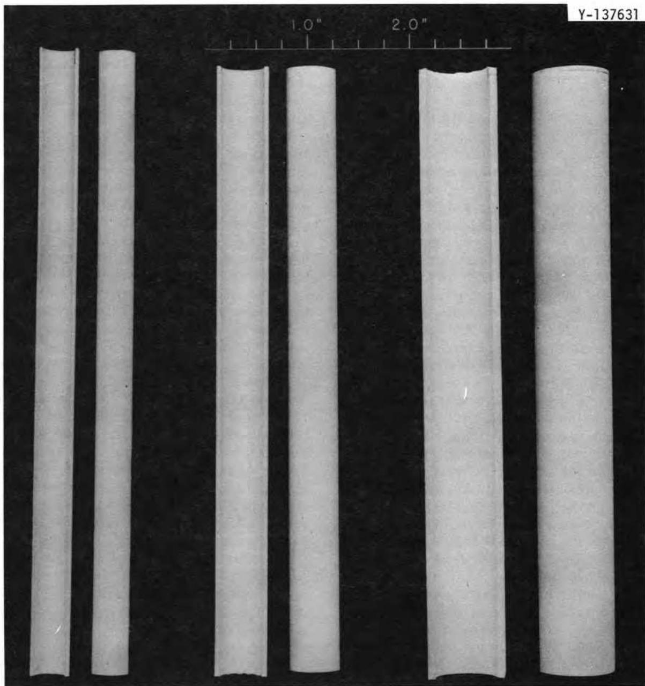  
Fig. 6.1. Specimens of $2\%$ titanium-modified Hastelloy N seamless tubing following liquid penetrant inspection. No defects were observed.

treatments showed recrystallized structures. All tubing from the pilot run was ultrasonically inspected and compared against standards of standard Hastelloy N with an 0.004-in.-deep notch. No indications greater than those from the notched standards were observed.

Following completion of the pilot drawing run, the remaining tube hollow stock was committed to the production run. The stock was tube reduced to 2.0-in. $\mathrm{OD} \times 0.187$ -in. wall by the vendor, annealed, then

further tube reduced by the subcontractor to the two previously mentioned sizes, 1.25-in. $\mathrm{OD} \times 0.095$ and 0.083-in. wall. (The lighter wall stock is scheduled to finish at 1.00-in. $\mathrm{OD} \times 0.065$ -in. wall by drawing.) At this stage, inspection of both cold worked (as tube reduced) and annealed specimens showed the ODs to be free of flaws, but borescopic examination of the IDs indicated questionable areas. Subsequent metallographic examination of these areas revealed the presence of cracks generally between 0.001 and 0.008

in. deep with several between 0.012 and 0.018 in. deep. These cracks were oriented parallel to the tube axis, and they varied from about 0.125 to 0.5 in. in length. A total of ten lengths of each of the 0.083-in. and 0.095-in. wall stock were involved in this evaluation.

Since the pilot drawing run had been accomplished without difficulty, the incidence of ID cracking during the production run cannot be satisfactorily explained at present. Several options are open for the completion of the production run: (1) hone the 1Ds of the tube-reduced hollows to remove defects before proceeding with the drawing operations or (2) commit a portion of the lot to final drawing with no ID conditioning. If the flaws do not propagate and remain a constant percentage of wall thickness, their depth at finish should be mostly within the inspection criterion of $3\%$ of the wall thickness or 0.004 in., whichever is greater. If the flaws do propagate, the balance of the lot will be available for ID conditioning prior to drawing. Option 2 is preferred.

As described in the previous progress report, the second route to obtain seamless tubing involved hot extrusion of tube shells from billets machined from a forged bar of heat No. 75421, followed by cold drawing by an outside source. The extrusions were made with moderate success but required conditioning of the IDs to eliminate hot tears. This problem was felt to be caused by inadequate glass lubrication during extrusion. To test this assumption, two more extrusions were made using $\mathrm{MoO_3}$ as the lubricant rather than glass. The billets were prepared from the same heat of the alloy with a molybdenum tube lining the IDs and a plasma-sprayed molybdenum coating on the ODs. These billets were extruded at $1250^{\circ}\mathrm{C}$ to tube blanks, 1.625-in. $\mathrm{OD} \times 1.0$ -in. ID, or an extrusion ratio of approximately 10 to 1. After removal of the residual molybdenum, the surfaces of the extrusions were found to be significantly improved. These tube blanks were scheduled into the redraw activities of the outside source. However, definitive results were not obtained on the redraw characteristics of these extrusions since the alternate approach to obtain tubing was terminated at this point. All tube processing effort was then directed toward the routing of the first vendor and his subcontractor in view of their success with the pilot drawing run.

# 6.1.2 Semiproduction Heats of $2\%$ Titanium-Modified Hastelloy N That Contain Niobium

Products of nine heats of niobium-titanium-modified Hastelloy N have been received from a

commercial vendor for a more complete characterization of alloys within this system. Chemical analyses are given in Table 6.2. Niobium additions to the $2\%$ titanium-modified Hastelloy N base are being studied for enhancing resistance to tellurium embrittlement. Eight of the alloys (heats 76025 through 76032) were 50-lb vacuum induction plus vacuum arc remelted heats with niobium levels between about 0.5 and $2\%$ . Four of these alloys contain different levels of the residual elements iron, manganese, and silicon, which are important because of their beneficial effects upon oxidation resistance. The eight heats were successfully converted to ${}^{1}/2$ -in.-thick hot-rolled plate, approximately 30 lb per alloy, which is presently being prepared for weldability evaluation. Wire and rod are being processed at ORNL from strips cut from the plate to provide material for weldability, salt corrosion, tellurium compatibility, and mechanical property tests.

The ninth alloy (heat 76902) was a 2500-lb vacuum induction plus electroslag remelted heat of nominally $1\%$ niobium- $2\%$ titanium-modified Hastelloy N. Product received included 247 lb of ${}^{5}/_{16}$ -in.-diam bar, 538 lb of ${}^{3}/_{4}$ -in.-diam bar, 566 lb of $\mathrm{I}^{1}/_{16}$ -in.-diam bar, and 610 lb of 4-in.-square bar. Several billets have been cut from the 4-in.-square bar for hot rolling a small quantity of ${}^{1}/_{2}$ -in.-thick plate for weldability studies. Wire and mechanical property specimens are being prepared from the ${}^{5}/_{16}$ -in.-diam bar.

# 6.2 STABILITY OF VARIOUS MODIFIED HASTELLOY N ALLOYS IN THE UNIRRADIATED CONDITION

T. K. Roche H. E. McCoy J. C. Feltner

The study of the stability of niobium, titanium, and aluminum containing modified Hastelloy N with respect to intermetallic precipitation has continued. The objective of this study is to define the upper limits of these elements that can be added to Hastelloy N and still maintain a reasonable degree of stability. The stabilities of a number of alloys, including laboratory, semiproduction, and production heats, containing varying amounts of the elements under consideration were determined by hardness, tensile properties, creep-rupture properties, and microstructural evaluation. From results reported in the previous progress report for titanium-aluminum-modified Hastelloy N, it was possible to propose gamma-prime solvus temperature boundaries at 650 and $704^{\circ}\mathrm{C}$ as a function of titanium and aluminum concentrations. During the present report period the locations of these boundaries have been refined, and

Table 6.2. Chemical analyses of semiproduction heats of $2\%$ titanium-modified Hastelloy N containing niobium   

<table><tr><td rowspan="2">Heat</td><td colspan="16">Concentration (%)</td><td></td></tr><tr><td>Ni</td><td>Mo</td><td>Cr</td><td>Ti</td><td>Nb</td><td>C</td><td>Si</td><td>Mn</td><td>Fe</td><td>Al</td><td>P</td><td>S</td><td>Co</td><td>B</td><td>W</td><td>Cu</td><td>Ta</td></tr><tr><td>76025</td><td>Balance</td><td>11.87</td><td>7.40</td><td>1.88</td><td>0.51</td><td>0.062</td><td>0.05</td><td>&lt;0.05</td><td>0.06</td><td>0.11</td><td>0.008</td><td>0.001</td><td>0.17</td><td>0.001</td><td>0.02</td><td>&lt;0.05</td><td>&lt;0.05</td></tr><tr><td>76026</td><td>Balance</td><td>12.07</td><td>7.21</td><td>1.99</td><td>0.95</td><td>0.055</td><td>0.04</td><td>&lt;0.05</td><td>0.06</td><td>0.07</td><td>0.008</td><td>0.002</td><td>0.08</td><td>&lt;0.001</td><td>0.01</td><td>&lt;0.05</td><td>&lt;0.05</td></tr><tr><td>76027</td><td>Balance</td><td>11.77</td><td>7.28</td><td>1.99</td><td>1.37</td><td>0.056</td><td>0.05</td><td>&lt;0.05</td><td>0.06</td><td>0.08</td><td>0.008</td><td>0.001</td><td>0.09</td><td>&lt;0.001</td><td>0.01</td><td>&lt;0.05</td><td>&lt;0.05</td></tr><tr><td>76028</td><td>Balance</td><td>11.84</td><td>7.13</td><td>1.93</td><td>1.81</td><td>0.060</td><td>0.05</td><td>&lt;0.05</td><td>0.06</td><td>0.07</td><td>0.008</td><td>0.001</td><td>0.09</td><td>&lt;0.001</td><td>0.01</td><td>&lt;0.05</td><td>&lt;0.05</td></tr><tr><td>76029</td><td>Balance</td><td>12.06</td><td>7.22</td><td>1.95</td><td>0.99</td><td>0.060</td><td>0.04</td><td>&lt;0.05</td><td>3.41</td><td>0.07</td><td>0.008</td><td>0.001</td><td>0.09</td><td>&lt;0.001</td><td>0.01</td><td>&lt;0.05</td><td>&lt;0.05</td></tr><tr><td>76030</td><td>Balance</td><td>11.94</td><td>7.29</td><td>1.98</td><td>0.96</td><td>0.061</td><td>0.15</td><td>&lt;0.05</td><td>0.18</td><td>0.10</td><td>0.008</td><td>0.001</td><td>0.09</td><td>0.001</td><td>0.01</td><td>&lt;0.05</td><td>&lt;0.05</td></tr><tr><td>76031</td><td>Balance</td><td>11.98</td><td>7.28</td><td>2.01</td><td>0.97</td><td>0.057</td><td>0.05</td><td>&lt;0.05</td><td>0.07</td><td>0.07</td><td>0.009</td><td>0.002</td><td>0.08</td><td>&lt;0.001</td><td>0.01</td><td>&lt;0.05</td><td>&lt;0.05</td></tr><tr><td>76032</td><td>Balance</td><td>12.09</td><td>6.98</td><td>1.98</td><td>0.99</td><td>0.062</td><td>0.12</td><td>0.18</td><td>3.39</td><td>0.07</td><td>0.008</td><td>0.001</td><td>0.09</td><td>&lt;0.001</td><td>0.01</td><td>&lt;0.05</td><td>&lt;0.05</td></tr><tr><td>76902</td><td>Balance</td><td>11.90</td><td>7.17</td><td>2.16</td><td>0.95</td><td>0.07</td><td>0.07</td><td>&lt;0.05</td><td>0.81</td><td>0.13</td><td>0.008</td><td>0.005</td><td>&lt;0.05</td><td>&lt;0.001</td><td>0.01</td><td>&lt;0.05</td><td>&lt;0.05</td></tr></table>

$a$ Vendor analyses; all heats 50 lb except 76902, which was 2500 lb.

the $800^{\circ}\mathrm{C}$ boundary has been proposed. This has been possible through the accumulation of additional creep-rupture, hardness, and tensile data on earlier alloys and the evaluation of new compositions. Mechanical property data for pertinent alloys are presented in Tables 6.3 and 6.4, and these data have been analyzed as a unit in arriving at the proposed gamma-prime solvus at 650, 704, and $800^{\circ}\mathrm{C}$ (Fig. 6.2).

The mechanical property data in Tables 6.3 and 6.4 were grouped according to alloy stability at the various temperatures. At a given test temperature, unstable alloys show creep rates between one and three orders of magnitude less than the creep rates of stable alloys, and the rupture lives of unstable alloys are significantly longer than those of stable alloys. In the case of hardness and tensile data, instability or age hardening results in an increase in hardness and strength and a decrease in ductility relative to values for annealed material. This study has shown that the $2\%$ titanium-modified Hastelloy N alloy can contain

up to about $2.2\%$ titanium with $0.4\%$ aluminum and still retain reasonable stability.

# 6.3 MECHANICAL PROPERTIES OF MODIFIED HASTELOY N ALLOYS IN THE UNIRRADIATED CONDITION

T. K. Roche J. C. Feltner B. McNabb

The determination of reference mechanical property data has continued for the various heats of modified Hastelloy N alloys being evaluated. These data include room- and elevated-temperature tensile properties and creep-rupture properties in air at 650, 704, and $760^{\circ}\mathrm{C}$ and serve as a reference for comparison with the properties of standard and other modified Hastelloy N alloys both in the unirradiated and irradiated conditions.

Several of the heats of $2\%$ titanium-modified Hastelloy N which have been factored into the program include two production heats (74901 and 75421) and six semiproduction heats (74533, 74534,

Table 6.3. Creep-rupture data for various heats of titanium-aluminum-modified Hastelloy $\mathbf{N}^a$ at $650^{\circ}\mathrm{C}$ , $47.0\times 10^{3}$ psi, and at $704^{\circ}\mathrm{C}$ , $35.0\times 10^{3}$ psi   

<table><tr><td rowspan="2">Categoryb</td><td rowspan="2">Heat number</td><td colspan="3">Concentration (%)</td><td colspan="3">Tested at 47.0 × 103psi and 650°C</td><td colspan="3">Tested at 35.0 × 103psi and 704°C</td></tr><tr><td>Ti</td><td>Al</td><td>C</td><td>Minimum creep rate (%/hr)</td><td>Rupture life (hr)</td><td>Total elongation (%)</td><td>Minimum creep rate (%/hr)</td><td>Rupture life (hr)</td><td>Total elongation (%)</td></tr><tr><td>A</td><td>74901</td><td>1.80</td><td>0.10</td><td>0.06</td><td>0.0200</td><td>395.2</td><td>26.87</td><td>0.0797</td><td>193.2</td><td>39.47</td></tr><tr><td>A</td><td>75421</td><td>1.90</td><td>0.12</td><td>0.07</td><td>0.0475</td><td>268.4</td><td>26.61</td><td>0.1525</td><td>146.4</td><td>39.35</td></tr><tr><td>A</td><td>74533</td><td>2.17</td><td>0.48</td><td>0.05</td><td>0.0335</td><td>464.6</td><td>30.55</td><td>0.1225</td><td>195.5</td><td>41.65</td></tr><tr><td>A</td><td>74534</td><td>2.09</td><td>0.53</td><td>0.08</td><td>0.0600</td><td>393.8</td><td>42.81</td><td>0.1490</td><td>171.7</td><td>46.13</td></tr><tr><td>A</td><td>427</td><td>2.40</td><td>0.18</td><td>0.014</td><td>0.0300</td><td>86.6</td><td>21.69</td><td>0.1570</td><td>82.0</td><td>23.49</td></tr><tr><td>A</td><td>428</td><td>2.47</td><td>0.16</td><td>0.064</td><td>0.0131</td><td>852.3</td><td>18.43</td><td>0.1470</td><td>201.8</td><td>60.75</td></tr><tr><td>B</td><td>429</td><td>2.40</td><td>0.35</td><td>0.017</td><td>0.0018</td><td>957.2</td><td>16.30</td><td>0.0910</td><td>200.6</td><td>22.75</td></tr><tr><td>B</td><td>430</td><td>2.50</td><td>0.34</td><td>0.073</td><td>0.0016</td><td>3456.9</td><td>20.63</td><td>0.1380</td><td>212.4</td><td>55.86</td></tr><tr><td>B</td><td>476</td><td>2.46</td><td>0.40</td><td>0.046</td><td>0.0012</td><td>2563.3</td><td>13.18</td><td>0.1010</td><td>271.7</td><td>45.15</td></tr><tr><td>B</td><td>477</td><td>2.55</td><td>0.41</td><td>0.052</td><td>0.0014</td><td>1364.1c</td><td>5.12c</td><td>0.0950</td><td>272.2</td><td>42.76</td></tr><tr><td>C</td><td>444</td><td>3.90</td><td>0.13</td><td>0.077</td><td>0.00037d</td><td>1964.9d</td><td>1.16d</td><td>0.0110</td><td>1093.0</td><td>29.98</td></tr><tr><td>D</td><td>431</td><td>2.50</td><td>0.74</td><td>0.016</td><td>0.0006</td><td>2309.0</td><td>2.19</td><td>0.0002</td><td>2938.3</td><td>6.40</td></tr><tr><td>D</td><td>432</td><td>2.35</td><td>0.69</td><td>0.057</td><td>0.0002</td><td>4587.4c</td><td>1.68c</td><td>0.0003</td><td>3611.5</td><td>13.72</td></tr><tr><td>D</td><td>478</td><td>2.50</td><td>0.75</td><td>0.055</td><td>0.0009</td><td>1340.2c</td><td>1.34c</td><td>0.00044</td><td>1341.0c</td><td>2.38c</td></tr><tr><td>D</td><td>479</td><td>2.45</td><td>0.73</td><td>0.058</td><td>0.00065</td><td>908.6c</td><td>0.98c</td><td>0.00096</td><td>908.0c</td><td>1.46c</td></tr><tr><td>D</td><td>443</td><td></td><td>1.86</td><td>0.053</td><td>0.00057</td><td>908.9c</td><td>0.61c</td><td>0.0019</td><td>835.9c</td><td>6.16c</td></tr></table>

${}^{a}$ Base: Ni-12% Mo-7% Cr.   
$b_{\mathbf{A}}$ -Stable at 650,704,and $800^{\circ}\mathrm{C}$   
B-Unstable at $650^{\circ}\mathrm{C}$ ;stableat704and $800^{\circ}\mathrm{C}$   
C - Unstable at 650 and $704^{\circ}\mathrm{C}$ ; stable at $800^{\circ}\mathrm{C}$ .   
D-Unstable at 650,704,and $800^{\circ}\mathrm{C}$   
Test discontinued.   
$d_{\mathrm{Test in progress}}$

Table 6.4. Hardness and tensile data for various heats of titanium-aluminum-modified Hastelloy $\mathbf{N}^a$ in annealed and aged conditions. Underlined data indicate strengthening relative to the as-annealed condition.   

<table><tr><td rowspan="2">Categoryb</td><td rowspan="2">Heat number</td><td colspan="3">Concentration (%)</td><td rowspan="2">Condition</td><td rowspan="2">Hardness at room temperature (Rb)</td><td rowspan="2">Test temperature (°C)</td><td colspan="2">Stress (103psi)</td><td rowspan="2">Elongation (%)</td></tr><tr><td>Ti</td><td>Al</td><td>C</td><td>Ultimate tensile</td><td>Yield</td></tr><tr><td rowspan="7">A</td><td rowspan="7">74901</td><td rowspan="7">1.80</td><td rowspan="7">0.10</td><td rowspan="7">0.06</td><td>Annealed 1 hr, 1177°C</td><td>79.4</td><td>RTc</td><td>114.0</td><td>44.2</td><td>66.7</td></tr><tr><td>Aged 100 hr, 650°C</td><td>81.8</td><td>RT</td><td>116.8</td><td>50.0</td><td>55.9</td></tr><tr><td>Aged 100 hr, 800°C</td><td>85.1</td><td>RT</td><td>119.0</td><td>51.2</td><td>53.7</td></tr><tr><td>Annealed 1 hr, 1177°C</td><td></td><td>650</td><td>79.3</td><td>29.5</td><td>47.3</td></tr><tr><td>Aged 100 hr, 650°C</td><td></td><td>650</td><td>83.1</td><td>33.4</td><td>47.1</td></tr><tr><td>Annealed 1 hr, 1177°C</td><td></td><td>800</td><td>54.9</td><td>28.1</td><td>34.3</td></tr><tr><td>Aged 100 hr, 800°C</td><td></td><td>800</td><td>53.8</td><td>33.3</td><td>47.7</td></tr><tr><td rowspan="7">A</td><td rowspan="7">74533</td><td rowspan="7">2.17</td><td rowspan="7">0.48</td><td rowspan="7">0.05</td><td>Annealed 1 hr, 1177°C</td><td>81.0</td><td>RT</td><td>125.9</td><td>47.5</td><td>59.8</td></tr><tr><td>Aged 8 hr, 650°C</td><td>82.2</td><td>RT</td><td>127.5</td><td>49.2</td><td>56.6</td></tr><tr><td>Aged 8 hr, 800°C</td><td>80.8</td><td>RT</td><td>125.1</td><td>50.1</td><td>56.9</td></tr><tr><td>Annealed 1 hr, 1177°C</td><td></td><td>650</td><td>90.1</td><td>32.2</td><td>43.5</td></tr><tr><td>Aged 100 hr, 650°C</td><td></td><td>650</td><td>92.4</td><td>32.7</td><td>47.6</td></tr><tr><td>Annealed 1 hr, 1177°C</td><td></td><td>800</td><td>54.9</td><td>33.4</td><td>63.5</td></tr><tr><td>Aged 100 hr, 800°C</td><td></td><td>800</td><td>52.1</td><td>33.6</td><td>61.4</td></tr><tr><td rowspan="7">A</td><td rowspan="7">74534</td><td rowspan="7">2.09</td><td rowspan="7">0.53</td><td rowspan="7">0.08</td><td>Annealed 1 hr, 1177°C</td><td>89.3</td><td>RT</td><td>131.1</td><td>52.9</td><td>53.8</td></tr><tr><td>Aged 100 hr, 650°C</td><td>87.2</td><td>RT</td><td>138.3</td><td>64.2</td><td>45.0</td></tr><tr><td>Aged 100 hr, 800°C</td><td>90.0</td><td>RT</td><td>130.4</td><td>56.4</td><td>50.6</td></tr><tr><td>Annealed 1 hr, 1177°C</td><td></td><td>650</td><td>96.8</td><td>44.3</td><td>27.1</td></tr><tr><td>Aged 100 hr, 650°C</td><td></td><td>650</td><td>99.8</td><td>46.8</td><td>30.0</td></tr><tr><td>Annealed 1 hr, 1177°C</td><td></td><td>800</td><td>52.5</td><td>38.9</td><td>71.5</td></tr><tr><td>Aged 100 hr, 800°C</td><td></td><td>800</td><td>52.1</td><td>37.8</td><td>68.3</td></tr><tr><td rowspan="7">A</td><td rowspan="7">427</td><td rowspan="7">2.40</td><td rowspan="7">0.18</td><td rowspan="7">0.014</td><td>Annealed 1 hr, 1177°C</td><td>74.7</td><td>RT</td><td>105.2</td><td>37.0</td><td>75.9</td></tr><tr><td>Aged 100 hr, 650°C</td><td>74.9</td><td>RT</td><td>106.1</td><td>38.7</td><td>72.4</td></tr><tr><td>Aged 100 hr, 800°C</td><td>77.4</td><td>RT</td><td>106.9</td><td>41.5</td><td>59.5</td></tr><tr><td>Annealed 1 hr, 1177°C</td><td></td><td>650</td><td>63.5</td><td>23.8</td><td>35.7</td></tr><tr><td>Aged 100 hr, 650°C</td><td></td><td>650</td><td>69.8</td><td>24.5</td><td>45.3</td></tr><tr><td>Annealed 1 hr, 1177°C</td><td></td><td>800</td><td>51.2</td><td>22.5</td><td>30.0</td></tr><tr><td>Aged 100 hr, 800°C</td><td></td><td>800</td><td>50.2</td><td>25.0</td><td>60.9</td></tr><tr><td rowspan="3">A</td><td rowspan="3">428</td><td rowspan="3">2.47</td><td rowspan="3">0.16</td><td rowspan="3">0.064</td><td>Annealed 1 hr, 1177°C</td><td>82.5</td><td>RT</td><td>124.5</td><td>49.0</td><td>56.2</td></tr><tr><td>Aged 100 hr, 650°C</td><td>84.2</td><td>RT</td><td>125.3</td><td>50.5</td><td>52.7</td></tr><tr><td>Aged 100 hr, 800°C</td><td>84.7</td><td>RT</td><td>123.7</td><td>51.1</td><td>48.1</td></tr><tr><td rowspan="2">Categoryb</td><td rowspan="2">Heat number</td><td colspan="3">Concentration (%)</td><td rowspan="2">Condition</td><td rowspan="2">Hardness at room temperature (R_B)</td><td rowspan="2">Test temperature (°C)</td><td colspan="2">Stress (10^3 psi)</td><td rowspan="2">Elongation (%)</td></tr><tr><td>Ti</td><td>Al</td><td>C</td><td>Ultimate tensile</td><td>Yield</td></tr><tr><td rowspan="7">B</td><td rowspan="7">429</td><td rowspan="7">2.40</td><td rowspan="7">0.35</td><td rowspan="7">0.017</td><td>Annealed 1 hr, 1177°C</td><td>76.9</td><td>RT</td><td>103.3</td><td>44.0</td><td>71.4</td></tr><tr><td>Aged 100 hr, 650°C</td><td>89.5</td><td>RT</td><td>126.5</td><td>59.5</td><td>60.0</td></tr><tr><td>Aged 100 hr, 800°C</td><td>79.8</td><td>RT</td><td>110.9</td><td>44.0</td><td>63.5</td></tr><tr><td>Annealed 1 hr, 1177°C</td><td></td><td>650</td><td>71.7</td><td>26.0</td><td>42.6</td></tr><tr><td>Aged 100 hr, 650°C</td><td></td><td>621</td><td>80.4</td><td>48.8</td><td>26.4</td></tr><tr><td>Annealed 1 hr, 1177°C</td><td></td><td>800</td><td>52.3</td><td>24.6</td><td>33.4</td></tr><tr><td>Aged 100 hr, 800°C</td><td></td><td>800</td><td>55.5</td><td>28.7</td><td>65.2</td></tr><tr><td rowspan="3">B</td><td rowspan="3">430</td><td rowspan="3">2.50</td><td rowspan="3">0.34</td><td rowspan="3">0.073</td><td>Annealed 1 hr, 1177°C</td><td>88.6</td><td>RT</td><td>125.6</td><td>50.0</td><td>54.1</td></tr><tr><td>Aged 100 hr, 650°C</td><td>95.7</td><td>RT</td><td>134.8</td><td>63.4</td><td>43.7</td></tr><tr><td>Aged 100 hr, 800°C</td><td>88.6</td><td>RT</td><td>126.8</td><td>53.1</td><td>50.0</td></tr><tr><td rowspan="7">B</td><td rowspan="7">476</td><td rowspan="7">2.46</td><td rowspan="7">0.40</td><td rowspan="7">0.046</td><td>Annealed 1 hr, 1177°C</td><td>84.9</td><td>RT</td><td>124.3</td><td>47.4</td><td>56.7</td></tr><tr><td>Aged 8 hr, 650°C</td><td>82.5</td><td>RT</td><td>122.6</td><td>58.8</td><td>54.7</td></tr><tr><td>Aged 100 hr, 650°C</td><td>84.5</td><td>RT</td><td>122.6</td><td>48.3</td><td>55.3</td></tr><tr><td>Aged 8 hr, 704°C</td><td>84.7</td><td>RT</td><td>122.0</td><td>47.6</td><td>49.5</td></tr><tr><td>Aged 100 hr, 704°C</td><td>86.6</td><td>RT</td><td>121.6</td><td>49.3</td><td>62.5</td></tr><tr><td>Aged 8 hr, 800°C</td><td>86.9</td><td>RT</td><td>123.0</td><td>49.3</td><td>59.2</td></tr><tr><td>Aged 100 hr, 800°C</td><td>86.4</td><td>RT</td><td>122.6</td><td>50.2</td><td>61.3</td></tr><tr><td rowspan="4">B</td><td rowspan="4">477</td><td rowspan="4">2.55</td><td rowspan="4">0.41</td><td rowspan="4">0.052</td><td>Annealed 1 hr, 1177°C</td><td>86.3</td><td>RT</td><td>124.9</td><td>47.5</td><td>59.0</td></tr><tr><td>Aged 100 hr, 650°C</td><td>87.0</td><td>RT</td><td>124.6</td><td>57.4</td><td>61.0</td></tr><tr><td>Aged 100 hr, 704°C</td><td>87.1</td><td>RT</td><td>124.6</td><td>50.6</td><td>59.4</td></tr><tr><td>Aged 100 hr, 800°C</td><td>88.0</td><td>RT</td><td>124.3</td><td>55.0</td><td>59.0</td></tr><tr><td rowspan="4">C</td><td rowspan="4">444</td><td rowspan="4">3.90</td><td rowspan="4">0.13</td><td rowspan="4">0.077</td><td>Annealed 1 hr, 1177°C</td><td>87.8</td><td>RT</td><td>127.4</td><td>49.0</td><td>62.7</td></tr><tr><td>Aged 100 hr, 650°C</td><td>95.2</td><td>RT</td><td>138.3</td><td>65.7</td><td>50.4</td></tr><tr><td>Aged 100 hr, 704°C</td><td>87.2</td><td>RT</td><td>127.4</td><td>51.2</td><td>61.6</td></tr><tr><td>Aged 100 hr, 800°C</td><td>87.1</td><td>RT</td><td>126.6</td><td>52.2</td><td>58.9</td></tr><tr><td rowspan="4">C</td><td rowspan="4">447</td><td rowspan="4">3.50</td><td rowspan="4">0.15</td><td rowspan="4">0.043</td><td>Annealed 1 hr, 1177°C</td><td>86.6</td><td>RT</td><td>128.4</td><td>49.6</td><td>66.4</td></tr><tr><td>Aged 100 hr, 650°C</td><td>99.6</td><td>RT</td><td>155.6</td><td>85.1</td><td>41.8</td></tr><tr><td>Aged 100 hr, 704°C</td><td>96.1</td><td>RT</td><td>142.3</td><td>64.3</td><td>45.0</td></tr><tr><td>Aged 100 hr, 800°C</td><td>88.1</td><td>RT</td><td>126.7</td><td>52.5</td><td>60.6</td></tr><tr><td rowspan="3">D</td><td rowspan="3">431</td><td rowspan="3">2.50</td><td rowspan="3">0.74</td><td rowspan="3">0.016</td><td>Annealed 1 hr, 1177°C</td><td>78.6</td><td>RT</td><td>110.4</td><td>40.5</td><td>74.4</td></tr><tr><td>Aged 100 hr, 650°C</td><td>90.9</td><td>RT</td><td>128.4</td><td>57.1</td><td>60.8</td></tr><tr><td>Aged 100 hr, 800°C</td><td>91.9</td><td>RT</td><td>129.6</td><td>68.3</td><td>47.7</td></tr><tr><td rowspan="3">D</td><td rowspan="3">432</td><td rowspan="3">2.35</td><td rowspan="3">0.69</td><td rowspan="3">0.057</td><td>Annealed 1 hr, 1177°C</td><td>87.4</td><td>RT</td><td>124.8</td><td>49.2</td><td>59.6</td></tr><tr><td>Aged 100 hr, 650°C</td><td>98.8</td><td>RT</td><td>148.3</td><td>79.3</td><td>52.6</td></tr><tr><td>Aged 100 hr, 800°C</td><td>98.2</td><td>RT</td><td>142.5</td><td>77.1</td><td>47.8</td></tr><tr><td rowspan="2">Categoryb</td><td rowspan="2">Heat number</td><td colspan="3">Concentration (%)</td><td rowspan="2">Condition</td><td rowspan="2">Hardness at room temperature (R_B)</td><td rowspan="2">Test temperature (°C)</td><td colspan="2">Stress (103psi)</td><td rowspan="2">Elongation (%)</td></tr><tr><td>Ti</td><td>Al</td><td>C</td><td>Ultimate tensile</td><td>Yield</td></tr><tr><td rowspan="4">D</td><td rowspan="4">478</td><td rowspan="4">2.50</td><td rowspan="4">0.75</td><td rowspan="4">0.055</td><td>Annealed 1 hr, 1177°C</td><td>87.8</td><td>RT</td><td>126.6</td><td>48.7</td><td>54.6</td></tr><tr><td>Aged 100 hr, 650°C</td><td>95.7</td><td>RT</td><td>142.8</td><td>71.5</td><td>54.1</td></tr><tr><td>Aged 100 hr, 704°C</td><td>97.8</td><td>RT</td><td>148.8</td><td>79.5</td><td>46.9</td></tr><tr><td>Aged 100 hr, 800°C</td><td>93.0</td><td>RT</td><td>132.0</td><td>61.8</td><td>57.6</td></tr><tr><td rowspan="4">D</td><td rowspan="4">479</td><td rowspan="4">2.45</td><td rowspan="4">0.73</td><td rowspan="4">0.058</td><td>Annealed 1 hr, 1177°C</td><td>88.7</td><td>RT</td><td>127.3</td><td>48.6</td><td>62.3</td></tr><tr><td>Aged 100 hr, 650°C</td><td>96.7</td><td>RT</td><td>146.2</td><td>73.8</td><td>50.7</td></tr><tr><td>Aged 100 hr, 704°C</td><td>99.3</td><td>RT</td><td>150.4</td><td>80.1</td><td>46.9</td></tr><tr><td>Aged 100 hr, 800°C</td><td>96.1</td><td>RT</td><td>133.0</td><td>62.1</td><td>54.6</td></tr><tr><td rowspan="4">D</td><td rowspan="4">443</td><td rowspan="4"></td><td rowspan="4">1.86</td><td rowspan="4">0.053</td><td>Annealed 1 hr, 1177°C</td><td>87.5</td><td>RT</td><td>123.4</td><td>48.9</td><td>60.0</td></tr><tr><td>Aged 100 hr, 650°C</td><td>98.1</td><td>RT</td><td>146.9</td><td>77.3</td><td>49.6</td></tr><tr><td>Aged 100 hr, 704°C</td><td>98.7</td><td>RT</td><td>148.8</td><td>80.5</td><td>44.8</td></tr><tr><td>Aged 100 hr, 800°C</td><td>95.0</td><td>RT</td><td>133.0</td><td>65.9</td><td>49.4</td></tr><tr><td rowspan="4">D</td><td rowspan="4">445</td><td rowspan="4">1.2</td><td rowspan="4">1.06</td><td rowspan="4">0.049</td><td>Annealed 1 hr, 1177°C</td><td>84.0</td><td>RT</td><td>121.0</td><td>46.3</td><td>69.6</td></tr><tr><td>Aged 100 hr, 650°C</td><td>90.3</td><td>RT</td><td>138.5</td><td>68.3</td><td>57.8</td></tr><tr><td>Aged 100 hr, 704°C</td><td>95.0</td><td>RT</td><td>139.5</td><td>72.7</td><td>50.0</td></tr><tr><td>Aged 100 hr, 800°C</td><td>90.6</td><td>RT</td><td>124.3</td><td>58.8</td><td>57.0</td></tr><tr><td rowspan="4">D</td><td rowspan="4">474</td><td rowspan="4">4.16</td><td rowspan="4">0.18</td><td rowspan="4">0.050</td><td>Annealed 1 hr, 1177°C</td><td>90.4</td><td>RT</td><td>134.0</td><td>53.9</td><td>59.0</td></tr><tr><td>Aged 100 hr, 650°C</td><td>28.6 RC</td><td>RT</td><td>180.7</td><td>99.7</td><td>29.4</td></tr><tr><td>Aged 100 hr, 704°C</td><td>29.9 RC</td><td>RT</td><td>181.4</td><td>90.6</td><td>34.3</td></tr><tr><td>Aged 100 hr, 800°C</td><td>93.1</td><td>RT</td><td>141.8</td><td>60.0</td><td>53.0</td></tr></table>

${}^{a}$ Base: Ni-12% Mo-7% Cr.   
$^b$ A - Stable at 650, 704, and $800^{\circ}$ C.   
B-Unstable at $650^{\circ}\mathrm{C};$ stable at 704 and $800^{\circ}\mathrm{C}$   
C - Unstable at 650 and $704^{\circ}\mathrm{C}$ ; stable at $800^{\circ}\mathrm{C}$ .   
D-Unstable at 650,704,and $800^{\circ}\mathrm{C}$   
$C$ RT is room temperature, approximately $25^{\circ}C$

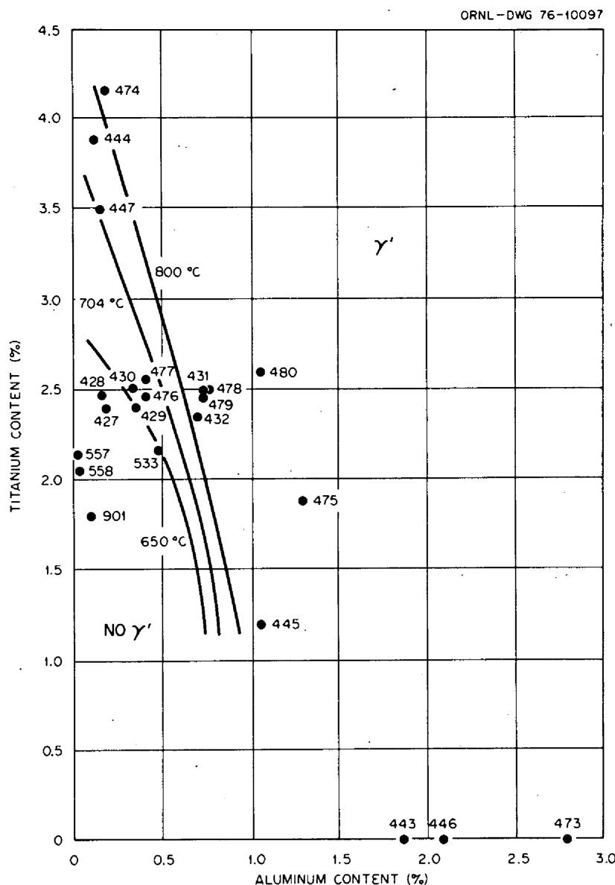  
Fig. 6.2. Proposed boundaries separating stable from unstable alloys of Ni-12% Mo-7% Cr +Al and Ti with respect to gamma prime precipitation at 650, 704, and $800^{\circ}\mathrm{C}$ . Alloys above the lines will form gamma prime, and those below will not. (The numbers by the individual data points refer to alloy numbers.)

74535, 74539, 74557, and 74558) produced by an outside vendor. Four of the six semiproduction heats contain small additions of rare earth elements, lanthanum, cerium, and misch metal. The compositions of these alloys were chosen to study the effectiveness of rare-earth-element additions for minimizing the extent of shallow intergranular cracking. The processing history and chemical analysis of these alloys have already been reported.

During this report period, creep-rupture tests were completed for heat 75421 at three stress levels for each of three test temperatures. The specimens were prepared from a $\frac{1}{4}$ -in.-diam bar of the alloy and were

given a pretest anneal at $1177^{\circ}\mathrm{C}$ . In Table 6.5 a comparison is made between the rupture lives and elongations for this heat and the range of these values determined for the other heats of this series. At $650^{\circ}\mathrm{C}$ the rupture behavior of heat 75421 falls on the lower side of the range. At 704 and $760^{\circ}\mathrm{C}$ the rupture behavior of this heat is more within the established range. In all cases the $2\%$ titanium-modified alloys exhibit longer rupture times than standard Hastelloy N tested under the same conditions.

Tensile properties at room and elevated temperature for several of the heats in the annealed condition, 1 hr at $1177^{\circ}\mathrm{C}$ , are presented in Table 6.6. Included

Table 6.5. Comparison of stress-rupture data at 650, 704, and ${760}^{ \circ  }\mathrm{C}$ for various heats of $2\%$ titanium-modified Hastelloy $\mathrm{N}$   

<table><tr><td rowspan="2">Test temperature (°C)</td><td rowspan="2">Stress (103psi)</td><td colspan="2">Heat 75421</td><td colspan="2">Rangea</td></tr><tr><td>Rupture life (hr)</td><td>Rupture elongation (%)</td><td>Rupture life (hr)</td><td>Rupture elongation (%)</td></tr><tr><td rowspan="3">650</td><td>40.0</td><td>893</td><td>32</td><td>1120–1883</td><td>23–42</td></tr><tr><td>47.0</td><td>268</td><td>30</td><td>302–591</td><td>20–43</td></tr><tr><td>55.0</td><td>68</td><td>29</td><td>70–166</td><td>18–51</td></tr><tr><td rowspan="3">704</td><td>25.0</td><td>1164</td><td>48</td><td>873–1518</td><td>36–47</td></tr><tr><td>30.0</td><td>361</td><td>48</td><td>308–498</td><td>37–47</td></tr><tr><td>35.0</td><td>146</td><td>41</td><td>172–207</td><td>39–63</td></tr><tr><td rowspan="3">760</td><td>15.0</td><td>537</td><td>32</td><td>544–1555</td><td>25–54</td></tr><tr><td>20.0</td><td>301</td><td>47</td><td>211–416</td><td>42–58</td></tr><tr><td>25.0</td><td>88</td><td>54</td><td>79–123</td><td>47–57</td></tr></table>

${}^{a}$ Range for 74533,74534,74535,74539,74557,74558,and 74901.

with these data are the properties for two earlier heats (heats 471-114 and 471-583) of $2\%$ titanium-modified Hastelloy N and typical properties for standard Hastelloy N. From the tabulation, it can be seen for any one alloy that increasing temperature within the temperature range of 650 to $800^{\circ}\mathrm{C}$ has a greater effect in reducing the ultimate tensile strength than the yield strength. In fact, the yield strength of any one alloy remains relatively constant in this temperature range, but there are heat-to-heat variations which result in a spread from 40.0 to $29.0 \times 10^{3}$ psi. The data are presented in the general order of decreasing yield strength of the various heats at elevated temperature and there is an apparent correlation between yield strength and titanium content in the range of 1.8 to $2.1\%$ . Note that the two lanthanum-containing alloys (heats 474-534 and 474-558) show the highest yield strengths. In making this correlation, other variables which also influence tensile properties have not been considered.

All the alloys show a decrease in ductility (rupture elongation) at elevated temperature relative to the value at room temperature, a characteristic of nickel-base alloys. The magnitude of this decrease and the rate of recovery as temperature increases vary from heat to heat. As with creep-rupture properties, the tensile properties of the $2\%$ titanium-modified alloys are higher than those of the standard alloy.

Niobium-modified Hastelloy N seems to have good resistance to tellurium embrittlement, and a new series of laboratory alloys based upon Ni-12% Mo-7% Cr-0.2% Mn-0.06% C containing between 0 and 1% niobium in 0.2% increments was prepared for a closer evaluation of radiation damage resistance.

Creep-rupture tests on unirradiated specimens are under way in air at $650^{\circ}\mathrm{C}$ to establish baseline data. Limited results obtained thus far show that these alloys have shorter rupture lives at $650^{\circ}\mathrm{C}$ than $2\%$ titanium-modified Hastelloy N.

# 6.4. POSTIRRADIATION CREEP PROPERTIES OF MODIFIED HASTELLOY N

H. E. McCoy T. K. Roche

Tests have been made on a number of alloys, but the main emphasis during this report period was on alloys modified with niobium. Prior tests on these alloys measured the properties with the material heat treated to produce a fine grain size. We later learned that such anneals did not produce optimum properties in Hastelloy N, but our work had shown that the addition of about $2\%$ titanium resulted in excellent resistance to irradiation embrittlement; so we did not continue investigation of the niobium-modified alloys. Recent observations concerning the excellent resistance of the niobium-modified alloys to embrittlement by tellurium offered added incentive to more fully investigate the irradiation embrittlement of the niobium-modified alloys.

Experiment ORR-233 was run for the explicit purpose of irradiating alloys currently on hand which contained niobium.* The individual tensile specimens were mounted in clusters of three inside a small heater (Figs. 6.3 and 6.4). The temperature was

Table 6.6. Room- and elevated-temperature tensile properties of various heats of $2\%$ titanium-modified and standard Hastelloy $\mathbf{N}^a$   

<table><tr><td>Heat numberb</td><td>Test temperature (°C)</td><td>Ultimate tensile stress (103psi)</td><td>Yield stress (103psi)</td><td>Elongation (%)</td><td>Reduction in area (%)</td></tr><tr><td rowspan="5">474-534</td><td>25</td><td>131.1</td><td>52.9</td><td>53.8</td><td>59.5</td></tr><tr><td>650</td><td>96.8</td><td>44.3</td><td>27.1</td><td>32.2</td></tr><tr><td>704</td><td>87.8</td><td>45.5</td><td>52.0</td><td>46.2</td></tr><tr><td>760</td><td>68.8</td><td>39.3</td><td>77.0</td><td>64.4</td></tr><tr><td>800</td><td>52.5</td><td>38.9</td><td>71.5</td><td>67.2</td></tr><tr><td rowspan="5">474-558</td><td>25</td><td>126.4</td><td>52.1</td><td>54.3</td><td>58.6</td></tr><tr><td>650</td><td>87.3</td><td>38.8</td><td>28.0</td><td>30.5</td></tr><tr><td>704</td><td>81.5</td><td>38.3</td><td>25.8</td><td>30.0</td></tr><tr><td>760</td><td>65.8</td><td>38.7</td><td>36.0</td><td>32.7</td></tr><tr><td>800</td><td>53.1</td><td>37.4</td><td>47.8</td><td>43.8</td></tr><tr><td rowspan="5">474-557</td><td>25</td><td>130.4</td><td>51.1</td><td>57.9</td><td>60.3</td></tr><tr><td>650</td><td>87.5</td><td>37.3</td><td>28.7</td><td>28.6</td></tr><tr><td>704</td><td>83.8</td><td>36.7</td><td>23.5</td><td>27.5</td></tr><tr><td>760</td><td>72.2</td><td>37.1</td><td>35.1</td><td>31.6</td></tr><tr><td>800</td><td>56.9</td><td>36.2</td><td>46.2</td><td>40.4</td></tr><tr><td rowspan="5">474-533</td><td>25</td><td>125.9</td><td>47.5</td><td>59.8</td><td>61.4</td></tr><tr><td>650</td><td>90.1</td><td>32.2</td><td>43.5</td><td>40.4</td></tr><tr><td>704</td><td>87.0</td><td>32.1</td><td>38.7</td><td>30.8</td></tr><tr><td>760</td><td>68.6</td><td>31.8</td><td>54.6</td><td>40.4</td></tr><tr><td>800</td><td>54.9</td><td>33.4</td><td>63.5</td><td>53.2</td></tr><tr><td rowspan="4">471-583</td><td>25</td><td>121.8</td><td>45.9</td><td>73.3</td><td>60.1</td></tr><tr><td>650</td><td>85.9</td><td>30.2</td><td>49.0</td><td>38.4</td></tr><tr><td>760</td><td>64.4</td><td>29.4</td><td>45.0</td><td>47.1</td></tr><tr><td>800</td><td>52.2</td><td>28.9</td><td>47.0</td><td>15.0</td></tr><tr><td rowspan="5">471-114</td><td>25</td><td>120.7</td><td>44.8</td><td>72.6</td><td>58.9</td></tr><tr><td>650</td><td>86.9</td><td>29.1</td><td>56.2</td><td>39.6</td></tr><tr><td>704</td><td>82.3</td><td>28.6</td><td>53.4</td><td>40.5</td></tr><tr><td>760</td><td>64.3</td><td>28.7</td><td>52.8</td><td>50.4</td></tr><tr><td>800</td><td>50.6</td><td>29.7</td><td>51.0</td><td>55.4</td></tr><tr><td rowspan="5">674-901</td><td>25</td><td>114.0</td><td>44.2</td><td>66.7</td><td>55.4</td></tr><tr><td>650</td><td>79.3</td><td>29.5</td><td>47.3</td><td>43.4</td></tr><tr><td>704</td><td>71.9</td><td>27.9</td><td>33.5</td><td>36.8</td></tr><tr><td>760</td><td>66.9</td><td>29.2</td><td>31.2</td><td>29.7</td></tr><tr><td>800</td><td>54.9</td><td>28.1</td><td>34.3</td><td>29.5</td></tr><tr><td rowspan="4">Standard Hasteley Nc</td><td>25</td><td>114.4</td><td>44.7</td><td>50.0</td><td></td></tr><tr><td>650</td><td>82.4</td><td>27.5</td><td>37.0</td><td></td></tr><tr><td>704</td><td>69.9</td><td>28.0</td><td>24.0</td><td></td></tr><tr><td>760</td><td>61.8</td><td>26.2</td><td>21.0</td><td></td></tr></table>

${}^{a}$ Annealed 1 hr at ${1177}^{ \circ  }\mathrm{C}$ prior to testing. Tested at a strain rate of ${0.44}\mathrm{\;{min}}{}^{-1}$ .   
See Table 6.21 for detailed chemical compositions.   
Typical data for 0.045-in.-thick sheet annealed at $1150^{\circ}\mathrm{C}$

measured by a thermocouple attached to the center of the cluster, and the signal from this thermocouple was also used for temperature control. The assembly of 102 specimens was welded in an aluminum can for insertion into the Oak Ridge Research Reactor (ORR) for irradiation. The specimens were perpendicular to the face of the reactor where the peak thermal flux was $1.5 \times 10^{14}$ neutrons $\mathrm{cm}^{-2} \mathrm{sec}^{-1}$ . After irradiation for 908 hr to thermal fluences

ranging from 2 to $5 \times 10^{20}$ neutrons/cm $^2$ and at temperatures of 650, 704, and $760^{\circ}\mathrm{C}$ , the assembly was removed from the ORR. The individual specimens were recovered in a hot cell and transferred to another cell for creep testing.

The partial chemical compositions of the alloys in this experiment are given in Table 6.7. The alloys contained from 0.45 to $2\%$ niobium and various combinations of niobium and titanium. The postirra

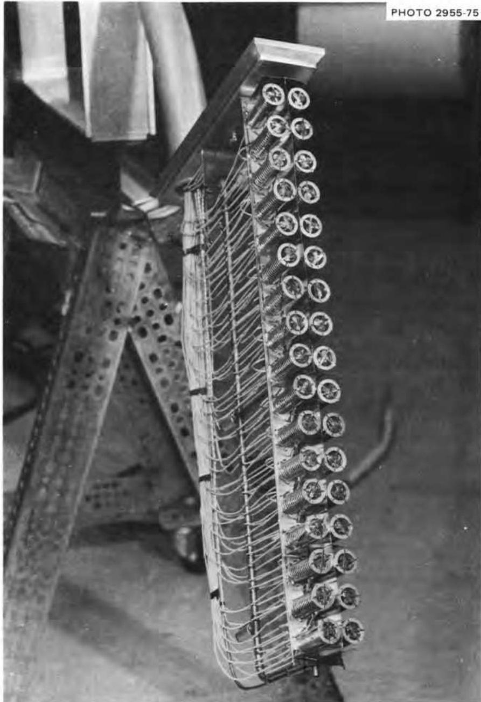  
Fig. 6.3. ORR-233 irradiation experiment prior to welding on protective aluminum can. The experiment contains 102 small creep specimens with thermocouples and heaters for measuring and controlling the temperature. The various heater and thermocouple lead wires are routed through the access tube to the control room.

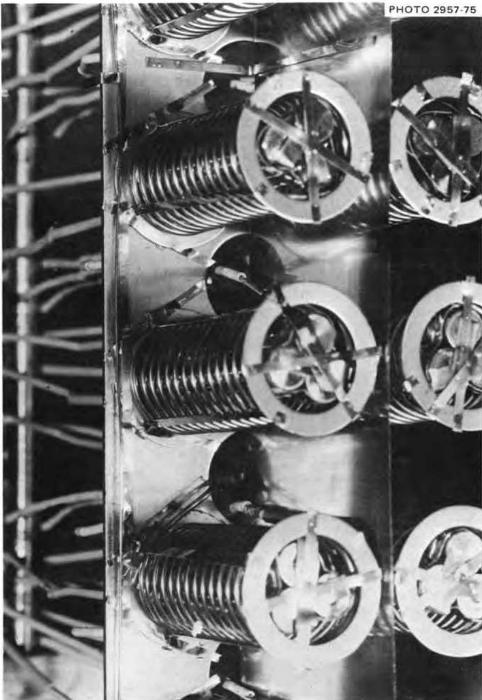  
Fig. 6.4. A closeup of the clusters of creep specimens in ORR-233. The specimens are bound into clusters of three and are centered in a small furnace. A thermocouple is attached to the center of the cluster.

diation creep properties measured to date are summarized in Table 6.8. The stress-rupture properties at $650^{\circ}\mathrm{C}$ of several of the alloys are shown graphically in Fig. 6.5. All specimens irradiated at $650^{\circ}\mathrm{C}$ had rupture lives in excess of those of standard Hastelloy N in the unirradiated condition. The fracture strains were quite high and generally fell in the 10 to $20\%$ range. Irradiation at $704^{\circ}\mathrm{C}$ caused a pronounced deterioration of the properties of the

alloys modified only with niobium. The alloys containing 1 to $2\%$ niobium were affected less, and their properties are still acceptable after irradiation at this condition. After irradiation at $760^{\circ}\mathrm{C}$ , only the alloy containing $2\%$ niobium retained acceptable properties.

Alloys 303 and 413 (Fig. 6.5), which contained niobium and titanium additions, had excellent postirradiation properties after irradiation at 650,

704, and $760^{\circ} \mathrm{C}$ . However, these alloys do not have good resistance to embrittlement by tellurium.

The results from three of the niobium-modified alloys are shown in more detail in Figs. 6.6 and 6.7. The stress-rupture properties in Fig. 6.6 show that all three alloys had good rupture properties after irradiation at $650^{\circ}\mathrm{C}$ , that alloys containing 1 and $2\%$ niobium retained acceptable properties after irradiation.

Table 6.7. Compositions of alloys irradiated in ORR-233   

<table><tr><td rowspan="2">Alloy designation</td><td colspan="3">Compositiona(wt %)</td></tr><tr><td>Nb</td><td>Ti</td><td>Other</td></tr><tr><td>345</td><td>0.45</td><td></td><td>0.22 Si</td></tr><tr><td>348</td><td>0.62</td><td></td><td>0.47 Si</td></tr><tr><td>21543</td><td>0.7</td><td></td><td></td></tr><tr><td>295</td><td>0.85</td><td></td><td></td></tr><tr><td>411</td><td>1.0a</td><td></td><td></td></tr><tr><td>237</td><td>1.0a</td><td></td><td></td></tr><tr><td>298</td><td>2.0a</td><td></td><td></td></tr><tr><td>303</td><td>0.84</td><td>0.49</td><td></td></tr><tr><td>304</td><td>1.6b</td><td>0.8b</td><td></td></tr><tr><td>305</td><td>1.3</td><td>0.88</td><td></td></tr><tr><td>470-786</td><td>0.62</td><td>0.82</td><td></td></tr><tr><td>425</td><td>0.48</td><td>1.9</td><td></td></tr><tr><td>413</td><td>1.0</td><td>1.0b</td><td></td></tr></table>

${}^{a}$ Alloys nominally are nickel base and contain 12% Mo,7% Cr,and 0.05% C.   
bNominal values.

tion at $704^{\circ}\mathrm{C}$ , and that only the alloy containing $2\%$ niobium retained good properties after irradiation at $760^{\circ}\mathrm{C}$ .

The minimum creep rates for these three alloys are shown in Fig. 6.7. One problem in this comparison is that the specimens tested in the unirradiated condition were simply annealed $1\mathrm{hr}$ at $1177^{\circ}\mathrm{C}$ before testing, but the irradiated specimens were annealed $1\mathrm{hr}$ at $1177^{\circ}\mathrm{C}$ and then held at the indicated temperature for $908\mathrm{hr}$ during irradiation before creep testing. The latter treatment precipitates carbides and generally increases the creep rate by removing alloying elements from solution. In the unirradiated condition, all three alloys have about equivalent creep rates and are stronger (have lower creep rates) than standard Hastelloy N. The limited data on alloy 21543 $(0.7\%$ niobium) show that the creep rate was increased by irradiation and that the increase was greater as the irradiation temperature was increased. Alloy 237 $(1\%$ niobium) exhibited a slight increase in creep rate due to irradiation at 650 and $704^{\circ}\mathrm{C}$ , but a greater increase when irradiated at $760^{\circ}\mathrm{C}$ . The creep rate of alloy 298 $(2\%$ niobium) was not altered detectably by irradiation at any of the three temperatures.

Alloys 345 and 348 contained additions of niobium and silicon and the resistance of these alloys to tellurium embrittlement was excellent. However, these alloys had very poor postirradiation properties

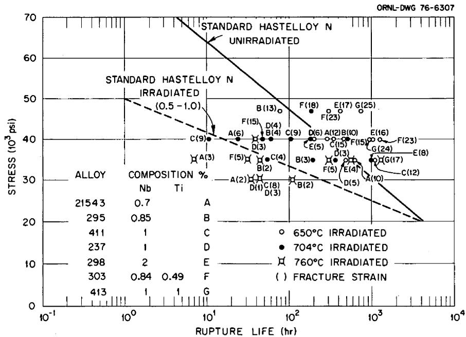  
Fig. 6.5. Postirradiation creep properties at $650^{\circ}\mathrm{C}$ of several alloys irradiated at the indicated temperatures. These alloys are nickel base and contain $12\%$ Mo, $7\%$ Cr, and $0.05\%$ C in addition to the elements listed.

Table 6.8. Postirradiation creep properties at $650^{\circ}\mathbf{C}$ of several compositions of modified Hastelloy   

<table><tr><td>Alloy</td><td>Test number</td><td>Irradiation temperature (°C)</td><td>Stress (103 psi)</td><td>Minimum creep rate (%/hr)</td><td>Rupture life (hr)</td><td>Loading strain (%)</td><td>Total strain (%)</td></tr><tr><td rowspan="4">345</td><td rowspan="2">R 2047</td><td>650</td><td>40.0</td><td>0.030</td><td>39.7</td><td>1.72</td><td>3.36</td></tr><tr><td>704</td><td>40.0</td><td></td><td>10.8</td><td>1.96</td><td>2.82</td></tr><tr><td rowspan="2">R 2068</td><td>704</td><td>30.0</td><td>0.0029</td><td>75.1</td><td>0.20</td><td>0.61</td></tr><tr><td>760</td><td>35.0</td><td></td><td>2.0</td><td>3.15</td><td>3.97</td></tr><tr><td rowspan="4">348</td><td rowspan="2">R 2048</td><td>650</td><td>40.0</td><td>0.021</td><td>77.6</td><td>1.96</td><td>4.12</td></tr><tr><td>704</td><td>40.0</td><td></td><td>8.6</td><td>1.85</td><td>4.08</td></tr><tr><td rowspan="2">R 2069</td><td>704</td><td>30.0</td><td>0.0070</td><td>74.7</td><td>0.84</td><td>1.36</td></tr><tr><td>760</td><td>35.0</td><td></td><td>12.4</td><td>3.00</td><td>4.13</td></tr><tr><td rowspan="6">21543</td><td>R 2033</td><td>650</td><td>40.0</td><td>0.021</td><td>292.0</td><td>4.85</td><td>12.03</td></tr><tr><td>R 2064</td><td>650</td><td>35.0</td><td>0.011</td><td>558.7</td><td>1.84</td><td>10.11</td></tr><tr><td rowspan="4">R 2039</td><td>704</td><td>40.0</td><td>0.046</td><td>24.8</td><td>4.05</td><td>5.63</td></tr><tr><td>704</td><td>30.0</td><td></td><td></td><td></td><td></td></tr><tr><td>760</td><td>35.0</td><td></td><td>7.1</td><td>2.30</td><td>3.03</td></tr><tr><td>760</td><td>30.0</td><td></td><td>34.3</td><td>1.13</td><td>1.95</td></tr><tr><td rowspan="6">295</td><td>R 2059</td><td>650</td><td>47.0</td><td>0.069</td><td>77.2</td><td>4.58</td><td>13.24</td></tr><tr><td>R 2029</td><td>650</td><td>40.0</td><td>0.015</td><td>461.3</td><td>2.36</td><td>9.56</td></tr><tr><td>R 2035</td><td>704</td><td>40.0</td><td>0.035</td><td>60.5</td><td>1.11</td><td>3.54</td></tr><tr><td>R 2066</td><td>704</td><td>35.0</td><td>0.0063</td><td>191.9</td><td>0.29</td><td>3.36</td></tr><tr><td>R 2041</td><td>760</td><td>35.0</td><td>0.0080</td><td>41.9</td><td>0.47</td><td>1.91</td></tr><tr><td>R 2073</td><td>760</td><td>30.0</td><td>0.0083</td><td>110.7</td><td>0.29</td><td>2.21</td></tr><tr><td rowspan="5">411</td><td rowspan="2">R 2031</td><td>650</td><td>40.0</td><td>0.018</td><td>346.1</td><td>4.82</td><td>15.42</td></tr><tr><td>650</td><td>35.0</td><td></td><td>1101.9</td><td>2.99</td><td>12.36</td></tr><tr><td>R 2037</td><td>704</td><td>40.0</td><td>0.027</td><td>105.4</td><td>4.81</td><td>9.15</td></tr><tr><td>R 2070</td><td>704</td><td>35.0</td><td>0.023</td><td>55.0</td><td>2.49</td><td>4.13</td></tr><tr><td>R 2043</td><td>760</td><td>35.0</td><td>0.0095</td><td>415.2</td><td>2.64</td><td>7.76</td></tr><tr><td rowspan="6">237</td><td>R 2028</td><td>650</td><td>40.0</td><td>0.016</td><td>206.0</td><td>1.24</td><td>5.94</td></tr><tr><td>R 2058</td><td>650</td><td>35.0</td><td>0.0051</td><td>488.1</td><td>0.35</td><td>4.82</td></tr><tr><td>R 2034</td><td>704</td><td>40.0</td><td>0.019</td><td>65.3</td><td>2.02</td><td>3.93</td></tr><tr><td>R 2065</td><td>704</td><td>35.0</td><td>0.0027</td><td>365.5</td><td>1.32</td><td>3.16</td></tr><tr><td>R 2040</td><td>760</td><td>35.0</td><td>0.014</td><td>37.9</td><td>1.77</td><td>2.49</td></tr><tr><td>R 2072</td><td>760</td><td>30.0</td><td>0.0055</td><td>46.0</td><td>0.86</td><td>1.32</td></tr><tr><td rowspan="6">298</td><td>R 2060</td><td>650</td><td>47.0</td><td>0.028</td><td>413.1</td><td>2.56</td><td>16.74</td></tr><tr><td>R 2030</td><td>650</td><td>40.0</td><td>0.011</td><td>1031.7</td><td>1.17</td><td>15.52</td></tr><tr><td>R 2036</td><td>704</td><td>40.0</td><td>0.011</td><td>186.6</td><td>1.08</td><td>4.44</td></tr><tr><td>R 2067</td><td>704</td><td>35.0</td><td></td><td>990.0</td><td>0.25</td><td>7.82</td></tr><tr><td>R 2042</td><td>760</td><td>35.0</td><td>0.0014</td><td>565.6</td><td>0.5</td><td>3.77</td></tr><tr><td></td><td>760</td><td>30.0</td><td></td><td></td><td></td><td></td></tr><tr><td rowspan="6">303</td><td></td><td>650</td><td>47.0</td><td></td><td>298.6</td><td>3.22</td><td>23.3</td></tr><tr><td></td><td>650</td><td>40.0</td><td></td><td>1284.9</td><td>1.68</td><td>23.3</td></tr><tr><td></td><td>704</td><td>47.0</td><td></td><td>184.1</td><td>2.92</td><td>17.6</td></tr><tr><td>R 2049</td><td>704</td><td>40.0</td><td>0.019</td><td>473.3</td><td>1.04</td><td>15.4</td></tr><tr><td></td><td>760</td><td>40.0</td><td></td><td></td><td></td><td></td></tr><tr><td>R 2052</td><td>760</td><td>35.0</td><td>0.0062</td><td>316.4</td><td>0.30</td><td>5.15</td></tr><tr><td rowspan="6">304</td><td>R 2075</td><td>650</td><td>47.0</td><td>0.12</td><td>30.8</td><td>2.61</td><td>7.06</td></tr><tr><td></td><td>650</td><td>40.0</td><td></td><td>67.6</td><td>0.70</td><td>3.46</td></tr><tr><td>R 2096</td><td>704</td><td>40.0</td><td></td><td>16.6</td><td>0.65</td><td>1.98</td></tr><tr><td></td><td>704</td><td>35.0</td><td></td><td></td><td></td><td></td></tr><tr><td></td><td>760</td><td>35.0</td><td></td><td>12.8</td><td>0.90</td><td>1.64</td></tr><tr><td></td><td>760</td><td>30.0</td><td></td><td></td><td></td><td></td></tr><tr><td rowspan="5">305</td><td rowspan="5">R 2093</td><td>650</td><td>55.0</td><td></td><td>82.0</td><td>4.57</td><td>19.2</td></tr><tr><td>650</td><td>47.0</td><td></td><td>400.2</td><td>1.52</td><td>13.8</td></tr><tr><td>704</td><td>55.0</td><td></td><td></td><td></td><td></td></tr><tr><td>704</td><td>47.0</td><td></td><td></td><td></td><td></td></tr><tr><td>760</td><td>35.0</td><td></td><td></td><td></td><td></td></tr><tr><td rowspan="4">470-786</td><td>R 2095</td><td>650</td><td>47.0</td><td></td><td>138.3</td><td>3.96</td><td>20.9</td></tr><tr><td rowspan="2">R 2055</td><td>650</td><td>40.0</td><td>0.0083</td><td>755.4</td><td>1.18</td><td>14.2</td></tr><tr><td>704</td><td>35.0</td><td></td><td>348.5</td><td>1.00</td><td>7.19</td></tr><tr><td>R 2056</td><td>760</td><td>35.0</td><td>0.0077</td><td>446.6</td><td>1.77</td><td>7.5</td></tr><tr><td rowspan="5">425</td><td rowspan="5">R 2094</td><td>650</td><td>55.0</td><td></td><td>123.9</td><td>6.00</td><td>17.6</td></tr><tr><td>650</td><td>47.0</td><td></td><td>871.3</td><td>2.95</td><td>16.7</td></tr><tr><td>704</td><td>47.0</td><td></td><td></td><td></td><td></td></tr><tr><td>760</td><td>40.0</td><td></td><td></td><td></td><td></td></tr><tr><td>760</td><td>35.0</td><td></td><td></td><td></td><td></td></tr><tr><td rowspan="3">413</td><td rowspan="3">R 2032</td><td>650</td><td>47.0</td><td></td><td>725.3</td><td>3.25</td><td>24.9</td></tr><tr><td>650</td><td>40.0</td><td>0.015</td><td>973.2</td><td>1.85</td><td>24.1</td></tr><tr><td>760</td><td>35.0</td><td></td><td>1308.4</td><td>1.28</td><td>16.8</td></tr></table>

aAll specimens annealed 1 hr at $1177^{\circ}\mathrm{C}$ prior to irradiation. Irradiated at the indicated temperature for 908 hr to thermal fluences in the range of 2 to $5 \times 10^{20}$ neutrons/cm².

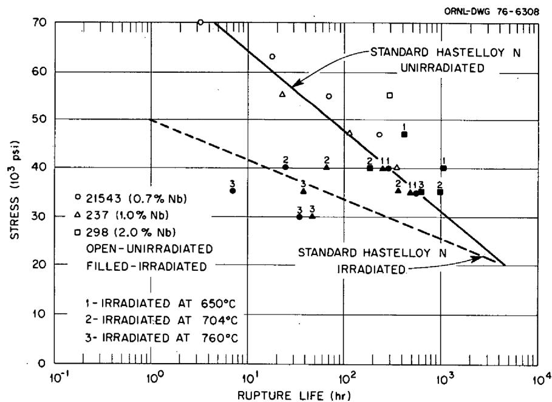  
Fig. 6.6. Stress-rupture properties at $650^{\circ}\mathrm{C}$ of three niobium-modified alloys after irradiation at the indicated temperature.

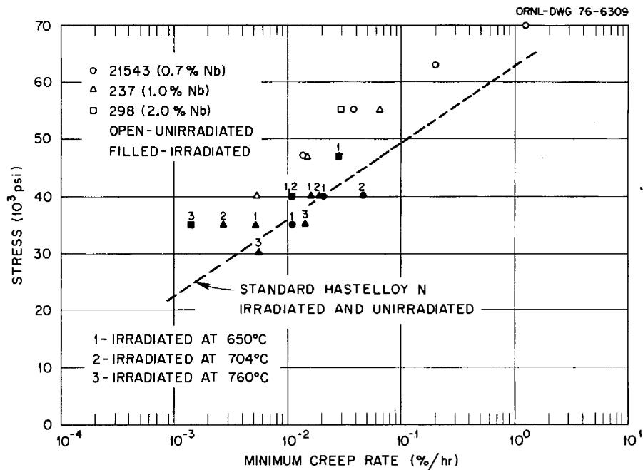  
Fig. 6.7. Minimum creep rates at $650^{\circ}\mathrm{C}$ of three niobium-modified alloys after irradiation at the indicated temperature.

(Table 6.8). This result was anticipated because of the role of silicon in promoting the formation of coarse $\mathbf{M}_6\mathbf{C}$ -type carbides rather than the finely dispersed MC-type carbides formed in the absence of silicon. It is not known whether the good resistance of these alloys to tellurium embrittlement was from the presence of niobium or silicon or both, but these postirradiation results show clearly that silicon levels in the range of 0.2 to 0.5 cannot be tolerated because of the effects on the mechanical properties.

These postirradiation creep data have shown that the niobium-modified alloys have adequate resistance to embrittlement by neutron irradiation. Some further work is needed to optimize the niobium level and to define the maximum allowable service temperature.

# 6.5 MICROSTRUCTURAL ANALYSISOFMODIFIED HASTELLOY N

D. N. Braski

D.J.Bradley

J. M. Leitnaker

G. A. Potter

Two largely independent studies are in progress concerning the microstructure of nickel-base alloys. One study is funded by the Molten-Salt Reactor Program and involves alloys of direct Program interest. In the other study, which is being done by an ORAU student, simpler alloys are being investigated to obtain more basic data. However, both programs

contribute to our understanding of nickel-base alloys, and research data from both programs are included in this report.

# 6.5.1 Production of $2\%$ Titanium-Hastelloy N Alloys with Uniform Carbide Distribution

D.N.Braski J.M.Leitnaker G.A.Potter

Introduction. Improved properties, especially those related to irradiation resistance, have been achieved by adding about 2 wt $\%$ titanium to Hastelloy N. However, this new alloy demonstrated large, and as yet unexplained, variations in postirradiation creep properties. Metallographic examination showed that the microstructures of the irradiated samples were quite inhomogeneous, The purpose of this investigation was to develop metallurgical techniques that could be used to produce a homogeneous microstructure in $2\%$ titanium-Hastelloy N. Specifically, the goal was to remove the carbide stringers from the alloy and to redistribute the carbides uniformly throughout the microstructure. With this accomplished, it was hoped that both the mechanical properties and corrosion resistance of the alloy could be simultaneously optimized. Furthermore, it should be expected that the principles developed in reaching this goal would be generally applicable to most structural alloys.

The "memory effect," that is, how carbides reprecipitate into stringers after normal solution annealing and aging treatments, will be discussed first, after which the results of various experiments aimed at producing uniform carbide distribution will be presented and discussed.

The Memory Effect. The microstructure of titanium-modified, Hastelloy N consists of two phases: (1) a face-centered-cubic, nickel-rich matrix and (2) face-centered-cubic, MC-type carbides, where M is a combination of primarily molybdenum, titanium, chromium, and iron. Invariably, the carbide particles lie in stringers or lines parallel to the principal working direction, as illustrated in Fig. 6.8a, which shows a polished and etched longitudinal section of swaged 0.25-in.-diam rod from alloy 452. The chemical composition of alloy 452 (Table 6.9) shows that this alloy contains $0.048\mathrm{wt}\%$ carbon—an amount sufficient to provide good strength properties to Hastelloy N. When samples of alloy 452 were solution-annealed for $1\mathrm{hr}$ at $1177^{\circ}$ (a standard annealing treatment used for Hastelloy N), most of the carbides were dissolved into the matrix (Fig. 6.8b). RecrySTALLIZATION and growth of the cold-worked microstructure have also taken place, as evidenced by the larger, equi-axed grains. The grain boundaries were nonlinear—probably caused by the pining action of remaining carbides during the grain growth process. When the samples were aged for 160 hr at $760^{\circ}\mathrm{C}$ , carbides precipitated out in the matrix (Fig. 6.8c). Precipitation of carbides occurred predominately in areas where they existed before the solution anneal at $1177^{\circ}\mathrm{C}$ and hence demonstrated what is called a "memory effect."

A clearer picture of what happened in the microstructure of alloy 452 during aging is given in Fig. 6.9. This transmission electron micrograph was taken from the same sample shown in Fig. 6.8c and

Table 6.9. Alloy compositions (wt %)   

<table><tr><td rowspan="2">Element</td><td colspan="4">Alloy number</td></tr><tr><td>450</td><td>451</td><td>452</td><td>453</td></tr><tr><td>Mo</td><td>13.6</td><td>13.5</td><td>13.5</td><td>13.2</td></tr><tr><td>Cr</td><td>8.1</td><td>8.2</td><td>7.7</td><td>7.2</td></tr><tr><td>Ti</td><td>2.1</td><td>1.9</td><td>1.8</td><td>2.0</td></tr><tr><td>C</td><td>0.052</td><td>0.017</td><td>0.048</td><td>0.035</td></tr><tr><td>Mn</td><td>&lt;0.1</td><td>&lt;0.1</td><td>&lt;0.1</td><td>&lt;0.1</td></tr><tr><td>Nb</td><td>&lt;0.1</td><td>&lt;0.1</td><td>&lt;0.1</td><td>&lt;0.1</td></tr><tr><td>Fe</td><td>~0.3</td><td>~0.3</td><td>~0.3</td><td>~0.3</td></tr><tr><td>Ni</td><td>Balance</td><td>Balance</td><td>Balance</td><td>Balance</td></tr></table>

shows that fine MC-type carbides precipitate out in a stacking fault morphology along (111) planes. The large "primary" carbide (one that did not dissolve during the solution anneal) has a geometric shape and may have punched out prismatic dislocations which initiate the growth of stacking fault precipitate ribbons. However, it will be shown later that primary carbides are not required to produce stacking fault ribbons in $2\%$ titanium Hastelloy N. Also, precipitation did not always occur in ribbons. Frequently carbides precipitated on dislocations lying along the (111) planes and formed thin, separate platelets instead of ribbons (Fig. 6.10). Analyses by both selected-area electron diffractions of thin foils and x-ray diffraction of electrochemically extracted precipitates showed that all the carbides, regardless of morphology, were of the fcc, MC type.

The main point in defining and trying to understand the memory effect in titanium-modified Hastelloy N is that this effect must be overcome in order to fabricate an alloy without carbide stringers. As long as the memory effect was occurring, it was virtually impossible to get rid of carbide stringers. The general approach to eliminating the memory effect was to ensure that the carbides were dissolved and in solution during the fabrication process. This could be carried out in two ways: (1) lower the carbon content of the alloy and continue to use the same fabrication schedule or (2) maintain a carbon content of $\sim 0.05$ wt % but adjust the fabrication parameters so that the carbides remain in solution during fabrication. Both of these approaches were investigated.

Influence of Carbon Content. The first step in adjusting the carbon content of the alloy was to estimate the solubility of carbon in $2\%$ titanium-modified Hastelloy N at $1177^{\circ}\mathrm{C}$ . Using precipitation extraction data from aged samples, the amount of carbon soluble in the alloy at $1125^{\circ}\mathrm{C}$ ( $\sim 50^{\circ}\mathrm{C}$ below the desired annealing temperature) was calculated to be 0.045 wt $\%$ carbon. Thus a $2\%$ titanium-modified Hastelloy-N alloy with less than 0.045 wt $\%$ carbon should be free of carbide particles at $1177^{\circ}\mathrm{C}$ . Alloys 451 and 453 were prepared with carbon contents of 0.017 and 0.035 wt $\%$ respectively. They were fabricated into ${}^{1}/_{4}$ -in.-diam rod according to the fabrication schedule (Table 6.10). With the lower carbon content alloys, the solution anneal conducted at $1177^{\circ}\mathrm{C}$ after hot swaging was expected to dissolve the carbides. With the carbides in solution, no stringers were expected to form during the remaining cold swaging steps.

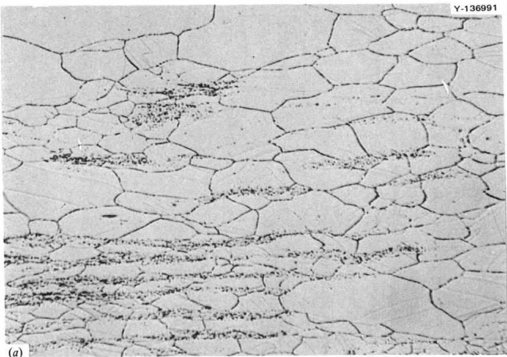

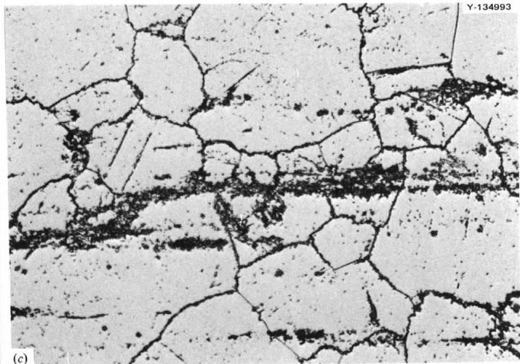

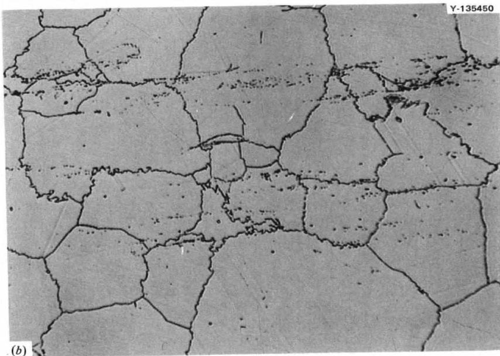  
Fig. 6.8. Optical photomicrographs illustrating the "memory effect" in alloy 452. (a) As swaged, (b) after $1\mathrm{hr}$ at $1177^{\circ}\mathrm{C}$ , (c) after $1\mathrm{hr}$ at $1177^{\circ}\mathrm{C}$ plus $160\mathrm{hr}$ at $760^{\circ}\mathrm{C}$ . Electrolytically etched with oxalic acid.

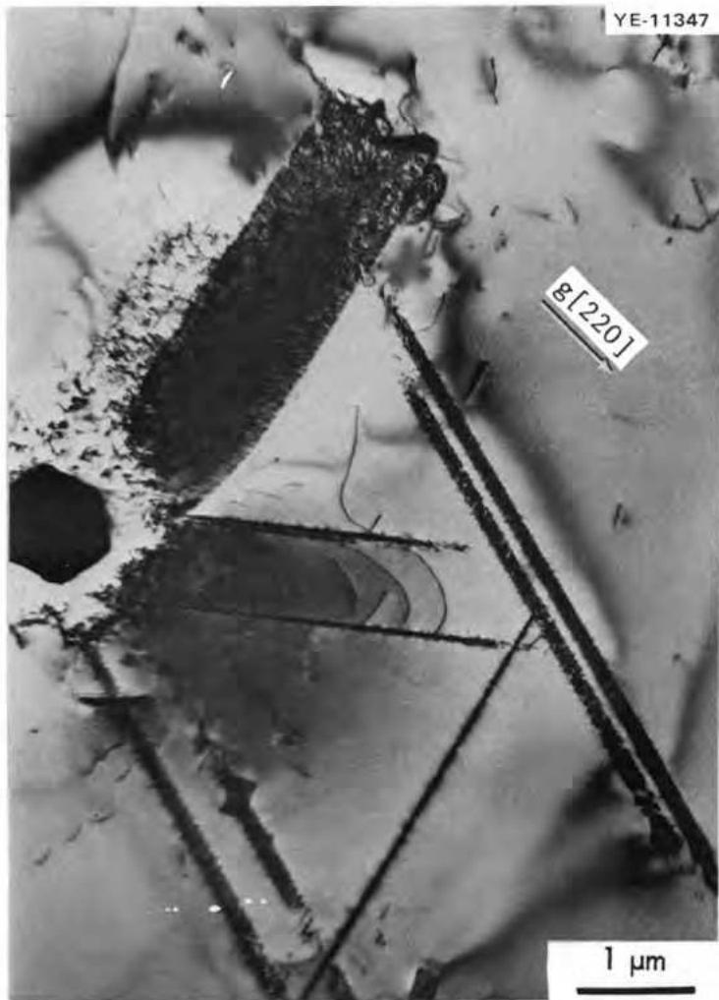  
Fig. 6.9. Transmission electron micrograph showing stacking fault precipitates in alloy 452 after annealing 1 hr at $1177^{\circ}\mathrm{C}$ and 160 hr at $760^{\circ}\mathrm{C}$ .

Table 6.10. Fabrication schedule for $2\%$ titanium-Hastelloy N alloys 451, 452, 450   

<table><tr><td>Step number</td><td>Fabrication process</td><td>Diameter (in.)</td><td>Reduction in area (%)</td><td>Alloy 451 (0.017% C)</td><td>Alloy 452 (0.048% C)</td><td>Alloy 450 (0.051% C)</td></tr><tr><td>1</td><td>Arc-drop cast</td><td>1.00</td><td></td><td></td><td></td><td></td></tr><tr><td rowspan="7">2</td><td>Hot swage at 1177°C</td><td></td><td></td><td rowspan="7">15 min reheat time between passes</td><td rowspan="7">30 min reheat time between passes</td><td rowspan="7">Can in 316 stainless steel; 15 min reheat time between passes</td></tr><tr><td>Pass 1</td><td>0.87</td><td>24.3</td></tr><tr><td>Pass 2</td><td>0.74</td><td>27.7</td></tr><tr><td>Pass 3</td><td>0.64</td><td>25.2</td></tr><tr><td>Pass 4</td><td>0.54</td><td>28.8</td></tr><tr><td>Pass 5</td><td>0.49</td><td>17.7</td></tr><tr><td>Pass 6</td><td>0.43</td><td>22.9</td></tr><tr><td>3</td><td>Homogenizing anneal</td><td></td><td></td><td>1 hr at 1177°C, air cool</td><td>2 hr at 1177°C, air cool</td><td>1 hr at 1260°C, air cool, 1 hr at 1300°C, water quench</td></tr><tr><td>4</td><td>Cold swage at 25°C</td><td>0.34</td><td>37.5</td><td></td><td></td><td></td></tr><tr><td>5</td><td>Intermediate anneal</td><td></td><td></td><td>1 hr at 1177°C</td><td>1 hr at 1177°C</td><td>15 min at 1177°C</td></tr><tr><td>6</td><td>Cold swage at 25°C</td><td>0.25</td><td>45.9</td><td></td><td></td><td></td></tr></table>

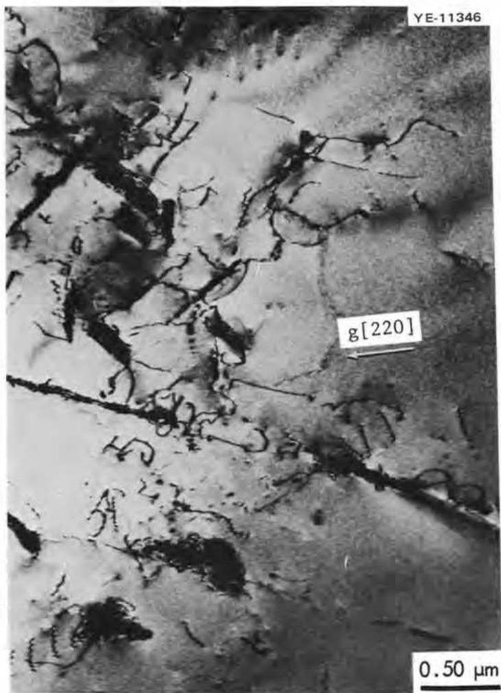  
Fig. 6.10. Transmission electron micrograph showing thin MC-type carbide platelets in alloy 452 after annealing 1 hr at $1177^{\circ}$ C and 160 hr at $760^{\circ}$ C.

Unfortunately, both alloys contained carbide stringers after fabrication was complete, as demonstrated by the microstructure of alloy 451 (0.017 wt $\%$ carbon) in the as-swaged condition (Fig. 6.11a). However, when a sample of alloy 451 was given a 1-hr solution anneal at $1177^{\circ}\mathrm{C}$ , almost all of the carbides were dissolved (Fig. 6.11b). Moreover, aging for 223 hr at $760^{\circ}$ produced no carbide stringers (Fig. 6.11c). Instead, tiny carbide particles precipitated out on grain boundaries, twin boundaries, and preferentially on crystallographic planes. These details were more apparent with the electron microscope. Figure 6.12 shows MC-type carbides in a grain boundary of the aged sample of alloy 451. Figure 6.13 shows small MC platelets located near the center of a grain in the sample. Trace analysis showed that the platelets all lie on (111) planes. Note that one of the thin MC platelets also lies in the (111) foil plane. These results

show that the memory effect must have been present during fabrication of alloy 451 but was eliminated when small samples of the same heat were solution-annealed for $1\mathrm{hr}$ at $1177^{\circ}\mathrm{C}$ after swaging. Assuming that the fabrication furnaces were at the correct temperatures, the solution annealing time necessary to dissolve the carbides must be sensitive to the mass of material being treated. Intuitively, this is reasonable and has actually been observed repeatedly throughout the investigation. The results for alloy 453 were similar to those for alloy 451 except that a final $1\mathrm{hr}$ at $1177^{\circ}\mathrm{C}$ did not remove the memory effect from that alloy. Higher annealing temperatures or longer times at $1177^{\circ}\mathrm{C}$ would be required to produce a uniform carbide distribution in this $0.035\mathrm{-wt}\%$ carbon alloy.

The rate of carbide dissolution was determined quantitatively for both alloys 452 and 451 by solution

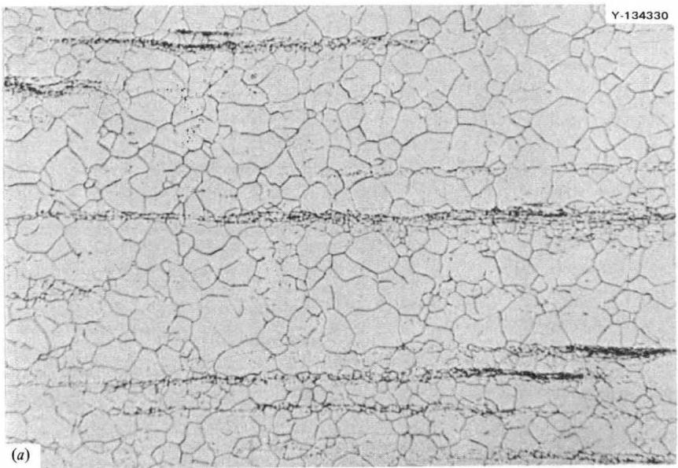

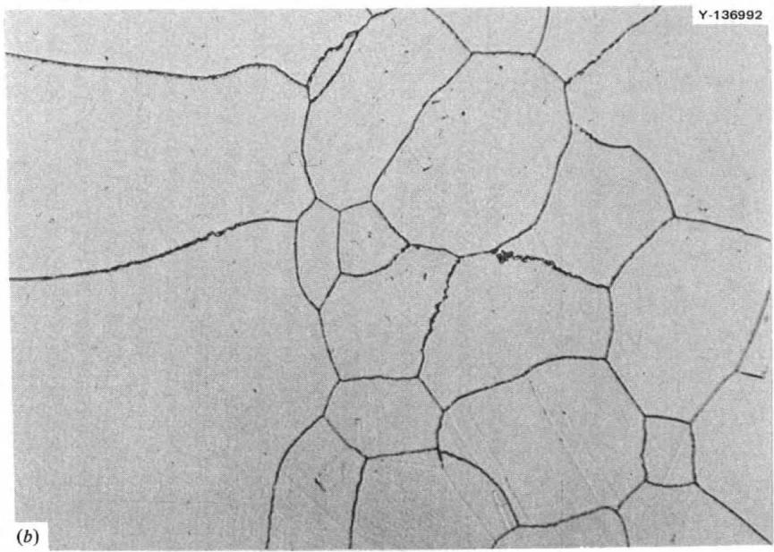

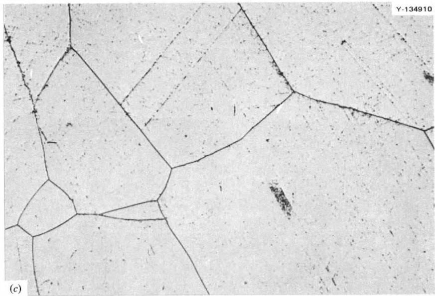

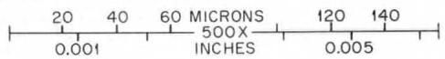  
Fig. 6.11. Optical photomicrographs of alloy 451. (a) Asswaged. (b) After annealing $1\mathrm{hr}$ at $1177^{\circ}\mathrm{C}$ . (c) After annealing $1\mathrm{hr}$ at $1177^{\circ}\mathrm{C}$ followed by $223\mathrm{hr}$ at $760^{\circ}\mathrm{C}$ . Electrolytically etched with oxalic acid.

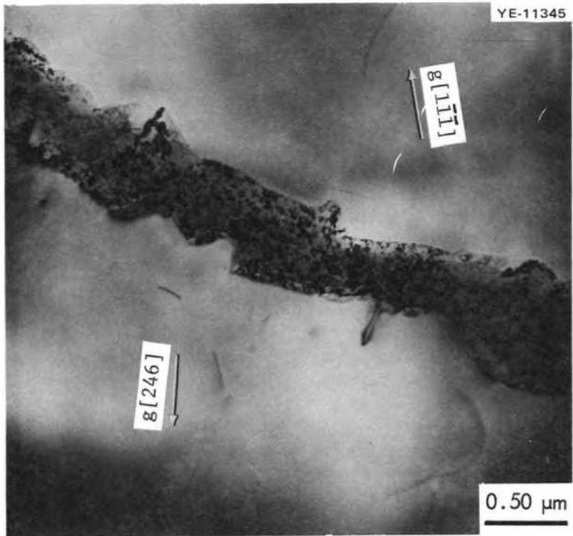  
Fig. 6.12. Transmission electron micrograph showing fine MC-type carbide in grain boundary of alloy 451 after annealing 1 hr at $1177^{\circ}\mathrm{C}$ plus 223 hr at $760^{\circ}\mathrm{C}$ .

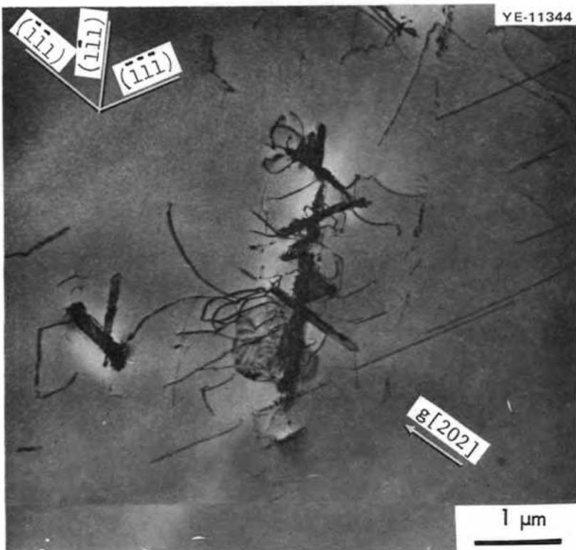  
Fig. 6.13. Transmission electron micrograph showing platelets of MC lying on (111) planes in alloy 451 after annealing for $1\mathrm{hr}$ at $1177^{\circ}\mathrm{C}$ plus $223\mathrm{hr}$ at $760^{\circ}\mathrm{C}$ . Plane of foil = (111).

annealing at $1177^{\circ}\mathrm{C}$ at different times and then using the electrochemical extraction techniques to measure the quantity of undissolved carbide left in the microstructure (Fig. 6.14). Small samples of both alloys were annealed at $1177^{\circ}\mathrm{C}$ for times up to $8\mathrm{hr}$ in an argon atmosphere and were then analyzed for the amounts of carbides remaining. In the case of alloy 451, at least $1\mathrm{hr}$ was needed to reach what appears to be an equilibrium amount of precipitate remaining in the alloy. For times greater than about $1\mathrm{hr}$ , essentially all of the carbides were dissolved into the matrix. However, small amounts of carbide precipitate were extracted at even the longest annealing time. It is possible that some precipitation $(<0.1\mathrm{wt}\%)$ can occur upon cooling the sample after solution annealing. There is also the possibility that a very small amount of other insoluble inclusions present in the alloy were being collected.

Another important point concerning the removal of the memory effect in $2\%$ titanium Hastelloy N is that once the carbides dissolve, additional time is required for the carbide-forming elements to diffuse away from stringer areas. If the elements are not given sufficient time to disperse, they will reprecipitate in a stringer morphology. The relation of time and carbide dissolution is clearly illustrated by the electrochemical extraction data on annealed samples of alloys 451 and 452 (Fig. 6.14). The data for alloy 452 show that its higher carbon content resulted in greater amounts of carbides in the microstructure

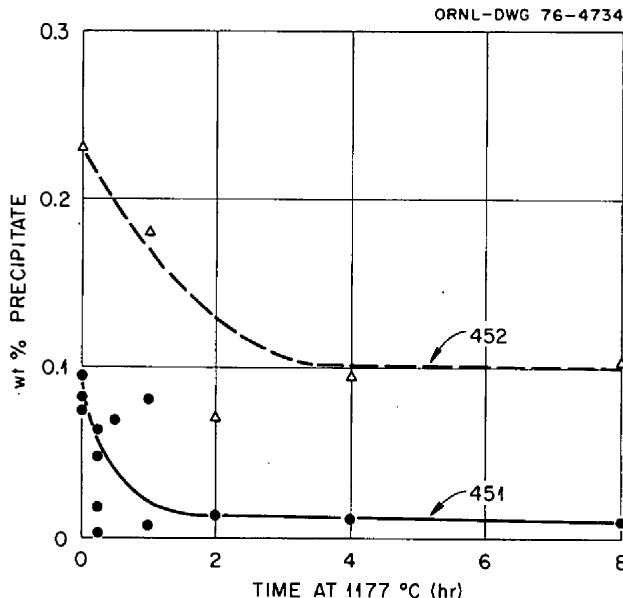  
Fig. 6.14. Results of electrochemical extractions on samples of alloys 451 and 452 annealed for various times at $1177^{\circ}\mathrm{C}$ .

than for alloy 451 for all annealing times investigated. Its higher carbon content also made carbide resolution sufficiently sluggish to enable the memory effect to operate for annealing times up to at least 8 hr. This meant that longer times at $1177^{\circ}\mathrm{C}$ or higher temperatures would be needed to eliminate the memory effect from alloy 452.

Influence of Fabrication Parameters. The previous section indicated that $2\%$ titanium-Hastelloy N alloys with less than $\sim 0.035$ wt $\%$ carbon could be fabricated by the existing shop fabrication schedule shown in Table 6.10 for alloy 451. Usually, however, carbon contents from 0.050 to 0.060 wt $\%$ have been used in the alloy development program to obtain good mechanical properties. Therefore, experiments were conducted to determine how to alter the fabrication process so that the memory effect would be eliminated when the alloy carbon content was near $0.050$ wt $\%$ . In fabricating alloy 452, doubling of hot swaging reheat times as well as the time of the homogenizing anneal (Table 6.10) was unsuccessful in removing carbide stringers from the microstructure (Fig. 6.8a). Therefore, samples of the as-swaged alloy 452 were solution-annealed for $1\mathrm{hr}$ at 1177, 1204, 1260, and $1300^{\circ}\mathrm{C}$ , respectively, in an attempt to dissolve the MC-type carbides. These samples were then aged at $760^{\circ}\mathrm{C}$ for $160\mathrm{hr}$ to reprecipitate the carbides. The results of the solution annealing experiment are shown in optical metallography (Fig. 6.15). Solution annealing at $1177^{\circ}\mathrm{C}$ (Fig. 6.15a) and at $1204^{\circ}\mathrm{C}$ (Fig. 6.15b) did not eliminate the memory effect, and many carbides reprecipitated in areas originally containing stringers. However, the anneals at $1260^{\circ}\mathrm{C}$ (Fig. 6.15c) and at $1300^{\circ}\mathrm{C}$ (Fig. 6.15d) successfully removed the carbide stringers. Instead of stringers, the higher solution anneals produced a fine Widmanstätten structure of MC-type carbides within the grains. The habit planes for carbide precipitation were the matrix (111) planes. The relationship between MC and matrix was epitaxial, that is, $(111)_{\mathrm{MC}}\parallel (111)_{\mathrm{matrix}}$ . MC-type carbides were also found in the grain boundaries. Much of the precipitates in the sample annealed at $1204^{\circ}\mathrm{C}$ (Fig. 6.15b) had the Widmanstätten morphology, but many of the carbides concentrated in prior stringer areas. This observation strongly suggested that while most of the carbides were dissolved at $1204^{\circ}\mathrm{C}$ , a 1-hr annealing time at this temperature was not sufficient to permit adequate homogenization of the carbide-forming elements throughout the matrix. These results confirm earlier statements on solution-annealing which stress the importance of not only dissolving the carbides but also allowing the carbide

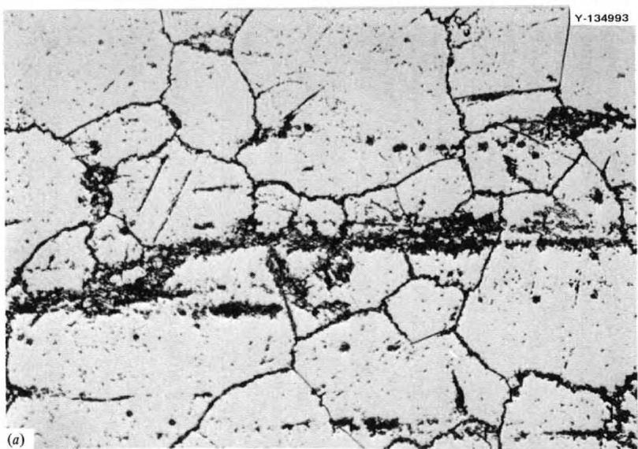

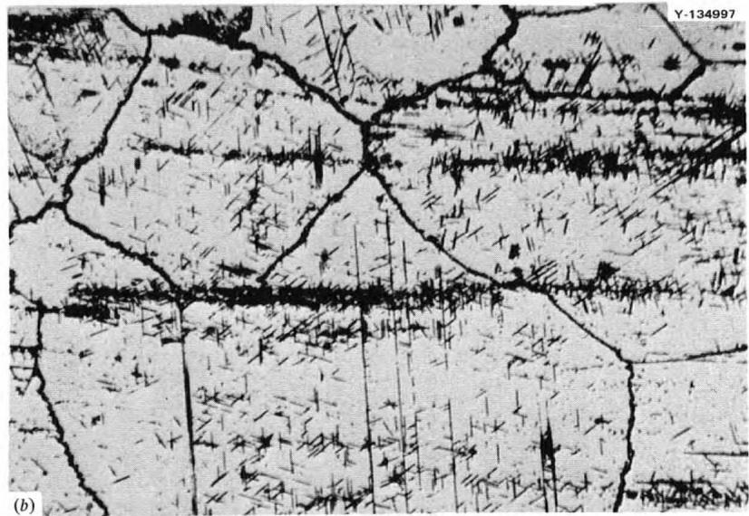

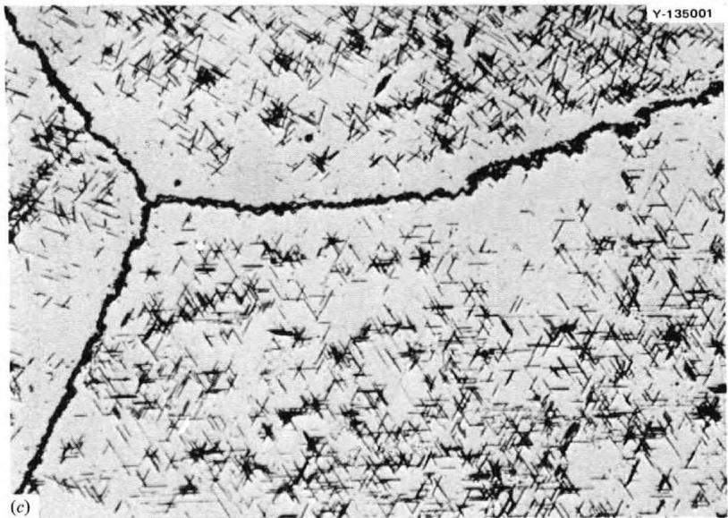

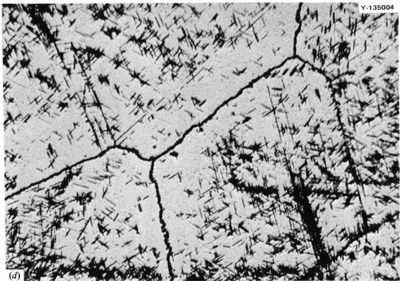

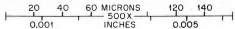  
Fig. 6.15. Photomicrographs showing elimination of "memory effect" in alloy 452 (0.048 wt % carbon) by increasing the solution-annealing temperature. Electrolytically etched with oxalic acid. Annealing times and temperatures: (a) 1 hr at $1177^{\circ}\mathrm{C}$ plus 160 hr at $760^{\circ}\mathrm{C}$ , (b) 1 hr at $1204^{\circ}\mathrm{C}$ plus 160 hr at $760^{\circ}\mathrm{C}$ , (c) 1 hr at $1260^{\circ}\mathrm{C}$ plus 160 hr at $760^{\circ}\mathrm{C}$ , and (d) 1 hr at $1300^{\circ}\mathrm{C}$ plus 160 hr at $760^{\circ}\mathrm{C}$ .

forming elements to disperse uniformly. The experiments by Bradley and Leitnaker, to be discussed in the next section of this report (Sect. 6.5.2), indicate that molybdenum is the controlling element that must be dispersed.

From the result of the preceding experiments, it was possible to design a new fabrication schedule that produced a microstructure without stringers in an alloy containing $\sim 0.050$ wt $\%$ carbon. The pilot run of this new schedule is given in Table 6.10 for alloy 450 (see Table 6.9 for chemical composition). The arc cast ingot was 1.0 in. in diameter by $\sim 6$ in. long and was canned in type 316 stainless steel having a 0.120-in. wall thickness. The purpose of cladding the material was to minimize decarburization during processing at high temperatures in air. The as-cast ingot contained irregular-shaped grains with numerous patches of carbide particles (Fig. 6.16a). Hot swaging was conducted at $1177^{\circ}\mathrm{C}$ , as before, but the reheat times were held to $15\mathrm{min}$ . After hot swaging, the microstructure contained a fine grain structure with carbides in the grain boundaries (Fig. 6.16b). Areas lacking in carbides experienced more grain growth, and hence a duplex grain structure was produced.

The swaged rod of alloy 450 was annealed at $1260^{\circ}\mathrm{C}$ for 1 hr which dissolved most of the carbides and produced large recrystallized grains (Fig. 6.16c). However, enough carbides remained to justify an additional anneal of 1 hr at $1300^{\circ}\mathrm{C}$ . The samples were quenched in water after the $1300^{\circ}\mathrm{C}$ anneal to prevent precipitation of carbides during cooling. This latter anneal was effective in dissolving essentially all of the carbides (as shown in Fig. 6.16d). The discrepancy between the results of a 1-hr anneal at $1260^{\circ}\mathrm{C}$ for alloys 452 and 450 again apparently lies in the differences in amounts of material annealed. Thus the annealing practice must be controlled closely with this alloy to obtain reproducible results.

The final three micrographs in Fig. 6.16 show the material after cold swaging (Fig. 6.16e), after a subsequent stress relief anneal for $15\mathrm{min}$ at $1177^{\circ}\mathrm{C}$ (Fig. 6.16f), and after final cold swaging (Fig. 6.16g). During these final steps the grain size was reduced through cold work and recrystallization processes. Some carbides were precipitated in the grain boundaries, but no stringers were observed. As final proof that the memory effect had been eliminated, an as-swaged sample was aged at $760^{\circ}\mathrm{C}$ for $168\mathrm{hr}$ . The microstructure after aging did not contain stringers but displayed a fine-Widmanstatten structure of thin MC platelets lying epitaxially on the (111) matrix planes (Fig. 6.16h).

Precipitate extraction data from samples selected during the fabrication of alloys 452 and 450 are compared (Fig. 6.17). These data show, in a different way, how the memory effect was removed from $2\%$ titanium Hastelloy. Both alloys contained $\sim 0.050$ wt $\%$ carbon, and the cast ingot contained a nominal amount of carbides. Some precipitation occurred during hot swaging, and the total for both alloys increased. Solution annealing was the critical step in eliminating the memory effect, since substantially more carbides were dissolved in alloy 450 because of higher annealing temperatures. The extracted amounts of carbides remained essentially unchanged for both alloys after solution annealing. A high-temperature anneal would effectively remove stringers from both alloys after fabrication was completed, but the material would end up with a very large grain size. By performing the high-temperature anneal early in fabrication, it is possible to produce some grain refinement during later steps involving cold work and recrystallization. Alloy 450 is currently being tested to determine its resistance to radiation damage and also its resistance to embrittlement by tellurium.

Conclusions. The following conclusions have been reached as a result of work discussed above:

1. Carbide stringers form in $2\%$ titanium-Hastelloy N alloys, as in many other structural materials, during fabrication from the original castings. A memory effect has been observed in the solution-annealed and aged $2\%$ titanium-Hastelloy N alloys where carbides reprecipitate in areas that originally contained stringers.

2. The memory effect was eliminated, and a uniform distribution of carbides was produced in alloy 451 by lowering the carbon content of the alloy from $\sim 0.050$ to $0.017\mathrm{wt}\%$ .The standard 1 hr at $1177^{\circ}C$ solution-annealing temperature was used.

3. The memory effect was eliminated in $2\%$ titanium-Hastelloy N alloys with $\sim 0.050$ wt $\%$ carbon by increasing the solution-annealing temperature to $\sim 1300^{\circ}\mathrm{C}$ . The high-temperature anneal was given early in fabrication to help maintain a reasonably small grain size in the final material.

4. To remove the memory effect (carbide stringers), a solution-annealing treatment must:

a. dissolve most of the carbides,   
b. be of sufficient duration to allow the carbideforming elements (especially molybdenum) to disperse, by diffusion, uniformly throughout the alloy, and

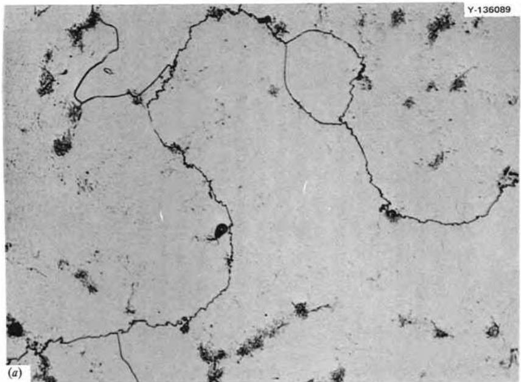

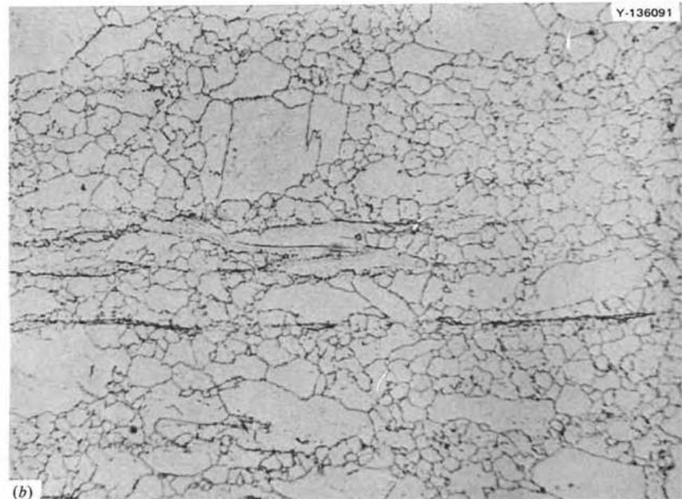

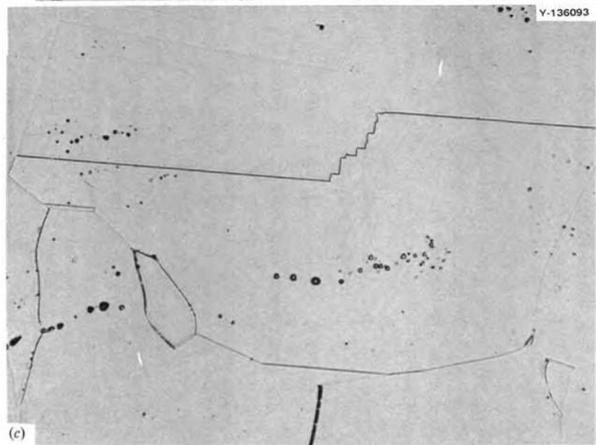

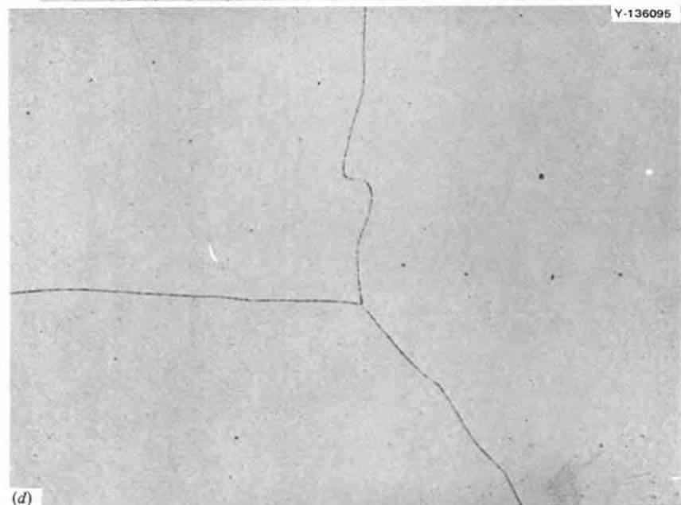

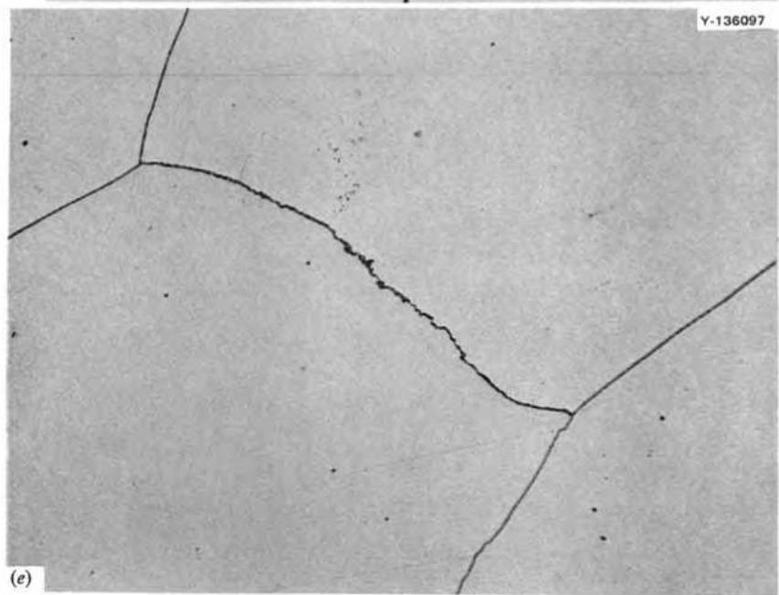

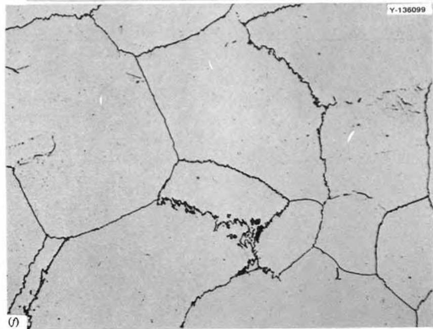

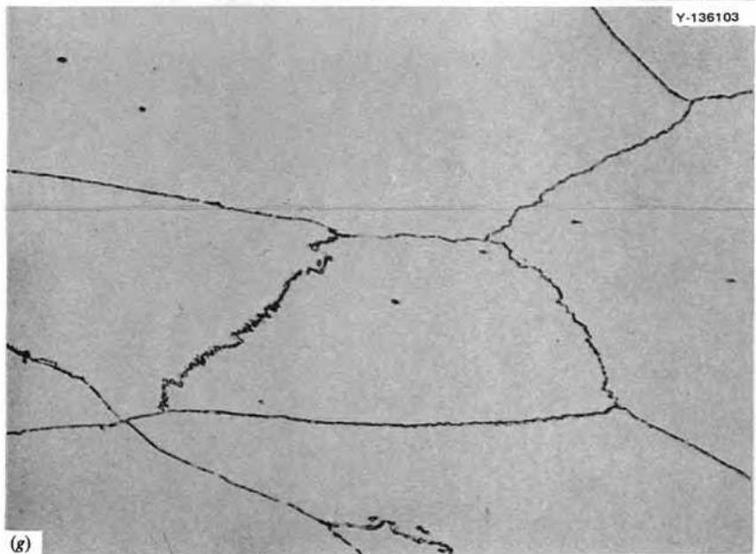

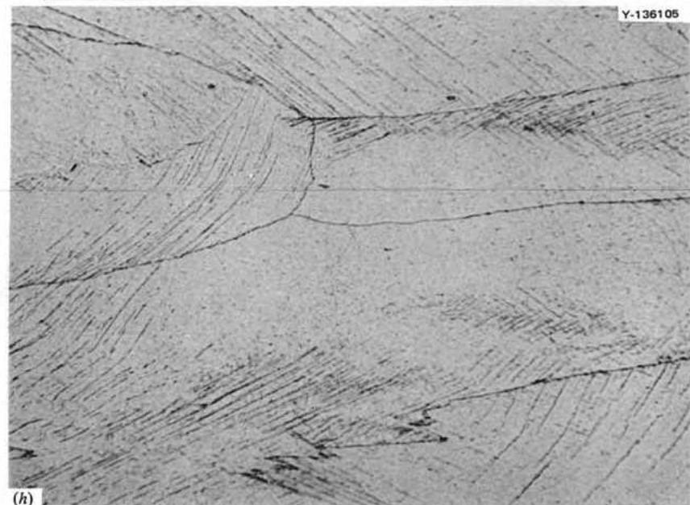

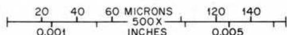  
Fig. 6.16. Photomicrographs of alloy 450 at various stages of fabrication by a process designed to eliminate carbide stringers. Electrolytically etched with oxalic acid. (a) As cast, (b) after hot swaging at $1177^{\circ}\mathrm{C}$ , (c) solution annealed 1 hr at $1260^{\circ}\mathrm{C}$ , (d) annealed 1 hr at $1300^{\circ}\mathrm{C}$ and then water quenched, (e) $39\%$ reduction in area by cold swaging, (f) annealed 15 min at $1177^{\circ}\mathrm{C}$ , (g) $45\%$ reduction in area by cold swaging (finished ${}^{1}/4$ -in.-diam rod), and (h) aged 168 hr at $760^{\circ}\mathrm{C}$ .

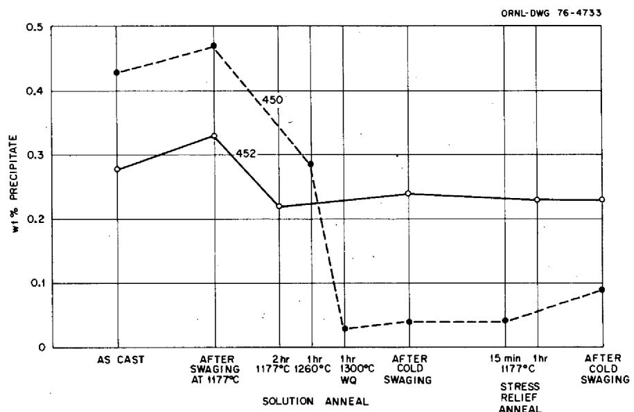  
Fig. 6.17. Extraction data showing the amount of carbides remaining in the microstructures of alloys 450 and 452 after different fabrication steps.

c. take into account the volume of material being treated—larger quantities of material require more time.   
5. In $2\%$ titanium-Hastelloy N alloys where the memory effect was eliminated, the MC-type carbides formed a fine Widmanstätten structure with thin MC platelets lying epitaxially on the (111) matrix planes. Some small carbide particles were also observed in the grain boundaries.   
6. All the carbides observed in $2\%$ titanium Hastelloy N, regardless of carbon content or heat treatment, were identified by both electron and x-ray diffraction as the face-centered-cubic, MC type.

# 6.5.2 Carbon Behavior in Ni-Mo-Cr-Ti Alloys

D.J.Bradley J.M.Leitnaker

To understand and predict the properties of titanium-modified Hastelloy N, a basic study in the phase relationships has been undertaken. The primary manpower funding for this portion of the project is an ORAU Fellowship. The program is divided into two parts: (1) preparation and characterization of specimens and (2) determination of the phase relationships in the matrix and the precipitate. The base alloy has been divided into three suballoys having the compositions (1) Ni-14% Mo-2% Ti-0.1% C, (2) Ni-8% Cr-2% Ti-0.1% C, and (3) Ni-2% Ti-0.1% C. A limited amount of work has also been done with alloy 472-503, a small commercial

heat of $2\%$ titanium-modified Hastelloy N. Three areas have been investigated as part of the sample preparation and characterization portion of this study. They are decarburization, precipitation rate, and homogeneity of the material.

Decarburization is thought to be a surface reaction of the type

$$
\mathrm {O} _ {2 (\text {a b s o r b e d})} + 2 \mathrm {C} _ {(\text {s o l i d s o l u t i o n})} = 2 \mathrm {C O}.
$$

In principal, this reaction can be easily controlled by controlling the environment around the sample. However, experience has shown that this is not a simple task. Our work with decarburized samples has shown a considerable variation of the lattice parameter of the MC-type precipitate as a function of bulk carbon concentration (Fig. 6.18). This can be explained in terms of a lowering of the carbon activity, resulting in a carbon-deficient MC lattice. Similar behavior can be expected from other alloys, which explains the wide range of lattice parameters of precipitate found in this system earlier. The carbon-deficient MC phase identified in our samples is probably not the equilibrium phase for the given temperature and bulk composition, but a result of the carbon sink at the surface. Long-term reannealing of the decarburized material could then result in the formation of a precipitate with an equilibrium composition, which would not necessarily be $\mathrm{MC}_{1.0}$ . Future experiments should show whether these suppositions are correct and should yield the exact relationship between the metal-to-carbon ratio and precipitate lattice parameter.

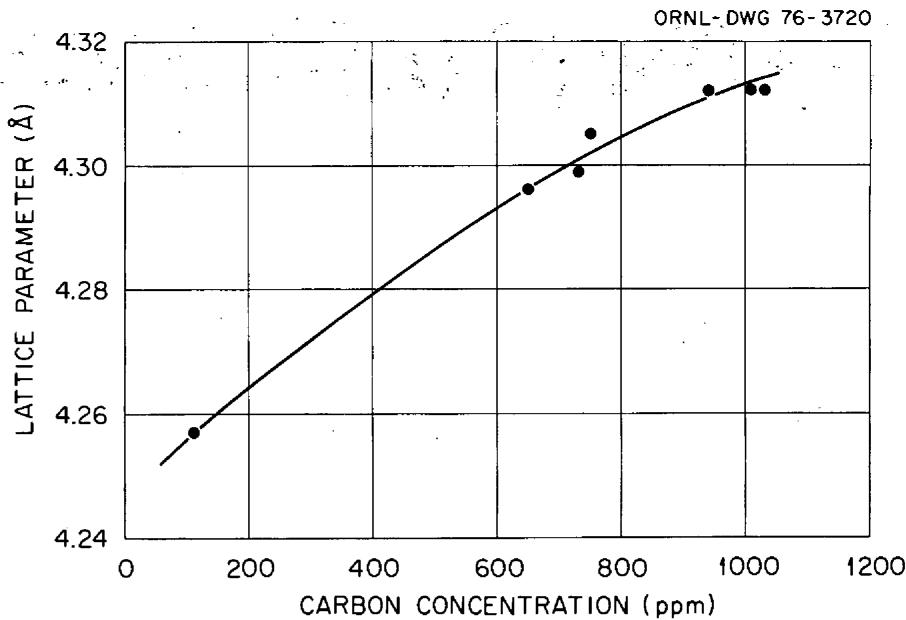  
Fig. 6.18. Lattice parameter of the carbide as a function of carbon concentration in the alloy.

The furnace in which the decarburization took place has been extensively modified. Decarburization can be properly controlled now and possibly used to advantage. Rather than using $\mathrm{O}_2$ to decarburize, a mixture of $\mathrm{H}_2(\mathrm{g})$ and $\mathrm{CH}_4(\mathrm{g})$ will be flowed through the furnace to prevent decarburization.

Homogeneous Alloys. The alloys used in this study were fabricated in the usual manner with intermediate heat treatment at $1177^{\circ}\mathrm{C}$ . Subsequent metallographic examination revealed MC-type precipitate stringers parallel to the working direction (Fig. 6.19). These stringers represent a very inhomogeneous distribution of the alloying elements; the precipitate morphology can likely be better controlled if the alloying elements are distributed more homogeneously. To this end, alloys were annealed at $1260^{\circ}\mathrm{C}$ for 16 hr and then aged for 100 hr at $760^{\circ}\mathrm{C}$ . Previously, it had been determined that 4 hr was sufficient to dissolve the stringers at $1200^{\circ}\mathrm{C}$ . The samples aged at $760^{\circ}\mathrm{C}$ were then examined metallographically (Fig. 6.20a-c). As the photomicrographs reveal, the stringers are now only present in alloy 1. The matrix of alloys 2 and 3 contains small, evenly distributed MC-type precipitates, but in alloy 2 a high density of carbide stringers is evident. The alloy containing molybdenum appears to have a "memory effect" even after 16 hr at $1260^{\circ}\mathrm{C}$ . A high-carbon sample of alloy 472-503 has also been examined, and the memory effect was found to be still evident after 50 hr at $1170^{\circ}\mathrm{C}$ (Fig. 6.21). The conclusions are that

molybdenum is responsible for the memory effect and that, once formed, stringers in molybdenum-containing alloys are extremely difficult to remove.

Precipitation Studies. Another part of the present characterization studies has centered on the rate of precipitation. Originally all the samples were cooled in the cold zone of the furnace. Nonreproducible solubility data and discrepancies from expected behavior led to the postulation that precipitation was occurring on cooling. To verify this postulation, two sets of samples were annealed at $1200^{\circ}\mathrm{C}$ (Table 6.11). One set was cooled by being pulled into the furnace cold zone, and the other was cooled by dropping into

Table 6.11. Effect of cooling rate on precipitation at ${1200}^{ \circ  }\mathrm{C}$ in alloy 1 (Ni-13.9% Mo-1.94% Ti-0.10% C)   

<table><tr><td rowspan="2">Sample number</td><td rowspan="2">Time at 1200°C (hr)</td><td rowspan="2">Cooling methoda</td><td colspan="4">Carbon concentration in extracted precipitates</td></tr><tr><td>No. 1</td><td>No. 2</td><td>No. 3</td><td>Average</td></tr><tr><td>BA1HS</td><td>1</td><td>CZ</td><td>0.194</td><td>0.300</td><td></td><td>0.247</td></tr><tr><td>BA2HS</td><td>2</td><td>CZ</td><td>0.199</td><td>0.342</td><td></td><td>0.270</td></tr><tr><td>BA4HS</td><td>4</td><td>CZ</td><td>0.106</td><td>0.197</td><td></td><td>0.151</td></tr><tr><td>Ba8HS</td><td>8</td><td>CZ</td><td>0.118</td><td>0.209</td><td></td><td>0.164</td></tr><tr><td>BA16HS</td><td>16</td><td>CZ</td><td>0.130</td><td>0.167</td><td>0.148</td><td></td></tr><tr><td>BA1H</td><td>1</td><td>BQ</td><td>0.097</td><td>0.084</td><td>0.142</td><td>0.104</td></tr><tr><td>BA2H</td><td>2</td><td>BQ</td><td>0.066</td><td>0.084</td><td>0.134</td><td>0.96</td></tr></table>

${}^{a}$ CZ indicates that the sample was cooled by pulling into the cold zone of the furnace. BQ indicates that the sample was dropped from the hot zone directly into an ${\mathrm{H}}_{2}\mathrm{O} - {10}\% \mathrm{{NaCl}}$ solution at room temperature.

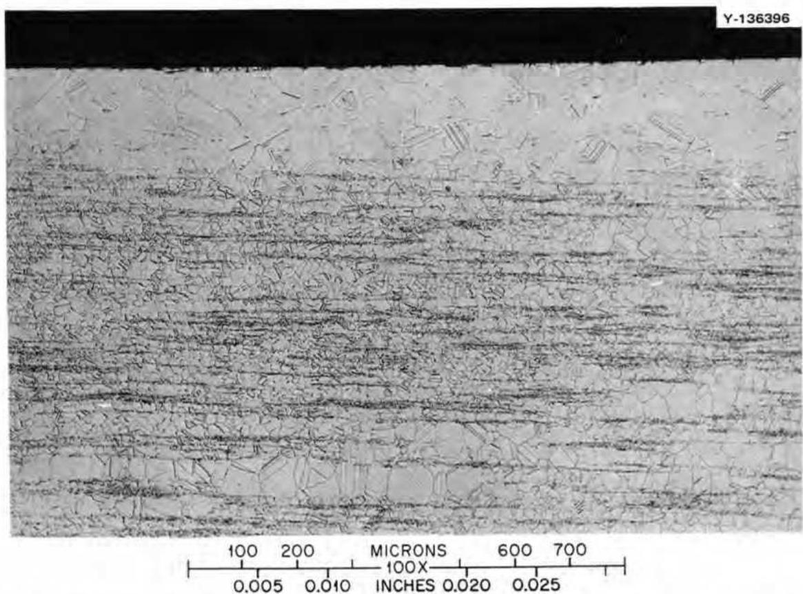  
Fig. 6.19. Photomicrographs of alloy 3 in the as-received condition. Note the decarburized zone and the high density of stringers. Etched with glyceria regia.

an $\mathrm{H}_2\mathrm{O} - 10\%$ NaCl solution. The quantity of precipitate would contain approximately 20 to $40\%$ of the carbon in the alloy. Thus, cooling in the cold zone is not fast enough for measurement of solubilities or the rate of solution of precipitates.

Our exploratory work on the solubility of carbon does not appear to correlate with literature values. Results reported by Stover and Wulff on the nickel-titanium-carbon system indicate that above $800^{\circ}\mathrm{C}$ , an alloy containing less than approximately 2.5 at. $\%$ titanium cannot precipitate TiC even in the presence of graphite. Alloy No. 3 contained only 2.3 at. $\%$ titanium; yet TiC was identified in a precipitate formed at $1170^{\circ}\mathrm{C}$ . Unfortunately this alloy appeared to contain at all temperatures approximately 0.15 wt $\%$ precipitate, which was amorphous (Table 6.12). This amorphous material, which is now being analyzed, has clouded interpretation of the present results. New alloys are being prepared which should not contain this material.

Alloy No. 2 also appeared to contain $\sim 0.15$ wt $\%$ amorphous material (Table 6.12). X-ray diffraction of the precipitates yielded only weak TiC peaks. In

one case, no detectable diffraction occurred. Assuming that the nondiffracting material in both alloys 2 and 3 was not TiC, the solubility of carbon in each alloy is greater than $0.10\mathrm{wt}\%$ at $1260^{\circ}\mathrm{C}$ . At $760^{\circ}\mathrm{C}$ the solubility of carbon in alloy 2 was $\approx 0.05\mathrm{wt}\%$ and in 3 was $>0.1\mathrm{wt}\%$ .

The precipitate from alloy No. I gave large, sharp diffraction peaks, even with very small amounts of material. If it is assumed that the material was stoichiometric TiC (Table 6.12), the solubility of carbon was $\sim 0.08$ wt $\%$ at $1260^{\circ}\mathrm{C}$ . The precipitate formed at $760^{\circ}\mathrm{C}$ could not be stoichiometric TiC, since 0.73 wt $\%$ precipitate would require a bulk carbon concentration of 0.14 wt $\%$ , and the alloy contained 0.10 wt $\%$ carbon. Previous investigators estimated that in titanium-modified Hastelloy N the precipitate was approximately 60 wt $\%$ molybdenum.

A limited amount of work was also done on the effect of the alloying elements on the matrix lattice parameter (Table 6.13 and 6.14). It is hoped that changes in the lattice parameter of the matrix can be correlated with precipitation. Unfortunately, the

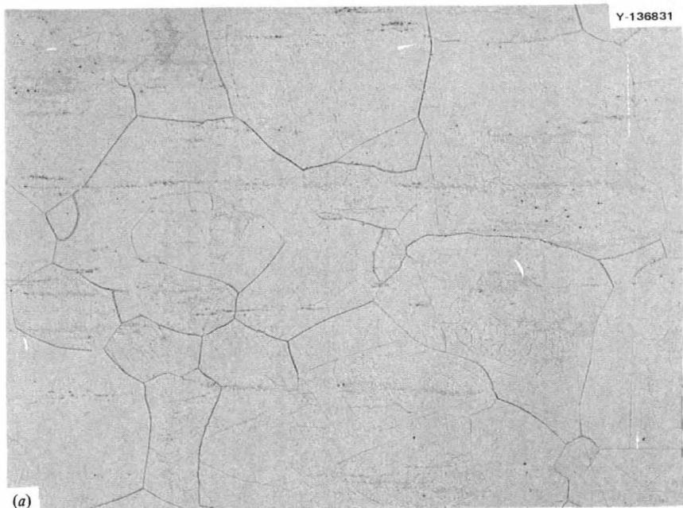

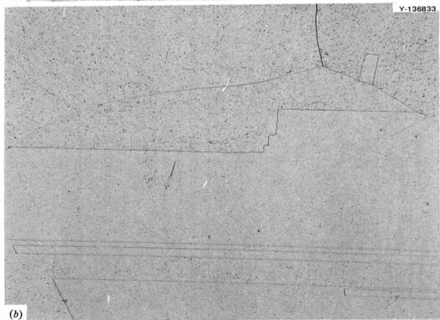

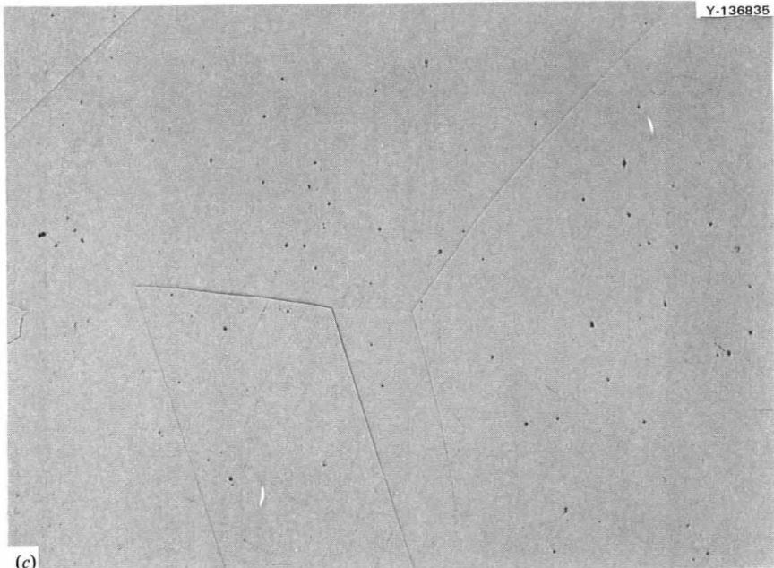

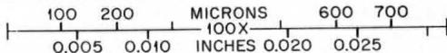  
Fig. 6.20. Photomicrographs of the three alloys annealed $16\mathrm{hr}$ at $1260^{\circ}\mathrm{C}$ followed by aging at $760^{\circ}\mathrm{C}$ for $100\mathrm{hr}$ . (a) Alloy 1 (note the presence of stringers); (b) alloy 2; and (c) alloy 3. Etched with glyceria regia.

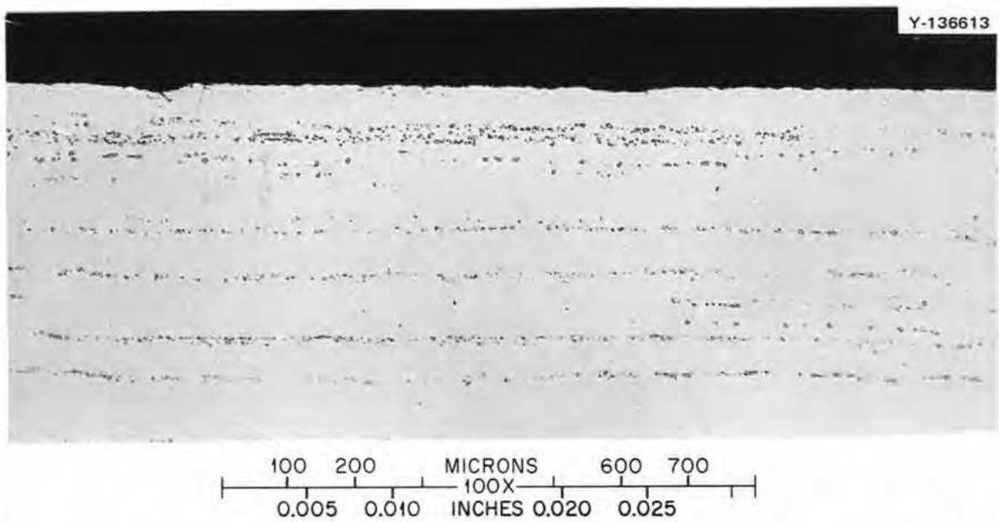  
Fig. 6.21. Photomicrographs of Hastelloy N, heat 452-503, aged 50 hr at $1170^{\circ}\mathrm{C}$ . Note the presence of stringers. As polished.

Table 6.12. Solubility and lattice parameter data on titanium-carbon-type precipitates   

<table><tr><td colspan="2">Alloy</td><td rowspan="2">Sample number</td><td colspan="2">Annealing conditionsa</td><td rowspan="2">Carbon contentb(wt %)</td><td rowspan="2">Precipitate extractedc(wt %)</td><td rowspan="2">Minimum carbon solubility (wt %)</td><td rowspan="2">Lattice parameterd(A)</td></tr><tr><td>Number</td><td>Elements</td><td>Temperature (°C)</td><td>Time (hr)</td></tr><tr><td rowspan="3">1</td><td rowspan="3">Ni, Mo, Ti, C</td><td>A-8</td><td>1260</td><td>16</td><td>0.102</td><td>0.0930</td><td>0.084e</td><td>4.288</td></tr><tr><td>A-10</td><td>1260</td><td>16</td><td>0.092</td><td>0.0370</td><td>0.085e</td><td>4.2991</td></tr><tr><td>A-8-A</td><td>760</td><td>100</td><td>0.096</td><td>0.7320</td><td>0e</td><td>4.289</td></tr><tr><td rowspan="3">3</td><td rowspan="3">Ni, Ti, C</td><td>B13</td><td>1260</td><td>16</td><td>0.083</td><td>0.1150</td><td>&gt;0.08f</td><td></td></tr><tr><td>B15</td><td>1260</td><td>16</td><td>0.080</td><td>0.1560</td><td>&gt;0.08f</td><td></td></tr><tr><td>B15A</td><td>760</td><td>100</td><td>0.080</td><td>0.1410</td><td>&gt;0.08f</td><td></td></tr><tr><td rowspan="3">2</td><td rowspan="3">Ni, Cr, Ti, C</td><td>C7</td><td>1260</td><td>16</td><td>0.098</td><td>0.1170</td><td>&gt;0.10f</td><td></td></tr><tr><td>C6</td><td>1260</td><td>16</td><td>0.103</td><td>0.1490</td><td>&gt;0.10f</td><td></td></tr><tr><td>C6A</td><td>760</td><td>100</td><td>0.104</td><td>0.3590</td><td>0.05f</td><td>4.288</td></tr></table>

${}^{a}$ The samples were annealed together and then cooled in the cold zone on the furance.   
${}^{b}$ Carbon concentration was determined on a leco apparatus by analytical chemistry. Precision of the determination at this concentration is approximately $\pm  {0.0030}\mathrm{{wt}}\%$ .   
The weight percent precipitate was obtained by electrolytic extraction of the samples in a $10\%$ HCl/methanol solution at $1.5\mathrm{V}$ . The normal extraction electrolyzed $1\mathrm{g}$ of metal. The precision of the weight percent determination is approximately $\pm 0.015$ wt%.   
The lattice parameter of the precipitate was determined by x-ray diffraction. The spectrometer normally covered a $2\theta$ range of 20 to $120^{\circ}$ . An internal standard of TaC was used to calibrate each run. The data were treated by means of a $\cos\theta$ cot $\theta$ extrapolation function.   
${}^{e}$ Based on the premise that the carbon content of the precipitate is ${20}\mathrm{{wt}}\%$ . This is the case for stoichiometric TiC.   
Calculated assuming that 0.15 wt % ppt was not TiC.

Table 6.13. Lattice parameter data on titanium-modified Hastelloy N matrices   

<table><tr><td rowspan="2">Alloy</td><td colspan="4">Composition (at. %)</td><td rowspan="2">Lattice parameter (Å)a</td></tr><tr><td>Ni</td><td>Ti</td><td>Mo</td><td>Cr</td></tr><tr><td>1</td><td>88.55</td><td>2.50</td><td>8.95</td><td></td><td>3.56739 ± 0.00041</td></tr><tr><td>3</td><td>97.7</td><td>2.30</td><td></td><td></td><td>3.53266 ± 0.00042</td></tr><tr><td>2</td><td>88.65</td><td>2.34</td><td></td><td>9.01</td><td>3.54170 ± 0.00026</td></tr></table>

${}^{a}$ The lattice parameter was measured with a D.S. camera. The data were extrapolated to ${2\theta } = {180}^{ \circ  }$ with Nelson-Riley extrapolation function.

Table 6.14. Effects of alloying elements on the nickel lattice   

<table><tr><td rowspan="2">Alloy</td><td colspan="2">Δa0/at. %</td><td colspan="2">Effective atomic radiiib</td></tr><tr><td>This work</td><td>Literature valuea</td><td>This work</td><td>Slater radiiic</td></tr><tr><td>Ti</td><td>0.00387</td><td>0.0034</td><td>1.398</td><td>1.40</td></tr><tr><td>Mo</td><td>0.00398</td><td>0.0042</td><td>1.402</td><td>1.45</td></tr><tr><td>Cr</td><td>0.00100</td><td>0.0011</td><td>1.348</td><td>1.40</td></tr></table>

$^{a}$ W. B. Pearson, A Handbook of Lattice Spacings and Structures of Metals and Alloys, Pergamon Press, Oxford, 1967.   
$b$ Calculated assuming close packing along fcc diagonal and the value of 3.5238 Å as the lattice parameter of nickel (see ASTM card 4-0850).   
${}^{c}$ Values taken from J. C. Slater, "Atomic Radii in Crystals," J. Chem. Phys. 41,3199 (1964).

previously mentioned problems have not yet allowed this result, but the data on the decarburized specimens do agree well with existing data on similar systems.

# 6.6 SALT CORROSION STUDIES

# J.R.Keiser E.J.Lawrence

Studies of the corrosion resistance of potential MSBR containment vessel materials (modifications of Hastelloy N) have been carried out in both thermal convection and forced circulation loops. Results indicated a limited amount of mass transfer of chromium from the hot to the cold portions of the Hastelloy N systems, but the overall resistance of Hastelloy N to molten fluoride salt corrosion is very high. Unfortunately, Hastelloy N has been found to be susceptible to irradiation embrittlement and to grain boundary attack by fission products. Consequently, investigations were begun with different commercial and experimental alloys containing compositional modifications to Hastelloy N in order to find materials that provide sufficient resistance to the detrimental effects of irradiation and fission products. Since it is necessary to ensure that these new or modified alloys are resistant to fluoride salt corrosion, most of the loops now in operation are being used to evaluate the corrosion resistance of these various materials. The status of the operating thermal convection loops is given in Table 6.15. In

Table 6.15. Status of operating thermal convection loops   

<table><tr><td>Loop number</td><td>Loop material</td><td>Specimen material</td><td>Salt type</td><td>Maximum temperature (°C)</td><td>ΔT (°C)</td><td>Purpose</td></tr><tr><td rowspan="3">21A</td><td rowspan="3">Hastelloy N</td><td rowspan="3">Hastelloy N, 1% niobium-modified Hastelloy N</td><td rowspan="3">MSBR fuel salt</td><td rowspan="3">704</td><td rowspan="3">139</td><td>Baseline corrosion data for Hastelloy N</td></tr><tr><td>Screening test for 1% niobium-modified Hastelloy N</td></tr><tr><td>Tellurium mass-transfer and corrosion studies</td></tr><tr><td>23</td><td>Inconel 601</td><td>Graphite</td><td>MSBR fuel salt</td><td>677</td><td>117</td><td>Effect of graphite on stability of uranium fluorides in molten salt</td></tr><tr><td rowspan="2">31</td><td rowspan="2">316 stainless steel</td><td rowspan="2">316 stainless steel</td><td rowspan="2">Li2BeF4</td><td rowspan="2">649</td><td rowspan="2">156</td><td>Baseline corrosion data</td></tr><tr><td>Effect of reductant additions on corrosion</td></tr><tr><td>24</td><td>Hastelloy N</td><td>Chromium-modified Hastelloy N</td><td>MSBR fuel salt</td><td>704</td><td>139</td><td rowspan="2">Determine the effect on corrosion rate of chromium concentration of Hastelloy N</td></tr><tr><td>18C</td><td>Hastelloy N</td><td>Chromium-modified Hastelloy N</td><td>MSBR fuel salt</td><td>704</td><td>139</td></tr></table>

addition to these five loops, three others have been built and are in varying stages of final preparation. Because of the anticipated termination of the program, these three loops will not be put into operation.

# 6.6.1 Thermal Convection Loop Results

Thermal convection loops provide a very good experimental tool for measuring the corrosion rate of a material exposed to a corrosive medium under an imposed temperature gradient. Removable specimens permit periodic examination to determine weight changes, and electrochemical probes permit on-line measurement of the oxidation potential of the salt and the concentration of impurities in the salt.

Thermal convection loop 23 is constructed of Inconel 601, a material that has shown good resistance to grain boundary attack by tellurium. However, results have shown that Inconel 601 undergoes extensive corrosion in fuel salt, making it a material with little prospect for use in an MSBR. Because of the extensive corrosion which this alloy has undergone by reaction with fuel salt, the $\mathrm{U}^{4+}/\mathrm{U}^{3+}$ ratio of the salt has fallen to about 4, the most reducing level ever achieved in a loop. As reported previously10 it was decided to use this very reducing salt to try to reproduce the results of Toth and Gilpatrick,11 which predict that under the operating conditions of this loop and in the presence of graphite, $\mathrm{UC}_2$ would be formed by the reaction

$$
4 \mathrm {U F} _ {3} + 2 \mathrm {C} \rightharpoonup 3 \mathrm {U F} + \mathrm {U C} _ {2}.
$$

In the first attempt to produce this reaction, pyrolytic graphite was exposed to the salt for 500 hr, and no $\mathrm{UC}_2$ was found. In the second attempt a less dense graphite was used and a new phase was detected through x-ray examination. This phase was tentatively identified as uranium oxide. A third set of graphite specimens which has been kept free of moisture is now undergoing a 2000-hr exposure and is scheduled to be examined in March 1976.

Hastelloy N thermal convection loop 21A, which contains MSBR fuel salt, has been used to obtain baseline corrosion data. Sixteen Hastelloy N specimens have been exposed a total of 10,009 hr. According to theory, the weight change of these specimens due to mass transfer of chromium, $\Delta M$ , per unit area during time $t$ , should be given by

$$
\Delta M \propto C _ {o} \sqrt {D t},
$$

where $C_o$ is the initial concentration of chromium in the alloy and $D$ is the diffusivity of chromium in the alloy. Figure 6.22 shows a plot of experimentally determined weight change, $\Delta M$ , vs the $\sqrt{t}$ for a specimen near the hottest point of loop 21A. The good fit of the data to a straight line provides further evidence of a diffusion-controlled corrosion mechanism. A new set of specimens fabricated from $1\%$ niobium-modified Hastelloy N has been inserted into the loop and will be used to obtain corrosion data for that alloy.

Thermal convection loop 31 is constructed of type 316 stainless steel, has 316 stainless steel specimens, and contains $\mathrm{LiF - BeF_2}$ (66-34 mole $\%$ ) salt. For the first $1000\mathrm{hr}$ of operation, this loop was used to gather baseline corrosion data with "as-received" salt. Subsequently, reductant (beryllium) was added to the salt at the level of about $0.1\mathrm{mgBe} / \mathrm{cm}^3$ salt. New specimens were then inserted, and the corrosion rate has been measured for stainless steel in this reducing salt. Addition of beryllium made the salt quite reducing, but once the source of beryllium was removed, species in the salt were no longer in equilibrium and the salt became progressively more oxidizing with increasing time. While the source of beryllium was in the salt, the corrosion rate was extremely low. However, after removal of the beryllium the specimen in the hottest position showed a pattern of increasing weight loss as a function of time. The increasing corrosion rate was

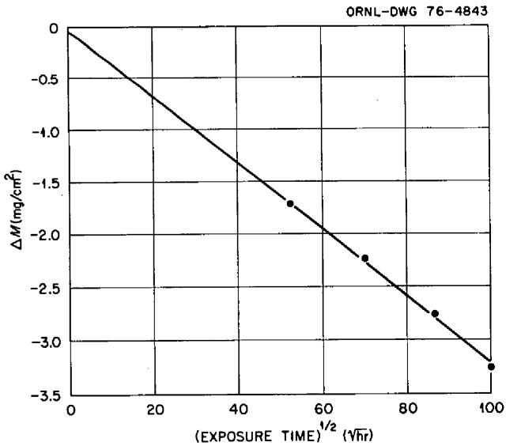  
Fig. 6.22. Weight change vs square root of exposure time for Hastelloy N specimens exposed to MSBR fuel salt at $690^{\circ}\mathrm{C}$ in thermal convection loop 21A.

associated with the increasingly oxidizing state of the salt. Weight change results for specimens in both the "as-received" and "reducing" salt are shown in Fig. 6.23. Fresh salt and new specimens are to be added to this loop, and corrosion experiments will be continued.

Two Hastelloy N loops, NCL 24 and NCL 18C, have been filled with MSBR fuel salt and put into operation recently. These two loops are being used to measure the effect of chromium concentration on the corrosion rate of Hastelloy N. Increasing the chromium content of a nickel-base alloy generally increases the alloy resistance to grain boundary attack by tellurium. However, increasing the chromium content decreases the alloy's resistance to mass transfer. From these tests and tellurium exposure tests, a possible optional chromium concentration may be determined. For these corrosion tests, four modified Hastelloy N alloys containing 7, 10, 12, and $15\%$ chromium have been made. Specimens of the $7\%$ chromium alloy have been exposed in NCL 24 a total of $1060\mathrm{hr}$ . The maximum corrosion rate observed was $-1.9\mathrm{mg/cm}^2$ -year. The $10\%$ chromium specimens have shown a maximum corrosion rate of $-2.3$

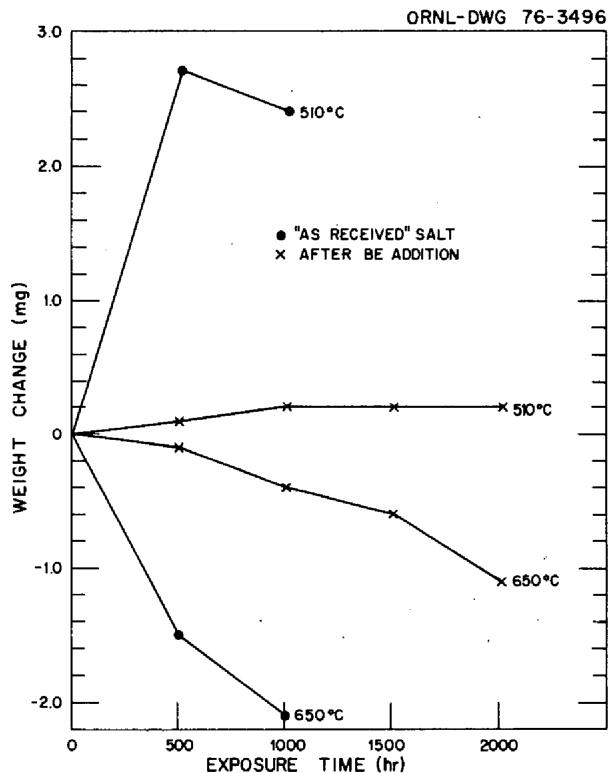  
Fig. 6.23. Weight changes of type 316 stainless steel specimens exposed to $\mathbf{LiF - BeF}_2$ (66-34 mole %) salt at the indicated temperature. Surfaces areas of the specimens were approximately $3.4~\mathrm{cm}^2$ .

$\mathrm{mg/cm}^2$ -year after 550 hr in the salt of NCL 18C. Exposure will continue until each set of specimens has been exposed about 1000 hr.

# 6.6.2 Forced Circulation Loop Results

Hastelloy N pump loop FCL-2b was used during the first six months of 1975 to obtain baseline corrosion data under conditions where the $\mathrm{U}^{4+}/\mathrm{U}^{3+}$ ratio was about 100. A maximum corrosion rate of $-2.5\mathrm{mg/cm}^2$ -year $(-0.11\mathrm{mil/year})$ was reported after a total of about 3200 hr of a planned 4000-hr exposure to salt. Figure 6.24 shows the effect of material transfer on specimens from the hottest and coldest positions. There is evidence of material removal and deposition. Heat transfer measurements were scheduled to follow the 3200-hr corrosion test but had to be delayed because a leak was discovered in the Hastelloy N tubing. Following repair of the tubing, the heat transfer measurements were made and then the corrosion specimens were inserted for another 1000-hr exposure. Weight change measurements made at the end of this period revealed that over the total 4309 hr at specimen temperatures of 566, 635, and $704^{\circ}\mathrm{C}$ the corrosion rates were 0.0, $-0.2$ , and $-2.3\mathrm{mg/cm}^2$ -year respectively. This rate of corrosion is well within the limit that could be tolerated in an MSBR.

It was planned to adjust the $\mathrm{U}^{4+}/\mathrm{U}^{3+}$ ratio of the salt upward to 1000 by means of $\mathrm{NiF}_2$ additions followed by a 4000-hr corrosion test in the more oxidizing salt. Several $\mathrm{NiF}_2$ additions were made, and the $\mathrm{U}^{4+}/\mathrm{U}^{3+}$ ratio did increase; but another leak occurred before the ratio reached 1000. This leak was repaired, but shortly after operation was resumed, a third leak occurred. Because of plans to terminate the MSR Program, it was decided to forego further testing of standard Hastelloy N and to use the loop to gather baseline corrosion data on $1\%$ niobium-modified Hastelloy N, an alloy that shows improved resistance to tellurium grain boundary attack. Specimens were inserted at the end of February and will be removed periodically for examination.

After each of the three leaks, a section of tubing containing the failure was removed, and new tubing was welded into place. These failed sections were examined metallographically. Figure 6.25 shows the appearance of the $\frac{1}{2}$ -in.-OD tubing at the site of the first leak. This leak occurred at a $90^{\circ}$ bend on the outermost portion of the tubing. Examination of a transverse section of the tube (Fig. 6.26) showed extensive cracking in the vicinity of the leak, and the

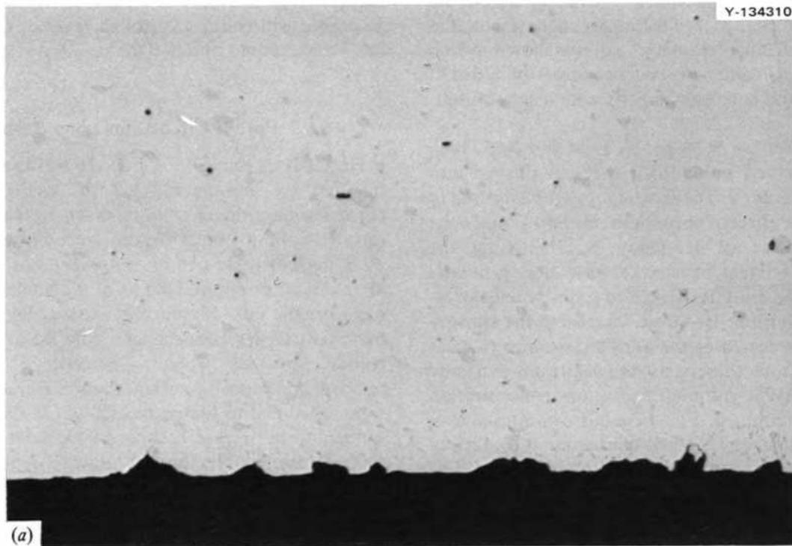

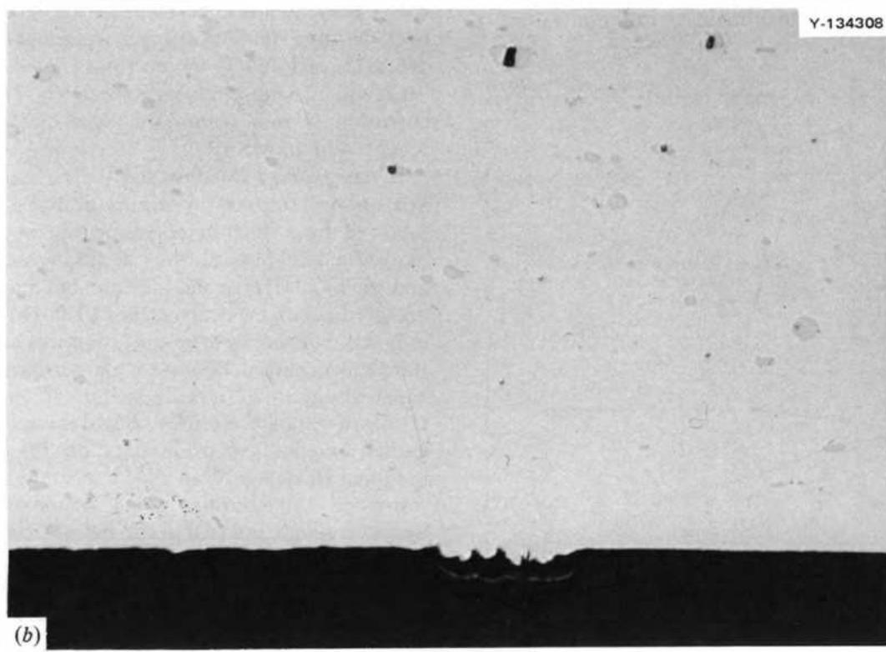

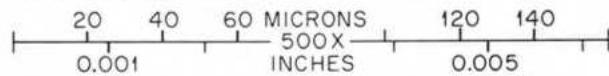  
Fig. 6.24. Photomicrographs of standard Hastelloy N exposed to fuel salt in FCL-2b for 3200 hr. (a) $704^{\circ}\mathrm{C}$ , (b) $566^{\circ}\mathrm{C}$ . As polished.

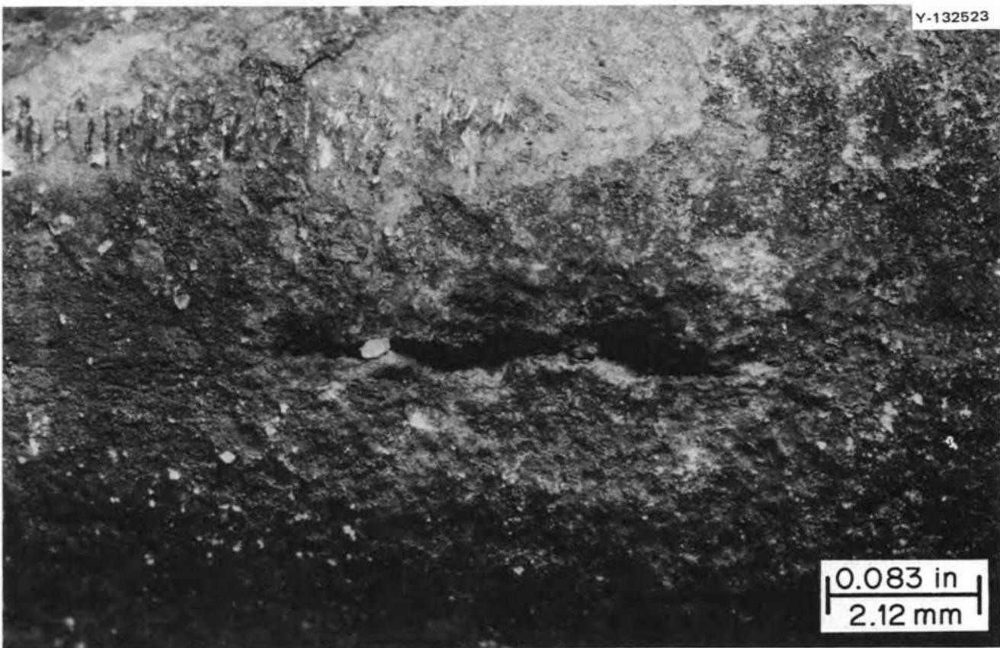  
Fig. 6.25. Photograph of first failure in FCL-2b. $12 \times$

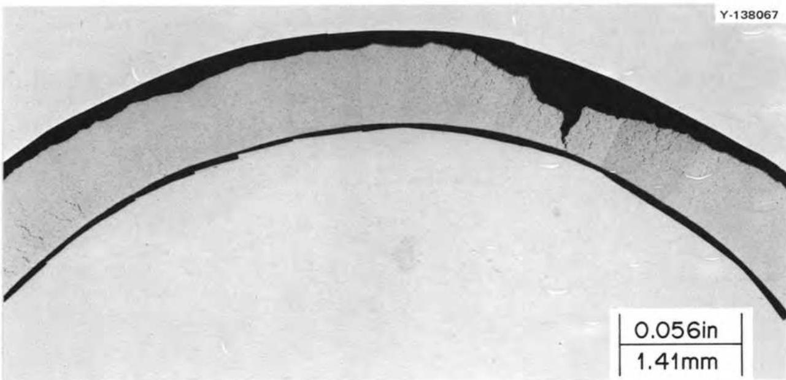  
Fig. 6.26. Photomicrograph of a transverse section of the failure shown in Fig. 6.25. Inside diameter of tube on the lower side and outside diameter on the upper side.

longitudinal section (Fig. 6.27) showed that these small cracks ran parallel to the axis of the tube. The presence of a shorted heater and a burned-out thermocouple on the section of tubing where this failure occurred provides additional support for the conclusion that this failure resulted from a combination of excessive temperature and low stress for an extended time. This leak possibly could have been avoided if the tubing had been annealed after bending or if the temperature had been maintained in the desired range. This contention is further supported since sections of the failed tubing which had not been severely stressed during bending did not show cracking and since examination of a nearby $90^{\circ}$ elbow that had been operated at the proper temperature showed no cracking even in the most severely deformed regions. However, the length of tubing involved would have made annealing difficult, and changing the thermocouple would have required drainage and shutdown of the loop.

The second failure occurred in a straight section of resistance-heated tubing; the appearance of the failed section is shown in Fig. 6.28. Transverse and

longitudinal sections of the failure (Figs. 6.29 and 6.30 respectively) show a single crack. The transverse view shows evidence of necking or reduction of area indicative of a fairly large stress. A high stress could have occurred during heating of this region if salt were trapped there between two frozen salt plugs.

The third failure occurred at a weld joint in one of the specimen access positions (Fig. 6.31). Metallographic examination of the failure showed one crack, which probably occurred when a high stress again resulted from heating trapped salt (Fig. 6.32). As reported by Huntley in Sect. 2.3.1, modifications have been made to the loop to prevent development of frozen sections.

# 6.7 CORROSION OF HASTELLOY N AND OTHER ALLOYS IN STEAM

B. McNabb H.E.McCoy

The corrosion of Hastelloy N and other nickel, iron, and cobalt-base alloys is being evaluated in TVA's Bull Run Steam Plant at steam conditions of $538^{\circ}\mathrm{C}$ and 3500 psig. Unstressed sheet specimens 2

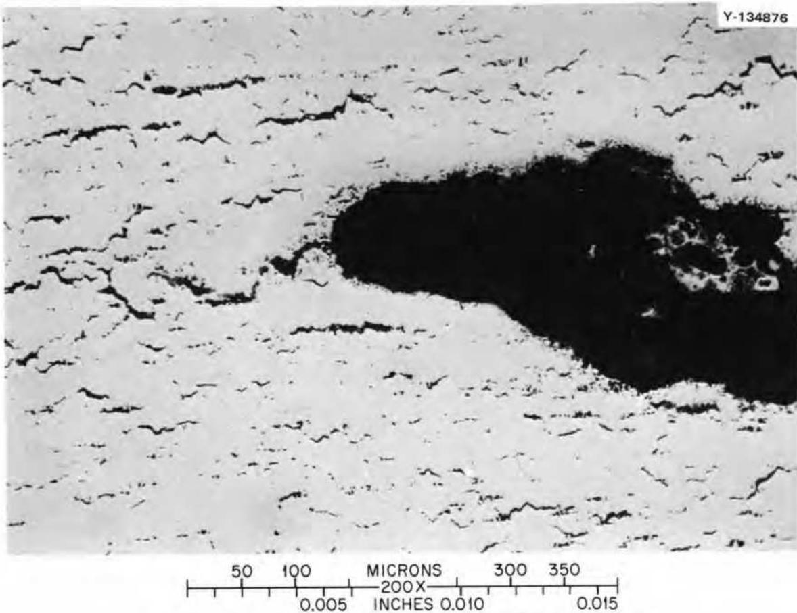  
Fig. 6.27. Longitudinal section of the failure shown in Fig. 6.25. As polished.

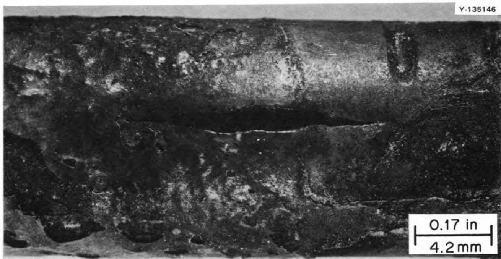  
Fig. 6.28. Photograph of the second failure in FCL-2b. The tubing is $\frac{1}{2}$ in. in diameter. $6 \times$ .

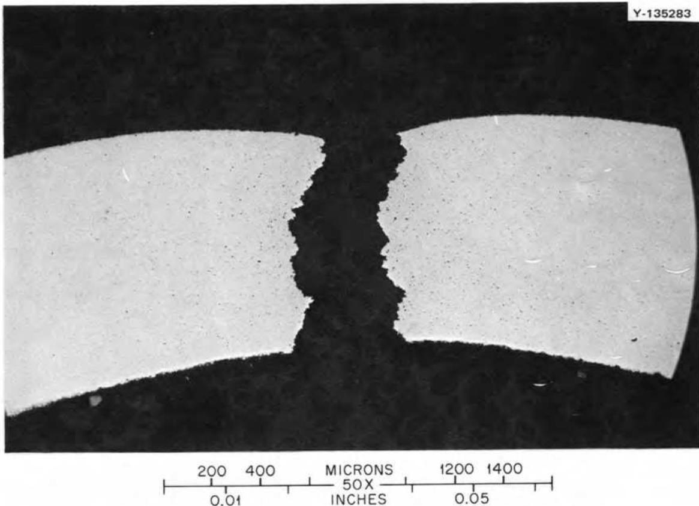  
Fig. 6.29. Transverse section of the failure shown in Fig. 6.28. As polished.

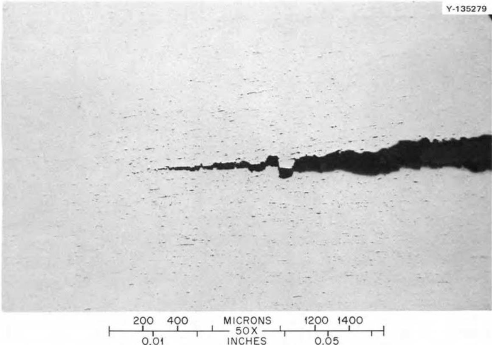  
Fig. 6.30. Longitudinal section of the failure shown in Fig. 6.28. As polished.

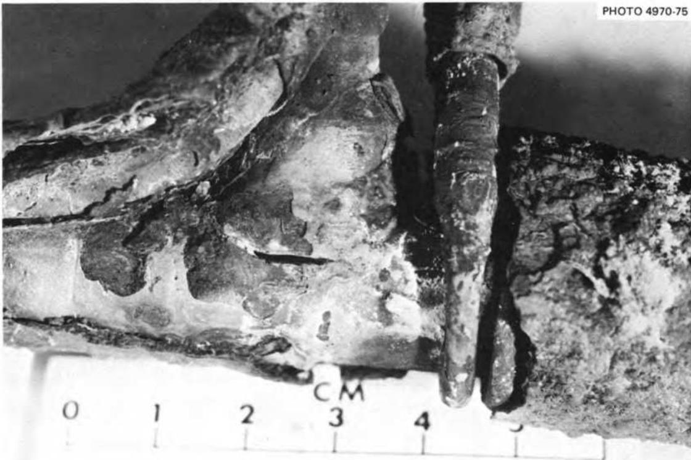  
Fig. 6.31. Photograph of the third failure in FCL-2b.

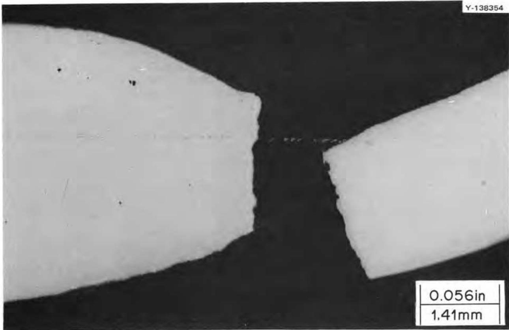  
Fig. 6.32. Photomicrograph of the failure shown in Fig. 6.31. As polished.

in. long $\times 1 / 2$ in. wide $\times 0.035$ in.thick have been exposed to flowing steam (approximately $1000\mathrm{lb / hr})$ for 21,000 hr. The various alloys of modified Hastelloy N have thin, adherent oxides, with no evidence of spalling. Some of the Croloy type steels are beginning to develop blisters and some of the blisters have cracked, but none of the specimens have spalled at this time. The weight changes had increased approximately $0.5\mathrm{mg} / \mathrm{cm}^2$ over a period of 4,000 hr, as reported previously, but they decreased during the last 2,000 hr (two weighing periods), until some of the specimens are approaching the rates previously established. Some of the specimens have weight changes still slightly above the previous rates, but apparently some of the deposited materials are being removed.

The weight change behavior correlates well with the steam quality and with observations by Bull Run engineers. Several leaking condenser tubes were sealed off during the ten-week shutdown in the latter part of 1975, and the steam quality improved considerably. No condenser leaks had been experienced before 1974, but several occurred during 1974

and 1975. During the shutdown the condenser tubes were ultrasonically inspected, and any tube whose wall thickness had been reduced by $35\%$ was sealed off on both ends. The condensers were sized such that a certain percentage of the tubes could be sealed off and the condenser still perform satisfactorily. The condenser tubes are constructed of admiralty brass, and corrosion occurs near baffles in the regions where droplets can form and then evaporate. This leads to an increased concentration of impurities (such as chlorides) and can cause corrosion even though the bulk concentrations may be in the low parts per million or parts per billion range. The manufacturer of the condensers has made some recommendations to remedy the problem, such as water injection to wash the tubes in this area. The effect of plugging some of the condenser tubes is to shift the position of the vapor-to-droplet area of high corrosion to another location in the condenser, thus exposing areas of the tubing that have had less corrosion and exposing the corroded areas to a less corrosive condition. Some experimental condenser tubes of $\mathrm{Cu - 10\%}$ Ni do not exhibit as much

susceptibility to this type of corrosion as the admiralty brass. These have been proposed for replacement tubes and should relieve the problem.

Two heats of standard Hastelloy N tubing (N1 5095 and N2 5101) are being evaluated in the stressed condition from $28.0 \times 10^{3}$ to $77.0 \times 10^{3}$ psi. The specimens of both heats in the annealed condition (1 hr at $1177^{\circ}\mathrm{C}$ ) have shorter rupture times in steam than in argon. Specimens of heat N1 5095 tested in the as-received condition and stressed below $50.0 \times 10^{3}$ psi in steam have rupture times equal to those of

specimens tested in argon. Figure 6.33 shows the stress-rupture properties of heat N1 5095. As reported earlier,13 flaws in the specimens may have contributed to the scatter, but at stresses $< 50.0 \times 10^{3}$ psi, where wall thicknesses are heavier, there appears to be no significant effect of steam on the rupture time. Two of the specimens stressed at 28.0 and $40.6 \times 10^{3}$ psi have an accumulated 15,000-hr exposure to steam at $538^{\circ}\mathrm{C}$ without rupture, and three others at slightly higher stresses have from 10,000 to 11,000 hr of exposure. Figure 6.34 shows the stress-rupture

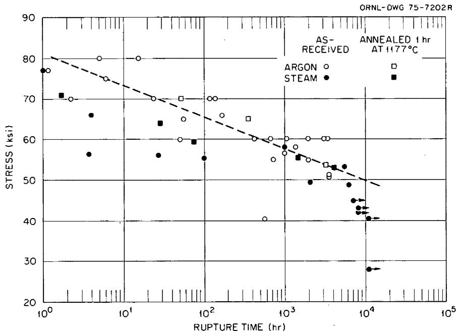  
Fig. 6.33. Rupture life of Hastelloy N (heat N1 5095). Tubes stressed in argon and steam environments at $538^{\circ}\mathrm{C}$

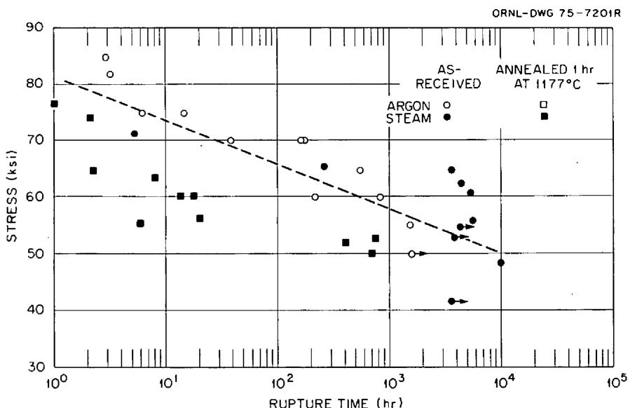  
Fig. 6.34. Rupture life of Hastelloy N (heat N2 5101). Tubes stressed in argon and steam environments at $538^{\circ}\mathrm{C}$

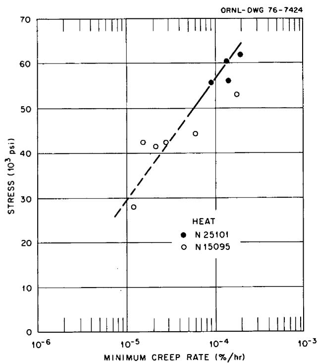  
Fig. 6.35. Creep properties of Hastelloy N at $538^{\circ}\mathrm{C}$ in steam environment.

properties of heat N2 5101. Specimens in the annealed condition tested in steam have shorter rupture times than specimens tested in argon. Specimens in the as-received condition tested in steam have rupture times equal to or greater than specimens tested in argon. The longest rupture time of this heat to date was $12,000\mathrm{hr}$ for a specimen stressed at $48.8\times 10^{3}$ psi in steam at $538^{\circ}\mathrm{C}$ .

The minimum creep rates of both heats of material were plotted as a function of stress (Fig. 6.35). The creep rates are calculated from plots of diametral strain, $\Delta D / D$ , vs time, which are based on measurements of the internal diameter of the specimens at 1000-hr intervals. There is considerable scatter in the data because of difficulty in measuring the internal diameters at the point of maximum strain, but the figure is useful as an indication of the strain rates expected in this stress range. Buildup of scale on the inside diameter exposed to steam also contributes to the inaccuracy of this method since the apparent strain is reduced as the scale thickens.

# 6.8 VAPOR PRESSURE MEASUREMENTS OF METAL TELLURIDES

# S. L. Bennett J. Brynestad

Screening tests were performed to establish whether standard and modified Hastelloys are

embrittled by exposure to tellurium activities defined by the system $\mathrm{Ni}_3\mathrm{Te}_2(\mathrm{s}) + \mathrm{Ni}(\mathrm{s})$ at $700^{\circ}\mathrm{C}$ and $750^{\circ}\mathrm{C}$ ; a knowledge of the tellurium activity (i.e., vapor pressure) under these conditions is important. Arrangements were made to attempt to obtain vapor pressure measurements over the two-phase system of nickel plus $\mathrm{Ni}_3\mathrm{Te}_2$ at $700^{\circ}\mathrm{C}$ by mass spectrometry at Y-12. However, the sensitivity of the instrument was far from satisfactory; a temperature of $850^{\circ}\mathrm{C}$ was required in order to begin to observe the species Te and $\mathrm{Te}_2$ . The experiment did confirm, however, that tellurium monomer and dimer are the only gaseous species present in this system, in accordance with the observations of Weaver and Redman.[14]

Since measureable weight losses were observable with the Mettler Recording Vacuum Thermoanalyzer at about $800^{\circ}\mathrm{C}$ and above, quantitative vapor pressure measurements are being made by this technique. The Knudsen effusion equation,

$$
P _ {\mathrm {T e} _ {2}} = \left(m _ {\mathrm {T e} _ {2}} / 4 4. 3 3 a t\right) \left(T / M _ {\mathrm {T e} _ {2}}\right) ^ {1 / 2}, \tag {1}
$$

relates the partial pressure of the species to the mass of that species of molecular weight $M$ which effuses in time $t$ through an orifice of effective area $a$ at temperature $T$ . A similar expression can be written in terms of the Te monomer. The dissociation equilibrium

$$
\mathrm {T e} _ {2} (\mathrm {g}) = 2 \mathrm {T e} (\mathrm {g}), \tag {2}
$$

for which the equilibrium constant $K_{p} = P_{\mathrm{Te}}^{2} / P_{\mathrm{Te}_{2}}$ , must be simultaneously satisfied. Letting $m = m_{\mathrm{Te}_1} + m_{\mathrm{Te}_2}$ , one can derive the relationship

$$
\begin{array}{l} P _ {\mathrm {T e} _ {2}} = \left\{\left[ K _ {p} / 8 + (m / 4 4. 3 3 a t) (T / M _ {\mathrm {T e} _ {2}}) ^ {1 / 2} \right] ^ {1 / 2} \right. \\ \left. - \left(K _ {p} / 8\right) ^ {1 / 2} \right\} ^ {2}. \tag {3} \\ \end{array}
$$

That is, the partial pressure of one species can be expressed in terms of the experimentally measured total mass loss $m$ and the equilibrium constant. The equilibrium constant as a function of temperature is calculated from Eq. (4):

$$
\begin{array}{l} - R T \Re n K _ {p} = D _ {0} ^ {0} + T \left\{2 \left[ \left(G _ {T} ^ {0} - H _ {0} ^ {0}\right) / T \right] _ {\mathrm {T e}} \right. \\ \left. - \left[ \left(G _ {T} ^ {0} - H _ {0} ^ {0}\right) / T \right] _ {\mathrm {T e} _ {2}} \right\}, \tag {4} \\ \end{array}
$$

where the $(G_T^0 - H_0^0) / T$ terms are the free energy functions and $D_0^0$ is the enthalpy of dissociation of Te2 at $0^\circ \mathbf{K}$ .

The samples are contained in tungsten liners inside a high-density graphite (POCO Grade AXF-5Q) Knudsen cell. The effective orifice area is the product of the cross-sectional area, measured by a photomicroscopic technique, and the Clausing factor, the latter being a function of the ratio of the length to the radius of the orifice.[17]

Silver was vaporized over the temperature region 975 to $1320^{\circ}\mathrm{C}$ , representing a pressure range of $2^{1} / 2$ orders of magnitude. The derived enthalpy at $298^{\circ}\mathrm{K}$ , $\Delta H_{298}^{0}$ , of $67.0\mathrm{kcal~mol}^{-1}$ is in good agreement with the literature value of $67.9\mathrm{kcal~mol}^{-1}$ , verifying the temperature measurements and the general technique.

So far, three experiments have been done with the system $\mathrm{Ni}_3\mathrm{Te}_2$ plus nickel over the temperature region of 800 to $1000^{\circ}\mathrm{C}$ with various effective orifice areas. The logarithm of the calculated $\mathrm{Te}_2$ partial pressures vs reciprocal temperature is shown in Fig. 6.36. If the orifice area is too large, then equilibrium may not be achieved, and the calculated pressures may be too low (Fig. 6.36). Reducing the effective orifice area by a factor of 10 resulted in $\mathrm{Te}_2$ pressures

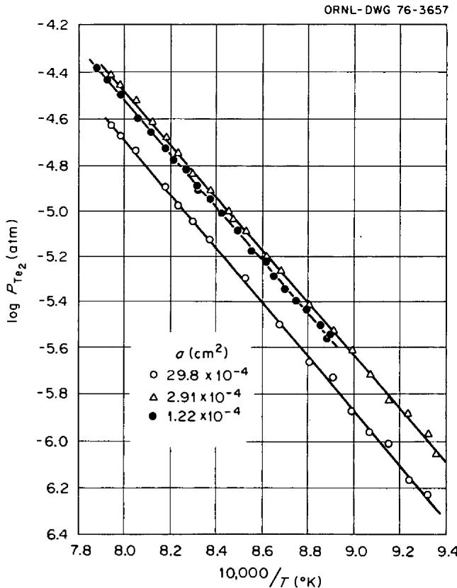  
Fig. 6.36. Clausius-Clapeyron plot of $\mathrm{Te}_2$ partial pressure over $\mathrm{Ni}_3\mathrm{Te}_2 + \mathrm{Ni}$ for several Knudsen cell effective orifice areas.

approximately twice as great. However, on reducing the effective orifice area an additional factor of 2.5, the $\mathrm{Te}_2$ pressures remained unchanged within experimental error. Hence it seems that equilibrium has been achieved in the latter two experiments; some confirmatory experiments are planned for even smaller effective orifice areas. If we tentatively accept the data obtained with an effective orifice area of 2.91 $\times 10^{-4}$ cm $^2$ as representing equilibrium, then extrapolation of the data to $700^{\circ}\mathrm{C}$ gives $P_{\mathrm{Te_2}} = 8\times 10^{-8}$ atm and $P_{\mathrm{Te}} = 2\times 10^{-8}$ atm.

# 6.9 OPERATION OF METAL-TELLURIUM-SALT SYSTEMS

J.R.Keiser E.J.Lawrence

The intergranular cracking of Hastelloy N which was observed in the Molten-Salt Reactor Experiment has been shown to be caused by the fission product tellurium. Because the rate of cracking observed in the MSRE might not be acceptable over the 30-year design life of an MSBR, it was concluded that the MSBR primary containment vessel material should have improved resistance to grain boundary attack by tellurium. To evaluate various alloys and modifications of Hastelloy N for their resistance to tellurium attack, it was necessary to develop tests that would simulate the appearance of tellurium as a fission product in the fuel salt of a reactor. Five experiments are now being conducted to learn more about the behavior of various tellurium compounds in salt and to determine the effect of these telluride-salt mixtures on potential containment vessel materials.

# 6.9.1 Tellurium Experimental Pot No. 1

This system was built to evaluate the use of lithium telluride as a means for adding tellurium to salt which would simulate the production of tellurium by fission. The pot was constructed to permit periodic additions of salt pellets containing small, measured amounts of lithium telluride.

For the first experiment, $\mathrm{Li}_2\mathrm{Te}$ was used in the pellets that were added to the $\mathrm{LiF - BeF_2 - ThF_4}$ salt in the pot. No evidence of a soluble tellurium specimen was found by either chemical analysis or electrochemical examination. A second experiment was conducted using the reportedly more soluble lithium telluride, $\mathrm{LiTe}_3$ . After the pot had been drained, cleaned, and fresh salt added, three pellets containing a total of about $0.1\mathrm{g}$ of $\mathrm{LiTe}_3$ were inserted. During the following three weeks, electro

chemical examinations of the salt by D. L. Manning of the Analytical Chemistry Division revealed no indication of a soluble tellurium species. Since other experiments had shown that metal specimens could be embrittled by tellurium even when tellurium levels in the salt were below chemical detection limits, a Hastelloy N tensile specimen was inserted into the salt and three additional $\mathrm{LiTe}_3$ -salt pellets were added. After about 500 hr the specimen was removed from the salt, tensile tested to failure, and examined metallographically. Intergranular cracking, most probably due to tellurium, was found, indicating that a mechanism exists for transport of tellurium or $\mathrm{LiTe}_3$ through the salt.

# 6.9.2 Chromium Telluride Solubility Tests

The original purpose of this test pot was to measure the solubilities of $\mathrm{Cr_3Te_4}$ and $\mathrm{Cr_2Te_3}$ in LiF $\mathrm{BeF}_2$ -ThF $_4$ salt. First, additions of $\mathrm{Cr_3Te_4}$ were made, and later additions of $\mathrm{Cr_2Te_3}$ were added. Appropriate salt samples were taken at various temperatures, together with follow-up double checks with filtered samples; the results showed that, within the limits of chemical analysis, these compounds were not soluble in salt. However, Hastelloy N specimens exposed to these chromium telluride-salt mixtures, when strained, cracked intergranularly and showed evidence of tellurium on crack surfaces when examined with Auger electron spectroscopy. Consequently, it was decided to expose additional specimens for Auger studies. Eight specially prepared specimens were inserted in the $\mathrm{Cr_2Te_3}$ -salt mixture, and one was removed every 24 hr. The examinations of these specimens are described in Sects. 6.10 and 6.11.

Because of the high rate of attack on specimens in the salt containing $\mathrm{Cr_2Te_3}$ , a second test was started using $\mathrm{Cr_3Te_4}$ , which has a lower tellurium activity. Several modified Hastelloy N alloys with different combinations of niobium, titanium, and chromium were exposed to the salt- $\mathrm{Cr_3Te_4}$ system. Eight standard Hastelloy N specimens for Auger studies were exposed to the salt, and one was removed every 48 hr for the purpose of gaining information about the rate of tellurium attack. All specimens were submitted for examination, and the results are given in Sects. 6.10-6.12.

# 6.9.3 Tellurium Screening Test

A large pot has been constructed for exposing a large number of specimens to a salt-tellurium system in order to compare the resistance of various alloys to tellurium attack. The pot is equipped with a stirring

mechanism, electrochemical probes, and five access ports for insertion of specimens. In late February the pot was filled with about $44\mathrm{kg}$ of $\mathrm{LiF - BeF_2 - ThF_4}$ salt, and a mixture of $\mathrm{Cr}_3\mathrm{Te}_4$ and $\mathrm{Cr}_5\mathrm{Te}_6$ was added. Specimens of 19 alloys have been inserted for a 250-hr exposure, with duplicate sets in the salt and vapor regions. Further studies of potential containment materials will be carried out during the next few months.

# 6.9.4 $\mathrm{Ni}_3\mathrm{Te}_2$ Capsule Test

Results reported by Brynestad $^{21}$ indicated that a Hastelloy N specimen exposed to vapor above $\mathrm{Ni}_3\mathrm{Te}_2$ + nickel for 1000 hr at $700^{\circ}\mathrm{C}$ did not show intergranular cracking. This suggests that the $\mathrm{Ni}_3\mathrm{Te}_2$ + nickel system has a tellurium activity at which Hastelloy N is not attacked. To further evaluate this potentially significant result, a test was designed to expose Hastelloy N tensile specimens to salt containing $\mathrm{Ni}_3\mathrm{Te}_2$ + nickel. A capsule was built and filled with LiF-BeF $_2$ -ThF $_4$ salt. A mixture of 62 at.% nickel-38 at.% tellurium which had been given a high-temperature anneal to promote formation of $\mathrm{Ni}_3\mathrm{Te}_2$ was added to the capsule, and four Hastelloy N specimens were inserted. One specimen was removed after 1000 hr at $700^{\circ}\mathrm{C}$ , strained to failure, and examined metallographically. Contrary to Brynestad's earlier results, extensive intergranular cracking was found. At present, the $\mathrm{Ni}_3\mathrm{Te}_2$ + nickel mixture is being checked to be certain it contains no unreacted tellurium which would give an anomalously high tellurium activity. If the telluride checks out satisfactorily, it must be concluded that even the low tellurium activity associated with nickel + $\mathrm{Ni}_3\mathrm{Te}_2$ causes intergranular attack of Hastelloy N.

# 6.9.5 Chromium-Tellurium-Uranium Interaction Experiment

The research effort to solve the problem of tellurium intergranular attack of Hastelloy N has been almost solely concerned with the development and testing of new alloys. The four experiments previously described in this section are part of the alloy testing program. The possibility of a chemical change in the salt which could alter the extent of attack by tellurium is another manner in which this problem may be approached. It has been suggested by Brynestad that since the chromium activity can be controlled within a certain range by the $\mathrm{U}^{4+}/\mathrm{U}^{3+}$ ratio, it might be possible to control the tellurium activity by the reaction:

$$
\mathrm {C r F} _ {2} + 2 \mathrm {U F} _ {3} + \mathrm {C r} _ {3} \mathrm {T e} _ {4} \rightarrow 4 ^ {\prime \prime} \mathrm {C r T e} ^ {\prime \prime} + 2 \mathrm {U F} _ {4}.
$$

In this equation, "CrTe" is used to denote a telluride species having activity low enough not to promote intergranular cracking.

To check this hypothesis, a salt pot was built, equipped with electrochemical probes, and filled with MSBR fuel salt (LiF-BeF $_2$ -ThF $_4$ -UF $_4$ ). The oxidation potential and the impurity content of the salt were monitored.* Additions of $\mathrm{CrF_2}$ and $\mathrm{Cr_3Te_4}$ were made, and a Hastelloy N specimen was exposed for 500 hr to salt with a $\mathrm{U}^{4+}/\mathrm{U}^{3+}$ ratio of about 90. Metallographic examination of the specimen after deformation showed extensive cracking. To lower the oxidation potential of the salt, a beryllium rod was immersed in the salt for an hour, after which time the $\mathrm{U}^{4+}/\mathrm{U}^{3+}$ ratio had decreased to about 7. Another specimen will be exposed to the salt-telluride mixture, and a comparative evaluation will be made of the extent of intergranular attack.

# 6.10 EXAMINATION OF A HASTELLOY N FOIL SAMPLE EMBRITTLED IN THE MOLTEN-SALT REACTOR EXPERIMENT

R.E.Clausing L.Heatherly

Surveillance specimens of Hastelloy N removed from the MSRE in late 1969 were observed to form shallow intergranular surface cracks when they were strained in postirradiation tests. Examination of several components of the MSRE after operation of the test reactor was terminated revealed that all surfaces in contact with the fuel salt were embrittled to depths of 100 to $250\mu \mathrm{m}$ . Investigations of samples from the MSRE and bench tests gave strong support to the hypothesis that the fission product tellurium caused the embrittlement by diffusion preferentially along the grain boundaries where it caused grain boundary embrittlement.[22] However, it was not possible at that time to provide conclusive direct evidence that tellurium caused the observed embrittlement.

A piece of Hastelloy N foil about $100\mu \mathrm{m}$ thick which had been attached to one of the surveillance assemblies was severely embrittled by exposure in the MSRE; this occurrence provided an opportunity to use recently developed high-resolution Auger electron spectroscopic techniques to determine the composition of the grain boundaries in some detail, as described below.

# 6.10.1 Sample History

A piece of thin Hastelloy N (heat 5075) sheet was attached to a strap on the fourth group of surveillance specimens which was exposed to the MSRE core 7203 hr at temperatures above $500^{\circ}\mathrm{C}$ . The material was rolled to a thickness of $100\mu \mathrm{m}$ and annealed $0.5\mathrm{hr}$ at $1180^{\circ}\mathrm{C}$ prior to insertion in the MSRE. The chemical composition of the material is given in Table 6.16. The total thermal neutron fluence is estimated to have been $5.1\times 10^{22}$ neutrons/cm², and a detailed account of the thermal and radiation history of this group of surveillance specimens can be found in ref. 22. About 6000 hr of the exposure was at $650^{\circ}\mathrm{C}$ , and 3000 hr was in contact with fuel containing fresh fission products.

The foil was wrapped around a thicker Hastelloy N strap to hold it in place; thus the outside of the foil was exposed to flowing salt and the underside to salt that flowed less rapidly. The foil was severely embrittled and broke while being removed from the strap. Micrographs of the foil are included in ref. 22. In some bent areas, cracks formed which often extended completely through the foil. The sample used in this study was from a straight unstressed region which presumably had few, if any, open cracks. Detailed examination confirmed that the area examined was indeed a fresh fracture not previously open to air.[23] The size of the sample was about $0.3\mathrm{cm}$ wide $\times 1$ cm long $\times 100~\mu \mathrm{m}$ thick. The sample radioactivity was less than $1\mathrm{R / hr}$ at contact.

# 6.10.2 Sample Fracture and Analysis Techniques

The sample was extremely brittle and was therefore easily fractured by applying a bending force in the protective ultrahigh vacuum environment of the Auger analysis system. The residual gas pressure in the system was below $1 \times 10^{-10}$ torr at the time of fracture, and the release of helium as the sample fractured was monitored to provide an estimate of

Table 6.16. Average composition of MSRE foil sample   

<table><tr><td rowspan="2">Element</td><td colspan="2">Basis</td></tr><tr><td>wt %</td><td>at. %</td></tr><tr><td>Mo</td><td>16.4</td><td>10.5</td></tr><tr><td>Ni</td><td>Balance</td><td>75.3</td></tr><tr><td>Cr</td><td>6.6</td><td>7.8</td></tr><tr><td>C</td><td>0.07</td><td>0.25</td></tr><tr><td>Fe</td><td>4.0</td><td>4.4</td></tr><tr><td>Mn</td><td>0.46</td><td>0.51</td></tr><tr><td>Si</td><td>0.58</td><td>1.26</td></tr></table>

the concentration of helium in the grain boundaries. The system used for these studies has been described previously.[24,25]

The Auger analysis of the sample began within a few minutes after the fracture to avoid errors due to absorption of gases on the fracture surface. An electron beam about $5\mu \mathrm{m}$ in diameter with a current of $\sim 0.5\mu \mathrm{A}$ at 4 to $10\mathrm{keV}$ was used for these measurements.

# 6.10.3 Observations

Figure 6.37 shows the helium partial pressure in the system during the time of the fracture. Under the conditions of this measurement the initial increase in helium pressure times the volume of the system gives the amount of helium released. The exponential pressure decay after the fracture is simply the characteristic system pump down for helium after admission of the gas pulse and is in agreement with the previously measured rates. The amount of gas released was enough to fill $3.4\%$ of the grain boundary sites exposed if we assume a surface roughness factor of two (i.e., the actual area of the fracture is assumed to be twice as large as the cross section of the sample since the fracture surface is not smooth and planar).

Figures 6.38 and 6.39 show scanning electron micrographs of the fracture surfaces and identify the areas analyzed. The fracture was completely intergranular and along grain boundaries filled with

carbide precipitate particles. There is no evidence of deformation in these micrographs. The fracture is apparently along the interface between the matrix and the carbide precipitates rather than through the carbides. This was confirmed by the change in the composition as a function of depth below the exposed fracture surface.

Several types of Auger analyses were made including (1) two-dimensional elemental maps, which can be directly compared with scanning electron micrographs; (2) line scans, which are graphic outputs of the Auger signal strength as a function of position along a line across the sample; and (3) complete Auger spectral analysis in a selected area of the sample surface. These measurements become progressively more quantitative in the order listed. Reference 23 has a complete set of the maps, line scans, and point analyses made on this sample. Figure 6.40 is a composite of several maps showing the distribution of tellurium, nickel, and molybdenum on the as-fractured surface. These images are of the area shown in Fig. 6.38a. Topographical features may be identified in the absorbed sample current image and easily related to the SEM images. These SEM images provide information on the microstructural features of the fracture surface. The topographical information in the elemental maps helps to orient the map relative to the absorbed sample current and SEM images but makes the map less quantitative. Nevertheless the strong, uniformly intense tellurium

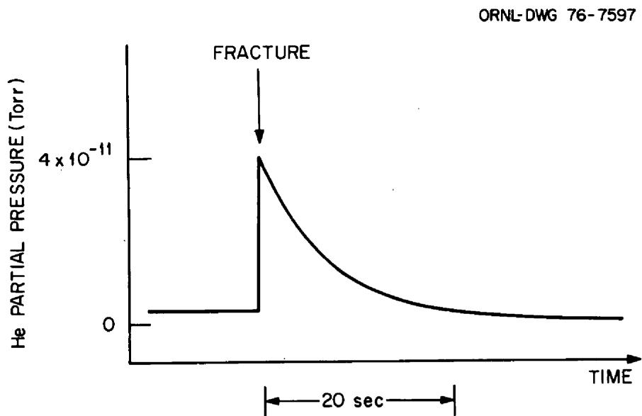  
Fig. 6.37. Helium release during fracture of the MSRE foil sample. The amount of helium released is estimated to be equal to about $3.4\%$ of the grain boundary sites exposed during the fracture.

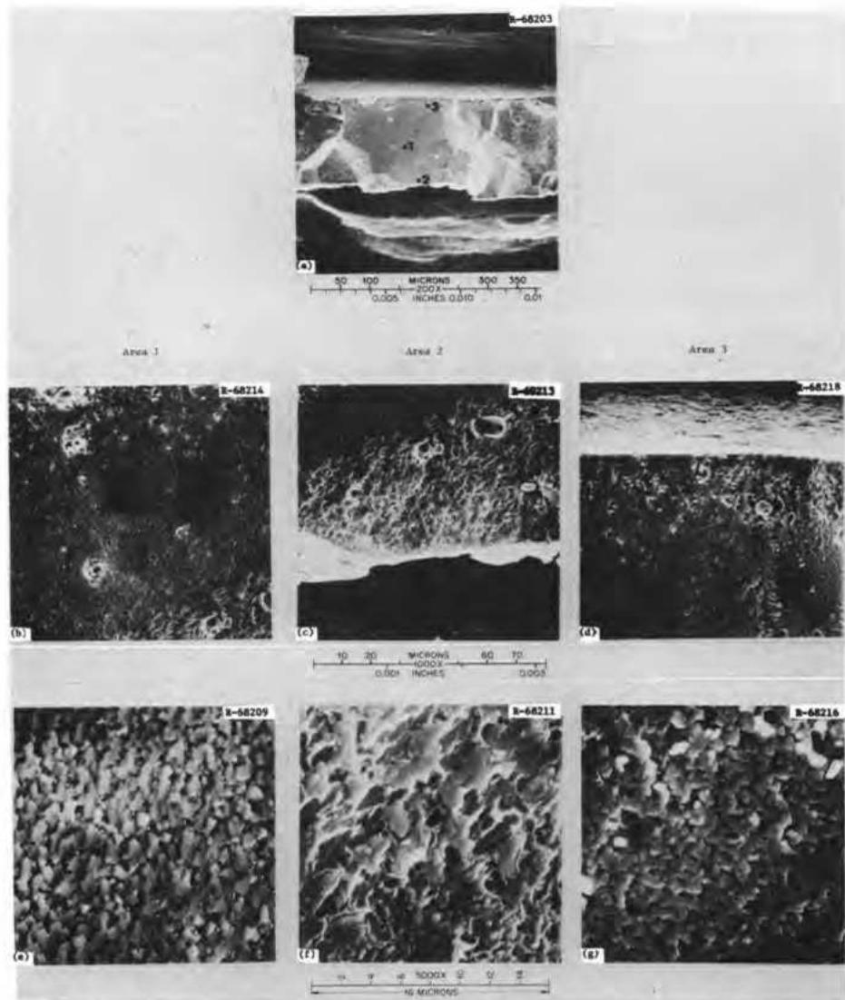  
Fig. 6.38. Scanning electron micrographs of part of the fracture surface of the MSRE sample. (a) The $200\times$ magnification shows a particularly interesting area where one grain goes entirely through the thickness of the foil, and the exposed surface is nearly flat and perpendicular to the original foil surface. The numbers on the figure indicate areas investigated in detail and shown at higher magnification - at $1000\times$ in parts $(b)$ , $(c)$ , and $(d)$ and at $5000\times$ in parts $(e)$ , $(f)$ , and $(g)$ . Note that these images reveal that the grain boundary is lined with small particles (likely carbides) and that they appear to almost completely fill the grain boundary area. The fracture appears to be simply a separation of the particles from the matrix with little or no ductile behavior.

signal from the entire fracture surface of this sample is evident. The molybdenum and tellurium maps show similar distributions, while the nickel map shows a distribution somewhat complementary to that of molybdenum and tellurium. This is best seen in the central region slightly to the right and left of the area labeled 1. The similarity of the tellurium and molybdenum distributions and the complementary nickel distribution is easily seen in the line scans shown in Fig. 6.41. These scans are along the path indicated by the vertical white trace in Fig. 6.40. Similar relationships have been noted among other samples.

Complete Auger analyses of several selected spots were made immediately after the sample was fractured. Figure 6.42a shows the Auger spectrum from the center of the sample in area 1 shown in Fig. 6.38, and this was also typical of spectra taken in areas 2, 3, and 4. The strong tellurium Auger signals are evident. The compositions (in atomic percent) in areas 1 through 4 are listed in Table 6.17. Figure 6.42 compares the Auger spectra taken from area 1 immediately after fracturing the sample and the composition at the same area taken after sputter etching was used to determine the distribution of tellurium as a function of depth below the original

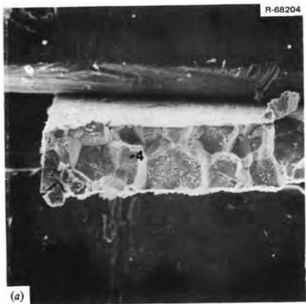

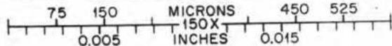

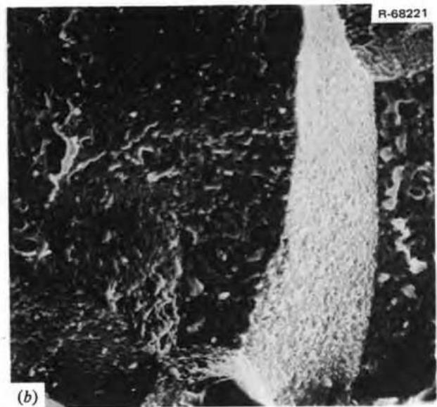

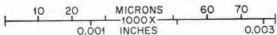

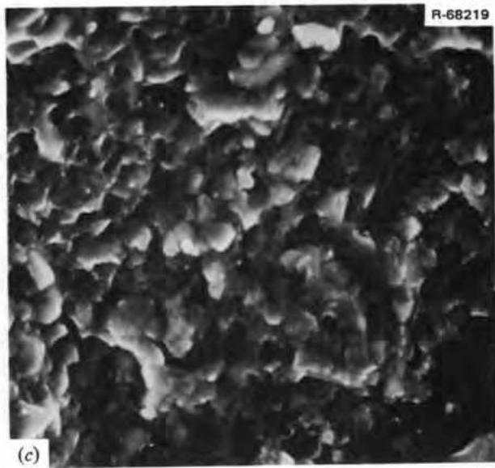

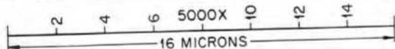  
Fig. 6.39. Scanning electron micrographs of a part of the fracture surface of the MSRE sample immediately to the left of the area shown in the previous figure. (a) The $160\times$ magnification shows a more typical cross section through the foil with two grain diameters across the foil thickness. Higher magnification images of area 4 are shown in parts $(b)$ and $(c)$ , at $1000\times$ and at $5000\times$ respectively. They show a somewhat rougher fracture surface than that shown in Fig. 6.38. In this case, some of the particles appear to remain on the observed surface while others are partially pulled out and still others appear to have adhered to the other half of the fracture interface. This would be expected when the adhesion of the particles is more or less equal between the grain on either side of the boundary. This adhesion is quite likely a function of crystallographic morphology, depending perhaps on the details of tellurium embrittlement as well as the mechanical properties of the embrittled interface. None of the particles appear to be fractured; instead, they have separated from the matrix. The particles in this region appear to be more or less equiaxed, while those shown in Fig. 6.38 are more platelike. Note especially the comparison between Fig. 6.39c and Fig. 6.38g. In Fig. 6.38g, some of the flat particles have been pulled out, leaving shallow flat-bottomed depressions.

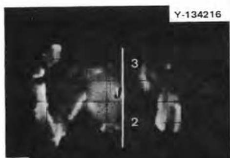  
(a)

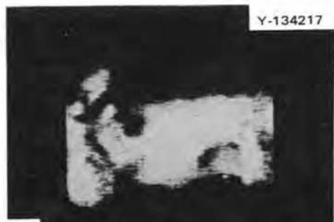  
(b)   
Te (483 eV)

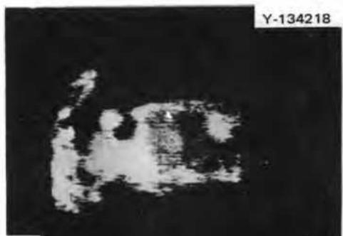  
(c)

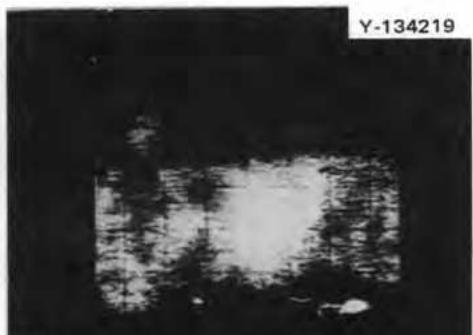  
(d)   
Mo (221 eV)

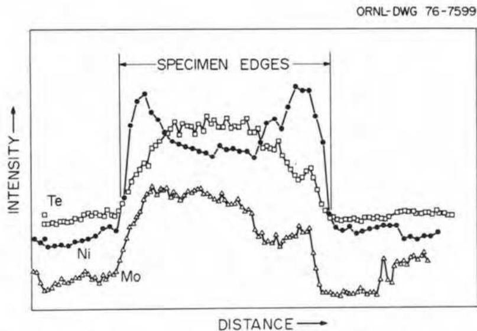  
Fig. 6.40. This composite shows $(a)$ an absorbed sample current image of the region shown in Fig. 6.38 and elemental maps of this region obtained using Auger electron images for $(b)$ tellurium (483 eV), $(c)$ nickel (848 eV), and $(d)$ molybdenum (221 eV). All images are at about $250\times$ . Note the rather uniform tellurium composition over the entire surface, the superposition of topographical features on the image, and the somewhat complementary nature of the tellurium and nickel maps in the regions to the right and left of point 1.   
Fig. 6.41. This composite shows Auger signal intensity along the line shown in Fig. 6.40a. The scan proceeds from top to bottom of the image and from left to right on the figure. The intensity of the signals is modulated by both topography and composition so that both features appear in these plots; however, it is quite apparent that the tellurium and molybdenum signals vary in the same general way, while the nickel signal contains the same topographical features but is somewhat complementary to the tellurium and molybdenum scans.

ORNL-DWG 76-7598

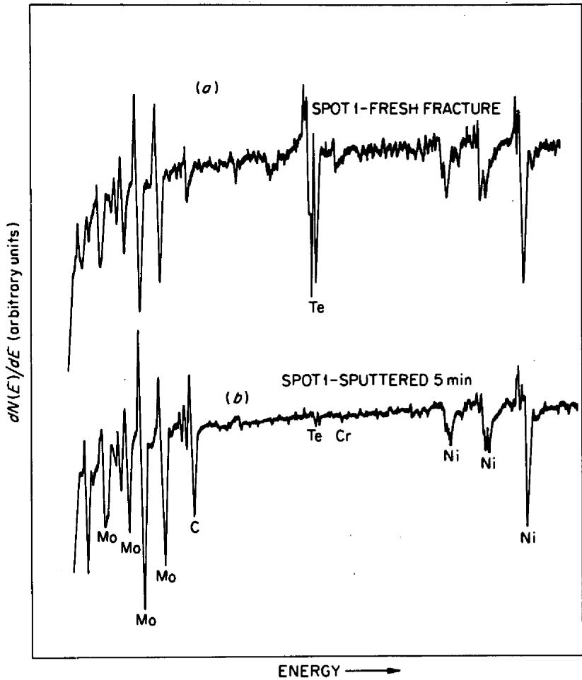  
Fig. 6.42. Auger spectra taken from the center of the area of the sample shown in Fig. 6.37 near the spot marked 1. The upper spectrum labeled $(a)$ was obtained immediately after the sample was fractured, while $(b)$ was taken after sputtering about five atom layers from the exposed fracture surface. The tellurium peaks are quite prominent in spectrum $(a)$ and represent about 14 at. $\%$ tellurium on the surface, but tellurium is almost undetectable in spectrum $(b)$ , indicating that the tellurium was nearly completely removed by the ion etching of only five atomic layers from the surface. The other elements remain high. The molybdenum and carbon actually increase, as they should if bulk carbides were uncovered by removing the tellurium.

fracture surface. Table 6.18 is a tabulation of data taken from several spots during sputter etching, and Fig. 6.43 is a graphical representation of the changes in composition near spot 4.

# 6.10.4 Discussion of Observations

The release of helium from this sample when it fractured was estimated to be sufficient to fill about $3.4\%$ of the grain boundary sites exposed by the fracture. The most likely sources of this helium is the ${}^{10}\mathbf{B}(n,\alpha)^7\mathrm{Li}$ reaction. Boron is present in the grain boundaries of the Hastelloy N as the result of the melting practice and heat treatment of the alloy prior to irradiation and will also be concentrated in the carbides formed during irradiation. This amount of

helium should not be enough to cause the observed intergranular embrittlement at room temperature. If it were, severe embrittlement would have been found throughout the entire thickness of surveillance samples and other Hastelloy N parts from the MSRE. This was not the case, and it can be concluded that this level of helium in the grain boundaries is not severely detrimental to the mechanical properties at room temperature.

The fracture surface was completely intergranular. There was no reduction of area at the fracture site, and no significant plastic deformation was apparent in the scanning electron micrographs. The appearance of the fracture surface suggests that the grain boundaries were filled with precipitates and that the

Table 6.17. Auger electron spectrographic (AES) analysis of MSRE foil sample   

<table><tr><td rowspan="2">Spot numberb</td><td colspan="5">Element (at. %)c</td></tr><tr><td>Te</td><td>Mo</td><td>Ni</td><td>Cr</td><td>C</td></tr><tr><td>1</td><td>12.6</td><td>32.5</td><td>29.8</td><td>4.4</td><td>20.7</td></tr><tr><td>2</td><td>9.0</td><td>17.5</td><td>46.8</td><td>5.9</td><td>20.7</td></tr><tr><td>3</td><td>10.6</td><td>18.2</td><td>43.8</td><td>5.1</td><td>22.4</td></tr><tr><td>4d</td><td>12.3</td><td>6.8</td><td>54.6</td><td>5.8</td><td>20.5</td></tr></table>

Grain boundary regions exposed by fracture in AES system.   
$b$ See Fig. 6.38.   
${}^{c}$ Values are derived using technique and sensitivities from Handbook of Auger Electron Spectroscopy, Physical Electronics Industries, Inc., 1974, and normalized so that the reported values total ${100}\%$ during analysis.   
$d_{\text{Carbon}}$ adjusted to compensate for contamination during analysis.

Table 6.18. Auger electron spectrographic analysis of sputtered MSRE foil sample   

<table><tr><td rowspan="2">Area</td><td rowspan="2">Sputter time (min)</td><td colspan="5">Element (at. %)</td></tr><tr><td>Te</td><td>Mo</td><td>Ni</td><td>Cr</td><td>C</td></tr><tr><td>1</td><td></td><td>12.6</td><td>32.5</td><td>29.8</td><td>4.4</td><td>20.7</td></tr><tr><td>1</td><td>5</td><td>0.6</td><td>31.0</td><td>21.0</td><td>1.3</td><td>46.2</td></tr><tr><td>1</td><td>20</td><td></td><td>37.0</td><td>20.9</td><td>1.6</td><td>40.6</td></tr><tr><td>1</td><td>60</td><td></td><td>26.7</td><td>20.8</td><td></td><td>48.1</td></tr><tr><td>1</td><td>150</td><td></td><td>26.9</td><td>19.1</td><td>2.1</td><td>51.3</td></tr><tr><td>2</td><td></td><td>9.0</td><td>17.5</td><td>46.9</td><td>5.9</td><td>20.7</td></tr><tr><td>2</td><td>20</td><td></td><td>22.2</td><td>35.6</td><td>3.3</td><td>38.9</td></tr><tr><td>2</td><td>60</td><td></td><td>19.3</td><td>27.8</td><td>2.6</td><td>49.1</td></tr><tr><td>2</td><td>150</td><td></td><td>16.1</td><td>34.1</td><td>3.4</td><td>44.6</td></tr><tr><td>4</td><td></td><td>12.3</td><td>6.8</td><td>54.6</td><td>5.8</td><td>20.5</td></tr><tr><td>4</td><td>5</td><td>0.5</td><td>16.6</td><td>49.1</td><td>4.4</td><td>29.3</td></tr><tr><td>4</td><td>20</td><td></td><td>21.9</td><td>45.6</td><td>3.2</td><td>29.3</td></tr><tr><td>4</td><td>60</td><td></td><td>13.1</td><td>40.7</td><td>3.1</td><td>43.3</td></tr><tr><td>4</td><td>150</td><td></td><td>15.9</td><td>40.6</td><td>2.6</td><td>40.4</td></tr></table>

fracture occurred between the precipitates and the matrix. Figures 6.38e and $g$ show areas where most of the particles were retained in the surface examined. These areas are rich in molybdenum and carbon (Table 6.17). In some areas, some particles have apparently been pulled from the surface examined (Figs. 6.38f and 6.39c). Areas such as these tend to have somewhat less molybdenum and carbon and to be richer in nickel; hence the complementary nature of the elemental images and line scans reveals the presence of carbides and shows the surfaces to which they adhere. In no case have we seen fractured

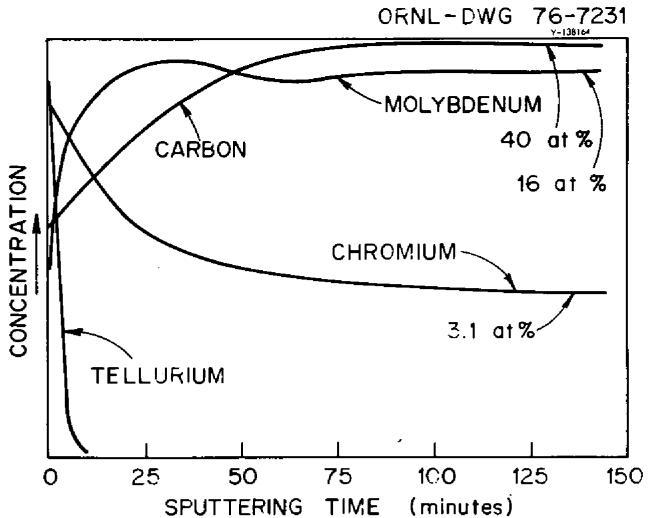  
(APPROXIMATELY 1 ATOM LAYER REMOVED/MINUTE)   
Fig. 6.43. Auger signal intensity as a function of sputtering time. These curves show the change in concentration of several elements as a function of depth below the original fracture surface. The numbers at the 150-min point give the estimated atomic percent at a depth estimated to be 150 atomic layers below the original fracture surface. These data are from the area near point 4 on Fig. 6.39,

precipitate particles. There is no doubt that these precipitates are carbides since the fracture surfaces are rich in molybdenum and carbon and the concentrations of these elements remain high after sputter etching (Table 6.18 and Fig. 6.43) which indicates an average bulk composition in the vicinity of the fracture surface consistent with the presence of large amounts of carbide precipitates. The presence of the carbides in the boundaries reduces the ductility and tends to promote intergranular fracture, but not to the extent observed here. Many samples of standard Hastelloy N, including both irradiated and unirradiated control samples, have grain boundaries containing carbides and still retain elongations greater than $30\%$ and reductions in area greater than $20\%$ (ref. 22). Many of the samples exposed in the case of the MSRE show extensive intergranular surface cracking while maintaining good overall ductility, a fact which further supports the argument that the carbide precipitation in the grain boundaries is not the cause of the observed embrittlement. This last observation also argues that a combination of carbide precipitation and helium generation does not cause the observed embrittlement.

The Auger electron spectrum from the fracture surface, Fig. 6.42a, shows the presence of large amounts of tellurium. The concentrations reported in Table 6.17 are based on the assumption of uniform

composition in the substrate. In the case of a monolayer or less of contaminant on an interface that is torn apart during the sample fracture, the concentrations obtained would be too small by more than a factor of 2. In this case the real concentration at the interface could be substantially greater than 30 at. $\%$ . The composition-depth profile in Fig. 6.43 shows that the very large tellurium concentration on the as-fractured surface does not extend into the bulk; thus, tellurium is present in large amounts on the fracture surface but is concentrated very strongly at the grain boundary interfaces and may indeed be present as a fractional monolayer at the grain boundary. It is known from previous experiments $^{24}$ that grain boundaries in Hastelloy N can be embrittled by tellurium at levels below those observed here. No other fission products or other embrittling agents were detected on the fracture surface, and one must conclude that tellurium does cause the observed intergranular embrittlement of Hastelloy N in the MSRE.

# 6.11 HIGH-RESOLUTION FRACTOGRAPHY OF HASTELLOY N ALLOYS EXPOSED TO TELLURIUM

D. N. Braski

This investigation is aimed at providing additional information concerning the mechanism of tellurium embrittlement of Hastelloy N alloys. Of particular interest were the fractographic details of samples exposed in several different ways to tellurium. These details were revealed by use of a modern transmission electron microscope with a high-resolution scanning attachment. The results for two standard Hastelloy N (heat 405065) samples are presented first, followed by the results for two modified alloys. Although different delivery systems were used, the same tellurium source, $\mathrm{Cr_3Te_4}$ at $700^{\circ}\mathrm{C}$ , was used in all tests. After exposure to tellurium the samples were tensile tested to failure at room temperature. During the test a number of cracks opened up along the gage lengths of the samples. The number and depth of cracks were measured optically on metallographically prepared sections. Table 6.19 lists the alloy, heat treatment, and tellurium exposure for each sample. Details of the exposure tests may be found in Sects. 6.9 and 6.12.

The first sample, 79-43, was actually a smaller Auger spectroscopy specimen that was exposed for $190\mathrm{hr}$ to molten salt saturated with $\mathrm{Cr_3Te_4}$ . A high-temperature solution anneal was previously done on

this sample to grow large grains for the Auger studies. After testing, the fracture mode was observed at relatively low magnification to be intergranular (Fig. 6.44a). Tellurium was detected in area X by both Auger and energy-dispersive x-ray spectroscopy (EDS). Higher-magnification micrographs of area X are shown in Figs. 6.44b and c. The nodular features present on the surface were similar to those observed in other materials that failed from stress corrosion or hydrogen embrittlement.[26] These nodular features were probably corrosion products that contained tellurium. Several faceted areas were also observed at points A and B in Fig. 6.44c. Faceting is characteristic of brittle failure and has previously been observed in iron-tellurium alloys.[27] Figure 6.44d is a higher-magnification fractograph taken of area Y, in which no tellurium was detected. This area displayed some ductility during fracture, as evidenced by the dimpled surface caused by microvoid coalescence. The microvoids were initiated by the particles located at the bases of the dimples. These particles were probably the $\mathrm{M}_{6}\mathrm{C}$ -type carbides that are usually found in the grain boundaries of this alloy.

Standard Hastelloy N was also exposed to the vapor above $\mathrm{Cr_3Te_4}$ at $700^{\circ}\mathrm{C}$ in a closed system (see SN 13515 in Table 6.19 for conditions). The fracture mode for this sample was complicated and difficult to analyze. The central areas were dimpled (Fig. 6.45a). Areas near the edge of the sample showed mixed modes of fracture (Figs. 6.45b, c, and d). Near the specimen edge in Fig. 6.45b, the first area resembles a cleavage fracture with small steps. For the area further in, the mode shows characteristics of ductile fracture as evidenced by the dimples. At the base of these dimples is unusual microfaceting (Fig. 6.45c, at X and what appears to be a second-phase or corrosion product (Fig. 6.45c and d, at Y. This latter area also shows an unusual geometric faceting. Other, more conventional looking particles were found in the same area (Fig 6.45b at Z); these may be $\mathbf{M}_6\mathbf{C}$ -type carbides or possibly corrosion product. Information on the composition and structure of these phases has not yet been obtained. Initial EDS analyses did not detect any tellurium in any of these areas, but that does not preclude the possibility of small concentrations being present.

Faceting has now been observed in both standard Hastelloy N samples using two different tellurium delivery systems and therefore may be a characteristic of tellurium embrittlement in this material. As mentioned previously, Rellick et al.[27] found extensive faceting in an iron-tellurium alloy which was cooled slowly from an austenitizing temperature of $925^{\circ}\mathrm{C}$ .

Table 6.19. Tellurium exposure conditions and tellurium susceptibility   

<table><tr><td>Specimen number</td><td>Heat number</td><td>Solution anneal</td><td>Tellurium exposure</td><td>Exposure time (hr)</td><td>Exposure temperature (°C)</td><td>Cracks (number/cm)</td><td>Average crack depth (μ)</td></tr><tr><td>79--43</td><td>405065</td><td>2 hr at 1260°C</td><td>Molten salt (LiF + BeF2 + ThF4) + Cr3Te4</td><td>190</td><td>700</td><td colspan="2">Auger sample – not analyzed for number and depth of cracks</td></tr><tr><td>SN 13515</td><td>405065</td><td>1 hr at 1177°C</td><td>Cr3Te4 vapor</td><td>1000</td><td>700</td><td>94</td><td>44.5</td></tr><tr><td>SN 15728</td><td>413 (1% Nb + 1% Ti)</td><td>1 hr at 1177°C</td><td>Molten salt + Cr3Te4</td><td>243</td><td>700</td><td>102</td><td>37.4</td></tr><tr><td>SN 15725</td><td>411(1% Nb)</td><td>1 hr at 1177°C</td><td>Molten salt + Cr3Te4</td><td>243</td><td>700</td><td>17</td><td>30.5</td></tr></table>

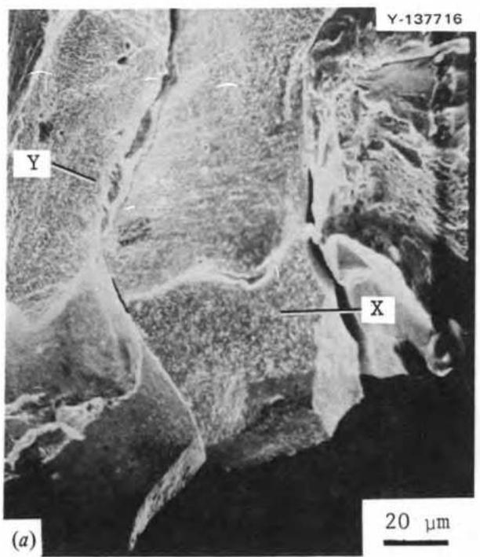

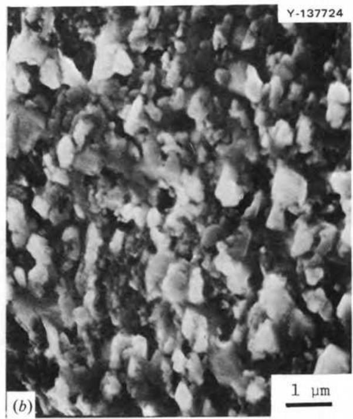

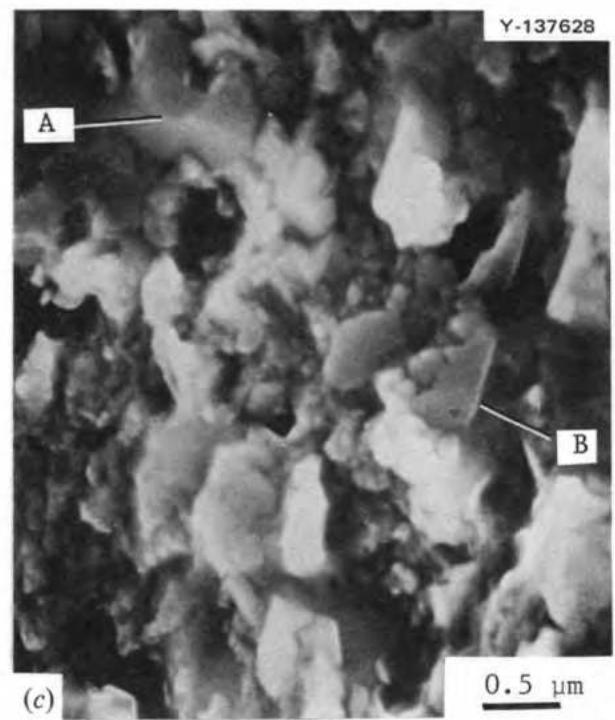

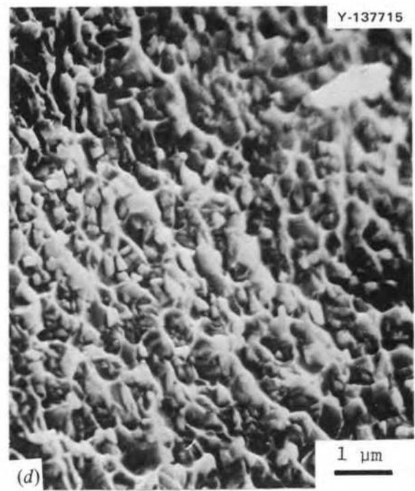  
Fig. 6.44. Fractograph of standard Hastelloy N (heat 405065) after $190\mathrm{hr}$ in molten salt $+\mathrm{Cr_3Te_4}$ and tensile testing at room temperature. Parts $a, b,$ and $c$ were taken near the fracture edge, and part $d$ is a middle region.

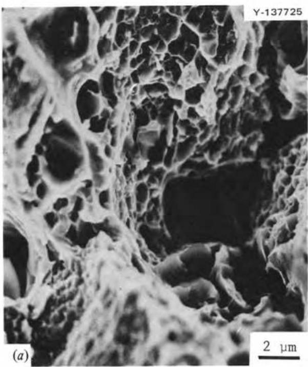

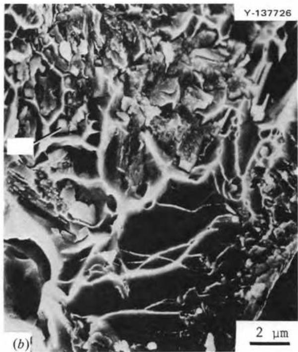

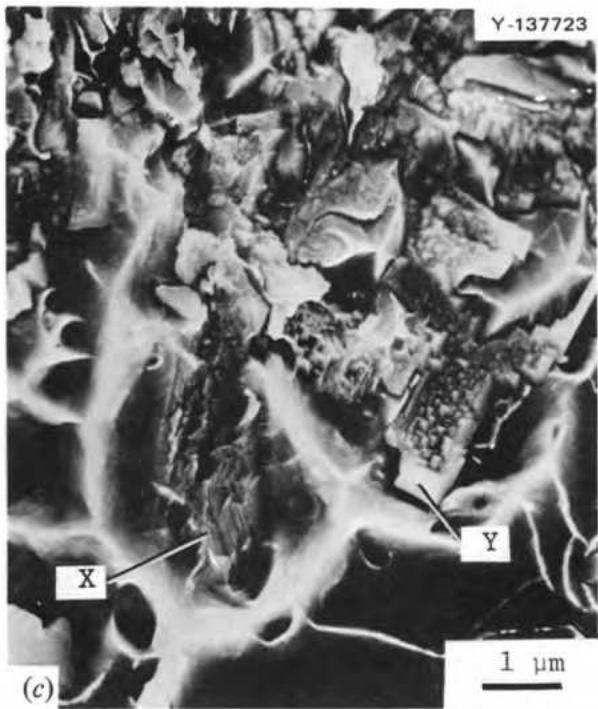

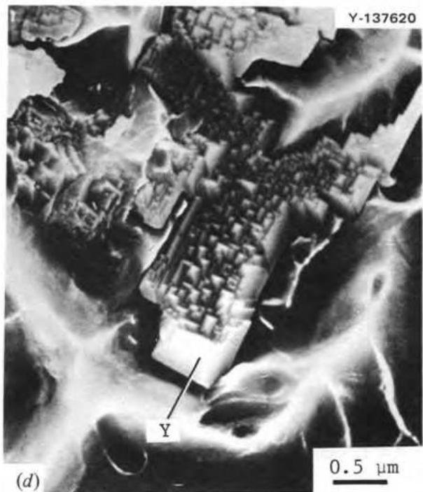  
Fig. 6.45. Fractographs of standard Hastelloy N (heat 405065) after $1000\mathrm{hr}$ in $\mathrm{Cr_3Te_4}$ vapor at $700^{\circ}\mathrm{C}$ and tensile testing at room temperature. Part $a$ is a middle region, and parts $b$ , $c$ , and $d$ are views at the fracture edge.

However, Henry et al.28 observed faceting in nickel fractures after thermal treatments between 650 and $800^{\circ}\mathrm{C}$ There was no tellurium present in the system of these workers; they attributed the faceting to the absorption of oxygen in the grain boundaries. Since decarburized layers have been observed in some of our Hastelloy N samples, it is possible that oxygen as well as tellurium influenced the fracture mode near the surface. Other evidence in support of this idea is presented in Fig. 6.46. This micrograph was taken from a transverse section of pilgered (tube-reduced) $2\%$ titanium-Hastelloy N which had been heated at $538^{\circ}\mathrm{C}$ for $6\mathrm{hr}$ and air cooled. This particular treatment caused fire cracking of the material. Note that the mode of cracking through the decarburized layer was mixed transgranular and intergranular, while it was entirely intergranular beyond the layer. The difference in fracture in this case was probably caused as much by the absence of carbides in the grain boundary as by the presence of absorbed oxygen. Thus, decarburization can be a factor in the fracture mode of thermally treated Hastelloy N and should be considered when interpreting the present investigation.

The fractures of two modified Hastelloy N alloy were compared. The first, alloy 411, contained $1\mathrm{wt}\%$ niobium and was considerably more resistant to tellurium attack than the second, alloy 413, which contained $1\mathrm{wt}\%$ niobium plus $1\mathrm{wt}\%$ titanium

(Table 6.19). Both alloys demonstrated intergranular fracture modes in the central portions of the samples (Figs. 6.47a and b). One normally associates low ductility with intergranular fracture, but alloys 411 and 413 had total elongations of $54.8\%$ and $45.8\%$ respectively. The fracture surfaces illustrate this ductile behavior by the dimpling on surfaces normal to the tensile load and striations on the surfaces parallel to the tensile load. The striations are characteristic of an extended slip process or glide. The areas more affected by the tellurium were at the outside edges. Figure 6.48a shows fractographs of an area near the edge of the 411 sample. The fracture mode was also intergranular, but the surface features reflect a more brittle behavior. Higher magnification of this area showed the absence of dimples and the presence of corrosion products (Fig. 6.48b). The tiny holes in this surface (Fig. 6.48c) were created by the pullout of carbide particles or possibly a corrosion product. Tellurium was not detected on the surfaces in Fig. 6.48 using EDS. Examination of alloy 413 near the outside fracture edge revealed a tendency for this material to fail along the precipitate-matrix interface of the grain boundary (Fig. 6.49). This series shows an array of dendritic precipitates lying on the grain boundary which were aligned preferentially in crystallographic directions. The angles between dendrites were not measured accurately, but they would appear to correspond to the angles between

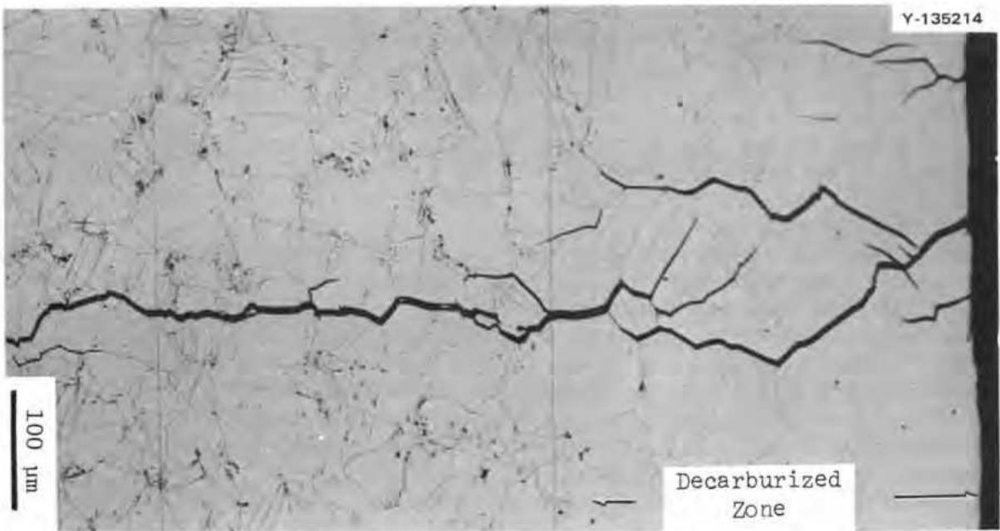  
Fig. 6.46. Transverse section of $2\%$ titanium-modified Hastelloy N annealed at $538^{\circ}\mathrm{C}$ for 6 hr and air cooled. Firecracking is due to thermomechanical treatments.

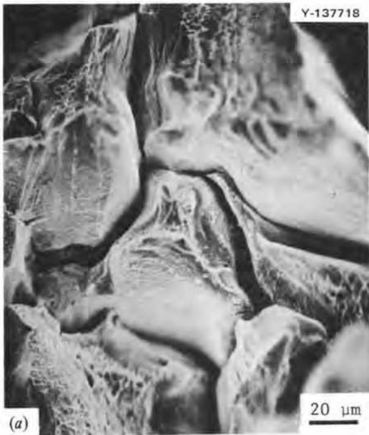

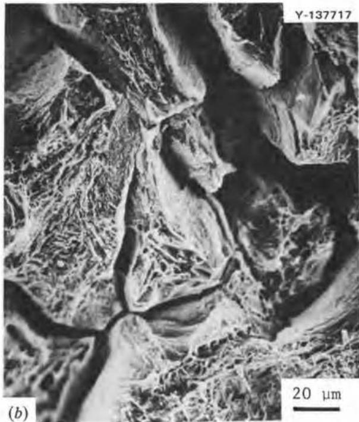  
Fig. 6.47. Fractographs from central region of alloys 411 (a) and 413 (b) fracture surfaces after 243 hr in molten salt + Cr₃Te₄ and tensile testing at room temperature.

intersecting (111) planes. These are the habit planes for the MC-type carbides which are found in the alloy, where (111) $\mathrm{MC}||$ (111) matrix. Evidence suggests an epitaxial relationship between the dendrite particles and the matrix (Fig. 6.49a). The dendrite particles were found to end abruptly at the twin boundary. Close inspection of the twin band showed that similar particles were originally present but were retained in the mating fracture surface. The orientation of the peaks of the dendrite pyramids in the twin band was opposite to those in the adjacent area (Fig. 6.49b). Since no tellurium was detected by EDS in any of the areas in Fig. 6.49, one might presume that only extremely small amounts of tellurium are needed to weaken the grain boundaries. This conclusion agrees with Auger spectroscopy studies[29] that find tellurium in small quantities (<10 at. %) and monolayer thicknesses on tellurium-exposed Hastelloy N fractures.

In summary, high-resolution scanning electron microscopy has characterized the fracture surfaces of several Hastelloy N samples which had been embrittled by exposure to tellurium at $700^{\circ}\mathrm{C}$ . The central regions, which were apparently not affected by the tellurium, generally demonstrated a highly ductile intergranular failure. Regions near the outer edge (the specimen surface) were affected by the

Tellurium exposure and failed in a brittle intergranular mode. Minute features of the fracture surface in this latter region varied among alloys; these features included microfaceting, cleavage, and a number of unusual second-phase particles and corrosion products. The observation of faceting in Hastelloy N is particularly interesting because it has been seen by other investigators in iron-tellurium alloys. The effect of oxygen, either absorbed in the grain boundary or involved in decarburization, may also have influenced the fracture mode at the outer edge. Tellurium was detected by EDS on the fracture surfaces of one 405065 sample exposed to molten salt plus $\mathrm{Cr_3Te_4}$ but was not found in the same alloy exposed to $\mathrm{Cr_3Te_4}$ vapor or the tetanium-modified or titanium plus niobium-modified alloys.

# 6.12 METALLOGRAPHIC EXAMINATION OF SAMPLES EXPOSED TO TELLURIUM-CONTAINING ENVIRONMENTS

H. E. McCoy

B. McNabb

J.C.Feltner

Samples of modified Hastelloy N were exposed to tellurium-containing environments. These samples were deformed to failure at $25^{\circ}\mathrm{C}$ , a procedure which forms surface cracks if the grain boundaries are

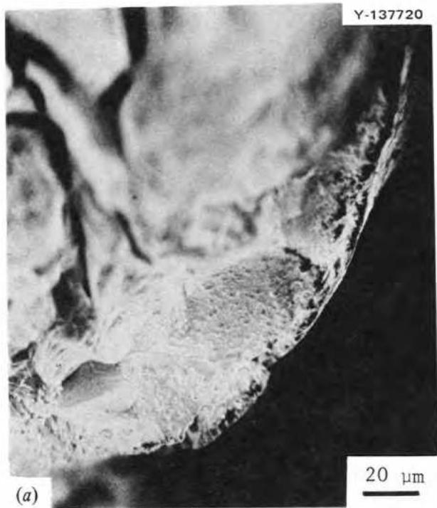

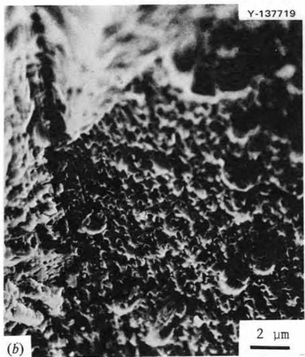

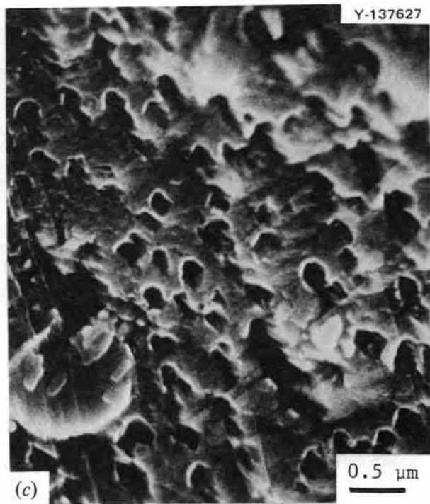  
Fig. 6.48. Fractographs of alloy 411 (Hastelloy N modified with $1\%$ titanium) after 243 hr in molten salt + $\mathrm{Cr_3Te_4}$ followed by tensile testing at room temperature.

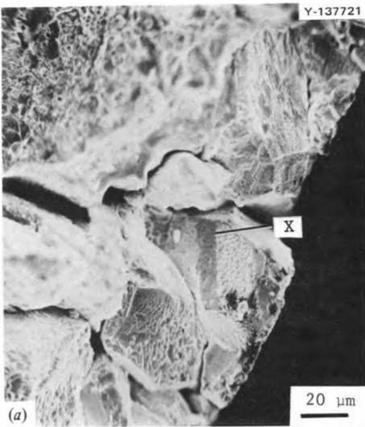

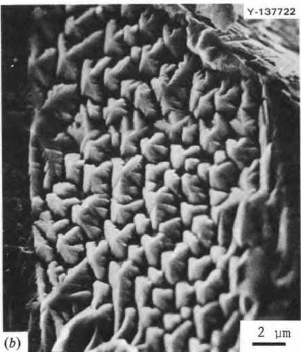

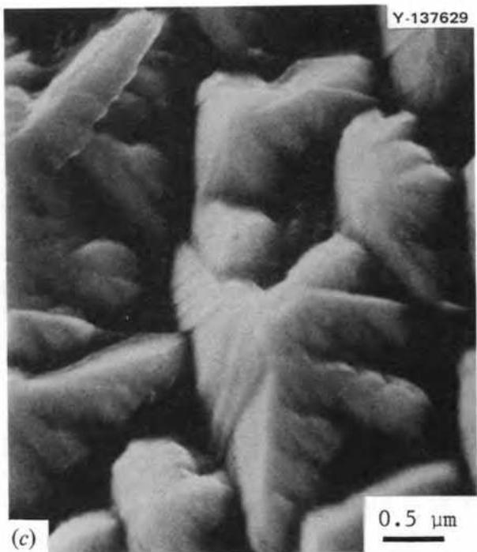  
Fig. 6.49. Fractographs of alloy 413 (Hastelloy N modified with $1\%$ niobium plus $1\%$ titanium) after 243 hr in molten salt + $\mathrm{Cr_3Te_4}$ followed by tensile testing at room temperature.

brittle; a metallographic section of each sample was prepared to permit determination of the extent of cracking. These tests have two objectives. The first is to develop a method for exposing samples to tellurium to produce a reaction rate comparable to that anticipated for an MSBR. This rate is thought to be a flux of tellurium of about $10^{10}$ atoms $\mathrm{cm}^{-2}\mathrm{sec}^{-1}$ . The second objective is to compare the cracking tendencies of various alloys of modified Hastelloy N.

The method used for crack counting and measuring was described previously, and data were presented for several alloys.30 The experimental conditions associated with the experiments to be

discussed in this report are summarized in Table 6.20. The chemical compositions of the alloys studied are given in Table 6.21. In all cases the sample was a small tensile specimen $\frac{1}{4}$ in. in diameter by 1.78 in. long having a reduced section $\frac{1}{8}$ in. in diameter by $1 \frac{1}{8}$ in. long. Unless specified otherwise in Table 6.21, the specimens were annealed 1 hr at $1177^{\circ} \mathrm{C}$ in argon prior to exposure to tellurium. The results of crack measurements and data resulting from tensile tests at $25^{\circ} \mathrm{C}$ which were used to open the embrittled grain boundaries are shown in Table 6.22.

Photomicrographs of the samples from experiment 75-11 show that the extent of reaction for these

Table 6.20. General description of tellurium-Hastelloy N exposures   

<table><tr><td>Experiment designation</td><td>Experimenters</td><td>Exposure conditions</td><td>Alloys included</td><td>General commentsa</td></tr><tr><td>75-11</td><td>McNabb McCoy</td><td>100 hr at 700°C in vapor above Te at 300°C</td><td>405065, 471-114, 474-534, 474-535, 600600</td><td></td></tr><tr><td>75-12</td><td>McNabb McCoy</td><td>250 hr at 700°C in vapor above Te at 300°C</td><td>405065 with different grain sizes</td><td>Specimens discolored</td></tr><tr><td>75-13</td><td>McNabb McCoy</td><td>1000 hr at 700°C in vapor above Te at 300°C</td><td>405065, 421543, 295, 298, 345, 348, 411, 413, 421, 424, 425(2)</td><td></td></tr><tr><td>75-14</td><td>Keiser</td><td>500 hr at 700°C in salt + Cr3Te4</td><td>405064, 470-835</td><td>Thin reaction layers</td></tr><tr><td>75-15</td><td>Keiser</td><td>243 hr at 700°C in salt + Cr3Te4</td><td>411, 413</td><td>Thin reaction layers</td></tr><tr><td>75-16</td><td>McNabb McCoy</td><td>1000 hr at 700°C in vapor above Cr3Te4 at 700°C</td><td>405065, 600600, 471-114, 474-533, 474-534, 474-535, 237, 295, 298, 303, 345, 348, 417, 421, 422, 424</td><td>Reaction layers, some spalling</td></tr><tr><td>75-17</td><td>Keiser</td><td>649 hr at 650°C in salt + LiTe3</td><td>405065</td><td></td></tr><tr><td>75-18</td><td>McNabb McCoy</td><td>1000 hr at 700°C in vapor above Te at 300°C</td><td>Ni, 304SS, Incoloy 601, NX 6372G, NX 7187G, NX 7353, 405065, 421543, 472-186, 474-533, 474-534, 474-535, 474-539, 474-557, 474-558, 474-901, 475-421, 62, 63, 234, 295, 296, 297, 303, 306, 345, 348, 411, 413, 417, 422, 456, 460, 462, 503, 504, 505, 506</td><td>Little evidence of reaction</td></tr><tr><td>75-19</td><td>Keiser</td><td>500 hr at 700°C in salt + Cr3Te4</td><td>503, 504, 505, 506</td><td></td></tr><tr><td>75-20</td><td>Keiser</td><td>1000 hr at 700°C in salt + Ni3Te2</td><td>405065</td><td></td></tr><tr><td>75-21</td><td>Keiser</td><td>500 hr at 700°C in salt + Cr3Te4 (half in salt, half in vapor)</td><td>405065</td><td></td></tr><tr><td>75-22</td><td>Brynestad</td><td>2500 hr at 700°C in vapor above Ni + Ni3Te2</td><td>405065, 295, 424</td><td></td></tr><tr><td>75-23</td><td>Brynestad</td><td>2500 hr at 750°C in vapor above Ni + Ni3Te2</td><td>405065, 295, 424</td><td></td></tr><tr><td>75-24</td><td>McNabb McCoy</td><td>287 hr at 700°C in vapor above Te at 300°C</td><td>450, 513, 574, 515, 516, 517, 518, 523, 524</td><td></td></tr></table>

Where no comments are given, there were no visible reaction layers.

Table 6.21. Chemical analyses of alloys used in tellurium cracking studies (wt %)   

<table><tr><td>Heat number</td><td>Mo</td><td>Cr</td><td>Fe</td><td>Mn</td><td>C</td><td>Si</td><td>Ti</td><td>Nb</td><td>Al</td><td>Other</td></tr><tr><td>62</td><td>11.34</td><td>7.52</td><td>a</td><td>0.20</td><td>0.042</td><td>0.01</td><td>a</td><td>1.9</td><td>a</td><td></td></tr><tr><td>63</td><td>11.45</td><td>7.33</td><td>a</td><td>0.20</td><td>0.135</td><td>0.01</td><td>a</td><td>2.5</td><td>a</td><td></td></tr><tr><td>180</td><td>11.2</td><td>7.0</td><td>0.040</td><td>0.22</td><td>0.046</td><td>0.01</td><td>&lt;0.02</td><td>1.84</td><td>a</td><td></td></tr><tr><td>181</td><td>11.5</td><td>6.84</td><td>0.054</td><td>0.23</td><td>0.045</td><td>0.01</td><td>0.50</td><td>1.85</td><td>a</td><td>0.03 W</td></tr><tr><td>234</td><td>16.0</td><td>7.2</td><td>4.0</td><td>&lt;0.02</td><td>0.05b</td><td>0.13</td><td>&lt;0.02</td><td>&lt;0.05</td><td>&lt;0.05</td><td>0.75 Ce</td></tr><tr><td>237</td><td>12.0</td><td>6.7</td><td>4.3</td><td>0.49</td><td>0.032</td><td>a</td><td>0.04</td><td>1.03</td><td>&lt;0.05</td><td></td></tr><tr><td>295</td><td>11.4</td><td>8.06</td><td>4.02</td><td>0.28</td><td>0.057</td><td>&lt;0.02</td><td>&lt;0.02</td><td>0.85</td><td>a</td><td>0.05 W</td></tr><tr><td>296</td><td>11.5</td><td>8.09</td><td>3.96</td><td>0.28</td><td>0.059</td><td>&lt;0.02</td><td>&lt;0.02</td><td>1.2</td><td>a</td><td>0.2 W</td></tr><tr><td>297</td><td>12.0b</td><td>7.0b</td><td>4.0b</td><td>0.2b</td><td>0.06</td><td>0.02</td><td>0.24</td><td>0.57</td><td>a</td><td></td></tr><tr><td>298</td><td>12.0b</td><td>7.0b</td><td>4.0b</td><td>0.2b</td><td>0.06</td><td>0.02</td><td>&lt;0.01</td><td>2.0</td><td>a</td><td></td></tr><tr><td>303</td><td>12.0b</td><td>7.0b</td><td>4.0b</td><td>0.2b</td><td>0.06b</td><td>0.02</td><td>0.49</td><td>0.84</td><td>a</td><td></td></tr><tr><td>304</td><td>12.0</td><td>6.9</td><td>5.0</td><td>0.2</td><td>0.06b</td><td>0.05</td><td>&lt;0.01</td><td>&lt;0.05</td><td>&lt;0.01</td><td>0.8 W</td></tr><tr><td>305</td><td>11.2</td><td>8.25</td><td>4.16</td><td>0.22</td><td>0.072</td><td>0.09</td><td>0.88</td><td>1.3</td><td>a</td><td></td></tr><tr><td>306</td><td>10.6</td><td>8.04</td><td>3.11</td><td>0.18</td><td>0.065</td><td>0.27</td><td>0.01</td><td>0.55</td><td>a</td><td></td></tr><tr><td>345</td><td>11.0</td><td>7.1</td><td>3.8</td><td>0.26</td><td>0.05b</td><td>0.22</td><td>0.02</td><td>0.45</td><td>a</td><td></td></tr><tr><td>346</td><td>11.0</td><td>6.7</td><td>3.7</td><td>0.18</td><td>0.05b</td><td>0.48</td><td>0.02</td><td>0.49</td><td>a</td><td></td></tr><tr><td>347</td><td>12.0</td><td>7.6</td><td>4.3</td><td>0.25</td><td>0.05b</td><td>0.47</td><td>&lt;0.02</td><td>0.88</td><td>a</td><td></td></tr><tr><td>348</td><td>12.0</td><td>7.2</td><td>0.07</td><td>0.19</td><td>0.05b</td><td>0.47</td><td>&lt;0.02</td><td>0.62</td><td>a</td><td></td></tr><tr><td>411</td><td>11.71</td><td>6.78</td><td>a</td><td>0.1</td><td>0.043</td><td>a</td><td>a</td><td>1.15</td><td>a</td><td></td></tr><tr><td>413</td><td>11.82</td><td>6.75</td><td>a</td><td>0.1</td><td>0.045</td><td>a</td><td>0.9</td><td>1.13</td><td>a</td><td></td></tr><tr><td>417</td><td>11.48</td><td>6.82</td><td>0.1</td><td>0.1</td><td>0.056</td><td>a</td><td>0.01</td><td>2.29</td><td>a</td><td></td></tr><tr><td>421</td><td>11.43</td><td>6.75</td><td>a</td><td>0.2</td><td>0.048</td><td>a</td><td>1.9</td><td>1.04</td><td>0.07</td><td></td></tr><tr><td>422</td><td>11.27</td><td>6.78</td><td>0.09</td><td>0.15</td><td>0.059</td><td>a</td><td>1.0</td><td>2.29</td><td>0.07</td><td></td></tr><tr><td>424</td><td>11.32</td><td>6.76</td><td>a</td><td>0.15</td><td>0.063</td><td>a</td><td>1.8</td><td>1.34</td><td>0.10</td><td></td></tr><tr><td>425</td><td>11.42</td><td>6.72</td><td>a</td><td>0.15</td><td>0.037</td><td>a</td><td>1.9</td><td>0.48</td><td>0.08</td><td></td></tr><tr><td>450</td><td>13.6</td><td>8.1</td><td>0.3</td><td>&lt;0.1</td><td>0.051</td><td>a</td><td>2.1</td><td>&lt;0.1</td><td>a</td><td></td></tr><tr><td>456</td><td>12.0b</td><td>7.0b</td><td>a</td><td>0.2b</td><td>0.060b</td><td>a</td><td>2.1</td><td>1.03</td><td>0.18</td><td></td></tr><tr><td>460</td><td>12.0b</td><td>10.0b</td><td>a</td><td>0.2b</td><td>0.060b</td><td>a</td><td>2.36</td><td>1.21</td><td>0.17</td><td></td></tr><tr><td>462</td><td>12.0b</td><td>15.0b</td><td>a</td><td>0.2b</td><td>0.060b</td><td>a</td><td>2.21</td><td>1.0</td><td>0.16</td><td></td></tr><tr><td>503</td><td>11.92</td><td>7.40</td><td>a</td><td>0.2</td><td>0.029</td><td>a</td><td>&lt;0.01</td><td>&lt;0.02</td><td>~0.1</td><td></td></tr><tr><td>504</td><td>11.84</td><td>10.2</td><td>a</td><td>0.17</td><td>0.029</td><td>a</td><td>&lt;0.01</td><td>&lt;0.02</td><td>~0.1</td><td></td></tr><tr><td>505</td><td>12.08</td><td>11.9</td><td>a</td><td>0.22</td><td>0.034</td><td>a</td><td>&lt;0.01</td><td>&lt;0.02</td><td>~0.1</td><td></td></tr><tr><td>506</td><td>11.97</td><td>14.5</td><td>a</td><td>0.22</td><td>0.037</td><td>a</td><td>&lt;0.01</td><td>&lt;0.02</td><td>~0.1</td><td></td></tr><tr><td>513</td><td>11.40</td><td>7.2</td><td>&lt;0.05</td><td>0.20</td><td>0.040</td><td>&lt;0.02</td><td>&lt;0.02</td><td>0.45</td><td>0.05</td><td></td></tr><tr><td>514</td><td>11.50</td><td>7.05</td><td>&lt;0.05</td><td>0.20</td><td>0.035</td><td>&lt;0.02</td><td>&lt;0.02</td><td>0.69</td><td>0.05</td><td></td></tr><tr><td>515</td><td>11.53</td><td>7.20</td><td>&lt;0.05</td><td>0.20</td><td>0.038</td><td>&lt;0.02</td><td>&lt;0.02</td><td>0.20</td><td>0.05</td><td></td></tr><tr><td>516</td><td>10.58</td><td>7.30</td><td>&lt;0.05</td><td>0.20</td><td>0.049</td><td>&lt;0.02</td><td>&lt;0.02</td><td>&lt;0.10</td><td>0.05</td><td></td></tr><tr><td>517</td><td>11.45</td><td>7.10</td><td>&lt;0.05</td><td>&lt;0.01</td><td>0.045</td><td>&lt;0.02</td><td>&lt;0.02</td><td>1.10</td><td>0.03</td><td></td></tr><tr><td>518</td><td>11.55</td><td>7.18</td><td>&lt;0.05</td><td>0.20</td><td>0.040</td><td>0.05</td><td>0.95</td><td>0.96</td><td>0.10</td><td></td></tr><tr><td>523</td><td>11.40</td><td>10.40</td><td>&lt;0.05</td><td>0.23</td><td>0.037</td><td>&lt;0.02</td><td>&lt;0.02</td><td>0.47</td><td>0.10</td><td></td></tr><tr><td>524</td><td>11.65</td><td>15.20</td><td>&lt;0.05</td><td>0.17</td><td>0.040</td><td>&lt;0.02</td><td>&lt;0.02</td><td>0.69</td><td>0.10</td><td></td></tr><tr><td>Ni-280d</td><td>70</td><td>2</td><td>10</td><td>5</td><td></td><td>15</td><td>&lt;1</td><td>5</td><td>&lt;0.3</td><td>100 Ta</td></tr><tr><td>304SS-139969</td><td></td><td></td><td>18.50</td><td>Balance</td><td>1.51</td><td>0.027</td><td>0.45</td><td></td><td></td><td>9.3 Ni</td></tr><tr><td>Inconel 601</td><td></td><td></td><td>21.91c</td><td>15.01c</td><td>0.15c</td><td>0.03c</td><td>0.26c</td><td>0.31c</td><td></td><td></td></tr><tr><td>Inconel 600</td><td></td><td></td><td>15.5b</td><td>8.0b</td><td>0.5b</td><td>0.08b</td><td>0.25b</td><td></td><td></td><td></td></tr><tr><td>600600</td><td></td><td></td><td></td><td></td><td></td><td></td><td></td><td></td><td></td><td></td></tr><tr><td>NX 6372G</td><td></td><td></td><td>15.13c</td><td>9.17c</td><td>0.27c</td><td>0.10c</td><td>0.09c</td><td></td><td></td><td>0.31 Cuc</td></tr><tr><td>NX 7187G</td><td></td><td></td><td>15.82c</td><td>7.57c</td><td>0.11c</td><td>0.07c</td><td>0.17c</td><td></td><td></td><td>0.28 Cuc</td></tr><tr><td>NX 7353</td><td></td><td></td><td>15.04c</td><td>9.44c</td><td>0.38c</td><td>0.07c</td><td>0.14c</td><td></td><td></td><td>0.31 Cuc</td></tr><tr><td>421543</td><td>12.4</td><td>7.31</td><td>0.038</td><td>0.08</td><td>0.05</td><td>0.014</td><td>0.003</td><td>0.70</td><td>0.02</td><td></td></tr><tr><td>405065</td><td>16.0</td><td>7.1</td><td>4.0</td><td>0.55</td><td>0.06</td><td>0.57</td><td>&lt;0.01</td><td>a</td><td>&lt;0.03</td><td></td></tr><tr><td>469-344</td><td>13.0</td><td>7.4</td><td>4.0</td><td>0.56</td><td>0.11</td><td>a</td><td>0.77</td><td>1.7</td><td>a</td><td>0.019 Zr</td></tr><tr><td>469-648</td><td>12.8</td><td>6.9</td><td>0.30</td><td>0.34</td><td>0.043</td><td>a</td><td>0.92</td><td>1.95</td><td>a</td><td></td></tr><tr><td>469-714</td><td>13.0</td><td>8.5</td><td>0.10</td><td>0.35</td><td>0.013</td><td>a</td><td>0.80</td><td>1.60</td><td>a</td><td></td></tr><tr><td>470-786</td><td>12.2</td><td>7.6</td><td>0.41</td><td>0.43</td><td>0.044</td><td>a</td><td>0.82</td><td>0.62</td><td>a</td><td>0.024 Zr</td></tr><tr><td>470-835</td><td>12.5</td><td>7.9</td><td>0.68</td><td>0.60</td><td>0.052</td><td>a</td><td>0.71</td><td>2.60</td><td>a</td><td>0.031 Hf</td></tr><tr><td>471-114</td><td>12.5</td><td>7.4</td><td>0.062</td><td>0.02</td><td>0.058</td><td>0.026</td><td>1.75</td><td>a</td><td>0.07</td><td></td></tr><tr><td>472-166</td><td>14.65c</td><td>15.49c</td><td>0.56c</td><td>0.51c</td><td>0.01c</td><td>0.27c</td><td></td><td></td><td>0.14c</td><td>0.01 La, c 0.01 B, c 0.06 W, c 0.05 Coc</td></tr><tr><td>472-503</td><td>12.9</td><td>6.79</td><td>0.089</td><td>&lt;0.01</td><td>0.066</td><td>0.089</td><td>2.16</td><td>0.05</td><td>0.09</td><td></td></tr><tr><td>474-533</td><td>11.37</td><td>7.3</td><td>0.03c</td><td>0.04</td><td>0.091</td><td>0.15</td><td>1.75</td><td>a</td><td>0.54</td><td>0.14 W, c 0.03 Coc</td></tr><tr><td>474-534</td><td>11.7</td><td>7.1</td><td>0.06</td><td>&lt;0.01</td><td>0.08</td><td>0.03</td><td>2.09</td><td>a</td><td>0.53</td><td>0.14 W, 0.013 La</td></tr><tr><td>474-535</td><td>11.8</td><td>7.3</td><td>0.05</td><td>&lt;0.01</td><td>0.08</td><td>0.03</td><td>2.13</td><td>a</td><td>0.55</td><td>0.10 W, 0.010 La, 0.03 Ce</td></tr><tr><td>474-539</td><td>11.38</td><td>7.4</td><td>0.07c</td><td>0.03</td><td>0.041</td><td>0.10</td><td>2.55</td><td>a</td><td>0.62</td><td>0.11 W, 0.06 Co, 0.02 W</td></tr><tr><td>474-557</td><td>11.91</td><td>7.23</td><td>0.08</td><td>&lt;0.01</td><td>0.04</td><td>0.03</td><td>2.14</td><td>a</td><td>0.02</td><td></td></tr><tr><td>474-558</td><td>12.00</td><td>7.20</td><td>0.07</td><td>&lt;0.01</td><td>0.07</td><td>0.03</td><td>2.05</td><td>a</td><td>0.02</td><td>0.02 W, 0.021 La</td></tr><tr><td>474-901</td><td>12.5</td><td>6.96</td><td>0.05c</td><td>0.02c</td><td>0.034</td><td>0.10</td><td>2.00</td><td>a</td><td>a</td><td></td></tr><tr><td>475-421</td><td>11.93</td><td>7.10</td><td>0.06</td><td>0.12</td><td>0.07</td><td>0.04</td><td>1.90</td><td>a</td><td>0.12</td><td>0.02 Co</td></tr></table>

${}^{a}$ Not analyzed,but no intentional addition made of this element.   
$b$ Not analyzed, but nominal concentration indicated.   
cVendor's analysis.   
$d$ Concentrations in ppm.

Table 6.22. Intergranular crack formation and tensile properties of samples exposed to tellurium and strained to failure at $25^{\circ}\mathrm{C}$   

<table><tr><td rowspan="2">Exp. No.</td><td rowspan="2">Heat No.</td><td colspan="2">Cracks per unit length</td><td colspan="2">Depth (μ)</td><td rowspan="2">Standard deviation (μ)</td><td rowspan="2">95% confidence interval (μ)</td><td rowspan="2">Weightb change (mg)</td><td rowspan="2">Yield stress (103 psi)</td><td rowspan="2">Ultimate tensile stress (103 psi)</td><td rowspan="2">Fracture stress (103 psi)</td><td rowspan="2">Uniform elongation (%)</td><td rowspan="2">Fracture strain (%)</td><td rowspan="2">Reduction in area (%)</td></tr><tr><td>Cracks/in.</td><td>Cracks/cm</td><td>Av</td><td>Max</td></tr><tr><td rowspan="5">75-11</td><td>405065</td><td>105</td><td>41</td><td>20.3</td><td>33.0</td><td>6.6</td><td>2.9</td><td>0.50</td><td>54.2</td><td>132.7</td><td>126.5</td><td>37.3</td><td>42.1</td><td>40.3</td></tr><tr><td>471-114</td><td>17</td><td>7</td><td>13.0</td><td>21.6</td><td>5.5</td><td>5.0</td><td>0.29</td><td>51.5</td><td>118.9</td><td>113.4</td><td>54.1</td><td>56.6</td><td>47.6</td></tr><tr><td>474-534</td><td>363</td><td>143</td><td>22.5</td><td>41.2</td><td>6.5</td><td>1.2</td><td>-0.51</td><td>58.1</td><td>129.9</td><td>117.5</td><td>41.7</td><td>44.6</td><td>48.8</td></tr><tr><td>474-535</td><td>0</td><td>0</td><td></td><td></td><td></td><td></td><td>-1.59</td><td>52.8</td><td>124.9</td><td>119.4</td><td>47.4</td><td>49.4</td><td>47.0</td></tr><tr><td>600600</td><td>67</td><td>26</td><td>17.0</td><td>27.5</td><td>5.3</td><td>2.4</td><td>+0.62</td><td>39.2</td><td>102.9</td><td>76.2</td><td>29.6</td><td>34.8</td><td>61.2</td></tr><tr><td rowspan="9">75-12</td><td>405065 as swaged</td><td>370</td><td>146</td><td>17.8</td><td>36.8</td><td>5.6</td><td>1.9</td><td>+0.97</td><td>102.9</td><td>159.8</td><td>149.7</td><td>26.3</td><td>29.0</td><td>34.6</td></tr><tr><td>405065 1 hr at 982°C</td><td>350</td><td>138</td><td>16.4</td><td>25.8</td><td>4.9</td><td>1.6</td><td>+0.85</td><td>79.9</td><td>150.5</td><td>132.1</td><td>31.4</td><td>34.3</td><td>44.1</td></tr><tr><td>405065 1 hr at 1038°C</td><td>330</td><td>130</td><td>13.2</td><td>27.1</td><td>5.2</td><td>1.8</td><td>+0.43</td><td>62.8</td><td>141.3</td><td>125.7</td><td>34.8</td><td>37.2</td><td>44.8</td></tr><tr><td>405065 1 hr at 1093°C</td><td>320</td><td>126</td><td>18.9</td><td>36.3</td><td>5.8</td><td>1.7</td><td>+0.26</td><td>56.9</td><td>137.6</td><td>125.3</td><td>37.0</td><td>40.3</td><td>43.1</td></tr><tr><td>405065 1 hr at 1150°C</td><td>330</td><td>130</td><td>31.8</td><td>59.1</td><td>12.7</td><td>4.4</td><td>+0.34</td><td>53.4</td><td>130.4</td><td>122.6</td><td>39.5</td><td>41.8</td><td>48.1</td></tr><tr><td>405065 1 hr at 1177°C</td><td>280</td><td>110</td><td>48.0</td><td>92.0</td><td>18.0</td><td>6.8</td><td>+0.29</td><td>52.3</td><td>126.0</td><td>115.4</td><td>40.8</td><td>43.3</td><td>40.3</td></tr><tr><td>405065 1 hr at 1204°C</td><td>200</td><td>79</td><td>69.6</td><td>107.4</td><td>18.3</td><td>8.2</td><td>+0.60</td><td>50.8</td><td>121.6</td><td>119.7</td><td>37.4</td><td>38.4</td><td>31.6</td></tr><tr><td>405065 1 hr at 1232°C</td><td>220</td><td>87</td><td>73.9</td><td>130.0</td><td>26.5</td><td>11.3</td><td>+2.06</td><td>50.4</td><td>111.3</td><td>109.6</td><td>33.3</td><td>33.6</td><td>26.6</td></tr><tr><td>405065 1 hr at 1260°C</td><td>110</td><td>43</td><td>87.3</td><td>179.4</td><td>34.4</td><td>14.7</td><td>+1.96</td><td>49.3</td><td>104.2</td><td>100.9</td><td>31.2</td><td>31.5</td><td>27.6</td></tr><tr><td rowspan="11">75-13</td><td>405065 295</td><td>215</td><td>85</td><td>22.9</td><td>54.1</td><td>9.9</td><td>3.0</td><td>-0.07</td><td>53.6</td><td>132.4</td><td>120.3</td><td>39.5</td><td>41.7</td><td>37.7</td></tr><tr><td>405065 298</td><td>12</td><td>5</td><td>10.0</td><td>23.7</td><td>7.9</td><td>6.5</td><td>+0.08</td><td>53.4</td><td>121.6</td><td>112.6</td><td>43.6</td><td>46.3</td><td>45.3</td></tr><tr><td>405065 345</td><td>70</td><td>28</td><td>16.4</td><td>38.3</td><td>8.1</td><td>2.7</td><td>+0.03</td><td>54.3</td><td>124.6</td><td>108.3</td><td>45.3</td><td>49.2</td><td>51.1</td></tr><tr><td>405065 348</td><td>16</td><td>6</td><td>9.9</td><td>16.2</td><td>3.5</td><td>2.5</td><td>+0.04</td><td>59.6</td><td>121.8</td><td>111.1</td><td>39.6</td><td>42.7</td><td>47.1</td></tr><tr><td>405065 411</td><td>74</td><td>29</td><td>8.5</td><td>75.8</td><td>13.0</td><td>4.3</td><td>+0.11</td><td>52.7</td><td>121.9</td><td>105.3</td><td>43.5</td><td>46.8</td><td>51.3</td></tr><tr><td>405065 413</td><td>44</td><td>17</td><td>12.4</td><td>35.5</td><td>8.5</td><td>3.6</td><td>+0.30</td><td>45.1</td><td>114.9</td><td>103.5</td><td>47.7</td><td>49.9</td><td>46.4</td></tr><tr><td>405065 421</td><td>380</td><td>110</td><td>13.5</td><td>41.8</td><td>9.3</td><td>2.0</td><td>-0.06</td><td>53.7</td><td>125.3</td><td>117.0</td><td>45.7</td><td>48.0</td><td>42.2</td></tr><tr><td>405065 424</td><td>350</td><td>138</td><td>36.9</td><td>77.1</td><td>15.3</td><td>5.2</td><td>0.00</td><td>55.3</td><td>132.4</td><td>125.0</td><td>42.1</td><td>44.4</td><td>49.7</td></tr><tr><td>405065 425</td><td>130</td><td>51</td><td>38.2</td><td>74.0</td><td>18.5</td><td>10.3</td><td>+0.15</td><td>52.2</td><td>124.2</td><td>118.4</td><td>43.2</td><td>44.6</td><td>40.8</td></tr><tr><td>405065 425</td><td>280</td><td>110</td><td>30.2</td><td>65.9</td><td>15.2</td><td>5.7</td><td>0.00</td><td>52.6</td><td>124.7</td><td>118.7</td><td>43.1</td><td>45.0</td><td>41.1</td></tr><tr><td>405065 421543</td><td>22</td><td>9</td><td>17.9</td><td>41.8</td><td>11.9</td><td>7.2</td><td>+0.14</td><td>51.9</td><td>117.0</td><td>106.7</td><td>45.0</td><td>47.7</td><td>50.5</td></tr><tr><td rowspan="5">75-14</td><td>405065 470-835</td><td>350</td><td>138</td><td>50.4</td><td>90.4</td><td>18.9</td><td>6.4</td><td>+0.44</td><td>52.5</td><td>124.5</td><td>116.2</td><td>38.0</td><td>40.3</td><td>39.4</td></tr><tr><td>405065 471-15</td><td>247</td><td>97</td><td>24.2</td><td>94.7</td><td>20.3</td><td>4.7</td><td>-0.90</td><td>56.8</td><td>136.9</td><td>129.8</td><td>43.4</td><td>44.9</td><td>39.3</td></tr><tr><td>405065 411</td><td>43</td><td>17</td><td>30.5</td><td>66.6</td><td>17.5</td><td>8.5</td><td>-4.13</td><td>41.5</td><td>112.7</td><td>97.9</td><td>51.7</td><td>54.8</td><td>53.4</td></tr><tr><td>405065 413</td><td>260</td><td>102</td><td>37.4</td><td>93.6</td><td>23.6</td><td>6.5</td><td>-4.18</td><td>49.5</td><td>120.4</td><td>111.3</td><td>43.5</td><td>45.8</td><td>42.7</td></tr><tr><td></td><td>195</td><td>77</td><td>29.1</td><td>62.9</td><td>13.9</td><td>4.5</td><td></td><td></td><td></td><td></td><td></td><td></td><td></td></tr><tr><td>Cracks/in.</td><td>Cracks/cm</td></tr><tr><td rowspan="16">75-16</td><td>405065</td><td>240</td><td>95</td><td>44.5</td><td>89.9</td><td>16.2</td><td>4.7</td><td>+3.89</td><td>52.5</td><td>125.7</td><td>119.9</td><td>38.5</td><td>40.6</td><td></td></tr><tr><td>600600</td><td>115</td><td>45</td><td>35.8</td><td>58.9</td><td>11.2</td><td>4.7</td><td>+18.25</td><td>34.5</td><td>96.2</td><td>78.2</td><td>31.5</td><td>35.3</td><td></td></tr><tr><td>471-114</td><td>225</td><td>89</td><td>56.8</td><td>120.0</td><td>25.1</td><td>7.5</td><td>+57.33</td><td>48.6</td><td>111.2</td><td>102.7</td><td>49.9</td><td>52.6</td><td></td></tr><tr><td>474-533</td><td>305</td><td>120</td><td>72.6</td><td>142.5</td><td>37.6</td><td>9.6</td><td>+32.90</td><td>50.4</td><td>114.8</td><td>107.2</td><td>48.0</td><td>50.7</td><td></td></tr><tr><td>474-534</td><td>380</td><td>150</td><td>40.5</td><td>77.7</td><td>18.4</td><td>4.2</td><td>+17.70</td><td>56.4</td><td>124.9</td><td>115.0</td><td>40.8</td><td>43.2</td><td></td></tr><tr><td>474-535</td><td>310</td><td>122</td><td>57.4</td><td>103.8</td><td>24.4</td><td>6.2</td><td>+35.14</td><td>51.8</td><td>117.0</td><td>106.3</td><td>47.1</td><td>49.9</td><td></td></tr><tr><td>237</td><td>145</td><td>57</td><td>57.2</td><td>127.3</td><td>26.0</td><td>9.6</td><td>+1.28</td><td>55.1</td><td>118.4</td><td>106.0</td><td>43.4</td><td>46.0</td><td></td></tr><tr><td>295</td><td>70</td><td>28</td><td>22.9</td><td>50.8</td><td>12.4</td><td>5.4</td><td>+8.44</td><td>54.2</td><td>124.6</td><td>113.5</td><td>39.9</td><td>42.5</td><td></td></tr><tr><td>298</td><td>310</td><td>122</td><td>35.0</td><td>135.0</td><td>19.1</td><td>4.8</td><td>+11.46</td><td>53.5</td><td>122.3</td><td>108.4</td><td>46.1</td><td>49.0</td><td></td></tr><tr><td>303</td><td>295</td><td>116</td><td>34.9</td><td>83.5</td><td>14.8</td><td>3.8</td><td>+11.46</td><td>51.8</td><td>117.6</td><td>105.8</td><td>46.5</td><td>49.6</td><td></td></tr><tr><td>345</td><td>83</td><td>33</td><td>60.8</td><td>105.2</td><td>23.5</td><td>8.2</td><td>+7.63</td><td>50.2</td><td>113.5</td><td>104.5</td><td>43.6</td><td>46.5</td><td></td></tr><tr><td>348</td><td>145</td><td>57</td><td>68.7</td><td>120.5</td><td>24.4</td><td>9.1</td><td>+41.14</td><td>47.2</td><td>112.3</td><td>99.9</td><td>45.0</td><td>48.4</td><td></td></tr><tr><td>417</td><td>155</td><td>61</td><td>37.6</td><td>85.5</td><td>16.9</td><td>6.1</td><td>+36.91</td><td>51.8</td><td>122.4</td><td>113.1</td><td>42.6</td><td>44.8</td><td></td></tr><tr><td>421</td><td>205</td><td>81</td><td>53.4</td><td>89.8</td><td>22.5</td><td>7.0</td><td>+4.79</td><td>52.0</td><td>124.3</td><td>116.2</td><td>45.2</td><td>47.1</td><td></td></tr><tr><td>422</td><td>250</td><td>98</td><td>59.1</td><td>122.0</td><td>23.6</td><td>6.7</td><td>+21.72</td><td>53.2</td><td>125.2</td><td>114.8</td><td>43.4</td><td>46.1</td><td></td></tr><tr><td>424</td><td>265</td><td>104</td><td>62.9</td><td>113.2</td><td>27.0</td><td>7.4</td><td>+44.12</td><td>54.4</td><td>128.8</td><td>120.6</td><td>45.5</td><td>47.6</td><td></td></tr><tr><td>75-17</td><td>405065</td><td>74</td><td>29</td><td>15.2</td><td>28.2</td><td>7.0</td><td>2.3</td><td></td><td>51.8</td><td>131.9</td><td>122.2</td><td>41.5</td><td>43.7</td><td>42.8</td></tr><tr><td rowspan="26">75-18</td><td>Ni 280</td><td>90</td><td>35</td><td>10.9</td><td>32.0</td><td>5.8</td><td>1.7</td><td>+7.41</td><td>13.2</td><td>67.0</td><td>47.6</td><td>35.9</td><td>41.2</td><td>42.8</td></tr><tr><td>304L SS</td><td>0</td><td>0</td><td></td><td></td><td></td><td></td><td>+0.48</td><td>27.1</td><td>86.6</td><td>64.9</td><td>69.4</td><td>74.9</td><td>73.8</td></tr><tr><td>INC 601</td><td>10</td><td>4</td><td>7.0</td><td>8.5</td><td>1.8</td><td>1.6</td><td>+0.16</td><td>44.9</td><td>105.8</td><td>96.9</td><td>33.7</td><td>35.3</td><td>42.1</td></tr><tr><td>NX 6372G</td><td>0</td><td>0</td><td></td><td></td><td></td><td></td><td>-0.15</td><td>47.7</td><td>117.4</td><td>77.3</td><td>23.4</td><td>29.2</td><td>68.3</td></tr><tr><td>NX 7187G</td><td>0</td><td>0</td><td></td><td></td><td></td><td></td><td>-0.02</td><td>48.0</td><td>118.7</td><td>81.4</td><td>26.2</td><td>31.1</td><td>67.4</td></tr><tr><td>NX 7353</td><td>0</td><td>0</td><td></td><td></td><td></td><td></td><td>-0.06</td><td>46.1</td><td>115.2</td><td>76.8</td><td>25.3</td><td>31.2</td><td>66.3</td></tr><tr><td>405065</td><td>24</td><td>9</td><td>8.0</td><td>15.1</td><td>3.1</td><td>1.8</td><td>-0.03</td><td>53.4</td><td>133.9</td><td>124.4</td><td>42.5</td><td>45.0</td><td></td></tr><tr><td>421543</td><td>45</td><td>18</td><td>9.6</td><td>20.4</td><td>3.4</td><td>1.6</td><td>+1.39</td><td>57.4</td><td>133.8</td><td>123.9</td><td>38.6</td><td>40.5</td><td>44.1</td></tr><tr><td>472166</td><td>10</td><td>4</td><td>11.0</td><td>25.4</td><td>9.8</td><td>9.8</td><td>-0.41</td><td>45.6</td><td>99.2</td><td>98.4</td><td>38.8</td><td>38.8</td><td>27.8</td></tr><tr><td>474-533</td><td>165</td><td>65</td><td>42.8</td><td>75.8</td><td>16.3</td><td>5.7</td><td>+0.10</td><td>53.0</td><td>122.9</td><td>112.3</td><td>49.0</td><td>52.8</td><td>47.4</td></tr><tr><td>474-534</td><td>270</td><td>106</td><td>24.3</td><td>45.2</td><td>9.8</td><td>2.7</td><td>+0.08</td><td>57.6</td><td>129.5</td><td>116.3</td><td>44.6</td><td>47.4</td><td>49.5</td></tr><tr><td>474-535</td><td>195</td><td>77</td><td>31.5</td><td>55.5</td><td>12.6</td><td>4.0</td><td>+0.06</td><td>53.6</td><td>123.2</td><td>115.5</td><td>46.6</td><td>48.9</td><td>46.1</td></tr><tr><td>474-539</td><td>285</td><td>112</td><td>20.4</td><td>37.7</td><td>8.0</td><td>2.1</td><td>+0.11</td><td>56.4</td><td>131.1</td><td>118.1</td><td>43.9</td><td>46.7</td><td>47.9</td></tr><tr><td>474-557</td><td>260</td><td>102</td><td>40.8</td><td>58.0</td><td>10.8</td><td>4.2</td><td>0.00</td><td>58.5</td><td>130.9</td><td>119.1</td><td>43.3</td><td>46.1</td><td>46.7</td></tr><tr><td>474-558</td><td>0</td><td>0</td><td></td><td></td><td></td><td></td><td>+0.04</td><td>58.1</td><td>125.5</td><td>115.6</td><td>41.6</td><td>45.0</td><td>47.0</td></tr><tr><td>474-901</td><td>2</td><td>1</td><td>5.8</td><td>5.8</td><td></td><td></td><td>+0.05</td><td>56.5</td><td>128.3</td><td>118.5</td><td>47.6</td><td>50.9</td><td>48.4</td></tr><tr><td>475-421</td><td>127</td><td>50</td><td>13.9</td><td>31.3</td><td>7.3</td><td>2.0</td><td>0.00</td><td>51.0</td><td>119.0</td><td>110.8</td><td>50.8</td><td>53.9</td><td>47.5</td></tr><tr><td>62</td><td>22</td><td>9</td><td>8.8</td><td>17.6</td><td>3.3</td><td>2.0</td><td>+0.18</td><td>52.8</td><td>122.2</td><td>114.2</td><td>43.0</td><td>43.6</td><td>39.3</td></tr><tr><td>63</td><td>345</td><td>136</td><td>39.0</td><td>100.1</td><td>19.8</td><td>4.8</td><td>+0.17</td><td>54.5</td><td>140.0</td><td>119.2</td><td>31.9</td><td>34.9</td><td>48.3</td></tr><tr><td>234</td><td>170</td><td>67</td><td>30.8</td><td>74.3</td><td>18.0</td><td>8.7</td><td>+0.30</td><td>57.5</td><td>124.9</td><td>122.2</td><td>34.5</td><td>36.6</td><td>35.8</td></tr><tr><td>295c</td><td>130</td><td>51</td><td>20.9</td><td>161.5c</td><td>29.3</td><td>11.5</td><td>+0.03</td><td>54.6</td><td>127.0</td><td>110.7</td><td>40.0</td><td>43.6</td><td>43.3</td></tr><tr><td>295d</td><td>13</td><td>5</td><td>9.0</td><td>24.5</td><td>8.7</td><td>7.8</td><td>+0.21</td><td>55.5</td><td>129.4</td><td>115.0</td><td>38.4</td><td>41.4</td><td>47.8</td></tr><tr><td>295d</td><td>6</td><td>2</td><td>10.6</td><td>20.8</td><td>7.0</td><td>6.3</td><td>+0.01</td><td>54.4</td><td>125.3</td><td>110.1</td><td>40.6</td><td>44.2</td><td>48.4</td></tr><tr><td>296</td><td>16</td><td>6</td><td>5.5</td><td>8.2</td><td>1.9</td><td>1.3</td><td>+0.15</td><td>55.1</td><td>124.9</td><td>110.7</td><td>46.0</td><td>48.8</td><td>51.3</td></tr><tr><td>297</td><td>125</td><td>49</td><td>23.8</td><td>114.9</td><td>23.5</td><td>9.4</td><td>+0.24</td><td>58.5</td><td>129.3</td><td>111.4</td><td>47.1</td><td>50.8</td><td>52.1</td></tr><tr><td>303</td><td>37</td><td>15</td><td>8.3</td><td>13.5</td><td>2.8</td><td>1.5</td><td>+0.26</td><td>52.8</td><td>123.2</td><td>110.6</td><td>45.8</td><td>48.7</td><td>51.7</td></tr><tr><td>Cracks/in.</td><td>Cracks/cm</td><td>Av</td><td>Max</td></tr><tr><td></td><td>306</td><td>143</td><td>56</td><td>13.1</td><td>26.3</td><td>5.8</td><td>1.8</td><td>+0.14</td><td>59.0</td><td>131.4</td><td>118.9</td><td>36.0</td><td>38.3</td><td>45.1</td></tr><tr><td></td><td>345</td><td>6</td><td>2</td><td>4.8</td><td>5.3</td><td>0.4</td><td>0.5</td><td>+0.23</td><td>59.2</td><td>123.1</td><td>109.2</td><td>39.9</td><td>43.0</td><td>48.7</td></tr><tr><td></td><td>348</td><td>6</td><td>2</td><td>5.6</td><td>6.5</td><td>0.7</td><td>0.8</td><td>+0.19</td><td>50.1</td><td>122.5</td><td>114.4</td><td>44.2</td><td>45.6</td><td>45.7</td></tr><tr><td></td><td>411</td><td>18</td><td>7</td><td>5.9</td><td>9.1</td><td>2.5</td><td>1.7</td><td>+0.24</td><td>48.4</td><td>119.5</td><td>109.1</td><td>45.5</td><td>47.7</td><td>42.1</td></tr><tr><td></td><td>413</td><td>20</td><td>8</td><td>5.6</td><td>8.6</td><td>2.0</td><td>1.4</td><td>+0.12</td><td>53.3</td><td>128.2</td><td>116.5</td><td>46.2</td><td>48.7</td><td>45.3</td></tr><tr><td></td><td>417</td><td>12</td><td>5</td><td>8.8</td><td>15.8</td><td>4.7</td><td>3.8</td><td>+0.27</td><td>55.7</td><td>131.5</td><td>120.1</td><td>41.8</td><td>44.1</td><td>46.9</td></tr><tr><td></td><td>422</td><td>12</td><td>5</td><td>19.0</td><td>37.1</td><td>12.1</td><td>9.9</td><td>+0.07</td><td>56.4</td><td>135.9</td><td>124.9</td><td>44.7</td><td>47.5</td><td>48.7</td></tr><tr><td></td><td>456</td><td>30</td><td>12</td><td>10.3</td><td>20.1</td><td>4.8</td><td>2.8</td><td>+0.06</td><td>56.7</td><td>135.7</td><td>123.4</td><td>46.9</td><td>49.8</td><td>49.2</td></tr><tr><td></td><td>460</td><td>60</td><td>24</td><td>6.7</td><td>15.5</td><td>2.5</td><td>1.0</td><td>-0.10</td><td>69.3</td><td>156.3</td><td>150.7</td><td>34.5</td><td>36.3</td><td>40.3</td></tr><tr><td></td><td>462</td><td>74</td><td>29</td><td>10.3</td><td>32.6</td><td>5.8</td><td>1.9</td><td>-1.05</td><td>111.4</td><td>201.2</td><td>201.2</td><td>24.7</td><td>24.7</td><td>24.8</td></tr><tr><td></td><td>503</td><td>6</td><td>2</td><td>8.5</td><td>11.6</td><td>2.7</td><td>3.1</td><td>+0.30</td><td>39.4</td><td>108.6</td><td>95.3</td><td>51.3</td><td>54.4</td><td>53.8</td></tr><tr><td></td><td>504</td><td>2</td><td>1</td><td>9.1</td><td>9.1</td><td></td><td></td><td>+0.27</td><td>45.9</td><td>113.6</td><td>102.0</td><td>48.2</td><td>51.0</td><td>53.0</td></tr><tr><td></td><td>505</td><td>2</td><td>1</td><td>10.8</td><td>10.8</td><td></td><td></td><td>+0.20</td><td>49.0</td><td>116.8</td><td>104.6</td><td>48.5</td><td>52.1</td><td>51.0</td></tr><tr><td></td><td>506</td><td>12</td><td>5</td><td>28.1</td><td>88.7</td><td>31.5</td><td>25.7</td><td>+0.24</td><td>47.6</td><td>114.0</td><td>106.3</td><td>45.0</td><td>47.8</td><td>47.7</td></tr><tr><td rowspan="4">75-19</td><td>503</td><td>120</td><td>47</td><td>35.6</td><td>81.5</td><td>18.6</td><td>7.6</td><td></td><td>37.6</td><td>103.5</td><td>89.4</td><td>51.8</td><td>55.2</td><td>54.1</td></tr><tr><td>504</td><td>70</td><td>28</td><td>41.3</td><td>144.8</td><td>29.8</td><td>13.0</td><td></td><td>43.5</td><td>108.7</td><td>55.8</td><td>47.7</td><td>50.6</td><td>52.1</td></tr><tr><td>505</td><td>180</td><td>71</td><td>43.7</td><td>91.9</td><td>21.4</td><td>7.1</td><td></td><td>45.9</td><td>110.5</td><td>99.9</td><td>47.2</td><td>50.1</td><td>52.2</td></tr><tr><td>506</td><td>145</td><td>57</td><td>48.9</td><td>93.2</td><td>22.0</td><td>8.2</td><td></td><td>47.0</td><td>110.0</td><td>98.3</td><td>45.1</td><td>47.8</td><td>47.5</td></tr><tr><td rowspan="3">75-20</td><td>405065</td><td>220</td><td>87</td><td>19.7</td><td>69.2</td><td>14.1</td><td>4.3</td><td></td><td>53.9</td><td>132.1</td><td>126.3</td><td>39.2</td><td>40.8</td><td>35.6</td></tr><tr><td rowspan="2">405065</td><td>310e</td><td>122</td><td>74.8</td><td>160.5</td><td>35.6</td><td>12.8</td><td></td><td>51.9</td><td>123.4</td><td>115.7</td><td>38.2</td><td>40.3</td><td>35.6</td></tr><tr><td>310f</td><td>122</td><td>62.4</td><td>122.3</td><td>30.3</td><td>10.9</td><td></td><td></td><td></td><td></td><td></td><td></td><td></td></tr><tr><td rowspan="3">75-22</td><td>405065</td><td>290</td><td>114</td><td>17.6</td><td>55.3</td><td>11.1</td><td>4.1</td><td>-0.07</td><td>53.7</td><td>130.8</td><td>122.6</td><td>38.4</td><td>40.3</td><td>40.3</td></tr><tr><td>295</td><td>135</td><td>53</td><td>13.2</td><td>23.9</td><td>4.9</td><td>1.9</td><td>-0.08</td><td>53.8</td><td>119.6</td><td>109.5</td><td>43.2</td><td>45.5</td><td>42.6</td></tr><tr><td>424</td><td>530</td><td>209</td><td>25.7</td><td>73.0</td><td>11.7</td><td>3.2</td><td>-0.09</td><td>55.8</td><td>133.4</td><td>124.2</td><td>44.4</td><td>46.8</td><td>45.0</td></tr><tr><td rowspan="3">75-23</td><td>405065</td><td>200</td><td>79</td><td>21.4</td><td>145.4</td><td>24.7</td><td>7.8</td><td>-0.13</td><td>52.7</td><td>130.5</td><td>127.9</td><td>34.0</td><td>35.3</td><td>30.4</td></tr><tr><td>295</td><td>66</td><td>26</td><td>14.7</td><td>39.1</td><td>9.2</td><td>3.2</td><td>-0.20</td><td>50.8</td><td>121.2</td><td>110.6</td><td>46.3</td><td>49.2</td><td>49.2</td></tr><tr><td>424</td><td>430</td><td>169</td><td>16.4</td><td>40.4</td><td>10.0</td><td>3.1</td><td>-0.22</td><td>57.9</td><td>139.7</td><td>129.6</td><td>43.6</td><td>46.2</td><td>46.7</td></tr><tr><td rowspan="9">75-24</td><td>450</td><td>127</td><td>50</td><td>21.9</td><td>58.4</td><td>11.9</td><td>3.9</td><td>+0.40</td><td>50.1</td><td>112.1</td><td>106.9</td><td>55.7</td><td>58.5</td><td>48.5</td></tr><tr><td>513</td><td>20</td><td>8</td><td>10.8</td><td>18.4</td><td>4.2</td><td>2.6</td><td>+0.47</td><td>39.5</td><td>105.6</td><td>96.4</td><td>55.6</td><td>61.6</td><td>51.9</td></tr><tr><td>514</td><td>14</td><td>6</td><td>13.4</td><td>18.8</td><td>5.2</td><td>4.0</td><td>+0.38</td><td>39.3</td><td>105.9</td><td>96.2</td><td>56.8</td><td>59.8</td><td>55.1</td></tr><tr><td>515</td><td>10</td><td>4</td><td>14.7</td><td>17.9</td><td>3.5</td><td>3.1</td><td>+0.24</td><td>36.5</td><td>102.4</td><td>91.5</td><td>58.1</td><td>60.6</td><td>55.3</td></tr><tr><td>516</td><td>34</td><td>13</td><td>14.9</td><td>44.0</td><td>10.1</td><td>4.9</td><td>+0.15</td><td>40.5</td><td>107.4</td><td>93.9</td><td>51.7</td><td>54.0</td><td>52.2</td></tr><tr><td>517</td><td>6</td><td>2</td><td>12.7</td><td>25.6</td><td>11.2</td><td>12.9</td><td>+0.26</td><td>38.9</td><td>103.7</td><td>93.0</td><td>56.4</td><td>58.9</td><td>52.6</td></tr><tr><td>518</td><td>167</td><td>66</td><td>9.6</td><td>21.0</td><td>3.9</td><td>1.1</td><td>+0.43</td><td>50.7</td><td>120.0</td><td>108.5</td><td>51.5</td><td>54.2</td><td>51.1</td></tr><tr><td>523</td><td>40</td><td>16</td><td>9.4</td><td>21.6</td><td>4.5</td><td>2.6</td><td>+0.33</td><td>47.5</td><td>112.2</td><td>102.7</td><td>45.5</td><td>47.3</td><td>48.4</td></tr><tr><td>524</td><td>74</td><td>29</td><td>12.1</td><td>20.8</td><td>4.7</td><td>1.6</td><td>+0.48</td><td>50.4</td><td>116.2</td><td>108.6</td><td>49.7</td><td>52.0</td><td>44.5</td></tr></table>

aTensile tests run at $25^{\circ}\mathrm{C}$ at a strain rate of 0.044 min   
$b$ Total weight of specimens, 6.1 to $6.2\mathrm{g}$   
Polished with $\mathrm{Al_2O_3}$ powder prior to exposure.   
$^{d}$ Oxidized 10 min at $650^{\circ}\mathrm{C}$ in air prior to exposure.   
eHalf exposed to liquid salt containing Te.   
Half exposed to vapor above Te-containing salt.

samples was within expected limits with no visible reaction products on any specimens (Fig. 6.50). The crack severity varied among the five specimens, with the standard alloy (heat 405065) and one titanium-lanthanum-modified alloy (heat 474-534) showing extensive cracking and the other three alloys showing much less cracking. Inconel 600 was observed previously to be more resistant to intergranular cracking than standard Hastelloy N. The variations among the three heats of modified Hastelloy N are probably insignificant.

Experiment 75-12 was an evaluation of the influence of grain size on the depth and frequency of intergranular cracking. Samples of standard Hastelloy N (heat 405065) were made from $\frac{1}{4}$ -in.-diam swaged rod and were given various annealing treatments prior to exposure for 250 hr at $700^{\circ}\mathrm{C}$ to the vapor above tellurium at $300^{\circ}\mathrm{C}$ . The specimens were then strained to failure at $25^{\circ}\mathrm{C}$ and sectioned metallographically to determine the extent of cracking (Table 6.23). Photomicrographs of the strained portions of the specimens (Fig. 6.51) can be compared with etched views of unstrained portions of the same specimens (Fig. 6.52). Such comparisons show qualitatively that the frequency of cracking decreases and the depth of cracking increases with increasing annealing temperature (or increasing grain sizes).

These trends may be defined quantitatively (Fig. 6.53). With small grain sizes the number of cracks is proportional to $\overline{L}^{-0.17}$ , and at larger grain sizes the number of cracks is proportional to $\overline{L}^{-0.69}$ . ( $\overline{L}$ is the

mean distance between grain boundaries.) The depth of cracking goes through a slight decrease with the first few low-temperature anneals but then increases with increasing grain size. In the intermediate range of grain sizes the crack depth (average and maximum) is proportional to $\overline{L}^{1,23}$ .

The specimens in experiment 75-13 were exposed for $1000\mathrm{hr}$ to the vapor above tellurium metal at $300^{\circ}\mathrm{C}$ . This experiment is compared with a companion experiment (75-10) which operated for only 250 $\mathrm{hr}^{30}$ (Table 6.24). The comparison is made on the basis of the product of the crack number and average depth. The ranking of the alloys on the basis of this parameter is similar for the two experiments. Alloy 413 looks considerably worse in the longer experiment. There is a very distinct break between the alloys modified with $2\%$ or less niobium and those containing various titanium and niobium combinations. The alloys containing only niobium look far superior to those containing niobium and titanium. Photomicrographs of these specimens clearly reflect the beneficial effects of niobium (Figs. 6.54 and 6.55).

Experiments 75-14 and 75-15 exposed specimens to fluoride salt containing $\mathrm{Cr_3Te_4}$ . Heat 405065, of standard Hastelloy N, cracked more severely in experiment 75-14 than did alloy 470-835, of modified Hastelloy N (Fig. 6.56 and Table 6.22). Both specimens showed some evidence of very shallow surface reaction layers. In experiment 75-15 two specimens were exposed, one containing nominally $1\%$ niobium (alloy 411) and the other containing $1\%$ niobium and $1\%$ titanium (alloy 413). The alloy

Table 6.23. Effect of grain size on the depth and frequency of tellurium-induced intergranular cracking in Hastelloy N (heat 405065) experiment 75-12   

<table><tr><td rowspan="2">Anneal</td><td colspan="2">Grain sizea</td><td rowspan="2">Crack frequency (number/cm)</td><td colspan="4">Crack depth (μ)</td></tr><tr><td>G</td><td>L</td><td>Average</td><td>Maximum</td><td>Standard deviation</td><td>95% confidence interval</td></tr><tr><td>As swaged</td><td>9.9</td><td>10.5</td><td>146</td><td>17.8</td><td>36.8</td><td>5.6</td><td>1.9</td></tr><tr><td>1 hr at 982°C</td><td>8.9</td><td>12.8</td><td>138</td><td>16.4</td><td>25.8</td><td>4.9</td><td>1.6</td></tr><tr><td>1 hr at 1038°C</td><td>7.9</td><td>20.0</td><td>130</td><td>13.2</td><td>27.1</td><td>5.2</td><td>1.8</td></tr><tr><td>1 hr at 1093°C</td><td>7.6</td><td>22.5</td><td>126</td><td>18.9</td><td>36.3</td><td>5.8</td><td>1.7</td></tr><tr><td>1 hr at 1149°C</td><td>6.1</td><td>37.4</td><td>130</td><td>31.8</td><td>59.1</td><td>12.7</td><td>4.4</td></tr><tr><td>1 hr at 1177°C</td><td>6.1</td><td>38.0</td><td>110</td><td>48.0</td><td>92.0</td><td>18.0</td><td>6.8</td></tr><tr><td>1 hr at 1204°C</td><td>5.1</td><td>53.0</td><td>78</td><td>69.6</td><td>107</td><td>18.3</td><td>8.2</td></tr><tr><td>1 hr at 1232°C</td><td>4.0</td><td>69.5</td><td>87</td><td>73.9</td><td>130</td><td>26.5</td><td>11.3</td></tr><tr><td>1 hr at 1260°C</td><td>1.9</td><td>160</td><td>43</td><td>87.3</td><td>179</td><td>34.4</td><td>14.7</td></tr></table>

Grain size estimated by the intercept method (J. E. Hilliard, "Estimating Grain Size by the Intercept Method," Metal Progr. 85(5), 99-102 (May 1964). G = ASTM grain size number: $\tilde{L} =$ average linear intercept $(\mu)$

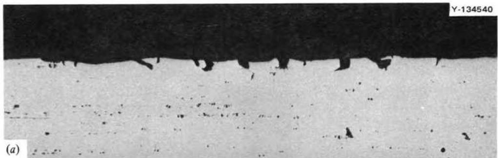

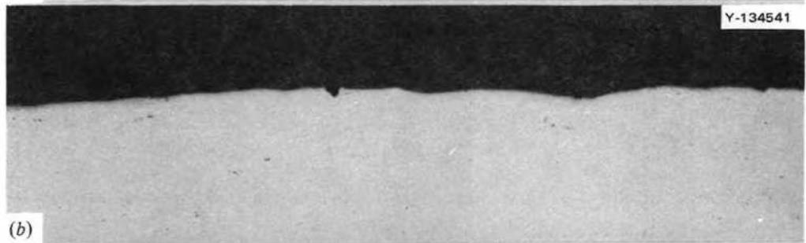

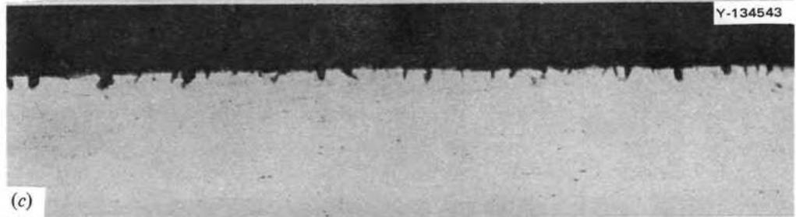

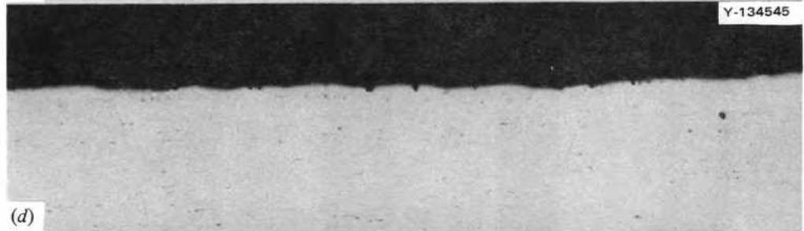

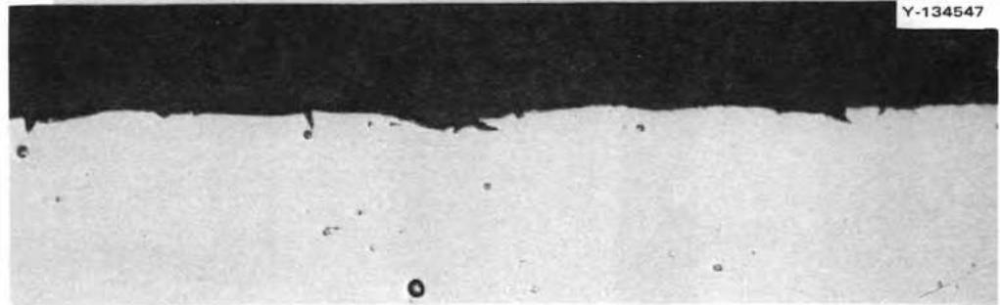

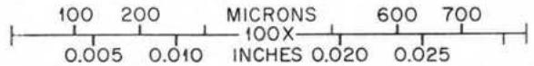  
Fig. 6.50. Several materials exposed to tellurium (experiment 75-11). (a) Standard Hastelloy N, heat 405065; (b) $2\%$ titanium-modified Hastelloy N, heat 471-114; (c) titanium-lanthanum-modified Hastelloy N, heat 474-534; (d), titanium-cerium-lanthanum-modified Hastelloy N, heat 474-535; and (e) Inconel 600, heat 600600.

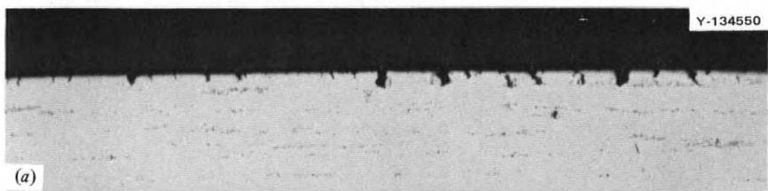

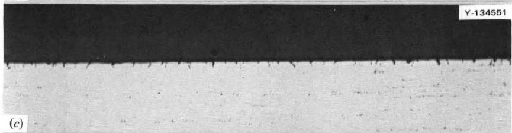

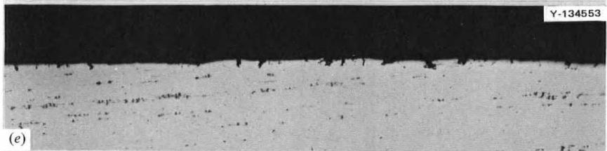

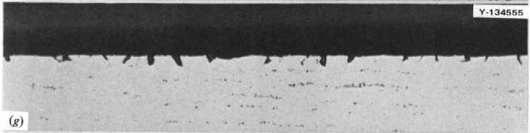

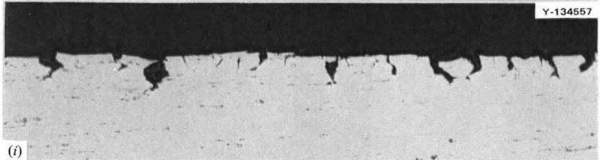

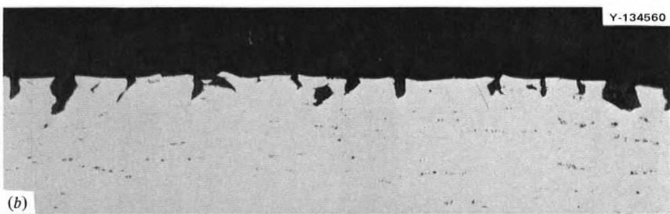

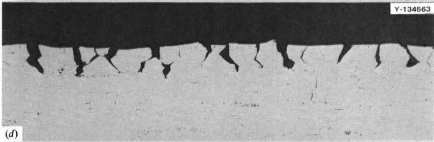

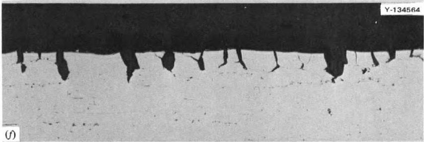

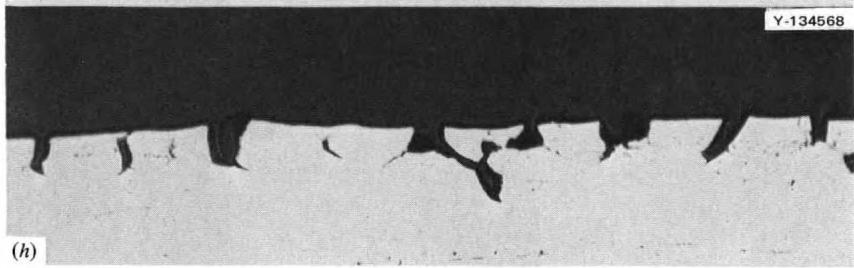

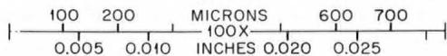  
Fig. 6.51. Standard Hastelloy N (heat 405065) given the indicated anneal and exposed for $250\mathrm{hr}$ at $700^{\circ}\mathrm{C}$ to the vapor above tellurium at $300^{\circ}$ (experiment 75-12). Strained to failure at $25^{\circ}\mathrm{C}$ and sectioned for metallographic examination. $(a)$ As swaged, $(b)$ 1 hr at $982^{\circ}\mathrm{C},(c)$ 1 hr at $1038^{\circ}\mathrm{C},(d)$ 1 hr at $1093^{\circ}\mathrm{C},(e)$ 1 hr at $1149^{\circ}\mathrm{C},(f)$ 1 hr at $1177^{\circ}\mathrm{C},(g)$ 1 hr at $1204^{\circ}\mathrm{C},(h)$ 1 hr at $1232^{\circ}\mathrm{C},$ and $(i)$ 1 hr at $1260^{\circ}\mathrm{C}.$

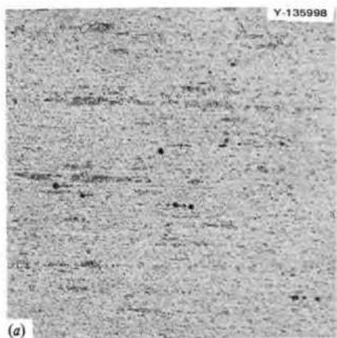

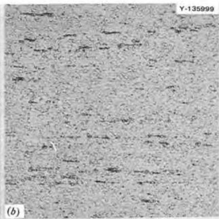

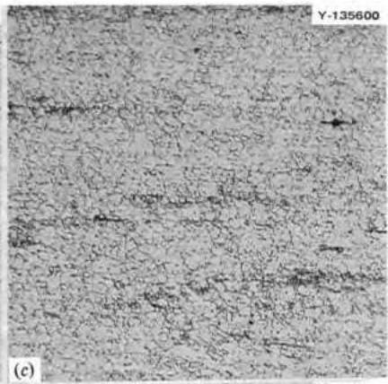

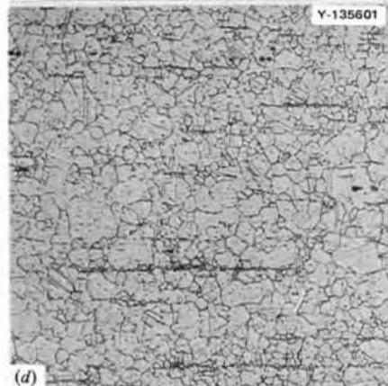

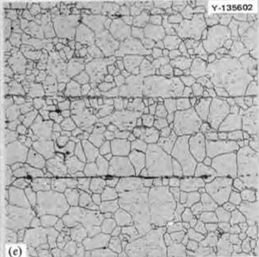

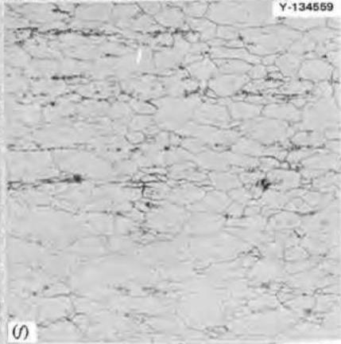

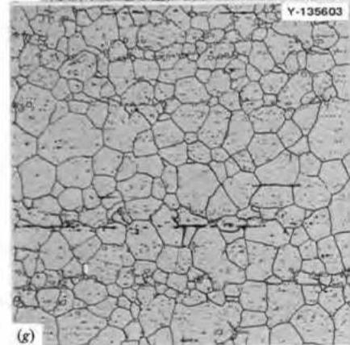

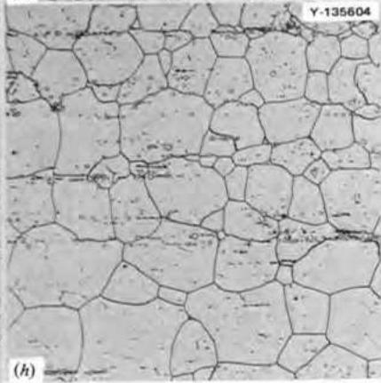

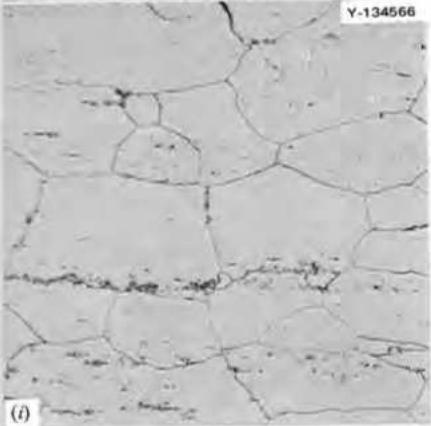

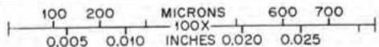  
Fig. 6.52. Standard Hastelloy N (heat 405065) annealed at the indicated temperature. Etched with glyceria regia. $(a)$ As swaged, $(b)$ I hr at $982^{\circ}\mathrm{C}$ , $(c)$ I hr at $1038^{\circ}\mathrm{C}$ , $(d)$ I hr at $1093^{\circ}\mathrm{C}$ , $(e)$ I hr at $1149^{\circ}\mathrm{C}$ , $(f)$ I hr at $1177^{\circ}\mathrm{C}$ , $(g)$ I hr at $1204^{\circ}\mathrm{C}$ , $(h)$ I hr at $1232^{\circ}\mathrm{C}$ , and $(i)$ I hr at $1260^{\circ}\mathrm{C}$ .

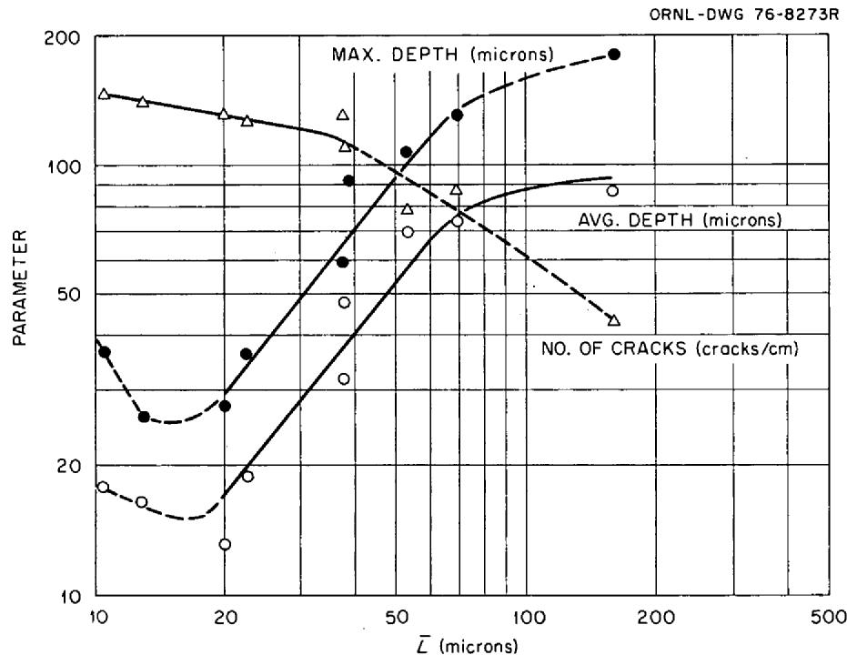  
Fig. 6.53. Variation of crack parameters with the average linear intercept $(\bar{L})$ for standard Hastelloy N exposed to tellurium (experiment 75-12).

Table 6.24. Relative ranking of specimens from experiments $75\cdot 10^{a}$ (250 hr) and 75-13 (1000 hr)   

<table><tr><td rowspan="2">Heat number</td><td colspan="3">Concentrationb(%)</td><td colspan="2">Experiment 75-10</td><td colspan="2">Experiment 75-13</td></tr><tr><td>Ti</td><td>Nb</td><td>Other</td><td>Product of number of cracks and average depth (cracks cm × μ)</td><td>Relative severityc</td><td>Product of number of cracks and average depth (cracks cm × μ)</td><td>Relative severityc</td></tr><tr><td>424</td><td>1.8</td><td>1.34</td><td></td><td>4512</td><td>1</td><td>5085</td><td>2</td></tr><tr><td>421</td><td>2.19</td><td>1.04</td><td></td><td>3245</td><td>2</td><td>5251</td><td>1</td></tr><tr><td>425</td><td>1.98</td><td>0.48</td><td></td><td>3198</td><td>3</td><td>3322</td><td>3</td></tr><tr><td>405065</td><td></td><td></td><td></td><td>2328</td><td>4</td><td>1938</td><td>5</td></tr><tr><td>425</td><td>1.98</td><td>0.48</td><td></td><td>2157</td><td>5</td><td>1955</td><td>4</td></tr><tr><td>298</td><td></td><td>2.0</td><td></td><td>713</td><td>6</td><td>452</td><td>7</td></tr><tr><td>413</td><td>1.0</td><td>1.13</td><td></td><td>336</td><td>7</td><td>1488</td><td>6</td></tr><tr><td>348</td><td></td><td>0.62</td><td>0.47 Si</td><td>209</td><td>8</td><td>248</td><td>8</td></tr><tr><td>411</td><td></td><td>1.15</td><td></td><td>133</td><td>9</td><td>215</td><td>9</td></tr><tr><td>295</td><td></td><td>0.85</td><td></td><td>106</td><td>10</td><td>47</td><td>12</td></tr><tr><td>421543</td><td></td><td>0.7</td><td></td><td>76</td><td>11</td><td>155</td><td>10</td></tr><tr><td>345</td><td></td><td>0.45</td><td>0.22 Si</td><td>45</td><td>12</td><td>62</td><td>11</td></tr></table>

aSee pp. 108-122, ORNL-5078.   
See Table 6.21 for detailed chemical analyses.   
$c$ Severity of cracking ranges from a maximum of 1 to a minimum of 12.

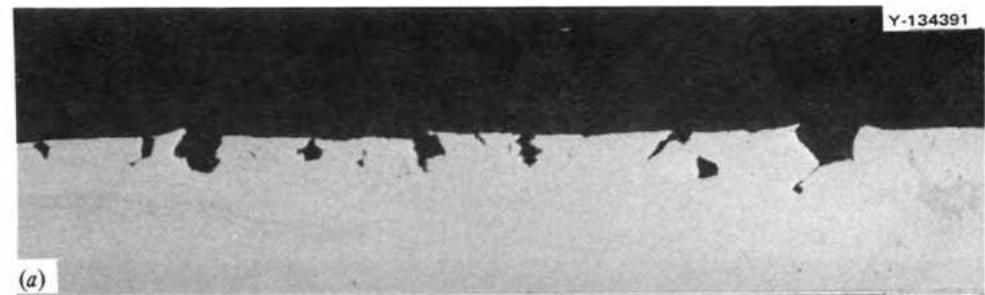

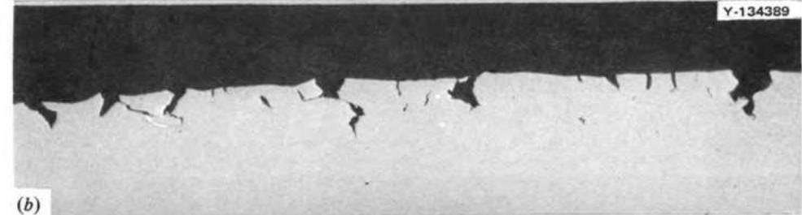

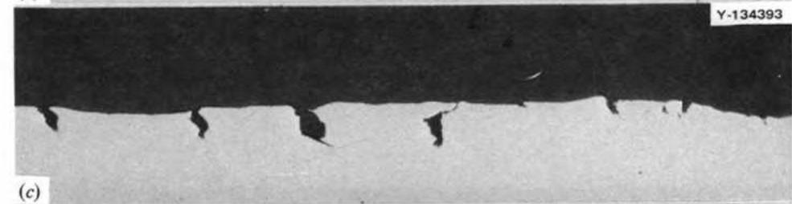

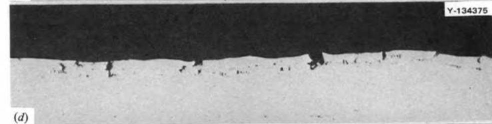

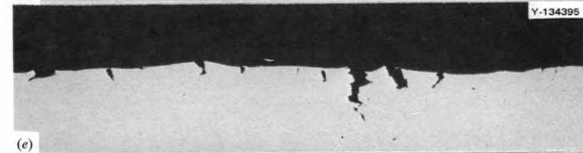

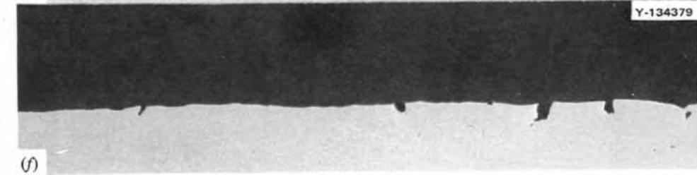

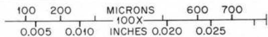  
Fig. 6.54. Strained specimens from experiment 75-13. Specimens were exposed for $1000\mathrm{hr}$ at $700^{\circ}\mathrm{C}$ to the vapor above tellurium metal at $300^{\circ}\mathrm{C}$ . (a) Alloy 300, (b) alloy 299, (c) alloy 301, (d) alloy 292, (e) alloy 302, and (f) alloy 294. As polished.

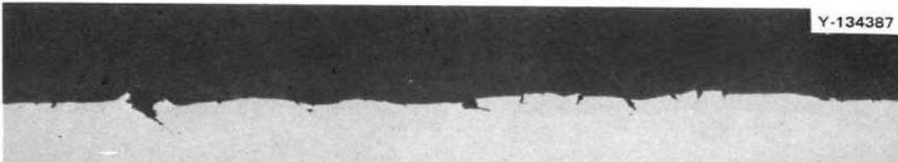

  
(a)

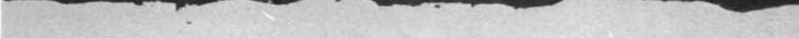

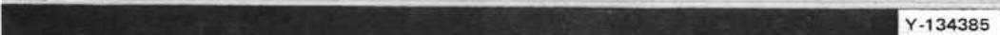  
(b)

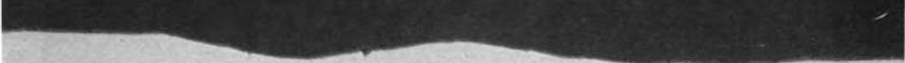

  
(c)   
$\therefore m = \frac{3}{11}$

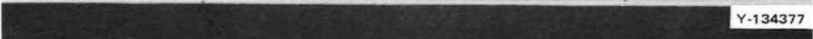

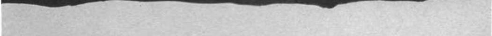  
(d)   
1. 实验原理

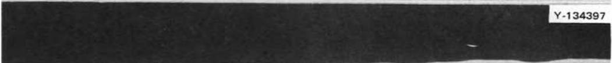

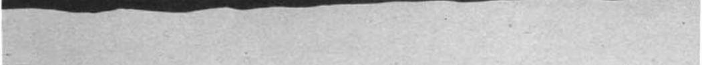  
(e)   
1.2.1.1.1

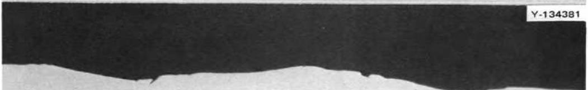

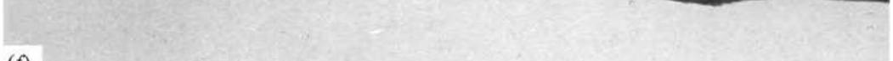

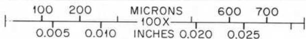  
Fig. 6.55. Strained specimens from experiment 75-13 exposed for $1000\mathrm{hr}$ at $700^{\circ}\mathrm{C}$ to the vapor above tellurium metal at $300^{\circ}\mathrm{C}(a)$ Alloy 298, $(b)$ alloy 296, $(c)$ alloy 297, $(d)$ alloy 293, $(e)$ alloy 303, and $(f)$ alloy 295. As polished.

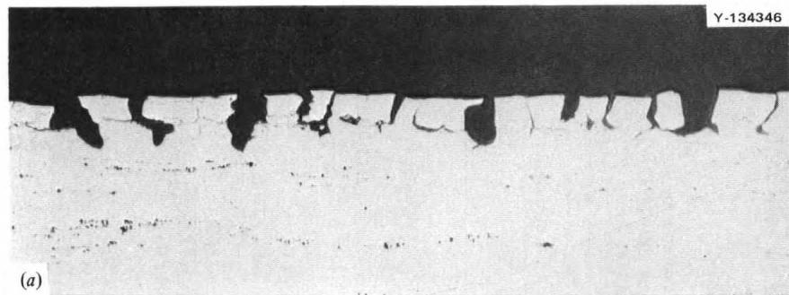

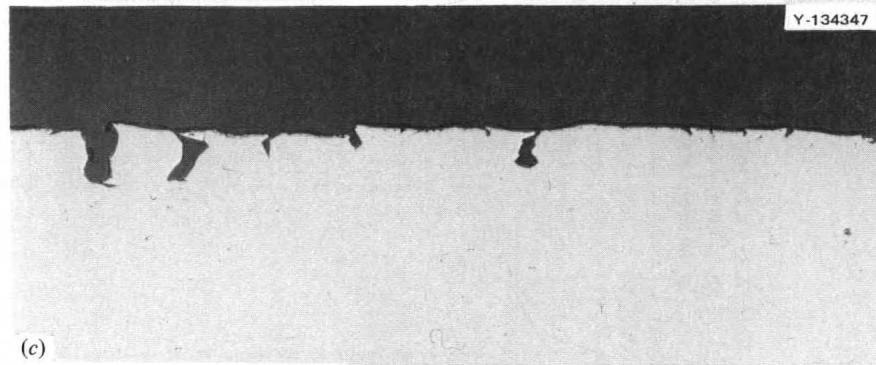

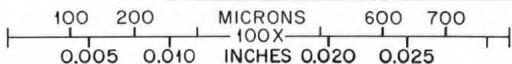

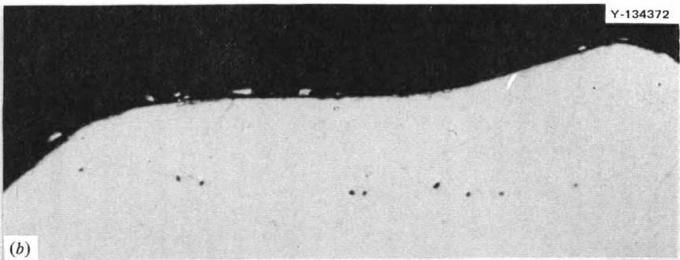

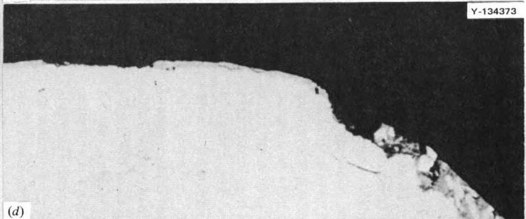

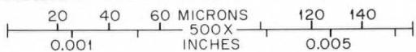  
Fig. 6.56. Specimens exposed to salt plus $\mathrm{Cr_3Te_4}$ for $500\mathrm{hr}$ at $700^{\circ}\mathrm{C}$ (experiment 75-14). Hastelloy N (heat 405065): (a) Gage section and (b) shoulder. Heat 470-835: (c) gage section and (d) shoulder. As polished.

containing only niobium was more resistant to intergranular cracking (Fig. 6.57). However, both alloys formed surface reaction products and did form cracks.

In experiment 75-16, specimens of several alloys were sealed in a capsule with $\mathrm{Cr_3Te_4}$ at $700^{\circ}\mathrm{C}$ and exposed to the vapor above the $\mathrm{Cr_3Te_4}$ for $1000\mathrm{hr}$ . The appearance of the specimens after removal from the capsule (Fig. 6.58) and the high weight gains (Table 6.22) are indicative of the relatively high reaction rate. Further investigation revealed that this lot of $\mathrm{Cr_3Te_4}$ had not been sufficiently homogenized since sufficient tellurium was present to be detected by x-ray diffraction. Thus the activity of tellurium in this capsule would have been quite high, resulting in the observed high reaction rates. The extent of cracking was quite severe in this experiment, however there were detectable differences among the various alloys. The alloys are ranked on the basis of the product of the number and depth of cracks (Table 6.25). The alloys containing additions of 0.45 to $2\%$ niobium showed less extensive cracking, as did Inconel 600 (alloy 600600). Alloys containing titanium and various amounts of rare earth elements showed somewhat more cracking. Photomicrographs of the unstressed portions of the alloys show reaction layers of varying thicknesses on all specimens (Fig. 6.59). Photomicrographs of the strained

sections of several of the specimens are shown in Fig. 6.60. The depth and frequency of cracking vary markedly in the various alloys.

In experiment 75-17 a standard Hastelloy N specimen was exposed for $649\mathrm{hr}$ at $650^{\circ}\mathrm{C}$ to salt containing $\mathrm{LiTe_3}$ . Electrochemical probes in this melt failed to indicate the presence of a soluble tellurium species, but the Hastelloy N specimen was embrittled sufficiently to form intergranular cracks (Fig. 6.61).

Experiment 75-18 used tellurium metal as a source of tellurium, as was done in several other experiments; but the tellurium activity was not reproducible, probably because the temperature of the tellurium metal at $300^{\circ}\mathrm{C}$ could not be controlled. In experiment 75-18, there was little evidence of reaction of the tellurium with the specimens. The specimens after exposure (Fig. 6.62) had the same colorations present before insertion into the capsule, and the weight changes were extremely small (Table 6.22). The limited supply of tellurium into the region of the capsule where the specimens were located probably accounts for anomalous behavior of this entire group of specimens.

Experiment 75-19 was run to examine the influence of chromium content on the extent of cracking in the basic Hastelloy N alloy. Four alloys containing from 7.4 to $14.5\%$ chromium were exposed to salt containing $\mathrm{Cr_3Te_4}$ for 500 hr at

Table 6.25. Ranking of alloys from experiment   
75-16 specimens annealed 1000 hr at $700^{\circ}\mathbf{C}$ in the vapor above $\mathbf{Cr}_3\mathbf{Te}_4$ at $700^{\circ}\mathbf{C}$   

<table><tr><td rowspan="2">Product of number of cracks and average depth (cracks/cm × μ)</td><td rowspan="2">Alloy number</td><td colspan="3">Concentration (%)</td></tr><tr><td>Ti</td><td>Nb</td><td>Other</td></tr><tr><td>8712</td><td>474-533</td><td>1.75</td><td></td><td></td></tr><tr><td>7003</td><td>474-535</td><td>2.13</td><td></td><td>0.01 La, 0.030 Ce</td></tr><tr><td>6542</td><td>424</td><td>1.8</td><td>1.34</td><td></td></tr><tr><td>6075</td><td>474-534</td><td>2.09</td><td></td><td>0.013 La</td></tr><tr><td>5792</td><td>422</td><td>1.0</td><td>2.29</td><td></td></tr><tr><td>5055</td><td>471-114</td><td>1.75</td><td></td><td></td></tr><tr><td>4325</td><td>421</td><td>1.9</td><td>1.04</td><td></td></tr><tr><td>4270</td><td>298</td><td></td><td>2.0</td><td></td></tr><tr><td>4228</td><td>405065</td><td></td><td></td><td></td></tr><tr><td>4048</td><td>303</td><td>0.49</td><td>0.84</td><td></td></tr><tr><td>3916</td><td>348</td><td></td><td>0.62</td><td></td></tr><tr><td>3260</td><td>237</td><td></td><td>1.03</td><td></td></tr><tr><td>2294</td><td>417</td><td></td><td>2.29</td><td></td></tr><tr><td>2006</td><td>345</td><td></td><td>0.45</td><td></td></tr><tr><td>1611</td><td>600600</td><td></td><td></td><td>15 Cr</td></tr><tr><td>641</td><td>295</td><td></td><td>0.85</td><td></td></tr></table>

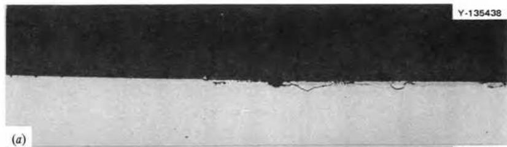

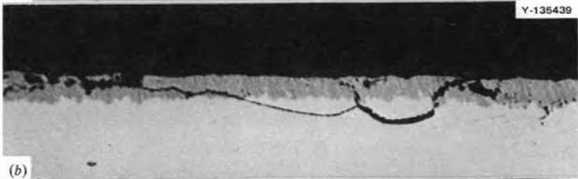

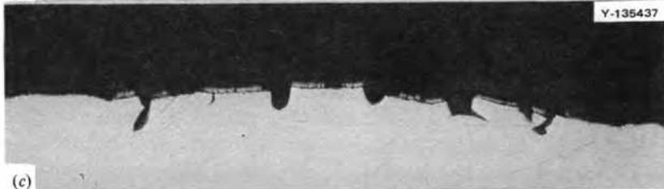

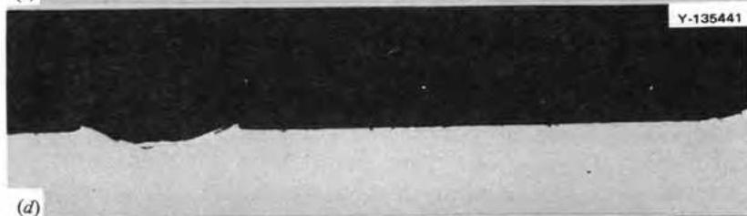

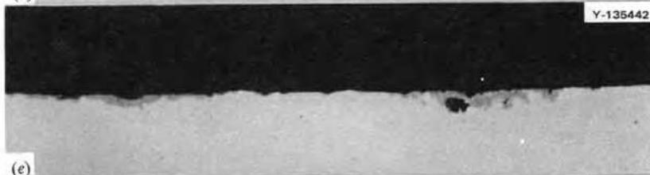

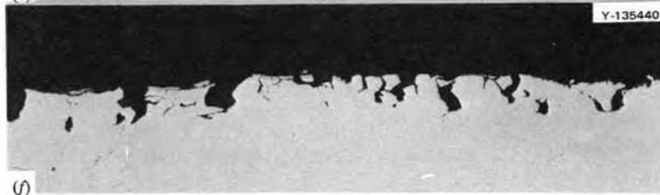

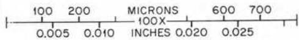

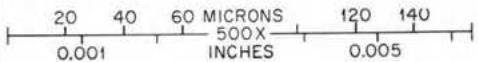

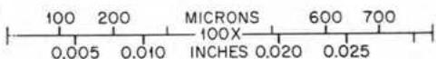

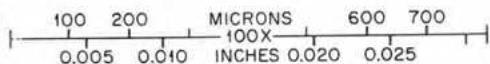

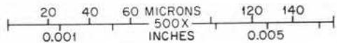

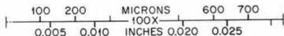  
Fig. 6.57. Modified-Hastelloy N specimens exposed to salt plus $\mathrm{Cr_3Te_4}$ for 243 hr at $700^{\circ}\mathrm{C}$ (experiment 75-15). (a), (b) Unstressed shoulder and (c) stressed gage section of alloy 411. (d), (e) Unstressed shoulder and (f) stressed gage section of alloy 413. As polished.

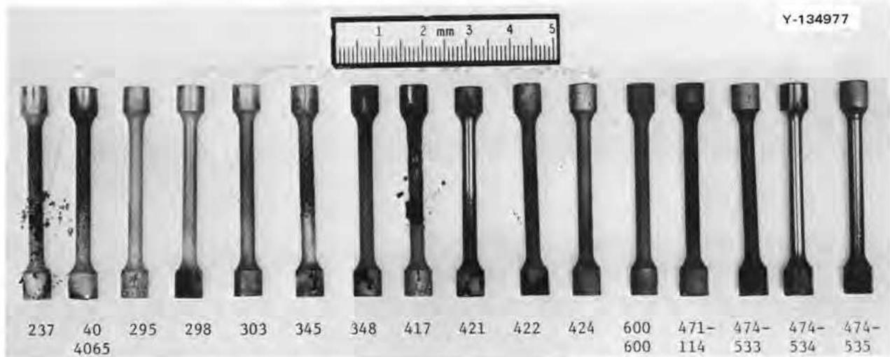  
Fig. 6.58. Specimens after exposure for 1000 hr at $700^{\circ}\mathrm{C}$ to the vapor above $\mathrm{Cr_3Te_4}$ at $700^{\circ}$ (experiment 75-16).

$700^{\circ}\mathrm{C}$ . The crack statistics (Table 6.22) and the photomicrographs (Fig. 6.63) show that there was no detectable influence of these variations in chromium concentration on the severity of cracking.

In experiment 75-20, standard Hastelloy N was exposed to salt containing $\mathrm{Ni}_3\mathrm{Te}_2$ at $700^{\circ}\mathrm{C}$ . The crack statistics (Table 6.22) and the photomicrographs (Fig. 6.64) show that the material was embrittled by the exposure.

In experiment 75-21, standard Hastelloy N was exposed to salt containing $\mathrm{Cr_3Te_4}$ for $500\mathrm{hr}$ at $700^{\circ}\mathrm{C}$ . The specimen was positioned partly in the salt and partly in the vapor. The sample cracked extensively, with the cracking being much greater in the portion exposed to salt (Table 6.22 and Fig. 6.65).

In experiments 75-22 and 75-23, three alloys were exposed to the vapor above $\mathrm{Ni} + \mathrm{Ni}_3\mathrm{Te}_2$ for $2500\mathrm{hr}$ at 700 and $750^{\circ}\mathrm{C}$ respectively (Fig.6.66). The cracking statistics (Table 6.22) indicate several trends that may or may not be significant. The frequency of cracking is slightly less for all three alloys when exposed at $750^{\circ}\mathrm{C}$ compared with $700^{\circ}\mathrm{C}$ . The depth of cracking appears greater at $750^{\circ}\mathrm{C}$ for two alloys and less for one alloy. A clear trend at both conditions is that alloy 295, which contains $0.85\%$ niobium, formed fewer and shallower cracks than the other two alloys (Figs. 6.67 and 6.68).

In experiment 75-24, nine alloys were exposed for $287\mathrm{hr}$ at $700^{\circ}\mathrm{C}$ to the vapor above tellurium metal at $300^{\circ}\mathrm{C}$ . These specimens all exhibited small weight gains and shallow crack formation (Table 6.22). The alloys are ranked in Table 6.26 on the basis of the product of crack frequency and depth. Alloys 450

and 518 had the poorest resistance to cracking. All the alloys with niobium additions but not titanium had good resistance to cracking. No systematic variation with niobium content was detected, probably because of the very limited extent of cracking in this rather short exposure. Alloys 523 and 524, which contained more than the normal $7\%$ chromium, did not appear particularly good in this test. Typical appearances of the specimens from this experiment are shown in Fig. 6.69.

Although these experiments involved several techniques and methods for exposing specimens to tellurium-containing environments, they lead to four important conclusions.

1. Hastelloy N modified with about 0.5 to $2\%$ niobium has good resistance to embrittlement by tellurium.   
2. Hastelloy N modified with niobium and titanium has poor resistance to embrittlement, indicating that titanium counteracts the beneficial effects of niobium.   
3. Although Inconel 600, which contains $16\%$ chromium, exhibited good resistance to tellurium embrittlement, Hastelloy N modified to contain $15\%$ chromium was not resistant to embrittlement by tellurium.   
4. Although a soluble tellurium species was not detected by electrochemical techniques in any of the salt-telluride mixtures, standard Hastelloy N was embrittled in all such systems.

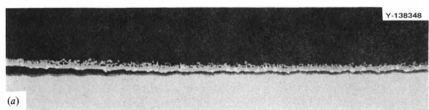

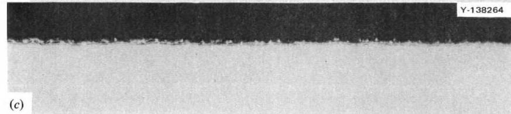

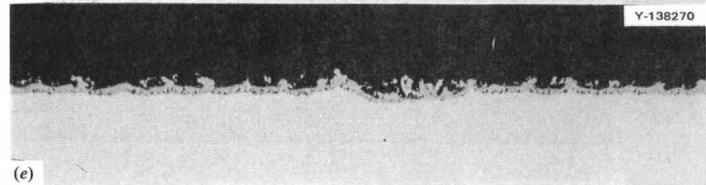

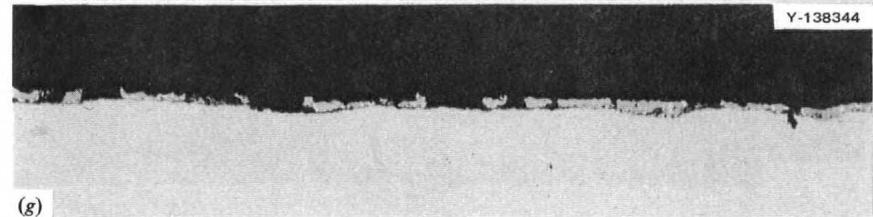

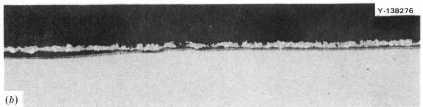

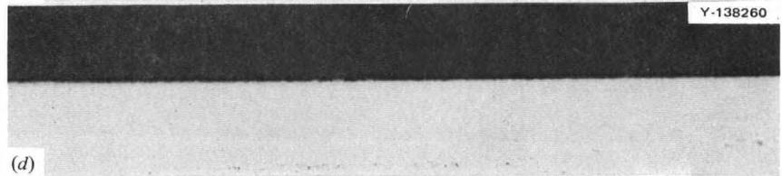

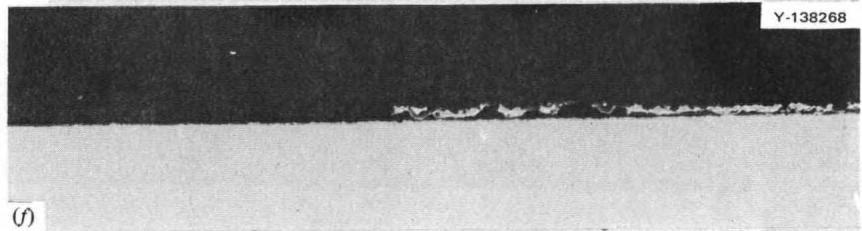

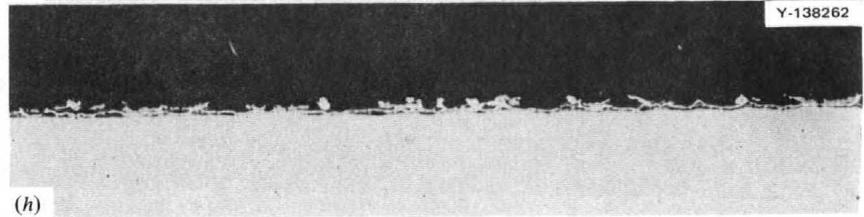

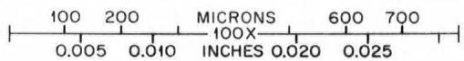  
Fig. 6.59. Several materials exposed for $1000\mathrm{hr}$ at $700^{\circ}\mathrm{C}$ to the vapor above $\mathrm{Cr}_3\mathrm{Te}_4$ at $700^{\circ}\mathrm{C}$ (experiment 75-16). Unstrained portions in as-polished condition. (a) Alloy 474-533, (b) alloy 422, (c) alloy 298, (d) alloy 405065, (e) alloy 348, (f) alloy 345, (g) alloy 600600, and (h) alloy 295.

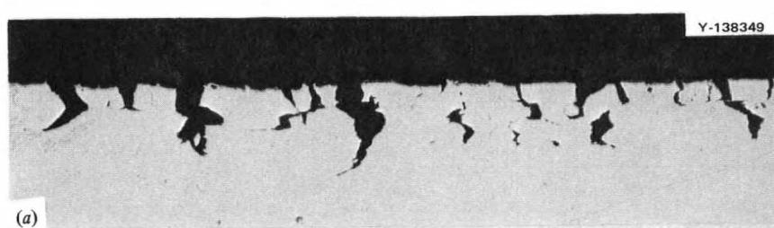

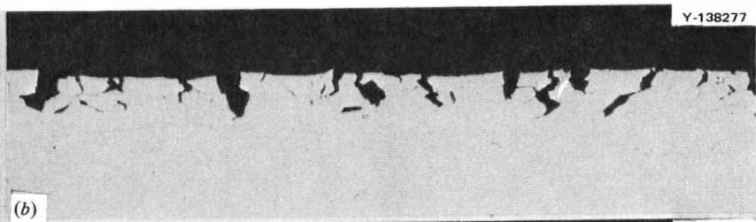

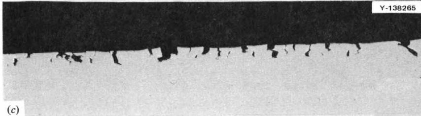

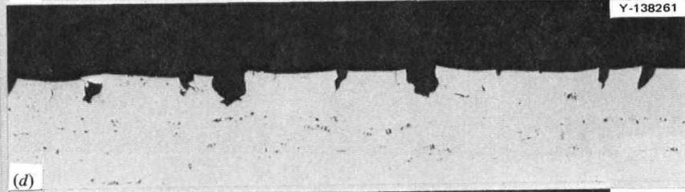

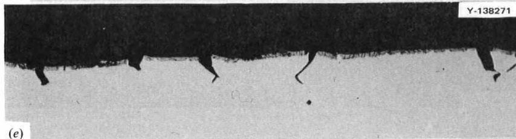

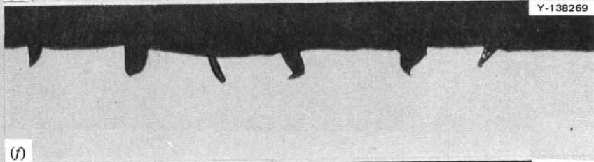

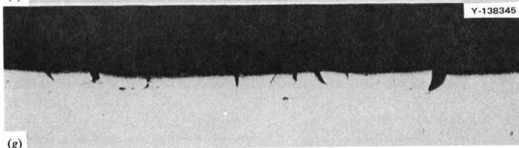

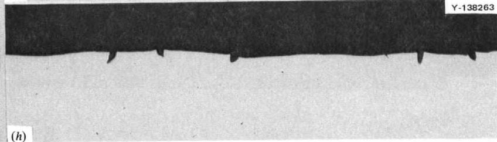

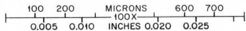  
Fig. 6.60. Stressed portions of several materials exposed for $1000\mathrm{hr}$ at $700^{\circ}\mathrm{C}$ to the vapor above $\mathrm{Cr}_3\mathrm{Te}_4$ at $700^{\circ}\mathrm{C}$ (experiment 75-16) and strained to failure at $25^{\circ}\mathrm{C}$ . (a) Alloy 474-533, (b) alloy 422, (c) alloy 298, (d) alloy 405065, (e) alloy 348, (f) alloy 345, (g) alloy 600600, and (h) alloy 295. As polished.

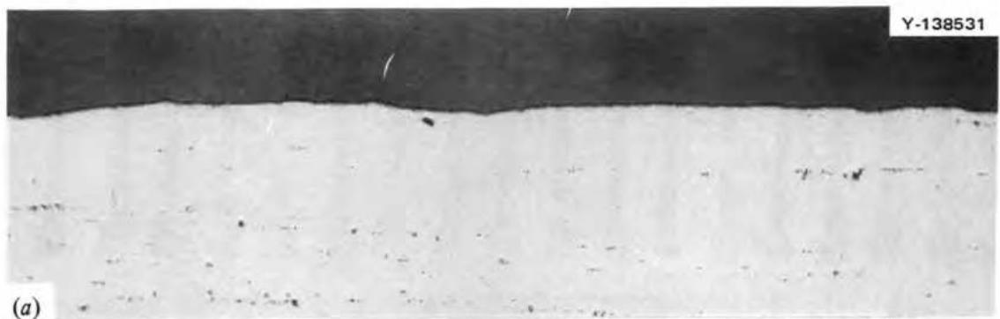

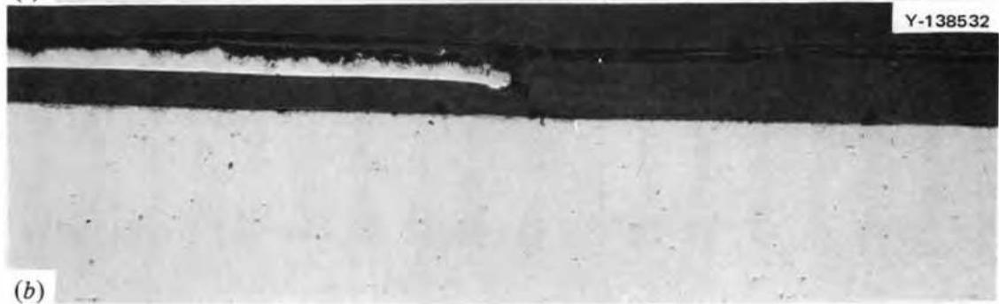

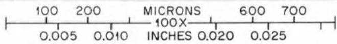

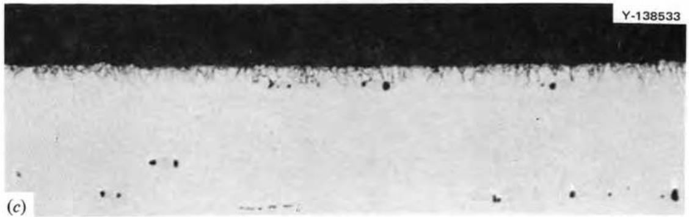

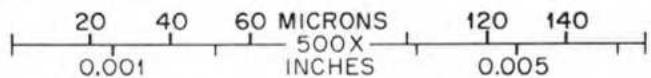  
Fig. 6.61. Hastelloy N (heat 405065) exposed to salt containing $\mathrm{LiTe}_3$ for 649 hr at $650^{\circ}\mathrm{C}$ (experiment 75-17). (a) Stressed section, $100\times$ ; (b) unstressed section, $100\times$ ; (c) unstressed section, $500\times$ .

# 6.13 SALT-TELLURIUM CREEP STUDIES

T. K. Roche

B. McNabb

J.C.Feltner

The eight creep-rupture machines for testing in MSBR fluoride salt $\mathrm{(LiF - BeF_2 - ThF_4 - UF_4}$ 72-16-11.7-0.3 mole $\%$ are all now in operation. The test program has been set up to run duplicate tests on each alloy, one specimen being tested in clean salt and the other in tellurium-containing salt to obtain an indication of susceptibility to embrittlement while

under stress in the presence of tellurium. Tellurium is supplied to the salt by additions of milligram quantities of $\mathrm{Cr_3Te_4}$ through valves in the top of each salt chamber. Provision has been made for salt sampling during the course of a test by drawing a small quantity into a copper tube that can be inserted into the chamber and pushed below the salt level. Also, these machines have been equipped with electrochemical probes for making voltammetric measurements to monitor $\mathrm{U}^{4+}/\mathrm{U}^{3+}$ ratios of the salt (Sect. 5.1, this report).

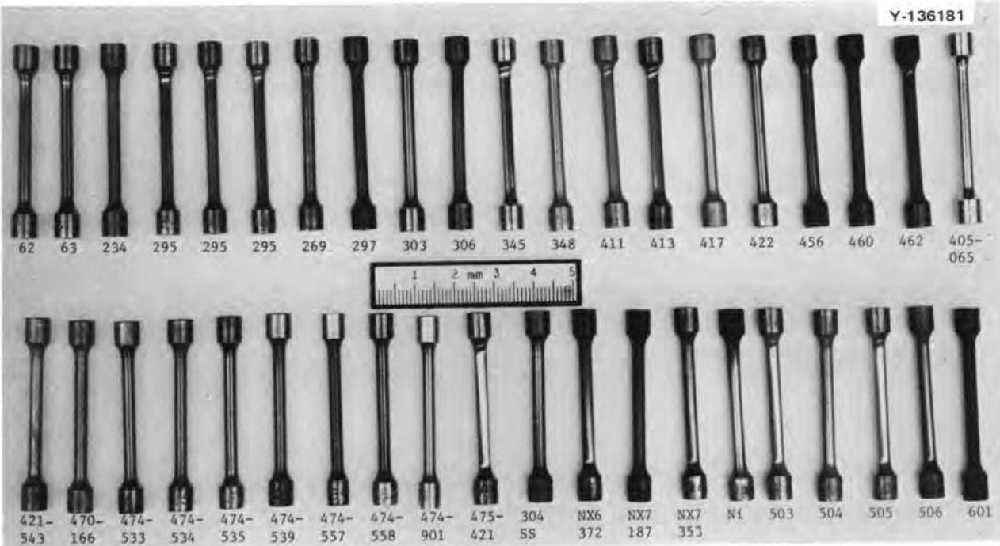  
Fig. 6.62. Specimens exposed for $1000\mathrm{hr}$ at $700^{\circ}\mathrm{C}$ to the vapor above tellurium at $300^{\circ}\mathrm{C}$ (experiment 75-18).

Table 6.26. Ranking of alloys from experiment 75-24 specimens exposed for ${287}\mathrm{{hr}}$ at ${700}^{ \circ  }\mathrm{C}$ to the vapor above tellurium at ${300}^{ \circ  }\mathrm{C}$   

<table><tr><td rowspan="2">Product of number of cracks and average depth (cracks cm×μ)</td><td rowspan="2">Alloy number</td><td colspan="3">Concentration (%)</td></tr><tr><td>Cr</td><td>Ti</td><td>Nb</td></tr><tr><td>1095</td><td>450</td><td>8.1</td><td>2.1</td><td></td></tr><tr><td>634</td><td>518</td><td>7.18</td><td>0.95</td><td>0.96</td></tr><tr><td>351</td><td>524</td><td>15.20</td><td>&lt;0.02</td><td>0.69</td></tr><tr><td>194</td><td>516</td><td>7.30</td><td>&lt;0.02</td><td>&lt;0.10</td></tr><tr><td>150</td><td>523</td><td>10.40</td><td>&lt;0.02</td><td>0.47</td></tr><tr><td>86</td><td>513</td><td>7.20</td><td>&lt;0.02</td><td>0.45</td></tr><tr><td>80</td><td>514</td><td>7.05</td><td>&lt;0.02</td><td>0.69</td></tr><tr><td>59</td><td>515</td><td>7.20</td><td>&lt;0.02</td><td>0.20</td></tr><tr><td>25</td><td>517</td><td>7.10</td><td>&lt;0.02</td><td>1.10</td></tr></table>

At present, all tests are being carried out at $650^{\circ}\mathrm{C}$ and $30.0 \times 10^{3}$ psi. The alloys include both titanium- and niobium-modified Hastelloy N. Two tests have been completed on specimens of $2\%$ titanium-modified Hastelloy N (heat 74-533). A test in clean salt and its counterpart in tellurium-containing salt were discontinued after 4175 hr and 2380 hr respectively. Approximately $150\mathrm{mg}$ of $\mathrm{Cr_3Te_4}$ was added to the tellurium-containing salt test in a series of three additions. About this same quantity has also

been added to other tests in progress. The salt from these tests has been sampled for analysis, but results are incomplete. Time-dependent strain measurements recorded for tests completed or still in progress in the salt environment are presented in Table 6.27. The differences observed for any one alloy either with or without tellurium being present are not considered significant. The most significant part of these tests will be the posttest metallographic examination to determine the crack severity.

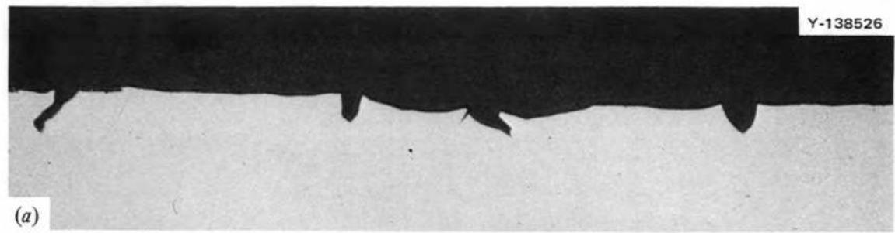

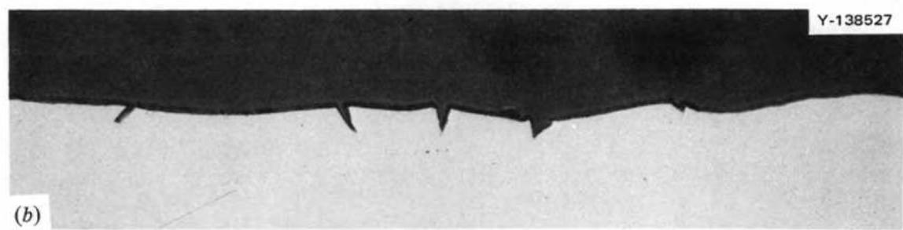

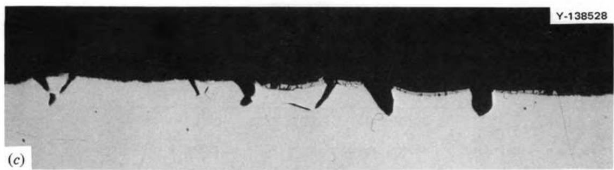

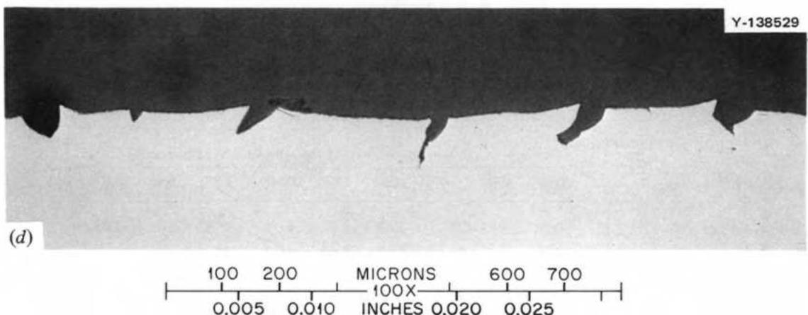  
Fig. 6.63. Specimens exposed to salt containing $\mathrm{Cr_3Te_4}$ for $500\mathrm{hr}$ at $700^{\circ}\mathrm{C}$ (experiment 75-19). (a) Alloy 503, (b) alloy 504, (c) alloy 505, and (d) alloy 506.

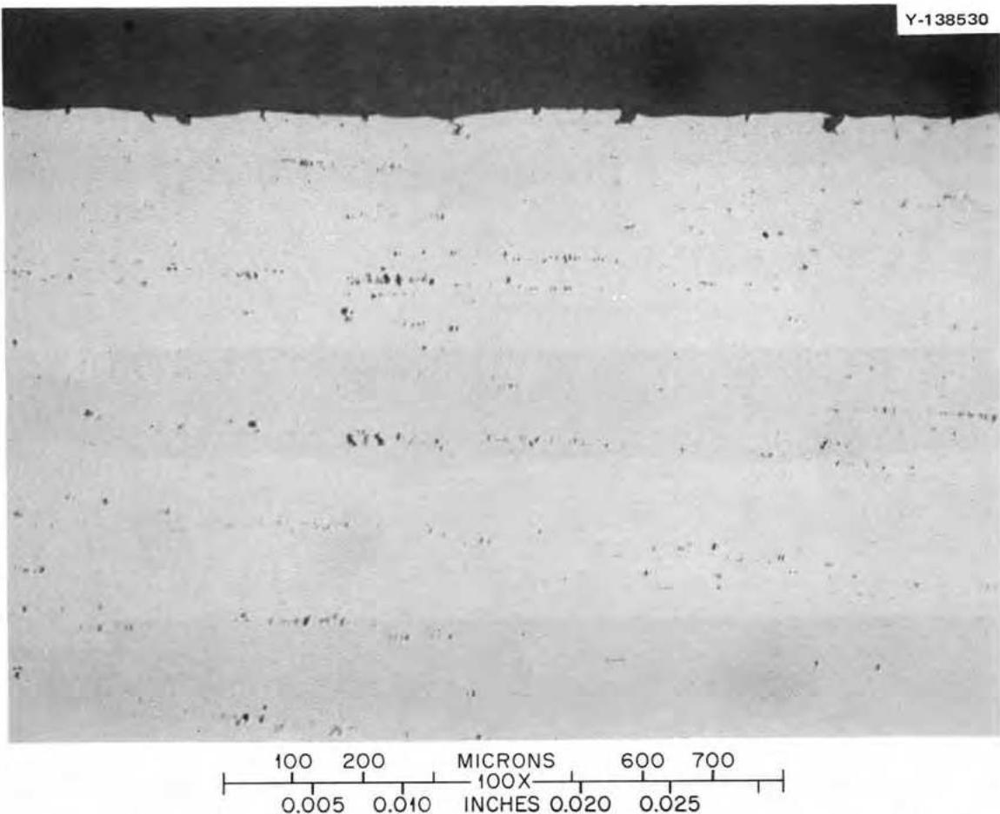  
Fig. 6.64. Hastelloy N (heat 405065) exposed to salt plus $\mathrm{Ni}_3\mathrm{Te}_2$ for 1000 hr at $700^{\circ}\mathrm{C}$ (experiment 75-20).

Table 6.27. Time-dependent strain measurements on niobium-titanium-modified Hastelloy N alloys being creep-tested in fluoride salt at $650^{\circ}\mathrm{C}, 30 \times 10^{3}$ psi   

<table><tr><td rowspan="2">Heat number</td><td colspan="2">Compositiona(wt %)</td><td colspan="10">Time-dependent strain after indicated hours (%)</td></tr><tr><td>Nb</td><td>Ti</td><td>100</td><td>250</td><td>500</td><td>1000</td><td>1500</td><td>2000</td><td>2500</td><td>3000</td><td>3500</td><td>4000</td></tr><tr><td>474-533</td><td></td><td>2.17</td><td>0.21</td><td>0.45</td><td>1.35</td><td>3.07</td><td>3.93</td><td>4.93</td><td>5.72</td><td>6.45</td><td>7.15</td><td>\( 7.79^b \)</td></tr><tr><td>\( 474-533^c \)</td><td></td><td>2.17</td><td></td><td>0.33</td><td>1.55</td><td>3.26</td><td>4.36</td><td>\( 5.43^c \)</td><td></td><td></td><td></td><td></td></tr><tr><td>421543</td><td>0.7</td><td></td><td>0.23</td><td>0.27</td><td>0.45</td><td>0.89</td><td>1.46</td><td>2.04</td><td>2.76</td><td>3.49</td><td>4.23</td><td></td></tr><tr><td>\( 421543^c \)</td><td>0.7</td><td></td><td>0.07</td><td>0.11</td><td>0.27</td><td>0.81</td><td>1.33</td><td>2.00</td><td>2.73</td><td>3.54</td><td>4.28</td><td></td></tr><tr><td>411</td><td>1.15</td><td></td><td>0.30</td><td>0.38</td><td>0.60</td><td>1.16</td><td>1.76</td><td>2.49</td><td>3.33</td><td>4.17</td><td>5.06</td><td></td></tr><tr><td>\( 411^c \)</td><td>1.15</td><td></td><td>0.46</td><td>0.57</td><td>0.66</td><td>1.15</td><td>1.63</td><td>2.22</td><td>2.88</td><td>3.62</td><td>4.40</td><td></td></tr><tr><td>413</td><td>1.13</td><td>0.9</td><td>-0.09</td><td>0.01</td><td>0.36</td><td>1.46</td><td>2.28</td><td>3.14</td><td>3.96</td><td>4.70</td><td>5.59</td><td></td></tr><tr><td>\( 413^c \)</td><td>1.13</td><td>0.9</td><td>0.05</td><td>0.08</td><td>0.57</td><td>1.47</td><td>2.16</td><td>2.78</td><td>3.46</td><td>4.21</td><td>4.96</td><td></td></tr><tr><td>62</td><td>1.9</td><td></td><td>0.26</td><td>0.42</td><td>0.89</td><td>1.87</td><td></td><td></td><td></td><td></td><td></td><td></td></tr><tr><td>\( 62^c \)</td><td>1.9</td><td></td><td>0.14</td><td>0.21</td><td>0.50</td><td>1.29</td><td></td><td></td><td></td><td></td><td></td><td></td></tr></table>

${}^{a}$ Base composition of $\mathrm{{Ni}} - {12}\% \mathrm{{Mo}} - 7\% \mathrm{{Cr}} - {0.05}\% \mathrm{C}$ ; see Table 6.21 for detailed chemical analysis.   
$b$ Test discontinued.   
${}^{c}$ Tellurium-containing salt test.

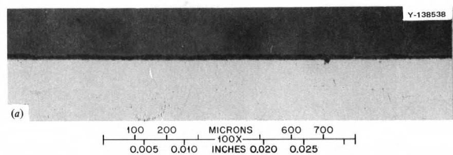

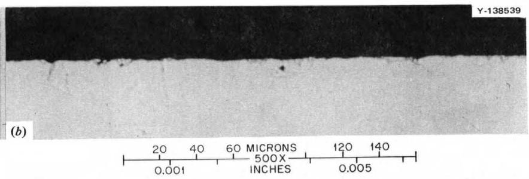

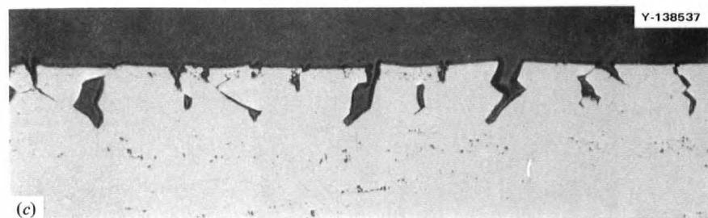

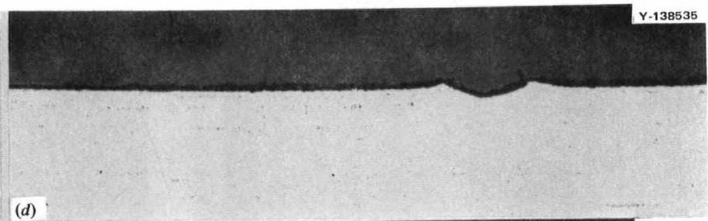

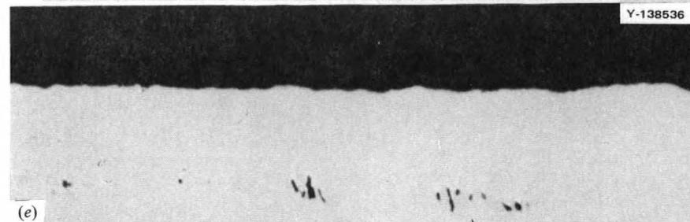

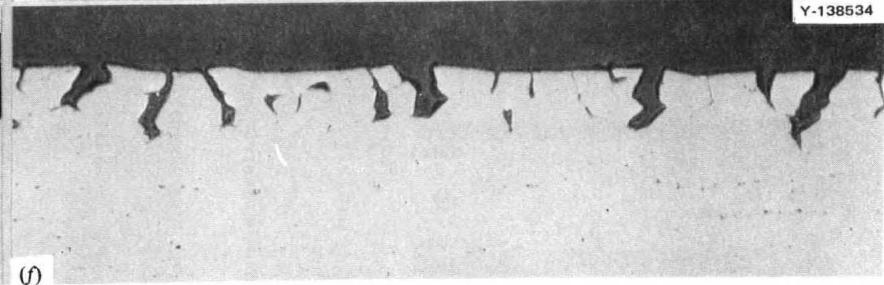

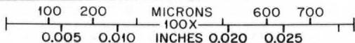  
Fig. 6.65. Hastelloy N (heat 405065) exposed to salt containing $\mathrm{Cr_3Te_4}$ for 500 hr at $700^{\circ}\mathrm{C}$ (experiment 75-21). $(a)$ , $(b)$ exposed to vapor, unstressed portion; $(c)$ exposed to vapor, stressed portion; $(d)$ $(e)$ exposed to salt, unstressed portion; and $(f)$ exposed to salt, stressed portion.

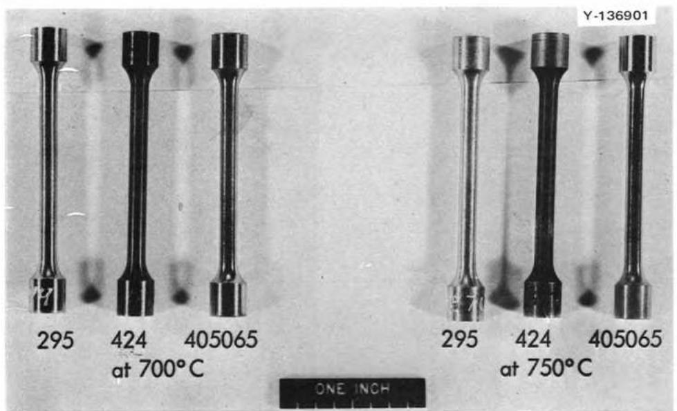  
Fig. 6.66. Specimens exposed to the vapor above $\mathrm{Ni}_3\mathrm{Te}_2$ for $2500\mathrm{hr}$ . Experiment 75-22 was run at $700^{\circ}\mathrm{C}$ , and experiment 75-23 was run at $750^{\circ}\mathrm{C}$ .

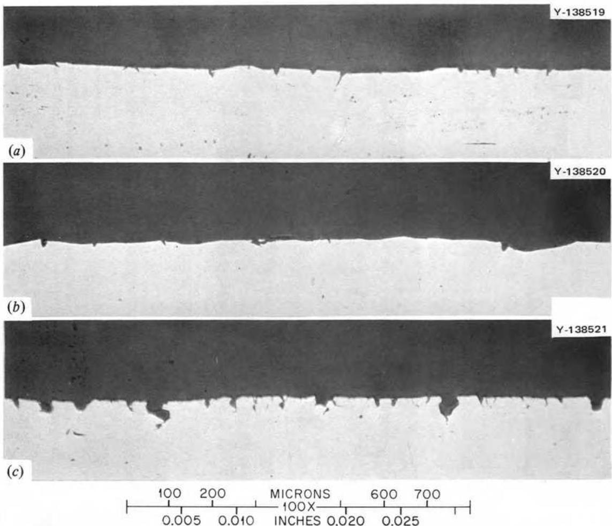  
Fig. 6.67. Specimens exposed to the vapor above $\mathrm{Ni}_3\mathrm{Te}_2$ at $700^{\circ}\mathrm{C}$ for 2500 hr (experiment 75-22) and strained to failure. (a) Alloy 405065, (b) alloy 295, and (c) alloy 424. As polished.

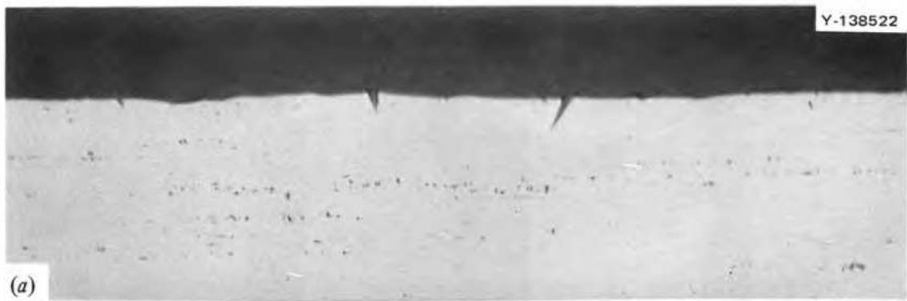

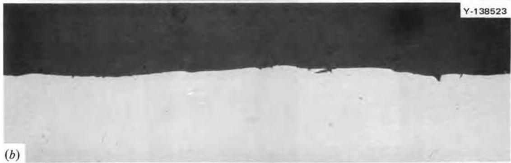

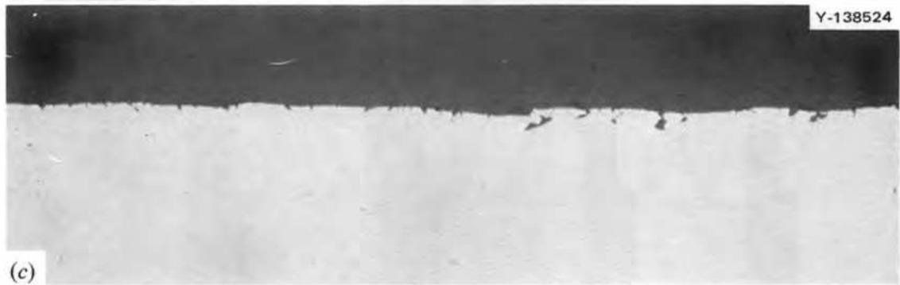

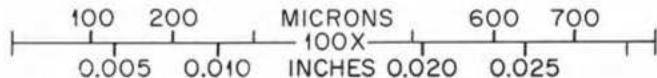  
Fig. 6.68. Specimens exposed to the vapor above $\mathrm{Ni}_3\mathrm{Te}_2$ at $750^{\circ}\mathrm{C}$ for 2500 hr (experiment 75-23) and strained to failure. (a) Alloy 405065, (b) alloy 295, and (c) alloy 424. As polished.

# 6.14 SALT PREPARATION AND FUEL PIN FILLING FOR MSR PROGRAM CAPSULE IRRADIATION EXPERIMENT TeGen-2

M. R. Bennett

A. D. Kelmers

Fueled irradiation experiments were initiated in 1972 to investigate the behavior of fission products, particularly tellurium, on structural materials being considered for the Molten-Salt Breeder Reactor. The fuel pins were made of 4-in. lengths of $\frac{1}{2}$ -in.-diam tubing of the various alloys under investigation and were filled with fuel salt containing $^{233}\mathrm{U}$ . Preparation

of these fuel pins required that a suitable salt charge be prepared and transferred into the fuel pins and that the fuel pin be separated, sealed, and inspected for subsequent irradiation. Because of the use of $^{233}\mathrm{U}$ , these pins were prepared in a glove box in the Plutonium Laboratory of the Metals and Ceramics Division.

The first fuel pins were prepared in 1972, but the MSR Program was discontinued before the pins were irradiated. The glove box was retained, but much of the equipment was disposed of. When the MSR Program was reinstated in 1974, the facility for

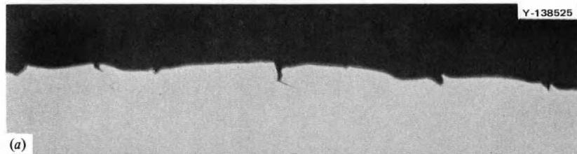

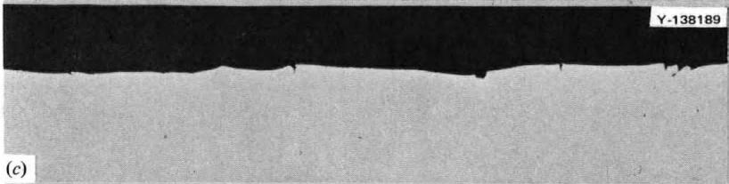

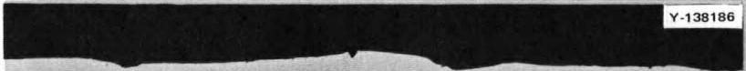

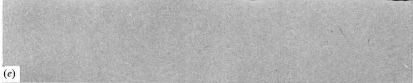

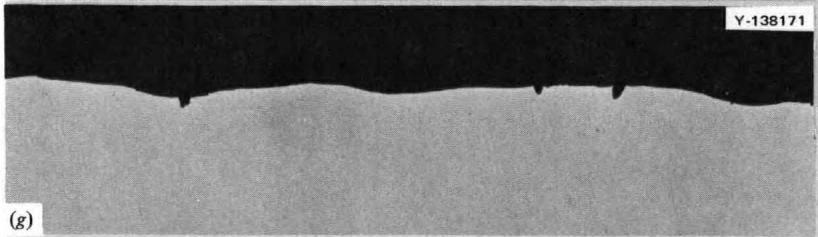

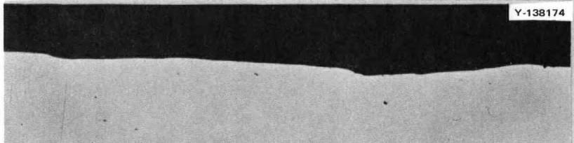  
(i)

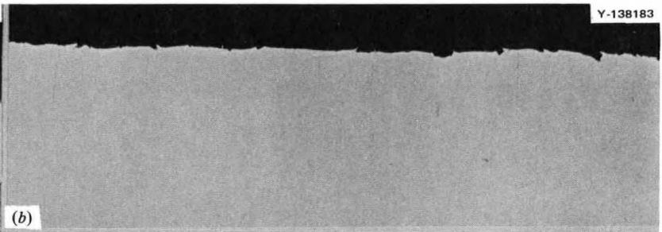

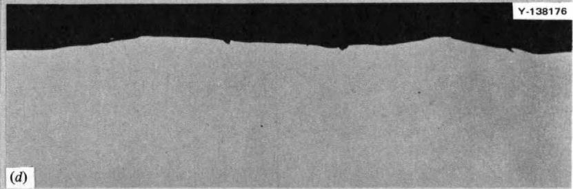

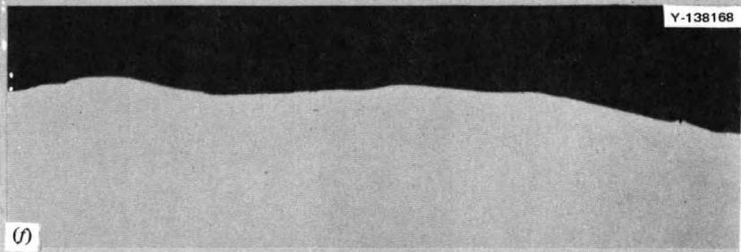

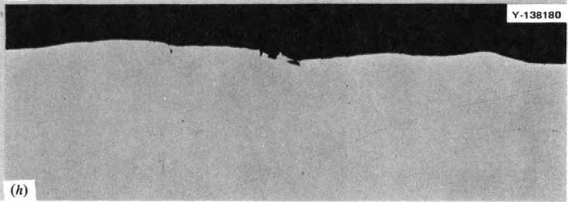

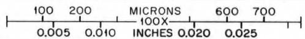  
Fig. 6.69. Specimens exposed to the vapor above tellurium metal at $300^{\circ}\mathrm{C}$ for 287 hr at $700^{\circ}\mathrm{C}$ (experiment 75-24) and strained to failure at $25^{\circ}\mathrm{C}$ . (a) Alloy 450, (b) alloy 518, (c) alloy 524, (d) alloy 516, (e) alloy 523, (f) alloy 513, (g) alloy 514, (g) alloy 515, and (i) alloy 517. As polished.

preparing the fuel pins had to be rebuilt. The original design for the salt preparation vessel was used, but the design of the salt receiving vessel was modified considerably.

One batch of salt was prepared for filling several pins. The individual sets of pins (six each) were assembled in the salt receiving vessel by C. K. Thomas and J. W. Woods of the Metals and Ceramics Division. The operating work associated with the salt preparation and filling the pins was done by W. B. Stines and W. H. Miller of the Metals and Ceramics Division. Various chemical analyses of the salt were performed by members of the Analytical Chemistry Division. The filled fuel pins were made available to C. R. Hyman of the Reactor Division for assembly into an irradiation capsule.

The following material will cover the preparation of the salt and the filling of the fuel pins for TeGen-2. There are several other experiments in this series, and some of the details concerning these experiments will be discussed in Sect. 6.15.

# 6.14.1 Salt Preparation

The fluoride fuel mixture for the TeGen-2 experiment was prepared in a nickel reaction vessel

fabricated from a 10-in. length of $2^{1} / 2$ -in. IPS, schedule 40 pipe in accordance with Dwg. M-10613-RM-004E (Fig. 6.70). Following receipt of the vessel, it was installed in the glove box furnace well (Fuel Cycle Alpha Facility, Building 4508). A schematic of the apparatus is shown in Fig. 6.71, and a photograph of the gas delivery system is shown in Fig. 6.72. Preparations were then made for loading the fuel mixture. The total fuel mixture $(714\mathrm{g})$ consisted of $600\mathrm{g}$ carrier salt, ${}^{7}\mathrm{LiF - BeF_2 - ZrF_4}$ (65.4-29.6-5.0 mole $\%$ ); $73.0\mathrm{g}^{238}\mathrm{UF}_4$ ,and $41.1\mathrm{g}^{233}\mathrm{UO}_2$ .The carrier salt contained "hafnium-free" $(<  20~\mathrm{ppm})$ $\mathsf{ZrF_4}$ and isotopically pure $(99.9 + \%)$ ${}^{7}\mathrm{Li}$ .The ${}^{233}\mathrm{UO}_2$ contained less than $7\mathrm{ppm}^{238}\mathrm{U}$

The following procedure was used to minimize contamination of the glove-box and component equipment during addition of the $\mathrm{UF_4}$ and $\mathrm{UO_2}$ . Four 6-in. lengths of $1/2$ -in.-OD metal tubing were inserted into appropriate lengths of flexible tygon tubing and taped together securely. These, in turn, were taped securely to polyethylene bottles, two containing the carrier salt (half, or $300\mathrm{g}$ , in each bottle) and the remaining two bottles containing the $\mathrm{UF_4}$ and $\mathrm{UO_2}$ . By then adding the contents of each bottle through the large riser of the receiving vessel in the order (1)

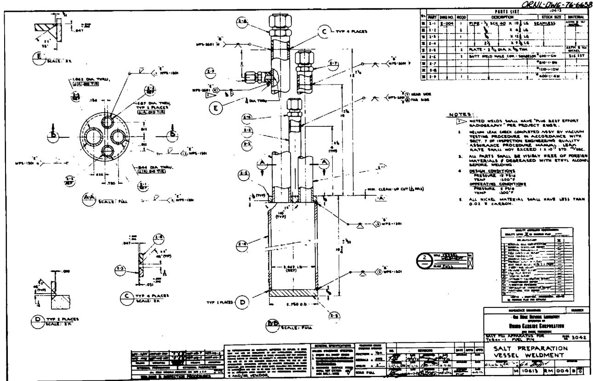  
Fig. 6.70. Salt preparation vessel.

# FLOWDIAGRAMFORTeGen-2

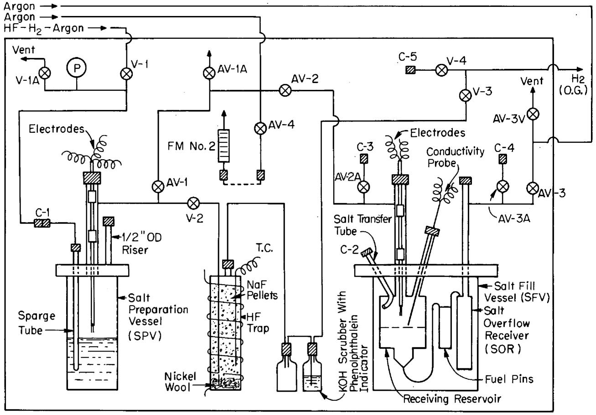  
Fig. 6.71. Diagram of glove box, furnaces, vessels, and gas lines.

carrier salt, (2) $\mathrm{UO}_2$ , (3) $\mathrm{UF}_4$ , and (4) carrier salt, the $\mathrm{UF}_4$ and $\mathrm{UO}_2$ were effectively "scrubbed" from the inside walls of the riser and covered with a layer of carrier salt.

After the riser-tube was recapped, the salt mixture was heated to $600^{\circ}\mathrm{C}$ (melting point of $450^{\circ}\mathrm{C}$ ) under $\sim 200$ sccm argon flow and sparged for $1\mathrm{hr}$ in preparation for electrochemical measurements of the oxide content of the salt by personnel of the Analytical Chemistry Division. The oxide measurement was done by retracting the sparge tube and lowering a gold-iridium electrode to a depth of ${}^{1}/{}_{2}$ in. into the molten salt. The volt-ammograms obtained from these measurements were for calibration of an experimental oxygen procedure and were not used in the TeGen-2 preparation.

# 6.14.2 Hydrofluorination

After the voltammetric measurements were made, the sparge tube was lowered into the salt mixture, and

a 36-hr hydrofluorination was carried out at $600^{\circ}\mathrm{C}$ using a $\mathrm{HF - H_2}$ (20-80 mole $\%$ ) mixture at a flow rate of 500 sccm. The procedure stipulated a hydrofluorination time of 48 hr; however, time scheduling necessitated reducing this to 36 hr. At the end of this time, the HF and $\mathbf{H}_2$ flows were cut off, and the salt was sparged with argon at about 500 sccm for 12 hr to remove dissolved HF. Two samples of the salt melt (one filtered and one unfiltered) were then taken and submitted to the Analytical Chemistry Division for an isotopic uranium assay, measurement of the $^{233}\mathrm{U} / ^{238}\mathrm{U}$ ratio, and determination of the concentrations of total U, Fe, Ni, Cr, and oxide.

The analytical results for the uranium inventory (Tables 6.28a, b, and c) were in excellent agreement with the theoretical values, showing less than $10\%$ deviation. The discrepancies observed in the iron and total oxide analyses are difficult to evaluate. It appears unquestionable, however, that oxidation occurred at some point during analysis of the No. 1

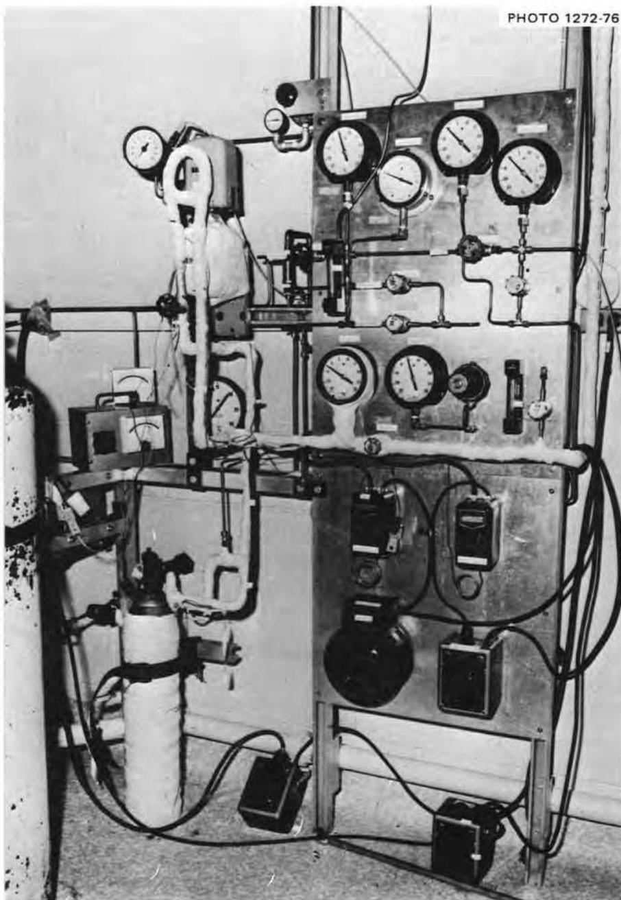  
Fig. 6.72. Gas delivery system.

samples since the No. 2 samples with considerably lower oxide values were duplicates taken five days later.

In both cases the oxide content was too high to continue with the next step in the operational procedure, and further hydrofluorination was required. The salt mixture was therefore reheated to $600^{\circ}\mathrm{C}$ under argon flow and hydrofluorinated with $\mathrm{HF - H_2}$ for an additional 24 hr using the conditions previously employed. Again, samples of the salt melt

were taken before and after the hydrofluorination. As before, extreme care was taken during and after the sampling to preclude the possibility of contact with air; the results are shown in Table 6.29.

A comparison of the analytical data given in Table 6.29 with those obtained earlier (Table 6.28) gives further support to the speculation that the discrepancies in the data probably resulted from sample contamination, probably with moisture, during analytical procedures. The oxide content of both

Table 6.28a. Analytical results for uranium isotopes in the TeGen salt charge ${}^{a}$ (at. %)   

<table><tr><td>Mass</td><td>Filtered</td><td>Unfiltered</td></tr><tr><td>233</td><td>39.82</td><td>39.85</td></tr><tr><td>234</td><td>0.511</td><td>0.512</td></tr><tr><td>235</td><td>0.157</td><td>0.156</td></tr><tr><td>236</td><td>0.007</td><td>0.007</td></tr><tr><td>238</td><td>59.51</td><td>59.48</td></tr></table>

${}^{a}$ After first hydrofluorination.

Table 6.28b. Analytical results for total uranium in the TeGen salt charge ${}^{a}$ (at. %)   

<table><tr><td rowspan="2">Salt sample</td><td colspan="2">Uranium total (mg/g)</td><td colspan="2">233U/238U</td></tr><tr><td>Theoretical</td><td>Observed</td><td>Theoretical</td><td>Observed</td></tr><tr><td>Filtered</td><td>127.5</td><td>123.4</td><td>0.653</td><td>0.676</td></tr><tr><td>Unfiltered</td><td>127.5</td><td>118.6</td><td>0.653</td><td>0.677</td></tr></table>

${}^{a}$ After first hydrofluorination.

Table 6.28c. Analytical results for total metallic impurities in the TeGen salt charge ${}^{a}$ (at. %)   

<table><tr><td rowspan="2">Impurity</td><td rowspan="2">Prehydrofluorination</td><td colspan="2">After hydrofluorination</td></tr><tr><td>Filtered</td><td>Unfiltered</td></tr><tr><td>Fe</td><td>129</td><td>255</td><td>213</td></tr><tr><td>Ni</td><td>318</td><td>&lt;25</td><td>&lt;25</td></tr><tr><td>Cr</td><td>56</td><td>34</td><td>33</td></tr><tr><td>Oxide</td><td>1680 ± 512</td><td>2100a</td><td>2000</td></tr><tr><td></td><td></td><td>678b</td><td>607</td></tr></table>

${}^{a}$ Sample No. 1, taken Aug. 13, 1975.   
$b$ Sample No. 2, taken Aug. 18, 1975.

samples taken prior to additional hydrofluorination was lower by a factor of about 2 than that obtained from identical samples taken previously from the same salt. Also, the observation that the oxide content remained relatively constant after an additional $24\mathrm{hr}$ of hydrofluorination is difficult to accept as valid, and it seems highly probable that the actual oxide content of the final salt mixture was less than $300~\mathrm{ppm}$ .

# 6.14.3 $\mathbf{U}^{4 + } / \mathbf{U}^{3 + }$ Ratio Adjustment

The $\mathrm{U}^{4+}/\mathrm{U}^{3+}$ ratio was adjusted by heating the salt mixture to $700^{\circ}\mathrm{C}$ under argon flow and then introducing hydrogen at 500 sccm for 6 hr. At the end of this time, the hydrogen flow was cut off, and the salt was sparged for 1 hr with argon at about 200

Table 6.29. Oxide concentration (ppm) after second hydrofluorination   

<table><tr><td rowspan="2">Salt sample</td><td colspan="2">Concentration</td></tr><tr><td>After 36 hr</td><td>After 60 hr</td></tr><tr><td>Filtered</td><td>420</td><td>357</td></tr><tr><td>Unfiltered</td><td>332</td><td>603</td></tr></table>

sccm. Preparations were then made for evaluation of the $\mathrm{U}^{4+}/\mathrm{U}^{3+}$ ratio by retracting the sparge tube above the salt level and lowering the gold-iridium electrodes into the melt to a depth of $1/4$ in. Analytical Chemistry Division personnel then made volt-ammogram recordings. A final $\mathrm{U}^{4+}/\mathrm{U}^{3+}$ value of 58 (1.72% of the total U as $\mathrm{U}^{3+}$ ) was obtained, which was within the desired range of 1.0 to 1.8% of the total U as $\mathrm{U}^{3+}$ . After retraction of the electrodes from the melt, the salt mixture was cooled to room temperature under argon and maintained in storage status for subsequent transfer to fuel pins.

# 6.14.4 Preparation of Salt Fill Vessel

A drawing of the assembled salt fill vessel is shown in Fig. 6.73. The vessel is shown in two different stages of assembly in Figs. 6.74 and 6.75. The salt is first transferred to the short vessel in the center and then pushed by gas pressure into the individual fuel pins, with the overflow going into the long vessel. The top $1/2$ in. of the salt from the fuel pins is then blown back to the initial vessel where the salt can be analyzed. The outer flanged vessel remains in place, but a new inner assembly is made for each filling.

In preparation for receiving the salt transfer from the salt preparation vessel, the salt fill vessel was pretreated with hydrogen. The salt fill vessel was heated to a temperature of $665^{\circ}\mathrm{C}$ under an argon flow of about 200 sccm. The operational procedure stipulated a pretreatment temperature of $700^{\circ}\mathrm{C}$ ; however, because of failure of one of the Calrod heating units, the maximum temperature obtainable was $665^{\circ}\mathrm{C}$ . The argon flow was cut off, and hydrogen was allowed to flow through the vessel and pins at about 500 sccm for 4 hr. At this time the hydrogen was cut off, and the vessel was cooled to room temperature under argon. All valves and connections were then closed off.

# 6.14.5 Salt Transfer

With both the salt preparation vessel and the salt fill vessel at room temperature, a preshaped $\frac{1}{4}$ -in.-OD nickel salt-transfer line was connected between

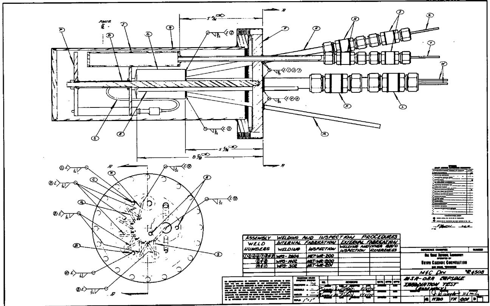  
Fig. 6.73. Salt fill vessel.

the sparge tube exit of the salt preparation vessel and the salt transfer inlet line to the salt fill vessel (Fig. 6.76). A 750-W Calrod heating unit was fastened securely to the salt-transfer line, and the entire assembly was then heavily insulated. With argon flowing through, both vessels and the salt-transfer line were heated to $650^{\circ}\mathrm{C}$ in preparation for the salt transfer. The objective in this part of the procedure was to transfer about $85~\mathrm{cm}^3$ $(203\mathrm{g})$ of the salt mixture from the salt preparation vessel into the receiving reservoir of the salt fill vessel. A conductivity probe was positioned at a predetermined level in the receiving reservoir to monitor the salt level. Contact of the rising salt with the probe was indicated by a red light on the instrument panel. At this point, argon was allowed to flow through the bypass line leading to the salt preparation vessel at a rate of about 100 sccm (under 5 psig pressure). After the vent valves of the salt fill vessel were opened, the bypass valve to the salt preparation vessel was closed. Salt was then observed to transfer as evidenced by "smoking" of the insulation. Within about 1 min, the red light went on, indicating completion of the transfer. The argon flow was cut off, and the appropriate valves were closed. A determination of

the salt level in the receiving reservoir was then made by raising the probe and measuring the point at which the red light went off. This was shown to be $\frac{1}{4}$ in. above the specified level, or the equivalent of a 7.6 cm³ excess of salt. The total transfer was thus about 92.5 cm³, which was less than 10% deviation from the stipulated transfer volume of 85 cm³.

In preparation for salt transfer from the receiving reservoir into the fuel pins, the temperature of the salt fill vessel was reduced to $600^{\circ}\mathrm{C}$ , and argon was flowed at a rate of about 25 sccm through the bypass line leading to the receiving reservoir. The bypass line valve was then closed, at which time the pressure slowly increased to 5 psig. After a few minutes, the pressure decreased slowly to zero, indicating completion of the transfer. This was confirmed by lowering the conductivity probe into the receiving reservoir to a position about ${}^{1}/8$ in. from the bottom of the vessel and observing that the red light failed to go on. All valves on the salt fill vessel were then closed, and the salt was allowed to equilibrate in the fuel pins for 24 hr at a temperature of $600^{\circ}\mathrm{C}$ .

After 24 hr of equilibration, preparations were made for transfer of excess salt in the upper regions of the fuel pins into the electrode cup of the receiving

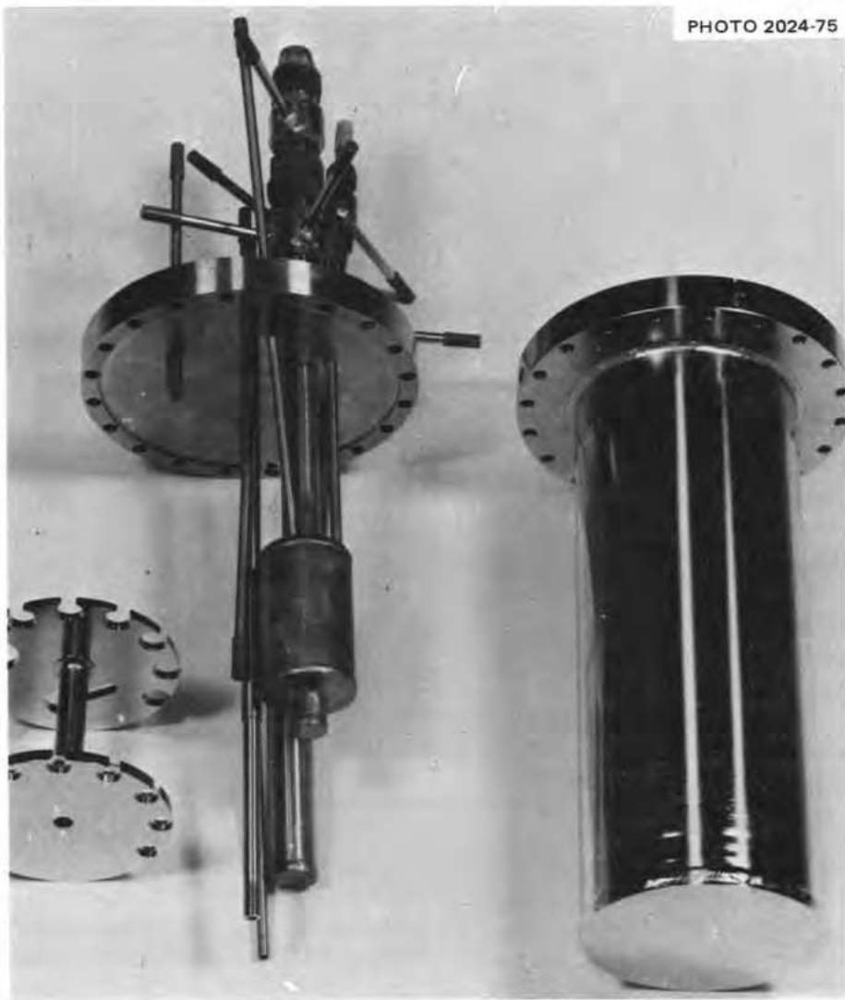

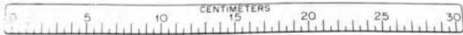  
Fig. 6.74. Salt fill vessel partially assembled. Outside container is on the right, and the partial inner assembly is on the left. The short vessel initially receives the salt. The longer vessel is the salt overflow receiver, which catches any salt in excess of that required to fill the fuel pins.

reservoir for final evaluation of the $\mathrm{U}^{4 + } / \mathrm{U}^{3 + }$ ratio. At a temperature of $600^{\circ}\mathrm{C},$ argon was flowed at a rate of about 25 sccm through the bypass line leading to the fuel pin overflow reservoir. The bypass line valve was then closed, pressurizing the overflow reservoir to about 5 psig. In less than 1 min, the pressure dropped to about 0.1 psig, indicating that the salt had transferred and that argon was bubbling up through the salt in the receiving reservoir. The argon flow was then cut off, and all valves to the salt fill vessel were closed. After lowering the iridium electrode ${}^{1}/{}_{2}$ in. into the salt in the receiving reservoir cup, final determination of the $\mathrm{U}^{4 + } / \mathrm{U}^{3 + }$ ratio was made by Analytical

Chemistry Division personnel. Interpretation of the volt-ammograms obtained gave a $\mathrm{U}^{4+}/\mathrm{U}^{3+}$ ratio of 200 (0.5% of the total U as $\mathrm{U}^{3+}$ ). It seems possible that hydrogen pretreatment of the salt fill vessel and fuel pins at the lower temperature (665°C) than the $700^{\circ}\mathrm{C}$ stipulated in the operating procedure may have contributed somewhat to the reoxidation of some of the $\mathrm{U}^{3+}$ .

It was decided to make a second measurement of the $\mathrm{U}^{4 + } / \mathrm{U}^{3 + }$ ratio since there was some uncertainty as to the proper functioning of the instrumentation during the volt-ammogram recordings. This was done under the same conditions as the previous

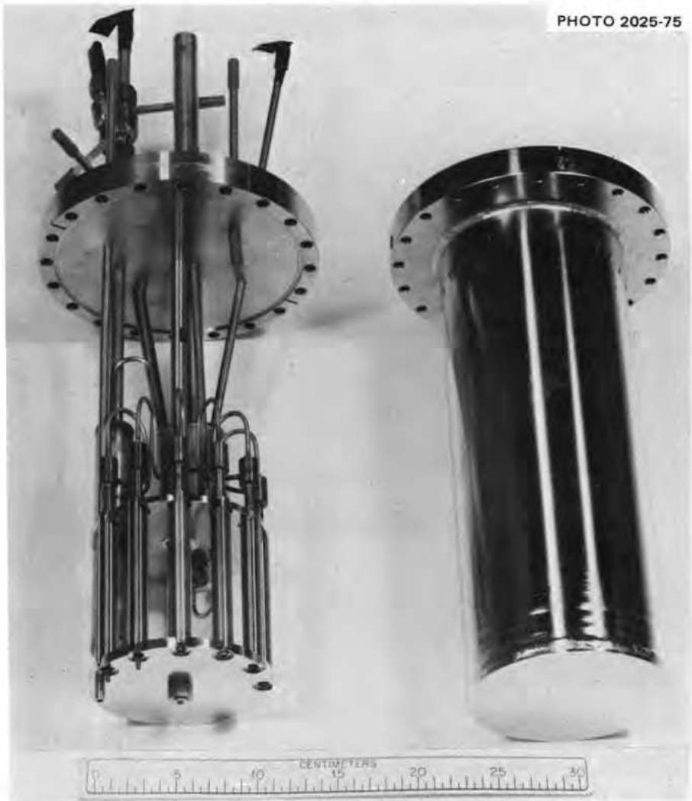  
Fig. 6.75. Salt fill vessel showing outside portion on right and assembled internal assembly on left. All joints are welded in the lines connecting the small vessels and the fuel pins.

determination. A $\mathrm{U}^{4+}/\mathrm{U}^{3+}$ ratio of 205 (0.49% of the total U as $\mathrm{U}^{3+}$ ) was obtained, which is in excellent agreement with the initial value of 0.50%. Since this value was considered acceptable, the salt fill vessel was cooled to room temperature under argon for subsequent disassembly. All valves and connections were closed, and the glove box was then decontaminated.

# 6.15 SALT PREPARATION AND FILLING OF TeGen-3 AND -4

H. E. McCoy

W.H.Miller

B. McNabb

W. B. Stines

The same salt prepared for the filling of TeGen-2 was used to fill the fuel pins for TeGen-3 and -4. The same basic procedure was also used for transferring the salt from the preparation vessel into the fuel pins,

but some changes were made which shortened the time required.

During the interval between the filling of the pins for TeGen-2 and for TeGen-3, the salt in the preparation vessel was under a positive pressure of argon. Before the pins for TeGen-3 were filled, the transfer line and the salt fill vessel (including the fuel pins) were purged with hydrogen for $4\mathrm{hr}$ at $700^{\circ}\mathrm{C}$ . The salt preparation vessel was then heated, and approximately $100~\mathrm{cm}^3$ of salt was transferred into the receiving reservoir. At this time the $\mathrm{U}^{3 + } / \mathrm{U}^{4 + }$ ratio was determined to be 0.001. The salt was transferred into the pins and allowed to remain at $600^{\circ}\mathrm{C}$ for $8\mathrm{hr}$ . The sample blown back for analysis did not indicate a detectable change in the $\mathrm{U}^{3 + } / \mathrm{U}^{4 + }$ ratio. Although the salt was more oxidizing than desired, it was judged to be suitable for these experiments. The salt fill vessel was disassembled, the pins separated, closure welded or retracted.

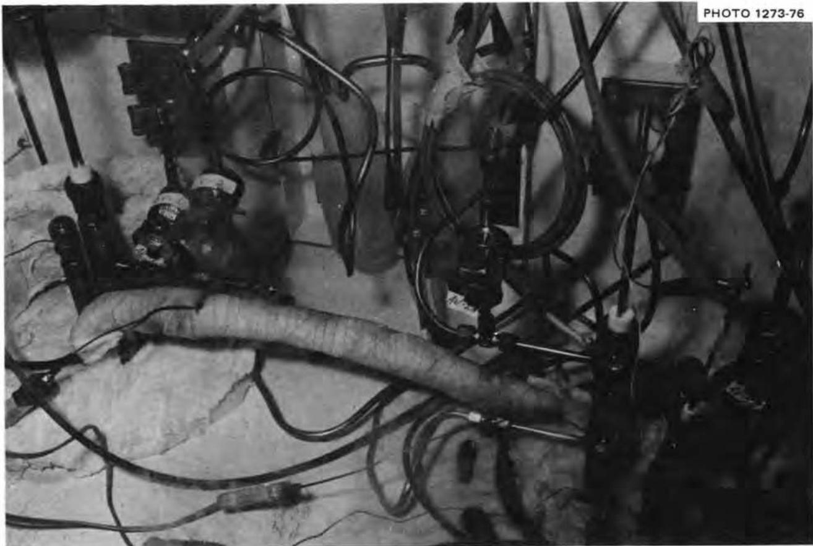  
Fig. 6.76. Salt-transfer line from salt preparation vessel to salt filling vessel.

made, pins radiographed and leak checked, and the pins given to the Reactor Division for assembly into the irradiation capsule.

It was decided that prior to filling the pins for TeGen-4 the salt remaining in the preparation vessel would be retreated with hydrogen to increase the $\mathrm{U}^{3 + } / \mathrm{U}^{4 + }$ ratio. Since the new salt fill vessel and the transfer line were to be pretreated with hydrogen also, the entire system was heated and pretreated with hydrogen for $4\mathrm{hr}$ at $750^{\circ}\mathrm{C}$ . The $\mathrm{U}^{3 + } / \mathrm{U}^{4 + }$ ratio in the salt preparation vessel could not be determined, probably because a conductive film had formed on the surface of the salt. Approximately $100~\mathrm{cm}^3$ of salt was transferred to the salt fill vessel where the $\mathrm{U}^{3 + } / \mathrm{U}^{4 + }$ ratio was determined to be 0.010. The salt was then transferred into the individual pins, held at $600^{\circ}\mathrm{C}$ for $8\mathrm{hr}$ , and partially transferred back to the receiving reservoir. The $\mathrm{U}^{3 + } / \mathrm{U}^{4 + }$ ratio was determined to be in the range of 0.013 to 0.010. The salt fill vessel was disassembled, the pins separated, closure welds made, pins radiographed and leak checked, and pins given to the Reactor Division for assembly into the irradiation capsule.

# 6.16 OPERATION OF TeGen-2 AND -3 C.R.Hyman

TeGen-2 and -3 are the second and third ORR poolside experiments designed to irradiate prospective MSBR vessel materials. The experiments were designed to produce a fission product inventory of at least $5 \times 10^{16}$ tellurium atoms/cm² at the metal-to-salt interface, together with a representative mix of other fission products. The test device is an irradiation capsule containing three ½-in.-OD × 0.035-in.-wall, 4-in.-long tubular fuel pins, partially filled with fuel salt. The three fuel pins in TeGen-2 were 2% titanium-modified Hastelloy, Inconel-600, and titanium-lanthanum-modified Hastelloy for the top, middle, and bottom fuel pins respectively. In TeGen-3 the three fuel pins were 2% titanium⁻¹/₂% niobium-modified Hastelloy, 2% titanium⁻¹% niobium-modified Hastelloy, and 1% titanium⁻¹% niobium-modified Hastelloy for the top, middle, and bottom pins respectively. The fuel pins were filled with approximately 7.14 cm³ of fuel salt, leaving a ½-in. void at the top of the fuel pin, which was backfilled

with helium after salt filling. The fuel salt was a mixture of $\mathrm{LiF - BeF_2 - ZrF_4 - }^{233}\mathrm{UF_4 - }^{238}\mathrm{UF_4}$ (63.5-29.0- 5.0-1.0-1.5 mole $\%$

The fuel pins were arranged vertically inside a double-walled type 304 stainless steel vessel. The void between the fuel pins and the inner wall of the vessel was filled with NaK for improving heat transfer. A schematic of the experiment is shown in Fig. 6.77. Small design changes were made in TeGen-2 and -3, which should be noted. Small hubs were attached to the end plugs inside each fuel pin, and four foils $0.005 \times 0.125 \times 0.375$ in. were attached to each hub. The bottom hub was solid and was $0.265$ in. in diameter

0.125 in. thick. The top hub was 0.267 in. in $\mathrm{OD} \times 0.135$ in. in $\mathrm{ID} \times 0.125$ in. thick. The foils and hubs for each fuel pin were made of the same material as their respective fuel pin. The foils were included to provide samples that could possibly have sufficiently low activity for Auger analysis.

The capsules were instrumented with four Chromel-Alumel thermocouples per fuel pin. One electrical resistance heater was wrapped around each fuel pin, with the heaters positioned to minimize axial temperature gradients. The heaters also maintained the fuel pins above $150^{\circ}\mathrm{C}$ during periods when the reactor was shut down and while the capsule was

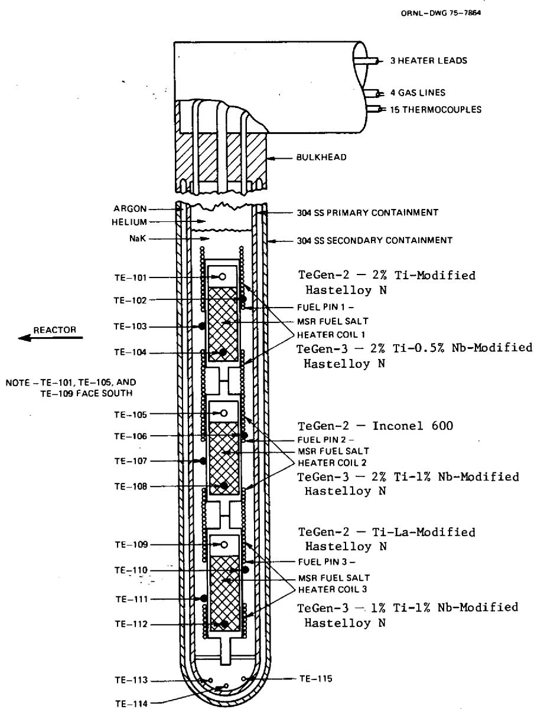  
Fig. 6.77. Drawing of TeGen-2 and -3 capsules.

removed from the reactor after completion of the irradiation but prior to hot cell disassembly. Fission product decay radiation in frozen salt $(< 150^{\circ}\mathrm{C})$ causes dissociation of the fuel salt components at a faster rate than recombination at that temperature. At temperatures higher than this, recombination exceeds evolution, and no net fluorine is generated.

The design operating temperature for the specimens was $700^{\circ}\mathrm{C}$ at the salt-to-metal interface, and this temperature was maintained as uniform as possible over the length of the capsule throughout the

irradiation. Bulk temperature control was maintained by adjusting the experiment position with respect to the reactor by means of the movable track on which the experiment was placed in the ORR poolside facility. This movement changed the neutron flux at the experiment and thus varied the fission heat produced. Fine temperature control and uniform axial temperatures were attained by heater power adjustment. A more complete description of the experiment design may be found in an earlier report.[31] Figures 6.78 and 6.79 are pictures of TeGen

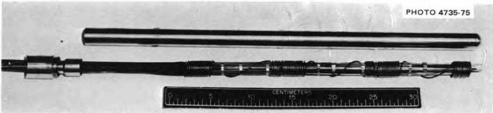  
Fig. 6.78. TeGen-2 subassembly prior to insertion into the primary containment. The bottom of the assembly is on the right, and the fuel pins from left to right are numbered 1, 2, and 3 respectively.

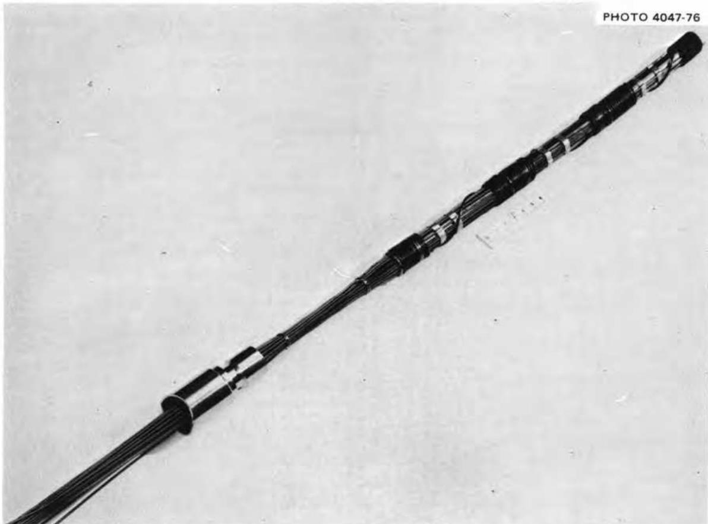  
Fig. 6.79. TeGen-3 subassembly prior to insertion into primary containment. The bottom of the assembly is on the right, and the fuel pins from left to right are numbered 1, 2, and 3 respectively.

2 and -3 subassemblies before insertion into the primary containment.

# 6:16.1 Operating History of TeGen-2 and -3

TeGen-2 was installed into the ORR poolside irradiation facility position P-4A on November 3, 1975, and full-power irradiation began on November 4, 1975. The experimental assembly was irradiated for a total of $1492\mathrm{hr}$ but was retracted away from the reactor several times during this period. Irradiation was ended on January 21, 1976, at which time the experimental assembly was retracted to 16 in. away from the face of the reactor. Since TeGen-3 was ready for insertion at the same time TeGen-2 was being removed, the gas lines of the TeGen-2 capsule were cut one day before transferring it to the hot cell. However, during this time the heater and thermocouple instrumentation remained intact, and the heater power kept the capsule at $>150^{\circ}\mathrm{C}$ . On January 28, 1976, TeGen-2 was transferred to the ORR hot cell and disassembled. Flux monitors and fuel pins were retained.

One unexpected problem developed after irradiation of the capsule had been completed. While removing the capsule and transferring it to the hot cell, it was necessary to depressurize the gas systems in the capsule. The secondary (argon) gas system was depressurized with no problems, but the primary (helium) system could not be depressurized. The lines leading to and away from the capsule were depressurized so that if only one plug existed, the capsule would depressurize. Forward purging and back purging were attempted, but the plug was not cleared. Finally the gas lines were severed and welded. The next day the capsule was transferred to the hot cell, where dissassembly began. No unusual events or physical characteristics were observed when the experimental assembly was dismantled. The pins appeared to be intact.

The most likely cause of the plug in the primary gas line was impurities in the NaK system. The carrier used to transfer the NaK from the source tank to the capsule filling apparatus was not filled with the required amount of NaK and thus had to be refilled two more times. In addition, the procedure for filling the experimental assembly with NaK from the carrier had to be done twice before the NaK fill was completed. It is possible that during the filling of the carrier from the source tank, air may have been introduced into the NaK. This would have formed metallic oxides, which could have plugged the lines

during or after transfer of the NaK to the experimental assembly. To prevent this problem in the future, a larger NaK carrier will be used and a better procedure followed in filling the carrier from the source tank.

TeGen-3 was inserted on January 28, 1976, and began full-power operation at design temperature on January 30, 1976. Since that time, TeGen-3 has been operating at design temperature. There have been periods when the temperatures indicated by the safety thermocouples Te-113, -114, -115 (Fig. 6.77) at the bottom of the primary containment have oscillated rather severely. The amplitudes of the oscillations have been as high as $100^{\circ}\mathrm{C}$ , which is much higher than was recorded for the previous two capsules. Smaller oscillations occurred at the middle and upper regions of the capsule as well.

At one time there was a $200^{\circ}\mathrm{C}$ drop in the readings of the safety thermocouples of TeGen-3. The reactor and experiment were operating under unusual conditions when the drop occurred. The previous two TeGen capsules experienced temperature oscillations that were probably due to NaK currents inside the primary containment. These currents were undesirable because they cooled the bottom of the capsule by convection. The bottom fuel pin had an axial temperature difference of approximately $70^{\circ}\mathrm{C}$ , and the safety thermocouples were $50^{\circ}\mathrm{C}$ cooler than the lowest thermocouple on the lower fuel pin. To alleviate this problem, TeGen-3 was constructed with a baffle positioned on the bottom of the lowest fuel pin. However, the temperature distribution was worse, with an axial gradient of $200^{\circ}\mathrm{C}$ on the bottom fuel pin and the safety thermocouples about $100^{\circ}\mathrm{C}$ cooler. These data, in addition to the oscillating pattern observed, suggest that NaK currents may still exist in the capsule. In any event, the temperature aberrations noticed have not posed any threat to the experiment or to the reactor.

# 6.16.2 Data Analysis for TeGen-2 and -3

Tables 6.30 and 6.31 give typical operating data for TeGen-2 and -3. The average temperature of TeGen-2 over the length of the capsule was $693.7^{\circ}\mathrm{C}$ , which corresponds to a fuel-salt to fuel-pin interface temperature of about $700^{\circ}\mathrm{C}$ . In TeGen-3 the average temperature is $677.3^{\circ}\mathrm{C}$ , and the corresponding interface temperature is approximately $684^{\circ}\mathrm{C}$ . The maximum temperature variation occurs in the bottom fuel pin in each capsule. This variance occurs because of NaK currents existing in the primary containment. Even though TeGen-3 had a baffle to

Table 6.30. Typical operating conditions for irradiation capsule TeGen-2 ${}^{a}$   

<table><tr><td colspan="2">Fuel pin</td><td rowspan="2">Thermocouple numberb</td><td colspan="2">Metal-gas or Metal-salt interface temperatures (°C)</td><td rowspan="2">Heater power (W)</td></tr><tr><td>Location</td><td>Material</td><td>Observed</td><td>Average</td></tr><tr><td rowspan="4">Top</td><td>2% Ti-modified</td><td>101</td><td>717c</td><td></td><td>228.8</td></tr><tr><td rowspan="3">Hastelloy N</td><td>102</td><td>706</td><td rowspan="3">701</td><td></td></tr><tr><td>103</td><td>700</td><td></td></tr><tr><td>104</td><td>697</td><td></td></tr><tr><td rowspan="4">Middle</td><td rowspan="4">Inconel 600</td><td>105</td><td>704c</td><td></td><td>57.1</td></tr><tr><td>106</td><td>718</td><td rowspan="3">698</td><td></td></tr><tr><td>107</td><td>710</td><td></td></tr><tr><td>108</td><td>667</td><td></td></tr><tr><td rowspan="4">Bottom</td><td>Ti-La-modified</td><td>109</td><td>722c</td><td></td><td>183.1</td></tr><tr><td rowspan="3">Hastelloy N</td><td>110</td><td>711</td><td rowspan="3">682</td><td></td></tr><tr><td>111</td><td>683</td><td></td></tr><tr><td>112</td><td>653</td><td></td></tr></table>

${}^{a}$ Data taken Dec. 4,1975,at 8:07 and 7.45 in. away from the reactor.   
$b$ See Fig. 6.77 for locations.   
${}^{c}$ Metal-gas interface temperatures. All others are metal-salt interface temperatures.

Table 6.31. Typical operating conditions for irradiation capsule TeGen- ${3}^{a}$   

<table><tr><td colspan="2">Fuel pin</td><td rowspan="2">Thermocouple numberb</td><td colspan="2">Metal-gas or Metal-salt interface temperatures (°C)</td><td rowspan="2">Heater power (W)</td></tr><tr><td>Location</td><td>Material</td><td>Observed</td><td>Average</td></tr><tr><td rowspan="4">Top</td><td>2% Ti and 0.5% Nb</td><td>101</td><td>594c</td><td></td><td>230.3</td></tr><tr><td rowspan="3">Hastelloy</td><td>102</td><td>692</td><td></td><td></td></tr><tr><td>103</td><td>714</td><td>709</td><td></td></tr><tr><td>104</td><td>720</td><td></td><td></td></tr><tr><td rowspan="4">Middle</td><td>2% and 1% Nb</td><td>105</td><td>682c</td><td></td><td>8.6</td></tr><tr><td rowspan="3">Hastelloy</td><td>106</td><td>726</td><td></td><td></td></tr><tr><td>107</td><td>Open</td><td>726</td><td></td></tr><tr><td>108</td><td>Open</td><td></td><td></td></tr><tr><td rowspan="4">Bottom</td><td>1% Ti and 1% Nb</td><td>109</td><td>700c</td><td></td><td>173.8</td></tr><tr><td rowspan="3">Hastelloy</td><td>110</td><td>695</td><td></td><td></td></tr><tr><td>111</td><td>665</td><td>630</td><td></td></tr><tr><td>112</td><td>530</td><td></td><td></td></tr></table>

${}^{a}$ Data taken Mar. 4,1976,at 12:55 and 5.5 in. away from the reactor face.   
See Fig. 6.77 for locations.   
Metal-gas interface temperatures. All others are metal-salt interface temperatures.

obstruct the currents, a favorable geometry still existed for the occurrence of very local violent NaK currents, which were evidenced by the oscillating temperatures recorded during operation of the capsule. Figure 6.80 gives the relative locations of the thermocouples, both vertically and circumferentially, as well as their orientation relative to the face of the reactor.

Several sets of temperature data are plotted in Figs. 6.81 and 6.82 for TeGen-2 and -3 respectively. The top set of curves represents the normal operating conditions with the heater power as noted in Tables 6.30 and 6.31, the middle curves denote the temperatures at the same capsule position but without the heater power, and the bottom curves denote temperatures at the retracted position with

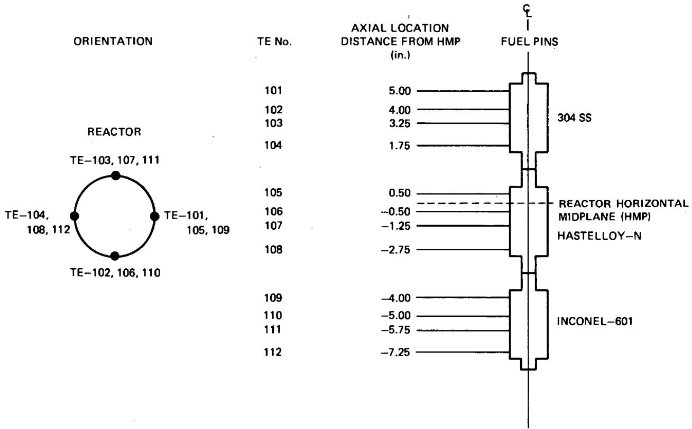  
Fig. 6.80. Thermocouple location and orientation information. Materials shown on the right were those in TeGen-1. The same physical layout was used in TeGen-2 and -3 although the materials were different.

the heater power as noted in Tables 6.30 and 6.31. This last condition represents negligible gamma and fission heat.

Figure 6.83 presents the design temperature distribution in the fuel region of the pins where the fission heat production is considered the major source of heat flux. Figure 6.84 presents the temperature distribution in the heater region of the pin and assumes no fission heat and an average heat rate of $26.5\mathrm{W / g}$ in the region of the heaters, thermocouples, and NaK. The maximum amount of power that a heater must produce was estimated from the $26.5\mathrm{W / g}$ mentioned above to be approximately $300\mathrm{W / heater}$ . The actual heater power used during operation was much less because of the conduction of fission heat from the ends of the fuel pins.

Figure 6.85 gives an estimate of the relative radial temperature profile for the top, middle, and bottom fuel pins respectively. Although exact temperature distributions are not known, the differences in the respective fission reaction rates in the fuel pins cause the centerline temperatures of the middle and bottom

fuel pins to be higher than for the top fuel pin. As a result, the temperature gradients in the fuel pins differ substantially, radially as well as axially, and therefore may influence the corresponding fission product deposition rates on the surfaces of the fuel pins. This occurs in spite of having the same temperature along the outside of the fuel pins. Note that the temperatures at the surfaces of the fuel pins are the respective averages of the lower three thermocouple readings on each fuel pin in Table 6.30.

These thermocouple readings represent actual fuel region temperatures and not those of the void region above the salt. Also note that the heater power provides heat to the ends of the fuel pins where little or no fission heat is produced. This has the effect of leveling out the temperatures over the length of the experiment.

# 6.16.3 Preliminary Results of TeGen-2

Using a crude heat balancing technique, the steady-state fission heat generation powers were

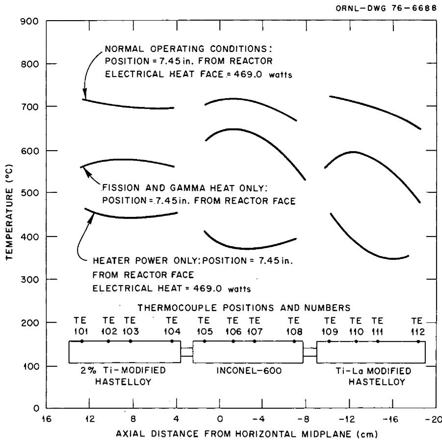  
Fig. 6.81. Temperature distribution in TeGen-2.

calculated as 163, 258, and $173\mathrm{W}$ for the top, middle, and bottom fuel pins respectively. These were calculated knowing heater powers, gamma heats, thermal conductivities, temperatures, and several other parameters and iterating the GENGTC fission heat values to calculate the observed temperatures. Values produced by this method of evaluating fission rates will be compared with those produced from neutronics support of TeGen-2.

The tellurium production was calculated from the above estimates of fission heat rates. Assuming a yield of 0.04 stable tellurium atoms per fission, tellurium inventories of $1.21 \times 10^{18}$ , $1.92 \times 10^{18}$ , and $1.29 \times 10^{18}$ tellurium atoms were produced in the top, middle, and bottom fuel pins respectively. Assuming a surface area of $29.7\mathrm{cm}^2$ in contact with the salt and an even deposition rate on all surfaces, the tellurium deposition should be approximately $4.07 \times 10^{16}$ , $6.46 \times 10^{16}$ , and $4.34 \times 10^{16}$ tellurium atoms/ $\mathrm{cm}^2$ for the top, middle, and bottom fuel pins respectively. These

values compare favorably with the design level of $5 \times 10^{16}$ atoms/cm $^2$ . More-detailed tellurium production estimates will be made when the flux monitors from the experiment are analyzed.

# 6.16.4 Future Irradiations

Future irradiation of capsules will be very similar to that of capsules run previously in this series. However, the baffle structure placed in the bottom of the primary containment will be eliminated because of the temperature profile and fluctuations seen in TeGen-3. In future experiments, fine quartz wool will be placed between the primary and secondary containment to reduce heat radiation from the bottom of the capsule. This insulation should reduce the heat loss and thus raise the temperatures in the lower end of the capsule. The heater coils will be arranged as they were in TeGen-2.

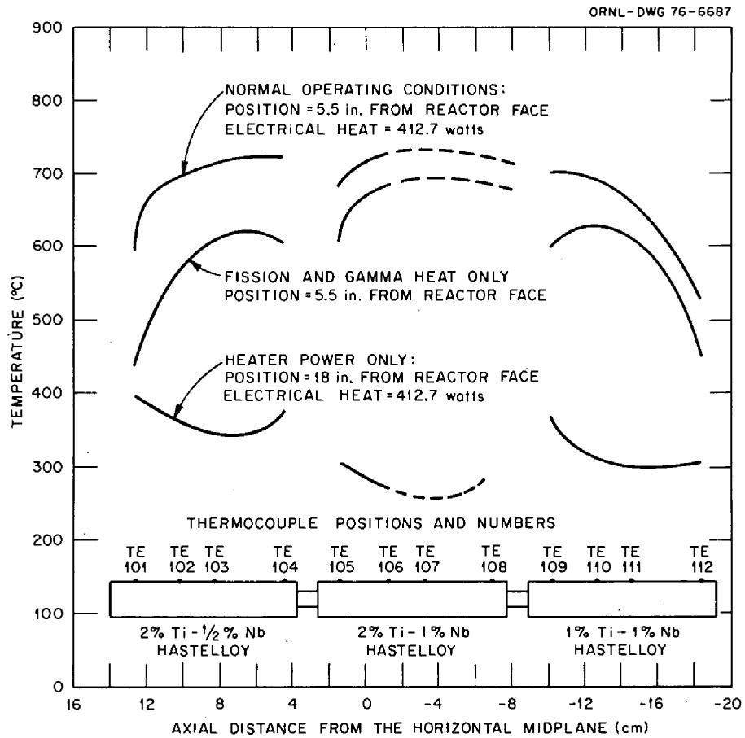  
Fig. 6.82. Temperature distributions in TeGen-3.

# 6.17 EXAMINATION OF TeGen-2

B. McNabb

H. E. McCoy

The TeGen experiments were designed to evaluate the resistance to cracking of several materials of interest to MSBR when they are exposed to molten salt containing fission products. The $\frac{1}{2}$ -in.-OD fuel pin is made of the material being evaluated. TeGen-1 containment materials consisted of type-304 stainless steel, standard Hastelloy N, and Inconel 601. As reported previously, $^{32,33}$ of the three materials tested, Inconel 601 was the most resistant to cracking.

TeGen-2 is almost identical in design to TeGen-1, but the fuel pin materials were $2\%$ titanium-modified Hastelloy N heat 74533 (top fuel pin), Inconel 600 (middle fuel pin), and $2\%$ titanium-modified Hastelloy N plus 0.013 lanthanum (bottom fuel pin). The chemical compositions are given in Table 6.32. The irradiation of TeGen-2 (approximately 1578 hr at $700^{\circ}\mathrm{C}$ ) was concluded on January 26, 1976, and disassembly in the ORR hot cells was done on

January 28. The operating conditions of TeGen-2 are reported in detail in Sect. 6.16.

Visual inspection of the disassembled equipment showed the parts to be unchanged in their appearance after the irradiation. The top and bottom fuel pins of modified Hastelloy N (pin 2, heat 74533, and pin 6, heat 74534, respectively) had a slight gold tint, and the middle pin (pin 4, Inconel 600) had a silver tint after annealing but before assembly in the experimental equipment. The top fuel pin had a small scratch along its length, probably from a sheathed thermocouple pulled across it during disassembly. The small scratch did not affect the tensile properties of rings cut from the pin and tensile tested, and it was undetected in subsequent metallographic examination. After disassembly, the fuel pins were heated in a small furnace $150^{\circ}\mathrm{C}$ or higher to prevent evolution of fluorine from the fuel salt. The pins were maintained at this temperature except during transfer to the High Radiation Level Examination Laboratory (HRLEL), during gamma scanning and measuring,

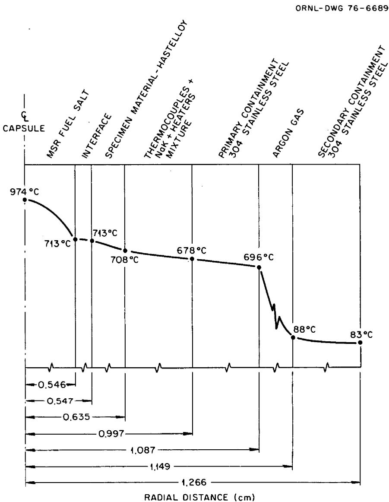  
Fig. 6.83. Design temperature distribution of fuel pin in salt region of pin.

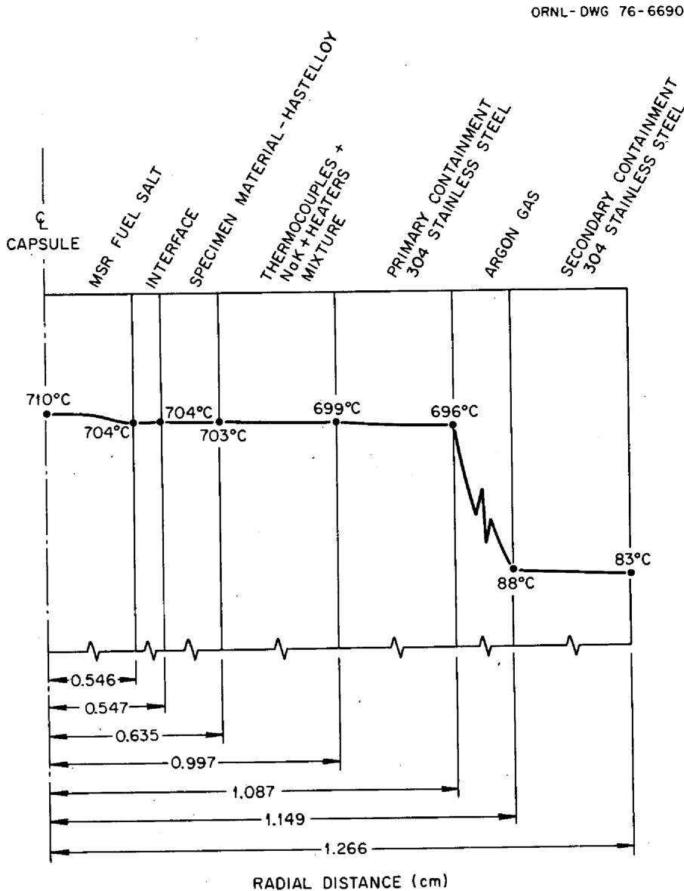  
Fig. 6.84. Temperature distribution in heater region of fuel pins.

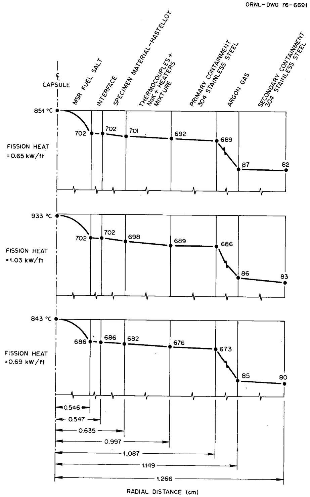  
Fig. 6.85. Relative radial temperature profiles.

Table 6.32. Compositions of alloys used in TeGen-2 (in wt %)   

<table><tr><td>Alloy</td><td>Heat number</td><td>Sourcea</td><td>Ni</td><td>Mo</td><td>Cr</td><td>Fe</td><td>Mn</td><td>Si</td><td>C</td><td>Ti</td><td>Al</td><td>W</td><td>V</td><td>Co</td><td>Cu</td><td>S</td><td>B</td><td>N</td><td>La</td><td>H</td><td>O</td></tr><tr><td rowspan="2">Modified Hastelloy N</td><td rowspan="2">74533</td><td>A</td><td>Balance</td><td>11.67</td><td>7.02</td><td>0.03</td><td>&lt;0.01</td><td>0.03</td><td>0.05</td><td>2.17</td><td>0.48</td><td>0.14</td><td></td><td>0.03</td><td>&lt;0.01</td><td>&lt;0.002</td><td>0.002</td><td>0.005</td><td></td><td></td><td></td></tr><tr><td>B</td><td></td><td>11.37</td><td>7.30</td><td></td><td>0.04</td><td>0.15</td><td>0.09</td><td>1.75</td><td>0.54</td><td></td><td>0.02</td><td>0.1</td><td></td><td></td><td></td><td>0.0015</td><td></td><td>0.0001</td><td>0.18</td></tr><tr><td>Inconel 600</td><td>NX 3752</td><td>A</td><td>75.58</td><td></td><td>15.03</td><td>8.62</td><td>0.27</td><td>0.16</td><td>0.03</td><td></td><td></td><td></td><td></td><td></td><td>0.28</td><td>0.007</td><td></td><td></td><td></td><td></td><td></td></tr><tr><td rowspan="2">Modified Hastelloy N</td><td rowspan="2">74534</td><td>A</td><td>Balance</td><td>11.66</td><td>7.12</td><td>0.06</td><td>&lt;0.01</td><td>0.03</td><td>0.08</td><td>2.09</td><td>0.53</td><td>0.14</td><td></td><td>0.03</td><td>0.02</td><td>&lt;0.002</td><td>&lt;0.002</td><td>0.007</td><td>0.013</td><td></td><td></td></tr><tr><td>B</td><td></td><td>11.58</td><td>7.67</td><td></td><td>0.02</td><td>0.1</td><td>0.05</td><td>1.77</td><td>0.54</td><td></td><td>0.02</td><td>0.05</td><td></td><td></td><td></td><td>0.0012</td><td>0.010</td><td>0.0002</td><td>0.0020</td></tr></table>

$\pmb{a}$ A-vendors;B-ORNL.

and until their final sectioning for tensile and analytical specimens.

The three fuel pins were gamma-scanned in the HRLEL with a sodium-iodide detector using a 17-in.-thick lead collimator with a $0.010\text{-in.}\times 1\text{-in.}$ -wide slit (Fig. 6.86). The pins were first scanned using a single-channel analyzer and the differential from 0.55 MeV to 0.75 MeV with 5000 counts/sec full scale and $2\%$ standard deviation. An aluminum spacer ${}^{1/2}$ in. long was placed between each pin. Each fuel pin recording has a spike which indicates sudden increased activity at the top surface of the fuel salt;

the top pin (No. 2, heat 74533) has three spikes for this region but did not have a spike for the bottom of the fuel, as did the other two pins. None of the pins in TeGen-1 had a spike for the bottom of the fuel. The only difference in TeGen-1 and TeGen-2 construction was that TeGen-2 had a hub with four small foils $\frac{1}{8}$ in. wide $\times \frac{3}{8}$ in. long $\times 0.005$ in. thick welded to it at the top (gas plenum) and bottom (immersed in salt). The top pin (No. 2, heat 74533) had a void at the bottom of the pin, with no salt around the bottom hub and foils.

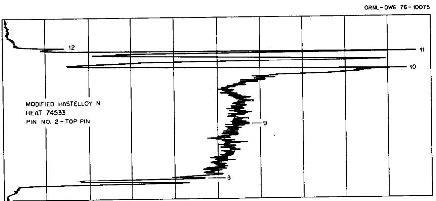

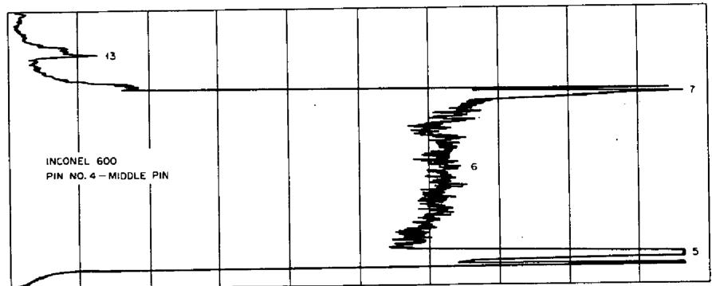

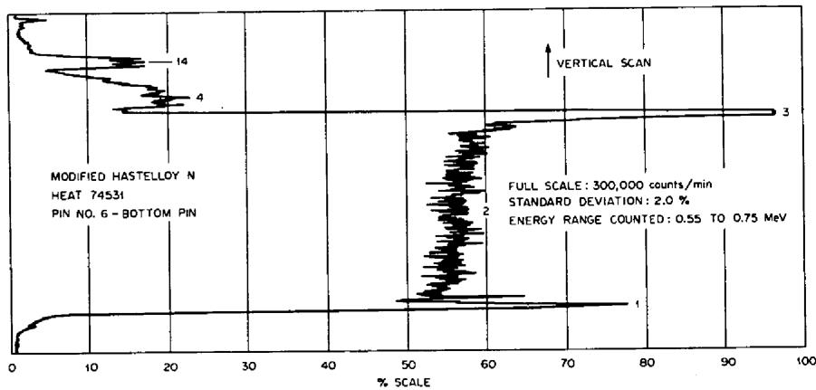  
Fig. 6.86. Gamma scans of fuel pins from the TeGen-2 experiment. Scans made vertically from bottom to top of each pin. Numbers denote positions for activity vs energy scans.

Each of the fuel pins was scanned for elements present at the bottom, middle, and top of the salt and in the gas plenum, using the 512 channel analyzer with a sodium-diode detector in HRLEL. A counting time of 15 sec was used for all scans except for those of the gas plenum and the background scans, which lasted $10\mathrm{min}$ because of the reduced activity. Figure 6.87 is a plot of energy or activity counts per minute per channel for each of the three fuel pins at the bottom of the fuel. The scans were on the spike of increased activity on the bottom of pins 6 (bottom) and 4 (middle) and at an equivalent position at the bottom of the fuel in pin 2 (top). The activity was

highest for the middle pin, as expected, slightly lower for the bottom pin, and considerably lower for the top pin. There were differences in the intensities in the 0.6- to 1.0-MeV range where the peaks are contributed to by $^{95}\mathrm{Zr}$ , $^{95}\mathrm{Nb}$ , $^{58}\mathrm{Co}$ , and $^{132}\mathrm{I}$ . These differences are not presently understood but may be related to the void space at the bottom of pin 2. These scans were made four days after removal from the reactor flux, and some of the short half-life fission products are in evidence, whereas TeGen-1 had a longer (about two months) cooling period and no evidence of short half-life fission products.

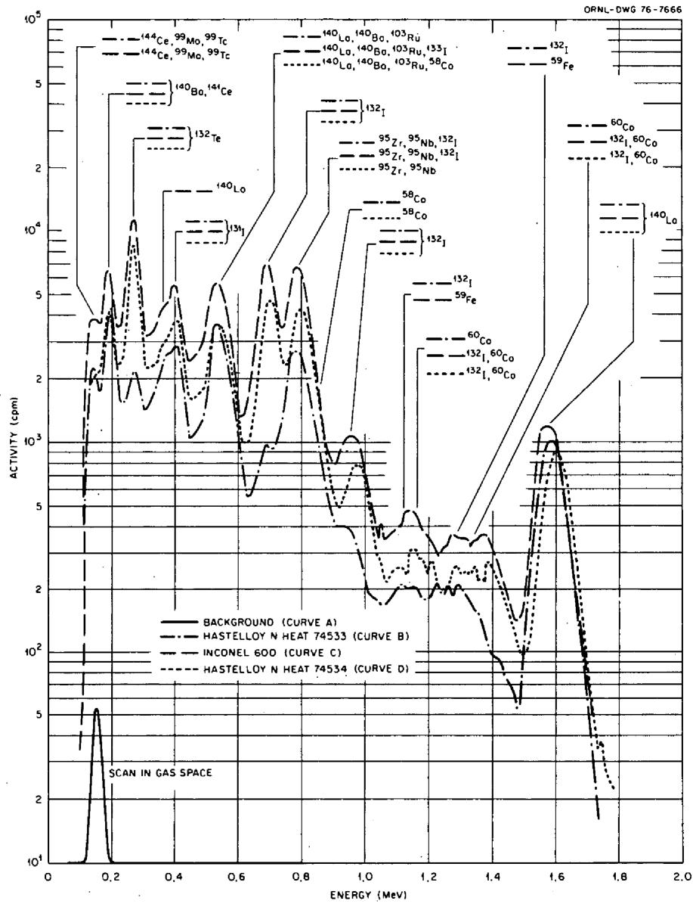  
Fig. 6.87. Elemental scans of the TeGen-2 capsules with the detector located near the bottom of the capsule. Fifteen-second scan made through a $0.010 \times 1 \times 17$ -in.-deep slit.

Each of the fuel pins had a spike of activity at the top of the fuel salt; Fig. 6.88 shows a plot of activity vs energy at the peak of the spike. Some of the fuel salt is present in each of the scans at the top of the salt, as shown by the high $^{140}\mathrm{La}$ peak at 1.596 MeV in the first three scans. These scans are similar to those at the middle of the salt, except that the activity is slightly higher at the peak. The fourth scan in Fig. 6.88 was made on the third spike above the salt in the gas plenum on pin No. 2, shown as point 11 in Fig. 6.86.

Note the lower peak for $^{140}\mathrm{La}$ at 1.596 MeV, indicating little, if any, fuel salt, and the higher peaks for iodine and tellurium, which should migrate to the gas space. This curve is similar to the ones at the bottom of the salt of the middle and bottom pins, except for the lathanum peak, shown in Fig. 6.87. The differences in these scans and the reason for deposition in layers, leading to spikes of activity in the gas space in the top pin, are not understood at this time. Analytical Chemistry samples were taken from

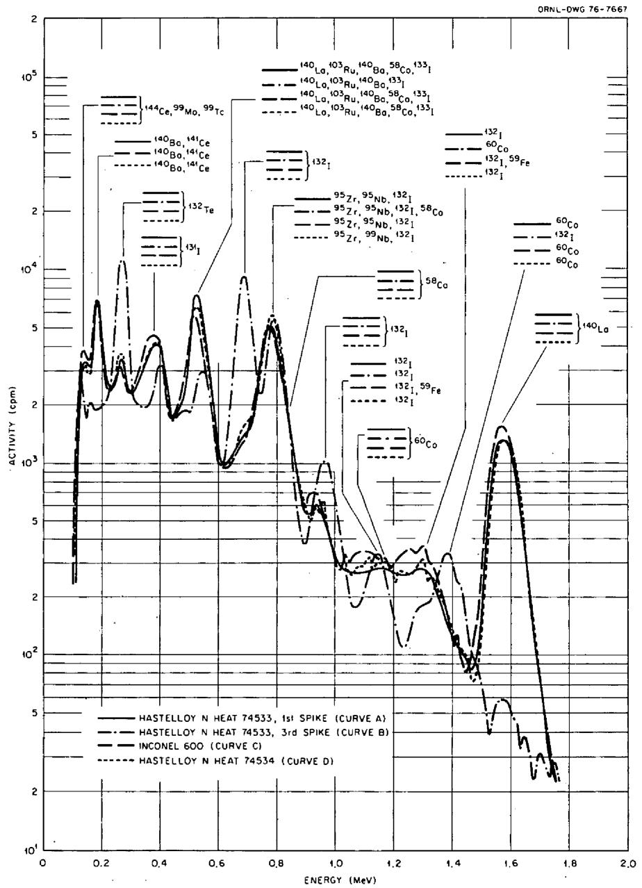  
Fig. 6.88. Elemental scans of the TeGen-2 capsules with the detector located at the spike at the salt-gas interface. Fifteen-second scan made through a $0.010 \times 1 \times 17$ -in.-deep slit.

these various areas, and the results may help to explain the counting data.

Scans were taken in the gas space of each of the fuel pins, but the peaks are similar to the one shown in Fig. 6.88, scan 11, except that the activity was much lower in areas not on activity spikes. Scans were also made at the middle of the fuel of each pin, but they were very similar to scan 8 at the bottom of the No.2 fuel pin shown in Fig. 6.87. Analytical Chemistry has a multichannel analyzer with a germanium detector that can better separate the peaks of the different fission products, and these analyses will better define which elements are present.

The fuel pins were measured in HRLEL for diametral change by using a V-block and dial gage arrangement. Table 6.33 shows the changes in dimensions to be very small, with a maximum of $0.3\%$ increase in the diameter in the gas space of pin 2 at the top. Prior to measuring, the pins had been maintained at $150^{\circ}\mathrm{C}$ in a furnace, removed, and then allowed to cool. It is possible that they were still slightly warm when measured. An unirradiated control pin measured in the same way showed a slight negative change, $-0.10\%$ , and it had not been heated previously. These changes are very small and are probably not significant. The pins were sectioned in the same manner as TeGen-1 by gripping the pin in a

rotating chuck and using an abrasive cut-off saw. The sections cut and their respective depositions are shown in Fig. 6.89. The salt surfaces, or menisci, were photographed during sectioning (Fig. 6.90). The salt level varied in pin 2. Since the salt level was higher in pin 2 due to the void at the bottom, pin 2 was photographed after cut A-2, and pins 4 and 6 were photographed after cut A-4. The surfaces look different for each of the pins, as did TeGen-1, but the reason for these differences is not known. It could possibly be related to slightly different cooling rates for each fuel pin during solidification as they were removed from the irradiation flux. Chemistry samples of the salt were taken from the surface of each of the fuel pins, and the results of these analyses may help explain these differences.

The pins were sectioned through cut A-7 from the top of the pin, then reversed, and section C-1 placed in the rotating chuck and the bottom end cap cut off with ring A-16 still attached so that the foils could be removed without damage; then cuts A-16 through A-8 were made. The top pin (No. 2, heat 74533) had a void at the bottom of the pin, and no salt was around the foils welded to the hub. Figure 6.91a shows a photograph of the bottom hub and foils surrounded by the tube (segment A-16). There is no salt around the foils or in the bottom of the pin on top of the end

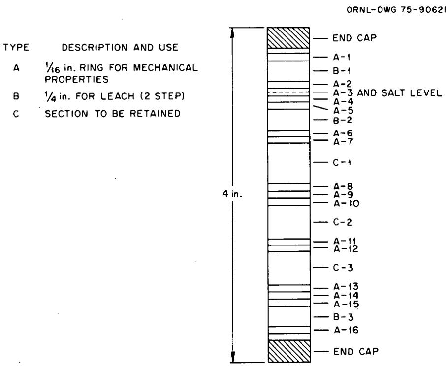  
Fig. 6.89. Schematic diagram of individual fuel pin showing the locations of test specimens.

cap. Figure 6.91b is a photograph of the bottom of the salt that rested on top of the hub in Fig. 6.91a. Note the particles lying on the hub (Fig. 6.91a) and the matching impressions in the salt(Fig.6.91b).The salt receded from the bottom area in a meniscus, and the saw accidentally cut into it part of the way around. It is not understood how this void could have

occurred, removing the salt so cleanly from the area of the foils and raising the entire volume of salt greater than $\frac{1}{8}$ in. higher in the tube. X-ray photographs were taken of the fuel pin before it was installed in the experiment, and there was not a void in the bottom of the pin at that time. The fuel pins were maintained at $700^{\circ}\mathrm{C}$ approximately $1600\mathrm{hr}$ ,

Table 6.33. Diameter measurements of fuel pins from TeGen-2   

<table><tr><td>Pin number</td><td>Position</td><td>Postirradiation diameter (in.)</td><td>Average diameter (in.)</td><td>Preirradiation average diameter (in.)</td><td>Diameter change (%)</td></tr><tr><td rowspan="8">2</td><td>Top</td><td>0.5008</td><td>0.5006</td><td>0.5001</td><td>0.10</td></tr><tr><td>Top</td><td>0.5004</td><td></td><td></td><td></td></tr><tr><td>Middle</td><td>0.5006</td><td>0.5007</td><td>0.5004</td><td>0.06</td></tr><tr><td>Middle</td><td>0.5007</td><td></td><td></td><td></td></tr><tr><td>Bottom</td><td>0.5003</td><td>0.5000</td><td>0.4991</td><td>0.18</td></tr><tr><td>Bottom</td><td>0.4997</td><td></td><td></td><td></td></tr><tr><td>Gas</td><td>0.5017</td><td>0.5010</td><td>0.4995</td><td>0.30</td></tr><tr><td>Gas</td><td>0.5003</td><td></td><td></td><td></td></tr><tr><td colspan="2">Average</td><td>0.5006</td><td></td><td>0.4998</td><td>0.16</td></tr><tr><td rowspan="8">4</td><td>Top</td><td>0.5003</td><td>0.5005</td><td>0.5003</td><td>0.04</td></tr><tr><td>Top</td><td>0.5007</td><td></td><td></td><td></td></tr><tr><td>Middle</td><td>0.5012</td><td>0.5012</td><td>0.5003</td><td>0.18</td></tr><tr><td>Middle</td><td>0.5012</td><td></td><td></td><td></td></tr><tr><td>Bottom</td><td>0.5015</td><td>0.5013</td><td>0.5002</td><td>0.22</td></tr><tr><td>Bottom</td><td>0.5011</td><td></td><td></td><td></td></tr><tr><td>Gas</td><td>0.4999</td><td>0.4999</td><td>0.5002</td><td>-0.06</td></tr><tr><td>Gas</td><td>0.4999</td><td></td><td></td><td></td></tr><tr><td colspan="2">Average</td><td>0.5007</td><td></td><td>0.5003</td><td>0.08</td></tr><tr><td rowspan="8">6</td><td>Top</td><td>0.5007</td><td>0.5010</td><td>0.5005</td><td>0.10</td></tr><tr><td>Top</td><td>0.5012</td><td></td><td></td><td></td></tr><tr><td>Middle</td><td>0.5008</td><td>0.5008</td><td>0.5009</td><td>-0.02</td></tr><tr><td>Middle</td><td>0.5007</td><td></td><td></td><td></td></tr><tr><td>Bottom</td><td>0.5002</td><td>0.5004</td><td>0.5009</td><td>-0.10</td></tr><tr><td>Bottom</td><td>0.5005</td><td></td><td></td><td></td></tr><tr><td>Gas</td><td>0.5006</td><td>0.5007</td><td>0.5004</td><td>0.06</td></tr><tr><td>Gas</td><td>0.5008</td><td></td><td></td><td></td></tr><tr><td colspan="2">Average</td><td>0.5007</td><td></td><td>0.5007</td><td>0.00</td></tr><tr><td rowspan="8">3a</td><td>Top</td><td>0.4994</td><td>0.4995</td><td>0.5001</td><td>-0.12</td></tr><tr><td>Top</td><td>0.4996</td><td></td><td></td><td></td></tr><tr><td>Middle</td><td>0.4995</td><td>0.4995</td><td>0.5002</td><td>-0.14</td></tr><tr><td>Middle</td><td>0.4994</td><td></td><td></td><td></td></tr><tr><td>Bottom</td><td>0.4994</td><td>0.4995</td><td>0.5001</td><td>-0.12</td></tr><tr><td>Bottom</td><td>0.4996</td><td></td><td></td><td></td></tr><tr><td>Gas</td><td>0.4994</td><td>0.4998</td><td>0.5001</td><td>-0.06</td></tr><tr><td>Gas</td><td>0.5001</td><td></td><td></td><td></td></tr><tr><td colspan="2">Average</td><td>0.4996</td><td></td><td>0.5001</td><td>-0.10</td></tr></table>

$^a$ Unirradiated control.

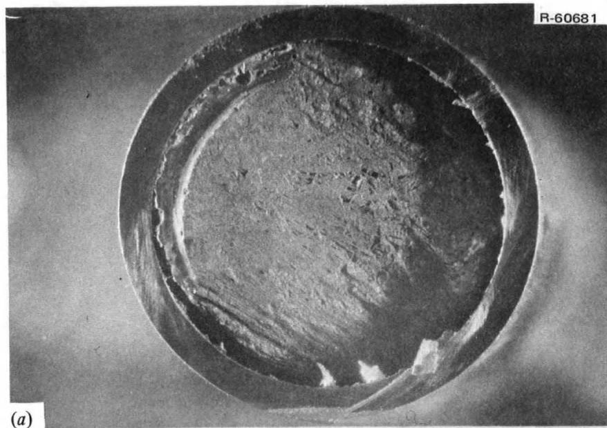

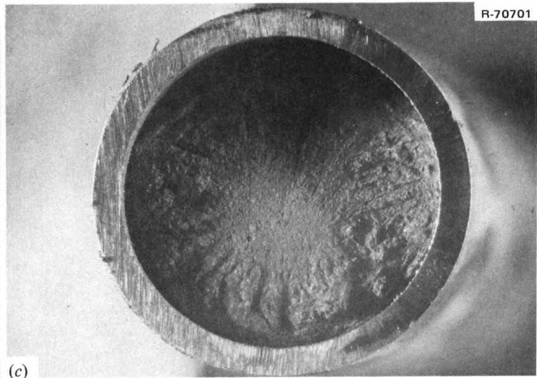

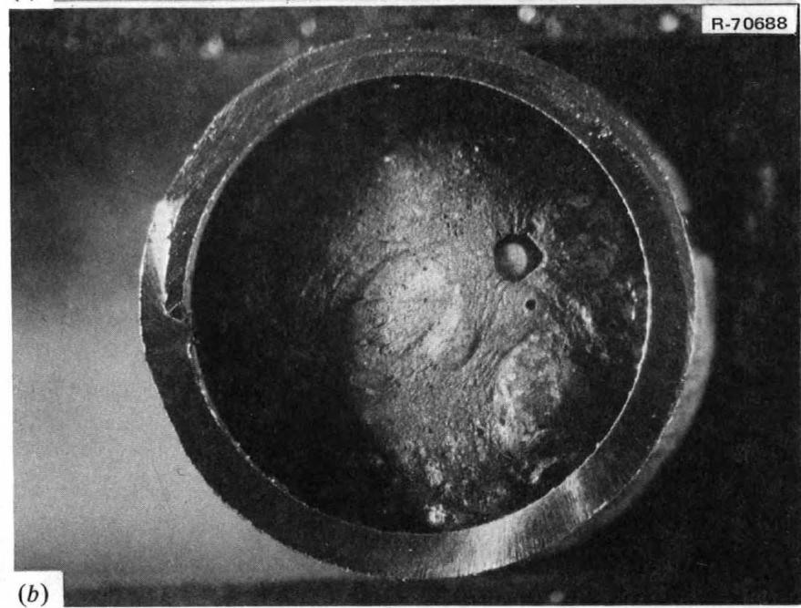

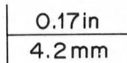  
Fig. 6.90. The meniscus of the fuel salt with the top of the pin removed. $6 \times$ a Modified Hastelloy N, heat 74533, top pin 2; (b) Inconel 600, heat NX 3752, middle pin 4; (c) modified Hastelloy N, heat 74534, bottom pin 6.

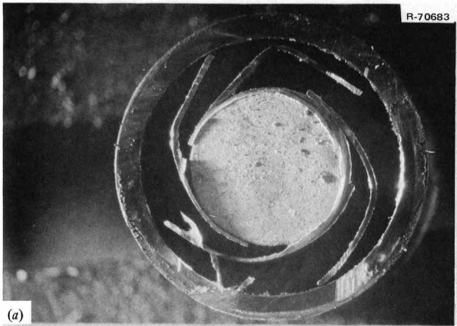

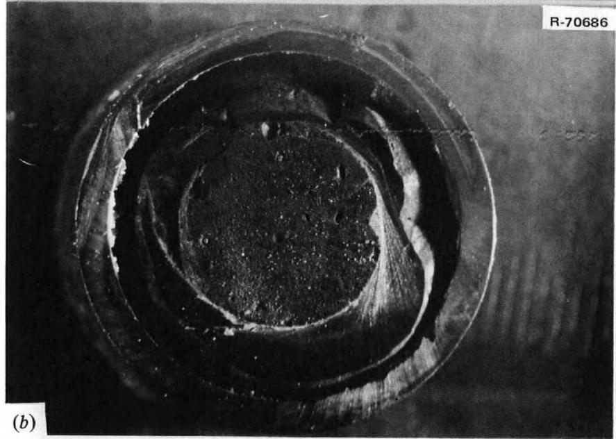

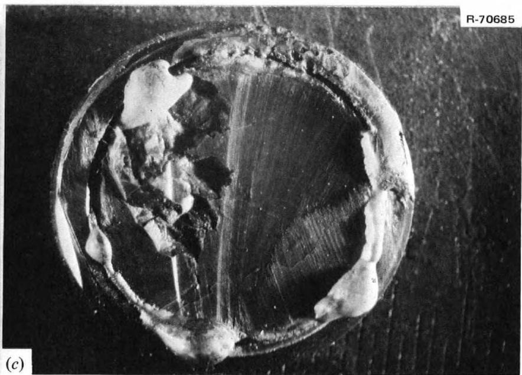  
Fig. 6.91. TeGen-2 fuel pin 2 (top pin). $6 \times$ a) Bottom of pin showing hub and foils free of salt, $(b)$ bottom of salt that rested on hub showing void space around edge of tube, and $(c)$ ring A-14 cut from pin and showing bubbles in the salt (light green).

<table><tr><td>0.17in</td></tr><tr><td>4.2mm</td></tr></table>

and the salt would most certainly have been molten during that time. Figure 6.91c shows the next ring above the bottom of the salt shown in Fig. 6.91b after it was cut off with the abrasive cut-off saw. (The salt with saw markings in it and bubbles around it is still in the ring.) The bubbles were very light green, contrasted with the dark green of the rest of the fuel salt. Evidently, some of the salt was melted by the heat generated by the uncooled cut-off wheel $(^{1} / _{16}$ in away) while cutting the back side of the ring. Some bubbles were noted in the cutting of each ring near the bottom, but not as many formed near the top of pin 2, and very few were noted in cutting the other two fuel pins. Fuel pin 2 (top) and fuel pin 6 (bottom) are almost identical in composition, and the same batch of salt was used to fill all the fuel pins; so this variable behavior is not understood. Pin 6 (heat 74534) contained $0.01\%$ lanthanum, but this should not change the thermal conductivity appreciably, and the salt was well mixed by sparging with hydrogen and argon before the fuel pins were filled.

Some of the A rings (Fig. 6.89) were tensile tested on an Instron tensile machine in the Building 3026D hot cells. The ring fixture was modified so that the ring could be held in place. Figure 6.92 is a photograph of the fixture with a 0.5-in.-diam $\times$ 0.35-in.-wall $\times \frac{1}{16}$ -in.-long ring in place and the top clamp partially rotated to hold the ring to prevent its sliding out. During testing, as the two halves of the fixture were pulled apart, both clamps were rotated to the closed position. This modification worked well and alleviated the problems encountered in testing of TeGen-1 rings. Tensile data for the top, middle, and bottom irradiated fuel pins are given in Tables 6.34, 6.35, and 6.36 respectively. An arbitrarily assumed gage length of 0.5 in. was used in the calculation of the yield strength and the uniform and total elongations. The values given in the tables are not absolute values but are useful for comparisons within the series. The yield strengths appear to be slightly increased and the elongations and reductions in area slightly decreased by the irradiation and exposure to

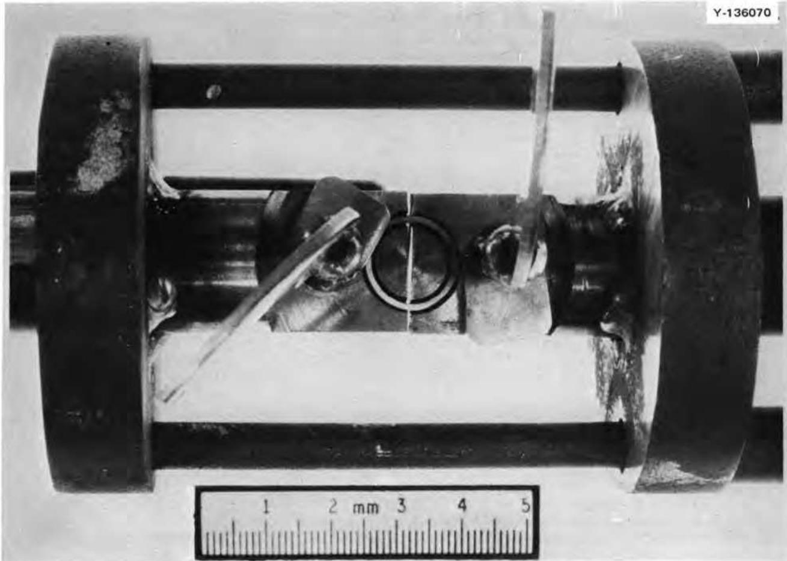  
Fig. 6.92. The fixture for testing rings in tension, showing ring in position for testing.

Table 6.34. Tensile properties of modified Hastelloy N, heat 74533, rings sawed from pin 2 and tested at $25^{\circ}\mathrm{C}$   

<table><tr><td rowspan="2">Specimen number</td><td rowspan="2">Cross sectional area (10-3in.2)</td><td colspan="4">Stress (103psi)</td><td colspan="2">Elongationa (%)</td><td rowspan="2">Reduction in area (%)</td></tr><tr><td>Proportional limit</td><td>Yielda</td><td>Ultimate tensile</td><td>Fracture</td><td>Uniform</td><td>Total</td></tr><tr><td>2A-1</td><td>4.27</td><td>65.6</td><td>71.0</td><td>124.6</td><td>121.3</td><td>29.7</td><td>28.5</td><td>27.9</td></tr><tr><td>2A-2</td><td>5.80</td><td>55.2</td><td>61.6</td><td>108.4</td><td>104.4</td><td>19.5</td><td>20.4</td><td>19.7</td></tr><tr><td>2A-3</td><td>7.07</td><td>47.4</td><td>53.3</td><td>110.6</td><td>104.7</td><td>19.9</td><td>21.4</td><td>27.2</td></tr><tr><td>2A-4</td><td>5.33</td><td>61.9</td><td>67.5</td><td>123.4</td><td>108.7</td><td>24.3</td><td>26.3</td><td>12.2</td></tr><tr><td>2A-5</td><td>5.03</td><td>60.7</td><td>66.7</td><td>117.8</td><td>110.0</td><td>23.8</td><td>24.9</td><td>16.8</td></tr><tr><td>2A-6</td><td>6.50</td><td>57.7</td><td>66.2</td><td>117.0</td><td>111.2</td><td>19.8</td><td>21.4</td><td>27.0</td></tr><tr><td>2A-7</td><td>5.16</td><td>66.9</td><td>70.8</td><td>122.9</td><td>118.2</td><td>19.3</td><td>20.4</td><td>18.8</td></tr><tr><td>2A-8b</td><td>5.19</td><td>53.0</td><td>57.4</td><td>83.6</td><td>68.4</td><td>7.0</td><td>10.7</td><td>17.7</td></tr><tr><td>2A-11</td><td>5.07</td><td>62.2</td><td>67.1</td><td>120.2</td><td>115.4</td><td>25.8</td><td>27.2</td><td>26.7</td></tr><tr><td>2A-13</td><td>3.50</td><td>62.3</td><td>68.0</td><td>114.9</td><td>109.4</td><td>21.8</td><td>22.7</td><td>31.1</td></tr><tr><td>2A-16b</td><td>3.41</td><td>85.1</td><td>93.3</td><td>126.7</td><td>121.7</td><td>7.9</td><td>8.8</td><td>26.3</td></tr><tr><td>Control</td><td></td><td></td><td>57.9</td><td>118.3</td><td>116.9</td><td>49.8</td><td>51.3</td><td>36.7</td></tr><tr><td>Control</td><td></td><td></td><td>57.1</td><td>115.4</td><td>113.3</td><td>48.6</td><td>49.2</td><td>40.5</td></tr></table>

${}^{a}$ Based on gage length of 0.5 in.   
Ring notched during sawing.

Table 6.35. Tensile properties of Inconel 600, heat NX 3752, rings sawed from pin 4 and tested at $25^{\circ}\mathrm{C}$   

<table><tr><td rowspan="2">Specimen number</td><td rowspan="2">Cross sectional area (10-3in.2)</td><td colspan="4">Stress (103psi)</td><td colspan="2">Elongationa (%)</td><td rowspan="2">Reduction in area (%)</td></tr><tr><td>Proportional limit</td><td>Yielda</td><td>Ultimate tensile</td><td>Fracture</td><td>Uniform</td><td>Total</td></tr><tr><td>4A-1</td><td>5.11</td><td>45.0</td><td>50.9</td><td>93.0</td><td>85.5</td><td>22.0</td><td>23.7</td><td>28.6</td></tr><tr><td>4A-2</td><td>6.13</td><td>37.5</td><td>42.1</td><td>84.5</td><td>73.4</td><td>24.9</td><td>27.9</td><td>27.1</td></tr><tr><td>4A-3</td><td>3.52</td><td>34.1</td><td>38.9</td><td>84.1</td><td>57.7</td><td>21.0</td><td>26.6</td><td>42.9</td></tr><tr><td>4A-4</td><td>3.96</td><td>36.9</td><td>38.9</td><td>76.5</td><td>64.4</td><td>19.0</td><td>22.7</td><td>28.1</td></tr><tr><td>4A-5</td><td>3.97</td><td>40.3</td><td>44.3</td><td>85.4</td><td>69.8</td><td>20.4</td><td>24.9</td><td>14.6</td></tr><tr><td>4A-6</td><td>5.72</td><td>34.1</td><td>39.3</td><td>86.4</td><td>59.5</td><td>20.4</td><td>25.4</td><td>44.3</td></tr><tr><td>4A-7</td><td>4.76</td><td>36.4</td><td>40.5</td><td>86.6</td><td>79.8</td><td>21.0</td><td>23.4</td><td>33.4</td></tr><tr><td>4A-8</td><td>4.06</td><td>40.6</td><td>44.8</td><td>84.0</td><td>77.6</td><td>18.9</td><td>21.8</td><td>32.7</td></tr><tr><td>4A-11</td><td>5.88</td><td>43.4</td><td>46.8</td><td>86.6</td><td>77.2</td><td>22.6</td><td>26.4</td><td>36.4</td></tr><tr><td>4A-13</td><td>5.34</td><td>35.6</td><td>39.7</td><td>86.7</td><td>76.2</td><td>25.5</td><td>29.6</td><td>20.6</td></tr><tr><td>4A-16</td><td>4.13</td><td>45.3</td><td>48.9</td><td>94.2</td><td>84.3</td><td>18.9</td><td>22.6</td><td>22.9</td></tr><tr><td>3A-1b</td><td>4.86</td><td>35.4</td><td>38.4</td><td>83.0</td><td>77.1</td><td>30.6</td><td>33.0</td><td>31.6</td></tr><tr><td>3A-2b</td><td>4.65</td><td>36.6</td><td>39.8</td><td>83.7</td><td>78.5</td><td>22.6</td><td>25.0</td><td>22.9</td></tr><tr><td>3A-3b</td><td>4.94</td><td>39.5</td><td>47.5</td><td>89.0</td><td>77.9</td><td>24.3</td><td>27.6</td><td>16.0</td></tr><tr><td>3A-4b</td><td>5.11</td><td>45.0</td><td>47.9</td><td>87.7</td><td>79.3</td><td>20.2</td><td>23.4</td><td>18.8</td></tr><tr><td>3A-5b</td><td>4.33</td><td>37.9</td><td>42.7</td><td>88.2</td><td>79.6</td><td>24.5</td><td>27.3</td><td>21.1</td></tr><tr><td>Control</td><td></td><td></td><td>35.8</td><td>82.5</td><td>69.3</td><td>40.6</td><td>44.5</td><td>44.1</td></tr><tr><td>Control</td><td></td><td></td><td>36.2</td><td>82.3</td><td>68.4</td><td>39.7</td><td>43.7</td><td>44.1</td></tr></table>

${}^{a}$ Based on gage length of 0.5 in.   
$b$ Control pin filled with salt at same time but not irradiated or tested in hot cell.

Table 6.36. Tensile properties of modified Hastelloy N, heat 74534, rings sawed from pin 6 and tested at $25^{\circ}\mathrm{C}$   

<table><tr><td rowspan="2">Specimen number</td><td rowspan="2">Cross sectional area (10-3in.2)</td><td colspan="4">Stress (103psi)</td><td colspan="2">Elongationa(%)</td><td rowspan="2">Reduction in area (%)</td></tr><tr><td>Proportional limit</td><td>Yielda</td><td>Ultimate tensile</td><td>Fracture</td><td>Uniform</td><td>Total</td></tr><tr><td>6A-1</td><td>4.60</td><td>65.2</td><td>71.1</td><td>118.7</td><td>117.9</td><td>17.9</td><td>18.2</td><td>32.9</td></tr><tr><td>6A-2</td><td>5.24</td><td>64.9</td><td>70.3</td><td>118.8</td><td>114.6</td><td>22.6</td><td>23.1</td><td>22.1</td></tr><tr><td>6A-3</td><td>5.09</td><td>60.3</td><td>66.8</td><td>119.9</td><td>114.0</td><td>21.2</td><td>21.9</td><td>18.3</td></tr><tr><td>6A-4</td><td>5.13</td><td>63.3</td><td>71.7</td><td>126.5</td><td>124.7</td><td>23.0</td><td>23.3</td><td>19.4</td></tr><tr><td>6A-5</td><td>5.29</td><td>59.0</td><td>66.8</td><td>120.7</td><td>117.3</td><td>21.7</td><td>22.6</td><td>27.5</td></tr><tr><td>6A-6</td><td>4.68</td><td>66.2</td><td>72.2</td><td>122.4</td><td>117.5</td><td>17.6</td><td>18.2</td><td>14.1</td></tr><tr><td>6A-7</td><td>4.28</td><td>67.0</td><td>72.1</td><td>125.8</td><td>123.7</td><td>25.4</td><td>25.9</td><td>23.0</td></tr><tr><td>6A-8</td><td>6.11</td><td>55.2</td><td>63.0</td><td>119.5</td><td>116.2</td><td>21.1</td><td>21.7</td><td>13.5</td></tr><tr><td>6A-11</td><td>4.91</td><td>54.0</td><td>59.1</td><td>117.8</td><td>114.7</td><td>21.9</td><td>22.4</td><td>28.0</td></tr><tr><td>6A-13</td><td>3.68</td><td>66.7</td><td>72.7</td><td>127.1</td><td>121.6</td><td>21.4</td><td>22.6</td><td>18.8</td></tr><tr><td>6A-16</td><td>4.50</td><td>60.7</td><td>65.6</td><td>106.2</td><td>103.3</td><td>16.7</td><td>17.1</td><td>25.0</td></tr><tr><td>Control</td><td></td><td></td><td>67.9</td><td>121.4</td><td>118.2</td><td>33.6</td><td>35.1</td><td>37.3</td></tr><tr><td>Control</td><td></td><td></td><td>67.7</td><td>122.7</td><td>121.9</td><td>35.5</td><td>36.2</td><td>40.0</td></tr></table>

${}^{a}$ Based on gage length of 0.5 in.

fission products. The elongations are still approximately $20\%$ (except for some rings that had small notches accidentally sawed in them), which is acceptable. These changes are due to the combined effects of being at $700^{\circ}\mathrm{C}$ for approximately 1600 hr of exposure to the thermal neutrons and of the shallow cracking caused by the fission products.

The rings were numbered consecutively from the top of each fuel pin (Fig. 6.89). The fuel salt level was higher in the top pin (approximately at ring A3) than the middle and bottom pins (approximately at ring A6) due to the void at the bottom of the top pin elevating the salt. As discussed previously, the most severe cracking in the MSRE occurred near the salt-to-gas interface in the pump bowl. In the standard Hastelloy N pin in TeGen-1, the rings at the top of the gas plenum (A-1 and A-2) cracked almost as severely as at any other location (approximately 2.0 mil deep). Figure 6.93 shows photomicrographs of the top pin (modified Hastelloy N, heat 74533) rings after tensile testing at $25^{\circ}\mathrm{C}$ . Rings A-1 (top) and A-16 (bottom) did not develop cracks. Both rings were shielded to some extent by the foils welded to the hub in the center (Fig. 6.91a). (Ring A-16 was later cut from the area surrounding the foils.) Ring A-1 was surrounded by similar foils at the top or gas space of the same fuel pin. As previously noted, the void at the bottom of the pin would indicate that both rings (A-1 and A-16) were in a gas space not exposed to the fuel salt. Ring A-2 (Fig. 6.91b) was just above the salt level, ring A-3 (Fig. 6.91c) was at the surface

of the salt, ring A-8 (Fig. 6.91d) was at the middle of the salt. Ring A-2, just above the salt surface, appears to have deeper cracks than the other rings.

Rings of the middle pin (Inconel 600, heat NX 3752), after tensile testing at $25^{\circ}\mathrm{C}$ , are shown in Fig. 6.94. Ring A-1 was at the top of the gas plenum, ring A-5 was just above the salt, ring A-6 was at the surface of the salt, ring A-8 was at the middle of the salt, and ring A-16 was at the bottom of the salt. Ring A-1 (Fig. 6.94a) at the top of the gas plenum did not crack on the inside (exposed to gaseous fission products) or on the outside exposed to NaK. Rings A-15 (Fig. 6.94b), A-6 (Fig. 6.94c), and A-8 (Fig. 6.94d) cracked on both the inside, exposed to salt and fission products, and on the outside, which was exposed to NaK. Ring A-16 (Fig. 6.94e) did not crack as severely on the inside as the rings near the top and middle of the salt and did not crack on the outside, exposed to NaK. Unless there was a severe temperature gradient along the length of the fuel pin, no explanation for this varied behavior can be given at this time.

Rings of the bottom pin (modified Hastelloy N, heat 74534) tested at $25^{\circ}\mathrm{C}$ are shown in Fig. 6.95. Ring A-1 (Fig. 6.95a) was located at the top of the gas plenum, A-5 (Fig. 6.95b) was just above the salt surface, A-6 (Fig. 6.95c) was just below the salt surface, A-8 (Fig. 6.95d) was at the middle of the salt, and A-16 (Fig. 6.95e) was at the bottom of the salt. Again, note that ring A-1 at the top of the gas plenum did not crack, as it was probably masked to some

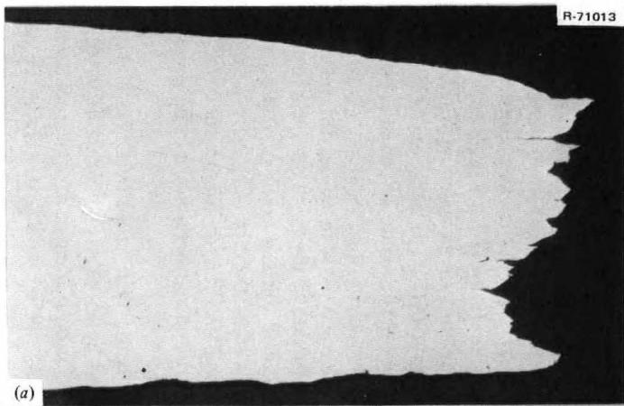

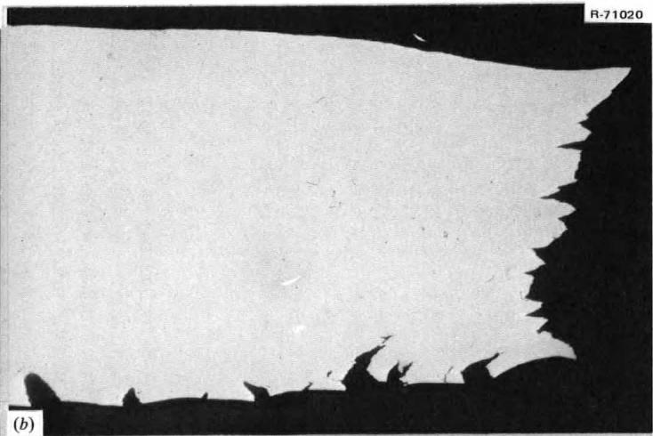

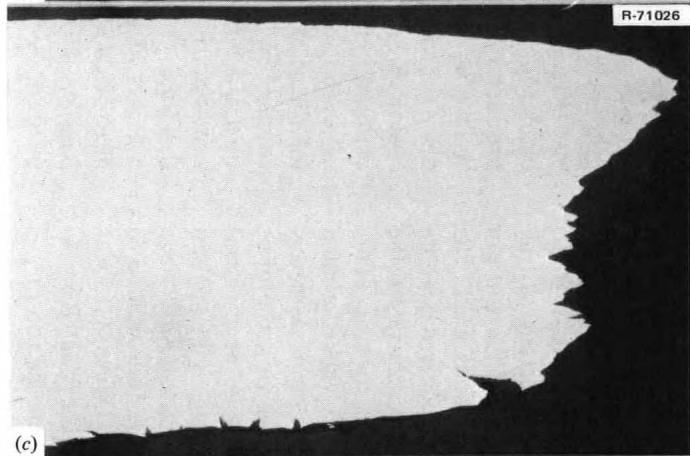

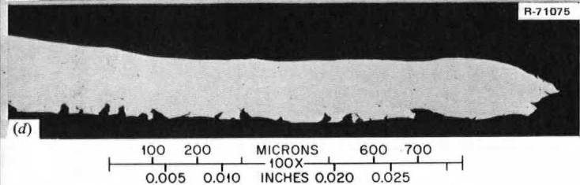

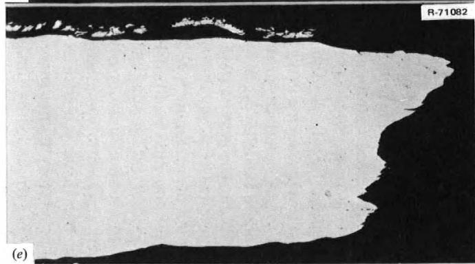  
Fig. 6.93. Fractures of rings tensile tested at $25^{\circ}\mathrm{C}$ from the top fuel pin in TeGen-2, modified Hastelloy N, heat 74533. As polished. $100\times$ a Location A-1 in the gas space, $(b)$ location A-2 just above salt, $(c)$ location A-3 just below surface of salt, $(d)$ location A-8 at middle of salt, and $(e)$ location A-16 at bottom of pin but free of salt. In each case the lower surface was exposed to the inside of the capsule, and the upper surface was exposed to the NaK.

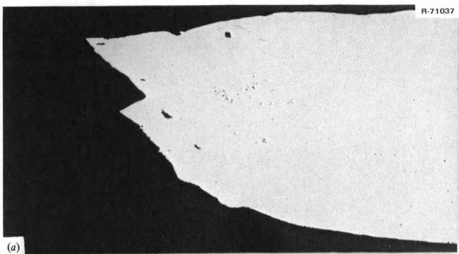

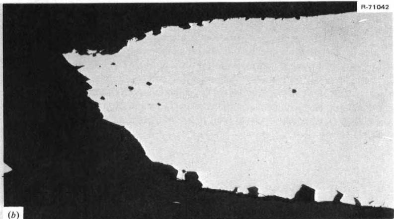

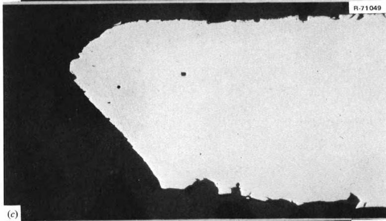

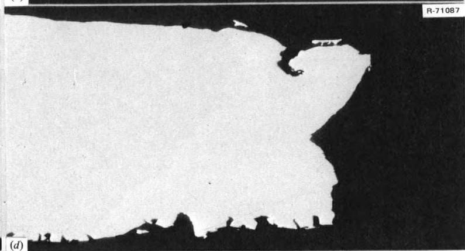

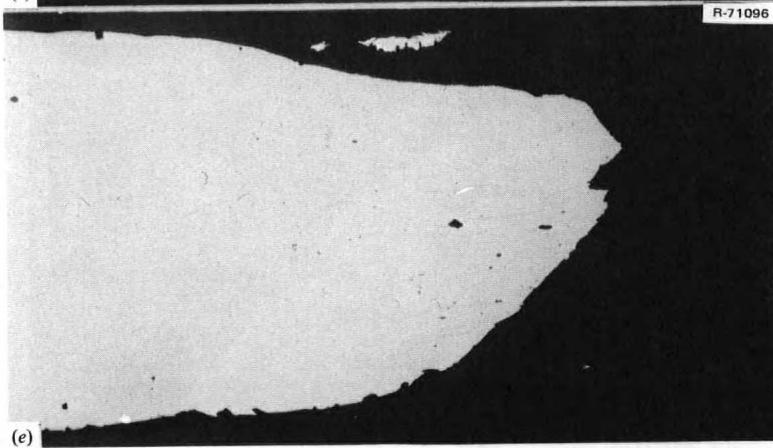

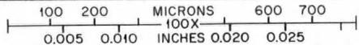  
Fig. 6.94. Fractures of rings tensile tested at $25^{\circ}\mathrm{C}$ from the middle fuel pin of TeGen-2, Inconel 600, heat NX 3752. (a) Location A-1 in the gas space, (b) location A-5 just above the salt, (c) location A-6 just below the surface of the salt, (d) location A-8 at the middle of the salt, and (e) location A-16 at bottom of salt. As polished. $100\times$ . In each case the lower surface was exposed to the inside of the capsule, and the upper surface was exposed to the NaK.

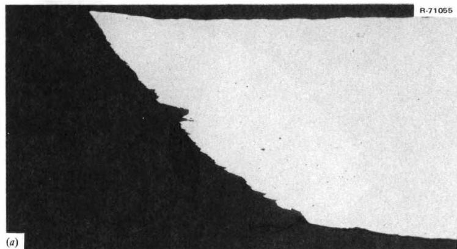

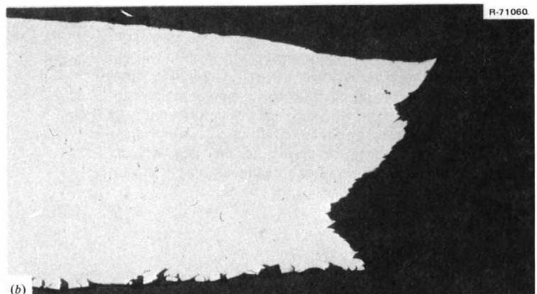

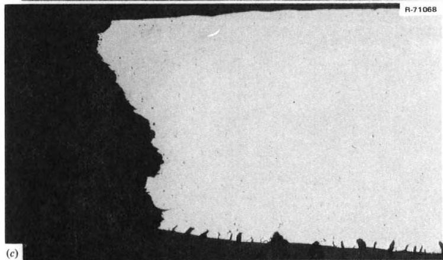

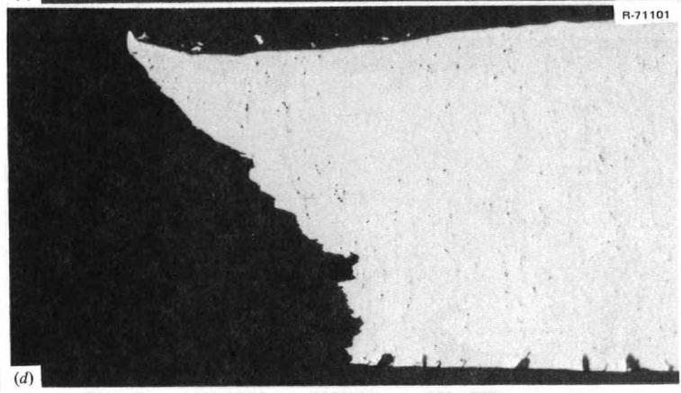

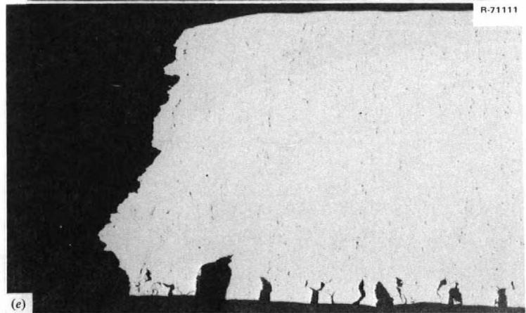

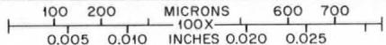  
Fig. 6.95. The fracture of rings tensile tested at $25^{\circ}\mathrm{C}$ from the bottom fuel pin in TeGen-2, modified Hastelloy N, heat 74534. (a) Location A-1 in the gas space, (b) location A-5 just above salt level, (c) location A-6 just below salt level, (d) location A-8 at middle of salt, and (e) location A-16 at bottom of salt. As polished, $100\times$ . In each case the lower surface was exposed to the inside of the capsule, and the upper surface was exposed to the NaK.

extent by the foils. Ring A-16 at the bottom of the salt appears to have the most severe cracking of any of the rings, which is opposite to the trends noted in the middle and top pins.

The cracking in the Inconel 600 pin has slightly different characteristics than the cracking in either of the modified Hastelloy N pins. In our experiments with Inconel 600 exposed to tellurium-containing environments, some heats of Inconel 600 were observed to crack, and other heats in the same capsule did not. All the heats had almost identical chemical compositions, and it appears that $15\%$ chromium is borderline for crack resistance in this alloy. Inconel 601 with $23\%$ chromium resisted cracking much better in TeGen-1 than Inconel 600 did in TeGen-2.

Analytical chemistry samples were taken from each fuel pin in the B sections(Fig. 6.89; designations are from top to bottom). Specimen B-1 was from the gas plenum, B-2 was from near the salt surface and B-3 was from near the bottom of the salt. Fuel salt from the A rings containing the surface of the salt in each fuel pin was mechanically pressed from the rings and sent for analysis. This surface salt probably contained the elements causing the spike of activity in this region. These chemistry samples should help in understanding the distribution of the fission products along the length of the fuel pins and the reason for the different cracking behavior in different areas of the fuel pins.

Also being investigated in the TeGen series of experiments are other alloys which are more resistant to tellurium attack in our experiments and which should be more resistant to fission products. Some of these alloys were included in TeGen-3, scheduled for completion of the irradiation period in mid-March, and in TeGen-4, scheduled for insertion in the ORR in mid-April.

# REFERENCES

1. T. K. Roche et al., MSR Program Semiannu. Progr. Rep. Aug. 31, 1975, ORNL-5078, pp. 65-69.   
2. T. K. Roche, H. E. McCoy, and J. C. Feltner, MSR Program Semiannu. Progr. Rep. Aug. 31, 1975, ORNL-5078, pp. 74-78.   
3. T. K. Roche, B. McNabb, and J. C. Feltner, MSR Program Semiannu. Progr. Rep. Feb. 28, 1975, ORNL-5047, pp. 63-66.   
4. H. E. McCoy and J. R. Weir, Jr., "Development of a Titanium-Modified Hastelloy N with Improved Resistance to Radiation Damage," pp. 290-311 in Irradiation Effects in Structural Alloys for Thermal and Fast Reactors, Spec. Tech. Publ. 457, American Society for Testing and Materials, Philadelphia, 1969.

5. D. N. Braski, J. M. Leitnaker, and G. A. Potter, MSR Program Semiannu. Progr. Rep. Aug. 31, 1975, ORNL-5078, pp. 84-91.   
6. J. M. Silcock and W. J. Tunstall, “Partial Dislocations Associated with NbC Precipitation in Austenitic Stainless Steels, Phil. Mag. 10, 360-89 (1964).   
7. D. N. Braski, J. M. Leitnaker, and G. A. Potter, MSR Program Semiannu. Progr. Rep. Aug. 31, 1974, ORNL-5011, p. 74.   
8. E. R. Stover and J. Wulff, Trans. Met. Soc. AIME, 215, 127 (1959).   
9. R. E. Gehlbach and S. W. Cook, MSR Program Semiannu. Progr. Rep. Feb. 28, 1970, ORNL-4548, p. 231.   
10. J. R. Keiser, J. R. DiStefano, and E. J. Lawrence, *MSR Program Semiannu. Progr. Rep.* Aug. 31, 1975, ORNL-5078, p. 94.   
11. L. M. Toth and L. O. Gilpatrick, The Equilibrium of Dilute $UF_{3}$ Solution Contained in Graphic, ORNL/TM-4056 (December 1972).   
12. B. McNabb and H. E. McCoy, MSR Program Semiannu. Progr. Rep. Aug. 31, 1975, ORNL-5078, pp. 97-100.   
13. B. McNabb and H. E. McCoy, MSR Program Semiannu. Progr. Rep. Feb. 28, 1975, ORNL-5047, pp. 94-101.   
14. C. F. Weaver and J. D. Redman, MSR Program Semiannu. Progr. Rep. March 31, 1973, ORNL-4832, p. 48.   
15. D. R. Stull and G. C. Sinke, “Tellurium,” p. 200 in Thermodynamic Properties of the Elements, Amer. Chem. Soc., Washington, D.C., 1956.   
16. P. Budininkas, R. K. Edwards, and P. G. Wahlbeck, "Dissociation Energies of Group Via Gaseous Homonuclear Diatomic Molecules III. Tellurium," J. Chem. Phys. 48, 2870 (1968).   
17. S. Dushman, "Flow of Gases Through Tubes and Orifices," p. 94 in Scientific Foundations of Vacuum Technique, (Chapter 2, 2nd ed) ed. by J. M. Lafferty, Wiley, New York, 1962.   
18. R. Hultgren, et al., Selected Values the Thermodynamic Properties of the Elements, p. 19, Amer. Soc. Metals, Metals Park, Ohio, 1973.   
19. The lithium tellurides used in these experiments were prepared by A. D. Kelmer and D. Y. Valentine of the Chemistry Division.   
20. J. R. Keiser, et al., MSR Program Semiannu. Progr. Rep. Aug. 31, 1975, ORNL-5078, p. 102.   
21. J. Brynestad, MSR Program Semiannu. Progr. Rep. Aug. 31, 1975, ORNL-5078, p. 100.   
22. H. E. McCoy and B. McNabb, Intergranular Cracking of INOR-8 in the MSRE, ORNL-4829 (November 1972).   
23. R. E. Clausing and L. Heatherly, An Auger Electron Spectroscopic Examination of Grain Boundary Fracture Surfaces of Hastelloy N Irradiated in the MSRE, ORNL-TM (in preparation).   
24. R. E. Clausing and L. Heatherly, MSR Program Semiannu. Progr. Rep. Feb. 28, 1975, ORNL-5047, p. 104.   
25. R. E. Clausing and E. E. Bloom, "Auger Electron Spectroscopy of Fracture Surfaces in Irradiated Type 304 Stainless Steel," pp. 491-505 in Proceedings, 4th Bolton Ldg. Conf., June 1974, Clartor's Publishing Division, Baton Rouge, La, 1974.   
26. "Fractography and Atlas of Fractographs, pp. 71, 72, ASM Metals Handbook, vol. 9, ASM Metals Park, Ohio, 1974.

27. J. R. Rellick, C. J. McMahon, Jr., H. L. Marcus, and P. W. Palmberg, “The Effect of Tellurium on Intergranular Cohesion in Iron,” Met. Trans. 2, 1492-94 (May 1971).   
28. G. Henry, J. Plateau, X. Wache, M. Gerber, I. Behar, and C. Crussard, "Mise en Evidence de Phenomenes d'Adsorption Intergranulaire et Etude de Leurs Relations Avec La Fragilite Intergranulaire," Mem. Sci. Rev. Met. No. 4, 417-26 (1959).   
29. R. E. Clausing and L. Heatherly, Molten-Salt Reactor Program Semiannu. Progr. Rep. Aug. 31, 1975, ORNL-5078, p. 106.

30. H. E. McCoy, B. McNabb, and J. C. Feltner, MSR Program Semiannu. Progr. Rep. Aug. 31, 1975, ORNL-5078, pp. 108-122.   
31. C. R. Hyman, MSR Program Semiannu. Progr. Rep. Aug. 31, 1974, ORNL 5011, pp. 81-85.   
32. B. J. McNabb and H. E. McCoy, MSR Program Semiannu. Progr. Rep. Feb. 28, 1975, ORNL-5047, pp. 123-136.   
33. B. J. McNabb and H. E. McCoy, MSR Program Semiannu. Progr. Rep. Aug. 31, 1975, ORNL-5078, pp. 119-131.

# 7. Fuel Processing Materials Development

J. R. DiStefano

H. E. McCoy

The processes that are being developed for isolation of protactinium and removal of fission products from molten-salt breeder reactors require materials that are corrosion resistant to bismuth-lithium and molten fluoride solutions. Past experience has indicated that although the solubilities of iron-base alloys in bismuth are low, they mass transfer rapidly in bismuth at $500 - 700^{\circ}\mathrm{C}$ . The most promising materials for salt reprocessing are molybdenum, $\mathrm{Ta} - 10\%$ W, and graphite.

Molybdenum has been tested in a wide range of bismuth-lithium solutions for up to 10,000 hr and has shown excellent compatibility. Thermodynamic data and literature reports indicate that molybdenum will also be compatible with molten fluoride mixtures.

Tantalum- $10\%$ tungsten also has excellent compatibility with bismuth-lithium solutions, but tests are required to demonstrate its compatibility with molten fluoride salts. A thermal convection loop was constructed of Ta- $10\%$ W, and a 3000-hr test at $600 - 700^{\circ}\mathrm{C}$ with $\mathrm{LiF - BeF_2 - ThF_4 - UF_4}$ (72-16-11.7-0.3 mole $\%$ ) was initiated.

Graphite has shown excellent compatibility with both bismuth-lithium solutions and molten salts. Although no chemical interaction between bismuth-lithium solutions and graphite has been found, the liquid-metal solution tends to penetrate the open porosity of graphite. Graphite exposed to Bi-2.4 wt $\%$ (42 at. $\%$ ) Li in a molybdenum thermal convection loop for 3000 hr at $600 - 700^{\circ}\mathrm{C}$ picked up large quantities of bismuth and small quantities of molybdenum. Recent tests have focused on evaluating the extent of dissimilar material interaction in Mo-(Bi-Li)-C and $(\mathrm{Ta} - 10\% \mathrm{W}) - (\mathrm{Bi} - \mathrm{Li}) - \mathrm{C}$ systems.

# 7.1 SUMMARY OF COMPATIBILITY STUDIES

J. R. DiStefano

# 7.1.1 Ta- $10\%$ W Thermal Convection Loop Test

Tantalum- $10\%$ tungsten tubing of 0.875-in. $\mathbf{OD}\times$ 0.050-in. wall was fabricated from 3.5-in.-diam rod using extrusion and tube drawing techniques. This material was then used to fabricate a thermal convection loop (Fig. 7.1). The loop contains Ta- $10\%$ W tubular and tensile specimens in the vertical hot and cold leg sections. The loop surge tank located above the hot leg is also constructed of

$\mathrm{Ta - 10\% W}$ and the fluoride salt fill tank connected to it is made of nickel. Tantalum resistance heaters are used to heat the vertical hot leg, portions of the two horizontal crossover lines, and the surge tank. Calrod resistance heaters were used in other areas. The entire loop system was heated to $700^{\circ}\mathrm{C}$ before salt was transferred into the loop. After flow was established, the Calrod heaters were turned off; however, they will subsequently be used when the loop is drained. The loop is circulating the salt mixture $\mathrm{LiF - BeF_2 - ThF_4 - UF_4}$ (72-16-11.7-0.3 mole $\%$ ) and has the temperature distributions shown in Table 7.1. The test is being conducted in a vacuum

Table 7.1. Temperature distribution in Ta- $10\%$ W thermal convection loop   

<table><tr><td>Location</td><td>Temperature (°C)</td></tr><tr><td>Bottom of hot leg</td><td>610</td></tr><tr><td>Top of hot leg</td><td>690</td></tr><tr><td>Top of cold leg</td><td>680</td></tr><tr><td>Middle of cold leg</td><td>640</td></tr><tr><td>Bottom of cold leg</td><td>585</td></tr><tr><td>Surge tank</td><td>690</td></tr></table>

bell jar at a pressure of $1 \times 10^{-7}$ torr, and has operated for 400 of a scheduled $3000\mathrm{hr}$ .

# 7.1.2 Dissimilar Material Tests

It was previously found that mass transfer of molybdenum to graphite occurred in a thermal convection loop test after 3000 hr at $600 - 700^{\circ}\mathrm{C}$ . Since various components of a chemical processing system might well be constructed of graphite and a refractory metal, tests were begun to evaluate the extent of interaction of such dissimilar materials when they are both in contact with the same solution. Four test variables were investigated (Table 7.2). Molybdenum or $\mathrm{Ta} - 10\%$ W specimens were heated for 1000 hr in a graphite crucible containing bismuth-lithium at 600 or $700^{\circ}\mathrm{C}$ . A summary of the results obtained are shown in Tables 7.3 and 7.4, and typical metallographic results are shown in Fig. 7.2.

The conclusions that can be drawn from these results are that (1) the extent of interaction was slight

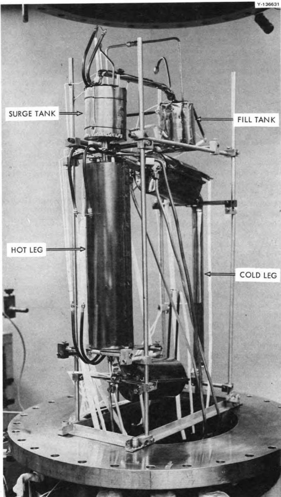  
Fig. 7.1. Ta-10% W thermal convection loop.

Table 7.2. Test variables in refractory metal-graphite-(Bi-Li) tests   

<table><tr><td>Variable</td><td>Description</td></tr><tr><td>Refractory metal</td><td>Mo, Ta-10% W</td></tr><tr><td>Graphite</td><td>ATJ, pyrolytically coated graphite</td></tr><tr><td>Temperature</td><td>600, 700°C</td></tr><tr><td>Lithium concentration of solution</td><td>Bi, Bi-0.01% Li, Bi-2.5% Li</td></tr></table>

Table 7.3. Results from Mo-(Bi-Li)-graphite system after 1000 hr at 600 or ${700}^{ \circ  }\mathrm{C}$   

<table><tr><td rowspan="2">Solution</td><td rowspan="2">Mo wt change (mg)</td><td colspan="2">Carbon concentration (ppm)</td><td colspan="3">Concentration in graphite (ppm)</td></tr><tr><td>Solution</td><td>Mo sample</td><td>Mo</td><td>Bi</td><td>Li</td></tr><tr><td colspan="7">600°C</td></tr><tr><td rowspan="2">Bi</td><td>0</td><td>34</td><td>55</td><td>20</td><td>&lt;20</td><td>&lt;2</td></tr><tr><td>-0.3</td><td>28</td><td>47</td><td>&lt;10</td><td>&lt;20a</td><td>&lt;2a</td></tr><tr><td>Bi-0.01% Li</td><td>-2.3</td><td>51</td><td>58</td><td>30</td><td>30</td><td>50</td></tr><tr><td rowspan="2">Bi-2.5% Li</td><td>-0.8</td><td>157</td><td>85</td><td>&lt;10</td><td>100</td><td>250</td></tr><tr><td>-0.6</td><td>66</td><td>71</td><td>&lt;10</td><td>30a</td><td>250a</td></tr><tr><td colspan="7">700°C</td></tr><tr><td rowspan="2">Bi</td><td>-0.8</td><td>42</td><td>50</td><td>&lt;10</td><td>90</td><td>&lt;2</td></tr><tr><td>-0.2</td><td>21</td><td>43</td><td>&lt;10</td><td>&lt;20a</td><td>&lt;2a</td></tr><tr><td>Bi-0.01% Li</td><td>-2.2</td><td>87</td><td>55</td><td>50</td><td>20</td><td>60</td></tr><tr><td rowspan="2">Bi-2.5% Li</td><td>0</td><td>49</td><td>260</td><td>&lt;10</td><td>100</td><td>200</td></tr><tr><td>0</td><td>46</td><td>240</td><td>&lt;10</td><td>20a</td><td>200a</td></tr></table>

$a$ Pyrocarbon-coated graphite sample.

Table 7.4. Weight and chemical changes in (Ta-10% W)-graphite(Bi-Li) solution after 1000 hr   

<table><tr><td rowspan="2">Solution</td><td rowspan="2">Ta-10% W weight change (mg)</td><td colspan="2">Carbon concentration</td><td colspan="4">Concentration in graphite (ppm)</td></tr><tr><td>Solution</td><td>Ta-10% W</td><td>Ta</td><td>W</td><td>Bi</td><td>Li</td></tr><tr><td colspan="8">600°C</td></tr><tr><td rowspan="2">Bi</td><td rowspan="2">-0.8</td><td>80</td><td>50</td><td>&lt;500</td><td>&lt;500</td><td>150</td><td>2</td></tr><tr><td>135</td><td>67</td><td>&lt;500</td><td>&lt;500</td><td>170a</td><td>2a</td></tr><tr><td>Bi-0.01% Li</td><td>-0.3</td><td>52</td><td>62</td><td>&lt;500</td><td>&lt;500</td><td>200</td><td>100</td></tr><tr><td rowspan="2">Bi-2.5% Li</td><td></td><td>100</td><td>40</td><td>&lt;500</td><td>&lt;500</td><td>500</td><td>500</td></tr><tr><td></td><td>90</td><td>45</td><td>&lt;500</td><td>&lt;500</td><td>20a</td><td>600a</td></tr><tr><td colspan="8">700°C</td></tr><tr><td rowspan="2">Bi</td><td rowspan="2">-0.2</td><td>148</td><td>40</td><td>&lt;500</td><td>&lt;500</td><td>&lt;20</td><td>&lt;2</td></tr><tr><td>45</td><td>45</td><td>&lt;500</td><td>&lt;500</td><td>50a</td><td>&lt;2a</td></tr><tr><td rowspan="2">Bi-0.01% Li</td><td>+3.1</td><td>50</td><td>45</td><td>&lt;500</td><td>&lt;500</td><td>120</td><td>70</td></tr><tr><td></td><td></td><td>120b</td><td></td><td></td><td></td><td></td></tr><tr><td rowspan="2">Bi-2.5% Li</td><td>+0.2</td><td>90</td><td>75</td><td>&lt;500</td><td>&lt;500</td><td>7000</td><td>600</td></tr><tr><td></td><td>105</td><td>70</td><td>&lt;500</td><td>&lt;500</td><td>180a</td><td>700a</td></tr></table>

Pyrocarbon-coated graphite sample.   
${}^{b}$ Sample not acid cleaned; all other results obtained on Ta-10% W samples after acid cleaning.

Y-137524

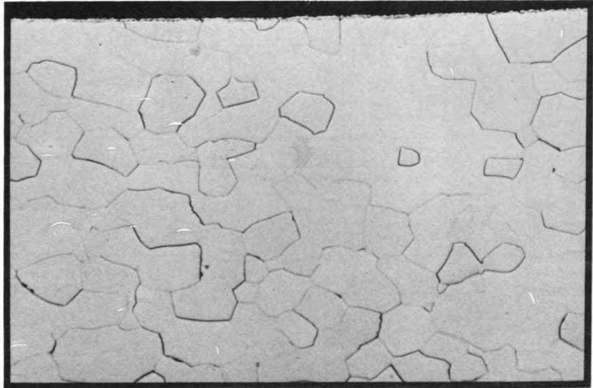  
Molybdenum

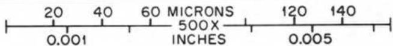

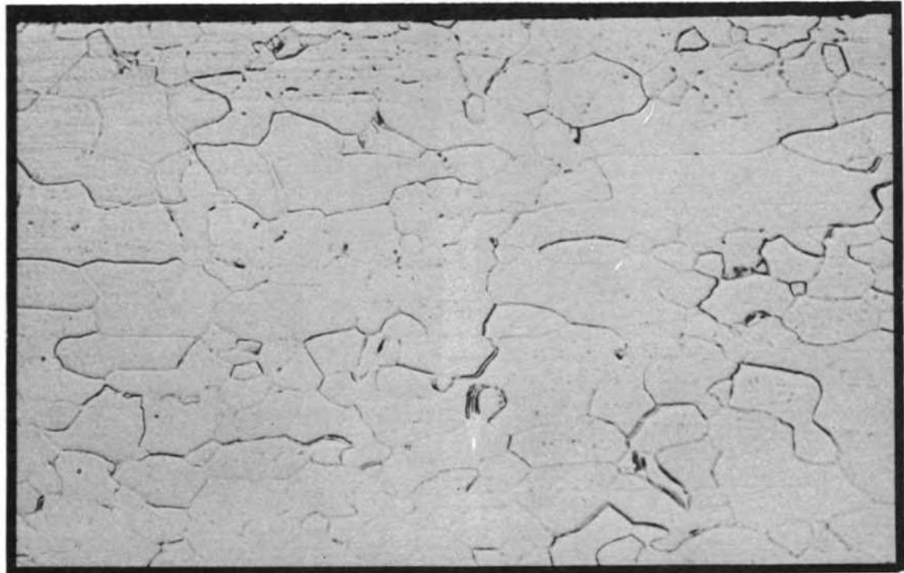  
Ta-10% W   
Fig. 7.2. Metallographic appearance of molybdenum and Ta-10% W after exposure to Bi-2.5% Li in a graphite capsule for 1000 hr at $700^{\circ}\mathrm{C}$ .

to negligible in all cases, (2) carbon mass transfer increased with temperature, (3) carbon mass transfer was greatest in $\mathrm{Bi - 0.01\%}$ Li when tested with molybdenum, and (4) penetration into graphite was greatest by $\mathrm{Bi - 2.5\%}$ Li.

# REFERENCE

I. J. R. DiStefano, MSR Program Semiannu. Progr. Rep. Aug. 31, 1975, ORNL-5078, pp. 133-39.

# Part 4. Fuel Processing for Molten-Salt Reactors

J. R. Hightower, Jr.

Part 4 deals with the development of processes for the isolation of protactinium and for the removal of fission products from molten-salt breeder reactors. Continuous removal of these materials is necessary for molten-salt reactors to operate as high-performance breeders. During this report period, work on the chemistry of fuel reconstitution was resumed, and engineering development progressed on the metal transfer process for rare-earth element removal, on continuous fluorinators for uranium removal, on fuel reconstitution, and on salt-bismuth contactors to be used in reductive extraction.

Studies of the chemistry of fuel reconstitution were resumed. A test of the effectiveness of smooth platinum for catalyzing the hydrogen reduction of $\mathrm{U}^{5+}$ to $\mathrm{U}^{4+}$ in small gold equipment has shown that a smooth platinum sheet of limited surface area would provide appreciable catalytic activity in the hydrogen reduction column of the Fuel Reconstitution Engineering Experiment. Niobium is an important fission product with volatile fluorides and would be carried from the fluorinator to the fuel reconstitution step. Studies of the hydrogen reduction of $\mathrm{NbF}_4$ showed that in the absence of granular platinum the $\mathrm{NbF}_4$ was reduced slowly to $\mathrm{Nb}^0$ . In the presence of granular platinum the rate of $\mathrm{NbF}_4$ was rapid for the first 2 hr but decreased to a value similar to that experienced in the uncatalyzed reaction thereafter. The reason for this behavior is being sought, since, if it is due to poisoning of the platinum catalyst, it has significant implications for the use of platinum catalysts in a reactor-fuel processing plant.

Studies in Metal Transfer Experiment MTE-3B were continued. In this experiment, all parts of the metal transfer process for rare-earth element removal are demonstrated using stirred, nondispersing contactors and salt flow rates that are about $1\%$ of those required to process the fuel salt in a 1000-MW(e) MSBR. During this report period, it was

determined that the previously observed entrainment of the fluoride salt into the LiCl resulted from operation of the agitators in the contactor vessel at 5 rps. The entrainment was unexpected since none was seen in experiment MTE-3 under similar conditions. Tests showed that no entrainment occurred at agitator speeds up to 4.58 rps. Also during this period, two additional runs were made at agitator speeds of 4.17 and 1.67 rps to determine the effect of agitation on the transfer rate of neodymium from the fluoride fuel salt to the Bi-Li stripper solution. Before these runs were made, the LiCl and Bi-Li stripper solution, contaminated with fluoride salt, were removed from the process vessels and were replaced with fresh LiCl and Bi-Li. Results of the two runs show that the rate of transfer of neodymium increased 300 to $400\%$ when the agitator speed was increased from 1.67 to 4.17 rps. However, overall mass-transfer coefficients for neodymium were lower than predicted by literature correlations, particularly at the two LiCl-bismuth interfaces. An increase in mass-transfer rates at these two interfaces would be required for reasonably sized process equipment to remove rare earth elements from a 1000-MW(e) MSBR. Obtaining the desired increases at these interfaces could be achieved by dispersing the LiCl and bismuth since entrainment of bismuth into LiCl would not be as serious as entraining bismuth into the fluoride salt that returns to the reactor.

Mechanically agitated nondispersing salt-metal contactors of the type used in experiment MTE-3B are of interest because entrainment of bismuth into the fuel salt returning to the reactor can be minimized since very high ratios of bismuth flow rate to salt flow rate can be more easily handled than in column-type contactors and since these contactors seem more easily fabricated from molybdenum and graphite than column-type contactors. Mass-transfer studies using water and mercury to simulate molten salt and

bismuth are being done to determine how to extrapolate results of mass-transfer measurements in a small salt-bismuth contactor to the large sizes that would be used in a fuel processing plant. During this report period, mass-transfer-coefficient measurements were completed for three stirred, nondispersing water-mercury contactors, covering a wide range of agitator diameters and speeds.

A nonradioactive demonstration of frozen-salt corrosion protection in a continuous fluorinator requires an internal heat source not subject to attack by fluorine. To provide such a heat source for future fluorinator experiments, studies have continued of autoresistance heating of molten salt in a fluorinator mock-up. These tests have shown that a major problem with the present design is plugging that occurs in the unheated end of the salt inlet tube,

which also serves as an electrode for autoresistance heating. Preliminary testing of the effectiveness of frozen-salt films for protecting against fluorine corrosion has continued.

The uranium removed from the fuel salt by fluorination would be returned to the processed salt in the fuel reconstitution step. The equipment is being installed for an engineering experiment to demonstrate the fuel reconstitution step. During this report period the salt metering system was tested by flowing salt at the design flow rate $[100\mathrm{cm}^3 /\mathrm{min}(1.67\times 10^{-6}$ $\mathrm{m}^3 /\mathrm{s})]$ through the process vessels. Also, the $\mathrm{UF}_6$ supply system was tested and calibrated, and the two gas density cells for off-gas analysis were calibrated. The equipment now works sufficiently well that gold-lined equipment can be installed and the fuel reconstitution step demonstrated.

# 8. Chemistry of Fluorination and Fuel Reconstitution

M. R. Bennett A. D. Kelmers

An initial investigation' of the reaction

$$
2 \mathrm {U F} _ {5} (\mathrm {d}) + \mathrm {H} _ {2} (\mathrm {g}) \rightarrow 2 \mathrm {U F} _ {4} (\mathrm {d}) + 2 \mathrm {H F} (\mathrm {g}) \tag {1}
$$

indicated that the reaction rate was low. Subsequently, it was shown[2,3] that the reaction follows zero-order kinetics with a rate constant of 1.35 millimoles/hr and that the reaction can be catalyzed by platinum. A series of experiments at $550^{\circ}\mathrm{C}$ (823 K) has been begun to test the catalytic activity of platinum in forms that could be used in the fuel Reconstitution Engineering Experiment (FREE) reduction column and to investigate the order of reaction of the catalyzed reaction. In the previous tests the catalyzed reaction was so rapid that only one sample could be taken before completion of the reaction.

During this report period the experimental facility in Building 4501 was reactivated. After the first tests, problems were encountered with plugged lines in the $\mathrm{UF}_6$ generator system. The plugged lines were replaced, and additional heating tapes and insulation were used to prevent the occurrence of cold spots in the generator system.

To evaluate the catalytic activity of smooth platinum, a 1.25-in.(31.8-mm)-diam disk of $\frac{1}{16}$ in.(1.6-mm)-thick platinum sheet was pressed into a 1.75-in.(44.5-mm)-diam by $\frac{3}{32}$ in.(24-mm)-thick gold disk so that only the surface of the platinum (area, $8.6~\mathrm{cm}^2$ ) would be exposed to the molten fuel salt. This disk was placed in the bottom of the gold reaction vessel; $0.200\mathrm{kg}$ of fuel salt, $\mathrm{LiF - BeF_2 - ThF_4}$ (72-16-12 mole %), containing about 1 wt% uranium as $\mathrm{UF_4}$ was added; and the system was hydrofluorinated for 24 hr at $600^{\circ}\mathrm{C}$ (873 K) to remove any oxides present. Gaseous $\mathrm{UF_6}$ was then introduced to yield a final $\mathrm{UF_5}$ concentration of about 2 wt %. The temperature was reduced to $550^{\circ}\mathrm{C}$ (823 K), and hydrogen was bubbled into the salt at $10~\mathrm{cm}^3/\mathrm{min}$ $(1.67\times 10^{-7}\mathrm{m}^3/\mathrm{s})$ through a $\frac{1}{4}$ in.(64-mm)-diam dip tube. The melt was periodically sampled. At the end of 2 hr, all the uranium was reduced to $\mathrm{UF_4}$ . Apparently even smooth platinum of limited surface area affords appreciable catalytic activity; thus platinum sheet that could readily be incorporated in the FREE experiment should provide adequate catalytic activity in an MSBR processing system.

To determine the reaction order of the catalyzed reaction, two tests were carried out (test 16 UR with $2.04\mathrm{wt}\% \mathrm{U}^{5+}$ and test 17 UR with $3.54\mathrm{wt}\% \mathrm{U}^{5+}$ ).

Hydrogen was introduced at $20~\mathrm{cm}^3 /\mathrm{min}$ $(3.3\times 10^{-7}$ $\mathrm{m}^3 /\mathrm{s})$ , and samples were taken at 10- or 15-min intervals. The resulting data (Fig. 8.1), when normalized and plotted as $\ln (\mathrm{U}_o^{5 + }) / (\mathrm{U}_t^{5 + })$ vs time, gave a straight line, suggesting first-order kinetics for the catalyzed reaction with a half-life of $65\mathrm{min}$ Additional tests are planned to evaluate the effect of hydrogen partial pressure and $\mathrm{UF}_5$ concentration on the reaction kinetics to try to determine if the reaction exhibits true first-order kinetics or if it is pseudo firstorder because of an excess of one of the reactants in these first experiments. First-order kinetics might be expected of a reaction that is diffusion limited. This could be diffusion of a reactant to the catalytic site or diffusion of an active species or product from the catalytic site.

In addition to uranium, fission products that remain in the MSBR fuel salt and have fluorides that are volatile at $500 - 600^{\circ}\mathrm{C}$ (773-873 K) will be removed from the fuel salt by fluorination and will appear in the fuel reconstitution step. Therefore, it is of interest to establish the chemistry of typical fission product fluorides; in particular, it would be desirable to know if the zero-order kinetics and concomitant low hydrogen utilization observed for $\mathrm{UF}_5$ is unique

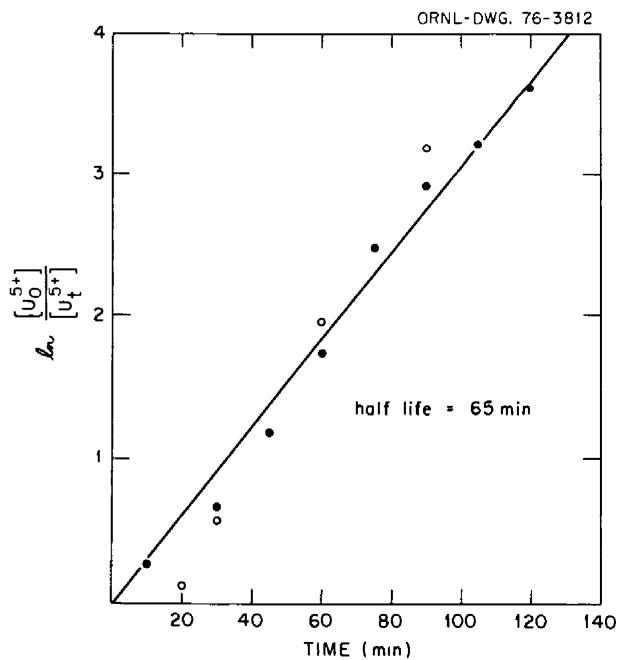  
Fig. 8.1. Catalytic reduction of dissolved $\mathbf{U}\mathbf{F}_{5}$ at $550^{\circ}\mathbf{C}$ . Test 16 UR, o; test 17 UR, $\bullet$ .

or represents a general case. Niobium, one of the major fission products, should be volatilized as $\mathrm{NbF}_5$ from the fluorination step and would then react with the $\mathrm{UF_4}$ in the fuel reconstitution step for form-soluble $\mathrm{NbF_4}$ . Previous work has shown that the reaction

$$
\mathrm {N b F} _ {4} (\mathrm {d}) + 2 \mathrm {H} _ {2} = 4 \mathrm {H F} + \mathrm {N b} ^ {0} \tag {2}
$$

proceeded very slowly at $700^{\circ}\mathrm{C}$ (973 K) in $\mathrm{Li}_2\mathrm{BeF}_4$ . According to Baes, under these conditions, $\mathrm{Nb}^{4+}(\mathrm{d})$ should be in equilibrium with $\mathrm{Nb}^0$ ; that is, no intermediate oxidation states should exist.

A series of tests was carried out using the gold reactor and apparatus previously used for the uncatalyzed $\mathrm{UF}_5$ reduction experiments. In these tests, $200\mathrm{g}$ of fuel salt and about $4\mathrm{g}$ of niobium metal chips were placed in the reactor and hydrofluorinated at $600^{\circ}\mathrm{C}$ (873 K) with anhydrous HF both to remove oxides from the salt and to form dissolved $\mathrm{NbF_4}$ . It had been previously shown that reaction of HF and $\mathrm{Nb}^0$ proceeds slowly. In four experiments, melts containing 0.33 to 1.1 wt $\%$ $\mathrm{NbF_4}$ were prepared. The temperature was adjusted to $550^{\circ}\mathrm{C}$ (823 K), and hydrogen was bubbled into the salt at $40~\mathrm{cm}^3 /\mathrm{min}$ $(6.6\times 10^{-7}\mathrm{m}^{3} / \mathrm{s})$ through a $1 / 4$ -in.(6.4-mm)-diam dip tube. The melts were periodically sampled, and the off-gas was scrubbed to trap HF, which was subsequently determined as fluoride ion by a specification electrode. The reduction reaction proceeded very slowly. Scatter in the molten-salt solution analyses prevented use of those data; however, the measure of the HF evolution was useful. After normalization to correct for an initial surge of HF generated when hydrogen was initially admitted to the reactor, the data from all four tests gave a single line of slope of 0.208 millimole niobium reduced per hour when plotted in the form for zero-order kinetics (Fig. 8.2). Thus it appears that the reduction of $\mathrm{NbF_4}$ is similar to that of $\mathrm{UF_5}$ .

A fifth test was then carried out with granular platinum. The generation rate of HF was increased for the first $2\mathrm{hr}$ and then fell to a value similar to that recorded for the uncatalyzed condition. The quantity of HF evolved during the first $2\mathrm{hr}$ was equivalent to that for the reaction

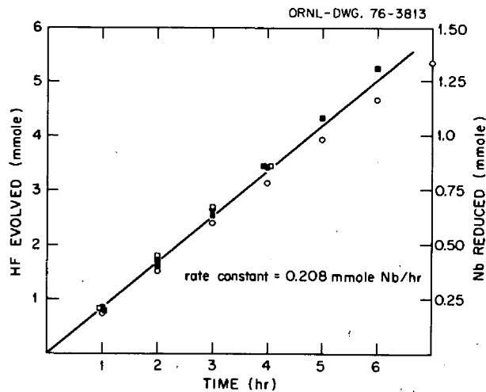  
Fig. 8.2. Reduction of dissolved $\mathbf{NbF_4}$ at $550^{\circ}C$ . Test 1: $\odot$ , 1.1 wt $\%$ niobium, pure hydrogen. Test 2: $\bullet$ , 0.92 wt $\%$ niobium, $\mathbf{H}_2$ -Ar (30-70 mole $\%$ ). Test 3: $\square$ , 0.33 wt $\%$ niobium, pure hydrogen. Test 4, $\blacksquare$ , 0.72 wt $\%$ niobium, pure hydrogen.

$$
\mathrm {N b F} _ {4} (\mathrm {d}) + ^ {1} / _ {2} \mathrm {H} _ {2} (\mathrm {g}) = \mathrm {N b F} _ {3} (\mathrm {d}) + \mathrm {H F}. \tag {3}
$$

Possibly an intermediate oxidation state, such as $\mathrm{NbF}_3$ , may be metastable and may offer a kinetic barrier to the complete reduction to $\mathrm{Nb}^0$ . Conversely, the platinum catalyst may be poisoned by the reaction products; so the apparent generation of HF equivalent to the reduction to $\mathrm{NbF}_3$ may be coincidental. If the platinum catalyst is poisoned by fission products, this could have significant implications for its practical use.

# REFERENCES

I. M. R. Bennett and L. M. Ferris, J. Inorg. Nucl. Chem. 36, 1285 (1974).   
2. M. R. Bennett and A. D. Kelmers, MSR Program: Semiannu. Progr. Rep. Feb. 28, 1975, ORNL-5047, pp. 150-151.   
3. A. D. Kelmers and M. R. Bennett, Inorg. Nucl. Chem. Letts., in press.   
4. C. F. Weaver and J. S. Gill, MSR Program Semiannu. Prog. Rep. Feb. 28, 1971, ORNL-4676, p. 85.   
5.C.F.Baes,Jr.J.Nucl.Mater.51,149(1974).   
6. C. F. Weaver and J. D. Redman, MSR Program Semiannu. Prog. Rep. Aug. 31, 1970, ORNL-4622, p. 73.

# 9. Engineering Development of Processing Operations

J. R. Hightower, Jr.

# 9.1 METAL TRANSFER PROCESS DEVELOPMENT

H. C. Savage

The metal transfer process for the removal of rare-earth-element fission products from Molten-Salt Breeder Reactor (MSBR) fuel salt is being studied in engineering scale experimental equipment designated MTE-3B. The experiments carried out in MTE-3B are to determine the rate of removal of representative rare-earth elements from molten-salt breeder reactor fuel salt $\left(\mathrm{LiF - BeF}_2 - \mathrm{ThF}_4, 72 - 16 - 12\right.$ mole $\%$ ) and to measure the overall mass-transfer coefficients between the salt and bismuth phases in the mechanically agitated process vessels.

Results obtained from the first two experiments using the rare-earth element neodymium (Nd-1 and Nd-2) have been reported. During these experiments, fluoride fuel salt was unexpectedly entrained into the lithium chloride in the mechanically agitated contactor. Agitator speeds of 5 rps were maintained throughout both runs Nd-1 and Nd-2, duplicating conditions that were previously used successfully in similar equipment.

During this report period, it was determined that entrainment occurred when the agitators were operated at a speed of 5 rps but would not occur at lower speeds (up to 4.6 rps). The lithium chloride, contaminated with fluoride salt, was removed from the process vessels along with the lithium-bismuth in the stripper vessel. Purified lithium chloride and lithium-bismuth were added to the system, and two additional experiments were completed. These experiments were to determine the effect of agitator speed on the removal rate and overall mass-transfer

coefficients across the three salt-bismuth interfaces for the rare-earth element neodymium. In one run (Nd-3) the agitator speed was maintained at 4.17 rps. In the second run (Nd-4) the agitator was maintained at 1.67 rps.

Results obtained in these two experiments (Nd-3 and -4) are given in the following sections.

# 9.1.1 Entrainment Studies in Experiment MTE-3B

Based on previous studies in a water-mercury system, it was concluded that entrainment of fluoride salt into the bismuth and LiCl phases in the mechanically agitated contactor would occur if the agitators were operated at speeds of 5.0 rps or higher. However, in the first metal transfer experiment, MTE-3, entrainment was not observed at 5.0 rps but was seen at 6.7 rps.

Since fluoride salt entrainment occurred at an agitator speed of 5 rps in experiment MTE-3B, tests were made to determine the maximum allowable agitator speed that could be used in experiment MTE-3B without entrainment. These tests were conducted by operating the agitators in the contractor at several different speeds (3.3, 4.2, and 5,0 rps) for times periods ranging from $\sim 50$ to $\sim 140$ hr. During each test at constant agitator speed, samples of the LiCl were removed from the contactor and analyzed for fluoride content since an increase in fluoride ion concentration would indicate entrainment of fluoride salt into the LiCl. Results are shown in Fig. 9.1, in which the fluoride ion concentration as a function of time is plotted for each agitator speed. The initial concentration of fluoride ion of $\sim 4$ wt %

ORNL DWG 76-349

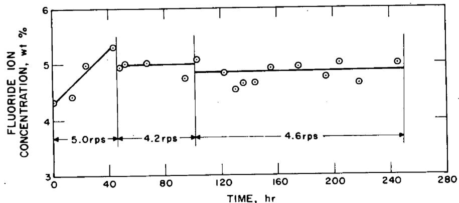  
Fig. 9.1. Results of tests to determine the rate of entrainment of fluoride salt into LiCl as a function of agitator speed, MTE-3B.

represents the amount of entrainment that occurred over a period of $\sim 250\mathrm{hr}$ during runs Nd-1 and Nd-2. The sequence of agitator speeds shown in Fig. 9.1 represents the order in which the tests were run. Entrainment is clearly indicated in the $\sim 50\mathrm{-hr}$ test at 5.0 rps. At agitator speeds of 3.3 and 4.2 rps, no entrainment (within experimental limits) appears to have occurred over the $\sim 200\mathrm{-hr}$ combined test periods.

It was concluded that future experiments could be carried out at agitator speeds up to about 4.6 rps without entrainment. It was also concluded that periodic determination of fluoride ion concentration in the LiCl to verify that no entrainment was occurring could be done rapidly and would be desirable in future experiments. For this purpose an Orion Model $801\mathrm{A}$ $\mathrm{pH / mV}$ meter* equipped with specific-ion (fluoride) electrodes was obtained for these experiments. This very accurate meter can also be used to continuously measure and record the EMF ( $\sim250\mathrm{mV}$ ) between the two bismuth phases in the contactor and stripper vessels containing different concentrations of lithium reductant ( $\sim0.0015$ and $\sim0.050$ atom fraction lithium). Changes in EMF would indicate a change in the relative lithium concentrations in these phases, with a resultant change in the equilibrium-distribution coefficient for neodymium between the salt and bismuth phases. Determination of the overall mass-transfer coefficients is dependent on the equilibrium distribution coefficients.

# 9.1.2 Removal of LiCl and Bi-Li Phases and Addition of Purified Solutions

The lithium chloride (contaminated with fluoride salt) in the contactor and stripper vessels and the bismuth (depleted in lithium reductant) in the stripper were removed without difficulty. The lithium chloride and bismuth were removed by transfer into an external receiver tank through a heated transfer line and dip tube extending into the process vessels. A new charging vessel was fabricated for subsequent use in purification and addition of the lithium chloride and bismuth-5 at. $\%$ lithium solution to the process vessels.

Chemical analyses of the purified lithium chloride in the contactor and stripper indicated that the

fluoride ion content had been reduced from $\sim 5$ wt % to $\sim 0.15$ wt %. The $0.15\mathrm{wt}\%$ fluoride content of the purified lithium chloride indicated that a heel of $\sim 180~\mathrm{cm}^3$ (out of an original inventory of $\sim 6100~\mathrm{cm}^3$ ) of the contaminated lithium chloride was not removed from the process vessels. This amount of fluoride $(0.15\mathrm{wt}\%)$ would not be expected to affect the equilibrium-distribution coefficients for neodymium or thorium at the LiCl/ bismuth interface in the contactor. Analysis of the purified bismuth-lithium in the stripper indicated a lithium reductant content of 0.048 atom fraction Li—near the desired 0.050 atom fraction. However, the bismuth-lithium solution contained $\sim 3000~\mathrm{ppm}$ (wt) thorium—presumably from a precipitated thorium compound $(\mathrm{ThBi}_2)$ remaining in the stripper after removal of the bismuth, which was saturated with thorium as a result of the fluoride salt $(\mathrm{LiF - BeF_2 - ThF_4}, 72-16-12$ mole %) entrainment during runs Nd-1 and Nd-2. No adverse effect on the transfer of neodymium would be expected by the presence of thorium in the bismuth in the stripper.

Following the addition of purified LiCl and Bi-5 at. $\%$ Li to the process vessels of Metal Transfer Experiment MTE-3B, two experiments were conducted as described below. The quantities of salt and bismuth solutions in MTE-3B are shown in Table 9.1.

# 9.1.3 Experiments Nd-3 and Nd-4

Two experiments, Nd-3 and Nd-4, were completed in Metal Transfer Experiment MTE-3B. The experiments were to measure the overall mass-transfer coefficient for neodymium across the three salt-bismuth interfaces in the metal transfer process and to determine the effect of agitator speed on these coefficients. For experiment Nd-3, an agitator speed of 4.17 rps was maintained in the contactor and stripper vessels, and for experiment Nd-4, an agitator speed of 1.67 rps was maintained. The experiments were made over a period of two weeks in January 1976, during which the process equipment was operated continuously.

Experiment Nd-3. Prior to the start of experiment Nd-3, $2030\mathrm{mg}$ of $\mathrm{NdF}_3$ (1450 mg Nd) containing 149 mCi of $^{147}\mathrm{Nd}$ tracer (11-day half-life) were added to fuel salt in the reservoir tank. This addition increased the neodymium concentration in the fuel salt from 21 ppm (wt), remaining after run Nd-2, to 34 ppm (wt).

Run Nd-3 was started at the following conditions: agitator speeds (contactor and stripper) = 4.17 rps, fluoride salt circulation rate = ~35 cm³/min (5.8 ×

Table 9.1. Inventory of salt and bismuth phases in Metal Transfer Experiment MTE-3B for runs Nd-3 and Nd-4   

<table><tr><td>Material</td><td>Vessel</td><td>Volumea at 923 K (m3)</td><td>Weight (kg)</td><td>Salt or bismuth solution (kg-moles)</td></tr><tr><td>Fluoride fuel saltb (72-16-12 mole % LiF-BeF2-ThF4)</td><td>Reservoir</td><td>0.0294</td><td>97.0</td><td>1.535</td></tr><tr><td>Fluoride fuel salt</td><td>Contactor</td><td>0.0031</td><td>10.2</td><td>1.61</td></tr><tr><td>Bismuth-thorium</td><td>Fluoride salt side of contactor</td><td>0.0028</td><td>27.0</td><td>1.29</td></tr><tr><td>Bismuth-thorium</td><td>LiCl side of contactor</td><td>0.0034</td><td>32.8</td><td>1.56</td></tr><tr><td>LiCl</td><td>Contactor</td><td>0.0029</td><td>4.3</td><td>1.01</td></tr><tr><td>LiCl</td><td>Stripper</td><td>0.0032</td><td>4.7</td><td>1.10</td></tr><tr><td>Bi-5 at. % Li</td><td>Stripper</td><td>0.0043</td><td>41.8</td><td>2.00</td></tr></table>

$a$ Densities at 923 K: fluoride fuel salt $= 3300\mathrm{kg / m}^3$ , $\mathrm{LiCl} = 1480\mathrm{kg / m}^3$ , and $\mathrm{Bi} = 9660\mathrm{kg / m}^3$ . $b$ Mole weight $= 0.0632\mathrm{kg}$ .

$10^{-7} \mathrm{~m}^{3} / \mathrm{s})$ , LiCl circulation rate $= \sim 1200 \mathrm{~cm}^{3} / \mathrm{min}$ $(2.0 \times 10^{-5} \mathrm{~m}^{3} / \mathrm{s})$ , temperature $= 923 \mathrm{~K}$ . After $19 \mathrm{hr}$ of operation the fluoride salt circulation was stopped, and the run was continued for a total of $108 \mathrm{hr}$ , at which time the LiCl salt circulation was stopped while agitation at $4.17 \mathrm{rps}$ was continued for an additional $57 \mathrm{hr}$ . The salt and bismuth phases were sampled throughout the run at 4- to 8-hr intervals for $^{147} \mathrm{Nd}$ counting and total neodymium analyses to determine the rate of transfer of neodymium across the three salt-bismuth interfaces.

The purpose of the initial period of fluoride salt circulation (19 hr) was to transfer neodymium containing $^{147}\mathrm{Nd}$ tracer into the fluoride salt in the contactor. When this was accomplished, the fluoride salt circulation was stopped. This procedure resulted in an increased rate of change of Nd content in the relatively small volume of $3.1 \times 10^{-3} \mathrm{~m}^3$ vs $3.5 \times 10^{-2} \mathrm{~m}^3$ in the contactor and fuel salt reservoir and improved the measurements of overall mass-transfer coefficients. When the LiCl circulation was stopped (after 108 hr), neodymium transfer into the stripper was stopped, and the equilibrium distribution of neodymium between the salt and bismuth phases was established. This procedure was required to determine the equilibrium-distribution coefficients for neodymium for calculation of the overall mass-transfer coefficients.

Experiment Nd-4. At the start of run Nd-4, the agitator speeds were reduced from 4.17 rps to 1.67 rps, fluoride salt and LiCl salt circulation were at $\sim 35$ $\mathrm{cm}^3 /\mathrm{min}$ $(5.8\times 10^{-7}\mathrm{m}^{3} / \mathrm{s})$ and $\sim 1200\mathrm{cm}^3 /\mathrm{min}$ $(2.0\times$ $10^{-5}\mathrm{m}^{3} / \mathrm{s})$ respectively, and the temperature of all

phases was $\sim 650^{\circ}\mathrm{C}$ (923 K). The fluoride salt circulation was continued for 21 hr to replace the neodymium and $^{147}\mathrm{Nd}$ tracer in the fluoride salt in the contactor which was extracted during run Nd-3. The concentration of neodymium in the fluoride salt in the contactor had been reduced by about $50\%$ during run Nd-3. The experiment was continued with LiCl circulation for 110 hr. Agitation of all phases at 1.67 rps (without salt circulation) was continued for an additional 55 hr, again to determine the equilibrium-distribution coefficients for neodymium between the salt and bismuth phases. Samples of all phases were taken at about 4- to 8-hr intervals during the experiment for $^{147}\mathrm{Nd}$ counting and total neodymium analyses.

# 9.1.4 Results

The neodymium concentrations in the fluoride salt in the contactor and the bismuth-5 at. $\%$ lithium in the stripper during runs Nd-3 and Nd-4, based on counting of the $^{147}\mathrm{Nd}$ tracer, are shown in Figs. 9.2 to 9.5. Neodymium concentrations in the bismuth-. thorium and LiCl phases in the contactor and stripper are not included since the $^{147}\mathrm{Nd}$ counting data do not accurately reflect the very low neodymium concentrations $(<  1\mathrm{ppm})$ in these phases. Concentrations in all phases, based on total neodymium analyses using an isotopic dilution mass spectrometry technique, will be used for the final determination of overall mass-transfer and equilibrium-distribution coefficients and will be included in a final summary report.

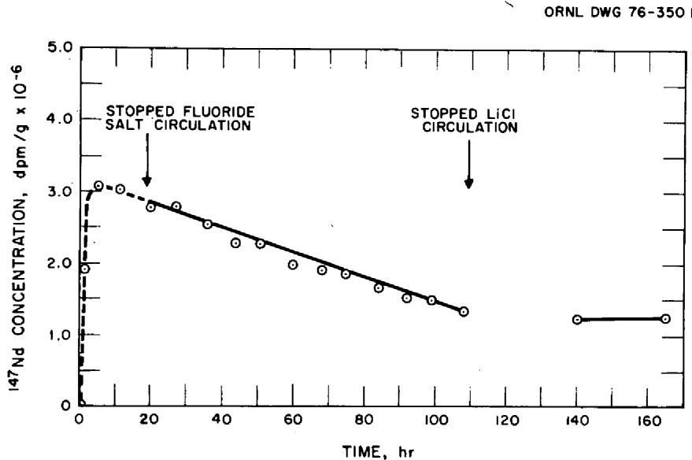  
Fig. 9.2. Neodymium concentration in the fluoride salt in the contactor during run Nd-3, MTE-3B.

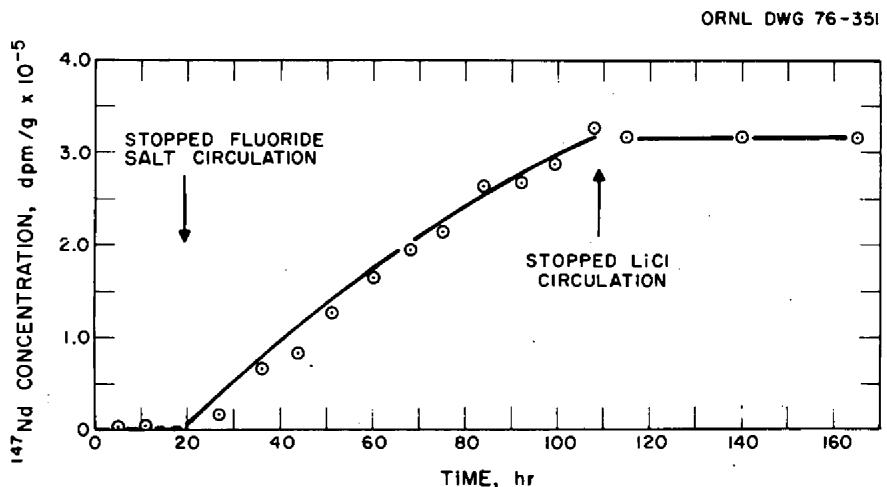  
Fig. 9.3. Neodymium concentration in the bismuth-5 at. $\%$ lithium in the stripper during run Nd-3, MTE-3B.

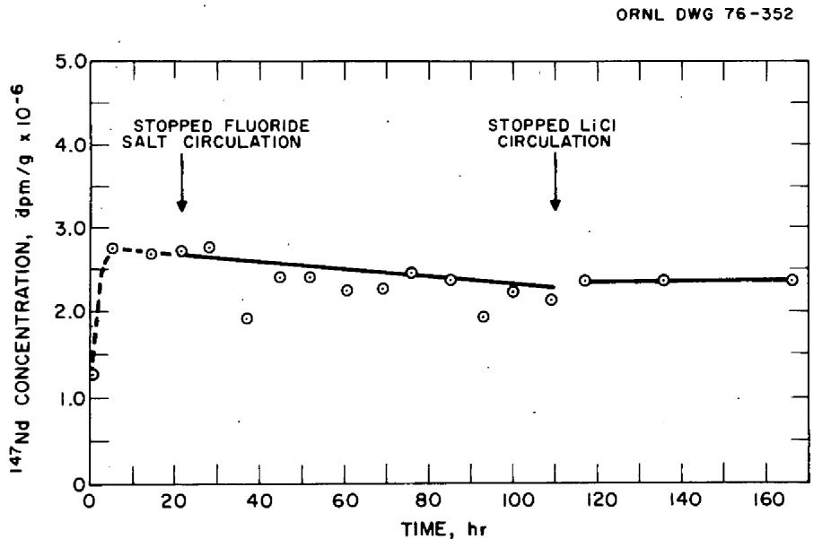  
Fig. 9.4. Neodymium concentration in the fluoride salt in the contactor during run Nd-4, MTE-3B.

ORNL DWG 76-353

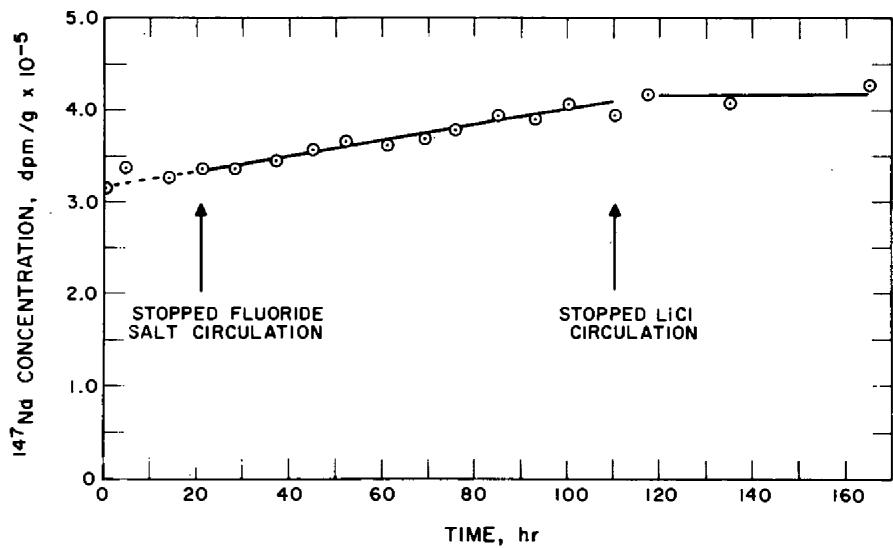  
Fig. 9.5. Neodymium concentration in the bismuth-5 at. $\%$ lithium in the stripper during run Nd-4, MTE-3B.

The lines drawn through the data points in Figs. 9.2 to 9.5 represent the "best-fit" values for the overall mass-transfer coefficients at the three salt-bismuth interfaces in the experiment.

Based on analyses for total neodymium, about 140 mg of neodymium was extracted from the fluoride salt during run Nd-3, and about $40\mathrm{mg}$ of neodymium was extracted from the fluoride salt during run Nd-4. The operating time for both runs was essentially the same (110 hr). Thus the rate of removal of neodymium was reduced by about 300 to $400\%$ when the agitator speed was reduced from 4.17 to 1.67 rps.

Results of five metal transfer process experiments in which neodymium was used as the representative rare-earth element fission product are shown in Tables 9.2 and 9.3. One run, Nd-2, is not shown since complete consumption of lithium from the stripper alloy caused by entrainment of fluoride salt into the lithium chloride precluded measurement of the overall mass-transfer coefficients. Two of the runs (EU-6 and EU-7) were conducted in experiment MTE-3 during 1972, and three runs (Nd-1, Nd-3, and Nd-4) were conducted in experiment MTE-3B during 1975-1976.

As seen in Table 9.2, the overall mass-transfer coefficients increase with increasing agitator speed, as predicted, with one exception— $K_{3}$ did not increase in run EU-7 when the agitator speed was increased from 3.33 to 5.0 rps. There is also good agreement between runs EU-7 (MTE-3) and Nd-1 (MTE-3B) at agitator speeds of 5.0 rps. In runs Nd-3 and Nd-4

(MTE-3B) the overall mass-transfer coefficients were decreased by about 300 to $400\%$ when the agitator speeds in the contactor and stripper were reduced from 4.17 to 1.67 rps. Also, the overall mass-transfer coefficient values at the fluoride salt/bismuth-thorium interface $(K_{1})$ for all experiments in MTE-3B are in the range of 50 to $100\%$ of the values predicted by the Lewis correlation, compared to the $15\%$ of predicted value observed in the two experiments in MTE-3. The overall mass-transfer coefficients at the LiCl/bismuth-thorium and LiCl/bismuth-5 at. $\%$ lithium interfaces $(K_{2}, K_{3})$ however, are significantly lower than in run Nd-3 at 4.17 rps than would be expected from the values at 5.0 rps seen in runs EU-6, EU-7, and Nd-1.

Because of the limited number of experiments and the rather large variation in the experimentally determined overall mass-transfer coefficients, a meaningful correlation of the data for use in design of a metal transfer process system for an MSBR has not been possible. An increase in the mass-transfer rates would be needed for reasonably sized process equipment to remove the rare-earth-element fission products from a 1000 MW(e) MSBR, in the case of neodymium at a rate of about $1.2\mathrm{g}$ -moles/day. For run Nd-3 in MTE-3B, an increase of about $500\%$ in the removal rate of neodymium could be achieved if the mass-transfer coefficients at the two LiCl/bismuth interfaces, $K_{2}$ and $K_{3}$ , could be increased (without increasing the transfer coefficient at the fluoride salt/bismuth interface) to about $20\%$ and

Table 9.2. Overall mass-transfer coefficients for neodymium in the Metal Transfer Experiments MTE-3 and MTE-3B $^a$ (mm/sec)   

<table><tr><td rowspan="2">Agitator speed (rpm)</td><td rowspan="2">Run No.</td><td rowspan="2">Run time (hr)</td><td colspan="2">K1</td><td colspan="2">K2</td><td colspan="2">K3</td><td rowspan="2">Amount of Nd transferred (mg)</td></tr><tr><td>Measured</td><td>Percent of Lewis correlation</td><td>Measured</td><td>Percent of Lewis correlation</td><td>Measured</td><td>Percent of Lewis correlation</td></tr><tr><td>200</td><td>EU-6b</td><td>45</td><td>0.002</td><td>15</td><td>0.065</td><td>10</td><td>0.2</td><td>7</td><td></td></tr><tr><td>300</td><td>EU-7b</td><td>55</td><td>0.0032</td><td>15</td><td>0.11</td><td>10</td><td>0.2</td><td>4</td><td></td></tr><tr><td>300</td><td>Nd-1c</td><td>96</td><td>0.004-0.010</td><td>50-100</td><td>0.110.030</td><td>10</td><td>0.130.040</td><td>2.5</td><td>210</td></tr><tr><td>250</td><td>Nd-3c</td><td>110</td><td>0.016</td><td>(46)</td><td>(0.014)</td><td>(4)</td><td>(0.0055)</td><td>1</td><td>140</td></tr><tr><td>100</td><td>Nd-4c</td><td>110</td><td>(0.0040)</td><td>69</td><td></td><td>(8)</td><td></td><td>(1.2)</td><td>41</td></tr></table>

${}^{a}$ Mass-transfer area at each interface: ${\mathrm{A}}_{1},{\mathrm{\;A}}_{2} = {245}{\mathrm{\;{cm}}}^{2};{\mathrm{\;A}}_{3} = {186}{\mathrm{\;{cm}}}^{2}$ . The terms ${K}_{1},{K}_{2}$ ,and ${K}_{3}$ are overall mass-transfer coefficients at interface between phases (1) fluoride salt/bismuth-thorium, (2) LiCl/bismuth-thorium, and (3) LiCl/bismuth-5 at. % lithium.   
bExperiment MTE-3.   
cExperiment MTE-3B.

Table 9.3. Equilibrium-distribution coefficients for neodymium in the Metal Transfer Experiments MTE-3 and MTE-3B   

<table><tr><td rowspan="2">Run No.</td><td colspan="2">DA</td><td colspan="2">DB</td><td colspan="2">DC</td></tr><tr><td>Calculated</td><td>Experimental</td><td>Calculated</td><td>Experimental</td><td>Calculatedb</td><td>Experimental</td></tr><tr><td>Nd-1</td><td>0.03c</td><td>0.03</td><td>1.67c</td><td>1.07</td><td>3.5 × 104</td><td>&gt;1 × 103</td></tr><tr><td>Nd-3</td><td>0.017d</td><td>0.022</td><td>0.94d</td><td>0.98</td><td>3.5 × 104</td><td>&gt;1 × 103</td></tr><tr><td>Nd-4</td><td>0.017e</td><td>(0.022)</td><td>0.94e</td><td></td><td>3.5 × 104</td><td></td></tr><tr><td>EU-6,7</td><td></td><td>0.012</td><td></td><td>0.30</td><td>3.5 × 104</td><td>2 × 103</td></tr></table>

${}^{a}$ The terms ${D}_{A},{D}_{B},{D}_{C}$ are equilibrium-distribution coefficients between phases (A) bismuth-thorium/fluoride salt, (B) bismuth-thorium/LiCl, and (C) bismuth-5 at. % lithium/LiCl.   
${}^{b}$ Based on 5 at. $\%$ lithium in bismuth.   
${}^{c}$ Based on 60 ppm lithium in bismuth.   
$d_{\mathrm{Bases}}$ Based on 50 ppm lithium in bismuth.   
$^{e}$ Experiment MTE-3B.

$5\%$ , respectively, of the value predicted by the Lewis correlation, which is near the values observed in runs EU-6 and EU-7. Large increases in these two coefficients might be accomplished by increased agitation, even to the point of dispersing the LiCl into the bismuth phase.

# 9.2 MASS-TRANSFER STUDIES USING WATER-MERCURY CONTACTORS

C.H.Brown, Jr. J.R.Hightower, Jr.

Mechanically agitated nondispersing salt-bismuth contactors are being considered for the protactinium removal step and the rare-earth-element removal step in the reference MSBR processing plant flowsheet. These contactors have several advantages over packed-column salt-bismuth contactors:

1. They can minimize entrainment of bismuth into the fuel salt returning to the reactor,

2. They can be fabricated more economically from graphite and molybdenum, and   
3. They can be operated more easily with large flow rate ratios of molten salt and bismuth.

Experimental development of these stirred contactors has been carried out in two different systems, a facility in which molten fluoride salt is contacted with bismuth containing a dissolved reductant and a system in which mercury and an aqueous electrolyte phase are used to simulate bismuth and molten salt. In the first facility, mass transfer of uranium and zirconium was studied in a single stirred contactor using actual process fluids.[7-9] The studies with water and mercury will allow many physical parameters (such as size and configuration of the contactor vessels and agitators) to be examined at relatively small expense over a wide range; then results measured in the salt-bismuth facility can be extrapolated to the larger contactor sizes that will be present in the processing plant.

An electrochemical technique has been developed to measure water-side mass-transfer coefficients in water-mercury contactors. During this report period an extensive set of experiments using this technique has been done by a group* from the MIT School of Chemical Engineering Practice to determine the effect of agitator diameter and speed and of cell size on the water-side mass-transfer coefficient in square water-mercury contactors.

# 9.2.1 Experimental Equipment and Procedure

The electrochemical technique for measuring water-side mass-transfer coefficients is based upon the diffusion-limited reduction of quinone to hydroquinone at the mercury surface in the water-mercury contactor:

$$
0 = \boxed {=} 0 + 2 H ^ {+} + 2 e ^ {-} \rightleftharpoons H O - \boxed {=} - O H. \tag {1}
$$

As has been discussed previously, reaction (1) can be driven electrochemically in the forward direction at the mercury surface (which acts as a cathode in an electrochemical cell) and in the reverse direction at another electrode (the anode of an electrochemical cell) in contact with the aqueous phase of the water-mercury contactor. The concentration of hydroquinone can be made much higher than the concentration of quinone, and the area of the anode can be made much greater than the area of the mercury surface. When this is done and an electric current is passed between the two electrodes, the mercury surface is polarized. The magnitude of the electric current is then limited by the rate at which quinone is transferred to the mercury surface, and the water-side mass-transfer coefficient is related to the cell current, the bulk concentration of quinone in the aqueous phase, and the area of the mercury surface by the relation

$$
k = \frac {I}{z A F C _ {B}}, \tag {2}
$$

where

$k =$ mass transfer coefficient, mm/sec;

$J =$ diffusion-limited cell current, A,

$A =$ area of mercury surface, $\mathbf{mm}^2$

$C_B =$ concentration of quinone in the aqueous phase, $\mathrm{kg}$ -mole/ $\mathrm{mm}^3$

$F =$ Faraday's constant, coulombs/kg-equiv,

$z =$ number of electrons discharged, kg-equiv/kg-mole.

The defining equation for the mass transfer coefficient is

$$
J = k \left(C _ {B} - C _ {i}\right), \tag {3}
$$

where

$J =$ mass flux, $\mathrm{kg}$ -mole·mm $^{-2}$ ,

$C_i =$ concentration of quinone at the mercury surface, $\mathrm{kg}$ -mole/ $\mathrm{mm}^3$

When the cell is operating under conditions such that the mercury surface is polarized,

$$
C _ {i} = 0. \tag {4}
$$

A diagram of the experimental apparatus is shown in Fig. 9.6. The contactor vessels were Plexiglas boxes of square cross-section twice as deep as they were wide; the agitators were flat-bladed turbines having four blades, with one turbine centered in each phase. The anode for each cell was made from 1.6-mm-thick brass sheet, which was formed to fit the inner perimeter of the cell and was suspended in the aqueous phase. The anodes were plated with gold or silver to resist chemical attack by the aqueous solution.

The potential of the mercury surface was controlled versus a saturated calomel electrode (SCE), which was suspended in the aqueous phase while current was passed between the anode and the cathode. A potentiostat was used which was capable of automatically varying the impressed voltage between limits of $+2\mathrm{V}$ (SCE) and $-2\mathrm{V}$ (SCE) at rates up to $1\mathrm{V} / \mathrm{min}$ . The current through the cell was plotted vs the mercury surface potential on a Hewlett-Packard X-Y plotter.

The composition of the aqueous phase for all runs was $0.01 - 0.05M$ hydroquinone, $0.0002 - 0.001M$ quinone, in a $0.2M$ phosphate buffer solution having a $\mathsf{pH}$ of 7.0.

The cell was filled with an appropriate volume of each phase, and a turbine was positioned at the midpoint of each phase. The agitator drive was then started and adjusted to the desired speed. The variable voltage was increased from 0 to $+1.0\mathrm{V}$ vs SCE at a rate of $0.5\mathrm{V / min}$ , and the cell current and

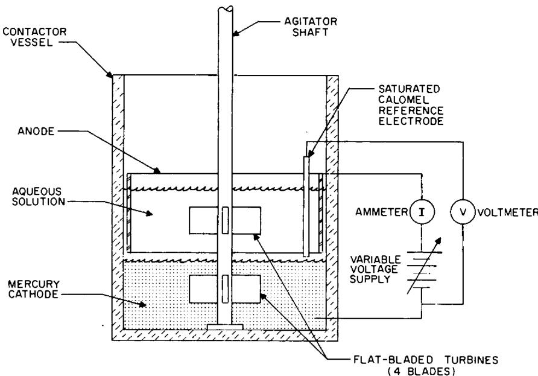  
Fig. 9.6. Diagram of equipment used for measuring mass-transfer coefficients in the stirred water-mercury contactor.

voltage were recorded automatically on the X-Y recorder. The agitator speed was then adjusted to another value, and the procedure was repeated until a satisfactory range of agitator speeds had been investigated.

A typical current-voltage recording is shown in Fig. 9.7. In this figure, the cell current is recorded over the range of $0 - 1\mathrm{V}$ vs SCE at different agitator speeds. For each agitator speed, the cell current rises at low voltages with increasing voltage and reaches a constant value at higher voltages. This constant current is the desired diffusion-limited current. The diffusion current actually oscillates about an average value because of turbulent fluctuations at the interface. An average value of the diffusion current is determined from the recordings, and this average value is recorded and used for the determination of the mass-transfer coefficient using Eq. (2).

Results of measurements in three contactor vessels are presented in the following section.

# 9.2.2 Experimental Results

Water-side mass-transfer coefficients were measured in three different Plexiglas cells, $102\mathrm{cm}\times$ $102\mathrm{mm}$ $203\times 203\mathrm{mm}$ and $305\times 305\mathrm{mm}$ .In each cell, two or three phase volumes were examined, the volume of each phase being equal. For each phase volume, several agitators with different diameters

were tested, one agitator being centered in each phase. An finally, for each combination of cell size, phase volume, and agitator diameter, several determinations of limiting diffusion current were made over a range of agitator speeds. Agitator speeds were kept below that speed at which dispersal of the aqueous phase into the mercury phase began. Dispersal was detected by small droplets of water leaving the mercury phase near the edge of the cell. A summary of the experimental parameters is given in Table 9.4.

All the mass-transfer data determined in these experiments are reported elsewhere. Reported here are representative results which indicate the effect of the experimental parameters on the water-side mass-transfer coefficient.

Figures 9.8 to 9.10 show the mass-transfer coefficients as a function of agitator speed for one value of phase volume in each of the three cells. The plot for each agitator diameter appears to be comprised of two regions. At low agitator speeds the mass-transfer coefficient is proportional to the agitator speed to the 0.7 power, and at high agitator speeds the mass-transfer coefficient is proportional to agitator speed to a power near 2. The change between the two regions is fairly abrupt for small agitator diameters, but as agitator diameter increases, the change becomes more gradual. Data from the water-mercury contactor are compared with

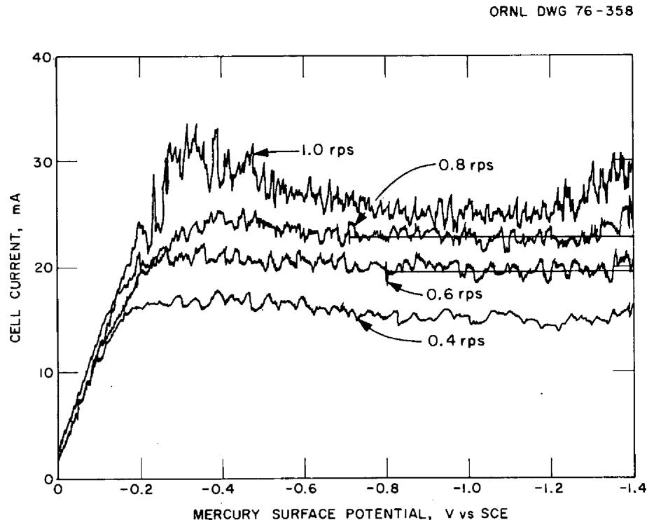  
Fig. 9.7. Typical current-voltage recording taken to measure diffusion current in stirred water-mercury contactors.

Table 9.4. Summary of experimental parameters for measurement of aqueous phase mass-transfer coefficients   

<table><tr><td>Cell size (mm × mm)</td><td>Agitator size (diameter × height) (mm × mm)</td><td>Phase volumes (cm3)</td><td>Range of agitator speed (rps)</td></tr><tr><td rowspan="2">102× 102</td><td>64 × 19</td><td>700, 900</td><td>0.25–3.0</td></tr><tr><td>89 × 19</td><td>700, 900</td><td>0.25–3.0</td></tr><tr><td rowspan="3">203 × 203</td><td>89 × 19</td><td>3,000, 5,000, 7,000</td><td>0.25–2.33</td></tr><tr><td>140 × 19</td><td>3,000, 5,000, 7,000</td><td>0.25–2.33</td></tr><tr><td>190 × 19</td><td>3,000, 5,000, 7,000</td><td>0.25–2.33</td></tr><tr><td rowspan="5">305 × 305</td><td>89 × 19</td><td>9,000, 18,000</td><td>0.25–1.08</td></tr><tr><td>140 × 19</td><td>9,000, 18,000</td><td>0.25–1.08</td></tr><tr><td>190 × 19</td><td>9,000, 18,000</td><td>0.25–1.08</td></tr><tr><td>240 × 19</td><td>9,000, 18,000</td><td>0.25–1.08</td></tr><tr><td>280 × 19</td><td>9,000, 18,000</td><td>0.25–1.08</td></tr></table>

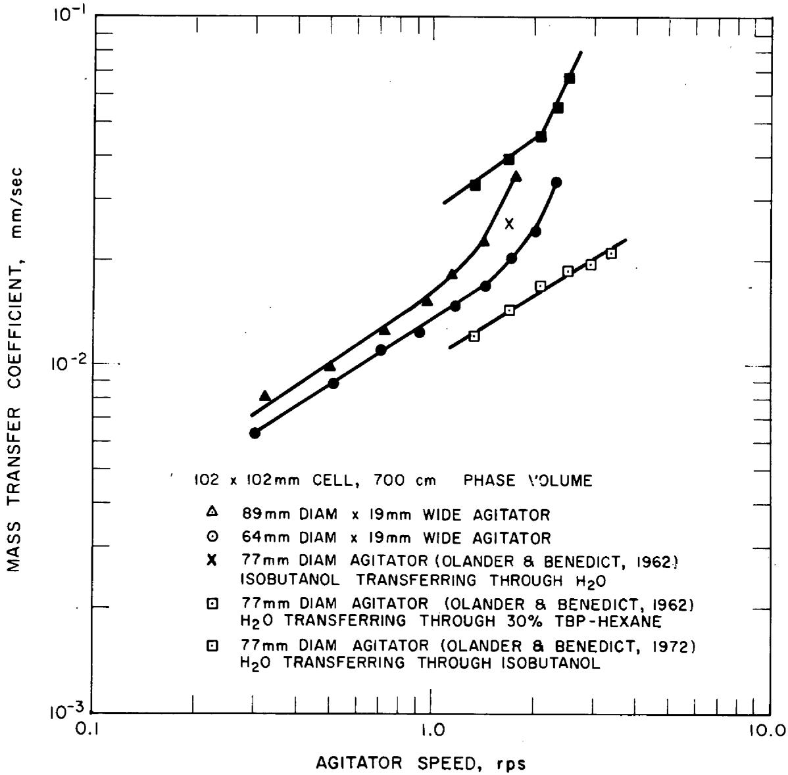  
Fig. 9.8. Comparison of water-mercury data with aqueous-organic data.

data measured by Olander and Benedict $^{12}$ using aqueous-organic systems (Fig. 9.8). The water-mercury data are bracketed by the aqueous-organic data (Fig. 9.8). Olander and Benedict also report the change in the slope of $\log(k)$ vs the logarithm of the agitator speed.

The effect of agitator diameter on mass-transfer coefficient at constant agitator speed is significant, but the variation depends on the agitator speed (Figs. 9.8-9.10). The effect that is of most interest for design

and evaluation of stirred nondispersing contactors is the dependence of the maximum mass-transfer coefficient achievable with a given agitator before dispersion occurs. A relation has been shown previously[13] between the agitator diameter and the agitator speed at which dispersion (of the water into mercury) is first noticed. This relationship was also shown to be essentially independent of the two fluids being contacted[14] since it held for water and mercury, water and carbon tetrachloride, and water and

dibromoethane. This relation shows that the maximum agitator speed decreases with increasing agitator diameter. Therefore, it is necessary to determine the net effect of lower allowable agitator speeds and increasing mass-transfer coefficients as agitator diameter increases.

Although in all runs in the water-mercury contactor the agitator speed was not increased to the point where dispersion was seen, the maximum mass-transfer coefficient measured for each agitator diameter was plotted vs the agitator diameter on log-log coordinates (Fig. 9.11). From this information, it is seen that the maximum mass-transfer coefficient

generally increases with increasing agitator diameter. If it is assumed that this maximum value is proportional to the agitator diameter raised to some power, the exponent in that relation probably falls in the range 0.8-1.6 within the range of agitator diameters investigated (64-270 mm).

Figure 9.12 shows all the data for the 89-mm-diam agitator on a single plot. This figure shows that the variables other than agitator speed and agitator diameter effect the value of the mass-transfer coefficient fairly significantly. Careful examination of Fig. 9.12 shows that for a given cell size the mass-transfer coefficient varies inversely with the phase

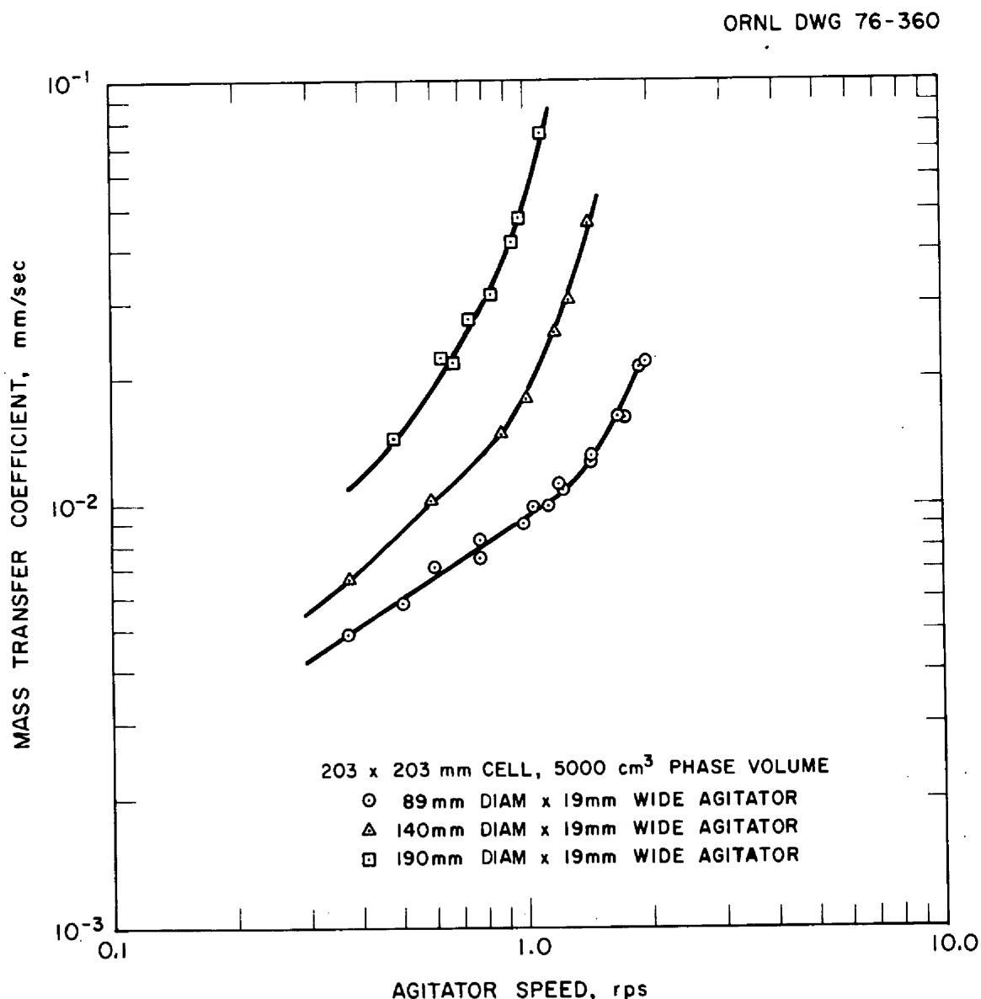  
Fig. 9.9. Effect of agitator speed and diameter on mass-transfer coefficient in the 203-mm cell with $5000\mathrm{cm}^3$ phase volumes.

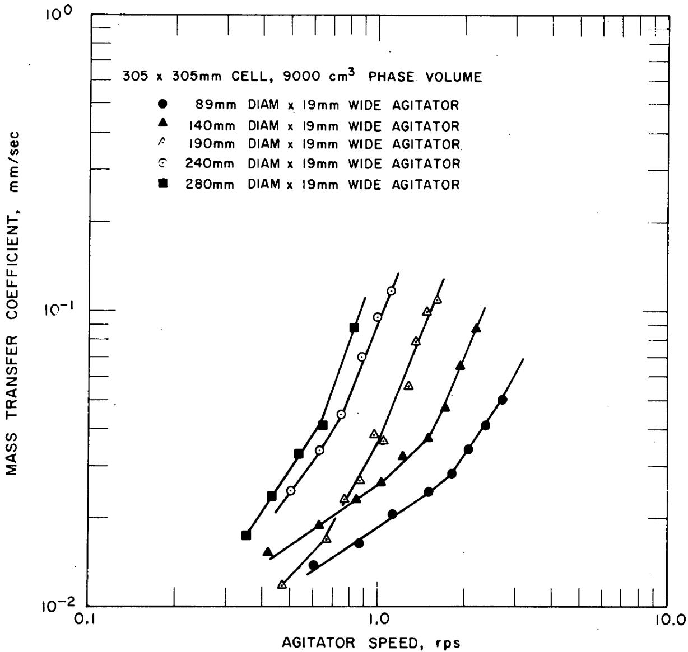  
Fig. 9.10. Effect of agitator speed and diameter on mass-transfer coefficient in the 305-mm cell with $9000\mathrm{cm}^3$ phase volume.

volume used. This may reflect the effect of distance between the agitator and the interface since in all cases the agitators were positioned at the midpoint of each phase. Systematic variations have not yet been extracted from the data, but these data serve to show that details in the cell design can affect the value of the mass-transfer coefficient by $200\%$ in the case of these experiments.

The relative effect on the water-side mass-transfer coefficient of stirring in each phase is shown in Fig. 9.13. One test was performed in the $305\mathrm{-mm}$ cell, with phase volumes of $18,000~\mathrm{cm}^3$ and one agitator

diameter of $190~\mathrm{mm}$ . First the mass-transfer coefficient was measured as a function of agitator speed, with an agitator in each phase. The test was then repeated twice, first with an agitator in the mercury phase only and then with the agitator in the water phase only. The results indicate that at low agitator speeds, agitation in the water affects the water-side mass-transfer predominantly; whereas, as agitator speed increases, agitation in the mercury affects the water-side mass-transfer coefficient more strongly than agitation in the water phase. Moreover, the mass-transfer coefficient resulting from agitation

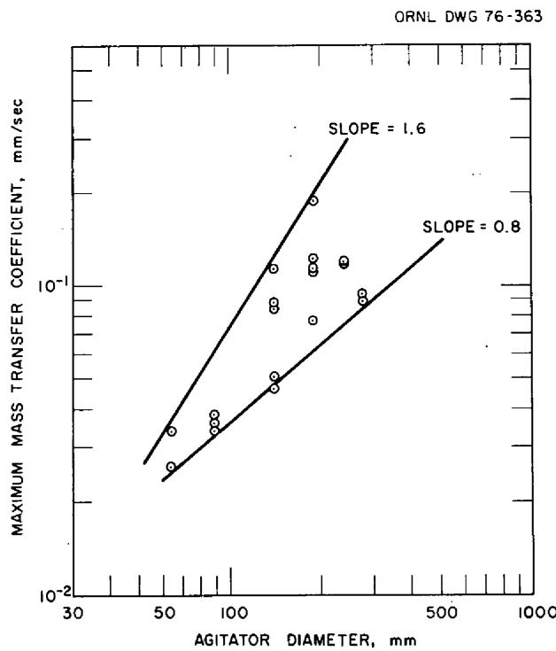  
Fig. 9.11. Effect of agitator diameter on maximum mass-transfer coefficient achievable in the water-mercury contactors.

in both phases is not a simple additive function of the mass-transfer coefficients resulting from agitation in one phase only.

These measurements have provided a great deal of data covering a wide range of physical parameters which affect mass transfer in stirred cells. Using the electrochemical technique, the data have been measured with somewhat more precision than data based upon transient experiments which have been used exclusively in the literature. Because of this, these data will be useful in developing correlations that can be used to estimate mass-transfer rates in large-scale nondispersing stirred contactors required in the MSBR reductive extraction processes.

# 9.3 CONTINUOUS FLUORINATOR DEVELOPMENT

# R. B. Lindauer

Autoresistance heating test AHT-4 involves the circulation of molten salt through a simulated fluorinator (test vessel). A frozen-salt film is formed by cooling the test vessel wall, and the salt is kept

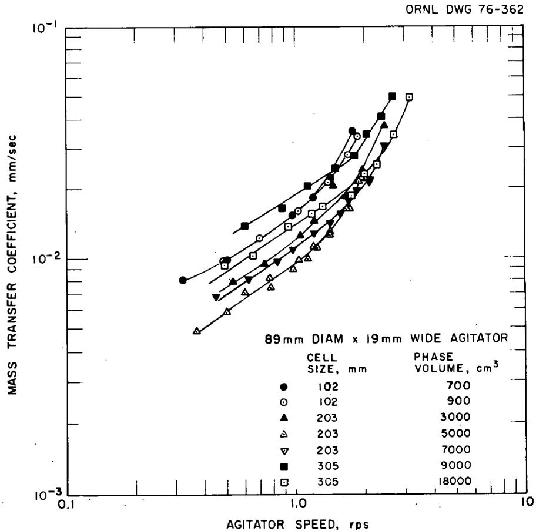  
Fig. 9.12. Effect of cell size, phase volume, and agitator speed on mass-transfer coefficient produced by the 89-mm-diam agitator.

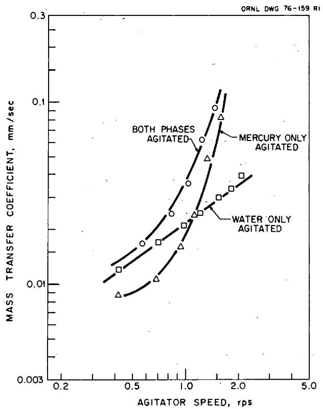  
Fig. 9.13. Relative effect on water-side mass-transfer coefficient of stirring in each phase in the 305-mm cell using 190-mm-diam agitators and $18,000\text{-cm}^3$ phase volumes.

molten by autoresistance heating. The design and construction have been described previously. $^{15,16}$ Five test runs have been made, but a redesigned electrode seems to be necessary before successful operation can be achieved.

Equipment for demonstrating that a frozen-salt film affords protection against fluorine corrosion has been previously described. $^{17,18}$ Eight cooling tests without fluorine have been made in this equipment.

# 9.3.1 Autoresistance Heating Test AHT-4

Operating experience from the first four runs of autoresistance heating test AHT-4 indicated two major problems in the forming and maintaining of a satisfactory frozen-salt film in AHT-4 (Fig. 9.14). The first problem is the tendency for the vertical test section to cool faster and eventually restrict the salt flow before the electrode side arm has an insulating salt film, which will allow autoresistance heating to be started. The second problem is in maintaining a molten-salt flow through the unheated tip of the electrode. Before modifying the electrode, a run (AHT 4-5) was made in which cooling of the vertical test section was controlled to keep the wall temperature above that of the electrode side arm. After $8^{2/3}$ hr of cooling, the test vessel liquid level instrument

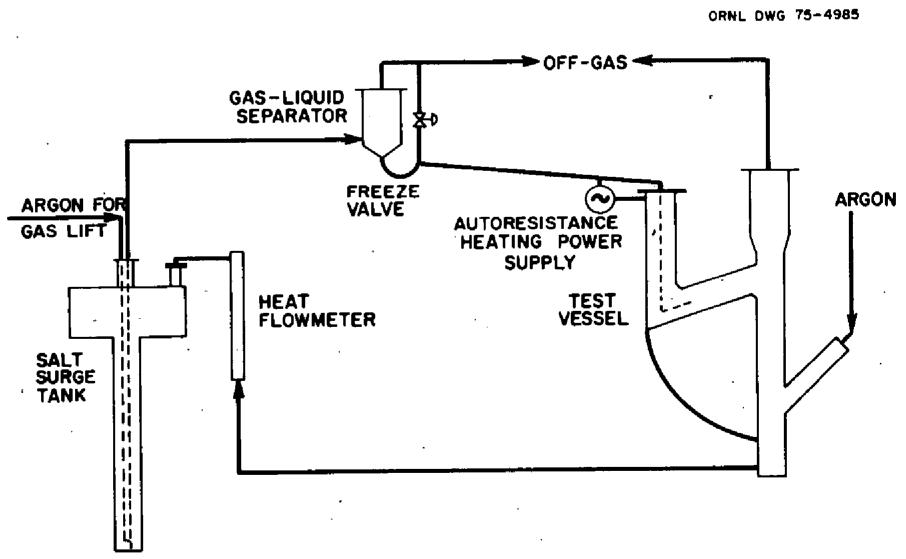  
Fig. 9.14. Flowsheet for autoresistance heating test AHT-4.

began to fluctuate, indicating incipient plugging. At this time, most of the cooled section of the test vessel was near a uniform temperature (648 K), and autoresistance heating was started in an attempt to maintain a molten core. This attempt was not successful, and electrode plugging was indicated by a sharp rise in the gas-liquid separator liquid levels. The gas lift was stopped when generating 490 W of autoresistance heating did not clear the plug but did result in a decrease in resistance, indicating electrical shorting near the electrode. The final resistance was 0.10 Ω and the average cooled wall temperature was 632 K.

From the results of run AHT 4-5, plugging of the unheated end of the electrode appears to be the most immediate problem. A replacement electrode has been designed which incorporates heating to the tip of the electrode. The electrode diameter has been decreased by using $\frac{1}{2}$ -in. rather than $\frac{3}{4}$ -in. pipe, and the heater jacket diameter has been decreased by using $1 \frac{1}{2}$ -in. rather than 2-in. pipe. Using these smaller diameters will increase the clearance between the jacket and cooled wall from 1.8 in. (46 mm) to 2.1

in. (53 mm) to reduce the heating effect on the frozensalt film. The completely jacketed electrode will permit installation of thermocouples at the tip of the electrode to measure the temperature of the salt entering the test vessel.

# 9.3.2 Frozen-Salt Corrosion Protection Demonstration (FSCPD)

The equipment flowsheet for this demonstration is shown in Fig. 9.15, and details of the test vessel with the first cooled tube are shown in Fig. 9.16. Six cooling test runs defined the conditions of temperature and cooling air flow necessary for the formation of an adequate frozen-salt film (Table 9.5). During these tests a low flow of argon instead of fluorine was used through the center of the tube. In the last four runs, a small argon flow was maintained through the transfer line from the delivery vessel to ensure an open line for rapid salt transfer from the test vessel at the end of the test. Transfer of salt at temperatures as close to the liquidus temperature $(778\mathrm{K})$ as is necessary in these tests is usually difficult. The salt

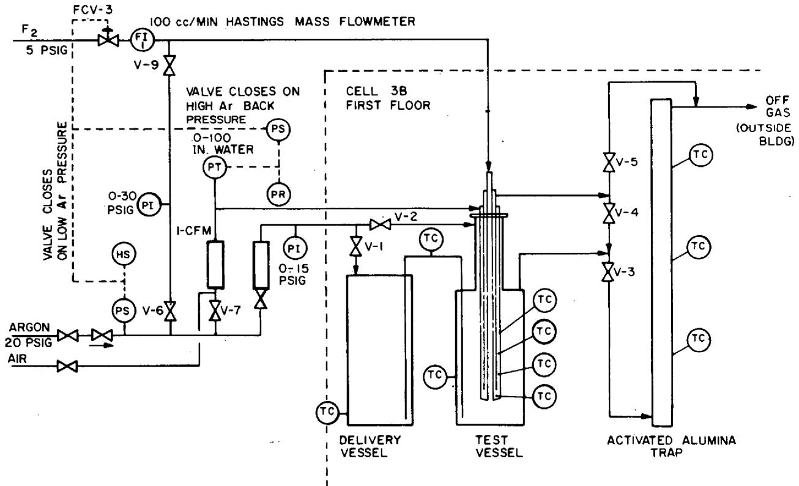  
ORNL DWG 75-8948   
Fig. 9.15. Frozen-salt corrosion protection demonstration flowsheet.

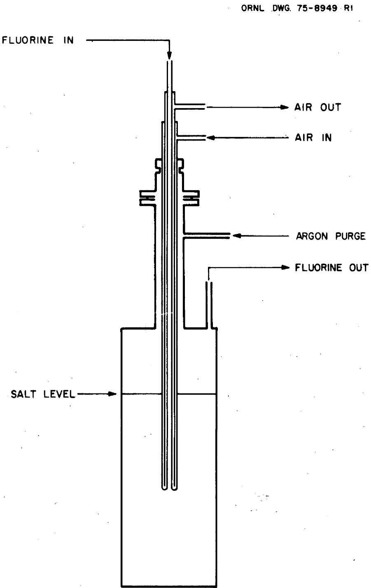  
Fig. 9.16. Frozen-salt corrosion protection demonstration test vessel showing tube No. 1.

Table 9.5. Data summary for FSCPD cooling tests - tube No. 1   

<table><tr><td rowspan="2">Test No.</td><td colspan="2">Cooling air</td><td colspan="2">Argon sparge (cm3/min)</td><td colspan="3">Temperatures (°C)</td><td rowspan="2">Vessel wall cooling rate (°/min)</td><td rowspan="2">Remarks</td></tr><tr><td>Back pressure (psig)</td><td>Flowrate (liters/min)</td><td>Transfer line</td><td>Fluorine inlet</td><td>Cooled tube minimum</td><td>Test vessel wall</td><td>ΔT</td></tr><tr><td>1</td><td>2.5</td><td>68</td><td></td><td>17</td><td>432</td><td>556</td><td>124</td><td>0.23</td><td>Salt transferred out – very thin film</td></tr><tr><td>2</td><td>3.4</td><td>79</td><td></td><td>a</td><td>420</td><td>552</td><td>132</td><td>0.40</td><td>Salt not transferred – line plugged</td></tr><tr><td>3</td><td>&gt;4</td><td>&gt;80</td><td>160</td><td>a</td><td>410</td><td>575</td><td>165</td><td>1.00</td><td>Salt transferred out – very thin film</td></tr><tr><td>4</td><td>8</td><td>129</td><td>80</td><td>60</td><td>400</td><td>540</td><td>140</td><td>0.60</td><td>Inlet plugged</td></tr><tr><td>5</td><td>7.6</td><td>126</td><td>100</td><td>84</td><td>431</td><td>543</td><td>122</td><td>0.53</td><td>Inlet plugged</td></tr><tr><td></td><td>5.2</td><td>101</td><td>80</td><td>&gt;100</td><td>417</td><td>528</td><td>111</td><td>0.27</td><td>Inlet plugged</td></tr><tr><td></td><td>4.4</td><td>94</td><td>150</td><td>90</td><td>405</td><td>512</td><td>107</td><td>0.12</td><td>Salt transferred out – unable to remove tube</td></tr><tr><td>6</td><td>6.8</td><td>118</td><td>100</td><td>30</td><td>420</td><td>529</td><td>109</td><td>0.27</td><td>Inlet plugged</td></tr><tr><td></td><td>4.0</td><td>89</td><td>100</td><td>41</td><td>446</td><td>522</td><td>76</td><td>0</td><td>Inlet plugged</td></tr><tr><td></td><td>4.4</td><td>94</td><td>100</td><td>30</td><td>439</td><td>523</td><td>75</td><td>0.13</td><td>Inlet plugged</td></tr><tr><td></td><td>4.0</td><td>89</td><td>120</td><td>75</td><td>443</td><td>521</td><td>78</td><td>0</td><td>Inlet plugged</td></tr></table>

$a$ Fluorine inlet plugged.

was transferred from the test vessel after three of the runs. In one of these cases, the tube could not be removed for examination, probably because of an unusually large salt ring formed above the salt level from too high a sparge rate. The annular clearance around the outer tube is 0.3 in. (76 mm). In the other two cases the salt film was too thin to measure and did not cover the metal at several points. The main problem with this tube design was plugging of the fluorine inlet tube at temperatures as high as 719 K. Since this temperature is well above the solidus temperature (623 K) of the salt, formation of a suitable film was not possible.

Tests using the No. 1 cooled tube were ended when a leak developed in the air cooling annulus of the tube. The tube was cut off 5 in. (127 mm) from the bottom, and this section was examined in the Metallography Laboratory. Figure 9.17 shows the area where the failure occurred, the grain boundary attack, and the nickel oxide that was formed. A horizontal crack developed in the $\frac{1}{32}$ -in. (0.8-mm)-thick nickel inner $\left[\frac{3}{8}\right]$ in. (9.5 mm) OD tube. The crack was about $\frac{1}{4}$ in. (6 mm) long ( $\sim 20\%$ of the circumference). The crack was not near a weld but occurred in metal that had been machined from a 1-in. nickel rod. Figure 9.17 also shows that the thickness of the tube was reduced to less than one-half of the original thickness.

The second cooled tube was designed to be sufficiently small to permit the use of argon instead of air coolant to avoid nickel oxidation. Also, since introduction of fluorine through the center of the cooled tube is not required for this demonstration, the test vessel dip tubes were modified as shown in Fig. 9.18. All three tubes are of $\frac{3}{8}$ -in.(9.5-mm)-OD nickel tubing, with the argon coolant inlet tube of $\frac{3}{16}$ -in.(4.8-mm)-OD nickel. This cooled tube has only $13\%$ of the cooled area of the first tube and will require considerably less coolant flow. Air coolant flow with the first tube had to be restricted to 90 liters/min $(1.5 \times 10^{-3} \, \mathrm{m}^3/\mathrm{s})$ to maintain the bulk of the molten salt above $793 \, \mathrm{K}$ using the maximum power on the vessel heaters. With the second tube an argon flow of 35 liters/min $(5.8 \times 10^{-4} \, \mathrm{m}^3/\mathrm{s})$ (proportionally three times greater) could be used while maintaining a steady bulk salt temperature.

Two test runs were made with the second cooled tube. In the first test the tube was cooled by an argon flow of 35 liters/min $(5.8 \times 10^{-4} \mathrm{~m}^{3} / \mathrm{s})$ for $3.8 \mathrm{hr}$ . Salt was then transferred from the test vessel, with the bulk of the salt at $803 \mathrm{~K}$ . Cooling air was maintained on the tube until the test vessel wall temperature was reduced to $623 \mathrm{~K}$ . In the second test a higher argon flow, 54 liters/min $(9.0 \times 10^{-4} \mathrm{~m}^{3} / \mathrm{s})$ , was used for 5 hr, and the salt was transferred, with the bulk salt temperature at $823 \mathrm{~K}$ and falling. In neither case was

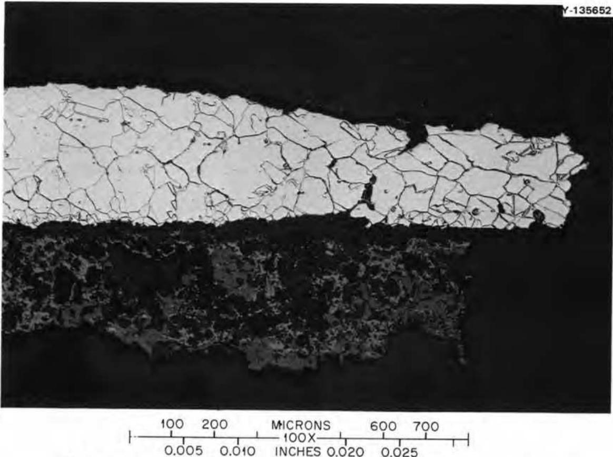  
Fig. 9.17. Air-cooled dip tube (tube No. 1) in frozen-salt corrosion protection demonstration.

a satisfactory salt film formed. In the first test, a $1/32$ in. $(0.8\mathrm{-mm})$ -thick film covered the bottom $1 / 2$ in. (13 mm) of the tube. In the second test, only the tip of the tube was covered with a salt film. The bulk salt temperature was probably too high in the second test.

# 9.4 FUEL RECONSTITUTION ENGINEERING DEVELOPMENT

R.M.Counce

The reference flowsheet for processing the fuel salt from a molten-salt breeder reactor (MSBR) is based upon removal of uranium by fluorination to $\mathrm{UF_6}$ as the first processing step. The uranium removed in this step must subsequently be recombined with the fuel-carrier salt before its return to the reactor. The method for recombining the uranium with the fuel-carrier salt (reconstituting the fuel salt) consists of absorbing gaseous $\mathrm{UF_6}$ into a recycled fuel salt stream containing dissolved $\mathrm{UF_4}$ according to the reaction

$$
\mathrm {U F} _ {6 (\mathrm {g})} + \mathrm {U F} _ {4 (\mathrm {d})} = 2 \mathrm {U F} _ {5 (\mathrm {d})}. \tag {5}
$$

The resultant $\mathrm{UF}_5$ would be reduced to $\mathrm{UF}_4$ with hydrogen in a separate vessel according to the reaction:

$$
\mathrm {U F} _ {5 (\mathrm {d})} + ^ {1} / _ {2} \mathrm {H} _ {2 (\mathrm {g})} = \mathrm {U F} _ {4 (\mathrm {d})} + \mathrm {H F} _ {(\mathrm {g})}. \tag {6}
$$

Engineering studies of the fuel reconstitution step are being started to provide the technology necessary for the design of larger equipment for recombining $\mathrm{UF_6}$ generated in fluorinators in the processing plant, with the processed fuel-carrier salt returning to the reactor.

During this report period a preliminary hydrodynamics test of the experimental equipment, in which salt flow through the system was maintained under simulated experimental conditions, was successfully completed. A calibration of the $\mathrm{UF_6}$ metering system was completed; a gas density cell used for measuring concentrations of $\mathrm{UF_6}$ in argon was calibrated; and apparatus for producing known concentrations of HF in hydrogen was developed and was used to calibrate the gas density cell used for measuring concentrations of HF in hydrogen. These operations are discussed in the remainder of the report.

ORNL DWG 76-364

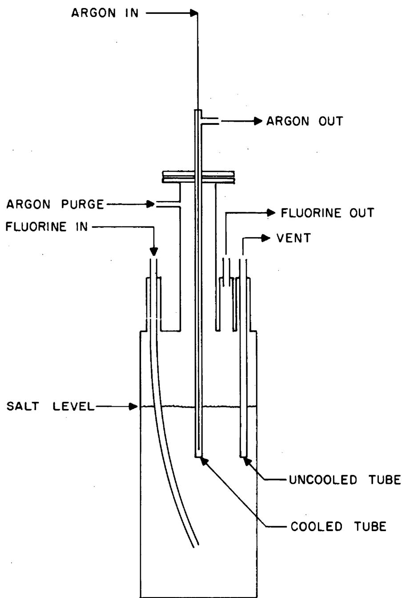  
Fig. 9.18. Frozen-salt corrosion protection demonstration test vessel showing tube No. 2.

# 9.4.1 Hydrodynamic Operation

The hydrodynamic operational procedure for the experiment has been discussed previously. During this report period, five hydrodynamic experiments were conducted: HR-1, HR-2, HR-3, HR-4, and HR-5. The fourth and fifth experiments, HR-4 and HR-5, resulted in salt being metered from the feed tank through the $\mathrm{UF_6}$ absorption vessel and hydrogen reduction column to the receiver (Fig. 9.19) at a constant flow rate of approximately $100\mathrm{cm}^3/\mathrm{min}$ $(1.67\times 10^{-6}\mathrm{m}^{3}/\mathrm{s})$

In HR-1, the $\mathrm{UF_6}$ absorption vessel and the hydrogen reduction column were filled. The siphon was primed in HR-2, and salt flow was started from the feed tank. Run HR-2 ended abruptly when plugging occurred in the effluent salt transfer line

from the hydrogen reduction column. A third run, HR-3, did not get under way because of a plug in the transfer line from the feed tank to the absorption vessel.

In run HR-4, the $\mathrm{UF_6}$ absorption vessel and the hydrogen reduction column were filled in preparation for run HR-5. In run HR-5, a salt flow of 100 $\mathrm{cm}^3/\mathrm{min}$ $(1.67 \times 10^{-6} \mathrm{~m}^3/\mathrm{s})$ was started and was maintained for 1 hr. The gas streams of $\mathrm{UF_6}$ and hydrogen were simulated by two argon flows. The two argon flow rates of 180 std $\mathrm{cm}^3/\mathrm{min}$ $(3 \times 10^{-6} \mathrm{~m}^3/\mathrm{s})$ simulate the stoichiometric gas flow rates of $\mathrm{UF_6}$ and hydrogen necessary to increase the $\mathrm{UF_4}$ concentration in the salt from 0.15 mole% in the feed stream of the $\mathrm{UF_6}$ absorption vessel to 0.3 mole% in the effluent stream from the hydrogen reduction column.

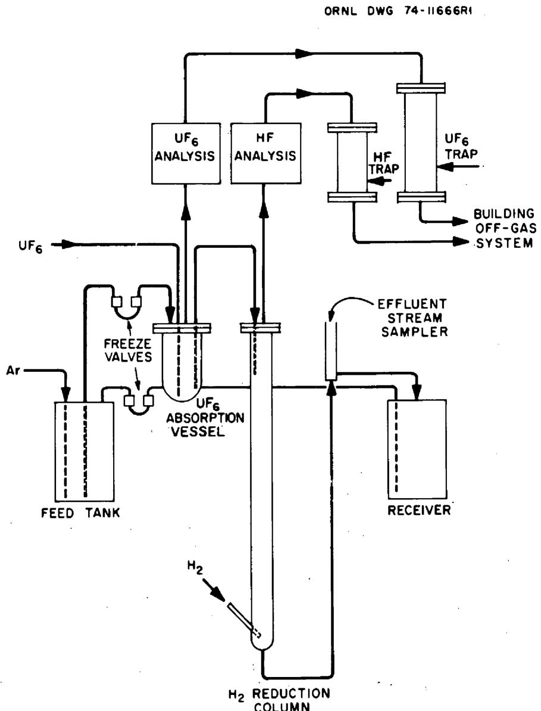  
Fig. 9.19. Flow diagram of equipment used in first fuel reconstitution engineering experiment.

# 9.4.2 Calibration of the $\mathbf{U}\mathbf{F}_6$ Metering System

The $\mathrm{UF_6}$ supply system $^{21}$ (Fig. 9.20) provides $\mathrm{UF_6}$ at known flow rates to the $\mathrm{UF_6}$ absorption vessel during the operation of the experiment and to the $\mathrm{UF_6}$ -Ar gas density cell for calibration purposes. The supply system contains a model ALF-500W Hastings mass flowmeter which indicates and controls the $\mathrm{UF_6}$ flow rate. Because the $\mathrm{UF_6}$ flow rate is an important experimental parameter, this flowmeter must be calibrated before the experiment begins.

The flowmeter was calibrated as follows. A steady flow of $\mathrm{UF_6}$ was established to the main off-gas trap. The $\mathrm{UF_6}$ stream was then diverted through the calibration trap, a packed bed of NaF pellets maintained at $373\mathrm{K}$ . The flow of $\mathrm{UF_6}$ through the calibration trap was maintained long enough to produce a loading of $0.2\mathrm{kg}$ $\mathrm{UF_6 / kgNaF}$ . The $\mathrm{UF_6}$ stream was then diverted back to the main $\mathrm{UF_6}$ trap, and the flow of $\mathrm{UF_6}$ stopped. The system was then completely purged with argon. The calibration trap was then removed and weighed again. The weight of $\mathrm{UF_6}$ loaded into the trap was determined by subtracting the original weight from the final weight. The flow rate of $\mathrm{UF_6}$ was determined then by dividing the weight of $\mathrm{UF_6}$ by the length of time $\mathrm{UF_6}$ flowed into the calibration trap. This process was repeated for several flow rates of $\mathrm{UF_6}$ up to 560 std cm³/min

ORNL DWG 76-365

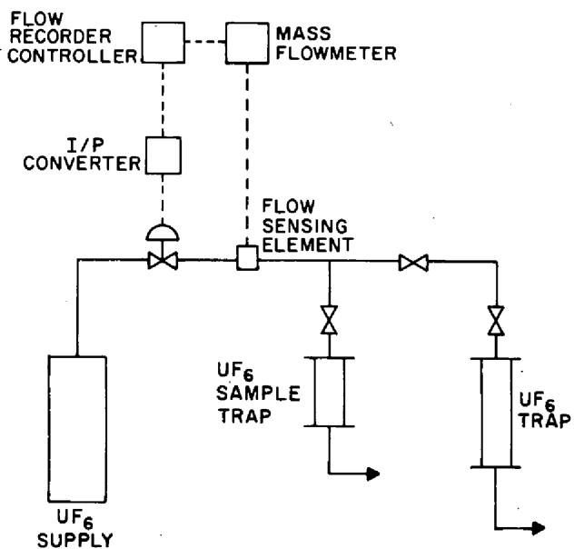  
Fig. 9.20. Diagram of $\mathbf{U}\mathbf{F}_6$ supply system.

$(9.33 \times 10^{-6} \mathrm{~m}^{3} / \mathrm{s})$ . The results agreed very closely with the published calibration curves provided by the manufacturer.

# 9.4.3 Calibration of Ar-UF $_6$ Gas Density Detector

Calibration of the gas density cell that is used in determining the concentration of $\mathrm{UF_6}$ in the argon stream leaving the $\mathrm{UF_6}$ absorption vessel requires $\mathrm{UF_6 - Ar}$ mixtures of known concentrations. These mixtures were provided by mixing separate $\mathrm{UF_6}$ and argon streams of known flow rates and feeding the mixture to the gas density cell used for $\mathrm{UF_6 - Ar}$ analysis. This gas density cell $^{22}$ was calibrated for concentrations of 0-50 mole $\%$ $\mathrm{UF_6}$ in argon (Fig. 9.21).

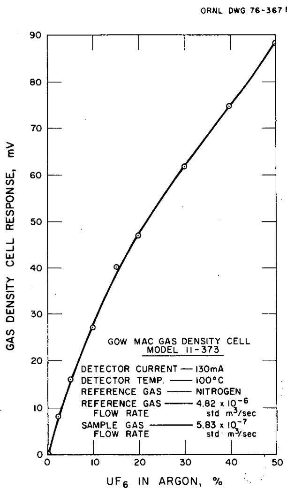  
Fig. 9.21. Calibration curve of Gow-Mac gas density cell in fuel reconstitution engineering equipment for $\mathbf{U}\mathbf{F}_6$ -Ar analysis.

# 9.4.4 Calibration of the HF-H2 Gas Density Cell

ORNL DWG 76-366

Calibration of the gas density cell that is used in determining HF concentration in hydrogen from the hydrogen reduction column requires a supply of $\mathrm{HF - }$ $\mathbf{H}_2$ mixtures of known concentrations. Since HF is not otherwise required in the experiment, a means is used for producing $\mathrm{HF - H_2}$ mixtures which does not require an HF supply and metering system. Fixed concentrations of HF in hydrogen can be generated by passing hydrogen gas over NaF-HF in a manner such that the HF partial pressure is increased to the dissociation pressure of the complex by using the equilibrium

$$
\mathrm {N a F} \cdot \mathrm {H F} \leftrightarrow \mathrm {N a F} + \mathrm {H F}. \tag {7}
$$

In this system the HF partial pressure is a unique function of temperature as long as both NaF·HF and NaF are present. Consequently the concentration of HF in the gas stream in equilibrium with the NaF·HF-NaF mixture can be set by controlling the temperature of the system.

The vessel for producing hydrogen saturated with HF (Fig. 9.22) is $1^{1} / 2$ in. $(3.81\times 10^{-2}\mathrm{m})$ sched 40 Monel pipe $0.97\mathrm{m}$ long, mounted vertically with standard 150-lb Monel flanges at either end. This vessel was filled with a commercial grade of NaF-HF in the form of $1 / 8$ -in. $(3\mathrm{mm})$ right circular cylindrical pellets.

Hydrogen was passed over the NaF·HF bed in this vessel at various temperatures at a total pressure of 1 atm, and the concentration of HF in the resulting mixtures was compared with values calculated from published values of the NaF·HF dissociation pressure.

The equilibrium concentrations of gaseous HF in hydrogen over NaF·HF obtained from these experiments were compared to those of Davis $^{23}$ and Froning $^{24}$ for concentrations in the range of 1-50 mole $\%$ . In general, concentrations in this range occurred at temperatures approximately $50^{\circ}\mathrm{C}$ lower

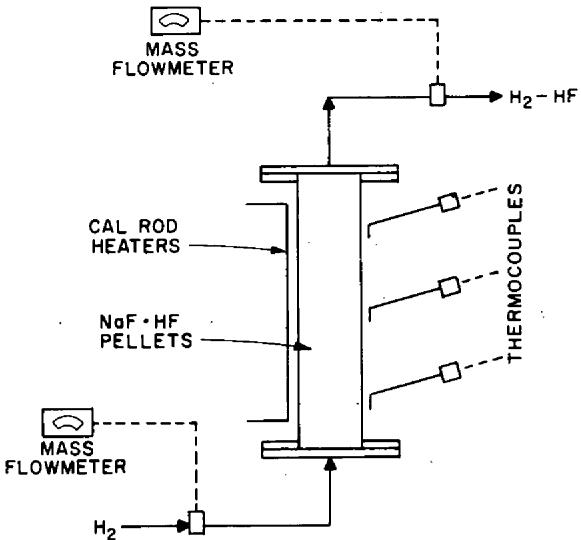  
Fig. 9.22. Diagram of apparatus for producing mixtures of HF in hydrogen.

than temperatures predicted from the work of Froning $^{24}$ and approximately $75^{\circ}C$ lower than temperatures predicted from the work of Davis. $^{23}$ In Fig. 9.23, the experimental results are definitely closer to the literature values of HF over NaF·HF than HF over other known NaF·HF complexes. $^{23}$ The results of the HF saturator experiment have shown reproducibility, although the error is such that the flow rates in and out of the saturator are used as the basis in calculating gas composition leaving the saturator.

Using the HF saturator to generate HF concentrations in hydrogen, the analytical system for $\mathbf{H}_2$ -HF analysis was calibrated for concentrations of $0 - 50\%$ HF in hydrogen. This gas analysis system has been described previously.[22] This calibration curve and pertinent operating conditions are shown in Fig. 9.24. Also shown for comparison in Fig. 9.24 is a calibration of the system for $0 - 50\%$ nitrogen in hydrogen under the same operating conditions.

ORNL DWG 76-368

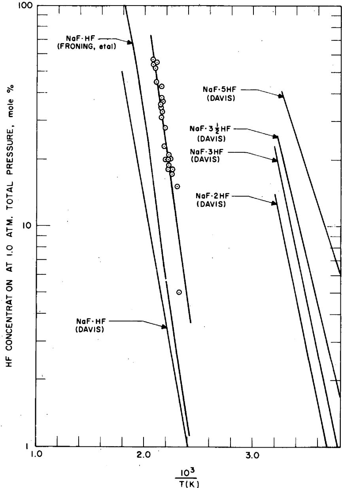  
Fig. 9.23. Comparison of equilibrium results of HF saturator with literature values for equilibrium of HF over NaF·HF and NaF·2NaF.

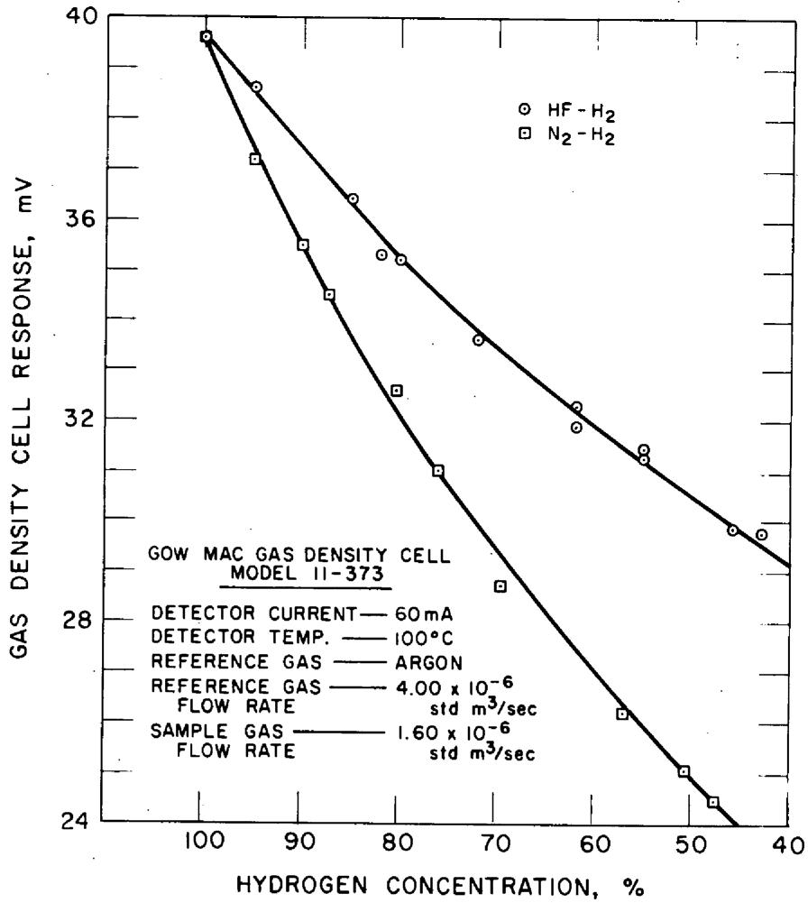  
Fig. 9.24. Calibration curve of Gow-Mac gas density cell in fuel reconstitution engineering equipment for $\mathbf{H}_2$ -HF analysis and $\mathbf{H}_2\cdot \mathbf{N}_2$ analysis.

# REFERENCES

1. Chem. Technol. Div. Annu. Progr. Rep. Aug. 31, 1975, ORNL-5078, pp. 142-47.   
2. Chem. Technol. Div. Annu. Progr. Rep. Mar. 31, 1973, ORNL-4883, pp. 23-25.   
3. L. E. McNeese, Engineering Development Studies for Molten-Salt Breeder Reactor Processing No. 10, ORNL/TM-3352, pp. 53-57 (December 1972).   
4. Chem. Technol. Div. Annu. Progr. Rep. Mar. 31, 1973, ORNL-4883, p. 25.   
5. L. M. Ferris et al., "Distribution of Lanthanide and Actinide Elements Between Liquid Bismuth and Molten LiCl-LiF and LiBr-LiF Solutions," J. Inorg. Nucl. Chem. 34, 313-20 (1972).   
6. H. C. Savage in Engineering Development Studies for Molten-Salt Breeder Reactor Processing No. 23, ORNL/TM-5252 (in preparation).   
7. J. A. Klein et al., MSR Program Semiannu. Progr. Rep. Aug. 31, 1974, ORNL-5011, pp. 114-18.

8. C. H. Brown, Jr., MSR Program Semiannu. Progr. Rep. Feb. 28, 1975, ORNL-5047, pp. 152-57.   
9. C. H. Brown, Jr., et al., Measurement of Mass-Transfer Coefficients in a Mechanically Agitated, Nondispersing Contactor Operating with a Molten Mixture of LiF-BeF $_2$ -THF $_4$ and Molten Bismuth, ORNL-5143 (in preparation).   
10. C. H. Brown, Jr., MSR Program Semiannu. Progr. Rep. Feb. 28, 1975, ORNL-5047, pp. 157-62.   
11. C. H. Brown, Jr., Engineering Development Studies for Molten-Salt Breeder Reactor Processing No. 24, ORNL/TM-5339 (in preparation).   
12. D. R. Olander and M. Benedict, Nucl. Sci. Engr. 14, pp. 287-94 (1962).   
13. H. O. Weeren and L. E. McNeese, Engineering Development Studies for Molten-Salt Breeder Reactor Fuel Processing No. 10, ORNL/TM-3352, p. 55 (December 1972).   
14. J. A. Klein and C. H. Brown, Jr., unpublished data.   
15. R. B. Lindauer, MSR Program Semiann. Progr. Rep. Feb. 28, 1975, ORNL-5047, pp. 163-65.

16. R. B. Lindauer, Engineering Development Studies for Molten-Salt Breeder Reactor Processing No. 22, ORNL/TM-4863 (in preparation).   
17. R. B. Lindauer, MSR Program Semiann. Progr. Rep. Aug. 31, 1975, ORNL-5078, pp. 152-55.   
18. R. B. Lindauer, Engineering Development Studies for Molten-Salt Breeder Reactor Processing No. 23, ORNL/TM-5252 (in preparation).   
19. Chem. Technol. Div. Annu. Progr. Rep. Mar. 31, 1972, ORNL-4794, p. 1.

20. R. M. Counce, MSR-Program Semiannu. Progr. Rep. Aug. 31, 1974, ORNL-5011, p. 128.   
21. R. M. Counce, Engineering Development Studies for Molten-Salt Breeder Reactor Processing No. 23, ORNL/TM-5252 (in preparation).   
22. R. M. Counce, Engineering Development Studies for Molten-Salt Breeder Reactor Processing No. 22, ORNL/TM-4863 (in preparation).   
23. Wallace Davis, Jr., KLI-2552, p. 3 (Sept. 21, 1953).   
24. J. F. Froning et al., Indus. Engr. Chem., 39, 275-78 (1947).

# Part 5. Salt Production

# 10. PRODUCTION OF FLUORIDE SALT MIXTURES FOR RESEARCH AND DEVELOPMENT

F. L. Daley R. W. Horton*

At the beginning of this report period, the repaired meltdown vessel was returned to service for production of MSBR fuel-carrier salt. A total of $450\mathrm{kg}$ of fuel-carrier salt was produced in three $150\mathrm{-kg}$ batches in the new copper-lined treatment vessel, which also has a protective copper sheet on the inside of the vessel head. Completed analyses on salt samples from the first two production batches (FS-108 and FS-109) show that impurities were present at levels much lower than normal. The oxygen content of the salt was below $100~\mathrm{ppm}$ . These results point out the strong effect of purification vessel corrosion products on the quality of salt that is produced.

During this report period, the decision to terminate work on the MSR Program by the end of FY 1976 was reached. The need for salt during the balance of the fiscal year was determined, and this need was supplied while preparations to place the salt production facility in a safe standby condition were proceeding. At the end of the production period, a total of $1975\mathrm{kg}$ of salt (of various compositions) had been produced since activation of the facility in early 1974. Shipments to the program totaled $865\mathrm{kg}$ , and $678\mathrm{kg}$ have been stored for possible use.

All production areas were decommissioned and cleaned to remove potential health hazards. Unused materials and equipment were either set aside for burial or were stored; some major property items were transferred to the Reactor Division. A report on the final production and decommissioning activities provides a reference for stored material and records final comments on the performance of the salt purification system.

# MOLTEN-SALT REACTOR PROGRAM

FEBRUARY 1976

L. E. McNEESE, PROGRAM DIRECTOR

<table><tr><td>MSBR DESIGN AND DEVELOPMENT
J. R. ENGEL2</td><td>R</td></tr><tr><td colspan="2">SYSTEMS AND ANALYSIS</td></tr><tr><td>J. R. ENGEL2</td><td>R</td></tr><tr><td>E. J. ALLEN1</td><td>R</td></tr><tr><td>H. T. KERR1</td><td>R</td></tr><tr><td>G. T. MAYS</td><td>R</td></tr><tr><td>D. L. REED1</td><td>R</td></tr><tr><td>G. T. YAHR1</td><td>R</td></tr></table>

SYSTEMS AND COMPONENTS   

<table><tr><td colspan="2">DEVELOPMENT</td></tr><tr><td>R. H. GUYMON</td><td>R</td></tr><tr><td>W. R. HUNTLEY1</td><td>R</td></tr><tr><td>M. D. SILVERMAN1</td><td>R</td></tr><tr><td>A. N. SMITH</td><td>R</td></tr><tr><td>R. F. BENSION1</td><td>R</td></tr><tr><td>E. L. BIDDLLE</td><td>R</td></tr><tr><td>D. J. FRAYSIER</td><td>R</td></tr><tr><td>H. E. ROBERTSON</td><td>R</td></tr></table>

<table><tr><td colspan="2">MATERIALS</td></tr><tr><td>H. E. McCoy2</td><td>M&amp;C</td></tr></table>

<table><tr><td colspan="2">HASTELLOY N STUDIES</td></tr><tr><td>H. E. McCoy2</td><td>M&amp;C</td></tr><tr><td>S. L. BENNETT</td><td></td></tr><tr><td>D. J. BRADLEY5</td><td>M&amp;C</td></tr><tr><td>D. N. BRASKI</td><td>M&amp;C</td></tr><tr><td>J. BRYNESTAD1</td><td>M&amp;C</td></tr><tr><td>R. E. CLAUSING1</td><td>M&amp;C</td></tr><tr><td>R. S. CROUSE1</td><td>M&amp;C</td></tr><tr><td>J. R. DISTEFANO2</td><td>M&amp;C</td></tr><tr><td>R. L. HEESTAND1</td><td>M&amp;C</td></tr><tr><td>C. R. HYMAN</td><td>R</td></tr><tr><td>J. R. KEISER</td><td>M&amp;C</td></tr><tr><td>B. C. LESLIE1</td><td>M&amp;C</td></tr><tr><td>B. McNABB</td><td>M&amp;C</td></tr><tr><td>T. K. ROCHE</td><td>M&amp;C</td></tr><tr><td>C. L. WHITE1</td><td>M&amp;C</td></tr><tr><td>J. W. WOODS1</td><td>M&amp;C</td></tr></table>

<table><tr><td colspan="2">CHEMICAL PROCESSING MATERIALS</td></tr><tr><td>J. R. DiSTEFANO2</td><td>M&amp;C</td></tr><tr><td colspan="2">TECHNICAL SUPPORT</td></tr><tr><td>K. W. BOLING1</td><td>M&amp;C</td></tr><tr><td>C. E. DUNN1</td><td>M&amp;C</td></tr><tr><td>W. H. FARMER1</td><td>M&amp;C</td></tr><tr><td>J. C. FELTNER</td><td>M&amp;C</td></tr><tr><td>J. L. GRIFFITH1</td><td>M&amp;C</td></tr><tr><td>L. HEATHERLY1</td><td>M&amp;C</td></tr><tr><td>J. W. HENDRICKS1</td><td>M&amp;C</td></tr><tr><td>T. J. HENSON1</td><td>M&amp;C</td></tr><tr><td>J. D. HUDSON1</td><td>M&amp;C</td></tr><tr><td>E. J. LAWRENCE</td><td>M&amp;C</td></tr><tr><td>E. H. LEE</td><td>M&amp;C</td></tr><tr><td>W. H. MILLER</td><td>M&amp;C</td></tr><tr><td>G. A. POTTER</td><td>M&amp;C</td></tr><tr><td>L. G. RARDON1</td><td>M&amp;C</td></tr><tr><td>L. J. SHERSKY1</td><td>R</td></tr><tr><td>W. B. STINES</td><td>M&amp;C</td></tr><tr><td>C. K. THOMAS1</td><td>M&amp;C</td></tr><tr><td>C. A. WALLACE1</td><td>R</td></tr><tr><td>J. J. WOODHOUSE1</td><td>M&amp;C</td></tr></table>

<table><tr><td>MSBR PROCESSING DEVELOPMENT
J.R.HIGHTOWER, JR.2</td><td>CT</td></tr></table>

<table><tr><td colspan="2">CHEMICAL DEVELOPMENT</td></tr><tr><td>A. D. KELMERS2</td><td>C</td></tr><tr><td>M. R. BENNETT</td><td>C</td></tr></table>

<table><tr><td colspan="2">ENGINEERING DEVELOPMENT</td></tr><tr><td>J. R. HIGHTOWER, JR.2</td><td>CT</td></tr><tr><td>C. H. BROWN, JR.1</td><td>CT</td></tr><tr><td>R. M. COUNCE</td><td>CT</td></tr><tr><td>C. W. KEE1</td><td>CT</td></tr><tr><td>R. B. LINDAUXER</td><td>CT</td></tr><tr><td>H. C. SAVAGE</td><td>CT</td></tr><tr><td>J. BEAMS</td><td>CT</td></tr><tr><td>R. O. PAYNE</td><td>CT</td></tr><tr><td>G. D. OWEN</td><td>CT</td></tr></table>

<table><tr><td colspan="2">MSBR CHEMISTRY</td></tr><tr><td>L. M. FERRIS1</td><td>C</td></tr><tr><td>A. D. KELMERS</td><td>C</td></tr><tr><td>L. MAYA</td><td>C</td></tr><tr><td>B. F. HITCH1</td><td>C</td></tr><tr><td>L. M. TOTH1</td><td>C</td></tr><tr><td>L. O. GILPATRICK1</td><td>C</td></tr><tr><td>F. A. POSEY1</td><td>C</td></tr><tr><td>H. R. BRONSTEIN</td><td>C</td></tr><tr><td>D. E. HEATHERLY1</td><td>C</td></tr><tr><td>S. N. RUSSELL3</td><td>C</td></tr><tr><td>D. Y. VALENTINE</td><td>C</td></tr></table>

<table><tr><td colspan="2">ANALYTICAL CHEMISTRY</td></tr><tr><td colspan="2">RESEARCH AND DEVELOPMENT</td></tr><tr><td>A. S. MEYER4</td><td>AC</td></tr><tr><td>R. F. APPLE1</td><td>AC</td></tr><tr><td>J. M. DALE1</td><td>AC</td></tr><tr><td>D. L. MANNING</td><td>AC</td></tr><tr><td colspan="2">ANALYSES</td></tr><tr><td>L. T. CORBIN1</td><td>AC</td></tr><tr><td>J. H. COOPER1</td><td>AC</td></tr><tr><td>W. R. LAING1</td><td>AC</td></tr><tr><td>J. A. CARTER1</td><td>AC</td></tr><tr><td colspan="2">CONSULTANT</td></tr><tr><td>G. MAMANTOV</td><td>UT</td></tr></table>

<table><tr><td colspan="2">SALT PRODUCTION</td></tr><tr><td>F. L. DALEY</td><td>CT</td></tr><tr><td>W. J. BRYAN</td><td>CT</td></tr><tr><td>A. L. JOHNSON</td><td>CT</td></tr><tr><td colspan="2">CONSULTANT</td></tr><tr><td>R. W. HORTON</td><td>CT</td></tr></table>

AC ANALYTICAL CHEMISTRY DIVISION   
C CHEMISTRY DIVISION   
CT CHEMICAL TECHNOLOGY DIVISION   
M&C METALS AND CERAMICS DIVISION   
R REACTOR DIVISION   
UT UNIVERSITY OF TENNESSEE   
PART-TIME ON MSRP   
$^{2}$ DUAL CAPACITY   
3SCUU STUDENT PARTICIPANT   
4DECEASED   
5ORAU STUDENT

ORNL-5132

Dist. Category UC-76

# INTERNAL DISTRIBUTION

1-10. MSRP Director's Office

11. E. J. Allen

12. R. F. Apple

13. C. F. Baes, Jr.

14. C. E. Bamberger

15. H. C. Beeson

16. J. T. Bell

17. M. Bender

18. M. R. Bennett

19. E. S. Bettis

20. A. L. Boch

21. C. Brashear

22. D. N. Braski

23. J. B. Braunstein

24. M. A. Bredig

25. R. B. Briggs

26. C. R. Brinkman

27. H. R. Bronstein

28. R. E. Brooksbank

29. C: H. Brown, Jr.

30. J. Brynestad

31. W. D. Burch

32. S. Cantor

33. D. W. Cardwell

34. J. A. Carter

35. W. L. Carter

36. B. R. Clark

37. R. E. Clausing

38. J. A. Conlin

39. W. H. Cook

40. J. H. Cooper

41. L. T. Corbin

42. J. M. Corum

43. R. M. Counce

44. J. L. Crowley

45. F. L. Culler

46. J. M. Dale

47. F. L. Daley

48. J. H. DeVan

49. J. R. DiStefano

50. W. P. Eatherly

51-57. J.R Engel

58. G.G.Fee

59. D.E. Ferguson

60. L.M. Ferris

61. L. O. Gilpatrick

62. W. R. Grimes

63. A.G.Grindell

64. W.S. Groenier

65. R. H. Guymon

66. W. O. Harms

67. P.N. Haubenreich

68. P.G.Herndon

69. R.F. Hibbs

70. J.R. Hightower, Jr.

71. R.M.Hill

72. B.F.Hitch

73. H.W. Hoffman

74. P.P.Holz

75. R.W.Horton

76. W.R.Huntley

77. C.R. Hyman

78. P. R. Kasten

79. C.W. Kee

80. J.R.Keiser

81. O.L. Keller

82. A. D. Kelmers

83. H.T. Kerr

84. W.R. Laing

85. J.M. Leitnaker

86. R. B. Lindauer

87. M. I. Lundin

88. H.G. MacPherson

89. R.E. MacPherson

90. G. Mamantov

91. D.L. Manning

92. W. R. Martin

93. C.L. Matthews

94. L. Maya

95. G.T.Mays

96-102. H.E.McCoy

103. H. F. McDuffie

104. C. J. McHargue

105. H. A. McLain

106. B. McNabb

107. R. L. Moore

108. F. H. Neill

109. P. Patriarca

110. T. W. Pickel

111. C. B. Pollock

112. F. A. Posey

113. H. Postma

114-115. H. P. Raaen   
116. D. L. Reed   
117. T. K. Roche   
118. M. W. Rosenthal   
119. H. C. Savage   
120. C. D. Scott   
121. W. D. Shults   
122. M. D. Silverman   
123. M. J. Skinner   
124. A. N. Smith   
125. F. J. Smith   
126. G.P. Smith   
127. I. Spiewak   
128. J.O.Stiegler   
129. R.E. Thoma   
130. A.J. Thompson   
131. L.M. Toth

132. D. B. Trauger   
133. D.Y. Valentine   
134. T.N. Washburn   
135. A.M. Weinberg   
136. J.R. Weir   
137. J.C. White   
138. M. K. Wilkinson   
139. W. R. Winsbro   
140. J.W. Woods   
141. R.G.Wymer   
142. G.T. Yahr   
143. J.P. Young   
144. E. L. Youngblood

145-146. Central Research Library   
147. Document Reference Section   
148-150. Laboratory Records   
151. Laboratory Records. ORNL R.C.

# EXTERNAL DISTRIBUTION

152. Research and Technical Support Division, ERDA, Oak Ridge Operations Office, Post Office Box E, Oak Ridge, TN 37830   
153. Director, Reactor Division, ERDA, Oak Ridge Operations Office, Post Office Box E, Oak Ridge, TN 37830   
154-155. Director, Division of Nuclear Research and Applications, ERDA, Washington, DC 20545   
156-260. For distribution as shown in TID-4500 under UC-76, Molten-Salt Reactor Technology category (25 copies-NTIS)