# ORNL5143

ORNI-5143

Dist. Category UC-76

Contract No. W-7405-eng-26

CHEMICAL TECHNOLOGY DIVISION

MEASUREMENT OF MASS TRANSFER COEFFICIENTS IN A MECHANICALLY AGITATED, NONDISPERSING CONTACTOR OPERATING WITH A MOLTEN MIXTURE OF LiF-BeF $_2$ -ThF $_4$ AND MOLTEN BISMUTH

C. H. Brown, Jr.

J. R. Hightower, Jr.

J. A. Klein

Date Published: November 1976

OAK RIDGE NATIONAL LABORATORY

Oak Ridge, Tennessee 37830

operated by

UNION CARBIDE CORPORATION

for the

ENERGY RESEARCH AND DEVELOPMENT ADMINISTRATION

__________

__________

__________

__________

# CONTENTS

# Page

# ABSTRACT. 1

1. INTRODUCTION. 1   
2. EXPERIMENTAL EQUIPMENT. 2

2.1 Flow Diagram of Salt-Bismuth System. 2   
2.2 Contactor Vessel 4   
2.3 Feed and Catch Tanks for Salt and Bismuth. 4   
2.4 Treatment Vessel for Salt and Metal. 6   
2.5Samplers 8   
2.6 Freeze Valves and Lines. 8   
2.7 Instrumentation and Control. 10   
2.8 Gas Purification and Supply Systems. 12

3. EXPERIMENTAL PROCEDURES 14

3.1 Reductant Addition 14   
3.2TracerIrradiationandAddition. 15   
3.3 Run Procedure. 17   
3.4 Treatment with Hydrogen-Hydrogen Fluoride Mixture. 17   
3.5 Sample Preparation and Analysis. 18

4. EXPERIMENTAL RESULTS. 19   
5. INTERPRETATION OF RESULTS 22   
6. CONCLUSIONS AND RECOMMENDATIONS 31   
7. ACKNOWLEDGMENT. 33   
8. REFERENCES 33

APPENDIX A. 35   
APPENDIX B. 4   
APPENDIX C. 49   
APPENDIX D. 51   
APPENDIX E. 55

MEASUREMENT OF MASS TRANSFER COEFFICIENTS IN A MECHANICALLY AGITATED, NONDISPERING CONTACTOR OPERATING WITH A MOLTEN MIXTURE OF LiF-BeF2-ThF4 AND MOLTEN BISMUTH

C. H. Brown, Jr.   
J. R. Hightower, Jr.   
J. A. Klein

# ABSTRACT

A mechanically agitated, nondispersing contactor in which molten fluoride salt and molten bismuth phases were contacted has been built and operated. The mass transfer performance of the contactor was evaluated over a range of agitator speeds under conditions in which the major resistance to mass transfer was in the salt phase. The measured mass transfer rates were compared with rates predicted by literature correlations. The equipment necessary to contain the salt and bismuth at $\sim 600^{\circ}\mathrm{C}$ is described along with the complete set of experimental data obtained during operation.

# 1. INTRODUCTION

A molten-salt breeder reactor (MSBR) will be fueled with a molten fluoride mixture that will circulate continuously through the blanket and core regions of the reactor and through the primary heat exchanger. Methods are being developed for use in a close-coupled processing facility for removing fission products, corrosion products, and fissile materials from the molten fluoride mixture.

The proposed MSBR processing plant is based on fluorination to remove uranium, reductive extraction to remove protactinium, and the metal transfer process to remove the rare-earth fission products. The type of two-phase contactor being considered for the latter two steps in the processing plant is a nondispersing, mechanically agitated contactor in which a molten-salt phase and molten-bismuth phase are contacted to effect the desired separation.

A facility was installed for measuring mass transfer rates across a salt-metal interface in a mechanically agitated, nondispersing contactor using a molten mixture of $\mathrm{LiF - BeF_2 - ThF_4}$ (72-16-12 mole %) as the light phase, and molten bismuth as the heavy phase. Mass transfer rates for $237_{\mathrm{U}}$ and $97_{\mathrm{Zr}}$ tracers were measured at nine different agitator speeds. The purpose of the experiments was to provide measurements of mass transfer coefficients in a fluoride salt-bismuth system with which existing correlations could be compared, and to provide data for developing new correlations for mass transfer coefficients which would allow large-scale contactors to be designed.

Included in this report is a complete description of the experimental equipment, operating procedures, experimental data, and interpretation of the results.

# 2. EXPERIMENTAL EQUIPMENT

Mass transfer rates between molten salt and bismuth in the mechanically agitated contactor were measured in steady-state experiments in which salt and bismuth streams flowed through the contactor. Concentrations of components which transferred between phases were measured in inlet and effluent streams. The equipment used to make these measurements consisted of the contactor vessel; feed and catch tanks for salt and bismuth; a vessel for purification of the salt and bismuth inventory; provisions for withdrawing samples of each phase from various locations; freeze valves for salt and bismuth flow control; instrumentation for temperature, pressure, and gas flow measurement and control; and gas supplies and purification systems. A description of the equipment follows.

# 2.1 Flow Diagram of Salt-Bismuth System

A flow diagram of the system for flowing salt and bismuth streams through the contactor is shown in Fig. 1. Salt and bismuth were metered from the salt feed tank and the bismuth feed tank (vessels T-1 and T-3, respectively) by controlled pressurization of these tanks. The salt and

ORNL DWG 74-694R1   
METAL FEED AND SALT FEED AND SALT AND METAL COLLECTION TANK COLLECTION TANK TREATMENT VESSEL   
CONTACTOR   
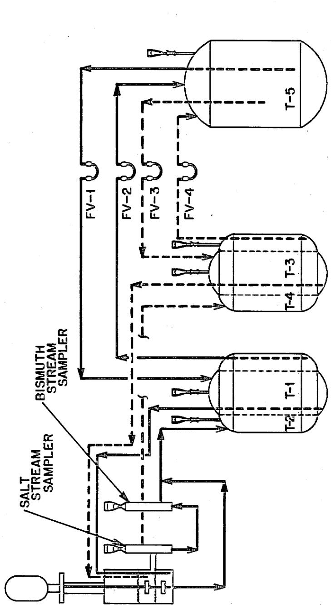  
Fig. 1. Flow diagram of the Salt-Bismuth Flowthrough Facility with   
the mechanically agitated contactor installed.

bismuth flowed to the contactor vessel; each phase entered below the surface of the contactor inventory of that phase and left the contactor through an effluent line at the salt-bismuth interface elevation. The interface thus was continuously renewed and mass-transfer inhibiting films were removed. The combined effluent stream was separated, and each stream flowed through a flowing stream sampler and then to the salt and bismuth catch tanks (vessels T-2 and T-4, respectively). The feed and catch tanks for each phase were concentric tanks to conserve space in the hood (see Sect. 2.3). The salt and bismuth inventory could be sent to a graphite-lined treatment vessel (vessel T-5) for periodic treatment with $\mathsf{H}_2$ -HF mixtures for removal of impurities and adjustment of distribution coefficients.

# 2.2 Contactor Vessel

A diagram of the contactor is shown in Fig. 2. The contactor was a 6-in. (152-mm)-diam low-carbon steel vessel containing four 1-in. (25-mm)-wide vertical baffles. The agitator consisted of two 2-7/8-in. (73-mm)-diam turbines with four 3/4-in. (19-mm)-wide straight blades. A 3/4-in. (19-mm)-diam overflow at the interface allowed the removal of interfacial films with the salt and metal effluent streams. Salt and bismuth were fed to the contactor below the surface of the respective phase.

# 2.3 Feed and Catch Tanks for Salt and Bismuth

The duplex feed and catch tanks for salt and bismuth were identical in construction. The feed tank, an inner cylinder of 8-in. sched 80 pipe, was designed to operate at pressures up to 50 psig (345 kPa) at $600^{\circ}\mathrm{C}$ . Both the inner feed tank and the outer catch tank had a capacity of about 20 liters of fluid; however, only about 15 liters of salt and 15 liters of bismuth were used.

The top of each feed tank contained seven ports: (1) an inlet port (1/2-in. pipe with a fitting for 3/8-in. tubing), which did not extend into the tank; (2) an outlet line (1/2-in. pipe with a fitting for 3/8-in. tubing), which extended to within 1/2 in. (13 mm) of the

ORNL DWG 76-584

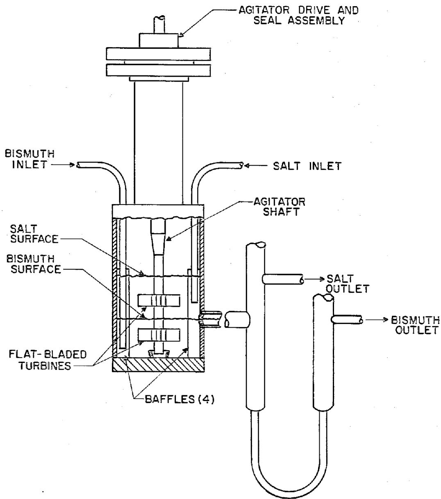  
Fig. 2. Schematic diagram of mechanically agitated molten-salt--bismuth contactor.

bottom of the tank; (3) a sparge and pressurization port (with a fitting for 3/8-in. tubing), which extended to within 1/2 in. (13 mm) of the bottom of the tank; (4) a 1/2-in. pipe (with a fitting for 3/8-in. tubing) used as a thermocouple well, which extended to within 1/2 in. (13 mm) of the bottom of the tank; (5) a 1/2-in. pipe with a fitting for a 1/2-in. ball valve and sampler and a fitting for 1/4-in. tubing below the valve; (6) a 1-in. pipe with a 1-in. ball valve as an addition port; and (7) a 1/2-in. capped pipe as a spare port. Each catch tank had the same ports as the feed tanks except that no addition port was provided. The outer surfaces of the feed and catch tanks were flame sprayed with nickel aluminide to retard oxidation.

# 2.4 Treatment Vessel for Salt and Metal

The treatment vessel consisted of a $304\mathrm{L}$ stainless steel pressure vessel that held a graphite crucible. The cylindrical portion of the pressure vessel was 26.5 in. (0.67 m) long [1/4-in. (6.4-mm) wall thickness] by 18 in. (0.46 m) OD and with 18-in. (0.46-m)-OD by 1/4-in. (6.4-mm)-thick dished heads on each end. It was designed to withstand $\mathsf{H}_2$ -HF at $600^{\circ}\mathsf{C}$ at a pressure of 50 psig (345 kPa).

The inner crucible, machined of graphite,\* had an outer diameter of 16.75 in. $(0.43\mathrm{m})$ and was an overall 26.75 in. $(0.68\mathrm{m})$ high. The wall thickness tapered from 1.75 in. $(44\mathrm{mm})$ at the bottom to 0.75 in. $(19\mathrm{mm})$ at a point 16.75 in. $(0.43\mathrm{m})$ from the bottom, and was uniform from there to the top. The bottom of the crucible was 1.75 in. $(44\mathrm{mm})$ thick. The crucible had a 16.75-in. $(0.43\mathrm{m})$ -diam lid, whose thickness varied from 1 in. $(25\mathrm{mm})$ at the rim to 0.5 in. $(13\mathrm{mm})$ at the center. The graphite crucible rested on a support plate inside the pressure vessel, and the lid was held loosely in position by three studs projecting from inside the top of the pressure vessel. The vessel had 13 nozzles, which are described in Table 1.

Table 1. Description of nozzles on treatment vessel   

<table><tr><td>Nozzle
No.</td><td>Purpose</td><td>Description</td></tr><tr><td>1</td><td>Bismuth charging</td><td>2-in. sched 40 pipe, flanged at the top to accommodate a chute for loading bismuth. The graphite lid below this nozzle has a 1.625-in.- diem hole with a removable plug.</td></tr><tr><td>2</td><td>Bismuth sampling; salt sampling; gas-phase pressure connection</td><td>0.5-in. sched 40 pipe with ball valve and sampler. The lid is fitted with a 1-in.-ID graphite pipe into which the 0.5-in. pipe slips. The graphite pipe extends through the graphite lid and into the crucible for a distance of 1 in.</td></tr><tr><td>3</td><td>Returning salt from the salt receiver</td><td>0.5-in. sched 40 pipe nozzle containing a sleeved 0.375-in.-OD tube. Below the carbon steel-to-molybdenum transition, the 0.375-in.- OD molybdenum tubing extends 4 in. below the graphite lid.</td></tr><tr><td>4</td><td>Returning bismuth from the bismuth receiver</td><td>Identical to nozzle No. 3.</td></tr><tr><td>5</td><td>Transferring bismuth to the bismuth feed tank</td><td>0.5-in. sched 40 pipe nozzle containing a sleeved 0.375-in.-OD tube that extends to within 0.5 in. of the bottom of the crucible. The tubing that extends into the crucible is made of molybdenum.</td></tr><tr><td>6</td><td>Transferring salt to the salt feed tank</td><td>Similar to nozzle No. 5; set so that 15 liters of salt can be transferred to the salt feed tank, leaving a 0.5-in. heel of salt on top of the bismuth.</td></tr><tr><td>7</td><td>Monitoring liquid levela</td><td>Similar to nozzle No. 5.</td></tr><tr><td>8</td><td>Sparging with H2-HF</td><td>Similar to nozzle No. 5.</td></tr><tr><td>9</td><td>Adding salt</td><td>Similar to nozzle No. 3.</td></tr><tr><td>10</td><td>Spare</td><td>Similar to nozzle No. 3.</td></tr><tr><td>11</td><td>Thermocouple well</td><td>0.5-in. sched 40 pipe with fittings for 0.375-in.-OD tubing.</td></tr><tr><td>12</td><td>Making miscellaneous additions, or vessel venting</td><td>1-in. sched 40 pipe, with ball valve.</td></tr><tr><td>13</td><td>Draining vessel</td><td>0.5-in. sched 40 pipe extending from the bottom of the pressure vessel; this line is capped.</td></tr></table>

Acts as a bubbler type of liquid-level monitor.

# 2.5 Samplers

The treatment vessel and the feed and catch tanks were each provided with a 1/2-in. sched 40 pipe nozzle fitted with a ball valve and sample port. These tank sample ports held four sample capsules attached to capillary tubing that extended through a Teflon plug in the top. These capsules were lowered (while the system was under argon pressure) through the ball valve into the tank below, and samples were drawn into the capsules by vacuum.

In addition to the five sample ports on the vessels, there were two flowing-stream sample ports that operated in a manner similar to that of the tank sample ports. These flowing-stream sample ports allowed seven samples to be taken from each of two flowing streams during operation. One sample port was located on the salt return line (between the contactor and the salt catch tank), and one was located on the metal return line (between the contactor and the metal catch tank).

The filtered sample capsules, which were used to take bismuth and salt samples, were made from 1/4-in. (6.4-mm)-diam stainless steel rod that was 3/4 in. (19 mm) long. The sample capsules were fitted with a porous 347 stainless steel filter on one end and 1/16-in. (1.6-mm)-diam capillary tubing on the other. Figure 3 shows a schematic diagram of a sample capsule and a typical tank sample port.

# 2.6 Freeze Valves and Lines

Salt and metal flows through the facility were directed by four freeze valves in the transfer lines, located as indicated in Fig. 1. These valves were simply dips (in the carbon steel tubing) that were fitted with air cooling lines. Those freeze valves that had to be closed before any salt or metal could be transferred from the treatment vessel were equipped with small reservoirs (about $50~\mathrm{cm}^3$ ) upstream and downstream from the valve. The facility, which was of welded construction, contained approximately 200 ft (61 m) of salt and metal transfer lines (3/8- and 1/2-in. pressure tubing).

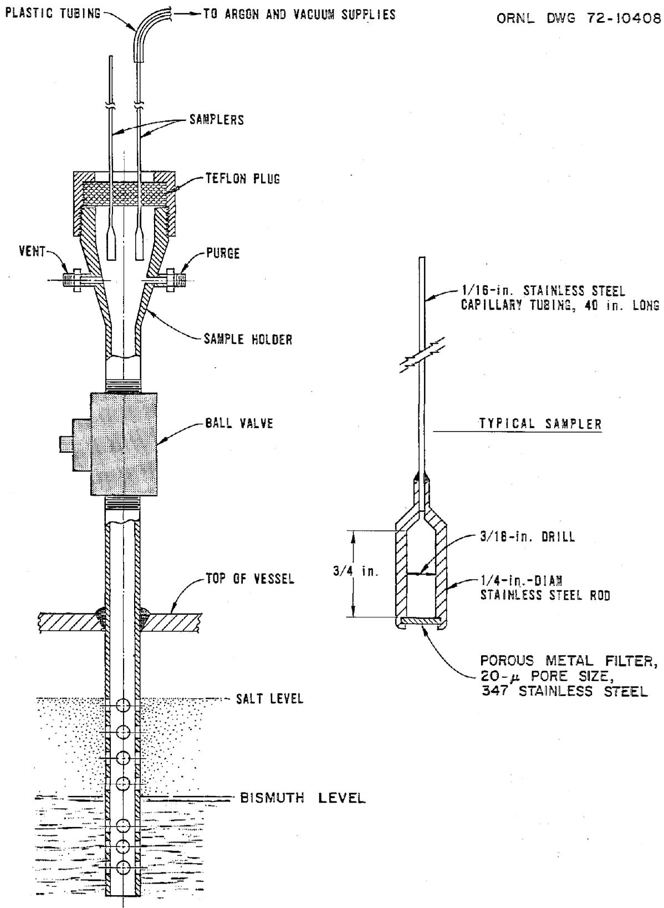  
Fig. 3. Typical tank sample port and sample capsule.

# 2.7 Instrumentation and Control

The principal objective of the instrumentation and control system was to provide closely regulated flows of bismuth and molten salt to the contactor. The range of flow rates for both bismuth and molten salt was nominally 40 to 500 cc/min, corresponding to experiment durations of about 5 to 0.5 hr. Pressures and liquid levels in the five vessels (treatment vessel and feed and catch tanks) of the facility were sensed by Foxboro differential-pressure transmitters, which sent signals to miniature pneumatic recorders or controllers. Liquid level was inferred from the pressure of the argon that was supplied to a dip-leg bubbler in each tank. Flow rates of bismuth and salt to the contactor were controlled by regulating the rate of change of liquid level in the two feed tanks. The feed and catch tanks, the treatment vessel, and the contactor were maintained at the desired temperatures by automatic controllers; transfer-line temperatures and temperatures of small components were controlled by manually regulating the appropriate voltage transformers that supplied power to Calrod tubular heaters.

Figure 4 is a schematic diagram of the control system that regulated the flow of bismuth or salt to the contactor. It was designed to circumvent the flow-control problems that sometimes occur when gas pressure is used to maintain a constant flow of liquid from a heated feed tank. An adjustable ramp generator and an electric-to-pneumatic converter were used to linearly decrease the set point of a controller that sensed liquid level in the feed tank. The level was controlled by controlling the flow rate of argon to the gas space of the feed tank. The result was a uniformly decreasing liquid level and, hence, a uniform discharge rate of bismuth or salt from the tank. This control system was unaffected by small increases in back pressure, partial plugging of transfer lines, decreasing feed tank level, etc., or leakage of argon (a small argon bleed was provided to improve pressure control). Small gas pressure oscillations caused by temperature cycling was minimized by using time-proportioning controllers. Rates of transfer of salt and metal between the collection tanks and the treatment vessel were not required to be closely regulated; therefore, manual control of pressurization was used.

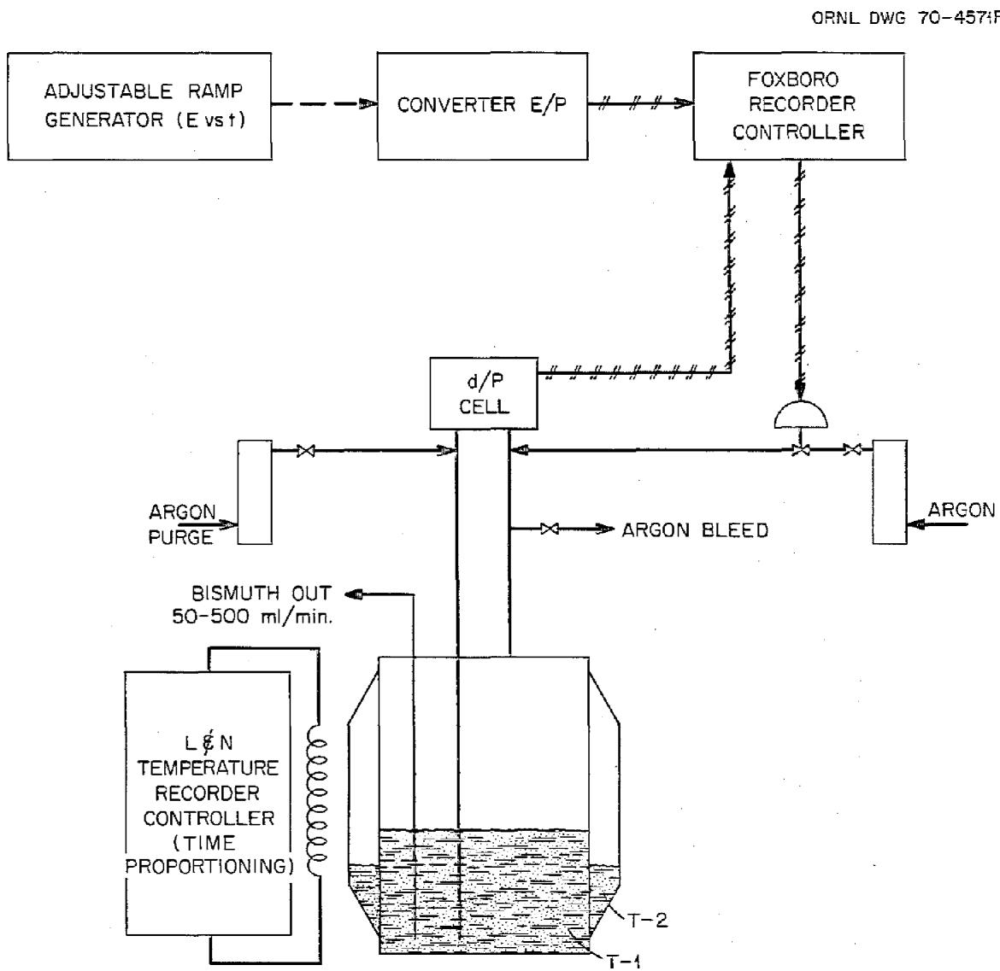  
Fig. 4. Schematic diagram of control system for metering bismuth from the pressurized feed tank, T-1.

Heating circuits were controlled manually for ll transfer lines and the two flowing stream samplers. On the transfer lines, the Calrods rated at 230 V were operated at 140 V or less, and provided up to 185 W per foot (600 W/m) of line. Typically, temperatures at three points on each line were recorded. The temperature of approximately 100 points was recorded for the system.

# 2.8 Gas Purification and Supply Systems

Three gases were required for the experimental facility: anhydrous hydrogen fluoride (HF), hydrogen, and argon. Because of the highly deleterious effect of small amounts of oxygen or water vapor, the nominally pure bottled hydrogen and argon were further purified to remove traces of oxygen or water vapor. The anhydrous hydrogen fluoride that was used only in the treatment vessel for hydrofluorination of the metal and the salt was given no additional purification. A schematic diagram for each of the three supply systems is shown in Fig. 5.

Highly purified argon was used for all applications requiring an inert gas (e.g., pressurization of tanks for transferring bismuth and molten salt, dip-leg bubblers for liquid-level measurements, and purging of apparatus for sampling bismuth and salt). Cylinder argon with a minimum purity of $99.995\%$ was first fed to a bed of molecular sieves (Fig. 5a), which reduced the water vapor content to about 2 ppm $[-100^{\circ}\mathrm{F}(-73^{\circ}\mathrm{C})$ dew point]. The argon then flowed through a bed of uranium metal turnings where the remaining oxygen and water vapor were removed. A porous stainless steel filter removed any uranium oxide dust that might have been carried from the uranium bed by the gas stream. The maximum argon flow rate, based on the capacity of the molecular sieve bed, was about 6 scfm $(2.8 \times 10^{-3} \text{std} \, \mathrm{m}^{3} / \text{sec})$ .

The hydrogen purification system was a commercially available device* that purified hydrogen by the selective diffusion of hydrogen across a

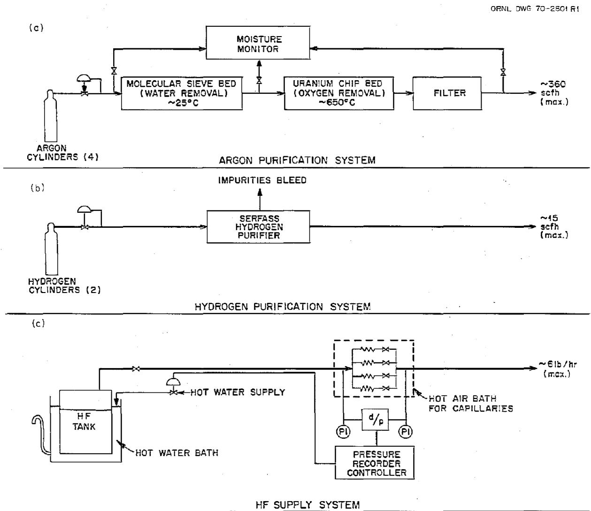  
Fig. 5. Simplified diagram of the gas supply systems.

palladium alloy barrier. Impurities, along with a small flow of hydrogen, were bled continuously from the upstream side of the barrier. The capacity of the unit was 15 scfh (1.2 x $10^{-4}$ std $\mathrm{m}^3/\mathrm{sec}$ ). Controls for the purifier were self-contained.

The anhydrous HF supply system utilized small capillaries for metering; a pneumatic controller maintained a specified pressure drop across a capillary by controlling the HF gas supply pressure. This was achieved by regulating the temperature of the water bath in which the HF supply tank was suspended (Fig. 5c). Accidental overheating of the HF supply tank was prevented by a switch that released cold water into the bath if the temperature exceeded $60^{\circ}\mathrm{C}$ . The minimum flow range for the HF supply was nominally 0 to 0.25 lb of HF per hour (0 to 0.15 g/sec); the maximum range was 0 to 6 lb/hr (0 to 3.7 g/sec).

# 3. EXPERIMENTAL PROCEDURES

In order to measure mass transfer rates in the equipment previously described, it was necessary to perform several operations. The proper distribution coefficient of the transferring materials was adjusted by adding reductant thorium and lithium to the bismuth. Tracers $(^{237}\mathrm{U}$ and $97\mathrm{Zr})$ were prepared by irradiating $^{236}\mathrm{U}$ and $^{96}\mathrm{Zr}$ in the Oak Ridge Research Reactor (ORR) and these were added to the salt feed before each run. The salt and bismuth were fed through the contactor. Samples were taken of salt and bismuth and were prepared for analysis. The salt and metal phases were treated periodically with mixtures of hydrogen and HF. Details of these procedures are described in this section.

# 3.1 Reductant Addition

Periodic adjustment of the reductant inventory in the bismuth phase was necessary in order to replenish reductant loss due to oxidation, since even the high-purity argon which was used as a cover gas still contained a small amount of oxygen. The reductant inventory in the bismuth also required adjustment after $\mathrm{H}_{2}$ -HF treatment of the salt and bismuth. The method used for adjusting the reductant inventory was

electrolytic dissolution of beryllium ions in the salt phase while the salt and bismuth were in contact in the treatment vessel.

A schematic diagram of the experimental apparatus used for electrolytic beryllium addition is shown in Fig. 6. A 3/8-in. (8.2-mm) diam by 6-in. (152-mm) long beryllium rod was suspended in the treatment vessel and immersed in the salt phase. The beryllium rod was connected electrically to the positive terminal of a 12-V lead-acid storage battery via wire and a stainless steel rod, which is insulated electrically from the treatment vessel. To complete the circuit, the negative pole of the battery was connected to an ammeter, a variable resistance, and finally to the treatment vessel. The bismuth phase served as the cathode in this electrolysis.

The overall reaction that takes place in this electrolytic cell when current is passed between the beryllium anode and bismuth cathode is:

$$
\frac {3}{2} \mathrm {B e} ^ {\circ} + \mathrm {U} ^ {3 +} \mathrm {F} _ {3} (\text {s a l t}) \rightarrow \mathrm {B e} ^ {2 +} \mathrm {F} _ {2} (\text {s a l t}) + \mathrm {U} ^ {\circ} (\text {b i s m u t h}). \tag {1}
$$

Thus, the electrolysis resulted in the oxidation of beryllium at the anode (the beryllium rod) and the reduction of uranium at the cathode (the bismuth surface). The reduced uranium dissolved in the bismuth and the concentrations of thorium and lithium dissolved in the bismuth adjusted to satisfy the equilibrium conditions that were reported previously.

# 3.2 Tracer Irradiation and Addition

Mass transfer rates between the salt and bismuth phases were determined from the extent of transfer of $^{237}\mathrm{U}$ and of $^{97}\mathrm{Zr}$ tracers that were dissolved in the salt phase prior to an experiment. The salt and bismuth were at chemical equilibrium with respect to the nonradioactive uranium and zirconium.

The $^{97}\mathrm{Zr}$ tracer was prepared by irradiating a 7.5-mg quantity of $^{96}\mathrm{ZrO}_2$ enclosed in a quartz ampul in the ORR for $\sim 24$ hr. The $^{97}\mathrm{ZrO}_2$ was then transferred to a 0.75-in. (19-mm)-diam steel capsule after an

ORNL DWG. 76-581   
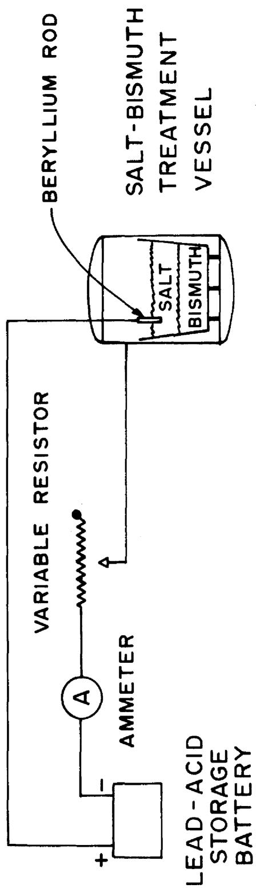  
Fig. 6. Schematic for addition of beryllium to the salt phase in the salt-bismuth treatment vessel.

18-hr decay period (for decay of $^{31}\mathrm{Si}$ activity from the ampul) to facilitate addition of the tracer to the salt phase. The capsule was then immersed in the salt phase in the salt feed tank while argon was sparged through the capsule to circulate salt through the capsule and enhance mixing.

Uranium-237 tracer was prepared by irradiating $\sim 1\mathrm{mg}^{236}\mathrm{U}$ (as $^{236}\mathrm{U}_{3}\mathrm{O}_{8}$ ) encased in a quartz ampul in the ORR for $\sim 72\mathrm{hr}$ . As with the zirconium tracer, the uranium was then transferred to a steel addition capsule and loaded into the salt phase in the salt feed tank.

# 3.3 Run Procedure

All runs were performed using the same procedure. While the fluoride salt and bismuth were in contact in the treatment vessel (T5), sufficient beryllium was added to the salt electrolytically to produce the desired distribution coefficient (D).

Prior to a run, the salt and bismuth phases were separated by pressurizing the salt-bismuth treatment vessel and transferring salt and bismuth to their respective feed tanks. Approximately 7 mCi of $97_{\mathrm{Zr}} - 97_{\mathrm{No}}$ and 50 to 100 mCi of $^{237}\mathrm{U}_{3}\mathrm{O}_{8}$ were allowed to dissolve in the salt phase about 2 hr prior to an experiment.

Salt and bismuth streams were passed through the contactor vessel at the desired flow rates by controlled pressurization of the salt and bismuth feed tanks. The contactor was maintained at 590 to $600^{\circ}\mathrm{C}$ for all runs. Both phases exited through a common effluent line, separated, and returned to the salt and bismuth catch vessels.

# 3.4 Treatment with Hydrogen-Hydrogen Fluoride Mixture

Periodic treatment of the salt and bismuth phases with $\mathsf{HF - H_2}$ mixtures was necessary to remove oxides from the salt, and dissolved reductants and impurities (thorium, lithium, and iron) from the bismuth. The treatment procedure also served to adjust the equilibrium distribution of uranium and zirconium between the salt and bismuth phases.

The procedure followed was to sparge an $\mathrm{HF - F_2}$ mixture into the salt phase while both the salt and bismuth were in the treatment vessel (T5). In order to prevent excessive attack on containers and piping, the hydrogen fluoride concentration was kept below 30 mole % by dilution with hydrogen, although an attempt was made to keep the HF concentration as near $30\%$ as possible to afford the maximum oxide removal rate. The total nominal flow rate was 30 scfh. The hydrogen fluoride flow rate was set by the pressure drop across a capillary, and the $\mathbf{H}_2$ flow rate was set by a rotameter which was calibrated with $\mathbf{H}_2$ . From the treatment vessel, the $\mathrm{HF - H_2}$ stream passed through a sodium fluoride bed (to remove HF) and then was exhausted to the atmosphere outside of Building 3592.

The feed and off-gas from the treatment vessel were analyzed by diverting a small portion of the stream through a small aqueous scrubber and a $0.05\mathrm{ft}^3/$ revolution $(1.4\times 10^{-3}\mathrm{m}^{3}/$ revolution) wet-test meter, which were connected in series. The concentration of HF in the gas stream was determined by passing the gas through $250~\mathrm{ml}$ of a $0.4\mathrm{\underline{N}}$ NaOH solution in the scrubber. When $0.05\mathrm{ft}^3$ $(1.4\times 10^{-3}\mathrm{m}^{3})$ of $\mathbf{H}_2$ had passed through the wet-test meter, the gas flow was stopped and the solution was removed for analysis. The HF concentration in the gas was determined by titrating small samples of the scrubbing solution with $0.1\mathrm{\underline{N}}\mathrm{HCl}$ . Utilization of the HF was calculated from the feed and discharge concentrations.

# 3.5 Sample Preparation and Analysis

In an effort to avoid contamination of the samples obtained in each run with extraneous material, the sample capsules were cleaned of foreign material before analysis by the following procedure. Gross amounts of salt or bismuth were first removed with a file, the sample capsule was then polished with emery cloth, and, finally, the capsule was washed with acetone.

The samples were analyzed by first counting the sample capsules for the activity of $^{237}\mathrm{U}$ (207.95 keV $\beta^{-}$ ) and the activity of $^{97}\mathrm{Zr}-^{97}\mathrm{Nb}$ (743.37 keV and 658.18 keV $\beta^{-}$ , respectively) after secular equilibrium was reached between $^{97}\mathrm{Zr}$ and its daughter $^{97}\mathrm{Nb}$ . The material in the

sample capsules was then dissolved, and the activity of $^{237}\mathrm{U}$ was counted again after the $^{97}\mathrm{Zr}-^{97}\mathrm{Nb}$ activity had decayed to a very low level. This was done to correct for self-absorption in the solid samples. Mass transfer rates were than calculated from the ratios of tracer concentrations as discussed in Appendix B.

# 4. EXPERIMENTAL RESULTS

Nine runs were made in the experimental equipment to measure rates of mass transfer of $^{237}\mathrm{U}$ and $^{97}\mathrm{Zr}$ between salt and bismuth. In these runs, the agitator speed was varied over the range of 68 to 244 rpm, and the operating temperature was held in the range of 590 to $600^{\circ}\mathrm{C}$ . Concentrations of $^{97}\mathrm{Zr}$ and $^{237}\mathrm{U}$ were measured (as described in Sect. 3.5) in the salt input and both the salt and bismuth effluent streams. The counting data obtained in all runs are given in Appendix A. Using these concentrations, three different equations were used to calculate the mass transfer coefficient between the salt and bismuth in the contactor. The derived equations are given in Appendix B. The calculated mass transfer coefficients for all the runs are summarized in Table 2. The values given in Table 2 are the average of the values calculated from the three equations [Eqs. (B-18)-(20)] with the standard deviation. Values are given both for results based upon the uranium counting and for results based upon the zirconium counting.

Run TSMC-1 was mainly a preliminary run designed to test the procedure. Salt and bismuth flows were approximately 200 cc/min, and the stirrer rate was 123 rpm. Unfortunately, the distribution coefficient (defined in Appendix B) was too low to effect any significant mass transfer, and mass transfer rates could not be determined accurately; thus, no results are shown for this run in Table 2.

Operation of the equipment during run TSMC-2 was very smooth. The salt and bismuth flow rates were 228 and 197 cc/min, respectively. The distribution coefficients were higher than for the previous run, but were lower than desired, resulting in much uncertainty. Several determinations of the distribution coefficient of uranium $\mathsf{D}_{\mathsf{U}}$ were made that ranged from 0.94 to 34. One determination was made of the distribution coefficient

Table 2. Experimental results of mass transfer measurements in the salt-bismuth contactor   

<table><tr><td rowspan="2">Run</td><td rowspan="2">Salt flow (cc/min)</td><td rowspan="2">Bismuth flow (cc/min)</td><td rowspan="2">Stirrer rate (rpm)</td><td rowspan="2">DU</td><td rowspan="2">DZr</td><td rowspan="2">Fraction tracer transferreda</td><td colspan="2">KS(cm/sec)</td></tr><tr><td>Based on uranium</td><td>Based on zirconium</td></tr><tr><td>TSMC-2</td><td>228</td><td>197</td><td>121</td><td>0.94-34</td><td>0.96</td><td>0.17</td><td>0.0059 - 0.0092</td><td>0.0083 ± 0.0055</td></tr><tr><td>TSMC-3</td><td>166</td><td>173</td><td>162</td><td>&gt;34</td><td>--</td><td>0.50</td><td>0.012 ± 0.003</td><td>---</td></tr><tr><td>TSMC-4</td><td>170</td><td>144</td><td>205</td><td>&gt;172</td><td>&gt;24</td><td>0.78</td><td>0.054 ± 0.02</td><td>0.035 ± 0.02</td></tr><tr><td>TSMC-5</td><td>219</td><td>175</td><td>124</td><td>&gt;43</td><td>&gt;24</td><td>0.35</td><td>0.0095 ± 0.0013</td><td>0.0163 ± 0.0159</td></tr><tr><td>TSMC-6</td><td>206</td><td>185</td><td>180</td><td>&gt;172</td><td>&gt;24</td><td>0.64</td><td>0.039 ± 0.005</td><td>0.020 ± 0.01</td></tr><tr><td>TSMC-7</td><td>152</td><td>170</td><td>68</td><td>&gt;97</td><td>--</td><td>0.40</td><td>0.0057 ± 0.0012</td><td>---</td></tr><tr><td>TSMC-8</td><td>152</td><td>164</td><td>~0</td><td>&gt;40</td><td>--</td><td>0.25</td><td>0.0022 ± 0.0010</td><td>---</td></tr><tr><td>TSMC-9</td><td>169</td><td>164</td><td>244</td><td>&gt;47</td><td>--</td><td>0.94</td><td>0.121 ± 0.108</td><td>---</td></tr></table>

aFraction tracer transferred $= (1 - C_{s} / C_{l})$

of zirconium $\mathsf{D}_{\mathsf{Zr}}$ that indicated $\mathsf{D}_{\mathsf{Zr}}$ was 0.96. Consequently, only a range of possible values for the overall mass transfer coefficient could be stated for the results based on uranium. A value for overall mass transfer coefficient based on zirconium is given, but since the value for $\mathsf{D}_{\mathsf{Zr}}$ is uncertain, there is more uncertainty in the mass transfer coefficient than is indicated by the reported standard deviation given in Table 2.

A bismuth line leak occurred immediately preceding run TSMC-3. During the resulting delay for repairs, the $^{97}\mathrm{Zr}$ decayed and only the $^{237}\mathrm{U}$ tracer could be used. The remainder of the run went smoothly. Salt and bismuth flow rates were 166 and 173 cc/min, and the stirrer rate was 162 rpm. A high value for $D_U$ (greater than $3^{\text{山}}$ ) was maintained for this run.

In run TSMC-4, flow rates of 170 and $144~\mathrm{cc / min}$ were set for the salt and bismuth flows, and a stirrer rate of 205 rpm was maintained. The distribution coefficients, which had been determined from samples taken before, after, and during the run, were greater than 172 for $\mathbf{D}_{\mathbf{U}}$ and greater than $24$ for $\mathbf{D}_{\mathbf{Zr}}$ . These values are sufficiently large so that Eqs. (B-18)-(20) in Appendix B are valid. Large distribution coefficients cannot be determined precisely due to the inability to determine very small amounts of uranium in the salt phase. No problems arose during this run.

Runs TSMC-5 and -6 were performed without incident. The distribution coefficients were maintained at high levels for both runs. TSMC-5 had a stirrer rate of 124 rpm and salt and bismuth flows of 219 and 175 cc/min. TSMC-6 salt and bismuth flows were 206 and 185 cc/min, respectively, with a stirrer rate of 180 rpm.

Prior to run TSMC-7, two leaks developed in the bismuth transfer line from the bismuth feed tank to the contactor vessel. This transfer line was completely replaced along with the associated Calrod and thermal insulation. The volumetric flow rates of salt and bismuth during the run were $152~\mathrm{cm}^3/\mathrm{min}$ and $170~\mathrm{cm}^3/\mathrm{min}$ , respectively. The stirrer rate was set at 68 rpm for the run. The uranium distribution coefficient was greater than 97. Seven sets of salt and bismuth flowing stream samples were taken from the contactor effluent during the run.

Run TSMC-8 was performed with salt and bismuth flow rates of 152 cc/min and 164 cc/min, respectively. The uranium distribution coefficient was maintained at a level (> 40) for this run which was greater than the minimum desired value of 20. It was presumed that the agitator operated at 241 rpm, which is high enough to produce mild dispersion of the phases in the contactor and, therefore, a high measured mass transfer rate. However, results from this run indicated that very little (≈ 25%) of the $^{237}\mathrm{U}$ tracer was actually transferred from the salt to the bismuth. Inspection of the magnetically coupled, agitator drive assembly indicated that an accumulation of a highly viscous carbonaceous material between the upper carbon bearing and the agitator drive shaft had prevented proper rotation of the shaft. The drive assembly was cleaned of all foreign material, was reassembled, and was found to operate satisfactorily.

The ninth tracer run, TSMC-9, was performed as a repeat of the eighth run. Salt and bismuth flow rates were set at 169 cc/min and 164 cc/min, respectively. The agitator was operated at 244 rpm during this run. A high stirrer rate was maintained to determine the effects on the mass transfer rate of dispersal of one phase in the other, and to determine if large amounts of bismuth and salt are entrained in the other phase after settling in the contactor effluent line. Entrainment results from this run and another similar run are given in Appendix D. The uranium distribution coefficient was greater than 47 during this run. No systematic problems were encountered and the run was performed smoothly.

# 5. INTERPRETATION OF RESULTS

In this section, the mass transfer coefficients measured in the salt-bismuth system are compared with typical mass transfer coefficients measured in aqueous-organic systems at comparable agitator diameters and speeds and with mass transfer coefficients measured in a water-mercury system. The mass transfer coefficients measured in this study are also compared to predictions made by three mass transfer correlations taken from the literature that were developed from data measured in aqueous-organic systems.

The mass transfer coefficients for $^{237}\mathrm{U}$ given in Table 2 are probably more reliable than the results given for $^{97}\mathrm{Zr}$ because, in all cases, the material balance for $^{237}\mathrm{U}$ was greater than $80\%$ , whereas that for $^{97}\mathrm{Zr}$ was consistently about $60\%$ . Because of this, and also because more useful data points were obtained for $^{237}\mathrm{U}$ than for $^{97}\mathrm{Zr}$ , the interpretation of results presented in this section is based mainly on the $^{237}\mathrm{U}$ measurements.

The mass transfer coefficients for $^{237}\mathrm{U}$ are compared in Fig. 7 with some typical mass transfer coefficients measured in aqueous-organic systems and with water-side mass transfer coefficients measured in a water-mercury system. $^{3,4}$ The figure shows that the mass transfer coefficients measured in the salt-bismuth system (curve A) are quite high compared to the aqueous-organic and water-mercury results measured in cells of comparable size and at comparable agitator speeds (curves B through E). Except for curve E all the mass transfer coefficient data can be divided into two regimes: (1) at low agitator speeds the mass transfer coefficient is proportional to the agitator speed raised to a power less than 1.0 (0.9 for the salt-bismuth results and 0.7 for results represented by curves B through E); and (2) at higher agitator speeds the mass transfer coefficient is proportional to the agitator speed raised to a power significantly greater than 1.0 (1.5 for curve D, 1.95 for curves B and C, and 9.0 for curve A). Olander and Benedict $^{2}$ suggest that the sudden change in exponent for their data (in the absence of phase dispersal) is caused by a laminar-turbulent transition at the interface. Observation has shown that phase dispersal did not occur at the break points of curves B, C, and D, but it was not possible to determine unequivocally when dispersal occurred in the salt-bismuth system since measurements of entrainment were inconclusive on this point (see Appendix D). However, previous work $^{5,6}$ with water-mercury and with aqueous-organic systems indicates that, for the agitator diameter used, dispersal of molten salt into bismuth should begin to occur at an agitator speed of about 170 rpm. This entrainment would cause the apparent mass transfer coefficient to be greater than the mass transfer coefficient that would have resulted if phase dispersal had not occurred. The increase would be due to the increased area for mass transfer, since the apparent mass transfer coefficient is based upon the area of the undisturbed interface. Since dispersal was expected, and because the dependence on agitator

speed is so different from the aqueous-organic data and the water-mercury data, it is concluded that dispersal of salt into bismuth occurred at an agitator speed between 160 and 180 rpm, even though entrainment measurements do not support this.

The mass transfer coefficients for $^{97}\mathrm{Zr}$ are shown in Fig. 8 compared to curve A from Fig. 7. In all but two cases (runs TSMC-2 and -5), the zirconium mass transfer coefficient was lower than the uranium mass transfer coefficient. This difference is probably related to the inability to correct for the self-absorption of the $^{743.37\mathrm{keV}}\beta^{-}$ in the analysis of $^{97}\mathrm{Zr}$ in the solid bismuth samples. In run TSMC-2, all the resistance to mass transfer of uranium was in the salt phase, whereas there was significant resistance to mass transfer of zirconium in both phases. Nevertheless, the overall mass transfer coefficients for uranium and zirconium were of comparable magnitude in this run.

The mass transfer coefficients were compared with three literature correlations for mass transfer coefficient in stirred cells that were developed for aqueous-organic systems. The properties of the fluoride salt that were used to evaluate these correlations are given in Appendix D. The properties of bismuth at $600^{\circ}\mathrm{C}$ that were used are:

$$
\rho_ {B i} = 9. 6 6 g / c m ^ {3} a n d
$$

$$
\eta_ {B i} = 1. 0 \times 1 0 ^ {- 2} g / c m - s e c.
$$

Lewis7 investigated mass transfer rates in mechanically agitated, nondispersing contactors, all of the same size, using several aqueous-organic systems. He fitted his results with the following empirical equation:

$$
\frac {6 0 k _ {1}}{v _ {1}} = 6. 7 6 + 1 0 ^ {- 6} \left(R e _ {1} + R e _ {2} \frac {n _ {2}}{n _ {1}}\right) ^ {1. 6 5} + 1, \tag {1}
$$

where

$$
\text {R e} = \text {R e y n o l d s n u m b e r} \frac {\mathrm {N L} ^ {2} \rho}{\eta},
$$

$$
N = \text {s t i r r e r s p e e d}, \text {r p s} ,
$$

$$
L = \text {s t i r r e r}
$$

$$
k = \text {m a s s t r a n s f e r c o e f f i c i e n t ,} \mathrm {c m / s e c},
$$

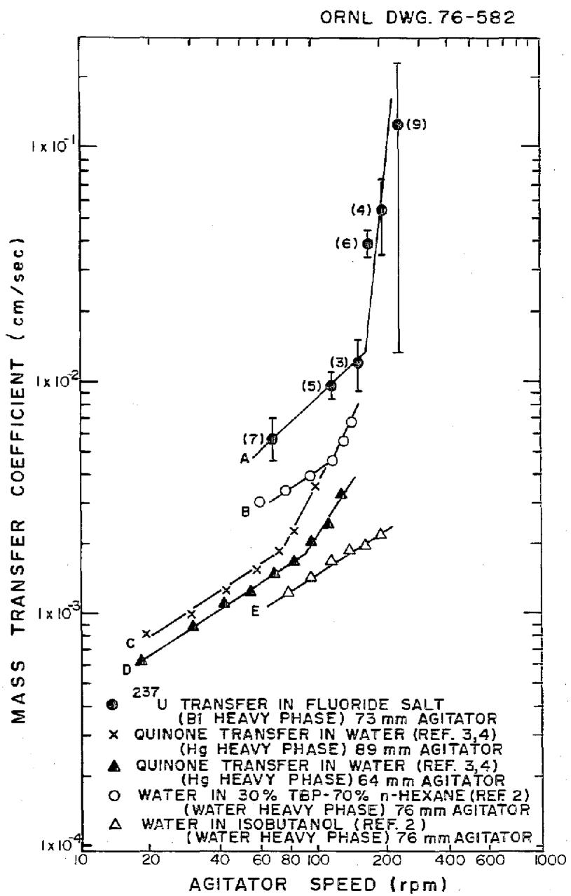  
Fig. 7. Comparison of $^{237}\mathrm{U}$ mass transfer coefficients in fluoride salt with representative aqueous-organic mass-transfer coefficients and water-mercury coefficients. Numbers in parentheses on top curve refer to run number in the salt-bismuth experimental facility.

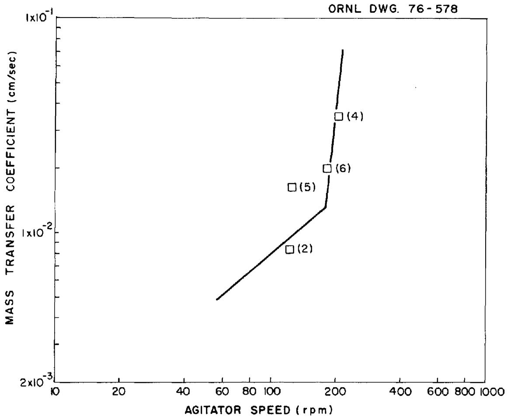  
Fig. 8. Effect of agitator speed on salt-side mass transfer coefficient of $97\mathrm{Zr}$ in the salt-bismuth contactor. Numbers in parentheses refer to run number.

$$
\begin{array}{l} \rho = \text {d e n s i t y ,} \mathrm {g / c m} ^ {3}, \\ \eta = \text {v i s c o s i t y ,} g / c m \sec , \\ v = \text {k i n e m a t i c v i s c o s i t y ,} \eta / \rho , \mathrm {c m} ^ {2} / \sec , \text {a n d} \\ 1, 2 = \text {p h a s e} \\ \end{array}
$$

For the case in which $\mathbb{N}_1 = \mathbb{N}_2$ and $\mathbb{L}_1 = \mathbb{L}_2$ , the above equation can be reduced to the form:

$$
\frac {6 0 k _ {1}}{v _ {1}} = 6. 7 6 \times 1 0 ^ {- 6} \quad \left[ \operatorname {R e} _ {1} \left(1 + \frac {\rho_ {2}}{\rho_ {1}}\right) \right] ^ {1. 6 5} + 1. \tag {2}
$$

For Lewis' work, where the densities of the various phases varied from 0.8 to $1.2\mathrm{g/cm}^3$ but the stirrer length was kept constant, this correlation effectively uses only the Reynolds number of the phase being considered.

The uranium mass transfer coefficients are compared to the Lewis correlation in Fig. 9. At agitator speeds below $170~\mathrm{rpm}$ , the Lewis correlation overpredicts the mass transfer coefficient for uranium; it also shows a stronger dependence of mass transfer coefficient on the agitator speed than the data indicate. No dependence of molecular diffusivity is shown by this correlation. The omission of a term containing molecular diffusivity from the correlation has been criticized in the recent literature. It has been shown theoretically and in recent experiments that the mass transfer coefficient should be proportional to molecular diffusivity raised to a power near $1/2$ .

Mayers $^{10}$ developed a slightly more involved correlation of the following form:

$$
\frac {6 0 \mathrm {k} _ {1} \mathrm {L} _ {1}}{v _ {1}} = 0. 1 8 9 6 \left(\operatorname {R e} _ {1} \operatorname {R e} _ {2}\right) ^ {1 / 2} \left(\frac {n _ {2}}{n _ {1}}\right) ^ {1. 9} \left(0. 6 + \frac {n _ {2}}{n _ {1}}\right) ^ {- 2. 4} \left(\operatorname {S c} _ {1}\right) ^ {- 1 / 6}. \tag {3}
$$

When both phases are stirred with identical paddles at the same speed, this equation reduces to:

ORNL DWG 76-583

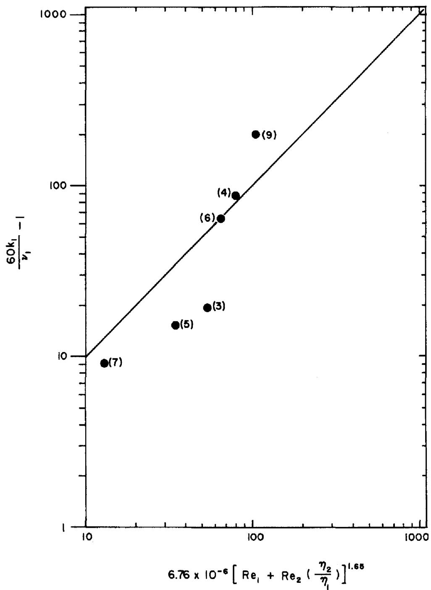  
Fig. 9. Comparison of uranium mass transfer coefficients with the Lewis correlation. Numbers in parentheses refer to run number.

$$
\frac {6 0 \mathrm {k} _ {1} \mathrm {L}}{\mathrm {v} _ {1}} = 0. 1 8 9 6 (\mathrm {R e} _ {1}) \left(\frac {\eta_ {2}}{\eta_ {1}}\right) ^ {1. 4} \left(0. 6 + \frac {\eta_ {2}}{\eta_ {1}}\right) ^ {- 2. 4} (\mathrm {S c} _ {1}) ^ {- 1 / 6} \binom {\rho_ {2}} {\rho_ {1}} ^ {0. 5} \tag {4}
$$

where

$$
\mathrm {S c} = \text {S c h m i d t n u m b e r}, \eta / \rho \mathfrak {P}.
$$

This correlation, which is based on data covering a limited range of densities (0.8 to $1.2\mathrm{g/cm}^3$ ), indicates that the viscosity and density of each phase affect the mass transfer coefficient.

A comparison of the uranium mass transfer coefficients with the Mayers correlation is shown in Fig. 10. At agitator speeds below 170 rpm, the Mayers correlation also overpredicts the mass transfer coefficient, but the predicted dependence of mass transfer coefficient on agitator speed is more nearly in accord with the data than it is in the Lewis correlation. Note that the dependence on the Schmidt number (molecular diffusivity) is fairly weak.

McManamey correlated his data and the results obtained by Lewis by using the following expression, which is similar to that used by Lewis but includes the Schmidt number:

$$
\frac {6 0 \mathrm {k} _ {\perp}}{\nu_ {\perp}} = 0. 0 8 6 1 (\mathrm {R e} _ {\perp}) ^ {0. 9} \left(1 + \frac {\eta_ {2}}{\eta_ {1}} \frac {\mathrm {R e} _ {2}}{\mathrm {R e} _ {\perp}}\right) (\mathrm {S c} _ {\perp}) ^ {- 0. 3 7} \tag {5}
$$

where

$$
\begin{array}{l} \mathrm {S c} = \text {S c h m i d t n u m b e r}, \eta / \rho , \text {a n d} \\ \mathcal {D} = \text {d i f f u s i o n c o e f f i c i e n t ,} \mathrm {c m} ^ {2} / \sec . \\ \end{array}
$$

This equation can be reduced to:

$$
\frac {6 0 k _ {1}}{v _ {1}} = 0. 0 8 6 1 \left(R e _ {1}\right) ^ {0. 9} \left(1 + \frac {\rho_ {1}}{\rho_ {2}}\right) (S c.) ^ {- 0. 3 7}, \tag {6}
$$

for the case where $\mathbb{L}_1 = \mathbb{L}_2$ and $\mathbb{N}_1 = \mathbb{N}_2$ . Note that the numerical constant in Eqs. (5) and (6) has the dimension of reciprocal centimeters.

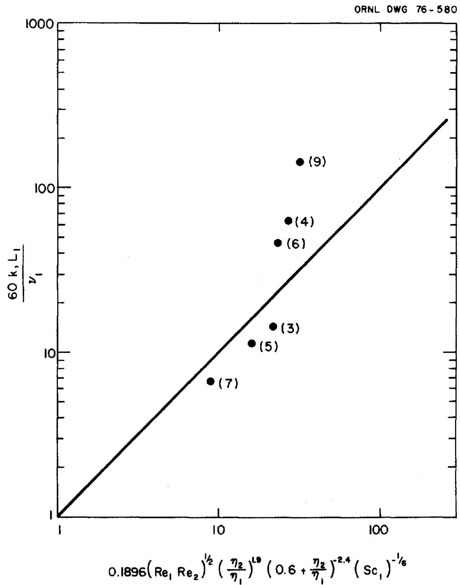  
Fig. 10. Comparison of uranium mass transfer coefficient with the Mayers correlation. Numbers in parentheses refer to run number.

The uranium mass transfer coefficients are compared with the McManamey correlation in Fig. 11. This correlation shows good agreement with the data at agitator speeds below $170~\mathrm{rpm}$ . It must be pointed out, however, that the Schmidt number for diffusion of uranium in molten fluoride salt was estimated by using correlations based upon materials with solution behavior that is quite different from molten salt solutions. Hence, the very good agreement shown here should be considered somewhat coincidental.

# 6. CONCLUSIONS AND RECOMMENDATIONS

The following conclusions and recommendations are based upon the experimental results and analysis presented in this report.

(1) At comparable agitator speeds, salt-side mass transfer coefficients for uranium are higher than water-side mass transfer coefficients for quinone measured in water-mercury systems, and higher than mass transfer coefficients for other components in aqueous-organic systems. Furthermore, the dependence of salt-side mass transfer coefficients on agitator speed seems to be somewhat stronger than for the water-mercury system at low agitator speeds and with similar diameter agitators.   
(2) The change in slope of the mass transfer coefficient vs agitator speed curve at 170 rpm is probably caused by the onset of phase dispersal. The occurrence of dispersal at this speed is in reasonable agreement with data measured in water-mercury and aqueous-organic systems.   
(3) There is a large increase in mass transfer rates with only slight phase dispersal. It may be possible to achieve mass transfer rates required in the MSBR processing plant by operating under these conditions without suffering bismuth entrainment in the salt. The data on bismuth entrainment presented in the Appendix suggest this, but further testing is required to confirm it.

ORNL DWG 76-579

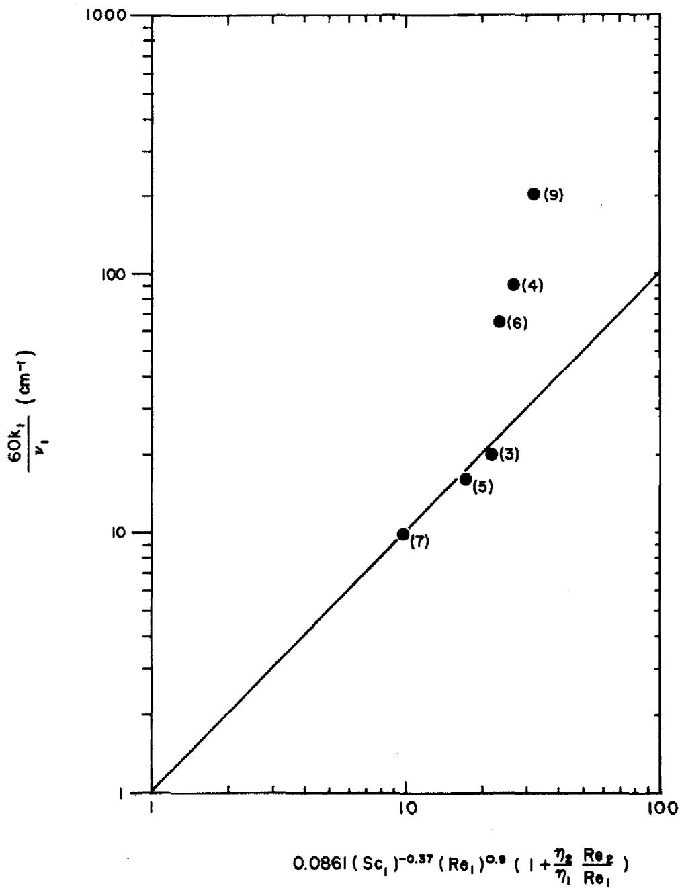  
Fig. 11. Comparison of the uranium mass transfer coefficients with the McManamey correlation. Number in parentheses refers to run number.

(4) The mass transfer coefficients measured at agitator speeds below 170 rpm provide data which should be compared with new correlations for stirred nondispersing contactors. The McManamey correlation correlated these data much better than two other literature correlations; however, it should be used with extreme caution for scaleup and design if extrapolations to untested conditions are required.

# 7. ACKNOWLEDGMENT

The authors wish to acknowledge the contribution of Mr. J. Beams, technician assigned to this project, for his diligence and skill in operating the rather cantankerous experimental equipment used for this work. Appreciation is also due to Mr. Max Montgomery, pipefitter, for maintaining the equipment in working condition.

# 8. REFERENCES

1. L. M. Ferris et al., J. Inorg. Nucl. Chem. 32, 2019-35 (1970).   
2. D. R. Olander and M. Benedict, Nucl. Sci. Engr. 14, 287-94 (1962).   
3. C. H. Brown, Jr., in Engineering Development Studies for Molten-Salt Breeder Reactor Processing No. 24, ORNL/TM-5339 (in preparation).   
4. J. Hernanz et al., Determination and Correlation of Mass Transfer Coefficients in a Stirred Cell, ORNL/MIT-22 (in preparation).   
5. J. A. Klein and C. H. Brown, Jr., unpublished data.   
6. H. O. Weeren and L. E. McNeese in Engineering Development Studies for Molten-Salt Breeder Reactor Processing No. 10, ORNL/TM-3352 (December 1972), p. 52.   
7. J. B. Lewis, Chem. Eng. Sci. 3, 248-59 (1954).   
8. D. R. Olander, Chem. Eng. Sci. 18, 123-32 (1963).   
9. W. J. McManemey et al., Chem. Eng. Sci. 28, 1061-69 (1973).   
10. G. R. A. Meyers, Chem. Eng. Sci. 16, 69-75 (1961).   
11. W.J. McManamey, Chem. Eng. Sci. 15, 251-54 (1961).

12. A. S. Foust et al., Principles of Unit Operations, p. 210, Wiley, New York, 1960.   
13. C. R. Wilke, Chem. Eng. Progr. 45, 218-24 (1949).   
14. R. B. Bird et al., Transport Phenomena, pp. 514-15, Wiley, New York, 1960.   
15. S. Cantor in Molten-Salt Reactor Program Semiann. Progr. Rep. for Aug. 31, 1969, ORNL-4449, p. 145.   
16. S. Cantor in Physical Properties of Molten-Salt Reactor Fuel, Coolant, and Flush Salts, ORNL/TM-2316 (August 1968), p. 28.   
17. S. Cantor in Molten-Salt Reactor Program Semiann. Progr. Rep. for Aug. 31, 1969, ORNL-4449, p. 147.   
18. R. B. Lindauer, personal communication, Feb. 28, 1973.

# APPENDIX A.

# Sample Analyses

The counting data obtained during runs TSMC-2 through -9 are presented in Tables A1-A8. Counting data are given for $^{237}\mathrm{U}$ (207.45 keV $\beta^{-}$ ) and $^{97}\mathrm{Zr}$ (743.37 keV $\beta^{-}$ ) in the solid salt and bismuth samples, and for $^{237}\mathrm{U}$ after the samples were dissolved. All results are given in terms of counts per minute per gram.

Table A-1. Counting data obtained from run TSMC-2   

<table><tr><td>Sample codea</td><td>Solid analysis for 237U (counts/g-min)</td><td>Solution analysis for 237U (counts/g-min)</td><td>Solid analysis for 97Zr (counts/g-min)</td><td>Sample codea</td><td>Solid analysis for 237U (counts/g-min)</td><td>Solution analysis for 237U (counts/g-min)</td><td>Solid analysis for 97Zr (counts/g-min)</td></tr><tr><td colspan="8">Samples taken prior to run</td></tr><tr><td>88-B-5</td><td>&lt; 3.3 x 102</td><td>&lt; 2.8 x 103</td><td>&lt; 6.37 x 101</td><td>86-S-5</td><td>&lt; 8.5 x 103</td><td>&lt; 1.8 x 104</td><td>&lt; 4.5 x 102</td></tr><tr><td>93-B-1</td><td>≤ 3.2 x 102</td><td>≤ 1.9 x 103</td><td>≤ 1.03 x 102</td><td>87-S-5</td><td>≤ 6.8 x 103</td><td>≤ 1.8 x 104</td><td>≤ 7.7 x 102</td></tr><tr><td>94-B-1</td><td>≤ 2.2 x 102</td><td>≤ 2.3 x 103</td><td>≤ 6.6 x 101</td><td>89-S-3</td><td>≤ 2.9 x 103</td><td>≤ 6.4 x 103</td><td>≤ 3.9 x 102</td></tr><tr><td></td><td></td><td></td><td></td><td>90-S-3</td><td>≤ 5.6 x 104</td><td>≤ 6.8 x 104</td><td>≤ 6.6 x 102</td></tr><tr><td colspan="8">Samples taken prior to run, but after addition of tracers</td></tr><tr><td></td><td></td><td></td><td></td><td>91-S-3</td><td>3.01 x 105</td><td>2.79 x 105</td><td>1.85 x 105</td></tr><tr><td></td><td></td><td></td><td></td><td>92-S-3</td><td>1.96 x 105</td><td>2.09 x 105</td><td>1.79 x 105</td></tr><tr><td colspan="8">Samples taken during run</td></tr><tr><td>93-B-FS</td><td>1.80 x 104</td><td>3.49 x 104</td><td>2.01 x 104</td><td>100-S-FS</td><td>2.32 x 105</td><td>2.36 x 105</td><td>1.48 x 105</td></tr><tr><td>94-B-FS</td><td>1.46 x 104</td><td>3.29 x 104</td><td>1.69 x 104</td><td>101-S-FS</td><td>2.41 x 105</td><td>2.70 x 105</td><td>1.52 x 105</td></tr><tr><td>95-B-FS</td><td>1.91 x 104</td><td>2.80 x 104</td><td>2.00 x 104</td><td>102-S-FS</td><td>2.44 x 105</td><td>2.57 x 105</td><td>1.71 x 105</td></tr><tr><td>96-B-FS</td><td>2.24 x 104</td><td>4.28 x 104</td><td>2.10 x 104</td><td>103-S-FS</td><td>--</td><td>--</td><td>--</td></tr><tr><td>97-B-FS</td><td>2.15 x 104</td><td>3.87 x 104</td><td>1.94 x 104</td><td>104-S-FS</td><td>2.65 x 105</td><td>2.87 x 105</td><td>1.90 x 105</td></tr><tr><td>98-B-FS</td><td>1.86 x 104</td><td>3.91 x 104</td><td>1.97 x 104</td><td>105-S-FS</td><td>2.74 x 105</td><td>2.77 x 105</td><td>1.64 x 105</td></tr><tr><td>99-B-FS</td><td>3.21 x 104</td><td>5.01 x 104</td><td>2.74 x 104</td><td>106-S-FS</td><td>2.91 x 105</td><td>2.57 x 105</td><td>1.65 x 105</td></tr><tr><td colspan="8">Samples taken after run</td></tr><tr><td>107-B-1</td><td>5.05 x 103</td><td>1.08 x 104</td><td>4.40 x 103</td><td>111-S-3</td><td>5.00 x 105</td><td>5.09 x 105</td><td>1.94 x 105</td></tr><tr><td>108-B-1</td><td>4.18 x 103</td><td>1.04 x 104</td><td>4.05 x 103</td><td>112-S-3</td><td>5.14 x 105</td><td>5.51 x 105</td><td>1.93 x 105</td></tr><tr><td>109-B-2</td><td>1.48 x 104</td><td>3.29 x 104</td><td>1.61 x 104</td><td>113-S-4</td><td>2.41 x 105</td><td>2.82 x 105</td><td>1.29 x 105</td></tr><tr><td>110-B-2</td><td>1.96 x 104</td><td>3.76 x 104</td><td>1.83 x 104</td><td>114-S-4</td><td>2.55 x 105</td><td>2.91 x 105</td><td>1.36 x 105</td></tr><tr><td>115-B-5</td><td>2.76 x 104</td><td>5.52 x 104</td><td>2.40 x 104</td><td>117-S-5</td><td>1.53 x 105</td><td>&lt; 1.9 x 105</td><td>6.63 x 104</td></tr><tr><td>116-B-5</td><td>5.15 x 104</td><td>6.34 x 104</td><td>2.54 x 104</td><td>118-S-5</td><td>9.59 x 104</td><td>&lt; 2.6 x 105</td><td>7.95 x 104</td></tr></table>

Each sample is designated by a code corresponding to A-B-C, where A = sample number; B = material in sample (B = bismuth, S = salt); and C = sample origin; 1 = T1; 2 = T2; 3 = T3; 4 = T4; 5 = T5; FS = flowing stream sample.

Table A-2. Counting data obtained from run TSMC-3   

<table><tr><td>Sample codea</td><td>Solid analysis for 237U (counts/g-min)</td><td>Solution analysis for 237U (counts/g-min)</td><td>Sample codea</td><td>Solid analysis for 237U (counts/g-min)</td><td>Solution analysis for 237U (counts/g-min)</td></tr><tr><td colspan="6">Samples taken prior to run</td></tr><tr><td>141-B-5</td><td>≤ 1.13 x 102</td><td>≤ 5.1 x 103</td><td>143-S-5</td><td>≤ 3.3 x 103</td><td>≤ 5.3 x 104</td></tr><tr><td>142-B-5</td><td>≤ 1.64 x 102</td><td>≤ 5.5 x 103</td><td>144-S-5</td><td>≤ 3.2 x 103</td><td>≤ 7.6 x 104</td></tr><tr><td>147-B-5</td><td>≤ 6.26 x 101</td><td>≤ 3.4 x 103</td><td>145-S-3</td><td>≤ 3.4 x 103</td><td>≤ 7.6 x 104</td></tr><tr><td>148-B-5</td><td>≤ 1.00 x 102</td><td>≤ 4.0 x 103</td><td>146-S-3</td><td>≤ 3.2 x 104</td><td>≤ 5.6 x 104</td></tr><tr><td colspan="6">Samples taken prior to run but after addition of tracer</td></tr><tr><td></td><td></td><td></td><td>149-S-3</td><td>6.13 x 105</td><td>9.37 x 105</td></tr><tr><td></td><td></td><td></td><td>150-S-3</td><td>6.33 x 105</td><td>9.29 x 105</td></tr><tr><td colspan="6">Samples taken during run</td></tr><tr><td>151-B-FS</td><td>4.52 x 104</td><td>1.13 x 105</td><td>158-S-FS</td><td>3.48 x 105</td><td>4.89 x 105</td></tr><tr><td>152-B-FS</td><td>4.14 x 104</td><td>1.29 x 105</td><td>159-S-FS</td><td>--</td><td>--</td></tr><tr><td>153-B-FS</td><td>4.12 x 104</td><td>1.33 x 105</td><td>160-S-FS</td><td>2.96 x 105</td><td>4.36 x 105</td></tr><tr><td>154-B-FS</td><td>4.51 x 104</td><td>1.44 x 105</td><td>161-S-FS</td><td>3.08 x 105</td><td>4.56 x 105</td></tr><tr><td>155-B-FS</td><td>6.32 x 105</td><td>1.26 x 105</td><td>162-S-FS</td><td>3.02 x 105</td><td>3.99 x 105</td></tr><tr><td>156-B-FS</td><td>3.88 x 104</td><td>1.44 x 105</td><td>163-S-FS</td><td>3.19 x 105</td><td>4.43 x 105</td></tr><tr><td>157-B-FS</td><td>4.00 x 104</td><td>1.49 x 105</td><td>164-S-FS</td><td>--</td><td>--</td></tr><tr><td colspan="6">Samples taken after run</td></tr><tr><td>165-B-1</td><td>4.38 x 102</td><td>4.8 x 103</td><td>167-S-3</td><td>6.68 x 105</td><td>1.19 x 105</td></tr><tr><td>166-B-1</td><td>6.53 x 102</td><td>4.7 x 103</td><td>168-S-3</td><td>--</td><td>--</td></tr><tr><td>169-B-2</td><td>3.19 x 104</td><td>1.61 x 105</td><td>171-S-4</td><td>2.64 x 105</td><td>4.71 x 105</td></tr><tr><td>170-B-2</td><td>2.86 x 104</td><td>9.56 x 104</td><td>172-S-4</td><td>2.70 x 105</td><td>4.12 x 105</td></tr><tr><td>173-B-5</td><td>5.47 x 104</td><td>1.43 x 105</td><td>175-S-5</td><td>&lt; 6.4 x 103</td><td>&lt; 1.4 x 105</td></tr><tr><td>174-B-5</td><td>5.24 x 104</td><td>1.44 x 105</td><td>176-S-5</td><td>&lt; 6.4 x 103</td><td>&lt; 1.4 x 105</td></tr></table>

Each sample is designated by a code corresponding to A-B-C, where A = sample number; B = material in sample (B = bismuth, S = salt); and C = sample origin; I = T1; 2 = T2; 3 = T3; 4 = T4; 5 = T5; FS = flowing stream sample.

Table A-3. Counting data obtained from run TSMC-4   

<table><tr><td>Sample codea</td><td>Solid analysis for 237U (counts/g-min)</td><td>Solution analysis for 237U (counts/g-min)</td><td>Solid analysis for 97Zr (counts/g-min)</td><td>Sample codea</td><td>Solid analysis for 237U (counts/g-min)</td><td>Solution analysis for 237U (counts/g-min)</td><td>Solid analysis for 97Zr (counts/g-min)</td></tr><tr><td colspan="8">Samples taken prior to run</td></tr><tr><td>191-B-5</td><td>&lt; 1.03 x 103</td><td>≤ 5.1 x 103</td><td>≤ 4.4 x 102</td><td>189-S-5</td><td>≤ 5.9 x 103</td><td>≤ 3.6 x 104</td><td>≤ 1.5 x 103</td></tr><tr><td>192-B-5</td><td>≤ 8.83 x 102</td><td>≤ 6.7 x 103</td><td>≤ 3.3 x 102</td><td>190-S-5</td><td>≤ 4.0 x 103</td><td>≤ 3.8 x 104</td><td>≤ 6.4 x 102</td></tr><tr><td>195-B-1</td><td>≤ 1.00 x 103</td><td>≤ 4.9 x 103</td><td>≤ 3.3 x 102</td><td>193-S-3</td><td>≤ 4.7 x 103</td><td>≤ 3.6 x 104</td><td>≤ 1.4 x 103</td></tr><tr><td>196-B-1</td><td>≤ 1.19 x 103</td><td>≤ 4.7 x 103</td><td>≤ 5.7 x 102</td><td>194-S-3</td><td>≤ 4.3 x 103</td><td>≤ 1.0 x 104</td><td>≤ 9.5 x 102</td></tr><tr><td colspan="8">Samples taken prior to run but after addition of tracers</td></tr><tr><td></td><td></td><td></td><td></td><td>197-S-3</td><td>1.22 x 106</td><td>1.44 x 106</td><td>1.92 x 105</td></tr><tr><td></td><td></td><td></td><td></td><td>198-S-3</td><td>1.21 x 106</td><td>1.49 x 106</td><td>1.99 x 105</td></tr><tr><td colspan="8">Samples taken during run</td></tr><tr><td>199-B-FS</td><td>9.67 x 104</td><td>2.91 x 105</td><td>3.63 x 104</td><td>206-S-FS</td><td>1.46 x 105</td><td>2.97 x 105</td><td>4.58 x 104</td></tr><tr><td>200-B-FS</td><td>1.45 x 105</td><td>3.57 x 105</td><td>4.50 x 104</td><td>207-S-FS</td><td>2.64 x 105</td><td>3.23 x 105</td><td>6.33 x 104</td></tr><tr><td>201-B-FS</td><td>1.70 x 105</td><td>4.82 x 105</td><td>5.66 x 104</td><td>208-S-FS</td><td>2.98 x 105</td><td>2.88 x 105</td><td>4.61 x 104</td></tr><tr><td>202-B-FS</td><td>1.85 x 105</td><td>4.72 x 105</td><td>6.34 x 104</td><td>209-S-FS</td><td>2.97 x 105</td><td>5.01 x 105</td><td>6.07 x 104</td></tr><tr><td>203-B-FS</td><td>2.19 x 105</td><td>5.01 x 105</td><td>6.38 x 104</td><td>210-S-FS</td><td>2.76 x 105</td><td>3.34 x 105</td><td>6.96 x 104</td></tr><tr><td>204-B-FS</td><td>1.83 x 105</td><td>5.36 x 105</td><td>6.43 x 104</td><td>211-S-FS</td><td>2.63 x 105</td><td>3.10 x 105</td><td>8.48 x 104</td></tr><tr><td>205-B-FS</td><td>1.57 x 105</td><td>5.32 x 105</td><td>7.12 x 104</td><td>212-S-FS</td><td>2.52 x 105</td><td>3.14 x 105</td><td>6.84 x 104</td></tr><tr><td colspan="8">Samples taken after run</td></tr><tr><td>213-B-1</td><td>2.06 x 103</td><td>8.7 x 103</td><td>1.9 x 103</td><td>217-S-3</td><td>1.31 x 106</td><td>1.48 x 106</td><td>2.39 x 105</td></tr><tr><td>214-B-1</td><td>1.73 x 103</td><td>7.7 x 103</td><td>1.1 x 103</td><td>218-S-3</td><td>1.25 x 106</td><td>1.54 x 106</td><td>2.36 x 105</td></tr><tr><td>215-B-2</td><td>1.08 x 105</td><td>2.84 x 105</td><td>3.69 x 104</td><td>219-S-4</td><td>2.29 x 105</td><td>2.61 x 105</td><td>4.88 x 104</td></tr><tr><td>216-B-2</td><td>1.07 x 105</td><td>3.17 x 105</td><td>3.68 x 104</td><td>220-S-4</td><td>2.38 x 105</td><td>2.71 x 105</td><td>4.67 x 104</td></tr><tr><td>221-B-5</td><td>7.86 x 104</td><td>2.23 x 105</td><td>2.53 x 104</td><td>223-S-5</td><td>8.3 x 104</td><td>≤ 4.7 x 104</td><td>≤ 2.2 x 103</td></tr><tr><td>222-B-5</td><td>8.28 x 104</td><td>2.38 x 105</td><td>2.62 x 104</td><td>224-S-5</td><td>8.0 x 104</td><td>≤ 4.9 x 104</td><td>≤ 3.9 x 103</td></tr></table>

Each sample is designated by a code corresponding to A-B-C, where A = sample number; B = material in sample (B = bismuth, S = salt); and C = sample origin; 1 = T1; 2 = T2; 3 = T3; 4 = T4; 5 = T5; FS = flowing stream sample.

Table A-4. Counting data obtained from run TSMC-5   

<table><tr><td>Sample codea</td><td>Solid analysis for 237U (counts/g-min)</td><td>Solution analysis for 237U (counts/g-min)</td><td>Solid analysis for 97Zr (counts/g-min)</td><td>Sample codea</td><td>Solid analysis for 237U (counts/g-min)</td><td>Solution analysis for 237U (counts/g-min)</td><td>Solid analysis for 997Zr (counts/g-min)</td></tr><tr><td colspan="8">Samples taken prior to run</td></tr><tr><td>227-B-5</td><td>≤ 5.64 x 102</td><td>--</td><td>≤ 1.4 x 102</td><td>225-S-5</td><td>≤ 7.4 x 103</td><td>--</td><td>≤ 1.6 x 103</td></tr><tr><td>228-B-5</td><td>≤ 8.49 x 102</td><td>--</td><td>≤ 2.2 x 102</td><td>226-S-5</td><td>≤ 6.9 x 103</td><td>--</td><td>≤ 8.9 x 102</td></tr><tr><td>231-B-1</td><td>≤ 4.83 x 102</td><td>--</td><td>≤ 1.1 x 102</td><td>229-S-3</td><td>≤ 4.9 x 103</td><td>--</td><td>≤ 1.2 x 103</td></tr><tr><td>232-B-1</td><td>≤ 5.91 x 102</td><td>--</td><td>≤ 1.0 x 102</td><td>230-S-3</td><td>≤ 6.0 x 103</td><td>--</td><td>≤ 1.4 x 103</td></tr><tr><td colspan="8">Samples taken prior to run but after addition of tracers</td></tr><tr><td></td><td></td><td></td><td></td><td>233-S-3</td><td>2.54 x 106</td><td>3.44 x 106</td><td>2.10 x 105</td></tr><tr><td></td><td></td><td></td><td></td><td>234-S-3</td><td>2.57 x 106</td><td>3.48 x 106</td><td>2.20 x 105</td></tr><tr><td colspan="8">Samples taken during run</td></tr><tr><td>235-B-FS</td><td>1.04 x 105</td><td>2.87 x 105</td><td>1.85 x 104</td><td>242-S-FS</td><td>1.83 x 106</td><td>2.13 x 106</td><td>2.47 x 105</td></tr><tr><td>236-B-FS</td><td>1.30 x 105</td><td>4.13 x 105</td><td>2.62 x 104</td><td>243-S-FS</td><td>1.64 x 106</td><td>2.00 x 106</td><td>1.79 x 105</td></tr><tr><td>237-B-FS</td><td>1.53 x 105</td><td>4.60 x 105</td><td>2.94 x 104</td><td>244-S-FS</td><td>1.82 x 106</td><td>2.00 x 106</td><td>2.64 x 105</td></tr><tr><td>238-B-FS</td><td>1.35 x 105</td><td>4.61 x 105</td><td>2.89 x 104</td><td>245-S-FS</td><td>1.78 x 106</td><td>2.10 x 106</td><td>2.43 x 105</td></tr><tr><td>239-B-FS</td><td>1.35 x 105</td><td>4.83 x 105</td><td>2.78 x 104</td><td>246-S-FS</td><td>1.96 x 106</td><td>2.01 x 106</td><td>2.25 x 105</td></tr><tr><td>240-B-FS</td><td>1.67 x 105</td><td>4.67 x 105</td><td>3.04 x 104</td><td>247-S-FS</td><td>1.79 x 106</td><td>2.08 x 106</td><td>1.92 x 105</td></tr><tr><td>241-B-FS</td><td>1.41 x 105</td><td>5.31 x 105</td><td>2.92 x 104</td><td>248-S-FS</td><td>5.40 x 106</td><td>--</td><td>5.36 x 104</td></tr><tr><td colspan="8">Samples taken after run</td></tr><tr><td>249-B-1</td><td>≤ 1.38 x 103</td><td>--</td><td>≤ 4.0 x 102</td><td>253-S-3</td><td>3.11 x 106</td><td>--</td><td>2.96 x 105</td></tr><tr><td>250-B-1</td><td>≤ 1.05 x 103</td><td>--</td><td>≤ 3.5 x 102</td><td>254-S-3</td><td>3.28 x 106</td><td>--</td><td>3.19 x 105</td></tr><tr><td>251-B-2</td><td>7.70 x 104</td><td>--</td><td>1.95 x 104</td><td>255-S-4</td><td>1.52 x 106</td><td>--</td><td>1.19 x 105</td></tr><tr><td>252-B-2</td><td>1.00 x 105</td><td>--</td><td>1.80 x 104</td><td>256-S-4</td><td>1.10 x 106</td><td>--</td><td>1.37 x 105</td></tr><tr><td>257-B-5</td><td>1.71 x 105</td><td>--</td><td>2.47 x 104</td><td>259-S-5</td><td>&lt; 9.2 x 103</td><td>--</td><td>&lt; 2.6 x 103</td></tr><tr><td>258-B-5</td><td>1.34 x 105</td><td>--</td><td>2.00 x 104</td><td>260-S-5</td><td>&lt; 1.1 x 104</td><td>--</td><td>&lt; 3.5 x 103</td></tr></table>

Each sample is designated by a code corresponding to A-B-C, where A = sample number; B = material in sample (B = bismuth, S = salt);   
and $C =$ sample origin; $l = T1$ ; $2 = T2$ ; $3 = T3$ ; $4 = T4$ ; $5 = T5$ ; $FS =$ flowing stream sample.

Table A-5. Counting data obtained from run TSMC-6   

<table><tr><td>Sample codea</td><td>Solid analysis for 237U (counts/g-min)</td><td>Solution analysis for 237U (counts/g-min)</td><td>Solid analysis for 97Zr (counts/g-min)</td><td>Sample codea</td><td>Solid analysis for 237U (counts/g-min)</td><td>Solution analysis for 237U (counts/g-min)</td><td>Solid analysis for 97Zr (counts/g-min)</td></tr><tr><td colspan="8">Samples taken prior to run</td></tr><tr><td>261-B-5</td><td>1.75 x 104</td><td>5.32 x 104</td><td>--</td><td>259-S-5</td><td>≤ 6.2 x 103</td><td>&lt; &lt; 1.3 x 104</td><td>&lt; 2.2 x 103</td></tr><tr><td>262-B-5</td><td>2.37 x 104</td><td>5.55 x 104</td><td>2.51 x 103</td><td>260-S-5</td><td>≤ 6.1 x 103</td><td>≤ 1.3 x 104</td><td>≤ 1.3 x 103</td></tr><tr><td>265-B-1</td><td>1.95 x 104</td><td>5.78 x 104</td><td>8.96 x 101</td><td>263-S-3</td><td>≤ 1.3 x 103</td><td>≤ 1.4 x 104</td><td>≤ 1.6 x 103</td></tr><tr><td>266-B-1</td><td>1.99 x 104</td><td>5.47 x 104</td><td>9.48 x 101</td><td>264-S-3</td><td>≤ 5.6 x 103</td><td>≤ 1.4 x 104</td><td>≤ 2.1 x 103</td></tr><tr><td colspan="8">Samples taken prior to run but after addition of tracers</td></tr><tr><td></td><td></td><td></td><td></td><td>267-S-3</td><td>1.12 x 106</td><td>1.29 x 106</td><td>3.29 x 105</td></tr><tr><td></td><td></td><td></td><td></td><td>268-S-3</td><td>1.07 x 106</td><td>1.34 x 106</td><td>3.16 x 105</td></tr><tr><td colspan="8">Samples taken during run</td></tr><tr><td>269-B-FS</td><td>7.69 x 104</td><td>2.39 x 105</td><td>6.78 x 104</td><td>276-S-FS</td><td>4.11 x 105</td><td>3.53 x 105</td><td>1.75 x 105</td></tr><tr><td>270-B-FS</td><td>1.13 x 105</td><td>3.63 x 105</td><td>6.70 x 104</td><td>277-S-FS</td><td>4.63 x 105</td><td>4.55 x 105</td><td>2.30 x 105</td></tr><tr><td>271-B-FS</td><td>1.25 x 105</td><td>4.16 x 105</td><td>7.54 x 104</td><td>278-S-FS</td><td>4.59 x 105</td><td>3.83 x 105</td><td>2.11 x 105</td></tr><tr><td>272-B-FS</td><td>1.43 x 105</td><td>4.17 x 105</td><td>8.01 x 104</td><td>279-S-FS</td><td>4.03 x 105</td><td>4.38 x 105</td><td>2.16 x 105</td></tr><tr><td>273-B-FS</td><td>1.55 x 105</td><td>4.36 x 105</td><td>7.79 x 104</td><td>280-S-FS</td><td>5.00 x 105</td><td>4.26 x 105</td><td>1.85 x 105</td></tr><tr><td>274-B-FS</td><td>1.54 x 105</td><td>4.27 x 105</td><td>9.01 x 104</td><td>281-S-FS</td><td>4.83 x 105</td><td>4.66 x 105</td><td>2.03 x 105</td></tr><tr><td>275-B-FS</td><td>1.53 x 105</td><td>4.53 x 105</td><td>8.85 x 104</td><td>282-S-FS</td><td>4.63 x 105</td><td>3.40 x 105</td><td>2.07 x 105</td></tr><tr><td colspan="8">Samples taken after run</td></tr><tr><td>283-B-1</td><td>2.28 x 104</td><td>6.79 x 104</td><td>3.73 x 103</td><td>287-S-3</td><td>1.32 x 106</td><td>1.60 x 106</td><td>3.47 x 105</td></tr><tr><td>284-B-1</td><td>2.51 x 104</td><td>6.59 x 104</td><td>3.44 x 103</td><td>288-S-3</td><td>1.20 x 106</td><td>1.34 x 106</td><td>3.57 x 105</td></tr><tr><td>285-B-2</td><td>1.07 x 105</td><td>3.34 x 105</td><td>5.33 x 104</td><td>289-S-4</td><td>4.04 x 105</td><td>4.15 x 105</td><td>8.40 x 104</td></tr><tr><td>286-B-2</td><td>1.13 x 105</td><td>3.11 x 105</td><td>5.59 x 104</td><td>290-S-4</td><td>3.90 x 105</td><td>3.80 x 105</td><td>8.89 x 104</td></tr><tr><td>291-B-5</td><td>1.05 x 105</td><td>3.41 x 105</td><td>4.36 x 104</td><td>293-S-5</td><td>≤ 9.2 x 103</td><td>≤ 1.8 x 105</td><td>≤ 5.7 x 103</td></tr><tr><td>292-B-5</td><td>1.33 x 105</td><td>3.31 x 105</td><td>4.45 x 104</td><td>294-S-5</td><td>≤ 8.1 x 103</td><td>≤ 1.7 x 105</td><td>≤ 5.0 x 103</td></tr></table>

Each sample is designated by a code corresponding to A-B-C, where A = sample number; B = material in sample (B = bismuth, S = salt); and C = sample origin; l = T1; 2 = T2; 3 = T3; 4 = T4; 5 = T5; FS = flowing stream sample.

Table A-6. Counting data obtained from run TSMC-7   

<table><tr><td>Sample codea</td><td>Solid analysisbfor 237U(counts/g-min)</td><td>Solution analysis for 237U(counts/g-min)</td><td>Sample codea</td><td>Solid analysis for 237U(counts/g-min)</td><td>Solution analysis for 237U(counts/g-min)</td></tr><tr><td colspan="6">Samples taken prior to run</td></tr><tr><td>313-B-5</td><td>5.90 x 104</td><td>6.39 x 104</td><td>311-S-5</td><td>&lt; 4.2 x 103</td><td>&lt; 1.8 x 104</td></tr><tr><td>314-B-5</td><td>4.64 x 104</td><td>6.77 x 104</td><td>312-S-5</td><td>&lt; 5.2 x 103</td><td>&lt; 1.5 x 104</td></tr><tr><td>317-B-1</td><td>4.95 x 104</td><td>6.79 x 104</td><td>315-S-3</td><td>&lt; 6.6 x 103</td><td>&lt; 1.8 x 104</td></tr><tr><td>318-B-1</td><td>5.65 x 104</td><td>6.47 x 104</td><td>316-S-3</td><td>&lt; 7.6 x 103</td><td>&lt; 9.5 x 103</td></tr><tr><td colspan="6">Samples taken prior to run but after addition of tracers</td></tr><tr><td></td><td></td><td></td><td>319-S-3</td><td>3.95 x 106</td><td>5.46 x 103</td></tr><tr><td></td><td></td><td></td><td>320-S-3</td><td>3.95 x 106</td><td>5.61 x 106</td></tr><tr><td colspan="6">Samples taken during run</td></tr><tr><td>321-B-FS</td><td>2.64 x 105</td><td>3.91 x 105</td><td>329-S-FS</td><td>2.21 x 106</td><td>2.89 x 106</td></tr><tr><td>323-B-FS</td><td>2.99 x 105</td><td>4.33 x 105</td><td>330-S-FS</td><td>2.85 x 106</td><td>3.32 x 106</td></tr><tr><td>323-B-FS</td><td>3.23 x 105</td><td>4.81 x 105</td><td>331-S-FS</td><td>2.75 x 106</td><td>3.26 x 106</td></tr><tr><td>324-B-FS</td><td>3.98 x 105</td><td>5.03 x 105</td><td>332-S-FS</td><td>2.89 x 106</td><td>3.97 x 106</td></tr><tr><td>325-B-FS</td><td>3.56 x 105</td><td>5.06 x 105</td><td>333-S-FS</td><td>2.82 x 106</td><td>2.96 x 106</td></tr><tr><td>326-B-FS</td><td>3.94 x 105</td><td>5.05 x 105</td><td>334-S-FS</td><td>2.93 x 106</td><td>3.90 x 106</td></tr><tr><td>327-B-FS</td><td>3.92 x 105</td><td>5.17 x 105</td><td></td><td></td><td></td></tr><tr><td colspan="6">Samples taken after run</td></tr><tr><td>335-B-1</td><td>1.90 x 105</td><td>2.22 x 105</td><td>339-S-3</td><td>--</td><td>--</td></tr><tr><td>336-B-1</td><td>1.47 x 105</td><td>2.18 x 105</td><td>340-S-3</td><td>--</td><td>--</td></tr><tr><td>337-B-2</td><td>2.73 x 105</td><td>3.78 x 105</td><td>341-S-4</td><td>--</td><td>--</td></tr><tr><td>338-B-2</td><td>2.95 x 105</td><td>3.86 x 105</td><td>342-S-4</td><td>1.64 x 106</td><td>2.19 x 106</td></tr><tr><td>343-B-5</td><td>4.38 x 105</td><td>5.05 x 105</td><td>345-S-5</td><td>&lt; 9.8 x 103</td><td>&lt; 8.7 x 103</td></tr><tr><td>344-B-5</td><td>4.05 x 105</td><td>5.58 x 105</td><td>346-S-5,</td><td>&lt; 5.3 x 103</td><td>&lt; 1.7 x 104</td></tr></table>

aEach sample is designated by a code corresponding to A-B-C, where A = sample number; B = material in sample, (B = bismuth, S = salt); and C = sample origin; 1 = T1; 2 = T2; 3 = T3; 4 = T4; 5 = T5; FS = flowing stream sample.   
b Bismuth samples corrected for self-absorption of $237\mathrm{U}$ (207.95 keV $\beta^{-}$ ).

Table A-7. Counting data obtained from run TSMC-8   

<table><tr><td>Sample codea</td><td>Solid analysis for 237U (counts/g-min)</td><td>Solution analysis for 237U (counts/g-min)</td><td>Sample codea</td><td>Solid analysis for 237U (counts/g-min)</td><td>Solution analysis for 237U (counts/g-min)</td></tr><tr><td colspan="6">Samples taken prior to run</td></tr><tr><td>358-B-5</td><td>&lt; 1.7 x 103</td><td>4.18 x 103</td><td>356-S-5</td><td>&lt; 3.8 x 103</td><td></td></tr><tr><td>359-B-5</td><td>&lt; 1.4 x 103</td><td>4.33 x 103</td><td>357-S-5</td><td>&lt; 4.8 x 103</td><td>&lt; 8.9 x 103</td></tr><tr><td>362-B-1</td><td>1.27 x 103</td><td>4.51 x 103</td><td>360-S-3</td><td>&lt; 4.7 x 103</td><td>&lt; 1.6 x 104</td></tr><tr><td>363-B-1</td><td>1.25 x 103</td><td>4.06 x 103</td><td>301-S-3</td><td>&lt; 4.8 x 103</td><td>&lt; 1.6 x 104</td></tr><tr><td colspan="6">Samples taken prior to run but after addition of tracer</td></tr><tr><td></td><td></td><td></td><td>364-S-3</td><td>2.35 x 106</td><td>2.89 x 106</td></tr><tr><td></td><td></td><td></td><td>365-S-3</td><td>2.41 x 106</td><td>2.91 x 106</td></tr><tr><td colspan="6">Samples taken during run</td></tr><tr><td>366-B-FS</td><td>2.74 x 103</td><td>1.00 x 104</td><td>373-S-FS</td><td>3.04 x 105</td><td>3.73 x 105</td></tr><tr><td>367-B-FS</td><td>9.18 x 103</td><td>3.21 x 104</td><td>374-S-FS</td><td>9.45 x 105</td><td>1.02 x 106</td></tr><tr><td>368-B-FS</td><td>2.66 x 104</td><td>8.88 x 104</td><td>375-S-FS</td><td>1.76 x 106</td><td>2.14 x 106</td></tr><tr><td>369-B-FS</td><td>2.43 x 104</td><td>8.03 x 104</td><td>376-S-FS</td><td>2.08 x 106</td><td>2.29 x 106</td></tr><tr><td>370-B-FS</td><td>2.36 x 104</td><td>8.69 x 104</td><td>377-S-FS</td><td>1.94 x 106</td><td>1.90 x 106</td></tr><tr><td>371-B-FS</td><td>2.99 x 104</td><td>9.59 x 104</td><td>378-S-FS</td><td>1.90 x 106</td><td>2.18 x 106</td></tr><tr><td>372-B-FS</td><td>3.06 x 104</td><td>1.06 x 105</td><td>379-S-FS</td><td>2.43 x 106</td><td>2.34 x 106</td></tr><tr><td colspan="6">Samples taken after run</td></tr><tr><td>380-B-1</td><td>4.78 x 103</td><td>1.57 x 104</td><td>384-S-3</td><td>2.28 x 106</td><td>2.67 x 106</td></tr><tr><td>381-B-1</td><td>4.81 x 103</td><td>1.48 x 104</td><td>385-S-3</td><td>2.10 x 106</td><td>2.48 x 106</td></tr><tr><td>382-B-2</td><td>1.51 x 104</td><td>5.22 x 104</td><td>386-S-4</td><td>1.77 x 106</td><td>2.15 x 106</td></tr><tr><td>383-B-2</td><td>1.56 x 104</td><td>4.07 x 104</td><td>387-S-4</td><td>1.80 x 106</td><td>2.35 x 106</td></tr><tr><td>388-B-5</td><td>1.22 x 105</td><td>3.19 x 105</td><td>390-S-5</td><td>&lt; 1.0 x 104</td><td>&lt; 2.4 x 104</td></tr><tr><td>389-B-5</td><td>1.39 x 105</td><td>3.66 x 105</td><td>391-S-5</td><td>&lt; 1.2 x 104</td><td>&lt; 2.4 x 104</td></tr></table>

Each sample is designated by a code corresponding to A-B-C, where A = sample number; B = material in sample, (B = bismuth, S = salt); and C = sample origin; l = T1; 2 = T2; 3 = T3; 4 = T4; 5 = T5. FS = flowing stream sample.

Table A-8. Counting data obtained from run TSMC-9   

<table><tr><td>Sample codea</td><td>Solid analysis for 237U (counts/g-min)</td><td>Solution analysis for 237U (counts/g-min)</td><td>Sample codea</td><td>Solid analysis for 237U (counts/g-min)</td><td>Solution analysis for 237U (counts/g-min)</td></tr><tr><td colspan="6">Samples taken prior to run</td></tr><tr><td>394-B-5</td><td>&lt; 7.8 x 102</td><td>&lt; 3.2 x 103</td><td>392-S-5</td><td>&lt; 6.8 x 103</td><td>&lt; 1.3 x 104</td></tr><tr><td>395-B-5</td><td>≤ 8.2 x 102</td><td>≤ 2.6 x 103</td><td>393-S-5</td><td>≤ 6.8 x 103</td><td>≤ 1.3 x 104</td></tr><tr><td>398-B-1</td><td>7.64 x 102</td><td>≤ 2.5 x 103</td><td>396-S-3</td><td>≤ 6.7 x 103</td><td>≤ 1.3 x 104</td></tr><tr><td>399-B-1</td><td>8.53 x 102</td><td>≤ 3.0 x 103</td><td>397-S-3</td><td>≤ 6.9 x 103</td><td>≤ 1.2 x 104</td></tr><tr><td colspan="6">Samples taken prior to run but after addition of tracer</td></tr><tr><td></td><td></td><td></td><td>400-S-3</td><td>2.17 x 106</td><td>2.89 x 106</td></tr><tr><td></td><td></td><td></td><td>401-S-3</td><td>2.18 x 106</td><td>3.25 x 106</td></tr><tr><td colspan="6">Samples taken during run</td></tr><tr><td>402-B-FS</td><td>3.05 x 105</td><td>5.20 x 105</td><td>409-S-FS</td><td>2.17 x 105</td><td>1.94 x 105</td></tr><tr><td>403-B-FS</td><td>3.15 x 105</td><td>4.74 x 105</td><td>410-S-FS</td><td>2.06 x 105</td><td>2.16 x 105</td></tr><tr><td>404-B-FS</td><td>2.96 x 105</td><td>6.35 x 105</td><td>411-S-FS</td><td>2.04 x 105</td><td>2.00 x 105</td></tr><tr><td>405-B-FS</td><td>2.78 x 105</td><td>5.29 x 105</td><td>412-S-FS</td><td>1.96 x 105</td><td>1.95 x 105</td></tr><tr><td>406-B-FS</td><td>3.31 x 105</td><td>4.36 x 105</td><td>413-S-FS</td><td>2.22 x 105</td><td>1.79 x 105</td></tr><tr><td>407-B-FS</td><td>2.88 x 105</td><td>5.71 x 105</td><td>414-S-FS</td><td>1.74 x 105</td><td>1.88 x 105</td></tr><tr><td>408-B-FS</td><td>2.92 x 105</td><td>5.94 x 105</td><td>415-S-FS</td><td>1.89 x 105</td><td>1.69 x 105</td></tr><tr><td colspan="6">Samples taken after run</td></tr><tr><td>416-B-1</td><td>8.55 x 102</td><td>≤ 3.7 x 103</td><td>420-S-3</td><td>6.89 x 105</td><td>8.72 x 105</td></tr><tr><td>417-B-1</td><td>9.25 x 102</td><td>≤ 3.1 x 103</td><td>421-S-3</td><td>7.12 x 105</td><td>8.65 x 105</td></tr><tr><td>418-B-1</td><td>1.47 x 105</td><td>3.05 x 105</td><td>422-S-4</td><td>1.54 x 105</td><td>1.81 x 105</td></tr><tr><td>419-B-2</td><td>1.43 x 105</td><td>2.86 x 105</td><td>423-S-4</td><td>1.54 x 105</td><td>1.69 x 105</td></tr><tr><td>424-B-5</td><td>1.08 x 105</td><td>2.29 x 105</td><td>426-S-5</td><td>≤ 7.1 x 103</td><td>≤ 1.5 x 104</td></tr><tr><td>425-B-5</td><td>1.19 x 105</td><td>2.45 x 105</td><td>427-S-5</td><td>≤ 6.4 x 103</td><td>≤ 1.4 x 104</td></tr></table>

Each sample is designated by a code corresponding to A-B-C, where A = sample number; B = material in sample (B = bismuth, S = salt); and C = sample origin; 1 = T1; 2 = T2; 3 = T3; 4 = T4; 5 = T5; FS = flowing stream sample.

# APPENDIX B.

# Calculation of Mass Transfer Coefficients

For a flow-through, continuously stirred contactor at steady-state conditions, a mass balance on the salt phase yields:

$$
F _ {1} C _ {1} = F _ {1} C _ {s} + J, \tag {B-1}
$$

where

$$
\begin{array}{l} F _ {1} = \text {f l o w r a t e o f s a l t , c m} ^ {3} / \sec , \\ C _ {1} = \text {t r a c e r c o n c e n t r a t i o n i n s a l t i n f l o w , u n i t s / c m} ^ {3}, \\ C _ {2} = \text {t r a c e r c o n c e n t r a t i o n i n s a l t o u t f l o w , u n i t s / c m} ^ {3}, \\ J = \text {r a t e} \\ \end{array}
$$

Expressing the rate of transfer across the interface as the product of an overall mass transfer coefficient and a driving force times the area available for mass transfer yields:12

$$
J = K _ {S} \left[ C _ {S} - C _ {I I} / D \right] A, \tag {B-2}
$$

where

$$
1 / K _ {s} = 1 / k _ {s} + 1 / D k _ {m}, \tag {B-3}
$$

and

$$
\begin{array}{l} K _ {s} = \text {o v e r a l l m a s s t r a n s f e r c o e f f i c i e n t b a s e d o n s a l t p h a s e , c m / s e c}, \\ k _ {s} = \text {i n d i v i d u a l m a s s t r a n s f e r c o e f f i c i e n t i n s a l t p h a s e , c m / s e c}, \\ k _ {m} = \text {i n d i v i d u a l m a s s t r a n s f e r c o e f f i c i e n t p h a s e i n m e t a l}, \mathrm {c m / s e c}, \\ \begin{array}{r c l} D & = & \text {d i s t r i b u t i o n c o e f f i c i e n t} \\ & & \text {r a t i o o f c o n c e n t r a t i o n i n m e t a l} \\ & & \text {p h a s e t o c o n c e n t r a t i o n i n s a l t p h a s e a t e q u i l i b r i u m ,} \end{array} \\ \frac {\text {m o l e s} / \text {c m} ^ {3}}{\text {m o l e s} / \text {c m} ^ {3}}, \\ \end{array}
$$

$\mathbf{C}_{\mathfrak{m}} =$ tracer concentration in metal outflow, units/cm³, and A $=$ interfacial area, cm².

Taking an overall mass balance results in:

$$
\mathrm {C} _ {1} \mathrm {F} _ {1} + \mathrm {F} _ {2} \mathrm {F} _ {2} = \mathrm {C} _ {\mathrm {s}} \mathrm {F} _ {1} + \mathrm {C} _ {\mathrm {m}} \mathrm {F} _ {2}, \tag {B-4}
$$

where

$C_2 =$ tracer concentration in metal inflow, units/cm³, and

$F_{2} =$ flow rate of metal, cm³/sec.

If $C_2 = 0$ , Eq. (B-4) can be rearranged to give the four following relations:

$$
C _ {1} F _ {1} = C _ {s} F _ {1} + C _ {m} F _ {2}, \tag {B-5}
$$

$$
C _ {1} = C _ {s} + C _ {m} \left(\frac {F _ {2}}{F _ {1}}\right), \tag {B-6}
$$

$$
C _ {S} = C _ {\cdot} - C _ {m} \left(\frac {F _ {2}}{F _ {1}}\right), \text {a n d} \tag {B-7}
$$

$$
\mathrm {c} _ {\mathrm {m}} = \mathrm {c} _ {1} \frac {\mathrm {F} _ {1}}{\mathrm {F} _ {2}} - \mathrm {c} _ {\mathrm {s}} \left(\frac {\mathrm {F} _ {1}}{\mathrm {F} _ {2}}\right). \tag {B-8}
$$

Combining Eqs. (B-1), (B-2), and (B-8) yields:

$$
F _ {1} C _ {1} = F _ {1} C _ {s} + K _ {s} C _ {s} A - \frac {K _ {s} C _ {1} A}{D} \left(\frac {F _ {1}}{F _ {2}}\right) + \frac {K _ {s} C _ {s} A}{D} \left(\frac {F _ {1}}{F _ {2}}\right), \tag {B-9}
$$

which can be rearranged to give:

$$
\mathrm {C} _ {\mathrm {s}} / \mathrm {C} _ {1} = \frac {\mathrm {F} _ {1} + \frac {\mathrm {K} _ {\mathrm {s}} \mathrm {A}}{\mathrm {D}} \left(\mathrm {F} _ {1} / \mathrm {F} _ {2}\right)}{\mathrm {F} _ {1} + \mathrm {K} _ {\mathrm {s}} \mathrm {A} + \frac {\mathrm {K} _ {\mathrm {s}} \mathrm {A}}{\mathrm {D}} \left(\frac {\mathrm {F} _ {1}}{\mathrm {F} _ {2}}\right)} \tag {B-10}
$$

Combining Eqs. (B-1), (B-2), and (B-7) yields:

$$
F _ {1} C _ {1} = F _ {1} C _ {1} - C _ {m} F _ {2} + K _ {s} C _ {1} A - \left(K _ {s} C _ {m} A\right) \frac {F _ {2}}{F _ {1}} - \left(\frac {K _ {s} C _ {m} A}{D}\right), \tag {B-11}
$$

which is rearranged to give:

$$
\mathrm {C} _ {\mathrm {m}} / \mathrm {C} _ {\mathrm {l}} = \frac {\mathrm {K} _ {\mathrm {s}} \mathrm {A}}{\mathrm {F} _ {2} + \left(\mathrm {K} _ {\mathrm {s}} \mathrm {A}\right) \frac {\mathrm {F} _ {2}}{\mathrm {F} _ {1}} + \left(\frac {\mathrm {K} _ {\mathrm {s}} \mathrm {A}}{\mathrm {D}}\right)} \tag {B-12}
$$

Combining Eqs. (B-1), (B-2), and (B-6) yields

$$
F _ {1} C _ {s} + C _ {m} F _ {2} = F _ {1} C _ {s} + K _ {s} C _ {s} A - \left(\frac {K _ {s m} C _ {m}}{D}\right), \tag {B-13}
$$

which is arranged to give:

$$
C _ {m} / C _ {s} = \frac {K _ {s} A}{F _ {2} + \left(\frac {K _ {s} A}{D}\right)} \tag {B-14}
$$

Rearranging Eqs. (B-10), (B-12), and (B-14) gives three expressions for the overall mass transfer coefficient in terms of the measured quantities $C_1, C_s, F_1, F_2, D$ , and A:

$$
K _ {s} = \frac {F _ {1} \left(1 - \frac {C _ {s}}{C _ {1}}\right)}{A \left(\frac {C _ {s}}{C _ {1}}\right) + \frac {A}{D} \left(\frac {C _ {s}}{C _ {1}}\right) \left(\frac {F _ {1}}{F _ {2}}\right) - \frac {A}{D} \left(\frac {F _ {1}}{F _ {2}}\right)}, \tag {B-15}
$$

$$
K _ {S} = \frac {\left(\frac {C _ {m}}{C _ {1}}\right) F _ {2}}{A - A \left(\frac {C _ {m}}{C _ {1}}\right) \left(\frac {F _ {2}}{F _ {1}}\right) - \left(\frac {C _ {m}}{C _ {1}}\right) \left(\frac {A}{D}\right)} \text {, a n d} \tag {B-16}
$$

$$
\mathrm {K} _ {\mathrm {s}} = \frac {\left(\frac {\mathrm {C} _ {\mathrm {m}}}{\mathrm {C} _ {\mathrm {s}}}\right) \mathrm {F} _ {2}}{\mathrm {A} - \left(\frac {\mathrm {C} _ {\mathrm {m}}}{\mathrm {C} _ {\mathrm {s}}}\right) \frac {\mathrm {A}}{\mathrm {D}}} \tag {B-17}
$$

The above equations can then be used to calculate mass transfer coefficients from experimental results (i.e., the ratio of tracer concentration in any two of the salt or bismuth flows).

Within experimental error, the distribution coefficient $D$ can be set as desired. To minimize effects of uncertainties in the value of $D$ on the calculated value of the overall mass transfer coefficient, $D$ should be made fairly large. For the values of concentrations and flow rates used in these experiments, the terms which contain $D$ in Eqs. (B-15), (B-16), and (B-17) are less than $5\%$ of the values of the other terms for values of $D$ greater than 20 and can be neglected with little error. By assuming that the terms that contain $D$ can be neglected, Eqs. (B-15), (B-16), and (B-17) reduce to

$$
K _ {s} = \frac {F _ {\perp}}{A} \left[ \frac {1 - \left(\frac {C _ {s}}{C _ {\perp}}\right)}{\left(\frac {C _ {s}}{C _ {\perp}}\right)} \right] \tag {B-18}
$$

$$
\mathrm {K} _ {\mathrm {S}} = \frac {\mathrm {F} _ {2}}{\mathrm {A}} \frac {\left(\frac {\mathrm {C} _ {\mathrm {m}}}{\mathrm {C} _ {1}}\right)}{1 - \left(\frac {\mathrm {F} _ {2}}{\mathrm {F} _ {1}}\right) \left(\frac {\mathrm {C} _ {\mathrm {m}}}{\mathrm {C} _ {1}}\right)}, \text {a n d} \tag {B-19}
$$

$$
K _ {s} = \frac {F 2}{A} \frac {C _ {m}}{C _ {s}}. \tag {B-20}
$$

Uncertainties in the distribution coefficient do not affect the accuracy of the overall mass transfer coefficient. However, as shown by Eq. (4), when D is very large, the overall mass transfer coefficient is essentially the individual salt-phase coefficient, since resistance to mass transfer in the metal phase is comparatively negligible.

# APPENDIX C.

Calculation of Diffusivity of $\mathbf{U}\mathbf{F}_{3}$ and $\mathbf{ZrF}_{4}$ in Molten Salt

The diffusivities of $\mathbf{U}\mathbf{F}_{3}$ and $\mathbf{ZrF}_4$ in molten salt (72-16-12 mole %) LiF-BeF $_{2}$ -ThF $_{4}$ were estimated from an empirical equation developed by Wilke, $^{13}$ which was based on the Stokes-Einstein equation: $^{14}$

$$
\mathcal {B} _ {\mathrm {A B}} = 7. 4 \times 1 0 ^ {- 8} \frac {\left(\Psi_ {\mathrm {B}} M _ {\mathrm {B}}\right) ^ {1 / 2} \mathrm {T}}{\eta \tilde {V} _ {\mathrm {A}} 0 . 6}, \tag {C-1}
$$

where

$\mathcal{D}_{\mathrm{AB}} =$ diffusion coefficient of specie A in solvent B, cm²/sec,

$\Psi_{\mathrm{B}} =$ association parameter for solvent B, which is equal to 1.0 for an unassociated liquid,

T = temperature, ${}^{\circ}\mathrm{K}$ ,

$\mathbf{M}_{\mathrm{B}} =$ molecular weight of solvent B, g/g-mole,

$\tilde{\mathrm{V}}_{\mathrm{A}} =$ molar volume of solute A, $\mathrm{cm}^3 /\mathrm{g}$ -mole,

$\eta =$ solution viscosity, cP.

This equation is good only for dilute solutions of nondissociating solutes; for such solutions the error is within $\pm 10\%$ of the true value.

# Sample calculation

The diffusivity of $\mathrm{UF}_3$ and $\mathrm{ZrF}_4$ in molten LiF-BeF $_2$ -ThF $_4$ (72-16-12 mole %) at $600^{\circ}\mathrm{C}$ was calculated as follows:

T = 873°K,

11.81 cP, 15

M salt = 63.16 g/g-mole,

$\tilde{V}_{UF_{4}} = 46.4 \, \text{cm}^3/\text{g-mole at } 600^\circ \text{C}$ . This value was assumed to apply to both $UF_{3}$ and $ZrF_{4}$ ,

$\Psi_{\text{salt}}$ assumed $= 1.0$ ,

$\rho_{\text{salt}} = 3.35 \, \text{g/cm}^3 \cdot 17$

Substituting the above values in Eq. (C-1) results in:

$$
\begin{array}{l} \mathcal {P} _ {\mathrm {U F} _ {3} \text {o r Z r F} _ {4} - \text {s a l t}} = 7. 4 \times 1 0 ^ {- 8} \frac {(1 . 0 \times 6 6 . 1 6) ^ {1 / 2} (8 7 3)}{(1 1 . 8 1) (4 6 . 4) ^ {0 . 6}} = 4. 4 5 \times 1 0 ^ {- 6} \mathrm {c m} ^ {2} / \sec . \\ \mathrm {S c} = \frac {\eta}{\rho \mathcal {D}} = \frac {(1 1 . 8 1 \times 1 0 ^ {- 2} g / c m \sec)}{(3 . 3 5 g / c m ^ {3}) (4 . 4 5 x 1 0 ^ {- 6} c m ^ {2} / \sec)} = 7 9 2 0. \\ \end{array}
$$

# APPENDIX D.

# Entrainment Studies

One hydrodynamic test was performed to determine the amount of fluoride salt that might be dispersed and entrained in the bismuth and the amount of bismuth that might be dispersed and entrained in the fluoride salt effluent streams of the contactor at various agitator speeds. This hydrodynamic run was performed with salt and bismuth flow rates of 150 cc/min and 140 cc/min, respectively. The agitator was operated at three different speeds during the run, 250 rpm, 310 rpm, and 386 rpm. At 250 rpm and 310 rpm three sets of unfiltered salt and bismuth samples from the contactor effluent streams were taken at 4-min intervals. Three sets of unfiltered effluent samples were also taken with the agitator operating at 386 rpm, but the samples were taken at 2-min intervals. The sample capsules were cleaned and the contents of each sample were removed as described in Sect. 3.5 of this report. The contents of each sample were inspected for evidence of gross entrainment of one phase into the other. No such evidence of entrainment was found. Results of chemical analysis of the bismuth and salt samples for beryllium and bismuth content, respectively, are given in Table D-1.

The flowing-stream bismuth samples from runs TSMC-5, -6, and -9 were also analyzed for beryllium content, and the results of these analyses are given in Table D-2. Runs TSMC-5, -6, and -9 were performed with agitator speeds of 124 rpm, 180 rpm, and 244 rpm, respectively.

The bismuth concentration measured in the salt samples taken during the hydrodynamic run (Table D-1) shows a general decrease with increasing stirrer speed, with very low values occurring at the highest stirrer speed. It also seems evident that the bismuth concentration in the salt phase may have been a function of the run time. After the fourth sample, the bismuth concentration in the salt samples reamined at a relatively constant value of $50 \pm 11$ ppm; this is quite different from the values reported for the first four samples, which ranged from $1800$ ppm to $155$ ppm.

Table D-1. Results from analysis of the salt and bismuth samples taken during the hydrodynamic run   

<table><tr><td>Agitator speed (rpm)</td><td>Bismuth sample No.</td><td>Beryllium in bismuth (ppm)</td><td>Salt sample No.</td><td>Bismuth in salt (ppm)</td></tr><tr><td>250</td><td>428</td><td>215</td><td>437</td><td>1800</td></tr><tr><td>250</td><td>429</td><td>125</td><td>438</td><td>205</td></tr><tr><td>250</td><td>430</td><td>215</td><td>439</td><td>155</td></tr><tr><td>310</td><td>431</td><td>85</td><td>440</td><td>270</td></tr><tr><td>310</td><td>432</td><td>910</td><td>441</td><td>53</td></tr><tr><td>310</td><td>433</td><td>---</td><td>442</td><td>34</td></tr><tr><td>386</td><td>434</td><td>110</td><td>443</td><td>64</td></tr><tr><td>386</td><td>435</td><td>175</td><td>444</td><td>54</td></tr><tr><td>386</td><td>436</td><td>50</td><td>445</td><td>43</td></tr></table>

Table D-2. Results of analysis of flowing stream bismuth samples for presence of beryllium   

<table><tr><td>Run No.</td><td>Agitator speed (rpm)</td><td>Bismuth flowing stream sample No.</td><td>Beryllium in bismuth (ppm)</td></tr><tr><td rowspan="7">TSMC-5</td><td>124</td><td>235</td><td>81</td></tr><tr><td>124</td><td>236</td><td>131</td></tr><tr><td>124</td><td>237</td><td>86</td></tr><tr><td>124</td><td>238</td><td>181</td></tr><tr><td>124</td><td>239</td><td>162</td></tr><tr><td>124</td><td>240</td><td>111</td></tr><tr><td>124</td><td>241</td><td>132</td></tr><tr><td rowspan="7">TSMC-6</td><td>180</td><td>269</td><td>464</td></tr><tr><td>180</td><td>270</td><td>315</td></tr><tr><td>180</td><td>271</td><td>118</td></tr><tr><td>180</td><td>272</td><td>125</td></tr><tr><td>180</td><td>273</td><td>86</td></tr><tr><td>180</td><td>274</td><td>278</td></tr><tr><td>180</td><td>275</td><td>113</td></tr><tr><td rowspan="7">TSMC-9</td><td>244</td><td>402</td><td>85</td></tr><tr><td>244</td><td>403</td><td>118</td></tr><tr><td>244</td><td>404</td><td>41</td></tr><tr><td>244</td><td>405</td><td>&lt; 10</td></tr><tr><td>244</td><td>406</td><td>26</td></tr><tr><td>244</td><td>407</td><td>56</td></tr><tr><td>244</td><td>408</td><td>104</td></tr></table>

These results are significantly higher than those of Lindauer18 who saw less than 10 ppm of bismuth in fluoride salt that was in contact with bismuth in several different contacting devices. It is likely that sample contamination is a contributing factor to the high bismuth concentrations that were measured. Three possible sources of sample contamination have been reported:19

(1) sample contamination during sampling by withdrawing the samples through a sample port that has been in contact with bismuth;   
(2) sample contamination during sample handling and in the analytical laboratory by the use of equipment that is used routinely for bismuth analyses;   
(3) sample contamination from a low-density bismuth material that may be floating on the salt surface.

The beryllium concentration in the bismuth samples taken in the hydrodynamic run (Table D-1) and in runs TSMC-5, -6, and -9 (Table D-2) show both high and low values with no discernible dependence on agitator speed. Based on previous experiments with water-mercury and organic-mercury systems, one would expect entrainment of the light phase into the heavy phase at an agitator speed of about 170 rpm.

# APPENDIX E.

# Location of Original Data

All data and operating records for the salt-metal contactor studies are recorded in log book No. A-6886-G. Records for the facility up to the time at which the stirred interface contactor was installed are contained in log books numbered: A-5649-G, A-5965-G, A-6219-G, A-6482-G, and A-6722-G, and are available from the author.

__________

__________

__________

__________