ORNL

MASTER COPY

# Engineering Tests of the Metal Transfer Process for Extraction of Rare-Earth Fission Products from a Molten-Salt Breeder Reactor Fuel Salt

H. C. Savage

J. R. Hightower, Jr.

Printed in the United States of America. Available from

National Technical Information Service

U.S. Department of Commerce

5285 Port Royal Road, Springfield, Virginia 22161

Price: Printed Copy $4,50; Microfiche $3.00

This report was prepared as an account of work sponsored by the United States Government. Neither the United States nor the Energy Research and Development Administration/United States Nuclear Regulatory Commission, nor any of their employees, nor any of their contractors, subcontractors, or their employees, makes any warranty, express or implied, or assumes any legal liability or responsibility for the accuracy, completeness or usefulness of any information, apparatus, product or process disclosed, or represents that its use would not infringe privately owned rights.

ORNL-5176

Dist. Category UC-76

Contract No. W-7405-eng-26

CHEMICAL TECHNOLOGY DIVISION

ENGINEERING TESTS OF THE METAL TRANSFER PROCESS FOR EXTRACTION OF RARE-EARTH FISSION PRODUCTS FROM A MOLTEN-SALT BREEDER REACTOR FUEL SALT

H. C. Savage

J.R.Hightower，Jr.

Date Published: February 1977

OAK RIDGE NATIONAL LABORATORY

Oak Ridge, Tennessee

operated by

UNION CARBIDE CORPORATION

for the

ENERGY RESEARCH AND DEVELOPMENT ADMINISTRATION

TABLE OF CONTENTS

Page

ABSTRACT 1

1. INTRODUCTION 1   
2. METAL TRANSFER PROCESS 3   
3. DESCRIPTION OF METAL TRANSFER EXPERIMENTS MTE-3 AND MTE-3B. 6

3.1 Process Vessels and Equipment 6   
3.2 Experimental Procedures 11

4. ANALYSIS OF DATA 14   
5. EXPERIMENTAL RESULTS 18

5.1 Overall Mass-Transfer Coefficients and Equilibrium Distribution Coefficients for Neodymium 19   
5.2 Entrainment Studies in Experiment MTE-3B 36   
5.3 Neodymium and 147Nd Inventory in Experiment MTE-3B . 38   
5.4 Lithium Reductant in the Bismuth Solutions in the Contactor and Stripper 40   
5.5 System Performance 42

6.DISCUSSION OF RESULTS 44   
7. CONCLUSIONS 51   
8. ACKNOWLEDGMENTS 53   
9. REFERENCES 54

APPENDIX 56

# ENGINEERING TESTS OF THE METAL TRANSFER PROCESS FOR EXTRACTION OF RARE-EARTH FISSION PRODUCTS FROM A MOLTEN-SALT BREEDER REACTOR FUEL SALT

H. C. Savage

J.R.Hightower，Jr.

# ABSTRACT

In the metal transfer process for removal of rare-earth fission products from the fuel salt of a molten-salt breeder reactor (MSBR), the rare earths are extracted from the molten fuel salt into a molten bismuth solution containing lithium and thorium metal reductants, transferred from the bismuth into molten lithium chloride and, finally, recovered from the lithium chloride by extraction into molten bismuth containing lithium reductant.

Engineering experiments using mechanically agitated, non-dispersing contactors with salt and bismuth flow rates $[\sim 1\%$ of those required for processing the fuel salt from a 1000-MW(e) MSBR] have been conducted (1) to study this process, (2) to measure the removal rate of a representative rare-earth fission product (neodymium) from MSBR fuel salt, and (3) to evaluate the mechanically agitated contactor for use in a plant processing fuel salt from a 1000-MW(e) MSBR.

The experimental equipment and procedures are described. Results obtained during five experiments in which the rare earth neodymium was extracted from MSBR fuel salt are presented. Removal rates and mass-transfer coefficients between the salt and bismuth phases were determined for neodymium and are discussed in terms of the processing requirements for a 1000-MW(e) MSBR.

# 1. INTRODUCTION

The Oak Ridge National Laboratory has been engaged in developing a molten-salt breeder reactor that would operate on the $^{232}\mathrm{Th}-^{233}\mathrm{U}$ fuel cycle to produce low-cost power while producing more fissile material than is consumed. The reactor would use a molten fluoride salt mixture as the fuel and graphite as the moderator. In order for the reactor to be operated as a breeder, it would be necessary to remove the rare-earth fission products on a 25- to 100-day cycle and isolate $^{233}\mathrm{Pa}$ from the region of high neutron flux during its decay

to $^{233}\mathrm{U}$ . Thus an on-site processing plant that continuously removes the protactinium and rare earths is required for the reactor to perform as a breeder.

The fuel salt for a single-fluid $\mathsf{MSBR}^1$ has the composition 71.67-16-12-0.33 mole % LiF-BeF $_2$ -ThF $_4$ -UF $_4$ and contains $^{233}\mathrm{PaF}_4$ and rare-earth fluoride fission products. In the reference flowsheet for the processing plant, fuel salt is removed from the reactor at a rate of about 0.9 gpm. The salt is first fed to a fluorinator where about 99% of the uranium is removed as UF $_6$ . The salt stream leaving the fluorinator is contacted with bismuth that contains lithium and thorium reductants in order to extract protactinium and the remaining uranium. The salt stream, essentially free of uranium and protactinium but containing the rare-earth fission products, is then fed to a rare-earth removal system where the rare-earth fission products are extracted before returning the fuel salt to the reactor. The equilibrium concentration of the rare earths in the salt from the reactor is about 100 ppm for a 1000-MW(e) MSBR; rare-earth removal times range from 25 to 100 days.

Engineering experiments to study a recently developed rare-earth removal system, $^{2,3}$ called the metal transfer process, have been conducted over the past several years. In this method, the rare earths are extracted from the fuel salt into bismuth containing lithium and thorium reductants, transferred from the bismuth into molten lithium chloride and, finally, recovered from the lithium chloride by extraction into molten bismuth containing lithium reductant.

Mechanically agitated salt-metal contactors have been investigated for use in the MSBR processing systems based on reductive extraction. This type of contactor is of particular interest for the metal transfer process since adequate mass-transfer rates may be possible without dispersal of the salt and bismuth phases. Eliminating phase dispersal considerably reduces the problem of entrainment of bismuth in the processed fuel carrier salt and subsequent transfer to the reactor, which is constructed of a nickel-base alloy that is subject to damage by metallic bismuth. The bismuth in this type of contactor would be a near-isothermal, internally circulated, captive phase that would minimize the occurrence of mass-transfer corrosion. Also, it is believed

that a processing system employing this type of contactor can be more easily fabricated of graphite, which is required for bismuth containment, than one using packed columns.

Operation and test results of engineering-scale experiments, utilizing the metal transfer process and mechanically agitated contactors, are described in this report. These experiments incorporated all the steps in the metal transfer process using salt flow rates that were about $1\%$ of those required for processing the fuel salt from a 1000-MW(e) MSBR. The goals of the experiments were (1) to study the various steps of the process, (2) to measure the rate of removal of representative rare-earth fission products from the molten-salt reactor fuel, and (3) to determine the suitability of mechanically agitated contactors for this process. For this evaluation, mass-transfer coefficients between the salt and metal phases in the system were determined using representative rare-earth fission products.

# 2. METAL TRANSFER PROCESS

In the metal transfer process, fluoride fuel salt that is free of uranium and protactinium is first contacted with molten bismuth containing lithium and thorium as reductants at concentrations of about 0.002 and 0.0025 m.f., respectively. The rare earths are extracted into the bismuth. The bismuth that contains the rare earths and thorium is then contacted with molten lithium chloride; and, because of highly favorable distribution coefficients, the rare earths distribute selectively, relative to thorium, into the LiCl. The final step of the process consists of extracting the rare earths from the LiCl by contact with molten bismuth containing lithium reductant at concentrations of 5 to 50 at.%.

The chemical reactions that represent each step of the process are given below, using a trivalent rare earth as an example:

$$
\begin{array}{l} \text {R e d u c t i v e} \tag {1} \\ \mathrm {R e} ^ {3 +} (\text {f u e l s a l t}) + 3 \mathrm {L i} (\mathrm {B i}) \xrightarrow {\mathrm {B i} - - 0 . 2 \text {a t .} \% \mathrm {L i}} 3 \mathrm {L i} ^ {+} (\text {f u e l s a l t}) + \mathrm {R E} (\mathrm {B i}); \\ \end{array}
$$

$$
\text {T r a n s f e r t} \quad \text {L i C l}: \tag {2}
$$

$$
\mathrm {R E} (\mathrm {B i}) + 3 \mathrm {L i} ^ {+} (\mathrm {L i C l}) \xrightarrow {\mathrm {L i C l}} 3 \mathrm {L i} (\mathrm {B i}) + \mathrm {R E} ^ {3 +} (\mathrm {L i C l});
$$

Stripping into Bi-Li: (3)

$$
\mathrm {R E} ^ {3 +} (\mathrm {L i C l}) + 3 \mathrm {L i} (\mathrm {B i}) \xrightarrow {\mathrm {B i} - - 5 \text {a t .} \% \mathrm {L i}} 3 \mathrm {L i} ^ {+} (\mathrm {L i C l}) + \mathrm {R E} (\mathrm {B i}).
$$

The equilibria for these reactions have been measured and expressed as distribution coefficients for the rare earths between the fuel carrier salt and bismuth containing lithium as a reductant and as distribution coefficients of thorium and rare earths between lithium chloride and bismuth containing lithium. The distribution coefficient is defined as

$$
D _ {M} = \frac {X _ {M}}{X _ {M X n}}, \tag {4}
$$

where

$$
D _ {M} = \text {d i s t r i b u t i o n c o e f f i c i e n t},
$$

$$
X _ {M} = \text {m o l e f r a c t i o n o f m e t a l M i n t h e b i s m u t h p h a s e},
$$

$$
X _ {M X n} = \text {m o l e f r a c t i o n o f t h e m e t a l h a l i d e i n t h e s a l t p h a s e}.
$$

Under conditions of interest, the distribution coefficients have been found to be dependent on the lithium concentrations as follows:

$$
\log \mathrm {D} _ {\mathrm {M}} = \mathrm {n} \log \mathrm {X} _ {\mathrm {L i}} + \log \mathrm {K} _ {\mathrm {M}} ^ {*}, \tag {5}
$$

where

$$
n = \text {v a l e n c e} M ^ {n +} \text {i n t h e s a l t p h a s e ,}
$$

$$
X _ {L i} = \text {m o l e f r a c t i o n o f l i t h i u m i n t h e b i s m u t h p h a s e},
$$

$$
K _ {M} ^ {*} = \text {c o n s t a n t}
$$

Calculated values of rare earth--thorium separation factors between the bismuth and LiCl salt range from about $10^{4}$ to $10^{8}$ for divalent and trivalent rare earths based on the measured distribution coefficients.

One version of a flowsheet for removing rare earths from MSBR fuel salt using the metal transfer process is shown in Fig. 1. Using this method, uranium- and protactinium-free fuel salt from the protactinium removal step is fed to a series of contactor stages through which bismuth containing dissolved reductant is circulated. The bismuth in each of these fuel-salt contactor stages also circulates through a corresponding lithium chloride contactor stage within a series of contactors through which a lithium chloride stream flows. This lithium chloride stream, in turn, circulates through a single

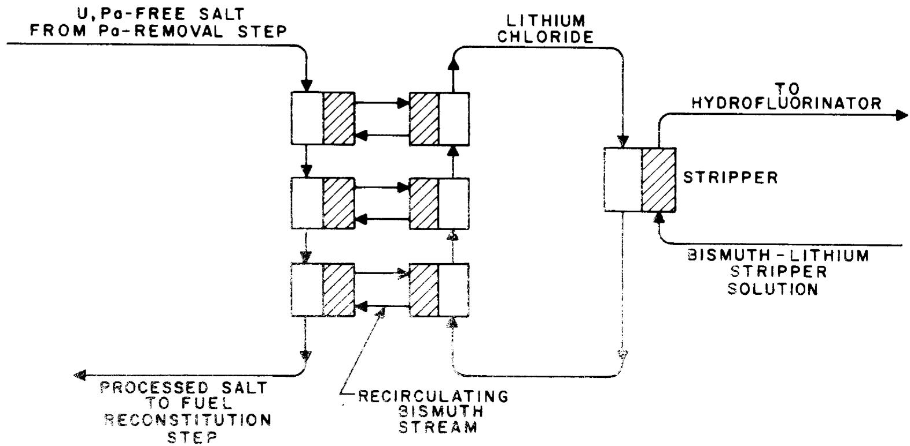  
Fig. 1. Metal transfer process using multiple MTE-3--type contactors.

contactor, where the lithium chloride is contacted with a bismuth-lithium stripper solution.

An advantage of this arrangement is that the fuel salt--bismuth contactors and the lithium chloride--bismuth contactors can be constructed contiguous to one another, and the bismuth can be made to flow between the two by the pumping action of the agitators (described in experiments MTE-3 and MTE-3B in Sect. 3). Thus in this method, the need for external bismuth pumps is eliminated. Another advantage is that the bismuth is this type of contactor would be a near-isothermal, captive phase that would minimize the occurrence of mass-transfer corrosion.

Although other variations can be synthesized, the removal rates of neodymium measured in experiment MTE-3B are discussed in terms of processing requirements for a 1000-MW(e) MSBR using the flowsheet shown in Fig. 1.

# 3. DESCRIPTION OF METAL TRANSFER EXPERIMENTS MTE-3 AND MTE-3B

# 3.1 Process Vessels and Equipment

The basic equipment used in the experiments (shown diagrammatically in Fig. 2), consisted of three carbon steel vessels: (1) a 14-in. (0.36-m)-diam fluoride salt reservoir containing the fuel carriers salt (72-16-12 mole % LiF-BeF $_2$ -ThF $_4$ ), a 10-in. (0.25-m)-diam salt-metal contactor, and a 6-in. (0.15-m)-diam rare-earth stripper. A photograph of the process equipment is shown in Fig. 3. The salt-metal contactor is divided into two equal compartments by a carbon steel partition that separates the fluoride and LiCl salts. A 1/2-in. (13-mm)-high slot at the bottom of the partition interconnects the captive pool of bismuth-lithium-thorium solution in the contactor. Mechanical agitators in both compartments of the contactor and in the stripper were used to improve contact between the salt and bismuth phases. Four-bladed turbines, 2-7/8-in. (73 mm) in diameter and having a pitch of $45^\circ$ , were located in each phase. A photograph of the agitators is shown in Fig. 4. The blade mounting and shaft rotation were such that the salt and bismuth flows were directed toward the interface. The engineering drawings used in the construction of the metal transfer experiments are listed in Table 1.

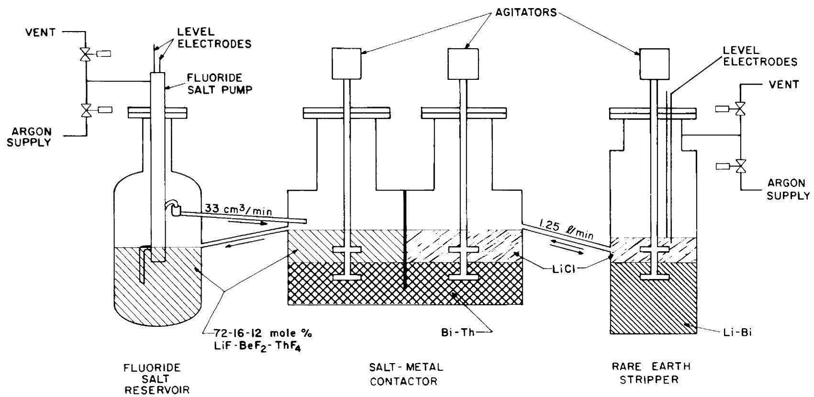  
ORNL-DWG-71-147-R1   
Fig. 2. Flow diagram for metal transfer experiment MTE-3.

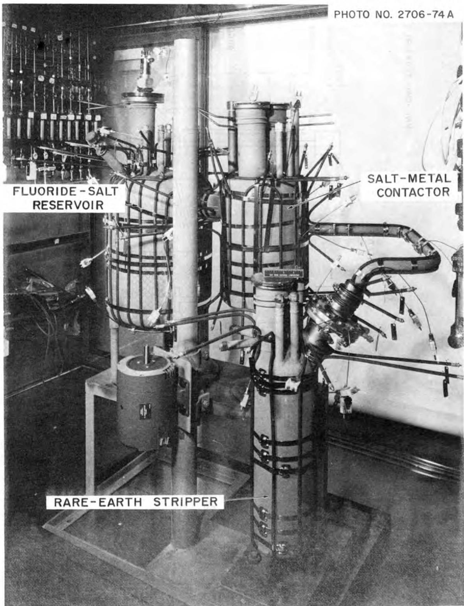  
Fig. 3. Photograph of processing vessels for metal transfer experiment MTE-3B with heaters and thermocouples installed.

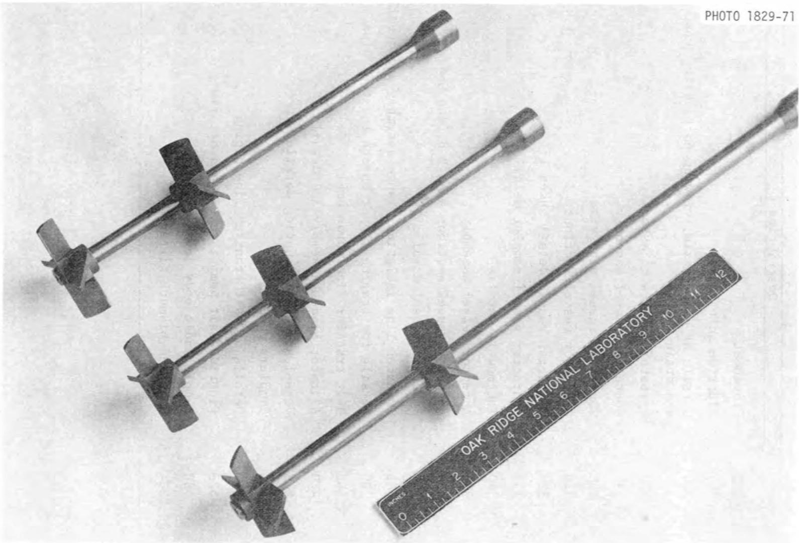  
Fig. 4. Photograph of agitators used for promoting mass transfer between the salt and bismuth solutions in metal transfer experiments MTE-3 and MTE-3B.

Table 1. Engineering drawings used in construction of the metal transfer experiment   

<table><tr><td>Drawing number</td><td>Description</td></tr><tr><td>F-12172-CD-116E</td><td>Flowsheet</td></tr><tr><td>M-12172-CD-025D</td><td>Fluoride salt tank</td></tr><tr><td>26D</td><td>Details of pump nozzle, viewing port, salt funnel and drain</td></tr><tr><td>27E</td><td>Agitator details of assembly</td></tr><tr><td>29E</td><td>Contactor vessel assembly</td></tr><tr><td>30E</td><td>Contactor vessel plan view</td></tr><tr><td>31D</td><td>Contactor vessel sections</td></tr><tr><td>32E</td><td>Contactor vessel detail sheet 1</td></tr><tr><td>33D</td><td>Contactor vessel sampler details</td></tr><tr><td>34D</td><td>Thermowell details</td></tr><tr><td>35E</td><td>Acceptor vessel assembly</td></tr><tr><td>36D</td><td>Acceptor vessel sections A-A, B-B, and C-C</td></tr><tr><td>37D</td><td>Acceptor vessel details</td></tr><tr><td>38D</td><td>Transfer line isolation flange assembly and details</td></tr><tr><td>39D</td><td>Details for brazing copper sheath to steel pipe</td></tr><tr><td>46D</td><td>Heat transfer line subassembly</td></tr><tr><td>47D</td><td>Agitator blades assembly and details</td></tr><tr><td>48E</td><td>Vessel stand and mounting details</td></tr><tr><td>49C</td><td>Samplers</td></tr><tr><td>51D</td><td>Details of salt transfer line piping</td></tr><tr><td>52E</td><td>Fluoride salt pump assembly and details</td></tr><tr><td>53C</td><td>Sample ladle body detail</td></tr><tr><td>M-12053-CD-83C</td><td>Salt and bismuth filter</td></tr></table>

The outside surfaces of the carbon steel vessels were coated with $\sim 0.015$ -in. (0.4-mm)-thick chromium--nickel-- $6 \%$ aluminum oxidation-resistant material (METCO* No. P443-10) using a plasma spray gun. This prevented air oxidation of the carbon steel vessels at the operating temperature of $\sim 923 \mathrm{~K}$ .

Fuel salt was circulated between the fluoride salt reservoir and one side of the contactor by means of a specially designed gas-operated pump utilizing molten bismuth check valves. Lithium chloride was circulated between the stripper and the other side of the contactor by alternately pressurizing and venting the stripper vessel. The bismuth phase in the contactor was circulated between the two compartments in the contactor by the action of the agitators, and no direct measurement of this flow rate was made during experiments. However, measurements made in a mockup using a mercury-water system indicated that the bismuth flow rate between the two compartments would be high enough to cause the rare-earth concentrations in the compartments to be essentially equal. $^{8}$ The salt flow rates used were about $1\%$ of those required for processing the fuel salt from a 1000-MW(e) MSBR.

Approximate quantities of salt and bismuth used in the experiment were the following: (1) $110\mathrm{kg}$ of fluoride salt and $64\mathrm{kg}$ of bismuth-lithium-thorium (containing about 0.0018 atom fraction lithium and 0.0014 atom fraction thorium) in the contactor, and (2) $10\mathrm{kg}$ of lithium chloride and $44\mathrm{kg}$ of bismuth-lithium (containing 0.05 atom fraction lithium) in the stripper.

# 3.2 Experimental Procedures

Procedures for the makeup, purification, and addition of the salt and bismuth phases to the process vessels were designed to minimize contamination of these materials with oxide (air, water, and any oxides present in the carbon steel process vessels). Prior to the addition of the salts and bismuth, the internal surfaces of all vessels were treated with hydrogen at $923\mathrm{K}$ to reduce residual iron oxides. (Most of these oxides had been removed by sandblasting during fabrication.) After this treatment, a purified argon atmosphere ( $\sim 0.1$ ppm of $\mathrm{H}_2\mathrm{O}$ ) was maintained in the vessels to preclude further oxidation.

*METCO, Inc., 1101 Prospect Avenue, Westburg, Long Island, N.Y.

The salt and bismuth solutions were made up in auxiliary vessels (also treated with hydrogen) at $\sim 923\mathrm{K}$ to remove oxides). The bismuth was hydrogen treated at $\sim 923\mathrm{K}$ , while the fluoride salt and LiCl salt were contacted with bismuth containing thorium for oxide removal. After makeup and purification, all solutions were filtered by passing through a sintered molybdenum filter ( $\sim 30 - \mu$ pore-diameter) during transfer from the auxiliary vessels into the process vessels. After the process vessels had been charged with the salt and bismuth solutions, the entire system was maintained at temperatures above the liquidus temperature ( $\geq 890\mathrm{K}$ ) of the solutions.

The experimental procedure was essentially the same for each run. The rare earth for which the mass transfer rate and overall mass transfer coefficients were to be measured was added to the fluoride salt, the agitators were started and adjusted to the desired speed, circulation of the fluoride salt and LiCl was started, and the salt and bismuth phases were periodically sampled during the run period and analyzed for rare-earth content. In each run, trace quantities of a radioactive isotope were included in the rare-earth addition, and counting of the radioactivity of the samples was used to follow the transfer rate.

Samples of the salt and bismuth phases were taken using a small $(\sim 0.4\text{-cm}^3)$ stainless steel sampling capsule with a sintered metal filter $(\sim 20 - \mu$ pore-diameter). A 1/16-in. (0.16-mm)-diam capillary tube attached to the capsule was used for inserting it into the solution to be sampled (see Fig. 5). During insertion, the capsule was continuously purged with purified argon gas until it was positioned in the solution. The flow of purge gas was then stopped, and a sample was taken by applying a vacuum to the capsule. When the molten salt or bismuth solution reached the upper, cool section of the capillary tube, it solidified. The sample was then withdrawn into the sample port and allowed to cool under an argon atmosphere before removal.

All runs in the second experiment, MTE-3B, were made using the rare earth neodymium. In these runs, trace amounts (50 to 150 mCi) of $^{147}\mathrm{Nd}$ were included in the neodymium added to the experiment. Neodymium concentration in each phase was determined by counting the 0.53-MeV gamma emitted by the $^{147}\mathrm{Nd}$ in the sample. In addition, the total neodymium contents of selected samples were determined by an isotopic dilution mass spectrometry technique. This proved to be a valuable means

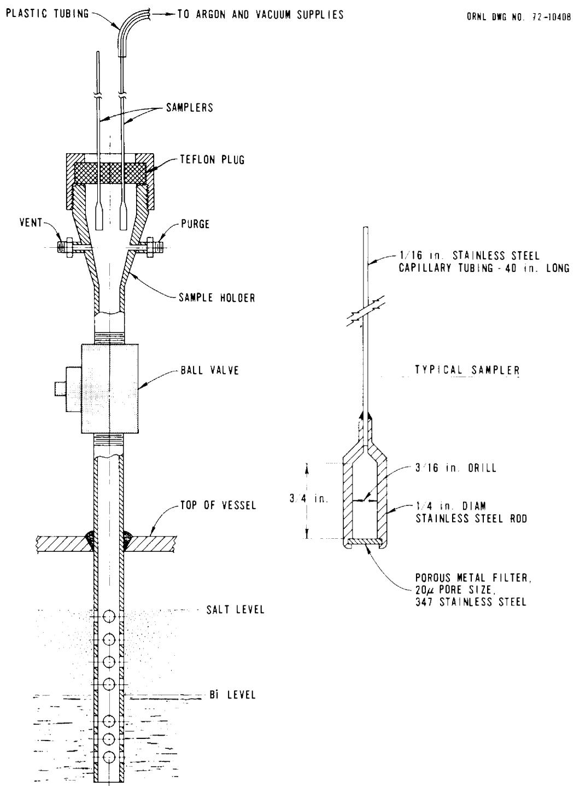  
Fig. 5. Schematic diagram of sample capsule and sample port used in experiment MTE-3B.

of checking on the tracer counting results and was especially useful for those samples with very low neodymium concentrations (< 1 ppm), where counting techniques were inadequate.

For runs in the initial experiment MTE-3, in which the rare earths europium, lanthanum, and neodymium were used, counting of the 1.28-MeV gamma emitted from the $^{154}$ Eu tracer was used to follow the transfer rate, and the lanthanum concentration was determined by neutron activation and subsequent counting of the $^{140}$ La produced.

This report primarily describes the results obtained using the rare earth neodymium in the second metal transfer experiment, MTE-3B. The first experiment, MTE-3, was conducted by others and reported previously;[9,10] results are summarized for comparison with MTE-3B results.

# 4. ANALYSIS OF DATA

Experiment MTE-3B involved the successive transfer of rare earth from a fluoride salt to a bismuth-lithium-thorium pool, to a lithium chloride salt, and, ultimately, to a bismuth-lithium pool. The rate at which the rare earth was transferred through the several contactor stages was governed by the equilibrium distribution coefficient of the rare earth, the salt and bismuth flow rates, and the mass-transfer coefficients. The determination of these mass-transfer coefficients was one of the major requirements for meeting the objectives of the experiment.

An idealized sketch of the contactor arrangement for the experiment is shown in Fig. 6.

From a rare-earth material balance in each of the seven regions indicated in Fig. 6, the following equations governing the movement of rare earth through the regions were derived:

$$
- V _ {1} \frac {d x _ {1}}{d t} = F _ {1} \left(x _ {1} - x _ {2}\right), \tag {6}
$$

$$
V _ {2} \frac {d x _ {2}}{d t} = F _ {1} \left(x _ {1} - x _ {2}\right) - K _ {1} A _ {1} \left(x _ {2} - \frac {x _ {3}}{D _ {A}}\right), \tag {7}
$$

$$
V _ {3} \frac {d x _ {3}}{d t} = K _ {1} A _ {1} \left(x _ {2} - \frac {x _ {3}}{D _ {A}}\right) - F _ {2} \left(x _ {3} - x _ {4}\right), \tag {8}
$$

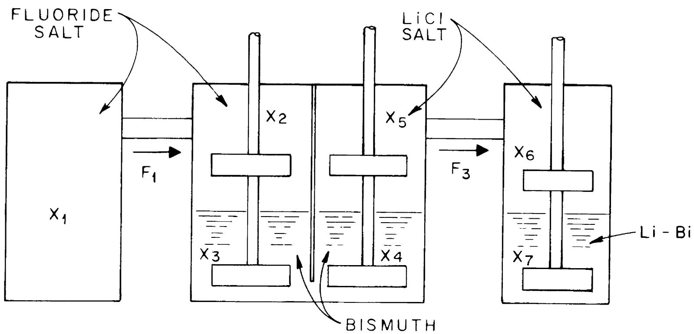  
Fig. 6. Idealized diagram of the metal transfer experiment showing the regions used for mass transfer calculations.

$$
V _ {4} \frac {d x _ {4}}{d t} = F _ {2} \left(x _ {3} - x _ {4}\right) - K _ {2} A _ {2} \left(x _ {4} - D _ {B} x _ {5}\right), \tag {9}
$$

$$
V _ {5} \frac {\mathrm {d} x _ {5}}{\mathrm {d} t} = K _ {2} A _ {2} \left(x _ {4} - D _ {B} x _ {5}\right) - F _ {3} \left(x _ {5} - x _ {6}\right), \tag {10}
$$

$$
V _ {6} \frac {d x _ {6}}{d t} = F _ {2} \left(x _ {5} - x _ {6}\right) - K _ {3} A _ {3} \left(x _ {6} - \frac {x _ {7}}{D _ {C}}\right), \text {a n d} \tag {11}
$$

$$
V _ {7} \frac {d x _ {7}}{d t} = K _ {3} A _ {3} \left(x _ {6} - \frac {x _ {7}}{D _ {C}}\right), \tag {12}
$$

where

$t =$ time,sec,

$x_{i} =$ molar concentration of rare earth in region i, $i = 1,2,\dots 7$

$\mathrm{V}_{\mathrm{i}} =$ volume of fluid in region i, $\mathrm{i} = 1,2,\dots 7$ $\mathrm{cm}^3$

$\mathbf{F}_1 =$ flow rate of fluoride salt, g-moles/sec,

$F_{2} =$ flow rate of bismuth between contactor compartments, g-moles/sec,

$F_{3} =$ flow rate of lithium chloride between the stripper and the contactor, g-moles/sec,

$D_{A} =$ equilibrium distribution coefficient for the rare earth between fluoride salt and bismuth-lithium-thorium, g-mole/g-mole,

$D_B =$ equilibrium distribution coefficient for the rare earth between bismuth-lithium-thorium and lithium chloride, g-mole/g-mole,

$D_{C} =$ equilibrium distribution coefficient for the rare earth between lithium chloride and bismuth-lithium stripper solution, g-mole/g-mole,

$A_{1} =$ interfacial area between fluoride salt and bismuth-lithium- thorium, $\mathsf{cm}^2$

$A_{2} =$ interfacial area between bismuth-lithium-thorium and LiCl. $\mathrm{cm}^2$ ,

$A_{3} =$ interfacial area between LiCl and bismuth-lithium stripper alloy, $\mathrm{cm}^2$ ,

$K_{1} =$ overall mass-transfer coefficient at the fluoride salt-- bismuth-lithium-thorium interface (based on concentration in the fluoride salt phase), cm/sec,

$K_{2} =$ overall mass transfer coefficient at the bismuth-lithium-thorium--LiCl interface (based on concentrations in the bismuth phase), cm/sec,

$\mathrm{K}_{3} =$ overall mass-transfer coefficient at the LiCl-- bismuth-lithium interface (based on concentrations in the lithium chloride phase), cm/sec.

The overall mass-transfer coefficients are dependent on the individual mass-transfer coefficients for each phase and the equilibrium distribution coefficients for the rare earth between the salt and bismuth solutions. They are expressed as follows:

$$
\frac {1}{K _ {1}} = \frac {1}{k _ {2}} + \frac {1}{k _ {3} D _ {A}}, \tag {13}
$$

$$
\frac {1}{K _ {2}} = \frac {1}{k _ {4}} + \frac {D _ {B}}{k _ {5}}, \tag {14}
$$

$$
\frac {1}{K _ {3}} = \frac {1}{k _ {6}} + \frac {1}{k _ {7} D _ {C}}, \tag {15}
$$

where

$k_{2} \cdots k_{7} =$ individual mass transfer coefficients for each region in the contactor and stripper vessels (subscripts correspond to the numbers assigned to each phase in Fig. 6).

Overall mass-transfer coefficients for each run were calculated by selecting values for $\mathbf{K}_1$ , $\mathbf{K}_2$ , and $\mathbf{K}_3$ which resulted in the best agreement between calculated time-dependent concentrations for each region and the experimentally measured time-dependent concentrations.

The appropriate known values for the initial concentration in each region, $x_{i}$ ; the fluid volume of each region, $V_{i}$ ; the area of each of the three interfaces, $A_{1}$ , $A_{2}$ , and $A_{3}$ ; and the three equilibrium distribution coefficients, $D_{A}$ , $D_{B}$ , and $D_{C}$ were substituted into Eqs. (6)-(12). Initial estimates of $K_{1}$ , $K_{2}$ , and $K_{3}$ were also substituted into these equations, which were then solved using a computer program. The calculated results were subsequently compared with the measured results, new estimates for $K_{1}$ , $K_{2}$ , and $K_{3}$ were chosen, and these were substituted into the differential Eqs. (6)-(12). This process was repeated using adjusted values for $K_{1}$ , $K_{2}$ , and $K_{3}$ until the calculated results reproduced satisfactory measured results. The values for $K_{1}$ , $K_{2}$ , and $K_{3}$ determined in this manner were taken as the experimentally prevailing overall mass-transfer coefficients.

# 5. EXPERIMENTAL RESULTS

Four runs (Nd-1, -2, -3, and -4) using the rare earth neodymium as a representative fission product were completed in metal transfer experiment MTE-3B. Neodymium was chosen as the representative rare-earth fission product for the studies in MTE-3B for several reasons:

1. Neodymium is one of the more important trivalent fission products to be removed from a molten-salt breeder reactor fuel salt.   
2. The use of $^{147}\mathrm{Nd}$ tracer with its relatively short half-life (11 days) would prevent excessive levels of radioactivity in the experiment (additional neodymium, containing $^{147}\mathrm{Nd}$ tracer, was added during the studies).   
3. Results could be compared with those obtained using neodymium in the first experiment, MTE-3.

Data from Nd-1, -3, and -4, were analyzed, and overall mass-transfer coefficients at the three salt-metal interfaces were determined. Mass-transfer coefficients were not determined in experiment Nd-2 due to unexpected entrainment of fluoride salt into the LiCl in the contactor. Entrainment of fluoride salt into the LiCl affects the equilibrium distribution coefficients of the rare earths and thorium between the LiCl and bismuth phases such that thorium is transferred into the LiCl. $^{11}$ Entrainment also occurred during run Nd-1; however, the amount of fluoride salt entrained was relatively small ( $\sim$ 1.3 wt % F in the LiCl), and the distribution coefficients measured at the end of run Nd-1 were near the expected values. During run Nd-2, the cumulative amount of fluoride salt entrained ( $\sim$ 3 wt %) became significant. The distribution coefficients (particularly for thorium at the LiCl-bismuth interface in the contactor) were reduced, and a significant quantity of thorium was transferred into the LiCl and was subsequently circulated into the stripper, where it reacted with the lithium reductant in the Bi-Li solution. This reaction continued until most of the lithium reductant was lost from the stripper and the neodymium was no longer extracted into the Li-Bi in the stripper. Extraction of neodymium stopped after about 50 hr of operation of run Nd-2; thus no determination of mass-transfer coefficients could be made.

Because of the entrainment of fluoride salt into the LiCl during runs Nd-1 and Nd-2, it became necessary to remove both the LiCl from the contactor and stripper and the bismuth--5 at. % Li from the stripper after run Nd-2. Fresh LiCl and bismuth-lithium solution were charged to the system before starting run Nd-3.

# 5.1 Overall Mass-Transfer Coefficients and Equilibrium Distribution Coefficients for Neodymium

Operating conditions and system parameters for runs Nd-1 through Nd-4 in metal transfer experiment MTE-3B are shown in Table 2. Results of the determinations of overall mass-transfer coefficients for the rare earth neodymium for runs Nd-1, -3, and -4 in metal transfer experiment MTE-3B are given in Table 3. Values for the equilibrium distribution coefficients for neodymium measured at the completion of each run, during periods of no salt circulation, are shown in Table 4.

Previously reported values for overall mass-transfer coefficients for europium, lanthanium, and neodymium obtained in the experiment, MTE-3, are shown in Table 5 for reference.

Values for overall mass-transfer coefficients for neodymium at the three salt-bismuth interfaces in metal transfer experiment MTE-3B (Table 3) were obtained by selecting values for the mass-transfer coefficients which resulted in a "best fit" between the experimentally obtained concentrations during each run and the calculated concentrations as discussed in Sect. 4. The experimentally measured values for the equilibrium distribution coefficients for neodymium between the salt and bismuth solutions were used in calculating the "best fit" case.

Results are shown in Figs. 8-18. In these figures, the experimental data points are indicated for each solution, and the line shown represents the "best fit" for the calculated concentrations during each run. Excellent agreement was obtained for the fluoride salt solution and the bismuth--5 at. $\%$ lithium solution in the stripper for each run. For these solutions, the data obtained by counting the 0.53-MeV gamma emitted by the $^{147}\mathrm{Nd}$ tracer (with results expressed in disintegrations per minute per gram) were used. Equally good agreement was obtained for the data obtained by analysis for total neodymium in these two phases. The results obtained by total neodymium analysis $(\mu \mathrm{g} / \mathrm{g})$ are shown for the bismuth-thorium-lithium solution in the contactor and the LiCl in the contactor and stripper.

Table 2. Operating conditions for runs Nd-1 through Nd-4 in metal transfer experiment MTE-3B   

<table><tr><td>Run number</td><td>1</td><td>2</td><td>3</td><td>4</td></tr><tr><td>Run time, hr</td><td>\( 140^a \)\( (115.7)^b \)</td><td>138</td><td>\( 165.2^a \)\( (107.8)^b \)</td><td>\( 165^a \)\( (109.5)^b \)</td></tr><tr><td>Agitator speed, rps</td><td>5.0</td><td>5.0</td><td>4.17</td><td>1.67</td></tr><tr><td>Fluoride salt circulation rate, \( m^3/sec \)</td><td>\( 5.8 x 10^{-7} \)</td><td>\( 5.8 x 10^{-7} \)</td><td>0</td><td>0</td></tr><tr><td>LiCl circulation rate, \( m^3/sec \)</td><td>\( 2.0 x 10^{-5} \)</td><td>\( 2.0 x 10^{-5} \)</td><td>\( 2.0 x 10^{-5} \)</td><td>\( 2.0 x 10^{-5} \)</td></tr><tr><td>Average temperature, K</td><td>923</td><td>923</td><td>923</td><td>923</td></tr><tr><td colspan="5">Quantities of Salt and Bismuth (g-moles)</td></tr><tr><td>Fluoride fuel salt in \( reservoir^c \)</td><td>1535</td><td>1535</td><td>1535</td><td>1535</td></tr><tr><td>Fluoride fuel salt in contactor</td><td>161</td><td>161</td><td>161</td><td>161</td></tr><tr><td>Bi-Li-Th in fluoride salt compartment of \( contactord \)</td><td>132</td><td>132</td><td>129</td><td>132</td></tr><tr><td>Bi-Li-Th in LiCl salt compartment of contactor</td><td>161</td><td>161</td><td>156</td><td>156</td></tr><tr><td>LiCl in \( contactore \)</td><td>101</td><td>101</td><td>101</td><td>101</td></tr><tr><td>LiCl in stripper</td><td>132</td><td>132</td><td>114</td><td>114</td></tr><tr><td>Bi--5 at. % Li in \( stripperf \)</td><td>190</td><td>190</td><td>190</td><td>190</td></tr></table>

${}^{a}$ Total time of fluoride salt and/or LiCl salt circulation plus equilibrium time with agitation but no salt circulation.   
${}^{\mathrm{b}}$ Time of fluoride salt and/or LiCl salt circulation.   
c Mole wt = 42.4 g; $\rho = 1.48\mathrm{g / cm}^3$ ; $\mu = 0.016$ P at 923 K.12   
dMole wt = 63.2 g; $\rho = 3.30\mathrm{g / cm}^3$ ; $\mu = 0.0088$ P at 923 K.13   
eMole wt = 209 g; $\rho = 9.66\mathrm{g / cm}^3$ ; $\mu = 0.016$ P at 923 K.14   
fMole wt = 199 g; $\rho = 9.28\mathrm{g / cm}^3$ ; $\mu = 0.0094$ P at 923 K.

Table 3. Overall mass-transfer coefficientsa for neodymium in metal transfer experiment MTE-3B   

<table><tr><td rowspan="2">Run number</td><td rowspan="2">Agitator speed (rps)</td><td rowspan="2">Run time (hr)</td><td colspan="3">Overall mass transfer coefficients (mm/sec)b</td></tr><tr><td>K1</td><td>K2</td><td>K3</td></tr><tr><td>Nd-1</td><td>5.0</td><td>116</td><td>0.006</td><td>0.20</td><td>0.06</td></tr><tr><td>Nd-3</td><td>4.17</td><td>108</td><td>0.018</td><td>0.030</td><td>0.035</td></tr><tr><td>Nd-4</td><td>1.67</td><td>110</td><td>0.0040</td><td>0.020</td><td>0.0055</td></tr></table>

aThe mass-transfer coefficients $\mathbf{K}_1$ and $\mathbf{K}_3$ are based on the rare-earth concentration in the salt phase, and $\mathbf{K}_2$ is based on the rare earth concentration in the bismuth phase.   
bDefined by Eqs. (13)-(15).

Table 4. Neodymium equilibrium distribution coefficients ${}^{a,b}$   

<table><tr><td rowspan="2">Run number</td><td colspan="2">\(D_A\)</td><td colspan="2">\(D_B\)</td><td colspan="2">\(D_C\)</td></tr><tr><td>Calculated</td><td>Experimental</td><td>Calculated</td><td>Experimental</td><td>Calculated</td><td>Experimental</td></tr><tr><td>Nd-1c</td><td>0.03e</td><td>0.027</td><td>1.67e</td><td>0.94</td><td>3.5 x 104g</td><td>&gt;1 x 103</td></tr><tr><td>Nd-3c</td><td>0.017f</td><td>0.022</td><td>0.94f</td><td>0.98</td><td>3.5 x 104g</td><td>&gt;1 x 103</td></tr><tr><td>Nd-4c</td><td>0.017f</td><td>0.027</td><td>0.94f</td><td>1.0</td><td>3.5 x 104g</td><td></td></tr><tr><td>Eu-6, -7d</td><td>0.0088h</td><td>0.012</td><td>0.49</td><td>0.30</td><td>3.5 x 104g</td><td>~2 x 103</td></tr></table>

aCoefficients are defined as follows: neodymium in bismuth, m.f. neodymium in salt, m.f.   
${}^{\mathrm{b}}_{\mathrm{D}_{\mathrm{A}}}, \quad {}^{\mathrm{D}_{\mathrm{B}}}, \quad {}^{\mathrm{D}_{\mathrm{C}}} =$ equilibrium-distribution coefficients between phases (A) bismuth-thorium/fluoride salt, (B) bismuth-thorium/LiCl, (C) bismuth--5 at. % lithium/LiCl.   
cExperiment MTE-3B.   
dExperiment MTE-3.   
${}^{\mathrm{e}}$ Based on 60 ppm of lithium in bismuth.   
f Based on 50 ppm of lithium in bismuth.   
$\mathrm{g}_{\text {Based on 5 at. }}$ lithium in bismuth.   
${}^{\mathrm{h}}$ Based on ${40}\mathrm{{ppm}}$ of lithium in bismuth.

Table 5. Overall mass-transfer coefficientsa for lanthanum, europium, and neodymium in metal transfer experiment MTE-3   

<table><tr><td rowspan="2">Run number</td><td rowspan="2">Rare earth</td><td rowspan="2">Agitator speed (rps)</td><td rowspan="2">Run time (hr)</td><td colspan="3">Overall mass transfer coefficient (mm/sec)b</td></tr><tr><td>K1</td><td>K2</td><td>K3</td></tr><tr><td>La-1</td><td>La</td><td>2.50</td><td>15.2</td><td>0.0014</td><td>0.0011</td><td>0.12</td></tr><tr><td>La-2</td><td>La</td><td>3.33</td><td>15.4</td><td>0.002</td><td>0.0013</td><td>0.2</td></tr><tr><td rowspan="2">Eu-1</td><td rowspan="2">La Eu</td><td rowspan="2">1.67</td><td rowspan="2">14.3</td><td>0.0006</td><td>0.00039</td><td>0.062</td></tr><tr><td>0.001</td><td>0.000015</td><td>0.011</td></tr><tr><td rowspan="2">Eu-2, -3</td><td rowspan="2">La Eu</td><td rowspan="2">3.33</td><td rowspan="2">15.0</td><td>0.002</td><td>0.0013</td><td>0.2</td></tr><tr><td>0.003</td><td>0.000048</td><td>0.033</td></tr><tr><td>Eu-4, c -5</td><td>La</td><td>3.33</td><td>12.2</td><td>0.002</td><td>0.020</td><td>0.2</td></tr><tr><td rowspan="2">Eu-6</td><td rowspan="2">La Nd</td><td rowspan="2">3.33</td><td rowspan="2">64.6</td><td>0.002</td><td>0.020</td><td>0.2</td></tr><tr><td>0.002</td><td>0.065</td><td>0.2</td></tr><tr><td rowspan="2">Eu-7, -8</td><td rowspan="2">La Nd</td><td rowspan="2">5.0</td><td rowspan="2">15.4</td><td>0.0026</td><td>0.032</td><td>0.2</td></tr><tr><td>0.0032</td><td>0.11</td><td>0.2</td></tr></table>

aThe mass-transfer coefficients $\mathbf{K}_1$ and $\mathbf{K}_3$ are based on the rare-earth concentration in the salt phase, and $\mathbf{K}_2$ is based on the rare-earth concentration in the bismuth phase.   
b See footnote (b) in Table 3.   
cAfter argon sparging in the LiCl side of contactor (bismuth-thorium/LiCl phases, $\mathbb{K}_2$ ).

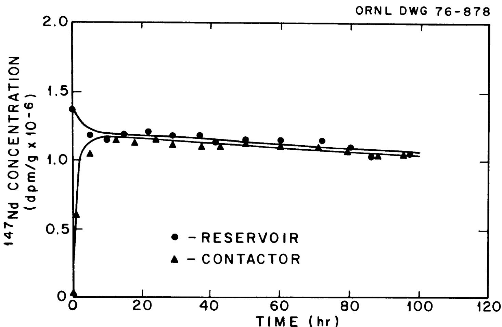  
Fig. 7. Neodymium concentration in the fluoride salt in the reservoir and contactor during run Nd-1.

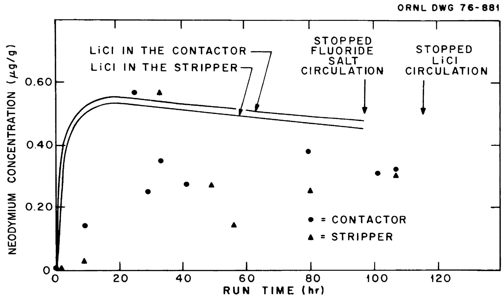  
Fig. 8. Neodymium concentration in the LiCl in the contactor and stripper during run Nd-1.

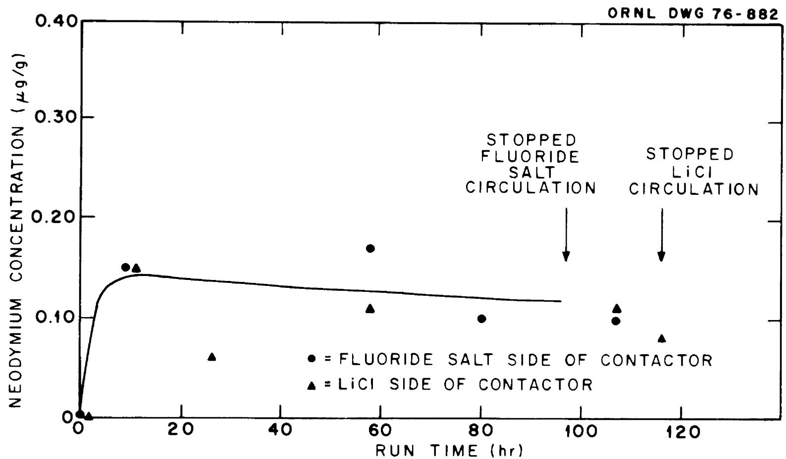  
Fig. 9. Neodymium concentration in the bismuth-thorium in the contactor during run Nd-1.

ORNL DWG 76-899

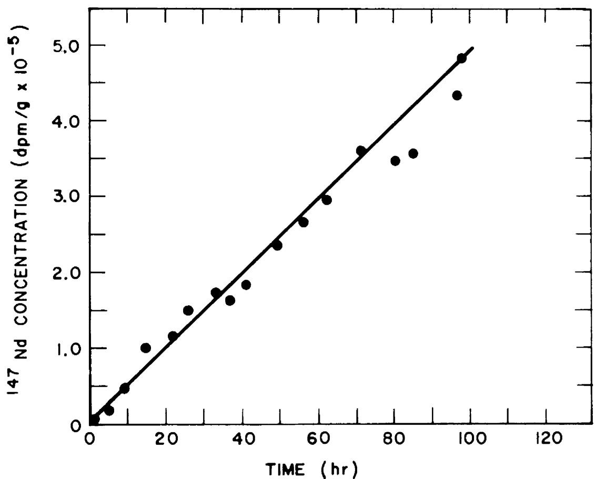  
Fig. 10. Neodymium concentration in the bismuth-5 at. $\%$ lithium in the stripper during run Nd-1.

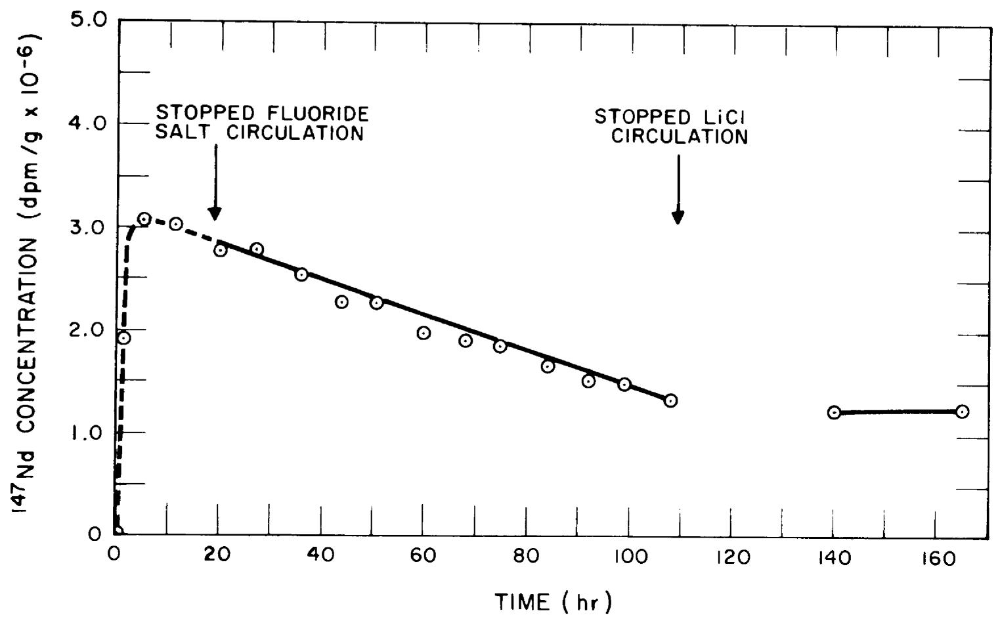  
Fig. 11. Neodymium concentration in the fluoride salt in the contactor during run Nd-3, MTE-3B.

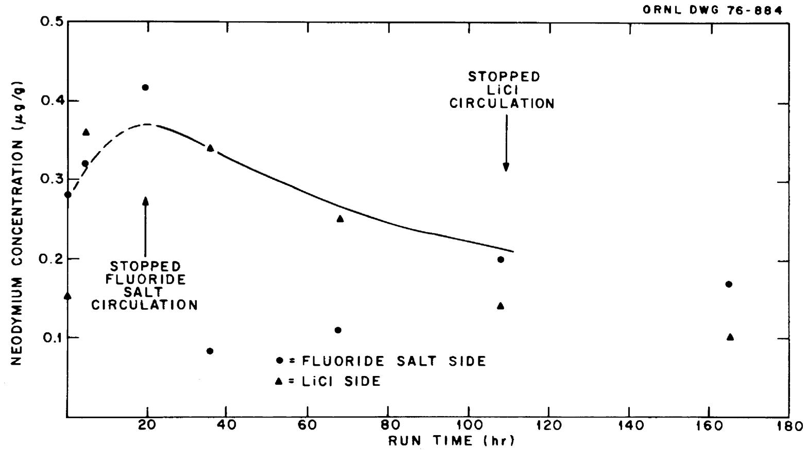  
Fig. 12. Neodymium concentration in the bismuth-thorium solution in the contactor during run Nd-3.

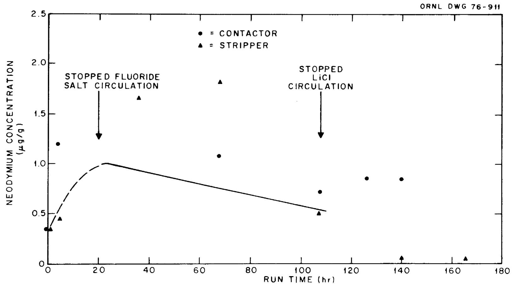  
Fig. 13. Neodymium concentration in the LiCl in the contactor and stripper during run Nd-3.

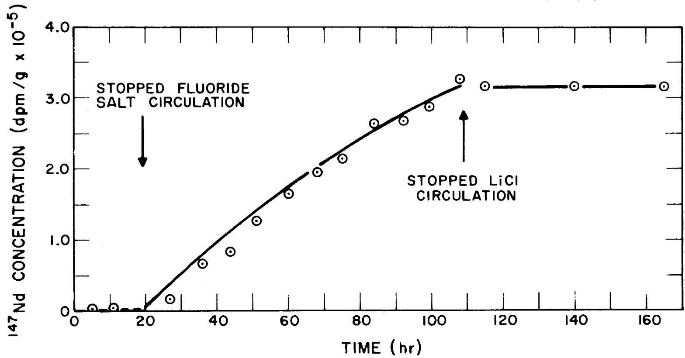  
Fig. 14. Neodymium concentration in the bismuth-5 at. $\%$ lithium in the stripper during run Nd-3, MTE-3B.

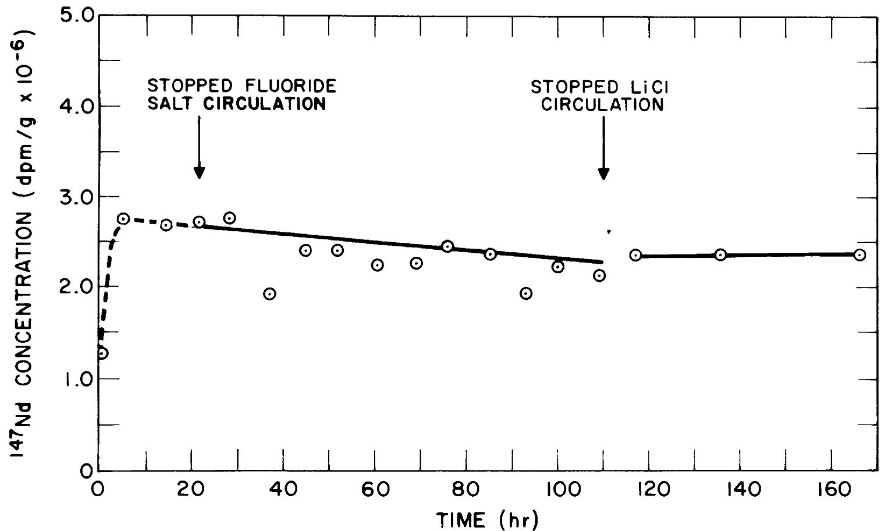  
Fig. 15. Neodymium concentration in the fluoride salt in the contactor during run Nd-4, MTE-3B.

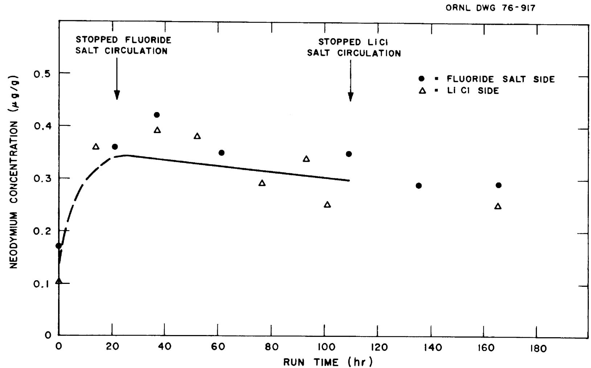  
Fig. 16. Neodymium concentration in the bismuth-thorium in the contactor during run Nd-4.

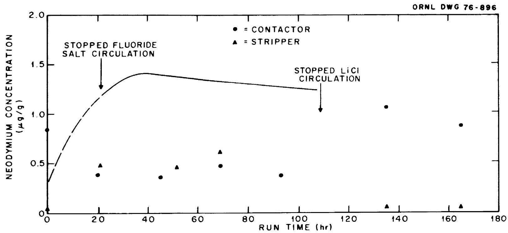  
Fig. 17. Neodymium concentration in the LiCl in the contactor and stripper, run Nd-4.

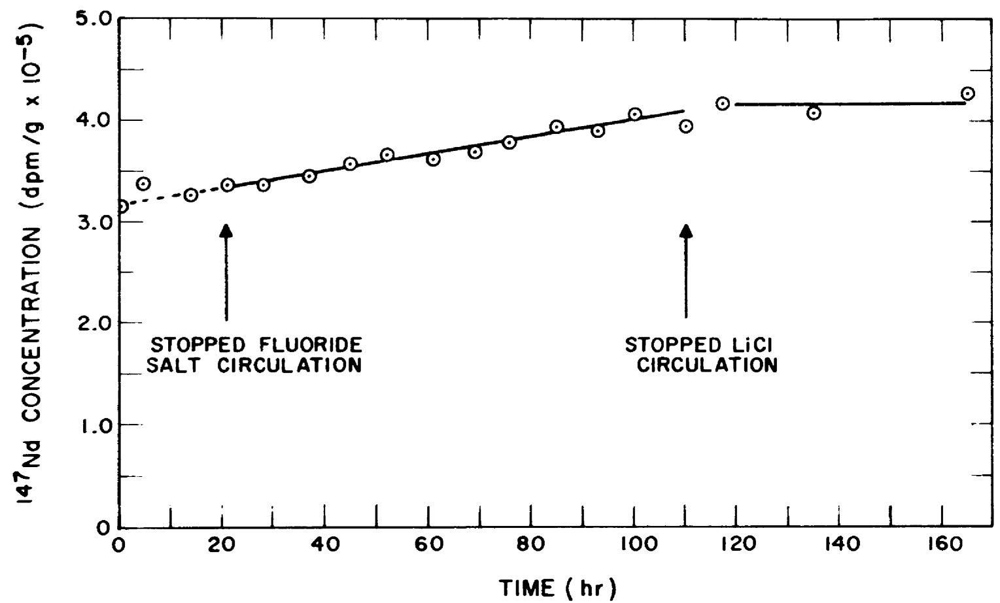  
Fig. 18. Neodymium concentration in the bismuth-5 at. $\%$ lithium in the stripper during run Nd-4, MTE-3B.

More scatter and fewer points appear in these data. However, it is felt that the figures for the total neodymium content more nearly represent the true concentration in these solutions since the results obtained by the counting of samples from these solutions were unrealistically high (by a factor of 3). The difficulty seemed to be a bias in the counting data at these very low neodymium concentrations (< 1 ppm).

Tabulations of the concentrations of $^{147}\mathrm{Nd}$ tracer and the total neodymium for all samples removed during runs Nd-1 through Nd-4 are included in the Appendix.

# 5.2 Entrainment Studies in Experiment MTE-3B

Based on previous studies in a water-mercury system, $^{15}$ it was concluded that entrainment of fluoride salt into the bismuth and LiCl phases in the mechanically agitated contactor would occur if the agitators were operated at speeds of 5.0 rps or higher. However, in the first metal transfer experiment, MTE-3, entrainment was not observed at 5.0 rps but was seen at 6.7 rps. $^{16}$

Since fluoride salt entrainment occurred at an agitator speed of 5.0 rps in experiment MTE-3B, a series of tests were made to determine the maximum allowable agitator speed that could be used in experiment MTE-3B without entrainment. The tests were conducted by operating the agitators in the contactor at several different speeds (3.3, 4.6, and 5.0 rps) for time periods ranging from $\sim$ 50 to $\sim$ 140 hr. During each test at constant agitator speeds, samples of the LiCl salt were removed from the contactor and analyzed for fluoride content. An increase in fluoride ion concentration would indicate entrainment of fluoride salt into the LiCl. Figure 19 shows the fluoride ion concentration in the LiCl as a function of time for each agitator speed. The initial concentration of fluoride ion of $\sim$ 4 wt % represents the amount of entrainment that occurred over a period of $\sim$ 250 hr during runs Nd-1 and Nd-2. The sequence of agitator speeds shown in Fig.19 represents the order in which the tests were run. An increase in the fluoride ion concentration is clearly indicated in the $\sim$ 50-hr test at 5.0 rps. At agitator speeds of 3.3 and 4.6 rps, no entrainment (within experimental limits) appears to have occurred over the $\sim$ 200-hr combined test periods at these two speeds.

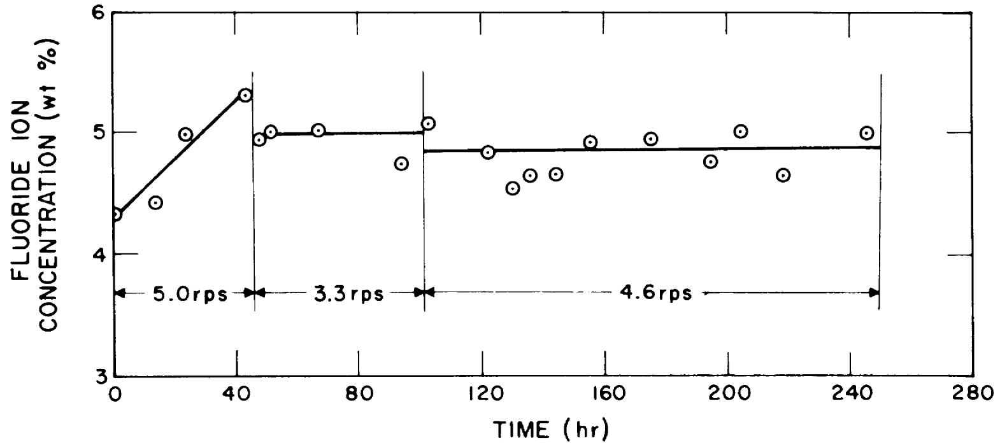  
Fig. 19. Results of tests to determine the entrainment rate of fluoride salt into LiCl as a function of agitator speed, MTE-3B.

These results indicated that experiments could be carried out at agitator speeds up to about 4.5 rps without entrainment, and experiments Nd-3 and Nd-4 were conducted using agitator speeds of 4.2 and 1.67 rps. It was also concluded that rapid determinations of fluoride ion concentration in the LiCl during experiments were needed to verify that no entrainment was occurring. For this purpose, an Orion Model 80lA pH/mV meter equipped with specific ion (fluoride) electrodes was obtained for rapid analyses of LiCl samples. The mV meter could also be used to continuously measure and record the emf between the two bismuth phases in the contactor and stripper vessels that contained different concentrations of lithium reductant (0.0015 and 0.050 atom fraction lithium). A change in emf would indicate a change in the lithium concentration ratio in these phases (Sect. 5.3) with a resultant change in the equilibrium distribution coefficient for neodymium and thorium between the salt and bismuth phases.

5.3 Neodymium and $^{147}$ Nd Inventory in Experiment MTE-3B

Weighed amounts of neodymium, as $\mathrm{NdF}_3$ , containing $^{147}\mathrm{Nd}$ tracer were added to the fluoride fuel salt in the fuel salt reservoir on three occasions during operation of metal transfer experiment MTE-3B. The $\mathrm{NdF}_3$ and $^{147}\mathrm{Nd}$ tracer were prepared by the Isotopes Division of ORNL. The $\mathrm{NdF}_3$ containing the tracer was placed in a specially designed charging capsule used to add the neodymium to the fuel salt (Fig. 20). The capsule was sealed by a spring-loaded disc which was soldered to the capsule. When inserted into the molten fuel salt ( $\sim923\mathrm{K}$ ), the solder melted and opened the capsule, allowing the $\mathrm{NdF}_3$ to disperse into the fuel salt. Capsules were inspected after each addition to ensure that all of the neodymium had been transferred into the fuel salt.

147 Nd and total neodymium inventory during each run in metal transfer experiment MTE-3B was followed by both counting and chemical analyses of samples of the salt and bismuth phases. The concentration of 147 Nd was determined by counting the 0.53-MeV gamma emitted, while the concentration of the total neodymium was determined by an isotopic dilution mass-spectrometry technique.

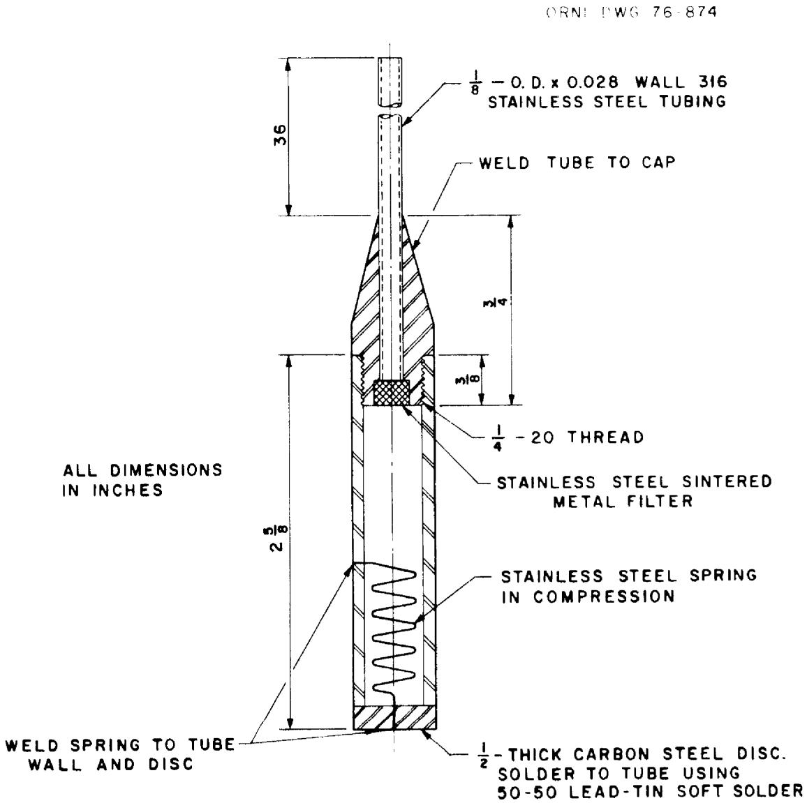  
Fig. 20. Capsule used to add neodymium containing $^{147}\mathrm{Nd}$ tracer to the fuel salt in experiment MTE-3B.

Table 6 compares the neodymium and $^{147}$ Nd inventory in metal transfer experiment MTE-3B based on the amounts added to the system and those calculated from the concentrations in all phases determined by sampling. As seen in Table 6, the inventory of neodymium and $^{147}$ Nd tracer determined by sampling was in good agreement with the amounts added, varying between 84 and $100\%$ for each of the four runs.

These results indicate that (1) the losses of neodymium were insignificant, (2) the neodymium remained dispersed in the salt and bismuth solutions, and (3) the sampling procedures provided samples that adequately represented the concentrations of neodymium in the salt and bismuth solutions.

# 5.4 Lithium Reductant in the Bismuth Solutions in the Contactor and Stripper

The equilibrium distribution coefficients for neodymium (and other rare earths) between the salt and bismuth solutions in the metal transfer process are dependent on the lithium reductant concentrations in the bismuth solutions (Sect. 2). Therefore, mass-transfer coefficients for the rare earths are dependent on these equilibrium distribution coefficients.

During the runs in experiment MTE-3B, the concentrations of lithium reductant in the bismuth solutions were known initially. The relative concentrations of lithium in the bismuth in the contactor ( $\sim$ 0.0015 m.f.) and in the stripper ( $\sim$ 0.05 m.f.) were determined during the experiments by measuring the emf between these two bismuth solutions. The contactor and stripper vessels are electrically isolated from each other by an electrically insulated "isolation flange," and the bismuth solutions are connected by the molten LiCl that circulates between the contactor and stripper. The relative concentrations of lithium in the bismuth solutions can be calculated from the emf measurement by the following equation:

$$
\operatorname {e m f} = - \mathrm {R T} / \mathrm {n F} \ln C _ {1} / C _ {2}, \tag {16}
$$

where

emf = emf developed between the two solutions, V,

$\mathbf{n} =$ valence,

R = gas constant = 1.987 cal/mole·K,

F = Faraday = 23,050 cal V $^{-1}$ (g-equiviv) $^{-1}$ ,

Table 6. Neodymium and ${}^{147}\mathrm{{Nd}}$ inventory and mass balance in metal transfer experiment MTE-3B   

<table><tr><td rowspan="3">Run number</td><td colspan="2">Nd added to system</td><td colspan="4">Nd determined by sampling</td><td colspan="4">Nd by sampling (%)</td></tr><tr><td rowspan="2">Total Nd (g)</td><td rowspan="2">Nd-147 (mCi)</td><td colspan="2">Total Nd (g)</td><td colspan="2">Nd-147 (mCi)</td><td colspan="2">Total Nd</td><td colspan="2">Nd-147</td></tr><tr><td>Start</td><td>End</td><td>Start</td><td>End</td><td>Start</td><td>End</td><td>Start</td><td>End</td></tr><tr><td>1</td><td>2.24</td><td>71.4</td><td>2.10</td><td>2.11</td><td>63.1</td><td>59.9</td><td>93.7</td><td>94.2</td><td>88.4</td><td>83.9</td></tr><tr><td>2</td><td>4.61</td><td>83.5</td><td>\( 4.10^a \)</td><td>--</td><td>\( 73.0^a \)</td><td>--</td><td>88.9</td><td>--</td><td>87.4</td><td>--</td></tr><tr><td>3</td><td>5.91</td><td>148.9</td><td>4.98</td><td>5.03</td><td>144.1</td><td>144.1</td><td>84.3</td><td>85.1</td><td>96.8</td><td>96.8</td></tr><tr><td>4</td><td>5.91</td><td>148.9</td><td>5.12</td><td>5.32</td><td>150.9</td><td>131.5</td><td>86.6</td><td>90.0</td><td>100.3</td><td>88.3</td></tr></table>

aFinal inventory not determined due to fluoride salt entrainment.

$C_1, C_2 =$ concentrations of lithium in the two bismuth solutions. For the concentrations of lithium reductant in the bismuth phases in experiments conducted in MTE-3B, the expected emf was $\sim 275 \mathrm{mV}$ .

Measurements of emf taken intermittently during runs Nd-1 and Nd-2 gradually decreased from $\sim 300\mathrm{mV}$ to $\sim 25\mathrm{mV}$ near the end of run Nd-2, indicating loss of lithium reductant in the stripper (see Table 7). (This loss of lithium in the stripper was caused by the entrainment of fluoride fuel salt into the LiCl and by subsequent reaction of the thorium in the fuel salt with the lithium. It resulted in no further extraction of neodymium as was observed.)

In the final two experiments, Nd-3 and Nd-4, the emf between the contactor and stripper was followed continuously by using a recording millivolt-meter. No entrainment of fluoride fuel salt occurred during these runs, and the emf between the bismuth solutions remained essentially constant at $\sim 250\mathrm{mV}$ , indicating no significant change in the concentrations of lithium reductant.

# 5.5 System Performance

Installation of metal transfer experiment MTE-3B was essentially complete in February 1975. During March 1975, the process vessels were pressure tested (both at room temperature and at an operating temperature of $\sim$ 923 K); and the internal surfaces of the process vessels and charging vessels were hydrogen treated at $\sim$ 923 K to remove residual oxides. After the hydrogen treatment, all vessels were maintained under purified argon ( $\sim$ 0.1 ppm of $\mathrm{H}_2\mathrm{O}$ ) to prevent oxidation. The addition of all salt and bismuth solutions to the process vessels was completed during May 1975 with the system at the operating temperature of $\sim$ 923 K.

The initial experiments (Nd-1 and Nd-2) were carried out in June 1975, and, after removal of the LiCl from the contactor and stripper and the removal of the bismuth--5 at. $\%$ lithium from the stripper, fresh LiCl and bismuth--5 at. $\%$ lithium were added to the system. The final two experiments (Nd-3 and Nd-4) were conducted during January 1976. The system was not cooled to room temperature until the first week of April 1976; thus the system was maintained at the operating temperature of $\sim 923\mathrm{K}$ for about 11 months. The three agitators in the contactor and stripper vessels were operated for about 700 hr at speeds ranging

Table 7. Measurements of emf between the bismuth solutions in the contactor and stripper vessels during runs Nd-1 and Nd-2 in metal transfer experiment MTE-3B   

<table><tr><td>Run timea (hr)</td><td>emf (mV)</td><td>Calculated lithium concentration Li-Bi in stripperb (atom fraction)</td></tr><tr><td colspan="3">Run Nd-1</td></tr><tr><td>0</td><td>300</td><td>0.052</td></tr><tr><td>6.8</td><td>225</td><td>0.020</td></tr><tr><td>18</td><td>200</td><td>0.015</td></tr><tr><td>49</td><td>200</td><td>0.015</td></tr><tr><td>71</td><td>195</td><td>0.014</td></tr><tr><td>108</td><td>195</td><td>0.014</td></tr><tr><td colspan="3">Run Nd-2</td></tr><tr><td>0</td><td>165</td><td>0.0095</td></tr><tr><td>11.5</td><td>165</td><td>0.0095</td></tr><tr><td>30.8</td><td>155</td><td>0.0084</td></tr><tr><td>48.1</td><td>124</td><td>0.0057</td></tr><tr><td>63.6</td><td>100</td><td>0.0042</td></tr><tr><td>78.1</td><td>88</td><td>0.0036</td></tr><tr><td>100.1</td><td>25</td><td>0.0016</td></tr></table>

${}^{a}$ Run time $=$ time from start of fluoride salt circulation.   
bBased on the assumption that the initial concentration of lithium (0.0012 at. $\%$ ) in the bismuth-thorium phase in the contactor remained constant throughout runs Nd-1 and Nd-2. The initial concentration of lithium in the bismuth-lithium alloy in the stripper was $\sim 0.050$ at. $\%$ .

between 100 and 300 rpm (1.67 to 5.0 rps) during this period. The fluoride salt pump was in operation for $\sim$ 295 hr, and LiCl circulation was maintained for $\sim$ 475 hr. With the exception of one of the agitator seals which developed a leak and allowed inleakage of argon buffer gas into the system shortly after termination of the last run (Nd-4), all equipment functioned without incident throughout the life of the experiment. Specifically, no heater, thermocouple, or control system malfunctions occurred. Also, no leakage of salt or bismuth from the system was observed. The outside surfaces of the carbon steel process vessels were inspected after shutdown to determine the effectiveness of the oxidation-resistant spray coating (METCO No. P443-10) in protecting these surfaces against oxidation at the operating temperature. The outside surfaces were found to be in excellent condition, with only a small amount of oxide present.

During the four runs conducted in metal transfer experiment MTE-3B, 807 samples of the salt and bismuth solutions were taken for analyses. As discussed above, the sampling procedures adequately obtained representative samples of the process solutions.

# 6. DISCUSSION OF RESULTS

The objectives of metal transfer process experiments MTE-3 and MTE-3B were to measure the rate of removal of representative rare-earth fission products from a molten-salt breeder reactor fuel salt and to evaluate the suitability of mechanically agitated contactors for the metal transfer process. Thus it was necessary to determine the overall mass-transfer coefficients for rare earths at the three salt-bismuth interfaces in the system and to study the effect of agitation on the transfer coefficients in stirred contactors.

In metal transfer process experiments MTE-3 and MTE-3B, only the overall mass-transfer coefficients were measured, as discussed in Sect. 4. Results of individual mass-transfer coefficients in stirred contactors in which the phases are not dispersed have been reported.5, 18-20 In these studies, mass-transfer coefficients in organic-water, mercury-water, and $\mathrm{LIF - BeF_2 - ThF_4}$ salt-bismuth systems were determined, and correlations were developed which relate the individual mass-transfer coefficients for

each phase to the properties of the solutions and system parameters such as the size and speed of the stirrer. The reported dependence of the mass-transfer coefficient on the agitator speed varied widely.

The overall mass-transfer coefficients obtained for neodymium at the three salt-bismuth interfaces in the five runs in experiments MTE-3 and MTE-3B at agitator (stirrer) speeds ranging from 1.67 rps to 5.0 rps are shown in log-log plots in Figs. 21-23. Direct correlation of the effect of agitator speed on mass-transfer coefficients cannot be made because other system parameters - particularly the equilibrium distribution coefficients for neodymium - were not the same for all runs. Also, since the overall mass-transfer coefficients were determined by simultaneous solution of seven differential equations to determine mass balance, precise values for the three coefficients calculated for each run are not possible.

Although there is a great deal of scatter in the data shown in Figs. 21-23, the overall mass-transfer coefficients generally increase with increasing agitator speed as predicted. Direct comparison of selected values from those runs in which only the agitator speed was changed (e.g., runs 3 and 4) clearly shows an increase in the overall mass-transfer coefficients when the agitator speed was elevated from 1.67 to 4.17 rps. Similarly, a comparison of runs 6 and 7 (conducted in a previous experiment MTE-3) shows an increase when the agitator speed was elevated from 3.33 to 5.0 rps. A dashed line of slope 1 is included on these figures for reference purposes only. Various correlations developed in the cited references indicate that mass-transfer coefficients are proportional to agitator speed raised to a power between 0.9 and 1.65.

The overall mass-transfer coefficients for rare earths across the salt and bismuth phases determined in experiments MTE-3 and MTE-3B were only about 1 to $50\%$ of those that would be predicted by currently available correlations, with the largest discrepancy occurring at the lithium chloride--bismuth interfaces. Further studies are required in order to obtain correlations that would reliably predict the overall mass-transfer coefficients for stirred contactors if this type of contactor is to be used in a full-scale processing plant to remove the rare-earth fission products. In addition to the influence of agitator speed and physical properties of the several solutions, the effect of scale-up to larger processing equipment requires further investigation.

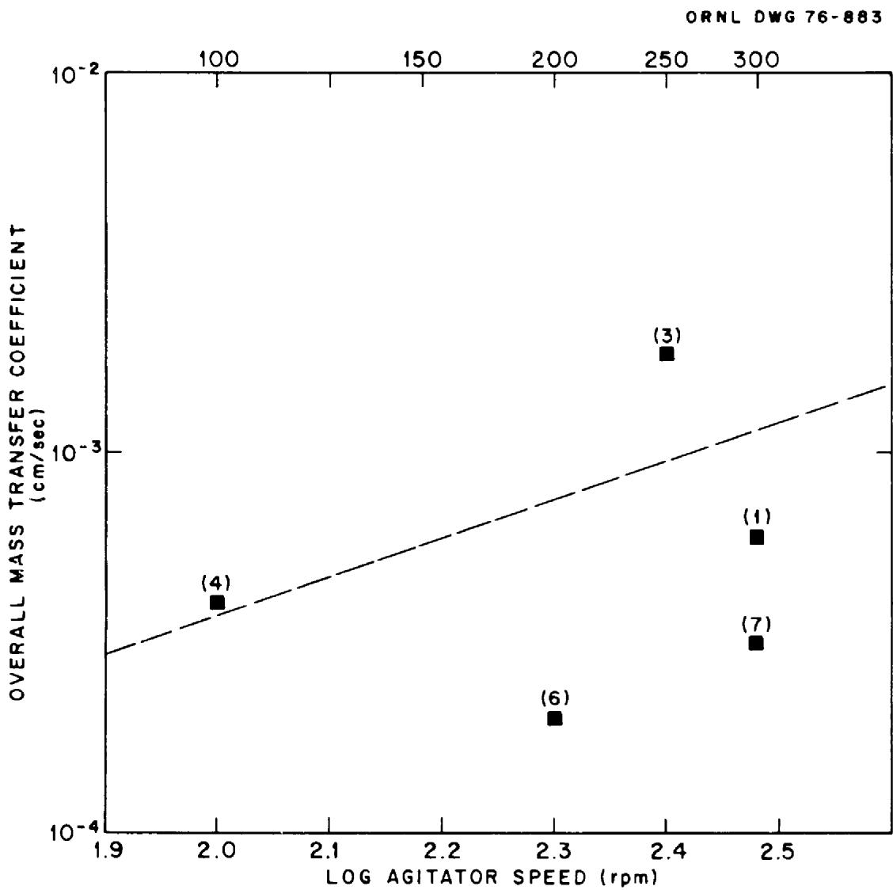  
Fig. 21. Overall mass-transfer coefficients for neodymium at the fluoride salt-bismuth interface at agitator speeds of 100-300 rpm. Numbers in parentheses refer to run numbers. The dashed line of slope = 1 shown for reference purposes only.

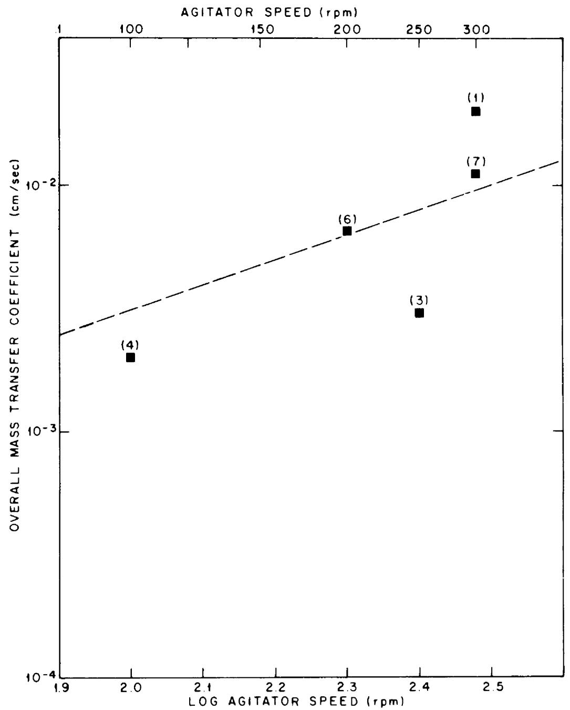  
Fig. 22. Overall mass-transfer coefficients for neodymium at the lithium chloride-bismuth interface in the contactor at agitator speeds of 100-300 rpm. Numbers in parentheses refer to run numbers. The dashed line of slope = 1 is shown for reference purposes only.

ORNL DWG 76-877

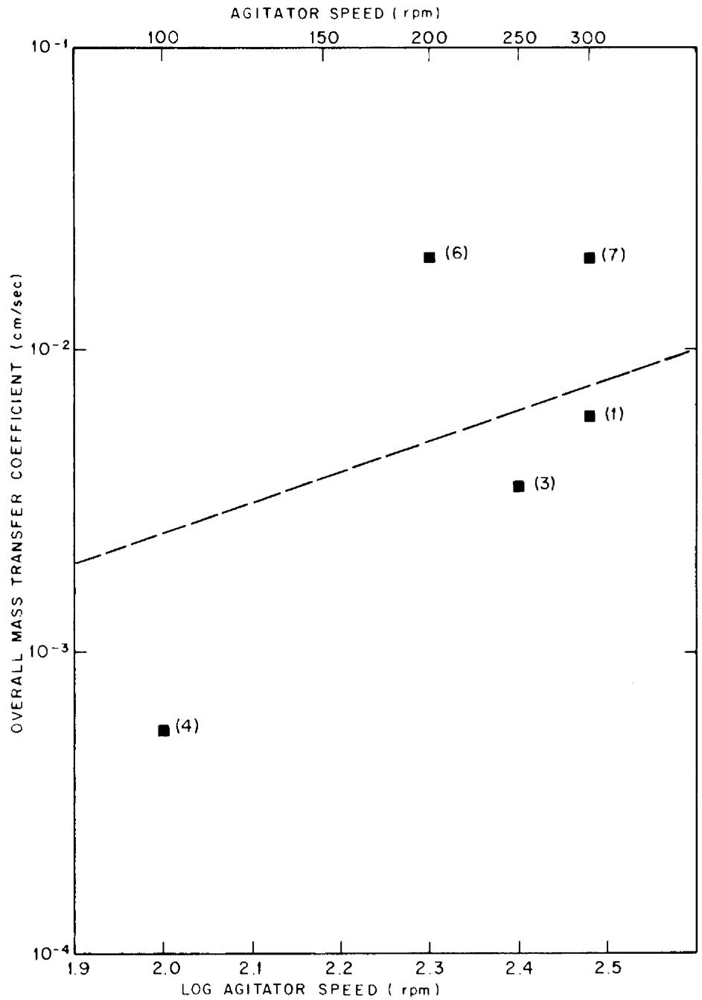  
Fig. 23. Overall mass-transfer coefficients for neodymium at the lithium chloride/bismuth--5 at. % lithium in the stripper at agitator speeds of 100-300 rpm. Numbers in parentheses refer to run numbers. The dashed line of slope = 1 is shown for reference purposes only.

An important feature of the metal transfer process is the selective separation of thorium from the rare earths at the bismuth--lithium chloride interface. Rare earth-thorium separation factors, defined as

$$
S _ {R E - T h} = D _ {T h} / D _ {R E}, \tag {17}
$$

have been determined to be in the range of $10^{4}$ to $10^{8}$ for the trivalent and divalent rare earths. Thus negligible loss of thorium from the fuel salt occurs in the process. Because of entrainment of the fluoride salt into the LICl in experiment MTE-3B, it was not possible to determine the separation factor. However, during studies in the first experiment MTE-3, in which the rare earths europium, lanthanum, and neodymium were used, the separation factors were estimated based on the total amount of thorium ( $< 10$ wt ppm) found in the bismuth--5 at. $\%$ lithium alloy in the stripper after about 400 hr of operation. Separation factors $\mathrm{D_{Th} / D_{RE}}$ for these rare earths in the order of $10^{4}$ to $10^{6}$ were indicated.

Preliminary calculations, using a computer code developed by W. L. Carter $^{21}$ at ORNL, have been made to estimate the contactor size and operating conditions that would be required in order to remove the rare-earth fission products at the design rate $^{22}$ from the reference MSBR. For these calculations, the rare earth neodymium was chosen as a representative example. The design removal rate of neodymium is $\sim 1.2$ g-moles ( $\sim 174$ g) per day for a breeding ratio of 1.06. (Note: Reducing the rare-earth removal rate would not have a prohibitive deleterious effect on the breeding ratio - a threefold reduction would lower the breeding ratio by about 0.01.) $^{23}$ In these calculations, the effects of several parameters (mass-transfer coefficients, interfacial area, salt and bismuth flow rates, and number of extraction stages) on the removal rate of neodymium were evaluated, and a combination of parameters that would be required to meet the design removal rate was determined.

Results of these calculations are summarized in Table 8. The cases shown were selected to indicate the effect of several variations on neodymium removal rates. The fuel-salt flow rate of $0.9\mathrm{gpm}$ ( $5.7 \times 10^{-5}\mathrm{m}^{3}/\mathrm{sec}$ ) was held constant for all cases since it is the design fuel-salt flow rate for the reference processing plant. Three contactor stages were used for all but one case since this seemed to be a reasonable compromise based on preliminary calculations. For case 1, the values of overall mass-

transfer coefficients at the three salt-bismuth interfaces $(\mathbf{K}_1, \mathbf{K}_2, \mathbf{K}_3)$ are representative of those obtained in our experimental studies. The area of $1\mathrm{ft}^2$ ( $0.093\mathrm{m}^2$ ) per stage, the bismuth flow rate of $3\mathrm{gpm}$ ( $1.9\times 10^{-4}\mathrm{m}^3/\mathrm{sec}$ ), and the LiCl flow rate of $30\mathrm{gpm}$ ( $1.9\times 10^{-3}\mathrm{m}^3/\mathrm{sec}$ ) were chosen as a basis for further extrapolation. As seen in Case 1, the neodymium removal rate of $0.003\mathrm{g}$ -mole/day is about a factor of 400 below the design value of $1.2\mathrm{g}$ -moles/day. Increasing overall mass-transfer coefficients at the LiCl-bismuth interfaces in the contactor and stripper by a factor of 5 (case 2) increased the removal rate by about a factor of 4. The effect of increasing the interfacial contact areas to 10 and $20\mathrm{ft}^2$ ( $0.94$ and $1.9\mathrm{m}^2$ ) is seen in cases 3 and 4, and the effect of increasing the number of stages from 3 to 6 is seen by comparing 4 and 5. The results from increasing the bismuth and LiCl flow rates to $6\mathrm{gpm}$ ( $3.8\times 10^{-4}\mathrm{m}^3/\mathrm{sec}$ ) and $60\mathrm{gpm}$ ( $3.8\times 10^{-3}\mathrm{m}^3/\mathrm{sec}$ ) is seen in cases 7 and 9. In case 8, the overall mass-transfer coefficient, K, at the fluoride salt--bismuth interface is increased by a factor of 10.

Finally, the desired removal rate is reached by use of the parameters shown in case 11. For the choices made, a neodymium removal rate of 1.37 g-moles/day is indicated for the following system:

salt and bismuth interfacial areas/stage $= 20 ft^2$ (1.86 m²),

fluoride salt flow rate = 0.9 gpm (5.7 x $10^{-5}$ m²/sec),

bismuth flow rate $= 18\mathrm{~gpm}$ (1.1 x $10^{-3}\mathrm{m}^2/\mathrm{sec}$ ),

LiCl flow rate = 60 gpm (3.8 x $10^{-3}$ m $^2$ /sec),

$\mathrm{K}_{1} = 0.16 \mathrm{~mm} / \mathrm{sec}, \mathrm{K}_{2} = 1.0 \mathrm{~mm} / \mathrm{sec}$ , and $\mathrm{K}_{3} = 4.0 \mathrm{~mm} / \mathrm{sec}$ .

The values for $\mathbf{K}_1$ and $\mathbf{K}_2$ at the fluoride fuel salt--bismuth and LiCl--bismuth interfaces in the contactor (case 11) are about a factor of 10 higher than those observed in metal transfer experiments. Results from studies in the water-mercury contactors indicate that an increase of about a factor of 10 in the mass-transfer coefficient might be expected with increased agitator turbine diameter over those used in the metal transfer experiments (1.4 m vs 0.073 m). The value for $\mathbf{K}_3$ at the interface between the LiCl--bismuth and the 5 at. $\%$ lithium in the stripper (case 11) is about a factor of 100 higher than that observed in metal transfer experiments. This large increase would likely require

increased agitation to the point of some degree of dispersion of the salt and bismuth in the stripper; however, this would probably be acceptable since the likelihood of bismuth entrainment back into the fuel salt is minimal in the stripper vessel.

Other combinations of the various parameters could be used to achieve the required removal rate of neodymium. Calculated results, shown in Table 8, are intended to indicate the effect of several parameters on the removal rate in a full-sized multistage metal transfer process for the removal of rare-earth fission products (using neodymium as an example) from a 1000-MW(e) MSBR.

# 7. CONCLUSIONS

The objectives of the metal transfer process experiments were (1) to study the various steps in the process, (2) to measure the rate of removal of rare-earth fission products from the molten-salt reactor fuel, and (3) to evaluate the suitability of a mechanically agitated contactor for use in the process.

Conclusions relating to these objectives are as follows:

1. During 15 experiments in engineering-scale process equipment, representative rare-earth fission products (eupropium, lanthanum, and neodymium) were extracted from molten-salt breeder reactor fuel salt (72-16-12 mole % $\mathrm{LiF - BeF_2 - ThF_4}$ ) and transferred into bismuth-lithium alloy in the stripper vessel.   
2. In those experiments in which entrainment of fluoride salt into the LiCl salt did not occur, the rare earths were selectively transferred (with respect to thorium) into the bismuth-lithium alloy. Separation factors of about $10^{4}$ to $10^{6}$ estimated in these experiments compare favorably with predicted values of about $10^{4}$ to $10^{8}$ for trivalent and divalent rare earths. Thus negligible loss of thorium from the fuel salt would occur in the process.   
3. Overall mass-transfer coefficients measured at the three salt-bismuth interfaces (fuel salt-bismuth, bismuth-LiCl, and LiCl--bismuth-lithium) in the process were lower than would be required for full-scale metal transfer process equipment of reasonable size.

Table 8. Summary of calculations on the effect of various parameters on neodymium removal rate in the metal transfer process using mechanically agitated contactors   

<table><tr><td rowspan="2">Case number</td><td rowspan="2">Nd removed per day (g-moles)</td><td colspan="3">Salt and Bi flow (m3/sec)</td><td colspan="3">Mass transfer coef. (mm/sec)</td><td rowspan="2">Area (m2/stage)</td><td rowspan="2">Number of stages</td></tr><tr><td>Fuel salt</td><td>Bismuth</td><td>LiCl</td><td>K1</td><td>K2</td><td>K3</td></tr><tr><td>1</td><td>0.003</td><td>5.7 x 10-5</td><td>1.9 x 10-4</td><td>1.9 x 10-3</td><td>0.016</td><td>0.030</td><td>0.040</td><td>0.093</td><td>3</td></tr><tr><td>2</td><td>0.013</td><td>5.7 x 10-5</td><td>1.9 x 10-4</td><td>1.9 x 10-3</td><td>0.016</td><td>0.15</td><td>0.20</td><td>0.093</td><td>3</td></tr><tr><td>3</td><td>0.11</td><td>5.7 x 10-5</td><td>1.9 x 10-4</td><td>1.9 x 10-3</td><td>0.016</td><td>0.15</td><td>0.20</td><td>0.93</td><td>3</td></tr><tr><td>4</td><td>0.18</td><td>5.7 x 10-5</td><td>1.9 x 10-4</td><td>1.9 x 10-3</td><td>0.016</td><td>0.15</td><td>0.20</td><td>1.86</td><td>3</td></tr><tr><td>5</td><td>0.24</td><td>5.7 x 10-5</td><td>1.9 x 10-4</td><td>1.9 x 10-3</td><td>0.016</td><td>0.15</td><td>0.20</td><td>1.86</td><td>6</td></tr><tr><td>6</td><td>0.37</td><td>5.7 x 10-5</td><td>1.9 x 10-4</td><td>1.9 x 10-3</td><td>0.016</td><td>0.75</td><td>1.0</td><td>1.86</td><td>3</td></tr><tr><td>7</td><td>0.55</td><td>5.7 x 10-5</td><td>5.7 x 10-4</td><td>1.9 x 10-3</td><td>0.016</td><td>0.75</td><td>1.0</td><td>1.86</td><td>3</td></tr><tr><td>8</td><td>0.67</td><td>5.7 x 10-5</td><td>5.7 x 10-4</td><td>1.9 x 10-3</td><td>0.16</td><td>0.75</td><td>1.0</td><td>1.86</td><td>3</td></tr><tr><td>9</td><td>0.61</td><td>5.7 x 10-5</td><td>5.7 x 10-4</td><td>3.8 x 10-3</td><td>0.016</td><td>0.75</td><td>1.0</td><td>1.86</td><td>3</td></tr><tr><td>10</td><td>1.05</td><td>5.7 x 10-5</td><td>5.7 x 10-4</td><td>3.8 x 10-3</td><td>0.16</td><td>1.0</td><td>40.0</td><td>1.86</td><td>3</td></tr><tr><td>11</td><td>1.37</td><td>5.7 x 10-5</td><td>1.1 x 10-3</td><td>3.8 x 10-3</td><td>0.16</td><td>1.0</td><td>40.0</td><td>1.86</td><td>3</td></tr></table>

4. The overall mass-transfer coefficients increased with increasing agitation (agitator speed) as expected, but meaningful correlations were not possible with the limited data obtained.   
5. In the equipment used in these experiments, the degree of agitation (agitator speed) was limited by entrainment of fluoride salt into the LiCl in the contactor. This would require further evaluation and careful design of mechanically agitated contactors for use in the metal transfer.

The effect of increased equipment size (diameters of the process vessels and agitator paddles) on the overall mass-transfer coefficients and rate of removal for the rare earths was not studied and need additional investigation.

# 8. ACKNOWLEDGMENTS

The authors gratefully acknowledge the assistance of many Oak Ridge National Laboratory staff members during the course of the two metal transfer process experiments. The design, installation, and operation of the first experiment MTE-3, together with the analysis of the results, were done by E. L. Youngblood, L. E. McNeese, W. L. Carter, and W. F. Schaffer, Jr. The following members assisted greatly with the second experiment MTE-3B: J. Beams, C. H. Brown, Jr., R. M. Counce, R. B. Lindauer, and R. O. Payne, experimental operation; W. R. Laing, H. A. Parker, and R. L. Walker, chemical analyses; and W. L. Carter and E. L. Youngblood, data analysis and interpretation. The secretarial assistance of Carol Proaps is greatly appreciated.

# 7. REFERENCES

1. R. C. Robertson (ed.), Conceptual Design Study of a Single-Fluid Molten-Salt Breeder Reactor, ORNL-4541 (June 1971).   
2. L. E. McNeese, Engineering Development Studies for Molten-Salt Breeder Reactor Processing No. 5, ORNL/TM-3140, pp. 2-15 (October 1971).   
3．U.S.PatentNo.3,853,979（Dec.1974）.   
4. L. E. McNeese, Engineering Development Studies for Molten-Salt Breeder Reactor Processing No. 9, ORNL/TM-3529, pp. 196-215 (December 1972).   
5. C. H. Brown, Jr., et al., Measurement of Mass-Transfer Coefficients in a Mechanically Agitated, Nondispersing Contactor Operating with a Molten Mixture of LiF-BeF $_2$ -ThF $_4$ and Molten Bismuth, ORNL-5143 (November 1976).   
6. L. M. Ferris et al., "Distribution of Lanthanide and Actinide Elements Between Molten Lithium Halide Salts and Liquid Bismuth Solutions," J. Inorg. Nucl. Chem. 34, 2921 (1972).   
7. L. M. Ferris et al., "Equilibrium Distribution of Actinide and Lanthanide Elements Between Molten Fluoride Salts and Liquid Bismuth Solutions, J. Inorg. Nucl. Chem. 32, 2019 (1970).   
8. L. E. McNeese, Engineering Development Studies for Molten Salt Breeder Reactor Processing No. 10, ORNL/TM-3352, pp. 57-59 (Dec. 1972).   
9. E. L. Youngblood et al., in MSBR Semiannu. Progr. Rept. Aug. 31, 1972, ORNL-4832, pp. 168-71.   
10. Chem. Tech. Div. Annu. Progr. Rep. Mar. 31, 1973, ORNL-4883, pp. 23-25.   
11. L. M. Ferris et al., "Distribution of Lanthanide and Actinide Elements Between Liquid Bismuth and Molten LiCl-LiF and LiBr-LiF Solutions," J. Inorg. Nucl. Chem. 34, 313 (1972).   
12. G. J. Janz et al., Molten Salts: Vol. 1, Electrical Conductivity, Density and Viscosity Data, NSRDS-NBS 15 (October 1968).   
13. MSRP Semiannu. Progr. Rep. Aug. 31, 1969, ORNL-4449, Tables 13.12, 13.13, p. 146 (February 1970).   
14. R. N. Lyon (ed.), Liquid Metals Handbook, NAVEXOS P-733, Office of Naval Research (June 1, 1950).   
15. L. E. McNeese, Engineering Development Studies for Molten-Salt Breeder Reactor Processing No. 10, ORNL/TM-3352, pp. 53-57 (December 1972).

16. Chem. Tech. Div. Annu. Progr. Rep. Mar. 31, 1973, ORNL-4883, p. 25.   
17. D. D. Sood and J. Braunstein, "Lithium-Bismuth Alloy Electrodes for Thermodynamics Investigation of Molten LiF-BeF $_2$ Mixtures," J. Electrochem. Soc. 121 (2) 247 (February 1974).   
18. J. B. Lewis, Chem. Eng. Sci. 3, 248 (1954).   
19. D. R. Olander, Chem. Eng. Sci. 18, 123 (1963).   
20. W. J. McManamey et al., Chem. Eng. Sci. 28, 1061 (1963).   
21. W. L. Carter, ORNL, personal communication.   
22. W. L. Carter and E. L. Nicholson, Design and Cost Study of a Fluorinator-Reductive Extraction-Metal Transfer Processing Plant for the MSBR, ORNL/TM-3579 (May 1972).   
23. L. E. McNeese and M. W. Rosenthal, "MSBR: A Review of Its Status and Future," Nucl. News 17 (12), 52-58 (September 1974).   
24. J. R. Hightower, Jr., Engineering Development Studies for Molten-Salt Breeder Reactor Processing No. 24, ORNL/TM-5339 (in preparation).

# APPENDIX A: SAMPLE ANALYSES FOR EXPERIMENT MTE-3B

The concentrations of $^{147}\mathrm{Nd}$ tracer and total neodymium in each of the seven salt and bismuth phases in metal transfer experiment MTE-3B during runs Nd-1 through Nd-4 are tabulated in Tables A-1 through A-8. The $^{147}\mathrm{Nd}$ tracer concentrations were determined by counting the 0.53-MeV gamma emitted by the $^{147}\mathrm{Nd}$ tracer. Values are corrected for decay during the run $(t_{1/2} = 11\, \text{d})$ . Results for total neodymium were obtained by chemical analyses using an isotopic dilution mass spectrometry procedure. All samples were counted for $^{147}\mathrm{Nd}$ contents. Analyses for total neodymium were done on a limited number of representative samples (1) to establish that the $^{147}\mathrm{Nd}$ -tracer data represented the total neodymium concentration, (2) to verify the adequacy of the sampling procedure, and (3) to check on the accuracy of the inventory of the neodymium in the system.

Table A-1. Concentrations of ${}^{147}\mathrm{{Nd}}$ in the salt and bismuth phases ${}^{\mathrm{a}}$ during run Nd-1, ${}^{\mathrm{b}}$ MTE-3B   

<table><tr><td rowspan="2">Run time (hr)d</td><td colspan="7">147 Nd concentration (dis min-1g-1)c</td></tr><tr><td>FSV x 106</td><td>FSC x 106</td><td>BTF x 104</td><td>BTC x 104</td><td>CSC x 104</td><td>CSS x 104</td><td>BLS x 105</td></tr><tr><td>0</td><td>1.37f</td><td>0</td><td>0</td><td>0</td><td>0</td><td>0</td><td>0</td></tr><tr><td>1.6</td><td>1.31</td><td>0.60</td><td>1.40</td><td>0.63</td><td>1.12</td><td>0.68</td><td>0.044</td></tr><tr><td>4.8</td><td>1.18</td><td>1.05</td><td>1.93</td><td>1.20</td><td>2.41</td><td>2.42</td><td>0.17</td></tr><tr><td>6.8</td><td>1.20</td><td>1.14</td><td>2.26</td><td>1.20</td><td>3.36</td><td>2.57</td><td>0.29</td></tr><tr><td>9.6</td><td>1.15</td><td>1.13</td><td>2.11</td><td>1.30</td><td>0.77</td><td>2.84</td><td>0.48</td></tr><tr><td>12.6</td><td>1.23</td><td>1.18</td><td>1.96</td><td>1.37</td><td>3.42</td><td>2.42</td><td>0.53</td></tr><tr><td>15.6</td><td>1.21</td><td>1.13</td><td>1.53</td><td>1.28</td><td>3.41</td><td>2.92</td><td>0.85</td></tr><tr><td>18.1</td><td>1.18</td><td>1.13</td><td>1.03</td><td>0.93</td><td>4.08</td><td>2.61</td><td>1.0</td></tr><tr><td>22.6</td><td>1.22</td><td>1.17</td><td>1.59</td><td>1.29</td><td>2.09</td><td>2.28</td><td>1.13</td></tr><tr><td>25.6</td><td>1.27</td><td>1.18</td><td>2.50</td><td>1.29</td><td>4.57</td><td>2.97</td><td>1.19</td></tr><tr><td>29.1</td><td>1.18</td><td>1.11</td><td>1.50</td><td>1.12</td><td>2.95</td><td>2.93</td><td>1.50</td></tr><tr><td>33.1</td><td>1.25</td><td>1.22</td><td>1.76</td><td>0.99</td><td>2.82</td><td>4.13</td><td>1.71</td></tr><tr><td>37.1</td><td>1.19</td><td>1.11</td><td>1.66</td><td>1.53</td><td>2.32</td><td>3.84</td><td>1.63</td></tr><tr><td>41.1</td><td>1.14</td><td>1.12</td><td>1.87</td><td>2.34</td><td>3.52</td><td>3.08</td><td>1.81</td></tr><tr><td>45.1</td><td>1.20</td><td>1.17</td><td>0.99</td><td>1.24</td><td>3.97</td><td>2.21</td><td>1.68</td></tr><tr><td>49.1</td><td>1.16</td><td>1.18</td><td>1.52</td><td>1.29</td><td>3.50</td><td>2.84</td><td>2.35</td></tr><tr><td>55.8</td><td>1.20</td><td>1.17</td><td>1.95</td><td>1.53</td><td>5.11</td><td>--</td><td>2.68</td></tr><tr><td>61.6</td><td>1.16</td><td>1.12</td><td>2.33</td><td>1.75</td><td>3.35</td><td>2.40</td><td>2.94</td></tr><tr><td>71.6</td><td>1.16</td><td>1.15</td><td>2.10</td><td>1.47</td><td>4.02</td><td>2.82</td><td>3.60</td></tr><tr><td>79.6</td><td>1.10</td><td>1.09</td><td>2.19</td><td>1.66</td><td>3.78</td><td>2.81</td><td>3.45</td></tr><tr><td>85.8</td><td>1.03</td><td>1.06</td><td>1.84</td><td>1.41</td><td>4.85</td><td>2.87</td><td>3.58</td></tr><tr><td>96.8</td><td>1.07</td><td>1.07</td><td>1.16</td><td>2.28</td><td>3.98</td><td>1.80</td><td>4.35</td></tr><tr><td>96.9</td><td></td><td></td><td colspan="3">Stopped fluoride salt circulation</td><td></td><td></td></tr><tr><td>98.8</td><td>1.09</td><td>1.03</td><td>1.78</td><td>0.98</td><td>2.19</td><td>2.39</td><td>4.60</td></tr><tr><td>100.8</td><td>1.04</td><td>0.94</td><td>0.91</td><td>1.20</td><td>4.26</td><td>2.05</td><td>6.50</td></tr><tr><td>103.8</td><td>1.08</td><td>0.93</td><td>0.93</td><td>1.16</td><td>3.12</td><td>&lt;6.79*</td><td>4.66</td></tr><tr><td>106.8</td><td>1.11</td><td>0.84</td><td>1.42</td><td>1.25</td><td>3.24</td><td>&lt;5.27*</td><td>4.66</td></tr><tr><td>108.8</td><td>1.01</td><td>0.78</td><td>1.80</td><td>0.83</td><td>2.24</td><td>&lt;15.8*</td><td>4.92</td></tr><tr><td>112.8</td><td>1.23</td><td>0.71</td><td>0.91</td><td>1.08</td><td>&lt;6.59*</td><td>&lt;18.4*</td><td>5.45</td></tr><tr><td>115.8</td><td>1.16</td><td>0.71</td><td>1.52</td><td>0.93</td><td>&lt;7.31*</td><td>&lt;14.8*</td><td>5.06</td></tr><tr><td>115.8e</td><td></td><td></td><td colspan="3">Stopped LiCl circulation</td><td></td><td></td></tr><tr><td>Ae</td><td>1.05</td><td>0.62</td><td>1.04</td><td>0.93</td><td>&lt;12.9*</td><td>&lt;4.74*</td><td>5.18</td></tr><tr><td>Be</td><td>1.01</td><td>0.63</td><td>0.56</td><td>0.47</td><td>&lt;4.11*</td><td>&lt;2.11*</td><td>4.56</td></tr><tr><td>Ce</td><td>1.02</td><td>0.56</td><td>0.77</td><td>0.57</td><td>8.98*</td><td>&lt;0.25*</td><td>5.13</td></tr></table>

${}^{a}$ FSV = fluoride salt in the reservoir; $\mathrm{{FSC}} =$ fluoride salt in the contactor; BTF = bismuth-thorium in the fluoride salt side of the contactor; BTC = bismuth-thorium in the LiCl side of the contactor; CSC = LiCl in the cont- tactor; CSS = LiCl in the stripper; BLS = bismuth-lithium in the stripper.   
bAgitator speed $= 5.0$ rps.   
c. Disintegrations per minute per gram of solution corrected for decay.   
$^{\mathrm{d}}_{\mathrm{Run}}$ time = time elapsed after start of fluoride salt circulation.   
Equilibrium conditions with no salt circulation.   
fThis value is read as 1.37 x 106 dis min-1 g-1.   
*These values are questionable due to use of different procedure and counting equipment.

Table A-2. Neodymium concentrations in the salt and bismuth phasesa during run Nd-1, b MTE-3B   

<table><tr><td rowspan="2">Run time (hr)c</td><td colspan="7">Neodymium concentration (μg/g)</td></tr><tr><td>FSV</td><td>FSC</td><td>BTF</td><td>BTC</td><td>CSC</td><td>CSS</td><td>BLS</td></tr><tr><td>0</td><td>21.6</td><td>0</td><td>0</td><td>0</td><td>0</td><td>0</td><td>0</td></tr><tr><td>9.6</td><td></td><td>17.8</td><td>0.15</td><td>0.15</td><td>0.14</td><td>0.03</td><td>0.11</td></tr><tr><td>18.1</td><td></td><td>17.6</td><td></td><td></td><td></td><td></td><td></td></tr><tr><td>22.6</td><td>17.9</td><td></td><td></td><td></td><td></td><td></td><td>0.91</td></tr><tr><td>25.6</td><td></td><td></td><td>0.36</td><td>0.06</td><td>0.57</td><td></td><td></td></tr><tr><td>29.1</td><td></td><td></td><td></td><td></td><td>0.25</td><td></td><td></td></tr><tr><td>33.1</td><td>16.5</td><td>18.3</td><td></td><td></td><td>0.35</td><td>0.57</td><td>1.96</td></tr><tr><td>41.1</td><td></td><td></td><td></td><td></td><td>0.27</td><td></td><td></td></tr><tr><td>49.1</td><td>17.6</td><td></td><td></td><td></td><td></td><td>0.27</td><td></td></tr><tr><td>55.8</td><td></td><td>16.9</td><td>0.17</td><td>0.11</td><td>0.14</td><td></td><td>2.24</td></tr><tr><td>79.6</td><td>17.2</td><td>21.3</td><td>0.10</td><td></td><td>0.38</td><td>0.25</td><td>5.04</td></tr><tr><td>96.8</td><td></td><td></td><td colspan="4">Stopped fluoride salt circulation</td><td></td></tr><tr><td>100.8</td><td></td><td></td><td></td><td></td><td>0.31</td><td></td><td></td></tr><tr><td>103.8</td><td>15.8</td><td></td><td></td><td></td><td></td><td></td><td></td></tr><tr><td>106.8</td><td>16.7</td><td></td><td>0.10</td><td>0.11</td><td>0.32</td><td>0.31</td><td></td></tr><tr><td>115.8</td><td></td><td>16.1</td><td></td><td>0.08</td><td></td><td></td><td>3.22</td></tr><tr><td>115.8</td><td></td><td></td><td colspan="4">Stopped LiCl circulation</td><td></td></tr><tr><td>d</td><td>17.4</td><td>9.2</td><td>0.08</td><td>0.17</td><td>0.78</td><td>&lt;0.01</td><td>3.36</td></tr></table>

aFSV = fluoride salt in the reservoir; FSC = fluoride salt in the contactor; BTF = bismuth thorium in the fluoride salt side of the contactor; BTC = bismuth-thorium in the LiCl side of the contactor; CSC = LiCl in the contactor; CSS = LiCl in the stripper; BLS = bismuth--5 at. % lithium in the stripper.   
b Agitator speed $= 5.0$ rps.   
cRun time = time elapsed after start of fluoride salt circulation.   
Equilibrium conditions with no salt circulation.

Table A-3. Concentrations of $^{147}\mathrm{Nd}$ in the salt and bismuth phasesa during run Nd-2, b MTE-3B   

<table><tr><td rowspan="2">Run time (hr)d</td><td colspan="7">147 Nd concentration (dis min-1g-1)c</td></tr><tr><td>FSV x 106</td><td>FSC x 106</td><td>BTF x 104</td><td>BTC x 104</td><td>CSC x 104</td><td>CSS x 104</td><td>BLS x 105</td></tr><tr><td>0</td><td>1.61f</td><td>0.058</td><td>0.12</td><td>0.11</td><td>&lt;0.56</td><td>&lt;0.38</td><td>0.56</td></tr><tr><td>2.2</td><td>1.48</td><td>1.02</td><td>1.92</td><td>1.03</td><td>4.92</td><td>1.41</td><td>0.53</td></tr><tr><td>7.0</td><td>1.43</td><td>1.26</td><td>2.96</td><td>1.88</td><td>8.54</td><td>1.68</td><td>0.89</td></tr><tr><td>11.0</td><td>1.47</td><td>1.44</td><td>2.82</td><td>1.62</td><td>6.01</td><td>3.29</td><td>1.16</td></tr><tr><td>15.0</td><td>1.38</td><td>1.35</td><td>1.73</td><td>0.89</td><td>4.82</td><td>2.68</td><td>1.49</td></tr><tr><td>19.0</td><td>1.41</td><td>1.35</td><td>0.98</td><td>0.89</td><td>5.53</td><td>4.40</td><td>1.80</td></tr><tr><td>23.0</td><td>1.35</td><td>1.38</td><td>1.76</td><td>1.41</td><td>7.01</td><td>5.16</td><td>2.21</td></tr><tr><td>27.0</td><td>1.36</td><td>1.30</td><td>3.61</td><td>1.39</td><td>7.10</td><td>4.27</td><td>2.57</td></tr><tr><td>31.0</td><td>1.35</td><td>1.26</td><td>2.05</td><td>1.38</td><td>8.01</td><td>4.86</td><td>2.78</td></tr><tr><td>35.8</td><td>1.41</td><td>1.27</td><td>2.68</td><td>1.45</td><td>7.30</td><td>3.12</td><td>3.29</td></tr><tr><td>42.1</td><td>1.37</td><td>1.34</td><td>2.35</td><td>1.47</td><td>11.8</td><td>4.09</td><td>3.87</td></tr><tr><td>49.0</td><td>1.31</td><td>1.22</td><td>1.49</td><td>1.45</td><td>6.82</td><td>3.81</td><td>5.02</td></tr><tr><td>57.0</td><td>1.27</td><td>1.22</td><td>2.50</td><td>2.14</td><td>7.25</td><td>5.22</td><td>4.90</td></tr><tr><td>63.3e</td><td>1.25</td><td>1.19</td><td>2.19</td><td>1.42</td><td>11.1</td><td>9.42</td><td>6.42</td></tr><tr><td>70.8</td><td>1.28</td><td>1.25</td><td>2.35</td><td>1.78</td><td>14.0</td><td>14.1</td><td>5.98</td></tr><tr><td>78.8</td><td>1.31</td><td>1.43</td><td>3.48</td><td>2.37</td><td>35.1</td><td>44.6</td><td>5.39</td></tr><tr><td>87.3</td><td>1.19</td><td>1.52</td><td>3.45</td><td>2.60</td><td>44.8</td><td>50.3</td><td>1.65</td></tr><tr><td>94.5</td><td>1.37</td><td>--</td><td>2.98</td><td>2.48</td><td>29.7</td><td>28.2</td><td>0.57</td></tr><tr><td>102.5</td><td>1.26</td><td>1.34</td><td>2.23</td><td>1.95</td><td>19.1</td><td>20.3</td><td>0.43</td></tr><tr><td>110.8</td><td>1.38</td><td>1.39</td><td>2.05</td><td>1.34</td><td>20.4</td><td>22.4</td><td>0.46</td></tr><tr><td>121.3</td><td>1.35</td><td>1.22</td><td>3.70</td><td>1.78</td><td>20.8</td><td>21.7</td><td>0.42</td></tr><tr><td>130.3</td><td>1.40</td><td>1.36</td><td>2.43</td><td>2.33</td><td>21.8</td><td>22.6</td><td>0.46</td></tr><tr><td>138.3</td><td>1.36</td><td>1.44</td><td>2.45</td><td>1.95</td><td>19.9</td><td>19.8</td><td>0.39</td></tr><tr><td>139.0</td><td>--</td><td colspan="6">Stopped fluoride salt and LiCl salt circulation</td></tr><tr><td>146.8</td><td>1.47</td><td>1.42</td><td>2.13</td><td>2.08</td><td>22.1</td><td>22.4</td><td>0.39</td></tr><tr><td>145.1</td><td>1.39</td><td>1.51</td><td>2.04</td><td>1.85</td><td>55.6</td><td>21.9</td><td>0.44</td></tr><tr><td>164.0</td><td>1.42</td><td>1.42</td><td>1.16</td><td>2.02</td><td>21.0</td><td>20.7</td><td>0.40</td></tr><tr><td>171.0</td><td>1.61</td><td>1.53</td><td>2.29</td><td>1.71</td><td>17.4</td><td>23.5</td><td>0.46</td></tr></table>

aFSV = fluoride salt in the reservoir; FSC = fluoride salt in the contactor; BTF = bismuth-thorium in the fluoride salt side of the contactor; BTC = bismuth-thorium in the LiCl side of the contactor; CSC = LiCl in the contactor; CSS = LiCl in the stripper; BLS = bismuth--5 at. % lithium in the stripper.   
b Agitator speed $= 5.0$ rps.   
cDisintegrations per minute per gram of solution corrected for decay during run.   
$^{\mathrm{d}}$ Run time = time from start of fluoride salt circulation.   
eIncrease in 147 Nd in LiCl indicated loss of reductant in stripper.   
fThis value is read as 1.61 x 106 dis min-1 g-1.

Table A-4. Neodymium concentrations in the salt and bismuth phasesa during run Nd-2, b MTE-3B   

<table><tr><td rowspan="2">Run time (hr)c</td><td colspan="7">Neodymium concentration (μg/g)</td></tr><tr><td>FSV</td><td>FSC</td><td>BTF</td><td>BTC</td><td>CSC</td><td>CSS</td><td>BLS</td></tr><tr><td>0</td><td>30.4</td><td>9.2</td><td>0.08</td><td>0.17</td><td>0.34</td><td>&lt;0.01</td><td>3.36</td></tr><tr><td>2.2</td><td></td><td></td><td></td><td></td><td></td><td>0.55</td><td></td></tr><tr><td>7.0</td><td></td><td></td><td></td><td></td><td></td><td></td><td>7.8</td></tr><tr><td>11.0</td><td></td><td></td><td>0.34</td><td></td><td></td><td></td><td></td></tr><tr><td>15.0</td><td>33.6</td><td>32.9</td><td>0.21</td><td>0.10</td><td></td><td></td><td>11.9</td></tr><tr><td>19.0</td><td></td><td></td><td></td><td></td><td>1.33</td><td>0.42</td><td></td></tr><tr><td>35.0</td><td></td><td>29.1</td><td>0.03</td><td>0.06</td><td>0.92</td><td>0.32</td><td>7.6</td></tr><tr><td>42.1</td><td>29.7</td><td>26.3</td><td></td><td>0.06</td><td>0.88</td><td>0.71</td><td>15.1</td></tr><tr><td>57.0</td><td></td><td></td><td>0.25</td><td></td><td></td><td></td><td></td></tr><tr><td>78.8d</td><td>41.2</td><td>33.6</td><td>0.45</td><td></td><td></td><td>32.8</td><td></td></tr><tr><td>102.5</td><td>36.0</td><td>47.6</td><td>0.32</td><td>0.03</td><td></td><td>8.0</td><td>0.59</td></tr><tr><td>130.3</td><td></td><td>35.4</td><td></td><td></td><td>1.09</td><td>5.3</td><td>0.83</td></tr><tr><td>138.3</td><td></td><td></td><td></td><td>0.27</td><td></td><td></td><td></td></tr><tr><td>139.0</td><td colspan="7">Stopped fluoride salt and LiCl circulation</td></tr><tr><td>146.8</td><td></td><td></td><td></td><td></td><td></td><td>7.6</td><td></td></tr><tr><td>171.0</td><td></td><td>35.4</td><td>0.32</td><td>0.07</td><td></td><td>8.0</td><td>1.01</td></tr><tr><td>182.0</td><td>37.0</td><td></td><td></td><td></td><td></td><td></td><td></td></tr></table>

${}^{a}$ FSV = fluoride salt in the reservoir; $\mathrm{{FSC}} =$ fluoride salt in the contactor; BTF = bismuth-thorium in the fluoride salt side of the contactor; BTC = bismuth-thorium in the LiCl side of the contactor; CSC = LiCl in the contactor; CSS = LiCl in the stripper; BLS = bismuth- -5 at. % lithium in the stripper.   
bAgitator speed $= 5.0$ rps.   
cRun time $=$ time elapsed after start of fluoride salt circulation.   
dIncrease in the neodymium concentration in the LiCl in the stripper and decrease of the neodymium concentration in the Bi--5 at. $\%$ lithium in the stripper indicated loss of lithium reductant in the stripper.

Table A-5. Concentrations of $^{147}\mathrm{Nd}$ in the salt and bismuth phasesa during run Nd-3,b MTE-3B   

<table><tr><td rowspan="2">Run timec(hr)</td><td colspan="7">147 Nd concentration (dis min-1g-1)d</td></tr><tr><td>FSV x 106</td><td>FSC x 106</td><td>BTF x 104</td><td>BTC x 104</td><td>CSC x 104</td><td>CSS x 104</td><td>BLS x 105</td></tr><tr><td>0</td><td>3.67e</td><td>0</td><td>0</td><td>0</td><td>0</td><td>0</td><td>0</td></tr><tr><td>1.5</td><td>3.05</td><td>1.88</td><td>3.55</td><td>1.94</td><td>0.7</td><td>0.7</td><td>0</td></tr><tr><td>4.3</td><td>3.27</td><td>3.07</td><td>4.22</td><td>3.62</td><td>3.63</td><td>1.35</td><td>0</td></tr><tr><td>11.5</td><td>2.99</td><td>3.00</td><td>4.85</td><td>2.50</td><td>3.87</td><td>3.33</td><td>0</td></tr><tr><td>18.8</td><td></td><td>Stopped</td><td>Fluoride</td><td>Salt Circulation</td><td></td><td></td><td></td></tr><tr><td>19.8</td><td>2.88</td><td>2.78</td><td>4.55</td><td>3.21</td><td>21.7</td><td>9.84</td><td>0.052</td></tr><tr><td>27.0</td><td>--</td><td>2.77</td><td>4.04</td><td>2.56</td><td>26.6</td><td>40.1</td><td>0.16</td></tr><tr><td>35.7</td><td>--</td><td>2.52</td><td>4.20</td><td>3.01</td><td>19.4</td><td>19.3</td><td>0.66</td></tr><tr><td>43.8</td><td>--</td><td>2.26</td><td>2.71</td><td>2.49</td><td>13.7</td><td>22.4</td><td>0.80</td></tr><tr><td>51.0</td><td>--</td><td>2.29</td><td>3.53</td><td>2.03</td><td>16.7</td><td>24.4</td><td>1.23</td></tr><tr><td>59.5</td><td>--</td><td>1.99</td><td>3.38</td><td>1.96</td><td>21.0</td><td>23.6</td><td>1.62</td></tr><tr><td>68.0</td><td>3.02</td><td>1.90</td><td>2.39</td><td>1.84</td><td>12.0</td><td>13.5</td><td>1.92</td></tr><tr><td>74.8</td><td>--</td><td>1.84</td><td>2.62</td><td>1.63</td><td>22.4</td><td>24.1</td><td>2.11</td></tr><tr><td>83.5</td><td>--</td><td>1.63</td><td>3.73</td><td>1.52</td><td>12.5</td><td>8.3</td><td>2.62</td></tr><tr><td>92.0</td><td>--</td><td>1.49</td><td>2.53</td><td>1.54</td><td>9.3</td><td>8.7</td><td>2.65</td></tr><tr><td>99.0</td><td>--</td><td>1.48</td><td>3.00</td><td>2.26</td><td>11.8</td><td>7.1</td><td>2.86</td></tr><tr><td>107.5</td><td>--</td><td>1.31</td><td>1.46</td><td>1.08</td><td>7.4</td><td>9.8</td><td>3.26</td></tr><tr><td>107.8</td><td></td><td>Stopped</td><td>LiCl</td><td>Circulation</td><td></td><td></td><td></td></tr><tr><td>115.6</td><td>--</td><td>2.01</td><td>5.33</td><td>1.54</td><td>16.4</td><td>2.1</td><td>3.16</td></tr><tr><td>139.5</td><td>--</td><td>1.24</td><td>--</td><td>1.24</td><td>15.5</td><td>&lt;0.9</td><td>3.13</td></tr><tr><td>165.2</td><td>3.31</td><td>1.26</td><td>1.36</td><td>1.44</td><td>12.0</td><td>&lt;0.8</td><td>3.15</td></tr></table>

aFSV = fluoride fuel salt in the reservoir; FSC = fluoride fuel salt in the contactor; BTF = bismuth-thorium in the fluoride salt side of the contactor; BTC = bismuth-thorium in the LiCl side of the contactor; CSC = LiCl in the contactor; CSS = LiCl in the stripper; BLS = bismuth--5 at. % lithium in the stripper.   
bAgitator speed in the contactor and stripper was 4.17 rps.   
cRun time = time elapsed after the start of fluoride salt circulation.   
$^{\mathrm{d}}$ Disintegrations per minute per gram of solution corrected for decay.   
eThis value is read as $3.67 \times 10^{6}$ dis min $^{-1}$ g $^{-1}$ .

Table A-6. Neodymium concentrations in the salt and bismuth phases, $^{a}$ during run Nd-3, $^{b}$ MTE-3B   

<table><tr><td rowspan="2">Run timec (hr)</td><td colspan="7">Neodymium concentration (μg/g)</td></tr><tr><td>FSV</td><td>FSC</td><td>BTF</td><td>BTC</td><td>CSC</td><td>CSS</td><td>BLS</td></tr><tr><td>0</td><td>47.3</td><td>34.2</td><td>0.28</td><td>0.15</td><td>0.34</td><td>0.34</td><td>0.56</td></tr><tr><td>1.5</td><td></td><td></td><td></td><td></td><td></td><td></td><td></td></tr><tr><td>4.3</td><td></td><td>44.7</td><td>0.32</td><td>0.36</td><td>1.20</td><td>0.46</td><td>0.53</td></tr><tr><td>11.5</td><td></td><td></td><td></td><td></td><td></td><td></td><td></td></tr><tr><td>18.8</td><td></td><td></td><td colspan="5">Stopped Fluoride Salt Circulation</td></tr><tr><td>19.8</td><td>47.7</td><td>46.3</td><td>0.42</td><td>0.59</td><td>2.24</td><td></td><td>0.56</td></tr><tr><td>27.0</td><td></td><td></td><td></td><td></td><td></td><td></td><td></td></tr><tr><td>35.7</td><td></td><td>40.9</td><td>0.08</td><td>0.34</td><td></td><td>1.67</td><td>1.53</td></tr><tr><td>43.8</td><td></td><td></td><td></td><td></td><td></td><td></td><td></td></tr><tr><td>51.0</td><td></td><td>35.7</td><td></td><td></td><td></td><td></td><td>2.27</td></tr><tr><td>59.5</td><td></td><td></td><td></td><td></td><td></td><td></td><td></td></tr><tr><td>68.0</td><td></td><td>30.7</td><td>0.11</td><td>0.25</td><td>1.08</td><td>1.82</td><td>4.34</td></tr><tr><td>74.8</td><td></td><td></td><td></td><td></td><td></td><td></td><td></td></tr><tr><td>83.5</td><td></td><td>26.5</td><td></td><td></td><td></td><td></td><td>5.05</td></tr><tr><td>92.0</td><td></td><td></td><td></td><td></td><td></td><td></td><td></td></tr><tr><td>99.0</td><td></td><td></td><td></td><td></td><td></td><td></td><td></td></tr><tr><td>107.5</td><td></td><td>21.7</td><td>0.20</td><td>0.14</td><td>0.71</td><td>0.50</td><td>5.17</td></tr><tr><td>107.8</td><td></td><td></td><td colspan="5">Stopped LiCl Circulation</td></tr><tr><td>115.6</td><td></td><td></td><td></td><td></td><td>0.85</td><td></td><td></td></tr><tr><td>139.5</td><td></td><td>22.3</td><td></td><td>0.18</td><td>0.85</td><td>0.03</td><td></td></tr><tr><td>165.2d</td><td>47.2</td><td>20.7</td><td>0.17</td><td>0.10</td><td></td><td>0.03</td><td>7.28</td></tr></table>

${}^{a}$ FSV = fluoride salt in the reservoir; $\mathrm{{FSC}} =$ fluoride salt in the contactor; BTF = bismuth-thorium in the fluoride salt side of the contactor; BTC = bismuth-thorium in the LiCl side of the contactor; CSC = LiCl in the contactor; CSS = LiCl in the stripper; BLC = bismuth--5 at. % lithium in the stripper.   
bAgitator speed $= 4.17$ rps.   
cRun time = time elapsed after start of fluoride salt circulation.   
$^{\mathrm{d}}$ Equilibrium conditions with no salt circulation.

Table A-7. Concentrations of $^{147}\mathrm{Nd}$ in the salt and bismuth phasesa during run Nd-4, b MTE-3B   

<table><tr><td rowspan="2">Run timec(hr)</td><td colspan="7">147 Nd concentration (dis min-1g-1)d</td></tr><tr><td>FSV x 106</td><td>FSC x 106</td><td>BTF x 104</td><td>BTC x 104</td><td>CSC x 104</td><td>CSS x 104</td><td>BLS x 105</td></tr><tr><td>0</td><td>3.31e</td><td>1.26</td><td>1.36</td><td>1.44</td><td>12.0</td><td>&lt;0.08</td><td>3.15</td></tr><tr><td>4.2</td><td>2.80</td><td>2.75</td><td>4.63</td><td>2.20</td><td>8.32</td><td>7.92</td><td>3.36</td></tr><tr><td>14.0</td><td>2.73</td><td>2.67</td><td>3.32</td><td>2.45</td><td>6.16</td><td>6.74</td><td>3.24</td></tr><tr><td>21.0</td><td>2.76</td><td>2.72</td><td>4.49</td><td>3.22</td><td>10.5</td><td>7.92</td><td>3.34</td></tr><tr><td>21.3</td><td></td><td colspan="6">Stopped Fluoride Salt Circulation</td></tr><tr><td>28.3</td><td>--</td><td>2.77</td><td>3.98</td><td>2.67</td><td>8.93</td><td>1.58</td><td>3.35</td></tr><tr><td>36.8</td><td>--</td><td>1.88</td><td>3.30</td><td>2.16</td><td>5.96</td><td>4.74</td><td>3.43</td></tr><tr><td>45.3</td><td>--</td><td>2.39</td><td>2.84</td><td>2.30</td><td>6.35</td><td>7.72</td><td>3.57</td></tr><tr><td>52.3</td><td>--</td><td>2.38</td><td>5.42</td><td>2.49</td><td>8.83</td><td>11.4</td><td>3.62</td></tr><tr><td>60.8</td><td>--</td><td>2.23</td><td>3.37</td><td>2.49</td><td>7.22</td><td>5.50</td><td>3.59</td></tr><tr><td>69.0</td><td>2.59</td><td>2.28</td><td>3.76</td><td>2.19</td><td>7.11</td><td>8.69</td><td>3.68</td></tr><tr><td>76.3</td><td>--</td><td>2.47</td><td>5.69</td><td>2.47</td><td>7.86</td><td>6.17</td><td>3.78</td></tr><tr><td>84.8</td><td>--</td><td>2.36</td><td>3.01</td><td>2.51</td><td>11.0</td><td>11.3</td><td>3.91</td></tr><tr><td>93.2</td><td>--</td><td>1.88</td><td>7.37</td><td>2.31</td><td>8.04</td><td>9.80</td><td>3.87</td></tr><tr><td>100.5</td><td>--</td><td>2.21</td><td>2.59</td><td>2.25</td><td>5.72</td><td>21.7</td><td>4.12</td></tr><tr><td>109.4</td><td>--</td><td>2.12</td><td>3.03</td><td>2.61</td><td>5.15</td><td>10.3</td><td>3.89</td></tr><tr><td>109.5</td><td></td><td colspan="6">Stopped LiCl circulation</td></tr><tr><td>117.0</td><td>--</td><td>2.34</td><td>3.62</td><td>2.59</td><td>11.4</td><td>&lt;3.3</td><td>4.15</td></tr><tr><td>135.8</td><td>--</td><td>2.37</td><td>3.30</td><td>2.41</td><td>20.8</td><td>&lt;2.3</td><td>4.06</td></tr><tr><td>165.9</td><td>--</td><td>2.35</td><td>4.55</td><td>2.25</td><td>29.2</td><td>&lt;2.2</td><td>4.27</td></tr></table>

aFSV = fluoride fuel salt in the reservoir; FSC = fluoride fuel salt in the contactor; BTF = bismuth-thorium in the fluoride salt side of the contactor; BTC = bismuth-thorium in the LiCl side of the contactor; CSC = LiCl in the contactor; CSS = LiCl in the stripper; BLS = bismuth--5 at. % lithium in the stripper.   
bAgitator speed in the contactor and stripper was 1.67 rps.   
cRun time $=$ time elapsed after the start of fluoride salt circulation.   
$^{\mathrm{d}}$ Disintegrations per minute per gram corrected for decay.   
eThis value is read as 3.31 x $10^{6}$ dis min $-1\mathrm{g}^{-1}$ .

Table A-8. Neodymium concentrations in the salt and bismuth phasesa during run Nd-4, b MTE-3B   

<table><tr><td rowspan="2">Run timec(hr)</td><td colspan="7">Neodymium concentration (μg/g)</td></tr><tr><td>FSV</td><td>FSC</td><td>BTF</td><td>BTC</td><td>CSC</td><td>CSS</td><td>BLS</td></tr><tr><td>0</td><td>47.2</td><td>20.7</td><td>0.17</td><td>0.10</td><td>0.85</td><td>0.03</td><td>7.28</td></tr><tr><td>4.2</td><td></td><td></td><td></td><td></td><td></td><td></td><td></td></tr><tr><td>14.0</td><td></td><td>43.7</td><td></td><td>0.36</td><td></td><td></td><td>7.73</td></tr><tr><td>21.0</td><td></td><td></td><td>0.36</td><td></td><td></td><td>0.48</td><td></td></tr><tr><td>21.3</td><td></td><td></td><td colspan="3">Stopped Fluoride Salt Circulation</td><td></td><td></td></tr><tr><td>36.8</td><td></td><td></td><td>0.42</td><td>0.39</td><td></td><td></td><td>4.27</td></tr><tr><td>45.3</td><td></td><td>41.6</td><td></td><td></td><td>0.35</td><td></td><td></td></tr><tr><td>52.3</td><td></td><td></td><td></td><td>0.38</td><td></td><td>0.45</td><td>9.13</td></tr><tr><td>60.8</td><td></td><td>40.2</td><td>0.35</td><td></td><td></td><td></td><td></td></tr><tr><td>69.0</td><td>47.3</td><td></td><td></td><td></td><td>0.46</td><td>0.63</td><td></td></tr><tr><td>76.3</td><td></td><td></td><td></td><td>0.29</td><td></td><td></td><td>7.46</td></tr><tr><td>84.8</td><td></td><td>37.2</td><td></td><td></td><td></td><td></td><td></td></tr><tr><td>93.2</td><td></td><td>37.8</td><td></td><td>0.34</td><td>0.36</td><td></td><td>6.58</td></tr><tr><td>100.5</td><td></td><td></td><td></td><td>0.25</td><td></td><td>1.96</td><td>6.50</td></tr><tr><td>109.4</td><td></td><td>36.1</td><td>0.35</td><td></td><td></td><td></td><td></td></tr><tr><td>109.5</td><td></td><td></td><td colspan="3">Stopped LiCl Circulation</td><td></td><td></td></tr><tr><td>135.8d</td><td></td><td>34.7</td><td>0.29</td><td></td><td>1.05</td><td>0.11</td><td>8.54</td></tr><tr><td>165.9d</td><td></td><td>36.0</td><td>0.34</td><td></td><td>0.85</td><td>0.03</td><td>8.40</td></tr><tr><td>262.0d</td><td></td><td>36.1</td><td>0.29</td><td>0.25</td><td>1.34</td><td>0.03</td><td>9.24</td></tr></table>

aFSV = fluoride salt in the reservoir; FSC = fluoride salt in the contactor; BTF = bismuth-thorium in the fluoride salt side of the contactor; BTC = bismuth-thorium in the LiCl side of the contactor; CSC = LiCl in the contactor; CSS = LiCl in the stripper; and BLS = bismuth--5 at. % lithium in the stripper.   
bAgitator speed $= 1.67$ rps.   
${}^{\mathrm{c}}$ Run time $=$ time elapsed after start of fluoride salt circulation.   
Equilibrium conditions with no salt circulation.

ORNL-5176

Dist. Category UC-76

# Internal Distribution List

1. R.E.Brooksbank

23. W.R. Laing

2. C.H.Brown, Jr.

24. J. A. Lenhard, ERDA-ORO

3. W. D. Burch

25. R.E.Leuze

4. W. L. Carter

26. R.E. MacPherson

5. R.M.Counce

27. A. P. Malinauskas

6. F. L. Culler

28. C. L. Matthews, ERDA-ORO

7. J.M.Dale

29. H. E. McCoy

8. F. L. Daley

30-32. L.E.McNeese

9. J.R.DiStefano

33. E. Newman

10. R. L. Egli, ERDA-ORO

34. H. Postma

11. J. R. Engel

35. M. W. Rosenthal

12. D. E. Ferguson

36-39. H.C.Savage

13. L. M. Ferris

40. C. D. Scott

14. W. R. Grimes

41. W. F. Schaffer, Jr.

15. R.W.Glass

42. D. B. Trauger

16. R.F. Hibbs

43. R. G. Wymer

17-20. J.R.Hightower, Jr.

44. E. L. Youngblood

21. C. W. Kee

45-46. Central Research Library

22. A. D. Kelmers

47. Document Reference Section

48-50. Laboratory Records

51. Laboratory Records (LRD-RC)

# Consultants and Subcontractors

52. W. K. Davis   
53. E. L. Gaden, Jr.   
54. C. H. Ice   
55. R. B. Richards   
56. D. O'Boyle

# External Distribution

57. Research and Technical Support Division, Energy Research and Development Administration, Oak Ridge Operations Office, P. O. Box E, Oak Ridge, TN 37830   
58. Director, Reactor Division, Energy Research and Development Administration, Oak Ridge Operations Office, P. O. Box E, Oak Ridge, TN 37830

59-60. Director, Division of Nuclear Research and Applications, Energy Research and Development Administration, Washington, D. C. 20545

61-172. For distribution as shown in TID-4500 under UC-76, Molten-Salt Reactor Technology