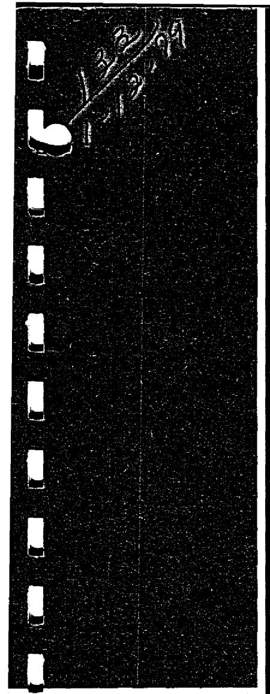

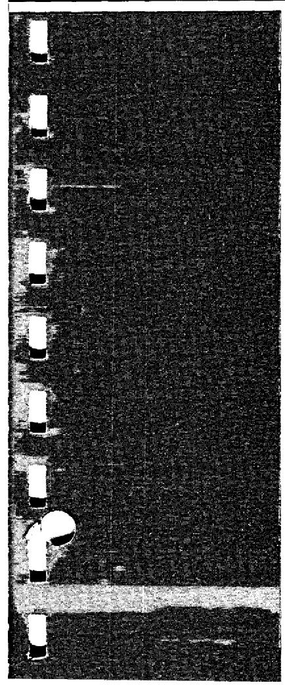

# MASTER

Interim Assessment of the Denatured $^{233}\mathrm{U}$ Fuel Cycle: Feasibility and Nonproliferation Characteristics

OAK RIDGE NATIONAL LABORATORY

OPERATED BY UNION CARBIDE CORPORATION · FOR THE DEPARTMENT OF ENERGY

Printed in the United States of America. Available from National Technical Information Service

U.S. Department of Commerce

5285 Port Royal Road, Springfield, Virginia 22161

Price: Printed Copy $11.75; Microfiche $3.00

This report was prepared as an account of work sponsored by an agency of the United States Government. Neither the United States Government nor any agency thereof, nor any of their employees, contractors, subcontractors, or their employees, makes any warranty, express or implied, nor assumes any legal liability or responsibility for any third party's use or the results of such use of any information, apparatus, product or process disclosed in this report, nor represents that its use by such third party would not infringe privately owned rights.

ORNL-5388

Distribution

Category UC-80

Contract No. W-7405-eng-26

Engineering Physics Division

INTERIM ASSESSMENT OF THE DENATURED $^{233}\mathrm{U}$ FUEL CYCLE: FEASIBILITY AND NONPROLIFERATION CHARACTERISTICS

Edited by

L. S. Abbott, D. E. Bartine, T. J. Burns

With Contributions from

Argonne National Laboratory Brookhaven National Laboratory Combustion Engineering, Inc. Hanford Engineering Development Laboratory Oak Ridge Gaseous Diffusion Plant Oak Ridge National Laboratory

C. Sege
DOE Program Manager

D. E. Bartine ORNL Program Manager

I. Spiewak ORNL Program Director

December, 1978

OAK RIDGE NATIONAL LABORATORY

Oak Ridge, Tennessee 37836

operated by

UNION CARBIDE CORPORATION

for the

DEPARTMENT OF ENERGY

NOTICE

This report was prepared as an account of work sponsored by the United States Government. Neither the United States nor the United States Department of Energy, nor any of their employees, nor any of their contractors, subcontractors, or their employees, makes any warranty, express or implied, or assumes any legal liability or responsibility for the accuracy, completeness or usefulness of any information, apparatus, product or process disclosed, or represents that its use would not infringe privately owned rights.

# PRINCIPAL AUTHORS

T. J. Burns

Oak Ridge National Laboratory

J. C. Cleveland

Oak Ridge National Laboratory

E. H. Gift

Oak Ridge Gaseous Diffusion Plant

R.W.Hardie

Hanford Engineering Development Laboratory

C. M. Newstead

Brookhaven National Laboratory

R. P. Omberg

Hanford Engineering Development Laboratory

N. L. Shapiro

Combustion Engineering

I. Spiewak

Oak Ridge National Laboratory

# CONTRIBUTING AUTHORS

W. B. Arthur, Oak Ridge Gaseous Diffusion Plant

W. E. Black, Hanford Engineering Development Laboratory

R. E. Brooksbank, Oak Ridge National Laboratory

Y. I. Chang, Argonne National Laboratory

P. M. Haas, Oak Ridge National Laboratory

D. R. Haffner, Hanford Engineering Development Laboratory

T. M. Helm, Hanford Engineering Development Laboratory

D. T. Ingersoll, Oak Ridge National Laboratory

J. D. Jenkins, Oak Ridge National Laboratory

W. G. Jolly, Hanford Engineering Development Laboratory

H. E. Knee, Oak Ridge National Laboratory

H. R. Meyer, Oak Ridge National Laboratory

D. L. Selby, Oak Ridge National Laboratory

M. R. Shay, Hanford Engineering Development Laboratory

J. E. Till, Oak Ridge National Laboratory

# PREFACE AND ACKNOWLEDGMENTS

This report describing a study of the feasibility of the denatured $^{233}\mathrm{U}$ fuel cycle integrates the data and contributions of a number of national laboratories and government contractors. Those of us at ORNL who have been responsible for compiling and editing the report wish to acknowledge the assistance of many individuals who actively participated in the study throughout the many iterations leading to this final draft. In particular, we wish to thank Carol Sege and Saul Strauch of the U.S. Department of Energy for their guidance during the entire program; C. M. Newstead of Brookhaven National Laboratory for the proliferation-risk assessment; E. H. Gift of the Oak Ridge Gaseous Diffusion Plant for the analysis of the potential circumvention of the fuel isotope barrier; Y. Chang of Argonne National Laboratory, J. C. Cleveland and P. R. Kasten of Oak Ridge National Laboratory, R. P. Omberg of the Hanford Engineering Development Laboratory, and N. L. Shapiro of Combustion Engineering, Inc. for the characterizations of reactor and fuel cycle technologies; and R. P. Omberg and R. W. Hardie of Hanford Engineering Development Laboratory for the system economics-resources analysis. These, in turn, were assisted by several contributing authors as listed on page iii.

Many others have provided data or participated in reviews of the various chapters, and to each of them we express our appreciation. Finally, we wish to thank the many secretaries and report production staff members who have so patiently prepared numerous drafts of this report.

Irving Spiewak

David E. Bartine

Thomas J. Burns

Lorraine S. Abbott

# CONTENTS

PREFACE AND ACKNOWLEDGMENTS V

ABSTRACT xi

1. INTRODUCTION: BACKGROUND 1-1   
2. RATIONALE FOR DENATURED FUEL CYCLES 2-1

2.0. Introduction 2-3   
2.1. International Plutonium Economy 2-4   
2.2. The Denatured $^{233}\mathrm{U}$ Fuel Cycle 2-5   
2.3. Some Institutional Considerations for the Denatured Fuel Cycle 2-9

3.ISOTOPIC CHARACTERISTICS OF DENATURED $^{233}\mathrm{U}$ FUEL 3-1

3.0. Introduction 3-3   
3.1. Estimated $^{232}\mathrm{U}$ Concentrations in Denatured $^{233}\mathrm{U}$ Fuels 3-6

3.1.1. Light-Water Reactor Fuels 3-6   
3.1.2. High-Temperature Gas-Cooled Reactor Fuels 3-7   
3.1.3. Liquid-Metal Fast Breeder Reactor Fuels 3-8   
3.1.4. Conclusions 3-9

3.2. Radiological Hazards of Denatured Fuel Isotopes 3-10

3.2.1. Toxicity of $^{233}\mathrm{U}$ and $^{232}\mathrm{U}$ 3-10   
3.2.2.Toxicity of $^{232}\mathrm{Th}$ 3-14   
3.2.3. Hazards Related to Gamma-Ray Emissions 3-14   
3.2.4. Conclusions 3-15

3.3. Isotopics Impacting Fuel Safeguards Considerations 3-17

3.3.1.Enrichment Criteria for Denatured Fuel 3-17   
3.3.2. Fabrication and Handling of Denatured Fuel 3-20   
3.3.3. Detection and Assay of Denatured Fuel 3-22   
3.3.4. Potential Circumvention of Isotopic Barrier of Denatured Fuel 3-24   
3.3.5.Deterrence Value of $^{232}\mathrm{U}$ Contamination in Denatured Fuel 3-35

4. IMPACT OF DENATURED $^{233}\mathrm{U}$ FUEL ON REACTOR PERFORMANCE 4-1

4.0. Introduction 4-3   
4.1. Light-Water Reactors 4-12

4.1.1. Pressurized Water Reactors 4-12   
4.1.2.Boiling Water Reactors 4-19

4.2. Spectral-Shift-Controlled Reactors 4-23   
4.3. Heavy-Water Reactors 4-30

4.4. Gas-Cooled Thermal Reactors 4-33

4.4.1. High-Temperature Gas-Cooled Reactors 4-33   
4.4.2. Pebble-Bed High-Temperature Reactors 4-41

4.5. Liquid-Metal Fast Breeder Reactors 4-48   
4.6. Alternate Fast Reactors 4-54

4.6.1. Advanced Oxide-Fueled LMFBRs 4-54   
4.6.2. Carbide- and Metal-Fueled LMFBRs 4-58   
4.6.3. Gas-Cooled Fast Breeder Reactors 4-62

Page

5. IMPLEMENTATION OF DENATURED FUEL CYCLES 5-1

5.0. Introduction 5-3   
5.1. Reactor Research and Development Requirements 5-4

5.1.1. Light-Water Reactors 5-8   
5.1.2. High-Temperature Gas-Cooled Reactors 5-1   
5.1.3. Heavy-Water Reactors 5-1   
5.1.4. Spectral-Shift-Controlled Reactors 5-1   
5.1.5.R,D&D Schedules 5-1   
5.1.6. Summary and Conclusions 5-1

5.2. Fuel Recycle Research and Development Requirements 5-2

5.2.1. Technology Status Summary 5-2   
5.2.2. Research, Development, and Demonstration Cost Ranges and Schedules 5-2   
5.2.3. Conclusions 5-2

6. EVALUATION OF NUCLEAR POWER SYSTEMS UTILIZING DENATURED FUEL 6-1

6.0. Introduction 6-3   
6.1. Basic Assumptions and Analysis Technique 6-5

6.1.1. The $\mathsf{U}_3\mathsf{O}_8$ Supply 6-5   
6.1.2. Reactor Options 6-6   
6.1.3. Nuclear Policy Options 6-1   
6.1.4. The Analytical Method 6-1

6.2. Discussion of Results for Selected Nuclear Policy Options 6-23

6.2.1. The Throwaway/Stowaway Option 6-2   
6.2.2. Converter System with Plutonium Recycle 6-3   
6.2.3. Converter System with Plutonium Throwaway 6-3   
6.2.4. Converter System with Plutonium Production Minimized; Pu-to- $^{233}\mathrm{U}$ "Transmutation" 6-3   
6.2.5. Converter System with Plutonium Production Not Minimized; Pu-to- $^{233}\mathrm{U}$ "Transmutation" 6-3   
6.2.6. Converter-Breeder System with Light Plutonium "Transmutation" 6-4   
6.2.7. Converter-Breeder System with Heavy Plutonium "Transmutation" 6-4

6.3. Conclusions 6-4

7. OVERALL ANALYSIS OF DENATURED FUEL SYSTEMS 7-1

7.0. Introduction 7-3   
7.1. Proliferation-Resistant Characteristics of Denatured $^{233}\mathrm{U}$ Fuel 7-4

7.1.1. Isotopic Barrier of Fresh Fuel 7-4   
7.1.2. Gamma-Radiation Barrier of Fresh Fuel 7-6   
7.1.3. Spent Fuel Fissile Content 7-7   
7.1.4. Conclusions 7-9

7.2. Impact of Denatured $^{233}\mathrm{U}$ Fuel on Reactor Performance and Selection: Comparison with Other Fuel Cycles 7-10

7.2.1. Thermal Reactors 7-1   
Once-Through Systems 7-1   
Recycle Systems 7-1   
7.2.2. Fast Reactors 7-1   
7.2.3. Symbiotic Reactor Systems 7-1   
7.2.4. Conclusions 7-1

7.3. Prospects for Implementation and Commercialization of Denatured

233U Fuel Cycle 7-2

Page

7.3.1. Possible Procedure for Implementing and Commercializing the Denatured Fuel Cycle 7-23   
7.3.2. Considerations in Commercializing Reactors Operating on Alternate Fuels 7-25   
7.3.3. Conclusions 7-27

7.4. Adequacy of Nuclear Power Systems Utilizing Denatured $^{233}\mathrm{U}$ Fuel for Meeting Electrical Power Demands 7-29

7.4.1. The Analytical Method 7-30   
7.4.2.Data Base 7-31   
7.4.3. Results for Price-Limited Uranium Supplies 7-31  
Non-FBR Systems, Options 1, 2, 4, and 5 7-33  
FBR Systems, Options 3, 6, 7, and 8 7-35   
7.4.4. Results for Unconstrained Resource Availability 7-35   
7.4.5. Systems Employing Improved LWRs and Enrichment Technology 7-38   
7.4.6. Conclusions 7-40

7.5. Tradeoff Analysis and Overall Strategy Considerations 7-42

7.5.1. No-Recycle Options 7-43   
7.5.2. Recycle Options 7-44   
7.5.3. Overall Conclusions and Recommendations 7-48

APPENDICES A-1

App.A.ISOTOPE SEPARATION TECHNOLOGIES A-3

A.1. Current Separation Capability A-3   
The Gaseous Diffusion Process A-3   
The Gas Centrifuge Process A-3   
The Becker Separation Nozzle A-7   
The South Helikon Process A-9   
Current and Projected Enrichment Capacity A-10

A.2.New Separation Technologies A-10

Photoexcitation (Laser) Methods A-13   
Chemical Exchange Methods A-15   
Aerodynamic Methods A-17   
Plasma-Based Processes A-17   
Comparison of Advance Separation Processes A-18

App. B. ECONOMIC DATA BASE USED FOR EVALUATIONS OF NUCLEAR POWER SYSTEMS   
App. C. DETAILED RESULTS FROM EVALUATIONS OF VARIOUS NUCLEAR POWER SYSTEMS UTILIZING DENATURED FUEL   
App. D. CALCULATIONS OF NUCLEAR AND FOSSIL PLANT COMPETITION BASED ON ECONOMICS D-1

# ABSTRACT

A fuel cycle that employs $^{233}\mathrm{U}$ denatured with $^{238}\mathrm{U}$ and mixed with thorium fertile material is examined with respect to its proliferation-resistance characteristics and its technical and economic feasibility. The rationale for considering the denatured $^{233}\mathrm{U}$ fuel cycle is presented, and the impact of the denatured fuel on the performance of Light-Water Reactors, Spectral-Shift-Controlled Reactors, Gas-Cooled Reactors, Heavy-Water Reactors, and Fast Breeder Reactors is discussed. The scope of the R,D&D programs to commercialize these reactors and their associated fuel cycles is also summarized and the resource requirements and economics of denatured $^{233}\mathrm{U}$ cycles are compared to those of the conventional Pu/U cycle. In addition, several nuclear power systems that employ denatured $^{233}\mathrm{U}$ fuel and are based on the energy center concept are evaluated. Under this concept, dispersed power reactors fueled with denatured or low-enriched uranium fuel are supported by secure energy centers in which sensitive activities of the nuclear cycle are performed. These activities include $^{233}\mathrm{U}$ production by Pu-fueled "transmuters" (thermal or fast reactors) and reprocessing. A summary chapter presents the most significant conclusions from the study and recommends areas for future work.

# CHAPTER 1

# INTRODUCTION:BACKGROUND

Oak Ridge National Laboratory

# 1. INTRODUCTION: BACKGROUND

In the mid-1940s, as the nuclear era was just beginning, a prestigious group including Robert Oppenheimer and led by David Lilienthal, the first chairman of the U.S. Atomic Energy Commission, was commissioned by Under Secretary of State Dean Acheson to recommend ways that the benefits of nuclear energy could be shared with the world without the dangers of what we now refer to as "nuclear proliferation": that is, the creation of numerous nuclear weapons states. The report1 they submitted states that "the proposed solution is an international institution and framework of treaties and agreements for cooperative operation of sensitive nuclear technology." At the same time, the committee proposed several possible technological developments to help implement an international system, including the denaturing of reactor fuels. They also suggested the restriction of the most sensitive activities within a nuclear cycle to nuclear energy arenas.

In the subsequent years several steps have been taken toward international cooperation in the political control of the potential for making nuclear weapons. In 1953 the Atoms for Peace Program was initiated by the U.S. and in 1957 the International Atomic Energy Agency was formed, one of its chartered responsibilities being the safeguarding of fissile material and the reduction of the potential for the production of nuclear weapons. In 1970 these efforts resulted in a nonproliferation treaty that was drafted by the U.S. and the U.S.S.R. and subscribed to by 116 nations. As the dialog has continued, inevitably all serious studies of the problem, including the most recent studies, have arrived at the same conclusion as the Acheson committee: international cooperation and safeguards with technological supports are mandatory -- or to state it another way, no purely technological fix to prevent nuclear proliferation is possible.

It was against this background and largely through the initiatives of President Carter that an International Nuclear Fuel Cycle Evaluation Program (INFCE) was established in the Fall of 1977 to study how proliferation-resistant nuclear fuel cycles could be developed for world-wide nuclear generation of electrical power. At the same time a U.S. Nonproliferation Alternative Systems Assessment Program (NASAP) was formed to carry out intensive studies that would both provide input to INFCE and recommend technical and institutional approaches that could be implemented with various nuclear fuel cycles proposed for the U.S.

The principal proliferation concern in civilian nuclear power fuel cycles is the possible diversion of fissile material to the fabrication of nuclear weapons. If obtained in sufficient quantities, the fissile material employed in any nuclear fuel cycle can be processed into weapons-usable material, but fuel cycles that are considered to offer the least resistance to diversion are those that include weapons usable material that can be chemically separated from all the other materials in the cycle. The $^{235}\mathrm{U}$ in the low-enriched uranium (LEU) fuel used by currently operating Light-Water Reactors (LWRs) cannot be chemically separated because it is embedded in a matrix of $^{238}\mathrm{U}$ . To extract the $^{235}\mathrm{U}$ from the $^{238}\mathrm{U}$

would require isotopic separation which is technologically difficult and for which few facilities in the world currently exist. The uranium mixture itself could not be used for weapons fabrication because the concentration of the fissile component is too low.

By contrast, the plutonium in the Pu/U mixed oxide fuel cycle developed for fast breeder reactors such as the Liquid Metal Fast Breeder (LFMBR) can be chemically separated from the other materials in the cycle. Thus, as presently developed, the Pu/U fuel cycle is perceived to be less proliferation resistant than the LEU cycle. This facet of the FBR-Pu/U fuel cycle was obviously a major factor in the Administration's decision in April, 1977, to defer commercialization of the LMFBR in the United States.

Another concern about plutonium centers on its presence in the "back end" of the LEU fuel cycle. While it does not exist in the "front end" of the cycle (that is, in the fresh fuel), plutonium is produced in the $^{238}\mathrm{U}$ of the fuel elements during reactor operations. Thus the spent LWR elements contain fissile plutonium that is chemically extractable. The fuel cycle technology includes steps for reprocessing the elements to recover and recycle the plutonium, together with other unburned fissile material in the elements, but to date this has not been done in the U.S. and currently a moratorium on U.S. commercial reprocessing is in effect. As a result, the spent fuel elements now being removed from LWRs are being stored on site. Because initially they are highly radioactive due to a fission-product buildup, the spent elements must be heavily shielded, but as their radioactivity decays with time less shielding will be required.

Various nuclear "alternatives" are being proposed by the U.S. and other countries for international consideration in lieu of the classical Pu/U cycle. One proposal is that nations continue marketing LWRs and other types of thermal reactors fueled with natural or low-enriched uranium. A moratorium on reprocessing would be adopted, and the spent fuel would be stored in secure national or international centers such as has recently been proposed by the United States, the security of the fuel being transported to the centers being provided by its fission-product radioactivity. This scenario assumes a guarantee to the nuclear-power-consuming nations of a fuel supply for the approximately 30-year economic life of their nuclear plants.

Other proposals that assume the absence of reprocessing (and thus do not include recycle of uranium and/or plutonium) are aimed at improving the in-situ utilization of fissile material within the framework of current light-water technology. Light-water reactor options such as improved refueling patterns and cycle "coastdown" procedures, as well as more extensive modifications (such as increasing the design burnup), are being studied. Significant gains in resource utilization also appear possible with the introduction of "advanced converter" designs based on Heavy-Water Reactors (HWRs), Spectral-Shift-Controlled Reactors (SSCRs), or High-Temperature Gas-Cooled Reactors (HTGRs).

While these various proposals could be useful for increasing the energy generated from the uranium resource base while recycling is disallowed, they will not provide the "inexhaustible" supply of nuclear fuel that has been anticipated from the commercialization of fuel recycle and breeder reactors. To provide such a supply would require the separation and reuse of the "artificial" fissile isotopes $^{239}\mathrm{Pu}$ and $^{233}\mathrm{U}$ . It was under the assumption that recycle would occur, initially in LWRs, that the technology for the Pu/U mixed-oxide fuel cycle, in which $^{239}\mathrm{Pu}$ is bred from $^{238}\mathrm{U}$ , was developed. However, for the reasons stated above, the proliferation resistance of the cycle as currently developed is perceived as being inadequate. Its proliferation resistance could be increased by deliberately "spiking" the fresh fuel elements with radioactive contaminants or allowing them to retain some of the fission products from the previous cycle, either of which would discourage seizure by unauthorized groups or states. The feasibility of these and other possible modifications to the cycle are currently under study. In addition, the employment of full-scope safeguards, including extensive fissile monitoring procedures, is being investigated for use with the Pu/U cycle.

Also under study are several "alternate" fuel cycles based on the use of the artificial fissile isotope $^{233}\mathrm{U}$ which is bred in $^{232}\mathrm{Th}$ . One such cycle is the $^{233}\mathrm{U}/^{238}\mathrm{U}/^{232}\mathrm{Th}$ cycle proposed by Feiveson and Taylor, and it is this cycle that is the subject of this report. In the $^{233}\mathrm{U}/^{238}\mathrm{U}/^{232}\mathrm{Th}$ fuel cycle the $^{233}\mathrm{U}$ is mixed with $^{238}\mathrm{U}$ which serves as a denaturant. The fertile isotope $^{232}\mathrm{Th}$ is included to breed additional $^{233}\mathrm{U}$ . The addition of the $^{238}\mathrm{U}$ denaturant makes the proposed fuel cycle similar to the $^{235}\mathrm{U}/^{238}\mathrm{U}$ cycle currently employed in LWRs in that extracting the $^{233}\mathrm{U}$ for weapons fabrication would require isotope separation facilities. Since $^{233}\mathrm{U}$ does not occur in nature, the cycle is also similar to the $^{239}\mathrm{Pu}/^{238}\mathrm{U}$ cycle in that reprocessing will be necessary to utilize the bred fuel. However, as suggested by the Acheson Committee and again by Feiveson and Taylor, reprocessing and other sensitive activities could be restricted to secure energy centers and still allow power to be generated outside the centers.

It is the purpose of this report to assess in the light of today's knowledge the potential of the denatured $^{233}\mathrm{U}$ fuel cycle for meeting the requirements for electrical power growth while at the same time reducing proliferation risks. Chapter 2 examines the rationale for utilizing the denatured fuel cycle as a reduced proliferation measure, and Chapter 3 attempts to assess the impact of the isotopics of the cycle, especially with respect to an implied tradeoff between chemical inseparability and isotopic separability of the fuel components. Chapter 4 examines the neutronic performance of various reactor types utilizing denatured $^{233}\mathrm{U}$ fuel, and Chapter 5 discusses the requirements and projections for implementing the cycle. Chapter 6 then evaluates various nuclear power systems utilizing denatured fuel. Finally, Chapter 7 gives summations of the safeguards considerations and reactor neutronic and symbiotic aspects and discusses the prospects for deploying denatured reactor systems. Chapter 7 also presents the overall conclusions and recommendations resulting from this study.

The reader will note that throughout the study the U.S. has been used as the base case. This was necessary because the available input data -- that is, resource base estimates, projected reactor and fuel cycle development schedules, and assumed power growth rates -- are all of U.S. origin. However, with access to corresponding data for an international base, the study could be scaled upward to cover an interdependent world model.

# References for Chapter 1

1. "A Report on the International Control of Atomic Energy," prepared for the Secretary of State's Committee on Atomic Energy by a Board of Consultants: Chester I. Barnard, Dr. J. R. Oppenheimer, Dr. Charles A. Thomas, Harry Winne, and David E. Lilienthal (Chairman), Washington, D.C., March 16, 1946, pp. 127-213, Department of State Publication 2493.   
2. H. A. Feiveson and T. B. Taylor, "Security Implications of Alternative Fission Futures," Bull. Atomic Scientists, p. 14 (December 1976).

# CHAPTER 2

# RATIONALE FOR DENATURED FUEL CYCLES

# T. J. Burns

# Oak Ridge National Laboratory

# Chapter Outline

2.0. Introduction   
2.1. International Plutonium Economy   
2.2. The Denatured $^{233}\mathrm{U}$ Fuel Cycle   
2.3. Some Institutional Considerations of the Denatured Fuel Cycle

# 2.0. INTRODUCTION

The primary rationale for considering the proliferation potential of the nuclear fuel cycles associated with civilian power reactors derives from two opposing concerns: the possibility of nuclear weapons proliferation versus a need for and the perceived economic/resource benefits of a nuclear-based generating capacity. At the outset it should be emphasized that a civilian nuclear power program is not the only proliferation route available to nonnuclear weapons states. The countries that have developed nuclear explosives to date have not relied on a civilian nuclear power program to obtain the fissile material. Rather, they have utilized enrichment facilities, plutonium-production reactors, and, more recently, a research reactor. Moreover, as opposed to a deliberate (and possibly clandestine) weapons-development program based upon a national decision, nuclear power programs are currently subject to international monitoring and influence in most cases. Thus while civilian nuclear power does represent one conceivable proliferation route, if it is made less attractive than other possible routes, proliferation concerns should not inhibit the development of commercial nuclear power.

Proliferation concerns regarding civilian nuclear power programs center on two intrinsic characteristics of the nuclear fuel cycle. First, nuclear reactor fuel inherently provides a potential source of fissile material from which production of weapons-grade material is possible. Second, certain fuel cycle components, particularly enrichment and reprocessing facilities, exacerbate the proliferation problem since they provide a technological capability which could be directed towards weapons development. The term "latent proliferation" has been coined by Feiveson and Taylor to cover these characteristics of the nuclear fuel cycle which, although not pertaining directly to weapons development, by their existence facilitate a possible future decision to establish such a capability.

It should be noted that the problem of latent proliferation impacts even the "once-through" low-enriched uranium (LEU) cycle currently employed in light-water reactors (LWRs) and also the natural-uranium cycle utilized in the Canadian heavy-water systems (CANDUs). The technology required to enrich natural uranium to LWR fuel represents a technological capability which could be redirected from peaceful purposes. In addition, the plutonium-containing spent fuel, albeit dilute and contaminated with highly radioactive fission products, represents a source of potential weapons material. Thus the possibility of proliferation exists even for the fuel cycles now in use. This has already been recognized and it has been proposed1,2 that internationally controlled fuel cycle service centers be established whose purpose would be to preclude subversion of sensitive technology (such as enrichment technology) and to provide facilities for the assay and secure storage of spent once-through reactor fuel.

The establishment of such fuel cycle service centers is currently receiving serious consideration. As the costs of $\mathsf{U}_3\mathsf{O}_8$ production increase (and as it is preceded that long-term reliance on nuclear power is necessary), the expansion of the fuel cycle service center to include reprocessing activities will become attractive. The expansion would allow the $^{235}\mathsf{U}$ remaining in the spent fuel to be utilized. It would also allow the artificial (that is, "manufactured") fissile isotopes produced as a direct result of the power production process to be recycled. Of the latter, only two possible candidate isotopes exist: $^{239}\mathsf{Pu}$ and $^{233}\mathsf{U}$ . In considering these two isotopes, it appears that the proliferation aspects of their possible recycle scenarios are considerably different. In fact, the rationale for the present study is the need to determine whether $^{233}\mathsf{U}$ -based recycle scenarios have significant proliferation-resistant advantages compared with plutonium-based recycle scenarios.

# 2.1. INTERNATIONAL PLUTONIUM ECONOMY

Prior to President Carter's April 7, 1977, nuclear policy statement, the reference recycle fuel scenario had been based on plutonium, referred to by Feiveson and Taylor1 as the "plutonium economy." In this scenario the plutonium generated in the LEU cycle would be recycled as feed material first into thermal reactors and later into fast breeders, these reactors then operating on mixed Pu/U oxides instead of on uranium oxide alone. As with any recycle scenario, the plutonium-based nuclear power economy would require the operation of spent fuel reprocessing facilities. If dispersed throughout the world, such reprocessing technology, like uranium enrichment technology, would markedly increase the latent proliferation potential inherent in the nuclear fuel cycle. Of course, such facilities could also be restricted to the fuel cycle service centers. However, the plutonium recycle scenario introduces a far greater concern regarding nuclear proliferation since weapons-usable material can be produced from the fresh mixed oxide fuel through chemical separation of the plutonium from the uranium, whereas to obtain weapons-usable material from LEU fuel requires isotopic enrichment in $^{235}\mathrm{U}$ .

Since the fresh mixed oxide (Pu/U) fuel of the reference cycle is vulnerable to chemical separation, not only are the fuel fabrication facilities of the cycle potential sources of directly usable weapons material, but also the reactors themselves. While restriction of mixed oxide fabrication facilities to safeguarded centers is both feasible and advisable, it is unlikely that the reactors can be centralized into a few such internationally controlled centers. Rather they will be dispersed outside the centers, which will necessitate that fresh fuel containing plutonium be shipped and stockpiled on a global scale and that it be safeguarded at all points. Thus, as pointed out by Feiveson and Taylor, the plutonium recycle scenario significantly increases the number of nuclear fuel cycle facilities which must be safeguarded. The prospect of such widespread use of plutonium and its associated problems of security have led to an examination of possible alternative fuel cycles aimed at reducing the proliferation risk inherent in recycle scenarios. One such alternative fuel cycle is the denatured $^{233}\mathrm{U}$ fuel cycle which comprises the subject of this report.

# 2.2. THE DENATURED $^{233}\mathrm{U}$ FUEL CYCLE

In the denatured $^{233}\mathrm{U}$ cycle, the fresh fuel would consist of a mixture of fissile $^{233}\mathrm{U}$ diluted with $^{238}\mathrm{U}$ (the denaturant) and combined with the fertile isotope thorium. The presence of a significant quantity of $^{238}\mathrm{U}$ denaturant would preclude direct use of the fissile material for weapons purposes even if the uranium and thorium were chemically separated. As in the LEU cycle, an additional step, that of isotopic enrichment of the uranium, this time to increase its $^{233}\mathrm{U}$ concentration, would be necessary to produce weapons-grade material, and the development of an enrichment capability would require a significant decision and commitment well in advance of the actual diversion of fissile material from the fresh fuel. This is in contrast to the reference $\mathrm{Pu / U}$ fresh fuel for which only chemical separation would be required. Moreover, even if such an enrichment capability were developed, it would appear that enriching clandestinely obtained natural uranium would be preferable to diverting and enriching reactor fuel, whether it be denatured $^{233}\mathrm{U}$ or some other type, since the reactor fuel would be more internationally "accountable."

The primary advantage of the denatured fuel cycle is the inclusion of this "isotopic barrier" in the fuel. Whereas in the plutonium cycle no denaturant comparable to $^{238}\mathrm{U}$ exists and the fresh fuel safeguards (that is, physical security, international monitoring, etc.) would all be external to the fuel, the denatured $^{233}\mathrm{U}$ fuel cycle would incorporate an inherent safeguard advantage as a physical property of the fuel itself. Like the plutonium cycle, the denatured fuel cycle would require the development of fuel cycle centers to safeguard sensitive fuel cycle activities such as reprocessing (but not necessarily refabrication). However, unlike the plutonium cycle, the denatured fuel cycle would not require the extension of such stringent safeguard procedures to the reactors themselves, and they are the most numerous component of the nuclear fuel cycle. (As noted above, LEU fuel is also "denatured" in the sense that a low concentration of $^{235}\mathrm{U}$ is included in a $^{238}\mathrm{U}$ matrix. Similarly, natural uranium fuel is denatured. Thus, these fuels also have the proliferation-resistance advantages of the isotopic barrier.)

The concept of denatured $^{233}\mathrm{U}$ fuel as a proliferation-resistant step is addressed principally at the front end of the nuclear fuel cycle, that is, the fresh fuel charged to reactors. The $^{238}\mathrm{U}$ denaturant will, of course, produce plutonium under irradiation. Thus, as in the LEU and mixed oxide cycles, the spent fuel from the denatured cycle is a potential source of plutonium. However, also as in the LEU and mixed oxide cycles, the plutonium generated in the spent fuel is contaminated with highly radioactive fission products. Moreover, the quantity of plutonium generated via the denatured fuel cycle will be significantly less than that of the other two cycles. Further, the decision to use spent reactor fuel as a source of weapons material requires a previous commitment to the development of shielded extraction facilities. In summary, the use of a denatured fuel as a source of weapons material implies one of two strategic decisions: the development of an isotopic enrichment capability to process diverted fresh fuel, or the development of a fissile extraction capability (chemical or isotopic) to process diverted spent fuel. In

contrast, while the plutonium cycle also would require a strategic decision concerning the spent fuel, the decision to utilize the fresh mixed oxide fuel would be easier and thus would be more tactical in nature.

A subsidiary proliferation-related advantage of the denatured fuel cycle is the presence of $^{232}\mathrm{U}$ (and its highly radioactive decay daughters) in the fresh fuel. The $^{232}\mathrm{U}$ , an unavoidable byproduct in the production of $^{233}\mathrm{U}$ from $^{232}\mathrm{Th}$ , constitutes a chemically inseparable radioactive contaminant in the fresh fuel, which would be a further deterrent to proliferation. Similar contamination of mixed Pu/U oxide fuel has been proposed via "spiking" the fuel with fission products or preirradiating it to produce the fission products in situ, but both these options would involve significant perturbations to the $\mathrm{Pu}/^{238}\mathrm{U}$ fuel cycle as opposed to the "natural" contamination of thorium-based fuels. Additionally, the artificial spike of mixed oxide fuel would be subject to chemical elimination, albeit requiring heavily shielded facilities. The natural spike of the denatured fuel (that is, the $^{232}\mathrm{U}$ decay daughters) would also be subject to chemical elimination, but the continuing decay of the $^{232}\mathrm{U}$ would replace the natural spike within a limited period of time.

$^{233}\mathrm{U}$ also has the advantage of a higher fissile worth in thermal reactors than $^{239}\mathrm{Pu}$ , both in terms of the energy release per atom destroyed and in terms of the conversion ratio (see Section 4.0). Commercial thermal reactors are currently available and are projected to enjoy a capital cost advantage over proposed fast breeder reactors. Additionally, the technological base required for installation and operation of a thermal system is less sophisticated than that for fast systems such as LMFBRs. Thus it appears likely that near-term scenarios will be dominated by current and proposed thermal systems. In considering possible replacement fissile materials for the limited $^{235}\mathrm{U}$ base, the worth of the replacement fuels in the thermal systems is of some importance.

One important factor which must be considered in discussing the denatured fuel cycle is the potential source of the required fissile material, $^{233}\mathrm{U}$ . It appears likely that current-generation nuclear power reactors operating on the denatured cycle will require an external source of $^{233}\mathrm{U}$ to provide makeup requirements. Moreover, even if future denatured reactors could be designed to be self-sufficient in terms of $^{233}\mathrm{U}$ , there would still remain the question of the initial $^{233}\mathrm{U}$ loading. One possible source of the required $^{233}\mathrm{U}$ is a $^{233}\mathrm{U}$ production reactor located in the fuel cycle service center (now perhaps more accurately termed an energy center). This system would be fueled with plutonium and would both produce power and transmute $^{232}\mathrm{Th}$ into $^{233}\mathrm{U}$ , which could then be denatured for use outside the secure energy center. Loosely termed a transmuter, such a reactor would be constrained to the energy center because of its utilization of plutonium fuel. The required plutonium for the transmuters is envisioned as coming initially from reprocessed LEU fuel, and later, in the more mature system, from plutonium produced in energy-center reactors or via the $^{238}\mathrm{U}$ denaturant in dispersed reactors. Thus, in mature form a symbiotic system such as that depicted in Fig. 2.2-1 will evolve in which the energy center transmuters produce fuel $(^{233}\mathrm{U})$ for the dispersed reactors and consume the plutonium produced by the dispersed

denatured reactors or by energy-center reactors. The dispersed reactors in turn are provided a source of $^{233}\mathrm{U}$ for initial loading and makeup requirements, as well as a means for disposing of the non-recyclable (in the dispersed reactors) plutonium. The significant point of such a system is that no plutonium-containing fresh fuel circulates outside the energy center. The plutonium contained in the spent fuel is returned to the center for ultimate destruction.

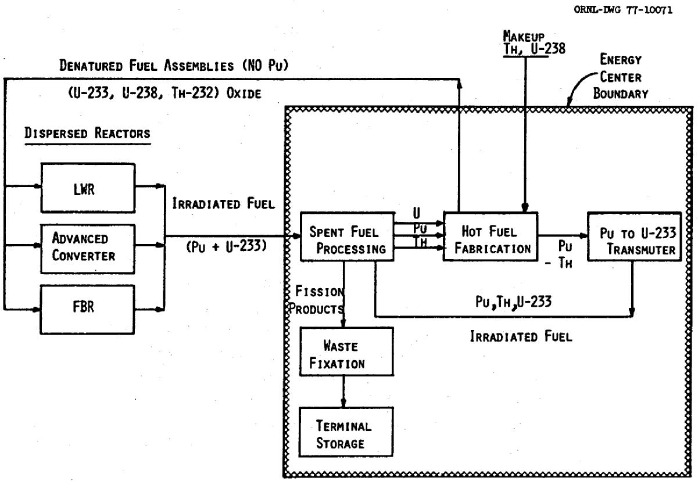  
Fig. 2.2-1. Schematic Fuel Flow for Symbiotic System Consisting of an Energy Center and Dispersed Reactors Operating on Denatured $^{233}\mathrm{U}$ Fuel.

One obvious concern regarding such a coupled system is the amount of power produced by the dispersed systems relative to that produced in the energy center reactors. The power ratio,\* defined as dispersed power generated relative to centralized power, can be viewed as a parameter characterizing the practicality of the system. While the power ratio depends on the characteristics of the reactors actually utilized for the various components and is considered in detail later in this report, certain generic statements can be made. In a mature "safeguarded" plutonium cycle, the ratio would be zero since all reactors would, of necessity, be located in energy centers. In the current open-ended LEU cycles, this ratio is essentially infinite since current nuclear generating capacity is dispersed via "naturally denatured" thermal systems. The denatured $^{233}\mathrm{U}$ cycle will fall

between these two extremes, and thus the proposed system's power ratio will be a crucial evaluation parameter.

The symbiotic system depicted by Fig. 2.2-1 can also be characterized by the type of reactors utilized inside and outside the center. In general, systems consisting of thermal (converter) reactors only, systems consisting of both thermal converters and fast breeder reactors, and systems consisting solely of fast breeder reactors can be envisioned.* One important characteristic of each system is the extent to which it must rely on an external fuel supply to meet the demand for nuclear-based generating capacity. The thermal-thermal system would be the most resource-dependent. The breeder-thermal system could be fuel-self-sufficient for a given power level and possibly also provide for moderate nuclear capacity growth. The breeder-breeder scenario, if economically competitive with alternative energy sources, would permit the maximum resource-independent nuclear contribution to energy production.

While such considerations serve to categorize the symbiotic systems themselves, the transition from the current once-through LEU cycles to the symbiotic systems is of more immediate concern. Although all-breeder systems would be resource-independent, commercial deployment of such systems is uncertain. The transition to the denatured cycle could be initiated relatively soon, however, by using moderately enriched $^{235}\mathrm{U} / ^{236}\mathrm{U}$ mixed with thorium (sometimes referred to as the "denatured $^{235}\mathrm{U}$ fuel cycle") in existing and projected thermal systems. The addition of thorium (and the corresponding reduction of $^{238}\mathrm{U}$ over the LEU cycle) would serve a dual purpose: the quantity of plutonium generated would be significantly reduced, and an initial stockpile of $^{233}\mathrm{U}$ would be produced. It should be noted that this rationale holds even if commercial fuel reprocessing is deferred for some time. Use of denatured $^{235}\mathrm{U}$ fuel would reduce the amount of plutonium contained in the stored spent fuel. In addition, the spent fuel would represent a readily accessible source of denatured $^{233}\mathrm{U}$ should the need to shift from $^{235}\mathrm{U}$ arise. However, substituting $^{232}\mathrm{Th}$ for some of the $^{238}\mathrm{U}$ in the LEU cycle would require higher fissile loadings and thus more $^{235}\mathrm{U}$ would be committed in a shorter time frame than would be necessary with the LEU cycle. An alternative would be to utilize energy-center Pu-burning transmuters to provide the initial source of $^{233}\mathrm{U}$ for dispersed $^{233}\mathrm{U}$ -based reactors. From these starting points, various scenarios which employ thermal or fast energy-center reactors coupled with denatured thermal or fast dispersed reactors can be developed.

On the basis of the above, eight general scenarios have been postulated for this study, with two sets of constraints on Pu utilization considered: either plutonium will not be allowed as a recycle fuel but recycle of denatured $^{233}\mathrm{U}$ will be permitted; or plutonium will be allowed within secure energy centers with only denatured fuels being acceptable for use at dispersed site reactors. The eight scenarios can be summarized as follows:

1. Nuclear power is limited to low-enriched uranium-fueled (LEU) thermal reactors operating on a stowaway cycle (included to allow comparisons with current policy).   
2. LEU reactors with uranium recycle are operated outside secure energy centers and thermal reactors with plutonium recycle are operated inside the centers.   
3. Same as Scenario 2 plus fast breeder reactors (FBRs) operating on the Pu/U cycle are deployed within the centers.   
4. LEU reactors and denatured $^{235}\mathrm{U}$ and denatured $^{233}\mathrm{U}$ reactors are operated with uranium recycle, all in dispersed areas; no plutonium recycle is permitted.   
5. Same as Scenario 4 plus thermal reactors operating on the Pu/Th cycle are permitted within secure energy centers.   
6. Same as Scenario 5 plus FBRs with Pu/U cores and thorium blankets ("light" transmutation reactors) are permitted within secure energy centers.   
7. Same as Scenario 6 plus denatured FBRs with $^{233}\mathrm{U} / ^{238}\mathrm{U}$ cores and thorium blankets are permitted in dispersed areas.   
8. The "light" transmutation FBRs of Scenario 7 are replaced with "heavy" transmutation reactors with Pu/Th cores and thorium blankets.

# 2.3. SOME INSTITUTIONAL CONSIDERATIONS OF THE DENATURED FUEL CYCLE

As stated above, the implementation of the denatured fuel cycle will entail the creation of fuel cycle/energy centers, which will require institutional arrangements to manage and control such facilities. The advantages and disadvantages of such centers, whether they be regional, multinational, or international, as well as the mechanisms required for their implementation, have been reported.394 Although a detailed enumeration of the conclusions of such studies are beyond the scope of this particular discussion, certain aspects of the energy center concept as it relates to the denatured fuel cycle are relevant.

Since only a few thousand kilograms of $^{233}\mathrm{U}$ currently exist, it is clear that production of $^{233}\mathrm{U}$ will be required prior to full-scale deployment of the denatured $^{233}\mathrm{U}$ cycle. If the reserves of economically recoverable natural uranium are allowed to become extremely limited before the denatured cycle is implemented, most if not all power produced at that time would be from energy-center transmuters. Such a situation is clearly inconsistent with the principle that the number of such centers and the percentage of total power produced in them be minimized. A gradual transition in which $^{235}\mathrm{U}$ -based dispersed reactors are replaced with denatured $^{233}\mathrm{U}$ -based dispersed reactors and their accompanying energy-center transmuter systems is thus desirable.

The proposed denatured fuel cycle/energy center scenario also presents an additional dimension in the formulation of the energy policies of national states - that of nuclear interdependence. By the very nature of the proposed symbiotic relationship inherent in

the denatured cycle, a condition of mutual dependence between the dispersed reactors and the energy-center reactors is created. Thus while nations choosing to operate only denatured (i.e., dispersed) reactors must obtain their fuel from nations that have energy-center transmuters, the nations operating the transmuters will in turn rely on the nations operating dispersed reactors for their transmuter fuel requirements (Pu). Hence, in addition to the possible nonproliferation advantages of the denatured fuel cycle, the concept also introduces a greater flexibility in national energy policies.

# References for Chapter 2

1. H. A. Feiveson and T. B. Taylor, "Security Implications of Alternative Fission Futures," Bull. Atomic Scientifics, p. 14 (Dec. 1976).   
2. "A Report on the International Control of Atomic Energy," prepared for the Secretary of State's Committee on Atomic Energy by a Board of Consultants: Chester I. Barnard, Dr. J. R. Oppenheimer, Dr. Charles A. Thomas, Harry A. Winne, and David E. Lilienthal (Chairman), Washington, D.C., March 16, 1946, pp. 127-213, Department of State Publication 2493.   
3. "Nuclear Energy Center Site Survey - 1975," Volumes 1-5, NUREG-0001, Nuclear Regulatory Commission, January, 1976.   
4. "Regional Nuclear Fuel Cycle Centers," 1977 Report of the IAEA Study Project, STI/TUB-445, International Atomic Energy Agency, 1977.

# CHAPTER 3

# ISOTOPIC CHARACTERISTICS OF DENATURED $^{233}$ U FUEL

# Chapter Outline

3.0. Introduction, T. J. Burns and L. S. Abbott, ORNL   
3.1. Estimated $^{232}\mathrm{U}$ Concentrations in Denatured $^{233}\mathrm{U}$ Fuels, D. T. Ingersoll, ORNL   
3.2. Radiological Hazards of Denatured Fuel Isotopes, H. R. Meyer and J. E. Till, ORNL   
3.3. Isotopics Impacting Fuel Safeguards Considerations

3.3.1. Enrichment Criteria of Denatured Fuel, C. M. Newstead, BNL   
3.3.2. Fabrication and Handling of Denatured Fuel, J. D. Jenkins and R. E. Brooksbank, ORNL   
3.3.3. Detection and Assay of Denatured Fuel, D. T. Ingersoll, ORNL   
3.3.4. Potential Circumvention of the Isotopic Barrier of Denatured Fuel, E. H. Gift and W. B. Arthur, ORGDP   
3.3.5. Deterrence Value of $^{232}\mathrm{U}$ Contamination in Denatured Fuel, C. M. Newstead, ORNL

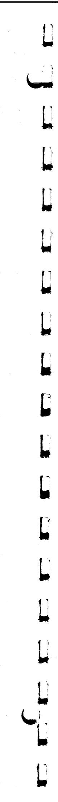

# 3.0. INTRODUCTION

# T. J. Burns and L. S. Abbott Oak Ridge National Laboratory

An assessment of the denatured $^{233}\mathrm{U}$ fuel cycle - both for meeting the requirements for electrical power growth and for reducing the risks of nuclear weapons proliferation - invariably must include an examination of the isotopics of the cycle. It has been pointed out in Chapters 1 and 2 that the concept of the denatured $^{233}\mathrm{U}$ cycle is an attempt to retain the isotopic barrier inherent in the currently used LWR low-enriched $^{235}\mathrm{U}$ (LEU) cycle but at the same time to allow the production and recycling of new fuel. In both the denatured and the LEU cycles the isotopic barrier is created by diluting the fissile isotope with $^{238}\mathrm{U}$ , so that the concentration of the fissile nuclide in any uranium chemically extracted from fresh fuel would be sufficiently low that the material would not be directly usable for weapons purposes. This is in contrast to the two reference fuel cycles, the Pu/U cycle, and the HEU/Th cycle. In both of these cycles, weapons-usable material could be extracted from the fresh fuel via chemical separation. Of course, as shown in Table 3.0-1, chemically extractable fissile material is present in the spent fuel elements of all these cycles; however, the spent elements are not considered to be particularly vulnerable because of the high radioactivity emitted by the fission products - at least initially.

In this assessment of denatured $^{233}\mathrm{U}$ fuel, the implications of substituting the denatured fuel for the reference cycles of various reactors are examined. In addition to the obvious advantage of the isotopic barrier in the fresh fuel, denatured $^{233}\mathrm{U}$ fuel has an additional protection factor against diversion in that its fresh fuel is radioactive to a much greater extent than any of the other fuels listed in Table 3.0-1. This characteristic is due to the presence of the contaminant $^{232}\mathrm{U}$ , which is generated as a byproduct of the $^{233}\mathrm{U}$ production process and which spawns a highly radioactive decay chain. As shown in Fig. 3.0-1, $^{232}\mathrm{U}$ decays through $^{228}\mathrm{Th}$ to stable $^{208}\mathrm{Pb}$ , emitting numerous gamma rays in the process, the most prominent being a 2.6-MeV gamma ray associated with the decay of $^{208}\mathrm{Tl}$ .

Table 3.0-1. Comparison of Principal Fissile and Fertile Nuclides in Some Reactor Fuels   

<table><tr><td>Fuel</td><td>Fresh Fuel Nuclides</td><td>Spent Fuel Nuclides</td></tr><tr><td>Denatured 233U fuel (with recycle)</td><td>233U, 236U, 232Th</td><td>233U, Puf, 238U, 232Th</td></tr><tr><td>LEU (no recycle)</td><td>235U, 238U</td><td>235U, Puf, 238U</td></tr><tr><td>LEU (with recycle)</td><td>235U, Puf, 238U</td><td>235U, Puf, 238U</td></tr><tr><td>Pu/U (with recycle)</td><td>Puf, 238U</td><td>Puf, 238U</td></tr><tr><td>HEU/Th (no recycle)</td><td>235U, 232Th</td><td>233U, 235U, 232Th</td></tr></table>

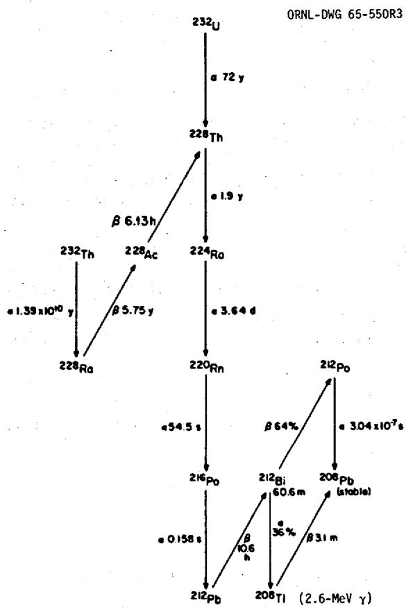  
Fig. 3.0-1. Decay of $^{232}\mathrm{U}$ .

The radioactivity associated with the $^{233}\mathrm{U}$ significantly impacts the associated fuel cycle. The fabrication, shipping, and handling of the fresh denatured fuel is expected to differ markedly from the other cycles, primarily due to the fact that remote procedures will have to be employed throughout. To design the necessary facilities will require a knowledge of the concentrations of $^{232}\mathrm{U}$ (and its daughter products) in the fuel as a function of time. To date, insufficient data are available on this subject, but on the basis of some preliminary investigations some estimates are given in Section 3.1 on the $^{232}\mathrm{U}$ concentrations that could be expected in the recycled fuel of LWRs, HTGRs, and FBRs operating on denatured $^{233}\mathrm{U}$ .

The radiological hazards associated with the use of denatured $^{233}\mathrm{U}$ fuel represent another aspect of the cycle demanding attention. Again little information is available, but Section 3.2 discusses the toxicity of the various isotopes present in the fuel and also in thorium ore, as well as the effects of exposure to the gamma rays emitted from the fresh fuel.

In assessing the safeguard features of denatured $^{233}\mathrm{U}$ fuel, the isotopics of the cycle must be examined from several viewpoints. While the $^{232}\mathrm{U}$ contamination will be essentially an inherent property of the denatured fuel cycle, the concentration of the isotopic denaturant, $^{238}\mathrm{U}$ , is controllable. The presence of both isotopes affects the proliferation potential of the denatured fuel cycle. As the $^{238}\mathrm{U}$ concentration is increased, the difficulty of circumventing the intrinsic isotopic barrier is increased. However, increasing the $^{238}\mathrm{U}$ fraction also increases the $^{239}\mathrm{Pu}$ concentration in the spent fuel so that an obvious trade-off of proliferation concerns exists between the front and back ends of the denatured fuel cycle. As pointed out in Section 3.3.1, the enrichment criteria for denatured $^{233}\mathrm{U}$ fuel are still being formulated.

The requirement for remote operations throughout the fuel cycle will in itself constitute a safeguard feature in that access to fissile material will be difficult at all stages of the cycle. But this requirement will also be a complicating factor in the design of the fuel recycling steps and operations. This subject is treated in more detail in Chapter 5, but Section 3.3.2 of this chapter points out that the remote operation requirement could dictate the selection of techniques, as, for example, for the fuel fabrication process.

The radioactivity of the $^{232}\mathrm{U}$ chain would also make it easier to detect diverted denatured fuel and would complicate both the production of weapons-grade $^{233}\mathrm{U}$ from fresh denatured fuel and its subsequent use in an explosive device. On the other hand, as discussed in Section 3.3.3, the radioactivity will inhibit passive, nondestructive assays for fissile accountability.

Finally, the possible circumvention of the isotopic barrier must be addressed. In Section 3.3.4 it is postulated that a gas centrifuge isotope separation facility is available for isotopically enriching diverted fresh denatured $^{233}\mathrm{U}$ fuel, and estimates are made of the amounts of weapons-grade material that could be so obtained. Conclusions are then drawn as to the relative attractiveness of denatured $^{233}\mathrm{U}$ fuel and other fuels to would-be diverters.

# 3.1. ESTIMATED $^{232}\mathrm{U}$ CONCENTRATIONS IN DENATURED $^{233}\mathrm{U}$ FUELS

# D. T. Ingersoll   Oak Ridge National Laboratory

Although it is mandatory that the concentrations of $^{232}\mathrm{U}$ at each stage of the fuel cycle be predictable for the various reactors operating on thorium-based fuels, little information on the subject is available at this time. This is attributable to the fact that the interest in thorium fuel cycles is relatively recent and therefore the nuclear data required for calculating the production of $^{232}\mathrm{U}$ have not been adequately developed. Of primary importance are the $(n,\gamma)$ cross sections of $^{231}\mathrm{Pa}$ , $^{230}\mathrm{Th}$ , and $^{232}\mathrm{Th}$ and the $(n,2n)$ cross sections of $^{233}\mathrm{U}$ and $^{232}\mathrm{Th}$ , all of which are intermediate interactions that can lead to the formation of $^{232}\mathrm{U}$ as is illustrated by the reaction chain given in Fig. 3.1-1. These cross sections are under current evaluation1 and should appear in the Version V release of the Evaluated Nuclear Data File (ENDF/B-V).

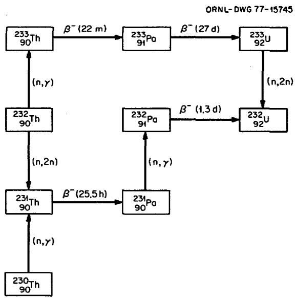  
Fig. 3.1-1 Important Reaction Chains Leading to the Production of $^{232}\mathrm{U}$ .

In spite of the nuclear data deficiencies, some results for $^{232}\mathrm{U}$ concentrations are available from calculations for denatured fuels in light-water reactors (LWRs) and in fast breeder reactors (FBRs). Although no results for denatured high-temperature gas-cooled reactors (HTGRs) are currently available, $^{232}\mathrm{U}$ concentrations can be roughly inferred from existing HTGR fuel data. Moreover, the analysis of $^{232}\mathrm{U}$ concentrations in standard HTGR designs (HEU/Th) serves as an upper bound for the denatured systems. A compilation of the available results is given below. The current state of the related $^{232}\mathrm{U}$ nuclear data is amply reflected in the large variances of the calculated concentrations.

# 3.1.1. Light-Water Reactor Fuels

Existing data on $^{232}\mathrm{U}$ concentrations in denatured LWR fuels are primarily from calculations based on the Combustion Engineering System $80^{\text{TM}}$ reactor design. Results from $\text{CE}^3$ for a denatured $^{235}\mathrm{U}$ cycle (20% $^{235}\mathrm{U}$ -enriched uranium in 78% thorium) show the $^{232}\mathrm{U}$ concentration after the zeroth generation to be 146 ppm $^{232}\mathrm{U}$ in uranium, while after five generations of recycle uranium, the concentration is increased to 251 ppm. These levels are in good agreement with ORNL calculations, which indicate 130 ppm $^{232}\mathrm{U}$ in uranium for the zeroth generation. The discharge uranium isotopics are summarized in Table 3.1-1. Also shown are the results from an ORNL calculation for a denatured $^{233}\mathrm{U}$ cycle

(10% $^{233}$ U-enriched uranium in 78% Th). The slight contribution from $^{233}$ U reactions increases the $^{232}$ U content to 157 ppm after the zeroth generation.

Table 3.1-1. Discharge Isotopics for LWRs Operating on Denatured Fuels   

<table><tr><td rowspan="2">Cycle</td><td colspan="7">Isotopic Fraction</td><td rowspan="2">232U in U(ppm)</td></tr><tr><td>232U</td><td>233U</td><td>234U</td><td>235U</td><td>236U</td><td>238U</td><td>232Th</td></tr><tr><td>235U/Th Fuela</td><td></td><td></td><td></td><td></td><td></td><td></td><td></td><td></td></tr><tr><td>CE(0)b</td><td>0.0029</td><td>1.07</td><td>0.11</td><td>1.56</td><td>0.50</td><td>16.81</td><td>76.21</td><td>146</td></tr><tr><td>ORNL(0)</td><td>0.0026</td><td>1.00</td><td>0.09</td><td>1.59</td><td>0.49</td><td>16.85</td><td>76.23</td><td>130</td></tr><tr><td>CE(5)</td><td>0.0061</td><td>1.60</td><td>0.69</td><td>1.27</td><td>1.86</td><td>18.78</td><td>75.79</td><td>251</td></tr><tr><td>233U/Th Fuelc</td><td></td><td></td><td></td><td></td><td></td><td></td><td></td><td></td></tr><tr><td>ORNL(0)</td><td>0.0031</td><td>1.16</td><td>0.29</td><td>0.056</td><td>0.0052</td><td>18.32</td><td>75.99</td><td>157</td></tr></table>

$^{\alpha}$ Initial isotopics: $4.4\%$ $^{235}\mathrm{U}$ , $17.6\%$ $^{238}\mathrm{U}$ , $78\%$ $^{232}\mathrm{Th}$ .   
The number in parentheses represents the fuel generation number.   
${}^{a}$ Initial isotopics: ${2.8}{\% }^{233}\mathrm{U},{19.2}{\% }^{238}\mathrm{U},{78}{\% }^{232}\mathrm{{Th}}$ .

# 3.1.2. High-Temperature Gas-Cooled Reactor Fuels

Although calculations for $^{232}\mathrm{U}$ concentrations in denatured HTGR fuels are not available, it is possible to roughly infer this information from existing HTGR calculations if the expected changes in the thorium content are known. The conventional HTGR cycle begins with $93\%$ $^{235}\mathrm{U}$ -enriched uranium fuel and thorium fertile material. On successive cycles, the $^{233}\mathrm{U}$ produced in the thorium is recycled, thus reducing the required amount of $^{235}\mathrm{U}$ makeup. The $^{232}\mathrm{U}$ content of the recycled fuel becomes appreciable after only a few generations. Table 3.1-2 gives the uranium isotopics of the recycle fuel batches at the beginning of recycle and at equilibrium recycle, the latter showing a maximum $^{232}\mathrm{U}$ concentration of 362 ppm in uranium.

Table 3.1-2. Uranium Isotopics for Commercial HTGR Recycled Fuel (HEU/Th)   

<table><tr><td rowspan="2"></td><td colspan="5">Isotopic Fraction</td><td rowspan="2">232U in U(ppm)</td></tr><tr><td>232U</td><td>233U</td><td>234U</td><td>235U</td><td>236U</td></tr><tr><td>Beginning of recycle</td><td>0.000126</td><td>0.921</td><td>0.0735</td><td>0.00568</td><td>0.000245</td><td>126</td></tr><tr><td>Equilibrium recycle</td><td>0.000362</td><td>0.614</td><td>0.243</td><td>0.0802</td><td>0.0630</td><td>362</td></tr></table>

The values in Table 3.1-2 are a result of a standard HTGR fuel composition which has an average $\mathsf{Th} / ^{233}\mathsf{U}$ ratio of about 20. Preliminary estimates have been made of denatured HTGR fuels which assume a $20\%$ denatured $^{235}\mathsf{U}$ , leading to a $15\%$ denatured $^{233}\mathsf{U}$ . Because of the added $^{238}\mathsf{U}$ fertile material, the amount of thorium is correspondingly reduced by about $30\%$ , resulting in a similar reduction in the $^{232}\mathsf{U}$ production. The concentration of $^{232}\mathsf{U}$ in total uranium would also be reduced by the mere presence of the diluting $^{238}\mathsf{U}$ , so that it can be estimated that a $15\%$ denatured $^{233}\mathsf{U}$ HTGR would contain approximately 40 ppm $^{232}\mathsf{U}$ in uranium after equilibrium recycle. The lower $^{232}\mathsf{U}$ levels in the HTGR are primarily due to a softening of the neutron energy spectrum compared with that of the LWR. This results in a marked reduction in the $^{232}\mathsf{Th}(n,2n^{-})$ reaction rate, which is a prime source of $^{232}\mathsf{U}$ .

# 3.1.3. Fast Breeder Reactor Fuels

232U concentrations calculated by Mann and Schenter7 and by Burns8 for various commercial-sized FBR fuel cycles are given in Table 3.1-3. Except for Case 2, these values were determined from reaction-rate calculations using 42 energy groups and one-dimensional geometry; the Case 2 results were determined from a coarse nine-group two-dimensional depletion calculation.

It is important to note that Cases 1 and 2 represent the "transmitter" concept. All the discharged uranium $(^{232}\mathrm{U},^{233}\mathrm{U},^{234}\mathrm{U},$ and $^{235}\mathrm{U})$ is bred from the $^{232}\mathrm{Th}$ initially charged and consists principally of $^{233}\mathrm{U}$ . This accounts for the high $^{232}\mathrm{U} / \mathrm{U}$ ratio, which will be reduced by a factor of 5 to 8 in the denatured fuel manufactured from this material. Thus, denatured fuel generated via the fast Pu/Th transmuter is expected to have approximately 150-750 ppm $^{232}\mathrm{U}$ in uranium.

Table 3.1-3. FBR Core Region $^{232}\mathrm{U}$ Discharge Concentrations   

<table><tr><td rowspan="2">Case No.</td><td rowspan="2">Fuel</td><td colspan="4">232U in U (ppm)</td></tr><tr><td>t = 1 yrb</td><td>t = 2 yr</td><td>t = 3 yr</td><td>t = 5 yr</td></tr><tr><td></td><td></td><td>No recycle</td><td></td><td></td><td></td></tr><tr><td>1</td><td>10% 239Pu in Th</td><td>982</td><td>1710</td><td>2380</td><td>3270</td></tr><tr><td>2</td><td>11% 239Pu in Th</td><td>1106</td><td>2376</td><td>3670</td><td></td></tr><tr><td>3</td><td>10% 233U in Th</td><td>288</td><td>830</td><td>1330</td><td>2210</td></tr><tr><td>4</td><td>10% 233U in 238U</td><td>6.6</td><td>10.7</td><td>12.5</td><td>13.3</td></tr><tr><td></td><td></td><td>With recycle</td><td></td><td></td><td></td></tr><tr><td>5</td><td>10% 233U in Th</td><td>1820</td><td>2760</td><td>3260</td><td></td></tr><tr><td>6</td><td>10% 233U in 238U</td><td>35</td><td>35</td><td>35</td><td></td></tr></table>

${}^{a}$ Cases 1,3-6 are from ref. 7; Case 2 is from ref. 8.   
${}^{b}t =$ fuel residence time for no recycle cases; $t =$ burning time before recycle for recycle cases.

The last two cases in Table 3.1-3 give the equilibrium $^{232}\mathrm{U}$ concentrations assuming recycle of the $^{233}\mathrm{U}$ and the associated $^{232}\mathrm{U}$ . It should be noted that these two cases represent the extremes regarding allowable enrichment $(^{233}\mathrm{U} / \mathrm{U})$ . For a $20\%$ denatured fuel in which approximately half the heavy metal is $^{232}\mathrm{Th}$ , the expected $^{232}\mathrm{U}$ equilibrium concentration would be $\sim 1600 \, \mathrm{ppm}$ ( $^{232}\mathrm{U} / \mathrm{U}$ ) for a 3-yr cycle residence time.

# 3.1.4. Conclusions

The results presented in this section are, for the most part, preliminary and/or approximate. This is largely a consequence of the uncertainties in the anticipated fuel compositions, denaturing limits, recycle modes, etc., as well as the basic nuclear data. Also, the results assumed zero or near-zero $^{230}\mathrm{Th}$ concentrations, which can approach significant levels depending on the source of the thorium stock, particularly in thermal systems. Because of the relevant cross sections, the presence of even small amounts of $^{230}\mathrm{Th}$ can result in considerably higher $^{232}\mathrm{U}$ concentrations. It is possible to conclude, however, that $^{232}\mathrm{U}$ concentrations will be highest for $^{233}\mathrm{U}$ -producing FBRs, increase with fuel recycle, and decrease with fissile denaturing.

# References for Section 3.1

1. Summary Minutes of the Cross Section Evaluation Working Group Meeting, May 25-26, 1977.   
2. N. L. Shapiro, J. R. Rec, R. A. Matzie, "Assessment of Thorium Fuel Cycles in Pressurized-Water Reactors," ERRI NP-359, Combustion Engineering (1977).   
3. Private communication from Combustion Engineering to A. Frankel, Oak Ridge National Laboratory, 1977.   
4. Private communication from W. B. Arthur to J. W. Parks, Oak Ridge National Laboratory, August 11, 1977.   
5. J. E. Rushton, J. D. Jenkins, and S. R. McNeany, "Nondestructive Assay Techniques for Recycled $^{233}\mathrm{U}$ Fuel for High-Temperature Gas-Cooled Reactors," J. Institute Nuclear Materials Management IV(1) (1975).   
6. M. H. Merrill and R. K. Lane, "Alternate Fuel Cycles in HTGRs," Draft for Joint Power Generation Conference, Long Beach, Calif., 1977.   
7. F. M. Mann and R. E. Schenter, "Production of $^{232}\mathrm{U}$ in a 1200 MWe LMFBR," Hanford Engineering Development Laboratory (June 10, 1977).   
8. T. J. Burns, private communication.

# 3.2. RADIOLOGICAL HAZARDS OF DENATURED FUEL ISOTOPES

H. R. Meyer and J. E. Till

Oak Ridge National Laboratory

Consideration of the denatured $^{233}\mathrm{U}$ cycle has created the need to determine the radiological hazards associated with extensive use of $^{233}\mathrm{U}$ as a nuclear fuel. These hazards will be determined by the toxicity of the various isotopes present in the fuel and in thorium ore, which in turn is influenced by the path through which the isotopes enter the body--that is, by inhalation or ingestion. In addition, the gamma rays emitted from the denatured fuel present a potential hazard.

# 3.2.1. Toxicity of $^{233}\mathrm{U}$ and $^{232}\mathrm{U}$

Only limited experimental data are available on the toxicity of high specific activity uranium isotopes such as $^{233}\mathrm{U}$ and $^{232}\mathrm{U}$ . Chemical toxicity, as opposed to radiological hazard, is the limiting criterion for the long-lived isotopes of uranium ( $^{235}\mathrm{U}$ and $^{236}\mathrm{U}$ ) which are of primary concern in the light-water reactor uranium fuel cycle. In order to establish the relative radiotoxicity of denatured $^{233}\mathrm{U}$ fuel, it is helpful to consider specific metabolic and dosimetric parameters of uranium and plutonium isotopes. Table 3.2-1 lists several important parameters used in radiological dose calculations. The effective half life for $^{239}\mathrm{Pu}$ in bone is approximately 240 times that of uranium. However, the effective energy per disintegration for $^{232}\mathrm{U}$ is about three times greater than that for any of the plutonium isotopes. In general, the time-integrated dose from plutonium isotopes would be significantly greater than the dose from uranium isotopes for the inhalation pathway, assuming inhalation of equal activities of each radionuclide. Doses via the ingestion pathway, again on a per μCi basis, are much lower than those estimated for the inhalation pathway.

It is currently assumed that all bone-seeking radionuclides are five times more effective in inducing bone tumors than $^{226}\mathrm{Ra}$ . However, the limited number of studies that have been conducted with $^{233}\mathrm{U}$ (ref. 2) and $^{232}\mathrm{U}$ (refs. 3-5) suggest a reduced effectiveness in inducing bone tumors for these isotopes and may result in use of exposure limits that are less restrictive than current limits.

The last two columns in Table 3.2-1 represent dose conversion factors (DCFs) for uranium and plutonium isotopes calculated on the basis of mass rather than activity. It may be seen that the $^{232}\mathrm{U}$ "Mass DCFs" are more than four orders of magnitude greater than those for fissionable $^{233}\mathrm{U}$ , due largely to the high specific activity of $^{232}\mathrm{U}$ . This factor contributes to the overriding importance of $^{232}\mathrm{U}$ content when considering the radiotoxicity of denatured uranium fuels.

Figure 3.2-1 illustrates the importance of $^{232}\mathrm{U}$ content with respect to potential toxicity of $^{233}\mathrm{U}$ fuel. This figure presents the estimated dose commitment to bone calculi

Table 3.2-1. Metabolic Data and Dose Conversion Factors (DCFs) for Bone for Selected Uranium and Plutonium Isotope   

<table><tr><td rowspan="2">Isotope</td><td rowspan="2">Specific Activity (Ci/g)</td><td rowspan="2">Effective Half Life in Bonea (Days)</td><td colspan="2">Activity Dose Conversion Factor</td><td colspan="2">Mass Dose Conversion Factor</td></tr><tr><td>Inhalationb (rems/μCi)</td><td>Ingestionb (rems/μCi)</td><td>Inhalationc (rems/μg)</td><td>Ingestionc (rems/μg)</td></tr><tr><td>232U</td><td>21.42</td><td>3.00 x 102</td><td>1.1 x 102</td><td>4.1 x 100</td><td>2.4 x 103</td><td>8.8 x 101</td></tr><tr><td>233U</td><td>9.48 x 10-3</td><td>3.00 x 102</td><td>2.2 x 101</td><td>8.6 x 10-1</td><td>2.1 x 10-1</td><td>8.2 x 10-3</td></tr><tr><td>235U</td><td>2.14 x 10-6</td><td>3.00 x 102</td><td>2.0 x 101</td><td>8.0 x 10-1</td><td>4.3 x 10-5</td><td>1.7 x 10-6</td></tr><tr><td>238U</td><td>3.33 x 10-7</td><td>3.00 x 102</td><td>1.9 x 101</td><td>7.6 x 10-1</td><td>6.3 x 10-6</td><td>2.5 x 10-7</td></tr><tr><td>238Pu</td><td>17.4</td><td>2.3 x 104</td><td>5.7 x 103</td><td>6.8 x 10-1</td><td>9.9 x 104</td><td>1.2 x 101</td></tr><tr><td>239Pu</td><td>6.13 x 10-2</td><td>7.2 x 104</td><td>6.6 x 103</td><td>7.9 x 10-1</td><td>4.0 x 102</td><td>4.8 x 10-2</td></tr><tr><td>240Pu</td><td>2.27 x 10-1</td><td>7.1 x 104</td><td>6.6 x 103</td><td>7.9 x 10-1</td><td>1.5 x 103</td><td>1.8 x 10-1</td></tr></table>

aInternational Commission on Radiological Protection, "Report of Committee II on Permissible Dose for Internal Radiation," ICRP Publication 2, Pergamon Press, New York, 1959.   
bKillough, G. G., and L. R. McKay, "A Methodology for Calculating Radiation Doses from Radioactivity Released to the Environment," ORNL-4992, 1976.   
$^\mathrm{c}$ Product of specific activity and activity dose conversion factor.

lated for inhalation of $10^{-12}$ g of unirradiated $^{233}\mathrm{U}$ HTGR fuel ( $\sim 93\%$ $^{233}\mathrm{U} / \mathrm{U}$ ) as a function of the $^{232}\mathrm{U}$ impurity content for two different times following separation at a reprocessing facility. The upper curve is the dose commitment at 10 years after separation. Two basic conclusions can be drawn from these data. First as recycle progresses and concentrations of $^{232}\mathrm{U}$ become greater, the overall radiotoxicity of $^{233}\mathrm{U}$ fuel will increase significantly. Second, the ingrowth of $^{232}\mathrm{U}$ daughters in $^{233}\mathrm{U}$ fuel increases fuel radiotoxicity significantly for a given concentration of $^{232}\mathrm{U}$ . Although the data graphically illustrated in Fig. 3.2-1 were not specifically calculated for denatured $^{233}\mathrm{U}$ fuel, the required data not being available, the relative shape of the curves would remain the same. All else being equal, the estimated radiotoxicity of denatured fuel would be reduced due to dilution of $^{233}\mathrm{U}$ and $^{232}\mathrm{U}$ with $^{238}\mathrm{U}$ , which has a low radiological hazard.

A comparison of the dose commitment to bone resulting from inhalation of $10^{-12}$ g of three types of fuel, HTGR $^{233}\mathrm{U}$ fuel, LWR $^{235}\mathrm{U}$ fuel, and FBR plutonium fuel, is given in Fig. 3.2-2. This analysis evaluates unirradiated HTGR fuel containing 1000 ppm $^{232}\mathrm{U}$ and does not consider fission products, activation products, transplutonium radionuclides, or environmental transport. As shown in Table 3.2-1, the inhalation pathway would be by far the most significant for environmentally dispersed fuels. Therefore, other potential pathways of exposure are not considered in this brief analysis.

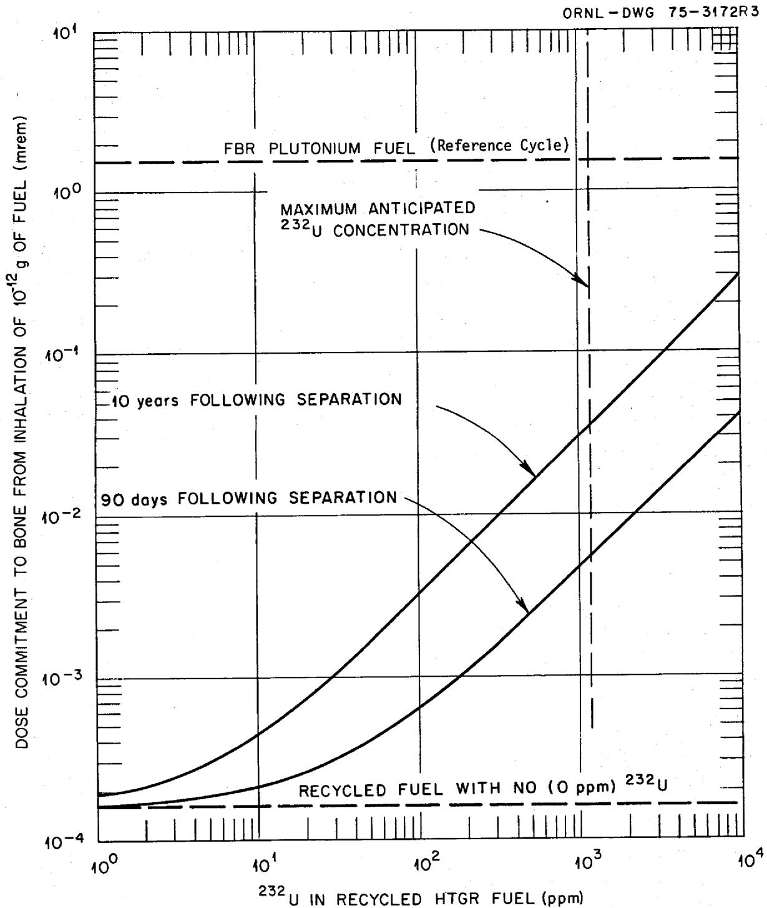  
Fig. 3.2-1. Effect of $^{232}\mathrm{U}$ Concentrations in HTGR Fuel (93% $^{233}\mathrm{U}/\mathrm{U}$ ) on Dose Commitment to Bone.

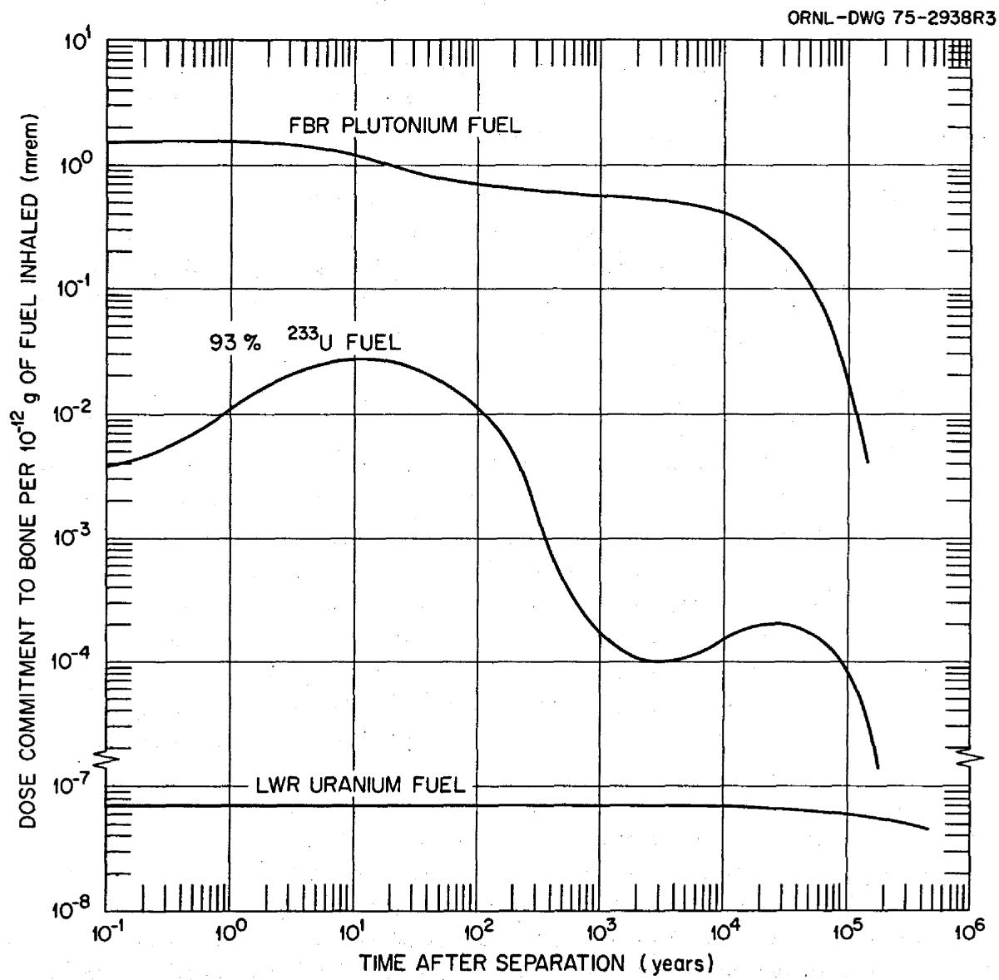  
Fig. 3.2-2. Relative Radiotoxicity of FBR Plutonium Fuel, HTGR Fuel (93% $^{233}\mathrm{U} / \mathrm{U}$ ) and LWR Uranium Fuel as a Function of the Time after Separation at Reprocessing Plant.

It is noted that Fig. 3.2-2 applies to fresh fuel as a function of time after separation, presuming it has been released to the environment. Inhalation long after release could result from the resuspension of radioactive materials deposited on terrestrial surfaces. A dose commitment curve for denatured $^{233}\mathrm{U}$ fuel would be expected to lie slightly below the given curves for HTGR fuel; however, the denatured fuel would remain significantly more hazardous from a radiological standpoint than LWR uranium fuel.

# 3.2.2 Toxicity of $^{232}\mathrm{Th}$

Given the potential for radiological hazard via the mining of western U.S. thorium deposits as a result of implementation of $^{232}\mathrm{Th}$ -based fuel cycles, current difficulties in estimation of $^{232}\mathrm{Th}$ DCFs must also be considered here.

As is evident in Fig. 3.0-1 (see Section 3.0), both $^{232}\mathrm{U}$ and $^{232}\mathrm{Th}$ decay to $^{228}\mathrm{Th}$ , and then through the remainder of the decay chain to stable $^{208}\mathrm{Pb}$ . $^{232}\mathrm{U}$ decays to $^{232}\mathrm{Th}$ via a single 5.3-MeV alpha emission; $^{232}\mathrm{Th}$ decays via three steps, a 4.01-MeV alpha emission to $^{228}\mathrm{Ra}$ , followed by serial beta decays to $^{228}\mathrm{Th}$ . The total energy released in the convergent decay chains is obviously nearly equal.

The ICRP lists effective energies (to bone, per disintegration) as 270 MeV for $^{232}\mathrm{Th}$ and 1200 MeV for $^{232}\mathrm{U}$ ; these effective energies are critical in the determination of dose conversion factors to be used in estimation of long-term dose commitments. The large difference between the effective energies calculated for the two radionuclides is based on the ICRP assumption (ref. 7) that radium atoms produced by decay in bone of a thorium parent should be assumed to be released from bone to blood, and then redistributed as though the radium were injected intravenously. As a result, the presence of $^{228}\mathrm{Ra}$ in the $^{232}\mathrm{Th}$ decay chain implies, under this ICRP assumption, that 90% of the $^{228}\mathrm{Ra}$ created within bone is eliminated from the body. Therefore, most of the potential dose from the remaining chain alpha decay events is not accrued within the body, and the total effective energy for the $^{232}\mathrm{Th}$ chain is a factor of 4.4 lower than that for $^{232}\mathrm{U}$ , as noted.

Continuation and reevaluation of the early research $^{8,9}$ leading to the above dissimilarity indicated that the presumption of a major translocation of $^{228}\mathrm{Ra}$ out of bone was suspect (refs. 10-14), and that sufficient evidence existed to substantiate retention of $97\%$ of $^{228}\mathrm{Ra}$ in bone. Recalculation of effective energies for the $^{232}\mathrm{Th}$ chain on this basis results in a value of 1681 MeV as listed in ERDA 1451 (ref. 15), a substantial increase implying the need for more restrictive limits with respect to $^{232}\mathrm{Th}$ exposures. In contrast to this argument, the 1972 report of an ICRP Task Group of Committee 2 (ref. 16) presents a newly developed whole-body retention function for elements including radium which effectively relaxes $^{232}\mathrm{Th}$ exposure limits.

# 3.2.3 Hazards Related to Gamma-Ray Emissions

While fuel fabricated from freshly separated $^{233}\mathrm{U}$ emits no significant gamma radiation, ingrowth of $^{232}\mathrm{U}$ daughters leads to buildup of $^{208}\mathrm{Tl}$ 2.6-MeV gamma radiation, as well as other gamma and x-ray emissions. As discussed elsewhere in this report, it is anticipated that occupational gamma exposures during fuel fabrication can be minimized by such techniques as remote handling and increased shielding.

Gamma exposure resulting from the transportation of irradiated fuel elements containing $^{232}\mathrm{U}$ will not be significantly different from that due to other fuels. Shielded casks would be used in shipment to control exposures to the public along transportation routes. Gamma exposure from $^{232}\mathrm{U}$ daughters would be insignificant compared to exposure from fission products in the spent fuel.

Refabricated fuel assemblies containing $^{232}\mathrm{U}$ would require greater radiation shielding than LWR fuel. However, this problem can be minimized by shipping fresh assemblies in a container similar in design to a spent fuel cask. Gamma doses to workers and to the general public due to transport of fuel materials between facilities are therefore expected to be easily controlled, and have been estimated to be low, perhaps one man-rem per 1000 MW(e) reactor-plant-year.[15]

The estimated gamma hazard of environmentally dispersed $^{232}\mathrm{U}$ , while a significant contributor to externally derived doses, is overshadowed as a hazard by the efficiencies of internally deposited alpha emitters in delivering radiological doses to sensitive tissues.

# 3.2.4. Conclusions

Several conclusions can be made from this assessment. It appears that additional metabolic and toxicological data, both human and animal-derived, focusing on high specific activity uranium, would be helpful in assessing the radiological hazards associated with denatured $^{233}\mathrm{U}$ fuel. Specifically, data on the biological effectiveness of $^{232}\mathrm{U}$ and $^{233}\mathrm{U}$ could modify exposure standards for these radionuclides.

In terms of relative toxicities based on the dose commitment resulting from inhalation of equal masses of fuel, plutonium fuel is significantly more hazardous than HTGR $^{233}\mathrm{U}$ fuel or denatured $^{233}\mathrm{U}$ fuel. However, denatured $^{233}\mathrm{U}$ fuel would be significantly more hazardous than LWR uranium fuel. As the range of fuel cycle options is narrowed, more comprehensive research should be directed at derivation of toxicity data specific to facilities and fuel compositions of choice.

Research investigating potential environmental hazards resulting from deliberate introduction (for safeguards purposes) of gamma emitters into fuels prior to refabrication is necessary, as is a thorough investigation of the hazards related to repeated irradiation of recycle materials, with consequent buildup of low cross-section transmutation products.

# References for Section 3.2

1. M. R. Ford, "Comments on Intake Guides for Various Isotopes and Isotopic Mixtures of Uranium," ORNL 3697, 1964.   
2. H. C. Hodge, J. N. Stannard, and J. B. Hursh, Uranium, Plutonium, and the Transplutonium Elements, Springer-Verlag, Heidelberg, 1973.   
3. M. P. Finkel, "Relative Biological Effectiveness of Radium and Other Alpha Emitters in CF No. 1 Female Mice," Proceedings of the Society for Exp. Biol. and Med. No. 3, p. 83, July 1953.   
4. J. E. Ballou and R. A. Gies, "Early disposition of inhaled uranyl nitrate (232U and 233U) in rats," p. 91 in BNWL-2100 (Part 1): Annual Report for 1976.   
5. J. E. Ballou and N. A. Wogman, "Nondestructive Analysis for $^{232}\mathrm{U}$ and Decay Progeny in Animal Tissues," BNWL-2100 (Part 1): Annual Report for 1976.   
6. J. E. Till, "Assessment of the Radiological Impact of $^{232}\mathrm{U}$ and Daughters in Recycled $^{233}\mathrm{U}$ HTGR Fuel," ORNL-TM-5049, February, 1976.   
7. International Commission on Radiological Protection, "Report of Committee II on Permissible Dose for Internal Radiation," ICRP Publication 2, Pergamon Press, New York, 1959.   
8. J. C. Reynolds, P. F. Gustafson, and L. D. Marinelli, "Retention and Elimination of Radium Isotopes Produced by Decay of Thorium Parents within the Body," USAEC Report ANL-5689, November 1957, p. 4.   
9. M. A. Van Dilla and B. J. Stover, "On the Role of Radiothorium (Th $^{228}$ ) in Radium Poisoning," Radiobiology 66: 400-401, 1956.   
10. B. J. Stover, D. R. Atherton, D. S. Buster, and N. Keller, "The Th²²⁸ Decay Series in Adult Beagles: Ra²²⁴, Pb²¹² and Bi²¹² in Blood and Excreta," Radiation Research 26: 226-243, 1965.   
11. C. W. Mays letter to G. C. Butler, 25 August 1967.   
12. A. Kaul, "Tissue Distribution and Steady State Activity Ratios of Th²³² and Daughters in Man Following Intravascular Injection of Thorotrast," in: Proceedings of the Third International Meeting on the Toxicity of Thorotrast, Copenhagen, April 1973, M. Faber, ed., RISO Report No. 294.   
13. S. R. Bernard and W. S. Snyder, private communication entitled "Memorandum on Thorium Daughters," April 1968.   
14. B. J. Stover, D. R. Atherton, D. S. Buster, and F. W. Bruenger, "The Thorium Decay Series in Adult Beagles: Ra²²⁴, Pb²¹², and Bi²¹² in Selected Bones and Soft Tissues," Radiation Research 26: 132-145, 1965.   
15. U.S. Energy Research and Development Administration, Final Environmental Statement, Light Water Breeder Reactor Program, ERDA-1541, Vols. 1-5, 1976.   
16. International Council on Radiological Protection Report 20, 1972.

# 3.3. ISOTOPICS IMPACTING FUEL SAFEGUARDS CONSIDERATIONS

# 3.3.1. Enrichment Criteria of Denatured Fuel

# C. M. Newstead Brookhaven National Laboratory

A very important problem in the determination of the characteristics of denatured fuel is the isotopic composition of the uranium, that is to say, the percent of $^{233}\mathrm{U}$ present in the mixture of $^{233}\mathrm{U}$ plus $^{238}\mathrm{U}$ . The guidelines provided by current regulations concerning the distinction between low-enriched uranium (LEU) and high-enriched uranium (HEU) are applicable to $^{235}\mathrm{U}$ , the limit being set at $20\%$ $^{235}\mathrm{U}$ in $^{238}\mathrm{U}$ . Anything above that constitutes HEU and anything below that constitutes LEU.

LEU is considered to be unsuitable for constructing a nuclear explosive device. The rationale for making this statement is based upon the fact that the critical mass of $20\%$ $^{235}\mathrm{U}$ -enriched uranium is $850~\mathrm{kg}$ , and in a weapon this amount of material must be brought together sufficiently rapidly to achieve an explosive effect. Theoretically the enrichment could be lower and still achieve prompt criticality. However, the amount of material becomes so enormous and the difficulty of bringing it together so great that it would be impractical to attempt to produce an explosive device with less than $20\%$ enrichment. It is clear that the distinction is somewhat of a gray area and the enrichment could be changed a few percent, but this should be done extremely cautiously since the $^{235}\mathrm{U}$ enrichment vs. critical mass curve is rather steep and increasing the enrichment only slightly could reduce the critical mass substantially. Also, it is necessary to consider institutional arrangements. A number of domestic and international regulations revolve about the $20\%$ figure and it would be no easy matter to change all these stipulations. This sets the background against which the enrichment considerations for denatured fuel must be addressed.

The matter of arriving at a practical criterion is complicated and is currently under study by the Special Projects Division of Lawrence Livermore Laboratory, where an in-depth analysis of the weapons utility of fissile material (including $^{233}\mathrm{U}$ with various enrichments) for the Non-Proliferation Alternate Systems Assessment Program (NASAP) is being conducted in accordance with a work scope developed by the International Security Affairs Division (ISA) and the management of the NASAP Program. Unfortunately, the results of the LLL study are not yet available. Because of the considerable impact of enrichment considerations on the utility of particular reactors and particular symbiotic systems, it seems best at this point to discuss the several approaches for determining the guidelines for the enrichment of $^{233}\mathrm{U}-^{238}\mathrm{U}$ mixtures and to make a determination based on the LLL study at a later time.

There are three approaches which can be employed to estimate allowable enrichment criteria for $^{233}\mathrm{U}$ in $^{238}\mathrm{U}$ corresponding to the statutory $20\%$ limit set for $^{235}\mathrm{U}$ in $^{238}\mathrm{U}$ . These three criteria are: (1) critical mass, (2) infinite multiplication factor, and (3) yield. These can be employed singularly or in combination as discussed below.

# Critical Mass

As stated above, the bare-sphere critical mass of metallic $20\%$ $^{235}\mathrm{U}$ and $80\%$ $^{238}\mathrm{U}$ is about 850 kg. This amount can be reduced by a factor of two to three by the use of a neutron reflector. However, the size and weight of the combination of reflector and fissile material will not be substantially less than that of the bare sphere, and may even be greater. In addition, for a nuclear explosive, an assembly scheme must be added which will increase the size and weight substantially. Concentrations of $^{235}\mathrm{U}$ , $^{233}\mathrm{U}$ , or plutonium in mixtures with $^{238}\mathrm{U}$ such that they have bare-sphere metallic critical masses of about 850 kg represent one possible reasonably conservative criterion for arriving at concentrations below which the material is not usable in practical nuclear weapons. This 850 kg bare-sphere critical mass criterion can also be used for other materials which are or might be in nuclear fuel cycles. Although this criterion provides a basis for consistent safeguards requirements for $^{233}\mathrm{U}$ or $^{235}\mathrm{U}$ embedded in $^{238}\mathrm{U}$ , it leans to rather low limits.

# Infinite Multiplication Factor

Another possible criterion is the one associated with the infinite multiplication factor $k_{\infty}$ . For a weapon to be successful, a certain degree of supercriticality must be attained. D. P. Smith of Los Alamos Scientific Laboratory has adopted this approach. He takes $k_{\infty} = 1.658$ for $20\%$ $^{235}\mathrm{U}$ -enriched uranium, which implies $k_{\infty} = 1.5346$ for the oxide. He then performs a search calculation on enrichment for the other systems so as to obtain the same $k_{\infty}$ value. His results are shown in Table 3.3-1. We note that for $^{233}\mathrm{U}$ the limits are $11.65\%$ $^{233}\mathrm{U}$ for the oxide and $11.12\%$ $^{233}\mathrm{U}$ for the metal.

Table 3.3-1 Equivalent Enrichment Limits   

<table><tr><td>Fuel</td><td>Material</td><td>k∞</td></tr><tr><td rowspan="3">Metal</td><td>20% 235U, 80% 238U</td><td>1.658</td></tr><tr><td>11.12% 233U, 88.88% 238U</td><td>1.658</td></tr><tr><td>11.11% 239Pu, 88.89% 238U</td><td>1.658</td></tr><tr><td rowspan="4">Oxide</td><td>(20% 235U, 80% 238U)O2</td><td>1.5346</td></tr><tr><td>(11.65% 233U, 88.35% 238U)O2</td><td>1.5346</td></tr><tr><td>(13.76% 239Pu, 86.24% 238U)O2</td><td>1.5346</td></tr><tr><td>(14.5% 239Pu, 1.5% 240Pu, 85% 238U)O2</td><td>1.5344</td></tr></table>

These numbers were obtained by D. P. Smith of Los Alamos Scientific Laboratory from DTF IV calculations using Hansen-Roach cross sections.

# Yield

It may also be possible to set a minimum yield for a practical nuclear explosive device. An obvious consideration here is that in attempting to achieve supercriticality with increasing amounts of fissile material of decreasing enrichment, a point is reached where the yield of an equivalent mass of chemical high explosive exceeds the nuclear explosive yield. The LLL Special Projects Division is currently investigating the possibility of establishing such a limit.

# 3.3.2. Fabrication and Handling of Denatured Fuel

J. D. Jenkins R. E. Brooksbank Oak Ridge National Laboratory

The techniques required for fabricating and handling $^{233}\mathrm{U}$ -containing fuels encountered in the denatured fuel cycle differ from those employed for $^{235}\mathrm{U}$ fuels because of the high gamma-ray and alpha-particle activities present in the $^{233}\mathrm{U}$ fuels. Some idea of the radiation levels that will be encountered can be deduced from recent radiation measurements for a can that contains 500 g of $^{233}\mathrm{U}$ with a $^{232}\mathrm{U}$ content of 250 ppm and has been aged 12 years since purification. The results were as follows:

<table><tr><td>Distance</td><td>Radiation (mr/hr)</td></tr><tr><td>Contact</td><td>250,000</td></tr><tr><td>1 ft</td><td>20,000</td></tr><tr><td>3 ft</td><td>2,000</td></tr></table>

These radiation levels are equivalent to those that could be expected at the same distances from $500\mathrm{g}$ of $^{233}\mathrm{U}$ containing $\sim 1250~\mathrm{ppm}~^{232}\mathrm{U}$ and aged six months, which is comparable with $^{233}\mathrm{U}$ that has undergone several cycles in a fast breeder reactor. With such high activities, complete alpha containment of the fuel will be required, and all personnel must be protected from the fuel with thick biological shielding (several feet of concrete or the equivalent). This, of course, necessitates remote-handling operations, which constitutes an inherent safeguard against the diversion of the fuel while it is being fabricated and/or handled.

The requirement for remote operation is further borne out by experience gained in two earlier programs in which $^{233}\mathrm{U}$ -containing fuels were fabricated. In these two programs, the "Kilorod" program1 and the Light Water Breeder Reactor (LWBR) program,2 ( $^{233}\mathrm{U},\mathrm{Th})\mathrm{O}_2$ pellets could be fabricated in glove boxes, but only because the $^{233}\mathrm{U}$ used contained extremely low (<10 ppm) amounts of $^{232}\mathrm{U}$ . Even so, the time frame for fuel fabrication was severely restricted and extraordinary efforts were required to keep the contamination level of aged $^{233}\mathrm{U}$ sufficiently low to permit continued glove box operation. Based on experience at ORNL in the preparation of nearly two tons of $^{233}\mathrm{UO}_2$ for the LWBR program, it was determined that the handling of kilogram quantities of $^{233}\mathrm{U}$ containing 10 ppm of $^{232}\mathrm{U}$ and processed in unshielded glove boxes 25 days after purification (complete daughter removal) to produce $^{233}\mathrm{UO}_2$ powder resulted in personnel radiation exposures of 50 mr/man-week. The techniques used in preparing Kilorod and LWBR fuel would not be feasible in a large-scale fabrication plant using $^{233}\mathrm{U}$ containing the 100 to 2000 ppm $^{232}\mathrm{U}$ expected in recycled $^{233}\mathrm{U}$ . Therefore, one must conclude that remote fabrication, behind several feet of concrete shielding, will be required for $^{233}\mathrm{U}$ -bearing LWR and FBR fuels.

Remote operation will impact the fabrication process and the fuel form. For example, LWR and LMFBR fuels can be manufactured either as oxide pellets or as sol-gel microspheres. The many powder-handling operations required in fabricating pellets with

their inherent dusting problems and the many mechanical operations required in blending powder, pressing, sintering, and grinding pellets make remotely operating and maintaining a $^{233}\mathrm{U}$ -bearing pellet fabrication line difficult. Alternatively, the relative ease of handling liquids and microspheres remotely makes the sol-gel spherepac process appear more amenable to remote operation and maintenance than powder preparation and pelletizing processes, although the process is less fully developed.

Detailed analyses of specific flow sheets and process layouts for a particular fuel form would be required to quantitatively determine the relative safeguards merits of one process versus another. In general, however, batch processes where control of special nuclear materials can be effected by item accountability are easier than continuous processes in which the material is contained in liquid form. Thus, in our example above, an assessment might conclude that some sacrifices must be made in material accountability in order to achieve remote fuel fabrication.

The overriding safeguards consideration in denatured fuel fabrication however is the remote nature of the process itself, which limits personnel access to the fissile material. Access is not impossible, however, for two reasons. First, for material and equipment transfer, the processing cells will be linked to other cells or to out-of-cell mechanisms. Second, some portions of the processing equipment may be maintained by persons who enter the cells after appropriate source shielding or source removal. Thus, some cells may be designed for personnel access, but all access points will be controlled because of the requirement for alpha-activity containment. Health physics radiation monitors would provide an indication of breach of containment and of possible diversion. Because the ingress points from the cells will be limited, portal monitors may also provide additional safeguards assurance.

It should be noted that although kilogram quantities of material represent high-radiation levels from the standpoint of occupational exposures, the levels of recently purified $^{233}\mathrm{U}$ are low enough that direct handling of the material for several days would not result in noticeable health effects.

The remote nature of the refabrication process requires highly automated machinery for most of the fabrication. Elaborate control and monitoring instrumentation will be required for automatic operation and process control and can provide additional data for material accountability and material balance consistency checks. The remote nature of the process has the potential of substantially improving the safeguarding of the recycle fuel during refabrication. The extent of this improvement will depend on the specific facility design and on the degree to which the additional real-time process information can enhance the safeguards system.

# D. T. Ingersoll   Oak Ridge National Laboratory

The relatively high gamma-ray activity of $^{233}\mathrm{U}$ fuels, enriched or denatured, has opposite effects on detection and assay: it increases the detectability of the fuels but it also increases the difficulty of passive gamma assay. That this situation exists is apparent from Fig. 3.3-2, which presents a Ge(Li)-measured gamma-ray spectrum from a $^{233}\mathrm{U}$ sample containing 250 ppm $^{232}\mathrm{U}$ . All major peaks in the spectrum are from the decay products of $^{232}\mathrm{U}$ , which is near secular equilibrium with the products. The presence of the 2.6-MeV gamma ray emitted by $^{208}\mathrm{Tl}$ provides a useful handle for the detection of materials that contain even small quantities of $^{232}\mathrm{U}$ , thus providing a basis for preventing fuel diversion and/or for recovering diverted fuel. On the other hand, the presence of numerous gamma rays in the spectrum eliminates the possibility of direct gamma-ray assay of the fissile isotope. Indirect assay using the $^{232}\mathrm{U}$ gamma rays would be impractical, since it would require a detailed knowledge of the history of the sample.

Detection systems are already available. A Los Alamos Scientific Laboratory (LASL) report describes a doorway monitor system4 that employs a 12.7- x 2.5-cm NaI(Tl) detector and has been used to measure a dose rate of about 2.5 mr/hr at a distance of 30 cm from a 20-g sample of $\mathsf{PuO}_2$ . Approximately the same dose rate would be measured for a similar sample of $^{233}\mathsf{U}$ containing 100 ppm of $^{232}\mathsf{U}$ only 12 days following the separation of daughter products. The dose rate would increase by a factor of 10 after 90 days and by an additional factor of 4 after one year.5 Also, the gamma-ray dose rate scales linearly with $^{232}\mathsf{U}$ content and is nearly independent of the type of bulk material, i.e., $^{233}\mathsf{U}$ , $^{235}\mathsf{U}$ , or $^{238}\mathsf{U}$ .

The net counting rate for the $\mathrm{PuO_2}$ sample (shielded with $0.635\mathrm{cm}$ of lead) was 1000 cps. The observed background was 1800 cps, resulting in a signal-to-noise ratio of only 0.6. Similar samples of $^{232}\mathrm{U}$ -contaminated uranium not only would yield higher counting rates, but could also yield considerably better signal-to-noise ratios if the detector window were set to cover only the 2.6-MeV gamma ray present in the spectrum. Although the denaturing of uranium fuels tends to dilute the $^{232}\mathrm{U}$ content, the anticipated $^{232}\mathrm{U}$ levels in most denatured fuels is still sufficiently high for relatively easy detection, except immediately after complete daughter removal.

The difficulty in performing nondestructive assays (NDA) of denatured fuels relative to highly enriched fuels is attributable to two effects: (a) the desired signal (emitted neutrons or gamma rays, heat generation, etc.) is reduced because of the material dilution, and (b) the signal is mostly obscured by the presence of $^{232}\mathrm{U}$ . The latter problem exists because although denaturing reduces the total concentration of $^{232}\mathrm{U}$ , the relative proportion of $^{232}\mathrm{U}$ to fissile material remains the same. This is an especially significant problem with passive NDA techniques. As is shown in Fig. 3.3-2, the gamma-ray

spectrum from a $^{232}\mathrm{U}$ sample containing 250 ppm of $^{232}\mathrm{U}$ is totally dominated by the $^{232}\mathrm{U}$ decay gamma rays, thus eliminating the possibility of direct gamma-ray assay. Passive techniques employing calorimetry are also complicated since $^{232}\mathrm{U}$ decay particles can contribute significantly to the heat generation in a fuel sample. It has been calculated, $^{3,6}$ that for a fresh sample of $^{233}\mathrm{U}$ containing 400 ppm $^{232}\mathrm{U}$ , nearly 50% of the thermal heat generation can be attributed to $^{232}\mathrm{U}$ decay, which increases to 75% after only one year. It is, therefore, apparent that fissile content assay for denatured uranium fuels will require more sophisticated active NDA techniques which must overcome the obstacles of material dilution and $^{232}\mathrm{U}$ -activity contamination.

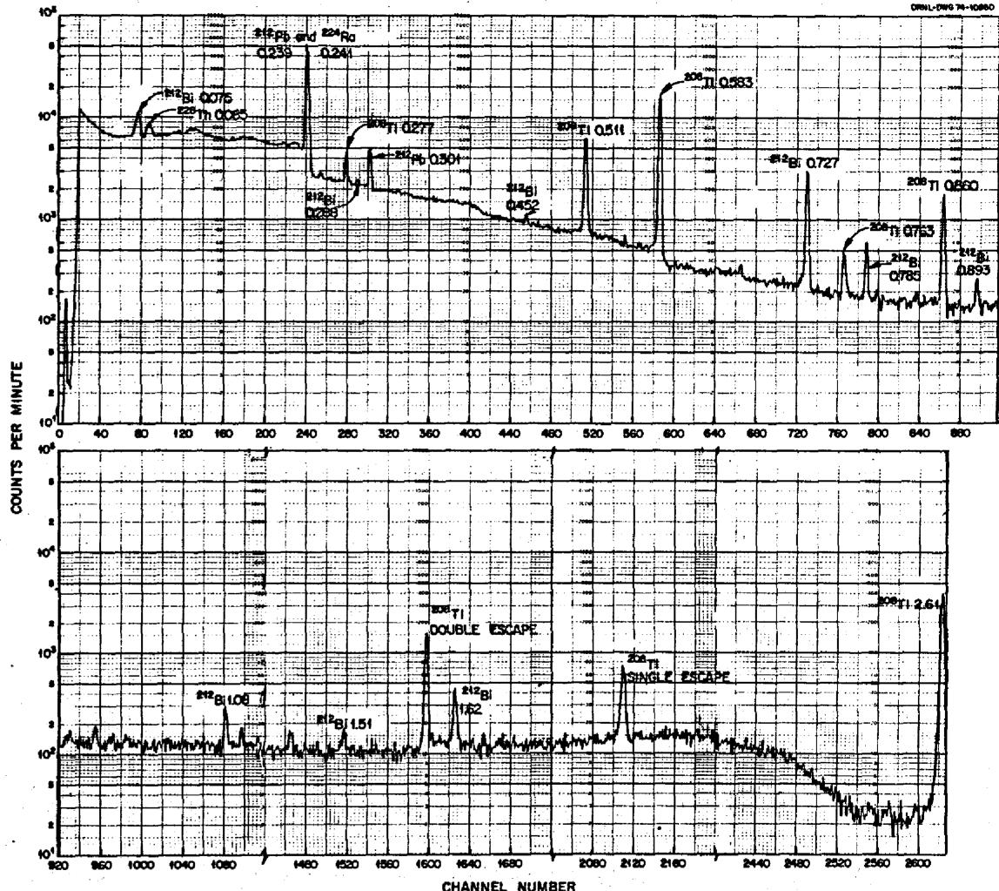  
Fig. 3.3-2. Gamma-Ray Spectrum from a $^{233}\mathrm{U}$ Sample Containing 250 ppm $^{232}\mathrm{U}$ . All major peaks are attributed to $^{232}\mathrm{U}$ decay products. Gamma-ray energies indicated in MeV. (From ref. 3.)

# 3.3.4. Potential Circumvention of the Isotopic Barrier of Denatured Fuel

# E. H. Gift and W. B. Arthur Oak Ridge Gaseous Diffusion Plant

If a large-scale denatured-uranium recycle program is fully implemented (with secure energy centers), many types of both fresh (unirradiated) and spent fuel may be in transit throughout the world. In order to ensure that these fuels are proliferation resistant, they must meet the basic criterion that a sufficient quantity of fissile material cannot be chemically extracted from seized elements for direct use in the fabrication of a nuclear weapon. As pointed out in previous sections of this report, the addition of the denaturant $^{238}\mathrm{U}$ to the fissile isotope $^{233}\mathrm{U}$ will prevent the direct use of the uranium in weapons manufacture providing the $^{233}\mathrm{U}$ content of the uranium remains below a specified limit, which for this study has been set at $12\%$ (see Section 3.3.1). Thus, even if the uranium were chemically separated from the thorium fertile material included in the elements, it could not be used for a weapon. Similarly, if the $^{235}\mathrm{U}$ content of uranium is kept below $20\%$ , the uranium would not be directly usable. For the discussion presented here, it is further assumed that fuels containing both $^{233}\mathrm{U}$ and $^{235}\mathrm{U}$ will meet this criterion if their weighted average lies between these limits.

With the chemical isolation of the primary fissile isotopes thus precluded, two potential means exist for extracting fissionable material for the denatured fuel: (1) isotopic separation of the fresh fuel into its $^{233}\mathrm{U}$ (or $^{235}\mathrm{U}$ ) and $^{238}\mathrm{U}$ components; and (2) chemical extraction from the spent fuel of the $^{239}\mathrm{Pu}$ bred in the $^{238}\mathrm{U}$ denaturant or chemical extraction of the intermediate isotope $^{233}\mathrm{Pa}$ that would subsequently decay to $^{233}\mathrm{U}$ . In this examination of the potential circumvention of the isotopic barrier of denatured fuel both these possibilities are discussed; however, the probability of the second one actually being carried out is essentially discounted. Thus the emphasis here is on the possibility that would-be proliferators would opt for producing weapons-grade uranium through the clandestine operation of an isotope separation facility. For the purposes of this study it is assumed that the seized fuel is in the form of fresh LWR elements of one of the following fuel types:

A. Approximately $3\%$ 235U-enriched uranium (same as currently used LWR fuel).   
B. Recycle uranium from a thorium breeder blanket, denatured to $\sim 12\%$ $^{233}\mathrm{U}$ with depleted uranium.   
C. Fifth-generation recycle of fuel type B with $^{233}\mathrm{U}$ fissile makeup from a thorium breeder blanket.   
D. First cycle of $^{235}\mathrm{U} - ^{238}\mathrm{U}$ -Th fuel assuming no $^{233}\mathrm{U}$ is available from an external source. In this fuel scheme the $^{235}\mathrm{U}$ concentration in uranium can be as high as $20\%$ (see above).   
E. First recycle of fuel type D with $93\%$ in uranium makeup. In this fueling option, not all of the fuel in a reload batch will contain recycle uranium. Some portion of the reload batch will contain fuel type D. This option is analogous to the "traditional" concept envisioned for plutonium recycle fuels. It allows some of the fuel

to be fabricated in nonradioactive facilities. This fueling option will be referred to in the remainder of the text as fuel recycle Option 1.

F. Fifth-generation recycle of fuel types D and E with $93\%$ 235U makeup (Option 1).   
G. First recycle of fuel type D, with recycle uranium in all fuel assemblies of a reload batch. Makeup uranium is $20\%$ and $93\%$ ${}^{235}\mathrm{U}$ as needed to maintain reactivity. In this option all fuel would probably require remote fabrication facilities. This fueling option will be referred to in the remainder of the text as fuel recycle Option 2.   
H. Fifth recycle of fuel type G with $^{235}\mathrm{U}$ makeup (Option 2).

The uranium compositions of these fuels are shown in Table 3.3-2. In addition to these, it should be assumed that natural uranium is also available.

Table 3.3-2. Uranium Fuel Mixtures That May Be Available (Weight Fraction in Uranium)   

<table><tr><td>Isotope</td><td>A</td><td>B</td><td>C</td><td>D</td><td>E</td><td>F</td><td>G</td><td>H</td></tr><tr><td>232U</td><td>0</td><td>5.02 × 10-4</td><td>6.565 × 10-4</td><td>0</td><td>1.2363 × 10-4</td><td>2.445 × 10-4</td><td>1.134 × 10-4</td><td>2.331 × 10-4</td></tr><tr><td>233U</td><td>0</td><td>0.118611</td><td>0.11498</td><td>0</td><td>0.047004</td><td>0.05914</td><td>0.04310</td><td>0.05638</td></tr><tr><td>234U</td><td>1.2 × 10-4</td><td>0.008523</td><td>0.035108</td><td>0.001754</td><td>0.005430</td><td>0.02115</td><td>0.005125</td><td>0.020245</td></tr><tr><td>235U</td><td>0.032</td><td>0.002317</td><td>0.01255</td><td>0.2000</td><td>0.13201</td><td>0.113457</td><td>0.13765</td><td>0.11749</td></tr><tr><td>236U</td><td>0</td><td>0.000036</td><td>0.005327</td><td>0</td><td>0.02303</td><td>0.056496</td><td>0.021119</td><td>0.05386</td></tr><tr><td>238U</td><td>0.96788</td><td>0.870011</td><td>0.831228</td><td>0.798246</td><td>0.792389</td><td>0.749522</td><td>0.793021</td><td>0.75188</td></tr></table>

Description of Fuel Type:   
A - 3.2 wt % $^{235}\mathrm{U}$ from natural uranium.   
B - Thorium breeder blanket fuel denatured with depleted uranium.   
C - Fifth generation recycle of B with thorium breeder blanket makeup.   
D - 20 wt % $^{235}\mathrm{U}$ from natural uranium.   
E - First recycle of D with 93 wt $\times$ $^{235}\mathrm{U}$ in uranium makeup (Option 1, see note).   
F - Fifth generation recycle of D with 93 wt % $235$ U in uranium makeup (Option l, see note).   
G - First recycle of D with 93 wt % 235U makeup (Option 2, see note).   
H - Fifth recycle of D with 93 wt % $235$ U makeup (Option 2, see note).

NOTE: Fuel types E and F are designed so that not all of the fuel in a reload batch is recycle fuel; some of the reload batch will contain fuel type D. This situation is analogous to the "traditional" concept envisioned for plutonium recycle fuels. This concept allows some of the fuel to be fabricated in non-radioactive facilities, and is referred to in the text as fuel recycle Option 1.

Fuel types G and H result if every assembly in the reload batch contains recycle fuel. The fueling mode is referred to as Option 2.

# Isotopic Separation of Fresh Fuel

Selection of Separation Facility. Of the various uranium isotope separation processes which have been conceived, only the current technology processes (i.e., gaseous diffusion, gas centrifuge, the Becker nozzle and the South African fixed wall centrifuge) and possibly the calutron process could be considered as near-term candidates for a clandestine facility capable of enriching divered reactor fuel. Of these, the gas centrifuge may be the preferred technology. This conclusion is directly related to the proven advantages of the process, which include a high separation factor per machine, low electrical power needs, and the adaptability to small low-capacity but high-enrichment plants. Further, more national groups (i.e., the U.S., England, Holland, Germany, Japan, Australia, and France) have operated

either large centrifuge pilot plants or small commercial-sized plants, more so than for any other enrichment process, so it is apparent that this technology is widely understood and applied. A brief description of the centrifuge process, as well as descriptions of other current and future separation technologies, is given in Appendix A.

The application of centrifuge technology to a small plant capable of producing a couple of hundred kilograms of uranium enriched to $90\%$ 235U has not proved to be inordinately expensive. Two examples can be provided. An article appearing in two journals7,8 presents information on a proposed Japanese centrifuge plant. This plant, which could be operational in 1980, is designed to produce 50 MT SWU/yr in a 7000-machine facility. The total cost of the facility was estimated by the Japanese to be $166.7 million. Simple arithmetic yields the individual centrifuge separation capacity of 7 kg SWU/yr and a centrifuge cost of approximately $24,000 (which includes its share of all plant facilities).

An upper limit for the cost of developing a small gas centrifuge enrichment facility can be estimated from published costs from the United States uranium gas centrifuge program. A paper by Kiser⁹ provides a convenient summary of the status and cumulative costs for the U.S. program. The Component Test Facility, a plant which is expected to have a separative capacity of 50 MT SWU/yr (see Appendix A), was operational in January of 1977. To that date, the cumulative cost of the entire U.S. gas centrifuge program was given as about $310 million. Of this total, about $190 million was identified as development costs. The remaining $120 million was identified as equipment and facility expense. Further, only about $30 million was identified as being technology investigation. Even more intriguing is that within the initial 3-year development program (beginning in 1960 and budgeted at $6 million), the following accomplishments were recorded.

a. The operating performance of the gas centrifuge was greatly improved.   
b. Small machines were successfully cascaded in 1961 (one year after initiation of the contract).   
c. When the last of these units was shut down in 1972, some machines had run continuously for about eight years.

That these centrifuges were not commercially competitive with gaseous diffusion may be irrelevant when they are considered as a candidate for a clandestine enrichment facility. Thus, as stated above, of the current technologies, the centrifuge process would probably be selected. The utilization of the developing technologies (laser, plasma, etc.) for a clandestine enrichment facility is not currently feasible. Successful development of these technologies by any of the numerous national research groups would make them candidates for such a facility, however, and they would offer the decided advantages of a high separation factor, low-power requirement and modular construction.

Effect of $^{232}\mathrm{U}$ on the Enrichment Process and Product. All fuels containing $^{233}\mathrm{U}$ also contain substantial amounts of $^{232}\mathrm{U}$ . As mentioned earlier in this report, the daughter products from $^{232}\mathrm{U}$ ( $t_{\frac{1}{2}} = 72$ yr) release highly energetic gamma rays and alpha particles that can complicate both the enrichment process and the subsequent weapon fabrication.

As a first step in evaluating the effect of $^{232}\mathrm{U}$ on the enrichment process and the enriched product, consider fuel types B and C from Table 3.3-2 as feed to an enrichment plant. For making an acceptable weapon a fissile content of $90\%$ $^{233}\mathrm{U} + ^{235}\mathrm{U}$ in the product should be satisfactory. An acceptable product flow rate from such a plant might be $100\mathrm{kg}\mathrm{U / yr}$ .

Based on these assumptions, the product concentrations shown in Table 3.3-3 were obtained from multicomponent enrichment calculational methods. $^{10}$ This table illustrates that while a sufficiently fissile uranium is produced, at a relatively low feed rate, the product has also concentrated the highly gamma active (through its decay daughters) $^{232}\mathrm{U}$ by about a factor of 10. Greater than $99\%$ of the $^{232}\mathrm{U}$ in the enrichment plant feed will be present in the product.

In the enrichment plant the $^{232}\mathrm{U}$ concentration gradient from the feed point will drop rapidly in the stripping section. In the tails the $^{232}\mathrm{U}$ concentration will be reduced by about a factor of 150 from the feed concentration. As a result, the gamma radiation levels in the enrichment plant can be expected to vary by a factor of greater than 1000 from the tails to the product.

Calculations have been made for a typical centrifuge enrichment plant to illustrate the gamma radiation level that could be expected at equilibrium as a function of the $^{232}\mathrm{U}$ concentration.[11] These results are shown in Table 3.3-4. Implicit in these estimates is the assumption that the daughter products of $^{232}\mathrm{U}$ are all deposited within the enrichment facility. This assumption seems justified since the fluoride compound of the first daughter product, $^{228}\mathrm{Th}$ ( $t_{\frac{1}{2}} = 1.9$ years), is nonvolatile. With the exception of $^{224}\mathrm{Ra}$ ( $t_{\frac{1}{2}} = 3.6$ d), all of the other daughters have very short lives.

Experimentally, little evidence exists to determine the true fractional deposition of $^{232}\mathrm{U}$ daughters. Current evidence is incorporated in the existing specifications for $\mathrm{UF}_6$ feed to the gaseous diffusion plants.[12] These specifications call for a maximum $^{232}\mathrm{U}$ concentration of 110 parts of $^{232}\mathrm{U}$ per billion parts of $^{235}\mathrm{U}$ in the feed. At this concentration, the radiation levels would be significant in a highly enriched product ( $\sim 270 \, \mathrm{mr/hr}$ at 1 ft and 3 mr/hr on the plant equipment).

Based on Tables 3.3-3 and 3.3-4, the maximum gamma radiation level in a plant enriching $^{233}\mathrm{U}$ to $90\%$ would be about $2\mathrm{r/hr}$ at equilibrium. At this radiation level, little decomposition of either lubrication oils or the $\mathrm{UF_6}$ gas would occur. Some evidence exists to show that at this radiation level the viscosity of the lubricating oils would be unaffected over a 20-year plant life. Thus, there should be no bearing problem. It is also expected that the $\mathrm{UF_6}$ would be fairly stable to the combined alpha and gamma radiation levels. At the 2-r/hr level, less than one-tenth of the mean inventory of the machine would be decomposed per year. This material would be expected to be distributed fairly uniformly throughout the machine with perhaps slightly higher accumulation on the withdrawal scoops. Since the individual machine inventory would be very low, this should not be a significant loss of material.

Table 3.3-3.Enriched Product Compositions (Weight Fraction in Uranium)   

<table><tr><td rowspan="2">Isotope</td><td colspan="2">Fuel Type B</td><td colspan="2">Fuel Type C</td></tr><tr><td>Feed</td><td>Product</td><td>Feed</td><td>Product</td></tr><tr><td>232U</td><td>5.02 × 10-4</td><td>4.1545 × 10-3</td><td>6.565 × 10-4</td><td>5.626 × 10-3</td></tr><tr><td>233U</td><td>0.118611</td><td>0.90</td><td>0.11498</td><td>0.90</td></tr><tr><td>234U</td><td>0.008523</td><td>0.03757</td><td>0.035108</td><td>0.0901</td></tr><tr><td>235U</td><td>0.002317</td><td>0.00376</td><td>0.01255</td><td>0.00379</td></tr><tr><td>236U</td><td>3.6 × 10-5</td><td>1.98 × 10-5</td><td>0.005327</td><td>1.73 × 10-4</td></tr><tr><td>238U</td><td>0.870011</td><td>0.05450</td><td>0.831228</td><td>3.124 × 10-4</td></tr><tr><td>233U in Tails</td><td></td><td>0.01</td><td></td><td>0.01</td></tr><tr><td>Feed Flow, kg U/yr</td><td>832</td><td></td><td>859</td><td></td></tr><tr><td>Product Flow, kg U/yr</td><td></td><td>100</td><td></td><td>100</td></tr></table>

When removed from the plant, the $\mathsf{UF}_6$ product would be condensed and probably stored in monel cylinders. If it is assumed that the cylinders were sized to hold $16\mathrm{kg}$ of $\mathsf{UF}_6$ , the gamma dose rates that could be expected from the unshielded cylinders are as shown in Table 3.3-5. To reduce these product dose rates to acceptable levels would require substantial shielding. As an example, Table 3.3-6 shows the shielding required to reduce the dose rate at 1 ft to 1.0 and 50 mr/hr.

Table 3.3-4. Gamma Radiation Level in an Enrichment Plant as a Function of $^{232}\mathrm{U}$ Concentration   

<table><tr><td>232U Concentration (wt %)</td><td>Radiation Level (r/hr) at Equilibrium*</td></tr><tr><td>2.0</td><td>6.8</td></tr><tr><td>1.0</td><td>3.4</td></tr><tr><td>0.5</td><td>1.7</td></tr><tr><td>0.1</td><td>.34</td></tr><tr><td>0.001</td><td>.0034</td></tr><tr><td>0.0001</td><td>.00034</td></tr></table>

*Within an infinite array of centrifuges.

Table 3.3-5. $^{232}\mathrm{U}$ -Induced Gamma-Ray Dose Rates from Unshielded Monel Cylinders Containing 16 kg of UF $_6$   

<table><tr><td rowspan="2">Distance from Cylinder</td><td rowspan="2">Decay Time* (days)</td><td colspan="2">Dose Rate (r/hr)</td></tr><tr><td>0.1 wt % 232U</td><td>0.6 wt % 232U</td></tr><tr><td rowspan="4">Contact</td><td>10</td><td>40.2</td><td>242</td></tr><tr><td>30</td><td>194</td><td>1,166</td></tr><tr><td>90</td><td>654</td><td>3,922</td></tr><tr><td>Equil.</td><td>7,046</td><td>42,300</td></tr><tr><td rowspan="4">1 Foot</td><td>10</td><td>4.2</td><td>25.4</td></tr><tr><td>30</td><td>20.4</td><td>122</td></tr><tr><td>90</td><td>68.6</td><td>412</td></tr><tr><td>Equil.</td><td>740</td><td>4,440</td></tr><tr><td rowspan="4">1 Meter</td><td>10</td><td>0.85</td><td>5.1</td></tr><tr><td>30</td><td>4.1</td><td>24.6</td></tr><tr><td>90</td><td>13.8</td><td>82.9</td></tr><tr><td>Equil.</td><td>149</td><td>894</td></tr></table>

*Time measured from chemical separation from thorium.

Table 3.3-6. Shielding Required to Reduce $^{232}\mathrm{U}$ -Induced Gamma-Ray Dose Rates from Monel Cylinders Containing 16 kg of UF $_6^*$   

<table><tr><td rowspan="2">Design Dose Rate (mr/hr)</td><td rowspan="2">Decay Time** (days)</td><td colspan="2">Concrete Thickness (cm)</td></tr><tr><td>0.1 wt % 232U</td><td>0.6 wt % 232U</td></tr><tr><td>1.0</td><td>30</td><td>101</td><td>120</td></tr><tr><td></td><td>90</td><td>114</td><td>132</td></tr><tr><td></td><td>Equil.</td><td>138</td><td>157</td></tr><tr><td>50</td><td>30</td><td>62</td><td>80</td></tr><tr><td></td><td>90</td><td>74</td><td>92</td></tr><tr><td></td><td>Equil.</td><td>98</td><td>116</td></tr></table>

*Distance from source to shield = 1 ft.   
**Time measured from chemical separation from thorium.

The high alpha activity of uranium containing $^{232}\mathrm{U}$ will present two problems:

1. In the $\mathsf{UF}_6$ there will be a strong $(\alpha, n)$ reaction. A crude estimate of the neutron emission from a 16-kg $\mathsf{UF}_6$ product cylinder containing 0.6 wt% $^{232}\mathsf{U}$ is 5.7 x 10 $^7$ neutrons/sec at 10 days decay, 2.5 x 10 $^8$ at 30 days decay, and 8.7 x 10 $^8$ at 90 days decay.   
2. The $^{232}\mathrm{U}$ will provide a strong heat source in the $\mathrm{UF}_6$ and the metal products. A crude estimate of the heat generation rate from pure $^{232}\mathrm{U}$ as a function of time after purification is: 0.03 W/g at 10 days, 0.13 W/g at 30 days, and 0.46 W/g at 90 days.

The degree to which these properties will affect weapon manufacture or delivery is unknown.

Alternative Enrichment Arrangements to Reduce $^{232}\mathrm{U}$ Content in the Product. In considering the complications introduced to the final uranium metal product, i.e., the radiation level and heat generation resulting from $^{232}\mathrm{U}$ , it is apparent that removal of the $^{232}\mathrm{U}$ would be beneficial. Enrichment cascades can be designed to accomplish this. The most efficient arrangement would be to first design a cascade to strip $^{232}\mathrm{U}$ from all other uranium

isotopes and then to feed the tails from the first cascade to a second cascade where the fissile isotopes can be enriched. This is illustrated in Fig. 3.3-2.

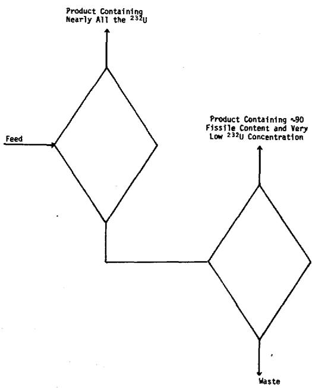  
Fig. 3.3-2. Illustration of Enrichment Arrangement to Produce Low $^{232}\mathrm{U}$ Content Uranium.

Such an enrichment arrangement can be independent of the specific enriching device. Based on the discussion of the gas centrifuge process in Appendix A and at the beginning of this section, a small, low separative work capacity machine may be within the technical capabilities of a would-be diverter (see Appendix A).

Although no information exists on the separative work capacity of a Zippe machine in a cascade, a reasonable estimate of its separative capacity is about $0.3\mathrm{kg}$ SWU/yr when separating $^{235}\mathrm{U}$ from $^{238}\mathrm{U}$ .

To further specify the plant, it can be assumed that the diverter would like to:

1. Minimize the feed and waste stream flows in the first and second cascades consistent with limiting the number of centrifuges required.   
2. Achieve a significant weapons-grade product flow rate. (A flow rate of 100 kg U/yr having a fissile content of $90\%$ $^{233}\mathrm{U} + ^{235}\mathrm{U}$ was chosen.)   
3. Reduce the $^{232}\mathrm{U}$ content in the metal product so that contact manufacture can be achieved without serious radiation hazard.

Based on these assumptions and considering the fuel types listed in Table 3.3-2, a series of enrichment cascades, flows and selected isotopic parameters are presented in Table 3.3-7. The basic criterion chosen for the final uranium product was that the $^{232}\mathrm{U}$ concentration was about $1\mathrm{ppm}^{232}\mathrm{U}$ in total uranium. At this level the gamma emission rate from the final metal product is sufficiently low that most fabrication and subsequent handling operations can be carried out in unshielded facilities using contact methods.

The first enrichment cascade to perform the separation of $^{232}\mathrm{U}$ from the remaining uranium will be very radioactive. But it will be only slightly more radioactive than if only one cascade were used and the $^{232}\mathrm{U}$ not separated from the final product. The table shows that a factor of two increase in $^{232}\mathrm{U}$ product concentration will provide sufficient decontamination without a prohibitive increase in the number of centrifuges. If much greater (by a factor of 20) concentrations of $^{232}\mathrm{U}$ can be tolerated in the cascade, some reduction ( $\sim 20$ to $30\%$ ) can be made in the necessary number of centrifuges.

Table 3.3-7 also shows a striking difference in the number of centrifuges required to decontaminate the uranium product when the uranium makeup to the thorium cycles is $93\%$ $^{235}\mathrm{U}$ rather than $^{233}\mathrm{U}$ from the thorium breeder blanket. This results because with the $^{235}\mathrm{U}$ recycle fuel it is more advantageous, both in centrifuges and in annual feed requirements, to design the separation to throw away in the first cascade waste stream much of the $^{233}\mathrm{U}$ and $^{234}\mathrm{U}$ in addition to the $^{232}\mathrm{U}$ . Thus, the fissile content in the final product from these fuel mixtures is nearly all $^{235}\mathrm{U}$ .

As a better means of measuring the proliferation potential of the different fuel mixtures, the data presented in Table 3.3-7 have been recast in Table 3.3-8 as a function of three parameters: (1) the number of centrifuges needed, (2) the uranium feed requirements to produce $100\mathrm{kg / yr}$ of $90\%$ fissile uranium and (3) the number of standard Westinghouse PWR fuel assemblies that must be diverted.

Based on these criteria, the following conclusions can be drawn with respect to desirability of fuels for diversion:

Table 3.3-7. Summary of Results of Centrifuge Enrichment Survey of Potential Fuel Mixturea   

<table><tr><td rowspan="2">Fue] Typeb</td><td colspan="3">232U Content (wt. Fraction)</td><td colspan="2">Fissile Content (wt. Fraction)</td><td rowspan="2">Annual Feed (kg U/yr)</td><td colspan="3">Number of Centrifuges Required (0.3 kg SWU/yr Zippes)</td></tr><tr><td>Initial</td><td>Of 1st Cascade Product</td><td>Of 2nd Cascade Product</td><td>Of 2nd Cascard Tails</td><td>Of 2nd Cascade Product</td><td>In 232U Stripping Cascade</td><td>In Fissile Enriching Cascade</td><td>Total</td></tr><tr><td>A</td><td>0</td><td>NAd</td><td>0</td><td>0.002</td><td>0.90</td><td>2993</td><td>0</td><td>29220</td><td>29220</td></tr><tr><td rowspan="4">B</td><td>5.02(-4)c</td><td>NA</td><td>4.15(-3)</td><td>0.005</td><td>0.90</td><td>832</td><td>0</td><td>5468</td><td>5468</td></tr><tr><td>5.02(-4)</td><td>0.005</td><td>2.7(-6)</td><td>0.01</td><td>0.90</td><td>3180</td><td>82410</td><td>10880</td><td>93290</td></tr><tr><td>5.02(-4)</td><td>0.01</td><td>1.3(-6)</td><td>0.005</td><td>0.90</td><td>1302</td><td>50600</td><td>9981</td><td>60581</td></tr><tr><td>5.02(-4)</td><td>0.10</td><td>8.1(-7)</td><td>0.005</td><td>0.90</td><td>817</td><td>41653</td><td>7257</td><td>48910</td></tr><tr><td rowspan="4">C</td><td>6.564(-4)</td><td>NA</td><td>5.626(-3)</td><td>0.005</td><td>0.90</td><td>860</td><td>0</td><td>9191</td><td>9191</td></tr><tr><td>6.564(-4)</td><td>0.0065</td><td>2.68(-6)</td><td>0.01</td><td>0.90</td><td>3000</td><td>86227</td><td>18302</td><td>104529</td></tr><tr><td>6.564(-4)</td><td>0.01</td><td>1.63(-6)</td><td>0.005</td><td>0.90</td><td>1749</td><td>61277</td><td>18802</td><td>80079</td></tr><tr><td>6.564(-4)</td><td>0.1</td><td>8.5(-7)</td><td>0.005</td><td>0.90</td><td>853</td><td>45483</td><td>11277</td><td>56760</td></tr><tr><td>D</td><td>0</td><td>NA</td><td>0</td><td>0.01</td><td>0.90</td><td>468</td><td>0</td><td>4991</td><td>4991</td></tr><tr><td rowspan="3">E</td><td>1.236(-4)</td><td>0.001236</td><td>2.4(-6)</td><td>0.065</td><td>0.90</td><td>3000</td><td>25244</td><td>7002</td><td>32246</td></tr><tr><td>1.236(-4)</td><td>0.00235</td><td>1.14(-6)</td><td>0.06</td><td>0.90</td><td>1210</td><td>15459</td><td>5921</td><td>21380</td></tr><tr><td>1.236(-4)</td><td>0.00235</td><td>6.67(-7)</td><td>0.0&#x27;</td><td>0.90</td><td>704</td><td>9292</td><td>13635</td><td>22927</td></tr><tr><td rowspan="2">F</td><td>2.445(-4)</td><td>0.002445</td><td>2.63(-6)</td><td>0..15</td><td>0.90</td><td>3001</td><td>33033</td><td>14398</td><td>47431</td></tr><tr><td>2.445(-4)</td><td>0.003</td><td>7.87(-6)</td><td>0.005</td><td>0.90</td><td>860</td><td>11872</td><td>20982</td><td>32854</td></tr><tr><td>G</td><td>1.134(-4)</td><td>0.003</td><td>6.42(-7)</td><td>0.005</td><td>0.90</td><td>664</td><td>8758</td><td>13033</td><td>21791</td></tr><tr><td rowspan="2">H</td><td>2.331(-4)</td><td>0.0023</td><td>2.5(-6)</td><td>0.0715</td><td>0.90</td><td>3000</td><td>32136</td><td>12419</td><td>44555</td></tr><tr><td>2.331(-4)</td><td>0.003</td><td>7.44(-7)</td><td>0.005</td><td>0.90</td><td>805</td><td>11889</td><td>19477</td><td>31366</td></tr><tr><td>Natural Uranium</td><td>0</td><td>NA</td><td>0</td><td>0.002</td><td>0.90</td><td>17575</td><td>0</td><td>77918</td><td>77918</td></tr></table>

Feed and centrifuges needed to produce 100 kg U/yr of $90\%$ fissile product.   
${}^{b}$ See Table 3.3-2 for description of fuel types.   
$\sigma_{\text{Read}}$ : $5.02 \times 10^{-4}$ .   
$d_{\text{NA}} = \text{not applicable}$ .

Table 3.3-8. Enrichment Resistance of Fuel Mixtures Investigated*   

<table><tr><td colspan="2">Fuel Type</td><td>Number of Centrifuges</td><td>Feed Requirements (kg U/yr)</td><td>Approximate Number of PWR Fuel Assemblies Needed to Supply Feed</td></tr><tr><td>A</td><td>3.2 wt % 235U</td><td>29,220</td><td>2,993</td><td>6.7</td></tr><tr><td>D</td><td>20 wt % 235U with thorium</td><td>4,991</td><td>468</td><td>4.8</td></tr><tr><td colspan="2">Natural uranium (0.711 wt % 235U)</td><td>77,918</td><td>17,575</td><td>Not Applicable</td></tr><tr><td rowspan="2">B</td><td>1st generation 233U recycle with thorium No 232U removal</td><td>5,469</td><td>832</td><td>7.1</td></tr><tr><td>With 232U removal</td><td>48,910</td><td>817</td><td>6.9</td></tr><tr><td rowspan="2">C</td><td>5th generation 233U recycle with thorium No 232U removal</td><td>9,191</td><td>860</td><td>7.0</td></tr><tr><td>With 232U removal</td><td>80,079</td><td>1,750</td><td>14.2</td></tr><tr><td>E</td><td>1st generation 235U recycle with thorium (Option 1) With 232U removal</td><td>22,927</td><td>704</td><td>6.8</td></tr><tr><td>F</td><td>5th generation 235U recycle with thorium (Option 1) With 232U removal</td><td>32,854</td><td>860</td><td>7.4</td></tr><tr><td>G</td><td>1st generation 235U recycle with thorium (Option 2) With 232U removal</td><td>21,791</td><td>664</td><td>6.6</td></tr><tr><td>H</td><td>5th generation 235U recycle with thorium (Option 2) With 232U removal</td><td>31,366</td><td>805</td><td>7.0</td></tr></table>

*Feed and centrifuges needed to produce 100 kg U/yr of 90% fissile product.

1. Of the fuel mixtures that may be in commerce in a thorium-based fuel cycle, $20\%$ 235U mixed with thorium is the most desirable both in ease of enrichment and because it requires diversion of the fewest fuel assemblies to produce a given quantity of highly enriched uranium.   
2. Enrichment of $^{233}\mathrm{U}$ recycle fuels, without $^{232}\mathrm{U}$ removal, is an enrichment task comparable (with respect to the number of centrifuges) to enriching $20\%$ $^{235}\mathrm{U}$ . The product, however, will be highly radioactive.   
3. If would-be proliferators must remove the $^{232}\mathrm{U}$ , the $^{235}\mathrm{U}$ makeup fuels are less proliferation resistant than the $^{233}\mathrm{U}$ makeup fuels.   
4. The $^{235}\mathrm{U}$ recycle fuels with thorium and $^{232}\mathrm{U}$ removal are equivalent to 3.2 wt% slightly enriched uranium fuels with respect to both the number of centrifuges and the number of fuel assemblies to be diverted.   
5. The $^{233}\mathrm{U}$ recycle fuels with thorium and $^{232}\mathrm{U}$ removal are equivalent to natural uranium enrichment with respect to the number of centrifuges.   
6. If $^{232}\mathrm{U}$ removal is necessary for ease of weapon manufacture and reliability of delivery, then a diverter would probably prefer to divert either slightly enriched uranium fuel or enrich natural uranium than to enrich either $^{235}\mathrm{U}$ or $^{233}\mathrm{U}$ recycle fuel from thorium cycles. This conclusion results from the fact that for each recycle fuel, the corresponding slightly enriched or natural uranium fuel enrichment plant requires approximately the same number of centrifuges but has the decided advantage of a nonradioactive facility.

Reliability of Centrifuge Enrichment Plants. As a final item, the average centrifuge failure rate and its impact on the maintainability and production rate of a centrifuge enrichment plant must be considered. Information on the reliability and operating life of centrifuges is scarce. The URENCO-CENTEC organization has over the years made claims of very long average operating life and correspondingly low failure rates. Typical examples of these claims can be found in some of their sales brochures.[13] These claim an average 10-year operating life and a failure rate of less than $0.5\%$ /year. It is not clear how much periodic maintenance (e.g., oil changes and bearing inspection) is required to achieve these low failure rates.

If these claims are accepted as a goal of a long-term development project, then it can be assumed that in the early part of the development somewhat higher failure rates would occur, perhaps greater by a factor of 10. This factor might be further justified in a highly radioactive plant since periodic maintenance would not be practical.

The effect of centrifuge failures on the production rate in a radioactive plant has not been determined; however, some qualitative statements can be made. All centrifuge plants must be designed so that failed units or groups of units can be immediately isolated from the rest of the plant. It should also be possible, for a specific cascade layout, an assumed failure rate, and a specified plant operating life, to provide

statistical redundancy throughout the plant, so that as units fail a new unit is available to be started. Thus, the production rate could be maintained for the chosen time period within the assumed statistical reliability. In order to achieve this reliability, greater numbers of centrifuges than listed in Table 3.3-9 would be required. The exact number would be determinable when the above parameters are specified.

# Chemical Extractions from Spent Fuel

As pointed out in the introduction to this section, another possibility for obtaining fissionable material from diverted denatured $^{233}\mathrm{U}$ fuel is through the chemical extraction of protactinium or plutonium from spent fuel elements. $^{233}\mathrm{Pa}$ is an intermediate isotope in the decay chain leading from $^{232}\mathrm{Th}$ to $^{233}\mathrm{U}$ that would be chemically separable from the uranium prior to its decay. The plutonium available in the fuel elements would be that produced in the $^{238}\mathrm{U}$ denaturant of the fuel elements.

The technical possibility of producing pure $^{233}\mathrm{U}$ via chemical extraction of $^{233}\mathrm{Pa}$ ( $t_{\frac{1}{2}} = 27.4$ days) from spent denatured fuel was suggested by Wymer.[14] Subsequent decay of the protactinium would produce pure $^{233}\mathrm{U}$ . While such a process is technically feasible, certain practical constraints must be considered. It is estimated[15] that the equilibrium cycle discharge of a denatured LWR would contain $\sim 34$ kg of $^{233}\mathrm{Pa}$ [approximately 1 kg/metric ton of heavy metal]. However, due to its 27.4-day half-life, a 1-MT/day reprocessing capability could recover only $\sim 23$ kg of $^{233}\mathrm{Pa}$ (beginning immediately upon discharge with a $100\%$ $^{233}\mathrm{Pa}$ efficiency).

Presumably a diverter group/nation choosing this route would have access to a reprocessing facility. Under routine operations, spent fuel elements are usually allowed a cool-down period of at least 120 days to permit the decay of short-lived fission products, but in order to obtain the maximum quantity of $^{233}\mathrm{Pa}$ from the denatured fuels it would be necessary to process the fuel shortly after its discharge from the reactor. This would involve handling materials giving off intense radiations and would probably involve an upgrading of the reprocessing facility, especially its shielding. On the other hand, conventional reprocessing plants in general already have high-performance shields and incremental increases in the dose rates would not be unmanageable, especially for dedicated groups who were not averse to receiving relatively high exposures. Other problems requiring attention but nevertheless solvable would be associated with upgrading the system for controlling radioactive off-gases, making allowances for some degradation of the organic solvent due to the high radiation level, and obtaining shipping casks with provisions for recirculation of the coolant to a radiator.

While from the above it would appear that extraction of $^{233}\mathrm{Pa}$ would be possible, considerably more fissile material could be obtained by extracting plutonium from the spent denatured elements. Moreover, the usual cool-down period probably could be allowed, which would require less upgrading of the reprocessing facility. On the other hand, the amount of plutonium obtained from the denatured elements would be considerably less (approximately a factor of 3 less) than the amount that could be obtained by seizing and reprocessing spent LEU elements which are already stored in numerous countries. Thus it seems unlikely that a nation/ group would choose to extract either $^{233}\mathrm{Pa}$ or Pu from seized spent denatured fuel elements.

# 3.3.5. Deterrence Value of $^{232}\mathrm{U}$ Contamination in Denatured Fuel

# C. M. Newstead Brookhaven National Laboratory

The preceding sections have emphasized that unless $^{232}\mathrm{U}$ is isotopically separated from $^{233}\mathrm{U}$ , both it and its daughter products will always exist as a contaminant of the fissile fuel. And since as $^{232}\mathrm{U}$ decays to stable $^{208}\mathrm{Pb}$ ; the daughter products emit several high-intensity gamma rays (see Fig. 3.0-1), all $^{233}\mathrm{U}$ fuel, except that which has undergone recent purification, will be highly radioactive. While the gamma rays, and to a lesser extent the decay alpha and beta particles and the neutrons from $\alpha_{n}$ reactions, will introduce complications into the fuel cycle, they will also serve as a deterrent to the seizure of the fuel and its subsequent use in the fabrication of a clandestine nuclear explosive. Consider, for example, the steps that would have to be followed in producing and using such a device:

1. Diverting or seizing the fissile material (as reactor fuel elements or as bulk material).   
2. a. Chemically reprocessing the spent fuel to separate out the bred fissile plutonium (or $^{233}\mathrm{Pa}$ ) or   
b. Isotopically enriching the fresh fuel or bulk material to increase the $^{233}\mathrm{U}$ concentration in uranium sufficiently for its use in a weapon.   
3. Fabricating the fissile material into a configuration suitable for an explosive device.   
4. Arming and delivering the device.

As indicated, at Step 2 a decision must be made as to which fissile material is to be employed, $^{239}\mathrm{Pu}$ or $^{233}\mathrm{U}$ . Extracting the plutonium present in spent denatured fuel would require a chemical separation capability analogous to that required for current LEU spent fuel; however, the quantity of spent denatured fuel (i.e., kilograms of heavy metal) that would have to be processed to obtain a sufficient amount of $^{239}\mathrm{Pu}$ would be increased by a factor of 2 to 3 over the amount of LEU fuel that would have to be processed. Moreover, for some reactor systems, the quality (i.e., the fraction of the material which is fissile) of the plutonium recovered from denatured fuel would be somewhat degraded relative to the LEU cycle.

The selection of $^{233}\mathsf{U}$ as the weapons fissile material means, of course, that the material being processed through all the operations listed above would be radioactive. While both national and subnational groups would be inhibited to some degree by the radiation field, it is clear that a national group would be more likely to have the resources and technological base necessary to overcome the radiation hazard via remote handling, shielding, and various cleanup techniques. Thus, the radiation field due to the $^{232}\mathsf{U}$ contamination would be effective in limiting proliferation by a nation to the extent that it would complicate the procedures which the nation would have to follow in employing this path and

introduce time, cost and visibility considerations. These factors would force a trade-off between the desirability of utilizing material from the denatured fuel cycle and obtaining fissile material by some other means, such as isotopically enriching natural uranium or producing plutonium in a research reactor.

A subnational group, on the other hand, would not in general possess the requisite technological capability. In addition, while a nation could, if they chose to, carry out these processes overtly, a subnational group would have to function covertly. Thus the radiation barrier interposed by the self-spiking effect of the $^{232}\mathrm{U}$ contaminant in the denatured fuel would contribute in some measure to the safeguardability of the denatured fuel cycle insofar as the subnational threat is concerned.

The degree of protection provided by the self-spiking of denatured fuel varies according to the radiation level. The radiation level in turn depends on both the $^{232}\mathrm{U}$ concentration and the time elapsed after the decay daughters have been chemically separated. As indicated in other sections of this chapter, in denatured fuel the expected concentrations of $^{232}\mathrm{U}$ in uranium are expected to range from $\sim 100$ to 300 ppm for thermal systems up to $\sim 1600$ ppm for recycled fast reactor fuel. It should be noted that if the latter denatured fuel (typically 10-20% $^{233}\mathrm{U}$ in $^{238}\mathrm{U}$ ) is processed in an enrichment facility to obtain highly enriched ( $\sim 90\%$ ) uranium, the resulting material would have a $^{232}\mathrm{U}$ content that is proportionally higher, in this case $\sim 7000$ to 8000 ppm maximum.

Table 3.3-9 shows the radiation levels to be expected from various concentrations of $^{232}\mathrm{U}$ at a number of times after the uranium has been separated from other elements in a chemical processing plant. For a 5-kg sphere of $^{233}\mathrm{U}$ with 5000 ppm of $^{232}\mathrm{U}$ the radiation level 232 days after chemical separation is 67 r per hour at 1 m. The highest level of deterrence, of course, is provided when the radiation level is incapacitating. Table 3.3-10 describes the effects on individuals of various total body doses of gamma rays. Complete incapacitation requires at least 10,000 rem. Beginning at about 5000 rem the dose is sufficient to cause death within about 48 hr. In the 1000-rem range, death is practically certain within a week or two. A dose causing 50% of those exposed to die within several weeks (an LD-50) is around 500 rem. Below 100 rem it is unlikely that any side effects will appear in the short term but delayed effects may occur in the long term. In general, the gamma-ray total dose levels required to ensure that an individual is disabled within an hour or so are at least on the order of a magnitude higher than those likely to cause eventual death. There may be individuals who are willing to accept doses in excess of several hundred rem and thus eventually sacrifice their lives. As indicated above, to stop persons of suicidal dedication from completing the operations would require doses in the 10,000-rem range. Apart from the dedicated few, however, most individuals would be deterred by the prospect of long-term effects from 100-rem levels. However, it is also important to note that the individuals involved in the actual physical operations may not be informed as to the presence of or the effects of the radiation field.

Table 3.3-9. Gamma-Ray Dose Rates at a Distance of 1 m from a 5-kg Sphere of $^{233}\mathrm{U}$ Containing Various Concentrations of $^{232}\mathrm{U}^{\mathrm{a}}$   

<table><tr><td rowspan="2">Timeb(days)</td><td colspan="4">Dose Rate at 1 m (mr/hr)</td></tr><tr><td>100 ppmc</td><td>500 ppm</td><td>1000 ppm</td><td>5000 ppm</td></tr><tr><td>0</td><td>0</td><td>0</td><td>0</td><td>0</td></tr><tr><td>0.116</td><td>1.6x10-4</td><td>8x10-4</td><td>1.6x10-3</td><td>8x10-3</td></tr><tr><td>3.5</td><td>4.3x100</td><td>2.1x101</td><td>4.3x101</td><td>2.1x102</td></tr><tr><td>10</td><td>3.5x101</td><td>1.8x102</td><td>3.5x102</td><td>1.8x103</td></tr><tr><td>23</td><td>1.1x102</td><td>5.7x102</td><td>1.1x103</td><td>5.7x103</td></tr><tr><td>46</td><td>2.6x102</td><td>1.3x103</td><td>2.6x103</td><td>1.3x104</td></tr><tr><td>93</td><td>5.5x102</td><td>2.8x103</td><td>5.5x103</td><td>2.8x104</td></tr><tr><td>232</td><td>1.3x103</td><td>6.7x103</td><td>1.3x104</td><td>6.7x104</td></tr></table>

aFrom Ref. 16.   
$b_{\text{Time after separation}}$ .   
Concentration of 232U.

Table 3.3-10. Effects of Various Total Body Doses of Gamma Rays on Individualsa   

<table><tr><td>Total Body Dose
(rem)</td><td>Effects</td></tr><tr><td>&lt; 25</td><td>No likely acute health effects.</td></tr><tr><td>25-100</td><td>No acute effects other than temporary blood changes.</td></tr><tr><td>100-200</td><td>Some discomfort and fatigue, but no major disabling effects; chances of recovery excellent.</td></tr><tr><td>200-600</td><td>Entering lethal range (LD-50 ~ 500 rads); death may occur within several weeks; some sporadic, perhaps temporary disabling effects will occur (nausea, vomiting, diarrhea) within hour or two after exposure; however, effects are unlikely to be completely disabling in first few hours.</td></tr><tr><td>600-1,000</td><td>Same as above, except that death within 4-6 weeks is highly probable.</td></tr><tr><td>1,000-5,000</td><td>Death within week or two is practically certain; disabling effects within few hours of exposure will be more severe than above, but only sporadically disabling.</td></tr><tr><td>5,000-10,000</td><td>Death will occur within about 48 hr; even if delivered in less than one hour, dose will not cause high disability for several hours, except for sporadic intense vomiting and diarrhea; convulsing and ataxia will be likely after several hours.</td></tr><tr><td>10,000-50,000</td><td>Death will occur within a few hours or less, with complete incapacitation within minutes if dose is delivered within that short period.</td></tr></table>

aFrom Ref. 17.

An additional factor relative to the deterrent effect is the time required to carry out the necessary operations. This is illustrated by Table 3.3-11, which gives the dose rates (in rem/hr) required to acquire each of three total doses within various times, varying from a totally incapacitating 20,000 rem to a prudent individual's dose of 100 rem. Thus, to divert a small amount of fissile material to a portable, shielded container might take less than 10 seconds, in which case a dose rate of $10^{7}$ rem/hr would be required to prevent completion of the transfer. Only 200 rem/hr would be required, on the other hand, to deliver a lethal dose to someone who spends five hours close to unshielded $^{233}\mathrm{U}$ while performing the complex operations required to fabricate components for an explosive device. The maximum anticipated concentration of $^{232}\mathrm{U}$ as projected for denatured fuel does not provide sufficient intensity to reach totally disabling levels. Fast-reactor bred material (depending on time after separation and quantity as well as $^{232}\mathrm{U}$ concentration) can come within the 100-rem/hr range.

Table 3.3-11. Gamma-Ray Dose Rates for Three Levels of Total Dose vs. Exposure Timea   

<table><tr><td rowspan="2">Time of Exposure</td><td colspan="3">Dose Rate (rem/hr) Required to Deliver Total Dose of</td></tr><tr><td>100 rem</td><td>1000 rem</td><td>20,000 rem</td></tr><tr><td>10 sec</td><td>36,000</td><td>360,000</td><td>7,400,000</td></tr><tr><td>1 min</td><td>6,000</td><td>60,000</td><td>1,200,000</td></tr><tr><td>5 min</td><td>1,200</td><td>12,000</td><td>240,000</td></tr><tr><td>30 min</td><td>200</td><td>2,000</td><td>40,000</td></tr><tr><td>1 hr</td><td>100</td><td>1,000</td><td>20,000</td></tr><tr><td>5 hr</td><td>20</td><td>200</td><td>4,000</td></tr><tr><td>12 hr</td><td>8.3</td><td>83</td><td>1,660</td></tr></table>

aFrom Ref. 18.

The fact that the level of radiation of $^{232}\mathrm{U}$ -contaminated $^{233}\mathrm{U}$ increases with time is a major disadvantage for a $^{233}\mathrm{U}$ -based nuclear explosive device. There is a window of 10 to 20 days immediately following chemical separation when the material is comparatively inactive due to the removal of $^{228}\mathrm{Th}$ and its daughters. Having to deliver a device less than ten days after fabricating it would be undesirable. While the tamper would provide some shielding, this short time schedule would complicate the situation considerably.

For a national program it is likely that the military would want a clean $^{233}\mathrm{U}$ weapon. This could be accomplished to a large degree by separating the $^{232}\mathrm{U}$ from the $^{233}\mathrm{U}$ using gas centrifugation. However, because the masses are only 1 amu apart this requires several thousand centrifuges to make $100\mathrm{kg}$ of clean material per year (see Section 3.4.4). A nation possessing this isotopic separation capability would therefore probably choose to enrich natural uranium rather than to utilize denatured fuel, thus eliminating the $^{232}\mathrm{U}$ -induced complications.

In summary, for the case of national proliferation, the intense gamma-ray field associated with the $^{232}\mathrm{U}$ impurity would not provide any absolute protection. However, the presence of $^{233}\mathrm{U}$ and its decay daughters would complicate weapons production sufficiently so that the nation might well prefer an alternate source of fissile material. For the case of subnational proliferation, the intense gamma-ray field is expected to be a major deterrent.

# References for Section 3.3

1. R. E. Brooksbank, J. P. Nichols, and A. L. Lotts, "The Impact of Kilorod Operational Experience on the Design of Fabrication Plants for $^{233}\mathrm{U}-\mathrm{Th}$ Fuels," pp. 321-340 in Proceedings of Second International Thorium Fuel Cycle Symposium, Gatlinburg, Tennessee, May 3-6, 1966.   
2. Draft Environmental Statement, "Light-Water Breeder Reactor Program" ERDA-1541.   
3. J. E. Rushton, J. D. Jenkins, and S. R. McNeany, "Nondestructive Assay Techniques for Recycled $^{233}\mathrm{U}$ Fuel for High-Temperature Gas-Cooled Reactors," J. Institute Nuclear Materials Management IV(1) (1975).   
4. T. E. Sampson and P. E. Fehlan, "Sodium Iodide and Plastic Scintillator Doorway Monitor Response to Shielded Reactor Grade Plutonium" UC-15, Los Alamos Scientific Laboratory (1976).   
5. N. L. Shapiro, J. R. Rec, R. A. Matzie, "Assessment of Thorium Fuel Cycles in Pressurized-Water Reactors," ERRI NP-359, Combustion Engineering (1977).   
6. Private communication from T. J. Burns to P. R. Kasten, Oak Ridge National Laboratory, September 2, 1977.   
7. Nuclear Engineering International, p. 10 (June 1977).   
8. Nucleonics Week, p. 10 (June 16, 1977).   
9. E. B. Kiser, Jr., "Review of U.S. Gas Centrifuge Program," AIF Fuel Cycle Conf. '77, Kansas City, Mo. (April 1977).   
10. A. de la Garza, "A Generalization of the Matched Abundance-Ratio Cascade for Multi-component Isotope Separation," Chemical Eng. Sci. 18, pp. 73-83 (1963).   
11. E. D. Arnold, ORGDP, private communication (August 5, 1977).   
12. USAEC, "Uranium Hexafluoride Specification Studies," ORO-656 (July 12, 1967).   
13. URENCO-CENTEC, "Organization and Services" (June 1976).   
14. "Report to the LMFBR Steering Committee on Resources Fuel, and Fuel Cycles, and Proliferation Aspects," ERDA-72-60 (April 1977).   
15. N. L. Shapiro, J. R. Rec, and R. A. Matzie (Combustion Engineering), "Assessment of Thorium Fuel Cycles in Pressurized-Water Reactors," EPRI NP-359 (February 1977).   
16. From calculations by E. D. Arnold in early 1960's at Oak Ridge National Laboratory.   
17. From The Effects of Nuclear Weapons, Revised Edition, p. 592, Samuel Glasstone, Editor, prepared by U.S. Department of Defense, published by U.S. Atomic Energy Commission (April, 1962; reprinted February, 1964).   
18. E. O. Weinstock, "A Study on the Effect of Spiking on Special Nuclear Materials," Submitted to Nuclear Regulatory Commission by Brookhaven National Laboratory (1976).

# CHAPTER 4

# IMPACT OF DENATURED $^{23} \mathrm{U}$ FUEL ON REACTOR PERFORMANCE

# Chapter Outline

4.0. Introduction, L. S. Abbott, T. J. Burns, and J. C. Cleveland, ORNL   
4.1. Light-Water Reactors, J. C. Cleveland, ORNL

4.1.1. Pressurized Water Reactors   
4.1.2. Boiling Water Reactors

4.2. Spectral-Shift-Controlled Reactors, N. L. Shapiro, CE   
4.3. Heavy-Water Reactors, Y. I. Chang, ANL   
4.4. Gas-Cooled Thermal Reactors, J. C. Cleveland, ORNL

4.4.1. High-Temperature Gas-Cooled Reactors   
4.4.2. Pebble-Bed High-Temperature Reactors

4.5. Liquid-Metal Fast Breeder Reactors, T. J. Burns, ORNL   
4.6. Alternate Fast Reactors

4.6.1. Advanced Oxide-Fueled LMFBRs, T. J. Burns, ORNL   
4.6.2. Carbide- and Metal-Fueled LMFBRs, D. L. Selby, P. M. Haas, and H. E. Knee, ORNL   
4.6.3. Gas-Cooled Fast Breeder Reactors, T. J. Burns, ORNL

# 4.0. INTRODUCTION

# L. S. Abbott, T. J. Burns, and J. C. Cleveland Oak Ridge National Laboratory

The three preceding chapters have introduced the concept of $^{233}\mathrm{U}$ fuel and its use in nuclear power systems that include secure (guarded) energy centers supporting dispersed power reactors, the rationale for such systems being that they would allow for the production and use of fissile material in a manner that would reduce weapons proliferation risks relative to power systems that are increasingly based on plutonium-fueled reactors. Throughout the discussion it has been assumed that the use of denatured $^{233}\mathrm{U}$ fuel in power reactors is feasible; however, up to this point the validity of that assumption has not been addressed. A number of calculations have been performed by various organizations to estimate the impact that conversion to the denatured cycle (and also to other "alternate" fuel cycles) would have on power reactors, using as models both existing reactors and reactors whose designs have progressed to the extent that they could be deployed before or shortly after the turn of the century. This chapter presents pertinent results from these calculations which, together with the predictions given in Chapter 5 on the availability of the various reactors and their associated fuel cycles, have been used to postulate specific symbiotic nuclear power systems utilizing denatured fuel. The adequacy of such systems for meeting projected electrical energy demands is then the subject of Chapter 6.

The impact of an alternate fuel cycle on the performance of a reactor will, of course, be reactor specific and will largely be determined by the differences between the neutronic properties of the fissile and fertile nuclides included in the alternate cycle and those included in the reactor's reference cycle. In the case of the proposed denatured fuel, the fissile nuclide is $^{233}\mathrm{U}$ and the primary fertile nuclide is $^{232}\mathrm{Th}$ , with fertile $^{238}\mathrm{U}$ included as the $^{233}\mathrm{U}$ denaturant. If LWRs such as those currently providing nuclear power in the United States were to be the reactors in which the denatured fuel is deployed, then the performance of the reactors using the denatured fuel must be compared with their performance using a fuel comprised of the fissile nuclide $^{235}\mathrm{U}$ and the fertile isotope $^{238}\mathrm{U}$ . And since the use of $^{233}\mathrm{U}$ assumes recycle, then the performance of the LWRs using denatured fuel must also be compared with LWRs in which Pu is recycled. Similarly, if FBRs were to be the reactors in which the denatured fuel is deployed, then the performance of FBRs operating on $^{233}\mathrm{U}/^{238}\mathrm{U}$ or $^{233}\mathrm{U}/^{238}\mathrm{U}/^{232}\mathrm{Th}$ and including $^{232}\mathrm{Th}$ in their blankets must be compared with the performance of FBRs operating on Pu/ $^{238}\mathrm{U}$ surrounded by a $^{238}\mathrm{U}$ blanket.

A significant point in these two examples is that they represent the two generic types of power reactors -- thermal and fast -- and that the neutronic properties of the fissile and fertile nuclides in a thermal-neutron environment differ from their properties in a fast-neutron environment. Thus while one fissile material may be the optimum fuel in a reactor operating on thermal neutrons (e.g., LWRs) it may be the least desirable fuel for a reactor operating on fast neutrons (e.g., FBRs).

Table 4.0-1 gives some of the pertinent neutronic properties of the different fissile nuclides for a specific thermal-neutron energy. In discussing these properties,\* it is necessary to distinguish between the two functions of a fissile material: the production of energy (i.e., power) and the production of excess neutrons which when absorbed by fertile material will produce additional fissile fuel.

Table 4.0-1. Nuclear Parameters of the Principal Fissile Nuclides $^{233}\mathrm{U}$ , $^{235}\mathrm{U}$ , $^{239}\mathrm{Pu}$ , and $^{241}\mathrm{Pu}^{a,b}$ at Thermal Energy (Neutron Energy = 0.0252 eV, velocity = 2200 m/sec)   

<table><tr><td rowspan="2">Nuclide</td><td colspan="3">Cross Section (barns)</td><td rowspan="2">α</td><td rowspan="2">ν</td><td rowspan="2">η</td></tr><tr><td>σa</td><td>σf</td><td>σc</td></tr><tr><td>233U</td><td>578 ± 2</td><td>531 ± 2</td><td>47 ± 1</td><td>0.089 ± 0.002</td><td>2.487 ± 0.007</td><td>2.284 ± 0.006</td></tr><tr><td>235U</td><td>678 ± 2</td><td>580 ± 2</td><td>98 ± 1</td><td>0.169 ± 0.002</td><td>2.423 ± 0.007</td><td>2.072 ± 0.006</td></tr><tr><td>239Pu</td><td>1013 ± 4</td><td>742 ± 3</td><td>271 ± 3</td><td>0.366 ± 0.004</td><td>2.880 ± 0.009</td><td>2.109 ± 0.007</td></tr><tr><td>241Pu</td><td>1375 ± 9</td><td>1007 ± 7</td><td>368 ± 8</td><td>0.365 ± 0.009</td><td>2.934 ± 0.012</td><td>2.149 ± 0.014</td></tr></table>

$^{a}$ G. C. Hanna et al., Atomic Energy Rev. 7, 3-92 (1969); figures in the referenced article were all given to one additional significant figure. $^{b}$ σa = σf + σc; α = σc/σf; v = neutrons produced per fission; η = neutrons produced per atom destroyed = v/(1 + α).

The energy-production efficiency of a fissile material is directly related to its neutron capture-to-fission ratio $(\alpha)$ , the smaller the ratio the greater the fraction of neutron-nuclide interactions that are energy-producing fissions. As indicated by Table 4.0-1, at thermal energy the value of $\alpha$ is significantly smaller for $^{233}\mathrm{U}$ than for the other isotopes, and thus $^{233}\mathrm{U}$ has a greater energy-production efficiency than the other isotopes. (The energy released per fission differs only slightly for the above isotopes.)

The neutron-production efficiency of a fissile material is determined by the number of neutrons produced per atom of fissile material destroyed $(\eta)$ , the higher the number the more the neutrons that will be available for absorption in fertile material. Table 4.0-1 shows that the $\eta$ value for $^{233}\mathrm{U}$ is higher than that for any of the other nuclides, although plutonium would at first appear to be superior since it produces more neutrons per fission $(\nu)$ . The superiority of $^{233}\mathrm{U}$ results from the fact that $\alpha$ is lower for $^{233}\mathrm{U}$ and $\eta = \nu / (1 + \alpha)$ . Thus at thermal energies $^{233}\mathrm{U}$ both yields more energy and produces more neutrons per atom destroyed than any of the other fissile nuclides.

In the energy range of interest for fast reactors ( $\sim 0.05 - 1.0 \, \text{MeV}$ ), the situation is not quite so straightforward. Here again, the $\alpha$ value for $^{233}\mathrm{U}$ is significantly lower than the values for the other fissile nuclides, and, moreover, the microscopic cross section for fission is higher (see Fig. 4.0-1). The energy release per fission of $^{233}\mathrm{U}$ is somewhat less than that of the plutonium nuclides, but the energy release per atom of $^{233}\mathrm{U}$ destroyed is significantly higher than for the other nuclides. Thus, from the standpoint

*Much of this discussion on the neutronic properties of nuclides is based on refs. 1 - 3.

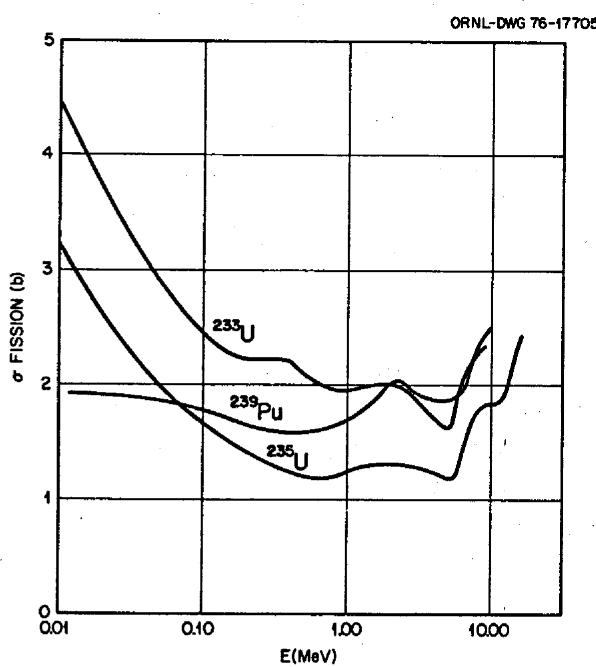

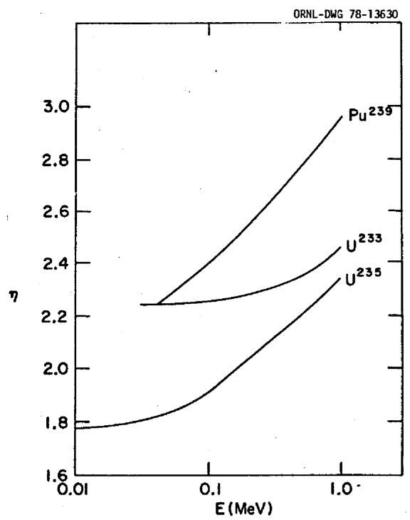

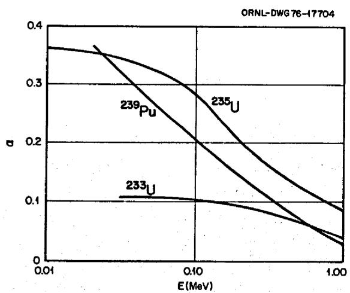

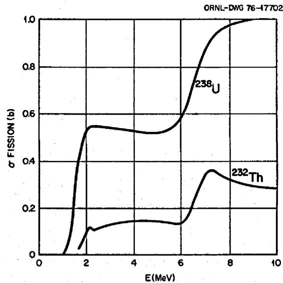  
Fig. 4.0-1. Nuclear Parameters of the Principal Fissile and Fertile Nuclides at High Neutron Energies. $\alpha = \sigma_{\mathrm{c}} / \sigma_{\mathrm{f}}$ ; $\eta = v / (1 + \alpha)$ .

of energy-production efficiency, $^{233}\mathrm{U}$ is clearly superior for fast systems as well as for thermal systems. However, with the historical emphasis on fissile production in fast systems, the overriding consideration is the neutron-production efficiency of the system, and for neutron production $^{239}\mathrm{Pu}$ is superior. This can be deduced from the values for $\eta$ given in Fig. 4.0-1. The $\eta$ value for $^{239}\mathrm{Pu}$ is much higher than that for the other nuclides, especially at the higher neutron energies, owing to the fact that $^{239}\mathrm{Pu}$ produces more neutrons per fission than the other isotopes; that is, it has a higher $\nu$ value, and that value is essentially energy-independent. As a result, more neutrons are available for absorption in fertile materials and $^{239}\mathrm{Pu}$ was originally chosen as the fissile fuel for fast breeder reactors.

The fission properties of the fertile nuclides are also important since fissions in the fertile elements increase both the energy production and the excess neutron production and thereby reduce fuel demands. At higher energies, fertile fissions contribute significantly, the degree of the contribution depending greatly on the nuclide being used. As shown in Fig. 4.0-1, the fission cross section for $^{232}\mathrm{Th}$ is significantly lower (by a factor of approximately 4) than the fission cross section of $^{238}\mathrm{U}$ . In a fast reactor, this means that while 15 to $20\%$ of the fissions in the system would occur in $^{238}\mathrm{U}$ , only 4 to $5\%$ would occur in $^{232}\mathrm{Th}$ . Thus the paired use of $^{233}\mathrm{U}$ and $^{232}\mathrm{Th}$ in a fast system would incur a double penalty with respect to its breeding performance. It should be noted, however, that since denatured $^{233}\mathrm{U}$ fuel would also contain $^{238}\mathrm{U}$ (and eventually $^{239}\mathrm{Pu}$ ), the penalty would be somewhat mitigated as compared with a system operating on a nondenatured $^{233}\mathrm{U}/^{232}\mathrm{Th}$ fuel. In a thermal system, the fast fission effect is less significant due to the smaller fraction of neutrons above the fertile fast fission threshold.

In considering the impact of the fertile nuclides on reactor performance, it is also necessary to compare their nuclide production chains. Figure 4.0-2 shows that the chains are very similar in structure. The fertile species $^{232}\mathrm{Th}$ and $^{234}\mathrm{U}$ in the thorium chain corresponding to $^{238}\mathrm{U}$ and $^{240}\mathrm{Pu}$ in the uranium chain, while the fissile components $^{233}\mathrm{U}$ and $^{235}\mathrm{U}$ are paired with $^{239}\mathrm{Pu}$ and $^{241}\mathrm{Pu}$ , and finally, the parasitic nuclides $^{236}\mathrm{U}$ and $^{242}\mathrm{Pu}$ complete the respective chains. A significant difference in the two chains lies in the nuclear characteristics of the intermediate nuclides $^{233}\mathrm{Pa}$ and $^{237}\mathrm{Np}$ . Because $^{233}\mathrm{Pa}$ has a longer half-life (i.e., a smaller decay constant), intermediate-nuclide captures are more probable in the thorium cycle. Such captures are doubly significant since they not only utilize a neutron that could be used for breeding, but in addition eliminate a potential fissile atom. A further consideration associated with the different intermediate nuclides is the reactivity addition associated with their decay to fissile isotopes following reactor shutdown. Owing to the longer half-life (and correspondingly higher equilibrium isotopic concentration) of $^{233}\mathrm{Pa}$ , the reactivity addition following reactor shutdown is higher for thorium-based fuels. Proper consideration of this effect is required in the design of the reactivity control and shutdown systems. The actual effect of all these factors, of course, depends on the neutron energy spectrum of the particular reactor type and must be addressed on an individual reactor basis. Significant differences also exist in the fission-product yields of $^{233}\mathrm{U}$ versus $^{235}\mathrm{U}$ , and these, too, must be addressed on an individual reactor basis.

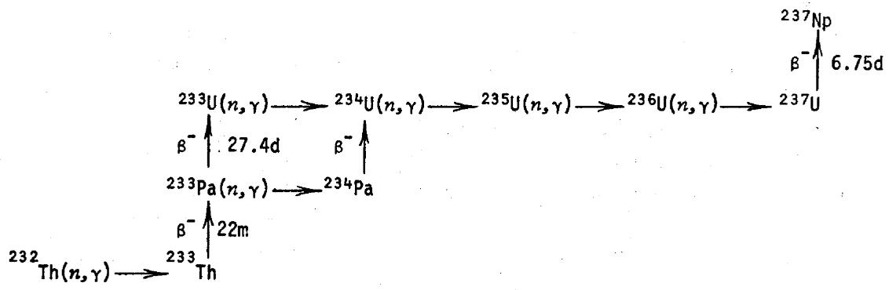  
Fig. 4.0-2a. Nuclide Production Chain for $^{232}\mathrm{Th}$ .

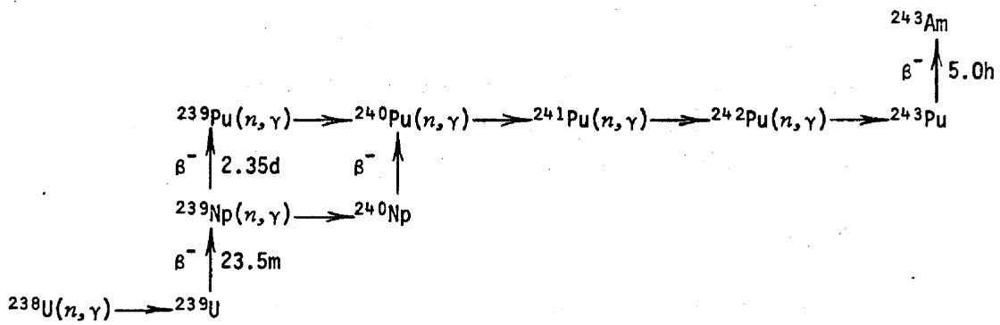  
Fig. 4.0-2b. Nuclide Production Chain for $^{238}\mathrm{U}$ .

Consideration of many of the above factors is inherent in the "mass balance" calculations presented in this chapter for the various reactors operating on alternate fuel cycles. It is emphasized, however, that if a definite decision were made to employ a specific alternate fuel cycle in a specific reactor, the next step would be to optimize the reactor design for that particular cycle, as is discussed in Chapter 5. Optimization of each reactor for the many fuels considered was beyond the scope of this study, however, and instead the design used for each reactor was the design for that reactor's reference fuel, regardless of the fuel cycle under consideration.

The reactors analyzed in the calculations are light-water thermal reactors; spectral-shift-controlled thermal reactors; heavy-water thermal reactors; high-temperature gas-cooled thermal reactors; liquid-metal fast breeder reactors; and fast breeder reactors of advanced or alternate designs.

Since with the exception of the Fort St. Vrain HTGR, the existing power reactors in the United States are LWRs, initial studies of alternate fuel cycles have assumed that they would first be implemented in LWRs.* Thus the calculations for LWRs, summarized in Section 4.1 have considered a number of fuels. For the purposes of the present study the fuels have been categorized according to their potential usefulness in the envisioned power system scenarios. Those fuel types that meet the nonproliferation requirements stated earlier in this report are classified as "dispersible" fuels that could be used in LWRs operating outside a secure energy center. The dispersible fuels are further divided into denatured $^{233}\mathrm{U}$ fuels and $^{235}\mathrm{U}$ -based fuels. The remaining fuels in the power systems are then categorized as "energy-center-constrained" fuels. Finally, a fourth category is used to identify "reference" fuels. Reference fuels, which are not to be confused with an individual reactor's reference fuel, are fuels that would have no apparent usefulness in the energy-center, dispersed-reactor scenarios but are included as limiting cases against which the other fuels can be compared. (Note: The reactor's reference fuel may or may not be appropriate for use in the reduced proliferation risk scenarios.)

To the extent that they apply, these four categories have been used to classify all the fuels presented here for the various reactors. Although the contributing authors have used different notations, the fuels included are in general as follows:

# Dispersible Resource-Based Fuels

A. Natural uranium fuel (containing approximately $0.7\%$ ${}^{235}\mathrm{U}$ ), as currently used in CANDU heavy-water reactors. Notation: U5(NAT)/U.   
B. Low-enriched $235\mathrm{U}$ fuel (containing approximately $3\%$ $235\mathrm{U}$ ), as currently used in LWRs. Notation: LEU; U5(LE)/U.   
C. Medium-enriched $^{235}\mathrm{U}$ fuel (containing approximately $20\%$ $^{235}\mathrm{U}$ ) mixed with thorium fertile material; could serve as a transition fuel prior to full-scale implementation of the denatured $^{233}\mathrm{U}$ cycle. Notation: MEU(235)/Th; DUTH(235).

# Dispersible Denatured Fuel

D. Denatured $^{233}\mathrm{U}$ fuel (nominally approximately $12\%$ $^{233}\mathrm{U}$ in U). Notation: Denatured $^{233}\mathrm{U}$ ; denatured uranium/thorium; denatured $^{233}\mathrm{UO}_2/\mathrm{ThO}_2$ ; MEU(233)/Th; $^{233}\mathrm{U}/^{238}\mathrm{U}$ ; DUTH(233); U3(DE)/U/Th.

# Energy-Center-Constrained Fuels

E. LEU fuel with plutonium recycle.   
F. Pu-232Th mixed-oxide fuel. Notation: $\mathrm{PuO_2 / ThO_2}$ ; (Pu-Th)O; Pu/Th.   
G. $\mathsf{Pu}^{-2^{38}}\mathsf{U}$ mixed-oxide fuel, as proposed for currently designed LMFBRs. Notation: $\mathsf{PuO}_2 / \mathsf{UO}_2$ ; $\mathsf{Pu} / ^{2^{38}}\mathsf{U}$ ; $\mathsf{Pu} / \mathsf{U}$ .

# Reference Fuels

H. Highly enriched $^{235}\mathrm{U}$ fuel (containing approximately $93\%$ $^{235}\mathrm{U}$ ) mixed with thorium fertile material, as currently used in HTGRs. Notation: HEU(235)/Th; U5(HE)/Th.   
I. Highly enriched $^{233}\mathrm{U}$ fuel (containing approximately $90\%$ $^{233}\mathrm{U}$ ) mixed with thorium fertile material. Notation: HE(233)/Th; U3/Th; U3(HE)/Th.

Including plutonium-fueled reactors within the energy centers serves a two-fold purpose: It provides a means for disposing of the plutonium produced in the dispersed reactors, and it provides for an exogenous source of $^{233}\mathrm{U}$ .

The discussion of LWRs operating on these various fuel cycles presented in Section 4.1 is followed by similar treatments of the other reactors in Sections 4.2 - 4.6. The first, the Spectral-Shift-Controlled Reactor (SSCR), is a modified PwR whose operation on a LEU cycle has been under study by both the United States and Belgium for more than a decade. The primary goal of the system is to improve fuel utilization through the increased production and in-situ consumption of fissile plutonium $(\mathsf{Pu}^{\mathsf{f}})$ . The capture of neutrons in the $^{238}\mathsf{U}$ included in the fuel elements is increased by mixing heavy water with the light-water moderator-coolant, thereby shifting the neutron spectrum within the core to energies at which neutron absorption in $^{238}\mathsf{U}$ is more likely to occur. The heavy water content in the moderator is decreased during the cycle as fuel reactivity is depleted. The increased capture is also used as the reactor control mechanism. The SSCR is one of a class of reactors that are increasingly being referred to as advanced converters, a term applied to a thermal reactor whose design has been modified to increase its production of fissile material.

Heavy-water-modified thermal reactors are represented here by Canada's natural-uranium-fueled CANDUs. Like the SSCR, the CANDU has been under study in the U.S. as an advanced converter, and scoping calculations have been performed for several fuel cycles, including a slightly enriched $^{235}\mathrm{U}$ cycle that is considered to be the reactor's reference cycle for implementation in the United States.

The high-temperature gas-cooled thermal reactors considered are the U.S. HTGR and the West German Pebble Bed Reactor (PBR), the PBR differing from the HTGR in that it utilizes spherical fuel elements rather than prismatic fuel elements and employs on-line refueling. For both reactors the reference cycle $\left[\mathrm{HEU}^{(233}\mathrm{U}) / \mathrm{Th}\right]$ includes thorium, and shifting

to the denatured cycle would consist initially in replacing the $93\%$ $^{235}\mathrm{U}$ in $^{238}\mathrm{U}$ with 15 to $20\%$ $^{235}\mathrm{U}$ in $^{238}\mathrm{U}$ . The HTGR has reached the prototype stage at the Fort Vrain plant in Colorado and a PBR-type reactor has been generating electricity in West Germany since 1967.

While the above thermal reactors show promise as power-producing advanced converters, they will not be self-sufficient on any of the proposed alternate fuel cycles and will require an exogenous source of $^{233}\mathrm{U}$ . An early but limited quantity of $^{233}\mathrm{U}$ could be provided by introducing thorium within the cores of $^{235}\mathrm{U}$ -fueled LWRs, but, as has already been pointed out in this report, for the long-term, reactors dedicated to $^{233}\mathrm{U}$ production will be required. In the envisioned scenarios those reactors primarily will be fueled with $\mathsf{Pu}^{\mathsf{f}}$ . In the calculations presented here a principal $^{233}\mathrm{U}$ production reactor is the mixed-oxide-fueled LMFBR containing thorium in its blanket. In addition, "advanced LMFBRs" that have blanket assemblies intermixed with fuel assemblies are examined. The possible advantages and disadvantages of using metal- or carbide-based LMFBR fuel assemblies are also discussed. Finally, some preliminary calculations for a helium-cooled fast breeder reactor (GCFBR) are presented.

The consideration of fast reactors that burn one fissile material to produce another has introduced considerable confusion in reactor terminology which, unfortunately, has not been resolved in this report. In the past, the term fast breeder has been applied to a fast reactor that breeds enough of its own fuel to sustain itself. Thus, the fast reactors that burn $^{239}\mathrm{Pu}$ to produce $^{233}\mathrm{U}$ are not "breeders" in the traditional sense. They are, however, producing fuel at a rate in excess of consumption, which is to be contrasted with the advanced thermal converters whose primary function is to stretch but not increase the fuel supply. In order to distinguish the $\mathrm{Pu - to - }^{233}\mathrm{U}$ fast reactors from others, the term transmuters was coined at ORNL. Immediately, however, the word began to be applied to any reactor that burns one fuel and produces another. Moreover, it soon became obvious that the words fast and breeder are used synonymously. Thus in this report and elsewhere we find various combinations of terms, such as LMFBR transmuter and converter transmuter. The situation becomes even more complicated when the fast reactor design uses both $^{238}\mathrm{U}$ and $^{232}\mathrm{Th}$ in the blanket, so that in effect it takes on the characteristics of both a transmuter and a breeder.

Finally, the reader is cautioned not to infer that only those reactors discussed in this chapter are candidates for the energy-center, dispersed-reactor scenarios. In fact, the scenarios discussed in Chapter 6 do not even use all these reactors and they could easily consider other reactor types. The selection of reactors for this preliminary assessment of the denatured $^{233}\mathrm{U}$ fuel cycle was based primarily on the availability of data at the time the study was initiated (December, 1977).

# References for Section 4.0

1. P. R. Kasten, F. J. Homan et al., "Assessment of the Thorium Fuel Cycle in Power Reactors," ORNL/TM-5665, Oak Ridge National Laboratory (January 1977).   
2. P. R. Kasten, "The Role of Thorium in Power-Reactor Development," Atomic Energy Review, Vol. III, No. 3.   
3. "The Use of Thorium in Nuclear Power Reactors," prepared by Division of Reactor Development and Technology, U.S. Atomic Energy Commission, with assistance of ANL, B&W, BNL, GEA, ORNL, and PNL, WASH 1097 (June, 1969).

# 4.1. LIGHT-WATER REACTORS

# J. C. Cleveland Oak Ridge National Laboratory

If an alternate cycle such as the denatured cycle is to have a significant early impact, it must be implemented in LWRs already operating in the United States or soon to be operating. The current national LWR capacity is about 48 GWe and LWRs that will provide a total capacity of 150 to 200 GWe by 1990 are either under construction or on order. Much of the initial analyses of the denatured $^{233}\mathrm{U}$ fuel cycle has therefore been performed for current LWR core and fuel assembly designs under the assumption that subsequent to the required fuels development and demonstration phase for thoria fuels these fuels could be used as reload fuels for operating LWRs. It should be noted, however, that these current LWR designs were optimized to minimize power costs with LEU fuels and plutonium recycle, and therefore they do not represent optimum designs for the denatured cycle. Also excluded from this study are any improvements in reactor design and operating strategies that would improve in-situ utilization of bred fuel and reduce the nonproductive loss of neutrons in LWRs operating on the once-through cycle. Studies to consider such improvements have recently been undertaken as part of NASAP (Nonproliferation Alternative Systems Assessment Program).

# 4.1.1. Pressurized Water Reactors

Mass flow calculations for PWRs presented in this chapter were performed primarily by Combustion Engineering, with some additional results presented from ORNL calculations. The Combustion Engineering System $80^{\text{TM}}$ (PWR) design was used in all of these analyses. A description of the core and fuel assembly design is presented in the Combustion Engineering Standard Safety Analysis Report (CESSAR). The following cases have been analyzed:1-6

# Dispersible Resource-Based Fuels

A. LEU (i.e., low enriched uranium, $\sim 3\%$ $235\mathrm{U}$ in $^{238}\mathrm{U}$ ), no recycle.   
B. MEU/Th (i.e., medium-enriched uranium, $20\%$ $^{235}\mathrm{U}$ in $^{238}\mathrm{U}$ , mixed with $^{232}\mathrm{Th}$ ), no recycle.   
C. LEU, recycle of uranium only, $^{235}\mathrm{U}$ makeup.   
D. MEU/Th, recycle of uranium $(^{235}\mathrm{U} + ^{233}\mathrm{U})$ , $20\%$ $^{235}\mathrm{U}$ makeup.*

# Dispersible Denatured Fuel

E. Denatured $233\mathrm{U}$ (i.e., $\sim 12\%$ $233\mathrm{U}$ in $236\mathrm{U}$ , mixed with $232\mathrm{Th}$ ), recycle of uranium, $233\mathrm{U}$ makeup.

# Energy-Center-Constrained Fuels

F. LEU, recycle of uranium and self-generated plutonium, $^{235}\mathrm{U}$ makeup.   
G. $\mathsf{Pu} / ^{238}\mathsf{U}$ , recycle of plutonium, plutonium makeup.   
H. $\mathsf{Pu} / ^{232}\mathsf{Th}$ , recycle of plutonium, plutonium makeup.   
I. Pu/232Th, one-pass plutonium, plutonium makeup.

# Reference Fuel

J. HEU/Th (i.e., highly enriched uranium, 93.15 w/o $^{235}\mathrm{U}$ in $^{238}\mathrm{U}$ , mixed with $^{232}\mathrm{Th}$ ), recycle of uranium ( $^{235}\mathrm{U} + ^{233}\mathrm{U}$ ), $^{235}\mathrm{U}$ makeup.

Case A represents the current mode of LWR operation in the absence of reprocessing. Case B involves the use of MEU/Th fuel in which the initial uranium enrichment is limited to $20\%$ $^{235}\mathrm{U} / ^{238}\mathrm{U}$ . With reprocessing again disallowed, Case B reflects a "stowaway" option in which the $^{233}\mathrm{U}$ bred in the fuel and the unburned $^{235}\mathrm{U}$ are reserved for future utilization.

Case C represents one logical extension of Case A for the cases where the recycle of certain materials is allowed. However, consistent with the reduced proliferation risk ground rule, only the uranium component is recycled back into the dispersed reactors. Case D similarly reflects the extension of Case B to the recycle scenario. In this case, the bred plutonium is assumed to be separated from the spent fuel but is not recycled. MEU(20% $^{235}\mathrm{U} / \mathrm{U}$ )/Th fuel is used as makeup material and is assumed to be fabricated in separate assemblies from the recycle material. Thus, only the assemblies containing recycle material require remote fabrication due to the presence of $^{232}\mathrm{U}$ . (It is assumed that the presence of the $^{232}\mathrm{U}$ precludes the recovered uranium being reenriched by isotopic separation.) The recovered uranium from both the recycle and the makeup fuel fractions are mixed together prior to the next recycle. This addition of a relatively high quality fissile material (uranium recovered from the makeup fuel) to the recycle fuel stream slows the decrease in the fissile content of the recycle uranium. As in the LEU cycle, the fissile component of the recycle fuel in this fuel cycle scheme is diluted with $^{238}\mathrm{U}$ which provides a potential safeguards advantage over the conventional concept of plutonium recycle in LWRs with about the same $U_{3}O_{8}$ utilization.

Case E is the denatured $^{233}\mathrm{U}$ fuel. It utilizes an exogenous source of $^{233}\mathrm{U}$ for both the initial core fissile requirements and the fissile makeup requirements.

Cases F - I represent possible fissile/fertile fuel cycle systems allowable for use in secure energy centers. Case F represents an extension of Case C in which all the fissile material present in the spent fuel, including the plutonium, is recycled. Under equilibrium conditions, about 1/3 of each reload fuel batch consists of mixed oxide $(\mathsf{MO}_2)$ fuel assemblies which contain the recycled plutonium in a uranium diluent. The remaining 2/3 of each reload consists of fresh or recycled uranium $(^{235}\mathsf{U})$ oxide fuel.

Case G allows one possible means for utilizing the plutonium bred in the dispersed reactors. Plutonium discharged from LEU-LWRs is used to provide the initial core fissile requirements as well as the fissile makeup requirements. This plutonium is blended in a $\mathsf{UO}_2$ diluent consisting of natural or depleted uranium. The plutonium discharged from the $\mathsf{UO}_2 / \mathsf{PuO}_2$ reactor is continually recycled - with two years for reprocessing and refabrication - through the reactor. In the equilibrium condition, plutonium discharged from about 2.7 LEU-fueled LWRs can provide the makeup fissile Pu requirement for one $\mathsf{UO}_2 / \mathsf{PuO}_2$ LWR.

In Case H the $\mathrm{PuO_2 / ThO_2}$ LWR also utilizes plutonium discharged from LEU-LWRs to provide the initial core fissile requirements and the fissile makeup requirements. This plutonium is blended in a $\mathrm{ThO_2}$ diluent. The isotopically degraded plutonium recovered from the $\mathrm{PuO_2 / ThO_2}$ LWR is blended with LEU-LWR discharge plutonium (of a higher fissile content) and recycled back into the $\mathrm{PuO_2 / ThO_2}$ LWR. Not only does this case provide a means of eliminating the Pu bred in the dispersed reactors but, in addition, also provides for the production of $^{233}\mathrm{U}$ that can be denatured and used to fuel dispersed reactors.

The $\mathrm{PuO_2 / ThO_2}$ LWR of Case I is similar to that in Case H in that plutonium discharged from LEU-LWRs is used to provide the fissile requirements. However, the isotopically degraded plutonium recovered from the $\mathrm{PuO_2 / ThO_2}$ LWR is not recycled into an LWR but is stored for later use in a breeder reactor.

Case J involves the use of highly enriched uranium blended with $\mathsf{ThO}_2$ to the desired fuel enrichment. The uranium enrichment in HEU fuels was selected as 93.15 w/o on the basis of information in Ref. 7. Initially all fuel consists of fresh HEU/Th fuel assemblies. Once equilibrium recycle conditions are achieved, about $35\%$ of the fuel consists of this fresh makeup fuel, the remaining fuel assemblies in each reload batch containing the recycled (but not re-enriched) uranium oxide blended with fresh $\mathsf{ThO}_2$ .

Table 4.1-1 provides a summary, obtained from the detailed mass balance information, of initial loading, equilibrium cycle loading, equilibrium cycle discharge, and 30-year cumulative $\mathsf{U}_{\mathsf{3}}\mathsf{O}_{\mathsf{8}}$ and separative work requirements. All recycle cases involve a two-year ex-reactor delay for reprocessing and refabrication. It is important to point out that for cases which involve recycle of recovered fissile material back into the same LWR, in "equilibrium" conditions the makeup requirement for a given recycle generation is greater than the difference between the charge and discharge quantities for the previous recycle generation because of the degradation of the isotopics. This is especially important in Case H where, for example, the fissile content of the plutonium drops from about 71% to about 47% over an equilibrium cycle.

Comparing Cases A and B of Table 4.1-1 indicates the penalties associated with implementation of the MEU/Th cycle relative to the LEU cycle under the restriction of no recycle. The MEU/Th case requires $40\%$ more $\mathsf{U}_3\mathsf{O}_8$ and $214\%$ more separative work than the LEU

case. Clearly the MEU/Th cycle would be prohibitive for "throwaway" options. A second significant result from Table 4.1-1 is given by the comparison of Case D, MEU/Th with uranium recycle and Case F, LEU with uranium and self-generated plutonium recycle. The $\mathrm{U}_{3}\mathrm{O}_{8}$ demand in each case is the same, although the MEU/Th cycle requires increased separative work. Additionally it should be noted that in Case D the MEU/Th fuel also produces significant quantities of plutonium, an additional fissile material stockpile which is not recycled in this case.

Table 4.1-1. Fuel Utilization Characteristics for PWRs Under Various Fuel Cycle Options ${}^{a,b}$   

<table><tr><td rowspan="2">Case</td><td rowspan="2">Fuel Type</td><td rowspan="2">Initial Fissile Inventory (kg/GWh)</td><td colspan="4">Equilibrium Cycle</td><td colspan="2">\( U_{3}O_{8} \) Requirement (ST/GWh)</td><td colspan="2">Separative Work Requirement (10^3 kg SMU/GWh)</td></tr><tr><td>Fissile Charge (kg/GWh-yr)</td><td>Fissile Discharge (kg/GWh-yr)</td><td>Conversion Ratio</td><td>Burnup (MWD/kg HM)</td><td>Initiala</td><td>30-yr Totala, d</td><td>Initiale</td><td>30-yr Totale</td></tr><tr><td colspan="11">Dispersible Resource-Based Fuels</td></tr><tr><td>A</td><td>LEU, no recycle</td><td>1693 235U</td><td>794 235U</td><td>215 235U 174 Puf</td><td>0.60</td><td>30.4f</td><td>392</td><td>5989f</td><td>203</td><td>3555</td></tr><tr><td>B</td><td>MEU/Th, no recycle</td><td>2538 235U</td><td>1079 235U</td><td>260 233U 384 235U 71 Puf</td><td>0.63</td><td>32.6</td><td>638</td><td>8360</td><td>580</td><td>7595</td></tr><tr><td>C</td><td>LEU, U recycle</td><td>1693 235U</td><td>-</td><td>-</td><td>0.60</td><td>30.4</td><td>392</td><td>4946</td><td>203</td><td>3452</td></tr><tr><td>D</td><td>MEU/Th, self-generated U recycle</td><td>2538 235U</td><td>313 233U g 675 235U g</td><td>282 233U g 257 235U g 95 Pufg</td><td>0.66</td><td>32.6</td><td>638</td><td>4090</td><td>580</td><td>3632</td></tr><tr><td colspan="11">Dispersible Denatured Fuel</td></tr><tr><td rowspan="2">E</td><td rowspan="2">Denatured 233UO2/ThO2, U recycle (exogenous 233U makeup)</td><td>1841 233U</td><td>750 233U</td><td>446 233U</td><td>0.66</td><td></td><td></td><td></td><td></td><td></td></tr><tr><td>27 235U</td><td>29 235U</td><td>43 235U 63 Puf</td><td></td><td></td><td></td><td></td><td></td><td></td></tr><tr><td colspan="11">Energy-Center-Constrained Fuels</td></tr><tr><td>F</td><td>LEU, recycle of U + self-generated Pu</td><td>1693 235U</td><td>612 235U 258 Puf</td><td>193 235U 288 Puf</td><td>0.61</td><td>30.4</td><td>392</td><td>4089</td><td>203</td><td>2690</td></tr><tr><td>G</td><td>PuO2/UiO2, Pu recycle</td><td>1568 Puf 546 235U</td><td>1153 Puf 173 235U</td><td>858 Puf 108 235U</td><td>0.63</td><td>30.4</td><td>100</td><td>1053</td><td>0</td><td>0</td></tr><tr><td>H</td><td>PuO2/ThO2, Pu recycle</td><td>2407 Puf</td><td>1385 Puf</td><td>696 Puf 272 233U</td><td></td><td>33.0</td><td></td><td></td><td></td><td></td></tr><tr><td>I</td><td>PuO2/ThO2, single Pu pass</td><td>2407 Puf</td><td>1140 Puf</td><td>410 Puf 284 233U</td><td></td><td>33.0</td><td></td><td></td><td></td><td></td></tr><tr><td colspan="11">Reference Fuelh</td></tr><tr><td>J</td><td>HEU/Th, self-generated U recycle</td><td>2375 235U</td><td>388 233U 504 235U</td><td>377 233U 172 235U</td><td>0.67</td><td>33.4</td><td>597</td><td>3453</td><td>596</td><td>3436</td></tr></table>

All cases assume 0.2 w/o tails and 75% capacity factor.   
All calculations were performed for the 3800-Mt, 1300-MWe Combustion Engineering System $80^{\mathrm{th}}$ reactor design.   
Assumes $1.0\%$ fabrication loss and $0.5\%$ conversion loss.   
${}^{a}$ No credit taken for end of reactor life fissile inventory.   
Assumes 1.0% fabrication loss.   
An additional case is considered in Chapter 6 in which an extended exposure (43 MWD/kg HM) LEU-PWR on a once-through cycle results in a $6\%$ reduction in the 30-yr total $\mathrm{U}_{3}\mathrm{O}_{8}$ requirements, while still requiring essentially the same enrichment (SMU) requirements. Somewhat less plutonium is discharged from the reactor because of a reduced conversion ratio.   
Values provided are representative of years 19-23.   
Reference fuels are considered only as limiting cases.

Differences in the nuclide concentrations of fertile isotopes from case to case result in differences in the resonance integrals of each fertile isotope due to self-shielding effects, thus significantly affecting the conversion of fertile material to fissile material. Table 4.1-2 gives the resonance integrals at core operating temperatures for various fuel combinations. Although the value of the $^{238}\mathrm{U}$ resonance integral for an infinitely dilute medium is much larger than the corresponding value for $^{232}\mathrm{Th}$ , the resonance integral for $^{238}\mathrm{U}$ in LEU fuel is only $25\%$ larger than that for $^{232}\mathrm{Th}$ in HEU/Th fuel, indicating the much larger amount of self-shielding occurring for $^{238}\mathrm{U}$ in LEU fuel. These two cases represent extreme values,

since in each case the one fertile isotope is not significantly diluted by the presence of the other. For MEU(20% 235U/U)/Th fuel, the 238U density is reduced by a factor of $\sim 6$ (relative to LEU fuel), causing the 238U resonance integral to increase due to the reduced self-shielding. The decrease in the 232Th density for the MEU/Th fuel (relative to the HEU/Th) fuel is only a factor of $\sim 0.8$ - resulting in a much smaller increase in the 232Th resonance integral. Thus, although the 238U number density is roughly six times less in MEU/Th fuel than in LEU fuel, the fissile Pu production in the MEU/Th fuel is still $40\%$ of that for the LEU fuel as shown in Table 4.1-1 (Cases A and B) due to the increase in the 238U resonance integral:

The presence in denatured uranium-thorium fuels of two fertile isotopes having resonances at different energy levels has a significant effect on the initial loading requirement. The initial $^{235}\mathrm{U}$ requirement for the HEU/Th and MEU/Th cases is 2375 and 2538 kg/GWe, respectively, reflecting the penalty associated with the presence of the two fertile isotopes in the MEU/Th fuel.

The large increase in initial $^{235}\mathrm{U}$ requirements shown in Table 4.1-1 for the thorium-based HEU/Th and MEU/Th fuels compared to the LEU fuel results primarily from the larger thermal-absorption cross section of $^{232}\mathrm{Th}$ relative to $^{238}\mathrm{U}$ as shown in Table 4.1-2. Also contributing to the increased $^{235}\mathrm{U}$ requirements is the lower value of $\eta$ of $^{235}\mathrm{U}$ which results from the harder neutron energy spectrum in thorium-based fuels.

Table 4.1-2. Thermal Absorption Cross Sections and Resonance Integrals for $^{232}\mathrm{Th}$ and $^{238}\mathrm{U}$ in PWRs   

<table><tr><td rowspan="2">Isotope</td><td rowspan="2">σa(0.025 eV) (barns)</td><td colspan="4">Resonance Integrala(barns)</td></tr><tr><td>Infinitely Dilute</td><td>In LEU Fuel</td><td>In HEU/Th Fuel</td><td>MEU(235U/U)/Th Fuel</td></tr><tr><td>232Th</td><td>7.40</td><td>85.8</td><td>—</td><td>17</td><td>19</td></tr><tr><td>238U</td><td>2.73</td><td>273.6</td><td>21-22</td><td>—</td><td>50-54</td></tr></table>

${}^{a}$ For absorption from ${0.625}\mathrm{{eV}}$ to ${10}\mathrm{{MeV}}$ ; oxide fuels.

A further consideration regarding MEU(235U/U)/Th fuel with uranium recycle must also be noted. Since the fissile enrichment of the recovered uranium decreases with each generation of recycle fuel, the thorium loadings must continually decrease. (As pointed out above, it is assumed that the recovered uranium is not reenriched by isotopic separation techniques.) The initial core 232Th/238U ratio is $\sim 5.8$ and the first reload 232Th/238U ratio is 4.4, but by the fourth recycle generation the 232Th/238U ratio has declined to $\sim 1.4$ . An alternative is to use HEU (93.15 w/o 235U) as a fissile topping for the recovered uranium. In this way the recovered uranium could be reenriched to an allowed denaturing limit prior to recycle, thus minimizing the core 238U component and therefore minimizing the production of plutonium.

The use of HEU as a fissile topping could be achieved by first transporting uranium recovered from the discharged fuel to a secure enrichment facility capable of producing HEU. Next, the HEU fissile topping would be added to the recovered uranium to raise the fissile content of the product to an allowable limit for denatured uranium. The product (denatured) would then be returned to the fabrication plant. MEU(20% 235U)/Th would be used to supply the remainder of the makeup requirements. Mass flows for this option in which HEU is used as a fissile topping are reported in refs. 2 and 6. For Case D, in which the recycle fuel is not reenriched by addition of HEU fissile topping, about 35% more plutonium is bred over 30 yr (~60% more in equilibrium) than when the HEU is used as a fissile topping. The 30-yr cumulative $\mathsf{U}_{3}\mathsf{O}_{8}$ and SWU requirements for the case in which HEU is used as a fissile topping are 4120 ST $\mathsf{U}_{3}\mathsf{O}_{8} / \mathsf{GWe}$ and 3940 x 10³ SWU/GWe respectively at a 75% capacity factor and 0.20 w/o tails.²

Table 4.1-3. Isotopic Fractions of Plutonium in $\mathsf{PuO}_2 / \mathsf{ThO}_2$ PWRs   

<table><tr><td></td><td colspan="2">Equilibrium Once-Through Cycle</td></tr><tr><td></td><td>Charged</td><td>Discharged</td></tr><tr><td>239Pu</td><td>0.5680</td><td>0.2482</td></tr><tr><td>240Pu</td><td>0.2384</td><td>0.3742</td></tr><tr><td>241Pu</td><td>0.1428</td><td>0.2207</td></tr><tr><td>242Pu</td><td>0.0508</td><td>0.1568</td></tr><tr><td>Fissile Plutonium</td><td>0.7108</td><td>0.4689</td></tr></table>

In addition to the uranium fuel cycles discussed above, two different Pu/Th cases were analyzed. As indicated in Table 4.1-3, the degradation of the fissile percentage of the plutonium which occurs in a single pass (i.e., once-through) is rather severe. Thus, in addition to the plutonium recycle case (Case H) a case was considered in which the discharged plutonium (degraded isotopically by the burnup) is not recycled but rather is stockpiled for later use in breeder reactors (Case I).

Only limited analyses of safety parameters have been performed thus far for the alternate fuel types. Combustion Engineering has reported some core physics parameters for thorium-based $(\mathsf{PuO}_2 / \mathsf{ThO}_2)$ and uranium-based $(\mathsf{PuO}_2 / ^{238}\mathsf{UO}_2)$ APRs,\* and the remaining discussion in this section is taken from their analysis:3.

In general, the safety-related core physics parameters (Table 4.1-4) of the two burner reactors are quite similar, indicating comparable behavior to postulated accidents and plant transients. Nevertheless, the following differences are noted. The effective delayed neutron fraction $(\beta_{\text{eff}})$ and the prompt neutron lifetime $(\lambda^{*})$ are smaller for the thorium APR. These are the controlling parameters in the reactor's response to short-term (~seconds) power transients. However, the most limiting accident for this type transient is usually the rod ejection accident and since the ejected rod worth is less for the thorium APR, the consequences of the smaller values of these kinetics parameters are largely mitigated.

The moderator and fuel temperature coefficients are parameters which affect the inherent safety of the core. In the power operating range, the combined responses of these reactivity feedback mechanisms to an increase in reactor thermal power must be a decrease in core reactivity. Since both coefficients are negative, this requirement is easily satisfied. The fuel temperature coefficient is about $25\%$ more negative for the

thorium APR, while the moderator temperature coefficient is approximately $20\%$ less negative. These differences compensate, to a large extent, such that the consequences of accidents which involve a core temperature transient would be comparable. For some accidents, however, individual temperature coefficients are the controlling parameters, and for these cases the consequences must be evaluated on a case-by-case basis.

Control rod and soluble boron worths are strongly dependent on the thermal-neutron diffusion length. Because of the larger thermal absorption cross section of $^{232}\mathrm{Th}$ and the higher plutonium loadings of the thorium APR, the diffusion length and, consequently, the control rod and soluble boron worths are smaller. Of primary concern is the mainte

Table 4.1-4. Safety-Related Core Physics Parameters for Pu-Fueled PWRs   

<table><tr><td></td><td>Third-Cycle
Uranium APR</td><td>Third-Cycle
Thorium APR</td></tr><tr><td>Effective Delayed Neutron Fraction</td><td></td><td></td></tr><tr><td>BOC</td><td>.00430</td><td>0.00344</td></tr><tr><td>EOC</td><td>.00438</td><td>0.00367</td></tr><tr><td>Prompt Neutron Lifetime (×10-6Sec)</td><td></td><td></td></tr><tr><td>BOC</td><td>10.54</td><td>9.03</td></tr><tr><td>EOC</td><td>12.53</td><td>11.30</td></tr><tr><td>Inverse Soluble Boron Worth (PPM/% Δρ)</td><td></td><td></td></tr><tr><td>BOC</td><td>221</td><td>270</td></tr><tr><td>EOC</td><td>180</td><td>217</td></tr><tr><td>Fuel Temperature Coefficient (×10-5Δρ/°F)</td><td></td><td></td></tr><tr><td>BOC</td><td>-1.13</td><td>-1.40</td></tr><tr><td>EOC</td><td>-1.15</td><td>-1.42</td></tr><tr><td>Moderator Temperature Coefficient (×10-4Δρ/°F)</td><td></td><td></td></tr><tr><td>BOC</td><td>-1.65</td><td>-1.31</td></tr><tr><td>EOC</td><td>-3.32</td><td>-2.60</td></tr><tr><td>Control Rod Worth (% of UO2APR)</td><td></td><td></td></tr><tr><td>BOC</td><td>-</td><td>90</td></tr><tr><td>EOC</td><td>-</td><td>96</td></tr></table>

nance of adequate shutdown margin to compensate for the reactivity defects during postulated accidents, e.g., for the reactivity increase associated with moderator cooldown in the steam-line-break accident. The analysis of individual accidents of this type would have to be performed to fully assess the consequences of the $10\%$ reduction in control-rod worth at the beginning of cycle.

The overall results of the above comparison of core physics parameters indicate that the consequences of postulated accidents for the thorium APR are comparable to those of the uranium APR. Furthermore, this comparison indicates that other than the possibility of requiring additional control rods, a thorium-based plutonium burner is feasible and major modifications to a PWR (already designed to accommodate a plutonium-fueled core) are probably not required, although some modifications might be desirable if reactors were specifically designed for operation with high-Th content fuels.

# 4.1.2. Boiling Water Reactors

Mass flow calculations for BWRs presented in this chapter were performed by General Electric. A description of the fuel assembly designs developed by General Electric for the utilization of thorium is presented in Ref. 8. The following cases have been analyzed: $8 = 10$

# Dispersible Resource-Based Fuels

A. LEU, no recycle.   
B. HEU/Th, ro recycle.   
B'. LEU/Th mixed lattice (LEU and $\mathrm{ThO_2}$ rods), no recycle.   
B".LEU/MEU/Th mixed lattice (LEU/Th, MEU/Th, and $\mathrm{ThO_2}$ rods), no recycle.   
D. LEU/MEU/Th mixed lattice, recycle of uranium, $235\mathrm{U}$ makeup.

# Dispersible Denatured Fuel

E. Denatured $^{233}\mathrm{U}$ , recycle of uranium, $^{233}\mathrm{U}$ makeup.

# Energy-Center-Constrained Fuels

F. LEU, recycle of uranium and self-generated plutonium, $^{235}\mathrm{U}$ makeup.   
G. $\mathsf{Pu} / ^{238}\mathsf{U}$ , recycle of plutonium, plutonium makeup.   
H. $\mathsf{Pu} / ^{232}\mathsf{Th}$ , recycle of plutonium, plutonium makeup.

Case A represents the current mode of BWR operation. Case B involves the replacement of the current LEU fuel with MEU/Th fuel in which the initial uranium enrichment is limited to $20\%$ ${}^{235}\mathrm{U} / {}^{238}\mathrm{U}$ . Cases B' and B" represent partial thorium loadings that could be utilized as alternative stowaway options. In Case B' a few of the LEU pins in a conventional LEU lattice are replaced with pure $\mathrm{ThO_2}$ pins, while in Case B" some LEU pins in a conventional lattice are replaced by MEU/Th pins and a few others are replaced with the pure $\mathrm{ThO_2}$ pins. These cases are in contrast with Case B in which a "full" thorium loading is used ( $\mathrm{UO_2 / ThO_2}$ in every pin). Case D represents the extension of Case B" to the recycle mode; however, only the uranium recovered from the Th-bearing pins is recycled. Cases F-H represent possible fissile/fertile combinations for use in secure energy centers.

Table 4.1-5 provides a summary of certain mass balance information for BWRs operating on these fuel cycles. All recycle cases involve a two-year ex-reactor delay for reprocessing and refabrication.

As was shown in Table 4.1-1 for PWRs, the introduction of thorium into a BWR core inflicts a penalty with respect to the resource requirements of the reactor (compare $U_{3}O_{8}$ and SWU requirements of Cases A and B). However, as pointed out above, Case B is for a full thorium loading. In the two General Electric fuel assembly designs represented by Cases B' and B" a much smaller fissile inventory penalty results from the introduction of thorium in the core. (Similar schemes may also be feasible for PWRs.)

Table 4.1-5. Fuel Utilization Characteristics for BWRs Under Various Fuel Cycle Optionsa   

<table><tr><td rowspan="2">Case</td><td rowspan="2">Fuel Type</td><td rowspan="2">Initial Fissile Inventory (kg/GWh)</td><td colspan="4">Equilibrium Cycle</td><td colspan="2">\( U_{3}O_{8} \) Requirement (ST/GWh)</td><td colspan="2">Separative Work Requirement (103kg SWU/GWh)</td></tr><tr><td>Fissile Charge (kg/GWh-yr)</td><td>Fissile Discharge (kg/GWh-yr)</td><td>Burnup (MWD/kg HM)</td><td></td><td>Initial</td><td>30-yr Totalb</td><td>Initial</td><td>30-yr Totalb</td></tr><tr><td colspan="11">Dispersible Resource-Based Fuels</td></tr><tr><td>A</td><td>LEU, no recycle</td><td>\( 2200^c \)</td><td>799 235u</td><td>235 150 235u Puf</td><td>28.4</td><td></td><td>\( 496^{c,d} \)</td><td>\( 6051^d \)</td><td>\( 235^{a,d} \)</td><td>\( 3490^d \)</td></tr><tr><td>B</td><td>MEU/Th, no \( recycle^e \)</td><td>-</td><td>1132 235u</td><td>244 428 53 235u Puf</td><td>31.6</td><td></td><td>-</td><td>\( 8680^f \)</td><td>-</td><td>\( 7763^f \)</td></tr><tr><td>B&#x27;</td><td>LEU/Th mixed lattice, no \( recycle^e \)</td><td>-</td><td>854 235u</td><td>24 243 138 235u Puf</td><td>28.7</td><td></td><td>-</td><td>\( 6201^f \)</td><td>-</td><td>\( 3836^f \)</td></tr><tr><td>B&quot;</td><td>LEU/MEU/Th mixed lattice, no \( recycle^e \)</td><td>-</td><td>917 235u</td><td>125 277 92 235u Puf</td><td>30.0</td><td></td><td>-</td><td>\( 6852^f \)</td><td>-</td><td>\( 5100^f \)</td></tr><tr><td>D</td><td>LEU/MEU/Th mixed lattice, self-generated U \( recycle^e \)</td><td>-</td><td>147 233u 742 235u</td><td>152 245 98 235u Puf</td><td>30.5</td><td></td><td>-</td><td>\( 5503^f \)</td><td>-</td><td>\( 3895^f \)</td></tr><tr><td colspan="11">Dispersible Denatured Fuel</td></tr><tr><td>E</td><td>Denatured \( ^{233}UO_2/ThO_2 \), U recycle (exogeneous \( ^{233}U \) makeup)e</td><td>-</td><td>770 233u 15 235u</td><td>452 17 55  Puf</td><td>31.6</td><td></td><td>0</td><td>0</td><td>0</td><td>0</td></tr><tr><td colspan="11">Energy-Center-Constrained Fuels</td></tr><tr><td>F</td><td>LEU, recycle of U + self-generated Pu</td><td>\( 2200^c \)</td><td>-</td><td>-</td><td></td><td>28.4</td><td>\( 496^c \)</td><td>\( 3869g \)</td><td>\( 235^c \)</td><td>\( 1980^g \)</td></tr><tr><td>Gh</td><td>\( PuO_2/UO_2 \), Pu recycle</td><td>-</td><td>71 1178 235u Puf</td><td>38 808 235u Puf</td><td>27.7</td><td></td><td>i</td><td>i</td><td>i</td><td>i</td></tr><tr><td>H</td><td>\( PuO_2/ThO_2 \), Pu \( recycle^e \)</td><td>-</td><td>1705  Puf</td><td>275 954 233u Puf</td><td>29.8</td><td></td><td>0</td><td>0</td><td>0</td><td>0</td></tr></table>

${}^{a}$ All cases assume 0.2 w/o tails and 75% capacity factor; blank columns included to show no data corresponding to that given for PWRs (Table 4.1-1) are available.   
${}^{b}$ No credit taken for end-of-reactor-life fissile inventory.   
Initial cycle is 1.47 yr in length at $75\%$ capacity factor.   
${}^{a}$ From ref. 9. Based on three-enrichment-zone initial core,axial blankets and improved refueling patterns which are currently being retrofitted into many BWRs. ${30} - {yr}\mathrm{U}{\mathrm{g}}_{8}$ and SWU requirements supplied to INFCE for a reference BWR not employing these improvements are 6443 ST U ${\mathrm{g}}_{8}/\mathrm{{GMe}}$ and ${3887} \times  {10}^{3}\mathrm{{SWU}}/\mathrm{{GMe}}$ respectively.   
eAnalyses performed for equilibrium cycle only.   
Approximated from equilibrium cycle requirements.   
gFrom ref. 8.   
${}^{n}$ From ref. 10; adjusted from ${80}\%$ capacity factor to ${75}\%$ .   
Tails uranium used for plutonium diluent.

Case B' is a perturbation to the reference $\mathsf{UO}_2$ BWR assembly design in that the four $\mathsf{UO}_2$ corner pins in each fuel assembly are replaced with four pure $\mathsf{ThO}_2$ pins. The remaining $\mathsf{UO}_2$ pins are adjusted in enrichment to obtain a desirable local power distribution and to achieve reactivity lifetime. In the once-through mode this design increases $\mathsf{U}_3\mathsf{O}_8$ requirements by only $2\%$ relative to the reference design. This option could be extended by removing the $\mathsf{ThO}_2$ corner pins from the spent fuel assemblies, reassembling them into new assemblies, and reinserting them into the reactor. This would permit the $\mathsf{ThO}_2$ pins to achieve increased burnups (and also increased $^{233}\mathsf{U}$ production) without reprocessing. $\mathsf{U}_3\mathsf{O}_8$ requirements for this scheme (i.e., re-use of the $\mathsf{ThO}_2$ rods coupled with $\mathsf{UO}_2$ stowaway) are approximately $1.3\%$ higher than for the reference $\mathsf{UO}_2$ cycle. $^8$

Case B" is a modification of Case B' in that in addition to the four $\mathsf{ThO}_2$ corner pins, the other peripheral pins in the assembly are composed of MEU(235)/Th. The remainder of the pins contain LEU. In the once-through mode this design increases $U_{3}O_{8}$ requirements by $12\%$ relative to the reference BWR $UO_2$ design.

Both Case B' and Case B" would offer operational benefits to the BWR since they have a less negative dynamic void coefficient than the reference $\mathsf{UO}_2$ design. This is desirable since the sensitivity to pressure transients is reduced. As shown in Table 4.1-5, in equilibrium conditions a BWR employing the $\mathsf{ThO}_2$ corner pin once-through design would discharge $24\mathrm{kg}^{233}\mathrm{U} / \mathrm{GWe}$ annually while the BWR employing the peripheral $\mathsf{ThO}_2$ mixed lattice design would discharge $125\mathrm{kg}^{233}\mathrm{U} / \mathrm{GWe}$ annually.

Use of these options in the once-through mode not only could improve the operational performance of the BWR but also would build up a supply of $^{233}\mathrm{U}$ . This supply would then be available if a denatured $^{233}\mathrm{U}$ cycle (together with reprocessing) were adopted at a later time. Furthermore, use of the mixed lattice designs could be used to acquire experience on the performance of thorium-based fuels in BWRs. Similar schemes for the use of thorium in the once-through mode may also be feasible in PWRs.

Although only limited scoping analysis of the safety parameters involved in the use of alternate fuels in BWRs has been performed, $^{8}$ the BWR thorium fuel designs appear to offer some advantageous trends over $\mathsf{UO}_2$ designs relative to BWR operations and safety. Uranium/thorium fuels have a less negative steam void reactivity coefficient than the $\mathsf{UO}_2$ reference design at equilibrium. This effect tends to reduce the severity of overpressurization accidents and improve the reactor stability. The less negative void reactivity coefficient for the denatured $^{23}3\mathsf{U} / \mathsf{Th}$ fuel indicates that the core will have a flatter axial power shape than the reference $\mathsf{UO}_2$ design. This could result in an increase in kW/ft margin and increase the maximum average planar heat generation ratio (MAPLHGR). Alternatively, if current margins are maintained, the flatter axial power shape could be utilized to increase the power density or to allow refueling patterns aimed at improved fuel utilization.

# References for Section 4.1

1. N. L. Shapiro, J. R. Rec, and R. A. Matzie (Combustion Engineering), "Assessment of Thorium Fuel Cycles in Pressurized Water Reactors," EPRI NP-359 (Feb. 1977).   
2. "Thorium Assessment Study Quarterly Progress Report for Second Quarter Fiscal 1977," ORNL/TM-5949 (June 1977).   
3. R. A. Matzie, J. R. Rec, and A. N. Terney, "An Evaluation of Denatured Thorium Fuel Cycles in Pressurized Water Reactors," paper presented at the Annual Meeting of the American Nuclear Society, June 12-16, 1977, New York, New York.

4. Letter from R. A. Matzie (Combustion Engineering) to H. B. Stewart (Nuclear Technology Evaluations Company), "U₃O₈ Requirements in LWRs and SSCRs," July 29, 1977.   
5. Letter from R. A. Natzie (Combustion Engineering) to J. C. Cleveland (ORNL), "Mass Balances for Various LWR Fuel Cycles," May 1977.   
6. "Quarterly Progress Report for Fourth Quarter FY-77, Thorium Assessment Program," Combustion Engineering.   
7. "Nuclear Power Growth 1974-2000," Office of Planning and Analysis, U.S. Atomic Energy Commission, WASH 1139(74), (February 1974).   
8. "Assessment of Utilization of Thorium in BWRs," ORNL/SUB-4380/5, NEGD-24073 (January 1978).   
9. "Monthly Progress Report for August 1978, NASAP Preliminary BWR Uranium Utilization Improvement Evaluations," General Electric Co.   
10. "Appraisal of BWR Plutonium Burners for Energy Centers," GEAP-11367 (January 1976).

# 4.2. SPECTRAL-SHIFT-CONTROLLED REACTORS

N. L. Shapiro Combustion Engineering, Inc.

The Spectral-Shift-Controlled Reactor (SSCR) is an advanced thermal converter reactor that is based on PWR technology and offers improved resource utilization, particularly on the denatured fuel cycle. The SSCR differs from the conventional PWR in that it is designed to minimize the number of reactions in control materials throughout the plant life, utilizing to the extent possible captures of excess neutrons in fertile material as a method of reactivity control. The resulting increase in the production of fissile material serves to reduce fuel makeup requirements.

In the conventional PWR, long-term reactivity control is achieved by varying the concentration of soluble boron in the coolant to capture the excess neutrons generated throughout plant life. The soluble boron concentration is relatively high at beginning of cycle, about 700 to $1500~\mathrm{ppm}$ , and is gradually reduced during the operating cycle by the introduction of pure water to compensate for the depletion of fissile inventory and the buildup of fission products.

The SSCR consists basically of the standard PWR with the conventional soluble boron reactivity control system replaced with spectral-shift control. Spectral-shift control is achieved by the addition of heavy water to the reactor coolant, in a manner analogous to the use of soluble boron in the conventional PWR. Since heavy water is a poorer moderator of neutrons than light water, the introduction of heavy water shifts the neutron spectrum in the reactor to higher energies and results in the preferential absorption of neutrons in fertile materials. In contrast to the conventional PWR, where absorption in control absorbers is unproductive, the absorption of excess neutrons in fertile material breeds additional fissile material, increasing the conversion ratio of the system and decreasing the annual makeup requirements. At beginning of cycle, a high (approximately 50-70 mole %) $\mathrm{D}_2\mathrm{O}$ concentration is employed in order to increase the absorption of neutrons in fertile material sufficiently to control excess reactivity. Over the cycle, the spectrum is thermalized by decreasing the $\mathrm{D}_2\mathrm{O} / \mathrm{H}_2\mathrm{O}$ ratio in the coolant to compensate for fissile material depletion and fission-product buildup, until at end of cycle essentially pure light water (approximately 2 mole % $\mathrm{D}_2\mathrm{O}$ ) is present in the coolant.

The basic changes required to implement spectral-shift control in a conventional PWR are illustrated in a simplified and schematic form in Fig. 4.2-1. In the conventional PWR, pure water is added and borated water is removed during the cycle to compensate for the depletion of fissile material and buildup of fission-product poisons. The borated water removed from the reactor is processed by the boron concentrator which separates the discharged coolant into two streams, one containing pure unborated water and the second

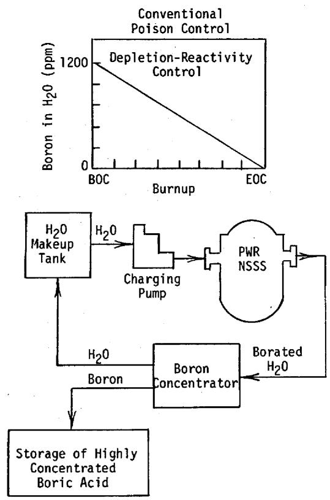

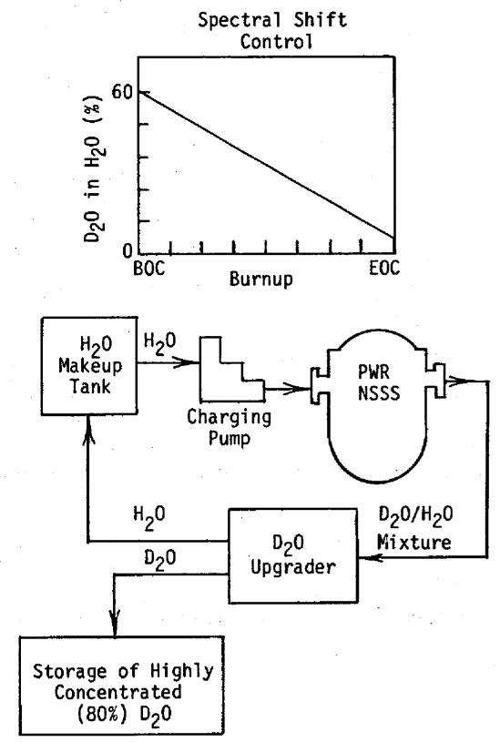  
Fig. 4.2-1. Basic Spectral Shift Control Modifications.

containing boron at high concentrations. The latter stream is stored until the beginning of the subsequent cycle where it is used to provide the boron necessary to hold down the excess reactivity introduced by the loading of fresh fuel. The SSCR can consist of the identical nuclear steam supply system as employed in a conventional poison-controlled PWR, except that the boron concentrator is replaced with a $\mathsf{D}_2\mathsf{O}$ upgrader. The function of this upgrader is to separate heavy and light water, so that concentrated heavy water is available for the next refueling. The upgrader consists of a series of vacuum distillation columns which utilize the differences in volatility between light and heavy water to effect the separation. Although the boron concentrator and the upgrader perform analogous functions and operate using similar processes, the $\mathsf{D}_2\mathsf{O}$ upgrader is much larger and more sophisticated, consisting of three or four towers each about 10 ft in diameter and 190 ft tall. Although Fig. 4.2-1 illustrates the basic changes required to implement the shift-control concept, numerous additional changes will be required to realize spectral-shift control in practice. These include modifications to minimize and recover $\mathsf{D}_2\mathsf{O}$ leakage, to facilitate refueling, and to remove boron from the coolant after refueling.

Initial analyses of spectral-shift-controlled reactors were carried out in the U.S. by M. C. Edlund in the early 1960s and an experimental verification program was performed by Babcock & Wilcox both for LEU fuels and for HEU/Th fuels. $^{1}$ Edlund's studies, which were performed for reactors designed specifically for spectral-shift control, indicated that the inventory and consumption of fissile material could be reduced by 25 and $50\%$ , respectively, relative to poison control in reactors fueled with highly enriched $^{235}\mathrm{U}$ and thorium oxide, and that a $25\%$ reduction in uranium ore requirements could be realized with spectral shift control using the LEU cycle. $^{2}$

The spectral-shift-control concept has been demonstrated by the Vulcain reactor experiment in the BR3 nuclear plant at Mol, Belgium. The BR3 plant after two years of operation as a conventional PWR was modified for spectral-shift-control operation and successfully operated with this mode of control between 1966 and 1968. The Vulcain core operated to a core average burnup of 23,000 MWd/T (a peak burnup of around 50,000 MWd/T) and achieved an average load factor and primary plant availability factor of 91.2 and 98.6, respectively. The leakage rate of primary water from the high-pressure reactor system to the atmosphere was found to be negligible, about 30 kg of $\mathsf{D}_2\mathsf{O} - \mathsf{H}_2\mathsf{O}$ mixture per year. After the Vulcain experiment was completed, the BR3 was subsequently returned to conventional PWR operation. In addition to demonstrating the technical feasibility of spectral-shift control, the Vulcain experiment served to identify the potential engineering problems inherent in converting existing plants to the spectral-shift mode of control.

At the time of the major development work on the SSCR concept, fuel resource conservation was not recognized as having the importance that it has today. Both uranium ore and separative work were relatively inexpensive and the technology for $\mathsf{D}_2\mathsf{O}$ concentration was not as fully developed as it is now. With the expectation that the plutonium-fueled breeder reactor would be deployed in the not too distant future, there appeared to be little incentive to pursue the spectral-shift-controlled reactor concept.

The decision to defer the commercial use of plutonium and the commercial plutonium-fueled breeder reactor is, of course, the primary motivation for reevaluating advanced converters, and the principal incentive for considering the spectral-shift-controlled reactor is that the potential gains in resource utilization possible with the SSCR concept may be obtainable with changes largely limited to ancillary components and subsystems in existing PWR systems. The prospects of rapid acceptance and deployment of the SSCR are also enhanced by the low risk inherent in the concept. Since the SSCR can always be operated in the conventional poison control mode, there would be a reduced risk to station generating capacity if the SSCR were deployed, and financial risk would be limited to the cost of the additional equipment required to realize spectral-shift control, which is estimated to be only a few percent of the total cost of the plant. The risk, with respect both to capital and generating capacity, is thus much lower than for other alternate reactor systems.

It may also prove feasible to backfit existing pressurized water reactors with spectral-shift control. Such backfitting might possibly be performed in some completed plants where the layout favors modifications. However, even when judged feasible, the benefits of backfitting would have to be great to justify the cost of replacement power during plant modification. A second and potentially more attractive alternative is the possibility of modifying plants still in the early stage of construction for spectral-shift control, or of incorporating features into these plants which would allow conversion to spectral-shift control to be easily accomplished at a later date.

In order to establish the potential gains in resource utilization which might be realized with spectral-shift control, scoping mass balance calculations have been performed by Combustion Engineering for SSCRs operating on both the LEU cycle and on thorium-based cycles, including the denatured $^{233}\mathrm{U}$ cycle. The calculations were performed for the C-E system $80^{\text{TM}}$ core and lattice design, with the intent of updating the earlier analyses reported by Edlund to the reactor design and operating conditions of modern PWRs using state-of-the-art analytic methods and cross sections. Preliminary results from this evaluation are presented in Table 4.2-1. Note that these results were obtained using the standard System 80 design and operating procedures, and no attempt has been made to optimize either the lattice design or mode of operation to fully take advantage of spectral-shift control.

For the LEU throwaway mode, Table 4.2-1 indicates a reduction of roughly $10\%$ both in ore requirements and in separative work requirements relative to the conventional PWR (compare with Case A of Table 4.1-1). If uranium recycle is allowed, the SSCR also reduces the ore demand (and separative work) for the MEU/Th case by about $20\%$ (compare with Case D in Table 4.1-1).

Of particular interest to this study is the reduced equilibrium cycle makeup requirements for the spectral-shift reactor fueled with $^{233}\mathrm{U}$ . As indicated, the equilibrium cycle makeup requirement is 236'. $^{233}\mathrm{U}/\mathrm{GWe}-\mathrm{yr}$ as opposed to 304 kg $^{233}\mathrm{U}/\mathrm{GWe}-\mathrm{yr}$ for the conventional PWR (see Case E in Table 4.1-1). The reduced $^{233}\mathrm{U}$ requirements, coupled with the slightly higher fissile plutonium production, would allow a given complement of energy-center breeder reactors to provide makeup fissile material for roughly 40% more dispersed denatured SSCRs than conventional denatured PWRs. A comparison of the Pu/Th case with Case H in Table 4.1-1 shows that the SSCR and PWR are comparable as transmuters. These results are, of course, preliminary and are limited to the performance of otherwise un-modified PWR systems. A more accurate assessment of SSCR performance, including the performance of systems optimized for spectral-shift control, will be performed as part of the NASAP program.[6]

The preliminary studies performed to date and the demonstration of spectral-shift control in the Vulcain core have served to demonstrate the feasibility of the concept and to identify the resource utilization and economic incentives for this

Table 4.2-1. Fuel Utilization Characteristics for SSCRs Under Various Fuel Cycle Options ${}^{a,b}$   

<table><tr><td rowspan="2">Fuel Type</td><td rowspan="2" colspan="2">Initial Fissile Inventory (kg/GWe)</td><td colspan="3">Equilibrium Cycle</td><td rowspan="2">30-yr Cumulative \( {\mathrm{U}}_{3}{\mathrm{O}}_{8} \) Requirement (ST/GWe)</td><td rowspan="2">30-Yr Cumulative Separative Work Requirement \( {}^{\mathrm{C}} \) (103 kg SWJ/GWe)</td></tr><tr><td colspan="2">Fissile Makeup (kg/GWe-yr)</td><td>Fissile Discharge (kg/GWe-yr)</td></tr><tr><td></td><td></td><td colspan="4">Dispersible Resource-Based Fuels</td><td></td><td></td></tr><tr><td>LEU, no recycle</td><td>1577</td><td>\( {}^{235}\mathrm{U} \)</td><td>713</td><td>\( {}^{235}\mathrm{U} \)</td><td>182 \( {}^{235}\mathrm{U} \) Puf</td><td>5320</td><td>3010</td></tr><tr><td></td><td></td><td></td><td></td><td></td><td>196 Puf</td><td></td><td></td></tr><tr><td>MEU/Th, \( {}^{235}\mathrm{U} \) feed, U recycle</td><td>2540</td><td>\( {}^{235}\mathrm{U} \)</td><td>371</td><td>\( {}^{235}\mathrm{U} \)</td><td>228 \( {}^{235}\mathrm{U} \) 371 \( {}^{233}\mathrm{U} \) 65 Puf</td><td>3220</td><td>3077</td></tr><tr><td></td><td></td><td></td><td></td><td></td><td>\( {}^{235}\mathrm{U} \)</td><td></td><td></td></tr><tr><td></td><td></td><td></td><td></td><td></td><td>\( {}^{235}\mathrm{U} \)</td><td></td><td></td></tr><tr><td></td><td></td><td></td><td></td><td></td><td>\( {}^{235}\mathrm{U} \)</td><td></td><td></td></tr><tr><td></td><td></td><td></td><td></td><td></td><td>\( {}^{235}\mathrm{U} \)</td><td></td><td></td></tr><tr><td></td><td></td><td></td><td></td><td></td><td>\( {}^{235}\mathrm{U} \)</td><td></td><td></td></tr><tr><td></td><td></td><td></td><td></td><td></td><td>\( {}^{223}\mathrm{U} \)</td><td></td><td></td></tr><tr><td></td><td></td><td></td><td></td><td></td><td>\( {}^{235}\mathrm{U} \)</td><td></td><td></td></tr><tr><td></td><td></td><td></td><td></td><td></td><td>\( {}^{235}\mathrm{U} \)</td><td></td><td></td></tr><tr><td></td><td></td><td></td><td></td><td></td><td>\( {}^{235}\mathrm{U} \)</td><td></td><td></td></tr><tr><td></td><td></td><td></td><td></td><td></td><td>\( {}^{235}\mathrm{U} \)</td><td></td><td></td></tr></table>

$a_{1290}$ MWe SSCR; 10-MWe additional power required to run reactor coolant pumps and $\mathsf{D}_2\mathsf{O}$ upgrader facility. $b$ Assumes $75\%$ capacity factor, annual refueling, and 0.2 w/o tails assay.

mode of operation. Because the basic PWR NSSS* is used, the utilization of the denatured thorium fuel cycles will pose no additional problems or R&D needs beyond those required to implement this type of fuel in the conventional PWR. Although the general feasibility of spectral-shift control appears relatively well established, nevertheless there are a number of aspects of SSCR design which must be evaluated in order to fully assess the commercial practicality of spectral-shift-controlled reactors. The more significant of these are briefly discussed below.

1. Resource Utilization - A more accurate assessment of resource utilization is required to more definitively establish the economic incentives for spectral-shift control on the LEU cycle. If the concept is to be economically competitive with conventional water reactors, the savings in $U_{3}O_{8}$ and separative work for $^{235}\mathrm{U}$ -based systems must be demonstrated to be sufficiently large to compensate for the additional capital cost of equipment required to implement spectral-shift control. A similar assessment for denatured $^{233}\mathrm{U}$ fuel is also required.   
2. Plant Modifications - The plant modifications necessary to realize spectral-shift control must be identified, and the cost of these modifications established. The practicality and cost of these modifications, of course, bear directly on the economics and commercial feasibility of the concept. Of particular concern are modifications which may be required to limit the leakage of primary coolant (from valve stems, seals, etc.) and the equipment required to recover unavoidable primary coolant leakage. Primary coolant leakage is important both from the standpoint of economics, because of the high cost of $\mathsf{D}_2\mathsf{O}$ , and from the standpoint of radiation hazard, because of the problem of occupational exposures to tritium during routine maintenance. Other possible modifications to current designs which result from the presence of $\mathsf{D}_2\mathsf{O}$ , such as the increased fast fluence on the reactor vessel and possible changes in pumping power, will also have to be addressed.

3. Refueling System Modifications - At the end of each operating cycle, spent fuel must be discharged and fresh fuel inserted into the reactor (typically 1/3 of the core loading is replaced each year), and the light water present at end of cycle must be replaced with a $\mathsf{D}_2\mathsf{O} - \mathsf{H}_2\mathsf{O}$ mixture before the reactor can be returned to power operation. Refueling procedures and equipment must be developed which will allow these operations to be performed with minimum $\mathsf{D}_2\mathsf{O}$ inventory requirements. Minimizing the $\mathsf{D}_2\mathsf{O}$ inventory is important to the economics and commercial feasibility of the SSCR, since the cost of $\mathsf{D}_2\mathsf{O}$ represents roughly $75\%$ of the additional capital expenditures required to realize spectral-shift control. Care must also be taken to ensure that refueling does not increase outage times because of the adverse effect on capacity factor and the resulting increase in power cost. The exposure of personnel to tritium generated in the coolant must also be minimized during refueling operations.

4. $\underline{\mathsf{D}}_{2}\mathsf{O}$ Upgrader Design - Although $\mathsf{D}_2\mathsf{O}$ upgraders have yet to be employed in conjunction with spectral-shift control, similar units have operated on CANDU reactors, and vacuum distillation columns are also utilized in heavy-water production facilities. Thus, the technical feasibility of the $\mathsf{D}_2\mathsf{O}$ upgrader can be considered as demonstrated. However, a conceptual upgrader design optimized for the specific demands of the SSCR must be developed so that its cost can be determined. The upgrader is probably the single most significant and costly piece of equipment which must be added to realize spectral-shift control.

5. Licensability and Safety - Although the spectral-shift-controlled reactor is not expected to raise any new safety, licensing or environmental issues except the basic issue of tritium production and containment, a number of core physics parameters are changed sufficiently that the response to postulated accidents must be evaluated. The most significant of these appears to be the somewhat different moderator temperature coefficient of reactivity, which could lead to a number of potentially more severe accidents early in cycle when the $\mathsf{D}_2\mathsf{O}$ concentration is relatively high. The $\mathsf{D}_2\mathsf{O}$ dilution accident must also be addressed; this accident is analogous to the boron dilution accident in the poison-controlled PwR, but the response to $\mathsf{D}_2\mathsf{O}$ dilution may be more rapid and hence the accident may be potentially more severe than its counterpart in the PwR.

Finally, it should be pointed out that while the relationship of the SSCR to the LWR gives it market advantages, it also gives it some disadvantages relative to other alternatives. Although the SSCR demand for $\mathsf{U}_3\mathsf{O}_8$ will be less than that of the conventional LWR, the basic properties of light water and the LWR design characteristics inherent in the SSCR will limit its fuel utilization efficiency to lower levels than those achievable with other alternatives such as the HwR. On the other hand, the prospect for early and widespread deployment may mean that it could effect a more significant reduction in overall system $\mathsf{U}_3\mathsf{O}_8$ demand than might be achievable with other alternatives, even though the inherent resource utilization of an individual SSCR plant may be less than that of other systems. Employing denatured SSCRs would allow additional time to develop effective

safeguards for breeder reactors which will eventually be required. These breeders might produce $^{233}\mathrm{U}$ , which, as pointed out above, could then be denatured and used in SSCRs.

# References for Section 4.2

1. T. C. Engelder, et al., "Spectral Shift Control Reactor Basic Physics Program, BAW-1253 (November 1963).   
2. M. C. Edlund, "Developments in Spectral Shift Reactors," Proceedings of the Third International Conference on the Peaceful Uses of Atomic Energy," Vol. 6, p. 314-320, Geneva, Switzerland (1964).   
3. J. Storrer, "Experience with the Construction and Operation of the BR3/Vulcain Experiment," Symposium on Heavy Water Power Reactors, IAEA Vienna (September 11-15, 1967).   
4. J. Storrer, et al., "Belgonucleaire and Siemens PWRs for Small and Medium Power Reactors," Proceedings of a Symposium on Small and Medium Power Reactors, IAEA Oslo (October 12-16, 1970).   
5. Letter, R. A. Matzie (Combustion Engineering) to J. C. Cleveland (ORNL), "Mass Balances for SSCRs and LWRs," (May 10, 1977).   
6. Nonproliferation Alternative Systems Assessment Program - Preliminary Plan (draft) May 1977.

# 4.3. HEAVY-WATER REACTORS

# Y. I. Chang   Argonne National Laboratory

Due to the low neutron absorption cross section of deuterium, reactors utilizing heavy water as the moderator theoretically can attain higher conversion ratios than reactors using other moderators. As a practical matter, however, differences in the neutron absorption in the structural materials and fission products in the different reactor types make the conversion efficiency more dependent on reactor design than on moderator type. In the study reported here, a current-generation 1200-MWe CANDU design was chosen as the model for examining the effects of various fuel cycle options, including the denatured $^{233}\mathrm{U}$ cycle, on heavy-water-moderated reactors.

The CANDU design differs from the LWR design primarily in three areas: its reference fuel is natural uranium rather than enriched uranium; its coolant and moderator are separated by a pressure tube; and its fuel management scheme employs continuous on-line refueling rather than periodic refueling. In the development of the CANDU reactor concept, neutron economy was stressed, trying in effect to take maximum advantage of the $\mathsf{D}_2\mathsf{O}$ properties. The on-line refueling scheme was introduced to minimize the excess reactivity requirements. Unlike in most other reactor systems, in the natural-uranium $\mathsf{D}_2\mathsf{O}$ system the payoff in reducing parasitic absorption and excess reactivity requirements is direct and substantial in the amount of burnup achievable. These same considerations also make the CANDU an efficient converter when the natural uranium restriction is removed and/or fueling schemes based on recycle materials are introduced.

Penalties associated with the improved neutron economy in the natural-uranium-fueled CANDU include a large inventory of the moderator (the $D_{2}O$ being a significant portion of the plant capital cost), a large fuel mass flow through the fuel cycle and a lower thermal efficiency. In enriched fuel cycles, with the reactivity constraint removed, the CANDU design can be reoptimized for the prevailing economic and resource conditions.

The reoptimization of the current CANDU design involves tradeoffs between economic considerations and the neutron economy (and hence the fuel utilization). For example, the $\mathsf{D}_2\mathsf{O}$ inventory can be reduced by a smaller lattice pitch, but this results in a poorer fuel utilization. Also, the lattice pitch is constrained by the practical limitations placed on it by the refueling machine operations.

The fuel mass flow rate (and hence the fabrication/reprocessing costs) can be reduced by increasing the discharge burnup, but the increased burnup also results in a poorer fuel utilization. In addition, the burnup has an impact on the fuel irradiation performance reliability. The fuel failure rate is a strong function of the burnup history, and

a significant increase in burnup over the current design would require mechanical design modifications.

The thermal efficiency can be improved by increasing the coolant pressure. This would require stronger pressure tubes and thus penalize the neutron economy. The use of enriched fueling could result in a higher power peaking factor, which would require a reduced linear power rating, unless an improved fuel management scheme is developed to reduce the power peaking factor.

Scoping calculations have been performed to address possible design modifications for CANDU fuel cycles other than natural uranium, $^{1-4}$ and detailed design tradeoff and optimization studies associated with the enriched fuel cycles in CANDUs are being carried out by Combustion Engineering as a part of the NASAP program. In the study reported here, in which only the relative performance of the denatured $^{233}\mathrm{U}$ cycle is addressed, the current-generation 1200-MWe CANDU fuel design presented in Table 4.3-1 was assumed for all except the natural-uranium-fueled reactor. A discharge burnup of 16,000 MWD/T (which is believed to be achievable with the current design) and the on-line refueling capability were also assumed.

The fuel utilization characteristics for various fuel cycle options, including the denatured $^{233}\mathrm{U}$ cycle option, were analyzed at Argonne National Laboratory and the results are summarized in Table 4.3-2. Some observations are as follows:

1. Natural-Uranium Once-Through Cycle: In the reference natural uranium cycle, the 30-yr $\mathrm{U}_{3}\mathrm{O}_{8}$ requirement is about 4,700 ST/GWe, which is approximately $20\%$ less than the requirement for the LWR once-through cycle. Even though the fissile plutonium concentration in the spent fuel is low ( $\sim 0.27\%$ ), the total quantity of fissile plutonium discharged annually is twice that from the LWR.   
2. Slightly-Enriched-Uranium Once-through Cycle: With slightly-enriched uranium $(1\%^{235}\mathrm{U})$ , a 16,000-MWD/T burnup can be achieved and the $\mathsf{U}_3\mathsf{O}_8$ consumption is reduced by $25\%$ from the natural-uranium cycle. As shown in Fig. 4.3-1, the optimum enrichment is in the area of $1.2\%$ , which corresponds to a burnup of about 20,000 MWD/T.   
3. Pu/U, Pu Recycle: In this option, the natural uranium fuel is "topped" with $0.3\%$ fissile plutonium. A discharge burnup of 16,000 MWD/T can be achieved and the plutonium content in the discharge is sufficient to keep the system going with only the natural-uranium makeup. The $\mathsf{U}_3\mathsf{O}_8$ requirement is reduced to about one half of that for the natural-uranium cycle. (Smaller plutonium toppings decrease the burnup and make the system a net plutonium producer; larger toppings increase the burnup and make the system a net plutonium burner.)

Table 4.3-1. CANDU-PHW Design Parameters   

<table><tr><td></td><td>Natural Uranium System</td><td>Thorium System</td></tr><tr><td colspan="3">Fuel Element</td></tr><tr><td>Sheath o.d, mm</td><td>13.075</td><td>13.081</td></tr><tr><td>Sheath i.d, mm</td><td>12.237</td><td>12.244</td></tr><tr><td>Sheath material</td><td>Zr-4</td><td>Zr-4</td></tr><tr><td>Pellet o.d, mm</td><td>12.154</td><td>12.154</td></tr><tr><td>Fuel density, g/cc</td><td>10.36</td><td>9.4</td></tr><tr><td>Fuel material</td><td>UO2</td><td>ThO2</td></tr><tr><td colspan="3">Bundle</td></tr><tr><td>Number of elements/bundle</td><td>37</td><td>37</td></tr><tr><td>Length, mm</td><td>495.3</td><td>495.3</td></tr><tr><td>Active fuel length, mm</td><td>476.82</td><td>475.4</td></tr><tr><td>Volume of end plugs, etc., cc</td><td>54.29</td><td>65.68</td></tr><tr><td>Void in end region, cc</td><td>24.14</td><td>34.99</td></tr><tr><td>Coolant in end region, cc</td><td>76.69</td><td>66.43</td></tr><tr><td>Ring 1(No./radius, mm)</td><td>1/0.0</td><td>1/0.0</td></tr><tr><td>Ring 2(No./radius, mm)</td><td>6/14.885</td><td>6/14.884</td></tr><tr><td>Ring 3(No./radius, mm)</td><td>12/28.755</td><td>12/28.753</td></tr><tr><td>Ring 4(No./radius, mm)</td><td>18/43.305</td><td>18/43.307</td></tr><tr><td colspan="3">Channel</td></tr><tr><td>Number of bundles</td><td>12</td><td>12</td></tr><tr><td>Pressure tube material</td><td>Zr-Nb</td><td>Zr-Nb</td></tr><tr><td>Pressure tube i.d, mm</td><td>103.378</td><td>103.400</td></tr><tr><td>Pressure tube o.d, mm</td><td>111.498</td><td>111.782</td></tr><tr><td>Calandria tube material</td><td>Zr-2</td><td>Zr-2</td></tr><tr><td>Calandria tube i.d, mm</td><td>128.956</td><td>129.200</td></tr><tr><td>Calandria tube o.d, mm</td><td>131.750</td><td>131.740</td></tr><tr><td>Pitch, mm</td><td>285.75</td><td>285.75</td></tr><tr><td colspan="3">Core</td></tr><tr><td>Number of channels</td><td>380</td><td>728</td></tr><tr><td>Net MWe</td><td>633</td><td>1229</td></tr><tr><td>Net thermal efficiency, %</td><td>29.0</td><td>29.7</td></tr><tr><td colspan="3">Operating Conditions</td></tr><tr><td>D20purity, %</td><td>99.75</td><td>99.75</td></tr><tr><td>Average pin linear power, W/cm</td><td>271.3</td><td>269.3</td></tr><tr><td colspan="3">Average temperature, °C</td></tr><tr><td>Fuel</td><td>936</td><td>850</td></tr><tr><td>Sheath</td><td>290</td><td>293</td></tr><tr><td>Coolant</td><td>290</td><td>293</td></tr><tr><td>Moderator</td><td>68</td><td>57</td></tr></table>

Table 4.3-2. Fuel Utilization Characteristics for CANDUs Under Various Fuel Cycle Options   

<table><tr><td rowspan="2">Fuel Type</td><td rowspan="2">Initial Fissile Inventory (kg/GWe)</td><td colspan="4">Equilibrium Cycle</td><td colspan="2">Net Fissile Consumption</td><td colspan="3">\( U_{3}O_{8} \) Requirement</td></tr><tr><td>Fissile Charge (kg/GWe-yr)</td><td>Fissile Discharge (kg/GWe-yr)</td><td>Fissile Enrichmentb (%) HM</td><td>Burnup (MWD/kg HM)</td><td>Annual (kg/GWe-yr)</td><td>Lifetimeg (kg/GWe)</td><td>Initial Loading (ST/GWe)</td><td>Annual (ST/GWe)</td><td>Lifetime (ST/GWe)</td></tr><tr><td colspan="11">Dispersible Resource-Based Fuels</td></tr><tr><td>Natural U, no recycle</td><td>897 235U</td><td>852 235U</td><td>249 235Uc340 Puf</td><td>0.711</td><td>7.5</td><td>603 235U-340 Puf</td><td>25605 235U-10200 Puf</td><td>164</td><td>156</td><td>4688</td></tr><tr><td>Slightly enriched U, no recycle</td><td>1261 235U</td><td>561 235U</td><td>59 235Uc183 Puf</td><td>1.0</td><td>16</td><td>502 235U-183 Puf</td><td>17530 235U-5490 Puf</td><td>257</td><td>114</td><td>3563</td></tr><tr><td>MEU/Th, no recycle</td><td>2121 235U</td><td>1052 235U</td><td>336 235Uc25 Puf476 233U</td><td>1.88 (20% in U)</td><td>16</td><td>716 235U-25 Puf-476 233U</td><td>32629 235U-750 Puf-14280 233U</td><td>538</td><td>267</td><td>8281</td></tr><tr><td>MEU/Th, U recycle</td><td>2121 235U</td><td>250 235Ud685 233U</td><td>99 235Ud30 Puf685 233U</td><td>1.65 (13% in U)</td><td>16</td><td>151 235U-30 Puf0 233U</td><td>6500 235U-900 Puf0 233U</td><td>538</td><td>38d</td><td>1640e</td></tr><tr><td>Denatured \( {2}^{33}{\mathrm{{UO}}}_{2}/{\mathrm{{ThO}}}_{2} \), U recycle</td><td>1648 233U</td><td>831 233U</td><td>729 233U32 Puf</td><td>1.46 (12% in U)</td><td>16</td><td>102 233U-32 Puf</td><td>4606 233U-960 Puf</td><td>0</td><td>0</td><td>0</td></tr><tr><td>LEU, U + Pu recycle</td><td>897 235U378 Puf</td><td>399 235U168 Puf</td><td>61 235Uc197 Puf</td><td>NU containing 0.3% Pu</td><td>16</td><td>338 235U-29 Puf</td><td>10699 235U-870 Puf</td><td>164</td><td>73</td><td>2281</td></tr><tr><td>HEU/Th, U recycle</td><td>2159 235U</td><td>191 235Uf750 233U</td><td>86 235Uf2 Puf750 233U</td><td>1.91 (93% in U)</td><td>16</td><td>105 235U-2 Puf0 233U</td><td>5204 235U-60 Puf0 233U</td><td>548</td><td>27f</td><td>1331e</td></tr></table>

${}^{a}$ All cases assume 75% capacity factor.   
For fresh fuel.   
No credit.   
${}^{a}{250}\mathrm{\;{kg}}$ minus ${99}\mathrm{\;{kg}}{}^{{235}\mathrm{U}/\mathrm{{GWe}} - \mathrm{{yr}}}$ is equivalent to 63 ST minus 25 ST ${\mathrm{U}}_{3}{\mathrm{O}}_{8}/\mathrm{{GWe}} - \mathrm{{yr}}$ ; thus annual ${\mathrm{U}}_{3}{\mathrm{O}}_{8}$ requirement is 63 - 25=38 ST/GWe.   
Excludes transition requirements and out-of-core inventories.   
191 kg minus 86 kg $^{235}\mathrm{U} / \mathrm{GWe - yr}$ is equivalent to 48 ST minus 21 ST $\mathsf{U}_3\mathsf{O}_8 / \mathsf{GWe - yr}$ ; thus annual $\mathsf{U}_3\mathsf{O}_8$ requirement is 48 - 21 = 27 ST/GWe.   
$g_{\text{No}}$ credit for end-of-life core.

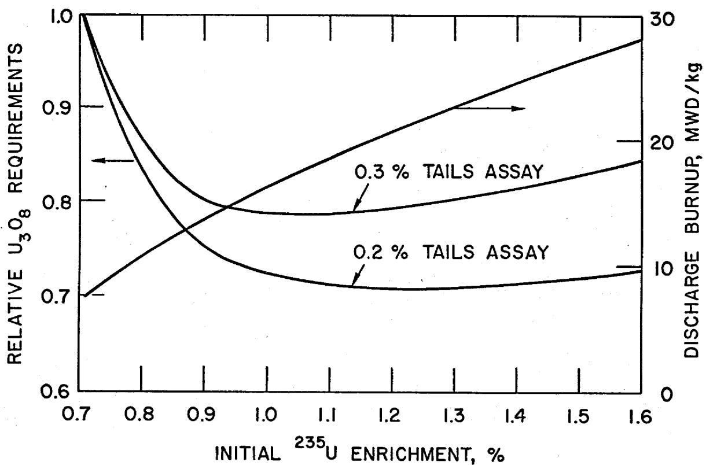  
Fig. 4.3-1. Fuel Utilization Characteristics for Enriched-Uranium-Fueled CANDU.

4. HEU/Th, U Recycle: With $93\%$ 235U-enriched uranium startup and makeup, the annual $\mathsf{U}_3\mathsf{O}_8$ makeup requirements at near-equilibrium are about 27 ST/GWe for the 16,000-MWD/T burnup case. This net consumption of $\mathsf{U}_3\mathsf{O}_8$ is only $14\%$ of the LWR once-through cycle and $28\%$ of the LWR thorium cycle (see Cases A and J in Table 4.1-1). However, the initial core $\mathsf{U}_3\mathsf{O}_8$ requirement is more than double that of the CANDU slightly enriched uranium cycle. In addition, the transition to equilibrium and the out-of-core inventory requirements, depending on the recycle turn-around time, can be very significant.   
5. Denatured U/Th, U Recycle ( $^{233}$ U Makeup): The initial core $^{233}$ U inventory requirement is about 1,650 kg/GWe, with an annual net requirement of about 100 kg $^{233}$ U/GWe.   
6. MEU/Th, U Recycle (235U Makeup): The initial core requirement is about the same as that for the standard thorium cycle (i.e., HEU/Th cycle); however, the equilibrium net $\mathsf{U}_3\mathsf{O}_8$ consumption is slightly increased.   
7. MEU/Th, No Recycle: This cycle option is included to indicate that recycle of the self-generated $^{233}\mathrm{U}$ is advisable for the MEU/Th cycle. The lifetime $U_{3}O_{8}$ requirement for the once-through MEU/Th cycle is about 8,300 ST, which is a factor of 2.3 higher than that for the once-through enriched-uranium cycle in CANDU reactors.

# References for Section 4.3

1. J. S. Foster and E. Critoph, "The Status of the Canadian Nuclear Power Program and Possible Future Strategies," Annals of Nuclear Energy 2, 689 (1975).   
2. S. Banerjee, S. R. Hatcher, A. D. Lane, H. Tamm and J. I. Veeder, "Some Aspects of the Thorium Fuel Cycle in Heavy-Water-Moderated Pressure Tubes Reactors," Nucl. Tech. 34, 58 (1977).   
3. E. Critoph, S. Banerjee, F. W. Barclay, D. Hamel, M. S. Milgram and J. I. Veeder, "Prospects for Self-Sufficient Equilibrium Thorium Cycles in CANDU Reactors," AECL-5501 (1976).   
4. C. E. Till, E. M. Bohn, Y. I. Chang and J. B. van Erp, "A Survey of Considerations Involved in Introducing CANDU Reactors into the U.S.," ANL-76-132 (January 1977).   
5. Y. I. Chang, C. E. Till, R. R. Rudolph, J. R. Deen, and M. J. King, "Alternative Fuel Cycle Options: Performance Characteristics and Impact on Nuclear Power Growth Potential," ANL-77-70 (Sept. 1977).

# 4.4. GAS-COOLED THERMAL REACTORS

# J. C. Cleveland Oak Ridge National Laboratory

# 4.4.1. High-Temperature Gas-Cooled Reactors

The High-Temperature Gas-Cooled Reactor (HTGR) is another candidate for implementing alternate fuel cycle options, particularly the denatured $^{233}\mathrm{U}$ cycle. Unlike other reactor types that generally have been optimized for either LEU or mixed oxide $(\mathrm{Pu} / ^{238}\mathrm{U})$ fuel, the HTGR has a design based on utilization of a thorium fuel cycle, and although current-design HTGRs may not meet potential proliferation-based fuel cycle restrictions, the reference design involves both $^{232}\mathrm{Th}$ and $^{233}\mathrm{U}$ , which are the primary materials in the denatured fuel cycle.

In contrast to the fuel for water-cooled reactors and fast breeder reactors, the fuel for HTGRs is not in the form of metal-clad rods but rather is composed of coated fuel particles bonded together by a graphite matrix into a fuel stick. The coatings on the individual fuel particles provide fission-product containment. The fuel sticks are loaded in fuel holes in hexagonal graphite fuel blocks. These blocks also contain hexagonal arrays of coolant channels through which the helium flows. In the conventional HTGR the fuel particles are of two types: fissile particles consisting of $\mathrm{UC}_2$ kernels coated with layers of pyrocarbon and silicon carbide; and fertile particles consisting of $\mathrm{ThO}_2$ kernels coated only with pyrocarbon. The pyrocarbon coating on the fertile particles can be burned off while the SiC coating on the fissile particles cannot. Therefore the two particle types can be physically separated prior to any chemical reprocessing. As indicated in Chapter 5, hot demonstrations of the head-end processing operations unique to this reactor fuel, the crushing and burning of the fuel elements, the mechanical particle separation, and the particle crushing and burning are needed to ensure that low-loss reprocessing can take place.

An inherent feature of the HTGR which results in uranium resource conservation is its high ( $\sim 40\%$ ) thermal efficiency. All else being equal, this fact alone results in a $15\%$ reduction in uranium resource requirements compared to LWRs, which achieve a $34\%$ thermal efficiency. This larger thermal efficiency also leads to reduced thermal discharges that provide significant siting advantages for HTGRs, especially if many reactors are to be deployed in central locations such as energy centers.

Other factors inherent in HTGR design that lead to improved $\mathsf{U}_3\mathsf{O}_8$ utilization due to the improved neutron economy are:

1. Absorption of only $\sim 1.6\%$ of the neutrons by HTGR particle coatings, graphite moderator, and helium coolant, compared to an absorption of $\sim 5.6\%$ of the neu

trons in the Zircaloy cladding and the coolant of conventional PWRs ( $\sim 4\%$ of all neutron absorptions in PWRs result from hydrogen absorption).

2. Low $^{233}\mathrm{Pa}$ burnout due to the low (7-8 W/cm³) power density.

The combination of low power density and large core heat capacity associated with the graphite moderator and the ceramic fuel largely mitigate the consequences of HTGR loss-of-coolant accidents. Loss of cooling does not lead to severe conditions nearly as quickly as in conventional LWRs or FBRs since the heat capacity of the core is maintained, therefore allowing considerable time to initiate actions designed to provide auxiliary core cooling.

The HTGR offers a near-term potential for realization of improved $\mathsf{U}_3\mathsf{O}_8$ utilization. The 330-MWe Fort St. Vrain plant has been under start-up for several years with a current licensed power level of $70\%$ and the plant has operated at the $70\%$ power level for limited periods. A data collection program is providing feedback on problem areas that are becoming apparent during this start-up period and will serve as the basis for improvements in the commercial plant design.

An advantage of the HTGR steam cycle is that its commercialization could lead to later commercialization of advanced gas-cooled systems based on the HTGR technology. These include the HTGR gas turbine system which has a high thermal efficiency of 45 to $50\%$ and the VHTR (Very High Temperature Reactor) system for high-temperature process heat application.

Mass balance calculations have been performed by General Atomic for several alternate HTGR fuel cycles, $^{1}$ and some additional calculations carried out at ORNL have verified certain GA results. $^{2}$ Their results for the following fuel cycles are presented here: Dispersible Resource-Based Fuels

1. LEU, no recycle.

a. Carbon/uranium ratio $(C / U) = 350$   
b. $C / U = 400$ , optimized for no recycle.   
2. MEU/Th (20% 235U/U mixed with 232Th), C/Th = 650, no recycle.   
3. MEU/Th (20% $^{235}\mathrm{U} / \mathrm{U}$ ), C/Th = 306 for initial core, C/Th = 400 for reload segments, $^{233}\mathrm{U}$ recycle.

Dispersible Denatured Fuel

4. MEU/Th (15% $233\mathrm{U} / \mathrm{U}$ ), C/Th = 274/300 (initial core/reload segments), optimized for uranium recycle ( $233\mathrm{U} + 235\mathrm{U}$ ).

Energy-Center-Constrained Fuel

5. Pu/Th, C/Th = 650 (batch-loaded core).

Reference Fuels

6. HEU(235U)/Th, C/Th = 214/238 (initial core/reload segments), no recycle.   
7. HEU(233U)/Th, C/Th = 150, high-gain design, uranium recycle.   
8. HEU(235U)/Th, C/Th = 180/180 (initial core/reload segments), uranium recycle (from ref. 3).

All of the above fuel cycles are for a 3360-MWt, 1344-MWe HTGR with a core power density of $7.1\mathrm{W_t / cm^3}$ . Table 4.4-1 provides a summary, obtained from the detailed mass balance information in ref. 1, of the conversion ratio, fissile requirements, fissile discharge, and $\mathrm{U}_{3}\mathrm{O}_{8}$ and separative work requirements. Cases 1-a and 1-b involve the use of LEU fuel with an equilibrium cycle enrichment of 7.4 w/o and 8.0 w/o, respectively. Case 1-b would be preferred for no-recycle conditions.

In Case 2 thorium is used with $20\%$ $^{235}\mathrm{U} / \mathrm{U}$ (MEU/Th) for no-recycle conditions. Note that while the initial $U_{3}O_{8}$ and fissile loading requirements are higher for the MEU/Th case than for the LEU cases, due to the larger thermal absorption cross section of thorium and the partial unshielding of the $^{238}\mathrm{U}$ resonances resulting from its reduced density, the cumulative $U_{3}O_{8}$ requirements are slightly less for the MEU/Th case. This results from the high burnup attainable in HTGRs and the resultant large amount of bred $^{233}\mathrm{U}$ which is burned in situ. Other converter and advanced converter reactors (LWRs, SSCRs, and HWRs) typically require less $U_{3}O_{8}$ for the LEU case than for the MEU/Th case with no recycle.

Case 3 also uses the MEU/Th feed but with recycle of $^{233}\mathrm{U}$ . The unburned $^{235}\mathrm{U}$ and plutonium discharged in the denatured $^{235}\mathrm{U}$ particles is not recycled. The bred $^{233}\mathrm{U}$ recovered from the fertile particle, however, is denatured, combined with thorium, and recycled. In the calculations for all cases involving recycle of denatured $^{233}\mathrm{U}$ , GA assumed that an isotopic mix of $15\%$ $^{233}\mathrm{U}$ and $85\%$ $^{238}\mathrm{U}$ provided adequate denaturing. Due to the high burnup and the fact that the thermal-neutron spectrum in HTGRs peaks near the $^{239}\mathrm{Pu}$ and $^{241}\mathrm{Pu}$ resonances, a large amount of the fissile plutonium bred in the denatured fuel is burned in situ, thus resulting in the low fissile plutonium content of the fuel at discharge. Considerable $^{238}\mathrm{U}$ self-shielding is obtained by the lumping of the $^{238}\mathrm{U}$ in the coated particle kernels. Studies are currently underway at GA concerning the use of larger diameter fissile particles, thereby lowering the $^{238}\mathrm{U}$ resonance integral and, consequently, the amount of bred plutonium discharged.[4]

Case 4 employs a denatured $^{233}\mathsf{U}$ feed and includes uranium recycle. It represents a feasible successor to Case 3 once an exogenous source of $^{233}\mathsf{U}$ is available.

Case 5 involves Pu/Th fuel. Since no $^{238}\mathrm{U}$ is present in the core, no plutonium is bred; only $^{233}\mathrm{U}$ is bred. This reactor has greatly reduced requirements for control poison, resulting in enhanced neutron economy. This results from the fact that this Pu/Th HTGR essentially achieves the "Phoenix" fuel cycle effect, i.e., the decrease in $^{239}\mathrm{Pu}$ content is largely compensated for by buildup of $^{241}\mathrm{Pu}$ from $^{240}\mathrm{Pu}$ capture and by buildup of $^{233}\mathrm{U}$ from $^{232}\mathrm{Th}$ capture, resulting in a nearly constant ratio of fissile concentration to $^{240}\mathrm{Pu}$ concentration. Therefore the fuel reactivity is relatively constant over a long burnup period, reducing the need for control poison. This allows the core to be batch loaded; i.e., the entire core is reloaded at approximately 5-yr intervals. This reload scheme minimizes down time for refueling and eliminates problems of power sharing between fuel elements of different ages. Furthermore, it allows easy conversion to a U/Th HTGR after any cycle. It is important to note that the Pu/Th case presented in Table 4.4-1 is not

Table 4.4-1. Fuel Utilization Characteristics for HTGRs Under Various Fuel Cycle Options   

<table><tr><td rowspan="2">Case, Fuel Type</td><td rowspan="2">Conversion Ratio(1st Cy./Eq. Cy.)</td><td colspan="2">Initial Core Requirementsa</td><td colspan="2">Equilibrium Cycleb</td><td colspan="2">U3O8Requirementc(ST/GWe)</td><td colspan="2">Separative Work Requirementd(103kg SWU/GWe)</td></tr><tr><td>FissileInventory(kg/GWe)</td><td>HMLoading(MT/GWe)</td><td>FissileMakeup(kg/GWe-yr)</td><td>Discharge ofNonrecyclableFissile Material(kg/GWe-yr)</td><td>Initial</td><td>30-yr Totalfor CF of65.9%/75xd,e</td><td>Initial</td><td>30-yr Totalfor CF of65.9%/75xd</td></tr><tr><td colspan="10">Dispersible Resource-Based Fuels</td></tr><tr><td>1-a, LEU,no recycle,C/U = 350</td><td>0.580/0.553</td><td>901235U</td><td>24.6 U</td><td>608235U</td><td>113235U69 Puf</td><td>217</td><td>4272/4860</td><td>142</td><td>3319/3781</td></tr><tr><td>1-b, LEU,no recycle,C/U = 400</td><td>0.557/0.526</td><td>819235U</td><td>21.6 U</td><td>576235U</td><td>77235U52 Puf</td><td>197</td><td>4040/4594</td><td>130</td><td>3188/3629</td></tr><tr><td>2, MEU(20x235U)/Th,no recycle,C/Th = 650</td><td>0.630/0.541</td><td>1077235U</td><td>5.4 U20.2 Th</td><td>551235U</td><td>47235U74233U22 Puf</td><td>274</td><td>3967/4515</td><td>249</td><td>3640/4143</td></tr><tr><td>3, MEU(20x235U)/Th,f233U recycle,C/Th = 306/400g</td><td>0.682/0.631</td><td>1474235U</td><td>7.4 U27.5 Th</td><td>397235U</td><td>65235U36 Puf</td><td>371</td><td>3229/3666</td><td>340</td><td>2933/3361</td></tr><tr><td colspan="10">Dispersible Denatured Fuel</td></tr><tr><td>4, MEU(15x233U)/Th,fU recycle,C/Th = 274/300</td><td>0.824/0.764</td><td>1168233U</td><td>7.9 U30.7 Th</td><td>246233U</td><td>35 Puf</td><td>0</td><td>0</td><td>0</td><td>0</td></tr><tr><td colspan="10">Energy-Center-Constrained Fuel</td></tr><tr><td>5, Pu/Th,C/Th = 650</td><td>0.617/0.617</td><td>3153Pufh</td><td>12.2 Th</td><td>630Puf</td><td>102Puf97233U</td><td>0</td><td>0</td><td>0</td><td>0</td></tr><tr><td colspan="10">Reference Fuelsi</td></tr><tr><td>6, HEU(235U)/Th,no recycle,C/Th = 214/238</td><td>0.723/0.668</td><td>1358235U</td><td>1.5 U37.2 Th</td><td>508235U</td><td>49235U183233U1 Puf</td><td>345</td><td>3864/4395</td><td>344</td><td>3858/4387</td></tr><tr><td>7, HEU(233U)/Th,hi/gain,U recycle,C/Th = 150</td><td>0.915/0.859</td><td>139233U139235U</td><td>2.0 U53.0 Th</td><td>120233U12235U</td><td>-</td><td>0</td><td>0</td><td>0</td><td>0</td></tr><tr><td>8, HEU(235U)/Th,hi/gain,U recycle,C/Th = 180/180</td><td>/0.75</td><td>1987235Uf,k</td><td>44.6 Thf,k2.1 Uf,k</td><td>239235Uk</td><td>1Puf6235U</td><td>505f,k</td><td>/2280</td><td>505f,k</td><td>/2278</td></tr></table>

$\alpha_{1}$ Initial cycle lasts one calendar year at $60\%$ capacity factor.   
Equilibrium cycle capacity factor is $72\%$ .   
Assumes 0.2 w/o tails.   
${}^{a}$ Value preceding slash is for an average 30-yr capacity factor of 65.9; value following slash is for a constant capacity factor of 75%.   
No credit taken for end of life core.   
No 235u from MEU particle or Pu recycled in Case 3; all U recycled in Case 4, but no Pu recycled.   
Initial core/reload segment.   
Core is batch loaded; initial load provides fissile material for $\sim 5$ yr of operation.   
Reference fuels are considered only as limiting cases.   
$\mathcal{L}$ Initial cycle length is 1.6 yr.   
Numbers shown are for a capacity factor of $75\%$ .

optimized for high conversion; rather it is a Pu burner designed for low fuel cycle costs. A Pu/Th case designed for high $^{233}\mathrm{U}$ production would have a C/Th ratio for the equilibrium cycle of $\sim 430$ rather than 650 as in Case 5 (ref. 5).

In Case 6 the feed is fully enriched (93%) uranium and thorium and no recycle is allowed. Such a system would provide the means for generating a potential stockpile of $^{233}\mathrm{U}$ in the absence of reprocessing capability. If $^{233}\mathrm{U}$ recycle is not contemplated, the economical optimum once-through cycle would have a lower thorium loading ( $C / Th = 330$ ).

Case 7 involves the use of highly enriched $^{233}\mathrm{U}$ and uranium recycle. The heavy fertile loading (C/Th = 150) results in the high conversion ratio (and high initial fissile loading requirement) shown in Table 4.4-1.

Case 8 involves the use of fully enriched (93%) uranium and thorium designed for recycle conditions. This is included as the pre-1977 reference high-gain HEU(235U)/Th recycle case for comparison with the other above cases.

Both GA and ORNL have performed mass balance calculations for an HEU(235U)/Th fuel cycle with uranium recycle. These calculations were for a 1160-MWe plant with a power density of $8.4\mathrm{W_t / cm^3}$ and a C/Th ratio for the first core and reload cycles of 214 and 238 respectively. The GA results indicate cumulative $\mathsf{U}_3\mathsf{O}_8$ and separative work requirements (for a capacity factor of $75\%$ and an assumed tails enrichment of $0.2\mathrm{w / o}$ ) of 2783 ST $\mathsf{U}_3\mathsf{O}_8/$ GWe and 2778 kg SWU/GWe, respectively. The corresponding results for the ORNL calculations are 2690 ST $\mathsf{U}_3\mathsf{O}_8/$ GWe and 2684 kg SWU/GWe. As can be seen, the agreement is fairly good. Comparison of these results with the same case without recycle (Case 6, Table 4.4-1) shows a $\mathsf{U}_3\mathsf{O}_8$ savings of $\sim 38\%$ if uranium is recycled.

It is conventional to compare 30-yr cumulative $U_{3}O_{8}$ and separative work requirements for different reactor types on a per GWe basis with an assumed constant capacity factor. The results reported in Table 4.4-1 were generated for an assumed variable capacity factor which averaged 65.9% over the 30-yr life. To facilitate comparison with $U_{3}O_{8}$ requirements in other sections of Chapter 4, estimated 30-yr requirements for a constant capacity factor of 75% have also been included in the table. These values were obtained by applying a factor of 0.750/0.659 to the calculated requirements for the variable capacity factor. Obviously this technique is an approximation but it is fairly accurate. The 30-yr requirements for a 75% capacity factor for Case 8 were explicitly calculated and not obtained by the above estimating procedure.

As is indicated in Table 4.4-1, the MEU(20% $^{235}\mathrm{U}$ /Th no-recycle case is more resource efficient than the LEU no-recycle case. This results from the high exposure attainable in HTGR fuels and the high in situ utilization of $^{233}\mathrm{U}$ . In water reactors, the once-through MEU(20% $^{235}\mathrm{U}$ /Th cycle requires significantly more $\mathrm{U}_{3}\mathrm{O}_{8}$ than the once-through LEU cycle. Thus MEU(20% $^{235}\mathrm{U}$ /Th fuels in HTGRs are an attractive option for stowaway cycles in which $^{233}\mathrm{U}$ is bred for later use.

# 4.4.2. Pebble-Bed High-Temperature Reactors

A second high-temperature gas-cooled thermal reactor that is a possible candidate for the denatured $^{233}\mathrm{U}$ fuel cycle is the Pebble-Bed Reactor (PBR). Experience with PBRs began in August, 1966, in Jülich, West Germany, with the criticality of the Arbeitsgemeinschaft Versuch Reaktor (AVR), a 46-Mwt reactor that was developed to gain knowledge and experience in the construction and operation of a high-temperature helium-cooled reactor fueled with spherical elements comprised of carbon-coated fuel particles. This experience was intended to serve as a basis for further development of this concept in West Germany. Generation of electricity with the AVR began in 1967.

In addition to generating electric power, the AVR is a test facility for investigating the behavior of spherical fuel elements. It also is a supplier of high-burnup high-temperature reactor fuel elements for the West German fuel reprocessing development work. The continuation of the PBR development initiated by the AVR is represented by the THTR at Schmehausen, a reactor designed for 750 MWt with a net electrical output of 300 MW. Startup of the THTR is expected about 1980.

Table 4.4-2. PBR Core Design   

<table><tr><td>Power, Qt</td><td>3000 Mwt</td></tr><tr><td>Power density</td><td>5 MW/m3</td></tr><tr><td>Heating of helium</td><td>250-985 °C</td></tr><tr><td>Helium inlet pressure</td><td>40 atm</td></tr><tr><td>Plant efficiency, Qe/Qt</td><td>0.40</td></tr><tr><td>Height of ball fill</td><td>550 cm</td></tr><tr><td>Radius</td><td>589 cm</td></tr><tr><td>Ball packing</td><td>5394 balls/m3</td></tr><tr><td>Inner fueling zone:</td><td></td></tr><tr><td>Outer radius</td><td>505 cm</td></tr><tr><td>Number of ball flow channels</td><td>4</td></tr><tr><td>Relative residence time</td><td>9/9/9/9</td></tr><tr><td>Outer fueling zone:</td><td></td></tr><tr><td>Outer radius</td><td>589 cm</td></tr><tr><td>Number of ball flow channels</td><td>1</td></tr><tr><td>Relative residence time</td><td>13</td></tr><tr><td>Top reflector:</td><td></td></tr><tr><td>Thickness</td><td>200</td></tr><tr><td>Graphite density</td><td>0.32</td></tr><tr><td>Bottom reflector:</td><td></td></tr><tr><td>Thickness</td><td>150</td></tr><tr><td>Graphite density</td><td>1.60</td></tr><tr><td>Radial reflector:</td><td></td></tr><tr><td>Thickness</td><td>100</td></tr><tr><td>Graphite density</td><td>1.60</td></tr></table>

The PBR concept offers favorable conservation of uranium resources due to its low fissile inventory requirements and to the high burnup that is achievable in PBR elements. This has been demonstrated by the analysis of several once-through cycles calculated for the PBR by a physics design group at KFA Jülich, West Germany, and summarized here. The reactor core design used for the study is described in Table 4.4-2. Various fuel element types were considered, differing by the coated particle types used and by the heavy metal loading. The basic fuel element design is shown in Table 4.4-3, the coated particle designs are described in Table 4.4-4, and the compositions of the various fuel element types are given in Table 4.4-5. The once-through cycles considered are described below, with the core compositions of each given in Table 4.4-6.

Case 1, LEU. Low-enriched uranium is loaded into the coated fuel particles. The radial power profile is flattened by varying the enrichment in the inner and

Table 4.4-3. PBR Fuel Element Design   

<table><tr><td>Ball diameter</td><td>6 cm</td></tr><tr><td>Thickness of graphite shell</td><td>0.5 cm</td></tr><tr><td>Graphite density</td><td>1.70 g/cm3</td></tr></table>

outer radial core zones. The enrichment of the inner zone is 7.9 at.% and that of the outer zone is 11.1 at.%

Case 2, MEU/Th. (U + Th)O₂ fuel with 20% enriched uranium is loaded into the coated fuel particles. The heavy metal

loading in the MEU/Th fuel element is between that of the THTR and AVR elements. As in Case 1, the radial power is flattened by the choice of fissile loading of the elements in the inner and outer radial core zones, 6.85 and $11.4\%$ respectively. The coated particles would require some development and testing.

Case 3, Seed and Breed MEU/Th. $(\mathsf{U} + \mathsf{Th})\mathsf{O}_2$ fuel with $20\%$ enriched uranium is loaded into seed elements and $\mathsf{ThO_2}$ is loaded into breed elements. By thus separating the seed and breed elements, $^{236}\mathsf{U}$ bred into the seed elements will not have contaminated the $^{233}\mathsf{U}$ produced in the breed elements in case recycle is opted for later. Graphite balls are added to the inner core zone to adjust the carbon/heavy metal ratio (C/HM) to that of the outer zone. The heavy metal loading of 6 g HM/ball in the seed elements is essentially the same as in the AVR. The feasibility of a considerably heavier loading of the breed elements, 16.54 g HM/ball, is currently being tested.

Case 4, HEU/Th. $(\mathsf{U} + \mathsf{Th})\mathsf{O}_2$ fuel with $93\%$ enriched uranium is loaded into the coated fuel particles. The coated particle and fuel element designs are essentially identical to those of THTR fuel elements, which have been licensed and are being manufactured. The only modification is the fissile loading. Again the fissile loading of the elements in the inner and outer radial core zones is varied to flatten the radial power distribution, the inner zone fissile loading being $6.23\%$ of the heavy metal and the outer zone fissile loading being $10.9\%$ .

Case 5, Seed and Breed HEU/Th. $(\mathsf{U} + \mathsf{Th})\mathsf{O}_2$ fuel with $93\%$ enriched uranium is loaded into seed elements and breed elements contain $\mathsf{ThO}_2$ only. The radial power profile is flattened by the choice of the mixing fraction of seed and breed balls in the inner and outer radial core zones, and graphite balls are added to the inner zone to adapt the C/HM ratio to that of the outer zone. In the seed elements the HEU is mixed with some $\mathsf{ThO}_2$ in order to achieve a prompt negative Doppler coefficient. Again the heavy metal loading of the balls is essentially the same as that in the AVR and the feasibility of the loading of the breed elements is being tested.

The mass flow data for the equilibrium cycle of each of the five cases are presented in Table 4.4-7. The high thermal cross sections of $^{239}\mathrm{Pu}$ , $^{240}\mathrm{Pu}$ and $^{241}\mathrm{Pu}$ , the soft spectrum, and the low self-shielding of the fuel element design lead to a very high in-situ utilization of the fissile plutonium (95% for the MEU/Th cycles). In addition, the high burnup results in the low discharge plutonium fissile fractions shown in Table 4.4-7. The buildup of plutonium isotopes in the MEU/Th cycle is shown in Fig. 4.4-1.

Table 4.4-4. PBR Coated Particle Design   
Table 4.4-5. Composition of PBR Fuel Elements   

<table><tr><td rowspan="2">Type</td><td colspan="3">Kernel</td><td colspan="2">Carbon Coatings</td></tr><tr><td>Material</td><td>Diameter (μm)</td><td>Density (g/cm3)</td><td>Thickities (μm)</td><td>Densities (g/cm3)</td></tr><tr><td>I</td><td>U/ThO2</td><td>400</td><td>9.50</td><td>85/30/80</td><td>1.0/1.6/1.85</td></tr><tr><td>II</td><td>U/ThO2</td><td>400</td><td>9.50</td><td>50/80</td><td>1.0/1.85</td></tr><tr><td>III</td><td>UO2</td><td>800</td><td>9.50</td><td>110/80</td><td>1.0/1.85</td></tr></table>

<table><tr><td>Identification</td><td>Type of Coated Particlea</td><td>Heavy Metal Loading (g/ball)</td><td>Moderation Ratio (NC/NHM)</td></tr><tr><td>H1</td><td>I</td><td>11.24</td><td>325</td></tr><tr><td>H2</td><td>I</td><td>8.07</td><td>458</td></tr><tr><td>S1</td><td>II</td><td>€.0</td><td>617</td></tr><tr><td>S2</td><td>II</td><td>6.0</td><td>629</td></tr><tr><td>B1</td><td>II</td><td>20.13</td><td>180</td></tr><tr><td>B2</td><td>II</td><td>16.54</td><td>220</td></tr><tr><td>L1</td><td>III</td><td>9.88</td><td>380</td></tr><tr><td>L2</td><td>III</td><td>11.70</td><td>320</td></tr><tr><td>G</td><td>Carbon</td><td></td><td></td></tr></table>

aSee Table 4.4-4.

Table 4.4-6. Composition of PBR Core Regions Used in Mass Flow Calculations   

<table><tr><td rowspan="2">Case</td><td colspan="2">Inner Core</td><td colspan="2">Outer Core</td></tr><tr><td>Fuel Element Typeα (Fractional Mixing)</td><td>Fissile Loading (Nfis/NHM)</td><td>Fuel Element Type (Fractional Mixing)</td><td>Fissile Loading (Nfis/NHM)</td></tr><tr><td>1, LEU</td><td>L1 (1.0)</td><td>0.079</td><td>L2 (1.0)</td><td>0.111</td></tr><tr><td>2, MEU/Th</td><td>M2 (1.0)</td><td>0.0685</td><td>M2 (1.0)</td><td>0.114</td></tr><tr><td rowspan="3">3, Seed and Breed MEU/Th</td><td>S2 (0.485)</td><td>0.20</td><td>S2 (0.765)</td><td>0.20</td></tr><tr><td>B2 (0.305)</td><td></td><td>B2 (0.235)</td><td></td></tr><tr><td>G (0.210)</td><td></td><td></td><td></td></tr><tr><td>4, HEU/Th</td><td>M1 (1.0)</td><td>0.0623</td><td>M1 (1.0)</td><td>0.109</td></tr><tr><td rowspan="3">5, Seed and Breed HEU/Th</td><td>S1 (0.40)</td><td>0.27</td><td>S1 (0.69)</td><td>0.27</td></tr><tr><td>B1 (0.39)</td><td></td><td>B1 (0.31)</td><td></td></tr><tr><td>G (0.21)</td><td></td><td></td><td></td></tr></table>

$a_{\mathrm{See}}$ Table 4.4-5.

Table 4.4-7. Fuel Utilization Characteristics for Equilibrium Cycles of PBRs Under Various Fuel Options with No Recycle   

<table><tr><td>Case</td><td>Fuel Type</td><td>Conversion Ratio</td><td>Fuel Elementsb</td><td>Loading (kg/GWe-yr)</td><td>Discharge (kg/GWe-yr)</td><td>Isotopic Fraction of Discharge Pu</td><td>Burnup (MWD/kg HM)</td></tr><tr><td rowspan="9">1</td><td rowspan="9">LEU</td><td rowspan="9">0.58</td><td rowspan="9">L1 + L2</td><td>575 235U</td><td>93 235U</td><td></td><td rowspan="4">100</td></tr><tr><td>-</td><td>80 236U</td><td></td></tr><tr><td>6168 238U</td><td>5719 238U</td><td></td></tr><tr><td>6743 Utot.</td><td>5892 Utot.</td><td></td></tr><tr><td></td><td>42 239(Pu,Np)</td><td>0.37 239(Pu,Np)</td><td></td></tr><tr><td></td><td>26 240Pu</td><td>0.23 240Pu</td><td></td></tr><tr><td></td><td>21 241Pu</td><td>0.19 241Pu</td><td></td></tr><tr><td></td><td>24 242Pu</td><td>0.21 242Pu</td><td></td></tr><tr><td></td><td>113 Pu tot.</td><td>Puf/Putot. = 0.56</td><td></td></tr><tr><td rowspan="12">2</td><td rowspan="12">MEU/Th</td><td rowspan="12">0.58</td><td rowspan="12">M2</td><td>4158 Th</td><td>3881 Th</td><td></td><td rowspan="7">100</td></tr><tr><td>-</td><td>91 233(U,Pa)</td><td></td></tr><tr><td>-</td><td>22 234U</td><td></td></tr><tr><td>534 235U</td><td>39 235U</td><td></td></tr><tr><td>-</td><td>79 236U</td><td></td></tr><tr><td>2163 238U</td><td>1965 238U</td><td></td></tr><tr><td>2697 Utot.</td><td>2195 Utot.</td><td></td></tr><tr><td></td><td>9 239(Pu,Np)</td><td>0.25 239(Pu,Np)</td><td></td></tr><tr><td></td><td>9 240Pu</td><td>0.26 240Pu</td><td></td></tr><tr><td></td><td>5 241Pu</td><td>0.14 241Pu</td><td></td></tr><tr><td></td><td>13 242Pu</td><td>0.34 242Pu</td><td></td></tr><tr><td></td><td>36 Pu tot.</td><td>Puf/Putot. = 0.39</td><td></td></tr><tr><td rowspan="15">3</td><td rowspan="15">Seed &amp; Breed MEU/Th</td><td rowspan="15">0.56</td><td rowspan="9">S2</td><td>540 235U</td><td>30 235U</td><td></td><td rowspan="4">201</td></tr><tr><td>-</td><td>81 236U</td><td></td></tr><tr><td>2190 238U</td><td>1982 238U</td><td></td></tr><tr><td>2730 Utot.</td><td>2093 Utot.</td><td></td></tr><tr><td></td><td>9 239(Pu,Np)</td><td>0.24 239(Pu,Np)</td><td></td></tr><tr><td></td><td>9 240Pu</td><td>0.25 240Pu</td><td></td></tr><tr><td></td><td>5 241Pu</td><td>0.14 241Pu</td><td></td></tr><tr><td></td><td>14 242Pu</td><td>0.38 242Pu</td><td></td></tr><tr><td></td><td>37 Pu tot.</td><td>Puf/Putot. = 0.38</td><td></td></tr><tr><td rowspan="6">B2</td><td>4170 Th</td><td>3881 Th</td><td></td><td rowspan="6">35</td></tr><tr><td></td><td>82 233(U,Pa)</td><td></td></tr><tr><td></td><td>22 234U</td><td></td></tr><tr><td></td><td>4 235U</td><td></td></tr><tr><td></td><td>1 236U</td><td></td></tr><tr><td></td><td>108 Utot.</td><td></td></tr><tr><td colspan="7">Reference Fuelsc</td><td></td></tr><tr><td>4</td><td>HEU/Th</td><td>0.59</td><td>M1</td><td>6302 Th</td><td>5794 Th</td><td></td><td>100</td></tr><tr><td></td><td></td><td></td><td></td><td>-</td><td>128 233(U,Pa)</td><td></td><td></td></tr><tr><td></td><td></td><td></td><td></td><td>-</td><td>38 234U</td><td></td><td></td></tr><tr><td></td><td></td><td></td><td></td><td>495 235U</td><td>23 235U</td><td></td><td></td></tr><tr><td></td><td></td><td></td><td></td><td>-</td><td>73 236U</td><td></td><td></td></tr><tr><td></td><td></td><td></td><td></td><td>38 238U</td><td>30 238U</td><td></td><td></td></tr><tr><td></td><td></td><td></td><td></td><td>533 Utot.</td><td>292 Utot.</td><td></td><td></td></tr><tr><td></td><td></td><td></td><td></td><td></td><td>0.263 239(Pu,Np)</td><td>0.23 239(Pu,Np)</td><td></td></tr><tr><td></td><td></td><td></td><td></td><td></td><td>0.244 240Pu</td><td>0.21 240Pu</td><td></td></tr><tr><td></td><td></td><td></td><td></td><td></td><td>0.148 241Pu</td><td>0.13 241Pu</td><td></td></tr><tr><td></td><td></td><td></td><td></td><td></td><td>0.512 242Pu</td><td>0.44 242Pu</td><td></td></tr><tr><td></td><td></td><td></td><td></td><td></td><td>1.166 Pu tot.</td><td>Puf/Putot. = 0.36</td><td></td></tr><tr><td>5</td><td>Seed &amp; Breed HEU/Th</td><td>0.58</td><td>S1</td><td>1287 Th</td><td>1185 Th</td><td>243</td><td></td></tr><tr><td></td><td></td><td></td><td></td><td>-</td><td>25 233(U,Pa)</td><td></td><td></td></tr><tr><td></td><td></td><td></td><td></td><td>-</td><td>8 234U</td><td></td><td></td></tr><tr><td></td><td></td><td></td><td></td><td>496 235U</td><td>16 235U</td><td></td><td></td></tr><tr><td></td><td></td><td></td><td></td><td>-</td><td>76 236U</td><td></td><td></td></tr><tr><td></td><td></td><td></td><td></td><td>38 238U</td><td>30 238U</td><td></td><td></td></tr><tr><td></td><td></td><td></td><td></td><td>534 Utot.</td><td>155 Utot.</td><td></td><td></td></tr><tr><td></td><td></td><td></td><td></td><td></td><td>0.227 239(Pu,Np)</td><td>0.21 239(Pu,Np)</td><td></td></tr><tr><td></td><td></td><td></td><td></td><td></td><td>0.257 240Pu</td><td>0.23 240Pu</td><td></td></tr><tr><td></td><td></td><td></td><td></td><td></td><td>0.120 241Pu</td><td>0.11 241Pu</td><td></td></tr><tr><td></td><td></td><td></td><td></td><td></td><td>0.500 242Pu</td><td>0.45 242Pu</td><td></td></tr><tr><td></td><td></td><td></td><td></td><td></td><td>1.106 Pu tot.</td><td>Puf/Putot. = 0.32</td><td></td></tr><tr><td></td><td></td><td></td><td>B1</td><td>4983 Th</td><td>4594 Th</td><td></td><td>48</td></tr><tr><td></td><td></td><td></td><td></td><td></td><td>91 233(U,Pa)</td><td></td><td></td></tr><tr><td></td><td></td><td></td><td></td><td></td><td>29 234U</td><td></td><td></td></tr><tr><td></td><td></td><td></td><td></td><td></td><td>5 235U</td><td></td><td></td></tr><tr><td></td><td></td><td></td><td></td><td></td><td>1 236U</td><td></td><td></td></tr><tr><td></td><td></td><td></td><td></td><td></td><td>126 Utot.</td><td></td><td></td></tr></table>

${}^{a}$ Calculated for 1000-MWe plant operating at 75% capacity.   
See Tables 4.4-3 through 4.4-6 for descriptions of cases and fuel elements.   
Reference fuels are considered only as limiting cases.

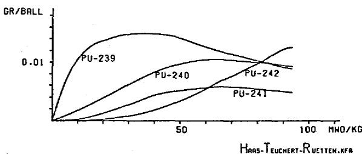  
Fig. 4.4-1. Buildup of the Plutonium Isotopic Composition in the MEU/Th Fuel.

As can be seen, the $^{239}\mathrm{Pu}$ content peaks at $\sim 30\mathrm{MWD/kg}$ , decreasing thereafter. The higher Pu isotopes tend to peak at higher burnups so that at discharge $^{242}\mathrm{Pu}$ dominates. Compared to an LWR with LEU fuel, the PBR with MEU/Th fuel discharges only $8\%$ as much fissile plutonium. Furthermore, the fissile fraction of the discharged plutonium is only $39\%$ compared to $71\%$ for an LWR.

Table 4.4-8 presents $\mathsf{U}_3\mathsf{O}_8$ requirements of the various once-through cycles. $^{7,8}$ The 30-yr cumulative $\mathsf{U}_3\mathsf{O}_8$ demands for the MEU/Th once-through cycle and the HEU/Th once-through cycle were determined by explicit 30-yr calculations. $^{8}$ The 30-yr cumulative $\mathsf{U}_3\mathsf{O}_8$ demands for the LEU, the seed-and-breed MEU/Th and the seed-and-breed HEU/Th cycles were determined from the $\mathsf{U}_3\mathsf{O}_8$ demand for the equilibrium cycles and estimates of the inventory of the startup core and of the requirements for the approach to equilibrium. $^{8}$

As can be seen from Table 4.4-8, from the viewpoint of $\mathsf{U}_3\mathsf{O}_8$ utilization for once-through cycles in the PBR, LEU fuel is the least favorable and HEU/Th fuel is the most favorable with MEU/Th fuel having a $\mathsf{U}_3\mathsf{O}_8$ utilization between HEU/Th and LEU fuel. It should be noted that the cases presented in Table 4.4-8 do not include recycle of the bred fissile material. Under these no-recycle constraints the MEU/Th cases have a 30-yr $\mathsf{U}_3\mathsf{O}_8$ demand comparable to a PWR operating with uranium and self-generated Pu recycle (see Case F, Table 4.1-3). Thus if recycle were performed with the MEU/Th PBR cases, significantly less $\mathsf{U}_3\mathsf{O}_8$ would be required than for the PWR with U and Pu recycle. One option for the recycle in the seed-and-breed MEU/Th PBR case would be to cycle the fertile balls back into the feed stream (without reprocessing) for an additional pass through the pebble bed if the irradiation behavior of the fertile balls permits.

Table 4.4-8. $U_{3}O_{8}$ Requirements for Once-Through PBR Cyclesa   

<table><tr><td></td><td>Case 1, LEU</td><td>Case 2, MEU/Th</td><td>Case 3, Seed and Breed MEU/Th</td><td>Case 4, HEU/Th</td><td>Case 5, Seed and Breed HEU/Th</td></tr><tr><td>Equilibrium cycle U3O8 demand, ST/GWE-yr</td><td>143</td><td>135</td><td>137</td><td>126</td><td>126</td></tr><tr><td>30-year cumulative U3O8 demand,b ST/GWE</td><td>4500c</td><td>4184d</td><td>4200e</td><td>4007d</td><td>4000e</td></tr></table>

${}^{a}$ The basis for these requirements is a 1000-Mile plant operating at ${75}\%$ capacity factor for 30 years; tails composition is assumed to be 0.2 w/o.   
$b$ Assumes no recycle.   
Estimated value; could differ from an explicit 30-yr calculation by $\pm 3\%$ .   
$d_{\text{Explicit}}$ 30-yr calculation.

# References for Section 4.4

1. Reactor Design Characteristics and Fuel Inventory Data, compiled by HEDL, September 1977.   
2. Thorium Assessment Study Quarterly Progress Report for Second Quarter Fiscal 1977, ORNL/TM-5949, Oak Ridge National Laboratory (June 1977).   
3. Letter, A. J. Neylan, Manager, HTGR Generic Technology Program, to K. O. Laughon, Jr., Chief, Thermal Gas-Cooled Reactor Branch, DOE/NRA, "Technical Data Package for NASAP," March 3, 1978.   
4. M. H. Merrill and R. K. Lane, "Medium Enriched Uranium/Thorium Fuel Cycle Parametric Studies for the HTGR," General Atomic Report GA-A14659 (December 1977).   
5. Letter, R. F. Turner, Manager, Fuel Cycles and Systems Department, General Atomic Company, to T. Collins, DOE/NPD, May 8, 1978.   
6. Thorium Assessment Study Quarterly Progress Report for Third Quarter Fiscal 1977, ORNL/TM-6025, Oak Ridge National Laboratory.   
7. E. Teuchert, et al., "Once-Through Cycles in the Pebble: Bed HTR," Trans. Am. Nucl. Soc., 27, 460 (1977). (Also published as a KFA-Julich report Jul-1470, December 1977).   
8. Letter, E. Teuchert (Institut Für Reaktorenturcklung, Der Kernforschungsanlage Jülich GmbH) to J. C. Cleveland (ORNL), "Once-Through Cycles in the Pebble-Bed HTR," May 19, 1978.

# 4.5. LIQUID-METAL FAST BREEDER REACTORS

# T. J. Burns Oak Ridge National Laboratory

A preliminary analysis of the impact of denatured fuel on breeder reactors was performed by Argonne National Laboratory, $^{1}$ Hanford Engineering Development Laboratory, $^{2}$ and Oak Ridge National Laboratory $^{3}$ for a variety of fissile/fertile fuel options. The analysis concentrated principally on oxide-fueled LMFBRs due to their advanced state of development relative to other potential breeder concepts.

Table 4.5-1 summarizes some of the significant design and performance parameters for the various LMFBR designs considered. The procedure followed by each analysis group in assessing the impact of alternate fuel cycles was essentially the same. A reference design (for the $\mathsf{Pu} / ^{238}\mathsf{U}$ cycle) was selected and analyzed, and then the performance parameters of alternate fissile/fertile combinations were calculated by replacing the reference core and blanket material by the appropriate alternative material(s).

As indicated by Case 1 in Table 4.5-1, a different reference design was selected by each group, emphasizing different design characteristics. The three basic designs do share certain characteristics, however. Each is a "classical" LMFBR design consisting of two core zones of different fissile enrichments surrounded by blankets (axial and radial) of fertile material. In assessing the performance impact of various fissile/fertile combinations, no attempt was made to modify or optimize any of the designs to account for the better thermophysical properties (e.g., melting point, thermal conductivity, etc.) of the alternate materials relative to the reference system. (Note: The question of selection and subsequent optimization of proliferation-resistant LMFBR core designs is currently being addressed as part of the more detailed Proliferation-Resistant Core Design study being carried out by DOE and its contractors.)

In all cases ENDF/B-IV nuclear data were utilized in the calculations. The adequacy of these nuclear data relative to detailed evaluation of the denatured fuel cycle in fast systems is open to some question. Recent measurements of the capture cross section of $^{232}\mathrm{Th}$ , the primary fertile material in the denatured fuel cycle, indicate significant discrepancies between the measured and tabulated ENDF/B-IV cross sections for the energy range of interest. Additionally, the adequacy of the nuclear data for the primary denatured fissile species, $^{233}\mathrm{U}$ , for the LMFBR spectral range has also been questioned. Due to these possible nuclear data uncertainties and also to the lack of design optimization of the reactors themselves, it is prudent to regard the results tabulated in Table 4.5-1 as preliminary evaluations, subject to revision as more data become available.

The compound system fissile doubling time given in Table 4.5-1 was calculated using the simple approximation that

$$
C. S. D. T = \frac {0 . 6 9 3 \cdot (\text {I n i t i a l C o r e} + \text {E q . C y c l e C h a r g e})}{(\text {R F} \times \text {E q . C y c l e D i s c h a r g e} - \text {E q . C y c l e C h a r g e})},
$$

Table 4.5-1. Fuel Utilization Characteristics and Performance Parameters for LMFBRs Under Various Oxide-Fuel Options   

<table><tr><td rowspan="2">Case</td><td colspan="4">Reactor Materials</td><td rowspan="2">Capacity Factor</td><td rowspan="2">Thermal Efficiency</td><td rowspan="2">Core Specific Power, BOL (MWh per kg Fissile Material)</td><td rowspan="2">Breeding Ratio, MOEC</td><td rowspan="2">Apparent Compound Fissile Doubling Time (yr)</td><td rowspan="2">Initial Fissile Inventory (kg/GWh)</td><td colspan="3">Equilibrium Cycle</td><td rowspan="2">Calculation Parameters, a</td><td rowspan="2">Data Contributor</td></tr><tr><td>Core</td><td>Axial Blanket</td><td>Radial Blanket</td><td>Core Vol. Fractions, Fuel/Na/SS/Control</td><td>Fissile Charge (kg/GWh)</td><td>Net Fissile Production (kg/GWh-yr) 233U, Put</td><td>Burnup (MWD/kg)</td></tr><tr><td colspan="16">Energy-Center-Constrained Fuels</td></tr><tr><td rowspan="3">1</td><td rowspan="3">Pu/238Ub</td><td rowspan="3">238U</td><td rowspan="3">238U</td><td>42/38/20/0</td><td>0.75</td><td>0.36</td><td></td><td>1.27</td><td>17.2</td><td>3424</td><td>1647</td><td>0,+242</td><td>51</td><td>2/11/?</td><td>ANL</td></tr><tr><td>41/44/15/0</td><td>0.72</td><td>0.32</td><td></td><td>1.36</td><td>9.6</td><td>3072</td><td>1453</td><td>0,+363</td><td></td><td>2/4/2</td><td>HEDL</td></tr><tr><td>43/40/15/2</td><td>0.75</td><td>0.39</td><td>1.10</td><td>1.27</td><td>12.7</td><td>2270</td><td>804</td><td>0,+187</td><td>88</td><td>2/9/12</td><td>ORNL</td></tr><tr><td rowspan="3">2</td><td rowspan="3">Pu/238U</td><td rowspan="3">238U</td><td rowspan="3">232Th</td><td>42/38/20/0</td><td>0.75</td><td>0.36</td><td></td><td>1.27</td><td>17.5</td><td>3443</td><td>1523</td><td>+122,+110</td><td>51</td><td>2/11/?</td><td>ANL</td></tr><tr><td>41/44/15/0</td><td>0.72</td><td>0.32</td><td></td><td>1.35</td><td>10.4</td><td>3077</td><td>1540</td><td>+150,+197</td><td></td><td>2/4/2</td><td>HEDL</td></tr><tr><td>43/40/15/2</td><td>0.75</td><td>0.39</td><td>1.11</td><td>1.27</td><td>13.1</td><td>2291</td><td>804</td><td>+154,+30</td><td>88</td><td>2/9/12</td><td>ORNL</td></tr><tr><td rowspan="2">3</td><td rowspan="2">Pu/238U</td><td rowspan="2">232Th</td><td rowspan="2">232Th</td><td>42/38/20/0</td><td>0.75</td><td>0.36</td><td></td><td>1.27</td><td>19.5</td><td>3480</td><td>1674</td><td>+298,-77</td><td></td><td>2/11/?</td><td>ANL</td></tr><tr><td>41/44/15/0</td><td>0.72</td><td>0.32</td><td></td><td>1.34</td><td>10.8</td><td>3093</td><td>1545</td><td>+299,+35</td><td></td><td>2/4/2</td><td>HEDL</td></tr><tr><td rowspan="3">4</td><td rowspan="3">Pu/Th</td><td rowspan="3">232Th</td><td rowspan="3">232Th</td><td>42/38/20/0</td><td>0.75</td><td>0.36</td><td></td><td>1.20</td><td>40.2</td><td>4016</td><td>1717</td><td>+798,-662</td><td>57</td><td>2/11/?</td><td>ANL</td></tr><tr><td>41/44/15/0</td><td>0.72</td><td>0.32</td><td></td><td>1.19</td><td>27.9</td><td>3641</td><td>1806</td><td>+898,-723</td><td></td><td>2/4/2</td><td>HEDL</td></tr><tr><td>43/40/15/2</td><td>0.75</td><td>0.39</td><td>0.94</td><td>1.14</td><td>36.1</td><td>2712</td><td>920</td><td>+583,-493</td><td>95</td><td>2/9/12</td><td>ORNL</td></tr><tr><td colspan="16">Dispersible Denatured Fuels</td></tr><tr><td>5</td><td>233U/238U</td><td>238U</td><td>238U</td><td>41/44/15/0</td><td>0.72</td><td>0.32</td><td></td><td>1.20</td><td>16.1</td><td>2937</td><td>1483</td><td>-698,923</td><td></td><td>2/4/2</td><td>HEDL</td></tr><tr><td rowspan="2">6</td><td rowspan="2">233U/238U</td><td rowspan="2">238U</td><td rowspan="2">232Th</td><td>41/44/15/0</td><td>0.72</td><td>0.32</td><td></td><td>1.19</td><td>17.3</td><td>2956</td><td>1488</td><td>-566,+778</td><td></td><td>2/4/2</td><td>HEDL</td></tr><tr><td>43/40/15/2</td><td>0.75</td><td>0.39</td><td>1.25</td><td>1.13</td><td>24.2</td><td>2038</td><td>795</td><td>-354,+453</td><td>92</td><td>2/9/12</td><td>ORNL</td></tr><tr><td rowspan="3">7</td><td rowspan="3">233U/238U</td><td rowspan="3">232Th</td><td rowspan="3">232Th</td><td>42/38/20/0</td><td>0.75</td><td>0.36</td><td></td><td>1.16</td><td>27.5</td><td>3135</td><td>1330</td><td>-348,+490</td><td>51</td><td>2/11/?</td><td>ANL</td></tr><tr><td>41/44/15/0</td><td>0.72</td><td>0.32</td><td></td><td>1.18</td><td>19.2</td><td>2973</td><td>1498</td><td>-443,+638</td><td></td><td>2/4/2</td><td>HEDL</td></tr><tr><td>43/40/15/2</td><td>0.75</td><td>0.39</td><td>1.25</td><td>1.12</td><td>26.4</td><td>2056</td><td>801</td><td>-254,+347</td><td>92</td><td>2/9/12</td><td>ORNL</td></tr><tr><td>8</td><td>233U/238U +232Th(20%)</td><td>232Th</td><td>232Th</td><td>43/40/15/2</td><td>0.75</td><td>0.39</td><td>1.16</td><td>1.09</td><td>43.0</td><td>2208</td><td>834</td><td>-136,+203</td><td>95</td><td>2/9/12</td><td>ORNL</td></tr><tr><td>9</td><td>233U/238U +232Th(40%)</td><td>232Th</td><td>232Th</td><td>43/40/15/2</td><td>0.75</td><td>0.39</td><td>1.10</td><td>1.05</td><td>118.1</td><td>2322</td><td>875</td><td>-41,+78</td><td>98</td><td>2/9/12</td><td>ORNL</td></tr><tr><td colspan="16">Reference Fuelsc</td></tr><tr><td rowspan="3">10</td><td rowspan="3">233U/Th</td><td rowspan="3">232Th</td><td rowspan="3">232Th</td><td>42/38/20/0</td><td>0.75</td><td>0.36</td><td></td><td>1.04</td><td>--</td><td>3822</td><td>1673</td><td>+31,0</td><td>57</td><td></td><td>ANL</td></tr><tr><td>41/44/15/0</td><td>0.72</td><td>0.32</td><td></td><td>1.06</td><td>154.0</td><td>3452</td><td>1726</td><td>+59,0</td><td></td><td>2/4/2</td><td>HEDL</td></tr><tr><td>43/40/15/2</td><td>0.75</td><td>0.39</td><td>1.06</td><td>1.02</td><td>--</td><td>2419</td><td>911</td><td>+15,0</td><td>99</td><td>2/9/12</td><td>ORNL</td></tr></table>

*Dimensions/Groups/Cycles.   
Reference fuel for LMFBR.   
Reference fuels are considered only as limiting cases.

where RF is the reprocessing recovery factor (0.98). While such an expression is not absolutely correct, it does provide a measure of the relative growth capability of each reactor. Since the data summarized in Table 4.5-1 are based on three separate reference LMFBRs operating with a variety of design differences and fuel management schemes, the above expression was used simply to provide relative values for each system. It should also be noted that some reactor configurations listed have dissimilar core and axial blanket materials and thus would probably require modifications to standard reprocessing procedures.

The data presented in Table 4.5-1, although preliminary, do serve to indicate certain generic characteristics regarding the impact of the alternate LMFBR fuel options. By considering those cases in which similar core materials but different blanket materials are utilized it is clear that the choice of the blanket material has only a rather small effect on the reactor physics parameters. On the other hand, the impact of changes in the core fissile and fertile materials is considerable, particularly on the breeding ratio. Utilizing $^{233}\mathrm{U}$ as the fissile material results in a significant decrease in the breeding ratio relative to the corresponding Pu-fueled case (ranging from $\sim 0.10$ to 0.15, depending on the system). This decrease is due primarily to the lower value of $\nu$ (neutrons produced per fission) of $^{233}\mathrm{U}$ relative to $^{239}\mathrm{Pu}$ and $^{241}\mathrm{Pu}$ . Somewhat compensating for the difference in $\nu$ is the fact that the capture-to-fission ratio of $^{233}\mathrm{U}$ is significantly less than that of the two plutonium isotopes. The differences in breeding ratios given in Table 4.5-1 reflect the net result of these two effects, the decrease in $\nu$ clearly dominating. Use of $^{233}\mathrm{U}$ as the fissile material also results in a slight decrease in the fissile inventory required for criticality. This is due to two effects, the lower capture-to-fission ratio of $^{233}\mathrm{U}$ relative to the plutonium isotopes, and the obvious decrease in the atomic weight of $^{233}\mathrm{U}$ relative to $\mathrm{Pu} (\sim 2.5\%)$ .

The replacement of $^{238}\mathrm{U}$ by $^{232}\mathrm{Th}$ as the core fertile material also has a significant impact on the overall breeding ratio regardless of the fissile material utilized. As the data in Table 4.5-1 indicate, there is a substantial breeding ratio penalty associated with the use of $^{232}\mathrm{Th}$ as a core material in an LMFBR. This penalty is due to the much lower fast fission effect in $^{232}\mathrm{Th}$ relative to that in $^{238}\mathrm{U}$ (roughly a factor of 4 lower). The fertile fast fission effect is reflected in the breeding ratio in two ways. First, although the excess neutrons generated by the fission of a fertile nucleus can be subsequently captured by fertile material, their production is not at the expense of a fissile nucleus. Moreover, the fertile fission effect produces energy, thereby reducing the fission rate required of the fissile material to maintain a given power level. Since both these effects act to improve the breeding ratio, it is not surprising that use of Th-based fuels result in significant degradation in the breeding ratio. A further consequence of the reduced fast fission effect of $^{232}\mathrm{Th}$ is a marked increase in fissile inventory required for criticality, evident from the values given in Table 4.5-1 for the required initial loadings.

The calculations for LMFBRs operating on denatured $^{233}\mathrm{U}$ fuel cover a range of enrichments. Cases 5, 6, and 7 assume an $\sim 12\%$ enrichment, Case 8 a $20\%$ enrichment, and Case 9 a $40\%$ enrichment. All these reactors are, of course, subject to the breeding ratio penalty inherent in replacing plutonium with $^{233}\mathrm{U}$ as the fuel material. The less denatured cases (8 and 9) also reflect the effect of thorium in the LMFBR core spectrum. (These higher enrichment cases were calculated in an attempt to parameterize the effect of varying the amount of denaturing.) A further point which must be addressed regarding the denatured reactors is their self-sufficiency in terms of the fuel material $^{233}\mathrm{U}$ . Since the denatured LMFBRs typically contain both $^{232}\mathrm{Th}$ and $^{238}\mathrm{U}$ as potential fissile materials, both $^{233}\mathrm{U}$ and $^{239}\mathrm{Pu}$ are produced via neutron capture. Thus in evaluating the self-sufficiency of a fast breeder reactor, the $^{233}\mathrm{U}$ component of the overall breeding ratio is of primary importance since the bred plutonium cannot be recycled back into the denatured system. As illustrated schematically by Fig. 4.5-1, the $^{233}\mathrm{U}$ component of the breeding ratio increases as the allowable denatured enrichment is increased (which allows the amount of thorium in the fuel material to be increased). More importantly, the magnitude of the $^{233}\mathrm{U}$ component of the breeding ratio is very sensitive to the allowable degree of denaturing at the lower enrichments (i.e., between $12\%$ and $20\%$ ). The overall breeding ratio decreases as the allowable enrichment is raised, but a concomitant and significant decrease in the required $^{233}\mathrm{U}$ makeup presents a strong incentive from a performance viewpoint to set the enrichment as high as is permitted by nonproliferation constraints. In fact, based on the data summarized in Table 4.5-1, the lowest enrichment limit feasible for the conventional LMFBR type systems analyzed lies in the $11 - 14\%$ (inner-outer core) range. Such a system would utilize all $\mathrm{UO}_2$ fuel and would require significant amounts of $^{233}\mathrm{U}$ as makeup. (It should be noted that the $^{233}\mathrm{U}/\mathrm{Th}$ system is not denatured. It is included in Fig. 4.5-1 because it represents an upper bound on the $^{233}\mathrm{U}$ enrichment.)

Since all denatured reactors require an initial inventory of $^{233}\mathrm{U}$ , as well as varying amounts of $^{233}\mathrm{U}$ as makeup material, a second class of reactors must be considered when evaluating the denatured fuel cycle. The purpose of these systems would be to produce the $^{233}\mathrm{U}$ required by the denatured reactors. Possible LMFBR candidates for this role are the $\mathrm{Pu}/^{238}\mathrm{U}$ reactor with thorium blankets (Cases 2 and 3), a $\mathrm{Pu/Th}$ reactor with thorium blankets (Case 4), and a $^{233}\mathrm{U/Th}$ breeder (Case 10).* In the reduced-proliferation risk scenario, all three of these systems, since they are not denatured, would be subject to rigorous safeguards and operated only in nuclear weapon states or in internationally controlled energy centers. Performance parameters for these three types of systems are included in Table 4.5-1, and the isotopic fissile production (or destruction) obtained from the ORNL calculations is schematically depicted by Fig. 4.5-2. Clearly, each system has its own unique properties. From the standpoint of $^{233}\mathrm{U}$ production capability, the hybrid Pu/Th system is

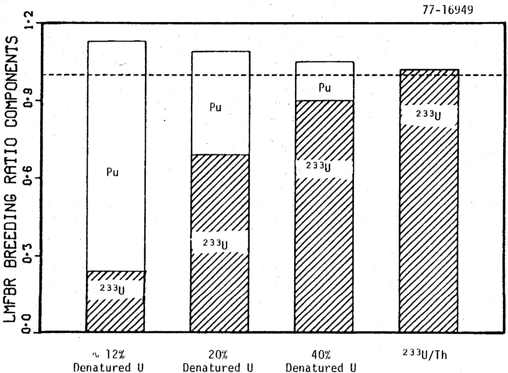  
Fig. 4.5-1. Mid-Equilibrium Cycle Breeding Ratio Isotopics for Denatured Oxide-Fueled LMFBRs. (ORNL Cases 7, 8, 9, and 10 from Table 4.5-1)

clearly superior. However, it does require a large quantity of fissile plutonium as makeup since it essentially "transmutes" plutonium into $^{233}\mathrm{U}$ . The $\mathrm{Pu}/^{238}\mathrm{U}$ system with the thorium radial blanket generates significantly less $^{233}\mathrm{U}$ but also markedly reduces the required plutonium feed. In fact, for the case illustrated, this system actually produces a slight excess of plutonium. The $^{233}\mathrm{U}/\mathrm{Th}$ breeder, characterized by a very small excess $^{233}\mathrm{U}$ production, does not provide a means for utilizing the plutonium bred in the denatured systems, and thus it does not appear to have a place in the symbiotic systems utilizing energy-center reactors paired with dispersed reactors. (The coupling of each type of fissile production reactor with a particular denatured system is considered in Section 7.2.)

As a final point, preliminary estimates have been made of the safety characteristics of some of the alternate fuel cycle LMFBRs relative to those of the $\mathsf{Pu} / ^{238}\mathsf{U}$ reference cycle. Initial calculations have indicated that the reactivity change due to sodium voiding of a $^{233}\mathsf{U}$ -fueled system is significantly smaller than that of the corresponding Pu-fueled system.[8] Thus, the denatured reactors, since they are fueled with $^{233}\mathsf{U}$ , would have better sodium voiding characteristics relative to the reference system. However, for oxide fuels the reported results indicate that the Doppler coefficient for $\mathsf{ThO}_2$ -based fuels is comparable to that of the corresponding $^{238}\mathsf{UO}_2$ -based fuels.

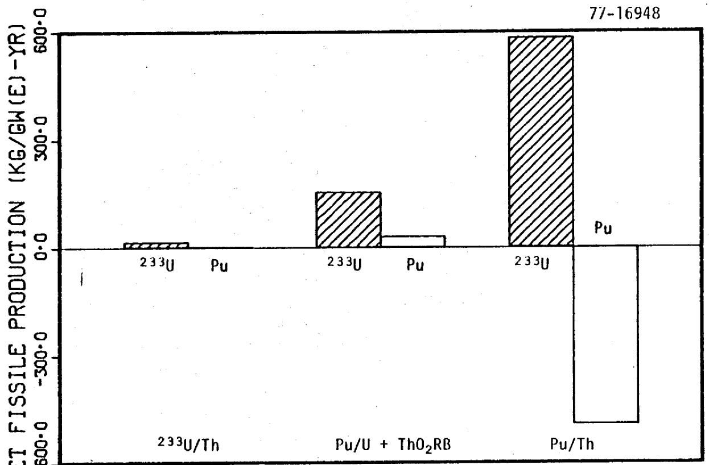  
Fig. 4.5-2. Equilibrium Cycle Net Fissile Production for Possible Oxide-Fueled $^{233}\mathrm{U}$ Production Reactors. (ORNL Cases 10, 2, and 4 from Table 4.5-1)

# References for Section 4.5

1. D. R. Hoffner, R. W. Hondie, and R. P. Omberg, "Reactor Physics Parameters of Alternate Fueled LMFBR Core Designs," Hanford Engineering Development Laboratory, (June 1977).   
2. Y. I. Chang, C. E. Till, R. R. Rudolph, J. R. Deen, and M. J. Ring, "Alternative Fuel Cycle Options: Performance Characteristics of and Impact on Nuclear Power Growth Potential," RSS-TM-4, Argonne National Laboratory, (July 1977).   
3. T. J. Burns and J. R. White, "Preliminary Evaluation of Alternative LMFBR Fuel Cycle Options," ORNL-5389, (1978).   
4. "The Proliferation-Resistant Preconceptual Core Design Study," J. C. Chandler, D. R. Marr, D. C. Curry, M. B. Parker, and R. P. Omberg, Hanford Engineering Development Laboratory; and V. W. Lowery, DOE Division of Reactor Research and Technology (March, 1978).   
5. BNL-17541 (ENDF-201), 2nd Edition, "ENDF/B Summary Documentation," compiled by D. Garber (October 1975).   
6. R. L. Macklin and J. Halperin, "232Th(n,v) Cross Section from 2.6 to 800 keV," Nucl. Sci. Eng. 64, No. 4, pp. 849-858 (1977).   
7. L. Weston, private communication, March 1971.   
8. B. R. Seghal, J. A. Naser, C. Lin, and W. B. Loewenstein, "Thorium-Based Fuels in Fast Breeder Reactors," Nucl. Tech. 35, No. 3, p. 635 (October 1977).

# 4.6. ALTERNATE FAST REACTORS

# 4.6.1. Advanced Oxide-Fueled LMFBRs

# T. J. Burns Oak Ridge National Laboratory

One method of improving the breeding performance of the LMFBRs discussed in the previous section is to increase the core fertile loadings. Typically, this goal is accomplished by one of two means: redesign of the pins to accommodate larger pellet diameters or the use of a heterogeneous design (i.e., intermixed core and blanket assemblies). To maintain consistency with the "classical" designs considered in the previous section, using the same fuel elements for both concepts, the latter option was pursued to assess the impact of possible redesign options. Table 4.6-1 summarizes some preliminary results from calculations for a heterogeneous reactor core model consisting of alternating concentric fissile and fertile annuli (primed cases) and compares them with results from calculations for corresponding homogeneous cores (unprimed cases).

As the data in Table 4.6-1 indicate, the heterogeneous configuration results in a significant increase in the overall breeding ratio relative to the corresponding homogeneous calculation. The heterogeneous reactors also require a much greater fissile loading for criticality due to the increase in the core fertile loading. However, the increase in the breeding gain more than compensates for the increased fissile requirements, resulting in an overall improvement in the fissile doubling time. On the other hand, because of the high fissile loading requirements, it appears that a heterogeneous model for the denatured cases with $12\%$ enrichment (cases 6 or 7 of the previous section) is unfeasible; therefore, an enrichment of $\sim 20\%$ was considered as the minimum for the denatured heterogeneous configuration.

While the denatured heterogeneous configurations result in an increase in the overall breeding ratio, it is significant that the $^{233}\mathrm{U}$ component of the breeding ratio also improves. Figure 4.6-1 depicts the breeding ratio components for both the homogeneous and heterogeneous denatured configurations. (Again, the $^{233}\mathrm{U}$ /Th LMFBR is included as the upper limit.) As Fig. 4.6-1 indicates, the heterogeneous configurations are clearly superior from the standpoint of $^{233}\mathrm{U}$ self-sufficiency (i.e., requiring less makeup requirements). Moreover, if enrichments in the range of $30\% - 40\%$ are allowed, it appears possible for a denatured heterogeneous reactor to produce enough $^{233}\mathrm{U}$ to satisfy its own equilibrium cycle fuel requirements. Production reactors would therefore be required only to supply the initial inventory plus the additional makeup consumed before the equilibrium cycle is reached.

Table 4.6-1. Comparison of Fuel Utilization Characteristics and Performance Parameters for Homogeneous and Heterogeneous LMFBRs Under Various Oxide-Fuel Options   

<table><tr><td rowspan="2">Casea</td><td colspan="4">Reactor Materials</td><td rowspan="2">Breeding Ratio, MOEC</td><td rowspan="2">Fissile Doubling Time (yr) (RF=0.98)</td><td rowspan="2">Initial Fissile Inventory (kg/GWe)</td><td colspan="3">Equilibrium Cycle</td></tr><tr><td>Driver</td><td>Axial Blanket</td><td>Internal Blanket</td><td>Radial Blanket</td><td>Fissile Charge (kg/GWe-yr)</td><td>Fissile Discharge (kg/GWe-yr)</td><td>Puf</td></tr><tr><td colspan="11">Energy-Center-Constrained Fuels</td></tr><tr><td>1</td><td>Pu/U</td><td>U</td><td>-</td><td>U</td><td>1.27</td><td>12.7</td><td>2270</td><td>804</td><td>-</td><td>991</td></tr><tr><td>1&#x27;</td><td>Pu/U</td><td>U</td><td>U</td><td>U</td><td>1.50</td><td>10.2</td><td>3450</td><td>1173</td><td>-</td><td>1517</td></tr><tr><td>2</td><td>Pu/U</td><td>U</td><td>-</td><td>Th</td><td>1.27</td><td>13.1</td><td>2291</td><td>804</td><td>154</td><td>834</td></tr><tr><td>2&#x27;</td><td>Pu/U</td><td>U</td><td>Th</td><td>Th</td><td>1.44</td><td>12.9</td><td>3725</td><td>1250</td><td>536</td><td>1013</td></tr><tr><td>4</td><td>Pu/Th</td><td>Th</td><td>-</td><td>Th</td><td>1.14</td><td>36.1</td><td>2712</td><td>920</td><td>583</td><td>427</td></tr><tr><td>4&#x27;</td><td>Pu/Th</td><td>Th</td><td>Th</td><td>Th</td><td>1.35</td><td>18.2</td><td>4159</td><td>1365</td><td>800</td><td>808</td></tr><tr><td colspan="11">Dispersible Denatured Fuels</td></tr><tr><td>8b</td><td>233U/(U+Th)</td><td>Th</td><td>-</td><td>Th</td><td>1.09</td><td>43.0</td><td>2208</td><td>834</td><td>698</td><td>203</td></tr><tr><td>8&#x27;</td><td>233U/U</td><td>U</td><td>Th</td><td>Th</td><td>1.29</td><td>18.0</td><td>3338</td><td>1624</td><td>1548</td><td>306</td></tr><tr><td>9c</td><td>233U/(U+Th)</td><td>Th</td><td>-</td><td>Th</td><td>1.05</td><td>112.3</td><td>2322</td><td>875</td><td>835</td><td>78</td></tr><tr><td>9&#x27;d</td><td>233U/U</td><td>U</td><td>Th</td><td>Th</td><td>1.29</td><td>20.8</td><td>4062</td><td>1354</td><td>1457</td><td>108</td></tr><tr><td colspan="11">Reference Fuelse</td></tr><tr><td>10</td><td>233U/Th</td><td>Th</td><td>-</td><td>Th</td><td>1.02</td><td>-</td><td>2419</td><td>911</td><td>926</td><td>0</td></tr><tr><td>10&#x27;</td><td>233U/Th</td><td>Th</td><td>Th</td><td>Th</td><td>1.20</td><td>30.1</td><td>3718</td><td>1309</td><td>1454</td><td>0</td></tr></table>

${}^{a}$ Capacity factor is 75%; unprimed cases are for homogeneous cores,primed cases for heterogeneous cores; see Table 4.5-1 for case description.   
$b_{20\%} 233 \mathrm{U} / \mathrm{U}$ .   
$c_{40\%}233\mathrm{U} / \mathrm{U}$   
${}^{a}$ Included for illustrative purposes only; exceeds design constraints.   
$^{e}$ Reference fuels are considered only as limiting cases.

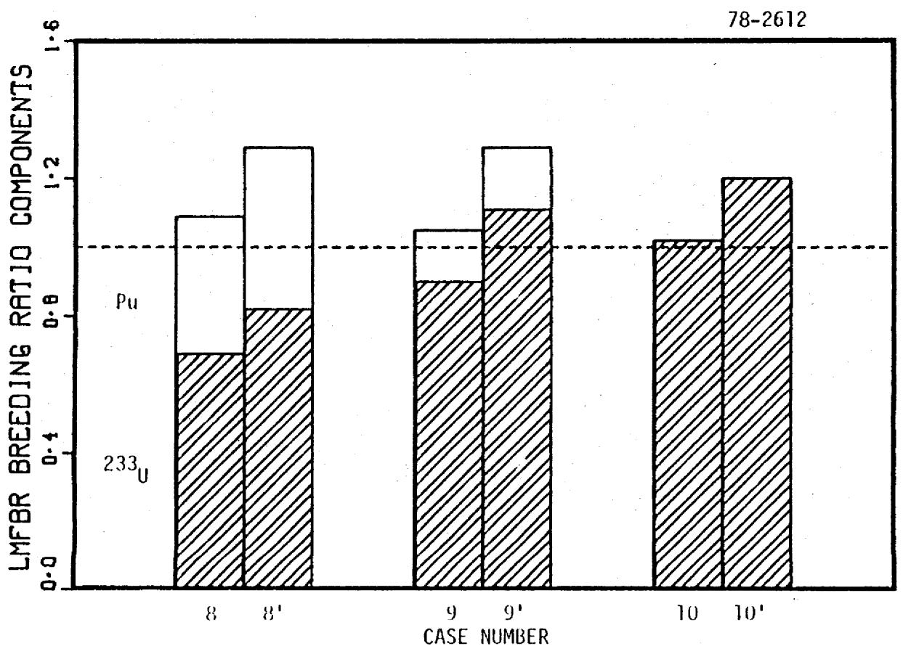  
Fig. 4.6-1. Breeding Ratio Components for LMFBRs Operating on $^{233}\mathrm{U}$ . (Cases 8,8' for $20\%$ $^{233}\mathrm{U} / \mathrm{U}$ , and Cases 9,9' for $40\%$ $^{233}\mathrm{U} / \mathrm{U}$ ; Cases 10,10' for $^{233}\mathrm{U} / \mathrm{Th}$ with no $^{238}\mathrm{U}$ ; see Tables 4.5-1 and 4.6-1.)

The heterogeneous designs also can be employed for the energy-center production reactors required by the denatured fuel cycles. As indicated in Table 4.6-1, the three possible production reactors all show significant increases in the quantity of $^{233}\mathrm{U}$ produced. The net production rates are illustrated schematically by Fig. 4.6-2. More importantly, however, use of a heterogeneous core design will allow the isotopics of the fissile material bred in the internal blankets to be adjusted for changing demand requirements without modifying the driver assemblies. For example the internal blankets of the Pu/Th LMFBR could be either $\mathrm{ThO}_2$ or $^{238}\mathrm{UO}_2$ , depending on the demand requirements for $^{233}\mathrm{U}$ and Pu.

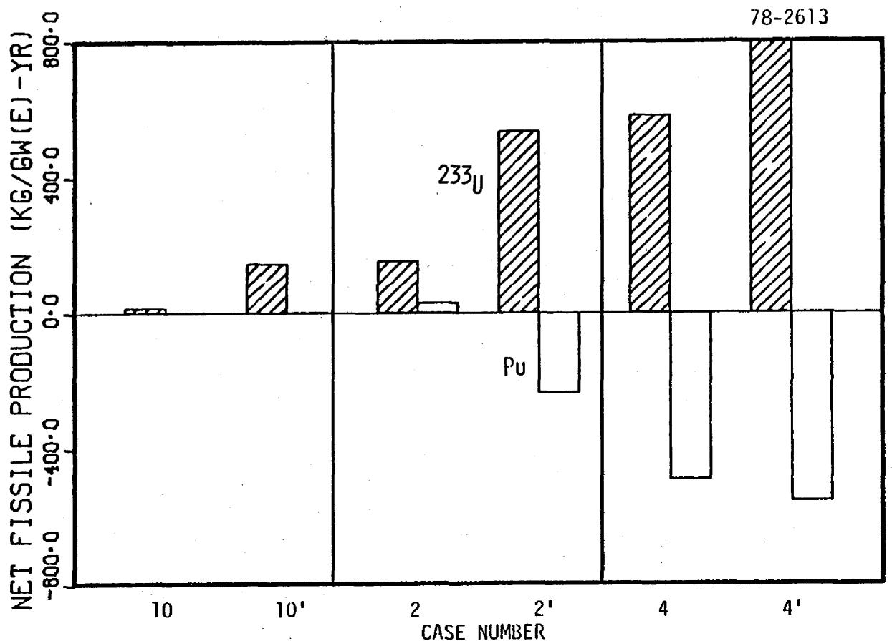  
Fig. 4.6-2. Net Fissile Production Rates for LMFBRs. (Cases 10,10' for $^{233}\mathrm{U} / \mathrm{Th}$ core with no $^{238}\mathrm{U}$ , Cases 2,2' for Pu/ $^{238}\mathrm{U}$ core, and Cases 4,4' for Pu/Th core; see Tables 4.5-1 and 4.6-1.)

# 4.6.2. Carbide- and Metal-Fueled LMFBRS

D. L. Selby  
P. M. Haas  
H. E. Kneee  
Oak Ridge National Laboratory

Another method that is being considered for improving the breeding ratios of LMFBRs and is currently under development1 is one that uses carbide- or metal-based fuels. The major advantages of the metal- and carbide-based fuels are that they will require lower initial fissile inventories than comparable oxide-based fuels and will result in shorter doubling times. This is especially true for metal-based fuels, for which doubling times as low as 6 years have been calculated.2 Since for fast reactors the denatured fuel cycle would have an inherently lower breeding gain than the reference plutonium-uranium cycle, these advantages would be especially important; however, as discussed below, before either carbide- or metal-based fuels can be fully evaluated, many additional studies are needed.

# Carbide-Based Fuels

Carbide-based fuels have been considered for use as advanced fuels in conventional Pu/U LMFBRs. Burnup levels as high as 120,000 MWD/T appear feasible, and the fission gas release is less than that for mixed oxide fuels.3 Carbide fuels also have a higher thermal conductivity, which allows higher linear power rates with a lower center-line temperature. In general, the breeding ratio for carbide fuels is higher than the breeding ratio for oxide fuels but lower than that for metal fuels.

Both helium and sodium bonds are being considered for carbide pins. At present 247 carbide pins with both types of bonds are being irradiated in EBR-II. Other differences in the pins include fuel density, cladding type, cladding thickness, type of shroud for the sodium-bonded pin, and various power and temperature conditions. The lead pins have already achieved a burnup level of 10 at.% and interim examinations have revealed no major problems. Thus there appears to be no reason why the goal of 12 at.% burnup cannot be achieved.

In terms of safety, irradiated carbide fuel releases greater quantities of fission gas upon melting than does oxide fuel. Depending upon the accident scenario, this could be either an advantage or a disadvantage. Another problem associated with carbide fuels may be the potential for large-scale thermal interaction between the fuel and the coolant [see discussion of potential FCIs (Fuel-Coolant Interactions) below].

# Metal-Based Fuels

Reactors with metal-based fuels have been operating in this country since 1951 (Fermi-I, EBR-I, and EBR-II). Relative to oxide- and carbide-fueled systems, the metal-fueled systems are characterized by higher breeding ratios, lower doubling times, higher heat conductivity, and lower fissile mass. These advantages are somewhat offset, however, by several disadvantages, including fuel swelling problems that necessitate operation at lower fuel temperatures.

Most of the information available on metal fuels is for uranium-fissium (U-Fs) fuel. (Fissium consists of extracted fission products, principally zirconium, niobium, molybdenum, technetium, ruthenium, rhodium, and palladium.) Some information is available for the Pu/U-Zr and U/Th alloy fuels but none exists on Pu/Th metal fuels. (The U/Th fuels do not require the addition of another metal for stability.) In terms of irradiation experience, approximately 700 U-Fs driver fuel elements have achieved burnups of 10 at.% without failure. Less irradiation information is available for the Pu/U-Zr alloy, with only 16 Pu/U-Zr encapsulated elements having been irradiated to 4.6 at.% burnup. Fast reactor experience with U/Th fuels is also quite limited; however, a recent study at Argonne National Laboratory has shown that the irradiation performance of U/Th fuels should be at least as good as that of U-Fs fuels.

With respect to safety, one concern with metal fuels is the possibility of thermal interactions between the fuel and the cladding. For most metal alloys, the fuel will swell to contact the cladding between 3 and 5 at.% burnup. This effect has been observed in irradiation experiments; however, for burnups up to 10 at.% , no more than $4 \%$ of the cladding has been affected. Thus whether or not fuel-cladding interactions will be a limiting factor for fuel burnup remains to be determined.

For transient overpower (TOP) analysis, the behavior of U/Th elements has been shown to be superior to the behavior of the present EBR-II fuel (uranium with $5\%$ fissium), the U/Th elements having a $1360^{\circ}\mathrm{C}$ failure threshold versus $1000^{\circ}\mathrm{C}$ for the EBR-II elements. Thus U/Th metal pins would have a higher reliability during transients than the fuel pins already in use in fast reactors. On the other hand, fuel-coolant interaction (FCI) accidents may present a major problem, more so than for carbide fuels (see below).

# Potential for Large-Scale FCIs

The potential for a large-scale FCI that would be capable of producing mechanical work sufficient to breach the reactor vessel and thereby release radioactivity from the primary containment has been an important safety concern for LMFBRs for a number of years. The assumed scenario for a large-scale FCI is that a large mass of molten fuel (a major portion of the core) present as the result of an hypothetical core disruptive accident (HCDA) contacts and "intimately mixes with" about the same mass of liquid sodium. The extremely rapid heat transfer from the molten fuel (with temperatures perhaps 3000 to $4000^{\circ}\mathrm{K}$ ) to the much cooler sodium ( $\sim1000^{\circ}\mathrm{K}$ ) produces rapid vaporization of the sodium. If the mixing and thermal conditions are ideal, the potential exists for the vaporization to be extremely rapid, i.e., for a vapor "explosion" to occur with the sodium vapor active as the working fluid to produce mechanical work.

A great deal of laboratory experimentation, modeling effort, and some "in-pile" testing has been carried out in this country and elsewhere to define the mechanisms for and the necessary-and-sufficient conditions for an energetic FCI or vapor explosion for

given materials, particularly for oxide LMFBR fuel and sodium. Although there is no conclusive theoretical and/or experimental evidence, the most widely accepted theory is that for an energetic vapor explosion to occur, there must be intimate liquid-liquid contact of the fragmented molten fuel particles and the contact temperature at the fuel-sodium surface must exceed the temperature required for homogeneous nucleation of the sodium. A considerable amount of evidence exists to suggest that for oxide fuel in the reactor environment, the potential for a large-scale vapor explosion is extremely remote. The key factor is the relatively low thermal conductivity of the oxide fuel, which does not permit rapid enough heat transfer from the fuel to cause the fuel-sodium contact temperature to exceed the sodium homogeneous nucleation temperature.

The primary difference between carbide and/or metal fuels as opposed to oxide fuels is their relatively higher thermal conductivity. Under typical assumed accident conditions, it is possible to calculate coolant temperatures which exceed the sodium homogeneous nucleation temperature. This does not mean, however, that a large-scale FCI will necessarily occur for carbide-sodium or metal-sodium systems. As noted above, these theories as mechanisms for vapor explosion have not been completely substantiated. However, insofar as the homogeneous nucleation criterion is adequate, it is clear that the potential for large-scale vapor explosion, at least in clean laboratory systems, is greater for carbide or metal in sodium than for oxide in sodium. Continued theoretical and experimental study is necessary to gain a thorough understanding of the details of the mechanisms involved and to estimate the likelihood for vapor explosion under reactor accident conditions for any breeder system.

# Breeding Performance of Alternate Fuel Schemes

Table 4.6-2 shows that in terms of fissile production, the reference Pu/U core with U blankets gives the best breeding performance regardless of fuel type (oxide, carbide, or metal). For the carbide systems considered, a heterogeneous core design using Pu/U carbide fuel with a U carbide blanket gives a breeding ratio of 1.550. For the metal systems considered, a nominal two-zone homogeneous core design using U-Pu-Zr alloy fuel gives a breeding ratio of 1.614.

The increased fissile production capability of the carbide and metal fuels is especially advantageous for the denatured cycles. A breeding ratio as high as 1.4 has been calculated for a metal denatured system, and the breeding ratio for a carbide denatured system is not expected to be substantially smaller. However, a good part of the fissile production of any denatured system is plutonium. Thus the denatured system is not a good producer of $^{233}\mathrm{U}$ . However, when used with the energy park concept, where the plutonium produced by the denatured systems can be used as a fuel, the denatured carbide and metal uranium systems are viable concepts. Metal and carbide concepts may also prove to be valuable as transmuter systems for producing $^{233}\mathrm{U}$ from $^{232}\mathrm{Th}$ .

Table 4.6-2. Beginning-of-Life Breeding Ratios for Various LMFBR Fuel Concepts   

<table><tr><td rowspan="2">\( Fuel^a \)</td><td rowspan="2">Blanket</td><td colspan="3">Breeding Ratio</td></tr><tr><td>Oxide Fuels</td><td>Carbide Fuels</td><td>Metal Fuels</td></tr><tr><td>\( Pu/238U (reference) \)</td><td>\( 238U \)</td><td>\( 1.44^b \)</td><td>\( 1.550^b \)</td><td>\( 1.629^c \)</td></tr><tr><td>\( 233U/238U/Pu-Zr \)</td><td>\( 238U \)</td><td></td><td></td><td>1.614</td></tr><tr><td>\( 233U/238U/Pu-Zr \)</td><td>Th</td><td></td><td></td><td>1.537</td></tr><tr><td>\( 233U/238U/Pu/Th \)</td><td>\( 238U \)</td><td></td><td></td><td>1.532</td></tr><tr><td>\( 233U/238U/Pu/Th \)</td><td>Th</td><td></td><td></td><td>1.406</td></tr><tr><td>\( Pu/Th \)</td><td>Th</td><td>\( 1.30^b \)</td><td>\( 1.353^b \)</td><td>\( 1.381^c \)</td></tr><tr><td>\( 233U/Th \)</td><td>Th</td><td>1.041</td><td>1.044</td><td>\( 1.105^c \)</td></tr><tr><td>\( 235U/Th \)</td><td>Th</td><td>0.786</td><td>0.817</td><td>\( 0.906^c \)</td></tr><tr><td>\( 233U/238U-Zr (denatured) \)</td><td>Th</td><td></td><td></td><td>\( 1.41^b \)</td></tr></table>

${}^{a}$ All Pu is LWR discharge Pu.   
${}^{b}$ Radial heterogeneous design.   
cFrom ref. 2.

Of the thorium metal systems considered, the U/Pu/Th ternary metal system was found to be the best $^{233}\mathrm{U}$ producer. Irradiation experiments have shown that the U/Pu/Th alloy can be irradiated at temperatures up to $700^{\circ}\mathrm{C}$ with burnups of up to 5.6 at.%.[5] Beginning-of-cycle breeding ratios around 1.4 have been calculated for this system, and it appears that optimization of core and blanket geometry may increase the breeding ratio to as high as 1.5. It is also clear that the equilibrium cycle breeding ratio may be as much as $10\%$ higher due to the flux increase in the blankets from the $^{233}\mathrm{U}$ production. This system not only is a pure $^{233}\mathrm{U}$ producer (no plutonium is produced), but also acts as a plutonium sink by burning plutonium produced in light-water reactors.

# Summary and Conclusions

Both carbide- and metal-based fuels have larger breeding gains and potentially lower doubling times than the oxide-based fuels. When the proliferation issue is considered in the design aspect (especially for $^{233}\mathrm{U} / \mathrm{Th}$ concepts with their inherently lower breeding gains), these advantages are enhanced even more. In light of the emphasis on proliferation-resistant nuclear design, the carbide- and metal-fueled reactors have the potential to contribute extensively to the energy requirements of this country in the future. However, the first step is to establish carbide and metal fuel data bases similar to the present data base for oxide fuels, particularly for safety analyses. Present development plans for carbide and metal fuels call for a lead concept selection for the carbide fuels by $\sim 1981$ , with the metal fuel selection coming in $\sim 1984$ .

# 4.6.3 Gas-Cooled Fast Breeder Reactors

# T. J. Burns Oak Ridge National Laboratory

In addition to the sodium-cooled fast reactors discussed above, the impact of the various alternate fissile/fertile fuel combinations on the Gas-Cooled Fast Breeder Reactor (GCFR) has also been addressed (although not to the degree that it has for the LMFBR). A 1200-MWe Pu/U GCFR design with four enrichment zones was selected as the reference case.[7-8] The various alternative fissile/fertile fuel combinations were then substituted for the reference fuel. No design modifications or optimizations based on the alternate fuel properties were performed. It should also be emphasized that the results of this scoping evaluation for alternate-fueled GCFRs are not comparable to the results given in Section 4.5 for LMFBRs due to markedly different design assumptions for the reference cases.

The results of the preliminary calculations for the alternate-fueled GCFRs, summarized in Table 4.6.3, reflect trends similar to those shown by LMFBRs; i.e., relative to the reference case, a significant breeding ratio penalty occurs when $^{233}\mathrm{U}$ is used as the fissile material and $^{232}\mathrm{Th}$ as the core fertile material. Moreover, the magnitude of the penalty ( $\Delta \mathrm{BR}$ ) is larger for the GCFR than for the LMFBR. Owing to the helium coolant, the characteristic spectrum of the GCFR is significantly harder than that of a comparably sized LMFBR. In light of the relative nuclear properties of the various fissile and fertile species discussed in Section 4.5, this increased penalty due to the harder spectrum is not surprising. The number of neutrons produced per fission ( $\nu$ ) of the fissile Pu isotopes in the GCFR is significantly higher than the number produced in the softer spectrum of an LMFBR. The value of $\nu$ for $^{233}\mathrm{U}$ , on the other hand, is relatively insensitive to spectral changes. Hence, the larger penalty associated with $^{233}\mathrm{U}$ -based fuels in the GCFR is due to the better performance of the Pu reference system rather than to any marked changes in $^{233}\mathrm{U}$ performance. A similar argument can be made for the replacement of core fertile material. Owing to the harder spectrum, the fertile fast-fission effect is more pronounced in the GCFR than in an LMFBR. Thus, the reduction in the fertile fission cross section resulting from replacement of $^{238}\mathrm{U}$ by $^{232}\mathrm{Th}$ results in a larger decrease in the breeding ratio. It should also be noted that as in the LMFBR case, $^{233}\mathrm{U}$ -fueled GCFRs require smaller fissile inventories than do the corresponding Pu-fueled cases.

The better breeding performance of Pu in the harder spectrum of the GCFR, on the other hand, indicates that the GCFR would be a viable candidate for the role of energy center "transmuter," either as a Pu/Th system or as a Pu/U + ThO $_2$ radial blanket system. It must be emphasized, however, that these conclusions are tentative as they are based

on only the preliminary data presented in Table 4.6-3. The possibility of employing heterogeneous designs and/or carbide- or metal-based fuels has not been addressed. It should also be noted that evaluation of which type of reactor is best suited for a given role in the denatured fuel cycle must also reflect nonneutronic considerations such as capital cost, possible introduction date, etc.

Table 4.6-3. Fuel Utilization Characteristics and Performance Parameters for GCFRs   
Under Various Fuel Options   
(2% losses assumed in reprocessing)   

<table><tr><td colspan="3">Reactor Materials</td><td rowspan="2">Initial Fissile Inventory (kg/GWe)</td><td rowspan="2">Breeding Ratio, MOEC</td><td rowspan="2">Fissile Doubling Time (yr) (RF=0.98)</td><td colspan="3">Equilibrium Cycle</td></tr><tr><td>Core</td><td>Axial Blanket</td><td>Radial Blanket</td><td>Fissile Charge (kg/GWe-yr)</td><td colspan="2">Fissile Discharge (kg/GWe-yr)</td></tr><tr><td colspan="9">Energy-Center-Constrained Fuels</td></tr><tr><td>Pu/U</td><td>U</td><td>U</td><td>2641</td><td>1.301</td><td>14.3</td><td>965</td><td>-</td><td>1163</td></tr><tr><td>Pu/U</td><td>U</td><td>Th</td><td>2693</td><td>1.276</td><td>15.4</td><td>987</td><td>224</td><td>941</td></tr><tr><td>Pu/Th</td><td>Th</td><td>Th</td><td>3170</td><td>1.150</td><td>48.3</td><td>1158</td><td>626</td><td>619</td></tr><tr><td colspan="9">Dispersible Denatured Fuels</td></tr><tr><td>\( ^{233}\mathrm {U}/\mathrm {U}^{\mathrm {b}} \)</td><td>U</td><td>Th</td><td>2538</td><td>1.088</td><td>50.5</td><td>1001</td><td>671</td><td>400</td></tr><tr><td>\( ^{233}\mathrm {U}/\mathrm {U}^{c} \)</td><td>Th</td><td>Th</td><td>2587</td><td>1.074</td><td>66.8</td><td>1019</td><td>822</td><td>256</td></tr><tr><td>\( ^{233}\mathrm {U}/\mathrm {U} + \mathrm {Th}^{\mathrm {d}} \)</td><td>Th</td><td>Th</td><td>2720</td><td>1.060</td><td>98.4</td><td>1031</td><td>871</td><td>208</td></tr><tr><td>\( ^{233}\mathrm {U}/\mathrm {U} + \mathrm {Th}^{\mathrm {e}} \)</td><td>Th</td><td>Th</td><td>2956</td><td>1.004</td><td></td><td>1131</td><td>1054</td><td>81</td></tr><tr><td colspan="9">Reference Fuelsf</td></tr><tr><td>\( ^{233}\mathrm {U}/\mathrm {Th} \)</td><td>Th</td><td>Th</td><td>3108</td><td>0.970</td><td></td><td>1192</td><td>1169</td><td></td></tr></table>

$a_{\mathrm{c}}$ Capacity factor is $75\%$ .   
17.9% 233U/U.   
17.7% 233U/U.   
$20\%$ 233U/U.   
40% 233U/U.   
Reference fuels are considered only as limiting cases.

# References for Section 4.6

1. J. M. Simmons, J. A. Leary, J. H. Kittel and C. M. Cox, "The U.S. Advanced LMFBR Fuels Development Program," Advanced LMFBR Fuels, pp. 2-14, ERDA 4455 (1977).   
2. Y. I. Chang, R. R. Rudolph and C. E. Till, "Alternate Fuel Cycle Options (Performance Characteristics and Impact on Power Growth Potential)," June 1977.   
3. A. Strasser and C. Wheelock, "Uranium-Plutonium Carbide Fuels for Fast Reactors," Fast Reactor Technology National Topical Meeting, Detroit, Michigan (April 26-28, 1965).   
4. W. F. Murphy, W. N. Beck, F. L. Brown, B. J. Koprowshi, and L. A. Meimark, "Post-irradiation Examination of U-Pu-Zr Fuel Elements Irradiated in EBR-II to 4.5 Atomic Percent Burnup," ANL-7602, Argonne National Laboratory (November 1969).   
5: B. R. Seidel, R. E. Einziger, and C. M. Walter, "Th-U Metallic Fuel: LMFBR Potential Based Upon EBR-II Driver-Fuel Performance," Trans. Am. Nucl. Soc. 27, 282 (1977).   
6. B. Blumenthal, J. E. Sanecki, D. E. Busch, and D. R. O'Boyle, "Thorium-Uranium-Plutonium Alloys as Potential Fast Power-Reactor Fuels, Part II. Properties and Irradiation Behavior of Thorium-Uranium-Plutonium Alloys," ANL-7259, Argonne National Laboratory (October 1969).   
7. Letter to D. E. Bartine from R. J. Cerbone, April 22, 1976, 760422032 GCFR.   
8. Letter to D. E. Bartine from R. J. Cerbone, April 22, 1976, 760422032, Subject: 1200-MWe GCFR Data.

# CHAPTER 5

# IMPLEMENTATION OF DENATURED FUEL CYCLES

# Chapter Outline

5.0. Introduction, T. J. Burns, ORNL   
5.1. Reactor Research and Development Requirements, N. L. Shapiro, CE

5.1.1. Light-Water Reactors   
5.1.2. High-Temperature Gas-Cooled Reactors   
5.1.3. Heavy-Water Reactors   
5.1.4. Spectral-Shift-Controlled Reactors   
5.1.5. R,D&D Schedules   
5.1.6. Summary and Conclusions

5.2. Fuel Recycle Research and Development Requirements, I. Spiewak, ORNL

5.2.1. Technology Status Summary   
5.2.2. Research, Development, and Demonstration Cost Ranges and Schedules   
5.2.3. Conclusions

# 5.0. INTRODUCTION

# T. J. Burns Oak Ridge National Laboratory

Currently, a major portion of the nuclear generating capacity in the U.S. consists of LWRs operating on the LEU once-through cycle. Implementation of the denatured $^{233}\mathrm{U}$ fuel cycle will require that the nuclear fuel cycle be closed; thus research and development efforts directed at nuclear fuel cycle activities, that is, reprocessing, fabrication of fuel assemblies containing recycle material, etc., will be necessary, as well as research and development of specific reactor systems designed to utilize these alternate fuels. To date, most fuel cycle R&D has been directed at closing the Pu/U fuel cycle under the assumption that plutonium would eventually be recycled in the existing LWRs. With the exception of the HTGR (for which a 330-MWe prototype reactor is undergoing testing at Fort St. Vrain), and the Light Water Breeder Reactor (LWBR) at Shippimgport, Pa., U.S. reactors have not been designed to operate on thorium-based fuels, and thus the R&D for thorium-based fuel cycles has not received as much attention as the R&D for the Pu/U cycle. As a result, any strategy for implementation of the denatured fuel cycle on a timely basis must be concerned with fuel cycle research and development. It must also be concerned with reactor-specific research and development since the implementation of the denatured $^{233}\mathrm{U}$ cycle in any reactor will necessitate design changes in the reactor.

The following two sections of this chapter contain estimates of the research and development costs and possible schedules for the reactor-related research and development and the fuel-cycle-related research and development required for implementation of the denatured fuel cycle in the various types of reactors that have been considered in earlier chapters of this report. It should be noted that these two sections are intrinsically connected: the implementation of a reactor operating on recycle fuel necessitates the prior implementation of the reprocessing and fabrication facilities attendant to that fuel, and conversely, the decision to construct a reprocessing facility for a specific recycle fuel type is dictated by the existence (or projected existence) of a reactor discharging the fuel.

# 5.1. REACTOR RESEARCH AND DEVELOPMENT REQUIREMENTS

N. L. Shapiro Combustion Engineering Power Systems

The discussions in the preceding chapters, and also the discussion that follows in Chapter 6, all assume that LWRs and advanced converters based on the HTGR, HWR, and SSCR concepts will be available for commercial operation on denatured uranium-thorium (DUTH) fuels on a relatively near-term time scale. If this commercialization schedule is to be achieved, substantial reactor-related research and development will be required. The purpose of this section is to delineate to the degree possible at this preliminary stage of development the magnitude and scope of the reactor R,D&D requirements necessary for implementation of the reactors on DUTH fuels and, further, to determine whether there are significant R,D&D cost differences between the reactor systems. The requirements listed are those believed to be necessary to resolve the technical issues that currently preclude the deployment of the various reactor concepts on DUTH fuels, and no attempt is made to prejudge or to indicate a preferred system.

It is to be emphasized that the proper development of reactor R,D&D costs and schedules would require a comprehensive identification of design and licensing problems, the development of detailed programs to address these problems, and the subsequent development of costs and schedules based upon these programs. Unfortunately, the assessment of alternate converter concepts has not as yet progressed to the point that problem areas can be fully identified, and so detailed development of R,D&D programs is generally impractical at this stage. Consequently, we have had to rely on somewhat subjective evaluations of the technological status of each concept, and upon rather approximate and somewhat intuitive estimates of the costs required to resolve the still undefined problem areas. A more detailed development of the requirements for many of the candidate systems will be performed as part of the characterization and assessment programs currently under way in the Nonproliferation Alternative Systems Assessment Program (NASAP).

In general, reactor R,D&D requirements can be divided into two major categories: (1) the R,D&D pertaining to the development of the reactor concept on its reference fuel cycle; and (2) the R,D&D necessary for the deployment of the reactor operating on an alternate fuel cycle such as a DUTH fuel cycle. In the discussion presented here it is assumed that, with the exception of the HTGR (whose reference fuel cycle already includes thorium), the reference cycles of the advanced converters would initially be the uranium cycle (i.e., $^{235}\mathrm{U} / ^{238}\mathrm{U}$ ) and that no reactor would employ DUTH fuel until after its satisfactory performance had been assured in a large-plant demonstration. Although it is possible to consider the development of advanced converters using DUTH fuel as their reference fuel cycle, such simultaneous development could be a potential impediment to commercialization since surveys of the utility and manufacturing sectors1 indicate a near universal reluctance to embark on either a new reactor technology or a new fuel cycle technology, largely because

of the uncertainties with respect to reactor or fuel cycle performance, economics, licensability, and the stability of government policies. Thus attempts to introduce a new reactor technology conditional upon the successful development of an untried fuel cycle technology would only compound these concerns and complicate the already difficult problem of commercialization. The development of advanced converter concepts intended initially for uranium fueling would allow research and development, design, and the eventual demonstration of the concept to proceed simultaneously with the separate development of the DUTH cycle.

The R,D&D related to the reactor concept itself typically can be divided into three components:

(1) Proof of principle (operating test reactor of small size).   
(2) Design, construction, and operation of prototype plant (intermediate size).   
(3) Design, construction, and operation of commercial-size demonstration plant (about 1000 MWe).

Each stage typically involves some degree of basic research, component design and testing, and licensing development. In certain instances, various stages of the development can be bypassed. This is particularly true of technologies representing only a modest departure from the present reactor technology, in which case prototype reactor construction may be bypassed completely and demonstrations performed on commercial-size units. If a decision is made to do this, the time required to introduce commercial-size units can be shortened, but financial risks are increased because of the larger capital commitment required for full-scale units. On the other hand, total R&D costs are somewhat reduced, since some fraction of the R&D required for prototype design usually proves not to be applicable to large-plant design.

It is also possible in certain instances to perform component R&D and design for the prototypes in such a fashion that identical components can be used directly in the demonstration units. Thus, by employing components of the same design and size in both systems the R&D necessary to scale up components could be avoided.

Each of the three advanced converter reactors discussed in this section has already proceeded through the proof-of-principle stage. Of these, the HTGR is the most highly developed within the United States, with a 330-MWe prototype currently operating (the Fort St. Vrain plant). HWRs have received much less development within the United States, but reactors of this type have been commercialized in the Canadian CANDU reactor. However, due to differences in design between the CANDU and the HWR postulated for U.S. siting (for example, the expected use of slightly enriched fuel in a U.S. HWR) and also to differences in licensing criteria, it would still be desirable to construct a U.S. prototype plant before proceeding to the commercial-size demonstration plant phase. The SSCR represents only a modest departure from the design of PWRs already operating, but even so, the construction and operation of a prototype plant would also be the logical next stage in the evolution of this concept.

As has been pointed out above, relatively rapid introduction schedules for the various reactors have been postulated in the nuclear power scenarios described in Chapter 6. This is because one of the objectives of this report is to establish the degree to which advanced converters and the denatured uranium-thorium (DUTH) cycle can contribute to improved uranium resource utilization so as to defer the need for plutonium-fueled breeder reactors and to eliminate from further consideration those concepts which cannot contribute significantly to this goal even if rapidly introduced. The SSCR is assumed to be introduced in 1991 and HwRs and HTGRs in 1995. In view of the time requirements for plant construction and licensing, it is clear that the prototype plant stage will have to be bypassed if these introduction dates are to be achieved. Consequently, for the discussion below it has been assumed that the program for each reactor will be directed toward the construction of the demonstration plant. This reactor/fuel cycle demonstration is in turn divided into two parts: one consisting of the generic reactor R&D required to provide the basic information necessary for the design and licensing of a commercial-size demonstration facility; and another consisting of the final design, construction, and operation of the facility. For this demonstration program, continued government funding has been assumed because of the substantial R&D and first-of-a-kind engineering costs that will be incurred and because of the increased risks associated with bypassing the prototype stage.

In considering fuel-cycle-related reactor R,D&D, it is assumed that the demonstration of the reactor concept on its reference cycle has been accomplished and only that R,D&D required to shift to an alternate cycle (specifically a DUTH cycle) need be addressed.* The basic types of fuel-cycle-related reactor R,D&D are:

(1) Data-base development.   
(2) Reactor components development.   
(3) Reactor/fuel cycle demonstration.

The purpose of the data base development R&D is to provide physics verification and fuel performance information necessary for the design and licensing of reactors operating on the subject fuel cycle; the intent here is to provide information similar to that which has been developed for the use of mixed-oxide fuels in LWRs. Physics verification experiments have typically consisted of critical experiments to provide a basis to demonstrate the ability of analytical models to predict such important safety-related parameters as reactivity level, coefficients of reactivity, and poison worths. Safety-related fuel performance R&D might consist of such aspects as fuel rod irradiations to establish in-reactor performance and discharge isotopics; special reactor experiments to establish such parameters as in-reactor swelling, densification, center-line temperature and fission gas release; and tests of the

performance of the fuel during anticipated operational transients. Since such safety-related fuel performance information would be developed as part of the fuel recycle program discussed in Section 5.2, the R&D costs for this aspect are mentioned here only for completeness.

Reactor components development has been included since, in principle, the use of alternate fuels might change the bases for reactor design sufficiently that additional components development could be required. The extent of the reactor design modifications required to accommodate a change from a reactor's reference fuel to denatured fuel would, of course, vary with the reactor type.

The third aspect of fuel-cycle-related R&D is the reactor/fuel cycle demonstration. This demonstration includes the core physics design and safety analysis, which identifies any changes in design basis events or in reactor design necessitated by the denatured uranium-thorium fuel cycles, the preparation of an analysis report (SAR), and the subsequent in-reactor demonstration of substantial quantities of denatured fuels.

In summary, a number of assumptions have been made to arrive at a point of reference for evaluating the research and development required for reactors to be commercialized on a DUTH fuel cycle within the postulated schedule. In particular, it has been assumed that the prototype plant stage either has been completed or can be bypassed for HTGRs, HWRs, and SSCRs, and thus the remaining R,D&D related to the reactor concept itself is that required to operate a commercial-size demonstration plant. The demonstration plants are based on each reactor's reference fuel rather than on a DUTH fuel; to convert the reactors to a DUTH fuel will require additional R,D&D that will be fuel-cycle-related. For the LWRs, which have long passed the demonstration stage on their reference fuel, all the reactor R,D&D required to operate the reactors on a DUTH fuel is fuel-cycle-related. The demonstration program in this case would be the demonstration of DUTH fuel in a current-generation LWR. (Note: This discussion does not consider reactor R,D&D to substantially improve the resource utilization of LWRs, which, as is pointed out in Section 4.1 and Chapters 6 and 7, is currently being studied as one approach for increasing the power production from a fixed resource base.)

This evaluation has also required that assumptions be made regarding the degree of financial support that could be expected from the government. These assumptions, and the criteria on which they are based, are presented in the discussions below on each reactor type. While the assumptions regarding government participation are unavoidably arbitrary and may be subject to debate, it is to be pointed out that basically the same assumptions have been made for all reactor types. Thus the reader may scale the costs presented to correspond to other sets of assumptions.

Finally, it is to be noted that while the nuclear power systems included in this study of the denatured $^{233}\mathrm{U}$ fuel cycle include fast breeder reactors, no estimates are included in this section for FBRs. Estimated research and development cost schedules for

the LMFBR on its reference cycle are currently being revised, and a study of the denatured fast breeder fuel cycle, which includes fast transmuters and denatured breeders, is included as part of the INFCE program (International Nuclear Fuel Cycle Evaluation). The results from the INFCE study should be available in the near future.

# 5.1.1. Light-Water Reactors

Preliminary evaluations of design and safety-related considerations for LWRs operating on the conventional thorium cycle indicate thorium-based fuels can be employed in LWRs with little or no modification. Consequently, the R&D costs given here have been estimated under the assumption that denatured fuel will be employed in LWRs of essentially present design. This assumption is not meant to exclude minor changes to reactor design (for example, changes in the number of control drives, shim loadings, or fuel management, etc.) but rather reflects our current belief that design changes necessitated by DUTH fuels will be sufficiently straightforward so as to be accommodated within the engineering design typically performed for new plants.

As has been described in the discussion above, the first phase of such fuel-cycle-related research consists of the development of a data base from which safety-related parameters and fuel performance can be predicted in subsequent core physics design and safety analysis programs. First, existing thorium materials and fuel performance information should be thoroughly reviewed, and a preliminary evaluation of safety and licensing issues should be made in order to identify missing information and guide the subsequent development program. Although this initial phase is required to fully define the required data base R&D, it is possible to anticipate in advance the need to establish information in the areas of physics verification and safety-related fuel performance.

As shown in Table 5.1-1, the physics verification program under data base development is estimated to cost $\sim$ 10 million. This program should be designed both to provide the information required to predict important safety-related physics parameters and to demonstrate the accuracy of such predictions as part of the safety analysis. Improved values must be obtained for cross sections of thorium and of isotopes in the thorium depletion chains, such as $^{233}\mathrm{U}$ and protactinium, all of which have been largely neglected in the past. Resonance integral measurements should also be performed for denatured fuels both at room temperature and at elevated temperatures, such experiments being very important for accurately calculating safety-related physics characteristics and also for establishing the quantities of plutonium produced during irradiation. Finally, an LWR physics verification program should include a series of critical experiments, preferably both at room temperature and at elevated moderator temperatures, for each of the fuel types under consideration (i.e., for thorium-based fuels utilizing denatured $^{235}\mathrm{U}$ , denatured $^{233}\mathrm{U}$ , or plutonium). These experiments would serve as a basis for demonstrating the adequacy of the cross-section data sets and of the ability of analytical models to predict such safety-related parameters as reactivity, power distributions, moderator temperature reactivity coefficients, boron worth, and control rod worth.

Assumptions: All basic reactor R&D required for commercialization of LWRs operating on their reference fuel cycle (LEU) has been completed.

Use of denatured fuel can be demonstrated in a current-generation LWR.

Because utility sponsoring demonstration will be taking some risk of decreased reactor availability, a $25\%$ government subsidy is assumed for a 3-year demonstration program.

Note: LWRs can be operated on the denatured $^{235}\mathrm{U} / ^{238}\mathrm{U}$ -Th fuel cycle before any other reactor system; however, they cannot be economically competitive with LWRs operating on the LEU once-through cycle because higher $\mathsf{U}_3\mathsf{O}_8$ requirements are associated with thorium fuel. Any commercial LWRs operating on a denatured cycle before the year 2000 must be subsidized.

Table 5.1-1. Government Research and Development Required to Convert Light-Water Reactors to Denatured Uranium-Thorium Fuel Cycles (20% $^{235}\mathrm{U} / ^{238}\mathrm{U}-\mathrm{Th}$ or 20% $^{233}\mathrm{U} / ^{238}\mathrm{U}-\mathrm{Th}$ )   

<table><tr><td>Research and Development</td><td>Cost
($M)</td></tr><tr><td>A. Data base development</td><td></td></tr><tr><td>A1. Physics verification program</td><td>10</td></tr><tr><td>Improve cross sections for Th, 233U, Pa, etc.</td><td></td></tr><tr><td>Measure resonance integrals for denatured uranium-thorium fuels at room temperature and at elevated temperatures.</td><td></td></tr><tr><td>Perform and analyze critical experiments for each fuel.</td><td></td></tr><tr><td>A2. Fuel-performance program</td><td>(30 - 150)a</td></tr><tr><td>Perform in-reactor properties experiments</td><td></td></tr><tr><td>Perform power ramp experiments</td><td></td></tr><tr><td>Perform fuel-rod irradiation experiments</td><td></td></tr><tr><td>Perform transient tests</td><td></td></tr><tr><td>B. Reactor components development (develop handling equipment/procedures for radioactive 232U-containing fresh fuel elements).</td><td>5 - 25</td></tr><tr><td>C. Demonstration design and licensing</td><td>20 - 100</td></tr><tr><td>C1. Develop core design changes as required for denatured fuels</td><td></td></tr><tr><td>C2. Perform safety analysis of modified core</td><td></td></tr><tr><td>C3. Prepare safety analysis report (SAR); carry through licensing</td><td></td></tr><tr><td>D. Demonstration of LWR operating on denatured fuel (probably 235U/238U-Th)</td><td>50b - 200c</td></tr></table>

$a_{\text{Would be included in fuel}}$ recycle R&D costs (see Section 5.2).

Potential government subsidy; i.e., total cost of demonstration is $200M.

The fuel performance program under LWR data-base development would consist of the establishment of safety-related fuel performance information such as transient fuel damage limits, thermal performance both for normal operation and with respect to LOCA* margins on stored heat, dimensional stability (densification and swelling), gas absorption and release behavior, and fuel cladding interaction. The initial phase of this program should consist of in-reactor properties experiments, power ramp tests, transient fuel damage tests, and fuel rod irradiations. The in-reactor properties experiments would be similar to the program currently underway in Norway's Halden HWR and would be designed to provide information on such parameters as center-line temperature, swelling and densification, and fission-gas release during operation. The power ramp experiments would consist of preirradiation of the fuel rod segments in existing LWRs and the subsequent power ramping of these segments in special test reactors to establish anticipated fuel performance during power changes typically encountered in the operation of LWRs. Examples of such programs are the international inter-ramp and over-ramp programs currently being undertaken at Studsvik. The transient fuel damage experiments would be designed to provide information on the performance of the denatured fuels under the more rapid transients possible during operation and in postulated accidents. Lastly, the fuel rod irradiation experiments would provide information on the irradiation performance of prototypical thorium-based fuel rods, and, with subsequent post-irradiation isotopic analyses, would also provide information on burnup and plutonium production. (As noted previously, the fuel performance program costs are included, though not specifically delineated, under the fuel cycle R,D&D discussed in Section 5.2.)

In addition to the data base development, some as yet unidentified reactor components development could be expected. To cover this aspect of the program, an estimated cost of $5 -$ 25 million is included in Table 5.1-1.

The remaining fuel-cycle-related R&D for LWRs would be devoted to developing core design changes and safety analysis information in preparation for a reactor/fuel cycle demonstration. In this phase of the program, safety-related behavior of alternate fuel would be determined using the specific design attributes of the demonstration reactor. The effects of alternate fuel cycles on plant safety and licensing would require examination of safety criteria and the dynamic analyses of design basis events. Appropriate safety criteria, such as acceptable fuel design limits and limits on maximum energy deposition in the fuel, would have to be determined. Changes in core physics parameters that result from alternate fuel loadings and the implication of these changes on reactor design and safety would also have to be identified and accommodated within the design. For example, changes in fuel and moderator temperature reactivity coefficients, boron worth, control-rod worth, prompt-neutron lifetime and delayed-neutron fraction must be addressed since they can have a large impact on the performance and safety of the system. The effects of alternate fuel cycles on the dynamic system responses should be determined for all transients required by Regulatory Guide 1.70, Revision 2. It would also be necessary to determine the implications of denatured fuel cycles on plant operation and load change performance to determine whether the response of plant control and protection systems is

altered. A safety analysis report for denatured thorium fuels would be prepared as part of this development task and pursued with licensing authorities through approval.

The reactor development cost associated with commercializing the LWR on the DUTH fuel cycle is thought to be about $200 million. This relatively low cost results from the commercial status of the LWR and from the relatively small risk associated with deploying a new fuel type, since if the demonstration program is unsuccessful, the reactor can always be returned to uranium fueling. The estimated cost for the light-water reactor is based on an assumed 25% government subsidy for a three-year in-reactor demonstration. The 25% subsidy is intended primarily to ensure the sponsoring utility against the potential for decreased reactor availability which might result from unsatisfactory performance of the DUTH fuel. (The cost of the fuel itself is included in the fuel recycle development costs discussed in Section 5.2.)

# 5.1.2. High-Temperature Gas-Cooled Reactors

Although a number of alternate high-temperature gas-cooled reactor technologies have been or are being developed by various countries, this discussion considers the reactor concept developed by the General Atomic Company. U. S. experience with high-temperature gas-cooled reactors dates from March 3, 1966, when the 40-MWe Peach Bottom Atomic Power Station became operable. More recently, the 330-MWe Fort St. Vrain HTGR plant has been completed and is currently undergoing initial rise-to-power testing. Consequently, HTGR status in the U. S. is considered to be at the prototype stage and the basic reactor development still required is that associated with the demonstration of a large plant design. Although the success of the Fort St. Vrain prototype cannot be fully assessed until after several years of operation, in this discussion satisfactory performance of the Fort St. Vrain plant has been assumed.

Cost estimates for the R&D requirements for the development of a large commercial HTGR on its reference HEU/Th cycle are shown in Table 5.1-2. These estimates include only that R&D required relative to the Fort St. Vrain plant. As these tables indicate, the majority of the R&D expenditures would be directed toward component R&D and component design, specifically for the development of the PCRV (prestressed concrete reactor vessel), steam generator, instrumentation and control, materials and methods, and the main helium circulators and service systems. In addition, an estimated $30 million to $60 million would be required for licensing and preparing a safety analysis report for the initial power reactor demonstration program.

The cost of a power reactor demonstration plant for the HTGR on its reference cycle would be significantly higher than the cost given earlier for an LWR on a DUTH cycle, reflecting the increased cost and risk associated with deploying new concepts. In developing the potential reactor demonstration costs for the HTGR, we have assumed that a substantial government subsidy (50%) would be required for the first unit. Since it will be necessary to commit at least the second through fifth of a kind prior to the successful operation of this initial demonstration unit if the postulated deployment

# 5.1.2. Government Research and Development Required to Demonstrate HTGRS, HWRs, and SSCRs on Their Reference Cycles

# Assumptions

1. All reactors except LwRs still require basic reactor research and development for operation on their reference fuel cycles.   
2. Logical progression of basic reactor R&D (excluding fuel performance and recycle R&D) is:

A. Proof of principle with small test reactor.   
B. Design, construction, and operation of prototype reactor and/or component testing facility.   
C. Design, construction, and operation of demonstration plant.

3. Substantial government subsidies are required for rapid commercialization of reactors since unfavorable near-term economics and/or high-risk factors make early commitment on concepts by private sector unattractive.

<table><tr><td colspan="2">High-Temperature Gas-Cooled Reactors
(Reference Fuel Cycle: HEU/Th)a</td><td colspan="2">Heavy-Water Reactorsb,d
(Reference Fuel Cycle: SEU)</td><td colspan="2">Spectral-Shift-Controlled Reactorsb
(Reference Fuel Cycle: LEU)</td></tr><tr><td>Research and Development</td><td>Cost
($M)</td><td>Research and Development</td><td>Cost
($M)</td><td>Research and Development</td><td>Cost
($M)</td></tr><tr><td>A. Proof of principle accomplished in Peach Bottom Reactor</td><td>--</td><td>A. Proof of principle accomplished by Canada</td><td>--</td><td>A. Proof of principle accomplished in BR3 reactor in Belgium</td><td>--</td></tr><tr><td>B. Prototype reactor operation in progress (Ft. St. Vrain plant)</td><td>--</td><td>B. Prototypes of natural-uranium fueled reactors already operated at &lt;1000 MWe by Canada</td><td></td><td>B. Prototype operation not believed to be necessary</td><td>--</td></tr><tr><td>C. Large plant design and licensing</td><td></td><td>C. Large plant design and licensing</td><td></td><td>C. Large plant design and licensing</td><td></td></tr><tr><td>C1. Component R&amp;D</td><td>80-90</td><td>C1. Technology transfer and manufacturing license fee</td><td>120</td><td>C1. Component R&amp;D</td><td>30-c0</td></tr><tr><td>PCRV; steam generators; control and instrumentation; materials; main helium circulators and service systems</td><td></td><td>C2. Component R&amp;D</td><td>60-150</td><td>Develop D2O upgrader technology; perform thermal-hydraulic tests; valve, seal, and pump development to minimize leakage; develop refueling techniques</td><td></td></tr><tr><td>C2. Component design</td><td>50-100</td><td>C3. Licensing and SAR development</td><td>30-100</td><td>C2. Licensing and SAR development</td><td>20-50</td></tr><tr><td>C3. Licensing and SAR development</td><td>30-60</td><td></td><td></td><td></td><td></td></tr><tr><td>D. Large plant demonstration</td><td></td><td>D. Large plant demonstration</td><td></td><td>D. Large plant demonstration (in modified PWR)</td><td></td></tr><tr><td>50% subsidy of first unit</td><td>400</td><td>50% subsidy of first unit</td><td>400</td><td>100% subsidy of extra equipment (plus other costs) for first unit</td><td>140</td></tr><tr><td>25% subsidy of next four units</td><td>700</td><td>25% subsidy of next four units</td><td>700</td><td>100% subsidy of extra equipment for next four units</td><td>100</td></tr></table>

${}^{a}$ Estimates based on those from Arthur D. Little,Inc. study,"Gas Cooled Reactor Assessment," August,1976,plus subsequent experience at the Ft. St. Vrain plant.   
b Demonstration plant may require reactivation of U.S. heavy-water facilities; commercialization of these reactors will necessitate development of $\mathsf{D}_2\mathsf{O}$ production industry.   
Assumed to be CANDU-PhWR-based design deployed under Canadian license; R&D costs would be significantly higher for U.S.-originated design. Under this assumption, a U.S. prototype is not thought necessary, although it may still be desirable. The use of SEU/higher burnups can be demonstrated in Canadian plants, while other design modifications such as higher operating pressures can be demonstrated in the lead plant of the large plant demonstration program after completion of component R&D.

schedule is to be maintained, our costs presume further governmental support will be necessary (a 25% subsidy is assumed) for the second through fifth units. As noted in Table 5.1-2, a 50% subsidy of the first unit is expected to be about $400 million, and a 25% subsidy of the next four units is expected to total $700 million. Since the assumptions underlying government subsidies of the reactor demonstration program shown in Table 5.1-2 have been defined, these costs can be adjusted to reflect either different levels of government support or a change in the overall cost of the demonstration program.

As has been stated above, it has been assumed that the advanced converters such as the HTGR would all be successfully demonstrated on their reference cycles before they are converted to DUTH cycles. However, since the reference cycle for the HTGR is already a thorium-based cycle, it is likely that a denatured cycle could be designated as the reference cycle for this reactor and thus that the lead plant demonstration program would be for a DUTH-fueled HTGR. If this were done, the additional costs required to convert the HTGR to a denatured fuel might be smaller than those associated with converting LWRs from their uranium-based fuel cycle to a thorium-based cycle.

# 5.1.3. Heavy-Water Reactors

Although a number of alternate heavy-water reactor concepts have been developed by various nations, only the CANDU pressurized heavy-water reactor has been deployed in significant numbers. Therefore, as noted previously, the CANDU reactor is taken as the reference reactor for deployment in the United States. The R&D cost can vary considerably, depending on whether developed Canadian technology is utilized or whether the U.S. elects to independently develop a heavy-water-reactor concept. It is assumed here that the U.S. HWR will be based on the CANDU-PHWR and deployed under Canadian license and with Canadian cooperation. Thus, our costs address only those aspects required to extend the present CANDU design to that of a large plant (1,000-MWe) for U.S. siting. An order of magnitude higher R&D commitment would be required if it were necessary to reproduce the development and demonstrations which the Canadians have performed to date.

Research and development requirements for the HwR are included in Table 5.1-2. Inherent in these requirements is the assumption that although the U.S. design would be based on the CANDU-PHWR, significant changes would have to be made in order to realize a commercial offering in the U.S. These modifications consist of the development of a large plant design (1,000-MWe), the use of slightly enriched fuel both to improve resource utilization and to reduce power costs, modifications of the HwR design to reduce capital cost (the practicality of which is generally related to the use of slightly enriched fuel), and modifications required for U.S. licensing.

The rather large range of potential R&D costs shown in Table 5.1-2, particularly for licensing and SAR development, is indicative of the uncertainty introduced by licensing, i.e., to the degree to which the HwR will be forced to conform to licensing criteria developed for the LwR.

The first aspect of large plant design and licensing R&D, identified as component R&D, is related primarily to the extension of the CANDU to 1,000 MWe, the use of slightly enriched fuel, and possible increases in system pressure so as to reduce effective capital cost. In general, increasing the power output of the HwR to 1,000 MWe should be more readily accomplished than with other concepts such as the LwR, since it can be accomplished simply by adding additional fuel channels and an additional coolant loop. The use of slightly enriched fuel and higher operating pressures should result in no fundamental changes to CANDU design, but nevertheless will necessitate some development in order to accommodate the higher interchannel peaking expected with slightly enriched fuels and the effect of higher system pressures on pressure-tube design and performance. Modifications for U.S. siting are somewhat difficult to quantify since a thorough licensing review of the HwR has yet to be completed. Although there is no doubt of the fundamental safety of the CANDU, modifications for U.S. siting and licensing are nevertheless anticipated for such reasons at differing seismic criteria (due to the differing geology between the U.S. and Canada) and because of differing licensing traditions. Additional experimental information on the performance of slightly enriched uranium fuel should also be developed by irradiating such fuel in existing HwRs (such as in Canada's NPD plant near Chalk River) to the discharge burnups anticipated for the reference design (about 21,000 MWe/TeM). Methods of analyzing the response of the HwR to anticipated operational occurrences and other postulated accidents will have to be developed and approved by the Nuclear Regulatory Commission, and a safety analysis report in conformance with NRC criteria will have to be developed and defended.

As is the case for the HTGR, the cost for a power demonstration plant for the HWR would be significantly higher than the cost for a DUTH-fueled LWR. The large plant demonstration costs shown in Table 5.1-2 have been estimated under the same set of assumptions used for estimating the HTGR plant.

The cost of a program to convert an HwR from its reference uranium cycle to denatured fuel would be approximately equal to that previously described for the LwR.

# 5.1.4. Spectral-Shift-Controlled Reactors

As was noted in Chapter 4, the SSCR consists basically of a PWR whose reactivity control system utilizes heavy water instead of soluble boron to compensate for reactivity changes during the operating cycle. Since the SSCR proof-of-principle has already been demonstrated by the operation of the BR3 reactor in Belgium, and since various components required for heavy-water handling and reconcentration are well established by heavy-water reactor operating experience, the SSCR is considered to be at a stage where either a prototype or a large power plant demonstration is required.

For most alternative reactor concepts at this stage of development, a prototype program would be necessary because of the capital cost and high risk associated with

bypassing the prototype stage and constructing a large power reactor demonstration. Such a prototype program may also be desirable for the SSCR, particularly if the prototype program involved the modification of an existing PWR for spectral-shift control rather than the construction of a wholly new plant for this purpose. However, the estimates of the reactor R&D requirements given for the SSCR in Table 5.1-2 are based on the assumption that this prototype stage is bypassed. This can be justified on the basis that the SSCR is rather unique among the various alternatives because of its close relationship to present PWR technology. In particular, no reactor development would be required and the reactor could be designed so that the plant would be operated in either the conventional poison control mode or in the spectral-shift control mode. As a result, a great majority of the capital investment in the plant and the power output of the plant itself is not at risk. Likewise, the potential for serious licensing delays is largely mitigated, since the reactor could initially be operated as a poison-controlled PWR and easily reconfigured for the spectral-shift control once the licensing approvals were obtained. Consequently, the capital at risk is limited to the additional expenditures required to realize spectral-shift control, roughly $30 - $60 million for component R&D, plus rental charges on the heavy water inventory. The additional expenditures for design and licensing, $20 - $50 million, would have also been necessary for the prototype.

The component R&D would consist of a thermal-hydraulic development task; valves and seal development; development of $\mathsf{D}_2\mathsf{O}$ upgrader technology; and refueling methods development, design and testing. The thermal-hydraulic tests would be designed to produce a departure from nucleate boiling correlation for the SSCR moderator similar to that which has been developed for the PWR light-water moderator. The correlations are expected to be very similar, but tests to demonstrate this assumption for the various mixtures of heavy and light water will be required.

Valves and seal development will be necessary in order to minimize leakage of the heavy-water mixture; reduction of coolant leakage is important both from an economic standpoint (because of the cost of $\mathsf{D}_2\mathsf{O}$ ) and because of the potential radiological hazard from tritium which is produced in the coolant. Methods of reducing coolant leakage from valves and seals have been extensively explored as part of the design effort on heavy-water reactors and utilization of heavy-water reactor experience is assumed. The R&D program would address the application of the technologies developed for the heavy-water reactor to the larger size components and higher pressures encountered in the SSCR.

The $\mathsf{D}_2\mathsf{O}$ upgrader employed in the SSCR is identical in concept to the upgraders used on heavy-water reactors and in the last stage (finishing stage) of $\mathsf{D}_2\mathsf{O}$ production facilities. The sizing of various components in the upgrader would, however, be somewhat different for SSCR application because of the range of $\mathsf{D}_2\mathsf{O}$ concentration feeds (resulting from the changing $\mathsf{D}_2\mathsf{O}$ concentration during a reactor operating cycle), and because of the large volume of low $\mathsf{D}_2\mathsf{O}$ concentration coolant which must be upgraded toward the end of each operating cycle. The upgrader R&D program would consider the sizing of the upgrader,

and should also address methods of minimizing the $\mathsf{D}_2\mathsf{O}$ inventory in the upgrader so as to minimize $\mathsf{D}_2\mathsf{O}$ inventory charges.

Lastly, component R&D should address methods for refueling and for coolant exchange during refueling. Refueling should be performed with pure light water present in the reactor (so as to avoid the radiological hazard of tritium); the light water must subsequently be replaced with the light-water/heavy-water mixture prior to initiating the next operating cycle. In order to accomplish this refueling/coolant exchange without necessitating large volumes of heavy water for this purpose, a modified bleed-and-feed procedure is being explored in which the differences in density between the warm water in the core and the cool makeup water is exploited in order to minimize coolant mixing and the amount of excess $\mathsf{D}_2\mathsf{O}$ inventories required. Scale tests of this refueling procedure (or any other refueling/coolant exchange procedure selected) will be required.

The R&D related to safety and licensing should consist first of data development for the SSCR operating on the uranium fuel cycle. This data base has been partially developed in the initial SSCR development work performed by the USAEC in the 1960s. However, additional work, primarily in the area of physics verification of safety-related parameters (i.e., critical experiments which establish reactivity predictions, power distributions, $\mathsf{D}_2\mathsf{O}$ worths, and control rod worths) are required for uranium fuel. The second aspect of the safety and licensing R&D should consist of a preliminary system design, the performance of a safety analysis for the SSCR, and the development of a safety analysis report for spectral-shift-control operation. At this stage, component design and development would be limited to those areas in which some design changes would be required in order to ensure that the consequences of postulated accidents and anticipated operational occurrences with the SSCR would be comparable to those for the conventional PWR.

The main areas thought to require attention are the implications of coefficients of reactivity on accidents that result in a cool-down of the primary coolant, the $\mathsf{D}_2\mathsf{O}$ dilution accident, and tritium production. The implications of the spectral-shift mode of control on plant operation and load change performance should also be addressed as part of the preliminary design evaluation.

With respect to the large plant demonstration of the SSCR, the financial risk to utilities would be limited to the extra capital equipment required to realize spectral-shift control. Because the proposed schedule for commercialization is more rapid for the SSCR than for any of the other advanced converters, it has been assumed here that the government would essentially purchase the extra equipment required for the first five units (at $25 million per unit). In the case of the first unit, additional funding to mitigate the lower capacity factors anticipated for an experimental unit have been added. Also the cost for the first unit includes the carrying charges on the $\mathsf{D}_2\mathsf{O}$ inventory. $\mathsf{D}_2\mathsf{O}$ carrying charges are not included for the second through fifth units since it should be possible to demonstrate the spectral-shift control on the first unit before the $\mathsf{D}_2\mathsf{O}$ for the remaining units needs to be purchased, so that a decision to employ spectral-shift control in subsequent units would be one which is purely commercial in nature.

It is unlikely that an SSCR would be converted to the denatured fuel cycle unless a similar change had previously occurred in the LWR. In this case, only a demonstration of the performance of denatured fuel in the spectral-shift mode of control would be needed. These incremental costs are estimated to be $10 - $60 million.

# 5.1.5. R,D&D Schedules

Schedules for completing the R,D&D effort delineated above are summarized in Fig. 5.1-1. Although it can be argued that, given strong governmental support both in funding and in helping usher the various concepts through the licensing process, these schedules could be accelerated, the schedules shown are thought to be on the optimistic side of what can reasonably be expected to be achieved. In particular, a nine-year period has been assumed for the design, licensing and construction of a new reactor type; this would appear somewhat optimistic since it is currently taking longer to bring conventional LWRs on line. It should also be noted that in general the time scale required to develop alternate fuel cycle technologies (cf. Section 5.2) is estimated to be at least as long, and sometimes longer, than that required to develop reactor-related aspects. In general, this is because test facilities (for example, to perform demonstration irradiation) are available either in the U.S. or in Canada, so that R&D work prior to the design, licensing, and construction of a large demonstration plant could be rapidly initiated.

# 5.1.6. Summary and Conclusions

It has been the purpose of this section to delineate the magnitude and scope of reactor R,D&D expenditures associated with the use of DUTH fuel in converter reactors and to determine if there are significant R,D&D cost differences between reactor systems. Recommendations for the further development of specific denatured reactors are provided in Section 7.5 where the R&D requirements discussed here are weighed against the potential benefits of various nuclear power systems utilizing denatured fuels, as presented in Chapter 6.

In developing the nuclear power scenarios examined in Chapter 6, it was recognized that the benefits of operating LWRs and alternate reactor types on DUTH fuels are dependent upon the speed and extent to which the systems can be deployed. Since the primary goal of this interim report is to establish whether there is an incentive for DUTH-fueled systems, a rather rapid deployment schedule was assumed so that the maximum benefits that could be anticipated from each reactor/fuel cycle system could be determined. Systems for which there is insufficient incentive for further development could thus be identified and eliminated from further consideration. Trade-offs between the prospects for commercialization, R&D costs, and deployment schedules and economic/resource incentives could then be evaluated in greater detail for the remaining options.

<table><tr><td rowspan="2"></td><td colspan="8">CALENDAR YEAR</td><td rowspan="2">ESTIMATED COSTS ($M)</td></tr><tr><td>1978</td><td>1980</td><td>1985</td><td>1990</td><td>1995</td><td>2000</td><td>2005</td><td></td></tr><tr><td>LIGHT-WATER REACTORS</td><td></td><td></td><td></td><td></td><td></td><td></td><td></td><td></td><td></td></tr><tr><td>DATA BASE DEVELOPMENT</td><td></td><td></td><td></td><td></td><td></td><td></td><td></td><td></td><td>40 - 160b</td></tr><tr><td>DEMO DESIGN AND LICENSING</td><td></td><td></td><td></td><td></td><td></td><td></td><td></td><td></td><td>25 - 125</td></tr><tr><td>DEMONSTRATION</td><td></td><td></td><td></td><td></td><td></td><td></td><td></td><td></td><td>50 - 200</td></tr></table>

$a_{\text{Indicates minimum time from standpoint of reactor development; start time would be delayed for}}$   
,interfacing with fuel cycle development.   
$^b$ Includes $\$ 30$ -150 million for fuel performance program (see Table 5.1-2).   
\(50 million is potential government subsidy.

HTGRs, HNRs, and SSCRs on Reference Cycles   

<table><tr><td rowspan="2"></td><td colspan="7">CALENDAR YEAR</td><td rowspan="2">ESTIMATED COSTS($)</td></tr><tr><td>1978</td><td>1980</td><td>1985</td><td>1990</td><td>1995</td><td>2000</td><td>2005</td></tr><tr><td>HIGH-TEMPERATURE GAS-COOLLED REACTORS(HEU/Th CYCLE)</td><td></td><td></td><td></td><td></td><td></td><td></td><td></td><td rowspan="5">PROTOTYPE IN OPERATION160 - 250\{400d</td></tr><tr><td>PROTOTYPE CONSTRUCTIONAND OPERATION</td><td></td><td></td><td></td><td></td><td></td><td></td><td></td></tr><tr><td>DEMO DESIGN AND LICENSING</td><td></td><td></td><td></td><td></td><td></td><td></td><td></td></tr><tr><td>DEMO CONSTRUCTION</td><td></td><td></td><td></td><td></td><td></td><td></td><td></td></tr><tr><td>DEMO OPERATION</td><td></td><td></td><td></td><td></td><td></td><td></td><td></td></tr><tr><td>HEAVY-WATER REACTORS(SEU CYCLE)</td><td></td><td></td><td></td><td></td><td></td><td></td><td></td><td rowspan="6">PROTOTYPE NOT NECESSARY210 - 370\{400d,e</td></tr><tr><td>PROTOTYPE CONSTRUCTIONAND OPERATION</td><td></td><td></td><td></td><td></td><td></td><td></td><td></td></tr><tr><td>DEMO DESIGN AND LICENSING</td><td></td><td></td><td></td><td></td><td></td><td></td><td></td></tr><tr><td>DEMO CONSTRUCTION</td><td></td><td></td><td></td><td></td><td></td><td></td><td></td></tr><tr><td>DEMO OPERATION</td><td></td><td></td><td></td><td></td><td></td><td></td><td></td></tr><tr><td>SPECTRAL-SHIFT-CONTROLLEDREACTORS(LEU CYCLE)</td><td></td><td></td><td></td><td></td><td></td><td></td><td></td></tr><tr><td>DEMO CONSTRUCTIONf</td><td></td><td></td><td></td><td></td><td></td><td></td><td></td><td rowspan="2">50 - 110140d,e</td></tr><tr><td>DEMO OPERATION</td><td></td><td></td><td></td><td></td><td></td><td></td><td></td></tr></table>

$d_{\text{First demonstration unit only}}$   
Excludes cost of D2O plant facilities.   
$J$ Incremental costs above PwR costs.

Fig. 5.1-1. R&D Schedules and Costs for Government-Supported Demonstration of Various Reactor Systems

The most rapid deployment schedule considered to be feasible was one in which time was allowed to resolve technical problems but one that was largely unimpeded by commercialization considerations. The R,D&D schedules that have been presented in this section are consistent with this approach. However, it is recognized that the high-risk factors and potentially unfavorable near-term economics of such a schedule would make it unattractive to the private sector, especially for those systems requiring large-plant demonstration. Demonstration program costs are viewed as highly uncertain and dependent upon the specific economic incentives for each reactor/cycle concept and on such factors as the licensing climate and general health of the industry prevailing at the time of deployment. Thus the costs associated with the R,D&D schedules are assumed to be largely government financed.

A comparison of the total estimated costs to the government for the various reactor systems discussed above is presented in Table 5.1-3. As noted, the R,D&D costs are lowest

Table 5.1-3. Estimated Total Government Support Required for Demonstration of LWRs on DUTH Fuels and Advanced Converters on Various Fuels   

<table><tr><td>System</td><td>Total Costs ($M)</td><td>Comments</td></tr><tr><td>LWR; DUTH Fuels</td><td>85 - 215a</td><td>In current-generation LWR; no demon-station plant required.</td></tr><tr><td>Advanced Converters; Reference Fuels</td><td></td><td></td></tr><tr><td>HTGR; HEU/Th Fuel</td><td>560 - 750b</td><td>If DUTH fuel selected as reference fuel, additional incremental cost probably less than cost of convert-ing LWRs to DUTH fuels.</td></tr><tr><td>HWR; SEU Fuel</td><td>610 - 770b,c</td><td>Additional incremental cost to convert to DUTH fuels approximately equal to that for LWR conversion.</td></tr><tr><td>SSCR; LEU Fuel</td><td>190 - 250b,c</td><td>Could be converted to DUTH fuel for $10M - $60M if LWRs already converted.</td></tr></table>

$^\text{a}$ Includes 25% subsidy for demonstration of LWR on DUTH fuel; excludes fuel performance program (see Table 5.1-2). $^\text{b}$ Covers first demonstration unit only; 25% subsidy of four additional units anticipated (see Table 5.1-2). $^\text{c}$ Excludes costs of heavy-water plant facilities.

for the LWR on denatured fuel because of the already widespread deployment of this reactor concept. It is assumed that all basic R&D required for commercialization of LWRs operating on their reference fuel cycle (LEU) has been completed, and that the use of denatured fuel can be demonstrated in current-generation LWRs. Thus, an LWR demonstration plant, as such, will not be required. The commitment of an LWR to DUTH fuels will entail some risks, however, and a $25\%$ government subsidy is assumed to be necessary for a three-year demonstration program.

The R,D&D costs are highest for the HTGR and HWR, which are yet to be demonstrated on their reference cycles for the large unit size (1000-MWe) postulated in this report. The cost of these demonstration units constitutes the largest fraction of the total estimated R,D&D costs, although substantial costs will also be incurred for large plant design and licensing, which includes component R&D, component design, and licensing and SAR development. The R,D&D requirements for the HTGR and HWR are judged to be similar under the assumption that experience equivalent to that of the Fort St. Vrain HTGR prototype can be obtained from Canadian technology. The SSCR is viewed as having R,D&D costs intermediate between those of the LWR and those of the HTGR because of the heavy reliance of the SSCR on LWR technology. As has been discussed in the text, once these reactors have been demonstrated on their reference cycles, additional R,D&D will be required to convert them to DUTH fuels.

# Section 5.1 References

1. "The Economics and Utilization of Thorium in Nuclear Power Reactors," Resource Planning Associates, Inc., January 16, 1968 (draft).

# 5.2. FUEL RECYCLE RESEARCH AND DEVELOPMENT REQUIREMENTS

# I. Spiewak   Oak Ridge National Laboratory

The purpose of this section is to summarize the technical problems that must be addressed by a fuel recycle research and development program before reactor systems producing and using denatured uranium-thorium (DUTH) fuels can be deployed commercially. Preliminary estimates of the schedule and costs for such a program are also included to provide some perspective on the commitments that will be required with the introduction of reactors operating on denatured fuels. Wide ranges in the estimates reflect the current uncertainties in the program. However, detailed studies of the research and development requirements for the recycle of DUTH fuels are now being conducted by the DOE Nuclear Power Division's Advanced Fuel Cycle Evaluation Program (AFCEP), and when the results from these studies become available, the uncertainties in costs and schedules should be reduced.

# 5.2.1. Technology Status Summary

The technological areas in a fuel recycle program cover fuel fabrication/refabrication (fuel material preparation, rod fabrication, element assembly); fuel qualification (irradiation performance testing and evaluation); fuel reprocessing (headend treatment, solvent extraction, product conversion, off-gas treatment); and waste treatment (concentration, calcination, vitrification, and radioactive-gas treatment).

# Fuel Fabrication/Refabrication and Qualification

In general, the basic technology for the fabrication of uranium oxide pellet fuels is established, with the fabrication of both LWR and HWR uranium fuels being conducted on a commercial scale. In contrast, Pu/U oxide pellet fuels have been fabricated only on a small pilot-plant scale, and a significant amount of research and development is still required. Areas requiring further study include demonstration of:

(1) a pelletizing process to ensure uniform product characteristics and performance;   
(2) methods for verifying and controlling the characteristics of the Pu/U fuels;   
(3) processes for the recovery of contaminated scrap;   
(4) a reliable nondestructive assay system for powders, fuel rods, and wastes;   
(5) the ability to operate a large-scale plant remotely, but with hands-on maintenance (in the case where Pu/U oxides containing high quality plutonium are being fabricated); and   
(6) satisfactory irradiation performance of Pu/U fuels produced in commercial-scale processes and equipment.

In the case of metal-clad oxide fuels that are thorium based, the areas requiring further study are essentially the same as those listed above for the Pu/U oxide fuels; however, in contrast to Pu/U-oxide fuels, where significant effort has already been devoted toward resolving this list of areas, relatively little R&D has been performed to date for thorium-based fuels and consequently a larger amount of research and development would be required. The intense radioactivity of the decay daughters of $^{232}\mathrm{U}$ (which is produced in the thorium along with the $^{233}\mathrm{U}$ ) requires that the refabrication processes all be remotely operated and maintained. This requirement will necessitate additional development of the refabrication processes and may require the development of new fabrication methods. The qualification of U/Th and Pu/Th oxide fuels will also require additional R&D efforts.

HTGR fuels are coated uranium oxide or carbide microspheres embedded in a graphite fuel element. The process and equipment concepts for refabricating HTGR fuel remotely have been identified; however, additional R&D prior to construction of a hot demonstration facility is needed. This should cover:

(1) the scaleup of refabrication equipment,   
(2) the recycle of scrap material,   
(3) the control of effluents, and   
(4) the assay of fuel-containing materials.

Additional R&D will also be required for qualification of the recycle fuel.

While the reference HTGR fuel cycle already includes thorium, further development work will be required to fabricate DUTH fuels for HTGRs because of the requirement of a higher uranium content of the fissile particle and the increased production of plutonium during irradiation.

# Fuel Reprocessing

The basic technology for reprocessing of uranium and uranium/plutonium oxide pellet fuels with low burnup exists in the Purex process. This technology is based on many years of government reprocessing experience with military-related fuels; however, a commercial reprocessing plant for mixed oxide power reactor fuels that conforms to current U.S. federal and state requirements has not yet been operated. Additionally, while engineering or pilot-scale work has been successfully carried out on all important processes and components of the reprocessing plant, operability, reliability, and costs of an integrated plant have not been demonstrated in all cases at fuel exposures expected in commercial reactors. Specific areas that still require development work include the following:

(1) operation and maintenance of the mechanical headend equipment;   
(2) methods for handling highly radioactive residues that remain after the dissolution of high-burnup fuel;   
(3) the technology for reducing radioactive off-gas releases (e.g., Kr-85, iodine and tritium) to conform to anticipated regulations;

(4) remotely operated and directly maintained conversion processes for plutonium from power reactor fuels; and   
(5) high-level waste solidification and vitrification to prepare for terminal storage.

The technology for reprocessing thorium-based oxide pellet fuels is less advanced than that for uranium-based fuels. The Thorex process has been used to process irradiated thorium oxide fuels of low burnup in government plants and in limited quantities in a small-scale industrial plant. Thorium oxide fuels have not been processed in a large-scale plant specifically designed for thorium processing, nor has highly irradiated thorium oxide fuel been processed by the Thorex process in engineering-scale equipment.

The principal differences between the reprocessing development required to reprocess metal-clad thorium-based oxide fuels and graphite-based HTGR fuel occur in the headend treatment. Partitioning of fuel materials from both classes of reactor fuel can then be accomplished by a Thorex-type solvent extraction process.

In the case of metal-clad oxide fuels, additional headend process R&D is required to determine how zirconium cladding can be removed and the $\mathrm{ThO_2}$ fuel dissolved. Significant waste handling problems may be encountered if fluoride is required to dissolve $\mathrm{ThO_2}$ .

In the case of the headend process development for graphite-based HTGR fuels, development work is needed with irradiated materials in the crushing, burning and particle separation operations, and in the treatment of $^{14}\mathrm{C}$ -containing off-gases associated with the headend of the reprocessing plant.

Specific areas of solvent extraction process development work required to reprocess all thorium-containing reactor fuel include:

(1) fuel dissolution, feed adjustment, and clarification;   
(2) technology development for containing $^{220}\mathrm{Rn}$ and other radioactive gases to conform to regulations;   
(3) recovery of fully irradiated thorium in large-scale facilities;   
(4) partitioning of fuel solutions containing U, Pu, and Th;   
(5) recovery and handling of highly radioactive product streams;   
(6) process and equipment design integration; and   
(7) high-level waste concentration and vitrification.

# Waste Treatment

Waste treatment R&D requirements common to all fuel cycles involve development of the technology needed for immobilizing high-level and intermediate-level solid and gaseous wastes. Processes for concentration, calcination, and vitrification of these are needed. The waste treatment requirements for the various fuel cycles are similar, but they would be more complex for the thorium-based cycles if fluorides were present in the wastes.

While fuel recycle R&D needs can be identified for a variety of alternate fuel cycles and systems, the launching of a major developmental effort to integrate these activities into a specific integrated fuel cycle must await a U.S. decision on the fuel cycle and reactor development strategy that would best support our nonproliferation objectives and our energy needs. Whether it would be more expeditious to develop individual cycles independently in separate facilities or to plan for an integrated recycle development facility will depend on the nature and timing of that decision. If a number of related cycles were developed in the same facilities, the total costs would be only moderately higher than the costs associated with any one cycle. Since the denatured $^{233}\mathrm{U}$ cycle implies a system of symbiotic reactors ( $^{233}\mathrm{U}$ producers and $^{233}\mathrm{U}$ consumers), such an approach is likely to be attractive if a decision were made to develop the denatured $^{233}\mathrm{U}$ cycle.

The existence of major uncertainties in the fuel recycle development and demonstration programs make cost projections highly uncertain. There are, first, difficulties inherent in projecting the costs of process and equipment development programs which address the resolution of technical problems associated with particular reactors and fuel cycles. In addition, there are uncertainties common to projecting costs and schedules for all fuel recycle development programs; specifically, uncertainties in the future size of the commercial nuclear industry cause problems in program definition. It is necessary to identify the reactor growth scenario associated with the fuel cycle system so that fuel loads can be projected and typical plant sizes estimated. This is critical from the standpoint of establishing the scale of the technology to be developed and the principal steps to be covered in the development. For example, if the end use of a fuel cycle is in a secure energy center, smaller plants are involved and the development could conceivably be terminated with a plant that would be considered a prototype in a large (1500 MT/yr) commercial reprocessing facility development sequence. Similarly, growth rates for particular reactor types may be much smaller than others, or the fuel loads may be smaller because of higher fuel burnup. Thus, smaller fuel cycle plants would be required.

The problem is further complicated by the fact that the fuel recycle industry has for a number of years been confronted with uncertain and escalating regulatory requirements. Permissible radiation exposure levels for operating personnel, acceptable safeguards systems, and environmental and safety requirements, all of which affect costs, have not been specified. Nevertheless, based upon experience with previous fuel recycle development programs, typical fuel recycle R,D&D costs for the fuel cycles of interest can be presented in broad ranges. In the past, reprocessing costs had been developed for the U/Pu systems with partitioned and decontaminated product streams. These have been used here to provide base-line costs. Any institutional consideration, such as a secure fuel service center, that would permit conventional Purex and Thorex reprocessing to take place would give more credence to the base-line technology development costs used here.

Estimated cost ranges and times for the development and commercialization of a new reprocessing technology and a new refabrication technology are presented in Tables 5.1 and 5.2 respectively. From these tables, it can be seen that the total cost to the federal government to develop a new reprocessing technology would range between $0.8 billion and$ 2.0 billion. The corresponding cost for a new refabrication technology would be

Table 5.2.1. Estimated Cost Range for Development and Commercialization of a Typical New Keprocessing Technology   

<table><tr><td></td><td>Unescalated Billions of Dollars</td></tr><tr><td>Base technology R&amp;D</td><td>0.1 - 0.5</td></tr><tr><td>Hot pilot plant testing</td><td>0.5 - 1.0</td></tr><tr><td>Subtotal</td><td>0.6 - 1.5</td></tr><tr><td>Large-scale cold prototype testingb</td><td>0.2 - 0.5</td></tr><tr><td>Total</td><td>0.8 - 2.0</td></tr><tr><td>Large-scale demonstration plantc</td><td>(1.0 - 3.0)</td></tr></table>

${}^{a}$ Estimated lapsed time requirements from initial devel- opment through demonstration ranges from 12 years for established technology to 20 years for new techn- nology.   
$b$ Government might incur costs of this magnitude as part of demonstration program.   
Commercial facility - extent of government participation difficult to define at this time.

Table 5.2-2. Estimated Cost Range for Development and Demonstration of a Typical New Refabrication Technology   

<table><tr><td></td><td>Unescalated Billions of Dollars</td></tr><tr><td>Base technology</td><td>0.1 - 0.3</td></tr><tr><td>Cold component testing</td><td>0.2 - 0.4</td></tr><tr><td>Irradiation performance testing</td><td>0.1 - 0.4</td></tr><tr><td>Total</td><td>0.4 - 1.1</td></tr><tr><td>Large-scale demonstrationb</td><td>(0.7 - 1.4)</td></tr></table>

Estimated lapsed time requirements from initial development through demonstration ranges from about 8 - 10 years for technology near that   
established to about 15 years for new technology.   
Commercial facility - extent of government participation difficult to define at this time.

between $0.4 billion and $1.1 billion. For fuel recycle development, the costs traditionally borne by the government include basic R&D, construction and operation of pilot plants, development of large-scale prototype equipment, and support for initial demonstration facilities. To these costs should be added the costs of the waste treatment technology development needed to close the fuel cycle.

The capital costs estimated for a commercial demonstration facility are listed separately in Tables 5.1 and 5.2 because the extent that the government might support these facilities is unknown. Since they will be commercial facilities, costs incurred either by the government or by a private owner could be recovered in fees. The total capital costs might range between $1.0 billion and$ 3.0 billion for a large reprocessing demonstration facility and between $0.7 billion and $1.4 billion for a refabrication demonstration facility.

Tables 5.1 and 5.2 show that the major costs associated with commercialization of fuel cycles lie

at the far end of the R&D progression, namely, in the steps involving pilot plants, large-scale prototype equipment development, and demonstration plants, if required. The rate and sequencing of R&D expenditures can be inferred from Tables 5.2-1 and 5.2-2. Base technology R&D to identify process and equipment concepts may require 2-6 years. The engineering phase of the development

program, including hot testing, may require 5-12 years. Reference facility design and construction might require 8-12 years. There can be considerable overlapping of phases so that for a given fuel cycle the total lapsed time from initial development to commercialization of fuel recycle ranges from about 12-20 years. The total time would depend upon the initial technology status, the degree to which the R&D program steps are telescoped to save time, and the stage to which the development program must be carried. The thorium cycles would be at the far end of the development time range.

Table 5.2-3 presents the R&D cost ranges in terms of reactor types and fuel recycle systems. For all fuel cycles, the uncertainty in the R&D costs should be emphasized. Thus, in water reactors, the estimated range of R&D costs is \(1.3-2.3 billion for U/Pu recycle development, and \)1.8-3.3 billion for DUTH recycle development. For HTGRs, the corresponding ranges are \(1.4-2.6 billion and \)1.8-3.3 billion for U/Pu and DUTH recycle development, respectively; for FBRs, the corresponding ranges are \)1.6-3.0 billion and $2.0-3.6 billion, respectively. Although there is a significant cost uncertainty for each reactor type and fuel cycle, for a given reactor type the trend in costs as a function of fuel cycle is significant. Generally, the reference U/Pu cycle would be least expensive and the DUTH cycle the most expensive, with the Pu/Th and HEU/Th cycles intermediate.

Table 5.2-3. Estimated Range of Fuel Recycle R&D Costs*   

<table><tr><td rowspan="2">Reactor Type</td><td colspan="4">Billions of Dollars</td></tr><tr><td>U/Pu</td><td>Pu/Th</td><td>DUTH</td><td>HEU/Th</td></tr><tr><td>Water Reactors</td><td>1.3-2.3</td><td>1.6-3.0</td><td>1.8-3.3</td><td>1.6-2.9</td></tr><tr><td>HTGRs</td><td>1.4-2.6</td><td>1.6-3.0</td><td>1.8-3.3</td><td>1.6-2.9</td></tr><tr><td>FBRs</td><td>1.6-3.0</td><td>1.8-3.2</td><td>2.0-3.6</td><td>1.7-3.1</td></tr></table>

*Includes costs for developing reprocessing and refabrication technologies and a portion of the waste treatment technology development costs.

# 5.2.3. Conclusions

A decision to develop reactor systems operating on denatured fuel cycles requires a government commitment to spend $0.5 billion to $2 billion more on a fuel recycle development program than would be required to develop reactors operating on the reference (partitioned, uncontaminated products) U/Pu cycles. The differential is even larger when reactors operating on DUTH cycles are compared with reactors operating on once-through cycles. No comparison has been made with the costs of developing diversion-resistant U/Pu cycles (using co-processing, spiking, etc.).

Expenditures to develop recycle systems for DUTH fuels would span a period of 20 years from initial development to commercialization. The principal expenditures would occur in the second half of this period, when large facilities with high operating costs are needed.

# CHAPTER 6

# EVALUATION OF NUCLEAR POWER SYSTEMS UTILIZING DENATURED FUEL

M. R. Shay, D. R. Haffner, W. E. Black, T. M. Helm, W. G. Jolly, R. W. Hardie, and R. P. Omberg

Hanford Engineering Development Laboratory

# Chapter Outline

# 6.0. Introduction

6.1. Basic Assumptions and Analysis Technique

6.1.1. The $\mathsf{U}_3\mathsf{O}_8$ Supply   
6.1.2. Reactor Options   
6.1.3. Nuclear Policy Options   
6.1.4. The Analytical Method

6.2. Discussion of Results for Selected Nuclear Policy Options

6.2.1. The Throwaway/Stowaway Option   
6.2.2. Converter System with Plutonium Recycle   
6.2.3. Converter System with Plutonium Throwaway   
6.2.4. Converter System with Plutonium Production Minimized; Pu-to-233U "Transmutation"

6.2.5. Converter System with Plutonium Production Not Minimized; Pu-to-233U "Transmutation"   
6.2.6. Converter-Breeder System with Light Plutonium "Transmutation"   
6.2.7. Converter-Breeder System with Heavy Plutonium "Transmutation"

6.3. Conclusions

# 6.0. INTRODUCTION

In this chapter civilian nuclear power systems that utilize denatured $^{233}\mathrm{U}$ fuel to various degrees are analyzed to determine whether they could meet projected nuclear power demands with the ore resources assumed to be available. The reactors employed in the systems are those discussed in earlier chapters of this report as being the reactors most likely to be developed sufficiently for commercial deployment within the planning horizon, which is assumed to extend to the year 2050. The reactors included are Light Water Reactors (LWRs), Spectral-Shift-Controlled Reactors (SSCRs), Heavy Water Reactors (HWRs), High-Temperature Gas-Cooled Reactors (HTGRs), and Fast Breeder Reactors (FBRs). In each case, the nuclear power system is initiated with currently used LWRs operating on the low-enriched $^{235}\mathrm{U}$ fuel cycle, and other converter reactors and/or fuel cycles are added as they become available. On the basis of information provided by the reactor designers, it is assumed that $^{235}\mathrm{U}$ -fueled LWRs alone will be utilized through the 1980s and that LWRs operating on denatured $^{233}\mathrm{U}$ and $^{239}\mathrm{Pu}$ will become available in the early 1990s. It is also assumed that SSCRs operating on the various fuel cycles will become available in the early 1990s. Thus nuclear power systems consisting of LWRs alone or of LWRs and SSCRs in combination, with several fuel cycle options being available, could be introduced in the early 1990s. LWR-HWR and LWR-HTGR systems could be expected in the mid 1990s, and FBRs could be added to any of the systems after the year 2000.

The nuclear power systems utilizing denatured $^{233}\mathrm{U}$ fuel were divided into two major categories: those consisting of thermal converter reactors only and those consisting of both thermal converters and fast breeders. Three "nuclear policy options" were examined under each category, the individual options differing primarily in the extent to which plutonium is produced and used to breed additional fissile material. For comparison, a throwaway/stowaway option employing LEU converters was also analyzed, and two options utilizing the classical plutonium-uranium cycle were studied, one using converters only and the other using both converters and breeders.

All of the options studied were based on the concept of secure energy centers and dispersed reactors discussed in previous chapters. Thus, all enrichment, reprocessing, and fuel fabrication/refabrication activities, as well as fuel and/or waste storage, were assumed to be confined to the energy centers. In addition, all reactors operating on plutonium or highly enriched uranium were assigned to the centers, while reactors operating on low-enriched or denatured uranium were permitted to be outside the centers. Determining the precise nature and structure of the energy center was not within the scope of this study. Presumably it could be a relatively small localized area or a large geographical region covering an entire nuclear state, or even a collection of nuclear states. If more than one country were involved, the sensitive facilities could be nationally owned but operated under international safeguards. But whatever the character of the center an important consideration for any nuclear policy option is its "energy support ratio," which is defined as the ratio of the nuclear capacity installed outside the center to the capacity installed inside the center. Only as the support ratio increases above unity is the capability of the system to deliver power to dis

persed areas ensured - a fact which is particularly important if nuclear states are planning to provide nuclear fuel assurances to nonnuclear states.

GIVEN SPECIFIED $\mathsf{U}_3\mathsf{O}_8$ SUPPLY

SPECIFIED REACTOR DEVELOPMENT OPTIONS

CALCULATE NUCLEAR GROWTH POTENTIAL

RESOURCE REQUIREMENTS AND FISSILE MATERIAL LOCATION

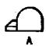

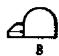

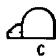

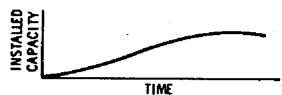

Fig. 6.0-1. The Philosophy of the Nuclear Systems Assessment Study.   
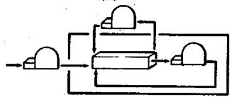  
HEDL 7802-98.1

The philosophy used in this study is illustrated in Fig. 6.0-1. Given a specified $\mathsf{U}_3\mathsf{O}_8$ supply and a specified set of reactor development options, the potential role of nuclear power, the resources required to achieve this role, and the composition and movement of fissile material were calculated. The deployment of the individual reactors and their associated fuel cycle facilities were in all cases consistent with the nuclear policy option under consideration. The introduction date for each individual reactor concept and fuel cycle facility was assumed to be the earliest technologically feasible date. This allows an evaluation of the maximum impact of the system on any particular nuclear option. The effect of delaying the deployment

of a reactor/cycle because it produces undesirable consequences was determined simply by eliminating it from the option.

It was assumed that a nuclear power system was adequate if its installed nuclear capacity was 350 GWe in the year 2000 and a net increase of 15 GWe/yr was realized each year thereafter, with the increase sustained by the $\mathsf{U}_3\mathsf{O}_8$ supply. Two different optimizing patterns were used in the study. A few runs were made assuming economic competition between nuclear fuel and coal, the plants being selected to minimize the levelized cost of power over time. These runs, described in Appendix D, indicated that for the assumptions used in this analysis nuclear power did not compete well at $\mathsf{U}_3\mathsf{O}_8$ prices above $160/lb; therefore, in the remaining runs an attempt was made to satisfy the demand for nuclear power with $\mathsf{U}_3\mathsf{O}_8$ available for less than $160/lb $\mathsf{U}_3\mathsf{O}_8$ . It is these runs that are described in this chapter.

The specific assumptions regarding the $\mathsf{U}_3\mathsf{O}_8$ supply are presented in Section 6.1 below, which also includes descriptions of the operating characteristics of the individual reactors utilized, the various nuclear policy options chosen for analyses, and the analytical method applied. Section 6.2 then compares the results obtained for a selected set of nuclear policy options, and Section 6.3 summarizes the conclusions reached on the basis of those comparisons. The economic data base used for these studies is given in Appendix B, and detailed results for all the nuclear policy options are presented in Appendix C.

# 6.1. BASIC ASSUMPTIONS AND ANALYSIS TECHNIQUE

# 6.1.1. The $\mathsf{U}_3\mathsf{O}_8$ Supply

The most recent estimates of the supply of $U_{3}O_{8}$ available in the United States as reported by DOE's Division of Uranium Resources and Enrichment (URE) are summarized in Table 6.1-1 (from ref. 1). On the basis of a maximum forward cost of $50/lb, the known reserves plus probable potential resources total 2,325 x 10³ ST. URE estimates that an additional 140 x 10³ ST is available from byproducts (phosphates and copper), so that the amount of $U_{3}O_{8}$ probably available totals 2.465 x 10³ ST (or approximately 2.5 million). If the "possible" and "speculative" resources are also considered, the URE estimates are increased to approximately 4.5 million ST. Neither of these estimates include $U_{3}O_{8}$ which may be available from other U.S. sources, such as the Tennessee shales, or from other nations.*

The actual $U_{3}O_{8}$ supply curves used in the analysis were based on the long-run marginal costs of extracting $U_{3}O_{8}$ rather than the forward costs. The long-run marginal costs contain the capital costs of facilities currently in operation plus a normal profit for the industry; thus they are probably more appropriate for use in a nuclear strategy analysis. The actual long-run marginal costs used in this analysis are shown in Table B-7 of Appendix B and are plotted in Fig. 7.4-1 in Chapter 7. These sources show that if the recoverability of the $U_{3}O_{8}$ supply is such that large quantities can be extracted only at high costs, then the supply available at a cost of less than $\\( {160}/1b$ is probably no more than 3 million ST. If, however, the recoverability is such that the extraction costs fall in what is considered to be an intermediate-cost range, then as much as 6 million ST $U_{3}O_{8}$ could be available at a cost of less than $\$ {160}/1b \). In the remainder of this study, these two assumptions are referred to as "high-cost" and "intermediate-cost" $U_{3}O_{8}$ supply assumptions.

The rate at which the $U_{3}O_{8}$ resource is extracted is at least as important as the size of the resource base. URE has estimated that it would be difficult for the U.S. to mine and mill more than 60,000 ST of $U_{3}O_{8}$ per year in the 1990's (ref. 3). (Note: This estimate was based on developing reserves and potential resources at forward costs of less than $30/lb. These costs do not include capital costs of facilities or industry profits.) Although the combined maximum capability of a coalition of states may exceed this, it is not possible to specify a definite upper limit until more is known about the locations of the sources of $U_{3}O_{8}$ and the difficulties encountered in recovering it. Recognizing this, and also recognizing that the annual capacity is still an important variable, the nuclear policy options analyzed in this study were considered to be more feasible if their annual mining and milling rate was less than 60,000 ST of $U_{3}O_{8}$ per year.†

*Editor's Note: In 1977 the U.S. produced 15,000 ST of $\mathrm{U}_{3} \mathrm{O}_{8}$ concentrate (ref. 2).

†Editor's Note: In 1977 the U.S. gaseous diffusion plants produced 15.1 million kg SWU per year (ref. 4). After completion of the cascade improvement program (CIP) and cascade updating program (CUP) in the 1980's, the U.S. capacity will be 27.4 million kg SWU per year (refs. 5 and 6). A gas centrifuge add-on of 8.8 million SWU has been proposed for the government-owned enrichment facility at Portsmouth, Ohio. Considerable enrichment capacity also exists abroad; therefore, enrichment capacity is inherently a less rigid constraint than uranium requirements or production capabilities.

# 6.1.2. Reactor Options

The reactor designs included in this study have not been optimized to cover every conceivable nuclear policy option. Such a task is clearly impossible until the options have been reduced to a more manageable number. However, the designs selected have been developed by using detailed design procedures and they are more than adequate for a reactor strategy study such as is described here.

Table 6.1-1. Estimates of ${\mathrm{U}}_{3}{\mathrm{O}}_{8}$ Supply Available in U.S.A. ${}^{a}$   

<table><tr><td rowspan="2">Forward Cost ($/lb)</td><td colspan="5">Resources (103ST)</td></tr><tr><td>Known</td><td>Probable</td><td>Possible</td><td>Speculative</td><td>Total</td></tr><tr><td>15</td><td>360</td><td>560</td><td>485</td><td>165</td><td>1,570</td></tr><tr><td>30</td><td>690</td><td>1,065</td><td>1,120</td><td>415</td><td>3,290</td></tr><tr><td>50b</td><td>875</td><td>1,450</td><td>1,470</td><td>570</td><td>4,365</td></tr></table>

aFrom ref. 1.   
bAt $50/lb, the known reserves of 875 x 10³ ST plus the probable reserves of 1,450 x 10³ ST plus 140 x 10³ ST from byproducts (phosphates and copper) total 2,465 x 10³ ST (or ~ 2.5 million ST). If the possible and speculative resources are included, the total is increased to 4,505 x 10³ ST (or ~ 4.5 million ST).

Four general types of reactors are included: LWRs, represented by Pressurized Water Reactors (PWRs); HWRs, represented by Canadian Deuterium Uranium Reactors (CANDUs); High Temperature Gas Cooled Reactors (HTGRs); and Fast Breeder Reactors (FBRs). The data for the PWRs were provided by Combustion Engineering (CE) and Hanford Engineering Development Laboratory (HEDL); the data for the CANDUs by Argonne National Laboratory (ANL); the data for the HTGRs by General Atomic (GA); and the data for the FBRs by HEDL. In addition to the standard LWRs (PWRs), spectral-shift-controlled PWRs (SSCRs) are also included in the study, the data for the SSCRs being provided by CE. Descriptions of the individual reactors used in the study are given in Tables 6.1-2 and 6.1-3 (ref. 7), and the economic data base for each is given in Appendix B.

The LWR designs include reactors fueled with low-enriched and denatured $^{235}\mathrm{U}$ , denatured $^{233}\mathrm{U}$ , and plutonium, the diluent for the denatured designs consisting of either $^{238}\mathrm{U}$ or thorium, or both. In addition, a low-enriched LWR design optimized for throwaway has been studied, and also three SSCRs fueled with low-enriched $^{235}\mathrm{U}$ , denatured $^{233}\mathrm{U}$ , and $\mathrm{Pu} / \mathrm{Th}$ .

The HwRs are represented by three $^{235}\mathrm{U}$ -fueled reactors (natural, slightly enriched, and denatured), a denatured $^{233}\mathrm{U}$ reactor, a $\mathrm{Pu}/^{238}\mathrm{U}$ reactor, and a Pu/Th reactor. The HTGR designs consist of low-enriched, denatured, and highly enriched $^{235}\mathrm{U}$ reactors; denatured* and highly enriched $^{233}\mathrm{U}$ reactors; and a Pu/Th reactor.

The FBR designs consist of two $\mathsf{Pu} / ^{238}\mathsf{U}$ core designs (one with a $^{238}\mathsf{U}$ blanket and one with a thorium blanket) and one $\mathsf{Pu} / \mathsf{Th}$ core design (with a thorium blanket). In addition, a $^{233}\mathsf{U} / ^{238}\mathsf{U}$ core design with a thorium blanket has been studied. The $^{233}\mathsf{U}$ enrichment is less than $12\%$ , and thus this FBR is a denatured design.

Introduction dates for each reactor type are included in Table 6.1-2. A slight modification to an existing PWR fuel design, such as a thicker fuel pin cladding to extend the discharge exposure, was introduced in 1981. A more extensive modification, such as a denatured $^{235}\mathrm{U}$ PWR fuel pin, was delayed until 1987. The remaining PWR designs, including the SSCRs, were introduced in 1991. The HwRs and HTGRs were all introduced in 1995, while the FBRs were not introduced until 2001.

The lifetime-averaged $^{233}\mathrm{U},$ $^{235}\mathrm{U}$ , and fissile plutonium flows given in Table 6.1-3 show that for the throwaway cycle, low-enriched HTGRs offer significant (almost $20\%$ ) uranium ore savings compared to low-enriched PWRs. Slightly enriched HwRs reduce uranium ore requirements by an additional $20\%$ over HTGRs and more than $35\%$ over LwRs. Although low-enriched LwRs and HTGRs have roughly the same enrichment requirements, the slightly enriched HwRs require 5 to 6 times less enrichment. The low-enriched SSCR offers about a $22\%$ savings in enrichment.

Core discharge exposures for FBRs are approximately twice the exposures for LWRs, while exposures for HWRs are about half those for LWRs. An exception is the natural-uranium HwR, which has a discharge exposure of one-fourth that for the LwR. HTGR discharge exposures are extremely large - nearly 200 MWd/kg for the Pu/Th fuel design!

The two FBRs with Pu-U cores have breeding ratios of 1.34 to 1.36. Replacing the uranium in the core with thorium reduces the breeding ratio by 0.15, while replacing the plutonium with $^{233}\mathrm{U}$ reduces the breeding ratio by 0.16. Finally, comparing $^{235}\mathrm{U}$ -fueled thermal reactors with $^{233}\mathrm{U}$ -fueled reactors shows that the $^{233}\mathrm{U}$ -fueled reactors have conversion ratios about 0.10 to 0.15 higher.

The most striking observation that can be made from the total fissile fuel requirements shown in Table 6.1-3 is the significantly lower fissile requirements for the denatured $^{233}\mathrm{U}$ -fueled SSCRs and HWRs and for the highly enriched $^{233}\mathrm{U}$ /Th-fueled HTGR.

Finally, a few comments should be made about the relative uncertainties of the performance characteristics for the reactor designs in this study. Clearly, the low-enriched $^{235}\mathrm{U}$ -fueled LWR (PWR) has low performance uncertainties. Numerous PWRs that have been designed using these methods are currently in operation. The highly enriched $^{235}\mathrm{U}$ -fueled HTGR also would be expected to be quite accurate since Fort St. Vrain started up in 1977. For the same reason, the successful operation of HwRs in Canada gives a high level of confidence in the natural uranium fueled CANDUs.

The Pu-U-fueled FBRs have had a great deal of critical experiment backup, and a few FBRs have been built in the U.S. and abroad, giving assurance in the calculated performance parameters of these reactors. Most of the remaining reactors, however, have rather large uncertainties associated with their performance characteristics. This is because these reactors have not been built, and most have not even had critical experiments to verify the designs. The uncertainty for the alternate-fueled reactor designs is even greater since the effort in developing nuclear data for $^{233}\mathrm{U}$ and thorium has been modest compared to that expended in developing data for $^{235}\mathrm{U}$ , $^{238}\mathrm{U}$ , and plutonium.

Table 6.1-2. Characteristics of Various Reactors   

<table><tr><td rowspan="3">Reactor/Cyclea</td><td rowspan="3">Introduction Date</td><td rowspan="3">Power Level (MWe)</td><td colspan="6">Lifetime Requirements</td><td colspan="3">Equilibrium Conditions</td></tr><tr><td colspan="3">U3O8(tons U3O8/GWe)b</td><td colspan="3">Enrichment (106kg SWU/GWe)c</td><td rowspan="2">Heavy Metal Fabrication Requirements (NT/GWe-yr)</td><td rowspan="2">Core Discharge Exposure (MWD/kg)</td><td rowspan="2">Breeding or Conversion Ratio</td></tr><tr><td>Charge</td><td>Discharge</td><td>Net</td><td>Charge</td><td>Discharge</td><td>Net</td></tr><tr><td>LWR-U5(LE)/U-S</td><td>1969</td><td>1150</td><td>5236</td><td>1157</td><td>4078</td><td>3.11</td><td>0.17</td><td>2.94</td><td>25.8</td><td>30</td><td>0.60</td></tr><tr><td>LWR-U5(LE)/U-EE</td><td>1981</td><td>1150</td><td>4904</td><td>0</td><td>4904</td><td>3.11</td><td>0</td><td>3.11</td><td>18.2</td><td>43</td><td>0.54</td></tr><tr><td>LWR-U5(DE)/U/Th</td><td>1987</td><td>1150</td><td>8841</td><td>3803</td><td>5038</td><td>8.03</td><td>3.20</td><td>4.83</td><td>24.1</td><td>33</td><td>0.66</td></tr><tr><td>LWR-U3(DE)/U/Th</td><td>1991</td><td>1150</td><td>0</td><td>0</td><td>0</td><td>0</td><td>0</td><td>0</td><td>24.1</td><td>32</td><td>0.80</td></tr><tr><td>LWR-Pu/U</td><td>1991</td><td>1150</td><td>950</td><td>0</td><td>950</td><td>0</td><td>0</td><td>0</td><td>25.7</td><td>30</td><td>0.70</td></tr><tr><td>LWR-Pu/Th</td><td>1991</td><td>1150</td><td>0</td><td>0</td><td>0</td><td>0</td><td>0</td><td>0</td><td>22.6</td><td>33</td><td>-</td></tr><tr><td>SSCR-U5(LE)/U</td><td>1991</td><td>1300</td><td>4396</td><td>908</td><td>3489</td><td>2.42</td><td>0.05</td><td>2.37</td><td>25.3</td><td>30</td><td>-</td></tr><tr><td>SSCR-U3(DE)/U/Th</td><td>1991</td><td>1300</td><td>0</td><td>0</td><td>0</td><td>0</td><td>0</td><td>0</td><td>23.0</td><td>33</td><td>-</td></tr><tr><td>SSCR-Pu/Th</td><td>1991</td><td>1300</td><td>0</td><td>0</td><td>0</td><td>0</td><td>0</td><td>0</td><td>23.0</td><td>33</td><td>-</td></tr><tr><td>HWR-U5(NAT)/U</td><td>1995</td><td>1000</td><td>4156</td><td>0</td><td>4156</td><td>0</td><td>0</td><td>0</td><td>114.9</td><td>7.5</td><td>-</td></tr><tr><td>HWR-U5(SEU)/U</td><td>1995</td><td>1000</td><td>3187</td><td>0</td><td>3187</td><td>0.59</td><td>0</td><td>0.59</td><td>53.9</td><td>16</td><td>-</td></tr><tr><td>HWR-U5(DE)/U/Th</td><td>1995</td><td>1000</td><td>7337</td><td>2402</td><td>4935</td><td>6.66</td><td>1.94</td><td>4.73</td><td>53.9</td><td>16</td><td>-</td></tr><tr><td>HWR-U3(DE)/U/Th</td><td>1995</td><td>1000</td><td>0</td><td>0</td><td>0</td><td>0</td><td>0</td><td>0</td><td>53.9</td><td>16</td><td>-</td></tr><tr><td>HWR-Pu/U</td><td>1995</td><td>1000</td><td>2030</td><td>0</td><td>2030</td><td>0</td><td>0</td><td>0</td><td>53.9</td><td>16</td><td>-</td></tr><tr><td>HWR-Pu/Th</td><td>1995</td><td>1000</td><td>0</td><td>0</td><td>0</td><td>0</td><td>0</td><td>0</td><td>53.9</td><td>16</td><td>-</td></tr><tr><td>HTGR-U5(LE)/U-T</td><td>1995</td><td>1344</td><td>4017</td><td>0</td><td>4017</td><td>3.23</td><td>0</td><td>3.23</td><td>8.2</td><td>80</td><td>0.50</td></tr><tr><td>HTGR-U5(LE)/U</td><td>1995</td><td>1344</td><td>4017</td><td>431</td><td>3586</td><td>3.23</td><td>0.12</td><td>3.11</td><td>7.2</td><td>91</td><td>0.50</td></tr><tr><td>HTGR-U5(DE)/U/Th</td><td>1995</td><td>1344</td><td>3875</td><td>465</td><td>3410</td><td>3.52</td><td>0.30</td><td>3.22</td><td>6.3</td><td>104</td><td>0.54</td></tr><tr><td>HTGR-U5(HE)/U/Th</td><td>1995</td><td>1344</td><td>3903</td><td>558</td><td>3345</td><td>3.90</td><td>0.55</td><td>3.35</td><td>8.9</td><td>74</td><td>0.67</td></tr><tr><td>HTGR-U3(DE)/U/Th</td><td>1995</td><td>1344</td><td>0</td><td>0</td><td>0</td><td>0</td><td>0</td><td>0</td><td>10.4</td><td>63</td><td>0.65</td></tr><tr><td>HTGR-U3/Th</td><td>1995</td><td>1344</td><td>0</td><td>0</td><td>0</td><td>0</td><td>0</td><td>0</td><td>14.0</td><td>47</td><td>0.86</td></tr><tr><td>HTGR-Pu/Th</td><td>1995</td><td>1344</td><td>0</td><td>0</td><td>0</td><td>0</td><td>0</td><td>0</td><td>3.4</td><td>196</td><td>0.62</td></tr><tr><td>FBR-Pu-U/U</td><td>2001</td><td>1200</td><td>0</td><td>0</td><td>0</td><td>0</td><td>0</td><td>0</td><td>12.7/5.1/7.1b</td><td>62</td><td>1.36</td></tr><tr><td>FBR-Pu-U/Th</td><td>2001</td><td>1200</td><td>0</td><td>0</td><td>0</td><td>0</td><td>0</td><td>0</td><td>12.7/4.6/6.4</td><td>62</td><td>1.34</td></tr><tr><td>FBR-Pu-Th/Th</td><td>2001</td><td>1200</td><td>0</td><td>0</td><td>0</td><td>0</td><td>0</td><td>0</td><td>11.6/4.6/6.4</td><td>68</td><td>1.19</td></tr><tr><td>FBR-U3-U/Th</td><td>2001</td><td>1200</td><td>0</td><td>0</td><td>0</td><td>0</td><td>0</td><td>0</td><td>12.7/4.6/6.4</td><td>63</td><td>1.18</td></tr></table>

$^{a}$ LE = low enriched; DE = denatured; NAT = natural; SEU = slightly enriched; HE = highly enriched; US = 235U; U3 = 233U; S = standard LWR; EE = LWR with extended discharge exposure; T = optimized for throwaway.   
aWith 1% fabrication and 1% reprocessing losses; enrichment tails assay 0.2%.   
Core/Radial Blanket/Axial Blanket.

Table 6.1-3. Average Fissile Mass Flows* for Various Reactors   

<table><tr><td rowspan="2">Reactor/Cycle</td><td colspan="3">233U (kg/GWe-yr)</td><td colspan="3">235U (kg/GWe-yr)</td><td colspan="3">Pu (kg/GWe-yr)</td><td colspan="3">Total (kg/GWe-yr)</td></tr><tr><td>Charge</td><td>Discharge</td><td>Net</td><td>Charge</td><td>Discharge</td><td>Net</td><td>Charge</td><td>Discharge</td><td>Net</td><td>Charge</td><td>Discharge</td><td>Net</td></tr><tr><td>LWR-U5(LE)/U-S</td><td>0</td><td>0</td><td>0</td><td>736.9</td><td>213.4</td><td>523.5</td><td>0</td><td>146.8</td><td>-146.8</td><td>736.9</td><td>360.2</td><td>376.7</td></tr><tr><td>LWR-U5(LE)/U-EE</td><td>0</td><td>0</td><td>0</td><td>683.3</td><td>0</td><td>683.3</td><td>0</td><td>0</td><td>0</td><td>683.3</td><td>0</td><td>683.3</td></tr><tr><td>LWR-U5(DE)/U/Th</td><td>0</td><td>256.2</td><td>-256.2</td><td>1169.7</td><td>507.9</td><td>661.8</td><td>0</td><td>77.8</td><td>-77.8</td><td>1169.7</td><td>841.9</td><td>327.8</td></tr><tr><td>LWR-U3(DE)/U/Th</td><td>807.0</td><td>530.4</td><td>276.6</td><td>13.5</td><td>16.8</td><td>-3.3</td><td>0</td><td>88.2</td><td>-88.2</td><td>820.5</td><td>635.4</td><td>185.1</td></tr><tr><td>LWR-Pu/U</td><td>0</td><td>0</td><td>0</td><td>173.1</td><td>91.2</td><td>82.0</td><td>700.6</td><td>472.2</td><td>228.5</td><td>873.7</td><td>563.4</td><td>310.5</td></tr><tr><td>LWR-Pu/Th</td><td>0</td><td>239.0</td><td>-239.0</td><td>0</td><td>2.3</td><td>-2.3</td><td>1294.1</td><td>620.2</td><td>673.9</td><td>1294.1</td><td>861.5</td><td>432.6</td></tr><tr><td>SSCR-U5(LE)/U</td><td>0</td><td>0</td><td>0</td><td>626.6</td><td>169.3</td><td>457.3</td><td>0</td><td>185.0</td><td>-185.0</td><td>626.6</td><td>354.3</td><td>272.3</td></tr><tr><td>SSCR-U3(DE)/U/Th</td><td>619.9</td><td>426.2</td><td>193.7</td><td>26.8</td><td>31.2</td><td>-4.4</td><td>0</td><td>72.9</td><td>-72.9</td><td>646.7</td><td>530.3</td><td>116.4</td></tr><tr><td>SSCR-Pu/Th</td><td>0</td><td>281.2</td><td>-281.2</td><td>0</td><td>4.3</td><td>-4.3</td><td>1202.3</td><td>556.4</td><td>645.9</td><td>1202.3</td><td>841.9</td><td>360.4</td></tr><tr><td>HWR-U5(NAT)/U</td><td>0</td><td>0</td><td>0</td><td>757.4</td><td>227.8</td><td>529.6</td><td>0</td><td>290.4</td><td>-290.4</td><td>757.4</td><td>518.2</td><td>239.2</td></tr><tr><td>HWR-U5(SEU)/U</td><td>0</td><td>0</td><td>0</td><td>521.8</td><td>72.2</td><td>449.7</td><td>0</td><td>159.8</td><td>-159.8</td><td>521.8</td><td>232.0</td><td>289.9</td></tr><tr><td>HWR-U5(DE)/U/Th</td><td>0</td><td>418.2</td><td>-418.2</td><td>970.8</td><td>322.8</td><td>648.0</td><td>0</td><td>22.5</td><td>-22.5</td><td>970.8</td><td>763.5</td><td>207.3</td></tr><tr><td>HWR-U3(DE)/U/Th</td><td>765.8</td><td>664.7</td><td>101.1</td><td>33.6</td><td>37.0</td><td>-3.4</td><td>0</td><td>26.9</td><td>-26.9</td><td>799.4</td><td>728.6</td><td>70.8</td></tr><tr><td>HWR-Pu/U</td><td>0</td><td>0</td><td>0</td><td>369.9</td><td>67.2</td><td>302.7</td><td>156.6</td><td>177.7</td><td>-21.1</td><td>526.5</td><td>244.9</td><td>281.6</td></tr><tr><td>HWR-Pu/Th</td><td>0</td><td>391.9</td><td>-391.9</td><td>0</td><td>2.8</td><td>-2.8</td><td>895.5</td><td>234.4</td><td>661.2</td><td>895.5</td><td>629.1</td><td>266.4</td></tr><tr><td>HTGR-U5(LE)/U-T</td><td>0</td><td>0</td><td>0</td><td>540.1</td><td>0</td><td>540.1</td><td>0</td><td>0</td><td>0</td><td>540.1</td><td>0</td><td>540.1</td></tr><tr><td>HTGR-U5(LE)/U</td><td>0</td><td>0</td><td>0</td><td>540.1</td><td>69.1</td><td>471.0</td><td>0</td><td>43.1</td><td>-43.1</td><td>540.1</td><td>112.2</td><td>427.9</td></tr><tr><td>HTGR-U5(DE)/U/Th</td><td>0</td><td>68.9</td><td>-68.9</td><td>689.0</td><td>64.8</td><td>624.2</td><td>0</td><td>27.3</td><td>-27.3</td><td>689.0</td><td>161.0</td><td>528.0</td></tr><tr><td>HTGR-U5(HE)/Th</td><td>0</td><td>186.9</td><td>-186.9</td><td>512.3</td><td>73.3</td><td>439.0</td><td>0</td><td>1.0</td><td>-1.0</td><td>512.3</td><td>261.2</td><td>251.1</td></tr><tr><td>HTGR-U3(DE)/U/Th</td><td>411.0</td><td>108.4</td><td>302.5</td><td>13.2</td><td>21.0</td><td>-7.7</td><td>0</td><td>27.9</td><td>-27.9</td><td>424.2</td><td>157.3</td><td>266.9</td></tr><tr><td>HTGR-U3/Th</td><td>501.5</td><td>389.0</td><td>112.5</td><td>73.8</td><td>69.9</td><td>3.9</td><td>0</td><td>0</td><td>0</td><td>575.3</td><td>458.9</td><td>116.4</td></tr><tr><td>HTGR-Pu/Th</td><td>0</td><td>94.1</td><td>-94.1</td><td>0</td><td>2.9</td><td>-2.9</td><td>637.0</td><td>126.7</td><td>510.3</td><td>637.0</td><td>223.7</td><td>413.3</td></tr><tr><td>FBR-Pu-U/U</td><td>0</td><td>0</td><td>0</td><td>69.7</td><td>48.1</td><td>21.6</td><td>1253</td><td>1526</td><td>-273.3</td><td>1322.7</td><td>1574.1</td><td>-251.7</td></tr><tr><td>FBR-Pu-U/Th</td><td>0</td><td>237.5</td><td>-237.5</td><td>31.8</td><td>17.8</td><td>14.0</td><td>1261</td><td>1283</td><td>-21.9</td><td>1292.8</td><td>1538.3</td><td>-245.4</td></tr><tr><td>FBR-Pu-Th/Th</td><td>0</td><td>743.2</td><td>-743.2</td><td>0</td><td>0</td><td>0</td><td>1484</td><td>853.7</td><td>630.7</td><td>1484</td><td>1596.9</td><td>-112.9</td></tr><tr><td>FBR-U3-U/Th</td><td>1212.5</td><td>844.5</td><td>368.0</td><td>33.3</td><td>19.4</td><td>13.9</td><td>0</td><td>499.8</td><td>-499.8</td><td>1245.8</td><td>1363.7</td><td>-117.9</td></tr></table>

*Lifetime average with 1% fabrication and 1% reprocessing losses.

# 6.1.3. Nuclear Policy Options

Under the assumption that the reactor/fuel cycles listed in Tables 6.1-2 and 6.1-3 could be deployed, a set of nuclear policy options were developed for studying the relative capabilities of the various reactors to produce civilian nuclear power during the period from 1980 to 2050. As was pointed out above, it was assumed that for a system to be adequate, it should have an installed nuclear capacity of 350 GWe by the year 2000 and a net increase of 15 GWe thereafter, with each plant having a 30-yr lifetime. (Note: In order to determine the effect of a lower growth rate, a few cases were also run for an installed capacity of 200 GWe in the year 2000 and 10 GWe/yr thereafter.) It was also assumed that reactors fueled with natural, low-enriched, slightly enriched, or denatured uranium could be dispersed outside the secure energy centers and those fueled with highly enriched uranium or with plutonium would be confined within the centers. All enrichment, reprocessing, and fabricating facilities would also be confined within the centers.

The nuclear policy options fell under four major categories: (1) the throwaway/ stowaway option; (2) classical plutonium-uranium options; (3) denatured uranium options employing thermal converters only; and (4) denatured uranium options employing both converters and breeders. The various options under these categories are described in Table 6.1-4, and the specific reactors utilized in each option are indicated in Table 6.1-5. Schematic representations of the options are presented in Figs. 6.1-1 through 6.1-4. Runs were made for both intermediate-cost and high-cost $\mathsf{U}_3\mathsf{O}_8$ supply assumptions.

These nuclear options cannot be viewed as predictions of the future insofar as nuclear power is concerned; however, they can provide a logic framework by which the future implication of current nuclear policy decisions can be understood. Suppose, for example, a group of nations agree to supply nuclear fuel to another group of nations providing the latter agree to forego reprocessing. A careful analysis of the nuclear system options outlined above can illustrate the logical consequences of such a decision upon the civilian nuclear power systems in both groups of nations. Only those nations providing the fuel would maintain secure energy centers, since the nations receiving the fuel would be operating dispersed reactors only. (Note: The analysis presented here considers only the U.S. ore supply. A similar analysis for a group of nations would begin with different assumptions regarding the ore supply and nuclear energy demand.)

For the purposes of this analysis, all the nuclear system options were assumed to be mutually exclusive. That is, it was assumed that any option selected would be pursued to its ultimate end. In actuality, a nation would have the ability to change policies if consequences of the policy in effect were determined to be undesirable. However, the ability to successfully change a policy at a future date would be quite limited if the necessity of changing has not been identified and incorporated into the current program. The purpose of the study contained in this report was to identify the basic nuclear system options, and to determine the consequences of pursuing them to their ultimate end. (Note: A study of the consequences of changing policies at a future date - and thereby the implication of current programs - will be analyzed in a later study.)

# 6.1.4. The Analytical Method

The principal components of the analytical method used in this study are illustrated in Fig. 6.1-5 and are based on the following assumptions:

(1) Given a specified demand for nuclear energy as a function of time, nuclear units are constructed to meet this demand consistent with the nuclear policy option under consideration.   
(2) As nuclear units requiring $\mathsf{U}_3\mathsf{O}_8$ are constructed, the supply of $\mathsf{U}_3\mathsf{O}_8$ is continuously depleted. The depletion rate is based on both the first core load and the annual reloads required throughout the life of the nuclear unit. The long-run marginal cost of $\mathsf{U}_3\mathsf{O}_8$ is assumed to be an increasing function of the cumulative amount mined. This is indicative of a continuous transition from higher grade to lower grade resources.   
(3) If the nuclear policy option under consideration assumes reprocessing, the fuel is stored after discharge until reprocessing is available. After reprocessing, the fissile plutonium and $^{233}\mathrm{U}$ are available for refabrication and reloading.   
(4) A nuclear unit which requires $^{239}\mathrm{Pu}$ or $^{233}\mathrm{U}$ cannot be constructed unless the supply of fissile material is sufficient to provide the first core load plus the reloads on an annual basis throughout the unit's life.   
(5) The number of nuclear units specified for operation through the 1980's is exogenously consistent with the current construction plans of utilities.   
(6) A nuclear plant design which differs from established technology can be introduced only at a limited maximum rate. A typical maximum introduction rate is one plant during the first biennium, two plants during the second biennium, four during the third, eight during the fourth, etc.   
(7) If the manufacturing capability to produce a particular reactor type is well established, the rate at which this reactor type will lose its share of the new construction market is limited to a specified fraction per year. A typical maximum construction market loss rate is $10\%/\text{yr}$ . This reflects the fact that some utilities will continue to purchase plants of an established and reliable technology, even though a new technology may offer an improvement.

The acquisition of fissile material will be the principal goal of any nation embarked upon a nuclear weapons program. Therefore, any analysis of a diversion-resistant civilian nuclear power strategy must include a detailed analysis of the nuclear fuel cycle. The steps in the nuclear fuel cycle which were explicitly modeled in this analysis are shown in Fig. 6.1-6. They include: the mining of $\mathsf{U}_3\mathsf{O}_8$ ; the conversion of $\mathsf{U}_3\mathsf{O}_8$ to $\mathsf{UF}_6$ ; the enrichment of the uranium by either the gaseous diffusion technique or the centrifuge

Table 6.1-4. Nuclear Policy Options

# Throwaway/Stowaway Option (see Fig. 6.1-1)

Option 1: LEU $(^{235}\mathrm{U} / ^{238}\mathrm{U})$ converters $^b$ operating on the throwaway/stowaway cycle are permitted outside the energy centers and no reactors are operated inside the centers. Spent fuel is returned to the secure energy centers for ultimate disposal.

# Plutonium-Uranium Options (see Fig. 6.1.2)

Option 2: LEU $(^{235}\mathrm{U} / ^{238}\mathrm{U})$ converters are operated outside the secure energy centers and Pu/U converters and $^{235}\mathrm{U}(\mathrm{HE})\mathrm{Th}$ , $^{233}\mathrm{U} / \mathrm{Th}$ , and Pu/Th HTGR's are permitted inside the centers. Uranium is recycled in all reactors, and plutonium is recycled in energy-center reactors.

Option 3: LEU $(^{235}\mathrm{U} / ^{238}\mathrm{U})$ converters are operated outside the secure energy centers and Pu/U converters, Pu-U/U breeders, and $^{235}\mathrm{U}(\mathrm{HE})/\mathrm{Th},^{233}\mathrm{U} / \mathrm{Th}$ and Pu/Th HTGRs are permitted inside the centers. Uranium is recycled in all the reactors, and plutonium is recycled in the energy-center reactors.

# Denatured Uranium Options with Converters Only (see Fig. 6.1-3)

Option 4: LEU $(^{235}\mathrm{U} / ^{238}\mathrm{U})$ converters and denatured $^{235}\mathrm{U}$ and $^{233}\mathrm{U}$ converters are operated outside the energy centers and no reactors are operated inside the centers. The fissile uranium is recycled into the converters, but the plutonium is stored inside the centers either for ultimate disposal or for future use at an unspecified date.

Option 5U: LEU $(^{235}\mathrm{U} / ^{238}\mathrm{U})$ converters and denatured $^{235}\mathrm{U}$ and $^{233}\mathrm{U}$ converters are operated outside the energy centers and Pu/Th converters are permitted inside the centers. The fissile uranium is recycled into the outside reactors and the plutonium into the inside reactors. The goal in this case is to minimize the amount of plutonium produced and to "transmute" all that is produced into $^{233}\mathrm{U}$ in the energy-center reactors.

Option 5T: LEU $(^{235}\mathrm{U} / ^{238}\mathrm{U})$ converters and denatured $^{233}\mathrm{U}$ converters are operated outside the energy centers and Pu/Th converters are permitted inside the centers. The fissile uranium is recycled into the outside reactors and the plutonium into the inside reactors. The goal in this case is not to minimize the amount of plutonium produced but "transmute" all that is produced to $^{233}\mathrm{U}$ in the energy-center reactors.

# Denatured Uranium Options with Converters and Breeders (see Fig, 6.1-4)

Option 6: LEU $(^{233}\mathrm{U} / ^{238}\mathrm{U})$ converters and denatured $^{235}\mathrm{U}$ and $^{233}\mathrm{U}$ converters are operated outside the energy centers and Pu/Th converters and Pu-U/Th breeders (Pu-U cores, Th blankets) are permitted inside the centers. The fissile uranium is recycled into the outside reactors and the inside breeders and plutonium is recycled into the inside converters and breeders. With the reactors used, only a light "Pu-to- $^{233}\mathrm{U}^{\prime \prime}$ transmutation rate is realized.

Option 7: LEU $(^{235}\mathrm{U} / ^{238}\mathrm{U})$ converters, denatured $^{235}\mathrm{U}$ and $^{233}\mathrm{U}$ converters, and denatured $^{233}\mathrm{U}$ breeders are operated outside the energy centers and Pu/Th converters and Pu-U/Th breeders (Pu-U cores, Th blankets) are permitted inside the centers. The fissile uranium is recycled into the outside reactors and the inside breeders and plutonium is recycled in the inside converters and breeders. With the reactors used, only a light "Pu-to- $^{233}\mathrm{U}$ " tranemutation rate is realized. This case represents the first time a denatured breeder is introduced in the system.

Option 8: LEU $(^{235}\mathrm{U} / ^{238}\mathrm{U})$ converters, denatured $^{235}\mathrm{U}$ and $^{233}\mathrm{U}$ converters, and denatured $^{233}\mathrm{U}$ breeders are operated outside the energy centers and Pu/Th converters and Pu-Th/Th breeders (Pu-Th cores, Th blankets) are permitted inside the centers. The fissile uranium is recycled into the outside reactors and the plutonium into the inside reactors. With the reactors used, a heavy "Pu-to- $^{233}\mathrm{U}$ " transmutation rate is realized. Again a denatured breeder is utilized in the system.

Table 6.1-5. Reactors Available in Secure (S) Centers or Dispersed (D) Areas for Various Nuclear Policy Options   

<table><tr><td rowspan="2"></td><td rowspan="2" colspan="4">Throwaway Option, Option 1</td><td colspan="4">Pu-U Options</td><td colspan="9">Denatured Uranium Options with Converters</td><td colspan="7">Denatured Uranium Options with Converters/Breeders</td><td></td></tr><tr><td colspan="4">Option 2</td><td colspan="4">Option 3</td><td colspan="3">Option 4</td><td colspan="2">Option 5U</td><td>Option 5T</td><td colspan="3">Option 6</td><td colspan="3">Option 7</td><td>Option 8</td></tr><tr><td>Reactor/Cycle*</td><td>L</td><td>S</td><td>H</td><td>G</td><td>L</td><td>S</td><td>H</td><td>G</td><td>L</td><td>S</td><td>H</td><td>G</td><td>L</td><td>S</td><td>H</td><td>G</td><td>L</td><td>S</td><td>H</td><td>G</td><td>L</td><td>S</td><td>H</td><td>G</td><td></td></tr><tr><td>LWR-U5(LE)/U-S</td><td>D</td><td>D</td><td>D</td><td>D</td><td>D</td><td>D</td><td>D</td><td>D</td><td>D</td><td>D</td><td>D</td><td>D</td><td>D</td><td>D</td><td>D</td><td>D</td><td>D</td><td>D</td><td>D</td><td>D</td><td>D</td><td>D</td><td>D</td><td>D</td><td></td></tr><tr><td>LWR-U5(LE)/U-EE</td><td>D</td><td>-</td><td>-</td><td>-</td><td>-</td><td>-</td><td>-</td><td>-</td><td>-</td><td>-</td><td>-</td><td>-</td><td>-</td><td>-</td><td>-</td><td>-</td><td>-</td><td>-</td><td>-</td><td>-</td><td>-</td><td>-</td><td>-</td><td>-</td><td></td></tr><tr><td>LWR-U5(DE)/U/Th</td><td>-</td><td>-</td><td>-</td><td>-</td><td>-</td><td>-</td><td>-</td><td>-</td><td>-</td><td>-</td><td>-</td><td>-</td><td>D</td><td>D</td><td>-</td><td>-</td><td>-</td><td>-</td><td>D</td><td>D</td><td>-</td><td>-</td><td>D</td><td>D</td><td>-</td></tr><tr><td>LWR-U3(DE)/U/Th</td><td>-</td><td>-</td><td>-</td><td>-</td><td>-</td><td>-</td><td>-</td><td>-</td><td>-</td><td>-</td><td>-</td><td>-</td><td>D</td><td>-</td><td>-</td><td>-</td><td>D</td><td>-</td><td>-</td><td>D</td><td>-</td><td>-</td><td>-</td><td>D</td><td>-</td></tr><tr><td>LWR-Pu/U</td><td>-</td><td>-</td><td>-</td><td>-</td><td>S</td><td>S</td><td>-</td><td>-</td><td>S</td><td>S</td><td>-</td><td>-</td><td>-</td><td>-</td><td>-</td><td>-</td><td>-</td><td>-</td><td>-</td><td>-</td><td>-</td><td>-</td><td>-</td><td>-</td><td>-</td></tr><tr><td>LWR-Pu/Th</td><td>-</td><td>-</td><td>-</td><td>-</td><td>-</td><td>-</td><td>-</td><td>-</td><td>-</td><td>-</td><td>-</td><td>-</td><td>-</td><td>S</td><td>-</td><td>-</td><td>-</td><td>S</td><td>-</td><td>-</td><td>-</td><td>S</td><td>-</td><td>-</td><td>-</td></tr><tr><td>SSCR-U5(LE)/U</td><td>-</td><td>D</td><td>-</td><td>-</td><td>-</td><td>D</td><td>-</td><td>-</td><td>-</td><td>D</td><td>-</td><td>-</td><td>-</td><td>D</td><td>-</td><td>-</td><td>-</td><td>D</td><td>-</td><td>-</td><td>D</td><td>-</td><td>-</td><td>D</td><td>-</td></tr><tr><td>SSCR-U3(DE)/U/Th</td><td>-</td><td>-</td><td>-</td><td>-</td><td>-</td><td>-</td><td>-</td><td>-</td><td>-</td><td>-</td><td>-</td><td>-</td><td>-</td><td>D</td><td>-</td><td>-</td><td>-</td><td>D</td><td>-</td><td>-</td><td>D</td><td>-</td><td>-</td><td>D</td><td>-</td></tr><tr><td>SSCR-Pu/Th</td><td>-</td><td>-</td><td>-</td><td>-</td><td>-</td><td>-</td><td>-</td><td>-</td><td>-</td><td>-</td><td>-</td><td>-</td><td>-</td><td>S</td><td>-</td><td>-</td><td>-</td><td>S</td><td>-</td><td>-</td><td>-</td><td>S</td><td>-</td><td>-</td><td>S</td></tr><tr><td>HWR-U5(NAT)/U</td><td>-</td><td>D</td><td>-</td><td>-</td><td>-</td><td>D</td><td>-</td><td>-</td><td>-</td><td>D</td><td>-</td><td>-</td><td>-</td><td>D</td><td>-</td><td>-</td><td>-</td><td>D</td><td>-</td><td>-</td><td>D</td><td>-</td><td>-</td><td>D</td><td>-</td></tr><tr><td>HWR-U5(SEU)/U</td><td>-</td><td>D</td><td>-</td><td>-</td><td>-</td><td>D</td><td>-</td><td>-</td><td>D</td><td>-</td><td>-</td><td>D</td><td>-</td><td>-</td><td>D</td><td>-</td><td>-</td><td>D</td><td>-</td><td>-</td><td>D</td><td>-</td><td>-</td><td>D</td><td>-</td></tr><tr><td>HWR-U5(DE)/U/Th</td><td>-</td><td>-</td><td>-</td><td>-</td><td>-</td><td>-</td><td>-</td><td>-</td><td>-</td><td>-</td><td>-</td><td>-</td><td>D</td><td>-</td><td>-</td><td>D</td><td>-</td><td>-</td><td>D</td><td>-</td><td>-</td><td>D</td><td>-</td><td>-</td><td>D</td></tr><tr><td>HWR-U3(DE)/U/Th</td><td>-</td><td>-</td><td>-</td><td>-</td><td>-</td><td>-</td><td>-</td><td>-</td><td>-</td><td>-</td><td>-</td><td>-</td><td>D</td><td>-</td><td>-</td><td>D</td><td>-</td><td>-</td><td>D</td><td>-</td><td>-</td><td>D</td><td>-</td><td>-</td><td>D</td></tr><tr><td>HWR-Pu/U</td><td>-</td><td>-</td><td>-</td><td>-</td><td>-</td><td>S</td><td>-</td><td>-</td><td>S</td><td>-</td><td>-</td><td>-</td><td>-</td><td>-</td><td>-</td><td>-</td><td>-</td><td>-</td><td>-</td><td>-</td><td>-</td><td>-</td><td>-</td><td>-</td><td>-</td></tr><tr><td>HWR-Pu/Th</td><td>-</td><td>-</td><td>-</td><td>-</td><td>-</td><td>-</td><td>-</td><td>-</td><td>-</td><td>-</td><td>-</td><td>-</td><td>-</td><td>S</td><td>-</td><td>-</td><td>-</td><td>S</td><td>-</td><td>-</td><td>S</td><td>-</td><td>-</td><td>S</td><td>-</td></tr><tr><td>HTGR-U5(LE)/U-T</td><td>-</td><td>-</td><td>D</td><td>-</td><td>-</td><td>-</td><td>-</td><td>-</td><td>-</td><td>-</td><td>-</td><td>-</td><td>-</td><td>-</td><td>-</td><td>-</td><td>-</td><td>-</td><td>-</td><td>-</td><td>-</td><td>-</td><td>-</td><td>-</td><td>-</td></tr><tr><td>HTGR-U5(LE)/U</td><td>-</td><td>-</td><td>-</td><td>-</td><td>-</td><td>D</td><td>-</td><td>-</td><td>D</td><td>-</td><td>-</td><td>D</td><td>-</td><td>-</td><td>D</td><td>-</td><td>-</td><td>D</td><td>-</td><td>-</td><td>D</td><td>-</td><td>-</td><td>D</td><td>-</td></tr><tr><td>HTGR-U5(DE)/U/Th</td><td>-</td><td>-</td><td>-</td><td>-</td><td>-</td><td>-</td><td>-</td><td>-</td><td>-</td><td>-</td><td>D</td><td>-</td><td>-</td><td>D</td><td>-</td><td>-</td><td>-</td><td>-</td><td>-</td><td>D</td><td>-</td><td>-</td><td>D</td><td>-</td><td>-</td></tr><tr><td>HTGR-U5(HE)/Th</td><td>-</td><td>-</td><td>-</td><td>-</td><td>-</td><td>S</td><td>-</td><td>-</td><td>S</td><td>-</td><td>-</td><td>-</td><td>-</td><td>-</td><td>-</td><td>-</td><td>-</td><td>-</td><td>-</td><td>-</td><td>-</td><td>-</td><td>-</td><td>-</td><td>-</td></tr><tr><td>HTGR-U3(DE)/U/Th</td><td>-</td><td>-</td><td>-</td><td>-</td><td>-</td><td>-</td><td>-</td><td>-</td><td>-</td><td>-</td><td>D</td><td>-</td><td>-</td><td>D</td><td>-</td><td>-</td><td>D</td><td>-</td><td>-</td><td>D</td><td>-</td><td>-</td><td>D</td><td>-</td><td>-</td></tr><tr><td>HTGR-U3/Th</td><td>-</td><td>-</td><td>-</td><td>-</td><td>-</td><td>S</td><td>-</td><td>-</td><td>S</td><td>-</td><td>-</td><td>-</td><td>-</td><td>-</td><td>-</td><td>-</td><td>-</td><td>-</td><td>-</td><td>-</td><td>-</td><td>-</td><td>-</td><td>-</td><td>-</td></tr><tr><td>HTGR-Pu/Th</td><td>-</td><td>-</td><td>-</td><td>-</td><td>-</td><td>S</td><td>-</td><td>-</td><td>S</td><td>-</td><td>-</td><td>-</td><td>-</td><td>S</td><td>-</td><td>-</td><td>S</td><td>-</td><td>-</td><td>S</td><td>-</td><td>-</td><td>S</td><td>-</td><td>-</td></tr><tr><td>FBR-Pu-U/U</td><td>-</td><td>-</td><td>-</td><td>-</td><td>-</td><td>S</td><td>S</td><td>S</td><td>S</td><td>-</td><td>-</td><td>-</td><td>-</td><td>-</td><td>-</td><td>-</td><td>-</td><td>-</td><td>-</td><td>-</td><td>-</td><td>-</td><td>-</td><td>-</td><td>-</td></tr><tr><td>FBR-Pu-U/Th</td><td>-</td><td>-</td><td>-</td><td>-</td><td>-</td><td>-</td><td>-</td><td>-</td><td>-</td><td>-</td><td>-</td><td>-</td><td>-</td><td>-</td><td>-</td><td>-</td><td>-</td><td>S</td><td>S</td><td>S</td><td>S</td><td>S</td><td>S</td><td>-</td><td>-</td></tr><tr><td>FBR-Pu-Th/Th</td><td>-</td><td>-</td><td>-</td><td>-</td><td>-</td><td>-</td><td>-</td><td>-</td><td>-</td><td>-</td><td>-</td><td>-</td><td>-</td><td>-</td><td>-</td><td>-</td><td>-</td><td>-</td><td>-</td><td>-</td><td>-</td><td>-</td><td>S</td><td>S</td><td>S</td></tr><tr><td>FBR-U3-U/Th</td><td>-</td><td>-</td><td>-</td><td>-</td><td>-</td><td>-</td><td>-</td><td>-</td><td>-</td><td>-</td><td>-</td><td>-</td><td>-</td><td>-</td><td>-</td><td>-</td><td>-</td><td>-</td><td>-</td><td>D</td><td>D</td><td>D</td><td>D</td><td>D</td><td>D</td></tr></table>

\*LE = low enriched; DE = denatured; NAT = natural; SEU = slightly enriched; HE = highly enriched; U5 = $2^{35}\mathrm{U};$ U3 = $2^{33}\mathrm{U};$ S = standard LWR; EE = LWR with extended discharge exposure; T = optimized for throwaway. L, S, H, and G indicate type of converter employed in option, where L = LWR, S = SSCR. H = HWR, and G = HTGR.

Fig. 6.1-1. Option 1: The Throwaway/Stowaway Option.   
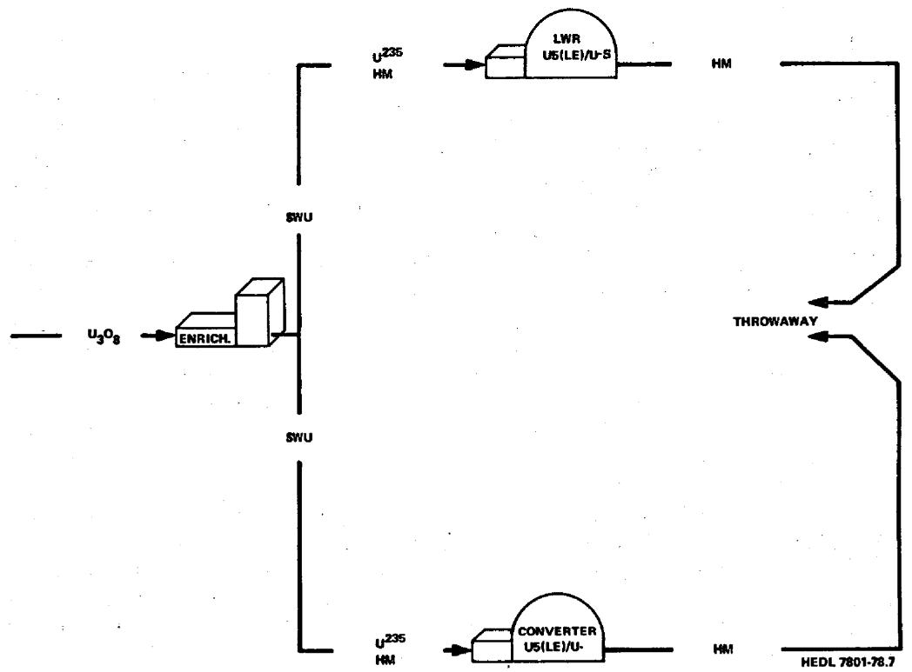  
Option 1: In this option, LEU $(^{235}\mathrm{U} / ^{238}\mathrm{U})$ converters* operating on the throwaway/ stowaway cycle are permitted outside the energy centers and no reactors are operated inside the centers. Spent fuel is returned to the secure energy centers for ultimate disposal.

technique; the fabrication of $^{235}\mathrm{U}$ , $^{233}\mathrm{U}$ , and $^{239}\mathrm{Pu}$ fuels; the destruction and transmutation of fissile and fertile isotopes occurring during power production in the reactor; the storage of spent fuel, and, if permitted, the reprocessing of spent fuel; the size and composition of fissile stockpiles as a function of time; and the amount of spent fuel or high-level waste which must be stored as a function of time. Thus, the amount, composition, and movement of all fissile material in the civilian nuclear power system were accurately calculated for each case under the nuclear policy options shown in Tables 6.1-4 and 6.1-5.

The cost of each nuclear option and the total power cost of each nuclear unit in the option were also calculated; however, the total power cost of a nuclear unit did not determine whether it would be constructed. Generally it was constructed if (1) it was available in the policy under consideration, and (2) it had a lower $\mathsf{U}_3\mathsf{O}_8$ consumption rate than the other nuclear units available under the same policy option. This approach was adopted because it is possible to calculate the $\mathsf{U}_3\mathsf{O}_8$ , fissile plutonium, and $^{233}\mathsf{U}$ requirements of a nuclear unit with reasonable accuracy, while it is very difficult to

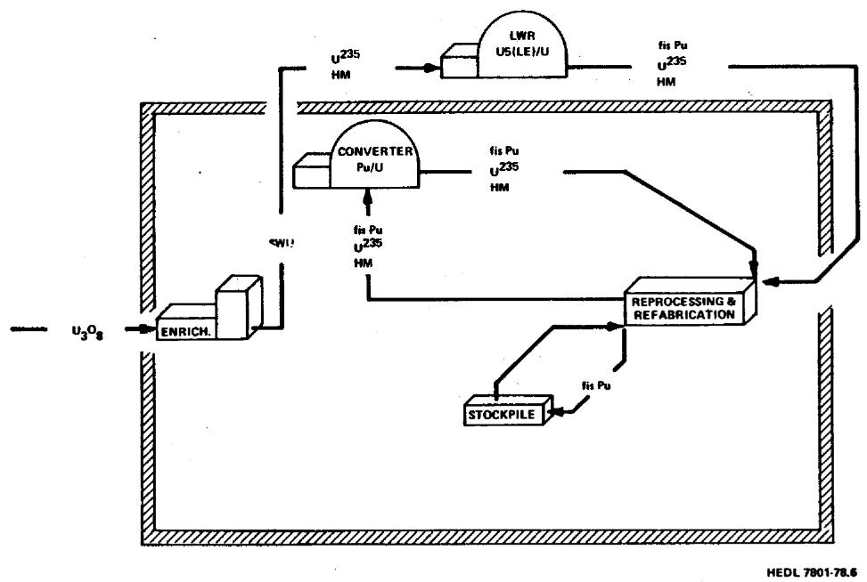  
Option 2: In this option, LEU $(^{235}\mathrm{U} / ^{238}\mathrm{U})$ converters are operated outside the secure energy centers and Pu/U converters and $^{235}\mathrm{U}(\mathrm{HE}) / \mathrm{Th},^{233}\mathrm{U} / \mathrm{Th},$ and Pu/Th HTGRs are permitted inside the centers. Spent fuel is returned to the centers for reprocessing. Uranium is recycled in all actors, and plutonium is recycled in energy-center reactors. (Note: Sketch does not f, cover Option 2G; see Table 6.1-5.)

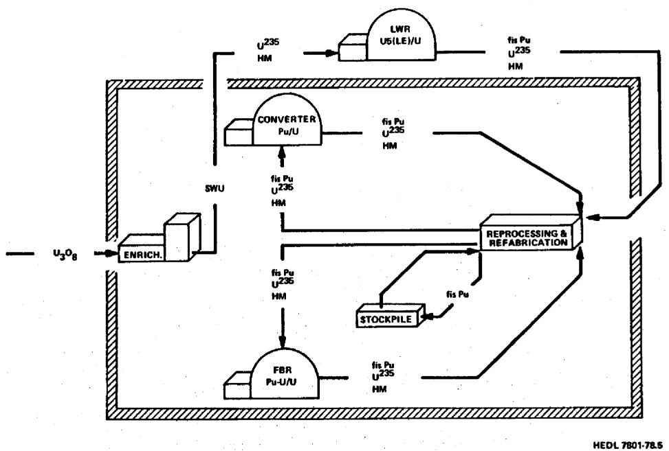  
Option 3: In this option, LEU $(^{235}\mathrm{U} / ^{238}\mathrm{U})$ converters are operated outside the secure energy centers and Pu/U converters, Pu-U/U breeders, and $^{235}\mathrm{U}(\mathrm{HE}) / \mathrm{Th}$ , $^{233}\mathrm{U} / \mathrm{Th}$ , and Pu/Th HTGRs are permitted inside the centers. Spent fuel is returned to the centers for reprocessing. Uranium is recycled in all the reactors, and plutonium is recycled in the energy-center reactors. (Note: Sketch does not fully cover Option 3G; see Table 6.1-5.)   
Fig. 6.1-2. Options 2 and 3: The Plutonium-Uranium Options.

Fig. 6.1-3. Options 4, 5U, and 5T: Denatured Uranium Options with Converters Only.   
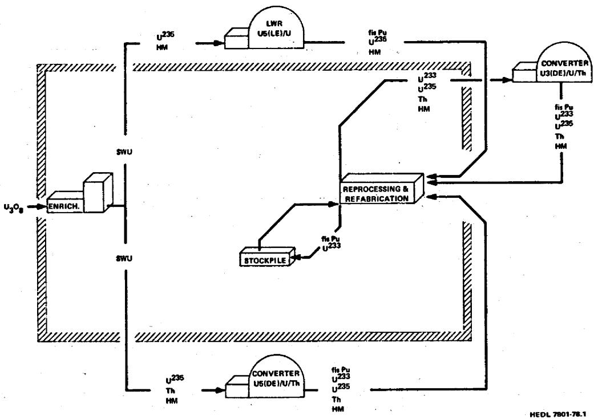  
Option 4: In this option, LEU $(^{235}\mathrm{U} / ^{238}\mathrm{U})$ converters and denatured $^{235}\mathrm{U}$ and $^{233}\mathrm{U}$ converters are operated outside the energy centers and no reactors are operated inside the centers. Spent fuel is returned to the secure energy centers for reprocessing. The fissile uranium is recycled into the converters, but the plutonium is stored inside the center either for ultimate disposal or for future use at an unspecified date.

calculate the capital, fabrication, and reprocessing costs for the same unit. (Note: An exception to this philosophy was contained in a set of cases described in Appendix D in which the $\mathsf{U}_3\mathsf{O}_8$ supply was assumed to be sufficiently large so as not to impose a practical limit on the growth of the nuclear system over the planning horizon. In this case, the decision to construct--or not to construct--a reactor concept was based on its total power cost, which of course included the cost of $\mathsf{U}_3\mathsf{O}_8$ as an increasing function of the total amount consumed. Thus, while the ability to conserve $\mathsf{U}_3\mathsf{O}_8$ did enter into the decision, it was not the single dominating factor.)

An example of the uncertainty involved in calculating the total power cost of a nuclear unit in the future is illustrated in Fig. 6.1-7. This figure was developed by assigning a reasonable set of uncertainties to the capital, fabrication, and reprocessing costs for a set of five reactor concepts with four fuel options for each concept. The actual costs and their uncertainty are discussed in detail in Appendix B. In all cases, the costs were assumed to be mature industry costs during the period 2010 to 2040 with the price of $U_{3}O_{8}$ increasing from $\$140/1b$ to $\$180/1b$ during this period. The reactor concepts shown in the figure are the LWR, SSCR, HWR, and HTGR converters and the FBR.

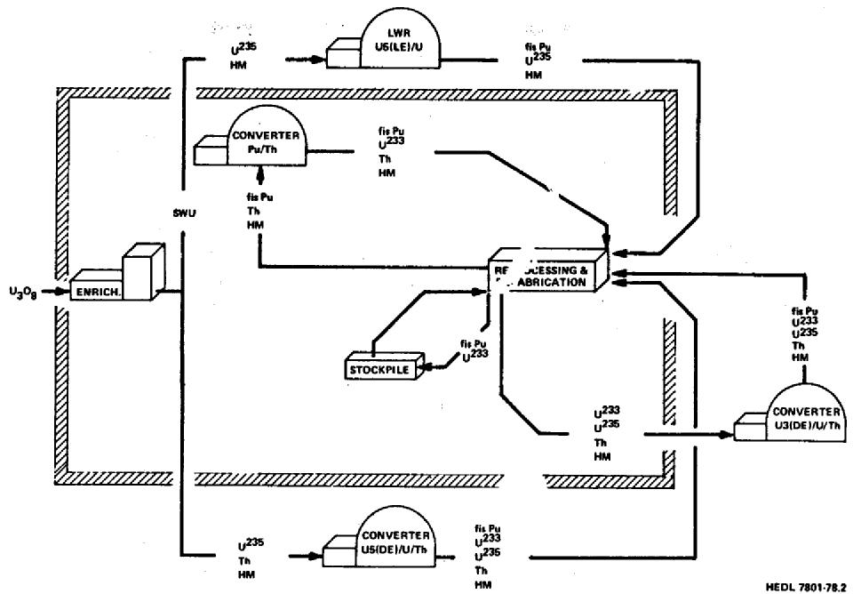  
Option 5U: In this option, LEU $(^{235}\mathrm{U} / ^{238}\mathrm{U})$ converters and denatured $^{235}\mathrm{U}$ and $^{233}\mathrm{U}$ converters are operated outside the energy centers and Pu/Th converters are permitted inside the centers. Spent fuel is returned to the secure energy centers for reprocessing. The fissile uranium is recycled into the outside reactors and the plutonium into the inside reactors. The goal in this case is to minimize the amount of plutonium produced and to "transmute" all that is produced into $^{233}\mathrm{U}$ in the energy-center reactors.

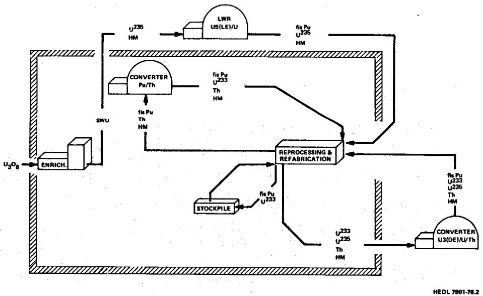  
Option 5T: In this option, LEU $(^{235}\mathrm{U} / ^{238}\mathrm{U})$ converters and denatured $^{233}\mathrm{U}$ converters are operated outside the energy centers and Pu/Th converters are permitted inside the centers. Spent fuel is returned to the secure energy centers for reprocessing. The fissile uranium is recycled into the outside reactors and the plutonium into the inside reactors. The goal in this case is not to minimize the amount of plutonium produced but to "transmute" all that is produced to $^{233}\mathrm{U}$ in the energy-center reactors.

Fig. 6.1-4. Options 6, 7, and 8: Denatured Uranium Options with Converters and Breeders.   
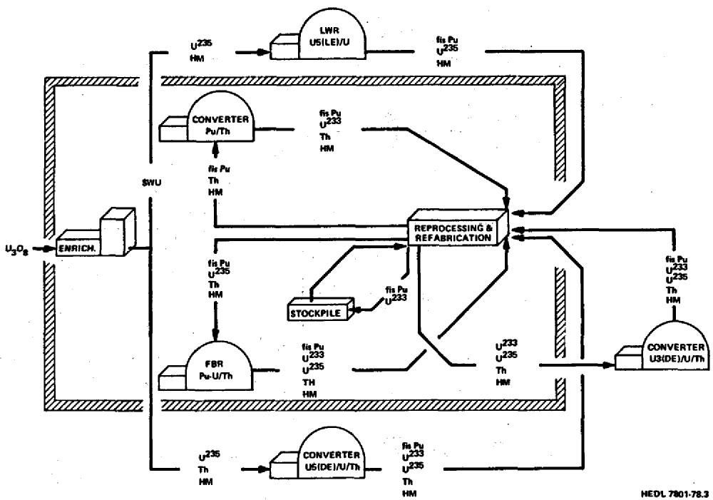  
Option 6: In this option, LEU $(^{235}\mathrm{U} / ^{238}\mathrm{U})$ converters and denatured $^{235}\mathrm{U}$ and $^{233}\mathrm{U}$ converters are operated outside the energy centers and Pu/Th converters and Pu-U/Th breeders (Pu-U cores, Th blankets) are permitted inside the centers. Spent fuel is returned to the secure energy centers for reprocessing. The fissile uranium is recycled into the outside reactors and the inside breeders, and the plutonium is recycled into the inside converters and breeders. With the reactors used, only a light "Pu-to- $^{233}\mathrm{U}"$ transmutation rate is realized.

The fuel cycle options assumed for the converters are as follows:

(1) Low-enriched $^{235}\mathrm{U} / ^{238}\mathrm{U}$ fuel, reactor operating on throwaway cycle;   
(2) Low-enriched $^{235}\mathrm{U} / ^{238}\mathrm{U}$ fuel, reprocessing and $^{235}\mathrm{U}$ recycle permitted;   
(3) Pu/U fuel, reprocessing and Pu and $^{235}\mathrm{U}$ recycle permitted (LWRs only);   
(4) Pu/Th fuel, reprocessing and Pu and $^{233}\mathrm{U}$ recycle permitted;   
(5) Denatured $^{233}\mathrm{U} / ^{238}\mathrm{U} / \mathrm{Th}$ fuel, reprocessing and $^{233}\mathrm{U}$ and Pu recycle permitted.

For the case of the FBR, the fuel options are

(1) Pu/U fuel in core, Th in blankets, reprocessing and Pu and $^{233}\mathrm{U}$ recycle permitted;   
(2) Pu/Th fuel in core, Th in the blankets, reprocessing and Pu and $^{233}\mathrm{U}$ recycle permitted.

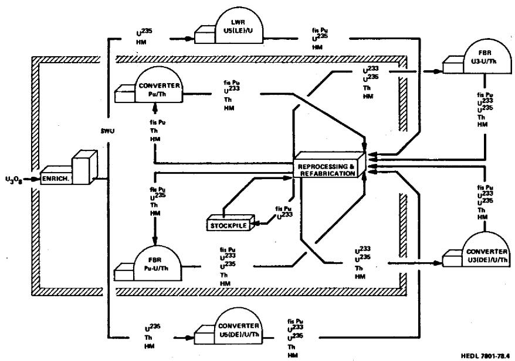  
Option 7: In this option, LEU $(^{235}\mathrm{U} / ^{238}\mathrm{U})$ converters, denatured $^{235}\mathrm{U}$ and $^{233}\mathrm{U}$ converters, and denatured $^{233}\mathrm{U}$ breeders are operated outside the energy centers and Pu/Th converters and Pu-U/Th breeders (Pu-U cores, Th blankets) are permitted inside the centers. Spent fuel is returned to the secure energy centers for reprocessing. The fissile uranium is recycled into the outside reactors and the inside breeders, and the plutonium is recycled in the inside converters and breeders. With the reactors used, only a light "Pu-to- $^{233}\mathrm{U}$ " transmutation rate is realized. This case represents the first time a denatured breeder is introduced in the system.

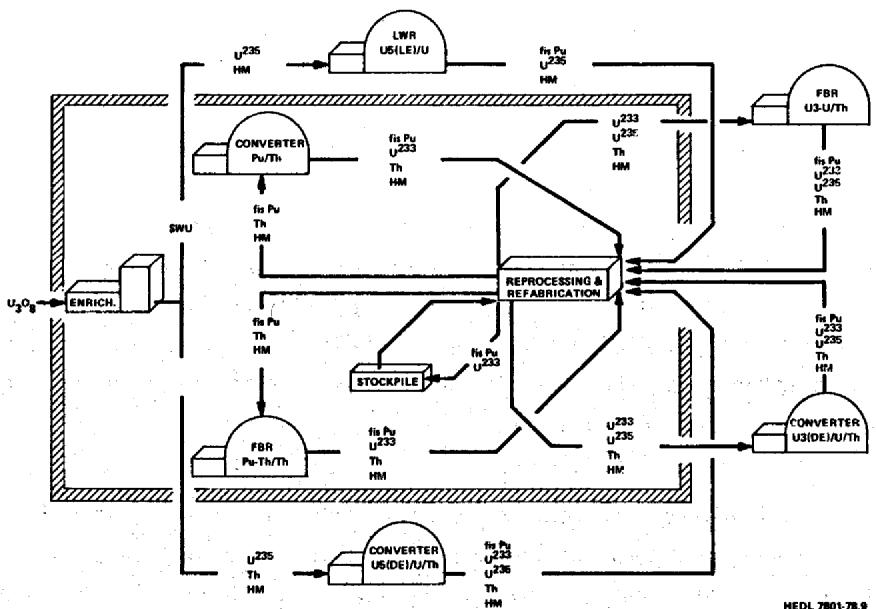  
Option 8: In this option, LEU $(^{235}\mathrm{U} / ^{238}\mathrm{U})$ converters, denatured $^{235}\mathrm{U}$ and $^{233}\mathrm{U}$ converters, and denatured $^{233}\mathrm{U}$ breeders are operated outside the energy centers and Pu/Th converters and Pu-Th/Th breeders (Pu-Th cores, Th blankets) are permitted inside the centers. Spent fuel is returned to the secure energy centers for reprocessing. The fissile uranium is recycled into the outside reactors and the plutonium into the inside reactors. With the reactors used, a heavy "Pu-to- $^{233}\mathrm{U}"$ transmutation rate is realized. Again, a denatured breeder is utilized in the system.

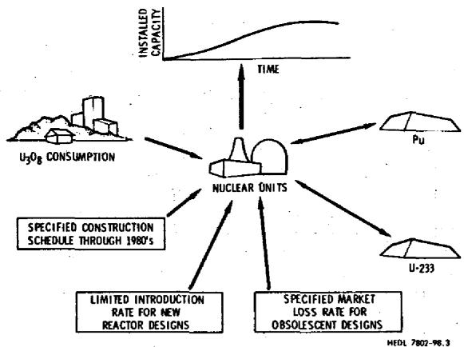  
Fig. 6.1-5. Model for Nuclear Systems Assessment Study.

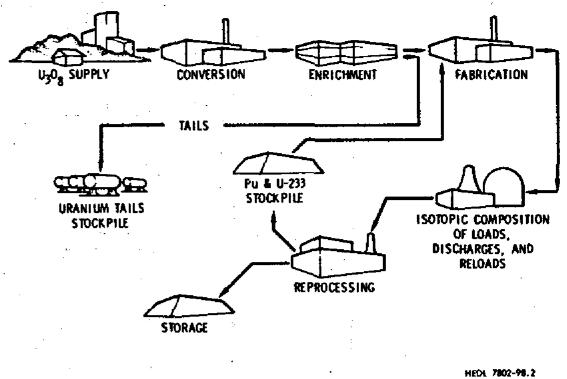  
Fig. 6.1-6. .Nuclear Fuel-Cycle Model.

As Fig. 6.1-7 illustrates, the total levelized power cost of a reactor concept insofar as an intercomparison of concepts is concerned is dominated by the uncertainties. In particular, the total power costs for those concepts possessing the greatest resource saving (the HwR and the FBR) exhibit the greatest uncertainties. The effect of the price of \( U_{3}O_{8} \) is also significant. Figure 6.1-7 shows that the total power cost of the LwR on the throwaway cycle is significantly lower if the price of \( U_{3}O_{8} \) in the year of startup is \(40/lb\) rather than \)140/lb.

The levelized power costs given for each reactor system in Fig. 6.1-7 were determined from the sum of the discounted values of the cash flows associated with the system divided by the discounted electrical energy production. The cash flows considered were: (1) capital investment, including the return of the investment and the return on the investment; (2) fixed charges, such as capital replacements, nuclear liability insurance, etc.; (3) operation and maintenance costs; (4) income taxes; and (5) fuel expenses. The first four items are relatively straightforward, with the relevant data given in Appendix B. The fifth item, however, merits some additional discussion, particularly as fuel expenses relate to the valuation of the bred fissile material. For these calculations the cost of bred fissile material was taken to be the "shadow price," which is the value of an additional unit of fissile material to the particular scenario in question.

The shadow price calculated for the bred fissile material is directly related to the $\mathsf{U}_3\mathsf{O}_8$ prices at and subsequent to the valuation point in time. The value of the bred fissile material thus increases with increasing $\mathsf{U}_3\mathsf{O}_8$ price which in turn increases as a function of the cumulative quantity consumed. For the resource-limited scenarios, an additional unit of $^{233}\mathsf{U}$ or $\mathsf{Pu}$ will postpone the purchase of an equivalent amount of $\mathsf{U}_3\mathsf{O}_8$ , the delay having a dollar value due to the use of discounted cash flows. For those scenarios which are not resource-limited, an additional unit of bred fissile material permits the elimination of an equivalent amount of $\mathsf{U}_3\mathsf{O}_8$ .

TIME FRAME: 2010 TO 2040

U2O PRICE: 140 $/IN YEAR OF STARTUP INCREASING TO

180 $/AT THE END OF THE PLANT LIFE

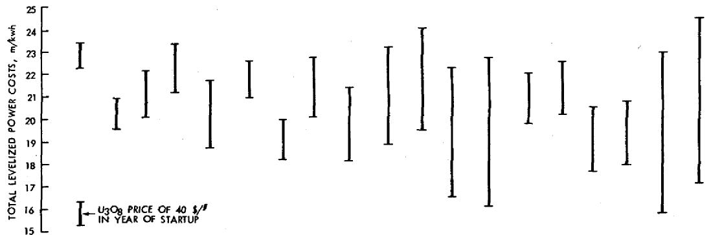

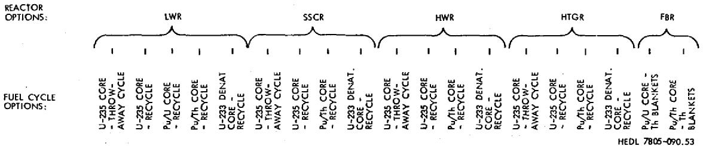  
Fig. 6.1-7. Total Levelized Power Cost Sensitivity to Capital, Fabrication, and Reprocessing Cost Uncertainties.

Since the valuation of the bred fissile material is related to the cumulative $\mathsf{U}_3\mathsf{O}_8$ price structure, the rate at which the $\mathsf{U}_3\mathsf{O}_8$ is consumed during a particular scenario also affects the time-dependent price calculated for the bred fissile material. Rapid consumption of the resource base (i.e., a high energy demand) yields a rapidly rising shadow price. Such an effect is readily noticeable in the calculation of the power costs of breeder reactors since it is possible for the credit calculated for the bred material to exceed the period's charges for the reactor's inventory. Thus, the net fuel expense for certain systems producing highly valued fissile material can be negative, resulting in significant power cost differences when compared to the reactor systems operating with high-cost natural resources. This type of phenomenon is illustrated schematically by Fig. 6.1-8 in which the power costs of a fast breeder and of an LEU-LWR are plotted as a function of $\mathsf{U}_3\mathsf{O}_8$ price. The rising power cost of the LWR is directly attributable to the increasing fuel expense caused by the $\mathsf{U}_3\mathsf{O}_8$ price. The declining fast reactor power cost reflects the increasing value of (and hence larger credit for) the bred material when compared to $\mathsf{U}_3\mathsf{O}_8$ -derived fissile material.

The situation is still complicated even if one considers only the conceptually simple case of the throwaway cycle. From Fig. 6.1-9, where for simplicity the price of $U_{3}O_{8}$ was assumed to be constant over the life of the plant, it appears that the LWR is the least expensive reactor when the $U_{3}O_{8}$ price is less than $\\(60/1b$ , and that the HWR will be less expensive than the LWR when the $U_{3}O_{8}$ price is greater than $\$ 160/1b \). However, an examination of the uncertainties leads one again to the conclusion that they dominate the problem, and that conclusions based on economic arguments are tenuous at best. Thus, the decision was made to construct or not construct a nuclear unit on the basis of its ability to extend the $U_{3}O_{8}$ supply rather than on its relative cost.

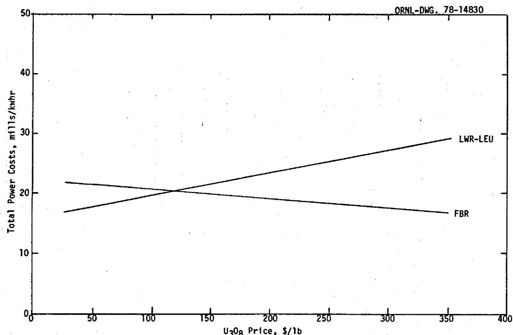  
Fig. 6.1-8. Influence of $\mathsf{U}_3\mathsf{O}_8$ Prices on Total Power Costs.

Fig. 6.1-9. Total Power Cost of Various Reactor Systems as a Function of $U_{3}O_{8}$ Price (Constant $U_{3}O_{8}$ Price with Time; Once-Through Option).   
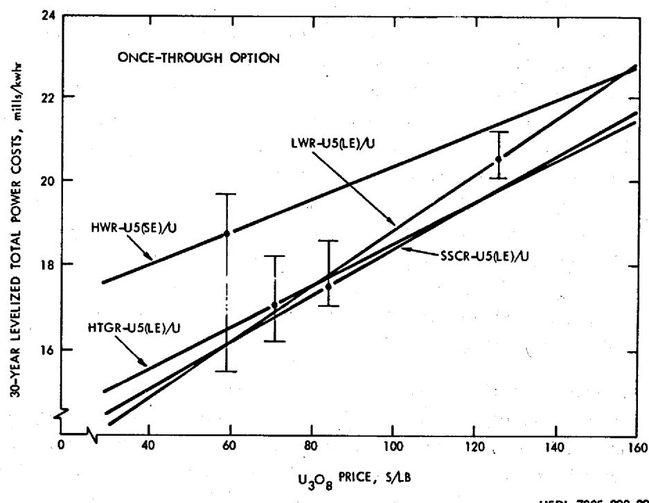  
HEDL 7805-090.39

# 6.2. DISCUSSION OF RESULTS FOR SELECTED NUCLEAR POLICY OPTIONS

This section discusses results obtained in this study for a selected set of nuclear system options that typify the role of nuclear power under different nuclear policy decisions. The intent is to identify the basic issues, to determine the logical consequences of decisions made in accordance with those issues, and to display the consequences in an illustrative manner. Detailed results for all the nuclear system options outlined in Section 6.1 are presented in Appendix C.

# 6.2.1. The Throwaway/Stowaway Option

The throwaway/stowaway cycle (see Fig. 6.1-1) is a conceptually simple nuclear system option and therefore has been selected as the reference cycle against which all other op-

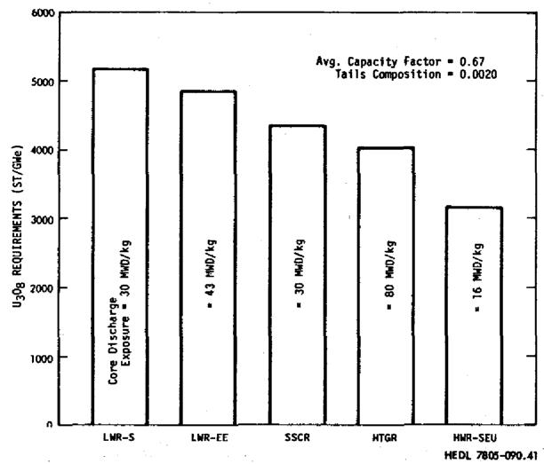  
Fig. 6.2-1. Lifetime $\mathsf{U}_3\mathsf{O}_8$ Requirements for Various Reactors on the Throwaway Cycle.

tions are compared. In order to thoroughly understand the implications of the throwaway cycle, the effect of several deployment options utilizing the various advanced converters on the throwaway cycle was analyzed in detail. In general, the analysis assumed a nuclear growth rate of 350 GWe in the year 2000 followed by a net increase of 15 GWe/yr, but the consequences of a significant reduction in the nuclear growth rate were also considered. In addition, the effect of both the high-cost and the intermediate-cost $\mathsf{U}_3\mathsf{O}_8$ supplies was determined.

A summary of the 30-yr $\mathsf{U}_3\mathsf{O}_8$ requirements for several reactors on the throwaway cycle, including an LWR with a fuel system designed for an extended discharge exposure, is shown in Fig. 6.2.1. In each case, the average capacity factor of the reactor was assumed to be 0.67, and the tails composi

tion of the enrichment plant was assumed to be 0.0020. As the figure indicates, all the reactors have lower $\mathsf{U}_3\mathsf{O}_8$ requirements than the standard LWR, the extended-discharge LWR being 6% lower, the SSCR 16% lower, the HTGR 23% lower, and the slightly enriched HwR 39% lower. These $\mathsf{U}_3\mathsf{O}_8$ requirements were calculated for essentially standard designs without elaborate design optimization. It is recognized that design optimization could improve the reactor performance characteristics; however, the goal of this analysis was not to delineate the ultimate role of any particular reactor concept based on current performance characteristics, but rather to identify the probable role of each reactor concept and the incentive for improving its performance characteristics.

The potential nuclear contribution with LWRs on the throwaway cycle, both with and without a fuel system designed for extended exposure being included, is shown in Fig. 6.2-2 for the high-cost $\mathsf{U}_3\mathsf{O}_8$ supply. The nuclear contribution passes through a maximum of approximately 420 GWe installed capacity in about 2010 and declines continuously thereafter, the system with the LWR-EE providing a slightly greater capacity over most of the period.* The cumulative capacity constructed throughout the planning horizon is approximately 600 GWe. The maximum installed capacity is less than the cumulative capacity because new units must be constructed to replace those retired during the period. The maximum annual $\mathsf{U}_3\mathsf{O}_8$ requirement is 72,000 ST/yr and the maximum annual enrichment requirement is 45 million SWU/yr, neither of which can be regarded as excessive. Thus, the principal limitation, in this case, is simply the size of the economic $\mathsf{U}_3\mathsf{O}_8$ supply.

A more costly $\mathsf{U}_3\mathsf{O}_8$ supply would, of course, imply a smaller maximum installed capacity occurring earlier in time, while the converse would be true for a cheaper $\mathsf{U}_3\mathsf{O}_8$ supply. As is shown in Fig. 6.2.3, if the $\mathsf{U}_3\mathsf{O}_8$ supply were a factor of two larger, the maximum nuclear contribution would increase from approximately 420 GWe to approximately 730 GWe and would occur at about the year 2030. If, on the other hand, the supply were a factor of two smaller, the maximum nuclear contribution would decrease to approximately 250 GWe and would occur in about the year 2000. A cross-plot of the effect of the $\mathsf{U}_3\mathsf{O}_8$ supply on the maximum installed nuclear capacity for the LWR on the throwaway cycle is shown in Fig. 6.2-4. It is noted in Fig. 6.2-8 that if the $\mathsf{U}_3\mathsf{O}_8$ supply should be as large as 6.0 million ST, the maximum annual $\mathsf{U}_3\mathsf{O}_8$ requirement would be 120,000 ST/yr and the maximum annual enrichment requirement would be 77 million SWU/yr. Given the probable limitation on the amount of $\mathsf{U}_3\mathsf{O}_8$ that could be mined and milled annually, these annual $\mathsf{U}_3\mathsf{O}_8$ requirements could be the limiting factor.

The effect of adding an advanced converter (SSCR, HTGR, or HwR) to a nuclear power system operating on the throwaway cycle with the high-cost $\mathsf{U}_3\mathsf{O}_8$ supply is shown in Fig. 6.2-5. The increase in the nuclear contribution for each of the advanced converter options is relatively small. At most the maximum installed nuclear capacity increases by approximately 30 GWe and the year in which the maximum occurs by approximately three years. Adding the SSCR to an LWR produces a slightly greater nuclear contribution than adding an HTGR. This may at first appear to be a paradox since the lifetime $\mathsf{U}_3\mathsf{O}_8$ requirement for the HTGR is less than that for the SSCR (see Fig. 6-2.1), but the 4-yr difference in introduction dates is sufficient to offset the difference in $\mathsf{U}_3\mathsf{O}_8$ requirements. (The difference is not large enough to be significant, however.) The reason that so small an increase in nuclear capacity is realized by introducing the various converters is that by the time they dominate the nuclear system a very significant fraction of the $\mathsf{U}_3\mathsf{O}_8$ supply has already been committed to the standard LWR. This is illustrated in Fig. 6.2-6, where an HwR introduced in 1995 does not become dominant until 2010. It follows that if the $\mathsf{U}_3\mathsf{O}_8$ supply were larger with the same nuclear growth rate, or if the nuclear growth rate were smaller with the same $\mathsf{U}_3\mathsf{O}_8$ supply, the addition of an advanced converter would have a greater impact. This is illustrated in Fig. 6.2-7, for which the intermediate-cost $\mathsf{U}_3\mathsf{O}_8$ supply was assumed, and

*Note: In general, unless a system consisting of the standard LWR alone is designated, it is the LWR system including an LWR-EE that is denoted as 1L and compared with other systems in later sections of this chapter. However, as pointed out here, the installed capacities of the two LWR systems differ only slightly.

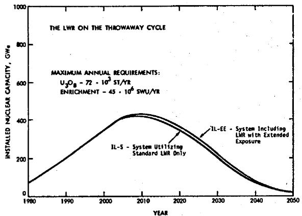  
Fig. 6.2-2. The Nuclear Contribution of LWRs on the Throwaway Cycle (High-Cost $U_{3}O_{8}$ Supply).

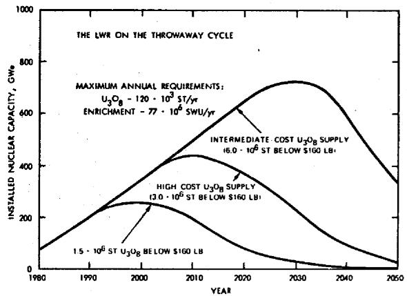  
Fig. 6.2-3. The Effect of $\mathsf{U}_3\mathsf{O}_8$ Supply on the Nuclear Contribution of LWRs on the Throwaway Cycle.

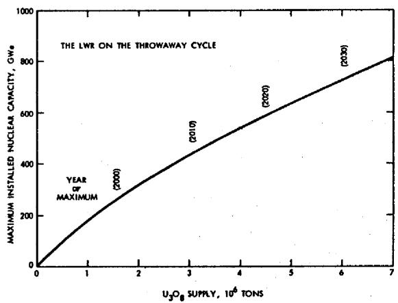  
Fig. 6.2-4. The Effect of $\mathsf{U}_3\mathsf{O}_8$ Supply on the Maximum LWR Installed Nuclear Capacity.

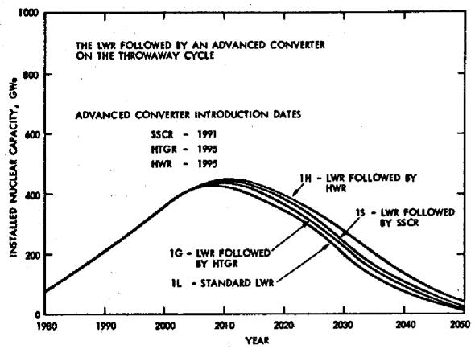  
Fig. 6.2-5. The Effect on the Nuclear Contribution of Adding Advanced Converters on the Throwaway Cycle (High-Cost $\mathsf{U}_3\mathsf{O}_8$ Supply).

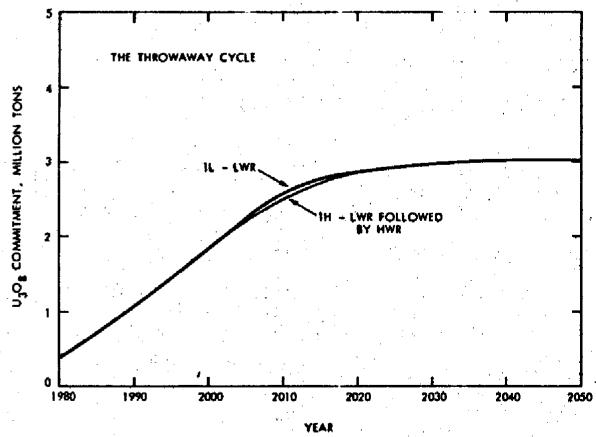  
Fig. 6.2-6. The $\mathsf{U}_3\mathsf{O}_8$ Commitment versus Time for an LWR-HWR System on the Throwaway Cycle (High-Cost $\mathsf{U}_3\mathsf{O}_8$ Supply).

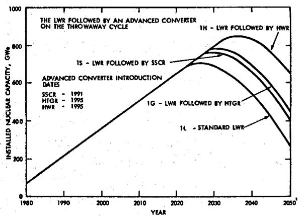  
Fig. 6.2-7. The Effect on the Nuclear Contribution of Adding Advanced Converters on the Throwaway Cycle (Intermediate-Cost $U_{3}O_{8}$ Supply).

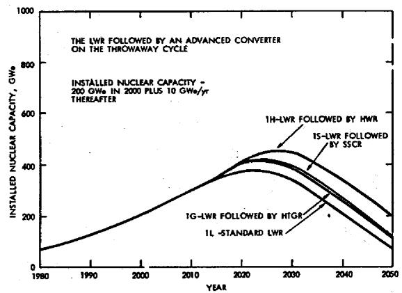

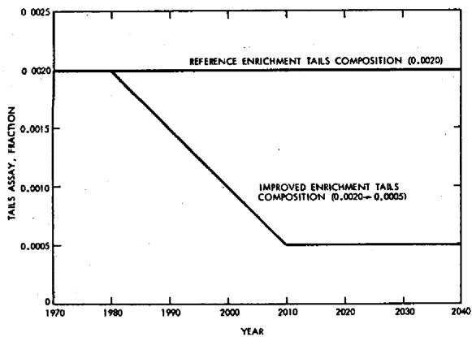  
Fig. 6.2-8. The Effect on the Nuclear Contribution of Adding Advanced Converters on the Throwaway Cycle (200 GWe in 2000 plus 10 GWe/yr Thereafter) (High-Cost $\mathsf{U}_3\mathsf{O}_8$ Supply).   
Fig. 6.2-10. The Enrichment Tails Composition as a Function of Time for the Reference Case and for an Improving Tails Strategy.

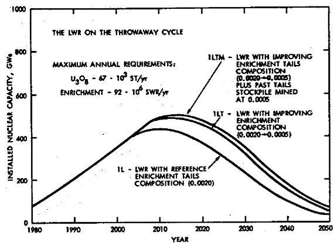  
Fig. 6.2-9. The Effect of Enrichment Tails Composition on the Nuclear Contribution with the LWR on the Throwaway Cycle (High-Cost $\mathsf{U}_3\mathsf{O}_8$ Supply).

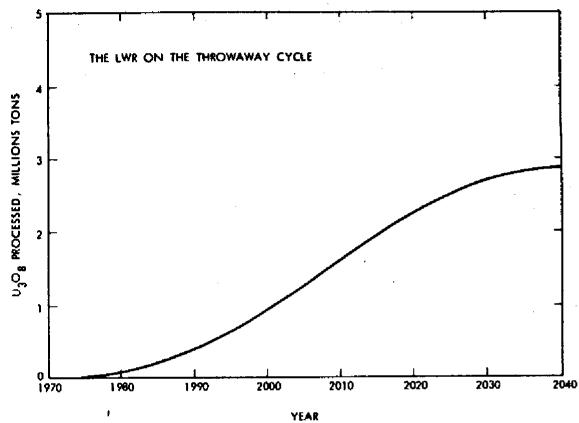  
Fig. 6.2-11. The Amounts of $\mathsf{U}_3\mathsf{O}_8$ Processed Through the Enrichment Plants as a Function of Time for the LWR on the Throwaway Cycle (High-Cost $\mathsf{U}_3\mathsf{O}_8$ Supply).

in Fig. 6.2-8, for which a reduced growth rate was assumed. With the intermediate-cost supply, the effect of the 4-yr difference in introduction dates between the SSCR and the HTGR is no longer significant, and the HTGR makes the greater contribution.

The effect of changing the enrichment tails composition upon the nuclear contribution with the LWR on the throwaway cycle is shown in Fig. 6.2-9 in which the reference case with a constant enrichment tails composition of 0.0020 is compared with two other cases: one in which the enrichment tails composition decreases linearly from 0.0020 in 1980 to 0.0005 in 2010 and remains constant thereafter; and another in which the tails composition similarly decreases and in addition the tails stockpile accumulated prior to 2010 is mined at a later date with a tails composition of 0.0005. The decreasing enrichment tails composition, shown in Fig. 6.2-10, is the industry average, and hence the improving tails strategy implies lowering the tails composition of the gaseous diffusion plants beginning in 1980. In addition, the strategy implies a continual transition toward an industry based upon an enrichment process capable of operating at an average tails composition of 0.0005.

The effect of applying the improving tails strategy to a nuclear system based on the throwaway cycle is to increase the maximum installed nuclear capacity by approximately 60 GWe and to delay the maximum by approximately five years (see Fig. 6.2-9). Mining the tails stockpile accumulated prior to 2010 does not significantly change the result. The reason that mining the past tails stockpile does not produce a significantly larger nuclear contribution is explained by Fig. 6.2-11, which shows the cumulative amount of $\mathsf{U}_3\mathsf{O}_8$ processed through the enrichment plants as a function of time. The amount is considerably less than the amount of $\mathsf{U}_3\mathsf{O}_8$ committed at any given time, as shown in Fig. 6.2-6. It is important to note that the amount of $\mathsf{U}_3\mathsf{O}_8$ actually processed through the enrichment plants prior to 1990 is relatively small, and at this time the tails composition for the improving tails strategy has been decreasing linearly for 10 yr. Thus, most of the $\mathsf{U}_3\mathsf{O}_8$ in the improving tails case is processed at lower tails compositions, and mining the past stockpile does not produce a significant improvement. The most dramatic effect associated with the improving tails option is the increase in the maximum annual enrichment requirement. As indicated in Fig. 6.2-9, the maximum annual $\mathsf{U}_3\mathsf{O}_8$ requirement for this option is 67,000 ST/yr, while the maximum annual enrichment requirement is 92 million SWU/yr. Thus, the principal limitation in this case would be the availability of enrichment capacity.

The utilization and movement of fissile material per GWe of installed capacity in the year 2035 for each of the converter options is shown in Fig. 6.2-12a-d, assuming the high-cost $\mathsf{U}_3\mathsf{O}_8$ supply. These figures represent a snapshot of the system in time and include the first core loadings for units starting up in the year 2036. As can be seen, the $\mathsf{U}_3\mathsf{O}_8$ consumption for Case 1L in the year 2035 is approximately 142 ST $\mathsf{U}_3\mathsf{O}_8 / \mathsf{GWe}$ , with the LWRs having an extended discharge exposure comprising 92% of the installed capacity. When the LWRs are followed by SSCRs (Case 1S), the annual $\mathsf{U}_3\mathsf{O}_8$ consumption is 135 ST $\mathsf{U}_3\mathsf{O}_8$ , with the SSCR comprising 74% of the installed capacity. The fractional installed capacity of the SSCR is less than that of the extended-exposure LWR in Case 1L because the extended-exposure LWR is introduced in 1981 while the SSCR is not introduced until 1991. In general, the fractional installed capacity of a reactor concept in the year 2035 will decrease monotonically as the introduction date for the concept increases. Similarly, the fractional installed nuclear capacity of a reactor concept will increase monotonically as its $\mathsf{U}_3\mathsf{O}_8$ requirement decreases.

When the LWRs are followed by HTGRs (Case 1G), the $U_{3}O_{8}$ consumption in the year 2035 is 133 ST $U_{3}O_{8} / GWe$ , with the HTGR comprising 54% of the installed capacity. The annual $U_{3}O_{8}$ consumption is lower than in Case 1S because the $U_{3}O_{8}$ requirement of the HTGR is less than that of the SSCR (see Table 6.1-2 and Fig. 6.2-1). The fractional installed capacity of the HTGR is less than that of the SSCR in the Case 1S because the SSCR is introduced in 1991 while the HTGR is not introduced until 1995.

When HWRs follow the LWRs (Case 1H), $\mathsf{U}_3\mathsf{O}_8$ consumption in year 2035 is approximately 106 ST $\mathsf{U}_3\mathsf{O}_8 / \mathsf{GWe}$ and the HwR comprises 79% of the installed capacity. The HwR in this case and the HTGR in Case 1G have the same introduction date. The HwR, however, has a lower $\mathsf{U}_3\mathsf{O}_8$ requirement and hence the total installed nuclear capacity is greater with this

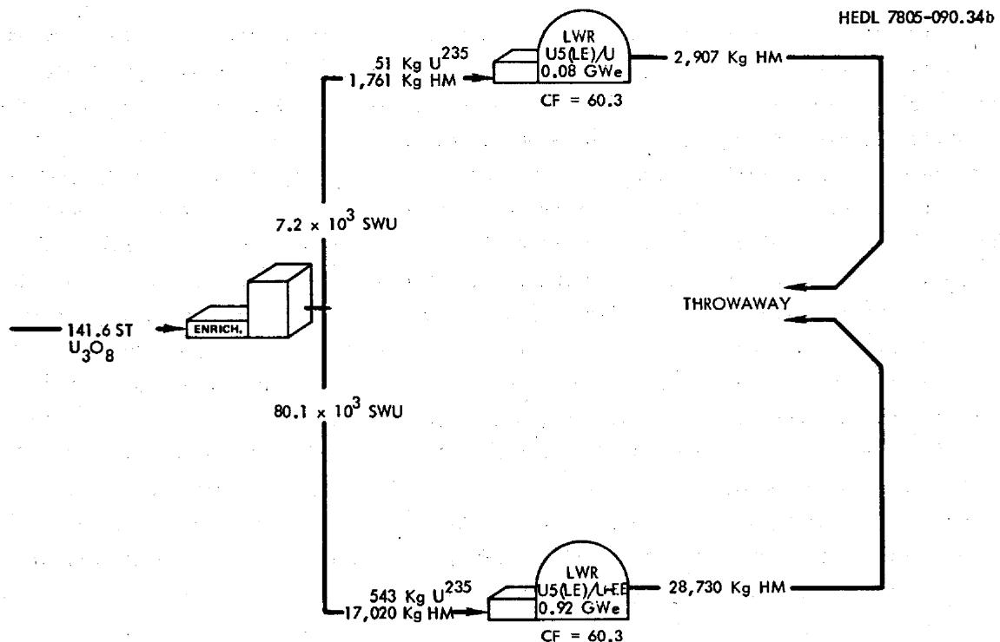  
6-28   
(a) Case 1L: LWRs Only; High-Cost $\mathsf{U}_3\mathsf{O}_8$ Supply.

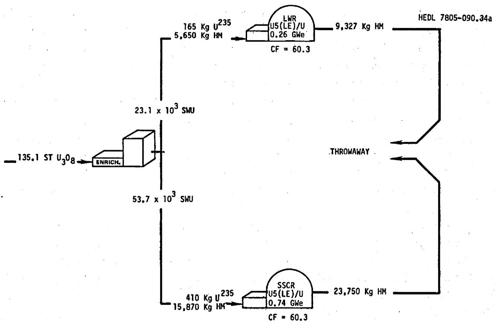  
(b) Case 1S: LWRs Followed by SSCRs; High-Cost $\mathsf{U}_3\mathsf{O}_8$ Supply.   
Fig. 6.2-12. Utilization and Movement of Fissile Material in Nuclear Systems Consisting of Converters Operating on Throwaway/Stowaway Cycle (year 2035). (Note: Except for Case 1L, which utilizes the extended exposure LWR, all LWRs included here and in subsequent systems are standard LWRs.)

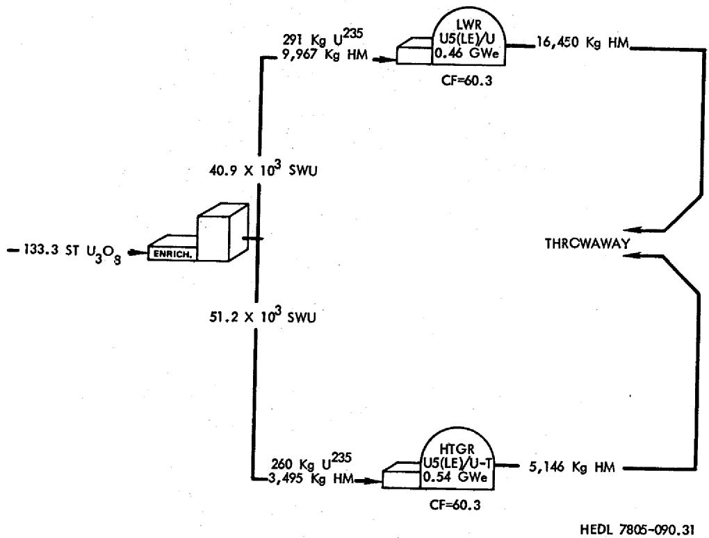  
Fig. 6.2-12 (cont.)   
(c) Case 1G: LWRs Followed by HTGRs; High-Cost $\mathsf{U}_3\mathsf{O}_8$ Supply.

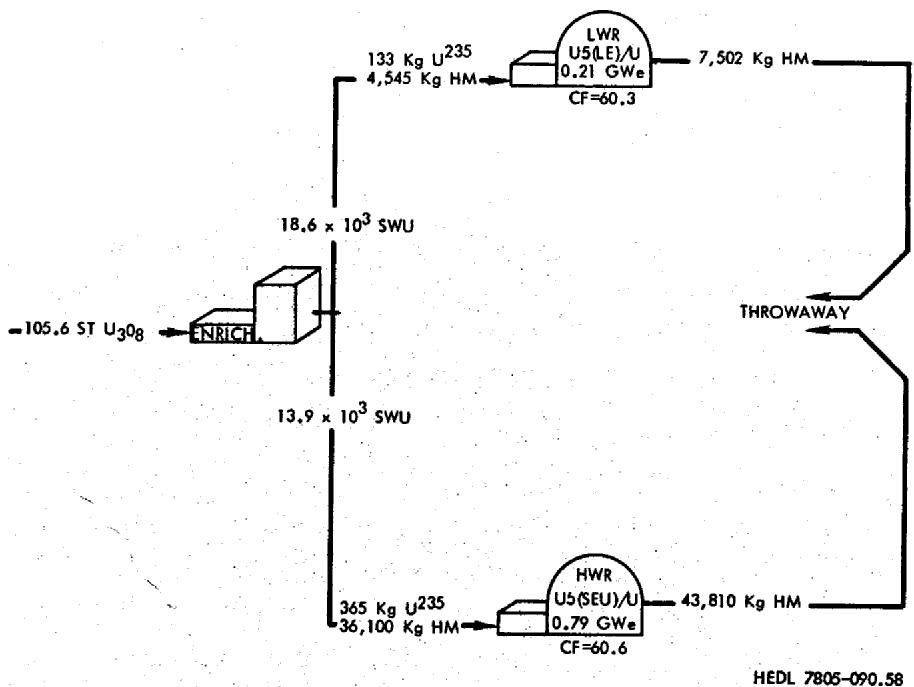  
(d) Case 1H: LWRs Followed by HWRs; High-Cost $\mathsf{U}_3\mathsf{O}_8$ Supply.

reactor. Since this increase is due simply to the construction of additional HwRs, the fractional installed capacity of the HwR is increased commensurately.

In summary, using the assumptions contained in this study, the following conclusions can be drawn about the behavior of a nuclear power system operating on the throwaway option:

(1) The effect of deploying an advanced converter in 1995, under the assumption of 350 GWe in the year 2000 and 15 GWe/yr thereafter with the high-cost $\mathsf{U}_3\mathsf{O}_8$ supply, would be small.   
(2) If the $U_{3}O_{8}$ supply available below $\$160/1b$ should be larger than 3 million ST, or if the nuclear growth should be smaller than assumed above, then the effect of deploying the advanced converter would be larger.   
(3) The effect of reducing the enrichment tails composition is somewhat larger than that of deploying an advanced converter under the assumed conditions.   
(4) The dominant variable for the nuclear power system on the throwaway cycle is the $U_{3}O_{8}$ supply; a $U_{3}O_{8}$ supply either twice as large or twice as small is of greater consequence than any of the effects discussed above.

# 6.2.2. Converter System with Plutonium Recycle

In order to assess the option of plutonium recycle in converters it was assumed that a reprocessing capability would be available in 1991. (This assumption does not argue that the reprocessing capacity would be economically attractive or diversion-resistant, but merely that it would be technologically feasible by this date.) In this option the classical plutonium recycle was modified somewhat by rejecting converters with self-generated recycle in favor of converters with complete plutonium loads. This has the advantage of reducing the number of reactors that must be placed in the energy centers and commensurate-ly increases the number of reactors that can be placed outside the centers. The individual reactor concepts and their locations are shown in Fig. 6.1-2 (Option 2).

A comparison of the nuclear contribution of the LWR with plutonium recycle to that of the LWR on the throwaway cycle (Fig. 6.2-13) shows that with recycle the maximum installed nuclear capacity is increased from approximately 420 GWe to approximately 600 GWe and the time at which the maximum occurs is increased from about year 2010 to about year 2020 (high-cost $U_{3}O_{8}$ supply). The maximum annual $U_{3}O_{8}$ requirement for this case is 67,000 ST/yr and the maximum annual enrichment requirement is 46 million SWU/yr. These

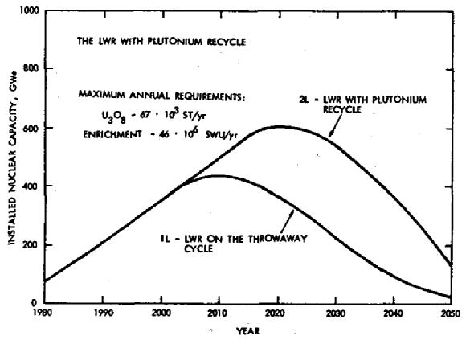  
Fig. 6.2-13. The Effect on the Nuclear Contribution of Recycling Plutonium in LWRs (High-Cost $\mathsf{U}_3\mathsf{O}_8$ Supply).

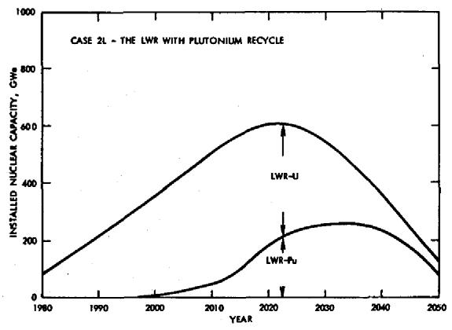  
Fig. 6.2-14. Relative Nuclear Contributions of LWRs Located Inside (LWR-Pu) and Outside (LWR-U) Energy Centers (High-Cost $U_{3}O_{8}$ Supply).

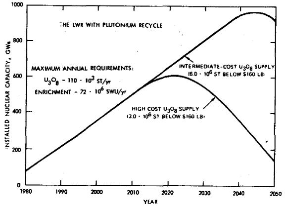  
Fig. 6.2-15. The Effect of $\mathsf{U}_3\mathsf{O}_8$ Supply on the Nuclear Contribution of the LWR with Plutonium Recycle (Case 2L).

requirements do not differ significantly from those of the LWR on the throwaway cycle (see Fig. 6.2-2) because the nuclear growth projection was specified to be 350 GWe in the year 2000 plus 15 GWe/yr thereafter. Thus, the primary effect of reprocessing is to allow the nuclear system to grow beyond the 400-GWe level even though a scarcity of $\mathsf{U}_3\mathsf{O}_8$ exists at costs below $160/1b. Viewed differently, the primary effect of reprocessing is not to support the construction of additional nuclear units in the earlier years when $\mathsf{U}_3\mathsf{O}_8$ is in plentiful supply.

The installed nuclear capacity that must be located in the energy centers as a function of time is shown by the lower curve in Fig. 6.2-14, the difference between the two curves indicating the nuclear capacity that can be made available outside the centers. The maximum capacity which must be located in the energy centers is approximately 260 GWe, while a maximum of 400 GWe can be available outside the center. For approximately three decades (from the year 2000 to the year 2030), over 300 GWe can be available outside the centers. The use of plutonium recycle to allow the nuclear system to grow beyond the 400-GWe level as the $\mathsf{U}_3\mathsf{O}_8$ supply becomes scarce is vividly illustrated in Fig. 6.2-14. Note that the number of units loaded with plutonium increases significantly as the installed capacity exceeds the 400-GWe level and that they comprise an increasing fraction of the total installed capacity in later years.

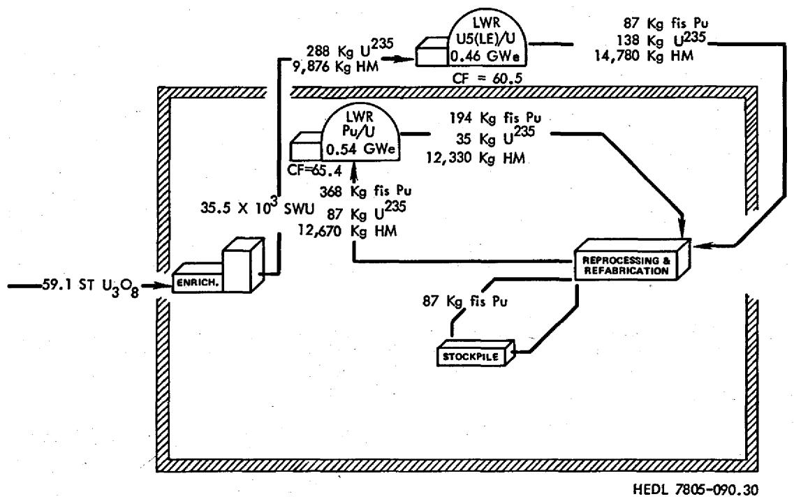  
Fig. 6.2-16. Utilization and Movement of Fissile Material in a Nuclear System Consisting of LWRs Operating with Plutonium and/or Uranium Recycle (Case 2L, High-Cost $U_{3}O_{8}$ supply) (Year 2035).

The effect of the intermediate-cost $\mathsf{U}_{3}\mathsf{O}_{8}$ supply on the LWR plutonium recycle case is shown in Fig. 6.2-15. With 6.0 million ST $\mathsf{U}_{3}\mathsf{O}_{8}$ below $160/lb, the maximum nuclear contribution would increase from approximately 600 GWe in the year 2020 to approximately 960 GWe in the year 2045. Thus, the $\mathsf{U}_{3}\mathsf{O}_{8}$ supply is again the dominant variable. The maximum annual $\mathsf{U}_{3}\mathsf{O}_{8}$ requirement would be 110,000 ST/yr and the maximum annual enrichment requirement would be 72 million SWU/yr. These annual requirements would constitute the principal limitation of the system.

The utilization and movement of fissile material per GWe of installed capacity for the LWR with plutonium recycle is shown in Fig. 6.2-16. Again this figure represents a snapshot of the system in time (in the year 2035) and includes both the first core loading for those reactors that are starting up and the last core discharge for those reactors that are shutting down. The annual $\mathrm{U}_{3}\mathrm{O}_{8}$ consumption in 2035 is 59 ST $\mathrm{U}_{3}\mathrm{O}_{8} / \mathrm{GWe}$ , and the LWR utilizing plutonium comprises 54% of the installed capacity. Approximately 368 kg of fissile plutonium in fresh fuel per GWe of installed capacity per year must be handled within the energy centers for this case. (Note: Simply identifying the amount of fissile plutonium in fresh fuel that must be handled is not analogous to determining the diversion resistance of the system. While the amount of fissile plutonium being handled may be important, the state and location of the fissile plutonium and the procedures used to handle it are more important in assessing the diversion resistance of a system.)

In summary, a converter strategy based on LWRs with plutonium recycle could supply a maximum nuclear contribution of 600 GWe with a $U_{3}O_{8}$ supply of 3.0 million ST at below $\$160/1b$ . This is 180 GWe more than the maximum nuclear contribution obtained with the LWR on the throwaway cycle; however, it is less than the maximum nuclear contribution of 730 GWe obtainable on the throwaway cycle with a $U_{3}O_{8}$ supply of 6.0 million ST at below $\$160/1b$ . Also, converter strategy based on LWRs with plutonium recycle will require that as much as 260 GWe be located in the energy centers.

# 6.2.3. Converter System with Plutonium Throwaway

Under Option 4 (see Fig. 6.1-3) it is assumed that the nuclear policy is to defer use of plutonium until some indefinite future date and to operate all converters on low-enriched or denatured uranium. The activities in the energy center are thus limited to reprocessing, uranium fuel fabrication, and plutonium storage. As shown in Fig. 6.2-17, with the high-cost $\mathsf{U}_3\mathsf{O}_8$ supply, the nuclear contribution in this case reaches a maximum of approximately 590 GWe in about 2020, which is a significant increase over that of the $(\mathsf{U} + \mathsf{Pu})$ throwaway case, and, in fact, is quite comparable to the maximum nuclear capacity obtained with plutonium recycle. However, the reactors employed minimize the production of plutonium and therefore the amount ultimately thrown away. This, coupled with the fact that $^{233}\mathsf{U}$ is worth slightly more than $^{239}\mathsf{Pu}$ in a thermal reactor, allowed the system with plutonium throwaway to ultimately achieve the same nuclear contribution as the system with plutonium recycle.

The maximum annual $\mathsf{U}_3\mathsf{O}_8$ and enrichment requirements were found to be 80,000 ST/yr and 69 million SWU/yr. This ore requirement is 20% greater than that for the case of LWR plutonium recycle, and the enrichment requirement is 50% greater. The increases can be directly attributed to the $\mathsf{U}_3\mathsf{O}_8$ and enrichment requirements of the denatured LWR loaded with 15% $^{235}\mathsf{U}$ in $^{238}\mathsf{U}$ . As illustrated in Table 6.1-2, the lifetime $\mathsf{U}_3\mathsf{O}_8$ and enrichment requirements of this reactor are 24% and 64% greater than the same requirements for the standard LWR.

The effect of the intermediate-cost $\mathsf{U}_3\mathsf{O}_8$ supply for this case is shown in Fig. 6.2-18. The maximum nuclear contribution increases from approximately 590 GWe in about year 2020 to approximately 980 GWe in about year 2045. Again the contribution of the system is comparable to that of the LWR plutonium recycle case, and again the maximum annual $\mathsf{U}_3\mathsf{O}_8$ and enrichment requirements, 105,000 ST/yr and 100 million SWU/yr, respectively, will represent the principal limitations of the system.

The utilization and movement of fissile material per GWe of installed capacity for Case 4L in the year 2035 are shown in Fig. 6.2-19. The $\mathsf{U}_3\mathsf{O}_8$ consumption, including the first core loadings and last discharges, is 32 ST $\mathsf{U}_3\mathsf{O}_8 / \mathsf{GWe}$ . The standard LWR loaded with approximately 3% enriched $^{235}\mathsf{U}$ comprises 5% of the installed nuclear capacity, the denatured LWR loaded with 15% enriched $^{235}\mathsf{U}$ comprises 39%, and the denatured LWR loaded with 11% $^{233}\mathsf{U}$ in

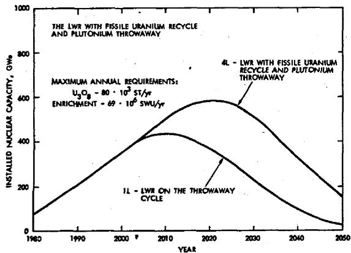  
Fig. 6.2-17. The Effect on the Nuclear Contribution of LWRs Operating with Fissile Uranium Recycle and Plutonium Throwaway (High-Cost $\mathsf{U}_3\mathsf{O}_8$ Supply).

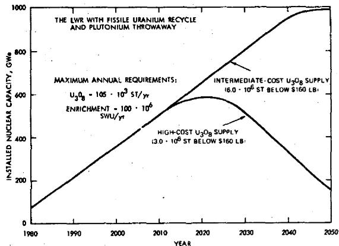  
Fig. 6.2-18. The Effect of the $\mathsf{U}_3\mathsf{O}_8$ Supply on the Nuclear Contribution of LWRs Operating with Fissile Uranium Recycle and Plutonium Throwaway (Case 4L).

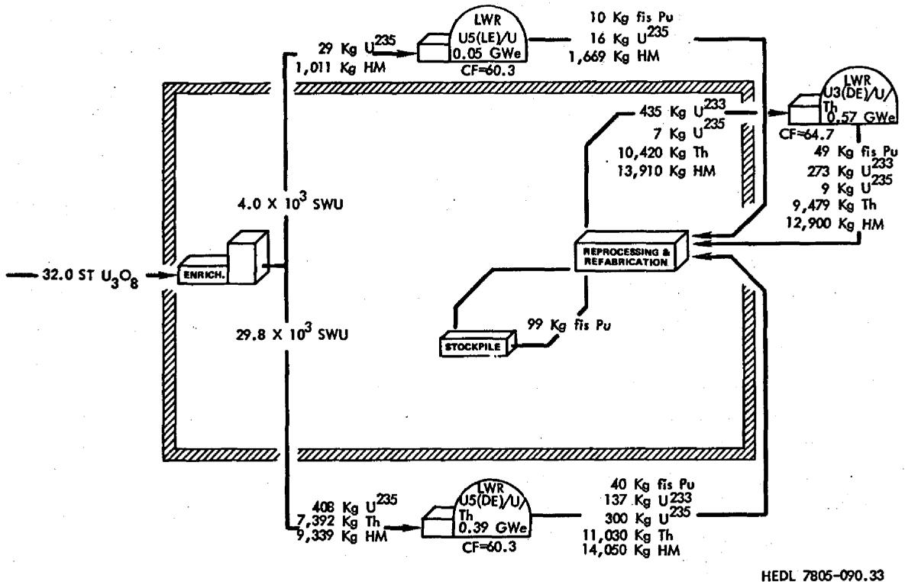  
Fig. 6.2-19. Utilization and Movement of Fissile Material in a Nuclear System Consisting of LWRs Operating with Fissile Uranium Recycle and Plutonium Throwaway (Case 4L, High-Cost $\mathsf{U}_3\mathsf{O}_8$ Supply) (Year 2035).

$^{238}\mathrm{U}$ comprises $57\%$ . The principal advantage associated with this option is that all nuclear units can be located outside the energy centers, which means that the amount of fissile plutonium in fresh fuel that must be handled in this system is zero. This advantage is not without cost, however; it requires the development of an industry capable of reprocessing significant quantities of fuel containing thorium and refabricating significant quantities of fuel containing $^{232}\mathrm{U}$ . In order to successfully implement this option, one must develop a nuclear industry in which approximately $95\%$ of the reprocessing capacity in the year 2035 is capable of handling fuel containing thorium and $57\%$ of the fabrication capacity is capable of handling fuel containing $^{232}\mathrm{U}$ .

In summary, if employed judiciously, a converter strategy based on the LWR can be developed which can discard all fissile plutonium and still supply a maximum nuclear contribution of 590 GWe with a $U_{3}O_{8}$ supply of 3.0 million ST below $\$160/\mathrm{lb}$ . This is essentially identical to that of the classical LWR plutonium recycle with the same $U_{3}O_{8}$ supply. With a $U_{3}O_{8}$ supply of 6.0 million ST below $\$160/\mathrm{lb}$ , the system could supply a maximum nuclear contribution of 980 GWe; however, as pointed out above, considerable development work would be required on fuel design and fabrication.

# 6.2.4. Converter System with Plutonium Production Minimized;

# Pu-to-233U "Transmutation"

An inherent disadvantage in the plutonium throwaway option discussed above is that the fissile plutonium produced in the system is never utilized. Therefore, it was considered desirable to analyze an option in which fissile plutonium produced in a similar system is used to produce $^{233}\mathrm{U}$ for the dispersed reactors. The $^{233}\mathrm{U}$ producer would be a converter with a plutonium-thorium core. This converter would, of course, be located in an energy center, while the other reactors would be located outside the center as shown in Fig. 6.1-3 (Option 5U). It is important to note that while this option utilizes all the plutonium produced in the system, it minimizes the amount of plutonium that is produced. This requires the development of reactor concepts designed specifically to minimize plutonium production.

The nuclear contribution of this option utilizing LWRs only (Case 5UL) reaches a maximum of approximately 700 GWe shortly before year 2030 (see Fig. 6.2-20). Thus, utilizing the plutonium produced in the system increases the maximum nuclear contribution by approximately 100 GWe over that of the option with plutonium throwaway; it also produces a delay in the maximum of about eight years (compare with Fig. 6.2-17). The maximum annual $\mathsf{U}_{3}\mathsf{O}_{8}$ and enrichment requirements for this option are 75,000 ST/yr and 65 million SWU/yr, respectively, each being approximately 6% less than that required for Option 4.

The amount of the system's installed nuclear capacity that must be located in the energy center is shown in Fig. 6.2-21 as a function of time. This option is distinguished by the fact that the maximum capacity that must be located in a secure region does not exceed 100 GWe at any time during the planning horizon. The amount that may be located outside the

energy center ranges from approximately 300 GWe in the year 2000 to approximately 600 GWe in the year 2025. The disadvantage of this option is that the high energy support ratio (the amount of capacity that can be located outside the energy center divided by the amount that must be located in the center) cannot be maintained indefinitely. In fact, the energy support ratio decreases continuously as the end of the $\mathsf{U}_3\mathsf{O}_8$ supply is approached.

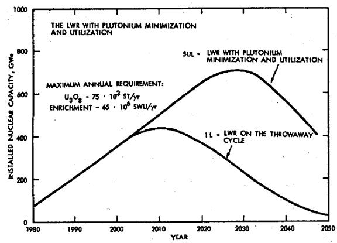  
Fig. 6.2-20. The Effect of Minimizing the Production and Use of Plutonium in LWRs (High-Cost $\mathsf{U}_3\mathsf{O}_8$ Supply).

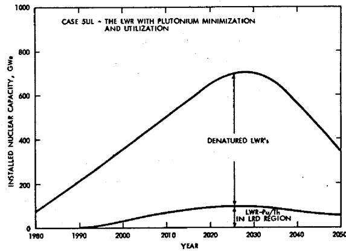  
Fig. 6.2-21. Relative Nuclear Contributions of LWRs Located Inside (LWR-Pu/Th) and Outside (Denatured LWRs) Energy Centers (Production and Use of Plutonium Minimized) (High-Cost U3O8 Supply).

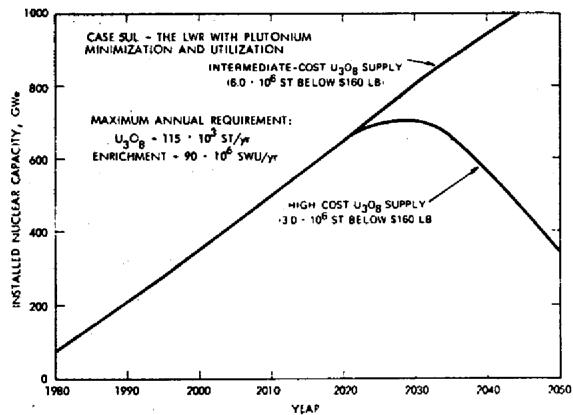  
Fig. 6.2-22. The Effect of $\mathsf{U}_3\mathsf{O}_8$ Supply on the Nuclear Contribution of LWRs Operating with Plutonium Minimization and Utilization.

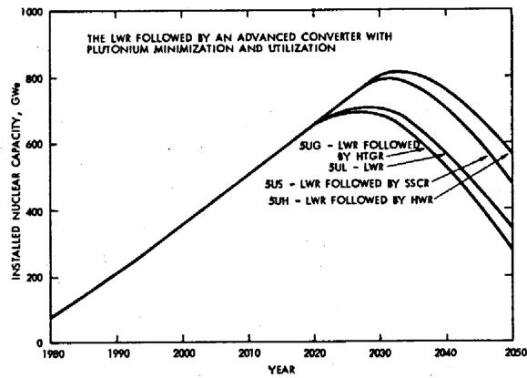  
Fig. 6.2-23. The Effect on the Nuclear Contribution of Adding Advanced Converters Operating with Plutonium Minimization and Utilization (High-Cost $\mathsf{U}_3\mathsf{O}_8$ Supply).

The high energy support ratio could be maintained for a longer period of time, however, if the $\mathsf{U}_{3}\mathsf{O}_{8}$ supply were larger. Figure 6.2-22 shows that doubling the $\mathsf{U}_{3}\mathsf{O}_{8}$ supply would increase the maximum nuclear contribution of the system from approximately 700 GWe in year 2030 to over 1000 GWe in year 2050. Since the maximum energy support ratio occurs at about the same time as the maximum nuclear contribution, it can be assumed that with the increased $\mathsf{U}_{3}\mathsf{O}_{8}$ supply a large energy support ratio could be maintained as far into the future as year 2050. Given the $\mathsf{U}_{3}\mathsf{O}_{8}$ supply, it would appear that the principal limitation for this option would be the maximum annual $\mathsf{U}_{3}\mathsf{O}_{8}$ and enrichment requirements, which are 115,000 ST/yr and 90 million SWU/yr, respectively.

The effect upon the nuclear contribution of adding advanced converters with the LWRs is shown in Fig. 6.2-23 for the high-cost $\mathsf{U}_3\mathsf{O}_8$ supply. The HwR has the largest effect, increasing the nuclear contribution of the system to approximately 810 GWe in year 2035. The larger effect of the advanced converters in this option compared to their effect in

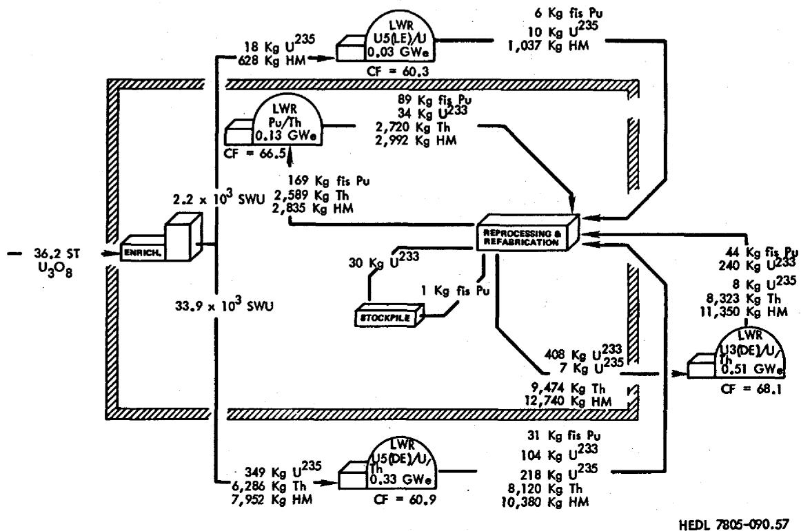  
Fig. 6.2-24. Utilization and Movement of Fissile Material in an LWR Nuclear System Minimizing the Production and Use of Plutonium (Case 5UL, High-Cost $\mathsf{U}_3\mathsf{O}_8$ Supply) (Year 2035).

the throwaway option for this ore supply is primarily due to the fact that reprocessing is available in this case. The availability of reprocessing effectively increases the amount of $\mathsf{U}_3\mathsf{O}_8$ available after the advanced converters are introduced and therefore increases the amount of $\mathsf{U}_3\mathsf{O}_8$ upon which the advanced converters can employ their resource savings.

The utilization and movement in year 2035 of fissile material per GWe of installed capacity for the system utilizing LWRs only (Case 5UL) is shown in Fig. 6.2-24.* The annual $U_{3}O_{8}$ consumption is approximately 36 ST $U_{3}O_{8}/G$ We. The LWR transmitting plutonium to $^{233}U$ is supplied with approximately 170 kg of fissile plutonium in fresh fuel per GWe of installed capacity and it comprises 13% of the installed capacity. This can be compared to the classical case of plutonium recycle in which approximately 54% of the installed capacity must

*The movement of fissile material in all cases is a function of time. Furthermore, it is affected by first-core charges and last-core discharges (which are included in Fig. 6.2-24 and subsequent similar figures). The fissile balance for a decaying (or growing) system differs significantly from that of a static system.

be located in energy centers and $368\mathrm{kg}$ of fissile plutonium in fresh fuel per GWe of installed capacity must be handled each year in those centers. This is not meant to imply that a decrease in the amount of nuclear capacity which must be placed in secure regions is synonymous with an increase in diversion-resistance. Neither is it meant to imply that a decrease in the amount of fissile plutonium which must be handled as fresh fuel is synonymous with an increase in proliferation resistance. If either of these items is desirable, however, this option minimizing the production and use of plutonium does offer a significant increase in the energy support ratio and a significant decrease in the amount of fresh-fuel plutonium that must be handled.

It is important to note that the deployment of the plutonium minimization and utilization option would require the development of a nuclear industry capable of reprocessing fuel containing thorium and refabricating fuel containing $^{232}\mathrm{U}$ . As Fig. 6.2-24 indicates, only one reactor providing $3\%$ of the installed capacity in year 2035 does not utilize thorium. Thus, in order to successfully implement this option, $97\%$ of the reprocessing capacity in year 2035 must be capable of handling fuel containing thorium, and $51\%$ of the fabrication capacity must be capable of handling fuel containing $^{232}\mathrm{U}$ .

In summary, a converter strategy based on the LWR which minimizes the amount of plutonium produced, but uses that which is produced, could supply a maximum nuclear contribution of 700 GWe with the high-cost $\mathsf{U}_3\mathsf{O}_8$ supply. This is approximately 100 GWe greater than the maximum nuclear contribution obtained in the case of plutonium throwaway and fissile uranium recycle. The strategy does, however, require that approximately 100 GWe be located in an energy center. With the intermediate-cost $\mathsf{U}_3\mathsf{O}_8$ supply, the system could make a maximum nuclear contribution of more than 1000 GWe. In either case, the development of fuel designs capable of minimizing the amount of plutonium produced and also the development of a nuclear industry capable of handling thorium-based fuels must be developed.

# 6.2.5. Converter System with Plutonium Production Not Minimized; Pu-to-233U "Transmutation"

This option differs from the preceding option in that the dispersed reactors are not designed to minimize the amount of plutonium produced. Thus more plutonium is handled as fresh fuel and more is "transmuted" into $^{233}\mathrm{U}$ . Again a converter with a plutonium-thorium core is located in the energy center, and other reactors are located outside the center (see Fig. 6.1-3, Option 5T).

Figure 6.2-25 shows that the nuclear contribution for this option using LWRs only (Case 5TL) reaches a maximum of approximately 640 GWe shortly before year 2025. The maximum contribution is less than the 700-GWe maximum in the preceding case primarily because of the different amounts of fissile plutonium utilized in the two systems. Since $^{239}\mathrm{Pu}$ is worth less in a thermal reactor than either $^{235}\mathrm{U}$ or $^{233}\mathrm{U}$ , the system which minimizes the amount of plutonium should (and does) make a slightly larger nuclear contribution.

The fraction of the installed nuclear capacity which for this case must be located in energy centers is shown in Fig. 6.2-26 as a function of time. The maximum is approximately 120 GWe, which is slightly greater than that for the previous case. The amount of nuclear capacity available for location outside energy centers ranges from approximately 300 GWe in the year 2000 to approximately 500 GWe in the year 2025. The maximum annual $\mathsf{U}_3\mathsf{O}_8$ and enrichment requirements are 65,000 ST/yr and 45 million SWU/yr, respectively. These are quite similar to the maximum annual requirements for the case of the LWR with classical plutonium recycle (see Fig. 6.2-13).

The disadvantage of this option is that the energy support ratio decreases continuously as the end of the $U_{3}O_{8}$ supply is approached. Figure 6.2-27 indicates that if a $U_{3}O_{8}$ supply of 6.0 million ST below $160/lb were available, the system would continue to grow

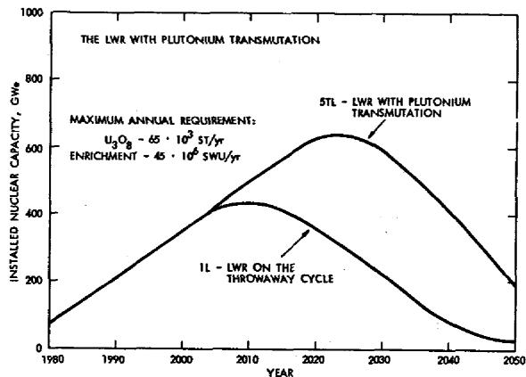

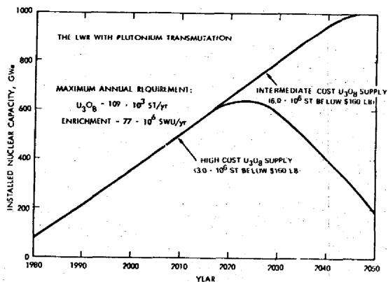  
Fig. 6.2-25. The Effect on the Nuclear Contribution of "Transmuting" Plutonium Produced in LWRs to $^{233}\mathrm{U}$ (High-Cost $\mathsf{U}_3\mathsf{O}_8$ Supply).   
Fig. 6.2-27. The Effect of $\mathsf{U}_3\mathsf{O}_8$ Supply on the Nuclear Contribution of LWRs in System with Plutonium "Transmutation" (Case 5TL).

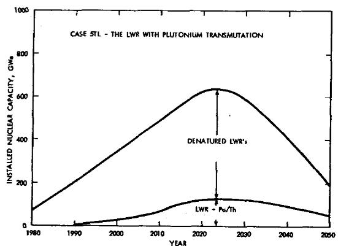  
Fig. 6.2-26. Relative Nuclear Contributions of LWRs Located Inside (Pu/Th) and Outside (Denatured LWRs) Energy Centers (PTutonium "Transmuted" to $^{233}\mathrm{U}$ ) (High-Cost $\mathrm{U}_{3}\mathrm{O}_{8}$ Supply).

until approximately year 2050, and thus the high energy support ratio associated with this option could be maintained much longer. The maximum annual $\mathsf{U}_3\mathsf{O}_8$ and enrichment requirements in this case are 109,000 ST/yr and 77 million SWU/yr, respectively. Thus, again we have an option for which the principal limitation would be the annual ore and enrichment requirements.

The utilization and movement of fissile material per GWe of installed capacity for Case 5TL in the year 2035 are shown in Fig. 6.2-28. The annual $U_{3}O_{8}$ consumption is approximately 68 ST $U_{3}O_{8} / GWe$ , and the LWR utilizing plutonium

comprises $18\%$ of the installed capacity. Approximately 260 kg of fissile plutonium per GWe of

installed capacity must be handled as fresh fuel each year within the energy centers. This can be compared to the classical case of plutonium recycle in which $56\%$ of the installed capacity is located in the energy centers and $368\mathrm{kg}$ of fissile plutonium is handled as fresh fuel each year. Thus, using the plutonium to produce $^{233}\mathrm{U}$ results in a significant reduction in the amount of installed capacity that must be located in secure regions, and it also reduces the amount of fissile plutonium that must be handled as fresh fuel each year.

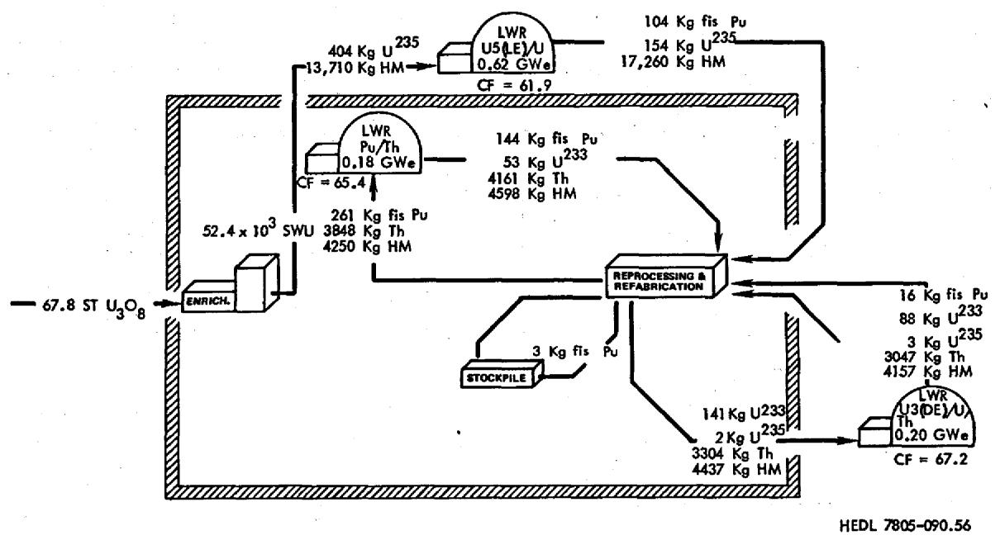  
Fig. 6.2-28. Utilization and Movement of Fissile Material in an LWR Nuclear System "Transmuting" Plutonium to $^{233}\mathrm{U}$ (Case 5TL, High-Cost $\mathsf{U}_{\mathsf{3}}\mathsf{O}_{\mathsf{8}}$ Supply) (Year 2035).

As for the preceding option, the high energy support ratio associated with this case requires the development of a nuclear industry capable of reprocessing significant amounts of fuel containing thorium and refabricating significant amounts of fuel containing $^{232}\mathrm{U}$ , although these amounts are considerably smaller. As Fig. 6.2-28 indicates, the LWR loaded with approximately $3\%$ enriched $^{235}\mathrm{U}$ comprises $62\%$ of the installed capacity in year 2035, the LWR loaded with Pu in Th comprises $18\%$ , and the LWR loaded with $12\%$ $^{233}\mathrm{U}$ in $^{238}\mathrm{U}$ comprises $20\%$ . Thus approximately $34\%$ of the reprocessing capacity must be capable of handling fuel containing thorium and $20\%$ of the fabrication capacity must be capable of handling fuel containing $^{232}\mathrm{U}$ .

In summary, a converter strategy based on the LWR which "transmutes" all plutonium to $^{233}\mathrm{U}$ could supply a maximum nuclear contribution of 640 GWe with the high-cost $U_{3}O_{8}$ supply, of which about 120 GWe would be located in energy centers. While the nuclear contribution for this case is somewhat less than for the case in which the production of plutonium is minimized, it does not require the development of new reactor concepts and it will require handling smaller amounts of $^{233}\mathrm{U}$ .

# 6.2.6 Converter-Breeder System with Light Plutonium "Transmutation"

The results presented in the preceding sections have demonstrated that nuclear power systems based on converter reactors will ultimately be limited by the quantity of economically recoverable uranium. While a larger $\mathsf{U}_3\mathsf{O}_8$ resource base will allow larger systems to develop, the converse is also true. Since the $\mathsf{U}_3\mathsf{O}_8$ resource base has always been somewhat uncertain, the deployment of fast breeder reactors has traditionally been considered as the method by which the consequences of this uncertainty would be minimized. Thus, it has historically been assumed that by deploying FBRs nuclear power systems would outgrow the constraints naturally imposed by the $\mathsf{U}_3\mathsf{O}_8$ resource base.

In the option discussed here (Option 6), an FBR with a plutonium-uranium core and a thorium blanket is located in the energy center to produce $^{233}\mathrm{U}$ which is then used in denatured converter reactors outside the center. Because a higher plutonium "transmutation" rate could be obtained with a plutonium-thorium core in the FBR, this option is referred to as having a light "Pu-to- $^{233}\mathrm{U}$ " transmutation rate. The individual reactor concepts contained in this option are shown in Fig. 6.1-4.

The nuclear contribution associated with this option when all the converters utilized are LWRs (Case 6L) is shown in Fig. 6.2-29. In this case, even with the high-cost $\mathsf{U}_3\mathsf{O}_8$ supply, the system is capable of maintaining a net addition rate of 15 GWe/yr throughout the planning horizon - i.e., from 1980 through 2050. The ability of the nuclear system to maintain this net addition rate is a direct consequence of the compound system doubling time of the FBR, which, in this case, is 13 yr. This doubling time in turn is a direct consequence of the FBR having a Pu-U core.

In this option the installed nuclear capacity which must be located in energy centers increases as a function of time to approximately 560 GWe in year 2050 (see Fig. 6.2-30). The most rapid increase occurs between 2010 and 2020 as the number of FBRs on line increases significantly. The amount of nuclear capacity available for installation outside the centers increases from approximately 300 GWe in year 2000 to over 500 GWe in year 2050. Initially, the LWR loaded with approximately $3\%$ enriched $^{235}\mathrm{U}$ is the principal reactor available, but as the $\mathsf{U}_3\mathsf{O}_8$ is depleted, it is replaced by the LWR loaded with $11\%$ $^{233}\mathrm{U}$ in $^{238}\mathrm{U}$ . This is illustrated in Fig. 6.2-31, which also indicates that this option is capable of maintaining an energy support ratio greater than unity throughout the planning horizon.

The maximum annual $\mathsf{U}_{3}\mathsf{O}_{8}$ and enrichment requirements for this case are 62,000 ST/yr and 44 million SWU/yr, respectively. These annual requirements do not differ significantly from those obtained with the LWR on the throwaway cycle, the reason being that in either case, the goal of the nuclear power system is to maintain a net addition rate of 15 GWe/yr provided this increase can be sustained by the $\mathsf{U}_{3}\mathsf{O}_{8}$ supply. The maximum installed capacity

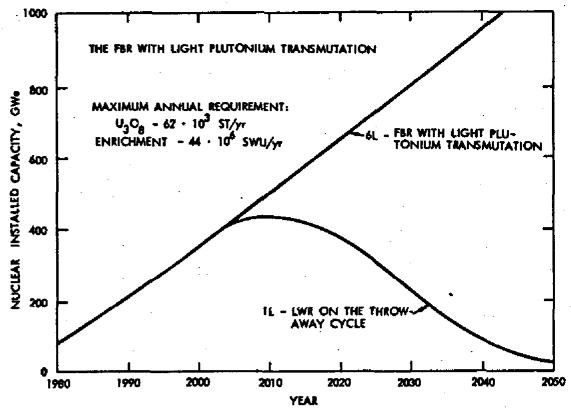

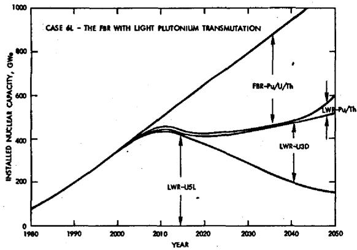  
Fig. 6.2-29. The Nuclear Contribution of an LWR-FBR System with Light Plutonium "Transmutation" (High-Cost $U_{3}O_{8}$ Supply).   
Fig. 6.2-31. Relative Nuclear Contributions of Each Reactor Type in LWR-FBR System with Light Plutonium "Transmutation" (High-Cost $\mathsf{U}_{3}\mathsf{O}_{8}$ Supply).

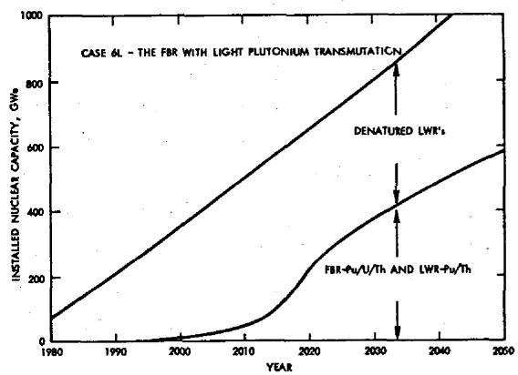  
Fig. 6.2-30. Relative Nuclear Contributions of Reactors Located Inside (Pu-Fueled) and Outside (Denatured LWRs) Energy Centers (High-Cost $\mathsf{U}_3\mathsf{O}_8$ Supply).

for the LWR loaded with approximately $3\%$ enriched $^{235}\mathrm{U}$ in either case is approximately 420 GWe. However, in this option, as the installed capacity of the $^{235}\mathrm{U}$ -loaded LWRs decreases, the energy center FBRs produce increasing amounts of $^{233}\mathrm{U}$ for the denatured LWRs, and thus the total installed nuclear capacity continues to increase at a net rate of 15 GWe/yr.

The amount of fissile plutonium that must be handled in the energy centers as fresh fuel each year is shown in Fig. 6.2-32. Approximately $620\mathrm{kg}$ of fissile plutonium per GWe must be handled in this case, as compared to approxi

mately $170\mathrm{kg}$ of fissile plutonium in fresh fuel per GWe each year for the case of plutonium minimization and utilization. Thus, it appears that the ability to maintain an energy support ratio greater than unity while simultaneously adding 15 GWe/yr will necessitate handling more fissile plutonium in fresh fuel in the energy centers.

As pointed out in previous cases, the ability to maintain a high energy support ratio requires the development of a nuclear industry capable of reprocessing fuel containing thorium and refabricating fuel containing $^{232}\mathrm{U}$ . In this option in the year 2035, the LWR loaded with approximately $3\%$ enriched $^{235}\mathrm{U}$ comprises approximately $28\%$ of the installed capacity, the FBR comprises $48\%$ , and the LWR loaded with $11\%$ $^{233}\mathrm{U}$ in $^{238}\mathrm{U}$ comprises $24\%$ . Upon examining the flow of thorium and uranium metal associated with these reactors, it can be seen that $38\%$ of the reprocessing capacity must be capable of handling fuel containing thorium and $27\%$ of the fabrication industry must be capable of handling fuel containing $^{232}\mathrm{U}$ .

The annual consumption of $\mathsf{U}_{3}\mathsf{O}_{8}$ in 2035 was found to be approximately 32 ST $\mathsf{U}_{3}\mathsf{O}_{8} / \mathsf{GWe}$ . This consumption rate will decrease continuously as the $^{235}\mathsf{U}$ -loaded LWR is replaced with the $^{233}\mathsf{U}$ -loaded LWR.

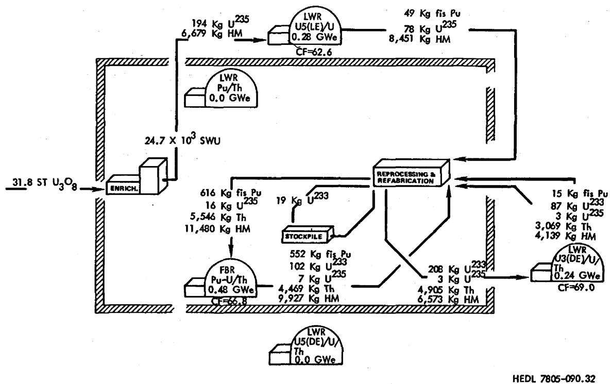  
Fig. 6.2-32. Utilization and Movement of Fissile Material in an LWR-FBR Nuclear System with a Light "Pu-to- $^{233}\mathrm{U}$ " Transmutation Rate (Case 6L, High-Cost $\mathrm{U}_{3}\mathrm{O}_{8}$ Supply) (Year 2035).

In summary, a strategy based on an FBR with a Pu-U core and a thorium blanket could supply a net addition rate of 15 GWe/yr to the year 2050 and beyond with a $U_{3}O_{8}$ supply of 3 million ST below $\$160/1b$ . The installed nuclear capacity in 2050 would be 1100 GWe, with 560 GWe, or approximately $50\%$ of the installed capacity, located in secure energy centers. Approximately $27\%$ of the fabrication capacity must be capable of handling fuel containing $^{232}U$ . Thus, while a nuclear system based on an FBR with a Pu-U core and a thorium blanket can supply 15 GWe/yr for an indefinite period of time, it simultaneously requires that a significant amount of nuclear capacity be located in secure regions.

# 6.2.7. Converter-Breeder System with Heavy Plutonium "Transmutation"

The preceding discussion indicates that a nuclear power system that includes an FBR having a Pu-U core and producing $^{233}\mathrm{U}$ in a thorium blanket can maintain an energy support ratio greater than unity while simultaneously adding 15 GWe/yr to the installed capacity throughout the planning horizon. The possibility exists, however, that a nuclear power system that includes an FBR having a Pu-Th core and a thorium blanket would result in a heavy Pu-to- $^{233}\mathrm{U}$ transmutation rate which would maintain an energy support ratio significantly greater than unity over the same period of time. The principal problem associated with a nuclear system based on an FBR with a Pu-Th core is that the breeding ratio of the breeder, and hence the breeding ratio of the entire system, tends to be low. Therefore, the effect of adding to the system an FBR operating on denatured $^{233}\mathrm{U}$ to augment the $^{233}\mathrm{U}$ production was also investigated. The individual reactor concepts contained in this system are shown in Fig. 6.1-4 (Option 8).

The nuclear contribution associated with this option (Case 8L, with denatured breeder) is compared to that of the LWR on the throwaway cycle for the high-cost $\mathsf{U}_3\mathsf{O}_8$ supply in Fig. 6.2-33. The system is capable of maintaining a net addition rate of 15 GWe/yr throughout the planning horizon.

The installed nuclear capacity which for Case 8L must be located in energy centers is shown in Fig. 6.2-34 as a function of time. The maximum is less than 300 GWe throughout the planning horizon. The amount available for location outside the energy centers ranges from approximately 300 GWe in the year 2000 to approximately 800 GWe in the year 2050. This can be compared to Option 6 for which the nuclear capacity that must be located in secure regions increases continuously to approximately 560 GWe in 2050. Thus, a nuclear system containing FBRs with Pu-Th cores plus FBRs with denatured $^{233}\mathrm{U}$ cores is capable of maintaining a very high energy support ratio for an indefinite period of time. It does require, however, that reactors that are net producers of fissile material be located in energy centers.

The utilization and movement of fissile material in year 2035 for Case 8L and the small $\mathsf{U}_{3}\mathsf{O}_{8}$ supply are shown in Fig. 6.2-35. The LWR loaded with approximately 3% enriched $^{235}\mathsf{U}$ comprises approximately 13% of the installed capacity, the denatured $^{235}\mathsf{U}$ LWR comprises approximately 12%, the energy center FBR comprises approximately 29%, the denatured $^{233}\mathsf{U}$ LWR comprises 8%, and the denatured FBR comprises 38%. The denatured $^{235}\mathsf{U}$ LWR is being rapidly phases out of the nuclear system in year 2035, while the denatured $^{233}\mathsf{U}$ LWR is being rapidly phased in. This is indicated in Fig. 6.2-35 by the fact that the heavy metal discharge for the denatured $^{235}\mathsf{U}$ LWR is considerably greater than the heavy metal charge, while the heavy metal charge for the denatured $^{233}\mathsf{U}$ LWR is considerably greater than the heavy metal discharge. The former is indicative of final core discharges, while the latter is indicative of first core loadings.

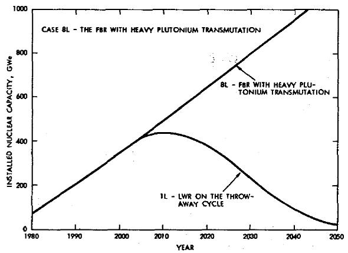  
Fig. 6.2-33. The Nuclear Contributions of an LWR-FBR System with Heavy Plutonium "Transmutation" (High-Cost $U_{3}O_{8}$ Supply).

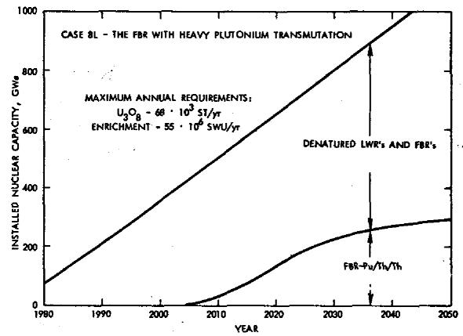  
Fig. 6.2-34. Relative Contributions of Reactors Located Inside (Pu-Fueled) and Outside (Denatured LWRs and FBRs) Energy Centers (High-Cost $\mathsf{U}_3\mathsf{O}_8$ Supply).

In this option the annual consumption of $\mathsf{U}_3\mathsf{O}_8$ is approximately 25 ST $\mathsf{U}_3\mathsf{O}_8$ in year 2035, decreasing thereafter as the LWRs loaded with $^{235}\mathsf{U}$ are replaced by the LWRs loaded with $^{233}\mathsf{U}$ . Approximately 430 kg of fissile plutonium per GWe of installed capacity must be handled as fresh fuel each year within energy centers, somewhat less than the 620 kg that must be handled in Option 6. The ability to maintain a high energy support ratio while simultaneously adding 15 GWe/yr again requires the development of a nuclear industry capable of reprocessing fuel containing thorium and refabricating fuel containing $^{232}\mathsf{U}$ . Figure 6.2-35 shows that 65% of the reprocessing capacity in year 2025 must be capable of handling fuel containing thorium and that 31% of the refabrication capacity must be capable of handling fuel containing $^{232}\mathsf{U}$ .

The effect of deleting the denatured FBR from the system is shown in Figs. 6.2-36 and 6.2-37. Figure 6.2-36 shows that without the denatured FBR the installed nuclear capacity reaches a maximum of approximately 840 GWe in about 2035 and declines continuously thereafter. The reason for this, of course, is that without the denatured FBR the system has a net breeding ratio of less than unity. Therefore, while the system can multiply the fissile supply significantly, it cannot continue to grow indefinitely. The nuclear capacity that must be located in energy centers for the modified Case 8L is shown in Fig. 6.2-37. This capacity does not exceed 140 GWe throughout the planning horizon. The amount of capacity available for location outside the secure regions ranges from approximately 300 GWe in the year 2000 to approximately 700 GWe in year 2035.

In summary, a strategy based on an FBR with a Pu-Th core and a thorium blanket can supply a net addition rate of 15 GWe/yr to year 2050 and beyond provided a denatured breeder is included in the system. If the denatured breeder is not included, then the maximum nuclear contribution would be approximately 840 GWe. The amount of nuclear capacity that must be located in secure regions does not exceed 140 GWe in this case.

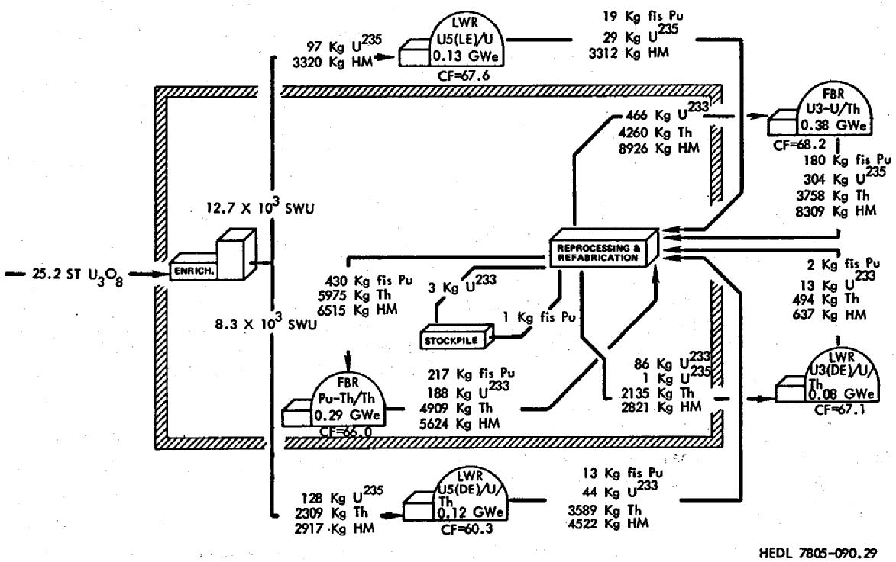  
Fig. 6.2-35. Utilization and Movement of Fissile Material in an LWR-FBR Nuclear System with Heavy "Pu-to- $^{233}\mathrm{U}$ ". Transmutation Rate (Case 8L, High-Cost U $_3$ O $_8$ Supply) (Year 2035).

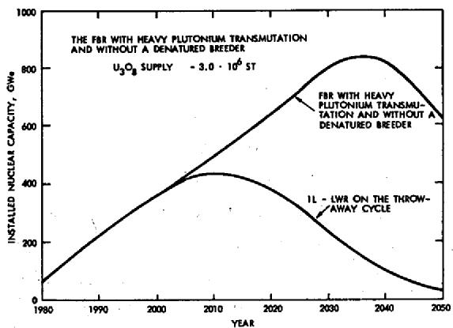  
Fig. 6.2-36. Effect on Nuclear Contribution of Eliminating Denatured Breeder from LWR-FBR System with Heavy Plutonium "Transmutation." (Case 8L Minus Denatured Breeder) (High-Cost $\mathsf{U}_{3}\mathsf{O}_{8}$ Supply).

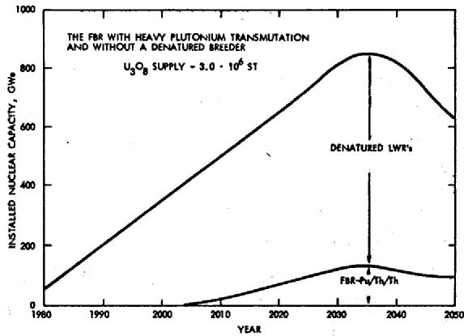  
Fig. 6.2-37. Relative Nuclear Contributions of Reactors Located Inside (Pu-Fueled) and Outside (Denatured LWRs) Energy Centers (Case 8L Minus Denatured Breeder) (High-Cost $\mathsf{U}_{3}\mathsf{O}_{8}$ Supply).

# 6.3. CONCLUSIONS

The principal conclusions developed during the course of this study are summarized in Tables 6.3-1, 6.3-2, and 6.3.3.

From the preceding discussion and Table 6.3-1, the following conclusions are drawn for various nuclear systems operating on the throwaway cycle:

(1) With a $U_{3}O_{8}$ supply of 3.0 million ST below $\$160/\mathrm{lb}$ , the maximum installed capacity with the standard LWR on the throwaway cycle would be approximately 420 GWe, and this would occur in about year 2006.   
(2) A reduction in the $\mathsf{U}_{3}\mathsf{O}_{8}$ requirement of all LWRs commencing operation in 1981 and thereafter by $6\%$ would not significantly increase the maximum installed capacity. Thus, for the case of the LWR on the throwaway cycle, the effort should be on improvements in $\mathsf{U}_{3}\mathsf{O}_{8}$ utilization significantly greater than $6\%$ for LWRs commencing operation after 1981 or on improvements which can be retrofitted into existing LWRs.

Table 6.3-1. Summary of Results for Nuclear Power Systems Operating on the Throwaway/Stowaway Cycle   

<table><tr><td>Option</td><td>Technology Development Requirement</td><td>Maximum Nuclear Contribution (GWe)</td><td>Year of Maximum Contribution</td></tr><tr><td colspan="4">High-Cost U3O8 Supply</td></tr><tr><td>Standard LWR</td><td>None</td><td>420</td><td>2006</td></tr><tr><td>Improved LWR</td><td>LWR with extended discharge exposure</td><td>430</td><td>2010</td></tr><tr><td>LWR plus advanced converter</td><td>SSCR, HTGR, or HWR</td><td>450</td><td>2012*</td></tr><tr><td>LWR with improved tails composition</td><td>Advanced enrichment process</td><td>500</td><td>2015</td></tr><tr><td colspan="4">Intermediate-Cost U3O8 Supply</td></tr><tr><td>Standard LWR</td><td>Successful U3O8 exploration program</td><td>730</td><td>2030</td></tr><tr><td>LWR plus advanced converter</td><td>SSCR, HTGR, or HWR; also successful U3O8 exploration program</td><td>850</td><td>2035</td></tr></table>

*Depends on advanced converter concept and its introduction date.

Table 6.3-2. Summary of Results for Nuclear Power Systems Utilizing LWR Converters with and without FBRs (with Recycle)   

<table><tr><td rowspan="2">Option</td><td rowspan="2">Technology Development Requirement</td><td colspan="3">Maximum Nuclear Contribution</td></tr><tr><td>Year</td><td>Total GWe</td><td>Fraction of GWE in Energy Center</td></tr><tr><td colspan="5">High-Cost U3O8 Supply</td></tr><tr><td>Pu recycle (2L)</td><td>Reprocessing, refabrication</td><td>~2020</td><td>600</td><td>~0.40</td></tr><tr><td>Pu throwaway (4L)</td><td>Advanced fuel design, reprocessing</td><td>~2020</td><td>590</td><td>-</td></tr><tr><td>Pu production minimized, Pu-to-233U &quot;transmutation&quot; (5UL)</td><td>Advanced fuel design, reprocessing</td><td>~2030</td><td>700</td><td>0.15</td></tr><tr><td>Pu production not minimized, Pu-to-233U &quot;transmutation&quot; (5TL)</td><td>Advanced fuel design, reprocessing</td><td>~2025</td><td>640</td><td>0.21</td></tr><tr><td>FBRs added, light Pu transmutation (6L)</td><td>Advanced fuel design, reprocessing, FBR</td><td>&gt;2050</td><td>&gt;1100 (w/o denat. FBR)</td><td>~0.56*</td></tr><tr><td>FBRs added, heavy Pu transmutation (7L)</td><td>Advanced fuel design, reprocessing, FBR</td><td>&gt;2050</td><td>&gt;1100 (with denat. FBR)</td><td>~0.27*</td></tr><tr><td></td><td></td><td>~2035</td><td>850 (w/o denat. FBR)</td><td>~0.16</td></tr><tr><td colspan="5">Intermediate-Cost U3O8 Supply</td></tr><tr><td>Pu recycle (2L)</td><td>Reprocessing, refabrication</td><td>~2045</td><td>960</td><td>-</td></tr><tr><td>Pu throwaway (4L)</td><td>Advanced fuel design, reprocessing</td><td>~2045</td><td>980</td><td>-</td></tr><tr><td>Pu production minimized, Pu-to-233U &quot;transmutation&quot; (5UL)</td><td>Advanced fuel design, reprocessing</td><td>&gt;2050</td><td>&gt;1000</td><td>-</td></tr><tr><td>Pu production not minimized, Pu-to-233U &quot;transmutation&quot; (5TL)</td><td>Advanced fuel design, reprocessing</td><td>~2050</td><td>1020</td><td>-</td></tr></table>

\*In year 2050.

(3) The deployment of an advanced converter beginning in 1995 will not significantly increase the maximum installed capacity if the $U_{3}O_{8}$ supply is limited to 3.0 million ST below $\$160/$ lb. This is primarily due to the fact that a significant amount of the $U_{3}O_{8}$ supply has been committed to the standard LWR prior to the advanced converter attaining a large fraction of the installed capacity. If the $U_{3}O_{8}$ supply should be as large as 6.0 million ST below $\$160/$ lb, then the effect of the advanced converter is considerably larger.   
(4) An advanced enrichment process capable of economically reducing the tails composition to 0.0005 could have a greater effect than improvements in LWR $\mathsf{U}_3\mathsf{O}_8$ utilization or the deployment of an advanced converter.

Table 6.3-3. Summary of Fuel Cycle Requirements for Nuclear Power Systems Utilizing LWR Converters with and without FBRs (with Recycle; High-Cost $\mathsf{U}_3\mathsf{O}_8$ Supply)   

<table><tr><td>Option</td><td>Fraction of Installed Nuclear Capacity Permitted Outside Energy Center in Year 2025</td><td>Fraction of Reprocessing Capacity to Handle Th in Year 2035</td><td>Fraction of Refabrication Capacity to Handle \( {}^{{232}\mathrm{U}} \) in Year 2035</td></tr><tr><td>Pu recycle</td><td>0.61</td><td>0</td><td>0</td></tr><tr><td>Pu throwaway</td><td>1.00</td><td>0.95</td><td>0.57</td></tr><tr><td>Pu production minimized; Pu-to- \( {}^{233}\mathrm{U} \) &quot;transmutation&quot;</td><td>0.85</td><td>0.97</td><td>0.53</td></tr><tr><td>Pu production not minimized; Pu-to- \( {}^{233}\mathrm{U} \) &quot;transmutation&quot;</td><td>0.79</td><td>0.34</td><td>0.20</td></tr><tr><td>FBRs added, light Pu transmutation</td><td>0.56</td><td>0.38</td><td>0.27</td></tr><tr><td>FBRs added, heavy Pu transmutation</td><td>0.76</td><td>0.65</td><td>0.31</td></tr></table>

(5) The effect of an exploration program successful enough to reliably increase the $U_{3}O_{8}$ resource base to 6.0 million ST below $160/lb would be considerably greater than any of the above. Thus, when analyzing the throwaway option, the size of the $U_{3}O_{8}$ resource base and the uncertainty associated with it dominate the analysis.

From the discussion in Section 6.2 and Tables 6.3-2 and 6.3-3, the following conclusions are drawn for LWR and LWR-FBR systems operating with recycle:

(1) With the high-cost $\mathsf{U}_{3}\mathsf{O}_{8}$ supply, the effect of plutonium recycle in LWRs would be to increase the installed nuclear capacity to 600 GWe, and this would occur in about year 2020. This would require, however, that as much as $40\%$ of the nuclear capacity be located in the energy centers. If the $\mathsf{U}_{3}\mathsf{O}_{8}$ supply should be as large as 6.0 million ST below $160/lb, the maximum installed nuclear capacity would be 960 GWe, and this would occur in about year 2045.   
(2) If all plutonium were thrown away but fissile uranium were refabricated and reloaded, the maximum installed nuclear capacity could be as large as 590 GWe with the high-cost $\mathsf{U}_3\mathsf{O}_8$ supply. Attaining 590 GWe, however, requires the development of fuel designs which minimize the amount of plutonium produced. In addition, it requires the development of an industry in which as much as $95\%$ of the reprocessing capacity is devoted to fuel containing thorium and as much as $57\%$ of the refabrication capacity is devoted to fuel containing $^{232}\mathsf{U}$ .   
(3) If the plutonium produced in the system described immediately above were refabricated and reloaded, the maximum installed nuclear capacity would increase to approximately 700 GWe, which is an increase in the maximum of approximately 110 GWe.

(4) If all plutonium produced were transmuted to $^{233}\mathrm{U}$ but no attempt was made to minimize the amount of plutonium produced, the maximum installed nuclear capacity could be as large as 640 GWe with the high-cost $\mathsf{U}_3\mathsf{O}_8$ supply. As much as $21\%$ of the installed nuclear capacity would have to be located in secure energy centers, however, and it would require that $34\%$ of the reprocessing capacity be devoted to fuel containing thorium and $20\%$ of the refabrication capacity be devoted to fuel containing $^{233}\mathrm{U}$ .   
(5) If a nuclear system utilizing an FBR with a Pu-U core and a thorium blanket were developed, the system could maintain a net addition rate of 15 GWe/yr indefinitely. The installed nuclear capacity, in this case, could be as high as 1100 GWe in year 2050; however, $56\%$ of this capacity would have to be located in secure energy centers. Also, approximately $38\%$ of the reprocessing capacity would have to be devoted to fuel containing thorium and $27\%$ of the refabrication capacity would have to be devoted to fuel containing $^{232}\mathrm{U}$ .   
(6) If a nuclear system utilizing an FBR with a Pu-Th core and a thorium blanket were developed, the maximum installed capacity would depend upon the performance characteristics of the denatured design receiving fuel from the FBR. If this design were a denatured breeder, the nuclear system would be capable of adding 15 GWe/yr indefinitely. If, however, the design were a denatured LWR, then the installed nuclear capacity would increase to approximately 850 GWe in about year 2035 and decrease thereafter.

In addition to the results and conclusions presented in this chapter, detailed results for all the nuclear policy options calculated are tabulated in Appendix C. Also, as mentioned earlier, a separate analysis performed under the assumption of an unlimited $\mathsf{U}_3\mathsf{O}_8$ supply but with the nuclear power systems in competition with coal-fired plants is described in Appendix D.

# Chapter 6 References

1. R. D. Nininger, "Remarks on Uranium Resources and Supply," Fuel Cycle 78, Atomic Industrial Forum, New York, March 7, 1978.   
2. John Klemenic, Director, Supply Analysis Division, Grand Junction Office, DOE Uranium and Enrichment Division, "Production Capability," October 1978.   
3. John Klemenic and David Blanchfield, Mineral Economist, Grand Junction Office, "Production Capability and Supply," paper presented at Uranium Industry Seminar, October 26-27, 1977, Grand Junction, Colorado; proceedings published as GJO-108(77).   
4. "Uranium Enrichment Services Activity Financial Statements for Period Ending September 30, 1977," p. 13, Schedule C, ORO-759.   
5. "AEC Gaseous Diffusion Plant Operations," ORO-684, USAEC (January 1972).   
6. "Data on New Gaseous Diffusion Plants," ORO-685, USAEC (April 1972).   
7. See also, T. M. Helm, M. R. Shay, R. W. Hardie, and R. P. Omberg, "Reactor Design Characteristics and Fuel Inventory Data," TC-971, Hanford Engineering Development Laboratory (September 1977).

# CHAPTER 7

# OVERALL ANALYSIS OF DENATURED FUEL SYSTEMS

# Chapter Outline

7.0. Introduction, T. J. Burns, ORNL   
7.1. Proliferation-Resistant Characteristics of Denatured $^{233}$ U Fuel, C. M. Newstead, BNL, and T. J. Burns, ORNL

7.1.1. Isotopic Barrier of Fresh Fuel   
7.1.2. Gamma-Radiation Barrier of Fresh Fuel   
7.1.3. Spent Fuel Fissile Content   
7.1.4. Conclusions

7.2. Impact of Denatured $^{233}\mathrm{U}$ Fuel on Reactor Performance and Selection: Comparison with Other Fuel Cycles, T. J. Burns, ORNL

7.2.1. Thermal Reactors   
7.2.2. Fast Reactors   
7.2.3. Symbiotic Reactor Systems   
7.2.4. Conclusions

7.3. Prospects for Implementation and Commercialization of Denatured $^{233}\mathrm{U}$ Fuel Cycle, J. C. Cleveland and T. J. Burns, ORNL

7.3.1. Possible Procedure for Implementing and Commercializing the Denatured Fuel Cycle   
7.3.2. Considerations in Commercializing Reactors Operating on Alternate Fuels

7.3.3. Conclusions

7.4. Adequacy of Nuclear Power Systems Utilizing Denatured $^{233}$ U Fuel for Meeting Electrical Power Demands, M. R. Shay, D. R. Haffner, W. E. Black, T. M. Helm, R. W. Hardie, and R. P. Omberg, HEDL

7.4.1. The Analytical Method   
7.4.2. Data Base   
7.4.3. Results for Price-Limited Uranium Supplies   
7.4.4. Results for Unconstrained Resource Availability   
7.4.5. Systems Employing Improved LWRs and Enrichment Technology   
7.4.6. Conclusions

7.5. Tradeoff Analysis and Overall Strategy Considerations, T. J. Burns and I. Spiewak, ORNL

7.5.1. No-Recycle Options   
7.5.2. Recycle Options   
7.5.3. Overall Conclusions and Recommendations

# 7.0. INTRODUCTION

# T. J. Burns Oak Ridge National Laboratory

The assessment of any proposed fuel cycle must of necessity consider various topics that affect the feasibility and viability of the particular cycle. Moreover, an assessment of a particular fuel cycle must consider the relative merits of the fuel cycle compared to other potentially available fuel cycle options. This study of the denatured $^{233}\mathrm{U}$ fuel cycle has addressed various aspects of the cycle in the preceding chapters: the proliferation-resistant characteristics of the cycle (in Chapter 3); the impact of denatured $^{233}\mathrm{U}$ fuel on the performance of several types of reactors (in Chapter 4); the implementation and commercialization aspects of the denatured fuel cycle (in Chapter 5); and the economic/resource implications of the cycle (in Chapter 6). In each of these chapters, the assessment of the denatured $^{233}\mathrm{U}$ cycle was limited primarily to the specific aspect under consideration. In this chapter the detailed results of the assessment are summarized and integrated, and the potential tradeoffs possible between the various considerations are addressed. In addition, recommendations for further study of crucial aspects of the denatured $^{233}\mathrm{U}$ fuel cycle are made.

# 7.1. PROLIFERATION-RESISTANT CHARACTERISTICS OF DENATURED $^{233}\mathrm{U}$ FUEL

C. M. Newstead Brookhaven National Laboratory and

T. J. Burns
Oak Ridge National Laboratory

As has been stated in earlier chapters, the primary goal of the denatured fuel cycle is to permit the recycle of fissile fuels in dispersed reactors in a manner consistent with nonproliferation considerations. In this section the proliferation-resistant characteristics of the denatured $^{23}\mathrm{U}$ fuel cycle that have been described in detail in Chapter 3 are summarized, and their significance with respect to both national proliferation and subnational terrorism is noted. In general, these characteristics derive from three distinguishing features of the denatured fuel cycle: (1) the intrinsic isotopic barrier of the fresh denatured fuel, (2) the gamma radiation barrier associated with the $^{232}\mathrm{U}$ impurity present in thorium-derived fuel, and (3) the low chemically separable fissile content of the spent denatured fuel.

# 7.1.1. Isotopic Barrier of Fresh Fuel

The isotopic barrier of the fresh fuel is created by the addition of the $^{238}\mathrm{U}$ denaturant to the $^{233}\mathrm{U}$ fissile fuel, its purpose being to preclude the use of the $^{233}\mathrm{U}$ directly in a nuclear weapons program. Although the thorium present in most proposed denatured fuels could be chemically removed, the separated uranium would have too low a fissile content for it to be directly usable in a practical nuclear device. By contrast, the other potential fuel cycle relying on recycled material, the Pu/U cycle, would require only a chemical separation to extract weapons-usable material directly from power reactor fuel. The isotopic barrier in denatured fuel is not an absolute barrier, however, since any isotope separation (i.e., enrichment) technique can be used to circumvent it. Depending upon its technological resources, a nation may have or may develop separation facilities. On the other hand, it is unlikely that a subnational group would possess isotopic separation capabilities and thus the isotopic barrier inherent in denatured fuel would provide considerable protection against terrorist nuclear activities.

As is pointed out in Section 3.3.4 and Appendix A, enrichment technology has made great strides in recent years and is presently undergoing rapid further development. Ten years ago the only operational enrichment facilities were based on the gaseous diffusion technique, a method requiring a large expenditure of energy and a large plant to be economic. Today the gas centrifugation technique, which requires a significantly lower energy consumption than the gaseous diffusion method, is available and is practical with small-scale plants. For example, the URENCO consortium is currently operating centrifuge enrichment plants of 50 tonnes per year capacity at Capenhurst in the United Kingdom and at Almelo in The Netherlands. The URENCO centrifuge represents an economic design built by technologically advanced countries (England, The Netherlands, Germany)

without benefit of U.S. experience. For a military program, economics would not be an overriding criterion and could be sacrificed in favor of a more moderate level of technology. Moreover, the open literature contains sufficient information concerning the centrifuge designs to guide mechanically competent engineers with access to adequate facilities. Replication of an economic design would require a somewhat higher level of technology than prototype construction.

The following particular points regarding the enrichment of denatured $^{233}\mathrm{U}$ fuel should be noted:

(1) Because of the lower mass of $^{233}\mathrm{U}$ , separating $^{233}\mathrm{U}$ from $^{238}\mathrm{U}$ would require only 9/25 of the effort required to separate $^{235}\mathrm{U}$ from $^{238}\mathrm{U}$ , assuming equal feed enrichments.   
(2) Since the fast critical mass of $^{23} \mathsf{U}$ is less than that of $^{235} \mathsf{U}$ , less enrichment capacity would be required to produce a $^{23} \mathsf{U}$ weapon from $^{233} \mathsf{U}/^{238} \mathsf{U}$ feed than would be required to produce a $^{235} \mathsf{U}$ weapon from $^{235} \mathsf{U}/^{238} \mathsf{U}$ feed, again assuming equal enrichments of the feed material.   
(3) The higher the enrichment of the source material, the less separative work that would have to be done to upgrade the material to $90\%$ enrichment. For example, enriching natural uranium to a $10\%$ level consumes $90\%$ of the separative work required to achieve a $90\%$ level. It is to be noted that the enrichment of denatured $^{233}\mathrm{U}$ fuel is approximately $12\%$ , whereas the enrichment of currently used LWR $^{235}\mathrm{U}$ fuel is around $3 - 4\%$ .

With respect to items (2) and (3), a rough comparison can be made of the feed requirements and the number of centrifuges that would be necessary to produce $90\%$ enriched material from various fuels in one year (normalized to 1 kg of product):

<table><tr><td rowspan="2">Fuel</td><td rowspan="2">Feed Required (kg)</td><td colspan="2">Number of Centrifuges Required</td></tr><tr><td>0.3 kg SWU/yr Capacity</td><td>5 kg SWU/yr Capacity</td></tr><tr><td>12% 233U</td><td>8</td><td>55</td><td>3</td></tr><tr><td>20% 235U</td><td>5</td><td>50</td><td>3</td></tr><tr><td>3.2% 235U</td><td>30</td><td>292</td><td>17</td></tr><tr><td>Natural Uranium</td><td>178</td><td>779</td><td>46</td></tr></table>

The above values do not consider measures to eliminate the $^{232}\mathrm{U}$ contamination and they assume that a reasonable tails assay will be maintained ( $\nu 0.2\%$ $^{235}\mathrm{U}$ ). If a higher tails assay were acceptable, the number of centrifuges could be reduced but the feed material required would be increased.

One year, of course, is a long time when compared to a period of weeks that would be needed to obtain approximately $10\mathrm{kg}$ of plutonium by chemically reprocessing two to three spent LWR-LEU fuel elements. It would be possible to speed up the process time for the centrifuge method either by increasing the individual machine capacity, by adding additional centrifuges, or by operating at a higher tails assay. Increasing the capacity

would be quite difficult and would require increasing technological sophistication; however, adding centrifuges would require only that the same device be duplicated as many times as necessary. Increasing the tails assay would require more feed material.

Finally, in considering the potential circumvention of the isotopic barrier, it is important to anticipate the enrichment technologies that could exist in 20 to 25 years - the time when the denatured fuel cycle could be deployed. Technologically advanced countries already have the necessary technological base to design and construct centrifuges, and many presently developing countries may have acquired the technology base by that time. Countries with a primitive technology are unlikely to use this route, since even with the financial assets and technically competent personnel they would have the difficult task of developing the requisite support facilities. Other potential isotope separation techniques are under development in many countries. Laser isotope separation (LIS), plasma techniques, aerodynamic methods, chemical techniques, and electromagnetic separation methods currently show varying degrees of promise. The current status of these methods is discussed in Appendix A. It is impossible to predict the ultimate success or failure of these alternative methods, and hence the isotopic separation capability which might exist in 25 years is even more difficult to estimate. Current estimates for the U.S. development program in LIS and plasma methods suggest that it will be at least ten years before such methods could be operative on a working industrial basis, even with a highly sophisticated R&D effort.

# 7.1.2. Gamma-Radiation Barrier of Fresh Fuel

The production of $^{233}\mathrm{U}$ results in the concomitant production of a small but radio-actively significant quantity of $^{232}\mathrm{U}$ through the $^{232}\mathrm{Th}(n,2n)$ reaction [and the $^{230}\mathrm{Th}(n,\gamma)$ reaction if $^{230}\mathrm{Th}$ is present in the thorium]. As the $^{232}\mathrm{U}$ decays through $^{228}\mathrm{Th}$ and its daughter products, the gamma activity of the $^{233}\mathrm{U}$ -containing fuels increases, thus providing a radiation barrier much more intense than is found in other fresh fuels. While chemical processing could be employed to remove the $^{232}\mathrm{U}$ decay products, such a procedure would provide a relatively low radioactivity for only 10-20 days, since further decay of the $^{232}\mathrm{U}$ present in the fuel would provide a new population of $^{228}\mathrm{Th}$ and its daughters, the activity of which would continue to increase in intensity for several years.

The concentration of $^{232}\mathrm{U}$ in the recycle fuel is usually characterized as so many parts per million (ppm) of $^{232}\mathrm{U}$ in total uranium. Due to the threshold nature of the $^{232}\mathrm{Th}(n,2n)$ reaction, the $^{232}\mathrm{U}$ concentration varies with the neutron spectrum of the reactor in which it is produced. It also varies with the amount of recycle. For $12\%$ $^{233}\mathrm{U}$ denatured fuel, the $^{232}\mathrm{U}$ concentration (in ppm U) ranges from 250 ppm for LWR-produced $^{233}\mathrm{U}$ to a maximum of 1600 ppm for certain LMFBR-derived denatured fuels (see Section 3.1.3). If the latter material were enriched to produce weapons-grade material, the $^{232}\mathrm{U}$ concentration would be approximately 8000 ppm, and thus the material would be highly radioactive.

While the radiation field would introduce complications in the manufacture of a weapon, particularly for a terrorist group, the resulting dose rates would not provide an absolute barrier (see Section 3.3.5). As mentioned above, it would be possible to clean up the fissile material so that it was relatively free of radiation for a period of 10 to 20 days. Alternatively, providing shielding and remote handling would allow the radiation barrier to be circumvented; however, construction and/or acquisition of the shielding, remote handling equipment, etc., could increase the risk of detection of a covert program before its completion. Non-fissile material included in the weapon would also provide some shielding during delivery, and additional shadow shielding to protect the operator of the delivery vehicle and to facilitate the loading operations could be developed.

In another approach, the $^{232}\mathrm{U}$ could be separated from the $^{233}\mathrm{U}$ by investing in a rather large cascade of over some 3000 centrifuges, possibly including $^{228}\mathrm{Th}$ cleanup to limit the radiation contamination of the centrifuges. A willingness to accept certain operational disadvantages would permit the radiation-contaminated material to be processed in the centrifuges provided they were shielded and some provision was made for remote operation. By comparison, clean mixed oxide Pu/U fuel would have a much less significant radiation problem and the currently employed fresh LEU fuel would have essentially none at all.

# 7.1.3. Spent Fuel Fissile Content

Spent denatured fuel contains three possible sources of fissile material: unburned $^{233}\mathrm{U}$ ; $^{233}\mathrm{Pa}$ which decays to $^{233}\mathrm{U}$ ; and Pu produced from the $^{238}\mathrm{U}$ denaturant. Use of the uranium contained in the spent denatured fuel is subject to all the considerations outlined above and would also be hindered by the fission-product contamination (and resultant radiation) inherent in spent reactor fuel. As was noted in Section 3.3.4, the relatively long half-life of $^{233}\mathrm{Pa}$ (27.4 days) could permit the production of weapons-grade material via chemical separation of the $^{233}\mathrm{Pa}$ ; however, such a procedure would require that chemical separation be initiated shortly upon discharge from the reactor (while radiation levels are very high) to minimize the amount of $^{233}\mathrm{Pa}$ which decays to $^{233}\mathrm{U}$ while still contained in the $^{238}\mathrm{U}$ denaturant. Moreover, since the discharge concentration of $^{233}\mathrm{Pa}$ is typically $5\%$ of that of $^{233}\mathrm{U}$ , a considerable heavy metal processing rate would be required to recover a significant quantity of $^{233}\mathrm{Pa}$ (and hence $^{233}\mathrm{U}$ ) within the time frame available. The plutonium concentration is comparable to that of $^{233}\mathrm{Pa}$ , but very little is lost by decay. Hence, the spent fuel can be allowed to cool for some time before reprocessing. It would seem, therefore, that if denatured $^{233}\mathrm{U}$ spent fuel were diverted it would be primarily for its plutonium content.

Any fuel cycle utilizing $^{238}\mathrm{U}$ inevitably leads to some plutonium production. Compared to the LEU cycle and the Pu/U cycle, the denatured $^{233}\mathrm{U}$ fuel cycle reduces the plutonium production by (1) employing as little $^{238}\mathrm{U}$ as necessary to achieve the denaturing objective, and (2) replacing the displaced $^{238}\mathrm{U}$ with $^{232}\mathrm{Th}$ to enhance the

production of "denaturable" $2^{33}\mathrm{U}$ . The plutonium production rates for various reactors operating on conventional and denatured fuel cycles are discussed in Chapter 4 and summarized in Table 7.1-1, where the Light-Water Reactor (LWR) is represented by the pressurized-water reactor (PWR); the SSCR (Spectral-Shift-Controlled Reactor) is a modified PWR; the heavy-water reactor (HWR) is assumed to be a slightly enriched CANDU; the High-Temperature Gas-Cooled Reactor (HTGR) is taken to be the Fort St. Vrain plant; and the High-Temperature Reactor (HTR) of the Pebble-Bed Reactor (PBR) type is represented by the West German design. Plutonium discharge data for Fast Breeder Reactors (FBRs) represented by the Liquid-Metal Fast Breeder Reactor (LMFBR) are included for comparison.

It is quite clear from Table 7.1-1 that the denatured fuel cycle for the HWR gives the greatest reduction in plutonium production between the regular and denatured cycles. The HTGR has about the same absolute plutonium production for the denatured fuel cycle as the HWR and in both cases the plutonium amounts are rather small. The HTR-PBR is best in absolute minimum plutonium production, yielding only $14\mathrm{kg / GWe - yr}$ and even less in a highly optimized design.

Table 7.1-1. Fissile Plutonium Discharge for Various Reactor and Fuel Cycle Combinations (Capacity Factor = 0.75)   

<table><tr><td></td><td colspan="3">Fissile Pu Discharge (kg/GWe-yr)</td></tr><tr><td></td><td>LEU Cycle</td><td>Pu/U Cycle</td><td>Denatured Cycle</td></tr><tr><td>LWR</td><td>174</td><td>858a</td><td>63</td></tr><tr><td>SSCR</td><td>196</td><td>-</td><td>72</td></tr><tr><td>HWR (CANDU)</td><td>183b</td><td>-</td><td>32</td></tr><tr><td>HTGR</td><td>72</td><td>-</td><td>36</td></tr><tr><td>HTR-PBR</td><td>63</td><td>-</td><td>14</td></tr><tr><td>LMFBR</td><td>-</td><td>991</td><td>347</td></tr></table>

$\frac{a}{2}$ Plutonium burner.   
$S$ lightly enriched CANDU.

For the LWR, SSCR and HwR the percentage of the discharge plutonium that is fissile plutonium is approximately the same for the denatured cycle as for the LEU cycle. For the HTGR and PBR, the fissile plutonium percentage is only $\sim 39\%$ for the denatured cycle (compared to $56\%$ for the LEU cycle). Further, the discharge plutonium from the HTGR and PBR, and also from the HwR, is more diluted with other heavy material by a factor of three to four than that from the LWR or SSCR. Thus, more material must be processed in the HTGR, HTR, and HwR to obtain a given amount of plutonium, which provides an additional proliferation restraint associated with spent fuel discharged from these reactors. However, the on-line refueling feature of the CANDU, and also of the PBR, may be a disadvantage from a proliferation viewpoint since low-burnup fuel could be removed and weapons-grade plutonium extracted from it. On the other hand, premature discharge of low-burnup fuel from the reactors would incur economic penalties.

Viewed solely from the plutonium production viewpoint, the order of preference in terms of higher proliferation resistance for the various denatured reactor candidates to be employed at dispersed sites is as follows: HTR-PBR, HWR, HTGR, LWR, and SSCR. However, other factors must also be addressed in evaluating the candidate reactors, one of which is that their plutonium production maintains the symbiosis of a system that includes plutonium-fueled $^{233}\mathrm{U}$ producers in secure energy centers. This plutonium being consumed within the center as it is recovered from the spent fuel would limit the amount of plutonium available for possible diversion. While such an energy center could also be implemented for the $\mathrm{Pu} / \mathrm{U}$ cycle, the denatured cycle would permit the dispersal of a larger fraction of the recycle-based power generation capability. Hence, the number and/or size of the required energy centers might be markedly reduced relative to the number required by the $\mathrm{Pu} / \mathrm{U}$ cycle.

# 7.1.4. Conclusions

The proliferation-resistant characteristics of the denatured $^{233}\mathrm{U}$ fuel cycle derive from its intrinsic isotopic barrier, its gamma radiation barrier, and its relatively low content of chemically separable fissile material in spent fuel:

- The isotopic denaturing of the denatured $^{233}\mathrm{U}$ cycle would provide a significant technical barrier (although not an absolute one) that would decrease with time at a rate which is country-specific. Technologically primitive countries will find it an imposing barrier relative to other routes. Countries that have the technological expertise to develop isotope separation capabilities will have the technology required to circumvent this barrier; however, they will also have the option of utilizing possible indigenous natural uranium or low enriched $^{235}\mathrm{U}$ fuel as alternate feed materials.   
- The denatured $2^{33} \mathrm{U}$ cycle imposes a significant radiation barrier due to the $2^{32} \mathrm{U}$ daughter products in the fresh fuel as an inherent property of the cycle. Such a radiation field increases the effort required to obtain weapons-usable material from fresh denatured reactor fuel.   
- While the amount of plutonium discharged in the denatured $^{233}\mathrm{U}$ fuel cycle is significantly less than in either the Pu/U cycle or the LEU cycle, the presence of plutonium in the cycle (even though it is in the spent fuel) does represent a proliferation concern. Conversely, it also represents a resource potentially useful in a symbiotic power system employing denatured fuel. The concept of a safeguarded energy center provides a means of addressing this duality in that the fissile plutonium can be burned in the center to produce a proliferation-resistant fuel.

In summary, the denatured $^{233}\mathrm{U}$ fuel cycle offers a technical contribution to proliferation resistance. However, the fuel cycle must be supplemented with political and institutional arrangements also designed to discourage proliferation.

# 7.2. IMPACT OF DENATURED $^{233}\mathrm{U}$ FUEL ON REACTOR PERFORMANCE AND SELECTION: COMPARISON WITH OTHER FUEL CYCLES

T. J. Burns
Oak Ridge National Laboratory

The discussion in Chapter 4 has shown that the impact of the denatured $^{233}\mathrm{U}$ fuel cycle on the performance of the various reactors considered in this study is largely due to differences in the nuclear properties of $^{233}\mathrm{U}$ and $^{232}\mathrm{Th}$ relative to those of $^{239}\mathrm{Pu}$ (and $^{235}\mathrm{U}$ ) and $^{238}\mathrm{U}$ , respectively. For thermal systems, $^{233}\mathrm{U}$ is a significantly better fuel than either $^{239}\mathrm{Pu}$ or $^{235}\mathrm{U}$ , both in terms of energy production and in terms of the conversion ratio* that can be attained. For fast systems, however, the substitution of $^{233}\mathrm{U}$ -based fuels for $^{239}\mathrm{Pu}$ -based fuels results in a somewhat poorer reactor performance, particularly with respect to the breeding ratio.* In this section the performance of the various reactors operating on the denatured $^{233}\mathrm{U}$ fuel cycle is compared with their performance on other fuel cycles. In addition, the dependence of the denatured $^{233}\mathrm{U}$ fuel cycle on auxiliary fuel cycles for an adequate supply of $^{233}\mathrm{U}$ is discussed. Because of this dependence, reactors fueled with denatured $^{233}\mathrm{U}$ must be operated in symbiosis with reactors that produce $^{233}\mathrm{U}$ . These latter reactors, referred to as transmuters, may be either thermal reactors or fast reactors. The particular reactors selected for operation as transmuters and those chosen to operate on denatured $^{233}\mathrm{U}$ fuel will depend on several factors, two of the most important being the resource requirements of the individual reactors and the energy growth capability required of the symbiotic system. The influence of these various factors is pointed out in the discussion below.

# 7.2.1 Thermal Reactors

In comparing the performance of thermal reactors operating on denatured $^{233}\mathrm{U}$ fuel with their performance on other fuels, it is useful to distinguish between two generic fuel cycle types: those that do not require concurrent reprocessing (that is, once-through systems) and those that do. Although the denatured $^{233}\mathrm{U}$ fuel cycle cannot itself be employed as a once-through system, the implementation of the MEU(235)/Th once-through cycle is a logical first step to the implementation of the denatured $^{233}\mathrm{U}$ cycle. Thus both once-through and recycle scenarios are considered here for thermal reactors.

# Once-Through Systems

Two fuel cycles of interest to this study can be implemented without concurrent reprocessing capability: the LEU cycle and the MEU(235)/Th cycle. The LEU cycle is, of course, already used

routinely in LWRs and small-scale fabrication of MEU(235)/Th fuels for LWRs might be attainable within 2 - 3 years. However, it is pointed out that the once-through cycle has two variants - throwaway and stowaway - and in certain systems (for example, the PWR, as noted below), the MEU(235)/Th cycle might be economic only from a stowaway standpoint - that is, only if a reprocessing capability is eventually envisioned.

Table 7.2-1 summarizes the $\mathsf{U}_{3}\mathsf{O}_{8}$ and separative work requirements estimated for PWRs HWRs, HTGRs, PBRs, and SSCRs operating as once-through systems on both the LEU and the MEU(235)/Th cycles. Several interesting points are evident from these data. The LEU-HWR requires the smallest resource commitment (as well as the smallest SWU requirement). The conventional PWR requires a significantly greater resource commitment and larger SWU requirements for the MEU/Th once-through cycle than for the LEU once-through cycle and hence no incentive exists for the MEU/Th cycle on PWRs if only the throwaway option is considered. Significantly, however, both of the gas-cooled graphite-moderated reactors, the HTGR and the PBR, require smaller $\mathsf{U}_{3}\mathsf{O}_{8}$ commitments for the MEU/Th once-through cycle than for the LEU case. Moreover, for both of these reactors, the SWU requirements for the MEU/Th cycle are not significantly different from those for the LEU cycle; in fact, for the PBR, the MEU/Th cycle is slightly less demanding than the LEU cycle. These effects are primarily due to the high burnup design of both the HTGR and the PBR. At the higher burnup levels of the gas-cooled reactors, most of the $^{233}\mathsf{U}$ produced in the MEU/Th cycle is burned in situ and contributes significantly to both the power and the conversion ratio. It is also interesting to note that, while not considered in Table 7.2-1, the unique design of the PBR would permit recycle of the fertile elements without intervening reprocessing and thus would further reduce both the ore and SWU requirements for the MEU/Th cycle. [Note: The data given in Table 7.2-1 for PWRs considers only current commercially deployed designs. Studies now underway in the DOE-sponsored Nonproliferation Alternative Systems Assessment Program (NASAP) indicate that LWR modifications to reduce uranium requirements are feasible. Similarly, much of the other reactor data are subject to design refinement and uncertainties, as well as to future optimization for specific roles.]

Table 7.2-1. 30-Year Uranium and Separative Work Requirements for Once-Through LEU and MEU(235)/Th Fuel Cyclesa, b   

<table><tr><td rowspan="2">Reactor</td><td colspan="2">Uranium Requirement (ST U3O8/GWe)</td><td colspan="2">Separative Work Requirement (MT SWU/GWe)</td></tr><tr><td>LEU</td><td>MEU/Th</td><td>LEU</td><td>MEU/Th</td></tr><tr><td>PWR</td><td>5989</td><td>8360</td><td>3555</td><td>7595</td></tr><tr><td>HWR</td><td>3563</td><td>8281</td><td>666</td><td>7521</td></tr><tr><td>HTGR</td><td>4860</td><td>4515</td><td>3781</td><td>4143</td></tr><tr><td>PBR</td><td>4289</td><td>4184c</td><td>3891</td><td>3663b</td></tr><tr><td>SSCR</td><td>5320</td><td>7920</td><td>3010</td><td>7160</td></tr></table>

$a_{\nu 75\%}$ capacity factor; no credit for end-of-life core inventories;   
$2.0\%$ tails.   
The data presented in this table are consistent with the data submitted by the U.S. to INFCE (International Nuclear Fuel Cycle Evaluation) for the cases in which corresponding reactors are considered.   
Does not include recycle of fertile elements without intervening reprocessing.

If these once-through systems are operating on the throwaway option, the fissile material discharged in their spent fuel elements is deemed unusable; in fact, no value is assigned to the spent fuel in once-through fuel cycle accounting. Thus, in this case the most resource-efficient once-through fuel cycle is the one that requires the lowest fissile charge per unit power. If, however, a capability for reprocessing the spent fuel is eventually envisioned (i.e., if the throwaway option becomes a stowaway option), then the quantity of fissile material in the spent fuel becomes an important consideration. Estimates of the amounts of the various fissile materials discharged by each reactor type operating on both the LEU cycle and the MEU(235)/Th cycle are given in Table 7.2-2.

Table 7.2.2. 30-Year Charge and Discharge Quantities for Once-Through Fuel Cycles   

<table><tr><td rowspan="3">Reactor</td><td colspan="5">MT/GWe</td><td rowspan="3">Cumulative Net Fissile Consumption</td></tr><tr><td rowspan="2">235U Charge</td><td colspan="3">Fissile Dischargeb</td><td rowspan="2">Total Fissile</td></tr><tr><td>233U</td><td>235U</td><td>Puf</td></tr><tr><td colspan="7">LEU Cycle</td></tr><tr><td>PWR</td><td>24.72</td><td>-</td><td>6.45</td><td>5.22</td><td>11.67</td><td>13.05</td></tr><tr><td>HUR</td><td>17.53</td><td>-</td><td>1.77</td><td>5.49</td><td>7.26</td><td>10.37</td></tr><tr><td>HTGR</td><td>19.49</td><td>-</td><td>3.25</td><td>2.16</td><td>5.41</td><td>14.08</td></tr><tr><td>PBR</td><td>18.09</td><td>-</td><td>2.79</td><td>1.89</td><td>4.68</td><td>13.41</td></tr><tr><td>SSCR</td><td>22.25</td><td>-</td><td>5.46</td><td>5.88</td><td>11.34</td><td>10.91</td></tr><tr><td colspan="7">MEU(235)/Th Cycle</td></tr><tr><td>PWR</td><td>33.83</td><td>7.80</td><td>11.52</td><td>2.13</td><td>21.45</td><td>12.38</td></tr><tr><td>HUR</td><td>32.63</td><td>14.28</td><td>10.08</td><td>0.75</td><td>25.11</td><td>7.52</td></tr><tr><td>HTGR</td><td>17.99</td><td>2.31</td><td>1.35</td><td>0.69</td><td>4.35</td><td>13.64</td></tr><tr><td>PBR</td><td>16.55</td><td>2.73</td><td>1.17</td><td>0.42</td><td>4.32</td><td>12.23</td></tr><tr><td>SSCR</td><td>-</td><td>-</td><td>-</td><td>-</td><td>-</td><td>-</td></tr></table>

${}^{a}$ At 75% capacity factor. bEstimated from equilibrium cycle.

For the PWR and HwR, the use of the MEU/Th fuel cycle rather than the LEU fuel cycle results in a significant increase in the amount of fissile material contained in the spent fuel. It should be noted, however, that this increase is primarily the result of higher feed requirements (i.e., $^{235}\mathrm{U}$ commitment). In contrast, converting from the LEU cycle to the MEU/Th cycle does not materially affect the net consumption of the gas-cooled HTGR and PBR (although it dramatically affects the types of fissile material present in their spent fuel). The relatively low values for the discharge quantities for the gas-cooled reactors is the result of two effects: a lower initial loading; and a design that is apparently based on higher burnup, which in turn reduces the amount of fissile material discharged. Finally, it is to be remembered that the resources represented by the spent fuel inventory are recoverable only when the spent fuel is reprocessed, whereas the $\mathsf{U}_3\mathsf{O}_8$ commitment is necessary throughout the operating lifetime of the reactor. Thus, in a sense, the spent fuel resource must be discounted in time to order to assess the best system from a resource utilization basis.

The isotopic composition of the spent fuel inventories is also of interest from a proliferation standpoint. For both the LEU and the MEU/Th once-through fuel cycles, the fissile uranium content of the spent fuel is denatured (diluted with $^{238}\mathrm{U}$ ) and hence is protected by the inherent isotopic barrier. Thus the plutonium in the fuel would be the fissile material most subject to diversion. The use of the MEU/Th cycle in place of the LEU cycle sharply reduces the amount of plutonium produced (by 60-80%, depending on reactor type), and for both cycles the quantity of plutonium produced in the gas-cooled reactors is substantially less than that produced in the other reactor types.

# Recycle Systems

If recycling of the fissile material in the thermal reactors is permitted, then $^{233}\mathrm{U}$ (and plutonium) produced in the MEU(235)/Th is recoverable on a schedule dictated by the production rate of the system. Table 7.2-3 gives estimates of the net lifetime consumption and production of various fissile materials for the MEU(235)/Th fuel cycle under the assumption that the capability for uranium recycle is available. (The $^{235}\mathrm{U}$ consumption tabulated does not reflect the $^{235}\mathrm{U}$ lost to the enrichment tailings.) For comparison purposes, the MEU(233)/Th fuel cycle estimates are also provided. The most striking aspect of Table 7.2-3 is the apparent $30\%$ reduction of fissile consumption achieved with the $^{233}\mathrm{U}$ system, indicating the higher value of $^{233}\mathrm{U}$ as a thermal reactor fuel. In fact, the true extent of this effect is masked somewhat since a large fraction of the recycled fuel for the $^{235}\mathrm{U}$ makeup case is in fact $^{233}\mathrm{U}$ . It should also be noted that the MEU(233)/Th cycle generally results in a smaller net plutonium production, even though the degree of denaturing is less (i.e., the $^{238}\mathrm{U}$ fraction of uranium charged is higher).

Table 7.2-3. Estimated Net 30-Year Fissile Consumption and Production for MEU/Th Cycles with Uranium Recycle   

<table><tr><td rowspan="3">Reactor</td><td colspan="4">MT/GWe</td></tr><tr><td colspan="2">With 235U Loading and Makeup</td><td colspan="2">With 233U Loading and Makeup</td></tr><tr><td>235U Consumption</td><td>Fissile Pu Production</td><td>233U Consumption</td><td>Fissile Pu Production</td></tr><tr><td>PWR</td><td>12.5</td><td>2.85</td><td>9.1</td><td>1.89</td></tr><tr><td>HWR</td><td>4.5</td><td>0.90</td><td>3.1</td><td>0.96</td></tr><tr><td>HTGR</td><td>10.4</td><td>1.13</td><td>7.7</td><td>1.09</td></tr><tr><td>PBR</td><td>-</td><td>-</td><td>-</td><td>-</td></tr><tr><td>SSCR</td><td>8.7</td><td>2.56</td><td>5.9</td><td>2.44</td></tr></table>

$^{a}$ At $75\%$ capacity factor.

As has been stated earlier, the consideration of an MEU/Th cycle that utilizes $^{233}\mathrm{U}$ makeup presumes the existence of a source of the requisite $^{233}\mathrm{U}$ . Although the $^{233}\mathrm{U}$ in the spent fuel elements would be recovered, the amount would be inadequate to maintain the system and an exogenous source must be developed. One means for generating $^{233}\mathrm{U}$ is by using a Pu/Th-oxide-fueled thermal reactor. Table 7.2-4 summarizes some pertinent results for the various thermal reactors operating on the Pu/Th cycle. It should be noted that the HTGR case given in Table 7.2-4 is for a case in which the full core is refueled every 5 yr and is not optimized for $^{233}\mathrm{U}$ production. Thus, much of the $^{233}\mathrm{U}$ bred during this period is consumed in providing power, and the transmutation efficiency (tons of plutonium "transmuted" into tons of $^{233}\mathrm{U}$ ) is significantly reduced relative to the PWR and SSCR. The transmutation efficiency of 0.40 for the PWR and SSCR is also rather poor, however, compared to the 1.20 value for a Pu/Th-fueled FBR (see Section 4.5). Production of $^{233}\mathrm{U}$ via plutonium-consuming transmuters is more suited to fast reactors. On the other hand, it is recognized that Pu/Th-fueled thermal reactors could provide an interim source of $^{233}\mathrm{U}$ .

Table 7.2-4. Net 30-Year Fissile Consumption and Production for Pu/Th Cycles   

<table><tr><td rowspan="2">Reactor</td><td colspan="2">MT/GWe</td><td rowspan="2">Transmutation Efficiency</td></tr><tr><td>Fissile Pu Consumption</td><td>233U Output</td></tr><tr><td>PWR</td><td>20.7</td><td>8.16</td><td>0.394</td></tr><tr><td>HWRb</td><td>19.84</td><td>71.76</td><td>0.593</td></tr><tr><td>HTGR</td><td>16.5</td><td>3.03</td><td>0.184</td></tr><tr><td>PBR</td><td>-</td><td>-</td><td>-</td></tr><tr><td>SSCR</td><td>23.8</td><td>9.63</td><td>0.405</td></tr></table>

${}^{a}$ At 75% capacity factor,using equilibrium cycle values.   
From data in Table 6.1-3.

# 7.2.2. Fast Reactors

In this study fast reactors have been considered as possible candidates for two roles: as power reactors operating on denatured $^{233}\mathrm{U}$ fuel; and as transmuters burning plutonium to produce $^{233}\mathrm{U}$ . With LMFBRs used as the model, the denatured FBRs were analyzed for a range of $^{233}\mathrm{U}/\mathrm{U}$ enrichments to parameterize the impact of the fuel on the reactor performance (see Section 4.5), and the transmuter FBRs were analyzed both for a $\mathrm{Pu} / ^{238}\mathrm{U}$ core driving a $\mathrm{ThO}_2$ blanket and for a $\mathrm{Pu} / \mathrm{Th}$ system in which the thorium was included in both the core and the blanket.

The specified $^{233}\mathrm{U} / \mathrm{U}$ enrichment is a crucial parameter for the denatured fast reactors. Increasing the allowable enrichment permits more thorium to be used in the fuel material and hence allows the reactors to be more self-sufficient (i.e., reduces the

required $^{233}\mathrm{U}$ makeup). Increasing the $^{233}\mathrm{U}$ enrichment also reduces the amount of fissile plutonium contained in the discharged fuel, which is obviously desirable from a safeguards viewpoint. However, increasing the $^{233}\mathrm{U}$ fraction also increases the vulnerability of the denatured fuel to isotopic enrichment, effectively forcing a compromise between proliferation concerns regarding the fresh fuel versus proliferation concerns regarding the spent fuel. The lowest enrichment feasible for the denatured LMFBR systems analyzed lies in the range of $11 - 14\%$ . Such a system would utilize $\mathrm{UO_2}$ as fuel and would require significant amounts of $^{233}\mathrm{U}$ as makeup since the plutonium it produced could not be recycled into it.

The "breeding" ratio components of certain denatured LMFBRs as a function of $^{233}\mathrm{U}$ enrichment are shown in Table 7.2-5. The ratio of $^{233}\mathrm{U}$ produced to $\mathrm{Pu}^{\mathrm{f}}$ produced is very sensitive to the specified degree of denaturing in the range of $12 - 20\%$ $^{233}\mathrm{U} / \mathrm{U}$ . This suggests that significant performance improvements may be possible (i.e., increased $^{233}\mathrm{U}$ production and decreased $^{239}\mathrm{Pu}$ production) for relatively small increases in the denaturing criteria. Of course, the overall "breeding" ratio of the denatured LMFBR is significantly degraded below that for the reference $\mathrm{Pu}^{238}\mathrm{U}$ cycle (see Table 4.5-1 in Chapter 4).

Table 7.2-5. Denatured LMFBR Mid-Equilibrium Cycle Breeding Ratio Components*   

<table><tr><td>233U Enrichment</td><td>233U &quot;Breeding&quot; Component</td><td>Pu &quot;Breeding&quot; Component</td><td>Overall &quot;Breeding&quot; Ratio</td></tr><tr><td>~12%</td><td>0.41</td><td>0.71</td><td>1.12</td></tr><tr><td>20%</td><td>0.70</td><td>0.39</td><td>1.09</td></tr><tr><td>40%</td><td>0.90</td><td>0.15</td><td>1.05</td></tr><tr><td>100%</td><td>1.02</td><td>-</td><td>1.02</td></tr></table>

*Using values from Section 4.5-1. A more recent study [Proliferation Resistant Large Core Design Study (PRLCDS)] indicates that substantial improvements in the FBR performance is possible.

Because of the superior breeding potential of a $^{239}\mathrm{Pu}$ -fueled system relative to a $^{233}\mathrm{U}$ -fueled system in a fast neutron spectrum, the fast reactor is ideally suited to the role of a plutonium-fueled transmuter. Moreover, in contrast to the thermal transmuters, the fast reactors result in a net overall fissile material gain.*

Two types of FBR transmuters have been analyzed for the classical homogeneous FBR core configuration (a central homogeneous core surrounded by fertile blankets). In the first, the usual $\mathsf{Pu} / ^{238}\mathsf{U}$ -fueled core was assumed with a $\mathsf{ThO}_2$ radial blanket (also a $\mathsf{ThO}_2$ axial blanket in one case). In the second type a $\mathsf{Pu} / \mathsf{Th}$ core was assumed. Table 7.2-6 summarizes the net production data for typical fast transmuters of each type. The overall fissile gain/cycle with the $\mathsf{Pu} / ^{238}\mathsf{U}$ core is significantly higher than that with the $\mathsf{Pu} / \mathsf{Th}$ core, the result being that the "breeding" ratio is not noticeably reduced from the breeding ratio for the reference $\mathsf{Pu} / ^{238}\mathsf{U}$ cycle. The production of $^{233}\mathsf{U}$ in the $\mathsf{Pu} / \mathsf{Th}$ reactor is approximately a factor of 4 higher, but this is achieved as a result of "sacrificial" consumption of plutonium. Thus, these two reactor types reflect a tradeoff between $^{233}\mathsf{U}$

and overall fissile production (i.e., potential growth rate).

Table 7.2-6. Equilibrium Cycle Net Fissile Production for Potential LMFBR Transmuters*   

<table><tr><td colspan="3">Reactor</td><td colspan="3">Net Fissile Production (kg/GWe-yr)</td></tr><tr><td>Core Material</td><td>Axial Blanket Material</td><td>Radial Blanket Material</td><td>Pu</td><td>233U</td><td>Fissile</td></tr><tr><td>(Pu/238U)O2</td><td>UO2</td><td>ThO2</td><td>+30</td><td>+157</td><td>+184</td></tr><tr><td>(Pu/Th)O2</td><td>ThO2</td><td>ThO2</td><td>-493</td><td>+583</td><td>+90</td></tr></table>

*Using values from Section 4.5-1 ( $\sim 75\%$ capacity factor). A more recent study [Proliferation Resistant Large Core Design Study (PRLCDS)] indicates that substantial improvements in the FBR performance is possible.

In addition to the systems utilizing the classical homogeneous core configuration, systems utilizing a heterogeneous core configuration (i.e., interspersed fissile and fertile regions) were examined as a possible means of improving the performance of fast reactors operating on alternate fuel cycles. The substitution of different coolants and fuel forms (i.e., carbides and metals versus oxides) were also considered. The net effect of these changes is to increase the fuel volume fraction in the reactor core, harden the spectrum, or, in some cases, both. The advanced fast reactor concepts show significant improvement regarding the breeding ratio (and doubling time) relative to the classical design when operating on alternate fuel cycles; however, the performance of the alternate fuel cycles is still degraded over that of the same reactor type operating on the $\mathsf{Pu} / ^{238}\mathsf{U}$ cycle.

# 7.2.3. Symbiotic Reactor Systems

As has been stated throughout this report, in considering denatured $^{233}\mathrm{U}$ reactor systems it is assumed that the denatured reactors will operate as dispersed power systems supported by fuel cycle services and reactor transmuters located in secure energy centers. When the system is in full operation no external source of fissile material is supplied; that is, the system is self-contained. Initially the resource base (i.e., natural uranium) can be used to provide a source of $^{233}\mathrm{U}$ for implementing the denatured $^{233}\mathrm{U}$ fuel cycle [via the MEU(235)/Th cycle]; however, a shift to plutonium-fueled transmuters will eventually be required. During this transition period, the system can be characterized by the rate at which the resource base is consumed (see Chapter 6). In order to compare the long-term potential of various reactor systems under the restrictions imposed by the denatured fuel cycle, two system parameters have been developed: (1) the energy support ratio, defined as the ratio of dispersed reactor power relative to the energy center (or centralized) power, and (2) the inherent growth potential of the system. Since both the growth rate and the energy support ratio involve fissile mass flows, they are interrelated. In order to unambiguously determine both parameters, the inherent system growth rate is determined at the asymptotic value of the support ratio, a value which can be viewed as the "natural" operating ratio of the system.

Three generic types of symbiotic reactor systems can be envisioned by considering various combinations of thermal converters and fast breeders for the dispersed (D) and energy center (S) reactors: thermal(D)/thermal(S), thermal(D)/fast(S), and fast(D)/fast(S). In order for the generating capacity of a system to increase with time without an external supply of fissile material, a net gain of fissile material (of some type) must occur. Thus, the growth potential of the thermal(D)/thermal(S) system is inherently negative; that is, the installed nuclear capacity must decay as a function of time since the overall conversion ratio is less than 1. The thermal(D)/fast(S) system, however, does have the potential for growth since the net fissile gain of the fast component can be used to offset the fissile loss of the thermal reactors. However, a tradeoff between the support ratio [thermal(D)/fast(S)] and the growth rate clearly exists for this system, since maximizing the support ratio will mean that net fissile-consuming reactors will constitute the major fraction of the system and the growth rate will be detrimentally affected. The fast(D)/fast(S) system provides a great deal more flexibility in terms of the allowable energy support ratio and inherent growth rate.

To illustrate the tradeoff between the growth potential and the support ratio, the "operating envelopes" shown in Fig. 7.2-1 have been generated using denatured PWR data from Section 4.1 and LMFBR transmuter data from Section 4.5.1. Each envelope represents the locus of permissible symtiotic parameters (growth rate, support ratio) for the system considered, i.e., the permissible combinations of growth rate and support ratio for each specific reactor combinations. At points A, B, and C on the curves, the transmuter used is, respectively, the classical $(\mathsf{Pu} / \mathsf{U})\mathsf{O}_2$ reference system with a $\mathsf{UO}_2$ radial blanket, a $(\mathsf{Pu} / \mathsf{U})\mathsf{O}_2$ system with a $\mathsf{ThO}_2$ radial blanket, and a $(\mathsf{Pu} / \mathsf{Th})\mathsf{O}_2$ system with a $\mathsf{ThO}_2$ radial blanket. At each point along the curves connecting points A, B, and C, the transmuter is a combination of the two reactors defined by the end points of each curve segment (see key in upper right-hand corner). Points within the envelope correspond to combinations of the three transmuters in different proportions.

The lower envelope in Fig. 7.2-1a (repeated in Fig. 7.2-1b) illustrates the tradeoff for the denatured PWRs and LMFBR transmuters, and the upper envelope depicts the fast/fast analogue in which the denatured PWR is replaced by an $\sim 12\%$ denatured LMFBR. As indicated, the fast(D)/fast(S) symbiotic system provides a higher growth rate for a given energy support ratio, and, moreover, the growth rate is always positive. The upper envelope in Fig. 7.2-1b represents the corresponding case using $20\%$ denatured LMFBRs.

In all cases the fast reactor data utilized were taken from Section 4.5.1; that is, homogeneous LMFBR cores were assumed. The use of a heterogeneous core for the transmuter reactor would have the effect of displacing the curves in Fig. 7.2-1 upwards and to the right. The employment of an advanced converter (a high conversion ratio thermal reactor) would have a similar effect on the thermal/fast curve.

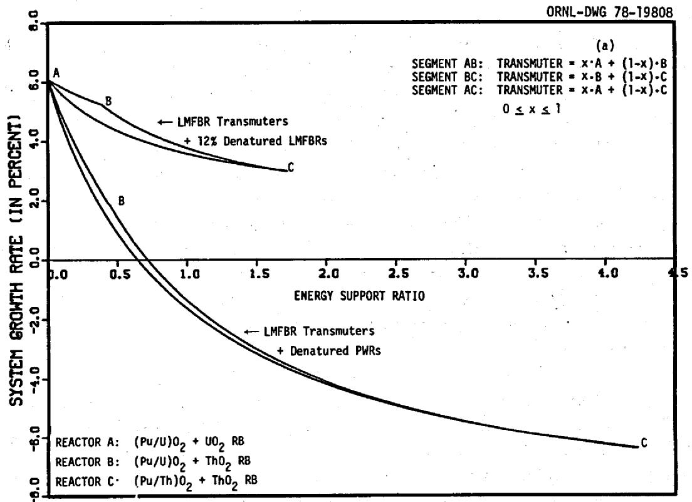

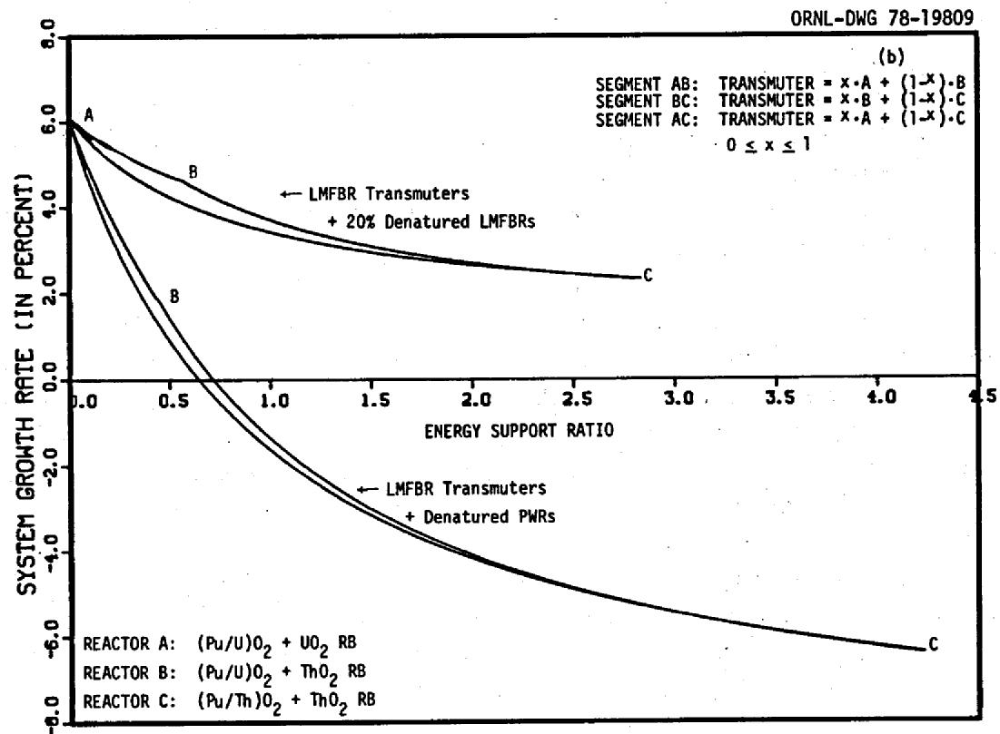  
Fig. 7.2-1. Operating Envelopes for Symbiotic Systems Utilizing LMFBR Transmuters.

# 7.2.4. Conclusions

Since optimization of the various reactors for the particular fuel cycle considered was beyond the scope of this study, the results presented above are subject to several uncertainties. Nevertheless, certain general conclusions on the impact of the various fuel cycles on reactor performance are believed to be valid:

- For once-through throwaway systems, the various systems studied are ranked in order of resource utilization as follows: the HwR on the LEU cycle; the HTGR and HTR-PBR on either the LEU cycle or on the MEU/Th cycle; and the SSCR and PWR on the LEU cycle. On the MEU/Th cycle the SSCR and PWR require more uranium than they do on the LEU cycle and hence do not merit further consideration for once-through operation.   
- For once-through stowaway systems, in which the fissile material in the spent fuel is expected to be recovered at some future date, the relative ranking of the systems would depend on the ultimate destination of the fissile material. If future nuclear power systems are to be thermal recycle systems, then early emphasis should be placed on reactors and fuel cycles that have a high $^{233}\mathrm{U}$ discharge. If the future systems are to be fast recycle systems, then emphasis should be placed on reactors and fuel cycles that will provide a plutonium inventory.   
- For recycle systems utilizing thermal reactors, the preferred basic fissile material is $^{233}\mathrm{U}$ . However, implementation of a $^{233}\mathrm{U}$ fuel cycle will require an exogenous source of the fissile material; therefore, it is likely that the MEU(235)/Th cycle would be implemented first to initiate the production of $^{233}\mathrm{U}$ . Both the unburned $^{235}\mathrm{U}$ and the $^{233}\mathrm{U}$ would be recycled; thus the system would evolve towards the MEU(233)/Th cycle, which is the denatured $^{233}\mathrm{U}$ cycle as defined in this study. However, it is to be emphasized that these reactors will not produce enough $^{233}\mathrm{U}$ to sustain themselves and separate $^{233}\mathrm{U}$ production facilities must be operated. A Pu/Th-fueled thermal reactor has been considered as a $^{233}\mathrm{U}$ production facility.   
- For recycle systems utilizing fast reactors, the preferred basic fissile material is $^{239}\mathrm{Pu}$ . Using $^{233}\mathrm{U}$ as the primary fissile material or placing thorium in the core sharply reduces the breeding performance of fast reactors. However, fast reactors using plutonium fuel and thorium blankets would be efficient $^{233}\mathrm{U}$ production facilities.

- The inherent symbiotic nature of the denatured $^{233}\mathrm{U}$ fuel cycle (i.e., dispersed reactors fueled with denatured $^{233}\mathrm{U}$ and supported by energy-center reactors fueled with Pu) mandates a tradeoff analysis of growth potential versus energy support ratio (ratio of power produced outside the energy center to the power produced inside the center), assuming no external source of fissile material. For thermal/thermal systems, the growth potential is negative. Fast/thermal systems would permit some of the net fissile gain (i.e., growth potential) of the fast reactors to be sacrificed for a higher energy support ratio. Fast/fast systems would provide the highest growth potential. Factors other than those affecting reactor performance would also influence the choice of reactors for the system, as has been discussed in Chapters 5 and 6.

# Section 7.2. Reference

1. T. J. Burns and J. R. White, "Preliminary Evaluation of Alternate Fuel Cycle Options Options Utilizing Fast Breeders," ORNL-5389 (1978).

# 7.3. PROSPECTS FOR IMPLEMENTATION AND COMMERCIALIZATION OF DENATURED $^{233}\mathrm{U}$ FUEL CYCLE

J. C. Cleveland and T. J. Burns  
Oak Ridge National Laboratory

Chapter 5 has discussed the reactors in which denatured $^{23}\mathsf{U}$ might be deployed, as well as the accompanying fuel recycle facility requirements, and has presented schedules of deployment that are based solely on the minimum time estimated to be required to solve technical problems. These schedules, which have been used in the nuclear power system evaluations presented in Chapter 6, were developed in discussions between Hanford Engineering Development Laboratory (HEDL), Argonne National Laboratory (ANL), Oak Ridge National Laboratory (ORNL), Combustion Engineering (CE), and the Department of Energy (DOE) specifically as a bounding case for assessing the maximum benefits that could be obtained by employing denatured $^{23}\mathsf{U}$ fuel. As a result, the schedules are not entirely consistent with those that have been developed subsequently in the Nonproliferation Alternative Systems Assessment Program (NASAP). While the introduction dates of the lead plants do not differ significantly, the NASAP scenarios predict a much slower deployment of commercial reactors.

The reactor introduction dates and deployment schedules used in this study were based on the following assumptions:

$\sim 10$ yr to develop/commercialize new fuel design   
$\sim 14$ yr to develop/commercialize modified reactor design   
$\sim 18$ yr to develop/commercialize new advanced converter design   
$\sim 24$ yr to develop/commercialize new breeder design

The resulting introduction dates for the various reactors are as listed below, where the introduction date is defined as the date of startup of the first unit, reactor deployment thereafter being limited to a maximum introduction rate\* by biennium of 1, 2, 4,... reactors:

1969 - LWRs operating on LEU fuel   
1987 - LWRs operating on "denatured $^{235}\mathrm{U}$ " fuel (i.e., MEU(235)/Th)   
1991 - LWRs operating on denatured $^{233}\mathrm{U}$ , Pu/U, and Pu/Th fuels   
1991 - SSCRs operating on LEU, denatured $^{233}\mathrm{U}$ , or Pu/Th fuels   
1995 - HwRs operating on any of several proposed fuels   
1995 - HTGRs operating on any of several proposed fuels   
2001 - FBRs operating on Pu/U, Pu/Th, or denatured $^{233}\mathrm{U}$ fuels

Since the above introduction dates are those estimated to be the earliest possible dates that technical problems could be resolved, it is clear that they cannot be achieved without substantial initiatives and strong financial support from the U.S. Government.

Even with government support, achieving the postulated schedules would be a difficult undertaking and would entail considerable risk since it would be impossible to fully demonstrate an alternate reactor concept before construction on the initial commercial size units has to begin. A minimum of six years would be required to construct a nuclear unit, and a minimum of three years would be required prior to construction for R&D and licensing approval. (It currently takes 10 to 12 yr to license and construct LWRs in the U.S.) At least two additional years of operation of the demonstration unit would be necessary to establish satisfactory reactor performance. Thus the earliest time a new reactor concept could be demonstrated is in the 1991-1995 period indicated, and that assumes that a commitment to proceed has been made by 1980. Because of design, licensing, and construction schedules, the first commercial units would have to be ordered well in advance of the operation of the initial demonstration reactor to achieve the buildup rates assumed in this study. In order to achieve such commitments prior to the first successful demonstration, government support would have to extend through the initial commercial units in addition to the lead plant. The new reactor cycle would also have to be perceived as economically advantageous to attract the postulated number of customers.

Although several of these reactor/fuel options (e.g., Pu/Th LWRs, denatured advanced converters, etc.) are based on the use of recycled fissile material, it should be emphasized that commercial-scale reprocessing is not necessarily required on the same time scale as the introduction of the recycle fuel types because the demand for recycle fissile material may be quite modest during the initial introduction phase. In the analysis presented in Chapter 6, many of the new fuel types are, in fact, introduced before the associated fuel reprocessing is fully developed, it being assumed that pilot or prototype-plant scale reprocessing would be adequate to support the initial phase of deployment of fuel recycle. Hence, although commercial reprocessing of $^{233}\mathrm{U}$ -containing fuels is not projected until around the turn of the century, limited introduction of denatured $^{233}\mathrm{U}$ fuel is permitted as early as 1991. A further argument is that commercial-scale reprocessing for the alternate fuels would not be feasible until the backlog of spent fuel required for plant startup had accumulated and the number of reactors utilizing recycled fuel could assure continued operation of commercial-scale facilities. On the other hand, for $^{233}\mathrm{U}$ -containing spent fuel elements to be available even for pilot-plant processing, it is essential that early irradiation of thorium in reactors be implemented.

In Section 7.3.1 a possible procedure for implementing and eventually commercializing the denatured $^{233}\mathrm{U}$ cycle is discussed. Included is a scenario which would provide for the early introduction of thorium fuel into current light-water reactors and allow an orderly progression to the utilization of denatured $^{233}\mathrm{U}$ fuel in breeders. The major considerations in commercializing these various reactors operating on alternate fuels, and in particular on denatured $^{233}\mathrm{U}$ fuel, are summarized in Section 7.3.2.

# 7.3.1. Possible Procedure for Implementing and Commercializing the Denatured Fuel Cycle

On the basis of the above assumptions, and the discussion in Section 5.1, it is obvious that the only reactors that could operate on denatured $^{233}\mathrm{U}$ fuel in the near term (by 1991) would be LWRs. Two possibilities exist for producing $^{233}\mathrm{U}$ for LWRs prior to the introduction of commercial fuel reprocessing. One involves the use of "denatured $^{235}\mathrm{U}$ " fuel (i.e., MEU(235)/Th) in LWRs, thereby initiating the production of $^{233}\mathrm{U}$ . However, this scheme suffers from very high fissile inventory requirements associated with full thorium loadings in LWRs (see Section 4.1). A second option involves the use of partial thorium loadings in LWRs. In this option $\mathrm{ThO}_2$ is introduced in certain lattice locations and/or MEU(235)/Th fuel is used in only a fraction of the fuel rods, the remaining fuel rods being conventional LEU fuel rods. This scheme significantly reduces the fissile inventory penalty associated with full thorium loadings in LWRs and for BWRs may offer operational benefits as well (see Section 4.1). Also, the partial thorium loadings would allow experience to be gained on the performance of thorium-based fuels while generating significant quantities of $^{233}\mathrm{U}$ . Either of the above options for producing $^{233}\mathrm{U}$ will probably require some form of government incentive since the $\mathrm{U}_{3}\mathrm{O}_{8}$ and separative work requirements (and associated costs) will increase with the amount of Th utilized in the once-through throwaway/stowaway modes in LWRs.

Although a reprocessing capability would be required to recover the bred $^{233}\mathrm{U}$ from thorium fuels, such a capability would not be required for the qualification and demonstration of thorium-based fuel, which initially would employ $^{235}\mathrm{U}$ rather than $^{233}\mathrm{U}$ . As has been pointed out above, the operation of LWRs with MEU(235)/Th or with partial thorium loadings could be accomplished during the next decade while the development and demonstration of the needed fuel cycle facilities for the implementation of the denatured $^{233}\mathrm{U}$ cycle are pursued. Initially the spent fuel could be stored in repositories in secure fuel storage centers which would represent a growing stockpile of $^{233}\mathrm{U}$ and plutonium. Additional fuel cycle service facilities, such as isotopic separation, reprocessing, fuel refabrication and possibly waste isolation, could be introduced into these centers as the need develops. As pointed out above, these could initially be pilot-plant-scale facilities followed by larger prototypes and then commercial-scale plants. It has been estimated (in Section 5.2) that commercialization of a new reprocessing technology would require 12 to 20 yr and the commercialization of a new refabrication technology would require 8 to 15 yr.

With the deployment of the pilot-scale reprocessing and refabrication facilities, recovery of Pu and U from spent fuel and the subsequent refabrication of Pu/Th and denatured $^{233}\mathrm{U} / \mathrm{Th}$ fuels could be demonstrated within the center. Pu/Th LWRs* could then

introduced within the centers to provide an additional means for $^{233}\mathrm{U}$ production, as well as additional power production. Concurrently, $^{233}\mathrm{U}$ (and unburned $^{235}\mathrm{U}$ ) recovered from MEU(235)/Th or from partial thorium loadings could be utilized in denatured $^{233}\mathrm{U}$ fueled LWRs introduced at dispersed sites. Later, $^{233}\mathrm{U}$ recovered from the Pu/Th fueled LWRs could also be utilized to fuel dispersed reactors. At this point the first phase of a nuclear power system that includes reactors operating both in energy centers and at dispersed locations outside the centers would be in effect. During this phase, which is

represented in Fig. 7.3-la, the research and development that will be required to deploy Pu-fueled FBR transmuters with thorium blankets in the energy centers could be pursued.

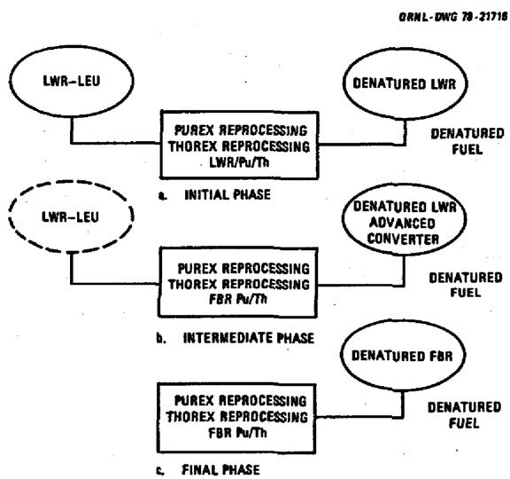  
Fig. 7.3-1. Three Phases for an Evolving Energy Center.

With these advance preparations having been made, by the time conventional LEU fueling in LWRs begins to phase out (due to increasing depletion of an economical resource base), the power system would evolve into a fast/thermal combination employing FBR transmuters and $^{233}\mathrm{U}$ -fueled converters, which by then might include denatured LWRs and advanced converters (SSCRs, HTGRs, or HWRs), depending on the reactor(s) selected for development (see Fig. 7.3-1b). Such a system could provide adequate capacity expansion for modest energy demand growth; however, if the energy demand is such that the fast/thermal system is inadequate, an

all-fast system including denatured FBRs could be substituted as shown in Fig. 7.3-1c. The necessity of the third phase of the energy center development is uncertain at this time, reflecting as it does assumptions concerning the supply of economically recoverable $\mathsf{U}_3\mathsf{O}_8$ and energy demand.

It is noted that this proposed scheme for implementing the denatured fuel cycle and instituting the energy center concept relies heavily on two strong technical bases: currently employed LWR technology, and the research and development already expended on LMFBRs, which includes the Purex and, to a lesser extent, the Thorex reprocessing technologies. While alternative fuel cycle technologies or other types of reactors will be involved if they can be demonstrated to have resource or economic advantages, the LWR-LMFBR scenario has been selected as representative of the type of activity that would be required.

# 7.3.2. Considerations in Commercializing Reactors Operating on Alternate Fuels

Although the introduction dates cited above for commercial operation of the various reactors on alternate fuels are considered to be attainable, they can be realized only if the first steps toward commercialization are initiated in the near future under strong and sustained government support. Currently, there is little economic incentive for the private sector to proceed with such development alone. For example, while recent evaluations1,2 of LWRs have indicated the feasibility of using thorium-based fuels with current core and lattice designs, either as reload fuels for reactors already in operation or as both initial and reload fuels for future LWRs, the resource-savings benefit of such fuels relative to once-through LEU fuel cannot be realized in the absence of fuel reprocessing and refabrication services. Moreover, the introduction of thorium into the core will require high initial uranium loadings, so that the fuel costs for the core would increase. Obviously, the lack of strong evidence that fuel recycle services would be available as soon as they were needed would discourage a transition to thorium-based fuels. Alternatively, such services could not be expected to be available commercially until utilization of thorium has been established and a market for these services exists. Thus commercialization of the denatured fuel cycle in LWRs, especially within the time frame postulated in this study, is unlikely unless major government incentives are provided.

The government incentives could be in the form of guarantees for investment in the fuel cycle services and/or subsidies for the costs associated with the additional $\mathsf{U}_3\mathsf{O}_8$ and separative work required for thorium-based fuels or for partial thorium loadings on the once-through cycle. This would also encourage the development of the fuel cycle services by establishing widespread use of thorium-based fuels. The commercial introduction of the required new LWR fuel cycle services could probably be accomplished by allowing a 7-yr lead time for construction of demonstration reprocessing and refabrication plants and an additional 7 yr to construct commercial-size plants. In the meantime, fabrication of MEU(235)/Th fuel or fuel designs involving partial thorium loadings for LWRs could probably be accomplished with existing LEU facilities within 2 to 3 yr (Ref. 3) with an additional 5 to 7 yr required for fuel qualification and/or demonstration. The R&D costs for demonstrating denatured uranium fuel in commercial reactors would be borne by the government.

The commercial introduction in the U. S. of the advanced converter concepts (SSCRs, HTGRs, and HWRs) would be more difficult today than was the past commercial introduction of the LWR. Although the introduction in 1958 of the first LWR, the Shippingport reactor, did involve government support, a relatively small investment was required due to its size (~68 MWe). The largest base-load power plants were about 300 MWe when LWRs initially penetrated the commercial market. Also, during the initial years of deployment of nuclear power, delays due to licensing procedures were considerably shorter, allowing plants to be constructed and brought on-line more rapidly than the current 10- to 12-yr lead time. The longer time causes much larger interest payments and much greater risk of licensing difficulties.

Prior to commercial introduction, a demonstration phase of a new advanced converter concept will be required, and, as has been pointed out in Chapter 5.1, it is assumed here that the demonstration will be on the reactor's reference cycle, which except for the HTGR, does not involve thorium. Utilities are unwilling to risk the large investment for commercial-size plants of 1000 MWe to 1300 MWe on untried concepts. With the large investments necessary for demonstration units, significant government support would be required: i.e., a demonstration program involving government construction of the initial unit with government financial support of the first commercial-size plant (1000 MWe to 1300 MWe). For commercial sales to occur, a vendor would have to market it and make the necessary investment to establish the manufacturing infrastructure.

The SSCR is expected to draw heavily on existing LWR technology, and it may even be feasible to operate a conventional PWR in the spectral-shift-control mode by addition of certain equipment. The feasibility of spectral-shift-control has already been demonstrated in the Belgian VULCAIN experiment (see Section 4.2). While the possibility of retrofitting existing large PWRs to the SSC mode exists, for reactors going into operation after the late-1980s, designing PWRs to accept SSC control at some later date is a more likely possibility. A major impediment to commercial introduction of the SSCR in the U.S. is likely to be the supply of $\mathsf{D}_2\mathsf{O}$ and government incentive would probably also be required in this area, as it will be for the deployment of the CANDU reactor (see below).

The technology for HTGRs is already well under way, with a prototype reactor currently undergoing startup testing at Fort St. Vrain. Prior to commercial deployment, however, successful operation of a demonstration HTGR in the 1000-MWe to 1300-MWe range would be required. Initially, HTGRs could operate on the stowaway MEU(235)/Th or LEU cycle. Again, commercial-scale reprocessing and refabrication facilities would not be expected until a demonstrated market for such services is present.

The technology for HwRs is also well advanced, with the CANDU reactors fueled with natural uranium already commercialized in Canada. It would be necessary, however, to demonstrate that the CANDU with appropriate modifications for slightly enriched fuel could be licensed in the U.S. and produce power at an acceptable cost. Commercialization of the CANDU in the U.S. would probably require government action in three areas:

1. Transfer of technology from Canada to take advantage of CANDU reactor development and demonstrated performance. Alternatively, a demonstration unit designed to U.S. licensing standards would be required.   
2. Government financial support of a large (1000-MWe to 1300-MWe) CANDU in the U.S.   
3. Development of $\mathsf{D}_2\mathsf{O}$ production facilities in the U.S. on a larger scale than currently exists.

CANDUs operating on thorium-based fuels could possibly be introduced simultaneously with the deployment in the U.S. of the CANDU reactor concept itself. Assuming Canadian participation, thorium-based fuel could be demonstrated in Canadian reactors prior to the operation of a CANDU reactor in the U.S. Furthermore, if by then the LWR thorium fuel

cycle services of reprocessing and refabrication had been commercially developed, the extension of these services to CANDU reactors could be built on the existing LWR facility base. Otherwise, the commercial introduction of these services could not be expected until some time after it becomes clear that CANDU reactors will be commercially deployed in the U.S. with thorium fuel, thereby indicating the existence of a market for associated fuel cycle services. The introduction dates postulated for the alternate fuel cycle CANDUs assume that requisite fuel cycle services have already been developed for thorium-fueled LWRs.

As pointed out in Section 5.1, no attempt has been made here to consider the commercialization prospects of FBRs since the INFCE program (International Nuclear Fuel Cycle Evaluation) is currently studying the role of FBRs in nuclear power scenarios and their results should be available in the near future.

In summary, it is apparent that significant barriers exist for the private sector either to convert LWRs to thorium-based fuels or to develop advanced reactor concepts. While $\mathsf{U}_3\mathsf{O}_8$ is still relatively inexpensive, the economics of alternate reactor and fuel cycle concepts at best show marginal savings relative to the LWR and consequently their development and deployment would have to be heavily subsidized by the government. In the longer term, as the price of uranium increases due to depletion of lower-cost uranium deposits, these alternate concepts could achieve superior economic performance compared to the LWR. The most optimistic introduction dates for advanced converters result in a relatively small installed capacity by the year 2000, and, as shown in Chapter 6, the impact of advanced converters on the cumulative $\mathsf{U}_3\mathsf{O}_8$ consumption by the year 2000 would be small. However, deployment of alternate reactor concepts in the time from 1995-2000 could have significant impact on resource use in the period 2000-2025. Except for HTGRs, none of the alternate reactor concepts that promise improved resource utilization has undergone licensing review by the government. Due to these factors, conversion to the denatured fuel cycle and/or introduction of alternate reactor concepts on a time scale which can dissuade international tendencies toward conventional plutonium recycle will require very significant government involvement and financial incentives in the near future.

# 7.3.3. Conclusions

From the above discussion the following conclusions can be summarized:

- The production of $^{233}\mathrm{U}$ for the denatured $^{233}\mathrm{U}$ fuel cycle could be initiated by introducing Th into the LWRs currently operating on the once-through cycle. However, there is an economic disincentive within the private sector to convert LWRs to thorium-based fuels because of the increased costs associated with the higher $\mathsf{U}_{3}\mathsf{O}_{8}$ and separative work requirements. Thus commercialization of the denatured fuel cycle is not plausible unless government incentives are provided. Initial production of $^{233}\mathrm{U}$

for later recycle could be initiated by the mid-1980's if such incentives were forthcoming. Recycle of $^{233}\mathrm{U}$ on a commercial scale is not plausible prior to the year 2000, however.

- The introduction of advanced reactor concepts that would provide significant resource savings beyond the year 2000 will require very large government support for R&D, for demonstration facilities, and for lead commercial plants. If a rapid deployment schedule were required, additional resources would have to be committed to cover the risks of early commercial plants.   
- Fuel service/energy centers whose ultimate purpose is to utilize plutonium both for energy production and for $^{233}\mathrm{U}$ production would progress through various phases. Initially these centers would be fuel storage facilities. With the introduction of reprocessing and refabrication in the center, LWRs located at dispersed sites would be fueled with denatured $^{233}\mathrm{U}$ . Concurrently Pu-fueled thermal transmuters would be deployed within the center. Ultimately, to meet long-term energy demands, Pu-fueled fast transmuters would be introduced within the centers.   
- It is desirable that a fuel recycle R&D program be initiated for denatured fuels at the same time a decision is made to fabricate thorium-containing fuel for large-scale irradiation in existing LWRs. Pilot-scale recycle facilities could be required within seven years after the initiation of a thorium irradiation program.

# Section 7.3 References

1. N. L. Shapiro, J. R. Rec, R. A. Matzie (Combustion Engineering), "Assessment of Fuel Cycles in Pressurized Water Reactors," EPRI-NP-359 (February 1977).   
2. "Assessment of Utilization of Thorium in BWRs," ORNL/SUB-4380/5 (NEDG-24073), prepared by General Electric Company (January 1978).   
3. "The Economics and Utilization of Thorium in Nuclear Reactors," ORNL-TM-6331 (also Technical Annexes 1 and 2, ORNL-TM-6332) prepared by Resource Planning Associates, Inc. (May 1978).

# 7.4. ADEQUACY OF NUCLEAR POWER SYSTEMS UTILIZING DENATURED $^{233}\mathrm{U}$ FUEL FOR MEETING ELECTRICAL POWER DEMANDS

M. R. Shay, D. R. Haffner, W. E. Black, T. M. Helm, R. W. Hardie, and R. P. Omberg  
Hanford Engineering Development Laboratory

An important measure for evaluating a nuclear power system is whether it can meet projected power demands with the uranium resources estimated to be available at an acceptable cost. This section summarizes the results of analyses performed in this study to determine whether various nuclear power systems utilizing denatured $^{233}\mathrm{U}$ fuel could meet a projected power demand of 350 GWe installed capacity by the year 2000 and a net increase of 15 GWe/year through the year 2049, the total capacity in the year 2050 being 1100 GWe. The analyses were based on a uranium supply model shown in Fig. 7.4-1 and in Table B-7 (Appendix B), which provides both conservative and optimistic predictions of the uranium supply as a function of cost.

The power systems analyzed are described in detail in Chapter 6. They are comprised of LEU-LWRs operating in conjunction with LWRs on other fuel cycles or in conjunction with one of the three types of advanced converters (SSCR, HWR, or HTGR) considered in the study. In some cases, FBRs are included in the system. Since the maintenance of proliferation-resistant power systems was one of the primary concerns, the concept of a secure energy

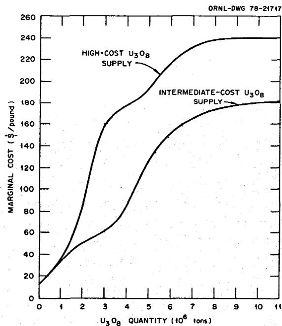  
Fig. 7.4-1. Marginal Costs for High-and Intermediate-Cost $U_{3}O_{8}$ Supply Curves.

center supporting dispersed reactors was used, with the fuel utilized in the dispersed reactors restricted to LEU (or SEU) and denatured fuels. A reactor operating on the denatured $^{233}\mathrm{U}$ fuel cycle is not self-sustaining, however, and therefore it requires an exogenous source of $^{233}\mathrm{U}$ . In the power systems studied, the $^{233}\mathrm{U}$ is provided by MEU/Th-fueled thermal reactors or plutonium-fueled thermal and/or fast transmuters. These reactors, of course, also contribute to the power generation. Because the transmuters have plutonium cores, however, they must be located within the secure energy centers. (Note: With this restriction the "energy support ratio" of a nuclear system becomes a second important measure of evaluation, as is discussed in Section 7.2.3. The energy support ratios for the systems described here are given in Appendix C, along with other detailed results from the analyses.)

A nuclear power systems evaluation such as the one performed in this study requires three basic components. First, the various nuclear power systems to be analyzed must be identified. Second, there must be an analytical model capable of modeling each system in sufficient detail that differences between the systems can be accurately calculated. And finally, a data base that contains both reactor performance data and economic data must be developed. Sections 7.4.1 and 7.4.2 below give brief descriptions of the model and data base as they were applied to this evaluation. The results of the analyses for specified nuclear power systems are then summarized in Sections 7.4.3, 7.4.4 and 7.4.5, with the detailed results presented in Appendix C.

# 7.4.1. The Analytical Method

Two fundamental aspects of the model used in the analyses relate to the nuclear energy demand and the $\mathsf{U}_{3}\mathsf{O}_{8}$ supply, both of which have been specified above. The nuclear energy demand assumed in the model is consistent with the current construction plans of utilities through the 1980's. As more nuclear units were required, with the supply of low-cost $\mathsf{U}_{3}\mathsf{O}_{8}$ progressively depleted, it was assumed that more expensive lower-grade uranium resources would be mined. This was modeled by assuming that the long-run marginal cost of $\mathsf{U}_{3}\mathsf{O}_{8}$ was an increasing function of the cumulative amount mined. For a particular nuclear policy option, the plant construction pattern was therefore governed by economics and/or uranium utilization.

Two different optimizing patterns were used in the study. In the first runs economic competition between nuclear fuels and coal was assumed, and the plants were selected to minimize the levelized cost of power over time. These runs, which are presented in Appendix D, indicated that nuclear power did not compete well at $U_{3}O_{8}$ prices above $160/1b$ for the assumptions used in this study. Thus for the runs of all-nuclear power systems, described in Chapter 6 and summarized here, an attempt was made to satisfy the demand for nuclear power with the $U_{3}O_{8}$ available at a price less than $160/1b$ $U_{3}O_{8}$ .

Other considerations also affected the selection of the nuclear power plants to be constructed. For example, a reactor that required Pu or $^{233}\mathrm{U}$ could not be constructed unless the projected supply of fissile material was sufficient throughout the reactor's lifetime. In addition, a nuclear plant design that differed from established technology could be introduced only at a limited rate. Furthermore, once the manufacturing capability to produce a particular reactor type was well established, the maximum rate at which that reactor type could lose its share of the new construction market was limited to a specified rate.

Both the total power cost of each nuclear policy option and the total power cost of each reactor type available in each option were calculated. For each reactor type, the total power cost was calculated for four components -- capital, operation and maintenance,

taxes, and fuel cycle. The fuel cycle costs were, in turn, divided into seven components -- $^{233}\mathrm{U}$ , uranium, thorium, enrichment, plutonium, fabrication, and reprocessing.

It is to be noted that the power systems calculated were all assumed to be U.S. based, the input data all being of U.S. origin. With appropriate input modifications, however, the model could be used for other scenarios. For example, it could be used to analyze the potential for the deployment of transmuters both to produce power in secure states and to produce $^{23}$ U for export to states wishing to base their own power systems on thermal reactors without national reprocessing.

# 7.4.2. Data Base

The data required by the model for each reactor type include power level, annual isotopic charge and discharge, annual fabrication requirements, introduction dates, etc. These data are presented in Tables 6.1-2 and 6.1-3 in Chapter 6. It is to be pointed out, however, that the data are for reactors of essentially conventional designs, and that the $\mathrm{U}_{3}\mathrm{O}_{8}$ requirements for the various reactor types could be reduced through design optimization. (Note: The effect of optimizing LWRs has been considered in a separate analysis and is discussed in Section 7.4.3 below.)

The major parameters in the economic data base used for this study are capital costs, uranium costs, fabrication costs, spent fuel disposal costs, reprocessing costs, and money costs. The entire data base, which was developed in a joint effort involving government and industry representatives, is presented in Appendix B.

# 7.4.3. Results for Price-Limited Uranium Supplies

As noted above, the denatured nuclear power systems utilized various combinations of thermal converters and fast reactors. These in turn were examined under six fuel cycle options, which are summarized in Table 7.4-1 (Options 4-8). In addition, the same reactor types were examined under three reference fuel cycle options -- a throwaway/stowaway option (Option 1) and two plutonium-uranium options (Options 2 and 3). Four cases were considered under each option, each case being distinguished by the type of converter being emphasized -- LWRs, SSCRs, HWRs, or HTGRs. Thus a total of 36 different nuclear power systems were analyzed.

The maximum nuclear capacity and the year in which the maximum occurs for each nuclear system studied is shown in Table 7.4-2 for the two uranium supply assumptions (see Fig. 7.4-1). As stated earlier, with the intermediate-cost supply it was assumed that 6 million ST of $\mathsf{U}_{3}\mathsf{O}_{8}$ could be recovered at costs less than $160/lb, while with the high-cost supply it was assumed that 3 million ST of $\mathsf{U}_{3}\mathsf{O}_{8}$ would be available.

Table 7.4-1. Description of Fuel Cycle Options*   

<table><tr><td>Option 1.</td><td>LEU converters on once-through cycle.</td></tr><tr><td colspan="2">Plutonium-Uranium Options (see Fig. 6.1-2):</td></tr><tr><td>Option 2.</td><td>Pu/U recycle option; LEU converters outside center; Pu/U converters inside center; HTGRs inside center operate on 235U/Th, 233U/Th, and Pu/Th.</td></tr><tr><td>Option 3.</td><td>Pu/U recycle option; LEU converters outside center; Pu/U converters and breeders inside center; HTGRs inside center operate on 235U/Th, 233U/Th, and Pu/U.</td></tr><tr><td colspan="2">Denatured Uranium Options Using Converters Only (see Fig. 6.1-3):</td></tr><tr><td>Option 4.</td><td>Plutonium throwaway option; LEU and denatured 235U and 233U converters outside center; no reactors inside center; U only recycled.</td></tr><tr><td>Option 5U.</td><td>Plutonium minimization option; LEU and denatured 235U and 233U converters outside center; Pu/Th converters inside center; U and Pu recycled.</td></tr><tr><td>Option 5T.</td><td>Same as 5U without denatured 235U converters.</td></tr><tr><td colspan="2">Denatured Uranium Options Using Both Converters and Breeders (see Fig. 6.1-4):</td></tr><tr><td>Option 6.</td><td>Light transmutation option; LEU and denatured 235U and 233U converters outside center; Pu/Th converters and Pu-U/Th breeders inside center.</td></tr><tr><td>Option 7.</td><td>Light transmutation option with denatured breeder; LEU converters, denatured 235U converters, and denatured 233U converters and breeders outside center; Pu/Th converters and Pu-U/Th breeders inside center.</td></tr><tr><td>Option 8.</td><td>Heavy transmutation option; same as Option 7 except inside breeder is a Pu-Th/Th breeder.</td></tr></table>

*Four cases considered under each option, identified by letters L, S, H, and G to denote type of converter employed in addition to LEU-LWRs (L = LWR, S = SSCR, H = HWR, G = HTGR).

The effect of varying the fuel cycle system can be seen by reading across Table 7.4-2 and the effect of changing the converter reactor option can be deduced by reading down a column. An installed nuclear capacity of 1100 GWe in year 2050 indicates that the projected energy demand is fully met by the reactors in a given nuclear fuel cycle system.

(Note: A capacity of 1100 GWe in year 2049 meets demand.)

Table 7.4-2. Maximum Nuclear Capacity of Various Nuclear Power Options and Year in Which Maximum Occurs   

<table><tr><td rowspan="2">Converter Reactor Option</td><td colspan="9">Maximum Installed Nuclear Capacity (GWe)/Year maximum occurs</td></tr><tr><td>1</td><td>2</td><td>3</td><td>4</td><td>5U</td><td>5T</td><td>6</td><td>7</td><td>8</td></tr><tr><td rowspan="3">LWRs(L)</td><td colspan="9">With High-Cost U3O8 Supply</td></tr><tr><td>433</td><td>611</td><td>1100</td><td>585</td><td>716</td><td>637</td><td>1100</td><td>1100</td><td>1087</td></tr><tr><td>2009</td><td>2021</td><td>2049</td><td>2019</td><td>2027</td><td>2021</td><td>2049</td><td>2049</td><td>2049</td></tr><tr><td rowspan="2">SSCRs(S)</td><td>440</td><td>661</td><td>1100</td><td>660</td><td>820</td><td>764</td><td>1100</td><td>1100</td><td>1084</td></tr><tr><td>2009</td><td>2023</td><td>2049</td><td>2023</td><td>2033</td><td>2029</td><td>2049</td><td>2049</td><td>2049</td></tr><tr><td rowspan="2">HWRs(H)</td><td>444</td><td>630</td><td>1100</td><td>756</td><td>915</td><td>856</td><td>1100</td><td>1100</td><td>1100</td></tr><tr><td>2011</td><td>2021</td><td>2049</td><td>2031</td><td>2041</td><td>2035</td><td>2049</td><td>2049</td><td>2049</td></tr><tr><td rowspan="2">HTGRs(G)</td><td>437</td><td>818</td><td>1100</td><td>545</td><td>671</td><td>638</td><td>1091</td><td>1100</td><td>958</td></tr><tr><td>2009</td><td>2033</td><td>2049</td><td>2019</td><td>2023</td><td>2021</td><td>2049</td><td>2049</td><td>2041</td></tr><tr><td colspan="10">With Intermediate-Cost U3O8 Supply</td></tr><tr><td rowspan="2">LWRs(L)</td><td>729</td><td>968</td><td>1100</td><td>1002</td><td>1062</td><td>1012</td><td>1100</td><td>1100</td><td>1097</td></tr><tr><td>2027</td><td>2041</td><td>2049</td><td>2047</td><td>2049</td><td>2047</td><td>2049</td><td>2049</td><td>2049</td></tr><tr><td rowspan="2">SSCRs(S)</td><td>763</td><td>1078</td><td>1100</td><td>1084</td><td>1100</td><td>1100</td><td>1100</td><td>1100</td><td>1100</td></tr><tr><td>2029</td><td>2049</td><td>2049</td><td>2049</td><td>2049</td><td>2049</td><td>2049</td><td>2049</td><td>2049</td></tr><tr><td rowspan="2">HWRs(H)</td><td>852</td><td>1062</td><td>1100</td><td>1084</td><td>1100</td><td>1100</td><td>1100</td><td>1100</td><td>1100</td></tr><tr><td>2035</td><td>2049</td><td>2049</td><td>2049</td><td>2049</td><td>2049</td><td>2049</td><td>2049</td><td>2049</td></tr><tr><td rowspan="2">HTGRs(G)</td><td>783</td><td>1100</td><td>1100</td><td>971</td><td>1065</td><td>996</td><td>1100</td><td>1100</td><td>1100</td></tr><tr><td>2031</td><td>2049</td><td>2049</td><td>2041</td><td>2049</td><td>2045</td><td>2049</td><td>2049</td><td>2049</td></tr></table>

Non-FBR Systems, Options 1, 2, 4, and 5

For the high-cost $U_{3}O_{8}$ supply case (3 million ST $U_{3}O_{8}$ below $\$160/\mathrm{lb}$ ), it is evident that introducing advanced converters on the throwaway/stowaway fuel cycle (Option 1) has little effect on the maximum attainable nuclear capacity. This is directly due to the introduction dates assumed for the advanced converter reactors. By the time the converters

dominate the new capacity being built, a very significant fraction of the $U_{3}O_{8}$ supply has already been committed to the standard LWR. It follows that if the intermediate-cost $U_{3}O_{8}$ were used (6 million ST $U_{3}O_{8}$ below $\$160/1b$ ), together with the same nuclear growth rate, the addition of an advanced converter would have a much larger impact. For example, in this case the system including HWRs has a maximum attainable installed nuclear capacity for the throwaway/stowaway option that is approximately $17\%$ greater than the installed capacity of the system comprised of LWRs alone, while for the high-cost supply case it is only $3\%$ greater.

In Option 2 converter reactors are operated on the LEU fuel cycle outside the energy center and Pu/U converters and $^{235}\mathrm{U}(\mathrm{HE})/\mathrm{Th}$ , $^{233}\mathrm{U}/\mathrm{Th}$ , and Pu/Th HTGRs are operated inside the center. As expected, the thermal recycle systems all support nuclear power growth with less $\mathsf{U}_3\mathsf{O}_8$ consumption than the once-through systems of Option 1, and, in general, the options including advanced converter reactors (SSCRs, HWRs, and HTGRs) provide for increased maximum installed capacity relative to the LWR option for both the high-cost and the intermediate-cost $\mathsf{U}_3\mathsf{O}_8$ supply assumptions. The HTGR option (2G) provides for the greatest level of installed nuclear capacity for both $\mathsf{U}_3\mathsf{O}_8$ supplies. The resource efficiency of these scenarios is largely due to the fact that they include the nondenatured $^{233}\mathrm{U}/\mathrm{Th}$ fuel cycle which is used only by HTGRs in this study.

Option 4 utilizes only denatured $^{235}\mathrm{U}$ and $^{233}\mathrm{U}$ fuels and LEU fuel, all outside the energy center, and none of the plutonium produced is recycled. Here it is interesting to observe that for both uranium supply assumptions the HwR converter option (4H) has installed capacity levels that are greater than or equal to those of any other converter reactor option, while the HTGR option (4G) has the lowest installed capacities. It appears that the HTGRs used in this study do not operate efficiently on denatured fuel cycles relative to the other converters available (see also Options 5UG and 5TG). This can be partially attributed to the fact that the reactors used in these evaluations were not optimized for the roles in which they were employed, and for the HTGR this has a greater impact than for the other reactor types.

Option 5 uses denatured and LEU-fueled reactors outside the center and Pu/Th-fueled converters within the center. This option is divided into two suboptions: Option 5U, in which both denatured $^{235}\mathrm{U}$ and denatured $^{233}\mathrm{U}$ units are used; and Option 5T, in which the denatured $^{235}\mathrm{U}$ units are excluded. In both cases, $^{233}\mathrm{U}$ is produced in the Pu/Th converters. In these cases the HWR options produce the greatest maximum installed nuclear capacity with the high-cost ore supply, and both the HWR options and SSCR options meet the power demand with the intermediate-cost ore supply. Again, the HTGRs do not appear to operate as efficiently as the other converters for the reasons cited above.

In summary, non-FBR power systems using denatured fuel but discarding plutonium require about the same amount of $\mathsf{U}_3\mathsf{O}_8$ as thermal systems on the classical Pu/U cycle and offer potential nuclear growth rates that are roughly the same. If the plutonium is re

cycled in Pu/Th converters, the systems have potential nuclear growth rates that exceed those of analogous reactors operating on the Pu/U fuel cycle. If the intermediate-cost $\mathrm{U}_{3}\mathrm{O}_{8}$ supply assumption proves to be correct, advanced converters in the recycle mode can satisfy the postulated nuclear energy demand through year 2050 at competitive costs. This analysis therefore indicates that, at least under optimistic resource conditions, advanced converters using denatured fuels can defer the need for commercial use of an "inexhaustible" energy source (such as FBRs) beyond the year 2050.

FBR Systems, Options 3, 6, 7, and 8

Table 7.4-2 shows that almost all of the nuclear system options using FBR fuel cycles (Options 3, 6, 7, and 8) are able to meet the projected nuclear energy demand without mining $\mathsf{U}_3\mathsf{O}_8$ costing more than $160/lb. The only exception is Option 8 for the case of the high-cost ore supply, and even this option, which includes the Pu-Th/Th breeder and the denatured $^{233}\mathsf{U}$ breeder, would satisfy the demand if slightly improved FBR reactor design parameters were used. Thus, as was expected, this analysis indicates that FBR-containing systems will potentially support much larger nuclear capacities than thermal recycle systems and/or will require less mining. The Th-containing FBR cycles supporting dispersed denatured converters perform as well as the analogous Pu/U cycles within the framework of this analysis. Of the Th-containing cycles, the FBR with a Pu/U core and Th blanket is particularly resource-efficient.

# 7.4.4. Results for Unconstrained Resource Availability

The preceding results represent a somewhat artificial situation because of the $160/lb$ limitation on the $\mathsf{U}_3\mathsf{O}_8$ availability. That is, the failure to meet the projected power demand in many of the scenarios investigated is a direct result of the system's inability to utilize $\mathsf{U}_3\mathsf{O}_8$ costing more than $\$ 160/lb$ . In order to address the potential of the various fuel cycle/reactor options under the condition that the projected demand for nuclear power must be satisfied, the $\$ 160/lb$ constraint was removed. The cumulative quantity of $\mathsf{U}_3\mathsf{O}_8$ required to completely satisfy the demand for nuclear generating capacity was then estimated for each of the nuclear power options; these results are presented in Table 7.4-3.

The rate at which $\mathsf{U}_3\mathsf{O}_8$ is required to support the projected nuclear capacity represents an important additional constraint on a system. An overall maximum $\mathsf{U}_3\mathsf{O}_8$ production rate is difficult to specify because of the possibility of importing $\mathsf{U}_3\mathsf{O}_8$ and because any prediction of the production of $\mathsf{U}_3\mathsf{O}_8$ from uncertain resources in the next century is highly speculative. Recognizing this, and also recognizing that the required $\mathsf{U}_3\mathsf{O}_8$ production rate is still an important variable, the maximum required $\mathsf{U}_3\mathsf{O}_8$ production rates for each scenario were estimated and are tabulated in Table 7.4-4. As a point of reference, note that DOE has estimated that domestic mining and milling could sustain a production rate of 60,000 ST of $\mathsf{U}_3\mathsf{O}_8$ per year in the 1990s by developing $\mathsf{U}_3\mathsf{O}_8$ reserves and potential resources at forward costs of less than $30 per pound.

Table 7.4-3. Cumulative $\mathsf{U}_{\mathsf{3}}\mathsf{O}_{\mathsf{8}}$ Consumption of Various Nuclear Policy Options   

<table><tr><td rowspan="2">Converter Reactor Option</td><td colspan="9">Cumulative U3O8 Consumption (millions of tons) Through year 2025/Through year 2049</td></tr><tr><td>1</td><td>2</td><td>3</td><td>4</td><td>5U</td><td>5T</td><td>6</td><td>7</td><td>8</td></tr><tr><td></td><td></td><td></td><td></td><td colspan="3">With High-Cost U3O8 Supply</td><td></td><td></td><td></td></tr><tr><td>LWRs</td><td>3.41</td><td>2.39</td><td>2.14</td><td>2.87</td><td>2.36</td><td>2.36</td><td>2.18</td><td>2.14</td><td>2.29</td></tr><tr><td>(L)</td><td>7.05</td><td>5.23</td><td>2.73</td><td>5.41</td><td>4.83</td><td>4.94</td><td>2.82</td><td>2.83</td><td>2.86</td></tr><tr><td>SSCRs</td><td>3.26</td><td>2.23</td><td>1.99</td><td>2.70</td><td>2.35</td><td>2.14</td><td>1.93</td><td>1.93</td><td>2.07</td></tr><tr><td>(S)</td><td>6.52</td><td>4.35</td><td>2.70</td><td>4.65</td><td>3.86</td><td>3.86</td><td>2.69</td><td>2.69</td><td>2.83</td></tr><tr><td>HWRs</td><td>3.10</td><td>2.72</td><td>2.29</td><td>2.50</td><td>2.16</td><td>2.14</td><td>2.25</td><td>2.21</td><td>2.29</td></tr><tr><td>(H)</td><td>5.58</td><td>4.64</td><td>2.70</td><td>4.36</td><td>3.27</td><td>3.77</td><td>2.61</td><td>2.55</td><td>2.87</td></tr><tr><td>HTGRs</td><td>3.23</td><td>2.19</td><td>1.97</td><td>2.58</td><td>2.32</td><td>2.34</td><td>2.15</td><td>2.12</td><td>2.32</td></tr><tr><td>(G)</td><td>6.26</td><td>4.04</td><td>2.75</td><td>5.13</td><td>4.43</td><td>4.94</td><td>2.70</td><td>2.68</td><td>3.18</td></tr><tr><td></td><td></td><td></td><td></td><td colspan="3">With Intermediate-Cost U3O8 Supply</td><td></td><td></td><td></td></tr><tr><td>LWRs</td><td>3.41</td><td>2.39</td><td>2.28</td><td>2.87</td><td>2.36</td><td>2.36</td><td>2.37</td><td>2.37</td><td>2.37</td></tr><tr><td>(L)</td><td>7.05</td><td>5.23</td><td>4.40</td><td>5.41</td><td>4.91</td><td>4.94</td><td>4.38</td><td>4.38</td><td>4.48</td></tr><tr><td>SSCRs</td><td>3.26</td><td>2.23</td><td>2.20</td><td>2.70</td><td>2.14</td><td>2.14</td><td>2.14</td><td>2.14</td><td>2.14</td></tr><tr><td>(S)</td><td>6.52</td><td>4.35</td><td>4.14</td><td>4.65</td><td>3.86</td><td>3.86</td><td>3.86</td><td>3.86</td><td>3.86</td></tr><tr><td>HWRs</td><td>3.10</td><td>2.72</td><td>2.31</td><td>2.94</td><td>2.52</td><td>2.51</td><td>2.32</td><td>2.30</td><td>2.38</td></tr><tr><td>(H)</td><td>5.58</td><td>4.64</td><td>2.71</td><td>5.40</td><td>4.32</td><td>4.37</td><td>3.66</td><td>2.70</td><td>3.37</td></tr><tr><td>HTGRs</td><td>3.23</td><td>2.32</td><td>2.30</td><td>2.58</td><td>3.32</td><td>2.34</td><td>2.23</td><td>2.23</td><td>2.26</td></tr><tr><td>(G)</td><td>6.26</td><td>4.23</td><td>4.22</td><td>5.13</td><td>4.43</td><td>4.94</td><td>4.19</td><td>4.19</td><td>4.24</td></tr></table>

The results presented in Tables 7.4-3 and 7.4-4 indicate the relative resource efficiencies of the various nuclear power systems since the energy produced was held constant. It should be noted that although the $\mathsf{U}_3\mathsf{O}_8$ cost limitation of $160/lb was removed, the uranium requirements were estimated for both the intermediate- and high-cost $\mathsf{U}_3\mathsf{O}_8$ supplies. Hence, the differences in the cumulative $\mathsf{U}_3\mathsf{O}_8$ requirements and annual $\mathsf{U}_3\mathsf{O}_8$ production rates for similar fuel cycle/reactor combinations are due to different reactor mixes associated with each uranium price structure.

Table 7.4-4. Maximum ${\mathrm{U}}_{3}{\mathrm{O}}_{8}$ Requirements of Various Nuclear Policy Options   

<table><tr><td rowspan="2">Converter Reactor Option</td><td colspan="9">Maximum U3O8 Consumption (thousands of tons per year)</td></tr><tr><td>1</td><td>2</td><td>3</td><td>4</td><td>5U</td><td>5T</td><td>6</td><td>7</td><td>8</td></tr><tr><td></td><td></td><td></td><td></td><td colspan="3">With High-Cost U3O8 Supply</td><td></td><td></td><td></td></tr><tr><td>LWRs</td><td>183</td><td>120</td><td>60</td><td>111</td><td>115</td><td>115</td><td>62</td><td>60</td><td>68</td></tr><tr><td></td><td></td><td></td><td></td><td></td><td></td><td></td><td></td><td></td><td></td></tr><tr><td>SSCRs</td><td>160</td><td>115</td><td>52</td><td>83</td><td>83</td><td>83</td><td>50</td><td>50</td><td>55</td></tr><tr><td></td><td></td><td></td><td></td><td></td><td></td><td></td><td></td><td></td><td></td></tr><tr><td>HWRs</td><td>120</td><td>83</td><td>66</td><td>78</td><td>62</td><td>69</td><td>64</td><td>63</td><td>65</td></tr><tr><td></td><td></td><td></td><td></td><td></td><td></td><td></td><td></td><td></td><td></td></tr><tr><td>HTGRs</td><td>140</td><td>82</td><td>53</td><td>105</td><td>96</td><td>115</td><td>61</td><td>60</td><td>65</td></tr><tr><td></td><td></td><td></td><td></td><td colspan="3">With Intermediate-Cost U3O8 Supply</td><td></td><td></td><td></td></tr><tr><td>LWRs</td><td>183</td><td>120</td><td>92</td><td>111</td><td>117</td><td>115</td><td>86</td><td>86</td><td>92</td></tr><tr><td></td><td></td><td></td><td></td><td></td><td></td><td></td><td></td><td></td><td></td></tr><tr><td>SSCRs</td><td>160</td><td>115</td><td>93</td><td>83</td><td>83</td><td>83</td><td>83</td><td>83</td><td>83</td></tr><tr><td></td><td></td><td></td><td></td><td></td><td></td><td></td><td></td><td></td><td></td></tr><tr><td>HWRs</td><td>120</td><td>83</td><td>66</td><td>110</td><td>89</td><td>90</td><td>66</td><td>66</td><td>66</td></tr><tr><td></td><td></td><td></td><td></td><td></td><td></td><td></td><td></td><td></td><td></td></tr><tr><td>HTGRs</td><td>140</td><td>86</td><td>86</td><td>105</td><td>96</td><td>115</td><td>87</td><td>87</td><td>87</td></tr></table>

Satisfying the demand for 1100 GWe in year 2050 with the standard LWR once-through cycle (Option 1L) would require that about 183,000 ST $\mathsf{U}_3\mathsf{O}_8$ be produced in year 2049, with a cumulative consumption of 7.1 million ST through that date. Introducing advanced converters (Options 1S, 1H, and 1G) would reduce both the cumulative $\mathsf{U}_3\mathsf{O}_8$ consumption and the maximum production rate requirements on the once-through cycle -- in the case of the HwR as low as 5.6 million ST and 120,000 ST/yr, respectively.

Thermal recycle modes (Options 2, 4, 5U, and 5T) would reduce $\mathsf{U}_3\mathsf{O}_8$ consumption through year 2049 to within the range of 3.3 to 5.4 million ST $\mathsf{U}_3\mathsf{O}_8$ , depending on the policy option chosen and to a lesser extent on the uranium cost level. The maximum $\mathsf{U}_3\mathsf{O}_8$ consumption would vary from 62,000 to 120,000 ST/yr. The resource consumption is sensitive to the uranium price level to the extent that high-cost uranium favors the choice of efficient high-capital-cost systems such as the HWR, whereas lower-cost uranium favors continued use of LWRs even if other reactors are available.

It should be noted that when plutonium is recycled in thermal power systems including denatured reactors (Options 5U and 5T) the total resource requirements (including Pu)

are generally less than those for thermal systems in the Pu-U recycle mode (Option 2). Discarding Pu from the recycle of denatured thermal systems (Option 4) reduces the efficiency of the denatured cycle.

The nuclear power systems that include fast breeders (Options 3, 6, 7, and 8) have cumulative $U_{3}O_{8}$ requirements through year 2049 within the range of 2.71 to 4.41 million ST $U_{3}O_{8}$ in the case of the intermediate-cost $U_{3}O_{8}$ supply and within 2.6 to 3.2 million ST $U_{3}C_{8}$ in the case of the high-cost supply. The maximum $U_{3}O_{8}$ consumption varies from 66,000 to 93,000 ST/yr for the intermediate-cost supply and from 52,000 to 68,000 ST/yr for the high-cost supply. The breeder-containing options are able to adjust the reactor mix effectively to reduce $U_{3}O_{8}$ consumption in the event $U_{3}O_{8}$ costs are high. The larger the fraction of breeders in the reactor mix, the lower the $U_{3}O_{8}$ requirements.

It should be noted that the $\mathsf{U}_3\mathsf{O}_8$ requirements for the systems containing breeders with Pu/U cores and Th blankets (Options 6 and 7) are similar to the $\mathsf{U}_3\mathsf{O}_8$ requirements for the system containing the classical Pu/U breeder (Option 3). The systems containing breeders with Pu/Th cores and Th blankets require somewhat more $\mathsf{U}_3\mathsf{O}_8$ on an integrated basis.

The $\mathsf{U}_{3}\mathsf{O}_{8}$ requirements presented in Table 7.4-4 qualitatively support the ranking of cycles in the cost-constrained runs. Specifically, the power systems operating on once-through cycles require 5.6 to 7.1 million $\mathsf{STU}_{3}\mathsf{O}_{8}$ to satisfy the demand for nuclear power through 2050, the thermal-recycle systems require 3.3 to 5.4 million $\mathsf{STU}_{3}\mathsf{O}_{8}$ , and the breeder-containing systems require 2.6 to 4.4 million $\mathsf{STU}_{3}\mathsf{O}_{8}$ . The systems including denatured $^{23}\mathsf{U}$ reactors require approximately the same cumulative amount of $\mathsf{U}_{3}\mathsf{O}_{8}$ as their Pu/U counterparts. The results presented in Table 7.4-5 also support these statements: the required production rates are highest for the once-through systems; they are reduced somewhat for the thermal recycle cases; and they are lowest for the breeder-containing scenarios.

# 7.4.5. Systems Employing Improved LWRs and Enrichment Technology

While not considered in the analysis summarized above, it is possible to optimize LWR designs to greatly enhance their utilization of $\mathsf{U}_3\mathsf{O}_8$ per unit energy produced. These optimized designs may result in reduced $\mathsf{U}_3\mathsf{O}_8$ requirements of up to 30% relative to more conventional LWR designs. The 30% improvement in LWR $\mathsf{U}_3\mathsf{O}_8$ requirements assumes no spent fuel reprocessing, the improvements being the result of increased discharge exposure fuels and/or reconfigured reactor cores.

The effect of developing these LWR cores optimized for throwaway/stowaway operation was examined by assuming that the $\mathsf{U}_3\mathsf{O}_8$ utilization would be improved in sequential increments $\mathsf{U}_3\mathsf{O}_8$ requirements equal to 90% of the standard LWR. It was also assumed that this improvement would be retrofitted into existing reactors. Similarly, reactors starting up

between 1991 and 2001 were assumed to have $\mathsf{U}_3\mathsf{O}_8$ requirements equal to $80\%$ of the standard LWR, with the improvements retrofitted to all existing reactors at that time. Finally, those plants beginning operation after 2001 were assumed to have $\mathsf{U}_3\mathsf{O}_8$ requirements equal to $70\%$ of the standard LWR, again with the improvements retrofitted to existing plants.

In addition, the effect of a lower enrichment tails assay was examined for both the standard and the optimized LWR designs. The standard enrichment tails schedule assumed that the assay fraction was a constant 0.0020. The reduced tails schedule began at 0.0020 but decreased to 0.0005 between 1980 and 2010 and remained constant thereafter. The latter tails schedule was assumed to represent a changeover to an improved enrichment technology.

The effects of considering both the improved LWR design and the improved tail technology are summarized in Table 7.4-5. The results show that with tails improvements alone the $U_{3}O_{8}$ requirements may be reduced by $16\%$ by year 2029. This reduced level of $U_{3}O_{8}$ consumption translates to an increase in the maximum installed capacity of approximately 60 GWe for standard LWRs on the throwaway/stowaway fuel cycle.

Table 7.4-5. Comparison of $\mathrm{U}_{3}\mathrm{O}_{8}$ Utilization of Standard and Improved LWRs Operating on Throwaway/Stowaway Option With and Without Improved Tails   

<table><tr><td rowspan="3">Year</td><td colspan="4">ST U3O8/GWe</td></tr><tr><td colspan="2">Standard LWR Technology</td><td colspan="2">Improved LWR Technology</td></tr><tr><td>Normal Tails</td><td>Improved Tails</td><td>Normal Tails</td><td>Improved Tails</td></tr><tr><td>1989</td><td>5236</td><td>4759</td><td>4649</td><td>4224</td></tr><tr><td>2009</td><td>5236</td><td>4508</td><td>4079</td><td>3560</td></tr><tr><td>2029</td><td>5236</td><td>4398</td><td>3923</td><td>3346</td></tr></table>

*Normal tails assume 0.2 w/o $^{235}\mathrm{U}$ in $^{238}\mathrm{U}$ ; improved tails assumed 0.05 w/o $^{235}\mathrm{U}$ in $^{238}\mathrm{U}$ ; 75% capacity factor.

With improved LWR technologies (no tails improvements) the $\mathsf{U}_3\mathsf{O}_8$ consumption levels could be reduced $\sim 25\%$ in year 2029. This translates to an increase of 100 GWe in the maximum installed capacity for optimized LWRs. If both reduced tails and advanced LWR technologies were used, the maximum achievable installed nuclear capacity would increase by about 144 GWe.

It is important to place these results within the perspective of the results reported in Table 7.4-2. The maximum installed nuclear capacities obtained with these improvements are comparable to those for standard LWRs operating on the classical $\mathsf{Pu} / ^{238}\mathsf{U}$ recycle mode or on the denatured $^{233}\mathsf{U}$ cycle. Obviously, if both improved LWRs and Pu recycle were available, the nuclear capacity could be even greater.

# 7.4.6 Conclusions

From the preceding discussion and the results presented in Chapter 6 and Appendix C, the following conclusions may be drawn concerning the reactor options, the fuel cycle options, and the $\mathsf{U}_3\mathsf{O}_8$ supply cases analyzed for this study. It should be emphasized that the conclusions are tentative and may be changed as a result of different demand growth projections or more accurate or improved reactor characterizations.

- If nuclear power systems were limited to the once-through cycle, it would be necessary to utilize $\mathsf{U}_{3}\mathsf{O}_{8}$ sources at above $160/lb sometime between year 2009 and year 2035 in order to satisfy the projected nuclear power capacity demand.   
- If nuclear power systems were limited to the once-through cycle and to $U_{3}O_{8}$ supplies below $\$160/1b$ , the U.S. nuclear power capacity would peak some time between 2009 and 2035. Nuclear power would fail to satisfy the projected nuclear demand during the 10-year period preceding the peak. If improved LWR designs and improved tails stripping techniques were implemented, the peaks would occur 10 to 15 years later.   
- If the high-cost $U_{3}O_{8}$ supply is assumed (3 million ST below $\$160/\mathrm{lb}$ ), all once-through systems, regardless of the converter type employed, result in approximately the same maximum installed nuclear capacity. For less-restrictive $U_{3}O_{8}$ supply assumptions, advanced converters have time to increase the total nuclear power supply on the once-through cycle.   
- Thermal recycle systems have the capability of substantially reducing requirements for $\mathsf{U}_{3}\mathsf{O}_{8}$ or of increasing the maximum installed capacity over the capacity of the once-through cycle. The best thermal recycle systems can support over twice the maximum installed capacity of the once-through cycle, and, under the intermediate-cost $\mathsf{U}_{3}\mathsf{O}_{8}$ supply assumption (6 million ST below $160/lb), they can fully support the assumed nuclear power growth through year 2050.   
- The systems including breeders have the capability of substantially reducing the mining requirements and/or increasing the maximum installed capacity beyond thermal systems with recycle. This capability is needed to satisfy the nuclear capacity demand through year 2050 under the high-cost uranium supply assumption (3 million ST below $160/lb).   
- Thermal recycle systems including denatured $^{233}\mathrm{U}$ reactors have the capability of supporting more nuclear capacity than the thermal Pu/ $^{238}\mathrm{U}$ recycle systems. However, achieving this capability would usually require Pu utilization.   
- From a resource utilization point of view, nuclear power systems utilizing denatured $^{233}\mathrm{U}$ reactors can be started equally well with MEU(235)/Th or Pu/Th fuels, providing the eventual use of the plutonium generated in the MEU(235)/Th cycle is assumed.

- Systems that use breeders (i.e., fast transmuters) to produce $^{233}\mathrm{U}$ for LWRs or advanced converters operating on denatured $^{233}\mathrm{U}$ fuel have a capability comparable to systems employing the classical Pu/U breeder cycle to satisfy the assumed demand through 2050 with the $\mathrm{U}_{3}\mathrm{O}_{8}$ resource base assumed in this study.

# Section 7.4. References

1. John Klemenic, Director, and David Blanchfield, Mineral Economist, Supply Analysis Division, Grand Junction Office, DOE Uranium and Enrichment Division, in paper entitled "Production Capability and Supply," paper presented at Uranium Industry Seminar, October 26-27, 1977, Grand Junction, Colorado; proceedings published as GJ0-108(77).

# 7.5. TRADE-OFF ANALYSIS AND OVERALL STRATEGY CONSIDERATIONS

# T. J. Burns and I. Spiewak   Oak Ridge National Laboratory

One of the principal concerns about civilian nuclear power centers on the possible diversion of recycled fissile material to weapons fabrication, in particular, the diversion of plutonium. Depending on the degree to which this concern is addressed, various nuclear power strategies can be developed between the current no-reprocessing option (and hence no recycle) and options that would permit the unconstrained recycle of plutonium. The denatured $^{233}\mathrm{U}$ fuel cycle that is the subject of this report provides a middle ground within which nuclear power strategies may be developed. Although the denatured cycle does employ recycled fissile material, it can be structured so that it has more proliferation-resistant characteristics than the plutonium cycle. Before any proposed new fuel cycle can be implemented, however, it must be addressed in the light of practical considerations such as the supply of $\mathsf{U}_3\mathsf{O}_8$ available, the projected nuclear power demand, the reactors and fuel cycles available, and the technological and implementation constraints imposed on the nuclear power system. These various aspects of nuclear power systems utilizing denatured $^{233}\mathrm{U}$ fuel have been discussed at length throughout this report. It is the purpose of this final section of the report to restate the most important conclusions of the study and to address trade-offs inherent in developing nuclear policy strategies that include the denatured $^{233}\mathrm{U}$ fuel cycle as opposed to strategies that do not.

The nuclear power systems that have been examined can be classified as (a) no-recycle options, (b) classical reference recycle options, and (c) denatured recycle options. An integrated assessment of options in these three categories is presented in matrix form in Table 7.5-1, which also serves as a basis for the discussion that follows. In evaluating the systems, each option was characterized on the basis of the following criteria:

(1) Nuclear proliferation resistance relative to other nuclear power systems.   
(2) Potential for commercialization of the reactor/fuel cycle components.   
(3) Technical feasibility on a reasonable schedule (and cost) for research, development and demonstration of the reactor/fuel cycle components.   
(4) Capability of the system for meeting long-term nuclear energy demands.   
(5) Economic feasibility.

As has been pointed out in earlier sections of this report, throughout this study the United States has been used as a base case since the available input data (that is, reactor design data, nuclear growth projections, etc.) required for the analytical model are all of U.S. origin. However, with appropriate data bases, the same model could apply to other individual nations. Moreover, it could apply to cooperating nations, in which case the nuclear strategy would include a mutual nuclear interdependence of the participating nations.

# 7.5.1. No-Recycle Options

Since commercial-scale reprocessing is not envisioned for some time, the currently employed once-through low-enriched uranium cycle (LEU) represents the only significant commercial possibility in the near term. At current ore and separative work prices, power generated via the once-through LEU cycle in LWRs is economically competitive with other energy sources. The once-through fuel cycle also has favorable proliferation-resistant characteristics: its fresh fuel contains an inherent isotopic barrier; and while its spent fuel contains plutonium, the fuel is contaminated with highly radioactive fission products and thus has a radiation barrier. On the basis of these and other advantages (see Case A in Table 7.5-1), the continued near-term use of the once-through LEU fuel cycle for nuclear-based electrical generation is desirable.

The principal drawback of the once-through fuel cycle lies in the fact that it is tied to resources that will become increasingly more expensive. Satisfying the nuclear demand postulated in this study to year 2050 would require the consumption of 5.6 to 7.1 million tons $\mathsf{U}_{3}\mathsf{O}_{8}$ . An equally important consideration is that it would also require an annual $\mathsf{U}_{3}\mathsf{O}_{8}$ production capacity of 90,000 to 130,000 tons of $\mathsf{U}_{3}\mathsf{O}_{8}$ by the year 2030. As the price of uranium increases, there will be incentives to reduce both these requirements by using uranium more efficiently. For example, improved LWR technology could potentially reduce $\mathsf{U}_{3}\mathsf{O}_{8}$ consumption levels up to about $25\%$ in the year 2030. A reduction in enrichment tails assay could result in an additional reduction in the uranium requirements of about $16\%$ ; however, this would require about $80\%$ additional SWU capacity to maintain a constant production level of enriched uranium. But even with these gains the viability of the once-through cycle would be limited by the availability and producibility of $\mathsf{U}_{3}\mathsf{O}_{8}$ from uncertain resources in the next century.

A second once-through option (Case B in Table 7.5-1) would involve the addition of advanced converters to the power system either on the LEU cycle or on the MEU(235)/Th cycle. The implementation of the MEU(235)/Th once-through cycle in LWRs is uneconomic relative to the LEU cycle primarily because it would require higher fissile loadings and hence higher $\mathsf{U}_3\mathsf{O}_8$ commitments. And even if incentives were provided, the use of thorium-based fuels in LWRs would necessitate additional fuel R,D&D. To use either the LEU cycle or the MEU/Th cycle in other reactor types would entail significant expenditures to commercialize the reactors in the U.S. Moreover, the generic drawback of once-through cycles - that is, the uncertainty in the size of the economically recoverable resource base - would remain. On the other hand, as costs for extracting the resource base increase (to above $100/1b U $^3\mathsf{O}_8$ , for example), commercialization of the alternate reactors will become more attractive.

If continued reliance on once-through fuel cycles is to be a long-term policy, it would be desirable to make provisions for restricting the spread of enrichment facilities. Also, safeguarding the spent fuel elements is necessary since the plutonium bred in the spent fuel represents a potential source of weapons-usable material which becomes increasingly accessible as its radioactivity decays with time. Near-term resolution of the storage

question could be accomplished via international facilities chartered for just such a purpose. Such centers (and the institutional arrangements attendant to them) could also serve as forerunners of the full-scale fuel cycle service/energy center concept considered for the recycle-based options.

# 7.5.2. Recycle Options

The inherent limitations of the resource base would require the use of recycled material to supplement the LEU cycle if the growth of a nuclear-based electrical generation capacity were to be sustained. Table 7.5-1 compares three recycle options utilizing denatured fuel (Cases E-G) with two reference recycle options utilizing the classical Pu/U cycle (Cases C and D). The two reference cycles differ in that Case D employs FBRs while Case C does not. The denatured cases differ in that Cases E and F are all-thermal systems and Case G employs FBRs in addition to thermal reactors. Case E uses only LWRs as dispersed reactors while Case F uses both LWRs and advanced converters (HWRs, HTGRs, or SSCRs).

It has been assumed that, given a strong government mandate and financial support, all the fuel cycles and reactor types that have been considered in this report could be developed by the time they would be needed - by the year 2000 or later. However, the Pu/U cycle is much closer to being commercialized than the Th-based cycles, and, as noted in Chapter 5, the research, development, and demonstration costs for implementing the denatured $^{233}\mathrm{U}$ fuel cycle in LWRs would be between $\$0.5$ and $\$2$ billion higher than the costs for implementing the reference Pu/U cycle in LWRs. If the HwR or HTGR were the reactor of choice, an additional $\$2$ billion would be required for reactor research, development, and demonstration.

A system in which reactors consuming Pu and producing $^{233}\mathrm{U}$ (transmuters) are combined with reactors operating on denatured $^{233}\mathrm{U}$ fuel appears to have somewhat better proliferation-resistant characteristics than a system based solely on the Pu/U cycle. The "fresh" $^{233}\mathrm{U}$ fuel is denatured with $^{238}\mathrm{U}$ , and thus some of the proliferation-resistant features of the front end of the LEU cycle would be extended to the recycle mode. That is, both chemical and isotopic separation of the fresh fuel would be necessary to obtain weapons-usable material. Additionally, the fresh denatured fuel is contaminated with radioactivity due to the decay daughters of a $^{232}\mathrm{U}$ impurity that is unavoidably produced along with the $^{233}\mathrm{U}$ , and the associated complications introduced into the isotope separation procedure would be severe. By contrast, weapons material could be obtained from Pu/U or $^{233}\mathrm{U}$ /Th fuel through chemical separation alone, although the $^{233}\mathrm{U}$ obtained would also be radioactive due to the $^{232}\mathrm{U}$ daughters. (The Pu/U fuel would also be radioactive but much less so.)

The spent denatured fuel represents a somewhat lower proliferation risk than the spent fuel from other options would. The recovery of a given quantity of Pu bred in the $^{238}\mathrm{U}$ denaturant would require the processing of more material than would be necessary in

Table 7.5-1. Integrated Assessment of Various Nuclear Policy Options for Meeting U.S. Nuclear Power Growth Demand   

<table><tr><td colspan="2">Reactor/Fuel Cycle Combination</td><td>Proliferation Resistance</td><td>Implementation/Commercialization</td><td>R, D&amp;D Cost and Time of Commercial Introduction</td><td>Ability to Meet Power Demands</td><td>Economics</td></tr><tr><td colspan="7">No-Recycle Options</td></tr><tr><td>A</td><td>LWRs on LEU cycle</td><td>· Probably best to the extent that non-nuclear weapons states continue to forego national fuel recycle
· Fresh fuel has isotopic barrier; spent fuel contains radioactive fission products
· Spent fuel stockpile containing Pu is a risk; requires institutional barriers</td><td>· In wide commercial use
· Concern exists about fuel supply
· Emphasis on improved LMRs and U3O2 resource development needed</td><td>· Low cost
· Gradual Improvements introduced from year 1980 to year 2000</td><td>· Least resource efficient
· Peaks out between years 2010 and 2030 and declines thereafter unless large amounts of low-grade U3O2 are exploited
· Peak could be increased and delayed 10 to 15 years with reactor improvements and reduced tails assay</td><td>· Economics closely linked to U3O2 price
· Very favorable at current U3O2 prices</td></tr><tr><td>B</td><td>LEU-LWRs followed by advanced converters on LEU (SEU) cycle or on MEU(235)/Th cycle</td><td>· Similar to above
· HTGRs on MEU/Th cycle would reduce Pu production by factor of 5 over LEU-LWRs but fresh fuel would have higher 235U content (20%) 
· HMRs on SEU cycle about equal to LWRs on LEU cycle in Pu production</td><td>· Little commercial incentive to introduce advanced converter
· Known to be technically feasible
· Concern exists about long-term fuel supply</td><td>· Up to $2 billion for advanced converter R, D&amp;D
· Advanced converters introduced in 1990&#x27;s</td><td>· Advanced converters could extend usefulness of once-through cycle up to 10 years over standard LMRs</td><td>· Uncertain capital costs cloud near-term interest
· Advanced converters favored at high U3O2 prices. (&gt;$100/lb)</td></tr><tr><td colspan="7">Classical Reference Recycle Options</td></tr><tr><td>C</td><td>Once-through LEU-LWRs followed by LWRs with Pu recycle</td><td>· Recycled Pu in fresh fuel chemically separable; probably acceptable if Pu can be limited to nuclear weapons states and to secure international fuel service centers
· Option requires technical and institutional barriers for Pu-fueled reactors (&gt;30%)
· Spent fuel contains radioactive fission products</td><td>· Acceptable to private sector
· Requires completion of Generic Environmental Impact Statement on Mixed Oxide Fuel</td><td>· About $1 billion, mainly for fuel cycle R&amp;D
· Introduction in late 1980&#x27;s</td><td>· Gains 10-15 years relative to Case A; somewhat less relative to Improved A</td><td>· Preferred over Case A at high U3O2 (&gt;$100/lb)</td></tr><tr><td>D</td><td>Once-through LEU-LWRs followed by LWRs and FBRs with Pu recycle</td><td>· Increased risk over Case C because system tends to become Pu dominated
· Leads to significant Pu inverteries and requires extensive Pu transportation for dispersed reactors
· Requires technical and institutional barriers</td><td>· Preferred by private sector
· FBR licensing and commercialization may be difficult
· Uncertain public acceptance</td><td>· FBR R, R&amp;D up to $10 billion
· Fuel cycle R, D&amp;D $1.6 to $3 billion
· FBRs not available before 2000</td><td>· Superior ability to respond to power growth greater than this study
· Divorce from mining possible</td><td>· Economics uncertain because of FBR costs, but probably acceptable</td></tr><tr><td colspan="7">Denatured Recycle Options</td></tr><tr><td>E</td><td>Dispersed LWRs operating on LEU and denatured 235U fuel with U recycle; energy-center thermal transmitters (LMRs) with Pu recycle</td><td>· &quot;Fresh&quot; denatured fuel has isotopic and radioactive barriers; spent fuel contains radioactive fission products
· Spent denatured fuel contains less Pu than spent LEU fuel (factor of 2.5 less)
· Requires technical and institutional barriers to 1M1Pu to secure energy centers
· Reduces Pu-fueled reactors by factor of 2 compared with Case C</td><td>· Fuel cycle somewhat more complex than Pu/U cycle, but functionality equivalent
· Requires government incentive</td><td>· Up to $0.5 billion, PMRs and BMRs
· Fuel cycle R, D&amp;D $1.8 to $3.3 billion
· Introduction in 1990&#x27;s</td><td>· Somewhat better than superfority of 235U fuel</td><td>· Close to Case C</td></tr><tr><td>F</td><td>Dispersed LWRs and advanced converters operating on LEU and denatured 235U fuel with U recycle; energy-center thermal transmitters (LMRs) and advanced converters with Pu recycle</td><td>· Fresh and spent denatured fuel advantages same as for Case E
· Requires technical and institutional barriers
· Use of HMRs or HTGRs substantially reduces Pu production relative to Cases C and E
· Pu produced in denatured HMRs and HTGRs may be discarded with minor loss of fuel efficiency</td><td>· Same as Case E
· Advanced converters likely to be attractive if FBRs are unavailable</td><td>· Up to $2.5 billion for advanced converters
· Fuel cycle same as in Case E
· Introduction in late 1990&#x27;s</td><td>· Can fully satisfy assumed demand through year 2050 for plentiful U3O2 supply; especially true if HMR converters used</td><td>· Possibly lowest cost for U3O2 price range of $100-$200/lb, especially for HTGR converter</td></tr><tr><td>G</td><td>Dispersed LWRs and advanced converters operating on LEU and denatured 235U fuel U recycle; energy-center fast transmitters with Pu recycle</td><td>· Very similar to Case E except that 15 to 50% of reactors may be Pu-fueled FBRs, depending on choice of cycles</td><td>· Same as Case E
· Private sector likely to accept government mandate
· Should be structured for maximum thermal-to-fast reactor ratio to allow siting flexibility</td><td>· Up to $10 billion for FBRs
· Converter R, D&amp;D as in Cases E and F
· Fuel cycle $2 to $3.6 billion
· Introduction after year 2000</td><td>· As good as Case D above for assumed power demand
· Divorce from U mining for Case D above</td><td>· Economics similar to Case D above
· If FBR costs are high, can compensate by reducing the fraction of FBRs in the mix and increasing the mining rate</td></tr></table>

either the Pu/U cycle or the LEU cycle (about 2.5 times more than the LEU cycle). It must be noted, however, that the presence of chemically separable fissile material at any point in a fuel cycle represents a proliferation risk, and thus these points must be subject to stringent safeguards. Also, the potential spread of enrichment facilities and improvements in enrichment technology (and hence greater ease in obtaining fissile material) may make such differences between the various fuel cycles less important.

As is evident from Table 7.5-1, the private sector prefers the Pu/U cycle to the denatured fuel cycle, and a government mandate would probably be required to induce commercialization of denatured recycle in preference to Pu/U recycle. Private investors have developed recycle technology for mixed-oxide Pu fuels extensively, while putting little effort into recycle technology for thorium-based fuels.

Because reprocessing is inherent in the denatured $^{233}\mathrm{U}$ cycle, implementation of the cycle is likely to require the development of "fuel service centers," safeguarded facilities whose purpose would be to protect sensitive fuel cycle activities. Such centers could evolve from the safeguarded spent fuel storage facilities required for the once-through fuel cycles. For the recycle scenarios, the center would first contain sensitive fuel cycle facilities to produce denatured $^{233}\mathrm{U}$ fuels from stored $^{233}\mathrm{U}$ -containing spent fuel; later it would include those reactors that operate on fuel from which the fissile component could be chemically separated. Under the assumption that no weapons-usable fuel that is chemically separable can be used in dispersed reactors, a power system utilizing denatured $^{233}\mathrm{U}$ fuel has a significant advantage over one based on the $\mathrm{Pu} / \mathrm{U}$ cycle alone. The $\mathrm{Pu} / \mathrm{U}$ cycle would necessitate that all reactors be constrained to the energy center, which will result in a penalty for electric power transmission since energy centers could not be sited as conveniently as dispersed reactors. With a denatured system, a significant fraction (up to $85\%$ ) of the power could be dispersed since only the $\mathrm{Pu}$ -fueled transmuters would be operated in such centers and thus the system could maintain a relatively high energy-support ratio (ratio of nuclear capacity installed outside center to nuclear capacity installed inside center).

Evaluation of the denatured $^{233}\mathrm{U}$ fuel cycle on the basis of economics and/or energy supply is difficult due to the uncertainties in unit cost factors and potential energy demand. With the economic and energy demand assumptions employed in the analysis presented in Chapter 6, however, the economics of the denatured cycle appear to be equivalent to, or slightly better than, the economics of the classical Pu/U cycle for moderate growth-rate scenarios (i.e., those employing combinations of fast and thermal systems). Although the fuel cycle unit costs of the denatured cycle were assumed to be higher than those of the Pu/U cycle, power systems utilizing denatured $^{233}\mathrm{U}$ fuel typically allow a larger fraction of the reactors constructed to be thermal reactors, which have lower capital costs. This is possible because the nuclear properties of $^{233}\mathrm{U}$ are such that it can be used in thermal reactors more efficiently than in fast reactors.

Although the strategy analyses presented in Chapter 6 considered various advanced converters as potential dispersed denatured reactors, the selection of an optimum advanced converter is precluded at this time due to cost and performance uncertainties and the failure of this study to identify a single advanced converter for further development on the basis of commonly accepted selection criteria. For example, at high $\mathsf{U}_{3}\mathsf{O}_{8}$ prices, the HTGR appears to generate the lowest-cost power of the thermal reactors, while an HWR appears to be the most resource-efficient and to have the best energy-support ratio on the denatured cycle. The SSCR might be developed most quickly and cheaply. All the advanced converters, but particularly the HWR and the HTGR, appear to have certain superior fuel utilization characteristics relative to standard LWRs due to their higher conversion ratios (i.e., lower $^{233}\mathsf{U}$ makeup requirements), lower fissile inventories, and lower Pu production. Denatured advanced converters also can be sustained at higher support ratios than can denatured LWRs. [Cycles with potentially higher thermal efficiencies (such as the direct cycle) and potential siting advantages were not considered in the comparisons of the advanced converters.]

The introduction of denatured advanced converters, however, is estimated to require up to $2 billion more research, development, and demonstration expenditures than would the introduction of a denatured LWR. Moreover, a denatured LWR could be commercialized up to 10 years sooner than a denatured advanced converter. Developing a denatured LWR would be less difficult due to the backlog of LWR experience and the reduced risk associated with a previously demonstrated reactor system. The capital cost of an advanced converter, although generally lower than the cost of a fast reactor, is estimated to be somewhat higher than that of an LWR. Thus, the improved performance must be weighed against the increased capital costs, the delay in introduction, and the research and development costs in any decision relative to the use of advanced converters in conjunction with the denatured cycle.

The analysis of Chapter 6 indicates that, as $^{23}$ producers, fast transmitters would have more favorable resource characteristics than thermal transmitters. For the energy demand assumed in this study, the most satisfactory denatured power system would consist of denatured thermal reactors coupled to fast transmitters in a symbiotic relationship, the logical transmuter candidate being a fast reactor with $(\mathrm{Pu-U})\mathrm{O}_2$ drivers and $\mathrm{ThO}_2$ blankets. It should be noted, however, that a more rapid growth in energy demand could dictate that Pu/U breeders be constructed to meet the demand or that some combination of Pu cycle breeders containing thorium and dispersed denatured breeders be used. In these cases the nuclear power capacity could grow independent of the resource base.

Although the denatured cycle appears to possess advantages relative to the Pu/U cycle, several important areas require further study. In particular, the refinement of the denatured advanced converter characterization is of prime importance, both to evaluate various reactor options and to study the overall use of advanced converters as opposed to LWRs. As the potential for improving the performance of LWRs, both on the once-through

and recycle modes, is better defined and as advanced converter designs are optimized for denatured systems, the analysis will become more useful for R,D&D planning. Also, system interaction studies for the dispersed denatured reactors and centralized transmitters require refinement based on improved reactor designs and updated mass balances. Finally, the question of implementing the energy-center concept, together with the use of specially designed transmitters as a source of denatured fuel, deserves more detailed study. The Nonproliferation Alternative Systems Assessment Program (NASAP) is currently developing characterizations of improved fast transmitters, improved LWRs, and reoptimized advanced converters and LMFBRs. Light Water Breeder Reactors (LWBRs) will also be included in these characterization studies.

# 7.5.3. Overall Conclusions and Recommendations

The denatured $^{233}\mathrm{U}$ cycle emerges from this assessment as a potential alternative to the conventional Pu/U cycle. Its advantages may be characterized as follows:

- The denatured $^{23}$ cycle offers proliferation-resistance advantages relative to the Pu/U cycle in that the "fresh" denatured fuel has an isotopic barrier; that is, it does not contain chemically separable Pu or highly enriched uranium. By contrast, the Pu/U cycle together with fast breeder reactors tends toward an equilibrium with all reactors using Pu fuels. Also, fresh denatured fuel has a much more intense radioactive barrier than does the fresh fuel of the classical Pu/U cycle.   
- For moderate growth rate scenarios, deployment of power systems that include reactors operating on denatured $^{233}\mathrm{U}$ fuel would allow a larger fraction of the reactors in a power system to be thermal reactors. This would tend to minimize the overall capital costs of the system compared to fast/thermal power systems based on the Pu/U cycle.   
- If in addition to LWRs, the denatured thermal reactors of the power system were to include denatured advanced converters, the dependence of the power system on a fast reactor component (i.e., fast transmuters) could be further minimized due to the improved resource utilization of denatured advanced converters compared to denatured LWRs. Although the advanced converters would have higher capital costs than the LWRs, this might be offset by reduced requirements for FBRs.

The disadvantages of the cycle are the following:

- The denatured $^{233}\mathrm{U}$ fuel cycle is more complex than the Pu/U cycle, and since $^{233}\mathrm{U}$ must be produced in transmuter reactors, the rate at which denatured $^{233}\mathrm{U}$ reactors can be introduced will be inherently limited. Because the Pu/U cycle

technology is closer to commercialization, there is a reluctance both by U.S. industry and by foreign governments to embrace an alternative which is less developed and which is considered primarily on the basis of its nonproliferation advantages, and this would have to be overcome.

- The R,D&D costs for developing the denatured $^{233}\mathrm{U}$ fuel cycle are significantly higher than those for the $\mathrm{Pu} / \mathrm{U}$ cycle. If advanced converters must also be developed, significant additional costs would be incurred.

Other important conclusions from this study are as follows:

- The once-through cycle based on LWRs is likely to dominate nuclear power production through the year 2000. This provides time to develop either the denatured cycle or the Pu/U cycle for the recycle mode.   
- The denatured $^{233}\mathrm{U}$ fuel cycle can be used in LWRs, SSCRs, HWRs, HTGRs, and FBRs without major changes from the present conceptual reactor designs based on their reference fuels.   
- After the necessary R,D&D is completed, the denatured $^{23}$ fuel cycle appears to be economically competitive with the Pu/U fuel cycle in LWRs, advanced converters, and in symbiotic fast-thermal recycle systems.   
- With the fuel resources assumed, the nuclear power demand postulated in this study (350 GWe in the year 2000 and a net increase of 15 GWe/yr thereafter) can be met as well by the denatured fuel cycle as it can by the Pu/U cycle. However, the Pu/U-FBR cycle has an inherent ability to grow at a faster rate than the other cycles.

On the basis of this study, it is recommended that:

- Optimized designs of alternate breeders, improved LWRs, HWRs, SSCRs, and HTGRs be examined to refine the characteristics of the denatured cycle relative to fuel utilization, economics and energy-support ratio. The study should also be expanded to include LWBRs and the fast breeder designs developed by DOE in the Proliferation Resistant Large Core Design Study (PRLCDS). More detailed assessments of the proliferation risks and the economics of the denatured cycles compared to other recycle options (Pu/U and HEU/Th) should also be pursued.

These studies could provide guidance for the following R&D programs:

- Thorium fuel cycle R&D to investigate the use of MEU(235)/Th, MEU(233)/Th (denatured $^{233}\mathrm{U}$ ), and Pu/Th fuels in LWRs and HWRs (the latter in cooperation with Canada). This program might also include the LWBR fuel cycle.   
- Studies to consider denatured $^{233}\mathrm{U}$ or $^{235}\mathrm{U}$ fuels as candidates for the HTGR reference fuel cycle.   
- Thorium technology studies, particularly for blanket assemblies, as an integral part of the FBR programs (LMFBRs and GCFBRs).   
- Exploratory work with utilities and PWR and BWR vendors for qualification and use of MEU/Th and Th fuel rods in commercial reactors. An example of the beneficial use of Th would be in corner rods of the BWR fuel assembly.

APPENDICES

# Appendix A. ISOTOPE SEPARATION TECHNOLOGIES

E. H. Gift

Oak Ridge Gaseous Diffusion Plant

# A.1. Current Separation Capability

Three enrichment technologies exist that are sufficiently advanced to be classified as current separation technology. These are:

a. The Gaseous Diffusion process.   
b. The Gas Centrifuge process.   
c. The Becker Separation Nozzle process (and its variant, the South African Helikon process).

Both the centrifuge and the Becker processes are expected to provide enrichment services that are competitive with gaseous diffusion. The centrifuge process, in particular, is projected to provide a $30\%$ saving in separative work cost when fully implemented in a large scale plant.

A brief description of each of these processes and their current productive capacity follows.

# The Gaseous Diffusion Process2

The gaseous diffusion process is based upon the physical fact that in a gas made up of molecules of different masses, molecules containing the lighter mass isotopes will, as a result of the distribution of kinetic energies, have average velocities slightly faster than those which contain the heavier isotopes. As a result, these lighter isotopes will reach the walls or pores in the walls of a containment vessel more frequently and at higher velocities. In the gaseous diffusion process, the container wall is a porous tube (barrier) through which diffusion is accomplished.

The maximum theoretical separation that can be achieved is a function of the square root of the ratio of the masses of the gas molecules. In the diffusion process, utilizing uranium hexafluoride, the square root of the ratio is 1.00429. Because this number is so close to unity, the degree of enrichment which can be achieved in a single diffusion stage is very small, but the effect can be multiplied by making use of a cascade consisting of a number of stages. Production of 90 weight percent $^{235}\mathrm{U}$ from 0.711 weight percent $^{235}\mathrm{U}$ material, as found in natural ore, requires about 3,000 diffusion stages in series. A plant constructed for the purpose of producing material of up to 4.0 weight percent $^{235}\mathrm{U}$ , as might be required for typical light water power reactors, would contain about 1200 stages.

To take advantage of the small separation factor discussed above, diffusive flow must be ensured, not just simple gas flow. Diffusive flow requires not only small pores, i.e., less than two-millionths of an inch in diameter, but also uniformity of pore size. Because of the small pore size, literally acres of barrier surface are required in a large production plant.

Complexity of plant design is increased by the difficulties arising from the nature of the diffusing gas itself. A volatile compound of uranium must be used, and the hexafluoride $(\mathsf{UF}_6)$ is the only known suitable compound. It is a solid at room temperature; consequently, the diffusion plants must be operated at temperatures and pressures necessary to maintain the $\mathsf{UF}_6$ in gaseous form. Although it is a stable compound, $\mathsf{UF}_6$ is extremely reactive with water, very corrosive to most common metals, and not compatible with organics such as lubricating oils. This chemical activity dictates the use of metals such as nickel and aluminum and means that the entire cascade must be leak-tight and clean. The corrosiveness of the process gas also imposes added difficulties in the fabrication of a barrier which must maintain its separative quality over long periods of time.

The enrichment stage is the basic unit of the gaseous diffusion process. In all stages gas is introduced as $\mathsf{UF}_6$ and made to flow along the inside of the barrier tube. In the standard case about one-half the gas diffuses through the barrier and is fed to the next higher stage; the remaining undiffused portion is recycled to the next lower stage. The diffused stream is slightly enriched with respect to $^{235}\mathsf{U}$ , and the stream which has not been diffused is depleted to the same degree.

The basic equipment components vital to the process are the axial flow compressors, the converter shell and the barrier tubes. Axial flow compressors are used to compress the $\mathrm{UF_6}$ gas to maintain the interstage flow, and electric motors are used to drive the compressors.

A gas cooler is provided in the converter since gas compression unavoidably generates heat which must be removed at each stage. The diffuser, or converter, is the large cylindrical vessel which contains the barrier material. It is arranged in such a fashion that the diffused stream and the stream that has not diffused are kept separate.

Groups of stages are coupled to make up operating units and such groups, in turn, make up the cascade.

Gaseous diffusion plants are in operation in the United States, England, France, and Russia.

# The Gas Centrifuge Process

The countercurrent gas centrifuge separation of uranium isotopes is based on processes developed more or less independently in the U.S. at the University of Virginia,3 in Germany,4 and in Russia5 during World War II. Much of this work was reported at the 1958 Geneva Conference. In the U.S. this work was continued at the University of Virginia and reported in 1960.6 The machine developed is shown in Fig. A-1.

The theory $^{4,7}$ for operation of the gas centrifuge shows that the maximum separative capacity of a gas centrifuge is proportional to:

a. The fourth power of the peripheral speed,   
b. the length, and   
c. the square of the difference in molecular weights.

Thus, it is evident that one should make the peripheral speed and the length of the centrifuge as large as possible. The peripheral speed is limited by the bursting strength of the material of the rotor wall. A long rotor of small diameter is comparatively flexible and will pass through a series of resonant mechanical vibration frequencies while being accelerated to high peripheral speed. Unless provided with special damping bearings, a centrifuge would destroy itself while passing through one of these resonant speeds. Much of the world's effort in advanced centrifuge development has been designed to keep below the first resonant frequency. As a result, they are comparatively short and have relatively low separative capacity.

Some of the differences between gas centrifuge and gaseous diffusion technologies should perhaps be noted. Gaseous diffusion requires fabrication of permeable barriers with a very small pore size; the manufacture of these barriers is a difficult process and a closely guarded secret. Gas centrifugation requires manufacture of high-speed rotating equipment. While such manufacture is certainly not trivial, it basically requires a well-equipped precision machine shop that may well be within the technical capabilities of many nations. The technology of rotating machinery is widespread and designs for gas centrifuges are in the open literature.

The power requirements for a centrifuge facility are much less than for a diffusion facility of the same size. For U.S. plants of economic scale and of the same separative capacity, gas centrifugation requires about $7\%$ of the power needed for gaseous diffusion.[8]

Following the early work in the U.S., further research on the centrifuge process was undertaken for the USAEC by the University of Virginia, Union Carbide Corporation Nuclear Division and Garrett Corporation-AiResearch Manufacturing Co., and Dr. Lars Onsager. The current status of the U.S. program can best be indicated by a brief description of the operating and planned facilities:1

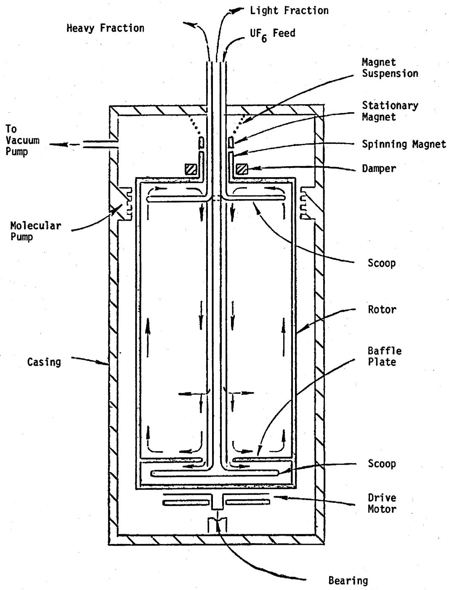  
Fig. A-1. ZIPPE Centrifuge (Simplified).

The Equipment Test Facility (ETF) was conceived to provide for the reliability testing of "high capacity" centrifuges. This facility, which began operation in 1971, has been the source of reliability testing for two generations of machine designs. Many of the first generation high capacity machines are still operating in this facility.

The Component Preparation Laboratories (CPL) in Oak Ridge, Tennessee and Torrance, California, were built to evaluate, improve and demonstrate techniques amenable to the mass production for manufacturing centrifuges. This facility became operational in early 1974.

The Component Test Facility (CTF) was designed to demonstrate the machine reliability and operability testing of substantial numbers of centrifuges in a cascade operation. Construction was begun in 1972 and the first phase of startup of the facility was completed in January 1977 with cascade operation of about one-half of the machines operating. The remaining machines were operable within a few weeks later. The capacity of the CTF is significant, about 50,000 SWU/yr, or about the annual enriching requirement for a 500 MW power reactor.

The Advanced Equipment Test Facility (AETF), in addition to being a reliability test facility will also test the plant subsystems which support the machines. The machines to be installed in this facility will have significantly greater separative work capability than those in the CTF. The AETF is expected to be operable in the spring of 1978.

In Europe, the URENCO organization, consisting of participants from England, Germany, and Holland, has a program that so far has been directed toward machine reliability and long lifetime. URENCO is currently producing about 200 MTSWU/yr from plants at Almelo, Holland and Capenhurst, England. Expansion of these facilities is planned by 1982. The URENCO group expects to have 2000 MTSWU/yr in operation, 1300 MTSWU/yr at Almelo, and the remaining 700 MTSWU/yr at Capenhurst.

# The Becker Separation Nozzle

The Becker process, being developed in Germany by Dr. E. W. Becker and his associates, utilizes the pressure gradient developed in a curved expanding supersonic jet to achieve separation in a gas mixture. The separation nozzle stage is shown schematically in Fig. A-2. A light gas, helium or hydrogen, is added to the $\mathsf{UF}_6$ in order to increase the velocity of the jet. As the expanding jet traverses the curved path, the heavier component is enriched in the vicinity of the wall. A knife edge divides the jet into two fractions--one enriched in the light component, and the other enriched in the heavy component--which are then pumped off separately from the stage. Although the separation obtained per stage is relatively high (1.025), many separation nozzle stages are needed to obtain an appreciable enrichment. This process avoids the problems associated with the fine-pored membrane required for gaseous diffusion, and those associated with the high-speed rotating parts of the gas centrifuge. It does suffer, however, from the disadvantage of a relatively high power requirement, primarily because a great deal of light gas must be recompressed between stages along with the $\mathsf{UF}_6$ process gas.

Fig. A-2. Cross Section of the Separation Nozzle System of the Becker Process.   
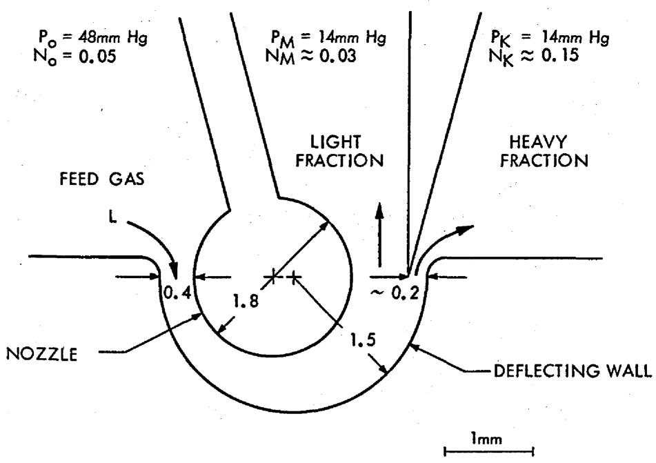  
$P =$ total pressure; $N =$ mole fraction of $\mathsf{UF}_6$ in the $\mathsf{UF}_6 / \mathsf{He}$ mixture. Subscripts o, M, and K refer to feed gas, light and heavy fractions, respectively.

A small 10-stage pilot plant was operated in 1967 to prove the technical feasibility of the process. Following that, a single large prototype stage suitable for use in a practical cascade was fabricated.

A prototype separation stage contains 81 separating elements and is reported to have a separative capacity of approximately $2000\mathrm{kg}$ U SW/yr. A plant producing a product enriched to $3\%$ $^{235}\mathrm{U}$ and with tails at $0.26\%$ $^{235}\mathrm{U}$ is expected to require about 450 such stages.

Figure A-3 shows the individual separating elements, each containing 10 separation nozzle slits on its periphery. The fabrication of these units is not as simple as one might at first expect. In order to obtain the desired separation performance at reasonable pressures, it is necessary to employ very small geometries. The spacing between the knife edge and the curved wall in the prototype separating unit should be about 0.0005 of an inch. In order to obtain good performance, it is necessary that this spacing not deviate by more than $\pm 10\%$ over the 6-foot length of slit.

The power requirement for the Becker process is currently estimated to be about one and one-third times as great as that required for gaseous diffusion. Dr. Becker believes that further process improvement is still possible and that the power requirement can be substantially reduced.

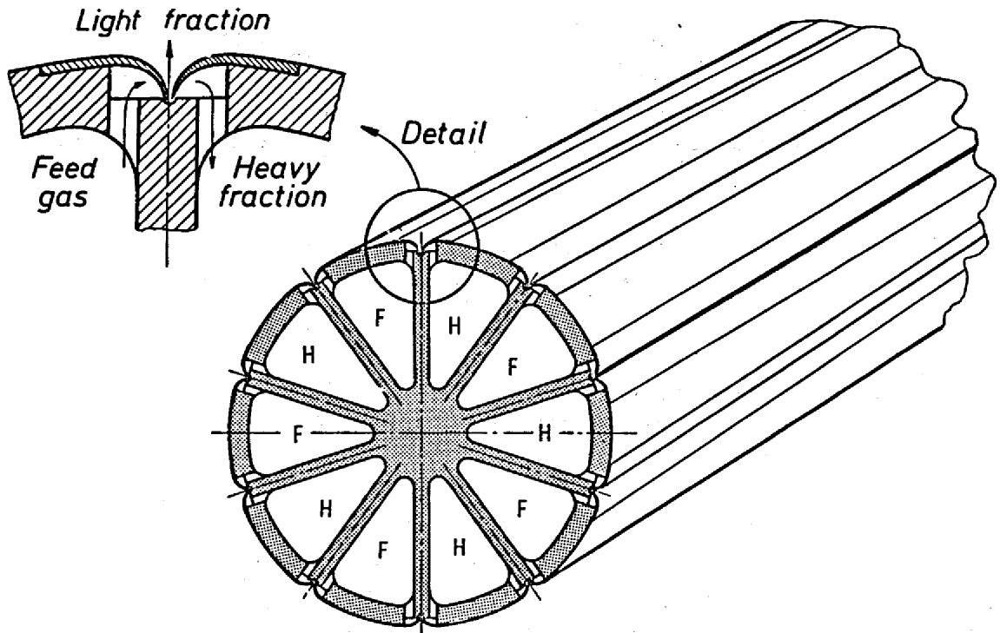  
Fig. A-3. Becker Separating Element With Ten Slits

# The South African Helikon Process

The South African $^{10}$ (or UCOR) process is of an aerodynamic type whose separating element is described by the developers as a high-performance stationary-walled centrifuge using $\mathsf{UF}_6$ in hydrogen as process fluid. All process pressures throughout the system will be above atmospheric and, depending on the type of "centrifuge" used, the maximum process pressure will be in a range of up to 6 bar. The $\mathsf{UF}_6$ partial pressure will, however, be sufficiently low to eliminate the need for process heating during plant operation, and the maximum temperature at the compressor delivery will not exceed $75^{\circ}\mathsf{C}$ .

The process is characterized by a high separation factor over the element, namely from 1.025 to 1.030, depending on economic considerations. Furthermore, it has a high degree of asymmetry with respect to the $\mathsf{UF}_6$ flow in the enriched and depleted streams, which emerge at different pressures. The feed-to-enriched streams pressure ratio is typically 1.5, whereas the feed-to-depleted streams pressure ratio is typically only 1.12.

To deal with the small $\mathsf{UF}_6$ cut, a new cascade technique was developed--the so-called "helikon" technique, based on the principle that an axial flow compressor can simultaneously transmit several streams of different isotopic composition without there being significant mixing between them. The UCOR process must, therefore, be regarded as a combination of the separation element and this technique, which makes it possible to achieve the desired enrichment with a relatively small number of large separation units by fully utilizing the high separation factor available. A further feature of the helikon

technique is that a module, defined as a separation unit consisting of one set of compressors and one set of separation elements, does not as in the classic case, produce only one separation factor of enrichment in one pass but can produce for a constant separative work capacity various degrees of enrichment up to a maximum of several times the separation factor over the element.

Full scale modules of this type are nearing the prototype stage. Recent design improvements are expected to result in a nominal capacity of 80 to 90 kg SWU/yr11 per separation module.

A valuable feature of a plant based on this process is its very low uranium inventory, which results in a short cascade equilibrium time, of the order of 16 hours for a commercial plant enriching uranium to $3\%$ $^{235}\mathrm{U}$ .

The theoretical lower limit to the specific energy consumption of the separation element can be shown to be about 0.30 MW.h/kg SW. The minimum figure observed by the developers with laboratory separating elements is about 1.80 MW.h/kg SW, based on adiabatic compression and ignoring all system inefficiencies. This difference is a measure of the improvement potential expected by the South Africans.

# Current and Projected Enrichment Capacity

Most of the known installed enrichment capacity is based upon gaseous diffusion technology. Only small increments of centrifuge technology are in operation (i.e., URENCO, Japan and U.S.), and one plant utilizing modified nozzle technology (the South African Helikon plant) may be operating. Indicative of the status of other isotope separation methods, all planned additions to the world enrichment capacity are based on either diffusion, centrifuge or nozzle technology.

The existing worldwide capacity and planned additions to capacity are shown in Table A-1 by country and technology type. In the table the groups identified as Eurodif and Coredif are multinational organizations building gaseous diffusion plants in France.

# A.2. New Separation Technologies

In addition to the more developed technologies (gaseous diffusion, gas centrifuge, and the Becker nozzle), there are several other separation methods that either have been utilized in the past or are currently being developed. These technologies are listed in Table A-2.

Table A-1. Approximate Schedule of World Enrichment Capacitya   

<table><tr><td>Year</td><td>Nation or Group</td><td>Technology Type</td><td>Capacity Increment (MT SWU)</td><td>Present Status of Increment</td><td>World&#x27;s Cumulative Capacity (MT SWU)</td></tr><tr><td rowspan="7">1977</td><td>U.S.b</td><td>Diffusion</td><td>15,400</td><td>Existing</td><td>15,400</td></tr><tr><td>UK-France</td><td>Diffusion</td><td>800-1000</td><td>Existing, but dedicated to military use</td><td>16,400</td></tr><tr><td>Russiac</td><td>Diffusion</td><td>800</td><td>Existing, actual total capacity unknown</td><td>17,200</td></tr><tr><td>China</td><td>Diffusion</td><td>Unknown</td><td>Existing, mostly military</td><td></td></tr><tr><td>URENCO</td><td>Centrifuge</td><td>200</td><td>Existing</td><td>17,400</td></tr><tr><td>U.S.</td><td>Centrifuge</td><td>50</td><td>Existing</td><td>17,450</td></tr><tr><td>S. Africa</td><td>Helikon-Fixed wall centrifuge</td><td>Unknown</td><td>Existing pilot plant or in process of coming on-line</td><td></td></tr><tr><td rowspan="4">1978</td><td>U.S.b</td><td>Diffusion</td><td>3,300</td><td>From CIP/CUP plus added power purchase</td><td>20,750</td></tr><tr><td>URENCO</td><td>Centrifuge</td><td>200</td><td>Facilities at Almelo &amp; Capen-hurst now in construction</td><td>20,950</td></tr><tr><td>Japan</td><td>Centrifuge</td><td>20</td><td>Currently under construction</td><td>20,970</td></tr><tr><td>Russiac</td><td>Diffusion</td><td>200</td><td></td><td>21,170</td></tr><tr><td rowspan="4">1979</td><td>U.S.b</td><td>Diffusion</td><td>2,200</td><td>From CIP/CUP</td><td>23,370</td></tr><tr><td>Russiac</td><td>Diffusion</td><td>500</td><td>Under construction</td><td>23,870</td></tr><tr><td>URENCO</td><td>Centrifuge</td><td>400</td><td></td><td>24,270</td></tr><tr><td>Eurodif</td><td>Diffusion</td><td>2,600</td><td></td><td>26,870</td></tr><tr><td rowspan="5">1980</td><td>U.S.b</td><td>Diffusion</td><td>1,600</td><td>From CIP/CUP</td><td>28,470</td></tr><tr><td>URENCO</td><td>Centrifuge</td><td>400</td><td>Planned</td><td>28,870</td></tr><tr><td>Eurodif</td><td>Diffusion</td><td>3,700</td><td>Under construction</td><td>32,570</td></tr><tr><td>Japan</td><td>Centrifuge</td><td>30</td><td>Under construction</td><td>32,600</td></tr><tr><td>Russiac</td><td>Diffusion</td><td>500</td><td></td><td>33,100</td></tr><tr><td rowspan="4">1981</td><td>U.S.b</td><td>Diffusion</td><td>700</td><td>From CIP/CUP</td><td>33,800</td></tr><tr><td>URENCO</td><td>Centrifuge</td><td>400</td><td>Planned</td><td>34,200</td></tr><tr><td>Eurodif</td><td>Diffusion</td><td>2,100</td><td>Under construction</td><td>36,300</td></tr><tr><td>Russiac</td><td>Diffusion</td><td>500</td><td></td><td>36,800</td></tr><tr><td rowspan="5">1982</td><td>U.S.b</td><td>Diffusion</td><td>300</td><td>Incr. Power Implementing CUP</td><td>37,000</td></tr><tr><td>URENCO</td><td>Centrifuge</td><td>400</td><td>Planned</td><td>37,500</td></tr><tr><td>Eurodif</td><td>Diffusion</td><td>2,400</td><td>Under construction</td><td>39,900</td></tr><tr><td>Russiac</td><td>Diffusion</td><td>500</td><td></td><td>40,400</td></tr><tr><td>Brazil</td><td>Becker nozzle</td><td>180</td><td>Planned</td><td>40,580</td></tr><tr><td rowspan="2">1983</td><td>URENCO</td><td>Centrifuge</td><td>1,300</td><td>Planned</td><td>41,880</td></tr><tr><td>Coredif</td><td>Diffusion</td><td>1,800</td><td>Planned</td><td>43,680</td></tr><tr><td rowspan="4">1984</td><td>U.S.b</td><td>Diffusion</td><td>2,000</td><td>Incr. Power Implementing CUP</td><td>45,680</td></tr><tr><td>URENCO</td><td>Centrifuge</td><td>1,300</td><td>Planned</td><td>46,980</td></tr><tr><td>S. Africa</td><td>Fixed wall centrifuge</td><td>1,600</td><td>Planned</td><td>48,580</td></tr><tr><td>Coredif</td><td>Diffusion</td><td>1,800</td><td>Planned</td><td>50,380</td></tr><tr><td rowspan="5">1985</td><td>U.S.b</td><td>Diffusion</td><td>2,000</td><td>Incr. Power Implementing CUP</td><td>52,380</td></tr><tr><td>URENCO</td><td>Centrifuge</td><td>1,400</td><td>Planned</td><td>53,780</td></tr><tr><td>S. Africa</td><td>Fixed wall centrifuge</td><td>1,600</td><td>Planned</td><td>55,380</td></tr><tr><td>Coredif</td><td>Diffusion</td><td>1,800</td><td>Planned</td><td>57,180</td></tr><tr><td>Japan</td><td>Centrifuge</td><td>6,000</td><td>Planned, but should be considered conditional</td><td>63,180</td></tr><tr><td rowspan="3">1986</td><td>U.S.b</td><td>Centrifuge</td><td>550</td><td>Planned</td><td>63,730</td></tr><tr><td>S. Africa</td><td>Fixed wall centrifuge</td><td>1,800</td><td>Planned</td><td>65,530</td></tr><tr><td>URENCO</td><td>Centrifuge</td><td>2,000</td><td>Planned</td><td>67,530</td></tr><tr><td rowspan="2">1987</td><td>U.S.b</td><td>Centrifuge</td><td>2,750</td><td>Planned</td><td>70,280</td></tr><tr><td>URENCO</td><td>Centrifuge</td><td>2,000</td><td>Planned</td><td>72,280</td></tr><tr><td>1988</td><td>U.S.b</td><td>Centrifuge</td><td>3,300</td><td>Planned</td><td>75,580</td></tr><tr><td rowspan="2">1989</td><td>U.S.b</td><td>Centrifuge</td><td>2,200</td><td>Planned</td><td>77,780</td></tr><tr><td>Coredif</td><td>Diffusion</td><td>5,400</td><td>Planned, but should be considered conditional</td><td>83,180</td></tr></table>

a Information from references 12 and 13.   
${}^{b}$ Not included in this schedule are possible additions to the U.S. enrichment capacity by private corporations, such as Exxon Nuclear, Garrett and Centar; these may amount to as much as 10,000 MT SWU by 1990.   
For Russia, this is a schedule of growth in enrichment sales availability and not necessarily of capacity expansion.

Table A-2. Other Isotope Separation Technologies   

<table><tr><td>A.</td><td>Discarded Technologies</td></tr><tr><td></td><td>Thermal Diffusion</td></tr><tr><td></td><td>Electromagnetic (the Calutron Process)</td></tr><tr><td>B.</td><td>Developing Technologies</td></tr><tr><td></td><td>Photo-Excitation Methods (Laser)</td></tr><tr><td></td><td>Chemical Exchange Methods</td></tr><tr><td></td><td>Aerodynamic Methods (Other Than the Becker Nozzle and the Fixed Wall Centrifuge)</td></tr><tr><td></td><td>Plasma Based Processes</td></tr></table>

The discarded technologies listed in Table A-2 have been used to produce enriched uranium.

A large-scale, liquid-phase, thermal-diffusion plant was constructed in 1945 by the Manhattan Project.[14] This plant produced very slightly enriched uranium $(0.86\%)$ . Thermal diffusion is impractical for commercial enrichment of uranium isotopes because of its very high energy requirements. Compared to gaseous diffusion, the energy requirement is over 200 times greater.

The electromagnetic or Calutron methods were used during the Manhattan Project to produce highly enriched uranium.[14] The process was discarded shortly after the more economical gaseous diffusion plant began operation. A brief description of the process follows.

The Calutron Process involved the vaporization of a salt feed material, typically $\mathrm{UCl}_4$ , from an electrically heated charge bottle through slots into an arc chamber where the salt was ionized by an electron beam which travels along the lines of flux of the magnet. The ionized uranium, as the $\mathsf{U}^+$ ion for the most part, passed through another slot where it was accelerated by other slotted electrodes into the vacuum tank which filled the pole area of a large electromagnet. The ions from the accelerating electrodes diverged several degrees from the slots and at the $90^{\circ}$ point passed by some baffles as a rather thick beam. This beam was brought to a focus at the slots of a receiver system as curved lines by the shimmed magnetic field. In the large units, 96-in. beam diameter, there were up to four of these beams in a given tank. The divergent trajectories of the ions from the four sources intersected some few degrees from the accelerating electrodes and separated as distinct beams, again a similar distance from the receivers. There were various side beams of $\mathrm{UCl}^+$ , $\mathsf{U}^{++}$ , and other ions which hit the baffles and the walls of the tank at a series of locations. The uranium content of these beams condensed as various compounds of uranium. The product was, for the most part, converted to UC by interaction of the very high voltage uranium ions with the graphite of the receivers. Since, in even the most

efficient of the units developed, only about $22\%$ of the feed was collected as product in a vaporization cycle of the feed, there were large amounts of uranium compounds to be recovered and recycled through the system. The chemical operations required were complex, but the amount of space and the number of workers required in the chemical function were always small compared to the requirements of the rest of the process. The processing of the receivers to recover the product uranium was a small scale but very demanding series of chemical procedures.

The developing technologies listed in Table A-2 offer no current capability for producing kilogram quantities of enriched uranium. If any of them approaches commercial feasibility, they may provide enhanced opportunities for a clandestine enrichment operation. A brief description of each of these processes follows.

# Photoexcitation (Laser) Methods

The development of high intensity narrow-frequency tunable lasers has raised the possibility of nearly complete isotopic separation in a single step. Thus, reactor grade and perhaps even weapons grade uranium could be produced in one pass through the apparatus. Such a single-stage process would allow for a much more compact enrichment plant, saving land area, capital investment and power consumption. These hopes have led to active research and development programs in the United States, the Soviet Union, Israel, France and possibly other countries.

In the U.S. the development of laser enrichment is being pursued along two distinct lines. One line of development uses atomic uranium vapor as the source material for the laser excitation whereas the other line of development is pursuing excitation of molecular uranium hexafluoride. Each method has its virtues and defects.

Laser Enrichment with Atoms. $^{15}$ In the atomic enrichment process most often discussed, molten uranium is heated in an oven to about $2500^{\circ}\mathrm{K}$ . The atomic vapor emerges in the form of a long, thin ribbon into a highly evacuated region where it is illuminated by two visible or near-ultraviolet lasers. One laser is tuned to a transition from the ground state of uranium to an excited state roughly halfway up the ladder to ionization. This is the isotopically selective step, and it is hoped that very high selectivities will be achieved here.

The purpose of the second laser is to boost the excited $^{235}\mathrm{U}$ atoms to a level just below the ionization limit. This step need not be isotopically selective, and in principle the second laser could be used to ionize the atom directly. But ionization cross sections are generally about 1000 times smaller than resonant excitation cross sections, and so it is far more efficient to use a resonant transition to excite the atom to a state just below the ionization level and then to use either a static

electric field or an infrared laser pulse to pull the electrons off the atoms. Once the atoms are ionized, they can be separated from the neutral atoms in the beam by the use of electric or magnetic fields, or both.

The major limiting factor in the above process is the density of atoms in the uranium "ribbon." There is an upper limit on the density and therefore on the rate of production of enriched uranium, because both excitation energy and ionic charge are very easily transferred to other atoms in collisions. Such collisions must be kept to a minimum if a high selectivity is to be obtained.

Other technical difficulties in the development of the process are:

a. The corrosiveness of the uranium vapor.   
b. The presence of thermally excited or ionized atoms of $^{235}\mathrm{U}$ in the uranium vapor (at $2500^{\circ}\mathrm{K}$ , $\sim 55\%$ of $^{235}\mathrm{U}$ atoms are not in the ground state).   
c. The potential for self-lasing of the uranium vapor.   
d. Thermal ionization of $^{238}\mathrm{U}$ will seriously degrade the selectivity and thus limit the enrichment.   
e. Lasers combining high energy density, rapid pulse repetition rate, high tuning precision, and long-term stability and reliability must be developed.

Laser Enrichment with Molecules. $^{15}$ Gaseous $\mathsf{UF}_6$ is used in all proposed schemes for molecular enrichment, since this is the only compound of uranium with a sizable vapor pressure at reasonable temperatures. Because the molecule contains seven atoms and exhibits a high degree of symmetry, it produces a complicated spectrum of vibrational and rotational excitations. The most interesting vibrational modes from the point of view of laser excitations are those which involve motion of the uranium atom and which therefore produce an oscillating electric dipole moment. Only these modes are likely to produce transitions from the ground state when excited by electromagnetic energy.

The low energies associated with these transitions lead to two serious problems for laser enrichment in $\mathsf{UF}_6$ . The first problem is the creation of an infrared laser with the correct frequency. The second problem is related to the high occupation numbers of the low-energy vibrational states at temperatures where $\mathsf{UF}_6$ has a high vapor pressure. Because so many low-lying states are occupied, it is impossible to find a single excitation frequency that will be absorbed by most of the molecules. The presence of these so-called "hot bands" reduces the efficiency of the process very drastically.

The second problem is easily solved, at least in principle, if warm $\mathsf{UF}_6$ gas is passed through a supersonic nozzle. The effect of the expansion is to convert most of the kinetic energy of random motion of the gas in the reservoir into kinetic energy of translational motion of the gas in the nozzle. As the gas accelerates

through the nozzle, it becomes colder and the energy stored in the vibrational and rotational degrees of freedom of the molecules is reduced by intermolecular collisions in the narrow region just downstream of the slit. The molecules can now be illuminated by a laser beam which has been tuned to excite selectively molecules containing $^{235}\mathrm{U}$ .

This technique yields the first step in the molecular isotope separation process; however, this selective excitation does not provide a way of segregating the excited molecules. To do this, considerably more laser energy must be absorbed by the molecules to get them to dissociate to $^{235}\mathrm{UF}_5$ and fluorine. In theory, this energy can be provided by either an infrared or an ultraviolet laser.

Since it is not necessary for either of these secondary processes to be isotopically selective, the primary demands on the ultraviolet or infrared lasers are related to their energy output and pulse repetition rates. In both cases considerably higher powers are required for the molecular than for the atomic processes because much larger numbers of molecules can be processed in the same period of time. This high power requirement follows because the density restrictions apparently are less severe for molecules than for atoms.

The dissociated product must still be physically separated from the undissociated material and substantial recombination could occur if the recombination probabilities for $\mathsf{UF}_5$ and F are high.

As with the atomic process, the molecular process must also overcome formidable technical difficulties before it becomes a feasible production process. Some of these obstacles are:

a. The high probability of resonant vibrational energy exchange between the $^{235}\mathrm{UF}_6$ and the $^{238}\mathrm{UF}_6$ .   
b. The recombination of dissociated molecules.   
c. An infrared high-powered laser tunable to the required wave length for the primary excitation must be invented.   
d. The secondary laser must satisfy the combined demand of high pulse energy, rapid repetition rate and high efficiency.   
e. The rapid and efficient separation of the dissociated product from the depleted tails.

# Chemical Exchange Methods

The use of a chemical exchange system to separate metal isotopes has been under investigation in the U.S. for several years. In addition to work in the U.S., the French recently have made allusions to similar research. It has been shown that calcium

isotope enrichment can be accomplished using a simple extraction process involving the relatively new class of compounds known as polyethers. Work is underway to determine whether a similar process could be used for uranium isotope enrichment.

The electron exchange equilibrium between U(IV) and U(VI) may result in a significant isotope enrichment. The extraction of a single uranium cation without a valence change yields a small isotope effect which by itself would have no practical use. Combining the two processes leads to a potentially economic process for uranium isotope enrichment.

The electron exchange reaction which occurs in the aqueous phase can be described by Equation 1:

$$
2 3 5 U ^ {4 +} + 2 3 8 U O _ {2} ^ {2 +} \rightleftharpoons 2 3 8 U ^ {4 +} + 2 3 5 U O _ {2} ^ {2 +} \tag {1}
$$

This reaction was reported to have an $\alpha = 1.0014$ with $^{238}\mathrm{U}$ concentrating on the U(IV) ion. The solvent extraction exchange reaction of the U(VI) ion can be described by Equation 2:

$$
^ {2 3 5} \mathrm {U O} _ {2} ^ {2 +} (\mathrm {a q}) + ^ {2 3 8} \mathrm {U O} _ {2} \mathrm {L} (\text {o r g}) \rightleftharpoons {} ^ {2 3 8} \mathrm {U O} _ {2} ^ {2 +} (\mathrm {a q}) + ^ {2 3 5} \mathrm {U O} _ {2} \mathrm {L} (\text {o r g}) \tag {2}
$$

Although the $\alpha$ for Equation 2 is unknown, theory and experience predict that $^{238}\mathrm{U}$ will concentrate in the aqueous phase. The constructive nature of the two processes might, therefore, be expected to result in an $\alpha$ suitably large to be the basis of a uranium isotope enrichment process.

From a chemical standpoint, several problems immediately appear as critical ones. Obviously, one needs an extractant which will separate U(IV) and U(VI). It must operate under some very specific conditions set by other portions of the system. In order to form the basis of a useful process, the electron exchange reaction in Equation 1 must have a half-time, $t_{2}$ , on the order of a few seconds. Also, the exchange reaction shown in Equation 2 must be rapid. Both these reactions must, therefore, be well understood. Finally, it must be demonstrated that a sufficiently large $\alpha$ exists under these conditions.

Based on these exchange reactions and based on a reasonable value of $\alpha$ (between 1.0014 and 1.002), countercurrent liquid extractors can be set up into a cascade arrangement. Further assuming that the exchange reactions and the $\alpha$ are independent of the relative concentrations of $^{235}\mathrm{U}$ and $^{238}\mathrm{U}$ , estimates of the equilibrium time to achieve $3\%$ enrichment range from approximately three months to one year. To achieve $90\%$ enrichment, the equilibrium time may range from 3 to 30 years.

# Aerodynamic Methods

Both the separation nozzle and the stationary-walled centrifuge can be classed as aerodynamic processes. These are considered to be competitive processes by their proponents and plans for their implementation are well advanced. Research efforts have been directed at several other aerodynamic methods such as the vortex tube, the separation probe, crossed beams, velocity slip and the jet membrane. None of these appear at the present time to offer the promise of the two aforementioned aerodynamic processes, although an expanded effort is proceeding on the jet membrane process. Commonly known as the Muntz-Hamel process, it involves the penetration of a stream of $\mathsf{UF}_6$ gas into an expanding jet of easily condensible carrier gas. The lighter $^{235}\mathsf{UF}_6$ molecules penetrate the jet more easily than the heavier $^{238}\mathsf{UF}_6$ molecules. A tube placed on the axis of the jet collects the enriched $\mathsf{UF}_6$ . The depleted $\mathsf{UF}_6$ flows out of the other end of the scattering chamber, after the carrier gas is separated from it by condensation.

# Plasma-Based Processes

Since a plasma can be made to rotate at speeds greater than that of an ultra-centrifuge, it occurred to various investigators that such high speed gas rotation without the use of revolving equipment might possibly be developed into a more efficient isotope separation process than that based on a mechanical centrifuge. Five papers on this topic were presented at the International Conference on Uranium Isotope Separation in London in March 1975. The authors' assessment of the prospects for such a process ran the gamut from highly optimistic--technology is simple and well known so that minimal development will be required--to pessimistic--a rotating plasma process cannot possibly be economically competitive. To our knowledge, no one has separated uranium isotopes by means of the plasma centrifuge.

Since that time, several other plasma-based processes have been proposed. Of all these processes, the currently most feasible seems to be the Plasma Ion Enrichment process (the Dawson separation process). In this process a plasma of $\mathsf{UF}_6$ (or of uranium atoms) within a strong uniform magnetic field is exposed to a low energy radio-frequency wave resonant with the cyclotron frequency of the $^{235}\mathsf{UF}_6$ ions. The rotation thereby imparted preferentially to the $^{235}\mathsf{UF}_6$ ions enables the $^{235}\mathsf{U}$ to be separated from the $^{238}\mathsf{U}$ by properly placed collection plates.

This method has been used successfully to enrich macroscopic samples of potassium. $^{16}$ The collector was a cooled tungsten ribbon having a voltage bias to collect selectively the excited ions. The potassium vapor was contact ionized at the entrance to the mass spectrometer. To eliminate spurious effects, samples were collected under three conditions of rf excitation: (1) no rf; (2) excitation at the $^{39}\mathrm{K}$ cyclotron frequency; and (3) excitation at the $^{41}\mathrm{K}$ cyclotron frequency. The

resulting ratios of $^{41}\mathrm{K} / ^{39}\mathrm{K}$ abundance as measured by the mass spectrometer were, respectively, 0.07 (the natural abundance), 0.02 and 4. The abundance ratio of 4 corresponds to a more than tenfold enrichment of $^{41}\mathrm{K}$ .

In addition to potassium ions, work has been done on neon, argon, xenon and uranium toward resolving the ion cyclotron resonances for individual positive ions. The work with uranium is proceeding toward estimates of realistic operating parameters (ion densities, magnetic field strength, isotopic excitation energies, device length, ion temperatures, and collector types).

A second process involves the achievement of a $\mathsf{UF}_6$ plasma by chemi-ionization. $\mathsf{UF}_6$ molecules are accelerated by expansion with an inert carrier gas through a supersonic jet. A cross beam of alkali metal molecules results in the formation of $\mathsf{NA}^+$ or $\mathsf{Cs}^+$ and $\mathsf{UF}_6^-$ . A radio-frequency quadrupole mass filter deflects the $^{238}\mathsf{UF}_6$ out of the plasma beam, permitting the separation of the two isotopes by collection of the two beams on separate baffles cooled by liquid nitrogen. This process seems to have less potential than the first.

# Comparison of Advanced Separation Processes

The estimated costs of the processes mentioned are compared in Table A-3 with that of gaseous diffusion. With two exceptions, the table is based on process evaluations made by the Nuclear Division of the Union Carbide Corporation17 for ERDA. For the exceptions, which are the FRG's separation nozzle and South Africa's stationary-walled centrifuge, the comparison is based on published statements by the developers of the process. Of all the processes listed, only the costs for the centrifuge, and possibly for the separation nozzle, are known with any degree of certainty.

Table A-3. Comparison of Process Economics   

<table><tr><td></td><td>Specific Capital Investment</td><td>Power Cost</td><td>Operating Costs Other Than Power</td></tr><tr><td>Centrifuge</td><td>&gt;</td><td>&lt;</td><td>&gt;</td></tr><tr><td>Separation Nozzle*</td><td>&lt;</td><td>&gt;</td><td>≈</td></tr><tr><td>Stationary-Walled Centrifuge*</td><td>≈</td><td>≈</td><td>?</td></tr><tr><td>LIS-Atomic</td><td>&lt;</td><td>&lt;</td><td>&gt;</td></tr><tr><td>LIS-Molecular</td><td>&lt;</td><td>&lt;</td><td>&gt;</td></tr><tr><td>Ch. Exchange: UIV(aq)-VII(og)</td><td>≈</td><td>&lt;</td><td>&gt;</td></tr><tr><td>Other Aerodynamic Processes</td><td>&gt;</td><td>&gt;</td><td>≈</td></tr><tr><td>Plasma: Chemi-ionization</td><td>&gt;</td><td>&lt;</td><td>&gt;</td></tr><tr><td>Plasma Ion Enrichment (Dawson Process)</td><td>&lt;</td><td>&lt;</td><td>&gt;</td></tr></table>

*Based on estimates made by the process developers.

# DEFINITION OF SYMBOLS:

Approximately equal to the diffusion process.

$>, <$ Greater than or less than the diffusion process, respectively.

? Unknown.

# References for Appendix A

1. E. B. Kiser, Jr., "Review of U.S. Gas Centrifuge Program," AIF Fuel Cycle Conf. '77, Kansas City, Mo. (April 1977).   
2. USAEC, "AEC Gaseous Diffusion Plant Operations," ORO-684 (Jan. 1972).   
3. H. D. Smythe, Atomic Energy for Military Purposes, Princeton University Press, Princeton, N.J., Aug. 1945.   
4. W. E. Groth, K. Beyerle, E. Nann, and K. H. Welge, "Enrichment of Uranium Isotopes by the Gas Centrifuge Method," 2nd Int'l. Conf. on the Peaceful Uses of Atomic Energy, Geneva, Switzerland (Sept. 1958).   
5. J. Los Kistemaker and E. J. Z. Veld Huyzen, "The Enrichment of Uranium Isotopes with Ultra-Centrifuges," 2nd Int'l. Conf. of the Peaceful Uses of Atomic Energy, Geneva, Switzerland (Sept. 1958).   
6. G. Zippe, "The Development of Short Bowl Ultra Centrifuges," ORO-315 (June 15, 1960).   
7. K. Cohen, The Theory of Isotope Separation, McGraw-Hill Book Company, New York, 1951.

8. W. R. Voigt, "Enrichment Policies," AIF Fuel Cycle Conf. '77, Kansas City, Mo. (April 1977).   
9. E. Von Halle, "Summary Review of Uranium Isotope Separation Methods Other Than Gaseous Diffusion and Gas Centrifugation," ORO-690 (Feb. 23, 1972).   
10. A. J. A. Roux and W. L. Grant, "Uranium Enrichment in South Africa," presented to European Nuclear Conference, Paris, France (April 1975).   
11. Nuclear News, p. 80 (June 1977).   
12. S. Blumkin, "Survey of Foreign Enrichment Capacity, Contracting and Technology: Jan. 1976-Dec. 1976," K/OA-2547, Pt. 4 (April 18, 1977).   
13. Letter, R. J. Hart, ERDA-ORO, to W. R. Voigt, ERDA-HQ, "Interim Uranium Enrichment Long-Range Operating Plan," (August 9, 1977).   
14. M. Benedict, et al., "Report of Uranium Isotope Separation Review Ad Hoc Committee," ORO-694 (June 2, 1972).   
15. Allas S. Krass, "Laser Enrichment of Uranium: The Proliferation Connection," Science, Vol. 196, No. 4291, p. 721-731 (May 13, 1977).   
16. J. M. Dawson, et al., "Isotope Separation in Plasmas Using Ion Cyclotron Resonance," TRW Defense & Space Systems, Redondo Beach, Calif.   
17. P. R. Vanstrum and S. A. Levin, "New Processes for Uranium Isotope Separation," IAEA-CN-36/12 (II.3), Vienna, Austria (1977).

# Appendix B. ECONOMIC DATA BASE USED FOR EVALUATIONS OF NUCLEAR POWER SYSTEMS

M. R. Shay, D. R. Haffner, W. E. Black, T. M. Helm, W. G. Jolly, R. W. Hardie, and R. P. Omberg Hanford Engineering Development Laboratory

The economic data base used in the assessment of the impact of denatured fuel cycles in the various nuclear systems options described in Chapter 6 was jointly developed by Combustion Engineering, Oak Ridge National Laboratory, United Engineers and Constructors, Argonne National Laboratory, Resource Planning Associates, Hanford Engineering Development Laboratory, DOE Division of Uranium Resources and Enrichment, and DOE Division of Nuclear Research and Applications. The data base includes capital costs, operation and maintenance costs, fuel fabrication and reprocessing costs, capacity factors, money costs, and uncertainties.

The deflated and present-valued capital costs for LWRs, SSCRs, HTGRs, CANDUs, and FBRs, excluding interest during construction, are shown in Table B-1. The same capital costs including interest during construction are shown in Table B-2. In either case, the stream of expenses incurred during the construction of the plant is discounted to the date of startup and is measured in dollars of constant purchasing power. The uncertainty ranges included in Table B-2 represent current best estimates of the most probable variations in capital costs. For flexibility, the uncertainties are expressed relative to the reference LWR capital cost.

Table B-1. Capital Costs of Power Plants Excluding Interest During Construction   

<table><tr><td>Power Plant Type</td><td>Costs ($/kWe)*</td></tr><tr><td>LWR</td><td>500</td></tr><tr><td>SSCR</td><td>520 + 39 (for D20) = 558</td></tr><tr><td>HWR</td><td>605 + 156 (for D20) = 761</td></tr><tr><td>HTGR</td><td>560 to 580</td></tr><tr><td>FBR</td><td>625 to 875</td></tr></table>

*Based on 7/1/76 dollars.

The operation and maintenance costs for the same power plants are shown in Table B-3. The higher costs for the SSCR and the CANDU over the standard LWR are due to the heavy water replacement requirement and the necessity for performing some maintenance in atmospheres containing tritium. Additional minor reactor costs are given in Table B-4.

Table B-2. Captial Costs of Power Plants Including Interest During Construction   

<table><tr><td>Power Plant Type</td><td colspan="2">Cost ($/kWe)*</td><td>Cost Relative to LWR Cost</td><td>Cost Uncertainty</td></tr><tr><td>LWR</td><td colspan="2">625</td><td></td><td>95% to 105% reference cost</td></tr><tr><td>SSCR</td><td colspan="2">650 + 40 (heavy water) = 690</td><td>+10%</td><td>105% to 120% of LWR cost</td></tr><tr><td>HWR</td><td colspan="2">755 + 160 (heavy water) = 915</td><td>+46%</td><td>120% to 150% of LWR cost</td></tr><tr><td>HTGR</td><td colspan="2">715</td><td>+14%</td><td>105% to 125% of LWR cost</td></tr><tr><td>FBR</td><td colspan="2">800</td><td>+28%</td><td>125% to 175% of LWR cost</td></tr></table>

*Based on 1/1/77 dollars.

The fuel fabrication costs for the various reactor types are shown in Table B-5 as a function of time beginning with the expected introduction date for a particular reactor and fuel design. If a particular reactor and fuel design should prove successful, fabrication costs should decrease as larger plants with higher throughput rates are constructed. The decrease in fabrication costs over the first decade after introduction is simply indicative of a transition from small fabrication plants with high unit costs to larger fabrication plants with lower unit costs. These costs are a strong function of the fissile isotope and a weak function of the fertile isotope. The sensitivity to the fissile isotope is caused either by the spontaneous fission associated with high-exposure fissile plutonium or by the gamma activity associated with high-exposure $^{233}\mathrm{U}$ . The costs are based on the assumption that fuels containing $^{235}\mathrm{U}$ are fabricated on a line with contact operation and contact maintenance, fuels containing fissile plutonium are fabricated on a line with remote operation and contact maintenance, and fuels containing $^{233}\mathrm{U}$ are fabricated on a line with both remote operation and remote maintenance. The expected variations in fuel fabrication costs (cost uncertainties given in footnote b of Table B-5) represent the upper and lower cost boundaries anticipated for fabrication costs and are expressed as percentages. For example, the expected fabrication cost for plutonium-bearing LWR fuel with uncertainties applied ranges from $306 per kg HM (-10\%$ of reference) to $\$510$ per kg HM (+50% of reference) for year 2001 and beyond.

Table B-3. Power Plant Operation and Maintenance Costs $\{= [Fixed + (Variable\times CapacityFactor^{\alpha})]\times$ Power}   

<table><tr><td>Power Plant Type</td><td>Fixed Cost ($/kWe-yr)b</td><td>Variable</td></tr><tr><td>LWR</td><td>3.6</td><td>1.9</td></tr><tr><td>SSCR</td><td>4.8</td><td>1.9</td></tr><tr><td>HWR</td><td>8.4</td><td>1.9</td></tr><tr><td>HTGR</td><td>3.6</td><td>1.9</td></tr><tr><td>FBR</td><td>4.1</td><td>2.3</td></tr></table>

${}^{a}$ See Table B-9 for capacity factors. ${}^{b}$ Based on 1/1/77 dollars.

Table B-4. Minor Reactor Costs   

<table><tr><td>Property Insurance Rate</td><td>0.0025</td></tr><tr><td>Capital Replacement Rate</td><td>0.0035</td></tr><tr><td>Nuclear Liability</td><td>58 x 104 $/yr</td></tr></table>

The expected reprocessing costs are shown in Table B-6. These costs were obtained by estimating the capital and operating costs associated with each of five stages of the reprocessing process. The stages were: headend, solvent extraction, product conversion, off-gas treatment, and waste treatment. The costs are shown as a function of time reflecting the transition from a new industry consisting of small plants with high unit costs to a mature industry consisting of larger plants with lower unit costs. The expected costs for spent fuel shipping, waste shipping, and waste storage are also included in Table B-6, as well as the total costs for all these processes. The total cost uncertainty factor for all fuel types is estimated to be a $50\%$ increase for the reference values. Thus, the total reprocessing cost for LWR fuel with the uncertainty included ranges from $220 to $330 per kg HM for year 2001 and beyond. It should be noted that it is assumed here that a policy decision will have been made in time for the first reprocessing plant to be in operation by 1991. All fuel discharged from the reactor prior to this date is

Table B-5. Reactor Fuel Fabrication Costs   

<table><tr><td rowspan="2">Reactor Type</td><td colspan="3">Cost ($/kg HM)b Over First Decade After Introduction</td></tr><tr><td>LWR-U5(LE)/U</td><td>100 (1969 → 2089)c</td><td></td></tr><tr><td>LWR-U5(DE)/U/Th</td><td>230 (1987) → 140</td><td>(1997)</td><td></td></tr><tr><td>LWR-U3(DE)/U/Th</td><td>880 (1991) → 550</td><td>(2001)</td><td></td></tr><tr><td>LWR-Pu/U</td><td>550 (1991) → 340</td><td>(2001)</td><td></td></tr><tr><td>LWR-Pu/Th</td><td>550 (1991) → 340</td><td>(2001)</td><td></td></tr><tr><td>SSCR-U5(LE)/U</td><td>100 (1991 → 2089)c</td><td></td><td></td></tr><tr><td>SSCR-U3(DE)/U/Th</td><td>880 (1991) → 550</td><td>(2001)</td><td></td></tr><tr><td>SSCR-Pu/Th</td><td>550 (1991) → 340</td><td>(2001)</td><td></td></tr><tr><td>HWR-U5(NAT)/U</td><td>60 (1995 → 2089)c</td><td></td><td></td></tr><tr><td>HWR-U5(SEU)/U</td><td>60 (1995 → 2089)c</td><td></td><td></td></tr><tr><td>HWR-U5(DE)/U/Th</td><td>140 (1995) → 85</td><td>(2005)</td><td></td></tr><tr><td>HWR-U3(DE)/U/Th</td><td>560 (1995) → 350</td><td>(2005)</td><td></td></tr><tr><td>HWR-Pu/U</td><td>320 (1995) → 200</td><td>(2005)</td><td></td></tr><tr><td>HWR-Pu/Th</td><td>320 (1995) → 200</td><td>(2005)</td><td></td></tr><tr><td>HTGR-U5(LE)/U</td><td></td><td></td><td></td></tr><tr><td>HTGR-U5(DE)/U/Th</td><td></td><td></td><td></td></tr><tr><td>HTGR-U5(HE)/Th</td><td></td><td></td><td></td></tr><tr><td>C/Th + U = 150</td><td>340 (1995) → 210</td><td>(2005)</td><td></td></tr><tr><td>C/Th + U = 238</td><td>500 (1995) → 300</td><td>(2005)</td><td></td></tr><tr><td>C/Th + U = 335</td><td>660 (1995) → 400</td><td>(2005)</td><td></td></tr><tr><td>C/Th + U = 400</td><td>760 (1995) → 470</td><td>(2005)</td><td></td></tr><tr><td>C/Th + U = 650</td><td>1220 (1995) → 770</td><td>(2005)</td><td></td></tr><tr><td>HTGR-U3(DE)/U/Th</td><td></td><td></td><td></td></tr><tr><td>HTGR-U3/Th</td><td></td><td></td><td></td></tr><tr><td>C/Th + U = 150</td><td>860 (1995) → 470</td><td>(2005)</td><td></td></tr><tr><td>C/Th + U = 238</td><td>1220 (1995) → 670</td><td>(2005)</td><td></td></tr><tr><td>C/Th + U = 335</td><td>1640 (1995) → 900</td><td>(2005)</td><td></td></tr><tr><td>C/Th + U = 400</td><td>2000 (1995) → 1100</td><td>(2005)</td><td></td></tr><tr><td>C/Th + U = 650</td><td>3200 (1995) → 1750</td><td>(2005)</td><td></td></tr><tr><td>HTGR-Pu/Th</td><td></td><td></td><td></td></tr><tr><td>C/Th = 238</td><td>1220 (1995) → 670</td><td>(2005)</td><td></td></tr><tr><td>FBR-Pu-U core</td><td>1750 (2001) → 950</td><td>(2011)</td><td></td></tr><tr><td>FBR-Pu-Th core</td><td>1750 (2001) → 950</td><td>(2011)</td><td></td></tr><tr><td>FBR-U3-U core</td><td>3000 (2001) → 1650</td><td>(2011)</td><td></td></tr><tr><td>FBR-U axial blanket</td><td>35 (2001) → 25</td><td>(2011)</td><td></td></tr><tr><td>FBR-U radial blanket</td><td>250 (2001) → 150</td><td>(2011)</td><td></td></tr><tr><td>FBR-Th axial blanket</td><td>35 (2001) → 25</td><td>(2011)</td><td></td></tr><tr><td>FBR-Th radial blanket</td><td>250 (2001) → 150</td><td>(2011)</td><td></td></tr></table>

${}^{a}$ Fabrication costs based on the following: for LWR and SSCR, a 17 x 17 pin assembly (374-mil-OD pin); for the HwR, a 37-pin CANDU assembly ~20 in. long (531-mil-OD pin); for the HTGR, standard carbon-coated uranium carbide fissile microspheres formed into cylindrical rods located in a hexagonal graphite block; and for the FBR, a 217-pin assembly in a hexagonal duct (310-mil-OD pin).   
Uncertainties on fabrication costs: $^{235}\mathrm{U}$ -bearing fuels, no uncertainty; Pu-bearing fuels, -10% to 50% increase; $^{233}\mathrm{U}$ -bearing fuels, -10% to 50% increase.   
Costs assumed to remain constant.

assumed to have been stored, with the spent fuel stockpile being reduced in an orderly manner after the advent of reprocessing. After the spent fuel stockpile has been reduced to zero, the out-of-reactor time required for reprocessing and refabrication is assumed to be two years.

The long-run marginal costs estimated for $U_{3}O_{8}$ are as a function of the cumulative supply and are shown in Table B-7. As noted in Chapter 6, the $U_{3}O_{8}$ estimates have been provided by DOE's Division of Uranium Resources and Enrichment (URE), the high-cost supply being based on the assumption that approximately 2.5 million tons of $U_{3}O_{8}$ will be available from conventional uranium ore resources and the intermediate-cost supply being based on the assumption that approximately 4.5 million tons of $U_{3}O_{8}$ will be available. In either case, it is assumed that shales can be mined after the conventional resources are depleted. The cost of extracting the shales increases from $125/1b to$ 240/1b for the high-cost supply case and from $100/1b to$ 180/1b for the intermediate-cost supply case. It is important to note that the long-run marginal costs shown in Table B-7 are larger than the forward costs shown in Table 6.1-1 of Chapter 6 because the long-run marginal costs contain the capital cost of facilities currently in operation, plus a normal profit for the industry. The long-run marginal costs are more appropriate for use in a nuclear strategy analysis.

The enrichment costs and tails compositions assuming either a continuation of the gaseous diffusion technology or the deployment of an advanced enrichment technology are shown in Table B-8. It was assumed that if the gaseous diffusion technology is continued the tails composition will be stabilized at 0.0020 and that the cost of enrichment will increase to $80/SWU in 1987 and remain constant thereafter. If an advanced enrichment technology

Table B-6. Reprocessing, Shipping, and Waste Storage Costs for Various Reactor Types   

<table><tr><td rowspan="2">Reactor Type</td><td colspan="5">Costs ($/kg HM)</td></tr><tr><td>Reprocessing Costs Over First Decadea</td><td>Spent Fuel Shipping Costsb</td><td>Waste Shipping Costs</td><td>Waste Storage Costs</td><td>Total Costs Over First Decade After Introductionc</td></tr><tr><td>LWR</td><td>225 (1991) → 150 (2001)</td><td>15</td><td>10</td><td>45</td><td>295 (1991) → 220 (2001)</td></tr><tr><td>SSCR</td><td>225 (1991) → 150 (2001)</td><td>15</td><td>10</td><td>45</td><td>295 (1991) → 220 (2001)</td></tr><tr><td>HWR</td><td>225 (1995) → 150 (2005)</td><td>10</td><td>5</td><td>15</td><td>255 (1995) → 180 (2005)</td></tr><tr><td>HTGR</td><td>800 (1995) → 400 (2005)</td><td>85</td><td>35</td><td>65</td><td>985 (1995) → 585 (2005)</td></tr><tr><td>FBR</td><td>500 (2001) → 200 (2011)</td><td>80</td><td>50</td><td>115</td><td>745 (2001) → 445 (2011)</td></tr></table>

$^\alpha$ Fissile storage costs after reprocessing = $2/g-yr for $^{233}\mathrm{U}$ and fissile plutonium.   
bTotal costs for throwaway cycle are spent fuel shipping costs plus $100/kg HM.   
$50\%$ uncertainty on total costs for all reactor types.

is deployed, the tails composition would decrease continuously from 0.0020 to 0.0010 between the years 1980 and 2000 as the installed capacity of the advanced technology increased, and the cost of a unit of separative work would decrease to approximately $60\%$ of that of the gaseous diffusion process. It was also assumed that the tails composition would further decrease from 0.0010 to 0.0005 between the years 2001 and 2030 due to improvements in technology, while the cost of a unit of enrichment would remain constant during this period. The tails composition and enrichment cost were assumed to remain constant thereafter.

The capacity factors of a plant throughout its 30-yr lifetime are shown in Table B-9. The capacity factor increases from $60\%$ to $72\%$ during the first 3 yr of operation and remains at $72\%$ during the subsequent 14 yr. It then decreases continuously as the forced outage rate increases and as the plant is shifted from a base-load unit to an intermediate-load unit.

The long-term real cost of money to the electric utility industry is shown in Table B-10. These costs were developed by analyzing the deflated cost of debt and equity to the industry over the past 30 yr. The long-term deflated cost of debt has been $2.5\%/\text{yr}$ and the long-term deflated cost of equity has been $7.0\%/\text{yr}$ . Assuming the industry to be funded at approximately $55\%$ debt and $45\%$ equity, the long-term real money cost is approximately $4.5\%/\text{yr}$ .

The combined effects of capital, fuel fabrication, and reprocessing (or permanent disposal) cost uncertainties on the levelized total power costs for individual reactor and fuel cycle options are shown in Fig. B-1. These costs represent typical nonfuel components whose uncertainties are easily quantified. Figures B-2a and B-2b show the relationship of total power costs to the $\mathsf{U}_3\mathsf{O}_8$ price for four reactors on the throwaway fuel cycle. The sensitivity of the total power costs to the $\mathsf{U}_3\mathsf{O}_8$ price was analyzed first by assuming that the price remained constant over the 30-yr life of the reactor, and second by assuming that the price increases in relation to the rate of consumption (see Fig. B-3). Thus, the total power costs in Fig. B-2b are given for a reactor starting up with the $\mathsf{U}_3\mathsf{O}_8$ price shown on

Table B-7. Marginal Costs of ${\mathrm{U}}_{3}{\mathrm{O}}_{8}$ as a Function of Cumulative Supply ${}^{a,b}$   

<table><tr><td>Quantity of U3O8(106tons)</td><td>Long-RunMarginal Cost($/1b)</td></tr><tr><td colspan="2">Intermediate-Cost U3O8 Supply</td></tr><tr><td>0.0 - 0.25</td><td>14</td></tr><tr><td>0.25 - 0.75</td><td>23</td></tr><tr><td>0.75 - 1.25</td><td>33</td></tr><tr><td>1.25 - 1.75</td><td>44</td></tr><tr><td>1.75 - 2.5</td><td>53</td></tr><tr><td>2.5 - 3.5</td><td>61</td></tr><tr><td>3.5 - 4.25</td><td>80</td></tr><tr><td>4.25 - 4.75</td><td>107</td></tr><tr><td>4.75 - 5.25</td><td>128</td></tr><tr><td>5.25 - 5.75</td><td>143</td></tr><tr><td>5.75 - 6.0</td><td>165</td></tr><tr><td>6.00 - 8.5</td><td>165</td></tr><tr><td>above 8.5</td><td>180</td></tr><tr><td colspan="2">High-Cost U3O8 Supply</td></tr><tr><td>0.0 - 0.25</td><td>14</td></tr><tr><td>0.25 - 0.75</td><td>24</td></tr><tr><td>0.75 - 1.25</td><td>35</td></tr><tr><td>1.25 - 1.75</td><td>54</td></tr><tr><td>1.75 - 2.25</td><td>84</td></tr><tr><td>2.25 - 2.75</td><td>128</td></tr><tr><td>2.75 - 3.00</td><td>158</td></tr><tr><td>3.00 - 3.25</td><td>158</td></tr><tr><td>3.25 - 3.75</td><td>173</td></tr><tr><td>3.75 - 4.25</td><td>180</td></tr><tr><td>4.25 - 4.75</td><td>180</td></tr><tr><td>4.75 - 6.5</td><td>210</td></tr><tr><td>above 6.5</td><td>240</td></tr></table>

For those cases in which plant selection was determined by uranium utilization a limit of 3 million tons of ore are assumed at below $150/lb U₃O₈ for the high-cost U₃O₈ supply and 6 million tons for the intermediate-cost supply.

\( ^b \)Cost of converting \( U_{3}O_{8} \) to \( UF_{6} = \\(3.50/kg \) of U.

Table B-8. Tails Composition and Enrichment Costs   

<table><tr><td>Time</td><td>Tails Composition (235U Fraction)</td><td>Cost($/SWU)</td></tr><tr><td colspan="3">Gaseous Diffusion Technology</td></tr><tr><td>1969 to 1976</td><td>0.0020</td><td>50</td></tr><tr><td>1977 to 1986</td><td>0.0020</td><td>75</td></tr><tr><td>1987 to 2089</td><td>0.0020</td><td>80</td></tr><tr><td colspan="3">Advanced Technology</td></tr><tr><td>1969 to 1976</td><td>0.0020</td><td>50</td></tr><tr><td>1977 to 1980</td><td>0.0020</td><td>75</td></tr><tr><td>1981 to 2000</td><td>0.0020 to 0.0010</td><td>75 to 55</td></tr><tr><td>2001 to 2030</td><td>0.0010 to 0.0005</td><td>55</td></tr><tr><td>2031 to 2089</td><td>0.0005</td><td>55</td></tr></table>

Table B-9. Plant Capacity Factors   

<table><tr><td>Year</td><td>CF(%)</td><td>Year</td><td>CF(%)</td></tr><tr><td>1</td><td>60.0</td><td>20</td><td>65.7</td></tr><tr><td>2</td><td>66.0</td><td>21</td><td>64.1</td></tr><tr><td>3</td><td>72.0</td><td>22</td><td>62.6</td></tr><tr><td>4</td><td>72.0</td><td>23</td><td>61.0</td></tr><tr><td>.</td><td>.</td><td>24</td><td>59.4</td></tr><tr><td>.</td><td>.</td><td>25</td><td>57.9</td></tr><tr><td>15</td><td>72.0</td><td>26</td><td>56.3</td></tr><tr><td>16</td><td>72.0</td><td>27</td><td>54.7</td></tr><tr><td>17</td><td>70.4</td><td>28</td><td>53.1</td></tr><tr><td>18</td><td>68.9</td><td>29</td><td>51.6</td></tr><tr><td>19</td><td>67.3</td><td>30</td><td>50.0</td></tr></table>

Table B-10. Long-Term Real Costs of Money   

<table><tr><td>Debt Interest</td><td>2.5%</td></tr><tr><td>Equity Interest</td><td>7.0%</td></tr><tr><td>Fraction Debt</td><td>0.55</td></tr><tr><td>Fraction Equity</td><td>0.45</td></tr><tr><td>Effective Interest Rate</td><td>4.525%</td></tr></table>

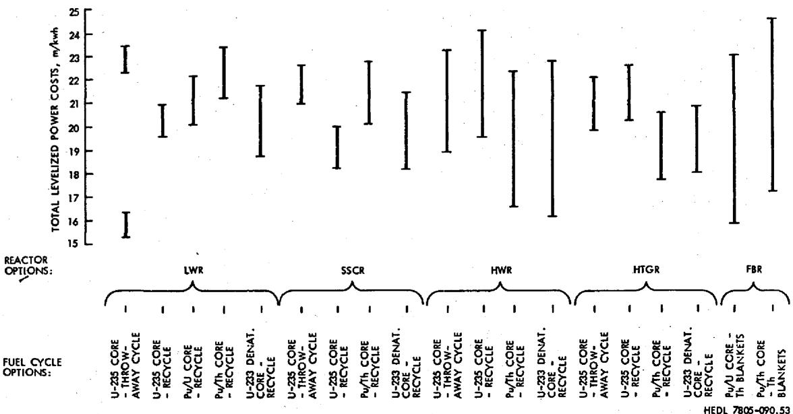  
Fig. B-1. Sensitivity of Total Levelized Power Cost to Capital, Fabrication, and Reprocessing Cost Uncertainties.

the abscissa. The major difference between the two methods of analysis is the U3O8 price at which reactor options incur the same total power cost. For example, whereas at a constant U3O8 price the PWR and HWR options have the same power generation cost at ~ $160/lb U3O8 for an increasing U3O8 price they have the same cost at ~ $130/lb U3O8.

From the data shown in Fig. B-1 it is clear that the total power cost for each reactor and fuel cycle option is dominated by uncertainties. The uncertainty effect produces a significant overlap between reactor power costs. In addition, it is evident from Fig. B-2 that fuel costs, viz., $U_{3}O_{8}$ prices, also significantly affect not only the levelized power costs but also the competitive relationship between reactor options. Therefore, it is difficult to classify reactors as either more economical or less economical based solely on power generation cost estimates.

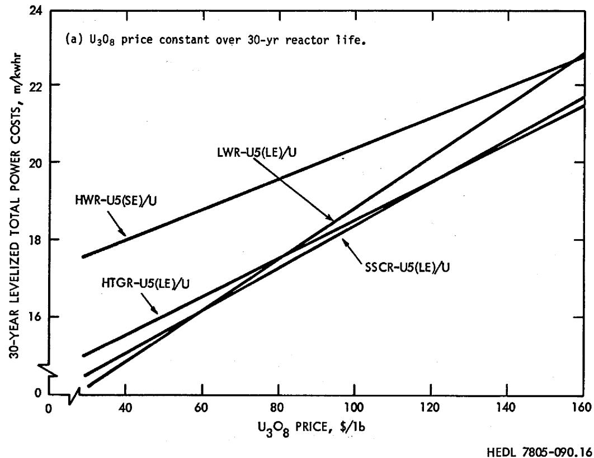

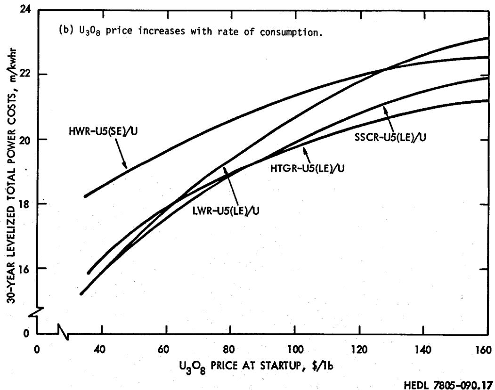  
Fig. B-2. Effect of $U_{3}O_{8}$ Price on Total Power Cost for Reactors Operating on Throwaway Cycle.

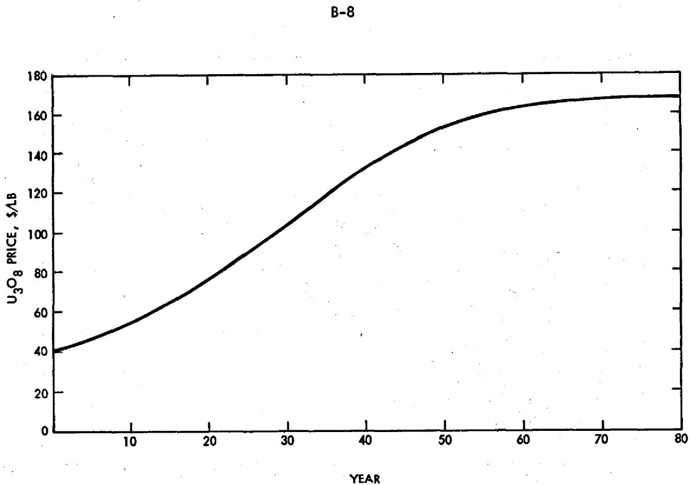  
Fig. B-3. Time-Dependent Behavior of $U_{3}O_{8}$ Price.

# Appendix C. DETAILED RESULTS FROM EVALUATIONS OF VARIOUS NUCLEAR POWER SYSTEMS UTILIZING DENATURED FUEL

M. R. Shay, D. R. Haffner, W. E. Black, T. M. Helm, W. G. Jolly, R. W. Hardie, and R. P. Omberg Hanford Engineering Development Laboratory

This appendix presents detailed results from the calculations performed for the economic/resource evaluation of denatured nuclear reactors operated in concert with other reactors to form nuclear-based power generation systems. For purposes of comparison, it also presents results for similar systems that do not utilize denatured fuel.

As pointed out in Chapter 6, nine different nuclear policy options were examined with four cases under each option. The resulting cases can be classified as shown in Table C-1, where the letters L, S, G, and H indicate the thermal converter option employed in each case. For all cases identified with an L, the only converters used are LWRs. For cases identified with an S, SSCR converters are used in addition to LWRs. Similarly, for cases identified with H and G, the converters used are HWRs and HTGRs respectively, both again in combination with LWRs. Under Options 3, 6, 7, and 8, FBRs are also included in the nuclear systems. In addition to these 36 cases, Case 1L was recalculated for a standard LWR alone; that is, the LWR with an extended discharge exposure, which is included in Case 1L, was eliminated from the system. This case is identified in this appendix as Case 1E.

Table C-1. Nuclear Policy Options*   

<table><tr><td>Options</td><td>LWR</td><td>SSCR</td><td>HTGR</td><td>HWR</td></tr><tr><td>Throwaway Option (1)</td><td>1L</td><td>1S</td><td>1G</td><td>1H</td></tr><tr><td>Pu/U Options</td><td></td><td></td><td></td><td></td></tr><tr><td>With Converters Only (2)</td><td>2L</td><td>2S</td><td>2G</td><td>2H</td></tr><tr><td>With Converters and Breeders (3)</td><td>3L</td><td>3S</td><td>3G</td><td>3H</td></tr><tr><td>Denatured Uranium Options with Converters Only</td><td></td><td></td><td></td><td></td></tr><tr><td>Plutonium Throwaway (4)</td><td>4L</td><td>4S</td><td>4G</td><td>4H</td></tr><tr><td>Plutonium Miminization (5U)</td><td>5UL</td><td>5US</td><td>5UG</td><td>5UH</td></tr><tr><td>Plutonium &quot;Transmutation&quot; (5T)</td><td>5TL</td><td>5TS</td><td>5TG</td><td>5TH</td></tr><tr><td>Denatured Uranium Options with Converters and Breeders</td><td></td><td></td><td></td><td></td></tr><tr><td>Light &quot;Transmutation&quot; Rate (6)</td><td>6L</td><td>6S</td><td>6G</td><td>6H</td></tr><tr><td>Light &quot;Transmutation&quot; Rate, Denatured Breeder (7)</td><td>7L</td><td>7S</td><td>7G</td><td>7H</td></tr><tr><td>Heavy &quot;Transmutation&quot; Rate, Denatured Breeder (8)</td><td>8L</td><td>8S</td><td>8G</td><td>8H</td></tr></table>

*See Table 6.1-5 in Chapter 6 and Tables C-2 and C-4 in this appendix for identification of specific reactor types in each case.

In all cases the reactors operating on plutonium or on highly enriched uranium were assumed to be restricted to secure energy centers, while those operating on low-enriched, slightly enriched, natural, or denatured uranium were permitted to operate outside the centers. The specific reactors used for each case, and their locations, are given in Table 6.1-5 of Chapter 6.

All cases were run assuming 350 GWe of installed nuclear capacity in the year 2000 and a net increase in installed capacity of 15 GWe per year thereafter. Each new plant was assumed to have a 30-yr lifetime. For Option 1, some additional cases were run for a lower energy demand -- 200 GWe in the year 2000 and a net increase of 10 GWe per year thereafter. These latter cases are identified with a C following the case number (i.e., cases 1LEC, 1LC, etc.).

In the results presented here, particular emphasis is given to uranium utilization, separative work utilization, and energy-support ratios. Two important criteria are to be considered when analyzing uranium utilization of reactor systems. The first is the ability of the system to meet the specified nuclear energy demand with the available $\mathsf{U}_3\mathsf{O}_8$ supply. For these calculations two different supplies were assumed: 3 million and 6 million ST below $160/1b $\mathsf{U}_3\mathsf{O}_8$ , corresponding to a high-cost and an intermediate-cost supply, respectively. (As shown in Appendix D, nuclear power plants do not compete well at higher $\mathsf{U}_3\mathsf{O}_8$ costs.) The second criterion is the capability of the uranium industry to discover, mine and mill the ore at a rate adequate to satisfy the demand for uranium. The specification of the overall maximum production rate is difficult to postulate because of the possibility of importing $\mathsf{U}_3\mathsf{O}_8$ and because of the difficulties that might be encountered in developing uncertain resources. As pointed out in Section 7.4.4 of Chapter 7, the DOE Uranium and Enrichment Division has estimated that by developing known and potential reserves domestic mining and milling could sustain 60,000 ST of $\mathsf{U}_3\mathsf{O}_8$ per year.

When analyzing enrichment utilization, the same two criteria - total amount and enrichment capacity - were also used, the more meaningful being the capacity since enrichment is not a limited natural resource like uranium.

For the cases in which 3 million ST of uranium below $160/1b \, U_3O_8$ was assumed, the lack of low-cost $U_3O_8$ dominates the plant selection because the amount of ore available is inadequate for meeting the projected nuclear energy demand. As a result, resource-efficient reactors are constructed regardless of their cost. With a $U_3O_8$ supply below $160/1b$ as large as 6 million ST, however, most systems are no longer dominated by the lack of $U_3O_8$ , and the relative total power costs of the individual reactors play a more important role. In fact, if the system is not limited in any way by the supply of $U_3O_8$ , then the solution is determined solely by economics. The results in this case become more tenuous because of the uncertainty in capital costs, fabrication costs, reprocessing costs, etc.

The cumulative nuclear capacities that could be constructed through the year 2050 for the various cases are shown in Table C-2. Only those cases totaling 1959 GWe will have

(Adequate Capacity = 1959 GWe)

Table C-2. Cumulative Nuclear Capacity Built Through Year 2050 with   
Various Nuclear Policy Options   

<table><tr><td rowspan="2">Advanced Converter Option</td><td colspan="10">Option Capacity (GWe)</td></tr><tr><td>1E*</td><td>1</td><td>2</td><td>3</td><td>4</td><td>5U</td><td>5T</td><td>6</td><td>7</td><td>8</td></tr><tr><td></td><td colspan="10">High-Cost U3O8 Supply</td></tr><tr><td>LWR&#x27;s (L)</td><td>572</td><td>594</td><td>953</td><td>1959</td><td>945</td><td>1205</td><td>1027</td><td>1959</td><td>1959</td><td>1947</td></tr><tr><td>SSCR&#x27;s (S)</td><td>-</td><td>607</td><td>1043</td><td>1959</td><td>1071</td><td>1423</td><td>1275</td><td>1959</td><td>1959</td><td>1943</td></tr><tr><td>HWR&#x27;s (H)</td><td>-</td><td>667</td><td>987</td><td>1959</td><td>1334</td><td>1747</td><td>1505</td><td>1959</td><td>1959</td><td>1959</td></tr><tr><td>HTGR&#x27;s (G)</td><td>-</td><td>603</td><td>1417</td><td>1959</td><td>855</td><td>1064</td><td>1004</td><td>1950</td><td>1959</td><td>1791</td></tr><tr><td></td><td colspan="10">Intermediate-Cost U3O8 Supply</td></tr><tr><td>LWR&#x27;s (L)</td><td>1135</td><td>1193</td><td>1783</td><td>1959</td><td>1852</td><td>1921</td><td>1864</td><td>1959</td><td>1959</td><td>1956</td></tr><tr><td>SSCR&#x27;s (S)</td><td>-</td><td>1271</td><td>1937</td><td>1959</td><td>1943</td><td>1959</td><td>1959</td><td>1959</td><td>1959</td><td>1959</td></tr><tr><td>HWR&#x27;s (H)</td><td>-</td><td>1497</td><td>1921</td><td>1959</td><td>1943</td><td>1959</td><td>1959</td><td>1959</td><td>1959</td><td>1959</td></tr><tr><td>HTGR&#x27;s (G)</td><td>-</td><td>1320</td><td>1959</td><td>1959</td><td>1794</td><td>1924</td><td>1844</td><td>1959</td><td>1959</td><td>1959</td></tr></table>

*System with standard LWR only.

met the projected nuclear demand under the criteria of an installed capacity of 350 GWe in year 2000 and an increase of 15 GWe per year thereafter.* With the high-cost $\mathsf{U}_3\mathsf{O}_8$ supply some of the systems fall far short of satisfying the demand; in fact, the only nuclear systems that fully meet the demand are those including FBRs (Options 3, 6, 7, and 8). The throwaway option, in particular, builds less than a third of the desired nuclear plants. Of the cases that do not include FBRs, those employing HWRs come closest to meeting the demand. One HTGR case (2G) is also clearly superior to most of the other cases. This is to be expected since Case 2G includes traditional HTGRs that are fueled with highly enriched $^{235}\mathsf{U}$ and also with $^{233}\mathsf{U} / \mathsf{Th}$ .

A doubling of the economic $\mathsf{U}_3\mathsf{O}_8$ supply to 6 million tons allows many more nuclear system options to meet the projected nuclear energy demand. In fact, only the throwaway option has cases that don't even come close to satisfying the demand. None of the Option 4 cases meet the demand either; however, Cases 4S and 4H are within 16 GWe of the demand. All other systems have at least one advanced converter option that builds the desired 1959 GWe of energy. It should be emphasized that for the systems where the demand was met with the high-cost $\mathsf{U}_3\mathsf{O}_8$ (i.e., the systems with FBRs), a doubling of the ore supply means that the ore supply is no longer the sole constraint and plant selection is based on economics.

Table C-3. Utilization of $\mathsf{U}_3\mathsf{O}_8$ Ore and Enrichment Through Year 2050 with Various Nuclear Policy Options   

<table><tr><td rowspan="2">Advanced Converter Option</td><td colspan="10">\( U_{3}O_{8} \) Utilization (tons \( U_{3}O_{8}/GMe)/Enrichment \)Utilization (million SWU/GMe)</td></tr><tr><td>1E*</td><td>1</td><td>2</td><td>3</td><td>4</td><td>5U</td><td>5T</td><td>6</td><td>7</td><td>8</td></tr><tr><td colspan="11">High-Cost \( U_{3}O_{8} \) Supply</td></tr><tr><td>LWR&#x27;s(L)</td><td>52363.08</td><td>50423.08</td><td>31382.03</td><td>14970.92</td><td>31652.70</td><td>24802.12</td><td>29082.06</td><td>15121.03</td><td>15141.03</td><td>15251.17</td></tr><tr><td>SSCR&#x27;s(S)</td><td>-</td><td>49312.83</td><td>28641.76</td><td>14920.87</td><td>27932.38</td><td>20981.79</td><td>23401.69</td><td>14870.95</td><td>14870.95</td><td>15281.01</td></tr><tr><td>HWR&#x27;s(H)</td><td>-</td><td>44892.18</td><td>30271.37</td><td>13910.99</td><td>22431.78</td><td>17071.33</td><td>19830.90</td><td>13450.96</td><td>13140.94</td><td>15201.00</td></tr><tr><td>HTGR&#x27;s(G)</td><td>-</td><td>49633.10</td><td>21051.71</td><td>15051.16</td><td>34972.75</td><td>28072.22</td><td>29742.10</td><td>15031.02</td><td>14961.01</td><td>16661.80</td></tr><tr><td colspan="11">Intermediate-Cost \( U_{3}O_{8} \) Supply</td></tr><tr><td>LWR&#x27;s(L)</td><td>52362.95</td><td>49732.92</td><td>31881.75</td><td>27581.46</td><td>31032.46</td><td>29571.86</td><td>30371.77</td><td>27331.68</td><td>27331.68</td><td>27981.61</td></tr><tr><td>SSCR&#x27;s(S)</td><td>-</td><td>46572.43</td><td>28201.36</td><td>27111.27</td><td>28442.03</td><td>25111.34</td><td>25111.34</td><td>25111.34</td><td>25111.34</td><td>25111.34</td></tr><tr><td>HWR&#x27;s(H)</td><td>-</td><td>39161.40</td><td>28941.22</td><td>13981.00</td><td>30302.10</td><td>24311.56</td><td>24751.58</td><td>21951.32</td><td>13920.99</td><td>19241.23</td></tr><tr><td>HTGR&#x27;s(G)</td><td>-</td><td>44782.89</td><td>26831.61</td><td>26801.60</td><td>31722.21</td><td>28651.77</td><td>30551.77</td><td>26831.58</td><td>26821.58</td><td>26981.62</td></tr></table>

*System with standard LWR only.

Uranium and enrichment utilization for the various cases are shown in Table C-3. The uranium utilization values are the total amount of uranium consumed plus the forward commitment per GWe of nuclear power constructed through the year 2050. The enrichment utilization values are the total amount of separative work units required through the year 2050.

As pointed out above, for the cases for which only 3 million ST $U_{3}O_{8}$ was assumed to be available below $160/lb, the ore is the limiting factor. Comparing Case 1LE with Case 1L gives the savings in ore on the throwaway cycle as a result of introducing the extended exposure LWR -- less than 4% in ore and none in enrichment. Cases 1L, 1S, 1H, and 1G compare the relative ore and enrichment utilization of the various advanced converter options on the throwaway cycle. The HWRs clearly offer the greatest savings in both ore and enrichment. Compared with LWRs, the HWRs reduce ore requirements by over 10% and SWU requirements by almost 30%. In contrast, the SSCRs only offer a 2% ore savings and an 8% enrichment savings. The HTGRs reduce the ore usage by less than 2%, with about the same enrichment requirements. The impact on ore utilization of the SSCR, HWR, and HTGR advanced converters on the throwaway cycle is less than might be expected. The reason for the minimal effect is because most of the 3 million ST of $U_{3}O_{8}$ has already been committed to LWRs before enough advanced converters can be built to have much influence.

Allowing the recycle of fuel in thermal reactors (Option 2) results in significant savings in ore compared to the throwaway cycle -- almost $60\%$ for the HTGRs and from 30 to $40\%$ for the other converters. For this nuclear policy option and the high-cost $\mathsf{U}_3\mathsf{O}_8$ supply, the HTGR clearly has the best ore utilization, although the HWRs have better enrichment utilization.

The introduction of the classical Pu-U/U FBR in Option 3 results in an additional ore and enrichment savings of about a factor of two from that in Option 2 except for the HTGRs. Note, however, that in Option 2 the HTGRs already had a low ore and enrichment usage. In Option 3 all the advanced converter cases have about the same usage.

Recycling uranium in denatured reactors and throwing the plutonium away (Option 4) requires enrichment about halfway between Options 1 and 2. Compared with the classical recycle of plutonium in thermal reactors (Option 2), Option 4 consumes roughly the same quantity of uranium with LWRs and SSCRs. That is, the increased worth of $^{233}\mathrm{U}$ in LWRs and SSCRs is nearly balanced by throwing away the plutonium. The requirements for HWRs, however, are considerably reduced over those of Option 2 when $^{233}\mathrm{U}$ is recycled compared to recycling plutonium. The very low fissile requirements for the denatured $^{233}\mathrm{U}$ HWRs is responsible for the more favorable $\mathrm{U}_{3}\mathrm{O}_{8}$ utilization in Option 4 compared to Option 2. In contrast, the HTGRs in Option 4 look much worse than in Option 2. This is because the HTGRs were already operating on the $^{233}\mathrm{U}$ /Th cycle in Option 2. However, in Option 2 the uranium-fueled reactors all use highly enriched fuel while in Option 4 they use denatured fuel.

Options 5U and 5T allow the recycle of plutonium in plutonium/thorium transmuters, the difference between the two being that denatured $^{235}\mathrm{U}$ reactors are available in 5U whereas they are not in 5T. This forces the 5T system to initially rely on the Pu/Th-fueled reactors for $^{233}\mathrm{U}$ . Compared to Option 4, Option 5U results in 20 to $25\%$ savings in ore usage and Option 5T in 10 to $15\%$ savings. The HWRs are the most efficient advanced converters for uranium and enrichment utilization for Options 5U and 5T.

Option 6 introduces FBRs with thorium blankets, although these FBRs have uranium as fertile material in the core. Comparing Option 6 with Option 3 reveals that both systems have approximately the same resource utilization. Option 7 is identical to Option 6 except the denatured $^{233}\mathrm{U}$ FBR is included. The impact of this reactor on resource utilization for these cases is small.

In Option 8 the Pu-U-fueled FBRs of Option 7 are replaced with Pu-Th-fueled FBRs. The longer doubling time of this reactor type results in somewhat increased uranium and enrichment requirements. A key point for all of the systems containing FBRs (Options 3, 6, 7, and 8) is that the ore and enrichment usage is relatively independent of the advanced converter option. This is in contrast to the nonbreeder systems where the type of advanced converter available (LWR, SSCR, HWR, or HTGR) much more strongly affects the resource utilization.

Another very important point that needs emphasis is that the superior ore utilization of the HWRs relative to the other advanced converters for the alternate fueled systems (Options 4 - 8) is directly dependent on the denatured $^{233}\mathrm{U}$ -fueled HWR. Of all the reactor designs, the design of alternate fueled HWRs have probably received the least amount of analysis and therefore have the largest uncertainty. Thus, before it can be concluded that the HWRs offer significant resource savings, more work needs to be performed to verify the optimistic performance characteristics of the denatured $^{233}\mathrm{U}$ -fueled HWR.

Since 6 million ST of $U_{3}O_{8}$ below $\$160/\mathrm{lb}$ is adequate, or nearly adequate, to satisfy the projected nuclear energy demand for most cases in the various nuclear options, the power growth patterns for these cases are strongly influenced by economics as well as resource utilization. Thus, as mentioned earlier in this appendix, the results for the cases based on the intermediate- cost $U_{3}O_{8}$ supply are subject to much larger errors because of large cost uncertainties. Table C-3 shows that the advanced converters for the throw-away cycle reflect a larger $U_{3}O_{8}$ savings when 6 million ST is used as a base rather than 3 million ST. This is because many more nuclear plants are built with the larger supply and therefore more advanced converters can be built, resulting in a larger impact. For the high- cost $U_{3}O_{8}$ case, most of the economic $U_{3}O_{8}$ was already committed to the LWR before the advanced converters could have an effect.

For Option 2, the results are about the same for both $\mathsf{U}_3\mathsf{O}_8$ supplies except for the case with HTGRs (Case 2G). Ore requirements per GWe are $27\%$ higher for this case with the intermediate-cost $\mathsf{U}_3\mathsf{O}_8$ assumed to be available. This is because 6 million ST of economic $\mathsf{U}_3\mathsf{O}_8$ is an adequate amount of ore for the system of reactors in Case 2G to satisfy the nuclear energy demand and economic considerations are also affecting the mix of reactors that are built. Thus, the fraction of low-enriched LWRs constructed is larger because this reactor is less expensive than the HTGRs, even though the HTGRs use less uranium.

The plant selection for the cases that include FBRs (Options 3, 6, 7, and 8) is also determined by economics when 6 million ST of $U_{3}O_{8}$ below $\$160/\mathrm{lb}$ is assumed to be available. Therefore, the uranium utilization for these cases has less meaning. Similarly, some of the advanced converter options for the denatured cases (Options 4, 5U, and 5T) are resource limited and some are not, so it is difficult to draw conclusions regarding relative uranium and enrichment utilization.

To summarize, there are two important and competing effects when comparing the cases for the two uranium supplies: (1) For systems that fall far short of meeting the demand with the high-cost $\mathsf{U}_3\mathsf{O}_8$ supply, the larger supply allows the advanced converters to have a greater impact and therefore better ore utilization; and (2) systems that have almost enough ore with the high-cost $\mathsf{U}_3\mathsf{O}_8$ supply have plenty of ore with the intermediate-cost supply, and therefore plant selection with the larger supply is based on cost and ore utilization is lower.

The maximum annual $\mathsf{U}_3\mathsf{O}_8$ requirements and the maximum annual enrichment requirements through the year 2050 are shown in Table C-4. The number in parentheses next to each maximum indicates the year the maximum occurs. As was mentioned above, it has been estimated that the maximum domestic mining and milling rate may be approximately 60,000 ST/yr. Table C-4 indicates that if the high-cost $\mathsf{U}_3\mathsf{O}_8$ supply is assumed, the annual $\mathsf{U}_3\mathsf{O}_8$ requirements vary from 50,000 ST/yr (Case 7S) to 80,000 ST/yr (Case 4L). For most of the cases, the maximum occurs during the first decade of the next century. Thus, most of the cases require annual ore usage within the next 25 - 30 years that exceeds the 60,000/yr criterion.

Table C-4. Maximum Annual $\mathrm{U}_{3}\mathrm{O}_{8}$ and Enrichment Requirements Through Year 2050 for Various Nuclear Policy Options   

<table><tr><td rowspan="2">Advanced Converter Option</td><td colspan="10">\( U_{3}O_{8} \) Requirements (thousands tons/yr)/Enrichment Requirements (million swU/yr)</td></tr><tr><td>1E*</td><td>1</td><td>2</td><td>3</td><td>4</td><td>5U</td><td>5T</td><td>6</td><td>7</td><td>8</td></tr><tr><td colspan="11">High-Cost \( U_{3}O_{8} \) Supply</td></tr><tr><td>LWR&#x27;s (L)</td><td>73(2007)44(2007)</td><td>72(2007)45(2007)</td><td>67(2009)46(2009)</td><td>60(2009)41(2009)</td><td>80(2005)69(2009)</td><td>75(2009)65(2011)</td><td>65(2011)45(2011)</td><td>62(2009)44(2009)</td><td>60(2009)42(2009)</td><td>68(2005)55(2005)</td></tr><tr><td>SSCR&#x27;s (S)</td><td>-</td><td>72(2007)42(2007)</td><td>62(2011)40(2011)</td><td>52(2009)34(2009)</td><td>79(2009)68(2009)</td><td>69(2011)60(2011)</td><td>58(2017)39(2010)</td><td>50(2005)35(2005)</td><td>50(2005)35(2005)</td><td>55(2009)38(2009)</td></tr><tr><td>HWR&#x27;s (H)</td><td>-</td><td>68(2009)36(2005)</td><td>58(2011)36(2003)</td><td>66(2009)46(2009)</td><td>71(2009)58(2011)</td><td>55(2003)46(2023)</td><td>53(2019)35(2003)</td><td>64(2009)46(2009)</td><td>63(2009)44(2009)</td><td>65(2009)46(2009)</td></tr><tr><td>HTGR&#x27;s (G)</td><td>-</td><td>72(2007)45(2009)</td><td>57(2019)51(2019)</td><td>53(2003)39(2005)</td><td>65(2009)52(2011)</td><td>57(2011)49(2017)</td><td>64(2011)45(2011)</td><td>61(2009)44(2009)</td><td>60(2009)42(2009)</td><td>65(2009)46(2009)</td></tr><tr><td colspan="11">Intermediate-Cost \( U_{3}O_{8} \) Supply</td></tr><tr><td>LWR&#x27;s (L)</td><td>124(2025)74(2025)</td><td>120(2025)77(2025)</td><td>110(2039)72(2039)</td><td>92(2037)60(2037)</td><td>105(2037)100(2037)</td><td>115(2039)90(2039)</td><td>109(2039)77(2039)</td><td>86(2033)61(2033)</td><td>86(2033)61(2033)</td><td>92(2043)65(2043)</td></tr><tr><td>SSCR&#x27;s (S)</td><td>-</td><td>114(2027)63(2029)</td><td>96(2043)57(2045)</td><td>93(2047)53(2047)</td><td>82(2049)73(2039)</td><td>83(2049)55(2049)</td><td>83(2049)55(2049)</td><td>83(2049)55(2049)</td><td>83(2049)55(2049)</td><td>83(2049)55(2049)</td></tr><tr><td>HWR&#x27;s (H)</td><td>-</td><td>98(2031)42(2009)</td><td>81(2023)53(2011)</td><td>66(2009)47(2009)</td><td>117(2031)96(2033)</td><td>89(2029)64(2029)</td><td>90(2029)64(2031)</td><td>66(2009)47(2009)</td><td>66(2009)47(2009)</td><td>66(2009)46(2009)</td></tr><tr><td>HTGR&#x27;s (G)</td><td>-</td><td>110(2029)84(2029)</td><td>86(2049)70(2049)</td><td>86(2049)70(2049)</td><td>96(2039)90(2039)</td><td>94(2043)86(2047)</td><td>108(2041)76(2041)</td><td>87(2047)74(2047)</td><td>87(2047)74(2047)</td><td>87(2047)75(2047)</td></tr></table>

\*System with standard LWR only.

The maximum annual separative work requirements based on the high-cost $\mathsf{U}_3\mathsf{O}_8$ supply varies from 34 million SWU/yr to 69 million SWU/yr. This means that the current separations capacity would have to be doubled or quadrupled to meet the demand. As expected, the year in which the maximum separative work capacity occurs is nearly the same as the year when the $\mathsf{U}_3\mathsf{O}_8$ demand is greatest.

Assuming the intermediate-cost $U_{3}O_{8}$ supply, the maximum annual ore requirements are greater than 60,000 ST for all cases. For most of the options, the year the maximum occurs is 40 yr later than for the high-cost cases. This is because, with 6 million ST of economic $U_{3}O_{8}$ , the nuclear industry continues to expand. The breeder reactor systems that include HWRs (Cases 3H, 6H, 7H, and 8H) are the only cases that have ore requirements that are close to being as low as 60,000 ST/yr. The maximum separative work requirements are also very high for this uranium supply -- from 42 to 100 million SWU/yr.

Table C-5 shows the energy support ratios calculated in this study for the year 2025, the energy support ratio being the ratio of installed nuclear capacity outside the energy centers to the installed nuclear capacity inside the centers. All the reactor types that are available in Options 1 and 4 could be constructed outside the centers; therefore, the energy support ratio for each case in these options is $\infty$ . However, it has already been shown that these systems offer the lowest uranium utilization and therefore the lowest nuclear growth potential, even if it is assumed that 6 million ST of $\mathsf{U}_3\mathsf{O}_8$ is available at below $160/lb.

Table C-5. Energy Support Ratios in Year 2050 for Various Nuclear Policy Options (Support Ratio = Installed Nuclear Capacity Outside Energy Center/Installed Nuclear Capacity Inside Energy Center)   

<table><tr><td rowspan="2">Advanced Converter Option</td><td colspan="10">Support Ratio</td></tr><tr><td>1E*</td><td>1</td><td>2</td><td>3</td><td>4</td><td>5U</td><td>5T</td><td>6</td><td>7</td><td>8</td></tr><tr><td></td><td colspan="10">High-Cost U3O8 Supply</td></tr><tr><td>LWR&#x27;s (L)</td><td>∞</td><td>∞</td><td>1.54</td><td>0.72</td><td>∞</td><td>5.69</td><td>3.74</td><td>1.27</td><td>1.46</td><td>3.09</td></tr><tr><td>SSCR&#x27;s (S)</td><td>-</td><td>∞</td><td>1.47</td><td>0.76</td><td>∞</td><td>6.33</td><td>3.86</td><td>2.13</td><td>2.13</td><td>3.27</td></tr><tr><td>HNR&#x27;s (H)</td><td>-</td><td>∞</td><td>0.49</td><td>0.92</td><td>∞</td><td>5.79</td><td>3.07</td><td>1.07</td><td>1.06</td><td>2.89</td></tr><tr><td>HTGR&#x27;s (G)</td><td>-</td><td>∞</td><td>0.24</td><td>0.24</td><td>∞</td><td>4.02</td><td>2.50</td><td>1.26</td><td>1.28</td><td>3.11</td></tr><tr><td></td><td colspan="10">Intermediate-Cost U3O8 Supply</td></tr><tr><td>LWR&#x27;s (L)</td><td>∞</td><td>∞</td><td>2.42</td><td>1.65</td><td>∞</td><td>5.06</td><td>5.05</td><td>5.37</td><td>5.37</td><td>5.49</td></tr><tr><td>SSCR&#x27;s (S)</td><td>-</td><td>∞</td><td>2.10</td><td>1.65</td><td>∞</td><td>4.78</td><td>4.78</td><td>4.78</td><td>4.78</td><td>4.78</td></tr><tr><td>HNR&#x27;s (H)</td><td>-</td><td>∞</td><td>1.85</td><td>0.94</td><td>∞</td><td>4.03</td><td>3.84</td><td>1.03</td><td>1.04</td><td>3.07</td></tr><tr><td>HTGR&#x27;s (G)</td><td>-</td><td>∞</td><td>1.77</td><td>1.82</td><td>∞</td><td>3.30</td><td>3.20</td><td>2.74</td><td>2.74</td><td>3.62</td></tr></table>

*System with standard LWR only.

As pointed out previously, with only 3 million ST of $U_{3}O_{8}$ available below $\$160/1b$ , the only systems that satisfy the energy demand of 350 GWe in the year 2000 and 15 GWe/yr thereafter are those with breeders. The disadvantage of the classical Pu-U breeder cycle (Option 3), of course, is the low energy support ratio since the plutonium that is produced must be used in the energy centers. One technique for increasing the energy support ratio is to load thorium in the blanket of these breeders, while retaining plutonium and uranium in the cores. The $^{233}\mathrm{U}$ that is produced in the blankets is then burned in denatured LWRs located outside the centers (Option 6). The resulting energy support ratios for Option 6 vary from 1 to 2, depending upon the advanced converter option. Option 7 introduces a denatured FBR which would provide $^{233}\mathrm{U}$ to the system and therefore should increase its nuclear growth potential. However, since Option 6 can meet the projected nuclear growth demand itself, the addition of the denatured breeder in Option 7 actually had a minimal impact.

The energy support ratios of Options 6 and 7 could be further increased by replacing the uranium in the core of the Pu-U breeder with thorium (Option 8). With the high-cost $\mathrm{U}_{3}\mathrm{O}_{8}$ supply, energy support ratios of about 3 are obtained for this system. The introduction of thorium in the core of a breeder lowers the breeding ratio to the point that, in contrast to Option 7, significant quantities of FBRs operating on denatured fuel must be built to meet the projected nuclear growth demand.

In general, the energy support ratio trends for the various options are the same if 6 million tons of $\mathsf{U}_3\mathsf{O}_8$ is available below $160/lb; however, they are significantly higher, largely because more low-enriched LWRs can be built.

Selected detailed results for all the cases calculated are presented in Table C-6, C-7, and C-8. While many of the numbers in these tables appear elsewhere in this report, many numbers are also shown for the first time. For example, the plant mix in year 2025 and the levelized power cost for each plant starting up in the year 2025 are shown. The purpose of these tables is to group all the data together and also to provide sufficient data to help explain the behavior of the various reactor systems. (Note: Cases 1LT and 1LTM in Table C-6 are for changing enrichment compositions; see Section 6.2-1 in Chapter 6.)

Table C-6. Summary of Results for Cases Assuming High-Cost $U_{3}O_{8}$ Supply, 350 GWe Installed Capacity in Year 2000, and 15 GWe Installed Capacity Each Subsequent Year   

<table><tr><td></td><td>1L*</td><td>1L</td><td>2L</td><td>3L</td><td>4L</td><td>5L</td><td>5TL</td><td>6L</td><td>7L</td><td>8L</td></tr><tr><td colspan="11">Cumulative Nuclear Capacity Built (Gm) through</td></tr><tr><td>2025</td><td>559</td><td>579</td><td>684</td><td>1029</td><td>853</td><td>1005</td><td>916</td><td>1029</td><td>1029</td><td>1029</td></tr><tr><td>2049</td><td>572</td><td>594</td><td>953</td><td>1959</td><td>945</td><td>1205</td><td>1027</td><td>1959</td><td>1959</td><td>1947</td></tr><tr><td colspan="11">System Costs ($B) 1977 through</td></tr><tr><td colspan="11">2050 discounted at</td></tr><tr><td>4.58</td><td>359</td><td>562</td><td>440</td><td>507</td><td>473</td><td>480</td><td>439</td><td>510</td><td>509</td><td>534</td></tr><tr><td>7.58</td><td>185</td><td>186</td><td>209</td><td>220</td><td>221</td><td>220</td><td>207</td><td>222</td><td>221</td><td>229</td></tr><tr><td>10.08</td><td>119</td><td>119</td><td>129</td><td>132</td><td>135</td><td>133</td><td>128</td><td>132</td><td>132</td><td>135</td></tr><tr><td colspan="11">Levelized System Power Costs (MWh/Kwh) in</td></tr><tr><td>2000</td><td>18.2</td><td>18.0</td><td>16.1</td><td>15.5</td><td>18.2</td><td>16.2</td><td>15.7</td><td>15.7</td><td>15.7</td><td>16.0</td></tr><tr><td>2015</td><td>20.1</td><td>19.6</td><td>17.7</td><td>16.1</td><td>20.0</td><td>18.0</td><td>17.3</td><td>16.0</td><td>16.2</td><td>17.0</td></tr><tr><td>2025</td><td>20.9</td><td>20.3</td><td>18.4</td><td>17.2</td><td>20.6</td><td>19.0</td><td>18.3</td><td>16.6</td><td>16.8</td><td>18.3</td></tr><tr><td>2035</td><td>21.8</td><td>21.1</td><td>18.8</td><td>17.8</td><td>21.0</td><td>19.6</td><td>19.0</td><td>18.0</td><td>17.9</td><td>20.0</td></tr><tr><td colspan="11">Cumulative U.O. Consumption (Million TonS) through</td></tr><tr><td>2025</td><td>2.57</td><td>2.55</td><td>2.38</td><td>2.14</td><td>2.63</td><td>2.50</td><td>2.30</td><td>2.18</td><td>2.14</td><td>2.29</td></tr><tr><td>2049</td><td>2.97</td><td>2.96</td><td>2.95</td><td>2.73</td><td>2.98</td><td>2.97</td><td>2.94</td><td>2.82</td><td>2.83</td><td>2.86</td></tr><tr><td colspan="11">Total U.O. Committed (Million Tons) through</td></tr><tr><td>2025</td><td>2.93</td><td>2.92</td><td>2.85</td><td>2.49</td><td>2.90</td><td>2.86</td><td>2.83</td><td>2.49</td><td>2.54</td><td>2.59</td></tr><tr><td>2049</td><td>2.99</td><td>2.99</td><td>2.99</td><td>2.93</td><td>2.99</td><td>2.99</td><td>2.99</td><td>2.96</td><td>2.97</td><td>2.97</td></tr><tr><td>Maximum Annual Enrichment Requirement through 2050 (Million SMU/yr)</td><td>44 (3) (2007)</td><td>45 (2007)</td><td>46 (2009)</td><td>41 (2009)</td><td>69 (2009)</td><td>65 (2011)</td><td>45 (2011)</td><td>44 (2009)</td><td>42 (2009)</td><td>55 (2005)</td></tr><tr><td colspan="11">Cumulative Enrichment (Million SMU) through</td></tr><tr><td>2025</td><td>1.53</td><td>1.58</td><td>1.60</td><td>1.47</td><td>2.20</td><td>2.08</td><td>1.61</td><td>1.53</td><td>1.51</td><td>1.82</td></tr><tr><td>2049</td><td>1.76</td><td>1.83</td><td>1.93</td><td>1.79</td><td>2.55</td><td>2.55</td><td>2.11</td><td>2.01</td><td>2.02</td><td>2.29</td></tr><tr><td colspan="11">U.O. Utilization (Tons U3O/Gm) in(1)</td></tr><tr><td>2025</td><td>5236</td><td>5045</td><td>3228</td><td>2420</td><td>5394</td><td>2847</td><td>3086</td><td>2423</td><td>2469</td><td>2513</td></tr><tr><td>2049</td><td>5236</td><td>5042</td><td>3138</td><td>1497</td><td>5165</td><td>2480</td><td>2908</td><td>1512</td><td>1514</td><td>1525</td></tr><tr><td colspan="11">Enrichment Utilization (Million SMU/Gm)(2) in</td></tr><tr><td>2025</td><td>2.74</td><td>2.72</td><td>1.81</td><td>1.43</td><td>2.58</td><td>2.07</td><td>1.75</td><td>1.49</td><td>1.46</td><td>1.76</td></tr><tr><td>2049</td><td>3.08</td><td>3.06</td><td>2.03</td><td>.92</td><td>2.70</td><td>2.12</td><td>2.06</td><td>1.05</td><td>1.03</td><td>1.17</td></tr><tr><td></td><td>1S</td><td>2S</td><td>3S</td><td>4S</td><td>5S</td><td>5TS</td><td>6S</td><td>7S</td><td>8S</td><td></td></tr><tr><td colspan="11">Cumulative Nuclear Capacity Built (Gm) through</td></tr><tr><td>2025</td><td>591</td><td>946</td><td>1029</td><td>944</td><td>1029</td><td>1029</td><td>1029</td><td>1029</td><td>1029</td><td>1029</td></tr><tr><td>2049</td><td>607</td><td>1043</td><td>1959</td><td>1071</td><td>1423</td><td>1275</td><td>1959</td><td>1959</td><td>1959</td><td>1943</td></tr><tr><td colspan="11">System Costs ($B) 1977 through</td></tr><tr><td colspan="11">2050 discounted at</td></tr><tr><td>4.58</td><td>369</td><td>451</td><td>502</td><td>495</td><td>498</td><td>470</td><td>500</td><td>500</td><td>500</td><td>513</td></tr><tr><td>7.58</td><td>188</td><td>211</td><td>219</td><td>226</td><td>227</td><td>213</td><td>218</td><td>218</td><td>218</td><td>222</td></tr><tr><td>10.08</td><td>120</td><td>129</td><td>131</td><td>136</td><td>133</td><td>129</td><td>131</td><td>131</td><td>131</td><td>132</td></tr><tr><td colspan="11">Levelized System Power Costs (MWh/Kwh) in</td></tr><tr><td>2000</td><td>18.1</td><td>16.0</td><td>15.4</td><td>18.0</td><td>15.9</td><td>15.5</td><td>15.4</td><td>15.4</td><td>15.4</td><td>15.6</td></tr><tr><td>2015</td><td>19.7</td><td>17.1</td><td>15.9</td><td>19.5</td><td>17.2</td><td>16.6</td><td>15.9</td><td>15.9</td><td>15.9</td><td>16.3</td></tr><tr><td>2025</td><td>20.4</td><td>17.6</td><td>16.6</td><td>20.1</td><td>18.1</td><td>17.4</td><td>15.9</td><td>15.9</td><td>15.9</td><td>17.0</td></tr><tr><td>2035</td><td>21.0</td><td>17.9</td><td>17.0</td><td>20.5</td><td>19.0</td><td>18.2</td><td>14.4</td><td>14.4</td><td>14.4</td><td>17.8</td></tr><tr><td colspan="11">Cumulative U.O. Consumption (Million TonS) through</td></tr><tr><td>2025</td><td>2.54</td><td>2.27</td><td>1.99</td><td>2.62</td><td>2.35</td><td>2.14</td><td>1.93</td><td>1.93</td><td>1.93</td><td>2.07</td></tr><tr><td>2049</td><td>2.96</td><td>2.92</td><td>2.70</td><td>2.98</td><td>2.96</td><td>2.91</td><td>2.69</td><td>2.69</td><td>2.69</td><td>2.83</td></tr><tr><td colspan="11">Total U.O. Committed (Million Tons) through</td></tr><tr><td>2025</td><td>2.92</td><td>2.81</td><td>2.43</td><td>2.89</td><td>2.81</td><td>2.77</td><td>2.36</td><td>2.36</td><td>2.58</td><td>2.58</td></tr><tr><td>2049</td><td>2.99</td><td>2.99</td><td>2.92</td><td>2.99</td><td>2.99</td><td>2.98</td><td>2.91</td><td>2.91</td><td>2.91</td><td>2.97</td></tr><tr><td>Maximum Annual Enrichment Requirement through 2050 (Million SMU/yr)</td><td>42 (2007) (3)</td><td>40 (2011)</td><td>34 (2009)</td><td>68 (2009)</td><td>60 (2011)</td><td>39 (2010)</td><td>35 (2005)</td><td>35 (2005)</td><td>35 (2005)</td><td>58 (2009)</td></tr><tr><td colspan="11">Cumulative Enrichment (Million SMU) through</td></tr><tr><td>2025</td><td>1.48</td><td>1.47</td><td>1.32</td><td>2.19</td><td>1.94</td><td>1.45</td><td>1.33</td><td>1.33</td><td>1.33</td><td>1.42</td></tr><tr><td>2049</td><td>1.72</td><td>1.84</td><td>1.70</td><td>2.54</td><td>2.54</td><td>2.02</td><td>1.86</td><td>1.86</td><td>1.86</td><td>1.97</td></tr><tr><td colspan="11">U.O. Utilization (Tons U3O/Gm) in(1)</td></tr><tr><td>2025</td><td>4939</td><td>2975</td><td>2362</td><td>3066</td><td>2730</td><td>2687</td><td>2297</td><td>2297</td><td>2297</td><td>2506</td></tr><tr><td>2049</td><td>4931</td><td>2864</td><td>1492</td><td>2793</td><td>2098</td><td>2340</td><td>1487</td><td>1487</td><td>1487</td><td>1528</td></tr><tr><td colspan="11">Enrichment Utilization (Million SMU/Gm)(2) in</td></tr><tr><td>2025</td><td>2.50</td><td>1.55</td><td>1.28</td><td>2.32</td><td>1.88</td><td>1.41</td><td>1.29</td><td>1.29</td><td>1.29</td><td>1.38</td></tr><tr><td>2049</td><td>2.83</td><td>1.76</td><td>.87</td><td>2.38</td><td>1.79</td><td>1.59</td><td>.95</td><td>.95</td><td>.95</td><td>1.01</td></tr></table>

\*System with standard LWR only.

Table C-6 (cont.)   

<table><tr><td></td><td>1H</td><td>2H</td><td>3H</td><td>4H</td><td>5H</td><td>5TH</td><td>6H</td><td>7H</td><td>8H</td></tr><tr><td colspan="10">Cumulative Nuclear Capacity Built (GWh) through</td></tr><tr><td>2025</td><td>641</td><td>908</td><td>1029</td><td>1003</td><td>1029</td><td>1029</td><td>1029</td><td>1029</td><td>1029</td></tr><tr><td>2049</td><td>667</td><td>987</td><td>1959</td><td>1334</td><td>1747</td><td>1505</td><td>1959</td><td>1959</td><td>1959</td></tr><tr><td colspan="10">System Costs ($B) 1977 through</td></tr><tr><td colspan="10">2050 discounted at</td></tr><tr><td>4.5%</td><td>387</td><td>494</td><td>524</td><td>551</td><td>568</td><td>549</td><td>529</td><td>523</td><td>535</td></tr><tr><td>7.5%</td><td>192</td><td>222</td><td>225</td><td>234</td><td>236</td><td>232</td><td>226</td><td>225</td><td>227</td></tr><tr><td>10.0%</td><td>121</td><td>134</td><td>134</td><td>137</td><td>138</td><td>136</td><td>134</td><td>133</td><td>134</td></tr><tr><td colspan="10">Levelized System Power Costs (Millions/KWh) in</td></tr><tr><td>2000</td><td>17.9</td><td>17.6</td><td>17.4</td><td>17.9</td><td>16.1</td><td>15.6</td><td>16.9</td><td>16.7</td><td>15.8</td></tr><tr><td>2015</td><td>20.5</td><td>20.0</td><td>18.0</td><td>20.8</td><td>19.1</td><td>18.9</td><td>17.6</td><td>17.1</td><td>17.1</td></tr><tr><td>2025</td><td>21.5</td><td>20.8</td><td>17.2</td><td>22.4</td><td>20.7</td><td>20.7</td><td>17.6</td><td>17.1</td><td>18.5</td></tr><tr><td>2035</td><td>21.8</td><td>21.1</td><td>15.7</td><td>23.1</td><td>21.7</td><td>22.4</td><td>17.5</td><td>17.6</td><td>20.6</td></tr><tr><td colspan="10">Cumulative U3O2Consumption (Million Tons) through</td></tr><tr><td>2025</td><td>2.47</td><td>2.24</td><td>2.29</td><td>2.44</td><td>2.16</td><td>2.14</td><td>2.25</td><td>2.21</td><td>2.29</td></tr><tr><td>2049</td><td>2.95</td><td>2.91</td><td>2.70</td><td>2.97</td><td>2.92</td><td>2.90</td><td>2.61</td><td>2.55</td><td>2.87</td></tr><tr><td colspan="10">Total U3O2Committed (Million Tons) through</td></tr><tr><td>2025</td><td>2.90</td><td>2.81</td><td>2.63</td><td>2.90</td><td>2.70</td><td>2.79</td><td>2.55</td><td>2.50</td><td>2.69</td></tr><tr><td>2049</td><td>2.99</td><td>2.99</td><td>2.72</td><td>2.99</td><td>2.98</td><td>2.98</td><td>2.63</td><td>2.57</td><td>2.98</td></tr><tr><td>Maximum Annual Enrichment Requirement through 2050 (Million SMU/yr)</td><td>36(3)(2005)</td><td>36(2003)</td><td>46(2009)</td><td>58(2011)</td><td>46(2023)</td><td>35(2003)</td><td>46(2009)</td><td>44(2009)</td><td>46(2009)</td></tr><tr><td colspan="10">Cumulative Enrichment (Billion SMU) through</td></tr><tr><td>2025</td><td>1.30</td><td>1.24</td><td>1.61</td><td>1.90</td><td>1.63</td><td>1.23</td><td>1.58</td><td>1.55</td><td>1.61</td></tr><tr><td>2049</td><td>1.45</td><td>1.35</td><td>1.94</td><td>2.37</td><td>2.33</td><td>1.35</td><td>1.88</td><td>1.84</td><td>1.95</td></tr><tr><td colspan="10">U3O2Utilization (Tons U3O2/GWh) in(1)</td></tr><tr><td>2025</td><td>4524</td><td>3095</td><td>2558</td><td>2890</td><td>2620</td><td>2707</td><td>2482</td><td>2426</td><td>2608</td></tr><tr><td>2049</td><td>4489</td><td>3027</td><td>1391</td><td>2243</td><td>1707</td><td>1983</td><td>1345</td><td>1314</td><td>1520</td></tr><tr><td colspan="10">Enrichment Utilization (Million SMU/GWh)(2)</td></tr><tr><td>2025</td><td>2.02</td><td>1.37</td><td>1.57</td><td>1.90</td><td>1.58</td><td>1.19</td><td>1.54</td><td>1.51</td><td>1.57</td></tr><tr><td>2049</td><td>2.18</td><td>1.37</td><td>.99</td><td>1.78</td><td>1.33</td><td>.90</td><td>.96</td><td>.94</td><td>1.00</td></tr><tr><td></td><td>1G</td><td>2G</td><td>3G</td><td>4G</td><td>5G</td><td>6G</td><td>7G</td><td>8G</td><td>1LT</td></tr><tr><td colspan="10">Cumulative Nuclear Capacity Built (GWh) through</td></tr><tr><td>2025</td><td>588</td><td>1029</td><td>1029</td><td>958</td><td>917</td><td>1029</td><td>1029</td><td>1029</td><td>678</td></tr><tr><td>2049</td><td>603</td><td>1417</td><td>1959</td><td>855</td><td>1064</td><td>1004</td><td>1950</td><td>1959</td><td>703</td></tr><tr><td colspan="10">System Costs ($B) 1977 through</td></tr><tr><td colspan="10">2050 discounted at</td></tr><tr><td>4.5%</td><td>368</td><td>484</td><td>502</td><td>439</td><td>451</td><td>442</td><td>506</td><td>518</td><td>417</td></tr><tr><td>7.5%</td><td>188</td><td>217</td><td>219</td><td>209</td><td>210</td><td>209</td><td>221</td><td>220</td><td>208</td></tr><tr><td>10.0%</td><td>120</td><td>151</td><td>131</td><td>129</td><td>129</td><td>132</td><td>132</td><td>134</td><td>132</td></tr><tr><td colspan="10">Levelized System Power Costs (Millions/KWh) in</td></tr><tr><td>2000</td><td>18.2</td><td>16.0</td><td>15.7</td><td>17.7</td><td>15.9</td><td>15.8</td><td>15.8</td><td>15.3</td><td>17.6</td></tr><tr><td>2015</td><td>19.9</td><td>16.4</td><td>16.0</td><td>18.6</td><td>17.1</td><td>17.3</td><td>16.0</td><td>16.0</td><td>19.0</td></tr><tr><td>2025</td><td>20.5</td><td>16.8</td><td>15.8</td><td>18.9</td><td>17.7</td><td>18.1</td><td>16.1</td><td>18.8</td><td>19.6</td></tr><tr><td>2035</td><td>21.1</td><td>17.3</td><td>14.2</td><td>18.9</td><td>18.6</td><td>16.4</td><td>16.4</td><td>20.8</td><td>20.3</td></tr><tr><td colspan="10">Cumulative U3O2Consumption (Million Tons) through</td></tr><tr><td>2025</td><td>2.55</td><td>2.19</td><td>1.97</td><td>2.35</td><td>2.21</td><td>2.31</td><td>2.15</td><td>2.32</td><td>2.43</td></tr><tr><td>2049</td><td>2.96</td><td>2.92</td><td>2.75</td><td>2.94</td><td>2.92</td><td>2.94</td><td>2.70</td><td>2.68</td><td>2.95</td></tr><tr><td colspan="10">Total U3O2Committed (Million Tons) through</td></tr><tr><td>2025</td><td>2.92</td><td>2.78</td><td>2.41</td><td>2.85</td><td>2.80</td><td>2.83</td><td>2.42</td><td>2.38</td><td>2.89</td></tr><tr><td>2049</td><td>2.99</td><td>2.98</td><td>2.95</td><td>2.99</td><td>2.99</td><td>2.99</td><td>2.93</td><td>2.98</td><td>2.99</td></tr><tr><td>Maximum Annual Enrichment Requirement through 2050 (Million SMU/yr)</td><td>45(3)(2009)</td><td>51(2019)</td><td>39(2005)</td><td>52(2011)</td><td>49(2017)</td><td>45(2011)</td><td>44(2009)</td><td>42(2009)</td><td>92(2011)</td></tr><tr><td colspan="10">Cumulative Enrichment (Billion SMU) through</td></tr><tr><td>2025</td><td>1.59</td><td>1.71</td><td>1.49</td><td>1.80</td><td>1.69</td><td>1.62</td><td>1.53</td><td>1.50</td><td>3.25</td></tr><tr><td>2049</td><td>1.87</td><td>2.42</td><td>2.35</td><td>2.35</td><td>2.36</td><td>2.11</td><td>2.00</td><td>1.98</td><td>4.06</td></tr><tr><td colspan="10">U3O2Utilization (Tons U3O2/GWh) in(1)</td></tr><tr><td>2025</td><td>4073</td><td>2700</td><td>2342</td><td>3557</td><td>2920</td><td>3082</td><td>2352</td><td>2316</td><td>4078</td></tr><tr><td>2049</td><td>4963</td><td>2105</td><td>1505</td><td>3497</td><td>2807</td><td>2974</td><td>1503</td><td>1496</td><td>4258</td></tr><tr><td colspan="10">Enrichment Utilization (Million SMU/GWh)(2)</td></tr><tr><td>2025</td><td>2.70</td><td>1.66</td><td>1.45</td><td>2.24</td><td>1.76</td><td>1.77</td><td>1.48</td><td>1.45</td><td>4.60</td></tr><tr><td>2049</td><td>3.10</td><td>1.71</td><td>1.15</td><td>2.75</td><td>2.22</td><td>2.10</td><td>1.02</td><td>1.01</td><td>5.53</td></tr></table>

(1) Cumulative ${\mathrm{U}}_{2}{\mathrm{O}}_{4}$ consumed through year 2050 (including forward commitments) per cumulative nuclear capacity built through 2050.   
(2) Cumulative enrichment requirements through 2050 per cumulative nuclear capacity built through 2050.   
(3) Year in which maximum enrichment requirements occur.

Table C-6 (cont.)   

<table><tr><td rowspan="2">Reactor</td><td colspan="10">Installed Capacity (GWh)/Levelized Power Cost (Mills/Kwhr) in year 2025</td></tr><tr><td>1LE*</td><td>1L</td><td>2L</td><td>3L</td><td>4L</td><td>SUL</td><td>5TL</td><td>6L</td><td>7L</td><td>8L</td></tr><tr><td>LMR-U5(LE)/U</td><td>269/22.3</td><td>30/22.3</td><td>360/19.6</td><td>310/18.0</td><td>52/21.5</td><td>49/19.7</td><td>412/19.8</td><td>327/17.5</td><td>342/18.0</td><td>118/17.9</td></tr><tr><td>LMR-U5(LE)/U-EE</td><td>-</td><td>259/21.4</td><td>-</td><td>-</td><td>-</td><td>-</td><td>-</td><td>-</td><td>-</td><td>-</td></tr><tr><td>LMR-U5(DE)/U/Th</td><td>-</td><td>-</td><td>-</td><td>-</td><td>292/23.0</td><td>296/21.4</td><td>-</td><td>0/19.0</td><td>0/19.5</td><td>187/18.8</td></tr><tr><td>LMR-U3(DE)/U/Th</td><td></td><td></td><td></td><td>-</td><td>220/20.4</td><td>264/20.0</td><td>82/20.7</td><td>87/17.6</td><td>60/18.4</td><td>9/20.7</td></tr><tr><td>LMR-Pu/U</td><td></td><td></td><td>234/19.0</td><td>72/19.3</td><td>-</td><td></td><td></td><td></td><td></td><td></td></tr><tr><td>LMR-Pu/Th</td><td></td><td></td><td>-</td><td>-</td><td>-</td><td>107/18.7</td><td>132/19.6</td><td>9/28.9</td><td>21/24.1</td><td>9/26.0</td></tr><tr><td>FBR-Pu-U/J</td><td></td><td></td><td>-</td><td>357/20.6</td><td>-</td><td></td><td></td><td>316/19.8</td><td>280/18.0</td><td>-</td></tr><tr><td>FBR-Pu-U/J/Th</td><td></td><td></td><td></td><td></td><td></td><td></td><td></td><td></td><td></td><td>172/21.7</td></tr><tr><td>FBR-Pu-Th/Th</td><td></td><td></td><td></td><td></td><td></td><td></td><td></td><td></td><td></td><td>245/21.7</td></tr><tr><td>FBR-U3-U/Th</td><td></td><td></td><td></td><td></td><td></td><td></td><td></td><td></td><td></td><td></td></tr><tr><td></td><td>1S</td><td>2S</td><td>3S</td><td>4S</td><td>5S</td><td>STS</td><td>6S</td><td>7S</td><td>8S</td><td></td></tr><tr><td>LMR-U5(LE)/U</td><td>101/22.2</td><td>83/19.7</td><td>83/18.0</td><td>49/21.5</td><td>45/19.2</td><td>80/18.8</td><td>80/17.4</td><td>80/17.4</td><td>79/17.9</td><td></td></tr><tr><td>LMR-U5(DE)/U/Th</td><td></td><td></td><td></td><td>289/22.3</td><td>287/19.6</td><td>-</td><td>0/18.2</td><td>0/18.2</td><td>1/18.8</td><td></td></tr><tr><td>LMR-U3(DE)/U/Th</td><td></td><td></td><td></td><td></td><td></td><td></td><td></td><td></td><td></td><td></td></tr><tr><td>LMR-Pu/U</td><td>-</td><td>266/17.8</td><td>123/17.3</td><td>-</td><td></td><td></td><td></td><td></td><td></td><td></td></tr><tr><td>LNR-Pu/Th</td><td></td><td></td><td></td><td></td><td></td><td></td><td></td><td></td><td></td><td></td></tr><tr><td>SSCR-U5(LE)/U</td><td>200/21.0</td><td>307/18.6</td><td>237/17.2</td><td>8/20.7</td><td>4/17.9</td><td>372/17.6</td><td>257/16.4</td><td>257/16.4</td><td>318/16.6</td><td></td></tr><tr><td>SSCR-U3(DE)/U/Th</td><td></td><td></td><td></td><td>308/20.5</td><td>303/19.7</td><td>135/19.9</td><td>166/15.5</td><td>166/15.5</td><td>42/17.2</td><td></td></tr><tr><td>SSCR-Pu/Th</td><td></td><td></td><td></td><td></td><td>101/19.0</td><td>152/19.1</td><td>48/14.9</td><td>48/14.9</td><td>23/22.9</td><td></td></tr><tr><td>FBR-Pu-U/J</td><td></td><td></td><td>297/17.8</td><td>-</td><td></td><td></td><td>188/11.7</td><td>188/11.7</td><td>-</td><td></td></tr><tr><td>FBR-Pu-U/Th</td><td></td><td></td><td></td><td></td><td></td><td></td><td></td><td></td><td>150/19.8</td><td></td></tr><tr><td>FBR-Pu-Th/Th</td><td></td><td></td><td></td><td></td><td></td><td></td><td></td><td></td><td>0/17.2</td><td>126/19.3</td></tr><tr><td>FBR-U3-U/Th</td><td></td><td></td><td></td><td></td><td></td><td></td><td></td><td></td><td></td><td></td></tr><tr><td></td><td>1H</td><td>2H</td><td>3H</td><td>4H</td><td>5H</td><td>STS</td><td>6H</td><td>7H</td><td>8H</td><td></td></tr><tr><td>LMR-U5(LE)/U</td><td>129/22.1</td><td>158/21.1</td><td>355/19.9</td><td>151/21.3</td><td>157/18.8</td><td>158/18.4</td><td>337/19.0</td><td>323/18.7</td><td>329/18.3</td><td></td></tr><tr><td>LMR-U5(NAT)/U</td><td>0/24.9</td><td>0/26.8</td><td>0/25.6</td><td>0/27.0</td><td>0/22.0</td><td>217/21.4</td><td>0/23.9</td><td>0/23.3</td><td>0/20.0</td><td></td></tr><tr><td>HMR-U5(SEU)/U</td><td>222/22.0</td><td>45/22.9</td><td>0/22.0</td><td>0/23.1</td><td>0/20.3</td><td>20/20.0</td><td>0/21.1</td><td>0/20.7</td><td>32/19.7</td><td></td></tr><tr><td>HMR-U5(DE)/U/Th</td><td></td><td></td><td></td><td>222/24.2</td><td>178/22.0</td><td>-</td><td>0/28.9</td><td>0/26.5</td><td>12/21.6</td><td></td></tr><tr><td>HMR-U3(DE)/U/Th</td><td></td><td></td><td></td><td>339/24.0</td><td>296/22.4</td><td>163/24.3</td><td>45/17.3</td><td>0/19.4</td><td>0/22.9</td><td></td></tr><tr><td>HMR-Pu/U</td><td></td><td></td><td>415/21.1</td><td>0/20.5</td><td>-</td><td></td><td></td><td></td><td></td><td></td></tr><tr><td>HMR-Pu/Th</td><td></td><td></td><td></td><td></td><td>109/21.7</td><td>182/22.7</td><td>2/20.9</td><td>11/20.8</td><td>0/26.2</td><td></td></tr><tr><td>FBR-Pu-U/J</td><td></td><td></td><td>384/14.6</td><td>-</td><td></td><td></td><td>356/17.4</td><td>348/17.4</td><td>-</td><td></td></tr><tr><td>FBR-Pu-U/Th</td><td></td><td></td><td></td><td></td><td></td><td></td><td></td><td></td><td>190/22.3</td><td></td></tr><tr><td>FBR-Pu-Th/Th</td><td></td><td></td><td></td><td></td><td></td><td></td><td></td><td></td><td>57/17.2</td><td>176/21.1</td></tr><tr><td>FBR-U3-U/Th</td><td></td><td></td><td></td><td></td><td></td><td></td><td></td><td></td><td></td><td></td></tr><tr><td></td><td>1G</td><td>2G</td><td>3G</td><td>4G</td><td>5G</td><td>STS</td><td>6G</td><td>7G</td><td>8G</td><td></td></tr><tr><td>LMR-U5(LE)/U</td><td>172/22.3</td><td>142/19.4</td><td>142/17.5</td><td>172/21.2</td><td>142/19.1</td><td>404/19.2</td><td>294/16.9</td><td>295/17.2</td><td>347/17.8</td><td></td></tr><tr><td>HTGR-U5(LE)/U</td><td>-</td><td>0/19.8</td><td>0/18.5</td><td>0/20.4</td><td>0/19.8</td><td>0/19.9</td><td>0/18.4</td><td>0/18.4</td><td>0/19.4</td><td></td></tr><tr><td>HTGR-U5(LE)/U-T</td><td>125/20.7</td><td>-</td><td>-</td><td>-</td><td>-</td><td>-</td><td>-</td><td>-</td><td>-</td><td></td></tr><tr><td>HTGR-U5(DE)/U/Th</td><td></td><td></td><td></td><td>284/19.0</td><td>305/18.5</td><td>-</td><td>14/17.4</td><td>1/17.4</td><td>50/18.1</td><td></td></tr><tr><td>HTGR-U5(HE)/Th</td><td></td><td></td><td>305/17.2</td><td>195/15.8</td><td>-</td><td>-</td><td>-</td><td>-</td><td>-</td><td></td></tr><tr><td>HTGR-U3(DE)/U/Th</td><td></td><td></td><td></td><td>56/18.5</td><td>87/18.1</td><td>43/19.0</td><td>104/15.4</td><td>91/16.0</td><td>0/20.2</td><td></td></tr><tr><td>HTGR-U3/Th</td><td></td><td></td><td>175/17.9</td><td>127/14.2</td><td>-</td><td>-</td><td>-</td><td>-</td><td>-</td><td></td></tr><tr><td>HTGR-Pu/Th</td><td></td><td></td><td>117/15.8</td><td>79/16.5</td><td>-</td><td>133/18.3</td><td>179/18.5</td><td>15/22.3</td><td>30/21.0</td><td>0/27.5</td></tr><tr><td>FBR-Pu-U/J</td><td></td><td></td><td>-</td><td>195/11.4</td><td>-</td><td>-</td><td>313/17.8</td><td>294/17.3</td><td>-</td><td></td></tr><tr><td>FBR-Pu-U/Th</td><td></td><td></td><td></td><td></td><td></td><td></td><td></td><td></td><td>180/25.7</td><td></td></tr><tr><td>FBR-Pu-Th/Th</td><td></td><td></td><td></td><td></td><td></td><td></td><td></td><td></td><td>162/23.8</td><td></td></tr><tr><td></td><td>1LT</td><td colspan="9">1LTM</td></tr><tr><td>LMR-U5(LE)/U</td><td>30/21.5</td><td colspan="9">30/21.5</td></tr><tr><td>LMR-U5(LE)/U-EE</td><td>358/20.7</td><td colspan="9">385/20.7</td></tr></table>

*System with standard LWR only.

Table C-7. Summary of Results for Cases Assuming High-Cost $\mathsf{U}_3\mathsf{O}_8$ Supply, 200 GWe Installed Capacity in Year 2000, and 10 GWe Installed Capacity Each Subsequent Year   

<table><tr><td></td><td>1LIC*</td><td>1LC</td><td>1SC</td><td>1HC</td><td>1GC</td><td></td></tr><tr><td>Cumulative Nuclear Capacity Built(GWe) through2025</td><td>533</td><td>554</td><td>579</td><td>619</td><td>589</td><td></td></tr><tr><td>2049</td><td>570</td><td>600</td><td>638</td><td>727</td><td>654</td><td></td></tr><tr><td>System Costs ($B) 1977 through2050 discounted at4.51</td><td>269</td><td>269</td><td>279</td><td>302</td><td>281</td><td></td></tr><tr><td>7.51</td><td>128</td><td>128</td><td>130</td><td>135</td><td>131</td><td></td></tr><tr><td>10.01</td><td>81</td><td>80</td><td>81</td><td>83</td><td>81</td><td></td></tr><tr><td>Levelized System Power Costs(Mills/Kwh) in2000</td><td>16.8</td><td>16.5</td><td>16.5</td><td>16.5</td><td>16.5</td><td></td></tr><tr><td>2015</td><td>19.2</td><td>18.6</td><td>18.5</td><td>19.3</td><td>18.5</td><td></td></tr><tr><td>2025</td><td>20.1</td><td>19.5</td><td>19.4</td><td>20.5</td><td>19.3</td><td></td></tr><tr><td>2035</td><td>20.9</td><td>20.1</td><td>19.9</td><td>21.1</td><td>19.7</td><td></td></tr><tr><td>Cumulative U3O2Consumption(Million TonS) through2025</td><td>2.08</td><td>2.02</td><td>1.94</td><td>1.88</td><td>1.94</td><td></td></tr><tr><td>2049</td><td>2.90</td><td>2.89</td><td>2.87</td><td>2.82</td><td>2.86</td><td></td></tr><tr><td>Total U3O2Committed (Milliontons) through2025</td><td>2.79</td><td>2.76</td><td>2.72</td><td>2.62</td><td>2.71</td><td></td></tr><tr><td>2049</td><td>2.98</td><td>2.98</td><td>2.98</td><td>2.97</td><td>2.98</td><td></td></tr><tr><td>Maximum Annual Enrichment Requirement through 2050 (Million SMU/yr)</td><td>39(3)(2019)</td><td>41(2021)</td><td>35(2021)</td><td>24(2011)</td><td>45(2023)</td><td></td></tr><tr><td>Cumulative Enrichment (Million SMU) through2025</td><td>1.23</td><td>1.26</td><td>1.11</td><td>.94</td><td>1.28</td><td></td></tr><tr><td>2049</td><td>1.73</td><td>1.81</td><td>1.62</td><td>1.20</td><td>1.99</td><td></td></tr><tr><td>U3O2Utilization (Tons U3O2/GWh) in(1)2025</td><td>5236</td><td>4979</td><td>4694</td><td>4222</td><td>4603</td><td></td></tr><tr><td>2049</td><td>5236</td><td>4974</td><td>4669</td><td>4090</td><td>4554</td><td></td></tr><tr><td>Enrichment Utilization (Million SMU/GWh)(2)in2025</td><td>2.31</td><td>2.28</td><td>1.91</td><td>1.52</td><td>2.18</td><td></td></tr><tr><td>2049</td><td>3.03</td><td>3.92</td><td>2.54</td><td>1.66</td><td>3.04</td><td></td></tr><tr><td colspan="7">Installed Capacity (GWe)/Levelized Power Cost (Mills/Kwh) in Year 2025</td></tr><tr><td>Reactor</td><td>1LEC*</td><td>1LC</td><td>1SC</td><td>1HC</td><td>1GC</td><td></td></tr><tr><td>LWR-U5(LE)/U</td><td>363/21.7</td><td>11/21.6</td><td>44/21.4</td><td>144/21.2</td><td>114/21.4</td><td></td></tr><tr><td>LWR-U5(LE)/U-EE</td><td>-</td><td>374/20.8</td><td>-</td><td>-</td><td>-</td><td></td></tr><tr><td>LWR-U5(DE)/U/Th</td><td>-</td><td>-</td><td>-</td><td>-</td><td>-</td><td></td></tr><tr><td>LWR-U3(DE)/U/Th</td><td>-</td><td>-</td><td>-</td><td>-</td><td>-</td><td></td></tr><tr><td>LNR-Pu/U</td><td>-</td><td>-</td><td>-</td><td>-</td><td>-</td><td></td></tr><tr><td>LNR-Pu/Th</td><td>-</td><td>-</td><td>-</td><td>-</td><td>-</td><td></td></tr><tr><td>SSCR-U5(LE)/U</td><td>-</td><td>-</td><td>365/20.4</td><td>-</td><td>-</td><td></td></tr><tr><td>SSCR-U3(DE)/U/Th</td><td>-</td><td>-</td><td>-</td><td>-</td><td>-</td><td></td></tr><tr><td>SSCR-Pu/Th</td><td>-</td><td>-</td><td>-</td><td>-</td><td>-</td><td></td></tr><tr><td>HNR-U5(NAT)/U</td><td>-</td><td>-</td><td>-</td><td>0/24.2</td><td>-</td><td></td></tr><tr><td>HNR-U5(SEU)/U</td><td>-</td><td>-</td><td>-</td><td>305/21.5</td><td>-</td><td></td></tr><tr><td>HNR-U5(DE)/U/Th</td><td>-</td><td>-</td><td>-</td><td>-</td><td>-</td><td></td></tr><tr><td>HNR-U3(DE)/U/Th</td><td>-</td><td>-</td><td>-</td><td>-</td><td>-</td><td></td></tr><tr><td>HNR-Pu/U</td><td>-</td><td>-</td><td>-</td><td>-</td><td>-</td><td></td></tr><tr><td>HNR-Pu/Th</td><td>-</td><td>-</td><td>-</td><td>-</td><td>-</td><td></td></tr><tr><td>HTGR-U5(LE)/U</td><td>-</td><td>-</td><td>-</td><td>-</td><td>-</td><td></td></tr><tr><td>HTGR-U5(LE)/U-T</td><td>-</td><td>-</td><td>-</td><td>-</td><td>304/20.1</td><td></td></tr></table>

(1) Cumulative $U_{3}O_{8}$ consumed through year 2050 (including forward commitments) per cumulative nuclear capacity built through 2050.  
(2) Cumulative enrichment requirements through 2050 per cumulative nuclear capacity built through 2050.   
(3) Year in which maximum enrichment requirements occur.   
*System with standard LWR only.

Table C-8. Summary of Results for Cases Assuming Intermediate-Cost ${\mathrm{U}}_{3}{\mathrm{O}}_{8}$ Supply,350 GWe Installed Capacity in Year 2000,and 15 GWe Installed Capacity Each Subsequent Year   

<table><tr><td></td><td>1LEa</td><td>1L</td><td>2L</td><td>3L</td><td>4L</td><td>5L</td><td>5TL</td><td>6L</td><td>7L</td><td>8L</td></tr><tr><td colspan="11">Cumulative Nuclear Capacity Built (MWh) through</td></tr><tr><td>2025</td><td>904</td><td>1015</td><td>1029</td><td>1029</td><td>1029</td><td>1029</td><td>1029</td><td>1029</td><td>1029</td><td>1029</td></tr><tr><td>2049</td><td>1135</td><td>1195</td><td>1783</td><td>1959</td><td>1852</td><td>1921</td><td>1864</td><td>1959</td><td>1959</td><td>1956</td></tr><tr><td colspan="11">System Costs ($B) 1977 through</td></tr><tr><td colspan="11">2050 discounted at</td></tr><tr><td>4.51</td><td>475</td><td>470</td><td>485</td><td>485</td><td>542</td><td>489</td><td>485</td><td>485</td><td>485</td><td>486</td></tr><tr><td>7.51</td><td>212</td><td>211</td><td>214</td><td>215</td><td>211</td><td>214</td><td>213</td><td>213</td><td>213</td><td>213</td></tr><tr><td>10.04</td><td>128</td><td>127</td><td>129</td><td>129</td><td>137</td><td>129</td><td>129</td><td>129</td><td>129</td><td>129</td></tr><tr><td colspan="11">Levelized System Power Costs (MWhs/kWh) in</td></tr><tr><td>2000</td><td>16.6</td><td>16.4</td><td>15.0</td><td>14.8</td><td>16.6</td><td>14.8</td><td>14.7</td><td>14.7</td><td>14.7</td><td>14.7</td></tr><tr><td>2015</td><td>18.5</td><td>17.9</td><td>15.5</td><td>15.0</td><td>17.6</td><td>15.5</td><td>15.3</td><td>15.2</td><td>15.2</td><td>15.2</td></tr><tr><td>2025</td><td>19.5</td><td>18.7</td><td>16.1</td><td>15.3</td><td>18.0</td><td>16.0</td><td>15.7</td><td>15.4</td><td>15.4</td><td>15.5</td></tr><tr><td>2035</td><td>20.1</td><td>19.3</td><td>16.5</td><td>14.9</td><td>18.2</td><td>16.3</td><td>15.8</td><td>14.1</td><td>14.1</td><td>15.0</td></tr><tr><td colspan="11">Cumulative U3O3Consumption (Million Tons)b through</td></tr><tr><td>2025</td><td>3.53</td><td>3.41</td><td>2.59</td><td>2.78</td><td>2.87</td><td>2.36</td><td>2.36</td><td>2.37</td><td>2.37</td><td>2.37</td></tr><tr><td>2049</td><td>5.63</td><td>5.56</td><td>4.76</td><td>4.40</td><td>5.11</td><td>4.81</td><td>4.70</td><td>4.58</td><td>4.58</td><td>4.48</td></tr><tr><td colspan="11">Total U3O3Committed (Million Tons) through</td></tr><tr><td>2025</td><td>5.20</td><td>5.06</td><td>3.50</td><td>3.28</td><td>3.66</td><td>3.37</td><td>3.37</td><td>3.39</td><td>3.39</td><td>3.40</td></tr><tr><td>2049</td><td>5.94</td><td>5.93</td><td>5.68</td><td>5.40</td><td>5.74</td><td>5.68</td><td>5.66</td><td>5.35</td><td>5.35</td><td>5.47</td></tr><tr><td>Maximum Annual Enrichment Requirement through 2050 (Million SBU/yr)</td><td>74(2025)3</td><td>77(2025)</td><td>72</td><td>60(2037)</td><td>100(2037)</td><td>90(2039)</td><td>77(2039)</td><td>61(2033)</td><td>61(2033)</td><td>65(2043)</td></tr><tr><td colspan="11">Cumulative Enrichment (Million SMU) through</td></tr><tr><td>2025</td><td>2.09</td><td>2.12</td><td>1.56</td><td>1.47</td><td>2.41</td><td>1.64</td><td>1.64</td><td>1.64</td><td>1.64</td><td>1.64</td></tr><tr><td>2049</td><td>3.35</td><td>3.49</td><td>3.12</td><td>2.84</td><td>4.55</td><td>3.58</td><td>3.31</td><td>3.09</td><td>3.09</td><td>3.16</td></tr><tr><td colspan="11">U3O3Utilization (Tons U3O3/GWh) in(1)</td></tr><tr><td>2025</td><td>5236</td><td>4985</td><td>5396</td><td>3182</td><td>3552</td><td>3272</td><td>3270</td><td>5296</td><td>3296</td><td>3503</td></tr><tr><td>2049</td><td>5236</td><td>4973</td><td>3188</td><td>2758</td><td>3103</td><td>2957</td><td>3037</td><td>2733</td><td>2733</td><td>2798</td></tr><tr><td colspan="11">Enrichment Utilization (Million SMU/GWh)(2) in</td></tr><tr><td>2025</td><td>2.11</td><td>2.09</td><td>1.51</td><td>1.43</td><td>2.34</td><td>1.59</td><td>1.59</td><td>1.59</td><td>1.59</td><td>1.59</td></tr><tr><td>2049</td><td>2.95</td><td>2.92</td><td>1.75</td><td>1.45</td><td>2.46</td><td>1.86</td><td>1.77</td><td>1.58</td><td>1.58</td><td>1.61</td></tr><tr><td></td><td></td><td>1S</td><td>ZS</td><td>SS</td><td>4S</td><td>SUS</td><td>STS</td><td>6S</td><td>7S</td><td>8S</td></tr><tr><td colspan="11">Cumulative Nuclear Capacity Built (MWh) through</td></tr><tr><td>2025</td><td></td><td>1029</td><td>1029</td><td>1029</td><td>1029</td><td>1029</td><td>1029</td><td>1029</td><td>1029</td><td>1029</td></tr><tr><td>2049</td><td></td><td>1271</td><td>1937</td><td>1959</td><td>1943</td><td>1959</td><td>1959</td><td>1959</td><td>1959</td><td>1959</td></tr><tr><td colspan="11">System Costs ($B) 1977 through</td></tr><tr><td colspan="11">2050 discounted at</td></tr><tr><td>4.51</td><td></td><td>483</td><td>484</td><td>481</td><td>536</td><td>485</td><td>485</td><td>485</td><td>485</td><td>485</td></tr><tr><td>7.51</td><td></td><td>213</td><td>213</td><td>212</td><td>230</td><td>214</td><td>214</td><td>214</td><td>214</td><td>214</td></tr><tr><td>10.04</td><td></td><td>128</td><td>129</td><td>128</td><td>156</td><td>129</td><td>129</td><td>129</td><td>129</td><td>129</td></tr><tr><td colspan="11">Levelized System Power Costs (MWhs/kWh) in</td></tr><tr><td>2000</td><td></td><td>16.4</td><td>14.9</td><td>14.7</td><td>16.3</td><td>14.7</td><td>14.7</td><td>14.7</td><td>14.7</td><td>14.7</td></tr><tr><td>2015</td><td></td><td>17.9</td><td>15.2</td><td>14.7</td><td>17.0</td><td>14.9</td><td>14.9</td><td>14.9</td><td>14.9</td><td>14.9</td></tr><tr><td>2025</td><td></td><td>18.7</td><td>15.5</td><td>14.9</td><td>17.3</td><td>15.2</td><td>15.2</td><td>15.2</td><td>15.2</td><td>15.2</td></tr><tr><td>2035</td><td></td><td>19.2</td><td>15.6</td><td>14.6</td><td>17.0</td><td>15.3</td><td>15.3</td><td>15.3</td><td>15.3</td><td>15.3</td></tr><tr><td colspan="11">Cumulative U3O3Consumption (Million Tons) through</td></tr><tr><td>2025</td><td></td><td>3.26</td><td>2.23</td><td>2.20</td><td>2.70</td><td>2.14</td><td>2.14</td><td>2.14</td><td>2.14</td><td>2.14</td></tr><tr><td>2049</td><td></td><td>5.46</td><td>4.30</td><td>4.14</td><td>4.61</td><td>3.86</td><td>3.86</td><td>3.86</td><td>3.86</td><td>3.86</td></tr><tr><td colspan="11">Total U3O3Committed (Million Tons) through</td></tr><tr><td>2025</td><td></td><td>4.85</td><td>3.18</td><td>3.10</td><td>3.36</td><td>2.94</td><td>2.94</td><td>2.94</td><td>2.94</td><td>2.94</td></tr><tr><td>2049</td><td></td><td>5.92</td><td>5.46</td><td>5.31</td><td>5.52</td><td>4.92</td><td>4.92</td><td>4.92</td><td>4.92</td><td>4.92</td></tr><tr><td>Maximum Annual Enrichment Requirement through 2050 (Million SMU/yr)</td><td></td><td>63(2029)3(2045)</td><td>57(2047)</td><td>53(2039)</td><td>73(2049)</td><td>55(2049)</td><td>55(2049)</td><td>55(2049)</td><td>55(2049)</td><td>55(2049)</td></tr><tr><td colspan="11">Cumulative Enrichment (Million SMU) through</td></tr><tr><td>2025</td><td></td><td>1.86</td><td>1.40</td><td>1.38</td><td>2.26</td><td>1.46</td><td>1.46</td><td>1.46</td><td>1.46</td><td>1.46</td></tr><tr><td>2049</td><td></td><td>3.09</td><td>2.61</td><td>2.49</td><td>3.94</td><td>2.62</td><td>2.62</td><td>2.62</td><td>2.62</td><td>2.62</td></tr><tr><td colspan="11">U3O3Utilization (Tons U3O3/GWh) in(1)</td></tr><tr><td>2025</td><td></td><td>4714</td><td>3086</td><td>3010</td><td>3262</td><td>2858</td><td>2858</td><td>2858</td><td>2858</td><td>2858</td></tr><tr><td>2049</td><td></td><td>4657</td><td>2820</td><td>2711</td><td>2844</td><td>2511</td><td>2511</td><td>2511</td><td>2511</td><td>2511</td></tr><tr><td colspan="11">Enrichment Utilization (Million SMU/GWh)(2) in</td></tr><tr><td>2025</td><td></td><td>1.81</td><td>1.36</td><td>1.34</td><td>2.19</td><td>1.42</td><td>1.42</td><td>1.42</td><td>1.42</td><td>1.42</td></tr><tr><td>2049</td><td></td><td>2.43</td><td>1.36</td><td>1.27</td><td>2.03</td><td>1.34</td><td>1.34</td><td>1.34</td><td>1.34</td><td>1.34</td></tr></table>

\*System with standard LWR only.

Table C-8 (cont.)   

<table><tr><td></td><td>1H</td><td>2H</td><td>3H</td><td>4H</td><td>5H</td><td>6H</td><td>7H</td><td>8H</td></tr><tr><td colspan="9">Cumulative Nuclear Capacity Built (GWh) through</td></tr><tr><td>2025</td><td>1029</td><td>1029</td><td>1029</td><td>1029</td><td>1029</td><td>1029</td><td>1029</td><td>1029</td></tr><tr><td>2049</td><td>1497</td><td>1921</td><td>1959</td><td>1943</td><td>1959</td><td>1959</td><td>1959</td><td>1959</td></tr><tr><td colspan="9">System Costs ($B) 1977 through</td></tr><tr><td colspan="9">2050 discounted at</td></tr><tr><td>4.51</td><td>519</td><td>544</td><td>512</td><td>552</td><td>523</td><td>523</td><td>514</td><td>512</td></tr><tr><td>7.51</td><td>221</td><td>228</td><td>222</td><td>229</td><td>224</td><td>224</td><td>222</td><td>222</td></tr><tr><td>10.01</td><td>130</td><td>134</td><td>132</td><td>134</td><td>133</td><td>133</td><td>132</td><td>132</td></tr><tr><td colspan="9">Levelized System Power Costs (Mills/kWh) in</td></tr><tr><td>2000</td><td>16.3</td><td>16.3</td><td>15.8</td><td>16.7</td><td>16.0</td><td>16.0</td><td>15.7</td><td>15.7</td></tr><tr><td>2015</td><td>18.5</td><td>17.4</td><td>16.1</td><td>18.0</td><td>16.7</td><td>16.7</td><td>16.0</td><td>15.9</td></tr><tr><td>2025</td><td>19.6</td><td>18.3</td><td>15.8</td><td>18.8</td><td>17.0</td><td>17.0</td><td>16.0</td><td>15.8</td></tr><tr><td>2035</td><td>20.1</td><td>18.8</td><td>14.9</td><td>19.5</td><td>17.1</td><td>17.2</td><td>15.9</td><td>15.3</td></tr><tr><td colspan="9">Cumulative U3O8Consumption (Million Ton3) through</td></tr><tr><td>2025</td><td>3.10</td><td>2.72</td><td>2.31</td><td>2.94</td><td>2.52</td><td>2.51</td><td>2.32</td><td>2.30</td></tr><tr><td>2049</td><td>5.20</td><td>4.55</td><td>2.71</td><td>5.36</td><td>4.32</td><td>4.37</td><td>3.66</td><td>2.70</td></tr><tr><td colspan="9">Total U3O8Committed (Million Tons) through</td></tr><tr><td>2025</td><td>4.35</td><td>3.67</td><td>2.65</td><td>4.21</td><td>3.59</td><td>3.57</td><td>2.71</td><td>2.64</td></tr><tr><td>2049</td><td>5.86</td><td>5.56</td><td>2.74</td><td>5.89</td><td>4.76</td><td>4.85</td><td>4.30</td><td>2.73</td></tr><tr><td>Maximum Annual Enrichment Requirement through 2050 (Million SMU/yr)</td><td>42 (2009)3</td><td>53 (2011)</td><td>47 (2009)</td><td>96 (2033)</td><td>64 (2029)</td><td>64 (2031)</td><td>47 (2009)</td><td>46 (2009)</td></tr><tr><td colspan="9">Cumulative Enrichment (Billion SMU) through</td></tr><tr><td>2025</td><td>1.57</td><td>1.80</td><td>1.62</td><td>2.05</td><td>1.75</td><td>1.74</td><td>1.63</td><td>1.62</td></tr><tr><td>2049</td><td>2.10</td><td>2.34</td><td>1.95</td><td>4.08</td><td>3.06</td><td>3.09</td><td>2.59</td><td>1.94</td></tr><tr><td colspan="9">U3O8Utilization (Tons U3O8/GWh) in(1)</td></tr><tr><td>2025</td><td>4225</td><td>3562</td><td>2572</td><td>4093</td><td>3490</td><td>3470</td><td>2636</td><td>2562</td></tr><tr><td>2049</td><td>5916</td><td>2894</td><td>1598</td><td>3030</td><td>2431</td><td>2475</td><td>2195</td><td>1592</td></tr><tr><td colspan="9">Enrichment Utilization (Million SMU/GWh)(2)</td></tr><tr><td>2025</td><td>1.52</td><td>1.75</td><td>1.58</td><td>1.99</td><td>1.70</td><td>1.69</td><td>1.58</td><td>1.62</td></tr><tr><td>2049</td><td>1.40</td><td>1.22</td><td>1.00</td><td>2.10</td><td>1.56</td><td>1.58</td><td>1.32</td><td>1.23</td></tr><tr><td></td><td>1G</td><td>2G</td><td>3G</td><td>4G</td><td>5G</td><td>6G</td><td>7G</td><td>8G</td></tr><tr><td colspan="9">Cumulative Nuclear Capacity Built (GWh) through</td></tr><tr><td>2025</td><td>1029</td><td>1029</td><td>1029</td><td>1029</td><td>1029</td><td>1029</td><td>1029</td><td>1029</td></tr><tr><td>2049</td><td>1320</td><td>1959</td><td>1959</td><td>1794</td><td>1924</td><td>1844</td><td>1959</td><td>1959</td></tr><tr><td colspan="9">System Costs ($B) 1977 through</td></tr><tr><td colspan="9">2050 discounted at</td></tr><tr><td>4.51</td><td>487</td><td>486</td><td>486</td><td>515</td><td>487</td><td>486</td><td>486</td><td>486</td></tr><tr><td>7.51</td><td>214</td><td>214</td><td>214</td><td>223</td><td>214</td><td>214</td><td>214</td><td>214</td></tr><tr><td>10.01</td><td>128</td><td>129</td><td>129</td><td>133</td><td>129</td><td>129</td><td>129</td><td>129</td></tr><tr><td colspan="9">Levelized System Power Costs (Millis/KWh) in</td></tr><tr><td>2000</td><td>16.4</td><td>15.0</td><td>15.0</td><td>16.2</td><td>15.1</td><td>15.0</td><td>15.0</td><td>15.0</td></tr><tr><td>2015</td><td>17.9</td><td>14.9</td><td>15.0</td><td>16.6</td><td>15.2</td><td>15.3</td><td>14.9</td><td>14.9</td></tr><tr><td>2025</td><td>18.6</td><td>14.8</td><td>15.0</td><td>16.7</td><td>15.6</td><td>15.7</td><td>14.9</td><td>14.9</td></tr><tr><td>2035</td><td>19.0</td><td>14.2</td><td>14.8</td><td>16.5</td><td>15.8</td><td>16.0</td><td>14.7</td><td>14.7</td></tr><tr><td colspan="9">Cumulative U3O8Consumption (Million Ton3) through</td></tr><tr><td>2025</td><td>3.23</td><td>2.32</td><td>2.30</td><td>2.58</td><td>2.32</td><td>2.34</td><td>2.23</td><td>2.26</td></tr><tr><td>2049</td><td>5.41</td><td>4.23</td><td>4.22</td><td>4.70</td><td>4.35</td><td>4.65</td><td>4.19</td><td>4.24</td></tr><tr><td colspan="9">Total U3O8Committed (Million Tons) through</td></tr><tr><td>2025</td><td>4.73</td><td>3.20</td><td>3.17</td><td>3.57</td><td>3.20</td><td>3.29</td><td>3.09</td><td>3.15</td></tr><tr><td>2049</td><td>5.91</td><td>5.26</td><td>5.25</td><td>5.69</td><td>5.51</td><td>5.64</td><td>5.26</td><td>5.29</td></tr><tr><td>Maximum Annual Enrichment Requirement through 2050 (Million SMU/yr)</td><td>84 (3) (2025)3</td><td>70 (2049)</td><td>70 (2049)</td><td>90 (2039)</td><td>86 (2047)</td><td>76 (2041)</td><td>74 (2047)</td><td>75 (2047)</td></tr><tr><td colspan="9">Cumulative Enrichment (Billion SMU) through</td></tr><tr><td>2025</td><td>2.11</td><td>1.62</td><td>1.60</td><td>1.99</td><td>1.64</td><td>1.63</td><td>1.55</td><td>1.57</td></tr><tr><td>2049</td><td>3.81</td><td>3.16</td><td>3.13</td><td>3.97</td><td>3.41</td><td>3.27</td><td>3.10</td><td>3.16</td></tr><tr><td colspan="9">U3O8Utilization (Tons U3O8/GWh) in(1)</td></tr><tr><td>2025</td><td>4597</td><td>3105</td><td>3081</td><td>3472</td><td>3108</td><td>3198</td><td>3005</td><td>3004</td></tr><tr><td>2049</td><td>4478</td><td>2683</td><td>2680</td><td>3172</td><td>2865</td><td>3055</td><td>2683</td><td>2698</td></tr><tr><td colspan="9">Enrichment Utilization (Million SMU/GWh)(2)</td></tr><tr><td>2025</td><td>2.05</td><td>1.58</td><td>1.56</td><td>1.93</td><td>1.59</td><td>1.58</td><td>1.51</td><td>1.53</td></tr><tr><td>2049</td><td>2.89</td><td>1.61</td><td>1.60</td><td>2.21</td><td>1.77</td><td>1.77</td><td>1.58</td><td>1.62</td></tr></table>

(1) Cumulative ${\mathrm{U}}_{3}{\mathrm{O}}_{8}$ consumed through year 2050 (including forward commitments) per cumulative nuclear capacity built through 2050.   
(2) Cumulative enrichment requirements through 2050 per cumulative nuclear capacity built through 2050.   
(3) Year in which maximum enrichment requirements occur.

Table C-8 (cont.)   

<table><tr><td rowspan="2">Reactor</td><td colspan="10">Installed Capacity (GWh)/Levelized Power Cost (Mills/Kwh) in year 2025</td></tr><tr><td>1LE*</td><td>1L</td><td>2L</td><td>3L</td><td>4L</td><td>SUL</td><td>STL</td><td>6L</td><td>7L</td><td>8L</td></tr><tr><td>LMR-US(LE)/U</td><td>703/20.6</td><td>30/20.5</td><td>523/17.0</td><td>460/15.8</td><td>57/18.8</td><td>541/16.9</td><td>544/16.3</td><td>551/15.8</td><td>551/15.8</td><td>553/16.0</td></tr><tr><td>LMR-US(LE)/U-EE</td><td>-</td><td>695/19.8</td><td>-</td><td>-</td><td>-</td><td>-</td><td>-</td><td>-</td><td>-</td><td>-</td></tr><tr><td>LMR-US(DE)/U/Th</td><td>-</td><td>-</td><td>-</td><td>-</td><td>439/19.0</td><td>3/17.8</td><td>-</td><td>0/16.3</td><td>0/16.3</td><td>0/16.8</td></tr><tr><td>LMR-US(DE)/U/Th</td><td>-</td><td>-</td><td>-</td><td>-</td><td>243/17.8</td><td>73/17.0</td><td>72/16.4</td><td>72/13.2</td><td>72/13.2</td><td>73/14.2</td></tr><tr><td>LMR-Pu/J</td><td>-</td><td>-</td><td>216/16.8</td><td>254/14.9</td><td>-</td><td>-</td><td>-</td><td>-</td><td>-</td><td>-</td></tr><tr><td>LMR-Pu/Th</td><td>-</td><td>-</td><td>-</td><td>-</td><td>-</td><td>122/16.2</td><td>122/15.8</td><td>103/12.5</td><td>103/12.5</td><td>103/14.1</td></tr><tr><td>FBR-Pu/J</td><td>-</td><td>-</td><td>-</td><td>25/12.5</td><td>-</td><td>-</td><td>-</td><td>-</td><td>-</td><td>-</td></tr><tr><td>FBR-Pu/J/Th</td><td>-</td><td>-</td><td>-</td><td>-</td><td>-</td><td>-</td><td>-</td><td>13/10.7</td><td>13/10.7</td><td>11/12.8</td></tr><tr><td>FBR-Pu/Th</td><td>-</td><td>-</td><td>-</td><td>-</td><td>-</td><td>-</td><td>-</td><td>-</td><td>0/14.5</td><td>0/16.2</td></tr><tr><td></td><td>1S</td><td>2S</td><td>3S</td><td>4S</td><td>SUS</td><td>STS</td><td>6S</td><td>7S</td><td>8S</td><td></td></tr><tr><td>LMR-US(LE)/U</td><td>109/20.3</td><td>83/16.4</td><td>115/15.4</td><td>57/17.9</td><td>184/15.6</td><td>184/15.6</td><td>184/15.6</td><td>184/15.6</td><td>184/15.6</td><td>184/15.6</td></tr><tr><td>LMR-US(DE)/U/Th</td><td>-</td><td>-</td><td>-</td><td>380/17.6</td><td>0/17.3</td><td>-</td><td>0/17.3</td><td>0/17.3</td><td>0/17.3</td><td>0/17.3</td></tr><tr><td>LMR-US(DE)/U/Th</td><td>-</td><td>-</td><td>-</td><td>-</td><td>-</td><td>-</td><td>-</td><td>-</td><td>-</td><td>-</td></tr><tr><td>LMR-Pu/J</td><td>-</td><td>239/15.7</td><td>279/14.4</td><td>-</td><td>-</td><td>-</td><td>-</td><td>-</td><td>-</td><td>-</td></tr><tr><td>LMR-Pu/Th</td><td>-</td><td>-</td><td>-</td><td>-</td><td>-</td><td>-</td><td>-</td><td>-</td><td>-</td><td>-</td></tr><tr><td>SSCR-US(LE)/U</td><td>630/19.5</td><td>418/16.0</td><td>346/15.0</td><td>0/17.8</td><td>300/15.5</td><td>300/15.5</td><td>300/15.5</td><td>300/15.5</td><td>300/15.5</td><td>300/15.5</td></tr><tr><td>SSCR-US(DE)/U/Th</td><td>-</td><td>-</td><td>-</td><td>302/17.1</td><td>128/15.5</td><td>128/15.5</td><td>128/15.5</td><td>128/15.5</td><td>128/15.5</td><td>128/15.5</td></tr><tr><td>SSCR-Pu/Th</td><td>-</td><td>-</td><td>-</td><td>-</td><td>128/15.5</td><td>128/15.5</td><td>128/15.5</td><td>128/15.5</td><td>128/15.5</td><td>128/15.5</td></tr><tr><td>FBR-Pu/J</td><td>-</td><td>-</td><td>0/14.1</td><td>-</td><td>-</td><td>-</td><td>-</td><td>-</td><td>-</td><td>-</td></tr><tr><td>FBR-Pu/J/Th</td><td>-</td><td>-</td><td>-</td><td>-</td><td>-</td><td>-</td><td>0/16.3</td><td>0/16.3</td><td>0/16.3</td><td>0/16.3</td></tr><tr><td>FBR-Pu-Th/Th</td><td>-</td><td>-</td><td>-</td><td>-</td><td>-</td><td>-</td><td>-</td><td>-</td><td>-</td><td>0/16.3</td></tr><tr><td>FBR-US-U/Th</td><td>-</td><td>-</td><td>-</td><td>-</td><td>-</td><td>-</td><td>-</td><td>0/18.4</td><td>0/18.4</td><td>0/19.8</td></tr><tr><td></td><td>1H</td><td>2H</td><td>3H</td><td>4H</td><td>SUM</td><td>5TH</td><td>6H</td><td>7H</td><td>8H</td><td></td></tr><tr><td>LMR-US(LE)/U</td><td>232/19.5</td><td>480/17.8</td><td>359/16.1</td><td>666/19.5</td><td>592/17.4</td><td>587/17.4</td><td>375/16.1</td><td>357/15.8</td><td>410/15.7</td><td></td></tr><tr><td>HVR-US(NAT)/U</td><td>0/22.9</td><td>0/23.9</td><td>0/22.2</td><td>0/25.4</td><td>0/23.0</td><td>0/23.0</td><td>0/21.7</td><td>0/21.7</td><td>0/21.5</td><td></td></tr><tr><td>HVR-US(SEU)/U</td><td>507/20.4</td><td>0/20.6</td><td>0/19.3</td><td>0/21.8</td><td>0/20.1</td><td>0/20.1</td><td>0/19.1</td><td>0/19.0</td><td>0/18.9</td><td></td></tr><tr><td>HVR-US(DE)/U/Th</td><td>-</td><td>-</td><td>-</td><td>63/21.7</td><td>0/26.2</td><td>-</td><td>0/25.1</td><td>0/24.4</td><td>0/24.1</td><td></td></tr><tr><td>HVR-US(DE)/U/Th</td><td>-</td><td>-</td><td>-</td><td>10/20.4</td><td>0/17.5</td><td>0/17.5</td><td>0/17.3</td><td>0/17.4</td><td>0/17.6</td><td></td></tr><tr><td>HVR-Pu/J</td><td>-</td><td>259/19.6</td><td>0/18.8</td><td>-</td><td>-</td><td>-</td><td>-</td><td>-</td><td>-</td><td></td></tr><tr><td>HNR-Pu/Th</td><td>-</td><td>-</td><td>-</td><td>-</td><td>147/17.2</td><td>153/17.3</td><td>0/18.8</td><td>0/17.0</td><td>0/17.3</td><td></td></tr><tr><td>FBR-Pu/J</td><td>-</td><td>-</td><td>380/14.6</td><td>-</td><td>-</td><td>-</td><td>-</td><td>-</td><td>-</td><td></td></tr><tr><td>FBR-Pu/J/Th</td><td>-</td><td>-</td><td>-</td><td>-</td><td>-</td><td>-</td><td>364/15.9</td><td>363/15.2</td><td>-</td><td></td></tr><tr><td>FBR-Pu-Th/Th</td><td>-</td><td>-</td><td>-</td><td>-</td><td>-</td><td>-</td><td>-</td><td>-</td><td>182/15.8</td><td></td></tr><tr><td>FBR-US-U/Th</td><td>-</td><td>-</td><td>-</td><td>-</td><td>-</td><td>-</td><td>-</td><td>19/15.1</td><td>148/15.4</td><td></td></tr><tr><td></td><td>1G</td><td>2G</td><td>3G</td><td>4G</td><td>5UG</td><td>5TG</td><td>6G</td><td>7G</td><td>8G</td><td></td></tr><tr><td>LMR-US(LE)/U</td><td>201/20.3</td><td>472/14.6</td><td>477/14.9</td><td>193/17.9</td><td>405/16.1</td><td>518/16.2</td><td>466/15.1</td><td>464/15.1</td><td>471/15.1</td><td></td></tr><tr><td>HTGR-US(LE)/U</td><td>-</td><td>0/16.1</td><td>0/16.3</td><td>0/17.7</td><td>0/17.1</td><td>0/17.2</td><td>0/16.3</td><td>0/16.3</td><td>0/16.3</td><td></td></tr><tr><td>HTGR-US(LE)/U-T</td><td>539/19.2</td><td>-</td><td>-</td><td>-</td><td>-</td><td>-</td><td>-</td><td>-</td><td>-</td><td></td></tr><tr><td>HTGR-US(DE)/U/Th</td><td>-</td><td>-</td><td>-</td><td>471/16.7</td><td>109/16.2</td><td>-</td><td>5/15.3</td><td>7/15.3</td><td>14/15.4</td><td></td></tr><tr><td>HTGR-US(HE)/Th</td><td>-</td><td>28/14.5</td><td>14/15.1</td><td>-</td><td>-</td><td>-</td><td>-</td><td>-</td><td>-</td><td></td></tr><tr><td>HTGR-US(DE)/U/Th</td><td>-</td><td>-</td><td>-</td><td>76/15.9</td><td>54/15.7</td><td>45/15.6</td><td>71/15.0</td><td>71/15.0</td><td>94/15.0</td><td></td></tr><tr><td>HTGR-US/Th</td><td>-</td><td>63/13.4</td><td>63/14.5</td><td>-</td><td>-</td><td>-</td><td>-</td><td>-</td><td>-</td><td></td></tr><tr><td>HTGR-Pu/Th</td><td>-</td><td>176/15.3</td><td>175/15.7</td><td>-</td><td>172/16.0</td><td>176/16.2</td><td>148/16.5</td><td>148/16.5</td><td>132/16.6</td><td></td></tr><tr><td>FBR-Pu/J</td><td>-</td><td>-</td><td>10/11.1</td><td>-</td><td>-</td><td>-</td><td>-</td><td>-</td><td>-</td><td></td></tr><tr><td>FBR-Pu/J/Th</td><td>-</td><td>-</td><td>-</td><td>-</td><td>-</td><td>-</td><td>50/12.8</td><td>50/12.7</td><td>-</td><td></td></tr><tr><td>FBR-Pu-Th/Th</td><td>-</td><td>-</td><td>-</td><td>-</td><td>-</td><td>-</td><td>-</td><td>-</td><td>28/12.6</td><td></td></tr><tr><td>FBR-US-U/Th</td><td>-</td><td>-</td><td>-</td><td>-</td><td>-</td><td>-</td><td>-</td><td>0/16.1</td><td>0/16.6</td><td></td></tr></table>

\*System with standard LWR only.

# Appendix D. CALCULATIONS OF NUCLEAR AND FOSSIL PLANT COMPETITION BASED ON ECONOMICS

M. R. Shay, D. R. Haffner, W. E. Black, T. M. Helm, W. G. Jolly, R. W. Hardie, and R. P. Omberg Hanford Engineering Development Laboratory

In a series of calculations that preceded those reported in Chapter 6 for nuclear power systems, the same analytical model was used to evaluate power systems that include both nuclear power plants and coal-fired power plants, with the two types of plants being in economic competition. As was stated in Chapter 6, the results of these calculations indicated that at $U_{3}O_{8}$ prices above $160/lb$ , nuclear power plants do not compete well for the assumptions used in this study. Therefore, for the all-nuclear systems it was decided to limit the uranium resources to those available at prices below $160/lb$ .

This appendix describes the initial set of calculations. The nuclear plants used were LWRs, with and without recycle, and they correspond to Cases 1L, 2L,...8L in Chapter 6. The primary differences between the calculations presented in Chapter 6 (and in Appendix C) and the calculations described here are as follows:

(1) Instead of a nuclear energy growth projection, a total electrical energy growth projection was used.   
(2) In addition to nuclear plants, coal plants were available to satisfy the total electrical energy demand.   
(3) No price constraint on ore existed. Instead it was assumed that additional uranium ore was always available at increasingly higher costs. As with the all-nuclear systems, two different $\mathsf{U}_3\mathsf{O}_8$ price structures were used.   
(4) Power plant selection was based on economics instead of $\mathsf{U}_3\mathsf{O}_8$ utilization.

The electrical energy demand that was used for these calculations is shown in Table D-1. This projected demand assumes a $5.6\%$ per year growth rate until 1980, and a $5.1\%$ per year growth rate from 1980 to 1990. The growth rate decreases each decade until year 2030, after which a constant $2.5\%$ per year growth rate is assumed.

The marginal cost of uranium as a function of the cumulative quantity mined was shown in Table B-7 of Appendix B. In this appendix cases that use the high-cost uranium supply are denoted as cases 1L, 2L, ..., while cases that use the intermediate-cost uranium supply are denoted as cases 1LU, 2LU,... As has already been emphasized, it was assumed for these calculations that the quantity of available uranium was unlimited. The only

Table D-1. Projected Total Electrical Generation   

<table><tr><td>Year</td><td>Electrical Energy (1012 kWh)</td><td>Electrical Energy Growth Rate (% per year)</td></tr><tr><td>1975</td><td>1.9</td><td>5.6</td></tr><tr><td>1980</td><td>2.5</td><td>5.1</td></tr><tr><td>1990</td><td>4.1</td><td>4.1</td></tr><tr><td>2000</td><td>6.1</td><td>3.5</td></tr><tr><td>2010</td><td>8.6</td><td>3.0</td></tr><tr><td>2020</td><td>11.6</td><td>2.5</td></tr><tr><td>2030</td><td>14.9</td><td></td></tr></table>

restriction on uranium consumption was based on economics - that is, the marginal cost of an additional pound of $\mathsf{U}_3\mathsf{O}_8$ increases as more uranium is consumed.

Fossil-fueled power plants were represented by nine different coal plant types which are indicative of different coal regions. The principal differences between coal plant types are the coal price, the coal energy content, and the size of the demand that can be satisfied by each coal plant type. The maximum fraction of the total electrical energy demand that can be satisfied by each regional coal plant type is shown in Table D-2. This table

also gives the heat content of the coal for each region.

The capital cost associated with building a coal plant was assumed to be $12\%$ lower than the capital cost of a LWR, or $\$550/$ kWe (in 1/1/77 dollars). Therefore, for nuclear plants to be built instead of coal plants, the fuel costs of the nuclear plants must be enough lower than the fuel cost of fossil plants to override this capital cost differential. If nuclear plants are less expensive than coal plants for all regions, then all of the new plants built will be nuclear. Figure D-1 shows how the nuclear market fraction decreases as nuclear plants become more expensive. If nuclear plants increase in price by $20\%$ over the price where all of the market would be nuclear, the nuclear market fraction decreases to 0.75. An increase of about $35\%$ in the price of a nuclear unit reduces the nuclear market fraction to about 0.34, while a $57\%$ increase results in all of the new plants built being fossil-fueled plants.

Nuclear power growth projections for the LWR on the throwaway cycle are shown for both uranium supplies in Fig. D-2a. For the high-cost uranium supply case, nuclear power peaks at 500 GWe of installed capacity around the year 2005 and then phases out to about 100 GWe in 2040. On the other hand, if the intermediate-cost uranium supply is assumed, nuclear power continues to grow until about 2015 to almost 900 GWe, and then decreases to about 300 GWe in 2040. As a result, nuclear is more competitive with coal and captures a larger share of the market.

Figure D-2b shows that recycling plutonium in LWRs (Case 2L) increases the nuclear power market even more than the assumption of a larger uranium supply, and introducing the Pu/U-fueled FBR with recycle (Case 3L) further increases the nuclear market to 1300 GWe of installed nuclear capacity in the year 2040. The $\mathrm{U}_{3}\mathrm{O}_{8}$ utilization, defined as the

Table D-2. Maximum Electrical Energy Demand Satisfied by Regional Coal Plants   

<table><tr><td></td><td>Maximum % of Total Electrical Sales</td><td>Heat Content (Btu/1b)</td></tr><tr><td>New England (NE)</td><td>3.9</td><td>13,500</td></tr><tr><td>Middle Atlantic (MA)</td><td>13.1</td><td>11,783</td></tr><tr><td>East North Central (ENC)</td><td>19.5</td><td>10,711</td></tr><tr><td>West North Central (WNC)</td><td>6.6</td><td>9,408</td></tr><tr><td>South Atlantic (SA)</td><td>16.6</td><td>11,855</td></tr><tr><td>East South Central (ESC)</td><td>9.6</td><td>11,006</td></tr><tr><td>West South Central (WSC)</td><td>12.2</td><td>6,583</td></tr><tr><td>Moutain (MT)</td><td>4.9</td><td>9,637</td></tr><tr><td>Pacific (PA)</td><td>13.5</td><td>8,101</td></tr></table>

total $\mathsf{U}_{3}\mathsf{O}_{8}$ consumed plus committed per GWe of nuclear power constructed through the year 2050, is also given for these cases. As noted, recycling plutonium in LWRs reduces $\mathsf{U}_{3}\mathsf{O}_{8}$ usage by $38\%$ per GWe, while introducing the FBR results in a $62\%$ reduction.

With the intermediate-cost $U_{3}O_{8}$ supply, 1300 GWe for the FBR case becomes almost 1800 GWe in 2040 (see Case 3LU in Fig. D-2c). The nuclear power peak for each of the ore supplies occurs around the year 2040, although the installed nuclear capacity is very flat at this point.

The disadvantage of classical plutonium recycle in FBRs is demonstrated in Fig. D-2d for Case 3L. Here the two Pu-fueled reactors are inside the energy center and the LEU-LWR is outside the

center. It can be seen that after about 2020, the ratio of reactors that can be located outside the center to those inside is less than unity and rapidly decreasing. In fact, as

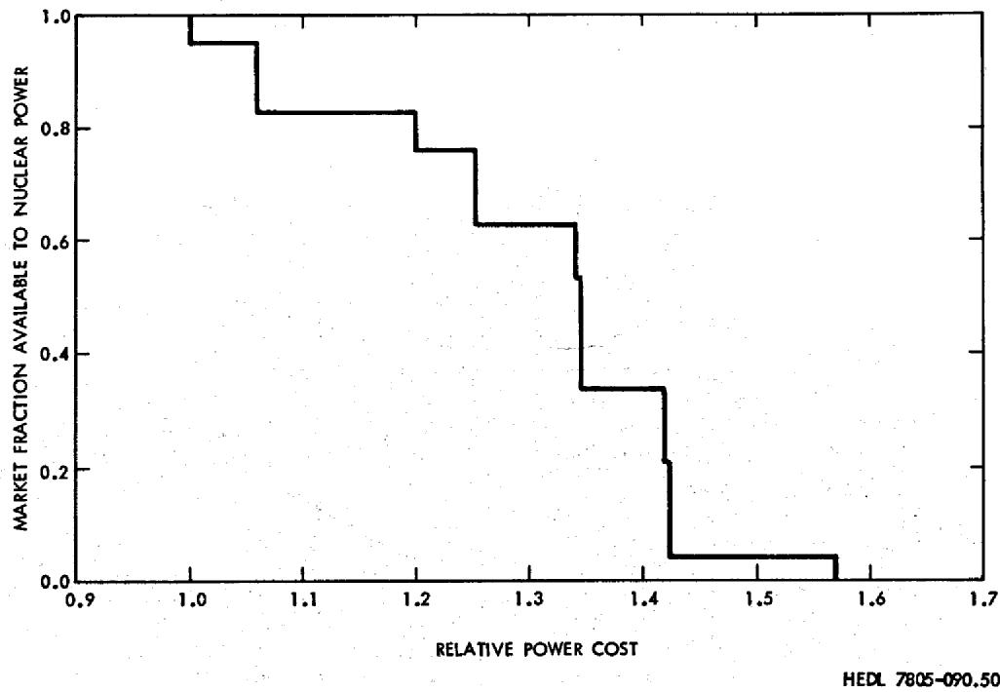  
Fig. D-1. Effect of Changing Nuclear Power Costs on the Nuclear Market Fraction.

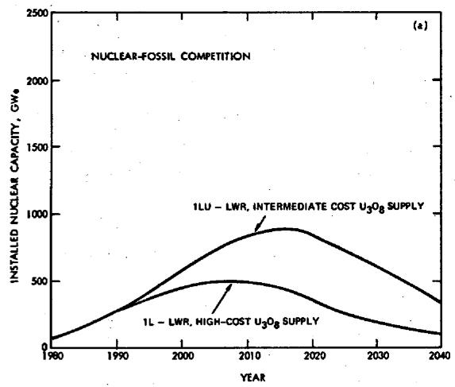

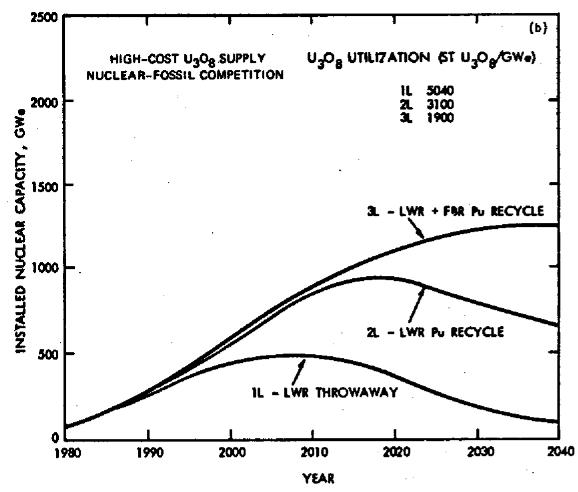

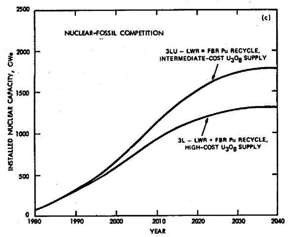

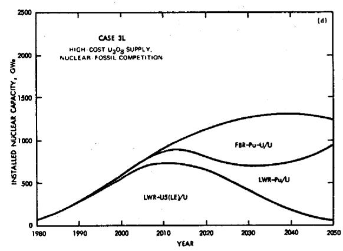

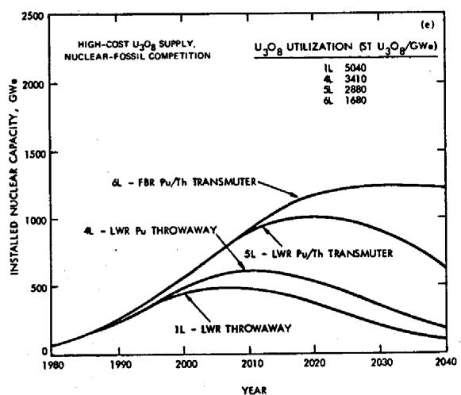

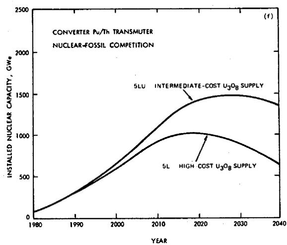  
Fig. D-2. Installed Nuclear Capacities During Years 1980-2040 (or 2050) for Various Power Systems Including Both Nuclear and Coal Power Plants.

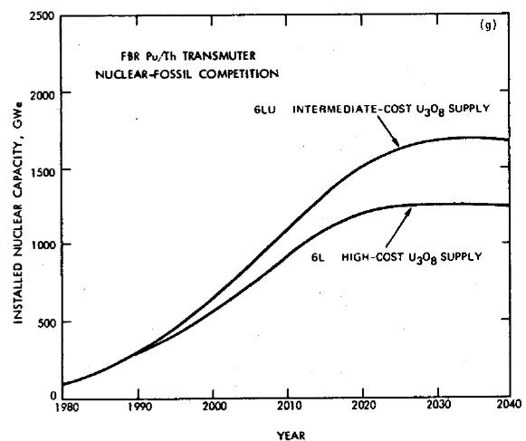  
Fig. D-2 (cont.)

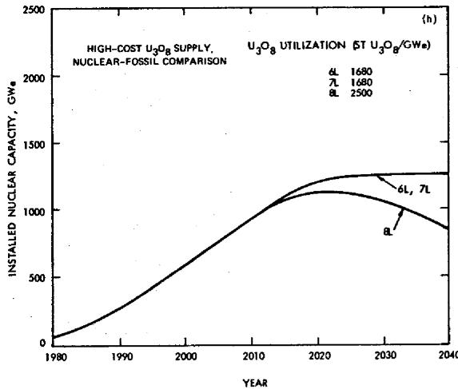

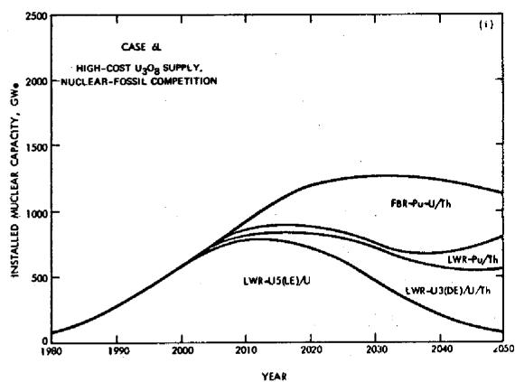

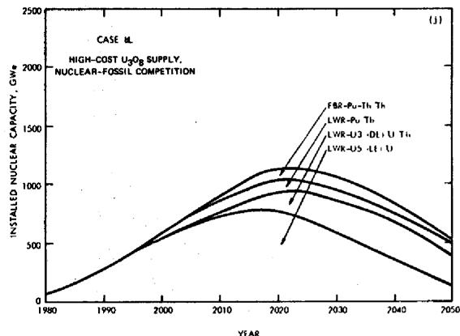

the system becomes less and less dependent upon uranium ore and more and more upon plutonium, the energy support ratio will approach zero.

The denatured fuel cycle Cases 4L, 5L, and 6L are compared with the throwaway cycle in Fig. D-2e. Nuclear market penetration for plutonium throwaway (Case 4L) is not substantially greater than for the throwaway cycle (Case 1L). The peak penetration is about 630 GWe of installed nuclear capacity versus 500 GWe for the throwaway cycle. However, if the plutonium is utilized in an LWR Pu/Th converter (Case 5L), the maximum nuclear penetration is 1000 GWe, which is a factor of two greater than for the throwaway cycle and, furthermore, the peak does not occur until more than 10 years later. Introduction of the FBR with a Pu-U core and thorium blankets (Case 6L) results in a peak penetration of 1250 GWe in about 2025. After 2025, the nuclear market fraction is constant because the system is essentially independent of uranium, which is becoming increasingly more expensive.

With respect to $\mathsf{U}_3\mathsf{O}_8$ utilization, Fig. D-2e shows that the Pu/Th converter case has slightly better ore utilization (by 7%) than classical plutonium recycle in LWRs (Case 2L in Fig. D-2b). Furthermore, plutonium "transmutation" in Pu-U FBRs also has better $\mathsf{U}_3\mathsf{O}_8$ utilization (by 12%) than classical plutonium recycle in FBRs (compare Cases 3L and 6L). The reason for these trends is that the $^{233}\mathsf{U}$ fuel that is being bred is worth more as a fuel in thermal reactors than the plutonium that is being destroyed.

The effect of a larger uranium supply on the market penetration for converters and FRBs that produce $^{233}\mathrm{U}$ is shown in Figs. D-2f and D-2g. For both cases (5 and 6), the large uranium supply increased the maximum nuclear penetration by about 450 GWe. Case 7L introduced a denatured $^{233}\mathrm{U}$ -fueled FBR to the 6L case, and Case 8L is identical to Case 7L except that the FBR with a Pu-U core is replaced with an FBR with a Pu-Th core. The maximum nuclear penetration for Cases 7L and 8L are compared with 6L in Fig. D-2h. The denatured $^{233}\mathrm{U}$ -fueled FBR doesn't have any impact because this reactor is competing with less expensive $^{233}\mathrm{U}$ -fueled LWRs and therefore isn't built. The nuclear market penetration for Case 8L is seen to decrease after about 2020. This is because the neutronics properties of FBRs fueled with Pu-Th are degraded significantly from those fueled with Pu-U. As a result, the doubling time of these reactors is longer and the cost is higher. The degraded neutronics of the Pu-Th FBRs are reflected in the $U_{3}O_{8}$ utilization of Case 8L where the ore usage per GWe is almost 50% higher than for Case 6L.

The objective in building FRBs with Pu-Th cores is to increase the $^{23}$ production and therefore the ratio of reactors located outside the energy center to those inside the

energy center. It can be seen from the nuclear power growth patterns for Cases 6L and 8L, shown in Figs. D-2i and D-2j, that the energy support ratio for Case 8L is higher. The degraded neutronics of the FBRs fueled with Pu-Th are reflected in the $\mathsf{U}_3\mathsf{O}_8$ utilization of Case 8L where the ore usage per GWe is almost $50\%$ higher than for Case 6L (see Fig. D-2h). However, for most years the total amount of energy that is available to be built in the energy centers is about the same for Case 8L as it is for Case 6L because the total amount of nuclear energy is lower.

Key selected results from the nuclear-fossil competition calculations are presented in Tables D-3 and D-4 for high-cost and intermediate-cost $\mathsf{U}_3\mathsf{O}_8$ supplies respectively. Each table presents the cumulative capacity of nuclear and fossil plants built through year 2050, the total system costs, the annual coal consumption in 2025, data on uranium and enrichment utilization, the installed capacity of each reactor type in year 2026, and the levelized power cost of each reactor type for a reactor starting up in year 2025. The most striking conclusion that can be drawn from the comparison of levelized power costs of each reactor type is that there isn't a large difference. The reason, of course, is that the total amount of uranium consumed doesn't vary much from case to case because when uranium becomes expensive, fossil plants are constructed in place of nuclear plants. This point is demonstrated in Table D-5, which shows the time behavior of the $\mathsf{U}_3\mathsf{O}_8$ price. It can be seen from this table that the differences in the price of $\mathsf{U}_3\mathsf{O}_8$ for the different nuclear systems are not large.

Table D-3. Summary of Results for Cases Assuming High-Cost $U_{3}O_{8}$ Supply, an Electrical Energy Growth Projection, and Power Systems Including Both Nuclear and Coal Power Plants   

<table><tr><td></td><td>1L</td><td>2L</td><td>3L</td><td>4L</td><td>5L</td><td>6L</td><td>7L</td><td>8L</td></tr><tr><td colspan="9">Cumulative Capacity Built(GWe) through 2050</td></tr><tr><td>Nuclear</td><td>705</td><td>1585</td><td>2663</td><td>933</td><td>1684</td><td>2597</td><td>2595</td><td>1909</td></tr><tr><td>Fossil</td><td>4611</td><td>3731</td><td>2653</td><td>4383</td><td>3632</td><td>2719</td><td>2721</td><td>3407</td></tr><tr><td colspan="9">System Costs ($B) 1977</td></tr><tr><td colspan="9">through 2050 Discounted @</td></tr><tr><td>4 1/2%</td><td>1804</td><td>1733</td><td>1701</td><td>1806</td><td>1724</td><td>1703</td><td>1703</td><td>1718</td></tr><tr><td>7 1/2%</td><td>787</td><td>764</td><td>758</td><td>791</td><td>761</td><td>760</td><td>760</td><td>761</td></tr><tr><td>10%</td><td>479</td><td>470</td><td>468</td><td>483</td><td>468</td><td>469</td><td>469</td><td>469</td></tr><tr><td>Annual Coal Consumptionin 2025 (109 tons)</td><td>5.22</td><td>3.72</td><td>3.15</td><td>4.79</td><td>3.59</td><td>2.91</td><td>2.91</td><td>3.25</td></tr><tr><td colspan="9">Cumulative U2O Consumption(106 tons) through</td></tr><tr><td>2026</td><td>2.92</td><td>3.50</td><td>3.56</td><td>2.88</td><td>3.62</td><td>3.68</td><td>3.68</td><td>3.69</td></tr><tr><td>2050</td><td>3.42</td><td>4.75</td><td>4.60</td><td>3.13</td><td>4.75</td><td>4.33</td><td>4.33</td><td>4.70</td></tr><tr><td colspan="9">Total Committed U2O8 through</td></tr><tr><td>2050 (106 tons)</td><td>3.55</td><td>4.92</td><td>5.06</td><td>3.18</td><td>4.85</td><td>4.37</td><td>4.37</td><td>4.77</td></tr><tr><td colspan="9">Maximum Annual Enrichment</td></tr><tr><td>Requirements through 2050(106 SMU/yr)</td><td>54(2005)(3)</td><td>65(2011)</td><td>73(2009)</td><td>72(2005)</td><td>75(2015)</td><td>80(2011)</td><td>80(2011)</td><td>79(2015)</td></tr><tr><td colspan="9">Cumulative Enrichment through</td></tr><tr><td>2050 (109 SMU)</td><td>2.12</td><td>3.11</td><td>2.89</td><td>2.53</td><td>3.40</td><td>3.11</td><td>3.11</td><td>3.37</td></tr><tr><td>U3O8 Utilization(1)</td><td>5.04</td><td>3.10</td><td>1.90</td><td>3.41</td><td>2.88</td><td>1.68</td><td>1.68</td><td>2.50</td></tr><tr><td>Enrichment Utilization(2)(106 SMU/GWe)</td><td>3.01</td><td>1.96</td><td>1.09</td><td>2.71</td><td>2.02</td><td>1.20</td><td>1.20</td><td>1.77</td></tr></table>

Installed Capacity (GWe) in Year 2026/Levelized Power Costs (Mill/Kwhr) in Year 2025   

<table><tr><td>Reactor</td><td>1L</td><td>2L</td><td>3L</td><td>4L</td><td>5L</td><td>6L</td><td>7L</td><td>8L</td></tr><tr><td>LWR-U5(LE)/U</td><td>36/23.2</td><td>579/21.1</td><td>513/20.8</td><td>113/21.6</td><td>661/21.2</td><td>594/20.7</td><td>594/20.7</td><td>668/20.8</td></tr><tr><td>U5(LE)/U-EE</td><td>225/22.3</td><td>-</td><td>-</td><td>-</td><td>-</td><td>-</td><td>-</td><td>-</td></tr><tr><td>U5 (DE)/U/Th</td><td>-</td><td>-</td><td>-</td><td>189/22.5</td><td>0/23.5</td><td>0/23.2</td><td>0/23.2</td><td>0/23.1</td></tr><tr><td>U3 (DE)/U/Th</td><td>-</td><td>-</td><td>-</td><td>157/20.0</td><td>120/20.6</td><td>190/19.6</td><td>190/19.6</td><td>230/20.8</td></tr><tr><td>Pu/U</td><td>-</td><td>336/22.3</td><td>196/19.5</td><td>-</td><td>-</td><td>-</td><td>-</td><td>-</td></tr><tr><td>Pu/Th</td><td>-</td><td>-</td><td>-</td><td>-</td><td>181/20.1</td><td>52/22.1</td><td>52/22.1</td><td>102/23.0</td></tr><tr><td>FBR-Pu-U/U</td><td>-</td><td>-</td><td>444/18.4</td><td>-</td><td>-</td><td>-</td><td>-</td><td>-</td></tr><tr><td>Pu-U/Th</td><td>-</td><td>-</td><td>-</td><td>-</td><td>-</td><td>408/19.4</td><td>408/19.4</td><td>-</td></tr><tr><td>Pu-Th/Th</td><td>-</td><td>-</td><td>-</td><td>-</td><td>-</td><td>-</td><td>-</td><td>104/22.6</td></tr><tr><td>U3-U/Th</td><td>-</td><td>-</td><td>-</td><td>-</td><td>-</td><td>-</td><td>0/23.0</td><td>0/25.0</td></tr><tr><td>Fossil</td><td>1934</td><td>1280</td><td>1042</td><td>1736</td><td>1233</td><td>951</td><td>951</td><td>1091</td></tr><tr><td>Total Nuclear</td><td>261</td><td>915</td><td>1153</td><td>459</td><td>962</td><td>1244</td><td>1244</td><td>1104</td></tr></table>

(1) Cumulative $\mathrm{U}_{3}\mathrm{O}_{8}$ consumed through 2050 (including forward commitments) per cumulative nuclear capacity built through 2050.   
(2) Cumulative enrichment requirements through 2050 per cumulative nuclear capacity built through 2050.   
(3) Year in which maximum enrichment requirements occur.

Table D-4. Summary of Results for Cases Assuming Intermediate-Cost $\mathsf{U}_3\mathsf{O}_8$ Supply, an Electrical Energy Growth Projection, and Power Systems Including Both Nuclear and Coal Power Plants   

<table><tr><td></td><td>1LU</td><td>2LU</td><td>3LU</td><td>4LU</td><td>5LU</td><td>6LU</td><td>7LU</td><td>8LU</td></tr><tr><td>Cumulative Capacity Built(GWe) through 2050 Nuclear Fossil</td><td>12574059</td><td>25232793</td><td>34151901</td><td>18153501</td><td>27012615</td><td>32962020</td><td>33381978</td><td>27272589</td></tr><tr><td>System Costs ($B) 1977 through 2050 Discounted @ 4 1/2% 7 1/2% 10%</td><td>1732759466</td><td>1652738459</td><td>1622734458</td><td>1743770474</td><td>1643735458</td><td>1624735459</td><td>1624735459</td><td>1638736458</td></tr><tr><td>Annual Coal Consumptionin 2025 (10 tons)</td><td>4.13</td><td>2.28</td><td>1.92</td><td>3.41</td><td>2.22</td><td>1.82</td><td>1.77</td><td>2.01</td></tr><tr><td>Cumulative U3O Consumption(106 tons) through20262050</td><td>4.756.10</td><td>4.607.44</td><td>4.436.29</td><td>4.415.75</td><td>4.637.40</td><td>4.485.75</td><td>4.505.75</td><td>4.606.62</td></tr><tr><td>Total Committed U3O8 through2050 (106 tons)</td><td>6.28</td><td>7.88</td><td>6.90</td><td>5.94</td><td>7.99</td><td>5.87</td><td>5.89</td><td>6.84</td></tr><tr><td>Maximum Annual EnrichmentRequirements through 2050 (106 SWU/yr)</td><td>93(2013)</td><td>103(2025)</td><td>93(2011)</td><td>119(2011)</td><td>111(2023)</td><td>101(2011)</td><td>102(2011)</td><td>103(2017)</td></tr><tr><td>Cumulative Enrichment through2050 (109 SWU)</td><td>3.80</td><td>4.87</td><td>3.96</td><td>4.78</td><td>5.26</td><td>4.12</td><td>4.12</td><td>4.73</td></tr><tr><td rowspan="2">U3O8 Utilization(1)Enrichment Utilization(2)(106 SWU/GNe)</td><td>5.00</td><td>3.12</td><td>2.02</td><td>3.27</td><td>2.96</td><td>1.78</td><td>1.76</td><td>2.51</td></tr><tr><td>3.02</td><td>1.93</td><td>1.16</td><td>2.63</td><td>1.95</td><td>1.25</td><td>1.23</td><td>1.73</td></tr><tr><td colspan="9">Installed Capacity (GWe) in Year 2026/Levelized Power Costs (Mills/Kwhr) in Year 2050</td></tr><tr><td>Reactor</td><td>1LU</td><td>2LU</td><td>3LU</td><td>4LU</td><td>5LU</td><td>6LU</td><td>7LU</td><td>8LU</td></tr><tr><td>LWR-U5(LE)/U</td><td>61/22.4</td><td>1028/19.8</td><td>827/19.4</td><td>235/20.6</td><td>1108/19.9</td><td>874/19.2</td><td>872/19.2</td><td>1028/19.7</td></tr><tr><td>U5(LE)/U-EE</td><td>675/21.6</td><td>-</td><td>-</td><td>-</td><td>-</td><td>-</td><td>-</td><td>-</td></tr><tr><td>U5(DE)/U/Th</td><td>-</td><td>-</td><td>-</td><td>489/21.6</td><td>0/21.9</td><td>0/21.3</td><td>0/21.3</td><td>0/21.7</td></tr><tr><td>U3(DE)/U/Th</td><td>-</td><td>-</td><td>-</td><td>336/20.4</td><td>143/19.5</td><td>219/19.6</td><td>221/19.6</td><td>280/19.7</td></tr><tr><td>Pu/U</td><td>-</td><td>441/19.2</td><td>269/18.7</td><td>-</td><td>-</td><td>-</td><td>-</td><td>-</td></tr><tr><td>Pu/Th</td><td>-</td><td>-</td><td>-</td><td>-</td><td>235/18.9</td><td>63/20.8</td><td>56/20.8</td><td>119/21.3</td></tr><tr><td>FBR-Pu-U/U</td><td>-</td><td>-</td><td>516/17.3</td><td>-</td><td>-</td><td>-</td><td>-</td><td>-</td></tr><tr><td>Pu-U/Th</td><td>-</td><td>-</td><td>-</td><td>-</td><td>-</td><td>486/19.2</td><td>509/19.2</td><td>-</td></tr><tr><td>Pu-Th/Th</td><td>-</td><td>-</td><td>-</td><td>-</td><td>-</td><td>-</td><td>-</td><td>136/20.6</td></tr><tr><td>U3-U/Th</td><td>-</td><td>-</td><td>-</td><td>-</td><td>-</td><td>-</td><td>0/23.7</td><td>0/23.5</td></tr><tr><td>Fossil</td><td>1458</td><td>725</td><td>583</td><td>1135</td><td>710</td><td>553</td><td>537</td><td>632</td></tr><tr><td>Total Nuclear</td><td>736</td><td>1470</td><td>1612</td><td>1060</td><td>1485</td><td>1642</td><td>1658</td><td>1563</td></tr></table>

(1) Cumulative $\mathrm{U}_{3}\mathrm{O}_{8}$ consumed through 2050 (including forward commitments) per cumulative nuclear capacity built through 2050.   
(2) Cumulative enrichment requirements through 2050 per cumulative nuclear capacity built through 2050.   
(3) Year in which maximum enrichment requirements occur.

Table D-5. Variation of $\mathsf{U}_3\mathsf{O}_8$ Price with Time for Various Nuclear Cases   

<table><tr><td rowspan="2">Year</td><td colspan="8">\( U_{3}O_{8} \) Price ($/lb)</td></tr><tr><td>1L</td><td>2L</td><td>3L</td><td>4L</td><td>5L</td><td>6L</td><td>7L</td><td>8L</td></tr><tr><td>1987</td><td>76</td><td>81</td><td>83</td><td>73</td><td>82</td><td>83</td><td>83</td><td>82</td></tr><tr><td>1997</td><td>104</td><td>112</td><td>114</td><td>99</td><td>113</td><td>114</td><td>114</td><td>113</td></tr><tr><td>2007</td><td>136</td><td>150</td><td>153</td><td>130</td><td>150</td><td>153</td><td>153</td><td>151</td></tr><tr><td>2017</td><td>157</td><td>177</td><td>175</td><td>151</td><td>177</td><td>175</td><td>175</td><td>175</td></tr><tr><td>2027</td><td>167</td><td>185</td><td>179</td><td>158</td><td>184</td><td>180</td><td>180</td><td>180</td></tr><tr><td>2037</td><td>172</td><td>189</td><td>180</td><td>158</td><td>186</td><td>180</td><td>180</td><td>180</td></tr><tr><td>2047</td><td>173</td><td>195</td><td>180</td><td>158</td><td>189</td><td>180</td><td>180</td><td>180</td></tr></table>

ORNL-5388

Dist. Category UC-80

# Internal Distribution

1. L. S. Abbott   
2. R.G. Alsmiller   
3. T. D. Anderson   
4. W. B. Arthur, ORGDP   
5. S. Baron   
6. D. E. Bartine   
7. H. I. Bowers   
8. J. T. Bradbury, ORGDP   
9. R. E. Brooksbank   
10. W. D. Burch   
11. T. J. Burns   
12. W. L. Carter   
13. J. C. Cleveland   
14. T. E. Cole   
15. A. G. Croff   
16. J. G. Delene   
17. J. R. Engel   
18. D. E. Ferguson   
19. G. F. Flanagan   
20. M. H. Fontana   
21. E.H.Gift   
22. P. M. Greebler (Consultant)   
23. P. M. Haas   
24. W. O. Harms   
25. J. F. Harvey   
26. R. F. Hibbs   
27. D. T. Ingersoll   
28. J. D. Jenkins   
29. D. R. Johnson   
30. P. R. Kasten   
31. H. E. Knee   
32. M. Levenson   
33. W. B. Loewenstein (Consultant)   
34. A. L. Lotts   
35. R. S. Lowrie   
36. F. C. Maienschein   
37. B. F. Maskewitz

38. H. R. Meyer   
39. J. D. McGaugh   
40. F. R. Mynatt   
41. K. J. Notz   
42. A. R. Olsen   
43. R.W. Peelle   
44. H. Postma   
45. R. T. Primm   
46. B. E. Prince   
47. R.H.Rainey   
48. J. P. Renier   
49. P. S. Rohwer   
50. T. H. Row   
51. R. T. Santoro   
52. D. L. Selby   
53. R. L. Simard   
54. G. R. Smolen

55-75. I. Spiewak   
76. W. G. Stockdale   
77. J.E.Till   
78. D. B. Trauger   
79. H.E.Trammell   
80. R.E.Uhrig (Consultant)   
81. J. E. Vath   
82. B. L. Vondra   
83. D. R. Vondy   
84. C. R. Weisbin   
85. J.R. White   
86. R. Wilson (Consultant)   
87. R.G.Wymer   
88. A. Zucker

89-90. Central Research Library   
91. Document Ref. Section   
31. EPD Reports Office   
2-133. Laboratory Records Dept.   
134. Laboratory Records, RC

# External Distribution

DOE, Washington, D.C. 20545

135. W. W. Ballard, Asst. Director, Fuel Cycle Development   
136. E. S. Beckjord, INFCE Coordinator   
137. Harold Bengelsdorf, Office of Nuclear Affairs   
138. S. T. Brewer, Director, Program Planning and Analysis   
139. Phillip Clark, Assoc. Director for Reactors, Div. of Naval Reactors

DOE, Washington, D.C. 20545 (contd.)

140-142. E. G. DeLaney, NASAP Control Office, Office of Fuel Cycle Evaluation

143. D. E. Erb, Division of Reactor Research and Technology   
144. H. Feinroth, Division of Nuclear Power Development

145. Neil Goldenberg, Division of Advanced Systems and Materials Production

146. E. J. Hanrahan, Director, Office of Fuel Cycle Evaluation   
147. J. R. Humphreys, Program Planning and Analysis   
148. Hugh Kendrick, Office of Fuel Cycle Evaluation   
149. M. W. Koehlinger, Program Planning and Analysis   
150. P. M. Lang, Asst. Director, Light Water Reactor Programs   
151. K. O. Laughon, Asst. Director, Gas Cooled Reactor Programs   
152. D. E. Mathes, Office of Fuel Cycle Evaluation   
153. W. H. McVey, Division of Nuclear Power Development   
154. Marvin Moss, Office of Energy Research   
155. C. W. Newstead, Office of Energy Research   
156. J. A. Patterson, Chief, Supply Evaluation Branch, Division of Uranium Resources and Enrichment   
157. A. Pressesky, Director, Division of Nuclear Power Development   
158. W. F. Savage, Division of Advanced Systems and Materials Production   
159. W. S. Scheib, Division of Nuclear Power Development

160-180. C. Sege, Office of Fuel Cycle Evaluation

181. S. Strauch, Office of Fuel Cycle Evaluation   
182. K. A. Trickett, Office of the Director, Division of Nuclear Power Development

DOE, Oak Ridge

183. Asst. Manager for Energy Research and Development   
184. Director, Nuclear Research and Development Division

Federal Agencies

185. D. L. Bell, Tennessee Valley Authority, 503 Power Bldg., Chattanooga, TN 37401   
186. John Boright, Director, Office of Energy & Technology, Department of State, Rm. 78-30, Washington, DC 20520   
187. D. T. Bradshaw, Tennessee Valley Authority, 503 Power Bldg., Chattanooga, TN 37401   
188. Greg Canavan, Office of Chief of Staff, Air Force, Pentagon, Washington, DC 20301   
189. John Depres, CIA Headquarters, 7E 47, Washington, DC 20505   
190. H. L. Falkenberry, Tennessee Valley Authority, 503 Power Bldg., Chattanooga, TN 37401   
191. Joseph Kearney, Office of Management and Budget, 17th and H Street, NW, Washington, DC 20036   
192. S. N. Keeney, Arms Control and Disarmament Agency, Rm. 5934, New State Bldg., Washington, DC 20451

# Federal Agencies (contd.)

193. Louis V. Nosenzo, OES/NET 7830, Department of State, Washington, DC 20520   
194. Joseph Nye, Department of State, Rm. T-7208, Washington, DC 20520   
195. Robert Rochlin, Arms Control and Disarmament Agency, Rm. 4930, New State Bldg., Washington, DC 20451   
196. Lawrence Scheinman, Department of State, Rm. T-7208, Washington, DC 20520   
197. James Sheaks, Arms Control and Disarmament Agency, Rm. 4933, New State Bldg., Washington, DC 20451   
198. Charles Van Doren, Asst. Director, Arms Control and Disarmament Agency, Rm. 4930, New State Bldg., Washington, DC 20451

# Outside Organizations

199. W. E. Black, Hanford Engineering Development Laboratory, P. O. Box 1970, Richland, WA 99352   
200. George Bunn, University of Wisconsin, Madison, WI 53706   
201. A. Carnesale, Harvard University, #9 Divinity Avenue, Cambridge, MA 02138   
202. Y. Chang, Argonne National Laboratory, 9700 South Cass Avenue, Argonne, IL 60439   
203. Thomas Cochran, National Resources Defense Council, 917-15th St., NW, Washington, DC 20005   
204. Gordon Corey, Commonwealth Edison Electric, P. O. Box 767, Chicago, IL 60690   
205. Russell Crowther, General Electric Company, 175 Curtner Ave., San Jose, CA 95125   
206. Joe Cupo, Westinghouse Electric Corporation, P. O. Box 355, Pittsburgh, PA 15230   
207. W. K. Davis, Bechtel Power Corporation, 50/11/813, P. O. Box 3965, San Francisco, CA 93119   
208. J. M. de Montmollin, Sandia Laboratories, Dept. 1760-A, Albuquerque, NM 87185   
209. M. J. Driscoll, Massachusetts Institute of Technology, 138 Albany Street, Cambridge, MA 02139   
210. M. C. Edlund, Virginia Polytechnic Institute, Blacksburg, VA 24060   
211. J. F. Foran, Resource Planning Associates, Inc., 3 Enbarcadero Center, Suite 2080, San Francisco, CA 94111   
212. T. K. Glennan, 11483 Waterview Cluster, Reston, VA 22090   
213. H. Goldstein, Columbia University, 520 W. 120th St., New York, NY 10027   
214. L. Gordon, Resources for the Future, 1977 Massachusetts Ave., Washington, DC 20036   
215. D. R. Haffner, Hanford Engineering Development Laboratory, P. O. Box 1970, Richland, WA 99352   
216. R. W. Hardie, Hanford Engineering Development Laboratory, P. O. Box 1970, Richland, WA 99352   
217. William Harris, RAND Corporation, 1700 Main Street, Santa Monica, CA 90406

# Outside Organizations (contd.)

218. Chuck Hebel, Xerox Palo Alto Research Center, 3333 Coyote Hill Rd., Palo Alto, CA 94303   
219. T. M. Helm, Hanford Engineering Development Laboratory, P. O. Box 1970, Richland, WA 99352   
220. M. Higgins, Science Applications, Inc., 8400 Westpark Dr., McLean, VA 22101   
221. William Higinbotham, Brookhaven National Laboratory, Associated Universities, Inc., Upton, NY 11973   
222. Fred Hoffman, RAND Corporation, 1700 Main Street, Santa Monica, CA 90406   
223. William W. Hogan, Stanford University, Stanford, CA 94305   
224. W. G. Jolly, Hanford Engineering Development Laboratory. P. O. Box 1970, Richland, WA 99352   
225. J. M. Kallfelz, Georgia Institute of Technology, Atlanta, GA 30332   
226. Arthur Kantrowitz, AVCO Everett Research Lab., 2385 Revere Beach Parkway, Everett, MA 02149   
227. Walter Kato, Argonne National Laboratory, 9700 South Cass Ave., Argonne, IL 60439   
228. John Kearney, Edison Electric Institute, 1140 Connecticut Ave., Washington, DC 20036   
229. Herbert Kouts, Brookhaven National Laboratory, Associated Universities, Inc., Upton, NY 11973   
230. F. W. Kramer, Westinghouse Nuclear Fuel Division, P. O. Box 355, Pittsburgh, PA 15230   
231. Myron Kratzer, International Energy Associates, 2600 Virginia Ave., NW, Suite 200, Washington, DC 20037   
232. W. C. Lipinski, Argonne National Laboratory, 9700 South Cass Ave., Argonne, IL 60439   
233. A. S. Manne, Terman Eng. 432A, Stanford University, Stanford, CA 94305   
234. G. Nugent, Burns & Roe, P. O. Box 663, Route 17, South, Paramus, NJ 07652   
235. R. P. Omberg, Hanford Engineering Development Laboratory, P. O. Box 1970, Richland, WA 99352   
236. B. Pasternak, Booz-Allen and Hamilton, 4330 East-West Highway, Bethesda, MD 20014   
237. R. G. Post, University of Arizona, Tucson, AZ 85721   
238. Richard Richels, Electric Power Research Institute, P. O. Box 10412, Palo Alto, CA 94303   
239. C. L. Rickard, General Atomic Company, P. O. Box 81608, San Diego, CA 92138   
240. David Rossin, Commonwealth Edison Electric Co., P. O. Box 767, Chicago, IL 60690   
241. H. S. Rowen, Stanford University, Stanford, CA 94305   
242. Thomas Schelling, JFK School of Government, Harvard University, Cambridge, MA 02138   
243. N. L. Shapiro, Combustion Engineering, 1000 Prospect Hill Rd., Windsor, CT 06095   
244. M. R. Shay, Hanford Engineering Development Laboratory, P. O. Box 1970, Richland, WA 99352

# Outside Organizations (contd.)

245. B. I. Spinrad, Dept. of Nuclear Engineering, Oregon State University, Corvallis, OR 97331   
246. Chauncey Starr, Electric Power Research Institute, 3412 Hill View Ave., Palo Alto, CA 94303   
247. H. B. Stewart, Nuclear Technology Evaluations Company, 4040 Sorrento Valley Blvd., Suite F, San Diego, CA 92121   
248. S. M. Stoller, S. M. Stoller Corporation, 1250 Broadway, New York, NY 10001   
249. E. Straker, Science Applications, Inc., 8400 Westpark Drive, McLean, VA 22101   
250. C. E. Till, Argonne National Laboratory, 9700 South Cass Ave., Argonne, IL 60439   
251. James Tulenko, Babcock and Wilcox, P. O. Box 1260, Lynchburg, VA 24505   
252. R. F. Turner, General Atomic Company, P. O. Box 81608, San Diego, CA 92138   
253. Frank von Hippel, Program on Nuclear Policy Alternatives, Center for Environmental Studies, Princeton University, Princeton, NJ 08540   
254. Eugene Weinstock, Brookhaven National Laboratory, Associated Universities, Inc., Upton, NY 11973   
255. A. Weitzberg, Science Applications, Inc., 8400 Westpark Drive, McLean, VA 22101   
256. Albert Wohlstetter, 518 S. Hyde Park Blvd., Chicago, IL 60615   
257-396. For Distribution as Shown in TID-4500 under UC-80, General Reactor Technology