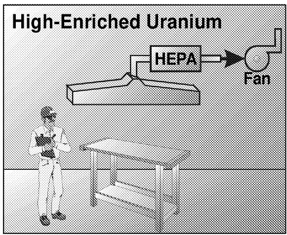
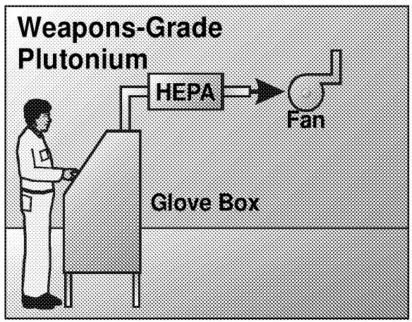
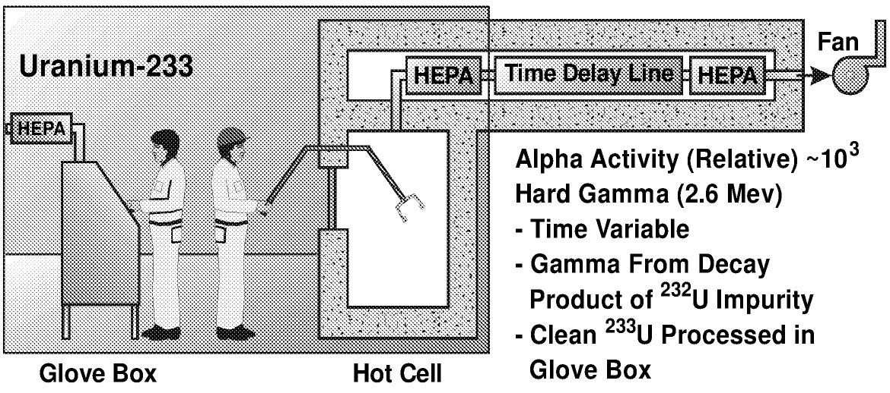
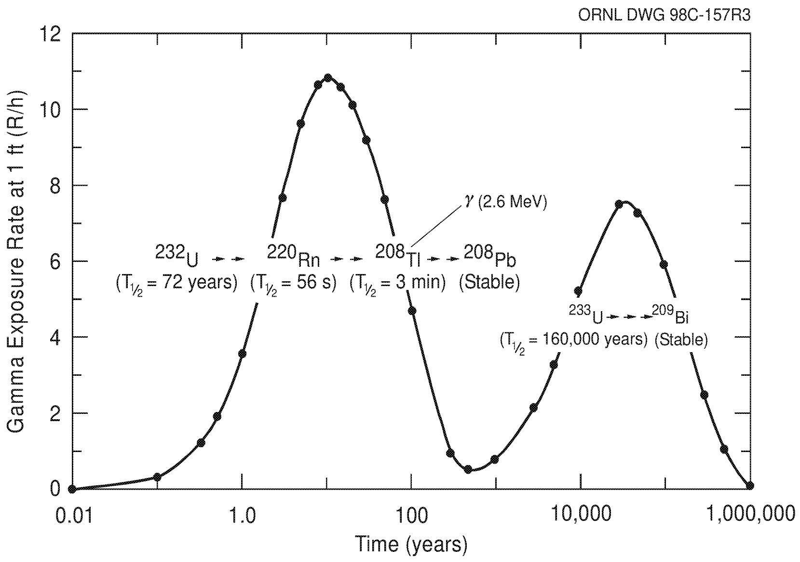
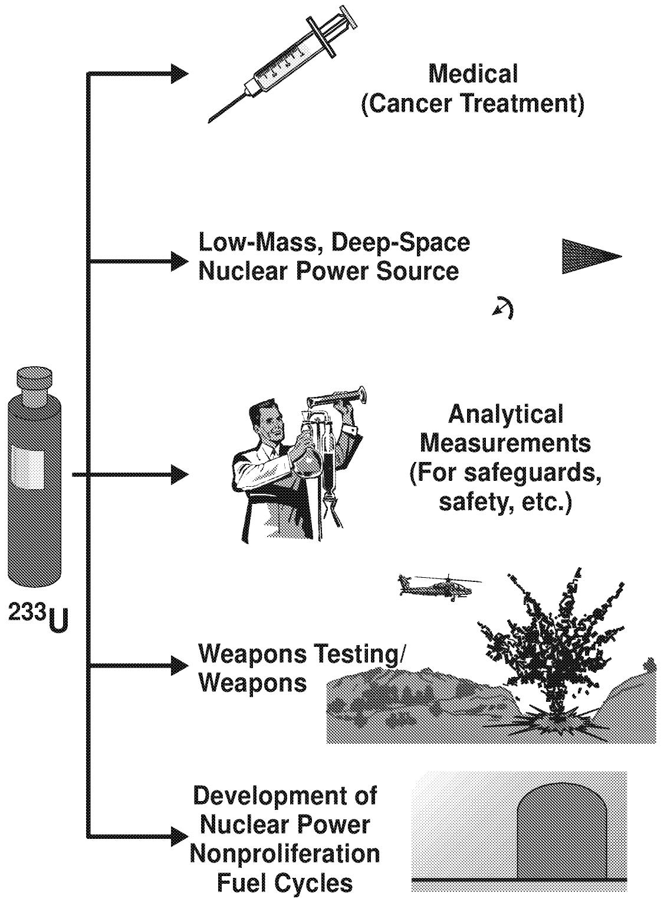
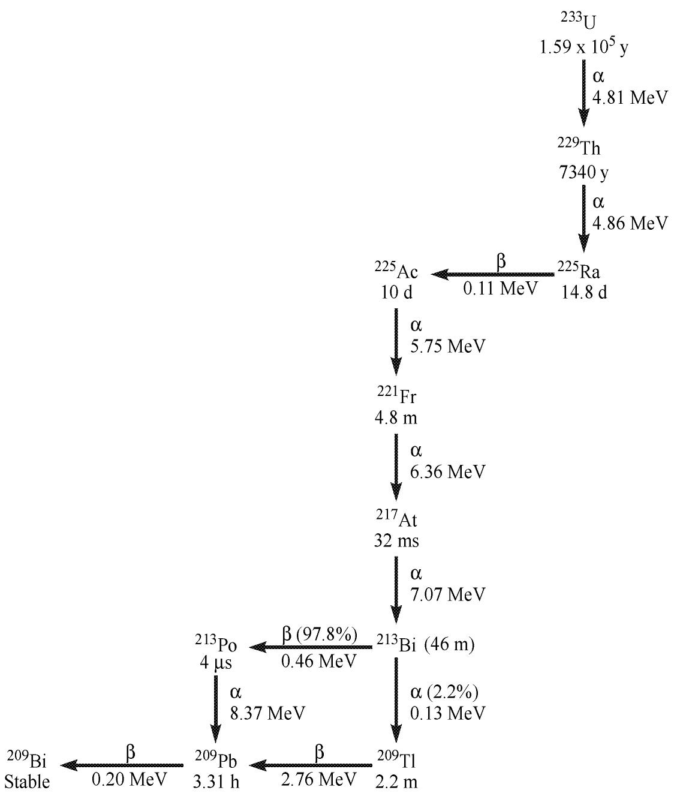
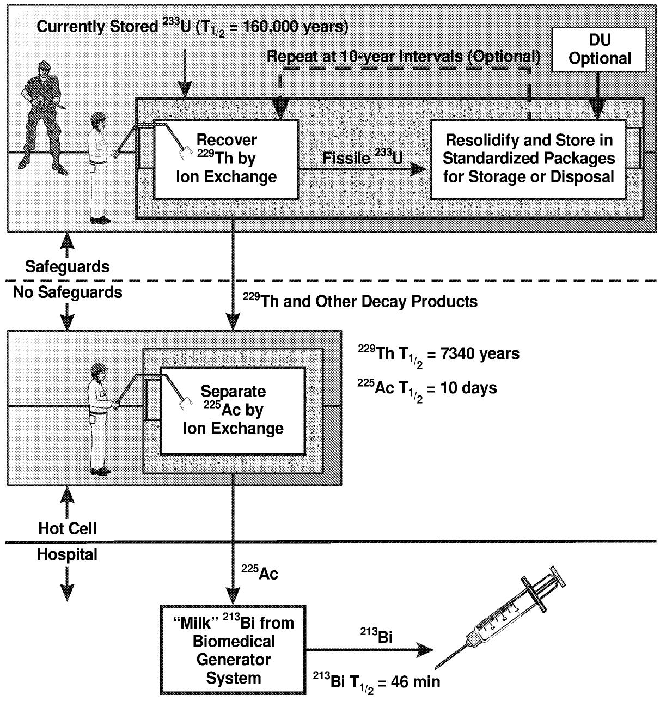
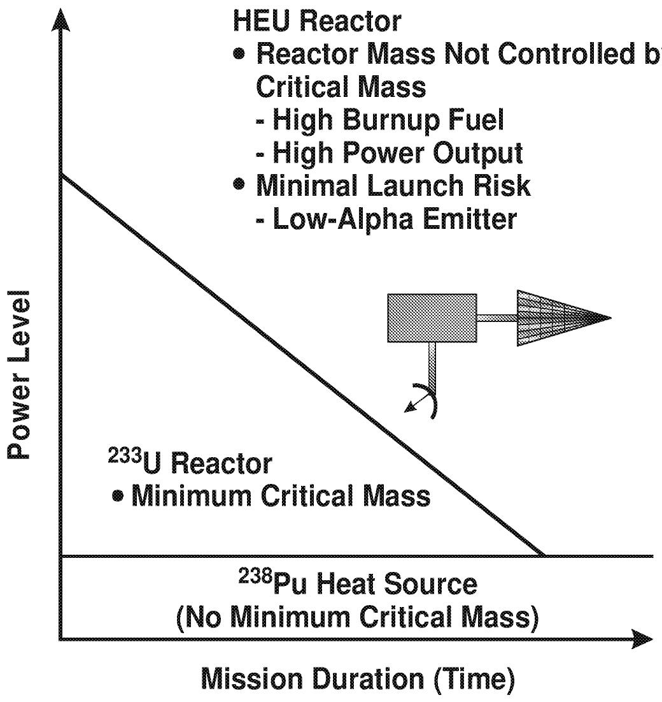
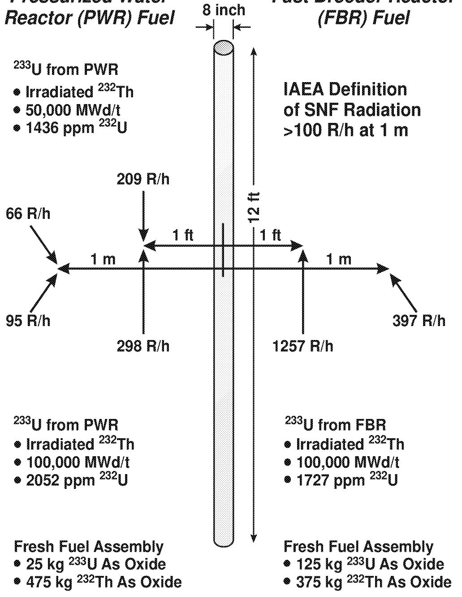

# Uses For Uranium-233: What Should Be Kept for Future Needs?

C. W. Forsberg

Chemical Technology Division

Oak Ridge National Laboratory*

Oak Ridge, Tennessee 37831-6180

Tel: (423) 574-6783

Fax: (423) 574-9512

E-mail: forsbergcw@ornl.gov

L. C. Lewis

Idaho National Engineering and Environmental Laboratory

Idaho Falls, Idaho 83415

Tel: (208) 526-3295

Fax: (208) 526-4902

E-mail: llewis@inel.gov

September 24, 1999

# CONTENTS

LIST OF FIGURES vii

LIST OF TABLES vii

ACRONYMS AND ABBREVIATIONS ix

ACKNOWLEDGMENTS xi

PREFACE xiii

EXECUTIVE SUMMARY XV

ABSTRACT xxiii

1. INTRODUCTION 1

1.1 OBJECTIVES 1   
1.2 CHARACTERISTICS OF $^{233}\mathrm{U}$ USE OR DISPOSE DECISIONS 1   
1.3 CAVEATS 1   
1.4 ORGANIZATION OF THIS REPORT 2

2.CHARACTERISTICS AND INVENTORY OF $^{233}\mathrm{U}$ 3

2.1 CHARACTERISTICS 3

2.1.1 Radiological 4   
2.1.2 Nuclear Criticality 7   
2.1.3 Safeguards 7

2.2 INVENTORY 8

2.2.1 High-Isotopic-Quality $^{233}\mathrm{U}$ with Limited Chemical Impurities 11   
2.2.2 High-Isotopic-Quality $^{233}\mathrm{U}$ with Chemical Diluents 11   
2.2.3 Intermediate-Isotopic-Quality $^{233}\mathrm{U}$ 11   
2.2.4 Low-Isotopic-Quality $^{233}\mathrm{U}$ 12

3. PRODUCTION COSTS FOR $^{233}\mathrm{U}$ 13

3.1 HISTORIC PRODUCTION COSTS 13   
3.2 CURRENT SALES PRICE AND PRODUCTION COSTS 13  
3.3 FUTURE PRODUCTION COSTS 14

# CONTENTS (continued)

# 4. USES OF $^{233}\mathrm{U}$ 15

# 4.1 MEDICAL APPLICATIONS 15

4.1.1 Use 15   
4.1.2 Production Methods for $^{213}\mathrm{Bi}$ 19

# 4.1.2.1 Production from $^{233}\mathrm{U}$ 19

4.1.2.1.1 Production Method 19   
4.1.2.1.2 Thorium-229 Inventory 21   
4.1.2.1.3 Production Issues 21   
4.1.2.1.4 Current Status 23

# 4.1.2.2 Production from Radium-226 $(^{226}\mathrm{Ra})$ 23

4.1.2.2.1 Production Methods 23   
4.1.2.2.2 Radium-226 Availability 25   
4.1.2.2.3 Production Issues 25

# 4.1.2.3 Production from $^{228}\mathrm{Ra}$ 25

# 4.1.3 Availability of $^{213}\mathrm{Bi}$ 26

4.1.3.1 Demand 26   
4.1.3.2 Economics 27

# 4.1.4 Assessment and Conclusions 27

4.2 REACTORS FOR DEEP-SPACE AND OTHER SPECIAL MISSIONS 28   
4.3 ANALYTICAL MEASUREMENTS 31   
4.4 NUCLEAR WEAPONS RESEARCH 31   
4.5 REACTOR FUEL CYCLE RESEARCH 33

4.5.1 Application 33   
4.5.2 Nonproliferation Fuel Cycles 34

4.5.2.1 Isotopic Dilution 34   
4.5.2.2 Radiation 35   
4.5.2.3 Off-Specification Plutonium 37

4.5.2.3.1 Quantity 37   
4.5.2.3.2 Quality 37

# 4.5.2.4.Once-Through Fuel Cycles 37

# CONTENTS (continued)

# 4.5.3 Current Nuclear-Power Thorium-Fuel-Cycle Developments 38

4.5.3.1 Countries with Active Programs 38   
4.5.3.2 Once-Through Thorium Fuel Cycles 38

4.5.3.2.1 Nonproliferation 38   
4.5.3.2.2 Uranium Resources 39   
4.5.3.2.3 Fuel Performance 40

# 4.5.3.3 U.S. Research Programs 40

4.5.3.3.1 Radkowsky Reactor 40   
4.5.3.3.2 National Laboratory, University, Fuel Fabricator Consortium 41   
4.5.3.3.3 ANL and Purdue University 42   
4.5.3.3.4 BNL and Purdue University 42

# 4.5.4 Accelerator and Fusion Reactor Development 42

4.5.4.1 Accelerators 43   
4.5.4.2 Fusion-Fission Hybrids 43

4.5.5 Material Requirements 43   
4.5.6 Assessment 45

# 4.6 OTHER APPLICATIONS 45

# 5. CONCLUSIONS 47

# 6. REFERENCES 49

# Appendix A RADIATION LEVELS FROM $^{233}\mathrm{U}$ A-1

# LIST OF FIGURES

Fig. 2.1 Different fissile materials require varying handling procedures 5   
Fig. 2.2 Gamma exposure for $1\mathrm{kg}$ of $^{233}\mathrm{U}$ with $100~\mathrm{ppm}$ of $^{232}\mathrm{U}$ 6   
Fig. 4.1 Potential uses for $^{233}\mathrm{U}$ 16   
Fig. 4.2 $^{233}\mathrm{U}$ decay chain 18   
Fig. 4.3 Flowsheet for $^{213}\mathrm{Bi}$ production from $^{233}\mathrm{U}$ for treatment of cancer 20   
Fig. 4.4 Minimum mass space nuclear power sources for different power levels and mission duration 30   
Fig. 4.5 Maximum radiation levels of fresh fuel with $^{233}\mathrm{U}$ 36

# LIST OF TABLES

Table ES.1 Quality of major batches of $^{233}\mathrm{U}$ in inventory xvii   
Table ES.2 Uranium-233 uses and applicable $^{233}\mathrm{U}$ categories xviii   
Table 2.1 Characteristics of weapons-usable materials 3   
Table 2.2 Quality of major batches of $^{233}\mathrm{U}$ in inventory 9   
Table 2.3 Quality of major batches of $^{233}\mathrm{U}$ in SNF 10   
Table 4.1 Summary: medical applications 17   
Table 4.2 Uranium sources of $^{229}\mathrm{Th}$ for medical applications 22   
Table 4.3 Summary: reactors for deep-space and other special missions 29   
Table 4.4 Summary: analytical measurements 32   
Table 4.5 Summary: nuclear weapons 32   
Table 4.6 Summary: reactor fuel cycle 33   
Table 5.1 Uranium-233 uses and applicable $^{233}\mathrm{U}$ categories 48

# ACRONYMS, ABBREVIATIONS, SCIENTIFIC NOTATION, AND UNITS OF MEASURE

ANL Argonne National Laboratory

ATR Advanced Test Reactor

BNL Brookhaven National Laboratory

Cd Cadmium

d day

CEUSP Consolidated Edison Uranium Solidification Program

CH contact-handled

DOE U.S. Department of Energy

DU depleted uranium

EURATOM European Atomic Energy Community

hour

HEPA high-efficiency particulate air

HEU high enriched uranium

HFIR High-Flux Irradiation Reactor

HTGR high-temperature gas cooled reactor

IAEA International Atomic Energy Agency

ITU Institut für Transurane

INEEL Idaho National Engineering and Environmental Laboratory

kg kilogram

L liter

LEU low-enriched uranium

LWBR light-water breeder reactor

LWR light-water reactor

MeV million-electron volts

mg milligram

MIT Massachusetts Institute of Technology

MSRE Molten Salt Reactor Experiment

mrem millirem

ORNL Oak Ridge National Laboratory

# ACRONYMS, ABBREVIATIONS, SCIENTIFIC NOTATION, AND UNITS OF MEASURE (continued)

ppm part(s) per million   
R&D research and development   
RH remote-handled   
S&S safeguards and security   
SNF spent nuclear fuel   
SRS Savannah River Site   
t metric ton  
WGP weapons-grade plutonium   
Y-12 Y-12 Plant (Oak Ridge)   
$^{225}\mathrm{Ac}$ Actinium-225   
$^{238}\mathrm{Pu}$ Plutonium-238   
$^{239}\mathrm{Pu}$ Plutonium-239   
$^{241}\mathrm{Pu}$ Plutonium-241   
$^{225}\mathrm{Ra}$ Radium-225   
$^{226}\mathrm{Ra}$ Radium-226   
$^{220}\mathrm{Ra}$ Radon-220   
208Tl Thallium-208   
$^{229}\mathrm{Th}$ Thorium-229   
$^{232}\mathrm{Th}$ Thorium-232   
$^{232}\mathrm{U}$ Uranium-232   
$^{233}\mathrm{U}$ Uranium-233   
$^{235}\mathrm{U}$ Uranium-235   
$^{238}\mathrm{U}$ Uranium-238   
$^{213}$ B Bismuth-213

# ACKNOWLEDGMENTS

We would like to thank the following individuals for providing information and review comments.

<table><tr><td>Individual</td><td>Affiliation</td></tr><tr><td>J. Arango</td><td>U.S. Department of Energy (DOE)</td></tr><tr><td>D. E. Beller</td><td>Los Alamos National Laboratory (LANL)</td></tr><tr><td>P. Bereolos</td><td>Advanced Integrated Management Services, Inc.</td></tr><tr><td>R. Cooperstein</td><td>DOE</td></tr><tr><td>J. W. Davidson</td><td>LANL</td></tr><tr><td>L. R. Dole</td><td>Oak Ridge National Laboratory (ORNL)</td></tr><tr><td>M. J. Driscoll</td><td>Massachusetts Institute of Technology (MIT)</td></tr><tr><td>E. Greenspan</td><td>University of California, Berkeley</td></tr><tr><td>J. S. Herring</td><td>Idaho National Engineering and Environmental Laboratory</td></tr><tr><td>M. S. Kazimi</td><td>MIT</td></tr><tr><td>L. Koch</td><td>Transuranium Institute (Germany)</td></tr><tr><td>E. Lahoda</td><td>Westinghouse Electric Corporation</td></tr><tr><td>L. M. Lidsky</td><td>MIT</td></tr><tr><td>S. McDeavitt</td><td>Argonne National Laboratory</td></tr><tr><td>H. Massie</td><td>U.S. Defense Nuclear Facilities Safety Board</td></tr><tr><td>S. Mirzadah</td><td>ORNL</td></tr><tr><td>G. P. Smith, Jr.</td><td>ABB Combustion Engineering, Inc.</td></tr><tr><td>W. Spetz</td><td>Framatome Technologies, Inc.</td></tr><tr><td>M. Todosow</td><td>Brookhaven National Laboratory</td></tr><tr><td>J. Tseng</td><td>DOE</td></tr><tr><td>L. F. P. Van Swan</td><td>Siemens Power Corporation</td></tr><tr><td>H. Vantine</td><td>Lawrence Livermore National Laboratory</td></tr></table>

# PREFACE

This report is one of several reports which map the strategy for the future use and disposition of uranium-233 $(^{233}\mathrm{U})$ and disposal of wastes containing $^{233}\mathrm{U}$ . Other relevant documents from this and other programs are listed below with a brief description of the contents.

- ORNL/TM-13550—Strategy for the Future Use and Disposition of $^{233}\mathrm{U}$ : Overview. This document is a summary of the path forward for disposition of surplus $^{233}\mathrm{U}$ . It includes required activities, identifies what major programmatic decisions will be required, and describes the potential disposition options.   
- ORNL/TM-13551—Strategy for the Future Use and Disposition of $^{233}\mathrm{U}$ : History, Inventories, Storage Facilities, and Potential Future Uses. This document includes the historical uses, sources, potential uses, and current inventory of $^{233}\mathrm{U}$ . The inventory includes the quantities, storage forms, and packaging of the material.   
- ORNL/TM-13552—Strategy for the Future Use and Disposition of $^{233}\mathrm{U}$ : Technical Information. This document summarizes scientific information on $^{233}\mathrm{U}$ . It includes production methods, decay processes, and the material characteristics. The requirements for storage and disposal are also included.   
- ORNL/TM-13524—Isotopic Dilution Requirements for $^{233}\mathrm{U}$ Criticality Safety in Processing and Disposal Facilities. This document determines and defines how much depleted uranium (DU) must be mixed with $^{233}\mathrm{U}$ to prevent the potential for nuclear criticality under all expected process and disposal facility conditions.   
- ORNL/TM-13517—Definition of Weapons Usable $^{233}U$ . This document determines and defines how much DU must be mixed with $^{233}U$ to convert the $^{233}U$ into a non-weapons-usable material.   
- ORNL/TM-13591—Uranium-233 Waste Definition: Disposition Options, Safeguards, Criticality Control, and Arms Control. This document defines what $^{233}\mathrm{U}$ -containing material is waste and what $^{233}\mathrm{U}$ -containing material must be treated as fissile material.   
- ORNL/M-6606—Uranium-233 Storage Alternative Trade Study: Final Report. This document evaluates alternative long-term $^{233}\mathrm{U}$ storage options and identifies the costs for each option.   
- ORNL/TM-13600—Technical Handbook of $^{233}$ U Material Properties, Processing, and Handling Guidelines. This document is a reference handbook for handling and processing $^{233}$ U.   
- ORNL/TM-13553—Disposition Options for Uranium-233. This document describes and characterizes alternative options for $^{233}\mathrm{U}$ disposition.

# EXECUTIVE SUMMARY

Since the end of the cold war, the United States has been evaluating what fissile materials to keep for potential uses and what fissile materials to declare excess. There are three major fissile materials: high-enriched uranium (HEU), plutonium, and uranium-233 $(^{233}\mathrm{U})$ . Both HEU and plutonium were produced in large quantities for use in nuclear weapons and for reactor fuel. Uranium-233 was investigated for use in nuclear weapons and as a reactor fuel; however, it was never deployed in nuclear weapons or used commercially as a nuclear fuel. Uranium-233 has limited current uses, but it could have several future uses. Because of (1) the cost of storing $^{233}\mathrm{U}$ and (2) arms control considerations, the U.S. government must decide how much of the existing $^{233}\mathrm{U}$ inventory should be kept for future use and how much should be disposed of as waste. The objective of this report is to provide technical and economic input to make a use-or-dispose decision.

# ES1.1 INVENTORY

Approximately 2 tons of $^{233}\mathrm{U}$ are in inventory. About 1 ton of it is in the form of separated $^{233}\mathrm{U}$ , and a similar quantity is in the form of spent nuclear fuel (SNF) (Table ES.1). The SNF $^{233}\mathrm{U}$ contains multiple uranium isotopic impurities and fission products. The fission products can be removed by chemical processing; however, the uranium impurities can not be removed. The SNF $^{233}\mathrm{U}$ is of a lower quality and is not further discussed herein. Special target fabrication, reactor irradiation techniques, and aqueous separations techniques are required to produce high-quality $^{233}\mathrm{U}$ . Much of the separated $^{233}\mathrm{U}$ in the current inventory was produced using these techniques. Some of this material is relatively pure $^{233}\mathrm{U}$ , while the rest contains various uranium isotopic impurities which limit its use. Therefore, it is possible to have both a shortage of high-quality $^{233}\mathrm{U}$ and a surplus of low-quality $^{233}\mathrm{U}$ . A decision about what material to keep and what to dispose of must be made on a category-by-category basis.

The inventory contains $^{233}\mathrm{U}$ with both uranium isotopic and chemical impurities. The costs to produce isotopically pure $^{233}\mathrm{U}$ are orders of magnitude greater than those associated with removing chemical impurities from the uranium. Consequently, the inventory is categorized by the isotopic composition of different batches of $^{233}\mathrm{U}$ . The inventory has been divided into three categories.

Table ES.1. Quality of major batches of $^{233}\mathrm{U}$ in inventory   

<table><tr><td rowspan="2">Type</td><td rowspan="2">Total U (kg)</td><td colspan="2">Uranium isotopics</td><td colspan="2">Uses</td></tr><tr><td>233U (kg)</td><td>232U (ppm)</td><td>Medical 229Th (g)</td><td>Other</td></tr><tr><td colspan="6">Uranium-233 in separated forma</td></tr><tr><td>High isotopic quality</td><td>627.6</td><td>607.7</td><td>&lt;15</td><td>23.9b</td><td>Yes</td></tr><tr><td>Intermediate isotopic quality</td><td>108.0</td><td>95.5</td><td>&gt;100</td><td>8.7</td><td>Yes</td></tr><tr><td>Low isotopic quality</td><td>1085.2</td><td>102.0</td><td></td><td>12.5</td><td>No</td></tr><tr><td>Total</td><td>1820.8</td><td>805.3</td><td></td><td>45.1</td><td></td></tr><tr><td colspan="6">Uranium-233 in SNF and targets</td></tr><tr><td>High isotopic quality</td><td>0.0</td><td>0.0</td><td></td><td>0.0</td><td>Yes</td></tr><tr><td>Intermediate isotopic quality</td><td>523.7</td><td>501.0</td><td>220</td><td>0.0b</td><td>Yes</td></tr><tr><td>Low isotopic quality</td><td>2528.4</td><td>403.7</td><td></td><td>0.0b</td><td>No</td></tr><tr><td>Total</td><td>3052.1</td><td>904.7</td><td></td><td>0.0</td><td></td></tr></table>

aThere are three major fissile materials: $^{235}\mathrm{U}$ , $^{239}\mathrm{Pu}$ , and $^{233}\mathrm{U}$ . The United States has in excess of 100 tons of separated $^{239}\mathrm{Pu}$ and in excess of 500 tons of separated $^{235}\mathrm{U}$ (HEU). The inventory of separated $^{233}\mathrm{U}$ is $< 1$ ton.   
${}^{B}$ About half of the high-quality separated ${}^{233}\mathrm{U}$ and all the SNF is mixed with thorium which prevents practical near-term recovery of medical isotopes. If it is desired to produce medical inventories from this inventory, the thorium must be separated, the ${}^{233}\mathrm{U}$ aged for several years for decay product buildup, and then the recovery of medical isotopes can be initiated.

# ES1.1.1 High-Quality $^{233}\mathrm{U}$

High-quality $^{233}\mathrm{U}$ contains only small quantities of other uranium isotopes. About half of this inventory is in the form of relatively chemically pure oxides. Most of the remaining inventory is $^{233}\mathrm{UO}_2$ mixed with thorium oxide. The thorium oxide can be chemically separated from the uranium.

# ES1.1.2 Intermediate-Quality $^{233}$ U

Intermediate-quality $^{233}\mathrm{U}$ has a significant radiation field associated with it that necessitates remote handling of this material. It contains significant quantities of the impurity uranium-232 ( $^{232}\mathrm{U}$ ).

Uranium-232 decays to thallium-208, which, in turn, decays and emits a 2.6-MeV gamma ray. For high concentrations of $^{232}\mathrm{U}$ (140 ppm), the radiation field for a typical package at secular equilibrium approaches 25 R/h at 1 ft. For many applications, intermediate-quality $^{233}\mathrm{U}$ can not be used because of the heavy shielding required for worker protection.

# ES1.1.3 Low-Quality $^{233}\mathrm{U}$

Low-quality $^{233}\mathrm{U}$ contains large quantities of other uranium isotopes. Almost all of this inventory is the Consolidated Edison Uranium Solidification Program $^{233}\mathrm{U}$ , which is about half the total uranium (12 wt % of the $^{233}\mathrm{U}$ ) in the total separated $^{233}\mathrm{U}$ inventory, has an isotopic composition of $\sim 10\%$ $^{233}\mathrm{U}$ and $\sim 76\%$ uranium-235 ( $^{235}\mathrm{U}$ ), and has a high radiation field because of the $^{232}\mathrm{U}$ content. There are very limited possible uses of this $^{233}\mathrm{U}$ . There are hundreds of tons of HEU; thus, this inventory is not a significant sources of $^{235}\mathrm{U}$ .

# ES1.2 PRODUCTION AND STORAGE COSTS

It is estimated that the original production costs of high-quality $^{233}\mathrm{U}$ were $2 to 4 million/kg. Low-quality material is much less expensive since it can be produced in a light-water reactor (LWR). Irradiation service costs (excluding target fabrication and chemical separation costs) to produce $^{233}\mathrm{U}$ today using the Advanced Test Reactor (ATR) in Idaho are estimated at $\sim$ 30 million/kg. Because of the shutdown of facilities, the U.S. Department of Energy (DOE) production capability is limited. The ATR, which is the largest DOE reactor currently operating, could produce only $\sim$ 0.3 kg/year. Only India has a current capability to produce significant quantities of high-quality $^{233}\mathrm{U}$ . Newer production techniques using heavy-water reactors may lower this cost.

Current storage costs are significant. Long-term facility costs and short-term transient costs, associated with Defense Nuclear Facilities Safety Board recommendation 97-1, total $\sim$ 10 million/year. Long-term storage costs, after current storage issues are resolved may have an incremental storage cost on the order of a $1 million/year.

# ES1.3 USES

Five uses for $^{233}\mathrm{U}$ have been identified (Table ES.2). The first three uses require relatively small amounts of material ( $<100\mathrm{kg}$ ). The other two applications control the size of the long-term need for $^{233}\mathrm{U}$ .

# ES1.3.1 Analytical Chemistry Methods

Uranium-233 is used as a spike (calibration) material in isotopic-dilution mass spectrometry procedures for the precise determination of uranium inventories and isotopics. These procedures are commonly used safeguards procedures by the International Atomic Energy Agency (IAEA). The quantity per analysis is typically a fraction of a milligram. Only high-quality $^{233}\mathrm{U}$ ( $< 10\mathrm{ppm}^{232}\mathrm{U}$ ) with a minimum of other uranium isotopes is used for this application.

Table ES.2. Uranium-233 uses and applicable $^{233}\mathrm{U}$ categories   

<table><tr><td rowspan="2">Use</td><td colspan="3">Isotopic quality</td></tr><tr><td>High</td><td>Medium</td><td>Low</td></tr><tr><td>Medical (cancer treatment)</td><td>Yesa</td><td>Yes</td><td>Maybe</td></tr><tr><td>Space (deep-space reactor)</td><td>Yes</td><td>No</td><td>No</td></tr><tr><td>Analytical (safeguards etc.)</td><td>Yes</td><td>No</td><td>No</td></tr><tr><td>Weapons (test, use)</td><td>Yes</td><td>No</td><td>No</td></tr><tr><td>Nuclear fuel cycle research and development (proliferation resistant fuel cycles)</td><td>Yes</td><td>Yes</td><td>No</td></tr></table>

${}^{a}$ About half of the high quality ${}^{233}\mathrm{U}$ is mixed with thorium which prevents practical near-term recovery of medical isotopes. If it is desired to produce medical inventories from this inventory, the thorium must be separated, the ${}^{233}\mathrm{U}$ aged for several years for decay product buildup, and then the recovery of medical isotopes can be initiated.

# ES1.3.2 Weapons Tests

Uranium-233 has been used historically as an analytical tracer in weapons tests and may again be used in this application if weapons tests are resumed. It is also a weapons-usable material. The IAEA has defined a significant quantity of $^{233}\mathrm{U}$ (the amount necessary for a nuclear weapon) as $8\mathrm{kg}$ . If the United States were to choose to develop nuclear weapons using $^{233}\mathrm{U}$ , some multiple of $8\mathrm{kg}$ would be needed for weapons development and testing until large $^{233}\mathrm{U}$ production systems were put into operation. Only high-isotopic-quality $^{233}\mathrm{U} (< 20\mathrm{ppm}^{232}\mathrm{U})$ would be used for any weapons application.

# ES1.3.3 Minimum Mass Reactors (Space and Other Special-Purpose Reactors)

Over a limited range of power demands, $^{233}\mathrm{U}$ (because of its nuclear properties) can be used to build minimum-mass, nuclear reactors. Such nuclear reactor characteristics are desired for certain special missions such as deep-space, power-producing reactor systems where there are extreme economic penalties associated with extra weight.

When considering minimum-mass power systems as a function of power output, $^{233}\mathrm{U}$ reactors are the minimum mass systems between small isotopic power sources (such as plutonium-238 heat sources) and larger reactors using HEU (for which the total energy demand controls the fissile inventory of the reactor as opposed to the critical mass). The future market for nuclear reactors in this narrow range of power demand is unknown. Only high-quality $^{233}\mathrm{U} (< 10\ \mathrm{ppm}^{232}\mathrm{U})$ would be used for this application to minimize shielding weight before reactor startup.

# ES1.3.4 Medical Applications

Clinical trials are underway using bismuth-213 ( $^{213}\mathrm{Bi}$ ), a secondary decay product of $^{233}\mathrm{U}$ , to treat cancer. The preliminary results are encouraging. If the trials are successful, $^{233}\mathrm{U}$ would become the initial source of $^{213}\mathrm{Bi}$ for medical applications. The $^{213}\mathrm{Bi}$ from DOE $^{233}\mathrm{U}$ inventories would be sufficient such as to treat $\sim 100,000$ patients per year; however, if $^{213}\mathrm{Bi}$ became the preferred treatment option for several cancers, additional methods to produce $^{213}\mathrm{Bi}$ would be required to meet the demand.

There are multiple methods to produce $^{213}\mathrm{Bi}$ . The only deployed method is recovery of thorium-229 ( $^{229}\mathrm{Th}$ ), the first decay product of $^{233}\mathrm{U}$ , from the $^{233}\mathrm{U}$ and the subsequent decay of the separated $^{229}\mathrm{Th}$ to $^{213}\mathrm{Bi}$ . The $^{229}\mathrm{Th}$ has a half-life of 7,340 years. The half life of $^{213}\mathrm{Bi}$ is $\sim 46$ min. Consequently, the extracted $^{229}\mathrm{Th}$ provides a long-term source of $^{213}\mathrm{Bi}$ . It requires about 10 years to build up sufficient $^{229}\mathrm{Th}$ in $^{233}\mathrm{U}$ such as to make it practical to recover new $^{229}\mathrm{Th}$ from the $^{233}\mathrm{U}$ ; thus, the $^{233}\mathrm{U}$ can be effectively processed for recovery of the $^{229}\mathrm{Th}$ only about once a decade. The cost of producing $^{213}\mathrm{Bi}$ via other routes is not well defined.

Thorium-229 can be recovered from most of the $^{233}\mathrm{U}$ inventory, but there are limitations for recovery of $^{229}\mathrm{Th}$ from some of the $^{233}\mathrm{U}$ inventory because of chemical impurities. There are several organizations examining alternative production techniques. Ongoing economic studies within the next 2 years may be able to determine if $^{233}\mathrm{U}$ has a long-term (multi-decade) value as a source of $^{213}\mathrm{Bi}$ .

# ES1.3.5 Power Reactors

There is one naturally occurring fissile material ( $^{235}\mathrm{U}$ ), and there are two natural fertile materials [uranium-238 ( $^{238}\mathrm{U}$ ) and thorium-232] that can produce fissile materials (respectively, $^{239}\mathrm{Pu}$ and $^{233}\mathrm{U}$ ). Consequently, nuclear reactor fuel cycles are either uranium-plutonium, thorium- $^{233}\mathrm{U}$ , or combination fuel cycles. With the exception of a small $^{233}\mathrm{U}$ -fueled research reactor in India, all nuclear reactors today use some type of uranium-plutonium fuel cycle. LWRs are today the dominant type of nuclear power reactor. They use low-enriched uranium ( $3 - 5\%$ $^{235}\mathrm{U}$ in $^{238}\mathrm{U}$ ), which produces plutonium, some of which is burned as fuel.

Once-through and breeder fuel cycles exist that use thorium and $^{233}\mathrm{U}$ . There are several potential advantages of such fuel cycles:

- Proliferation-resistant fuel cycles. Uranium-233 once-through and recycle reactor fuel cycles are much more proliferation resistant than uranium-plutonium fuel cycles. These advanced fuel cycles produce little or no plutonium. The $^{233}\mathrm{U}$ is (1) either isotopically diluted with $^{238}\mathrm{U}$ so that it can not be used in nuclear weapons or (2) created in a fuel cycle that is designed to produce large quantities of $^{232}\mathrm{U}$ with the $^{233}\mathrm{U}$ . As a consequence of the $^{232}\mathrm{U}$ content, the recycled uranium with a high gamma radiation field would be self-safeguarded and would require remote handling.

- Reduced fuel consumption in LWRs. High-burnup, once-through LWR fuel cycles that use thorium and breed $^{233}\mathrm{U}$ may require less uranium than do once-through conventional fuel cycles. With the recent development of higher-burnup fuels, there may become an economic incentive to deploy once-through fuel cycles using a combination of thorium and uranium. This is an active current area of research.   
- Superior waste form. Thorium- $^{233}$ U fuel cycles produce SNF that has a high thorium content. The performance of thorium-containing SNF in a geological repository is generally better than that of uranium SNF because thorium fuels are chemically more stable.   
Resource abundance. Thorium is about four times more abundant than uranium.

Thorium fuel cycles, which all generate $^{233}\mathrm{U}$ , have been investigated but never deployed. In part, this is an historical accident which saw the early development (ahead of $^{233}\mathrm{U}$ ) of uranium-plutonium technologies for national defense. In part, this is a consequence of economics and technology. Recent technical developments and renewed interests in proliferation-resistant fuel cycles have resulted in increased research on thorium- $^{233}\mathrm{U}$ reactor fuel cycles in Europe, Japan, India, Russia, Canada, and the United States.

There are also ongoing investigations of thorium- ${}^{233}\mathrm{U}$ fuel cycles for nonreactor electric power systems using accelerators (energy amplifiers). In these systems, spallation accelerators produce energy by spallation of heavy atoms. Many of these advanced power concepts also propose using variants of thorium- ${}^{233}\mathrm{U}$ fuel cycles for the same reasons that they have been considered for nuclear reactors.

With respect to using the existing $^{233}\mathrm{U}$ inventory for development of thorium- $^{233}\mathrm{U}$ fuel cycles, the question is whether the United States wants to maintain the option to conduct development programs on thorium- $^{233}\mathrm{U}$ fuel cycles—including the options to develop proliferation-resistant fuel cycles. The nation retains the option to rapidly and efficiently develop any plutonium fuel cycle due to the inventories of plutonium (tens of tons) being maintained for the weapons program. The option for development of thorium- $^{233}\mathrm{U}$ fuel cycles requires that much of the smaller $^{233}\mathrm{U}$ inventory be kept. For these applications, relatively pure $^{233}\mathrm{U}$ is needed to provide experimental data without the complications of impure materials. For such applications, 500 to $1,500\mathrm{kg}$ of high-isotopic quality $^{233}\mathrm{U}$ is required. This implies that the entire inventory of high-isotopic-quality $^{233}\mathrm{U}$ (627.6 kg) and preferably all the intermediate-isotopic quality $^{233}\mathrm{U}$ (92.5 kg) should be kept. The low-isotopic-quality $^{233}\mathrm{U}$ (half of the separated $^{233}\mathrm{U}$ inventory in terms of uranium with $\sim 12\%$ of the $^{233}\mathrm{U}$ ) would be of limited or no value for this application.

# ES1.4 CONCLUSIONS

The cost of replacing the existing inventory of clean $^{233}\mathrm{U}$ would be many billions of dollars using current systems and would require centuries to replace with existing capabilities. Consequently, decisions concerning what material to keep and what material to dispose of should be made with care. The quantities of $^{233}\mathrm{U}$ that should be kept for potential future use are controlled by three questions: What is the need for decay products from $^{233}\mathrm{U}$ for medical applications? Does the United States want to maintain the capability to investigate $^{233}\mathrm{U}$ -thorium fuel cycles—including proliferation-resistant fuel cycles? Are there unidentified uses for $^{233}\mathrm{U}$ ? All other potential uses would require saving $< 100\mathrm{kg}$ of $^{233}\mathrm{U}$ for future uses.

Except for possible near-term medical applications, the low-isotopic-quality $^{233}\mathrm{U}$ has little or no future value. This includes $\sim 100\mathrm{kg}$ of $^{233}\mathrm{U}$ ( $\sim 12\%$ of the separated $^{233}\mathrm{U}$ ) and over one-half the total uranium in the separated $^{233}\mathrm{U}$ inventory. The cost of recovering medical isotopes from this material will be an order of magnitude higher than from other sources because this material is about $10\%$ $^{233}\mathrm{U}$ diluted in HEU.

# ABSTRACT

The United States produced a significant quantity of uranium-233 $(^{233}\mathrm{U})$ during the cold war in support of national defense and other missions. An evaluation was made to determine what quantities of $^{233}\mathrm{U}$ should be kept for potential uses under various sets of assumptions. There are significant storage costs for $^{233}\mathrm{U}$ ; however, it would cost many billions of dollars to replace this $^{233}\mathrm{U}$ . There are limited current uses of $^{233}\mathrm{U}$ , but there are significant potential future uses. The quantities of $^{233}\mathrm{U}$ that should be kept for potential use are controlled by three questions: What is the need for decay products from $^{233}\mathrm{U}$ for medical applications such as cancer treatment? Does the United States want to maintain the capability to investigate $^{233}\mathrm{U}$ -thorium fuel cycles—including the options for development of proliferation-resistant nuclear fuel cycles? Are there unidentified uses for $^{233}\mathrm{U}$ ? All other potential uses would require saving $< 100\mathrm{kg}$ of $^{233}\mathrm{U}$ for future uses. Under most scenarios, the high- and intermediate-isotopic-quality $^{233}\mathrm{U}$ ( $703.2\mathrm{kg}^{233}\mathrm{U}$ in $735.6\mathrm{kg}$ of uranium) is kept, and the low-isotopic-quality material ( $102\mathrm{kg}^{233}\mathrm{U}$ in $1085.2\mathrm{kg}$ of uranium) is disposed of.

# 1. INTRODUCTION

# 1.1 OBJECTIVES

Since the end of the cold war, the United States has been evaluating what weapons-usable fissile materials should be kept for future uses and what fissile materials should be disposed of. There are two reasons to dispose of excess fissile materials.

- Arms control. The United States has initiated a program with Russia to reduce inventories of weapons-usable fissile materials. This effort is to mitigate the risks of nuclear war between weapons states and the risks from theft of weapons-usable materials by third parties.   
- Storage costs. The costs of preparing and storing weapons-usable materials is significant. Consequently, there are economic incentives for disposal of excess material.

However, the cost to produce fissile materials is very high. There are potential future uses. Consequently, there is a trade-off between keeping fissile materials for possible future use and disposing of those fissile materials.

Weapons-usable fissile materials include plutonium, high-enriched uranium (HEU), and uranium-233 $(^{233}\mathrm{U})$ . National decisions have been made concerning what plutonium and HEU to dispose of, and what to keep. No decisions have been made on what $^{233}\mathrm{U}$ to dispose of and what $^{233}\mathrm{U}$ to keep.

The objectives of this report is to characterize the $^{233}\mathrm{U}$ inventory, define potential uses for $^{233}\mathrm{U}$ , and determine what $^{233}\mathrm{U}$ should be kept using different sets of assumptions. It is to provide the technical basis for future decisions on what $^{233}\mathrm{U}$ should be kept for future needs.

# 1.2 CHARACTERISTICS OF $^{233}\mathrm{U}$ USE OR DISPOSE DECISIONS

Uranium-233 can be converted from weapons usable to non-weapons-usable $^{233}\mathrm{U}$ by isotopically diluting the $^{233}\mathrm{U}$ with $^{238}\mathrm{U}$ to a concentration that is $< 12 \, \text{wt\%}^{233}\mathrm{U}$ . Isotopic dilution meets the goal of arms control. Isotopically diluted $^{233}\mathrm{U}$ can be used for some (but not all) potential applications.

Consequently, there are two fundamental $^{233}\mathrm{U}$ use-or-dispose decisions: (1) What pure $^{233}\mathrm{U}$ should be kept for future uses? and (2) What isotopically diluted $^{233}\mathrm{U}$ should be kept for future uses?

# 1.3 CAVEATS

This report offers no recommendations on the preferred use-or-dispose decision. However, it does recommend what portions of the $^{233}\mathrm{U}$ inventory should be kept under different sets of assumptions.

# 1.4 ORGANIZATION OF THIS REPORT

Section 2 summarizes $^{233}\mathrm{U}$ characteristics and provides the inventory data required. These include the isotopic and chemical impurities in different batches of $^{233}\mathrm{U}$ . Section 3 estimates the production costs for $^{233}\mathrm{U}$ and, thus, the potential economic penalties if too much $^{233}\mathrm{U}$ is disposed. Section 4 describes existing and future uses for $^{233}\mathrm{U}$ . This narrative includes how much $^{233}\mathrm{U}$ should be kept for each use with different assumptions and what material in inventory would be useful for each application.

# 2. CHARACTERISTICS AND INVENTORY OF $^{233}\mathrm{U}$

The inventory of $^{233}\mathrm{U}$ contains materials with different isotopic and chemical compositions. Accordingly, the value of these materials for different purposes varies widely. The characteristics and inventory properties are summarized herein.

# 2.1 CHARACTERISTICS

Table 2.1 shows the characteristics of $^{233}\mathrm{U}$ as compared to those of the other two weapons-usable materials—weapons-grade plutonium (WGP) and HEU.

Table 2.1. Characteristics of weapons-usable materials   

<table><tr><td rowspan="2">Characteristic</td><td colspan="3">Fissile material</td></tr><tr><td>Plutonium</td><td>HEU</td><td>233U</td></tr><tr><td>Production</td><td>Neutron bombardment of 238U</td><td>Separation from natural uranium</td><td>Neutron bombardment of thorium-232 (232Th)</td></tr><tr><td>International Atomic Energy Agency (IAEA) weapons Category I quantity (kg)</td><td>2</td><td>5</td><td>2</td></tr><tr><td>Isotopic dilution limit for nonweaponsa</td><td>None</td><td>20 wt %</td><td>~12 wt %a</td></tr><tr><td>Isotopic criticality safety limitb</td><td>Not applicable</td><td>1 wt %</td><td>0.66 wt %</td></tr><tr><td>Chemical properties</td><td>Plutonium</td><td>Uranium</td><td>Uranium</td></tr><tr><td>Radiation</td><td></td><td></td><td></td></tr><tr><td>Alpha (relative to HEU)</td><td>104</td><td>1</td><td>103</td></tr><tr><td>Gamma</td><td>Low</td><td>Low</td><td>Dependent upon 232U impurity</td></tr><tr><td>Containment</td><td>Glovebox</td><td>Laboratory hood</td><td>Glovebox/shielded hot cell</td></tr></table>

${}^{a}$ The ${12}\mathrm{{wt}}\% {}^{233}\mathrm{U}$ in ${}^{238}\mathrm{U}$ is based on a technical study (Forsberg March 1998). However, neither U.S. nor international regulations explicitly address the required isotopic dilution of ${}^{233}\mathrm{U}$ with ${}^{238}\mathrm{U}$ to convert ${}^{233}\mathrm{U}$ to non-weapons-usable ${}^{233}\mathrm{U}$ . ${}^{b}$ Isotopic dilution of ${}^{233}\mathrm{U}$ with ${}^{238}\mathrm{U}$ to this limit minimizes the potential for nuclear criticality in disposal facilities.

# 2.1.1 Radiological

Unlike HEU, the radiological worker-protection requirements for ultrapure $^{233}\mathrm{U}$ are similar to those for WGP. The primary hazard from $^{233}\mathrm{U}$ is alpha radiation, which is also the primary health hazard from WGP. The alpha activity of $^{233}\mathrm{U}$ is three orders of magnitude higher than that of HEU and about one order of magnitude less than that of WGP. Consequently, the handling and containment requirements (gloveboxes etc.) for ultrapure $^{233}\mathrm{U}$ are similar to those for WGP (Fig. 2.1).

In the production of $^{233}\mathrm{U}$ , some uranium-232 ( $^{232}\mathrm{U}$ ) is produced. The concentrations of $^{232}\mathrm{U}$ depend upon the specifics of the production techniques for $^{233}\mathrm{U}$ . The $^{232}\mathrm{U}$ has a decay product, thallium-208 ( $^{208}\mathrm{Tl}$ ), which decays to stable lead ( $^{208}\mathrm{Pb}$ ) and produces a high-energy, 2.6-MeV gamma ray. The concentration of $^{232}\mathrm{U}$ determines the radiation shielding required to protect workers. Superior-quality $^{233}\mathrm{U}$ contains very low levels [~1 part per million (ppm)] of $^{232}\mathrm{U}$ and has correspondingly low levels of gamma radiation. Low-quality $^{233}\mathrm{U}$ with higher concentrations of $^{232}\mathrm{U}$ (greater than a few ppm) and associated radioactive decay products requires heavy radiation shielding and remote-handling (RH) operations to protect workers from gamma radiation (see Appendix A).

The $^{232}\mathrm{U}$ in low-quality $^{233}\mathrm{U}$ also impacts the requirements of off-gas systems for processing these materials. Uranium-232 decays through several isotopes to the noble gas radon-220 ( $^{220}\mathrm{Rn}$ ), which decays further to $^{208}\mathrm{Tl}$ —the radionuclide with the 2.6-MeV gamma ray. The $^{220}\mathrm{Rn}$ , as an inert gas, can pass through high-efficiency particulate air (HEPA) filters and then decay to $^{208}\mathrm{Tl}$ . To prevent this from happening in a process system, the off-gas system may require (1) a HEPA filter to collect solids (including the precursors to $^{220}\mathrm{Rn}$ ), (2) charcoal beds, delay lines ( $\sim 10$ min), or other special equipment to hold the radon in the off-gas system that goes through the first HEPA filter until the $^{220}\mathrm{Rn}$ decays to a solid material, and (3) a second HEPA filter to remove the solid $^{220}\mathrm{Rn}$ decay products. Typical off-gas systems designed for HEU or plutonium are not acceptable for $^{233}\mathrm{U}$ with a high $^{232}\mathrm{U}$ content because they do not contain the double HEPA filters with the time delay between the HEPA filters required to avoid release of $^{220}\mathrm{Rn}$ to the environment.

There is an important radiochemical characteristic of this system. If $^{233}\mathrm{U}$ is chemically purified by removing the decay products, the $^{233}\mathrm{U}$ with significant concentrations of $^{232}\mathrm{U}$ can be processed and converted into desired forms in gloveboxes and other enclosures without significant radiation exposure occurring workers. It takes time (days to weeks) for the radioactive $^{232}\mathrm{U}$ decay products that emit gamma rays to build up to high enough concentrations such that thick radiation shielding is required to protect the workers. Very clean processing systems are required for this type of operation. If $^{232}\mathrm{U}$ contamination is allowed to remain in the system, radiation levels will build up with time and can dominate the radiation field from such processes. The buildup and decay of $^{233}\mathrm{U}, ^{232}\mathrm{U}$ , and decay products are shown in Fig. 2.2 for $^{233}\mathrm{U}$ with high concentrations of $^{232}\mathrm{U}$ . The first set of peaks are from the buildup and subsequent decrease of the decay products of $^{232}\mathrm{U}$ . The second set of peaks are from the buildup and subsequent decrease of the decay products of $^{233}\mathrm{U}$ . The curve for gamma-ray generation vs time since purification of the uranium shows that, for a relatively short time after purification, the gamma-radiation doses are low.

Alpha Activity (Relative) = 1 No Significant Gamma

Alpha Activity (Relative) $\sim 10^{4}$ Soft Gamma

- Minimal Shielding   
- Leaded Gloves Acceptable

  
Fig. 2.1. Different fissile materials require varying handling procedures.

  
Fig. 2.2. Gamma exposure for $1\mathrm{kg}$ of ${}^{233}\mathrm{U}$ with $100~\mathrm{ppm}$ of ${}^{232}\mathrm{U}$ .

Uranium-233 with high-concentrations of $^{232}\mathrm{U}$ has much higher handling costs associated with it. Consequently, the $^{232}\mathrm{U}$ content becomes an important measure of the quality of $^{233}\mathrm{U}$ .

# 2.1.2 Nuclear Criticality

The nuclear characteristics of $^{233}\mathrm{U}$ are significantly different from those of plutonium or HEU. The subcritical, single-parameter, mass limit of $^{233}\mathrm{U}$ is about 520 g (Forsberg, January-March 1997; American Nuclear Society 1981). This is significantly less than that of uranium-235 ( $^{235}\mathrm{U}$ ) (700 g) and slightly greater than that of plutonium-239 ( $^{239}\mathrm{Pu}$ ) (450 g). Furthermore, the behavior of $^{233}\mathrm{U}$ in a nuclear reactor is significantly different than that of other fissile materials. Consequently, there are some types of reactor designs for which $^{233}\mathrm{U}$ is the preferred fuel.

# 2.1.3 Safeguards

Uranium-233 is a weapons-usable material. As a fissile material, $^{233}\mathrm{U}$ is similar to WGP. The IAEA (August 1993) defines Category I quantities of weapons-usable materials as $2\mathrm{kg}$ of WGP, $2\mathrm{kg}$ of $^{233}\mathrm{U}$ , and $5\mathrm{kg}$ of HEU. The Category I quantity is that quantity of material requiring nuclear weapons-type security to prevent theft of the materials.

National and international safeguards requirements [U.S. Department of Energy (DOE) orders, U.S. Nuclear Regulatory Commission regulations, and IAEA agreements] for weapons-usable materials have been developed for HEU and WGP; however, the requirements are not developed fully for $^{233}\mathrm{U}$ . For uranium containing $^{235}\mathrm{U}$ , these regulatory requirements recognize that only HEU can be made into nuclear weapons. Natural uranium, depleted uranium (DU), and low-enriched uranium (LEU) do not require the safeguards and security (S&S) required of weapons-usable HEU. For disposition of surplus HEU, the U.S. policy (DOE June 1996a; DOE July 29, 1996) is to blend HEU with DU to make LEU for use as fuel in commercial nuclear power plants. It is universally recognized that this process eliminates the use of this material for nuclear weapons and eliminates the need for weapons-materials-type security.

For $^{233}\mathrm{U}$ , the IAEA regulations (August 1993) do not recognize that mixing $^{233}\mathrm{U}$ with DU will create a mixture that is unsuitable for the manufacture of nuclear weapons. It is widely recognized within the technical community that isotopic dilution with DU will eliminate $^{233}\mathrm{U}$ as a weapons-usable material; however, all $^{233}\mathrm{U}$ -bearing materials containing significant quantities of $^{233}\mathrm{U}$ are treated as weapons-usable material. Historically, there never was any serious consideration of converting $^{233}\mathrm{U}$ to a non-weapons-usable material; thus, the required regulatory structure was not established. The technical basis for converting $^{233}\mathrm{U}$ to non-weapons-usable material by diluting it with $^{238}\mathrm{U}$ is understood, but the regulations

and other institutional agreements are not in place. Activities are underway to obtain institutional agreements to define the level of isotopic dilution that eliminates the weapons potential of $^{233}\mathrm{U}$ (Forsberg et al. March 1998). The isotopic purity that renders $^{233}\mathrm{U}$ non-weapons-usable $[< 12\mathrm{wt\%}^{233}\mathrm{U}$ in uranium-238 ( $^{238}\mathrm{U}$ )] is less than that for HEU $(< 20\mathrm{wt\%}^{235}\mathrm{U}$ in $^{238}\mathrm{U}$ ).

For mixtures of $^{233}\mathrm{U}$ , $^{235}\mathrm{U}$ , and $^{238}\mathrm{U}$ , effectively non-weapons-usable uranium is defined by the following formula:

$$
\frac {\text {W e i g h t o f} ^ {2 3 3} \mathrm {U} + 0 . 6 \text {w e i g h t o f} ^ {2 3 5} \mathrm {U}}{\text {W e i g h t o f t o t a l u r a n i u m}} <   0. 1 2
$$

One kilogram of $^{233}\mathrm{U}$ requires $7.407\mathrm{kg}$ of DU containing $0.2\mathrm{wt}\%^{235}\mathrm{U}$ to convert $^{233}\mathrm{U}$ to non-weapons-usable uranium ( $< 12\mathrm{wt}\%^{233}\mathrm{U}$ in $^{238}\mathrm{U}$ ). If the $^{233}\mathrm{U}$ is isotopically diluted to this concentration, it remains useful for some applications, but not for others.

# 2.2 INVENTORY

About 2 tons of $^{233}\mathrm{U}$ are in inventory. About 1 ton is in the form of separated $^{233}\mathrm{U}$ (Table 2.2), and a similar quantity is in the form of spent nuclear fuel (SNF) (Table 2.3). The SNF $^{233}\mathrm{U}$ contains multiple uranium isotopic impurities and fission products and thus has limited applications unless it is reprocessed to remove the highly-radioactive chemical impurities. It is not further discussed herein.

Special target fabrication and reactor irradiation techniques are required to produce high-quality $^{233}\mathrm{U}$ . It is this material that was reprocessed to produce most of the separated $^{233}\mathrm{U}$ in the current inventory. Some of this material is relatively pure $^{233}\mathrm{U}$ , while other material contains various uranium isotopic impurities which limit its use. Therefore, it is possible to have both a shortage of high-quality $^{233}\mathrm{U}$ and a surplus of low-quality $^{233}\mathrm{U}$ . A decision about what material to keep and to dispose of must be made on a category-by-category basis.

The inventory contains $^{233}\mathrm{U}$ with uranium isotopic and chemical impurities. The cost to produce isotopically pure $^{233}\mathrm{U}$ is orders of magnitude greater than the cost associated with chemical purification of uranium. Consequently, the inventory is categorized by the isotopic composition of different batches of $^{233}\mathrm{U}$ . There are two types of isotopic impurities.

Table 2.2. Quality of major batches of $^{233}\mathrm{U}$ in inventorya   

<table><tr><td rowspan="2">Batch No.</td><td rowspan="2">Location/designation</td><td rowspan="2">Material and packaging</td><td rowspan="2">Total U (kg)</td><td colspan="3">Uranium isotopics</td></tr><tr><td>233U (kg)</td><td>235U (kg)</td><td>232U (ppm)a</td></tr><tr><td colspan="7">High isotopic quality with limited chemical impurities</td></tr><tr><td>1</td><td>Oak Ridge National Laboratory (ORNL)</td><td>U3O8monolith in 27 welded stainless steel cans</td><td>65.2</td><td>60.3</td><td>0.0</td><td>15</td></tr><tr><td>2</td><td>ORNL (2 similar batches)</td><td>UOxpowder in 247 stainless steel screw-top cans</td><td>108.8</td><td>103.1</td><td>0.0</td><td>4-9</td></tr><tr><td>3</td><td>ORNL</td><td>U3O8powder in 1,645 welded stainless steel plates</td><td>46.0</td><td>45</td><td>0.0</td><td>6</td></tr><tr><td>4</td><td>Multiple/Remaining small lots</td><td>Many forms and packages</td><td>49.0</td><td>47.9</td><td>~0.0</td><td></td></tr><tr><td>Subtotal</td><td></td><td></td><td>269.0</td><td>256.3</td><td></td><td></td></tr><tr><td colspan="7">High isotopic quality with chemical diluents (ThO2or ZrO2)</td></tr><tr><td>5a b,c</td><td>Idaho National Environmental and Engineering Laboratory (INEEL)/Light-Water Breeder Reactor (LWBR)</td><td>Unirradiated rods and pellets with 483 kg ThO2</td><td>29.5</td><td>28.5</td><td>0.0</td><td>9</td></tr><tr><td>5b</td><td>INEEL/LWBR (ZrO2)</td><td>Unirradiated rods and pellets made of 223UO2and ZrO2</td><td>5.6</td><td>5.5</td><td>0.0</td><td>38</td></tr><tr><td>6b</td><td>INEEL/LWBR</td><td>Unirradiated LWBR fuel with 14 t natural thorium</td><td>323.5</td><td>317.4</td><td>0.0</td><td>9</td></tr><tr><td>Subtotal</td><td></td><td></td><td>358.6</td><td>351.4</td><td></td><td></td></tr><tr><td colspan="7">Intermediate isotopic quality</td></tr><tr><td>7</td><td>ORNL/Savannah River Site (SRS)</td><td>UO3powder in 140 welded inner aluminum cans</td><td>67.4</td><td>61.6</td><td>0.0</td><td>156</td></tr><tr><td>8g</td><td>ORNL/Molten Salt Reactor Experiment (MSRE)d</td><td>UOxpowder after conversion</td><td>40.6</td><td>33.9</td><td></td><td>160-200</td></tr><tr><td>Subtotal</td><td></td><td></td><td>108.0</td><td>95.5</td><td></td><td></td></tr><tr><td colspan="7">Low isotopic quality</td></tr><tr><td>9</td><td>ORNL/Consolidated Edison Uranium Solidification Program (CEUSP)</td><td>U3O8monolith in 403 welded stainless steel CEUSP cans</td><td>1042.6</td><td>101.1</td><td>796.3</td><td>120</td></tr><tr><td>10</td><td>Clean/Y-12</td><td>UOxpowder in 5 cans</td><td>42.6</td><td>0.9</td><td>38.7</td><td>6</td></tr><tr><td>Subtotal</td><td></td><td></td><td>1085.2</td><td>102</td><td></td><td></td></tr><tr><td>Total</td><td></td><td></td><td>1820.8</td><td>805.3</td><td></td><td></td></tr></table>

${}^{a}$ Based on the uranium content.   
${}^{b}$ The uranium is in the form of ${\mathrm{{UO}}}_{2} - {\mathrm{{ThO}}}_{2}$ fuel pellets with 1 to ${10}\mathrm{{wt}}{\% }^{233}\mathrm{U}$ . The average assay is $\sim  2\mathrm{{wt}}{\% }^{233}\mathrm{U}$ .   
One drum of $188\mathrm{g}^{233}\mathrm{U}$ metal in $9.3\mathrm{kg}$ thorium metal.   
Material in inventory and being recovered from the MSRE. The material will be converted to oxide form for storage.

Table 2.3. Quality of major batches of ${}^{233}\mathrm{U}$ in ${\mathrm{{SNF}}}^{a}$   

<table><tr><td rowspan="2">Batch No.</td><td rowspan="2">Site (reactor)</td><td rowspan="2">Total U (kg)</td><td colspan="2">Uranium isotopics</td></tr><tr><td>233U (kg)</td><td>232U (ppm)</td></tr><tr><td colspan="5">Intermediate isotopic quality</td></tr><tr><td>1</td><td>INEEL (LWBR)</td><td>523.7</td><td>501.0</td><td>220.</td></tr><tr><td colspan="5">Low isotopic quality</td></tr><tr><td>2</td><td>SRS (Dresden)</td><td>684.0</td><td>15.4</td><td>High</td></tr><tr><td>3</td><td>SRS (Elk River)</td><td>224.3</td><td>14.7</td><td>High</td></tr><tr><td>4</td><td>SRS (Sodium Reactor Experiment)</td><td>154.9</td><td>1.1</td><td>High</td></tr><tr><td>5</td><td>INEEL (Ft. St. Vrain)</td><td>308.3</td><td>90.1</td><td>48.3</td></tr><tr><td>6</td><td>Colorado (Ft. St. Vrain)</td><td>822.5</td><td>236.0</td><td>53.4</td></tr><tr><td>7</td><td>INEEL (Peach Bottom I)</td><td>206.6</td><td>20.5</td><td>7.1</td></tr><tr><td>8</td><td>INEEL (Peach Bottom II)</td><td>127.8</td><td>25.9</td><td>58.6</td></tr><tr><td>Totals</td><td></td><td>3052.1</td><td>904.7</td><td></td></tr></table>

${}^{a}$ No high-isotopic-quality ${}^{233}\mathrm{U}$ is in the current SNF inventory.

- Uranium-232. Uranium-232 determines handling practices. This isotope decays to $^{208}\mathrm{Tl}$ , which, in turn, decays and emits a 2.6-MeV gamma ray. Uranium-233 with high levels of $^{232}\mathrm{U}$ has a significant gamma radiation field which necessitates expensive RH of this material and which, in turn, limits its potential uses. For separated $^{233}\mathrm{U}$ with low levels of $^{232}\mathrm{U}$ , the uranium can be purified and handled for several weeks or months before the decay products with high gamma-radiation fields increase to a level such that the RH of the $^{233}\mathrm{U}$ is required. For most applications, $^{233}\mathrm{U}$ with low concentrations of $^{232}\mathrm{U}$ is required.   
- Other uranium isotopes. Two batches of separated $^{233}\mathrm{U}$ contain large quantities of $^{235}\mathrm{U}$ . The CEUSP $^{233}\mathrm{U}$ , which is about half the total uranium (12% of the $^{233}\mathrm{U}$ ) in the separated $^{233}\mathrm{U}$ inventory, has an isotopic composition of $\sim 10\%$ $^{233}\mathrm{U}$ and $\sim 76\%$ $^{235}\mathrm{U}$ . The Y-12 $^{233}\mathrm{U}$ contains only a few percent $^{233}\mathrm{U}$ in $^{235}\mathrm{U}$ . There are limited possible uses of this material as $^{233}\mathrm{U}$ . There are hundreds of tons of HEU; thus, these inventories are not significant sources of $^{235}\mathrm{U}$ .

Based on the previous considerations, the separated inventory can be divided into four major categories: high isotopic quality with limited chemical impurities, high isotopic quality with chemical diluents, intermediate isotopic quality, and low isotopic quality. The inventory contains $\sim 1,800\mathrm{kg}$ of

uranium in a total of 1,505 packages at multiple sites. Most of the separated $^{233}\mathrm{U}$ and most of the packages are located at ORNL in the National Repository for $^{233}\mathrm{U}$ . The $^{233}\mathrm{U}$ is typically packaged in double containers with the inner container made of stainless steel or aluminum.

# 2.2.1 High-Isotopic-Quality $^{233}\mathrm{U}$ with Limited Chemical Impurities

High-isotopic-quality $^{233}\mathrm{U}$ contains low concentrations of $^{232}\mathrm{U}$ and other uranium isotopic impurities and few chemical impurities.

# 2.2.2 High-Isotopic-Quality $^{233}\mathbf{U}$ with Chemical Diluents

High-isotopic-quality $^{233}\mathrm{U}$ with chemical diluents is similar to the high-isotopic-quality $^{233}\mathrm{U}$ —except for the presence of one or more other elements that could be separated from the $^{233}\mathrm{U}$ by chemical processes. Almost all of this inventory is from the LWBR program, which investigated the use of thorium- $^{233}\mathrm{U}$ nuclear fuels. When the program was shut down, one unirradiated fresh fuel assembly, fuel rods, fuel pellets, and other assorted materials were placed in storage at INEEL. There are several batches. All of this material is high-quality $^{233}\mathrm{U}$ with a low $^{232}\mathrm{U}$ content. Because it was to become reactor fuel, the $^{233}\mathrm{U}$ was mixed with thorium or zirconium oxides; thus, it has been chemically diluted and is not in a pure chemical form. Chemical separations would likely be required before this material could be used.

While the material is in several types of packages, it primarily consists of 1 to $12\mathrm{wt}\%^{233}\mathrm{UO}_2$ in high-fired $(1,750^{\circ}\mathrm{C}$ for $12\mathrm{h})$ $\mathrm{ThO_2}$ . The average assay is $\sim 2.5\mathrm{wt}\%^{233}\mathrm{UO}_2$ in $\mathrm{ThO_2}$ . For the $^{233}\mathrm{U}-\mathrm{ThO}_2$ pellets in fuel rods, the assay varies depending upon the location within the fuel rods. There are also many pure $\mathrm{ThO_2}$ pellets in some of the fuel rods. The $^{233}\mathrm{U}$ in this batch of material is of a high quality with a variable, but low, $^{232}\mathrm{U}$ content. Most of the material contains $< 10~\mathrm{ppm}^{232}\mathrm{U}$ .

# 2.2.3 Intermediate-Isotopic-Quality $^{233}\mathrm{U}$

Intermediate isotopic quality $^{233}\mathrm{U}$ contains a significant $^{232}\mathrm{U}$ content and, thus, has a significant radiation field associated with it. The intermediate-isotopic-quality inventory consists of two batches of material stored at ORNL. The $^{233}\mathrm{U}$ originally produced at SRS is a chemically pure oxide. The MSRE $^{233}\mathrm{U}$ is partly in storage and partly in the MSRE reactor salt solution. The $^{233}\mathrm{U}$ is currently being separated from this salt to address safety issues identified in the Defense Nuclear Facility Safety Board recommendation 94-1. For safe storage, the material will be purified and converted to an oxide.

# 2.2.4 Low-Isotopic-Quality $^{233}\mathrm{U}$

The low-isotopic-quality $^{233}\mathrm{U}$ contains high concentrations (tens of percent) of other uranium isotopes. There is one large batch of low-quality $^{233}\mathrm{U}$ (CEUSP $^{233}\mathrm{U}$ ) that consists of half of the inventory, as measured by the uranium content. The CEUSP material is a mixture of $\sim 10 \, \mathrm{wt\%} \, ^{233}\mathrm{U}$ , $\sim 76 \, \mathrm{wt\%} \, ^{235}\mathrm{U}$ , and other uranium isotopes. It is $^{233}\mathrm{U}$ isotopically diluted with HEU. The CEUSP $^{233}\mathrm{U}$ also has a high concentration of $^{232}\mathrm{U}$ . This results in a significant gamma radiation field near the containers. The CEUSP $^{233}\mathrm{U}$ contains both cadmium and gadolinium oxides that were added for criticality control.

The CEUSP $^{233}\mathrm{U}$ was created from the irradiation of a HEU-thorium fuel in the Indian Point Reactor-Unit I, which is owned by the Consolidation Edison Company. The SNF was reprocessed at the West Valley commercial fuel processing facility with the $^{233}\mathrm{U}$ shipped in the form of a uranyl-nitrate aqueous solution to ORNL, where it was solidified for storage. Because all of this material was stored as a liquid solution in a single tank, it is a single, homogeneous batch of material.

# 3. PRODUCTION COSTS FOR $^{233}\mathrm{U}$

# 3.1 HISTORIC PRODUCTION COSTS

No detailed production cost records for $^{233}\mathrm{U}$ have been identified. Much of the cost is associated with the operation of large production reactors and reprocessing plants that co-produced plutonium, tritium, $^{233}\mathrm{U}$ and other products. Rough estimates can be made. The production techniques of high-grade $^{233}\mathrm{U}$ are similar to those of WGP (Orth 1979). Plutonium is produced by irradiating $^{238}\mathrm{U}$ in a production reactor, whereas $^{233}\mathrm{U}$ is produced by irradiating $^{232}\mathrm{Th}$ in a production reactor. In both cases, complex chemical separations are required in shielded facilities. A rough estimate of production costs for $^{233}\mathrm{U}$ can be made by assuming that the costs for $^{233}\mathrm{U}$ and plutonium are similar.

Recent studies have begun to evaluate the costs of the cold war and the costs associated with nuclear weapons deployment during the cold war (Schwartz 1998). These studies provide one basis for estimating historical costs. The United States has declared that it produced $\sim 100$ tons of plutonium during the cold war. Most of DOE's cold-war cleanup costs are from the production and purification of this plutonium. The cleanup costs are estimated at $300$ billion. The cost to produce weapons materials (primarily plutonium and HEU) are estimated at somewhat under $\$200$ billion. This suggests that the costs to produce WGP were $\$2$ to $4 \times 10^{6} / \mathrm{kg}$ . Similar costs would be expected for the production of high-isotopic-quality $^{233}\mathrm{U}$ . Low-isotopic-quality material is much less expensive because it can be produced in a light-water reactor (LWR).

# 3.2 CURRENT SALES PRICE AND PRODUCTION COSTS

The United States sells $^{233}\mathrm{U}$ —primarily for analytical purposes (DOE December 1998). The sales price is $\$6.95/\mathrm{mg}$ . This is equivalent to $\sim$ 7 × 10 $^6$ /kg (larger sales may have negotiated prices). This price partly reflects the small quantities of material and the purity requirements for $^{233}\mathrm{U}$ when used for analytical purposes.

Production costs for \(^{233}\mathrm{U}\) today would be very high because the United States has shut down its large production reactors. Irradiation costs (excluding target fabrication and chemical separation costs) to produce \(^{233}\mathrm{U}\) today using the Advanced Test Reactor (ATR) in Idaho are estimated at \(\sim\)\\(3 \(\times\) 107/kg. The ATR, which is the largest DOE reactor currently operating, could produce only \(\sim\)0.3 kg/year.

Worldwide, only India (Ganguly et al. 1991) has a current capability to produce significant quantities of high-quality $^{233}\mathrm{U}$ .

# 3.3 FUTURE PRODUCTION COSTS

Newer production techniques using heavy-water reactors may lower this cost. Because of historical factors, the production and use of $^{233}\mathrm{U}$ were investigated much later than were the production and use of uranium and plutonium. Most of the research was done in the 1960s and early 1970s. That research indicated lower-cost production routes, but large-scale research on $^{233}\mathrm{U}$ ceased before any of those production methods could be developed.

# 4. USES OF $^{233}\mathbf{U}$

There are several potential uses for $^{233}\mathrm{U}$ and its decay products. Figure 4.1 summarizes the larger potential uses. By definition, only known uses of $^{233}\mathrm{U}$ are described herein. There is no assurance that all of the potentially significant uses of $^{233}\mathrm{U}$ have been identified.

# 4.1 MEDICAL APPLICATIONS

# 4.1.1 Use

One potential large-scale use for $^{233}\mathrm{U}$ involves one of its decay products, bismuth-213 ( $^{213}\mathrm{Bi}$ ) for cancer treatment (Table 4.1). Specifically of interest is the use of antitumor antibodies radiolabeled with an alpha emitter (Knapp and Mirzadeh 1994; Geerlings 1993). In this therapy, the radioisotope, $^{213}\mathrm{Bi}$ , is attached to antibodies that, in turn, attach to cancer cells; the resulting alpha emissions kill these cells with high efficiency. Initial clinical trials using $^{213}\mathrm{Bi}$ on human patients at the Memorial Sloan-Kettering Cancer Center Hospital in New York City have been favorable.

The goal of radiotherapy is to kill the cancer cells without killing healthy cells and the patient. The interest in $^{213}\mathrm{Bi}$ , as compared to other radioisotopes, is that its nuclear characteristics may maximize damage to cancer cells while minimizing damage to healthy cells. This characteristic allows higher concentrations of the radioisotope to more effectively kill cancer cells without killing the patient from radiation or causing excess radiation exposure to other persons.

- High local damage. Radiation therapy has long been used to treat cancer. Alpha emitters compared to other radiation sources (x-ray, gamma, beta, etc.) deposit most of their energy in a very small volume within a few cell diameters. The large local energy deposition provides a higher assurance that the specific cell is destroyed, not just damaged. It is estimated that only two $^{213}\mathrm{Bi}$ decays will kill a cancer cell.   
- Auxiliary damage control. In most types of radiation therapy, the radiation is concentrated on cancer cells, but healthy cells also receive high radiation doses. For example, if x-rays are used, many of the x-rays will be absorbed into healthy cells. Because alpha damage is very localized, secondary damage is minimized. This outcome is particularly important in treatment of certain cancers (e.g., leukemia) and other diseases (e.g., meningitis) where single cells or small clusters of cells are the targets that are interdispersed among healthy cells. Conventional radiation therapy will kill large numbers of healthy cells and have the potential to harm the patient (Feinendegen 1996).   
- Minimal long-term damage. Many alpha emitters could be used for medical applications. Unfortunately, most alpha emitters decay through many additional decays to a stable isotope. Each of these subsequent decays creates radiation damage beyond the cancerous cell that was destroyed. These longer-term effects can adversely impact the health of both patients and doctors by several mechanisms.

  
Fig. 4.1. Potential uses for $^{233}\mathbf{U}$

Table 4.1. Summary: medical applications   

<table><tr><td>Application</td><td>Treat cancer patients with 213Bi, a decay product of 233U, to selectively destroy cancer cells in the body.</td></tr><tr><td>Acceptable 233U feeds</td><td>Near term: all except LWBR 233U; long-term: all</td></tr><tr><td>Isotopic purity requirements</td><td>None. Choice of feed material is determined by economics.</td></tr><tr><td>Demand</td><td>Clinical trials are underway to determine the benefits of using 213Bi for cancer treatment. If the clinical trials are successful, the entire 233U inventory could be used as a 213Bi source. There are competing (but not developed) methods to produce 213Bi. With high-use scenarios, alternative production methods would be required to meet demand.</td></tr><tr><td>Use implications</td><td>Nonconsumptive use of 233U. The desired product is 213Bi-a decay product of 233U.</td></tr><tr><td>Technical description</td><td>The 213Bi is obtained from 233U by a multistep separation process. The 233U decays to thorium-229 (229Th), which has a 7,340-year half-life. The 229Th is separated from the 233U and is then used as a source for the short-lived 213Bi.</td></tr><tr><td></td><td>The LWBR 233U is useful only if the 233U is separated from the natural thorium that is an integral part of the fuel and if 229Th is allowed to build in. The low-isotopic-quality (CEUSP) 233U is a source of 213Bi, but the cost of 213Bi recovery from this 233U is significantly higher because of the low concentration of 233U, and, hence, 229Th in this feed stock.</td></tr><tr><td>Assessment</td><td>This may be a major use of 233U if ongoing clinical trials on the benefits of 213Bi for cancer treatment are successful. Initial clinical trials have been successful. It is the only current source of 213Bi, but there are alternative production techniques. The lowest-cost 213Bi is from aged, clean, high-isotopic-quality 233U. Production costs from other 233U inventories will be significantly higher.</td></tr></table>

- Lifetime. The objective of a radiopharmaceutical is to cure the patient. If there are long half-life isotopes associated with a particular treatment, these isotopes result in a damaging long-term radiation dose to the patient and potentially to nearby individuals after treatment. Bismuth-213 has the desirable characteristic in that it and its decay products all have short half-lives (Fig 4.2) and quickly decay after destroying the cancer. The half-life of $^{213}\mathrm{Bi}$ is $45\mathrm{min}$ . It decays to a stable isotope of bismuth through two additional radioisotopes, one with a half-life measured in microseconds and the other with a half-life of $3.31\mathrm{h}$ . There are no long-lived radioisotopes to cause future damage to the patient or nearby individuals.   
- Secondary radiation doses. Many alpha emitters decay through other radionuclides that emit high doses of radiation. For example, $^{212}\mathrm{Bi}$ has been used in radiation therapy. It is an alpha emitter like $^{213}\mathrm{Bi}$ , but it decays to $^{208}\mathrm{Tl}$ that, in turn, emits a 2.6-MeV gamma ray. This gamma ray irradiates both the patient and the medical staff. In contrast, $^{213}\mathrm{Bi}$ primarily decays by beta emission to $^{213}\mathrm{Po}$ , which, in turn, decays to $^{209}\mathrm{Pb}$ by alpha emission in $4 \times 10^{-6}$ s. Both decays are simultaneous in terms of the destruction of cancer cells. The $^{209}\mathrm{Pb}$ , in turn, decays with a low-energy beta ray to stable $^{209}\mathrm{Bi}$ .

  
Fig. 4.2 $^{233}\mathrm{U}$ decay chain.

# 4.1.2 Production Methods for $^{213}\mathrm{Bi}$

There are many potential methods that may be used to produce $^{213}\mathrm{Bi}$ (Mirzadeh 1998). The production of $^{213}\mathrm{Bi}$ from $^{233}\mathrm{U}$ is the only current production method; however, other production methods are being investigated.

# 4.1.2.1 Production from $^{233}\mathrm{U}$

# 4.1.2.1.1 Production Method

Bismuth is a decay product in the $^{233}\mathrm{U}$ decay chain with a half-life of 46 min. A three-step process is required to recover the $^{213}\mathrm{Bi}$ for medical use from $^{233}\mathrm{U}$ (Fig. 4.3). The decay product, $^{229}\mathrm{Th}$ , is recovered from the $^{233}\mathrm{U}$ , the decay product actinium-225 ( $^{225}\mathrm{Ac}$ ) is recovered from the thorium, and the decay product $^{213}\mathrm{Bi}$ is recovered from the $^{225}\mathrm{Ac}$ .

- Thorium-229 buildup and separation from $^{233}U$ . Thorium-229 is the decay product of $^{233}U$ . Because of its long half-life ( $T_{1/2} = 7,340$ years), it slowly builds up in $^{233}U$ inventories. After 30 years of storage, $1\mathrm{kg}$ of $^{233}U$ will contain $\sim 120\mathrm{mg}$ of $^{229}\mathrm{Th}$ . The separation is accomplished by first dissolving the $^{233}U$ in nitric acid. The solution is then passed through an anion ion-exchange resin, during which time the thorium and a portion of the uranium collect on the resin. The uranium is washed from the resin. The $^{229}\mathrm{Th}$ is then recovered by washing the ion-exchange resin with $0.1M$ nitric acid. After the thorium has been separated from the uranium, the uranium is solidified as an oxide, then aged for several years ( $\sim 10$ years), and the process can then be repeated to recover fresh $^{229}\mathrm{Th}$ .   
- Actinium-225 buildup and separation from $^{229}\mathrm{Th}$ . The thorium is aged for several weeks to allow the ingrowth of the decay product $^{225}\mathrm{Ac}$ . Thorium decays to radium-225 ( $^{225}\mathrm{Ra}$ ) ( $T_{1/2} = 14.8$ d), and the $^{225}\mathrm{Ra}$ decays to $^{225}\mathrm{Ac}$ ( $T_{1/2} = 10$ d). The $^{225}\mathrm{Ac}$ is separated from the $^{229}\mathrm{Th}$ and the other decay products. Because actinium is not a part of the decay chain of $^{232}\mathrm{U}$ , this separation removes the undesirable decay product $^{208}\mathrm{Tl}$ and its precursors. A biomedical generator system is loaded with $^{225}\mathrm{Ac}$ and sent to the hospital. The process can be repeated in several weeks with the fresh production of actinium from the $^{229}\mathrm{Th}$ .   
- Bismuth-213 buildup and separation from $^{225}\mathrm{Ac}$ . The $^{225}\mathrm{Ac}$ decays to Francium-221 ( $T_{1/2} = 4.8\mathrm{ms}$ ), which then decays to $^{217}\mathrm{At}$ ( $T_{1/2} = 32\mathrm{ms}$ ), which next decays to $^{213}\mathrm{Bi}$ . At the hospital, the $^{213}\mathrm{Bi}$ is separated from the $^{225}\mathrm{Ac}$ , converted into the appropriate chemical form, and injected into the patient. The continuous decay of $^{225}\mathrm{Ac}$ allows the repeated recovery of new $^{213}\mathrm{Bi}$ from the $^{225}\mathrm{Ac}$ every day. The $^{225}\mathrm{Ac}$ at the hospital decays completely away. Fresh $^{225}\mathrm{Ac}$ may be recovered every couple of weeks from the $^{229}\mathrm{Th}$ and sent to the hospital.

The multistep process is carried out in several different locations because of the different process and facility requirements.

  
Fig. 4.3. Flowsheet for $^{213}\mathrm{Bi}$ production from $^{233}\mathrm{U}$ for treatment of cancer.

- Bismuth-actinium separation. The bismuth-actinium separation is done at the hospital. The half-life of $^{213}\mathrm{Bi}$ is only 46 min. The patient must be near the separation facility so that the $^{213}\mathrm{Bi}$ does not decay before it is injected into him or her.   
- Actinium-thorium separation. The actinium-thorium separation may be carried out in a hot-cell. The actinium product has a 10-d half-life; thus, fast shipment to hospitals is required. Centralized facilities would be used, but there could be more than one facility.   
- Thorium-uranium separation. The initial thorium-uranium separation is usually performed in a hot cell because of other impurities in the $^{233}\mathrm{U}$ ( $^{232}\mathrm{U}$ ). If there is a significant quantity of weapons-usable $^{233}\mathrm{U}$ , there are special security requirements to prevent theft of weapons-usable material. The thorium product is not weapons-usable material and, thus, does not have the security requirements of the $^{233}\mathrm{U}$ . The security, hot-cell, and other requirements imply that for economic reasons, a single facility would likely do all such processing in the United States. Since the $^{229}\mathrm{Th}$ has a 7,430-year half-life, rapid shipping of the thorium product to the actinium separation facility is not required.

# 4.1.2.1.2 Thorium-229 Inventory

All of the $^{233}\mathrm{U}$ in inventory, except the LWBR $^{233}\mathrm{U}$ , can be used in the near-term as a source of $^{229}\mathrm{Th}$ for medical applications. The LWBR $^{233}\mathrm{U}$ contains $\sim 14$ tons of $\mathrm{ThO}_2$ . It is not practical to isotopically separate the $^{229}\mathrm{Th}$ from the natural $^{232}\mathrm{Th}$ in the LWBR material. If it were desired to obtain $^{229}\mathrm{Th}$ from the LWBR $^{233}\mathrm{U}$ , the following steps would be required: (1) separate $^{233}\mathrm{U}$ from the thorium, (2) store $^{233}\mathrm{U}$ for many years to allow buildup of $^{229}\mathrm{Th}$ , and (3) recover newly created $^{229}\mathrm{Th}$ from the $^{233}\mathrm{U}$ .

The quantity of $^{229}\mathrm{Th}$ in any batch is dependent only upon the quantity of $^{233}\mathrm{U}$ and the age of the batch since the $^{229}\mathrm{Th}$ was last separated from the uranium. Table 4.2 lists the quantity of $^{229}\mathrm{Th}$ in each batch and the quantity of $^{229}\mathrm{Th}$ per unit of uranium. About $40\mathrm{g}$ are available from the $^{233}\mathrm{U}$ inventory. Processing costs are approximately proportional to the quantity of uranium, thus, the lowest cost $^{229}\mathrm{Th}$ will be recovered from the uranium with the highest concentration of $^{229}\mathrm{Th}$ .

# 4.1.2.1.3 Production Issues

The option exists to isotopically dilute the $^{233}\mathrm{U}$ with $^{238}\mathrm{U}$ to convert it to non-weapons-usable $^{233}\mathrm{U}$ . This eliminates the need for high security in the facility that separates the thorium from the uranium. Isotopic dilution increases the quantity of uranium to be processed per unit of thorium product, but it reduces security costs. It has been demonstrated that the thorium can be recovered from these more dilute solutions. However, there has been no economic assessment to determine which option would be the most economic if the $^{233}\mathrm{U}$ were to be saved only for medical purposes. The decision to dilute is an irreversible decision.

Table 4.2. Uranium sources of ${}^{229}\mathrm{{Th}}$ for medical applications   

<table><tr><td rowspan="2">Batch No.</td><td rowspan="2">Location/designation</td><td rowspan="2">Total U (kg)</td><td colspan="2">Uranium isotopics</td><td colspan="2">229Th Quantities</td></tr><tr><td>233U (kg)</td><td>232U (ppm)</td><td>229Th (g)</td><td>229Th/U (mg/kg)</td></tr><tr><td colspan="7">High isotopic quality with limited chemical impurities (Clean)</td></tr><tr><td>1</td><td>ORNL</td><td>65.2</td><td>60.3</td><td>15</td><td>8.2</td><td>126</td></tr><tr><td>2</td><td>ORNL (2 batches)</td><td>108.8</td><td>103.1</td><td>4-9</td><td>6.4</td><td>59</td></tr><tr><td>3</td><td>ORNL</td><td>46.0</td><td>45.0</td><td>6</td><td>3.7</td><td>81</td></tr><tr><td>4</td><td>Multiple/remaining small lots</td><td>49.0</td><td>47.9</td><td></td><td>5.6</td><td>114</td></tr><tr><td>Subtotal</td><td></td><td>269.0</td><td>256.3</td><td></td><td>23.9</td><td></td></tr><tr><td colspan="7">High isotopic quality with chemical diluents (ThO2or ZrO2)</td></tr><tr><td>5a</td><td>INEEL/LWBR with ThO2</td><td>29.5</td><td>28.5</td><td>9</td><td>a</td><td>a</td></tr><tr><td>5b</td><td>INEEL/LWBR with ZrO2</td><td>5.6</td><td>5.5</td><td>38</td><td></td><td></td></tr><tr><td>6</td><td>INEEL/LWBR with ThO2</td><td>323.5</td><td>317.4</td><td>9</td><td>a</td><td>a</td></tr><tr><td>Subtotal</td><td></td><td>358.6</td><td>351.4</td><td></td><td></td><td></td></tr><tr><td colspan="7">Intermediate isotopic quality</td></tr><tr><td>7</td><td>ORNL/SRS</td><td>67.4</td><td>61.6</td><td>156</td><td>8.7</td><td>128</td></tr><tr><td>8</td><td>ORNL/MSRE&#x27;</td><td>40.6</td><td>33.9</td><td>&gt;160</td><td>0.0</td><td>128</td></tr><tr><td>Subtotal</td><td></td><td>108.0</td><td>95.5</td><td></td><td>8.7</td><td></td></tr><tr><td colspan="7">Low isotopic quality</td></tr><tr><td>9</td><td>ORNL/CEUSP</td><td>1042.6</td><td>101.1</td><td>120</td><td>12.5</td><td>12</td></tr><tr><td>10</td><td>Clean/Y-12</td><td>42.6</td><td>0.9</td><td>6</td><td>~0.0</td><td>0.0</td></tr><tr><td>Subtotal</td><td></td><td>1085.2</td><td>102</td><td></td><td>12.5</td><td></td></tr><tr><td>Totals</td><td></td><td>1820.8</td><td>805.3</td><td></td><td>45.1</td><td></td></tr></table>

${}^{a}$ These materials contain natural thorium. Thorium-229 can not be practicable separated from this natural thorium. To use these materials for production of medical isotopes, the materials must be purified (thorium removed) and aged to allow ingrowth of ${}^{229}\mathrm{{Th}}$ .

If there were no thorium losses when a thorium-actinium separation is conducted, the $^{229}\mathrm{Th}$ with a half-life of 7,340 years could provide actinium for thousands of years. Unfortunately, some of the thorium "plates-out" on equipment, and separation processes are not totally efficient. If the separation process is conducted once a month with an efficiency of $99\%$ , in 100 months only $37\%$ $[(0.99)^{100}]$ of the initial thorium will remain. Losses in the actinium-thorium separation step (not radioactive decay) determine how often additional $^{229}\mathrm{Th}$ must be acquired from $^{233}\mathrm{U}$ . Typical laboratory efficiencies are about $99.5\%$ ; however, in any industrial operation there will be operations that fail and these may control total long-term losses. Additional development may reduce these losses.

# 4.1.2.1.4 Current Status

This is the current method to produce $^{213}\mathrm{Bi}$ for ongoing research and clinical trials. In the United States, the primary inventory of $^{233}\mathrm{U}$ is at ORNL and, thus, ORNL conducts the separations required to produce $^{225}\mathrm{Ac}$ for the medical community. Several private companies have proposed (under various conditions and constraints) to DOE to privatize this program and expand the production as needed. A small production capability exists in Germany for recovery of $^{225}\mathrm{Ac}$ from $^{229}\mathrm{Th}$ . There are proposals for recovery of $^{225}\mathrm{Ac}$ from Russian $^{233}\mathrm{U}/^{229}\mathrm{Th}$ inventories. The size of the Russian inventory is not known.

# 4.1.2.2 Production from Radium-226 $(^{226}\mathrm{Ra})$

Several processes are being investigated to produce $^{213}\mathrm{Bi}$ from $^{226}\mathrm{Ra}$ . As a feedstock for the production of $^{213}\mathrm{Bi}$ , $^{226}\mathrm{Ra}$ has the advantage that it is available in sufficiently large quantities such as to meet any demand.

# 4.1.2.2.1 Production Methods

Many organizations are investigating production of $^{213}\mathrm{Bi}$ from $^{226}\mathrm{Ra}$ a material that is more available than $^{233}\mathrm{U}$ . Most of these organizations are investigating a single production route. The exception is the European Atomic Energy Community (EURATOM) sponsored work at the Institut für Transurane (ITU) of the Geschellschaft für Strahlung and Umweltforschung, GmbH, München in Karlsruhe, where the work has led to a series of European patents pertaining to the production of curie-quantities of $^{225}\mathrm{Ac}$ and $^{213}\mathrm{Bi}$ from the irradiation of $^{226}\mathrm{Ra}$ targets, using three approaches. Proposed production methods include:

- Gamma-Neutron $(\gamma, n)$ production of $^{225}\mathrm{Ac}$ . Actinium-225 can be produced by irradiating $^{226}\mathrm{Ra}$ with gamma rays to produce $^{225}\mathrm{Ra}$ , which has a half-life of 15 days and decays to $^{225}\mathrm{Ac}$ , which is then separated from the radium target. The $^{225}\mathrm{Ac}$ is used as a source of $^{213}\mathrm{Bi}$ in the same way as the $^{225}\mathrm{Ac}$ that is produced from $^{229}\mathrm{Th}$ .

AlphaMed® Inc., a Massachusetts Corporation, is planning commercial production of $^{213}\mathrm{Bi}$ generators based on the $^{226}\mathrm{Ra}(\gamma,\mathrm{n})-^{225}\mathrm{Ra}$ reaction (Lidsky 1999). AlphaMed® has done proof-of-principle tests demonstrating production of $^{225}\mathrm{Ra}$ and separation of the desired decay product, $^{225}\mathrm{Ac}$ , from much larger quantities of radium and its decay products. AlphaMed® has obtained exclusive licenses to use Massachusetts Institute of Technology (MIT) patents on high-yield target designs and Eichrom patents for separation technology and generator design. The measured $^{225}\mathrm{Ac}$ yield is sufficient such as to supply the projected preclinical and clinical trials (15 Ci/year) for the next 3 years with a single linear accelerator.

The EURATOM program at ITU in Karlsruhe examined gamma-neutron $(\gamma, \mathrm{n})$ production of $^{225}\mathrm{Ra}$ using a reactor. The European patents, EP0752710/LU88637 (Koch, January 8, 1997a), relates to irradiating $^{226}\mathrm{Ra}$ targets in a flux of epithermal neutrons in a "fast" breeder nuclear reactor to produce $^{225}\mathrm{Ac}$ by $(\mathfrak{n}, 2\mathfrak{n})$ and $(\gamma, \mathrm{n})$ reactions.

- Three-neutron (3n) capture production of $^{229}\mathrm{Th}$ . Thorium-229 can be produced by irradiating $^{226}\mathrm{Ra}$ with sequential absorption of three neutrons with two subsequent beta decays. The yield is $\sim 7\mathrm{mg}(\sim 150\mathrm{mCi}) / \mathrm{g}$ of $^{226}\mathrm{Ra}$ irradiated with a thermal-to-epithermal neutron flux ratio of 10 and a total flux of $1\times 10^{15}$ neutrons/s·cm² (Mirzadah 1998).

It is estimated (Feinendegen 1998) that about $8.4\mathrm{g}$ of ${}^{229}\mathrm{Th}$ could be produced per year by irradiating $100\mathrm{g}$ of ${}^{226}\mathrm{Ra}$ in the High Flux Isotope Reactor at ORNL and using existing support facilities. This estimate assumes an adequate supply of ${}^{226}\mathrm{Ra}$ . There have been earlier irradiations of ${}^{226}\mathrm{Ra}$ to produce ${}^{227}\mathrm{Ac}$ —an intermediate product on the route to produce ${}^{229}\mathrm{Th}$ . These earlier irradiations did not measure the ${}^{229}\mathrm{Th}$ production. Proposals have also been made by the Russians to produce ${}^{229}\mathrm{Th}$ by this route.

Also, a series of EURATOM patents [US5355394/EP0443497 (Fuger, November 11, 1994) and EP075210/LU88637 (Van Geel, February 23, 1991)] relate to irradiating $^{226}\mathrm{Ra}$ -targets in a thermal-neutron reactor at a flux of about $5 \times 10^{14}$ neutrons/ $\mathrm{cm}^2$ sec for up to three years in order to produce $^{225}\mathrm{Ac}$ through thorium-228 ( $^{228}\mathrm{Th}$ ) and $^{229}\mathrm{Th}$ decay chains (Fig. 4.2).

- Proton-two neutron $(p,2n)$ production of $^{225}\mathrm{Ac}$ . The Transuranium Institute in Karlsruhe, Germany, is investigating the production of $^{225}\mathrm{Ac}$ by bombarding of $^{226}\mathrm{Ra}$ with 20-MeV protons. In proton irradiation, the $^{226}\mathrm{Ra}$ is converted to the excited state of $^{227}\mathrm{Ac}$ , which then emits two neutrons forming $^{225}\mathrm{Ac}$ , which is the source of $^{213}\mathrm{Bi}$ .

EURATOM patent EP0752709/LU88636 (Koch, January 8, 1997b) relates to producing $^{225}\mathrm{Ac}$ from $^{226}\mathrm{Ra}$ targets by bombarding the targets with protons from a cyclotron. This patent does not specify the conditions. However, some of the boundary conditions are known. The threshold energies required of these proton interactions with the $^{226}\mathrm{Ra}$ nuclei are between 14 and $16\mathrm{MeV}$ , and the upper limit of their energies is between 25 and $30\mathrm{MeV}$ , at which point the protons penetrate the target without significant interaction. To avoid target melting, the proton-beam power must be limited; thus, the probable cyclotron beam powers range between $100\mu \mathrm{A}$ to $1\mathrm{mA}$ .

In a personal communication (Koch, June 29, 1999), L. Koch indicated that there were current plans to produce $1\mathrm{Ci}$ of $^{225}\mathrm{Ac}$ by this route. A cyclotron, proton accelerator currently used for generating positron emission tomography scan radioisotopes would irradiate the radium target

over a weekend. A dedicated accelerator (Koch, June 30, 1999) could produce as much as 52 Ci/year. No such dedicated facility currently exists, and it would be a significant undertaking to produce and process $^{226}\mathrm{Ra}$ targets and separate the products at this 52 Ci/year. No costs analyses are available at this time.

- Other production techniques. Other production techniques have been identified including neutron-two-neutron (n,2n) and deuterium-neutron (d,n) nuclear reactions to yield $^{225}\mathrm{Ac}$ as the intermediate product for $^{213}\mathrm{Bi}$ production.

# 4.1.2.2.2 Radium-226 Availability

Radium-226 is currently obtained from inventory. It is estimated that Russia has $\sim 1$ kg. About $100\mathrm{g}$ of pure material are available from Europe. Significant quantities are in certain waste streams including $\sim 4\mathrm{kg}$ in waste silos at Fernald, Ohio.

Radium-226 is a decay product in the $^{238}\mathrm{U}$ decay chain. It was recovered from uranium ores in the late 1800s onward for medical and other purposes. It is the radioisotope used in radium watch dials and was used on a large scale in World War I for aircraft instrument lighting. It could again be recovered during the uranium milling process. Because of the limited market, it is not currently recovered during uranium milling operations.

The likely source for additional $^{226}\mathrm{Ra}$ would be from Canadian uranium mills. Large quantities are potentially available. Canada is the world's largest producer of uranium. Canadian environmental regulations place strict limits on the quantity of radium dissolved in water from uranium mills. Consequently, Canadian mills add $\mathrm{BaCl}_2$ to remove radium from neutralized waste waters (Sherwood 1983). In high-sulfate solutions, radium is coprecipitated, forming a $(\mathrm{Ba}, \mathrm{Ra})\mathrm{SO}_4$ solid that is then disposed of. This precipitate would be the raw material from which to obtain purified radium.

# 4.1.2.2.3 Production Issues

There are multiple options for producing $^{213}\mathrm{Bi}$ from $^{226}\mathrm{Ra}$ . The primary uncertainty is cost. Secondary issues include facility availability. Because radium is a highly toxic alpha emitter, it requires special handling facilities.

# 4.1.2.3 Production from $^{228}\mathrm{Ra}$

Thorium-229 can be produced by a simple one-step neutron irradiation of $^{228}\mathrm{Ra}$ , which is a natural radium decay product of $^{232}\mathrm{Th}$ the thorium isotope found in nature. Currently, there is a world surplus of thorium; thus, there is little thorium mining. The U.S. Defense Logistics Agency (Defense National Stockpile Center) has ~3,000 tons of thorium in inventory with typical concentrations of several

milligrams of $^{228}\mathrm{Ra}$ per ton of thorium. About $90\%$ of this is considered excess. This implies a total inventory of several grams of $^{228}\mathrm{Ra}$ with the potential to produce several grams of $^{229}\mathrm{Th}$ , a fraction of that available from $^{233}\mathrm{U}$ . The primary issue with this production route is the availability of $^{228}\mathrm{Ra}$ .

While the quantity of $^{228}\mathrm{Ra}$ is relatively small, it may be possible to recover this material. The thorium is in the form of soluble thorium nitrate, and the federal government is considering converting this material to an oxide for storage or disposal. The traditional conversion process is to dissolve the thorium nitrate in water, precipitate the thorium with oxalate, and calcine the thorium oxalate to insoluble thorium oxide. In that process, much of the radium dissolves in solution. This may allow the low-cost recovery of the $^{228}\mathrm{Ra}$ by ion exchange or selective precipitation.

# 4.1.3 Availability of $^{213}\mathrm{Bi}$

# 4.1.3.1 Demand

The demand for $^{213}\mathrm{Bi}$ for research purposes is growing rapidly. Phase I clinical trials are currently underway at the Memorial Sloan-Kettering Cancer Center in New York City for the treatment of acute myelogenous leukemia. The combined current production capacities at ORNL and ITU are being used to meet this need. A large number of pre-clinical trials are ongoing and some are expected to go into Phase I clinical trials by the end of 1999. Pre-clinical trials are underway in several locations: (1) Memorial Sloan-Kettering Cancer Center, New York (prostate cancer); (2) National Institute of Health; (3) University of Washington; (4) INSERM, France (multiple myeloma); (5) University of Heidelberg, Germany (non-Hodgkins lymphoma); (6) Clinic Hasselt, University of Gent, Belgium (non-Hodgkins lymphoma); (7) University of Göttingen, Germany (colon cancer); (8) Kantonsspital Basel, Switzerland (low-grade glioma); and (9) Universitätsklinik, München, Germany (stomach cancer).

The demand for $^{213}\mathrm{Bi}$ for research exceeds the current supply. The only production-scale process currently is extraction of $^{225}\mathrm{Ac}$ from $^{229}\mathrm{Th}$ that, in turn, was obtained from $^{233}\mathrm{U}$ . This process is being used at ORNL and ITU. Additional $^{229}\mathrm{Th}$ is being extracted from $^{233}\mathrm{U}$ to meet the demand. All research needs could be supplied from the $^{229}\mathrm{Th}$ in the $^{233}\mathrm{U}$ .

The total $^{233}\mathrm{U}$ inventory contains about $40\mathrm{g}$ of $^{229}\mathrm{Th}$ , sufficient such as to produce enough $^{213}\mathrm{Bi}$ on a continuing basis for treatment of 100,000 patients/year. A typical patient uses about $5\mathrm{mCi}$ of $^{225}\mathrm{Ac}$ . However, there are significant uncertainties. Clinical trials have not defined the preferred doses. Furthermore, the amount of $^{225}\mathrm{Ac}$ delivered to the hospital per gram of $^{229}\mathrm{Th}$ depends upon the efficiency of multiple chemical separation steps, packaging times, transport times, and other factors. This is also sufficient to treat one major type of cancer. If $^{213}\mathrm{Bi}$ becomes a preferred option for treatment of cancers, the U.S. demand for $^{213}\mathrm{Bi}$ would be significantly larger than could be supplied from existing stocks of $^{233}\mathrm{U}$ . The world demand for $^{213}\mathrm{Bi}$ would be an order of magnitude larger than the potential U.S. demand.

The current shortages and potential future markets are resulting in development and construction of prototype facilities to produce $^{213}\mathrm{Bi}$ by alternative methods.

# 4.1.3.2 Economics

There are multiple methods to produce $^{213}\mathrm{Bi}$ . Alternative production techniques for $^{213}\mathrm{Bi}$ have been identified and investigated. However, there are several economic considerations.

- Cost. No comparative estimates of the relative production costs of $^{213}\mathrm{Bi}$ from different sources currently exists. An economic study is underway to develop an understanding of the relative production costs of some production methods (Ehst 1999). Factors such as the efficiency of chemical separations can strongly impact total economics because different production routes require different chemical separations. If $^{213}\mathrm{Bi}$ is produced from $^{233}\mathrm{U}$ , security costs associated with processing weapons-usable $^{233}\mathrm{U}$ are a significant fraction of total production costs. If the only use ever to be made of $^{233}\mathrm{U}$ is for medical applications, strong incentives may exist to isotopically dilute the $^{233}\mathrm{U}$ with $^{238}\mathrm{U}$ to convert the $^{233}\mathrm{U}$ to non-weapons-usable $^{233}\mathrm{U}$ .   
- Availability. There may be low-cost sources of $^{213}\mathrm{Bi}$ ; however, if the supply is limited alternative production techniques are required. For large-scale use, the resource base for large-scale production must be understood.   
- Competition. If there is only one low-cost production route and if it is a proprietary technology, prices may be high. In such cases, there may be an interest in maintaining the next lowest-cost production option to produce $^{213}\mathrm{Bi}$ to limit societal costs.   
- Reliability. The production of $^{213}\mathrm{Bi}$ from $^{229}\mathrm{Th}$ is substantially simpler than production from other routes. Only a simple chemical separation is required. Consequently, there are reliability advantages in producing $^{213}\mathrm{Bi}$ from $^{229}\mathrm{Th}$ . The $^{229}\mathrm{Th}$ can be produced from $^{233}\mathrm{U}$ or $^{226}\mathrm{Ra}$ .

# 4.1.4 Assessment and Conclusions

There are major uncertainties associated with the demand for $^{213}\mathrm{Bi}$ . Uranium-233 is the current source of $^{229}\mathrm{Th}$ , which, in turn, is the source of $^{213}\mathrm{Bi}$ , but there are alternatives for production of $^{213}\mathrm{Bi}$ . If $^{213}\mathrm{Bi}$ becomes the preferred treatment for one or two cancers, the $^{233}\mathrm{U}$ inventory may be able to supply the U.S. needs for $^{213}\mathrm{Bi}$ . If $^{213}\mathrm{Bi}$ becomes the preferred treatment for several cancers worldwide, demand will exceed supply, and other production techniques will be required. The potential demand has resulted in several groups developing alternative production techniques and preparing plans for larger-scale production if clinical trials on $^{213}\mathrm{Bi}$ are highly successful. Economics will ultimately determine the preferred production method or methods.

All the $^{233}\mathrm{U}$ inventory, except the LWBR $^{233}\mathrm{U}$ , can be a near-term source of $^{229}\mathrm{Th}$ . The CEUSP inventory is the largest single source of $^{229}\mathrm{Th}$ , but is the most expensive source because of the low concentration of $^{233}\mathrm{U}$ (hence $^{229}\mathrm{Th}$ ) in the uranium. If the CEUSP material is being processed for other purposes, $^{229}\mathrm{Th}$ recovery may be desirable; however, the high cost of handling and processing this material limits its long-term value for this application.

If medical applications were the only use of $^{233}\mathrm{U}$ , consideration should be given to converting it to non-weapons-usable $^{233}\mathrm{U}$ to reduce security costs.

Studies are underway to understand the relative production costs of some $^{213}\mathrm{Bi}$ production routes. These studies may provide definitive answers whether $^{233}\mathrm{U}$ is needed just in the short-term or both the short- and long-term as a source of $^{213}\mathrm{Bi}$ . Such studies may also determine whether the CEUSP material is worth saving or whether processing costs make it uneconomical under any scenario. These studies should be expanded to include all major production options and be completed at the earliest date and receive peer review.

# 4.2 REACTORS FOR DEEP-SPACE AND OTHER SPECIAL MISSIONS

Reactors fueled with $^{233}\mathrm{U}$ can be designed with a smaller mass than either $^{235}\mathrm{U}$ or $^{239}\mathrm{Pu}$ reactors, thus there has been an interest in using $^{233}\mathrm{U}$ as a nuclear reactor fuel for deep-space missions, for which a premium is placed on minimizing mass. For this application, only high-quality $^{233}\mathrm{U}$ would be used to minimize the launch weight of spacecraft. A space reactor is first put into earth orbit and then is started. This procedure avoids the need for massive shielding of the reactor before and during launch operations. Table 4.3 summarizes this use of $^{233}\mathrm{U}$ .

The preferred type of nuclear power source to provide electricity or heat for a deep-space mission depends upon the power, energy, and safety requirements.

- Power. For power production levels up to many kilowatts, the minimum-mass nuclear power source is a radioisotope generator (Fig. 4.4). The currently preferred radioisotope is $^{238}\mathrm{Pu}$ . Nuclear reactors provide minimum-mass, steady-state power generation at higher power levels. For steady-state power levels of a few kilowatts to several megawatts, nuclear power reactors fueled with $^{233}\mathrm{U}$ may provide the minimum mass (MacFarlane 1963; Lantz and Mayo 1972). For each fissile material, a minimum mass of that fissile material is required for a nuclear reactor to operate. This minimum mass is substantially smaller for $^{233}\mathrm{U}$ than for $^{235}\mathrm{U}$ . Uranium-233 and plutonium have similar critical masses; however, the mass of a $^{233}\mathrm{U}$ reactor, including the nuclear moderator and other required components, is less than that for a plutonium reactor. Furthermore, the physical properties of uranium in high-temperature space reactors are substantially better than those of plutonium, and there may be fewer launch safety issues. These features may make $^{233}\mathrm{U}$ the preferred material for such applications.

At higher-power levels, the reactor must have large, internal heat-transfer surfaces to transfer heat from the reactor to the electric generator. To obtain the heat transfer, the reactor fuel assemblies require a significant amount of fissile material. In a large nuclear system, the choice of fissile material does not significantly impact weight because the amount of fissile material needed for heat transfer far exceeds the minimum critical mass needed for a reactor.

Table 4.3. Summary: reactors for deep-space and other special missions   

<table><tr><td>Application</td><td>Low-power, minimum mass reactor for deep space and other missions.</td></tr><tr><td>Acceptable 233U feeds</td><td>High-isotopic-quality</td></tr><tr><td>Isotopic purity requirements</td><td>High-isotopic-quality</td></tr><tr><td>Demand</td><td>Limited demand unless special defense applications</td></tr><tr><td></td><td>The market for 233U small reactors is between 238Pu thermoelectric generators and small 235U reactors. The unanswered question is whether the need for reactors in this power range is sufficient such as to warrant the high development costs of 233U reactors and the handling difficulties of such reactors. Uranium-233 is an alpha emitter (similar to plutonium) with the associated safety requirements. Uranium-235 reactors avoid these complications.</td></tr><tr><td>Use implications</td><td>Consumptive use</td></tr><tr><td>Technical description</td><td>Uranium-233 reactors provide the minimum mass reactors over a small range of power demands. There may be an application for 233U reactors for deep-space and other special-purpose missions for which there are very large weight penalties.</td></tr><tr><td>Assessment</td><td>There is a potential demand, but there are major limitations including the added safety requirements of 233U compared to 235U.</td></tr></table>

- Energy. The total mission energy requirements also impact the choice of fuel for a space reactor. In missions with large total energy requirements, significant quantities of fissile materials must be in the reactor to provide the energy for a long-term mission. Under such circumstances, reactor mass is not determined by the choice of fissile material. HEU becomes the preferred material.   
- Safety. Uranium-233 is an alpha emitter like plutonium. Consequently, complex safety measures are required to ensure safety in the event of a rocket launch failure from the surface of the earth to earth orbit. This has an associated weight penalty until earth orbit is reached at which point some protective devices can be ejected to minimize weight on probes going beyond earth. The hazards of $^{235}\mathrm{U}$ are sufficiently low such that these additional safety measures are not required. There is a trade-off between the weight penalties for safety features associated with $^{233}\mathrm{U}$ vs the weight penalty associated with $^{235}\mathrm{U}$ .

Uranium-233 may also be used for small nuclear propulsion units to boost spacecraft from earth orbit to deep space (Ludewig et al. 1989; Hyland 1970). These units have moderate-power levels for short times $(< 1\mathrm{h})$ . The interest in using $^{233}\mathrm{U}$ is that it minimizes weight.

For all these applications, only high-isotopic-quality $^{233}\mathrm{U}$ would be used. Low-isotopic-quality $^{233}\mathrm{U}$ is unacceptable because of the weight penalty from other uranium isotopes. Intermediate isotopic quality $^{233}\mathrm{U}$ is highly undesirable because the radiation levels associated with this material imply the need for remote placement and operations during preparations to launch the reactor into orbit. The weight penalties would prohibit shielding the reactor.

  
Fig. 4.4. Minimum mass space nuclear power sources for different power levels and mission duration.

# 4.3 ANALYTICAL MEASUREMENTS

The $^{233}\mathrm{U}$ isotope is used as a calibration spike in the determination of uranium concentrations and isotopic compositions in materials containing natural uranium or uranium enriched in $^{235}\mathrm{U}$ . This type of analytical procedure is used as part of many safeguards and production operations. There are also other analytical applications. While the quantities of material used are very small (typically fractions of a gram), pure $^{233}\mathrm{U}$ is desired for such applications. Table 4.4 summarizes the characteristics of this application of $^{233}\mathrm{U}$ .

# 4.4 NUCLEAR WEAPONS RESEARCH

Because $^{233}\mathrm{U}$ is fissile, it has the potential to be used in nuclear weapons (Table 4.5). There are three potential uses:

- Tracer. Uranium-233 may be used as a tracer to measure residual uranium after a nuclear weapons test for any weapon with any type of uranium. This is basically the same use as that described in Sect 4.3.   
- **Weapons physics.** Nuclear weapons can be made of plutonium, HEU, and $^{233}\mathrm{U}$ . Test devices may be made of $^{233}\mathrm{U}$ to better understand how a nuclear weapon works or to calibrate computer simulations of nuclear weapons tests. It is similar to standard test procedures used in the development of many industrial products. For example, when developing a new paint, many potential paints will be formulated and tested. This will include paint formulations using ingredients that are clearly too expensive for a commercial paint. However, testing with many paint variations develops an understanding that allows formulation of high-performance, low-cost paints. The same logic applies to all engineered products—including nuclear weapons.   
- **Weapons.** Uranium-233 can be used in nuclear weapons. The current inventory would be insufficient such as to build a large nuclear weapons arsenal. However, there is the policy option of reserving sufficient $^{233}\mathrm{U}$ such as to allow the development of $^{233}\mathrm{U}$ weapons while production of large quantities of $^{233}\mathrm{U}$ was initiated.

For all applications, only high-isotopic-quality $^{233}\mathrm{U}$ would be used. For the first application, only small quantities of $^{233}\mathrm{U}$ would be required. For the other two applications, larger quantities are required. The IAEA defines $8\mathrm{kg}$ of $^{233}\mathrm{U}$ as a significant quantity. A significant quantity is that amount recognized by treaty as sufficient to build a nuclear weapon. For a physics test, somewhat $>8\mathrm{kg}$ would probably be required given fabrication losses. If several physics tests were desired, some multiple of $8\mathrm{kg}$ would be needed. If $^{233}\mathrm{U}$ weapons were to be developed, some multiple of $8\mathrm{kg}$ would be required.

Any of the previous applications would require a national decision to resume nuclear weapons testing. Setting aside $^{233}\mathrm{U}$ for defense purposes is a contingency option in the event of major changes in international relations.

Table 4.4. Summary: analytical measurements   

<table><tr><td>Application</td><td>Safeguards, analytical measurements.</td></tr><tr><td>Acceptable 233U feeds</td><td>High-isotopic quality 233U</td></tr><tr><td>Isotopic purity requirements</td><td>Best in the inventory</td></tr><tr><td>Demand</td><td>Less than 100 g/year.</td></tr><tr><td>Use implications</td><td>Consumptive use</td></tr><tr><td>Technical description</td><td>There are many methodologies. In the most common application, a known quantity of 233U is added to an unknown uranium sample. A mass spectrometer determines the ratio of different uranium isotopes to 233U. The concentration of the different uranium isotopes is then calculated.</td></tr><tr><td>Assessment</td><td>This is a very important use of 233U; however, only small quantities of 233U are required—a few kilograms.</td></tr></table>

Table 4.5. Summary: nuclear weapons   

<table><tr><td>Applications</td><td>Diagnostics for nuclear weapons tests. Material for nuclear weapons physics tests.
Alternative fissile material for nuclear weapons</td></tr><tr><td>Acceptable 233U feeds</td><td>High isotopic quality</td></tr><tr><td>Isotopic purity requirements</td><td>High isotopic quality</td></tr><tr><td>Demand</td><td>There may or may not be a future demand. Uranium-233 needed only if the United States decides to resume nuclear weapons testing and has an interest in the development of weapons based on 233U. Potential future demand is &lt;100 kg.</td></tr><tr><td>Use implications</td><td>Consumptive use of 233U</td></tr><tr><td>Technical description</td><td>The 233U is used as a diagnostic test. It could be a replacement material for plutonium or HEU in nuclear weapons.</td></tr><tr><td>Assessment</td><td>Minor use of 233U</td></tr></table>

# 4.5 REACTOR FUEL CYCLE RESEARCH

Uranium-233 is required if the United States wants to maintain the option for large-scale research and development (R&D) on uranium-thorium nuclear power fuel cycles (Table 4.6).

Table 4.6. Summary: reactor fuel cycle   

<table><tr><td>Application</td><td>Development of thorium fuel cycles including proliferation-resistant nuclear, accelerator, and fission-fusion power reactor fuel cycles.</td></tr><tr><td>Acceptable 233U feeds</td><td>High-isotopic quality 233U and intermediate-quality 233U (lesser value).</td></tr><tr><td>Isotopic purity requirements</td><td>Qualified materials for R&amp;D.</td></tr><tr><td>Demand</td><td>Potentially large demand that could require use of the entire inventory of high-quality and intermediate-quality 233U.</td></tr><tr><td>Use implications</td><td>Consumptive and nonconsumptive use of 233U.</td></tr><tr><td>Technical description</td><td>The 233U would be used for research: critical pile tests, test fuel assemblies, etc.</td></tr><tr><td>Assessment</td><td>This is potentially the major use of 233U. There is a single policy issue: Do we wish to maintain the capability to conduct development on thorium fuel cycles including proliferation-resistant fuel cycles? If the answer is “yes,” all high-quality 233U should be kept. It is highly desirable to keep intermediate-quality 233U. There is little value in the low-isotopic-quality 233U.</td></tr></table>

# 4.5.1 Application

The major historical application for $^{233}\mathrm{U}$ has been for research into new nuclear power reactors and associated fuel cycles that produce $^{233}\mathrm{U}$ from thorium. This is also a potential future application. There are five incentives for considering a $^{233}\mathrm{U}$ -thorium fuel cycle.

- Nonproliferation. Uranium-233-thorium fuel cycles have significantly lower risks of diversion of weapons-usable material than do conventional uranium-plutonium fuel cycles (Herring 1998).   
Resources. The global resources of thorium are about four times greater than those of uranium. If uranium becomes scarce, thorium is a more abundant fertile material to use in reactors to breed nuclear fuels.   
- Fuel efficiency. In thermal-neutron reactors, such as LWRs and high-temperature gas cooled reactors (HTGRs), thorium fuel cycles breed more fissile material ( $^{233}\mathrm{U}$ ) than do reactors fueled with LEU (Ronen 1990). This reduces the demand for natural uranium per unit of energy produced in any fuel cycle where the SNF is reprocessed and the $^{233}\mathrm{U}$ is recycled back to the power reactors. In high-burnup, once-through fuel cycles, thorium fuels reduce the consumption

of natural uranium. LWRs are today the dominant type of nuclear power reactor. HTGRs are an advanced type of power reactor.

- Waste. The performance of a thorium oxide $(\mathrm{ThO}_2)$ -based SNF is expected to be orders of magnitude better than uranium dioxide $(\mathrm{UO}_2)$ LWR SNF in geological repositories that have oxidizing conditions—such as the proposed Yucca Mountain repository. In an oxidizing geological environment, $\mathrm{ThO}_2$ is chemically inert, whereas uranium dioxide can be oxidized to higher uranium oxides with faster release of radionuclides from the SNF. Such fuel cycles also produce significantly smaller quantities of long-lived actinides such as plutonium, americium, and curium.   
- Nuclear fuel performance. Thorium fuels have somewhat better thermal and mechanical performance than do uranium fuels because of the advantageous physical properties (thermal conductivity, fission gas retention, melting point, etc.) of thorium oxide compared to uranium dioxide (Herring 1998).

# 4.5.2 Nonproliferation Fuel Cycles

The most distinctive characteristic of thorium fuel cycles with $^{233}\mathrm{U}$ vs uranium fuel cycles is the potential for development of more proliferation-resistant fuel cycles. These are fuel cycles for which it is very difficult to recover fissile material for use in nuclear weapons. Thorium- $^{233}\mathrm{U}$ proliferation-resistant fuel cycles (Sege, Strauch, Omberg, and Spiewak 1979; Sehgal, Naser, Lin, and Loewenstein 1977; Herring and MacDonald 1998) have been partly developed for both once-through fuel cycles and fuel cycles involving reprocessing of SNF. There are four characteristics that allow the development of nonproliferation fuel cycles.

# 4.5.2.1 Isotopic Dilution

Uranium-233, like $^{235}\mathrm{U}$ , can be isotopically diluted with $^{238}\mathrm{U}$ to convert the $^{233}\mathrm{U}$ into nonweapons-usable material. In contrast, isotopic dilution can not be used to convert plutonium into a non-weapons-usable material. Uranium-233 is made from the neutron bombardment of $^{232}\mathrm{Th}$ . If the thorium is mixed with some $^{238}\mathrm{U}$ when it is bombarded with neutrons, the $^{233}\mathrm{U}$ that is created will be isotopically mixed with the $^{238}\mathrm{U}$ as it is generated to produce non-weapons-usable $^{233}\mathrm{U}$ . This nonproliferation advantage applies to thorium- $^{233}\mathrm{U}$ reprocessing and once-through fuel cycles.

Isotopic dilution also provides long-term non-proliferation advantages. The barrier to proliferation exists forever. In contrast, the primary barrier to recovery of plutonium from SNF is the initially high radiation levels. SNF is highly radioactive; however, over time the radiation level decreases, and it becomes progressively easier to recover plutonium from SNF. Furthermore, the quality of the plutonium in the SNF improves with time. Plutonium in SNF contains many isotopes. The preferred material for

nuclear weapons is $^{239}\mathrm{Pu}$ . It is also the long-lived isotope of plutonium. As SNF ages, the less desirable plutonium isotopes in terms of weapons use decay, thus resulting in a better plutonium for weapons.

The addition of $^{238}\mathrm{U}$ for isotopic dilution of $^{233}\mathrm{U}$ does imply that some plutonium is created in the nuclear fuel during irradiation. However, the quantities of plutonium produced may be $< 20\%$ of those of comparable $^{235}\mathrm{U}$ -plutonium fuel cycles because most of the $^{238}\mathrm{U}$ has been replaced with thorium. In many of these thorium- $^{233}\mathrm{U}$ fuel cycles, the isotopic composition of the plutonium is significantly less desirable for use in nuclear weapons than is plutonium produced by typical $^{235}\mathrm{U}$ -plutonium fuel cycles.

# 4.5.2.2 Radiation

Except when using special production techniques, significant quantities of $^{232}\mathrm{U}$ are produced as a byproduct of $^{233}\mathrm{U}$ production. One of the decay products of $^{232}\mathrm{U}$ is $^{208}\mathrm{Tl}$ with its 2.6-MeV gamma ray. This implies that the $^{233}\mathrm{U}$ will have significant radiation levels. If such materials are used for weapons, this in turn implies the following: remote fabrication of nuclear weapons, RH of weapons, and radiation damage to sensitive electronic components in nuclear weapons. Furthermore, it is difficult to hide a weapon that emits high-energy gamma rays. This characteristic complicates security because the radiation field makes it easier for an outsider to determine exactly where a nuclear weapon is being stored.

Some perspectives on potential radiation levels of $^{233}\mathrm{U}$ with high concentrations of $^{232}\mathrm{U}$ can be obtained by examining the radiation levels of fresh (unirradiated) fuel assemblies with the $^{232}\mathrm{U}$ in secular equilibrium with its decay products (Fig. 4.5). This occurs ~10 years after any separation that removes decay products. For a fast reactor fuel assembly, the radiation dose at 1 ft is 1,257 R/h. The radiation dose at 1 m is 397 R/h. This dose is from $^{233}\mathrm{U}$ made in a fast reactor with SNF burnup of 100,000 MWd/t.

In terms of safeguard requirements, the IAEA recognizes that the dangers of diversion of SNF by a nation or subnational group is significantly less than that for pure, weapons-usable fissile material. Because different materials have different radiation levels associated with them, the IAEA has defined SNF as fuel with a radiation level $>100\mathrm{R / h}$ at a distance of $1\textrm{m}$ (IAEA August 1993). The S&S requirements for SNF are much less than those for separated fissile materials. It is noted that slightly aged ${}^{233}\mathrm{U}$ fresh fuel with a high ${}^{232}\mathrm{U}$ content has a higher radiation level than does the IAEA definition of SNF. This nonproliferation advantage applies to thorium- ${}^{233}\mathrm{U}$ reprocessing and once-through fuel cycles.

Pressurized Water Reactor (PWR) Fuel

  
Fig. 4.5. Maximum radiation levels of fresh fuel with $^{233}\mathrm{U}$ .

Fast Breeder Reactor (FBR) Fuel

IAEA Definition of SNF Radiation $>100\mathrm{R / h}$ at 1 m

# 4.5.2.3 Off-Specification Plutonium

LWRs and HTGRs with thorium fuel cycles produce limited quantities of very-poor-quality plutonium. Such plutonium would be difficult to use for construction of weapons. A recent study (Herring 1998) at INEEL examined the potential for this plutonium to be used in nuclear weapons and compared the plutonium from once-through thorium fuel cycles to plutonium generated in other fuel cycles for LWRs.

# 4.5.2.3.1 Quantity

The amount of plutonium produced in a thorium fuel cycle is significantly less than that produced in a once-through LWR fuel cycle using LEU fuel. Thorium may replace up to $80\%$ of the uranium in such a reactor core, thus the production of plutonium may be reduced by up to $80\%$ .

# 4.5.2.3.2 Quality

The plutonium from a once-through thorium fuel cycle has unusual isotopics that make construction of nuclear weapons very difficult. Weapons designers prefer $^{239}\mathrm{Pu}$ for nuclear weapons. Other plutonium isotopes cause major problems.

- Plutonium-238. This plutonium isotope produces large quantities of heat and is used in deep-space power sources (Sect. 4.2). The concentration of $^{238}\mathrm{Pu}$ in plutonium from a once-through thorium fuel cycle is up to 40 times that in WGP. With these $^{238}\mathrm{Pu}$ concentrations, a weapon would likely require an active cooling system to prevent the plutonium from melting or the explosives from degrading and, thus, destroying the weapon's ability to function.   
- Plutonium-241 ( $^{241}Pu$ ). This plutonium isotope spontaneously emits large numbers of neutrons. High, spontaneous neutron production drastically limits the probable yield of a crude nuclear weapon. The radiation dose associated with $^{241}\mathrm{Pu}$ implies (1) significantly higher radiation doses to security forces with the potential need for radiation shielding around the weapon during storage and (2) easier detectability at a distance using radiation detection equipment. The $^{241}\mathrm{Pu}$ concentration from typical thorium fuel cycles is 15 times that in WGP.

This nonproliferation advantage applies to thorium-233U recycle and once-through fuel cycles.

# 4.5.2.4 Once-Through Fuel Cycles

The United States, as a policy, discourages the reprocessing of SNF for recovery and recycle of fissile materials into fresh fuel. It advocates the use of once-through fuel cycles where the SNF is directly disposed of. The economics of once-through fuel cycles are improved with high-burnup fuels that produce large quantities of energy per ton of fuel. The highest-burnup, once-through fuel cycles for LWRs and HTGRs would use thorium fuel cycles. Successful development of such fuel cycles would reduce economic incentives to process SNF with recovery and recycling of fissile material in fresh fuel.

# 4.5.3 Current Nuclear-Power Thorium-Fuel-Cycle Developments

# 4.5.3.1 Countries with Active Programs

Several countries have small efforts underway to examine thorium fuel cycles. These include the United States, France, Japan, Russia, Canada, Brazil, and India. The incentives in examining thorium fuel cycles are different for different countries.

- **Resources.** India has limited uranium resources but the world's largest thorium resources. Consequently, India has historically had a long-term interest in thorium fuel cycles. The Indian program includes (1) production and separation of $^{233}\mathrm{U}$ and (2) operation of a small research reactor fueled with $^{233}\mathrm{U}$ . In a similar way, Brazil's interest is a consequence of large domestic reserves of thorium compared to uranium.   
- Reactor technology. Canada developed Canadian Deuterium Uranium (CANDU) power reactors and has exported these reactors to several countries. There are several unique advantages for using a fuel containing thorium in this reactor. Consequently, Canada and several countries that own CANDU reactors have investigated, and continue to investigate thorium-containing fuels.   
- Other. Many other countries have individuals or programs investigating thorium $^{-233}$ U fuel cycles. Examples include France, Russia, Japan (Yamawaki et al. 1999), South Korea (Kim et al. 1999; Kim, et al. 1999), Italy (Lombardi et al. 1999), and the Netherlands (Kloosterman 1999). The larger countries have broad programs that investigate all major fuel cycles including thorium fuel cycles.

# 4.5.3.2 Once-Through Thorium Fuel Cycles

Historically, the research on thorium fuel cycles emphasized fuel cycles where the SNF was reprocessed, $^{233}\mathrm{U}$ was recovered, and the $^{233}\mathrm{U}$ was recycled into power reactors. In the last several years, an interest has developed in once-through thorium fuel cycles in LWRs, which are the predominant type of nuclear power plant worldwide. In these fuel cycles, the fresh fuel is a mixture of LEU and thorium. There are several institutional and economic reasons for the renewed interest.

# 4.5.3.2.1 Nonproliferation

With the end of the cold war, the Iraq-Kuwait war, and other events, there is a renewed interest in proliferation resistant fuel cycles. These include once-through fuel cycles from which it is difficult for even a nation-state to recover weapons-usable fissile materials.

# 4.5.3.2.2 Uranium Resources

In a once-through nuclear fuel cycle, the only source of fissile material in fresh fuel is $^{235}\mathrm{U}$ derived from natural uranium. If once-through fuel cycles are to be economically competitive into the future, efficient use of the uranium is required. If less uranium is required to produce a given amount of energy, the cost of uranium has less of an impact on the cost of nuclear energy. An LEU-thorium- $^{233}\mathrm{U}$ fuel may reduce total uranium consumption compared to a LEU fuel and hence fuel costs.

There are two types of once-through fuel cycles: LEU fuel cycles and LEU-thorium fuel cycles. The LEU is a mixture of $^{235}\mathrm{U}$ (the fissile component) and $^{238}\mathrm{U}$ (the fertile component). In the LEU-thorium fuel cycles, thorium replaces most of the $^{238}\mathrm{U}$ in the fuel. In a reactor, some of the neutrons from fissioning $^{235}\mathrm{U}$ are absorbed by the fertile material. If the fertile material is $^{238}\mathrm{U}$ , it is converted to $^{239}\mathrm{Pu}$ . If the fertile material is $^{232}\mathrm{Th}$ , it is converted to $^{233}\mathrm{U}$ . In LWRs, $^{233}\mathrm{U}$ is a better fuel than $^{239}\mathrm{Pu}$ ; that is, the fission of a $^{233}\mathrm{U}$ atom results in more neutrons that the fission of a $^{239}\mathrm{Pu}$ atom. The additional excess neutrons can be absorbed into thorium to make more $^{233}\mathrm{U}$ and extend the life of the fuel.

The previous considerations would suggest that LEU-thorium- $^{233}\mathrm{U}$ once-through fuel cycles would be preferable. However, there is a problem. In a reactor core with thorium, more $^{235}\mathrm{U}$ must be initially added to start the reactor. This leads to three possible outcomes.

- Low-burnup once-through fuel cycle. If a fuel element has a relatively limited lifetime in the reactor core, the added $^{235}\mathrm{U}$ to make the reactor work is thrown away with the SNF.   
- Fuel cycle with reprocessing. If the fuel is reprocessed with the recovery of the $^{233}\mathrm{U}$ and unburnt $^{233}\mathrm{U}$ , both fissile materials can be recycled into new reactor fuel. The total consumption of uranium is reduced as the fissile materials are recycled.   
- High-burnup once-through fuel cycle. If a fuel element has a sufficiently long lifetime in the reactor core, the initial $^{235}\mathrm{U}$ is efficiently used and enough $^{233}\mathrm{U}$ is created and used so that the total natural uranium needed to produce a set quantity of energy may be reduced compared to a conventional LEU fuel in a once-through fuel cycle.

When most of the research on thorium fuel cycles was being done in the 1960s and 1970s, the technology did not exist to build high-burnup, long-lived LWR fuels. Consequently, no interest existed then in a once-though thorium fuel cycle that increases the amount of uranium to produce a unit of energy. All the early research was on thorium fuel cycles that included reprocessing. In the several decades since then, the burnup (lifetime) of commercial LWR fuel elements has doubled. Therefore, it is now beginning to become possible to design once-through LEU-thorium fuels that may require less uranium than traditional LEU fuels. That implies the possibility that a LEU-thorium fuel that could be more economical than conventional LEU fuels.

Historically, HTGRs have used uranium-thorium fuels. The basis for this is that typical HTGR fuels have fuel lifetimes (burnups) several times that of LWR fuels. Thus, there has always been an incentive to consider the use of thorium in such once-through fuel cycles.

# 4.5.3.2.3 Fuel Performance

The physical properties of thorium oxide that are important in reactor operations are significantly better than those of uranium oxides. This simplifies fuel design. As fuel lifetimes increase, fuels with better physical properties are desirable. The use of thorium oxide is one way to improve the thermal and mechanical performance of the fuel.

# 4.5.3.3 U.S. Research Programs

In the United States, several research programs have been identified that are examining some type of thorium-233U fuel cycle or reactor. Most of the activities are associated with investigation of once-through thorium-233U-LEU fuel cycles. This is an area where historically there has been very little research. In addition to these programs, there are several smaller efforts (Brown et al. 1999; Beller et al. 1999).

# 4.5.3.3.1 Radkowsky Reactor

A multiyear effort has been underway to develop a once-through, pressurized-water-reactor (PWR), LEU-thorium fuel that could be retrofitted into existing LWRs (Radkowsky December 1998; Morozov 1999; Radkowsky 1999). The design was originated by A. Radkowsky, former Chief Scientist of the U.S. Naval Nuclear Propulsion Division of DOE. It is a derivative of the LWBR concept tested at the Shippingport Nuclear Power Station in the 1970s as part of the U.S. Navy nuclear program. The reactor core is a "seed and blanket" fuel design with the seed part of the fuel assembly made of a uranium zirconium metal alloy and the blanket part of the fuel assembly made of mixtures of uranium and thorium oxides.

The reactor core design is somewhat different than that of the LWBR and reflects different design goals. The LWBR program was to demonstrate nuclear fuel breeding in an LWR—production of more fuel in the reactor than is consumed. The fuel was expected to be reprocessed to recover the $^{233}\mathrm{U}$ for fabrication into a new reactor fuel. The Radkowsky reactor design goals are different.

- Nonproliferation. The SNF is designed to minimize the potential for recovery of weapons-usable fissile materials. The SNF is not to be reprocessed.

- Waste management. The volume of the SNF compared to the traditional fuel cycle is to be reduced, and the SNF is to be a better waste form.   
- Economics. The reactor core is designed to maximize economics by minimizing the consumption of uranium with high $^{233}\mathrm{U}$ production rates.

The program includes several partners [Radkowsky Thorium Power Corporation, Brookhaven National Laboratory (BNL), and several Russian institutes led by the Kurchatov Institute in Moscow] and is partially funded by DOE's Initiative for Proliferation Prevention program. The U.S. funding is part of a larger joint U.S.-Russian program to employ Russian nuclear weapons scientists. Much of the work is being done in Russia. The program plans to insert 1 to 6 prototypical lead-test-assemblies into an operating VVER-1000 (Russian PWR) by the year 2005.

# 4.5.3.3.2 National Laboratory, University, Fuel Fabricator Consortium

A consortium is investigating advanced, once-through LWR thorium fuels as part of the Nuclear Energy Research Initiative of the Office of Nuclear Energy of DOE. Several other sources of funding are also supporting this program with some assistance from commercial nuclear fuel fabricators. The recently initiated program is titled "Advanced Proliferation Resistant, Lower Cost, Uranium-Thorium Dioxide Fuels for Light Water Reactors." The emphasis is to develop a low-cost nuclear fuel that maintains the nonproliferation benefits of thorium fuel cycles (Kazimi et al. 1999; Herring and MacDonald 1998; Herring and MacDonald 1999). The fuel design is similar to conventional LWR LEU fuels except that the fuel is a mixture of $\mathrm{ThO}_2$ and $\mathrm{UO}_2$ rather than just $\mathrm{UO}_2$ .

The program is based on calculations that suggest that as the fuel burnup in LWRs increases, at some point a thorium-uranium fuel becomes economically preferable to an LEU fuel. It is not well understood under what circumstances this occurs. The preliminary assessments indicate potentially a $13\%$ fuel cost advantage assuming a thorium-LEU fuel burnup of 72,000 MWd per ton. When the original research on thorium- $^{233}\mathrm{U}$ fuel cycles was done in the late 1960s, the LWR fuel burnups were so low that once-through thorium- $^{233}\mathrm{U}$ fuels were uneconomical. Fuel burnups have increased sufficiently such that we may be approaching LWR fuel burnups where a thorium- $^{233}\mathrm{U}$ fuel is economically interesting.

The proposed fuel design is closer to existing fuel designs than is the Radkowsky fuel design; thus, the technical uncertainties should be less. However, such designs may not as efficiently generate $^{233}\mathrm{U}$ in the reactor core and, thus, may require more uranium feed per unit of energy produced.

The consortium includes two national laboratories [INEEL and Argonne National Laboratory (ANL)], several universities (MIT, Purdue, University of Florida), and all the commercial PWR nuclear fuel fabricators in the United States (ABB Combustion Engineering, Inc.; Framatome Technologies; Siemens Power Corporation; and Westinghouse Electric Corporation).

# 4.5.3.3.3 ANL and Purdue University

ANL, in collaboration with Purdue University, is examining an advanced once-through thorium $^{-233}$ U fuel. The fuel would be made of thorium oxide/uranium oxide microspheres dispersed in a zirconium metal matrix for use in LWRs. Such a fuel may achieve longer lifetimes with higher burnups by operating at lower temperatures (metal fuels have higher thermal conductivities that result in lower fuel temperatures). This effort is being funded by the Nuclear Energy Research Initiative of the Office of Nuclear Energy of DOE. The recently initiated program is titled "Fuel for a Once-Through Cycle $(\mathrm{Th},\mathrm{U})\mathrm{O}_2$ in a Metal Matrix." The principal investigator is S. McDeavitt of ANL.

If the development effort is successful and an economic fuel could be manufactured, it could be used in either of the proposed reactor fuel systems described previously.

# 4.5.3.3.4 BNL and Purdue University

BNL in collaboration with Purdue University (Takahashi et al. 1999) is examining a plutonium-thorium fueled, fast-neutron-spectrum, boiling water reactor. The fuel would be made of plutonium and thorium. The design objectives are to achieve a high-conversion of thorium to $^{233}\mathrm{U}$ and to reduce the national accumulated inventory of plutonium while producing electricity. In this particular concept, the system is designed to produce $^{233}\mathrm{U}$ with high concentrations of $^{232}\mathrm{U}$ and, thus, create a proliferation-resistant fissile uranium with a very-high radiation level.

# 4.5.4 Accelerator and Fusion Reactor Development

There are several advanced energy production devices—accelerators and fission-fusion machines—that may use some variant of a thorium- $^{233}$ U fuel cycle. The same incentives that exist in nuclear reactors to use a thorium- $^{233}$ U fuel cycle also exist in these systems. There are, however, some differences. Because of the very-high energy neutrons generated in these systems, thorium may fission. The systems produce fuel ( $^{233}$ U) and energy.

The same technical issues in terms of thorium fuel cycles exist for these concepts as exist for nuclear reactor thorium- $^{233}$ U fuel cycles. These include issues such as nuclear criticality (Oda, Martinex-val, and Perlado, December 1998). Consequently, $^{233}$ U would likely be required for development purposes if such machines were developed.

# 4.5.4.1 Accelerators

Several groups (Oda, Martinex-val, and Perlado, December 1998; Rubbia et al, $1995a$ ; Fernandez et al., 1996; Van Tuyle 1998; Beller et al. 1998) are investigating spallation neutron sources to produce electricity and destroy specific long-lived radionuclides in wastes. These devices are called high-power energy amplifiers. The basic concept is to accelerate protons into a heavy metal target to produce spallation neutrons. The neutrons then fission uranium, thorium, or plutonium. In addition to producing energy, there is the objective of destroying long-lived radionuclides to minimize requirements on the repository that disposes of the radioactive waste. There are several programs worldwide.

- European Organization for Nuclear Research (CERN). The largest program is centered at CERN which is located near Geneva, Switzerland. CERN has the largest accelerator in the world. The research program involves multiple countries and many investigators. The research effort is led by the former director of CERN and Nobel-prize-winner Carlo Rubbia. The emphasis is on an accelerator concept to produce power while destroying long-lived radioactive wastes.   
- Los Alamos National Laboratory (LANL). This effort is examining a combined system of (1) accelerators to destroy weapons-usable actinides (primarily plutonium) and long-lived radionuclides in wastes and (2) LWRs using a modified thorium fuel cycle designed to minimize proliferation risks and reduce uranium consumption.

# 4.5.4.2 Fusion-Fission Hybrids

Several types of fusion-fission hybrid machines to produce energy have been proposed (Maniscalo 1975). In each concept, a fusion reactor produces high-energy neutrons. The neutrons then fission uranium, thorium, or plutonium. The hybrid concepts reduce the technical demands on building a fusion reactor. In most these hybrid systems, the fuel that is produced is used to fuel additional nuclear reactors. It is a method to produce nuclear fuel if the price of uranium significantly increases.

# 4.5.5 Material Requirements

If the United States chose to develop a $^{233}\mathrm{U}$ -thorium fuel cycle, an inventory of 500 to $1,500\mathrm{kg}$ of $^{233}\mathrm{U}$ would be desired. This need would apply to fuel cycles for nuclear reactors, accelerators or fission-fusion machines. Only high- and intermediate-isotopic quality material would be useful. The intermediate isotopic quality material would be less valuable than the high-isotopic quality material. The low-isotopic-quality material would be of little value because the neutronic properties are partly those of the isotopic impurities in the $^{233}\mathrm{U}$ .

The development of a fuel cycle may require significant quantities of high-isotopic-quality $^{233}\mathrm{U}$ for nuclear criticality tests, prototype fuel assemblies, and other tests. Bettis Atomic Power Laboratory, which did the initial development work on the LWBR, estimates that $\sim 1200\mathrm{kg}^{233}\mathrm{U}$ (Detrick 1998) is required for a serious fuel cycle development program with meaningful tests. Some tests, such as nuclear criticality tests, require an inventory of $^{233}\mathrm{U}$ which is of the same order of magnitude as the inventory required in a proposed nuclear reactor core. Thus, significant quantities of $^{233}\mathrm{U}$ are required for development of thorium- $^{233}\mathrm{U}$ fuel cycles.

The requirements for R&D are different than required for industrial operations. Consequently, high-quality, weapons-usable $^{233}\mathrm{U}$ may be required for development of a $^{233}\mathrm{U}$ fuel cycle even if the goal is development of proliferation-resistant fuel cycles. For example, nuclear criticality tests are used to confirm the nuclear behavior of the reactor core and, thus, assure that the reactor will behave as expected—including safety. Similar criticality tests would be required for accelerator-driven neutron spallation power source. In fast neutron spectrum machines (fast reactors and accelerator-driven spallation power sources), tests would be conducted using various concentrations of $^{233}\mathrm{U}$ and $^{238}\mathrm{U}$ in a mock-up of the reactor. In these facilities, the $^{233}\mathrm{U}$ and $^{238}\mathrm{U}$ are packaged separately in small containers. The behavior of different concentrations of $^{233}\mathrm{U}$ to $^{238}\mathrm{U}$ in the test facility is determined by changing the relative number of $^{233}\mathrm{U}$ and $^{238}\mathrm{U}$ containers. In the laboratory, the two isotopes are kept separate to allow testing over a wide variety of conditions. In the test facility, the $^{233}\mathrm{U}$ is weapons-usable and can easily be separated from the $^{238}\mathrm{U}$ by mechanically sorting the containers by type—a low-cost option. In a power reactor, the two isotopes would be isotopically mixed in the fuel, could not be separated from each other, and, thus, would be non-weapons-usable material.

For testing once-through thorium- $^{233}\mathrm{U}$ fuel cycles for LWRs, several types of tests may be required. The following examples indicate why significant quantities of fissile materials are required to develop a nuclear fuel.

- Criticality tests. To understand the behavior of thorium- $^{233}$ U fuels in LWRs (unlike the reactor concepts discussed above), criticality tests would have to isotopically blend together mixtures of ${}^{233}\mathrm{U}, {}^{235}\mathrm{U},$ and ${}^{238}\mathrm{U}$ and test the various mixtures. Isotopic blending for LWR criticality tests is required because the neutron spectrum in LWRs is such that neutron resonance absorptions are important with respect to safety. The importance of neutron resonances is reactor dependent. In a LWR, the behavior of the fuel is significantly different for homogeneous vs inhomogeneous mixtures. Because the isotopes can not be practically separated after a set of tests, this is a consumptive use of ${}^{233}\mathrm{U}$ . For representative conditions, up to 9 fuel assemblies may be used in a critical assembly with a typical fuel assembly containing $\sim 500\mathrm{kg}$ of uranium. With up to $5\%$ ${}^{233}\mathrm{U}$ in a fuel assembly, a set of tests may consume $>200\mathrm{kg}$ of ${}^{233}\mathrm{U}$ .

- Burnup tests. The current interest in once-through thorium- ${}^{233}\mathrm{U}$ fuel cycles is with very-high-burnup fuels. It would take 10 to 15 years to conduct such tests starting with fresh fuel. One method to conduct accelerated testing is to estimate what the fuel composition would be at half burnup and then produce a fuel with the neutronic behavior of partly burned SNF. In effect, create a fuel with a mixture of ${}^{233}\mathrm{U}, {}^{235}\mathrm{U}$ , and ${}^{238}\mathrm{U}$ that is similar to a fuel that has been in a reactor for several years and then irradiate the fuel. This type of accelerated testing can answer many development questions; however, it rapidly consumes ${}^{233}\mathrm{U}$ .

# 4.5.6 Assessment

Only two types of nuclear fuel cycles create new fissile materials: $^{238}\mathrm{U}$ is used to produce $^{239}\mathrm{Pu}$ , and $^{232}\mathrm{Th}$ is used to produce $^{233}\mathrm{U}$ . Thorium- $^{233}\mathrm{U}$ fuel cycles can be designed to be proliferation resistant and have other potential advantages over the alternative uranium- $^{239}\mathrm{Pu}$ fuel cycles. However, the technology is somewhat more demanding. For example, for once-through fuel cycles, it is potentially viable only with high-burnup fuels.

If the United States wants to maintain the option to conduct R&D of thorium- $^{233}\mathrm{U}$ fuel cycles with reasonable expenditures of time and money, all high-isotopic-quality $^{233}\mathrm{U}$ should be kept. It is highly desirable to keep the intermediate isotopic quality $^{233}\mathrm{U}$ . The low-isotopic-quality $^{233}\mathrm{U}$ has minimal value. It is noted that the total inventory of high- and intermediate-isotopic-quality $^{233}\mathrm{U}$ is only about $700\mathrm{kg}$ . This is only slightly more than the minimum amount of $^{233}\mathrm{U}$ that is expected to be necessary for a reactor development program.

A fundamental dichotomy exists between uranium $^{-239}$ Pu and thorium $^{-233}$ U fuel cycles. The United States will automatically maintain the option to develop new uranium-plutonium fuel cycles because of the existing inventories of plutonium (tens of tons) and HEU (hundreds of tons) maintained for defense purposes. These defense inventories of fissile materials are 1 to 2 orders-of-magnitude larger than needed for development of new nuclear fuel cycles. In contrast, action is required to maintain the option to develop, with reasonable expenditures in time and money, thorium $^{-233}$ U fuel cycles.

# 4.6 OTHER APPLICATIONS

No other major potential applications for $^{233}\mathrm{U}$ have been identified. Prediction of future uses is inherently uncertain. Additional uses may develop.

# 5. CONCLUSIONS

Uranium-233 is expensive both to produce and to store. Therefore, a decision is needed concerning what $^{233}\mathrm{U}$ should be kept for future uses. Currently about 2 tons of $^{233}\mathrm{U}$ -containing material are in inventory—half in SNF. There are many minor uses; however, the total $^{233}\mathrm{U}$ needed for these uses is $< 100\mathrm{kg}$ . However, there are potentially two large uses.

Medical. Uranium-233 is the current source of $^{213}\mathrm{Bi}$ that is being investigated for use in treating certain cancers. If $^{213}\mathrm{Bi}$ proves a useful medical isotope, the demand may ultimately exceed the $^{213}\mathrm{Bi}$ available from $^{233}\mathrm{U}$ . Alternative methods to produce $^{213}\mathrm{Bi}$ are being investigated but are not fully developed. The relative production economics of different routes to produce $^{213}\mathrm{Bi}$ are currently being evaluated. The relative costs to produce $^{213}\mathrm{Bi}$ from $^{233}\mathrm{U}$ depend upon which lot of $^{233}\mathrm{U}$ is processed because of the impurities in some of the $^{233}\mathrm{U}$ in inventory. Economics will ultimately determine preferred production routes if the clinical trials demonstrate that $^{213}\mathrm{Bi}$ cancer therapy is effective. This is a nonconsumptive use of $^{233}\mathrm{U}$ .   
- Thorium- $^{233}$ U fuel cycle R&D. There are two basic nuclear fuel cycles: uranium fuel cycles that produce plutonium and thorium fuel cycles that produce ${}^{233}\mathrm{U}$ . Thorium fuel cycles have several potential advantages including the potential for development of proliferation-resistant fuel cycles and a more robust SNF waste form. If the United States wants to maintain the capability to do significant R&D on these fuel cycles, all the high-isotopic-quality, and preferably all the intermediate-isotopic-quality, ${}^{233}\mathrm{U}$ should be retained. This would include about half of the separated inventory of ${}^{233}\mathrm{U}$ -containing materials. This is a consumptive use of ${}^{233}\mathrm{U}$ .

Table 5.1 summarizes the uses and the categories of $^{233}\mathrm{U}$ that may be used for different applications. For the low-isotopic-quality $^{233}\mathrm{U}$ (about half the separated inventory and most of the SNF), the only potential use is for medical applications. The cost of processing this material will be significantly higher than that for other $^{233}\mathrm{U}$ in inventory. It is recommended that an economic study be undertaken to determine whether this material would be economically competitive for producing medical isotopes under any reasonable set of conditions. This study may provide a definitive basis concerning whether to keep low-isotopic quality $^{233}\mathrm{U}$ .

Table 5.1. Uranium-233 uses and applicable ${}^{233}\mathrm{U}$ categories   

<table><tr><td rowspan="2">Use</td><td colspan="3">Isotopic quality</td></tr><tr><td>High</td><td>Intermediate</td><td>Low</td></tr><tr><td>Medical (cancer treatment)</td><td>Yesa</td><td>Yes</td><td>Maybe</td></tr><tr><td>Space (deep-space reactor)</td><td>Yes</td><td>No</td><td>No</td></tr><tr><td>Analytical (safeguards etc.)</td><td>Yes</td><td>No</td><td>No</td></tr><tr><td>Weapons (test, use)</td><td>Yes</td><td>No</td><td>No</td></tr><tr><td>Non-proliferation fuel cycle (R&amp;D)</td><td>Yes</td><td>Yes</td><td>No</td></tr></table>

${}^{a}$ About half of the high-isotopic quality ${}^{233}\mathrm{U}$ can be immediately used as a source of the medical isotope ${}^{213}\mathrm{{Bi}}$ . The remaining high-quality ${}^{233}\mathrm{U}$ is mixed with thorium which prevents practical recovery of medical isotopes. If it is desired to produce medical inventories from this inventory, the thorium must be separated, the ${}^{233}\mathrm{U}$ aged for several years, and then initiate the recovery of medical isotopes.

# 6. REFERENCES

Albright, D., F. Berkhout, and W. Walker, 1997. *Plutonium and Highly Enriched Uranium* 1996: World Inventories, Capabilities, and Policies, Oxford University Press, Inc., New York, New York.   
American Nuclear Society, 1981. *Nuclear Criticality Control of Special Actinide Elements*, ANSI/ANS-8.15–1981, La Grange Park, Illinois.   
Beller, D. E., W. C. Sailor, and F. Venneri, October 2, 1998. A Closed ThUOX Fuel Cycle for LWRs with ADTT (ATW) Backend for the $21^{st}$ Century, LA-UR-98-4186, Los Alamos National Laboratory, Los Alamos, New Mexico.   
Beller, D. E., et al., September 1999. "A Closed, Proliferation-Resistant Fuel Cycle With Th- $\mathrm{UO}_2$ Fueled LWRs, Th, U, and Np Recycle, and Accelerator-Driven Transmutation of Waste (ATW)," Proc. Global '99, International Conference on Future Nuclear Systems: Nuclear Technology—Bridging the Millennium, American Nuclear Society, La Grange Park, Illinois.   
Bereolos, P. J., C. W. Forsberg, D. C. Kocher, and A. M. Krichinsky, April 1998. Strategy for Future Use and Disposition of Uranium-233: Technical Information, ORNL/TM-13552, Lockheed Martin Energy Research Corp., Oak Ridge National Laboratory, Oak Ridge, Tennessee.   
Bereolos, P. J., L. C. Lewis, C. W. Forsberg, S. N. Storch, and A. M. Krichinsky, June 1998. Strategy for the Future Use and Disposition of Uranium-233: History, Inventories, Storage Facilities, and Potential Future Uses, ORNL/TM-13551, Lockheed Martin Energy Research Corp., Oak Ridge National Laboratory, Oak Ridge, Tennessee.   
Brown, N. W., et al., September 1999. "The Secure, Transportable, Autonomous Reactor System," Proc. Global '99, International Conference on Future Nuclear Systems: Nuclear Technology—Bridging the Millennium, American Nuclear Society, La Grange Park, Illinois.   
Defense Nuclear Facilities Safety Board, March 3, 1997. Recommendation 97-1 to the Secretary of Energy, Washington, D.C.   
Detrick, C., October 16, 1998. Personal communication with L. Lewis at Idaho National Engineering and Environmental Laboratory, Idaho Falls, Idaho, Bettis Atomic Power Laboratory, West Milton, Pennsylvania.   
Ehst, D. A., June 11, 1999. Argonne National Laboratory. Personal communication with C. W. Forsberg of Oak Ridge National Laboratory.   
Elam, K. R., C. W. Forsberg, C. M. Hopper, and R. Q. Wright, November 1997. Isotopic Dilution Requirements for $^{233}\mathrm{U}$ Criticality Safety in Processing and Disposal, ORNL/TM/13524, Lockheed Martin Energy Research Corp., Oak Ridge National Laboratory, Oak Ridge, Tennessee.   
Feinendegen, L. E. and J. J. McClure, eds., May 30-31, 1996. Workshop: Alpha-Emitters for Medical Therapy, Denver, Colorado, DOE/NE-0113, U.S. Department of Energy, Germantown, Maryland.

Fernandez, R., P. Mandrillon, C. Rubbia, and J. A. Rubio, February 1996. A Preliminary Estimate of the Economic Impact of the Energy Amplifier, CERN/LHC/96-01 (EET), European Organization for Nuclear Research, Geneva, Switzerland.   
Forsberg, C. W., January-March 1997. "Long-Term Criticality Control in Radioactive Waste Disposal Facilities," Nucl. Safety, 38(1), 60-69.   
Forsberg, C. W. and A. M. Krichinsky, January 1998. Strategy for the Future Use and Disposition of Uranium-233: Overview, ORNL/TM-13550, Lockheed Martin Energy Research Corp., Oak Ridge National Laboratory, Oak Ridge, Tennessee.   
Forsberg, C. W., C. M. Hopper, J. L. Richter, and H. C. Vantine, March 1998. Definition of Weapons-Usable Uranium-233, ORNL/TM-13517, Lockheed Martin Energy Research Corp., Oak Ridge National Laboratory, Oak Ridge, Tennessee.   
Forsberg, C. W., S. N. Storch, and L. C. Lewis, July 7, 1998. Uranium-233 Waste Definition: Disposal Options, Safeguards, Criticality Control, and Arms Control, ORNL/TM-13591, Lockheed Martin Energy Research Corp., Oak Ridge National Laboratory, Oak Ridge, Tennessee.   
Fuger, J. J., Lothar Koch, and J. N. C. Van Geel, November 11, 1994. Method for Producing Actinium-225 and Bismuth-213, European patent: US5355394/LU87684/WO9113443, EUROATOM(LU).   
Galperin, A., et al., September 1999. "A Thorium-Based Seed Blanket Fuel Assembly Concept to Enhance PWR Proliferation Resistance," Proc. Global '99, International Conference on Future Nuclear Systems: Nuclear Technology—Bridging the Millennium, American Nuclear Society, La Grange Park, Illinois.   
Ganguly, C. et al., October 1991. "Fabrication Experience of Al-233U and Al-Pu Plate Fuel For the Purnima III and Kamini Research Reactor," Nucl. Technol. 96(1), 72.   
Geerlings, M. W., R. van der Hout, F. M. Kaspersen, and C. Apostolides, 1993. "The Feasibility of $^{225}\mathrm{Ac}$ as a Source of Alpha-Particles in Radioimmunotherapy," Nucl. Med. Commun., 14(2), 121.   
Hall, J. C., July 22, 1998. Letter to H. R. Canter et al., Commercial Reuse of DP Excess Material Stored at ORNL, Oak Ridge Operations Office, U.S. Department of Energy, Oak Ridge, Tennessee.   
Herring, J. S. and P. E. MacDonald, November 13, 1998. Characteristics of a Mixed Thorium-Uranium Dioxide High-Burnup Fuel, INEEL/EXT-99-00094, Idaho National Engineering and Environmental Laboratory, Idaho Falls, .   
Herring, J. S. and MacDonald, P. E., September 1999. "Mixed Thorium-Uranium Dioxide Fuel for High Burnup in Light Water Reactors," Proc. Global '99, International Conference on Future Nuclear Systems: Nuclear Technology—Bridging the Millennium, American Nuclear Society, La Grange Park, Illinois.   
International Atomic Energy Agency, August 1993. The Physical Protection of Nuclear Materials, INFCIRC/225/Rev. 3, Vienna, Austria.

Kazimi, M. S., et al., July 1999. Proliferation Resistant, Low Cost, Thoria-Urania Fuel for Light Water Reactors, MIT-NFC-TR-018, Massachusetts Institute of Technology, Cambridge, Massachusetts.   
Kim, M. H., I. Woo, and H. K. Joo, September 1999. "Advanced PWR Core Concept With Once-Through Thorium Fuel Cycle," Proc. Global '99, International Conference on Future Nuclear Systems: Nuclear Technology—Bridging the Millennium, American Nuclear Society, La Grange Park, Illinois.   
Kim, Y. N., J. K. Kim, and W. S. Park, September 1999. "The Neutron Spectrum Effects on Burnup Behavior of the Thorium-Based Fuel in the Subcritical System for TRU Transmutation," Proc. Global '99, International Conference on Future Nuclear Systems: Nuclear Technology—Bridging the Millennium, American Nuclear Society, La Grange Park, Illinois   
Kloosterman, J. L. and H. Gruppelaar, September 1999. "Multi-Recycling of Actinides in Thorium Based Fuels," Proc. Global '99, International Conference on Future Nuclear Systems: Nuclear Technology—Bridging the Millennium, American Nuclear Society, La Grange Park, Illinois.   
Knapp, Jr., F. F. and S. Mirzadeh, 1994. "The Continuing Important Role of Radionuclide Generator Systems for Nuclear Medicine," Eur. J. Nucl. Med., 21(10), 1151.   
Koch, L., J. Fuger, and J. Van Geel, January 8, 1997a. Process for Producing Actinium-225 from Radium-226, European Patent: EP0752710/LU88637/WO91/13443(PCT).   
Koch, L., J. Fuger, and J. Van Geel, January 8, 1997b. Process for Producing Actinium-225, European Patent: EP0752709/LU88636.   
Koch, L. June 29, 1999. Personal communication with L. R. Dole, Oak Ridge National Laboratory, Oak Ridge, Tennessee.   
Koch, L. June 30, 1999. Personal communication with L. R. Dole, Oak Ridge National Laboratory, Oak Ridge, Tennessee.   
Lantz, E. and W. Mayo, 1972. "A Small 1400EK Reactor for Brayton Space Power Systems," Am. Nucl. Soc. Trans., 15(1), 4.   
Lombardi C., E. Padovani, M. E. Ricotti, and F Vettraino, September 1999. "Plutonia-Thoria Fuel Cycle as Starting Solution for a Wider Thorium Use," Proc. Global '99, International Conference on Future Nuclear Systems: Nuclear Technology—Bridging the Millennium, American Nuclear Society, La Grange Park, Illinois.   
Ludewig, H., et al., 1989. Small Propulsion Reactor Design Based on Particle Bed Reactor Concept, BNL-41450, Brookhaven National Laboratory, Upton, New York.   
MacFarlane, D., 1963. A 200-watt Conduction-Cooled Reactor Power Supply for Space Application, ANL-6694, Argonne National Laboratory, Argonne, Illinois.   
Mangeno, J. J. and C. W. Burrows, March 1995. Occupational Radiation Exposure from Naval Reactors' Department of Energy Facilities, NT-95-3, U.S. Department of Energy, Naval Nuclear Propulsion Program, Office of Naval Reactors, Washington, D.C.

Maniscalco, J., January 1976. "Fusion-Fission Hybrid Concepts for Laser-Induced Fusion," Nucl. Technol. 28, 98.   
Mirzadeh, S., 1998. "Generator-Produced Alpha-Emitters," Appl. Radiat. Isot. 49 (4), 345.   
Morozov, A. G., A. Galperin, and M. Todosow, January 1999. "A Thorium-Based Fuel Cycle for VVERs & PWRs-a Nonproliferation Solution to Renew Nuclear Power," Nuclear Engineering International, 44 (534), pg. 13.   
Oda, A., J. M. Martinez-Val, and J. M. Perlado, December 1998. "Criticality Studies on Molten Lead Energy Amplifiers," Nucl. Technol. 124, 201.   
Orth, D. A., April 1979. "Savannah River Plant Thorium Processing Experience." Nucl. Technol. 43, 63.   
Radkwasky, A., January 1999. "Using Thorium in a Commercial Nuclear Fuel Cycle," How to Do It, Nuclear Engineering International, 44(534), 14.   
Radkowsky, A. and A. Galperin, December 1998. "The Nonproliferative Light Water Thorium Reactor: A New Approach to Light Water Reactor Core Technology," Nucl. Technol. 124,215.   
Ronen, Y., ed., 1990, High Converting Water Reactors, CRC Press, Inc. Boca Raton, Florida.   
Rubbia, C. et al., 1995. Conceptual Design of a Fast Neutron Operated High Power Energy Amplifier, CERN/AT/95-44(ET), Geneva, Switzerland.   
Schwartz, S. I., et. al., 1998. Atomic Audit: The Costs and Consequences of U.S. Nuclear Weapons Since 1940, Brookings Institution Press, Washington, D.C.   
Sege, C. A., S. Strauch, R. P. Omberg, and I. Spiewak, February 1979. "The Denatured Thorium Cycle—An Overview," Nucl. Technol., 42, 144.   
Sehgel, B. R., J. A. Naser, C. Lin, and W. Loewenstein, October 1977. "Thorium-Based Fuels in Fast Breeder Reactors," Nucl. Technol. 35, 635.   
Sherwood, D. R. and R. J. Serne, July 1993. Tailings Treatment Techniques for Uranium Mill Waste: A Review of Existing Information, NUREG/CR-2938, PNL-4453, U.S. Nuclear Regulatory Commission, Washington, D.C.   
Takahashi, H., U. S. Rohatgi, and T. Downar, 1999. A Proliferation Resistant Hexagonal Tight Lattice BWR Fuel Core Design For Increased Burnup and Reduced Fuel Storage Requirements, DAT-NERI-4, Brookhaven National Laboratory, Upton, New York.   
U.S. Department of Energy, July 29, 1996. Record of Decision for the Disposition of Surplus Highly-Enriched Uranium Final Environmental Impact Statement, Washington, D.C.   
U.S. Department of Energy, September 25, 1997. Implementation Plan for Defense Nuclear Facilities Safety Board Recommendation 97-1: Safe Storage of Uranium-233, U. S. Department of Energy, Washington, D.C.

U.S. Department of Energy, December 1998. Isotope Programs: Product & Service Catalog, Washington, D.C.   
Van Geel, J. N. C., J. Fuger, and L. Koch, February 23, 1991. Verfahrens zur Erzeugung von Aktinium-225 und Wismut-213, European Patent EP0443479.   
Van Tuyle, G. J., June 1998. "Nuclear Applications of Accelerator-Driven Spallation Targets," Nucl. Techno., 122 (3), 330.   
Yamawaki, M., et al., September 1999. "Development of U-Th-Zr Alloy Hydrides As Alternative Thorium-Base Fuel and MA Burning Target Fuel," Proc. Global '99, International Conference on Future Nuclear Systems: Nuclear Technology—Bridging the Millennium, American Nuclear Society, La Grange Park, Illinois.

# Appendix A

# RADIATION LEVELS FROM $^{233}\mathrm{U}$

# Appendix A: RADIATION LEVELS FROM $^{233}\mathrm{U}$

The radiation levels from $^{233}\mathrm{U}$ determine (1) many of the facility requirements for its processing, (2) its transport requirements, and (3) the waste-handling requirements of any $^{233}\mathrm{U}$ product. The material may be either contact-handled (CH) or RH depending upon the radiation level. The historical dividing line between CH and RH is 200 mrem/h at the surface of a container. The radiation levels from $^{233}\mathrm{U}$ , as discussed in Sect. 2, depend upon (1) the impurities in $^{233}\mathrm{U}$ , particularly $^{232}\mathrm{U}$ and its decay products; (2) the age of the $^{233}\mathrm{U}$ since the gamma-emitting decay products have been removed from the $^{233}\mathrm{U}$ and $^{232}\mathrm{U}$ impurity; and (3) other materials with which the $^{233}\mathrm{U}$ is mixed. This appendix provides some additional information on expected radiation levels.

A set of calculations was made to determine the radiation dose from a 55-gal (208-L) drum near the surface of the drum. Radiation doses were calculated $1\mathrm{cm}$ from the drum as an approximation for surface measurements on the drum (to minimize numerical instabilities in radiation calculations). The following assumptions were used.

- Uranium-233 impurity level. The $^{233}\mathrm{U}$ was assumed to have 100 ppm $^{232}\mathrm{U}$ . The $^{233}\mathrm{U}$ inventory has materials with $^{232}\mathrm{U}$ concentrations from a few parts per million to somewhat $>100$ ppm.   
- Uranium-232 age. The primary radiation from $^{233}\mathrm{U}$ in storage is from the $^{232}\mathrm{U}$ decay product, $^{208}\mathrm{Tl}$ . This decay product emits a 2.6-MeV gamma ray. If the uranium has been purified, the $^{208}\mathrm{Tl}$ builds up over time and then decays as the $^{232}\mathrm{U}$ decays. The time of maximum radiation levels is 10.3 years after separation of the decay products from the uranium. The radiation calculations herein are for this particular time of maximum radiation.   
- Drum characteristics. The drum height is 35 in., the diameter is 24 in., and the wall thickness is 1/16-in. carbon steel. No shielding was incorporated into the drum.   
- Uranium chemical form. The uranium is assumed to be $\mathrm{U}_3\mathrm{O}_8$ in the form of a loose powder with a density of $1.5\mathrm{g/cm}^3$ . The drum contains $\sim 390\mathrm{kg}$ of oxide.

If the $^{233}\mathrm{U}$ is isotopically diluted with DU to become non-weapons-usable $^{233}\mathrm{U}$ (1 part $^{233}\mathrm{U}$ with 7.407 parts DU containing 0.2 wt % $^{235}\mathrm{U}$ ), the external radiation doses calculated at a distance of 1 cm from the drum will be 141 R/h. The $^{232}\mathrm{U}$ concentration would have to be $< 0.1\mathrm{ppm}$ to be CH material ( $< 200\mathrm{mrem / h}$ ). In this specific example, a neutron absorber would have to be added to the drum for criticality control.

If the $^{233}\mathrm{U}$ is isotopically diluted with DU to minimize criticality concerns (1 part $^{233}\mathrm{U}$ with 188 parts DU containing $0.2\mathrm{wt}\%^{235}\mathrm{U}$ ), the external radiation doses calculated at a distance of $1\mathrm{cm}$ from the drum will be $6.247\mathrm{R / h}$ . The $^{232}\mathrm{U}$ concentration would have to be reduced to $< 3$ ppm to reduce the radiation levels to those of CH waste ( $< 200\mathrm{mrem / h}$ ).

# INTERNAL DISTRIBUTION

1. C.W. Alexander   
2. J. M. Begovich   
3. P.J.Bereolos   
4. L.F.Blankner   
5. L. W. Boyd   
6. H.E.Clark   
7. E.D.Collins   
8. S. O. Cox   
9. A. G. Croff   
10. E.G.Cumesty   
11. G.D.Del Cul   
12. L.R.Dole   
13. K.R.Elam   
18. C.W.Forsberg   
19. S. R. Greene   
20. M.J.Haire   
21. W. H. Hermes   
23. R. F. Holdaway   
24. C. M. Hopper   
25. A. M. Krichinsky

26. S.B.Ludwig   
27. L.E.McNeese   
28-29. G.E.Michaels   
30. S.Mirzadeh   
31. H.J.Monroe   
32. D. L. Moses   
33. R.J.Moses   
34. B. D. Patton   
35. D.W.Ramey   
36. D.E.Rreichle   
37. K.D. Rowley   
38. J.E.Rushton   
39. A.R.Sadlowe   
40. B.W.Starnes   
41. S.N.Storch   
42. J.R.Trabalka   
43. L. O. Wilkerson   
44. K. A. Williams   
45. Central Research Library   
46. Laboratory Records (1-RC, 1-OSTI)

# EXTERNAL DISTRIBUTION

47. Jeff Allender, Westinghouse Savannah River Corp., Savannah River Site, Bldg. 773-41A, Aiken, South Carolina 29808.   
48. Joe Arango, U.S. Department of Energy, S-3.1, Rm. 6H-025, 1000 Independence Ave., S.W., Washington, D.C. 20585.   
49. Frank W. Baxter, U.S. Department of Energy, 1000 Independence Ave, S.W., Washington, D.C. 20585.   
50. D. Beller, Los Alamos National Laboratory, TSA-3, MS-F607, Los Alamos, New Mexico 87545.   
51. D. Bennett, Los Alamos National Laboratory, Los Alamos, New Mexico 87545.   
52. J. D. Bilyeu, Westinghouse Savannah River Corp., Savannah River Site, Bldg. 703-F, Aiken, South Carolina 29808.

53. Scott Boeke, Westinghouse Savannah River Co., Savannah River Site, Aiken, South Carolina 29808.   
54. Don N. Bridges, Westinghouse Savannah River Corp., Savannah River Site, Bldg. 703-F, Aiken, South Carolina 29808.   
55. Mathew Bunn, Harvard University, B301, 79 J. F. Kennedy, St., Cambridge, Massachusetts 02138.   
56. Alice Caponiti, U.S. Department of Energy, Office of Fissile Materials Disposition, 1000 Independence Ave., S.W., Washington, D.C. 20585.   
57. Nate Chipman, Idaho National Engineering and Environmental Laboratory, WCB, MS-3114, P.O. Box 1625, Idaho Falls, Idaho 83415-3114.   
58. B. A. Cook, U.S. Department of Energy, MS-1203, P.O. Box 1625, Idaho Falls, Idaho 83415.   
59. Ray Cooperstein, U.S. Department of Energy, Mail Stop DP-45, 19901 Germantown Rd., Germantown, Maryland 20874.   
60. A. I. Cygelman, U.S. Department of Energy, Office of Fissile Materials Disposition, DOE/MD-3, Forrestal Bldg., 1000 Independence Ave., S.W., Washington, D.C. 20585.   
61. Bill Danker, U.S. Department of Energy, DOE/MD-3, Forrestal Bldg., 1000 Independence Ave., S.W., Washington, D.C. 20585.   
62. Luiz B. Da Silva, Lawrence Livermore National Laboratory, 7000 East Ave., Livermore, California 94550-9234.   
63. J. W. Davidson, Los Alamos National Laboratory, TSA-3, Los Alamos, New Mexico 87545.   
64. William J. Desmond, Jr., U.S. Department of Energy, 1000 Independence Ave., S.W., Washington, D.C. 20585.   
65. Carl Detrick, Bettis Atomic Power Laboratory, P.O. Box 79, West Mifflin, Pennsylvania 15122-0079.   
66. M. J. Driscoll, Massachusetts Institute of Technology, Department of Nuclear Engineering, 138 Albany St., Cambridge, Massachusetts 02139.   
67. David A. Ehst, Argonne National Laboratory, 9700 South Cass Ave., Argonne, Illinois 60439.   
68. Randy Erickson, Los Alamos National Laboratory, MS-F660, P.O. Box 1663, Los Alamos, New Mexico 87545.

69. John Evans, U.S. Department of Energy, 1000 Independence Ave., S.W., Washington, D.C. 20585.   
70. Roland Felt, 780 DOE Place, Idaho Falls, Idaho 83415-1216.   
71. Percy Fountain, U.S. Department of Energy, DOE/MD-63, Rm. 2051, Cloverleaf Bldg., 1000 Independence Ave., S.W., Washington, D.C. 20585.   
72. Michael L. Gates, U.S. Department of Energy, Project Planning and Integration, Nuclear Materials Stewardship Project Office, Albuquerque Operations Office, P.O. Box 5400, Albuquerque, New Mexico 87185-5400.   
73. Arnold Gnevara, U.S. Department of Energy, DOE/EM-66, Rm. 2011, Cloverleaf Bldg., 1000 Independence Ave., S.W., Washington, D.C. 20585.   
74. Patricia Godoy-kain, Pacific Northwest National Laboratory, MS K8-46, P.O. Box 999, Richland, Washington 99352.   
75. Chuck Goergen, Westinghouse Savannah River Company, Bldg. 773-A, P.O. Box 616, Aiken, South Carolina 29808.   
76. Tom Gould, Lawrence Livermore National Laboratory, P.O. Box 808, Livermore, California 94550.   
77. Frank Graham, Westinghouse Savannah River Company, Bldg. 773-A, P.O. Box 616, Aiken, South Carolina 29808.   
78. Leonard W. Gray, Lawrence Livermore National Laboratory, MS-L394, P.O. Box 808, Livermore, California 94551.   
79. Peter C. Green, U.S. Department of Energy, 1000 Independence Ave., S.W., Washington, D.C. 20585.   
80. Ehud Greenspan, University of California-Berkeley, Department of Nuclear Engineering, Berkeley, California 94608.   
81. Reginald Hall, Advanced Integrated Management Service, Suite 203B, 702 South Illinois Ave., Oak Ridge, Tennessee 37831.   
82. R. Harmon, Lockheed Martin Idaho Technologies, Inc., P.O. Box 1625, Idaho Falls, Idaho 83415.   
83. Janet E. Hauber, U.S. Department of Energy, 1000 Independence Ave., S.W., Washington, D.C. 20585.   
84. Roger Henry, P.O. Box 1625, Idaho Falls, Idaho 83415-3805.   
85. J. S. Herring, Idaho National Engineering and Environmental Laboratory, MS-3860, P.O. Box 1625, Idaho Falls, Idaho 83415.

86. Laura S. H. Holgate, U.S. Department of Energy, Office of Fissile Materials Disposition, DOE/MD-1, 1000 Independence Ave., S.W., Washington, D.C. 20585.   
87. Dave Huizenga, U.S. Department of Energy, Office of Environmental Management, 1000 Independence Ave., S.W., Washington, D.C. 20585.   
88. Brent Ives, Lawrence Livermore National Laboratory, 7000 East Ave., Livermore, California 94550.   
89. Bill Jensen, U.S. Department of Energy, MS 1101, 850 Energy Dr., Idaho Falls, Idaho 38401-1563.   
90. Gregory V. Johnson, Westinghouse Savannah River Co., Savannah River Site, Aiken, South Carolina 29808.   
91. Hoyt Johnson, U.S. Department of Energy, EM-66, Forrestal Bldg., 1000 Independence Ave., S.W., Washington, D.C. 20585.   
92. Ed Jones, Lawrence Livermore National Laboratory, 7000 East Ave., L-634, Livermore, California 94550.   
93. J. E. Jones, Jr., Haselwood Enterprises, Inc., Suite 300A, 1009 Commerce Park, Oak Ridge, Tennessee 37830.   
94. Lothar Koch, Rieslingweg 8, W-7505 Weingarten, Germany.   
95. S. L. Krahn, Defense Nuclear Facilities Safety Board, Suite 700, 625 Indiana Ave., N.W., Washington, D.C. 20004.   
96. M. S. Kazimi, Massachusetts Institute of Technology, Department of Nuclear Engineering, 24-215B, Cambridge, Massachusetts 02139-4307.   
97. Edward J. Lahoda, Westinghouse Electric Corporation, Science and Technology Center, 1310 Beulah Rd., Pittsburg, Pennsylvania 15235-5098.   
98. R. LaGrange, U.S. Department of Energy, DOE/EM-63, Rm. 2047, Cloverleaf Bldg., 1000 Independence Ave., S.W., Washington, D.C. 20585.   
99. Rodney Lehman, U.S. Department of Energy, DP-24, 19901 Germantown Rd., Germantown, Maryland 20874.   
100. Leroy Lewis, Lockheed Martin Idaho Technologies Company, P.O. Box 1625, Idaho Falls, Idaho 83415.   
101. L. M. Lidsky, 215 Highland Ave., Newton, Massachusetts 02465-2511.   
102. Betty Ahnde Lin, Princeton University, Center for Energy and Environmental Studies, Engineering Quadrangle, Princeton, New Jersey 08544.

103. O. W. Lowe, U.S. Department of Energy, 1000 Independence Ave., S.W., Washington, D.C. 20585.   
104. P. E. MacDonald, Idaho National Engineering and Environmental Laboratory, MS-3860, P.O. Box 1625, Idaho Falls, Idaho 83415.   
105. Herbert Massie, U.S. Defense Nuclear Facilities Safety Board, Suite 700, 625 Indiana Ave., N.W., Washington, D.C. 20004.   
106. Sean McDeavitt, Argonne National Laboratory, 9700 Cass Ave., Argonne, Illinois 60439.   
107. John J. McClure, U.S. Department of Energy, 19901 Germantown Rd., Germantown, Maryland 20874-1290.   
108. Mal McKibben, Westinghouse Savannah River Company, Savannah River Site, Bldg. 773-41A, Rm. 123, Aiken, South Carolina 29808.   
109. Don McWhorter, Westinghouse Savannah River Company, Savannah River Site, Bldg. 704-F, Aiken, South Carolina 29808.   
110. Morton I. Michelson, U.S. Department of Energy, 1000 Independence Ave., S.W., Washington, D.C. 20585.   
111. Ed Moore, Westinghouse Savannah River Company, Savannah River Site, Bldg. 773-41A, Rm. 125, P.O. Box 616, Aiken, South Carolina 29808.   
112. Jim Nail, Lockheed Martin Idaho Technologies Company, P.O. Box 1625, Idaho Falls, Idaho 83415.   
113. P. Niedzielski-Eihner, U.S. Department of Energy, DOE/FI-1, Rm. 5A-115, Forestall Building, 1000 Independence Ave., S.W., Washington, D.C. 20585.   
114. Dave Neiswander, Advanced Integrated Management Services, Inc., Suite 203B, 702 S. Illinois Ave., Oak Ridge, Tennessee 37830.   
115. M. Newdorf, U.S. Department of Energy, Office of Fissile Materials Disposition, 1000 Independence Ave., S.W., Washington, D.C. 20585   
116. Jon Nielsen, Los Alamos National Laboratory, P.O. Box 1663, Los Alamos, New Mexico 87545.   
117. David Nulton, U.S. Department of Energy, Office of Fissile Materials Disposition, 1000 Independence Ave., S.W., Washington, D.C. 20585.   
118. Donald T. Oakley, 9612 Hall Rd., Potomac, Maryland 20854.   
119. C. S. O'Dell, U.S. Department of Energy, DOE/EM-4, Rm. 2019, Cloverleaf Bldg., 1000 Independence Ave., S.W., Washington, D.C. 20585.

120. Mauren O'Dell, U.S. Department of Energy, DOE/EM-62, Rm. 2075, Cloverleaf Bldg., 1000 Independence Ave., S.W., Washington, D.C. 20585.   
121. K. L. Pilcher, Haselwood Enterprise, Inc., Suite 300A, 1009 Commerce Park, Oak Ridge, Tennessee 37830.   
122. D. R. Rhoades, U.S. Department of Energy, DP24, 1000 Independence Ave., Washington, D.C. 20585-0002.   
123. Gary D. Roberson, U.S. Department of Energy, NMSPO, P.O. Box 5400, Albuquerque, New Mexico 87185-5400.   
124. Greg Rudy, U.S. Department of Energy, Bldg. 703-A/E245N, P.O. Box A, Aiken, South Carolina 29802.   
125. Theodore T. Saito, Lawrence Livermore National Laboratory, 7000 East Ave., Livermore, California 94551-0808.   
126. Linda Seward, Idaho National Engineering and Environmental Laboratory, P.O. Box 1625, Idaho Falls, Idaho 83415.   
127. Berry H. Smith, U.S. Department of Energy, DOE/EM-66, 1000 Independence Ave., S.W., Washington, D.C. 20585.   
128. Paul H. Smith, U.S. Department of Energy, DOE/SC-14, 1000 Independence Ave., S.W., Washington, D.C. 20585.   
129. George P. Smith, Jr., ABB Combustion Engineering Inc., Nuclear Operations, 1000 Day Hill Road, Windsor, Connecticut 06095.   
130. Robert Stallman, U.S. Department of Energy, 850 Energy Dr., Idaho Falls, Idaho 38401.   
131. J. Straalsund, Pacific Northwest Laboratory, MS K9-02, P.O. Box 000, Richland, Washington 99352.   
132. Steward W. Spetz, Framatome Technologies, 155 Mill Ridge Rd., Lynchburg, Virginia 24502.   
133. B. Stevenson, U.S. Department of Energy, Office of Fissile Materials Disposition, 1000 Independence Ave., S.W., Washington, D.C. 20585.   
134. Hiroshi Takahashi, Brookhaven National Laboratory, Bldg. 475B, P.O. Box 5000, Upton, New York 11973-5000.   
135. John Thompson, U.S. Department of Energy, Office of Fissile Materials Disposition, 1000 Independence Ave., S.W., Washington, D.C. 20585.   
136. M. Todosow, Brookhaven National Laboratory, Bldg. 475B, 125 Upton Rd., P.O. Box 5000, Upton, New York 11973-5000.

137. John Tseng, U.S. Department of Energy, DOE/EM-66, 1000 Independence Ave., S.W., Washington, D.C. 20585.   
138. Leo F. P. Van Swan, Siemens Power Corporation, 2300 Horn Rapids Rd., Richland, Washington 99352.   
139. H. Vantine, Lawrence Livermore National Laboratory, 7000 East Ave., Livermore, California 94550.   
140. Mike Walrath, Idaho National Engineering and Environmental Laboratory, P.O. Box 1625, Idaho Falls, Idaho 83415.   
141. Dennis W. Wester, Pacific Northwest National Laboratory, MS P7-52, P.O. Box 999, Richland, Washington 99352.   
142. Jeff Williams, Idaho National Engineering and Environmental Laboratory, P.O. Box 1625, Idaho Falls, Idaho 83415.   
143. Wendell L. Williams, U.S. Department of Energy, MD-3, Forrestal Bldg., 6G-081, 1000 Independence Ave., S.W., Washington, D.C. 20585.   
144. C. R. Wolfe, Westinghouse Savannah River Company, Savannah River Site, Bldg. 773-A, Aiken, South Carolina 29808.   
145. Loong Yong, Advanced Integrated Management Service, Suite 203B, 702 S. Illinois Ave., Oak Ridge, Tennessee 37831.   
146. Office of Assistant Manager of Energy Research and Development, P.O. Box 2008, DOE-ORO, Oak Ridge, Tennessee 37831-6269.