ORNL Central Files Number 53-9-84

A REFLECTOR MODERATED, CIRCULATING FUEL, AIRCRAFT REACTOR


A

Laboratory Records Dept. 1081


OAK RIDGE NATIONAL LABORATORY

OPERATED BY

CARBIDE AND CARBON CHEMICALS COMPANY

A DIVISION OF UNION CARBIDGE AND CARBON CONPARATION

#

POST OFFICE BOX PAK RIDGE, TENNESSEE

Reactor Design and Feasibility Problem

"A REFLECTOR MODERATED, CIRCULATING FUEL, AIRCRAFT REACTOR"

Prepared by:

J. H. MacMillan, Group Chairman   
C. B. Anthony   
K. Guttmann   
C. P. Martin   
J. L. Munier   
R. D. Worley

August 14, 1953


# Distribution:

1. J.H.McMillan

2. C. B. Anthony

3. X. Guttman

4. C.P.Martin

5. J. I. Munier

6. R. D. Worley

7. A. H. Fox

8. C.B.Mills

9. E. R. Mann

10. A, M. Weinberg

11. P.C.Zmola

12. E. P. Blizzard

13. R.B.Brigges

14. R.A.Charpie

15. M.C.Edlund

16. W. H. Jordan

17. J.A. Lane

18. W. M. Brezeale

19. C. E. Larson

20. R.N. Lyon

21. R.C.Briant

22. A. P. Fraas

23. J. A. Swartout

24. C. E. Winters

25. H. F. Poppendiek

26. T. E. Cole

27. R. S. Livingston

28. H.G.Rickover

29. R. W. Bussard.

30. F. C. Vonderlage

31. E.J. Boyle

32. R. R. Coveyou

33. D. K. Holmes

34. J. H. Marable

35. R.V. Meghreblian

36. L. G. Alexander

37. W.E.Kinney

38-39 Kenneth Kasschau

40-41 Division Reactor Development, ABC. Washington

42-45 Central Research Library

46-51 ORSORT Files

52-132 Laboratory Records

# PREFACE

The program which has evolved at the Oak Ridge School of Reactor Technology consists of two semesters of formal course instruction, followed by ten weeks given to reactor design studies. These studies provide each student an opportunity of applying to a specific but representative problem the principles and technology which the school attempts to impart. Individual student groups are chosen so as to include men of the various engineering professions and scientific fields in much the same pattern found in a typical reactor project.

This report is based on the study made by its authors while they were students in the 1952-53 session of ORSORT. It was made and the report prepared in ten weeks. Obviously those weeks were diligently spent. Even so it would be unreasonable to expect that the study reported here is either definitive or free of defect in judgement. The faculty and many, perhaps all of the students are convinced that the project well served its pedagogical purpose. The report is published for the value it has to those who are professionally engaged in the field,

As the authors have noted, several members of the Oak Ridge National Laboratory gave generously of their time and knowledge. The faculty joins with the authors in appreciation of that help. Most particularly is acknowledged the advice and inspiration which the group received from its consultant, E. R. Mann.

fC. Vauudage

F.C.VonderLage for

The Faculty of ORSORT


# ACKNOWLEDGEMENTS

This group wishes to express its appreciation to the members of the ORSORT faculty who presented the information which served as the technical background for this study. Thanks are also extended to all members of the Oak Ridge ANP group for their invaluable assistance, patient consultation and cordial hospitality.

For his guidance and assistance, this group expresses its appreciation to the group advisor, E. R. Mann. Particular thanks are also extended to H. F. Poppendiek who made the flow experiment possible and to A. H. Fox for his guidance on the nuclear aspects of the reactor.


# TABLE OF CONTENTS

# Page

Acknowledgements 4   
Table of Contents 5   
List of Figures 6   
Section I - Introduction 7   
Section II - Summary 8   
Section III - General Plant Design 9   
3.1 - General Description 9   
3.2 - Design Philosophy 12   
Section IV - Materials 15   
4.1 - Fuel 15   
4.2 - Reflector 15   
4.3 -Moderator 1.5   
4.4 - Intermediate Heat Transfer Medium 17   
4.5 - Fabrication 17   
Section V - Reactor Physics 18   
5.1 - Cross Sections 18   
5.2-Self-shielding 18   
5.3 - One Group, Two Region, Criticality Calculation 22   
5.4 - Two Group, Three Region Calculation 23   
5.5 - Temperature Coefficient of Reactivity 32   
5.6 - Fission Product Handling 35   
5.7 - Excess Fuel Requirements 36   
5.8 - Kinetics 36

5.9 - Controls 38   
5.10 - Start Up 39   
5.11 - Shut Down 39

Section VI - Reactor Engineering 40

6.1 - Optimization 40   
6.2 - Heat Transfer 40

6.2.1 - Gamma Heating 40   
6.2.2 - Internal Heat Transfer 44   
6.2.3 - Reflector Cooling 49   
6.2.4 - Primary Heat Exchanger 53   
6.2.5 - NaOD Heat Exchanger 54

6.3 - Fuel Flow Experiment 55

Section VII - Shielding 57   
Section VIII - Conclusions and Recommendations 59   
Section IX - References 61   
Section X - Appendices 63

1 Design Data 63   
2 - One Group, Two Region Data 67   
3 - Two Group Cross Section Weighting 68   
4 - Two Group, Three Region Data 70   
5 - Optimization 71   
6-Gamma Heating 73   
7 - Core Heat Transfer 76   
8 - Primary Heat Exchanger 77   
9 - NaOD Heat Exchanger 78

10 - Nomenclature


# LIST OF FIGURES

# Figure Number Title Page

1 General Plant Layout 10   
2 Schematic Drawing of the Fuel Tubes 11   
3 Typical $\mathbf{k}_{\mathrm{eff}}$ vs. Uranium Mass Curve 19   
4 Characteristic Self-shielding Factors 20   
5 Thermal Utilization Curves for Cylindrical 21

# Fuel Tubes

6 Nuclear Approximation of the Screwball 25   
7 Gamma Heating Distribution 45   
8 Over-all Heat Transfer Coefficient vs. 47

# NaOD Velocity

9 NaOD Heat Transfer Coefficient vs. NaOD 48

# Velocity

10 Temperature Variations Through the Core 50   
11 Reflector Power Absorption Curve 52   
12 Photograph of the Flow Experiment Apparatus 56   
13 Shield Weight Curve 58   
14 Critical Determinant 30


# I INTRODUCTION

The objective of this project was to apply the theoretical information presented at ORSORT to the design of a reflectormoderated, circulating fuel, aircraft reactor.

The scope of the investigation was limited primarily to an analytical evaluation, although a minor flow experiment was performed.

This design study has been limited to the reactor; the propulsion system has not been considered.

# II SUMMARY

A preliminary feasibility study of a 200 MW reflector moderated, circulating fuel, aircraft reactor is presented. The Screwball core configuration as presently conceived consists of:

1) A spherical shell beryllium reflector   
2) ARE type fluoride fuel in helical tubes arranged in annular form   
3) NaOD moderator and reflector coolant

In an attempt to justify the use of fuel tubes, an experimental investigation of the flow in a model helical tube was conducted.

The reactor analysis was conducted on a two group, three region basis. The nuclear cross sections were appropriately weighted and judiciously applied so that the results compared favorably with the multi-group machine calculations.

The reactor presented is believed to be conservative and appears to be feasible. The fundamental limitation is the $1250^{\circ}\mathrm{F}$ maximum wall temperature to prevent excessive NaOD corrosion. Large NaOD flow rates and ample flow guidance are required to minimize corrosion. If the corrosion limit can be raised, the use of NaOD as moderator and coolant has greater potential.

Helical fuel tubes are recommended to reduce the uncertainties of unstable flow in high power-density reactors. The engineering complexities introduced by their use are justified for controlled flow.

华

The reactor described in this report will be called the "Screwball" (the Fireball with a new twist).

# III GENERAL PLANT DESIGN

# 3.1 General Description

The Screwball is a spherical, reflector moderated, circulating fuel reactor. The fuel enters the core at the north pole and flows downward through six 3.5 inch I.D. inconel tubes. Five of these tubes are wrapped in a variable pitch helix to form a spherical annulus of fuel and the sixth tube passes through the center of the sphere forming a helix of smaller diameter. See Figures 1 and 2. In returning the fuel flows over NaK cooled tubes in the primary heat exchanger which is wrapped in a spherical annulus surrounding the beryllium reflector. The beryllium reflector has the form of a spherical shell with holes at the north and south poles for entry of the fuel tubes. Sodium deuteroxide flows downward through the spherical cavity in the beryllium and surrounds the fuel tubes, hence functioning as a moderator "island". The NaOD returns to the top through 0.23 inch diameter holes drilled in the reflector and through a spherical cavity outside the reflector thereby removing the heat produced in the reflector. The NaOD then passes through a heat exchanger and is pumped back through the core.

The intermediate heat transfer medium, NaK, returning from the propulsion system passes through the sodium deuteroxide heat exchanger and then through the primary heat exchanger. This system uses only one intermediate heat transfer medium and eliminates the necessity of additional radiators for subcooling a portion of the NaK as proposed for the Fireball. However, a control system is required which will keep the return NaK temperature constant. If the temperature rises, the NaOD will be insufficiently cooled and excessive corrosion may result. At return

FIGURE 1   
SCREWBALL   
GENERAL LAYOUT   
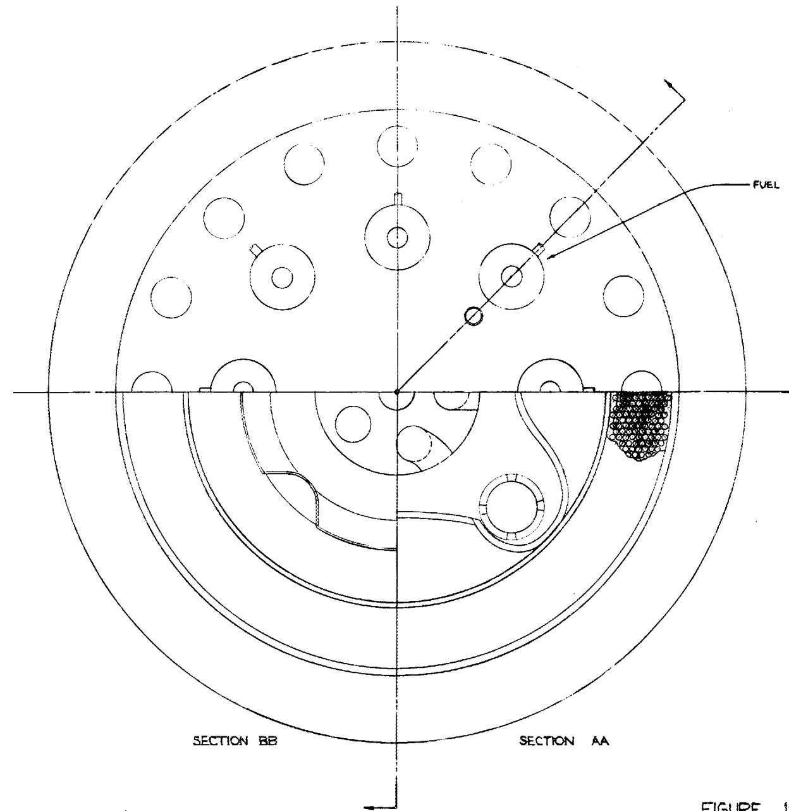  
APPROXIMATE SCALE \~ 4. SIZE

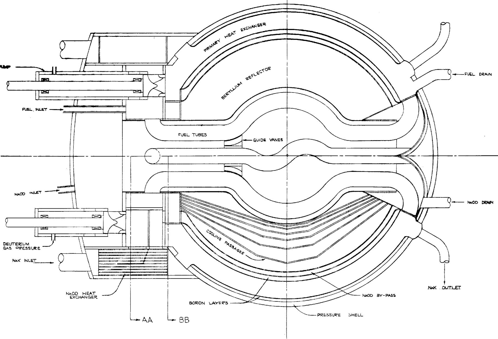

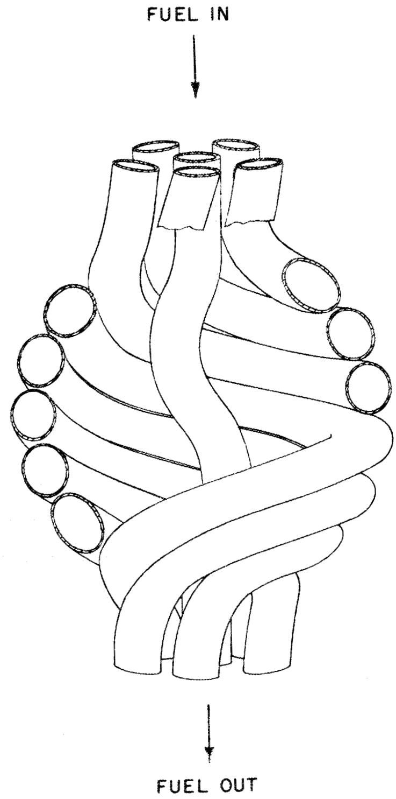

DWG. BY C.P.M.

# SCHEMATIC DRAWING

# OF FUEL TUBES

temperatures below $900^{\circ}\mathrm{F}$ , the fuel will freeze in the primary heat exchanger. With its inherent simplicity, the use of a single transfer medium warrants further investigation. Figure 1 is a drawing of the Screwball system, and a tabulation of design data is contained in the Appendix 1.

# 3.2 Design Philosophy

A brief survey of NEPA, ANP, H. K. Ferguson, and Technical Advisory Board reports indicated that homogeneous reactors held the greatest potential for efficient nuclear propelled flight. Since little information is available on a combined hydroxide of lithium and sodium (the most obvious candidate for a high temperature homogeneous reactor fuel) the circulating fuel type reactor was chosen as an intermediate step between fixed fuel elements and the homogeneous type fuel. The large heat transfer surface required in fixed fuel reactors is removed from the core in circulating fuel reactors and the potential simplicity of homogeneous reactors is retained. The moderating properties of the uranium bearing, fused salts are generally poor, but employing thick, efficient reflectors enables the construction of a small high power reactor.

Having chosen a reflector moderated, circulating fuel type reactor, a more detailed investigation was initiated on the Fireball as described in Reference 2. Investigation of the Fireball design parameters yielded the following five problems which appeared to warrant basic design changes or modifications:

1. High power density   
2. Questionable fuel flow patterns   
3. Possibility of pressure surges

4. Cooling the Be "island"   
5. Self-shielding in the fuel

The Screwball eliminates or reduces the magnitude of each of these problems except pressure surges. To achieve these ends compromises in simplicity and reactor size have been made; however, the increase in shield weight over the 22.5 inch core is less than $10\%$ . It is believed that this reactor has a real potential for aircraft application, and as such warrants further investigation.

The controllability of a high power density reactor has been neither proven nor disproven. E. R. Mann states that controlling a reactor in which the fuel temperature rise in the core exceeds $2000^{\circ}\mathrm{F}$ . per second will be difficult and somewhat doubtful. To be more conservative, a power density of 2.5 kW/cc $(1070^{\circ}\mathrm{F}$ per second) has been chosen for this reactor.

With such rapid increases in fuel temperature only short lived flow instabilities or eddies can be tolerated in the fuel. The use of fuel tubes in the Screwball has greatly reduced the uncertainty of sustained instabilities in the fuel region. A brief qualitative experiment varifying stable flow through helical pipes is described in Section 6.3.

Pressure surges result from rapid density changes due to temperature variations which occur in eddies of lengthy duration, or from the instantaneous introduction of a cold slug of fuel. A step decrease in temperature is difficult to visualize in a circulating fuel reactor. Pressure surge calculations have been made on the Fireball assuming stagnant fuel in the core and a step increase in $k$ of $1\%$ throughout the core. These assumptions are both conservative since neither condition is likely to occur in the reactor. Based on these assumptions the resulting pressure

surge is not expected to exceed 150 psi.. As a result of the more tortuous expansion path out of the core, pressure surges in the Screwball are expected to be larger. However, the fuel tubes in the Screwball will withstand pressures of 200 psi and no difficulty from this phenomenon is anticipated.

The beryllium central "island" in the Fireball reactor requires cooling to remove the heat generated by neutron moderation and gamma ray attenuation. The density of heat generation is 100 to 200 watts/cc, and its removal will require a large number of coolant tubes. The beryllium has been replaced in the Screwball by a circulating "island" of NaOD. However, the problem of NaOD corrosion has been introduced. As indicated in Section 6.2.2, no stagnant or low velocity layers in NaOD can be tolerated next to the hot fuel tubes or containing shell.

The self-shielding effect, as described in Section 5.2, for the 3.5 inch diameter tubes of the Screwball should be less severe than for the spherical fuel annulus in the Fireball.

# IV MATERIALS

# 4.1 Fuel

The proposed fuel for the Screwball is a fused salt containing 50 mole percent NaF, 47 mole percent $\mathrm{ZrF}_4$ , and 3 mole percent enriched $\mathrm{UF}_4$ . This fuel is similar to that proposed for the ARE and was chosen because considerable information is available on its physical and chemical properties. To relax the limitation on the temperature of the returning NaK (Section 3.1), a fuel with a lower melting point would be desirable. Inconel will be used as the fuel containing material.

# 4.2 Reflector

The reflector has two functions; moderation and shielding. Be is a good moderator. Its moderating ratio is 159 compared to 170 for carbon. In addition, it serves as an excellent shield due to its high atomic density and small age. The fast neutron leakage for a given reflector thickness is much smaller for beryllium than for substances such as NaOD, BeC, graphite and BeO aggregate. (Reference 2, Figure 7). Hence, beryllium has been chosen for the Screwball reflector.

# 4.3 Moderator

A fluid moderator with a low vapor pressure at elevated temperature was desired. Their high vapor pressures eliminated the possibility of using light or heavy water. Hydroxides were then considered.

The diffusion length of a hydroxide is very small relative to its age. Hence, a hydroxide in the core of the Screwball would serve as a sink for fast neutrons rather than as a moderator. Deuteroxides do not have this undesirable nuclear property and should exhibit similar physical

and corrosive properties. Therefore, LiOD, NaOD and combinations of both were considered. The double isotopic separation eliminated LiOD from serious consideration; NaOD was chosen for the core moderator.

NaOD also serves as the coolant for the reflector. It is a better moderator than sodium (the proposed Fireball reflector coolant) so that the Screwball reflector should be a more effective shield. However, the macroscopic cross section for thermal neutrons is larger for NaOD than for sodium. The slight difference in absorption does not warrant considering the additional complexity of a separate sodium system for the Screwball.

BMI has made a survey of containing materials for NaOH at elevated temperatures (Reference 23). Graphite, silver and nickel were the most satisfactory of the materials tested. Nickel was chosen for the Screwball on the basis of ease of cladding and electroplating and tolerable neutron cross section. The corrosion mechanism of NaOH on nickel is reported in Reference 4.

$$
2 \mathrm {N a O H} + \mathrm {N i} = \begin{array}{l} \mathrm {N a} _ {2} \mathrm {N i O} _ {2} \\ \mathrm {N a} _ {2} \mathrm {O} \cdot \mathrm {N i O} \end{array} + \mathrm {H} _ {2}
$$

The reaction equilibrium is temperature sensitive resulting in mass transfer of nickel from hot regions to adjacent colder surfaces. The corrosion can be suppressed by hydrogen pressure over the NaOH.

The corrosion mechanism for NaOD is expected to be similar to that for NaOH, but the degree and temperature dependence of the corrosion are unknown. For this study, the temperature limitation for NaOD corrosion of nickel is assumed the same as for NaOH.

According to Reference 3, corrosion of nickel by stagnant NaOH is,

1) not noticeable at $1000^{\circ}\mathrm{F}$   
2) small at $1250^{\circ}\mathrm{F}$ and would be tolerable for aircraft applications   
3) excessive at $1500^{\circ}\mathrm{F}$

A limiting wall temperature of $1250^{\circ}\mathrm{F}$ and a deuterium gas pressure in the NaOD expansion tank of two to three atmospheres are proposed for this reactor.

# 4.4 Intermediate Heat Transfer Medium

A near eutectic alloy of sodium and potassium, 56 weight percent Na and 44 weight percent K, has been chosen as the intermediate heat transfer medium. As is typical of liquid metals, this alloy has excellent heat transfer properties and also has a low melting point $(66^{\circ}\mathrm{F})$ . The main disadvantage of NaK is the induced radiation resulting from neutron bombardment in the primary heat exchanger.

# 4.5 Fabrication

The proposed methods for fabricating the primary heat exchanger, pumps and beryllium reflector are the same as those described in Reference 2. Ni will be substituted for chromium in the reflector.

Bending the fuel tubes is possible (Reference 5), with the use of a cernet internal mandrel.

The NaOD heat exchanger is standard, welded shell and tube construction.

The entire system will be welded. Reference 6 states that welds in nickel for $1000^{\circ}\mathrm{F}$ NaOH corrosion tests were made with no unusual difficulty. Inconel welding presents no major complications.

The fabrication sequence has not been fully considered in the layout of Figure 1. Modifications may be required to facilitate assembly of parts.

# V REACTOR PHYSICS

# 5.1 Cross Sections

The cross sections used for nuclear calculations in this report are based on current ANP data.

# 5.2 Self-shielding

The application of diffusion theory in Reactor design, yields at best only a reasonable approximation of the nuclear characteristics of homogeneous systems. The Screwball is a heterogeneous reactor which has been homogenized for the purpose of expediting the nuclear calculations. This fact makes it necessary to correct the diffusion equations by introducing a parameter commonly referred to as the self-shielding factor, F. This factor accounts for the local depression of the neutron flux within the fuel region, which in turn results in decreased thermal utilization of the fuel. Two major disadvantages result from self-shielding. First, more fuel is required than for a homogeneous reactor of the same proportions; and second, the negative temperature coefficient is not as large. As seen in Figure 3, a smaller change in $\mathbf{k}_{\mathrm{eff}}$ results from the removal of an equal mass of uranium for a reactor with a greater uranium investment.

Figure 4 depicts estimated values of F vs. fuel tube diameter at various reactor operating temperatures. The calculations were based on the method set forth in Reference 7. To apply the method one must know $\Sigma_{\mathrm{s}}$ and $\Sigma_{\mathrm{t}}$ of each constituent, the atomic densities in the fuel tube and its diameter, and the variation of f with $2R\Sigma_{\mathrm{t}}$ as shown in Figure5. From these data calculate,

Drawing # 23188

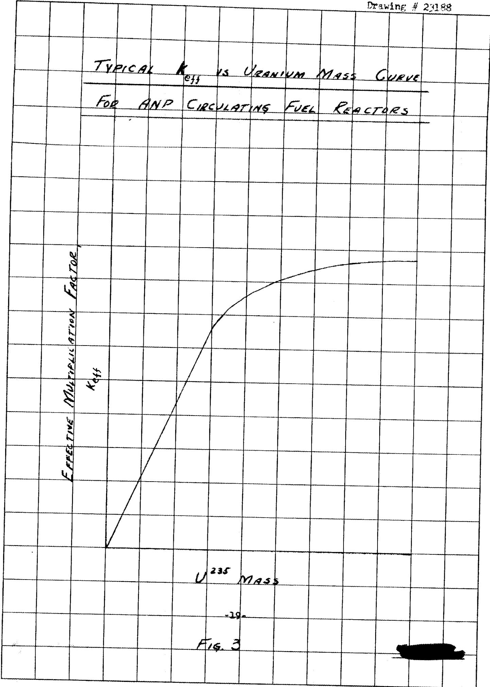

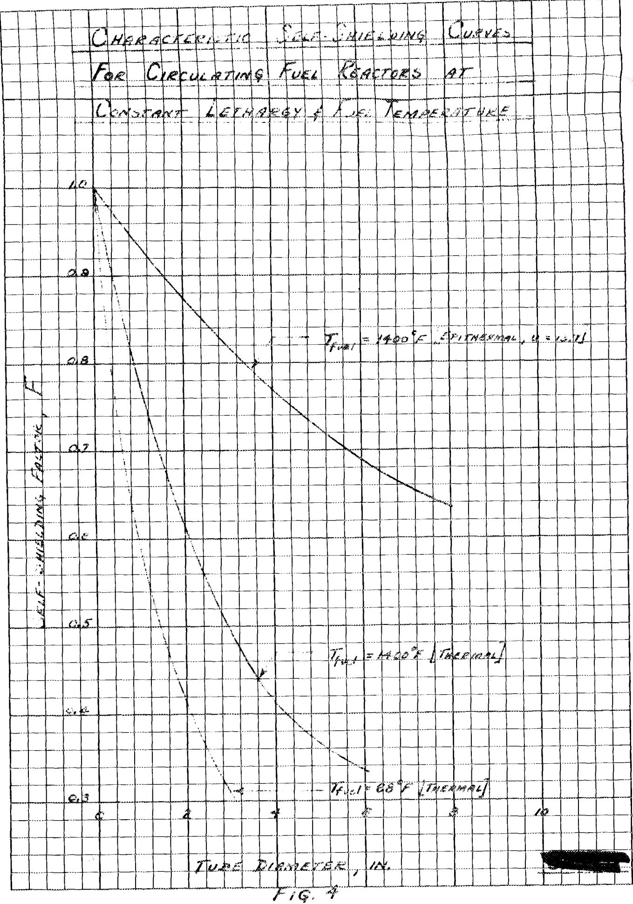

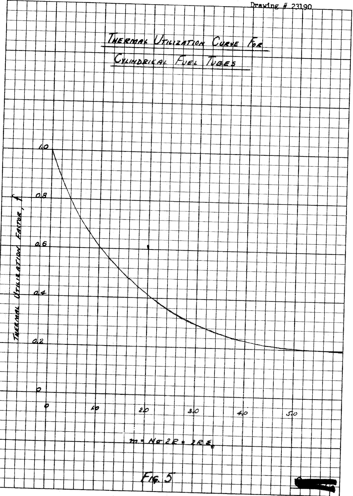

$$
F = \frac {\sigma_ {a} ^ {U}}{\sigma_ {a} ^ {U}} = \frac {f}{1 - \frac {\Sigma_ {S}}{\Sigma_ {t}} (1 - f)}
$$

as a function of lethargy, which is then used as a multiplying constant on the macroscopic cross section of uranium.

The self-shielding factors which were incorporated in the Screwball configuration were $\mathbf{F}_{\mathrm{fast}} = 0.8$ , and $\mathbf{F}_{\mathrm{th}} = 0.5$ . It is believed that these figures resulted in a conservative value for the critical mass.

# 5.3 One Group, Two Region, Criticality Calculation

As a basis for advanced engineering and nuclear calculations, an estimate of the Screwball critical mass was necessary. For this purpose a one group, two region calculation was made of the proposed configuration.

The general method of calculation is discussed in Reference 8, equation 8.31.1

$$
\cot B _ {C} R = \frac {1}{B _ {C} R} \left[ 1 - \frac {D _ {r}}{D _ {C}} \right] - \frac {D _ {r}}{D _ {C} B _ {C} L _ {T}} \coth \frac {T}{L _ {T}}
$$

$$
\begin{array}{l} B _ {C} = \left[ \sqrt {\frac {\Sigma_ {f} - \Sigma_ {a}}{D}} \right] _ {C}; D _ {T} = \frac {1}{3 \Sigma_ {t} r _ {r}}; D _ {C} = \frac {1}{3 \Sigma_ {t} r _ {c}}; R = \text {c o r e r a d i u s} \\ I _ {T} = \left[ \sqrt {\frac {D}{\Sigma_ {a}}} \right] _ {r}; T = \text {R e f l e c t o r T h i c k n e s s} \\ \end{array}
$$

Notes: Equation 3.31.l is in error in the first edition of Reference 8

$$
\text {T h e i t e m} \left[ \begin{array}{l l} 1 & \frac {\mathrm {D} _ {\mathrm {C}}}{\mathrm {D} _ {T}} \end{array} \right] \quad \text {s h o u l d r e a d} \quad \left[ \begin{array}{l l} 1 & \frac {\mathrm {D} _ {T}}{\mathrm {D} _ {\mathrm {C}}} \end{array} \right]
$$

The effective reflector thickness was computed for ANP Reactor 121 for which the critical mass had been calculated by the 32 group IBM technique. Assuming the same effective reflector thickness, the critical mass was determined for the proposed Screwball.

For the purpose of cross section weighting both reactors were assumed $50\%$ fast and the fast fraction to be equally distributed among the lethargy groups. A self-shielding factor of 0.7 was applied to the resulting one group cross section. Thermal base 92 was used. Data used in the calculation are contained in Appendix 2.

A critical mass of 36.4 pounds was obtained for an effective reflector thickness of 4.04 cm. This corresponds to 3.05 mole percent $\mathbf{U}\mathbf{F}_{4}$ in the fuel.

# 5.4 Two Group, Three Region Calculation

The problem of calculating the critical mass and flux distribution of intermediate reactors is more difficult than for thermal reactors. The one group approximation is unsatisfactory because of the wide variation in epithermal cross sections. Furthermore, the comparatively small size of intermediate reactors increases the importance of the reflector. This fact holds particularly in connection with reflector moderated reactors as exemplified by the Fireball and the Screwball. In these reactors the nuclear characteristics are strongly influenced by reflector composition and its thickness.

Because of the uncertainties in cross sections in the intermediate energy range, it is not anticipated that calculations will lead to accurate prediction regarding the critical mass and flux distributions. It appears that these calculations will at best be a reasonable approximation of the nuclear characteristics of the reactor. In order to conduct the reactor analysis expeditiously, the two groups, three region method was used.

The approximation of the Screwball used for nuclear calculation is schematically depicted in Figure 6. $R_1$ is the radius of the inner sphere (I), with $R_2$ and $R_3$ representing the radii of spherical shells II and III. As applied to this reactor, region I is the moderator, region II the fuel bearing medium and region III the reflector.

The diffusion equations which were used in the reactor analysis are:

$$
\begin{array}{l} \text {R e g i o n I ;} \quad - D _ {I _ {1}} \nabla^ {2} \phi_ {I _ {1}} + \Sigma_ {R _ {I _ {1}}} \quad \phi_ {I _ {1}} = 0 \\ \text {a n d} - D I _ {2} \nabla^ {2} \phi_ {I _ {2}} + \Sigma_ {a _ {I _ {2}} \phi_ {I _ {2}}} = \Sigma_ {R _ {I _ {1}}} \phi_ {I _ {1}} \\ \end{array}
$$

$$
\begin{array}{l} \text {R e g i o n I I :} - D _ {I I _ {1}} \nabla^ {2} \phi_ {I I _ {1}} + \Sigma_ {R _ {I I _ {1}}} \phi_ {I I _ {1}} + \Sigma_ {a _ {I I _ {1}}} \phi_ {I I _ {1}} = \lambda \Sigma f _ {I I _ {2}} \phi_ {I I _ {2}} + \nu \Sigma f _ {I I _ {1}} \phi_ {I I _ {1}} \\ \text {a n d} - \mathrm {D} _ {\mathrm {I I} _ {2}} \nabla^ {2} \varphi_ {\mathrm {I I} _ {2}} + \Sigma_ {\mathrm {a} _ {\mathrm {I I} _ {2}}} \varphi_ {\mathrm {I I} _ {2}} = \Sigma_ {\mathrm {R} _ {\mathrm {I I} _ {1}}} \varphi_ {\mathrm {I I} _ {1}} \\ \end{array}
$$

$$
\begin{array}{l} \text {R e g i o n I I I :} - \mathrm {D} _ {\mathrm {I I I} _ {1}} \nabla^ {2} \phi_ {\mathrm {I I I} _ {1}} + \Sigma_ {\mathrm {R I I I} _ {1}} \phi_ {\mathrm {I I I} _ {1}} = 0 \\ \text {a n d} \quad - D _ {I I I _ {2}} \nabla^ {2} \phi_ {I I I _ {2}} + \Sigma_ {a _ {I I I _ {2}}} \phi_ {I I I _ {2}} = \Sigma_ {R _ {I I I _ {1}}} \phi_ {I I I _ {1}} \\ \end{array}
$$

where subscripts $I_1$ indicates fast group region $I$ and where subscripts $I_2$ indicates thermal group region $I$ , etc.

$$
\text {I n t h e a b o v e} \Sigma_ {\mathrm {R}} = \int_ \substack {\Sigma_ {\mathrm {t o t a l}} \\ \ln \frac {\mathrm {E} _ {\mathrm {F}}}{\mathrm {E}}}
$$

The above equations are founded on the following assumptions:

(1) There are no fast absorptions in the reflector   
(2) There are no scattering collisions with the uranium in the fuel   
(3) All fast absorption in the fuel region is due to uranium

Nuclear APPPROVALON OF THE SCREWSGUL

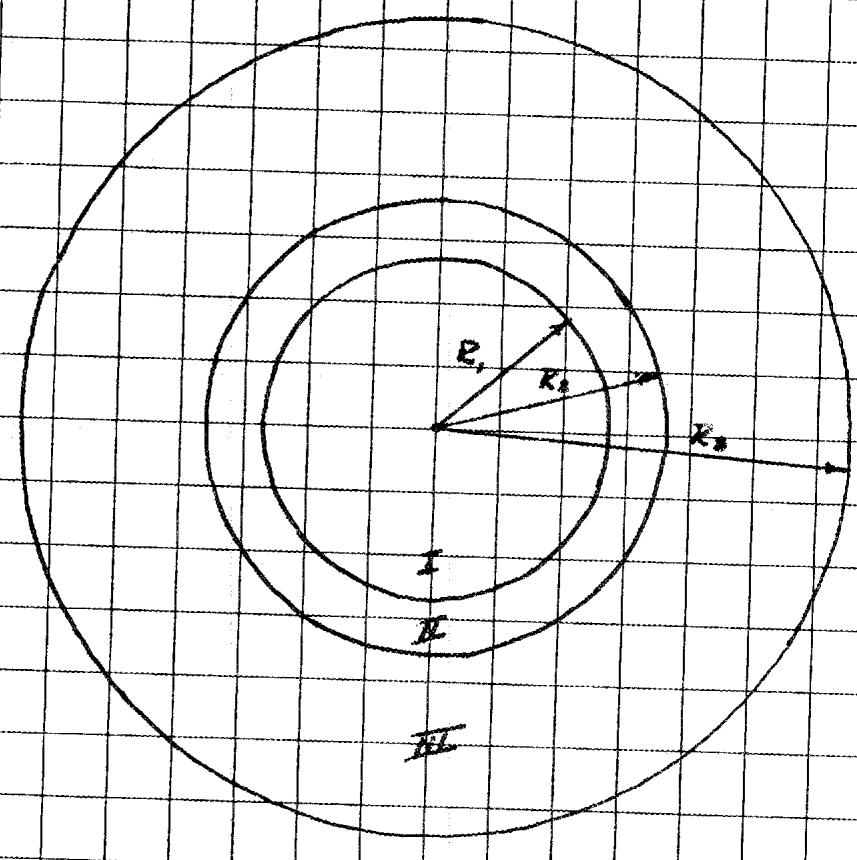

${R}_{1} = {10.69}\;{14}$   
${R}_{2} = {14.31}$   
$\frac{1}{2} = 2 : 2 : 5$

F16 6

(4) The use of $\sum_{t}$ in place of $\sum_{s}$ is a valid   
approximation providing $\frac{\Sigma_{\mathrm{a}}}{\Sigma_{\mathrm{s}}} \ll 1$   
(5) The neutron energy spectrum, from source to thermal, can be divided into two representative energy groups.   
(6) Neutrons do not leak before the first collision.   
(7) The Doppler Effect is neglected.   
(8) Crystal effects are neglected.   
(9) Moderation essentially takes place in the reflectormoderator region.

The applicable boundary conditions for both groups are:

(1) Symmetry or nonsingularity of flux at the center of region I.   
(2) Equal fluxes at the interfaces.   
(3) Equal currents at the interfaces.   
(4) Fluxes vanish at the extrapolated boundary.

Solving the diffusion equations and applying the first and fourth boundary conditions yields the following expressions for the flux:

$$
\varnothing_ {I _ {1}} = A _ {2} \quad \sinh \frac {r}{L _ {I _ {2}}}
$$

$$
\varphi_ {I _ {2}} = C _ {2} \frac {\sinh \frac {r}{L I _ {2}}}{r} + S _ {1} A _ {1} \frac {\sinh \frac {r}{L I _ {2}}}{r}
$$

$$
\varnothing_ {\mathrm {I I} _ {1}} = A _ {3} \frac {\sin \mathrm {g r}}{r} + A _ {4} \frac {\cos \mathrm {g r}}{r} + A _ {5} \frac {\sinh \mathrm {h r}}{r} + A _ {6} \frac {\cosh \mathrm {h r}}{r}
$$

$$
\varnothing_ {\mathrm {I I} _ {2}} = \mathrm {S} _ {2} \mathrm {A} _ {3} \frac {\sin \mathrm {g r}}{\mathrm {r}} + \mathrm {S} _ {2} ^ {\mathrm {A}} _ {4} \frac {\cos \mathrm {g r}}{\mathrm {r}} + \mathrm {S} _ {3} ^ {\mathrm {A}} _ {5} \frac {\sinh \mathrm {h r}}{\mathrm {r}} + \mathrm {S} _ {3} ^ {\mathrm {A}} _ {6} \frac {\cosh \mathrm {h r}}{\mathrm {r}}
$$

$$
\begin{array}{l} \varnothing_ {\mathrm {I I I} _ {1}} = A _ {7} \quad \sinh \frac {\widetilde {\mathrm {R}} _ {2 - r}}{\mathrm {I I I} _ {1}} \\ \begin{array}{l} \phi_ {\mathrm {I I I} _ {2}} = c _ {7} \quad \sinh \frac {\tilde {\mathrm {R}} _ {3 - \mathrm {r}}}{\mathrm {L} _ {\mathrm {I I I} _ {2}}} + S _ {4} A _ {7} \quad \sinh \frac {\tilde {\mathrm {R}} _ {3 - \mathrm {r}}}{\mathrm {L} _ {\mathrm {I I I} _ {1}}} \\ \frac {\mathrm {r}}{\mathrm {r}} \end{array} \\ \end{array}
$$

The constants in the above equations are defined as follows:

(1) $\mathrm{L}_{\mathrm{I}_1} = \sqrt{\frac{\mathrm{D}_{\mathrm{I}_1}}{\sum_{\mathrm{R}_{\mathrm{I}_1}}}}$

(2) $L_{I_2} = \sqrt{\frac{D_{I_2}}{\Sigma_{a_{I_2}}}}$

(3）g²=12 1+

$$
\sqrt {\left\{\frac {\Sigma_ {a }}{D _ {I I _ {2}}} + \frac {\left(\Sigma_ {R _ {I I _ {1}} +} \Sigma_ {a _ {I I _ {1}} -} \Sigma f _ {I I _ {1}}\right)}{D _ {I I _ {1}}} \right\} ^ {2} - 4 \left\{\frac {\Sigma_ {a _ {I I _ {2}}} \left(\Sigma_ {R _ {I I _ {1}} +} \Sigma_ {a _ {I I _ {1}} -} \Sigma f _ {I I _ {1}}\right) - \Sigma f _ {I I _ {2}} \Sigma_ {R _ {I I _ {1}}}}{D _ {I I _ {2}} D _ {I I _ {1}}} \right\}}
$$

（4） $-h^{2} = \frac{1}{2}\left[-\left\{\frac{\Sigma_{a_{II_2}}}{D_{II_2}} + \frac{\left(\Sigma_{R_{II_1}} + \Sigma_{a_{II_1}} - \Sigma_{f_{II_1}}\right)}{D_{II_1}}\right\}\right.$

$$
\sqrt {\left\{\frac {\Sigma_ {a }}{D _ {I I _ {2}}} + \frac {\left(\Sigma_ {R _ {I I _ {1}}} + \Sigma_ {a _ {I I _ {1}}} - \nu \Sigma f _ {I I _ {1}}\right)}{D _ {I I _ {1}}} \right\} ^ {2} - 4 \left\{\frac {\Sigma_ {a _ {I I _ {2}}} \left(\Sigma_ {R _ {I I _ {1}}} + \Sigma_ {a _ {I I _ {1}}} - \nu \Sigma f _ {I I _ {1}}\right) - \nu \Sigma f _ {I I _ {2}} \Sigma_ {R _ {I I _ {1}}}}{D _ {I I _ {2}} D _ {I I _ {1}}} \right\}}
$$

(5) $\mathbf{S}_{\perp} = \frac{\sum_{R}\mathbf{I}_{\perp}}{\sum_{I_{2}}\left(\frac{1}{L_{I_{2}}} - \frac{1}{L_{I_{1}}^{2}}\right)}$

(6) $s_{2} = \frac{D_{II_{1}}g^{2} + \Sigma_{R_{II_{1}}} + \Sigma_{a_{II_{1}}} - \nu\Sigma f_{II_{1}}}{\nu\Sigma f_{II_{2}}}$

(7) $\mathbf{S}_{3} = \frac{\sum_{\mathrm{II}_{1}} + \sum_{\mathrm{II}_{1}} - \nu^{\sum}\mathbf{f}_{\mathrm{II}_{1}} - \mathrm{D}_{\mathrm{II}_{1}}\mathrm{h}^{2}}{\nu^{\sum}\mathbf{f}_{\mathrm{II}_{2}}}$   
(8) $\mathbf{S}_{4} = \frac{\sum_{\mathrm{III}_1}}{\mathrm{D}_{\mathrm{III}_2}\left(\frac{1}{\mathrm{L}_{\mathrm{III}_2}^2} - \frac{1}{\mathrm{L}_{\mathrm{III}_1}^2}\right)}$   
(9) $\widetilde{\mathbf{R}}_{3} = \mathbf{R}_{3} + 2\mathbf{D}_{\mathbf{III}_{2}}$

Eight equations with eight unknowns result from applying the remaining boundary conditions. A non-trivial solution for these equations is obtained if the coefficients of the determinant (Figure 14) vanish; this then establishes the critical equation.

The two group calculation method requires accurate and judicious application of nuclear cross sections. Thermal base 92 values were used for determining thermal group cross sections and an average over lethargy groups 1 through 26 for the fast group. $\phi \mathbf{r}^2$ vs. r curves were plotted for ANP reactor 129 and normalized area fractions (Appendix 3) determined for each lethargy group and region. These areas are proportional to the fraction of neutrons in each group. The same neutron versus lethargy distribution was assumed for the proposed Screwball reactor.

It is possible to solve the criticality determinant after calculating the nuclear constants (L, D, and $\Sigma$ ) from the specified dimensions and material constituents for each region. The critical mass is obtained by iteration and is that uranium mass which results in the zero value of the determinant. The method for solving the determinant is presented in Reference 9.

To check the validity of the method of analysis, a calculation was conducted on the Fireball Reactor 129; its critical mass as determined by a 32 group IBM calculation was 23 pounds of $U^{235}$ . The two group three region calculation of reactor 129 predicted 23.4 pounds of $U^{235}$ . This indicated excellent correlation between analytical methods and choice of cross sections.

CRITICAL DETERMINANT   

<table><tr><td>sinh(R1/L1)</td><td>-sin(gR1)</td><td>-cos(gR1)</td><td>-sinh(hR1)</td><td>-cosh(hR1)</td><td>0</td><td>0</td><td>0</td></tr><tr><td>S1sinh(R1/L1)</td><td>-S2sin(gR1)</td><td>-S2cos(gR1)</td><td>-S3sinh(hR1)</td><td>-S3cosh(hR1)</td><td>sinh(R1/L1)</td><td>0</td><td>0</td></tr><tr><td>O</td><td>sin(gR2)</td><td>cos(gR2)</td><td>sinh(hR2)</td><td>cosh(hR2)</td><td>0</td><td>-sinh(Σ3-R2/LΠ1)</td><td>0</td></tr><tr><td>O</td><td>S2sin(gR2)</td><td>S2cos(gR2)</td><td>S3sinh(hR2)</td><td>S3cosh(hR2)</td><td>0</td><td>-S4sinh(Σ2-R2/LΠ1)</td><td>-sinh(Σ3-R2/LΠ2)</td></tr><tr><td>-D1[S1cosh(R1/L1)] -sinh(Σ1/R1)</td><td>D1[R1g cos(gR1)] -sin(hR1)</td><td>-D1[R1g sin(gR1)] + cos(gR1)</td><td>D1[R1h cosh(hR1)] -sinh(hR1)</td><td>D1[R1h sinh(hR1)] -cosh(hR1)</td><td>0</td><td>0</td><td>0</td></tr><tr><td>-D2S1[R1cosh(R2/L2)] -sinh(Σ2/R2)</td><td>D2S2[R1g cos(gR2)] -sin(hR2)</td><td>-D2S2[R1g sin(gR2)] + cos(gR2)</td><td>D2S2[R1h cosh(hR2)] -sinh(hR2)</td><td>D2S2[R1h sinh(hR2)] -cosh(hR2)</td><td>-D2[L1cosh(R1/L2] -sinh(R1/L2)</td><td>0</td><td>0</td></tr><tr><td>O</td><td>-D1[R2g cos(gR2)] -sin(hR2)</td><td>D1[R2g sin(gR2)] + cos(hR2)</td><td>-D1[R2h cosh(hR2)] -sinh(hR2)</td><td>-D1[R2h sinh(hR2)] -cosh(hR2)</td><td>0</td><td>-D1[L2cosh(R2/R2)/LΠ1] + sinh(Σ3-R2/LΠ2)</td><td>0</td></tr><tr><td>O</td><td>-D2S2[R2g cos(gR2)] -sin(hR2)</td><td>D2S2[R2g sin(gR2)] + cos(hR2)</td><td>-D2S2[R2h cosh(hR2)] -sinh(hR2)</td><td>-D2S2[R2h sinh(hR2)] -cosh(hR2)</td><td>0</td><td>-S4D2[Σ2R2LΠ1cosh(R2/R2)/LΠ2] + sinh(Σ3-R2/LΠ2)</td><td>-D2[Σ2R2cosh(R2/R2)/LΠ2] + sinh(Σ3-R2/LΠ2)</td></tr></table>

UNCLASSIFIED   
FIGURE 14

The value of the determinant varies radically with small chan in uranium mass. The determinant for the Screwball was zero for two assumed uranium masses, 34.8 pounds and 49 pounds. The curve of determinant value versus uranium mass is similar to reactor 129 for masses around 34.8 pounds. Hence, the mass of the screwball is approximately 34.8 pounds of $U^{235}$ . This results in the following fluoride fuel compositions:

2.9 mole percent $\mathbf{U}\mathbf{F}_{4}$   
47.1 mole percent $\mathbf{ZrF}_{4}$   
50.0 mole percent NaF

Several efforts to calculate the spatial distribution of the flux yielded results of questionable validity. Very small changes in the nuclear constants produce major changes in the flux distribution. With such a sensitive relationship no significant conclusions have been obtained.

Based on the results of the ANP 32 group calculations, it is anticipated that the Screwball will be approximately 50 percent thermal. If so, the flux level required to produce $200\mathrm{MW}$ is $10^{15}$ neutrons per square centimeter per second.

# 5.5 Temperature Coefficient of Reactivity

The Screwball has been conceived for possible use in aircraft applications. It is therefore important that its control system be as simple as possible. Since the use of control rods is not anticipated and the delayed neutron contributions to the flux are attenuated when the fuel is circulating, the control of this reactor can be assumed to be satisfactory only if it is provided with a strong negative temperature

coefficient of reactivity. This coefficient is a function of numerous nuclear and physical parameters, a few of the more important ones being:

(1) liquid fuel expansion   
(2) fuel tube wall expansion   
(3) Doppler effect in fuel   
(4) moderator expansion   
(5) thermal base changes with temperature

There are several reasons why $\mathbf{k}_{\mathrm{eff}}$ is temperature dependent, the most important one being the thermal expansion of the core materials. This effect usually results in reactivity decreases with temperature increase. If the over-all temperature coefficient is positive, the continuous increase in temperature relegates the reactor to a short nonuseful life. The reactor then contains a built-in suicide complex. A negative coefficient is obtained from the thermal expansion of the fuel and its loss from the active volume. Moderator expansion, resulting in increased neutron leakage, is also a large contributor toward a negative coefficient. The Doppler broadening, which for enriched fuel could provide a positive component of the temperature coefficient, has not been considered in this report. In this connection, it is believed that addition of $U^{238}$ to the enriched fuel may possibly cancel or overcome the Doppler effect; the price is a greater fuel investment.

The calculations were conducted on the basis of a two group thermal reactor. Although the Screwball has been estimated to be 50 percent thermal, it is believed that a reasonable estimate of the temperature coefficient was obtained. It was also assumed that the product of the resonance escape probability and the fast fission factor were equal to unity.

The effective multiplication factor based on two groups, thermal reactor theory is:

$$
k _ {\text {e f f}} = \frac {n f}{(1 + (\tau_ {m} B ^ {2}) (1 + L ^ {2} B ^ {2})}
$$

This steady state equation is temperature dependent as a result of temperature variation of core geometry, material densities and energy distribution of the neutrons. The fractional change in $\mathbf{k}_{\mathrm{eff}}$ which accompanies a unit temperature rise is the temperature coefficient of reactivity. This quantity must be negative for stable reactor operation; it is obtained by taking the logarithmic derivative of the above equation with respect to the temperature,

$$
\frac {1}{k} \frac {\delta k _ {e f f}}{\delta T} = \frac {1}{n} \frac {\delta n}{\delta T} + \frac {1}{f} \frac {\delta f}{\delta T} - \left[ \frac {\tau_ {m}}{1 + \tau_ {m} B ^ {2}} + \frac {L ^ {2}}{1 + L ^ {2} B ^ {2}} \right] \frac {\delta B ^ {2}}{\delta T} - \left[ \frac {B ^ {2}}{1 + \tau_ {m} B ^ {2}} \right] \frac {\delta \tau_ {m}}{\delta T} - \left[ \frac {B ^ {2}}{1 + L ^ {2} B ^ {2}} \right] \frac {\delta L ^ {2}}{\delta T}
$$

The solution of this equation based on the mean operating temperature of approximately $1300^{\circ}\mathrm{F}$ and including cross sections appropriately weighted by the self-shielding factor, yielded the following results:

$$
\begin{array}{l} \left(\frac {\delta \mathrm {k} / \mathrm {k}}{\delta \mathrm {T}}\right) _ {\text {t o t a l}} = - 2. 1 \times 1 0 ^ {- 4} / \mathrm {o f} \\ \left(\frac {\delta k / _ {k}}{\delta T}\right) \text {f u e l} = - 0. 7 x 1 0 ^ {- 4} / o _ {F}; \quad \left(\frac {\delta k / _ {k}}{\delta T}\right) \text {m o d e r a t o r} = - 1. 4 x 1 0 ^ {- 4} / o _ {F} \\ \end{array}
$$

The ratio of the moderator to fuel coefficient is two to one. This ratio has important bearing on the kinetic behavior of the reactor because of the relationship between the temperature response time constants for fuel and moderator regions. For the Screwball these time constants are approximately 1.3 and 9 seconds for the fuel and moderator respectively; the ratio of moderator to fuel constants is approximately

seven. The combination of the above ratios becomes most important when the power increases unless the mean moderator temperature is kept constant the fuel may freeze. The explanation of this phenomenon is as follows: an increased moderator temperature reduces the reactivity and causes the fuel temperature to decrease since its negative temperature coefficient compensates for this reduction in reactivity and maintains the reactor critical. Since the reactor is without servo-type control rods, it may be possible to forestall this possibility by maintaining a constant mean moderator temperature.

# 5.6 Fission Product Handling

The two major fission products which absorb neutrons parasitically are $\mathbf{Xe}^{135}$ and $\mathbf{Sm}^{149}$ . An important advantage of circulating fuel reactors is the possibility of continuously purging Xe and other fission product gases from the system, thereby appreciably reducing the fuel inventory required. Reference 22 proposes bypassing a fraction of the primary fuel stream through a turbo-diffuser unit in which the Xe is purged with helium. It has been estimated that for an assumed equilibrium Xe concentration condition of $\frac{\mathrm{Sk}}{\mathrm{K}} = 0.3\%$ , about 6 percent of the primary flow must be continuously passed through the separator.

Additional fuel will be added to account for the reduction of $\mathbf{k}_{\text{eff}}$ due to absorption by the equilibrium $\mathbf{Xe}$ . Samarium poisoning under equilibrium conditions is expected to have a $\frac{\mathbf{Sk}}{\mathbf{k}} = 0.6\%$ . Fuel will have to be added to take care of the equilibrium Sm absorption.

# 5.7 Excess Fuel Requirements

In accordance with Reference 2, the change in uranium mass required for a given change in $\mathbf{k}_{\mathrm{eff}}$ (for ANP circulating fluoride fuel reactors is given by the relation:

$$
\left(\frac {\Delta k / _ {k}}{\Delta M / M}\right) U ^ {2 3 5} \simeq 0. 2 2
$$

It was estimated that a keff of 1.02l will be required if the reactor is to operate at 100 MW for 100 hours. Background information for calculating this figure was obtained from various ANP, ARE and HKF reports. A breakdown of the component keff is:

Critical 1.000

Equilibrium Xe override 0.003

Equilibrium Sn override 0.006

Fuel depletion 0.006

Excess for delayed neutron attenuation 0.005

Excess for instrumentation in the reflector 0.001

$$
\mathrm {k} _ {\text {e f f}} = 1. 0 2 \mathrm {l}
$$

The excess reactivity required is obtained by increasing the critical mass by 3.3 pounds; of this, approximately one pound will be used to shim the system during operation.

# 5.8 Kinetics

The question of inherent stability is extremely important with high powered, mobile, circulating fuel reactors. Since high power at high thermodynamic efficiency is required, a reactor temperature approaching the upper permissible limit is desirable. The extremely rapid power

fluctuation possible in reactors of high power density deems manual or even servo-type control impractical. As a result control rods for use during normal reactor operation were not considered feasible.

The transit time of the fuel through the reactor is a fraction of a second. As a result, the delayed neutron contributions to the flux are attenuated when the fuel is circulated. Normally, the delayed neutrons play an important role in conventional reactors; their attenuation raises a legitimate worry regarding the stability of the Screwball.

There are two aspects to inherent stability, (1) static, which means that an increase in reactor temperature causes the reactivity to decrease, and (2), dynamic, which means that the oscillations in reactor power are inherently damped. As indicated under Section 5.5 the Screwball has been calculated to have a strong negative temperature coefficient.

Current data and theoretical studies indicate that the rapid circulation of the fuel itself provides a powerful damping factor for power oscillations with periods comparable to the transit time of the fuel through the reactor. This damping factor is presumed to compensate for the delayed neutron attenuation. Evidence supporting this statement is yet forth under References 10, 11, and 12; it is indicated that the circulating fuel reactor equation (without reliance on delayed neutrons or control rods) has no antidamped solutions for the following, not entirely realistic conditions:

(1) constant power extraction   
(2) large temperature and power excursions where the steady state power is four times design power for all times

(3) sudden positive excursions of the power to ten times design power.

It would seem that a properly designed circulating fuel reactor is no worse with respect to damping oscillations than one in which none of the delayed neutrons are attenuated.

# 5.9 Controls

The underlying control philosophy for this reactor is the "master-slave" relationship, where the power plant is the master and the reactor the slave. In other words, the power extracted from the reactor is determined solely by the demand of the propulsion system.

The Screwball control system is basically dependent upon its large negative fuel temperature cbefficient. As stated in Section 5.7, shim control is obtained by addition of enriched fuel; a possible basic scheme to accomplish this is set forth in Reference 13. There are not expected to be control rods in the reactor fuel and moderator regions. Consideration should be given to the possibility of a variable bypass on the Xe separator to provide fine adjustments in reactivity between batch additions of enriched fuel.

An important advantage of the circulating fuel reactor powerplant combination, is that preliminary analysis of controlability of a loosely coupled system can be predicted for each separate component. Reactor and engine stability problems can, therefore, be attacked independently since surges in either component are admitted to the other after considerable delay. As indicated in Reference 14, it appears that the master-slave idea can probably be satisfactorily reduced to practice.

# 5.10 Start Up

A possible procedure for starting the reactor is as follows:

(1) Heat the fluorides, to a mean temperature of $1300^{\circ}\mathrm{F}$ in an external system and add the enriched fuel.   
(2) Using an external heat source, heat the NaK and NaOD.   
(3) Bring the fuel, at correct concentration, to $1500^{\circ} \mathrm{F}$ .   
(4) Install a strong polonium-beryllium source in the reflector (perhaps by mixing molten polonium with the beryllium in a separate reflector tube).   
(5) Transfer the fuel into the heated reactor system.   
(6) Allow the subcritical fuel to cool. At about $1300^{\circ}\mathrm{F}$ , with the moderator temperature closely controlled by the NaK, the core should be critical.

The reactor should now be ready to supply heat to the propulsion system. In the event that the temperature of the moderator can not be precisely controlled, it may be possible to vary the height of the moderator level in the core and thereby effect a reasonable degree of control for start up.

# 5.11 Shut Down

Driving a reactor subcritical when at idle power without the use of safety rods may not be a practical possibility. The practicability of draining the fuel from the core was given lengthy consideration. This was eliminated on the grounds that the additional weight, higher radiation levels and manifold engineering complexities would be associated with this system.

To drive the reactor subcritical a shut down rod in the reflector appears to be necessary. This rod will be completely withdrawn from the reactor during normal operation; to drive the reactor subcritical it will be inserted in the reflector either manually or automatically. This rod is not expected to unduly penalize the shield or reactor design.

# VI. REACTOR ENGINEERING

# 6.1 Optimization

Following the decision to contain the fuel in tubes, a study was undertaken to ascertain the combination of fuel tube diameters and number of tubes which would yield optimum performance. The factors considered in the study are described in Appendix 5. The ultimate choice was a compromise between the excessive self-shielding of large diameter tubes and the large core diameter and pressure drop associated with small diameter tubes. Six 3.5 inch diameter tubes were chosen.

# 6.2 Heat Transfer

# 6.2.1 Gamma Heating

The heating produced by gamma radiation must be known for the design of cooling passage to prevent overheating of the reactor structure. This heating superimposed on that due to heat transfer determines the source used to calculate cooling hole distribution, per Reference 15.

For the purpose of this calculation the reactor was resolved as follows:

1. Island - NaOD and central fuel tube homogenized.   
2. Source Region - Remaining fuel tubes and NaOD in the interstices - Annulus.   
3. NaOD spherical shell.

4. Nickel inconel shell   
5. Be reflector and an estimated quantity of NaOD and Ni for cooling.

W. S. Farmer's method (Reference 16) was used with modifications suggested by F. H. Abernathy and A. H. Fox.

Assumptions inherent in the method are:

a. The "straight ahead" theory of gamma absorption applies, i.e., compton scattering degrades the photon in energy but does not change its direction.   
b. No refraction takes place at boundaries.   
c. The source power density is uniform over the equivalent source annulus.   
d. The fission rate is uniform.

Assumptions used for the Screwball:

a. The "annulus" of fuel tubes may be replaced by a homogeneous annulus of the same thickness.   
b. The gamma spectrum may be idealized as a source consisting of 1 Mev gammas only. (A more accurate treatment would be to use sources of 1, 2, and 3 Mev gammas with the source strengths adjusted according to the number of gammas between 0 and 1.5, 1.5 and 2.5, and 2.5 and infinite Mev energy.)   
c. The use of $\mathfrak{L}$ for both energy deposition probability and attenuation factors, rather than using $\mu$ and a buildup factor for attenuation, will not result in serious errors. (The proper

build-up factors for the Screwball configuration are not known. This assumption will cause an error such that the cooling tubes will be placed closer than necessary. Accurate results can only be obtained through the use of critical experiments or actual mockups.)

d. For calculations in the source region, gamma's which traverse the island must be considered. Therefore; for these calculations, the $\pmb{\mathcal{T}}$ for the island (0.117 inches $^{-1}$ ) was assumed equal to that for the source region ( 0.152 inches $^{-1}$ ). In the source region ( a spherical annulus) where the source and

absorber have the same $\tilde{\tau}$

$$
P (r) = P o \tau \int_ {R = R _ {i}} ^ {R = R o} \int_ {\theta = 0} ^ {\theta = \pi} 2 \pi R ^ {2} \sin \theta \frac {e ^ {- \tau}}{4 \pi e ^ {2}} d Q d R \tag {1}
$$

Eliminating $\mathbb{Q}$ with

$$
P (r) = \frac {P _ {0} \tau}{2} \int_ {R = R _ {1}} ^ {R = R _ {0}} \int_ {\rho = R - r} ^ {\rho = R + r} R \frac {e ^ {- \tau_ {e}}}{e} d e d R \tag {2}
$$

Integrating by parts and using Reference 17.

$$
\begin{array}{l} P (r) = \frac {P _ {0}}{2 r} \tilde {\tau} \left\{\frac {R _ {o} ^ {2} - r ^ {2}}{2} \left[ E _ {1} | \tau (R _ {o} - r) | - E _ {1} | \tau (R o + r) | \right] \right. \\ - \frac {R _ {1} ^ {2} - r ^ {2}}{2} \left[ E _ {1} \mid \mathcal {T} (R _ {j} - r) \mid - E _ {1} \mid \mathcal {T} (R _ {i} + r) \right] \\ - \left[ \tau (\mathrm {R o} + \mathrm {r}) + 1 \right] e ^ {- \tau \frac {\left(\mathrm {R o} - \mathrm {r}\right)}{2 \tau^ {2}}} + \left[ \tau (\mathrm {R j} + \mathrm {r}) + 1 \right] \frac {e ^ {- \tau \left(\mathrm {R j} - \mathrm {r}\right)}}{2 \tau^ {2}} \\ + \left[ \mathfrak {T} (\mathrm {R o} - r) + 1 \right] \frac {\mathrm {e} ^ {- \mathfrak {T}} (\mathrm {R o} + r)}{2 \mathfrak {T} ^ {2}} = \left[ \mathfrak {T} (\mathrm {R i} - r) + 1 \right] \frac {\mathrm {e} ^ {- \mathfrak {T}} (\mathrm {R i} + r)}{2 \mathfrak {T} ^ {2}} \tag {3} \\ \end{array}
$$

Close to the source region, an infinite slab source is assumed, i.e.,

$$
P (r) = \frac {P o}{2} \frac {\tau (r)}{\tau_ {s}} \left\{E _ {2} \left(\sum_ {i} \tau_ {i} t _ {i}\right) - E _ {2} \left(\sum_ {i} \tau_ {i} t _ {i} + \tau_ {s} t _ {s}\right) \right\} \tag {4}
$$

where $\mathbf{E}_2(x) = \int_{\frac{e^{-\xi}x}{\xi^2}}^{\infty}d\xi$ (Reference 18)

subscripts; i refers to layer(s) of the slab

s refers to the source

Further from the source region, a surface source is used to

calculate the attenuation

$$
r <   R i
$$

$$
P (r) = \left(\frac {P (r)}{\tau_ {s}}\right) _ {\text {R i}} \tau (r) \quad \frac {R i}{r} \left\{E _ {1} | \tau (r) (\text {R i - r}) | - E _ {1} | \tau (r) (\text {R i + r}) | \right\} \tag {5}
$$

$$
r > R o
$$

$$
P (r) = \frac {\left[ \frac {P (r)}{\tau_ {s}} \right] _ {R o} \tilde {\tau} (r)}{2} \quad \frac {R o}{r} \left\{E _ {1} | \tilde {\tau} (r) (r - R o) | - E _ {1} | \tilde {\tau} (r) (r + R o) | \right\} \tag {6}
$$

In the "island", the slab source should be used for attenuation near the fuel annulus, and the surface system at greater distance. At the center of the island, spherical symmetry reduces the formula to:

$$
r = 0
$$

$$
P (o) = \left[ \frac {P (0)}{s} \right] _ {R _ {i}} \tau (o) e ^ {- \tau (o) R i}
$$

A fictitious surface source which yields reasonable heating results in the "island" is obtained by matching the power absorption at $1/2 \lambda_{\mathrm{I}}$ from the source.

In the reflector region, the slab source is used for about $1/2 \lambda_{\mathbb{R}}$ ; then it is matched to a surface source on the outside of the

nickel - inconel shell. Equation (6) may be modified by replacing the $\mathbf{E}_1$ functions by $\mathbf{E}_2$ functions, thus correcting the non-isotropic emission from the surface source. The second term in the parenthesis is always negligible and may be deleted.

Equation (6) thus becomes: $r > R_0$

$$
P (r) = \left[ \frac {P (r)}{\tau_ {s}} \right] _ {\text {R o}} \tilde {T} (r) \quad \frac {\text {R o}}{r} \quad E _ {2} | \tilde {T} (r) (r - R o) | \tag {8}
$$

The gamma heating calculations appear in Appendix 6.

By plotting $4\pi r^2 P(r)$ vs. $r$ and graphically integrating, the percentage of the fission energy emitted in gamma rays and neutrons which is absorbed in the reactor is determined for each region.

Island 8.8%

Fuel 54.4%

Ni-Inconel shell 3.9%

Reflector 32.9%

Approximately 300 KW leak out of the reactor.

Figure 7 shows the spatial distribution of heat absorption in the reactor.

# 6.2.2 Internal Heat Transfer

Due to the complex flow passage for the NaOD, an exact prediction or analysis of the NaOD velocities in the core is impossible. Hence, the following simplified method has been used for determining the required NaOD flow rate. Since corrosion and engineering data are not available for NaOD, NaOH has been used in the engineering analysis. The thermal conductivity of NaOH is small (0.78 Btu/hr ft ${}^{\circ}\mathrm{F}}$ . at 1100oF.)

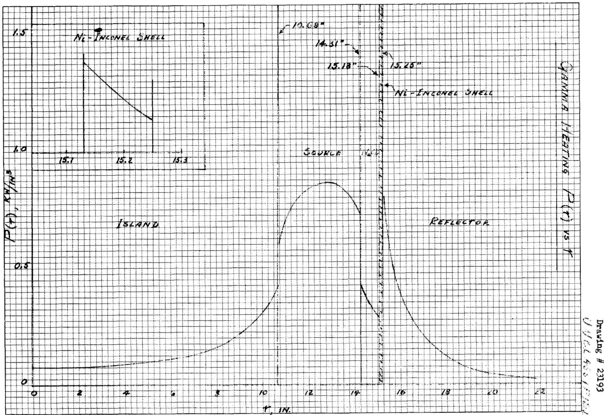  
-5+1   
F1.7

compared with liquid metals and is approximately half the thermal conductivity of the fuel. Hence, a large fraction of the temperature difference between the fuel and hydroxide may occur in the NaOD film for low velocities.

To estimate more intelligently the flow rate which results in a tube wall temperature not exceeding $1250^{\circ}\mathrm{F}$ . a calculation was made for a 3.6 inch outside diameter fuel tube with a one inch annulus of NaOH surrounding it. The fuel velocity was assumed to be 20 ft/sec. and the NaOH velocity was varied. The variation of U with $\mathbf{V}_{\mathbf{NaOD}}$ was determined and is shown in Figure 8.

The NaOD flow area perpendicular to the polar axis was determined at various latitudes. Then the variation of $V_{\text{NaOD}}$ with position in the reactor could be calculated. A relation between the NaOD velocity at the equatorial plane ( $V_{c}$ ) and the average velocity was found.

Assuming a velocity normal to the equator, the average U was calculated and the total temperature rise of the NaOD through the core was estimated. Since the total temperature rise including that due to gamma heating was small (10 - 20°F.), a linear temperature rise through the reactor was assumed.

At one inch intervals along the axis, average velocities, U's, h's and $\Delta T$ s were estimated. The product of U and $\Delta T$ gave the heat flux. The temperature rise in the NaOD film, $\Delta T_{1}$ NaOD , was calculated by dividing the heat flux by $h_{\mathrm{NaOD}}$ . Figure 9 is a plot of $h_{\mathrm{NaOD}}$ vs. $V_{\mathrm{NaOD}}$ . The gamma heat which is generated in the tube walls will be transferred to the NaOD causing an additional temperature rise, $\Delta T_{2}$ .

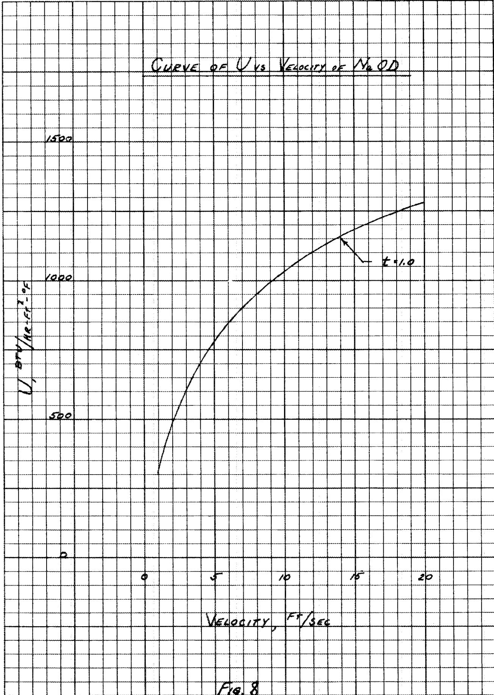

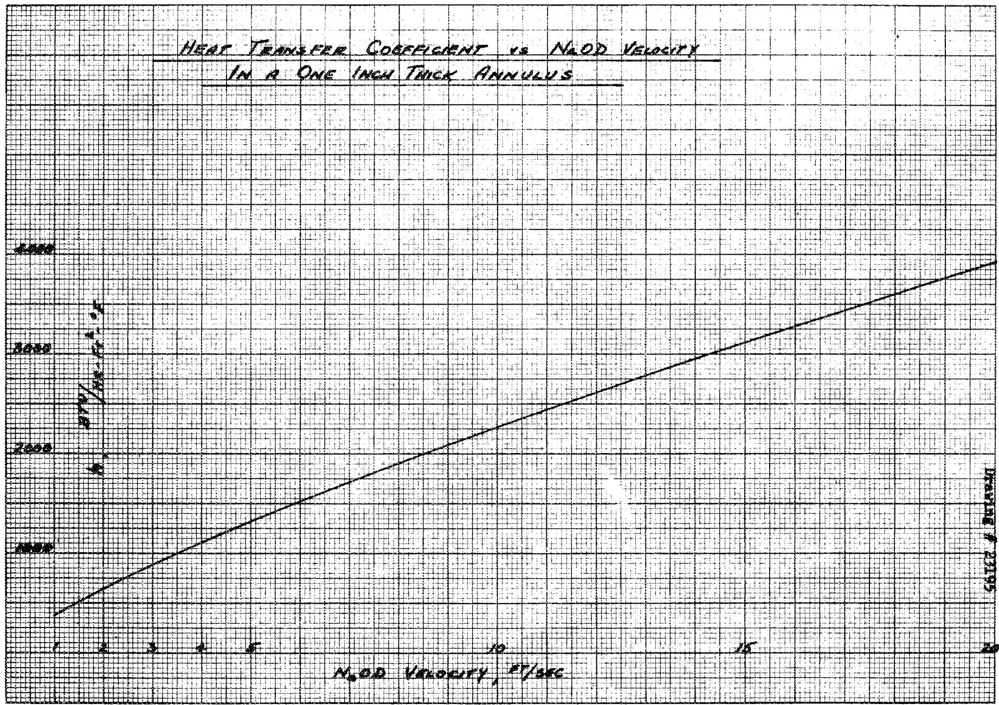  
8   
F18.9   
0311155770N

The sum of $\Delta T_{1}$ , $\Delta T_{2}$ and the NaOD temperature is the outside tube wall temperature, which must not exceed $1250^{\circ} \mathrm{F}$ .

Figure 10 shows the variation of fuel mixed mean temperature, tube outside wall temperature and the NaOD mixed mean temperature with position in the core. A $V_{c}$ of 6 ft/sec. gives a maximum wall temperature of $1254^{\circ}F$ . This calculation establishes the magnitude of the flow rate based on the simplified flow system.

# 6.2.3 Reflector Cooling

The heat generated in the beryllium reflector is removed by the passage of NaOD through 0.23 inch diameter coolant tubes. The calculation of coolant tube spacing is based on the following assumptions:

1. Neutron flux distribution from the two group, three region calculations were not available for this calculation. Therefore, the heat generation due to the neutron moderation was assumed equal to the gamma heating. This assumption agrees with work done on the Fireball (Reference 2).   
2. Each coolant tube row is treated as a separate annular cell.   
3. A mean, uniform power density is assumed for each cell.   
4. The tubes are arranged in an equilateral matrix.   
5. The tube diameter is 0.23 inches.   
6. The maximum beryllium temperature will not exceed the coolant tube wall temperature by more than $50^{\circ}\mathrm{F}$ .   
7. Heating from capture gammas in the inconel shell is neglected.   
8. All fission product gammas are emitted in the core.

From the basic heat conduction equation it can be shown that

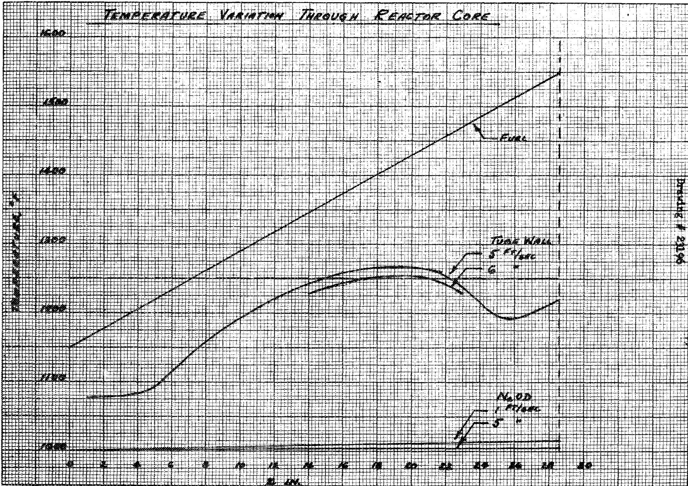  
0G   
FIG. 10

(Reference 15)

$$
\frac {k \Delta T}{Q} = \beta^ {2} \ln \left(\frac {r}{a}\right) ^ {2} + a ^ {2} - r ^ {2} \tag {9}
$$

From geometric considerations,

$$
\beta = b \sqrt {\frac {3 \sqrt {3}}{2 \pi}} \tag {10}
$$

$$
s = b \sqrt {3} \tag {11}
$$

To determine the cooling tube spacing, the following iterative method was used.

1. Assume the row spacing.   
2. Calculate unit cell dimensions using equations (2) and (3).   
3. Estimate log. mean power density from figure 11.   
4. From equations (1), (2) and (3), calculate the value $s$ for which $\Delta T = 50^{\circ}F$ .   
5. Check the calculated value of 5 with the assumed row spacing and iterate until equal.

From the row spacing and reflector dimensions, the tube pitch circle radius is determined. The number of tubes in each row is calculated from the pitch circle circumference and tube spacing. Non-integral numbers of tubes were adjusted to the next higher integer and their spacing on the pitch circle altered accordingly.

The results for the Screwball reflector are listed below.

<table><tr><td>Row</td><td>Spacing</td><td>Pitch Circle Radius</td><td>No. of Tubes</td></tr><tr><td>1</td><td>0.788 in</td><td>15.69 in.</td><td>125</td></tr><tr><td>2</td><td>0.976</td><td>16.52</td><td>103</td></tr><tr><td>3</td><td>1.23</td><td>17.63</td><td>90</td></tr><tr><td>4</td><td>1.62</td><td>19.05</td><td>74</td></tr><tr><td></td><td></td><td></td><td>(Con&#x27;d)</td></tr></table>

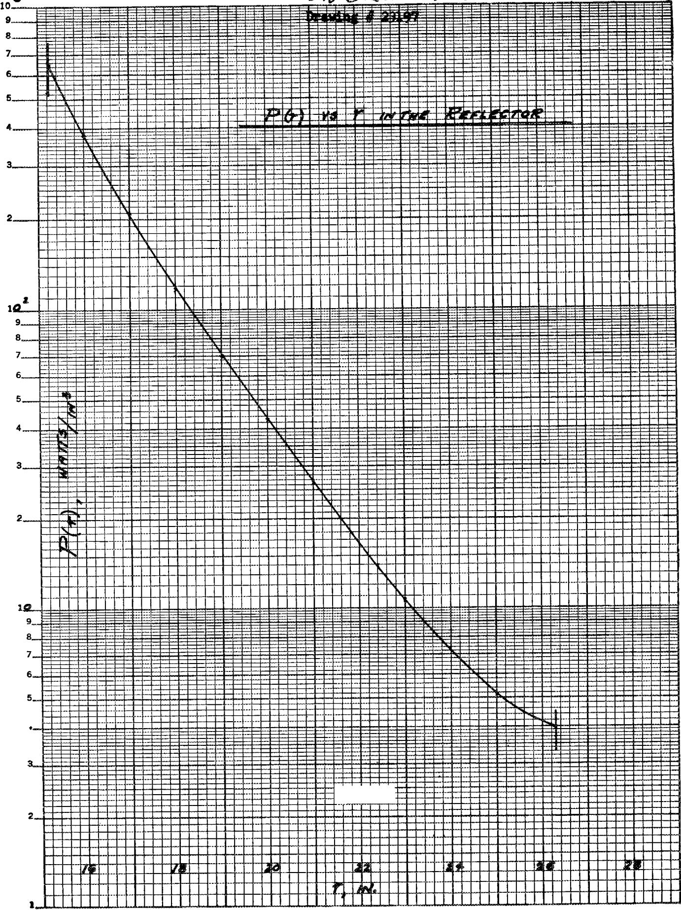  
UNCLASSIFIED   
FIS 11

<table><tr><td>Row</td><td>Spacing</td><td>Pitch Circle Radius</td><td>No. of Tubes</td></tr><tr><td>5</td><td>2.32</td><td>21.04</td><td>57</td></tr><tr><td>6</td><td>4.12</td><td>24.27</td><td>37</td></tr></table>

In calculating the gamma heating, $\mathcal{T}$ was used as the attenuation factor rather than $\mu$ , resulting in more rapid attenuation and hence larger heat generation. Therefore, the above results should be conservative.

All fission product gammas were assumed to be emitted in the core. In reality a fraction will be emitted in the core and the remaining gammas will be emitted in the external fuel circuit. The heat generation at the outside of the reflector is removed by the NaOD in the by-pass annulus.

The NaOD velocity in the reflector was determined by calculating the heat flux, heat transfer $\Delta T$ , and temperature rise of the NaOD at various assumed velocities. Calculations were made for the tube row in the highest power density region.

At a velocity of 7 ft/sec, the temperature rise of the NaOD is $156^{\circ}\mathrm{F}$ , h is 2600, and the heat transfer $\Delta T$ is $80^{\circ}\mathrm{F}$ . This gives a total temperature at the end of the coolant tube of 1251 °F, which is approximately the maximum temperature allowable from a corrosion standpoint. 6.2.4 Primary Heat Exchanger

The primary heat exchanger for the Screwball reactor is a spherical shell which will wrap around a 53 inch diameter sphere. This shell will be 4 inches thick and will begin and end on the sphere at $45^{\circ}$ North Latitude and $60^{\circ}$ South Latitude, respectively. Within the shell the fuel and NaK coolant will flow counter-currently; the NaK flows

down within the tubes in the heat exchanger. The tubes will be wrapped in such a way that there is a constant clearance between tubes of 0.035 inch. Two spacers per foot of length of tubing appear to be adequate.

The fuel will enter at the bottom of the heat exchanger at $1550^{\circ}\mathrm{F}$ and will leave at the top at $1150^{\circ}\mathrm{F}$ . On the NaK side the entrance temperature is $940^{\circ}\mathrm{F}$ and the temperature rise will be $510^{\circ}\mathrm{F}$ . The velocities and pressure drops for the fuel and NaK are, respectively, 6.95 ft/sec., 36.3 ft/sec., 32.9 psi and 31 psi. The material of construction will be inconel.

The primary heat exchanger design for the Screwball is based on the method presented in Reference 19; a summary of the calculations for this exchanger appear in Appendix 8.

This heat exchanger represents a feasible design and no major attempt has been made to optimize it. It is anticipated that the fuel volume in the heat exchanger can be reduced to approach that of the Fireball design and further effort in this direction is recommended.

# 6.2.5 NaOD Heat Exchanger

The NaOD heat exchanger has the form of a right, circular cylindrical annulus six inches thick and 15 inches tall. The NaK flows downward through 1/2 inch O. D. inconel tubes which have a wall thickness of 50 mils, including an external 10 mil cladding of nickel. These tubes form a lattice in the form of an equilateral triangle with a minimum clearance of 0.125 inches between the tubes. The NaOD flows across the bottom of the annulus, up the outside and back down the inside of the annulus as indicated in Figure 1. For this calculation eight percent

(16 MW) of the reactor heat was assumed to be removed by the NaOD.

The heat transfer calculations are based on relations presented in Reference 20. Two pass, parallel flow of NaOD and single pass downward flow of NaK were assumed. Pressure loss calculations for the NaOD assumed mixed parallel and cross flow. A sample calculation and tabulation of design data are contained in Appendix 9 and Appendix 1, respectively.

The NaOD heat exchanger is a conservative design; more heat transfer area is provided than is actually required since the higher rates of heat transfer in cross flow have been neglected to simplify the analysis.

# 6.3 Fuel Flow Experiment

As mentioned in Section 3.2 it is assumed that the flow patterns in the tubes of constant cross section are more predictable than the variable area passage employed in the Fireball. This experiment was conducted to verify flow stability in helical tubes.

Figure 12 is a photograph of the apparatus. The one inch glass tube is geometrically similar to the Screwball fuel tubes; no flow irregularities were observed. The fluid is an aniline dye.

A secondary flow typical of that generated in smooth tube bends was observed; this added turbulence should increase fuel mixing, produce a more uniform velocity profile and increase pressure losses.

This experiment supports the assumption of fuel flow stability in the Screwball.

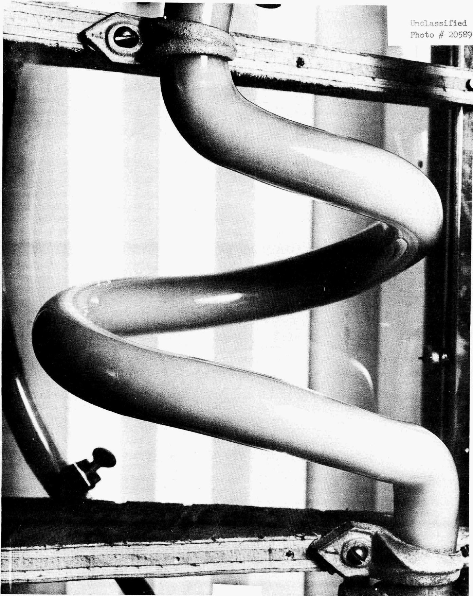

Unclassified

Photo # 20590

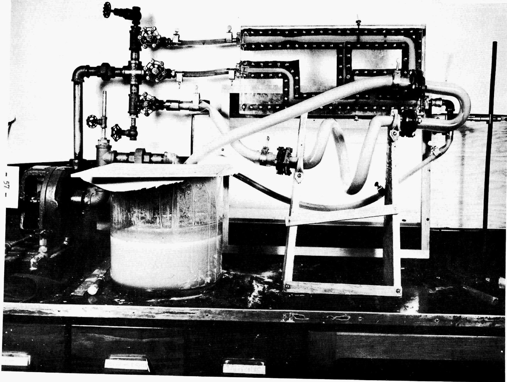

# VII. SHIELDING

Figure 13 is taken from the report of the 1953 Shielding Board meeting. The shield consists of lead and borated water. Lead was used adjacent to the pressure shell and in a $20^{\circ}$ shadow shield which is incorporated in those shield designs requiring selective reduction of external dose.

The curves shown are for reactor core diameters of 28.5" (Screwball) and 22.5". Details of the calculations can be found in the reference report.

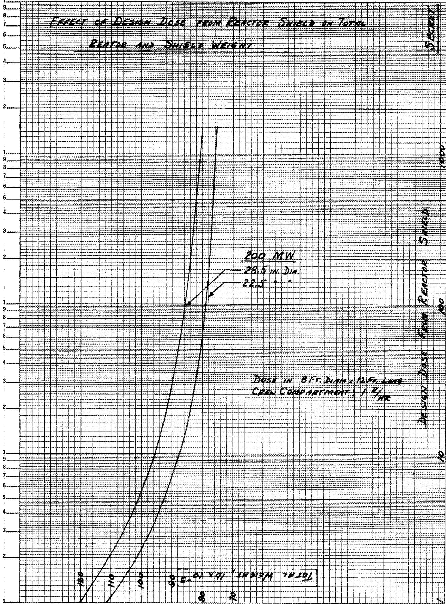  
F19 13   
$R/{HR}$ AT 50 FR

On the basis of the work presented in this report, the Screwball reactor appears to be feasible. However, a considerable quantity of detailed analysis and experiment is required before its practicability is established.

Based on the work covered by the report, the conclusions and recommendations are:

1) The use of NaOD as a moderator and reflector coolant, as proposed, has great potentiality; however, with the assumed corrosion limitation on tube wall temperature $(1250^{\circ}\mathrm{F})$ , very large flow rates and adequate flow guidance are required to attain marginal performance.   
2) The uncertainty about flow instabilities is less severe in helical fuel tubes than in spherical, annular flow passages. Hence, the use of helical tubes is recommended until stability in spherical annulii has been confirmed experimentally.   
3) For design point operation, preheating the NaK with the moderator heat lends itself to a simple reactor and propulsion system design. The desirability of this scheme increases as the melting-point of fused salt fuels is decreased. Further investigation of NaK preheat is recommended, particularly for operation off the design point.   
4) Although the fuel volume external to the core is large, by optimizing the primary heat exchanger for minimum fuel volume while maintaining reasonable pressure drops, the fuel volume reported should approach that of the Fireball. With an external fuel volume equal to that in the Fireball (5.7 cubic feet), the Screwball core will contain

33 percent of the total fuel volume. The higher delayed neutron concentration in the core and a more conservative power density make control of the Screwball more practicable than the Fireball.   
5) Despite the larger size and the use of tubes for fuel containers, the critical mass of the Screwball (35 pounds - based on conservative self-shielding factors) compares favorably with the Fireball critical mass (30 pounds) as reported in Reference 1. In addition, the ratio of total fuel volume to core volume for the Screwball may be reduced by optimizing the primary heat exchanger, thus yielding a smaller total fuel mass for the Screwball.   
6) The NaOD flow pattern in the core is unknown. The assumption that NaOD will flow between the tubes may not be realistic and more positive guidance of flow may be required.   
7) Support of the thin-walled fuel tubes at such close tolerances may be difficult, particularly since the thermal expansion patterns are analytically unpredictable. Any support structure contacting the tubes in the core presents a potential NaOD stagnation point and hence, a corrosion center.   
8) The assumption of quantitatively similar physical and chemical properties for NaOD and NaOH is unfounded.

The major, fundamental limitation of the Screwball is the NaOD corrosion.

# Ref. No.

# Title

1. ORNL 1556, W. B. Cottrell, "ANP Quarterly Progress Report". for period ending June 10, 1953.   
2. CF-53-3-210, A. P. Fraas, C. B. Mills, "A Reflector Moderated Circulating Fuel Reactor For an Aircraft Power Plant", March 27, 1953.   
3. The Reactor Handbook, RH-3, Technical Information Service, AEC 4. NRL-Memo Report No. 130, R. R. Miller, "Fourth Progress Report on the Thermal Properties of Sodium Hydroxide and Lithium Metal", March 1953.   
5. Conversation with Leo Hemphill - Y-12 Engineer.   
6. TAB-20, D. S. Bloom, "Report of Trip to BMI, International Nickel Company and M.I.T.", June 29 to July 3, 1950.   
7. Y-F10-102, C. B. Mills, "An Outline of the General Methods of Reactor Analysis used by the ANP Physics Group".   
8. Glasstome and Edlund, "The Elements of Reactor Theory".   
9. MM-182, P. D. Crout, "A Short Method for Evaluating Determinants and Solutions of Systems of Linear Equations With Real and Complex Coefficients".   
10. CF-53-3-231, W. K. Ergen, "Kinetics of Circulating Fuel Nuclear Reactors", March 30, 1953.   
11. Y-F10-98, W. K. Ergen, "Physics Consideration of Circulating Fuel Reactors", April 16, 1952.

12. Y-F10-109, S. Tamor, "Note on the Non-linear Kinetics of Circulating Fuel Reactors", Aug. 15, 1952.   
13. ORNL 1234, W. B. Cottrell, "Reactor Program for the Aircraft Nuclear Propulsion Project", June 2, 1952.   
14. MM-92, E. R. Mann, "Controls and Instrumentation", 1951.   
15. CF-52-9-201, W. S. Farmer, "Cooling Hole Distribution for Reactor Reflectors", Sept. 3, 1952.   
16. ORNL 1517, A.P.Fraas et.al., "Fireball Reactor Moderator Cooling System".   
17. "Tables of Sine , Cosine and Exponential Integrals", WPA, New York, 1940, Vols. I and II.   
18. MT-1, G. Phaczek, Part I, "The Functions $\mathbf{E}_{\mathfrak{n}}(\mathbf{x}) = \int_{0}^{\infty}\overline{e}^{-xu}\overline{u}^{-n}du$ Part II, "Table of $\mathbf{E}_{\mathfrak{n}}(\mathbf{x})$   
19. ORNL 330, A. P. Fraas M. E. LaVerne, "Heat Exchanger Design Charts".   
20. W. H. McAdams, "Heat Transmission", McGraw-Hill Book Co., Inc.; New York and London, 1942.   
21. ORNL 1395, H. F. Poppendiek, and L. D. Palmer, "Heat Transfer in Pipes With Volume Heat Source Within the Fluids".   
22. HKF-109, Karl Cohen, "Homogeneous Reactor for Subsonic Aircraft", Dec. 15, 1950.   
23. BMI-706, C. M. Craighead, L. A. Smith and R. I. Jaffee, "Screening Tests on Metals and Alloys in Contact With Sodium Hydroxide at 1000 and $1500^{\circ}\mathrm{F}$ ".

# X APPENDIXES

Appendix 1. Design Data

1) General

Power - 200 MW   
Power density - 2.5 kw/cc   
Critical mass - 34.8 pounds of U235   
Estimated additional fuel required for poisons, burn-up, etc., 3.3 pounds.   
Estimated (not optimized) total uranium investment - 175 pounds.   
Temperature coefficient of reactivity - 2.lx $10^{-4}$ /°F. negative   
Estimated fast flux - 1.06 x $10^{15}$ n/(cm2sec)   
Estimated thermal flux - 1.06 x $10^{15}$ n/(cm2sec). (These are assuming the reactor is 50 percent thermal.)   
Dimensions: Pressure shell diameter - 68.5 in.. Height to outside of pressure shell - 84 in..   
Flow rates Fuel - 1410 pounds/sec. NaOD - 1890 pounds/sec. NaK - 1640 pounds/sec.

2) Materials

Fuel 50 mole percent NaF $47$ mole percent $\mathbf{ZrF}_{4}$ 3 mole percent UF

Moderator and reflector coolant - NaOD.

Reflector - beryllium.

Intermediate heat transfer medium - NaK (56 weight percent Na).

Structural material - inconel, with nickel plating or cladding

where it is in contact with NaOD

3) Core

Fuel volume $= 4880$ cubic inches

NaOD volume = 7200 cubic inches

Dimensions:

Moderator "island" diameter = 21.5 inches

Fuel region outside diameter $= 28.5$ inches

Fuel tube inside diameter $= 3.5$ inches

Tube wall thickness $= 50$ mils of inconel with 10 mil

nickel cladding

Number of fuel tubes = six, including central tube

Turns in core $= 1.5$

Fuel temperature rise $= 400^{\circ}\mathrm{F}$

Maximum fuel temperature $= 1550^{\circ}\mathrm{F}$

Maximum NaOD temperature $= 1000^{\circ}\mathrm{F}$

Maximum wall temperature on NaOD side $= 1254^{\circ}\mathrm{F}$

Fuel pressure drop = 10 psi including expansion and contraction

losses at tube entrance and exit

$\mathcal{L}_{\mathrm{t}})$ Reflector

Thickness = 11 inches of Be and 2 inches of NaOD

Number of cooling tubes = 486

Cooling tube diameter = 0.23 inches

Rows of cooling tubes = 6

NaOD velocity in cooling tubes = 3.4 ft/sec

5) Primary heat exchanger

Heat removal $= 185\mathrm{MW}$

Fuel volume $= 7.45$ cubic feet

NaK volume = 7.54 cubic feet

Spherical shell thickness $= 4$ inches

Tube inside diameter = 3/16 inches

Tube wall thickness = 0.017 inches

Minimum tube spacing = 0.035 inches

Number of tubes = 5220

Latitude of entrance header $= 45^{\circ}$

Latitude of exit header $= 60^{\circ}$

Fuel pressure drop = 33 psi

NaK pressure drop = 31 psi

Average tube length = 7.35 feet

Equatorial crossing angle $= 30^{\circ}$

Exit NaK temperature = 1450°F

Heat transfer area = 2280 square feet, based on tube outside diameter

6) NaOD heat exchanger

Heat removal $= 16\mathrm{MW}$

Dimensions:

Cylindrical annulus with radii of 21 and 27 inches

Height $=$ 15 inches   
NaK volume $=$ 5030 cubic inches   
NaOD volume $=$ 5700 cubic inches   
Tube outside diameter $=$ 1/2 inch   
Tube wall thickness $=$ 0.050 inches   
Minimum tube spacing (equilateral triangular pitch) $=$ 0.125 inches   
Number of tubes $=$ 2675   
NaK temperature rise $=$ $\mathbf{40}^{\circ}\mathbf{F}$ NaOD temperature decrease $=$ $20^{\circ}\mathrm{F}$ NaK pressure drop $=$ 3 psi   
NaOD pressure drop $=$ 20 psi

7)Pumps

```txt
Type - mixed flow, sump pumps  
Number - 4 fuel pumps  
4 NaOD pumps  
Seals - gas seals for the fuel pumps  
either gas or frozen seals for the NaOD pumps  
Pump horsepower - undetermined 
```

8) Shield

```txt
Estimated weight = undetermined
External dose at 50 feet = 10 r/h 
```

9) Total weight

```txt
Reactor, shield and crew compartment shield = 96,000 pounds 
```

Appendix 2. One Group, Two Region Data

ANP Reactor 121.

Beryllium Reflector and Structure

Two Region, 22 inch diameter core, 48 inch diameter reflector.

ATOMIC DENSITIES   

<table><tr><td rowspan="2">core</td><td>U235</td><td>F</td><td>Inconel (vol. fraction)</td></tr><tr><td>0.0004150</td><td>0.035374</td><td>0.0277</td></tr><tr><td rowspan="2">reflector</td><td>Be</td><td>Na</td><td></td></tr><tr><td>0.1180</td><td>0.0009859</td><td></td></tr></table>

Screwball 6 Tubes - 3 1/2 inches Diameter.

Be reflector, NaOD cooled; core fuel 30 and NaOD

Two Region, 27 inch diameter core, 51 inch diameter reflector

ATOMIC DENSITIES   

<table><tr><td rowspan="4">core</td><td>U235</td><td>F</td><td>Zr</td><td colspan="2">Na</td></tr><tr><td>0.000321</td><td>0.0211</td><td>0.00402</td><td colspan="2">0.01558</td></tr><tr><td colspan="2">Inconel (vol fraction)</td><td>D</td><td>Ni</td><td>O</td></tr><tr><td colspan="2">0.027</td><td>0.01218</td><td>0.000413</td><td>0.01188</td></tr><tr><td rowspan="2">reflector</td><td>Be</td><td>Na</td><td>0</td><td>D</td><td>Ni</td></tr><tr><td>0.1085</td><td>0.0022</td><td>0.00221</td><td>0.000226</td><td>0.000718</td></tr></table>

Notes All the values are $\left[\mathrm{atoms} / \mathrm{cc}\right] \times 10^{-24}$ unless otherwise indicated.

The following relations were the basis for weighting the cross sections for the two group, three region analysis.

The flux in each lethargy group was averaged over each reactor

region

$$
\phi_ {i} = \frac {\int_ {\text {r e g i o n}} \phi_ {i} (r) r ^ {2} d r}{\int_ {\text {r e g i o n}} r ^ {2} d r}
$$

The fraction of the total fast flux $(\overline{\Phi}_i)$ was determined for each lethargy group. Then,

$$
\sum_ {1} \overline {{\phi}} _ {i} = 1
$$

The values of $\bar{\phi}_{\pm}$ are tabulated below.

The cross sections for the fast group were obtained by multiplying the cross sections in each lethargy group by its flux fraction and summing.

<table><tr><td>Moderator</td><td>Core</td><td>Reflector</td><td>Group</td></tr><tr><td>0.0064</td><td>0.0055</td><td>0.0019</td><td>1</td></tr><tr><td>0.0199</td><td>0.0307</td><td>0.0081</td><td>2</td></tr><tr><td>0.0571</td><td>0.0792</td><td>0.0260</td><td>3</td></tr><tr><td>0.0051</td><td>0.0127</td><td>0.0033</td><td>4</td></tr><tr><td>0.0802</td><td>0.1354</td><td>0.0492</td><td>5</td></tr><tr><td>0.0944</td><td>0.1342</td><td>0.0486</td><td>6</td></tr><tr><td>0.1128</td><td>0.1360</td><td>0.0571</td><td>7</td></tr><tr><td>0.0923</td><td>0.1170</td><td>0.0543</td><td>8</td></tr><tr><td>0.0873</td><td>0.0876</td><td>0.0546</td><td>9</td></tr><tr><td>0.0646</td><td>0.0581</td><td>0.0537</td><td>10</td></tr></table>

(Con'd)

<table><tr><td>Moderator</td><td>Core</td><td>Reflector</td><td>Group</td></tr><tr><td>0.0532</td><td>0.0415</td><td>0.0476</td><td>11</td></tr><tr><td>0.0518</td><td>0.0282</td><td>0.0497</td><td>12</td></tr><tr><td>0.0326</td><td>0.0215</td><td>0.0483</td><td>13</td></tr><tr><td>0.0312</td><td>0.0168</td><td>0.0461</td><td>14</td></tr><tr><td>0.0277</td><td>0.0133</td><td>0.0434</td><td>15</td></tr><tr><td>0.0262</td><td>0.0132</td><td>0.0403</td><td>16</td></tr><tr><td>0.0234</td><td>0.0124</td><td>0.0398</td><td>17</td></tr><tr><td>0.0199</td><td>0.0114</td><td>0.0392</td><td>18</td></tr><tr><td>0.0184</td><td>0.0087</td><td>0.0381</td><td>19</td></tr><tr><td>0.0170</td><td>0.0074</td><td>0.0372</td><td>20</td></tr><tr><td>0.0163</td><td>0.0058</td><td>0.0361</td><td>21</td></tr><tr><td>0.0156</td><td>0.0054</td><td>0.0358</td><td>22</td></tr><tr><td>0.0149</td><td>0.0050</td><td>0.0356</td><td>23</td></tr><tr><td>0.0135</td><td>0.0047</td><td>0.0355</td><td>24</td></tr><tr><td>0.0128</td><td>0.0042</td><td>0.0353</td><td>25</td></tr><tr><td>0.0144</td><td>0.0038</td><td>0.0352</td><td>26</td></tr><tr><td>0.9999</td><td>0.9998</td><td>1.0000 -- Total</td><td></td></tr></table>

In performing a criticality calculation on the Screwball reactor, the three regions were chosen to approximate most accurately the actual reactor.

The dimensions of the three regions are shown in Figure 6.

The constituent volumes in each region are as follows:

<table><tr><td>Element</td><td>Region I</td><td>Region II</td><td>Region III</td></tr><tr><td>NaOD</td><td>5117.10</td><td>1936.3</td><td>6975.20</td></tr><tr><td>Fuel</td><td>0</td><td>4890.00</td><td>0</td></tr><tr><td>Inconel</td><td>0</td><td>275.03</td><td>145.77</td></tr><tr><td>Nickel</td><td>0</td><td>56.14</td><td>236.27</td></tr><tr><td>Beryllium</td><td>0</td><td>0</td><td>56134.93</td></tr><tr><td>Totals</td><td>5117.10 in3</td><td>7157.5 in3</td><td>63492.17 in3</td></tr></table>

Total volume of all regions -- 75766.6 in 3

# Appendix 5, Optimization

# 1. Basic Assumptions:

In order to extract 200 MW of heat at 2.5 kW/cc, a fixed volume of fuel in the reactor core is necessary. Using this volume the system was optimized from the nuclear and engineering standpoint by varying the number of tubes and the tube diameters.

# 2. Factors Considered and Their Associated Parameters;

a. Self Shielding: The self shielding factor $\mathbf{F}$ is discussed in Section 5.2. It can be shown that $\mathbf{F}$ depends directly upon the diameter of the tube.   
b. Pressure Surge: This criterion requires further investigation. However, the larger the ratio of central flow area to the exit flow area the more severe the problem will be. Thus we wish to minimize $\Omega$ , where

$$
\Omega = \frac {\text {c e n t r a l f l o w a r e a}}{\text {e x i t f l o w a r e a}}.
$$

c. Heat Transfer: The amount of heat transferred, Q, can be shown to be proportional to $\frac{n^{0.2}L}{D^{0.8}}$ , where n is the number of tubes of length, L, and Diameter, D. It is desirable to minimize the heat transferred to the NaOD.   
d. Pressure Loss: The pressure drop in the fuel tubes will be much lower than that in the heat exchanger, hence this factor is not of major importance. The parameter used was,

$$
\Delta P \propto \frac {V ^ {2} L}{D}
$$

e. Fabrication: An index of fabricability is tube length; the longer the tube, the more turns made, and hence greater fabrication problems.

f. Poisons: Since for a fixed diameter the total tube length is constant, the ratio of poison to fuel added is independent of the number of tubes. However, the poison increases as the tube diameter decreases. The parameter is,

$$
\psi = \frac {\text {V o l u m e o f i n c o n e l}}{\text {V o l u m e o f f u e l}}
$$

g. Core Diameter: The reactor weight increases with core diameter. It is seen that the diameter increases with decreasing tube diameter.

3. Table of Above Factors for Various Combinations:

In the table there are two values given for the self-shielding factor $\mathbf{F}$ , the first being for the fast neutrons and the second figure for the thermal neutrons.

<table><tr><td>Factor</td><td>Symbol</td><td>7 - 2 in</td><td>7-3 in</td><td>6-3 1/2 in</td><td>5 - 4 in</td></tr><tr><td>a. Self-shielding</td><td>F</td><td>0.61</td><td>0.50</td><td>0.46</td><td>0.42</td></tr><tr><td></td><td></td><td>0.88</td><td>0.83</td><td>0.80</td><td>0.78</td></tr><tr><td>b. Pressure surge</td><td>Ω</td><td>5.5</td><td>3.8</td><td>3.5</td><td>3.5</td></tr><tr><td>c. Heat transfer</td><td>q</td><td>211</td><td>66</td><td>48.5</td><td>39</td></tr><tr><td>d. Pressure loss</td><td>ΔP</td><td>96</td><td>6</td><td>3.2</td><td>2.2</td></tr><tr><td>e. Fabrication</td><td>L</td><td>249</td><td>108</td><td>92.4</td><td>86</td></tr><tr><td>f. Poisons</td><td>ψ</td><td>-</td><td>0.069</td><td>0.055</td><td>0.048</td></tr><tr><td>g. Core diameter</td><td>D</td><td>34</td><td>29</td><td>28</td><td>27</td></tr></table>

As a compromise between nuclear and engineering considerations, six three and one-half inch tubes were selected.

Appendix 6, Gamma Heating

Calculations:

Source (fuel) Region:

The power absorption was calculated according to formula (3)

yielding:

<table><tr><td>r (in)</td><td>P(r /P(o))</td><td>P(r) (KW/in3)</td></tr><tr><td>10.69</td><td>0.379</td><td>0.603</td></tr><tr><td>11</td><td>0.438</td><td>0.697</td></tr><tr><td>12</td><td>0.529</td><td>0.840</td></tr><tr><td>13</td><td>0.546</td><td>0.869</td></tr><tr><td>14</td><td>0.492</td><td>0.782</td></tr><tr><td>14.3</td><td>0.460</td><td>0.731</td></tr></table>

NaOD Annulus:

The power absorption was calculated according to ( 4)

yielding:

<table><tr><td>r (in)</td><td>P(r)/P(o)</td><td>P(r) (KW/in3)</td></tr><tr><td>14.31</td><td>0.269</td><td>0.427</td></tr><tr><td>14.4</td><td>0.252</td><td>0.400</td></tr><tr><td>14.8</td><td>0.207</td><td>0.329</td></tr><tr><td>15.13</td><td>0.183</td><td>0.291</td></tr></table>

Nickel-Inconel Shell:

The power absorbed in the shell was calculated using the slab case, i.e., formula (4).

<table><tr><td>r (in)</td><td>P(r)/P(o)</td><td>P(r) \( \left( {\mathrm{{Kw}}/{\mathrm{{in}}}^{3}}\right) \)</td></tr><tr><td>15.13</td><td>0.872</td><td>1.387</td></tr><tr><td>15.19</td><td>0.789</td><td>1.255</td></tr><tr><td>15.25</td><td>0.715</td><td>1.137</td></tr></table>

# Reflector:

The power absorbed in the reflector was calculated using equations (4) and (8) and matching the two forms at $r = 17$ inches.

$$
\left[ \frac {P (r)}{\tau_ {s}} \right] _ {R = 0} = P _ {0} ^ {\prime} = 4. 9 6 \frac {K W}{i n}
$$

Using this source throughout and (8) the power absorption is:

<table><tr><td>r (in)</td><td>\( \mathrm{P}\left( \mathrm{r}\right) /{\mathrm{P}}_{0}^{\prime }\left( {\mathrm{{in}}}^{-1}\right) \)</td><td>\( \mathrm{P}\left( \mathrm{r}\right) \;\left( {\mathrm{{KW}}/{\mathrm{{in}}}^{3}}\right) \)</td></tr><tr><td>15.25</td><td>0.161</td><td>0.798</td></tr><tr><td>16</td><td>0.0804</td><td>0.398</td></tr><tr><td>17</td><td>0.0424</td><td>0.210</td></tr><tr><td>18</td><td>0.0240</td><td>0.119</td></tr><tr><td>19</td><td>0.0142</td><td>0.0704</td></tr><tr><td>20</td><td>0.00862</td><td>0.0427</td></tr><tr><td>21</td><td>0.00534</td><td>0.0264</td></tr><tr><td>22</td><td>0.00298</td><td>0.0148</td></tr><tr><td>23</td><td>0.00213</td><td>0.0106</td></tr><tr><td>24</td><td>0.00140</td><td>0.00695</td></tr><tr><td>25</td><td>0.00103</td><td>0.00508</td></tr><tr><td>26</td><td>0.00095</td><td>0.00471</td></tr></table>

# Island:

The power was evaluated using equations (4) and (5). The curves were matched at $r = 6$ in, yielding a fictitious source on the inside of the fuel annulus of: $\left[\frac{P(r)}{\tau_s}\right]_{R_2} = P_i' = 2.22 \, \text{KW/in}^2$

<table><tr><td>r (in)</td><td>P(r)/Pi (in-1)</td><td>P(r) (KW/in3)</td></tr><tr><td>0+</td><td>0.0336</td><td>0.0747</td></tr><tr><td>1</td><td>0.0337</td><td>0.0749</td></tr><tr><td>2</td><td>0.0346</td><td>0.0791</td></tr><tr><td>3</td><td>0.0362</td><td>0.0805</td></tr><tr><td>4</td><td>0.0386</td><td>0.0858</td></tr><tr><td>5</td><td>0.0421</td><td>0.0937</td></tr><tr><td>6</td><td>0.0473</td><td>0.105</td></tr><tr><td></td><td>P(r)/P(o)</td><td></td></tr><tr><td>7</td><td>0.0828</td><td>0.131</td></tr><tr><td>8</td><td>0.1055</td><td>0.168</td></tr><tr><td>9</td><td>0.1377</td><td>0.219</td></tr><tr><td>10</td><td>0.191</td><td>0.304</td></tr><tr><td>10.69</td><td>0.269</td><td>0.428</td></tr></table>

+Calculated from (7)

# Appendix 7, Core Heat Transfer

The following is a sample calculation of the tube wall

temperature at $x = 19$ .

$V_{c}$ (NaOD) = 6 feet per second

$= 1.57 \times 6 = 9.42$ feet per second

U = 1012 Btu/hr. ft² of from Figure 8.

T $= 345^{\circ}\mathrm{F}$ (estimated)

The total heat transfer area calculated is 36.6 ft².

$\mathrm{q} = \overline{\mathrm{U}}$ A $\Delta \mathrm{T} = 1.28 \times 10^{7} \mathrm{Btu} / \mathrm{hr}$ .

The average temperature rise of the NaOD in the core is then obtained.

The gamma heat flux from the inconel tube is estimated to be $5.61 \times 10^{4} \, \text{Btu/hr. ft}^{2}$ .

$\triangle \mathrm{T}_{\gamma} = 1.2^{\circ} \mathrm{F}$ due to gamma heating.

Since the heat addition to the NaOD results in such a small temperature rise, the temperature increase through the core was assumed linear and the temperature rise to point $x = 19$ was $6^{\circ}F$ .

$$
A t x = 1 9, \quad V = 7. 0 8 f t _ {\circ} / s e c.
$$

$$
U = 9 0 0 \text {B t u / h r .} f t. ^ {2} o F
$$

the temperature difference between the NaOD and

$$
f u e l = 4 0 5 ^ {\circ} F
$$

The heat flux is thus, $\underline{\underline{q}} = U_{x} \Delta T_{x} = 3.65 \times 10^{5} \text{Btu/hr}$ . ft.²

The temperature rise through the NaOD is found by dividing the heat fluxes due to heat transfer and gamma heating by the local heat transfer coefficient for NaOD. Heat transfer $\Delta T_{1} = 215^{\circ}\mathrm{F}$ Gamma heating $\Delta T_{2} = 33^{\circ}\mathrm{F}$ Adding these temperature rises to the NaOD temperature of $1000^{\circ}\mathrm{F}$ gives a wall temperature of $1254^{\circ}\mathrm{F}$ .

# Appendix 8, Primary Heat Transfer

The design procedure for the primary heat exchanger is presented in Reference 19. The following assumptions were made:

1. Number of tubes = 5220   
2. Inside diameter $= 3/16$ , 17 mil wall and 35 mil spacing   
3. Exchanger wrapped around a 53" diameter sphere.   
4. Exchanger to extend from $45^{\circ}$ N. latitude to $60^{\circ}$ S. latitude.   
5. Tube crossing angle at the equator $= 30^{\circ}$   
6. Tube bundle thickness $= 4^{n}$

Applying these assumptions to the curves and equations in Reference 19, the following results were obtained:

1. For $\phi = 45^{\circ}$ , $\phi = 45^{\circ}$ , $a = 74^{\circ}$

$$
\Phi = 6 0 ^ {\circ}, \quad \phi = 9 0 ^ {\circ}, \quad a = 9 0 ^ {\circ}
$$

Total angle of revolution $= 164^{\circ}$

2. Fuel volume = 7.45 ft.

NaK volume = 7.54 ft.3

3. Fuel velocity = 6.95 ft./sec.   
/. NaK velocity = 36.3 ft./sec   
4. Fuel pressure loss = 33 psi

NaK pressure loss = 31 psi

5. Tube length = 7.35 ft.   
6. Heat transfer coefficients: Fuel = 3110 Btu/hr. ft².°F

$$
\mathrm {N a K} = 1 6, 6 0 0 \mathrm {B t u / h r . f t} ^ {2} \circ \mathrm {F}
$$

7. Log mean temperature difference = 148°F   
8. Calculated heat transfer $= 198 \, \text{MW}$

The heat transfer required for the primary heat exchanger is approximately 185 MW, leaving a margin of 13 MW to allow for inaccuracies in the heat transfer calculations.

# Appendix 9. NaOD Heat Exchanger

The equations used for these calculations are found in Reference

20. The following assumptions were made:

Unit Cell

1. Required heat transfer $= 16$ MW   
2. Flow rates

$$
\mathrm {N a O D} = 1 5 9 5 \text {l b s / s e c (p r e l i m i n a r y} \quad \text {e s t i m a t e})
$$

$$
\mathrm {N a K} = 1 6 4 0 \mathrm {l b s . / s e c}
$$

3. Temperatures - (°F) Entrance Exit

NaOD 980 1000

NaK 900 940

A drawing of the heat exchanger and a unit cell with the appropriate dimensions is shown at the right.

Areas in the unit cell:

NaOD 142 in².

Area ratios:

NaK .126

$$
\frac {\text {N a O D}}{\text {T o t a l}} = . 1 2 0
$$

NaK Tubes.070

$$
\frac {\text {N a K}}{\text {T o t a l}} = . 3 ^ {7 / 1}
$$

Total 0.338 in²

$$
\text {T o t a l} = 2 0 4 \text {i n} ^ {2}.
$$

Flow Velocities:

$$
V = \underline {{W}} \quad \text {N a O D} = 1 1. 7 \mathrm {f t . / s e c . (f o r t w o p a r a l l e l p a s s e s)}
$$

$$
\mathrm {N e t} = 1 5. 3 \mathrm {f t o . / s e c .}
$$

Equivalent diameter for NaOD:

$$
D _ {e} = \frac {i x F l o w A r e a}{W e t t e d F e r i n e t e r} = . 3 6 2 i n.
$$

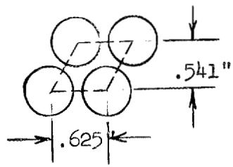

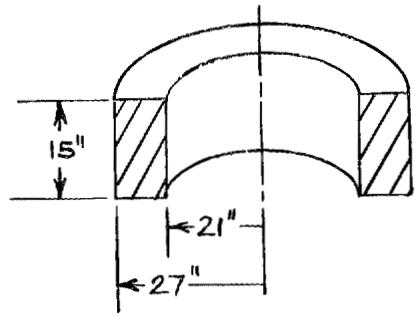  
General Configuration


Heat Transfer Coefficients:

$$
\begin{array}{l} \frac {h D}{k} = 0. 0 2 3 \left(\frac {c V D}{\mu}\right) ^ {0. 8} \left(\frac {c _ {\mu}}{k}\right) ^ {0. 4} \\ \mathrm {N a O D} = 3 5 8 0 \mathrm {B t u / h r . f t}. ^ {2} \circ \mathrm {F} \\ \mathrm {N a K} = 1 3 9, 0 0 0 \mathrm {B t u / h r . f t} ^ {2} \circ \mathrm {F} \\ \end{array}
$$

For inconel, $h = \frac{k}{t} = 4080$ Btu/hr. ft² of

The over-all heat transfer coefficient for the outside tube area

$$
= 1 7 8 0 \mathrm {B t u} / \mathrm {h r} \mathrm {f t} ^ {2} \mathrm {O} _ {\mathrm {F}}
$$

Heat transfer areas:

Number of NaK tubes =2675

Actual area = 437 ft²

Area required for transfer of 16 MW = 438 ft²

These calculations have been based on two parallel flow passes. The additional heat transfer due to cross flow will compensate for the inaccuracies in heat transfer calculations.

Pressure Loss Calculations:

NaK

$$
\Delta P = \frac {4 \sigma T V ^ {2} L}{2 g D} = 0. 7 \mathrm {p s i}
$$

Dynamic head = 1.2 psi

Summary: Tube loss = 0.7 psi

Entrance loss $= 0.6$

Exit loss $= 1.2$

Total 2.5 (approximately 3 psi)

NaOD - Parallel passes, $p = \frac{4\sigma f V^2 1}{2 g D_e} = 2$ psi

Cross flow, $p = \frac{4 \times 10^{3} \times 10^{2} \times 10^{2} \times 10^{2}}{2g} = 18$ psi

Total loss $= 20$ psi

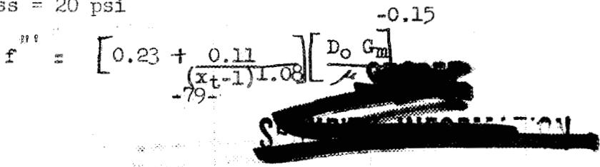

# Nuclear

Symbols

A numerical constant   
B - buckling   
C - numerical constant   
D diffusion coefficient   
E energy   
f - thermal utilization   
F - self-shielding   
g - nuclear constant   
nuclear constant   
k - multiplication constant   
L diffusion length   
M mass   
r - radius   
R radius to a region boundary   
S - Coupling coefficient   
t - reflector thickness   
T - temperature   
differential operator   
$\sqrt[2]{-}$ Laplacian operator   
average number of neutrons produced per absorption in fissionable material   
average number of neutrons produced per fission   
average logarithmic energy decrement per collision   
microscopic cross section   
$\sum$ macroscopic cross section

Subscripts   
```txt
Fermi age   
neutron flux 
```

Superscripts   
a - absorption  
c - core  
eff - effective  
f - fission  
i - lethargy group  
m - mean  
r - reflector  
R - removal  
s - scattering  
t - total  
tr - transport $\mathbf{I}_1$ - fast group, region I $\mathbf{I}_2$ - thermal group, region I $\mathbf{II}_1$ - fast group, region II $\mathbf{II}_2$ - thermal group, region II $\mathbf{III}_1$ - fast group, region III $\mathbf{III}_2$ - thermal group, region III

```txt
U - uranium   
- - average value   
\~ extrapolated boundary 
```

Engineering   
```txt
Symbols a radius of cooling tube 
```

A - heat transfer area   
b - length of one side of the cell   
Cp specific heat at constant pressure   
D - tube diameter   
f friction factor   
F - self-shielding factor   
g acceleration of gravity   
h - heat transfer coefficient   
k - thermal conductivity   
L - tube length   
n - number of tubes   
N number of tube rows   
P - pressure difference   
P - heat absorption per unit volume   
P - source power density   
q - heat transfer   
Q - heat per unit volume   
r - radius or radius to absorber   
R radius to source   
tube spacing   
S - flow area   
wall thickness   
T - temperature difference   
T - reflector thickness or temperature   
U - overall heat transfer coefficient   
V velocity   
W - weight flow   
x - vertical distance from north pole of sphere

$\alpha$ - angle of longitude   
$\phi$ - radius of circle having area equal to hexagonal cell   
$\Theta$ - angle between $r$ and $R$   
$\Theta$ angle of latitude   
relaxation length   
$\mu$ - vixcosity or gamma absorption coefficient   
$\xi$ - variable of integration   
$\varphi$ distance between r and R   
$\sigma$ - density   
summation   
gamma energy deposition coefficient   
- entrance angle between tubes and hinge of constant longitude   
poison parameter   
- pressure surge parameter

# Subscripts

c - refers to equator   
equivalent   
i - refers to layers of the slab   
I - island   
m maximum

# NaOD - sodium deuteroxide

o - outside fuel region   
R - reflector   
s - refers to source   
1 - heat transfer component   
2 - gamma heat component

# Superscripts

1 - fictitious surface source   
111 - cross flow friction factor   
average value