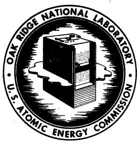
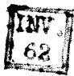
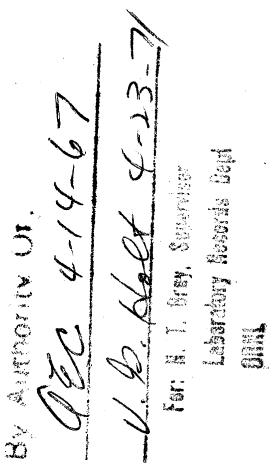
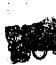
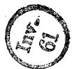
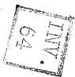
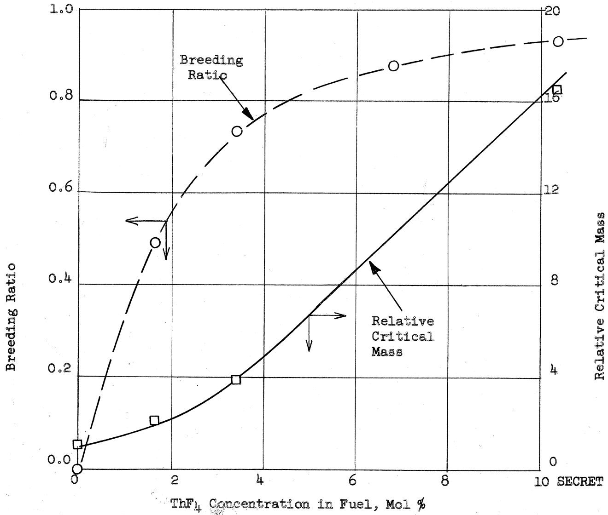

# OAK RIDGE NATIONAL LABORATORY

Operated By

UNION CARBIDE NUCLEAR COMPANY

# UCC

POST OFFICE BOX P OAK RIDGE, TENNESSEE

DATE: October 29, 1956

SUBJECT: FUSED SALT POWER REACTOR STUDY: Minutes of Discussion Meeting No. 3

TO: Distribution

FROM: L. G. Alexander and J. T. Roberts

# Distribution

1. L. G. Alexander   
2. E.S.Bettis   
3. D. S. Billington   
4. D. A. Carrison   
5. R. A. Charpie   
6. S. J. Cromer   
7. W. K. Ergen   
8. W.R.Grimes   
9. W.H. Jordan   
10. B. W. Kinyon   
11. H. G. MacPherson   
12. W. D. Manly   
13. E. R. Mann   
14. L. A. Mann   
15. H.F. Poppendiek   
16. J. T. Roberts   
17. J. A. Swartout   
18. F. C. VonderLage

19. A. M. Weinberg   
21. Laboratory Records   
22. C. R. Library

# ORNL CENTRAL FILES NUMBER 5G-10-110

This document consists of 9 pages.

Copy 19 of 22 copies. Series A

For Internal Use Only

DECLASSIFIED

# RESTRICTED DATA

This document contains Restricted Data as defined in the Atomic Energy Act of 1954. Its transmitter is the disclosure of its contents in any manner to an unauthorized person is prohibited.

# FUSED SALT POWER REACTOR STUDY

# Minutes of Discussion Meeting No. 3

October 18, 1956

Present: L. G. Alexander H. G. MacPherson

E. S. Bettis E. R. Mann

D. A. Carrison J. T. Roberts

S.J.Cromer J.A.Swart

W. K. Ergen F. C. VonderLage

W. R. Grimes A. M. Weinberg

G. W. Keilholtz

H. G. MacPherson opened the meeting with a summary of the discussion at the previous meeting.

L. G. Alexander presented the result of his UNIVAC calculations using the Eyewash code.

Eleven reactor cases were studied. The reactors were spherical, the total power was $600\mathrm{mw}$ , and the fuel consisted of a nearly equi-molal mixture of NaF and $\mathrm{ZrF_4}$ , together with additions of up to 10 mol percent $\mathrm{ThF_4}$ and sufficient $\mathrm{UF_4}$ to make the assembly critical. Specific heat release rates of 50, 100 and 200 watts/cc were used, to which core radii of 56, 44 and 35 inches correspond. The cores were bounded variously by 1-inch Ni alloy shells, reflectors of graphite and $\mathrm{NaZrF_5}$ , and a blanket containing $\mathrm{ThF_4}$ .

In the first five reactor cases, the core had a radius of 56 inches and was bounded by a 1-inch shell of Ni alloy. The ThF₄ concentration was varied from zero to 10 mol percent. The results, in terms of breeding ratio and critical mass, are summarized in Table I and illustrated in Figure 1. It is seen that substantial breeding ratios can be obtained at the cost of considerable fuel inventory, e.g., to obtain a breeding ratio of 0.75 requires a critical mass of about 250 kg of U-233. From these data, the optimum combination of breeding ratio and fuel inventory may be selected as soon as processing costs and inventory interest rates have been established.

The leakage from these cores is substantial, varying from 23 percent for the reactor containing no thorium, down to an estimated 12 percent for that containing 10 mol percent $\mathrm{ThF_4}$ . This leakage could be reduced by increasing the radius of the core, but the critical mass would increase sharply. Conversely, decreasing the radius (and increasing the power density) reduces the critical mass sharply at the cost of reduced breeding ratio, as shown in Table I, Cases 211061 and 211071.

The leakage from these reactors is excessive. A reflector more efficient than the Ni alloy shell could be used to reduce leakage. The results from two cases of reactors reflected with graphite are shown in Table I, Cases 212084 and 212095,

and are there compared with corresponding reactors having Ni alloy shells. It is seen that although the substitution of the graphite for the Ni had little effect on the breeding ratio, a substantial decrease in the critical masses was obtained. Table II gives the breakdown on the neutron balance for the larger graphite reflected reactor (212084). The fast leakage was confined to energies above 34 ev and amounted to 0.306 neutrons. The reflector returned to the core 0.028 neutrons having energies between 0.084 and 34 ev, and 0.153 neutrons at thermal energy (0.084 ev). Somewhat more than half of these thermal neutrons caused fission, while only about one-fourth were absorbed in thorium. This tended to reduce the breeding ratio from the value of 0.73, observed in the Ni reflected reactor. However, the saving of thermal neutrons permitted a reduction in the U-233 concentration, thus increasing the ratio of absorptions in Th to absorptions in U-233 in the epithermal region. This increase offset the increase in parasitic captures at thermal energy. It seems clear that a non-moderating reflector would be better than graphite, provided the parasitic absorptions are not significantly greater.

The last two cases studied (213127, 213126) concerned reactors having radii of 44 inches, with no thorium in the core, and a blanket 16 inches thick. In the first case, the blanket contained 10 mol percent $\mathrm{ThF_4}$ , and in the second, no thorium. The critical masses were nearly equal, $\sim 35$ kg U-233. The breeding ratio for the first case was 0.60. Table II gives a breakdown on the neutron balances for these two cases. It is seen that the majority of the absorptions are epithermal, and that the fractions of the absorptions in Th and U, which are epithermal, are greater than the corresponding fraction for the carrier. The epithermal leakage is seen to be nearly independent of the presence of the thorium in the blanket, and the thermal leakage is but little affected. This is thought to signify that neutrons which are not reflected into the core by their first blanket-collision have little chance of returning to the core by subsequent collisions, being absorbed by the thorium in the one case and the carrier in the other.

The critical mass (35 kg) was small compared to the critical masses obtained for other cases in this study. The breeding ratio was comparable to that obtained in a one region reactor containing 200 kg of U-233. Clearly, the breeding ratio can be increased by decreasing the radius of the core. (See post meeting remarks in appendix.)

A discussion of the accuracy of the Eyewash code cross sections followed the presentation of the UNIVAC results. A. M. Weinberg commented that the non-experimental cross sections in the code apparently have not been recalculated using the theory now available and that the absorption cross sections may thus be significantly in error. H. G. MacPherson suggested that the thorium absorption cross section was the most important in this respect, since it strongly influences the flux-energy relationship, as well as the breeding ratio, and since the U-233 and U-235 cross sections are based on experiment. In connection with the U-233 cross section, he reported that recent experimental results from Arco indicate that the low value of $\eta$ at 2 ev is a resonance and that $\eta$ apparently does hold up well at intermediate energies, confirming Russian data.

D. A. Carrison reported on his multigroup hand calculations, using the Eyewash code groups and cross sections, for bare, homogeneous Li7-Be-U-233-Th-F reactors.

TABLEI   
U-233 FUSED SALT POWER REACTORS   

<table><tr><td>Reactor Code No.</td><td>211010</td><td>211022</td><td>211033</td><td>211041</td><td>211053</td><td>211061</td><td>211071</td><td>212084</td><td>212095</td><td>213127</td><td>213126</td></tr><tr><td>Power Density, w/cc</td><td>50</td><td>50</td><td>50</td><td>50</td><td>50</td><td>100</td><td>200</td><td>50</td><td>100</td><td>100</td><td>100</td></tr><tr><td>Core Radius, in.</td><td>56</td><td>56</td><td>56</td><td>56</td><td>56</td><td>44</td><td>35</td><td>56</td><td>44</td><td>44</td><td>44</td></tr><tr><td>ThF4, mol %</td><td>0.0</td><td>1.66</td><td>3.35</td><td>6.80</td><td>10.26</td><td>3.34</td><td>3.34</td><td>3.35</td><td>3.35</td><td>0.0</td><td>0.0</td></tr><tr><td>UF4, mol %</td><td>0.065</td><td>0.132</td><td>0.244</td><td>0.677</td><td>1.13</td><td>0.346</td><td>0.614</td><td>0.161</td><td>0.223</td><td>0.080</td><td>0.078</td></tr><tr><td>Region II</td><td>Ni-Mo</td><td>Ni-Mo</td><td>Ni-Mo</td><td>Ni-Mo</td><td>Ni-Mo</td><td>Ni-Mo</td><td>Ni-Mo</td><td>C</td><td>C</td><td>ThNaZrF</td><td>ThNaZrF</td></tr><tr><td>Thickness, in.</td><td>1</td><td>1</td><td>1</td><td>1</td><td>1</td><td>1</td><td>1</td><td>32</td><td>16</td><td>16</td><td>16</td></tr><tr><td>ThF4, mol %</td><td>--</td><td>--</td><td>--</td><td>--</td><td>--</td><td>--</td><td>--</td><td>--</td><td>--</td><td>10</td><td>0</td></tr><tr><td>B.R., Th/U</td><td>--</td><td>0.49</td><td>0.73</td><td>0.87</td><td>0.93</td><td>0.63</td><td>0.47</td><td>0.74</td><td>0.64</td><td>0.60</td><td>0</td></tr><tr><td>C.M., kg</td><td>58</td><td>118</td><td>226</td><td>609</td><td>958</td><td>157</td><td>132</td><td>146</td><td>107</td><td>35</td><td>35</td></tr><tr><td>Losses, %</td><td>57</td><td>36</td><td>25</td><td>19</td><td>16</td><td>29</td><td>36</td><td>25</td><td>29</td><td>31</td><td>57</td></tr><tr><td>Leakage, %</td><td>23</td><td></td><td>13</td><td></td><td>12</td><td></td><td></td><td>28</td><td></td><td>35</td><td>35</td></tr></table>

TABLE II   
U-233 FUSED SALT POWER REACTORS   
Neutron Balances   

<table><tr><td>Code No.</td><td>Item</td><td>Fast</td><td>Thermal</td><td>F + T</td><td>% Fast</td><td>Fast</td><td>Thermal</td><td>F + T</td><td>% Fast</td></tr><tr><td>212084</td><td colspan="5">Radius=56&quot;, ThF4=3.35 mol %, UF4=0.161 mol %</td><td colspan="4">Graphite</td></tr><tr><td></td><td>23 fissures</td><td>0.2902</td><td>0.1120</td><td>0.4029</td><td>72.2</td><td></td><td></td><td></td><td></td></tr><tr><td></td><td>23 captures</td><td>0.0240</td><td>0.0112</td><td>0.0352</td><td>58.2</td><td></td><td></td><td></td><td></td></tr><tr><td></td><td>Th</td><td>0.2914</td><td>0.0339</td><td>0.3253</td><td>89.6</td><td></td><td></td><td></td><td></td></tr><tr><td></td><td>NaZrF5</td><td>0.0739</td><td>0.0408</td><td>0.1147</td><td>64.4</td><td>0.0027</td><td>0.0870</td><td>0.0897</td><td>3.0</td></tr><tr><td></td><td>Total Abs.</td><td>0.6793</td><td>0.1979</td><td>0.8772</td><td>77.4</td><td></td><td></td><td></td><td></td></tr><tr><td></td><td>Leakage</td><td>0.2794</td><td>-0.1528</td><td>0.1266</td><td>--</td><td>0.0000</td><td>0.0317</td><td>0.0317</td><td>0.0</td></tr><tr><td></td><td>Th/23</td><td>0.926</td><td>0.275</td><td>--</td><td>--</td><td></td><td></td><td></td><td></td></tr><tr><td>213127</td><td colspan="5">Radius=44&quot;, UF4=0.08 mol %</td><td colspan="4">Blanket Thickness=16&quot;, ThF4=10 mol %, NaZrF5=90 mol %</td></tr><tr><td></td><td>23 fissures</td><td>0.2930</td><td>0.0827</td><td>0.3757</td><td>78.0</td><td></td><td></td><td></td><td></td></tr><tr><td></td><td>23 captures</td><td>0.0285</td><td>0.0082</td><td>0.0367</td><td>77.9</td><td></td><td></td><td></td><td></td></tr><tr><td></td><td>Th</td><td>--</td><td>--</td><td>--</td><td>--</td><td>0.2176</td><td>0.0293</td><td>0.2469</td><td>88.2</td></tr><tr><td></td><td>NaZrF5</td><td>0.1500</td><td>0.0783</td><td>0.2283</td><td>65.3</td><td>0.0243</td><td>0.0145</td><td>0.0388</td><td>62.6</td></tr><tr><td></td><td>Total Abs.</td><td>0.4715</td><td>0.1692</td><td>0.6407</td><td>73.6</td><td>0.2419</td><td>0.0438</td><td>0.2857</td><td>84.7</td></tr><tr><td></td><td>Leakage</td><td>0.3469</td><td>0.0113</td><td>0.3582</td><td>96.8</td><td>0.0678</td><td>0.0056</td><td>0.0734</td><td>92.4</td></tr><tr><td></td><td>Th/23</td><td>--</td><td>--</td><td>--</td><td>--</td><td>0.675</td><td>0.322</td><td>--</td><td>--</td></tr><tr><td>213126</td><td colspan="5">Radius=44&quot;, UF4=0.078 mol %</td><td colspan="4">Blanket Thickness=16&quot;, ThF4=0 mol %, NaZrF5=100 mol %</td></tr><tr><td></td><td>23 fissures</td><td>0.2976</td><td>0.0755</td><td>0.3738</td><td>79.7</td><td></td><td></td><td></td><td></td></tr><tr><td></td><td>23 captures</td><td>0.0270</td><td>0.0075</td><td>0.0345</td><td>78.3</td><td></td><td></td><td></td><td></td></tr><tr><td></td><td>Th</td><td>--</td><td>--</td><td>--</td><td>--</td><td>--</td><td>--</td><td>--</td><td>--</td></tr><tr><td></td><td>NaZrF5</td><td>0.1426</td><td>0.0714</td><td>0.2140</td><td>66.7</td><td>0.2480</td><td>0.0201</td><td>0.2681</td><td>92.4</td></tr><tr><td></td><td>Total Abs.</td><td>0.4666</td><td>0.1544</td><td>0.6223</td><td>75.0</td><td></td><td></td><td></td><td></td></tr><tr><td></td><td>Leakage</td><td>0.3502</td><td>0.0178</td><td>0.3680</td><td>95.2</td><td>0.0939</td><td>0.0000</td><td>0.0939</td><td>100.0</td></tr><tr><td></td><td>Th/23</td><td>--</td><td>--</td><td>--</td><td>--</td><td>--</td><td>--</td><td>--</td><td>--</td></tr></table>

Fuel: UF4, ThF4, ZrF4, NaF

Diameter: 9 ft, 4 in.

Shell: 1 inch of Ni-Mo Alloy

Temperature: 1283°F

Reflector: None

Critical Mass of Burner (ThF4 = 0) = 58 kg U-233

Power: 600 mw of heat at a power density of 50 watts/cc

Fission Product Poisoning: None

Method of Calculation: Univac Code Murine-Eyewash, 24 groups, 2 regions

  
FIGURE 1.   
BREEDING RATIO AND CRITICAL MASS IN A ONE REGION, HOMOGENEOUS, FUSED SALT, BREEDING REACTOR

For a 10-foot diameter sphere with $1200^{\circ}$ F fuel of composition 63 LiF-15 BeF $_2$ -20 ThF $_4$ -2.16 UF $_4$ , the breeding ratio was 1.05 and the leakage 7.6 percent. Reducing the diameter to 7 feet, changed the UF $_4$ concentration to 2.24 mol percent and decreased the B.R. to 1.00. Leaving the diameter at 10 feet and reducing the ThF $_4$ to 10 percent, reduced the B.R. to 0.98. With a 51 LiF-45 BeF $_2$ -4 ThF $_4$ (plus 0.24-0.27 percent UF $_4$ ) fuel, the B.R. was 0.84 for a 10-foot reactor and 0.64 for a 7-foot reactor. Carrison pointed out that these were not thermal reactors, even though the Li-Be carrier was used. About half the neutrons are absorbed or leak above 9118 ev for the 20 percent ThF $_4$ fuel, and above 454 ev for the 4 percent fuel. The main advantage of the Li-Be salts is their lower melting points. He also pointed out that apparently inelastic scattering by fluorine was not compensated for in the Eyewash $\zeta_{t}$ values. A. M. Weinberg commented that the breeding ratios calculated are high because captures by Pa-233 are neglected, and that this would be significant in a high power density reactor.

J. T. Roberts reported on a brief survey of the 1953 MIT and 1956 ORSORT designs for fast reactors using chloride fused salts. Both studies neglected the high n,p cross section of Cl-35. Roberts reported rough estimates of Cl-37 costs obtained from Y-12 and K-25 of $5/gm for chemical exchange and $1/gm for gaseous diffusion. The chemical exchange cost is based on present technology. In principle, much better processes could be developed. The gaseous diffusion cost is based on separation of anhydrous HCl in present K-25 type equipment, assuming the same efficiency. J. A. Swartout commented that K-25 equipment would not resist attack by HCl. Other than the Cl-37 problem, development work indicated for chloride salt fast reactors is much the same as for fluoride reactors (i.e., cross sections, materials of construction, components).

H. G. MacPherson reported that L. A. Mann is making a trip to obtain information on components, especially heat exchangers.

J. T. Roberts summarized the results of a preliminary look at optimization of net fuel cost in a single region breeder. Based on multigroup calculations for a 600 mw, bare, homogeneous, spherical reactor with 50 NaF-46 ZrF $_4$ -4 (Th + U $^{233}$ )F $_4$ fuel and varying core radius (at constant external holdup of 423 ft $^3$ ), and chemical processing cycle time (batch), the minimum fuel cost reactor was as follows:

Radius: 6.4 ft  
U-233 Inventory: 813 kg  
Core Power Density: 19 watts/cc  
Processing Cycle: 21.6 yrs  
Neutron Balance:  
U-233 1.000  
Th (average) .762 = B.R. (clean, infinite  
F.P. poisons (average) .129 (B.R. ≈ 1.15  
Leakage .264  
Na .013  
Zr .014  
F .129  
2.310 = η

<table><tr><td>Fuel</td><td>Cost Breakdown:</td><td></td></tr><tr><td></td><td>U-233 burn-up</td><td>0.595 ) 0.599</td></tr><tr><td></td><td>Th burn-up</td><td>0.004 )</td></tr><tr><td></td><td>U-233 inventory</td><td>0.385 )</td></tr><tr><td></td><td>Th inventory</td><td>0.012 ) 0.597</td></tr><tr><td></td><td>Salt inventory</td><td>0.200 )</td></tr><tr><td></td><td>U-233 processing</td><td>0.045 )</td></tr><tr><td></td><td>Th processing</td><td>0.013 ) 0.135</td></tr><tr><td></td><td>Salt processing</td><td>0.077 )</td></tr><tr><td></td><td></td><td>1.33 mils/kw</td></tr></table>

The assumptions were: (1) F.P. poisons build up as in a thermal reactor; (2) U-233 costs $18.5/gm, thorium, $40/kg, and salt, $7.5/lb; (3) inventory charges are 4 percent for U-233 and Th, and 12 percent for salt; and (4) processing costs $1.85/gm for U-233, $40/kg for Th, and $7.5/lb for salt.

A. M. Weinberg commented that the assumption regarding F.P. poisons was too optimistic for such an intermediate reactor. For a faster rate of poison build-up, the optimum reactor would be smaller, the processing time shorter, and the net fuel cost greater. H. G. MacPherson commented on the possibility of starting up such a reactor on U-235 (whose critical mass was estimated by Roberts to be 2.26 times that of U-233), and having to withdraw uranium initially. E. R. Mann and E. S. Bettis commented on the "sleeping giant" aspects of such a large, low power density reactor from the control point of view.

$\alpha ,\beta ,$ alefand

L. G. Alexander

J. T. Roberfs

J. T. Roberts

LGA/JTR/ds

Att.

# APPENDIX A-1

(Post Meeting Remarks by L. G. Alexander)

The breeding ratios in the two region reactors (Case 213127) could be increased in a number of ways.

# APPENDIX A-2

The radius of the core could be decreased; this would require operation at a higher power density for the same rated power level, but might also result in a decrease in critical mass. The power density could be held constant and the leakage increased by utilizing a spherical annulus for the fuel region. The central void would be filled with some material of low capture cross section and low moderating power. The critical mass would increase somewhat, but probably not as fast as the leakage. The leakage could be increased "internally" by adding $\mathrm{ThF}_4$ to the core, either homogeneously or heterogeneously (e.g., in tubes). This would tend to increase the critical mass, but would also tend to suppress parasitic absorptions in the carrier in the core.

A consideration of the various factors involved leads to the conclusion that the optimum breeding system will probably consist of a two region reactor having a core containing some thorium (perhaps the maximum permissible, from melting point considerations) and surrounded by a blanket containing very high concentrations of thorium.

# APPENDIX A-3

From a nuclear standpoint, thorium metal is the most desirable blanket material. Because of its low moderating power, the energies of neutrons reflected into the core would not be lowered much; of course, parasitic captures in the blanket would be reduced to a minimum. But, in order to prevent large reactivity changes due to formation of fissionable material in the blanket and to prevent losses of Pa by neutron capture, it will be necessary to process the blanket at a fairly rapid rate. The processing of metal elements is disadvantageous. In Reactor Case 213127, only 85 percent of the neutrons absorbed in the blanket were captured by thorium, but the thorium concentration there (10 mol percent $\mathrm{ThF_4}$ ) is probably already higher than can be maintained in practice. It seems imperative to achieve a greater thorium density. Some alternate possibilities for the blanket include 20 mol percent $\mathrm{ThF_4}$ in Li-Be fluoride melt (being studied by D. A. Carrison); uranium oxide plasticized by sodium (proposed by Bulmer et al); uranium oxide or fluoride powder in tubes. It is doubtful that the last two materials can be handled as fluids.

A study of a series of reactor cases along the indicated lines is being planned.