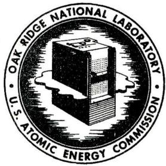
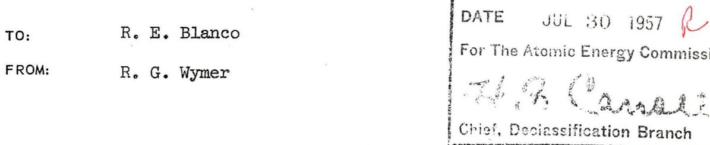
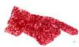

# OAK RIDGE NATIONAL LABORATORY

# Operated By UNION CARBIDE NUCLEAR COMPANY

# UCC

POST OFFICE BOX P OAK RIDGE, TENNESSEE

# ORNL

# CENTRAL FILES NUMBER

# [{56} - 2 - \frac{80}{2}]

DATE: February 17, 1956

COPY NO.

SUBJECT: Fused Salt Processing: Problem Statisification CANCELED

# DISTRIBUTION

1. R.E. E1nfo   
2. F.R.Bradt   
3. W.H.Cart   
4. G.I.Cattles   
5. F. L. Chien   
6. W. K. Mitter   
7. D. E. Tørgsson   
8. A. D. E. F.   
9. H. J. Geller   
10. H. K. Jackson   
11. W.H. Bertie   
12. J T Long   
13. R. D. Millford   
14. R. Wimler   
15. Laboratory Records - RC

This document has been reviewed and is determined to be APPROVED FOR PUBLIC RELEASE.

Name/Title Rosalynn / TIO

Date: ${2.24} - {16}$

# Short-Term Program (From the Present to July, 1956)

On a short-term basis the Chemical Development Fused Salt Processing program is essentially a straightforward, systematic investigation of the variables related to the hydrofluorination-dissolution of STR elements in a fluoride fused salt with the objective of establishing a process flow-sheet.

The significant variables were given in ORNL-56-1-67 and are temperature, type of fluoride melt, rate of HF addition, agitation (assuming that this is a different variable from rate of HF addition), and metallurgical condition of the fuel. Perhaps it is not presumptuous to add studies on nickel corrosion and efficiency of HF utilization to this list. These variables, with the exception of the type of fluoride melt, have already been investigated to the point where plant design should be possible (as a matter of fact, Argonne is proceeding on this presumption). It is unlikely that any significant changes would be made in that design on the basis of any work done in the near future. Consequently, a preliminary flowsheet will be drawn up on the basis of the existing information, and areas for possible further elaboration will be pinpointed.

It is to be expected that STR element dissolution rates may be varied by a factor of two or three by varying the amount of agitation or by changing the melt composition; however, it should not be expected that order-of-magnitude changes will be forthcoming. Unless wholly unexpected effects are observed when melt composition is varied, it is not likely that there will be much deviation from the simple NaF-ZrF $_4$ eutectic melt.

It seems reasonable to assume that agitation can only be demonstrated to be important or unimportant in laboratory studies, and that the design decisions will be made on the basis of engineering expediency. In light of the above observations, it must be concluded that the primary process investigations have already been made, and that the work remaining is largely

developmental.

The variables mentioned should be investigated further, and work to this end is under way. In addition, it is planned that minor variables (e.g., the effect of small amounts of additives to the fused salt) will be explored as means toward process improvements, and that assistance, where useful, will be given in the form of services to the other groups engaged in this program.

R. G. Wymer

RGW/g