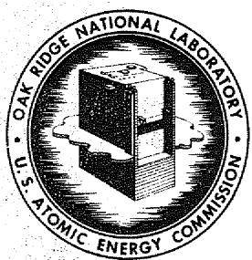
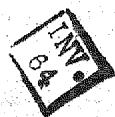
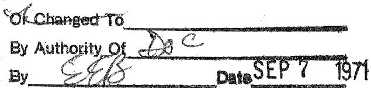

OAK RIDGE NATIONAL LABORATORY

Operated By

UNION CARBIDE NUCLEAR COMPANY

UCC

POST OFFICE BOX P

OAK RIDGE, TENNESSEE

C-84 AIRCRAFT REACTORS

ORNL

CENTRAL FILES NUMBER

[{56} - 4 = {17.3}]

DATE: April 26, 1956

SUBJECT: Molten Salt Requirements for Pratt and Whitney Aircraft

TO: X.J. Kelly

FROM: W. R. Grune

This document consists of 3 pages.

Copy 3 of 3 copies. Series A

Distribution

12

K

3

No1

#

12y

s10

W

M.

G

inos

This document has been reviewed and is determined to be APPROVED FOR PUBLIC RELEASE.

Name/Title: Jeeoa Jaymance,TIO

Date:

$3 - 9 = {16}$

# NOTICE

This document contains Restricted Data as defined in the Atomic Energy Act of 1954. Its transmission of the disclosure of the elements in any manner to an unauthorized person is prohibited.

This document contains information of a preliminary nature and was prepared primarily for internal use of the OASL guidance manual. The report is not intended to revision or correction and therefore does not represent a final report.

# OAK RIDGE NATIONAL LABORATORY

OPERATED BY

# UNION CARBIDE NUCLEAR COMPANY

A DIVISION OF UNION CARBIDE AND CARBON CORPORATION

UCC

POST OFFICE BOX Y

OAK RIDGE, TENN.

April 26, 1956

Mr. K. J. Kelly

Pratt and Whitney Aircraft Corp., Division of United Aircraft Corp. East Hartford, Connecticut

Classification Cancelled

# Dear Ken:

We have examined the revised schedule of anticipated salt requirements as shown in your letter 764-26-1A of April 18; we feel, with a minimum of reservations that your requirements at least through calendar year 1956 can be met.

Our stockpile of finished material consists at present of 6000 lbs of No. 30 and 2000 lbs of No. 31. As of January of this year we had allocated none of this material to Pratt and Whitney Aircraft since previous conversations and correspondence had indicated that the original shipment schedule no longer applied and that your requirements before July of 1956 would be quite small. We have, however, continued to maintain the inventory at the maximum level compatible with the container supply to provide for any contingency either locally or at Hartford.

Accordingly, we shall be able to supply your June requirement for material; however, in view of the shortage of storage containers the material which is shipped from here in May will necessarily consist of Compositions 30 and 31.

An empty containers become available we will begin pro- cessing the compositions you desire. Assuming normal turnover of such containers or receipt of new or empty containers from you some fraction of your July order could consist of such compositions.

If usable storage containers are made available to us in a reasonable time, your August 1, 1956 requirements and all others following could be made up entirely of the new compositions you specify. Please bear in mind that from June to December 1956 we are dealing with 13,250 pounds of

salt, equivalent to fifty-three 250 lb containers. You must be prepared to return as many containers each month as we plan to ship to you, in order to maintain the production and shipping schedule.

Provisions are being made to notify the Hartford office of Railway Express whenever a shipment is made to you, so that necessary security arrangements can be provided for.

I was sorry not to be able to talk with you in Columbus recently. I do look forward to a meeting with you soon.

Very truly yours,

V. X. Grimes

WRG:dc

Distribution:

1. K. J. Kelly   
2. G. J. Negaio   
3. V. R. Gruneisen