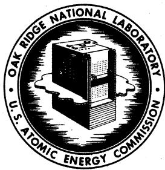
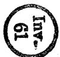
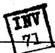
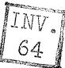

# OAK RIDGE NATIONAL LABORATORY

# Operated By

# UNION CARBIDE NUCLEAR COMPANY

# UCC

POST OFFICE BOX P

OAK RIDGE, TENNESSEE

# ORNL

# CENTRAL FILES NUMBER

# 56-7-114

DATE: July 18, 1956

SUBJECT: FUSED SALT POWER REACTOR STUDY: Minutes of Discussion Meeting No.

TO: Distribution

FROM: H. G. MacPherson

This document consists of 4 pages.

Copy 13 of 16 copies. Series A

For Internal Use Only

# Distribution

1. E, S. Bettis   
2. D. S. Billington   
3. D. A. Carrison   
4. R. A. Charpie   
5. Sylvan Cromer   
6. W. K. Ergen   
7. W.R.Grimes   
8. W.H.Jordan   
9. H. G. MacPherson   
10. W. D. Manly   
11. H. F. Poppendiek   
12. J.A... Swartout   
13. A.M. Weinberg   
15. Laboratory Records   
16. C. R. Library

# DECLASSIFIED

${abc}\;4 - {14} - 6 >$

Far: N. I. Grey, Superviser

Laboratory Records Baptist

GAML

# RESTRICTED DATA

This document contains Restricted Data as defined in the Atomic Energy Act of 1954, its transmission to the disclosure of its contents in any manner to an unauthorized person is prohibited.

# FUSED SALT POWER REACTOR STUDY

# Minutes of Discussion Meeting No. 1

July 18, 1956

Present: E. S. Bettis

D. S. Billington

R.A. Charpie

Sylvan Cromer

W. K. Ergen

W. R. Grimes

W. H. Jordan

H. G. MacPherson

J. A. Swartout

A. M. Weinberg

Mr. Weinberg suggested that meetings to discuss this recently inaugurated program be held regularly but at intervals no closer than two weeks. Interest in this reactor project would be accentuated if it is decided that it comes within the scope of the proposed Gore Bill and if that bill passes Congress. The Gore Bill will promote reactor projects on the basis that construction should start within one to one and one half years, and be completed within five years.

Mr. Weinberg also asked that the reactor be considered as a possible experimental facility to provide a reasonably large volume test hole at a high fast flux level.

Mr. MacPherson reviewed the aims and background of the project as follows:

The aim of the Fused Salt Power Reactor Study is to make use of the considerable technology on fused salts that has been developed at the Laboratory for a power reactor. The application of this technology to a power reactor has been in the minds of many people for a long time. Recent impetus has been provided by a memo by W. R. Grimes (CF 56-3-117) and by the active promotion of a simple burner type reactor by Mr. Bettis.

The ANP project provides a great background, and in converting this background to a civilian power reactor most of the critical parameters are decreased in severity. By going to lower temperatures, lower temperature differences, and larger physical size, nearly all of the corrosion and engineering problems are reduced. However, the longer desired time of operation introduces a new restriction and makes some new experimental work necessary.

The most important advantages offered by the fused salt system are those of a high temperature liquid fuel at low pressure. The high temperature means high thermal efficiency up to a factor of two over pressurized water reactor systems. The liquid fuel gives automatic reactor control through a negative temperature coefficient of reactivity, provides for continuous removal of gaseous fission products, and, most important, greatly simplifies and cheapens the chemical reprocessing of the fuel. The low pressure improves the overall safety.

A further advantage applying to a thorium breeder is that the thorium salt is soluble in the fused salt system, and therefore this is the only system that permits a one-region breeder or an all-liquid thorium blanket.

Three Reactor School studies have been or are being made covering three types of reactor. The simplest is the homogeneous burner using a sodium fluoride-zirconium fluoride-uranium fluoride fuel. The fluorine acts as a partial moderator, yielding a reactor in which about half of the fissions are from thermal neutrons. The particular design studied uses a core of about seven feet in diameter with heat exchangers arranged in the surrounding annulus so that one big vessel contains the core and first heat exchanger. A fuel inventory of about 250 kilograms of U-235 is required for a burner to provide 600 megawatts of heat.

A fast plutonium breeder is being studied at present. It uses a six-foot three-inch diameter spherical core surrounded by a U-238 blanket. Inclusion of U-238 in the fuel allows about a $30\%$ breeding in the core, and it is hoped that the blanket coverage can be great enough to allow a break-even on the production and consumption of fuel. The fused salt is a sodium-magnesium chloride system and requires a 2000 kilogram inventory of plutonium.

The thorium breeder studied three years ago had a homogeneous core using LiF-BeF2-ThF4-UF4 as a fuel-moderator. Graphite acted as a container and reflector, and replaceable Inconel fuel-to-sodium heat exchangers were employed. A ten foot diameter core was employed, and to get a break-even on breeding an inventory of 350 kilograms of U-233 was required.

The smallest number of major problems to be solved before reactor construction could start is encountered with the burner reactor. Inconel is expected to corrode too fast for a 20-year reactor, although information at $1200^{\circ}$ F and less is somewhat meager. Nickel is expected to mass transfer because it is a pure metal, yet limited tests do not show mass transfer to be serious. W. D. Manly is confident that a nickel-molybdenum alloy that is ductile and yet corrosion resistant will be available soon. Pumps have been worked out for the ANP and the application of their experience to the power reactor is expected to be straightforward.

The fast breeder reactor uses a chloride salt about which less is known. Also, the necessity for close coverage with the breeding blanket makes the engineering more difficult.

The thorium breeder has the problem of compatibility of graphite with the metal system. Carburization and embrittlement of the metal has been encountered.

All systems will have the problems of fabrication and design of sodium heat exchangers and sodium-to-steam generators in common.

In the following discussion it was pointed out that there are additional fused salt reactor studies; namely, the MIT Project Dynamo and studies at General Electric on a submarine and a commercial reactor.

Mr. Grimes agreed that less was known of the fused chlorides, but felt that the problems with them would not be expected to be especially troublesome. In particular, UCl₃ is more stable than the corresponding fluoride, and could be used for the uranium component.

Mr. Cromer felt that one could come up with a satisfactory pump in a reasonably short time based on ANP experience. He felt that the heat exchanger system should be examined to optimize pumping power and minimize the dependence on a single pump.

Mr. Bettis has asked Metallurgy to start a loop test at the temperature range of interest (1200° F maximum) to provide data as early as possible on long term corrosion on a good material. It was left up to Metallurgy as to whether they would run a nickel loop in anticipation of using nickel clad stainless steel for the reactor vessel or whether they would go to a nickel molybdenum alloy. It was agreed at this meeting that if a nickel loop was run it should be a pumped loop since the mass transfer depends on speed of circulation.

Mr. Ergen commented that if there was pressure to build a reactor immediately, the burner should be built. If, however, time was available for further work, we should look at the breeding possibilities.

y

H. G. MacPherson

HGM:cbc