# UNITED STATES ATOMIC ENERGY COMMISSION

# FUSED SALT FAST BREEDER

# Reactor Design and Feasibility Study

By

J. J. Bulmer   
E. H. Gift   
R.J.Holl   
A. M. Jacobs   
S. Jaye   
E. Koffman   
R. L. McVean   
R. G. Oehl   
R. A. Rossi

August 1956

Oak Ridge School of Reactor Technology
Oak Ridge, Tennessee

Technical Information Service Extension, Oak Ridge, Tenn.

# 2.

Date Declassified: March 5, 1957.

# LEGAL NOTICE

This report was prepared as an account of Government sponsored work. Neither the United States, nor the Commission, nor any person acting on behalf of the Commission:

A. Makes any warranty or representation, express or implied, with respect to the accuracy, completeness, or usefulness of the information contained in this report, or that the use of any information, apparatus, method, or process disclosed in this report may not infringe privately owned rights; or   
B. Assumes any liabilities with respect to the use of, or for damages resulting from the use of any information, apparatus, method, or process disclosed in this report.

As used in the above, "person acting on behalf of the Commission" includes any employee or contractor of the Commission to the extent that such employee or contractor prepares, handles or distributes, or provides access to, any information pursuant to his employment or contract with the Commission.

This report has been reproduced directly from the best available copy.

Issuance of this document does not constitute authority for declassification of classified material of the same or similar content and title by the same authors.

Since nontechnical and nonessential prefatory material has been deleted, the first page of the report is page 5.

Printed in USA, Price $1.00. Available from the Office of Technical Services, Department of Commerce, Washington 25, D. C.

CF-56-8-204(Del.)

OAK RIDGE SCHOOL OF REACTOR TECHNOLOGY

Reactor Design and Feasibility Study

"FUSED SALT FAST BREEDER"

Prepared by:

J. J. Bulmer, Group Chairman

E. H. Gift   
R.J.Holl   
A.M.Jacobs   
S. Jaye   
E. Koffman   
R. L. McVean   
R.G.Oehl   
R. A. Rossi

OAK RIDGE NATIONAL LABORATORY

Operated by

Union Carbide Nuclear Company

Oak Ridge, Tennessee

August 1956

# PREFACE

In September, 1955, a group of men experienced in various scientific and engineering fields embarked on the twelve months of study which culminated in this report. For nine of those months, formal classroom and student laboratory work occupied their time. At the end of that period, these nine students were presented with a problem in reactor design. They studied it for ten weeks, the final period of the school term.

This is a summary report of their effort. It must be realized that in so short a time, a study of this scope can not be guaranteed complete or free of error. This "thesis" is not offered as a polished engineering report, but rather as a record of the work done by the group under the leadership of the group leader. It is issued for use by those persons competent to assess the uncertainties inherent in the results obtained in terms of the preciseness of the technical data and analytical methods employed in the study. In the opinion of the students and faculty of ORSORT, the problem has served the pedagogical purpose for which it was intended.

The faculty joins the authors in an expression of appreciation for the generous assistance which various members of the Oak Ridge National Laboratory gave. In particular, the guidance of the group consultants, A. M. Weinberg, R. A. Charpie, and H. G. McPherson, is gratefully acknowledged.

Lewis Nelson

for

The Faculty of ORSORT

# ACKNOWLEDGEMENT

We wish to express our appreciation to our group advisors Dr. Alvin Weinberg, Dr. Robert Charpie and Dr. H. G. MacPherson for their constant aid and helpful suggestions toward the completion of this project. We would especially like to thank Dr. G. J. Barton for our fused chloride equilibrium data; Dr. Manly and his group for the fused chloride corrosion tests; Dr. J. A. Lane and Mr. W. G. Stockdale for their aid in our economic evaluation; The Atomic Power Development Associates for their nuclear calculations; The Argonne National Laboratory for their UNIVAC codes; New York University and Nuclear Development Corporation of America for their aid in the UNIVAC operation; and Dr. E. R. Mann and Mr. F. Green for their assistance on the reactor simulator at the Oak Ridge National Laboratory. In addition we would like to thank the many other members of the Oak Ridge National Laboratory at X-10 and Y-12 who gave freely of their time and valuable suggestions.

Lastly, we wish to thank Dr. L. Nelson and the ORSORT faculty for their continuing help and the remaining personnel of the Educational Division for their efforts in the completion of the project.

# TABLE OF CONTENTS

Page No.

Preface 7   
Acknowledgement 8

Abstract 15

Chapter I. Introduction 16

1.1 Problem 16

1.1.1 Purpose 16   
1.1.2 Scope 16

1.2 Evaluation of Fused Salts 17

1.2.1 Advantages of Fused Salts 17   
1.2.2 Disadvantages of Fused Salts 17

1.3 Results of Study 18   
1.4 Description of System 19

1.4.1 Core 19   
1.4.2 Blanket 19   
1.4.3 Control 20   
1.4.4 Chemical Processing 21

Chapter 2. Preliminary Reactor Design Considerations 22

2.1Selection of Core Fuel 22

2.1.1 Criteria for Selection 22   
2.1.2 Fuel Properties 25

2.2 Selection of Blanket Material 31

2.2.1 Criteria for Selection 31

# TABLE OF CONTENTS (CONT.)

Page No.

2.3 Reactor Coolant System 34

2.3.1 Internal Cooling 34   
2.3.2 External Cooling 34

2.4 Materials of Construction 35

2.4.1 Core System 35   
2.4.2 Blanket System 36   
2.4.3 Reactor Components 37

Chapter 3. Engineering 38

3.1 General 38

3.1.1 Engineering Properties of Fused Salt, Sodium Coolant and Blanket Paste 43

3.2 Reactor Power 54   
3.3 Design of Heat Transport System 55

3.3.1 Circulating Fuel Heat Exchanger 58   
3.3.2 Circulating Fuel Piping and Pump 59   
3.3.3 Blanket Heat Exchanger 60   
3.3.4 Blanket Heat Removal 60

3.3.4.1 Parameter Study of Blanket Heat 61 Transfer System

3.3.5 Blanket Piping and Pump 64   
3.3.6 Sodium Piping and Pumps 65

3.4 SaltDump System 66   
3.5 Core Vessel and Reflector Heating 67   
3.6Moderator Cooling 75

TABLE OF CONTENTS (CONT.)   

<table><tr><td></td><td>Page No.</td></tr><tr><td>3.7 Once-Thru Boiler</td><td>75</td></tr><tr><td>3.8 Auxiliary Cooling System</td><td>77</td></tr><tr><td>3.9 Turbo-Generator</td><td>77</td></tr><tr><td>Chapter 4. Nuclear Considerations</td><td>78</td></tr><tr><td>4.1 Summary of Study Intentions</td><td>78</td></tr><tr><td>4.2 Calculation Methods Based on Diffusion Theory</td><td>80</td></tr><tr><td>4.2.1 Bare Core Multigroup Method</td><td>80</td></tr><tr><td>4.2.2 Reflector Savings Estimate</td><td>81</td></tr><tr><td>4.2.3 UNIVAC Calculations</td><td>81</td></tr><tr><td>4.3 Cross Sections</td><td>83</td></tr><tr><td>4.3.1 Energy Groups</td><td>83</td></tr><tr><td>4.3.2 Sources of Data</td><td>83</td></tr><tr><td>4.3.3 Calculation of Capture Cross Sections</td><td>84</td></tr><tr><td>4.3.4 Tabulation of Cross Sections</td><td>86</td></tr><tr><td>4.4 Results of the Parameter Studies</td><td>91</td></tr><tr><td>4.4.1 Preliminary Analysis</td><td>91</td></tr><tr><td>4.4.2 Bare Core Ten Group Parameter Study</td><td>92</td></tr><tr><td>4.4.3 Reflector Control</td><td>94</td></tr><tr><td>4.4.4 Effect of a Moderator Section in the Blanket Region</td><td>94</td></tr><tr><td>4.5 Final Design</td><td>96</td></tr><tr><td>Chapter 5. Controls</td><td>112</td></tr><tr><td>5.1 General Considerations</td><td>112</td></tr><tr><td>5.2 Delayed Neutrons</td><td>113</td></tr><tr><td>5.3 Temperature Coefficient of Reactivity</td><td>116</td></tr><tr><td>5.4 Reflector Control</td><td>121</td></tr><tr><td>5.5 Simulator Studies</td><td>122</td></tr><tr><td>5.6 Startup Procedure</td><td>130</td></tr><tr><td>Chapter 6. Chemical Processing</td><td>132</td></tr></table>

<table><tr><td>6.1 Process Flow Sheets</td><td>132</td></tr><tr><td>6.1.1 Core Processing</td><td>132</td></tr><tr><td>6.1.2 Blanket Processing</td><td>135</td></tr><tr><td>6.1.3 On-Site Fission-Product Removal</td><td>136</td></tr><tr><td>6.1.3.1 Off-Gas System</td><td>136</td></tr><tr><td>6.1.3.2 Precipitation of Fission Products</td><td>137</td></tr><tr><td>6.1.3.3 Distillation Removal of Fission Products</td><td>138</td></tr></table>

<table><tr><td>6.2 Consideration Leading to Process Selection</td><td>139</td></tr><tr><td>6.2.1 Processes Considered</td><td>139</td></tr><tr><td>6.2.2 Process Selection</td><td>140</td></tr><tr><td>6.2.3 Purex Modifications for Core Processing</td><td>140</td></tr><tr><td>6.2.4 Alternate Blanket Process</td><td>142</td></tr></table>

<table><tr><td>6.3 Processing Cycle Times</td><td>144</td></tr><tr><td>6.3.1 General</td><td>144</td></tr><tr><td>6.3.2 Effect of Fission-Product and Transuranic 
Buildup</td><td>144</td></tr><tr><td>6.3.3 Economics and Process Cycle Time Selection</td><td>146</td></tr><tr><td>6.3.3.2 Core Processing</td><td>146</td></tr></table>

TABLE OF CONTENTS (CONT.)   

<table><tr><td>6.3.3.3 Blanket Processing</td><td>149</td></tr><tr><td>Chapter 7. Shielding</td><td>153</td></tr><tr><td>7.1 General Description</td><td>153</td></tr><tr><td>7.2 Reactor Shielding Calculations</td><td>154</td></tr><tr><td>7.2.1 Neutron Shielding</td><td>154</td></tr><tr><td>7.2.2 Gamma Ray Shielding</td><td>154</td></tr><tr><td>Chapter 8. Economics</td><td>158</td></tr><tr><td>8.1 General</td><td>158</td></tr><tr><td>8.2 Capital Costs</td><td>159</td></tr><tr><td>8.3 Life of Equipment and Annual Charges Due to Capital Costs</td><td>160</td></tr><tr><td>8.3.1 Power Cost Due to Capital Cost</td><td>160</td></tr><tr><td>8.4 Fuel Inventory Charges</td><td>161</td></tr><tr><td>8.5 Processing Cost Summary</td><td>162</td></tr><tr><td>8.6 Credit for Breeding</td><td>162</td></tr><tr><td>8.7 Operation and Maintenance</td><td>163</td></tr><tr><td>8.8 Cost Summary</td><td>163</td></tr><tr><td>Chapter 9. Recommendations for Future Work</td><td>164</td></tr><tr><td>9.1 General</td><td>164</td></tr><tr><td>9.2 Engineering</td><td>165</td></tr><tr><td>9.3 Materials</td><td>166</td></tr><tr><td>9.4 Chemical Processing</td><td>167</td></tr><tr><td>9.5 Reactor Control</td><td>167</td></tr><tr><td>9.6 Economics</td><td>168</td></tr><tr><td>Appendix A. Engineering Calculations</td><td>169</td></tr></table>

# TABLE OF CONTENTS (CONT.)

Page No.

A.1 Circulating Fuel Heat Exchanger 169   
A.2 Circulating Fuel Piping and Pump 172   
A.3 Blanket Heat Removal Calculations 173   
A.4 Blanket Heat Exchanger 176   
A.5 Blanket Piping and Pump 178   
A.6 Sodium Piping and Pumps 181   
A.7 Core Vessel and Reflector Heating 182   
A.8Moderator Cooling Calculations 188   
A.9 Steam Boiler Calculations 189

Appendix B. Gamma-Ray Shielding Calculations 196

B.1 Sources of Gammas 196

B.1.1 Prompt Fission Gammas 196   
B.1.2 Gission Product Gammas During Operation 196   
B.1.3 Capture Gammas 197   
B.1.4 Inelastic Scattering Gammas 197

B.2 Attenuation of Gamma Rays 202

Appendix C. Experimental Tests 209

C.1 Summary of Melting Point Tests 209   
C.2 Petrographic Analysis of Salt Mixtures 210   
C.3 Summary of Chemical Analysis of UCl3 211   
C.4 Corrosion Tests 211

References 212

# ABSTRACT

An externally cooled, fused salt, fast breeder reactor producing 700 MW of heat has been designed utilizing plutonium as the fuel in a mixture of the chlorides of sodium, magnesium, uranium and plutonium. Depleted uranium is used as the fertile material in a blanket of uranium oxide in sodium.

Nuclear calculations have been performed with the aid of the UNIVAC for multi-group, multi-region problems to obtain an optimum nuclear design of the system with the chosen fused salt.

Steam temperature and pressure conditions at the turbine throttle have been maintained such that the incorporation of a conventional turbine-generator set into the system design is possible.

An economic analysis of the system, including estimated chemical processing costs has been prepared. The analysis indicates that the fused salt system of this study has an excellent potential for meeting the challenge of economic nuclear power.

It was not learned until the completion of the study of the severe $(\mathbf{n},\mathbf{p})$ cross section of the chlorine-35 isotope in the range of energies of interest. This effect was amplified by the large number of chlorine atoms present per atom of plutonium. The result was considered serious enough to legislate against the reactor.

It was determined, however, that the chlorine-37 isotope had a high enough threshold for the (n,p) reaction so that it could be tolerated in this reactor. The requirement for the chlorine-37 isotope necessitates an isotope separation which is estimated to add 0.5 mils per kwhr. to the cost of power. The power cost would then be 7.0 mils per kwhr. instead of the 6.5 mils per kwhr. reported.

# CHAPTER I INTRODUCTION

# 1.1 PROBLEM

# 1.1.1 Purpose

The purpose of this study was to assess the technical and economic feasibility of a fast breeder-power reactor, employing a fused salt fuel, based on a reasonable estimate of the progress of the fused salt technology. Fuel bearing fused salts are presently receiving consideration for high temperature applications and in addition have been proposed as a possible solution to some of the difficult problems of the fast reactor.

# 1.1.2 Scope

A major consideration was an initial decision to devote the group effort to a conceptual design of complete reactor system instead of concentrating on parameter studies of the reactor or the heat transfer and power plant at the expense of the other components. This philosophy necessitated overlooking many small problems that would arise in the detailed design of the reactor and power plant but provided a perspective for evaluating the technical and economic feasibility of the entire reactor system instead of only portions of it.

At the outset of the study it was determined that a breeding ratio significantly less than one would be obtained from an internally cooled machine. It was therefore decided to further restrict the study to an externally cooled, circulating fuel reactor in which a breeding ratio of at least one was obtainable.

# 1.2 EVALUATION OF FUSED SALTS

# 1.2.1 Advantages of Fused Salts

The fused salts enjoy practically all the advantages of the liquid fueled, homogeneous type reactor. Among the more prominent of these are:

1. The large negative temperature coefficient which aids in reactivity control;   
2. The elimination of expensive and difficult to perform fuel element fabrication procedures;   
3. The simplified charging procedure which provides a means of shim control by concentration charges;   
4. The higher permissible fuel burn-up without the attendant mechanical difficulties experienced with solid fuel elements.

In addition, the fused salts display a superiority over the aqueous homogeneous reactor in these respects:

1. Lower operating pressure due to the much lower vapor pressure of the fused salts;   
2. Higher thermodynamic efficiency due to the operation at higher temperature.

# 1.2.2 Disadvantages of Fused Salts

There are several disadvantages which are attendant upon the use of fused salts for the application reported upon here. Of these, the most prejudicial to the success of the reactor are:

1. The corrosion problem which is so severe that progress in this application awaits development of suitable resistant materials;

2. The large fuel inventory required because of the external fuel hold-up;   
3. The poor heat transfer properties exhibited by the fused salts;   
4. The low specific powers obtainable in the fused salt fast reactor system compared to the aqueous homogeneous reactors.

# 1.3 RESULTS OF STUDY

The final design is a two region reactor with a fused salt core and a uranium oxide powder in sodium blanket. The fuel component is plutonium with a total system mass of $1810\mathrm{kg}$ . The reactor has a total breeding ratio of 1.09 exclusive of chemical processing losses.

The reactor produces 700 MW of heat and has a net electrical output of 260 MW. The net thermal efficiency of the system is 37.1 per cent. The steam conditions at the turbine throttle are $1000^{\circ}\mathrm{F}$ and 2400 psi.

The cost of electrical power from this system was calculated to be 6.5 mils per kwhr. This cost included a chemical processing cost of 0.9 mils per kwhr. based on a core processing cycle of five years and a blanket processing cycle of one year.

# 1.4 DESCRIPTION OF SYSTEM

The fused salt fast reactor which evolved from this study is an externally cooled, plutonium fueled, power-breeder reactor producing 700 megawatts of heat with a net electrical output of 260 megawatts.

# 1.4.1 Core

The core fuel consists of a homogeneous mixture of the chlorides of sodium, magnesium, uranium and plutonium with mole ratios of 3NaCL, 2MgCl $_2$ and 0.9Pu(U)Cl $_3$ . The uranium in the core fuel is depleted and is present for the purposes of internal breeding. The atom ratio of U $^{238}$ /Pu $^{239}$ at startup is 2 to 1.

The core container is a 72.5 inch I. D., nearly spherical vessel tapered at the top and bottom to 24 inches for pipe connections. The core vessel is fabricated of a $\frac{1}{2}$ inch thick corrosion resistant nickel-molybdenum alloy.

The fuel mixture enters the core at $1050^{\circ}\mathrm{F}$ and leaves at $1350^{\circ}\mathrm{F}$ , whereupon it is circulated by means of a constant speed, 3250 horsepower, canned rotor pump through the external loop and tube side of a sodium heat exchanger. Sodium enters this core heat exchanger at $900^{\circ}\mathrm{F}$ at a flow rate of $45.5 \times 10^{6}$ lbs/hr. and leaves at $1050^{\circ}\mathrm{F}$ .

# 1.4.2 Blanket

Separated from the core by a one inch molten lead reflector is a stationary blanket of depleted uranium present as a paste of uranium oxide powder in sodium under a 100 psi pressure. Located within the blanket is a stainless steel clad zone of graphite 5 l/8 inches thick. The presence of the graphite increases the neutron moderation and results in a smaller size blanket.

Blanket cooling is obtained by passing sodium through tubes located throughout the blanket. Sodium is introduced into the blanket at $1050^{\circ}\mathrm{F}$ at a flow rate of $7.6 \times 10^{6} \mathrm{~lbs/hr}$ and leaves at $1200^{\circ}\mathrm{F}$ . The blanket sodium, which is considerably radioactive, then enters a horizontal sodium to sodium heat exchanger and heats the inlet sodium from $900^{\circ}\mathrm{F}$ to $1050^{\circ}\mathrm{F}$ . The sodium from the blanket heat exchanger is then manifolded with the sodium from the core heat exchanger and passes to a straight through boiler. At full load conditions, the feed water enters the boiler at $550^{\circ}\mathrm{F}$ and 2500 psi at a flow rate of $2.62 \times 10^{6} \mathrm{~lbs/hr}$ and produces steam at $1000^{\circ}\mathrm{F}$ and 2400 psi which passes to a conventional turbine generator electrical plant.

# 1.4.3 Control

The routine operation of the reactor will be controlled by the negative temperature coefficient which is sufficient to offset reactivity fluctuations due to expected differences in the reactor mean temperature.

Reactor shim required for fuel burn-up will be obtained by variation in the height of the molten lead reflector. Approximately one quarter of one per cent reactivity will be available for shim by the increased height of the lead. When fuel burn-up requires more reactivity than is available from the reflector, compensating changes will be made in the fuel concentration and the reflector height will be readjusted.

In the event of an excursion, provisions will be made to dump the entire core contents in less than 4 seconds and in addition, to dump the lead reflector. Dumping the reflector would provide a change in reactivity of about 1.6 per cent.

# 1.4.4 Chemical Processing

Chemical processing of the core and blanket, other than removal and absorption of fission gases, will take place at a large central processing facility capable of handling the throughput of about 15 power reactors. The chemical process for both the core and blanket will embody the main features of the purex type solvent extraction process, with different head end treatments required to make each material adaptable to the subsequent processing steps.

Core processing will take place on a five year cycle whereas the blanket will be processed bi-annually. The plutonium product from the chemical process is finally obtained as the chloride which can be recycled to the reactor.

# CHAPTER II

# PRELIMINARY REACTOR DESIGN CONSIDERATIONS

# 2.1 SELECTION OF CORE FUEL

One of the objectives of this project was the thorough investigation of a fused salt fuel system. Preliminary discussions resulted in the decision that a core and blanket breeding system would be investigated.

A fused chloride fuel appeared the most promising of the fused salt systems. The core fuel system studied was a fused Na Cl, Mg Cl₂, UCl₃ and PuCl₃ salt. The results of preliminary nuclear calculations gave the fused salt composition as 9 mols NaCl, 6 mols MgCl₂, 2 mols UCl₃ and 1 mol of PuCl₃. The uranium is U²³⁸.

# 2.1.1 Criteria for Selection

The principal properties that the core fuel system should possess are;

1. Low parasitic neutron absorption cross section.   
2. Low moderating power and inelastic scattering.   
3. Liquid below $500^{\circ}C$ .   
4. Radioactively stable.   
5. Thermally stable.   
6. Non-corrosive to the materials of construction.   
7. Low viscosity.   
8. Appreciable uranium and plutonium content at temperatures of the order of $650^{\circ}\mathrm{C}$ .   
9. High thermal conductivity.

For fast reactors, the choice of salts containing fissionable and nonfissionable elements is limited to those in which the non-fissionable elements have a low slowing down power and low cross sections for absorption and inelastic scattering of fast neutrons. In general, elements of atomic weight less than twenty are unsatisfactory because of their moderating effect. This eliminates many of the common diluents which contain hydrogen, carbon, nitrogen and oxygen.

Salts which are suitable nuclearwise are further restricted to those which are thermodynamically and chemically stable. The salts must be stable at the operating temperature of the reactor, $675^{\circ}\mathrm{C}$ . Also the liquidus temperature of the fused salt mixture should be below $500^{\circ}\mathrm{C}$ . This is desirable so that more common and cheaper structural materials may be used. The higher the temperature of operation, the more exotic are the materials required. In addition a lower operating temperature tends to retard corrosion. The further very important requirement is that the diluents must dissolve the necessary quantities of uranium and plutonium to enable the system to go critical.

Based upon the aforementioned requirements the halide family appeared the most promising. Of the halides, chlorides and fluorides were the initial choices. The bromides and iodides were eliminated because of their high absorption cross sections. Bromine has an average $\sigma_{\alpha}$ at 1 mev of 30 mb and iodine has a $\sigma_{\alpha}$ of 105 mb at this energy. Chlorine and fluorine have captured cross sections of 0.74 mb and 0.2 mb respectively.

Originally, it appeared that there were available 3 possible fuel systems; one using chlorides, one utilizing fluorides and a third using a mixture of fluorides and chlorides. Chlorides presented the obvious disadvantage of a higher capture cross section. The flourides were detrimental because of their moderating effect. After a more thorough investigation, the fluorides were

ruled out because of their prohibitively high inelastic scattering cross section in the energy range of interest. Preliminary nuclear calculations using fluorides showed the neutron energy spectrum decidedly lowered.

Ultimately the mixed halides system of chloride and fluoride was eliminated because of the high melting points of the fluorides. This step was taken only after it had been verified that a chloride fused salt system was feasible with respect to the nuclear requirements of our reactor.

Once it was determined that the fused chlorides would be used, great effort was expended in the selection of the particular salts to use. One of the most important physical properties required was a low melting point for the salt mixture. It was felt that a ternary system would be most suitable. A binary would have too high a melting point while a quaternary presented many unknowns such as formation of compounds; and in general is too difficult to handle.

The core fuel system will utilize plutonium which is to be produced in the blanket. Since there exists very meager information on plutonium fused salts, it was decided that as a fair approximation1, many of the properties of uranium salts would be used. This appears to be a valid assumption for physicals properties since plutonium and uranium salts form a solid solution.

As a preliminary step, possible diluent chlorides were reviewed. Keeping the basic requirements in mind and reviewing whatever binary phase diagrams were available, the following salts showed promise $\mathrm{ZrCl}_4$ , $\mathrm{PbCl}_2$ , $\mathrm{MgCl}_2$ , $\mathrm{NaCl}$ , $\mathrm{KCl}$ , and $\mathrm{CaCl}_2$ . $\mathrm{ZrCl}_4$ was rejected since it is expensive and might produce the snow problem experienced in otherfused salt systems. $\mathrm{PbCl}_2$ was rejected since it is very reactive with all known structural materials. From the four remaining possibilities, the $\mathrm{MgCl}_2$ and $\mathrm{NaCl}$ salts were selected as diluents.

In addition to possessing many of the requirements, they had the lowest liquidus temperature. As for the fissionable salt, the trichloride or tetrachloride were the possibilities. $\mathrm{PuCl}_3$ and $\mathrm{UCl}_3$ were selected because of the thermal instability of the tetrachlorides. Hence the core fused salt system selected is made up of $\mathrm{NaCl}$ , $\mathrm{MgCl}_2$ , $\mathrm{UCl}_3$ and $\mathrm{PuCl}_3$ . As was pointed out earlier, the physical properties of our system were investigated using $\mathrm{NaCl}$ , $\mathrm{MgCl}_2$ and $\mathrm{UCl}_3$ . The $\mathrm{PuCl}_3$ is assumed to be in solid solution with the $\mathrm{UCl}_3$ .

# 2.1.2 Fuel Properties

Since the ternary properties of the proposed fuel were completely unknown, extrapolations of the known binary systems (shown in Figs. 2.1, 2.2, 2.3) were made.

On the basic assumption that the ternary chloride system was a simple one and containing none of the anomalous behavior of the known fluoride systems, the pictured (Fig. 2.4) ternary diagram was drawn. $^{2}$

To give some indication of the melting temperature to be expected in our system, a series of melting point determinations was undertaken. The data recorded are summarized below. (The test procedure is described in the Appendix C).

Sample   
Melting Point   

<table><tr><td></td><td>MgCl2NaCl UCl3</td><td>Liquidus</td><td>Solidus</td></tr><tr><td>#1</td><td>38.6%-57.91% - 3.49%</td><td>435°C</td><td>420°C</td></tr><tr><td>#2</td><td>36.36%-54.54%-9.10%</td><td>432°C</td><td>415°C</td></tr><tr><td>#3</td><td>33.33%-50.01%-16.66%</td><td>505°-440°C</td><td>405°C</td></tr></table>

Sample #3 corresponds to the composition of the fuel selected.

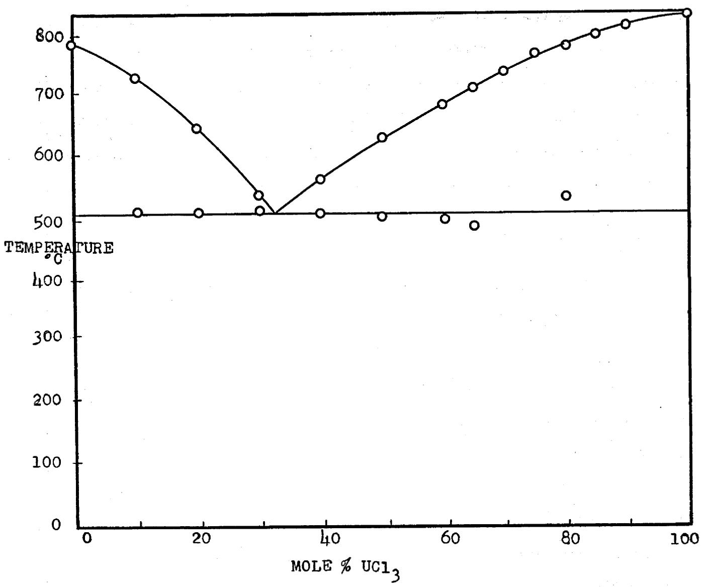  
BINARY PHASE DIAGRAM: NaCl-UC1 3   
Figure 2.1

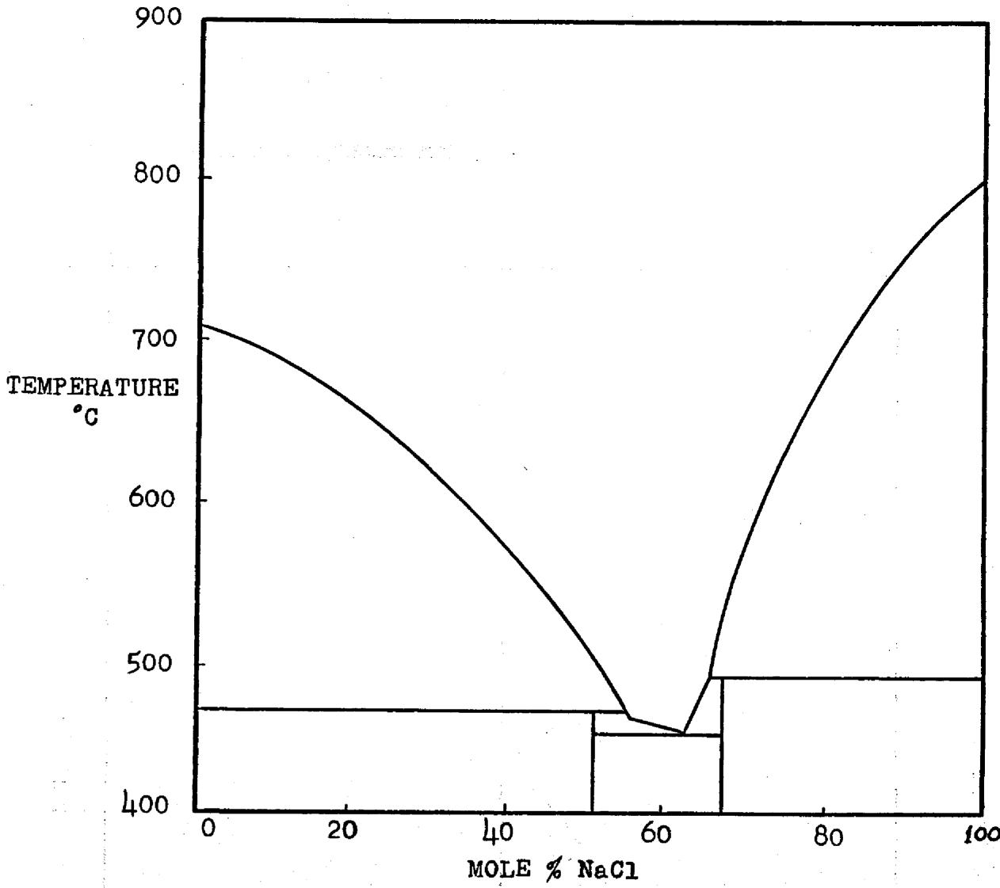  
BINARY PHASE DIAGRAM- $\mathsf{MgCl}_2\text{-NaCl}$   
Figure 2.2

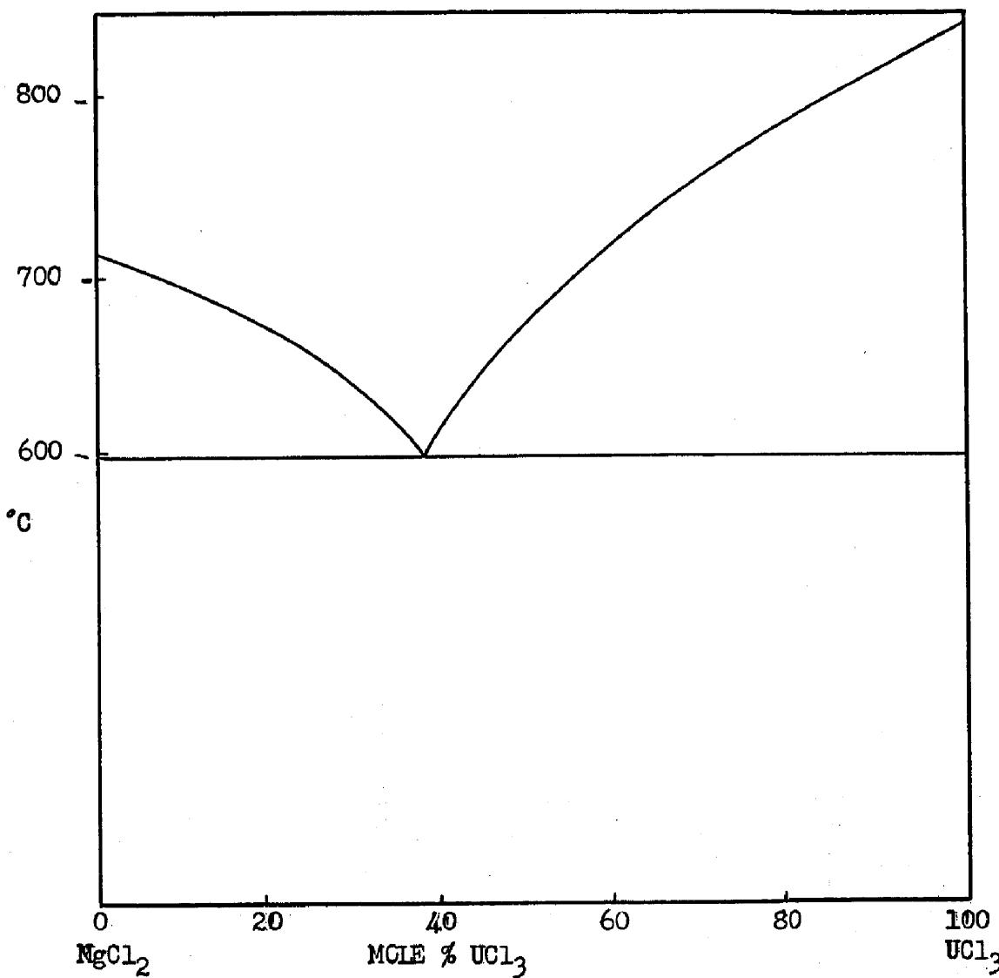  
28   
BINARY PHASE DIAGRAM-MgCl2-UCl3   
TEMPERATURE  
Figure 2.3   
CENL-LR-Dwg.18126   
-28

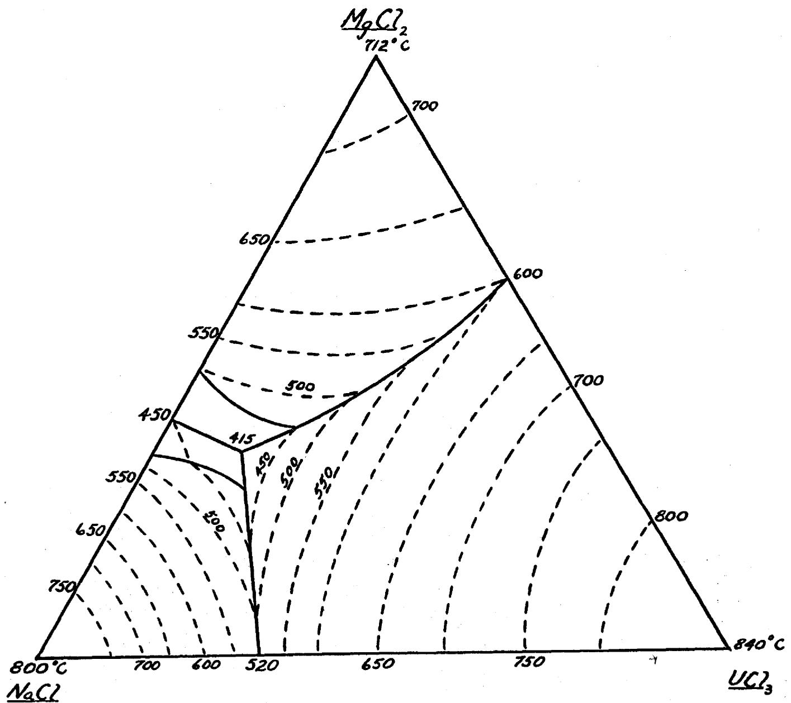  
ESTIMATED TERNARY PHASE DIAGRAM-MgCl2-NaCl-UC1,   
Figure 2.4

In conjunction with the melting point tests, a petrographic analysis was conducted of the fuel mixture. On the basis of this analysis, neither NaCl, $\mathrm{MgCl}_2$ , nor $\mathrm{UCl}_3$ were detectable in the solidified fuel. There were two distinguishable phases present, one a colorless crystal and the other a brown crystal, which was not as prevalent as the colorless one. The compositions of the phases could not be determined. It was observed that the mixture was very hygroscopic and was easily oxidized in air.

The remaining physical properties were estimated by analogy to the fluoride systems which have been studied. Densities were calculated by the density correlations of Cohen and Jones (3). Thermal conductivities, heat capacities, and viscosities were estimated directly from fluoride data.

# 2.2 SELECTION OF BLANKET MATERIAL

A uranium dioxide-liquid sodium paste was selected as one of the promising blanket materials. Although only a limited amount of work has been done on pastes, the prospects for its use are very good.

# 2.2.1 Criteria for Selection

The important characteristics of a satisfactory blanket material are:

1. Low cost.   
2. High concentration of the fertile material.   
3. Cheaply fabricated.   
4. Low chemical processing costs.   
5. Good thermal conductivity.   
6. Low neutron losses in non-fertile elements.   
7. Low melting point.

Natural or depleted uranium were obvious choices for the fertile material. Either material is acceptable, the governing factor being the cost. At the present time, the cost of depleted uranium is considerably less than natural uranium and was chosen as the fertile material in the blanket.

Several blanket systems were investigated. The more prominent possibilities were $\mathrm{UO}_2$ pellets in molten sodium, $\mathrm{UO}_2$ powder in molten sodium, canned solid uranium, fused uranium salts and $\mathrm{UO}_2$ slurries.

Uranium dioxide pellets in molten sodium appeared very promising. $\mathrm{UO}_2$ is unreactive with and very slightly soluble in liquid sodium. Cooling could be accomplished by liquid sodium flowing in tubes. It was estimated that approx-

imately $65\%$ of $\mathrm{UO}_2$ by volume could be obtained. This blanket system was rejected because of the high cost of manufacturing the pellets. It was estimated that over 50 millions of pellets would be required to fill the proposed blanket volume of 100 cubic feet.

A solid uranium canned in stainless steel was investigated. The major advantages of this system is the high uranium concentration. This material was rejected due to the high costs of fabrication. Typical costs are about $9 per kilogram for machining uranium and $7 per kilogram of uranium for the addition of the cladding material.

Fused uranium salts would have been the logical choice since fused salts were being used in the core. This would halve many of the problems confronting the design of the system such as corrosion, chemical processing, etc. The only fused salts which would give a sufficient concentration of uranium in the blanket were $\mathrm{UCl}_3$ or $\mathrm{UCl}_4$ or a mixture of the two. $\mathrm{UCl}_3$ has too high a melting point, while $\mathrm{UCl}_4$ proved to be too corrosive. Even the $\mathrm{UCl}_3 - \mathrm{UCl}_4$ mixture was felt to be too corrosive for a long life system.(2) Hence this material was eliminated.

A $\mathsf{UO}_2$ slurry was rejected due to the lack of knowledge of the properties of the slurry and the low uranium concentration due to engineering considerations.

The $\mathrm{UO}_2$ -Na paste was ultimately selected as the best available blanket material. This system has many of the features of the $\mathrm{UO}_2$ pellet system with the omission of the cost of manufacturing pellets. Although only a limited amount of work has been done on pastes, the outlook is very promising. A $\mathrm{UO}_2$ -Na paste offers low fabrication cost, ease of handling, high concentration of $\mathrm{UO}_2$ and good heat transfer properties. From a personal communication with B.M. Abraham of Argonne National Laboratory, it was estimated that as much as $80\%$ $\mathrm{UO}_2$ by volume in

liquid sodium is possible using a centrifugation process. We plan to use a paste composed of $70\%$ volume in the blanket system. The purpose of the liquid sodium in the blanket is to improve the heat transfer properties. It is believed that $\mathsf{Pu}$ and U metal will be stable with liquid sodium and no reaction occurs between Na and $\mathsf{UO}_2$ . A major problem was the possibility of $\mathsf{Na}_2\mathsf{O}$ formation and its adverse corrosive effects. This was solved by the addition of corrosion inhibitors. A discussion of this can be found in section 2.4.2.

# 2.3 REACTOR COOLANT SYSTEM

The externally cooled system appears superior to the internally cooled system for a fused salt fast breeder reactor. In the externally cooled system, the fuel mixture is circulated through a heat exchanger external to the reactor vessel. The internally cooled system has heat transfer surfaces within the reactor vessel; and heat is transferred from the fuel mixture to a fluid coolant which in turn is cooled in an external heat exchanger.

# 2.3.1 Internal Cooling

A possible advantage of the internally cooled system is the lower inventory of core fuel. However, due to the characteristically low heat transfer property of fused salts, it was calculated that almost $50\%$ of the core volume would be occupied by tubing and coolant in order to facilitate the required cooling. The high percentage of tubing and coolant affects this reactor system in two ways; First the parasitic capture is greatly increased and secondly, the neutron energy spectrum is decidedly lowered. The above effects result in a reduced breeding ratio in the core.

# 2.3.2 External Cooling

The externally cooled system was selected for use in the reactor system investigated. The deciding factor in the choice was that a breeding ratio of 1.20 was estimated in the externally cooled system compared to only 0.8 for the internally cooled system. This higher breeding ratio is obtainable because of about $15\%$ greater blanket coverage, less parasitic capture and higher neutron energy spectrum. Another factor in favor of external cooling is the ease of replacement of equipment in case of a heat exchanger failure.

# 2.4 MATERIALS OF CONSTRUCTION

The choice of materials of construction in most reactor systems is quite difficult because of the lack of corrosion data in the presence of radiation fields. In spite of the lack of technological development, an effort was made to select the materials of construction for this reactor system.

The core vessel will be a nickel-molybdenum alloy, which is presently in the development stage. For the other parts of the core system such as the primary heat exchanger and piping, a nickel-molybdenum alloy cladding on stainless steel appears to be satisfactory. The blanket system will utilize stainless steel throughout. As far as the reactor components go, it can be generally said that all the components in contact with the fused salt shall be nickel-molybdenum clad or constructed of nickel-moly and all components in contact with sodium are to be constructed of stainless steel.

Tests are now in progress at the ORNL Corrosion Laboratory to obtain some data on the corrosion of the fused salt of this system on nickel and inconel at $1350^{\circ}\mathrm{F}$ .

# 2.4.1 Core System

Since the operating temperature of the fused salt shall be as high as $1350^{\circ}\mathrm{F}$ , the choice of construction materials was severely limited. A further limitation was imposed by the absence of corrosion data of fused chlorides on structural metals. The possibilities which existed were inconel, nickel-moly clad on stainless, hastelloy metals, or nickel-molybdenum alloys of the hastelloy type which currently are under development.

In selecting the best material, much dependence was placed on the individual chemical and physical properties of these possibilities with respect to the

fused chloride fuel.

The hastelloy metals were rejected due to the inability to fabricate the material because of brittleness. Inconel was eliminated for the most part because of its known diffusion of chromium from the alloy in fluoride salts. In addition the corrosion data of inconel in the temperature range of interest is lacking. It is felt that these disadvantages overbalance the high technological development and good physical properties of inconel.

The use of nickel-molybdenum alloy cladding on stainless steel appears very favorable in the fused chloride system.

It is expected that this alloy will not exhibit dissimilar metal mass transfer and will be capable of being welded to stainless steels by use of special equipment. On the basis that this alloy will have the properties as described, it is being recommended for the core system.

# 2.4.2 Blanket System

The construction material for all equipment in contact with the sodium such as is present in the blanket will be stainless steel. Since the blanket is to be composed of a $\mathrm{UO}_2$ -Na paste, it was feared that the sodium would become contaminated due to the formation of $\mathrm{Na}_2\mathrm{O}$ in the presence of free oxygen. At elevated temperatures, $\mathrm{Na}_2\mathrm{O}$ is very corrosive; it reacts with all the common metals, platinum metals, graphite and ceramics. The relative degree of reactivity with the structural materials would be the following, from the most attacked to the least: Mo, W, Fe, Co and Ni. In addition it is believed that $\mathrm{Na}_2\mathrm{O}$ would be strongly absorbed on most metal surfaces.

It is possible that since $\mathrm{Na}_{2}0$ is known to act as a reducing agent for some metals and an oxidizing agent for others, the presence of some material will reduce $\mathrm{Na}_{2}0$ to Na before it attacks the metal. Such a corrosion inhibitor

would solve this dilemma. The two common reactor materials, uranium and beryllium could possibly serve as the inhibitor. Thermodynamically, each reacts readily with $\mathrm{Na}_2\mathrm{O}$ to form the metallic oxide and free sodium. At $500^{\circ}\mathrm{C}$ the free energy of formation for beryllium and uranium are -46 Kcal per mole and -75 Kcal per mole respectively.

The rate of these reactions has not been investigated except indirectly in a series of corrosion tests at KAPL. These tests show that both Be and U are corroded many times faster than any of the structural metals tested. The metals included nickel, molybdenum, inconel, monel, 347 stainless steel and 2-S aluminum. Thus the addition of either pure uranium or beryllium to the $\mathrm{UO}_2$ -Na paste should offer a high degree of resistance to the possible corrosion by the $\mathrm{Na}_2\mathrm{O}$ which will be formed during irradiation.

# 2.4.3 Reactor Components

In general, all components in contact with the fused chloride fuel will be constructed of nickel moly alloy clad stainless steel. All reactor components in contact with sodium will be constructed of stainless steel.

# CHAPTER 3 ENGINEERING

# 3.1 GENERAL

The reactor proper, as shown in Fig. 3.l, is a 120-inch O.D. sphere consisting of a blanket region and a core. The core is a $73\frac{1}{2}$ -inch O.D. sphere with a $\frac{1}{2}$ inch wall designed to withstand a differential pressure of 50 psi. The core inlet nozzle on the bottom and the outlet nozzle on the top are reinforced. The inlet has a series of screens to distribute the flow thru the core so that a scouring action is achieved.

Immediately outside the core shell is a one inch reflector of molten lead in a $\frac{1}{4}$ -inch stainless steel container. The filling or draining of the molten lead is accomplished by pressurized helium.

The first blanket region is 2 3/4 inches thick and is followed by 5 1/8 inches of moderator, another 5 5/16 inches of blanket and finally 8 inches of graphite reflector. The blanket is a uranium dioxide-sodium paste and the moderator is graphite clad with 1/8 inch of stainless steel.

The reflector, blanket and moderator are cooled by molten sodium passing thru $\frac{1}{2}$ -inch O.D. tubing.

The core heat output is 600 megawatts, and it is removed by circulating the fuel thru a single pump and external heat exchanger with a minimum of piping. The cooling circuit is fabricated using all-welded construction. The fuel solution is heated to $1350^{\circ}\mathrm{F}$ as it flows up thru the core and is returned to the core at $1050^{\circ}\mathrm{F}$ .

Any differential expansion will be absorbed in a pivoted expansion joint.

The blanket heat output is approximately 100 megawatts and it is removed by circulating molten sodium which enters the blanket at $1050^{\circ}\mathrm{F}$ and leaves

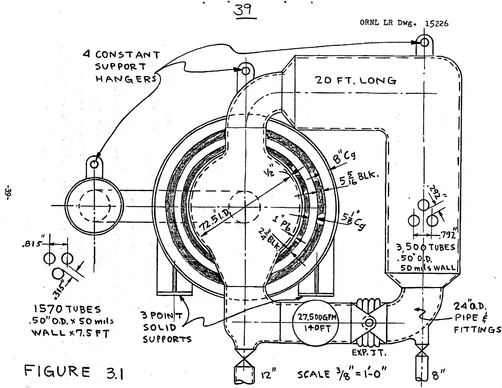

at $1200^{\circ}\mathrm{F}$ thru tubes imbedded in the blanket as shown in Fig. 3.2. As the core, the blanket cooling system has one pump, one heat exchanger, welded piping and a pivoted expansion joint.

The combined core and blanket system has three solid leg supports on the blanket. Constant load hangers will carry the remaining load at four lugs provided at the upper core elbow, at the core heat exchanger and at each end of the blanket heat exchanger.

The basement floor of the reactor building, as shown in Fig. 3.3, will have a series of dump tanks for the salt. The reactor floor and the main floor will be constructed of removable steel panels. The reactor room and the basement room will be below ground level and contained in a steel lined concrete structure.

The reactor building main floor will have television facilities and a remotely operated crane and will be enclosed in a 60 ft. diameter, one inch thick steel shell. The steel shell is a safety measure and will prevent the pollution of the atmosphere by radioactive materials in the event of an accident. The steel shell, which will withstand 50 psi, will have two large airtight hatches for equipment removal.

The blanket heat exchanger secondary sodium lines are siamesed with the core heat exchanger sodium lines and the resulting 42 inch O.D. lines are connected to the shell side of a once-thru boiler.

The U-shaped boiler and the sodium pumps are located in a shielded boiler room between the reactor building and the turbo-generator portion of the plant.

The layout of the turbo-generator and auxiliaries follows the conventional power plant design with two exceptions: an outdoor turbine floor with a gantry crane and placement of the deaerator on the turbine floor because of the elimination of the boiler superstructure.

ORNL-LR-DWG 15032

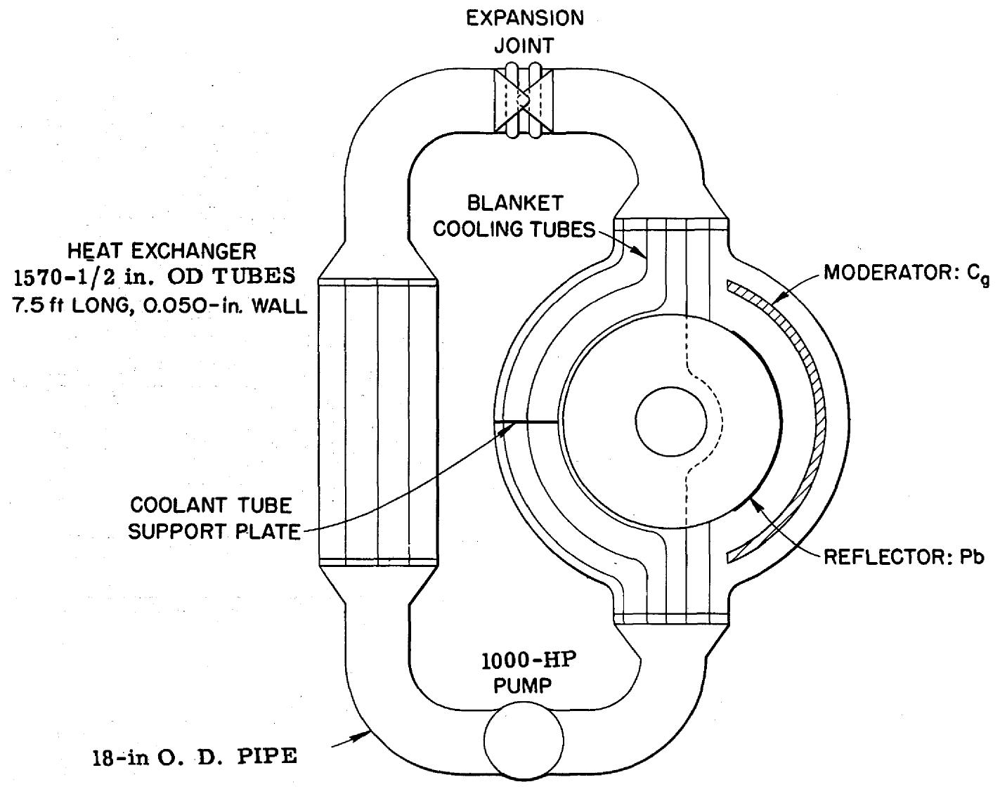  
Blanket Heat Transfer System.   
Figure 3.2

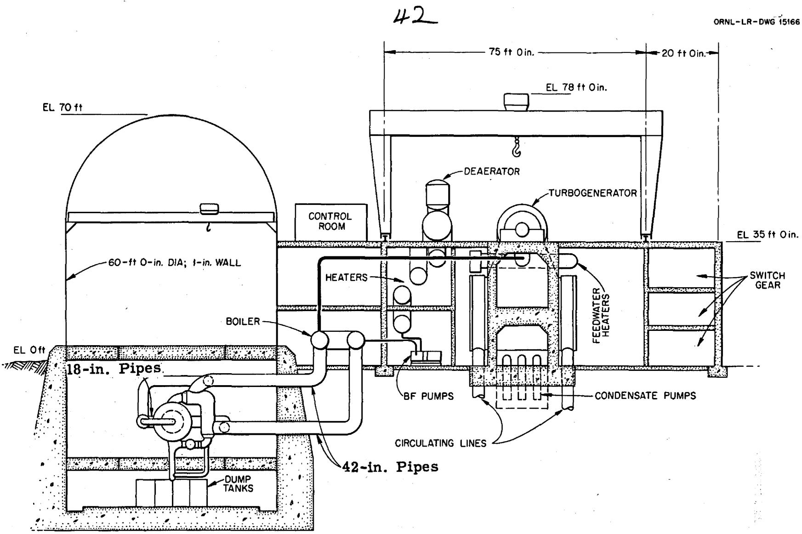  
Elevation of Plant   
Figure 3.3

The centralized control room is placed between the turbo-generator and reactor buildings and above the boiler room. The stack, which is used for the dispersal of reactor off gases after a sufficient hold-up time to reduce the radioactivity, is placed near the reactor building.

# 3.1.1. Properties of Fused Salt. Sodium Coolant, and Blanket Paste

The engineering properties of the fused salt, sodium coolant and the $\mathrm{UO_2 - Na}$ paste blanket have been estimated by the following methods. The specific heat of the fused chloride salt as a function of uranium concentration (Fig. 3.4) was estimated using the method described by W. D. Powers1. Correlations were not available for the properties of thermal conductivity or visocity of the fused salts.

The variation of the density, specific heat, thermal conductivity, and viscosity of sodium $^2$ are given in Figures 3.5, 3.6, 3.7 and 3.8 respectively. The density of $\mathrm{UO_2}$ was taken as $10.2~\mathrm{gm / co}$ and it was assumed that this remained constant. The specific heat $^4$ of $\mathrm{UO_2}$ was taken as:

$$
C p = 1 9. 7 7 + 1. 0 9 2 \times 1 0 ^ {- 3} T - 4. 6 8 \times 1 0 ^ {- 5} T ^ {2} (C a l / m o l C)
$$

(Figure 3.9)

The thermal conductivity of $\mathsf{UO}_2$ is given in Figure 3.10.

The properties of the paste were then calculated, using a mixture of $70\%$ $\mathrm{UO}_2$ , $30\%$ sodium by volume.

$$
\overline {{\rho}} = v _ {\mathrm {N a}} \rho_ {\mathrm {N a}} + v _ {\mathrm {U O} _ {2}} \rho_ {\mathrm {U O} _ {2}} \quad \tag {Figure3.11}
$$

$$
\overline {{C p}} = W _ {N a} C p _ {N a} + W _ {U O _ {2}} C p _ {U O _ {2}} \tag {Figure3.12}
$$

$$
\overline {{k}} = v _ {U O _ {2}} k _ {U O _ {2}} + v _ {N a} k _ {N a} \tag {Figure3.13}
$$

where: $\mathbf{V} =$ Volume fraction

W = Weight fraction

Figure 3.4   
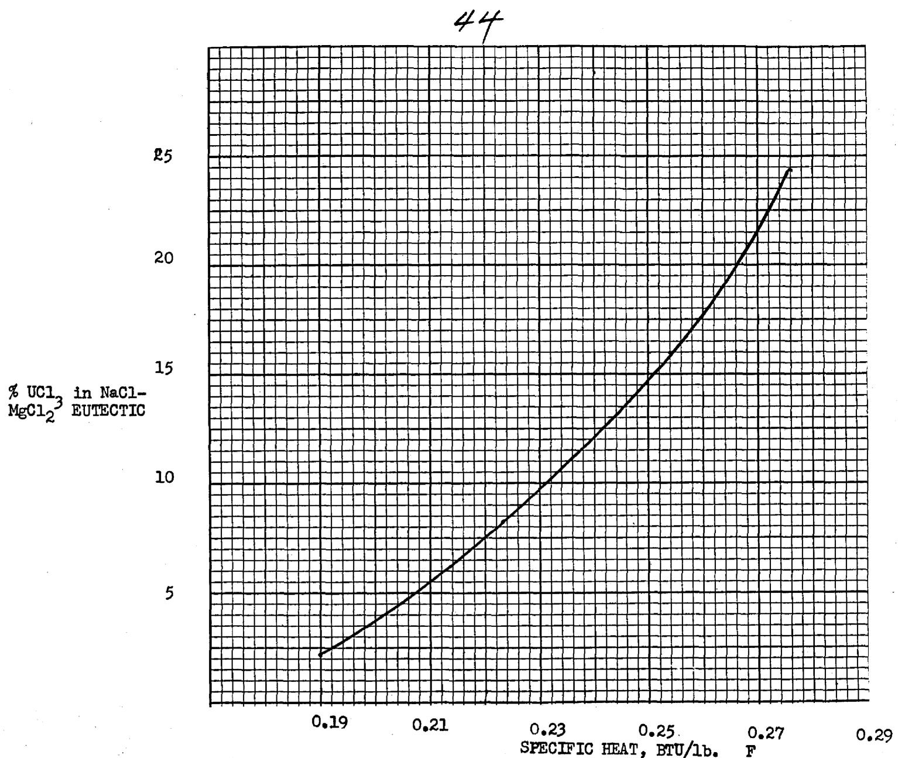  
UC13 VS. SPECIFIC HEAT

UNDOCTIFIED

ORNI-IR-Dwg.-18128

45

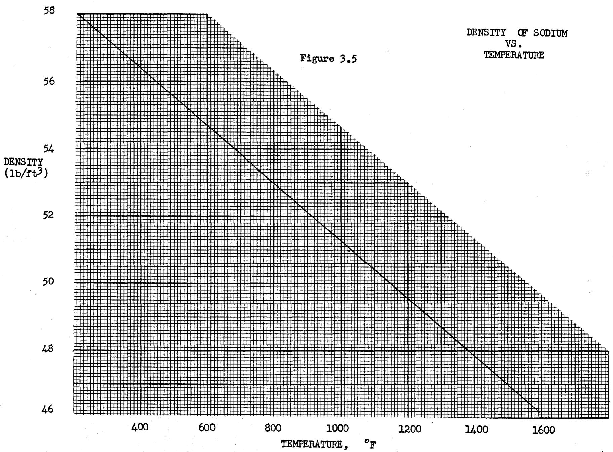  
6278t-3Mg-RT-INHO

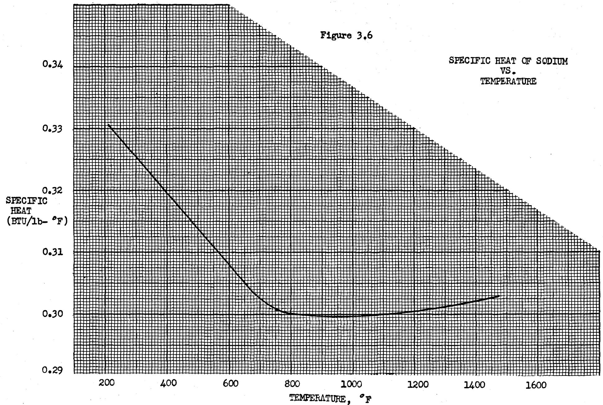  
46   
46 ORNL-ER-DWG-18130

47   
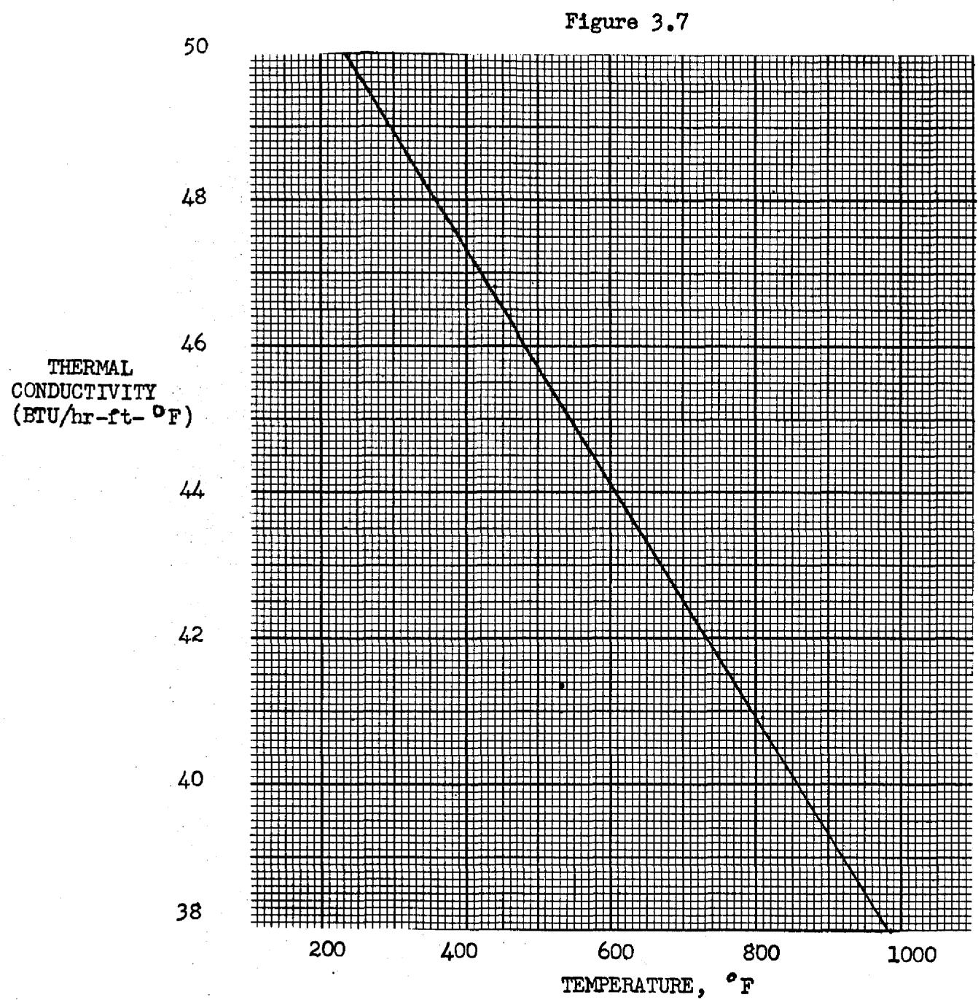  
THERMAL CONDUCTIVITY OF SODIUM VS. TEMPERATURE, ${}^{\bullet}\mathbf{F}$   
ORNT-IR-DgE-18131

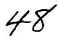  
VISCOSITY OF SODIUM VS. TEMPERATURE

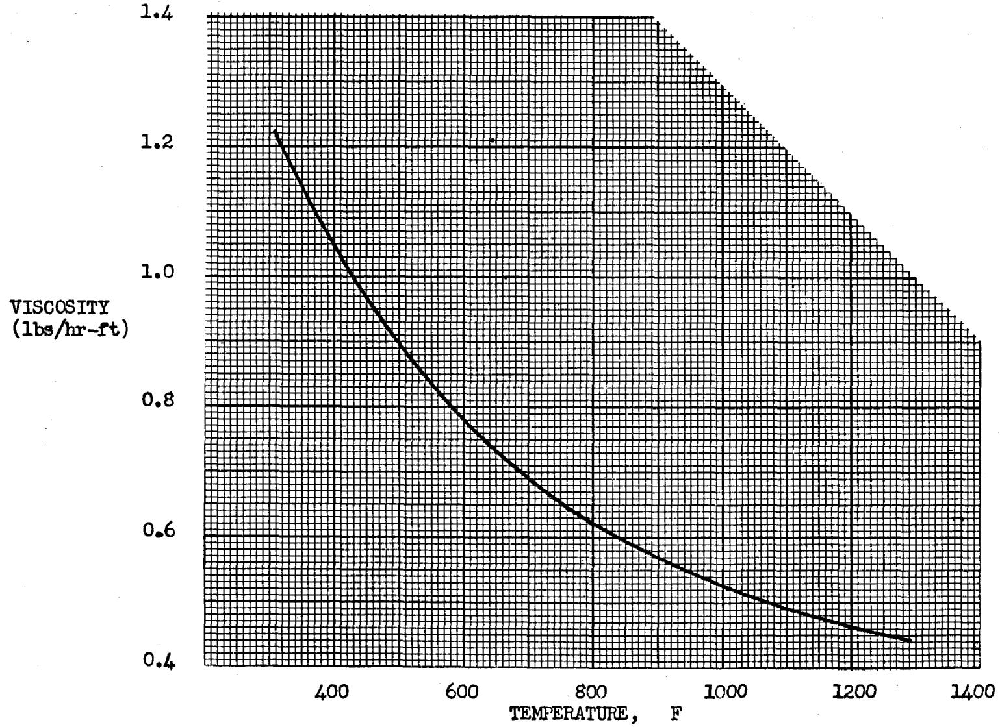  
Figure 3.8   
ORNL-LR-Dwg.-18132

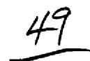  
SPECIFIC HEAT OF $\mathbf{U}\mathbf{O}_2$ VS. TEMPERATURE

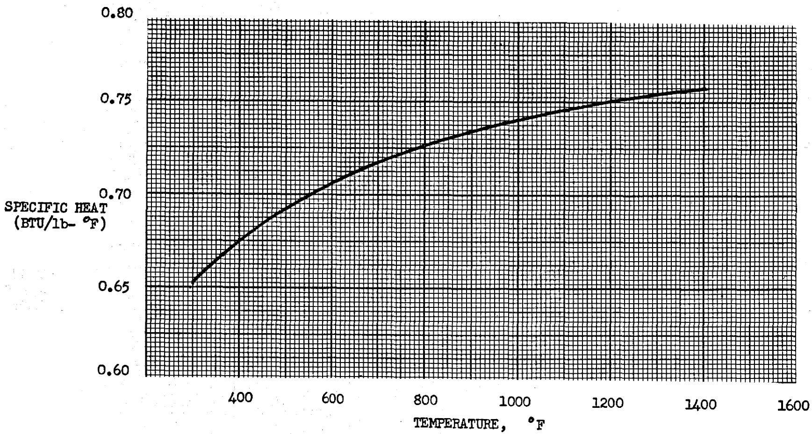  
EET8T-3M0-4T-TNHO -67-   
Figure 3.9

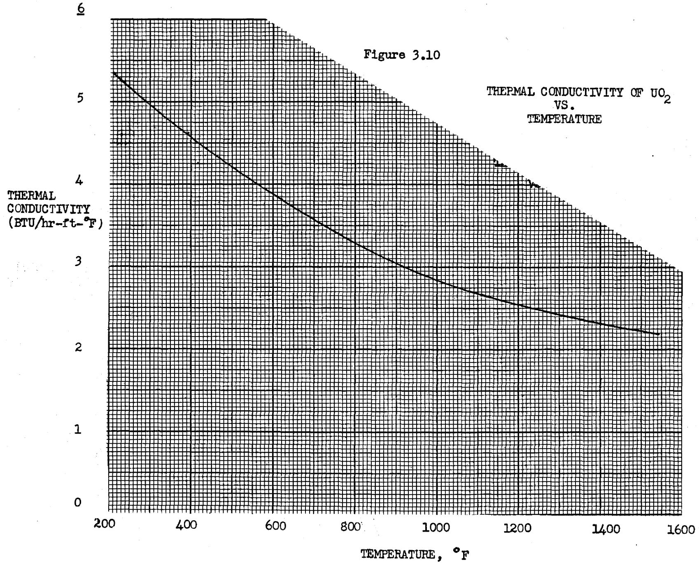  
50

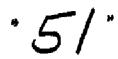

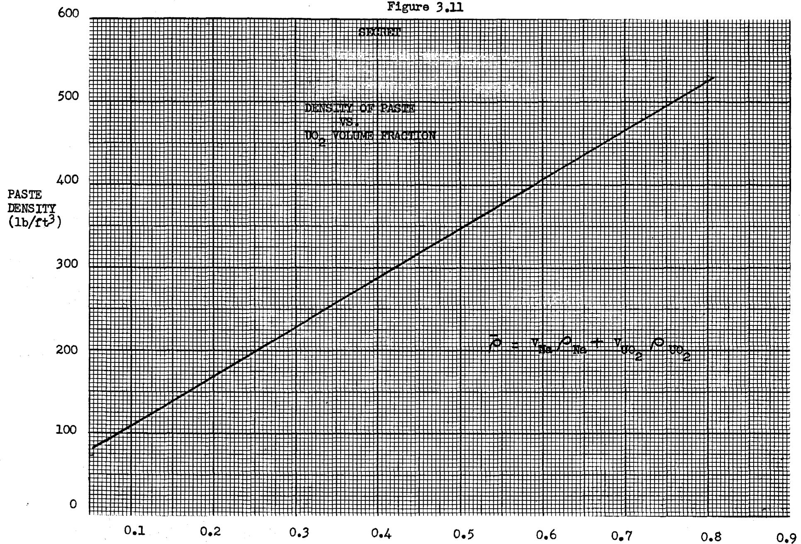  
Figure 3.11   
VOLUME FRACTION $\mathsf{U}\mathsf{O}_{2}$

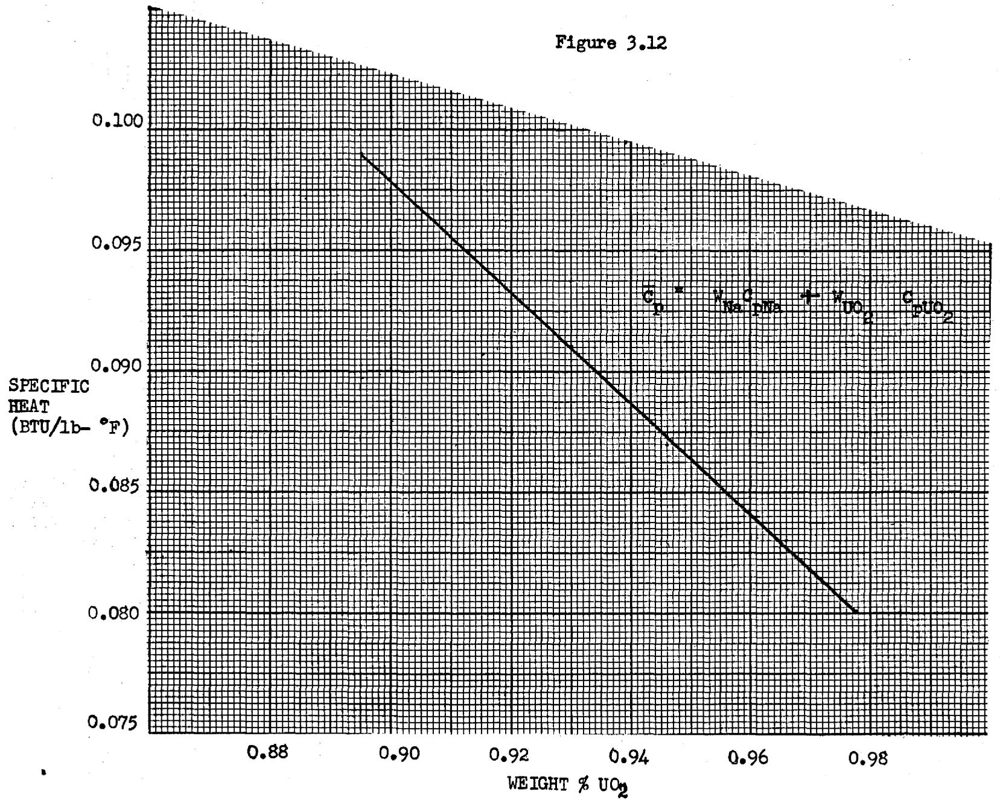  
52   
SPECIFIC HEAT OF PASTE VS. WEIGHT % UO₂

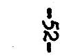  
ORNL-ER-Dwg.-18136

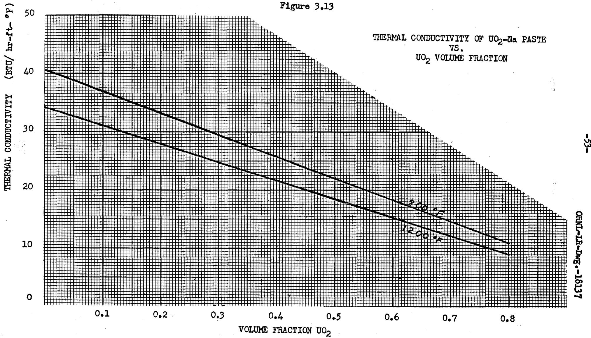  
53

# 3.2 REACTOR POWER

The reserve capacity of an electric power system averages about 10 per cent of the system load. To make such a system reliable, no single unit should exceed 10 per cent of the system capacity. Since most of the systems in this country are less than 3000 MW capacity, turbo-generator units in excess of 280 MW have not been built yet.

A reactor supplying steam for a single turbo-generating unit with a system thermal efficiency of 40 per cent would be sized at 700 MW of heat, or also 260 MW net electric output because of auxiliary power requirements of 20 MW. A system larger than 700 MW of heat would require more than one circulating fuel heat exchanger. Two fuel heat exchangers would require manifolding and other flexibility provisions which would result in a great increase in fuel hold-up. Furthermore, too high a power level would involve such a large initial investment that the risk of construction would not be warranted.

# 3.3 DESIGN OF HEAT TRANSPORT SYSTEM

Reference is made to Fig. 3.14 and Fig. 3.15, the Heat Balance Diagram and the Salt, Sodium, Steam, and Condensate Flow Diagram, respectively.

The optimum design was approached by careful selection of design points.

Single wall tubing was assumed throughout which is in agreement with the present trend of design. Small leakage of water or steam into the sodium in the boiler is not expected to cause serious difficulty $^{(12)}$ . Detection may be accomplished by providing a gas collecting chamber and off-take in the sodium return line. Build-up of NaOH in the sodium system should not be difficult to follow and replacement or purification of the sodium can be undertaken as it may appear necessary.

The influx of large amounts of water or steam resulting from a major failure would dangerously increase the pressure in the shell; and although this possibility is remote, safety valves will be provided.

Excessive fluid velocities result in erosion, corrosion, vibration and increased pressure drop. Based on past experiences in the field, the maximum velocity was taken as $\sqrt{900 / \zeta'}$ ft./sec., where $\zeta$ is the specific gravity of the fluid.

Fluid-fuel reactors, especially those with external cooling, are particularly liable to be shut down for repair or replacement of equipment (13). It is highly desirable, therefore, that all components be as simple and as dependable as possible but also able to be speedily replaced or remotely maintained. It is considered undesirable to install valves in the large lines between the core and blanket heat exchangers and the pumps to permit shut-off of possible spare equipment or to regulate flow. These valves would be large, would operate at high temperatures and would handle corrosive fluids. It is

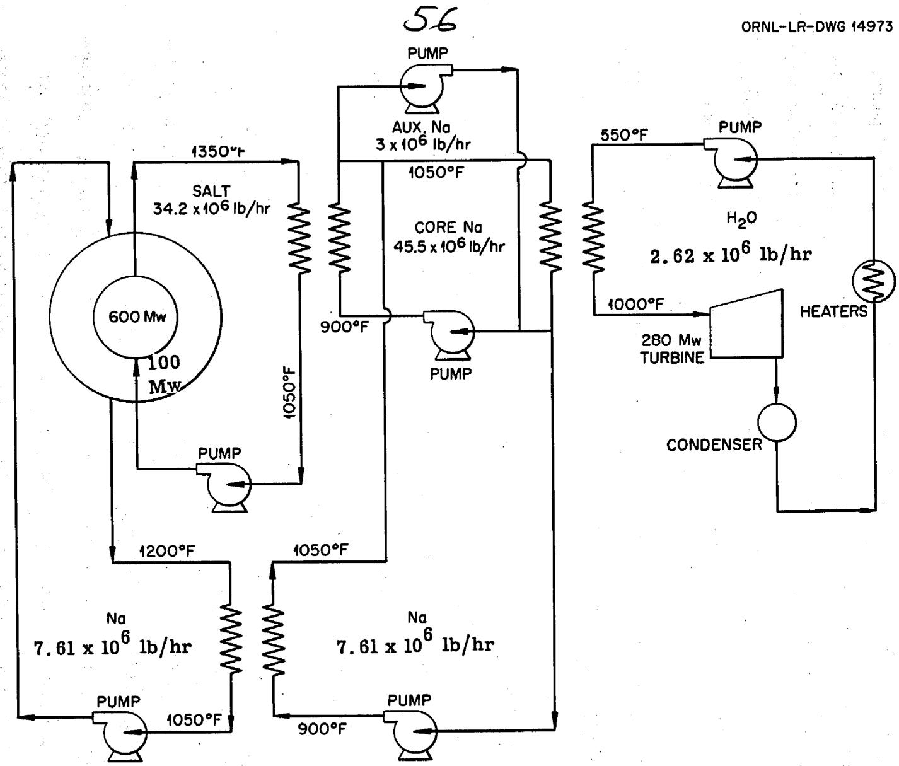  
Heat Balance Diagram.   
Figure 3.14

57

ORNL-LR-DWG 14985

Figure 3.15   
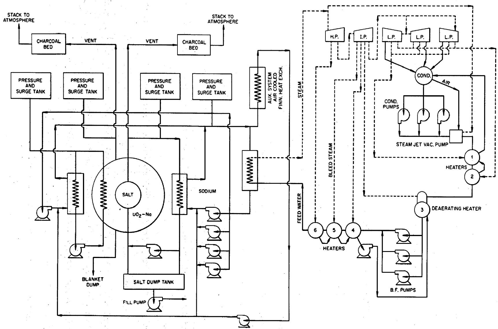  
Salt, Sodium, Steam and Condensate Diagram.

more probable that these valves would fail before trouble is experienced at the heat exchangers or pumps.

Since no maintenance can be attempted with radioactive fluids in the reactor and since it is not expected that any reactor part will last five years without requiring replacement or repair, provisions will be made to inspect all components thoroughly at least every two years, i.e., when replacing the core heat exchanger.

# 3.3.1 Circulating Fuel Heat Exchanger

To reduce external hold-up, small tube sizes are desirable in the heat exchanger. The $\frac{1}{2}$ -inch O.D. tube size was selected as a practical minimum. For sizes less than $\frac{1}{2}$ inch, considerable difficulty would arise in fabrication of the heat exchangers while the possibility of plugging would be greatly increased. The wall thickness of 50 mils was assumed to provide corrosion resistance for two years of useful life.

For the secondary heat transfer fluid, a medium was required with good heat transfer properties in order to reduce the external hold-up and with high boiling point to permit operation at high temperature and low pressure to reduce capital costs.

Sodium, lithium, NaK, bismuth, lead and mercury were considered as heat transfer media. Sodium was selected because of its good heat transfer properties, high boiling point, low cost, availability, comparative ease of handling and wide technological experience. The disadvantages of sodium are its violent reaction with water and the catastrophic corrosion rate of $\mathrm{Na}_2\mathrm{O}$ .

The following considerations were used to set the temperature limits for the fluids entering and leaving the core and heat exchangers.

The coolant temperature is not to be less than the liquidus temperature of the fuel, i.e. $870^{\circ}\mathrm{F}$ . The temperatures of the fuel and coolant leaving the core and heat exchanger were set by economic, corrosion and engineering considerations. Low fuel outlet temperature would lead to excessive heat exchanger surface which would adversely affect the fuel inventory and increase the possibility of mass transfer. High fuel outlet temperature would increase the corrosion rate, require higher pumping power and increase the thermal stresses. Low sodium outlet temperature would result in excessive thermal stresses and lower thermal cycle efficiency. High sodium outlet temperature would have the same result as low fuel outlet temperature.

The fuel outlet temperature was set at $1350^{\circ}\mathrm{F}$ to ensure reasonable equipment life and the maximum temperature differential between fuel and sodium was set at $300^{\circ}\mathrm{F}$ , which is in agreement with general design practices.

The heat exchanger is a single pass counterflow exchanger approximately 50 inches in diameter and 20 feet long with 3500 tubes. All tubes will be made from a corrosion resistant nickel-molybdenum alloy (about $80\%$ Ni and $20\%$ Mo). The exchanger shell will be constructed of stainless steel with a $\frac{1}{4}$ inch Ni-Mo cladding.

The removal and replacement of the core heat exchanger requires remote handling which is believed to be entirely feasible.

# 3.3.2 Circulating Fuel Piping and Pump

The pipe size selected was 24-inch O.D. with a one-inch wall thickness. To reduce cost, the pipe material will be stainless steel clad on the inside with a corrosion resistant Ni-Mo alloy. Cladding thickness will be $\frac{1}{4}$ inch to provide a corrosion allowance for five years life. To allow differential thermal expansion, a pivoted expansion joint is provided.

A single pump arrangement was selected, because two circulating fuel pumps would require two check valves, four shut-off valves and added provisions for flexibility. This would increase the external hold-up and because of valve stem leakage probabilities, would lower the system reliability. However, if large, reliab le valves become available, it might be advantageous to have the added flexibility afforded by multiple cooling systems. This is a matter for further development.

A canned-rotor pump was selected instead of a shaft-seal pump due to the greatly reduced possibility of leakage. The fuel pump will run at constant speed because of its canned-rotor construction. A variable speed pump would be preferable but this also requires further development.

# 3.3.3 Blanket Heat Exchanger

The blanket heat exchanger is a sodium to sodium exchanger constructed of stainless steel and whose mean temperature difference is $150^{\circ}\mathrm{F}$ . It has 1570 tubes of $\frac{1}{2}$ -inch O.D. which are $7\frac{1}{2}$ feet long with 50-mil walls.

It was deemed necessary to have an intermediate loop on the blanket system due to the activation of the sodium coolant. Thus, in case of a sodium-water reaction, only radioactively cool sodium would be ejected. The choice of sodium as a secondary blanket coolant was deemed advisable since the core secondary coolant and the blanket secondary coolant could be mixed, thus necessitating only one boiler and a slight amount of manifolding. For this same reason, the secondary sodium is designed to have a $150^{\circ}\mathrm{F}$ temperature rise through the heat exchanger ( $900^{\circ}\mathrm{F}$ to $1050^{\circ}\mathrm{F}$ ), thus matching the core sodium.

# 3.3.4. Blanket Heat Removal

The breeding blanket is in the form of two separate spherical annuli.

The first blanket region is 7 cm. thick and has 60 MW of heat generated in it. The second region is 13.5 cm. thick with 40 MW generated in it. The heat flows by conduction through the paste to the wetted tubes where it is then carried away by convection in liquid sodium.

In blanket region 1, there are $940 - \frac{1}{2}$ inch stainless steel tubes whose centers lie on circles of radii 38.4, 39.1 and 39.9 inches. Each row contains equal numbers of tubes which have an effective length of 8 ft. Under these conditions, the maximum possible paste temperature will be $1396^{\circ}\mathrm{F}$ which is well below the refractory temperature of $1832^{\circ}\mathrm{F}$ .

In blanket region 2, there are $630 - \frac{1}{2}$ inch stainless steel tubes whose centers lie on circles of radii 51.8, 53.5 and 55.3 inches. Each row contains equal numbers of tubes which have an effective length of 10 ft. The maximum paste temperature in region 2, under these conditions, will be $1468^{\circ} \mathrm{F}$ .

In region 1, the cooling tubes occupy less than 30 per cent of the available volume while in region 2 the tubes occupy less than 15 per cent of the available volume.

# 3.3.4.1 Parameter Study of Blanket Heat Transfer System

For efficient cooling of the blanket, we expect to match the cooling tube density to the radial distribution of heat generation.

It will be assumed that the basic cooling tube lattice arrangement can be simulated by concentric cylinders. The generation rate in a cell will be taken as constant and the $\mathrm{Na - UO_2}$ paste will be considered stagnant. The properties of Na and $\mathrm{Na - UO_2}$ paste are graphically presented in Section 3.1.1.

Taking a heat balance at any radius $r$ where $r_1 < r < r_2$

$$
G V (r) = k p A (r) \left. \frac {\partial T}{\partial r} \right| _ {r} - 6 1 -
$$

where

$$
\mathbf {r} _ {0} = \text {i n s i d e r a d i u s o f t u b e}
$$

$$
\mathbf {r} _ {1} = \text {o u t s i d e r a d i u s o f t u b e}
$$

$$
\mathbf {r} _ {2} = \text {r a d i u s o f c e l l}
$$

$$
\begin{array}{l} \begin{array}{l} A (r) = 2 \pi r L \\ \text {t h u s ,} \frac {\partial T}{\partial r} = \frac {G}{2 k p} \left(\frac {r _ {2} ^ {2}}{r} - r\right) \end{array} \\ \left(\mathrm {T} - \mathrm {T} _ {1}\right) = \frac {G}{2 k p} \left[ r _ {2} ^ {2} \ln \frac {r}{r _ {1}} - \frac {r ^ {2} - r _ {1} ^ {2}}{2} \right] \\ \end{array}
$$

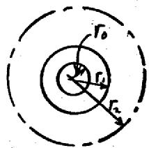

In the steady state,

$$
Q = G V _ {1} = \overline {{k}} A _ {1} (T _ {2} - T _ {1})
$$

$$
k = \frac {r _ {2} ^ {2} - r _ {1} ^ {2}}{\frac {r _ {1}}{k p} \left(r _ {2} ^ {2} \ln \frac {r _ {2}}{r _ {1}} - \frac {r _ {2} ^ {2} - r _ {1} ^ {2}}{2}\right)}
$$

basing over-all coefficient on inside tube area(14)

$$
\frac {1}{U} = \frac {A _ {O}}{\overline {{k}} A _ {J}} + \frac {A _ {O}}{k _ {w} A _ {W}} + \frac {1}{h}
$$

$$
k _ {P} = 1 7 \quad \frac {B T U}{h r - f t - ^ {\circ} F}
$$

In the Fig. 3.16, the value of $U$ is given as a function of $r_2$ where $r_1$ is treated as a parameter. In all cases, standard tube wall sizes were used.

For $1 / 2^{n}$ O.D. tubes with 50 mil wall

$$
\mathrm {R e} _ {\mathrm {N a}} = 3 4 8, 0 0 0 \quad \mathrm {P r} _ {\mathrm {N a}} = 0. 0 0 4 2 4
$$

$$
\mathrm {h} _ {\mathrm {N a}} = 1 7, 3 5 0 \frac {\mathrm {B T U}}{\mathrm {h r} . \mathrm {f t} ^ {2} \circ \mathrm {F}}
$$

$$
\frac {A _ {O} \delta}{k _ {w} A _ {w}} = \frac {4 (0 5)}{1 2 x 1 2 x . 4 5} = . 0 0 0 3 0 3
$$

For $3 / 4''$ OD tubes with 65 mil wall

$$
\mathrm {R e} _ {\mathrm {N a}} = 5 2 9, 0 0 0 \quad \mathrm {P r} _ {\mathrm {N a}} = . 0 0 4 2 4
$$

$$
\mathrm {h} _ {\mathrm {N a}} = 1 4, 7 0 0 \frac {\mathrm {B T U}}{\mathrm {h r . f t} ^ {2} \mathrm {O} _ {\mathrm {F}}}
$$

ORNL-LE-Dwg.18138

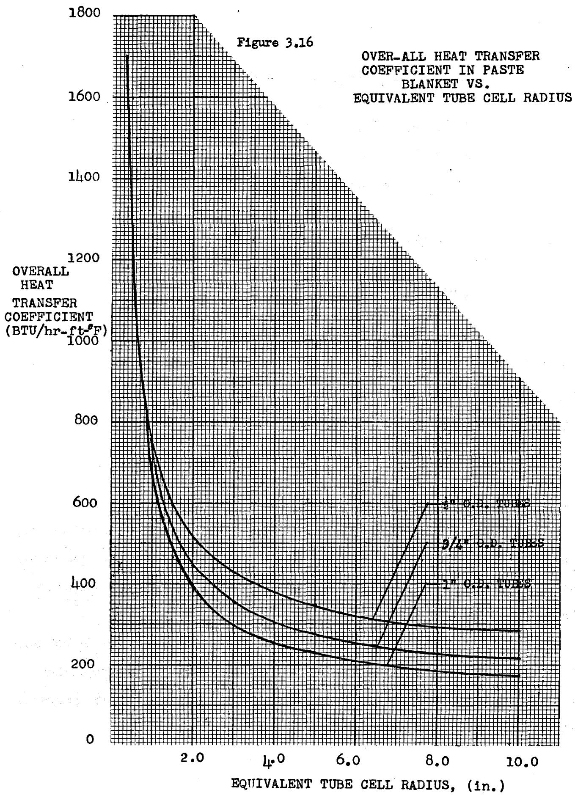

$$
\frac {A _ {0} \delta}{k _ {w} A _ {w}} = \frac {. 3 1 0 (. 0 6 5)}{1 2 x 1 2 x . 3 4 2} = . 0 0 0 4 1
$$

For 1" OD tubes with 85 mil wall

$$
\mathrm {R e} _ {\mathrm {N a}} = 7 2 0, 0 0 0 \quad \mathrm {P r} _ {\mathrm {N a}} = . 0 0 4 2 4
$$

$$
h _ {N a} = 1 2, 0 0 0 \quad \frac {B T U}{h r . f t ^ {2} o _ {F}}
$$

$$
\frac {A _ {0} \delta}{k _ {w} A _ {w}} = \frac {. 4 1 5 (0 8 5)}{1 2 x 1 2 x . 4 5 8} = . 0 0 0 5 3 5
$$

# 3.3.5 Blanket Piping and Pump

The total pressure drop in the blanket is 145 ft. of head. This includes the losses through the blanket tubes, four plenum chambers, 10.67 ft. of 18-inch O.D. pipe, four elbows, one expansion joint, heat exchanger tubes, blanket tube sheets and heat exchanger tube sheets.

The blanket sodium pump is a rotary pump with a capacity of 18,700 Gpm of sodium against a 145 ft. head. With a pump efficiency of 70 per cent, the motor required for the pump is a nominal 1000 hp.

The blanket is filled by pumping the $\mathrm{UO}_2$ -Na paste into the blanket vessel, under a helium pressure of 100 psi., prior to the reactor start-up. The blanket will be completely filled and any expansion of the paste will be taken up in the blanket expansion tank.

To empty the blanket, part of the paste will be forced out, using 100 psi. helium. Pure sodium will then be used to dilute and wash out the remainder of the paste. When enough sodium is added, the paste will assume the properties of a slurry and will flow quite easily.

# 3.3.6 Sodium Piping and Pumps

The pipe sizes selected are 18-inch O.D. for the blanket heat exchanger and 42-inch O.D. for the main lines to the boiler. The piping material will be stainless steel. Sodium valves located in the lines will be plug-type with freeze seals.

Canned-rotor pumps were selected in preference to the electro-magnetic pumps because of their higher efficiency. The total flow is 114,000 Gpm. which requires at least four pumps with 28,500 Gpm. and 65 ft. head.

Provisions are made to drain and store all sodium in the event of a shutdown. A one-foot thick concrete shield surrounds the sodium system including the boiler. The sodium pumps will be shielded so that they can be drained and replaced individually without danger to personnel.

# 3.4 SALT DUMP SYSTEM

A salt dump system is provided consisting of two valved drain lines, one for the core and one for the heat exchanger and piping. The lines are 12 inches and 8 inches, respectively, and are sufficient to drain the entire system in four seconds.

The dump tanks will have a combined capacity of 10 per cent in excess of the total circulating fuel volume. The tanks will be compartmentalized to keep the fuel subcritical; and cooling provisions will be provided to remove decay heat. Electric heating elements will be included to prevent the fuel from solidifying.

The fuel will be removed from the dump tanks by a 5 Gpm., 130 ft. head pump either back to the core or to a container to be shipped for processing.

The tanks, piping and pump will be constructed similarly to the main circulating fuel system, i.e., nickel-molybdenum alloy clad stainless steel to provide an allowable corrosion resistance for 10 years of useful life.

# 3.5 CORE VESSEL AND REFLECTOR HEATING

In this system, as in most reactor systems, the internal generation of heat in the core vessel due to gamma and neutron interactions with the metal was found to be appreciable. The energy sources considered for this calculation were prompt fission gammas, decay product gammas, and neutrons of energies greater than 0.12 MeV. The inelastic scattering gammas in the fuel and the core vessel were estimated as negligible with respect to the magnitude of the considered sources. These sources gave a gamma spectrum as shown in Fig. 3.17.

Using this integral spectrum and assuming it to be unchanged in space we applied the Integral Beam Approximation method (15) (Appendix A-7). The heat generation rate in the core vessel and reflector was calculated as a function of position. The gamma absorption coefficients of the fused salt (Fig. 3.18) and of the nickel-molybdenum alloy (Fig. 3.19) were computed for use in this calculation. The gamma heat generation rate as a function of position is shown in Fig. 3.20.

The heat generation due to neutron capture, elastic scattering, and inelastic scattering were calculated using the integral fluxes from the Univac calculations with the general equation:

$$
\bar {G} = \sum (\bar {E}) \bar {\phi} (\bar {E}) \bar {E} \mathcal {S} \quad (C a l c u l a t i o n s \text {i n A p p e n d i x A - 7})
$$

where $\Sigma (\mathbf{\bar{E}}) =$ Macroscopic cross-section for the specific interaction

$$
\overline {{\phi}} (\overline {{\mathbf {E}}}) = \text {T h e a v e r a g e f l u x} = \frac {\int \phi (\overline {{\mathbf {E}}} , \mathbf {r}) d ^ {3} \mathbf {r}}{\int d ^ {3} \mathbf {r}}
$$

E Average neutron energy

$\delta =$ The average energy transferred/ interaction.

The sources yielded a total averaged heat generation rate of $9.65 \times 10^{13}$ MeV/cm $^3$ -sec in the core vessel and $1.77 \times 10^{13}$ MeV/cm $^3$ -sec in the lead re-

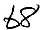  
GAMMA SPECTRUM VS. ENERGY

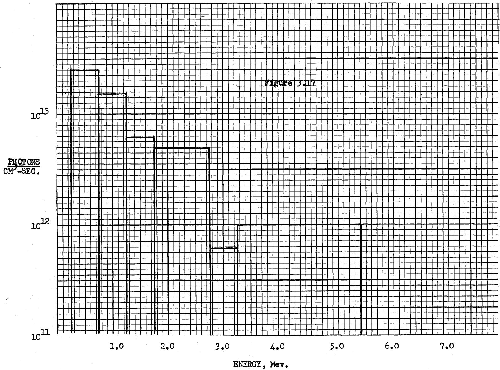

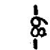

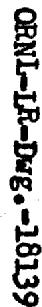

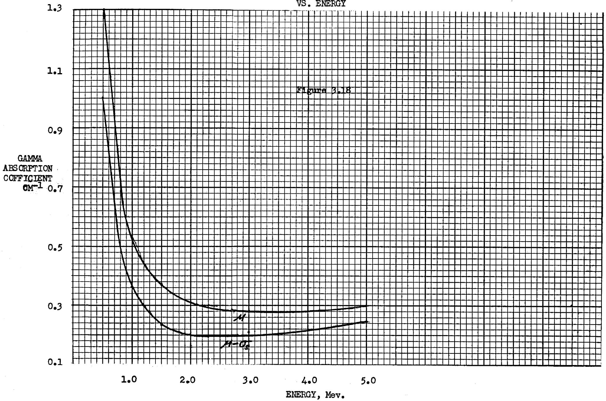  
69   
GAMMA ABSORPTION COEFFICIENT OF FUSED SALT   
VS. ENERGY

  
Figure 3.19

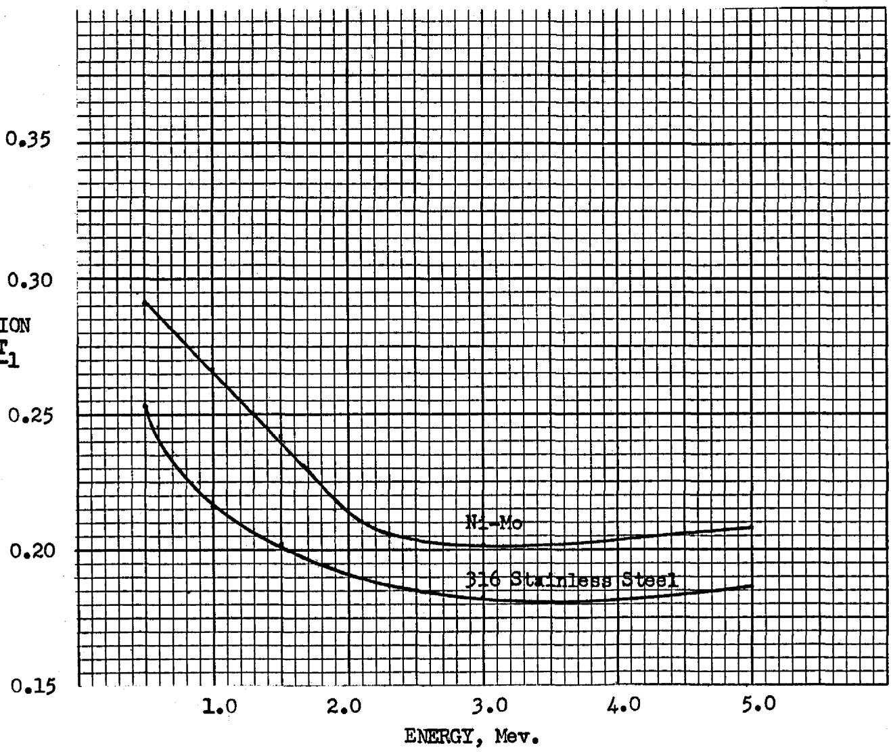  
GAMMA ABSORPTION COEFFICIENT VS. ENERGY   
ENERGY ABSORPTION COEFFICIENT $\mu = \sigma_{\mathrm{f}}$ cm.   
TTT8T-3M1-8T-INNO -04

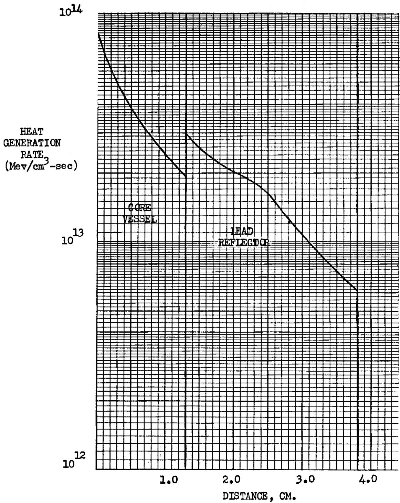  
GAMMA HEATING RATE IN CORE VESSEL AND REFLECTOR   
Figure 3.20

flector. It was found that approximately one third of the total heat generation in the core vessel was due to gamma interactions. Using these averaged heat generation rates a maximum temperature rise of $109.3^{\circ}\mathrm{F}$ was estimated for the core vessel (Fig. 3.21). Since such a temperature rise was believed to cause abnormally high thermal stresses, it was decided to cool the lead reflector. This gave a maximum temperature rise in the core vessel of $29.2^{\circ}\mathrm{F}$ (Fig. 3.22). This was estimated to yield permissible thermal stresses.

In all these calculations the core vessel was taken to be 1.3 cm. thick; and the lead reflector, 2.5 cm. thick.

In order to maintain the $29.2^{\circ}\mathrm{F}$ temperature rise in the core shell and to minimize the thermal stresses, it was postulated that both surfaces of the core vessel be maintained at the same temperature of $1350^{\circ}\mathrm{F}$ and that heat be removed from the reflector to accomplish this. It was also postulated that both surfaces of the reflector are at $1350^{\circ}\mathrm{F}$ . Using these conditions it was found that $5.2 \times 10^{13} \mathrm{Mev/cm}^3$ -sec will be removed from the lead reflector.

$$
Q = 5. 2 \times 1 0 ^ {1 3} \mathrm {M e v / c m} ^ {3} \sec = 3. 8 0 \times 1 0 ^ {6} \mathrm {B T U / h r}. = 1. 1 1 \mathrm {M W}.
$$

Using a row of blanket cooling tubes we have a sodium flow of 83,500 lbs/hr. through 17 1/2-inch OD tubes with 50 mil walls. The heat transfer calculations show that this is more than adequate to transfer the heat. (Appendix A-7).

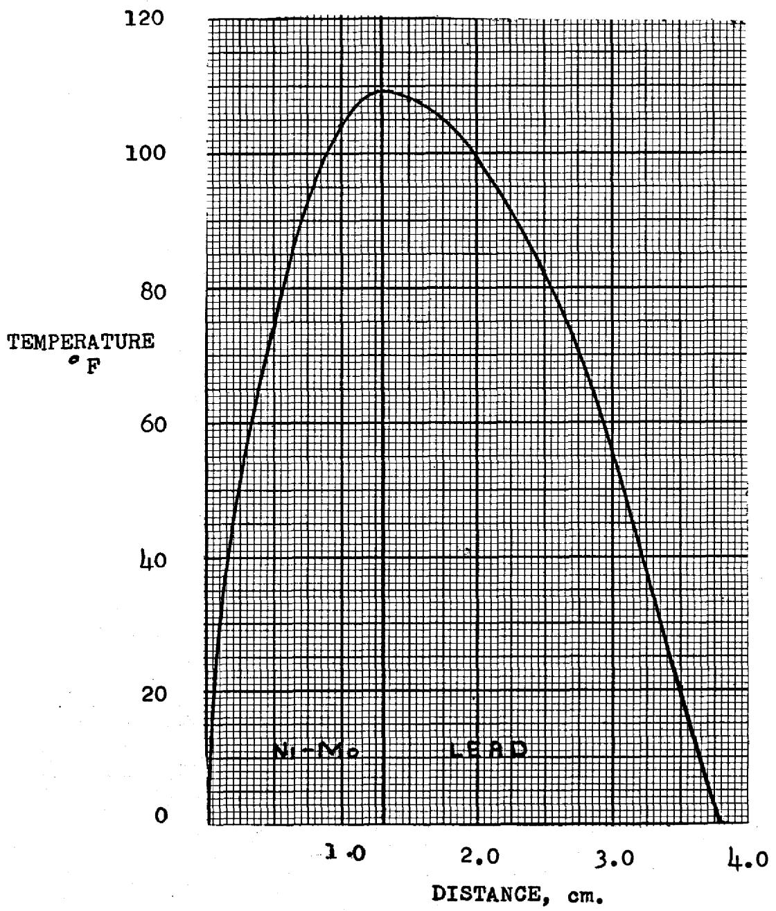  
WITHOUT COOLING IN LEAD REFLECTOR TEMPERATURE VS. DISTANCE THROUGH CORE VESSEL AND LEAD REFLECTOR   
Figure 3.21

# WITH COOLING IN THE LEAD REFLECTOR

# TEMPERATURE VS. DISTANCE THROUGH CORE VESSEL AND LEAD REFLECTOR

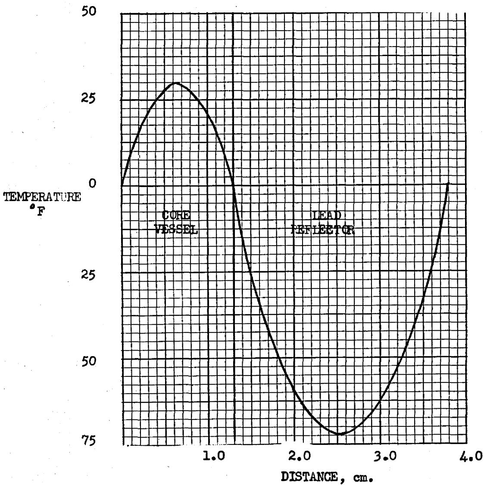  
Figure 3.22

# 3.6 MODERATOR COOLING

The heat generation in the moderator due to fast neutron moderation is $3.5 \times 10^{12} \mathrm{mev}$ . which yields a heat generation of $6.15 \times 10^{18} \mathrm{mev}$ . or $3.36 \times 10^{6} \mathrm{BTU}$ in the entire volume. With this heat generation rate, a sodium flow of $1.13 \times 10^{5} \mathrm{lbs}$ . is required to maintain the maximum temperature of the graphite at $1325^{\circ} \mathrm{F}$ . The sodium flow rate is accomplished in $25 \frac{1}{2}$ -inch cooling tubes with 50 mil walls.

# 3.7 ONCE-THRU BOTLER

The once-thru boiler is well suited to the high temperature reactor plant, since load conditions can be controlled by varying the flow of water. If the reactor follows its load demand well, it can be controlled directly by the turbine throttle. Thus, operation of the plant is greatly simplified. However, the once-thru boiler is not yet well developed and in this case is operating very near the burn-out point. This is perhaps one of the weakest points in the design. It definitely requires further study and possibly another intermediate sodium loop to lower the inlet sodium temperature to the boiler. This type of boiler requires very pure feed water of less than $\frac{1}{2}$ ppm. impurity present.

The boiler is in the form of a shell and tube, counter current, one-pass heat exchanger with the 2400 psi steam on the tube side. There are 2400 tubes which are $\frac{1}{2}$ -inch O.D., 45 ft. long, with a 50 mil wall. The entire boiler will be made of stainless steel which is resistant to attack by both hot sodium and super heated steam. The tubes are in a triangular lattice with a l.ll inch pitch which leaves sufficient room for welding the tubes into the tube sheet.

The inside shell diameter is 4.9 ft., and its wall thickness is one inch which is sufficient to hold the sodium. The overall shell length is 50 ft.

which includes two $2\frac{1}{2}$ ft. plenum. The boiler was made into a U-shape in order to reduce the size of the boiler room.

The design was accomplished by breaking the boiler into three distinct regions—a sub-cooled region, a boiling region and a superheated region. This is only an approximation as it is mainly a philosophical point as to where sub-cooled boiling ends and net boiling begins. The heat transfer coefficients were calculated using the Dittus-Boelter equation (14), and a method of J. A. Lane (16) was used in the boiling region.

In calculating heat transfer coefficients, use was made of inlet velocities only. This is clearly an underestimate, and the excess surface should account for the resistance of the scale to heat transfer.

At part-load operation, this boiler tends to produce steam at higher than design temperature. The steam temperature to the turbine will be maintained constant by attemperation and variation of the boiler feed water temperature. The part-load operating characteristics of the boiler are given in the following table.

Table 3.1 Boiler Characteristics at Part-Load Operation   

<table><tr><td>Fraction of Full Load</td><td>1/2</td><td></td><td>3/4</td><td>1.00</td></tr><tr><td>Steam Outlet Temperature</td><td>1080 F</td><td></td><td>1067 F</td><td>1000 F</td></tr><tr><td>Water Flow Rate</td><td>1.23.x 106</td><td>1bs/hr</td><td>1.88 x 106</td><td>2.62 x 106</td></tr><tr><td>Sodium Inlet Temperature</td><td>1085°F</td><td></td><td>1082°F</td><td>1050°F</td></tr><tr><td>Sodium Outlet Temperature</td><td>1010°F</td><td></td><td>970°F</td><td>900°F</td></tr><tr><td>Sodium Flow Rate</td><td>53.2 x 106</td><td>1bs/hr</td><td>53.2 x 106</td><td>53.2 x 106</td></tr><tr><td>Over-all Coefficients</td><td></td><td></td><td></td><td></td></tr><tr><td>Sub-cooled Region</td><td>1000</td><td></td><td>1160</td><td>1275</td></tr><tr><td>Length Sub-cooled Region</td><td>2.14 ft.</td><td></td><td>3.16</td><td>4.55</td></tr><tr><td>Length Boiling Region</td><td>4.6 ft.</td><td></td><td>7.55</td><td>9.47</td></tr><tr><td>Over-All Coefficients</td><td></td><td></td><td></td><td></td></tr><tr><td>Superheat Region</td><td>560</td><td></td><td>705</td><td>826</td></tr><tr><td>Length Superheat Region</td><td>38 ft.</td><td></td><td>34</td><td>30.4</td></tr></table>

# 3.8 AUXILIARY COOLING SYSTEM

If the electric load is dropped to zero, it becomes necessary to remove delayed heat from the reactor core and blanket. An auxiliary cooling system is provided for this, consisting of a separate sodium circuit, a sodium-to-air heat exchanger and a pump.

# 3.9 TURBO-GENERATOR

A tandem-compound, triple flow, 3600 rpm. turbo-generator with initial steam conditions of 2400 psig. and 1000 F was selected. Since a straight-thru boiler is being used, there is no reheat. The latter generally is not too desirable for nuclear power plants because of the attendant complicated controls.

The feed water cycle will consist of six heaters with the desagerator in number three place. The final feed water temperature is $550^{\circ}\mathrm{F}$ . Three condensate and three boiler feed pumps are specified to insure the reliability of the unit.

The thermal efficiency of the cycle is estimated to be 40 per cent. Auxiliary power requirements are estimated to be seven per cent.

# CHAPTER 4 NUCLEAR CONSIDERATIONS

# 4.1 SUMMARY OF STUDY INTENTIONS

At the onset of the project, two cooling systems for a fused salt reactor were considered. One was an internally cooled system in which the coolant, liquid sodium, was passed through the core of the reactor. The other was an externally cooled reactor in which the fuel was circulated through a heat exchanger internal to the core. It was felt that the large fuel inventory of a fast reactor would be increased to a prohibitive amount in the circulating fuel system. However, early calculations showed, that because of the large amount of parasitic absorption, the total inventory of the internally cooled system was about the same as that of the circulating system. Poorer blanket coverage, more parasitic capture and lower spectrum caused the internally cooled system to have a breeding ratio estimated to be about 0.8 compared to an estimate of about 1.2 for the circulating system. The lower spectrum would also increase the fission product poisoning. For these reasons and since the only advantage attributed to the internally cooled system, lower inventory, did not exist, it was decided to conduct parameter studies solely for mixed chloride fuels in an externally cooled system.

Preliminary analysis (sec. 4.4.1) indicated that power output per mass of plutonium increased with increased power. A core power of $600\mathrm{MW}$ was chosen as it is the upper limit imposed by existing electric power distribution systems. Engineering considerations yielded a minimum external hold-up volume for the removal of $600\mathrm{MW}$ . This volume is so large that it remains essentially constant over a wide variation of core sizes.

With the external hold-up volume constant a study was carried out on system

mass and breeding ratios as a function of composition of the mixed chloride fuel. It was realized very early in the study that, at the concentrations of the plutonium and uranium chlorides involved, the breeding ratio was higher and the critical mass about the same when U-238 was used as a diluent instead of the other chlorides. The salt of composition 3 NaCl, 2 MgCl $_2$ and 1 Pu (U) Cl $_3$ , which is the highest concentration of Pu (U) Cl $_3$ in the mixed chloride commensurate with melting point requirements was, therefore, used in the parameter study with variation on the ratio of plutonium to uranium. The analysis was carried out employing a ten group, one dimensional diffusion theory method (sec. 4.2.1) on the bare core system to find the bare core radius, breeding ratios, and flux energy spectrum. Blanket cross sections were then averaged over this spectrum to obtain an approximation of reflector savings on critical core radius. Okrent $^{22}$ has shown the validity of diffusion theory calculations for fast reactor systems with dimensions greater than 30 cm.

Since the blanket material chosen has a low uranium density, an effort was made to lower the neutron spectrum in the blanket to increase the plutonium production density and decrease the blanket thickness. Position and thickness of a graphite moderator section, placed in the blanket region, were varied to study results on breeding ratio and concentration and distribution of plutonium production as well as the effects reflected back into the core. The Argonne National Lab. RE-7 code for the UNIVAC (Sec. 4.2.3) was used for this study employing 13 energy groups and 7 spatial regions.

Reflector control is possible for a high core leakage reactor, such as in the present design. A brief study was performed on the effect of changing the level of a molten lead reflector adjacent to the core vessel. These calculations were then performed more accurately employing a 10 energy group, 3 spatial region code on a digital computer.

# 4.2.1 Bare Core Multi-Group Method

The neutron diffusion equation in a bare reactor for the jth energy group is

$$
\begin{array}{l} \left[ \frac {1}{3} \sum_ {t r} ^ {j} B ^ {2} + \sum_ {c} ^ {j} + \sum_ {f} ^ {j} + \sum_ {i n} ^ {j} + \frac {\sum_ {s} ^ {j} \sum_ {u , j} ^ {j}}{\Delta u _ {j}} \right] \phi_ {j} \Delta u _ {j} \\ = \nu \beta_ {j} \sum_ {i} \Sigma_ {f} ^ {i} \phi_ {i} \Delta u _ {i} + \sum_ {i = 0} ^ {j - 1} P (i \rightarrow j) \Sigma_ {i n} ^ {i} \phi_ {i} \Delta u _ {i} + \sum_ {\Delta u _ {j - 1}} ^ {j - 1} \phi_ {j - 1} \Delta u _ {j - 1} \\ \end{array}
$$

where $\sum_{\overline{t} r}^{j} = \sum_{tot}^{j} - \overline{u}_{j}\sum_{s}^{j}\sum_{in}^{j}$ is the macroscopic cross section for removal from the jth group by inelastic scattering, $\frac{\sum_{s}^{j}\sum_{i}}{\Delta u_{i}}$ is assumed to be the cross section for elastic moderation out of the jth group, $\beta_{j}$ is the fraction of the fission spectrum born in the jth group, and $P(i\rightarrow j)$ is the fraction of inelastically scattered neutrons in the ith group which are degraded to the jth group on an inelastic collision.

The calculation of the bare system criticality was therefore reduced to a tabulation of neutron events with an iteration on the geometric buckling, B, until a neutron balance was obtained over all energy groups. The calculation begins with the introduction of one fission neutron distributed over the fission spectrum. In the first (highest energy) group this is the only source of neutrons so that the events in this group can be tabulated. Group 1 then provides the balance of the source for the second group through scattering, hence the events in the second group can be determined. This procedure was continued for each lower energy group. At the conclusion of the lowest energy group tabulation of events, the total capture of each element, the number of fissions

in plutonium and uranium, and the number of neutrons which leak out of the bare system were found by summation over all energy groups. A new radius was chosen and the calculation repeated until the neutron production and loss were equal.

In the calculation just described, at criticality, the source of neutrons for each energy group multiplied by the average velocity of that group times the average time spent in that group is proportional to the flux of that specific energy group. That is,

$$
a _ {j} \Delta u _ {j} \sim N _ {j} \overline {{v _ {i}}} _ {j} \overline {{v}} _ {j}
$$

Note that,

$$
t _ {j} \sim 1 / \bar {r} _ {j} \sum_ {k} ^ {j}
$$

where

$$
\sum_ {p} ^ {j} = \frac {\beta^ {2}}{3 \sum_ {t r} ^ {j}} + \sum_ {c} ^ {j} + \sum_ {i n} ^ {j} + \frac {\sum_ {s} ^ {j} \zeta}{\Delta u _ {j}}
$$

hence,

$$
\Phi_ {j} \Delta u _ {j} \sim N _ {j} / \sum_ {k} ^ {j}
$$

# 4.2.2 Reflector Savings Estimate

The flux energy spectrum obtained for the bare core was assumed, for the reflector savings estimate, to be the equilibrium blanket flux energy spectrum. Averaging blanket parameters over this spectrum and assuming an infinite blanket, the reflector savings was found to be insensitive to the bare core radius and bare core spectrum over the range of interest. For the study of system mass, breeding ratios and flux energy spectrum as a function of the plutonium to uranium ratio, the reflector savings on the bare core radius was assumed to be a constant.

# 4.2.3 UNIVAC Calculations

In order to obtain a better representation of the effect of the blanket

on the core and to gain information on the desirability of a moderator section in the blanket region, the Re-7 Argonne National Laboratory code for the UNIVAC was employed. The iteration in this code was performed on the fuel to diluent ratio rather than the core radius. The optimum system core radius from the previous parameter study and seven regions (core, core vessel, lead reflector, first blanket, moderator, second blanket and graphite reflector) were used. Extra lower energy groups were employed because of the lower energy spectrum in the blanket.

The input information, calculation procedures and restrictions of the RE-7 code are covered in reference 23. The results of the problem consisted of the critical fuel to diluent ratio, the criticality factor, the fission source at each space point, the integral of the fission source over each region, the flux at each space point in each energy group, the integral flux over each region in each energy group, and the net leakage out of each region in each energy group.

# 4.3 CROSS SECTIONS

# 4.3.1 Energy Groups

For the UNIVAC calculations thirteen energy groups were employed. These are presented in Table 4.1, section 4.3.4. The last four groups were combined into one group in the bare ten group parameter study.

# 4.3.2 Sources of Data

All total and fission cross sections as well as the (n, gamma) of uranium-238 and the (n, alpha) of chlorine were obtained from BNL-325. The capture cross section of plutonium was calculated using values of $\prec$ employed in reference 24. The inelastic scattering cross section of uranium and plutonium were obtained through a private communication with L. Dresner of ORNL. These values were based on the experimental work of T. W. Bonner of Rice Institute, M. Walt of LASL and R. C. Allen of LASL. The sources of other inelastic scattering cross sections are references 25, 26, and 27. The spectrum of inelastically scattered neutrons was taken, for all elements, to be Maxwellian in form with the temperature of the distribution given by the equation $\Theta = \sqrt{\frac{E}{b} - c}$ , where $E$ is the initial neutron energy, $b$ was assumed to be 20.7 MeV $^{-1}$ and constant and $c$ was taken as 0.08 MeV for high energy neutrons and extrapolated to zero at the threshold. In reference 28, this form is used and gives good agreement for incident neutron energies of 1.5, 3 and 14 MeV.

Measured values of the transport cross section of carbon, iron, lead and uranium-238 were obtained from reference 29. Additional values for these elements and all transport cross sections for the other elements were calculated using the angular distribution of scattered neutrons obtained from reference 30. Cap

ture cross sections for elements other than uranium and plutonium were calculated using the method described in Section 4.3.3.

# 4.3.3 Calculation of Capture Cross Sections

Because of the lack of experimental determination of capture cross sections at the energies of interest (.001 to 10 MeV), a theoretical, energy dependent equation employing parameters which can be estimated with some accuracy was normalized to data by Hughes31 of capture cross sections at 1 MeV.

The equation employed is that appearing as equation 4.2b in reference 32.

$$
\bar {\sigma} _ {a} (E) = \frac {2 \pi^ {2} \hbar^ {2} / r}{D P ^ {2}} \sum_ {l} \frac {(2 l + 1)}{1 + | I _ {e} | ^ {2} \sqrt {r} / 2} \gamma_ {n} ^ {2}
$$

where the functions, $I_{\ell}$ are given by

I e (a)

0 $\frac{(\hbar)}{(\mathfrak{p})}^{1 / 2}\exp (-\mathrm{i}\mathfrak{p}\mathrm{a} / \mathfrak{h})$

1 $\frac{(\mathrm{tr})^{3 / 2}}{(\mathrm{p})} (\mathrm{a}^{-1} + \frac{\mathrm{ip}}{\mathrm{tr}})\exp (-\mathrm{ip}\mathrm{a} / \pi)$

（）+1/2 a+1（-） exp（-ipr/h）]

The penetrabilities $\left| I_{\ell} \right|^2$ for $\ell$ equal 0 to 6 were calculated to be

$$
\begin{array}{l} \left| I _ {0} \right| ^ {2} = \frac {\pi}{p} \\ \left| I _ {1} \right| ^ {2} = \left| I _ {0} \right| ^ {2} \quad \left\{\left[ b \cos \frac {1}{b} + \sin \frac {1}{b} \right] ^ {2} + \left[ \cos \frac {1}{b} - b \sin \frac {1}{b} \right] ^ {2} \right\}, b = \frac {\pi}{p a} \\ \left| I _ {2} \right| ^ {2} = \left| I _ {0} \right| ^ {2} \left\{\left[ (3 b ^ {2} - 1) \cos \frac {1}{b} + 3 b \sin \frac {1}{b} \right] ^ {2} + \left[ 3 b \cos \frac {1}{b} - (3 b ^ {2} - 1) \sin \frac {1}{b} \right] ^ {2} \right\} \\ \end{array}
$$

$$
\left| I _ {3} \right| ^ {2} = \left| I _ {0} \right| ^ {2} \left\{\left[ (1 5 b ^ {2} - 6) b \cos \frac {1}{b} + (1 5 b ^ {2} - 1) \sin \frac {1}{b} \right] ^ {2} \right.
$$

$$
+ \left[ (1 5 b ^ {2} - 1) \cos \frac {1}{b} - (1 5 b ^ {2} - 6) b \sin \frac {1}{b} \right] \cdot 2 \Bigg \}
$$

$$
\begin{array}{l} \left| I _ {4} \right| ^ {2} = \left| I _ {0} \right| ^ {2} \left\{\left[ (1 - 4 5 b ^ {2} + 1 0 5 b ^ {4}) \cos \frac {1}{b} + (1 0 5 b ^ {2} - 1 0) b \sin \frac {1}{b} \right] ^ {2} \right. \\ \left. + \left[ (1 0 5 b ^ {2} - 1 0) b \cos \frac {1}{b} - (1 - 4 5 b ^ {2} + 1 0 5 b ^ {4}) \sin \frac {1}{b} \right] ^ {2} \right\} \\ \left| I _ {5} \right| ^ {2} = \left| I _ {0} \right| ^ {2} \left\{\left[ (1 5 - 4 2 0 b ^ {2} + 9 4 5 b ^ {4}) b \cos \frac {1}{b} + (1 - 1 0 5 b ^ {2} + 9 4 5 b ^ {4}) \sin \frac {1}{b} \right] ^ {2} \right. \\ \left. + \left[ (1 - 1 0 5 b ^ {2} + 9 4 5 b ^ {4}) \cos \frac {1}{b} - (1 5 - 4 2 0 b ^ {2} + 9 4 5 b ^ {4}) b \sin \frac {1}{b} \right] ^ {2} \right\} \end{array}
$$

$$
\begin{array}{l} \left| I _ {6} \right| ^ {2} = \left| I _ {0} \right| ^ {2} \left\{\left[ (- 1 + 2 1 0 b ^ {2} - 4 7 2 5 b ^ {4} + 1 0 3 9 5 b ^ {6}) \cos \frac {1}{b} + (2 1 - 1 2 6 0 b ^ {2} + 1 0 3 9 5 b ^ {4}) b \sin \frac {1}{b} \right] \right. ^ {2} \\ \left. + \left[ (2 1 - 1 2 6 0 b ^ {2} + 1 0 3 9 5 b ^ {4}) b \cos \frac {1}{b} - (- 1 + 2 1 0 b ^ {2} - 4 7 2 5 b ^ {4} + 1 0 3 9 5 b ^ {6}) \sin \frac {1}{b} \right] ^ {2} \right\} \\ \end{array}
$$

Note that $p / k = 2.2 \times 10^{9} \, \text{cm}^{-1} (\text{E / ev})^{\frac{1}{2}}$ and

$$
p a / \pi = 3. 2 3 \times 1 0 ^ {- 4} A ^ {1 / 3} (E / e v) ^ {\frac {1}{2}}, i f a = 1. 4 7 \times 1 0 ^ {- 1 3} A ^ {1 / 3} c m.
$$

For nuclei where the level spacing has been experimentally determined and the relevant energy state of the compound nucleus is not in the continuum, D (the level spacing) was obtained as an average of data from reference 33. If the relevant state is in the continuum, then D(7 Mev) was determined from the experimental data points in Fig. 3.5 of reference 32, and the equation D = C $\exp(-\mathrm{BE}^{\frac{1}{2}})$ was used with C equal to $10^{6}$ ev (for light nuclei) and B evaluated from the 7 Mev data. E is the excitation energy of the appropriate compound nucleus.

The parameter $\gamma^2 n / D$ is obtained from complex potential well theory and is plotted as a function of atomic weight in reference 32.

The equation for the capture cross section was then normalized to Hughes'

1. Mnev cross section data by solving for $\int_{\mathbf{r}}$ . $\int_{\mathbf{r}}$ and $\sigma_{n}^{2}$ were considered to be energy independent.

# 4.3.4 Tabulation of Cross Sections

Table 4.1 lists the energy groups and fission spectrum used in the thirteen group calculations. All the cross sections used in these studies are tabulated in Table 4.2 The spectrum of inelastically scattered neutrons (assumed for all elements to be that of uranium-238) is given in Table 4.3

TABLE 4.1   
Energy Groups and Fission Spectrum   

<table><tr><td>Group Number</td><td>Energy Band</td><td>Fraction of fission neutrons born in band</td></tr><tr><td>1</td><td>∞ - 2.23 MeV</td><td>0.346</td></tr><tr><td>2</td><td>2.23 - 1.35 MeV</td><td>0.229</td></tr><tr><td>3</td><td>1.35 - 0.498 MeV</td><td>0.301</td></tr><tr><td>4</td><td>0.498 - 0.183 MeV</td><td>0.091</td></tr><tr><td>5</td><td>0.183 - 0.0674 MeV</td><td>0.025</td></tr><tr><td>6</td><td>0.0674 - 0.0248 MeV</td><td>0.006</td></tr><tr><td>7</td><td>0.0248 -0.00912 MeV</td><td>0.002</td></tr><tr><td>8</td><td>9120- 3350 ev</td><td>-</td></tr><tr><td>9</td><td>3350 - 1230 ev</td><td>-</td></tr><tr><td>10</td><td>1230 - 454 ev</td><td>-</td></tr><tr><td>11</td><td>454- 300 ev</td><td>-</td></tr><tr><td>12</td><td>300 -5 ev</td><td>-</td></tr><tr><td>13</td><td>5 -0 ev</td><td>-</td></tr></table>

TABLE 4.2   

<table><tr><td>Fission</td><td>Cross Sections</td><td>(bars)</td></tr><tr><td colspan="2">239</td><td>238</td></tr><tr><td>1</td><td>2.0</td><td>0.55</td></tr><tr><td>2</td><td>2.0</td><td>0.40</td></tr><tr><td>3</td><td>1.75</td><td>.02</td></tr><tr><td>4</td><td>1.65</td><td>-</td></tr><tr><td>5</td><td>1.8</td><td>-</td></tr><tr><td>6</td><td>2.0</td><td>-</td></tr><tr><td>7</td><td>2.4</td><td>-</td></tr><tr><td>8</td><td>3.2</td><td>-</td></tr><tr><td>9</td><td>4.0</td><td>-</td></tr><tr><td>10</td><td>7.5</td><td>-</td></tr><tr><td>11</td><td>11</td><td>-</td></tr><tr><td>12</td><td>40</td><td>-</td></tr><tr><td>13</td><td>60</td><td>-</td></tr></table>

continued

TABLE 4.2   
Capture Cross Sections (barns)   

<table><tr><td>Group Number</td><td>Pu</td><td>U</td><td>C1</td><td>Na</td><td>Mg</td><td>Fe</td><td>Pb*</td><td>O*</td><td>C*</td></tr><tr><td>1</td><td>.06</td><td>.02</td><td>.031</td><td>.0001</td><td>.0003</td><td>.0063</td><td>.02</td><td>-</td><td>-</td></tr><tr><td>2</td><td>.10</td><td>.06</td><td>.0007</td><td>.0002</td><td>.0004</td><td>.0060</td><td>.02</td><td>-</td><td>-</td></tr><tr><td>3</td><td>.13</td><td>.12</td><td>.0007</td><td>.0003</td><td>.0006</td><td>.0060</td><td>.02</td><td>-</td><td>-</td></tr><tr><td>4</td><td>.20</td><td>.18</td><td>.0011</td><td>.0004</td><td>.0009</td><td>.0066</td><td>.02</td><td>-</td><td>-</td></tr><tr><td>5</td><td>.36</td><td>.27</td><td>.0019</td><td>.0007</td><td>.0013</td><td>.0093</td><td>.02</td><td>-</td><td>-</td></tr><tr><td>6</td><td>.60</td><td>.40</td><td>.0045</td><td>.0014</td><td>.0025</td><td>.017</td><td>.02</td><td>-</td><td>-</td></tr><tr><td>7</td><td>.89</td><td>.57</td><td>.0097</td><td>.0025</td><td>.0059</td><td>.037</td><td>.02</td><td>-</td><td>-</td></tr><tr><td>8</td><td>1.3</td><td>.70</td><td>.022</td><td>.0048</td><td>.015</td><td>.085</td><td>.02</td><td>-</td><td>-</td></tr><tr><td>9</td><td>2.2</td><td>.90</td><td>.050</td><td>.0088</td><td>.038</td><td>.21</td><td>.02</td><td>-</td><td>-</td></tr><tr><td>10</td><td>4.9</td><td>1.0</td><td>.11</td><td>.016</td><td>.061</td><td>.51</td><td>.02</td><td>-</td><td>-</td></tr><tr><td>11</td><td>7.0</td><td>2.0</td><td>.19</td><td>.026</td><td>.062</td><td>.76</td><td>.02</td><td>-</td><td>-</td></tr><tr><td>12</td><td>25</td><td>30</td><td>.33</td><td>.042</td><td>.062</td><td>1.0</td><td>.04</td><td>-</td><td>-</td></tr><tr><td>13</td><td>45</td><td>2.0</td><td>3.6</td><td>.16</td><td>.063</td><td>2.0</td><td>.10</td><td>-</td><td>.003</td></tr></table>

* Assumed values.

Inelastic* Scattering Cross Sections   

<table><tr><td>Group Number</td><td>Pu</td><td>U</td><td>Fe</td><td>Pb</td></tr><tr><td>1</td><td>2.5</td><td>3.3</td><td>1.1</td><td>1.8</td></tr><tr><td>2</td><td>1.8</td><td>2.7</td><td>.29</td><td>.55</td></tr><tr><td>3</td><td>1.0</td><td>1.0</td><td>-</td><td>.20</td></tr><tr><td>4</td><td>.48</td><td>.40</td><td>-</td><td>-</td></tr><tr><td>5</td><td>-</td><td>.12</td><td>-</td><td>-</td></tr><tr><td>6</td><td>-</td><td>-</td><td>-</td><td>-</td></tr></table>

* Inelastic scattering cross section for removal from group.

continued

Table 4.2

Transport Cross-Sections* (barns)   

<table><tr><td>Group Number</td><td>Fu</td><td>U</td><td>C1</td><td>Na</td><td>Mg</td><td>Fe</td><td>Pb</td><td>O</td><td>G</td></tr><tr><td>1</td><td>7.0</td><td>6.5</td><td>1.9</td><td>1.9</td><td>1.3</td><td>2.0</td><td>3.8</td><td>1.3</td><td>1.7</td></tr><tr><td>2</td><td>6.2</td><td>5.9</td><td>1.8</td><td>2.2</td><td>2.1</td><td>2.2</td><td>3.5</td><td>1.3</td><td>2.0</td></tr><tr><td>3</td><td>6.3</td><td>5.7</td><td>1.5</td><td>3.9</td><td>3.1</td><td>2.1</td><td>3.4</td><td>2.8</td><td>2.8</td></tr><tr><td>4</td><td>8.1</td><td>7.3</td><td>1.7</td><td>4.0</td><td>6.8</td><td>2.6</td><td>5.5</td><td>4.1</td><td>4.0</td></tr><tr><td>5</td><td>11</td><td>11</td><td>2.1</td><td>3.6</td><td>6.2</td><td>3.2</td><td>10</td><td>3.4</td><td>4.5</td></tr><tr><td>6</td><td>13</td><td>13</td><td>3.0</td><td>4.8</td><td>3.8</td><td>4.5</td><td>11</td><td>3.5</td><td>4.5</td></tr><tr><td>7</td><td>15</td><td>14</td><td>2.5</td><td>5.5</td><td>3.8</td><td>5.7</td><td>11</td><td>3.6</td><td>4.6</td></tr><tr><td>8</td><td>17</td><td>14</td><td>3.5</td><td>20</td><td>3.4</td><td>8.0</td><td>11</td><td>3.8</td><td>4.6</td></tr><tr><td>9</td><td>16</td><td>15</td><td>3.6</td><td>30</td><td>3.4</td><td>7.4</td><td>11</td><td>3.8</td><td>4.6</td></tr><tr><td>10</td><td>26</td><td>16</td><td>4.0</td><td>3.2</td><td>3.4</td><td>10</td><td>11</td><td>3.8</td><td>4.6</td></tr><tr><td>11</td><td>32</td><td>17</td><td>4.5</td><td>3.2</td><td>3.4</td><td>11</td><td>11</td><td>3.8</td><td>4.6</td></tr><tr><td>12</td><td>79</td><td>76</td><td>12</td><td>3.2</td><td>3.4</td><td>12</td><td>11</td><td>3.8</td><td>4.7</td></tr><tr><td>13</td><td>120</td><td>9.5</td><td>20</td><td>3.3</td><td>3.4</td><td>12</td><td>11</td><td>3.8</td><td>4.8</td></tr></table>

$$
\ast \sigma_ {t r} ^ {j} = \overline {{O _ {t o t}}} ^ {j} - \bar {\mu} _ {j} \frac {j}{\sigma_ {8}}
$$

Elastic Scattering Removal Cross-section* (barns)   

<table><tr><td>Group Number</td><td>Fu</td><td>U</td><td>Cl</td><td>Na</td><td>Mg</td><td>Fe</td><td>Pb</td><td>O</td><td>C</td></tr><tr><td>1</td><td>.055</td><td>.060</td><td>.32</td><td>.42</td><td>.27</td><td>.14</td><td>.095</td><td>.37</td><td>.51</td></tr><tr><td>2</td><td>.055</td><td>.065</td><td>.31</td><td>.51</td><td>.45</td><td>.18</td><td>.096</td><td>.38</td><td>.63</td></tr><tr><td>3</td><td>.039</td><td>.053</td><td>.13</td><td>.38</td><td>.28</td><td>.088</td><td>.051</td><td>.41</td><td>.44</td></tr><tr><td>4</td><td>.060</td><td>.072</td><td>.12</td><td>.34</td><td>.55</td><td>.12</td><td>.058</td><td>.56</td><td>.63</td></tr><tr><td>5</td><td>.082</td><td>.098</td><td>.13</td><td>.30</td><td>.51</td><td>.12</td><td>.096</td><td>.42</td><td>.71</td></tr><tr><td>6</td><td>.091</td><td>.11</td><td>.17</td><td>.41</td><td>.31</td><td>.16</td><td>.10</td><td>.42</td><td>.71</td></tr><tr><td>7</td><td>.098</td><td>.11</td><td>.14</td><td>.47</td><td>.31</td><td>.20</td><td>.10</td><td>.43</td><td>.73</td></tr><tr><td>8</td><td>.10</td><td>.11</td><td>.19</td><td>1.7</td><td>.28</td><td>.28</td><td>.11</td><td>.46</td><td>.73</td></tr><tr><td>9</td><td>.082</td><td>.11</td><td>.20</td><td>2.5</td><td>.28</td><td>.26</td><td>.11</td><td>.46</td><td>.73</td></tr></table>

10 .12 .13 .22 .27 .27 .39 .11 .46 .73   
11 .28 .31 .58 .65 .65 .89 .26 1.1 1.8   
12 .029 .074 .16 .065 .065 .091 .026 .11 .18

$$
\sigma_ {e 1. m o d} ^ {j} = \frac {\sigma_ {s} j s}{\Delta u _ {j}}
$$

TABLE 4.3 INELASTIC SCATTERING SPECTRUM   

<table><tr><td>From To</td><td>2</td><td>3</td><td>4</td><td>5</td><td>6</td><td>7</td></tr><tr><td>1</td><td>.044</td><td>.364</td><td>.377</td><td>.157</td><td>.058</td><td>-</td></tr><tr><td>2</td><td>-</td><td>.197</td><td>.438</td><td>.268</td><td>.073</td><td>.024</td></tr><tr><td>3</td><td>-</td><td>-</td><td>.447</td><td>.388</td><td>.122</td><td>.043</td></tr><tr><td>4</td><td>-</td><td>-</td><td>-</td><td>.574</td><td>.300</td><td>.126</td></tr><tr><td>5</td><td>-</td><td>-</td><td>-</td><td>-</td><td>.703</td><td>.297</td></tr></table>

4.4 RESULTS OF THE PARAMETER STUDIES

# 4.4.1 Preliminary Analysis

For an externally cooled system, the maximum power which can be removed is proportional to the volume of the hold-up in the external heat exchanger. The system mass of plutonium is proportional to the total of the system. Hence, an increase in the power removed at a given core volume results in an increase in the ratio of power to the system mass of plutonium. Therefore, the lowest inventory cost is obtained with the maximum power cut-put.

Engineering considerations yielded an external hold-up volume of 3510 liters for a core power of $600\mathrm{MW}$ , which was considered to be the maximum desirable. With this external volume constant, a preliminary analysis was performed to minimize the mass of plutonium. One ten group, bare core calculation was performed with a uranium to plutonium ratio of unity in order to obtain a typical core spectrum. This spectrum was used to average core parameters for a "one-speed" parameter study of system mass of plutonium variation with core size.

The "one-speed" bare core criticality equation is

$$
\left[ 2 \nu_ {4 9} - 1 \cdot \alpha_ {4 9} \right] \Sigma_ {f} ^ {- 4 9} + \left[ \nu_ {2 8} - 1 \right] \Sigma_ {f} ^ {- 2 8} = \bar {D} B ^ {2} + \Sigma_ {c} ^ {- D} + \Sigma_ {c} ^ {- 2 8}
$$

where ${\alpha }^{-{49}} = \frac{{\sigma }_{c}^{49}}{{\sigma }_{f}^{49}},\bar{D} = \left\lbrack  {{y}_{3}{\sum }_{tr}}\right\rbrack  ,\beta  = {T}_{R},{and}\overline{\mathop{\sum }\limits_{c}^{D}}$ is the average

macroscopic capture cross section of the diluents other than uranium-238. In terms of the bare core mass of plutonium, $M_{c}$ , and the bare core radius, $R$ , this equation becomes

$$
\frac {M _ {c}}{\frac {4}{3} \pi R ^ {3}} = \frac {A \rho_ {U}}{N _ {0} x} \left\{\frac {\pi^ {2} \overline {{D}}}{R ^ {2}} + \sum_ {c} ^ {D} + \frac {N _ {0} \rho_ {c}}{\sum_ {z} f _ {z} A _ {z}} \left[ \overline {{\sigma_ {c}}} ^ {2 8} - \overline {{\sigma_ {f}}} ^ {2 8} (v _ {2 8}) \right] \right\}
$$

$$
\text {w h e r e} \quad x \in \overline {{\sigma}} _ {f} ^ {4 9} \left(v _ {4 9} - 1 - \overline {{\alpha}} _ {4 9}\right) + \overline {{\sigma}} _ {c} ^ {2 8} - \overline {{\sigma}} _ {f} ^ {2 8} \left(v _ {2 8} - 1\right)
$$

$A_{z}$ is the atomic weight of the zth element

$f_{z}$ is the atom fraction of the zth element in the salt

is the density of the salt in grams per cubic centimeter

$N_{0}$ is Avagadro's Number times $10^{-24}$

$\overline{\mathcal{O}}$ 's are in units of barns

Mc is in units of grams

R is in units of centimeters

Considering a reflector savings of $\Delta R$ , the core mass becomes

$$
\mathrm {M} _ {\mathrm {c}} ^ {1} = \mathrm {M} _ {\mathrm {c}} \left[ \frac {\mathrm {R} - \Delta \mathrm {R}}{\mathrm {R}} \right] ^ {3}
$$

The system mass of plutonium, $M_{s}$ , is thus, for an external volume of $V_{e}$

$$
M _ {s} = M _ {c} ^ {1} + \frac {M _ {c}}{\frac {4}{3} \pi R ^ {3}} V _ {e}
$$

With an external volume of $3.51 \times 10^{6} \, \text{cc}$ , these equations numerically yield

$$
M _ {S} = \left[ 1. 2 5 \times 1 0 ^ {4} R + 0. 1 3 2 \right] \quad \left[ \frac {R - \Delta R}{R} \right] ^ {3} + \frac {1 . 0 5 \times 1 0 ^ {1 0}}{R ^ {2}} + 1. 1 1 \times 1 0 ^ {5}
$$

This equation is plotted as the predicted results on Fig. 4.1.

The reflector savings, $\Delta R$ , was determined from a blanket reflection coefficient which was obtained by averaging blanket parameters over the core flux energy spectrum. The reflection coefficient was found to be insensitive to core radius. Thus a typical $\Delta R$ of 18 cm was used for all cases.

# 4.4.2 Bare Core Ten Group Parameter Study

For the reasons stated in section 4.1 the study was limited to consideration of a salt of composition $3NaCl$ , $2MgCl_2$ , $\left(\frac{1}{1 + x}\right)P u C l_3$ , and

$\left(\frac{x}{1 + x}\right)U C l_{3},$ where $x$ is the ratio of uranium to plutonium, $\mathbf{N}(28) / \mathbf{N}(49)$ . Calculations were performed for various values of $x$ to obtain bare core critical mass, core flux energy spectrum, internal breeding ratio, and the net core leakage which was used to obtain the maximum external breeding ratio.

The reflected core critical mass variation with the reflected core radius is plotted as Fig. 4.2. Note that the equation for $M_{c}$ in section 4.4.1 is of the form

$$
M _ {c} = k _ {1} R + k _ {2} R ^ {3}
$$

where $\mathbf{k}_2 / \mathbf{k}_1$ is about $10^{-5}$ so that for R less than 100 cm the deviation from linearity should be less than 10 percent. This behavior is seen in Fig. 4.2 which is the result of multi-group treatment.

The system mass of plutonium obtained from the multi-group calculations is given on Fig. 4.1 together with the prediction of section 4.4.1. It is seen that the shapes of the two curves are similar and that the minimums fall at the same reflected core radius. This indicates the validity of the assumption, which was made in the preliminary analysis, that the parameters, when averaged over the core spectrum, were insensitive to a change of core radius.

The system mass of plutonium and the breeding ratios are plotted as a function of $x$ on Fig. 4.3. Core flux energy spectrums for $x$ equal to 0 and 1 are given as Fig. 4.4a and $x$ equal to 2 and 3 as Fig. 4.4b. The rapid increase of the system mass of plutonium as $x$ decreases from 2 was considered to far outweigh the advantages accrued from the higher breeding ratio and the higher flux energy spectrum. Thus the optimum system was chosen to occur with $x$ equal to 2.

# 4.4.3 Reflector Control

In a reactor with a high core leakage, control can be affected by changing the fraction of the out-going core leakage which is returned. Using a molten lead reflector in which the level is varied, the largest contribution to control is due to the creation of a void surrounding the core. This void results in some of the neutrons reflected by the blanket, which is now separated from the core, to reenter the blanket directly. The change of reflection coefficient due to the separation of the blanket from the core is calculated assuming that the neutrons leave the blanket in a cosine spatial distribution. In terms of the reflection coefficient with no separation the effective coefficient with a void surrounding the reactor core is given by

$$
\alpha^ {1} = \frac {R _ {\alpha}}{R + t (1 - \alpha)}
$$

where R is the core radius and t is the thickness of the void shell. The approximate values of $\alpha$ , t and R used in the system were equal to 0.5, t = 2.5 cm, and R equal to 92 cm. For these values, $\alpha^1$ is equal to 0.493. Since the net core leakage is approximately one half the core neutron production,

$$
\frac {\Delta k}{k} = \frac {a _ {n} \alpha^ {1}}{\alpha} = 0. 0 1 4
$$

Atomic Power Development Associates performed a three region, ten group calculation to determine $\Delta k / k$ for the void control. These results give $k / k$ equal to 0.016.

# 4.4.4 Effect of a Moderator Section in the Blanket Region

To determine the effect of a graphite moderator section in the blanket region, UNIVAC calculations employing seven spatial regions and thirteen energy groups were carried out. For a constant total volume of moderator and blanket,

variations were made on moderator thickness and position.

The core flux energy spectrum with no moderator present in the blanket region was identical with that obtained with the thickest moderator section used, considered at its closest approach to the core. Therefore, the only considerations in choosing an optimum system were the concentration of plutonium production in the blanket and the total breeding ratio. These two considerations are shown in Figs. 4.5 and 4.6.

The effect of a moderator section on the outer blanket flux energy spectrum is shown in Fig. 4.7. The effective capture cross section of uranium-238 in the outer blanket is 1.45 barns with the moderator section present and 0.68 barns when blanket material was substituted for the moderator.

Over the range of moderator thicknesses considered (0 to $13\mathrm{cm}$ ), the total breeding ratio varied only slightly whereas the average concentration of plutonium production increased by a factor of about 1.6 with the average concentration in the outer blanket increasing by a larger factor. Thus the maximum moderator thickness of thirteen centimeters and the minimum inner blanket thickness of seven centimeters were chosen for the final system because of higher average concentration and more uniform spatial distribution of the plutonium production in the blanket.

# 4.5 FINAL DESIGN

The final system, based on the results of the UNIGAC calculations, consists of the seven spatial regions listed in Table 4.4.

TABLE 4.4 REGION DIMENSIONS AND COMPOSITION   

<table><tr><td>Region</td><td>Outer boundary (cm)</td><td>Composition</td></tr><tr><td>1. core</td><td>92</td><td>3 NaCl, 2MgCl2, 0.6 UCl3, 0.3 PuCl3. Σ= 2.5 gm/cc</td></tr><tr><td>2. core vessel</td><td>93.7</td><td>assumed to be iron for nuclear calculations</td></tr><tr><td>3. lead reflector</td><td>96.2</td><td>liquid lead</td></tr><tr><td>4. inner blanket</td><td>103.2</td><td>volume fraction UO2= 0.50 volume fraction Na = 0.42 volume fraction Fe = 0.08</td></tr><tr><td>5. moderator</td><td>126.2</td><td>graphite</td></tr><tr><td>6. outer blanket</td><td>139.7</td><td>volume fraction UO2= 0.54 volume fraction Na = 0.44 volume fraction Fe = 0.02</td></tr><tr><td>7. graphite reflector</td><td>160</td><td>graphite</td></tr></table>

The detailed neutron balance sheet, normalized to one neutron absorbed in plutonium in the core, is given in Table 4.5 of Pu = 2.88 and $\sqrt[\nu]{\mathbf{U}^{238}}$ 2.5.

TABLE 4.5 NEUTRON BALANCE   

<table><tr><td>region 1:</td><td>neutron absorbed</td><td>neutrons produced</td></tr><tr><td>fission in Pu</td><td>0.793</td><td>2.284</td></tr><tr><td>capture in Pu</td><td>0.207</td><td></td></tr><tr><td>fissions in U</td><td>0.048</td><td>0.120</td></tr><tr><td>captures in U</td><td>0.238</td><td></td></tr><tr><td>captures in Cl</td><td>0.111</td><td></td></tr><tr><td>captures in Na</td><td>0.005</td><td></td></tr><tr><td>captures in Mg</td><td>0.011</td><td></td></tr><tr><td>region 2:</td><td></td><td></td></tr><tr><td>captures in Fe</td><td>0.046</td><td></td></tr><tr><td>region 3:</td><td></td><td></td></tr><tr><td>captures in Pb</td><td>0.012</td><td></td></tr><tr><td>region 4:</td><td></td><td></td></tr><tr><td>fissions in U</td><td>0.023</td><td>0.058</td></tr><tr><td>captures in U</td><td>0.437</td><td></td></tr><tr><td>captures in Na.</td><td>0.003</td><td></td></tr><tr><td>captures in Fe</td><td>0.041</td><td></td></tr><tr><td>region 5:</td><td></td><td></td></tr><tr><td>captures in C</td><td>0.002</td><td></td></tr><tr><td>region 6:</td><td></td><td></td></tr><tr><td>fissions in U</td><td>0.001</td><td>0.002</td></tr><tr><td>captures in U</td><td>0.411</td><td></td></tr><tr><td>captures in Na</td><td>0.005</td><td></td></tr><tr><td>captures in Fe</td><td>0.014</td><td></td></tr></table>

TABLE 4.5 (cont.)

neutrons absorbed neutrons produced

region 7:

captures in C 0.001

leakage 0.055

totals for all regions 2.464

breeding ratio $= 1.09$

The spatial neutron flux distribution for each of the thirteen energy groups is shown on Figs. 4.8, 4.9, and 4.10. These plots are for a core vessel thickness of 5.1 cm. and a lead reflector thickness of 5.1 cm. These values were subsequently reduced in order to increase the fast fissions in U $^{238}$ in the blanket and to reduce the parasitic captures in the core vessel and reflector.

Energy spectrums of the core, inner blanket and outer regions are shown on Fig. 4.11.

The number of fissions occurring below lethargy u vs. u is plotted as Fig. 4.l2.

The total system mass of plutonium is $1810\mathrm{kg}$ . This extremely high value is primarily due to the low density of the mixed chloride salt and to the very large external hold-up volume. Because of the low density and the lower thermal conductivity of most low melting salts, this high inventory is an inherent characteristic of fused salt systems. The effect of the high external hold-up volume could possibly be improved somewhat by employing a salt with better heat transfer characteristics.

# SYSTEM MASS OF PLUTONIUM VS. CORE RADIUS

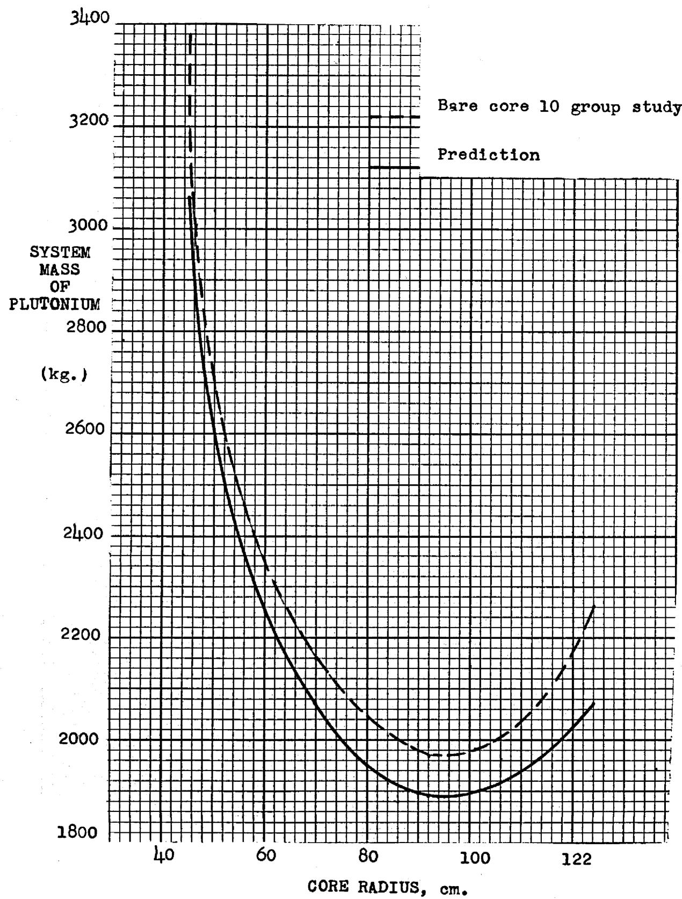  
Figure 4.1

CRITICAL MASS OF 49 IN CORE VS. CORE RADIUS

1600

CRITICAL

MASS

(kg of Pu.)

1400   
1200   
1000   
800   
400   
200

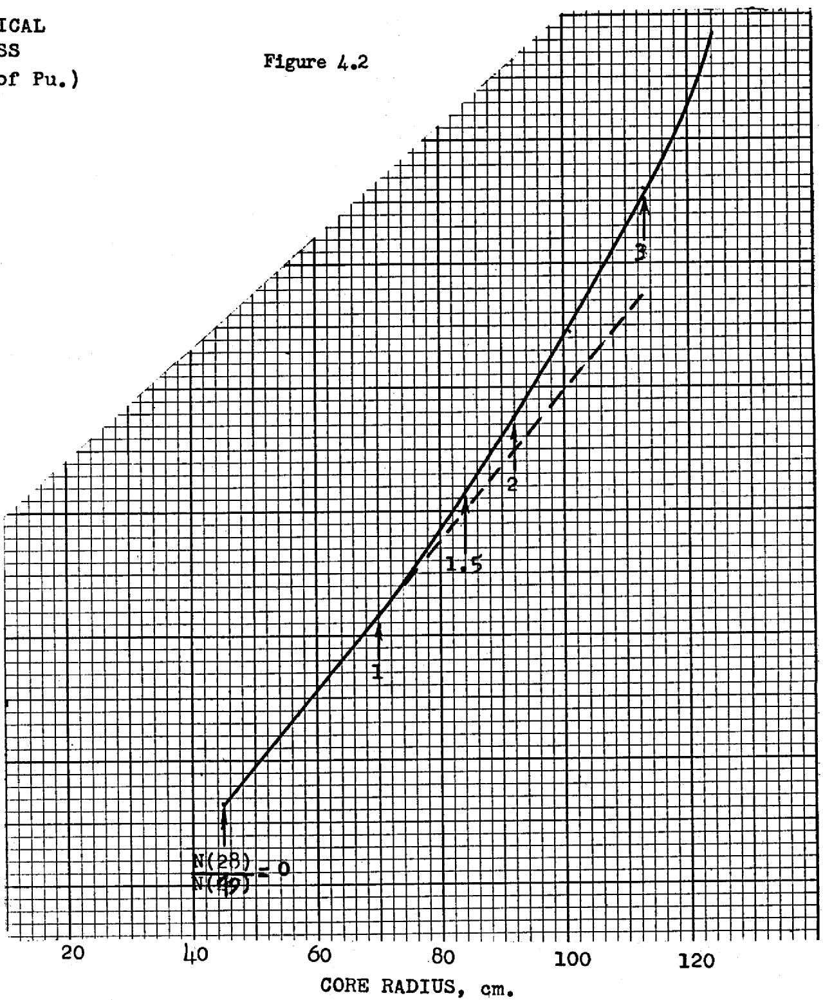  
Figure 4.2

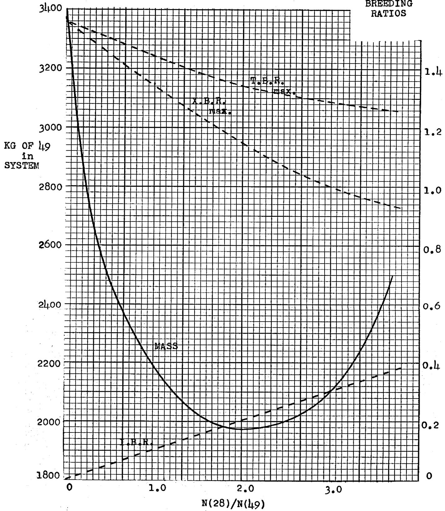  
Figure 4.3

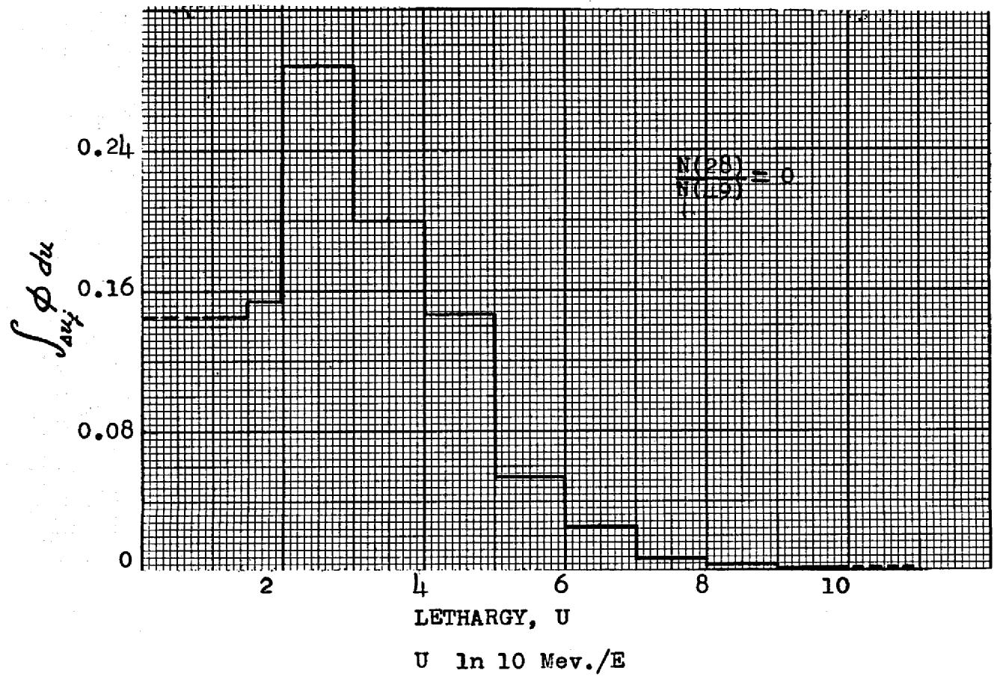  
Figure 4.4a   
ORNL LR Dwg. 15405   
CORE FLUX SPECTRUM VS. LETHARGY

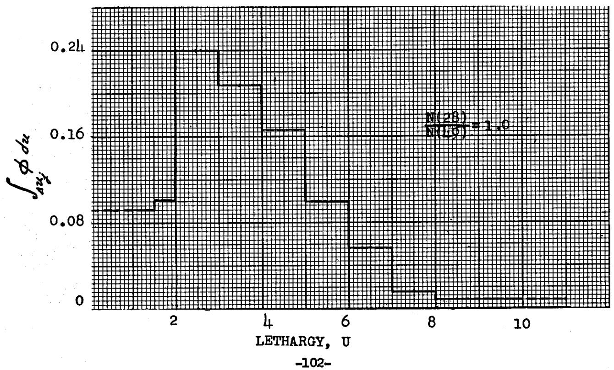

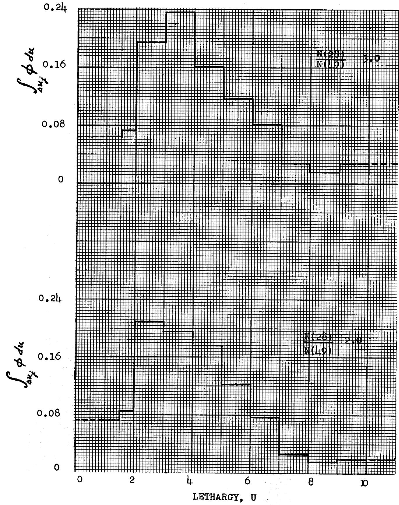  
Figure 4.4b

CAPTURE IN BLANKET URANTIUM PER ABSORPTION IN PLUTONIUM PER MILLION CUBIC CENTIMETERS VS. THICKNESS OF MODERATOR SECTION WITH CONSTANT MODERATOR PLUS BLANKET VOLUME

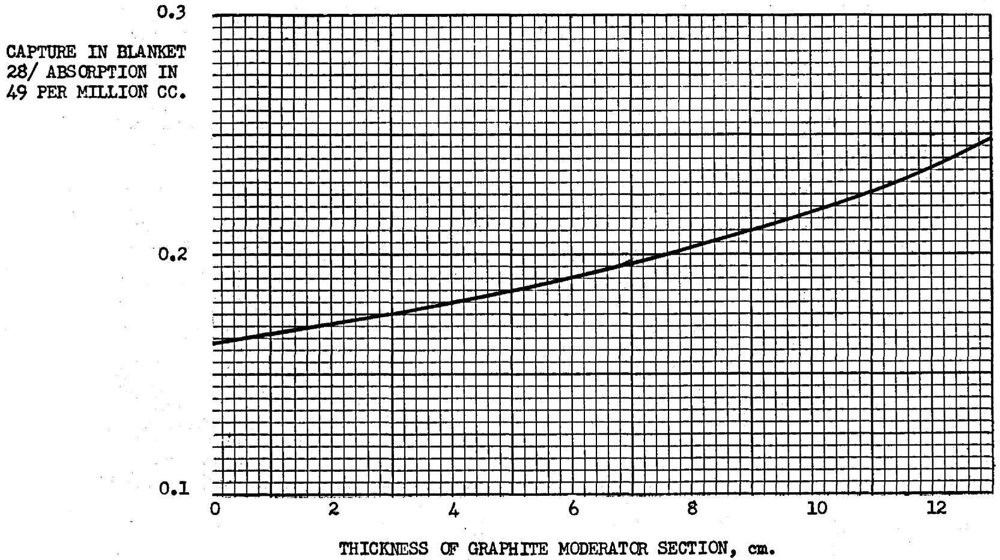  
Figure 4.5

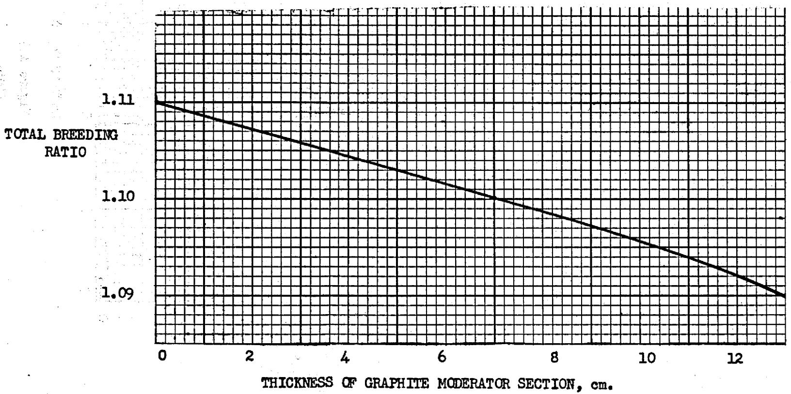  
TOTAL BREEDING RATIO VS. THICKNESS OF MODERATOR SECTION WITH CONSTANT MODERATOR PLUS BLANKET VOLUME   
Figure 4.6

# INTEGRAL FLUX VS. LETHARGY

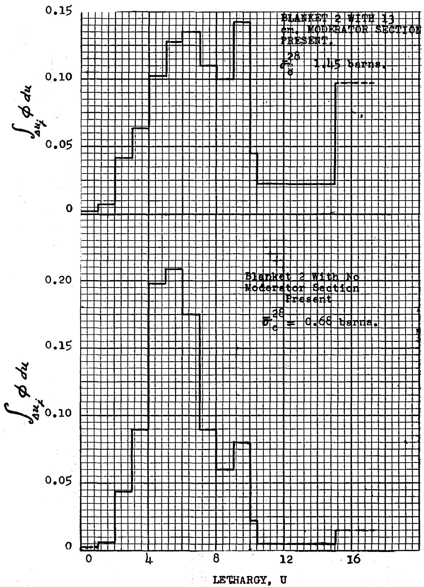  
Figure 4.7

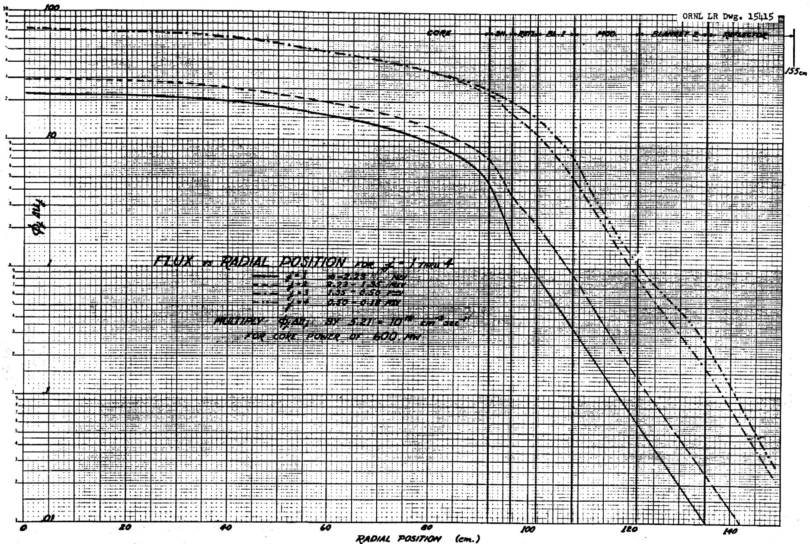  
Figure 4.8

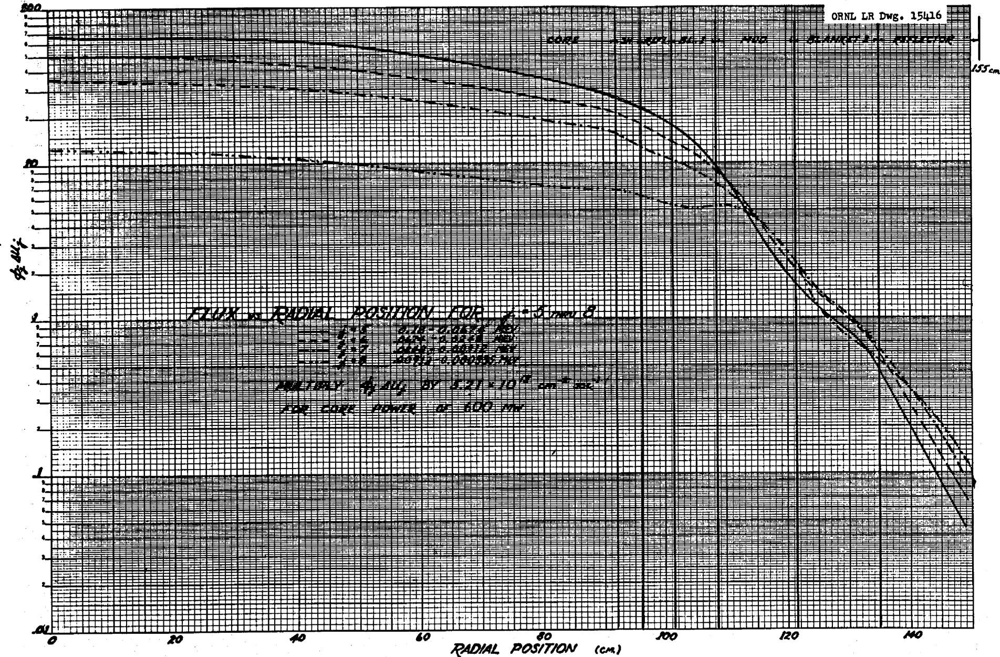  
108   
Figure 4.9   
-801

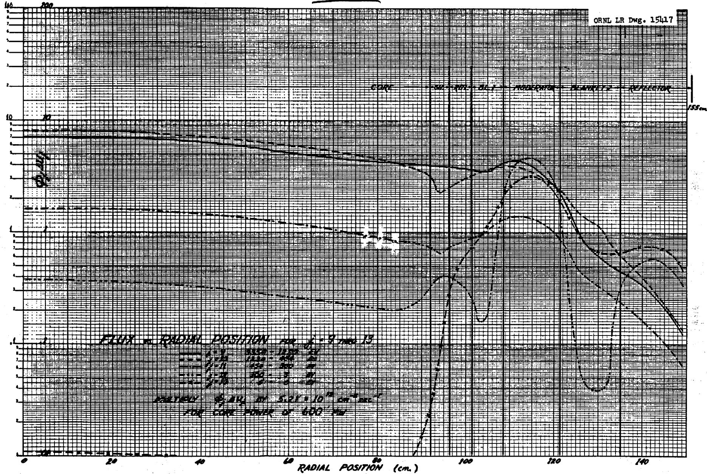  
109   
Figure 4.10

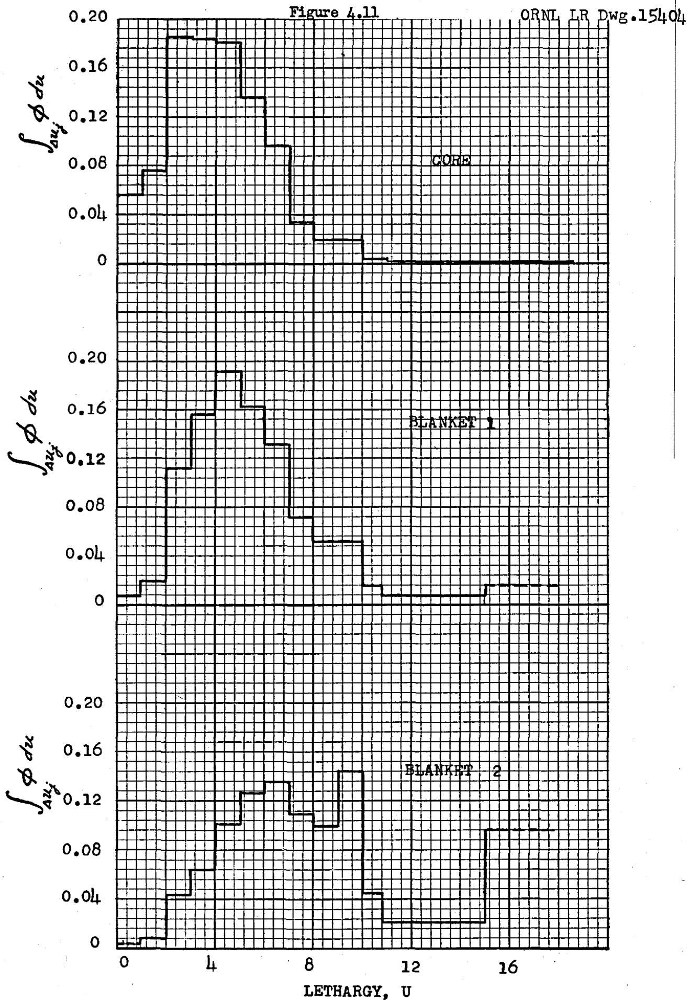

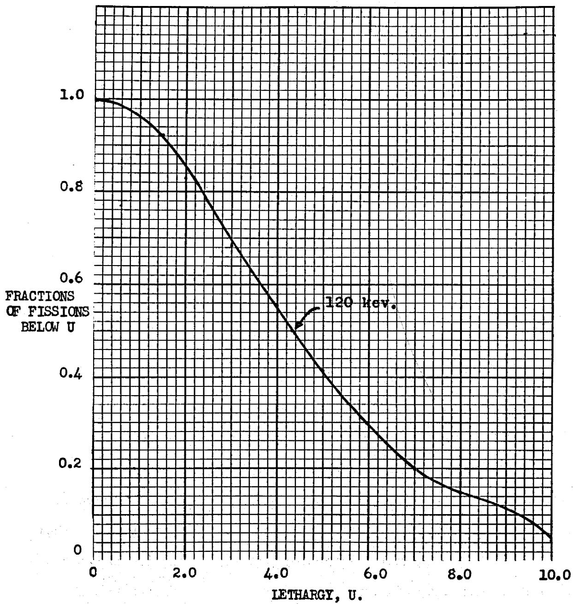  
FRACTION OF FISSIONS BELOW LETHARGY, U, VS. LETHARGY, U.   
Figure 4.12

# 5.1 GENERAL CONSIDERATIONS

The control of a fast reactor is no more difficult than that of a thermal reactor. Even though the prompt neutron lifetime is much shorter in a fast reactor, the delayed neutrons are still the controlling factor. It is the number of delayed neutrons available that determines the ease with which the reactor is controlled. In a plutonium fueled reactor there is less than one-half the number of delayed neutrons that are available in a reactor using $\mathbf{U}^{238}$ for fuel. Also, a circulating fuel reactor reduces the effective number of delayed neutrons available for control because some are born in the loop outside the core and are lost to the system. Therefore, the main difference between the control of a fast and thermal reactor is in the method of control.

One method of control is with the use of a neutron absorber. This method is not generally satisfagory for fast reactors because of the low capture cross sections for neutrons in the high energy spectrum. This requires that a large amount of absorber material be moved in a relatively short time. Also, the conversion ratio in a fast breeder reactor is lowered.

Another method of control is with the movement of fuel in the reactor. This does not lower the conversion ratio but does present the additional problems of having to remove the heat generated in the fuel rod and having to process the rod. This method is not too practicable in a circulating fuel reactor.

The use of a movable reflector appears to be the most practicable method of controlling a circulating fuel fast breeder reactor. This method has the disadvantage of having to move a large mass of reflector material in a short period of time. It also lowers the conversion ratio slightly. However, this method of control was selected for the reactor under consideration in this project.

# 5.2 DELAYED NEUTRONS

The control of a fast reactor with only prompt neutrons available would be extremely difficult because the average lifetime of prompt neutrons in a fast system is of the order of $10^{-6}$ seconds. When delayed neutrons are available, the average neutron lifetime in the system becomes approximately $10^{-2}$ seconds. This increases greatly the ability to control the reactor in a safe manner.

The fraction of delayed neutrons emitted by the fast fission of plutonium-239 is 0.0023 and of uranium-238 is 0.0176. From the nuclear calculations it was found that 5.7 percent of the total fissions are from uranium-238 so that the delay fraction, $\beta$ , is 0.0032. This is the value when the fuel is not being circulated.

In considering a circulating fuel reactor, it is obvious that a part of the delayed neutrons will be emitted outside the core and therefore lost to the system. The fraction of delayed neutrons that are useful to the circulating fuel reactor under steady state conditions can be calculated from the ratio of the average concentration of delayed neutron precursors in the core to the concentration of delayed neutron precursors in the core when the fuel is stagnant. This fraction for the $i$ th delay group can be written as follows:37

$$
\alpha_ {i} = 1 - \frac {1}{\lambda_ {i} t _ {d}} \left(\frac {e ^ {\lambda_ {i} t _ {e}} - 1}{e ^ {\lambda_ {i} t _ {e}} - e ^ {- \lambda_ {i} t _ {d}}}\right) (1 - e ^ {- \lambda_ {i} t _ {d}})
$$

where $\lambda_{1}$ is the decay constant, $t_d$ is the time spent in the core by the circulating fuel, and $t_e$ is the time spent outside the core by the fuel. The average $\alpha$ was found to be 0.519. Since one dollar of reactivity = $\overline{\alpha} \beta = 0.0017$ , the reactivity dollar has been deflated nearly fifty percent due to circulation of the fuel.

TABLE 5.1 38

DELAYED NEUTRONS FROM Pu239

TABLE 5.2 38   

<table><tr><td>i</td><td>τ1/2 (sec.)</td><td>λi (sec-1)</td><td>βi</td><td>αi</td></tr><tr><td>1</td><td>53.7</td><td>0.0129</td><td>0.00009</td><td>0.462</td></tr><tr><td>2</td><td>22.9</td><td>0.0303</td><td>0.00062</td><td>0.462</td></tr><tr><td>3</td><td>6.11</td><td>0.1134</td><td>0.00045</td><td>0.464</td></tr><tr><td>4</td><td>2.14</td><td>0.3238</td><td>0.00088</td><td>0.480</td></tr><tr><td>5</td><td>0.40</td><td>1.7325</td><td>0.00028</td><td>0.709</td></tr><tr><td>6</td><td>0.15</td><td>4.620</td><td>0.00002</td><td>0.884</td></tr></table>

DELAYED NEUTRONS FROM U238

<table><tr><td>i</td><td>τ1/2 (sec.)</td><td>λi (sec-1)</td><td>βi</td><td>αi</td></tr><tr><td>1</td><td>53.0</td><td>0.0131</td><td>0.00014</td><td>0.462</td></tr><tr><td>2</td><td>22.0</td><td>0.0315</td><td>0.00178</td><td>0.462</td></tr><tr><td>3</td><td>5.3</td><td>0.1308</td><td>0.00278</td><td>0.462</td></tr><tr><td>4</td><td>2.0</td><td>0.3466</td><td>0.00718</td><td>0.480</td></tr><tr><td>5</td><td>0.51</td><td>1.359</td><td>0.00419</td><td>0.657</td></tr><tr><td>6</td><td>0.18</td><td>3.851</td><td>0.00153</td><td>0.861</td></tr></table>

The lifetime of prompt neutrons can be calculated by

$$
L = \frac {1}{\bar {\nu} \nu \Sigma_ {F}} = 0. 5 \times 1 0 ^ {- 6} \text {s e c o n d s}
$$

where

and

In the region below prompt critical, the delayed neutrons determine the average neutron lifetime in the system.

With circulating fuel39

$$
\bar {L} = \sum_ {\frac {\alpha_ {1}}{\lambda_ {i}} ^ {1}} + L = 0. 0 1 8 \text {s e c o n d s}
$$

With stagnant fuel39

$$
\mathrm {L} = \sum_ {\lambda 1} ^ {\beta_ {1}} + \mathrm {L} = 0. 0 3 9 \text {s e c o n d s}
$$

# 5.3 TEMPERATURE COEFFICIENT OF REACTIVITY

The change in reactivity due to a change in temperature is of importance to the stability and control of the reactor. The largest contribution to this coefficient of reactivity is from the expansion of the fused salt. The following derivation is for an approximate value due to the change in density of the salt.

$$
k = \eta f \left(1 - \frac {D B ^ {2}}{\sum R}\right) \tag {5.3.1}
$$

where $\mathbf{DB}^2 =$ leakage cross section

and $\sum_{\mathbb{P}} =$ total removal cross section (including leakage)

$$
\frac {D B ^ {2}}{\sum_ {R}} = \text {p r o b a b i l i t y}
$$

$$
\begin{array}{l} 1 - \frac {D B ^ {2}}{\sum_ {e}} = \text {p r o b a b i l i t y} \\ \text {D e f i n e} \quad \sum_ {r} = \sum_ {R} - D B ^ {2} \tag {5.3.2} \\ \end{array}
$$

Substituting (5.3.2) in (5.3.1) and rearranging we get

$$
\begin{array}{l} k = \eta f \frac {\sum_ {r} / 0}{\sum_ {r} / 0 + B ^ {2}} (5.3.3) \\ \mathrm {I f} D = \frac {1}{3 \sum_ {T}} \\ k = \eta f \frac {3 \Sigma_ {r} \Sigma_ {r}}{\left(3 \Sigma_ {r} \Sigma_ {r} + B ^ {2}\right)} (53.9) \\ \end{array}
$$

From preliminary core calculations it was found that $3\sum_{\mathbf{r}}\sum_{\mathbf{t}} \approx \mathbf{B}^2$ so that small changes in $3\sum_{\mathbf{r}}\sum_{\mathbf{t}}$ in the numerator of (5.3.4) will not be affected very much if $3\sum_{\mathbf{r}}\sum_{\mathbf{t}} + \mathbf{B}^2$ in the denominator is assumed to be a constant. (5.3.4) can be rewritten as

$$
\begin{array}{l} k \simeq C _ {1} \Sigma_ {r} \Sigma_ {r} (5.3.5) \\ \text {a n d} \sum_ {r} = \sum_ {n = 1} ^ {\dot {i}} N _ {r i} \sigma_ {r i} = N _ {r} \sigma_ {r} (5.3.6) \\ \text {a n d} \sum_ {T} = N \sigma_ {T} (5.3.7) \\ \end{array}
$$

Since $\mathbf{N}_{\mathbf{r}} \neq \mathbf{N}$

then $\mathbf{N}_{\mathbf{r}} = \mathbf{C}_2\mathbf{N}$ (5.3.8)

Substituting (5.3.8) in (5.3.6)

$$
\sum_ {\mathrm {r}} \simeq \mathrm {C} _ {2} \mathrm {N} \sigma_ {\mathrm {r}} \tag {5.3.9}
$$

Substituting (5.3.7) and (5.3.9) in (5.3.5)

$$
x = 0 _ {3} N ^ {2} \tag {5.3.10}
$$

where $C_3 = C_1C_2\overline{\sigma_r}\overline{\sigma_r}$

Reactivity $= \frac{\mathrm{d}k}{k} \simeq \frac{2C_3N\mathrm{d}N}{C_3N^2} \simeq 2\frac{\mathrm{d}N}{N}$ (5.3.11)

and

so $\frac{dk}{k} \simeq 2\frac{d\rho}{\rho}$ (5.3.12)

From the curve of fused salt density vs. temperature $(^{\mathrm{OF}})$ , it was found that

$$
d \rho = - 4. 2 x 1 0 ^ {- 4} d T
$$

The average temperature of the fused salt in the core is $1200^{\circ}\mathrm{F}$ and the average density is

Hence $\frac{dK}{k} \simeq 2\frac{d\rho}{\rho} = -3.3 \times 10^{-4}$ dT

and the temperature coefficient of reactivity due to the expansion of the fused salt is negative and approximately

$$
3. 3 \times 1 0 ^ {- 4} \text {p e r} ^ {\circ} \mathrm {F}
$$

The above approximation was verified by a ten group, three region machine calculation which found the negative temperature coefficient of reactivity to be $2.4 \times 10^{-4}$ per ${}^{\circ}\mathrm{F}$ .

Since there is no experimental data on the density of the fused salt being used in this reactor, it was felt that the high temperature densities as obtained from theoretical calculations were not reliable. The temperature coefficient

of reactivity obtained using the theoretical densities appears to be on the high side. Therefore, $3.3 \times 10^{-4}$ per ${}^{\circ}\mathrm{F}$ was taken as an upper limit. The lower limit used in simulator studies was $2 \times 10^{-5}$ per ${}^{\circ}\mathrm{F}$ . These values appear to bracket the coefficients used in the design of similar reactors.

There are several other factors contributing to the coefficient of reactivity. The expansion of the lead in a partially filled reflector due to a rise in temperature will give an increase in reactivity. A simple calculation was made to determine the magnitude of this effect. It was assumed that the reflector was a cylindrical shell 176 cm high.

The change in the density of lead due to a temperature change was found from Figure 5.140 to be

$$
- 0. 0 0 0 6 5 \mathrm {g} / \mathrm {c m} ^ {3} / \circ \mathrm {F}
$$

Therefore, $\rho = \rho_{0} - 0.00065\mathrm{T}$

where $\mathbf{T}$ is the change in temperature from $\mathbf{T}_0$ .

If the reflector is one half full at $1200^{\circ}\mathrm{F}$ and the temperature is increased so the reflector level will raise one cm, the weight of lead will remain constant, so

$$
2 \pi r \times \frac {1}{2} h d \rho_ {0} = 2 \pi r (\frac {1}{2} h + 1) d (\rho_ {0} - 0. 0 0 0 6 5 T)
$$

Rearranging, T = 0.00065 (1 h+1)

$$
\mathcal {P} _ {\bullet} = 1 0. 2 2 \mathrm {g} / \mathrm {c m} ^ {3} \text {a t} 1 2 0 0 ^ {\circ} \mathrm {F}
$$

so T = 177°F rise.

If the total reactivity of the reflector is 0.016, then the average reactivity per cm of height is $0.9 \times 10^{-4}$ per cm. Therefore, a $177^{\circ}\mathrm{F}$ rise in temperature will raise the reactivity $0.9 \times 10^{-4}$ . The temperature coefficient of reactivity due to the expansion of the lead reflector is then approximately

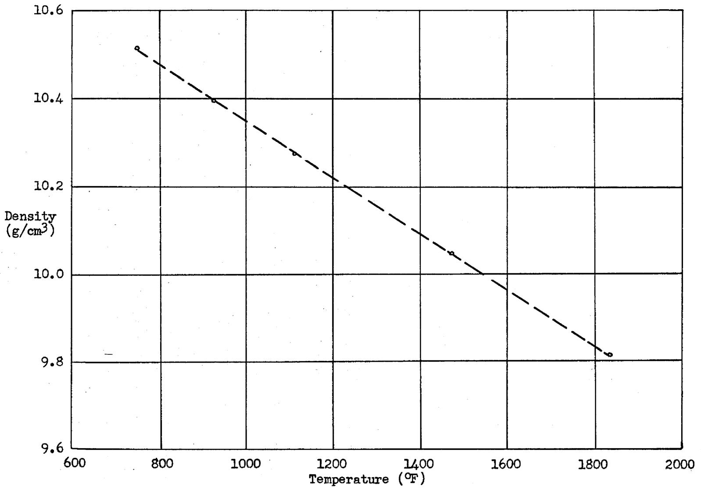  
三  
CHANGE OF DENSITY WITH TEMPERATURE OF LIQUID LEAD  
Fig. 5.1

$0.5 \times 10^{-6}$ and is positive. This is considerably smaller than the lowest value of the negative coefficient used for expansion of the fused salt.

The Doppler effect is another source of variation of reactivity with temperature. The overall effect is to increase resonance cross sections with an increase of temperature. Thus, the fissions in $\mathsf{Pu}^{239}$ will be increased with increasing temperature, leading to a positive temperature coefficient of reactivity. This positive coefficient is in part balanced by the negative coefficient of reactivity arising from the increased absorption in the $\mathsf{Pu}^{239}$ .

$U^{238}$ introduces a negative coefficient of reactivity so with the proper balance of the two materials, the positive coefficient can be cancelled out. It was found in a $U^{235}$ system that to obtain a negative temperature coefficient of reactivity, the ratio of $U^{238}$ to $U^{235}$ nuclei would have to be greater than 1.9. In the reactor being studied, the ratio of $U^{238}$ to $P u^{239}$ is 2.0. Although no calculation was made for the $P u^{239}$ system, it appears that if the temperature coefficient of reactivity due to the Doppler effect is still positive, it will be small compared to that obtained from the density change in the fused salt.

# 5.4 REFLECTOR CONTROL

The lead reflector will be used primarily for shim control to compensate for burn-up of the fuel. This will allow the addition of fuel at fixed intervals rather than continuously if concentration control were used. The operating level of the lead reflector at the beginning of a burn up period will be at a point where only 0.0025 of reactivity can be added by completely filling the reflector. This will allow for about ten days of operation between additions of fuel.

The dumping of the lead reflector can be used for normal shut downs of the reactor. However, the operating temperature of the fused salt must be maintained during shut down either by decay heat or by the addition of external heat. This is to prevent the reactor from going critical due to the negative temperature coefficient of reactivity if the temperature drops. The dumping of the fused salt will occur only as an emergency scream or when the reactor requires maintenance. Dumping of the lead reflector for shut down will reduce greatly the consequent start up time.

# 5.5 SIMULATOR STUDIES

Simulator studies were run to determine the stability of the system under changing load conditions. The load demand was varied from full load down to 1/6 load in steps of 1/6. The load was then taken back up to one half load and then to full load. Even though the load changes were made much faster than they could be changed in actual practice, the system proved to be very stable under these conditions. This was because of the negative temperature coefficient of reactivity and the large heat capacity of the system. The use of different negative temperature coefficients of reactivity only changed the time with which the system responded to the load changes.

Due to a lack of time, no method to hold the steam temperature at its design point when the load was reduced was simulated. However, there are several things that can be done, either wholly or in part, to maintain the steam temperature. The temperature of the boiler feed water can be reduced by reducing the amount of steam to the boiler feed water heaters or also the steam temperature can be reduced by attemperation. The auxiliary cooling system could be used to remove part of the heat. This design calls for constant speed pumps but if variable speed pumps were available they could be used to regulate the steam temperature. The temperature of the reactor could be varied by the reflector shim control but there is a lower limit to prevent freezing of the fused salt.

The following diagram shows the design temperatures of the various loops in the system at full load.

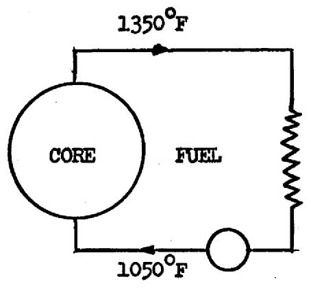

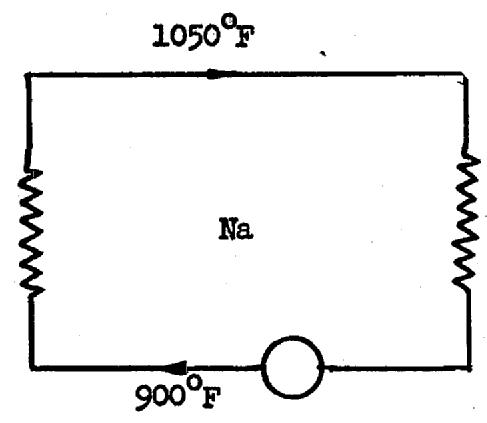

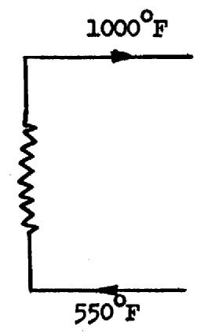

As seen in Fig. 5.2, the reactor power follows the load demand with practically no overshoot with a negative temperature coefficient of reactivity of $3.3 \times 10^{-4}$ . There is no noticeable change in the mean fuel temperature as the load demand is varied.

A negative temperature coefficient of reactivity of $2.0 \times 10^{-5}$ was used to obtain the results shown in Fig. 5.4. Even with this small coefficient, the reactor is stable but requires more time to reach equilibrium after a load demand change.

Fig. 5.5 shows the different temperatures obtained in the system when the load is varied. This is with no method of controlling the steam temperature in the simulator circuit.

The diagram used to set up this reactor system on the simulator is shown in Figs. 5.6 and 5.7.

ORNL LR Dwg. 15413

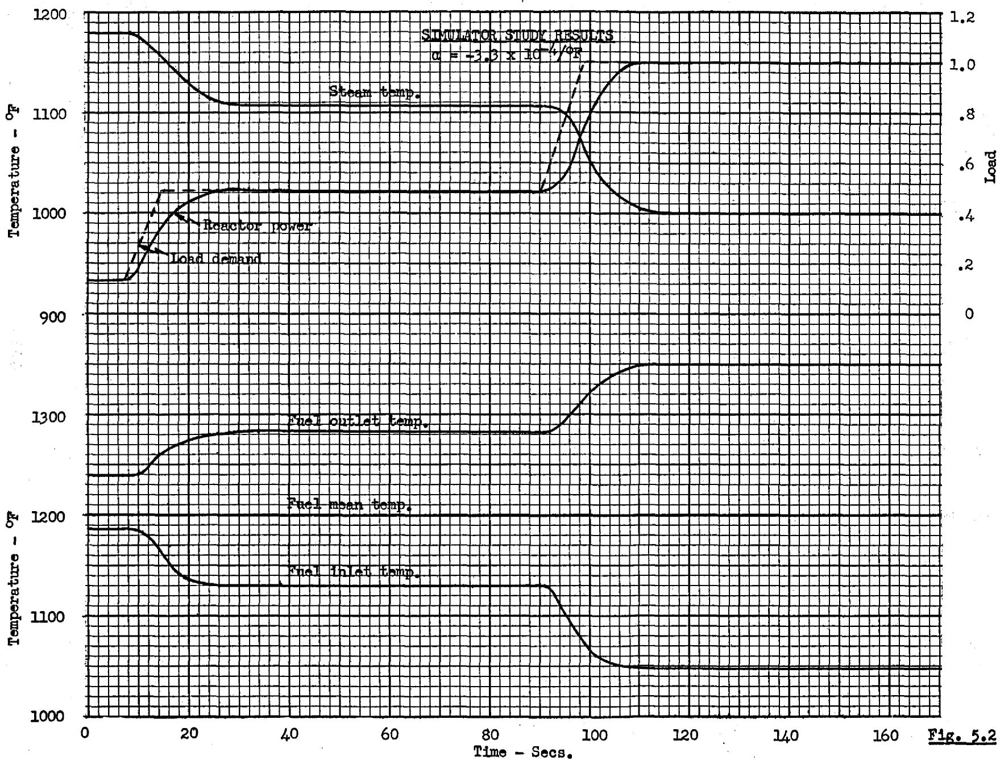  
124

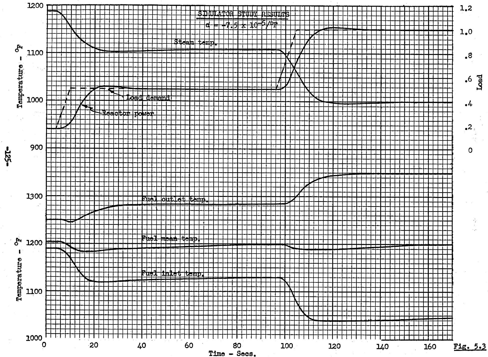  
125   
918T-3nI-ITNO

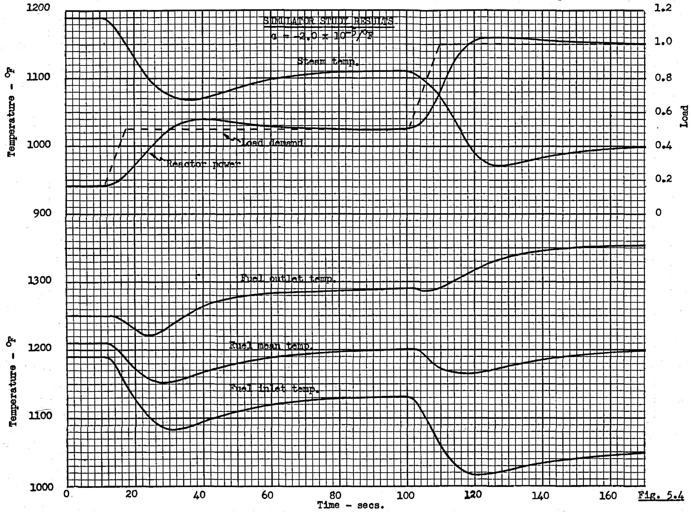  
126   
ORNL LR Dwg. 15414

# TEMPERATURES VS POWER DEMAND

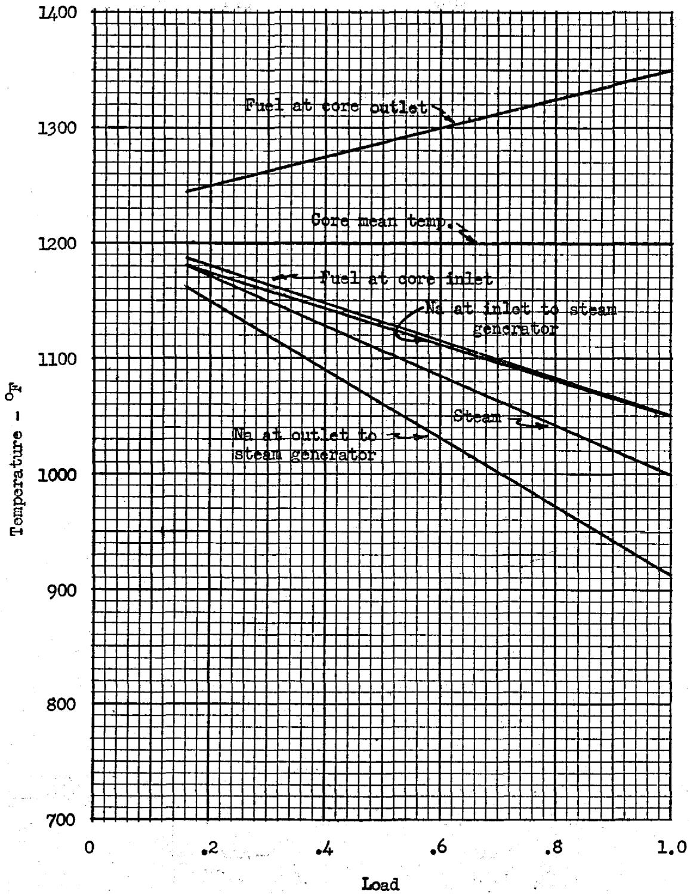  
Fig. 5.5

ORNL-LR-Dwg.18148

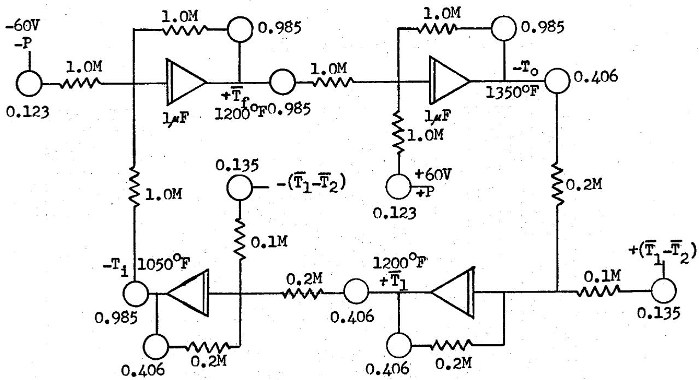  
FUSED SALT CIRCUIT

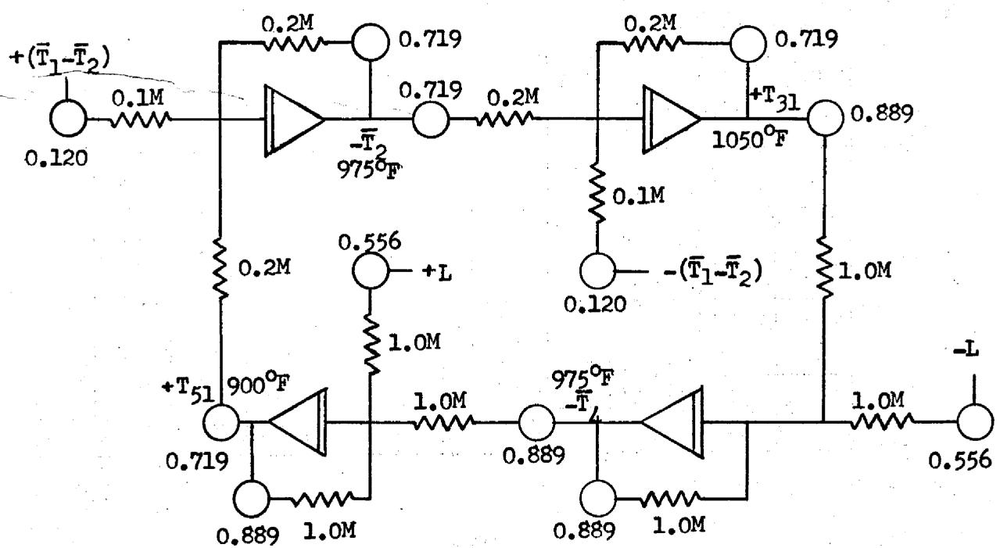  
SODIUM CIRCUIT   
SIMULATOR DIAGRAM   
Fig. 5.6

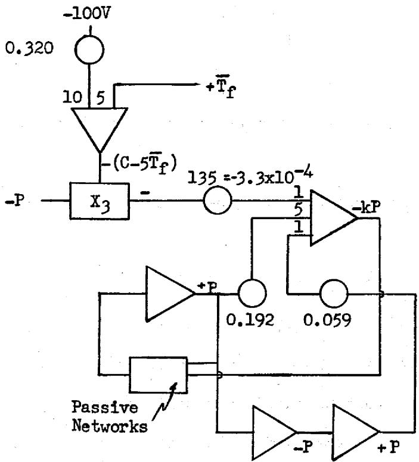

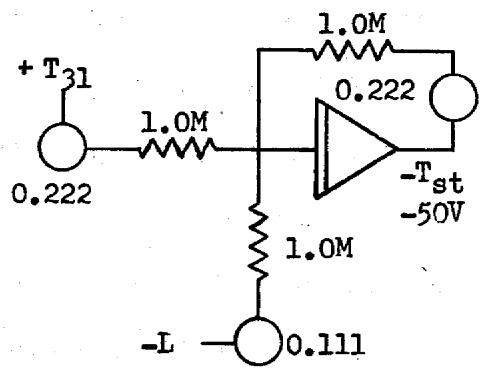  
STEAM TEMPERATURE CIRCUT

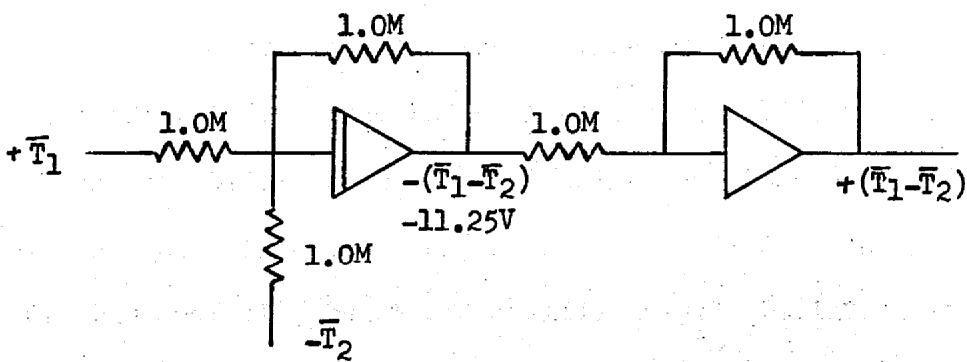  
REACTOR CIRCUIT   
COUPLING CIRCUIT BETWEEN FUSED SALT AND SODIUM CIRCUITS

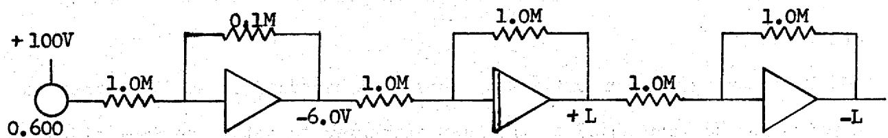  
LOAD DEMAND CIRCUIT   
SIMULATOR DIAGRAM   
Fig. 5.7

# 5.6 STARTUP PROCEDURE

The following procedure is to be used when the core is empty and the reactor is to be started up.

1. Bring blanket up to operating temperature by adding heat through the blanket heat exchanger.   
2. Heat fused salt to operating temperature in dump tanks.   
3. With the lead reflector empty and the source in the blanket, begin pumping the fused salt into the core, stopping at intervals to check criticality. With the source in the blanket, the multiplication constant is not very sensitive to the addition of fuel until the reactor becomes nearly critical. At this point, more care must be exercised as criticality is approached. The concentration of Pu must be such that when the core is completely filled and at operating temperature, the multiplication constant is 0.95. The pumping rate is 5 gpm which is adding reactivity at approximately 0.0001 per second. If a positive period is detected while filling the core, the dump valve will be opened automatically. It is estimated that the solenoid will operate in about 30 milliseconds and the core will empty in 4 seconds.   
4. After the core is filled, finish filling the fused salt loop and start the fuel circulating pump. Add heat through the main heat exchanger to keep the fuel at operating temperature.   
5. Fill lead reflector to operating level, stopping at intervals to check criticality.   
6. Add Pu to bring reactor critical. This must be added in small amounts at a point in the loop ahead of the heat exchanger to obtain maximum diffusion in the salt before it enters the core. This dampens out the fluctuations of the multiplication constant which occur when the richer fuel enters the

core. These fluctuations must not be large enough to put the reactor on a prompt critical period.

7. If the mean temperature of the reactor is below the operating temperature after it has gone critical, continue to add Pu until the reactor reaches the operating temperature. Then control the temperature level by reflector shim during the burnup period.

# CHAPTER 6 CHEMICAL PROCESSING

# 6.1 PROCESS FLOW SHEETS

# 6.1.1 Core Processing

The core processing flow sheet $^{42, 43, 44}$ is shown in Fig. 6.1. Both the core and blanket chemical treatments employ a Purex-type process as an integral part of their processing cycles. Since standard Purex is a relatively well-developed operation, it will not be explained in detail and is shown as a single block on the flow sheet.

The chemical process for the core is given in the following outline:

a. The fused salt is drained from the core. After "cooling" at the reactor site, it is transported to the processing plant.   
b. The solidified salt mixture is then dissolved in water using heat if required. Proper precautions are employed to maintain subcritical conditions.   
c. Sodium hydroxide is introduced to precipitate the uranium, plutonium, magnesium, and some fission products as hydroxides. After centrifugation, the the filtrate solution of sodium chloride and some fission-product chlorides is discarded by approved waste-disposal techniques, provided the plutonium content is low enough.   
d. The precipitate is dissolved in acidic solution buffered with ammonium ion.   
e. Ammonium hydroxide is introduced to a pH of 5-6 to precipitate the uranium, plutonium, and some remaining fission products as hydroxides. After centrifugation, the filtrate solution containing most of the magnesium is again discarded, if the Pu content is acceptably low.   
f. The precipitate is dissolved in nitric acid solution.

REACTOR CORE CHEMICAL PROCESSING

Flow SHEET

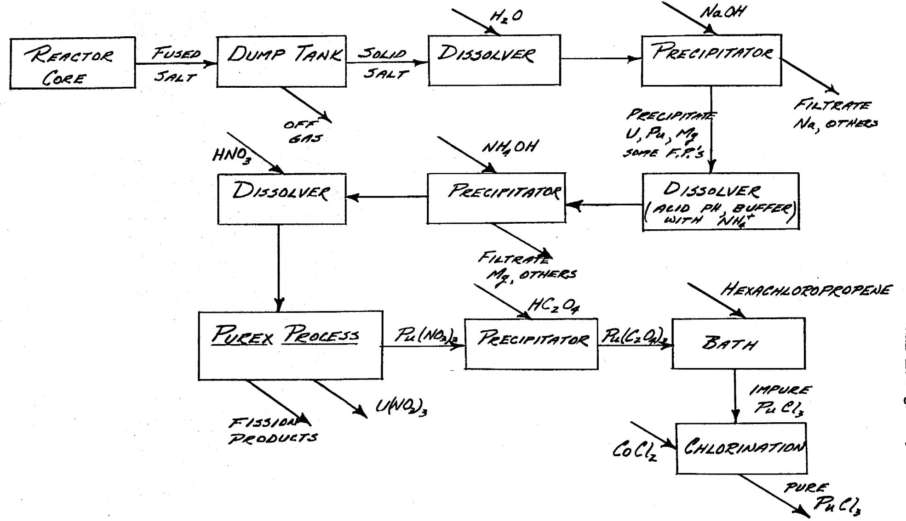  
Figure 6.1

to REACTOR

Cope

134

REACTOR BLANKET CHEMICAL PROCESSING

FLow SHEET

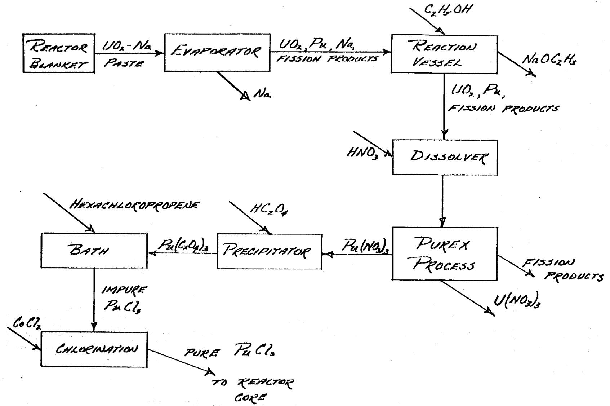  
Figure 6.2

g. A modified Purex process is used to obtain decontaminated plutonium nitrate. Details of some of the modification will be discussed in a later section.   
h. The plutonium is precipitated from nitrate solution with oxalic acid.   
i. The plutonium oxalate is refluxed in hexachloropropene for 24-48 hours at $224^{\circ}\mathrm{C}$ . Impure anhydrous plutonium trichloride (containing carbon) results.   
j. The plutonium trichloride is chlorinated with phosgene for eight hours at $600^{\circ}\mathrm{C}$ to remove impurities. The plutonium is then in a form which can be returned to the reactor core.

# 6.1.2 Blanket Processing

The blanket process flow sheet44 is shown in Fig. 6.2. The following outline summarizes the chemical processing scheme for the blanket:

a. The uranium dioxide-sodium paste is drained out of the blanket by use of pressure and dilution with additional sodium, if needed.   
b. After the paste is "cooled" at the reactor site and then transported to the processing plant, the sodium is evaporated from the uranium dioxide and is recovered for re-use.   
c. The uranium dioxide powder is contacted with ethyl alcohol to dissolve the remaining sodium. This step may not be necessary, depending on the efficiency of the previous step.   
d. The powder is then dissolved in hot nitric acid.   
e. The standard Purex process is employed to obtain decontaminated plutonium nitrate.   
f. Steps h through j in the core processing outline are followed to obtain plutonium in a form suitable for use in the core.

# 6.1.3 On-Site Fission-Product Removal

# 6.1.3.1 Off-Gas System

To make provision for the removal of fission-product gases, an off-gas system must be included in the design of the reactor complex. In addition, it is suspected that some chlorine gas may be given off from the core material, although the amount will probably be small.

With the production of some chlorine assumed, the following outline describes an off-gas system on the basis that some 9.4-year krypton will be formed and that the reactor will not be located in a desolate region where dispersal techniques could be used.

a. The gases from the circulating fuel loop are removed through a vent at the top of the inlet plenum to the primary heat exchanger. No compressor is required, since the core system is under pressure.   
b. After passing through a filter and a cooler to remove entrained particles and vapor, the gases go through a let-down valve. The salt from the filter and cooler is returned to the core system.   
c. The gases next pass through an aqueous or caustic scrubber and a silver nitrate reactor to remove the chlorine.   
d. The gases are dried at $-70^{\circ}\mathrm{F}$ to remove water vapor.   
e. After passage through charcoal absorbent beds, all rare gases are retained in the charcoal. If a carrier gas such as helium or nitrogen were introduced subsequent to the let-down valve, this gas would then pass through a CWS filter or equivalent and finally out of a stack.

Periodically, the charcoal beds would have to be heated, and the rare gases thus driven off would be stored in pressure cylinders. However, if the

amount of 9.4-year krypton were sufficiently small, buried pipes containing charcoal at ambient temperature could be substituted for the refrigerated charcoal beds and would provide sufficient holdup to allow decay of the rare gases before release to the atmosphere.

# 6.1.3.2 Precipitation of Fission Products

After the reactor has been in operation for a time, it is possible that certain fission products (presumably rare earths) will build up to concentrations exceeding their solubilities in the fused chloride core mixture. Thus, it is necessary to consider the removal of precipitating fission-product chlorides. Lack of experimental data in this area requires qualitative treatment of this problem.

Since fission-product concentrations will be building up rather slowly, it seems reasonable that they could be kept below their solubility limits by continuous processing of a small side-stream from the circulating fuel loop. This stream would be tapped off from the hot stream leaving the reactor core and then passed through a small large-tube vertical heat exchanger cooled by an auxiliary sodium stream. The chloride mixture would then go to one of two filters in parallel where precipitates would be removed. One filter would be on-stream while the solid material was being removed from the other.

To insure effective removal of fission-product precipitates, it would be necessary to cool the side stream to a temperature below the minimum in the circulating fuel loop. In order to prevent introduction into the core of a stream with cold spots, the side stream would be returned to the inlet plenum of the main heat exchanger, allowing time for mixing.

# 6.1.3.3 Distillation Removal of Fission Products

The possibility arose of the continuous partial removal of low-boiling fission-product chlorides from the core mixture by distillation of a small side-stream. Again, lack of experimental data prevents quantitative treatment of this problem. However, it is at least worthy of mention that it might be possible to postpone for a long period of time the complete aqueous processing of the core material by means of an on-site continuous distillation process.

# 6.2 CONSIDERATIONS LEADING TO PROCESS SELECTION

# 6.2.1 Processes Considered

Any attempt to select a chemical processing treatment for a reactor system as broadly defined initially as the one described in this report depended upon the basic problems of core and blanket materials selection. Quite naturally, every tentative choice of materials for either the core or the blanket necessitated a preliminary investigation of the processing problems involved in order to determine any excessive cost requirements or prohibitive operating conditions.

Although the nature of the reactor studied dictated the general type of material in the core, there was a considerable degree of latitude in choosing the blanket material, as indicated previously in the report. Under consideration were uranium dioxide-sodium systems and canned solid uranium in addition to fused uranium salts. Thus the chemical processes investigated included pyrometallurgical, volatilization, electrolytic, aqueous and other processes.

It became evident very early that any evaluation of most of the processes considered would be hindered by two potent factors, viz., lack of experimental data and non-existence of reliable cost data. Since the time to be spent on chemical processing during the course of the project was limited, it was decided that studies would be restricted to those processes on which sufficient experimental and cost data were available to allow a realistic appraisal. Unfortunately, this decision almost automatically eliminated everything except aqueous processing.

The above decision, however, was in line with the general project philosophy that the reactor system designed would be one for which a capability of construction might reasonably be expected to exist in the next couple of years.

In addition, it was felt that with the low fission-product capture cross sections in a fast reactor, it might be possible to process infrequently enough to make aqueous processing economical by employing a centralized processing facility. The vindication of this idea appears later. (See Section 6.3.1). Actually, this approach should be conservative, since economics will undoubtedly dictate that the construction of any type of processing facility have no higher costs than those estimated at present for aqueous plants.

# 6.2.2 Process Selection

Among the aqueous processes, the Redox and Purex processes have been most widely studied and are feasible for plant-scale construction. Data on other aqueous processes are not widely available, and it seems unlikely that much cost advantage could be obtained with any of them. Of the Redox and Purex processes, the latter is more economical; and thus, it was selected as the basis for chemical processing to separate uranium, plutonium, and fission products.

Before the choice of Purex could be finalized, however, several problems had to be resolved. Since thinking was in terms of a centralized processing facility, it was necessary to ascertain whether Purex could be adapted for use with the core material in order to be able to employ the same basic process for both core and blanket. This problem is discussed in Section 6.2.3. Further, there remained the determination of economical head-end and tail-end treatments suitable for the materials in the blanket and the core. Treatments were found and are outlined on the flow sheets in Sections 6.1.1 and 6.1.2.

# 6.2.3 Purex Modifications for Core Processing

Information obtained on the Purex process43 indicated that it would be entirely feasible to adapt the process to handle feeds of high plutonium

content. However, several major problems were apparent immediately.

Processing of fuels with high plutonium content requires close control of the Pu concentration to maintain subcriticality of all equipment. The high concentration of fission products in the feed poses both chemical handling and radiolytic reagent degradation problems. In the plutonium separation step, the reductant (ferrous sulfamate) concentration must be stepped up to maintain the increased amount of Pu in a chemically reduced state. This in turn leads to a requirement for separating large quantities of ferric ion from plutonium. The solution of these problems would require development work in the laboratory.

Much more dilute concentrations of uranium than in a standard Purex would have to be employed in order to maintain the low plutonium concentrations necessary for subcriticality. One method for alleviation of this situation which would bring the process closer to a standard Purex is to recycle uranium from the uranium strip column. This uranium is in a dilute nitric acid solution and could be used with additional nitric acid to dissolve the hydroxides from the head-end treatment, yielding a solution closer akin to the conventional Purex feed with respect to uranium concentration. To improve this treatment, a higher initial TEP concentration could be used in starting the Purex to provide a higher uranium concentration in the strip solution and this latter solution could be further concentrated by evaporation.

Longer fuel cooling times would lessen the decomposition of Purex reagents by fission-product decay. The increased amount of ferric ion in the final plutonium solution could be handled by increasing the ion exchange facilities employed in the standard Purex process.

# 6.2.4 Alternate Blanket Process

In addition to other processes mentioned, there was another $^{44}$ considered which is worthy of mention in detail, since it seems to have escaped mention in the literature and since it has quite interesting possibilities. The process depends upon the fact that plutonium dioxide becomes refractory at a much lower temperature $(500 - 600^{\circ}\mathrm{C})$ than does uranium dioxide (about $1100^{\circ}\mathrm{C}$ ) and most fission-product oxides and hence can be exceedingly difficult to dissolve from an oxide mixture. As a result, if the proper dissolution conditions are used upon an oxide mixture in which only the plutonium dioxide is refractory, the uranium dioxide and a good portion of the fission-product oxides can be dissolved initially. The resulting matrix can then be dissolved yielding a solution which contains mainly plutonium with some fission products.

Since no experimental data has been found on the decontamination obtainable, it is difficult to evaluate this process. However, it is interesting to consider its use for fast reactor bred material, where very high decontamination factors are not essential, due to low fission-product absorption cross sections. One possible limitation of this treatment is that the concentration of $\mathrm{PuO_2}$ in $\mathrm{UO_2}$ must be high enough so that the $\mathrm{PuO_2}$ will exhibit its own properties.

A tentative outline for such a process is given as follows:

a. The sodium is removed from the uranium dioxide-sodium blanket material by volatilization and alcohol dissolution as explained in Section 6.1.2.

b. An oxidation may be necessary to convert any plutonium metal to dioxide.

c. The oxide mixture is roasted at $500 - 600^{\circ}\mathrm{C}$ to make the $\mathrm{PuO_2}$ refractory. Depending upon the blanket temperature, this may have already been accomplished

during irradiation. On the other hand, too high a blanket temperature could cause all oxides to become refractory, destroying the feasibility of this process.

d. The uranium dioxide and most fission-product oxides are dissolved out of the mixture with hot concentrated nitric acid.   
e. The remaining material, mainly $\mathsf{PuO}_2$ , is dissolved in nitric acid containing fluoride (about $0.1\%$ HF).   
f. The plutonium is precipitated as oxalate and treated as described in Section 6.1.1.

# 6.3 PROCESSING CYCLE TIMES

# 6.3.1 General

Thus far, little mention has been made of the economic feasibility of the chemical processes already described. Actually, preliminary cost estimates were made before final process selection to insure that there would be no economically unrealistic choice made.

The determination of processing cycle times revolves largely, though not entirely, about the question of economics. For this reason, the major part of this section will be spent upon economics calculations. Although fission-product buildup is not as harmful in a fast reactor as in a thermal reactor, this problem affects the economy of breeding and will be treated.

Before specific discussion is begun, it should now be mentioned and emphasized that all process economics will be based on the use of a large centralized chemical processing facility. Previous economic studies bear out that the production of relatively cheap electric power requires the minimization of fuel processing costs through the existence of a central processing plant treating the fuel from a number of power reactors. Thus, it should be borne in mind that all cost figures are based on the assumed availability of such a processing plant.

# 6.3.2 Effect of Fission-Product and Transuranic Buildup

Although a study of the absorption cross sections of fission-product elements at high neutron energies indicates that poisoning effects will be small in a fast reactor, it is important to determine the magnitude of this effect and its influence upon the core process cycle time. P. Greebler $^{47}$ at KAPL has computed an average fission-product cross section from estimated

resonance parameter distribution for $\mathbf{U}^{235}$ fission in intermediate spectra. From a plot of Greebler's results, average values of $2\sigma_{\mathrm{p}}$ for each group in the final multi-group calculation were taken and averaged over the flux in lethargy space as shown in Table 6.1.

Table 6.1   

<table><tr><td>Group (j)</td><td>2 σp(barns)</td><td>φjΔuj(normalized)</td><td>2 σρ φΔu</td></tr><tr><td>1</td><td>0.029</td><td>0.0574</td><td>0.00166</td></tr><tr><td>2</td><td>0.034</td><td>0.0780</td><td>0.00265</td></tr><tr><td>3</td><td>0.041</td><td>0.1862</td><td>0.00763</td></tr><tr><td>4</td><td>0.057</td><td>0.1854</td><td>0.01057</td></tr><tr><td>5</td><td>0.086</td><td>0.1809</td><td>0.01556</td></tr><tr><td>6</td><td>0.152</td><td>0.1359</td><td>0.02066</td></tr><tr><td>7</td><td>0.318</td><td>0.0980</td><td>0.03116</td></tr><tr><td>8</td><td>0.695</td><td>0.0359</td><td>0.02495</td></tr><tr><td>9</td><td>1.5</td><td>0.0210</td><td>0.03150</td></tr><tr><td>10</td><td>2.8</td><td>0.0227</td><td>0.06356</td></tr><tr><td>11</td><td>5.8</td><td>0.0047</td><td>0.02726</td></tr><tr><td></td><td></td><td></td><td>0.237 barn = 2</td></tr></table>

To achieve sufficient burnup to provide two fission-product atoms for each plutonium atom in the core system would require about nine years of operation, with 600 MW core heat production, a core system Pu inventory of 1810 kg, and an $80\%$ load factor. If this situation existed, calculations indicate that the maximum possible fractional decrease in the external breeding ratio would be

$$
\frac {2 \overline {{\sigma_ {\rho}}}}{\bar {\sigma} _ {f} (1 + \bar {\alpha})} = \frac {0 . 2 3 7}{2 . 1 (1 + 0 . 2 6)} = 0. 0 9 0
$$

provided that sufficient additional plutonium is added to the core to maintain a constant internal breeding ratio. Thus, with an initial external breeding ratio of 0.852 and a constant internal breeding ratio, the decrease in the external breeding ratio per year will be

$$
\frac {0 . 0 9 0 \times 0 . 8 5 2}{9 . 0} = 0. 0 0 8 5 \text {p e r y e a r}
$$

No adjustment of this value will be made to account for removal of fission-product gases, since this effect will only be about $10\%$ and since there is uncertainty in Greebler's values.

To account for transuranic buildup, it was decided to make an order-of-magnitude correction only, due to limited time. Since it was felt that the net effect of transuranic absorption and fission would be of the same order-of-magnitude as the absorption in the fission products, the value for the decrease in external breeding ratio per year due to fission products was doubled to include the transuranic effect. Thus, the figure for the over-all decrease in external breeding ratio will be

$$
2 \times 0. 0 0 8 5 = 0. 0 1 7 \text {p e r y e a r}
$$

# 6.3.3 Economics and Process Cycle Time Selection

Regarding the reactor site stockpile for replacement of fuel burnup losses, it was decided to commence each quarter of the year with a three-month supply and to allow this quantity to dwindle essentially to zero before replacement at the start of the following quarter.

# 6.3.3.2 Core Processing

To determine the optimum core processing cycle time, an economic balance was made between processing cost and loss in breeding credit due to

fission-product and transuranic buildup. Neglected was the increased plutonium inventory cost with time due to the extra amount required to maintain criticality as poisons build up. Preliminary calculations indicated that this was a negligible factor. Changes in inventory cost due to changes in cooling time with varying process cycle time were also neglected.

Since the amount of uranium and plutonium in the core material remains essentially constant with time, the weight of these materials in the core system is

3605 kg of U + 1810 kg. of Pu = 5415 kg U and Pu.

At a cost of $62 per kg, for head-end and Purex treatment, the cost for this part of one core processing is

$$
5 4 1 5 k g \times \$ 6 2 / k g = \$ 3 3 5, 7 0 0.
$$

With a cost of $2000 per kg of plutonium for conversion of Purex plutonium nitrate to plutonium trichloride, the cost for this part of one core processing is

$$
1 8 1 0 k g \times \$ 2 0 0 0 / k g = \$ 3, 6 2 0, 0 0 0.
$$

Thus, the total cost for one core processing at any time is

$$
\$ 335,700 + \$ 3,620,000 = \$ 3,955,700.
$$

On a basis of one year, the processing cost per year is

$$
\frac {\mathbb {S} 3 , 9 5 5 , 7 0 0}{y}
$$

where $y$ is the number of years in the core processing cycle time.

Each time the core is processed, the diluent salts and the uranium trichloride must either be replaced or recovered. Since the cost involved is quite small, it will be computed on the basis that the salts will be replaced after each core processing. Cost figures obtained for sodium chloride, magnesium chloride and uranium trichloride are 12¢ per lb50, 15¢ per lb50, and $10 per kg51. Using these numbers, the cost of the core material (not including plutonium

trichloride) is $1.73 per lb of salt mixture. Thus, the cost for one replacement of this mixture is

$$
3 1, 7 7 0 1 b. x \mathbb {S} 1. 7 3 / 1 b = \mathbb {S} 5 4, 9 0 0
$$

The cost for salt replacement per year is then

$$
\frac {\mathbb {S} 5 4 . 9 0 0}{y}
$$

From the calculation in Section 6.3.2, the external breeding ratio decreases by 0.017 per year. With an $80\%$ load factor and an $\overline{\alpha}$ of 0.26, the reactor consumes 217.7 kg. of plutonium per year, using the conversion factor that 1.0 gm. Pu fissioned = 1 MWD. With a total breeding ratio of 1.09, the average breeding credit per year is

$$
2 1 7. 7 x \left[ 0. 0 9 - 0. 5 (0. 0 1 7) y \right] x \$ 1 5, 0 0 0
$$

where again y is the number of years in the core processing cycle time and where the excess bred plutonium is sold back to the AEC for $15 per gram. The results of selecting different values for y are shown in Table 6.2.

Table 6.2   

<table><tr><td colspan="6">Core Processing Economic Balance</td></tr><tr><td>y</td><td>Processing Cost ($103)</td><td>Salt Cost ($103)</td><td>Breeding Credit ($103)</td><td>Net Cost ($103)</td><td>Net Cost (mils/kwhr)</td></tr><tr><td>1</td><td>3955.7</td><td>54.9</td><td>266.2</td><td>3744.4</td><td>2.06</td></tr><tr><td>3</td><td>1318.6</td><td>18.3</td><td>210.6</td><td>1126.3</td><td>0.62</td></tr><tr><td>5</td><td>791.1</td><td>11.0</td><td>155.1</td><td>647.0</td><td>0.36</td></tr><tr><td>7</td><td>565.1</td><td>7.8</td><td>99.6</td><td>473.3</td><td>0.26</td></tr><tr><td>9</td><td>439.5</td><td>6.1</td><td>44.1</td><td>401.5</td><td>0.22</td></tr><tr><td>11</td><td>359.6</td><td>5.0</td><td>-11.4</td><td>376.0</td><td>0.21</td></tr><tr><td>13</td><td>304.3</td><td>4.2</td><td>-70.0</td><td>378.5</td><td>0.21</td></tr><tr><td>15</td><td>263.7</td><td>3.7</td><td>-122.5</td><td>389.9</td><td>0.21</td></tr></table>

The results of the cost analysis show that it would be most economical to process the core about once every 10 years or so. However, the core vessel will be replaced every five years, entailing a long reactor shut-down period. Thus, it was decided to process the core material during this period and avoid extra inventory charges during cooling-down shipping and processing.

# 6.3.3.3 Blanket Processing

To select the economically optimum blanket processing cycle time, a balance was made between processing cost and the inventory charge on the plutonium replacing that burned during reactor operation. It is assumed that the internal breeding ratio will be maintained constant at 0.238 and that the external breeding ratio will decrease with time from its initial value of 0.807.

With a total burnup of plutonium in the core of $217.7\mathrm{kg}_{0}$ per year and an internal breeding ratio of 0.238, the net amount of plutonium to be replaced is

$$
0. 7 6 2 \times 2 1 7. 7 \mathrm {k g} = 1 6 5. 9 \mathrm {k g} \quad \mathrm {P u / y e a r}
$$

again neglecting the extra amount of plutonium which must be added to counteract the increase in poisoning with time. If an inventory of enough Pu for three-months burnup is acquired at the beginning of each quarter, the initial stockpile every quarter will be

$$
1 6 5. 9 \times 0. 2 5 = 4 1. 5 \mathrm {k g} \text {P u}
$$

The average amount of plutonium inventory carried due to replacement of burned Pu is then

$$
4 1. 5 \times \left[ 0. 5 \left(\frac {z}{3}\right) + 0. 5 \right] k g P u
$$

where Z is the number of months in the blanket processing cycle time. The plutonium inventory cost per kg per year is 4% of $15,000. Thus, the total

Pu inventory cost due to burnup replacement is

$$
0. 0 4 \times \$ 1 5, 0 0 0 \times 4 1. 5 \times \left[ 0. 5 \left(\frac {z}{3}\right) + 0. 5 \right].
$$

Since the blanket contains $15,000\mathrm{kg}$ of uranium, the blanket processing cost per processing for the head-end and Purex treatments will be

$$
1 5, 0 0 0 k g U x \mathbb {S} 3 1 / k g = \mathbb {S} 4 6 5, 0 0 0
$$

since the amount of uranium in the blanket remains essentially constant with time. Per year, this cost is

$$
\$ 465,000 x \frac {1 2}{z}
$$

In addition, the charge per year for processing the blanket plutonium from Purex plutonium nitrate to plutonium trichloride will be

$$
2 1 7. 7 \mathrm {k g} \times \left[ 0. 8 5 2 - 0. 5 (0. 0 1 7) \frac {\mathrm {Z}}{1 2} \right] \quad \mathrm {x} \mathbb {S} 2 0 0 0 / \mathrm {k g}.
$$

The total processing cost will be sum of the two above costs. The economic balance as a function of time between blanket processing cost and plutonium burnup inventory cost is shown in Table 6.3.

Table 6.3   
Blanket Processing Economic Balance   

<table><tr><td>Z</td><td>Average Pu Inventory (kg)</td><td>Pu Inventory Cost ($103)</td><td>Processing Cost ($103)</td><td>Total ($103)</td><td>Total (mils/kwhr)</td></tr><tr><td>12</td><td>103.7</td><td>62.2</td><td>832.2</td><td>894.4</td><td>0.49</td></tr><tr><td>24</td><td>186.7</td><td>112.0</td><td>596.1</td><td>708.1</td><td>0.39</td></tr><tr><td>30</td><td>228.3</td><td>137.0</td><td>547.8</td><td>684.8</td><td>0.38</td></tr><tr><td>36</td><td>269.7</td><td>161.8</td><td>514.8</td><td>676.6</td><td>0.37</td></tr><tr><td>42</td><td>311.3</td><td>186.8</td><td>490.7</td><td>677.5</td><td>0.37</td></tr><tr><td>48</td><td>352.7</td><td>211.6</td><td>472.4</td><td>684.0</td><td>0.38</td></tr><tr><td>60</td><td>435.7</td><td>261.4</td><td>445.4</td><td>706.8</td><td>0.39</td></tr></table>

The results show that the economically optimum blanket processing cycle time is about three or four years. However, as there is uncertainty as to the corrosion effect that formation of $\mathrm{Na}_{2}\mathrm{O}$ in the blanket will have, a shorter cycle time is desirable. Thus, a blanket processing cycle time of two years will be selected, since the increase in cost is only about 0.02 mil per kwhr.

# CHAPTER 7 SHIELDING

# 7.1 GENERAL DESCRIPTION

The shielding of the reactor will consist of steel and standard concrete. In general, component shielding will be omitted; instead a compartmental shield will be used for the entire reactor cell room. This philosophy of shielding was adopted in order to facilitate maintenance and replacement of equipment.

Since the entire reactor cell room will be underground (Fig. 3.3), the surrounding earth will provide additional shielding, however this will not be taken into account in the calculations. The ceiling or top of the reactor cell room will have a shield 1.75 feet thick made of steel. The sides of the cell will have a thermal shield consisting of 4 inches of steel and a biological shield of 6 feet of ordinary concrete. The thermal shield will be made of 3 7/8 inches of carbon steel and 1/8 inch of stainless cladding on all surfaces which will require decontamination. Cooling of the thermal shield was not designed. However, it presents no problem, either air or water cooling may be used. The thermal shield structure will also provide the foundation for the steel containment vessel over the reactor plant. The biological shield will be made of ordinary concrete; all special concretes were rejected due to their high costs.[52]

# 7.2 REACTOR SHIELDING CALCULATIONS

# 7.2.1 Neutron Shielding

The results of the Univac calculations were utilized in determining the neutron leakage flux to be attenuated. Only the first four energy groups are of any concern with respect to shielding. Below are tabulated the energy groups and the neutron leakage.

Table 7.1   

<table><tr><td rowspan="2">J(Group No.)</td><td colspan="2">Leakage Neutron Energy</td></tr><tr><td>E (Mev)</td><td>(neutrons) Leakage (sec)</td></tr><tr><td>01</td><td>∞-2.23</td><td>2.3 x 108</td></tr><tr><td>02</td><td>2.23-1.35</td><td>4.9 x 108</td></tr><tr><td>03</td><td>1.35-0.50</td><td>21.7 x 108</td></tr><tr><td>04</td><td>0.50-0.18</td><td>20.7 x 108</td></tr></table>

The leakage surface area of the reactor is $2.3 \times 10^{5} \, \text{cm}^{2}$ . This results in a leakage flux of $1.0 \times 10^{3}$ , $2.1 \times 10^{3}$ , $9.5 \times 10^{3}$ , and $12.6 \times 10^{3}$ neutrons per $\text{cm}^{2}$ per sec for energy groups 01, 02, 03 and 04 respectively. This leakage flux is extremely small, hence the gamma rays will be the determining factor in the design of the shield.

# 7.2.2 Gamma Ray Shielding

Four major sources of gamma rays exist in this reactor configuration. These sources of radiation are the prompt fission gammas, fission product gammas, capture gammas, and inelastic scattering gammas.

The number and energy spectrum of the prompt fission gammas per fission is given in TID - 7004. By using the following equation, the number of gammas in this reactor system is determined:

$$
N _ {\rho \gamma} = 3. 1 \times 1 0 ^ {1 0} (\mathrm {E}) \mathrm {P} (\mathrm {r})
$$

The power density $\mathbf{P}(\mathbf{r})$ , was taken as 167 watts per c.c. the average power density in the core.

During operation, gammas are given off by the fission products. The number and energy spectrum per fission is given in TID - 7004. Again the average power density of 167 watts/c.c. was used.

Gammas are produced due to captures in the core vessel and the lead reflector. The core vessel was assumed to be steel. Using the average thermal flux in the core vessel as given by the Univac results, the cross-section for capture and the photons of various energies produced by captures, the number of gammas produced was calculated. Using the same technique, the same was done for the lead reflector.

Inelastic scattering gammas are produced in the core vessel, lead reflector, and in the blanket. Since the high energy gammas are the most difficult to shield, inelastic scatterings of only the two highest neutron energy groups were calculated. A major assumption was made concerning the energy of the gamma produced. Since very meager information exists as to the number and energy of inelastic scattering gammas, it was assumed that the 01 neutron energy group produced a single 10 MeV gamma and the 02 group, a single 2.2 MeV gamma. It is realized that this is a conservative assumption.

The energy spectrum of all gammas produced will be approximated by four energy groups; 2.0, 5.0, 7.0 and 10.0 MeV. The photons produced of energy less than 1.5 MeV were neglected; all others were averaged into the groups above. A further approximation is that the source of gammas other than core $\delta$ 's, will be taken as located at the outer surface of the lead reflector. The core was assumed to have self absorption and some attenuation is produced. Below are

listed the number of gammas produced:

sec-cm²

Table 7.2   

<table><tr><td rowspan="2">Source</td><td colspan="2">Gamma Ray Sources</td></tr><tr><td>Energy (Mev)</td><td>#Photons cm2-sec</td></tr><tr><td>1. Prompt Fission - Core</td><td>2.0</td><td>3.1 x 1013</td></tr><tr><td></td><td>5.0</td><td>3.3 x 1012</td></tr><tr><td>2. Fission Product - Core</td><td>2.0</td><td>1.2 x 1014</td></tr><tr><td>3. Capture - Core Vessel</td><td>2.0</td><td>2.9 x 107</td></tr><tr><td></td><td>5.0</td><td>7.0 x 107</td></tr><tr><td></td><td>7.0</td><td>6.4 x 107</td></tr><tr><td></td><td>10.0</td><td>1.4 x 108</td></tr><tr><td>Pb reflector</td><td>7.0</td><td>1.6 x 106</td></tr></table>

4. Inelastic Scattering

Core Vessel

2.0

4.6 x 109

Pb reflector

10.0

1.0 x 1010

Blanket

2.0

2.9 x 10

10.0

4.6 x 109

2.0

7.8 x 10

10.0

3.7 x 10

Since the 7.0 MeV gammas were much smaller in number than those of other energies, they were considered unimportant. This resulted in the following total surface sources of gamma rays.

Table 7.3   
Total Gamma Source   

<table><tr><td>Energy (MeV)</td><td>#Photons cm2 - Sec</td></tr><tr><td>2.0</td><td>1.5 x 1014</td></tr><tr><td>5.0</td><td>3.3 x 1012</td></tr><tr><td>10.0</td><td>3.7 x 1012</td></tr></table>

The gammas are attenuated through the blanket of $\mathsf{UO}_2$ and Na, the carbon moderator and reflector, the air (which was neglected), and the shield of steel and concrete. The spherical source was converted to a monodirectional infinite plane source and the attenuation calculations were performed using the appropriate equations. For a detailed analysis of the shielding calculations, see Appendix B.

It was found that 4 inches of steel and 6 feet of ordinary concrete or in the case of the top shield, the 1.75 feet of steel results in a radiation dose less than the maximum permissible dose of $50\mathrm{mr/hr}$ . This dose of $50\mathrm{mr/hr}$ was taken as the maximum permissible dose since no one will be required to spend more than 2 hours per week in a radiation area. This would give the person a total weekly dose of about $100\mathrm{mr/week}$ which is one-third the maximum permissible dose designated by the Atomic Energy Commission.

# CHAPTER 8 ECONOMICS

# 8.1 GENERAL

The reactor power cost of 6.5 mills/kwhr as presented below, compares favorably with conventional power cost. It must be realized however that, in spite of efforts to be on the conservative side, there are a number of uncertainties which when resolved might substantially change the total cost of reactor power.

A considerable uncertainty exists regarding reliability. The design is basically simple, but the high negative coefficient of reactivity combined with large temperature fluctuations could result in frequent dumping of the core.

The fuel and blanket processing costs were based on a large projected centralized chemical plant and might be revised upwards in actual experience.

The cost of operation and maintenance are arbitrarily arrived at since no experience is available. (See reference 56 and 57.)

# 8.2 CAPITAL COSTS

The capital costs were predicated on the following assumptions:

1) Cost of material and fabrication

Structural Steel .20 \$/1b

Stainless Steel 3.00 $/1b

Ni-Mo Alloy 10.00 $/1b

Heat Exchangers 30 to 50 $\mathbb{S} / \mathbb{ft}^2$

2) Cost of Installation

Piping $100\%$ of materials and fabrication

Vessels, Tanks and Heat Exch. 50% of materials and fabrication

Pumps 25% of materials and fabrication

3) Overhead and Contingencies 40% of installed cost

Table 8.1 shows capital cost of equipment for the reactor portion of the plant.

TABLE 8.1   
EQUIPMENT LIST AND CAPITAL COSTS FOR THE REACTOR PORTION OF THE PLANT   

<table><tr><td>ITEM</td><td>DESCRIPTION</td><td>MFR. COST</td><td>INST. COST</td></tr><tr><td>Core Vessel</td><td>73 1/2"0.D. 1/2" Wall</td><td>$24,000</td><td>$36,000</td></tr><tr><td>Core Piping</td><td>24"0.D. 1" Wall</td><td>$25,500</td><td>$38,300</td></tr><tr><td>Core Heat Ex.</td><td>3500-1/2" Tubes</td><td>$390,000</td><td>$660,000</td></tr><tr><td>Core Pump</td><td>2750 GPM 140 FT Head</td><td>$350,000</td><td>$437,000</td></tr><tr><td>Core Dump Tanks</td><td></td><td></td><td></td></tr><tr><td>With heating</td><td>3</td><td>$48,000</td><td>$72,000</td></tr><tr><td>Core Dump Piping</td><td></td><td>$10,000</td><td>$20,000</td></tr><tr><td>Core Injection Pump</td><td>1 GPM 80 FT Head</td><td>$3,500</td><td>$4,400</td></tr><tr><td>Core Fill Pump</td><td>5 GPM 80 FT Head</td><td>$3,500</td><td>$4,400</td></tr><tr><td>Blanket Vessel</td><td>120"0.D. 1" Wall</td><td>$162,000</td><td>$243,000</td></tr><tr><td>Blanket Piping</td><td>20"I.D. 1/2" Wall</td><td>$6,700</td><td>$13,400</td></tr><tr><td>Blanket Heat Ex.</td><td>1570-1/2" Tubes</td><td>$83,200</td><td>$125,000</td></tr><tr><td>Blanket Pump</td><td>28500 GPM 176 FT. Head</td><td>$300,000</td><td>$375,000</td></tr><tr><td>Blanket Rem. Eqpt.</td><td></td><td>$50,000</td><td>$75,000</td></tr><tr><td>Blanket Fill. Eqpt.</td><td></td><td>$75,000</td><td>$94,000</td></tr><tr><td>Sodium Piping</td><td>42"0.D. 1/2" Wall</td><td>$99,000</td><td>$198,000</td></tr><tr><td>Sodium Pumps</td><td>4-28,500 GPM 65 FT. Head</td><td>$1,000,000</td><td>$1,250,000</td></tr><tr><td>Boiler</td><td>2400-1/2" Tubes</td><td>$410,000</td><td>$615,000</td></tr><tr><td>Blanket Graphite</td><td></td><td></td><td>$50,000</td></tr><tr><td>Blanket Lead</td><td></td><td></td><td>$10,000</td></tr><tr><td>Blanket Uranium</td><td></td><td></td><td>$126,000</td></tr><tr><td>Remote Repl. Eqpt.</td><td></td><td></td><td>$400,000</td></tr><tr><td>500' Stack</td><td></td><td></td><td>$500,000</td></tr><tr><td>Instr. and Controls</td><td></td><td></td><td>$800,000</td></tr><tr><td>Steel Shell</td><td>60 FT. Dia 1" Wall</td><td>$110,000</td><td>$165,000</td></tr><tr><td>Reactor Crane</td><td></td><td></td><td>$30,000</td></tr><tr><td>Reactor Building</td><td></td><td></td><td>$750,000</td></tr><tr><td>Emergency Cooling</td><td></td><td></td><td>$500,000</td></tr><tr><td>Sodium Pumping</td><td></td><td></td><td>$300,000</td></tr><tr><td>Pressurizing and Venting System</td><td></td><td></td><td>$400,000</td></tr></table>

# 8.3 LIFE OF EQUIPMENT AND ANNUAL CHARGES DUE TO CAPITAL COSTS

1) Life of core heat exchanger 2 years.

Annual fixed charge = Interest + tax + depreciation = 6+6+50 = 62%

2) Life of core, core pump, and core piping 5 years.

Annual fixed charge $6 + 6 + 20 = 32\%$

3) Life of reactor plant 10 years.

Annual fixed charge $= 6 + 6 + 10 = 22\%$

4) Life of turbo-generator and general plant 30 years

Annual fixed charge: $6 + 6 + 3 = 15\%$

# 8.3.1 Power Cost Due to Capital Cost

1) Core heat exchanger $924,000 based on two years life.

$$
\frac {0 . 9 2 4 \times 1 0 ^ {9} \times 0 . 6 2}{1 . 8 2 \times 1 0 ^ {9}} = 0. 3 1 4 \text {m i l l s / k w h r}
$$

2) Core, core piping, core pump, blanket pump, and sodium pumps

$$
\$ 3,090,000 \text {b a s e d o n a f i v e y e a r l i f e}.
$$

$$
\frac {3 . 0 9 \times 1 0 ^ {9} \times 0 . 3 2}{1 . 8 2 \times 1 0 ^ {9}} = 0. 5 4 4 \mathrm {m i l l s / k w h r}
$$

3) All other reactor parts $7,520,000 based on a ten year life.

$$
\frac {7 . 5 2 \times 1 0 ^ {9} \times 0 . 2 2}{1 . 8 2 \times 1 0 ^ {9}} = 0. 9 1 \mathrm {m i l l s / k w h r}.
$$

4) Turbo-generator and general plant at 105 $/kw.

$$
\frac {1 . 0 5 \times 1 0 ^ {3} \times 0 . 1 5}{7 \times 1 0 ^ {3}} = 2. 2 5 \mathrm {m i l l s / k w h r}.
$$

Total power cost due to capital cost:

4.018 mills/kwhr

Equivalent capital cost: $\frac{7 \times 10^3 \times 4.018}{0.15} = \$187 / kw$ .

# 8.4 FUEL INVENTORY CHARGES

1) Plutonium inventory in system 1,810 kg.

Inventory cost at 15 $/gm. Pu 1,810 x 15 x 10³ = $27.1 x 10⁶

Inventory charge at 4% = $1,085 x 10³

2) Plutonium inventory (Average)

Supply to the core $104\mathrm{kg}$

Inventory cost 104 x 15 x 10³ = $1.56 x 10⁶

Inventory charge $62.4 x 10³

3) Power cost due to inventory charges

Total inventory charge $\$ (1,085 + 62.4)$ x $10^{3} = 1,147.4 \times 10^{3}$

Charge per kwhr. $\frac{1.1474 \times 10^{9}}{7 \times 10^{3} \times 260 \times 10^{3}} = 0.630 \text{ mills/kwhr}$ .

# 8.5 PROCESSING COST SUMMARY

1) The salt will be processed every five years.

Cost of processing uranium and plutonium with salt 62 $/kg.

Cost of replacing salt: $1.73/lb.

Total weight of uranium and plutonium in salt 5415 kg.

Plutonium processing cost at 2000 $\mathbb{S} / \mathbb{kg}$

$$
5, 4 1 5 \times 6 2 + 3 1, 7 7 0 \times 1. 7 3 + 1, 8 1 0 \times 2, 0 0 0 = \\ \\ 4, 0 1 1, 0 0 0.
$$

Core processing cost: 4,011,000/5 = 802,000 $/year

2) The blanket will be processed every second year.

Cost of processing paste 31 $\mathbb{S} / \mathbb{kg}$ . of uranium.

Plutonium processing cost: 2,000 $\mathbb{S} / \mathbb{kg}$

Total weight of uranium in paste 15,000 kg.

Total cost of blanket processing:

$$
\frac {1 5 , 0 0 0 \times 3 1 + 1 8 4 \times 2 , 0 0 0}{2} = \$ 4 1 6, 5 0 0.
$$

3) Power cost due to processing:

Total processing charge: 802,000 + 416,500 = $1,218,500

Charge per kwhr: $\frac{1.285x10^9}{1.82x10^9} = 0.67\text{mills/kwhr}$ .

# 8.6 CREDIT FOR BREEDING

Breeding ratio: 1.09

Plutonium gain per year: 10.3 kg.

Credit per kwhr: $\frac{10.3 \times 15 \times 10^6}{1.82 \times 10^9} = 0.085$ mills/kwhr.

# 8.7 OPERATION AND MAINTENANCE

We assumed a one mills/kwhr power cost due to operation and maintenance.

# 8.8 COST SUMMARY

The cost of procuding electrical power by the system reported upon here is shown in Table 8.2.

TABLE 8.2   

<table><tr><td>ITEM</td><td>TOTAL POWER COSTS: MILS/kwhr.</td></tr><tr><td>Capital costs</td><td>4.018</td></tr><tr><td>Fuel inventory</td><td>0.630</td></tr><tr><td>Processing</td><td>0.670</td></tr><tr><td>Credit for breeding</td><td>-0.085</td></tr><tr><td>Operation and maintenance</td><td>1.000</td></tr><tr><td>Total cost:</td><td>6,233 mils/kwhr.</td></tr></table>

# CHAPTER 9. RECOMMENDATIONS FOR FUTURE WORK

# 9.1 GENERAL

In order to determine better the technical and economic feasibility of a fused-salt fast power reactor system, an extensive program of research and development would be necessary. The following sections suggest areas in which important contributions can be made toward the advancement of the fused-salt reactor technology.

It is realized that significant technical efforts in certain study areas mentioned may currently be in progress. However, lack of knowledge of this work prevents inclusion here.

# 9.2 ENGINEERING

To increase the feasibility of a fused-salt reactor for power production, development programs should be conducted to perfect valves and variable capacity pumps for use in circulating fuel heat exchange loops. To improve the basis for the use of once-through boilers, it would be most helpful to have better data for the prediction of pressure drops and heat transfer coefficients for two-phase aqueous flow in such boilers.

To treat the problem of heating in a volume which has gamma-rays being produced in it and is exposed to a gamma-ray source, better analytical methods correlated with experimental data are required.

Further information is needed on the feasibility of making the blanket paste of sodium and uranium dioxide or other high solid content slurries. Additional data on concentrations obtainable would also be desirable, as would information on the characteristics of equipment used to achieve such high concentration.

# 9.3 MATERIALS

Progress in the fused-salt technology necessitates extensive experimental work on salt systems. Phase diagrams for ternary and quaternary chloride systems containing fuel are almost non-existent and are badly needed. Likewise specific heats, viscosities, thermal conductivities and other physical properties of fused-salt mixtures are required to analyze possible reactor systems.

Information on the physical properties of high density oxide slurries in sodium should be obtained. The corrosion caused by the presence of $\mathrm{Na}_2\mathrm{O}$ in such a slurry should be investigated, as should possible remedial techniques such as addition of anti-oxidants.

Both static and dynamic corrosion-rate data on fused salts in various structural materials, especially the new nickel-molybdenum alloys, should be taken in the temperature range from $900 - 1500^{\circ}\mathrm{F}$ . The effects of mass transfer in heat exchange loops made of these materials should be assessed experimentally with long-time tests. Scale coefficients of fused salts in different materials need to be determined.

# 9.4 CHEMICAL PROCESSING

To eliminate or reduce the requirement for aqueous processing, it would be advantageous to investigate the continuous or semicontinuous removal of volatile fission-products chlorides by distillation from fused chloride mixtures containing uranium trichloride. It might also be worthwhile to consider the oxidation of $\mathrm{UCl}_3$ and $\mathrm{PuCl}_3$ to $\mathrm{UCl}_4$ and $\mathrm{PuCl}_4$ to effect a gross separation of fuel and fertile material from fission-product and diluent chlorides by distillation of the more volatile tetrachlorides.

In the case of fused salt mixtures irradiated to 50 or $100\%$ fuel burnup, studies should be made to ascertain the effects of high fission-product concentrations on mixture properties. Although precipitation and deposition might occur, this might possibly be employed as a method for removing insoluble fission-product chlorides from a side-stream which is cooled and filtered.

Experimental work should be done on the aqueous processing of fuels containing high concentrations of fission products and plutonium. Recycle of a diluent uranium stream to simplify the chemical and criticality problems involved should be investigated.

# 9.5 REACTOR CONTROL

Further calculations of the Doppler effect should be carried out to determine whether it is positive or negative. A detailed study of possible reactor accidents should be made in order to define better the control problems involved in the operation of a fused-salt fast power reactor.

# 9.6 ECONOMICS

Many of the cost figures used in making the economic studies in this report are based on the arbitrarily standardized numbers. In addition, other figures have been assumed with rather weak bases, due to the lack of good cost information. Thus, further information developed in the future or new AEC decisions may change any or all of the cost figures.

In order to determine the feasibility of a fused-salt reactor system which will be constructed and operated at some time in the future, it will be necessary to make more valid economic projections in time if any truly realistic cost study is to be made. The ability to do this will depend largely upon changes in the amount of government regulation in the reactor field, which are difficult to predict.

# A.1 CIRCULATING FUEL HEAT EXCHANGER

Total heat load14 Q = 600 MW x 3.413 x 10⁶ BTU MWhR = 2.05 x 10⁹ BTU HR

Fuel flow8 $W_{f} = \frac{Q}{\Delta t x C_{p}} = \frac{2.05 \times 10^{9}}{300 \times .2} = 34.2 \times 10^{6} \frac{1b}{hr}$

Fuel area at 20 fps fuel vel, $A_{f} = \frac{W_{f}}{\int V} = \frac{34.2 \times 10^{6}}{155 \times 20 \times 3.6 \times 10^{3}} = 3.06 ft^{2}$

Sodium flow $W_{\mathrm{Na}} = \frac{Q}{\Delta t \times C_{\mathrm{p}}} = \frac{2.05 \times 10^{9}}{150 \times .3} = 45.5 \times 10^{6} \frac{1 \mathrm{~b}}{\mathrm{hr}}$

Sodium area at 30 fps Na vel. $A_{\mathrm{Na}} = \frac{W_{\mathrm{Na}}}{\sqrt{V}} = \frac{45.5 \times 10^{6}}{50 \times 30 \times 3.6 \times 10^{3}} = 8.43 \, \mathrm{ft}^{2}$

Tube area per cell $\frac{\pi}{2} r^2 = 1.57x\cdot 20^2 = .0628$ inch²

Cell area A+Na .0628 4.8+8.43 x .0628 = .272 inch²

Tube spacing, a = √.272 .792 inch

Tube clearance, .792 - .500 in. .292 inch which is adequate for welding.

Number of tubes, $\frac{A_{\mathrm{f}}}{\frac{\pi}{4} d_{\mathrm{t}}^{2}} = \frac{3.06}{.1255 / 144} = 3,500$

Prandtl8 number for fuel, $\mathrm{Pr} = \frac{\mathrm{c_p}\mu}{\mathrm{k}} = \frac{2\times 6.72\times 3.6\times 10^3}{1\times 10^3} = 4.84$

Reynolds $\pmb{\mathcal{S}}$ number for fuel, Re = DV 5 40 x 20 x 155 x 103 15.4 x 10

Nusselt $\mathbf{\Omega}^{\mathrm{8}}$ number for fuel, $\mathrm{Nu} = .023\mathrm{(Re)}^{*8}\mathrm{(Pr)}^{*4} = .023\times 2190\times 1.88 = 94.8$

Heat transfer coefficient for fuel $\frac{17}{1} h = \frac{k}{D} N u = \frac{1}{.40 / 12}$ 93 = 2790 Btu/hr ft²oF

Heat transfer coefficient for tube wall $h = \frac{k}{t} = \frac{12}{.050 / 12} = 2880$ Btu/hr ft²

Equivalent diameter for sodium, $D_{\mathrm{e}} = \frac{4A}{b} = \frac{4x.194}{x.25} = .99$ inch

Prandtl number for sodium, $\mathrm{Pr} = \frac{\mathrm{C_pU}}{\mathrm{K}} = \frac{3\times 1.53\times 3.6\times 10^3}{38\times 10^4} = 4.35\times 10^{-3}$

Reynolds number for sodium, Re = DeV = .99 x 30 x 50 / 12 x 1.53 x 10-4 = 810 x 10³

Nusselt number for sodium, $\mathbf{Nu} = 7 + .025$ (PrRe) $^{\bullet 8} = 7 + .025\times 871 = 28.8^{(8)}$

Heat transfer coefficient for sodium, h = K Nu = 38 x 28.8 = 13.3 x 10³ Btu/hr ft²⁰ F

Overall heat transfer coefficient,

$$
\frac {1}{u} = \frac {A _ {o}}{h _ {f} A _ {f}} + \frac {A _ {o}}{h _ {w} A _ {w}} + \frac {1}{h _ {\mathrm {N a}}} = \frac {1 . 2 5}{2 , 7 9 0} + \frac {1 . 1 1}{2 , 8 8 0} + \frac {1}{1 3 , 3 0 0}
$$

u = 1,100 Btu hr ft² oF

Mean temperature difference $\frac{\Delta t_{\mathrm{m}}}{\ln \Delta t_{\mathrm{f}} / \Delta t_{\mathrm{Na}}} = \frac{300 - 150}{\ln \frac{300}{150}} = 216^{\circ} \mathrm{F}$

required tube length, $\mathbf{L} = \frac{\mathbf{Q}}{\mathbf{UA}\Delta\mathbf{t}_{\mathbf{m}}}$ where

$$
\begin{array}{l} A = N _ {T} \pi D _ {T} = 3, 5 0 0 \times \pi \left(\frac {2 . 5}{1 2}\right) = 4 5 8 f t ^ {2} / f t \\ L = \frac {2 . 0 5 \times 1 0 ^ {9}}{1 , 1 0 0 \times 4 5 8 \times 2 1 6} = 1 8. 8 f t \\ \end{array}
$$

Pressure drop through tubes, $\Delta P_{\mathrm{T}} = \frac{fV^{2}}{2g}$ L D

Relative roughness $\frac{\epsilon}{D} = .00014$ and friction factor $f = .028$

$$
\Delta P _ {T} = \cdot \frac {0 2 8 x 4 0 0 x 1 5 5 x 1 8 . 8}{6 4 . 4 x 4 0 0 / 1 2} = 1 5, 2 0 0 \mathrm {l b} / \mathrm {f t} ^ {2} = 9 8 \mathrm {f t}
$$

Entrance and exit loss $\left(\mathrm{K}_{\mathrm{e}} + \mathrm{K}_{\mathrm{c}}\right)\frac{\mathrm{V}^{2}}{2\mathrm{g}} = 1.4\frac{400}{64.4} = 8.7$ ft

Total pressure drop through heat exchanger 106.7 ft

Minimum allowable tube wall thickness19

$t = \frac{DP}{2S}$ where $P = 150 \, \text{psi}$ and from ASME Unfired Pressure Vessel Code at $1350^{\circ}\text{F}$

allowable stress, S = 3,000 psi, t = .5 x 150 / 2 x 3,000 = .0125"

Fuel hold-up in heat exchanger

$\mathbf{V}_{\mathbf{F}} = \mathbf{N}_{\mathbf{T}}\pi \frac{\mathbf{D}^{2}}{4}\mathbf{x}\mathbf{L} + \mathbf{V}_{\mathbf{P}},$ where plenum chambers volume

$$
V _ {P} = \frac {A _ {f} + A _ {p}}{2} x 2 x L _ {p} = \frac {3 . 0 6 + 1 3 . 5 8}{2} x 2 x 7 5 ^ {\prime} = 1 2. 4 f t ^ {3}
$$

$$
V _ {F} = 3, 5 0 0 \times \frac {\pi x . 4 0 ^ {2}}{4 \times 1 4 4} \times 1 8. 8 + 1 2. 4 = 5 7. 3 + 1 2. 4 = 6 9. 7 f t ^ {3}
$$

Heat capacity of heat exchanger

$$
C = V _ {M} \zeta C _ {p} = 3, 5 0 0 x \frac {\pi}{4 \times 1 4 4} \left(. 5 ^ {2} - . 4 0 ^ {2}\right) x 1 7. 9 \times 4 9 8. 1 2 = 1, 8 4 0 \frac {B t u}{O _ {F}}
$$

Min S.S. pipe wall thickness19 t = $\frac{DP}{2S}$

where $P = 150$ psi and from ASME Unfired Pressure Vessel Code at $1350^0$ allowable stress $S = 3,000$ psi

Total Pipe Wall .75 SS+.25 Ni-Mo = 1.00"

Fuel velocity in pipe $V_{f} = \frac{W_{f}}{\int_{0}^{1} A_{p}} = \frac{34.2 \times 10^{6}}{155 \times 2.64 \times 3.6 \times 10^{3}} = 23.2$ f.p.s.

Equivalent pipe length: Straight pipe + 1 ell+2 tees +1 expansion

$$
j o i n t = 3 ^ {1} + 5 0 ^ {1} + 2 \times 1 2 0 + 4 0 = 3 3 3 ^ {1}
$$

Pipe pressure drop $\Delta P_{\mathrm{p}} = \frac{\mathrm{fV}^{2}}{2\mathrm{g}}\frac{\mathrm{S}_{\mathrm{L}}}{\mathrm{D}}$

$$
\mathrm {R e} = \frac {\mathrm {D V} \mathcal {S}}{\mu} = \frac {2 2 \times 2 3 . 2 \times 1 5 5 \times 1 0 ^ {3}}{1 2 \times 6 . 7 2} = 9 8 0 \times 1 0 ^ {3}
$$

Relative roughness $\frac{\epsilon}{D} = .00007$ and friction factor $f = .013$

$$
\Delta P _ {p} = \frac {0 1 3 \times 3 8 0 \times 1 5 5 \times 5 3 5 \times 1 2}{6 4 . 4 \times 2 4} = 3, 1 8 0 \mathrm {l b / f t ^ {2}} = 2 0. 5 \mathrm {f t}
$$

Developed pipe length: straight pipe +1 ell +2 tees +1 expansion joint+

$$
+ \text {p u m p} = 3 ^ {\prime} + 3. 1 5 ^ {\prime} + 8 ^ {\prime} + 2. 5 ^ {\prime} + 4 ^ {\prime} = 2 0. 6 5 ^ {\prime}
$$

Fuel holdup in piping $\mathbf{V}_{\mathbf{p}} = 20.65\frac{\pi}{4}\frac{22^2}{144} = 54.3\mathrm{ft}^3$

Total fuel hold-up core + exchanger + piping = 116.5 + 69.7 + 54.3 = 240.5 ft³

Total pressure drop of core and external cooling system:

Core head loss + exchanger head loss + piping head loss = 12.4 + 106.7 + 20.5

$$
H _ {d} = 1 3 9. 6 f t = 1 5 0 p s i
$$

Pump horsepower $= \frac{W}{\eta x 33 x}$ 10³ = 34.2 x 10⁶ x 139.6³ = 3,220 HP

Region 1:

For a core power of 600 MW operating on a $80\%$ load factor, there will be 175 kg. of plutonium bred per year. Thus at years end, just before processing, the largest amount of power will be produced in the blanket.

In blanket region 1 (nearest core), the breeding ratio $= 0.401$ . Thus there are $70.2 \, \text{kg}$ of plutonium in this region.

$$
\begin{array}{l} V _ {1} = \text {V o l u m e o f b l a n k e t r e g i o n 1} = (4 / 3) \pi [ (1 0 2. 8) ^ {3} - (9 5. 8) ^ {3} ] \\ = 8. 6 7 \times 1 0 ^ {5} c c. \\ \end{array}
$$

$$
\begin{array}{l} \rho_ {1} = \text {P l u t o n i u m d e n s i t y o f r e g i o n 1} = 7 0. 2 / 8. 6 7 \times 1 0 ^ {5} \\ = 0. 0 8 1 0 \mathrm {g m} / \mathrm {c c}. \\ \end{array}
$$

$$
\overline {{\sigma_ {f 1}}} = \text {m e a n f i s s i o n c r o s s - s e c t i o n i n r e g i o n l a v e r a g e d o v e r t h e f l u x} = 3. 8 7 \text {b a r n s}.
$$

$$
\bar {\Sigma} _ {f 1} = \left(\rho_ {1} N _ {0} / A\right) \bar {\sigma} _ {f _ {1}} = (0. 0 8 1 x 0. 6 0 2 x 3. 8 7) / 2 3 9 = 7. 9 x 1 0 ^ {- 4} c m ^ {- 1}
$$

$$
F r o m U n i v a c d a t a: \quad \phi_ {1} = 1. 2 8 \times 1 0 ^ {5} (F r o m S e c t i o n 4. 4)
$$

$$
\begin{array}{l} P _ {1} = \text {P o w e r i n r e g i o n} 1 = V _ {1} \bar {\Sigma} _ {1} \bar {\phi} _ {1} \\ = 8. 6 7 \times 1 0 ^ {5} \times 7. 9 \times 1 0 ^ {- 4} \times 1. 2 8 \times 1 0 ^ {1 5} \\ = 8. 7 7 \times 1 0 ^ {1 7} \text {f i s s i o n s / s e c .} \\ = 2 5. 3 \mathrm {M W} \\ \end{array}
$$

Now from the nuclear calculations:

$$
\begin{array}{l} P = \text {P o w e r d u e t o U (2 3 8) f i s s i o n} = 1 5. 8 M w. \\ \overline {{P _ {1}}} = \text {T o t a l f i s s i o n p o w e r r e g i o n} 1 = 4 0. 8 \mathrm {M w}. \\ \end{array}
$$

For a conservative calculation we will take a total power in region 1 as $60\mathrm{Mw}$ . This will include fissions, neutron moderation, and gamma heating.

$$
\begin{array}{l} Q = 6 0 M v. = 2. 0 5 x 1 0 ^ {8} B T U / h r. \\ w _ {N a} = q / c _ {p} \Delta T = 2. 0 5 \times 1 0 ^ {8} / 0. 3 \times 1 5 0 = 4. 5 5 \times 1 0 ^ {6} \mathrm {l b . / h r}. \\ \end{array}
$$

$$
\begin{array}{l} A _ {t} = \text {T o t a l N a f l o w a r e a} = W _ {\mathrm {N a}} / \left(\rho_ {\mathrm {N a}} V = 4. 5 5 \times 1 0 ^ {6} / 5 1 \times 3 0 \times 3 6 0 0\right) \\ = 0. 8 2 6 f t ^ {2} \\ \end{array}
$$

Using $1 / 2''$ OD tubes with 50 mill walls

$$
\begin{array}{l} a _ {t} = \text {F l o w a r e a p e r t u b e} = \pi D ^ {2} / 4 = \pi x 0. 4 ^ {2} / 4 x 1 4 4 \\ = 0. 0 0 0 8 7 8 f t ^ {2} \\ \end{array}
$$

$$
\begin{array}{l} N = \text {N u m b e r o f t u b e s} = A _ {t} / a _ {t} = 0. 8 2 6 / 0. 0 0 0 8 7 8 \\ = 9 4 0 \text {t u b e s 。} \\ \end{array}
$$

Using three rows of tubes equally spaced we have 314 tubes per row with the tube centers on a 97.3, 99.3 and 101.3 cm radii. In the first row the tubes are on $0.775^{\#}$ centers, $0.79^{\#}$ centers in the second row and $0.805^{\#}$ centers in the third row. Applying section 3.3.4.1

Row $\mathbf{r}_2$ U(BTU/hr-ft-OF)

1 0.500 1285   
2 0.445 1430   
3 0.500 1285

Therefore $\overline{U} = \text{Average } U = 1330 \, \text{BTU/hr-ft}^2$ .

The effective length of the tubes is eight feet.

$$
\begin{array}{l} a _ {h} = \text {H e a t t r a n s f e r a r e a p e r t u b e} = (\pi x 0. 4 x 8) / 1 2 \\ = 0. 8 3 8 f t ^ {2} \\ \end{array}
$$

$$
T = Q / U N a _ {h} = 2. 0 5 \times 1 0 ^ {8} / 1 3 3 0 \times 9 4 0 \times 0. 8 3 8 = 1 9 6 ^ {\circ} F.
$$

Thus the maximum paste temperature will be $196^{\circ}\mathrm{F}$ above the sodium coolant or an upper limit of $1396^{\circ}\mathrm{F}$ .

# Region 2:

In blanket region 2, the breeding ratio is 0.404. Thus there are 70.7 kg. of plutonium at the end of a year of operation.

$$
\begin{array}{l} v _ {2} = (4 / 3) \pi [ (1 2 9. 3) ^ {3} - (1 1 5. 8) ^ {3} ] \\ = 2. 5 6 \times 1 0 ^ {6} c c. \\ \end{array}
$$

$$
\rho_ {2} = 7 0. 7 / 2. 5 6 \times 1 0 ^ {6} = 0. 0 2 7 6 \mathrm {g m / c c}.
$$

$$
\overline {{\overline {{f}}}} _ {2} = 1 0. 0 \text {b a r n s}
$$

$$
\begin{array}{l} \bar {\Sigma} _ {f 2} = \left(\rho_ {2} N _ {o} / A\right) \bar {\sigma} _ {f 2} = (0. 0 2 7 6 x 0. 6 0 2 x 1 0) / 2 3 9 \\ = 6. 9 6 \times 1 0 ^ {- 4} \mathrm {c m} ^ {- 1}. \\ \end{array}
$$

$$
\bar {\Phi} _ {2} = 1. 6 9 \times 1 0 ^ {1 4}
$$

$$
\begin{array}{l} P _ {2} = 2. 5 6 \times 1 0 ^ {6} \times 6. 9 6 \times 1 0 ^ {- 4} \times 1. 6 9 \times 1 0 ^ {1 4} \\ = 3. 0 1 \times 1 0 ^ {1 7} \text {f i s s i o n s / s e c}. \\ = 8. 7 \mathrm {M w}. \\ \end{array}
$$

$$
P = \text {P o w e r} U (2 3 8) \text {f i s s i o n} = 1. 1 M w.
$$

Due to the thickness of the blanket and the large absorption cross-section of U(238) for neutrons of low energy, we took the total power of blanket region 2 to be $40\mathrm{Mw}$ . This should lead to a conservative design.

$$
Q = 4 0 M w. = 1. 3 7 5 \times 1 0 ^ {8} B T U / h r
$$

$$
W _ {N a} = 1. 3 7 5 \times 1 0 ^ {8} / 0. 3 \times 1 5 0 = 3. 0 4 \times 1 0 ^ {6} l b s / h r.
$$

$$
A _ {t} = 3. 0 4 \times 1 0 ^ {6} / 5 1 \times 3 0 \times 3 6 0 0 = 0. 5 5 2 f t ^ {2}.
$$

$$
N = 0. 5 5 2 / 0. 0 0 0 8 7 8 = 6 3 0 \text {T u b e s}.
$$

Using three rows of tubes, we have 210 tubes per row with their centers on 131.6, 136, and 140.6 cm. radii. In the first row the tubes are on 1.55" centers, 1.6" centers in second row, and 1.66" centers in the third row.

Applying section 3.3.4.1.

<table><tr><td>Row</td><td>r2</td><td>U (BTU/hr-ft-10F)</td></tr><tr><td>1</td><td>0.935</td><td>780</td></tr><tr><td>2</td><td>0.950</td><td>780</td></tr><tr><td>3</td><td>0.965</td><td>780</td></tr></table>

Therefore, $\overline{U} = \text{average } U = 780 \text{ BTU/hr-ft}^2$ .

The effective length of the tubes is $10^n$ .

$$
a _ {h} \in \pi (0. 4) \times 1 0 / 1 2 = 1. 0 4 5 f t ^ {2}.
$$

$$
4 \mathrm {T} = 1. 3 7 5 \times 1 0 ^ {8} / 7 8 0 \times 6 3 0 \times 1. 0 4 5 = 2 6 8 ^ {\circ} \mathrm {F}.
$$

Thus the maximum paste temperature will be $268^{\circ}\mathrm{F}$ above the sodium coolant or an upper limit of $1468^{\circ}\mathrm{F}$ .

APPENDIX A.4 BLANKET HT. EXGR.

This is a sodium to sodium counter-flow heat exchanger. Na1 represents the primary blanket coolant and Na2 represents the secondary coolant.

$$
Q = 1 0 0 M w = 3. 4 1 x 1 0 ^ {8} \frac {B t u}{h r}
$$

$$
W _ {N a l} = \text {p r i m a r y N a w e i g h t f l o w} = \frac {Q}{C p \Delta T _ {N a l}} = \frac {3 . 4 1 x 1 0 ^ {8}}{. 3 x 1 5 0} = 7. 6 1 x 1 0 ^ {6} \frac {1 b s}{h r}
$$

$$
A _ {T} = \text {t u b e f l o w a r e a} = \frac {W _ {\mathrm {N a l}}}{\mathrm {N a l} ^ {\mathrm {V N a l}}} = \frac {7 . 6 1 \times 1 0 ^ {6}}{5 1 \times 3 0 \times 3 6 0 0} = 1. 3 8 \mathrm {f t} ^ {2}
$$

where $V_{Na_1}$ was taken at its maximum "safe" value of 30 ft./sec.

Using 0.5" OD tubes on a triangular pitch with a 50 mil wall

$$
a _ {T} = \text {f l o w a r e a p e r t u b e} = \frac {\pi D ^ {2}}{4} = \frac {\pi (0 . 4) ^ {2}}{4} = 0. 1 2 6 \mathrm {i n}. ^ {2} = 0. 0 0 0 8 7 8 \mathrm {f t} ^ {2}
$$

$$
N = n o. o f t u b e s = \frac {A _ {T}}{a _ {T}} = \frac {1 . 3 8}{0 0 0 8 7 8} = 1 5 7 0
$$

No. of cells $= 2N = 3140$

$$
W _ {\mathrm {N a} 2} = \text {s e c o n d a r y N a w e i g h t f l o w} = \frac {Q}{C _ {P} \Delta T _ {\mathrm {N a} 2}} = 7. 6 1 \times 1 0 ^ {6} \frac {\mathrm {l b s}}{\mathrm {h r}}
$$

$$
A _ {5} = \text {s e c o n d a r y N a f l o w a r e a} = \frac {W _ {\mathrm {N a} 2}}{\mathrm {O} _ {\mathrm {N a} 2} \mathrm {V} _ {\mathrm {N a} 2}} = \frac {7 . 6 1 \times 1 0 ^ {6}}{5 0 \times 1 0 \times 3 6 0 0} = 4. 2 2 \mathrm {f t} ^ {2}.
$$

In this case $V_{\mathrm{Na2}}$ was taken at 10 ft./sec. in order to allow sufficient space between tubes for welding in the tube sheets.

$$
\begin{array}{l} a _ {s} = \text {f l o w a r e a p e r c e l l} = \frac {\mathrm {A s}}{2 \mathrm {N}} = \frac {4 . 2 2 \times 1 4 4}{3 1 4 0} = 0. 1 9 3 \mathrm {i n}. ^ {2} \\ = . 4 3 3 a ^ {2} - . 0 9 6 \\ \end{array}
$$

$$
a = 0. 8 1 5 ^ {n} \text {o n t u b e s i d e}
$$

$$
\begin{array}{l} \mathrm {R e} _ {\mathrm {N a l}} = \underbrace {\bigcirc \mathrm {D e v} _ {\mathrm {N a l}}} _ {\mu} \\ = \frac {4 \times 5 1 \times 3 0 \times 3 6 0 0}{1 2 \times . 5 3} = 3 4 8, 0 0 0 \\ \end{array}
$$

$$
\mathrm {P r} _ {\text {N a l}} = \frac {\mathrm {C p} / \mu}{\mathrm {K}} = \frac {. 3 x . 5 3}{3 7 . 4} = . 0 0 4 2 5
$$

$$
\begin{array}{l} \mathrm {N u} _ {\mathrm {N a l}} = 7 \frac {1}{4 0} (\text {R e P r}) ^ {. 8} = 7 + \frac {1}{4 0} (3 4 8, 0 0 0 x. 0 0 4 2 5) ^ {. 8} \\ = 1 5. 5 \\ \end{array}
$$

$$
\frac {h _ {\text {N a l}}}{D e} = \frac {N u _ {\text {N a l k}}}{. 4} = \frac {1 5 . 5 \times 3 7 . 4}{. 4} \quad 1 2 = 1 7, 3 0 0 \frac {B T U}{h r . f t ^ {2} {} ^ {\circ} F}
$$

On shell side:

$$
D e = \frac {4 A}{P} = 4 x \frac {. 1 9 3}{\pi (5)} x 2 = 0. 9 8 2 ^ {\prime \prime}
$$

$$
\mathrm {R e} _ {\mathrm {N a} 2} = \frac {9 8 2 \times 5 1 \times 1 0 \times 3 6 0 0}{1 2 \times . 5 3} = 2 1 8, 0 0 0
$$

$$
\Pr_ {N a 2} = 0. 0 0 4 2 5
$$

$$
\mathrm {N u} _ {\mathrm {N a} 2} = 7 + \frac {1}{4 0} (2 1 8, 0 0 0 x. 0 0 4 2 5) ^ {. 8} = 1 3. 5
$$

$$
\frac {h}{N a 2} = \frac {1 3 . 5 \times 3 7 . 4}{. 9 8 2} \quad 1 2 = 6, 1 7 0 \frac {B T U}{h r . f t ^ {2} o _ {F}} \quad B a s i n g o v e r - a l l c o e f f i c i e n t
$$

on outside area $^{14}$ and a stainless steel tube.

$$
\frac {1}{U} = \frac {A _ {0}}{h _ {\text {N a l}} A I} + \frac {A _ {0} \cdot \delta}{k A w} + \frac {1}{h o}
$$

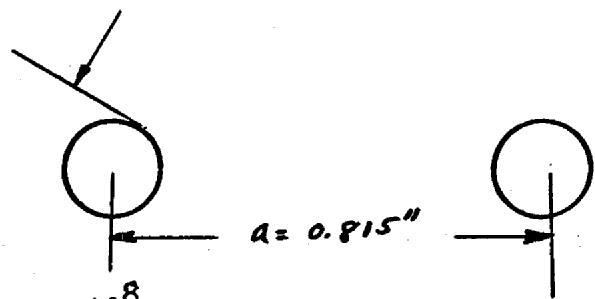

$$
= \frac {. 5}{1 7 , 3 0 0 x . 4} + \frac {. 5 x . 0 5}{1 2 x 1 2 x . 4 5} + \frac {1}{6 1 7 0}
$$

$$
U = 1, 4 8 5 \frac {B T U}{h r . f t ^ {2} c _ {F}}
$$

$$
\mathrm {M T D} = \log \text {m e a n t e m p e r a t u r e d i f f e r e n c e} = 1 5 0 ^ {\circ} \mathrm {F}
$$

$$
A = \text {h e a t} \quad \text {t r a n s f e r} \quad \text {a r e a} = \frac {Q}{U \Delta T} = \frac {3 . 4 1 x 1 0 ^ {8}}{1 4 8 5 x 1 5 0} = 1 5 3 0 f t ^ {2}
$$

$$
L = \text {t u b e} \quad \text {l e n g t h} = \frac {A}{N \pi D _ {0}} = \frac {1 5 3 0}{1 5 7 0 x . 5 \pi} \quad 1 2 = 7. 4 4 f t.
$$

$$
\begin{array}{l} \text {T o t a l s h e l l a r e a} = 2 \mathrm {N} (\mathrm {A s} + 1 / 2 \mathrm {A} _ {\mathrm {t}}) = 2 \times 1 5 7 0 \left(\frac {1 9 3 + . 0 9 6}{1 4 4}\right) \\ = 6. 3 1 f t. ^ {2} \\ \end{array}
$$

Inside shell diameter $= 2.84$ ft.

Using a 1" steel shell of 316 stainless steel

Outside shell diameter $= 3.01$ ft.

APPENDIX A.5 BLANKET PIPING TO PUMP

Pressure drop in blanket tubes for $1/2''$ OD, with 50 mil wall.

$N_{a}$ velocity taken as 20 ft./sec.

Mean tube length = 12.6 ft.

$$
\begin{array}{l} \mathrm {R e} = \frac {\rho_ {\mathrm {D e V}}}{\mu} = \frac {5 1 x . 4 x 2 0 x 3 6 0 0}{1 2 x . 5 3} = 2 3 3, 0 0 0 \\ \frac {E}{D} = \text {r e l a t i v e r o u g h n e s s} = 0. 0 0 0 1 4 \\ \end{array}
$$

$\mathbf{f} =$ friction factor $= 0.017$

$$
\Delta P _ {T} = f \frac {V ^ {2}}{2 g} \frac {L}{D e} = \frac {. 0 1 7 x 2 0 ^ {2} x 1 2 . 6}{2 x 3 2 . 2 x . 4} 1 2 = 4 0 f t.
$$

For the smooth tube bends in and out of the tube sheets, we allowed 1 velocity head loss.

$$
\Delta P _ {0} = \frac {2 0 ^ {2}}{2 \times 3 2 . 2} = 6. 2 2 \mathrm {f t}.
$$

$$
\Delta P \text {c o r e} = \Delta P _ {T} + \Delta P _ {B} = 4 6. 2 f t.
$$

Pressure Drop in Core and Heat Exchanger Plemms

We took the worst possible entrance and exit conditions - sudden expansion and sudden contraction.

$$
K \exp = 0. 5 5
$$

$$
K c o n t = 0. 3 7
$$

for 2 entrance and exit plenums

$$
K = 2 (K \exp + K \text {c o n t}) = 2 (. 5 5 +. 3 7) = 1. 8 4
$$

$$
\Delta P _ {P 1} = K \frac {V ^ {2}}{2 g} = 1. 8 4 \frac {2 5 ^ {2}}{2 \times 3 2 . 2} = 1 7. 9 f t.
$$

Pressure Drop in Connecting Piping

Inside pipe diam. = 16.3"

Na velocity $= 30$ ft./seo.

Using commercial steel pipe

$$
\mathrm {R e} = \frac {1 . 3 6 x 3 0 x 3 6 0 0 x 5 1}{. 5 3} = 1 4. 2 x 1 0 ^ {6}
$$

$$
\frac {\epsilon}{D} = 0. 0 0 0 0 9
$$

$$
f = 0. 0 1 2
$$

total length = 10.67 ft.

$$
\Delta P _ {p} = . 0 1 2 \frac {3 0 ^ {2} x 1 0 . 6 7}{2 x 3 2 . 2 x 1 . 6 3} = 1. 1 f t.
$$

Pressure Drop in Elbows (4)

$$
\frac {R}{D} = 1. 5 (\text {d e s i g n e d s o})
$$

$$
\begin{array}{l l} \epsilon & = 0. 0 0 0 9 \\ \overline {{\mathbf {D}}} & \end{array}
$$

$$
\mathrm {K} _ {\mathrm {B}} = 0. 1 7
$$

$$
\Delta P _ {E} = K _ {B} \frac {V ^ {2}}{2 g} = . 1 7 \frac {3 0 ^ {2}}{2 \times 3 2 . 2} = 0. 4 f t.
$$

Pressure Drop in Heat Exchanger Tubes

$$
R e = \frac {4 \times 5 1 \times 3 0 \times 3 6 0 0}{1 2 \times . 5 3} = 3 4 8, 0 0 0
$$

$$
\frac {C}{D} = 0. 0 0 0 1 4
$$

$$
f = 0. 0 1 6
$$

$$
\Delta P _ {\mathrm {H E}} = f \frac {V ^ {2}}{2 g} \quad \frac {L}{D} = . 0 1 6 \frac {3 0 ^ {2} \times 7 . 4 \times 1 2}{2 \times 3 2 . 2 \times . 4} = 4 9. 5 \mathrm {f t}.
$$

Pressure Drop in Blanket Tube Sheets

Area ratio = 0.364

Expansion Ke = 0.4

$$
\Delta P C E = K e \frac {V ^ {2}}{2 g} = . 4 \frac {2 0 ^ {2}}{2 x 3 2 . 2} = 2. 5 f t.
$$

Contraction Kc = .34

$$
\Delta P C E = K a \frac {V ^ {2}}{2 g} = 3 4 \frac {3 0 ^ {2}}{2 \times 3 2 . 2} = 4. 8 f t.
$$

Pressure Drop in Heat Exchanger Tube Sheets

Area ratio = 0.245

Expansion Ke = 0.55

$$
\Delta P _ {H _ {E}} = K e \frac {V ^ {2}}{2 g} = . 5 5 \frac {3 0 ^ {2}}{2 \times 3 2 . 2} = 7. 7 f t.
$$

Contraction Kc = 0.37

$$
\Delta P _ {H E _ {c}} = K c \quad \frac {V ^ {2}}{2 g} = . 3 7 \quad \frac {3 0 ^ {2}}{2 \times 3 2 . 2} = 5. 1 f t.
$$

$\Delta P =$ Total Head Loss $= 144.7$ ft. $= 51.2$ psi

Taking $80\%$ efficiency of the pump

$$
\mathrm {H P} = \text {p u m p h o r s e p o w e r} = \frac {1 7 5 \times 7 . 6 1 \times 1 0 ^ {6}}{6 0 \times 3 3 , 0 0 0} = 9 6 0
$$

Thus use a 1000 HP pump.

# APPENDIX A.6 SODIUM FIPING AND PUMPS

a) Pressure drop through heat exchanger

$$
\Delta P _ {\mathrm {H E}} = \frac {f V ^ {2}}{2 g} \frac {S L}{D _ {e}} \text {w h e r e D e} = 0. 9 9 \text {i n c h e s a n d R e} = 8 1 0 x 1 0 ^ {3}
$$

Relative roughness $\underline{\underline{\mathbf{C}}}$ .00006 and friction factor $f = .012$

$$
\Delta P _ {H E} = \frac {0 1 2 \times 9 0 0 \times 5 0 \times 1 8 . 8 \times 1 2}{6 4 . 4 \times 0 . 9 9} = 1, 9 1 0 \mathrm {l b / f t ^ {2}} = 3 8. 2 \mathrm {f t}.
$$

b) Pressure drop through piping

$$
\Delta P _ {P} = \frac {f V ^ {2}}{2 g} \quad \frac {S L}{D e} \text {w h e r e} D _ {e} = 4 2 ^ {\circ} \text {a n d} R e = 3 4. 2 x 1 0 ^ {6}
$$

Relative roughness $\frac{\epsilon}{D} = .000045$ and friction factor $f = .01$

$$
\Delta P _ {P} = \frac {0 1 \times 9 0 0 \times 5 0 \times 2 0 0 \times 1 2}{6 4 . 4 \times 4 2} = 4 0 0 \mathrm {l b / f t} ^ {2} = 8 \mathrm {f t}
$$

c) Pressure drop through boiler

$$
\Delta P _ {B} = \frac {f V ^ {2}}{2 g} \frac {\zeta L}{D _ {e}} \quad \text {w h e r e D e} = 2. 2 2, R e = 1. 2 8 x 1 0 ^ {6}
$$

Relative roughness $\frac{\epsilon}{D} = .000025$ and friction factor $f = .011$

$$
\Delta P _ {B} = \frac {. 0 1 1 x 4 0 0 x 5 0 x 5 0 x 1 2}{6 4 . 4 x 2 . 2 2} = 9 2 4 \mathrm {l b / f t} ^ {2} = 1 8. 4 \mathrm {f t}
$$

d) Total pump head

$$
3 8. 2 + 8 + 1 8. 4 = 6 4. 6 \mathrm {f t}
$$

# Gamma Sources and Heating

The gamma sources were estimated by methods given in the Reactor Shielding Handbook. (20) The prompt gammas were estimated using the equation:

$$
\operatorname {S v} \left(\frac {\text {P h o t o n s}}{\text {c m} ^ {3 \sec}}\right) = 3. 1 \times 1 0 ^ {1 0} \mathrm {N} (\mathrm {E}) \mathrm {P} (\mathrm {r})
$$

$$
\mathrm {N} / \mathrm {E}) = \text {F h o t o n / f i s s i o n o f e n e r g y E (2 0)}
$$

$$
P (r) = \text {P o w e r d e n s i t y} \left(\frac {\text {w a t t s}}{\mathrm {c m} ^ {3}}\right)
$$

The power density was assumed constant and equal to the average of 167 watts/cm³ for temperature rise calculations.

The decay product gammas were estimated assuming an infinite operating time and the averaged power density. This gamma spectrum was also found in the Reactor Shielding Handbook.(20)

These two sources yielded a volume source of gammas of $77.6 \times 10^{12}$ photons, of average energy 1.33 MeV, having the energy spectrum as shown in cm3sec  
Figure 3.17.

The gamma heating in the core vessel and lead reflector due to this source was estimated using the Integral Beam, Straight Ahead Approximation. (15) This approximation yields the equation:

$$
\frac {d G (\bar {r})}{d v (r _ {s})} = S _ {\gamma} (\bar {r} _ {s}) \bar {E} \gamma (r _ {s}) d \Omega (\alpha , \beta) \bar {\mu} _ {e m} e - \left[ \sum_ {i = 1} ^ {M} \mu_ {e i} \Delta r i \right]
$$

$$
S _ {y} = \text {V o l u m e S o u r c e (p h o t o n s / c m} ^ {3} \text {s e c .})
$$

$$
\overline {{E}} _ {Y} = \frac {\int_ {0} ^ {\infty} E P (E) d E}{\int_ {0} ^ {\infty} P (E) d E}
$$

$$
P (E) = E n e r g y d i s t r i b u t i o n o f p h o t o n s
$$

$$
P _ {\Omega} (\alpha , \beta) = \text {p r o b a b i l i t y} \text {a p h o t o n w i l l b e e m m i t t e d i n t o s o l i d a n g l e} d _ {\Omega}
$$

$$
(\frac {1}{\frac {1 4 \pi}{}} \quad \text {f o r s p h e r i c a l s o u r c e .})
$$

$$
\bar {\mu} _ {e i} = \frac {1}{\overline {{E}} _ {\gamma}} \frac {\int_ {0} ^ {\infty} f _ {e E _ {\gamma}} P (E) d E}{\int_ {0} ^ {\infty} P (E) d E}
$$

Assuming a spherical source the generation rate was found to be:

$$
\begin{array}{l} G (r) = S _ {r} E _ {r} \mu_ {e i} e - \sum_ {i = 1} ^ {M} \bar {M} _ {e i} \Delta r _ {i} + \sum_ {i = 1} ^ {M} \bar {M} _ {e s} \Delta r _ {i} \left[ \frac {e - \bar {M} _ {e s} \sum_ {i = 1} ^ {M} \Delta r _ {i}}{M} \right. \\ - 2 \sum_ {i = 1} ^ {M} \Delta r _ {i} E _ {i} (\bar {\mu} _ {s} \sum_ {i = 1} ^ {M} \Delta r _ {i}) + \sum_ {i = 1} ^ {M} \Delta r _ {i} E _ {2} (\bar {\mu} _ {s} \sum_ {i = 1} ^ {M} \Delta r _ {i}) ] ^ {*} \\ E _ {1} = \int_ {t = b} ^ {\infty} \frac {e ^ {- t}}{t} d t \\ E _ {2} = b \int_ {t = b} ^ {b} \frac {e ^ {- t ^ {2}}}{t ^ {2}} d t \\ \end{array}
$$

With the use of this equation and the estimated energy absorption coefficients of the salt fuel, Figure 3.18 and stainless steel, Figure 3.19, and $\mathsf{Pb}^{(20)}$ the gamma contribution to the heat generation was estimated. This heat generation rate is shown as a function of distance through core vessel and lead reflector in Figure 3.20. The averaged gamma heat generation rate was found to be $3.29\mathrm{x}10^{13}$ MeV cm3sec in the core vessel and 1.59 x $10^{13}$ Mev cm3sec in the reflector.

# Neutron Sources and Heating

The neutron sources were taken to be the averaged integral fluxes in a specific energy group, as given by the Univac calculations, over the core vessel and the lead reflector. Using these averaged fluxes the average heat generation rate was then calculated for the specific neutron interactions of elastic scatter, capture, and inelastic scatter. The gamma source due to neutron capture and inelastic scattering has been neglected.

The heat generation was calculated for neutron capture in each energy group by:

$$
\overline {{G}} _ {1} = \sum_ {c} ^ {A} (\bar {\mathbf {E}}) \bar {\phi} (\mathbf {E}) \bar {\mathbf {E}} \int c
$$

$$
\delta c = \text {e n e r g y} = \text {t r a n s f e r r e d b y n e u t r o n / i n c i d e n t} = \frac {\mathrm {m}}{\mathrm {M} + \mathrm {m}}
$$

$$
m = n e u t r o n m a s s
$$

$$
M = t a r g e t m a s s
$$

$$
\overline {{\phi}} (\overline {{E}}) = \frac {\int \phi (\overline {{E}}) ^ {r}) d ^ {3} r}{\int d ^ {3} r}
$$

$$
\overline {{\mathbf {E}}} = \text {a v e r a g e e n e r g y o f n e u t r o n i n t h e g r o u p}
$$

$$
\sum_ {c} ^ {A} = \text {c a p t u r e c r o s s - s e c t i o n ,} \mathrm {c m} ^ {- 1}
$$

For neutron scattering in each energy group the heat generation equation becomes:

$$
\bar {G} _ {i} = \sum_ {S} ^ {A} (\bar {E}) \quad \bar {\phi} (\bar {E}) \bar {E} \quad \mathcal {J} _ {s}
$$

$$
\int_ {8} = 1 - \left(\frac {M - m}{M + m}\right) ^ {2}
$$

A similar equation was used for heating due to inelasticly scattered neutrons:

$$
\overline {{G}} _ {i} = \sum_ {i} ^ {A} (\bar {\mathbf {E}}) \bar {\Phi} (\bar {\mathbf {E}}) \bar {\mathbf {E}} \quad \mathcal {S} _ {i}
$$

$$
\mathcal {S} _ {1} = \frac {\mathrm {m}}{\mathrm {M}} \quad \frac {\mathrm {T} _ {\mathrm {Z}}}{\mathrm {E}} \left[ \frac {\left(1 - \frac {\overline {{\mathrm {E}}}}{\mathrm {T} _ {\mathrm {Z}}}\right) \mathrm {e} - \frac {\overline {{\mathrm {E}}}}{\mathrm {T} _ {\mathrm {Z}}}}{1 - \left(1 + \frac {\overline {{\mathrm {E}}}}{\mathrm {T} _ {\mathrm {Z}}}\right) \mathrm {e} - \frac {\overline {{\mathrm {E}}}}{\mathrm {T} _ {\mathrm {Z}}}} \right]
$$

$$
\mathrm {T} _ {\mathrm {Z}} = \text {N u c l e a r T e m p e r a t u r e} ^ {(2 1)}
$$

Applying these equations over the five neutron energy groups having average energies of 3.75, 1.82, 0.92, 0.34, and 0.12 MeV respectively gave total averaged neutron heat generation rate in the core vessel of 6.36 x $10^{13}$ Mev and in the lead reflector of 1.83 x $10^{12}$ Mev cm³ sec.

# Temperature Rise in the Core Vessel

For reasons of simplicity in calculation the heat generation rates in the core vessel and in the lead reflector were assumed to be constants and the geometry was taken as a slab.

The worst condition was assumed to be that at which the temperature in the core and the blanket were equal. With this in mind the boundary conditions

were:

(1) at $x = 0, T_1 = 0$   
(2) at $x = b, T_2 = 0$   
(3) at $x = a$ , $T_1 = T_2$ .   
(4) at $x = a$ , $K_1 \frac{dT}{dx} = K_a \frac{dT_2}{dx}$

The applicable equations were at steady state:

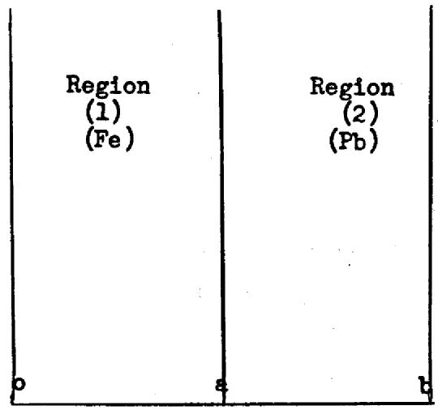

Region (1)

$$
\mathrm {K} _ {1} \frac {\mathrm {d} ^ {2} \mathrm {T} _ {1}}{\mathrm {d x} ^ {2}} = - \mathrm {G} _ {1}
$$

Region (2)

$$
\mathrm {K} _ {2} \frac {\mathrm {d} ^ {2} \mathrm {T} _ {2}}{\mathrm {d} x ^ {2}} = - \mathrm {G} _ {2}
$$

The solution to this set of equations is then:

$$
\begin{array}{l} T _ {1} = \frac {- G _ {1} x ^ {2}}{2 K _ {1}} + B _ {1} \frac {K _ {2}}{K _ {1}} x + \frac {a x}{K _ {1}} (G _ {1} - G _ {2}) \\ T _ {2} = \frac {G _ {2} (b ^ {2} - x ^ {2})}{2 K _ {2}} - B _ {1} (b - x) \\ \end{array}
$$

$$
B _ {1} = \left[ \frac {1}{a \left(\frac {K _ {2}}{K _ {1}} - 1\right) + b} \right] \left[ \frac {G _ {2} (b ^ {2} - a ^ {2})}{2 K _ {2}} + \frac {G _ {1} ^ {\sigma^ {2}}}{2 K _ {1}} - \frac {a ^ {2}}{K _ {1}} \quad (G _ {1} - G _ {2}) \right]
$$

Using the previously mentioned average heat generation rates in the core vessel and the lead reflector of 3.68 cal and 0.676 cal respectively, the thermal conductivities and thicknesses of the core vessel and lead, the equations reduce to:

$$
\begin{array}{l} T _ {1} = 9 4. 6 x - 3 6. 8 x ^ {2} \\ T _ {2} = 4 6. 9 + 2 2. 4 x - 9. 1 5 x ^ {2} \\ \left(\mathrm {T} = ^ {\circ} \mathrm {C}\right) \\ \end{array}
$$

These equations yield a maximum temperature of $109.3^{\circ}\mathrm{F}$ at a distance of 1.286 cm into the core vessel.

Since it is believed that a temperature rise this great would cause unduly large thermal stresses in the core vessel it was thought that cooling of the lead reflector would alleviate this.

Using the previously derived equations for temperature in the core vessel and the lead reflector and assuming that the heat removal rate from the reflector could be assumed constant across the reflector and that the interface temperature was equal to that in the core and blanket, a temperature distribution could be calculated. Thus these equations are:

$$
\begin{array}{l} T _ {1} (x) = 4 8. 9 x - 3 6. 8 \cdot x ^ {2} \\ T _ {2} (x) = 2 5. 8 x ^ {2} - 1 3 1. 5 x + 1 2 6. 9 \\ \end{array}
$$

We found that the total heat removal rate was required to be 2.586 cal/cm³ sec. The maximum temperature in the core vessel had now been reduced to 29.2°F. It was determined that this caused negligible thermal stresses.

The temperature distributions in each of the described cases are shown in Figure 3.21 and Figure 3.22 respectively.

Reflector Heat Removal Calculation

$$
Q = 3. 8 0 \times 1 0 ^ {6} B T U / h r
$$

$$
W _ {N a} = N a w e i g h t f l o w = \frac {Q}{c p \Delta T} = \frac {3 . 8 x 1 0 ^ {6}}{. 3 x 1 5 0} = 8 4, 5 0 0 l b s / h r
$$

$$
a _ {T} = \text {f l o w a r e a p e r t u b e} = \frac {\pi D i ^ {2}}{4} = \frac {\pi (.) 4) ^ {2}}{4 x 1 4 4} = . 0 0 0 8 7 8 f t ^ {2}
$$

$$
A _ {T} = \text {t o t a l N a f l o w a r e a} = \frac {W _ {\mathrm {N a}}}{\rho_ {\mathrm {N a V}}} = \frac {8 4 . 5 0 0}{5 1 \times 3 0 \times 3 6 0 0} = . 0 1 5 4 \mathrm {f t} ^ {2}
$$

$$
N = n o. o f t u b e s = \frac {A _ {t}}{8 t} = \frac {0 1 5 4}{0 0 0 8 7 8} = 1 8
$$

Taking the outside tube wall temperature to be $1228^{\circ}\mathbf{F}$ as calculated in section on core shell heating.

$$
Q = \frac {k w A w}{\mathcal {S}} \quad \left(T _ {1} - T _ {2}\right) = h _ {N a} A 1 \left(T _ {2} - T _ {N a}\right)
$$

Where subscript $W$ refers to tube wall properties and $T_1$ and $T_2$ are tube surface temperatures.

$$
\begin{array}{l} L = \text {l e n g t h o f t u b i n g} = \frac {Q}{\pi \left(T _ {1} - T _ {N a}\right)} \left[ \frac {\delta}{k w D _ {w}} + \frac {1}{h _ {N a} D _ {i}} \right] \\ = \frac {3 . 8 0 x 1 0 ^ {6}}{(1 7 8) r} \left[ \frac {0 . 0 5}{1 2 x 5 .} + \frac {1 2}{1 7 , 3 5 0 x . 4} \right] = 1 0 2 f t. \\ \end{array}
$$

For the above calculation, we took the minimum wall temperature to maximum Na temperature. This will lead to a conservative result.

The effective length of each tube is 8 ft. Thus, 13 tubes would transfer the required heat and using 17 tubes will tend to reduce the core shell temperature to a more conservative level.

# APPENDIX A.8 MODERATOR COOLING CALCULATIONS

$$
Q = 5. 1 \times 1 0 ^ {6} \frac {\text {B T U}}{\text {h r}}
$$

$$
w _ {N a} = \frac {5 . 1 x 1 0 ^ {6}}{. 3 x 1 5 0} = 1. 1 3 x 1 0 ^ {5} \frac {1 b s}{h r}
$$

$$
a _ {T} = \text {f l o w a r e a p e r t u b e} = 0. 0 0 0 8 7 8 f t ^ {2}
$$

$$
A _ {T} = \frac {W _ {\text {前}}}{\rho_ {N _ {4}}} = \frac {1 . 1 3 \times 1 0 ^ {5}}{5 1 \times 3 0 \times 3 6 0 0} = . 0 2 0 8 f t ^ {2}
$$

$$
N = n o. o f t u b e s = \frac {0 2 0 8}{. 0 0 0 8 7 8} = 2 4
$$

To find the maximum moderator temperature, we approximated the rectangular cell by a cylindrical one of equal area

$$
r _ {2} = 4. 2 2 ^ {\prime \prime}
$$

$$
r _ {1} = 0. 2 5 ^ {\prime \prime}
$$

$$
\mathbf {r} _ {0} = 0. 2 0 ^ {n}
$$

$$
G = \frac {Q}{V} = \frac {5 . 1 \times 1 0 ^ {6}}{6 2} = 8. 2 2 \times 1 0 ^ {4} \frac {\text {B T U}}{\text {h r f t} ^ {3}}
$$

$$
q = \text {h e a t r e m o v e d p e r t u b e} = \frac {5 . 1 \times 1 0 ^ {6}}{2 5} = 2. 0 4 \times 1 0 ^ {5} \frac {\mathrm {B T U}}{\mathrm {h r}}
$$

Using the method derived in section 13.3.4.1

$$
\overline {{k}} = \frac {4 . 2 2 ^ {2} - . 2 5 ^ {2}}{\frac {. 2 5}{4 . 5 8} \left(4 . 2 2 ^ {2} \ln \frac {4 . 2 2}{. 2 5} - \frac {4 . 2 2 ^ {2} - . 2 5 ^ {2}}{2}\right)} = 7. 7 5 \frac {\mathrm {B T U}}{\mathrm {h r} \mathrm {i n} ^ {2} \mathrm {F}} = 1 1 1 2 \frac {\mathrm {B T U}}{\mathrm {h} ^ {4} \mathrm {f t} ^ {2}} \circ_ {\mathrm {F}}
$$

from the same section

$$
\mathrm {h} _ {\text {A}} = 1 7, 3 5 0 \frac {\mathrm {B T U}}{\mathrm {h r f t} ^ {2}} \circ_ {\mathrm {F}}
$$

$$
h w = \frac {1 2 x 1 2}{0 5} = 2 8 8 0 \frac {B T U}{h r f t ^ {2}} o _ {F}
$$

based on inside wall area

$$
\frac {1}{U} = \frac {. 4}{. 5 \times 1 1 1 2} + \frac {. 4 5}{. 5 \times 2 8 8 0} + \frac {1}{1 7 , 3 5 0} = 0. 0 0 1 4 1
$$

$$
U = 7 1 0 \frac {B T U}{h r f t ^ {2} o _ {F}}
$$

$\mathsf{A}_{\mathbb{H}} =$ heat transfer area per tube for 10 ft effective length

$$
= \frac {4 \sqrt {1 2}}{1 2} x 1 0 = 1. 0 4 5 f t ^ {2}
$$

For a Na temperature of 1200 (this is maximum)

$$
T _ {2} = 1 0 5 0 \frac {2 . 0 4 \times 1 0 ^ {5}}{7 1 0 \times 1 . 0 4 5} = 1 4 7 5
$$

APPENDIX A.9 STEAM BOILER CALCULATIONS

$$
Q = 7 0 0 M u / = 2. 3 9 \times 1 0 ^ {9} \frac {\mathrm {B T U}}{\mathrm {h r}}
$$

$$
W _ {N a} = \frac {Q}{C _ {P N a} \Delta T _ {N a}} = \frac {2 . 3 9 x 1 0 ^ {9}}{. 3 x 1 5 0} = 5 3. 2 x 1 0 ^ {6} \frac {1 b s}{h r}
$$

Water inlet conditions 550°F, 2400 psia

Steam outlet conditions 1000F, 2300 psia

$$
\Delta H = H _ {\text {o u t}} - H _ {\text {i n}} = 1 4 6 5 - 5 4 9 = 9 1 6 \frac {\text {E T U}}{\text {l b ;}}
$$

$$
w _ {H _ {2} 0} = \frac {Q}{\Delta H} = \frac {2 . 3 9 x 1 0 ^ {9}}{9 1 6} = 2. 6 2 x 1 0 ^ {6} \frac {1 b s}{h r}
$$

Using 1/2" OD stainless steel tubes with 50 mill wall thickness

$a_{T} =$ flow area per tube $= .127\mathrm{in}^2 = .00088\mathrm{ft}^2$

Feed water inlet vel. = 7.5 fps

$$
\begin{array}{l} N = n o. o f t u b e s = \frac {W _ {H _ {2} O}}{C H _ {2} O V _ {H _ {2} O} a _ {T}} = \frac {2 . 6 2 x 1 0 ^ {6}}{4 6 x 7 . 5 x 3 6 0 0 x . 0 0 0 8 8} \\ = 2 4 0 0 \\ \end{array}
$$

Using a triangular lattice

No. of cells = 2N = 4800

Using a Na velocity of 20 fps

$$
\begin{array}{l} a _ {s} = N a f l o w a r e a p e r c e l l = \frac {W _ {N a}}{\rho_ {N a} V _ {N a} 2 N} \\ = \frac {5 3 . 2 x 1 0 ^ {6}}{5 1 x 2 0 x 3 6 0 0 x 4 8 0 0} = 4 3 5 \mathrm {i n}. ^ {2} \\ \end{array}
$$

$$
\begin{array}{l} . 4 3 5 = . 4 3 3 a ^ {2} - . 0 9 2 \\ a = 1. 1 1 m \\ \end{array}
$$

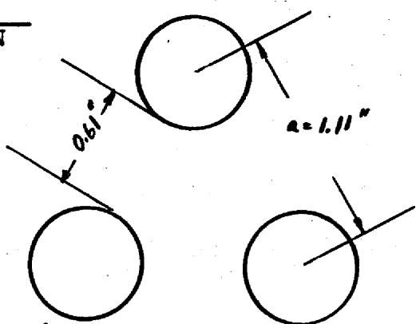

Dividing the boiler into three distinct regions

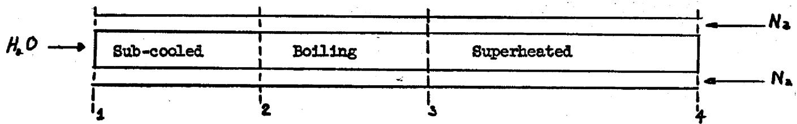

Subcooled Heating

As a first assumption, calculate without pressure drop

$$
t _ {1} = 5 5 0 ^ {\circ} \mathrm {F} \quad t _ {2} = 6 6 2 ^ {\circ} \mathrm {F}
$$

$$
p _ {1} = 2 4 0 0 p s i a \quad p _ {2} \stackrel {\sim} {=} 2 4 0 0 p s i a
$$

$$
\mathrm {H} _ {1} = 5 1 9 \frac {\text {B T U}}{1 b} \quad \mathrm {H} _ {2} = 7 1 8 \frac {\text {E T U}}{1 b}
$$

$$
Q _ {a c} = W _ {H 2 0} \left(H _ {2} - H _ {1}\right) = W _ {N a} C _ {p} \left(T _ {2} - T _ {1}\right) = 4. 4 2 \times 1 0 ^ {8} \frac {E T U}{h r}
$$

but $\mathbf{T}_1 = 900^{\circ}\mathbf{F}$ therefore $\mathbf{T}_2 = 928^{\circ}\mathbf{F}$

$$
\mathrm {M T D} _ {\mathrm {s c}} = \frac {\left(\mathrm {T} _ {2} - \mathrm {t} _ {2}\right) - \left(\mathrm {T} _ {1} - \mathrm {t} _ {1}\right)}{\ln \frac {\mathrm {T} _ {2} - \mathrm {t} _ {2}}{\mathrm {T} _ {1} - \mathrm {t} _ {1}}} = \frac {2 6 6 - 3 5 0}{\ln \frac {2 6 6}{3 5 0}} = 3 0 2 ^ {\circ} \mathrm {F}
$$

$$
D e _ {8} = \frac {4 A}{P} = 4 \times \frac {4 3 5}{. 2 5 \pi} = 2. 2 2 ^ {\prime \prime}
$$

$$
\mathrm {R e} _ {\mathrm {N a}} = \frac {\rho_ {\mathrm {N a}} \mathrm {D} _ {\mathrm {e s}} \mathrm {V} _ {\mathrm {N a}}}{\mu_ {\mathrm {N a}}} = \frac {5 1 \times 2 . 2 2 \times 2 0 \times 3 6 0 0}{1 2 \times . 5 3} = 1, 2 8 0, 0 0 0
$$

$$
\begin{array}{l} \Pr_ {N _ {a}} = \frac {C _ {0} \mu}{k _ {N _ {a}}} = \frac {. 3 x . 5 3}{3 7 . 5} = . 0 0 4 2 5 \\ \mathrm {N u} _ {\mathrm {N a}} = 7 + \frac {1}{4 0} (\text {R e P r}) ^ {. 8} = 7 + \frac {1}{4 0} (1, 2 8 0, 0 0 0 x. 0 0 4 2 5) ^ {. 8} = 3 1. 5 \\ \mathrm {h} _ {\mathrm {N a}} = \frac {\mathrm {N u} _ {\mathrm {N a}} \mathrm {k} _ {\mathrm {N a}}}{\mathrm {D e} _ {\mathrm {s}}} = \frac {3 1 . 5 \times 3 7 . 5 \times 1 2}{2 . 2 2} = 6 3 8 0 \quad \frac {\mathrm {B T U}}{\mathrm {h r} . \mathrm {f t} ^ {2} - \mathrm {o} _ {\mathrm {F}}} \\ \mathrm {R e} _ {\mathrm {H 2 0}} = \frac {4 2 x . 4 x 7 . 5 x 3 6 0 0}{1 2 x . 2} = 1 9 0, 0 0 0 \\ \Pr_ {H _ {2} O} = 1 \\ \mathrm {N u} _ {\mathrm {H 2 0}} = . 0 2 3 \mathrm {R e} ^ {. 8} \Pr^ {. 4} = . 0 2 3 (1 9 0, 0 0 0) ^ {. 8} (1) ^ {. 4} = 3 8 0 \\ \mathrm {h} _ {\mathrm {H} 2 \mathrm {O}} = \frac {\mathrm {N u} _ {\mathrm {H} 2 \mathrm {O}} \quad \mathrm {k} _ {\mathrm {H} 2 \mathrm {O}}}{\mathrm {D e} _ {\mathrm {t}}} = \frac {3 8 0 \mathrm {x . 3 x 1 2}}{. 4} = 3 4 0 0 \frac {\mathrm {E T U}}{\mathrm {h r . f t} ^ {2} . ^ {\circ} \mathrm {F}} \\ \end{array}
$$

basing over-all coefficient on inside tube area

$$
\begin{array}{l} \frac {1}{U} = \frac {A i}{h _ {N a} A _ {o}} + \frac {A i \delta}{k _ {w} A _ {w}} + \frac {1}{h _ {H 2 0}} = \frac {4}{6 3 8 0 x . 5} + \frac {4 x (0 5)}{0 . 1 2 x . 5} + \frac {1}{3 4 0 0} \\ = 7. 8 4 \times 1 0 ^ {- 4} \\ \end{array}
$$

$$
U = 1 2 7 5 \frac {B T U}{h r . f t ^ {2} a _ {F}}
$$

$$
A _ {s c} = \frac {Q _ {s c}}{U _ {s c} (M T D) _ {s c}} = \frac {4 . 4 2 x 1 0 ^ {8}}{1 2 7 5 x 3 0 2} = 1 1 5 0 f t. ^ {2}
$$

$$
\operatorname {L s c} = \frac {\operatorname {A s c}}{\mathrm {N} \pi \mathrm {D} _ {1}} = \frac {1 1 5 0}{2 4 0 0 \pi x . 4} x 1 2 = 4. 5 5 \mathrm {f t}.
$$

$$
\Delta P _ {s c} = f \frac {v ^ {2}}{2 g} \frac {L}{D e} = . 0 1 9 \frac {7 . 5 ^ {2}}{6 4 . 4} \times \frac {4 . 5 5 \times 1 2}{. 4} = 2. 2 6 f t.
$$

$= 0.66$ psi This is negligible and does not require iteration.

Boiling

Assuming no pressure drop

$$
\begin{array}{l} t _ {2} = 6 6 2 ^ {\circ} \mathrm {F} \quad t _ {3} = 6 6 2 ^ {\circ} \mathrm {F} \\ p _ {2} = 2 4 0 0 p s i a \quad p _ {3} = 2 4 0 0 p s i a \\ \mathrm {H} _ {2} = 7 1 8 \frac {\mathrm {B T U}}{1 \mathrm {b}} \quad \mathrm {H} _ {3} = 1 1 0 1 \frac {\mathrm {B T U}}{1 \mathrm {b}} \\ \end{array}
$$

$$
\begin{array}{l} Q _ {B} = W _ {H 2 0} \left(H _ {3} - H _ {2}\right) = W _ {N a C p} \left(T _ {3} - T _ {2}\right) = U _ {B} A _ {B} (M T D) _ {B} \\ = 2. 6 2 \times 1 0 ^ {6} (3 8 3) = 1. 0 \times 1 0 ^ {9} \frac {\mathrm {E T U}}{\mathrm {h r .}} \\ \end{array}
$$

$$
T _ {3} = T _ {2} + \frac {Q}{C p W _ {N a}} = 2 9 8 + \frac {1 . 0 \times 1 0 ^ {9}}{. 3 \times 5 . 3 2 \times 1 0 ^ {7}} = 9 9 1 ^ {\circ} F
$$

Using the method outlined on Page 701 of Glasstone's Engineering16

$$
\begin{array}{l} \Delta t = \left[ \frac {a \ln b / a}{k} + \frac {1}{h} \right] q _ {A} + \frac {1}{C}. 4 1 3 \left(q _ {A}\right) ^ {. 4 1 3} \\ c = 1 2 0 \\ \Delta t = \left[ \frac {6 2 \ln . 5 / . 4}{1 2 \times 1 2} + \frac {1}{6 3 8 0} \right] q _ {A} + \frac {1}{1 2 0} \cdot 4 1 3 \left(q _ {A}\right) ^ {. 4 1 3} \\ = 7. 5 5 \times 1 0 ^ {- 4} q / _ {A} +. 1 3 4 (q / _ {A}) ^ {. 4 1 3} \\ \end{array}
$$

This function is plotted in Fig. (A-1). From Fig. (A-1)

$$
\begin{array}{l} \Delta t _ {2} = 2 6 6 \quad \left(\mathrm {q} / \mathrm {A}\right) _ {2} = 3 3 0, 0 0 0 \\ \left(\frac {q}{A}\right) _ {1} = 4 0 0, 0 0 0 \\ A = W _ {N a} C _ {p} \left[ \frac {a \ln b / a}{k} + \frac {1}{h} \right] ^ {1} \ln \left(\frac {q / A}{q / A}\right) _ {1} + \frac {. 7 0 5 W _ {N a} C _ {p}}{C ^ {. 4 1 3}} \left[ \left(q / A\right) _ {2} - . 5 8 7 - \left(q / A\right) _ {1} - . 5 8 7 \right] \\ = 5. 3 2 \times 1 0 ^ {7} x. 3 (7. 5 5 \times 1 0 ^ {- 4}) \ln \frac {4 0 0}{3 3 0} + \frac {. 7 0 5 \times 5 . 3 2 \times 1 0 ^ {7} x . 3}{7 . 2} (5. 7 - 5. 0 8 \times 1 0 ^ {- 4}) \\ = 2 3 9 0 f t ^ {2} \\ \end{array}
$$

$$
\Delta t = 7. 5 \times 1 0 ^ {- 4} (q / a) + . 1 3 4 (q / a) ^ {0. 4 1 3} \tag {2}
$$

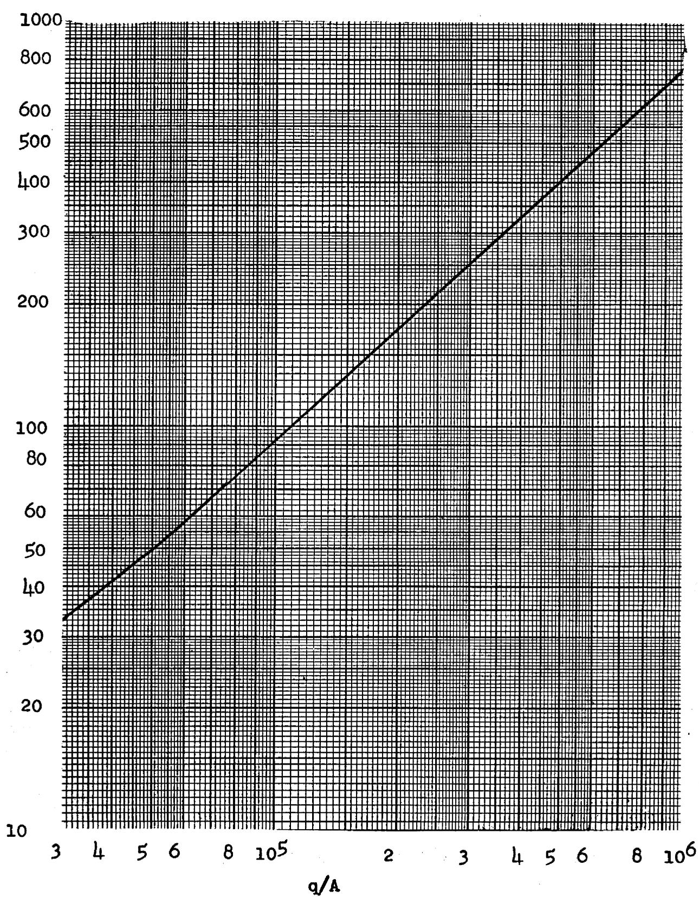  
Figure A-1

Boiling Temperature Difference

$$
L _ {B} = \frac {A _ {B}}{N \pi D i} = \frac {2 3 9 0}{2 4 0 0 \pi x . 4} \quad 1 2 = 9. 4 7 f t.
$$

for plain $\mathbf{H}_2\mathbf{O}$

$$
\begin{array}{l} \Delta P _ {o} = 1. 3 7 \mathrm {p s i} = 1 9 8 \mathrm {l b s / f t} ^ {2} \\ G _ {H 2 0} = \frac {W _ {H 2 0}}{A _ {T}} = \frac {2 . 6 2 x 1 0 ^ {6}}{3 6 0 0} x \frac {1}{2 . 1 1} = 3 4 4 \frac {1 b s}{\sec . f t ^ {2}} \\ \end{array}
$$

Using the Martenelli and Nelson Equation (8)

$$
\begin{array}{l} \Delta P _ {T P F} = \Delta P _ {0} \left(\frac {\Delta P _ {T P F}}{\Delta P _ {0}}\right) + r \frac {G ^ {2}}{g} \\ = 1 9 8 (4. 7) +. 1 8 \frac {3 4 4 ^ {2}}{3 2 . 2} = 1 5 9 0 \frac {1 \mathrm {b s}}{\mathrm {f t} . ^ {2}} \\ = 1 1 \text {p s i} \\ \end{array}
$$

This may be neglected for iterative calculations

# Superheat

Assuming a 100 psi pressure drop

$$
t _ {3} = 6 6 2 ^ {\circ} \mathrm {F} \quad t _ {4} = 1 0 0 0 ^ {\circ} \mathrm {F}
$$

$$
p _ {3} = 2 4 0 0 \text {p s i a} \quad p _ {4} = 2 3 0 0 \text {p s i a}
$$

$$
\mathrm {H} _ {3} = 1 1 0 1 \frac {\mathrm {B T U}}{1 \mathrm {b}} \quad \mathrm {H} _ {4} = 1 4 6 2 \frac {\mathrm {B T U}}{1 \mathrm {b}}
$$

$$
\begin{array}{l} Q _ {S H} = W _ {H 2 O} \left(H _ {4} - H _ {3}\right) = W _ {N a} C _ {p} \left(T _ {4} - T _ {3}\right) = U _ {S H} A _ {S H} (M T D) _ {S H} \\ = 2. 6 2 \times 1 0 ^ {6} \times 3 6 1 = 0. 9 4 \times 1 0 ^ {9} \frac {\mathrm {E T U}}{\mathrm {h r .}} \\ \end{array}
$$

$$
\mathrm {R e} _ {\mathrm {H 2 0}} = \frac {4 \times 5 . 1 2 \times 2 . 4 2 \times 1 0 ^ {5}}{1 2 \times . 0 6 8} = 6 1 0, 0 0 0
$$

$$
\Pr_ {\mathrm {H} _ {2} \mathrm {O}} = 1. 4 8
$$

$$
\mathrm {N u} _ {\mathrm {H 2 0}} = . 0 2 3 (6 1 0, 0 0 0) ^ {. 8} (1. 4 8) ^ {. 4} = 1 1 6 0
$$

$$
\mathrm {h} _ {\mathrm {H} 2 0} = \frac {1 1 6 0 (\cdot 0 4)}{\cdot 4} 1 2 = 1 3 9 0 \frac {\mathrm {B T U}}{\mathrm {h r} . \mathrm {f t} . ^ {2} \circ_ {\mathrm {F}}}
$$

On the Na side, the heat transfer coefficient is the same as in the subcooled region.

$$
\frac {1}{U} = \frac {. 4}{. 5 \times 6 3 8 0} + \frac {. 4 (.) . 0 5}{1 2 \times 1 2 \times . 4 5} + \frac {1}{1 3 9 0} = . 0 0 1 2 1
$$

$$
U = 8 2 6 \frac {B T U}{h r - f t ^ {2} - o _ {F}}
$$

$$
(\mathrm {M T D}) _ {\mathrm {S H}} \frac {\left(\mathrm {T} _ {4} - \mathrm {t} _ {4}\right) - \left(\mathrm {T} _ {3} - \mathrm {t} _ {3}\right)}{\ln \frac {\mathrm {T} _ {4} - \mathrm {t} _ {4}}{\mathrm {T} _ {3} - \mathrm {t} _ {3}}} = \frac {3 3 1 - 5 0}{\ln \frac {3 3 1}{5 0}} = 1 4 9 ^ {\circ} \mathrm {F}
$$

$$
A _ {S H} = \frac {9 4 \times 1 0 ^ {9}}{8 2 6 \times 1 4 9} = 7 6 5 0 f t ^ {2}
$$

$$
L = \frac {7 6 5 0}{2 4 0 0 \pi . 4} x 1 2 = 3 0. 4 f t.
$$

for a compressable fluid(8)

$$
\Delta P = \frac {G ^ {2}}{g} \left(V _ {2} - V _ {1}\right) + f \frac {L G ^ {2}}{2 g \rho_ {a} r _ {H}}
$$

$$
G = \frac {W}{A} = 3 4 4 \mathrm {l b s / f t ^ {2}} \sec .
$$

$$
V _ {2} = \text {O u t l e t s p e c i f i c v o l u m e}
$$

$$
V _ {1} = \text {I n l e t s p e c i f i c v o l u m e}
$$

$$
f = \text {f r i c t i o n f a c t o r} = . 0 1 5
$$

$$
r _ {E} = \text {h y d r a u l i c r a d i u s} = . 1 0 1 \text {i n}.
$$

$$
\rho_ {a} = \frac {P _ {1} + P _ {2}}{2 R T _ {m}} = \frac {2 3 0 0 x 1 4 4}{8 6 x 1 2 9 1} = 3. 0 5 l b s / f t ^ {3}
$$

$$
\Delta P = \frac {3 4 4 ^ {2}}{3 2 . 2} (. 1 9 6 6) + \frac {. 0 1 5 \times 3 0 . 4 \times 3 4 4 ^ {2} \times 1 2}{4 \times 6 4 . 4 \times . 1 0 1 \times 3 . 5} = 6 3. 5 p s l
$$

Thus our assumption of 100 psi pressure drop is well within the accuracy of this calculation.

Total length = Lsc + LB + LSH = 45 ft.

# APPENDIX B

B. Gamma-Ray Shielding Calculations   
B.1 Sources of Gammas   
B.1.1 Prompt Fission Gammas (53)

$$
N _ {P} \gamma = 3. 1 \times 1 0 ^ {1 0} N (E) P (r) \quad \frac {\text {g a m m a s}}{\mathrm {c m} ^ {3} - \sec}
$$

$$
P (r) = a v g \cdot p o w e r d e n s i t y = 1 6 7 \frac {w a t t s}{c m ^ {3}}
$$

Table B.1 Prompt Fission Gammas   

<table><tr><td>γ-Energy (Mev)</td><td>N(E) γ&#x27;s/fission</td><td>NP χγ&#x27;s/cm3 - sec</td></tr><tr><td>1.0</td><td>3.2</td><td>1.66 x 1013</td></tr><tr><td>1.5</td><td>.8</td><td>4.15 x 1012</td></tr><tr><td>2.3</td><td>.85</td><td>4.4 x 1012</td></tr><tr><td>3.0</td><td>.15</td><td>7.8 x 1011</td></tr><tr><td>5.0</td><td>.2</td><td>1.0 x 1012</td></tr></table>

# B.1.2 Fission Product Gammas During Operation (53)

Table B.2 Fission Product Gammas   

<table><tr><td>Energy (Mev)</td><td>Eγ(Mev/watts·sec)</td><td>NFPγ(γ′s/cm3·sec)</td></tr><tr><td>.4</td><td>2.0 x 1010</td><td>8.35 x 1012</td></tr><tr><td>.8</td><td>1.2 x 1011</td><td>2.5 x 1013</td></tr><tr><td>1.3</td><td>2.0 x 1010</td><td>2.57 x 1012</td></tr><tr><td>1.7</td><td>3.3 x 1010</td><td>3.24 x 1013</td></tr><tr><td>2.2</td><td>2.1 x 1010</td><td>1.6 x 1012</td></tr><tr><td>2.5</td><td>9 x 109</td><td>.6 x 1012</td></tr><tr><td>2.8</td><td>1 x 109</td><td>.6 x 1012</td></tr></table>

# B.1.3 Capture Gammas

A. Core Vessel

The average thermal flux in the core vessel is $2.2 \times 10^{11}$ neuts cm² - sec

Captures $\pmb{\Phi}$

vessel is assumed to be iron

Thermal neutron $(n, \gamma)$ cross-section $= 2.43$ barns

The energy spectrum of gammas is: (53)

#photons per 100 captures

$$
\frac {0 - 1 \text {M e v}}{—} \quad \frac {1 - 3}{1 0} \quad \frac {3 - 5}{2 4} \quad \frac {5 - 7}{2 2} \quad \frac {7}{5 0}
$$

$$
\Sigma = \rho \frac {N}{A} \sigma = \frac {(7 . 8) (6 0 3)}{5 6} (2. 4 3)
$$

$$
\Sigma = 0. 2 0 4 \mathrm {c m} ^ {- 1}
$$

$$
\begin{array}{l} \text {C a t t u r e s} = \phi \Sigma = (2. 2 \times 1 0 ^ {1 1}) (. 2 0 4) \\ = 4. 5 \times 1 0 ^ {1 0} \frac {\text {c a t u r e s}}{\mathrm {c m} ^ {3} - \sec} \\ \end{array}
$$

Number of photons produced.

$$
\begin{array}{l} 1 - 3 \text {M e v} \quad : \frac {1 0}{1 0 0} x 4. 5 x 1 0 ^ {1 0} = 4. 5 x 1 0 ^ {9} \frac {\gamma_ {8}}{\mathrm {c m} ^ {3} - \sec} \\ 3 - 5 \text {M e v} \quad : \frac {2 4}{1 0 0} x 4. 5 x 1 0 ^ {1 0} = 1. 1 x 1 0 ^ {1 0} \\ 5 - 7 \text {M e v} \quad : \frac {2 2}{1 0 0} x 4. 5 x 1 0 ^ {1 0} \quad = \quad 1. 0 x 1 0 ^ {1 0} \quad \prime \\ 7 \text {M e v} \quad : \frac {5 0}{1 0 0} x 4. 5 x 1 0 ^ {1 0} = 2. 3 x 1 0 ^ {1 0} \\ \end{array}
$$

highest energy gamma $\sim 10.2$ MeV

B. Lead Reflector:

$$
\phi = 2. 3 \times 1 0 ^ {1 2} \frac {\text {n e u t r o n s}}{\mathrm {c m} ^ {2} - \sec}
$$

$$
\text {C a t p u r e s} = \overline {{\phi}} \Sigma
$$

$$
\Sigma = \rho \frac {N}{A} \bar {\sigma_ {n r}}; \bar {\sigma_ {n r}} = 0. 1 7 \mathrm {b a r n s}
$$

$$
G a m m a S p e c t r u m \tag {53}
$$

$$
\text {p h o t o n s / 1 0 0 c a p t u r e s}
$$

$$
7 a t 6. 7 3 M e v
$$

$$
9 3 a t 7. 3 8 M e v
$$

$$
\Sigma = \frac {(1 1 . 3 4) (. 6 0 3)}{2 0 7} (0. 1 7)
$$

$$
= . 5 6 \times 1 0 ^ {- 3} \mathrm {c m} ^ {- 1}
$$

$$
\begin{array}{l} \text {C a p t u r e s} = (2. 3 \times 1 0 ^ {1 2}) (5. 6 \times 1 0 ^ {- 4}) \\ = 1. 3 \times 1 0 ^ {8} \frac {\text {c a p t u r e s}}{\mathrm {c m} ^ {3} - \sec} \\ \end{array}
$$

Number of Photons produced:

Assume all $\gamma$ 's are at 7.38 MeV energy

$$
\text {t h e n} \gamma^ {\prime} s = 1. 3 x 1 0 ^ {8} \frac {\text {g a m m a s}}{\text {c m} ^ {3} - \text {s e c}}
$$

# B.1.4 Inelastic Scattering Gammas

1. Core Vessel

Scatterings from 01 to 02 neutron energy groups only.

$$
\begin{array}{l} \overline {{\phi}} _ {0 1} = 1. 7 \times 1 0 ^ {1 3} \frac {\text {n e u t s}}{\mathrm {c m} ^ {2} - \sec} \\ \bar {\phi} _ {0 2} = 2. 9 \times 1 0 ^ {1 3} \frac {\text {n e u t s}}{\mathrm {c m} ^ {2} - \mathrm {s e c}} \\ \sum_ {1} ^ {0 1} = 9 2. 9 \times 1 0 ^ {- 3} \mathrm {c m} ^ {- 1} \\ \Sigma_ {1} ^ {0 2} = 2 4. 7 \times 1 0 ^ {- 3} \mathrm {c m} ^ {- 1} \\ \end{array}
$$

Scattering of 01 group neutrons produces a 10 MeV, 02 group neutron gives a 2.2 MeV.

Number of gammas:

$$
N _ {\gamma} = \bar {\phi} \Sigma
$$

$$
\begin{array}{l} 1 0 \text {M e v} \quad \mathrm {N} _ {\gamma} = (1. 7 \times 1 0 ^ {1 3}) (9 2. 9 \times 1 0 ^ {- 3}) \\ = 1. 5 8 \times 1 0 ^ {1 2} \frac {\gamma^ {\prime} s}{c m ^ {3} - s e c} \\ \end{array}
$$

$$
\begin{array}{l} 2. 2 \text {M e v} N \gamma = (2. 9 \times 1 0 ^ {1 3}) (2 4. 7 \times 1 0 ^ {- 3}) \\ = 7. 1 6 \times 1 0 ^ {1 1} \frac {\gamma_ {s}}{c m ^ {3} - s e c} \\ \end{array}
$$

2. Lead Reflector

$$
\bar {\phi} _ {0 1} = 7 \times 1 0 ^ {1 2} \frac {\text {n e u t r o n s}}{\mathrm {c m} ^ {2} - \sec}
$$

$$
\bar {\phi} _ {0 2} = 1. 5 \times 1 0 ^ {1 3} \frac {\text {n e u t r o n s}}{\mathrm {c m} ^ {2} - \sec}
$$

$$
\begin{array}{l} 0 1 \\ \Sigma_ {1} \end{array} = 5 2. 4 x 1 0 ^ {- 3} c m ^ {- 1}
$$

$$
\Sigma_ {1} ^ {0 2} = 1 6. 0 \times 1 0 ^ {- 3} \mathrm {c m} ^ {- 1}
$$

Number of $\pmb{\sigma}$ s:

$$
\mathbf {N} = \bar {\phi} \Sigma_ {i}
$$

$$
\begin{array}{l} @ 1 0 \mathrm {M e v} \quad \mathrm {N} _ {\gamma} = (7 \times 1 0 ^ {1 2}) (5 2. 4 \times 1 0 ^ {- 3}) \\ = 3. 6 7 \times 1 0 ^ {\prime \prime} \frac {\gamma_ {s}}{c m ^ {3} - s e c} \\ \end{array}
$$

$$
\begin{array}{l} @ 2. 2 \text {M e v} \quad N _ {\gamma} = (1. 5 \times 1 0 ^ {1 3}) (1 6. 0 \times 1 0 ^ {- 3}) \\ = 2. 4 \times 1 0 ^ {\prime \prime} \frac {\gamma_ {1 s}}{c m ^ {3} - s e c} \\ \end{array}
$$

3. Blanket (First half)

$$
\bar {\phi} _ {0 1} = 3. 2 \times 1 0 ^ {1 2} \frac {\text {n e u t r o n s}}{\mathrm {c m} ^ {2} - \sec}
$$

$$
\Phi_ {0 2} = 8. 0 \times 1 0 ^ {1 2} \frac {\text {n e u t r o n s}}{\mathrm {c m} ^ {2} - \text {s e c}}
$$

$$
\Sigma_ {1} ^ {0 1} = 3 9. 8 \times 1 0 ^ {- 3} \mathrm {c m} ^ {- 1}
$$

$$
\Sigma_ {1} ^ {0 2} = 3 2. 4 \times 1 0 ^ {- 3} \mathrm {c m} ^ {- 1}
$$

Number of gammas:

$$
\begin{array}{l} 1 0 \text {M e v} \quad N _ {\gamma} = (3. 2 \times 1 0 ^ {1 2}) (3 9. 8 \times 1 0 ^ {- 3}) \\ = 1. 2 7 \times 1 0 ^ {\prime \prime} \frac {y _ {s}}{c m ^ {3} - s e c} \\ \end{array}
$$

$$
\begin{array}{l} 2. 2 \text {M e v} N _ {\gamma} = (8. 0 \times 1 0 ^ {1 2}) (3 2. 4 \times 1 0 ^ {- 3}) \\ = 2. 6 \times 1 0 ^ {\prime \prime} \frac {s _ {1 s}}{c m ^ {3} - s e c} \\ \end{array}
$$

Blanket (Second half)

$$
\Phi_ {0 1} = 1. 7 \times 1 0 ^ {1 1} \frac {\text {n e u t r o n s}}{\mathrm {c m} ^ {2} - \mathrm {s e c}}
$$

$$
\bar {\phi} _ {0 2} = 4. 3 \times 1 0 ^ {1 1} \frac {\text {n e u t r o n s}}{\mathrm {c m} ^ {2} - \sec}
$$

$$
\Sigma_ {1} ^ {0 1} = 3 9. 8 \times 1 0 ^ {- 3} \mathrm {c m} ^ {- 1}
$$

$$
\Sigma_ {1} ^ {0 2} = 3 2. 4 \times 1 0 ^ {- 3} c m ^ {- 1}
$$

Number of gammas produced:

$$
\begin{array}{l} @ 1 0 \text {M e v} \quad N _ {\gamma} = (1. 7 \times 1 0 ^ {1 1}) (3 9. 8 \times 1 0 ^ {- 3}) \\ = 6. 8 \times 1 0 ^ {9} \frac {x ^ {\prime} s}{c m ^ {3} - s e c} \\ \end{array}
$$

$$
\begin{array}{l} @ 2. 2 \text {M e v} \quad N _ {\gamma} = (4. 3 \times 1 0 ^ {1 1}) (3 2. 4 \times 1 0 ^ {- 3}) \\ = 1. 4 \times 1 0 ^ {1 0} \frac {\gamma^ {\prime} s}{c m ^ {3} - s e c} \\ \end{array}
$$

$$
- 2 0 0 -
$$

The above sources of gammas will be broken up into four energy groups, 2, 5, 7 and 10 Mev. All gammas of energy below 1.5 Mev will be neglected. The location of the source of all gammas other than fission and fission product gammas will be the outer surface of the lead reflector.

Surface area of source

$$
\begin{array}{l} S _ {A} = 4 \pi R ^ {2} = 4 \pi (9 6. 8) ^ {2} \\ = 1. 1 8 \times 1 0 ^ {5} \mathrm {c m} ^ {2} \\ \end{array}
$$

For core gammas, accounting for self absorption:

$$
S _ {a} = S _ {v} \lambda \tag {55}
$$

$$
\lambda = \frac {1}{1 4}
$$

$$
2. 0 \mathrm {M e v} \quad \gamma^ {\prime} s: \mu = . 2 9 \mathrm {c m} ^ {- 1}
$$

$$
5. 0 \text {M e v} \quad \gamma^ {\prime} s: \mu = . 3 0 \mathrm {c m} ^ {- 1}
$$

Core Vessel Volume = 751.1 cm³; Pb Refelctor Vol = 1.4 x 10³ cm³;

$$
\text {B l a n k e t} = 3. 4 \times 1 0 ^ {1 6} \mathrm {c m} ^ {3}.
$$

Converting all the volume sources to surface sources the following is obtained:

Table B.3 Sources of Radiation   

<table><tr><td>Source</td><td>Energy (Mev)</td><td>#Photons cm2 - sec</td></tr><tr><td rowspan="2">1. Prompt Fission - Core</td><td>2.0</td><td>3.1 x 1013</td></tr><tr><td>5.0</td><td>3.3 x 1012</td></tr><tr><td>2. Fission Product - Core</td><td>2.0</td><td>1.2 x 1014</td></tr><tr><td rowspan="4">3. Capture - Core Vessel</td><td>2.0</td><td>2.9 x 107</td></tr><tr><td>5.0</td><td>7.0 x 107</td></tr><tr><td>7.0</td><td>6.4 x 107</td></tr><tr><td>10.0</td><td>1.4 x 108</td></tr><tr><td>Pb reflector</td><td>7.0</td><td>1.6 x 106</td></tr><tr><td rowspan="2">4. Inelastic Scattering Core Vessel</td><td>2.0</td><td>4.6 x 109</td></tr><tr><td>10.0</td><td>1.0 x 1010</td></tr><tr><td></td><td>-201-</td><td></td></tr></table>

Table B.3 (Cond't)   

<table><tr><td>Source</td><td>Energy (Mev)</td><td>#Photons cm-2sec</td></tr><tr><td rowspan="3">Pb Reflector</td><td>2.0</td><td>2.9 x 109</td></tr><tr><td>10.0</td><td>4.6 x 109</td></tr><tr><td>2.0</td><td>7.8 x 1012</td></tr><tr><td>Blanket</td><td>10.0</td><td>3.7 x 1012</td></tr></table>

Table B.4 Total Gamma Source   

<table><tr><td>Energy (Mev)</td><td>#&#x27;Photons cm2 - sec</td></tr><tr><td>2.0</td><td>1.5 x 1014</td></tr><tr><td>5.0</td><td>3.3 x 1012</td></tr><tr><td>7.0</td><td>6.6 x 107</td></tr><tr><td>10.0</td><td>3.7 x 1012</td></tr></table>

The 7.0 Mev source will be neglected.

# B.2 Attenuation of Gamma Rays

Since the source of gammas is at the outer surface of the reflector there will be attenuation through the blanket, carbon moderator and reflector, and the shield.

Blanket attenuation coefficient:

Blanket - 55% UO₂ by volume

$$
45 \% \mathrm {Na}
$$

$$
\overline {{\mu}} = f _ {1} \mu_ {u} + f _ {2} \mu_ {N a}
$$

Volume of $\mathsf{UO}_2 = .55$ (3.4 x 106)

$$
\begin{array}{l} = 1. 9 3 \times 1 0 ^ {6} c m ^ {3} \\ \rho = 1 0. 3 \frac {g m}{c c} \\ \end{array}
$$

$$
\text {W e i g h t} \quad \mathrm {U O} _ {2} = 1. 9 9 \times 1 0 ^ {7} \text {g r a m s}
$$

$$
M o l s \quad U O _ {2} = 7. 4 x 1 0 ^ {4}
$$

$$
\text {V o l u m e} \mathrm {N a} = 1. 5 \times 1 0 ^ {6} \mathrm {c m} ^ {3}
$$

$$
\rho = . 8 3 \frac {g m}{c c}
$$

$$
\text {W e i g h t} \mathrm {N a} = 1. 3 \times 1 0 ^ {6} \text {g r a m s}
$$

$$
M o l s \text {o f} N a = 5. 7 x. 1 0 ^ {4}
$$

$$
\text {T o t a l m o l s i n b l a n k e t} = 1 2. 1 x 1 0 ^ {4}
$$

$$
\text {M o l} \quad \text {f r a c t i o n} \quad \mathrm {U O} _ {2} = 0. 6 1
$$

$$
\text {M o l F r a c t i o n} \mathrm {N a} = 0. 3 9
$$

Taking only U and Na as effective

2 Mev

$$
\mathrm {N a}: \mu / \rho = . 0 4 2 7 \mathrm {c m} ^ {2} / \mathrm {g m}
$$

$$
U: \quad \mu / \rho = . 0 4 8 3 \mathrm {c m} ^ {2} / \mathrm {g m}
$$

5 Mev

$$
\mu / \rho = . 0 2 7 2 \mathrm {c m} ^ {2} / \mathrm {g m}
$$

$$
\mu / \rho = . 0 4 5 5 \mathrm {c m} ^ {2} / \mathrm {g m}
$$

10 Mev

$$
\mu / \rho = . 0 2 1 8 \mathrm {c m} ^ {2} / \mathrm {g m}
$$

$$
\mu / \rho = . 0 5 3 1 \mathrm {c m} ^ {2} / \mathrm {g m}
$$

Energy (Mev)

2.0

5.0

10.0

Na

$$
0. 0 3 6 3 \mathrm {c m} ^ {- 1},
$$

$$
0. 0 2 3 1 \mathrm {c m} ^ {- 1},
$$

$$
0. 0 1 8 5 \mathrm {c m} ^ {- 1},
$$

u

$$
0. 5 0 7 2 \mathrm {c m} ^ {- 1}
$$

$$
0. 4 7 7 8 \mathrm {c m} ^ {- 1}
$$

$$
0. 5 5 7 6 \mathrm {c m} ^ {- 1}
$$

@2Mev

$$
\bar {\mu} _ {B} = f _ {1} \mu_ {U} + f _ {2} \mu_ {N a}
$$

$$
\bar {\mu} _ {B} = (0. 6 1) (. 5 0 7 2) * (. 3 9) (. 0 3 6 3)
$$

$$
\overline {{\mu}} _ {B} = 0. 3 2 3
$$

$$
\begin{array}{l} \bar {\mu} _ {B} = (. 6 1) (. 4 7 7 8) + (. 3 9) (. 0 2 3 1) \\ = 0. 3 0 0 \\ \end{array}
$$

5 MeV

10 Mev

$$
\begin{array}{l} \overline {{\mu}} _ {B} = (. 6 1) (. 5 5 7 6) + (. 3 9) (. 0 1 8 5) \\ = 0. 3 5 7 \\ \end{array}
$$

For Carbon moderator and reflector

2 MeV $\mu / \rho = .0443 \, \text{cm}^2/\text{g}$   
5 MeV $\mu / \rho = .0270$

10 MeV $\mu / \rho = .0195$

$$
\rho = 1. 6 \mathrm {g} / \mathrm {c c}
$$

2 Mev $\mu = .071\mathrm{cm}^{-1}$   
5 MeV $\mu = .043\mathrm{cm}^{-1}$   
10 Mev $\mu = .031\mathrm{cm}^{-1}$

Attenuation Within Reactor

Table B.5 Gamma Attenuation Lengths in Reactor   

<table><tr><td>Energy</td><td colspan="3">Blanket</td><td colspan="3">Carbon</td></tr><tr><td>(Mev)</td><td>μ (cm-1)</td><td>t(cm)</td><td>μ t</td><td>μ (cm-1)</td><td>t(cm)</td><td>μt</td></tr><tr><td>2</td><td>.323</td><td>20.5</td><td>6.62</td><td>.071</td><td>33</td><td>2.3</td></tr><tr><td>5</td><td>.300</td><td>20.5</td><td>6.15</td><td>.043</td><td>33</td><td>1.4</td></tr><tr><td>10</td><td>.357</td><td>20.5</td><td>7.3</td><td>.031</td><td>33</td><td>1.0</td></tr></table>

Conversion of the isotropic spherical surface source to an infinite plane source:

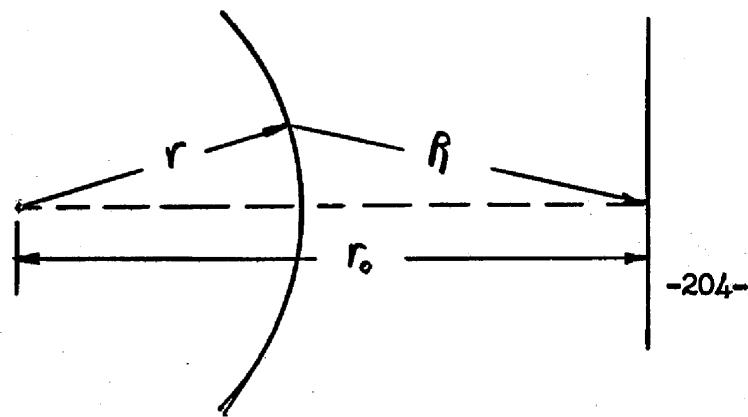

$$
\begin{array}{l} r = 9 6. 5 \mathrm {c m} \\ r _ {0} = (1 7 + 8) \times 1 2 \times 2. 5 4 \mathrm {c m} \\ = 7 6 0 \mathrm {c m} \\ \end{array}
$$

The infinite plane source which will give the equivalent dose at the outside of the shield is:

$$
\begin{array}{l} s _ {(\text {l n f p l a n e})} = \frac {r}{r _ {0}} s (s p h e r e) \\ S _ {a} = \frac {9 6 . 5}{7 6 0} S _ {r} \\ S _ {a} = . 1 3 S _ {\gamma} \\ \end{array}
$$

Infinite Plane Sources

2 Mev .13 (1.5 x 10 $^{14}$ ) = 2.0 x 10 $^{13}$ $\frac{\chi_{s}}{cm^{2} - sec}$

5 Mev .13 (3.3 x 10 $^{12}$ ) = 4.3 x 10 $^{11}$

10 Mev .13 (3.7 x 10 $^{12}$ ) = 4.8 x 10 $^{11}$

Attenuation of gammas:

$$
\phi = s _ {a} e ^ {- \sum (\mu x)}
$$

A. For 4 inches of steel and 6 feet of ordinary concrete:

10 Mev Blanket - $\mu x = 7.3$

$$
\text {C a r b o n} - \mu x = 1. 0
$$

$$
\text {S t e e l} (\mathrm {F e}) - \mu x = 2. 3 8
$$

$$
\text {C o n c r e t e} - \mu / \rho = . 0 2 2 9 \mathrm {c m} ^ {2} / \mathrm {g}
$$

$$
\rho = 2. 3 \mathrm {g} / \mathrm {c c}
$$

$$
\mu = . 0 5 2 8 \mathrm {c m} ^ {- 1}
$$

$$
6 \text {f e a t} = 1 8 2 \mathrm {c m}
$$

$$
\mu x = 9. 6
$$

$$
\begin{array}{l} \sum_ {i} (\mu x) = 7. 3 + 1. 0 + 2. 4 + 9. 6 \\ = 2 0. 3 \\ \phi_ {1 0} = (4. 8 \times 1 0 ^ {1 1}) e ^ {- 2 0. 3} \\ = 8 8 9 \times 1 0 ^ {2} \frac {\text {p h o t o n s}}{\mathrm {c m} ^ {2} - \sec} \quad - 2 0 5 \\ \end{array}
$$

5 Mev

$$
\text {E l a n k e t} - \mu x = 6. 2
$$

$$
\text {C a r b o n} - \mu x = 1. 4
$$

$$
\text {S t e e l} - \mu x = 2. 5
$$

$$
\frac {\text {C o n c r e t e} - \mu x = 1 2 . 0}{\Sigma (\mu x) = 2 2 . 1}
$$

$$
\phi_ {5} = (4. 3 \times 1 0 ^ {1 1}) (e ^ {- 2 2. 1})
$$

$$
\phi_ {5} = 6. 0 \times 1 0 ^ {2} \frac {\text {p h o t o n s}}{\mathrm {c m} ^ {2} - \sec}
$$

2 Mev

$$
\text {B l a n k e t} \quad \mu_ {\alpha} = 6. 6 2
$$

$$
\text {C a r b o n} \quad \mu x = 2. 3
$$

$$
\text {S t e e l} \quad \mu x = 3. 3
$$

$$
\begin{array}{r l} \text {C o n c r e t e} & \mu x = 1 8. 6 \\ \Sigma (\mu x) = 3 0. 8 \end{array}
$$

$$
\begin{array}{l} \phi_ {2} = (2. 0 \times 1 0 ^ {1 3}) e ^ {- 3 0. 8} \\ = 1. 1 \frac {\text {p h o t o n s}}{\mathrm {c m} ^ {2} - \sec} \quad (\text {n e g l i g i b l e}) \\ \end{array}
$$

B. For steel shield (top)

Using 1.75 feet of steel (53.4 cm)

10 Mev

$$
\begin{array}{l} \mu / \rho = . 0 3 0 0 \frac {\mathrm {c m} ^ {2}}{\mathrm {g m}} \\ \mu = . 2 3 5 \mathrm {c m} ^ {- 1} \\ \text {S t e e l :} \quad \mu \times = (5 3. 4) \quad (2 3 5) = 1 2. 5 \\ \text {E l a n k e t}: \mu x = = 7. 3 \\ \begin{array}{r l r} \text {C a r b o n :} & \mu \varkappa & = 1. 0 \\ & & \Sigma / \mu \chi = 2 0. 8 \\ & & - 2 0 6 - \end{array} \\ \end{array}
$$

$$
\begin{array}{l} \phi_ {1 0} = 4. 8 \times 1 0 ^ {1 1} e ^ {- 2 0. 8} \\ = 5 5 0 \frac {\text {p h o t o n s}}{\mathrm {c m} ^ {2} - \sec} \\ \end{array}
$$

5 Mev

Steel $\mu x = 13.1$

Blanket $\mu x = 6.2$

Carbon $\mu x = 1.4$ 20.7

$$
\begin{array}{l} \phi_ {5} = 4. 3 \times 1 0 ^ {1 1} e ^ {- 2 0. 7} \\ = 4 9 0 \frac {\text {p h o t o n s}}{\mathrm {c m} ^ {2} - \sec} \\ \end{array}
$$

The 2 Mev $\gamma$ 's are negligible

Dose (Unscattered)

A. Steel and Concrete Shield

Dose $= (5.67 \times 10^{-5})$ (Eγ) ( $\mu_{\mathrm{a}} / \rho$ ) ( $\phi$ ) r/hr

10 Mev

$$
\begin{array}{l} D o s e = (5. 6 7 \times 1 0 ^ {- 5}) (1 0) (0. 0 1 6 2) (8. 9 \times 1 0 ^ {2}) \times 1 0 ^ {3} \\ D o s e = 6. 0 m r / h r \\ \end{array}
$$

5 Mev

$$
\begin{array}{l} D o s e = (5. 6 7 \times 1 0 ^ {- 5}) (5) (. 0 1 9 3) (6 \times 1 0 ^ {2} \times 1 0 ^ {3}) \\ D o s e = 3. 3 m r / h r, \\ \end{array}
$$

B. Steel Shield

10 Mev

$$
D o s e = 6. 0 \times \frac {5 5 0}{8 9 0}
$$

$$
D o s e = 3. 7 m r / h r
$$

5 Mev

$$
D o s e = 3. 3 \times \frac {4 9 0}{6 0 0}
$$

$$
\mathrm {D o s e} = 2. 7 \mathrm {m r / h r}
$$

Using the build-up factor of water for that of concrete.

(For concrete shield)

Dose (scattered) = Br (μx) Dose (unscattered)

Br(μx) ≈ 5.(54)

Dose $= 5.0$ $(6.0 + 3.3) = 46.5\mathrm{mr / hr}$

For steel shield

$$
B _ {r} (\mu x) \simeq 6
$$

$$
D o s e = 6 (3. 7 + 2. 7)
$$

$$
\text {D o s e} = 3 8. 4 \mathrm {m r / h r}
$$

# APPENDIX C

# EXPERIMENTAL TESTS

# C.1 Summary of Melting Point Tests

Since there was no available data on the melting points of the proposed ternary chloride compositions a series of tests were undertaken to provide some fragmentary data.

The tests were run in the standard apparatus. This consisted of a nickel crucible in which the salt was placed, a nickel container (which was provided with openings for a stirrer, thermocouple, and a dry gas atmosphere) into which the crucible was sealed. All operations were done in a dry box.

Since there was some doubt that the $\mathsf{MgCl}_2$ was anhydrous it was purified by the addition of some $\mathsf{NH}_4\mathsf{Cl}$ and heated to its melting point. This succeeded in removing the water of hydration from the $\mathsf{MgCl}_2$ without the conversion of the $\mathsf{MgCl}_2$ to $\mathsf{MgO}$ . This was determined by a petrographic analysis.

The $\mathrm{NaCl}_2$ was then mixed to the eutectic composition (60% mol NaCl) and melted as a check on the accuracy of the equipment. The melting point was found to be $437^{\circ}\mathrm{C}$ as compared with $450^{\circ}\mathrm{C}$ , the literature value.

Using the above outlined procedure melting points were then determined of three salt mixtures having (1) $38.6\% \text{MgCl}_2$ , $57.91\% \text{NaCl}$ , $3.49\% \text{UCl}_3$ ; (2) $36.36\% \text{MgCl}_2$ , $54.54\% \text{NaCl}$ , $9.09\% \text{UCl}_3$ ; (3) $33.33\% \text{MgCl}_2$ , $50.01\% \text{NaCl}$ , $16.66\% \text{UCl}_3$ .

The data is summarized below as:

<table><tr><td>Sample</td><td>Melting Point
Liquidus</td><td>Solidus</td></tr><tr><td>(1)</td><td>435°C</td><td>420°C</td></tr><tr><td>(2)</td><td>432°C</td><td>415°C</td></tr><tr><td>(3)</td><td>505°C? 440°C?</td><td>405°C</td></tr></table>

C.2 Petrographic Analysis of Salt Mixtures

Petrographic analysis of the salt mixtures were done by Dr. T. N. McVay at the Y-12 plant. These analyses are given below:

Sample one: Eutectic of $\mathbf{MgCl}_2$ -NaCl (40-60 mol %)

Main phase well crystallized. One $\mu$ above 1.620 and the other below.

There is microcrystalline material present and this has a general index of refraction below 1.544 (NaCl). This suggests hydration. X-rays show neither MgCl $_2$ or NaCl.

Sample two: (36.4% MgCl $_2$ , 54.5% NaCl, 9.1% UCl $_3$ )

Sample has colorless phase with brown crystals in it. Brown phase has $\mu$ about 1.90. UCl₃ is higher at about 2.04. All phases are microcrystalline. Sample oxidizes in air and is hygroscopic.

Sample three: (38.6% MgCl $_2$ , 57.9% NaCl, 3.5% UCl $_3$ )

Sample has brown compound noted above. Very small lath crystals of a brown phase are present. The sample oxidizes and is hygroscopic.

Conclusion: More Data required to properly identify phases.

These analyses show that for the $\mathrm{MgCl}_2$ -NaCl eutectic neither the NaCl nor the $\mathrm{MgCl}_2$ exists as such. This is to be expected since the phase diagram shows compound formation on each side of the eutectic. The compounds formed were assumed to be the expected ones since there was no means of making the complete identification.

Both samples containing the eutectic mixture plus UCl₃ also showed compound formation. This was assumed since none of the original salts were recognized. The salt mixtures were also checked for the presence of UCl₄. This was not found present as such.

# C.3 Summary of Chemical Analysis of UCl3

On a wt.% basis 68.8% of the UCl₃ should be U⁺³. The chemical analysis of the UCl₃ used for our tests showed the 57.1% of the UCl₃ was U⁺³. This indicates that the remainder of the U was in the tetravalent state.

# C.4 Corrosion Tests

A series of 500 hour, see-saw capsule tests containing the chloride mixture of $33.33\% \mathrm{MgCl}_2$ , $50.01\% \mathrm{NaCl}$ , and $16.67\% \mathrm{UCl}_3$ were initiated. The tests are being run in capsules of nickel, and of inconel. The results of these tests are not yet available, but are expected by September 1, 1956.

As an adjunct of this test the chloride salt mixture will be chemically analyzed as a further check on the exact composition.

# REFERENCES

1. Blankenship, F.F., Barton, C.J., Kertesz, F., and Newton, R.F.; Private Communication.   
2. Barton, C. J., Private Communication, June 28, 1956.   
3. ORNL 1702, Cohen, S. I., and Jones, T. N., "A Summary of Density Measurements on Molten Floride Mixtures and a Correlation for Predicting Densities of Floride Mixtures".   
4. Untermeyer, S., "An Engineering Appraisal of Atomic Power Costs", National Industrial Conference Board Third Annual Conference (1954).   
5. TID-67, Weber, C. L., "Problems in the Use of Molten Sodium as a Heat Transfer Fluid". (1949)   
6. TID-70, Weber, C. L., "Problems in the Use of Molten Sodium as a Heat Transfer Fluid". (1951)   
7. ORNL 1956, Powers, W. and Ballock, G., "Heat Capacities of Molten Fluride Mixtures".   
8. Reactor Handbook, Volume II.   
9. ANL 5404, Abraham, B. and Flotow, H., "UO₂-Na Slurry".   
11. TID-5150, Stavrolakis, J. and Barr, H., "Appraisal of Uranium Oxides".   
12. CF-53-10-25, ORNL, "Fused Salt Breeder Reactor", ORSORT summer project, (1953).   
13. MIT 5002, "Engineering Analysis of Non Aqueous Fluid Fuel Reactor", Benedict, M., et al, (1953).   
14. McAdams, W. H., "Heat Transmission", 2nd Edition, McGraw Hill, (1952).   
15. Alexander, L. G., ORSORT notes, "Integral Beam Approximation Method".   
16. Glasstone, S., Chapter II, "Principles of Nuclear Reactor Engineering", Van Nostrand, (1955).   
17. ORNL 1777, Hoffman, H. and Lones, J., "Fused Salt Heat Transfer".   
18. Reactor Handbook, Volume III.   
19. Roark, R. J., "Formulae for Stress and Strain".   
20. TID-7004, "Reactor Shielding Design Manual", Chapter 3, Rockwell, T. et al., (1956).

# REFERENCES (Cond't)

21. IRL-84, Bjorklund, F. E., "Spectrum of Inelastically Scattered Neutrons", (1954).   
22. Okrent, D., et al., "A Survey of the Theoretical and Experimental Aspects of Fast Reactor Physics", Geneva Paper A/Conf 8/P/609 USA.   
23. Butler, M. and Cook, J. "Preliminary Information Relative to RE-6, 7, 8, 26, 28, UNIVAC Multigroup Codes", ANL-5437.   
24. R-259, Project Rand, Safonov, G., "Survey of Reacting Mixtures Employing Fu-239 and U-233 for Fuel and H₂O, D₂O, C, BeO for Moderator".   
25. Walt, M. and Beyster, J. R., Phys. Rev. 98, p. 677.   
26. Beyster, J. R., Phys. Rev. 98, p. 1216.   
27. Taylor, E. L., Lonsjo, O., Bonner, T. W., Phys. Rev. 100, p. 174.   
28. CF-53-7-165, ORNL, Dresner, L., "Resume of Inelastic Scattering Data for U-238".   
29. ABCD-2904, Feshback, H., "Fast Neutron Data", (1950).   
30. Langsdorf, ANL, Private Communication, subsequently published as ANL 5567.   
31. Reactor Handbook, Volume I (secret edition).   
32. Weinberg, A. M., Wigner, E., Notes (Unpublished).   
33. Endt, P. M., and Kluyver, J. C., Rees of Mod. Phys., (1954) 26, No. 1.   
34. Elatt, J. M., and Weisskopf, V. F., "Theoretical Nuclear Physics", Wiley, (1954).   
35. MIT-500, M.I.T., Goodman et al, Chapter I, "Nuclear Problems of Non-Aqueous Fluid Fuel Reactors", (1952).   
36. ANL-5321, Okrent, D., "On the Application of Multigroup Diffusion Theory to Fast Critical Assemblies", (1952).   
37. Cole, T. E., and Walker, C. S., Reactor Controls Lecture Notes, ORSORT, (1956).   
38. Charpie, R. A., et al, Chapter 7, "Progress in Nuclear Engineering-Physics and Mathematics", London Pergamon Press, (1956).   
39. MIT-5000, M.I.T., Goodman, et al, Chapter 5, "Nuclear Problems of Non-Aqueous Fluid Fuel Reactors", (1952).   
40. Liquid Metals Handbook, AEC and Dept. of the Navy, (1955).

# REFERENCES (Cont'd)

41. Feshbach, H., Goertzel, G. and Yamauchi, H., "Estimation of Doppler Effect in Fast Reactors", Nuclear Science and Engineering, Vol. I, No. 1.   
42. LA-1100, "Chemistry of Uranium and Plutonium", (1947).   
43. Flanary, J. R., ORNL, Private Communication.   
44. Case, F. N., ORNL, Private Communication.   
45. Stockdale, W. G., ORNL, Private Communication.   
46. MIT-5005, M.I.T., "Processing of Spent Power-Reactor Fuels", Benedict, M., et al., (1953).   
47. Charpie, R. A., et al, Chapter II, "Progress in Nuclear-Engineering Physics and Mathematics", London Pergamon Press, (1956).   
49. Ullman, J.W., ORNL, Private Communication.   
50. "Oil, Paint and Drug Reporter", August, 1956.   
51. Barton, C. J., ORNL, Private Communication, August 10, 1956.   
52. Lane, J. A., "How to Design Reactor Shields for Lowest Cost", Nucleonics, June, 1955, Vol. 13, #6.   
53. Ibid, 20.   
54. ORNL 56-1-48, Blizzard, E. P., "Shield Design".   
55. Glasstone, S., "Principles of Nuclear Reactor Engineering", Chapter 10, Van Nostrand, (1955).   
56. Lane, J. A., "Economics of Nuclear Power", Geneva Paper A/Conf 8/P/476 USA.   
57. Davis, W. K., "Capitol Investment Required for Nuclear Energy," Geneva Paper A/Conf 8/P/477 USA.