FOR INTERNAL USE ONLY

ORNL

Central Files Number

56-8-208

OAK RIDGE SCHOOL OF REACTOR TECHNOLOGY

REACTOR DESIGN AND FEASIBILITY STUDY

10 Mw FUSED SALT HOMOGENEOUS

REACTOR POWER PLANT

This document has been reviewed and is determined to be APPROVED FOR PUBLIC RELEASE.

Name/Title: Leesa Laymance/ORNL TIO

Date: 10/04/2018

By Authority Cr.

fuc: h. f. bry. hysteroyl laterissary records yestoc


# NOTICE

This document contains information of a preliminary nature and was prepared primarily for internal use at the Oak Ridge National Laboratory. It is subject to revision or correction and therefore does not represent a final report.

OAK RIDGE NATIONAL LABORATORY

OPERATED BY

UNION CARBIDE NUCLEAR COMPANY

A Division of Union Carbide and Carbon Corporation

UCC

POST OFFICE BOX X·OAK RIDGE, TENNESSEE

RESTRICTED DATA

# DISCLAIMER

This report was prepared as an account of work sponsored by an agency of the United States Government. Neither the United States Government nor any agency Thereof, nor any of their employees, makes any warranty, express or implied, or assumes any legal liability or responsibility for the accuracy, completeness, or usefulness of any information, apparatus, product, or process disclosed, or represents that its use would not infringe privately owned rights. Reference herein to any specific commercial product, process, or service by trade name, trademark, manufacturer, or otherwise does not necessarily constitute or imply its endorsement, recommendation, or favoring by the United States Government or any agency thereof. The views and opinions of authors expressed herein do not necessarily state or reflect those of the United States Government or any agency thereof.

OAK RIDGE SCHOOL OF REACTOR TECHNOLOGY

Reactor Design and Feasibility Study


"600 MW FUSED SALT HOMOGENEOUS REACTOR POWER PLANT"

Prepared by:

R. W. Davies, Group Chairman

D. H. Feener

W. A. Frederick

K. R. Goller

I. Granet

G.R.Schneider

F. W. Shutko

August 1956

# DISCLAIMER

Portions of this document may be illegible in electronic image products. Images are produced from the best available original document.

Date Declassified: March 4, 1957.

# LEGAL NOTICE

This report was prepared as an account of Government sponsored work. Neither the United States, nor the Commission, nor any person acting on behalf of the Commission:

A. Makes any warranty or representation, express or implied, with respect to the accuracy, completeness, or usefulness of the information contained in this report, or that the use of any information, apparatus, method, or process disclosed in this report may not infringe privately owned rights; or   
B. Assumes any liabilities with respect to the use of, or for damages resulting from the use of any information, apparatus, method, or process disclosed in this report.

As used in the above, "person acting on behalf of the Commission" includes any employee or contractor of the Commission to the extent that such employee or contractor prepares, handles or distributes, or provides access to, any information pursuant to his employment or contract with the Commission.

This report has been reproduced directly from the best available copy.

Issuance of this document does not constitute authority for declassification of classified material of the same or similar content and title by the same authors.

Since nontechnical and nonessential prefatory material has been deleted, the first page of the report is page 5.

Consolidation of this material into compact form to permit economical, direct reproduction has resulted in multiple folios for some pages, e.g., 10-12, 27-29, etc.

Printed in USA. Price $1.25. Available from the Office of Technical Services, Department of Commerce, Washington 25, D. C.

THIS PAGE

WAS INTENTIONALLY

LEFT BLANK

# THIS PAGE

# WAS INTENTIONALLY

# LEFT BLANK

# THIS PAGE WAS INTENTIONALLY LEFT BLANK

# PREFACE

In September, 1955, a group of men experienced in various scientific and engineering fields embarked on the twelve months of study which culminated in this report. For nine of those months, formal classroom and student laboratory work occupied their time. At the end of that period, these seven students were presented with a problem in reactor design. They studied it for ten weeks, the final period of the school term.

This is a summary report of their effort. It must be realized that, in so short a time, a study of this scope can not be guaranteed complete or free of error. This "thesis" is not offered as a polished engineering report, but rather as a record of the work done by the group under the leadership of the group leader. It is issued for use by those persons competent to assess the uncertainties inherent in the results obtained in terms of the preciseness of the technical data and analytical methods employed in the study. In the opinion of the students and faculty of ORSORT, the problem has served the pedagogical purpose for which it was intended.

The faculty joins the authors in an expression of appreciation for the generous assistance which various members of the Oak Ridge National Laboratory gave. In particular, the guidance of the group consultants, E. S. Bettis and D. A. Carrison, is gratefully acknowledged.

Lewis Nelson

for

The Faculty of ORSORT

# ACKNOWLEDGMENT

The group wishes to express its appreciation to the many people of the Oak Ridge National Laboratory who gave us the benefit of their experience and knowledge by supplying advice and information toward the completion of this design study.

Our special thanks go to E. S. Bettis, our group advisor, for his guidance and continuing interest in the project.

Finally, we want to thank the ORSORT faculty and staff for providing us with the education and knowledge which made it possible for us to undertake this design study.

# ABSTRACT

The reactor is a fused salt, homogeneous, intermediate energy reactor that operates at a power density of 55 watts/cc with an enriched U-235 inventory of 240 kilograms. The fuel bearing fused fluoride salt functions as neutron moderator and heat transfer medium. It is circulated through the multi-pass reactor vessel and transfers the fission heat to a sodium loop within the reactor vessel by an annular, U-tube heat exchanger which surrounds the central core. This heat is then transferred from this radioactive sodium loop to an intermediate, non-radioactive sodium loop, which is used to generate $1000^{\circ}\mathrm{F}$ superheated steam at 1800 psig to drive a steam turbine-generator unit. The net thermal plant efficiency is 38.2 percent at a maximum net electrical output of 229 MW.

TABLE OF CONTENTS   

<table><tr><td></td><td></td><td>Page
Number</td><td>CHAPTER</td></tr><tr><td>CHAPTER 1.</td><td>SUMMARY DESCRIPTION AND CONCLUSIONS</td><td>15</td><td>4.0</td></tr><tr><td>1.0.0</td><td>Introduction</td><td>15</td><td>4.1</td></tr><tr><td>1.1.0</td><td>Fuel</td><td>15</td><td>4.2</td></tr><tr><td>1.2.0</td><td>Materials</td><td>16</td><td>4.3</td></tr><tr><td>1.3.0</td><td>Reactor</td><td>17</td><td>4.4</td></tr><tr><td>1.4.0</td><td>Sodium Coolant Systems</td><td>18</td><td>4.5</td></tr><tr><td>1.5.0</td><td>Steam Power System</td><td>20</td><td>4.6</td></tr><tr><td>1.6.0</td><td>Conclusions</td><td>20</td><td>4.7</td></tr><tr><td>CHAPTER 2.</td><td>FUEL</td><td>23</td><td>4.8</td></tr><tr><td>2.0.0</td><td>Introduction</td><td>23</td><td>CHAPTER</td></tr><tr><td>2.1.0</td><td>Composition</td><td>24</td><td>5.0</td></tr><tr><td>2.2.0</td><td>Physical and Thermal Properties</td><td>28</td><td>5.1</td></tr><tr><td>2.3.0</td><td>Nuclear Properties</td><td>30</td><td></td></tr><tr><td>2.4.0</td><td>Availability and Cost</td><td>30</td><td></td></tr><tr><td>2.5.0</td><td>Addition of Uranium Fuel</td><td>31</td><td></td></tr><tr><td>2.6.0</td><td>Fuel Reprocessing</td><td>32</td><td>5.2</td></tr><tr><td>CHAPTER 3.</td><td>STRUCTURAL MATERIALS</td><td>35</td><td></td></tr><tr><td>3.0.0</td><td>Introduction</td><td>35</td><td></td></tr><tr><td>3.1.0</td><td>Reactor Structural Materials</td><td>35</td><td></td></tr><tr><td></td><td>3.1.1 Inconel</td><td>36</td><td rowspan="3">CHAPTER</td></tr><tr><td></td><td>3.1.2 Nickel-Molybdenum Alloys</td><td>37</td></tr><tr><td></td><td>3.1.3 Nickel Clad Stainless Steel</td><td>37</td></tr><tr><td>3.2.0</td><td>Sodium System Materials</td><td>42</td><td>6.0</td></tr><tr><td>3.3.0</td><td>Steam System Materials</td><td>44</td><td>6.1</td></tr></table>

7.

Page Number

CHAPTER 4. REACTOR ANALYSIS 46

4.0.0 Introduction 46

4.1.0 Critical Size and Fuel Concentration 46

4.2.0 Neutron Flux 51

4.3.0 Fuel Inventory 53

4.4.0 FuelBurn-up 53

4.5.0 Uranium-233 Fuel 53

4.6.0 Fission Product Poisoning 54

4.7.0 Temperature Coefficient of Reactivity 55

4.8.0 Decay Heating 55

CHAPTER 5. REACTOR AND PRIMARY HEAT EXCHANGER DESIGN 58

5.0.0 Introduction 58

5.1.0 Primary Heat Exchanger 58

5.1.1 Internal vs. External Arrangement 59   
5.1.2 Internal Arrangement 60   
5.1.3 Basic Design Criteria 61   
5.1.4 Parametric Study 64   
5.1.5 Design Considerations 68

5.2.0 Reactor Vessel 77

5.2.1 Shell Design 81   
5.2.2 Internal Arrangement 82   
5.2.3Structural Arrangement 83   
5.2.4 Fuel Circulating Pumps 84   
5.2.5 Pressurizer, Gas Removal and Expansion System 89   
5.2.6 Effect of Volume Heat Sources 90

CHAPTER 6. SODIUM AND STEAM POWER SYSTEMS 91

6.0.0 Introduction 91   
6.1.0 Primary Sodium Coolant Loop 91

6.1.1 Schemes for Removing Heat from Reactor 92   
6.1.2 Choice of Coolant 93   
6.1.3 Sodium Coolant Activation 94

8.

Page Number

# CHAPTER 6. (continued)

6.2.0 Intermediate Sodium Coolant Loop 95

6.2.1 Justification of Intermediate Loop 96   
6.2.2 Choice of Coolant Fluid 97   
6.2.3 Sodium-Water Isolation Problem 90   
6.2.4 Proposed Design for Sodium Water Isolation 99

6.3.0 Intermediate Heat Exchanger 100

6.3.1 Isolation of Radioactive from Non- 100   
Radioactive Sodium   
6.3.2 Calculations for Intermediate Heat Exchanger 102

6.4.0 Steam Generators 102

6.4.1 Once-Through Steam Generator 102   
6.4.2 Natural Circulation Boiler-Separate 104

Superheater Steam Generator

Steam Generator Calculation Procedures 107

6.5.1 Heat Transfer 107   
6.5.2 Pressure Drop 110

6.6.0 Summary of Heat Exchanger Data 113   
Sodium Piping Systems 113

$\therefore m = \frac{3}{11}$

6.7.1 Pipe Length and Size 113   
6.7.2 Pipe Slope 120   
6.7.3 Expansion Tanks 120   
6.7.4 Cold Traps 121   
6.7.5 Valves 121   
6.7.6 Pressure and Instrument Taps 121   
6.7.7 Drain and Charge Tanks 121   
6.7.8 Cover Gas 122   
6.7.9 Sodium Pumps 123   
6.7.10 Heating the Salt and Sodium Loops 125

for Startup

6.8.0 Steam Power System 125

6.8.1 Steam Turbine and Steam Cycle Heat Balance 125   
6.8.2 Calculation Procedure 127   
6.8.3 Auxiliary Power Requirements, Net Plant 130

Output and Efficiency

CHAPTER 7

7.0.0

7.1.0

7.2.0

7.3.0

7.4.0

7.5.0

7.6.0

APPENDIX

A. Phy   
B. Des   
C. Rea   
D. Pri   
E. Int   
F. Ste   
G. Cal   
H. Sod

9.

Page Number

CHAPTER 7. POWER PLANT LAYOUT, OPERATION AND MAINTENANCE 133

7.0.0 Introduction 133

7.1.0 General Piping Arrangement 133

7.1.1 Primary Loop Piping 133   
7.1.2 Intermediate Loop Piping 134   
7.1.3 Steam Generator Connections 134   
7.1.4 Steam and Water Piping 134

7.2.0 General Arrangement of Plant Components 134   
7.3.0 Shielding 135   
7.4.0 Maintenance 139   
7.4.1 Fuel Circulating Pumps 140   
7.4.2 Primary Heat Exchanger Tube Bundles 140   
7.4.3 Intermediate Heat Exchangers and Primary Sodium Pumps 141

7.5.0 Partial Load Operation 141   
7.5.1 Mathematical Approach 142   
7.5.2 Reactor Simulator Analysis 143   
7.6.0 Economica 145   
7.6.1 Factors Requiring Additional Investigation 151   
7.6.2 Approximate Economic Analysis 152

# APPENDIX

A. Physical and Thermal Properties 154   
B Design Curves 171   
C. Reactor Analysis Calculations 176   
D. Primary Heat Exchanger Calculations 189   
E. Intermediate Heat Exchanger Calculations 201   
F. Steam Generator Calculations 207   
G. Calculations of Steam Plant Heat Balance 227   
H. Sodium Piping Pressure Drop Calculations 234

10.

Page Number

# APPENDIX (continued)

I. Partial Load Operation (Mathematical Approach)

J. Reactor Simulator Analysis (Supplied by Dr. E. R. Mann)   
K. Test of Double Tube Sheet Design for Water-Sodium Isolation

Symbols Used in Engineering Calculations

Symbols Used in Nuclear Physics Calculations

Bibliography

237   
244   
251   
255   
257   
258

Figure Number

1.1 Heat   
2.1 Phas   
2.2 Phas   
2.3 Part   
3.1 Chan   
${180}^{ \circ  }$   
Salt   
3.3 Corr   
$\therefore m - 1 \neq  0$ ;   
3 01   
+2 Total   
4.3 Neut1   
5.1 React   
.2 Isome   
.3 Prima   
.4 Prima   
5 Prima:   
6 Prima   
of Nun   
7 Primax   
with T   
3 Primar   
9 Section:   
LO Plan V:

# LIST OF ILLUSTRATIONS

<table><tr><td>Figure
Number</td><td>Page
Number</td></tr><tr><td>1.1 Heat Transfer Diagrams - Fused Salt Power Reactor Systems</td><td>19</td></tr><tr><td>2.1 Phase Diagram of the Three-Component NaF-ZrF4-UF4 System</td><td>25</td></tr><tr><td>2.2 Phase Diagram of the Two-Component NaF-ZrF4 System</td><td>26</td></tr><tr><td>2.3 Partial Pressures of ZrF4</td><td>29</td></tr><tr><td>3.1 Changes in Attack with Increasing Operating Time in
Forced-Circulation Inconel Loops</td><td>39</td></tr><tr><td>3.2 Corrosion of 85-15 Nickel-Molybdenum Alloy by Fused Fluoride
Salt No. 30 in a Thermal Convection Loop</td><td>40</td></tr><tr><td>3.3 Corrosion of Nickel in Fused Fluoride Salt No. 30 in a Thermal
Convection Loop</td><td>41</td></tr><tr><td>4.1 Variation of Multiplication Constant K with Concentration
of U-235 and Central Core Radius</td><td>49</td></tr><tr><td>4.2 Total U-235 Inventory Variation with Central Core Radius</td><td>50</td></tr><tr><td>4.3 Neutron Flux Distribution</td><td>52</td></tr><tr><td>5.1 Reactor Arrangement with Straight Heat Exchanger Tubes</td><td>62</td></tr><tr><td>5.2 Isometric View of Reactor</td><td>63</td></tr><tr><td>5.3 Primary Heat Exchanger Parametric Study, 1/2-inch Tubes</td><td>69</td></tr><tr><td>5.4 Primary Heat Exchanger Parametric Study, 5/8-inch Tubes</td><td>70</td></tr><tr><td>5.5 Primary Heat Exchanger Parametric Study, 3/4-inch Tubes</td><td>71</td></tr><tr><td>5.6 Primary Heat Exchanger Parametric Study Summary, Variation
of Number of Tubes with Tube Ligament Ratio and Size of Tubes</td><td>72</td></tr><tr><td>5.7 Primary Heat Exchanger Parametric Study Summary, Variation
of Pump Power, Fuel Holdup Volume, and Heat Exchanger Surface
with Tube Ligament Ratio and Size of Tubes</td><td>73</td></tr><tr><td>5.8 Primary Heat Exchanger Tube Layout</td><td>75</td></tr><tr><td>5.9 Section Through Reactor Vessel</td><td>78</td></tr><tr><td>5.10 Plan View of Reactor Vessel</td><td>79</td></tr><tr><td>5.11 Pressurizer, Fuel Expansion and Gas Removal System</td><td>80</td></tr><tr><td>6.1 Suggested Test of Double Tube Sheet Design for Isolation
of Water and Sodium</td><td>101</td></tr><tr><td>6.2 Heat Balance Diagram for 600 MW Reactor-Steam Power Plant</td><td>131</td></tr><tr><td>7.1 Sodium and Steam Power System</td><td>136</td></tr><tr><td>7.2 Elevation of Power Plant</td><td>137</td></tr><tr><td>7.3 Plan View of Power Plant</td><td>138</td></tr><tr><td>7.4 Time Constants and Heat Capacity of Components in Once-
Through Steam Generator System</td><td>146</td></tr><tr><td>7.5 Partial Load System Temperatures without Auxiliary Heat
Exchanger Temperature Control</td><td>147</td></tr><tr><td>7.6 Partial Load System Temperatures with Auxiliary Heat
Exchanger Temperature Control</td><td>148</td></tr><tr><td>7.7 Temperature and Reactor Power Transients Due to Rapid
Increase in Load Demand without Auxiliary Heat Exchanger
Temperature Control</td><td>149</td></tr><tr><td>7.8 Temperature and Reactor Power Transients Due to Rapid
Increase in Load Demand with Auxiliary Heat Exchanger
Temperature Control</td><td>150</td></tr><tr><td>A.1 Thermal Conductivity of Selected Steels</td><td>155</td></tr><tr><td>A.2 Specific Heat of Water</td><td>156</td></tr><tr><td>A.3 Viscosity and Thermal Conductivity of Saturated Water</td><td>157</td></tr><tr><td>A.4 Density of Sodium, Potassium and Sodium Potassium Alloys</td><td>158</td></tr><tr><td>A.5 Viscosity of Sodium, Potassium and Sodium Potassium Alloys</td><td>159</td></tr><tr><td>A.6 Thermal Conductivity of Sodium, Potassium and Sodium
Potassium Alloys</td><td>160</td></tr><tr><td>A.7 Specific Heat of Steam at Constant Pressure</td><td>161</td></tr><tr><td>A.8 Thermal Conductivity of Steam</td><td>162</td></tr><tr><td>A.9 Viscosity of Steam</td><td>163</td></tr></table>

<table><tr><td colspan="2">Figure
Number</td></tr><tr><td>A.10</td><td>The</td></tr><tr><td>B.1</td><td>Hea
Tur</td></tr><tr><td>B.2</td><td>Heat</td></tr><tr><td>B.3</td><td>Heat</td></tr><tr><td>B.4</td><td>Tube</td></tr><tr><td>C.1</td><td>Neut</td></tr><tr><td>G.1</td><td>Pres</td></tr><tr><td>J.1</td><td>Simul</td></tr><tr><td>J.2</td><td>Simul</td></tr><tr><td>J.3</td><td>Simul
Heat</td></tr><tr><td>K-1</td><td>Under</td></tr><tr><td>K-2</td><td>Defec</td></tr></table>

13.

# Figure

A.10 Thermal Conductivity of Nickel 164   
B.l Heat Transfer of Steam or Subsaturated Water in Turbulent Flow 172

B.2 Heat Transfer from Flat Plates 173   
B.3 Heat Transfer from Bare or Insulated Steel Pipe 174   
B.4 Tube Count for Tubes Spaced on Equilateral Centers 175   
C.1 Neutron Flux Distribution 177   
G.1 Pressure-Enthalpy Relation of Expansion Line 233   
J.1 Simulator Circuit for Fuel and Primary Sodium Loops 248   
J.2 Simulator Circuit for Intermediate Sodium Loop 24   
J.3 Simulator Circuit for Driving Function in Intermediate 250 Heat Exchanger and Regulator for Steam Temperature Control   
K-1 Underside of Brazed Tube Sheet 253   
K-2 Defective Brazing of Tube 254

LIST OF TABLES   

<table><tr><td>Table
Number</td><td></td><td>Page
Number</td></tr><tr><td>4.1</td><td>Summary of Reactor Analysis Data</td><td>57</td></tr><tr><td>5.1</td><td>Summary of Primary Heat Exchanger Parametric Study</td><td>74</td></tr><tr><td>5.2</td><td>Specifications for Fuel Circulating Pumps</td><td>88</td></tr><tr><td>6.1</td><td>Primary Heat Exchanger Specifications</td><td>114</td></tr><tr><td>6.2</td><td>Intermediate Heat Exchanger Specifications</td><td>115</td></tr><tr><td>6.3</td><td>Once-Through Steam Generator Specifications</td><td>116</td></tr><tr><td>6.4</td><td>Convection Boiler Specifications</td><td>117</td></tr><tr><td>6.5</td><td>Single Wall Superheater Specifications</td><td>118</td></tr><tr><td>6.6</td><td>Double Wall Superheater Specifications</td><td>119</td></tr><tr><td>6.7</td><td>Summary of Full Load Operating Data</td><td>132</td></tr><tr><td>7.1</td><td>Estimated Power Generation Costs</td><td>153</td></tr><tr><td>A.1</td><td>Thermodynamic Properties of Liquid Sodium</td><td>165</td></tr><tr><td>A.2</td><td>Selected Properties of Stainless Steels</td><td>169</td></tr><tr><td>A.3</td><td>Selected Physical Properties of &quot;L&quot; Nickel</td><td>170</td></tr><tr><td>C.1</td><td>Basic Microscopic Cross Section Data Used to Obtain
3-Group, 3-Region Code Constants</td><td>178</td></tr><tr><td>C.2</td><td>Case Data and Computed Multiplication Constants</td><td>180</td></tr><tr><td>C.3</td><td>Macroscopic Group Constants for 3-Group, 3-Region Code</td><td>181</td></tr><tr><td>H.1</td><td>Sodium Piping Data</td><td>236</td></tr></table>

TABLE OF CONTENTS   

<table><tr><td></td><td></td><td>Page Number</td></tr><tr><td>CHAPTER 1.</td><td>SUMMARY DESCRIPTION AND CONCLUSIONS</td><td>15</td></tr><tr><td>1.0.0</td><td>Introduction</td><td>15</td></tr><tr><td>1.1.0</td><td>Fuel</td><td>15</td></tr><tr><td>1.2.0</td><td>Materials</td><td>16</td></tr><tr><td>1.3.0</td><td>Reactor</td><td>17</td></tr><tr><td>1.4.0</td><td>Sodium Coolant Systems</td><td>18</td></tr><tr><td>1.5.0</td><td>Steam Power System</td><td>20</td></tr><tr><td>1.6.0</td><td>Conclusions</td><td>20</td></tr><tr><td>CHAPTER 2.</td><td>FUEL</td><td>23</td></tr><tr><td>2.0.0</td><td>Introduction</td><td>23</td></tr><tr><td>2.1.0</td><td>Composition</td><td>24</td></tr><tr><td>2.2.0</td><td>Physical and Thermal Properties</td><td>28</td></tr><tr><td>2.3.0</td><td>Nuclear Properties</td><td>30</td></tr><tr><td>2.4.0</td><td>Availability and Cost</td><td>30</td></tr><tr><td>2.5.0</td><td>Addition of Uranium Fuel</td><td>31</td></tr><tr><td>2.6.0</td><td>Fuel Reprocessing</td><td>32</td></tr><tr><td>CHAPTER 3.</td><td>STRUCTURAL MATERIALS</td><td>35</td></tr><tr><td>3.0.0</td><td>Introduction</td><td>35</td></tr><tr><td>3.1.0</td><td>Reactor Structural Materials</td><td>35</td></tr><tr><td>3.2.0</td><td>Sodium System Materials</td><td>42</td></tr><tr><td>3.3.0</td><td>Steam System Materials</td><td>44</td></tr></table>

Page Number

CHAPTER 4. REACTOR ANALYSIS 46   
4.0.0 Introduction 46   
4.1.0 Critical Size and Fuel Concentration 46   
4.2.0 Neutron Flux 51   
4.3.0 Fuel Inventory 53   
4.4.0 FuelBurn-up 53   
4.5.0 Uranium-233 Fuel 53   
4.6.0 Fission Product Poisoning 54   
4.7.0 Temperature Coefficient of Reactivity 55   
4.8.0 Decay Heating 55

CHAPTER 5. REACTOR AND PRIMARY HEAT EXCHANGER DESIGN 58

5.0.0 Introduction 58   
5.1.0 Primary Heat Exchanger 58

5.1.1 Internal vs. External Arrangement 59   
5.1.2 Internal Arrangement 60   
5.1.3 Basic Design Criteria 61   
5.1.4 Parametric Study 64   
5.1.5 Design Considerations 68

5.2.0 Reactor Vessel 77

5.2.1 Shell Design 81   
5.2.2 Internal Arrangement 82   
5.2.3Structural Arrangement 83   
5.2.4 Fuel Circulating Pumps 84   
5.2.5 Pressurizer, Gas Removal and Expansion System 89   
5.2.6 Effect of Volume Heat Sources 90

CHAPTER 6. SODIUM AND STEAM POWER SYSTEMS 91

6.0.0 Introduction 91   
6.1.0 Primary Sodium Coolant Loop 91

6.1.1 Schemes for Removing Heat from Reactor 92   
6.1.2 Choice of Coolant 93   
6.1.3 Sodium Coolant Activator 94

# CHAPTER 6. (continued)

6.2.0 Intermediate Sodium Coolant Loop 95

6.2.1 Justification of Intermediate Loop 96   
6.2.2 Choice of Coolant Fluid 97   
6.2.3 Sodium-Water Isolation Problem 98   
6.2.4 Proposed Design for Sodium Water Isolation 99

6.3.0 Intermediate Heat Exchanger 100

6.3.1 Isolation of Radioactive from Non-Radioactive Sodium 100   
6.3.2 Calculations for Intermediate Heat Exchanger 102

6.4.0 Steam Generators 102

6.4.1 Once-Through Steam Generator 102   
6.4.2 Natural Circulation Boiler-Separate Superheater Steam Generator 104

6.5.0 Steam Generator Calculation Procedures 107

6.5.1 Heat Transfer 107   
6.5.2 Pressure Drop 110

6.6.0 Summary of Heat Exchanger Data 113   
6.7.0 Sodium Piping Systems 113

6.7.1 Pipe Length and Size 113   
6.7.2 Pipe Slope 120   
6.7.3 Expansion Tanks 120   
6.7.4 Cold Traps 121   
6.7.5 Valves 121   
6.7.6 Pressure and Instrument Taps 121   
16.7.7 Drain and Charge Tanks 121   
6.7.8 Cover Gas 122   
6.7.9 SodiumPumps 123   
6.7.10 Heating the Salt and Sodium Loops for Startup 123

6.8.0 Steam Power System 125

6.8.1 Steam Turbine and Steam Cycle Heat Balance 125   
6.8.2 Calculation Procedure 127   
6.8.3 Auxiliary Power Requirements, Net Plant Output and Efficiency 130

13.

Page Number

CHAPTER 7. POWER PLANT LAYOUT, OPERATION AND MAINTENANCE 133

7.0.0 Introduction 133   
7.1.0 General Piping Arrangement 133

7.1.1 Primary Loop Piping 133   
7.1.2 Intermediate Loop Piping 134   
7.1.3 Steam Generator Connections 134   
7.1.4 Steam and Water Piping 134

7.2.0 General Arrangement of Plant Components 134   
7.3.0 Shielding 135   
7.4.0 Maintenance 139   
7.4.1 Fuel Circulating Pumps 140   
7.4.2 Primary Heat Exchanger Tube Bundles 140   
7.4.3 Intermediate Heat Exchangers and Primary Sodium Pumps 141

7.5.0 Partial Load Operation 141

7.5.1 Mathematical Approach 142   
7.5.2 Reactor Simulator Analysis 143

7.6.0 Economics 145

7.6.1 Factors Requiring Additional Investigation 151   
7.6.2 Approximate Economic Analysis 152

# APPENDIX

A: Physical and Thermal Properties 154   
B. Design Curves 171   
C. Reactor Analysis Calculations 176   
D. Primary Heat Exchanger Calculations 189   
E. Intermediate Heat Exchanger Calculations 201   
F. Steam Generator Calculations 207   
G. Calculations of Steam Plant Heat Balance 227   
H. Sodium Piping Pressure Drop Calculations 234

# APPENDIX (continued)

I. Partial Load Operation (Mathematical Approach) 237   
J. Reactor Simulator Analysis (Supplied by Dr. E. R. Mann) 244   
K. Test of Double Tube Sheet Design for Water-Sodium Isolation 251   
Symbols Used in Engineering Calculations 255   
Symbols Used in Nuclear Physics Calculations 257   
Bibliography 258

# CHAPTER 1.

# SUMMARY DESCRIPTION AND CONCLUSIONS

# 1.0.0 INTRODUCTION

This report is a study of the feasibility of using a fused salt fuel reactor in a central station electric generating plant. The proposed reactor combines the desirable features of various homogeneous and high temperature reactor designs. The basic philosophy of the study has been to design a reactor and power plant system which could be built using present day technology wherever possible; which would be reliable, safe, and efficient; which could operate for long periods of time; and which could be maintained with a minimum of difficulty. The selection of the fuel, reactor materials, reactor coolants, heat transfer system, steam turbine and associated equipment has been made with the above objectives in mind, and the resulting design appears to fulfill these conditions. This study indicates, however, that some development work will be necessary before a plant of this type can be built and put into operation. The basic plant arrangement presented in this report is not intended to represent a finished or optimum design, but it does appear to be reasonable and possible and warrants further study and consideration.

# 1.1.0 FUEL

The plant has been designed to utilize current technology in the development of fused salt fuels. A reactor experiment has been conducted successfully using a solution of sodium, zirconium and uranium fluorides for the fuel system. This experiment indicated that a fused salt fuel of this type has the characteristics required for the homogeneous reactor under consideration. The moderating material in the reactor is the fluorine in the fused salt. With the

composition contemplated in this design, the number of fluorine atoms is insufficient to thermalize the majority of neutrons before fission takes place. As a result, approximately 34 percent of the fissions occur in the intermediate and fast energy ranges.

A fused fluoride composition of 43 mol percent $\mathsf{ZrF}_4$ and 57 mol percent NaF was selected as the fuel base to obtain a compromise between a reasonable melting point (932°F), corrosion, and the $\mathsf{ZrF}_4$ "snow problem". The concentration of the uranium is low and has little effect on the over-all characteristics of the salt.

Uranium is added to the salt in the form of $(\mathrm{NaF})_{2}\mathrm{UF}_{4}$ . Pellets, powder or a dissolved solution of the compound can be added during operation to replace uranium burn-up and to overcome the build-up of fission product and corrosion poisons. Economically, it probably would not be desirable to reprocess fuel to remove the solid fission products in order to minimize the amount of uranium which must be added to override the effect of these poisons.

# 1.2.0 MATERIALS

Fused salts are extremely corrosive to conventional engineering structural materials. It has been shown that alloys containing large percentages of nickel are the most corrosion-resistant metals to fused fluoride salts. Inconel, nickel-molybdenum alloys and pure nickel were considered as possible structural materials for the reactor.

It has been shown that the chromium in Inconel diffuses from the metal at a fairly substantial rate and, therefore, Inconel does not appear to be a satisfactory structural material for a long life reactor.

Nickel-molybdenum alloys have been shown to have excellent corrosion resistance to fused fluorides. A series of these alloys is being developed

in an attempt to obtain a strong, fabricable material for use in high temperature fused salt reactors. It appears that this development program will be successful, but at the time this report was prepared, the exact properties and fabricability of these new alloys were not sufficiently established to presuppose a satisfactory reactor design.

The amount of available data on the corrosion of pure nickel in fused fluorides is limited; however, these data indicate little or no corrosion or mass transfer. On this basis, it appears that nickel has the corrosion resistant properties for long reactor life. Unfortunately, at the operating temperatures contemplated, the strength characteristics of nickel are inadequate, and the nickel must be strengthened by suitable structural materials. Therefore, to present a design using present day technology, nickel clad stainless steel was selected as the most suitable structural material for the reactor in this study.

Because of the limited experimental data available, there is still some question as to the suitability of nickel to resist corrosion to the degree desired. The use of nickel cald stainless steel also poses fabricating and inspection problems.

# 1.3.0 REACTOR

The reactor is a homogeneous circulating fuel reactor with the primary heat exchangers an integral part of the reactor vessel. The heat exchangers are located in a baffled annulus surrounding the seven-foot diameter cylindrical core. Fuel flows upward through the core, through the U-tube heat exchangers, and through an annular downcomer at the periphery of the vessel. Eight vertical axial flow pumps located symmetrically around the top of the vessel maintain the fuel circulation in the reactor.

The reactor is designed to produce 600 MW of heat with fuel inlet and outlet temperatures of $1050^{\circ}\mathrm{F}$ and $1200^{\circ}\mathrm{F}$ , respectively. The pumps and the entire reactor vessel, with the exception of the top, are subjected to the minimum fuel temperature.

The reactor vessel is a sixteen-foot diameter vertical cylinder with a dished bottom and protrusions near the top where the fuel pumps are located. The only penetrations in the vessel are a series of drain connections in the bottom; all other fuel and coolant lines enter the top of the vessel. The heat exchanger baffles are supported internally, and the heat exchanger bundles are supported from a circular cantilever arrangement extending radially inward at the top.

The heat exchangers and pumps are arranged to permit removal vertically from the reactor. The layout of the equipment was arranged to provide for replacement of components with a minimum of difficulty, since outages for maintenance should be of short duration.

Provisions are made for the continuous removal of xenon, and space is provided, external to the reactor, for the expansion of fuel. The reactor will have a negative temperature coefficient of reactivity which will furnish the only means of reactor load control. The design average temperature will be controlled by the proper addition of uranium to the fuel solution.

# 1.4.0 SODIUM COOLANT SYSTEMS

The sodium system is made up of two independent coolant loops. A heat transfer diagram which illustrates the temperature drops through these loops is shown in Figure 1.l. The sodium in the primary loop flows from twenty-four heat exchanger bundles located in the reactor vessel to a common ring header above the reactor. Six independent circuits of the primary loop are

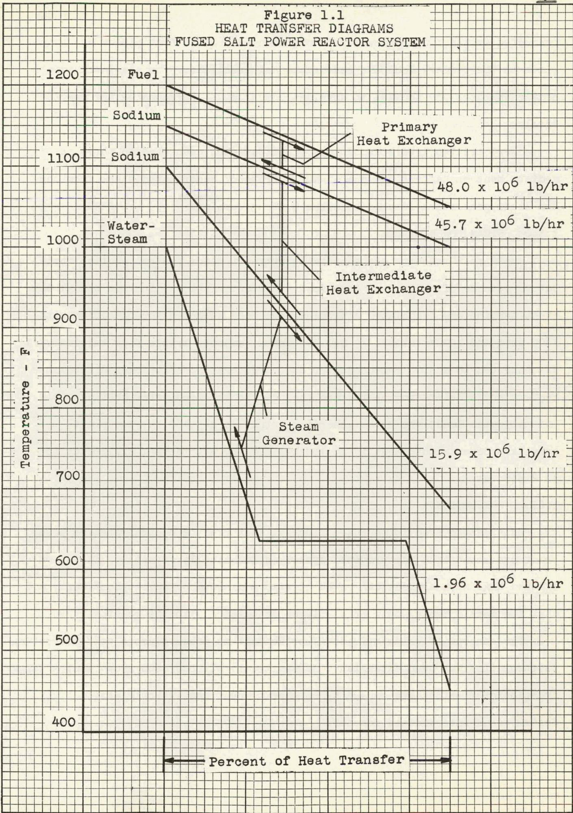

connected to the ring header. This division is used so that piping and pump sizes in the primary loop are reasonable and practical. The six intermediate heat exchangers are located in shielded compartments surrounding the reactor shield.

There are two intermediate loop circuits, each connected to three intermediate heat exchangers and one steam generator. Superheated steam from the two steam generators is used to drive a steam turbine.

# 1.5.0 STEAM POWER SYSTEM

Fused salt reactors are especially attractive for central station application because of their high temperature characteristics. In this study, the steam turbine and associated equipment have been selected for operation with 1800 psig and $1000^{\circ}\mathrm{F}$ steam. A 250 MW tandem compound triple flow turbine will be connected to a 3600 rpm conductor cooled generator. Five closed feedwater heaters and a deaerating heater are included in the feed water heating cycle.

At rated load, the gross generator output is 245,400 kw, the plant auxiliary power requirement is 16,400 kw, and the net thermal efficiency is 38.2 percent.

# 1.6.0 CONCLUSIONS

This design study of a fused fluoride salt reactor central station power plant has shown that the proposed system is technically feasible. It is considered that such a plant can be built with a minimum of development work, and that the developments would primarily be associated with the reactor.

The concept of using a fused fluoride salt as a homogeneous self-moderating fuel solution has been established as practical. It has been shown that a large fraction of fissions are caused by epithermal neutrons, which classifies this design as an intermediate reactor.

No completely satisfactory materials are currently available for the construction of the reactor vessel. Nickel clad stainless steel has many of the necessary requirements, but fabrication and inspection techniques must be improved. A series of nickel-molybdenum alloys are in the process of development which appear to have excellent corrosion and high temperature strength properties. The success of the fused fluoride salt reactor may depend upon satisfactory completion of this metallurgical development program.

The high temperature characteristics of the fused fluoride salt reactormake it possible to use a high efficiency steam turbine cycle for the conversion of fission heat into electrical energy. The net thermal efficiency of the proposed design is 38.2 percent, and it is possible to design for even a higher efficiency if the over-all plant economics show that this is desirable.

The operation of the reactor is relatively simple. The reactor power is controlled by its negative temperature coefficient of reactivity. Uranium will be added to the fused fluoride salt to replace fuel burn-up and to override the build-up of fission product poisons. Continuous fuel reprocessing should not be necessary for extended periods of operation.

The reactor has been designed to burn uranium-235. However, since this is an intermediate reactor, a number of advantages would result if uranium-233 would be bred during operation. The production of new fissionable material would reduce the fuel addition rate. The fuel bred in the reactor could be utilized without the necessity of employing chemical separation techniques.

The mechanical design features of the reactor are novel. The reactor vessel is a multi-pass cylindrical container. The primary heat exchanger tube bundles, which are located inside the reactor vessel, and the fuel circulating pumps can be removed for replacement by lifting them vertically

from their supports. The critical components of the reactor and primary sodium coolant circuits can be maintained with a minimum of difficulty. All components in the system, with the exception of those inside the reactor primary shield, can be maintained directly.

It is the considered opinion of the authors that the fused salt reactor not only shows great promise as the heat source for a large central station power plant, but that it is one of the most desirable reactor types for this application.

# CHAPTER 2.

# FUEL

# 2.0.0 INTRODUCTION

The most outstanding advantage of using a fused salt as the fuel solvent and heat exchanging medium is that it enables the attainment of high temperatures without high pressures. In addition, the advantages inherent in homogeneous systems are possible; i.e., no neutron absorbing structural material in the core proper; possibility of fission product removal, with the important gaseous fission products (xenon) being especially easy to remove; no fuel element fabrication; extended periods of operation possible by the periodic addition of a fuel concentrate; and high permissible fuel burn-up.

The particular fused salt used should have a reasonable melting point and must be stable at high temperatures and under high radiation. The elemental constituents of the salt should have small neutron capture cross sections. As in the case of the reactor in this study, it may be required that the fused salt solvent also serve as the neutron moderator. In addition to these specialized requirements, the salt must meet the more general considerations of availability, reasonable cost, permissible toxicity, and tolerable corrosiveness.

A good deal of theoretical and experimental work has been, and is still being done, by other groups in this field to select the constituents and the composition of a fused salt that best meets the above or very similar requirements. The result of this work indicates that a fused salt composed of NaF, $\mathrm{ZrF_4}$ and $\mathrm{UF_4}$ is satisfactory for use as a liquid fuel for reactors. A reactor has been successfully operated using this fuel system. After considerable

literature research and discussion with Oak Ridge National Laboratory personnel, it was considered that this particular salt system did fulfill the design requirements for the proposed reactor and also that this was currently still the most desirable system. By utilizing this salt system, there was immediately available a considerable amount of experimental information, physical properties data, and practical experience necessary for the intelligent design of a plant using such a salt as the reactor fuel solvent.

# 2.1.0 COMPOSITION

Within the NaF-ZrF $_4$ -UF $_4$ system, there remained to select the optimum composition of these constituents for this design study. Figure 2.1 shows an isometric view of the temperature-composition-phase plot for the three component NaF-ZrF $_4$ -UF $_4$ system. Nuclear calculations indicated that the fraction of UF $_4$ required is small ( $<0.2 \, \text{mol}\, \%)$ , so that for many purposes the small salt system may be considered as a two-component system of NaF-ZrF $_4$ . Figure 2.2 shows a plot of the temperature-composition-phase diagram for the two-component NaF-ZrF $_4$ system. From both the two-component and three-component plots, it can be observed that there exist two relatively low melting eutectics in the low UF $_4$ content region of interest. These occur at about 42 and 59 mol $\%$ ZrF $_4$ . In order to obtain the minimum melting point, it would be desirable to specify the salt to be one of these eutectic compositions; however, there are other factors that need to be considered in the composition selection.

Operational experience with NaF-ZrF $_4$ fused salt systems revealed the existence of a "snow problem" resulting from the low, but finite, vapor pressure of ZrF $_4$ at operating temperatures. A simplified explanation of this phenomenon is that ZrF $_4$ vapor will escape from the fused salt to any existing gas volume within the fused salt system. The subsequent sublimation of ZrF $_4$

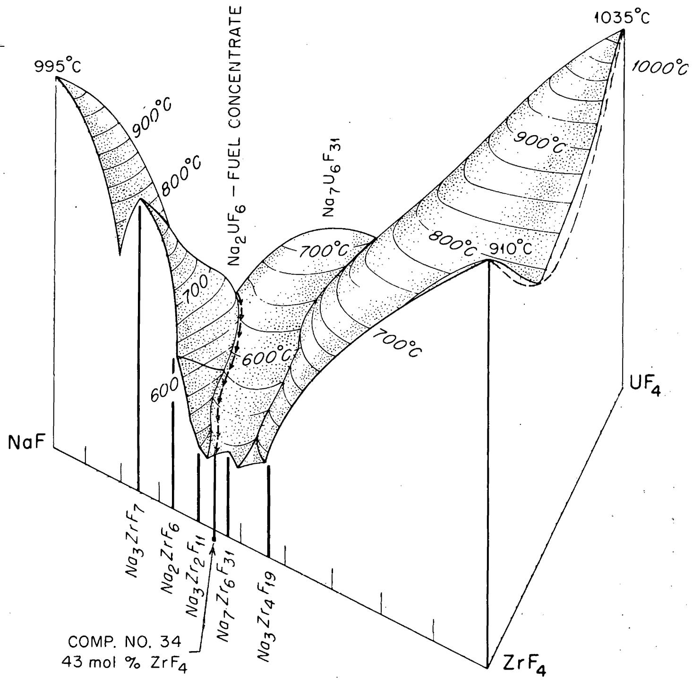  
Figure 2.1   
Phase Diagram of the Three-Component NaF-ZrF $_4$ -UF $_4$ System.

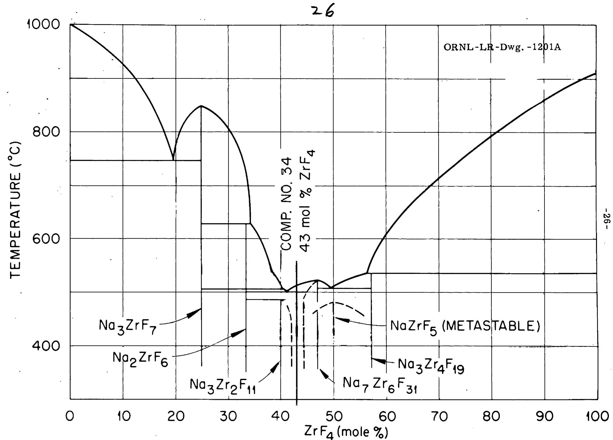  
Figure 2.2 Phase Diagram of the Two-Component NaF-ZrF<sub>4</sub> System.

crystals on lower temperature surfaces results in the formation of snow-like $\mathrm{ZrF}_4$ crystals which can build up and accumulate to such an extent that plugging of tubing or even filling the entire gas volume may result. This most undesirable phenomenon can be significantly improved by reducing the fraction of $\mathrm{ZrF}_4$ in the fused salt composition.

Other factors are in opposition to shifting the fused salt composition in this direction. For nuclear considerations, it is desirable to have the highest fraction of fluorine atoms possible in the fused salt solvent. The $\mathrm{ZrF}_4$ salt constituent has four times as many fluorine atoms for each metal atom as the NaF constituent. Further, the corrosiveness of the fused salt is decreased by increasing the fraction of $\mathrm{ZrF}_4$ and decreasing the NaF. These factors both suggest having as high a mole percentage of $\mathrm{ZrF}_4$ as possible.

For this design study, the relatively slight effect on corrosion and nuclear properties by the small changes in composition that are possible were considered of lesser consequence than the more significant effect these small changes in composition have on the "snow problem". For these reasons, then, it is desirable to utilize a fused salt of composition close to the lower $\mathrm{ZrF}_{4}$ content eutectic (41 mole percent).

An examination of the temperature-composition-phase diagrams shows that just below the $41 \, \text{mole} \, \% \, \text{ZrF}_4$ eutectic, a large increase in melting point temperature results with only a slight decrease in $\text{ZrF}_4$ composition. Such a decrease would quite probably occur during operation, since the uranium fuel concentrate is added as the complex salt $(\text{NaF})_2\text{UF}_4$ . To safeguard against the possibility of the fused salt composition falling into this region after a period of reactor operation, it was considered advisable to accept a very slightly higher fraction of $\text{ZrF}_4$ than the exact eutectic. For these considerations,

an already standardized composition, Composition No. 34 (Ref. 31) was therefore selected.

<table><tr><td>Comp. number</td><td>Component</td><td>Mole %</td><td>Weight %</td><td>Liquidius Temp.</td></tr><tr><td>34</td><td>NaF</td><td>57.0</td><td>24.98</td><td>500°C, 932°F</td></tr><tr><td></td><td>ZrF4</td><td>43.0</td><td>75.02</td><td></td></tr></table>

# 2.2.0 PHYSICAL AND THERMAL PROPERTIES

The physical and thermal properties of this salt composition are as follows (Ref. 17):

Density:

3.86 gm/cc at room-temperature

$$
\varrho (\mathrm {g m} / \mathrm {c c}) = 3. 6 5 - 0. 0 0 0 8 8 \times (^ {\circ} \mathrm {C}) \pm 5
$$

$$
e (1 b / f t ^ {3}) = 2 2 8. 8 - 0. 0 3 0 5 x (^ {\circ} F) \pm 5
$$

Heat Capacity:

$$
0. 2 7 \mathrm {c a l} / \mathrm {g m} - ^ {\circ} \mathrm {C} \text {a t} 7 0 0 ^ {\circ} \mathrm {C}
$$

Thermal Conductivity:

$$
1. 3 \mathrm {B T U} / \mathrm {h r} - \mathrm {f t} - ^ {\circ} \mathrm {F}
$$

Viscosity:

<table><tr><td>600°C</td><td>7.5 cp</td></tr><tr><td>700°C</td><td>4.6 cp</td></tr><tr><td>800°C</td><td>3.2 cp</td></tr></table>

A good indication of the probable degree of the "snow problem" discussed briefly above is given by the vapor pressure of $\mathrm{ZrF_4}$ that exists at the temperature of operation. Figure 2.3 shows the variation of the partial pressure of $\mathrm{ZrF_4}$ with temperature for various compositions of the NaF-ZrF $_4$ system (Ref. 26). An interpolation of the plotted data to the $43\%$ $\mathrm{ZrF_4}$ composition and extrapolation down to the design operating temperature ( $1050^{\circ}\mathrm{F}$ , $565^{\circ}\mathrm{C}$ ) of the fused salt

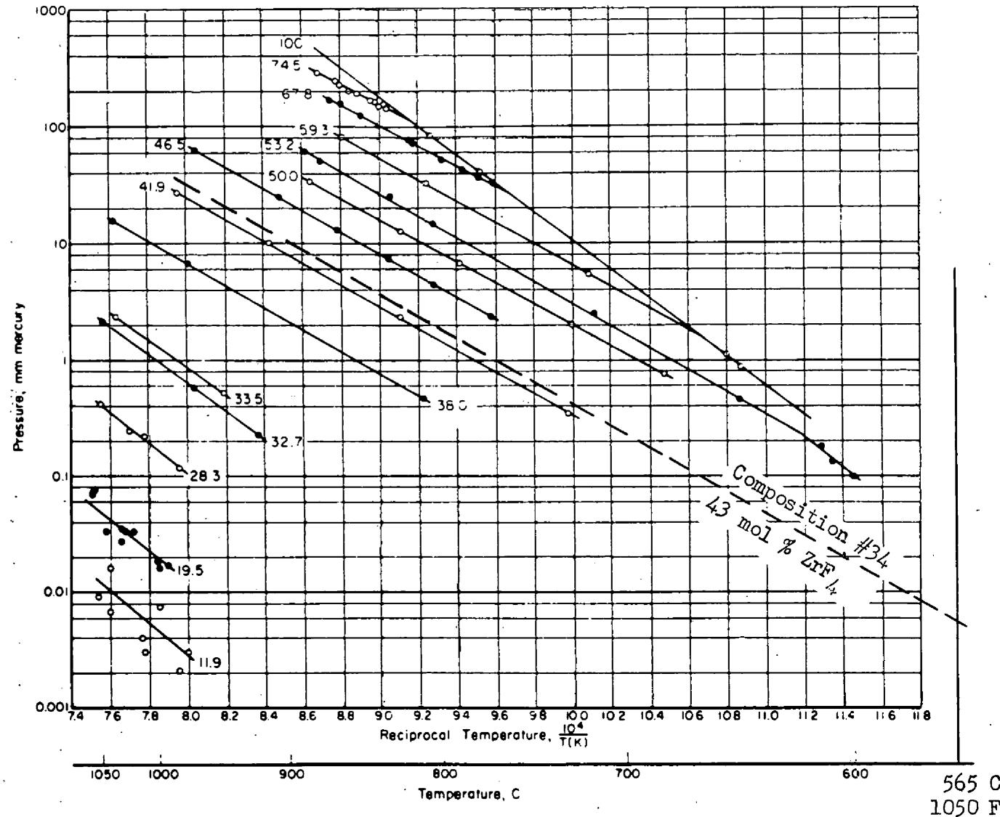  
FIGURE 2.3 PARTIAL PRESSURES OF $\mathsf{ZrF_4}$ BASED ON ASSUMPTION THAT ONLY NoF AND $\mathsf{ZrF_4}$ EXIST IN VAPOR PHASE Figures on plot denote mole per cent $\mathsf{ZrF_4}$ .

Source: BMI - 1064; "Vapor Pressures of the Sodium Fluoride - Zirconium Fluoride System and Derived Information", by Karl A. Sense, et. al.

at the location of the gas surface shows the partial pressure of $\mathbf{ZrF}_{4}$ to be less than 0.01 mm mercury. It was the considered opinion of personnel experienced in this field that a "snow problem" would be virtually non-existent for $\mathbf{ZrF}_{4}$ vapor pressures less than 0.01 mm mercury, even for extended periods of operation of the order of years (Ref. 18). In addition, mechanical appliances called "snow traps" have been developed which prevent plugging of the critical areas, and these, or similar innovations, could be adapted to this design if required.

# 2.3.0 NUCLEAR PROPERTIES

The nuclear characteristics of the NaF-ZrF $_4$ salt are not outstanding, however, they are tolerable. The absorption cross sections, particularly of the sodium atom for thermal neutrons, are quite large. Neutron moderation is primarily performed by the fluorine atom which, with an atomic weight of 19, is rather poor in this respect. Alternate salts could be suggested (i.e., $\mathrm{BeF}_2$ ) with superior nuclear properties to those of the NaF-ZrF $_4$ salt, but other considerations such as corrosion, viscosity, stability, melting point, etc., make the selected NaF-ZrF $_4$ salt the most desirable at this time from an overall consideration.

# 2.4.0 AVAILABILITY AND COST

The availability and cost of this salt were investigated (Ref. 19). The NaF constituent is commercially available at $0.12 per pound. Hafnium separated ZrF₄ has been produced by Oak Ridge National Laboratory from Hf separated ZrCl₄ at a total cost of $3.15 per pound. The NaF and ZrF₄ salt constituents are blended as powders and then fused in a batch process at 1500°F to form the composition desired. This fused salt must then be processed to remove trace quantities of sulfur, iron, nickel, H₂O, oxides, chlorides, and other impurities for corrosion purposes. This treatment is performed at 1500°F with hydrogen and hydrogen fluoride gas. At the present time, ORNL can produce a hafnium-free, processed NaF-ZrF₄ fused salt ready for use as a reactor fuel solvent for approximately

$7.50 per pound. It is the considered opinion of the responsible Oak Ridge National Laboratory personnel that increased capacity and technical developments would very probably reduce this cost to$ 5.00 per pound, or less.

The nuclear calculations for this project were based on the assumption that the elemental zirconium constituent of the salt is pure, the hafnium impurity having been removed. This has the effect of minimizing the uranium inventory by decreasing parasitic absorption at the expense of an increase in the cost of the salt.

# 2.5.0 ADDITION OF URANIUM FUEL

The uranium fuel burn-up is compensated by the periodic addition of a uranium concentrate-( $\mathrm{NaF}$ ) $_2\mathrm{UF}_4$ . From the three constituent phase diagram (Figure 2.1), it is observed that as the uranium concentrate compound is dissolved in the composition number $3^{\frac{1}{4}}$ salt solvent, only compositions of consistently lower melting points are formed in the dissolution process. The dissolution should, therefore, proceed without difficulty.

The physical addition of the uranium concentrate can be accomplished in several ways. The concentrated uranium salt could be added directly to the fused salt in the form of pellets. It could be added more or less continuously as a powder, or it could be dissolved in a small, isolated quantity of the fused salt solvent in a continuous or batch process and then injected into the reactor. The final selection of the preferred method would need to be determined by a consideration of the hazards involved and the ease of operation.

The quantity or rate of fuel concentrate addition is controlled by the average temperature of the fused salt in the reactor core (1125°F design). As fuel is burned up, this average temperature would be gradually reduced by the reactor's negative temperature coefficient, which keeps the reactor "just critical". When this temperature falls below 1125°F by some predetermined

temperature increment, a carefully controlled quantity of fuel concentrate would be added or, if this is a continuous process, the rate of addition would be increased. The average temperature would thereby be raised a regulated increment above the average design temperature and the cycle would begin again.

# 2.6.0 FUEL REPROCESSING

Fission products and corrosion products will accumulate in the fuel solution during operation. Additional uranium will have to be added to override the poisoning effect of these nuclear poisons if they are allowed to remain in the reactor. For this reason, it may be necessary to provide a means of fuel reprocessing to remove some of these poisons.

Xenon has a very low solubility ( $\sim 10^{-8}$ moles/cc @ l atmos. of xenon) in the fused salt fuel solution and will therefore be removed by the off-gas system. The gaseous iodine fission product which is the precursor of xenon will also be removed by the off-gas system. If this is accomplished before the iodine, which has a 6.7-hour half-life, decays to xenon, the reactor core will operate with little or no xenon present.

Some of the metallic fission products (i.e., Ru, Mo) do not form fluoride compounds and will not dissolve in the fused salt solvent. They will probably plate out on the surfaces within the reactor. This has the advantage of placing these nuclear poisons in regions of low flux. The effect of these plated metals on corrosion and heat transfer will require further investigation.

The least soluble of the fluoride forming fission products is believed to be that of the rare earth, $\mathrm{CeF}_3$ , which is soluble up to 3 wt. % at the temperature of this design study (Ref. 32). Approximately one-third of the fission products resulting from fission are rare earths. Even by making the pessimistic

assumption that all the rare earths must be less than 3 wt. $\%$ in order that they will not precipitate, the solubility limit of the rare earth fluorides would not be reached for many years of operation ( $>20$ years).

The conclusion that may be derived from this is that the fused salt would need to be reprocessed for other reasons long before there would be any possibility of precipitating these fission products.

The nuclear poisoning of the dissolved fission products would eventually cause the uranium fuel inventory required to attain criticality to become excessive. A discussion of this effect is given in the chapter on Reactor Analysis, Section 4.5, and Appendix C.6 and C.7.

Although it is expected that improved reprocessing techniques will be developed in the near future, present technology would restrict fuel reprocessing to the following method. Contaminated fused salt would be drawn from the reactor system and the uranium recovered by the UF $_6$ volatility process. The uranium-depleted, fission product-contaminated fused salt solvent would then be discarded to a hot-waste storage system. The salvaged uranium would be dissolved in fresh, pure salt and returned to the reactor system. This same salt might also provide a convenient solvent for the uranium which must be added because of burn-up.

A possible alternative which might be developed would be to treat the uranium-depleted, contaminated salt to remove some of the fission products. This would permit re-using the fused salt, thereby eliminating the considerable expense of replacing the fused salt, and the problem and expense of storing the radioactive, contaminated salt.

This treatment process might possibly be a solvent extraction type process, using fused salts, or it might be accomplished by cooling the salt to just above its freezing temperature and precipitating some of the fission products.

The economically optimum extent of fuel processing is determined by the relative costs of increased uranium inventory and the costs of processing. Based on the currently available processing method outlined above, an economic analysis to determine the optimum length of processing cycle time was made and is outlined in Appendix C.6 and C.7. Based on the assumptions made in this analysis, the reactor should be operated at a uranium inventory-fission product equilibrium that would replace all the salt in the core system by a continuous process over a 19-year period. This means that unless a superior method of fuel reprocessing can be developed, it would be economically desirable to perform no fuel reprocessing with the lifetime of the plant (20 years).

# CHAPTER 3.

# STRUCTURAL MATERIALS

# 3.0.0 INTRODUCTION

The major metallurgical consideration of a fused fluoride reactor is the choice of a structural material for the reactor vessel and primary heat exchanger which will resist corrosion, be fabricable, and have satisfactory strength properties at elevated temperatures. The nuclear characteristics of the structural materials in this reactor are not critical. Materials problems associated with the sodium coolant system and the steam power plant are important, but previous experience is available; therefore, the design of these systems introduces no serious problems.

# 3.1.0 REACTOR STRUCTURAL MATERIALS

The power plant design presented in this study is proposed for central station electric generation, and it would be desirable to have a reactor which would have an operating life equal to the 20 or 30-year life expected from the steam plant equipment. Present technology is not sufficiently advanced to indicate that such an extended operating time can be obtained from fused fluoride reactors, but it is mandatory that a material be obtained which will resist fluoride salt corrosion at elevated temperatures to the extent that these reactors can be considered for this type of operation.

A homogeneous reactor of the contemplated design does not have as many materials problems as other types of reactors. The fuel is in solution and is self-moderating, and there are no fuel fabricating, cladding or moderating material problems. The reactor vessel is a low pressure container and does not have to be designed for high pressure operation. Since there are no structural

materials in the high neutron flux region of the reactor, the effect of the nuclear characteristics of these materials on neutron economy is of secondary interest.

Fused salts, however, are considerably more corrosive on materials than many other reactor fluids. Experiments have shown that nickel base alloys has the best corrosion resistance to fused fluorides. Inconel, nickel-molybden alloys and pure nickel have been considered as possible structural materials this reactor design.

# 3.1.1 Inconel

There are considerable data on the corrosion of Inconel in fused fluoride at temperatures in excess of those contemplated in this design. An example: Inconel corrosion is shown in the photomicrographs in Figure 3.1 which illustrates the time dependence of the attack. Inconel corrodes in fluoride salt by a leaching of chromium from the surface of the metal. New chromium then diffuses from the interior of the metal from which it in turn is leached. Sr voids remain and concentrate at the grain boundaries; these voids are not connected to each other or to the surface.

Corrosion data indicate that after the first 50 hours, the depth of at appears to be linear, with a rate of between 3 and 4 mils per 1000 hours of operation. The photomicrographs and corrosion data were obtained from for circulation loops with $1500^{\circ}\mathrm{F}$ maximum fluid bulk fluoride temperature, a $1600 - 1620^{\circ}\mathrm{F}$ maximum wall temperature, $200^{\circ}\mathrm{F}$ temperature gradient, and 10,000 Reynolds number. The fluid circulated was Fuel No. 30 (Ref. 48, p. 97).

There is also an initial impurity attack of approximately 3 to 4 mils which continues until the $\mathrm{UF}_4$ -Cr reaction reaches equilibrium and the chrom content in the fluoride mixture remains constant (Ref. 48, p. 96, 97). This

impurity reaction will take place with each additional new charge of fluoride salt. Therefore, the long range corrosion rate will depend upon the number of times that the fluoride salt is changed.

The corrosion resistance of Inconel to fused fluoride salts is not satisfactory for a reactor of this design.

# 112 Nickel-Molybdenum Alloys

A well-known nickel-molybdenum alloy, Hastelloy B, has shown excellent corrosion resistance to fused fluoride salts (Ref. 50). This alloy, however, is not satisfactory for reactor use because of its low ductility at elevated temperatures and because of its undesirable fabricating characteristics.

New nickel-molybdenum alloys are currently being developed which are intended to retain the negligible corrosion rates, but which will have satisfactory high temperature and fabricating properties.

The corrosion resistance of an 85-15 nickel-molybdenum alloy in a fluoride fuel No. 30 thermal convection loop is illustrated in Figure 3.2. These photomicrographs show that there is essentially no corrosion or mass transfer in 1000 hours at a temperature of $1500^{\circ}\mathrm{F}$ . Certain of these new alloys appear to have satisfactory physical properties for reactor use; however, it was felt that the development program is not sufficiently advanced to completely substantiate the expected excellent properties. These new alloys were not considered in this reactor study because of the philosophy originally established to submit a reactor design using present day technology wherever possible.

# 3.1.3 Nickel Clad Stainless Steel

Nickel appears to have excellent corrosion resistance to fused fluoride salts. Static tests of nickel exposed to fluoride fuel. No. 30 for 100 hours at $800^{\circ}\mathrm{C}$ have shown no measurable attack (Ref. 49). A small amount of mass transfer

was observed in the first nickel thermal convection loop in which Fuel No. 30 was circulated (Ref. 46, p. 63, 64). To confirm this single test, another nickel loop was cleaned with $\mathrm{NaZrF}_5$ and operated with high purity fuel. No evidence of subsurface voids, intergranular attack, or mass transfer was observed (Ref. 47, p. 73, 74). The photomicrographs in Figure 3.3 show the absence of these effects in a nickel thermal convection loop operated for 500 hours at $1500^{\circ}\mathrm{F}$ with Fuel No. 30.

No convection or forced circulation loops have been constructed which illustrate serious mass transfer properties of nickel, although the opinion has been expressed that nickel theoretically should mass transfer.

Nickel does not have adequate strength to be used as a structural material; however, nickel can be clad satisfactorily on stainless steel. This duplex material will have the required corrosion resistance and physical properties for reactor construction. Nickel clad stainless steel can be obtained at the present time as plate for the reactor vessel and as extruded tubing for the primary heat exchangers (Ref. 51). The inspection of the cladding is, however, a problem.

A metallurgical bond is obtained between the nickel cladding and the stainless steel backing material. Due to the intimate contact between the materials and the adherence of the bond, there is essentially no thermal resistance. The efficiency in heat transfer properties of this clad material is almost equal to that of solid stainless steel (Ref. 52).

The welding of this clad material will also present difficulties, but with the proper weld area preparation and use of special welding rods, this problem can be solved (Ref. 53).

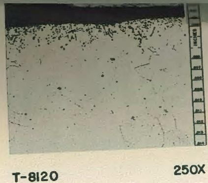  
IO HRS.

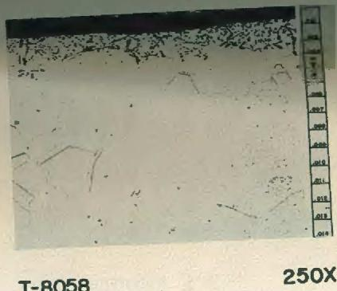  
50 HRS.

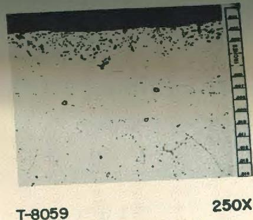  
100 HRS.

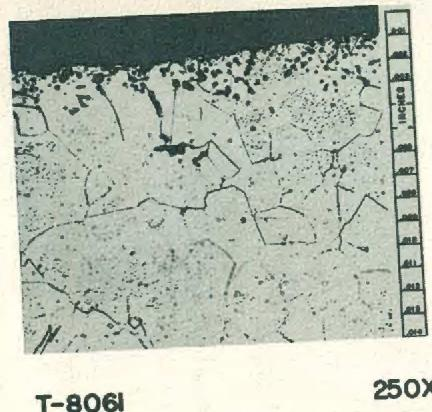  
241 HRS.

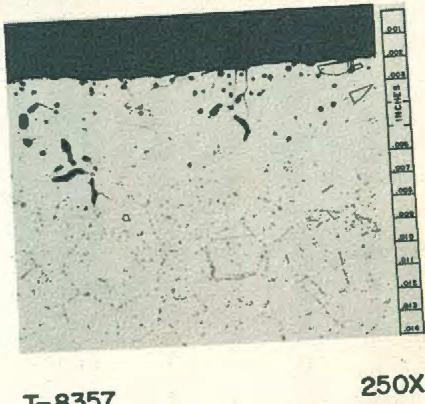  
500 HRS.

1000 HRS.   
Figure 3.1   
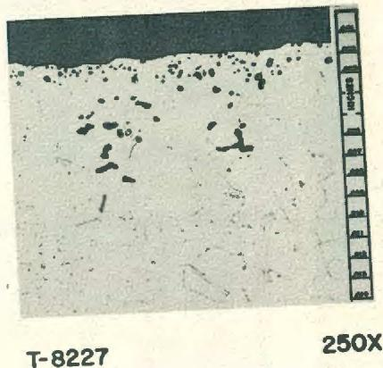  
Changes in Attack with Increasing Operating Time in Forced-Circulation Inconel Loops. Fluoride mixture circulated, fuel No. 30; maximum fluoride-mixture temperature, 1500 F; Temperature differential, 200 F; fluoride-mixture Reynolds number, 5000.

  
T-8798

HOT LEG

250 X

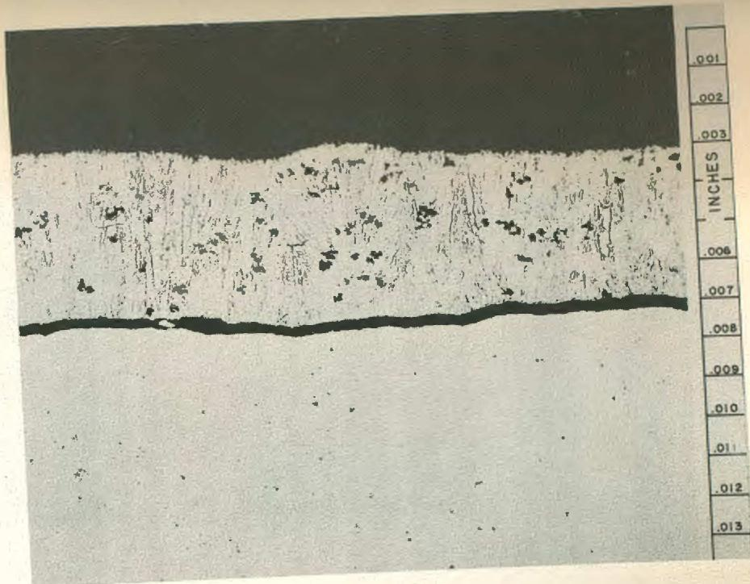  
FIGURE 3.2

T-8799

COLD LEG

Corrosion of 85-15 Nickel-Molybdenum Alloy by

Eicosid Fluoride Salt No. 30 in a Thermal Convection

Loop. Maximum fluoride mixture temperature, 1500 F

Duration of test, 1000 hours.


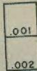


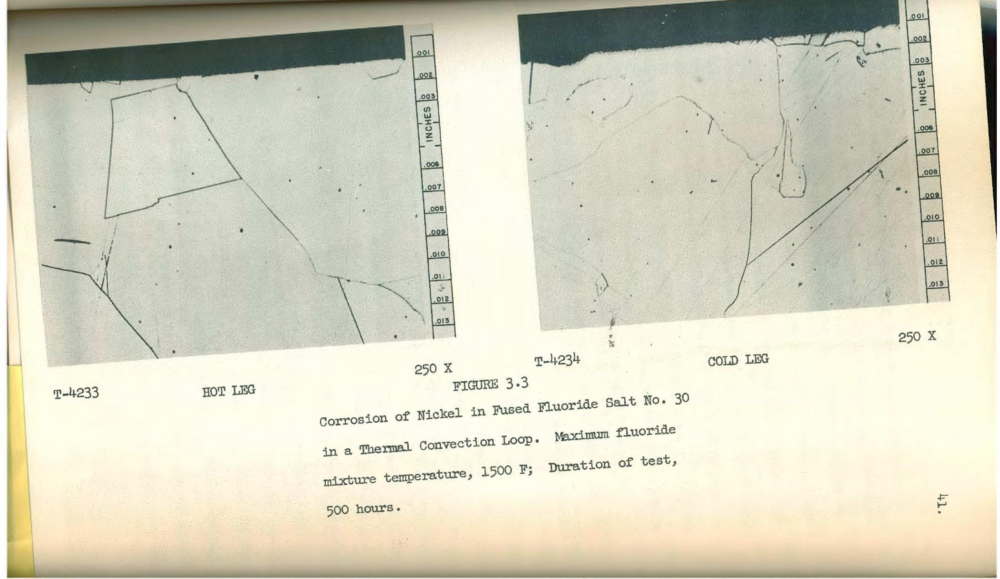

42.

The choice of nickel clad stainless steel as the structural and primary heat exchanger material for this reactor has made it possible to prepare a preliminary design which could be constructed with a minimum of development work. It is recognized, however, that this duplex material has shortcomings and that a single material with all the desired properties would be superior. Before a reactor of this basic design is constructed, it would be advisable to examine the nickel-molybdenum system very carefully to determine if those alloys have the required properties to warrant substitution of the selection of nickel clad stainless steel with a nickel-molybdenum alloy.

# 3.2.0 SODIUM SYSTEM MATERIALS

Selection for the materials for the sodium system was based on the following considerations:

1. Ability to resist corrosion and mass transfer in high temperature sodium.   
2. Adequate mechanical properties at elevated temperatures for extended period.   
3. Stability under high radiation fields at elevated temperatures for extended period.   
4. Fabricability into the required shapes.   
5. Weldability   
6. Reasonable neutron absorption cross section.   
7. Availability and cost

At the present time, the austenitic stainless steel alloys more nearly satisfy these requirements than other materials, except these alloys have a relatively high neutron absorption cross section. However, since in this design the heat exchangers carrying the sodium are outside the central core and in a low flux region, this is of little consequence.

There are three types of stainless steels, namely, Types 304, 316 and 347, which have been previously used in sodium systems with satisfactory results. There remains the problem of selecting the type that not only has the best mechanical properties at the elevated temperature under consideration, but also the type most readily weldable with no cracking of the weld and no embrittlement after long-life high temperature service.

The material chosen to contain the sodium in this reactor system was Type 304-L stainless steel (0.03% maximum carbon content). Although the three types of austenitic stainless steels show acceptable resistance to corrosion in sodium up to $1000^{\circ}\mathrm{F}$ , columbium stabilized Type 347 has been generally favored. However, investigation at the Knolls Atomic Power Laboratory showed that Type 304 stainless steel is equally resistant to corrosion from sodium as Type 347 and that it has good strength properties and contains less strategic materials. No mass transport difficulties have been encountered up to $1200^{\circ}\mathrm{F}$ , which is higher than the sodium operating temperatures contemplated in this design.

Since the austenitic stainless steels appear reasonably corrosion resistant, namely, Types 304, 316 and 347, the strength versus ductility at elevated temperatures should be given considerable weight in selecting the material. Type 304 stainless steel causes only slight loss in room temperature ductility due to carbide precipitation (Ref. 56), whereas Type 316 stainless steel, under the same conditions and treatment, indicates rather severe decrease in room temperature ductility.

Table A.2 lists some of the pertinent properties of Types 304, 316 and 347 stainless steels at elevated temperatures. Therefore, from mechanical properties consideration, Type 304 appears to be the superior.

44。

Since there will be many welds in the sodium piping and components, the corrosion effect of sodium on welded joints must be considered. The corrosion resistance of welded 18-8 stainless steels is affected because of chromium carbide precipitation at the grain boundaries in the heat affected zone. The formation of chromium depletes the surrounding area of chromium and thus the area loses its corrosion resistance. The precipitation of carbides can be prevented by: (1) reducing carbon content below 0.03 percent; (2) using columbium or other elements which form stable carbides with the carbon present; (3) cooling the heat affected zone quickly through the critical range (1 to 1-1/2 seconds from $1500^{\circ}\mathrm{F}$ to $900^{\circ}\mathrm{F}$ ); or (4) heating to above $1750^{\circ}\mathrm{F}$ following welding so as to redissolve chromium carbide, followed by rapid cooling to retain them.

Until recently the use of (2) above to prevent the precipitation of carbides had been considered the superior method; however, in recent years, the use of Type 347 weldments in thick sections for high temperature-long-time service has resulted in cracking during welding and embrittlement during service. It has been found that columbium free alloys do not become embrittled, even when they contain normal amounts of ferrite (Ref. 55). Also, the tendency for cracking of the weld metal during welding is reduced with the columbium free alloys. To prevent carbide precipitation, the use of a low carbon content austenitic stainless steel appears now to be the better method. Rapid cooling and reheating to above $1750^{\mathrm{O}}\mathrm{F}$ are not practical methods for projects of this scope. The material which best meets the above requirements is Type 304-L. Therefore, Type 304-L stainless steel was selected as the structural material for the sodium systems.

# 3.3.0 STEAM SYSTEM MATERIALS

Since the temperatures and pressures of the steam system for this design study are consistent with those of large conventional steam power plants today,

the selection of materials for the steam and water systems presents no particular problems. The main steam line piping would be fabricated from standard Cr-Mo alloy steel pipe, ASTM Spec. A-335, Grade P-11 or P-22. The higher pressure boiler feed water, condensate, and extraction lines would be fabricated from seamless carbon steel pipe, ASTM Spec. A-53, Grade B. Other miscellaneous lines would be fabricated from standard seamless carbon steel pipe. All valves would be fabricated from the same material as that of the piping in which they are located.

# CHAPTER 4.

# REACTOR ANALYSIS

# 4.0.0 INTRODUCTION

The nuclear characteristics of this fused salt "burner" reactor are relatively flexible and are not restricted by the stringent requirements of breeding. In addition, the high solubility of $\mathrm{UF_4}$ in the NaF-ZrF $_4$ fused salt system allows considerable variation in uranium concentration which provides a wide latitude for compromise between nuclear and engineering considerations.

The basic reactor design consists of a vertical cylindrical core surrounded by primary heat exchanger tube bundles. The nuclear requirements of the reactor determine an optimum core diameter for minimum fuel inventory. The core dimensions selected represent a compromise between these considerations.

In order to proceed with the nuclear calculations, a preliminary arrangement of the reactor vessel was selected. This section of the report describes the reactor analysis calculations that were performed to determine the optimum core size and fuel concentration and other nuclear requirements. A summary of the results is included in Table 4.1.

# 4.1.0 CRITICAL SIZE AND FUEL CONCENTRATION

A preliminary criticality calculation was made by W. K. Ergen, Oak Ridge National Laboratory (Ref. 29), for a reactor similar to that of this project using a bare sphere, Fermi Age approximation. The optimum size and fuel concentration for minimum fuel investment calculated by this method was 136 cm (4-1/2 feet) in radius with a fuel concentration of 0.0208 gm/cc of uranium-235. The fused salt used in these calculations was a 50-50 mole percent composition of NaF and $\mathrm{ZrF_4}$ with the uranium dissolved as $\mathrm{UF_4}$ .

The reactor contains no moderating material other than the fused salt itself. The atom having the smallest mass and existing in greatest abundance in the fused salt to be used in this reactor is fluorine. Fluorine, then, is largely responsible for the moderating characteristics of the fused salt. With an atomic weight of 19, fluorine is a relatively poor moderator compared with the lighter elements usually used as neutron moderators. It was suspected, and later calculations have shown, that this reactor was not a thermal reactor, but that a high percentage of fissions would occur from epithermal neutrons.

Hand calculations for a bare sphere with three energy groups indicated that approximately 50 percent of the fissions would involve epithermal neutrons.

With these preliminary hand calculations as background, a series of three energy group, three geometry region (3G3R) calculations were performed on the Oak Ridge National Laboratory digital computer (ORACLE).

The energy group limits were selected for reasons given in Appendix C.1. The intermediate group extends from 0.5 ev to 100 ev. The fast group extends from 100 ev to 2 mev. The central core of the reactor is region 1; the 1-inch thick baffle surrounding the core is region 2; and the heat exchanger and downcomer volumes are homogenized for region 3.

The physical properties and nuclear parameters were based on a salt of composition 43 mole percent $\mathrm{ZrF_4}$ and 57 mole percent NaF (Section 2.1.0). The fuel is highly enriched uranium-235 (over $90\%$ U-235). The fast and intermediate energy group nuclear cross sections were obtained from the "eyewash code" (Ref. 27). Thermal cross sections were obtained from BNL-325 (Ref. 30). The detailed data and calculations for the code input are given in Appendix C.

In order to minimize the number of computer calculations, it was decided to vary only the radius of the central core and the fuel concentration. Other

parameters such as the height of the reactor and the thickness of the heat exchanger were held constant. Since previous estimates indicated a 4-1/2 ft radius core to be optimum, a 1C-ft core height was chosen to provide compatible arrangement with this core radius and the heat exchangers. The heat exchangers contain a considerable amount of fuel, acting somewhat as a reflector to the central core, which makes it desirable to have a central core height larger than the central core diameter. Calculations were performed with central core radii of 3, 3-1/2, 4, 4-1/2, and 5 feet. For each radius, calculations were made for fuel concentrations of 0.005, 0.010, 0.020 and 0.030 gm/cc of enriched uranium.

The above information and the data in Table C.2 were coded (Ref. 28) for the electronic computer (ORACLE). The electronic computer calculated the multiplication constant $(\mathbf{k})$ for each radius and fuel concentration (Figure 4.1). From these data, the optimum size and fuel concentration were determined (discussed in Section 4.3.0) as a $3 - 1 / 2$ foot central core radius and $0.0088~\mathrm{gm} / \mathrm{cc}$ of enriched uranium-235. A re-evaluation of the height of the central core is probably desirable in light of the smaller central core radius. In the final design, the height is shown to be 8 feet, which is probably a more compatible figure. A concave head and bottom are used to obtain this reduction in height and to direct the fused salt flow (See Figure 5.9). However, the nuclear, heat transfer, and other calculations were not revised to reflect this change.

In order to check the inaccuracy introduced by using the l-inch thick stainless steel and nickel baffle plate as a diffusing medium (region 2), two check calculations were made. One calculation considered the baffle as an absorbing "shell" between the central core and the heat exchanger regions, and the other eliminated the baffle plate entirely. The multiplication

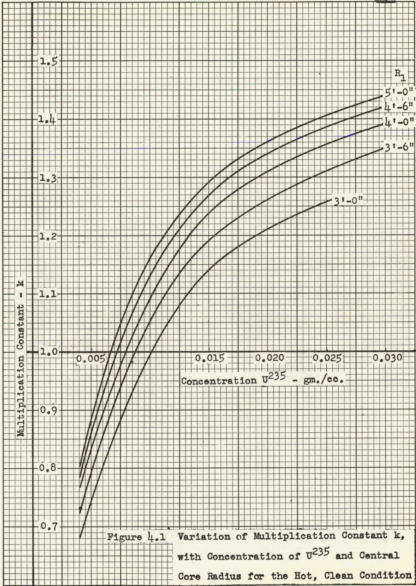

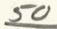

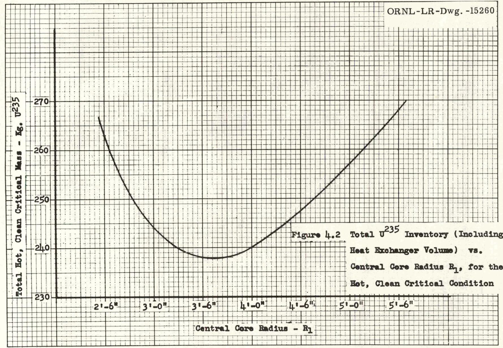

constants (k) and flux plots obtained by the three methods of treating the baffle plate were almost identical (Table C.3). It was therefore inferred that using the baffle plate as a region did not in itself introduce any appreciable error.

# 4.2.0 NEUTRON FLUX

The electronic computer (ORACLE) calculated the neutron flux distribution for each energy group as a function of radius (Figure 4.3).

At 600 MW total power, the fast neutron flux is approximately $1.2 \times 10^{15}$ neutrons/cm $^2$ sec., the intermediate neutron flux is approximately $6 \times 10^{14}$ neutrons/cm $^2$ sec., and the thermal neutron flux is approximately $1.6 \times 10^{14}$ neutrons/cm $^2$ sec. (Appendix C.4). These values, coupled with the fission cross section for each group, show the fissions to be distributed among the three energy groups as follows: 9 percent in the fast group; 27 percent in the intermediate group; and 64 percent in the thermal group (Appendix C.5). This means that this reactor is what is often termed an "intermediate" reactor.

A nuclear calculation was prepared to utilize the 30 energy group "Eye-wash" code on the UNIVAC digital computer. Unfortunately, the results of this calculation were not available to be included in this report, but should be shortly thereafter (Ref. 40). The results from this more detailed calculation will serve as a check on the 3G3R code calculation results. Also, and the original reason this alternate calculation was prepared, the 30 energy groups will provide a much better indication of the neutron flux energy spectrum in this reactor. This is of particular interest for the high neutron energies, to better establish the possibility of utilizing this reactor as a large flux source of high energy neutrons for purposes of radiation damage research.

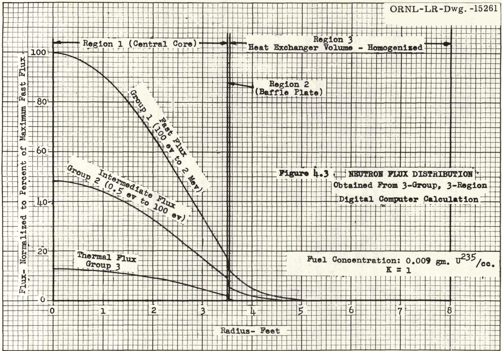

# 4.3.0 FUEL INVENTORY

The critical uranium concentration for each central core radius was determined by the results of the three group, three region calculations. The critical uranium concentration decreases with an increase in the central core radius. The volume obviously increases with an increase in the central core radius. The combined effect results in a minimum uranium inventory required for criticality at some value of central core radius. This variation of critical mass (uranium inventory) with central core radius is shown in Figure 4.2.

For 600 MW rating, the heat exchanger volume, and thus the fuel volume in the heat exchanger and downcomer, will remain nearly constant. The fused salt solvent inventory is decreased by a decrease in central core radius. Therefore, the central core radius was chosen slightly smaller (3-1/2 feet) than that for the minimum fuel inventory indicated (Figure 4.2), in order to allow some effect of the decreased salt inventory. The total uranium-235 fuel inventory in the entire fuel system for the hot, clean critical condition is approximately $240\mathrm{kg}$ .

# 4.4.0 FUEL BURN-UP

The fuel burn-up at 600 MW will be about 780 grams of uranium-235 a day. The fuel would be added on a temperature regulation basis to maintain an average operating temperature of $1125^{\circ}\mathrm{F}$ .

# 4.5.0 URANIUM-233 FUEL

Highly enriched uranium-235 is the fissionable fuel utilized in this design study. The fact that a large fraction of fissions is caused by epi-thermal neutrons suggests that it may be desirable to use uranium-233 as the fissionable fuel instead of uranium-235. Uranium-233 has a uniformly low

value for the ratio of capture-to-fission cross section $(\mathcal{L})$ of 0.1 over all neutron energies. This means that a considerably smaller portion of non-fissioning neutron absorptions occurs in uranium-233 than in uranium-235, particularly for neutrons in the intermediate energy range. The advantages that would be gained by using uranium-233 as the fuel, if available, are that the uranium inventory required would be less, and the energy release for the uranium burned-up would be greater.

# 4.6.0 FISSION PRODUCT POISONING

Fission products and corrosion products will accumulate in the fuel solution and will add considerable nuclear poison to the core. This will require an increase in the uranium fuel inventory and could become a significant economic consideration.

An evaluation of the probable magnitude of this effect was made, and is outlined in Appendix C.6.

Based on the reference source utilized in this analysis (Ref. 33 and 34), and the assumptions and approximations made to adapt the data of this reference to this design study, the following effects of fission product build-up are predicted. The nuclear poisoning of the non-gaseous fission products only (no corrosion products) will asymptotically approach a negative reactivity of about 0.1 during the lifetime of the reactor. If corrosion should be appreciable, the relatively high absorption cross section of the nickel atom could appreciably change the rate and magnitude of this poison build-up.

From Figure 4.l, it can be seen that a negative reactivity of 0.l would require an increase in uranium concentration from 0.0088 gm/cc to about 0.0115 gm/cc to override this poison and maintain criticality. This is a 31 percent increase in uranium inventory from 240 kg to 314 kg.

Some form of fuel reprocessing could reduce the uranium required to overcome the poisons. This possibility was investigated (Section 2.6.0., Appendix C.6 and C.7), and it was determined that it would not be economical to provide for fuel reprocessing as limited by current technology.

The increase in uranium inventors to override fission product-poisoning would then progress gradually over the life of the reactor, being added as required along with the uranium added for burn-out.

# 4.7.0 TEMPERATURE COEFFICIENT OF REACTIVITY

The temperature coefficient of reactivity of the reactor was not calculated, but is believed to be sufficiently negative for the reactor to be stable. This is based on the fact that a reactor using a similar fused salt fuel has been operated, and this reactor had a negative temperature coefficient of reactivity of approximately $5 \times 10^{-5} \Delta \mathrm{k} / \mathrm{k}$ per F (Ref. 39), p. 1009). The fact that this fuel has a desirable temperature coefficient of reactivity is also indicated by the slope of the curves in Figure 4.l.

# 4.8.0 DECAY HEATING

The decay heating of a reactor during shutdown is dependent upon the amount of negative reactivity injected into the reactor and the delayed neutrons and gamma decay rate. In a reactor with control rods, a considerable amount of poison can be inserted very quickly. In the fused salt reactor, however, no control rods are present, and the amount of negative reactivity achieved depends upon the magnitude of the temperature rise above the average operating temperature.

In the event of complete loss of pumping power, the reactor must be shut down and the decay heat removed. If it is assumed that no heat is removed and the temperature is allowed to rise, the power generation would decrease rapidly,

and the reactor period would level off to an 80-second period in a fraction of a minute. At this time, the power generation of the reactor would be reduced to a few percent of operating power. The temperature rise under these conditions may be several hundred degrees within the first minute. This condition of rapid temperature rise is undesirable, if not intolerable. Immediately following the loss of pumping power, some heat would be radiated from the reactor vessel; some heat would be removed by the reactor vessel surface cooling; and some would be removed by the momentum of the sodium in the primary loop.

A detailed calculation of the flow characteristics of the primary and intermediate sodium loops after loss of pumping power was not made; however, a simplified calculation showed that the inertia of the fused salt in the reactor, and the sodium coolant in the primary and intermediate loops is sufficient to maintain the flows in the turbulent range for approximately one minute. This would be adequate to carry away a considerable amount of decay heat and limit the fused salt temperature to a safe value.

# TABLE 4.1

# SUMMARY OF REACTOR ANALYSIS DATA

1. Dimensions of reactor central core:

Radius - 3 1/2 feet

Height - calculations based on 10 feet

2. Critical fuel concentration:

0.0088 grams/cc (for hot clean critical)

3. Power density:

55.2 watts/cc at 600 MW

4. Flux and fissions for each energy group:

<table><tr><td></td><td>Flux</td><td>Fissions</td></tr><tr><td>Fast (100 ev to 2 mev)</td><td>1.24 x 1015neut/cc-sec</td><td>9%</td></tr><tr><td>Intermediate (0.5 ev to 100 ev)</td><td>5.96 x 1014neut/cc-sec</td><td>27%</td></tr><tr><td>Thermal (up to 0.5)</td><td>1.62 x 1014neut/cc-sec</td><td>64%</td></tr></table>

5. Fuel Inventory:

240 kg (for hot, clean critical condition)

314 kg (for hot, fission product contaminated condition)

6. Fuel Burn-up:

780 grams/day at 600 MW

7. Temperature coefficient of reactivity:

Not calculated, but reasonable assurance that it is satisfactory.

# CHAPTER 5.

# REACTOR AND PRIMARY HEAT EXCHANGER DESIGN

# 5.0.0 INTRODUCTION

The basic design of the reactor consists of a vertical cylindrical pressure tight vessel to contain the homogeneous circulating fuel. The size of the reactor depends on the nuclear characteristics of the fuel and the method of removing the heat from the circulating fuel system. Critical size and fuel concentration calculations have been discussed in Chapter 4, based on the design concept of using primary heat exchangers internal to the reactor vessel. Several arrangements were considered prior to the selection of the internal arrangement and reasons for this decision are discussed in the subsequent sections.

# 5.1.0 PRIMARY HEAT EXCHANGER

The function of the primary heat exchanger is to transfer the heat from the circulating fuel to the primary sodium coolant loop. The design of the exchanger is based on a heat removal rate of $2.048 \times 10^{9}$ BTU/hr for both sides of the exchanger with mixed mean fuel temperatures of $1200^{\circ}\mathrm{F}$ entering and $1050^{\circ}\mathrm{F}$ leaving, and mixed mean sodium coolant temperatures of $1000^{\circ}\mathrm{F}$ entering and $1150^{\circ}\mathrm{F}$ leaving the exchanger. The minimum fuel temperature has been arbitrarily set at $1050^{\circ}\mathrm{F}$ , approximately $100^{\circ}\mathrm{F}$ above the fuel melting point to allow a temperature drop of $50^{\circ}\mathrm{F}$ for fuel processing and an additional $50^{\circ}\mathrm{F}$ for cold spots in the system before reaching the solidification temperature. The upper fuel temperature was set at $1200^{\circ}\mathrm{F}$ , which was considered the maximum allowable for tolerable corrosion and mass transfer rates for a long life power reactor. The sodium coolant temperatures were chosen to obtain a practical

log mean temperature difference across the heat exchanger which assures reasonable flows and heat exchanger surfaces. These temperatures provide sufficient margin above the fuel melting temperature to prevent operational difficulties from possible cold spots caused by poor distribution in the flow pattern through the heat exchanger and reactor.

# 5.1.1 Internal vs. External Arrangement

In determining a practical arrangement for the reactor and primary heat exchanger, the following two basic design concepts were considered: (1) Use of internal primary heat exchangers with associated piping and pumping equipment integral with the reactor. In this design, the fuel remains in the reactor vessel and the heat is transferred from the fuel circulating internally to the sodium coolant piped inside the reactor vessel. (2) Use of external primary heat exchangers through which the fuel is continuously circulated outside the reactor with piping and pumping equipment adjacent to, but external to, the core vessel. Each arrangement offers certain advantages and disadvantages, and the final selection depends on an extensive evaluation of the economic operation and design factors involved, and their effect on the design characteristics of the reactor and system.

The important advantages of the internal primary heat exchanger arrangement over the external arrangement are:

1. Lower fuel holdup because external fuel piping eliminated.   
2. More compact arrangement resulting in reduction of requirements for shielding, piping, containment, building and services (i.e., crane handling equipment, etc.).   
3. Less pumping power because of reduced piping friction losses.   
4. Provisions for electrically heating the fuel containment vessel and fuel piping simplified.

These advantages must, in a complete economic and feasibility study, overbalance the following apparent disadvantages:

1. Difficulties in maintaining and replacing heat exchanger tube bundles.   
2. Structural problems in supporting integral tube bundles.   
3. Higher radioactive sodium loop caused by the higher flux level inside the reactor increasing the desirability of an extra sodium loop.   
4. Problems in fabrication of the larger reactor vessel and complexity of heat exchanger tube layout.   
5. Difficulties in locating leaks and isolating the defective tube bundle.

Time did not permit a complete analysis of this problem. However, based on preliminary studies, it was concluded that a design employing internal heat exchangers and pumps could be developed which would result in an economical and practical arrangement for a high power reactor. Therefore, the design of an internal arrangement was pursued from the outset of this study.

# 5.1.2 Internal Arrangement

Several schemes for the arrangement of the internal primary heat exchangers were considered and are schematically shown on Figures 5.1 and 5.2. In all the schemes proposed, the requirement of counter-flow heat exchange was followed in order to minimize tube surface and to obtain the best heat exchanger characteristics possible.

A. Separate Upper and Lower Header and Single Pass Arrangement (Fig. 5.1)

The tube bundles are located in an annular space around the core section with baffles to direct the fuel flow down through the exchanger on the outside of the tubes. The sodium coolant is through the tubes. The tube bundles terminate in concentric toroidal headers, with the coolant outlet header located at the top of the reactor vessel and the coolant inlet header located at the bottom. This arrangement imposes several apparent disadvantages.

1. To obtain adequate heat transfer surface using practical tube sizes and a reasonable number of straight tubes would require tube lengths considerably longer than the optimum length dictated by the nuclear requirements for the reactor core size.   
2. Use of a lower header would necessitate many large penetrations in the bottom section of the reactor vessel, which is undesirable and should be avoided if possible.   
3. This arrangement requires pumping the high temperature fuel, which tends to decrease pump life because of increased corrosion rate at the higher temperatures.

Other design difficulties inherent in this arrangement are thermal stress and expansion problems between the two headers of the exchangers, and the large number of tube-to-header welds required to permit a practical length.

To overcome these disadvantages, Scheme II was devised and is the basis for the final design.

B. Combined Header and Two-Pass Arrangement (Fig. 5.2)

The tube bundles consist of U-tubes with the coolant inlet and outlet headers located annularly and concentrically at the top of the reactor vessel. The tube sheets have the shape of truncated circular sectors. The fuel makes two passes on the outside of the tubes, with the flow directed by concentric baffles into the suction of the fuel circulating pumps which are located on the top outer periphery of the reactor vessel.

# 5.1.3 Basic Design Criteria

In establishing the design, certain criteria were followed to take advantage of the present state of development of pumps, materials and heat exchangers.

1. The pumps would be positioned vertically and located symmetrically at the top of the reactor and would pump cold fuel. This would minimize seal problems and provide convenience in arrangement. Pumps would be sized practically.   
2. Annular vertical U-tube heat exchanger bundles would be considered with duplex tubing, with $30^{\frac{1}{4}}$ stainless steel as the structural material and clad with type "L" nickel on the outside to resist the corrosive fuel. Type $30^{\frac{1}{4}}$ SS provides compatibility with the rest of the Na coolant circuit.

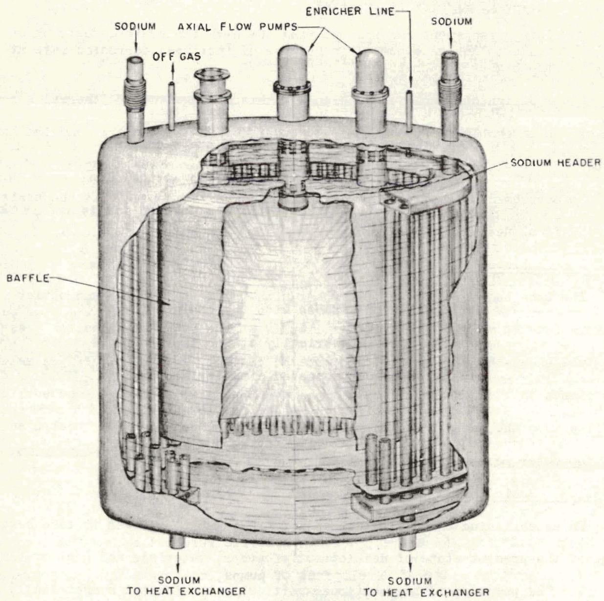  
FIG. 5.1- REACTOR ARRANGEMENT WITH STRAIGHT-TUBE HEAT EXCHANGER

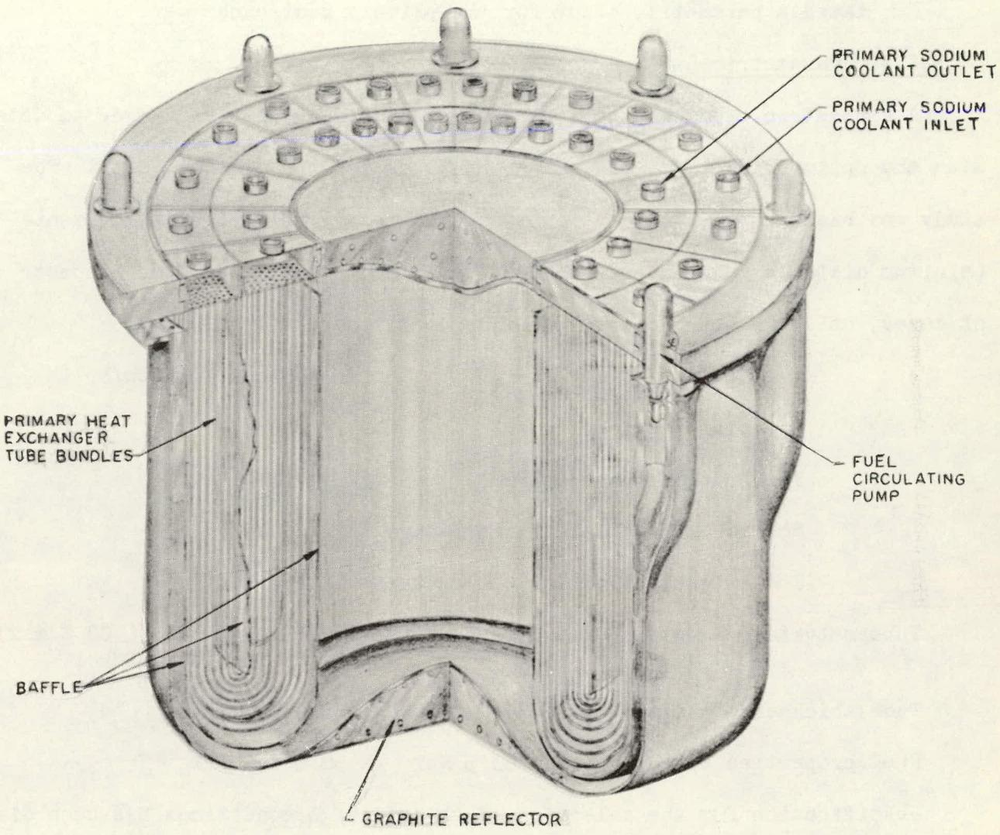  
FIG. 5.2 - REACTOR ARRANGEMENT WITH U-TUBE HEAT EXCHANGER

3. The flow pattern through the reactor and heat exchanger would tend to maintain the circulation of the fuel in the event of complete loss of pumping power.

4. The heat exchanger tube bundles would be sized to minimize fuel holdup and the number of tubes while maintaining practical fuel and sodium coolant velocities for reasonable friction pressure drops and heat transfer coefficients. This requirement necessitated a parametric study for the primary heat exchanger.

# 5.1.4 Parametric Study

A parametric study was performed for the primary heat exchanger to determine the optimum tube size and number of tubes for the required duty. The study was based on varying tube outside diameters with different ligaments (minimum distance between outside diameter of adjacent tubes) for a number of cases, utilizing the following design conditions:

Heat exchanged 2.048 x 109 Btu/hr

Fuel inlet temperature 1200°F

Fuel outlet temperature 1050°F

Sodium coolant inlet temperature 1000°F

Sodium coolant outlet temperature 1150°F

Tube material: duplex tube, Type ALSL, 304 stainless steel (.06 G max) clad with Type "L" nickel

Tube thickness: total 0.065, SS 0.042 in., Ni 0.023 in.

Fuel properties based on: $50 \mathrm{~mol} \% \mathrm{NaF} - 50 \mathrm{~mol} \% \mathrm{ZrF}_{4}$

Justification for the selection of these design conditions has been discussed previously. Tube sizes of 1/2 in., 5/8 in., 3/4 in. OD each with ligaments of 1/4 in., 3/16 in., and 1/8 in. were studied, using a staggered arrangement with triangular pitches of tubes in bundles. For the purpose of this investigation, average values were used for the physical and thermal properties of the fuel, sodium and structural materials. This simplification was considered valid over the temperature ranges involved. The complete derivation

of the formulae for the study is outlined in Appendix D; however, in the development of the expressions, the following basic equations were used for establishing the applicable heat transfer coefficients.

To simplify the study, the internal heat generation in the circulating fuel and sodium caused by delayed neutrons and gamma heating was neglected. Therefore, if a uniform wall heat flux is assumed, the Martinelli and Lyon equation (Ref. 15, p. 73) is applicable for determination of the sodium coolant tube side film coefficient,

$$
\frac {h d}{k} = 7 + 0. 0 2 5 \left(P _ {e}\right) ^ {0. 8} \tag {5.1}
$$

To establish the shell side film coefficient for the fuel, the Dittus-Boelter relationship (Ref. 6, p. 219) was used,

$$
\frac {\mathrm {h} \mathrm {d} _ {\mathrm {e}}}{\mathrm {k}} = (0. 0 2 3) \left(\mathrm {R} _ {\mathrm {e}}\right) ^ {0. 8} \left(\mathrm {P} _ {\mathrm {r}}\right) ^ {0. 4} \tag {5.2}
$$

Evaluation of Reynolds numbers for the various parameters studied indicated values in the range of 1000 to 4200 on the shell side. For a tube side calculation, Reynolds numbers of this order of magnitude would indicate that the flow was in the transition range between laminar and turbulent flow. Kern (Ref. 20, p. 137) indicates that for baffled heat exchangers, there is no discontinuity in flow at Reynolds numbers near 2100, such as occurs with tube side flow, and that the character of the flow on the shell side cannot be evaluated on the basis of the Reynolds number only. Further, this reference indicates that at Reynolds numbers as low as 100, fully turbulent flow can be developed on the shell side of a baffled heat exchanger. The equation given by Kern (Ref. 20, p. 137) for shell side film coefficients gives values considerably larger than obtained from the Dittus-Boelter relation. Therefore,

use of the Dittus-Boelter equation results in conservative values for design, even though the baffling geometry is unknown.

Calculation of the tube wall resistance was based on averaging thermal conductivity of the tube at the hot and cold mixed mean sodium coolant temperatures.

The over-all heat transfer coefficient was obtained by combining the individual resistances for the duplex tubes and film coefficients based on external tube surface,

$$
\frac {1}{U _ {o}} = \frac {1}{h _ {S}} + R _ {N 1} + R _ {S S} + \frac {1}{h _ {N a}} \tag {5.3}
$$

The required heat transfer surface was determined by using the equation for constant over-all heat transfer coefficient $(\mathbf{U}_0)$ and counter flow adiabatic heat exchange between fuel and sodium (Ref. 6, p. 190),

$$
q = U _ {0} S _ {0} (\Delta t _ {o 1}) \tag {5.4}
$$

For this study, the fuel and sodium flows, the logarithmic mean temperature difference, and the quantity of heat exchanged are fixed by the design conditions. It is possible by proper arrangement of these equations in conjunction with the one dimensional steady state continuity equation,

$$
\mathbf {v} = \ell \mathbf {A} \mathbf {v} \tag {5.5}
$$

to develop simultaneous equations for the dependent variable, the over-all heat transfer coefficient $(U_{0})$ with appropriate constants (C) as functions of the number of tubes (N) and length of tubes (L).

The two equations developed in Appendix D are then,

$$
\frac {1}{U _ {0}} = \sum R + \frac {1}{C / N ^ {- 8}} + \frac {1}{C + C / N ^ {- 8}} \tag {5.6}
$$

and

$$
U _ {o} N L = C \tag {5.7}
$$

where the $C$ 's are independent constants

$$
\begin{array}{l} N = \text {n u m b e r o f t u b e s} \\ L = \text {l e n g t h o f t u b e s} \\ R = \text {s u m} \\ \end{array}
$$

For an assumed length (L), these equations are then two simultaneous equations in two unknowns which can be solved graphically by plotting the over-all heat transfer coefficient $(U_{0})$ against assumed values of N for each case of tube diameter and ligament under consideration. For the equations to be satisfied, there exists only one value of N which is determined by the intersection of the curves of the two equations. The required number of tubes (N) to give the necessary heat transfer for each tube size and various ligamnets is shown on Figures 5.3, 5.4 and 5.5.

The pressure drops for both shell and tube side of the exchanger can be determined from the Fanning friction pressure drop formula, once the required number of tubes for a particular tube size and ligament is established.

$$
\Delta p (\text {p s i}) = (2. 0 + f \frac {\mathrm {L}}{\mathrm {d} _ {\mathrm {e}}}) \frac {\mathrm {v} ^ {2}}{2 \mathrm {g}} \frac {\rho}{1 4 4} \tag {5.8}
$$

The friction factor $f$ was determined from Moody's chart (Ref. 16, Fig. 15) for smooth pipe. The constant 2.0 in the above expression allows for inlet, outlet, and U-bend losses in the respective circuits (Ref. 16, p. 21 et sequi). The additional fluid pressure loss across the tube bundle supports on the shell side was not included since its method of determination is highly empirical and depends on particular tube layout and design, and, in addition, it was considered that its contribution would not effect the selection of tube size and spacing.

A summary of the results of the parametric study is shown in Figures 5.6 and 5.7 and Table 5.1. These graphs show cross plots for the number of tubes, heat transfer surface, fuel holdup volume and total fluid pump power as a function of tube ligament ratio (ligament to tube OD) for the values of $\mathbf{N}_2$ as determined from Figures 5.3, 5.4 and 5.5.

Examination of the results of this study indicates that for minimum fuel holdup, reasonable pumping requirements and a practical tube arrangement, the selection of approximately 14,600 5/8-inch OD U-tubes with 1/8-inch ligament (0.20 tube ligament ratio), and an effective length of 20 feet results in the most serviceable and practical primary heat exchanger design. In determining the optimum tube size, it is desirable to minimize the number of tubes consistent with reasonable pressure drops and fuel holdup volume. The fewer the number of tubes, the less the probability of tube or tube-to-tube sheet failures.

# 5.1.5 Design Considerations

To determine the practicability of such a U-tube design in annular concentric sections with a 3-foot, 7-inch inner core radius, a tube bundle layout study was made using approximately 15,000 5/8-inch OD tubes arranged on a 3/4-inch staggered equilateral triangular pitch. The result of the study indicated that such an arrangement was feasible and is shown in Figure 5.8. It was finally concluded that to provide additional margin in the design for contingencies, 24 tube bundles, each with 650 tubes to carry, or a total of 15,600 tubes with an effective tube length of 21 feet would be specified for the primary heat exchanger.

Due to the difference in areas caused by the concentric sections, some crossing over of the tubes is necessary to retain the same tube density on both sides of the tube bundle. Although this increases the fabrication and

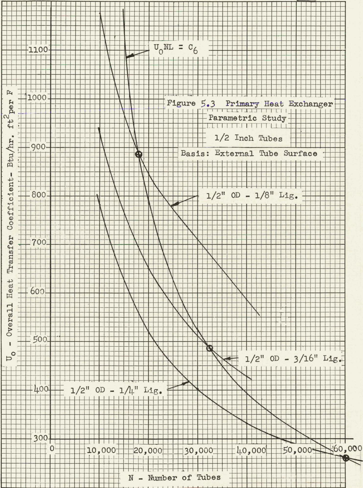

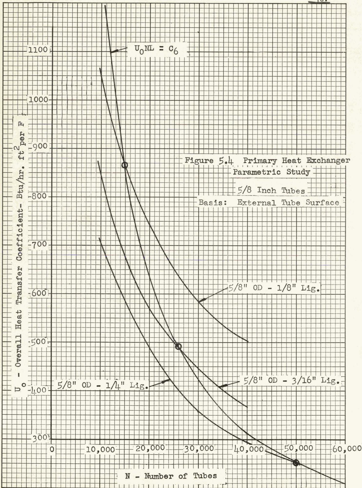

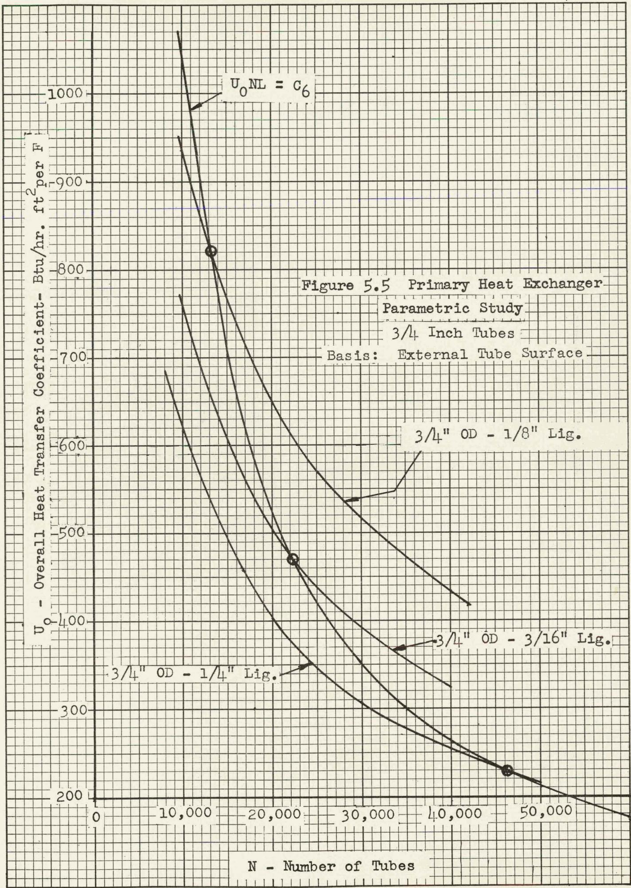  
71.

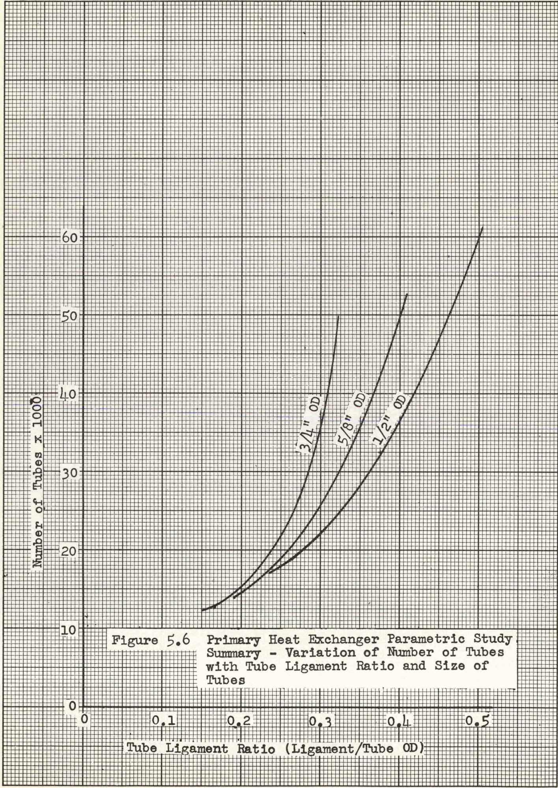

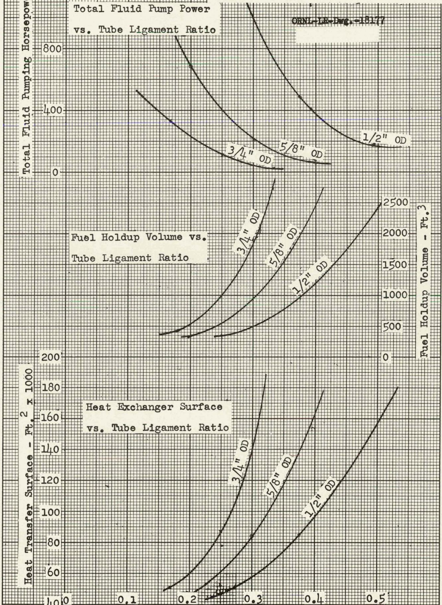  
Figure 5.7 Primary Heat Exchanger Parametric Study Summary - Variation of Pump Power, Fuel Holdup Volume and Heat Exchanger Surface with Tube Ligament Ratio and Size of Tubes   
Tube Ligament Ratio (Ligament/Tube OD)

73.

Physical properties used for study:

TABLE 5.1   
SUMMARY OF PRIMARY HEAT EXCHANGER PARAMETRIC STUDY   

<table><tr><td></td><td colspan="2">FUEL</td><td colspan="2">SODIUM</td><td colspan="3">Type ALSL - 304 Stainless Steel Type &quot;L&quot; Nickel (.06 C Max)</td></tr><tr><td>Absolute viscosity</td><td>μ</td><td>190 lb/hr-ft</td><td>κ</td><td>0.53 lb/hr-ft</td><td></td><td></td><td></td></tr><tr><td>Density</td><td>ρ</td><td>209 lb/cu ft</td><td>ρ</td><td>51 lb/cu ft</td><td></td><td></td><td></td></tr><tr><td>Conductivity</td><td>k</td><td>1.5 BTU/hr-ft-°F</td><td>k</td><td>36.2 BTU/hr-ft-°F</td><td>k</td><td>12.9 BTU/hr-ft-°F</td><td>k 33.5 BTU/hr-ft-°F</td></tr><tr><td>Specific Heat</td><td>Cp</td><td>0.285 BTU/lb</td><td>Cp</td><td>0.3C BTU/lb</td><td></td><td></td><td></td></tr></table>

The study covered six arrangements using $1 / 2^{\prime \prime}$ $5 / 8^{\prime \prime}$ , and $3 / 4$ duplex tubes with O.023" clad Ni on outside of O.042" wall type 304 stainless steel with ligaments of $1 / 4''$ $3 / 16''$ , and $1 / 8''$

Reactor heat load - 600 Mw

Temperature - Fuel 1200°F inlet - 1050°F outlet Sodium 1000°F inlet - 1150°F outlet

Flow rate - fuel 48.0 x $10^{6}$ lb/hr sodium 45.7 x $10^{6}$ lb/hr

<table><tr><td rowspan="2">Tube OD (in.)</td><td colspan="3">1/2&quot;</td><td colspan="3">5/8&quot;</td><td colspan="3">3/4&quot;</td></tr><tr><td>1/4&quot;</td><td>3/16&quot;</td><td>1/8&quot;</td><td>1/4&quot;</td><td>3/16&quot;</td><td>1/8&quot;</td><td>1/4&quot;</td><td>3/16&quot;</td><td>1/8&quot;</td></tr><tr><td>Ligament (in.)</td><td></td><td></td><td></td><td></td><td></td><td></td><td></td><td></td><td></td></tr><tr><td>Tube Ligament Ratio</td><td>0.5</td><td>0.375</td><td>0.25</td><td>0.40</td><td>0.30</td><td>0.20</td><td>0.33</td><td>0.25</td><td>.17</td></tr><tr><td>No. of tubes required with 20 ft effective length</td><td>60,000</td><td>32,500</td><td>18,000</td><td>50,000</td><td>26,000</td><td>14,600</td><td>46,200</td><td>22,200</td><td>13,200</td></tr><tr><td>Velocity - Fuel outside tubes, ft/sec</td><td>0.50</td><td>1.3</td><td>3.6</td><td>0.50</td><td>1.3</td><td>3.4</td><td>0.46</td><td>1.3</td><td>3.2</td></tr><tr><td>Sodium in tubes, ft/sec</td><td>5.6</td><td>10.3</td><td>18.6</td><td>3.7</td><td>7.2</td><td>12.5</td><td>2.6</td><td>5.4</td><td>9.0</td></tr><tr><td>Reynolds No. - Fuel</td><td>1310</td><td>2310</td><td>4150</td><td>1200</td><td>2350</td><td>4000</td><td>1070</td><td>2250</td><td>4050</td></tr><tr><td>Sodium coolant</td><td>5.95x10^4</td><td>1.10x10^5</td><td>1.98x10^5</td><td>5.34x10^4</td><td>1.025x10^5</td><td>1.78x10^5</td><td>4.6x10^4</td><td>9.6x10^4</td><td>1.61x10^5</td></tr><tr><td>Over-all heat transfer coefficient-BTU/hr-sq ft</td><td>260</td><td>485</td><td>885</td><td>252</td><td>492</td><td>865</td><td>228</td><td>470</td><td>820</td></tr><tr><td>Heat transfer surface</td><td>157,000</td><td>84,700</td><td>46,500</td><td>164,000</td><td>84,000</td><td>47,500</td><td>181,000</td><td>87,200</td><td>51,000</td></tr><tr><td>Pressure drop - Fuel, psi</td><td>.11</td><td>.89</td><td>8.0</td><td>.13</td><td>.89</td><td>7.8</td><td>.13</td><td>.84</td><td>6.1</td></tr><tr><td>Sodium, psi</td><td>2.5</td><td>7.2</td><td>22.0</td><td>.91</td><td>3.0</td><td>8.5</td><td>.37</td><td>1.4</td><td>3.6</td></tr><tr><td>Pumping horsepower - Fuel, hp</td><td>1.8</td><td>14.9</td><td>134</td><td>2.2</td><td>14.9</td><td>130</td><td>2.2</td><td>14.0</td><td>102</td></tr><tr><td>Sodium, hp</td><td>163</td><td>468</td><td>1430</td><td>59.0</td><td>195</td><td>552</td><td>24.0</td><td>91.0</td><td>234</td></tr><tr><td>Total, hp</td><td>165</td><td>483</td><td>1564</td><td>61.2</td><td>210</td><td>682</td><td>26.2</td><td>105</td><td>336</td></tr><tr><td>Fuel holdup in tube bundle, cu ft</td><td>2420</td><td>967</td><td>355</td><td>2470</td><td>950</td><td>365</td><td>2730</td><td>980</td><td>405</td></tr></table>

ORNL-LR-DWG15349

FIG. 5.8-PRIMARY HEAT EXCHANGER TUBE LAYOUT   
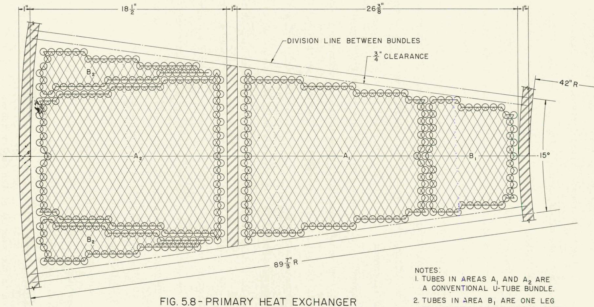  
TUBE BUNDLE CONTAINS 650 TUBES.   
24 BUNDLES REQUIRED   
NOTES:   
I. TUBES IN AREAS $A_{1}$ AND $A_{2}$ ARE A CONVENTIONAL U-TUBE BUNDLE.   
2. TUBES IN AREA $B_{1}$ ARE ONE LEG OF A U-TUBE BUNDLE WHICH DIVIDES AND CROSSSES OVER BELOW THE BUNDLE $A_{1} - A_{2}$ INTO AREAS $B_{2}$ .

assembly problems, the heat transfer characteristics are improved. Since the physical crossing of the tubes occurs in the lower portion of the bundle, the fuel flow pattern through this section will be irregular, improving the mixing of the fuel as it passes through the exchanger.

In order to obtain adequate cross sectional area for welding the tubes to the tube sheets, it was initially planned to increase the pitch from $3/4''$ to $7/8''$ and extend the tube sheet radially outward over the tube bundle to obtain the additional area; however, an actual layout of this arrangement indicated that the outer radius of the tube sheet became excessive and therefore this plan was abandoned. To solve this difficulty, the following various alternates were proposed: (1) place the tube sheets at angles from $45^{\circ}$ to $90^{\circ}$ to obtain the required additional area. This method of arrangement offers the disadvantage of imposing severe stresses on the tubes at the bend where the tube enters normal to the tube sheet. (2) Allow the fuel to flow inside the exchanger tubes and the sodium coolant outside with the tube sheet positioned in the vertical. This arrangement offers some advantages such as reduction in the required heat transfer surface because of the larger over-all heat transfer coefficient brought about by the fuel film coefficient, the main resistance to heat flow in the system, being increased with the fuel inside the tubes. The difficulties involved in draining the tube bundle completely and problems in successfully cladding and inspecting the inside of the tubes ruled this arrangement out. (3) Finally, it was concluded that the most expedient solution to the problem would be to swage the tubes to $1/2''$ OD size just before the tubes enter the sheet, maintaining the $3/4''$ pitch the full length of the tube. This allows a spacing of $1/4''$ between the tubes on the tube sheet with $5/8''$ OD tubes, which is considered enough for a successful welding procedure. No difficulty is anticipated in the swaging of the duplex tubes.

The final exchanger design consists of 24 U-tube bundles with 650 tubes positioned vertically in the reactor vessel, each with an effective length of 21 ft. The size of the duplex tubes suggested is $5/8''$ OD with .042" type 304 stainless steel wall clad with .023 type "L" nickel. Approximately a total of 20 tube spacers and support plates will be required in order to insure proper tube spacing and support. An arrangement with the tube spacers staggered on 12" centers will result in a practical configuration. The tubes will be swaged to $1/2''$ OD as they enter the tube sheet.

The method for supporting the individual heat exchanger assemblies is discussed in Section 5.2.3.

# 5.2.0 REACTOR VESSEL

The reactor, shown schematically on Figures 5.9 and 5.10, is basically a vertical cylindrical vessel with an over-all height of approximately 13 ft and a minimum diameter of 16 ft for most of its height. The diameter increases to 20 ft at the top of the vessel to allow for the installation of eight equally spaced fuel circulating pumps. In order to reduce fuel holdup, the minimum diameter is maintained for the height of the vessel, except at the location where the fuel circulating pumps are positioned. At these locations, the vessel flares into protuberances to provide the necessary flow area for the pump discharge transitional sections. An annular plenum chamber to serve as a suction header is located at the top of the vessel directly below the pump base plate. This distributes and permits flow to all pump inlets in the event of possible failure of any single pump.

Both the bottom and top of the reactor vessel are concave hemispheroidial sections to minimize fuel holdup, to allow for more effective length of the heat exchanger, and to improve the flow characteristics of the fuel into and

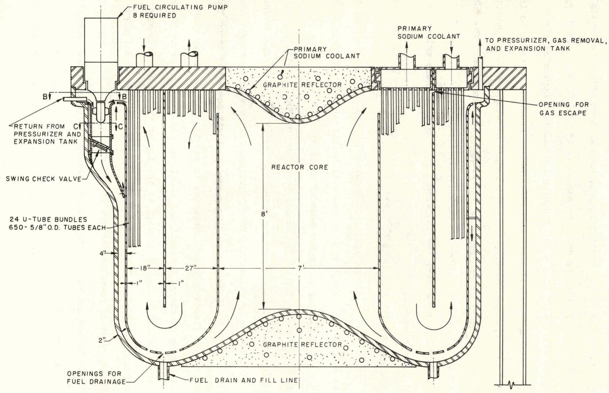  
FIG.-5.9-SECTION (A-A) THROUGH REACTOR VESSEL

ORNI-LR-DWC:15228A

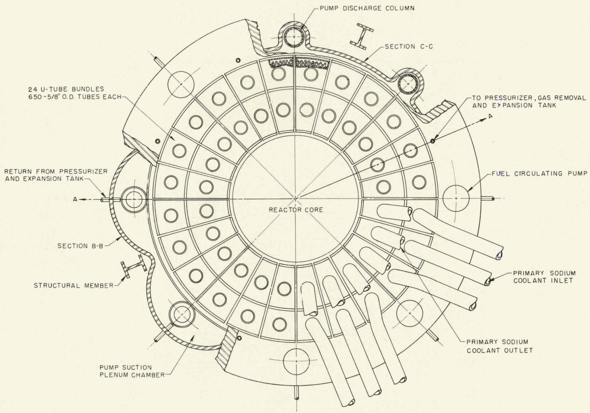  
FIG. 5.10-PLAN VIEW OF REACTOR VESSEL

ORNL-LR-DWG:15348

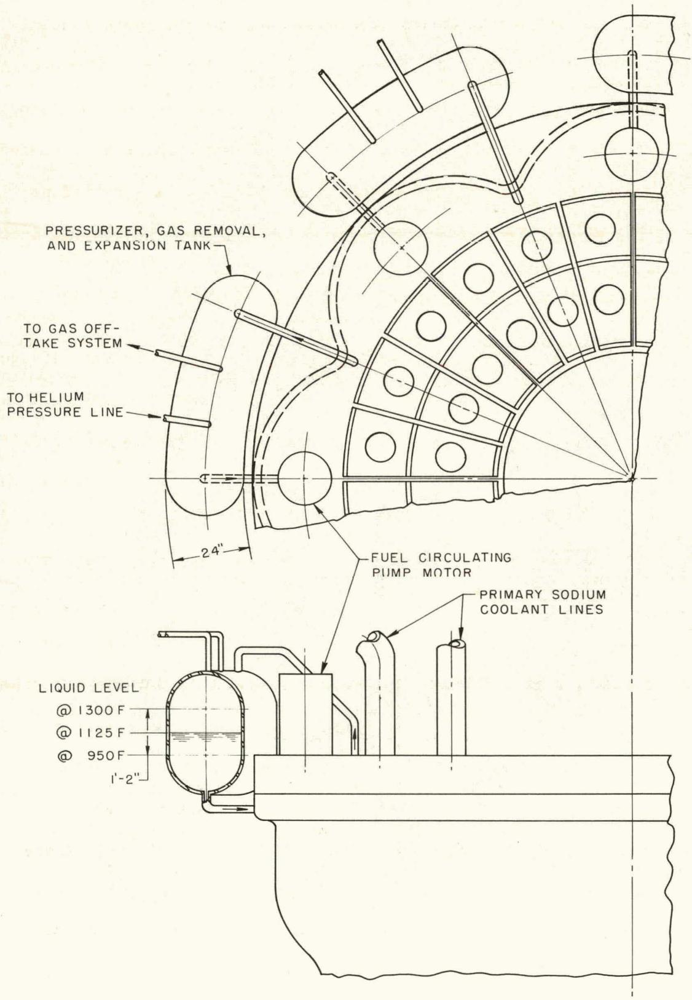  
FIG. 5.11 - PRESSURIZER, GAS REMOVAL, AND EXPANSION SYSTEM

out of the central core section. Use of the concave sections reduces the need for internal baffling and perforated plates to distribute the fluid flow.

To minimize neutron leakage at the top and bottom of the reactor, graphite blocks are packed into the concaved sections to serve as a neutron reflector. A side stream of the primary sodium coolant is used to remove the heat caused by the gamma and neutron interactions in the graphite. Similar provisions could be made for cooling the reactor shell if further investigation indicates that the gamma heating in the reactor shell is excessive.

# 5.2.1 Shell Design

Since the fused salt in the reactor has a very low vapor pressure at the operating temperature (.01 mm Hg), the system is pressurized with helium at a pressure of only 10 psi (See Section 5.2.5). Because of this low pressure, the shell thickness required for the vessel is relatively thin as compared to most other types of high temperature reactors. By using a design pressure of 50 psi in the vessel, a maximum temperature of $1250^{\circ}\mathrm{F}$ of the fuel, Type 304 stainless steel as the structural material, and a joint efficiency of $80\%$ , a shell thickness of 1.8 inch is required for the reactor vessel. This was obtained by applying the ASME formula for cylindrical shells listed in Unfired Pressure Vessel Code (Ref. 35, p. 113). To allow an additional margin of safety, the shell thickness of the vessel is designed for 2 inches and is fabricated from Type 304 L stainless steel with 0.03 C maximum.

The choice of Type 304 L stainless rather than Type 347 was made since it has been demonstrated that the possibility of incipient cracking at the weld joint is less probable with Type 304 L. The weldability of Type 304 L compares favorably with Type 347 as long as the carbon content is limited to 0.03 maximum.

The vessel is clad with approximately 0.20 inch of type "L" nickel at all points which are in contact with the fused fluoride salt to prevent corrosion. It should be noted that in establishing the thickness of the vessel, no increase in strength was allowed for the nickel cladding. This is in accordance with the ASME boiler code. The sides and bottom of the vessel will be fabricated from 2-inch plate into sections that will be welded together to make the complete vessel. The assembly of the top of the vessel is more complex since the heat exchangers are seal welded onto structural members and the top cover section.

# 5.2.2 Internal Arrangement

The internal arrangement of the reactor vessel consists of three principal components: the central core section where most fissioning takes place; the primary heat exchangers in which the heat of fission is removed; and the fuel-circulating pumps which provide the necessary head to maintain continuous circulation of the fuel. By referring to Figure 5.9, the fuel circulation path can be followed.

Fuel flows upward through the 7-foot diameter cylindrical core, outward radially at the top, and down through the first pass of the U-tube heat exchangers which are located in the baffled annulus surrounding the core. The fuel reverses its direction at the bottom of the heat exchangers and flows upward through the second pass of the heat exchangers. At the top of the second pass, the fuel flows radially outward again to eight axial flow pumps located symmetrically around the upper periphery of the reactor vessel. These pumps force the fuel downward through an annular downcomer which surrounds the entire vessel. At the bottom of the downcomer, the fuel flows radially inward and back into the central reactor core to repeat the circuit.

The internal baffling is 7/8-inch Type 304 stainless steel base plate clad on both sides with 1/16-inch minimum thickness Type "L" nickel. The inner and outer baffles of the heat exchanger are connected to the reactor vessel through internal structural members, not shown on the diagrams. The center baffle is welded to each primary heat exchanger tube sheet channel and is supported at the bottom by the radial support plates of the heat exchanger bundle. Leakage and streaming of the fuel between the hot and cold legs of the heat exchanger bundles is minimized by using a tongue and groove arrangement at the points where the center baffling ends between adjacent tube bundles. In addition, special internal baffling is required to prevent fuel streaming between bundles in the voids caused by the radial structural members at the top of the vessel which support the heat exchangers. Perforations are provided at the bottom of the U-bend of the baffling to permit complete drainage of the fuel, and at the void spaces around the fuel pump discharge transitional sections to avoid overheating in this stagnant volume.

Eight fuel drain and fill lines are provided at the bottom of the vessel and are connected to the fuel dump system through let-down valves and safety devices.

# 5.2.3 Structural Arrangement

The reactor vessel is supported by eight vertical members embedded in the concrete floor of the containment vessel. These members are welded to the outer structural ring beam which acts as the main support member for the reactor vessel. Twenty-four equally spaced beams extend radially inward from the outer ring beam and are in turn welded to an inner concentric ring beam. The resulting design is a circular cantilever functional arrangement similar in appearance to a large wheel with 24 spokes between the hub and rim.

The primary heat exchangers are located between these radial members. The heat exchangers are seal welded individually by radial and concentric seal strips. The radial seal strips are located on each side of the heat exchanger channels and are welded to the radial beams running between the heat exchangers. The concentric seal strips are located at the inner and outer periphery of the heat exchanger channels and are welded to the concentric ring beams to complete the closure. These seal strips are also designed to restrain the heat exchangers from the upward force caused by the buoyant effect of the fused salt on the tube bundles.

This design is unique in that it utilizes the inlet and outlet channels of the primary heat exchanger as an integral part of the reactor vessel. Furthermore, the primary heat exchangers can be removed by remotely cutting out the seal rings of any particular bundle and lifting the entire bundle out vertically after the primary coolant piping has been cut away.

# 5.2.4 Fuel Circulating Pumps

The fuel circulating pumps have several special requirements that must be satisfied for a practical design. These requirements are as follows: (1) absolute leak tightness, since any leakage of the highly radioactive fuel would contaminate the area and would eventually cause a shutdown; (2) operational reliability with minimum maintenance for uninterrupted, continuous service, since all maintenance must be accomplished remotely once the reactor has been operated; (3) be easily replaceable as a unit since plant shutdown is required for access; (4) vertical installation for complete removal of pump internals without necessitating complete drainage of the fuel; and (5) reasonable cost.

In selecting a design for the fuel circulating pump that would reasonably fit the above requirements, two types were considered sufficiently

developed to warrant investigation for this application: (1) the totally enclosed or canned rotor pump; and (2) conventional motor drive coupled to the pump by shafting that has special provision for frozen seals to prevent leakage.

The canned rotor pump met many of these requirements; however, such a pump has not been fully developed to operate with fused salt at temperatures in the required range of $1000^{\circ}\mathrm{F}$ to $1300^{\circ}\mathrm{F}$ . The bearings of a canned rotor pump are generally lubricated by the fluid being pumped and cooled by a secondary coolant. Application of a canned rotor pump to a fused salt system would necessitate that the rotor, and consequently the electrical insulation, operate at temperatures considerably in excess of those now considered practical. Coolant passages would require judicious design to avoid freeze-ups in the coolant circuit. Further, the cost of development and fabrication would be considerable for materials suitable to resist the corrosiveness of the fluoride salt. For these reasons, this type of pump was rejected. A vertical pump coupled to a conventional motor drive with special adaptations of freeze seals and hydraulic, piston-type, self-lubricating bearings was selected as more suitable for this application.

Calculations indicated that the total fuel flow is 32,000 gpm. This requires a total dynamic pump head of 11 ft or 15 psi. This load is distributed among eight pumps, on the basis that this number resulted in a symmetrical arrangement in conjunction with the 24 primary heat exchangers, and also that failure of one of eight pumps would not seriously reduce the capacity of the plant. Further, the impeller size for a 4000 gpm pump is reasonable and fits into the chosen pump location. The required drive motor rating for each pump unit of 60 hp is practical. A value of 60 percent was used for the pump efficiency in the design which is considered conservative for axial flow pumps.

To determine the pump classification, the specific speed was obtained from the following expression (Ref. 21, p. 296),

$$
N S = \frac {N \sqrt {G P M}}{(H) ^ {3 / 4}} \tag {5.9}
$$

where $\mathbf{N}$ is the specific speed, $\mathbf{N}$ is the revolutions per minute of the pump shaft, $\mathbf{GPM}$ is the capacity in gallons per minute, and $\mathbf{H}$ is the total dynamic head of the pump in feet.

Application of the above expression when considering a pump speed of 1750 rpm results in a specific speed of approximately 18,000, which is in the axial flow pump range. Use of an axial flow pump simplifies the arrangement of the pump discharge nozzle and transitional pieces since volute diffuser sections are not required and, therefore, both suction and discharge can be axial.

In order to reduce the possibility of cavitation for the top suction pump design, it was decided to provide a pressurizer for the fuel in the reactor vessel. The pressurizer will maintain the fluid level several feet above the pump suction.

The location of the pump in the reactor vessel is critical since the maximum shaft overhang tolerable is of the order of 18 inches. For this reason, the pumping element is located as near to the top of the vessel as flow permits. A new development in pump bearings, called the hydraulic, piston-type bearing, permits the bearing to operate in the fluid and is lubricated by the fluid being pumped. This design would have application in the pump installation proposed, as it is specially designed for high temperature corrosive fluids. To prevent leakage, a freeze seal is proposed. Essentially, this consists of a section of the pump shaft where cooling coils

freeze the fuel around the shaft, thereby preventing fluid leakage. These seals have been developed and are considered practical.

In order to prevent backflow through a pump which has been shut down, a check valve is required at each pump discharge. The check valve is located in the pump discharge downcomer and arranged so that it can be removed when the pump internals are withdrawn. The check value must offer a minimum resistance to flow so that natural circulation will not be restricted on complete electrical failure of the pump motor drives.

The choice of suitable materials for the pump internals is limited at the present time to Inconel. Experiments (Ref. 57) have been performed with an Inconel pump operating in a forced circulation loop with fluoride fuel No. 30 at a cold operating temperature of $1250^{\circ}\mathrm{F}$ and with a maximum loop temperature of $1550^{\circ}\mathrm{F}$ . The pump was successfully operated for over 8000 hours, when an electrical power failure forced a shutdown and restart was prevented by a pipe break. It was considered that the pump was capable of operation for many more hours without mechanical failure. The pump was equipped with a conventional seal of silver impregnated graphite against tool steel and with commercial ball bearings. This seal and bearing arrangement is different from that proposed above. On inspection of the pump impeller, it was concluded that the effect of corrosion and mass transfer on the pump materials was negligible. On the basis of this experience, the use of Inconel for pump internals is considered satisfactory for the design and operating conditions planned for the fuel circulating pumps for this design study.

A summary of the specifications for the fuel circulating pumps is given in Table 5.2.

TABLE 5.2   
SPECIFICATIONS FOR FUEL CIRCULATING PUMPS, (8)   
Type-Vertical-Axial flow   

<table><tr><td>Capacity</td><td>4000 gpm</td></tr><tr><td>Temperature of salt entering pump</td><td>1050°F</td></tr><tr><td>Total dynamic pressure head</td><td>15 psi</td></tr><tr><td>Speed - Constant</td><td>1800 rpm</td></tr><tr><td>Pump horsepower</td><td>56 hp</td></tr><tr><td>Motor horsepower</td><td>60 hp</td></tr><tr><td>Impeller outside diameter</td><td>10 in.</td></tr><tr><td>Hub diameter</td><td>5 in.</td></tr><tr><td>Materials - Trim</td><td>Inconel</td></tr><tr><td>Seal</td><td>Freeze Type</td></tr><tr><td>Bearing</td><td>Hydraulic Piston Type</td></tr></table>

# 5.2.5 Pressurizer Gas Removal and Expansion System

The reactor vessel is pressurized to a maximum pressure of 10 psi. The pressure is limited to this value to keep the design pressure below 50 psi in the reactor vessel. Helium is used to pressurize the system because of its negligible solubility and inertness in the fuel solution. Pure helium does not become radioactive and therefore can be vented directly to the atmosphere. (Ref. 15, p. 115).

The pressurizer system is required for several important reasons:

1) To maintain a positive flooded suction head on the fuel-circulating pumps to prevent pump cavitation and vapor binding.   
2) To provide gas pressure for the fission product gas removal system.   
3) To minimize the possibility of the "snow problem" described in Chapter 2.   
4) To reduce the tendency for formation of fission product gas voids in the circulating fuel.   
5) To provide a free surface for release of the fission product gases which will accumulate in the helium volume at the top of the pressurizer vessel.   
6) To serve as a surge tank for changes in the fuel volume.

The pressurizers shown on Figure 5.11 consist of eight connected chambers, adequately sized to accommodate the expansion and contraction of the fuel fluid caused by the variation in density between the solidification temperature and $1300^{\circ}\mathrm{F}$ . Above the free surface in the pressurizer, additional volume is available for collection of the fission product gases which are scavenged to the off-gas system. A pipe connection is provided between each fuel pump at the highest elevation of the reactor vessel for connecting to the top of the pressurizer vessel for gas removal. To provide continuous circulation of the low temperature fuel through the pressurizer, the return line is connected from the bottom of the pressurizer to a connection at each fuel pump suction.

# 5.2.6 Effect of Volume Heat Source

Baffles and flow dividers are located within the reactor vessel to direct the flow of the fused salt fuel through the heat exchangers, pumps, downcomer, and back to the central core. These baffles are positioned so that they are in direct contact with a volume heat source on both sides. Initially, this created some concern because of the possibility of developing excessive temperatures and thermal stresses in metal that is in contact with a volume heat source. References 42, 43 and 44 analyze this phenomenon in considerable detail, and indicate that the magnitude of the effect is a function of the relative values of neutron flux and coolant velocity and their distribution over the flow area. An authoritative source was consulted on this problem, as it applies to this design study (Ref. 45). It was concluded that the neutron flux and velocity profiles in this reactor are such that the temperature rise in the baffles due to the volume heat source effect would be negligible.

# CHAPTER 6.

# SODIUM AND STEAM POWER SYSTEMS

# 6.0.0 INTRODUCTION

The ultimate use of the reactor heat is the generation of useable power for distribution to the consumer. In order to accomplish this safely, economically, and with a maximum flexibility of control, it was necessary to investigate this portion of the plant in detail. This chapter includes the primary loop, intermediate loop, the steam generators, the sodium piping, the steam cycle and auxiliary power requirements. Other items of interest included are the intermediate heat exchangers, the steam cycle, a plant heat balance and the plant efficiency.

# 6.1.0 PRIMARY SODIUM COOLANT LOOP

The heat of fission in the circulating fused fluoride salt fuel can be transferred to the steam system for the turbine unit by several alternate schemes. The acceptance of a scheme depends on the limitation that under all conditions of operation, the heat exchange media minimum temperature will always maintain the minimum fuel temperature in excess of the melting point to prevent local solidification. The minimum temperature of the reactor has been set at $1050^{\circ}\mathrm{F}$ , for reasons discussed in Chapter 5, whereas the boiler feed water temperature is set at $450^{\circ}\mathrm{F}$ by the steam turbine cycle design, resulting in a temperature difference of $600^{\circ}\mathrm{F}$ . This large temperature difference must be held nearly constant over the entire load range in order to maintain the system design temperatures which, in so doing, creates difficult problems in controlling the heat transfer rates.

# 6.1.1 Schemes for Removing Heat from Reactor

The possible schemes for transferring the heat from the fuel are discussed below.

# A. Direct Heat Transfer by Boiling Water

It is possible to circulate the fuel external to the reactor directly through a once-through superheater and steam generator without interposing additional loops in the system. The fuel would undoubtedly flow on the outside of the tubes and the steam inside in the heat exchanges. The following are several apparent disadvantages which make direct heat transfer unacceptable.   
1. Large Fuel Holdup - The over-all heat transfer coefficient would be lower than if transferred to another fluid. This results because the tubes in the heat exchanger have to be thick, with probably double walls for added safety, to withstand the high pressure steam and also because the film heat transfer coefficient for the superheated steam is low. A low over-all heat transfer requires more heat transfer area and therefore a bigger heat exchanger, which results in larger fuel holdup requirements.   
2. Reduced Safety - The larger the heat exchanger and the higher the pressure, the greater probability of a leak. Any leak would be from the high pressure water system into the low pressure, but high temperature fused salt. Such a leak would cause a violent reaction, increasing the hazards of plant operation and containment.   
3. Radioactive Steam - The fuel will activate the steam, which increases the problems in maintenance, shielding, and designing the turbine and feed systems completely leaktight.   
4. Decomposition of the Steam - Due to the high radiation field, decomposition of the steam results, which requires an extensive $\mathsf{O}_2$ - $\mathsf{H}_2$ recombination system.

5. High Thermal Stresses - Because of the large over-all temperature drops, excessive tube wall stresses will result.

6. Heat Exchanger Design Problems - Because of the large temperature difference between the cold legs of the heat exchanger, the effect of film boiling must be considered in the design with the resulting problems of instability.

# B. Heat Transfer to Liquid Metal

In order to avoid the disadvantages of direct heat transfer, the use of a liquid metal for a primary coolant was considered. The liquid metal coolant will flow inside the tubes and the fuel on the outside of the tubes, and the heat exchanger will be internal to the reactor vessel. Because of the high thermal conductivity of the liquid metal and low vapor pressure, the heat exchangers will be much smaller, therefore decreasing holdup. Safety features will be improved; decomposition and thermal stress problems will be reduced. Furthermore, existing design information can be used with confidence in determining the required heat transfer surface and the possibility of operational instability no longer exists.

# 6.1.2 Choice of Coolant

In making the selection for the primary coolant, the properties of several metals such as mercury, sodium, bismuth and NaK were considered. The general requirements for a coolant, exclusive of nuclear requirements, are that the density, thermal conductivity and heat capacity should be high, whereas the viscosity, melting point and vapor pressure should be as low as possible. In addition, the coolant should have a high degree of wetting ability, negligible toxicity and, most important, should not expand upon freezing.

Combining these properties for an over-all comparison, sodium proved to be the most desirable coolant for the primary loop for the following, several reasons:

1) Lowest pumping power required for a given rate of heat removal.   
2) Superior heat transfer properties, resulting in the smallest equipment sizes.   
3) Contraction upon solidification.   
4) Superior neutron economy. Since the fuel primary heat exchanger is internal to the reactor, it is important to keep neutron absorption losses to a minimum. The coolant also acts as a reflector to reduce neutron leakage from the reactor core.   
5) Complete stability under high irradiation field.

A discussion of these requirements is extended in Section 6.2.2 of this report, in the presentation of the arguments for and against an immediate heat exchanger.

# 6.1.3 Sodium Coolant Activation

As a result of the primary sodium coolant flowing through the primary heat exchangers in the reactor vessel, the sodium will become very radio-active. When the sodium coolant captures a neutron, radioactive sodium-24 is formed and will build up in the coolant system to an equilibrium value which depends upon the particular design and flux level of the reactor. The radioisotope sodium-24 has a half-life of approximately 15 hours, and emits beta particles and two hard gamma ray photons of an energy of 1.38 and 2.75 mev (Ref. 8, p. 525). The sodium activation imposes many limitations on the freedom of the design of the plant since it affects shielding, plant layout, maintenance, servicing, and personnel accessibility to the radioactive areas.

Impurities in the sodium cause long-lived radioactive contaminants and their effect must be considered in the over-all design, in particular when draining the system in preparation for access to the shielded compartments. Care must be taken to assure all such containments are completely flushed. Some of the plant layout and design problems considered because of this activation are discussed in Sections 6.7.7 and 7.3.0.

An approximate value for the level of activity in the primary coolant sodium can be determined by applying the following expression when the exposure time is much longer than the mean sodium-24 half-life (Ref. 15, p. 398).

$$
\begin{array}{l} \mathrm {N a} ^ {2 4} \text {a c t i v i t y i n p r i m a r y c o o l a n t} = \frac {\phi \sum_ {\mathrm {a v}}}{3 . 7 \times 1 0 ^ {1 0}} \text {c u r i e s} \\ \phi - \text {N e u t r o n} \\ \Sigma a - S o d i u m t h e r m a l m a x r o s c o p i c c r o s s s e c t i o n \mathrm {c m} ^ {- 1} \\ V - T o t a l v o l u m e o f s o d i u m \quad i n \quad p r i m a r y e x c h a n g e r \\ \end{array}
$$

Considering only the activities from the thermal flux and using an average flux in the sodium in the primary heat exchanger of $0.8 \times 10^{12}$ per $\mathrm{cm}^2$ -sec, obtained from the ORACLE calculations, gives an activation of $1.46 \times 10^6$ curies of the radioactive sodium. When this activation is diluted by the approximately $2000 \mathrm{ft}^3$ of sodium in the primary system, the resultant activity is $0.0258$ curies per cc.

Since this is considerable activity, it is necessary that all heat exchangers, pumps and piping containing the primary sodium coolant be adequately shielded to protect operating personnel.

# 6.2.0 INTERMEDIATE SODIUM COOLANT LOOP

It is possible to transfer the heat directly from the primary loop to generate steam or to interpose an intermediate loop between the primary and

steam portion of the system. Several excellent discussions of the advantages and disadvantages of using an intermediate circuit are given in the literature (Ref. 7, 15, 25). The primary basis for any such selection must be in terms of the economics, safety, reliability and operation of the system.

# 6.2.1 Justification of Intermediate Loop

In order to make the decision to include such a loop in the system, the following advantages and disadvantages of using an intermediate loop were considered:

# Advantages

1. Decreased thermal stress problems in the steam generators.   
2. Increased flexibility of the system for partial load operation.   
3. Separation of the primary heat transfer loop from the steam loop in case of a leak.   
4. Simpler maintenance of the steam loop outside of the shielding.   
5. Avoidance of the possibility of film boiling by decreased $\Delta t$ in the boiler.   
6. Reduced shielding problems.   
7. Reduced possibility of steam decomposition as a result of gamma radiation from the primary sodium loop. As is noted in Section 6.4.1, the presence of oxygen and hydrogen in the steam loop would be very detrimental from a corrosion standpoint.   
8. Lighter reactor construction, since the reactor will not be called upon to withstand the full steam pressure in case of a leak in the steam generator portion of the system.

# Disadvantages

1. Increased piping, pumps and valves for the intermediate loop.   
2. More heat exchangers.   
3. Increased system size.   
4. Larger holdup of heat transfer fluid.   
5. More equipment which may be potential sources of leaks.

From the previously mentioned discussions (Ref. 7, 15, 25) and the listing of the advantages and disadvantages, it is apparent that the main advantages lie in the areas of safety, reliability and operability, while the principal disadvantages lie in the increased cost of having such a loop. Safety and reliability must of necessity govern the design of any reactor system or its components, and cost, while important, must be secondary in the design philosophy. On this basis, the choice was made to include an intermediate loop in the system.

# 6.2.2 Choice of Coolant Fluid

The choice of heat transfer fluid to use in the intermediate loop was readily narrowed down to one of the liquid metals or a fused salt. Organics or aqueous media were eliminated because of the gamma radiation and high temperatures in this loop. Gamma radiation and high temperatures cause these compounds to decompose or dissociate. Some of the variables that were considered in choosing the fluid were:

1. High heat transfer properties at reasonable velocities   
2. Cost   
3. Toxicity   
4. Relative pumping power. For example, mercury requires from 5 to 10 times the pumping power of the alkali metals.   
5. Corrosiveness of the fluid in contact with common materials at the temperatures of interest.   
6. Tendency to dissociate, combine with oxygen or, in general, be chemically degraded at operating temperatures and in the gamma flux from the primary loop.   
7. In case of a leak, the fluid must be compatible with the sodium in the primary circuit and also with the fused salt fuel.   
8. The materials of construction necessary to contain the fluid must be compatible with those of the primary loop to prevent the possibility of corrosion or mass transfer.

9. The melting point, heat capacity and thermal conductivity must all exhibit reasonable values for a practical system.   
10. Handling characteristics must be practical. For example, the expansion of bismuth on solidification creates many extremely difficult problems.   
11. The boiling point and vapor pressure must be reasonable for this high temperature application. Mercury, which has good heat transfer characteristics, has a boiling point of $675^{\circ}\mathrm{F}$ at atmospheric pressure. In order to take advantage of the high heat transfer characteristics of this material, the system would have to be pressurized to maintain it in the liquid state.

Of the many materials possible, the alkali metals appeared to be best suited for this system. As is noted in the Reactor Handbook (Ref. 7, p. 773-777), the heat transfer, where the liquid metal is the sole fluid, does not vary appreciably regardless of the fluid. Sodium was selected as the liquid metal which fulfills more of the requirements listed above than any other fluid. However, this material presents one major problem, namely, the exothermic sodium - water reaction.

# 6.2.3 Sodium-Water Isolation Problem

In order to preclude the possibility of sodium and water contact, systems have been designed (Ref. 15) using such design details as double wall tubes or a third fluid to separate the sodium and water. At present, one system (Ref. 5) contemplates the use of single wall tubes and single tube sheets to separate these fluids. A relatively small mock-up of this system will be tested in the near future and this test should provide valuable information regarding the ability of such a unit to run for a period of time, comparable to central station steam practice, without leaks.

As is noted in Section 6.4.2, it is possible to adequately treat the feed water and to properly design a heat exchanger to preclude almost entirely the possibility of stress corrosion failure of the tubes or tube sheets. On the basis that the previous statement represents the present state of boiler

and heat exchanger practice, then the tube-to-tube sheet joint must be carefully considered. By exercising extreme care and quality control, units have been built for nuclear applications which, prior to service, have been made leakfree. However, in service, the tube-to-tube sheet joint is subjected to a complex stress pattern and thermal cycling. Under these conditions, there is always the distinct possibility of having some tube-to-tube sheet welds fail. The other type of possible failure lies in the realm of faulty tube material being inadvertently used. To prevent this, it is necessary to make some, or all, tests such as radiography, dye penetrant methods, physical tests, ultrasonic inspection, helium leak tests and mass spectrometer, both prior to and after the tubing is installed in the unit.

# 6.2.4 Proposed Design for Sodium-Water Isolation

Of the potential types of failure mentioned above, the tube-to-tubesheet weld failure presents an area with the greatest possibility of occurrence in service. As has been mentioned previously in this section, safety must be a prime consideration in this system. For this reason, the design detail shown in Figure 6.l is proposed to minimize the effect of a leak in a tube-to-tube sheet joint. In essence, it consists of using single wall tubes with double tube sheets. A thin walled chamber separates the tubesheets and helium would be used to purge this chamber to preclude the possi-bility of a sodium-to-air reaction, and also to act as a monitor to detect a leak. Should a leak occur at either tube sheet, the heat transfer fluids would not mix and the magnitude of the leak would be monitored by the helium. If leaks occurred simultaneously at both tube sheets, only small volumes of materials would be involved and corrective action, such as isolation of the component, could be initiated.

Preliminary work has been initiated* to determine the feasibility of this type of construction. This work consists of a test section of approximately 400 l/2-inch OD tubes on 3/4-inch pitch braze welded to a 1/2-inch thick tube sheet on both sides of the tube sheet. Metallurgical and physical tests will be utilized to check the integrity of the braze welds.

A summary of this test work up to the date of publication of this report is given in Appendix J.

# 6.3.0 INTERMEDIATE HEAT EXCHANGER

The reasons for placing the intermediate sodium loop and heat exchanger in the cycle are given in Section 6.2.1.

In order to maintain reasonable equipment size, six intermediate heat exchangers were used and therefore each heater transfers 100 Mw of heat from the primary to the secondary sodium loop. The heaters are of the U-tube type to minimize thermal stresses.

# 6.3.1 Isolation of Radioactive from Non-Radioactive Sodium

Since the intermediate sodium loop extends beyond the secondary radiation shield, the leakage of radioactive sodium from the primary loop into the non-radioactive sodium of the intermediate loop through the heat exchanger is intolerable. It was decided that the intermediate heat exchanger would be designed as a two-fluid type rather than the more costly and difficult to manufacture three-fluid type. The non-radioactive intermediate sodium will be pressurized above the radioactive sodium in the primary loop. Any leakage would then be into the radioactive sodium rather than out of it. The isolation design, as discussed and proposed in Sections 6.2.3 and 6.2.4, would be applicable and desirable for the intermediate heat exchanger.

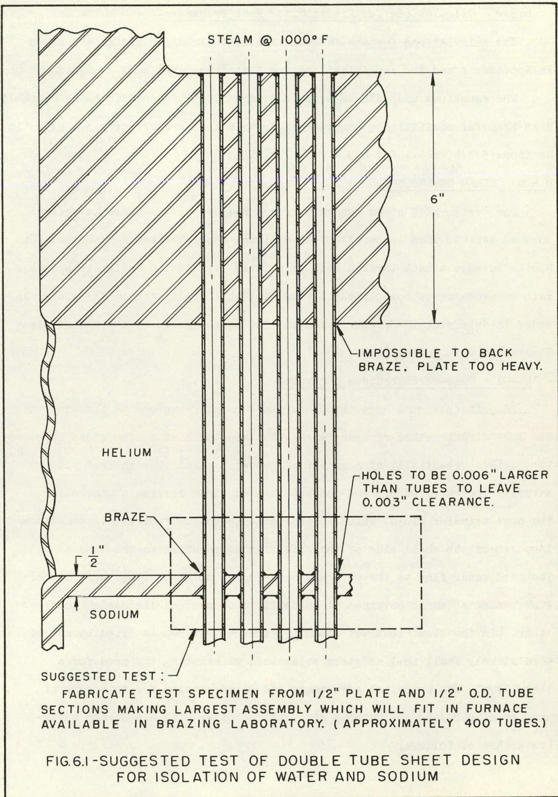

# 6.3.2 Calculations for Intermediate Heat Exchanger

The calculations for the intermediate heat exchanger design are given in Appendix E and the specifications are listed in Table 6.2.

The equations and methods used in determining film coefficients, over-all heat transfer coefficient, heat exchanger area and pressure drop are given in Sections 5.1.4, 6.5.1 and 6.5.2.

# 6.4.0 STEAM GENERATORS

The design of a steam generator for a nuclear system presents several unusual aspects when compared to conventional central station practice. The choice between a once-through unit or natural circulation boiler with separate superheater is not clearly defined for this application. Therefore, in order to determine the proper selection for this system, both types of steam generators were investigated.

# 6.4.1 Once-Through Steam Generator

In principle, the once-through steam generator represents the simplest and most direct method of transferring the reactor heat to the steam loop. It consists essentially of a number of tubes in parallel with feed water entering the tubes at one end and superheated steam leaving at the other. The heat transfer fluid, which in this case is sodium from the intermediate loop, is on the shell side of the unit flowing parallel to the tube axis. The feed water flow to the unit may be adjusted so that either wet, dry or superheated steam is obtained at the exit, dependent on the design conditions. In the event that wet steam is produced, it can be dried by use of a relatively small in-line steam separator, eliminating the need for a steam drum. The principal advantages and disadvantages for this type of unit as compared to the natural circulation boiler with a separate superheater are as follows:

# Advantages

1. Compactness - For a given set of design parameters, the unit is more compact.   
2. Cost - Since the requirement for a separate steam drum is eliminated and the amount of interconnecting piping, tube sheets and shells is reduced, the unit is inherently less costly.   
3. Control - By the relatively simple method of controlling feed water flow to the tubes, wide ranges of load can be achieved.   
4. Arrangement - Since this type of steam generator does not require a steam drum and interconnecting piping to a separate superheater, it is adaptable and ideal for a nuclear plant layout. In particular, the problems of shielding or isolation for reasons of safety are minimized, resulting in simplified arrangements and substantial savings.   
5. Internal Arrangement - The use of low pressure sodium on the shell side and high pressure water on the tube side results in the best over-all heat transfer and a low pressure shell design which is ideally suited to this reactor system.

# Disadvantages

1. Lack of Water Storage - In the event of complete loss of feed water, flow caused by electrical or mechanical failure of the feed pump, the once-through unit has essentially no water storage and provision must be made to insure the immediate availability of an independent water supply to the unit to provide means of decay heat removal from the reactor.   
2. Water Treatment - Experience with high pressure once-through boilers in Europe has demonstrated that the major difficulty encounters in these units has been the inability to maintain extremely high purity water required for successful operation. According to Shannon (Ref. 1), investigations have indicated that the once-through unit can be operated successfully only if the following conditions are met:

a. Solids content of feed less than 0.5 ppm   
b. Oxygen content of feed not to exceed approximately 0.006 ppm   
c. Removal of oxygen formed by the dissociation of steam   
d. The absolute exclusion of chlorides from the system   
e. pH control by use of aqueous ammonia

It is believed that these conditions can be met when operating the

plant (Ref. 1).

3. Thermal Stress - The outlet of the evaporating section is particularly subjected to conditions that lead to stress reversals and the possibility of fatigue or stress corrosion failure resulting from the intermittent heating and cooling of the tube walls by the finely dispersed particles of water in the steam at this location.

4. Flow Instability - In forced circulation boiling, the problem of flow instability (Ref. 2, 3, 4) in parallel circuits can endanger the performance of the unit. If an obstruction or scale builds up in a tube, the flow rate in the tube may actually lead to an increasing flow resistance due to the increase in the average specific volume of the tube contents. Ultimately, the tube may become steam bound and become completely ineffective from the standpoint of constituting active heat transfer surface. A further effect under these conditions is to decrease the total feed water flow to the unit, which also decreases its ability to perform properly.

5. Design - The calculation of the heat transfer surface required to perform a specified duty with a complete change of phase is especially difficult in those sections where there are high percentages of steam by volume. At present, such calculations represent "educated guesses", and the reliability of such calculation procedures must be validated against future tests such as are presently being contemplated by APDA (Ref. 5).

# 6.4.2 Natural Circulation Boiler-Separate Superheater Steam Generator

The natural circulation boiler with a separate superheater requires more basic components than the once-through unit and, therefore, represents a more complex arrangement for the removal of the reactor heat. In the natural circulation boiler, steam is generated on the shell side and low pressure sodium is on the tube side. The steam-water flow in the boiler is directed by baffles which also serve as tube supports. The steam-water mixture flows through the risers to an external steam drum by natural circulation. As in conventional practice, feed water is introduced into the system at the steam drum to avoid the possibility of temperature shock to the steam generator. The feed water is heated to saturation by condensing steam in the steam drum and saturated water is recirculated to the boiler by the downcomer system. Saturated steam, mechanically separated in the steam drum, is piped to the separate superheater.

The principal advantages and disadvantages of the natural circulation boiler with a separate superheater, as compared to the once-through boiler, are:

# Advantages

1. Reliability - This type of steam generation system has been used in principle in several actual and proposed reactor installations. Among these are the Mark I and Mark II STR units, the PWR, SIR, SAR, HRT, etc. The reliability has been established under actual and test conditions of reactor operation.   
2. Design - Design methods are available which enable the designer to predict the performance of these units to the required degree of accuracy for engineering of the system.   
3. Water Storage - This system has an inherently large water storage built into it in the steam drums. Thus, in the event of a forced outage or the failure of a feed pump, the system is still capable of removing heat from the reactor for several hours. In addition, the effect of a perturbation of the reactor part of the system is minimized on the steam portion of the system because of the damping effect of the large amount of water storage.   
4. Water Treatment - In both this unit and the once-through boiler, careful control must be exercised in treating the feed water for proper operation of the units; however, for this unit, the water treatment problem is less stringent than for the once-through boiler since scaling and tube plugging are not as critical. The problem of stress corrosion prevails in both types of unit and needs to be carefully considered.   
5. Inherent Stability - This type of design has established its inherent stability under various operational conditions. The type of instability that occurs in forced circulation boiling does not exist in the natural circulation system.

# Disadvantages

1. Cost - Because of the necessity for a steam drum, piping from the steam drum to the superheater, interconnecting piping in the steam generator, multiple tube sheets, shells and heads, this type of unit is more costly than the once-through unit.   
2. Arrangement - The engineering design requirements of the natural circulation equipment make it less adaptable to either shielding or compartment arrangement in a nuclear system.   
3. Size - For a given set of design parameters, the natural circulation system will occupy more volume than the once-through system.   
4. The natural circulation design is predicated on the basis that the high pressure water is on the shell side, which subjects the tubes to collapsing pressure. This results in thicker tubing with an attendant increase in weight and decrease in heat transfer capability per unit volume.

5. Control - As described in Section 7.4.0, the control of this unit presents problems in operating the system over wide ranges of load. In order to accomplish the desired regulation, it is necessary to provide either external regulation of the reactor or special operational control of the heat transfer circuits.

In a previous section of this report (6.2), the problem of a possible sodium-water reaction has been discussed and a tentative scheme has been proposed to minimize the possibility of this reaction by the use of double tube sheets. In all of the systems built to date (Ref. 15), sodium and water have been separated by at least two metal walls, with the one exception of the APDA tests (Ref. 5). The boilers and superheaters for this present study have been designed on the basis of using a single metal wall to separate the sodium from the water. In order to indicate the magnitude of the size change when two metal walls are used, the superheater of the natural circulation boiler with a separate superheater was calculated on two bases. The comparison design was for two metal walls having perfect thermal contact (no interface resistance), but not mechanically joined. Each wall thickness was taken as being separately capable of withstanding the full design pressure.

After careful consideration of all the factors involved, it was not possible to select either the once-through or natural circulation boiler with separate superheater as having an over-all advantage over the other, for the proposed application. Therefore, for the purpose of this study, it was considered that preliminary designs for both units should be developed. The calculation procedures used in making these designs are given below. These designs were made on the basis that the units would conform to present technology wherever possible, and no attempt was made to optimize the performance of this equipment, as this optimization can be realistically done only after the system has been finalized.

# 6.5.1 Heat Transfer

# A. Boiling

In making such design studies, it was apparent that the greatest difficulty was the inadequacy of the information available in the field of boiling heat transfer. Since these units must operate with large temperature differences between the fluids, there is the additional problem of the possibility of unstable film boiling occurring. The literature (Ref. 6, 7) indicates that a temperature difference of $45^{\circ}\mathrm{F}$ between the surface causing boiling and the saturation temperature of the fluid being boiled is the maximum value possible to have nucleate boiling. To a first approximation, this temperature difference is independent of pressure. When the above-mentioned temperature difference exceeds $45^{\circ}\mathrm{F}$ , unstable film boiling results. At the present state of development, it is virtually impossible to design engineering equipment with any assurance of predicting performance when in the unstable film boiling region. In Appendix F, a check calculation was made to assure that these units were operating in the nucleate boiling range.

A solution to the problem of designing a heat exchanger with variable nucleate boiling coefficients is available (Ref. 8, p. 699). It is exceedingly difficult to utilize this for design, since it is necessary to use iterative techniques to obtain a single solution. Therefore, an analysis was made in Appendix F to determine a reasonable value of an average boiling plus scale coefficient to use for the design of these units. It is to be noted that the operating temperature differences in the units analyzed were less than the temperature differences in this study. The numerical value of the boiling plus scale coefficient was 2000 BTU/hr/sq ft/F, and since the

temperature differences in the equipment will be greater than for the units analyzed, this value is conservative for design. This value of 2000 was used in all cases where there was nuclease boiling.

# B. Tube Resistance

The resistance of a tube wall to heat transfer based on the outside tube surface is,

$$
\frac {r _ {0}}{k} \ln \frac {r _ {0}}{r _ {1}} \tag {6.1}
$$

where the thermal conductivity of the tube material is taken to be the value at the average tube wall temperature, as given in Figure A.1.

# C. Superheated Steam Resistance

Colburn (Ref. 9) has correlated the heat transfer data on many fluids and his work (or minor modifications) has been the basis for most of the correlations for fluids in turbulent flow inside tubes. The greatest difficulty in using any heat transfer equation lies in the correct values of the physical properties of the fluid to use. In order to correctly apply these equations, it is necessary to use the same properties as the correlator used. At times, this is difficult to ascertain, and in these instances, the designer must exercise judgment in the choice of physical properties. There has been, and still is (Ref. 10), a great deal of controversy regarding the properties of superheated steam. It is the general opinion (Ref. 11, 12) that the properties of steam given in Appendix A represent the "best" values available at this time. These values were used in a recent investigation (Ref. 13) of the flow of superheated steam in annuli. The recommended equation for the heat transfer coefficient when superheated steam is flowing turbulently in pipes is based

on the properties in Appendix A, and is,

$$
\frac {h d}{k} = . 0 2 3 \left(\frac {c \mu}{k}\right) ^ {1 / 3} \left(\frac {d v e}{\mu}\right) ^ {0. 8} \tag {6.2}
$$

where all properties are evaluated at the average bulk temperature. Since this is based on the inside tube surface, it is necessary to multiply the h from the above equation by the ratio of the inside tube radius to the outside tube radius to base h on the outside tube surface. The resistance is the inverse of h. Equation 6.2 has been plotted in convenient form for both subsaturated water and superheated steam in Appendix B (Figure B.1). This form was suggested by Dr. G. E. Tate (Ref. 14).

# D. Sodium Resistance

a. Sodium flowing inside tubes - In the natural circulation boiler, sodium is on the tube side. In this case, the most accepted value of the sodium film coefficient is given by the Lyon-Martinelli equation, which is listed as Equation 5.l in Section 5.l.4. It is noted that the sodium coefficients are generally so high as to constitute only a small part of the over-all resistance of the equipment.

b. Sodium flowing on the shell side - Several correlations have been proposed for calculating the film coefficient when sodium is flowing turbulently on the shell side of baffled and unbaffled heat exchangers (Ref. 15, 25). Kern (Ref. 20, p.136) notes the difficulty of calculating the heat transfer coefficient on the shell side of a baffled heat exchanger, even when common industrial heat exchange fluids are used. Kern gives a semi-empirical equation of the Colburn type (Ref. 9) and states that "...excellent agreement is obtained if the hydraulic radius is calculated along instead of across the long axis of the tube....". For the range of Reynolds' numbers involved, Dwyer

(Ref. 25, p. 78) recommends the use of the Lyon-Martinelli equation. This was used and all physical properties were evaluated at the average fluid bulk temperature.

The reciprocal of the sum of all the above applicable resistances is the over-all coefficient of heat transfer for the equipment. In general, the over-all coefficient of heat transfer will vary throughout the length of the unit since it is temperature dependent. In such cases, Equations 8-17 of Reference (6) should be used to determine the surface required for a given set of design parameters. For this study, a constant average value of over-all coefficient of heat transfer was used, since the variation of fluid properties is not great and the error so incurred is well within the accuracy of the heat transfer correlations used. The surface was then calculated from Equation 6.4.

$$
q = U _ {0} x S x \Delta t _ {0 1} \tag {6.4}
$$

# 6.5.2 Pressure Drop

According to Reference (15), "The use of liquid sodium and NaK as heat transfer media involves no new problems in the application of fluid mechanics". Therefore, the calculations of the various pressure drops in the equipment resolved themselves into identifying the various resistances involved and applying known solutions. Pressure losses due to nozzles and interconnecting piping are not included as part of the equipment pressure drop. These losses are included in the piping pressure drops; however, the calculation procedures of this section were used to evaluate the piping pressure losses.

# A、Entrance (Contraction) Losses (Ref. 16)

The entrance loss was taken to be independent of Reynolds number and also independent of the ratio of the tube flow area to the header flow area.

This loss is given below (Eq. 6.5), where the velocity is the average tube velocity as determined from the one-dimensional, steady state continuity relation (Eq. 6.6),

$$
\Delta P = 0. 5 \frac {v ^ {2}}{2 g} \frac {\rho}{1 4 4} (p s i) \tag {6.5}
$$

$$
V = \frac {W}{P A} \tag {6.6}
$$

# B. Exit Loss (Ref. 16)

It was assumed that there would be no regain in pressure at a tube exit and the decrease in static pressure at the exit would be one velocity head,

$$
\Delta P = 1. 0 \frac {V ^ {2}}{2 g} \frac {\rho}{1 4 4} (\text {p s i}) \tag {6.7}
$$

# C. Friction (Single Phase Incompressible) (Ref. 16)

The friction factor used in the Fanning equation is a function of the relative roughness of the tubing and the Reynolds number. The relative roughness of the tubing was taken to correspond to the smooth pipe curve of the Moody diagram. The friction factor was taken directly from the Moody diagram at the proper Reynolds number,

$$
\Delta P = f \frac {L}{d} \frac {V ^ {2}}{2 g} \frac {\rho}{1 4 4} (p s i) \tag {6.8}
$$

# D. Friction and Acceleration (Two Phase) (Ref. 7, p. 69)

The method of Martinelli and Nelson was used to calculate the friction and acceleration pressure losses in the boiling section of the once-through boiler.

E. Friction and Acceleration (Single Phase Compressible) (Ref. 7, p. 69)

The acceleration and pressure drop for single phase compressible flow such as occurs in the superheater can be calculated from Equation 23 of Reference (7), page (69). The preliminary calculations of these pressure losses showed that they were of the order of 3 percent or less of the system pressure. Therefore, the arithmetical average density was used and the flow was treated as before (Section 6.5.2, Subsection C), neglecting the acceleration pressure drop (Ref. 21, p. 234).

# F. Bend Losses (Ref. 16)

The bend loss pressure drop is known to be a function of at least three variables. These are relative roughness, Reynolds number, and the ratio of the radius of bend to tube diameter. The value of this loss for $180^{\circ}$ bend (Ref. 16) was taken to be $1/2$ velocity head,

$$
P = 0. 5 \frac {v ^ {2}}{2 g} \frac {\rho}{1 4 4} (p s i) \tag {6.9}
$$

Shell side pressure drops were calculated on the same basis as the tube side pressure drops above. The equivalent diameter concept (Ref. 6) was used based on typical unit cells of the tube layout pattern. No attempt was made to estimate the effect of tube baffles on the shell side pressure drops.

The drum size, its location above the steam generator, and the unit's ability to maintain an adequate circulation ratio were investigated only from a feasibility standpoint (Ref. 22). The results only of this preliminary calculation are tabulated on the equipment data sheet for the natural circulation unit.

In all instances, a minimum distance of $\frac{1}{4}$ inch was allowed between adjacent tubes at the tube sheets, to permit the welding of the tubes into

the tube sheets. Calculations of the possible relative expansion of the tubes and shells of these units (Ref. 24) indicated that a straight tube exchanger with fixed tube sheets would not be suited for this application. Therefore, the "horse shoe" shaped unit was used for all of these exchangers.

# 6.6.0 SUMMARY OF HEAT EXCHANGER DATA

The specifications for the primary heat exchanger, intermediate heat exchanger, once-through steam generator, convection boiler, single tube wall superheater, and double wall superheater are included in Tables 6.1 through 6.6.

# 6.7.0 SODIUM PIPING SYSTEMS

The technology of sodium piping is well established (Ref. 15), and it is considered that the piping systems proposed in this study can be designed satisfactorily. Rough piping designs and layouts have been prepared and the following sections briefly describe the considerations which were used to justify these preliminary designs. Certain design criteria, which are not shown on the layout drawings or in the tabulations, are also discussed.

# 6.7.1 Pipe Length and Size

In estimating pipe length, an attempt was made to provide a generous allowance for expansion loops. Figures 7.2 and 7.3 were used to make reasonable estimates of over-all pipe lengths.

Pipe wall thickness was chosen on the basis of commercially available pipe. Since the sodium system is a low pressure system, Schedule 40 pipe was generally selected. Pipe diameters were influenced by the choice of sodium velocity. Since 30 fps to 40 fps sodium velocity is being considered for design purposes (Ref. 15), all pipe sizes were selected so that the velocity did not exceed 40 fps and, in most cases, the velocity was near the 30 fps value. Wherever excessive pressure drops were encountered in the initial estimate, the pipe size was increased.

TABLE 6.1

EQUIPMENT FOR SPECIFICATION SHEET

Name of equipment: primary heat exchanger

Description: U-tube bundles

Service of Unit: fused salt to sodium

No. of units required: 24

Connected in: parallel

Surface per unit: 2230 ft²

PERFORMANCE OF ONE UNIT

MATERIALS   

<table><tr><td></td><td>Shell Side</td><td>Tube Side</td></tr><tr><td>Fluid circulated</td><td>fused salt</td><td>sodium</td></tr><tr><td>Total fluid entering, lb/hr</td><td>48 x 106</td><td>45.7 x 106</td></tr><tr><td>Temperature in</td><td>1200°F</td><td>1000°F</td></tr><tr><td>Temperature out</td><td>1050°F</td><td>1150°F</td></tr><tr><td>Operating pressure</td><td>10 lb/sq in.</td><td>125 lb/sq in.</td></tr><tr><td>Velocity</td><td>3/7 ft/sec</td><td>12.8 ft/sec</td></tr><tr><td>Pressure drop (not including nozzles)</td><td>8.5 psi</td><td>9.1 psi</td></tr><tr><td>Heat exchanged, BTU/hr</td><td colspan="2">9.09 x 107*</td></tr><tr><td>Log mean temperature difference</td><td colspan="2">50°F</td></tr><tr><td>Transfer rate design</td><td colspan="2">815 BTU/hr-ft2-°F</td></tr></table>

* Based on a tube side surface of 2230 ft² per bundle

CONSTRUCTION

Tubes: .042 inch wall type ALSL 304 clad with .023 inch type "L" nickel; No. 650; O.D., 5/8 inch; I.D., 495; Effective Length 21 ft; Pitch 3/4 inch

Tube sheets: stationary

Baffles and tube supports: as required

Code requirements: ASME, TEMA and others

Remarks: shaped for expansion

See Chapter 3

TABLE 6.2   
EQUIPMENT SPECIFICATION SHEET   

<table><tr><td>Name of equipment: intermediate heat exchanger
Description: horseshoe shape, fixed tube sheet exchanger
Service of unit: sodium-to-sodium
No. of units required: 6
Connected in: parallel
Surface per unit: 1910 ft2
Shells per unit: l</td></tr></table>

PERFORMANCE OF ONE UNIT  

<table><tr><td></td><td>Shell Side</td><td>Tube Side</td></tr><tr><td>Fluid circulated</td><td>sodium</td><td>sodium</td></tr><tr><td>Total fluid entering, lb/hr</td><td>7/62 x 106</td><td>2.67 x 106</td></tr><tr><td>Temperature in</td><td>1150°F</td><td>675°F</td></tr><tr><td>Temperature out</td><td>1000°F</td><td>1100°F</td></tr><tr><td>Operating pressure</td><td>50 lb/sq in.</td><td>150 lb/sq in.</td></tr><tr><td>Velocity</td><td>12.29 ft/sec</td><td>13.73 ft/sec</td></tr><tr><td>Pressure drop (not including nozzles)</td><td>1.61 psi</td><td>9.02 psi</td></tr><tr><td>Heat exchanged, BTU/hr</td><td colspan="2">3.41 x 108</td></tr><tr><td>Log mean temperature difference</td><td colspan="2">147°F</td></tr><tr><td>Transfer rate design</td><td colspan="2">1216 BTU/hr-ft2-OF</td></tr></table>

CONSTRUCTION   
MATERIALS   

<table><tr><td>Tubes: No.:1100 O.D.:1/2 in. I.D.:0.416 in. Length: 13.3 ft Pitch: 3/4 in.</td></tr><tr><td>Shell (approx. dia. &amp; length): horseshoe shape, 30 in. dia., 16 ft developed length</td></tr><tr><td>Tube sheets: stationary</td></tr><tr><td>Baffles and tube supports: as required</td></tr><tr><td>Code requirements: ASME, TEMA and others</td></tr><tr><td>Remarks: shaped for expansion</td></tr></table>

See Chapter 3.

TABLE 6.3

EQUIPMENT SPECIFICATION SHEET

Name of equipment: once-through steam generator

Description: horseshoe shaped, fixed tube sheet exchanger

Service of unit: sodium-to-water No. of units required: 2

Surface per unit: 10,600 ft² Shells per unit: 1 Connected in: parallel

PERFORMANCE OF ONE UNIT

MATERIALS   

<table><tr><td></td><td>Shell Side</td><td>Tube Side</td></tr><tr><td>Fluid circulated</td><td>sodium</td><td>water</td></tr><tr><td>Total fluid entering, lb/hr</td><td>7.93 x 106</td><td>9.78 x 105</td></tr><tr><td>Temperature in</td><td>1100°F</td><td>450°F</td></tr><tr><td>Temperature out</td><td>675°F</td><td>1000°F</td></tr><tr><td>Operating pressure</td><td>100 lb/sq in.</td><td>1950 lb/sq in.</td></tr><tr><td>Velocity</td><td>13.25 ft/sec</td><td>5.14-67.3 ft/sec</td></tr><tr><td>Pressure drop (not including nozzles)</td><td>48 psi</td><td>50 psi</td></tr><tr><td>Heat exchanged, BTU/hr</td><td colspan="2">1.02 x 109</td></tr><tr><td rowspan="3">Log mean temperature difference</td><td>(preheat</td><td>178.5°F</td></tr><tr><td>(evaporating</td><td>221.0°F</td></tr><tr><td>(superheating</td><td>192.5°F</td></tr><tr><td rowspan="3">Transfer rate design</td><td>(preheat</td><td>690 BTU/hr-ft2-OF</td></tr><tr><td>(evaporating</td><td>700 BTU/hr-ft2-OF</td></tr><tr><td>(superheating</td><td>300 BTU/hr-ft2-OF</td></tr></table>

CONSTRUCTION

Tubes: No. 1,620 O.D. 1/2 in. I.D. 0.37 in. Length 50 ft Pitch 3/4 in.

Shall(Approx.dia.&length):34in.I.D. 26 ft-6 in.

Tube sheets: stationary

Baffles and tube supports: as required

Code requirements: ASME, TEMA and others

Remarks: shaped for expansion

See Chapter 3.

TABLE 6.4   
EQUIPMENT SPECIFICATION SHEET   

<table><tr><td colspan="2">Name of equipment: convection boiler</td></tr><tr><td colspan="2">Description: horseshoe shaped, fixed tube sheet exchanger</td></tr><tr><td colspan="2">Service of unit: sodium-to-water No. of units required: 2</td></tr><tr><td colspan="2">Surface per unit: 10,600 ft2 Shells per unit: 2 Connection in: parallel</td></tr></table>

PERFORMANCE OF ONE UNIT  
CONSTRUCTION   

<table><tr><td></td><td>Shell Side</td><td>Tube Side</td></tr><tr><td>Fluid circulated</td><td>water</td><td>sodium</td></tr><tr><td>Total fluid entering, lb/hr</td><td>9.75 x 10^5</td><td>8 x 10^6</td></tr><tr><td>Fluid vaporized</td><td>water</td><td>-----</td></tr><tr><td>Temperature in</td><td>450°F</td><td>960°F</td></tr><tr><td>Temperature out</td><td>635.8°F</td><td>675°F</td></tr><tr><td>Operating pressure</td><td>2000 lb/sq in.</td><td>100 lb/sq in.</td></tr><tr><td>Velocity</td><td>None</td><td>21.9 ft/sec</td></tr><tr><td>Pressure drop (not including nozzles)</td><td>-----</td><td>38.6 psi</td></tr><tr><td>Heat exchanged, BTU/hr</td><td colspan="2">6.86 x 10^8</td></tr><tr><td>Log mean temperature difference</td><td colspan="2">135°F</td></tr><tr><td>Transfer rate design</td><td colspan="2">480 BTU/hr-ft^2-°F</td></tr></table>

<table><tr><td>Tubes: No. 2000 O.D. .75 in. I.D. .42 in. Length 28.5 ft Pitch l in.</td></tr><tr><td>Shell (approx. dia. &amp; length): 47 in. I.D. 15.8 ft</td></tr></table>

MATERIALS   

<table><tr><td>Tube sheets: stationary
Baffles and tube supports: as required
Code requirements: ASME, TEMA and others
Remarks: shaped for expansion</td></tr></table>

See Chapter 3.

TABLE 6.5   
EQUIPMENT SPECIFICATION SHEET   

<table><tr><td colspan="3">Name of equipment: superheater, single wall</td></tr><tr><td colspan="3">Description: horseshoe shaped, fixed tube sheet exchanger</td></tr><tr><td colspan="3">Service of unit: sodium-to-steam No. of units required: 2</td></tr><tr><td colspan="3">Surface per unit: 3520 ft2 Shells per unit: 1 Connection in: parallel</td></tr><tr><td colspan="3">PERFORMANCE OF ONE UNIT</td></tr><tr><td></td><td>Shell Side</td><td>Tube Side</td></tr><tr><td>Fluid circulated</td><td>sodium</td><td>steam</td></tr><tr><td>Total fluid entering, lb/hr</td><td>8 x 106</td><td>9.75 x 105</td></tr><tr><td>Temperature in</td><td>1100°F</td><td>635.8°F</td></tr><tr><td>Temperature out</td><td>960°F</td><td>1000°F</td></tr><tr><td>Operating pressure</td><td>100 lb/sq in.</td><td>2000 lb/sq ft</td></tr><tr><td>Velocity</td><td>17 ft/sec</td><td>74.8 ft/sec</td></tr><tr><td>Pressure drop (not including nozzles)</td><td>11 psi</td><td>44 psi</td></tr><tr><td>Heat exchanged, BTU/hr</td><td colspan="2">3.34 x 108</td></tr><tr><td>Log mean temperature difference</td><td colspan="2">191°F</td></tr><tr><td>Transfer rate design</td><td colspan="2">500 BTU/hr-ft2-OF</td></tr></table>

CONSTRUCTION   
MATERIALS   

<table><tr><td>Tubes: No. 1275 O.D. .5 I.D. .37 Length 22.25 Pitch .75</td></tr><tr><td>Shell (approx. dia. &amp; length): 32 in. I.D. 12.5 ft</td></tr><tr><td>Tube sheets: stationary</td></tr><tr><td>Baffles and tube supports: as required</td></tr><tr><td>Code requirements: ASME, TEMA and others</td></tr><tr><td>Remarks: shaped for expansion</td></tr></table>

See Chapter 3.

TABLE 6.6   
EQUIPMENT SPECIFICATION SHEET   
MATERIALS   

<table><tr><td colspan="3">Name of equipment: superheater, double wall</td></tr><tr><td colspan="3">Description: horseshoe shaped, fixed tube sheet exchanger</td></tr><tr><td colspan="3">Service of unit: sodium-to-steam No. of units required: 2</td></tr><tr><td colspan="3">Surface per unit: 6400 ft2 Shells per unit: 1 Connection in: parallel</td></tr><tr><td colspan="3">PERFORMANCE OF ONE UNIT</td></tr><tr><td></td><td>Shell Side</td><td>Tube Side</td></tr><tr><td>Fluid circulated</td><td>sodium</td><td>steam</td></tr><tr><td>Total fluid entering, lb/hr</td><td>8 x 106</td><td>9.75 x 105</td></tr><tr><td>Temperature in</td><td>1100°F</td><td>635.8°F</td></tr><tr><td>Temperature out</td><td>960°F</td><td>1000°F</td></tr><tr><td>Operating pressure</td><td>100 lb/sq in.</td><td>1950 lb/sq</td></tr><tr><td>Velocity</td><td>10.2 ft/sec</td><td>63.5 ft/sec</td></tr><tr><td>Pressure drop (not including nozzles)</td><td>4 psi</td><td>40 psi</td></tr><tr><td>Heat exchanged BTU/hr</td><td colspan="2">3.34 x 108</td></tr><tr><td>Log mean temperature difference</td><td colspan="2">191°F</td></tr><tr><td>Transfer rate design</td><td colspan="2">275 BTU/hr-ft2°F</td></tr><tr><td colspan="3">CONSTRUCTION</td></tr><tr><td colspan="3">Tubes: No. 1500 O.D. .666 I.D. .500 Length 25.75 ft Pitch .916</td></tr><tr><td colspan="3">Shell (approx. dia. &amp; length): 42 in. I.D. x 14.3 ft</td></tr><tr><td colspan="3">Tube sheets: stationary</td></tr><tr><td colspan="3">Baffles and tube supports: as required</td></tr><tr><td colspan="3">Code requirements: ASME, TEMA and others</td></tr><tr><td colspan="3">Remarks: shaped for expansion</td></tr></table>

See Chapter 3.

The important piping data, length, size, velocity and pressure drop are given in Table H.1

# 6.7.2 Pipe Slope

In laying out the sodium piping system, a continuous slope of 5/8 inches per foot will be used throughout. The purpose of this slope is to facilitate charging, venting, draining and washout. Where traps or pockets are required, individual drain lines will be provided at these locations. These drain lines are not shown in the piping layout. All of the sodium piping, with the exception of the primary heat exchanger tube bundles and a portion of the feed lines, can be drained by gravity.

# 6.7.3 Expansion Tanks

An expansion tank will be provided in each circuit of the primary and intermediate sodium loops, since their design is based on a closed loop system. The location of the expansion tanks will be at the highest point in the circuits and in the vicinity of the pump suction to take advantage of pressure drop in the system, to minimize the cover gas pressure.

Computations were made to determine the size of tanks necessary to accommodate the expansion of a full system of sodium from a temperature of $208^{\circ}\mathrm{F}$ to $1200^{\circ}\mathrm{F}$ . This consideration indicated that tanks approximately 4 ft in diameter and 5 ft long are required for each circuit. To reduce the size of these tanks, provisions are included for draining sodium back to the drain and charge tank as the system is brought up to operating temperature by providing an overflow line near the top of a reasonably sized expansion tank. An electromagnetic pump will be used in this overflow system to add sodium to the expansion tank during operation to maintain a minimum safe fluid level in the system.

# 6.7.4 Cold Traps

Cold traps are located in the cold leg of each closed sodium loop and on the suction side of the pumps when possible. Either static or circulating cold traps could be used.

# 6.7.5 Valves

A minimum number of valves are shown on the General Piping Layout, Figure 7.1, and the design presented is considered practical and operative; however, the final philosophy of the design dictates the exact number and location of valves in the sodium piping. A careful evaluation of the operating and maintenance procedures to be followed would determine the optimum number of valves and their location.

In general, low pressure drop valves will be used, and freeze stem valves will be used in preference to bellowse sealed valves because of the large pipes required. Bellows sealed valves may be desirable in some locations for small pipe sizes. Check valves will require no stem seal.

# 6.7.6 Pressure and Instrument Taps

No consideration was given to pressure and instrument taps since this would require going into more detail than time would permit.

# 6.7.7 Drain and Charge Tanks

Drain and charge tanks will be provided for each circuit of the primary and intermediate sodium loops. These tanks will be located below the lowest point in the circuit so that draining can be accomplished by using gravity assisted by gas pressure.

All components of the sodium system are drainable, except the primary heat exchangers and portions of the feed lines connecting the heat exchanger bundles and the ring headers. It is considered that the sodium level remaining

in the feed lines after the system has been drained can be lowered sufficiently, for maintenance purposes, by applying gas pressure to the upper ring header to force the sodium into the lower ring header, from which it can be drained to the tank.

Six tanks, approximately 6 feet in diameter and 15 feet long, will be installed in the primary loop. These tanks will be located in shielded compartments directly below the intermediate heat exchangers. Valving and other provisions will be included so that all radioactive sodium can be drained and flushed with non-radioactive sodium from the piping, intermediate heat exchangers, and primary loop pumps in the intermediate compartments during outages for maintenance work on the above-mentioned components.

Three tanks, approximately 8 feet in diameter and 15 feet long, will be installed in the intermediate loop. These tanks will contain non-radioactive sodium and will be located below the steam generators outside the reactor containment vessel.

It has been estimated that the total sodium volume in the primary and intermediate loops is approximately 2000 ft³ and 1500 ft³, respectively. At $208^{\circ}\mathrm{F}$ , the melting point of sodium, this volume represents a total sodium mass of 202,650 pounds which will be used in these two coolant loops. Additional sodium will be kept in the drain and charge tanks to make up for losses during operation and to reduce the thermal shock involved in draining a hot system by allowing the cold sodium in the tank to mix with the hot sodium. (Note: The above estimate of sodium volume in the intermediate loop was made considering the straight-through steam generator only.)

# 6.7.8 Cover Gas

Cover gas, probably purified helium, is to be provided over the sodium surfaces in the expansion tanks and drain and charge tanks. A gas equalizing

line will connect these tanks to facilitate gravity drainage. Valving will also be provided in this connecting line to allow gas pressure to be directed to the expansion or drain tanks for forced drainage or charging operations.

# 6.7.9 Sodium Pumps

Centrifugal pumps will be used for pumping the large quantities of sodium required in the coolant systems. Six pumps operating with a head of 200 feet at design flow of 18,550 gpm will be used in the primary loop system. Two pumps operating with a head of 140 feet at a design flow of 18,350 gpm are required in the intermediate loop. As shown in Figures 7.1 and 7.3, a spare pump is to be installed in the intermediate loop. These pumps will have rated load motor horsepower requirements of 1335 and 950, respectively.

It is possible that design changes can be made in the two coolant loops so that identical pumps can be used in the primary and intermediate coolant loops. Such interchangeability would be desirable from maintenance considerations and stocking of spare parts.

# 6.7.10 Heating the Salt and Sodium Loops for Startup

Because of the large quantities of fused salt and sodium required for the various loops, there are many problems involved in designing methods for preheating the systems, charging the systems and maintaining approximately design operating temperatures with the reactor subcritical during startup procedures. The design of the heating accessories is based on the concepts that adequate heating capacity will be included to: (1) melt the salt mixture and sodium in the primary loop; (2) heat and maintain them at a minimum temperature of $1050^{\circ}\mathrm{F}$ while continuously circulated in their respective systems; and (3) melt the sodium for the intermediate loop and heat it to approximately $250^{\circ}\mathrm{F}$ .

At the present time, induction heating is the only possible method of preheating the primary sodium and salt mixture up to $1050^{\circ}\mathrm{F}$ , since this temperature is above the temperature range of resistance heating. The use of induction heating with an austenitic stainless steel piping system and reactor vessel requires high frequencies and is quite inefficient (Ref. 15, p. 255). Utilizing this method of preheating would require development work before application.

Both systems will be charged by using pressurized helium. Extreme care must be exercised to assure that all the oxygen has been purged from the system prior to charging.

The following procedures were considered as possible methods for heating the systems prior to initial operation:

1) Initially, the reactor vessel is internally heated to at least $250^{\circ}\mathrm{F}$ to prevent the sodium from solidifying in the primary exchanger during the charging of the sodium.   
2) The sodium for the primary loop is melted, charged, and then slowly brought up to $1050^{\circ}\mathrm{F}$ by its heating system and friction heat of the pumps in the system.   
3) The sodium is continuously recirculated for a long period until it is determined that the reactor vessel internals have reached a temperature of at least $1000^{\circ}\mathrm{F}$ by the sodium circulating through the primary heat exchangers.   
4) During this period, the salt mixture in the fuel dump tanks is melted and the salt piping system and reactor vessel are heated to $1050^{\circ}\mathrm{F}$ , in preparation for charging.   
5) When the complete salt system has reached a temperature of $1050^{\circ}\mathbf{F}$ , the salt is charged into the reactor vessel.   
6) The fuel circulating pumps are started and the fuel is circulated in preparation for uranium fuel addition to bring the reactor to the critical condition. During this latter operation, the salt and primary sodium systems are maintained at $1050^{\circ}\mathrm{F}$ by their individual heating systems.

7) The intermediate sodium system is heated to $250^{\circ}\mathrm{F}$ and charged when criticality is reached, and means of heat removal from the reactor system is necessary. Charging the sodium in the intermediate loop last, keeps the high temperature systems isolated from the steam system heat sink for the startup preheating. This reduces the preheating requirement for this intermediate loop, since it will then require only enough heating capacity to maintain the metal temperatures above the melting point of sodium to prevent solidification during charging.

# 6.8.0 STEAM POWER SYSTEM

A conventional regenerative steam cycle was chosen for this fused salt reactor power plant. In this type of cycle, steam is extracted from the turbine in various stages of expansion and is used to heat feed water (Ref. 23). This reduces the amount of heat converted to work in the turbine, but there is an even greater reduction in the heat rejected to the condenser cooling water. This results in an increase in efficiency over that of a cycle with no steam extraction for feed water heating.

The over-all heat balance diagram and the conditions of the working fluids are shown in Figure 6.2. The results of the heat balance are given in Table 6.8.

# 6.8.1 Steam Turbine and Steam Cycle Heat Balance

The steam conditions entering the turbine were set at 1800 psig and $1000^{\circ}\mathrm{F}$ . These are standard and conservative.

The turbine exhaust pressure was set at 1.5 in. Hg, which is easily attainable with a reasonable condenser cooling water temperature. It is probable that in most locations the exhaust pressure could be lowered to 1 in. Hg or less, with a resulting increase in the cycle efficiency. The temperature and quantity of cooling water available are a major factor in determining the location of a steam plant. If a natural supply of cooling water is not available, it is necessary to resort to a cooling tower, with a resulting increase in capital cost and operating expense.

The turbine-generator losses were found by the method described in Reference 41. In order to apply this method, the type and size of the turbine must be known. It was known that the size of the turbine would be between 200 and 250 Mw, and from this it was decided that a 3600 rpm single shaft turbine of the tandem compound triple flow type with 26-inch last stage blades would be used for this study. This type of turbine has a high pressure section and three low pressure sections on one shaft. All the steam passes through the single high pressure section and then is divided among the three low pressure sections. This allows smaller wheel diameters than those of a single low pressure section. A detailed economic study would have to be made to ascertain whether the higher efficiency of a cross compounded double flow turbine would justify the higher capital cost. This unit would have a high pressure 3600 rpm section on one shaft and two low pressure sections at 1800 rpm on another shaft.

For a steam cycle in the 200-250 Mw range, it is the practice to have six or seven feed-water heaters, with the water leaving the last heater and entering the boiler at $450^{\circ}\mathrm{F}$ (Ref. 41). Six feed-water heaters and a final feed water temperature of $450^{\circ}\mathrm{F}$ were assumed for this study. It is quite possible that a final feed water temperature in excess of $450^{\circ}\mathrm{F}$ would be desirable. A detailed economic study would show if the increase in cycle efficiency due to a seventh feed-water heater justifies the additional expenditure for the heater, controls, piping and maintenance. The temperature rise of the feed water was taken to be approximately the same in each heater.

The No. 3 heater was made the open heater in this cycle. In an open heater, the feed water, extracted steam, and drains from higher pressure heaters are mixed and any dissolved gases are driven out of the mixture of steam and saturated water. These gases are removed from the cycle by venting of the atmosphere.

All other feed-water heaters were taken to be of the closed type with no contact between the feed water and extracted steam.

Two pumps were placed in the cycle. The hot well or condensate pump takes the condensed steam from the condenser hot well and discharges it into the No. 3 open heater, after passing through Nos. 4, 5 and 6 heaters. The hot well pump works against the difference in pressure, the pressure drop due to friction, and the difference in elevation between the No. 3 heater and condenser. The boiler feed-water pump takes the feed water from the No. 3 heater and pumps it through Nos. 1 and 2 heaters into the boiler. This pump works against the pressure difference, friction drop, and elevation difference between the boiler and No. 3 heater.

# 6.8.2 Calculation Procedures

The method used to determine the output of the 600 Mw reactor power plant is described below. Detailed calculations are given in Appendix G.

The heat energy converted to work at the turbine wheel was found by calculating the steam flow and enthalpy change between the throttle, extraction points and condenser (Ref. 23). The steam flow is constant between the extraction points and the work done between extraction points is given by,

$$
\text {w o r k} = \text {s t e a m f l o w} \frac {\mathrm {l b}}{\mathrm {h r}} \mathrm {x} \text {e n t h a l p y c h a n g e} \frac {\mathrm {B T U}}{\mathrm {l b}} \tag {6.10}
$$

The steam flow at the turbine throttle is found by a heat balance between the 600 Mw heat input from the reactor and the enthalpy difference between the steam and feed water at the boiler outlet and inlet.

$$
\text {t h r o t t l e s t e a m f l o w} \frac {\mathrm {l b}}{\mathrm {h r}} = \frac {6 0 0 \mathrm {M w} \times 3 4 1 3 \times 1 0 ^ {3}}{\triangle \mathrm {H} \quad \mathrm {B T U}} \frac {\mathrm {B T U}}{\mathrm {M W H}} \tag {6.11}
$$

In order to calculate the various extracted steam and water flows in the feed water heating portion of the cycle, it was necessary to make the following assumptions:

1. The terminal temperature difference in the feed-water heaters was taken as shown in Figure 6.2 (Ref. 23). This is the temperature difference between the feed water leaving the heater and the condensed extraction steam leaving the heater and drained into the next lower pressure heater. The open heater (No. 3) has no terminal temperature difference since the feed water, extracted steam, and drains are mixed.   
2. The steam pressure in a heater was taken to be the saturation pressure corresponding to the heater drain temperature.   
3. No. 3 heater has no drain and the feed water leaving this heater was assumed to be saturated.   
4. A pressure drop of 8 percent was assumed between the turbine extraction points and the feed-water heaters.   
5. No enthalpy correction was made for sub cooling.   
6. It was assumed that there was no heat loss between the reactor and boiler. This is closely approached in practice by proper insulation of the heat exchangers and connecting piping.   
7. The efficiency of pumps and motors was taken to be 70 percent and 95 percent, respectively (Ref. 41).

The extracted steam flows required by all heaters, except heater No. 3, were calculated from a heat balance between the heat gained by the feed water and the heat given up by the extracted steam and drains from higher pressure heaters. For No. 3 heater, both the extracted steam flow and the entering feed water flow were unknown. These were found from a heat balance and a mass balance for the heater.

In order to find the enthalpy corresponding to the pressure at the turbine extraction points, a turbine expansion line with its end point was needed, and this was found by the method described in Reference 41. Figure G.1 shows this pressure-enthalpy relation.

The amount of work at the turbine wheel, as found above, had to be corrected for heat put into the feed water by the condensate pump and boiler feed pump. This heat caused a reduction in the required extraction steam flow and a corresponding increase in the turbine steam flow and work output.

The heat gained from the pump per pound of feed water was found by,

$$
\frac {Q B T U}{1 b} = \text {w o r k i n t o p u m p} \frac {B T U}{1 b} - \text {w o r k i n t o f e a d w a t e r} \frac {B T U}{1 b} \tag {6.12}
$$

The work put into the feed water is found from,

$$
\text {w o r k} = \left(P _ {2} V _ {2} - P _ {1} V _ {1}\right) \frac {\mathrm {B T U}}{\mathrm {l b}} \tag {6.13}
$$

where $\mathsf{P}_2\mathsf{V}_2$ and $\mathsf{P}_1\mathsf{V}_1$ are the respective products of the outlet and inlet pressure and specific volume. Since the change in specific volume is very slight, Equation (4) may be rewritten as,

$$
\text {w o r k} = \left(p _ {2} - p _ {1}\right) V _ {1} \frac {\text {B T U}}{\text {l b}} \tag {6.14}
$$

The work put into the pump is found from,

$$
\text {w o r k i n} = \frac {\text {w o r k o u t}}{\text {e f f i c i e n c y}} \frac {\text {B T U}}{\text {l b}} \tag {6.15}
$$

The reduction in extracted steam is found from a heat balance between heat from the pump and heat from the extracted steam,

$$
W = \frac {\text {f e e d w a t e r f l o w} \frac {1 b}{h r} x \text {h e a t f r o m p u m p} \frac {B T U}{1 b}}{H \text {o f e x t r a c t e d s t e a m B T U / 1 b}} \tag {6.16}
$$

The turbine work gained due to the reduction in extracted steam is found from Equation (6.10).

The corrected work done by the steam at the turbine wheel is, therefore, the work as calculated initially plus the work due to the correction for heat gained by the feed water from the hot well and boiler feed pumps.

The work at the turbine wheel, as found above, must be corrected for exhaust losses in the steam leaving the last stage of the turbine and for mechanical losses in the turbine and generator. These losses are found by the method in Reference 41.

The gross electric output of the generator is equal to the work at the turbine wheel minus the turbine and generator losses, as described above. The method used to determine the net plant output is described in the next section.

6.8.3 Auxiliary Power Requirements, Net Plant Output and Efficiency

The method used to determine the gross electric power output of the reactor power plant was described in the previous section.

The net electric power output of the plant is found by deducting from the gross power all auxiliary power required by the plant.

Power required by the plant would include all pumps used in the cycle, i.e., fuel circulating pumps, sodium pumps, feed water pumps, and the condenser cooling water pump, and this power can be calculated. Additional power is required for other pumps, air compressors, ventilating fans, lighting, etc. This power is indeterminate for this study and an arbitrary figure of 2.45 Mw (1 percent of full load) was assumed.

131

FIG.6.2-HEAT BALANCE DIAGRAM FOR 600 MW REACTOR-STEAM POWER PLANT.   
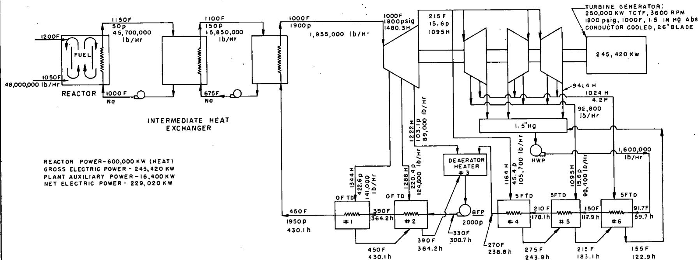  
GROSS HEAT RATE = 600,000 x 3413 / 245,420 = 8,345 9TU/KWH   
NET HEAT RATE: 600,000 x 3413 = 8,935 BTU/KWH   
NET PLANT THERMAL EFFICIENCY = 229,020 / 600,000 = 38.2%

NOTE:

(1) BASED ON ZERO HEAT LOSS TO AMBIENT

(2) TWO HIGH PRESSURE HEATERS AND DEAERATOR HEATHERS ZERO T. T.D. OTHER HEATERS 5 F. T.D.

(3) ENTHALPY NOT CORRECTED FOR SUBCOOLING.

(4) STEAM EXTRACTION LINE PRESSURE DROP OF $8\%$ ASSUMED FOR ALL HEATERS.

TABLE 6.7   
SUMMARY OF FULL LOAD OPERATING DATA  

<table><tr><td>Turbine Throttle Pressure</td><td>1800 psig</td></tr><tr><td>Turbine Throttle Temperature</td><td>1000°F</td></tr><tr><td>Turbine Exhaust Pressure</td><td>1.5 in. Hg</td></tr><tr><td>Steam Flow</td><td>1.955 x 10^6 lb/hr</td></tr><tr><td>Gross Generator Output</td><td>245.42 Mw</td></tr><tr><td>Auxiliary Power Requirements:</td><td></td></tr><tr><td>Condensate Pumps</td><td>0.33 Mw</td></tr><tr><td>Boiler Feed Pumps</td><td>5.34 Mw</td></tr><tr><td>Condenser Cooling Water Pumps</td><td>0.52 Mw</td></tr><tr><td>Reactor Fuel Pumps</td><td>0.36 Mw</td></tr><tr><td>Primary Sodium Pumps</td><td>5.98 Mw</td></tr><tr><td>Intermediate Sodium Pumps</td><td>1.42 Mw</td></tr><tr><td>Miscellaneous</td><td>2.45 Mw</td></tr><tr><td>Total Auxiliary Power</td><td>16.40 Mw</td></tr><tr><td>Auxiliary Power as Percent of Gross Output</td><td>6.7%</td></tr><tr><td>Net Station Output</td><td>229.02 Mw</td></tr><tr><td>Net Station Thermal Efficiency</td><td>38.2%</td></tr><tr><td>Net Station Heat Rate</td><td>8,935 BTU/KWH</td></tr></table>

# CHAPTER 7.

# POWER PLANT LAYOUT, OPERATION AND MAINTENANCE

# 7.0.0 INTRODUCTION

In order to determine the suitability of using a fused fluoride salt reactor in a central station power plant, it has been necessary to consider all components of the reactor and power plant system. A preliminary piping layout and drawings of a proposed arrangement of plant components have been prepared to illustrate the details of this design. The resulting power plant design is feasible in size and arrangement.

It was also necessary to consider the operating characteristics, maintenance and economics to determine whether such a plant would be attractive to the power industry.

# 7.1.0 GENERAL PIPING ARRANGEMENT

The general piping arrangement shown in Figure 7.1 has been designed to be safe, reliable, and to provide flexibility in operation and maintenance.

# 7.1.1 Primary Loop Piping

The twenty-four primary heat exchanger bundles are connected to ring headers located above and outside the reactor vessel. Six sets of primary circuit lines connect the ring headers to the intermediate heat exchangers. The main purpose of this arrangement is to provide uniform cooling of the reactor in case one or more intermediate heat exchangers are out of service. The pump for each primary circuit is located in the intermediate heat exchanger compartment. The piping passes through the primary shield at an angle to minimize streaming of neutrons and gamma rays, and to retain the integrity of the shield.

# 7.1.2 Intermediate Loop Piping

The six intermediate heat exchangers are distributed uniformly around the primary reactor shield. This asymmetrical arrangement minimizes shielding requirements and the cost of the containment vessel.

The six intermediate heat exchangers are divided into two groups, with each group connected to a steam generator. The heat exchangers in each group are connected in parallel to each other inside the containment vessel, and a common line is passed through the containment vessel to the steam generator. The connecting lines are designed to provide equal pressure drops in order to balance flow and heat load among the intermediate heat exchangers:

# 7.1.3 Steam Generator Connections

The steam generators are located as near the intermediate heat exchangers as possible, outside the secondary shield and containment vessel. The sodium pumps for the intermediate circuits are located between the two steam generators and are arranged so that one spare pump can serve either steam generator.

# 7.1.4 Steam and Water Piping

In general, the piping in the steam turbine cycle is representative of standard power plant practice. The differences are in the steam dump system, whereby steam may bypass the turbine and be condensed in the condenser, in the emergency cooling of the steam generators from head condensate tanks in case of a complete power loss, and in the method of attempering or controlling the final steam temperature.

# 7.2.0 GENERAL ARRANGEMENT OF PLANT COMPONENTS

The general plant layout is shown on Figures 7.2 and 7.3. The major pieces of equipment are drawn to scale and generous allowances have been made for pipe expansion loops and clearances. The mean diameters of the primary and secondary

circular shields are approximately 35 and 84 feet, respectively. The space between the primary and secondary shields is divided into six compartments by radial shields to contain radioactive components of the primary and intermediate circuits. The containment vessel, as shown, is 70 feet in diameter and 110 feet in over-all height. The dimensions of the containment vessel are approximate only, since no calculations have been made to estimate the volume required to contain the gaseous fission products which would be released in a serious nuclear incident.

The reactor, primary heat exchangers and fuel dump tanks are located inside the primary shield. The primary loop sodium circulating pumps, expansion tanks, drain and charge tanks, and the intermediate heat exchangers are placed in the six shielded compartments. All radioactive components and materials are inside the sealed compartment vessel.

The steam generators and intermediate sodium pumps are outside the containment vessel and shielding, since they contain only non-radioactive sodium from the intermediate loop and water from the steam cycle. Isolation compartments are provided around the steam generators and sodium pumps to prevent the spread of fires which could result from serious failures of the steam generators.

The turbine-generator, condenser, feed-water heaters and boiler feed pumps are adjacent to the steam generators, as in a conventional steam power plant.

# 7.3.0 SHIELDING

The duplex-compartmented shielding design for a reactor plant of this type depends greatly upon the method of maintenance which is to be followed. The basic premise for maintenance in this design is that personnel will be permitted access to the containment vessel only during periods when the reactor is shut down. Based on this premise, the primary shield surrounding the reactor is

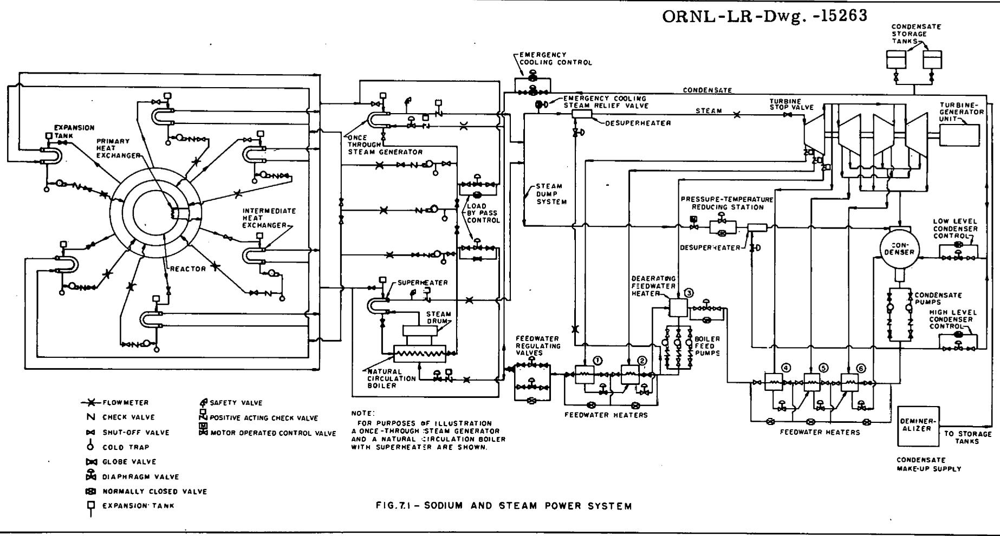

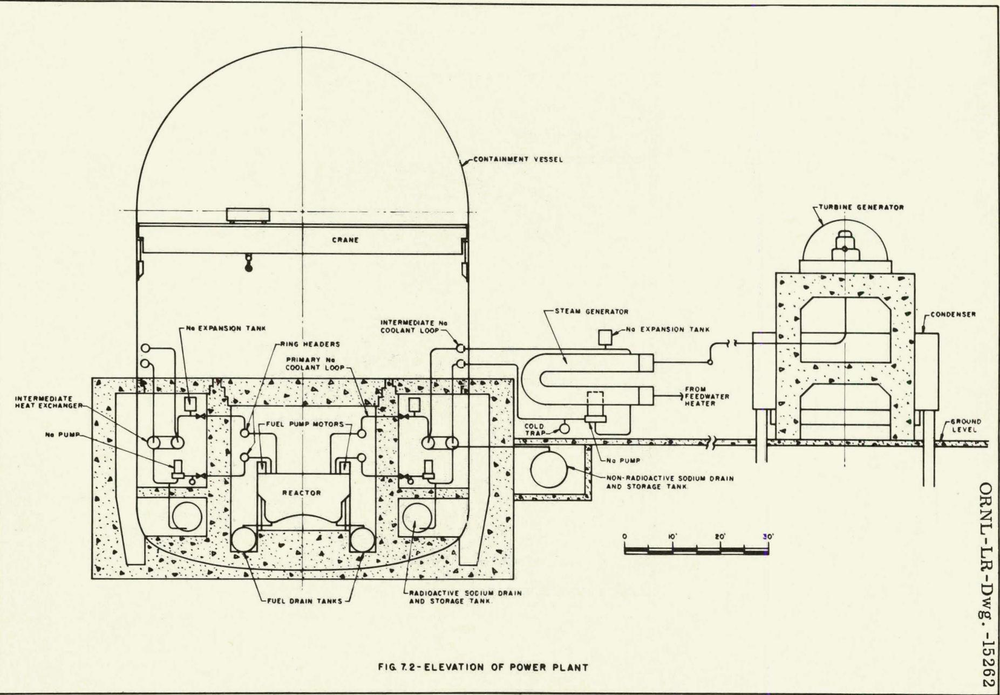

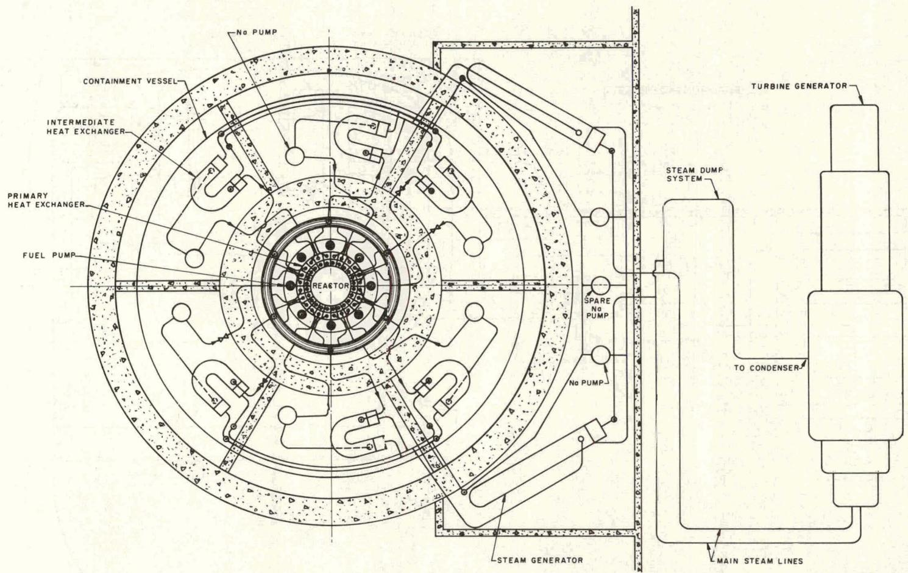  
FIG. 7.3- PLAN VIEW OF POWER PLANT

designed to protect personnel against decay gammas while performing direct maintenance within an intermediate compartment on the intermediate heat exchanger or primary loop pumps without draining the fuel from the reactor vessel. In addition, the primary shield serves as a neutron shield so that the equipment in the compartments does not become radioactive.

Provisions are made for draining and flushing the sodium from individual, intermediate, heat exchanger circuits so that no radioactive sodium is within the compartment where maintenance is to be performed. The radial compartment partitions serve as shields and provide protection from decay gammas from the radioactive sodium in adjacent compartments. This eliminates the necessity of draining all the primary circuits when only one circuit requires maintenance.

The secondary shield, located on the outside of the containment vessel, protects plant personnel from excess radiation exposure while the reactor is in operation. The shield over the reactor will be made as a rotating plug with an offset removable section for access to the primary heat exchanger and fuel circulating pump for maintenance. With this arrangement, the huge mass of the top shield will not have to be handled before performing maintenance. An alternative method would be to fabricate the top shield in sections and remove only the sections necessary to provide access to the primary heat exchanger or fuel circulating pumps.

The shielding shown in Figures 7.2 and 7.3 is intended to be schematic only.

# 7.4.0 MAINTENANCE

Maintenance of equipment outside the containment vessel will be conducted in a conventional manner since none of the equipment or materials to be handled will be radioactive. Special provisions, however, are necessary to allow

maintenance of equipment inside the containment vessel and shielded areas. The major items of equipment which will require special techniques are the fuel circulating pumps, primary heat exchanger tube bundles, intermediate heat exchanger tube bundles, and primary circuit sodium circulating pumps.

# 7.4.1 Fuel Circulating Pumps

Access to the fuel circulating pumps and primary heat exchanger tube bundles is through an opening in the top shield. This shield, which covers the entire reactor vessel compartment, can be rotated until an offset removable plug is centered over the desired location. The plug can be lifted with the crane, and the pumps can be removed by remote handling equipment. Spare pumps will be kept on hand to replace faulty pumps.

# 7.4.2 Primary Heat Exchanger Tube Bundles

In the event that a leak should develop in a primary heat exchanger tube bundle, the sodium in the circuit will leak into the fused fluoride salt and dilute the fuel concentration. The rate at which uranium is added to the fused salt could serve as an indicator of tube leakage. It is felt that a means of locating the leaking tube bundle can be developed. Since extra heat transfer surface has been designed into the primary heat exchanger, one or more leaking tube bundles can probably be blanked off and left in the reactor, with little loss of power, until time is available to remove and replace the faulty bundles. The bundles will be taken out of service by cutting the feed lines connecting the tube bundle to the ring headers and blanking them off. The cutting and welding are to be done remotely, since the radioactivity will be too intense for direct maintenance. The bundles will be removed through the top shield, in the same manner as described for removing the fuel circulating pumps.

# 7.4.3 Intermediate Heat Exchangers and Primary Sodium Pumps

The intermediate heat exchangers and primary sodium circulating pumps are located in shielded intermediate compartments. Prior to maintenance, the radioactive sodium in the piping, pump and heat exchanger, in one compartment, will be drained and flushed out with non-radioactive sodium by remote operation. The equipment can then be maintained directly. With the shielding provided, the sodium in adjacent compartments will not have to be drained. Sections of the top shield will be removed so that the crane can be used during maintenance of these components.

# 7.5.0 PARTIAL LOADOPERATION

The ultimate removal of the heat energy from the reactor system requires the coupling of the fuel circulation to the primary, intermediate and steam loops. Operation of the system at some steady state partial load can be achieved by variation of the full load design flow conditions in one or more of the loops, use of control rods in the reactor, change of fuel concentration with load, bypass control of the loop flows, use of a supplementary heat exchanger, or any combination of these procedures. It was apparent that this multitude of possible combinations precluded a complete mathematical solution of the problem in the time available for this study. Therefore, the decision was made to approach the problem of partial load operation in such a manner as to give results in the time available. This was accomplished mathematically by only studying the effect of varying the flow rate in the intermediate loop. Another approach was used which involved the reactor simulator facilities of the Oak Ridge National Laboratory. A description of the use of the reactor simulator, the circuits and the results are given in Section 7.5.2 and Appendix J.

# 7.5.1 Mathematical Approach

In a reactor system such as the HRT or PWR, partial load operation is achieved by allowing the steam pressure to increase as load decreases. This method of control could only be used in a very limited manner for those reactor systems in which high steam pressures are achieved at full load. Of the many possible methods of control available, it was decided to attempt a mathematical solution of the system with a variable flow rate in the intermediate loop. The reasons for this choice were the following:

1. Time limitations prevented anything but a single, variable study.   
2. With the exception of the intermediate loop pumps and the intermediate sodium coolant flow, all of the pumps and loop flows would operate at constant values.   
3. Temperatures would be held to reasonable values.   
4. The problem of safely varying fuel concentration with load is eliminated.   
5. The solution thus obtained is also useful if bypass control of the intermediate loop flow is utilized.   
6. Control rods are not necessary for the achievement of steady state partial load operation.   
7. The mathematical equations obtained would serve as a basis for further parameter studies of this system.

In order to obtain the mathematical solution to this problem, several simplifications and assumptions were made. It is believed that individually, or in the aggregate, these simplifications do not invalidate the analysis over wide load ranges. The mathematical analysis is given in Appendix I and is based upon the following considerations:

1. The flow rate of the fuel in the reactor and the sodium coolant in the primary loop remain constant with load.   
2. Physical properties of the heat transfer fluids and the materials of construction remain constant for the temperatures of operation.

3. Sodium heat transfer resistances are not the governing items in the over-all heat transfer coefficients and do not vary with load. This assumption is the most limiting restriction of the analysis given in Appendix I and affects the load range, for which the derived equations can be applied with reasonable accuracy.   
4. Based on the foregoing, the over-all heat transfer coefficient in the primary heat exchanger, the intermediate heat exchanger and the boiler remains constant. The constant over-all coefficient in the boiler further presumes constant average boiling and scale coefficients.   
5. The final steam temperature and pressure are constant with load.   
6. The average fuel temperature is constant with load.   
7. The feed water temperature is $450^{\circ}\mathrm{F}$ at all loads.   
8. At very low loads, some of the steam generated is bypassed directly to the condenser. This does not enter the mathematical analysis directly, but is an important element of control.

Equations describing the behavior of the system at steady state, partial load operation have been obtained for both the natural circulation boiler with separate superheater and the once-through boiler. These equations are given in Appendix I. It is noted that for the natural circulation boiler with separate superheater, consideration (5) above, involving the constancy of the final steam temperature with load, was abandoned at the end of the analysis for this unit. It was found that a single variable control cannot satisfy all of the restrictions placed on the system in this section.

# 7.5.2 Reactor Simulator Analysis

In order to determine the partial load and transient operating conditions of this power plant design, the circulating fuel and sodium loops were simulated on the Analog Reactor Simulator at the Oak Ridge National Laboratory. The analysis was limited to the design utilizing the once-through steam generator.

The time constants and heat capacity of the reactor and sodium coolant loops are shown on Figure 7.4. The simulator constants were computed by

144.

Dr. E. R. Mann. These constants and the simulator diagram are included in Appendix J.

The purpose of this simulator analysis was to determine whether the reactor would be stable at partial load and during operating transients, and to determine the minimum load at which the final steam temperature could be maintained at design conditions. The analysis indicates that the reactor is stable down to at least 17 percent of full load, the lowest partial load condition investigated.

A final steam temperature control device was simulated by providing an auxiliary heat exchanger in the intermediate sodium circuit, where heat is transferred from the hot leg of this circuit to the cold leg. By varying the flow through this heat exchanger, the heat input to the steam generator can be controlled. The results of the simulator analysis indicated that the design temperature of $1000^{\circ}\mathrm{F}$ could be maintained down to 50 percent of rated load. Below this load, the temperature increased gradually, but this excess temperature can be controlled by the use of an attemperator, which is provided in the steam cycle.

Figure 7.5 shows the steady state, partial load temperatures without the use of the auxiliary heat exchanger mentioned above. The steam temperature increased from $1000^{\circ}\mathrm{F}$ at rated load to $1110^{\circ}\mathrm{F}$ at 17 percent of rated load. The feed water temperature entering the steam generator is $450^{\circ}\mathrm{F}$ at rated load and decreased as the load is decreased. The resulting temperature differential between the sodium and water at the cold end of the steam generator is considered to be too great from the standpoint of thermal stresses in the tubes. For these reasons, it appears desirable to include the auxiliary heat exchanger in the circuit.

Figure 7.6 shows the steady state, partial load temperatures with the auxiliary heat exchanger in the circuit. The control signal used to adjust the bypass flow through the auxiliary heat exchanger circuit was set for plus or minus $2^{\circ}\mathrm{F}$ of design steam temperature. The exact setting of these limits would have to be studied carefully to eliminate hunting in the system. The close tolerances used on the simulator are not required for satisfactory steam turbine operation. The curves on Figure 7.6 indicate that the steam temperature remained constant to below half load and increased to only $1090^{\circ}\mathrm{F}$ at 17 percent of rated load. These temperature conditions are considerably better than those obtained without the use of the auxiliary heat exchanger.

The reactor power and temperature transients, with the auxiliary heat exchanger in the intermediate loop, are shown in Figure 7.7. During this test, the load demand of the steam turbine was reduced from rated load to half load in approximately 15 seconds. The initial effect of this load demand is seen in the rise of the sodium temperature entering the steam generator. It is interesting to note how the reactor power and other temperatures varied and leveled out in a relatively short period. A series of these tests was performed and all showed similar results, which indicate that the reactor and system are stable during load changes. It should be noted that the rate of these load changes is considerably in excess of that normally occurring in conventional steam power plant practice. These same system transients without the auxiliary heat exchanger in the intermediate loop are shown in Figure 7.8.

# 7.6.0 ECONOMICS

A complete economic study of the proposed power plant has not been attempted. It must be realized that the large capital expenditure for a nuclear power plant

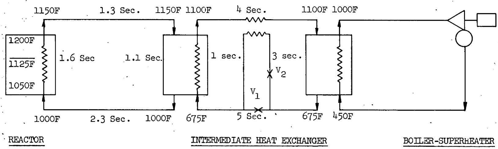  
FIG. 7.4 TIME CONSTANTS AND HEAT CAPACITY OF COMPONENTS IN ONCE THROUGH STEAM-GENERATOR SYSTEM

$$
\begin{array}{l} \Delta \mathrm {T} = 1 5 0 \mathrm {F} \\ \mathrm {T} _ {\text {a v g}} = 1 1 2 5 \mathrm {F} \\ t _ {\text {f u e l}} (\text {i n} \text {c o r e}) = 9. 3 \text {s e c} \\ t _ {\text {f u e l}} (\text {i n} \quad \text {e x c h a n g e r}) = 5. 9 \sec \\ t _ {\text {f u e l}} (\text {i n} \text {t r a n s p o r t}) = 2. 8 \text {s e c} \\ \mathrm {H} _ {\text {f u e l}} (\text {c o r e}) = 3 5, 2 0 0 \mathrm {B T U / F} \\ \mathrm {H} _ {\mathrm {N a}} (\text {e x c h a n g e r}) = 6, 0 2 0 \mathrm {B T U / F} \\ \mathrm {H} _ {\mathrm {S}. \mathrm {S}. (\text {e x c h a n g e r})} = 1, 8 0 0 \mathrm {B T U} / \mathrm {F} \\ \mathrm {H} _ {\text {f u e l}} \left(\text {e x c h a n g e r}\right) = 2 0, 8 0 0 \mathrm {B T U / F} \\ \end{array}
$$

# Shell

$$
\begin{array}{l} \Delta \mathrm {T} = 1 5 0 \mathrm {F} \\ \mathrm {T} _ {\text {a v g}} = 1 0 7 5 \mathrm {F} \\ \mathrm {H} _ {\mathrm {N a}} = 2 1, 9 9 0 \mathrm {B T U} / \mathrm {F} \\ \mathrm {H} _ {\text {s h e l l}} = 1 7 0 \mathrm {B T U / F} \\ \mathrm {H} _ {\text {p i p e}} = 9, 1 9 0 \mathrm {B T U / F} \\ t _ {N a} (t u b e) = 1. 6 \sec \\ t _ {N a} (\text {t r a n s p o r t}) = 3. 6 \sec \\ t _ {N a} (s h e l l) = 1. 1 \sec \\ \end{array}
$$

# Tube

$$
\begin{array}{l} \Delta \mathrm {T} = 4 2 5 \mathrm {F} \\ T _ {a v g} = 8 8 7. 5 F \\ t _ {N a} (\text {e x c h a n g e r}) = 1 \sec \\ t _ {N a} (\text {b o i l e r}) = 3 \sec \\ t _ {N a} (\text {t r a n s p o r t}) = 9 \sec \\ \mathrm {H} _ {\mathrm {N a}} = 1 3 2 0 \mathrm {B T U / F} \\ \mathrm {H} _ {\mathrm {S}. \mathrm {S}.} = 1 9 0 \mathrm {B T U / F} \\ \mathrm {H} _ {\text {p i p e}} = 2 0 0 0 0 \mathrm {B T U / F} \\ \end{array}
$$

# Shell

$$
\begin{array}{l} \Delta \mathrm {T} = 4 2 5 \mathrm {F} \quad \mathrm {T} = 5 5 0 \mathrm {F} \\ T _ {a v g} = 8 8 7. 5 F \\ \end{array}
$$

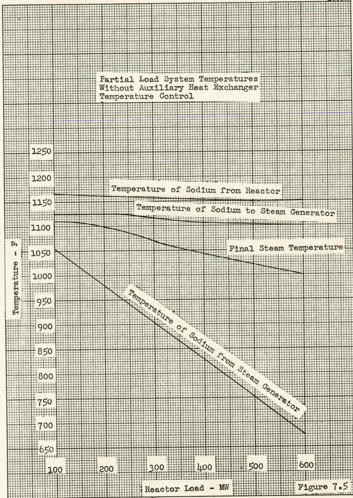

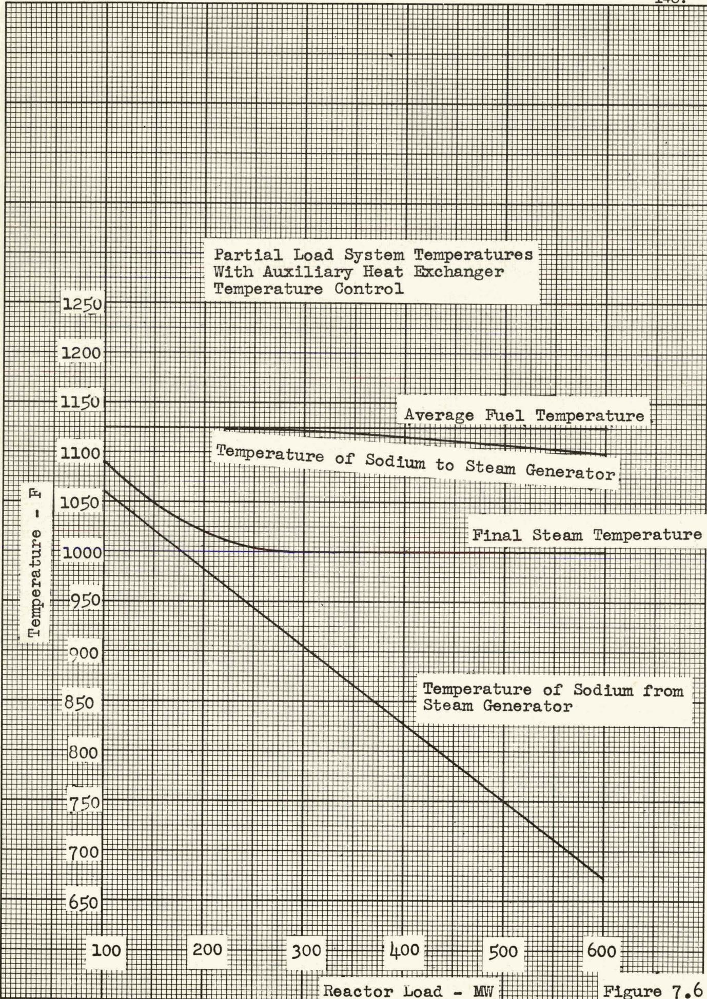

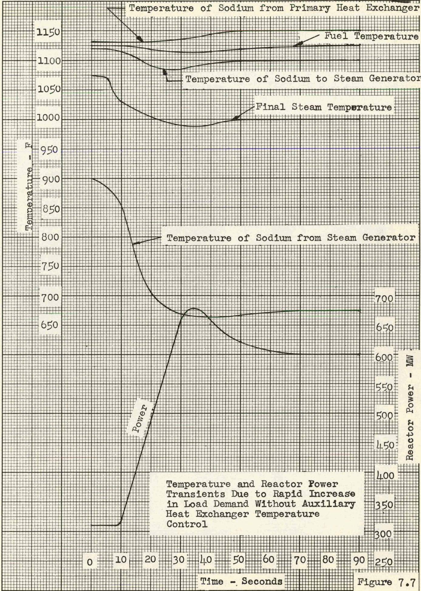

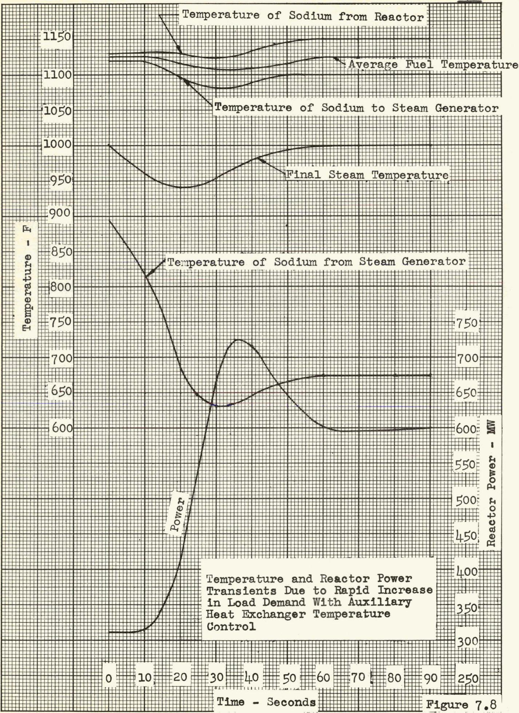

is one of the major factors which influences the cost of generating electricity. These capital costs would have to be evaluated for various arrangements of the basic design parameters in connection with the resulting reliability, ease of maintenance, safety, efficiency, etc., and a careful analysis made of the results before such a study would have any real meaning.

# 7.6.1 Factors Requiring Additional Investigation

These studies would have to include the following considerations:

1. The selection of internal or external primary heat exchangers would have to be evaluated carefully. It is considered that fuel inventory and space requirements have been minimized through the use of the internal arrangement, but these desirable features would have to be balanced against the overall comparative costs of the two possible arrangements, their reliability, ease of maintenance, etc.   
2. Two sodium loops have been included in this study and are considered a necessity, resulting from the internal arrangement of the primary heat ex-changers. It is possible that the intermediate sodium loop could be eliminated if external primary heat exchangers were used. However, again, such an analysis would require considerable investigation to determine the lowest cost and most reliable system.   
3. If the reactor type using internal heat exchangers, as proposed in this study, is considered to be desirable, further studies would have to be made to determine the optimum arrangement of intermediate heat exchangers and steam generators. It is quite possible that a unitized arrangement using an equal number of intermediate heat exchangers and steam generators would result in many desirable operational and economic features. This question could not be resolved without a complete analysis of the entire system.

4. As mentioned previously, the steam cycle arrangement also would require much investigation. The question of steam conditions, reheat or non-reheat, tandem compound of cross compound turbine generators, feed water heating cycle, turbine exhaust pressure, etc., would have to be settled from a careful economic analysis.

# 7.6.2 Approximate Economic Analysis

In order to examine the approximate economics of this plant, Reference 37 was used to estimate the capital costs. The capital cost for various types of nuclear power plants listed in this reference varied from $183 per kw to $450 per kw. It appears that the fused salt reactor and steam power plant discussed might cost in the range of $250 to $300 per kw. These two values will be used in arriving at a power cost.

For 240,000 kw generator output, 80 percent load factor, the total kw-hr per year is $1.7 \times 10^{9}$ .

There will be no operating cost for fuel processing. It is shown in Section C.7 that the original fused salt charge can be used for at least 19 years before it is economically desirable to add a new charge of fused salt. During this period, there is no fuel processing and uranium is added to over-ride the effects of fission product poisons.

Using Reference 37, a figure of 1.2 mils per kw-hr for operation and maintenance is cited for 10 mil per kw-hr total power cost. Since this is the highest value used in the reference, it will be used in this report as a conservative figure.

The inventory charge is based on 150 percent of the hot, clean critical mass of U-235. An additional 50 percent is allowed for poison override and fuel on hand. (See Section C.6.) Using 4 percent interest charge and an

assumed cost of \(20 per gram as the cost of U-235, the inventory charge is 0.2 mils per kw-hr.

Since some atoms are destroyed and no heat is derived by resonance absorp-tions in the uranium, the fuel burn-up will be greater than 1 gram per megawatt day. This figure is estimated to be 1.3 grams per megawatt day for this reactor. Based on this value, the fuel burn-up at full load is 780 grams per day. For 80 percent load factor, the annual burn-up is 227,760 grams. At an assumed cost of $20 per gram, the fuel cost per year is $4,555,200. This amounts to 2.6 mils per kw-hr.

These data are summarized in the following table:

TABLE 7.1   
ESTIMATED POWER GENERATION COSTS   

<table><tr><td></td><td>$250/kw</td><td>$300/kw</td></tr><tr><td></td><td>mils/kw-hr</td><td>mils/kw-hr</td></tr><tr><td>Capital cost</td><td>5.4</td><td>6.4</td></tr><tr><td>Fuel processing</td><td>0.0</td><td>0.0</td></tr><tr><td>Operating and maintenance</td><td>1.2</td><td>1.2</td></tr><tr><td>Fuel burn-up</td><td>2.7</td><td>2.7</td></tr><tr><td>Fuel inventory</td><td>0.2</td><td>0.2</td></tr><tr><td>Total</td><td>9.5</td><td>10.5</td></tr></table>

# APPENDIX A

# PHYSICAL AND THERMAL PROPERTIES

Figures A.l through A.l0

Tables A.1 through A.3

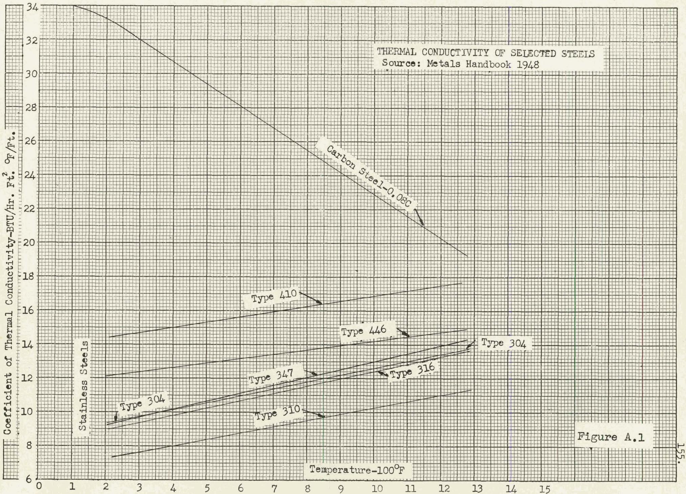  
78T8T-3AGI-IT-TNHO

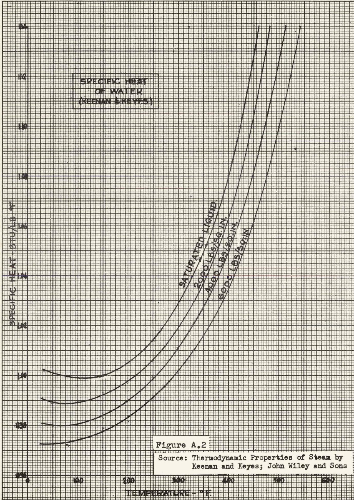

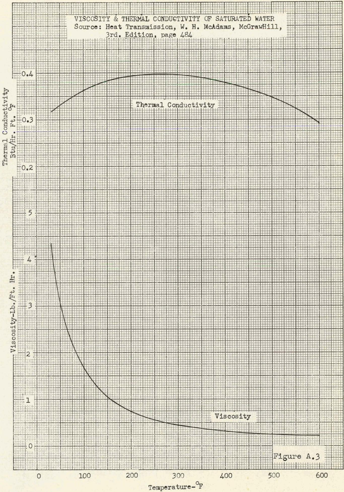

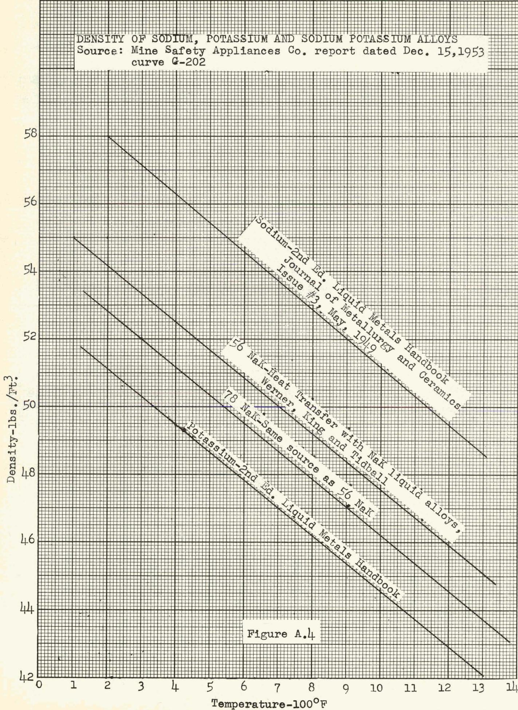

VISCOSITY OF SODIUM, POTASSIUM AND SODIUM POTASSIUM ALLOYS

Source: Mine Safety Appliances Co. report dated Dec. 15, 1953  
curve G-203  
2nd Ed. Liquid Metals Handbook  
Journal of Metallurgy and Ceramics, Issue #3 May 1949  
NRL report # C-3287

Figure A.5

Sodium

56 NaK

78 NaK

Potassium

Temperature-100°F

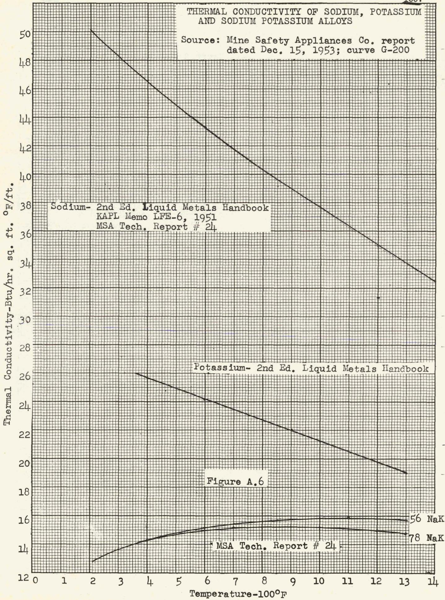

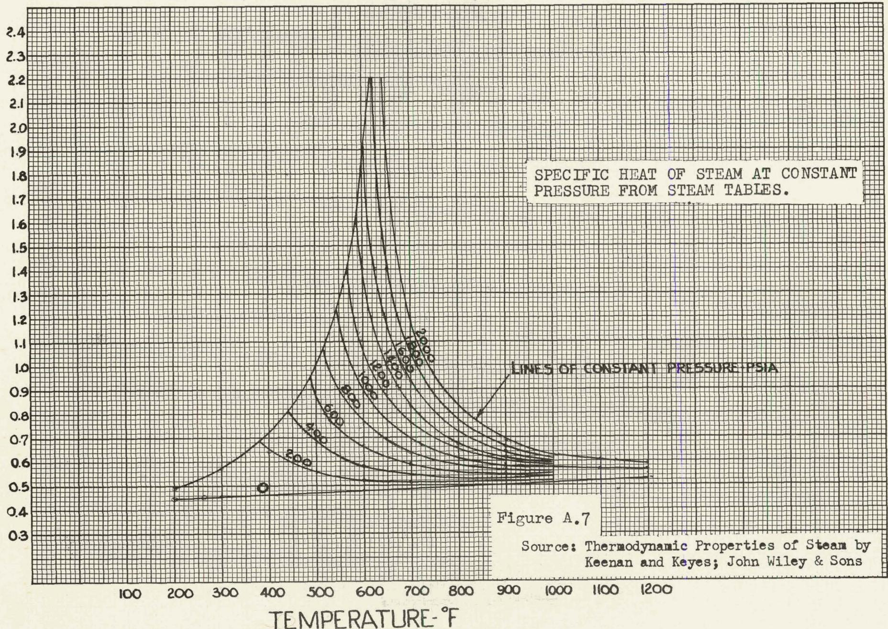  
SPECIFIC HEAT AT CONSTANT PRESSURE-BTU/°F LB


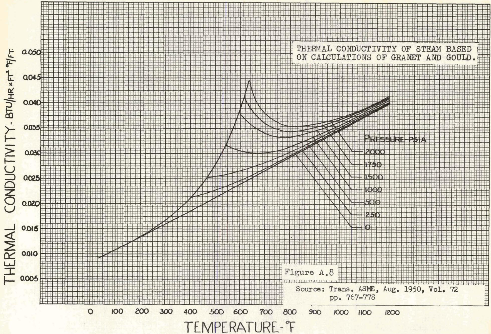  
162   
29T 16T8T-8MQ-8T-INHO

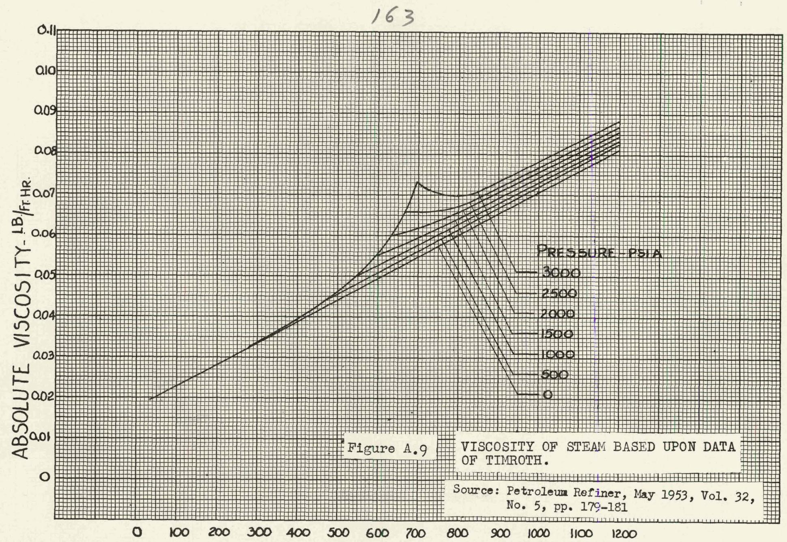  
TEMPERATURE-°F

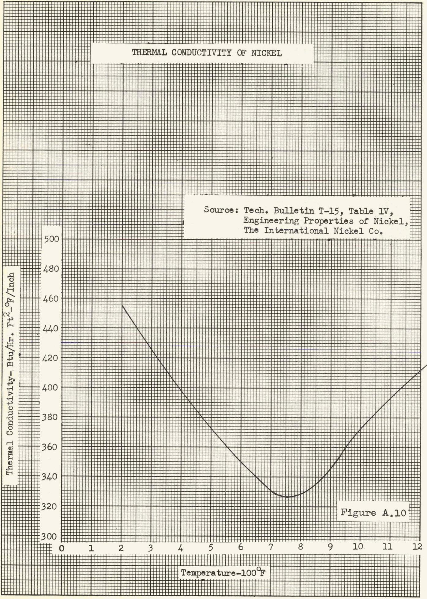

Source: Lee, John F., "Thermodynamic Properties of Liquid Sodium", NUCLEONICS, Vol. 12, No. 4, page 74, April 1945

TABLE A.1   
THERMODYNAMIC PROPERTIES OF LIQUID SODIUM  

<table><tr><td>Temp. 
OF</td><td>Specific Heat 
Bx/1b - OF</td><td>Density 
1b/ft3</td><td>Enthalpy 
Btu/1b</td></tr><tr><td>500</td><td>0.3117</td><td>55.42</td><td>141.8</td></tr><tr><td>505</td><td>0.3115</td><td>55.38</td><td>143.4</td></tr><tr><td>510</td><td>0.3113</td><td>55.34</td><td>144.9</td></tr><tr><td>515</td><td>0.3110</td><td>55.29</td><td>146.5</td></tr><tr><td>520</td><td>0.3108</td><td>55.25</td><td>148.0</td></tr><tr><td>525</td><td>0.3106</td><td>55.21</td><td>149.6</td></tr><tr><td>530</td><td>0.3104</td><td>55.16</td><td>151.2</td></tr><tr><td>535</td><td>0.3102</td><td>55.12</td><td>152.7</td></tr><tr><td>540</td><td>0.3100</td><td>55.08</td><td>154.3</td></tr><tr><td>545</td><td>0.3098</td><td>55.03</td><td>155.8</td></tr><tr><td>550</td><td>0.3096</td><td>54.99</td><td>157.5</td></tr><tr><td>555</td><td>0.3094</td><td>54.95</td><td>159.1</td></tr><tr><td>560</td><td>0.3092</td><td>54.91</td><td>160.6</td></tr><tr><td>565</td><td>0.3090</td><td>54.86</td><td>162.1</td></tr><tr><td>570</td><td>0.3088</td><td>54.82</td><td>163.7</td></tr><tr><td>575</td><td>0.3086</td><td>54.77</td><td>165.2</td></tr><tr><td>580</td><td>0.3084</td><td>54.73</td><td>166.6</td></tr><tr><td>585</td><td>0.3082</td><td>54.69</td><td>168.2</td></tr><tr><td>590</td><td>0.3080</td><td>54.65</td><td>169.7</td></tr><tr><td>595</td><td>0.3078</td><td>54.61</td><td>171.3</td></tr><tr><td>600</td><td>0.3077</td><td>54.56</td><td>172.8</td></tr><tr><td>605</td><td>0.3075</td><td>54.52</td><td>174.3</td></tr><tr><td>610</td><td>0.3073</td><td>54.48</td><td>175.8</td></tr><tr><td>615</td><td>0.3071</td><td>54.43</td><td>177.4</td></tr><tr><td>620</td><td>0.3069</td><td>54.39</td><td>178.9</td></tr><tr><td>625</td><td>0.3068</td><td>54.35</td><td>180.4</td></tr><tr><td>630</td><td>0.3066</td><td>54.31</td><td>182.0</td></tr><tr><td>635</td><td>0.3064</td><td>54.36</td><td>183.5</td></tr><tr><td>640</td><td>0.3063</td><td>54.32</td><td>185.0</td></tr><tr><td>645</td><td>0.3061</td><td>54.28</td><td>186.6</td></tr><tr><td>650</td><td>0.3060</td><td>54.23</td><td>188.1</td></tr><tr><td>655</td><td>0.3058</td><td>54.19</td><td>189.6</td></tr><tr><td>660</td><td>0.3056</td><td>54.15</td><td>191.2</td></tr><tr><td>665</td><td>0.3055</td><td>54.00</td><td>192.7</td></tr><tr><td>670</td><td>0.3053</td><td>53.96</td><td>194.2</td></tr><tr><td>Temp. 
OF</td><td>Specific Heat 
Bx/lb - OF</td><td>Density 
1b/ft3</td><td>Enthalpy 
Btu/lb</td></tr><tr><td>675</td><td>0.3052</td><td>53.92</td><td>195.7</td></tr><tr><td>680</td><td>0.3050</td><td>53.87</td><td>197.3</td></tr><tr><td>685</td><td>0.3049</td><td>53.83</td><td>198.8</td></tr><tr><td>690</td><td>0.3048</td><td>53.79</td><td>200.3</td></tr><tr><td>695</td><td>0.3046</td><td>53.74</td><td>201.8</td></tr><tr><td>700</td><td>0.3045</td><td>53.70</td><td>203.4</td></tr><tr><td>705</td><td>0.3043</td><td>53.66</td><td>204.9</td></tr><tr><td>710</td><td>0.3042</td><td>53.62</td><td>206.4</td></tr><tr><td>715</td><td>0.3041</td><td>53.57</td><td>207.9</td></tr><tr><td>720</td><td>0.3039</td><td>53.53</td><td>209.4</td></tr><tr><td>725</td><td>0.3038</td><td>53.49</td><td>211.0</td></tr><tr><td>730</td><td>0.3036</td><td>53.45</td><td>212.5</td></tr><tr><td>735</td><td>0.3035</td><td>53.41</td><td>214.0</td></tr><tr><td>740</td><td>0.3034</td><td>53.36</td><td>215.5</td></tr><tr><td>745</td><td>0.3033</td><td>53.32</td><td>217.0</td></tr><tr><td>750</td><td>0.3031</td><td>53.28</td><td>218.6</td></tr><tr><td>755</td><td>0.3030</td><td>53.23</td><td>220.1</td></tr><tr><td>760</td><td>0.3029</td><td>53.19</td><td>221.6</td></tr><tr><td>765</td><td>0.3027</td><td>53.15</td><td>223.1</td></tr><tr><td>770</td><td>0.3026</td><td>53.11</td><td>224.7</td></tr><tr><td>775</td><td>0.3025</td><td>53.06</td><td>226.2</td></tr><tr><td>780</td><td>0.3024</td><td>53.02</td><td>227.7</td></tr><tr><td>785</td><td>0.3022</td><td>52.98</td><td>229.2</td></tr><tr><td>790</td><td>0.3021</td><td>52.93</td><td>230.7</td></tr><tr><td>795</td><td>0.3020</td><td>52.89</td><td>232.2</td></tr><tr><td>800</td><td>0.3019</td><td>52.85</td><td>233.7</td></tr><tr><td>805</td><td>0.3018</td><td>52.81</td><td>235.2</td></tr><tr><td>810</td><td>0.3017</td><td>52.76</td><td>236.7</td></tr><tr><td>815</td><td>0.3016</td><td>52.72</td><td>238.2</td></tr><tr><td>820</td><td>0.3015</td><td>52.68</td><td>239.7</td></tr><tr><td>825</td><td>0.3014</td><td>52.64</td><td>241.2</td></tr><tr><td>830</td><td>0.3013</td><td>52.59</td><td>242.7</td></tr><tr><td>835</td><td>0.3012</td><td>52.55</td><td>244.2</td></tr><tr><td>840</td><td>0.3011</td><td>52.51</td><td>245.7</td></tr><tr><td>845</td><td>0.3010</td><td>52.47</td><td>247.2</td></tr><tr><td>850</td><td>0.3009</td><td>52.42</td><td>248.7</td></tr><tr><td>855</td><td>0.3008</td><td>52.38</td><td>250.2</td></tr><tr><td>860</td><td>0.3007</td><td>52.33</td><td>251.7</td></tr><tr><td>865</td><td>0.3006</td><td>52.29</td><td>253.2</td></tr><tr><td>870</td><td>0.3005</td><td>52.25</td><td>254.7</td></tr><tr><td>Temp. °F</td><td>Specific Heat Bx/1b - °F</td><td>Density lb/ft3</td><td>Enthalpy Btu/1b</td></tr><tr><td>875</td><td>0.3004</td><td>52.21</td><td>256.2</td></tr><tr><td>880</td><td>0.3003</td><td>52.18</td><td>257.8</td></tr><tr><td>885</td><td>0.3002</td><td>52.13</td><td>259.2</td></tr><tr><td>890</td><td>0.3002</td><td>52.09</td><td>260.8</td></tr><tr><td>895</td><td>0.3001</td><td>52.04</td><td>262.3</td></tr><tr><td>900</td><td>0.3000</td><td>52.00</td><td>263.8</td></tr><tr><td>905</td><td>0.2999</td><td>51.96</td><td>265.3</td></tr><tr><td>910</td><td>0.2998</td><td>51.92</td><td>266.8</td></tr><tr><td>915</td><td>0.2998</td><td>51.87</td><td>268.3</td></tr><tr><td>920</td><td>0.2997</td><td>51.83</td><td>269.8</td></tr><tr><td>925</td><td>0.2996</td><td>51.78</td><td>271.3</td></tr><tr><td>930</td><td>0.2995</td><td>51.74</td><td>272.8</td></tr><tr><td>935</td><td>0.2995</td><td>51.70</td><td>274.3</td></tr><tr><td>940</td><td>0.2994</td><td>51.66</td><td>275.7</td></tr><tr><td>945</td><td>0.2993</td><td>51.61</td><td>277.2</td></tr><tr><td>950</td><td>0.2993</td><td>51.57</td><td>278.8</td></tr><tr><td>955</td><td>0.2992</td><td>51.54</td><td>280.2</td></tr><tr><td>960</td><td>0.2992</td><td>51.48</td><td>281.7</td></tr><tr><td>965</td><td>0.2991</td><td>51.44</td><td>283.2</td></tr><tr><td>970</td><td>0.2991</td><td>51.40</td><td>284.7</td></tr><tr><td>975</td><td>0.2990</td><td>51.36</td><td>286.2</td></tr><tr><td>980</td><td>0.2990</td><td>51.32</td><td>287.7</td></tr><tr><td>985</td><td>0.2989</td><td>51.27</td><td>289.2</td></tr><tr><td>990</td><td>0.2987</td><td>51.23</td><td>290.7</td></tr><tr><td>995</td><td>0.2988</td><td>51.19</td><td>292.2</td></tr><tr><td>1000</td><td>0.2988</td><td>51.15</td><td>293.7</td></tr><tr><td>1005</td><td>0.2987</td><td>51.10</td><td>295.2</td></tr><tr><td>1010</td><td>0.2987</td><td>51.06</td><td>296.7</td></tr><tr><td>1015</td><td>0.2986</td><td>51.02</td><td>298.2</td></tr><tr><td>1020</td><td>0.2986</td><td>50.98</td><td>299.7</td></tr><tr><td>1025</td><td>0.2986</td><td>50.93</td><td>301.2</td></tr><tr><td>1030</td><td>0.2985</td><td>50.89</td><td>302.7</td></tr><tr><td>1035</td><td>0.2985</td><td>50.85</td><td>304.1</td></tr><tr><td>1040</td><td>0.2985</td><td>50.81</td><td>305.6</td></tr><tr><td>1045</td><td>0.2985</td><td>50.77</td><td>307.1</td></tr><tr><td>1050</td><td>0.2984</td><td>50.72</td><td>308.6</td></tr><tr><td>1055</td><td>0.2984</td><td>50.68</td><td>310.1</td></tr><tr><td>1060</td><td>0.2983</td><td>50.64</td><td>311.6</td></tr><tr><td>1065</td><td>0.2983</td><td>50.60</td><td>313.1</td></tr><tr><td>1070</td><td>0.2983</td><td>50.55</td><td>314.6</td></tr><tr><td>Temp. °F</td><td>Specific Heat Bx/1b - °F</td><td>Density 1b/ft3</td><td>Enthalpy Btu/1b</td></tr><tr><td>1075</td><td>0.2983</td><td>50.51</td><td>316.1</td></tr><tr><td>1080</td><td>0.2983</td><td>50.47</td><td>317.6</td></tr><tr><td>1085</td><td>0.2983</td><td>50.43</td><td>319.1</td></tr><tr><td>1090</td><td>0.2983</td><td>50.38</td><td>320.6</td></tr><tr><td>1095</td><td>0.2983</td><td>50.34</td><td>322.0</td></tr><tr><td>1100</td><td>0.2983</td><td>50.30</td><td>323.6</td></tr><tr><td>1105</td><td>0.2983</td><td>50.26</td><td>325.0</td></tr><tr><td>1110</td><td>0.2982</td><td>50.22</td><td>326.5</td></tr><tr><td>1115</td><td>0.2982</td><td>50.17</td><td>328.0</td></tr><tr><td>1120</td><td>0.2982</td><td>50.12</td><td>329.5</td></tr><tr><td>1125</td><td>0.2982</td><td>50.08</td><td>331.0</td></tr><tr><td>1130</td><td>0.2982</td><td>50.04</td><td>332.5</td></tr><tr><td>1135</td><td>0.2982</td><td>49.99</td><td>334.0</td></tr><tr><td>1140</td><td>0.2982</td><td>49.95</td><td>335.5</td></tr><tr><td>1145</td><td>0.2982</td><td>49.91</td><td>337.0</td></tr><tr><td>1150</td><td>0.2983</td><td>49.87</td><td>338.5</td></tr><tr><td>1155</td><td>0.2983</td><td>49.83</td><td>340.0</td></tr><tr><td>1160</td><td>0.2983</td><td>49.78</td><td>341.4</td></tr><tr><td>1165</td><td>0.2983</td><td>49.74</td><td>342.9</td></tr><tr><td>1170</td><td>0.2983</td><td>49.70</td><td>344.4</td></tr><tr><td>1175</td><td>0.2983</td><td>49.66</td><td>345.9</td></tr><tr><td>1180</td><td>0.2983</td><td>49.62</td><td>347.4</td></tr><tr><td>1185</td><td>0.2984</td><td>49.58</td><td>348.9</td></tr><tr><td>1190</td><td>0.2984</td><td>49.54</td><td>350.4</td></tr><tr><td>1195</td><td>0.2984</td><td>49.50</td><td>351.9</td></tr><tr><td>1200</td><td>0.2984</td><td>49.45</td><td>353.4</td></tr><tr><td>1205</td><td>0.2985</td><td>49.41</td><td>354.9</td></tr><tr><td>1210</td><td>0.2985</td><td>49.37</td><td>356.4</td></tr><tr><td>1215</td><td>0.2985</td><td>49.32</td><td>357.9</td></tr><tr><td>1220</td><td>0.2985</td><td>49.28</td><td>359.4</td></tr><tr><td>1225</td><td>0.2986</td><td>49.24</td><td>360.8</td></tr><tr><td>1230</td><td>0.2986</td><td>49.20</td><td>362.3</td></tr><tr><td>1235</td><td>0.2986</td><td>49.16</td><td>363.8</td></tr><tr><td>1240</td><td>0.2987</td><td>49.11</td><td>365.3</td></tr><tr><td>1245</td><td>0.2987</td><td>49.07</td><td>366.8</td></tr><tr><td>1250</td><td>0.2987</td><td>49.03</td><td>368.3</td></tr><tr><td>1255</td><td>0.2988</td><td>48.98</td><td>369.8</td></tr><tr><td>1260</td><td>0.2988</td><td>48.94</td><td>371.3</td></tr><tr><td>1265</td><td>0.2988</td><td>48.90</td><td>372.8</td></tr><tr><td>1270</td><td>0.2990</td><td>48.86</td><td>374.3</td></tr><tr><td>1275</td><td>0.2990</td><td>48.81</td><td>375.8</td></tr><tr><td>1280</td><td>0.2991</td><td>48.77</td><td>377.3</td></tr><tr><td>1285</td><td>0.2991</td><td>48.73</td><td>378.8</td></tr><tr><td>1290</td><td>0.2991</td><td>48.68</td><td>380.3</td></tr><tr><td>1295</td><td>0.2992</td><td>48.64</td><td>381.8</td></tr><tr><td>1300</td><td>0.2992</td><td>48.60</td><td>383.3</td></tr></table>

Source: Pressure Tubes and Piping - Timken Roller Bearing Company

TABLE A.2   
SELECTED PROPERTIES OF STAINLESS STEELS  

<table><tr><td>Type</td><td>Type 304</td><td>Type 347</td><td>Type 316</td></tr><tr><td>Analysis</td><td></td><td></td><td></td></tr><tr><td>Carbon</td><td>0.08 max</td><td>0.08 max</td><td>0.08 max</td></tr><tr><td>Manganese</td><td>2.00 max</td><td>2.00 max</td><td>2.00 max</td></tr><tr><td>Phosphorus</td><td>0.030 max</td><td>0.030 max</td><td>0.030 max</td></tr><tr><td>Sulphur</td><td>0.030 max</td><td>0.030 max</td><td>0.030 max</td></tr><tr><td>Silicon</td><td>0.75 max</td><td>0.75 max</td><td>0.75 max</td></tr><tr><td>Chromium</td><td>18.0-20.0</td><td>17.0-20.0</td><td>16.0-18.0</td></tr><tr><td>Molybdenum</td><td>---</td><td>Cb 10 x C min, 1.0 max</td><td>Mo 2.0-3.0</td></tr><tr><td>Other Elements</td><td>Ni 8.0-11.0</td><td>Ni 9.0-13.0</td><td>Ni 11.0-14.0</td></tr><tr><td>Minimum Physical Properties</td><td></td><td></td><td></td></tr><tr><td>Tensile Strength, psi</td><td>75,000</td><td>75,000</td><td>75,000</td></tr><tr><td>Yield Point, psi</td><td>30,000</td><td>30,000</td><td>30,000</td></tr><tr><td>Elongation, % in 2 in.</td><td>35</td><td>35</td><td>35</td></tr><tr><td>Max Brinell Hardness</td><td>200</td><td>200</td><td>200</td></tr></table>

<table><tr><td rowspan="2" colspan="2">Creep Strength</td><td colspan="2">Rate of 1%, hrs</td><td colspan="2">Rate of 1%, hrs</td><td colspan="2">Rate of 1%, hrs</td></tr><tr><td>100,000</td><td>10,000</td><td>100,000</td><td>10,000</td><td>100,000</td><td>10,000</td></tr><tr><td rowspan="7">pounds per sq in.</td><td>800°F</td><td>---</td><td>---</td><td>---</td><td>---</td><td>---</td><td>---</td></tr><tr><td>900°F</td><td>---</td><td>---</td><td>---</td><td>---</td><td>---</td><td>---</td></tr><tr><td>1000°F</td><td>10,700</td><td>18,000</td><td>---</td><td>---</td><td>14,750</td><td>24,500</td></tr><tr><td>1100°F</td><td>7,900</td><td>13,000</td><td>14,250</td><td>21,000</td><td>12,000</td><td>21,000</td></tr><tr><td>1200°F</td><td>4,300</td><td>8,000</td><td>1,750</td><td>5,300</td><td>6,800</td><td>14,500</td></tr><tr><td>1300°F</td><td>---</td><td>---</td><td>660</td><td>2,000</td><td>4,300</td><td>9,200</td></tr><tr><td>1500°F</td><td>1,450</td><td>2,850</td><td>---</td><td>---</td><td>1,800</td><td>4,200</td></tr></table>

<table><tr><td colspan="2">Rupture Strength</td><td>Load</td><td>Load</td><td>Load</td></tr><tr><td>load in pounds</td><td>900°F</td><td>--</td><td>--</td><td>--</td></tr><tr><td rowspan="5">psi which lead to rupture in 100,000 hrs</td><td>1000°F</td><td>--</td><td>--</td><td>--</td></tr><tr><td>1100°F</td><td>--</td><td>16,000</td><td>--</td></tr><tr><td>1200°F</td><td>7,200</td><td>6,200</td><td>12,500</td></tr><tr><td>1300°F</td><td>3,700</td><td>2,800</td><td>8,900</td></tr><tr><td>1500°F</td><td>1,700</td><td>--</td><td>1,600</td></tr></table>

TABLE A.3

SELECTED PHYSICAL PROPERTIES OF "L" NICKEL

Source: Private Communication, Jr. J. J. Moran, Jr., The International Nickel Company

Creep Properties   

<table><tr><td rowspan="2">Temp. 
OF</td><td colspan="2">Condition: Cold Drawn-Annealed</td></tr><tr><td>Stress, 1000 psi, to Produce a Secondary 0.00001%/hr</td><td>Creep Rate of: 0.0001%/hr</td></tr><tr><td>700</td><td>14.0</td><td>25.0</td></tr><tr><td>800</td><td>7.5</td><td>13.0</td></tr><tr><td>900</td><td>4.3</td><td>7.3</td></tr><tr><td>950</td><td>3.7</td><td>6.3</td></tr><tr><td>1000</td><td>2.5</td><td>4.5</td></tr><tr><td>1100</td><td>2.1</td><td>3.7</td></tr><tr><td>1200</td><td>1.2</td><td>2.1</td></tr><tr><td>1300</td><td>0.5</td><td>0.9</td></tr></table>

Rupture Properties   

<table><tr><td rowspan="3">Temp. 
oF</td><td colspan="3">Condition: Cold-Drawn Annealed</td></tr><tr><td rowspan="2">1,000 hrs</td><td colspan="2">Stress, 1000 psi, to Produce Rupture in:</td></tr><tr><td>10,000 hrs</td><td>100,000 hrs</td></tr><tr><td>600</td><td>--</td><td>--</td><td>--</td></tr><tr><td>700</td><td>--</td><td>--</td><td>--</td></tr><tr><td>800</td><td>27.5</td><td>--</td><td>--</td></tr><tr><td>900</td><td>20.5</td><td>--</td><td>--</td></tr><tr><td>950</td><td>17.5</td><td>14.0</td><td>11.5</td></tr><tr><td>1000</td><td>14.5</td><td>11.3</td><td>8.7</td></tr><tr><td>1100</td><td>11.3</td><td>8.7</td><td>6.7</td></tr><tr><td>1200</td><td>7.8</td><td>5.4</td><td>3.7</td></tr><tr><td>1300</td><td>--</td><td>--</td><td>--</td></tr></table>

# APPENDIX B

# DESIGN CURVES

Figures B.1 through B.4

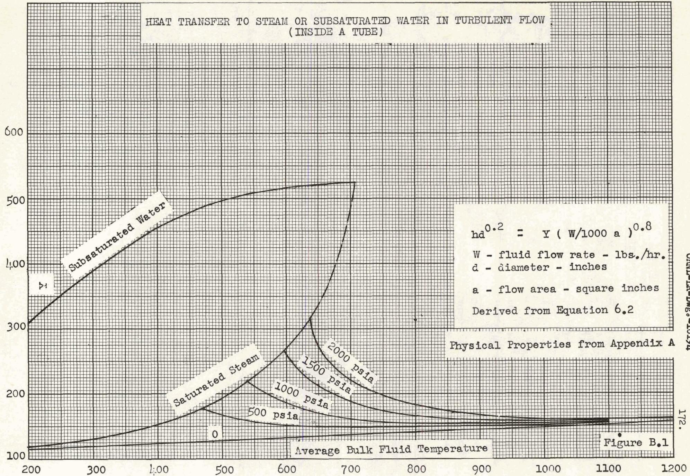  
7618T-°3M-4T-TNHO

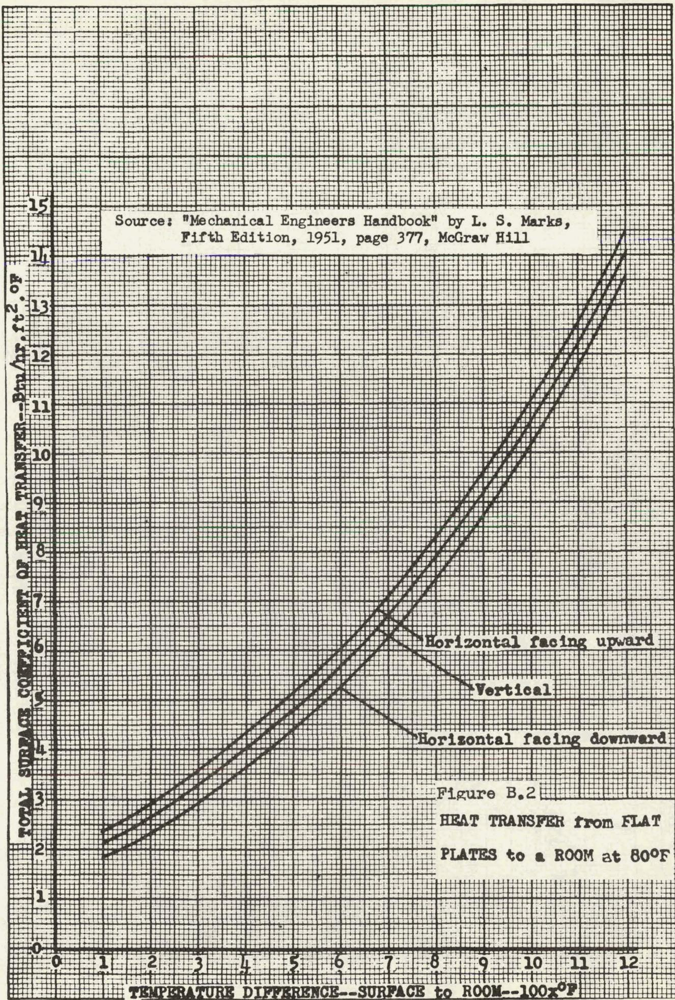

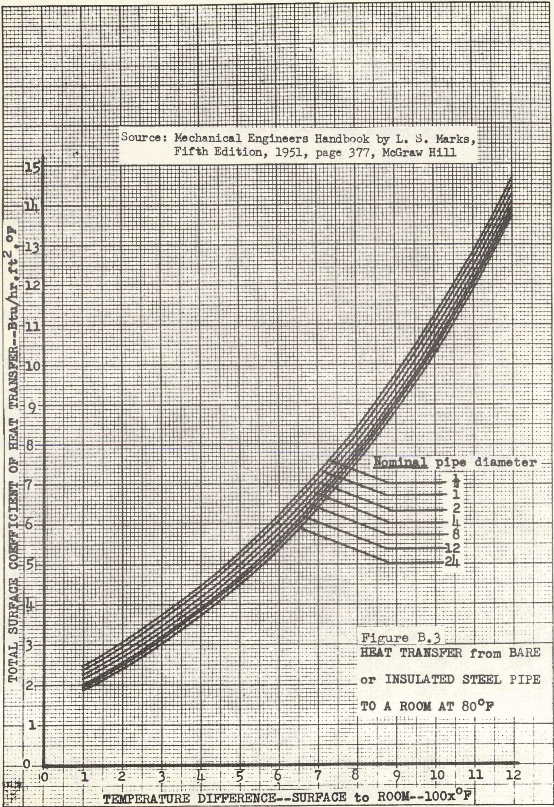

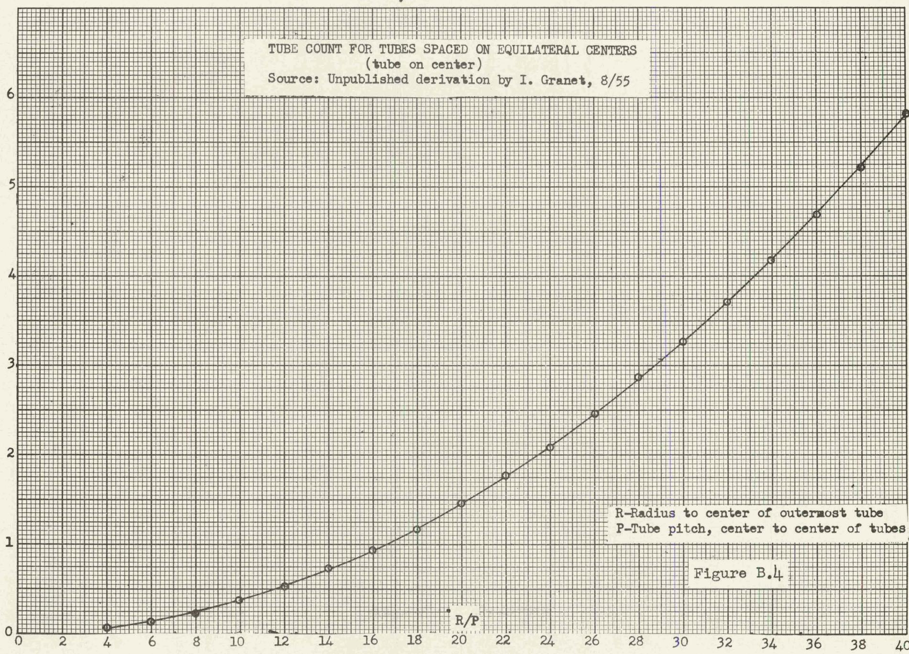  
Number of tubes-1000   
L6T8T-3AD-RT-INHO   
$\because {S\Delta T}$

# APPENDIX C

# REACTOR ANALYSIS CALCULATIONS

# C.1 INTRODUCTION

The solution of the three group, three region (3G3R) problem has been coded for the Oak Ridge National Laboratory's electronic digital computer, ORACLE (Ref. 28).

The fast and intermediate energy group microscopic cross section data used to calculate the input data for the code were obtained from the "Eyewash" code (Ref. 27) and from BNL-325 (Ref. 30) by assuming a $1 / \mathrm{E}$ flux distribution in these slowing-down groups. The thermal cross section data were obtained from BNL-325 by correcting the tabulated values to the energy corresponding to the average design temperature of the reactor, $607^{\circ}C$ . Table C.l is a summary tabulation of the microscopic cross section data used for each energy group.

The thermal energy cross sections from BNL-325 were corrected to the average neutron temperature and for a Maxwell-Boltzmann flux distribution as follows:

$$
\sigma = 0. 8 8 5 \sigma_ {o} \left(\frac {T _ {o}}{T}\right) ^ {\frac {1}{2}} = 0. 4 8 \sigma_ {o}
$$

where, $\sigma_{0}$ and $T_{0}$ are the BNL-325 values for microscopic cross section and the standard temperature of 293 A (20°C); and T is the average design temperature, 880°A (607°C).

The intermediate energy group was selected to range from .015 ev to 100 ev. This upper limit of the thermal group and lower limit of the intermediate group were selected to approximate the energy at which the discontinuity in the neutron flux distribution occurs (Figure C.l). At this energy, the neutron flux changes

from a near Maxwell-Boltzmann distribution to an approximately 1/E distribution. This discontinuity occurs at an energy which is approximately six times the average thermal neutron energy. Small changes in this group energy limit (± 1 ev) have only a negligible effect on criticality calculation results.

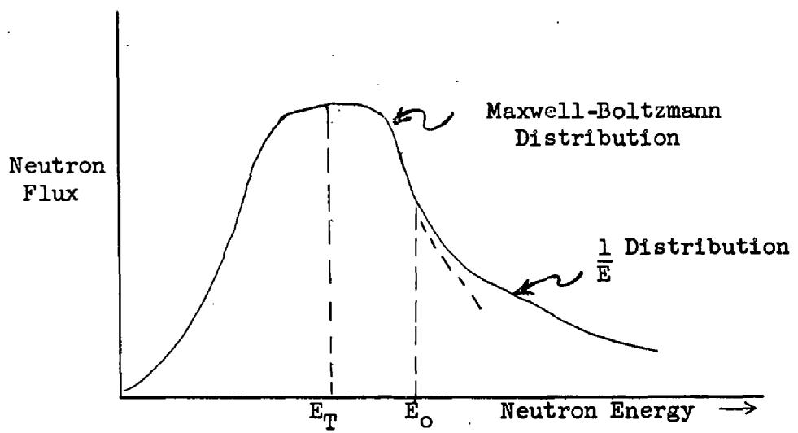  
Figure C.1 NEUTRON FLUX DISTRIBUTION

The upper energy limit of 100 ev for the intermediate energy group was selected because the uranium-235 resonances cease at about this energy.

The upper energy limit of the fast energy group was selected to be 2 mev. The 3G3R code calculation assumes a monoenergetic fission neutron source, and 2 mev is approximately the average energy of the uranium-235 fission neutron energy spectrum.

Following the notation convention of Reference 28, the designation of the fast energy group becomes Group 1, the intermediate energy group becomes Group 2, and the thermal group becomes Group 3. The geometric region designations are: the central core is Region 1; the l-inch thick baffle between the central core and the heat exchanger is Region 2; and the heat exchanger, other baffles and the downcomer homogenized to be Region 3. The numerical subscripts

TABLE C.1   
BASIC MICRSCOPIC CROSS SECTION DATA USED TO CALCULATE 3-GROUP, 3-REGION CODE INPUT   

<table><tr><td rowspan="2">Element
(highly enriched)</td><td rowspan="2">ξσt1</td><td colspan="3">Fast Group</td><td>σa1</td><td colspan="3">Intermediate Group</td><td>σa2</td><td colspan="3">Thermal Group</td></tr><tr><td>3σtr1</td><td>σf1</td><td>σa1</td><td>ξσt2</td><td>3σtr2</td><td>σf2</td><td>σa2</td><td>3σtr3</td><td>σf3</td><td>σa3</td><td></td></tr><tr><td>Fluorine</td><td>0.384</td><td>11.30</td><td>--</td><td>.0028</td><td>0.352</td><td>9.85</td><td>--</td><td>.0047</td><td>11.7</td><td>--</td><td>.0051</td><td></td></tr><tr><td>Sodium</td><td>1.03</td><td>36.3</td><td>--</td><td>0</td><td>0.286</td><td>9.70</td><td>--</td><td>.0102</td><td>12.0</td><td>--</td><td>0.258</td><td></td></tr><tr><td>Zirconium</td><td>0.163</td><td>22.5</td><td>--</td><td>.0005</td><td>0.135</td><td>&#x27;18.6</td><td>--</td><td>.0113</td><td>18.6</td><td>--</td><td>0.092</td><td></td></tr><tr><td>Uranium</td><td>0.175</td><td>36.4</td><td>5.31</td><td>7.12</td><td>0.50</td><td>35</td><td>34.3</td><td>50</td><td>30</td><td>301</td><td>356</td><td></td></tr><tr><td>Nickel</td><td>0.459</td><td>36.3</td><td>--</td><td>.05C4</td><td>0.592</td><td>49.6</td><td>--</td><td>.275</td><td>49</td><td>--</td><td>2.35</td><td></td></tr><tr><td></td><td>ξΣt1</td><td>3Σtr1</td><td>Σf1</td><td>Σa1</td><td>ξΣt2</td><td>3Σtr2</td><td>Σf2</td><td>Σa2</td><td>3Σtr3</td><td>Σf3</td><td>Σa3</td><td></td></tr><tr><td>*Stainless Steel (304)</td><td>0.024</td><td>1.677</td><td>--</td><td>0.005</td><td>0.036</td><td>2.937</td><td>--</td><td>0.017</td><td>2.89</td><td>--</td><td>0.140</td><td></td></tr></table>

* Note, macroscopic, not microscopic, values for S.S.

on the nuclear property notation refer to the energy group and geometric region, respectively. For example, $\Sigma_{\mathrm{al2}}$ is the macroscopic absorption cross section for energy group 1 and geometric region 2.

# C.2 SAMPLE CALCULATIONS

Calculation details of macroscopic group constants for group 1, region 1, for a 0.01 gm/cc uranium concentration are given as sample calculations below. All the cases for which calculations were made, and the geometric and uranium concentration parameters of each, are given in Table C.2. A summary of all the macroscopic code input data calculated for each case is given in Table C.3.

The fused salt fuel composition:

43 mol % ZrF4

57 mol % NaF

$\sim 0.1 \mathrm{~mol} \%$ U-235

The variation of the density of this fused salt composition with temperature is given by the equation,

$$
\ell = 3. 6 5 - 0. 0 0 0 8 8 x \left(^ {\circ} \mathrm {C}\right)
$$

Then at the average design temperature of $607^{\circ}\mathrm{C}$ (1125F),

$$
e = 3. 1 2 \mathrm {g m} / \mathrm {c c}
$$

The weight percent of each elemental constituent of the fused salt was calculated to be:

Fluorine 45.4%

Sodium 13.7%

Zirconium 40.9%

TABLE C.2   
CASE DATA AND COMPUTED MULTIPLICATION CONSTANTS (k)   

<table><tr><td>Case No.</td><td colspan="2">Core Radius R1 ft-in. cm</td><td>Uranium-235 Concentration gm/cm3</td><td>Remarks</td><td>Computed, k</td></tr><tr><td>RO CO</td><td>4&#x27; - 6&quot;</td><td>137.16</td><td>0.020</td><td>Basic Case</td><td>1.34</td></tr><tr><td>1</td><td>&quot;</td><td>&quot;</td><td>0.010</td><td>(Baffle Plate as Region 2)</td><td>1.13</td></tr><tr><td>2</td><td>&quot;</td><td>&quot;</td><td>0.005</td><td></td><td>0.86</td></tr><tr><td>3</td><td>&quot;</td><td>&quot;</td><td>0.030</td><td></td><td>1.42</td></tr><tr><td>R1 CO</td><td>4&#x27; - 0&quot;</td><td>121.92</td><td>0.020</td><td></td><td>1.31</td></tr><tr><td>1</td><td>&quot;</td><td>&quot;</td><td>0.010</td><td></td><td>1.09</td></tr><tr><td>2</td><td>&quot;</td><td>&quot;</td><td>0.005</td><td></td><td>0.83</td></tr><tr><td>3</td><td>&quot;</td><td>&quot;</td><td>0.030</td><td></td><td>1.39</td></tr><tr><td>R2 CO</td><td>3&#x27; - 6&quot;</td><td>106.68</td><td>0.020</td><td></td><td>1.26</td></tr><tr><td>1</td><td>&quot;</td><td>&quot;</td><td>0.010</td><td></td><td>1.05</td></tr><tr><td>2</td><td>&quot;</td><td>&quot;</td><td>0.005</td><td></td><td>0.79</td></tr><tr><td>3</td><td>&quot;</td><td>&quot;</td><td>0.030</td><td></td><td>1.35</td></tr><tr><td>R3 CO</td><td>5&#x27; - 0&quot;</td><td>152.40</td><td>0.020</td><td></td><td>1.36</td></tr><tr><td>1</td><td>&quot;</td><td>&quot;</td><td>0.010</td><td></td><td>1.16</td></tr><tr><td>2</td><td>&quot;</td><td>&quot;</td><td>0.005</td><td></td><td>0.88</td></tr><tr><td>3</td><td>&quot;</td><td>&quot;</td><td>0.030</td><td></td><td>1.44</td></tr><tr><td>R4 CO</td><td>3&#x27; - 0&quot;</td><td>91.44</td><td>0.020</td><td></td><td>1.21</td></tr><tr><td>1</td><td>&quot;</td><td>&quot;</td><td>0.010</td><td></td><td>0.99</td></tr><tr><td>2</td><td>&quot;</td><td>&quot;</td><td>0.005</td><td></td><td>0.74</td></tr><tr><td>ROSCO</td><td>4&#x27; - 6&quot;</td><td>137.16</td><td>0.020</td><td>Baffle Plate as &quot;shell&quot;</td><td>1.35</td></tr><tr><td>ROOCO</td><td>4&#x27; - 6&quot;</td><td>137.16</td><td>0.020</td><td>No Baffle Plate</td><td>1.34</td></tr></table>

TABLE C.3   
MACROSCOPIC GROUP CONSTANTS FOR 3-GROUP, 3-REGION.CODE   

<table><tr><td>Conc. of U
in gm/cc</td><td colspan="2">Region 1
(Core;</td><td colspan="2">Region 2
(1&quot; SS Baffle)</td><td colspan="2">Region 3
(Heat Exchanger)</td></tr><tr><td>Group 1
Fast</td><td>D11
Σx11</td><td>0.906 cm
3.04x10-3cm-1</td><td>D12
Σx12</td><td>0.50 cm
2.79x10-3cm-1</td><td>D13
Σx13</td><td>0.783
2.72x10-3cm-1</td></tr><tr><td>.005</td><td>Σa11
Σf11</td><td>2.21x10-4cm-1
1.68x10-4cm-1</td><td>Σa12</td><td>4.9x10-3cm-1</td><td>Σa13
Σf13</td><td>1.29x10-3cm-1
5.86x10-5cm-1</td></tr><tr><td>.010</td><td>Σa11
Σf11</td><td>3.12x10-4cm-1
3.35x10-4cm-1</td><td>Σa12</td><td>4.9x10-3cm-1</td><td>Σa13
Σf13</td><td>1.32x10-3cm-1
1.17x10-4cm-1</td></tr><tr><td>.020</td><td>Σa11
Σf11</td><td>4.95x10-4cm-1
6.70x10-4cm-1</td><td>Σa12</td><td>4.9x10-3cm-1</td><td>Σa13
Σf13</td><td>1.38x10-3cm-1
2.35x10-4cm-1</td></tr><tr><td>.030</td><td>Σa11
Σf11</td><td>6.77x10-4cm-1
1.00x10-4cm-1</td><td>Σa12</td><td>4.9x10-3cm-1</td><td>Σa13
Σf13</td><td>1.45x10-3cm-1
3.52x10-4cm-1</td></tr><tr><td>Group 2
Intermediate</td><td>D21
Σx21</td><td>1.42 cm
3.80x10-3cm-1</td><td>D22
Σx22</td><td>0.308 cm
7.48x10-3cm-1</td><td>D23
Σx23</td><td>0.818 cm
3.83x10-3cm-1</td></tr><tr><td>.005</td><td>Σa21
Σf21</td><td>1.06x10-3cm-1
1.08x10-3cm-1</td><td>Σa22</td><td>1.86x10-3cm-1</td><td>Σa23
Σf23</td><td>5.5x10-3cm-1
3.78x10-4cm-1</td></tr><tr><td>.010</td><td>Σa21
Σf21</td><td>1.70x10-3cm-1
2.16x10-3cm-1</td><td>Σa22</td><td>1.86x10-3cm-1</td><td>Σa23
Σf23</td><td>5.74x10-3cm-1
7.55x10-4cm-1</td></tr><tr><td>.020</td><td>Σa21
Σf21</td><td>2.98x10-3cm-1
4.32x10-3cm-1</td><td>Σa22</td><td>1.86x10-3cm-1</td><td>Σa23
Σf23</td><td>6.18x10-3cm-1
1.51x10-3cm-1</td></tr><tr><td>.030</td><td>Σa21
Σf21</td><td>4.26x10-3cm-1
6.48x10-3cm-1</td><td>Σa22</td><td>1.86x10-3cm-1</td><td>Σa23
Σf23</td><td>6.63x10-3cm-1
2.27x10-3cm-1</td></tr><tr><td>Group 3
Thermal</td><td>D31</td><td>1.22 cm</td><td>D32</td><td>0.312 cm</td><td>D33</td><td>0.788 cm</td></tr><tr><td>.005</td><td>Σa31
Σf31</td><td>8.41x10-3cm-1
9.48x10-3cm-1</td><td>Σa32</td><td>0.155 cm-1</td><td>Σa33
Σf33</td><td>4.76x10-2cm-1
3.32x10-3cm-1</td></tr><tr><td>.010</td><td>Σa31
Σf31</td><td>1.30x10-2cm-1
1.90x10-2cm-1</td><td>Σa32</td><td>0.155 cm-1</td><td>Σa33
Σf33</td><td>4.92x10-2cm-1
6.65x10-3cm-1</td></tr><tr><td>.020</td><td>Σa31
Σf31</td><td>2.21x10-2cm-1
3.79x10-2cm-1</td><td>Σa32</td><td>0.155 cm-1</td><td>Σa33
Σf33</td><td>5.24x10-2cm-1
1.33x10-2cm-1</td></tr><tr><td>.030</td><td>Σa31
Σf31</td><td>3.13x10-2cm-1
5.68x10-2cm-1</td><td>Σa32</td><td>0.155 cm-1</td><td>Σa33
Σf33</td><td>5.56x10-2cm-1
1.99x10-2cm-1</td></tr></table>

The negligible quantity of sodium and fluorine in the $(\mathrm{NaF})_{2}\mathrm{UF}_{4}$ fuel concentrate was not included in the calculations.

The atomic concentrations in Region 1 are:

$$
N _ {F} l = \frac {\rho (\text {w t} \% \text {o f F i n s a l t}) N _ {Q}}{\text {a t o m i c w t o f F}} = 4. 4 9 \times 1 0 ^ {2 2} \text {a t o m s / c c}
$$

$$
N _ {N a l} = 1. 1 2 \times 1 0 ^ {2 2} a t o m s / c c
$$

$$
N _ {Z r l} = 8. 4 2 \times 1 0 ^ {2 1} a t o m s / c c
$$

$$
N _ {U l} = \frac {\left(\text {u r a n i u m c o n c .}\right) N _ {Q}}{2 3 5} = 2. 5 6 x 1 0 ^ {1 9} \text {a t o m s / c c @ 0 . 0 l g m / c c}
$$

The total macroscopic absorption cross section,

$$
\begin{array}{l} \Sigma_ {\text {a l l}} = N _ {F 1} \sigma_ {\text {a l}} ^ {F} + N _ {\text {N a l}} \sigma_ {\text {a l}} ^ {\text {N a}} + N _ {\text {Z r l}} \sigma_ {\text {a l}} ^ {\text {Z r}} + N _ {\text {U l}} \sigma_ {\text {a l}} ^ {\text {U}} \\ = 3. 1 2 \times 1 0 ^ {- 4} \mathrm {c m} ^ {- 1} \\ \end{array}
$$

The total macroscopic fission cross section, multiplied by $\nu$ , the average number of neutrons released per fission (2.46 for U-235),

$$
\nu \Sigma_ {f l l} = N _ {U 1} (\nu \sigma_ {f 1} ^ {U}) = 3. 3 5 \times 1 0 ^ {- 4} f i s s i o n n e u t r o n s / c c @ 0. 0 1 g m / c c U c o n c.
$$

The diffusion coefficient for Group 1, Region 1,

$$
\begin{array}{l} D _ {1 1} = \frac {1}{3 \Sigma_ {\mathrm {t r} 1 1}} = \frac {1}{N _ {F} 2 3 \sigma_ {\mathrm {t r l}} ^ {F} + N _ {\mathrm {N a}} 1 3 \sigma_ {\mathrm {t r l}} ^ {N a} + N _ {\mathrm {Z r}} 1 3 \sigma_ {\mathrm {t r l}} ^ {Z r} + N _ {\mathrm {U}} 1 3 \sigma_ {\mathrm {t r l}} ^ {U}} \\ = 0. 9 0 6 \mathrm {c m} \\ \end{array}
$$

The lethargy change in the fast group,

$$
\Delta u _ {1} = \ln \left(\frac {2 x 1 0 ^ {6} e v}{1 0 0 e v}\right) = 9. 9 \text {u n i t s}
$$

The lethargy change in the intermediate group,

$$
\Delta u _ {2} = \ln \left(\frac {1 0 0 \mathrm {e v}}{0 . 5 \mathrm {e v}}\right) = 5. 3 \text {u n i t s}.
$$

The effective removal cross section $(\Sigma_{\mathbf{x}})$ was approximated as follows:

$$
\Delta u = \text {l e t h a r g y}
$$

$$
\xi = \text {a v e r a g e c h a n g e i n l e t h a r g y p e r c o l l i s i o n}
$$

$$
\Sigma_ {x} \cong \frac {\sum_ {s} \phi}{\Delta u / \xi} \quad \frac {\text {a v e r a g e n o . o f s c a t t e r i n g c o l l i s i o n s / c c - s e c}}{\text {a v g n o . o f s c a t t e r i n g c o l l i s i o n s f o r n e u t r o n s t o p a s s t h r u u}}
$$

Approximating $\Sigma_{\mathbf{s}}$ by $\Sigma_{t}$ , the effective removal cross section, or effective cross section, for a neutron to pass entirely through a lethargy interval, $u$ , becomes,

$$
\Sigma_ {x} \cong \frac {\xi \Sigma_ {t}}{\Delta u}
$$

The effective removal cross section for Group 1, Region 1,

$$
\begin{array}{l} \Sigma_ {x 1 1} \cong \frac {\mathrm {N} _ {\mathrm {F}} \mathrm {l} \left(\overline {{\xi \sigma}} _ {\mathrm {t}}\right) \mathrm {F} _ {1} + \mathrm {N} _ {\mathrm {N a l}} \left(\overline {{\xi \sigma}} _ {\mathrm {t}}\right) \mathrm {N a l} + \mathrm {N} _ {\mathrm {Z r} _ {1}} \left(\overline {{\xi \sigma}} _ {\mathrm {t}}\right) \mathrm {Z r} _ {1} + \mathrm {N} _ {\mathrm {U l}} \left(\overline {{\xi \sigma}} _ {\mathrm {t}}\right) \mathrm {U l}}{\Delta u _ {1}} \\ = 3. 0 4 \times 1 0 ^ {- 3} \mathrm {c m} ^ {- 1} \\ \end{array}
$$

# C.3 POWER DENSITY

For a central core radius of 3 1/2 feet and a core height of 10 feet,

Total volume of the central core $= 1.09 \times 10^{7}$ cc

Assuming all 600 Mw of heat are generated in the central core,

Average power density in the core $= 55.2\mathrm{w / cc}$

# C.4 NEUTRON FLUX

The average neutron fluxes in the central core for the hot, clean critical condition were computed as follows,

average rate of fission $= 55.2$ w/cc x 3.1 x 10 $^{10}$ fissions/w-sec

$$
= 1. 7 1 \times 1 0 ^ {1 2} \text {f i s s i o n s / c c - s e c}
$$

average rate of fission also equals: $\sum_{\mathbf{f}} \phi_{11} + \sum_{\mathbf{f}} \phi_{21} + \sum_{\mathbf{f}} \phi_{31}$ From Figure 4.3,

$$
\phi_ {2 1} = 0. 4 8 \phi_ {1 1}
$$

$$
\varnothing_ {3 1} = 0. 1 3 \varnothing_ {1 1}
$$

The values of $\sum f$ for the hot, clean critical uranium concentration for a 3 l/2-foot radius central core, $0.0088 \, \text{gm/cc}$ , were computed to be,

$$
\sum_ {f l l} = 1. 2 0 \times 1 0 ^ {- 4} c m ^ {- 1}
$$

$$
\sum_ {f 2 1} = 7. 6 3 \times 1 0 ^ {- 4} c m ^ {- 1}
$$

$$
\sum r 3 1 = 6. 8 0 \times 1 0 ^ {- 3} c m ^ {- 1}
$$

Making the appropriate substitutions and solving these equations, one obtains for the hot, clean critical condition of a 3 1/2-foot radius central core,

average fast flux in the central core, 100 ev to 2 mev:

$$
\varnothing_ {1 1} = 1. 2 4 \times 1 0 ^ {1 5} \text {n e u t r o n s / c c - s e c}
$$

average intermediate flux in the central core, 0.5 ev to 100 ev:

$$
\varnothing_ {2 1} = 5. 9 6 \times 1 0 ^ {1 4} \text {n e u t r o n s / c c - s e c}
$$

average thermal flux in the central core, up to 0.5 ev:

$$
\phi_ {3 1} = 1. 6 2 \times 1 0 ^ {1 4} \text {n e u t r o n s / c c - s e c}
$$

the percent of the total fissions occurring in each energy group:

$$
\frac {\sum_ {f} \phi x 1 0 0}{\text {t o t a l f i s s i o n s / c c - s e c}} = \frac {\sum_ {f} \phi x 1 0 0}{1 . 7 1 x 1 0 ^ {1 2}}
$$

Fast group 9%

Intermediate group 27%

Thermal group 64%

# C.5 FUEL BURN-UP

Approximately 1.3 grams of uranium-235 are consumed to produce 1 Mw day of energy. At 600 Mw power, the uranium burn-up will be approximately 780 g/day. This is equivalent to burning up a quantity of uranium approximately equal to the total uranium inventory in the fuel system every year.

# c.6 EVALUATION OF FISSION PRODUCT POISONING

An extended analysis of the fission product nuclear poison build-up for conditions similar to those of this design study has been performed (Ref. 33 and 34). This analysis is for a reactor using uranium-233 as fuel. The fission product yield for U-235 is so nearly equal to that of U-233 that this factor was neglected. This analysis assumes complete removal of all gaseous fission products, which should very nearly be the condition for the reactor of this design study. The results of this reference are presented as the "poison fraction" build-up with time of operator for the reactor considered.

$$
\text {P o i s o n f r a c t i o n ,} \mathrm {P} = \frac {\sum_ {\mathrm {P}}}{\sum_ {\mathrm {F}}} = f (\mathrm {t})
$$

The fission product production, and therefore $\sum_{\mathbb{P}}$ , is directly proportional to the power density of the reactor fuel system, which in turn is proportional to

the product of neutron flux and fission cross section, $\Sigma_{\mathrm{f}}\phi$ . If it is assumed that the primary means of fission product removal is by neutron absorption and only a small portion is removed by radioactive decay, the quantity of fission product poison, $\Sigma_{\mathrm{p}}$ , present is approximately inversely proportional to neutron flux, $\phi$ .

The poison fraction build-up with time is then seen to be very nearly independent of operating conditions of different neutron flux, fuel concentration and power density,

$$
P = \frac {\sum P}{\sum f} = f (t) \frac {(\sum f \phi) (\frac {1}{\phi})}{\sum f} = f (t)
$$

The plot of poison fraction increase with time given in Reference 34, page 14, should, therefore, be applicable to this design study's reactor as a first approximation.

The data presented in Reference 34 extends only to 150 days of operation. A visual extrapolation of the curve for total fission product poisoning would indicate that the curve asymptotically approaches a poison fraction of about 15 percent for very long periods of operation ( $>5$ years). This is probably a conservative estimate. Any plating of the metallic fission products in the low flux, heat exchanger region (see Section 2.6.0) would help to reduce this value.

Assuming little or no corrosion, and therefore corrosion product nuclear poisoning to be small, the value of 15 percent poison fraction may be used to approximate the negative reactivity introduced in this design study's reactor after very long periods of operation ( $>5$ years).

Converting poison fraction to units of reactivity (Ref. 8, p. 262),

$$
z = \frac {\sum_ {u}}{\sum_ {m}} \cong 2 \text {(f o r t h i s d e s i g n s t u d y)}
$$

$$
\text {r e a c t i v i t y}, \rho \cong - \frac {\mathrm {P} z}{1 + z} \cong - \frac {0 . 1 5 x 2}{1 + 2} \cong - 0. 1 0
$$

From Figure 4.l of this report, it may be seen that it will require a uranium concentration of approximately 0.0115 g/cc to override this negative reactivity and maintain criticality after a very long period of operation.

This is equivalent to about 131 percent of the hot, clean critical inventory.

# C.7 REPROCESSING CYCLE TIME

The excess uranium fuel inventory that is added to override fission product and corrosion product nuclear poisons should be the economic optimum that considers the costs of fuel reprocessing. The following economic analysis is based on the fuel reprocessing method available today (Section 2.6.0) which requires contaminated salt solvent to be discarded and replaced.

Cost of replacement salt $\cong$ $5 per lb

Cost of recovering uranium $\cong$ $1 per lb

from contaminated salt by UF4volatility process (Ref. 38)

Total \(\equiv\) \\(6 per lb

Wt of salt in fuel system ≈ $1.85 x 10⁵ lb

Cost of replacing all of the solvent salt in the fuel system ≈ $1.1 x 106

Assuming an interest charge of 4 percent per year on the cost of uranium fuel inventory,

$$
\begin{array}{l} \text {O p t i m u m c o s t o f u r a n i u m i n v e n t o r y i n} \cong \\ \text {e x c e s s o f t h a t f o r t h e h o t , c l e a n} \\ \text {c r i t i c a l c o n d i t i o n , s o t h a t t h e a c c u m u l a t e d i n t e r e s t e n t h a n g l e o f t h e c o s t o f f u e l r e p r o c e s s - i n g (r e p l a c i n g s a l t)} \end{array}
$$

where, $Y =$ cycle time, in years, to replace all the fused salt solvent in the fuel system.

Assuming $20 per gram for highly enriched uranium-235, this is,

$$
\begin{array}{l l} \text {O p t i m u m u r a n i u m i n v e n t o r y i n e x c e s s o f} & \cong \quad 1. 4 \times 1 0 ^ {6} g \\ \text {t h a t f o r t h e h o t , c l e a n c o n d i t i o n} & \end{array}
$$

$$
\text {V o l u m e} \quad 2. 7 \times 1 0 ^ {7} \mathrm {c c}
$$

$$
\begin{array}{l l} \text {O p t i m u m u r a n i u m c o n c e n t r a t i o n i n e x c e s s} & \cong \frac {0 . 0 5 1 g / c c}{Y} \\ \text {o f h o t , c l e a n c r i t i c a l c o n d i t i o n a f t e r} & \text {r e p r o c e s s i n g e q u i l i b r i u m i s a t t a i n e d} \end{array}
$$

$$
\begin{array}{l} \text {U r a n i u m c o n c e n t r a t i o n f o r h o t , c l e a n} \\ \text {c r i t i c a l c o n d i t i o n} \end{array} \cong 0. 0 0 8 8 g / c c
$$

Equating the sum of these uranium concentrations to that required to override the fission product poison (Section C.6),

$$
\begin{array}{l} \text {T h e o p t i m u m c y c l e t i m e t o r e p l a c e a l l} \cong 1 9 \text {y e a r s} \\ \text {t h e s o l v e n t s a l t i n t h e f u e l s y s t e m} \end{array}
$$

It would initially require a period of time equal to the time of one reprocessing cycle, during which no fuel reprocessing is performed, to attain this balance of uranium inventory and fission product poisons.

# APPENDIX D

# PRIMARY HEAT EXCHANGER DESIGN

# D.1.O DERIVATION OF FORMULAE FOR PARAMETRIC STUDY

The following basic formulae were used considering sodium coolant on the tube side and fused salt fuel on the shell side.

D.1.1. Continuity Equation

$$
W = \rho A V \tag {D.1}
$$

D.1.2 Flow Area on Shell Side for Triangular Pitch

$$
A = \left[ 1 / 2 \dot {P} _ {\mathrm {T}} x 0. 8 6 7 P _ {\mathrm {T}} - 1 / 2 \pi \frac {d _ {0} ^ {2}}{4} \right] p e r 1 / 2 t u b e \tag {D.2}
$$

$$
A = \left[ . 8 6 7 P _ {T} ^ {2} - \frac {\pi}{4} d _ {o} ^ {2} \right] p e r t u b e.
$$

D.1.3 Equivalent Diameter for Triangular Pitch for Shell and Tube Sides

Shell Side:

$$
d _ {e} = 4 \frac {\text {f l o w a r e a}}{\text {w e t t e d p a r a m e t e r}} = \frac {4 \times 1 / 2 \left[ . 8 6 7 P _ {T} ^ {2} - \frac {\pi}{4} d _ {o} ^ {2} \right]}{1 / 2 d _ {o}} \tag {D.3}
$$

where, $P_{\mathrm{T}} = d_{0} + s$

$$
d _ {e} = 4 \underbrace {\left(8 6 7 P _ {T} ^ {2} - \frac {\pi}{4} d _ {o} ^ {2}\right)} _ {\pi d _ {o}}
$$

Tube Side:

$$
\mathrm {d} _ {\mathrm {e}} = \mathrm {d} _ {\mathrm {j}} \tag {D.4}
$$

D.l.4 Over-all Heat Transfer Coefficient for Duplex Tube Based on Outside Surface

$$
\begin{array}{l} \frac {1}{U _ {o}} = \frac {1}{h _ {s}} + \frac {r _ {o}}{k} \left(\ln \frac {r _ {o}}{r _ {i}}\right) _ {N i} + \left(\frac {r _ {o}}{k} \ln \frac {r _ {o}}{r _ {i}}\right) _ {S S} \frac {r _ {o} N i}{r _ {o} S S} + \frac {1}{h _ {N a} \left(\frac {r _ {i}}{r _ {o}}\right)} \tag {D.5} \\ \frac {1}{U _ {o}} = \frac {1}{h _ {s}} + \frac {r _ {o}}{k _ {N i}} \ln \frac {r _ {o}}{r _ {m}} + \frac {r _ {o}}{k _ {S S}} \ln \frac {r _ {m}}{r _ {i}} + \frac {r _ {o}}{h _ {N a} r _ {i}} \\ \end{array}
$$

D.1.5 Film Coefficient between Fluid and Surface

Shell side - Dittus-Boelter Equation

$$
\mathrm {N u} = \frac {\mathrm {h} \mathrm {d e}}{\mathrm {k}} = 0. 0 2 3 \left(\frac {\mathrm {d e V}}{\mu}\right) ^ {0. 8} \left(\frac {\mathrm {c _ {p}}}{\mathrm {k}}\right) ^ {0. 4} \tag {D.6}
$$

Tube side - Martinelli and Lyon Equation

$$
\mathrm {N u} = \frac {\mathrm {h d} _ {\mathrm {e}}}{\mathrm {k}} = 7 + 0. 0 2 5 \left(\frac {\rho \mathrm {d} _ {\mathrm {e}} V}{\mu}\right) ^ {0. 8} \left(\frac {\mathrm {c} _ {\mathrm {p}}}{\mathrm {k}}\right) ^ {0. 8} \tag {D.7}
$$

D.1.6 Heat Transfer Equation

$$
q = U _ {o} S _ {o} (\triangle t _ {o l}) \tag {D.8}
$$

D.1.7 Surface Area Required for Heat Transfer

$$
\mathrm {S} _ {\mathrm {O}} = \pi \mathrm {d} _ {\mathrm {O}} \mathrm {L N} \tag {D.9}
$$

D.1.8 Combining the Above Basic Equations into Working Formulae

Then from (D.1) and (D.2) with constants for the conditions of this design, the equations become:

D.1.9 Salt Flow

$$
w _ {S} = \rho_ {S} \left[ . 8 6 7 P _ {T} ^ {2} - \frac {\pi}{4} d _ {0} ^ {2} \right] v _ {S} x N \tag {D.10}
$$

# D.1.10 Sodium Flow

$$
w _ {N a} = e _ {N a} \frac {\pi}{4} d _ {1} ^ {2} v _ {N a} N \tag {D.11}
$$

# D.1.11 Salt Heat Transfer Coefficient

From (D.6),

$$
h _ {S} = 0. 0 2 3 \frac {\mathrm {k}}{\mathrm {d} _ {e}} \left(\frac {\rho \mathrm {d} _ {c} V _ {C}}{\mu}\right) ^ {0. 8} \left(\frac {c _ {p} \mu}{\mathrm {k}}\right) ^ {0. 4} \tag {D.12}
$$

$$
h _ {S} = 0. 0 2 3 \frac {k}{d _ {e}} \left(\frac {\rho d _ {e}}{\mu}\right) ^ {0. 8} \left(\frac {c _ {D} \lambda}{k}\right) ^ {0. 4} v _ {S} ^ {0. 8} a c _ {1} v _ {S} ^ {0. 8}
$$

then,

$$
h _ {S} = c _ {1} v _ {S} ^ {0. 8} \tag {D.13}
$$

$$
C _ {1} = 0. 0 2 3 \frac {\mathrm {k}}{\mathrm {d} _ {\mathrm {e}}} \left(\frac {\rho \mathrm {d} _ {\mathrm {e}}}{\mu}\right) ^ {0. 8} \left(\frac {\mathrm {c} _ {\mathrm {p}}}{\mathrm {k}}\right) ^ {0. 4} \tag {D.14}
$$

# D.1.12 Sodium Heat Transfer Coefficient from (D.7)

$$
h _ {N a} = 7 \frac {k}{d _ {e}} + 0. 0 2 5 \frac {k}{d _ {e}} \left(\frac {\rho d _ {e} V}{\mu}\right) ^ {0. 8} \left(\frac {c _ {p} \lambda}{k}\right) ^ {0. 8} \tag {D.15}
$$

$$
h _ {N a} = c _ {2} + c _ {3} v ^ {0. 8}
$$

then,

$$
C _ {2} = 7 \frac {k}{d _ {e}} \text {a n d} C _ {3} = 0. 0 2 5 \frac {k}{d _ {e}} \left(\frac {\rho d _ {e}}{\mu}\right) ^ {0. 8} \left(\frac {c _ {p} / k}{k}\right) ^ {0. 8} \tag {D.16}
$$

# D.1.13 Over-all Heat Transfer Coefficient in Terms of the Number of Tubes

From (D.8) and (D.9),

$$
q = U _ {0} \pi d _ {0} L N (\Delta t _ {0 l}) \tag {D.17}
$$

For a given $\mathbf{P}_{\mathrm{T}}$ and $\mathbf{d}_0$ , and for the flows required for heat transfer, from (D.10),

$$
V _ {S} = \frac {C _ {4}}{N} \tag {D.18}
$$

and

$$
V _ {N a} = \frac {C _ {5}}{N} \tag {D.19}
$$

$$
C _ {4} = \frac {w _ {S}}{e _ {S} \left[ 8 6 7 P _ {T} ^ {2} - \frac {\pi}{4} d _ {0} ^ {2} \right]} \tag {D.20}
$$

where,

$$
C _ {5} = \frac {w _ {\mathrm {N a}}}{\rho_ {\mathrm {S}} \frac {\pi}{4} d _ {1} ^ {2}} \tag {D.21}
$$

from (D.17),

$$
U _ {O} N L = C _ {6} \tag {D.22}
$$

where,

$$
C _ {6} = \frac {q}{\pi d _ {\circ} (\triangle t _ {\circ} l)} \tag {D.23}
$$

from (D.5), (D.14) and (D.15),

$$
\frac {1}{U _ {o}} = \frac {1}{c _ {1} v _ {S} ^ {0 . 8}} + R _ {N i} + R _ {S S} + \frac {1}{c _ {7} + c _ {8} v _ {N a} ^ {0 . 8}} \tag {D.24}
$$

$$
R _ {N i} = \frac {r _ {o}}{k _ {N i}} \ln \frac {r _ {o}}{r _ {m}} \tag {D.25}
$$

$$
R _ {S S} = \frac {r _ {0}}{k _ {S S}} \ln \frac {r _ {m}}{r _ {1}} \tag {D.26}
$$

193.

$$
\mathrm {C} _ {7} = \mathrm {C} _ {2} \frac {\mathrm {r} _ {\mathrm {i}}}{\mathrm {r} _ {\mathrm {o}}} \tag {D.27}
$$

$$
c _ {8} = c _ {3} \frac {r _ {1}}{r _ {0}} \tag {D.28}
$$

Rewriting (D.24), inserting (D.18) and (D.19),

$$
\frac {1}{U _ {0}} = \frac {1}{C _ {1} \left(\frac {C _ {4}}{N}\right) ^ {0 . 8}} + R _ {N i} + R _ {S S} \frac {1}{C _ {7} + C _ {8} \left(\frac {C _ {5}}{N}\right) ^ {0 . 8}} \tag {D.29}
$$

Therefore, $\mathbf{U}_0$ is a function of $\mathbf{N}$ since,

$$
\frac {1}{U _ {0}} = f (N), \text {t h e n a l s o} U _ {0} = f (N) \tag {D.30}
$$

But from (D.22) and (D.30), then,

$$
f (N) N \times L = C _ {6}
$$

Now, as L is evaluated at some arbitrary value to agree with the requirements of the problem,

$$
f (N) N = \frac {C _ {6}}{L} \tag {D.31}
$$

which is known, then there is only one value of $\mathbf{N}$ to satisfy the conditions of the two simultaneous equations (D.22) and (D.29) with $\mathbf{L}$ established. These two equations can be solved either by iteration or by graphical means. The latter procedure was selected for this study.

# D.1.14 Calculation of Pressure Drop and Horsepower Due to Friction

Sodium pressure drop,

$$
\Delta p = (2. 0 + f L) \frac {v _ {N a} ^ {2}}{2 g} \frac {\rho}{1 4 4} \tag {D.32}
$$

combining with (D.19),

$$
\Delta p = (2. 0 + c _ {1 0}) \frac {c _ {9}}{N ^ {2}} \tag {D.33}
$$

where,

$$
c _ {9} = c _ {5} ^ {2} \cdot \frac {\ell}{1 4 4 \times 2 g} \tag {D.34}
$$

$$
\mathrm {C} _ {1 0} = \mathrm {f} \frac {\mathrm {L}}{\mathrm {d} _ {\mathrm {e}}} \times 1 2 = 2 4 0 \frac {\mathrm {f}}{\mathrm {d} _ {\mathrm {e}}} \tag {D.35}
$$

where $\mathbf{L} = 20$ feet, $\mathbf{d}_2$ in inches.

Horespower,

$$
P h p = \frac {\Delta p \times 144}{C _ {N a}} \times \frac {w _ {N a}}{5 5 0} \tag {D.36}
$$

where,

$$
C _ {1 1} = \frac {1 4 4}{e _ {\mathrm {N a}}} x \frac {w _ {\mathrm {N a}}}{5 5 0} (1 b / \sec) \tag {D.37}
$$

$$
\Delta \mathrm {h p} = \mathrm {c} _ {1 1} \Delta \mathrm {p} \tag {D.38}
$$

Salt pressure drop, combining with (D.20) and (D.32)

$$
\Delta p = \left[ 2. 0 + c _ {1 3} \right] \frac {c _ {1 2}}{N _ {2}} \tag {D.39}
$$

where,

$$
c _ {1 2} = \frac {c _ {4} ^ {2} e}{1 4 4 x 2 g} \tag {D.40}
$$

$$
C _ {1 3} = f \frac {L}{d _ {e}} x 1 2 = 2 4 0 \frac {f}{d _ {e}} \tag {D.41}
$$

where $\mathbf{L} = 20$ feet.

Horsepower,

$$
P _ {h p} = c _ {1 4} \Delta p \tag {D.42}
$$

where,

$$
C _ {1 4} = \frac {1 4 4}{E S} x \frac {W S (1 b / s e c)}{5 5 0}. \tag {D.43}
$$

# D.2.0 PRIMARY HEAT EXCHANGER SAMPLE CALCULATIONS

Solution of the two simultaneous equations discussed in Section D.1.13 results in a heat exchanger with 14,600 5/8-inch O.D. duplex tubes with an 1/8-inch ligament and .065-inch wall as the optimum and most applicable to this design. However, actual layout of the heat exchanger tube bundle indicated that 24 exchangers with 650 tubes each was a practical arrangement. Nevertheless, the following sample calculation is based on a heat exchanger of 14,600 tubes with 0.065-inch duplex wall with 0.042-inch Type 304 stainless steel and 0.023-inch Type "L" nickel clad.

# D.2.1 Properties

Fuel Mixture Side

Salt No. 34, 47 mol % NaF and 53 mol % ZrF<sub>4</sub>

Average Properties

$$
\mathrm {C} = 1 9 5 \mathrm {l b / f t 3}, / ^ {\prime} = 1 9 \mathrm {l b / h r - f t}, \mathrm {C _ {p}} = 0. 2 8 5 \mathrm {B T U / l b - ^ {\circ} F},
$$

$$
k = 1. 3 0 \mathrm {B T U} / \mathrm {h r} - \mathrm {f t} ^ {2} - \mathrm {o F} / \mathrm {f t}
$$

Inlet Temperature = 1200°F Outlet Temperature = 1050°F

Sodium Coolant Side

Average properties

$$
e = 5 1. 0 \mathrm {l b} / \mathrm {f t} ^ {3}, \mu = 0. 5 3 \mathrm {l b} / \mathrm {h r} - \mathrm {f t}, \mathrm {C} _ {\mathrm {p}} = 0. 3 0 \mathrm {B T U} / \mathrm {l b} - \mathrm {o} _ {\mathrm {F}},
$$

$$
k = 3 6. 2 \mathrm {B T U / h r - f t ^ {2} - o F / f t}
$$

Inlet Temperature $= 1000^{\circ}\mathrm{F}$ Outlet Temperature $= 1150^{\circ}\mathrm{F}$

Inlet Enthalpy = 338.5 BTU/lb Outlet Enthalpy = 293.7 BTU/lb

# D.2.2. Flows

Sodium

$$
w _ {N a} = \frac {q}{\Delta H}
$$

$$
w _ {N a} = \frac {6 0 0 , 0 0 0 \times 3 4 1 3}{3 3 8 . 5 - 2 9 3 . 7} = 4 5. 7 \times 1 0 ^ {6} l b / h r = 1 2. 7 \times 1 0 ^ {3} l b / s e c
$$

Salt

$$
w _ {S} = \frac {q}{c _ {p} (\Delta t)}
$$

$$
w _ {S} = \frac {6 0 0 , 0 0 0 x 3 4 1 3}{0 . 2 8 5 (1 2 0 0 - 1 0 5 0)} = 4 8. 0 x 1 0 ^ {6} l b / h r = 1 3. 3 x 1 0 ^ {3} l b / s e c
$$

# D.2.3. Velocities

Sodium

$$
V _ {N a} = \frac {w N a}{\left(\mathrm {A} _ {1} \mathrm {N}\right)} \quad A _ {1} = \frac {\pi}{4} d _ {1} ^ {2} \quad N = N o. o f t u b e s
$$

$$
\mathrm {V} _ {\mathrm {N a}} = \frac {4 5 . 7 \times 1 0 ^ {6} \times 4 \times 1 4 4}{3 6 0 0 \times 5 1 . 0 \times (. 6 2 5 - . 1 3) ^ {2} \times 1 4 , 6 0 0} = 1 2. 8 \mathrm {f t / s e c}
$$

Salt

$$
V _ {S} = \frac {w _ {S}}{c A _ {O} N} \quad A _ {O} = . 8 6 7 P T ^ {2} - \frac {\pi d _ {O} ^ {2}}{4}
$$

$$
v _ {S} = \frac {4 8 . 0 x 1 0 ^ {6} x 1 4 4}{3 6 0 0 x 1 9 5 x (. 8 6 7 x . 7 5 ^ {2} - \frac {\pi}{4} x . 6 2 5 ^ {2}) 1 4 , 6 0 0} = 3. 7 f t / s e c
$$

# D.2.4 Equivalent Diameter

Sodium

$$
d _ {e} = d _ {i} = . 6 2 5 - . 1 3 = 0. 4 9 5 \mathrm {i n}.
$$

Salt

$$
d _ {e} = \frac {4 (A _ {0})}{\text {p e r i m e t e r}} = \frac {4 (. 8 6 7 P _ {T} ^ {2} - \pi / 4 d _ {o} ^ {2})}{\pi d _ {o}}
$$

$$
d _ {e} = \frac {4 (. 8 6 7 x . 7 5 ^ {2} - \pi / 4 x . 6 2 5 ^ {2})}{\pi x . 6 2 5} = 0. 3 6 8 \ln .
$$

# D.2.5 Reynolds Number

Sodium

$$
R e = \frac {\rho d _ {e} v _ {N a}}{\mu}
$$

$$
\mathrm {R e} = \frac {5 1 . 0 \times 0 . 4 9 5 \times 1 2 . 8 \times 3 6 0 0}{1 2 \times . 5 3} = 1 8 3, 0 0 0
$$

Salt

$$
\mathrm {R e} = \frac {\rho d _ {e} V _ {S}}{\mu}
$$

$$
\mathrm {R e} = \frac {1 9 5 \times . 3 6 8 \times 3 . 7 \times 3 6 0 0}{1 2 \times 1 9} = 4 2 0 0
$$

# D.2.6 Heat Transfer Coefficients and Wall Resistance

Sodium

$$
\frac {h _ {\mathrm {N a}} d _ {\mathrm {e}}}{k} = 7 + 0. 0 2 5 (\mathrm {R e}) \cdot 8 (\mathrm {P r}) \cdot 8
$$

$$
\text {R e} x \Pr = P e
$$

$$
\Pr = \frac {C _ {p} / \mu}{k}
$$

$$
h _ {N a} = \frac {3 6 . 2 x 1 2}{. 4 9 5} \left[ 7 + 0. 0 2 5 (1 8 3, 0 0 0) \cdot^ {8} \left(\frac {. 3 0 x . 5 3}{3 6 . 2}\right) ^ {. 8} \right] = 1 0, 7 5 0
$$

Salt

$$
\frac {\mathrm {h} _ {\mathrm {s}} \mathrm {d} _ {\mathrm {e}}}{\mathrm {k}} = 0. 0 2 3 (\mathrm {R e}) ^ {. 8} (\mathrm {P r}) ^ {. 4}
$$

$$
h = \frac {1 . 3 x 1 2}{. 3 6 8} \left[ 0. 0 2 3 (4 2 0 0) ^ {\cdot 8} \left(\frac {. 2 8 5 x 1 9}{1 3}\right) ^ {\cdot 4} \right] = 1 3 6 0
$$

Wall resistance based on external tube surface

$$
k _ {S S} = 1 2. 9 B T U / h r - f t ^ {2} - F / f t
$$

$$
k _ {N i} = 3 3. 5 B T U / h r - f t ^ {2} - F / f t
$$

$$
R _ {N i} = \frac {r _ {O}}{k _ {N i}} \ln \frac {r _ {O}}{r _ {m}} = \frac {. 3 1 0}{3 3 . 5 \times 1 2} \quad \ln \frac {. 3 1 2}{. 2 8 9} = 0. 5 9 5 \times 1 0 ^ {- 4}
$$

$$
R _ {N i} = \frac {1}{1 6 , 7 0 0}
$$

$$
R _ {S S} = \frac {r _ {o}}{k _ {S S}} \ln \frac {r _ {m}}{r _ {i}} = \frac {. 3 1 0}{1 2 . 0 x 1 2} \ln \frac {. 2 8 9}{. 2 4 7} = 3. 1 4 x 1 0 ^ {- 4}
$$

$$
R _ {S S} = \frac {1}{3 1 8 0}
$$

D.2.7 Over-all Heat Transfer Coefficient Based on External Tube Surfac

$$
\frac {1}{U _ {o}} = \frac {1}{h S} + R _ {N 1} + R _ {S S} + \frac {1}{h _ {N a} \frac {r _ {1}}{r _ {o}}} = \frac {1}{1 3 6 0} +. 5 9 5 \times 1 0 ^ {- 4} + 3. 1 4 \times 1 0 ^ {- 4} + \frac {1}{1 0 , 7 5 0} \left(\frac {. 2 4 7}{. 3 1 2}\right)
$$

$$
\frac {1}{U _ {0}} = 7. 3 5 \times 1 0 ^ {- 4} +. 5 9 5 \times 1 0 ^ {- 4} + 3. 1 4 \times 1 0 ^ {- 4} + 1. 1 8 \times 1 0 ^ {- 4}
$$

$$
U _ {o} = 8 1 5 B T U / h r - f t ^ {2} - F
$$

D.2.8 Effective Length of Tube Required for Heat Transfer

$$
\mathbf {q} = \mathbf {u} _ {\circ} \mathbf {s} _ {\circ} (\Delta \mathbf {t} _ {\circ \ell})
$$

$$
\mathrm {S} _ {\mathrm {O}} = \pi \mathrm {d} _ {\mathrm {O}} \mathrm {N L}
$$

$$
L = \frac {q}{U _ {0} \pi d _ {0} N (\Delta t _ {o l})} = \frac {6 0 0 , 0 0 0 x 3 4 1 3 x 1 2 .}{8 1 5 x \pi x . 6 2 5 x 1 4 , 6 0 0 x 5 0}
$$

$$
L = 2 1 f t
$$

# D.2.9 Pressure Drop Through Tube Bundle

Sodium

$$
\Delta p = (2. 0 + f L) \frac {v _ {N a} ^ {2}}{2 g} \cdot \frac {\rho}{1 4 4}
$$

with $\text{Re} = 183,000$ , $\mathbf{f} = 0.016$ (Ref. 16, p. 15).

Salt

$$
\begin{array}{l} \Delta p = (2. 0 + f \frac {L}{d _ {e}}) \frac {V _ {S} ^ {2}}{2 g} \frac {e}{1 4 4} \\ \Delta p = (2. 0 + . 0 4 0 x \frac {2 1 x 1 2}{. 3 6 8}) \frac {3 . 7 ^ {2}}{2 g} x \frac {1 9 5}{1 4 4} = 8. 5 p s i \\ \end{array}
$$

# D.2.10 Pumping Power Required for Heat Exchanger Only

Sodium

$$
P h p = \frac {\Delta p x 1 4 4 w _ {N a}}{e 5 5 0} = \frac {9 . 1 x 1 4 4 x 1 2 . 7 x 1 0 ^ {3}}{5 1 x 5 5 0} = 5 9 4 h p
$$

Fuel

$$
P _ {h p} = \frac {\Delta p x 1 4 4 w s}{e 5 5 0} = \frac {8 . 5 x 1 4 4 x 1 3 . 3 x 1 0 ^ {3}}{1 9 5 x 5 5 0} = 1 5 2 h p
$$

# D.2.11 Fuel Holdup in Tube Bundle

$$
\text {S a l t a r e a f l o w} A _ {o S} = \left[ . 8 6 7 P _ {T} ^ {2} - \frac {\pi}{4} d _ {o} ^ {2} \right] N
$$

Salt volume Vol $\pm$ Aos x L, assuming L = 21.0 ft

$$
\begin{array}{l} \operatorname {V o l} = \left[ . 8 6 7 x. 7 5 ^ {2} - \frac {\pi}{4}. 6 2 5 ^ {2} \right] \cdot \frac {1 4 , 6 0 0 x 2 1}{1 4 4} \\ V o l = 3 8 5 f t ^ {3} \\ \end{array}
$$

# D.2.12 Sizing the Fuel Circulating Pumps

<table><tr><td>Pressure drop in tube bundle</td><td>8.5 psi</td></tr><tr><td>Outer flow periphery</td><td>1.0</td></tr><tr><td>Check valve</td><td>2.8</td></tr><tr><td>Contingency</td><td>2.7</td></tr><tr><td>Total</td><td>15.0 psi</td></tr></table>

# Total pump power

Assume pump efficiency at $60\%$

$$
P h p = \frac {\Delta p x 1 4 4 w _ {S}}{c 5 5 0 \eta} \quad w _ {S} = 1 3. 3 \times 1 0 ^ {6} l b / s e c
$$

$$
P h p = \frac {1 5 x 1 4 4 x 1 3 . 3 x 1 0 ^ {3}}{1 9 5 x 5 5 0 x . 6 0} = 4 4 6 h p
$$

# With 8 pumps

Horsepower each pump - 56 hp

Specify 60 hp motor driven pumps

# APPENDIX E

# CALCULATIONS FOR PRELIMINARY DESIGN OF INTERMEDIATE HEAT EXCHANGER

# E.1 DESIGN PARAMETERS

The intermediate heat exchangers are designed to transfer $600\mathrm{Mw}$ of heat from radioactive sodium in the primary loop to non-radioactive sodium in the intermediate loop. The design if based upon the following, previously selected sodium temperatures and heat exchange rate:

Primary Na entering $\mathbf{t_{h1}}$ 1150F

Primary Na leaving $t_{h2}$ 1000oF

Intermediate Na entering $t_{\dot{c}_1}$ 6750F

Intermediate Na leaving $t_{c_2}$ 1100F

Total heat to be transferred --- 2.048 x $10^{9}$ BTU/hr

Heat losses from the reactor vessel, primary loop piping and immediate heat exchanger have been ignored.

The basic assumption was made to use six intermediate heat exchangers.

# E.2 PROPERTIES OF SODIUM AND 304 SS

# Sodium

Temperature, ${}^{\circ}\mathbf{F}$ 1150 1100 1000 675

Density, 1b/ft3 49.87 50.30 41.15 53.92

Enthalpy, BTU/1b 338.5 323.6 293.7 195.7

Specific Heat, BTU/1b 0.2983 0.2983 0.2988 0.3052

Thermal Conductivity, 35.7 36.4 37.7 42.1

Viscosity, lb/ft-sec x 103 0.136 0.141 0.152 0.201

# 304 Stainless Steel

Thermal Conductivity 13.2 13.0 12.6 11.3 BTU/hr-ft²-F/ft

# E.3 SODIUM FLOWS

a. Primary loop flow $= \frac{q}{\Delta H} = \frac{2.048 \times 10^{9} \mathrm{BTU/hr}}{(338.5 - 293.7) \mathrm{BTU/lb}} = 45.7 \times 10^{6} \mathrm{lb/hr}$   
b. Intermediate loop flow $\frac{q}{\Delta H} = \frac{2.048 \times 10^{9} \mathrm{BTU/hr}}{(323.6 - 195.7) \mathrm{BTU/hr}} = 16.0 \times 10^{6} \mathrm{lb/hr}$

# E.4 SODIUM VELOCITIES IN HEAT EXCHANGER

Preliminary calculations indicated that 1100 1/2-inch O.D. tubes with 0.042-inch wall appear to be satisfactory.

a. Primary sodium velocity (shell side)

Assume that the tubes are in a triangular pattern with a 3/4-inch pitch

Using Figure B.4 for 1100 tubes,

$$
\frac {\text {R a d i u s o f t u b e b u n d l e}}{\text {T u b e P i t c h}} = \frac {\mathrm {R}}{\mathrm {P}} = 1 7. 4
$$

$$
R = (1 7. 4) (P) = (1 7. 4) (3 / 4) = 1 3. 0 5 \text {i n 。}
$$

Shell I.D. = tube bundle dia + tube dia + 2 in. free space

$$
\begin{array}{l} = (2) (1 3. 0 5) + 0. 5 0 + 2. 0 \\ = 2 8. 6 \text {i n .} (\text {U s e} 3 0 \text {i n .}) \\ \end{array}
$$

Shell cross section area $= (0.785)(\frac{30}{12})^2 = 4.91 ft^2$

Total tube cross section area = $\frac{(0.785)(0.5)^2(1100)}{144} = 1.50 ft^2$

Shell side flow area $= 4.91 - 1.50 = 3.41 ft^2$

Na flow per exchanger $= \frac{45.7 \times 10^{6}}{6} = 7.62 \times 10^{6} \mathrm{lb/hr}$

Average Na density $= \frac{49.87 + 51.15}{2} = 50.51$ lb/ft³

Shell side velocity = $\frac{(7.62 \times 10^{6} \cdot 1b / hr)}{(50.51 \cdot 1b / ft^{3})(3.41 \cdot ft^{2})(3600 \cdot sec / hr)}$

$$
= 1 2. 2 9 f t / s e c
$$

b. Intermediate sodium velocity (tube side)

Flow area per tube $= 0.1358\ln^{2}$

Tube side flow area $= \frac{(0.1358)(1100)}{144} = 1.037\mathrm{ft}^2$

Na flow per exchanger $= \frac{16.0 \times 10^{6} \mathrm{lb/hr}}{6} = 2.67 \times 10^{6} \mathrm{lb/hr}$

Average Na density = 50.30 + 53.92 = 52.11 lb/ft³

Tube side velocity $= \frac{(2.67 \times 10^{6} \, \text{lb/hr})}{(52.1 \, \text{lb/ft}^{3})(1.037 \, \text{ft}^{2})(3600 \, \text{sec/hr})}$   
= 13.73 ft/sec

# E.5 EQUIVALENT DIAMETER FOR SHELL SIDE

$$
d _ {e} = \frac {4 x \text {s h e l l s i d e f l o w a r e a}}{\text {w e t t e d p e r i m e t e r}} = \frac {(4) (3 . 4 1 f t ^ {2}) (1 4 4 \text {i n .} ^ {2} / f t)}{(1 1 0 0) (3 . 1 4) (0 . 5 \text {i n .})}, = 1. 1 3 7 \text {i n}.
$$

# E.6 REYNOLDS NUMBER

Primary Sodium (shell side)

Average Na viscosity = $\left(\frac{0.136 + 0.152}{2}\right) \times 10^{-3} = 0.144 \times 10^{-3} \, \text{lb/ft-sec}$

$$
\mathrm {R e} = \frac {\mu_ {\mathrm {d}} \rho}{\bar {\mu}} = \frac {(1 2 . 2 9 \mathrm {f t / s e c}) (1 . 1 3 7 \mathrm {i n .}) (5 0 . 5 1 \mathrm {l b / f t ^ {3}})}{(1 2 \mathrm {i n / f t}) (0 . 0 0 0 1 4 4 \mathrm {l b / f t - s e c})} = 3. 7 5 \times 1 0 ^ {5}
$$

Intermediate Sodium (tube side)

Average Na viscosity = $\left(\frac{0.141 + 0.201}{2}\right) \times 10^{-3} = 0.171 \times 10^{-3} \, \text{lb/ft-sec}$

$$
R e = \frac {A d \rho}{\bar {\mu}} = \frac {(1 3 . 7 3 f t / s e c) (0 . 4 1 6 i n .) (5 2 . 1 1 l b / f t ^ {3})}{(1 2 i n / f t) (0 . 0 0 0 1 7 1 l b / f t - s e c)} = 1. 4 5 x 1 0 ^ {5}
$$

# E.7 HEAT TRANSFER COEFFICIENTS

Film Coefficient Primary Sodium (shell side)

Average specific heat = $\left(\frac{0.2983 + 0.2988}{2}\right) = 0.2985$ BTU/lb-F

Average thermal conductivity $= \left(\frac{35.7 + 37.7}{2}\right) = 36.7$ BTU/hr-ft²-F/ft

204.

$$
\Pr = \frac {\overline {{C}} _ {p} \mu}{\overline {{K}}} = \frac {(0 . 2 9 8 5 \mathrm {B T U / l b - F}) (0 . 0 0 0 1 4 4 \mathrm {l b / f t - s e c}) (3 6 0 0 \mathrm {s e c})}{(3 6 . 7 \mathrm {B T U / h r - f t ^ {2} - F / f t}) (\mathrm {h r})} = 0. 0 0 4 2 5
$$

Using an empirical correlation for shell side of unbaffled liquid metal

heat exchangers (Ref. 15, p. 285),

$$
\begin{array}{l} \mathrm {N u} = 0. 2 1 2 \left[ \left(\mathrm {d} _ {\mathrm {e}}\right) (\mathrm {R e}) (\mathrm {P r}) \right] ^ {0. 6} = 0. 2 1 2 \left[ (1. 1 3 7) (3. 7 5 \times 1 0 ^ {5}) (0. 0 0 4 2 5) \right] ^ {0. 6} \\ \mathrm {N u} = \frac {\mathrm {h} _ {\mathrm {D}}}{\mathrm {k}} = 1 9. 0 8 \\ h _ {0} = 1 9. 0 8 \left(\frac {\overline {{k}}}{d _ {e}}\right) = \frac {(1 9 . 0 8) (3 6 . 7 B T U / h r - f t - F) (1 2 i n / f t)}{(1 . 1 3 7 i n .)} = 8 4 0 2 B T U / h r - f t ^ {2} - F \\ \end{array}
$$

Film Coefficient Intermediate Sodium (tube side)

Average specific heat = 0.2983 + 0.3052 = 0.3018 BTU/1b-F

Average thermal conductivity = $\frac{36.4 + 42.1}{2} = 39.3$ BTU/hr-ft-F

Using Lyon-Martinelli relation for liquid metals and a uniform wall

heat flux,

$$
\begin{array}{l} \mathrm {P e} = \frac {\mathrm {d} \kappa \overline {{c}} \overline {{c}} _ {\mathrm {p}}}{\overline {{\mathbf {k}}}} = \frac {(0 . 4 1 6 \text {i n .}) (1 3 . 7 3 f t / s e c) (5 2 . 1 1 l b / f t ^ {3}) (0 . 3 0 1 8 B T U / l b - F) x 3 6 0 0 \frac {\mathrm {s e c}}{\mathrm {h r}}}{{(1 2 i n / f t)} (3 9 . 3 B T U / h r - f t - F)} \\ \mathrm {P e} = 6 8 5. 7 \\ N u = 7 + 0. 0 2 5 P e ^ {0. 8} \\ N u = \frac {h _ {D}}{k} = 7 + (0. 0 2 5) (6 8 5. 7) ^ {0. 8} = 1 1. 6 2 \\ h _ {1} = 1 1. 6 2 \frac {(k)}{(d)} = \frac {(1 1 . 6 2) (3 9 . 3 B T U / h r - f t - F) (1 2 i n / f t)}{(0 . 4 1 6 i n .)} \\ h _ {1} = 1 3, 1 7 3 B T U / h r - f t ^ {2} - F \\ \end{array}
$$

Tube Wall Thermal Conductivity

$$
\begin{array}{l} \text {A v e r a g e t h e r m a l c o n d u c t i v i t y} = \frac {1 3 . 2 + 1 3 . 2 + 1 2 . 6 + 1 1 . 3}{4} \\ = 1 2. 5 2 \mathrm {B T U} / \mathrm {h r} - \mathrm {f t} - \mathrm {F} \\ \end{array}
$$

$$
\begin{array}{l} \frac {1}{U _ {o}} = \frac {d _ {o}}{h _ {1} d _ {1}} + \frac {d _ {o} \ln \frac {d _ {o}}{d _ {1}}}{K _ {\text {t u b e}}} + \frac {1}{h _ {o}} \\ = \frac {(0 . 5 0)}{(1 3 , 1 7 3) (0 . 4 1 6)} + \frac {(0 . 5 0) \ln \frac {0 . 5 0}{0 . 4 1 6}}{(1 2 . 5 2) (1 2)} + \frac {1}{8 4 0 2} \\ = 0. 0 0 0 0 9 1 2 + 0. 0 0 0 6 1 2 + 0. 0 0 0 1 1 9 \\ = 0. 0 0 0 8 2 2 2 \\ \end{array}
$$

$$
U _ {o} = 1 2 1 6 B T U / h r - f t ^ {2} - F
$$

# E.9 . HEAT TRANSFER SURFACE AREA

Logarithmic Mean Temperature Difference

$$
\begin{array}{l} \Delta t = \frac {\left(t _ {h _ {2}} - t _ {c _ {1}}\right) - \left(t _ {h _ {1}} - t _ {c _ {2}}\right)}{\ln \left(\frac {t _ {h _ {2}} - t _ {c _ {1}}}{t _ {h _ {1}} - t _ {c _ {2}}}\right)} \\ = \frac {(1 0 0 0 - 6 7 5) - (1 1 5 0 - 1 1 0 0)}{\ln \left(\frac {1 0 0 0 - 6 7 5}{1 1 5 0 - 1 1 0 0}\right)} \\ = 1 4 7 ^ {\circ} \mathrm {F} \\ \end{array}
$$

Total Heat Transfer Surface

$$
q = U _ {O} S _ {O} \Delta t
$$

$$
s _ {t} = \frac {q}{U _ {0} \Delta t} = \frac {(2 . 0 4 8 \times 1 0 ^ {9} \cdot B T U / h r)}{(1 2 1 6 B T U / h r - f t ^ {2} - F) (1 4 7 ^ {\circ} F)} = 1 1, 4 5 7 f t ^ {2}
$$

Heat Transfer Surface per Heat Exchanger

$$
s = \frac {1 1 . 4 5 7}{6} = 1 9 1 0 f t ^ {2}
$$

E.10 EFFECTIVE TUBE LENGTH

$$
L = \frac {S}{(N) (T u b e p e r i m e t e r)} = \frac {(1 9 1 0 f t ^ {2}) (1 2 i n / f t)}{(1 1 0 0 t u b e s) (0 . 5 0 i n .) (3 . 1 4)} = 1 3. 2 7 f t
$$

# E-11 SODIUM PRESSURE DROP THROUGH HEAT EXCHANGER

Pressure Drop for Primary Sodium (shell side)

From Section D.6, the Reynolds number for the shell side is $3.75 \times 10^{5}$ and the corresponding friction factor is $f = .014$ .

From Reference 39, Chapter 1.5, the pressure drop is given by,

$$
\begin{array}{l} \Delta P = \frac {f L}{d _ {e}} x \frac {\rho v ^ {2}}{2 g} \\ \Delta P = \left(\frac {0 1 4 x 1 3 . 2 7}{1 . 1 3 7}\right) x \left(\frac {5 0 . 5 1 x 1 2 . 2 9 ^ {2}}{6 4 . 4 x 1 2}\right) \\ \triangle P = 1. 6 1 \mathrm {p s i} \\ \end{array}
$$

Pressure Drop for Intermediate Sodium (tube side)

From Section D.6, the Reynolds number for the tube side is $1.45 \times 10^{5}$ and the corresponding friction factor is $f = .017$ . In this case, the pressure drop is given by Equation (5.8),

$$
\Delta P = \left(\frac {2 + f L}{d _ {e}}\right) \times \frac {\rho v ^ {2}}{2 g}
$$

where 2 is the number of velocity leads allowed for the tube sheet entrance and exit losses and the $180^{\circ}$ bend.

$$
\begin{array}{l} \Delta P = \left(\frac {2 + . 0 1 7 \times 1 3 . 2 7 \times 1 2}{. 4 1 6}\right) \times \left(\frac {5 2 . 1 1 \times 1 3 . 7 3 ^ {2}}{6 4 . 4 \times 1 4 4}\right) \\ \triangle P = 9. 0 2 \mathrm {p s i} \\ \end{array}
$$

# APPENDIX F

# STEAM GENERATOR CALCULATIONS

# F.1 NATURAL CIRCULATION BOILER WITH SEPARATE SUPERHEATER

From superheater heat balance,

$$
8 _ {\text {b o i l e r s}} = 1 6, 0 0 0, 0 0 0 (1 2 7. 9 - 4 2) = 1, 3 7 2, 0 0 0, 0 0 0 \mathrm {B T U} / \mathrm {h r}
$$

Assume two boilers generating saturated steam at 2,000 psia, steam on the shell side and sodium on the tube side. Say design is for $1000^{\circ}\mathrm{F}$ and 2000 psi external pressure, the thickness of a tube for external pressure can be calculated (Ref. 35, paragraph UG-31).

For 304 SS,

"S" allowable = 8800 psi (Ref. 35, Table UHA-23)

$\therefore \underline{\mathbf{X}} \cong .19$ (min)

∴For 3/4 in. O.D. tubes, X min = .143

Use .165 average wall (8 BWG)

For a Single Wall Separating the Fluids Wall Resistance,

$$
\frac {r _ {0}}{k} \ln \frac {r _ {0}}{r _ {1}} = \frac {0 . 3 7 5}{1 2 . 4 x 1 2} \quad \ln \cdot 7 5 0 = . 0 0 1 4 6
$$

# Water Side

For present purposes, the assumption will be made that the unit operates in the nucleate boiling region and later on this assumption will be verified. In order to determine a reasonable value of the average boiling and scale coefficients for design, resort will be made to both the PWR and HRT designs.

# HRT

From ORNL-LR-Dwg-2795A, there are 251 3/8-inch 0.D. x .065-in. wall type 347 SS tubes of 20 ft effective length.

Surface (actual outside) = $\frac{\pi x \cdot 375}{12} x 251 \times 20 = 494$ sq ft

On Page (8) of Spec. HRT-1004, the fluid properties, flow rates and temperatures are given,

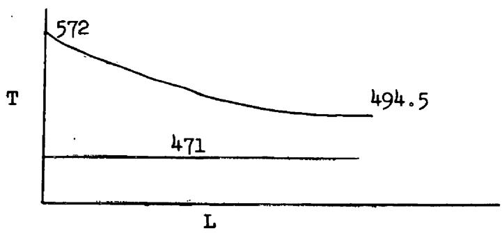

$$
\Delta t _ {o l} = \frac {7 7 . 5}{\ln \frac {1 0 1}{2 3 5}} = 5 3. 2
$$

$$
U (\text {D e s i g n}) = \frac {1 . 7 1 \times 1 0 ^ {7}}{4 9 4 \times 5 3 . 2} = 6 5 2
$$

Tube Wall

$$
\frac {r _ {0}}{k} \ln \frac {r _ {0}}{r _ {1}} = \frac {. 1 8 7 5}{1 0 . 6 \times 1 2} \ln \frac {. 3 7 5}{. 2 4 5} = . 0 0 6 2 5
$$

Primary Fluid

$$
\frac {h d}{k} = . 0 2 3 \left(\frac {c _ {p} \mu}{k}\right) ^ {. 4} \left(\frac {d V \rho}{\mu}\right) ^ {. 8}
$$

Flow area = $\frac{\pi}{4} (.245)^{2}$ x $\frac{251}{144} = .0822$ sq ft

Velocity = 1.79 x 10^5 / 3.6 x 10^3 x .0822 x 53.2 = 11.4 fps

h = .339 x .023 x 12 $\left(\frac{1.23 \times .266}{.339}\right)^4$ $\left(\frac{\frac{245}{12} \times 53.4 \times 11.4 \times 3600}{.266}\right)^8 = 5800$

h (based on outside surface) = 5800 x .245 = 3790

$$
\frac {1}{3 7 9 0} = . 0 0 0 2 6 4
$$

The over-all U for the HRT was based on using $3 / 4 \times U$ clean.

$$
\begin{array}{l} \therefore \frac {1}{6 5 2 \times 4 / 3} = . 0 0 1 1 5 = \frac {1}{U \text {c l e a n}} \\ (w a l l \quad a n d \quad p r i m a r y \quad r e s i s t a n c e) = . 0 0 8 9 0 \\ \therefore \frac {1}{U \text {c l e a n}} = . 0 0 0 8 9 0 = . 0 0 0 2 6 \\ h (\text {B o i l i n g}) = \frac {1}{. 0 0 0 2 6 x 3 / 4} = 5 1 0 0; \text {s a y , b o i l i n g c o e f f i c i e n t} \\ \end{array}
$$

A similar calculation on the PWR design (Ref. 36) indicates that these units had a design boiling plus scale coefficient of the order of magnitude of 2000. This indicates a scale coefficient of the order of magnitude of 3300 average was used on the steam side of these units. For the present design, an average value of scale plus nucleate boiling coefficient of 2000 is used. This should be conservative for design purposes, since the higher average temperature differentials in this unit should yield higher boiling coefficients than either the PWR or HRT designs.

For a natural circulation boiler, the steam water mixture will be external to the tubes and the sodium will be internal to the tubes. On the basis of preliminary calculations, it appeared that a reasonable size and pressure drop would be realized in two units with approximately 2000 3/4-inch O.D. tubes to carry in each.

Sodium Side

$$
\begin{array}{l} \frac {h d}{k} = 7 +. 0 2 5 \left(\frac {d V}{f ^ {2}} c _ {p}\right) ^ {. 8} \\ d = \frac {0 . 4 2}{1 2} f t \\ K = 4 0 B T U / h r - f t ^ {2} - _ {O F} ^ {-} / f t \\ C _ {P} = . 3 0 2 (\text {a v g}) B T U / 1 b ^ {- o} F \\ V = 2 1. 9 \text {f p s} \\ \mu = . 1 7 8 \times 3 6 0 0 \times 1 0 ^ {- 3} = . 6 4 \mathrm {l b s / f t - h r} \\ \end{array}
$$

$$
\rho_ {\text {a v g}} = 5 2. 7 \mathrm {l b s} / \mathrm {f t} ^ {3}
$$

$$
h = \frac {1 2}{4 2} x 4 0 \left[ 7 +. 0 2 5 \left(\frac {4 2}{1 2} x 2 1. 9 x 5 2. 7 x \frac {3 6 0 0}{4 0} x . 3 0 2\right) ^ {. 8} \right]
$$

$$
\mathrm {h} = 1 5, 7 0 0
$$

h based on outside tube surface $= 15,700 \times \frac{42}{.75} = 8800$

$$
\frac {1}{8 8 0 0} = . 0 0 0 1 1 3
$$

Flow area = $\frac{\pi x (.42)^2}{4} x \frac{2000}{144} = 1.93$ sq ft

$$
V = \frac {8 , 0 0 0 , 0 0 0}{3 6 0 0 \times 1 . 9 3 \times 5 2 . 7} = 2 1. 9 f p s
$$

$$
\frac {1}{h} = (\text {B o i l i n g} + \text {s c a l e}) = . 0 0 0 5
$$

$$
\frac {1}{U _ {0}} = 0. 0 0 2 0 7 3
$$

$$
U _ {o} = 4 8 3
$$

Say, $\mathbf{U}_{\mathrm{o}}$ for design $= 1480$

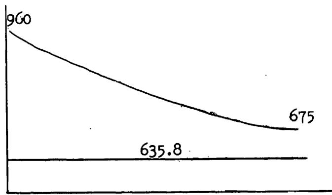

$$
\Delta t _ {o l} = \frac {2 8 5}{\ln \frac {3 2 4 . 2}{3 9 . 2}} = 1 3 5
$$

Surface Area (Boiler) = $\frac{686,000,000}{480 \times 135} = 10,600$ sq ft

$$
\frac {3 \pi}{4 8} x 2 0 0 0 x L e f f e c t i v e = 1 0, 6 0 0
$$

$$
L \text {e f f e c t i v e} = 2 6. 9 \mathrm {f t}
$$

$$
\text {S a y}, \text {t o t a l} = 2 8. 5 f t
$$

$$
\text {R e y n o l d s n u m b e r} = \frac {\frac {. 4 2}{1 2} \times 3 6 0 0 \times 2 1 . 9 \times 5 2 . 7}{. 6 4} = 2 2 9, 0 0 0
$$

$$
f = . 0 1 5
$$

$$
\Delta p = \left[ 2 + \frac {. 0 1 5 x 2 8 . 5 x 1 2}{. 4 2} \right] x \left(\frac {(2 1 . 9)}{2 g}\right) ^ {2} x \frac {5 2 . 7}{1 4 4} p s i
$$

$$
\Delta p = 3 8. 6 \text {p s i}
$$

Check of assumption of nucleate boiling,

At inlet $\triangle t = 324.2^{\circ}F$

$$
(q / 5) _ {\text {i n l e t}} = 3 2 4. 2 \times 4 8 0 = 1 5 6, 0 0 0
$$

As indicated (Ref. 4 and 6), this heat flux is still in the nucleate boiling region. As a further check, assume the tubes to be clean.

$$
\frac {1}{4 8 0} = . 0 0 2 0 8
$$

$$
\frac {1}{3 3 0 0} = . 0 0 0 3 0 3
$$

$$
(1 / U _ {0}) \text {c l e a n} = . 0 0 1 7 7 7
$$

$$
\therefore U _ {O} \text {c l e a n} = 5 6 4
$$

$$
\mathrm {q} / \mathrm {S} \text {i n l e t c l e a n} = 3 2 4. 2 \times 5 6 4 = 1 8 2, 5 0 0
$$

$$
\triangle t f i l m = \frac {1 8 2 , 5 0 0}{5 0 0 0} = 3 6. 6 ^ {\circ} F
$$

This is less than the critical $\triangle t$ of 45 to $50\mathrm{F}$ (Ref. 6, p. 386). Therefore, the assumption of nucleate boiling is justified.

Size of steam generator: $R / P = 20.9$ (Fig. B.4)

Diameter of channel: 20.9 x 2 x 1 + 2.75 = 44.6, say, 47 in. at

ID of channel

A preliminary check of the circulation characteristics of the steam generator indicated that a reasonable number of risers and downcomers can be provided to give adequate circulation for these units. The steam drums would each be approximately 66 inches ID x 45 feet over-all length to give commercial steam purities with commercial type feed water treatment. The center line of drums would be approximately 30 feet above the center line of the exchangers. Drum supporting steel will be provided and the support saddles on the heat exchangers will be designed so that one saddle is fixed to the foundation and one is let free to move to accommodate the expansion of the unit and/or the piping.

Over-all Heat Balance: Boiler and Superheater

Assume boiler at 2000 psia and superheater outlet to be $1000^{\circ}\mathrm{F}$ and 1800 psia.

Total heat load: 600 Mw

Q BTU/hr = 600 x 3413 x 1000

H superheated otem @ 1000°F + 1800 psia = 1480.8 BTU/1b

H feed @ $450^{\circ}\mathrm{F} + 1800$ psia = 430.9 BTU/1b

$\triangle \mathrm{H} = 1049.9$ BTU/1b

Total lbs of steam produced $= \frac{600 \times 3413 \times 1000}{1049.9} = 1,950,000$ lbs/hr

Temperatures of intermediate loop are as indicated on heat balance diagram Figure 6.2.

H sodium @ 1100°F = 323.6

H sodium @ $675^{\circ} \mathrm{F}$ = 195.7

$\Delta h = 127.9$ BTU/1b

$\frac{600 \times 3413 \times 1000}{127.9} \cong 16,000,000$ lbs/hr sodium (total)

△H Sodium/1b = 1,950,000 x 345.7 = 42 BTU/1b

△H superheater 1480.8

$$
\Delta H = \frac {1 1 3 5 . 1}{3 4 5 . 7}
$$

$\mathbf{H_{Na}}$ entering superheater $= 323.6$

$$
- 4 2. 0
$$

$$
\text {H} = 2 8 1. 6
$$

$$
t = 9 6 0 ^ {\circ} F
$$

At $1100^{\circ}\mathrm{F}$ , "S" is 7500 psi. Table UHA-23 ASME Unified Pressure Vessel Code - Section 8. The minimum tube wall thickness required is,

$$
t = \frac {\mathrm {P R} _ {0}}{\mathrm {S E} + . 4 \mathrm {P}} (\text {P U A - l}) = \frac {2 0 0 0 x . 2 5}{7 5 0 0 + 8 0 0} = . 0 6 0 2 (\text {n o m e n c l a t u r e a c c o r d i n g t o A S M E})
$$

Use 0.065 inch minimum wall tube.

If two walls are used to separate the water and sodium, and each wall is required to withstand the full pressure, then the outer tube required will be .6660D x .5001D with a wall thickness of 0.083 minimum.

# A. Single Wall Separating Both Fluids

Assumed sodium flowing parallel to the tubes and that the unit is of the counter flow type,

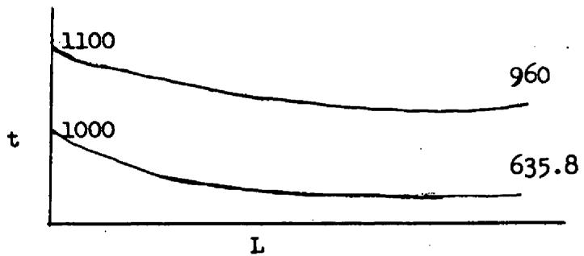

$$
\Delta t _ {o l} = \frac {3 2 4 . 2 - 1 0 0}{\ln \frac {3 2 4 . 2}{1 0 0}} = 1 9 1 ^ {\circ} F
$$

Tube resistance = $\frac{r_0}{R}\ln \frac{r_0}{r_1}$ (based on outside tube surface)

$$
K = 1 2. 4 B T U / h r - f t ^ {2} - o _ {F} / f t
$$

Tube resistance = .25 / 12.4 x 12 ln .500 / .370 = .000504

Preliminary calculations indicated that a reasonable size of superheater could be achieved by using 1275 tubes to carry per unit. Two such units will be required.

$$
\text {F l o w a r e a / t u b e} = \frac {\pi}{4} (. 3 7) ^ {2} = . 1 0 7 5 \text {s q i n}.
$$

Water (steam) side coefficient,

$$
\mathrm {h d} ^ {\cdot 2} = \Upsilon \left(\frac {\mathrm {w}}{1 0 0 0 \mathrm {a}}\right) ^ {\cdot 8}
$$

where,

$$
w \cong 1, 0 0 0, 0 0 0 l b s / h r p e r u n i t
$$

$$
h = \frac {1 7 5}{(. 3 7 0) \cdot 2} \quad \frac {1 , 0 0 0 , 0 0 0}{1 0 0 0 x . 1 0 7 5 x 1 2 7 5} \cdot 8 = \frac {1 7 5}{. 8 2}
$$

$$
(7. 3) ^ {\cdot} 8 = 1 0 4 6 \mathrm {B T U / h r} - \mathrm {f t} ^ {2} - \mathrm {o F}
$$

Based on outside surface, this is,

$$
h = 1 0 4 6 x \frac {3 7 0}{5 0 0} = 7 7 5
$$

$$
\text {R e s i s t a n c e} = \frac {1}{7 7 5} = . 0 0 1 2 9
$$

# Sodium Side

The free area/tube = .866 x .75² - π/4 (1/2)² = .290

The perimeter/tube $= \frac{\pi}{2} = 1.57$

The equivalent dia $= \frac{4 \times \text{Area}}{\text{perimeter}} = \frac{4 \times .290}{1.57} = 0.74$ in.

For the sodium side heat transfer, the Liquid Metals Handbook indicates that the Lyon-Martinelli or some modification is satisfactory. Since the sodium is not the controlling resistance, and for the sake of consistency, the Lyon-Martinelli correlation will be used.

$$
\begin{array}{l} \frac {\mathrm {h d} _ {\mathrm {e}}}{\mathrm {R}} = 7 +. 0 2 5 \left(\frac {\mathrm {d} _ {\mathrm {e}} \mathrm {V P}}{\mathrm {R}} \mathrm {C} _ {\mathrm {p}}\right) ^ {. 8} \\ D _ {e} = \frac {0 . 7 4}{1 2} f t \\ P _ {a v g} \cong \frac {5 0 . 3 + 5 1 . 6 7}{2} = 5 0. 9 l b s / c u f t \\ R \cong \frac {3 6 . 4 + 3 8 . 2}{2} = 3 7. 3 B T U / h r - f t ^ {2} - o _ {F} / f t \\ C _ {p} = . 2 9 9 B T U / 1 b ^ {- o F} \\ \end{array}
$$

Based on main bank geometry,

Free area (total) = 1275 x 0.29 = 370 sq in.

$$
\mathbf {w} = \ell \mathbf {x} \mathbf {A} \mathbf {x} \mathbf {v}
$$

$$
V = \frac {8 , 0 0 0 , 0 0 0 \times 1 4 4}{5 0 . 9 \times 3 6 0 0 \times 3 7 0} = 1 7 f t / s e c
$$

$$
\begin{array}{l} h = \frac {3 7 . 3 x 1 2}{7 4} \left[ 7 +. 0 2 5 \left(\frac {. 7 4 x 1 7 x 3 6 0 0 x 5 0 . 9 x . 2 9 9}{3 7 . 3}\right) ^ {. 8} \right] \\ = 8 2 0 0 \mathrm {B T U / h r - f t ^ {2} - o F} \\ \end{array}
$$

Resistance $= \frac{1}{8200} = .000122$

$$
\begin{array}{l} \frac {1}{U _ {0}} = . 0 0 0 5 0 4 +. 0 0 1 2 9 +. 0 0 0 1 2 2 \\ U _ {0} = 5 2 2 \\ \end{array}
$$

For design purposes, assume $\mathrm{U}_{\mathrm{o}} = 500$

$$
\begin{array}{l} \frac {\text {S u r f a c e} \quad \text {r e q u i r e d}}{\text {u n i t}} = \frac {1 , 9 5 0 , 0 0 0 x 3 4 5 . 7}{5 0 0 x 1 9 1 x 2} = 3 5 2 0 \mathrm {s q} \\ \text {A c t i v e} = \frac {3 5 2 0}{1 2 7 5 \times \frac {\pi}{2 4}} = 2 1. 1 f t \\ \end{array}
$$

Say, approximate tube length (including tube sheets) $= 22 \frac{1}{4}$ ft. From tube count layout sheet,

$$
R / P = 1 8. 8 2
$$

Dia to outer tube $= 2 \times 18.82 \times 3 / 4 = 28.2$

Approximate dia of channel $= 28.2 + .5 + .5 + 1$ 1/2 = 30.7

For clearance, etc., say, ID of channel 32 inches.

# Pressure Drop

The following calculations are for the pressure drop in the exchanger.

The pressure drop in the inlet and outlet nozzles is not included as part

of the pressure drop of the components. This is estimated elsewhere.

# Sodium Side

Reynolds No. = DVE = 0.74 x 17 x 3600 x 50.9 = 356,000

f = .014 for smooth tubes

$$
\begin{array}{l} \Delta p = \left(1. 5 + . 0 1 4 x \frac {2 1 . 1 x 1 2}{. 7 4}\right) \frac {v ^ {2}}{2 g} \frac {\rho}{1 4 4} = 6. 3 \frac {v ^ {2}}{2 g} \frac {\rho}{1 4 4} \\ = 6. 3 \times \frac {(1 7) ^ {2}}{6 4 . 4} \times \frac {5 0 . 9}{1 4 4} = 1 0 p s i \\ \end{array}
$$

For bend use 1/2 velocity head,

$\Delta P$ Bed $= \frac{0.79\text{psi}}{\text{say},\text{llpsi}}$ for exchanger only

# Steam Side

Assume flow and friction pressure drop are essentially that for an incompressible fluid. If the calculations on this assumption show a high pressure drop, then the variation of specific volume with tube length may have to be considered. The acceleration loss due to the change in specific volume between inlet and outlet will be considered.

In terms of our nomenclature and the assumed flow conditions, the general pressure drop equation becomes,

$$
P _ {1} - P _ {2} = f \frac {L}{d} \frac {V _ {\text {a v g}}}{2 g} ^ {2} \frac {\rho_ {\text {a v g}}}{1 4 4} + \left(\frac {W}{A}\right) ^ {2} \frac {1}{(3 6 0 0) 2 g} \frac {(V _ {2} - V _ {1})}{1 4 4} + \text {s a y}, 1. 5 \text {v e l h e a d s ,}
$$

entrance and exit + .5 vel heads bend

$$
c _ {a v g} = \frac {5 . 3 + 2 . 3}{2} = 3. 8
$$

$$
v _ {1} \cong . 1 8 8
$$

$$
v _ {2} \cong . 4 4 2
$$

$$
W = 1, 9 5 0, 0 0 0 \text {l b s / h r t o t a l}
$$

$$
A = \frac {1 0 7 5}{1 4 4} \times 1 2 7 5 = . 9 5 4 \mathrm {s q f t / u n i t}
$$

$$
V _ {\text {a v g}} = \frac {1 , 9 5 0 , 0 0 0}{3 6 0 0 x . 9 5 4 x 3 . 8} = 7 4. 8 \text {f p s}
$$

$$
\text {R e y m o l d s N o .} = \frac {\mathrm {D V C}}{\mathrm {u}} = \frac {0 . 3 7}{1 2} \times 7 4. 8 \times 3 6 0 0 \times 3. 8 = 4 8, 0 0 0
$$

$$
f = . 0 2 1 \text {f o r}
$$

$$
\begin{array}{l} \Delta p = . 0 2 1 \times \frac {2 2 . 3 \times 1 2}{. 3 7} \times \frac {(7 4 . 8) ^ {2}}{2 g} \times \frac {3 . 8}{1 4 4} + \frac {2 (7 4 . 8) ^ {2}}{2 g} \times \frac {3 . 8}{1 4 4} \\ x \left(\frac {\frac {1 , 9 5 0 , 0 0 0}{2}}{3 6 0 0 x . 9 5 4}\right) ^ {2} x \left(\frac {. 4 4 2 - . 8 8}{1 4 4}\right) x \frac {1}{3 2 . 2} \\ = 1 7. 2 \frac {(7 4 . 8)}{2 g} ^ {2} x \frac {3 . 8}{1 4 4} + \frac {(2 8 4)}{1 4 4} ^ {2} x (0. 4 4 2 - 0. 1 8 8) x \frac {1}{3 2 . 2} \\ = 3 9. 4 + 4. 4 = 4 3. 8, \text {s a y}, 4 4 p s i \\ \end{array}
$$

Since this represents but a small part of the pressure of the system, it will be satisfactory to take the pressure drop as being this value. A more accurate calculation, taking into account the variation of specific volume with length, will give a higher pressure drop, but not significantly so. For system design purposes, assume a nominal 50 psi pressure drop on the steam side, not including nozzles.

# B. Two Walls Separating Both Fluids

The assumption made in this calculation will be the same as for the single wall separating the two fluids. Because of the thicker tube assembly, the $3/4$ -inch pitch cannot be used. It will be assumed that a $1/4$ -inch clear

ligament will be required for welding of these tubes into tube sheets. It will further be assumed that a thermal bond can be realized between the inner and outer tubes, but that this bond is not a mechanical bond. Thus, the failure of one wall will not give rise to a complete failure of the unit. It is further realized that radial temperature gradients, in some instances, may tend to cause separation of the two tube walls. However, in the superheater, it may be possible to use two different types of stainless steels with

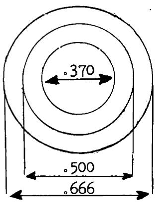

coefficients of expansion in such a ratio as to negate the temperature differentials.

$$
\text {P i t c h} = . 6 6 6 +. 2 5 0 = . 9 1 6 \text {i n}.
$$

$$
\text {F o r} \quad \text {t u b e} \quad \text {s h e t} \quad \text {l a y o u t} \quad \text {a s s u m e} \quad \frac {1 5}{1 6} \text {i n . p i t c h (}. 9 3 7 5)
$$

Log Mean Temperature Difference = 191°F

For Preliminary Purposes, neglect sodium coefficient

Assume 1500 tubes to carry

# Steam Side

$$
h = 1 0 4 6 x \left(\frac {1 2 7 5}{1 5 0 0}\right) ^ {. 8} x \cdot \frac {3 7 0}{. 6 6 6} \quad (B a s e d o n O D o f o u t e r t u b e)
$$

$$
h = 5 1 0 \mathrm {B T U} / \mathrm {h r} - \mathrm {f t} ^ {2} - \alpha_ {\mathrm {F}} (\text {o u t e r t u b e O D})
$$

$$
\text {R e s i s t a n c e} = 0. 0 0 1 9 6
$$

# Wall

$$
\text {I n n e r t u b e} = . 0 0 0 5 0 4 \times \frac {. 6 6 6}{. 5 0 0} = . 0 0 0 6 7
$$

$$
\text {O u t e r t u b e} = \frac {. 3 3 3}{1 2 4 x 1 2} \ln \frac {. 6 6 6}{5 0 0} = . 0 0 0 6 4
$$

$$
\frac {1}{U _ {0}} = . 0 0 0 6 7 +. 0 0 0 6 4 +. 0 0 0 1 9 6 = . 0 0 0 3 2 7
$$

$U_{0} = 306$ , say, 300. It will be necessary to compute the sodium side at this point.

$$
d _ {e} = \frac {\left[ . 8 6 6 x (. 9 3 7 5) ^ {2} - \frac {\pi}{4} (. 6 6 6) ^ {2} \right] _ {4}}{\pi x . 6 6 6} = 0. 7 9 \text {i n}.
$$

$$
W = \rho_ {X A X V}
$$

$$
A = \frac {1 5 0 0 x . 4 1 3}{1 4 4} = 4. 3 \text {s q f t}
$$

$$
V = \frac {8 , 0 0 0 , 0 0 0}{5 0 . 9 x 3 6 0 0 x 4 . 3} \cong 1. 0. 2 f p s
$$

$$
\frac {\mathrm {h d} _ {\mathrm {e}}}{\mathrm {R}} = 7 +. 0 2 5 \left(\frac {\mathrm {d} _ {\mathrm {e}} \mathrm {V P}}{\mathrm {R}} \quad \mathrm {C} _ {\mathrm {p}}\right) ^ {. 8}
$$

$$
h = \frac {3 7 . 3 \times 1 2}{0 . 7 9} \left[ 7 + (. 0 2 5) \left(\frac {. 7 9 \times 1 0 . 2 \times 3 6 0 0 \times 5 0 . 9}{3 7 . 3} \times . 2 9 9\right) ^ {. 8} \right]
$$

$$
h = 5 6 6 \left[ 7 + . 0 2 5 (1 7 8 0) \right] = 6 5 0 0
$$

$$
\frac {1}{6 5 0 0} = . 0 0 0 1 5 4
$$

$$
\frac {1}{U _ {0}} = . 0 0 3 4 2
$$

$$
U _ {o} = 2 8 2
$$

Say for design purposes,

$$
U _ {o} = 2 7 5 B T U / h r - f t ^ {2} - o F \quad (o u t e r t u b e o u t s i d e s u r f a c e)
$$

$$
\mathrm {S r} _ {\mathrm {e}} \mathrm {q} _ {\mathrm {d}} = \frac {1 , 9 5 0 , 0 0 0 \times 3 4 5 . 7}{2 7 5 \times 1 9 1 \times 2} \cong 6 4 0 0 \mathrm {s q f t / u n i t}
$$

$$
\text {S u r f a c e p e r u n i t} = 1 5 0 0 x \frac {\pi (. 6 6 6)}{1 2} x L \text {e f f e c t i v e} \cong 2 6 3 L \text {e f f e c t i v e}
$$

$$
\text {L e f f} = \frac {6 4 0 0}{2 6 0} = 2 4 \text {f t}, 5 \text {i n}.
$$

Say total tube length $\cong 25$ ft, 9 in.

From tube count layout sheet,

$$
R / P = 2 0. 3
$$

Dia to L of outer tube $= 2 \times 20.3 \times .9375 = 38.1$ in.

Approximate channel dia = 38.1 + 2.5 = 40.6 in.

For clearance, etc., say ID of channel $\cong 42$ in.

# Pressure Drop

# Sodium Side

$$
\text {R e y n o l d s N o .} = \frac {. 7 9}{. 7 4} x \frac {1 0 . 2}{1 7} x 3 5 6, 0 0 0 = 2 3 5, 0 0 0
$$

$$
f = . 0 1 5
$$

$$
\Delta p = \left(2 + \frac {0 . 1 5 x 2 4 . 4 2 x 1 2}{. 7 9}\right) x \left(\frac {1 0 . 2}{2 g}\right) ^ {2} x \frac {5 0 . 9}{1 4 4} = 3. 8, \text {s a y}, 4 \text {p s i}
$$

# Steam Side

$$
V _ {a v g} = 7 4. 8 \times \frac {1 2 7 5}{1 5 0 0} = 6 3. 5
$$

$$
\text {R e y n o l d s N o .} = \frac {6 3 . 5}{7 4 . 8} \times 4 8, 0 0 0 = 4 0, 8 0 0
$$

$$
\begin{array}{l} f = . 0 2 1 \\ \Delta p \text {f r i c t i o n} + \Delta p \text {a c c e l e r a t i o n} = . 0 2 1 \left(\frac {2 5 . 7 5 x 1 2}{. 3 7 x 2 g}\right) \left(\frac {6 3 . 5}{1 4 4}\right) ^ {2} x 3. 8 \\ + 2 \left(\frac {6 3 . 5}{2 g}\right) ^ {2} x \frac {3 . 8}{1 4 4} + \left(\frac {\frac {1 , 9 5 0 , 0 0 0}{2}}{3 6 0 0 x 1 5 0 0} x 1 2 7 5\right) ^ {2} \\ x \left(\frac {0. 4 4 2 - . 1 8 8}{1 4 4}\right) x \frac {1}{3 2 . 2} \\ = 3 2. 4 + 3. 2 = 3 5. 6 \mathrm {p s i} \quad \text {s a y ,} 4 0 \mathrm {p s i} \quad \text {f o r d e s i g n} \\ \end{array}
$$

# F.2 STRAIGHT-THROUGH BOILER

# 1. Steam Flow

Steam out at 1900 psia, $1000^{\circ}\mathrm{F},\mathrm{H} = 1477.7$

Feed water in at 1950 psia, $450^{\mathrm{O}}\mathrm{F}$ , H = 430.1

Change in enthalpy $= 1047.6$ BTU/1b

$$
\text {S t e a m f l o w} = \frac {6 0 0 M w x 3 4 1 3 x 1 0 ^ {3} B T U / M w - h r}{1 0 4 7 . 6 B T U / 1 b}
$$

$$
\text {S t e a m f l o w} = 1. 9 5 5 \times 1 0 ^ {6} \mathrm {l b / h r}
$$

2. Sodium Flow

Na Temp. in = 1100°F   
Na Temp. out $= 675^{\circ}\mathrm{F}$

At average Na temp. (887.5°F), $C_p = .304$ BTU/1b-°F

Sodium flow = 600 Mw x 3413 x 10³ BTU/Mw-hr
-30⁴ BTU x 4250F
1b-OF

Sodium flow = 15.85 x 10 $^6$ $\frac{1b}{hr}$

3. Change in Sodium Temperature through Preheat, Evaporator

and Superheater Zones

The change in sodium temperature in a zone is found from a heat balance between heat gained by the water and heat given up by the sodium.

(Na flow) C $\Delta t =$ (steam flow) $\triangle H$

$$
\Delta t _ {\mathrm {N a}} = \frac {W _ {\mathrm {s}} \Delta_ {\mathrm {H}}}{W _ {\mathrm {N a}} C _ {\mathrm {p}}}
$$

The sodium temperature change calculation is tabulated below:

<table><tr><td>Zone</td><td>H</td><td>Cp</td><td>t</td></tr><tr><td>preheat</td><td>236</td><td>.3090</td><td>95</td></tr><tr><td>evaporator</td><td>473</td><td>.3050</td><td>190</td></tr><tr><td>superheater</td><td>339</td><td>.3015</td><td>140/425°F</td></tr></table>

4. Calculation of Over-all Coefficient of Heat Transfer (U) in Preheat, Evaporator and Superheat Zones (Refer to Section 6.5.0)

A. Preheat Section

a. Since the water entering the boiler is subcooled, nuclease boiling will occur. A combined coefficient for boiling film and scale of 2000 BTU/hr-ft $^{2}$ - ${}^{0}$ F was used (Section 6.5.1).

b. Tube wall coefficient

$$
\begin{array}{l} k = 1 1. 2 B T U / h r - f t ^ {2} - ^ {\circ} F / f t \text {f o r} 3 0 4 S S \text {a t} 7 2 3 ^ {\circ} F \\ h = \frac {k}{f t} = \frac {1 1 . 2}{\frac {. 2 5}{1 2} \ln \frac {. 2 5}{. 1 8 5}} = 1 7 9 0 B T U / h r - f t ^ {2} - ^ {\circ} F \\ \end{array}
$$

c. Sodium film coefficient

$$
k = 4 1. 4 B T U / h r - f t ^ {2} \cdot {} ^ {0} F / f t
$$

$$
\mathrm {h} = \frac {\mathrm {k}}{\mathrm {d}} \left[ 7 + \left(\frac {0 . 0 2 5 \mathrm {D V} (\mathrm {C} _ {\mathrm {p}})}{\mathrm {k}}\right) ^ {0. 8} \right] \quad \text {(R e f . 7)}
$$

$$
d = 0. 0 6 1 8 f t
$$

$$
V = 1 3. 2 5 f t / s e c
$$

$$
\ell = 5 3. 6 \mathrm {l b} / \mathrm {f t} ^ {3}
$$

$$
C _ {p} = 0. 3 0 8 5 B T U / 1 b - ^ {\circ} F
$$

$$
\begin{array}{l} h = \frac {4 1 . 4}{. 0 6 1 8} \left[ 7 + 0. 0 2 5 (\frac {. 0 6 1 8 \times 1 3 . 2 5 \times 5 3 . 6 \times 3 0 8 5}{4 1 . 4}) ^ {0. 8} \right] \\ = 5 4 0 0 \mathrm {B T U} / \mathrm {h r} - \mathrm {f t} ^ {2} - \mathrm {O F} \\ \end{array}
$$

$$
\begin{array}{l} \frac {1}{U} = \frac {1}{2 0 0 0 x . 1 8 5} + \frac {1}{5 4 0 0} + \frac {1}{1 7 9 0} = . 0 0 1 4 5 3 \\ U = 6 9 0 B T U / h r - f t ^ {2} - \alpha F \\ \end{array}
$$

# B. Boiling Section

a. Use a boiling film and scale coefficient of 2000 BTU/hr-ft²-OF   
b. Tube wall coefficient

$$
\begin{array}{l} k = 1 1. 8 B T U / h r - f t ^ {2} - o _ {F} / f t \text {f o r} 3 0 4 S S \text {a t} 8 6 5 ^ {\circ} F \\ h = \frac {k}{f t} = \frac {1 1 . 8}{\frac {. 2 5}{1 2} \ln \frac {. 2 5}{. 1 8 5}} = 1 8 9 0 B T U / h r - f t ^ {2} - ^ {\circ} F \\ \end{array}
$$

c. Sodium film coefficient

$$
\begin{array}{l} k = 3 9. 3 B T U / h r - f t ^ {2} - o _ {F} / f t \\ V = 1 3. 2 5 f t / s e c \\ \end{array}
$$

$$
d = . 0 6 1 8 f t
$$

$$
e = 5 2. 3 5 \mathrm {l b} / \mathrm {f t} ^ {3}
$$

$$
C _ {p} = 0. 3 0 4 7 B T U / 1 b - ^ {\circ} F
$$

$$
\begin{array}{l} \mathrm {h} = \frac {\mathrm {k}}{\mathrm {d}} \cdot \left[ 7 + 0. 0 2 5 \left(\frac {\mathrm {D V} \ell \mathrm {C} _ {\mathrm {p}}}{\mathrm {k}}\right) ^ {0. 8} \right] \\ = \frac {3 9 . 3}{. 0 6 1 8} \left[ 7 + 0. 0 2 5 (\frac {. 0 6 1 8 \times 1 3 . 2 5 \times 5 2 . 3 5 \times . 3 0 4 7}{3 9 . 3}) ^ {0. 8} \right] \\ = 4 4 6 0 \mathrm {B T U} / \mathrm {h r} - \mathrm {f t} ^ {2} - \circ F \\ \end{array}
$$

$$
\begin{array}{l} \frac {1}{U} = \frac {1}{2 0 0 0 \times . 1 8 5} + \frac {1}{1 8 9 0} + \frac {1}{4 4 6 0} = 0. 0 0 1 4 2 9 \\ U = 7 0 0 B T U / h r - f t ^ {2} - o F \\ \end{array}
$$

# C. Superheater Section

a. Steam film coefficient

$$
\frac {\mathrm {h d} _ {\mathrm {e}}}{\mathrm {k}} = 0. 0 2 3 \left(\frac {\mathrm {d} _ {\mathrm {e}} \mathrm {v}}{\mu}\right) ^ {0. 8} \left(\frac {\mathrm {c} _ {\mathrm {p}} \mu}{\mathrm {k}}\right) ^ {1 / 3}
$$

Steam temp. out = 1000°F

Steam temp. in = 620°C

Average temp. = 810°F

$$
\mathrm {h d} ^ {0. 2} = \mathrm {Y} (\mathrm {W} / 1 0 0 0 \mathrm {a}) ^ {0. 8}
$$

$$
W = \frac {2 \times 1 0 ^ {6}}{3 2 0 0} = 6 2 5 \mathrm {l b / h r p e r t u b e}
$$

$$
Y = 1 6 5
$$

$$
d = d i a, \text {i n .} = 0. 5 - 2 \times 0. 0 6 5 = 0. 3 7 \text {i n .}
$$

A = flow area in.² = 0.1076 in.²

$$
\begin{array}{l} h x (. 3 7) ^ {0. 2} = 1 6 5 (6 2 5 / . 0 7 1 6) ^ {0. 8} \\ h = 1 1 0 0 B T U / h r - f t ^ {2} - o F \\ \end{array}
$$

b. Tube wall coefficient

$$
h = \frac {k}{f t} = \frac {1 1 . 8}{\frac {. 2 5}{1 2} \ln \frac {. 2 5}{. 1 8 5}} = 1 8 9 0 B T U / h r - f t ^ {2} - ^ {\circ} F
$$

c. Sodium film coefficient

$$
\begin{array}{l} \mathrm {h} = \frac {\mathrm {k}}{\mathrm {d}} \left[ 7 + 0. 0 2 5 \left(\frac {\mathrm {d v} \ell c _ {\mathrm {p}}}{\mathrm {k}}\right) ^ {0. 8} \right] \\ d = 0. 0 6 1 8 f t \\ V = 1 3. 5 6 f t / s e c \\ \ell = 5 1. 0 \mathrm {l b} / \mathrm {f t} ^ {3} \\ k = 3 7. 3 B T U / h r - f t ^ {2} - o _ {F} / f t \\ C _ {p} = 0. 3 0 1 5 B T U / 1 b ^ {\circ} F \\ h = \frac {3 7 . 3}{. 0 6 1 8} \left[ 7 + 0. 0 2 5 (\frac {. 0 6 1 8 \times 1 3 . 5 6 \times 5 1 . 0 \times . 3 0 1 5 \times 3 6 0 0}{3 7 . 3}) ^ {0. 8} \right] \\ = 8 4 5 0 \mathrm {B T U} / \mathrm {h r} - \mathrm {f t} ^ {2} - \mathrm {C F} \\ \frac {1}{U} = \frac {1}{1 1 0 0 x \cdot \frac {1 8 5}{2 5}} + \frac {. 2 5 \ln \frac {. 2 5}{. 1 8 5}}{3 7 . 3} + \frac {1}{8 4 5 0} = . 0 0 3 3 5 8 \\ U = 3 0 0 B T U / h r - f t ^ {2} - a F \\ \end{array}
$$

5. Calculation of Zone Surface Required

In a zone, the heat gained by water equals the heat lost by sodium and this heat is transferred by the equation, $q = UA \Delta t$ , where $\Delta t$ is the log mean temperature difference.

<table><tr><td>q</td><td>U</td><td>t</td><td>A</td><td>%A</td></tr><tr><td>4608 x 10^5</td><td>690</td><td>178.5</td><td>3,741 ft^2</td><td>17.7</td></tr><tr><td>9252 x 10^5</td><td>700</td><td>221.0</td><td>5,981 ft^2</td><td>28.2</td></tr><tr><td>6624 x 10^5</td><td>300</td><td>192.5</td><td>11,470 ft^2</td><td>54.1</td></tr><tr><td></td><td></td><td></td><td>21,192 ft^2</td><td>100.0%</td></tr></table>

6. Number of Tubes

As a result of checking pressure drop and steam velocities, a tube size of 1/2-inch OD and nominal 50-foot length was decided upon.

Total tube area required from (5) above $= 21,192 ft^2$

Area per tube, $\pi \mathrm{DL} = 6.54\mathrm{ft}^2$

No. of tubes $= \frac{21192}{6.54} = 3240$ tubes

7. Pressure Drop in Tubes (Ref. 7, p. 36, 45, 55, 69) (Section 6.5.2)

The fraction of the 50-foot tube length required by the preheat, evaporator and superheat zones is proportional to the percent of area of (5) above.

a. Preheat zone

$$
\begin{array}{l} R e = \frac {2 6 , 8 0 0}{\mu} = \frac {2 6 , 8 0 0}{. 2 3 9} = 1 1 2, 0 0 0 \\ f = 0. 1 9 \\ \Delta p = \frac {F V ^ {2}}{2 g} \frac {L}{d _ {e}} \rho \\ \Delta p = \frac {. 0 1 9 x . 5 . 1 4 ^ {2} x 8 . 8 5 x 4 7 . 1}{6 4 . 4 x . 0 3 0 8} \\ \Delta p = 1 0 5 \mathrm {l b} / \mathrm {f t} ^ {2} = . 7 3 \mathrm {p s i} \\ \end{array}
$$

b. Evaporator zone (two phase flow)

$$
\begin{array}{l} \mathrm {R e} = \frac {2 6 , 8 0 0}{\mu} = \frac {2 6 , 8 0 0}{. 2 0 2} = 1 3 2, 5 0 0 \\ f = . 0 1 8 \\ \Delta p _ {0} = \frac {. 0 1 8 x 6 . 1 3 ^ {2} x 1 4 . 1 x 3 9 . 5}{6 4 . 4 x . 0 3 0 8} \\ \Delta p _ {0} = 1 9 0. 4 \mathrm {l b} / \mathrm {f t} ^ {2} (\text {s i n g l e p h a s e}) \\ \Delta P _ {T P} = \Delta P _ {O} \left(\frac {\Delta P _ {t} p _ {f}}{\Delta P _ {O}}\right) + r \left(\frac {G}{g}\right) ^ {2} \quad (R e f. 7, p. 7 2) \\ \Delta p _ {T P} = 1 9 0. 4 (6) + . 2 \times \frac {(2 4 2) ^ {2}}{3 2 . 2} \\ \Delta p _ {T P} = 1 5 0 6 \mathrm {l b} / \mathrm {f t} ^ {2} = 1 0. 5 \mathrm {p s i} (\text {t w o p h a s e}) \\ \end{array}
$$

c. Superheater zone (Ref. 7, p. 69)

$$
R e = \frac {2 6 , 8 0 0}{\mu} = \frac {2 6 , 8 0 0}{. 0 6 5} = 4 1 3, 0 0 0
$$

$$
\begin{array}{l} f = . 0 1 5 \\ \Delta p = \frac {G ^ {2}}{2 g d _ {e}} f L v + \frac {G ^ {2}}{g} (v _ {2} - v _ {1}) \\ \Delta p = \frac {(2 4 2) ^ {2}}{6 4 . 4 x . 0 3 0 8} x. 0 1 5 x 2 7. 0 5 x. 3 0 5 ^ {\prime} \frac {(2 4 2) ^ {2}}{3 2 . 2} (.. 4 1 6 5 - .. 1 9 5 0) \\ \Delta p = 4 0 5 9 \mathrm {l b} / \mathrm {f t} ^ {2} = 2 8. 2 \mathrm {p s i} \\ \end{array}
$$

d. Total tube pressure drop

The total drop is the sum of a, b, and c above.

(a) 0.73   
(b) 10.50   
(c) 28.20

Total Drop = 39.43 psi

# APPENDIX G

# CALCULATIONS OF STEAM PLANT HEAT BALANCE

The calculations below determine the heat balance and gross electric power output of the steam cycle described in Section 6.8.0 of this report. The over-all cycle and the conditions of the working fluids are shown in Figure 6.2.

# G.1 THROTTLE STEAM FLOW

The steam flow at the turbine throttle is calculated from Equation 6.11.

$$
\begin{array}{l} \text {S t e a m f l o w} = \frac {6 0 0 \mathrm {M w} \times 3 ^ {4} + 3 \times 1 0 ^ {3} \mathrm {B T U / M w - h r}}{(1 4 7 7 . 7 - 4 3 0 . 1) \mathrm {B T U / l b}} \\ \text {S t e a m f l o w} = 1. 9 5 5 \times 1 0 ^ {6} \frac {1 b}{h r} \\ \end{array}
$$

# G.2 EXTRACTION STEAM FLOWS

No. 1 Heater heat balance

$$
\begin{array}{l} 1. 9 5 5 \times 1 0 ^ {6} \frac {\mathrm {l b}}{\mathrm {h r}} (4 3 0. 1 - 3 6 4. 2) \frac {\mathrm {B T U}}{\mathrm {l b}} = W _ {1} (1 3 4 4 - 4 3 0. 1) \frac {\mathrm {B T U}}{\mathrm {l b}} \\ w _ {1} = . 1 4 1 x 1 0 ^ {6} \frac {1 b}{h r} \\ \end{array}
$$

No. 2 Heater heat balance

$$
\begin{array}{l} 1. 9 5 5 \times 1 0 ^ {6} (3 6 4. 2 - 3 0 0. 7) = . 1 4 1 \times 1 0 ^ {6} (4 3 0. 1 - 3 6 4. 2) \\ + w _ {2} (1 2 8 6 - 3 6 4. 2) \\ \end{array}
$$

$$
w _ {2} = . 1 2 4 6 \times 1 0 ^ {6} \mathrm {l b / h r}
$$

No. 3 Heater mass balance and heat balance

$$
\begin{array}{l} I. 1. 9 5 5 \times 1 0 ^ {6} = (. 1 4 1 + . 1 2 4 6) \times 1 0 ^ {6} + W _ {3} + F. W. \\ I I. 1. 9 5 5 \times 1 0 ^ {6} \times 3 0 0. 7 = (. 1 4 1 + . 1 2 4 6) \times 1 0 ^ {6} \times 3 6 4. 2 + 1 2 2 2 w _ {3} \\ + 2 3 8. 8 \mathrm {F}. \mathrm {w}. \\ \end{array}
$$

The solution of Equations I and II above gives,

$$
w _ {3} = . 0 8 9 \times 1 0 ^ {6} \frac {l b}{h r}
$$

F.W. = 1.6 x 10^6 lb (feed water flow leaving No. 3 Heater)

No. 4 Heater heat balance

$$
1. 6 \times 1 0 ^ {6} (2 3 8. 8 - 1 7 8. 0) = (1 1 6 4 - 2 4 3. 9) w _ {4}
$$

$$
w _ {4} = . 1 0 5 7 \times 1 0 ^ {6} \frac {1 b}{h r}
$$

No. 5 Heater heat balance

$$
1. 6 \times 1 0 ^ {6} (1 7 8. 0 - 1 1 7. 9) = . 1 0 5 7 \times 1 0 ^ {6} (2 4 3. 9 - 1 8 3. 1) + (1 0 9 5 \cdot 1 8 3. 1) W _ {5}
$$

$$
w _ {5} = . 0 9 8 4 \times 1 0 ^ {6} \frac {1 b}{h r}
$$

No. 6 Heater heat balance

$$
\begin{array}{l} 1. 6 \times 1 0 ^ {6} (1 1 7. 9 - 5 9. 7) = (. 1 0 5 7 + . 0 9 8 4) \times 1 0 ^ {6} (1 8 3. 1 - 1 2 2. 9) \\ + (1 0 2 4 - 1 2 2. 9) w _ {6} \\ \end{array}
$$

$$
W _ {6} = . 0 8 7 7 \frac {1 b}{h r}
$$

G.3 HEAT CONVERTED TO WORK IN TURBINE (Equation 6.10)

<table><tr><td>Position</td><td>Steam Flow (1b/hr)</td><td>△H (BTU/lb)</td><td>Work (BTU/hr)</td></tr><tr><td>Throttle</td><td>1.9550 x 106</td><td>136.3</td><td>266.5 x 106</td></tr><tr><td>No. 1 Heater</td><td>1.8140 x 106</td><td>58.0</td><td>105.2 x 106</td></tr><tr><td>No. 2 Heater</td><td>1.6894 x 106</td><td>64.0</td><td>108.1 x 106</td></tr><tr><td>No. 3 Heater</td><td>1.6004 x 106</td><td>58.0</td><td>92.8 x 106</td></tr><tr><td>No. 4 Heater</td><td>1.4947 x 106</td><td>69.0</td><td>103.1 x 106</td></tr><tr><td>No. 5 Heater</td><td>1.3963 x 106</td><td>71.0</td><td>99.1 x 106</td></tr><tr><td>No. 6 Heater</td><td>1.3066 x 106</td><td>82.6</td><td>107.1 x 106</td></tr></table>

Total of heat converted to work $= 881.9 \times 10^{6}$ BTU/hr

# G.4 CORRECTION TO WORK FOR FEED WATER HEATING BY PUMPS

a. Correction for Hot Well Pump

The work by the pump done on the feed water was found from Equation 6.14. $\mathbf{P}_{\mathbf{l}}$ is the pump inlet pressure of 1.5 inches Hg or .736 psi. $\mathbf{P}_{2}$ is the pump discharge pressure and is the sum of the three items listed below:

No. 3 heater pressure 103.1 psia

Elevation difference (cond. to No. 3 Heater) 17.3

Friction drop 40.0

$$
P _ {2} = 1 6 0. 4 \text {p s i a}
$$

The specific volume, $V_{1}$ , is .016l ft³.

$$
\text {W o r k} = (1 6 0. 4 - . 7 3 6) \times \frac {1 4 4}{7 7 8} x. 0 1 6 1
$$

$$
\text {W o r k} = . 4 7 6 \mathrm {B T U / 1 b}
$$

The work put into the pump was found from Equation 6.15.

$$
\text {W o r k} = \frac {. 4 7 6}{. 7} = . 6 7 6 \mathrm {B T U / l b}
$$

The heat gain of the feed water from the pump was found to be .2 BTU/lb by Equation 6.12.

The reduction in steam extracted for No. 6 Heater was found from Equation 6.16.

$$
W = \frac {1 . 6 x 1 0 ^ {6} x . 2}{(1 0 2 4 - 1 2 2 . 9)}
$$

$$
w = . 0 0 0 3 5 5 x 1 0 ^ {6} \frac {1 b}{h r}
$$

The increase in work at the turbine wheel was found from Equation 6.10.

$$
\text {W o r k} = . 0 0 0 3 5 5 \times 1 0 ^ {6} (1 0 2 4 - 9 4 1. 4)
$$

$$
\text {W o r k} = . 0 2 9 3 \times 1 0 ^ {6} \frac {\mathrm {B T U}}{\mathrm {h r}}
$$

# b. Correction for Boiler Feed Pump

This correction was made in the same manner as for the hot well pump above.

$$
\text {W o r k i n t o f e e d w a t e r} = (2 0 0 0 - 1 0 3. 1) \times \frac {1 4 4}{7 7 8} x. 0 1 7 6 6
$$

$$
\text {W o r k i n t o f e a d w a t e r} = 6. 2 0 \mathrm {B T U / l b}
$$

$$
\text {W o r k i n t o p u m p} = 8. 8 6 \mathrm {B T U / l b}
$$

$$
\text {H e a t} = 2. 6 6 \mathrm {B T U} / \mathrm {l b}
$$

The reduction in extracted steam is,

$$
W = \frac {1 . 9 5 5 x 1 0 ^ {6} x 2 . 6 6}{(1 2 8 6 - 3 6 4 . 2)}
$$

$$
w = . 0 0 5 6 4 x 1 0 ^ {6} \mathrm {l b / h r}
$$

The increase in turbine work is,

$$
\text {W o r k} = . 0 0 5 6 4 \times 1 0 ^ {6} x (1 2 8 6 - 9 4 1. 4)
$$

$$
\text {W o r k} = 1. 9 \times 1 0 ^ {6} \frac {\mathrm {B T U}}{\mathrm {h r}}
$$

The turbine work calculated in Section G.3 was corrected as shown below.

$$
\text {U n c o r r e c t e d} \quad \text {t u r b i n e w o r k (S e c t i o n G . 3)} \quad 8 8 1. 9 \times 1 0 ^ {6} \mathrm {D T U / h r}
$$

$$
\text {H o t w e l l p u m p c o r r e c t i o n} \quad + \quad . 0 3
$$

$$
\text {B o i l e r f e e d p u m p c o r r e c t i o n} \quad + 1. 9
$$

$$
\text {C o r r e c t e d} = 8 8 3. 8 3 \times 1 0 ^ {6} \mathrm {B T U / h r}
$$

This is equivalent to an output of 258.96 Mw.

# G.5 CORRECTION FOR TURBINE-GENERATOR LOSSES

The losses found by the method of Reference 41 were applied to the corrected turbine wheel output of Section G.4 as shown below.

Corrected output at turbine wheel 258.96 Mw

Turbine exhaust loss 8.35 Mw

Mechanical and generator losses 5.19

Total losses

Gross Electric Power Output 245.42 Mw

# G.6 CALCULATION OF COOLING WATER PUMP POWER

The cooling water pump power was found from Equations 6.14 and 6.15. A pressure drop of 10 feet was assumed in the condenser (Ref. 23). The cooling water flow was calculated from a heat balance between the heat rejected to the condenser by the turbine exhaust and No. 6 Heater drain and the heat gained by the cooling water. In calculating the required cooling water flow, a $15^{\circ}\mathrm{F}$ rise in temperature was assumed. This could be greater, or less, depending upon the temperature and quantity of cooling water available and the type of condenser selected, i.e., single or double pass.

a. Heat rejected to condenser by turbine exhaust

$$
\begin{array}{l} \mathbf {q} = \mathbf {W} \triangle \mathbf {H} \\ q = 1. 3 1 2 6 \times 1 0 ^ {6} \mathrm {l b / h r} (9 4 1. 4 - 5 9. 7) \mathrm {B T U / l b} \\ q = 1 1 5 7 \times 1 0 ^ {6} B T U / h r \\ \end{array}
$$

b. Heat rejected to condenser by No. 6 Heater drain

$$
\begin{array}{l} q = . 2 9 1 4 \times 1 0 ^ {6} \frac {1 b}{h r} (1 2 2. 9 - 5 9. 7) B T U / l b \\ q = 1 8. 4 \times 1 0 ^ {6} B T U / h r \\ \end{array}
$$

c. Total heat rejected to condenser. The total rejected heat is the sum of Items (a) and (b) above, or 1175.4 x 10⁶ BTU/hr.

d. Cooling water flow to condenser

$$
\begin{array}{l} q = W C _ {p} \Delta t \\ w = \frac {1 1 7 5 . 4 x 1 0 ^ {6}}{1 x 1 5} = 7 8. 4 x 1 0 ^ {6} \frac {1 b}{h r} \\ \end{array}
$$

e. Work done by cooling water pump

$$
\begin{array}{l} \text {W o r k} = \left(P _ {1} - P _ {2}\right) \mathrm {V W} \\ \text {W o r k} = 1 0 \mathrm {f t} \times 6 2. 4 \frac {\mathrm {l b}}{\mathrm {f t} ^ {3}} \times . 0 1 6 1 \frac {\mathrm {f t} ^ {3}}{\mathrm {l b}} \times \frac {\mathrm {B T U}}{7 7 8 \mathrm {f t} / \mathrm {l b}} \times 7 8. 4 \times 1 0 ^ {6} \frac {\mathrm {l b}}{\mathrm {h r}} \\ \end{array}
$$

$$
\text {W o r k} = 1. 0 0 2 x. 1 0 ^ {6} \frac {\mathrm {B T U}}{\mathrm {h r}} = . 2 9 4 \mathrm {M w}
$$

f. Work put into cooling water pump. From Equation 6.15,

$$
\text {W o r k i n} = \frac {. 2 9 4 \mathrm {M w}}{. 6} = . 4 9 0 \mathrm {M w}
$$

G.7 POWER REQUIRED BY PUMP MOTORS (steam cycle)

The motor power was found by dividing the required pump power by the motor efficiency.

a. Cooling water pump motor

$$
\text {p o w e r} = \frac {. 4 9 0 M w}{. 9 5} = . 5 1 5 M w
$$

b. Hot well (condensate) pump motor

$$
\text {p o w e r} = \frac {. 6 7 6 \frac {\mathrm {B T U}}{1 b} x 1 . 6 x 1 0 ^ {6} \frac {1 b}{h r} x \frac {M w - h r}{3 . 4 2 3} x 1 0 ^ {6} \mathrm {B T U}}{. 9 5}
$$

$$
\text {p o w e r} = . 3 3 4 \mathrm {M w}
$$

c. Boiler feed water pump motor

$$
\text {p o w e r} = \frac {8 . 8 6 \frac {\mathrm {B T U}}{1 \mathrm {b}} \times 1 . 9 5 5 \times 1 0 ^ {6} \frac {1 \mathrm {b}}{\mathrm {h r}} \times \frac {\mathrm {M w - h r}}{3 . 4 1 3} \times 1 0 ^ {6} \mathrm {B T U}}{. 9 5}
$$

$$
\text {p o w e r} = 5. 3 4 \mathrm {M w}
$$

The total motor power required by the above pumps in the steam cycle is 6.19 Mw.

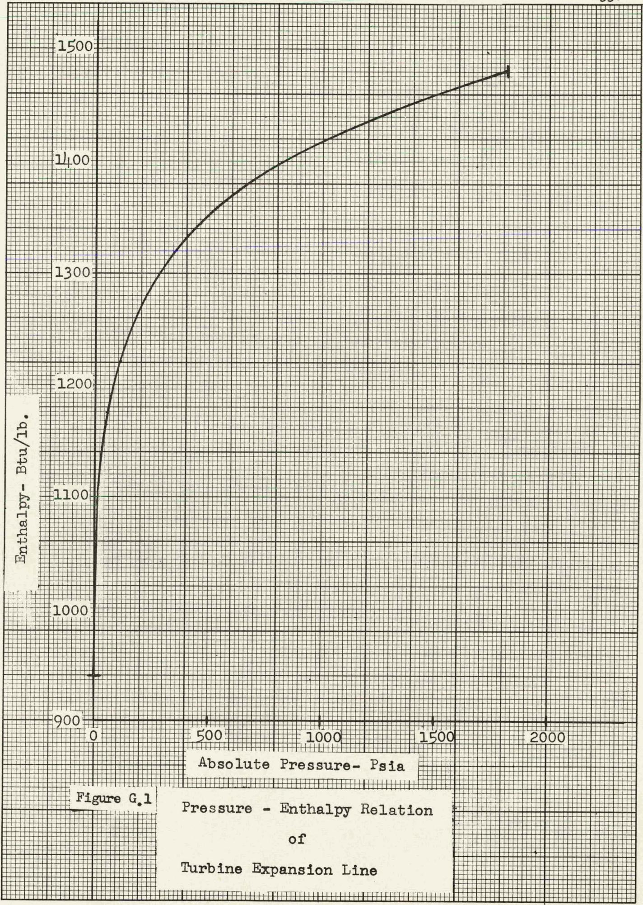

# APPENDIX H

# SODIUM Piping PRESSURE DROP CALCULATIONS

Sample calculations: (Ref. 7)

# H.1 PIPE LINE PRESSURE LOSS

Primary loop: 8 in Schedule 40, 304 SS, 15 ft long

$$
T = 1 1 5 0 ^ {\circ} F
$$

$$
\rho = 4 9. 9 \mathrm {l b} / \mathrm {f t} ^ {3}
$$

$$
\mu = . 0 0 0 1 3 \mathrm {l b} / \mathrm {f t} - \sec
$$

$$
E / D = . 0 0 0 0 6
$$

$$
D = 0. 6 6 5 f t
$$

$$
V = 3 0. 5 f t / s e c
$$

$$
R e = \frac {D V C}{\mu} = \frac {. 6 6 5 \times 3 0 . 5 \times 4 9 . 9}{. 0 0 0 1 3} = 7. 7 8 \times 1 0 ^ {6}
$$

$$
f = . 0 1 1
$$

$$
\Delta P = f \frac {L}{D} \frac {v ^ {2}}{2 g} \frac {\rho}{1 4 4} p s i = . 0 1 1 x \frac {1 5}{. 6 6 5} x \frac {(3 0 . 5) ^ {2}}{6 4 . 4} x \frac {4 9 . 9}{1 4 4} = 1. 2 5 p s i
$$

# H.2 EXPANSION LOSS

Hot leg to heat exchanger. Assume one velocity heat loss for expansion.

$$
\Delta P = K \frac {V _ {1} ^ {2}}{2 g} x \frac {p}{1 4 4} p s i = 1. 0 x (3 4. 4) ^ {2} x \frac {4 9 . 9}{6 4 . 4} = 6. 4 p s i
$$

# H.3 CONTRACTION LOSS

Heat exchanger to cold leg. Assume 0.5 velocity head loss for contraction. 16 in Schedule 40, 304 SS pipe.

$$
\mathrm {T} = 1 0 0 0 ^ {\circ} \mathrm {F}
$$

$$
\ell = 5 1. 2 \mathrm {l b} / \mathrm {f t} ^ {3}
$$

$$
A = 1. 2 2 7 f t ^ {2}
$$

$$
V = 4 5, 7 0 0, 0 0 0 \frac {1 b}{h r} x \frac {1}{3 6 0 0} \frac {h r}{\sec} x \frac {1 f t ^ {3}}{5 1 . 2 1 6} x \frac {1}{1 . 2 2 7 x 6 f t ^ {2}} = 3 3. 5 f t / s e c
$$

$$
\Delta P = K V _ {1} ^ {2} \quad \ell = 0. 5 x (3 3. 5) ^ {2} x 5 1. 2 = 3. 1 p s i
$$

H.4 $90^{\circ}$ BEND LOSS

Assume 0.1 velocity head loss per $90^{\circ}$ bend (Ref. 16).

$$
\triangle P = K \frac {v ^ {2}}{2 g} \frac {\ell}{1 4 4} p s i = 0. 1 x \left(\frac {3 3 . 5}{6 4 . 4}\right) ^ {2} x \frac {5 1 . 2}{1 4 4} = . 6 p s i
$$

$$
\mathrm {T} = 1 0 0 ^ {\circ} \mathrm {F}
$$

$$
e = 5 1. 2 \mathrm {l b} / \mathrm {f t} ^ {3}
$$

$$
V = 3 3. 5 f t / s e c
$$

$$
K = 0. 1
$$

H-5 VALVE LOSS

Assume 0.6 velocity loss per swing check valve (Ref. 16).

$$
\mathrm {T} = 6 7 5 ^ {\circ} \mathrm {F}
$$

$$
e = 5 3. 9 6 \mathrm {1 b / f t} 3
$$

$$
V = 2 6. 2 \mathrm {f t} / \mathrm {s e c}
$$

$$
\triangle P = K \frac {V ^ {2}}{2 g} \frac {\ell}{1 4 4} p s i = 0. 6 x (\frac {2 6 . 2}{6 4 . 4}) ^ {2} x \frac {5 3 . 9 6}{1 4 4} = 2. 4 p s i
$$

Description

No.of lines

Length ft.

Pipe Size

Schedule Number

Des1 Velo

gn city

Number Type

Pressure Number

Pressure

Line Pressure

Total Pressure

Drop psi

Drop psi

$\frac{1 + u}{1} - \frac{u}{1} = \frac{\left( {1 + u}\right) u}{1} < \frac{u}{1} = u$

rop ps1

$\frac{1 + u}{7} = {70}\%$

Drop ps1

<table><tr><td>A. PRIMARY LOOP1. Primary heat exchanger, tube side</td><td></td><td>20</td><td>5/8 in</td><td>.065 in wall</td><td>12.8</td><td></td><td></td><td></td><td></td><td></td><td></td><td>15.7</td></tr><tr><td>2. Feed line (hot)*</td><td>24</td><td>15</td><td>8 in</td><td>40</td><td>30.5</td><td></td><td></td><td></td><td>3</td><td>1.5</td><td>1.3</td><td>2.8</td></tr><tr><td>3. Ringheader (hot)</td><td>1</td><td>75</td><td>18 in</td><td>30</td><td>26.4 avg.</td><td></td><td></td><td></td><td></td><td></td><td></td><td>8.3</td></tr><tr><td>4. Leader (hot) *</td><td>6</td><td>30</td><td>16 in</td><td>40</td><td>34.4</td><td>1</td><td>swing check</td><td>3.8</td><td>5</td><td>3.3</td><td>1.5</td><td>8.6</td></tr><tr><td>5. Intermediate heat exchanger, shell side</td><td></td><td>14.8</td><td></td><td></td><td></td><td></td><td></td><td></td><td></td><td></td><td>12.2</td><td>12.2</td></tr><tr><td>6. Leader (cold) *</td><td>6</td><td>50</td><td>16 in</td><td>40</td><td>35.5</td><td>1</td><td>swing check</td><td>3.7</td><td>7</td><td>4.3</td><td>2.5</td><td>10.5</td></tr><tr><td>7. Ringheader (cold)</td><td>1</td><td>75</td><td>18 in</td><td>30</td><td>25.7</td><td></td><td></td><td></td><td></td><td></td><td>8.7</td><td>8.7</td></tr><tr><td>8. Feed line (cold)</td><td>24</td><td>9</td><td>8 in</td><td>40</td><td>29.6</td><td></td><td></td><td></td><td>3</td><td>1.4</td><td>0.7</td><td>2.1</td></tr><tr><td></td><td></td><td></td><td></td><td></td><td></td><td></td><td></td><td>7.5</td><td></td><td>10.5</td><td>26.9</td><td>68.9</td></tr><tr><td>9. Pump Description: 18.55D gpm., 200 ft.head.</td><td>ft.head.</td><td colspan="4">176C rpm.. . 1000 F. 1335 HP</td><td></td><td></td><td></td><td></td><td></td><td></td><td></td></tr><tr><td>B. INTERMEDIATE LOOP1. Intermediate heat exchanger, tube side</td><td></td><td>14.8</td><td>1,2 in</td><td>.065 in wall</td><td></td><td></td><td></td><td></td><td></td><td></td><td></td><td>15.0</td></tr><tr><td>2. Hot Leg</td><td>6</td><td>50</td><td>10 in.</td><td>40</td><td>27.1</td><td></td><td></td><td></td><td>4</td><td>1.6</td><td>2.6</td><td>4.2</td></tr><tr><td>3. Secondary leader (hot)</td><td>2</td><td>65</td><td>18 in</td><td>30</td><td>27.7</td><td>1</td><td>gate</td><td>0.4</td><td>3</td><td>1.2</td><td>2.8</td><td>4.4</td></tr><tr><td>4. Boiler, shell side</td><td></td><td>50</td><td></td><td></td><td>9.6</td><td></td><td></td><td></td><td></td><td></td><td></td><td>11.6</td></tr><tr><td>5. Secondary leader (cold)</td><td>2</td><td>80</td><td>18 in</td><td>30</td><td>26.2</td><td>3</td><td>gate</td><td>1.2</td><td>7</td><td>2.8</td><td>2.9</td><td>9.3</td></tr><tr><td></td><td></td><td></td><td></td><td></td><td></td><td>1</td><td>swing check</td><td>2.4</td><td></td><td></td><td></td><td></td></tr><tr><td>6. Cold leg</td><td>6</td><td>40</td><td>1C in</td><td>40</td><td>25.5</td><td></td><td></td><td></td><td>4</td><td>1.5</td><td>2.0</td><td>3.5</td></tr><tr><td></td><td></td><td></td><td></td><td></td><td></td><td></td><td></td><td>4.0</td><td></td><td>7.1</td><td>10.3</td><td>48.0</td></tr><tr><td>7. Pump description: 18.35D gpm., 140 ft.head.</td><td>ft.head.</td><td colspan="4">1760 rpm.. . 675 F. 950 HP</td><td></td><td></td><td></td><td></td><td></td><td></td><td></td></tr><tr><td></td><td></td><td></td><td></td><td></td><td></td><td></td><td></td><td></td><td></td><td></td><td></td><td></td></tr></table>

# APPENDIX I

# PARTIAL LOAD OPERATION (MATHEMATICAL APPROACH)

The assumptions used in deriving the equations of this appendix are explicitly given in Section 7.4.1 of this report. In addition to the nomenclature given at the beginning of these appendices, other symbols are used for the derivations of this section. These arc as follows:

# Subscripts - General

1 Full load value of a variable   
x Partial load value of a variable   
p Value of a variable   
b Value of a variable in the boiler   
s Value of a variable in the superheater   
f Value of a variable in the fuel loop

# Subscripts - Temperatures

0 Cold mixed mean temperature of fuel leaving the primary heat exchanger   
2 Hot mixed mean temperature of fuel entering the primary heat exchanger   
3 Inlet sodium temperature to primary heat exchanger   
4 Outlet sodium temperature from primary heat exchanger   
5 Inlet sodium temperature to intermediate heat exchanger   
6 Outlet sodium temperature from intermediate heat exchanger   
7 Outlet sodium temperature from superheater

# Other

L Load fraction ratio actual load full load

W Pounds of steam generated per hour at full load

M Weight flow of sodium in the intermediate loop, lb/hr

Z Logarithmic mean temperature difference

# I.1 NATURAL CIRCULATION BOILER WITH SEPARATE SUPERHEATER

Since the average fuel temperature and flow rate are constant,

$$
\Delta t _ {f} = 1 5 0 \mathrm {L} \tag {I.1}
$$

and

$$
t _ {F} \text {a v e r a g e} = 1 1 2 5 ^ {\circ} F \tag {I.2}
$$

Solving Equations (I.1) and (I.2) yields the following relations,

$$
t _ {o x} = 1 1 2 5 - 7 5 L \tag {I.3}
$$

$$
t _ {2 x} = 1 1 2 5 + 7 5 L \tag {I.4}
$$

As a consequence of the assumption of constant over-all heat transfer coefficient and constant flow rate of sodium in the primary loop, Equations (I.5), (I.6), (I.7) and (I.8) result,

$$
Z _ {p x} = 5 0 L \tag {I.5}
$$

$$
t _ {4 x} - t _ {3 x} = 1 5 0 L \tag {I.6}
$$

$$
t _ {0 x} - t _ {3 x} = 5 0 L \tag {I.7}
$$

$$
t _ {2 x} - t _ {4 x} = 5 0 L \tag {I.8}
$$

The simultaneous solution of Equations (I.6), (I.7) and (I.8) gives the equations for $t_{4x}$ and $t_{3x}$ ,

$$
t _ {3 x} = 1 1 2 5 - 1 2 5 L \tag {r.9}
$$

$$
t _ {4 x} = 1 1 2 5 + 2 5 L \tag {I.10}
$$

The sodium in the intermediate loop transfers its heat to the superheater and the boiler, respectively. At partial load, the over-all transfer rate in the superheater will be,

$$
\frac {1}{U _ {\mathrm {o x}}} = . 0 0 0 7 1 0 + \frac {1}{7 7 5 (\mathrm {L})} \cdot 8 \tag {I.11}
$$

where the constants in Equation (I.11) are based on a design value of $\mathbf{U}_{01}$ of 500.

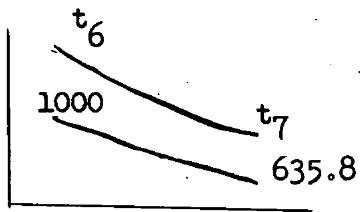

Therefore,

(I.12)

$$
z _ {S _ {x}} = L x 5 0 0 x z _ {S _ {1}} \left(0. 0 0 7 1 0 + \frac {1 .}{7 7 5 (L) \cdot 8}\right) = \frac {\left(t _ {6 x} - 1 0 0 0\right) - \left(t _ {7 x} - 6 3 5 . 8\right)}{\ln \left(\frac {t _ {6 x} - 1 0 0 0}{t _ {7 x} - 6 3 5 . 8}\right)}
$$

From the design conditions at full load,

$$
Z _ {S _ {1}} = 1 9 1
$$

The assumptions made for partial load operation include the constancy of the over-all coefficient of heat transfer in the boiler. Based on this and the fact that the surface is constant, Equation (I.13) follows directly.

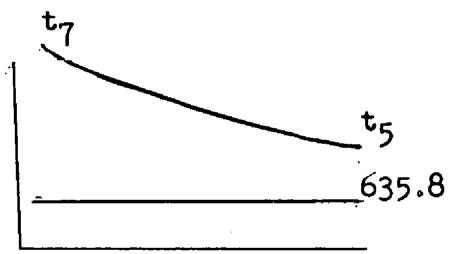

$$
1 3 5 \mathrm {L} = \frac {\mathrm {t} _ {7 \mathrm {x}} - \mathrm {t} _ {5 \mathrm {x}}}{\ln \left(\frac {\mathrm {t} _ {7 \mathrm {x}} - 6 3 5 . 8}{\mathrm {t} _ {5 \mathrm {x}} - 6 3 5 . 8}\right)} \tag {I.13}
$$

The last equation needed to specify the conditions in the loops at partial load is obtained by considering the intermediate heat exchanger.

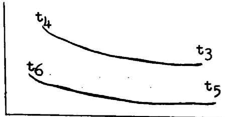

240.

$$
1 4 7 \mathrm {L} = \frac {\left(t _ {4 x} - t _ {6 x}\right) - \left(t _ {3 x} - t _ {5 x}\right)}{\ln \left(\frac {t _ {4 x} - t _ {6 x}}{t _ {3 x} - t _ {5 x}}\right)} \tag {I.14}
$$

Substituting the values for $t_{3x}$ and $t_{4x}$ from Equations (I.9) and (I.10) into (I.14) and simplifying, yields Equation (I.15),

$$
1 4 7 \mathrm {L} = \frac {1 5 0 \mathrm {L} - \left(t _ {6 x} - t _ {5 x}\right)}{\ln \left(\frac {1 1 2 5 + 2 5 L - t _ {6 x}}{1 1 2 5 - 1 2 5 L - t _ {5 x}}\right)} \tag {I.15}
$$

The weight flow of the sodium in the intermediate loop is determined directly by a heat balance,

$$
= \frac {M _ {x}}{M _ {1}} \quad \frac {\left(t 6 x - t 5 x\right)}{4 2 5} \tag {I.16}
$$

Equations (I.12), (I.13), (I.15) and (I.16) completely determine the steady state partial load operation of the system based upon the simplification and assumptions given in Section 7.4.1. However, a superheater heat balance has not been utilized in the foregoing. The superheater heat balance gives an additional independent equation (I.22). The ability to write more independent equations than there are unknowns indicates that too many constraints have been placed on the system by the assumptions made in Section 7.4.1. Therefore, the final steam temperature will not be taken to be constant with load and the control of the final steam temperature will be accomplished by using an attemperator. Equation (I.12) has to be adjusted to reflect the change in this assumption, and instead of $1000^{\circ}\mathrm{F}$ , the final steam temperature should be indicated to be variable. In this case, Equation (I.22) has to be written in terms of the enthalpy of the steam side corresponding to the unknown final steam temperature at the superheater outlet.

It is further noted that for a variable final steam temperature leaving the superheater, Equations (I.11) and (I.12) are not correct as written. A

numerical solution is necessary where the final steam temperature is assumed for a given load. From a heat balance of the steam loop, the weight of steam is obtained and $U_{\mathrm{ox}}$ is calculated. The procedure is then to solve the applicable equations simultaneously, and finally to check the assumed final steam temperature for the load under consideration. A procedure such as outlined above is tedious and time consuming.

# I.2 ONCE-THROUGH STEAM GENERATOR

The basic difference in the mathematical approach to the problem of partial load operation of the once-through boiler as compared to the natural circulation boiler with separate superheater is that the sum of the surfaces of the boiler and superheater sections is a constant, but each can vary individually with load. Equations (I.3), (I.4), (I.15) and (I.16) are applicable to this case. However, certain of the other relations were modified, and, where necessary, new equations were developed. In general, the load fraction (L) can be written for a given component as,

$$
L = \frac {U _ {x} Z _ {x} S _ {x}}{U _ {1} Z _ {1} S _ {1}} \tag {I.17}
$$

For the boiler and preheater section, Equation (I.18) is obtained by combining Equations (I.17) and (I.13),

$$
S _ {b x} = \frac {L \times 1 3 5 \times S _ {b l} \ln \left(\frac {t _ {7 x} - 6 3 5 . 8}{t _ {5 x} - 6 3 5 . 8}\right)}{\left(t _ {7 x} - t _ {5 x}\right)} \tag {I.18}
$$

The same procedure follows for the superheat section, where Equation (I.17) is combined with Equation (I.12). However, the design values for the once-through boiler are different than for the separate superheater and the constants in Equation (I.12) were adjusted accordingly. The design value for

the steam side coefficient was 1100 and the over-all coefficient was

$$
3 0 0 \mathrm {B T U} / \mathrm {h r} - f t ^ {2} - o _ {\mathrm {F}}. \tag {I.19}
$$

$$
L x U _ {1} x 1 9 1 \left[ . 0 0 2 4 2 + \frac {1}{1 1 0 0 (L) \cdot 8} \right] S _ {s 1} = \frac {\left(t _ {6 x} - 1 0 0 0\right) - \left(t _ {7 x} - 6 3 5 . 8\right) S _ {6 x}}{\ln \left(\frac {t _ {6 x} - 1 0 0 0}{t _ {7 x} - 6 3 5 . 8}\right)}
$$

Solving for $\mathbf{S}_{\mathbf{6x}}$

$$
\frac {S _ {8 x} = L \times 3 0 0 \times 1 9 1 \left[ . 0 0 2 4 2 + \frac {1}{1 1 0 0 (L) \cdot 8} \right] \left(S _ {8 1}\right) \ln \left(\frac {t _ {6 x} - 1 0 0 0}{t _ {7 x} - 6 3 5 . 8}\right)}{\left(t _ {6 x} - 1 0 0 0\right) - \left(t _ {7 x} - 6 3 5 . 8\right)}
$$

The sum of the surfaces at any load must be a constant. This sum at design load is 21,192 square feet where,

$$
S _ {8 1} = 1 1, 4 7 0 \mathrm {s q f t}
$$

and

$$
S _ {b 1} = 9 7 2 2 s q f t
$$

Therefore,

$$
\frac {\mathrm {L} \times 3 0 0 \times 1 9 1 \left(0 . 0 2 4 2 + \frac {1}{1 1 0 0 (\mathrm {L}) \cdot 8}\right) 1 1 , 4 7 0 \ln \left(\frac {\mathrm {t} _ {6 \mathrm {x}} - 1 0 0 0}{\mathrm {t} _ {7 \mathrm {x}} - 6 3 5 . 8}\right)}{\left(\mathrm {t} _ {6 \mathrm {x}} - 1 0 0 0\right) - \left(\mathrm {t} _ {7 \mathrm {x}} - 6 3 5 . 8\right)}
$$

$$
\frac {+ \mathrm {L} x 1 3 5 x 9 7 2 2 \ln \left(\frac {\mathrm {t} 7 \mathrm {x}}{\mathrm {t} 5 \mathrm {x}} - 6 3 5 . 8}{\mathrm {t} 5 \mathrm {x}}\right){\mathrm {t} 7 \mathrm {x} - \mathrm {t} _ {5 \mathrm {x}}} = 2 1, 1 9 2 \tag {I.21}
$$

A heat balance of the superheater yields Equation (I.22),

$$
\frac {M _ {X}}{M _ {1}} = \left(\frac {1 4 0}{t 6 x - t 7 x}\right) ^ {L} \tag {I.22}
$$

Equations (I.22) and (I.16) are then combined to yield a single equation with the flow rates eliminated,

$$
\left(t _ {6 x} - t _ {5 x}\right) = \frac {4 2 5}{1 4 0} \left(t _ {6 x} - t _ {7 x}\right) \tag {I.23}
$$

The solution of Equations (I.15), (I.21) and (I.23) simultaneously gives the desired steady state partial load operation of the system for the once-through boiler. It is noted that the final steam temperature can be set at $1000^{\circ}\mathrm{F}$ and the system is completely determinate with only intermediate loop sodium flow rate control; this is not the case for the natural circulation boiler with separate superheater.

# APPENDIX J

# SIMULATION FOR 600 MW FUSED SALT REACTOR AND STATIONARY POWER PLANT

by

E. R. Mann

Instrumentation and Controls Division

Oak Ridge National Laboratory

Figures (7.4), (J.1), (J.2) and (J.3) are the elementary flow sheet for the power plant and the road maps required for simulation, with the exception of that for the reactor kinetics which is described in Ref. 54.

On Figure (J.1) is the road map for the fused salt loop and the first or primary sodium loop. Amplifiers 1, 2, 3 and 4 provide a unity gain circuit for the fused salt loop. Amplifiers 7, 8, 9 and 10 provide a similar circuit for the primary sodium coolant. Amplifiers 5 and 6 generate the coupling between these two fluids as the difference between the mid temperatures of the two fluids in the heat exchanger.

The time constant of the metal in the heat exchanger was not included in these simulation studies. Accordingly, about amplifier 5 are shown a potentiometer setting "∠" and series resistor "R" to indicate that such a time constant should be included.

This time constant can be calculated rather simply as follows. The heat capacity of the fused salt in the heat exchanger is given by the expression,

$$
C _ {F} = \frac {P}{\delta T / \delta t}
$$

where $P$ is the power given up by the fused salt in passing through the heat exchanger at design point steady state, and $\delta T$ is the temperature drop of the salt during the time $\delta t$ is in the heat exchanger. $P$ is in

BTU/sec, $\mathcal{S}\mathbf{T}$ in degrees F, and $\mathcal{S}\mathbf{t}$ in seconds, and $C_{\mathbf{f}}$ is in BTU/F.

Now the mass of metal in the heat exchanger times its specific heat gives the heat capacity $C_{\mathrm{H.E.}}$ of the heat exchanger. If then, $\mathcal{U}_{\mathbf{f}}$ is the time constant of the fluid in the heat exchanger, which here has been approximated by two first order lags whose sum is the fluid transit time, then the time constant of the heat exchanger is,

$$
\tau_ {\mathrm {H} \cdot \mathrm {E} _ {\bullet}} = \frac {c _ {\mathrm {H} \cdot \mathrm {E} _ {\bullet}}}{c _ {\mathrm {f}}} \times \tau_ {\mathrm {f}}
$$

In transient, this circuit with the time constant $\tau_{\mathrm{H.E.}}$ , provided by amplifier 5, gives the heat transfer delay between fluids due to heating or cooling the metal of the heat exchanger.

The road map on Figure (J.2) shows, through amplifiers 13 and 14, the intermediate sodium in the sodium-to-sodium heat exchanger. Amplifiers 15, 16, 19 and 20 show the sodium "going and returning" in a heat exchanger between the hot and cold legs of the sodium piping. The flow sheet, Figure (7.4), shows how valves $\mathsf{V}_1$ and $\mathsf{V}_2$ will provide means for returning part of the cold sodium through this auxiliary heat exchanger which drops the temperature of the sodium entering the boiler.

This auxiliary heat exchanger is one means available to limit the steam temperature on partial loads to a maximum temperature of $1000^{\circ}\mathrm{F}$ . It was selected for simulation here primarily because the analog facility required less equipment to do this than it would have required to vary the secondary sodium flow rate.

The road map, Figure (J.2), shows amplifiers 17 and 18 as the sodium in the sodium-to-water and vapor heat exchanger. It was assumed that the load "L" was proportional to water flow, i.e., the water entered the boiler at constant temperature for all loads.

Road maps, Figure (J.3), show by amplifiers 11 and 12 how the driving function "β" between the two sodium systems in the sodium-to-sodium heat exchanger was generated, and by amplifiers 21 through 26, inclusive, how the regulator action to keep the steam temperature constant with varying loads "L" was obtained.

The quantities " $\beta$ " and "R", with amplifier ll, are determined by the time constant of the metal in the heat exchanger for the sodium-to-water heat transfer. The heat capacity of this heat exchanger was not used in these simulations. This time constant could have been determined by the same procedure proposed for that of the metal in the sodium-to-sodium heat exchanger.

The output of amplifier 27, Figure (J.3), at design point should be $+2.5\mathrm{V}$ . This output was recorded on a Brown recorder with a full scale reading of $5\mathrm{V}$ . The output gave a midscale reading. Two limit switches about the midscale reading actuated a motor to turn a ten-turn potentiometer "E", Figure (J.3). The motor was reversible and its direction was determined by the limit switch contacted by deviation of the output of amplifier 27. If the deviation was positive and caused the recorder pen to move upscale into the upper limit switch, which would be true for decreasing load, then the motor turned the potentiometer setting up and thereby "valved" more sodium through the auxiliary heat exchanger. Except for the relatively slow motor speed, or rate of motion of the slide wire on the potentiometer due to the gear reduction available, this device could hold the steam temperature constant for large variations in power. The curves show deviations in steam temperatures during transients, but these come from the relatively slow response times of the actuator mechanism.

Scale factors in the simulation studies were as follows:

1. Computer time was real time   
2. One volt represented 10 megawatts of power   
3. One volt represented $20^{\circ} \mathrm{F}$

The circuits were not set up from a set of differential equations representing the system. The set of equations can be derived from the circuits by setting the currents at the amplifier inputs equal to zero. Then by converting electrical units to power and temperature units using the scale factors given above, one gets the equations of the system. Some of these equations will be dependent.

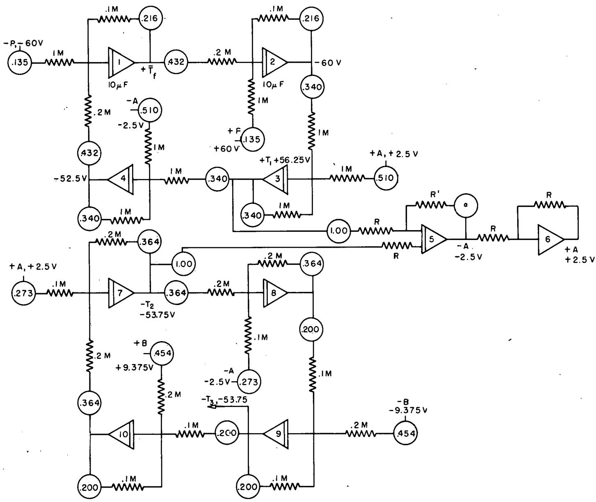  
FIG. J.I - SIMULATOR CIRCUIT FOR FUEL AND PRIMARY SODIUM COOLANT LOOPS

ORNL-LRDwg.-18199

248.

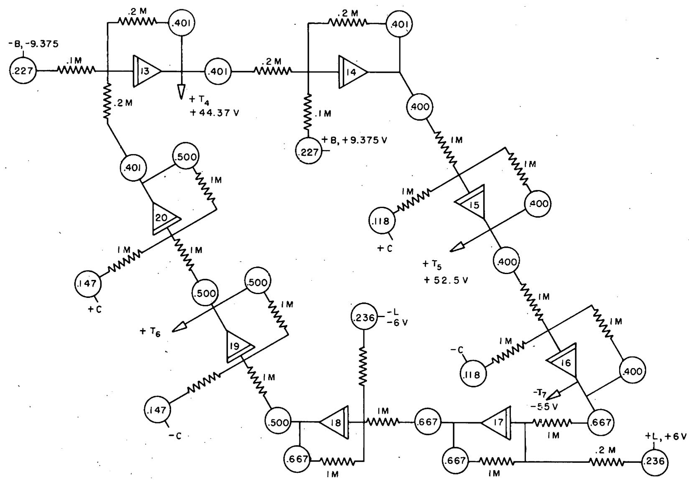  
FIG. J.2- SIMULATOR CIRCUIT FOR INTERMEDIATE SODIUM LOOP

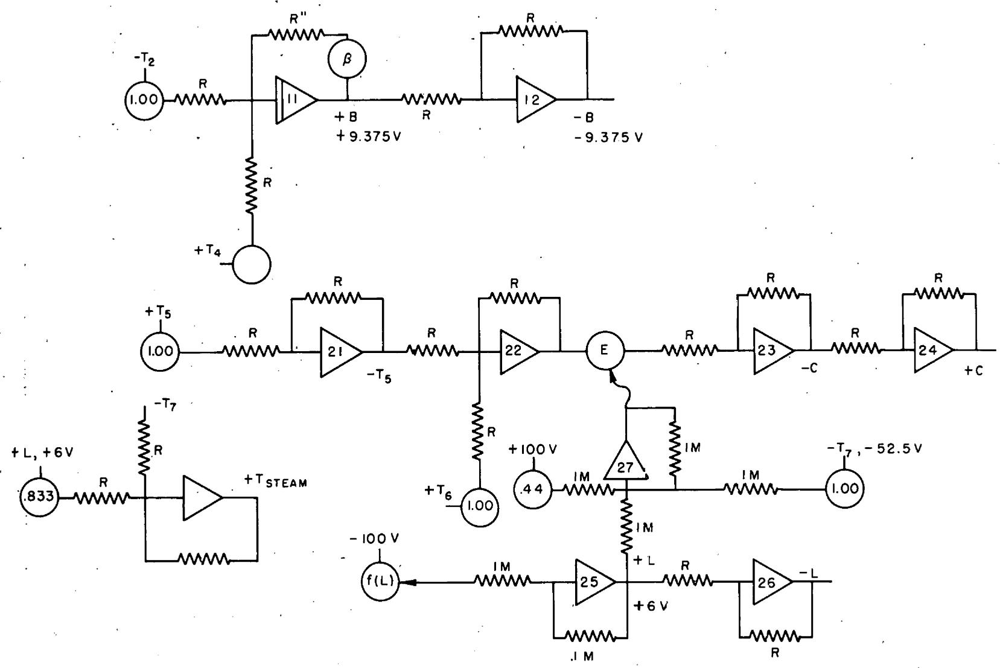  
FIG. J.3-SIMULATOR CIRCUIT FOR DRIVING FUNCTION IN INTERMEDIATE HEAT EXCHANGER AND REGULATOR FOR STEAM TEMPERATURE CONTROL  
10281-3MCA-7T-NHO

092

# APPENDIX K

# TEST OF DOUBLE TUBE SHEET DESIGN FOR WATER SODIUM ISOLATION

An experiment has been conducted to determine the feasibility of using brazed joints in the fabrication of a double header for the heat exchanger(s).

# Procedure

Approximately 400 holes were drilled in a 1/2-inch thick type 347 SS plate to receive short lengths of type 304 stainless steel tubes of nominal 1/2-inch diameter, .035-inch wall. The holes were reamed to allow .005-inch clearance on the diameter to permit easy assembly and satisfactory design for brazing. Although none of the currently available elevated temperature alloys have been found to be entirely satisfactory in elevated temperature sodium corrosion tests $^{1}$ , the alloy Cast Metals No. 52 (84 Ni-4 Si-2B) was selected as representative of the alloy system most likely to yield a corrosion resistant alloy for extended service. This alloy system, however, possesses a fundamental disadvantage, in that Boron diffusion into the stainless steel grain boundaries results in a serious loss of ductility. The experiment was conducted, therefore, to merely verify the feasibility following development of a nickel-base corrosion resistant alloy. The alloy was applied as a precast brazing ring on one face of the tube sheet around each tube and fixed in place with a CM 52 pounder slurry. The tube sheet was heated in $-100^{\circ}\mathrm{F}$ dew point hydrogen to $1050^{\circ}\mathrm{C}$ at a rate of $1050^{\circ}\mathrm{C}/$ hour, held 1/2 hour at $1050^{\circ}\mathrm{C}$ and cooled at $100^{\circ}\mathrm{C}/$ hour. This cycle was selected as representative of commercial practice.

# Results

The results of this experiment are illustrated in Figures (K.1) and (K.2), photographs of the underside of the tube sheet after brazing. Four tubes were found to be only partially brazed, the most serious flaw being shown enlarged in Figure (K.2).

In view of these results and in view of the research still required to develop a brazing alloy suitable for extended service in sodium, the method of fabrication suggested by this study is at best marginal and not recommended.

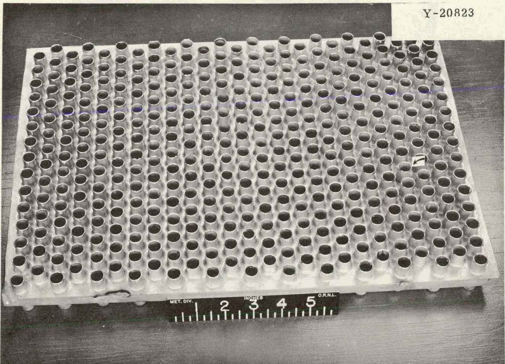  
Figure K-1 Underside of Brazed Tube Sheet (Arrow points to brazing flow)

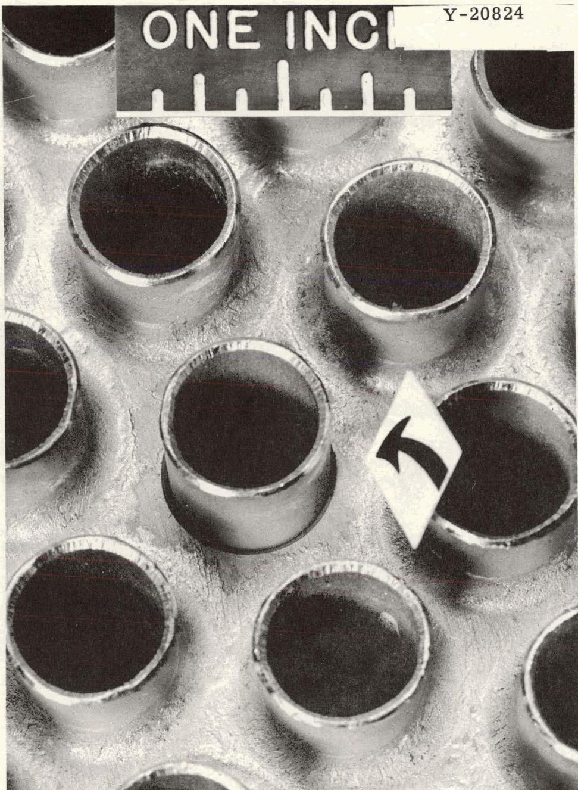  
Figure K-2 Defective Brazing of Tube (Close-up view of tube indicated by arrow in K-1)

```txt
A Cross sectional area for flow of fluid, ft²  
A inside or tube side  
A outside or shell side  
C Constant  
Cp Specific heat at constant pressure, BTU/lb-°F  
d Tube diameter, ft  
d_1 inside diameter  
d_0 outside diameter  
d_m diameter of interface of cladding and base metal  
d_e equivalent diameter, 4 x flow area/wetted perimeter  
f(N) Function of N  
f Friction factor, dimensionless  
g Acceleration due to gravity, 32.2 ft/sec²  
h Heat transfer coefficient, BTU/hr-ft²-°F  
h_Na for sodium  
h_S for salt  
H Enthalpy, BTU/lb  
k Thermal conductivity, BTU/hr-ft²-°F  
L Geometrical length, ft  
N Number of tubes, dimensionless  
Nu Nusselt number, dimensionless  
p Pressure, psi  
P_hp Power delivered to the fluid, horsepower  
Pe Peclet number, Pe = Re Pr, dimensionless  
P_T Tube pitch, ft  
Pr Prandtl number, dimensionless  
q Rate of heat transfer, BTU/hr 
```

R Resistance to heat flow, hr-ft²-oF/BTU

Re Reynolds number, dimensionless

r Tube radius, ft

S Area of heat transfer surface, ft² S₁ referred to inside surface of tubes S₀ referred to outside surface of tubes

s Ligament between adjacent tubes, ft

t Temperature, ${}^{\mathrm{o}}\mathbf{F}$

T Absolute temperature, ${}^{\mathrm{O}}\mathbf{K}$

$\mathbf{U}_{\circ}$ Over-all heat transfer coefficient based on outside surface of tubes, BTU/hr-ft²-OF

V Velocity of fluid, ft/sec

v Specific volume, ft³/1b

Vol Volume of holdup, ft³

Mass flow rate, lb/hr

$\mathbf{x}$ Thickness, ft

# Greek

$\triangle P$ Pressure difference, psi

△t Temperature difference, $\mathbf{\Delta}_{\mathbf{F}}$ △to Temperature difference between bulk mean temperatures of two fluids $\Delta t_{0l}$ Logarithmic mean temperature difference

Pump efficiency

Absolute viscosity of fluid, lb/hr-ft

Density of fluid, lb/ft3

Notation signifying a summation, dimensionless

TT 3.1416

# Subscripts

Na Refers to sodium

S Refers to the salt

# SYMBOLS USED IN THE NUCLEAR PHYSICS CALCULATIONS

A Atomic weight of an element   
B Geometric buckling of the reactor, $\mathbf{cm}^{-2}$ C Constant   
D Diffusion coefficient, cm   
k Multiplication constant of the reactor   
N Atomic concentration, atoms/cc $\mathrm{N}_{\mathrm{o}}$ Avogadrots number, 6.02 x $10^{23}$ atoms/gm atomic wt   
P Poisson fraction, $\sum_{\mathrm{p}} / \sum_{\mathrm{f}}$ dimensionless   
R Radius of reactor's central core, cm or ft   
t Time, seconds   
T Temperature, $^\circ \mathrm{C}$ or ${}^{\circ}\mathrm{F}$ u Lethargy, logarithmic energy decrement   
Y Time, years

# Greek

```txt
Average change in lethargy of a neutron per collision   
Average number of neutrons released per fission   
Neutron flux, neutrons/cm2-sec Density, gm/cc Microscopic cross section, cm2 or barns   
Macrosopic cross section, cm-1 
```

# BIBLIOGRAPHY

# Ref. No.

1. Shannon, R. H., APDA, Private Communication, June 20, 1956   
2. Ledinegg, M., "Flow Instability in Natural and Forced Circulation", "Die Warne", 1938   
3. Leib, E. F., Discussion to paper by Van Brunt, Trans. ASME, May 1941   
4. Jens, W. H., "What is Known about Boiling Heat Transfer", Metropolitan Section of ASME, April 7, 1954   
5. Morabito, J. J. and Shannon, R. H., "Test of a Once-Through Steam Generator with a Liquid Metal as a Heat Source", ASME Preprint Paper No. 55-A-189, 1956   
6. McAdams, W. H., "Heat Transmission", 3rd Edition, McGraw-Hill Book Co., 1954   
7. U. S. Atomic Energy Commission, "Reactor Handbook", Engineering, Vol. 2   
8. Glasstone, S., "Principles of Nuclear Reactor Engineering", 1st Edition, D. Van Nostrand Co., 1955   
9. Colburn, A. P., "A Method of Correlating Forced Convection Heat Transfer Data and a Comparison with Fluid Friction", Trans. A.I.Ch.E., Vol. 29, 1933.   
10. Fong, J., Research Dept., Foster Wheeler Corp., Private Communication, June 1956   
11. Granet, I. and Kass, P., "The Viscosity, Thermal Conductivity and Specific Heat of Steam at Elevated Pressures and Temperatures", Petroleum Refiner, May 1953   
12. "Fourth International Conference on the Properties of Steam", 1954   
13. McAdams, N. H., Kennel, W. E. and Addoms, J. N., "Heat Transfer to Superheated Steam at High Pressures", Trans. ASME, Vol. 72, 1950   
14. Tate, G. E., "Notes - Advanced Heat Transfer", Polytechnic Institute of Brooklyn, 1948   
15. Jackson, C. B., "Liquid-Metals Handbook Sodium-Nak Supplement", 3rd Edition, A.E.C. and Dept. of the Navy, July 1, 1955   
16. "Pipe Friction", Standard of Hydraulics Institute, 1949

17. Cohen, Stanley, REED, ORNL, Private Communication, June 1956   
18. Barton, C. J., ORNL, Private Communication, June 1956   
19. Nessle, George J., Jr., ORNL, Private Communication, June 1956   
20. Kern, D. Q., "Process Heat Transfer", McGraw-Hill Book Co., 1950   
21. Binder, R. C., "Fluid Mechanics", Prentice-Hall, Inc., 1949   
22. Granet, I., "The Computation of Natural Circulation in Large Boilers", M.S. Thesis, Polytechnic Institute of Brooklyn, 1948   
23. Gaffert, Gustaf A., "Steam Power Stations", McGraw-Hill Book Co., 1952   
24. Granet, I., "The Calculation of the Relative Expansion in Fixed Tube Sheet Heat Exchangers", Petroleum Refiner, August 1955   
25. Dwyer, O. E., "Heat Exchange in a Liquid-Metal-Fuel Reactor for Power", Nuclear Engineering - Part I, AICHe, 1954   
26. Sense, Karl A., et al., "Vapor Pressures of the Sodium Fluoride-Zirconium Fluoride System and Derived Information", Battelle Memorial Institute, BMI 1064, January 9, 1956   
27. Kinney, W., ORNL, Private Communication, June 1956   
28. Bate, R. R., Einstein, L. T. and Kinney, W. E., "Description and Operation Manual for the Three Group, Three Region Reactor Code for ORACLE", ORNL, ORNL-CF-55-1-76, January 13, 1955   
29. Ergen, W. K., "Uranium Investment in a Circulating Fluoride Power-Producing Reactor", ORNL, ORNL-CF-56-4-29, Classified April 4, 1956   
30. Hughes, D. J. and Harvey, J. A., "Neutron Cross Sections", Brookhaven National Laboratory, BNL-325, July 1, 1955   
31. Barton, C. J., "Fused Salt Compositions", ORNL, ORNL-CF-55-9-78, Classified September 16, 1955   
32. Grimes, W. R., ORNL, Private Communication, July 1956   
33. Gresky, A. T. and Arnold, E. D., "Poisoning of the Core of the Two Region Homogeneous Thermal Breeder: Study No. 1", ORNL, ORNL-CF-53-12-165, Classified December 11, 1953   
34. Gresky, A. T. and Arnold E. D., "Poisoning of the Core of the Two Regior Homogeneous Thermal Breeder: Study No. 2", ORNL, ORNL-CF-54-2-208, Classified February 22, 1954

35. "Unfired Pressure Vessels" Section VIII of the ASME Boiler and Pressure Vessel Code, 1952   
36. "PWR Preliminary Design Report", Atomic Power Division, Westinghouse Electric Corp., WAPD-112, Classified, June 1954   
37. Lane, James A., "Economics of Nuclear Power", Geneva Conference Paper No. 590A (UN-476), 1955   
38. Cathers, G. I., ORNL, Private Communication, August 1, 1956   
39. U. S. Atomic Energy Commission, "Reactor Handbook", Engineering, Vol. 2, Classified   
40. Charpie, R. A. and Silver, Ernest, ORNL, Private Communication, August 1956   
41. Hegetschweiler, H. and Bartlett, R. L., "Predicting Performance of Large Steam Turbine-Generator Units for Central Stations", ASME, Paper No. 56-SA-52, 1956   
42. Poppendiek, H. F. and Palmer, L. D., "Forced Convection Heat Transfer in Pipes with Volume Heat Sources within the Fluids", ORNL, ORNL-1395, November 11, 1953   
43. Poppendiek, H. F. and Palmer, L. D., "Forced Convection Heat Transfer Between Parallel Plates and in Annuli with Volume Heat Sources within the Fluids", ORNL, ORNL-1701, May 21, 1954   
44. Poppendiek, H. F. and Palmer, L. D., "Application of Temperature Solutions for Forced Convection Systems with Volume Heat Sources to General Convection Problems", ORNL, ORNL-1933, December 29, 1955   
45. Poppendiek, H. F., ORNL, Private Communication, July 1956   
54. Mann, E. R., "Electronic Analog Devices for Design of Reactor Controls", IRE Transactions of the Professional Group on Nuclear Science, Vol. NS-3, No. 2, March 1956   
55. Thomas, R. Davis, Jr., "Selection of Stainless Steel Electrodes for Trouble-Free Welds", Metal Progress, Vol. 70, No. 1, July 1956   
56. Woolsey, C. C., Jr., "Selection of Materials for Sodium Graphite Reactor System", ASME Paper 55-S-16   
57. Dreisbach, R. A., and Smith, A. G., "Gas-Fired Life Test", Experiment No. 4935-6, ORNL, July 25, 1956

SECRET