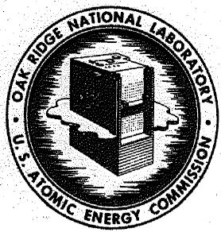

OAK RIDGE NATIONAL LABORATORY

Operated By

UNION CARBIDE NUCLEAR COMPANY

# Uc

POST OFFICE BOX P

OAK RIDGE, TENNESSEE

# ORNL

# CENTRAL FILES NUMBER

[{56} - 9 = {32}]

DATE: September 11, 1956

SUBJECT: FUSED SALT POWER REACTOR STUDY:

Minutes of Discussion Meeting No. 2

TO: Distribution

FROM: L. G. Alexander

bCLASSIFIED

By Authority Of:

AEC 26.57 Distribution

M. shiie 1. I. G. Alexander

Fer: M. I. Bray, Supervisor U2. W. E. Arnold

Laboratory Records Dept. 3. E. S. Bettis

QNA

This document has been reviewed and is determined to be APPROVED FOR PUBLIC RELEASE.

Name/Title: Lindaesigne, TIO

Date: $3 - 9 - {11}\mathrm{e}$

E.S.Bettis   
D. S. Billington   
D. A. Carrison   
R. A. Charpie   
S.J.Cromer   
W. K. Ergen   
J. L. Gregg   
10. A. J. Gresky   
11. W.R.Grimes   
12. W. H. Jordan   
13. B. W. Kinyon   
14. H. G. MacPherson   
15. W. D. Manly   
16. L. A. Mann   
17. H.F.Poppendiek   
18. T. J. Roberts   
19. J. A. Swartout   
20. F. C. VonderLage   
21. A. M. Weinberg   
-23. Laboratory Records   
24. C. R. Library

This document consists of 3 pages.

Copy 22of 24 copies. Series A

For Internal Use Only

RESTRICTED DATA

This document contains Restricted Data as defined in the Atomic Energy Act of 1954, Its transmittal or the disclosure of its contents in any manner to an unauthorized person is prohibited.

# FUSED SALT POWER REACTOR STUDY

# Minutes of Discussion Meeting No. 2

August 22, 1956

<table><tr><td>Present:</td><td>L. G. Alexander</td></tr><tr><td></td><td>W. E. Arnold</td></tr><tr><td></td><td>E. S. Bettis</td></tr><tr><td></td><td>D. A. Carrison</td></tr><tr><td></td><td>S. J. Cromer</td></tr><tr><td></td><td>W. K. Ergen</td></tr><tr><td></td><td>J. L. Gregg</td></tr><tr><td></td><td>A. J. Gresky</td></tr><tr><td></td><td>W. R. Grimes</td></tr></table>

<table><tr><td>W.</td><td>H.</td><td>Jordan</td></tr><tr><td>B.</td><td>W.</td><td>Kinyon</td></tr><tr><td>H.</td><td>G.</td><td>MacPherson</td></tr><tr><td>L.</td><td>A.</td><td>Mann</td></tr><tr><td>H.</td><td>F.</td><td>Poppendiek</td></tr><tr><td>T.</td><td>J.</td><td>Roberts</td></tr><tr><td>F.</td><td>C.</td><td>VonderLage</td></tr><tr><td>A.</td><td>M.</td><td>Weinberg</td></tr></table>

Mr. MacPherson opened the meeting by summarizing the results of D. A. Carrison's economic study. The importance of reducing chemical processing costs was emphasized. In re the containment problem, the iron-chromium-molybdenum-nickel alloy proposed by the Metallurgy Division was discussed. It appears to have good high-temperature strength, ductility, and corrosion resistance. A test for this alloy in a fused-salt-to-sodium heat exchanger has been scheduled. The tubing should be available in three or four months. Mr. Gregg noted that although inconel may prove to be satisfactory at $1200^{\circ}\mathrm{F}$ , the new alloy should be better. Mr. Bettis inquired concerning the possibility of setting up an inconel loop soon. Mr. Gregg replied that such a loop is being designed and should be in operation in a matter of weeks.

Mr. MacPherson discussed the possibility of obtaining high conversion ratios in a U-233 breeder. On the basis of some preliminary calculations, he felt that one could obtain conversions up to 0.8 in a clean system by keeping the concentrations of thorium and uranium high (4 and 0.2 mol percent, respectively). Under these conditions, nearly all absorptions take place at energies above 1.0 ev, in which range both U-233 and Th compete favorably with Na and Zr for neutrons. Mr. Weinberg noted that the recent British data on $\eta$ in the vicinity of 2 ev clouds the situation here.

The question of how much $\mathsf{ThF}_4$ can be incorporated into the melt without raising the melting point too high was discussed. Mr. Grimes predicted that the addition of $4\mathrm{mol}$ percent of $\mathsf{ThF}_4$ would not raise the melting point above $1050^{\circ}\mathrm{F}$ , and that it would be possible to lower the melting point by the addition of KF. Mr. Ergen noted the adverse effect of K on the nuclear economy, but Mr. MacPherson felt that the effect would not be serious if the neutron spectrum were maintained above 1 ev. Mr. Weinberg inquired if the effect of fission product poisons on the neutron economy had been studied. Mr. MacPherson replied that this is being considered and that it would probably be necessary to process the fuel continuously to remove fission products if high conversion ratios are to be obtained.

Mr. MacPherson summarized the results of a recent conference with Mr. Culler. It appears that the cost of U-233 is so high that it will be necessary to start a Th-U-233 breeder with U-235.

Mr. Carrison suggested that a loop should be set up for the study of the effect of $\mathrm{ThF_4}$ on corrosion. Mr. Grimes remarked that there are four thermal loops now operating with Li-Be-Th fluoride mixtures. He believes that Th will not increase the rate of corrosion in the fuel under consideration.

Ways and means of producing various transmutation products other than U-233 were discussed at some length. Mr. Bettis remarked that it would be possible to add as much as 20 percent of LiF to the melt without impairing the melting point. Mr. Weinberg preferred to produce transmutation products in a blanket in order to simplify the separation and purification processes. Mr. Grimes noted that lithium hydride is very stable, having a vapor pressure of only one atmosphere at $750^{\circ}\mathrm{F}$ . Mr. Ergen remarked upon the adverse effect of Li on neutron economy and noted the advantage of using it in a blanket. Mr. Weinberg proposed putting Li-Al alloy in tubes just inside the core container to avoid losses in the container wall. Mr. Bettis remarked upon the high melting point of LiF and suggested that the powder could be used in tubes. Mr. MacPherson voiced the philosophy that the reactor ought to be designed to produce power as cheaply as possible, with excess neutrons going to produce U-233 which would in turn be used for fuel; if later it proved more profitable to divert neutrons to some other use, this could be done. Mr. VonderLage raised the point that a U-235 burner has the best market potential at present if power can be produced at, or below, 10 mil/kw hr. Mr. Bettis concurred.

Mr. Jordan inquired if there is any clear choice between one and two region machines. Mr. Weinberg referred to the Wehmeyer report and remarked that they had calculated a breeding ratio of about unity.

Mr. Weinberg reported that the $(n,p)$ reaction in Cl-36 in the high energy region severely prejudices the fast breeder being studied by Bulmer et al.

L. G. Alexander

LGA/ds