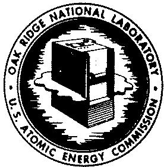
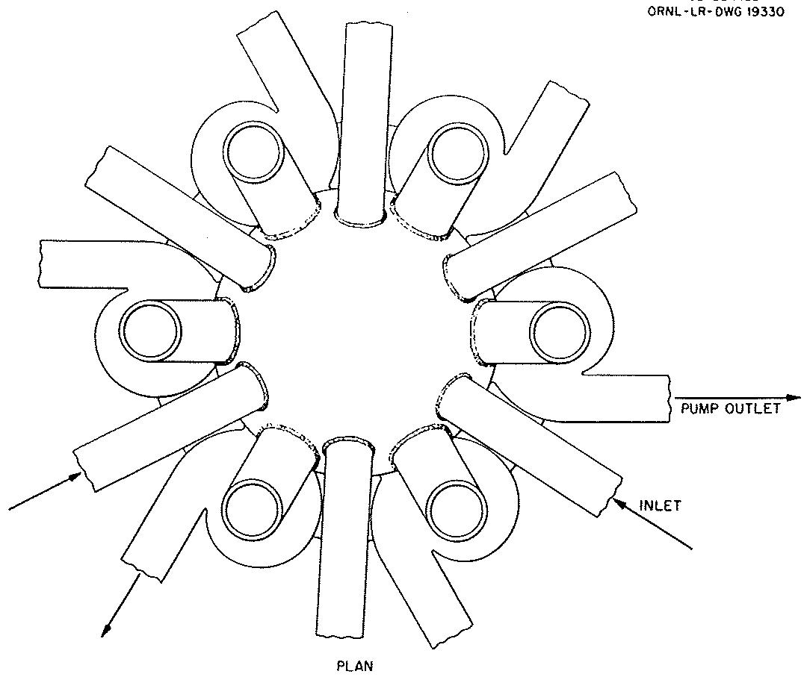
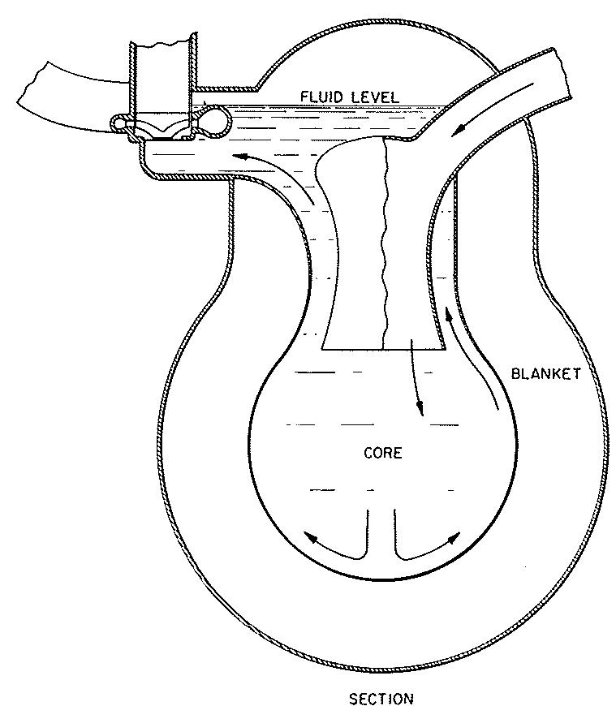
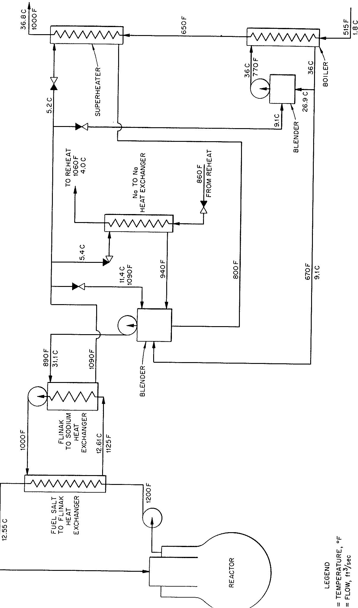
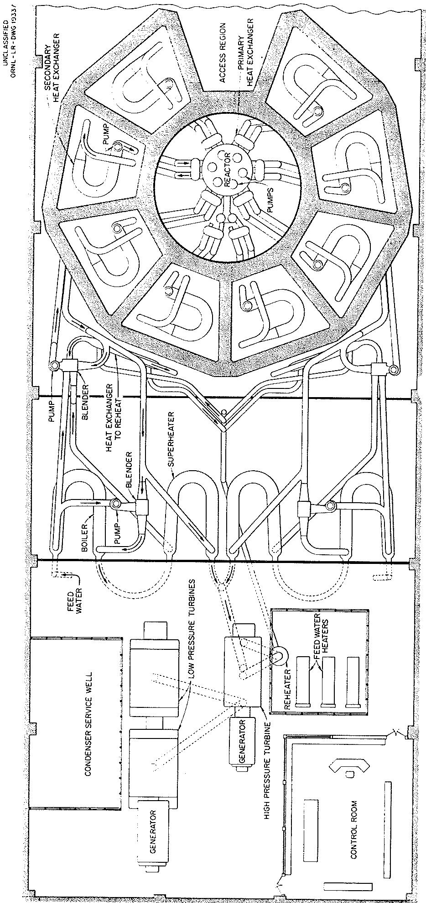
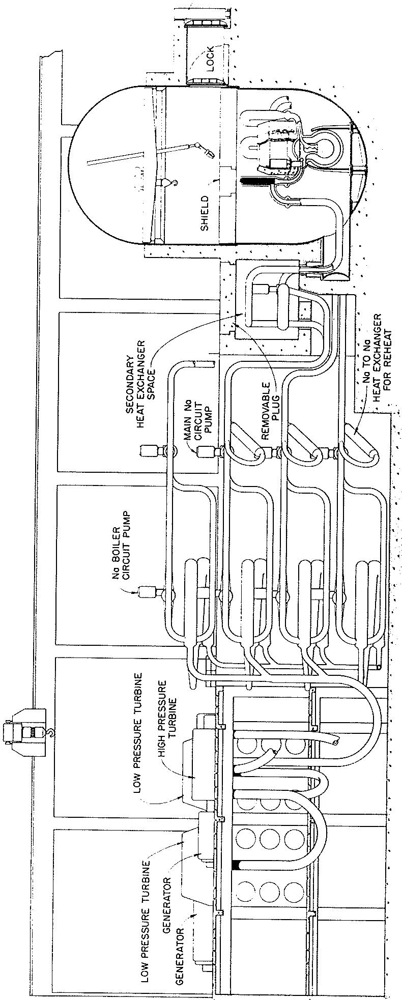

# UNCLASSIFIED

OAK RIDGE NATIONAL LABORATORY

Operated By

UNION CARBIDE NUCLEAR COMPANY

UCC

POST OFFICE BOX P

OAK RIDGE, TENNESSEE

ORNL

CENTRAL FILES NUMBER

57-10-41

DATE: October 10, 1957

SUBJECT: MOLTEN SALTS FOR CIVILIAN POWER

TO: A. B. Kinzel

FROM: H. G. MacPherson

COPY NO. 44

External Transmittal Authorized

Distribution Limited to

Recipients Indicated

# Distribution

1-20. A. B. Kinzel, Union Carbide and Carbon Corp.

21-35. H.G.MacPherson

36. C. E. Center

37. W. H. Jordan

38. A. M. Weinberg

39-41. Laboratory Records

42-43. C.R. Library

山 ORNL-RC

# NOTICE

This document contains information of a preliminary nature and was prepared primarily for internal use at the Oak Ridge National Laboratory. It is subject to revision or correction and therefore does not represent a final report.

# UNCLASSIFIED

${10} - {25} - 5 =  - 5$

PROPERTY OF

WASTE MANAGEMENT

DOCUMENT

LIBRARY

UCN-15212

(3 2-84)

# MOLTEN SALTS FOR CIVILIAN POWER

by

H. G. MacPherson

Oak Ridge National Laboratory

Oak Ridge, Tennessee

October 10, 1957

Prepared For Inclusion In Report To be Issued By Technical Appraisal Task Force, Edison Electric Institute

# MOLTEN SALTS FOR CIVILIAN POWER

Molten salts provide the basis of a new family of liquid fuel power reactors. The range of solubility of uranium and thorium compounds makes the system flexible, and allows the consideration of a variety of reactors. Suitable salt mixtures have melting points in the $850 - 950^{\circ}\mathrm{F}$ range and will probably prove to be sufficiently compatible with known alloys and to provide long-lived components, if the temperature is kept below $1300^{\circ}\mathrm{F}$ . Thus the salt systems naturally tend to operate in a temperature region suitable for modern steam plants and achieve these temperatures in unpressurized systems.

The molten salt system, for purposes other than electric power generation, is not new. Intensive research and development over the past seven years under ORNL sponsorship has provided reasonable answers to a majority of the obvious difficulties. One of the most important of these is the ability to handle liquids at high temperatures and to maintain them above their melting points. A great deal of information on the chemical and physical properties of a wide variety of molten salts has been obtained, and methods are in operation for their manufacture, purification and handling. It has been found that the simple ionic salts are stable under radiation, and suffer no deterioration other than the build-up of fission products.

The molten salt system has the usual benefits attributed to fluid fuel systems. The principal advantages claimed over solid fuel elements are: (1) the lack of radiation damage that can limit fuel burn-up; (2) the avoidance of the expense of fabricating new fuel elements; (3) the continuous removal of gaseous fission products; (4) a high negative temperature coefficient of reactivity; and

(5) the ability to add make-up fuel as needed, so that provision of excess reactivity is unnecessary. The latter two factors make possible a reactor without control rods, which automatically adjusts its power in response to changes of the electrical load. The lack of excess reactivity can lead to a reactor that is safe from nuclear power excursions.

In comparison with the aqueous systems, the molten salt system has three outstanding advantages: it allows high temperature with low pressure; explosive radiolytic gases are not formed; and it provides soluble thorium compounds. The compensating disadvantages are high melting point and poorer neutron economy; the importance of these is difficult to assess without further experience.

Probably the most outstanding characteristic of the molten salt systems is their chemical flexibility, i.e., the wide variety of molten salt solutions which are of interest for reactor use. In this respect, the molten salt systems are practically unique; this is the essential advantage which they enjoy over the U-Bi systems. Thus the molten salt systems are not to be thought of in terms of a single reactor - rather, they are the basis for a new class of reactors. Included in this class are all of the embodiments which comprise the whole of solid fuel element technology: straight $\mathsf{U}^{235}$ burner, Th-U thermal converter or breeder, Th-U fast converters or breeders. Of possible short-term interest is the $\mathsf{U}^{235}$ straight burner: because of the inherently high temperatures and because there are no fuel elements, the fuel cost in the salt system can be of the order of 2-3 mills/kwh.

The state of present technology suggests that homogeneous converters using a base salt composed of $\mathrm{BeF}_2$ and either $\mathrm{Li}^{7}\mathrm{F}$ or $\mathrm{NaF}$ , and using $\mathrm{UF}_4$ for

fuel and $\mathrm{ThF}_4$ for a fertile material, are more suitable for early reactors than are graphite moderated reactors or Pu fueled reactors. The conversion ratio in such an early system might reach 0.6. The chief virtues of this class of molten salt reactor are that it is based on well explored principles and that the use of a simple fuel cycle should lead to low fuel cycle costs.

With further development, the same base salt (using $\mathsf{Li}^{7}\mathsf{F}$ ) can be combined with a graphite moderator in a heterogeneous arrangement to provide a self-contained thorium- $U^{233}$ system with a breeding ratio of about one. The chief advantage of the molten salt system over other liquid systems in pursuing this objective is, as has been mentioned, that it is the only system in which a soluble thorium compound can be used, and thus the problem of slurry handling is avoided.

A reactor called the Aircraft Reactor Experiment (ARE), using a molten fluoride fuel, was operated in November 1954. The reactor had a moderator consisting of beryllium oxide blocks. The fuel, which was a mixture of sodium fluoride, zirconium fluoride and uranium fluoride, flowed through the moderator in nickel alloy tubes and was pumped through an external heat exchanger by means of a high temperature centrifugal pump. The reactor operated at a peak power of 2-1/2 megawatts, and was dismantled after carrying out a scheduled experimental program. The ARE demonstrated again the extreme stability of a liquid fuel reactor. The reactor power level responded automatically to changes in the rate of heat removal from the heat exchanger, and control rods were used only for setting the operating temperature level. It was demonstrated also that $\mathrm{Xe}^{135}$ came off continuously, as did other gaseous fission products.

A recent conceptual design study has been made of a 240 electrical megawatt central station molten salt reactor. The purpose of this study was to examine the economics and feasibility of such a reactor using molten salts, with an attempt to keep the technology required and the processing scheme as simple as possible.

The reactor is a two region homogeneous reactor with a core approximately six feet in diameter and a blanket two feet thick. Moderation is provided by the salt itself, so there is no need for moderator or other structure inside the reactor. The core, with its volume of 113 cubic feet, is capable of generating 600 megawatts of heat at a power density in the core of 187 watts/cc. The net electric power generation is approximately 240 megawatts. The general arrangement of the core and blanket is shown in Figure (1).

The basic core salt is a mixture of about $60\%$ $\mathrm{Li}^{7}\mathrm{F}$ and $40\%$ $\mathrm{BeF}_2$ . Additions of thorium fluoride can be made if desired, and enough $\mathrm{U}^{235}\mathrm{F}_4$ is added to make it critical. The blanket contains $\mathrm{ThF}_4$ , either as the eutectic of $\mathrm{LiF}$ and $\mathrm{ThF}_4$ , or mixtures of it with the basic core salt. The melting point of the core is about $850^{\circ}\mathrm{F}$ , and that of the blanket salt is $1080^{\circ}\mathrm{F}$ or lower.

Both the core fuel and the blanket salt are circulated to external heat exchangers, six in parallel for the core and two in parallel for the blanket. The heat is transferred by intermediate fluids from these heat ex-changers to the boilers, superheaters, and reheaters. The heat transfer system is designed so that, with a fuel temperature of $1200^{\circ}\mathrm{F}$ , a steam temperature of $1000^{\circ}\mathrm{F}$ at 1800 psi can be achieved.

Figure (2) gives a block diagram of the gross features of one of the heat transfer systems of the core circuit. A factor in the selection of the multiple stage heat transfer system involving two intermediate fluids was the desire to have only compatible fluids in adjoining volumes where leaks could involve radioactive materials. This avoids the possibility of liberation of fission products as the result of a chemical accident. As the system is designed, the pressures developed by the pumps, by difference of density of the fluids, and by over pressure, are such that any failure producing mixing of fluids would tend to produce flow toward the reactor core, rather than from it, tending further to confine the fission products.

An exothermic chemical reaction would result if the sodium and water or steam were mixed. However, this would not involve radioactive materials and would pose only the same danger problems as in any conventional plant handling quantities of chemically active materials where no biological poisons are involved.

The general layout of the reactor plant is shown in Figure (3). The primary heat exchangers and the reactor are included within the primary shield, and the secondary heat exchangers, which are only moderately radioactive, are included in separate shielded compartments so they can be serviced individually. Figure (4) shows a vertical section through the reactor and power plant. An isolating vessel is inside the primary shield surrounding the reactor and the primary heat exchangers. This vessel will contain any radioactive gases liberated through leakage and will provide an inert atmosphere for remote maintenance of this highly radioactive section.

The chemical processing method postulated uses the fluoride volatility process under development at Oak Ridge. The molten salt is treated with fluorine. $\mathrm{UF}_{6}$ is recovered and is converted to $\mathrm{UF}_{4}$ by a reduction process. The core salt

can be fluorinated in small batches at the rate of one or two batches per day. The barren salt, stripped of uranium but containing most of the plutonium, fission products, and corrosion products, is transferred to tank storage where it is held for future salt recovery. The $\mathbf{U}\mathbf{F}_6$ reduction process will discharge its $\mathbf{U}\mathbf{F}_{4}$ product directly to a fuel salt mixing pot, to which is also fed fresh base salt and make-up $\mathbf{U}\mathbf{F}_{4}$ .

Chemical processing of the blanket salt is physically much the same as that of the core salt, except that after fluorination the blanket salt with the Pa and fission products that it contains is returned to the blanket system. Although research on methods of separating the fission products from the molten salts is under way, the possibility of doing this is not considered in calculating the fuel cycle costs. For purposes of calculating costs on present technology, it is assumed that the core salt with its contained fission products will be held in permanent storage and that new core salt must always be provided.

Assuming that the chemical plant is based on the capacity and the cost of the current ORNL volatility pilot plant, a total fuel cycle cost of 2.5 mills/kwh is calculated. Table I shows a breakdown of the fuel cycle costs. This fuel cycle cost is equivalent to the sum of the items of chemical processing, fuel element refabrication, inventory charge, and fuel costs for a conventional solid fuel element reactor. The estimate is based on a $\$17/g$ cost of $U^{235}$ , an inventory charge of $4\%$ , and an $80\%$ load factor. The $U^{233}$ produced would be burned in the reactor. For this reason, no breeding credit appears as such, but only a reduction in the amount of $U^{235}$ purchased for burn-up.

Table I BREAKDOWN OF FUEL CYCLE COSTS   

<table><tr><td></td><td>mills/kwh</td></tr><tr><td>Inventory charge for U235and U233</td><td>0.3</td></tr><tr><td>Burn-up of U235</td><td>1.2</td></tr><tr><td>Replacement of core salt</td><td>0.5</td></tr><tr><td>Chemical plant capital charge</td><td>0.2</td></tr><tr><td>Chemical plant operation</td><td>0.3</td></tr><tr><td></td><td>2.5</td></tr></table>

To obtain the total power costs, the charge for operation and maintenance and the capital costs of the plant must be added to the fuel cycle costs. No one knows what operation and maintenance will amount to for power reactors since there is no operating experience, and by common consent this is placed at 1 mill/kwh.

The capital costs of a power reactor will in the end depend on such broad-scale things as the physical size of the plant, the weight of the components, and the use of especially expensive materials or complex methods of construction. Molten salt reactors are certainly compact; the major hardware is in the heat transfer systems. Since the fluids are good heat-transfer agents, these heat transfer systems are not bulky. The avoidance of a pressure vessel and the elimination of control rods help in reducing the complexity of construction. There does not seem to be any reason why these reactors should have high capital costs in comparison with other reactor plants.

A detailed cost estimate was attempted for the reactor plant described above. The flow diagrams were broken down into individual components insofar as

possible, and costs of purchasing, inspecting, and installing these components were estimated on the basis of standard engineering cost estimating procedure as modified by experience in the nuclear power field. These modifications are extensive, as a result of the higher standards required and the necessity for multiple inspection of every piece that goes into a reactor.

Table II gives a partial breakdown for the various factors in the reactor plant cost. Conventional portions of the electrical generating plant were not broken down, but were treated as one lump sum, since experience in this field has indicated that such costs can be estimated to a fair degree of accuracy. The total for the 240 megawatt plant of approximately $55,000,000 does not include the cost of the chemical processing plant since this has been separately charged under the fuel cycle costs. A 40-year life was assumed for the conventional portion of the plant and a 20-year life for the remainder. These give fixed costs of 14% per year on the $99/kw of the conventional plant and 16% per year on the $133/kw of the reactor portion. Assuming a load factor of 80% results in a fixed charge of 5 mills/kwh. The cost of power thus adds up as follows:

mills/kwh

Fixed charges on plant 5.0

Operation and maintenance 1.0

Fuel and fuel processing cycle 2.5

8.5

The costs outlined above for the construction and operation of the Reference Design Reactor are predicated on obtaining favorable results from a development program which would prove-in the life of the components and provide methods for carrying out remote maintenance.

At the present time, the greatest uncertainty in the molten salt reactor power costs derives from this problem of remote maintenance. The reactor, the primary heat exchangers, and the fuel pumps will be highly radioactive, even after withdrawing the fuel, and maintenance operation on them must be by remote control. Figures (3) and (4) indicate how these items could be located in a central containment vessel. The kind of maintenance visualized is that of replacement of heat exchangers and pumps as units.

The present thought is that the pump motor, bearings, shaft and impeller could be replaced as a unit by unbolting a flange and breaking a gasket seal located in a gas space that is cool relative to the reactor temperature. The heat exchangers would be removed by making pipe disconnections only at selected points designed for this purpose. It is anticipated that to replace heat exchangers will require the development of remote cutting and welding operations for specially designed joints, although it is possible that some sort of adequate freeze seal-type joint can be devised. There is no scarcity of ideas as to methods for carrying out remote maintenance, but the detailed engineering and practical trials of such methods have not yet been made, and thus any estimate of those capital and operating costs related to remote maintenance is highly speculative.

<table><tr><td></td><td>Table II</td><td></td></tr><tr><td colspan="3">Reactor Vessel and Primary System</td></tr><tr><td>Reactor Vessel</td><td>$ 900,000</td><td></td></tr><tr><td>Fuel and blanket pumps with
motors (6 - 6000 gpm,
2 - 4000 gpm)</td><td>800,000</td><td></td></tr><tr><td>Eight primary heat exchangers
fuel-to-salt (21,240 sq ft
total surface)</td><td>775,000</td><td></td></tr><tr><td>Miscellaneous reactor and
primary circuit piping,
tools, and other equipment</td><td>941,000</td><td></td></tr><tr><td></td><td>$ 3,416,000</td><td></td></tr><tr><td colspan="3">Intermediate Heat Transfer System</td></tr><tr><td>Eight intermediate heat
exchangers (24,000 sq ft
total surface area)</td><td>746,000</td><td></td></tr><tr><td>Intermediate system pumps
and motors (6 - 6000 gpm,
2 - 3000 gpm)</td><td>640,000</td><td></td></tr><tr><td>Miscellaneous intermediate salt
coolant circuit equipment</td><td>625,000</td><td></td></tr><tr><td></td><td>2,011,000</td><td></td></tr><tr><td colspan="3">Sodium-Steam Generator System</td></tr><tr><td>Pumps</td><td>1,330,000</td><td></td></tr><tr><td>Heat exchangers, boilers,
superheaters and reheaters,
total 40,000 sq ft surface</td><td>1,159,000</td><td></td></tr><tr><td>Miscellaneous piping, vessels,
blenders, etc.</td><td>1,167,000</td><td></td></tr><tr><td></td><td>3,656,000</td><td></td></tr><tr><td colspan="3">Miscellaneous Reactor Components</td></tr><tr><td>Reactor building, site and
improvements (reactor portion)</td><td>2,500,000</td><td></td></tr><tr><td>Reactor isolation container</td><td>450,000</td><td></td></tr><tr><td>Instrumentation</td><td>750,000</td><td></td></tr><tr><td>Remote maintenance equipment</td><td>800,000</td><td></td></tr><tr><td>Miscellaneous auxiliary
systems</td><td>1,470,000</td><td></td></tr><tr><td></td><td>5,970,000</td><td></td></tr><tr><td>Total for Reactor Construction</td><td></td><td>$ 15,053,000</td></tr><tr><td>Engineering Design</td><td></td><td>2,500,000</td></tr><tr><td>Prime Contractor Fee</td><td></td><td>3,800,000</td></tr><tr><td>Spare Parts (pumps, heat exchangers, etc.)</td><td></td><td>850,000</td></tr><tr><td>Original Inventories of Salts and Sodium</td><td></td><td>4,455,000</td></tr><tr><td>Start-up Operation</td><td></td><td>1,000,000</td></tr><tr><td>Contingency Reserve</td><td></td><td>4,160,000</td></tr><tr><td>Conventional Electrical Generating Plant</td><td></td><td>23,750,000</td></tr><tr><td></td><td>TOTAL</td><td>$ 55,568,000</td></tr></table>

  
Figure 1 Reference Design Reactor

1100F   
UNCLASSIFIED ORNL-LR-DWG19   
Figure 2 Schematic Diagram of Heat Transfer System:   
  
LEGEND   
= TEMPERATURE.°F   
$= FLOW,ft^3 /sec$

  
Figure 3 Plan View of Power Plant.

  
UNCLASSIFIED ORNL-LR-DWG 19373

  
Figure 4 Section Through Reactor and Power Plant.