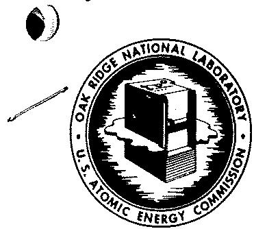
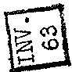
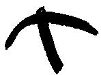
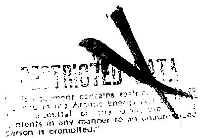

OAK RIDGE NATIONAL LABORATORY

Operated By

UNION CARBIDE NUCLEAR COMPANY

UCC

POST OFFICE BOX P

OAK RIDGE, TENNESSEE

ORNL/CF-57-12-29

ORNL

CENTRAL FILES NUMBER

57-12

DATE: December 2, 1957

SUBJECT: DECLASSIFICATION OF MOLTEN SALT REACTORS

TO: S. R. Sapirie, OR

FROM: C. L. Marshall, AEC

COPY NO. 1 A-ORNL

E. J. Murphy

$\frac{5}{2} = 3 :$

RESTRICTED DATA

This document contains Restricted Data as defined in the Atomic Energy Act of 1954. Its transmission or the disclosure of its contents in any manner to an unauthorized person is prohibited.

SECRET COVER SHEET

PROPERTY OF

WASTE MANAGEMENT

DOCUMENT

LIBRARY

S. R. Sapirie, Manager

Cak Ridge Operations Office

(THRU) E. J. Bloch, Director, Division of Production

C. L. Marshall, Director

Division of Classification, Washington, D. C.

DECLASSIFICATION OF MOLTEN SALT REACTOR

December 2, 1957

This De. 1 1ies. This is copy... .of.. Series A-ORNL

SYMBOL: C:CLM

E.J.Murphy

The subject of your memorandum dated November 13, 1957 has been reviewed.

We have recently been advised that molten salt work has been discontinued in the Aircraft Nuclear Propulsion Program on the grounds that it is not a suitable approach to the solution of the problem of the ANP. In view of this, and because such information would appear to be quite useful to the civilian power application program, the work which was described in the attachments to your above referenced memorandum may be carried out as unclassified research within the terms of Category II of AEC Manual Chapter 3403.

The above authorization does not include, nor would it permit, declassification of any aspects of reactor design relating specifically to aircraft application. Great care should be exercised to prevent the release of the fact that this work was discarded from the ANP program as being an impractical, or an unsuccessful approach.

cc: E. J. Bloch, PROD.

Dr.J.P.Howe，NAA

Dr. A. J. Miller, ORNL

Dr. W. C. Cooley, ANP, Cincinnati

Dr. Hayden Gordon, UCRL, Livermore

Mr. E. R. Proud, GE, KAPL

Dr. R. W. Spence, LASL

Dr. B. I. Spinrad, AINL

H. F. Carroll, ORE.

Classification Cancelled

Or Changed To

By Authority Of

By 1.5.8.3. Date

CLASSIFICATION CANCELED
Led Davis 5/4/95
DD signature Date

Table 1 Review of CCRP-classified

Copyright was authorized by COE Office.

ClassificationMemo of August 22, 1987

# 3403-06 Procedures and Authorizations

061 It is expected that off-site research sponsored by the AEC may vary from the completely unclassified research, through research in fields which are classified but declassifiable, to fields which are classified and non-declassifiable. The same range of possible classification will, of course, exist within AEC-sponsored laboratories.   
062 The following categories have been established as guides to proper classification and security procedures for off-site as well as on-site projects. In all cases determination of the proper category for a given project shall be the responsibility of the cognizant Washington Division Director. Prior to conducting research considered to be in Categories II and III, the concurrence of the Director of Classification shall be obtained through the cognizant Division Director.

a. Category I. --(Normally, no Q-clearances required, no exclusion areas, all notebooks and reports unclassified, completely free exchange of ideas and data.) This category includes programs which, in the opinion of the cognizant Washington Division Director, fall clearly within the area of unclassified research. Fields or topics in this category are set forth in the "Guide to Unclassified Fields of Research" attached as Appendix 3402-04. Where, in the opinion of the cognizant Division Director, a project is clearly within this category and there is essentially no chance for the development of restricted data, the project may be established as completely unclassified without even the appointment of a security monitor.   
b. Category II. --(Normally, Q-clearance required only for Security Monitor or Senior Investigator, no security area, in early stages of program, notebooks and reports unclassified, free exchange of ideas and data.) This category includes research programs which in their early stages will not involve restricted data but which as the work progresses may approach restricted data. Such research programs can be initiated on an unclassified basis. However, when it becomes apparent that restricted data is being approached, it shall be the responsibility of the Security Monitor or the Senior Investigator to assure that the proper security safeguards (including necessary Q-clearances) are applied.

To discharge this responsibility properly, it is essential that the Security Monitor or Senior Investigator keep himself continuously informed of the progress of the work so that he can impose the appropriate security safeguards promptly when it appears that restricted data may be developed. An example of a project that may be carried out under this category is that kind of research

directed toward the solution of a specific AEC Project problem, the results of which would not be immediately applicable to the solution of that problem. No research work may be carried out under this category if it is not covered by either Appendix 3403-05 ("Guide to Unclassified Fields of Research") or, at least, one of the topics of the Declassification Guide which permit declassification.

c. Category III, --(Q-clearance required for all Investigators. All notes books and data classified as restricted data. No security area required, Exchange of information and data with appropriately Q- cleared personnel only). Included in this category are programs of research in which the subject of study is not listed in "Guide to Unclassified Fields of Research" (Appendix 3403-05). However, the probability that non-declassifiable information will be developed as a result of work conducted in this category is relatively low.

It shall be the responsibility of the Senior Investigator to keep himself continuously informed of the progress of the work and, when it becomes apparent that information will be developed that is forbidden declassification by the Declassification Guide, he shall be responsible for assuring that the program is trans-

Category IV. --(All Investigators shall be Q-cleared. The appropriate security area shall be established (GM-SEC-18) to be published as AEC 24a. All notebooks, reports, shall be classified as restricted data. Exchange of information and data can be made between appropriately cleared personnel only). This category includes all research programs in which the information involved is classified under the "declassification prohibited" topics of the Declassification Guide. As a minimum, in all such programs all the security measures listed above shall be applied.

063 In the case of on-site projects, the laboratory Director, on the basis of the 'Classification Procedures for AEC Research Contractors,' chapter 3415, and other approved AEC classification guides, shall determine the proper category for programs within his project.

Qualified scientists may be permitted to visit the location of unclassified research projects (provided that such visits to projects located in an area of security interest are in accord with the provisions of GM-SEC-7 (Serial No. 56) and local implementation visitor control procedures) and to obtain information with respect to its procedures, methods and results in accordance with established scientific tradition.