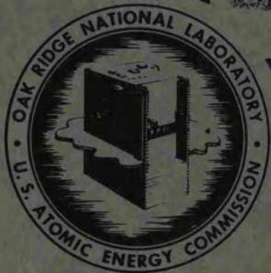

A PRELIMINARY STUDY OF MOLTEN

SALT POWER REACTORS

DECLASSIN

By Authority Of:

$1 + \left( {2 - x}\right)  + x = 0 \Rightarrow  x = 1$

${MD}$ . Smith

# NOTICE

This document contains information of a preliminary nature and was prepared primarily for internal use at the Oak Ridge National Laboratory. It is subject to revision or correction and therefore does not represent a final report.

OAK RIDGE NATIONAL LABORATORY

OPERATED BY

UNION CARBIDE NUCLEAR COMPANY

Division of Union Carbide Corporation

UCC

POST OFFICE BOX X · QAK BIDGE - TENNESSE

# LEGAL NOTICE

This report was prepared as an account of Government sponsored work. Neither the United States, nor the Commission, nor any person acting on behalf of the Commission:

A. Makes any warranty or representation, express or implied, with respect to the accuracy, completeness, or usefulness of the information contained in this report, or that the use of any information, apparatus, method, or process disclosed in this report may not infringe privately owned rights; or   
B. Assumes any liabilities with respect to the use of, or for damages resulting from the use of any information, apparatus, method, or process disclosed in this report.

As used in the above, "person acting on behalf of the Commission" includes any employee or contractor of the Commission to the extent that such employee or contractor prepares, handles or distributes, or provides access to, any information pursuant to his employment or contract with the Commission.

ORNL Central Files Number 57-4-27 (Revised)

C-84 - Reactors-Special Features of Aircraft Reactors

Contract No. W-7405-eng-26

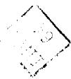

A PRELIMINARY STUDY OF MOLTEN SALT POWER REACTORS

H. G. MacPherson   
L. G. Alexander   
D. A. Carrison   
J. Y. Estabrook   
B. W. Kinyon   
L. A. Mann   
J. T. Roberts   
F. E. Romie   
F. C. VonderLage

DATE ISSUED: April 29, 1957

DEC 31957

OAK RIDGE NATIONAL LABORATORY

Operated by

UNION CARBIDE NUCLEAR COMPANY

A Division of Union Carbide and Carbon Corporation

Post Office Box X

Oak Ridge National Laboratory

# Internal Distribution

# 1-20. Laboratory Records

# External Distribution

21-23. Air Force Ballistic Missile Division

24-25. AFPR, Boeing, Seattle

26. AFPR, Boeing, Wichita   
27. AFPR, Curtiss-Wright, Clifton   
28. AFPR, Douglas, Long Beach

29-31. AFPR, Douglas, Santa Monica

32. AFFR, Lockheed, Burbank

33-34. AFPR, Lockheed, Marietta

35. AFPR, North American, Canoga Park   
36. AFPR, North American Downey

37-38. Air Force Special Weapons Center

39. Air Materiel Command   
40. Air Research and Development Command (RDGN)   
41. Air Research and Development Command (RDTAPS)

42-55. Air Research and Development Command (RDZPSP)   
56. Air Technical Intelligence Center

57-59. ANP Project Office, Convair, Fort Worth

60. Albuquerque Operations Office   
61. Argonne Natioanl Laboratory   
62. Armed Forces Special Weapons Project, Sandia   
63. Armed Forces Special Weapons Project, Washington   
64. Assistant Secretary of the Air Force, R&D

65-70. Atomic Energy Commission, Washington

71. Atomics International   
72. Battelle Memorial Institute

73-74. Bettis Plant (WAPD)

75. Bureau of Aeronautics   
76. Bureau of Aeronautics General Representative   
77. BAR, Aerojet-General, Azusa   
78. BAR, Convair, San Diego   
79. BAR, Glenn L. Martin, Baltimore   
80. BAR, Grumman Aircraft, Bethpage   
81. Bureau of Yards and Docks   
32. Chicago Operations Office   
33. Chicago Patent Group   
84. Curtiss-Wright Corporation   
35. Engineer Research and Development Laboratories

86-89. General Electric Company (ANPD)

90. General Nuclear Engineering Corporation   
91. Hartford Area Office   
92. Idaho Operations Office   
93. Knolls Atomic Power Laboratory   
94. Lockland Area Office   
95. Los Alamos Scientific Laboratory   
96. Marquardt Aircraft Company

Company

98. National Advisory Committee for Aeronautics, Cleveland   
99. National Advisory Committee for Aeronautics, Washington   
100. Naval Air Development Center   
101. Naval Air Material Center   
102. Naval Air Turbine Test Station   
103. Naval Research Laboratory   
104. New York Operations Office   
105. Nuclear Development Corporation of America   
106. Nuclear Metals, Inc.   
107. Office of Naval Research   
108. Office of the Chief of Naval Operations (OP-361)   
109. Patent Branch, Washington   
110. Patterson-Moos

111-114. Pratt & Whitney Aircraft Division

115. San Francisco Operations Office   
116. Sandia Corporation   
117. School of Aviation Medicine   
118. Sylvania-Corning Nuclear Corporation   
119. Technical Research Group   
120. USAF Headquarters   
121. USAF Project RAND   
122. U. S. Naval Radiological Defense Laboratory

123-124. University of California Radiation Laboratory, Livermore   
125-142. Wright Air Development Center (WCOSI-3)   
143-167. Technical Information Service Extension, Oak Ridge

# TABLE OF CONTENTS

Page

SECTION I - Summary, Recommendations and Acknowledgements 1

SECTION II - Survey and Analysis of the State of Molten Salt Power Reactor Technology 7

A. Materials 7

1. Fuel Carrier Evaluation 7   
2. Blanket Material Evaluation 13   
3. Intermediate Coolants 14   
4. Container Materials 17   
5. Moderator Materials 24

B. Materials 25

1. Pumps 26   
2. Heat Exchangers 29   
3. Reactor Vessels 33   
4. Other Vessels 38   
5. Joints and Valves 39   
6. Instrument and Control Components 40

C. Component Systems 45

1. Salt and Liquid Metal Charging and Storage Systems 45   
2. Off-Gas Handling 46   
3. Inert Gas System 48   
4. Heating and Cooling of Components 48

D. Nuclear Considerations 50

1. Previous Work and Early Consideration 50   
2. One Region Reactors 57   
3. Two Region Reactors 59   
4. Reactivity Effects in Typical Reactor 69

E. Reactor Operation, Control and Safety 70

1. The Control Problem of Nuclear Power Reactors 71   
2. Fueling 76   
3. Criticality Start-up 77

F. Build-up of Nuclear Poisons and Chemical Processing 80

1. Fission Product Poisoning 80   
2. Pa235, Np237 and Np239 Poisoning 82   
3. Corrosion Product Poisoning 83

4. Chemical Processing and Fuel Reconstitution 83   
5. Build-up of Even-Mass-Number Uranium Isotopes 88   
6. Radioactive Waste Disposal 91

G. Fuel Cycle Economics 93

1. Cost Bases 93   
2. "Steady State" Neutron Balances and Comparative Fuel Costs 94

SECTION III - Reference Design Reactor 98

A. Introduction 98   
B. Heat Generation, Transfer, and Conversion System 103

1. Reactor 103   
2. Heat Exchangers 104   
3. Steam Cycle 111

C. Components and Component System 113

1. Pumps 113   
2. Valves 113   
3. Pipes and Tubes 114   
4. Fill-and-Drain Tanks 114   
5. Gas Supply Systems (Helium, Nitrogen, and Compressed Air 116   
6. Off-Gas System 117   
7. Preheating and Temperature Maintenance 117

D. Plant Layout 118   
E. Chemical Processing and Fuel Cycle Economics 122

1. Core Processing 122   
2. Blanket Processing 122   
3. Chemical Processing Costs 124   
4. Fuel Cycle Economics 125

F. Cost Analysis 126

1. Introduction 126   
2. Materials and Components Development Costs 127   
3. Design and Construction Costs 129   
4. Cost of Power from the Reference Design Reactor 130

Appendix 133

# LIST OF FIGURES

# Fig.

# No.

# Title

# Page

1. Fission Cross Sections and Eta for $U^{233}$ and $U^{235}$ in the Occusol-A Program. 56   
2. Reference Design Reactor Heat Transfer Circuit Showing Simulator Constants. 75   
3. Change in Coolant Inlet Temperature for Intermediate Heat Exchanger Due to Fuel Burn-up, for a Typical Fused Salt Circulating Fuel Reactor at a Power Density of 200 watts/cm³. 78   
4. Fused Salt-Fluoride Volatility Uranium Recovery Process. 86   
5. UF6 Reduction Process Flow Sheet. 89   
6. Schematic Diagram of Heat Transfer System. 101   
7. Reference Design Reactor. 105   
8. Temperature-Heat Diagrams for Heat Exchangers. 108   
9. Steam Cycle Diagram. 112   
10. Plan View of Power Plant. 120   
11. Section Through Reactor and Power Plant. 121

# A PRELIMINARY STUDY OF MOLTEN SALT POWER REACTORS

# SECTION I

Summary, Recommendations and Acknowledgments

Molten salts provide the basis of a new family of liquid fuel power reactors. The wide range of solubility of uranium, thorium and plutonium compounds makes the system flexible, and allows the consideration of a variety of reactors. Suitable salt mixtures have melting points in the $850 - 950^{\circ}\mathrm{F}$ range and will probably prove to be sufficiently compatible with known alloys to provide long-lived components, if the temperature is kept below $1300^{\circ}\mathrm{F}$ . Thus the salt systems naturally tend to operate in a temperature region suitable for modern steam plants and achieve these temperatures in unpressurized systems.

The molten salt reactor system, for purposes other than electric power generation, is not new. Intensive research and development over the past seven years under ANP sponsorship has provided reasonable answers to a majority of the obvious difficulties. One of the most important of these is the ability to handle liquids at high temperatures and to maintain them above their melting points. A great deal of information on the chemical and physical properties of a wide variety of molten salts has been obtained, and methods are in operation for their manufacture, purification and handling. It has been found that the simple ionic salts are stable under radiation, and suffer no deterioration other than the build-up of fission products.

The molten salt system has the usual benefits attributed to fluid fuel systems. The principal advantages claimed over solid fuel elements are: (1) the lack of radiation damage that can limit fuel burn-up; (2) the avoidance of the

expense of fabricating new fuel elements; (3) the possibility (partially demonstrated in the ARE) of continuous gaseous fission product removal; (4) a high negative temperature coefficient of reactivity; and (5) the ability to add makeup-up fuel as needed, so that provision of excess reactivity is unnecessary. The latter two factors make possible a reactor without control rods, which automatically adjusts its power in response to changes of the electrical load. The lack of excess reactivity can lead to a reactor that is safe from nuclear power excursions.

In comparison with the aqueous systems, the molten salt system has three outstanding advantages: it allows high temperature with low pressure; explosive radiolytic gases are not formed; and it provides soluble thorium and plutonium compounds. The compensating disadvantages, high melting point and basically poorer neutron economy, are difficult to assess without further work.

Probably the most outstanding characteristics of the molten salt systems is their chemical flexibility, i.e., the wide variety of molten salt solutions which are of interest for reactor use. In this respect, the molten salt systems are practically unique; this is the essential advantage which they enjoy over the U-Bi systems. Thus the molten salt systems are not to be thought of in terms of a single reactor - rather, they are the basis for a new class of reactors. Included in this class are all of the embodiments which comprise the whole of solid fuel element technology: straight $\mathsf{U}^{235}$ or Pu burner, Th-U or Pu-U thermal converter or breeder, Th-U or Pu-U fast converters or breeders. Of possible short-term interest is the $\mathsf{U}^{235}$ or Pu straight burner: because of the inherently high temperatures and because there are no fuel elements, the fuel cost in the salt system can be of the order of 2 mills/kwh. Moreover, the molten salt system is, except for the molten Pu alloy system, probably the only system which will allow plutonium to be burned at high temperature in liquid form.

The state of present technology suggests that homogeneous converters using a base salt composed of $\mathrm{BeF}_2$ and either $\mathrm{Li}^7\mathrm{F}$ or $\mathrm{NaF}$ , and using $\mathrm{UF}_4$ for fuel and $\mathrm{ThF}_4$ for a fertile material, are more suitable for early reactors than are graphite moderated reactors or Pu fueled reactors. The conversion ratio in such an early system might reach 0.6. The chief virtues of this class of molten salt reactor are that it is based on well explored principles and that the use of a simple fuel cycle should lead to low fuel cycle costs.

With further development, the same base salt (using $\mathsf{Li}^{\mathsf{T}}\mathsf{F}$ ) can be combined with a graphite moderator in a heterogeneous arrangement to provide a self-contained thorium- $\mathsf{U}^{233}$ system with a breeding ratio of about one. The chief advantage of the molten salt system over other liquid systems in pursuing this objective is, as has been mentioned, that it is the only system in which a soluble thorium compound can be used, and thus the problem of slurry handling is avoided.

Plutonium is an alternate fuel in the fluoride salt system. Only moderate breeding ratios are expected in thermal or epithermal reactors, but a small, highly concentrated fluoride reactor may be fast enough to provide a breeding ratio of one. Eventually the use of chloride salts might provide a fast plutonium reactor with a breeding gain, although this would require use of separated $\mathrm{Cl}^{37}$ . The plutonium system needs additional research to determine the stability of Pu compounds and to provide a suitable chemical processing system.

The present report is primarily intended to summarize the state of the molten salt art as applied to civilian power. The report is divided into three parts. Section I is the summary and recommendations. Section II is a survey of the state of molten salt technology. Section III is an analysis of one possible molten salt reactor embodiment - a two region converter based on the fuel $69 \, \text{Li}^7 \, \text{F}$ - 30 $\text{BeF}_2$ - 1 $\text{UF}_4$ and the blanket composition $74 \, \text{Li}^7 \, \text{F}$ - 26 $\text{ThF}_4$ . This embodiment,

called the reference design, has been examined carefully, primarily to bring to focus the problems which may arise if a full-scale molten salt system were to be built soon.

The conclusion which we can draw from our study of the molten salt situation is that a large-scale molten salt reactor - either a straight U burner or a non-breeding converter - could be built, but that prior to building, two important questions should be answered:

1. Will any molten salt reactor produce economical power? Our study shows the answer is probably yes, provided longevity of components can be assured. Hence the issue depends on the second question:   
2. From what we know about materials compatibility, how likely are we to develop a salt and a container metal which will last for many years of operation? This is the central issue in the civilian molten salt nuclear power reactor program. The information gathered by the ANP project, added to our general knowledge of the mechanism of attack on metals (particularly INOR-8) by fluorides, suggests that the outlook for a solution to this problem is very good. However, very little long-term testing at power reactor temperatures ( $\sim 1200^{\circ}\mathrm{F}$ ) has been done; our recommendations, therefore, center around the necessity for acquiring this long-term data as soon as possible. Should these tests demonstrate the long-term compatibility of materials, there will still be required the development of reliable large-scale components. Experience on ANP indicates that this part of the development should not present major difficulties.

# Recommendations

In view of the preceding, we recommend:

1. The long-term corrosion resistance of the proposed alloys in the salts that could be used in a power reactor should be established. This will involve the operation of a number of pumped loops incorporating a temperature gradient, to be operated at the temperature of interest for periods of at least a year.   
2. The effects of radiation and fission product build-up on the compatibility of the salt and alloy should be thoroughly investigated. At least two in-pile pumped loops simulating the condition in a molten salt reactor should be operated for a long period of time. These in-pile loop tests should be supplemented by small-scale studies of the behavior of fission products.   
3. It is recommended that a modest reactor study effort be maintained. Different embodiments of molten salt reactors would be examined, so that if favorable results from Items (1) and (2) are obtained, it will be possible to recommend a specific reactor, probably a burner or converter, for design and construction. Also, the problem of remote maintenance, which is shared by all circulating fuel reactors, could be examined in further detail.   
4. Since there is always a time lag between the initiation of research and the availability of practical developments, it is recommended that a modest research program aimed at longer term possibilities be maintained. Objectives would be (a) the incorporation of a solid moderator, (b) utilization of plutonium in the molten salt system, (c) better alloys, and (d) improved fission product removal systems.

# Acknowledgements

Many members of ORNL and other organizations have helped in the work of the group and have shown great interest in its progress. It is difficult to single out individuals for mention, but the following people have been serving on a project steering committee:

A. M. Weinberg   
J. A. Swartout   
R. A. Charpie   
S. J. Cromer   
W. K. Ergen   
W. R. Grimes   
W. H. Jordan   
W. D. Manly

Others who have been especially close to the project are:

E. S. Bettis   
E. A. Franco-Ferreira   
J. L. Gregg   
F. Kertesz   
W. B. McDonald   
E. R. Mann   
P. Patriarca   
M. T. Robinson   
H. W. Savage

# SECTION II

Survey And Analysis Of The State Of Molten Salt Power Reactor Technology

In the research and development program carried out by the ANP for the construction of the ARE and future high performance reactors, much technical information has been derived which is applicable to power reactors. The purpose of this section is to abstract the information that is most pertinent to the construction of power reactors, and to provide adequate references to document properly the summaries given. This has been supplemented by studies of nuclear characteristics of homogeneous one and two region power reactors. It will be seen that most of the information required to design a practical power reactor is available. However, long-term tests of materials and components are lacking, and they must be supplied by a power reactor research and development program.

# A. Materials

# 1. Fuel Carrier Evaluation

The applicability of molten salts to nuclear reactors has been ably reviewed by W. R. Grimes and others $\frac{1}{2}$ , by Crooks et al $\frac{3}{4}$ , and Schuman

The most promising systems are those comprising the fluorides and chlorides of the alkali metals, zirconium, and beryllium. These appear to possess the most desirable combination of low neutron absorption, high solvent power, and chemical inertness. In general, the chlorides have lower melting points, but appear to be less stable and more corrosive than the fluorides. The use of chlorides in a homogeneous fast reactor would be preferable except that the strong $(n,p)$ reaction exhibited by Cl $^{35}$ would necessitate the separation of the chlorine isotopes.

The fluoride systems appear to be preferable for use in thermal and epithermal reactors. Many mixtures have been investigated, mainly at ORNL and at Mound Laboratory. The physical properties of these mixtures, in so far as they are known, have been tabulated by Cohen et al $\frac{5}{2}$ . Phase studies are extensively reported $\frac{6}{2}$ .

Li7 has an attractively low capture cross section (0.0189 barns at 0.0759 ev), but Li6, which comprises 7.5 percent of the natural mixture, has a capture cross section of 542 barns at this energy. The cross sections for several compositions are shown in Table I; also shown are the thermal cross sections of Na, K, Rb, and Cs.

Table I   
CAPTURE CROSS SECTIONS OF ALKALI METALS AT 0.0759 ev (1150°F)   

<table><tr><td>Element</td><td></td><td>Cross Section, barns</td></tr><tr><td>Lithium</td><td></td><td></td></tr><tr><td>0.1</td><td>% Li6</td><td>0.561</td></tr><tr><td>0.01</td><td>&quot;</td><td>0.0731</td></tr><tr><td>0.001</td><td>&quot;</td><td>0.0243</td></tr><tr><td>0.0001</td><td>&quot;</td><td>0.0194</td></tr><tr><td>Sodium</td><td></td><td>0.290</td></tr><tr><td>Potassium</td><td></td><td>1.130</td></tr><tr><td>Rubidium</td><td></td><td>0.401</td></tr><tr><td>Cesium</td><td></td><td>29</td></tr></table>

The capture cross sections at higher energies presumably stand in approximately the same relation as at thermal. It is seen that purified $\mathsf{Li}^7$ has an attractively low cross section in comparison to the other alkali metals, and that sodium is the next best alkali metal.

The fluorides of Li, Na, K, and Rb melt at 1550, 1820, 1560, and $1460^{\circ}\mathrm{F}$ , respectively. Binary mixtures of these salts with $\mathrm{UF}_{4}$ form eutectics having melting points and compositions shown in Table II.

Table II BINARY EUTECTICS OF $\mathbf{U}\mathbf{F}_{4}$ AND ALKALI FLUORIDES   

<table><tr><td>Alkali Fluoride</td><td>Mole % UF4in Eutectic</td><td>Melting Point, °F</td></tr><tr><td>LiF</td><td>26</td><td>915</td></tr><tr><td>NaF</td><td>26</td><td>1130</td></tr><tr><td>KF</td><td>14</td><td>1345</td></tr><tr><td>RbF</td><td>10</td><td>1330</td></tr></table>

With the possible exception of the first, these combinations are too high melting to be attractive as fuels; however, the eutectics of $\mathrm{UF}_{4}$ with LiF and NaF might be suitable for use in the blanket of a two region plutonium breeder-converter. Binary mixtures containing less than 1.0 mole percent $\mathrm{UF}_{4}$ do not exhibit liquidus temperatures below $1450^{\circ}\mathrm{F}$ .

LiF and NaF form an eutectic melting at $1204^{\circ}\mathrm{F} \frac{8}{\cdot}$ . Small additions of $\mathrm{UF}_{4}$ raise the liquidus temperature slightly. The ternary eutectic melts somewhat below $840^{\circ}\mathrm{F}$ and contains approximately 30 mole percent $\mathrm{UF}_{4}$ . This system is attractive only as a blanket material.

The Na-Zr fluoride system has been extensively studied at ORNL and a phase diagram published $2 / 1$ . An eutectic containing about 42 mole percent $\mathrm{ZrF_4}$ melts at $910^{\circ}\mathrm{F}$ . Small additions of $\mathrm{UF_4}$ lower the melting point appreciably. A fuel of this type was successfully used in the Aircraft Reactor Experiment. Inconel is reasonably resistant to corrosion by this system at $1500^{\circ}\mathrm{F}$ . Although long-term data are lacking, there is theoretical reason to expect the corrosion rate at $1200^{\circ}\mathrm{F}$ to be sufficiently low that Inconel equipment would last several years.

However, in relation to its use in a central station power reactor, the Na-Zr fluoride system has several serious disadvantages. The Na capture cross section is less favorable than the Li $^7$ cross section. More important, recent data $10/1$ indicate that the capture cross section of Zr is intolerably high in the epithermal and intermediate neutron energy ranges. In addition, there is the so-called "snow" problem, i.e., $\mathrm{ZrF}_4$ tends to evaporate from the fuel and crystallize on surfaces exposed to the vapor. In comparison to the Li-Be system discussed below, the Na-Zr system has inferior heat transfer and cooling effectiveness. Finally, the expectation at Oak Ridge is that the INOR-8 alloys will prove to be as resistant to the Be salts as to the Zr salts, and that there is, therefore, no compelling reason for selecting the Na-Zr system.

The capture cross section of beryllium appears to be satisfactorily low at all energies. A new phase diagram for the system LiF-BeF $_2$ has recently been published $\underline{11}$ . A mixture containing 31 mole percent BeF $_2$ (Mixture 74)

The Atomic Energy Commission, The Reactor Handbook, Vol. 2, Engineering, RH-2 (1955), p. 952, Secret   
10/ Macklin, R. L., Private Communication, ORNL (1957)   
11/ Eichelberger, J. F. and Jones, L. V., "Liquid Cycle Reactors, Fused Salts Research Project - Report", ML-CF-57-1-10 (1957), p. 3, Secret (Supersedes Figure 6.2.26, p. 950 of The Reactor Handbook)

reportedly liquifies at $968^{\circ}\mathrm{F}$ ; however, Cohen et al $\frac{12}{\cdot}$ give $941^{\circ}\mathrm{F}$ as the liquidus temperature of Mixture 74. Other physical properties are listed by Cohen, who gives 7.5 cp for the viscosity at $1112^{\circ}\mathrm{F}$ . Further additions of $\mathrm{BeF}_2$ increase the viscosity $\frac{13}{\cdot}$ . A new ternary diagram for the system $\mathrm{LiF - BeF}_2 - \mathrm{UF}_4$ has recently been published $\frac{14}{\cdot}$ . Additions of $\mathrm{UF}_4$ to the compound $\mathrm{Li}_2\mathrm{BeF}_4$ (liquidus temperature $873^{\circ}\mathrm{F}$ ) lower the liquidus temperature appreciably. A mixture melting somewhat below $840^{\circ}\mathrm{F}$ (possibly as low as $820^{\circ}\mathrm{F}$ ) can be obtained, having about 5 mole percent $\mathrm{UF}_4$ . The ternary eutectic melts at $805^{\circ}\mathrm{F}$ and contains about 8 percent $\mathrm{UF}_4$ , 22 percent $\mathrm{BeF}_2$ , and 70 percent $\mathrm{LiF}$ . The system $\mathrm{LiF - BeF}_2$ is attractive as a fuel carrier.

Substantial concentrations of $\mathsf{ThF}_4$ in the core fluid may be obtained by blending Mixture 74 with 3 LiF $\cdot$ ThF, and a liquidus temperature diagram for the ternary system has been determined $15$ . The liquidus temperature along the join between Mixture 74 and 3 LiF $\cdot$ ThF appears to lie below $930^{\circ}\mathsf{F}$ for mixtures containing up to 10 mole percent $\mathsf{ThF}_4$ . The liquidus temperature thereafter rises slowly at first, and then more rapidly. Small additions of $\mathsf{UF}_4$ to any of these mixtures should lower the liquidus temperature somewhat.

No data on the system NaF-BeF $_2$ -ThF $_4$ are available; however, the solubility of ThF $_4$ and other physical properties are expected to be nearly as good as for the Li-Be system.

Mixture 74 has moderating power substantially less than beryllium or carbon; $\xi \Sigma_{t}$ stands in the relation 0.176, 0.064, and 0.037 for beryllium, graphite and Mixture 74, respectively.

Nuclear calculations on these systems were performed by means of the Univac program Ocusol 16/. The ages from fission to various energies for Mixture 74 were computed and listed in Table III, together with the corresponding capture-escape probabilities.

Table III   
NUCLEAR PROPERTIES OF MIXTURE 74-A  

<table><tr><td rowspan="2">Energy, ev</td><td colspan="2">(69% LiF, * 31% BeF2)</td></tr><tr><td>Age, cm2</td><td>Fission Neutrons</td></tr><tr><td>1234</td><td>207</td><td>0.973</td></tr><tr><td>112</td><td>298</td><td>0.971</td></tr><tr><td>10.16</td><td>396</td><td>0.964</td></tr><tr><td>0.0759</td><td>591</td><td>0.848</td></tr></table>

* Li isotopic composition: 99.99% Li7

Cohen et al $\frac{17}{7}$ give $1.3 \times 10^{-4} / {}^{\circ} \mathrm{F}$ for the mean volumetric coefficient of thermal expansion for Mixture 74 in the liquid state, presumably in the range from 1100 to $1500^{\circ} \mathrm{F}$ . This may be compared to the coefficient of Mixture 30 (50 NaF, 46 ZrF $_4$ , 4 UF $_4$ ), which is $1.58 \times 10^{-4} / {}^{\circ} \mathrm{F}$ . The heat capacity of the liquid is given as 0.67 Btu/1b- ${}^{\circ} \mathrm{F}$ and the density as 120 lb/ft $^3$ at $1150^{\circ} \mathrm{F}$ .

The stability of alkali fluorides and zirconium fluoride toward heat and radiation seems to be well established by the work at Oak Ridge. Beryllium fluoride is thermally stable at temperatures of interest; preliminary in-pile tests $\underline{18}$ indicate that $\mathrm{BeF}_2$ is as stable toward radiation, including fission fragments, as $\mathrm{ZrF}_4$ .

The compatibility of the systems under consideration with container materials and adjacent fluids is dealt with in later sections, as is also the problem of processing irradiated fuels. Costs are listed in Section II-F.

On the basis of presently available information, the fuel carrier salts which have been considered appear to stand in the following order of preference: LiF-BeF $_2$ ; NaF-BeF $_2$ ; LiF-NaF-BeF $_2$ . The LiF-BeF $_2$ system has slightly better moderating power, lower parasitic absorption (if high purity Li $^7$ can be obtained), and adequate solubility for ThF $_4$ and UF $_4$ . It may prove to be more corrosive than the NaF-BeF $_2$ system, and the cost is greater.

# 2. Blanket Material Evaluation

The Li-Be-Th fluoride mixtures recommended above as fuel carrier appear to be suitable for use in the blanket of a two region reactor. There is evidence[19]/that these mixtures when containing no $\mathsf{UF}_4$ are much less corrosive than fuel bearing mixtures. As mentioned above, a mixture containing 10 mole percent $\mathsf{ThF}_4$ has (according to the diagram on p. 962, Vol. 2 of The Reactor Handbook) a liquidus temperature of $932^{\circ}\mathsf{F}$ . If a safety margin of $100^{\circ}\mathsf{F}$ is specified, the minimum blanket inlet temperature would be $1032^{\circ}\mathsf{F}$ .

It might be possible to dispense with the $\mathrm{BeF}_2$ and use a mixture of LiF and $\mathrm{ThF}_4$ . A phase diagram for this system is given $\frac{20}{\cdot}$ . The compound 3 LiF ${}^{\circ}\mathrm{ThF}_4$ melts at $1070^{\circ}\mathrm{F}$ , and may possibly be a satisfactory blanket fluid. The density was estimated by the method of Cohen $\frac{21}{\cdot}$ to be $4.55\mathrm{g / cc}$ at $1112^{\circ}\mathrm{F}$ , and the melt contains about 2700 grams of thorium per liter of solution. The viscosity has not been reported, but is not expected to be greater than 7 cp at $1100^{\circ}\mathrm{F}$ . The corrosion rate in Inconel is low $\frac{22}{\cdot}$ . Additions of NaF to this compound should lower the liquidus temperature appreciably, perhaps as much as $100^{\circ}\mathrm{F}$ .

# 3. Intermediate Coolants

From the standpoint of simplicity, it would be desirable to transfer the reactor heat directly from the circulating fuel to the steam. This, however, has several serious disadvantages, among them being the induction of radioactivity in the steam by delayed neutrons, the danger of contamination of the power-producing equipment by leakage of fuel into the power loop, and the danger of nuclear or other accidents in case of leakage of water into the core system. It therefore seems desirable to employ intermediate coolants.

Among the intermediate coolants considered were water, organic liquids, liquid metals, and molten salts. High pressure, and nuclear and chemical compatibility with fuel eliminate water. The organic liquids have poor thermal stability above $1100^{\circ}\mathrm{F}$ . Among liquid metals, sodium (or NaK), mercury, lead, and bismuth

20 Cuneo, D. R., "ANP Chemistry Section Progress Report for October 9-22, 1957", ORNL-CF-56-10-121 (1956), Secret (Supersedes Fig. 6.2.31, p. 958 of The Reactor Handbook)   
21/ Cohen, S. I. and Jones, T. N., "A Summary of Density Measurements on Molten Fluoride Mixtures and a Correlation Useful for Predicting Densities of Fluoride Mixtures", ORNL-1702 (1954), Secret   
22/ Doss, F. A., "Supplement to WR Salt Mixtures in Thermal Convection Loops", Memo of October 5, 1956, to W. R. Grimes

were considered. Lead and bismuth appear to be excessively corrosive (mass transfer effects). Mercury has poor heat transfer characteristics and has special problems of containment.

Sodium has relatively good heat transfer characteristics, can be readily pumped, but is chemically incompatible with both $\mathbf{U}\mathbf{F}_{4}$ bearing salts and water. The reaction of sodium with a Zr based fuel in a pump loop with a simulated leak was investigated by L. A. Mann $\frac{23}{7}, \frac{24}{7}$ . It appears that slow addition of sodium to the system LiF-BeF $_2$ -UF $_4$ would result first in the reduction of the $\mathbf{U}\mathbf{F}_{4}$ to $\mathbf{U}\mathbf{F}_{3}$ . This would probably not result in the formation of a precipitate at concentrations of $\mathbf{U}\mathbf{F}_{4}$ under consideration. The $\mathbf{U}\mathbf{F}_{3}$ and $\mathbf{ThF}_{4}$ would be reduced next, and then the $\mathbf{BeF}_{2}$ . Solid phases containing uranium metal would probably be formed shortly after the reduction of the thorium begins.

Molten salts considered for intermediate coolants include Mixtures 74 (three variations), 12 and 84. A study of these, together with metallic sodium, was performed by means of a simplified systems analysis. The results, together with relevant physical properties, are listed in Table IV. It is seen that Mixture 74-A, which is the base recommended for the fuel mixture, has a melting point too high for safety, being only $34^{\circ}\mathrm{F}$ less than the proposed intermediate coolant inlet temperature $(1000^{\circ}\mathrm{F})$ . Mixture 74-C has a satisfactorily low melting point, but the viscosity $(14.0\mathrm{cp})$ seems excessive. Mixture 74-B appears to be suitable from standpoint of both melting point and viscosity. It would also be completely compatible with a fuel based on Mixture 74. Leakage of Mixture 74-B into the fuel circuit would not result in the formation of precipitates,

23/ Mann, L. A., Private Communication, ORNL (1957)   
24/ Grimes, W. R. and Mann, L. A., "Reactions of Fluoride Mixtures with Reducing Agents", ORNL-1439 (1952), p. 118

would not contaminate the fuel provided the lithium were of the same isotopic composition as that in the fuel, and could only decrease the reactivity by dilution of the fuel. It should be possible to tolerate small, continuous leaks in normal operation.

On the other hand, salts containing beryllium are incompatible with sodium metal, which displaces beryllium from the fluoride compound. The reaction is expected to be energetic and rapid, but not explosive, since no gases are formed $\frac{25}{7}$ . It was estimated from the heat of formation data given by Quill et al $\frac{26}{7}$ that the addition of one mole of sodium to $\mathrm{BeF}_2$ would release about 30 Kcal of heat at $1000^{\circ}\mathrm{F}$ . This is sufficient to raise the temperature of the stoichiometric mixture about $1300^{\circ}\mathrm{F}$ above the initial temperature. In addition, the beryllium metal formed would deposit throughout the system and might lead to embrittlement of the material of construction. The consequences of the leakage of sodium metal into LiF- $\mathrm{BeF}_2$ thus could be serious.

Mixture 12 (a Flinak) appears to be completely inert toward sodium. From a heat transfer standpoint, it appears to have a slight advantage over Mixture $74\text{-B}$ , as shown in Table IV, where the required heat transfer areas are compared. Mixture 12 may be slightly more corrosive than Mixture $74 \frac{25}{2}$ , but the corrosion in the intermediate coolant loop is not expected to be critical because of the lower temperatures prevailing there. It has fairly good compatibility with a fuel based on Mixture $74$ ( $LiF-BeF_2$ ). Small leaks of Mixture 12 into the core system probably would not result in the formation of precipitates. The potassium would poison the nuclear reaction, as would also any Li present. Larger leaks might lead to the

25/ Grimes, W. R., Private Communication (1957)   
26/ Quill, L. L. (editor), "Chemistry and Metallurgy of Miscellaneous Materials-Thermodynamics", National Nuclear Energy Series IV-19B, McGraw-Hill Book Co., New York, N. Y. (1950)

precipitation of binary compounds of KF with $\mathbf{U}\mathbf{F}_{4}$ and $\mathbf{ThF}_{4}$ . Precipitation of $\mathbf{U}\mathbf{F}_{4}$ outside the core would tend to decrease the reactivity in the core; the precipitation of $\mathbf{ThF}_{4}$ would have the opposite effect. The precise course of events cannot at present be predicted, but it seems doubtful that the reactivity increase due to the precipitation of $\mathbf{ThF}_{4}$ could override the decreases due to the precipitation of $\mathbf{U}\mathbf{F}_{4}$ and the addition of K and Li6.

On the basis of these considerations, Mixture 12 would appear the safest choice of intermediate coolant.

By comparing the results listed for metallic sodium in Table IV with those for the salts, the penalty imposed by the use of salts as intermediate coolants can be assessed. The heat transfer areas and fuel holdup volumes are significantly less with sodium. The power consumption for pumping fuel and sodium is excessive for the case where the tube pitch is the minimum allowable. Doubling the tube pitch reduces the pumping power to a negligibly low level without increasing the heat transfer area or fuel volume excessively.

# 4. Container Materials

The feasibility of the molten salt reactor system depends in large measure on the existence of a suitable container material. Any corrosion of the container metal must be slow enough so that components will be long-lived. The container material must be obtainable in sufficient quality and quantities from commercial vendors, must be fabricable into suitable shapes, and must have satisfactory strength, creep characteristics, and other physical properties at the operating temperatures to be encountered.

Several hundred high temperature static and dynamic tests have been carried out since 1950 to determine which materials were most practical for containment of the fluoride salts $\underline{27}$ . Of the pure metals, molybdenum, columbium

Table IV COMPARISON OF INTERMEDIATE COOLANTS   

<table><tr><td rowspan="3">Basis:</td><td colspan="3">Fuel Inlet - 1100°F</td><td colspan="3">Fuel Outlet - 1200°F</td></tr><tr><td colspan="3">Coolant Inlet - 1000°F</td><td colspan="3">Coolant Outlet - 1125°F</td></tr><tr><td colspan="6">0.378&quot; x 0.039&quot; Tubes on minimum allowable pitch (0.495 in.)</td></tr><tr><td>Mixture Number</td><td>74-A</td><td>74-B</td><td>74-C</td><td>12</td><td>84</td><td>Na</td></tr><tr><td>Composition, mole %</td><td></td><td></td><td></td><td></td><td></td><td></td></tr><tr><td>LiF</td><td>69.0</td><td>62.7</td><td>56.8</td><td>46.5</td><td>35.0</td><td>--</td></tr><tr><td>NaF</td><td>--</td><td>--</td><td>--</td><td>11.5</td><td>27.0</td><td>--</td></tr><tr><td>KF</td><td>--</td><td>--</td><td>--</td><td>42.0</td><td>--</td><td>--</td></tr><tr><td>BeF2</td><td>31.0</td><td>37.3</td><td>43.2</td><td>--</td><td>38.0</td><td>--</td></tr><tr><td>Melting Point, °F</td><td>966</td><td>842</td><td>797</td><td>849</td><td>640</td><td>208</td></tr><tr><td>Density, ρ
lb/ft3at 1100°F</td><td>120</td><td>120</td><td>124</td><td>131</td><td>125</td><td>50.5</td></tr><tr><td>Viscosity, μ
cp at 1100°F</td><td>7.3</td><td>9.0</td><td>14.0</td><td>5.0</td><td>8.1</td><td>0.21</td></tr><tr><td>Heat Capacity, Cp
Btu/lb-OF at 1292°F</td><td>0.67</td><td>(0.67)</td><td>--</td><td>0.45</td><td>0.59</td><td>0.30</td></tr><tr><td>Thermal Conductivity,
K, Btu/hr-ft-OF</td><td>4.2</td><td>(4.2)</td><td>--</td><td>2.6</td><td>3.2</td><td>37</td></tr><tr><td>Molecular Weight, M
gm/mole</td><td>32.4</td><td>33.7</td><td>35.0</td><td>41.2</td><td>38.3</td><td>23.0</td></tr><tr><td>Relative Heat Transfer
Surface</td><td>--</td><td>1.09</td><td>--</td><td>1.00</td><td>1.15</td><td>0.69 (1)
0.74 (2)</td></tr><tr><td>Relative Pumping Power,
% *</td><td>--</td><td>0.068</td><td>--</td><td>0.076</td><td>0.076</td><td>0.288 (1)
0.073 (2)</td></tr><tr><td>Fuel Holdup Volume, ft3</td><td>--</td><td>125</td><td>--</td><td>114</td><td>131</td><td>80 (1)
85 (2)</td></tr><tr><td>Compatibility with
Fuel</td><td>Good</td><td>Good</td><td>Good</td><td>Fair</td><td>Poor</td><td>Poor</td></tr><tr><td>Compatibility with
Na</td><td>Poor</td><td>Poor</td><td>Poor</td><td>Good</td><td>Poor</td><td>--</td></tr><tr><td>Induced Radioactivity</td><td>Low</td><td>Low</td><td>Low</td><td>Moderate</td><td>Moderate</td><td>High</td></tr></table>

* Percent of heat transferred   
(1) Flow area on shell side same as for salts   
(2) Flow area on shell side twice as great as for salts

and nickel were outstanding in corrosion resistance, but were eliminated for reasons of fabrication difficulties and/or physical property shortcomings. From the numerous alloys tested, Inconel was selected for extensive additional testing and study in both thermal convection and pumped loops containing large temperature gradients. Later work has indicated the greater desirability of a nickel-molybdenum alloy, INOR-8, and ORNL at present is active in trying to bring it into status as a commercial alloy.

Both Inconel and INOR-8 alloys contain chromium. Their mechanism of corrosion in $\mathrm{NaF - ZrF_4}$ salts has been determined to be the diffusion of chromium to the hottest metal surface, its solution in the salt there, and the diffusion of chromium into the colder metal surfaces. In this way, subsurface voids are created in the hottest region, from which the chromium is removed. The usual mechanism of the corrosion is the same for both Inconel and INOR-8 alloy, and it is therefore presumed that the general relationships of corrosion rate to time, temperature, and other test conditions found by analysis of hundreds of thermal convection and pumped loop tests for Inconel in the $\mathrm{NaF - ZrF_4}$ salt will also hold for INOR-8. With other salts there is the possibility of the deposition of free Cr metal in the cold region, thus changing the rate limiting mechanism.

In tests of Inconel against Fuel-30 (50% NaF, 46% ZrF₄, 4% UF₄), approximately the same corrosion rates were found for both thermal convection loops and pumped loops in which a 200°F to 300°F temperature difference was maintained between the hot and cold sections. The depth of corrosion was found to depend primarily on the metal wall temperatures 29/. Most tests were carried

out at maximum metal wall temperatures of $1600 - 1700^{\circ}\mathrm{F}$ . 1000-hour pumped loop tests at $1600^{\circ}\mathrm{F}$ wall temperature typically give corrosion depths of 5 to 7 mils, and this increases to 9 to 10 mils at $1700^{\circ}\mathrm{F}$ . Thermal convection loops with maximum wall temperatures estimated to be as low as $1350^{\circ}\mathrm{F}$ give 2000 hours corrosion of 7 mils, as compared to corrosion of 13 mils at $1640^{\circ}\mathrm{F}$ . Thus the existence of a temperature coefficient is known, but its magnitude is uncertain for extrapolating down to wall temperatures of $1200^{\circ}\mathrm{F}$ .

With a maximum wall temperature of about $1600^{\circ}\mathrm{F}$ , the corrosion in the usual pumped loops is about 3 mils in the first 15 hours, and 3 to 4 mils per 1000 hours after that. The longest tests were run for 3000 hours (14-mil attack) and 8300 hours or about one year (25-mil attack). The time dependence is consistent with the theory that in the first 15 hours, the salt becomes saturated with chromium, and that after this initial period, the rate limiting step is that of diffusion of the chromium into the walls at the cold temperature. Attempts to show an increase of corrosion rate with an increase in area of the cold wall section were inconclusive, however.

Early thermal convection loops $\frac{30}{\sqrt[4]{}}$ operated at $1500^{\circ}\mathrm{F}$ showed a dependence of corrosion on the difference in temperature between hot and cold legs, with corrosion being decreased by a factor of 2 by lowering the temperature difference to $150^{\circ}\mathrm{F}$ . Tests with pumped loops $\frac{31}{\sqrt[4]{}}$ , while not conclusive, suggest that temperature drops of greater than $200^{\circ}\mathrm{F}$ noticeably increase the attack, but that decreasing the temperature drop from $200^{\circ}\mathrm{F}$ to $100^{\circ}\mathrm{F}$ does not correspondingly reduce the attack.

30/ ORNL-1729

31/ ORNL-2221

The $\mathbf{U}\mathbf{F}_{4}$ content of the salt definitely contributes to the corrosion probably because of the reduction of $\mathbf{U}\mathbf{F}_{4}$ to $\mathbf{U}\mathbf{F}_{3}$ by oxidation of chromium. A reduction of uranium concentration from 4 mole percent to the less than one percent suitable for a power reactor will substantially reduce the corrosion rate.

These data have been interpreted to indicate that with the $1200^{\circ}\mathrm{F}$ peak temperature contemplated for a power reactor, the maximum depth of void formation would not exceed 10 mils in one year or 20 mils in three years with Inconel. The thinnest hot metal section will occur at the heat exchanger tubes, and these could be designed to allow for a 3-year operation, as far as weakening due to corrosion is concerned.

Tests on salts other than Composition-30 against Inconel have in most cases yielded higher corrosion rates. In particular, lithium fluoride salts are about twice as corrosive as Fuel-30 when tested against Inconel at a metal temperature of $1600^{\circ}\mathrm{F}$ 33/. Under these conditions the LiF salts form a dendritic growth of Cr in the cold leg.

A great many tests have been run on low chromium, low iron, nickel-molybdenum alloys, but most of these have been at $1600^{\circ}\mathrm{F}$ wall temperature or higher, and have been for fixed periods of 500 to 1000 hours. These nickel-molybdenum alloys uniformly give low corrosion depths of the order of 1/2 to 2 mils under these conditions, and are thus estimated to be at least 5 times as resistant to corrosion as Inconel is to Fuel-30. Most of the tests on the nickel-molybdenum alloys have been with the more corrosive salts containing lithium fluoride; within the limits of the low corrosion rates, there does not seem to be much dependence on the particular molten salts used.

If this superiority of performance can be extrapolated to lower temperatures and longer times, the nickel-molybdenum alloy INOR-8 can be expected to produce reactor components which should last many years before failure due to corrosion. Obviously, what is needed here is some long-term testing under the temperature and radiation conditions desired for a power reactor.

Other alloys now being examined by ORNL may prove even better for the power reactor than INOR-8. These alloys do not contain chromium, and the omission of chromium may result in complete thermodynamic stability of the container and salt. There remains the question of mass transfer attack as a result of temperature gradients. One of the alloys being tested substitutes niobium for chromium in the INOR-8 type alloy and is currently being called INOR-9. It is not clear, however, just how much work on new alloys will be undertaken without active sponsorship from a power reactor program.

Other Properties - Inconel has the following nominal composition:

Ni - 77% C - 0.08%

Cr - 15% Mn - 0.25%

Fe - 7% S - 0.007%

Si - 0.25% Cu - 0.2%

Its melting point is $2540 - 2600^{\circ}\mathrm{F}$ . Some of its properties $\frac{34}{\cdot}$ in the range of temperature suitable for a power reactor are given in Table V. Inconel is a commercial alloy and fabrication techniques are well established.

In the experimental program on INOR-8 carried out at Oak Ridge, a range of composition was considered. Table VI gives the properties of INOR-8 as of January 15, 1957 $\underline{35} /$ .

Ultimate strength:

Table V   
REPRESENTATIVE PROPERTIES OF INCONEL  

<table><tr><td>Strain</td><td>Ultimate strength at 1350°F</td></tr><tr><td>0.04&quot;/&quot; /min</td><td>37,500 psi</td></tr><tr><td>0.2 &quot;/&quot; /min</td><td>45,000 psi</td></tr></table>

Stress to rupture:

<table><tr><td colspan="2">1000 hour stress rupture strength</td></tr><tr><td>1200°F</td><td>14,000 psi</td></tr><tr><td>1350°F</td><td>6,000 psi</td></tr></table>

Other physical properties:

Table VI   
PROPERTIES OF INOR-8  

<table><tr><td>elastic modulus</td><td>25.5 x 106psi at 1200°F</td></tr><tr><td>Poisson ratio</td><td>0.32 at 1200°F</td></tr><tr><td>thermal conductivity</td><td>12 Btu/hr-ft-°F at 1200°F</td></tr><tr><td>mean thermal expansion coefficient</td><td>8.8 x 10-6/°F 32°F - 1300°F</td></tr></table>

(This table is based on experience with the following compositions)

<table><tr><td></td><td>Mo</td><td>Cr</td><td>Fe</td><td>Other</td><td>Ni</td></tr><tr><td>Composition Range (Wt percent)</td><td>10-24</td><td>3-10</td><td>4-10</td><td>0.5 Al; 0.5 Mn; 0.06 C</td><td>Bal.</td></tr></table>

Number of Compositions 18

Number of Heats 25

Fabricability: Between Inconel and Hastelloy B, depending on the composition.

Oxidation Resistance: Rates for 6 percent Cr alloy 0.4 to $1.6 \, \text{mg/cm}^2/100 \, \text{hr}$ at $1500^\circ \text{F}$ . Oxide scale is borderline with respect to stability (7 percent results in a stable scale).

Joining: Weldability between Inconel and Hastelloy B. Brazeable in dry H₂.

Stress Rupture: 11 tests, 3 stress levels, argon, Fuel No. 107, and 2 conditions.  
Rupture life at 8000 psi and $1500^{\circ}\mathrm{F}$ : 242 - 900 hr.

Corrosion: Fuel No. 30, 1000 hr, $1500^{\circ}\mathrm{F},$ 1 mil Fuel No. 107, 1000 hr, $1500^{\circ}\mathrm{F},$ 1/2 - 2 mils Type of attack in molten salts - subsurface voids. Mass transfer detected in sodium loops.

(Table VI - continued)

Tensile Properties: Alloys containing 20 percent Mo or less show no tendencies to be brittle; 9 tests, 3 temperatures, and 3 conditions.

<table><tr><td>Test Temp. 
OF</td><td>Yield Point, 0.2% 
Offset, psi</td><td>Ultimate 
T.S. psi</td><td>Elonagation 
percent</td></tr><tr><td>RT</td><td>46,000-47,000</td><td>114,000-130,000</td><td>47-51</td></tr><tr><td>1300</td><td>31,000-32,000</td><td>63,000-73,000</td><td>13-21</td></tr></table>

As a result of the data leading to this tabulation, the following is chosen as the nominal composition of INOR-8 for larger scale tests:

Alloy INOR-8 (nominal composition, weight percent)

Mo: 15-17 Mn: 0.8 max

Fe: 4-5 Si: 0.5 max

Cr: 6-8 Ni: Balance

C: 0.04-0.08

# 5. Moderator Materials

The highest breeding ratios for molten salt thermal reactors will be obtained with the use of a supplementary moderator. Although the salt Mixture-74 has a slowing down power of 60 percent that of normal reactor graphite, its slow neutron absorption is about 4 times that of graphite, and the lower neutron absorption of the mixed moderator and salt is definitely beneficial in breeding ratio.

Moderator materials that can most readily be considered in this high temperature system are beryllium metal, beryllium oxide, and graphite. The former two require canning for protection from the salt, and since the canning materials have rather high neutron cross sections, their value in obtaining an improved neutron economy is questionable. Uncanned graphite is the best hope for a moderator that will provide good neutron economy.

Several graphite samples have been tested which show very little penetration by the molten salt in short-term tests. It is reasonable to expect

that one or more of these grades could be made commercially if longer term tests confirm their penetration resistance, particularly under the effects of radiation.

The other problem associated with the use of graphite in direct contact with the salt is whether or not the metals of the system will become carburized. Preliminary tests with Inconel and Fuel-30 show no detrimental effects in 100 hours $\frac{37}{\cdot}$ . Further testing with other metals is underway, and there is hope that a suitable metal system for use with bare graphite and a molten salt will be developed. However, much more experimental work is required to demonstrate the practicality of a molten salt-unclad graphite system.

# B. Materials

This section is a survey of the factors involved in selecting components, including an appraisal of the experience in actual operations.

All equipment and controls which are parts of, or directly affect, the reactor: molten salt systems, liquid metal systems, and radioactive gas systems, require components of much higher quality and greater dependability than has been generally accepted as "commercial practice" in steam-electric plants. It should be strongly emphasized that the high quality demanded of these systems is actually necessary, and must be achieved because of the difficulty of maintenance of highly radioactive systems. Experience at the development laboratory level has shown that, with proper attention to detail, the standards of quality required are practical of attainment. Specifications and procedures have been rather thoroughly developed and detailed. The importance of the strictest possible quality control and inspection of absolutely every step can hardly be overemphasized.

All items not involved in handling molten salts, molten metals, or radioactive solids, liquids, or gases require only the same standards of quality as conventional installations. This includes turbines, condensers, feed-water heaters, water pumps, generators, and electrical gear, together with their instrumentation, controls, and auxiliary equipment, and most of the building and building services.

# 1. Pumps

The choice of pumps for liquid metals is among three proven types: (1) electromagnetic; (2) canned rotor; and (3) gas-sealed. The frozen seal type may be sufficiently proven within the next two or three years to add to the list, when more actual operating data are available.

Electromagnetic pumps of several different designs have been successfully operated with little or no trouble for several years. Among the larger users are: General Electric Company at KAI; Aircraft Reactor Engineering Division (ARED) at ORNL; North American Aviation Company (Atomics International); Westinghouse; Mine Safety Appliances Company, Callery, Pennsylvania; Brookhaven National Laboratory; and Argonne National Laboratory. Among other users are Battelle Memorial Institute, Allis-Chalmers Company, and Babcock and Wilcox Company. Most applications have been at temperatures below $900^{\circ}\mathrm{F}$ , and at rather low capacities of only a few gallons per minute. Some experience exists at ORNL and other places at temperatures up to $1500^{\circ}\mathrm{F}$ and higher. EM pumps of 5000 gpm at 100 psi and even higher capacities are advertised for sale by General Electric Company, Westinghouse Electric Company, Allis-Chalmers Company, and perhaps others. Very recently, EM pumps with efficiencies greater than 20 percent are reported to have been developed $\underline{39}$ .

Canned rotor pumps for liquid metals have been developed in the past three or four years by Westinghouse, Allis-Chalmers, and others for high performance operation. Some difficulties inherent in canned rotor pumps are: friction problems in bearings during start-up and shutdown operations; low efficiencies; thin and relatively fragile walls between stator and rotor, and the requirement for keeping the temperature of rotor and stator low.

Both EM pumps and canned rotor pumps have the advantage of being "sealless", that is, there is no communication via packing or gas passages to the surrounding atmosphere. This is a major engineering advantage in pumping oxygen-sensitive liquid metals, obviating any need for more or less elaborate sealing mechanisms. Each has the disadvantage of low efficiency and lack of long-time proof testing with liquid metals at temperatures above 700 or $800^{\circ}\mathrm{F}$ .

Gas-sealed centrifugal pumps $\frac{40}{\mathrm{F}}$ are at present the most adequately proven pumps for moving either liquid metal or molten salts at temperatures above $800^{\circ}\mathrm{F}$ . Efficiencies are good; no different than for centrifugal pumps in general. The limits of head and capacity are similar to those of the ordinary centrifugal pump. More than usual "overhang" (distance from nearest bearing to impeller) is required, so that the seals and bearings can be maintained at a low temperature. Gas-sealed pumps were used exclusively for molten salt and liquid metals in the ARE operation, and in the scores of high performance, high temperature ( $1000^{\circ}\mathrm{F}$ to $1700^{\circ}\mathrm{F}$ ) heat exchanger tests, pump tests, pumped system tests, in-pile loop tests, etc., operated by ARED for pumping both molten salts and liquid metals $\frac{41}{\mathrm{F}}$ .

The largest capacity high temperature pumps used to date by ANP are about 1200 gpm at 370 feet of head at $1200^{\circ}\mathrm{F}$ and higher temperatures. Pumps of this type are advertised commercially in capacities to 20,000 gpm. Their degree of reliability is not known at ORNL.

The two most vulnerable parts of gas-sealed centrifugal pumps are (1) the seal and (2) the bearings. To date, at ORNL, bearings are lubricated by circulating oil, a small part of which is also used to lubricate the seal. Both the seal and the nearest bearing are usually within 18 inches of the pumped liquid. Therefore, pumps for radioactive fluids require shielding of the bearing and seal region and provision for replacement of the lubricant as it gradually becomes damaged by radiation. Provisions for such replacement are included in the ART pumps and lubricant systems designs $\frac{42}{\cdot}$ .

Gas-sealed centrifugal pumps have been operated by ANP at $1200^{\circ}\mathrm{F}$ for durations up to 8000 hours without bearing, seal, or other pump maintenance. The operation of such pumps is now considered by ANP to be routine and trouble-free. While some work is continuing there on the further refinement of seals and shielding, the chief present use of such pumps in the Experimental Engineering Division is to serve tests of other components requiring pumped hot liquids (e.g., heat exchanger and radiator tests).

Possible future improvements in gas-sealed pumps for high temperature liquids include the use of hydrodynamic bearings and liquid centrifugal seals.

Hydrodynamic bearings could reduce or remove the need for compromising between "overhang" from the nearest oil-lubricated bearing and radiation damage to the lubricant. Before using in a reactor system, a development program involving tests at operating temperatures, flows and heads would be required. A difficulty is the close clearance, without rubbing, required between rotating and static parts.

Liquid seals similar to mercury seals sometimes used in Laboratory bench tests would allow relaxation of tolerances now required in the mechanical seals employed. A problem is the length of available sealing annulus required for handling possible pressure surges. The combination of a liquid seal with a hydrodynamic bearing would appear a good future prospect for power reactors.

Where two or more gas-sealed pumps operate in parallel, free flow between the liquid-to-gas interfaces in the pumps must be provided in order to prevent surging of the level in one pump significantly above the levels in the other pumps. The close coupling can be accomplished by providing large connecting flow channels to maintain approximately equal levels in all the parallel pumps of any one system, or, preferably, by containing the parallel pumps in one single reservoir.

Pump design is well enough understood that larger pumps of a proven type can be designed so that they can be confidently expected to deliver the flows and heads calculated. However, a modest development program should be expected and a series of thorough prove-in tests will be required before procuring larger pumps on a routine basis.

# 2. Heat Exchangers

Heat exchangers for a power reactor will differ greatly in general design from those used in the ANP reactors. The removal of space and weight limitations allows the heat exchangers to be designed to minimize stresses and reduce construction difficulties. On the other hand, the ANP data on heat transfer coefficients and fluid flow, the metallurgy involved in fabrication, and the chemistry of corrosion are invaluable in the design of a power reactor heat transfer system.

To minimize thermal stresses, the heat exchangers should normally be of U-shaped construction. The two tube sheets are then side by side, and the individual tubes are free to expand longitudinally with very little consequent stress in the tube-to-tube sheet joints.

Countercurrent flow, which has two advantages, is possible with the U-shaped configuration. Counter flow exchangers, in any given application, require less heat transfer area, and have lower maximum local temperature difference between the two fluids than for any other configuration. The maximum temperature drop through the tube wall, and thus the tube wall thermal stress, is consequently lower.

Although thermal stresses due to temperature differences between the internal and external walls of the exchanger tubing tend to be relieved by creep under steady operating conditions, the unavoidability of some thermal cycling requires that such stresses be considered. They can be minimized by using thin tube walls which yield a small temperature difference between the inner and outer surface. The small temperature drop through the wall is desirable in itself, because it allows higher steam temperatures for the same fuel temperature. These factors must be balanced against choosing the tube wall thickness for maximum reliability. Tube walls greater than 20 percent of the diameter are poor from the tube fabrication standpoint, but for small diameter tubes, this 20 percent limit should probably be approached closely to minimize weakening effects associated with high temperature immersion in the molten salt.

Sample calculations have shown that where minimum fluid volume has great importance, the tube diameter should be as small as the technology will allow for economical and reliable manufacture. The ease and reliability of manufacture as a function of heat exchanger tube diameter have not been accurately assessed. However, ANP experience with Inconel indicates that simple

fusion welds can be made for tubes between one-quarter inch and one-half inch in diameter, and that for appreciably larger tubes, filler metal will have to be added while welding. The present indications are that 5/16-inch and 3/8-inch diameter tubing may be desirable.

ANP experience indicates that the weakest places in a heat exchanger are in the neighborhood of tube-to-tube sheet joints, where stresses tend to be a maximum. Thus special attention must be given to the design and metallurgical aspects of this problem.. For the molten salt heat exchangers, the following types of joint are all possibilities, and the one chosen will be determined by further development.

# a. Face welded joint

The tube sheet is machined so that through most of its thickness, the hole diameter is appreciably larger than the tube diameter. The remaining thickness of the tube sheet is drilled to match the tube O.D. closely, and a trepan is machined to leave a thin section of the tube sheet to be welded to the tube end. This type joint can be fusion welded for tube wall thicknesses no greater than 0.060 inch. The presence of a crevice on the outside of the tube, where it enters the tube sheet, precludes the use of such a joint with water or steam on the shell side of the exchanger, since chlorides and other impurities will collect in such cracks and cause embrittlement. No comparable phenomenon has been observed with sodium or molten salt heat exchangers, however, and such a crevice may not be detrimental in them.

# b. Back brazed joint

Brazing, or seal welding with back brazing, has been used extensively in the ANP program. This avoids stress concentrations in the joints which might lead to cracking, but the metallurgy of the braze may cause difficulty for

long-life applications. Diffusion of braze metal constituents into the tube wall may cause embrittlement. For the salts, 100-hour tests on gold-nickel alloy brazing have indicated corrosion resistance and little tendency to diffusion $\frac{43}{\cdot}$ .

# c. Butt-welded joint

In this joint, the tubing is butt-welded to a nipple which may be forged on the tube side of the tube sheet. The resulting joint is perhaps the most satisfactory of all, but the fabrication is the most difficult, particularly in small size tubes. Further testing is required before this type joint can be considered as proven technology for the desired tube sizes.

All salt-to-salt heat exchangers should be constructed entirely of INOR-8 for resistance to corrosion. It is probable that salt-to-sodium heat exchangers can be made from INOR-8 also; however, this is subject to confirmation of low mass transfer of nickel in sodium circuits by tests over long periods of time. In the event that excessive mass transfer rates are encountered, a duplex construction, with INOR-8 on the salt side and 316 stainless steel on the sodium side, can be used. Construction with duplex tubing is more difficult and probably less reliable, but has been used in other applications.

The situation in regard to sodium-to-water or steam boilers or superheaters is being intensively studied by several organizations at the present time, and it is anticipated that considerable progress in defining the best solution will be made in the next two years. The basic difficulty is that leaks develop, probably starting as small stress-corrosion cracks originating from the water side. Both impure water and impure sodium are very corrosive, so that a

small leak quickly spreads. The problem is either to achieve perfection in leak-proof construction, or to design the system so that small leaks can be detected quickly. One way of accomplishing leak detection is to have a double tube construction, with a leak detecting fluid between the tubes. In one case, mercury is used as the intermediate fluid; others are trying an inert gas between tubes that make a partial metallic contact. Either of these solutions requires large area boilers and superheaters because of the decreased heat transfer coefficients.

Another approach is to use single walled tubes, but to use double tube sheets, with the tubes sealed to each tube sheet. The idea behind this is that leakage will be most probable into the space between the two headers and can be detected there. This approach has been used in a steam generator on the HRT project, and can be adapted to sodium-to-water boilers and superheaters.

Inconel has been suggested as a good material for the boilers and superheaters, since it is not ordinarily subject to stress-corrosion cracking, and the consequences of a small leak should be considerably lessened. Alternately, ferritic steel, such as 2 l/4 Croloy, could be used in the boiler and either a ferritic or an austenitic stainless steel, such as type 316, could be used in the high temperature service of the superheater. This is standard power plant practice and can be adapted directly, since both metals are compatible with sodium. If the austenitic steel is used for the superheater, it must be protected from any but dry steam. For this reason, a once-through boiler, delivering slightly superheated steam to the superheater, is indicated.

# 3. Reactor Vessels

The design requirements of the core vessel of a circulating fuel reactor are: (1) geometry to fulfill nuclear requirements; (2) compatibility of container

material(s) and liquid(s); (3) a fluid flow pattern which will, without excessive fluid pressure drop, prevent local stagnation or eddies that might cause harmful temperature transients; (4) low neutron poisoning by materials of construction; and (5) adequate safety against core shell failure from mechanical or thermal stress level or stress cycling.

Fortunately, criteria (1) and (2) are relatively easily fulfilled in a circulating homogeneous molten salt fuel reactor system. Criterion (3) can be fulfilled for low power density cores (less than 250 w/cc) by employing the data and experience of the aqueous homogeneous reactor project and by tests in transparent prototype mockup of actual geometry and fluid flow types. Criterion (5) can be fulfilled by good choice of basic geometry and competent stress analysis and adequate design safety factors. Criterion (4) can be satisfied more easily for single region than for two region reactors because little or no material of construction is needed in the region of high flux. Possibly further improvements in this respect may be made in the future (e.g., if improvements in technology allow for use of graphite as the core shell material). One of the main advantages of circulating molten salt systems is the low pressure level and the consequent low mechanical stress.

It should be noted here that the extreme complication of design of the interior of reactor cores which has already become traditional with solid fuel elements, moderators, control rods, etc., is virtually eliminated by the use of a homogeneous fuel, moderator, and, to some extent at least, reflector.

# a. Choice of number of regions

Involved in the choice of number of regions are: (1) transmutation ratio potentiality; (2) ability to manufacture "pure" $U^{233}$ or $\mathsf{Pu}$ ; (3) flexibility of operation and experimentation (different composition fluids in core

and blanket); and (4) cost of inventory, fabrication, and processing. These aspects are discussed elsewhere in this report. More auxiliary equipment (storage tanks, fill-and-drain tanks, pumps, heat exchangers, instruments, etc.) will, of course, be required for a two region system.

# b. Single region reactor vessels

For low neutron leakages, single region reactors are large. In terms of spheres, calculations indicate that the optimum diameter is between 10 and 20 feet, probably about $14$ feet $\frac{44}{\sqrt[3]{}}$ . Uranium concentration decreases with diameter increase and increases with increasing concentration of thorium. Note that the external volume of fuel is independent of reactor size, but external holdup of uranium is linear with concentration of uranium in the fuel.

Container shape is an important fabrication parameter. Precise, final geometry will depend on optimized compromises determined by studies of: (1) nuclear characteristics; (2) fluid dynamics, including temperature transient studies; (3) stress analysis; (4) availability and fabricability of materials of construction; and (5) costs. In general, spheres are optimum from nuclear considerations, cylinders for fabricability, spheres or spheroids for low stress, cylinders for flow pattern optimization. Stress considerations include weight, pressure, flow, and wall temperature patterns, and must therefore result in a compromise. Possibly the best geometrical compromise is approximately a right circular cylinder with ellipsoidal heads.

One important design decision is the choice of relative locations of the entry and exit passages for the fuel. They may be placed at the same end

of the reactor by making use of concentric pipes, or they may be at opposite ends for "straight-through" flow. The former appears to be better for avoiding stresses between core shell and blanket shell in a two region reactor. For a single region reactor, the latter appears to offer fewer complications.

# c. Two region reactors

Because the transmutation ratio is such an important factor in the mills/kwh cost of electrical power, and because in two region reactors the core shell thickness has an important influence on the transmutation ratio (since it is a neutron absorber), it is very desirable to design for the thinnest core shell compatible with safety against failure. It is not believed that thermal stress will be a significant factor in determining the thickness of the core shell $\frac{45}{2}$ in low power density homogeneous reactors. Pressure stresses will probably determine the thickness required. These matters must, however, be investigated when firm data on heat flows and neutron and gamma fluxes become available. If the core and blanket fluids are kept at low pressures by appropriate flow passage geometries and appropriate placement of the system pumps, the thickness of the core shell can be kept as low as 5/16 inch.

At this thickness, the highest stress under normal operating conditions for the Reference Design Reactor described in Section III would be a compressive stress of from 500 to 850 psi, depending on core shape. This is to be compared with estimated long-time creep strengths of several thousand psi at $1200^{\circ}\mathrm{F}$ . (Inconel, a weaker material than INOR-8 at these temperatures, has a 1000-hour stress-rupture strength at $1200^{\circ}\mathrm{F}$ of about 14,000 psi.) Accidental

core or shell drainage could produce short-time stresses of from 700 to 2000 psi, depending on shape and condition. These stresses are to be compared with yield strengths of the order of 30,000 psi at $1300^{\circ}\mathrm{F}$ . Against collapsing tendencies, a 6-foot diameter core with a 5/16-inch thick wall has a factor of safety of from 7 to 100, depending on whether the shape is cylindrical or spherical.

In two region reactors, it would probably be impractical to maintain the core shell and the blanket shell at the same temperature level at all times. Therefore, to prevent stress from differential thermal expansion of the two shells, they must be designed to be free to expand and contract independently of each other. This can be done by (1) employing straight-through flow with one or more flexible connections between the two shells, or (2) by connecting the two shells at only one end and directing the core fluid both in and out of the same end. Since flexible connections such as bellows or diaphragms are necessarily thin to allow flexibility, they are unavoidably subject to corrosion or mechanical damage. It is therefore preferable to avoid using them by directing the core fluid into and out of the same end of the core, with no rigid restraint on thermal expansion and contraction of the core shell by the blanket shell. For thermal symmetry and resultant minimum stress concentration, the core fluid should enter and leave the core via concentric passages. Studies based on experience with aqueous homogeneous reactor flow tests, and considerations of design of the expansion chamber, pumps, and flow passages will determine whether the fuel should enter the core through the central tube and exit via the annulus, or vice versa.

Blanket shells are not restricted in thickness by nuclear considerations and may therefore be designed to any thickness and geometry found desirable from stress, fluid dynamics, and support considerations. Because of the very low

power densities, restrictions on flow pattern can be relaxed considerably from those required in the core. Somewhat more freedom is allowable in the use of flow directing vanes near the outside of the blanket, where neutron flux and, consequently, poisoning effects are low. Appropriate blanket geometry can materially lessen shielding requirements.

Two region reactors may be supported from either top or bottom. Since core and blanket fluid pumps will probably be above the top of the reactor, it is anticipated that the main supports should be near the top of the reactor to minimize both vibration stresses and problems of thermal expansion.

# 4. Other Vessels

Vessels other than the reactor will be required, including: (1) special storage vessels from which each of the salt and liquid metal systems will be filled and to which they will drain; (2) storage tanks in which new and used salts and liquid metals will be stored; and (3) one or more tanks for the boiler make-up water, which will probably be of special purity and/or composition.

Fill-and-drain tanks - Vessels in which fused salt for the fuel circuit or blanket circuit will be stored must be designed for both heating and cooling. To minimize thermal shock, they should be preheated before receiving molten salt, and it will be desirable to maintain them at temperatures above the melting point of the salt whenever salt is in them. It must also be possible to prevent undesirably high temperatures from rising in them from "after-heat" generated by beta and gamma decay of fission products. Preheating and cooling may be provided in a number of different ways as described later in Section II-C-4.

Tanks for filling and draining non-radioactive salts and liquid metal systems will require provisions for heating, but not for cooling, and may therefore be compact (right circular cylinders).

Transfer of molten salt or metal between containers through pipes or tubes is usually accomplished by pressurization of the vessel to be emptied with inert gas. Pumps are almost never used for this purpose. Simple gravity drains may also be used, of course, where appropriate.

# 5. Joints and Valves

Joints for containing liquid metals, molten salts, or radioactive gas require welding or brazing for satisfactory security against leakage. For long life in high temperature joints, no brazing material has yet been proven adequately safe; however, basic investigation of brazing is continuing and shows some promise for these applications. Welding has proven to be very satisfactory for both leak-tightness and long life. The high degree of competence that has been developed in welding and the adequacy of the welded joints of Inconel are evident in the lack of weld failures in the ARE and in the large number of circulating molten salt and liquid metal systems operated by ANP. Design and procedure specifications for welds are spelled out in detail in the ORNL Welding Code (ORNL Metallurgy Division). A few vendors have already been trained in, and have met the requirements of the code.

For containment of radioactive gases at low temperatures, both welding and brazing have been found to be satisfactory (zero leakage over long life). No other methods of fabricating joints have proven to be thoroughly reliable over long periods. Although many tests of API ring gasketed flanged joints and of compression fitting joints such as the Swagelok have shown leak-tightness over fairly long periods of non-cyclic operation, they are not considered to be dependable enough for this type of service.

Valves for handling radioactive gases in small (less than 1/2-inch) lines do not present any unusual problems in attaining the required freedom from leaks to or from the surrounding atmosphere. This requirement is met satisfactorily by employing only bellows-sealed, welded or brazed connection valves. Fully adequate valves for these small sizes for gases with limited radioactivity are available for "off-the-shelf" purchase. Valves for controlling gases with high beta decay activity may require redesign to reduce internal free volume, thereby reducing the amount of heat removal required.

Flow control valves which are required only to control flow rates without entirely stopping flow in circuits of molten salt or liquid metal are items of semi-routine design and fabrication, except for the requirement of extreme leak-tightness to the atmosphere. Because of the requirement for leak-tightness, bellows-sealed, welded connection type valves are specified. Maximum inspection and acceptance testing are required, but no particular difficulty is encountered in meeting the specifications. Good mechanical design and the careful following of the weld design and procedure code are required.

Valves for stopping flow of hot salts or liquid metals, with zero or almost zero through-flow required, are more difficult because of the requirement for seat materials which will neither stick nor be attacked by the fluid at high temperatures. This problem has been essentially solved by the use of cermet valve seats and the accurate alignment of parts, but the solution is still too new to be regarded as fully proven for temperatures of $1200^{\circ}\mathrm{F}$ or higher until the results of the additional tests now in progress are known. Stop valves can be avoided in the hot molten salt and liquid metal circuits without serious difficulty (for example, barometric legs or "freeze valves" can be employed instead of mechanical valves in the sodium and salt drain lines). There are no significant difficulties involved in the use of stop valves at temperatures

lower than about $1100^{\circ}\mathrm{F}$ ; therefore, such valves can be freely used in low temperature molten salt and in liquid metal drain lines.

ORNL has developed and is successfully using stop valves in molten salt lines as large as 2-inch iron pipe size. Work toward further improvement is continuing, with emphasis on optimizing seat materials and design.

# 6. Instrument and Control Components

Assessment of the adequacy of an existing instrument or control component for a reactor starts from consideration of the function of the system for which the component need be a part. Instruments are here evaluated in terms of their usefulness in systems which fall into four broad categories, according to their functions: those required for safe start-up, those vital for safe control of the reactor once it is in operation, those needed for monitoring and control of reactor auxiliary systems, and those installed for purposes of evaluating performance and gathering data for experimental or test purposes. Attention is focused here, in the main, only on sensory devices which are needed to operate at temperatures up to $1300^{\mathrm{F}}$ in fused salt or liquid metal systems. These include sensory devices for the measurement of temperature, liquid level, fluid flow, rotation speeds, neutron flux, pressure, and for the detection of leaks.

# a. Temperature sensors

For sensing of high temperatures of interest, the thermocouple is the device upon which principal reliance has thus far been placed. Present ANP designs include a rugged chromel-alumel thermocouple of wire size B and S No. 8 or larger, coupled with magnetic amplifiers of reliability equal to that of A.C. transformers. Using fabrication and installation techniques developed in the ANP program, these thermocouples have demonstrated no

detectable drift in a number of 3000-hour tests conducted at $1200^{\circ}\mathrm{F}$ . Enough experience has been gained to justify confidence that these temperature sensing systems will operate in the $1000^{\circ}\mathrm{F}$ range with a plus or minus $5^{\circ}\mathrm{F}$ accuracy reliably over a 20-year period, in the absence of nuclear radiation.

The calibration stability of these instruments over extended times in nuclear radiation fields has not been adequately tested. Consequently, at the present state of the art, there is no assurance that thermocouples installed in the core or blanket system would remain calibrated. Provision can be made in reactor design for insertion of a calibrated thermocouple to recalibrate installed thermocouples during periods when the reactor is isothermal, as, for example, during shutdown.

Work has been done on a constant volume sodium or rubidium vapor thermometer operating in the form of a bulb or thimble which is inserted into the hot fluid. This device appears to be promising for measurement of the temperatures of molten salts subject to a radiation field.

# b. Liquid level devices

At least two satisfactory liquid level sensors are presently available. These two have been tested for use in the ANP program. One is a resistance probe for use with liquid metals, in which the resistance varies with the level around the probe. The other is a float type $\frac{46}{\cdot}$ . Difficulties in installation of these sensors have been experienced in highly compact reactors due to access limitation. It should be possible to avoid this problem where space is not at a premium.

These instruments have performed satisfactorily and reliably in 3000-hour duration tests, and there was no indication that they would not perform for a much longer period. They are not vulnerable to nuclear radiation damage. The equipment is sound in principle and promises to be satisfactory for many years of service.

# c. Fluid flow measuring devices

Tests indicate the electromagnetic flow meter to be a dependable device for measurement of high temperature liquid metal flow. Care in design, fabrication, installation and calibration is needed, but the device is rugged and durable and accuracy of 5 percent should be maintained.

The art of measurement of flow of molten salt at elevated temperatures is not as well developed. Limited tests have been made on venturi and rotating vane types with varying degrees of success. Such devices, if needed in a power reactor, will require further testing. The ANP program has under development a rotating vane type which shows promise of reliable operation, and is similar to a type used successfully in the ARE. The application of venturi type flow meters depends only on successful application of pressure sensors.

# d. Pump speed indicators

Pump speed measuring devices or tachometers which are durable and reliable are presently available. Access for installation on rotating machinery has proven the only difficulty encountered in the ART project. With restricted access, the more elaborate, but nevertheless reliable, pulse type tachometer must sometimes be used in preference to the simpler D.C. type tachometer.

# e. Nuclear sensors

Nuclear sensors in molten salt reactors pose no problems not shared with other reactors. Existing and well tested fission, ionization, and boron

trifluoride chambers are available for installation at all points essential to the reactor. Their disadvantages of limited life can be countered only by duplication or replacement, and provision can be made for this; however, for circulating fuel reactors, these instruments are not essential to the routine operation of the reactor. Nuclear sensors to withstand high temperatures are not needed.

# f. Pressure sensors and pressure controlling devices

There exists a variety of pressure sensors of the diaphragm or manometer type which will almost certainly operate wherever needed in a reactor system. Among these, devices are known that will operate reliably over long periods of time in the absence of radiation; there are no tests which have demonstrated that they will operate reliably over long times when subjected to radiation. There is no reason to believe that all of these pressure sensors will fail to operate satisfactorily in a radiation field.

Gas pressure controllers are required in molten salt reactor systems. Except for extended use in radioactive gas systems, adequate, well tested pressure controllers are available commercially for all applications. Under strong irradiation, valve seats or seals made of organic materials are suspect. The requirement that the valve make a perfect seal is not essential in a design which incorporates pressure relief valves; metallic seats will probably give valves which will serve the purpose. The construction of such a valve seems straightforward, but a long-life test under radiation conditions will be necessary.

# g. Leak detectors

Leaks between a fluid system and its external surroundings, or between two fluid systems, tend to grow in size. To minimize serious damage which might result in a reactor, simple leak detectors capable of detecting very small leaks

are desirable so that action may be initiated in time to limit the size of the leak. Little progress has thus far been made in the development of leak detectors which will reliably meet these exacting requirements. The proper approach in design is to avoid relying on sensitive leak detectors, to design for maximum reliability against leaks and for minimum or no damage should leaks occur. Means of detecting larger leaks are of course available.

# C. Component Systems

1. Salt and Liquid Metal Charging and Storage Systems

Methods of handling molten salts and liquid metals in atomic energy installations have been developed from methods used by manufacturers of sodium, gasoline, and other chemically active or dangerous liquids. It has become almost universal practice to make batch transfers by either inert gas pressurization or by gravity.

Both sodium and salts are at present purchased less pure than required. Commercial sodium purity is such that, as a rule, only oxide removal is needed. This is accomplished by filtering the sodium at temperatures as little above its melting point as is convenient, and by "cold trapping" the oxide in operating systems (precipitating the $\mathbf{Na}_{2}\mathbf{O}$ on a cold wall at a selected point in the system).

Salt purification is also accomplished in the molten state. After the desired proportions of salts have been mixed and melted under a protective atmosphere, successive purifying and purging gases (helium, HF, hydrogen) are bubbled through the melt $\frac{47}{3}$ . The melt is then transferred into storage containers under inert gas and stored either molten or frozen until needed.

The liquid salt or sodium may be charged into the preheated and pre-cleaned systems either directly or, as is nearly always done, via fill-and-drain tanks provided in each liquid system. The mechanics of such transfers is routine at ORNL, KAPL, MSA, and a number of other installations.

Treatments, transfers, and storage should, of course, be carried out in container materials compatible with the liquid used.

A closed circuit of especially purified water, extremely low in chlorine and oxygen content, should be used in the water-steam system $\underline{48 / 49}$ . One or more storage tanks should be provided for make-up water.

Considerations in locating storage or fill-and-drain vessels are: (1) radioactivity, and required shielding and off-gas handling facilities; (2) accountability for $U^{235}$ and other accountable materials; (3) convenience in storing and handling, including ease of access, mobility, length of transfer lines, cost of heating, etc.; (4) hazards other than radioactivity, such as biological poison, high temperature, etc.

# 2. Off-Gas Handling

A major advantage of circulating fuel reactors is the ability to keep the concentration of xenon and krypton at a low level by continuously removing them from the fuel system $50\%$ . Their removal greatly reduces: nuclear poisoning

of the reactor by these gases (and by their descendants which would have appeared had the gases not been removed); the difficulties and hazards of re-starting after shutdown; and the biological hazard of any leak or other accident which might open the system and allow leakage of fission gases to the surrounding atmosphere.

Removal of gases can be accomplished by by-passing part of the fuel flow through a compartment having a liquid-gas interface, accompanied by agitation of the liquid in the compartment, by bubbling helium through the liquid, or both. There must be at least one such compartment in any liquid fuel circuit to allow for thermal expansion of the liquid.

The gases so removed will in general be too radioactive to discharge directly into the air, and must be "stored" until their activity has decayed to a level acceptable for discharge into the air. Decay holdup time may be provided by directing the gases through a large volume of appropriate geometry (e.g., a very long pipe), or by directing them through appropriately designed charcoal packing, in which the xenon and krypton will be held up by absorption on the charcoal. Experiments and designs $\underline{51}$ to date indicate that initial holdup in a gas volume to allow decay of short half-life nuclides, followed by holdup in charcoal, is the preferable method. These studies, together with engineering analyses $\underline{52}$ , have spelled out the required parameter relations and design criteria.

It may prove to be feasible to recirculate the helium instead of discharging it to the atmosphere, if the gas is found in operation to be clean and pure enough after the holdup operation. This is, however, only a future possibility, as yet unproved as to feasibility.

# 3. Inert Gas System

The molten salts and liquid metals under consideration require complete protection from contact with oxygen and water vapor. All liquid-gas interfaces must therefore be protected by inert gas blankets. Systems of high pressure gas storage containers, pressure-reducing valves, check valves, flow control valves, instruments, and tubings and fittings are required to direct the gas to the required locations at the desired pressures and flow rates. A very considerable amount of experience in designing and operating experiments with precisely the same requirements has been accumulated at ORNL 53/ and BMI.

Extremely high purity helium, argon and nitrogen are the most frequently used gases for these purposes. At ANP, helium is the gas nearly always used, primarily because it is the cheapest inert gas of the required purity.

# 4. Heating and Cooling of Components

Since the melting points of the salts and sodium are above ambient temperatures, it will be necessary to provide heating for all parts of the system which will contain either sodium or salt. It will also be necessary to provide heating for the water-steam system. Components subject to afterheat (beta and gamma decay heat) will in general require provision for heat removal.

Heating and cooling design should, of course, be such as to minimize rapid transients or large gradients in temperature where high thermal stress

would result. This restriction is common to all conventional high temperature component design. In the few locations where beta and gamma heating may be large enough to have significant effect on temperature gradients, it should be taken into account.

Several methods of preheating have been used successfully, including: (1) use of electrical strip heaters, heat tubes, ceramic-protected hot wire type heaters, etc., in which the heaters are clamped or otherwise fastened to the parts to be heated; (2) direct resistance heat, in which the components to be heated are made a part of an electrical circuit; (3) gas heating; (4) induction heating $55/7$ ; and (5) steam heating (used in England for sodium system heating). In most high temperature salt and sodium systems at ORNL, adequate design and fabrication for preheating using Methods (1) and (2) are now semi-routine. No significant difficulties in preheating or maintaining temperature have been encountered in systems in which the entire system was carefully engineered (e.g., the scores of large and small circulating salt and liquid metal systems successfully operated at ORNL in the past three or four years). The most common difficulty has been failure to take account of local heat sinks, such as support connections, flanges partly exposed to ambient atmosphere, etc. Good engineering of thermal insulation is clearly required.

Cooling radioactive molten salt is not routine because a volume heat source is involved. The use of small diameter vessels such as tubes eases the problem because it provides a short distance for heat to go from the center of the liquid to the cooled surface, and because it increases the surface area of the vessel. When appreciable after-heat is being generated, the vessels should

be cooled with forced circulation, and for reliability, auxiliary power sources should be available for this purpose. It is desirable to design the system so that maximum use can be made of natural air convection, and thus minimize the time required for use of the forced circulation and cooling system. Simple means of biological protection are also desirable. Both of the latter aims could be implemented by use of an underground tunnel with a stack at the end of the tunnel.

# D. Nuclear Considerations

1. Previous Work and Early Consideration

Burners - Molten salt $U^{235}$ burner reactors for mobile power have been extensively investigated at Oak Ridge on the ANP program, and these studies provide the foundation for the present investigation. In 1953 a group of students under the leadership of T. Jarvis $\underline{56}$ at ORSORT investigated the applicability of molten salts to package reactors. More recently (1956), another ORSORT group led by R. W. Davies has prepared a valuable study of the feasibility of molten salt $U^{235}$ burners for central station power production $\underline{57}$ .

Fast Breeders - Fast reactors based on the U $^{238}$ -Pu cycle were studied by J. N. Addoms et al of MIT $\underline{\underline{58}}$ , and, more recently, by yet another ORSORT group led by J. Bulmer $\underline{\underline{59}}$ . Both groups concluded that it would be preferable to use

56/ Jarvis, T., et al., "Fused Salt Package", ORNL-CF-53-10-26, Secret   
57/ Davies, R. W., et al., "A 600 MW Fused Salt Homogeneous Reactor Power Plant", ORNL-CF-56-8-208, Secret   
58/ Addoms, J. N., "Engineering Analysis of Non-Aqueous Fluid Fuel Reactors", MIT-5002 (1953)   
59/ Bulmer, J., et al., "Fused Salt Fueled Breeder Reactor", ORNL-CF-56-8-204, Secret

molten chlorides rather than the fluorides on account of the relatively high moderating power of the fluorine nucleus, although it was recognized that the chlorides are probably inferior in respect to corrosion and radiation stability. Furthermore, Bulmer pointed out that it would be necessary to use purified $\mathrm{Cl}^{37}$ on account of the (n,p) reaction exhibited by $\mathrm{Cl}^{35}$ .

In view of these disadvantages of the chloride systems, and, further, in view of the fact that the technology of handling and utilizing Np and Pu bearing salts is largely unknown, it was decided to postpone consideration of fast chloride salt reactors.

Epithermal Breeders - In 1953 an ORSORT group led by D. B. Wehmeyer analyzed many of the problems presently under study. Many of the proposals set forth in that report have been adopted in the present program. A study by J. K. Davidson and W. L. Robb of KAPL has been most helpful, also. Both this and the Wehmeyer study concerned the possibility of using thorium in a $U^{233}$ conversion-breeding cycle at thermal or near thermal energies.

A consideration of molten fluoride reactors based on the Th-U $^{233}$ cycle points up the fact that U $^{233}$ is not available in sufficient quantity to provide the initial charge for a breeder reactor. While conceivably the U $^{233}$ required could be made in a production reactor, the uncertainties in cost and time of availability militate against designing a reactor to be started up with U $^{233}$ in the near future. It would appear that, whatever system was selected, the initial charge would be composed of 93 percent enriched U $^{235}$ .

It is well known that the variation of $\eta$ for $U^{235}$ with energy impairs the conversion ratio of a reactor utilizing $U^{235}$ and $\mathbf{Th}$ , and operating in the epithermal neutron energy range. On the other hand, the low moderating power of the fluoride salts (including LiF and $\mathrm{BeF}_2$ ) makes it impossible to design a high performance, homogeneous converter in which, say, 90 percent of the fissions in $U^{235}$ are caused by thermal neutrons. Parasitic capture in the fuel carrier, etc., would be excessive. It was concluded that heterogeneous cores would be required in thermal converters or breeders to obtain breeding ratios approaching 1.0.

None of the container materials under consideration for use with molten fluorides would be satisfactory for the canning of moderators for a thermal breeder reactor. The parasitic absorptions would be intolerably high. At present, graphite is the only suitable moderator that shows promise of being compatible with the salt, and considerable development work will be required to establish its usefulness. Therefore, consideration of heterogeneous, thermal, molten salt reactors has been postponed.

It was decided to investigate the nuclear properties of homogeneous, epithermal, one and two regions, molten salt, U $^{233}$ converter-breeders. The investigation to date has been exploratory in nature and most of the work has been centered on two region systems. The calculations were handicapped by a lack of data on nuclear cross sections in the epithermal range and lack of a computational method that would take into account inelastic scattering, resonance saturation, and Doppler broadening. The first calculations were performed on one region reactors by hand, using cross sections then available in the Univac program Eyewash $\underline{\underline{62}}$ , which was originally written for the analysis of aqueous homogeneous

reactors. The first calculations using the computer were for simple, optimistic cases; i.e., presence of $U^{238}$ , fission products, protactinium, etc., were neglected, as well as the presence of $L^6$ in the carrier. Later, the cross sections were revised on the basis of latest information, including the effects of resonance saturation and Doppler broadening. The lethargy intervals were modified, and other changes were made to increase the amount of information to be obtained from the computer (Ocusol-A program) $63/7$ . These facts should be kept in mind when comparisons of Univac results for the various cases are made.

The advantages of a U $^{235}$ burner versus breeder-converters were considered briefly. Davies et al $\underline{\underline{64}}$ proposed to operate the burner without reprocessing of the irradiated fuel. Build-up of fission products and other parasitic materials was to be overcome by the addition of U $^{235}$ in excess of that required to replace the U $^{235}$ consumed in the reaction. Depending on the assumptions made regarding the cross sections of poisons in the intermediate range, it was found that the reactor would operate from 5 to 20 years before it would be economically advantageous to dump the spent fuel and recharge.

A study of the effects of adding fertile material to the Davies' system disclosed that the performance would be improved by the addition of even moderate amounts of thorium to the core. The amount of $\mathbf{U}^{235}$ required to replace $\mathbf{U}^{235}$ destroyed and to override nuclear poisons is reduced because the $\mathbf{U}^{235}$ formed not only replaces $\mathbf{U}^{235}$ , but also has a higher fission cross section and lower absorption cross section in the intermediate range. It was concluded

that conversion-breeding is desirable. It remained to be determined whether the ultimate power cost can be further reduced by reprocessing the spent fuel.

Some effort was expended in determining whether it is possible to obtain a breeding ratio of 1.0 in a homogeneous reactor employing pure $\mathsf{U}^{233}$ . Although the results are not definitive, it appears that it may barely be possible. It seems fairly certain that a breeding ratio of 0.9 can be obtained, and it is felt that it would be economically feasible to compensate for the breeding deficiency by purchasing $\mathsf{U}^{233}$ at a premium price.

Since, however, $U^{233}$ is not presently available in amounts sufficient to fuel a full-scale power reactor, attention has been concentrated mainly on $U^{233} - U^{235}$ breeder-converters, in which the deficiency in production of fissile material is compensated by the addition of $U^{235}$ .

It is clear that the optimum conditions will depend to a large extent on the cross sections of $U^{235}$ , $U^{233}$ , and Th in the epithermal range. The $U^{235}$ cross sections are reasonably well known. In the hand calculations, and in the first series of Eyewash calculations, an η of 2.28 for $U^{233}$ was used uniformly from thermal to 0.2 mev. This was consistent with the then latest published data of Spivak et al $\underline{65/}, \underline{66/}$ . More recent data by Magleby et al $\underline{67/}$ , and Moore et al $\underline{68/}$ for energies ranging up to 8 ev disclose a complicated

65/ Spivak, P. E., et al., "Measurement of $\eta$ for U-233, U-235 and Pu-239 with Epithermal Neutrons", Sov. J. of Atomic Energy, 1, 13 (1956)   
66/ Spivak, P. E., et al., "Measurement of $\eta$ for U-233, U-235 and Pu-239 with Neutrons in the Energy Range from 30 to 900 kev", Sov. J. of Atomic Energy, 1, 18 (1956)   
67/ Magleby et al., "Energy Dependence of $\eta$ for U-233 in the Region 0.1 to 8.0 ev", PTR-142 (1956), Unclassified   
68/ Moore, M. S., et al., "Uranium-233 Resonance Parameters for Neutron Energies Below 4.0 ev", PTR-141 (1956), Unclassified

resonance structure in the range above 2 ev, and it appears that the average $\eta$ in this range cannot exceed 2.1. Recent KAPL data $\frac{69}{\eta}$ indicate that even at 30 ev, $\eta$ does not exceed 2.21. On the basis of conservative estimates for the ranges where data are lacking, new values of the absorption cross section of $U^{233}$ were computed.

Table VII   
VALUES OF $\eta$ FOR $U^{233}$ USED IN THE UNIVAC CALCULATIONS   

<table><tr><td>Neutron Energy, ev</td><td>Eyewash</td><td>Ocusol-A</td></tr><tr><td>0.076-0.125</td><td>2.28</td><td>2.28</td></tr><tr><td>0.125-0.186</td><td>2.28</td><td>2.08</td></tr><tr><td>0.186-0.92</td><td>2.28</td><td>2.28</td></tr><tr><td>0.921-10.2</td><td>2.28</td><td>2.08</td></tr><tr><td>10.2-33.7</td><td>2.28</td><td>2.13</td></tr><tr><td>33.7-67,000</td><td>2.28</td><td>2.21</td></tr><tr><td>67,000-183,000</td><td>2.28</td><td>2.25</td></tr><tr><td>183,000-820,000</td><td>2.49</td><td>2.44</td></tr><tr><td>820,000-107</td><td>2.46-2.52</td><td>2.52</td></tr></table>

In Figure 1 are graphed the fission cross sections and $\eta$ 's used in the Ocusol-A program for $U^{233}$ and $U^{235}$ . It is seen that, with two exceptions, the average fission cross section of $U^{233}$ is substantially greater than that of $U^{235}$ in all lethargy intervals. Also $\eta$ is substantially greater at nearly all lethargies. It seems clear that reactors fueled largely with $U^{233}$ will give the best neutron economy when the majority of the fissions are caused by neutrons in the epithermal range, where parasitic absorptions in fuel carrier and other materials are relatively less important.

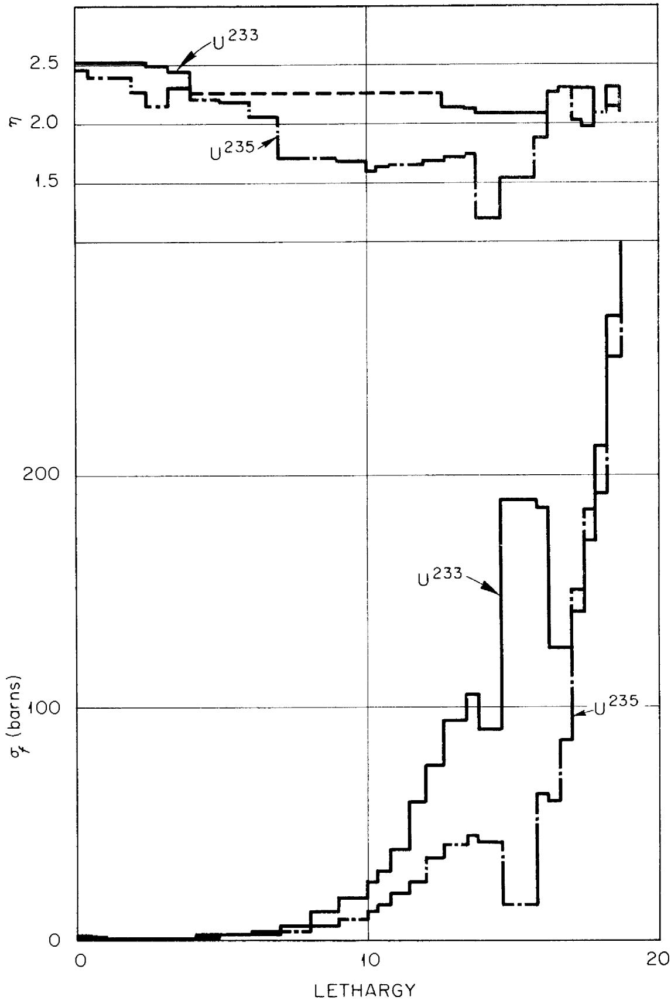  
FIGURE 1 Fission Cross Sections and Eta for $U^{233}$ and $U^{235}$ in the Ocusol-A Program.

The average energy of neutrons causing fission can be increased by increasing the $U^{233}$ concentration, which increases the probability for a neutron to cause fission before it gets slowed down very much. The resulting increase in reactivity can be compensated for by adding thorium to the core or by using smaller cores. The improvement in breeding ratio must be balanced against increased inventory charges.

# 2. One Region Reactors

The critical mass of a bare reactor passes through a minimum with increasing diameter at the point where the effect of diminished leakage on critical concentration is just compensated by the volume increase. The minimum inventory for the entire system occurs at a somewhat larger diameter which depends on the ratio of total fuel volume to core volume. By means of preliminary hand calculations, a reactor having a diameter of 10 feet was selected as providing a reasonable compromise between the demands for low inventory and reasonable size. The power density in the four cases studied was set nominally at 100 w/cc of core volume. The results are summarized in Table VIII, and discussed in detail by Carrison and Alexander $\frac{70}{\cdot}$ .

Pure $\mathbf{U}^{233}$ was used and neutron losses to fission fragments, protactinium, uranium isotopes, and Li were ignored. Further, the optimistic $\mathbf{U}^{233}$ cross sections of the Eyewash program were used. Thus the results are only qualitative. However, it does not seem probable that a breeding ratio of 1.0 can be obtained in a practical, bare, one region system. On the basis of the relative cross sections and from the comparison of certain two region reactors discussed below,

U233 ONE REGION, MOLTEN SALT, BREEDER REACTORS

Fuel Carrier LiF-BeF2

Fertile Material . . . . . . . . . . . . . . . . . . . . . . . . . . . . . . . . . . . . . . . . . . . . . .

Nominal Power Density 100 w/cc

Temperature 1200°F

Computational Program .... Eyewash

Table VIII   

<table><tr><td>Case</td><td>S1*</td><td>S2</td><td>S3</td><td>S4</td></tr><tr><td>Core</td><td></td><td></td><td></td><td></td></tr><tr><td>Diameter, ft</td><td>9.34</td><td>10</td><td>10</td><td>10</td></tr><tr><td>Nominal power, Mw</td><td>1150</td><td>1400</td><td>1400</td><td>1400</td></tr><tr><td>LiF, mole %</td><td>51.0</td><td>50.8</td><td>63.0</td><td>63.0</td></tr><tr><td>BeF2, mole %</td><td>47.8</td><td>45.0</td><td>26.0</td><td>15.0</td></tr><tr><td>ThF4, mole %</td><td>1.0</td><td>4.0</td><td>10.0</td><td>20.0</td></tr><tr><td>Fuel</td><td>U-233</td><td>U-233</td><td>U-233</td><td>U-233</td></tr><tr><td>Results</td><td></td><td></td><td></td><td></td></tr><tr><td>Critical concentration, mole % UF4</td><td>0.0323</td><td>0.243</td><td>1.02</td><td>2.16</td></tr><tr><td>Critical mass, kg, U-233</td><td>53.7</td><td>388</td><td>2010</td><td>3730</td></tr><tr><td>Specific power</td><td>21,400</td><td>3,600</td><td>700</td><td>375</td></tr><tr><td>Transmutation ratio **</td><td>0.585</td><td>0.848</td><td>0.986</td><td>1.05</td></tr><tr><td>Mean energy of neutrons causing fission, ev</td><td>≈0.1</td><td>≈2</td><td>≈103</td><td>≈104</td></tr></table>

* l-inch reactor vessel of Ni-Mo alloy   
** Combined breeding and conversion

it is estimated that if $U^{235}$ were substituted for $U^{233}$ in these reactors, the critical masses would be increased by a factor of 2 or 3 and the conversion ratios would decrease markedly for a given thorium concentration.

The use of reflectors should improve the performance of the one region reactors somewhat, particularly in smaller sizes. This matter has not been explored

fully because it was felt that a reflector containing fertile material (a blanket) would in every case give better neutron economy for a given fuel inventory than a non-fertile reflector.

As expected the mean energy of the neutrons causing fission (bottom line, Table VIII) increased sharply with thorium loading, and a reasonably fast spectrum $(10^{4}\mathrm{ev})$ was obtained in Case S4. This hard spectrum was obtained, however, at the cost of a very large critical mass of $U^{233}$ . The critical masses of $U^{235}$ or Pu would be even larger. However, these results do offer some hope that a truly fast, homogeneous, molten fluoride reactor based on the plutonium cycle can be achieved.

# 3. Two Region Reactors

Emphasis has been placed on the study of two region rather than one region reactors for several reasons. First, higher specific powers, and thus lower inventory costs at a given breeding ratio, can be obtained with smaller reactors. Second, in single region reactors there is no convenient way of separating the $\mathbf{U}^{233}$ or protactinium from the $\mathbf{U}^{235}$ and $\mathbf{U}^{238}$ . Third, at power densities of 250 w/cc or below, all the power that can be utilized by one turbogenerator can be obtained from 4 to 6-foot cores. To save neutrons, one places a blanket of fertile material around the core.

Preliminary calculations were performed by means of the Eyewash program using the nuclear cross sections then available on the Eyewash "sigma" tape. It was felt that the calculations would at least disclose the area where the most favorable combination of specifications would likely be found.

Spherical reactors having core-diameters of 4, 5 and 6 feet were studied. The basic fuel carrier was a mixture of LiF and $\mathsf{BeF}_2$ with zero (four cases) and 4 mole percent $\mathsf{ThF}_4$ . The blanket (28 inches thick) consisted of the

compound $\mathrm{Li}_{3}\mathrm{ThF}_{7}$ , and the core vessel was 1/3-inch of INOR-8. The core and blanket densities were computed for a temperature of $1200^{\circ}\mathrm{F}$ , but the nearest thermal neutron temperature available in the Eyewash program was $1280^{\circ}\mathrm{F}$ .

Cases 21, 22 and 23 of Table IX comprise a series in which the effect of varying the core radius on conversion ratio and critical mass was investigated for reactors employing $U^{235}$ as fuel and having thorium in the blanket only. The conversion ratios (line 17) are of the order of 0.6 and are relatively insensitive to changes in core size. The critical mass (line 14) increases sharply with decreasing core diameter in the range of 6 to 4 feet, as does the mean energy of the neutrons causing fission (line 35). This hardening of the spectrum results in a decrease in parasitic absorptions in Li, Be and F (lines 28 and 29) from about 0.15 to 0.08 neutrons, and a decrease in the absorptions in the core vessel (line 31) from 0.08 to 0.03 neutrons. However, this decrease is offset in great part by an increase in the parasitic captures in $U^{235}$ from 0.10 to 0.16, i.e., the mean value of $\eta$ (line 34) decreased from 2.00 to 1.80 ( $\eta$ at 0.08 ev = 2.08).

In the Eyewash program, $\eta$ of $U^{233}$ is taken uniformly as 2.28 ( $\nu = 2.52$ ) in the energy range from 0.025 ev to 0.18 mev. The result of using this $\eta$ is shown in Case 25, which is similar to Case 23, except that the fuel is $U^{233}$ and the Ni-Mo core vessel is 1 inch instead of 1/3-inch thick. The breeding ratio (line 16) is only 0.530; however, it is observed that the absorptions in the core vessel amounted to 0.206 neutrons. For a comparison with Case 22, the excess absorption (0.206 - 0.056 = 0.150) was prorated among the blanket components, and a breeding ratio of 0.78 was estimated for a 1/3-inch core vessel thickness on the basis of the increased absorptions in the thorium. The critical mass for Case 25 was gratifying low, amounting to only $\sim 13$ kg of $U^{233}$ .

The principal avoidable losses of neutrons in Case 23 were those due to absorptions in fuel carrier and core vessel, the sum amounting to about 0.15 neutrons. It was conjectured that these losses could be decreased by adding thorium to the core. Case 26 shows the result of adding $\sim$ 4 mole percent $\mathrm{ThF}_4$ to the core of the reactor of Case 22. The thermal flux was entirely suppressed (line 36). There was a substantial increase in the absorptions in thorium, over half of these taking place in the core, and a corresponding increase in the conversion ratio (line 16). Absorptions in carrier salt were substantially reduced and the absorptions in the core vessel were sharply reduced from $\sim$ 0.06 to $\sim$ 0.01 neutrons. This last effect was due in part to the increased transparency of the core vessel at higher neutron energies, and in part to the fact that fewer neutrons leaked from the core in Case 26 (0.210 neutrons vs. 0.385 in Case 22). It was noticed that $\eta$ (line 34) for Case 26 was slightly greater than for Case 23. Even though the mean energy of the neutrons causing fissions was higher in Case 26. This circumstance results from the fact that $\eta$ for $U^{235}$ passes through a minimum with increasing neutron energy.

There are a number of small discrepancies between Cases 22 and 26 which resulted from the premature termination of the calculation in Case 26 and a print-out for a subcritical condition. This shows up principally in the neutrons absorbed in fission reactions (line 24), where the absorptions in Case 26 correspond to a $\nu$ of 2.56. The breeding ratios and the critical masses for all cases were corrected by linear extrapolations for these departures from criticality, but the neutron balances were not corrected.

Case 27 shows the advantage of using thorium in the core with $\mathbf{U}^{233}$ as the fuel, provided the capture cross sections of $\mathbf{U}^{233}$ in the epithermal range are as low as those used in the Eyewash program. Parasitic absorptions are reduced to a very low value and the breeding ratio (line 16) is quite favorable;

Table IX   
EYEWASH STUDIES OF TWO REGION MOLTEN SALT REACTORS   

<table><tr><td colspan="2">Fertile Carrier ......</td><td>LiF-BeF2</td><td colspan="4">Core Vessel ...... 1/3-inch Ni-Mo alloy</td></tr><tr><td colspan="2">Fertile Material ......</td><td>ThF4</td><td colspan="4">Reactor Shell ... 1-inch Ni-Mo alloy</td></tr><tr><td colspan="2">Nominal Power Density ......</td><td>200 w/cc</td><td colspan="4">Temperature ...... 1280°F</td></tr><tr><td>Line</td><td>Case</td><td>21</td><td>22</td><td>23</td><td>25*</td><td>26</td></tr><tr><td>1</td><td>Core</td><td></td><td></td><td></td><td></td><td></td></tr><tr><td>2</td><td>Diameter, ft</td><td>6</td><td>5</td><td>4</td><td>5</td><td>5</td></tr><tr><td>3</td><td>Nominal power, Mw</td><td>638</td><td>368</td><td>188</td><td>368</td><td>368</td></tr><tr><td>4</td><td>LiF, mole %</td><td>65.4</td><td>65.3</td><td>64.6</td><td>65.4</td><td>50.6</td></tr><tr><td>5</td><td>BeF2, mole %</td><td>34.5</td><td>34.3</td><td>34.7</td><td>34.5</td><td>44.3</td></tr><tr><td>6</td><td>ThF4, mole %</td><td>--</td><td>--</td><td>--</td><td>--</td><td>3.9</td></tr><tr><td>7</td><td>Fuel</td><td>U-235</td><td>U-235</td><td>U-235</td><td>U-233</td><td>U-235</td></tr><tr><td>8</td><td>Blanket</td><td></td><td></td><td></td><td></td><td></td></tr><tr><td>9</td><td>Thickness, inches</td><td>28</td><td>28</td><td>28</td><td>28</td><td>28</td></tr><tr><td>10</td><td>LiF, mole %</td><td>74.5</td><td>74.5</td><td>74.5</td><td>74.5</td><td>74.5</td></tr><tr><td>11</td><td>ThF, mole %</td><td>25.5</td><td>25.5</td><td>25.5</td><td>25.5</td><td>25.5</td></tr><tr><td>12</td><td>Results</td><td></td><td></td><td></td><td></td><td></td></tr><tr><td>13</td><td>Crit. Conc., mole %</td><td>0.063</td><td>0.160</td><td>0.728</td><td>0.056</td><td>1.30</td></tr><tr><td>14</td><td>Crit. Mass, kg</td><td>27.7</td><td>41.2</td><td>95.6</td><td>12.7</td><td>303</td></tr><tr><td>15</td><td>Sp. Power, kw/kg</td><td>11,000</td><td>4,300</td><td>950</td><td>14,000</td><td>580</td></tr><tr><td>16</td><td>Transmutation Ratio**</td><td>0.550</td><td>0.610</td><td>0.618</td><td>0.530*</td><td>0.734</td></tr><tr><td>17</td><td>Core Loading, tons</td><td></td><td></td><td></td><td></td><td></td></tr><tr><td>18</td><td>UF4</td><td>0.05</td><td>0.07</td><td>0.14</td><td>0.02</td><td>0.44</td></tr><tr><td>19</td><td>ThF4</td><td>--</td><td>--</td><td>--</td><td>--</td><td>1.36</td></tr><tr><td>20</td><td>BeF2</td><td>3.50</td><td>2.04</td><td>1.01</td><td>2.05</td><td>2.38</td></tr><tr><td>21</td><td>LiF</td><td>3.60</td><td>2.01</td><td>1.04</td><td>2.03</td><td>1.50</td></tr><tr><td>22</td><td>Total</td><td>7.15</td><td>4.12</td><td>2.19</td><td>4.10</td><td>5.68</td></tr><tr><td>23</td><td>Neutron Balance</td><td></td><td></td><td></td><td></td><td></td></tr><tr><td>24</td><td>U-fissions</td><td>0.397</td><td>0.398</td><td>0.397</td><td>0.393</td><td>0.390</td></tr><tr><td>25</td><td>U-captures</td><td>0.101</td><td>0.123</td><td>0.160</td><td>0.039</td><td>0.141</td></tr><tr><td>26</td><td>Th in core</td><td>--</td><td>--</td><td>--</td><td>--</td><td>0.211</td></tr><tr><td>27</td><td>Th in blanket</td><td>0.276</td><td>0.321</td><td>0.347</td><td>0.230</td><td>0.193</td></tr><tr><td>28</td><td>F</td><td>0.078</td><td>0.102</td><td>0.075</td><td>0.069</td><td>0.026</td></tr><tr><td>29</td><td>Li and Be</td><td>0.068</td><td>0.102</td><td>0.063</td><td>0.027</td><td>0.029</td></tr><tr><td>30</td><td>Total Absorptions</td><td>0.920</td><td>0.943</td><td>0.972</td><td>0.794</td><td>0.988</td></tr><tr><td>31</td><td>Core Vessel</td><td>0.080</td><td>0.056</td><td>0.029</td><td>0.206*</td><td>0.012</td></tr><tr><td>32</td><td>LeakAge from blanket</td><td>0.000</td><td>0.000</td><td>0.000</td><td>0.000</td><td>0.000</td></tr><tr><td>33</td><td>Balance</td><td>1.000</td><td>0.999</td><td>1.000</td><td>1.000</td><td>0.999</td></tr><tr><td>34</td><td>η</td><td>2.00</td><td>1.91</td><td>1.80</td><td>2.29</td><td>1.84</td></tr><tr><td>35</td><td>Ef, mean energy of neutrons causing fission</td><td>~0.09</td><td>~0.6</td><td>~50</td><td>~0.12</td><td>~200</td></tr><tr><td>36</td><td>Thermal Flux</td><td>39x1013</td><td>14x1013</td><td>0.6x1013</td><td>28x1013</td><td>~0</td></tr></table>

* l-inch Ni-Mo core vessel. For l/3-inch shell, T.R. was estimated to be $\sim 0.78$ .   
** Combined breeding and conversion

however, no account was taken of fission product poisoning or captures in Pa, uranium isotopes, Li $^{6}$ , etc. Thus refinements in the calculations can be expected only to reduce the estimate of the breeding ratio.

Compared to Case 25, Case 27 exhibits a rather large increase in critical mass. The optimum concentration of thorium in the core can only be determined by an analysis of the sum of fuel costs and inventory charges as a function of thorium concentration.

Detailed neutron balances for Cases 22, 26 and 27 are shown in Tables X, XI, and XII. The thermal and epithermal absorptions in the various components of the core and the blanket and absorptions in the core vessel are given.

From an examination of the flux plots, it was estimated that a blanket only 12 inches thick would have captured substantially all of the neutrons leaking from the core vessel.

The results listed in Table IX are, of course, quite optimistic and are of the nature of an upper limit on performance. Use of corrected cross sections and inclusion of the various poisons is expected to reduce the transmission ratios sharply and to increase the critical masses substantially. However, it is felt that these systems show promise of being able to produce power at an attractively low cost, mainly through reduction of fuel costs, and it was decided to refine the calculations and to extend the investigation. Accordingly, new and additional cross sections were computed and the program itself was modified in several respects $\frac{71}{\cdot}$ and renamed Ocusol-A.

-64-

Table X   
NEUTRON BALANCE   
Case No. 22   

<table><tr><td></td><td colspan="2">Epithermal</td><td colspan="2">Thermal</td><td rowspan="2">Total</td></tr><tr><td></td><td>Core</td><td>Blanket</td><td>Core</td><td>Blanket</td></tr><tr><td>25-Fissions</td><td>0.2617</td><td>---</td><td>0.1365</td><td>---</td><td>0.3982</td></tr><tr><td>25-Captures</td><td>0.0953</td><td>---</td><td>0.0273</td><td>---</td><td>0.1226</td></tr><tr><td>Thorium</td><td>---</td><td>0.3019</td><td>---</td><td>0.0187</td><td>0.3206</td></tr><tr><td>Fluorine</td><td>)</td><td>)</td><td>0.0041</td><td>0.0003</td><td>)</td></tr><tr><td>Be</td><td>0.0848)</td><td>0.0084)</td><td>0.0005</td><td>---</td><td>0.1019)</td></tr><tr><td>Li</td><td>)</td><td>)</td><td>0.0036</td><td>).0002</td><td>)</td></tr><tr><td>Total Absorptions</td><td>0.4418</td><td>0.3103</td><td>0.1720</td><td>0.0192</td><td>0.9433</td></tr><tr><td>Absorptions in core vessel</td><td colspan="2">0.0435</td><td colspan="2">0.0128</td><td>0.0562</td></tr><tr><td>Leakage from Blanket</td><td colspan="2">0.0003</td><td colspan="2">0.0000</td><td>0.0003</td></tr><tr><td></td><td colspan="2"></td><td colspan="2">Balance</td><td>0.9998</td></tr></table>

Table XI.   
NEUTRON BALANCE   
Case No. 26   

<table><tr><td></td><td colspan="2">Epithermal</td><td colspan="2">Thermal</td><td rowspan="2">Total</td></tr><tr><td></td><td>Core</td><td>Blanket</td><td>Core</td><td>Blanket</td></tr><tr><td>25-Fissions</td><td>0.3897</td><td>---</td><td>0.0002</td><td>---</td><td>0.3899</td></tr><tr><td>25-Captures</td><td>0.1408</td><td>---</td><td>0.0000</td><td>---</td><td>0.1408</td></tr><tr><td>Thorium</td><td>0.2105</td><td>0.1923</td><td>0.0000</td><td>0.0015</td><td>0.4043</td></tr><tr><td>Fluorine</td><td>0.0195</td><td>0.0064</td><td>0.0000</td><td>0.0000</td><td>0.0259</td></tr><tr><td>Li, Be</td><td>0.0268</td><td>0.0000</td><td>0.0000</td><td>0.0000</td><td>0.0268</td></tr><tr><td>Total Absorptions</td><td>0.7873</td><td>0.1987</td><td>0.0002</td><td>0.0015</td><td>0.9877</td></tr><tr><td>Absorptions in core vessel</td><td colspan="2">0.0122</td><td colspan="2">0.0000</td><td>0.0122</td></tr><tr><td>Leakage from blanket</td><td colspan="2">0.0007</td><td colspan="2">0.0004</td><td>0.0011</td></tr><tr><td></td><td colspan="2"></td><td colspan="2">Balance</td><td>1.0010</td></tr></table>

Case No. 27

Table XII   
NEUTRON BALANCE   

<table><tr><td></td><td colspan="2">Epi thermal</td><td colspan="2">Thermal</td><td rowspan="2">Total</td></tr><tr><td></td><td>Core</td><td>Blanket</td><td>Core</td><td>Blanket</td></tr><tr><td>23-Fissions</td><td>0.387</td><td>---</td><td>0.006</td><td>---</td><td>0.392</td></tr><tr><td>23-Captures</td><td>0.036</td><td>---</td><td>0.0006</td><td>---</td><td>0.037</td></tr><tr><td>Thorium</td><td>0.276</td><td>0.217</td><td>0.0008</td><td>0.001</td><td>0.495</td></tr><tr><td>Fluorine</td><td>0.022</td><td>0.008</td><td>0.000</td><td>0.000</td><td>0.030</td></tr><tr><td>Li, Be</td><td>0.029</td><td>0.000</td><td>0.000</td><td>0.000</td><td>0.029</td></tr><tr><td>Total Absorptions</td><td>0.751</td><td>0.225</td><td>0.007</td><td>0.001</td><td>0.984</td></tr><tr><td>Absorptions in core vessel</td><td colspan="2">0.017</td><td colspan="2">0.000</td><td>0.017</td></tr><tr><td>Leakage from Blanket</td><td colspan="2"></td><td colspan="2"></td><td>0.000</td></tr><tr><td></td><td colspan="2"></td><td colspan="2">Balance</td><td>1.001</td></tr></table>

Five reactor cases have been computed by the Ocusol-A program to date. The results have not been completely analyzed; however, the critical loadings, breeding ratios, and simplified neutron balances are given in Table XIII.

These reactors have cores 6 feet in diameter. For a total power of $600\mathrm{Mw}$ , the required average power density in the core is $187\mathrm{W / cc}$ . The temperature is $1150^{\circ}\mathrm{F}$ . The blanket is composed of $\mathrm{Li}_3\mathrm{ThF}_7$ as before; and the core vessel is $1/3$ -inch of Ni-Mo alloy. The core fluid consists of 69 mole percent LiF and 31 mole percent $\mathrm{BeF}_2$ , together with additions of $\mathrm{ThF}_4$ and $\mathrm{UF}_4$ as indicated. The lithium contains 0.01 percent $\mathrm{Li}^6$ . The thorium cross sections were modified appropriately to account for saturation of the resonances and Doppler broadening. The $\mathbf{U}^{235}$ was assumed to be contaminated with 7 mole percent $\mathbf{U}^{238}$ .

Case 38 has a thorium concentration in the core of 1.0 mole percent and is fueled with $U^{235}$ . Token amounts (10 ppm) of $U^{233}$ and fission fragments were added in order to determine the mean effective cross sections of these materials in the neutron energy spectrum pertinent to each case. The critical mass was found to be 273 kg of $U^{235}$ , and for an assumed ratio of total fuel volume to core volume of 4, the inventory would be 1100 kg. The conversion ratio is 0.610. The effects of build-up of fission fragments, $U^{234}$ , $U^{236}$ , and $U^{238}$ on this reactor have not been investigated. This reactor is reasonably attractive, but the inventory is large.

A reactor having a critical mass of 125 kg of U $^{235}$ (500 kg inventory) was then selected for study. The clean reactor (Case 44) was found to be critical at a concentration of thorium in the core of 0.284 mole percent. The conversion ratio was 0.614. This improvement, in the face of decreased thorium loading, was surprising, and was ascribed to the fact that the second reactor was appreciably more thermal than the first and, consequently, profited from an improvement in the mean η for U $^{235}$ . By including token amounts of fission products and U $^{233}$ , data were obtained from which the rate of build-up of U $^{233}$ , U $^{234}$ , U $^{236}$ , fission fragments, and protactinium could be estimated. The concentrations of various poisons corresponding to about 240 days of operation at 600 Mw (30 percent fission burn-up of original charge of 500 kg U $^{235}$ ) were computed, and the thorium concentration required for criticality was determined (Case 48). It was found necessary to remove nearly all the thorium from the core to maintain criticality; the transmutation ratio decreased to 0.567. Note that in this period nearly 6 kg of U $^{233}$ accumulated in the core, while about 50 kg was produced in the blanket (some present as Pa). The U $^{233}$ in the blanket system was not considered to contribute to the reactivity of the core.

Since it would have been necessary to remove nearly all of the thorium from the core during the first 240 days of operation, it was clear that the buildup of $U^{233}$ had been overestimated. On the other hand, there was still some $U^{233}$ available from the decay of Pa present in the core. In order to avoid repeating the calculation, it was assumed that the decay of the Pa would approximately compensate in the next 240 days of operation for the overestimate of the $U^{233}$ made for the first 240 days. All thorium was removed from the core and the 6 kg of $U^{233}$ was allowed to burn out. The concentrations of fission fragments, $U^{234}$ , etc., corresponding to another 240 days of operation, were computed, and the critical mass of $U^{235}$ was found to be 154 kg (Case 50). The breeding ratio decreased to 0.480, and about 100 kg of Pa and $U^{233}$ had accumulated in the blanket system.

At some as yet undetermined point, it would become profitable to begin processing the blanket for the recovery of $U^{233}$ and the core for the removal of fission fragments. The processing cycle chosen consists of recovering the uranium isotopes by the fluoride volatility process and, in the case of the core fluid, throwing away the contaminated salt. The steady state concentrations of the various materials corresponding to a processing rate of 600 ft³/yr (compared to a total fuel volume of about 450 ft³) were estimated. The system was then tested for criticality. On the basis of the results, the estimates were corrected; the results are listed under Case 49 in Table XIII. The transmutation ratio for this case was found to be 0.56. The $U^{235}$ feed rate is approximately 0.5 g/Mw-day of heat produced.

The concentration of fission fragments in the fuel will, of course, vary with the rate of processing the core. The transmutation ratio will vary correspondingly, and the critical loading will change. The conversion ratio can

Table XIII   
OCUSOL-A STUDIES OF MOLTEN SALT REACTORS   

<table><tr><td>Case</td><td>38</td><td>44</td><td>48</td><td>50</td><td>49</td></tr><tr><td>Fission burn-up, % of initial inventory</td><td>0</td><td>0</td><td>30</td><td>60</td><td>0</td></tr><tr><td>Thorium in core, mole %</td><td>1.0</td><td>0.284</td><td>0.010</td><td>0.000</td><td>0.000</td></tr><tr><td>Critical mass</td><td></td><td></td><td></td><td></td><td></td></tr><tr><td>kg of U-235</td><td>273</td><td>125</td><td>125</td><td>154</td><td>99</td></tr><tr><td>kg of U-233</td><td>0</td><td>0</td><td>5.9</td><td>1.0</td><td>37</td></tr><tr><td>Neutron balance</td><td></td><td></td><td></td><td></td><td></td></tr><tr><td>U-235</td><td>0.573</td><td>0.549</td><td>0.493</td><td>0.540</td><td>0.281</td></tr><tr><td>U-233</td><td>--</td><td>--</td><td>0.052</td><td>0.008</td><td>0.231*</td></tr><tr><td>U-234</td><td>--</td><td>--</td><td>neg.</td><td>neg.</td><td>0.030</td></tr><tr><td>U-236</td><td>--</td><td>--</td><td>0.018</td><td>0.030</td><td>0.082</td></tr><tr><td>U-238</td><td>0.018</td><td>0.022</td><td>0.026</td><td>0.031</td><td>0.017</td></tr><tr><td>Fission products and neptunium</td><td>--</td><td>--</td><td>0.055</td><td>0.097</td><td>0.039</td></tr><tr><td>Salt, core vessel, and leakage</td><td>0.075</td><td>0.110</td><td>0.099</td><td>0.094</td><td>0.087</td></tr><tr><td>Thorium in core</td><td>0.145</td><td>0.090</td><td>0.032</td><td>--</td><td>--</td></tr><tr><td>Thorium in blanket</td><td>0.189</td><td>0.229</td><td>0.225</td><td>0.200</td><td>0.231</td></tr><tr><td>Transmutation ratio (including absorptions in U-238 and U-235)</td><td></td><td></td><td></td><td></td><td></td></tr><tr><td>Core</td><td>0.28</td><td>0.19</td><td>0.16</td><td>0.11</td><td>0.10</td></tr><tr><td>Blanket</td><td>0.33</td><td>0.42</td><td>0.41</td><td>0.37</td><td>0.46</td></tr><tr><td>Total</td><td>0.61</td><td>0.61</td><td>0.57</td><td>0.48</td><td>0.56</td></tr><tr><td>Accumulation of U-233 in blanket, kg</td><td>--</td><td>0</td><td>~50</td><td>~100</td><td>~100</td></tr></table>

* Includes 0.011 absorptions in U-233 in blanket

be increased by adding thorium to the core fluid. This will, of course, increase the inventory of fissionable material. The best combination of thorium loading and processing rates can be determined only by an economic analysis. These matters are discussed in Section II-G.

These reactors appear to be reasonably attractive. It is planned to perform a parametric study of the effect of variation of core diameter and thorium loading on the transmutation ratio. Initial, transient, and steady state performance will be investigated. These studies will form the basis for a detailed, parametric study of the economics of power production in reactors of this type.

4. Reactivity Effects in Typical Reactor

Reactor Case 44 of Table XIII was selected for a study of reactivity effects of changes in temperature, fuel concentration, and thorium concentration. In the Ocusol-A program, it was possible to change the thermal neutron temperature and to change the atom densities of the materials in the core, but it was not possible - short of modifying the program - to make changes that would reflect the effect of the shift in the thermodynamic temperature on the Doppler broadening of the resonances in the various cross sections. The contribution of the change in thermal neutron temperature was found to be $-0.3 \times 10^{-5} / {}^{\circ}\mathrm{F}$ , and the change in salt density, $(1 / k)(\partial k / \partial \rho)(d\rho / dT)$ , was found to contribute $-6.x10^{-5} / {}^{\circ}\mathrm{F}$ .

The reactivity effects of adding $\mathbf{U}^{235}$ and Th were evaluated independently: $(\mathbf{N}^{25} / \mathbf{k})(\partial \mathbf{k} / \partial \mathbf{N}^{25}) = 0.4585$ and $(\mathbf{N}^{02} / \mathbf{k})(\partial \mathbf{k} / \partial \mathbf{N}^{02}) = -0.116$ . It follows that the ratio of the $\mathbf{U}^{235}$ addition required for criticality to the thorium addition, $\partial \mathbf{N}^{25} / \partial \mathbf{N}^{02}$ , is 0.26, or one must add one atom of $\mathbf{U}^{235}$ for every 4 atoms of Th added.

The reactivities determined for the $U^{235}$ and Th were used to break the term $(1 / k)(\partial k / \partial \rho)(d\rho / dT)$ into its component parts, thus:

$$
\begin{array}{l} (1 / k) (\partial k / \partial p) (d p / d T) = (1 / k) (\partial k / \partial N ^ {2 5}) (d N ^ {2 5} / d T) + (1 / k) (\partial k / \partial N ^ {0 2}) \\ (\mathrm {d N} ^ {0 2} / \mathrm {d T}) + (1 / \mathrm {k}) (\partial \mathrm {k} / \partial \mathrm {N} ^ {\mathrm {s}}) (\mathrm {d N} ^ {\mathrm {s}} / \mathrm {d T}) \\ \end{array}
$$

where $\mathbf{N}^{\mathrm{s}}$ represents the atom density of the salt carrier. The left-hand member is $-6.3 \times 10^{-5}$ , as mentioned above. The first two terms on the right are, $-5.4 \times 10^{-5}$ and $+1.4 \times 10^{-5}$ , respectively. Thus, by difference,

$$
(1 / k) (\partial k / \partial N ^ {S}) (d N ^ {S} / d T) = - 2. 3 x 1 0 ^ {- 5} / ^ {\circ} F
$$

This reactivity effect associated with the carrier is due to an increase in fast leakage as the density of the salt decreases. On the other hand, it was found, by averaging the macroscopic transport cross sections over the flux spectrum, that changes in $U^{235}$ concentration had little effect on the leakage, and that the reactivity effect of changes in $N^{25}$ was due almost entirely to changes in the macroscopic fission cross section.

These preliminary results seem reasonable, and indicate that control-wise the reactors under consideration are well-behaved and can undoubtedly be controlled entirely by changes in heat load and adjustment of the $\mathbf{U}^{235}$ concentration.

# E. Reactor Operation, Control and Safety

The master-slave relationship which exists between power demand and power production in a circulating fuel reactor has been demonstrated conclusively in both the HRE and the ARE. Once the reactor is adjusted to produce power at the design point, load adjustment to meet fluctuations in power demand is achieved automatically without actuation of control rods or control equipment of any kind. Rupture in the reactor cooling system or malfunctioning of any of its components leading to increased temperature in the reactor core, automatically reduces the nuclear reactivity to a subcritical value. The master-slave feature makes possible, in a practical reactor design, complete elimination of control rods and all attendant equipment and instrumentation for imposing direct and prompt control of nuclear reactivity. Reliability, safety, and great simplification of design

is achieved. Instrumentation and control equipment is assigned a secondary role: to function in start-up; to monitor and adjust fuel make-up to maintain design point power; and to monitor and indicate performance of auxiliary equipment for operational or experimental purposes. This section focuses principally on the stability characteristics of molten salt reactors, and the controls and indicators necessary for start-up and adjustment of power level.

# 1. The Control Problem of Nuclear Power Reactors 72/

For nuclear power reactors, control and safety problems are directly related to the control of temperatures and the possible rapid variations thereof. Temperature excursions can be induced by a number of events. Basically, they occur whenever the power generated is not in balance with the power removed. This relationship is expressed by the following equation giving the time rate of change of the temperature:

$$
\frac {\mathrm {d} \mathrm {T} _ {\mathrm {m}}}{\mathrm {d} t} = \mathrm {E} (\mathrm {P} - \mathrm {P} _ {\mathrm {c}}) \tag {1}
$$

72/ The kinetics of circulating fuel reactors have been studied and reported in a number of papers. Among them are: "Current Status of the Theory of Reactor Dynamics", W. K. Ergen, ORNL-53-7-137 (1953); "Kinetics of the Circulating Fuel Nuclear Reactor", W. K. Ergen, Phys. Rev. 25, 702 (June 1954); "Stability of Solutions of the Reactor Equations", John A. Nohel, ORNL report; "Some Aspects of Non-Linear Reactor Dynamics", W. K. Ergen and A. M. Weinberg, Physics XX, 413 (1954); "A Theorem on Rearrangements and Its Application to Certain Delay Differential Equations", F. H. Brownell and W. K. Ergen, Journal of Rational Mech. and Analysis, 3, 565 (1954)

$\mathbf{T}_{\mathfrak{m}}$ is the mean core temperature, $\mathbf{E}$ is the reciprocal of the heat capacity, $\mathbf{P}$ is the power generated, and $\mathbf{P}_{\mathbf{c}}$ is the power removed.

During operation of a reactor, the balance of power can be upset either by an excursion in the power generated or by a change in power removed, or both. Variation in generation may come about by misoperation or failure of a component either in the reactor itself or in the control equipment, if there is any. Change in power demand can occur from two distinct causes: by changes in the electric load or by a breakdown of the heat transfer system between the reactor core and the load. Removal of the electric load as well as pump failure or rupture in the fluid heat transfer system results in stopped, or reduced, heat flow. Should any of these breakdowns occur, prompt and reliable control schemes must be provided in the reactor design unless, as in the molten salt reactor, there is inherent fundamental protection against these dangers. Provision must be made for the removal of after-heat when there is no load. Strictly speaking, this is not, however, a reactor control problem.

To see the full consequences of an unbalance between the power generated and the power removed, one must consider the relationship between the rate of change of power generated, the temperature coefficient of reactivity $\alpha$ , and the mean core temperature $T_{m}$ . It is,

$$
\frac {d}{d t} (\ln P) = - \frac {\alpha}{\tau} T _ {m} \tag {2}
$$

where $\tau$ is the mean neutron generation time of both prompt and delayed neutrons. For a given concentration of fuel and poison, the reactor is critical at only one value of $T_{m}$ , which is taken as the zero of the temperature scale.

Molten salt circulating fuel reactors have large and promptly acting negative temperature coefficients of reactivity, and according to Equations (1) and (2), this feature provides great stability for the mean core fuel temperature.

For example, when the reactor is at full power, a stoppage of the power removal, accomplished either by loss of electrical load or by failure of the heat transfer system, will have little effect despite the sharp rate of rise of temperature predicted by Equation (1), for even a slight rise in temperature will shut off the power generation, as indicated in Equation (2). A partial loss of power load does not cause more than a temporary perturbation in the mean core temperature.

The only possible difficulty of automatic control of temperature perturbation occurs at low power levels. For extremely low power densities such as one finds during start-up of the reactor, these temperature perturbations can be large. This comes about because any increase in load appears in the reactor as a decrease in the fuel temperature. Since the power level is so low, this decrease in fuel temperature increases the reactivity without at first raising the temperature appreciably. Consequently, the reactor may go on a shorter and shorter period until the power rises sufficiently to heat up the fuel and cancel out the excess reactivity which was introduced by cooling the fuel initially. The reactor power level at which the fuel temperature rise cancels the excess reactivity will then be considerably higher than the load. The mean temperature could then continue to rise and overshoot the steady state by a wide margin.

In a molten salt circulating fuel reactor, one can expect temperature stability without significant overshoot even at low power densities. A typical value for $\alpha$ is $5 \times 10^{-5} \Delta k / k / {}^o F$ . Based on electronic simulator methods which accurately predicted the ARE performance, E. R. Mann has determined for the

heat transfer circuit, sketched in Figure 2, that a power density of 4 watts per cubic centimeter is an adequately low limit, above which the reactor will be stable against significant temperature overshoot. This means, for example, that the reference design reactor with a temperature coefficient of reactivity of $-5 \times 10^{-5} / {}^{\circ}\mathrm{F}$ and starting with a power density as low as 4 watts per cubic centimeter can take up load increases at a rate equivalent to placing the reactor on a 10-second period without any appreciable perturbation of the mean fuel temperature. For a design point of 187 w/cc, a reactor of this design can therefore be brought from a power output of about 13 megawatts to 600 megawatts in 43 seconds without serious perturbation in the mean fuel temperature by merely increasing the load demand on the reactor. Thus the reactor will respond completely, safely, and automatically to changes in load demand above 13 megawatts without significant changes in mean core temperature and without control equipment of any kind. Of course, this automatic reactivity control occurs as a result of density changes in the core, so that an expansion chamber must be provided, and the passageways to it must be large enough to allow for expansion without pressure shock in the core.

At power levels of less than $\frac{4}{3}$ w/cc, the only danger that can arise is that of suddenly injecting into the core fuel which is too cold. In normal operation, this would not occur since the start-up times for turbogenerators far exceed limits below which power increases in the core are not safe. One unusual event that could cause trouble without proper safety precaution is that of stopping momentarily the fuel pumps in all of the circulating fuel circuits, cooling the fuel to a lower than normal temperature, and then restarting all pumps simultaneously. During stoppage, the reactor core would become isothermal above its critical temperature and the reactivity would drop to a low value.

UNCLASSIFIED

ORNL-LR-DWG 20468

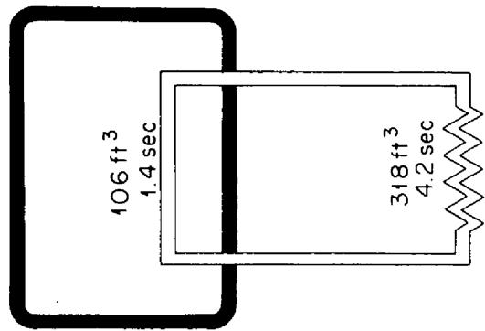  
REACTOR CORE   
FUEL SYSTEM   
FIRST HEAT EXCHANGER TIME CONSTANT $= 0.53$ sec

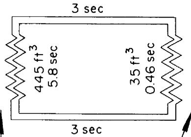  
FLINAK SYSTEM

SODIUM SYSTEM

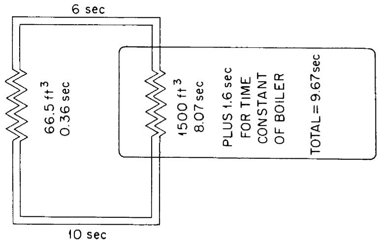  
Fig. 2. Reference Design Reactor Heat Transfer Circuit Showing Simulator Constants.

SECOND HEAT EXCHANGER

TIME CONSTANT = 0.67 sec

TEMPERATURE COEFFICIENT $= 5 \times 10^{-5} / o_{F}$

The sudden insertion of cold fuel could then lead to the difficulty previously described. Accidents of this kind can be prevented by suitable interlocks. A more thorough investigation of such unlikely contingencies will be made, but no difficulties that can not be handled by proper design are anticipated.

An increased load on the reactor system is met by an increased $\Delta T$ across the core and heat exchangers, with the mean temperature of the core remaining the same. Simulator studies demonstrate that even with sudden failure of coupling, such as might conceivably occur in one or more of the multiple heat transfer systems, the transients of inlet and outlet temperatures occur smoothly and in intervals of time which preclude thermal or pressure shocks.

# 2. Fueling

As fuel is depleted and fission product poisoning builds up, the mean core temperature at which the reactor is critical sinks lower and lower. At constant power load, this depression of temperature is reflected at all points in the heat exchange system and, in particular, the sodium return temperature from the boiler is depressed. This temperature must be kept above a minimum set by the requirement that the sodium return temperature should be maintained above the melting point of the salts in the salt-to-sodium heat exchangers. This is done by increasing the concentration of fuel in the core as needed.

The relation which gives the mass, $\Delta \mathbf{M}$ , of fissionable material to be added to the reactor for a given increase in the steady state mean core temperature, $\Delta T_{\mathrm{m}}$ , is given by the expression,

$$
\Delta \mathbf {M} = \alpha \beta \mathbf {M} \Delta \mathbf {T} _ {\mathbf {m}}
$$

where,

$$
\beta = \frac {\delta M _ {c}}{M _ {c}} / \frac {\Delta k}{k}
$$

Here $\alpha$ is the temperature coefficient of reactivity, $k$ is the effective multiplication constant, and $M_c$ is the critical mass. For epithermal reactors, the ratio $\beta$ ranges from two to six, usually greater than four, and it can be obtained from criticality experiments or by computation. The graph, Figure 3, shows the reduction in sodium return temperature during the course of time resulting from burn-up when the constant power generation is 200 w/cc. For example, if the fuel inventory is 1000 pounds or $U^{235}$ and $\beta$ is four, and if the sodium return temperature can be allowed to drop $50^{\circ}F$ , then the reactor must be refueled at intervals no greater than every nine and one-half days. When it is so fueled, the amount of $U^{235}$ that is added is 10 pounds.

The mean core temperature will rise with addition of fuel. The chance for conceivably dangerous temperature transients due to too rapid feed can be eliminated completely by adopting a design which limits the rate of feed. For example, the rate of feed can be limited by designing refueling equipment to inject fuel salt in properly sized pellet form only at safe minimum intervals of time. The pellets would be held under the top surface of the fuel in a heavy mesh wire screen until dissolved. The slugging effect, caused by temporary inhomogeneity of the concentration of fuel in the circulating salt, is reduced by feeding fuel in solid form due to the time required for complete melting of pellets.

# 3. Criticality Start-up

Before adding fuel to the reactor core system, the core, blanket and all of the fluid heat transfer systems will have been heated to temperature, checked for gas leaks, filled with their respective fluids, all liquid systems checked for full operation, and the systems again checked for leaks. With no heat generation in the reactor and the pumps running, the whole system will be

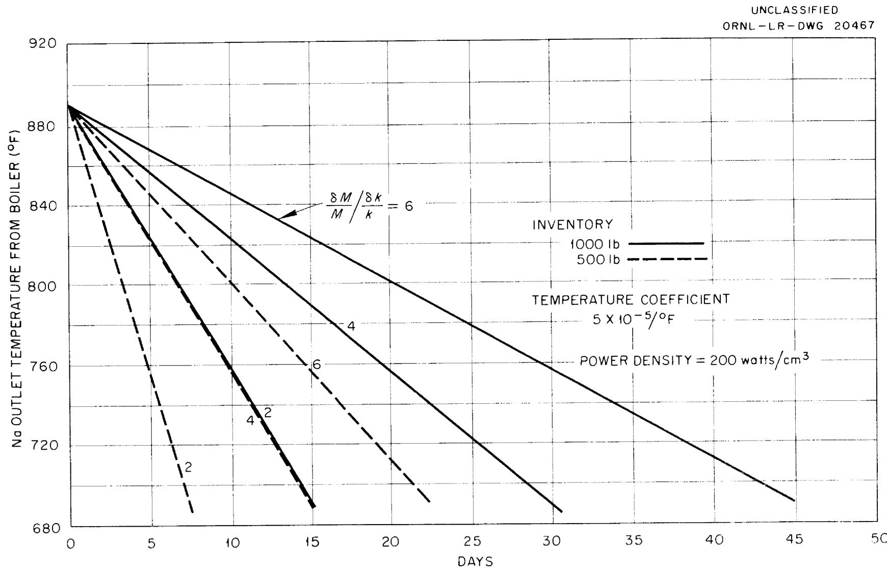  
Fig. 3. Change in Coolant Inlet Temperature for Intermediate Heat Exchanger due to Fuel Burn-up, for a Typical Fused Salt Circulating Fuel Reactor at a Power Density of 200 watts/cm³.

isothermal and the temperature can then be controlled in a sensitive way by steam supplied to, or removed from, the boiler. With the reactor in this condition, it can be brought to criticality by the safe procedure outlined below. Nuclear instrumentation will be required for this initial fueling operation.

With no fuel in the reactor, the counting rate from neutrons originating in the source is accurately determined and its reciprocal value is used later in the familiar reciprocal counting rate versus fuel mass plot. With fuel pumps operating, concentrated fuel salt is added until the fuel load reaches 80 to 90 percent of the value which makes the reactor critical, as previously determined from hot criticality experiments. Then a neutron count rate is measured, after which carefully limited amounts of concentrated fuel salt are added step-wise with intervening counting and plotting of points. When the reactor is near critical, as determined from the plot, the reactor core temperature is slowly lowered until the neutron counter indicates criticality, at which point the temperature of criticality is determined. The cooler is turned off, the temperature of the core rises to design point, and the adding-fuel, counting, determining-criticality-temperature cycle is repeated until criticality at core design point temperature is reached. Experience from the ARE has demonstrated that a well planned and deliberately executed procedure such as this is a simple, safe, and reliable one for achieving criticality in the reactor.

Reactor constants, important for future fueling and other operations, can be determined from data recorded in the reactor start-up log.

F. Build-up of Nuclear Poisons and Chemical Processing

1. Fission Product Poisoning

A 600 Mw reactor will produce about $190\mathrm{kg / yr}$ of fission products. About 23 atom percent of the fission fragments have a decay chain such that they appear as an inert gas - Xe or Kr - with a half-life greater than one hour and thus are subject to removal by purging with He or $\mathbf{N}_2$ gas. These removable isotopes contribute about 25 percent of the total fission product poisoning in the 100 ev resonance region. This percentage is higher in a thermal reactor because of the very large thermal neutron cross section of $\mathrm{Xe}^{135}$ , but burn-out limits the $\mathrm{Xe}^{135}$ poisoning to a maximum of about 5 percent. In the resonance region, however, adjoining nuclei do not have great differences in cross section, and burn-out is relatively ineffective in limiting poison. Thus, to a first approximation, poisoning increases almost linearly with time if fission products are not removed.

About 26 atom percent of the fission products are rare earths. In a 100 ev resonance reactor, they contribute about 40 percent of the fission product poisoning. The remaining non-rare-gas and non-rare-earth fission products include a wide variety of elements, no one of which is outstanding from the poisoning point of view.

In a thermal U $^{235}$ burner reactor operated at constant power and at constant U $^{235}$ inventory, but with no fission product removal, the fission product poisoning, $\Sigma_{a,th}^{FP} / \Sigma_{a,th}^{25}$ , is approximately equal to the equilibrium Xe $^{135}$ poisoning (0-5%) plus equilibrium Sm $^{149}$ poisoning (~1.2%) plus the contribution from "all other fission products". According to Blomeke and Todd $\frac{74}{\cdot}$ ,

the "all other fission product" poisoning totals about 3 percent when the total amount of $U^{235}$ burned is equal to the $U^{235}$ inventory (100% burn-up), increases to about 19 percent at 1000 percent burn-up, and to about 51 percent at 10,000 percent burn-up. Thus it is possible, although not necessarily economical, to run a thermal, fluid fuel reactor for many years without being forced to process to remove fission product poisons. One would, of course, pay for not processing by higher inventory charges for $U^{235}$ and by lower breeding-conversion ratios. A 600 Mw thermal reactor burns about 230 kg $U^{235}$ per year, so that with 460 kg $U^{235}$ inventory, the fission product poisoning would increase from 0-5 percent initially to 20-25 percent after 20 years.

Even in thermal reactors, resonance captures in fission products make the poisoning somewhat worse than the numbers given above. The magnitude of the extra poisoning depends on the ratio of the neutron flux at resonance energies to the thermal neutron flux, which is determined in part by the effectiveness of the moderator. In resonance reactors, the fission product poisoning is considerably worse due to the higher average fission product absorption cross sections relative to $U^{235}$ . In a 100 ev reactor with a 530 kg $U^{235}$ inventory, the total fission product poisoning $\frac{75}{4}$ would increase approximately linearly from zero percent initially to $\sim 48$ percent after 2 years at 600 Mw.

For $U^{233}$ fueled reactors, the fission product poisoning is about the same as for $U^{235}$ at thermal neutron energies, but in the resonance region, the higher $U^{233}$ cross section reduces the poisoning effect of the fission products by a factor of two over $U^{235}$ . Thus a resonance breeder-converter burning half-and-half $U^{233}$ and $U^{235}$ would have a fission product poison level of $\sim 9$ percent if processed twice per 100 percent burn-up.

2. Pa²³³, Np²³⁷ and Np²³⁹ Poisoning

Neutron capture in $\mathsf{Pa}^{233}$ or $\mathsf{Np}^{239}$ has the same result as a non-fission capture in $\mathsf{U}^{233}$ or $\mathsf{Pu}^{239}$ , i.e., a fissionable atom is effectively lost as well as a neutron. Although neutron loss to $\mathsf{Np}^{237}$ does not involve loss of a fissionable atom, the total poison can be worse when $\mathsf{U}^{235}$ is used as make-up fuel. Although neutron capture by any of the three yields a fertile atom, at present relative prices for fertile and fissionable materials, the gain is negligible compared to the loss.

The average ratio of neutron captures to $\beta$ -decays by $\mathrm{Pa}^{233}$ in a reactor is given to a good approximation by,

$$
0. 0 4 6 \mathrm {P} (1 + \bar {\alpha}) \left[ \frac {\mathrm {B . R .}}{\mathrm {M} ^ {\mathrm {T h}}} \right] \left[ \frac {\bar {\sigma} _ {\mathrm {a}} \mathrm {P a}}{\bar {\sigma} _ {\mathrm {a}} ^ {\mathrm {T h}}} \right]
$$

where, $\mathbf{P} =$ reactor power level, thermal Mw

$$
\begin{array}{l} (1 + \bar {\alpha}) = r a t i o o f a b s o r p t i o n s t o c l s s i o n s i n f u e l \\ B. R. = \text {b r e e d i n g o r c o n v e s s i o n r a t i o} \\ M ^ {T h} = k g \text {o f t h o r i u m i n s y s t e m} \\ \end{array}
$$

The P and $\bar{\alpha}$ refer to the whole system. The other parameters can refer either to the whole system or to the core and blanket separately. In molten salt power reactor studies to date, neutron captures in $\mathsf{Pa}^{233}$ have been negligible, due primarily to the large thorium inventories considered.

In a $U^{233} - U^{235}$ breeder-converter using highly enriched $U^{235}$ make-up, $Np^{239}$ poisoning is relatively unimportant, but if the breeding-conversion ratio is poor, $Np^{237}$ poisoning can become objectionably high if it is allowed to reach its equilibrium value with no removal by chemical processing. This is especially true in resonance reactors, in which $U^{236}$ (and hence $Np^{237}$ at equilibrium) yields may be twice as high as in thermal reactors. Chemical processing to remove $Np$ is discussed in a following section.

# 3. Corrosion Product Poisoning

Corrosion product concentrations in molten fluoride salts in INOR-8 loops at $1500^{\circ}\mathrm{F}$ have not been observed to exceed 100-300 ppm for Fe, Cr and Al, or 100 ppm for Ni, Mo and other alloy constituents (with $\sim 20$ ppm being typical for Ni and Mo). At lower temperatures, these numbers are smaller, but precise values at $1100 - 1200^{\circ}\mathrm{F}$ are not yet available. These corrosion products will be removed from the core system, along with the fission products, by the chemical processing system. They will build up to equilibrium in the blanket system (where they are relatively less objectionable than in the core since blanket poisons have to compete with such a very high concentration of thorium).

The Fe, Cr, Ni and Al are relatively light elements and thus should have lower capture cross sections than typical fission products. Molybdenum is typical of the lighter group of fission products (about 18 percent of fissions eventually yield a stable Mo isotope). Since the chemical processing will probably be at such a rate that the steady state fission product concentration in core salt will be several thousand ppm, the corrosion product poisoning has been neglected.

# 4. Chemical Processing and Fuel Reconstitution

The "ideal" reactor chemical processing scheme would remove fission products, corrosion products, $\mathsf{Pa}^{233}$ and $\mathsf{Np}^{239}$ as soon as they were formed. After the latter two had decayed to $\mathsf{U}^{233}$ and $\mathsf{Pu}^{239}$ , it would then return them to the reactor, along with the U and Pu passing through the process, in the desired form. This ideal chemical plant would have low capital and operating costs, would hold up only small amounts of fissionable and other high-priced materials, and would discharge its waste streams in forms that could be inexpensively disposed of or sold for a profit. Present technology, however, does not offer such an ideal process for any reactor.

More practical short-term goals for processing a molten salt reactor might be (a) continuous removal of most of the gaseous fission products by purging with He or $\mathbf{N}_2$ gas, (b) an "in-line" removal of rare earth, noble metal or other fission products by "freezing out" of part of the salt stream, "plating out" of fission products on metallic surface either naturally or electrolytically, "salting out", e.g., of rare earths by keeping the salt saturated with Ce, or "slagging out" of a solid carrier phase by adding oxygen or oxides, and (c) continuous or batch removal of salt fuel from the reactor at an economically optimum rate to separate the U, Pu and salt from the remaining fission products and corrosion products by the least expensive method available. Present technology does not offer all of this for a molten salt reactor which has to be designed now, although there is reason to expect that an adequate development program would enable it to be approached more closely in the "second reactor" design. Operation of the ARE and of ANP in-pile loops indicates that gaseous fission product removal can be achieved and that Ru, Rh, and Pd plate out on metal surfaces. The fluoride volatility process achieves one of the most important goals in separating U from salt and fission products. Scouting experiments in ORNL Chemistry and Chemical Technology laboratories have indicated a basis for optimism that further development will yield methods of separating salt from fission products. Adequate technology already exists for the preparation of fresh fuel starting with non-radioactive UF $_6$ and fluoride salts, but further development is required to demonstrate "hot" (and hence remotely operated) reconstitution of fuel from recycled uranium (and salt if possible) if long cooling times are to be avoided.

Fluoride Volatility Process - Processes for the decontamination of uranium by fluorination to produce volatile $\mathbf{U}\mathbf{F}_6$ are under active development at the Argonne and Oak Ridge National laboratories. Both sites have studied

the dissolution of solid fuel elements (e.g., STR) in molten fluoride salts as a preparatory step for fluorination, and ORNL has also studied the fluorination of molten salt reactor (ARE and ART) fuels as well. The ANL process fluorinates with $\mathsf{BrF}_3$ and distills the UF $_6$ product to complete the decontamination. The ORNL process fluorinates with F $_2$ and completes the UF $_6$ decontamination with a sorption-desorption cycle on a NaF pellet bed.

The ORNL volatility program is currently running at approximately a $\$ 1,000,000$ -a-year level and is at an early pilot plant stage. The pilot plant is now being broken in with non-radioactive feed. This cold stage will be followed by processing of warm (long-cooled) ARE fuel and then hot STR (10-30 day cooled) fuel, over fiscal 1958 and fiscal 1959 according to present plans. The chemistry of the process has been described by Cathers $76/$ , and the pilot plant by Milford $77/$ . Figure 4 is a block flow sheet of the process. For processing ARE type fuel, the uranium bearing molten salt is transferred to the fluorinator in $1.4\ \mathrm{ft}^3$ batches. Fluorine, diluted with $\mathbf{N}_2$ , is bubbled through the salt at $600 - 650^\circ\mathrm{C}$ until its U content is $\sim 10$ ppm, and $\mathbf{U}\mathbf{F}_6$ , $\mathbf{N}_2$ and excess $\mathbf{F}_2$ pass out of the fluorinator through a $100^\circ\mathrm{C}$ NaF pellet bed (capacity of $10\ \mathrm{kg}\ \mathrm{U}$ ) which removes the $\mathbf{U}\mathbf{F}_6$ from the gas stream. At present, the excess $\mathbf{F}_2$ is scrubbed out of the gas stream with a reducing KOH solution. In volatility laboratory studies, $\mathbf{F}_2$ recirculation with a K-25 B-4 pump has been used and may be installed later in the pilot plant, thus reducing $\mathbf{F}_2$ consumption and simplifying the disposal problem. The $\mathbf{U}\mathbf{F}_6$ is desorbed from the NaF by raising the temperature to $400^\circ\mathrm{C}$ and sweeping with $\mathbf{F}_2\text{-}\mathbf{N}_2$ . The $\mathbf{U}\mathbf{F}_6$ passes

UNCLASSIFIED

ORNL-LR-DWG19090

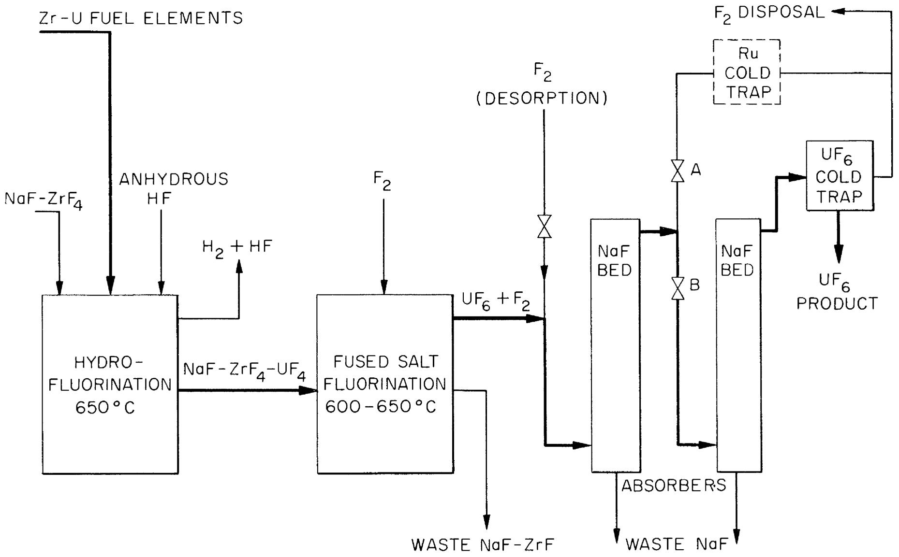  
Fig. 4. Fused Salt-Fluoride Volatility Uranium Recovery Process

through a second NaF bed and is then collected in cold traps at -40 to $-60^{\circ}\mathrm{C}$ . The plant product is liquid UF $_6$ , obtained by isolating the cold traps from the rest of the system, heating to above the triple point and draining into the product receiver.

Most of the decontamination is achieved in the fluorination since most of the fission and corrosion products remain in the salt. The volatile contaminants (Ye, Kr, I, Te, and Mo, most of the Ru, and part of the Nb and Zr) either pass through the NaF bed while the UF $_6$ is retained (Xe, Ir, I, Te, Mo, Ru) or remain on the bed when the UF $_6$ is desorbed (Nb, Zr). The I, Te, Mo, and Ru are mostly removed by a cold trap, the remainder being scrubbed out of the gas system along with the F $_2$ . The Xe and Kr follow the N $_2$ to the plant off-gas system. The Nb and Zr slowly build up on the NaF bed, which is replaced when poisoned. Laboratory development indicates that a $100^{\circ}\mathrm{C}$ micrometallic nickel filter between fluorinator and NaF bed removes most of the Nb and Zr, and this, too, may be added to the pilot plant. This addition would greatly extend the life of the NaF bed.

According to ORNL experience, only part of the Pu follows the U. The behavior of Np and Pa has not been studied. A molten salt power reactor development program should include studies of these three elements. Volatility processing of LiF-BeF $_2$ and NaF-BeF $_6$ salts has not been demonstrated, since the present process is based on NaF-ZrF $_4$ salts, but no difficulties are expected. In fact, the Li salt complexes UF $_4$ -UF $_5$ -UF $_6$ less strongly than Na salts and hence should require less excess F $_2$ .

Reduction of $\mathbf{U}\mathbf{F}_{6}$ to $\mathbf{U}\mathbf{F}_{4}$ - The continuous reduction of highly enriched $\mathbf{U}\mathbf{F}_{6}$ to $\mathbf{U}\mathbf{F}_{4}$ with hydrogen is well proved as a non-radioactive process. The process

developed and used at K-25 $\frac{78}{\cdot}$ is indicated in Figure 5. The reduction takes place in a UF $_6$ -F $_2$ -H $_2$ flame in a Y-shaped tower reactor. The F $_2$ is added to give a hotter flame. The reaction products are UF $_4$ powder and HF-H $_2$ gas. Micrometallic filters recover any UF $_4$ which is entrained in the exit gas. A vibrator is used to shake free any UF $_4$ which clings to the filter or tower walls. A chemical trap using a CaSO $_4$ or NaF pellet bed recovers any unreacted UF $_6$ in the exit gases, although the amount so collected is negligibly small in normal operation. The exit gases are scrubbed free of HF with either a KOH solution spray or a NaF bed.

This process has not been operated at a high level of radioactivity. The UF $_6$ from the power reactor volatility process would be somewhat radioactive, with the major activity probably U $^{237}$ . A "hot" pilot plant demonstration should be provided in a fused salt power reactor development program. No unusual difficulties are anticipated, however, since the present continuous process is smooth-running and practically automatic.

For molten salt reactors using sodium rather than lithium based fuels, the $\mathbf{U}\mathbf{F}_{6}$ to $\mathbf{U}\mathbf{F}_{4}$ recycle may well be greatly simplified by reducing the $\mathbf{U}\mathbf{F}_{6}$ with $\mathbf{H}_{2}$ on the NaF bed and using the NaF- $\mathbf{U}\mathbf{F}_{4}$ pellets for fuel make-up.

# 5. Build-up of Even-Mass-Number Uranium Isotopes

The build-up of $U^{232}$ , $U^{234}$ , $U^{236}$ , and $U^{238}$ as non-fissionable isotopic diluents in $U^{233}$ and $U^{235}$ plays an important part in fuel cycle economics. Although $U^{232}$ does not build up enough to affect the neutron balance significantly, its hard-gamma-emitting daughters grow fast enough to be a biological hazard in the handling of $U^{233}$ , and thus adversely affect the resale value of

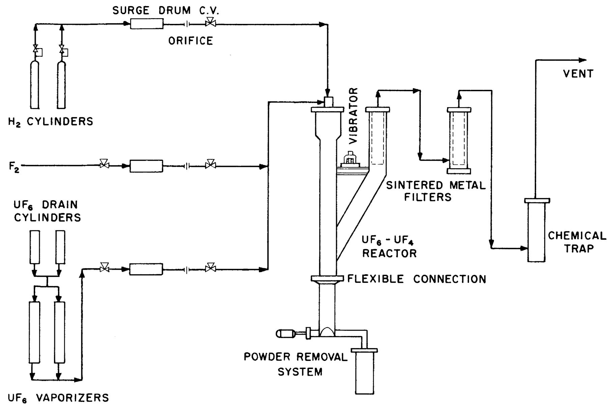  
UF6 REDUCTION PROCESS FLOW SHEET   
FIGURE 5

the $\mathbf{U}^{233}$ . It has been assumed that the molten salt power reactor will process and burn all the $\mathbf{U}^{233}$ it produces, hence the $\mathbf{U}^{232}$ problem has not been considered in detail.

Radiative captures in $\mathsf{Pa}^{233}$ and $U^{233}$ lead to isotopic contamination of the $U^{233}$ with $U^{234}$ . With no processing to separate these isotopes, and none seems feasible, the $U^{234}$ builds up until it is being produced and burned at the same rate. At equilibrium, in thermal reactors, there is $\sim 57$ percent as much $U^{234}$ as $U^{233}$ , with $U^{234}$ capturing $\sim 9$ percent as many neutrons as $U^{233}$ . In fused salt resonance reactors with higher capture to fission ratios, at equilibrium, $U^{234}$ captures $\sim 13$ percent as many neutrons as $U^{233}$ and is present in amount equal to $\sim 35$ percent of the $U^{233}$ . Neutron capture in $U^{234}$ produces fissionable $U^{235}$ , but a capture in thorium would be preferable since $U^{233}$ is a better fuel than $U^{235}$ .

Neutron capture in $U^{236}$ results in an isotopic poison, since $U^{237}$ , with a 6.75 day half-life, decays to $Np^{237}$ too fast to permit useful amounts of the fissionable $U^{237}$ to build up. In completely thermal reactors with no isotopic processing, $U^{236}$ builds up until it is $\sim 18$ times as abundant as $U^{235}$ , and captures $\sim 16$ percent as many neutrons. Normally, in any real thermal reactor, resonance capture by $U^{236}$ will reduce the steady state ratio to less than 18. Isotopic separation of $U^{235}$ and $U^{236}$ may be feasible because of the large amounts involved and because it is important in a breeder-converter economy. On its own merits in a separate cascade, it should cost at least 9 times as much as separation of $U^{235}$ from $U^{238}$ , but by feeding it into existing cascades, either by adding top stages or accepting lower production rates, less expensive processing can probably be achieved. The K-25 Operations Analysis division is studying the gaseous diffusion problem, and ORNL is studying the

over-all problem. At present, AEC buy-back prices for $\mathbf{U}^{235}$ do not penalize isotopic dilution with $\mathbf{U}^{234}$ and $\mathbf{U}^{236}$ any more than they do dilution with $\mathbf{U}^{238}$ . Despite this present buy-back policy, this molten salt reactor study has assumed that, in the long run, equilibrium $\mathbf{U}^{236}$ poisoning would simply have to be tolerated. This is pessimistic if the $\mathbf{U}^{235}$ is kept separate from the $\mathbf{U}^{233}$ in a two region converter, or if a resale market to the military or to other reactors is available at prices near the present AEC buy-back level.

For a steady state reactor using highly enriched U $^{235}$ feed (93% 25, 6% 28, 1% 24) and with no isotopic processing, the U $^{238}$ at equilibrium will capture 6/93 as many neutrons as the U $^{235}$ fed. In a "completely thermal" reactor, at equilibrium there would be 16 times as much U $^{238}$ as U $^{235}$ . In fused salt resonance reactors, the U $^{238}$ would build up to only about 10 percent of the U $^{235}$ fed. Thus at isotopic equilibrium, U $^{236}$ is a worse contaminant than U $^{238}$ . Neutron capture in U $^{238}$ produces fissionable Pu $^{239}$ . For this study, it has been assumed that equilibrium concentrations of and captures in U $^{238}$ would have to be accepted. If the U $^{235}$ chain is kept separate from the U $^{233}$ chain, this is a more pessimistic assumption than is usually made. Even with mixed chains, it is a more pessimistic assumption than is often made. For example, present buy-back prices permit the Consolidated Edison reactor to use a mixed U $^{235}$ , thorium fuel and sell the resulting mixture of U-232-233-234-235-236-238 for $15 per gram of the amount of U $^{233}$ and U $^{235}$ that it contains.

# 6. Radioactive Waste Disposal

At 600 Mw of heat for 7000 hrs/yr, a reactor produces $\sim$ 190 kg/yr of fission products. In molten salt reactors, perhaps 24 weight percent of the fission products can be removed as Xe-Kr gases, leaving $145\mathrm{kg}$ to be removed by chemical processing. The proposed chemical processing flow sheet waste streams

include fused salt, NaF pellets, $\mathbf{F}_2\text{-N}_2$ and HF- $\mathbf{H}_2$ gases. Most of the non-gaseous fission products remain in the core salt residue and may be stored in this form. Most of the remaining fission products are removed by periodically flushing out the micrometallic filter between the fluorinator and the NaF bed and the cold trap between the NaF bed and the $\mathbf{F}_2$ disposal unit. The NaF bed is replaced occasionally when it becomes poisoned with niobium and zirconium. Any remaining fission products in the gas streams are scrubbed out with the $\mathbf{F}_2$ and HF or vented to the reactor off-gas system.

For optimum costs, high power molten salt reactors should probably have relatively large inventories of enriched uranium and be processed about twice per fuel-inventory burn-up, a compromise between the cost of salt replacement and the savings due to improved breeding-conversion ratio. The core salt discard rate indicated in the following section is 500-1000 ft³/yr. This volume corresponds to a fairly high fission product concentration, comparing favorably with any other type of power reactor processing. The disposal problem is not a small one, however. The high concentration of fission products makes the heat dissipation a problem. The high value which the salt would have if the fission products were removed (\(1300/ft³ for Li⁷Be, perhaps half that much for Na-Be), makes it desirable to store it in an easily recoverable form until means of recclaiming it economically can be developed. Underground storage tanks cooled by natural circulation of air, with the salt kept molten, appear to be an acceptable answer. These might well be built one at a time, each with a one-year storage capacity, until a final decision on ultimate disposal is made.

# G. Fuel Cycle Economics

# 1. Cost Bases

Fissionable isotopes have been valued at $17/g and inventory charges calculated at 4%/yr. Thorium cost in fluoride salts has been taken as $30/kg, an arithmetic average of published prices of $17/kg as nitrate and $43/kg as metal. A price of $91/kg for 99.99 percent Li⁺ in large quantities, an authoritative estimate from Y-l2, has been assumed. A fluoride salt cost of $5/lb, plus the cost of the special materials uranium, thorium, lithium-7, has been used 79/. This leads to $11.15/lb for 69 LiF-31 BeF₂ and $15.40/lb for 75 LiF-25 ThF₄. About one-half of the latter is for thorium. The original salt inventories have been capitalized with a 16 percent annual charge corresponding to a 20-year depreciation period. It is assumed that new core salt will be purchased to replace the amounts processed. The blanket salt is used over the 20-year reactor life without excessive fission product poisoning build-up.

Fissionable material consumption cost is based on feeding 93 percent enriched $\mathbf{U}^{235}$ to the core system to compensate for a breeding conversion ratio of less than unity. It is assumed that $\mathbf{U}^{233}$ is not available for purchase at an economic price, although it would be worth more than $\mathbf{U}^{235}$ in a molten salt reactor due to its better nuclear characteristics. It is also assumed that isotopic re-enrichment of $\mathbf{U}^{235}$ or $\mathbf{U}^{233}$ or resale of even isotopic contaminated uranium is not economical and, therefore, that the molten salt power reactor must burn out the non-fissionable isotopes and pay for it in lower breeding-conversion ratio.

2. "Steady State" Neutron Balances and Comparative Fuel Costs

The neutron balances given in this section are not the actual ones given by the Univac, but, rather, modifications or corrections of the original balances as required to make the reactors both "critical" and "steady state". The Univac results were used to obtain flux-averaged microscopic cross sections for the various elements, and these were assumed to remain constant as concentrations of the individual absorbers were changed provided the total macroscopic absorption cross section was held constant. The results are believed to be fairly good for comparison purposes, but no better on an absolute basis than the basic cross sections themselves.

The fuel costs compared below include only fissionable material rental, fissionable material purchased for burn-up, and core salt purchased to replace that processed. These are the "rapidly variable" fuel cycle costs, i.e., those which vary sharply in "reference design" type-reactors (Section III), depending on choice of operating conditions. Although the chemical plant capital and operating costs would also vary to some extent with processing rate, their variation is not fast enough to affect the optimization appreciably.

Three "different" reactor cases are compared below, five versions of a "reference" case and one version each of "low inventory" and "high inventory" cases. The first two cases are for 6-foot diameter (113 ft³) cores with 337 ft³ external holdup. The last case is for a 5-foot diameter core (65 ft³) with the same external holdup. The values of $\nu$ were taken from BNL-325 to be:

U-233: 2.54 U-235: 2.46

Flux-averaged $\alpha$ 's and $\sigma$ 's were chosen separately for each case from the Univacculations on which they were based.

Reference Case - The columns headed A, B, C, and D in Table XIV describe steady state reactors based on Ocusol-A Case 49 for various chemical processing rates and using 93 percent $U^{235}$ make-up. The reactor of Column E is like that of D except that $U^{233}$ make-up is assumed. The flux-averaged values of $\alpha$ for these reactors were:

U-233: 0.15 U-235: 0.41

The flux-averaged microscopic absorption cross sections were in the following ratios:

U-233: 1.00

U-235: 0.60

U-234-6-8: 0.37

FP: 0.22

Th (blanket): 0.036

Th (core): 0.125

Column A gives the fissionable material inventory, neutron balances and fuel costs for an "infinite processing rate", i.e., no uranium or fission products in blanket and no fission products in core. In the other columns the blanket is assumed to be processed for uranium removal at a once-per-year rate (with an average-over-the-life-of-the-reactor amount of fission products included in the blanket) and the core processing rate is varied. Corrosion product and $\mathbf{Np}^{237}$ poisoning is not included as such, but it is felt that this is compensated for by taking no credit for separate removal of gaseous products or for the production of, or fissions by, plutonium. The costs in Column E assume that $\mathbf{U}^{233}$ could be bought for $\phi 17 / g$ . They may be interpreted to indicate that, by comparison with Column D, the fused salt reactor could pay twice as much for $\mathbf{U}^{233}$ as for $\mathbf{U}^{235}$ .

Table XIV   
NEUTRON BALANCES AND FUEL COSTS FOR DIFFERENT INVENTORIES AND PROCESSING CYCIES   

<table><tr><td>I</td><td>Column</td><td>A</td><td>B</td><td>C</td><td>D</td><td>E</td><td>F</td><td>G</td></tr><tr><td>II</td><td colspan="8">Processing Cycle, yrs</td></tr><tr><td></td><td>Core</td><td>0</td><td>0.25</td><td>0.50</td><td>0.75</td><td>0.75</td><td>0.54</td><td>0.97</td></tr><tr><td></td><td>Blanket</td><td>0</td><td>1.00</td><td>1.00</td><td>1.00</td><td>1.00</td><td>1.00</td><td>1.00</td></tr><tr><td>III</td><td colspan="8">Inventory, kg</td></tr><tr><td></td><td>23, Blanket</td><td>---</td><td>105</td><td>105</td><td>105</td><td>105</td><td>100</td><td>100</td></tr><tr><td></td><td>23, Core</td><td>269</td><td>228</td><td>202</td><td>175</td><td>318</td><td>94</td><td>400</td></tr><tr><td></td><td>25, Core</td><td>192</td><td>258</td><td>313</td><td>369</td><td>69</td><td>288</td><td>700</td></tr><tr><td></td><td></td><td>471</td><td>591</td><td>620</td><td>649</td><td>492</td><td>482</td><td>1200</td></tr><tr><td>IV</td><td colspan="8">Neutron Calance</td></tr><tr><td></td><td>02, B</td><td>0.2446</td><td>0.2312</td><td>0.2312</td><td>0.2312</td><td>0.2312</td><td>0.2033</td><td>0.1854</td></tr><tr><td></td><td>02, C</td><td>0.0926</td><td>0.0664</td><td>0.0333</td><td>---</td><td>0.1099</td><td>---</td><td>0.0959</td></tr><tr><td></td><td>23, B</td><td>---</td><td>0.0110</td><td>0.0110</td><td>0.0110</td><td>0.0110</td><td>0.0211</td><td>0.0200</td></tr><tr><td></td><td>23, C</td><td>0.3372</td><td>0.2866</td><td>0.2535</td><td>0.2202</td><td>0.3993</td><td>0.1822</td><td>0.2614</td></tr><tr><td></td><td>24, C</td><td>0.0433</td><td>0.0382</td><td>0.0430</td><td>0.0297</td><td>0.0527</td><td>0.0278</td><td>0.0373</td></tr><tr><td></td><td>25, C</td><td>0.1457</td><td>0.1960</td><td>0.2382</td><td>0.2806</td><td>0.0527</td><td>0.3126</td><td>0.2186</td></tr><tr><td></td><td>26, C</td><td>0.0426</td><td>0.0574</td><td>0.0698</td><td>0.0821</td><td>0.0155</td><td>0.0873</td><td>0.0641</td></tr><tr><td></td><td>28, C</td><td>0.0072</td><td>0.0110</td><td>0.0143</td><td>0.0175</td><td>---</td><td>0.0199</td><td>0.0127</td></tr><tr><td></td><td>FP, B</td><td>---</td><td>0.0024</td><td>0.0024</td><td>0.0024</td><td>0.0024</td><td>0.0047</td><td>0.0050</td></tr><tr><td></td><td>FP, C</td><td>---</td><td>0.0129</td><td>0.0257</td><td>0.0386</td><td>0.0386</td><td>0.0405</td><td>0.0271</td></tr><tr><td></td><td>Other</td><td>0.0868</td><td>0.0869</td><td>0.0866</td><td>0.0867</td><td>0.0867</td><td>0.1006</td><td>0.0725</td></tr><tr><td></td><td>Totals</td><td>1.0000</td><td>1.0000</td><td>1.0000</td><td>1.0000</td><td>1.0000</td><td>1.0000</td><td>1.0000</td></tr><tr><td></td><td>Effective B.R.</td><td>0.82</td><td>0.73</td><td>0.64</td><td>0.56</td><td>0.83</td><td>0.50</td><td>0.68</td></tr><tr><td>V</td><td colspan="8">Fuel Costs, $/yr</td></tr><tr><td></td><td>23 + 25 rental</td><td>320,000</td><td>402,000</td><td>422,000</td><td>441,000</td><td>335,000</td><td>328,000</td><td>820,000</td></tr><tr><td></td><td>23 or 25 make-up</td><td>815,000</td><td>1,260,000</td><td>1,630,000</td><td>2,030,000</td><td>774,000</td><td>2,275,000</td><td>1,450,000</td></tr><tr><td></td><td>Salt make-up</td><td>∞</td><td>2,430,000</td><td>1,220,000</td><td>810,000</td><td>810,000</td><td>1,116,000</td><td>670,000</td></tr><tr><td></td><td></td><td>∞</td><td>4,092,000</td><td>3,272,000</td><td>3,281,000</td><td>1,919,000</td><td>3,719,000</td><td>2,940,000</td></tr></table>

Low Inventory Case - The above-discussed reference case had its median fission in the 34-61 ev energy group, with $U^{233} - U^{235}$ inventories of $\sim 600$ kg. Column F describes a reactor (based on Ocusol-A Case 44) with a lower uranium inventory. The median fission was in the 10-15 ev group. The flux-averaged $\alpha$ values were:

U-233: 0.16 U-235: 0.39

The relative absorption cross sections were:

U-233: 1.00

U-235: 0.58

U-234-236-238: 0.31

Th (blanket): 0.028

Th (core): 0.097

Fuel make-up with $10^{235}$ is assumed. This case does not appear to offer as economical a fuel cycle as the reference case. The biggest difference is in the increased fraction of neutrons lost to salt, shell and leakage ("other" in the table).

High Inventory Case - Since it appeared from the above two cases that an even higher inventory might be still more economical, another case was examined and is listed in Column G (based on Eyewash Cases 26 and 27, with Ocusol-A $\alpha$ 's inserted). Although this case differs from the preceding two in core size as well as inventory, it does appear that the higher inventory "pays off" in increased breeding conversion ratio and reduced salt replacement costs.

# SECTION III

# Reference Design Reactor

# A. Introduction

To allow a realistic estimate of the performance, safety, economics and cost of construction of a typical molten salt reactor, a specific reactor type and size was chosen for detailed study. The principal items considered in making this choice were:

1. The reactor should be capable of relatively early construction. No component, material, or process is used that is not either already available, or tested or under test in at least pilot plant scale equipment. The assumption is made, however, that equipment such as pumps and heat exchangers can be designed and built successfully in larger sizes than those tested to date. Development and testing charges will be associated with this scale-up.   
2. Safety in an early reactor is of paramount importance. Great emphasis is placed on avoiding any reasonable possibility of chemical accident involving radioactive components.   
3. Long life of components is essential for long-term economy. On this basis the alloy INOR-8 was chosen as a material of construction; however, its reliability has not been demonstrated in long term tests, although short term tests suggest that it should last for many years.   
4. The reactor should possess the ability to serve as a prototype for central station power generation.   
5. The possibility that this may be the first power reactor of its kind requires that as.much information as possible be derived from it. Thus the reactor should be as versatile as possible without incorporating experimental facilities that seriously affect the economics or continuity of power production.

While it was not expected that this "reference design reactor" would necessarily turn out to be the best one possible, it was chosen after consideration of a large variety of factors and should be representative of good molten salt power reactors that can be built in the near future.

The reference design reactor is a two region homogeneous converter with a core approximately 6 feet in diameter and a blanket 2 feet thick. Moderation is provided by the salt itself so there is no need for a moderator or other structure inside the reactor. The core, with its volume of 113 cubic feet or 3200 liters, is capable of generating 600 megawatts of heat at a power density of only 187 watts/cc. This rate of power generation is well within safe limits, and the total power output of 600 thermal megawatts from the core, plus additional heat from the blanket, allows a net electric power generation of approximately 240 megawatts.

The basic core salt is a mixture of about 70 mole percent $\mathsf{Li}^{7}\mathsf{F}$ and 30 percent $\mathsf{BeF}_2$ . Additions of thorium fluoride can be made if desired, and enough $\mathsf{UF}_4$ will be added to make it critical. The blanket will consist of the eutectic of LiF and $\mathsf{ThF}_4$ , or mixtures of it with the basic core salt. The melting point of the core salt is $867^{\circ}\mathsf{F}$ and that of the blanket salt is $1080^{\circ}\mathsf{F}$ , or lower.

Both the core fuel and the blanket salt will be circulated to external primary heat exchangers, six in parallel for the core and two in parallel for the blanket. The numbers of parallel circuits were chosen so that useful operation could still be obtained if any one circuit should fail. It also turns out that reasonable sizes of pumps and heat exchangers result from the 100 Mw heat removal requirement for each of the six core circuits.

Flinak, a mixture of alkali fluorides (mixture 12), was chosen as the intermediate coolant because it has reasonable chemical compatibility with

the core and blanket salts and with sodium, and, of the salts, it has good heat transfer characteristics. It will become only slightly radioactive by exposure to the delayed neutrons from the core fuel and will serve as an isolating link to keep all radioactivity from contact with the steam system. The melting point of the Flinak is $850^{\circ}\mathrm{F}$ .

Secondary heat exchangers will transfer heat from the Flinak to the sodium, which is used directly to heat the boilers, superheaters and reheaters. Details of a reasonable heat transfer system have been worked out, so that with a fuel temperature of $1200^{\circ}\mathrm{F}$ , a steam temperature of $1000^{\circ}\mathrm{F}$ can be achieved. Figure 6 gives a block diagram of the gross features of one of the heat transfer systems of the core circuit. The blanket cooling systems are similar.

After a careful consideration of the problem of control of the reactor, it has been decided that there is no need for any control rods. Reactor control is automatically maintained by the negative temperature coefficient. Uranium fluoride fuel or thorium fluoride as a poison will be added when the need arises, as indicated by temperature measurements in the non-radioactive sodium system. Thus, this reactor can be properly called a nuclear furnace, requiring fuel additions to maintain temperature.

The basic hardware of the system lends itself to a number of different fuels and fuel cycles. For example, the core can be operated with $\mathbf{U}^{235}\mathbf{F}_4$ or $\mathbf{U}^{233}\mathbf{F}_4$ , or, perhaps later, with $\mathbf{PuF}_3$ . Different inventories of uranium are possible, depending on the amount of fertile material introduced, and the amount of fission products and heavy elements that are allowed to build up. One indicated mode of operation is to start up with $\mathbf{U}^{235}$ in the core, together with a little thorium, and to process the core on such a cycle that a complete reprocessing would be carried out approximately every year. The processing

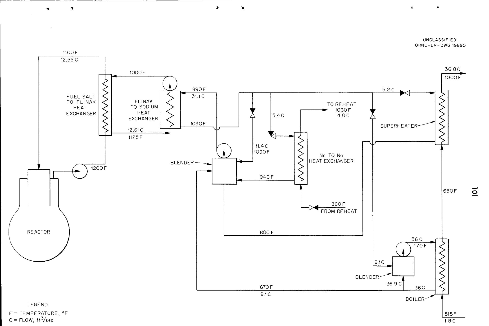  
Fig. 6. Schematic Diagram of Heat Transfer System.

would consist of removing the uranium from the core fluid as $\mathbf{U}_{6}$ by the volatility process, storing the core fluid with its contaminating fission products for later processing, and making up fresh fuel from the reduced $\mathbf{U}_{6}$ , with new $\mathbf{U}_{4}$ added to compensate for fuel burn-up and for heavy element build-up. $\mathbf{U}^{233}$ would build up from whatever thorium is included in the core. The $\mathbf{U}^{233}$ extracted from the blanket by the volatility process would either be stored until enough is obtained for a pure $\mathbf{U}^{233}$ core loading, or it could be added to the core as soon as it is extracted. In either case, the uranium could be recirculated indefinitely and economical operation would be achieved, even after equilibrium concentrations of $\mathbf{U}^{234}$ , $\mathbf{U}^{236}$ , and $\mathbf{U}^{238}$ are built up.

A factor in the selection of the multiple stage heat transfer system involving two intermediate fluids was the desire to have only compatible fluids in adjoining volumes where leaks could involve radioactive materials. This avoids the possibility of liberation of fission products as the result of a chemical accident. As the system is now designed, the pressures developed by the pumps, by difference in density of the fluids, and by over pressure, are such that any failure producing mixing of fluids would tend to produce flow toward the reactor core, rather than from it, tending further to confine the fission products.

An exothermic chemical reaction would result if the sodium and water or steam were mixed. However, this would not involve radioactive materials and would pose only the same danger problems as in any conventional plant handling quantities of chemically active materials where no biological poisons are involved.

The components of the reference design reactor are relatively simple; the apparent complexity stems mostly from the number of components rather than

their type. The large number of components is required because of the large power output contemplated. The basic simplicity of the components together with the high thermal efficiency and low fuel turnover cost encourages the belief that the future cost of power from reactor plants of this type might be fairly low.

B. Heat Generation, Transfer, and Conversion System

# 1. Reactor

The heat transfer system for the reference design reactor has six parallel, independent paths for heat flow from the reactor core fuel to the steam system, and two similar paths for heat from the blanket fluid. Figure 7 shows section and plan views of the reactor vessel, giving the general arrangement of six parallel core pumps and return lines. The reactor vessel, piping, and pump housings and impellers will be made of INOR-8.

As explained in the introduction of this section, the multiple heat removal circuit system was selected as offering reliability and safety. The symmetrical positioning of reasonably sized components allows low fuel holdup and low thermal stresses in the reactor structure and its attendant piping.

The fuel will be enriched to the extent that the average temperature of the core for criticality will be $1150^{\circ}\mathrm{F}$ . At the full rated power generation of 600 megawatts of heat in the core, the system is designed so that the fuel salt will enter the core at $1100^{\circ}\mathrm{F}$ and leave it at $1200^{\circ}\mathrm{F}$ . With this $100^{\circ}\mathrm{F}$ temperature range, the total flow of fuel through the core must be 34,000 gallons per minute. At this rate, it will take the fuel an average of 1.5 seconds to pass through the core and six seconds to make a complete circuit of core plus external system. Each of the six parallel core heat removal circuits will then handle 5,650 gallons per minute of fuel, over a temperature range of $100^{\circ}\mathrm{F}$ , and transfer 100 megawatts of heat.

The multiple circuits, each independent, make unnecessary any valving or flow regulation in the fuel or primary circuit. Stopping one fuel pump would result in slow back flow through that pump and its exchanger. With all fuel pumps stopped, convection would provide sufficient flow to dispose of after-heat, provided primary coolant flow is maintained.

Each blanket cooling circuit will be able to provide full blanket cooling. Normally one circuit would be in full scale operation and the other pumping slowly, on stand-by. The total amount of heat to be removed from the blanket will vary with the $\mathbf{U}^{233}$ content of the blanket. Though detailed calculations of the blanket heat removal system have not been made, it is estimated that the total heat generation in the blanket will not exceed 35 megawatts at any time. Hence, it is expected that heat exchangers in that system will be similar to, but smaller than, those used in the core system.

# 2. Heat Exchangers

All heat exchangers, including those in the steam system, are of shell and tube design, with counter flow of the fluids. U-shaped shells, which minimize tube thermal stress, will be used in every case except in the reheat circuit, where tube and shell temperature differences are low. Table XV gives a summary of the characteristics of the principal heat exchangers used in the entire system, and Figure 8 shows diagramatically the temperature conditions of each heat exchanger.

The primary heat exchangers will transfer heat from the fuel (composition 74) to the primary coolant (Flinak). The principal objectives in the design of the primary heat exchangers are first, dependability, and second, low fuel holdup and low pressure drop. Both of these objectives are met best by having the fuel flow through the tubes rather than on the shell

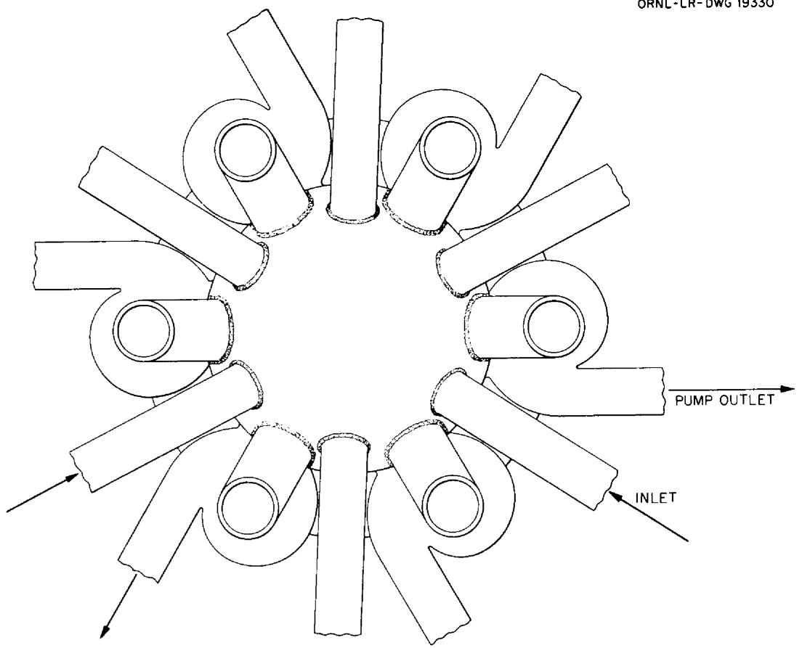  
105   
UNCLASSIFIED NL-LR-DWG 19330   
PLAN

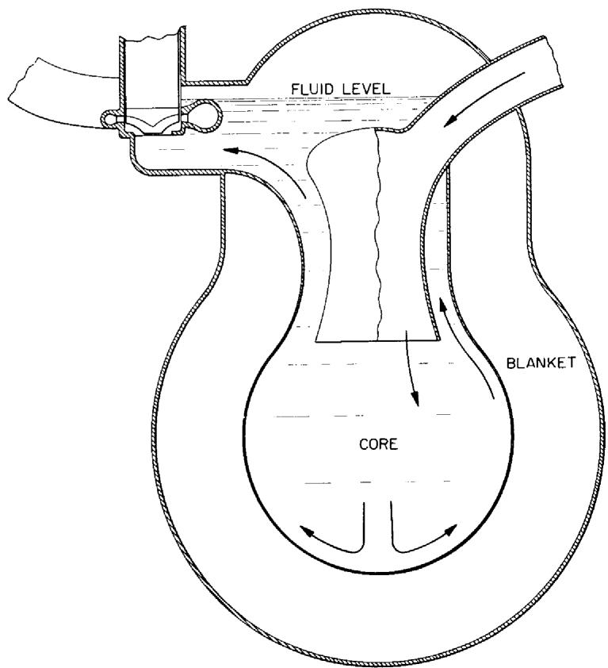  
SECTION   
Fig. 7. Reference Design Reactor.

TABLE XV   
SUMMARY OF HEAT EXCHANGERS   

<table><tr><td colspan="2">Exchanger</td><td colspan="2">Primary</td><td colspan="2">Secondary</td></tr><tr><td>Fluid</td><td></td><td>Fuel</td><td>Flinak</td><td>Flinak</td><td>Na</td></tr><tr><td>Location</td><td></td><td>Tubes</td><td>Shell</td><td>Tubes</td><td>Shell</td></tr><tr><td>Material</td><td></td><td></td><td>Inor</td><td>Inor</td><td>U</td></tr><tr><td>Shape</td><td></td><td>U</td><td>U</td><td>U</td><td>U</td></tr><tr><td>Fluid</td><td>(Hot End,0F)</td><td>1200</td><td>1125</td><td>1125</td><td>1090</td></tr><tr><td>Temperature</td><td>(Cold End,0F)</td><td>1100</td><td>1000</td><td>1000</td><td>890</td></tr><tr><td>Temperature change,0F</td><td></td><td>100</td><td>125</td><td>125</td><td>200</td></tr><tr><td>Temperature</td><td>(Hot End,0F)</td><td></td><td>75</td><td></td><td>35</td></tr><tr><td>Difference</td><td>(Cold End,0F)</td><td></td><td>100</td><td></td><td>110</td></tr><tr><td>Heat Transfer Capacity,Mw</td><td></td><td></td><td>100</td><td></td><td>100</td></tr><tr><td>Heat Transfer Surface,ft2</td><td></td><td>3040</td><td></td><td>3600</td><td></td></tr><tr><td>Avg. Heat Flux,Btu/hr-ft2</td><td></td><td>120,000</td><td></td><td>93,000</td><td></td></tr><tr><td>Tube Data:</td><td></td><td></td><td></td><td></td><td></td></tr><tr><td>Length, ft</td><td></td><td></td><td>16</td><td></td><td>31</td></tr><tr><td>Number</td><td></td><td></td><td>2450</td><td></td><td>930</td></tr><tr><td>O.D., inches</td><td></td><td></td><td>.380</td><td></td><td>.600</td></tr><tr><td>Wall Thickness, inches</td><td></td><td></td><td>.040</td><td></td><td>.050</td></tr><tr><td>Pitch (△), inches</td><td></td><td></td><td>.580</td><td></td><td>.825</td></tr><tr><td>Tube Bundle Dia., inches</td><td></td><td></td><td>26</td><td></td><td>27</td></tr><tr><td>Flow, ft3/sec</td><td></td><td>12.55</td><td></td><td>12.61</td><td>12.61</td></tr><tr><td>Flow,gpm</td><td></td><td>5650</td><td></td><td>5680</td><td>5680</td></tr><tr><td>Flow, lb/hr</td><td></td><td>--</td><td></td><td>--</td><td>--</td></tr><tr><td>Fluid Velocity (inlet), ft/sec</td><td></td><td>10.5</td><td></td><td>7.4</td><td>10</td></tr><tr><td>Reynolds No. (Nominal)</td><td></td><td>6,000-7,000</td><td></td><td>6,000-8,000</td><td>12,000-17,000</td></tr><tr><td>Pressure Drop, psi</td><td></td><td>40</td><td></td><td>19</td><td>34</td></tr><tr><td>Power Consumed, Kw</td><td></td><td>.98</td><td></td><td>.47</td><td>.84</td></tr><tr><td>Heat Transferred Mw</td><td></td><td>120,000</td><td></td><td></td><td>145,000</td></tr><tr><td>Max. Heat Flux,Btu/hr-ft2</td><td></td><td>120,000</td><td></td><td></td><td>145,000</td></tr><tr><td>Thermal Stress,(αE x ΔT wall/2) psi</td><td></td><td></td><td>4,000</td><td></td><td>6,000</td></tr></table>

TABLE XV (Continued)   

<table><tr><td>Exchanger</td><td colspan="2">Na-to-Water Boiler</td><td colspan="2">Na-to-Steam Superheater</td><td colspan="2">Na-to-Na for Reheat</td><td colspan="2">Na-to-Steam Reheater</td></tr><tr><td>Fluid Location Material Shape</td><td>Water Tubes</td><td>Na Shell 2 1/4 U Croloy</td><td>Steam Tubes</td><td>Na Shell 316 SS U</td><td>Reheat Tubes</td><td>Main Na Shell 316 SS Straight</td><td>Steam Tubes</td><td>Na Shell 316 SS Straight</td></tr><tr><td>Fluid (Hot End,0F)</td><td>650</td><td>770</td><td>1000</td><td>1090</td><td>1060</td><td>1090</td><td>960</td><td>1060</td></tr><tr><td>Temperature (Cold End,0F)</td><td>515</td><td>670</td><td>650</td><td>800</td><td>860</td><td>940</td><td>610</td><td>860</td></tr><tr><td>Temperature Change,0F</td><td>135</td><td>100</td><td>350</td><td>290</td><td>200</td><td>150</td><td>350</td><td>200</td></tr><tr><td>Temperature (Hot End,0F)</td><td>120</td><td></td><td>90</td><td></td><td>30</td><td></td><td>100</td><td></td></tr><tr><td>Difference (Cold End,0F)</td><td>155</td><td></td><td>150</td><td></td><td>80</td><td></td><td>250</td><td></td></tr><tr><td>Heat Transfer Capacity,Mw</td><td>61.7</td><td></td><td>24.2</td><td></td><td>13.5</td><td></td><td>81.2</td><td></td></tr><tr><td>Heat Transfer Surface,ft2</td><td>2540</td><td></td><td>2000</td><td></td><td>450</td><td></td><td>7550</td><td></td></tr><tr><td>Avg. Heat Flux, Btu/hr-ft2</td><td>82,700</td><td></td><td>44,100</td><td></td><td>103,000</td><td></td><td>37,000</td><td></td></tr><tr><td colspan="9">Tube Data:</td></tr><tr><td>Length, ft</td><td>45</td><td></td><td>46</td><td></td><td>14</td><td></td><td>30</td><td></td></tr><tr><td>Number</td><td>284</td><td></td><td>220</td><td></td><td>300</td><td></td><td>1190</td><td></td></tr><tr><td>O.D., inches</td><td>1.000</td><td></td><td>1.000</td><td></td><td>.500</td><td></td><td>1.000</td><td></td></tr><tr><td>Wall Thickness, inches</td><td>.120</td><td></td><td>.120</td><td></td><td>.049</td><td></td><td>.095</td><td></td></tr><tr><td>Pitch (△), inches</td><td>1.800</td><td></td><td>1.800</td><td></td><td>.745</td><td></td><td>1.800</td><td></td></tr><tr><td>Tube Bundle Dia., inches</td><td>29</td><td></td><td>28</td><td></td><td>14</td><td></td><td>65</td><td></td></tr><tr><td>Flow, ft3/sec</td><td>1.8</td><td>36</td><td>20.8</td><td>5.20</td><td>4.03</td><td>5.4</td><td>682</td><td>24.2</td></tr><tr><td>Flow, gpm</td><td>810</td><td>17,300</td><td>--</td><td>2340</td><td>1810</td><td>2430</td><td>--</td><td>10,900</td></tr><tr><td>Flow, lb/hr</td><td>317,000</td><td>--</td><td>317,000</td><td>--</td><td>--</td><td>--</td><td>1,546,800</td><td>--</td></tr><tr><td>Fluid Velocity (inlet) ft/sec</td><td>2</td><td>8.75</td><td>30</td><td>1.7</td><td>15</td><td>9.15</td><td>160</td><td>1.46</td></tr><tr><td>Reynolds No. (nominal)</td><td>3.5 x 105</td><td>6.9x105</td><td>4.5 x 105</td><td>1.2-1.7x105</td><td>9 x 104</td><td>1.65x105</td><td>3.25 x 105</td><td>1.2x105</td></tr><tr><td>Pressure Drop, psi</td><td>5</td><td>3</td><td>6</td><td>1</td><td>20</td><td>4.5</td><td>16</td><td>1</td></tr><tr><td>Power Consumed, Kw Heat Transferred</td><td>.03</td><td>.34</td><td>1.02</td><td>.04</td><td>1.17</td><td>.35</td><td>26.5</td><td>.05</td></tr><tr><td>Max. Heat Flux, Btu/hr-ft2</td><td>95,000</td><td></td><td>54,000</td><td></td><td>169,000</td><td></td><td>56,000</td><td></td></tr><tr><td colspan="3">Thermal Stress, (α E x ΔT wall) (1-v) psi 7000</td><td>4200</td><td></td><td>10,000</td><td></td><td>6500</td><td></td></tr></table>

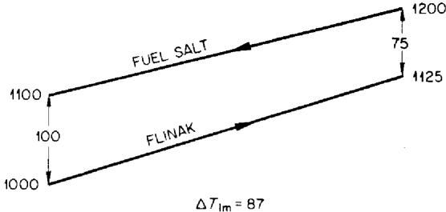  
PRIMARY EXCHANGER (FUEL SALT-FLINAK)

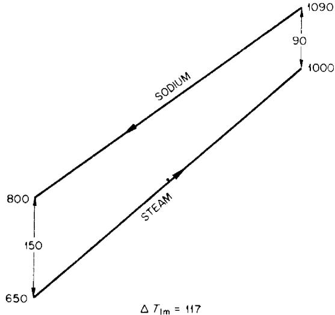  
SODIUM TO STEAM SUPERHEATER

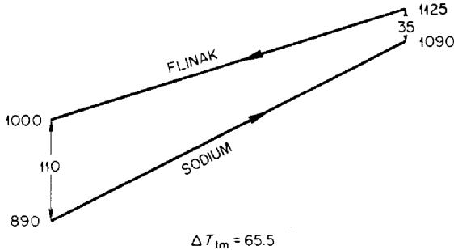  
SECONDARY EXCHANGER (FLINAK-SODIUM)

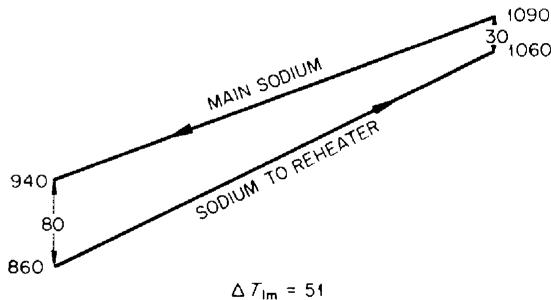  
SODIUM TO SODIUM FOR REHEAT

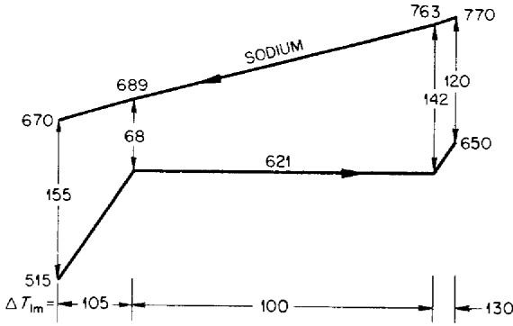  
SODIUM TO WATER BOILER

SODIUM TO STEAM REHEATER

Fig. 8. Temperature-Heat Diagrams for Heat Exchangers.   
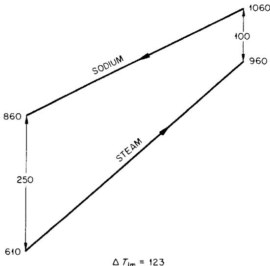  
ALL TEMPERATURES ARE IN $^\circ F$

side of the heat exchangers. The temperature range of the fuel affects these two objectives. Increasing the temperature range decreases the external fuel volume holdup, but at the cost of increasing the pressure drop in the exchanger.

Moderate fuel holdup in the exchanger is obtained with 0.3-inch ID tubing. Although a wall thickness of 0.039 inches has been selected as offering reasonable life and temperature drop, it is possible that additional data and analyses will make a wall thickness of 0.060 inches appear desirable.

The secondary heat exchanger, Flinak-to-sodium, has flow design criteria similar to the primary exchanger, but the volume of salt in the exchanger is a minor consideration. Consequently, larger tubes than are used in the primary can be used, which will reduce the number of tubes in a unit and simplify fabrication. One-half inch 0° x 0.050-inch wall tubing has been selected.

The Na-to-water boiler and Na-to-steam superheater and reheater are designed with single wall tubes but double tube sheets. Easier containment of high pressure steam is achieved by putting it inside the tubes, as is standard practice in ordinary boilers. The low pressure sodium is easily contained in the shell. As the sodium tube sheet and the steam tube sheet are at different temperatures, sufficient length of tubing must be provided between them to give low bending stresses in the tubes. To keep this parasitic length low, the tubes should be as small in diameter as possible, but reliable fabrication is easier with large tubes and thicker walls. One-inch ID x 0.l20-inch wall tubing has been selected as a practical solution for these conflicting demands.

The boiler is of the "once-through" variety and is designed to deliver steam superheated by about $30^{\circ}\mathrm{F}$ to the superheater. This assures that no moisture will enter the superheater. The superheater is designed to deliver

steam to the turbine at $1000^{\circ}\mathrm{F}$ , and an attemperator will be placed in the steam line ahead of the turbine to insure control of the maximum temperature.

Throttle valves in the feed water supply line will be used to maintain balance between the eight separate circuits, while throttle valves in the sodium lines of each separate circuit will maintain the balance of the heat supply among the boiler, superheater, and heat exchanger.

A separate sodium circuit will be used for reheat, with the reheater located near the turbines. A sodium-to-sodium heat exchanger in each of the six main sodium circuits will supply heat to the reheat sodium circuit. The insertion of this extra heat exchanger link, together with the lower heat transfer properties of the lower-pressure reheat steam (350 psi) means that reheating to $960^{\circ}\mathrm{F}$ is more economically accomplished than reheating to $1000^{\circ}\mathrm{F}$ . This does not appreciably reduce the turbine efficiency, but only requires that the first expansion be carried to a lower pressure than for reheating to $1000^{\circ}\mathrm{F}$ . With the reheater located near the turbines, 5 percent pressure drop is predicted as compared to 10 percent when the steam is returned to a furnace.

The reheater, and probably the Na-to-Na exchangers in the reheat circuit, can be of the straight tube design without causing undue thermal stress. As the reheat boiler has, of necessity, a large number of short tubes, the U-shaped configuration would be difficult to fabricate. Thus, it is fortunate that low stress permits use of the straight tube design.

As shown in Table XV, the primary and secondary heat exchangers will be made of INOR-8, the boilers of 2 l/4 Croloy, and the superheaters, reheaters, and sodium-to-sodium heat exchangers of 316 stainless steel. Although these

are suitable choices at present, it is indicated in Section II that future experimental work may lead to the liberal use of high nickel alloys such as Inconel in the sodium, water and steam systems.

# 3. Steam Cycle

The steam cycle selected for design consideration uses 1800 psia, $1000^{\circ}\mathrm{F}$ steam, with one reheat to $960^{\circ}\mathrm{F}$ in 3600-1800 rpm cross-compound turbines. Figure 9 gives a diagram of the steam cycle, showing pressures, temperatures, and mass flow rates of the steam. Seven bleed-offs are used for heating feed water to $515^{\circ}\mathrm{F}$ . With a condenser pressure of 1 l/2 inches Hg $(92^{\circ}\mathrm{F})$ , a turbine heat rate of 8070 Btu/kwh is achieved. This corresponds to a steam cycle efficiency of 42.3 percent.

Coal-fired central stations use six percent of the gross power output in auxiliaries; seven percent appears to be a reasonable figure for this reactor power plant. This latter figure is reached by subtracting one percent for draft fans, coal pulverizers, ash handling, etc., connected with a fossil fuel furnace, and adding two percent for pumping fuel and coolants associated with the nuclear furnace. Net station efficiency is 39 percent or 8675 Btu/kwh delivered at the bus-bars. For comparison, an efficient coal-fired unit, the Commonwealth Edison, Chicago, State Line Plant, reports 8550 Btu/kwh sent out from the 191 Mw Unit No. 3.

At this preliminary state, no attempt has been made to optimize the steam cycle on a cost basis, or to select an extremely efficient cycle. The conditions selected--1800 psi, $1000^{\circ}\mathrm{F}$ , reheat to $960^{\circ}\mathrm{F}$ --are in line with proven industrial practice, and require that the design of the reactor system face up to problems of pressure, temperature, and handling of reheat. The steam cycle proposed is based on the cycle used in the Astoria Station of Consolidated Edison Company, New York, which

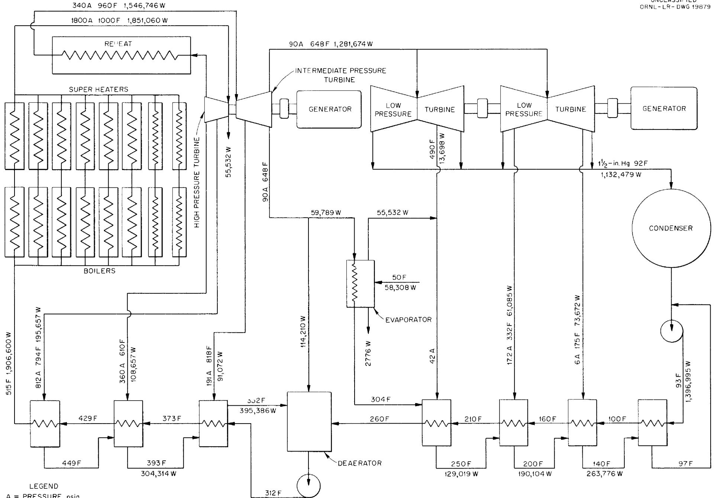  
LEGEND   
A = PRESSURE, psia   
F = TEMPERATURE, °F   
W = FLOW, ib/hr

was the result of an extensive study $\underline{81 / 2}$ . Modifications were made to meet the special conditions of the heat supply and cooling water temperature available.

A feed water temperature about $100^{\circ}\mathrm{F}$ below the saturation temperature of the boiler seems to be as low as is desirable for a sodium boiler, based on thermal stress considerations. This is higher than is normally used with a fossil fuel boiler, where lower temperatures allow more heat extraction from the flue gases. In compensation for the additional feed-water heaters, however, the higher feed water temperature increases the steam cycle efficiency slightly.

# C. Components and Component System

# 1. Pumps

The molten salt and liquid metal pumps will be of the same general design as those now in use in ANP, except for differences of size and capacity, and refinements of details which may develop before the time for procurement arrives. One pump of each new size (capacity and head) will be given thorough tests before additional pumps of the same size are procured, and each pump procured will be proof-tested before use in a power plant. The pump sizes required are indicated as to flow and head by the data in Table XV describing the heat exchanger. Pumps, compressors, fans, etc., for all purposes, except for the movement of molten salts and liquid metals, will be conventional.

# 2. Valves

Salt and sodium mechanical stop valves will be bellows sealed,

cermet-seat type. No salt or sodium stop valves will be used on other than fill-and-drain lines, and these will be 2-inch IPS.

No flow control valves are required in molten salt lines.

The flow control valves in sodium lines will be bellows sealed. They will not be required to stop flow, but only to control it.

All molten salts and sodium valves will follow the most recent ANP design for such valves, except for size and possible modifications for diminishing fluid head loss.

# 3. Pipes and Tubes

Pipes and tubes must be designed to absorb all temperature transients and differences without exceeding specified stress levels. In general, they will be anchored at walls and at heavy pieces of equipment, and appropriately shaped bends between anchor points will be provided to absorb all expansions, contractions, and twists. The main piping in the fuel salt circuits leading to the primary heat exchangers will be 12 inches in diameter. The blanket circuits will use 10-inch pipe. The coolant salt systems will use 14-inch pipe in the core heat removal system and 10-inch pipe in the blanket heat removal system. All these pipes will be made of INOR-8.

# 4. Fill-and-Drain Tanks

a. Fuel salt fill-and-drain tanks

Two tanks will be required, each with sufficient capacity to contain all the fuel salt in the circulating fuel system (approximately 500 ft³). One tank will be available for temporary storage of used fuel salt while the other tank is being used to serve the continued operation of the power plant.

Each of the tanks will be designed so that it can be heated to $1200^{\circ}\mathbf{F}$ , and so that maximum after heat (approximately seven MW total) can be removed

with the hottest part of the shell cooler than $1500^{\circ}\mathrm{F}$ and the axial salt temperature considerably less than the fuel boiling point. It is estimated that this criterion can be met by fabridating the tanks from a number of 12-inch I.D. pipe, aggregating to a total length of 600 feet. Shell temperatures under after-heat conditions will be maintained by recirculating air, in turn cooled by water-cooled radiators. Provision will be made for powering the cooling system from emergency power (diesel or battery) if the regular power supply should fail. Heating will be done by electrical resistance.

Tank fittings required will include the following: (1) salt charge lines; (2) salt drain line; (3) line for transferring molten salt to and from the circulating-fuel system; (4) inert-gas supply line; and (5) inert-gas discharge (off-gas) line.

b. Blanket salt fill-and-drain tanks

Two tanks will be required, each with sufficient capacity to contain all the blanket salt in the circulating blanket system (approximately $600\mathrm{ft}^3$ ). One tank will be available for storage of used blanket salt while the other is being used to serve the continued operation of the power plant.

Each of the two tanks will be designed with provisions for heating to $1300^{\circ}\mathrm{F}$ . No special provision need be made for removal of decay heat other than including capacity in the storage room atmosphere cooling equipment to remove this additional heat from the room.

Tank fittings required will be the same as for the fuel salt tanks.

c. Intermediate heat transfer salt fill-and-drain tanks

Four tanks are required: (1) two duplicate tanks, each capable of containing all the salt in all the intermediate heat transfer circuits; and (2) two duplicate tanks, each capable of containing the salt for the largest

intermediate heat transfer circuit. Each of the four tanks is to be connected for filling and draining each intermediate transfer circuit separately. Each of the four tanks is to be provided for heating to $1200^{\circ}\mathrm{F}$ .

Tank fittings required are the same as for the fuel salt fill-and-drain tanks.

# d. Sodium fill-and-drain tanks

Four tanks are required: (1) two duplicate tanks, each capable of containing all the sodium in all the circulating systems; and (2) two duplicate tanks, each capable of containing the sodium for the largest single sodium circuit. Each of the four tanks is to be connected for filling or draining each of the sodium circuits separately. Each of the four tanks is to be provided for heating to $1200^{\circ}\mathrm{F}$ .

Tank fittings required are the same as for the fuel salt fill-and-drain tanks.

# 5. Gas Supply Systems (Helium, Nitrogen, and Compressed Air)

Helium gas, containing less than 10 ppm oxygen and having a dew point less than minus $70^{\circ}\mathrm{F}$ , will be the only gas allowed to come in contact with any salt or sodium, except during chemical processing. Supply lines from the helium storage banks will contain pressure reducing valves, shutoff valves, flow and pressure instrumentation, and safety devices as required for safety and dependability.

The consumption of helium will depend on a number of design details, including: (1) dilution of off-gas; (2) use of helium in instrumentation; and (3) pump design for pumps serving barren salts and liquid metal systems.

Nitrogen may be used as an atmosphere around some assemblies and sub-assemblies of equipment. If so, the handling equipment will be similar to the

helium handling equipment, but with less strict purity requirements. Whether or not nitrogen will be used anywhere in the plant will depend on future decisions as to ambient atmosphere requirements.

Compressed air will probably be required for some instruments, but is a comparatively minor item.

# 6. Off-Gas System

The xenon and krypton evolving from the fuel at the fuel-to-helium interface in the fuel expansion chamber will be (1) diluted with helium in that chamber, (2) removed through a tube to a holdup tank to allow time for short half-life decay, thence (3) passed through a charcoal bed for further holdup and decay, then (4) discharged to the atmosphere through a stack.

The bases for design of the system will be the same as for the HRE, the HRT, and the ART $\underline{\underline{83}}$ . Parameter relations are becoming well established $\underline{\underline{84}}$ and continued experimentation is refining the quantitative knowledge still further. The present design basis (for later refinement) is the ART off-gas system, modified to ten times the ART off-gas production.

# 7. Preheating and Temperature Maintenance

Provision will be made for preheating the following items to $1200^{\circ}\mathrm{F}$ in 48 hours, although a longer time will normally be used for preheating: reactor, salt expansion chamber-pump units, salt and salt-to-sodium heat ex-changers, connecting pipes and tubes, salt and sodium fill-and-drain tanks and fill-and drain lines, salt fill-and-drain tank charging lines, new salt storage vessels (from which molten salts are charged into salt fill-and-drain

tanks), and off-gas lines to off-gas system. Provision will be made for pre-heating the following items to $1000^{\circ}\mathrm{F}$ in 48 hours: superheaters, boilers, re-heaters, sodium lines, and sodium storage vessels $\underline{85}$ .

The boilers will have provision for additional heat input for start-up, both in the boiler and upstream of the boiler, so that excessive thermal stresses will be avoided during start-up. The general pattern of boiler start-up operation will be very similar to that in a conventional power plant.

It is anticipated that most of the heating of reactor system components will be done with heaters consisting of electrical resistance wire embedded in shaped ceramic matrices. More detailed engineering of components may show that it is more convenient, more dependable, or cheaper to heat some parts of the system with direct electrical resistance, electrical induction gas heat, or auxiliary steam.

Preheaters will be so arranged as to allow separate temperature control of individual subassemblies.

# D. Plant Layout

Figures 10 and 11 show a workable disposition of the major power plant components.

Figure 10 is a plan view and shows the reactor surrounded by six primary (fuel salt to Flinak) heat exchangers and two blanket-cooling heat exchangers. All of these components should be as closely grouped as remote maintenance will allow, in order to minimize the volume of fuel salt.

Directly above the reactor and its primary heat exchangers is a shield containing removable plugs which allow access from above. (See

Figure 11.) This shielded region above the reactor is allocated to tools for remote disassembly and reassembly of fuel salt pumps or primary heat exchangers. It may also be used as a temporary storage room for radioactive parts.

Enclosing the reactor primary complex and the shielded space above is a large steel shell to contain fission fragment gases should they escape from the primary system. It also will allow for maintaining a relatively inert atmosphere should repairs to the system become necessary. The lock leading to the vessel makes it possible to take parts or tools in or out of the vessel without appreciably affecting its atmosphere. Personnel may, if necessary, enter the shielded space above the reactor to service or alter the remote handling tools.

The primary heat exchangers are shown in a vertical position and are connected to the main piping by welded flange joints. This arrangement is believed to provide for the least difficulty in the remote operations of removing and replacing heat exchangers. The primary pumps will be of the top access variety, to make the replacement of the motor-impeller portion less difficult by remote control. The pump units will probably be held in place with a bolted flange. It is recognized that much detailed design and development work will be required to insure adequate operation of remote maintenance equipment.

Surrounding the steel shell and behind concrete shielding are eight compartments, each one in turn shielded from the others. These compartments contain the secondary heat exchangers (Flinak-to-Na) and Flinak pumps. Removable shield plugs above each compartment will allow access to, and replacement of, the components contained therein.

The sodium is conducted from the above-mentioned compartments to four separate layers of boilers, superheaters, pumps, and blenders. The top layer is to serve the blanket cooling system.

UNCLASSIFIED

ORNL-LR-DWG19337

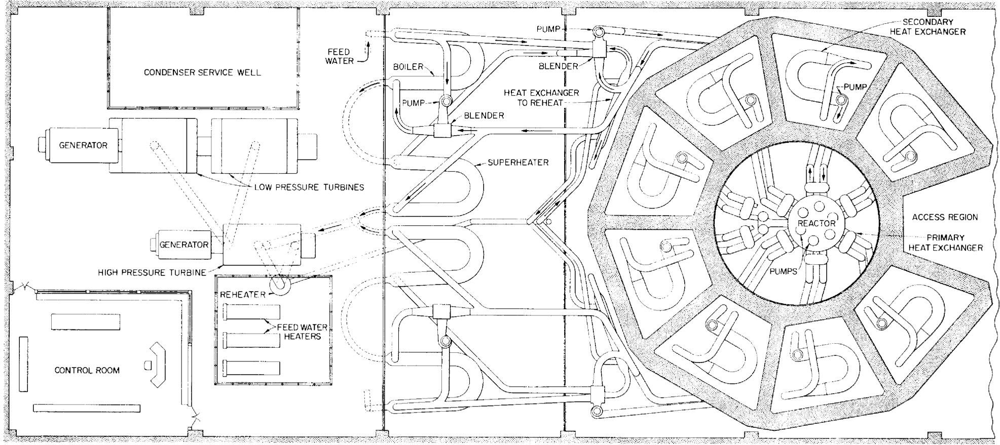  
Fig.10. Plan View of Power Plant.

UNCLASSIFIED

ORNL-LR-DWG 19373

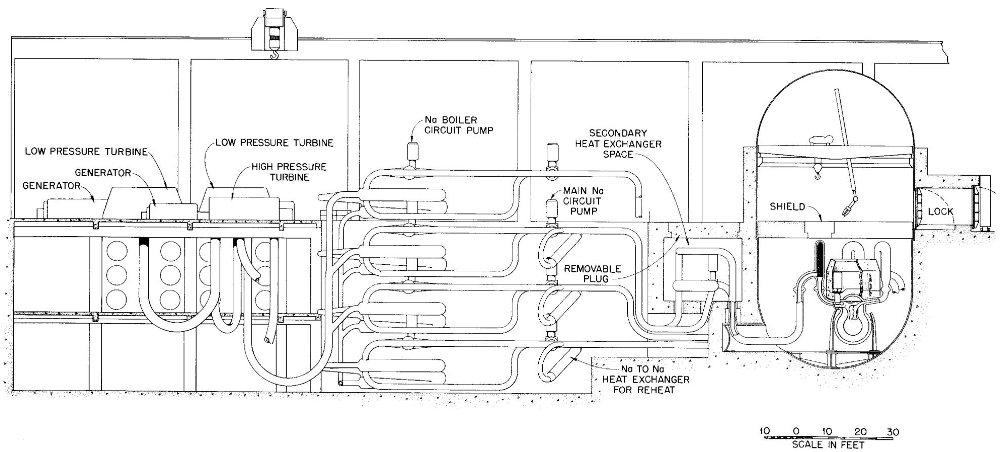  
Fig. 11. Section Through Reactor and Power Plant.

From the boilers and superheaters on, the system and building arrangement closely resemble a conventional steam-electric power plant. However, in place of coal and ash handling equipment, space not shown in the layouts must be provided for fuel, Flinak, sodium, and blanket salt storage vessels, and chemical processing equipment. It is visualized that these facilities would be located below and at the side of the reactor complex opposite the steam plant.

Space for the auxiliary features of a conventional power plant, such as water processing, machine shop, instrument shop, offices, etc., must, of course, be provided.

# E. Chemical Processing and Fuel Cycle Economics

# 1. Core Processing

The core salt chemical processing system is a combination of the ORNL fluoride volatility and the K-25 UF $_6$ reduction processes discussed in Section, Part F. The core salt is transferred by gravity or inert gas pressure from the core loop to a holdup vessel where short-half-lived fission products are allowed to decay before the salt is transferred to the fluorination vessel. The reactor fill-and-drain tank is felt to be the ideal holdup vessel since it is already designed for cooling hot salt and since its volume is large compared to the holdup required by the chemical plant. If thirty days proves to be an adequate cooling period, about sixty cubic feet of core salt will be stored at one time.

The core salt will be fluorinated in 1.4 ft³ batches (ORNL pilot plant size) at one-two batches per day (600 ft³/yr). The barren salt, stripped of uranium but containing most of the Pu, fission products, and corrosion products, is transferred to tank storage where it is held for future salt

recovery. The 10-kgU-capacity NaF pellet beds (ORNL pilot plant size) will be operated on a once-or-twice-per week cycle (i.e., several fluorination cycles per sorption cycle). The volatility part of the chemical plant produces liquid $\mathbf{U}\mathbf{F}_6$ in cylinders. The $\mathbf{U}\mathbf{F}_6$ reduction tower will operate semi-continuously, using $\mathbf{U}\mathbf{F}_6$ from the volatility plant as feed. It will discharge its $\mathbf{U}\mathbf{F}_4$ product directly to a fuel salt mixing pot, to which is also fed fresh salt and makeup-up $\mathbf{U}\mathbf{F}_4$ .

Uranium losses in chemical processing are quite low, about 10 ppm in waste salt and 2 ppm in waste gases. This is approximately $1\mathrm{kg} / \mathrm{yr}$ uranium loss.

# 2. Blanket Processing

Chemical processing of the blanket salt is physically much the same as that of the core salt, except that after fluorination, the blanket salt with the Pa and fission products that it contains is returned to the blanket system. Because of the much lower power density in the blanket, holdup for the fission product cooling is not a problem.

Separate fluorinators for core and blanket salts will prevent possible cross-contamination. A continuous fluorinator for the blanket is assumed since complete uranium recovery is not necessary, and although continuous fluorination has not been demonstrated, no new basic development is required. (Continuous fluorination of the core salt would require further development to demonstrate complete uranium recovery.) A conservative blanket processing rate of one blanket loop volume per year is assumed (achievable even with batch fluorination) though a much faster rate is probably possible. Separate NaF beds and cold traps are provided to enable withdrawal of pure $\mathbf{U}^{233}\mathbf{F}_6$ from the system if desired. It is assumed that the same $\mathbf{UF}_6$ reduction tower will serve both core and blanket.

# 3. Chemical Processing Costs

# a. Investment Costs

The ORNL volatility pilot plant capital costs can be broken down as follows:

<table><tr><td></td><td>Design</td><td>Construction</td><td>Replacements and Modifications</td></tr><tr><td>Through FY-56</td><td>$ 130,000</td><td>$350,000</td><td>$ ---</td></tr><tr><td>Budget FY-57-58-59</td><td>210,000</td><td>296,000</td><td>328,000</td></tr><tr><td>Subtotals</td><td>$ 340,000</td><td>$646,000</td><td>$328,000</td></tr><tr><td>Grand Total</td><td>$1,314,000</td><td></td><td></td></tr></table>

These figures include replacements and modifications which should not be required in a second plant. They also include solid fuel element handling and dissolution facilities which would not be required in the reference design reactor plant. These costs do not include building and service facilities for reducing $\mathbf{U}\mathbf{F}_6$ to $\mathbf{U}\mathbf{F}_4$ and reconstituting fuel. The over-all plant cost estimate in Appendix I includes the following capital costs assignable to the chemical plant:

V Building and site 250,000

VI Equipment and installation 1,500,000

VII Design 262,500

VIII Prime Contractor 402,500

IX Contingency 402,500

$2,817,500

While the breakdown may not be exactly accurate, the total is felt to be an adequate estimate of the cost. These investment costs are charged at sixteen percent per year.

# b. Operating costs

The ORNL pilot plant operating budget for three fiscal years--1957, 1958, and 1959--totals $1,368,000. The reference design reactor chemical plant would have lower "unusual costs" but higher "production-proportional costs" and is estimated to cost $500,000/yr to operate, not including core salt replacement cost which adds $810,000/yr (600 ft³/yr at $1350/ft³). These costs are included with other fuel cycle costs in the discussion of the over-all power costs that follows. Other fuel cycle costs are explained in Section II, Part G, of this report.

# 4. Fuel Cycle Economics

The nuclear characteristics of two region molten salt reactors have been discussed in Section II, Part D. General aspects of fuel cycles for molten salt power reactors have been discussed in Section II, Parts F and G, together with the interdependence of dollar and neutron economics. For the purpose of estimating fuel cycle costs for the reference design reactor, the reactor of Column D, Table XIV, was chosen. (Reactor "E" had a much lower fuel cost but assumed $U^{233}$ make-up at $\$17/\text{g}$ . If $U^{233}$ were available at $\$34/\text{g}$ such a reactor would have fuel costs about like "D" but would "look better" because of the higher breeding ratio. Reactor "G" had a fuel cost $\sim$ ten percent lower than "D" but had only a five foot core. Reactor "C" had very nearly the same fuel cost as "D", with better breeding ratio but higher salt make-up charge.) In Section III, Part F, the chemical plant construction cost has been combined with the other reactor complex capital costs. The fuel cycle "operating" costs are shown in Section III, Part F, as 2.3 mills/kwh, which results from Reactor "D" as follows:

<table><tr><td></td><td>$/yr</td><td>Mills/kwh</td></tr><tr><td>23 + 25 rental</td><td>441,000</td><td>0.3</td></tr><tr><td>25 make-up</td><td>2,030,000</td><td>1.2</td></tr><tr><td>Salt make-up</td><td>810,000</td><td>0.5</td></tr><tr><td>Chemical plant operation</td><td>500,000</td><td>0.3</td></tr><tr><td></td><td>3,781,000</td><td>2.3</td></tr></table>

The first three $/yr$ figures come from Table XIV. The chemical plant operation estimate is given above in this section. The conversion to mills/kwh is based on 240 Mw electricity for 7000 hrs/yr.

The cost difference between having the reactor on stand-by or on the line at full power is 1.7 mills/kwh, the sum of "25 make-up" and "salt make-up."

# F. Cost Analysis

# 1. Introduction

Any cost analysis of a system such as this naturally breaks into three categories: (1) materials and component development costs necessary before construction; (2) design and construction cost; and (3) operating costs. It is on this basis that costs are estimated for the reference design reactor.

For a detailed analysis, certain assumptions and decisions had to be made. It is assumed for this cost analysis that the reference design reactor will be the next molten salt power reactor constructed. This means specifically that it is assumed its construction would not be preceded by the construction of a smaller reactor and that most of the development work undertaken would be pointed specifically at this reactor. Implicit in the cost analysis are all of the decisions outlined in the above description of the reference design reactor. It is further assumed that for both the

development and construction the timing will be such that this work can proceed in an orderly and businesslike manner without either undue delay or extreme urgency.

# 2. Materials and Components Development Costs

The present state of knowledge of this system is such that it is reasonable to expect that a large part of the costs to be incurred prior to constructing a power station will be for extrapolating and improving present designs and testing particular components.

Section II of this report gives a review of the present state of technology as applied to this reactor, and any development program is necessarily based on the background presented. Specific points of importance are:

1. An alloy (INOR-8) exists which has satisfactory mechanical and fabrication properties and for which there is reason to expect adequate corrosion resistance to the salts used. However, long-term corrosion tests under the specific condition imposed by the reference design reactor are yet to be conducted.   
2. Satisfactory liquid metal and molten salt handling techniques are known.   
3. Satisfactory equipment for pumping liquid metals and molten salts has been developed and adequately proven, but will have to be redesigned and reproven in sizes and for operating periods appropriate to the needs of this system.   
4. A satisfactory chemical process has been devised and is in pilot plant operation for recovery of uranium from molten salts.   
5. The temperature coefficient of reactivity of the system is such that no mechanical reactivity control devices are needed other than equipment for fuel addition.

On this basis the items listed below would constitute the development effort required. Items one and two are required to prove that the materials proposed are compatible and suitable for long-term reactor use.

(1) Out-of-pile pumped loops and

natural convection loops

$1,000,000

(2) In-pile loops, at least one each

for the core and blanket fluids

1,500,000

Subtotal

$2,500,000

These two items constitute the initial investment in development work, and further expenditures for development and construction of the reference design reactor would be spent only if the expected favorable results were realized. The $2,500,000 listed for items one and two represent this optimistic expectation. If disappointing results were obtained, or if a great number of experiments were performed, the amount could be considerably greater.

Before construction of a reference design reactor, the following items should have development attention:

(3) Pump for circulation of reactor core salt, blanket salt, and intermediate coolant salt   
(4) Fuel-to-salt heat exchangers   
(5) Coolant salt-to-sodium heat exchangers   
(6) Piping and vessels   
(7) Instrumentation   
(8) Chemical processing   
(9) Critical experiments   
(10) Remote maintenance equipment   
(11) Sodium pumps   
(12) Sodium heat exchangers, boilers, superheaters, blenders, and valves

For the last two items, only acceptance tests are included in the estimate. It is thus assumed that any basic problems of sodium-to-water boilers and superheaters which are not already solved will be solved elsewhere.

Although rough estimates for individual items 3-12 have been attempted, it is not believed that their accuracy warrants listing them individually. Estimates of the costs of development for all the items 3-12 vary from $12,000,000 to $19,000,000. A very large uncertainty is associated with item ten--remote maintenance equipment--this item cannot be assessed completely without further study.

If a molten salt reactor program is to be taken seriously, there must also be supporting research carried out in metallurgy, chemistry, and solid state physics. A portion of this work would be aimed at future better modifications of the molten salt system. It is important that this research be started early because of the natural time lag between early research results and practical operating systems. Hence, the following item has to be included in the total research and development costs:

(13) Supporting research and development--$600,000 per year

Estimates of the total research and development costs (items 1-13) range from $18,000,000 to $27,000,000.

# 3. Design and Construction Costs

The best available system flow diagrams for the reference design reactor have been broken down into individual components insofar as possible, and costs of purchasing, inspecting, and installing these components have been estimated on the basis of standard engineering cost estimating procedure as modified by experience in the nuclear power field. These modifications are extensive, as a result of the higher standards required and the necessity for multiple inspection of every piece that goes into a reactor.

Wherever individual components were too small or numerous to be properly isolated, an attempt has been made to assign a cost figure to an entire subsystem, such as in the cases of the inert gas systems of helium and nitrogen. In this manner, an estimated construction cost that is felt to be on the conservative side was reached. This includes 15 percent for engineering design; a sum of $1,000,000 for a period of start-up operations before the plant is "on line"; a contingency factor of 20 percent of all reactor costs; and a factor of 23 percent which has been found normal for prime contractor fees in reactor construction. The conventional portion of the plant, turbine, generator, etc., has not been treated in this manner as costs here on an installed basis can be obtained with a high degree of accuracy 87/.

This preliminary, but detailed, cost analysis shows an anticipated cost of $238 per installed kilowatt of generating capacity. A detailed breakdown of the cost estimate is shown in Appendix I.

4. Cost of Power from the Reference Design Reactor

Power costs fall naturally into three categories: (1) fixed costs, (2) operation and maintenance, and (3) fuel cycle costs.

Fixed costs are those charges resulting from capital investment in the plant. In this study, this investment is calculated as shown in Appendix I to be roughly $57,000,000 or $238/kw of installed capacity. Of this investment, $99/kw is for the conventional portion of the plant and $139/kw for the reactor complex portion, including chemical processing equipment. As pointed out by Mr. W. K. Davis 88/, a charge of roughly 12 percent per year is applicable

to both these investment figures due to financing and taxes. If, for purposes of computing amortization costs, one assumes a 40-year life for the conventional portion of the plant and a 20-year life for the remainder, these add two and four percent, respectively, to these charges, giving a fixed cost of 14 percent per year on the $99/kw of conventional plant and 16 percent per year on the $139/kw of reactor portion. Using the accepted load factors of 80 percent for a base load plant such as this results in a fixed charge of 5.1 mills per kwh.

Operation and maintenance experience in conventional coal-fired plants since the last war has been that these charges in plants of this size have amounted to 0.4 mills/kwh, and that about 0.3 mills of this charge was for the coal burning and heat transfer equipment. Assuming reactor experience three times as bad leads to a cost $(0.3 \times 3 + 0.1)$ for operation and maintenance of 1.0 mills/kwh.

Fuel and fuel processing costs, as discussed in Section III, Part E, of this report, amount to 2.3 mills/kwh.

These costs thus add up as follows:

Fixed costs

5.1 mills/kwh

Operation and maintenance

1.0

Fuel and fuel processing

2.3

Total power cost

8.4 mills/kwh

It is probable that a reactor of this type could be built and would operate safely for some time. The principal uncertainties concern the life of the components and the ability to replace them in case of failure. These uncertain points should be investigated as recommended in Section I before the construction of a large reactor is undertaken.

The costs outlined above for the construction and operation of the reference design reactor are predicated on obtaining favorable results from a development program aimed at removing these uncertainties; with this provision they are believed to be as realistic as is feasible at this time.

# APPENDIX

# COST ESTIMATE OF REFERENCE DESIGN REACTOR

# I. Fuel Circuit

A. Reactor core $ 650,000   
B. Heat transfer equipment

1. six 6000 gpm pumps 660,000   
2. six 2-speed motors, 300 HP)   
3. six 100 mw fuel-to-coolant salt exchangers, 640,000 16 ft L x 29 inches D, 8000 lb, 3040 sq ft at $35/ft²   
4. 100 ft of 12-inch INOR pipes, 5700 lb at $4/lb 22,800   
5. 24 welds of 12-inch INOR pipes at $600 14,400   
6. insulation 9,600   
7. heating equipment 9,900

C. Fuel handling equipment

1. 2 full volume fill-and-drain tanks (INOR pipes), 240,000 $450\mathrm{ft}^3$ each for radioactive core salt   
2. five 2-inch shutoff valves (INOR) (remote control) 8,000   
3. 50 ft 2-inch INOR pipe 800   
4. heating equipment 24,000   
5. fifteen 2-inch welds, etc. 3,000   
6. insulation 1,500

D. Auxiliary equipment

1. one 4000 ft³ water tank plus pipes, pumps, etc. 12,000   
2. one 1000 ft³ SS 304 pipe to be put inside H₂O tank to hold gases temporarily 9,000   
3. one 1300 ft³ SS 304 pipe full of charcoal 13,000   
4. one 150-ft exhaust stack, 4-ft D., metal 5,000   
5. fuel enrichment and sampling equipment 50,000 (in addition to chemical plant)

Subtotal $2,373,000

# II. Blanket Circuit

# A. Container

1. vessel, pump inlet header, expansion tank $ 250,000   
2. heating equipment 4,000   
3. insulation 4,000   
4. supporting structure and foundation 100,000   
5. biological shield, reactor room 250,000

# B. Heat transfer equipment

1. two 4000 gpm pumps 140,000   
2. two 2-speed motors, 150 HP)   
3. two 35 mW salt-to-salt exchangers, 1500 ft², 135,000 4000 lb, $45/ft²   
4. 30 ft of 10-inch pipe (INOR-8) 5,500   
5. 8 welds 10-inch pipe 4,000   
6. insulation 3,000   
7. heating equipment 2,000

# C. Blanket salt handling equipment

1. 2 full volume fill-and-drain tanks for non-radioactive 40,000 blanket salt, 500 ft each   
2. five 2-inch shutoff valves (remote control) 8,000   
3. 50 ft 2-inch INOR-8 pipe 800   
4. heating equipment 7,000   
5. insulation 6,000   
6. fifteen 2-inch welds 3,000

# D. Auxiliary equipment

1. 304 SS connections to off-gas system 10,000   
2. sampling system (in addition to chemical plant) 30,000

Subtotal $1,043,000

# III. Coolant Salt System (6-core, 2-blanket)

# A. Core system

1. 900 ft 14-inch INOR pipe 245,000   
2. six 100 mw salt-to-Na exchangers, 31 ft L x 650,000 30 inches D, 1100 lb, 3600 ft² at $30/ft²

# III-A (continued)

3. six 6000 gpm pumps) $ 540,000   
4. 6 motors, .300 HP  
5. 24 shutoff valves (remote control) 38,000   
6. 2 INOR-8 fill-and-drain tanks (for all 8 systems), 64,000 6450 ft³   
7. 2 INOR-8 fill-and-drain tanks, capacity 1 system each, 15,000 ft³   
8. heating equipment 35,000   
9. insulation 40,000   
10. welding 100,000

# B. Blanket system

1. 210 ft 10-inch pipe 36,000   
2. two 25 mw salt-to-Na exchangers, 31 ft L x 20 inches 96,000 D, SS 304 shell, 4500 lb, 1200 ft² at $40/ft²   
3. two 3000 gpm pumps) 100,000   
4. 2 motors, 125 HP   
5. 6shutoff valves (remote control) 12,800   
6. heating equipment 11,400   
7. insulation 9,600   
8.welding 18,000

Subtotal \\(2,011,000

# IV. Sodium Circuits

# A. From core loops

1. 230 ft 18-inch pipe SS 38,800   
2. 1450 ft 16-inch pipe SS 191,500   
3. 330 ft 12-inch pipe SS 28,200   
4. 360 ft 10-inch pipe SS 23,200   
5. 690 ft 8-inch pipe SS 31,600   
6. 540 ft 6-inch pipe SS 16,500   
7. six 14,000 gpm pumps 660,000   
8. six 2-speed motors, 375 HP)   
9. 6 Na-two-H2O boilers, 45 ft L x 32 inches D, Croloy, 24,000 lb, 2540 ft² at $25/ft²

# IV-A (continued)

10. 6 Na-to-steam superheaters, 46 ft L x 32 inches D, $ 360,000 SS, 2000 ft² at $30/ft²   
11. 6 Na-to-Na exchangers, 14 ft L x 16 inches D, 81,000
2000 lb, 450 ft² at $30/ft²   
12. six 18,000 gpm Na-to-Na blenders, 18,000 3 ft D x 3 ft L, 3/8-inch t   
13. six 14,000 gpm Na-to-Na blenders 15,000   
14. 6 cold traps and pro rata share of accessory equipment 30,000   
15. 30 control valves (incl. control mechanism) 172,500   
16. 36 shutoff valves (Na) 7,200   
17. 2 full Na system fill-and-drain tanks, 7000 ft³ at 140,000 $11/ft³   
18. 2 Na fill-and-drain tanks (largest single circuit) 22,000 1000 ft³   
19. six 18,000 gpm pumps (Na) 300,000   
20. six 2-speed motors, 115 HP)   
21. welding 108,000   
22. heating equipment and insulation 150,000

# B. From blanket loops

1. 490 ft 10-inch diameter pipe, SS 31,600   
2. 200 ft 6-inch diameter pipe, SS 6,100   
3. 230 ft 4-inch diameter pipe, SS 3,800   
4. two 5000 gpm pumps 120,000   
5. two 2-speed motors, 110 HP)   
6. 2 Na-to-H2O boilers, 45 ft L x 19 inches D, 9000 lb 55,000 850 ft² at $35/ft²   
7. 2 Na-to-steam superheaters, 46 ft L x 19 inches D, 56,000 700 ft² at $40/ft²   
8. 2 Na-to-Na 6000 gpm blenders 5,000   
9. 2 Na-to-Na 5000 gpm blenders 4,000   
10. 2 cold traps 8,000   
11. 6 control valves 22,500   
12. 6shutoff valves 1,200

# IV-B (continued)

13. two 6000 gpm pumps $ 70,000   
14. two 2-speed motors, 40 HP)   
15. heating equipment 55,000   
16. insulation

# C. Reheat loops

1. two 11,000 gpm Na Pumps 180,000   
2. two 2-speed motors, 300 HP)   
3. 6 control valves 21,000   
4. 3 shutoff valves (Na) 600   
5. 1 cold trap 4,000   
6. heating equipment 11,500   
7. insulation   
8. 1 reheat Na-steam superheater, 30 ft L x 68 inches D, 226,500 60,000 lb, 7550 ft² at $30/ft²

Subtotal \\(3,656,000

# V. Miscellaneous Components

A. Reactor building 2,000,000   
B. Site and site improvement 500,000   
C. Reactor isolation container 450,000   
D. Instrumentation 750,000

# E. Auxiliary systems

1. helium system 75,000   
2. nitrogen system 150,000   
3. auxiliary cooling 250,000   
4. stand-by power system 150,000   
5. reactor crane (25-ton) 50,000   
6. remote handling equipment 800,000   
7. salt-to-Na exchanger shielding 80,000   
8.electric gear for heating system 315,000   
9.electric gear for pump operation,etc. 400,000

Subtotal \\(5,970,000

VI. Chemical Processing Equipment $1,500,000   
VII. Engineering Design 2,483,000 15% of Items I, II, III, IV, V, VI   
VIII. Prime Contractor 3,805,000 23% of Items I, II, III, IV, V, VI

IX. Spare Parts

A. Pumps 400,000   
B. Heat exchangers 250,000   
C.Miscellaneous 200,000

Subtotal $ 850,000

X. Start-up Operations 1,000,000   
XI.Contingency Reserve 4,160,000

20% of Items I, II, III, IV, V, VI, VII, IX, X

XII. Original Inventories

1. sodium 1.3 charges 75,000   
2. coolant salt 1.2 charges 1,160,000   
3. fuel salt 1.2 charges 720,000   
4. blanket salt 1.l charges 2,500,000

Subtotal \\(4,455,000

XIII. Conventional Equipment

1.turbine 7,500,000   
2. condenser 1,000,000   
3. water works 1,750,000   
4. building 4,750,000   
5. feed water 3,750,000   
6.electric gear 1,750,000   
7. transmission equipment 2,000,000   
8. miscellaneous, office, crane, etc. 1,250,000

Subtotal \\(23,750,000

RECAPITULATION   

<table><tr><td></td><td>Item</td><td>Cost</td><td></td></tr><tr><td>I</td><td>Fuel Circuit</td><td>$ 2,373,000</td><td></td></tr><tr><td>II</td><td>Blanket Circuit</td><td>1,043,000</td><td></td></tr><tr><td>III</td><td>Coolant Salt System</td><td>2,011,000</td><td></td></tr><tr><td>IV</td><td>Sodium Circuits</td><td>3,656,000</td><td></td></tr><tr><td>V</td><td>Miscellaneous Components</td><td>5,970,000</td><td></td></tr><tr><td></td><td></td><td>Total for Reactor</td><td>$15,053,000</td></tr><tr><td>VI</td><td>Chemical Processing Equipment</td><td></td><td>1,500,000</td></tr><tr><td>VII</td><td>Engineering Design</td><td></td><td>2,483,000</td></tr><tr><td>VIII</td><td>Prime Contractor</td><td></td><td>3,805,000</td></tr><tr><td>IX</td><td>Spare Parts</td><td></td><td>850,000</td></tr><tr><td>X</td><td>Start-up Operations</td><td></td><td>1,000,000</td></tr><tr><td>XI</td><td>Contingency Reserve</td><td></td><td>4,160,000</td></tr><tr><td>XII</td><td>Original Inventories</td><td></td><td>4,455,000</td></tr><tr><td>XIII</td><td>Conventional Equipment</td><td></td><td>23,750,000</td></tr><tr><td></td><td></td><td>GRAND TOTAL</td><td>$57,056,000</td></tr></table>