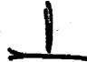
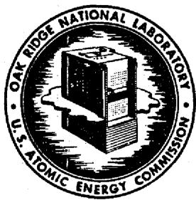

# UNCLASSIFIED

# OAK RIDGE NATIONAL LABORATORY

Operated By

UNION CARBIDE NUCLEAR COMPANY

UCC

POST OFFICE BOX P

OAK RIDGE, TENNESSEE

EXTERNAL TRANSMITTAL: AUTHORIZED

# ORNL

# CENTRAL FILES NUMBER

${CF} - {57} - 4 = {92}$

DATE:

April 8, 1957

SUBJECT:

Maintenance of Various Reactor Types

TO:

Distribution

FROM:

B. D. Draper

# DISTRIBUTION

1. HRP Director's Office   
2. G. M. Adamsen   
3. S. E. Beall   
L.E.G.Bohlmann   
5. F. R. Bruce   
B. W. D. Burch   
7. R. D. Cheverton   
E. L. Compere   
9. J. S. Culver   
10. B. D. Draper   
11. D. E. Ferguson   
12. C. H. Gabbard   
3.W.R.Gall   
山. J. C. Griess  
5.P.H.Earley   
6. P. N. Haubenreich   
7.J.W.H11   
8. G. H. Jenks   
9. S. I. Kaplan   
10. P. R. Kasten

21. A. S. Kitzes   
22. R. B. Korsmeyer   
23. K.A.Kraus   
24. J.A.Lane   
25. R.E.Leuze   
26. R.B.Lindauer   
27. M. I. Lundin   
28. R. N. Lyon   
29. J.P.McBride   
30. H.F.McDuffie   
31. H. M. McLeod   
32. R.A. McNees   
33. E.C.Miller   
34. E. O. Nurmi   
35. L.F.Parsly   
36. R. C. Robertson   
37. A.M.Rom   
38. H. C. Savage   
39. C. H. Seecoy   
40. C. L. Segaser

I. I. Spiewak   
L2.R.W.Stoughton   
li3. J. A. Swartout   
L. E. H. Taylor   
45. D. G. Thomas   
L6. D. S. Toomb   
L7.W.E.Unger   
L8. R. Van Winkle   
49. C. E. Winters   
50. F, C. Zapp   
51. ORNL Doc. Ref. Lib., Y-12   
52. Central Research Library   
54. REED Library (2)   
57. Laboratory Records (3)   
58. F. C. Moesel, AEC   
59. M. J. Skinner   
66. Westinghouse PAR Project (7)   
81. TISE-AEC (15)

# NOTICE

This document contains information of a preliminary nature and was prepared primarily for internal use at the Oak Ridge National Laboratory. It is subject to revision or correction and therefore does not represent a final report.

# UNCLASSIFIED

# UNCLASSIFIED

# I. INTRODUCTION

It has been a common practice in the past to investigate maintenance techniques and related equipment after many reactor features were established. This is especially true of some of the experimental and research reactors; the operation and maintenance of which unfortunately comprise most of our actual knowledge in this field. These reactors did not have as their objective the demonstration of maintenance feasibility. With this in mind, it can be seen that many proposed power reactor maintenance concepts are just what the name implies; ideas, that may or may not be practical until tried out under at least simulated reactor operating conditions.

In the absence of predecessors in most cases upon which plant layout and design may be based, it has been necessary to establish certain rules in order that these processes may proceed while further development work is done on components and concepts. There are certain basic maintenance fundamentals that are common to all types of reactors that may be incorporated in a power producing facility. The various components of an ideal system should be grouped and related in such a manner that the maintenance of the equipment is readily accomplished. In addition, the system should be convenient for operation and require a minimum of manpower and capital outlay to achieve the desired objectives. It can be seen then the necessity of making an early study of maintenance procedures in order that the resulting design will produce a program integrated and balanced with other features of the plant. For this reason, a primary plant maintenance philosophy should be developed at the beginning of the layout work.

# II. TYPES OF MAINTENANCE

Basically, there are only two types of maintenance procedures. The direct type, which is common to conventional steam plants, may be used in some areas where the radioactivity level is low enough. In most parts of the plant, maintenance will of necessity be remote due to the high level of radioactivity.

# UNCLASSIFIED

Remote maintenance may be further subdivided into "wet" or "dry."

In the "wet" remote type of maintenance, after the equipment is shut down and drained, the area is flooded, the roof removed and maintenance is done by tools with long extension handles looking down through 15 or 20 feet of water. However, a disadvantage is that where a piping system must be opened during maintenance operations there is always the possibility that the shielding water can enter and contaminate the system.

With "dry" remote maintenance, after the equipment is shut down and drained, manipulators mounted on cranes or remote tools operated from behind mobile lead shields are used. However, the present development of remote dry maintenance has been very limited. In the past, decontamination and direct maintenance have been relied upon to permit repair of equipment, but in a 500 m w homogeneous plant, for example, radiation levels of $10^{6}$ roentgen can be expected in some areas, thus the inaccessibility for direct maintenance.

# III. APPLICATION

For simplicity of description in this report, all reactor types are divided into two general classes, i.e., solid fuel types and circulating fuel types. It shall be our purpose to examine the various reactor types in each classification for progress, feasibility and problems still faced by the design in question.

# A. Solid Fuel Types

In general, it may be said that solid fuel type reactors are easier to maintain than circulating fuel types. This is due, of course, to the retention of the fission fragments and poisons within the cladding of the fuel elements. However, some solid fuel reactors are more difficult to maintain than others. Examples are the boiling water reactors which due to steam activation and the presence of activated impurities and radiative non-condensibles (N $^{16}$ and A $^{41}$ ) in the coolant make maintenance of the primary loop impossible during operation,

# UNCLASSIFIED

and the sodium cooled reactors which contain highly active Na $^{24}$ upon irradiation of the coolant.

# 1. Gas-Cooled Reactors

An integral part of maintenance on solid-fuel reactors is fuel handling associated with charging and discharging the unit at periodic intervals. This fuel handling equipment must be highly reliable since failure of certain components may be very costly. Handling equipment is subjected to severe environmental conditions. In addition, the equipment must be resistant to radiation attack.

With the exception of the Savannah River Reactor, most experience has been gained on charging reactors having horizontal channels for fuel elements. At Calder Hall the channels are vertical and blind at the bottom, thus charging and discharging must be accomplished from the top. Two mobile charging machines and two discharging machines are provided for each reactor. The machines are electrically propelled and carry a winch and an electrically operated grab for raising and lowering the fuel elements. When the magazine of the discharge machine is loaded with spent fuel elements, it moves to a circular well through which the magazine is lowered to ground level and deposited in a shielded flask for transportation to the storage pond. The time required for the charge and discharge of one group of $\frac{1}{4}$ channels is about 1 l/4 hours. There are six fuel elements per channel and a total of 1696 channels to give some idea of the work involved.

At an early stage of the Calder Hall design, it was decided that time did not permit the development of a system that would permit charging and discharging the reactor while running at full power, thus the operation is performed at shutdown and with the unit depressurized.

A hazard that must be guarded against in the operation of a solid fuel type reactor is the possibility of a fuel element failure which would release fission products into the coolant system and create radiation hazards in the portion

# UNCLASSIFIED

of the plant occupied by operating personnel. This would, of course, add considerable complications in the maintenance of components in the coolant circuit. At Calder Hall each of the 1696 fuel channels is provided with a stainless steel tube which bleeds off a small portion of the gas passing through the channel and carries it to monitoring devices which detect the presence of the released fission products. For the first 8 months of operation, only 2 slug failures have occurred which is much lower than predicted.

Thus the complete system of burst slug detection and fuel replacement, if somewhat cumbersome and laborious, is also quite reliable which was the desired goal.

An important feature of gas-cooled reactors from both design and maintenance standpoints is the freedom to use mild carbon steels throughout the reactor, heat exchanger and ductwork systems. This results from the use of clean, non-corrosive gas coolant.

For the proposed gas-cooled stations to be built in Great Britain, the most significant advance in new designs is the introduction of fuel changing under load. It has been postulated that this ability to charge and discharge fuel elements under full load and without any interruption to the operation of the plant may prove to be one of the most important factors in establishing the superiority of the gas-cooled reactor over other designs. At present, one of the most serious objections to the designs of liquid cooled reactors is the need to shut down in order to change fuel elements. This is due to the high operating pressure of liquid cooled reactors.

Three of the four new designs utilize a conventional top loading, however, it is proposed by the GEC-Simon Carves group to load the Hunterston plant (a 300 mW electric station) from the bottom of the reactor. This design coupled with charging and discharging under full load conditions represents quite an advance over the Calder Hall design.

# UNCLASSIFIED

In general, maintenance of a gas-cooled reactor plant is feasible since the radiation is kept below tolerance levels throughout most of the plant, and the burst-slug detection equipment should enable removal of a defective element before any serious contamination occurs. With the new designs, the gas-cooled reactors are placed in an even more favorable light as far as maintenance is concerned.

# 2. Organic Reactors

Organic cooled and moderated reactors offer several advantages as far as power reactors are concerned. First, the lack of activation of the coolant in conjunction with a good purification system could eliminate all secondary shielding. Second, the low vapor pressure of organics which are being considered for the coolant and moderator results in reduced thickness of pressure vessel and piping wall. Third, the relatively low corrosiveness and good lubricating properties of diphenyl have been confirmed and this considerably simplifies the material problems by eliminating the customarily required stainless steels $^{(1)}$ .

One important uncertainty in this system is the rate at which the organic would have to be replaced as a result of thermal and radiation damage. In any event, the stability limitations of the most radiation stable organic materials are such that a purification system must be a part of any reactor design. This damage of the organic is noted because of the possibility of deposition on heat transfer surfaces of the products of decomposition. However, tests by the California Research Corporation(2) indicate that no appreciable deposition occurs until a point of considerable decomposition is reached. The purification system should prevent this occurrence.

Maintenance-wise this reactor concept is promising. Centrifugal pumps with shaft seals can be used since the coolant is non-radioactive and leakage is not a problem. This of course permits the use of conventional style pumps with their greater background of operational and maintenance experience. The use of commercially available carbon steel pipe will result in initial savings on fabri-

cation plus easier maintenance after the plant is in operation.

A plate-fin type heat exchanger has been proposed for application in an organic reactor. The low pressure on both primary and secondary sides of the reactor make this feasible. Advantages claimed for this type of unit are improved heat transfer, lower fabrication costs as a result of eliminating large pressure shells, and trouble-free operation since all critical welds, those which would allow fluid to escape, are on the outside and readily accessible for repair. The significantly lower weight of the plate-fin type heat exchanger should result in easier replacement of units should a gross failure occur.

A disadvantage of an organic moderated and cooled reactor system is the need for a heating system to preheat the loop. However, the melting point of diphenyl is $156^{\circ}\mathrm{F}$ which is considerably lower than the melting point of sodium and some of the fused salts used in other reactor types, and therefore should present problems of no greater magnitude than are faced by these types.

Only limited data is available costwise on operation and maintenance of an organic moderated reactor. For a 12.5 mw plant, operation and maintenance have been estimated to be 2.7 mills/kwh.

In summary, an organic reactor plant should be one of the easiest types to maintain for the following reasons: accessibility to components since extensive shielding is not required; use of conventional pumps; use of low pressure carbon steel piping and components; and the possible application of conventional maintenance procedures to a large part of the plant.

# 3. Pressurized Water Reactors

A typical layout for a pressurized water reactor consists of a reactor and a number of circulating coolant loops. The FWR, for example, has four coolant loops each located in a shielded compartment (3). The shielding is designed to provide radiation protection, from adjacent loops and the reactor cell, to personnel who may be inside the compartment engaged in maintenance work. All

of the loop equipment is located within the shield except the hydraulic inlet and outlet stop valves.

The installation of hydraulic and manual stop valves in each inlet and outlet pipe provides double protection for personnel performing maintenance work on a depressurized and decontaminated coolant loop. In addition, drain lines are provided between each set of double stop valves to reveal any leak through the first valve.

Any loop may be drained separately into the discharge system. After drainage is complete, it can be decontaminated by means of a chemical wash line. Once a loop has been drained and decontaminated, repair personnel can enter the loop compartment and isolate the loop by means of the manual stop valves. Thus direct maintenance is possible on a large portion of the circulating coolant loops. Accessibility to the core may be provided by a water shield over the pressure vessel, which is drained during operation. All work done in the reactor compartment must be done remotely, working through the water shield.

The refueling of the reactor will be accomplished by a fuel handling crane, which is equipped with impact wrenches, extraction tool, and transfer and handling devices. A problem faced in refueling all solid fuel type reactors is methods of heat removal from the core during shutdown. To remove the reactor heat during an unloading operation, a separate circuit is usually provided. In this system primary water is pumped through an external heat exchanger thus removing heat from the core of the reactor. In addition, when fuel elements are removed, uneven coolant flow may result in the creation of hot spots in some areas of the core. Further study is necessary to determine the feasibility of plugging these leakage paths during refueling $^{(4)}$ . This problem of cooling the core would be of even greater magnitude should the coolant circulating pumps fail during operation.

The costs for operation and maintenance of a pressurized water reactor power plant in the range of 150 mw to 200mw have been estimated at 1 mill/kwh (5,6).

The feasibility of maintenance on a reactor of this design has

been demonstrated by the submarine reactor program and will be further exhibited when the Shippingport plant of the Duquesne Power and Light Company goes on the line.

# 4.Boiling Water Reactors

A boiling water reactor presents problems from a maintenance point of view due to steam activation and the presence of activated impurities in the coolant. The reactor vessel and supporting core structure will contain various amounts of induced activity as a result of direct neutron irradiation. Hence, the radiation levels cannot be lowered by decontamination processes. Structural failures inside the reactor vessel could possibly be repaired by removal of fuel elements and flooding the vessel. Tools equipped with extension handles would enable the repairs to be made. If the reactor should fail, it would probably have to be removed and replaced with a new one. The problem of removing the vessel and subsequently storing or safely disposing of it has never been satisfactorily solved in any known reactor design. Apparently it is planned to solve this problem when it occurs.

The equipment associated with the primary loop becomes highly activated during operation, but should be accessible a short time after shutdown. This is due to the quick decay of the activated steam. If activated impurities deposit in the circulating loops during long periods of operation, decontamination by chemical washing would be required. This is true of the steam separation drums which should impose about the same general mechanical problems as are encountered in large capacity steam boilers, limited only by the presence of the radioactive materials adhering to the internal surfaces of the drums or lodged in the steam separator elements. The use of remote tools is not planned for these units(7). Valves which are associated with the steam and also the feedwater systems should impose about the same maintenance problems as are faced in any large capacity steam plant; again, limited by the residual radioactivity deposited on exposed surfaces.

Since the steam to the turbine is radioactive and more corrosive than ordinary due to the carryover of oxygen released by disassociation of the water, the turbine must be designed to be especially leak tight as well as unusually corrosion resistant. Due to the severe oxygen generation by radiation in the EBWR, about 25 ppm in the water, the carbon steel steam pipes and turbines have been nickel plated since start-up. The radiation levels near the turbine complicates the use of preventive maintenance procedures; a fact which further decreases the probability of long periods of trouble free operation. Thus the requirements of high integrity and complication of design add considerably to the cost of plant construction and maintenance.

When the turbine or condenser require maintenance they are decontaminated by filling with hot water, which is circulated at a slow rate for a number of hours while the turbine is rolled by the turning gear. After several citric acid washes, a final water wash is made after which the turbine and condenser may be inspected. The time required for decontamination could extend to several days should the activity remain above tolerance levels. This undesirable delay time is common to all decontamination processes and hence any reactor design that tends to spread activity throughout the system is inviting longer plant outages and higher maintenance costs.

One advantage of the boiling water reactor plant from a maintenance standpoint is that since the operating pressure is lower than the 2000 psi pressurized water reactor, the pressure vessel and primary loop components are easier to fabricate. Procurement of components is also easier since they more closely approach stock items.

In summary, it may be said that a boiling water reactor presents more maintenance problems than gas cooled or pressurized water reactors due to increased activity levels throughout the circulating loop and the difficulty of access to components as a result of increased shielding requirements. However, early operation of the EBWR indicates that radioactive steam is less of a problem

# UNCLASSIFIED

than feared - the activity level of the steam leaving the reactor being on the order of 5000 times less than the activity of the water in the core $^{(8)}$ . This, of course, benefits the maintenance program.

# 5. Sodium Graphite Reactors

Sodium graphite reactors are not strictly speaking comparable to the solid fuel reactors that have been described previously. The difference is that when sodium is used as a coolant in a heterogeneous reactor, it becomes highly radioactive due to the formation of $\mathrm{Na}^{24}$ as a result of neutron capture. This radioactive isotope has a 15 hour half life and emits in addition to beta particles, two gamma photons of fairly high energy, namely, 1.38 and 2.75 mev. As a result, maintenance problems are increased and shielding is necessary for piping pumps, and heat exchangers. This condition is somewhat similar to a circulating fuel homogeneous reactor with the exception that the radioactive sodium produces no induced activity in the piping, valves, or containment vessels.

The volume to be shielded may be decreased by the use of a secondary coolant, which leaves only the primary circulating loop requiring extensive shielding. This is noted because maintenance of shielded equipment is always complicated due to its inaccessibility.

Conceptual designs of sodium graphite reactor plants usually place the reactor core in a large diameter steel tank, often located below ground. The circulating sodium coolant is divided into separate and independent loops and flows from the core to intermediate heat exchangers. It is proposed to contain these loops in individual shielded vaults around the reactor tank and below ground level(9). These individually shielded compartments permit maintenance on any one of the loops without complete shutdown of the plant. This is contingent of course on the nonleakage of the mainstop valves on each loop and the ability to drain the sodium from the loop requiring maintenance. After draining the radioactive sodium, the loop is flushed with clean sodium to remove any activity adhering to the pipe walls or crevices in components. If

some activity remains after flushing, it probably will be necessary to wait until the Na $^{24}$ decays to tolerance levels.

A feature of liquid metal coolant reactors is that pump maintenance should be simplified. The electro-magnetic pump, having no moving parts, should require less maintenance than conventional pumps and this is important because the pumps may be contaminated with radioactive materials. Since oxygen free liquid sodium does not attack stainless steels at temperatures below 1110 degree F, failures of loop components due to metal attack should be reduced. However, the temperature of the fuel elements of the Sodium Reactor Experiment run as high as 1200 degrees F, and it is hoped that the mass transfer occurring in steel at this temperature can be controlled by certain additives. The sodium temperature leaving the core however, is only 960 degree F.

Fuel handling and charging present problems similar to those faced by other reactor designs using solid fuel elements. The basic need is to find materials, cladding especially, that are suitable for use in molten sodium.

Estimates of general operation and maintenance costs for a 160 mw, electrical, sodium graphite reactor plant range in the area of 1 mil/kwh, which is in line with other solid fuel reactor designs.

One factor which might cause an upward trend in this figure is the problem of heating the system. Sodium has a melting point of 208 degrees F and therefore it is necessary to first raise the temperature of the system from ambient to at least 208 degrees F in order to allow filling and circulating of the sodium. This can be done with immersion heaters (only if the system is full), clam shell pipe heaters, resistance heater wrapping or 60 cycle induction heating. The latter is being advocated for the EBR-II because of its promise of greater reliability.

Induction heating of a non-ferritic stainless steel system requires the installation of a carbon steel shell around all the piping and components. This shell plus the insulation and the copper wire wrapped around the outside to provide the heating presents several barriers to cross if maintenance is required on the system. Maintenance would be especially cumbersome should it have to be

doneremotely.

In summary, a sodium graphite reactor should be as easy to maintain as a boiling water reactor plant with the possible exception of the hindrances caused by the heating elements attached to the system.

# 6. Fast Reactors

Fast reactors generally present all the problems associated with Sodium cooled reactors plus several unique problems of their own. Large fast breeder reactors generating electric power place severe burdens on equipment. This is especially true of the fuel handling facilities which must be designed for a high degree of reliability.

As a result of frequent shutdowns for fuel replacement, once per week for the 100 mw electric Enrico Fermi Atomic Plant at startup, the fuel handling system must incorporate automatic, remote operated, fast moving components in the system. The use of sodium as a coolant adds additional problems of sealing penetrations in the reactor shield in order to keep the sodium and its associated vapors contained within the vessel and free from contamination. The resultant fuel handling system is complex, costly, and not adaptable to other reactor types. Furthermore, the system as designed for the above mentioned plant can never refuel the reactor while under load. It cannot be said that a fast reactor can never be refueled under load, however, the compactness of the machine makes the removal of a fuel element risky since there may not be enough excess reactivity present to sustain criticality. This is contrasted to a gas-cooled reactor of similar low pressure which due to its large bulk, if using natural uranium, may have fuel elements removed and the loss compensated for by the control rods, thus enabling recharging while under load.

In order to reduce the radiation effect on the components of the fuel handling and control mechanisms, as much of the equipment as possible should be located outside the biological shield. Extensions are then required to reach

# UNCLASSIFIED

through this shield and to the reactor which is submerged under several feet of sodium. It becomes apparent then that if a malfunction occurs, either in the fuel handling or in the control mechanisms during operation or refueling, the following problems will be faced by maintenance personnel:

1. Temperature above the submerged reactor core is more than 700 degrees F even during shutdown for refueling.   
2. Sodium is opaque and this means that much of the equipment within the reactor vessel cannot be seen. The internal heat generation of the fuel elements makes it impossible to drain the sodium during a shutdown. This clearly points up the need for reliable mechanisms inside the vessel.   
3. Induced activity in mechanisms inside the vessel and the continued activity of the core require remote methods of maintenance, thus only minor repair is possible within the reactor vessel. However, since all electrical components and drives are located outside the biological shield in an area of low radiation, most maintenance of this equipment is possible by direct means.

The operating cost for a 500 mW fast breeder reactor plant have been estimated to be 1 mill/kwh(10).

In summary, a fast breeder reactor power plant requires the installation of a complex and expensive (estimated at $1,500,000 for the Enrico Fermi Atomic Plant) fuel handling system. The operation and maintenance of the plant should pose problems of no greater magnitude than are faced by other reactor types using liquid metals as coolants. However, in any installation where complex components operate and remain in unfavorable environments, troubles are invited to a larger degree than would be present under more favorable conditions.

# B. Circulating Fuel Reactors

The maintenance of circulating fuel reactors is complicated due to the spreading of activity throughout the system and as a result, remote maintenance is a necessity. Because of the spread of this high level activity, it may be said that circulating fuel reactors as a class are harder to maintain than the solid

fuel type of reactors described previously.

# 1. Aqueous Homogeneous Fuel Reactor

In a reactor of this type, aqueous fuel solutions of uranium salts are circulated through a core vessel where criticality occurs and thence through an external heat exchanger and back through a canned motor pump to the core. The fuel solution leaving the core is no longer critical but does continue to emit delayed neutrons, which cause radioactivity to be induced in all parts of the circulating system. Most of the metal present in the components and connecting pipe is stainless steel. After one day's decay time, the activity remaining in stainless steel is largely due to cobalt which has a 5.3 year half-life, hence the special care required for maintenance operations.

If the circulating fuel is kept below the critical velocity, an oxide film will form on the internal surfaces of the system and although this is beneficial from the standpoint of reduced corrosion attack, it also is a source of deposited activity when the system is drained for maintenance. It is hoped that decontamination by acid rinses will remove most of this deposited activity, however, the presence of the induced activity in the metal precludes any direct maintenance.

The question may arise as to the feasibility of operating and maintaining a homogeneous reactor plant. Westinghouse Electric Corporation in conjunction with The Pennsylvania Power and Light Company had studies made of this phase of the proposed Pennsylvania Advanced Reactor (PAR) Project (11,12). These analyses indicated that maintenance is feasible.

However, the maintenance philosophy of this large scale, 150 mW electric, reactor plant differs widely from that employed on the experimental reactors constructed to date. It was decided early in the design stage of the PAR not to rely on remote wet maintenance for the following reasons: (13)

1. Hydrostatic pressures involved in flooding the plant require increased structural strength in the shielding and vapor container.   
2. Increased costs in all electrical equipment and instrumentation for waterproof construction.

# UNCLASSIFIED

3. Possibility that shielding water can enter and contaminate

the system.

4. Delay time necessary to allow large pieces of equipment to

cool down before being submerged in shielding water to avoid thermal shock.

As a basic tenant of the maintenance philosophy, it was decided that only large components such as steam generators would be repaired in place, that is, within the vapor shield. The preferred maintenance procedure for all other items is to disconnect the faulty components as quickly as possible and replace with a spare unit and then decontaminate and repair the faulty unit and use it as a spare. This philosophy has limitations since a large capital investment is required for stocking standby equipment. For this reason, all four fuel circulating loops of the PAR will be of the same "hand," thus permitting a smaller stock of replacement parts.

Another decision made early in the PAR design program was to eliminate all flanges and valves in the main 20 inch diameter fuel circulating loops. Therefore, after the plant goes critical, any maintenance requiring cutting the main loop is dependent upon the development of successful remote positioner, cutter-grinder, welder, and inspection devices. Since one might say the future successful operation and maintenance of the plant depends upon these devices, Westinghouse is committed to a sizable development program in this respect. Studies have indicated that remote welding and inspection are feasible(14).

Problems still to be solved in the homogeneous reactor design that to some extent are common to all reactors are:

1. Insulation - When insulation is placed on components and piping it not only presents a problem as far as removal with remote tools is concerned, but it also hides the location and size of a defect. Easily detachable pre-formed insulation may be the answer to this problem.

2. Steam Generator Maintenance Equipment - Detection of a leaking tube in a steam generator containing hundreds of tubes has never been satisfactorily

resolved. After the leaking tube is found, plugging by remote means presents further difficulties. Vertical steam generators may help alleviate this problem.

3. Repair of components - Faulty pieces of equipment, such as circulating pumps, when removed from the reactor will be radioactive and hence if they are to be salvaged, must be repaired using remote tools and manipulators. These tools should be rugged and reliable in operation in order to complete the repair job once it has started. Techniques will have to be developed for the application of these remote tools to every item in the plant as most will have to be either replaced or repaired during the lifetime of the plant. Small items of equipment might be scrapped rather than repaired economically.

Estimates on the maintenance costs of homogeneous reactor plants vary from 0.70 mills/kwh to a figure of from 2 to 5 times the operating and maintenance costs of a comparable fossil fired steam plant. The estimate of 0.70 mills/kwh was based on 1 per cent per year of the capital investment of the turbine-generator plant plus 3 per cent per year of the capital investment of the reactor plant. It was estimated that maintenance of the reactor plant would be of the same order costwise as that of an industrial chemical processing plant(15). The estimate of 2 to 5 times the cost of a fossil fueled plant was based on the observation that maintenance performed with remote tools and manipulators plus the possible limited working time of personnel due to radiation levels would involve longer periods of down time.

As a group, circulating fuel reactors are the most difficult to maintain. A survey of proposed homogeneous circulating fuel reactors reveals that the present philosophy is directed toward remote dry maintenance. This method of maintenance depends almost entirely on the use of remotely operated tools and equipment which at the present are just entering the development stage. It seems quite probable that a year will be required before an evaluation can be made of this development program.

# 2. Fused Salt Homogeneous Reactors

for the attainment of high temperatures without the necessity for excessive pressures.

A reactor of this design retains most of the good features of a circulating fuel reactor with the added feature of low pressure components. One of the disadvantages acquired however, is the necessity for heating the circulating loop, dump tanks, and other components in which the fused salt might be present. The problem is more difficult than that faced for example in sodium cooled reactors because the salts usually have a higher melting point. The capacity of the pre-heating equipment should be large enough to raise the loop temperature to at least 1000 degrees F.

A feasibility study on a fused salt reactor plant has been made by the Oak Ridge School of Reactor Technology(16). A duplex-compartmented shielding design was adopted to fit their philosophy that no maintenance will be performed inside the containment vessel while the reactor is critical.

The arrangement of the plant places the reactor, primary heat ex-changers, and fuel dump tanks within the primary shield. Located in six shielded compartments around the primary system are the primary loop sodium circulating pumps, expansion tanks, drain and charge tanks, and intermediate heat exchangers. Outside the shielding but isolated to prevent spreading of fires in case of sodium leaks are the steam generators and intermediate sodium pumps.

The primary shield is designed to protect personnel from decay gammas only, since maintenance will not be performed while the reactor is in operation. Provisions are made for draining and flushing the sodium from individual intermediate heat exchanger circuits so that no radioactive sodium is within the compartment where maintenance is to be performed. The sides of the radial compartments serve as shields and provide protection from decay gammas from the radioactive sodium in adjacent compartments. As a result, it is not necessary to drain all the primary loops when only one circuit requires maintenance.

The equipment outside the containment vessel is non-radioactive and may be maintained in the conventional manner. Maintenance of the equipment

inside the containment vessel and shielded areas will require remote tools and techniques. The major items which will require this special equipment are the fuel circulating pumps, primary heat exchanger tube bundles, intermediate heat exchanger tube bundles, and primary circuit sodium circulating pumps.

Access to the fuel circulating pumps and primary heat exchanger tube bundles is through an opening in the top shield plug.. Faulty pumps can be removed and replaced by spare units which will be kept on hand.

The maintenance of the primary heat exchanger tube bundles poses more difficult problems. A leak in a tube bundle would introduce sodium into the fused fluoride salt fuel solution and dilute it, which might be one method of identifying a leak. However, the methods of determining which bundle is leaking and consequently remotely cutting the feed lines to that bundle and blanking them off by welding have not yet been developed.

It is hoped that maintenance on the intermediate sodium systems can be performed directly in the shielded compartments after draining and flushing the radioactive sodium from the loop.

While this is only one of several proposed designs for fused salt homogeneous reactor systems, it illustrates most of the maintenance problems faced; namely, induced activity in all components touched by the circulating fuel, decreased accessibility to primary and intermediate loops as a result of shielding, and finally difficulty of access to faulty component should a method such as induction heating be used as a means of preheating. Maintenance costs for a plant of this type will probably run higher than for an aqueous homogeneous reactor plant for the above reasons.

# 3. Liquid Metal Fueled Reactor

One of the many reactor concepts which appear promising for electric power production is the liquid metal fuel reactor under development at Brookhaven National Laboratory. A study $(17)$ by the Babcock and Wilcox Company indicates the feasibility of a reactor of this design. Included in the study program was the

engineering design of a reactor which generates 550 mw of heat.

Maintenance of a liquid metal fuel reactor will not be easy. Most of the problems faced in an aqueous homogenous system are present in this reactor type; namely, induced activity in all components due to delayed neutron emission form the circulating fuel, extensive shielding required because of activity in the primary system and Polonium $^{210}$ , and the requirement of a leak tight system to contain the activated fuel and Po $^{210}$ . In addition, heating facilities are required for the piping and components, thus adding to the maintenance problem.

The complexity of the heating problem may be illustrated in the following manner. Should the heaters fail after the reactor has been critical for some time, the decay heat of the fuel plus the expansion volumes in the blanket and fuel systems should prevent solidification of the fuel and blanket liquids with their accompanying volumetric expansions. However, if the heaters failed during startup, no decay heat would be present to prevent solidification and a serious failure could occur. The results of this possibility are duplicate heater circuits and standby emergency diesel-generator sets.

The use of shielded compartments for the circulating loops in the intermediate system will permit the isolation of a single faulty intermediate heat exchanger or primary coolant pump. However, even after a period of cooling off and decontamination the equipment will still be quite active as a result of induced activity and the presence of fission and corrosion products which remain after decontamination. Removal of the equipment will of necessity be a remote operation and will be difficult at best.

As is the case with aqueous homogeneous reactors, the success of the maintenance effort will depend to a large degree upon the development of remote cutting, welding, and inspection devices.

It is understood that design planning for the IMFR is progressing even though the problem of pitting on the inside of loop components has not been resolved. The significance of this problem on the maintenance aspects of the plant

# UNCLASSIFIED

could be important since heretofore corrosion, if it be that, was not considered as design problem.

In the operation and maintenance of a reactor plant using bismuth as a fuel carrier, certain hazardous conditions exist because of the formation of $\text{Po}^{210}$ which is toxic and hard to contain. For this reason, the leak tightness of the system must be of a high level of integrity.

Operating and maintenance costs of the 550 mw liquid metal reactor plant proposed in the Babcock and Wilcox feasibility study are 0.60 mills/kwh. In view of the complexity of the maintenance problems faced, this appears to be a rather low figure.

Summarizing, it might be said that a plant of this design would be one of the most difficult types to maintain. Activity throughout the system requires shielding which in turn reduces accessibility to components, heating requirements add to the operational and maintenance problems, and the formation of $\text{Po}^{210}$ necessitates a leak tight system. The possibility of corrosion or mass transfer of metal could reduce the life expectancy of the equipment and increase the maintenance costs.

# SUMMARY

Maintenance of reactor power plants is more complex than conventional fossil fired steam turbo-generator plants because of the presence of radioactivity either localized in the reactor vessel or scattered throughout the circulating loops depending upon the reactor type. It is obvious that the easiest systems to operate and maintain are those which permit the use of conventional tools and techniques on a large portion of the reactor auxiliaries. Following is a list of reactor power plant types, arranged in order of increasing difficulty of maintenance in the opinion of the author with advantages and disadvantages maintenance-wise of each.

Low pressure system piping and components

Clean and Non-corrosive coolant

Use of stainless steels not required

Permits fuel changing under load

Coolant does not become radioactive

Some operating and maintenance experience available from Calder Hall

Activity limited to \reactor vessel

No induced activity in piping and components

DISADVANTAGES

No disadvantages apparent comparable to other reactor types

ORGANIC-MODERATED

ADVANTAGES

Low pressure system piping and components

Non-corrosive coolant

Use of stainless steels not required in piping or auxiliaries

Coolant does not become radioactive unless there is a leakage of steam into coolant

Activity is limited to reactor vessel

No induced activity in piping and components

DISADVANTAGES

Organic decomposes under radiation requiring purification and make-up

Possibility of decomposition products depositing on heat exchanger surfaces

No satisfactory metals are available for use as fuel element cladding and reactor vessel material in organic coolants

# ADVANTAGES

Relatively non-corrosive coolant

Coolant does not become radioactive

With exception of corrosion products, activity should be concentrated in reactor vessel

Shielded compartments allow maintenance to be carried out on an individual loop without shutting down the entire system

No induced activity in piping and components

# DISAVANTAGES

High pressure piping and components required

Corrosion products become radioactive and may settle out in auxiliaries, however, water rinses should reduce activity level to tolerance limits for maintenance

Stainless steels required in primary loops

High operating pressure makes fuel changing under load almost an impossibility

# BOILING WATER

# ADVANTAGES

Low pressure piping and components permissible

No induced activity in piping and components

# DISADVANTAGES

Steam activation requires extensive shielding which reduces amount of preventive maintenance possible

Stainless steels required in primary system

Corrosion products become activated and deposit in system, requiring decontamination before maintenance is possible

Oxygen carry-over necessitates corrosion resistant turbines and auxiliaries.

# SODIUM GRAPHITE

# ADVANTAGES

No induced activity in piping and components

Sodium is non-corrosive in the absence of oxygen

Pump maintenance should be easier if electro-magnetic pumps are perfected

Low pressure piping and components permissible

# DISADVANTAGES

Formation of Na24 makes coolant highly radioactive

Possibility of sodium-water reaction present

Heating facilities are necessary on circulating system and storage tank to keep sodium in a liquid phase

Stainless steel piping and components are required

# FAST REACTOR

# ADVANTAGES

Low pressure piping and components permissible

No induced activity in piping and components

Pumps and heat exchangers can be designed to be removed without cutting pipes or draining system

Sodium is non-corrosive in the absence of oxygen

# DISADVANTAGES

Stainless steel piping and components required

Expensive and complex fuel handling system required

Frequent down time for refueling

Possibility of sodium-water reaction present

Heating facilities necessary to keep sodium in liquid phase

Coolant becomes radioactive due to formation of Na $^{24}$ under irradiation

# AQUEOUS EOMOGENEOUS

# ADVANTAGE

Continuous fuel processing should reduce down time

Absence of control rods eliminates the associated maintenance requirements

# DISADVANTAGES

Induced activity in all metals touched by the fuel solution

Stainless steels required throughout system

High pressure piping and components required

Circulating fuel solution is both corrosive and radioactive

A very leak tight system is required

Film formation on inside of piping and auxiliaries may be hard to remove

Equipment and techniques not perfected for remote cutting, welding and inspection of pipe

# FUSED SALT HOMOGENEOUS

# ADVANTAGES

Low pressure piping and components permissible

No induced activity in sodium systems

# DISADVANTAGES

Stainless steel required throughout the system

Large heating capacity necessary to keep fused salt in liquid phase

Remote cutting, welding and inspection equipment not yet developed

Possibility of sodium-water reaction

# LIQUID METAL FUEL REACTOR

# ADVANTAGES

Low pressure piping and components permissible

Continuous fuel processing possible

# DISADVANTAGES

Induced activity in all metals touched by fuel

Heating facility necessary to keep sodium in liquid phase

Requirement of extremely leak tight system due to the formation of Po $^{210}$ if bismuth is used as a fuel carrier

1. G. A. Freund and H. P. Iskenderian, ANL-5583, Classified.   
2. R. O. Bolt and J. G. Carroll, Summary Evaluation of Organics as Reactor Moderator-Coolants, AECD-3711.   
3. FWR Preliminary Design Report, WAPD-112.   
4. KAPI-1623, Classified.   
5. WIAP-13, Classified.   
6. Nucleonies, Volume 14, Number 8, August 1956, p. 72.   
7. W. N. McLean and M. N. Chiarottino, NPG-111, Classified.   
8. Nucleonics, Volume 15, Number 3 (March 1957), p. R8.   
9. DON-NR-55001-1-S, Classified.   
10. EER-II Design, TID-7506, Part I.   
11. Pennsylvania Advanced Reactor Maintenance Study, American Machine and Foundry Company, Job Order Number 77748.   
12. Feasibility of Remote Maintenance of a Homogeneous Reactor Plant, General Mills, Inc.   
13. FAR Quarterly Progress Report, WCAP-400.   
14. A Feasibility Report for the Remote Disassembly and Assembly of Nuclear Reactor Piping, Cayuga Machine and Fabricating Company.   
15. H. G. Carson and L. H. Landrum, NPG-112, Classified.   
16. R. W. Davies, D. H. Feener, W. A. Frederiek, K. R. Goller, I. Granet, G. R. Schneider and F. W. Snutko, ORNL-CF-56-8-208, Classified.   
17. BAW-2, Classified.