ORNL

Central Files Number

57-8-7

C-84 - Aircraft Reactors

eaeaeaeaeaeaeaeaeaeaeaeaeaeaeaeaeaeaeaeaeaeaeaeaeaeaeaeaeaeaeaeaeaeaeaeaeaeaeaeaeaeaeaeaeaeaeaeaeaeaeaeaeae

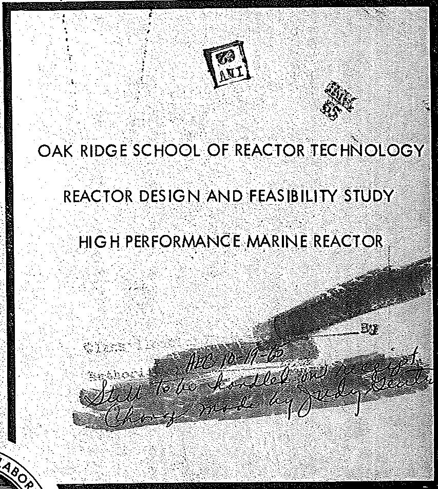

# NOTICE

Inv. 68

This document contains information of a preliminary nature and was prepared primarily for internal use at the Oak Ridge National Laboratory. This subject to revision or correction and therefore does not represent a final report.

# OAK RIDGE NATIONAL LABORATORY

OPERATED BY

# UNION CARBIDE NUCLEAR COMPANY

Division of Union Carbide Corporation

POST OFFICE BOX X · OAK RIDGE, TENNESSEE

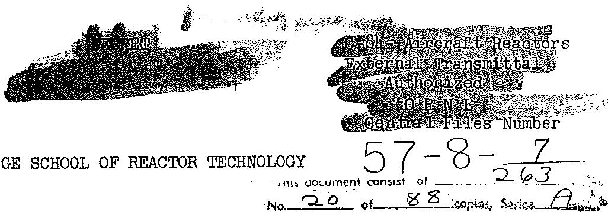

Reactor Design and Feasibility Study

"HIGH PERFORMANCE MARINE REACTOR"

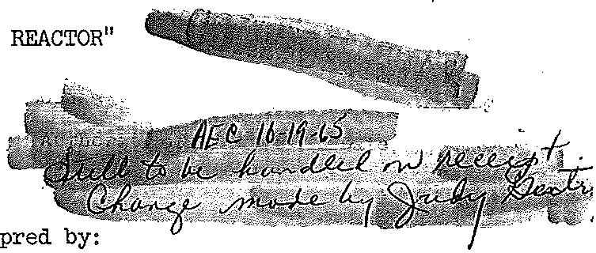

K. H. Dufrane, Group Leader   
T. G. Barnes   
C. Eicheldinger   
W.D.Lee   
N.P.Otto   
C. P. Patterson   
T. G. Proctor   
R.W.Thorpe   
R. A. Watson

# Distribution:

1. A.M.Weinberg   
2. J.A.Swartout   
3. R.A.Charpie   
4. W.H.Jordan   
5. Lewis Nelson   
6. D.C.Hamilton   
7. C. O. Smith   
8. J.H.Marabile   
9. Herbert Pomerance   
10. W.A.I.Lloyd   
11. W. Zobel   
12. E. D. Arnold   
13. J.W.Ullman   
14. A. T. Gresky   
15. C. S. Walker   
16. E.P.Blizzard   
17. L. B. Holland   
8. W.E.Kinney   
9. W.R.Gall   
20. A. P. Fraas   
1. J.A.Lane   
2. P.R. Kasten   
3. A. F. Rupp   
4. E.S.Bettis   
5. C. E. Winters   
6. R.B.Briggs   
7. A. L. Boch   
B. W. T. Furgerson   
R. V. Meghreblian   
L.R.Dresner   
K.H.Dufrane   
2. T. G. Barnes   
3. C. Eicheldinger   
W.D.Lee   
N.P.Otto   
C.P.Patterson   
T. G. Proctor   
R.W.Thorpe   
R.A.Watson   
-41. Martin Skinner   
43. REED Library   
-45. Central Research Library   
-66. Laboratory Records   
-72. ORSORT Files   
-87. TISE   
P. P. Eddy, Maritime Reactors Brance. DRD. AEC

# PREFACE

In September, 1956, a group of men experienced in various scientific and engineering fields embarked on the twelve months of study which culminated in this report. For nine of those months, formal classroom and student laboratory work occupied their time. At the end of that period, these nine students were presented with a problem in reactor design. They studied it for ten weeks, the final period of the school term.

This is a summary report of their effort. It must be realized that, in so short a time, a study of this scope can not be guaranteed complete or free of error. This "thesis" is not offered as a polished engineering report, but rather as a record of the work done by the group under the leadership of the group leader. It is issued for use by those persons competent to assess the uncertainties inherent in the results obtained in terms of the preciseness of the technical data and analytical methods employed in the study. In the opinion of the students and faculty of ORSORT, the problem has served the pedagogical purpose for which it was intended.

The faculty joins the authors in an expression of appreciation for the generous assistance which various members of the Oak Ridge National Laboratory gave. In particular, the guidance of the group consultant, A. P. Fraas, is gratefully acknowledged.

Lewis Nelson

for

The Faculty of ORSORT

# ABSTRACT

For marine applications a circulating fuel, fused fluoride salt reactor system appears to offer a substantially reduced specific weight (lbs per shaft horsepower) over current and planned reactor systems. Such a weight reduction would make nuclear power feasible for surface ships smaller than 7500 tons displacement, the current minimum for present and proposed reactor systems, as well as overall performance improvements for larger vessels.

Keeping within the bounds of currently available technology and proven practices, reactor-steam system capable of developing 35,000 SHP with an overall specific weight of approximately 6.4 lbs/SHP is indicated. The particular installation of this system aboard a 931 class destroyer of 3-4000 tons displacement was found feasible. When this system is used in conjunction with the conventional steam system to provide fuel-oil for shielding, an overall reactor plant weight of 54 lbs/SHP is realized.

In addition, the future potential of this design concept was investigated utilizing unproven but indicated feasible technology advancements. Specific weights on the order of 54 lbs/SHP were found possible in this power range.

# ACKNOWLEDGEMENT

The authors wish to take this opportunity to express their appreciation to the many people throughout Oak Ridge National Laboratory who so freely allowed us to infringe upon their spare moments to gain the benefits of their experiences and knowledge.

The group's special thanks goes to A. P. Fraas and W. R. Chambers, our group advisors, for their guidance and for selecting the study. Our particular indebtedness to the many people of the ANP Project at ORNL is attested by our numerous references to their work.

Also we wish to acknowledge the personal aid received from specialists of the Bethlehem Steel Shipbuilding Division, Ingalls Shipbuilding Company, Babcock and Wilcox, and the Knolls Atomic Power Laboratory.

# TABLE OF CONTENTS

# 1.0 Summary, Description and Conclusion 15

1.1 Introduction 15   
1.2 Reactor 16   
1.3 Fuel 18   
1.4 Materials 20   
1.5 Heat Exchangers and Steam Generators 20   
1.6 Potential 21   
1.7 Conclusions 22

# 2.0 Introduction 24

2.1 Need for a High Performance Marine Reactor 24   
2.2 Ship Installation 25   
2.3 Design Philosophy 26   
2.4 Reactor Comparison and Selection 28   
2.5 Advantages and Disadvantages of Fused Salt Reactors 30   
2.6 Additional Applications 33

# 3.0 Overall Power Plant Description 35

3.1.Introduction 35   
3.2 Alternate Approach 38   
3.3 Reactor 39   
3.4 General 41   
3.5 Shielding 42   
3.6 Weight Comparison of Nuclear and Conventional System 43   
3.7 Hazard Evaluation 45

# 4.0 Fuel and Secondary Fluid

4.1 Fuel

4.1.1 Introduction

4.1.2 Composition

4.1.3 Corrosion

4.1.4 Physical and Thermal Properties

4.1.5 Nuclear Properties

4.1.6 Availability and Cost

4.1.7 Fuel Addition

4.1.8 Fuel Reprocessing

4.2 Secondary Fluid

4.2.1 Introduction

4.2.2 Physical and Thermal Properties

4.2.3 Disadvantages of Fluid

# 5.0 Material Selection

5.1 Structural   
5.2 Moderator   
5.3 Reflector   
5.4. Poisoned Moderator Section   
5.5 Design Properties of Materials

# 6.0 Reactor and Primary Heat Exchanger Design

6.1 Introduction   
6.2 Reactor - Types Considered and Selection

6.2.1 Internal Arrangement   
6.2.2 Vessel Design   
6.2.3 Structural Arrangement

46   
46   
46   
47   
51   
53   
54   
54   
55   
55   
57   
57   
58   
59   
61   
61   
65   
66   
66   
67   
68   
68   
68   
69   
73   
75

6.2.4 FuelPumps 76   
6.2.5 Pressurizes and Expansion Chamber 76

6.3 Primary Heat Exchangers 78

6.3.1 Design Criteria 78   
6.3.2 Basic Design 78   
6.3.3 Parameter Study 83   
6.3.4 Stress Considerations 84

7.0 Steam Generating System 88

7.1 Introduction 88   
7.2 Molten Salt Cycle Selection 88   
7.3 Steam Generator 91

7.3.1 Types Considered 91   
7.3.2 Design of Selected Steam Generator 94

7.4 Superheater 97   
7.5 Auxiliary Equipment 98   
7.6 Part Load Operation 102

8.0 Reactor Analysis 110

8.1 Nuclear Configuration 110   
8.2 Parameter Study 113

8.2.1 Cross Sections 114   
8.2.2 Summary of Results 116   
8.2.3 Control Rod Study 117

8.3 Nuclear Design 123   
8.3.1 Criticality 124   
8.3.2 Self Shielding 124   
8.3.3Burnup and Fission Product Poisons 129   
8.3.4 Prompt Temperature Coefficients 129   
8.3.5 Xenon Poisson 131   
8.3.6 Delay Neutron Loss 131   
8.3.7 Excess Reactivity Requirements 132   
8.3.8 Control Requirements 133

9.0 Shielding 135

9.1 Introduction 135   
9.2 Neutron Flux Calculation 135   
9.3 Secondary Salt Activation 141   
9.4 Dose Tolerance Levels 142   
9.5 General Shield Arrangement 143   
9.6 Primary Shield 145   
9.7 Secondary Shield 146

10.0 Heat Balance and General Aspects of the Steam System 154

10.1 Introduction 154   
10.2 Steam Requirements 154   
10.3 Condensate and Exhaust Heat 157   
10.4 Heat Addition in the Steam Generating System 158   
10.5 Comparison of Efficiencies 158

11.0 Overall Power Plant Particulars 160   
11.1 Introduction 160   
11.2 General Arrangement 160   
11.3 Power Plant Control 165   
11.4 Emergency Operation 171   
11.5 Maintenance 178   
11.6 Removal and Disposal of Volatile Fission Products 180   
11.7 Fuel Loading 182   
11.8 Pumps, Valves and Blenders 184   
12.0 Modified Approach 189   
13.0 Weight Summary 191   
14.0 Future Potential 196

LIST OF FIGURES   

<table><tr><td>Figure No.</td><td></td><td>Page</td></tr><tr><td>2-1</td><td>Partial Summary of Current and Proposed Nuclear Marine Installations</td><td>29</td></tr><tr><td>3-1</td><td>Flow Diagram</td><td>36</td></tr><tr><td>3-2</td><td>Reactor Diagram</td><td>41</td></tr><tr><td>3-3</td><td>Specific Weight Comparison in 1b/shp</td><td>44</td></tr><tr><td>4-1</td><td>Phase Diagram of the Three-Component NaF-ZrF4-UF4 System</td><td>49</td></tr><tr><td>4-2</td><td>Partial Pressure of ZrF4 Based on the Assumption that Only NaF and ZrF4 Exist in the Vapor Phase</td><td>50</td></tr><tr><td>4-3</td><td>Fused Salt Fluoride Volatility Uranium Recovery Process</td><td>56</td></tr><tr><td>4-4</td><td>The System LiF-NaF-BeF2</td><td>60</td></tr><tr><td>5-1</td><td>Design Curve for As-Received Inconel Tested in Fused Salt No. 30 at 1300°F</td><td>62</td></tr><tr><td>5-2</td><td>Comparison of the Stress Rupture Properties of As-Received Inconel Tested at 1300, 1500 and 1650°F in Argon and Fused Salt No. 30</td><td>63</td></tr><tr><td>5-3</td><td>Effect of Section Thickness on Creep-Rupture Properties of As-Received Inconel Tested in Fused Salt No. 30 at 1500°F under 3500 psi Stress</td><td>64</td></tr><tr><td>6-1</td><td>Estimate of Weight Per Power Ratio vs Primary Heat Exchanger Outer Diameter for Various Tube Spacings</td><td>85</td></tr><tr><td>7-1</td><td>Proposed Steam Generator</td><td>103</td></tr><tr><td>7-2</td><td>Proposed Superheater</td><td>104</td></tr><tr><td>7-3</td><td>Proposed Basic Arrangement</td><td>105</td></tr><tr><td>7-4</td><td>Salt Viscosity</td><td>106</td></tr><tr><td>7-5</td><td>Friction Factor</td><td>107</td></tr><tr><td>7-6</td><td>Heat Transfer Correlation</td><td>108</td></tr><tr><td>7-7</td><td>Pump Equivalent Weight</td><td>109</td></tr><tr><td>8-1</td><td>Reactivity vs Mass U=235</td><td>118</td></tr><tr><td>8-2</td><td>Reactivity vs U-235 Concentration</td><td>119</td></tr><tr><td>8-3</td><td>Reactivity vs U-235 Mass</td><td>125</td></tr><tr><td>8-4</td><td>Radial Flux Distribution</td><td>126</td></tr><tr><td>8-5</td><td>Radial Power Distribution</td><td>127</td></tr><tr><td>8-6</td><td>Thermal Flux Distribution in Unit Lattice Cell</td><td>128</td></tr><tr><td>8-7</td><td>Percent Reactivity Loss During Lifetime Due toBurnup and Fission Product Poisons</td><td>130</td></tr><tr><td>8-8</td><td>Core Reactivity vs Control Rod Position</td><td>134</td></tr><tr><td>9-1A</td><td>Neutron Flux Plot - Core to Primary Shield Lead</td><td>139</td></tr><tr><td>9-1B</td><td>Neutron Flux Plot in Primary Shield Tank</td><td>140</td></tr><tr><td>9-2</td><td>Secondary Shield</td><td>144</td></tr><tr><td>9-3</td><td>Reactor Compartment</td><td>149</td></tr><tr><td>10-1</td><td>Predicted Steam Balance for Reactor Powered Systemat 35,000 shp</td><td>155</td></tr><tr><td>11-1</td><td>General Arrangement</td><td>163</td></tr><tr><td>11-2</td><td>Simulation Flow Sheet</td><td>172</td></tr><tr><td>11-3</td><td>Reactor Power and Temperature vs Time for aRamp Change in Power Demand</td><td>173</td></tr><tr><td>11-4</td><td>Reactor Power and Temperature vs Time for a StepChange in Power Demand</td><td>174</td></tr><tr><td>11-5</td><td>Reactor Power and Temperature vs Time for StepChange in Reactivity</td><td>175</td></tr><tr><td>11-6</td><td>Output Steam Temperature vs Load</td><td>176</td></tr><tr><td>11-7</td><td>Reactor Power and Steam Temperature vs Time fora Linear Change in Power Demand</td><td>177</td></tr><tr><td>A=5.1</td><td>Inconel Design Data</td><td>204</td></tr><tr><td>A=5.2</td><td>Inconel Design Data</td><td>205</td></tr><tr><td>A=5.3</td><td>Inconel Design Data</td><td>206</td></tr><tr><td>A=6.1</td><td>Moderator Rod Temperature Distribution</td><td>214</td></tr><tr><td>A=11.1</td><td>Analog Representation of Fuel Loop</td><td>249</td></tr><tr><td>A=11.2</td><td>Analog Representation of Salt Side of Primary Heat Exchanger and Superheater</td><td>250</td></tr><tr><td>A=11.3</td><td>Analog Representation of Salt Side of Steam Generator</td><td>251</td></tr><tr><td>A=11.4</td><td>Method of Generating Power Demand Voltages</td><td>252</td></tr><tr><td>A=11.5</td><td>Analog Representation of Control System</td><td>253</td></tr></table>

<table><tr><td>5.1</td><td>Materials Data . . . . . . . . . . . . . . . . . . . . . . . . . . . . . . . . . . . . . . . . . . . . . . . . . . . . . . . . . . . . . . . . . . . . . . . . . . . . . . . . . . . . . . . . . . . . . . . . . . . . .
6.1</td><td>Justification of Moderator Material . . . . . . . . . . . . . . . . . . . . . . . . . . . . . . . . . . . . . . . . . . . . . . . . . . . . . . . . . . . . . . . . . . . . . . . . . . . . . . . . . . . . . . . . . . . . . . . . . . ..
6.2</td><td>Calculations for Final Design of Primary Heat Exchanger . . . . . . . . . . . . . . . . . . . . . . . . . . . . . . . . . . . . . . . . . . . . . . . . . . . . . . . . . . . . . . . . . . . . . . . . . . . . . . . . . . . . . . . . . . . . . . . . . . . 
7.1</td><td>Steam Generating System . . . . . . . . . . . . . . . . . . . . . . . . . . . . . . . . . . . . . . . . . . . . . . . . . . . . . . . . . . . . . . . . . . . . . . . . . . . . . . . . . . . . . . . . . . . . . . . 
8.1</td><td>Three-Group Cross Sections. . . . . . . . . . . . . . . . . . . . . . . . . . . . . . . . . . . . . . . . . . . . . . . . . . . . . . . 
8.2</td><td>Perturbation Technique. . . . . . . . . . . . . . . . . . . . . . . . . . . . . . . . . . . . . . 
8.3</td><td>Burnup and Fission Product Poisons. . . . . . . . . . . . . . . . . . . . . . 
8.4</td><td>Prompt Neutron Lifetime. . . . . . . . . . . . . . . . . . . . . . . . . . 
11.1</td><td>Description of Simulation Program. . . . . . . . . . . . 
11.2</td><td>Expansion Chamber Heating Calculations. . . . . . . 
13.1</td><td>Breakdown of Basic Reactor Powered System Components Weights. . . . . . . . . . . . . . . . . . . 
15.1</td><td>Reinforced Concrete Insulation System. 
15.2</td><td>Concrete Insulation System. 
15.3</td><td>Concrete Insulation System. 
15.4</td><td>Concrete Insulation System. 
15.5</td><td>Concrete Insulation System. 
15.6</td><td>Concrete Insulation System. 
15.7</td><td>Concrete Insulation System. 
15.8</td><td>Concrete Insulation System. 
15.9</td><td>Concrete Insulation System. 
16.0</td><td>Concrete Insulation System. 
16.1</td><td>Concrete Insulation System. 
16.2</td><td>Concrete Insulation System. 
16.3</td><td>Concrete Insulation System. 
16.4</td><td>Concrete Insulation System. 
16.5</td><td>Concrete Insulation System. 
16.6</td><td>Concrete Insulation System. 
16.7</td><td>Concrete Insulation System. 
16.8</td><td>Concrete Insulation System. 
16.9</td><td>Concrete Insulation System. 
17.0</td></tr></table>

# 1.0 SUMMARY, DESCRIPTION AND CONCLUSIONS

# 1.1 Introduction

This report covers a study of the feasibility of a high performance marine reactor (HPMR) utilizing a circulating fuel, fused salt reactor concept. The definition of high performance as considered in this report is low specific weight in terms of total power plant weight per shaft horsepower. By significantly decreasing specific weight below that which is currently found feasible with present and proposed systems, reactor installations on a lighter class of ships is now possible. This would also offer potential improvements for all heavier classes.

A design study was made for a reactor system of this type to power a 931 class destroyer of $3 - 4000$ tons displacement. The reactor and steam generating equipment simply replaced one of the present boiler rooms on this class ship and duplicated the steam conditions $(950^{\mathrm{O}}\mathrm{F}, 1200\mathrm{psig})$ supplied to the propulsion machinery. An overall specific weight of 59 lbs/SHP was achieved for the 35,000 SHP delivered per boiler room. This is comparable with the presently installed oil-fired system including fuel. This specific weight was achieved with a reactor and steam generating equipment overdesign of approximately $30\%$ . Indications are that if time had allowed a reiteration of the system size to the $10\%$ overdesign factor used in most reactor systems, a specific weight reduction to at least 54 lbs/SHP would have been achieved. These specific weights, which are approximately one half that of any planned system, were brought about by obtaining a small reactor package to minimize shielding and combining this with the production of high temperature steam to give good steam plant efficiency.

The initial basic study incorporated a single intermediate loop utilizing another fused salt (also compatible with water) to transfer the heat from the fuel to the steam generator and superheater. This prevented activation of the steam and through the use of blenders the temperature of the salt entering the steam generator was reduced substantially to decrease the problem of thermal stress. However, this required that secondary shielding be placed about the large volume of the steam generating equipment. It was found that through the use of two intermediate loops the amount of secondary shielding could be reduced and the overall specific weight released from 58 to the 54 lbs/SHP. The comparable reduction for the case with $30\%$ overdesign is from 65 to 59 lbs/SHP. Unfortunately sufficient time was not available to allow as detailed a study as that given to the single intermediate loop system.

Considerable use and reference has been made of the ANP studies and experimental work carried out at ORNL on fused salt reactors. This has allowed demonstrated components and materials to be incorporated directly into this plant.

# 1.2 Reactor

In order to achieve the primary overall objective of reduced specific weight it is desirable to keep the reactor size as small as possible in order to minimize not only reactor weight but that of the primary and secondary shielding as well. The compact reactor selected was cylindrical in shape with the fuel circulating up through a central critical region and then down through an annular downcomer at its periphery containing the primary heat exchangers (fuel to secondary fluid). The core is moderated by cylindrical rods of beryllium oxide clad with Inconel that are equispaced throughout the core region. A nickel reflector surrounding the core plus an additional blanket black to

thermal neutrons shield the primary heat exchanger and prevents excessive activation of the secondary fluid.

Because of the inherent stability that has been demonstrated with reactors of this type, poison rods are not needed for control but a single rod is placed at the core centerline to provide for reactor shutdown, mean temperature change, and fuel burnup.

The reactor and steam generating system were designed to produce 125 MW which is a conservative overdesign of greater than $25\%$ . This safety factor is considerably larger than felt necessary but was brought about by the necessity of starting the reactor design before the details of the steam system became available.

An average core temperature of $1225^{\circ}\mathrm{F}$ with an $100^{\circ}\mathrm{F}$ difference across the core was selected as a compromise of weight and thermal efficiency against corrosion and thermal stress problems.

The neutron flux spectrum is largely intermediate giving rise to a fission distribution of $28\%$ thermal, $63\%$ intermediate and $9\%$ fast.

The nickel reflector tends to hold up the thermal flux spectrum at the outer edge of the core and helps to provide the favorable peak to average power distribution of approximately 1.4. The power density averaged over the core is 360 watts/cm³.

The reactor vessel itself is approximately 6.7 ft in diameter and 6.7 ft high. An expansion tank for the fuel is incorporated into the head design along with provisions for removing Xenon and other fission product gases. Three fuel pumps are also located in the reactor head in a manner such that they may be replaced aboard ship. The reactor head is removable by unbolting and cutting a small omega type seal weld. This allows replacement of the primary heat

exchangers and inspection of the core assembly. However, it is recommended that the reactor be removed from the ship prior to this operation in order to reduce the remote handling costs and problems. Also the feasibility of balancing the cost of discarding complete reactor assemblies against that of the design and operation of a remote handling facility should be thoroughly investigated with the idea of reducing both overall costs and simplification of the basic reactor design.

The primary reactor shield is made up of structural support steel along with approximately 5 inches of lead and 39 inches of water. The shield requirements are based mainly on the fission product and sodium decay gamma's and the delay and fission neutrons in the outer annular region containing the primary heat exchangers. These activities were found to be several order of magnitudes greater than the prompt gamma and neutron radiation from the core.

The secondary shield for the basic study enveloped both the reactor and the steam generating equipment and incorporated a thickness of approximately $4 - 6 = 1/2$ inches of lead. This requirement is a direct function of the activation of the sodium ions in the secondary fluid as it passes through the primary heat exchangers.

# 1.3 Fuel and Secondary Fluid

In the selection of a fuel for this system, in addition to simply selecting a carrier for a critical amount of uranium, primary emphasis was placed on choosing one that had been proven acceptable. This included its chemical stability, corrosion, nuclear, and physical properties. This selection was rather easily made since a large number of salts have been investigated

by ORNL and only a few found promising enough to warrant additional testing.

A solution of sodium, zirconium and uranium fluorides was selected on the basis of reasonable nuclear and physical properties and because it had been used successfully in a reactor experiment (ARE). Also, extensive investigations have been made on its corrosion and physical properties in anticipation of its use in the Aircraft Reactor Test (ART). The vapor pressure of this salt is typically very low so that at operating temperatures the reactor vessel has to be pressurized only slightly to prevent pump cavitation. The actual composition of the fuel selected, closely approximating that of the ART except for exact uranium concentration, is $49\%$ NaF, $45\%$ ZrF4, and $6\%$ UF4 (mole percent).

Uranium will be added to the system in the form of $(\mathrm{NaF})_2\mathrm{UF}_4$ . Pellets or dissolved solution of this salt would be added during operation of the reactor to compensate for uranium burn-up and to override fission product and corrosion poisons. It is anticipated that sufficient addition of fuel may be made throughout the life of the reactor to eliminate the necessity of replacing the original salt loading.

A basic ground rule requiring chemical compatibility of the fuel, secondary fluid, water and sea water was established. In view of this coupled with corrosion, heat transfer, radiation and chemical stability requirements, the selection of possible choices was narrowed down to a fused salt. Because of the difficulties involved in preventing this salt from freezing in the steam generator a low melting point was also a requirement. On this basis a solution of sodium, lithium, beryllium fluorides (mole percentages of 30, 20 and $50\%$ respectively) with a melting point of $527^{\circ}\mathrm{F}$ was selected.

# Materials

Most fused salts are quite corrosive to the standard structural materials. However, it has been found that alloys containing large percentages of nickel offer the good corrosion resistance to the fused fluoride salts. Extensive testing at ORNL under the ANP Project has shown that Inconel and the nickel-molybdenum alloys present the best combination of strength and corrosion resistance. Because the procurement and fabricability of Inconel are better defined at present it was selected for the basic design although the corrosion resistance of the nickel-molybdenum alloys is much superior.

Inconel was also selected as the structural material for components in the steam system within the secondary shield because of its superior resistance to chloride stress corrosion.

The complexity of mechanical design problems involved in a separate moderator cooling system made it undesirable and must be weighed against the high temperature difficulties encountered with fuel cooling. A ceramic moderator appeared to offer a reasonable compromise from the temperature standpoint although most did not have adequate nuclear and/or physical properties to be acceptable. Beryllium oxide has the best overall characteristics at present as its fabrication and physical properties are reasonably well known and its satisfactory behavior under nuclear radiation had been demonstrated experimentally.

# 1.5 Heat Exchangers and Steam Generation

The primary heat exchanger is a once-through counter-flow type with the secondary salt on the tube side. There are 12 heat exchanger tube bundles with each tube bundle made up of 6 subassemblies for ease of fabrication

and inspection.

The steam generator and superheater are of conventional design utilizing U-tubes to reduce the thermal stress problem. The high pressure water and steam are located on the tube side to minimize the component weight. Several other designs that offered potential weight decreases were considered but were not incorporated because the design was not as well proven.

A blender was placed in the secondary fluid upstream of the steam generator. This provides a means of maintaining the salt in the boiler at a lower temperature than that in the superheater by mixing a relatively low temperature salt for the exit of the steam generator with the high temperature superheater salt. This considerably reduced the thermal stress at this point and offered a weight saving over the use of a salt-to-salt regenerator.

# 1.6 Potential

The major objective of the study covered by this report was to design a power plant incorporating ideas and components that could be substantiated by reference to a reasonable amount of experimental development work and test programs. However, there exist many new facets of fused salt technology that appear to offer large potential but at present are little more than qualified opinions plus a small amount of experimental verification. Because it was felt that this potential was significantly greater than that existing with other type of reactor systems, the study was extended to incorporate the most promising of these developments.

Through the use of a new fuel that offers more self moderation, moderator materials that allow the core to operate at a higher power densities, and structural materials that offer improved corrosion resistance, the basic size

of the reactor itself decreased from 6.7 ft diameter by 6.7 ft high to approximately 5 ft diameter by 5.4 ft. high. To further decrease the size of the heat exchangers and steam generating equipment, sodium was used in the intermediate loops.

This study indicated that it would be reasonable to expect that a specific weight reduction on the order of at least 8 lbs/3HP could be achieved in the future with fused salt reactor systems.

# 1.7 Conclusions

This design study of a circulating fuel, fused salt reactor for a marine power plant has shown that such a system is technically feasible at present. Reactor systems of this type not only allow overall performance improvements over current systems, but allow reactor installations to be considered for a lighter class ship. In addition, with the developmental and experimental work accomplished in this field at ORNL, the construction of this plant could proceed with a minimum of additional development work. Also considering the potential of this system with developments that are now in sight, it appears that considerable performance and weight improvements could be expected.

The difficulties involved in handling the fluoride fuel and maintaining it above its melting point have been satisfactorily overcome and proven out in test loops and a reactor experiment. Also, materials that will give adequate resistance to the high temperature corrosiveness of the salts have been found, although increased corrosion resistance would be desirable. Although the fuel inventory required is considerably higher than for other systems, this is partially offset by the elimination of the need for replacement

cores and holdup for chemical reprocessing. When the many important advantages of this type of system are considered, they appear to more than offset the above. These include: higher temperature and overall thermal efficiency, low weight and volume requirements, low pressure system, proven stability allowing the elimination of numerous integral control rods, continuous poison gas removal, fuel makeup as needed, etc.

In the judgement of the authors the circulating fuel-fused salt reactor not only shows considerable performance potential over present and proposed marine installations but it offers the most promising system applicable to a small ship installation.

# 2.0 INTRODUCTION

# 2.1 Use for HPMR

Atomic weapons were not only the forefather of atomic power reactors, but also the forerunner of a completely new concept of naval warfare. A small ship utilizing missiles with atomic warheads could have the destructive effectiveness of the largest warship of the preatomic era. If one could take such a small ship and build it in large numbers, give it a high speed along with an effectively infinite range, it clearly would present quite a formidable weapon. A small ship with no refueling problems would also have many other potential uses such as convoy and patrol duties in isolated areas. The purpose of this report is to determine the feasibility of a reactor system capable of being installed aboard a small ship to give it the effective infinite range mentioned above. Also once the feasibility of an improved high performance (lightweight) marine reactor is established for a small ship, it likewise holds promise for considerable weight savings on larger vessels and volume savings on submarines.

For the purpose of this report a 931 class destroyer of 3500-4000 tons displacement was selected for investigation. This ship is roughly half the displacement of the smallest current proposed reactor installation (Sec. 2.4 and Ref. 8), but considerably over the minimum size felt necessary to contain a crew for long durations. This ship contains two separate boiler and machinery rooms utilizing steam at $950^{\circ}\mathrm{F}$ and 1200 psig to produce a total of 70,000 SHP. These steam conditions fortunately fell into the range considered desirable for reactor installations of this type. With the machinery room fixed, the boilers could be simply replaced by a nuclear system without com

promising the basic reactor design. This would considerably ease the redesign of a conventional 931 class destroyer to nuclear power as well as offer the shipboard advantage of the crew being thoroughly familiar with the steam plant. In addition, the logistic and shore maintenance problems would be reduced because of the number of identical steam plants in service.

# 2.2 Ship Installation

For the purpose of this study it was felt most feasible to replace only one of the boiler rooms with a reactor system. This not only gives the advantage of having the proven reliability of a completely conventional system aboard ship, but would considerably reduce the total cost of the complete installation. Also the performance penalty paid for utilizing both the reactor and boiler systems would be very small if not negligible.

The difference in speed of this class ship between operating on the reactor system along (35,000 SHP) and maximum power (70,000 SHP) is approximately 4 knots. Obviously, this inefficient utilization of power is not warranted except under emergency conditions. In addition, structural design problems associated with vibration and noise along with their related detrimental effects on submarine and aircraft detection equipment does not make extended maximum speed operation appear feasible. As an additional point it should be noted that if an average fleet speed of as high as 20 knots is assumed, this ship would be developing less than $1/3$ of its potential reactor power and zero conventional. Therefore the conventional steam boiler system can be used to augment the reactor when emergency conditions exist apparently without penalizing the overall ship operation and offer large savings from both the cost and reliability standpoint.

The total amount of fuel oil carried aboard is approximately $54\%$ of its original value. Since this is to be used only under special conditions and not for crusing it is considered adequate. A typical combat problem was not available for analysis, but it is felt that the endurance of the nuclear-oil fired ship combination at maximum power would be substantially increased over the conventional ship.

# 2.3 Design Philosophy

Because of both the relatively short time available for this study and the limited experience in certain aspects of the field it should be realized that a thorough investigation of all phases was not possible. In instances where there appeared several feasible approaches, but with each requiring a considerable design effort to evaluate, a somewhat arbitrary choice utilizing engineering judgement had to be made. These selections and the alternate possible choices are discussed throughout the report. The primary objective was to establish design feasibility for the small ship application. Accomplishment of this with the selected design, indicates that with additional study the possible alternates herein bypassed could either be incorporated with a subsequent design improvement or simply rejected.

Many detailed problems concerning the steam system were not thoroughly investigated as it was felt that solutions to these were well established. Major emphasis was placed on the really unusual problems concerning the reactor and intermediated salt systems to obtain plausible solutions.

The basic design philosophy was to use materials, designs, and techniques that have been established as feasible and backed up as much as possible by experimental verification. In cases where the restriction to present day

technology eliminated alternate approaches, they were briefly mentioned for possible future consideration. Attempts were made to fully utilize the experience, knowledge, and background of the personnel at the Oak Ridge National Laboratory and other industries.

Several basic ground rules were established early in the design study. The first was that within the limits of the previous paragraph, the design optimization would be on the basis of obtaining the lightest weight on a lb per shaft horsepower basis. Another was to prohibit the use of a fuel or intermediate fluids that were not compatible with each other as well as steam plant and sea water. This ground rule was believed to be basically desirable from the battle damage standpoint because of the severe punishment that ships of this type can receive and still be operable. Also this compatibility offers obvious safety advantages in the steam generator design.

Advantage was taken of the conventional plant fuel oil left on board by using it for shielding purposes. If a completely nuclear destroyer design is required, it appears that the weight advantage may not be as acceptable as for the combined conventional and nuclear powered ship. However, because of the narrow beam of this class ship, the reactor compartment can be rearranged to utilize the salt and sea water at the sides to reduce the shielding requirements. Because of the decreased volume and especially the height of the fused salt system it is possible to install the top shield deck of the reactor compartment at the water line. Advantage could also be taken of putting the reactor compartments back-to-back to reduce the required shielding. Unfortunately limited time prohibited detailed consideration of these arrangements from being made for a completely nuclear ship although an estimate was made on the added shielding weight required for the proposed installation.

# 2.4 Reactor Comparisons and Selection

In the process of investigating potential small ship applications and selecting a 931 class destroyer for this study, it became obvious that a nuclear power plant specific weight on the order of 60 lbs/SHP had to be realized. A brief review of current and proposed nuclear ship installations was made and these all fell considerably short of meeting this requirement. These values, summarized on Figure 2-1, are to be considered only approximate and neither the latest or the best values. The lightest values found were 105 for the FLW and 90 lbs SHP for DLG. The FLW is a joint WAPD-Bethlehem Steel effort in which a large portion of the detail design has been firmed up. This design produces approximately 80,000 SHP and is installed on a 14,000 ton ship which would normally be considered in the light to medium crusier class. The DLG program is a KAPL-Bethlehem Steel venture that is still in the early preliminary design stage with the specific weight given being only a design objective and not a design-substantiated value. The design power is to be 60,000 SHP with a total ship weight of roughly 7500 tons. This size is in between what had been considered the destroyer class (2.5 - 4000 tons) and a cruiser class (12 - 18,000 tons). It is apparent that these installations do not offer much promise of a weight reduction to 60 lbs/SHP for a 931 class installation.

In investigating the field in general for a lightweight reactor system, the Aircraft Nuclear Propulsion (ANP) Projects appear to hold similar requirements for low propulsion system specific weight. In addition, it seems reasonable to assume that the short life of an ANP reactor system could be substantially improved at a small enough increase in overall weight to make a ship application most feasible.

FIGURE- 2-1

SECRET

PARTIAL SUMMARY OF CURRENT AND

PROPOSED NUCLEAR MARINE INSTALLATIONS

SHIPS

SHAFT HP

PROPULSION

SYSTEM WGT*

SPECIFIC

(LONG TONS)

WGT\*

(LBS / SHP)

SUBMARINES

NAUTILUS (S2W) 15,000 1100 160

6,600 690 230

SEA WOLF 15,000 1200 180 (SIR-S2G)

TRITON (SAR-S4G) 34,000 1700 II O (2 REACTORS)

SURFACE SHIPS

F1W 80,000 3700 105

DIG 60,000 2900 90

931 CLASS DESTROYER 70,000 1800 58 (NON NUCLEAR) (INC. FUEL)

* NOTE: THESE VALUES ARE ONLY REPRESENTATIVE AND NOT THE LATEST OR BEST VALUES.

SECRT

Two types of reactor systems were considered (1) the heterogeneous gas cycle using high temperature ceramic fuel elements under development by General Electric at Evendale and (2) the circulating fuel, fused salt system being developed at ORNL.

A gas cycle did not appear to be readily applicable at present for a ship installation because gas turbines of the size required had not been developed. Also, even though high gas temperatures and correspondingly high turbine efficiencies could be achieved, material limitations could prohibitly limit the extended life required for a ship application.

The fused salt reactor concept appeared to readily adapt itself to a steam generation application. The nominal reactor temperature could be decreased several hundred degrees $\left(^{\circ}\mathrm{F}\right)$ from the ANP design values for an improvement of the corrosion problem. This still would result in an ample temperature margin to provide steam with $3 - 400^{\circ}\mathrm{F}$ of superheat at desired pressures.

These factors coupled with the "at hand" availability of fused salt technology made this type of reactor appear to be most feasible at present.

# 2.5 Advantages and Disadvantages of Fused Salt Reactors

Like any complex system, a fused salt reactor installation exhibits both strong and weak points. In any reactor comparison, a relative weighing of these must be made along with the determination that no unsolvable weak points exist. However, in considering a 93l class ship installation such a comparison cannot easily be made because no other reactor configurations exist that can satisfy the strict weight requirements. Therefore if a need for a nuclear ship of this size exists, the fact that no unsolvable problems apparently

exists in above sufficient reason to proceed with a detailed study. Fortunately, a fused salt system offers many advantages over conventional reactor systems that could make it highly competitive even for large ship applications. Therefore the advantages as well as the problems of fused salt reactor systems are discussed to establish its potential over other reactor types for future comparisons.

# 2.5.1 Advantages

1. High temperatures are obtainable which give rise to high overall plant thermal efficiencies.   
2. Low pressure reactor system. Pressure required (<100 psi) only to provide pressure differential for fluid flow and to prevent pump cavitation.   
3. Inherent stability of this class reactors has been demonstrated. Multiple control rods and control drive mechanisms are not required at a considerable saving to cost, reliability and maintenance problems. A single control rod which may be required to compensate for fuel burn-up or to provide for desired temperature changes may be located outside of the reactor vessel and subject to relatively easy maintenance.   
4. With this type of reactor design it would be possible to overtemperature the reactor to obtain large increased in power output for emergency conditions. Undoubtedly this would be at a sacrifice in overall life of the system but extreme conditions could warrant this use.   
5. The fission product gases may be continuously removed; thereby eliminating the Xenon override problem and the excess reactivity requirements.   
6. The basic reactor is generally much more symmetrical and smaller than other systems, thereby reducing the shielding problems as well as

the overall size and weight.

7. Inexpensive fuel preparation. The reactor core is of simple design and there is no fuel element fabrication and burnable poison costs. The handling of U-235 is simplified as "spiking" of the salt fuel carrier is required only after the reactor has been filled.   
8. Reloading or refueling would generally not be required during the life of the reactor. Fuel additions may be made during reactor operation to compensate for fuel burn-up and to override soluble fission product buildup. Because of this and (5) the excess reactivity requirements are considerably reduced and can lead to a reactor that is inherently safe from power excursions.   
9. Chemical stability - No radiation damage or fuel decomposition problems. Explosive radiolytic gases are not formed, thereby eliminating problems such as the recombination of $\mathbf{H}_2$ and $\mathbf{O}_2$ in water reactor systems.   
10. The combination of (7) and (9) make it possible to utilize high core power densities with the subsequent reduction in reactor size.   
11. Chemical reprocessing is greatly simplified with a homogeneous system giving a corresponding cost decrease.   
12. Although not directly applicable to a marine installation, it should be noted that for breeding purposes both thorium and uranium are soluble over a large range of concentrations. This is not true for either an aqueous homogeneous or a liquid metal system.

# 2.5.2 Disadvantages

1. Corrosion problems are more difficult than for an aqueous or sodium system but probably better than a homogeneous liquid metal reactor.   
2. High melting point requires that careful attention be paid

to loading and operational techniques. A molten state is required at all times; however the successful operation of a reactor experiment (Ref. 6) indicates that these problems may be solved.

3. A high degree of leak tightness and reliability is required for the core vessel and primary heat exchangers. Careful and tight quality control and material inspection is required.   
4. A high fuel investment in the reactor is required. However, considering the elimination of replacement cores and the cooling period before chemical reprocessing the total investment may be comparable to heterogeneous, solid fueled systems.   
5. Poorer neutron economy is obtained than with aqueous homogeneous systems although newer types of fused salts offer improvements.

# 2.6 Additional Applications

Once the design feasibility of a fused salt reactor system is proven it offers considerable potential for both larger and smaller vessels. If specific weights on the order of 60 lbs/SHP can be maintained for smaller power sizes many new opportunities are available for an even smaller ship application. In going to a larger size ship an overall specific weight of 60 should be more easily attained. This would offer either a weight reduction or an increase in storage capacity of approximately 1600 tons for a ship the size of FLW or 1000 tons for DLG.

A fused salt reactor also offers a considerable reduction in the size of an installation. While important for any ship, this is even more important for a submarine application. A preliminary comparison made by KAPL in 1953 (Ref. 7) indicated the design advantage of this type of system for a submarine

application. A current design would tend to give an even bigger advantage.

Incidentally, a potential non-marine application not pertinent to this study but of general interest involves the use of stationary fused salt reactor plants for breeding and electric power production (Ref. 5).

# 3.0 OVERALL POWER PLANT DESCRIPTION

# 3.1 Introduction

The utilization of only a single reactor system aboard a 931 class destroyer offered some desirable flexibility as to the overall ship arrangement. However, the numerous basic considerations required to establish the optimum shipboard installations were somewhat beyond the scope of this report. With a cursory investigations, it at first seemed to be most advantageous to replace the foreward boiler room with the reactor and steam generator equipment. This had the sizeable advantage of not requiring any layout considerations or secondary shield penetrations for passage of the propeller shafts from the other engine room. However, under detail design, the size of the reactor compartment was reduced below that originally contemplated and means of circumventing this problem became apparent. The aft compartment location also offered the advantages of easier accessibility and a better location of the fuel oil tanks to maintain ship trim.

The basic system upon which the major design effort was placed consisted of the circulating fuel, fused fluoride salt reactor incorporating an integral heat exchanger unit to remove heat from the fuel. A secondary fluid, another fluoride salt, is used to transfer the heat from the primary heat exchangers within the reactor vessel to the steam generating equipment. The steam is then supplied to the conventional 931 class destroyer machinery room at a temperature of $950^{\circ}\mathrm{F}$ and a pressure of 1200 psig. A simplified schematic of this system is shown on Figure 3-1. The detailed heat balance is discussed later in Section 10 and presented in Figure 10-1.

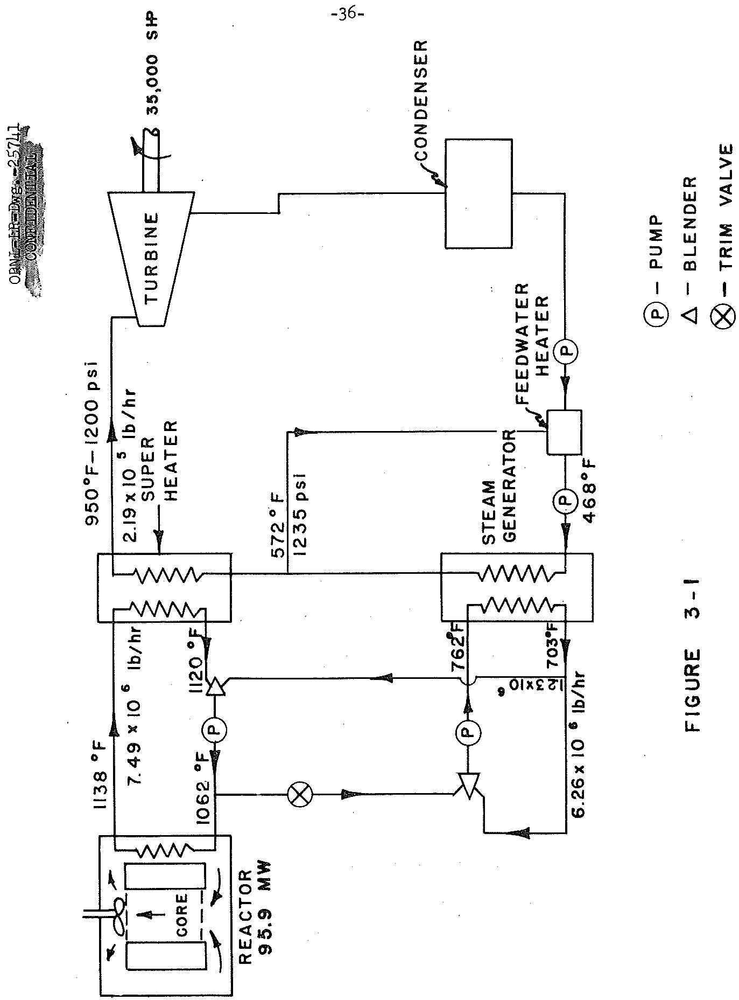

The mean reactor temperature is $1225^{\circ}\mathrm{F}$ with a power output of 95.9 MW required to supply 35,000 shaft horsepower to the ship's propellers. The temperatures across the various equipment as well as the steam and salt flow rates are given on Figure 3-1. The secondary salt system, which carries the heat from the reactor to the steam generator, is broken up into two interconnected loops. The top loop supplies the superheater with a relatively hot salt. This is required to reduce the superheater size because of the low heat transfer coefficients characteristic of the steam side. The bottom loop maintains the salt at a lower temperature to reduce the thermal stress problems in the steam generator. This is desired here because the relatively high heat transfer coefficients on both the water and salt side would give a large temperature drop across both the tube and header walls and hence a high thermal stress. Blenders are used to interconnect the two loops as indicated thereby allowing cold salt from the exit of the steam generator to be recirculated to reduce the reactor inlet temperature to the desired value.

It should be noted that the reactor and steam generators were basically designed to produce 125 MW. This over-design of approximately $30\%$ was brought about by the time lag involved between when the basic reactor had to be selected and when the detailed steam conditions for the desired size ship could be obtained. A $10\%$ over-design safety factor (used for other marine reactor applications) would be desirable but time did not permit a reiteration of the work to this size. An approximation was made to allow for this over-design (Sec. 12) to indicate the overly large weight penalty incurred. In replacing the boiler equipment with this reactor system, it appears (Section 11.2) that a substantial volume saving is also realized. While important for any small

ship, it should further emphasize that in this application the volume is saved over the height of the boiler room (approximately 30 ft) making it also available for missile storage.

# 3.2 Alternate Approach

The sodium component in the secondary fluid becomes highly activated as it passes through the primary heat exchanger due to both delayed neutrons from fuel in the exchanger and fast neutrons from the core. Because of the large amount of this secondary salt outside of the primary shield, it is necessary to incorporate a relatively thick secondary shield about all of the steam generating equipment. A more detailed design should consider the possibility of reducing this activation somewhat through the use of poison bearing materials, i.e., boron, in the heat exchanger region. However, this does not appear to offer a large reduction in the secondary salt activation because only approximately $10 - 15\%$ of the activation results from thermal neutrons, the remainder occurring because of the high intermediate energy flux and sodium resonance peaks.

An alternate approach that was briefly studied used two intermediate fluids (both salt) in order to provide a non-radioactive salt in the steam equipment. Although a penalty was paid due to increased pumping power requirements and superheater size, this was more than compensated for by a shield weight decrease due to a smaller enclosed volume. Direct access was also given to the steam generators and superheaters for maintenance. In addition, it now appeared feasible to keep the secondary shield small enough to allow an aft boiler room installation, if desired, without the complication previously mentioned.

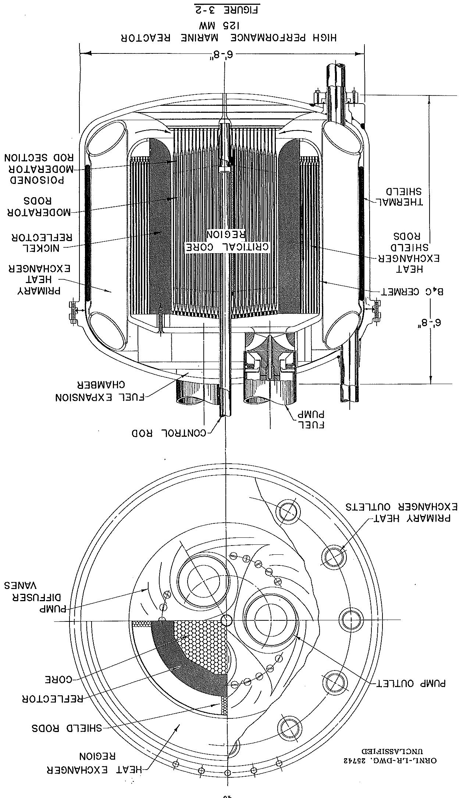

# 3.3 Reactor

The overall shape of the basic reactor is a cylinder approximately 80 inches high by 80 inches in diameter. Fuel is circulated up through a central critical region equivalent to a cylinder 75 cm diameter by 80 cm high and then down through an annular downcomer around the periphery. (See Figure 3-2) This outer region contains the primary heat exchangers for transferring the heat from the fuel to the secondary salt.

Cylindrical rods of beryllium oxide suitably clad with Inconel are equispaced throughout the core to provide for moderation. The ends of these rods are loaded with a poisoned material to reduce end leakage and fissioning in the entrance and exit plena. A single control rod channel, approximately 4 inches in diameter, extends through the center of the core region.

The sides of the core are enclosed by a nickel reflector blanket 6 inches thick. This inelastically scatters some high energy leakage neutrons back into the core to improve the criticality as well as to offer both compact neutron and gamma shielding. To further reduce the neutron flux in the heat exchanger region the reflector is in turn surrounded by a 5-1/2 inch thick region of cylindrical rods containing a mixture of beryllium oxide plus boron-10. Boron bearing Inconel rods are placed in the interstices of these cylinders for shielding purposes and to reduce the fuel located in this region. A thin slab of material essentially black to thermal neutrons, boron carbide in a copper matrix, then surrounds this region to completely absorb any neutrons that are thermalized in its outer periphery.

Small passages are provided through the nickel reflector and the cylindrical $\mathbf{BeO - B}^{10}$ rods to circulate fuel for cooling purposes. An 1/8 inch annular gap is also located between the thermal shield and the reactor pressure

vessel wall for cooling purposes. The lower temperature fuel from the heat exchanger exit circulates through here and then to the expansion chamber in the reactor head. This minimizes both the head temperatures brought about by decay heating and "snow" formation from the fuel (Ref. Sec. 4.1.2).

Three removable centrifugal pumps which are located in the reactor head provide for fuel flow and pressurization of the system. These pumps are also designed to facilitate removal of the gaseous fission products.

Additional details of the reactor design are incorporated into Sections 6, 8, and 11.

# 3.4 General

A major disadvantage of a reactor of this type is that provisions must be made to ensure that temperatures are maintained above the fuel melting point at all times. Although accomplishment of this has been proven feasible by both many loop tests and a reactor experiment, (Ref. 6), careful attention to operational procedures are required. Although a complete freeze up is not catastrophic from a nuclear sense, experience has shown that severe problems exist from a stress standpoint upon remelting. Because of this, dump tanks are included between the double hull under the secondary shield compartment for emergency use.

The reactor and secondary salt pumps may all be replaced through the secondary shield. Sufficient room also exists above the secondary shield so that the pump drive and control drive mechanism motors may be accessibly located. The lightest and most flexible system for pump drives appeared to be the steam turbine. This offered the advantage of having variable speed characteristics and also did not require the addition of generator sets to the system. It

was planned to back up each of these drives with a small A.C. motor. Those would provide suitable circulation under zero power standby conditions as well as offering the safety advantage of having two independent systems under emergency conditions.

Control of the reactor system could be accomplished by varying the secondary salt flow rate as demanded by the steam plant. This, as well as an alternate approach of by-passing secondary salt around the reactor, is discussed in Section 11.3.

The reactor as illustrated on Figure 3-2 indicates a possible method of unclamping the head to allow replacement of heat exchangers and other internal components. Two different methods of connecting the heat exchangers to the reactor vessel for disassembly purposes are shown. Although shown to be feasible on this drawing, it is very questionable as to whether or not the cost for this ease of disassembly is warranted from the overall maintenance standpoint. Additional discussion on two different concepts of maintenance is presented in Section 11.5.

# 3.5 Shielding

The basic shield is designed to limit the maximum allowable dose to $15\mathrm{mr / hr}$ on the outside of the secondary shield. This would allow access to the auxiliary engine room for 20 hours per week for maintenance on pump drives,deaerators,feed and boiler recirculating pumps,etc.At an average distance of 10 feet from the secondary shield, the limited access would be increased to approximately 30 hours per week.Unlimited access would be allowed in the main engine room.

The primary shield is of laminated structure containing the equivalent

of 5 inches lead, 39 inches of water, and $1 - 1 / 2$ inches of structural steel. The secondary shield is designed to attenuate the decay gammas from the activated sodium component of the secondary salt and gamma leakage from the primary shield tank. This shield makes use of the fuel oil required on board for the conventional system for shielding the forward, port and starboard sides and approximately $4 = 6 - 1 / 2$ inches of lead for the top and aft sections. An additional $1 - 1 / 2$ inches of lead is located over the reactor fuel pumps to eliminate streaming through the crevices required to drive and replace these pumps.

# 3.6 Weight Comparison of Nuclear and Conventional System

A weight breakdown for a 931 class destroyer with a conventional and a nuclear installation is given in Figure 3.3. To simplify the comparison, specific weight rather than the actual weight of the components is presented. The actual shipboard weight (lbs) for the conventional system may be obtained by multiplying through by 70,000 SHP for the total weight or 35,000 SHP for the weight per engine room. This will also hold true for the fuel-oil weights listed.

Using this information, it can be calculated that the conventional total ship power plant weight is 1123 tons (long) wet, with 728.5 tons of fuel oil.

System No. 1 is considered to be the basic design upon which most of the design effort was spent. It contains information a reactor and steam generating system over-designs of approximately $10\%$ and $30\%$ . System No. 2 used the alternate approach consisting of two intermediate fluids to allow placement of the steam generators, etc. outside of the secondary shield, and a similar

FIGURE 3.3   
SPECIFIC WEIGHT COMPARISONS IN LBS/SHP  

<table><tr><td rowspan="2" colspan="2">CATEGORY</td><td rowspan="2">CONVENTIONAL</td><td colspan="3">NUCLEAR</td></tr><tr><td>BASIC</td><td>MODIFIED</td><td>POTENTIAL</td></tr><tr><td>A &amp; B</td><td>STEAM PROPULSION MACHINERY</td><td>19.6</td><td>17.2</td><td>17.2</td><td>17.2</td></tr><tr><td>C &amp; D</td><td>REACTOR PLANT MACHINERY</td><td>8.0</td><td>12.3</td><td>14.0</td><td>11.4</td></tr><tr><td>E</td><td>RADIATION SHIELDING</td><td>0.0</td><td>20.8</td><td>14.5</td><td>12.6</td></tr><tr><td>F &amp; G</td><td>ELECTRIC PLANT</td><td>5.6</td><td>6.0</td><td>6.0</td><td>6.0</td></tr><tr><td>H &amp; J</td><td>INDEPENDENT SYSTEMS</td><td>1.2</td><td>5.2</td><td>5.2</td><td>5.2</td></tr><tr><td>L</td><td>LOAD &amp; STORES</td><td>1.2</td><td>2.0</td><td>2.0</td><td>2.0</td></tr><tr><td></td><td>FUEL OIL</td><td>23.4</td><td>1.7</td><td>1.7</td><td></td></tr><tr><td></td><td colspan="5">OVERDESIGN</td></tr><tr><td></td><td>TOTAL</td><td>(30%)</td><td>65.2</td><td>60.6</td><td></td></tr><tr><td></td><td></td><td>(10%)</td><td>59.0</td><td>58</td><td>53</td></tr></table>

approximation of both a $10 \%$ and a $30 \%$ overdesign safety factor. These designs utilized a portion of the fuel oil required for the conventional steam system. The 1.7 lbs/SHP for fuel oil as listed, is the fuel oil above $50 \%$ of the completely non- nuclear destroyer capacity that is required to maintain ship balance. A third design utilizing advanced material and reactor technology and eliminating the ground rule of required fluid compatability with water, achieved a further reduction in specific weight to 56.7 lbs/SHP without any fuel-oil required for shielding. A comparable value with the above utilizing fuel-oil would be 46.7 lbs/SHP.

It is realized that in many cases the weight of a reactor system goes up in proportion to the amount of design detail accomplished. However, this general tendency would be reduced in this study because the entire steam and electric plant, which accounts for approximately $1/3$ of the total weight, has been actually detailed and constructed. In addition, an attempt was made to apply conservative estimates to the various components to account for unknown growth factors. A detailed weight breakdown, including the estimates made, is presented in Section 12.

# 3.7 Hazard Evaluation

A hazard study for marine application of this type of reactor was carried out by a pair of ORSORT students (Ref. 64). This evaluation indicated that basing the major destruction of both the ship and reactor vessel, this system was inherently as safe as any nuclear system. With a major catastrophe, however, a more widespread release of fission products would result.

# 4.0 FUEL AND SECONDARY FLUID

# 4.1 Fuel

# 4.1.1 Introduction

The chief advantage of using a fused salt fuel is that high temperatures may be obtained at low pressures. Such a system is also capable of high power density with accompanying small reactor size, and low shield weight. Also, gaseous fission products may be removed. No fuel element fabrication results in long life for core, and high fuel burnup. Fuel may be continuously or periodically added as it is burned. In addition, and by no means of least importance, fused salts do not react violently with water.

For such a system, the fused salt fuel and diluent must have a reasonably low melting point, low neutron capture cross section, stability at high temperatures and in extended high neutron, beta and gamma fluxes. In addition, it is essential that the fuel system be sufficiently non-corrosive to the container material that an acceptably long life and freedom from maintenance may be realized.

The fused salt may or may not function as a moderator. In the reactor herein described, moderation of fast neutrons is accomplished largely by means of moderator rods dispersed throughout the core. The design chosen and fuel selected results in an epithermal or intermediate reactor, rather than a thermal reactor.

A large amount of fundamental as well as engineering research has been performed at ORNL toward development of fuels, and the selection of the fuel known hereinafter as Fuel 30 was based on the results of several years of

phase diagram research, dynamic and static corrosion testing, and in-pile loop tests. The choice of this fuel permits the use of technology already at hand, and does not require additional extensive fundamental research. In addition, critical experiment data and actual reactor operational data are available, where similar fuels were used or simulated.

While it appears desirable for moderating efficiency that a fuel be used which contains LiF and $\mathrm{BeF}_2$ , the present technology of containing such fuels is not considered adequate. However, it is expected that future designs for fused salt reactors will be possible as soon as research currently in progress has been completed. Such research is now leading toward development of very corrosion resistant nickel molybdenum alloys, which show extremely good prospects for future use in fused salt reactors.

# 4.1.2 Composition

The approximate composition of Fuel 30, as modified by the criticality requirements of the particular configuration of the reactor, is (expressed in mol percent) $49\%$ NaF, $45\%$ $\mathrm{ZrF}_4$ , $6\%$ $\mathrm{UF}_4$ . Zirconium fluoride is made from hafnium free zirconium. Additional composition data are:

# Composition

<table><tr><td></td><td>Mol %</td><td>Wt %</td></tr><tr><td>NaF</td><td>48.7</td><td>17.9</td></tr><tr><td>ZrF4</td><td>45.2</td><td>65.7</td></tr><tr><td>UF4</td><td>6.1</td><td>16.4</td></tr></table>

<table><tr><td></td><td>Mol %</td><td>1200°F
Gms/Cm3</td><td>1200°F
Atoms/Cm3</td><td>Atoms/Gm</td></tr><tr><td>Sodium</td><td>15.49</td><td>.335</td><td>8.76 x 1021</td><td>2.57 x 1021</td></tr><tr><td>Zirconium</td><td>14.24</td><td>1.221</td><td>8.30 x 1021</td><td>2.43 x 1021</td></tr><tr><td>Uranium</td><td>1.90</td><td>.420</td><td>1.08 x 1021</td><td>.317 x 1021</td></tr><tr><td>Fluorine</td><td>68.36</td><td>1.434</td><td>45.43 x 1021</td><td>13.32 x 1021</td></tr></table>

Figure 4-1 is phase diagram of the 3-component system, $\mathrm{NaF - ZrF_4 - UF_4}$ . It will be seen from Figure 4-1 that the composition selected is in the vicinity of the triple eutectic low melting composition. Also, if solid fuel concentrate is added in the form of $\mathrm{Na_2UF_6}$ , only compositions having lower melting points than the concentrate are formed as dissolution progresses.

Figure 4-2 shows $\mathrm{ZrF_4}$ vapor pressure for various mol percentages of $\mathrm{ZrF_4}$ as a function of temperature. It is apparent that this vapor pressure is dependent on both $\mathrm{ZrF_4}$ concentration and on temperature. The formation of $\mathrm{ZrF_4}$ acicular crystals ("snow") has resulted from high temperature treatments of $\mathrm{ZrF_4}$ -bearing salt mixes. This segregation can become a problem if conditions are favorable for snow formation. According to our best information (Ref. 49) snow formation should not be a problem if the maximum fuel temperature is kept below $1350^{\circ}\mathrm{F}$ in the expansion chamber. The accumulation of snow-like $\mathrm{ZrF_4}$ crystals is most undesirable and may lead to the plugging of passages or fouling of the expansion chamber. To further avoid this cold surfaces in the expansion chamber should be eliminated. It is clear that the use of a fuel devoid of $\mathrm{ZrF_4}$ is desirable. However, corrosion considerations dictate the selection of Fuel 30 at the present time.

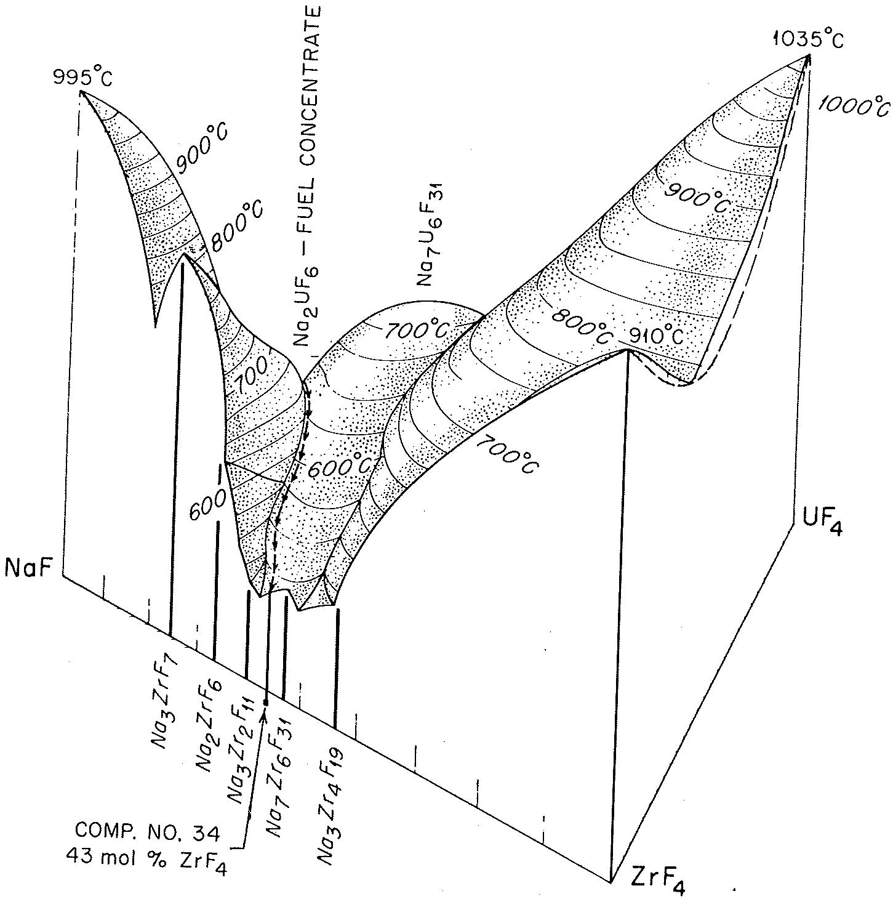  
Fig. 4-1 -- Phase Diagram of the Three-Component NaF-ZrF4-UFr System.

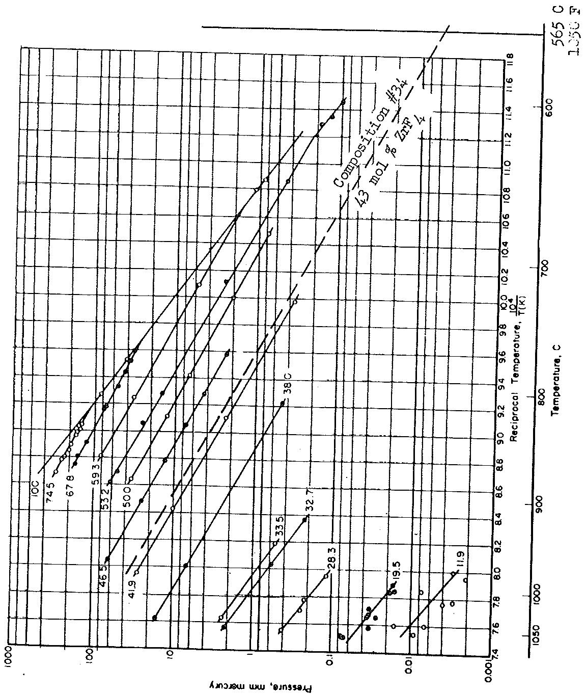  
Fig. 4-2 -- Partial Pressures of ZrF4 Based on the Assumption that only NaF and ZrF4 Exist in the Vapor Phase. See reference 65

# 4.1.3 Corrosion

# 4.1.3.1 Introduction

As a design criterion, it was hypothesized that all design work should be predicated on the basis that the core vessel and all other parts of the system, which were subject to activation or to radioactive contamination, would be specified of such materials and thicknesses as to be able to withstand full power operation (125 MW), for a period of at least 10,000 hours without failure from corrosion by the fuel selected. Insofar as it is possible to predict, from dynamic and static corrosion research at ORNL, this standard has been adhered to for the Fuel 30-Inconel-Secondary Fused Salt System described. Final metal thicknesses were selected on the basis of experimental results and personal experience (Refs. 39, 42, 44, 45). Fuel 30 and the secondary NaF-LiF-BeF $_2$ fused salt mix were selected because research and informed opinion showed that Inconel is a satisfactory container for them at the temperatures of operation anticipated.

# 4.1.3.2 Corrosion Mechanism

The most critical location, as far as corrosion is concerned, in this reactor is estimated to be the moderator cladding. The type of corrosion to be expected is chromium depletion, by diffusion and dissolution, with hot leg-cold leg cycle accelerating mass transfer by solubility gradient. The chemical reaction is $\mathrm{UF}_4 + \mathrm{Cr}^0 \rightleftharpoons \mathrm{CrF}_2 + 2\mathrm{UF}_3$ .

Another possible source of trouble due to corrosion in fused salt Inconel systems is a mass transfer buildup, or deposition of chromium in the cold leg at a greater rate than inward diffusion can dispose of it. If such deposition were localized, clogging of small passages might result. This type of buildup was predicted for nearly all fuels tested. However, Fuel 30 was free from such

buildup after 1500 hours at $1500^{\circ}\mathrm{F}$ hot leg temperature in a thermal convection loop. (Ref. 58)

Dynamic hot leg-cold leg tests have shown that maximum initial attack is about 5 mils in first thousand hours operation, and will average 2 - 3 mils per thousand hours operation at $1500^{\circ}\mathrm{F}$ . On this basis, 40 mils of Inconel moderator cladding is expected to be sufficient for 10,000 hours full power operation. It is to be noted that the reaction which may be expected to proceed if BeO moderator directly contacts fuel is

$$
\mathrm {U F} _ {4} + 2 \mathrm {B e O} \rightleftharpoons 2 \mathrm {B e F} _ {2} + \mathrm {U O} _ {2}
$$

This reaction would gradually concentrate the fuel on the surface of the moderator rods. With unclad BeO, this deposition of $\mathrm{UO}_2$ on its surface would greatly retard the reaction.

The nature of the Inconel corrosion is such that the corroded layer is chromium poor, and characterized by unicellular voids. However, tests have shown that even helium cannot penetrate the corroded layer. The strength is greatly lowered, but, barring fracture and peeling of cladding, the $\mathrm{UF}_{4}$ -BeO reaction rate, even when entire thickness of cladding is chromium depleted, is controlled by rate of solid state diffusion of Be through the cladding. No great difficulty is expected on this point.

The corrosion rate in the heat exchanger tubes, based on extrapolation of $1500^{\circ}\mathrm{F}$ dynamic corrosion data with a $300^{\circ}\mathrm{F}$ hot-cold difference (Refs. 36 and 42) to $1200^{\circ}\mathrm{F}$ and $100^{\circ}\mathrm{F}$ differences is estimated as 10-12 mils maximum per 10,000 hours operation, on fuel side of tubes. Another favorable factor is that the fuel is already chromium rich (from contact with hot moderator cladding) when it enters heat exchanger. This would tend to reduce the corrosion to an even lower rate.

# 4.1.4 Physical and Thermal Properties

The physical and thermal properties of the fuel, as determined by calculation, and by derivation from data contained in Ref. 40 are as follows:

# Density

Solid at room temperature (gm/cc) 4.09

Liquid $(\rho = \mathrm{gm / cc},\mathrm{T} = {}^{\circ}\mathrm{C})$

Liquid $(\rho = 1\mathrm{bs} / \mathrm{ft}^3,\mathrm{T} = {}^0\mathrm{F})$

Mean volumetric coefficient of liquid expansion per $^\circ \mathrm{C}$ 2.83 x 10-4

Liquidus Temperature about $525^{\circ}C$ $(977^{\circ}F)$

Enthalpy, Heat Capacity

Solid $(340^{\circ} - 500^{\circ}\mathrm{C})$

Enthalpy (cal/gm) Ht - Ho $^0$ C = -12.6 + .0215T

Heat capacity (cal/gm $^\circ \mathrm{C}$ ) Cp = 0.22

Liquid $(540^{\circ} - 894^{\circ}\mathrm{C})$

Enthalpy (cal/gm) Ht - Ho $^{0}$ C = 2.1 + 0.318T - 4.28 x 10 $^{-5}$ T²

Heat capacity at $1200^{\circ}\mathrm{F}$ Cp= 0.264

Heat of Fusion (cal/gm) H1 - Hs = 57

Thermal Conductivity

k (BTU/hr ft ${}^{\mathrm{O}}\mathbb{F}$ ) 0.5 (solid slab)

1.3 (liquid)

# Viscosity

<table><tr><td>\( {}^{o}_{F} \)</td><td>1b/ft-hr</td><td>\( ft^2/hr \)</td></tr><tr><td>1100</td><td>23.0</td><td>0.098</td></tr><tr><td>1200</td><td>18.0</td><td>0.084</td></tr><tr><td>1300</td><td>14.5</td><td>0.069</td></tr><tr><td>1500</td><td>9.7</td><td>0.047</td></tr></table>

Prandtl Number

4.4 at $1100^{\circ}\mathrm{F}$ , 3.3 at $1200^{\circ}\mathrm{F}$ , 2.5 at $1300^{\circ}\mathrm{F}$

Volume of Fuel in Core

Total Volume of Fuel

U235 Content of Fuel

1.77 x 105 cm3

12.74 x 105 cm3

605 kilograms

# 4.1.5 Nuclear Properties

The use of Fuel 30 and Inconel cladding on beryllium oxide moderator rods results in a rather large fuel concentration. Absorption cross sections of the sodium atom is higher than is desirable and very little moderation is accomplished in the fuel. When testing and development work on nickel molybdenum alloys and fuels containing lithium and beryllium has been completed, it is expected that critical mass and fuel concentration may be materially reduced. For example, where use of Fuel 30 dictates that 40 mils thickness of Inconel cladding be used around moderator rods, use of nickel molybdenum might permit a cladding thickness of perhaps 15 mils, with accompanying neutron economy and reduced fuel concentration. Incorporation of Li and Be fluorides in the fuel would give shorter slowing down length and a smaller size for the core. However, Fuel 30 and Inconel is the only system whose technology is thoroughly tested and found satisfactory at this time.

# 4.1.6 Availability and Cost

Reactor grade NaF is commercially available at $0.20 per pound and hafnium free ZrF4 can be obtained at a cost of $3.50 per pound. To prepare fuel mix for the reactor, powdered salts are mixed and then treated with hydrogen and hydrogen fluoride at 1500°F. This reduces the corrosiveness by removing traces of sulfur, iron, nickel, water, chlorides and other impurities. Mixed, treated, fused 52% NaF - 48% ZrF4 can be produced at ORNL (Ref. 57) for a cost of $7.50 per pound in thousand pound quantities.

It was estimated that 20,000 - 30,000 pound quantities might be available for $6.00 per pound.

# 4.1.7 Fuel Addition

The uranium burnup is compensated by periodic additions of $(\mathrm{NaF})_2\mathrm{UF}_4$ . From the phase diagram, Figure 4-1, it is noted that dissolution of this makeup salt in Fuel 30 proceeds so that only constituents of consistently lower melting points result. $(\mathrm{NaF})_2\mathrm{UF}_4$ may be added as pellets or powder directly to the reactor. It may be melted and injected directly, or it may be dissolved in a small quantity of fused salt solvent and injected as needed.

The fuel concentration is dictated by the operational temperature and amount of poisoning material in the reactor. As concentration falls or as poisons build up, the reactor critical temperature decreases. Fuel must be added when adjustment of the control rod can no longer maintain the desired operating core temperature.

# 4.1.8 FuelReprocessing (Ref.5)

$Xe^{135}$ will be continuously removed from the reactor, along with a part of the $I^{135}$ precursor, and all stable xenon and krypton isotopes.

It is expected that rare earth fission products will accumulate in the salt mix; their solubility limits the problem to one of neutron poisoning.

Ruthenium, rhodium, and palladium plate out on metal surfaces.

Reprocessing of the fuel after several years operation will be required to recover $\mathrm{U}^{235}$ from the spent, poisoned fuel before discarding radioactive waste. The fluoride volatility process, which depends on the high vapor pressure of UF6, is expected to allow uranium recovery with a minimum of effort. This process is currently being perfected at ORNL. Figure 4-3 is a flow sheet for

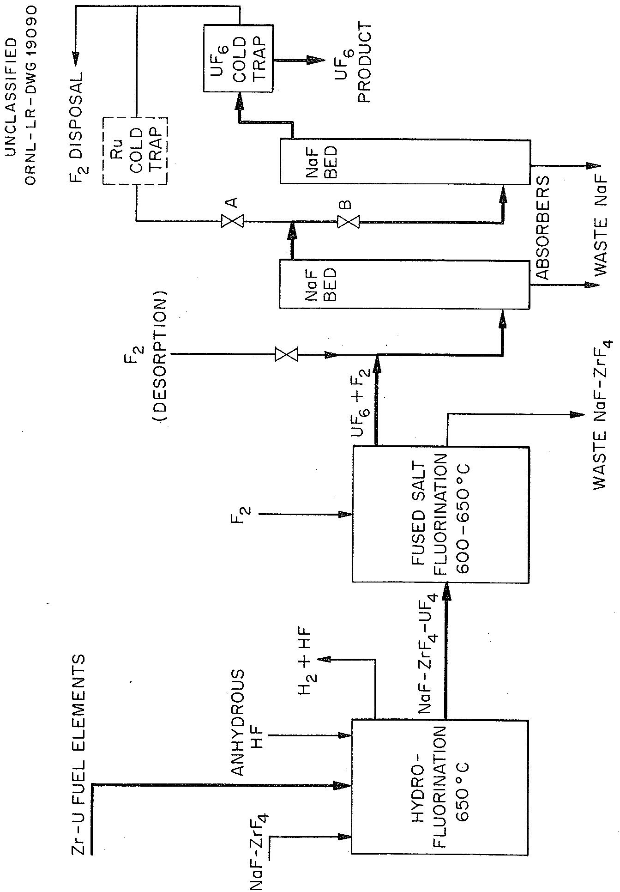  
Fig. 4-3 -- Fused Salt-Fluoride Volatility Uranium Recovery Process

the. fused salt-fluoride volatility uranium recovery process.

# 4.2 Secondary Fluid Heat Exchange Medium

# 4.2.1 Introduction

On the basis of the following reasons, it was decided to select a fused salt having the eutectic composition $50\% \mathrm{BeF}_2$ , $30\% \mathrm{NaF}$ , $20\% \mathrm{LiF}$ , expressed in mol fraction percent, as the secondary fluid.

(1) The salt is non-reactive chemically with the fuel and with water.   
(2) Leakage of the salt into the fuel would give a loss in reactivity (due to Li $^6$ absorption cross section) rather than an increase.   
(3) Rather low conductivity and somewhat high viscosity tends to reduce thermal stresses in steam generator and superheater tubes.   
(4) Melting point must be reasonably below the critical temperature of water, $705^{\circ}\mathrm{F}$ , in order to make steam generation feasible without an additional transfer loop. The above ternary eutectic composition was selected from three compositions recommended by Ref. 56 because it possessed the lowest melting point, $527^{\circ}\mathrm{F}$ .   
(5) Intermediate loop prevents neutron activation of the steam and consequent shielding of steam system components.   
(6) Corrosiveness of this fluid toward Inconel is estimated to be less than that of Fuel 30 under identical conditions because (a) no uranium is present to catalyze the corrosion reaction and (b) lower maximum temperature, i.e., $1150^{\circ}\mathrm{F}$ vs $1275^{\circ}\mathrm{F}$ (Ref. 42 and 45).

# 4.2.2 Physical and Thermal Properties (Refs. 41, 51, and 56)

Composition

Mol % Wt %

<table><tr><td>NaF</td><td>30</td><td>30.52</td></tr><tr><td>LiF</td><td>20</td><td>12.56</td></tr><tr><td>BeF2</td><td>50</td><td>56.92</td></tr></table>

Mol % $\mathrm{Gm} / \mathrm{Cm}^{3}(1.100^{\circ}\mathrm{F})$ Atoms/Cm³(1100°F)

<table><tr><td>Sodium</td><td>12.0</td><td>.329</td><td>.861 x 1022</td></tr><tr><td>Lithium</td><td>8.0</td><td>.066</td><td>.573 x 1022</td></tr><tr><td>Beryllium</td><td>20.0</td><td>.215</td><td>1.436 x 1022</td></tr><tr><td>Fluorine</td><td>60.0</td><td>1.360</td><td>4.320 x 1022</td></tr></table>

Melting Pt. - 527°F (275°C)

Density 2.17 - .000345 T(°C)

Density at $655^{\circ}\mathrm{F} - 2.05\mathrm{gm / cm}^3$

Density at $865^{\circ}\mathrm{F} - 2.01\mathrm{Gm / cm}^{3}$

Density at $1100^{\circ}\mathrm{F} = 1.97\mathrm{Gm / cm}^{3}$

Specific Heat (Cp) - 0.57 Cal/Gm

Viscosity, Centipoises, estimated

at $620^{\circ}\mathrm{F} - 390$

$700^{\circ}\mathrm{F} - 200$

$865^{\circ} \mathrm{F} - 70$

$1100^{\circ}\mathrm{F} - 22$

Thermal Conductivity - 2.4 BTU/Hr-FeF

Viscosity, density and conductivity are given as predicted by responsible ORNL personnel. Actual measurements are in process, but special equipment needed was not available in time to permit determination before publication of this report.

Basis of deductions is the three component $\mathrm{BeF}_2$ -NaF-LiF phase diagram, Figure 4-4. On this diagram, composition selected is noted by T275; that is, ternary eutectic melting at $275^{\circ}\mathrm{C}$ .

# 4.2.3 Disadvantages of Fluid

(1) A comparison of the heat exchanger volume needed to transfer 125 MW using this salt and using sodium has been made. It was found that the reactor pressure vessel size could be reduced considerably by using sodium, with a consequent shield weight reduction.   
(2) Melting point of the fluid, $527^{\circ}\mathrm{F}$ is so high that a shutdown of the secondary system pumps would require that system be drained to prevent freeze up of salt. Considerable care must be exercised to assure that boiler feed water is preheated before introduction into boiler, or freeze up may result.   
(3) Pumping power is considerably greater with fused salt fluid than with sodium, because of greater viscosity.

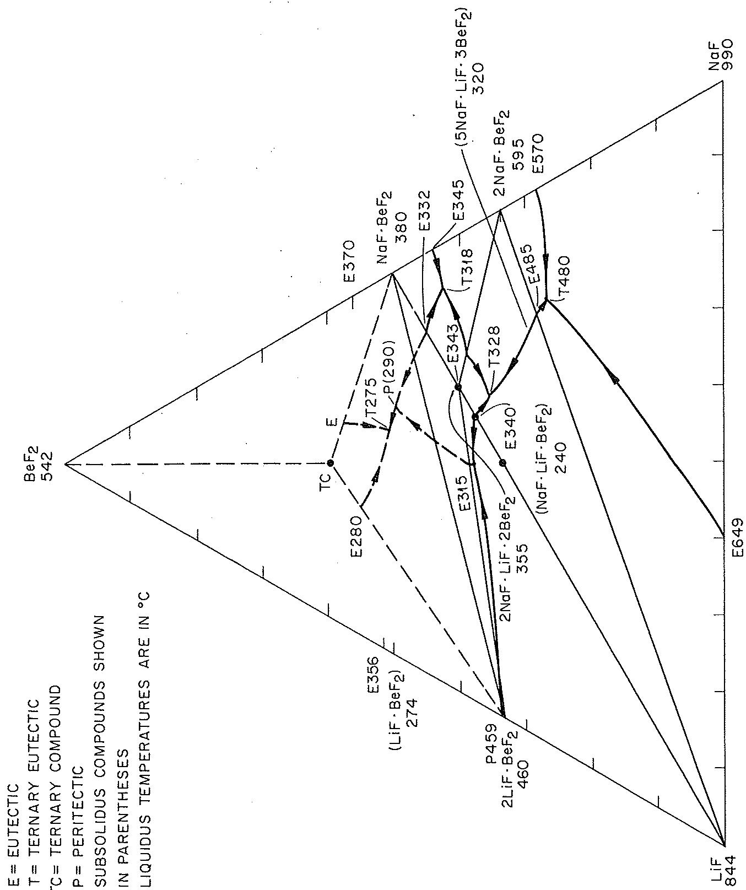  
CONFIDENTIAL ORNL-LR-DWG 16151

# 5.0 MATERIALS SELECTION

# 5.1 Structural Material

Once Fuel 30 had been selected, the results of several years testing (Ref. 39) the dynamic and static corrosion resistance of structural materials made perfunctory the selection of Inconel as the primary structural material. This included its use for pressure vessel, moderator cladding, primary heat exchanger structural material, pumps, and all other surfaces in direct contact with the fuel except the nickel reflectors. As indicated in our discussion of the fuel, Sec. 4.1, developments in nickel molybdenum alloys now underway are expected to change the fuel and container materials picture in the foreseeable future. Nevertheless, this design study is based on present technology and already proven systems. (See Sec. 4.1.3 Corrosion) Some of the results of corrosion research is presented as justification for metal thicknesses and materials chosen. Figure 5-1 shows stress elongation and rupture curve for Inconel tested in Fuel 30 at $1300^{\circ}\mathrm{F}$ . Figure 5-2 shows temperature dependence of stress rupture properties of Inconel in Fuel 30. Figure 5-3 shows effect of section thickness on creep-rupture properties of Inconel tested in Fuel 30 at $1500^{\circ}\mathrm{F}$ at 3500 psi stress. Figures 5-1, 5-2, and 5-3 support choice of Inconel with Fuel 30, and thickness of tubing and cladding specified. Our specification of 40 mils wall thickness of primary heat exchanger tubes is based on research leading to Figure 5-3 and advice by informed ORNL personnel (Ref. 42). Figure 5-3 indicates that creep resistance of Inconel immersed in Fuel 30 at elevated temperatures shows a remarkable improvement when section thickness reaches 40 mils.

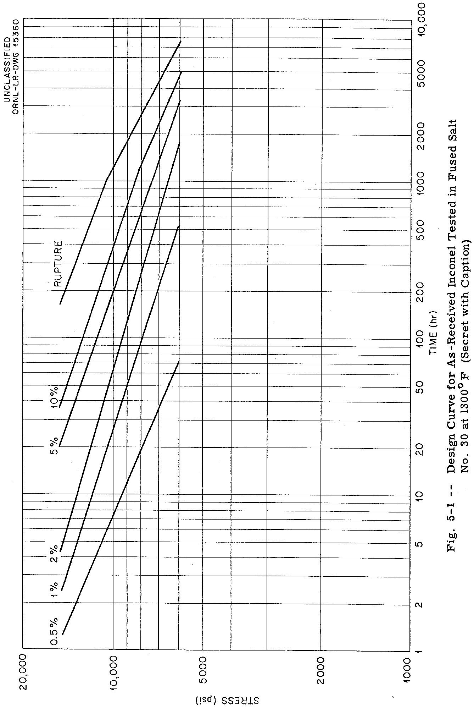

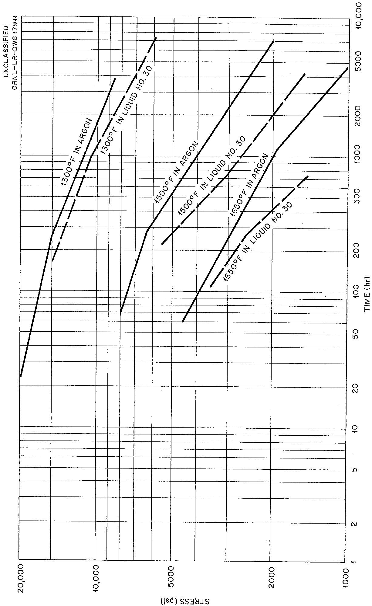  
Fig. 5-2 -- Comparison of the Stress Rupture Properties of As-Received Inconel Tested at 1300, 1500 and 1650 F in Argon and Fused Salt No. 30. (Secret with Caption)

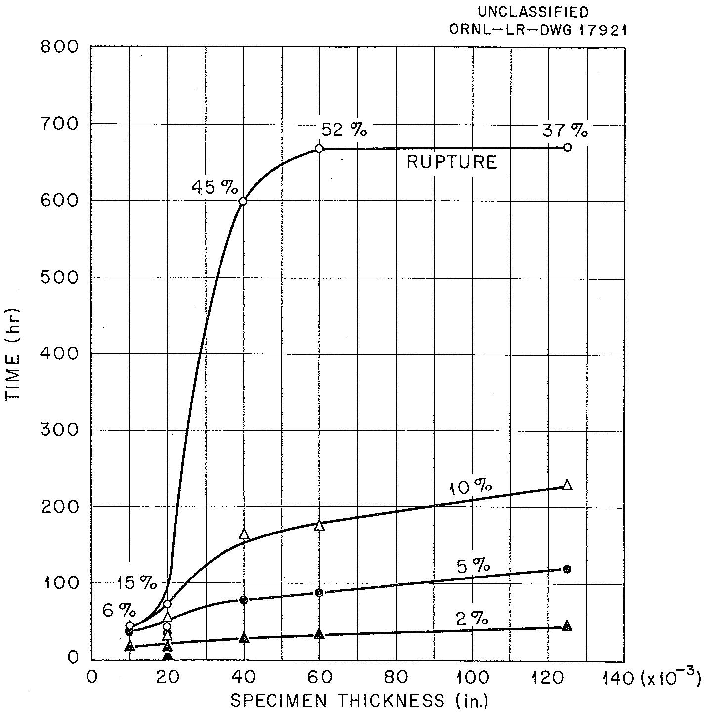  
Fig. 5-3 -- Effect of Section Thickness on Creep-Rupture Properties of As-Received Inconel Tested in Fused Salt No. 30 at $1500^{\circ}$ F under 3500 psi Stress. (Secret with Caption)

Insofar as it is possible to predict from dynamic and static corrosion data, Inconel thicknesses have been chosen so that, after design lifetime has passed, sufficient sound void-free metal remains to provide stress resistance adequate for the particular use involved.

Inconel has also exhibited superior resistance against chloride stress corrosion over most conventional materials. Because of the severe problems that have been attributed to this in the steam generating equipment of both mobile and stationary plants, it is recommended that it be used for both the steam and salt side of this equipment.

# 5.2 Moderator

Since all surfaces in contact with the fuel were of necessity Inconel (except nickel) it was necessary to choose a moderator of low neutron absorption which would permit the reactor to go critical with a reasonably small core volume. Consequently, after investigation (Ref. 43) BeO was selected as the leading proven moderator which could withstand the temperatures expected. A cladding of 40 mils was considered necessary, as previously discussed in Sections 4.1.3 and 5.1. While this thickness of Inconel cladding does not make for neutron economy, or for low fuel loading, nuclear calculations indicated that the reactor could be expected to operate satisfactorily.

One inch diameter test pieces of BeO ceramic were exposed in the MTR and showed satisfactory thermal stress resistance (Ref. 45, 55). The diameter of $3/4$ inch selected for this application was based on extrapolation of these results to the higher energy deposition rate expected. See Appendix 6.1.

# 5.3 Reflector

Because of the poor moderating properties of the fuel and the somewhat high thermal neutron capture cross section of the core, due to Na and Inconel, a fast neutron reflector constructed of pure nickel was chosen. Consequently, calculations indicate a large percentage of epithermal fissions. The only fair heat conductance of nickel necessitates the circulation of a small portion of the fuel through the reflector to equalize temperature and lower thermal stresses. It is not considered necessary to clad the reflector for corrosion resistance, which is satisfactory unclad.

# 5.4 Poisoned Moderator Region

An annular ring of boron bearing, beryllium oxide rods, clad with Inconel, with interstices filled with boron bearing Inconel rods forms the neutron shield. Calculations based on an average thermal flux of $10^{10}$ show that helium generation over a period of 10,000 full power hours is about .01 cm $^3$ (STP) of helium per cm $^3$ of BeO. Since BeO may be about 96% of theoretical density, no significant pressure will be generated.

Between the beryllium-boron region and the heat exchanger region an Inconel clad, copper- $\mathsf{B}_{14}$ C cermet layer is interposed as a thermal neutron absorber, to prevent escape of thermal neutrons to the heat exchangers. The beryllium-boron region, although heavily poisoned, contains a source of thermal neutrons due to thermalization of fast neutrons from the core.

Copper- $\mathsf{B}_{4}\mathsf{C}$ has been satisfactorily fabricated, containing 25 volume percent of $\mathsf{B}_{4}\mathsf{C}$ , to a theoretical density of $95\%$ , by cold pressing and hot rolling (Ref. 36).

# 5.5 Design Properties of Materials

Appendix 5.1 shows the design properties of Inconel, beryllium oxide, and nickel used in this study.

# 6.0 REACTOR AND PRIMARY HEAT EXCHANGER DESIGN

# 6.1 Introduction

The basic reactor design is conceived as being a pressure tight cylindrical vessel containing a circulating fluoride fuel. A primary objective of the design was to minimize its size and weight in order to reduce its contribution to the overall system specific weight. In addition, a small reactor design is desirable because of the large effect it may have in turn on the size of both the primary and secondary shield.

The volume of the reactor is basically dependent upon: 1) the nuclear properties of the fuel as it affects both the critical size and limiting power densities, and 2) methods which can be devised to remove the fission heat from the circulating fuel. The establishment of an allowable critical size and fuel loading as well as other nuclear considerations are discussed in detail in Section 8.0. The methods of selection and optimizing a heat exchanger configuration are presented later in this section. (See 6.3).

Possible alternate solutions or approaches to the various problems are discussed in the appropriate sections along with the reasons (either engineering or arbitrary because of time limitations) for the selections made.

# 6.2 Reactor

The basic configuration, illustrated by Figure 3-2, is approximately 80 in. in diameter and 80 in. high. Its total net weight is calculated to be 69,700 lbs (Appendix 13.1). Centrifugal fuel pumps located in the

reactor head are used to circulate the molten fluoride fuel up through a central critical region, and then through an annular peripheral downcomer which contains the primary heat exchangers. Heat is removed in this region and the fuel is again circulated up through the core.

# 6.2.1 Internal Arrangement

Calculations for the central core region were based on it being equivalent to a cylinder 75 cm in diameter by 80 cm high. This was modified for design purposes to an octagon shape for a more even moderator rod spacing and tapered ends to gain extra core volume. An optimum volume fraction of fuel for the core was found to be $50\%$ (Section 8.0).

Fuel cooled cylindrical beryllium oxide rods, clad with Inconel for corrosion resistance, were used for moderation purposes. These were equispaced throughout the core on a triangular pitch under the distance between centers being defined by the rod size and the desired volume fraction. Taper fittings were utilized at both ends of these rods to provide for the proper area and flow distribution. These rods would be held in the bottom support plate by a bayonnet joint and left free to expand in an axial direction to eliminate thermal stresses. A hollow ring is attached to each rod at the end of the upper taper. This will maintain proper rod spacing and still provide a suitable flow passage. These rings may be interlocked to prevent rotation and hence uncoupling of the bottom bayonnet joint, but still allow free axial motion.

The effective vertical boundaries of the core region are fixed by poison material located in the ends of the moderator rods. This poison material, beryllium oxide plus boron 10, also helps to reduce end leakage as well as to cut down on fissioning in the entrance and exit plena.

A 40 mil cladding of Inconel is required around the beryllium oxide to provide proper corrosion resistance for the 10,000 hr design life (Ref. Section 4.1.3). Since this thickness is fixed and not a function of moderator rod size, it is of considerable nuclear importance to use fewer large rods rather than many small rods in order to reduce the total amount of Inconel poison within the core. However, the maximum size is limited not by the nuclear aspects such as self shielding of the fuel, but by thermal stresses due to heat generation within the moderator material.

The feasibility of using beryllium oxide as a moderator material has been satisfactorily demonstrated under cyclic reactor conditions in the MTR (Ref. 54 and 55). Using this information, calculations were made to limit the design stresses for the present system to that found to be allowable in the above tests (Appendix 6.1). This limited the moderator rod size, without cladding, to approximately $3/4$ in. for the present. Because no indications were found in the MTR tests to indicate that higher power densities could be allowed, this minimum size could possibly be increased in the future when substantiated by additional test programs. Calculations of the temperature rise across the boundary layer $(50^{\circ}\mathrm{F})$ and through the moderator rod $(143^{\circ}\mathrm{F})$ , also included in Appendix 6.1, indicate that a maximum centerline moderator temperature of $1491^{\circ}\mathrm{F}$ is to be expected. This is well within the operational limits of this material and approximately equal to that of the MTR tests.

The moderator elements may be fabricated by inserting slugs of BeO $3/4$ in. in diameter by 2 in. long into Inconel cans of suitable wall thickness. In the MTR tests, improved heat transfer out of the moderator material was realized by utilizing helium in the small clearance gap required between

the slug and cladding. Stress calculations indicate that a shrink fit of the cladding around the BeO could be used in conjunction with the above to obtain further improvements.

A nickel blanket, approximately 6 in. thick, is incorporated around the cylindrical side of the reactor core to offer advantages both as a reflector and a shield. High energy leakage neutrons are inelastically reduced to a lower energy level and scattered back into the core to improve the core criticality and power distribution. Also because of its close proximity to the core it acts as an effective shield, from a weight standpoint, for both prompt gammas and neutrons. A detailed stress and heat generation analysis was not made on the reflector. However, because the reflector supports no load other than its own weight, it can be allowed to operate at high temperatures and in the plastic region so that thermal stresses may be effectively annealed out. Fuel flow channels of approximately $2\%$ by volume should be more than adequate for cooling the reflector.

In order to minimize the activation of the secondary fluid, it is necessary to reduce the neutron flux in the primary heat exchanger region as much as possible. To help accomplish this, a region containing BeO to thermalize fast neutrons and boron to capture the thermal neutrons is included outside of the reflector. This region contains closely packed $3/4$ in. cylinders suitably clad with Inconel and is approximately 5-1/2 in. thick. Small boron bearing Inconel rods are placed in the interstices of these cylinders for additional shielding and to reduce the fuel and hence fissioning in this region. Sufficient flow areas will still exist within the interstices of the large and small rods to provide for cooling.

To assure absorption of neutrons that are thermalized in the outer

edge of the above region a thin layer of boron carbide in a copper matrix is then placed around the above region. The feasibility of using these materials are discussed in Section 5.4.

A single control rod thimble, approximately 4 in. in diameter, extends through the length of the core. A clearance gap of 0.1 in. on the radius is allowed between the thimble and the control rod to assure free operation. To facilitate fuel cooling of the poison rod this gap would be filled with either a salt or a liquid metal. A small reservoir could be included in the reactor head in order to keep the thimble full as the control rod is withdrawn. For the purpose of the control rod worth evaluation (Section 8.2.3) it was assumed that this gap was filled with sodium. Because of the small quantity involved it was felt that this would not be a serious hazard.

A low point drain hole is located at the bottom centerline of the reactor vessel to provide a place for both filling and locating an emergency dump or blowout valve. This is incorporated into the bottom lateral support of the control rod thimble.

A thermal shield is located just outside of the heat exchangers to reduce the gamma and neutron heat generation problem in the reactor vessel. A small gap is placed between the thermal shield and core vessel to provide for cooling. Relatively cool fuel from the exit of the primary heat exchanger will flow up through this gap and into the fuel expansion tank in the reactor head. This flow has the additional advantages of providing increased circulation through the head to remove decay heating and to decrease the temperature in this region to help alleviate the snow problem (Section 4.1.2).

As mentioned previously the moderator rods are fixed only at the bottom in order to allow free expansion and thereby reduce the thermal stress problem. For a similar reason, the remainder of the internal structure, that is, the reflector, control rod thimble, and the basket supporting the poison rods, are suspended only from the reactor head. The only exception to this is the primary heat exchangers which run straight through the vessel. However as explained in Section 6.3.4, the thermal stresses obtained were found to be tolerable.

# 6.2.2 Vessel Design

One of the major advantages of a fused salt system is that due to the low vapor pressure of the fuel, it is necessary to contain only small pressures with the core vessel. With a minimum pressure of 30 psia required within the system to prevent pump cavitation and a pressure rise of approximately 35 psi required across the pumps to provide fuel flow a normal design differential pressure of only 50 psi is obtained. Basically this would require a wall thickness of less than one-half of an inch. However both because off design conditions would undoubtedly occur and navy requirements of meeting 20 to 30 g shock loads are required, this thickness was increased to 1-1/2 in. using the ground rules proposed in Ref. 11, but adapted to Inconel.

Although not shown in the reactor drawing, Figure 3-2, cooling coils must be included in the head design to take care of internal heat generation. The possibilities exist of using either the pressure drop across the fuel pumps to force the flow of a small amount of fuel through suitably constructed cooling tubes or to circulate a small percentage of the secondary salt.

Two possibilities which exist as to the most economical method of maintaining reactor installations of this type are discussed in Section 11.5. Basically they affect the vessel design in two different ways: 1) the vessel should be designed so that it may be reasonably feasible to assemble and disassemble it several times, or 2) the design should be simplified with the idea that only one assembly would be required. Because these concepts were well beyond the scope of this study it was decided to present a reactor design that could satisfy both. To accomplish this only the feasibility of a system allowing disassembly had to be shown because this was the most complex. The alternate solution, being of simpler design, was not illustrated as the joints, flanges, etc., would just be changed to welded structure. In both concepts as described, it was felt to be desirable from both an economic and a weight standpoint to remove the reactor from the ship for any maintenance.

To facilitate easy removal, the head is simply butted against the core vessel and held by the use of a flanged joint. An omega type seal is welded across the joint to provide proper leak tightness. This is in turn backed up by a steel "0" ring both as a safety precaution against possible failure of the omega seal and to help prevent fuel from easily flowing into the ring. If fuel settled in the seal ring, it would add to the decontamination problem upon reactor disassembly. However, corrosion would not be a problem because the chief source of corrosion with Inconel is with a dynamic system flowing over a large temperature difference. Because flow is prevented in this region, the seal weld will remain at constant temperature and corrosion would be limited to that caused by the initial chromium solubility.

The reactor may be disassembled remotely by removing the hold down bolts and cutting the seal weld. Omega type seal welds of the type recommended should not present a problem as they have designed for use in pressurized water reactors at pressures up to 2500 psi. Also mechanisms for remotely cutting and rewelding these types of omega seals have been developed for use in the marine PWR systems.

In order to be able to remove the reactor head and replace the primary heat exchangers it is necessary that the secondary fluid inlet and exit pipes be detachable from the core vessel. Two suggested methods for doing this are illustrated in Figure 3-2. The one in the reactor head utilized a concentric tube with the joining weld being made approximately 12 in. off the reactor head for access purposes. This type of joint gives good rigidity but has the disadvantage of allowing only a limited number of welds to be made. Also since it is a strength weld it would be more difficult to make remotely. The bottom connection is fashioned after a bridgeman closure which is used on many high pressure autoclaves. The closure provides the structural strength while an omega seal weld similar to that previously described is used to assure leak tightness. However, the rigidity of this type of connection under side loads and thermal cycling is not known.

Methods for the head closure and secondary pipe attachment were not given detailed consideration but are offered as one of many possible solutions.

# 6.2.3 Structural Arrangement

Two possible solutions exist for supporting the basic structure, however, a detailed study would be required to determine the optimum. The

first of these as shown in Figure 9-3 simply rests the reactor on supporting structure allowing free vertical expansion. Side play would have to be limited by guides. A second approach which at first hand appears to be more advantageous would support the reactor through a beefed-up section just below the head flange. This would not only take the weight of the head and most of the internal structure off the reactor side walls but also simplify the basic installation.

# 6.2.4 Fuel Pumps

Three centrifugal pumps are located in the reactor head to provide for fuel flow and to aid in the removal of the fission product gases. These pumps have common inlet and exit plena and are sufficiently overdesigned so as to allow almost full power reactor operation in the event of a single pump failure.

To provide for a lightweight and variable speed system (required to compensate for pump failure) a steam turbine driven motor was selected for these pumps. A small AC electric motor which could be clutched into the drive shaft would also be incorporated to maintain circulation under zero power operation. Also because it could be switched into the ship's emergency electric power system, it would serve as a safety device in case the steam flow to the turbines was interrupted.

A more detailed description of these pumps is given in Section 11.8.

6.2.5 Pressurizer and Expansion Chamber

# 6.2.5.1 Pressurizer

It is necessary to provide a pressure of at least

15 psig at the inlet of the fuel pumps to prevent cavitation. This pressure is applied by means of bottled helium gas at startup. After startup, a

helium gas differential pressure of a few pounds is maintained at pump shaft over that in the expansion chamber, to prevent escape of fission product gases along pump shafts. After initial filling, stable xenon and krypton generation can be used to maintain pressure. Off-gas systems to provide for poison gas removal are discussed in Section 11.6.

# 6.2.5.2 Expansion Chamber

The pumps are so designed as to cause a swirling motion of fuel in the expansion chamber, so that equilibrium gas-liquid concentration is quickly reached. A small stream of $1175^{\circ}\mathrm{F}$ fuel is brought up to the chamber through a passage between thermal shield and core vessel, and circulated through the chamber to remove heat generated in the chamber by fission product decay and by fission. (See Appendix 11.2 for heating calculations).

It is calculated that $150\mathrm{kw}$ is generated in gas, $157\mathrm{kw}$ is generated in liquid due to fission, and $93\mathrm{kw}$ is generated in liquid due to decay heat. It is obviously necessary that some heat removal system be incorporated to cool off the expansion chamber roof due to this and internal heat generation as discussed in Section 6.2.2. Assuming that one-half of the gas heat is absorbed by the roof, a cooling rate of $75\mathrm{kw}$ , or about $250,000\mathrm{Btu/hr}$ would be expected at full power. Allowing a $50^{\circ}\mathrm{F}$ rise in temperature, this will require circulation through the head of about $8800\mathrm{lb}$ of fused salt per hour.

A stream flow of 50,600 lb of fuel per hour is required to provide cooling for liquid in the expansion chamber to prevent snow formation. Arrangements have been made to bleed off a stream of fuel from the cool region $(1175^{\circ}\mathrm{F})$ at the bottom of the reactor, so maximum fuel temperature

in expansion chamber should be the same as maximum temperature in reactor, that is, $1275^{\circ}\mathrm{F}$ with a conservatively estimated temperature rise of $100^{\circ}\mathrm{F}$ . Thus, maximum temperature of liquid in expansion tank will be about $75^{\circ}\mathrm{F}$ less than $1350^{\circ}\mathrm{F}$ , maximum temperature at which snow problem may be neglected using fuel 30 (See Ref. 50).

# 6.3 Primary Heat Exchanger

# 6.3.1 Design Criteria

The design criteria for the primary heat exchanger is the same as for the system as a whole; that is, obtaining the lowest specific weight for the overall power plant consistent with a life of ten thousand full-power hours. Meeting this goal required the optimization of a combination of several quantities which vary with heat exchanger design. These are: heat exchanger weight, primary shield weight, pump weight, and pumping horsepower.

The variables of the heat exchanger design were placed, essentially, in two categories: 1) those which could be fixed early in the study dependent on the experience of others doing similar work or due to the limitations imposed by the rest of the system, and 2) those which were varied in an extensive parameter study to determine the most favorable union of these quantities.

# 6.3.2 Basic Design

The primary heat exchanger is of once-through, counterflow design. The heat transfer surface is provided by straight Inconel tubes on a delta lattice which are contained in an annulus surrounding the reactor core.

The headers are segments of tori which have an elliptical cross section. These headers circle the reactor core at the top and bottom of the heat exchanger, each segment having a nozzle which penetrates the pressure vessel and primary shield (see Figure 3-2). To provide additional area on the header surface, the major axis of the ellipse is longer than the width of the heat exchanger and is tilted with respect to the horizontal.

The secondary coolant flows through the tubes, entering at the bottom of the heat exchanger. The fuel flows on the outside of the tubes and enters at the top of the exchanger.

The physical dimensions, flow rates, temperatures, temperature differences, and heat transfer coefficients for the final primary heat exchanger design are tabulated below. This heat exchanger would be capable of removing 125 megawatts of heat from the reactor. See Appendix 6.2 for calculational details.

Heat Exchanger Inner Diameter 53.5 inches

Heat Exchanger Outer Diameter 73.7 inches

Heat Exchanger Length 48 inches

Tube Inner Diameter .120 inches

Tube Outer Diameter .200 inches

Tube Spacing .030 inches

Fuel Flow Rate 16.2 x $10^{6}$ lbs/hr

Secondary Coolant Flow Rate 7.48 x 10⁶ lbs/hr

Temp. of Fuel Entering Heat Exchanger 1275°F

Temp. of Fuel Leaving Heat Exchanger 1175°F

Temp. of Coolant Entering Heat Exchanger 1050°F

Temp. of Coolant Leaving Heat Exchanger 1150°F

Mean Temperature Difference from Fuel to Secondary Coolant

$125^{\circ} \mathrm{F}$

Outside Heat Transfer Coefficient

1836 BTU/ $\mathrm{Hr - }^{\circ}\mathrm{F - Ft}^{2}$

Inside Heat Transfer Coefficient

914 BTU/ $\mathrm{Hr - }^{\mathrm{o}}\mathrm{F - Ft}^{2}$

Overall Conductance

374 BTU/Hr- ${}^{\mathrm{o}}\mathbb{F}$ -Ft2

Straight tubes rather than U-tubes were incorporated in the primary heat exchanger because it would have been difficult to obtain as much heat transfer area in a given volume with U-tubes. Also, inlet and outlet headers would have to be in the same end of the reactor, which would further complicate the space problem. The main advantage of a U-tube exchanger would be the reduced longitudinal thermal stresses. However, as will be indicated in a later section, longitudinal thermal stresses are not expected to be a major problem in this heat exchanger.

The heat exchanger inner diameter and effective length were determined by the reactor core design. It is necessary that the heat exchanger tubes be nested closely about the reactor, and be about the same length as the reactor, in order to achieve the most compact design.

Tube wall thickness was fixed at .040 inches, primarily because of corrosion to be expected during ten thousand hours of operation. Although no corrosion data are available at the temperatures encountered in the heat exchanger, it has been predicted that a maximum corrosion of twelve mils on each side of the tube could be expected (see Materials Section 4.2). This corrosion is of a penetrative nature, with the maximum depth of corrosion being given for a few scattered displacements. Since it is unlikely that penetrations on both side of the tube would line up, and because the displacements are not interconnected, a large safety margin is realized in the

twelve mil estimate. However, twenty-five mils were allowed for corrosion, with the remaining fifteen being sufficient to contain the pressure and thermal stresses.

The upper fuel temperature was set at $1275^{\circ}\mathrm{F}$ to keep the corrosion within acceptable limits. From examination of other proposed reactor systems of a similar nature, a mean temperature difference between the fuel and secondary coolant of $125^{\circ}\mathrm{F}$ was decided on. This is a compromise value which will give both reasonable heat transfer and permissible thermal stresses. Further investigation of this system should include an examination of the effects of changing the temperature difference.

Many considerations were involved in the selection of a $100^{\circ}\mathrm{F}$ temperature drop across each fluid circuit. It is desirable to keep the temperature drop as large as possible in order to reduce the flow rates, and hence, pumping requirements. Also, it is necessary to keep the temperature of the secondary fluid above the melting point of the fuel which is $970^{\circ}\mathrm{F}$ . Using a mean temperature difference between the two fluids of $125^{\circ}\mathrm{F}$ and a $100^{\circ}\mathrm{F}$ drop across each circuit, the lowest temperature encountered in the secondary coolant loop will be $1050^{\circ}\mathrm{F}$ , which should be safely above the fuel melting temperature.

Since the heat exchanger must be capable of removing 125 megawatts or $4.27 \times 10^{8}$ BTU/hr, choosing the temperature drops automatically sets the flow rates.

In the final design, the tubes were spaced .030 inches apart on a delta lattice. The delta lattice was chosen over a square lattice because it permitted inserting more tubes of a particular size into a given space. The .030 inch spacing was established by a parameter study which will be

demonstrated in a later paragraph.

The tube spacing can be maintained by one of several methods. Most of the present small-tube high performance heat exchanger tests utilize flattened wire spacers, which are perpendicular to the tube axes. It was for spacers of this type that heat transfer and pressure drop calculations on the fuel side of the heat exchanger were made. More recently, some work has been done with helical spacers, wrapped about each tube. Preliminary results indicate that this type of spacers will give about the same heat transfer with a lower pressure drop.

To facilitate welding, it is necessary that the tubes be spaced at least .075 inch apart on the tube header (see Ref. 67). This requires that the headers have a surface area greater than the cross sectional area of the heat exchanger, but preferably will fit into the same annulus. As described previously, this was accomplished by making the headers elliptical in cross section and tilting the ellipse with respect to the horizontal.

The heat exchanger will be fabricated in bundles of approximately six hundred tubes each. This is approximately twice the number of tubes per bundle presently contemplated for the more complex ART fuel-NaK heat exchanger (see Ref. 36, Section 4.1). Each bundle is to be tested individually in order to simplify inspection and preclude the necessity of scrapping an entire heat exchanger for a single tube-header joint failure. Six of these bundles will then be welded together and capped to make up one header segment. There will be twelve such segments, each one having a nozzle penetrating both the upper and lower heads.

# 6.3.3 Parameter Study

In the parameter study that was made, the variables were tube outer diameter and tube spacing. For a given tube diameter and spacing, a heat exchanger outer diameter which would give the required mean temperature difference of $125^{\circ}$ was determined by an iterative process.

For a selected tube size and spacing, an assumed outer diameter of the heat exchanger was used to calculate film coefficients. Flow in the tubes was at all times laminar and an empirical equation for film conductance during laminar flow (see page 232, Ref. 17),

$$
h _ {i} = 1. 7 5 \frac {k _ {c}}{d _ {i}} \left(\frac {w _ {c} C _ {p c}}{k _ {c} L}\right) ^ {1 / 3}
$$

was used. For flow outside the tubes an experimental correlation (See Figure 7.6)

$$
h _ {o} = . 4 7 \frac {k _ {f}}{d _ {h}} \left(P _ {r _ {f}}\right) ^ {. 4} (R e) ^ {. 3 6}
$$

was used, which takes spacer effects into account. An expression was derived to give the weight of the heat exchanger plus primary shield for each configuration. Pressure drops and pumping horsepower can be determined from flow rates and heat exchanger geometry. Pressure drop in the tubes was calculated from (See pages 45 and 50, Ref. 15)

$$
h = f \rho \frac {L}{d} \frac {v ^ {2}}{2 g}
$$

where

$$
f = \frac {6 4}{\mathrm {R e}}
$$

for laminar flow. For flow outside the tubes, an experimental expression for friction factor

$$
r = \frac {5 . 7}{(\mathrm {R e}) ^ {. 5 6}}
$$

was used. This expression includes the effect of spacers and is given in Ref. 13. The weights of the pumps and drive motors were estimated at 25 lbs/FHP. The weight of the machinery and equipment not affected by heat exchanger design was determined. It was assumed that the steam generation equipment could provide steam for 35,000 shaft horsepower, normal auxiliary equipment, and 600 pump horsepower. When the calculated pumping horsepower was less than this, the shaft horsepower was increased by the difference divided by the efficiency of the pumps.

The total weight was then divided by the adjusted shaft horsepower to give the specific weight. Although this method will not give the exact specific weight of the power plant, it will indicate the configuration which will give the lowest specific weight. Tube diameters were varied from .1875 inches to .25 inches and spacing from .020 inches to .040 inches. The results of this study are shown in Figure 6.1.

# 6.3.4 Stress Considerations

Extensive thermal stress calculations were not made for the primary heat exchanger. However, the thermal stresses due to the temperature drop across the tube walls were determined, and also the stresses which will be present due to the difference in longitudinal expansion of the pressure vessel and heat exchanger tubes for several extreme cases were calculated.

FIGURE 6.1

ESTIMATE OF WEIGHT / POWER

RATIO VS. PRIMARY HEAT EXCHANGER

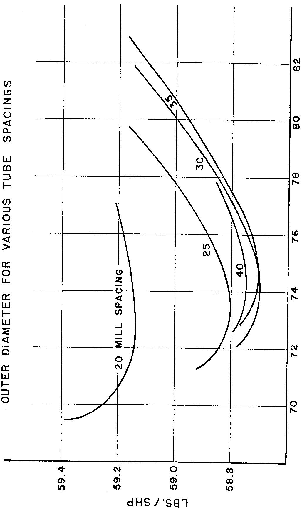  
OUTER DIAMETER FOR VARIOUS TUBE SPACINGS   
OUTER DIAMETER (INCHES)

Due to the rather poor heat transfer characteristics of both fluids in the heat exchanger, most of the temperature drop is taken across the fluid films. With a small temperature drop across the tube wall, the thermal stresses are also quite small.

It was estimated that the containment vessel will be at an average temperature of approximately $1225^{\circ}\mathrm{F}$ . The inside of the vessel will be cooled with fuel having a temperature of $1175^{\circ}\mathrm{F}$ and the average temperature will be some $50^{\circ}\mathrm{F}$ greater than this due to heat generation in the vessel. The tube temperature can be thought of as being at an average between the mean wall temperatures or about $1195^{\circ}\mathrm{F}$ . This gives a temperature difference of $30^{\circ}\mathrm{F}$ between the pressure vessel and heat exchanger tubes. It was assumed that this difference in thermal elongation would be taken up by mechanical elongation of the heat exchanger tubes only. This was figured for several extreme situations, one in which the tubes ran straight from one header to the other and were fixed at both ends. In this case, the stress in the tubes remained below the yield stress. Another case was considered in which the ends of the tubes were bent at right angles and then fixed to the header. In this case, the difference in elongation was assumed to be taken up by deflection of the stub ends. Maximum stresses will again remain below the yield strength if the stub ends are at least .4 inch long.

In the event that detailed thermal stress calculations prove that straight tubes are untenable, the tubes could be wrapped partially around the reactor to provide flexibility in order to alleviate these stresses.

The greatest pressure difference across the tube wall will be less than 100 psi even if the pumps on either circuit should fail. A cal-

culation was made, assuming that the pressure inside the tubes was 100 psi and the necessary wall thickness came out to be only .01 inch inches.

For the headers, thermal stresses were not considered; however, pressure stress calculations were made, again assuming an internal pressure of 100 psi. For this condition, a wall thickness of .1 inch and end cap thickness of .375 inch were determined.

# 7.0 STEAM GENERATING SYSTEM

# 7.1 Introduction

One of the major problems in adapting nuclear power to naval vessels has been the development of a dependable steam generating system that will deliver steam at conditions that are compatible with the requirements for efficient steam turbine performance. In the design of the steam generators the group endeavored to duplicate the existing steam conditions of the 931 class destroyer. These conditions are 263,300 lb/hr per boiler room at $950^{\mathrm{O}}\mathrm{F}$ and 1200 psi. It was decided to replace one boiler room with a nuclear reactor-steam generating system. Other design criteria were to keep the thermal stresses as low as possible, to make the system as light and compact as practical, and to have a realistic and somewhat conservative system.

In the preliminary analysis of the system it was decided that the reactor power should be 125 megawatts. Therefore, the steam generating equipment was designed to remove 125 megawatts of heat. When the actual steam cycle data for the class 931 destroyer was received a complete heat balance revealed that only 95.9 megawatts of heat was necessary to supply the steam for the full power of 35,000 shp. This makes possible the operation of the steam generator at lower temperatures and lower $\Delta t$ 's throughout the system. Detailed calculations of the design specifications are presented in Appendix 7.1.

# 7.2 Molten Salt Cycle Selection

In selecting a cycle or rather a system for steam generation the

group was confronted with the problem of removing 125 megawatts of heat from a molten salt coolant. The temperature of this salt as it leaves the primary heat exchangers is to be $1150^{\circ}\mathrm{F}$ , and it is to reenter the primary heat exchangers after losing only $100^{\circ}\mathrm{F}$ in temperature. Therefore, to remove the full-power 125 megawatts it is necessary to circulate the molten salt at a rate of $7.49 \times 10^{6} \mathrm{lb/hr}$ . One of the design criteria is to keep the temperature drop across tube walls below $100^{\circ}\mathrm{F}$ and since the saturation temperature of water in the boiler is $572^{\circ}\mathrm{F}$ , then when allowance is made for the boiling water film temperature drop and for the molten salt film temperature drop, it is found that the salt entrance temperature to the boiler should not exceed $800^{\circ}\mathrm{F}$ . The superheater is to bring the steam temperature up from $572^{\circ}\mathrm{F}$ to $975^{\circ}\mathrm{F}$ . Because of the high temperature drop across the steam film an entrance temperature to the superheater of $1150^{\circ}\mathrm{F}$ and an exit temperature of $1126^{\circ}$ would not exceed the $100^{\circ}\mathrm{F}$ drop across the tube walls. Therefore, the problem is to lower the salt temperature from $1126^{\circ}\mathrm{F}$ to $800^{\circ}\mathrm{F}$ and then to raise it from $734^{\circ}\mathrm{F}$ , the boiler exit temperature, to $1050^{\circ}\mathrm{F}$ in order to return it to the primary heat exchanger.

The two methods considered for meeting this problem were to use either a regenerator heat exchanger between the boiler and superheater, or blenders. In the regenerator system the $1126^{\circ}\mathrm{F}$ salt would enter and the $1050^{\circ}\mathrm{F}$ salt would leave the hot end of the regenerator heat exchanger while $800^{\circ}\mathrm{F}$ salt would leave and $734^{\circ}\mathrm{S}$ salt would enter the cold end. This meant that some 420 megawatts of heat would have to be exchanged in the regenerator. Due to the rather poor heat transfer characteristics of the molten salt and the low log mean temperature difference available, a tremendous heat

transfer area would be required. This in turn led to a very large salt volume, high pumping power, and prohibitive weight and size.

Attention was then turned to a blending arrangement as a means of achieving the desired salt temperatures. It was found that blenders were being considered by a fused salt power reactor group at ORNL. (Ref. 72). After consultation it was decided that a blending system would be used thereby allowing the system to consist of a separate hot and cold loop (See Figure 3.1). The hot loop circulates the molten salt coolant from the primary heat exchanger to the superheater, from the superheater through the pump and blending apparatus, and then back to the primary heat exchanger. On the discharge side of the hot loop pump, molten salt at $1050^{\circ}\mathrm{F}$ is tapped off and fed into the cold loop. This flow can be regulated by means of a trim valve and serves as the heat source for the cold loop. The cold loop contains the steam generator or boiler and a pump. The hot salt is fed into the cold loop on the suction side of the pump from whence it transverses the steam generator. From the cold side of the boiler the requisite amount of salt is tapped off and fed into the suction side of the hot loop pump. This completes the path of molten salt through the circuit. The salt flow rates in the superheater and steam generator are to remain constant at 7.49 x $10^{6}$ lb/hr. The amount of salt bled from the hot loop to the cold loop at full power 125 mw is 1.74 x $10^{6}$ lb/hr. Schematic layouts of this system are also shown in Figures 7.3 and 10.1.

The fluid horsepower necessary to circulate the molten salt was calculated to be 260 hp in the hot loop and 200 hp in the cold loop. The calculated pressure drop in the superheater was 15.2 psi, in the

primary heat exchanger 20.5 psi, and in the steam generator 38.7 psi. Since no finalized piping layout was attempted, the pressure drops due to line friction, bends, valves, entrances, etc. was estimated. It is reasonable to assume that these losses would not be as significant as those in the primary heat exchanger, boiler, and superheater. Therefore, the molten salt pumping horsepower should not vary greatly from the above values.

In order to determine the optimum salt line size a short parameter study was undertaken. Pipes with inner diameters from 7" to 17" were investigated. The pressure drop per foot of pipe length was calculated and from the resulting fluid horsepower a pump weight equivalent was obtained. (See Figure 7-7). This was combined with the weight of the salt per foot of pipe length and plotted against the various pipe diameters. The results showed that the optimum pipe i.d. would be approximately 11".

# 7.3 Steam Generator

# 7.3.1 Types Considered

In selecting a steam generator the general types considered were (1) the flash boiler, (2) the once through boiler, (3) the natural circulation, and (4) the forced circulation boiler. Each was given serious consideration and the conclusions drawn about each type follows:

(1) Flash Boiler: The only information found about flash boilers was contained in Reports EPS-X-265, EPS-X-270, and EPS-X-288 by the MIT Engineering Practice School at Oak Ridge. In these reports it was pointed out that the main advantages of flash boilers are that they

are capable of responding rapidly to load demands because of the small amount of water contained therein and that it is probable that a high capacity boiler of reasonable size could be constructed. In the past the chief disadvantage of flash boilers has been tube burnout, but this problem is absent in nuclear reactor applications where the coolant is apt to be a molten salt or metal. The chief reasons for not adapting this type boiler were for the most part pointed out in the above reports. They were: (1) the need for high tube wall $\Delta T$ 's in order to keep salt from freezing on tubes, (2) the lack of nozzles that would give an adequate spray pattern, (3) the need for very long tubes in order to ensure dry steam at high loads, (4) the need for a method to insulate the nozzle headers from the heated tubes, and (5) the general feeling of the group that, although flash boilers show great promise, much more developmental work is needed.

(2) Once-Through Boiler: Once- through boilers have been used in Europe for a number of years and have recently come into their own in this country with the installation of the supercritical units at Philo and Eddystone. They offer the advantage of boiling and superheating in a continuous passage thereby eliminating the need for heavy steam drums. A once- through boiler also offers the advantages of rapid response to load changes, compactness, and ease of arrangement. The principle disadvantages are lack of water storage, the need for very high purity water, and, especially for nuclear reactor applications, the thermal stress problem. As was stated in Section 7.2 the stresses encountered when boiling water at $572^{\circ}\mathrm{F}$ with a salt at $1100^{\circ}\mathrm{F}$ introduces intolerable conditions. Therefore, it was necessary to separate the boiler and super

heater thus eliminating the chief advantage of the once-through boiler.

(3) Natural Circulation Boiler: The natural circulation boiler is perhaps the conventional steam generator for marine use. Unfortunately, here the problem of arrangement is encountered. It is necessary to have a large drum at high elevation and a downcomer collector drum or drums. Also the problem of whether to put the molten salt in tubes or let it be on the shell side must be considered. Reports such as KAPL-1450, "Review of SIR Project Model Steam Generator Integrity", seem to indicate that the best results for a liquid metal coolant such as sodium would be obtained by placing the coolant in the tubes with the water on the shell side. However, these experiments were all done using stainless steel. In the steam generator proposed in this report Inconel is to be used and with the obvious weight saving obtainable by placing the high pressure steam-water mixture in the tubes it was concluded that the water-tube system was the more advantageous.

In order to find some compact method of arranging a natural-circulation water-tube boiler with a molten salt as a heat supplying medium, a number of different configurations were considered. The most promising appeared to be a Lewis boiler which employs Field tubes. A Field tube is really a tube-within-a-tube. The inner tube acts as an essentially unheated downcomer. The bottom of the inner tube discharges into the sealed off end of the outer tube. The outer tube is heated and acts as the riser. High recirculation ratios are obtained with this type boiler. Also, since one end of the tube is free, there are little thermal expansion problems. The Lewis type boiler has several other advantages but its chief disadvantage would be the arrangement of a header sheet since it does have

the complication of a tube within-a-tube. The tubes must also be of the order of 12' to 15' and it was felt that possibly some other arrangement would offer greater compactness.

(4) Forced Circulation Boiler: The forced circulation boiler was selected for the basic study because of its compactness and flexibility of arrangement. Use could be made of a nearly conventional steam drum, and the tubes could be bent into a "U" shape to reduce the thermal expansion problem. The steam output could be controlled by the circulating water pump. The forced circulation boiler is simple in design and principle and is well proven in marine applications.

# 7.3.2 Design of the Selected Steam Generator

The collection of appropriate and adequate data for the steam generating system proved to be a task of no small proportions. The molten salt was assumed to behave as a normal Newtonian fluid. Data is available from experiments performed at ORNL giving the heat transfer characteristics for heat exchangers, particularly delta-array. This data was used for all salt side heat transfer coefficients (See Figure 7.6). The molten salt flow through the steam generator is in the laminar region with Reynolds Numbers of 200 to 300. This is due to this particular salt's high viscosity in the temperature range to be used. The data for boiling water heat transfer characteristics was hardly as easy to get. Wide variances are to be found in the literature for water boiling in tubes under pressure. After consulting with a group of industrial boiler designers it was decided to use a value of 6000 Btu/hr-ft $^{2}$ - ${}^{\circ}$ F for the heat transfer area calculations. A value of 2000 Btu/hr-ft $^{2}$ - ${}^{\circ}$ F was assumed for scale deposits collecting on the water side of the tubes. In the report, "Studies in Boiling Heat Transfer"

(UCLA Report No. C00-24), the conclusion was drawn that for water boiling in tubes in the pressure range from 1000 psi to 2500 psi, the difference between the tube wall temperature and the water saturation temperature is independent of the heat flux. According to this data the value of $t_w - t_{sat}$ that might be expected at 1250 psi was about $14.5^\circ F$ . (See Appendix 7.1, Section 5A). In McAdams (Ref. 17, page 393) the equation, $t_w - t_{sat} = \frac{1.9(q / A)^{1/4}}{P / 900}$ , indicates clearly that the boiling film temperature drop is heat flux and pressure dependent. These equations were used to determine the temperature drop across the tube walls at points of maximum heat flux. The McAdams equation gave the lowest film drop with a value of $9.6^\circ F$ . This in turn gave the maximum wall $\Delta t$ of $85.2^\circ F$ at the maximum heat flux of 172,000 Btu/hr-ft².

It was decided to bring water into the steam generator at $565^{\circ}\mathrm{F}$ , seven degrees below the saturation temperature. This water would be a mixture of the recirculating water which is at the saturation temperature of $572^{\circ}\mathrm{F}$ and the feedwater which is at $486^{\circ}\mathrm{F}$ . The water entrance velocity into the tubes is 8 ft/sec. At the tube exit the dryness fraction is 0.11 which corresponds to a SBV of 65 percent. This is approximately the maximum steam by volume for this temperature and pressure that will still give good wetting of the tube walls (Ref. 21).

A brief parameter study was undertaken to determine the most suitable tube size and tube pitch. It was concluded from this study that in balancing heat transferred against pumping power required, it should be possible to go to smaller tube size than usually used in oil fired boilers. Upon recommendation from ORNL personnel experienced with steam generators it was decided that a 1/2" i.d. tube was the smallest suitable tube. The tube

wall thickness compatible with the operating temperatures and pressures was calculated to be $1/16''$ , and from salt pressure drop considerations the closest tube pitch was computed to be $3/4''$ .

Once the tube size was set (the recirculation ratio and steam flow rate are known), the number of tubes necessary to carry the full power flow rate could be determined. The steam flow rate for the 125 megawatt design as calculated from a heat balance is 456,000 lb/hr. The number of tubes for the steam generator is then 2336.

The heat transfer area was calculated in two parts. The area necessary to raise the water temperature to the saturation point was calculated. The overall heat transfer coefficient in the water heating region is 425 Btu/hr-ft²°F and the log mean temperature difference is 195°F. The heat transfer area for this region is 3050 ft². This total area of 3854 ft² made necessary a tube length of 10.1 ft.

It was decided that the tubes should be bent into "U" shape for reduction of the thermal expansion problem. Calculations also showed that it would be best to split the 2336 tubes into 8 bundles. This would keep the salt jacketed vessels to a reasonable size and wall thickness, and would reduce the header thickness and weight.

Of all the steam generator parts it was thought that the headers would present the greatest problem. It was concluded that there was no reason why the tubes could not be run directly into the steam drum. The salt jacket could be attached directly to the drum or by expansion joints. The tubes would be "U" shaped and "hung" from the drum as illustrated in Figure 7.1. A water header would be at the other end of the tube bundle. This header could be of either flat head or dished head design. The hot $(800^{\circ}\mathrm{F})$

salt would be introduced into the jacket just under the drum and heat baffle would shield the drum from contact with the high temperature salt. The molten salt would leave the jacket just below the water inlet header.

Four salt jackets containing tube bundles are attached to the bottom of each of two drums. The tubes serve the purpose of risers. They discharge their steam-water mixture into the drum where the steam is separated by mechanical separators and scrubbers. The water leaves the drum through the downcomers which are located on the bottom side of the drum along with the salt jackets. The water in the downcomers is at the saturation temperature of $572^{\circ}\mathrm{F}$ . This water is blended with the $486^{\circ}\mathrm{F}$ feedwater and the resulting water temperature is $565^{\circ}\mathrm{F}$ . (The saturation pressure at this temperature is 1180 psia or approximately 70 psi below the steam generator operating pressure). This water is forced back to the water inlet headers by the circulation pump.

The design capacity of the steam generator is 456,000 lb/hr. The water flow rate is 4,149,500 lb/hr and the salt temperature drop as it traverses the steam generator is $76^{\circ}\mathrm{F}$ . At the 95.9 mw power load the full power steam demand is 355,030 lb/hr and the salt temperature drop is 58.8 F. At this power the inlet the outlet temperatures will be lowered to 761.8 F and 703 F.

# 7.4 The Superheater

It was felt that the superheater design would be the most straightforward of the steam generating system. The superheater is to take the saturated steam at $572^{\mathrm{O}}\mathrm{F}$ and heat it to $950^{\mathrm{O}}\mathrm{F}$ . The 125 mw capacity of the superheater was to be 348,000 lb/hr but the capacity necessary for 35,000 shp is 263,300 lb/hr.

Again, investigation showed that tubes of the smallest practical diameter would give the best heat transfer characteristics. Tubes of $0.5^{\prime \prime}$ O.D. and $0.4^{\prime \prime}$ I.D. were selected. A steam exit velocity of 100 ft/sec was chosen as the maximum practical velocity. To carry the flow at this velocity 722 tubes were necessary. It was decided to space these tubes at a pitch of $3/4^{\prime \prime}$ . This gave a molten salt velocity of 11.55 ft/sec and a pressure drop of 1.33 psi/ft. The salt inlet temperature is $1150^{\circ}\mathrm{F}$ at 125 mev and $1138.3^{\circ}\mathrm{F}$ at 95.9 mev. The exit temperatures are $1126^{\circ}\mathrm{F}$ and $1120.4^{\circ}\mathrm{F}$ respectively. The overall heat transfer coefficient is 291 Btu/hr-ft $^{2-0}$ -F and the heat transfer area is 1070 ft $^{2}$ . This gives a tube length of 11.4 ft. The maximum heat flux was calculated to be 231,000 Btu/hr-ft $^{2}$ and the maximum tube wall $\triangle t$ was $80^{\circ}\mathrm{F}$ .

The superheater vessel is "U" shaped with the headers at both ends. (See Figure 7.2) The tube bundle runs through the vessel with the tubes arranged in a delta-array. As is the case in the steam generator the headers were considered to present the greatest actual problem. Numerous header arrangements can be devised but the best seem to be either a dished or flat head.

# 7.5 Auxiliary Equipment and Arrangement

# 7.5.1 The Steam Drum and Desuperheater

The steam drums are an integral part of the steam generator and contain the mechanical steam-water separators, the steam scrubbers, and the desuperheater tubes. It was decided to use the two conventional drums of the class 931 destroyer boiler room with the attachment of the molten salt jackets to their undersides and the replacement of the conventional

risers with $5 / 8''$ o.d. tubes as described in Section 7.3.1. The drum material is to be Inconel but the separators and scrubbers are to be of conventional design. The drum diameter is $52.2''$ and the bottom shell thickness is $4.8''$ .

The desuperheater will consist of tubes running through the saturated water in the drum. It is necessary to desuperheat $5340\mathrm{lb/hr}$ of steam when running at 35,000 shp. Superheated steam at $950^{\circ}\mathrm{F}$ and 1235 psia will enter the drum in the tubes and be cooled to $650^{\circ}\mathrm{F}$ .

The arrangement of the steam generating equipment around the reactor and within the secondary shield would be as shown in Figure 7.3. It is realized that the actual design of the steam and salt piping within the secondary shield requires careful analysis, which is particularly necessary to keep stresses due to relative thermal expansion within reason. However, neither time nor talent permitted such an analysis for this study, and therefore only a reasonable estimate would be made for the volume required for this plumbing.

As shown in Figure 7.3, there would be two identical salt and steam systems. It would be desirable to have all pump driver accessible from outside the secondary shield. It was therefore proposed that the secondary salt pumps be mounted on the top and drive through the secondary shield. Similarly, the water recirculation pumps could drive through the aft face of the secondary shield.

# 7.5.2 Feedwater Heater and Other Components

Although most of the equipment following the superheater in the steam generating system will remain unchanged, several components will no longer be necessary when the two furnaces are replaced by a reactor and at least one new item must be added to the system.

to keep pump turbine weights down. If these pump turbines are assumed to be expanding the steam to the same extent as the main feed pump turbines, which also operate on superheated steam, the enthalpy contained in their exhaust would be more than sufficient to make up that lost by the exclusion of the forced draft blowers and fuel oil pumps.

In order to maintain the deaerer saturation pressure at 18 psig at full load, a somewhat greater quantity of auxiliary turbine exhaust must be bled back to the main condensers. This in turn will probably require the addition of several condenser tubes to maintain the former condenser vacuum. Calculations show that at full power 12, 530 pounds per hour of auxiliary turbine exhaust must be bled to the condenser, if a deaerer pressure of 18 psig is to be maintained.

# 7.5.3 Feedwater Treatment

Just how much feedwater treatment would be necessary to ensure long-term trouble free service from the steam generators was one of the many problems that the group did not have time to investigate. The conventional destroyer supplies distilled water to the oil fired system and no attempt was made to answer the question of whether or not further treatment by ion-exchangers would be necessary for the reactor heated steam generators. However, a heat transfer coefficient of 2000 Btu/hr-ft² $^{-1}$ F was included for scale deposit, which should be conservative. It should be pointed out that the replacement of the oil-fired furnace by a fused salt system makes the steam generation equipment relatively clean, and therefore the use of ion exchangers to further reduce the water impurities may be justified. Such a system should be a large improvement in cleanliness and require much less maintenance than the conventional oil-fired boiler.

# 7.6 Part Load Operation

The method of achieving a certain steam rate for loads which are some fraction of full power will depend upon the method by which the reactor is held at part load. Presumably, the flow rate of the molten salt coolant and the average temperature of the reactor will remain the same, but the temperature rise of the molten salt coolant as it passes through the primary heat exchangers will vary according to load. Thus in the hot molten salt loop, which includes the superheater, primary heat exchanger, one of the pumps and part of the blending apparatus, the average temperature and salt flow rate will remain constant and the inlet and outlet temperatures of the superheater will change appropriately as will the amount of molten salt that is bled off as the heat source for the cold or steam generator loop. The average temperature of the steam generator can be either raised, lowered, or held the same according to the amount of salt bled from the hot loop. It was found that in lowering the power from 125 mw to 95.9 mw the average temperature of the steam generator could be lowered $38^{\circ}$ thus alleviating the thermal stress problem somewhat.

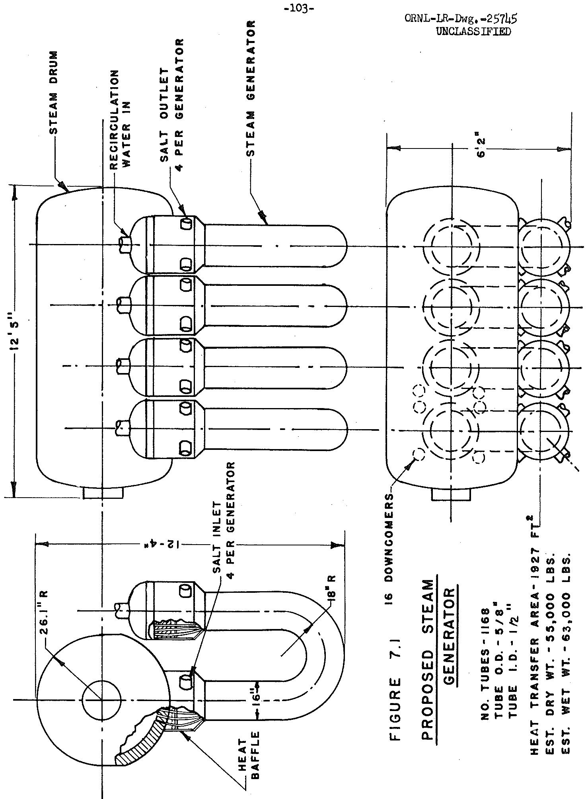

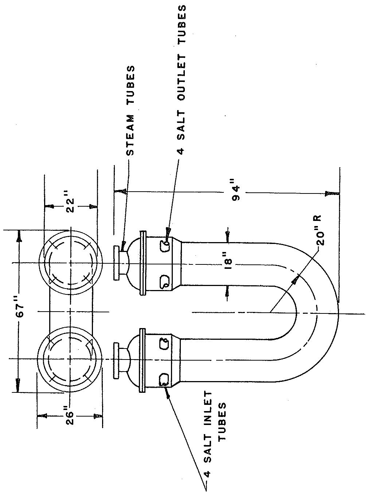

NO. OF TUBES - 361

TUBE O.D. = 0.500

HEAT TRANSFER AREA 535 FT.2

EST. DRY WT. = 9000 LBS.  
EST. WET WT. = 11,300 LBS.

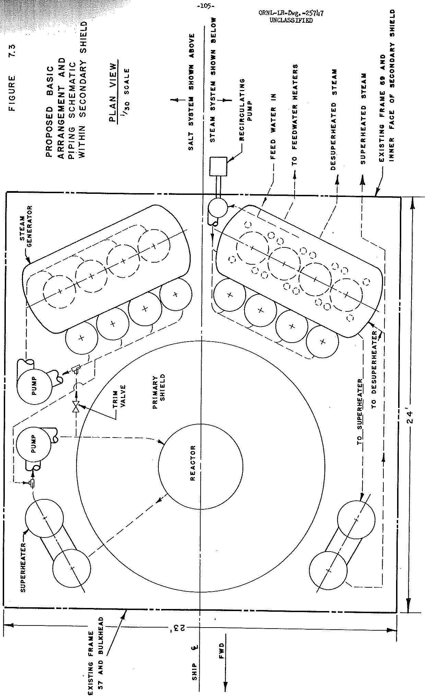

# FIGURE 7-4

# ESTIMATED SECONDARY SALT VISCOSITY

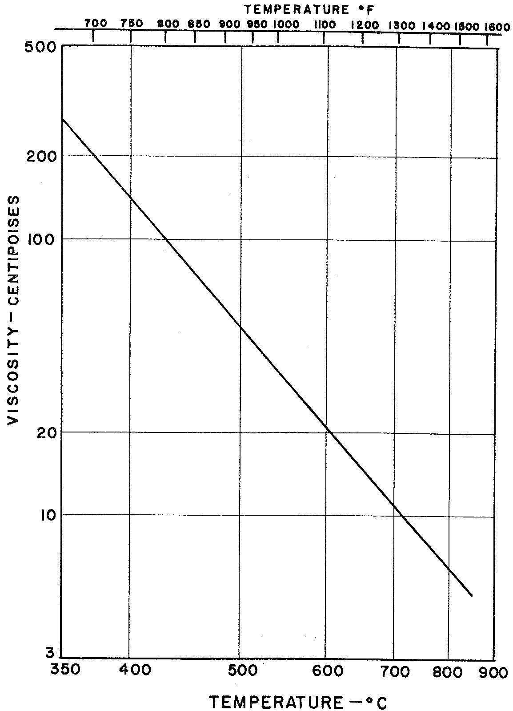

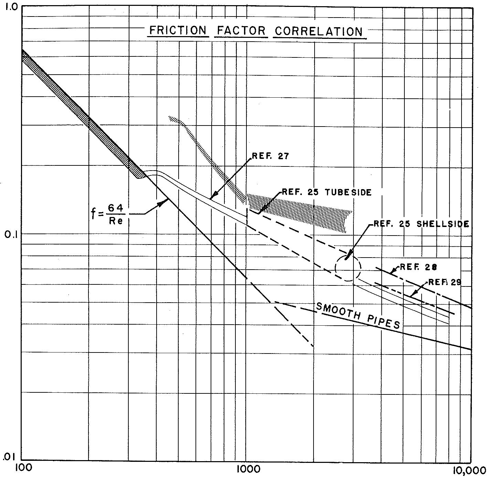  
FIGURE 7.5   
REYNOLDS NUMBER

-108-

ORNL-LR-Dwg.-25750

UNCLASSIFIED

FIGURE 7.6   
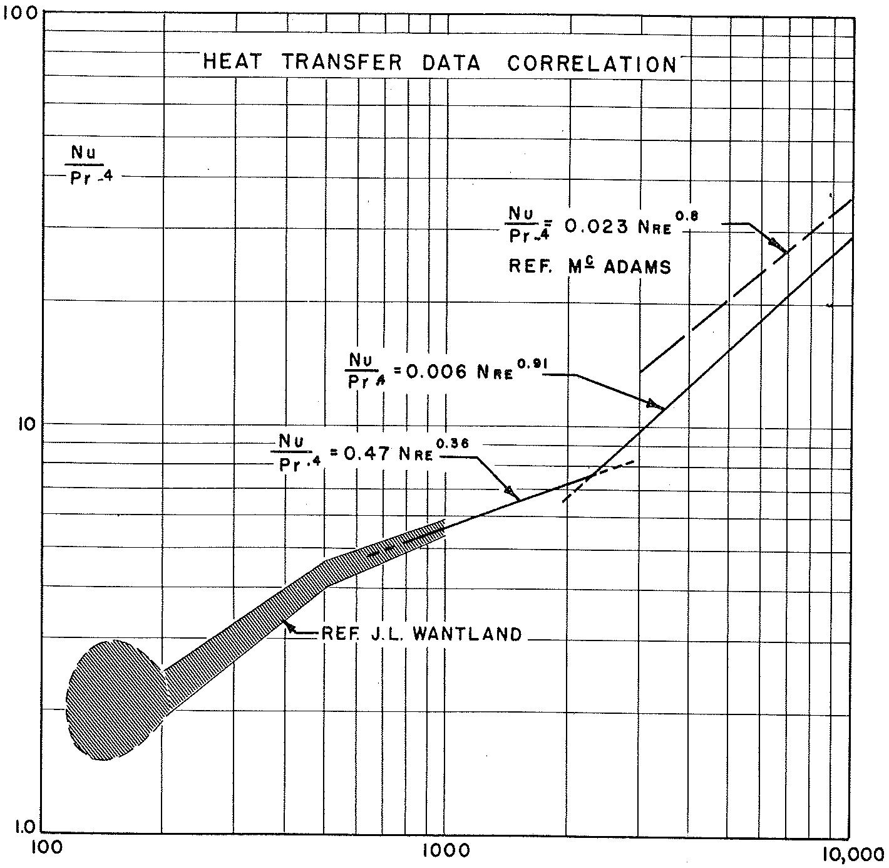  
REYNOLD'S NUMBER

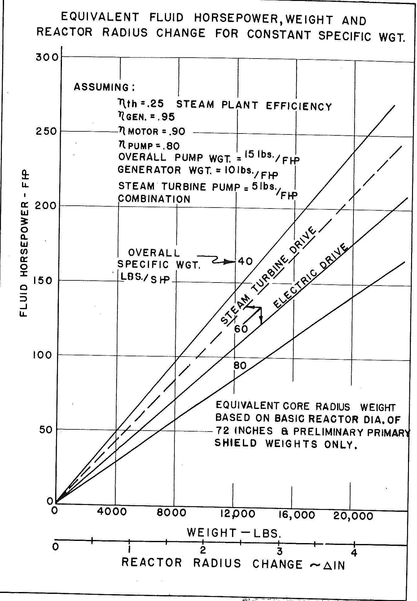  
FIGURE 7-7

# 8.0 REACTOR ANALYSIS

# 8.1 Nuclear Configuration

Figure 3-2 schematically indicates the physical picture of the core and reflector which will be described in detail below. General overall nuclear concepts of this high performance physically small system are modifications and combinations of advanced design ideas of ANP Technology under consideration at the Oak Ridge National Laboratory. Ref. 36. Physically, the core is a circulating, fused fluoride, uranium bearing salt flowing through a beryllium oxide moderating matrix and incorporating an inelastic scattering metal reflector. Systems of these types feature high power density and relatively high operating temperatures.

Numerous nuclear advantages are manifested by these systems. The released energy is easily extracted from the core in that it is generated in and transferred out by the same fluid. Fluid fuel systems are, in general, self-regulating under small perturbations away from nominal operating conditions due to prompt volume expansion within the fuel. Thirdly, much of the energy released in the fission process other than the kinetic energy of the fission fragments is retained and collected through cooling moderator, reflector and internal neutron and gamma ray shielding with the coolant-fuel. Other advantages are low operating pressures and the relative ease of extracting volatile fission products.

Disadvantages include, large fuel inventory required from excess fluid for component cooling, heat exchangers, pumps, core inlet and exit plena. A relatively serious hazard is present in this circulating fuel system, specifically, the containment of a corrosive, multicurie fluid at high

temperatures. Requirements in maintaining the fused salt liquidous during shutdown also burden these system.

Limitations were necessarily placed upon the nuclear design to meet the requirements of metallurgy, heat transfer and nuclear design, and to narrow the breath of the study. With the choice of a fused fluoride fuel, no point in the system can be at a temperature less than its solidification value (in the order of $980^{\circ}\mathrm{F}$ ) and no point should exceed a temperature at which rapid corrosion takes place. All fluid surfaces should be Inconel clad to a thickness which will withstand 10,000 full power hours of operation. Power densities will be high, but not enough to induce dangerous thermal stresses in all materials. Resulting limitations restricted the design to the following specifications:

Mean Core Temperature

1150°F to 1250°F

Primary Fluid Surfaces

30 mils cladding Inconel or greater

Maximum Power Density

1200 watts/cm³ fuel

Core Dimensions

Right circular cylinder 70 cm in diameter 80 cm in height

# 8.1.1 Moderator Matrix

The moderating matrix consists of rods comprised of beryllium oxide, three-quarters of an inch in diameter, clad in 40 mils of Inconel. Radially, the rods will be close packed in a triangularly pitched array. The pitch is defined by the selected volume fraction of moderator in core. Beryllium oxide "meat" extends the entire length of the core, and joining on each end of meat will be, one and a half inches of boron-10, BeO ceramic

material to suppress fission in the core inlet and exit plena. Ends of the elements neck down forming the plena and joining the structural members. See Figure 3.2.

# 8.1.2 Reflector

An inelastic scattering reflector is utilized in the system. This choice has not been proven superior to an elastic moderating material such as beryllium oxide, but it is believed to contribute definite advantages over BeO in this specific application.

The choice of a nickel reflector is based upon the fact that this material possesses excellent slowing down characteristics in the higher neutron energy range, which is of considerable importance in this intermediate reactor. Secondly, relatively small amounts of cooling will be required for the reflector and therefore it will retain its desirable nuclear properties to a large degree. This high atomic number material will attenuate core gamma rays very strongly and thus reduce the required gamma ray shielding. Also, fast neutron leakage out of the reflector is within acceptable limits and is only of minor concern in fast neutron shielding.

Time did not permit the detail investigation and comparison of systems incorporating elastic and inelastic reflectors; intuitive reasoning lead us to the nickel reflector. The resulting reflector is comprised of a 6 inch thick cylindrical shell 29.6 inches in inside diameter surrounding the core. Cooling annuli penetrate the nickel vertically through the reflector and coolant is supplied from the lower plenum. Estimated coolant required will occupy 2 percent of the reflector's volume.

# 8.1.3 Fuel

Numerous types of fluoride salts are available, but in a large

majority, the existing data on their properties (corrosion, thermal and mechanical) are limited. Therefore, it was necessary to make the basic criterion in the selection of the fuel depend upon the technology presently available. The resulting selection contained $\mathrm{ZrF}_3$ , NaK and $\mathrm{UF_4}$ . (See Section 4.1). Unfortunately the nuclei constituting this fuel lack some of the more desirable nuclear properties. Namely, it contains nuclei of high atomic number and thus has poor slowing down properties. Both zirconium and sodium have significant absorption cross sections in the intermediate energy range, although their thermal absorption cross sections are relatively small. Due to the large volume fraction of fuel in the core, any added neutron moderating material in the fuel will in general, reduce critical mass and the average energy of the neutron number density in the core. Although these changes will not be large, they will be significant.

Other possible cations which could replace zirconium or sodium are beryllium and lithium. Beryllium fluoride lacks corrosion compatibility with Inconel although it would contribute appreciably to the neutron moderation of the core. Lithium fluoride also attacks Inconel and only isotopic lithium-7 could be considered due to high epithermal and thermal absorption cross section of elemental lithium.

# 8.2 Parametric Study

An investigation into the nuclear characteristics of the described core containing various ratios of beryllium oxide to fuel were deemed necessary in the selection of a feasible design. The principle objective of the study was to determine the critical U-235 concentration in the fused salt, and to minimize this value through varying moderator to fuel ratio. Secondly, the

total fuel inventory was to be minimized through the selection of a critical fuel concentration and fuel volume in the core. The range of investigation was limited between 0.4 to 0.6 volume percent fuel by the power density in the fuel at the lower limit and lack of sufficient neutron moderation in the core at the upper limit.

Group-diffusion methods were the means of analysis; specifically, a 3 group 3 region, one dimensional ORACLE diffusion code Ref. 60. Region allocation were to: (1) control rod thimble, 5 cm in radius, (2) core, cylindrical shell 32.5 cm thick and outside radius at 37.5 cm and (3) the nickel reflector 15.24 cm thick. The constituents of the regions are as follows, measured in volume percent. Region 1; Inconel $19\%$ ; Void $81\%$ ; Region 2: Inconel, BeO, and Fluoride Salt - variables Region 3; Nickel - $100\%$ .

# 8.2.1 Cross Sections

For the parametric study, the mean core temperature was taken as $1200^{\circ}\mathrm{F}$ . This condition results in a mean neutron energy of 0.0795 cu at thermal equilibrium with the core materials, assuming no thermal spectrum hardening. Energy boundaries for the three groups were selected on the following basis; (1) Some existing data available for these chosen boundaries, and (2) these boundaries were suggested by the spectral distribution of fission from multi-group analyses of similar reactors. Ref. 59.

Table 8.2.1   

<table><tr><td>Group</td><td>Energy Range</td><td>Lethargy Range</td></tr><tr><td>1</td><td>10 Mev - 0.183 Mev</td><td>0 - 4</td></tr><tr><td>2</td><td>0.183 Mev - 1.44 ev</td><td>4 - 15.75</td></tr><tr><td>3</td><td>1.44 ev - 0</td><td>15.75 - oo</td></tr></table>

Cross sections for energy degradation from one group to the next lower group were defined by:

$$
\sigma_ {x} ^ {i} = \sigma_ {S I} ^ {i} / \Delta U i \quad \text {w h e r e}
$$

$$
\sigma_ {\mathrm {S L}} ^ {1} = \xi \sigma_ {\mathrm {e}} ^ {1} + \sigma_ {1 \mathrm {e}} ^ {1}
$$

These terms are defined as:

$$
\begin{array}{l} \frac {i}{x} = \text {a v e r a g e} _ {(i + 1) t h g r o u p c m ^ {2}} \text {t r a n s f e r c r o s s s e c t i o n f r o m i} ^ {\text {t h}} \text {g r o u p t o t h e} \\ \sigma_ {e} ^ {i} = \text {a v e r a g e e l a s t i c s c a t t e r i n g c r o s s s e c t i o n f o r g r o u p i .} \quad \mathrm {c m} ^ {2} \\ \sigma_ {i e} ^ {i} = \begin{array}{l} \text {a v e r a g e i n e l a s t i c s c a t t e r i n g c r o s s s e c t i o n f o r t h e i} \\ \text {g r o u p .} \quad \mathrm {c m} ^ {2} \end{array} \\ \sigma_ {\mathrm {S L}} ^ {\mathrm {i}} = \text {a v e r a g e s l o w i n g d o w n c r o s s s e c t i o n f o r t h e i} ^ {\mathrm {t h}} \text {g r o u p .} \mathrm {c m} ^ {2} \\ \xi = \text {m e a n} \\ \end{array}
$$

An approximation in this method of incorporating inelastic events in the slowing down cross section is the assumption that each inelastic event removes a neutron one lethargy unit or the mean lethargy gain per inelastic event is unity.

Transport cross sections were evaluated in all groups as,

$$
\begin{array}{l} \sigma_ {\mathrm {T R}} ^ {i} = \sigma_ {\mathrm {e}} ^ {i} (1 - \bar {\mu}) + \sigma_ {\mathrm {i e}} ^ {i} + \sigma_ {\mathrm {a}} ^ {i} \\ \text {w h e r e} \quad \overline {{\mu}} = \frac {2}{3 A} \\ \end{array}
$$

with the exception of BeO in the thermal group where experimental datum was incorporated. Ref. 63. Chemical binding effects upon neutron scattering were neglected and the assumption of free atom scattering was made throughout with the above noted exception.

Fast and intermediate group absorption cross sections were taken from various references. References 8 and 61. A large majority of these values result from analytical approximations to the energy dependent cross section. Several are experimentally indicated values. Thermal absorptions cross sections were taken from Ref. 34, corrected for temperature and averaged over the assumed Maxwellian spectrum. Ec/KT

$$
\frac {\overline {{\sigma}} \mathrm {a} (\mathrm {K T})}{\sigma \mathrm {a} (2 2 0 0 \mathrm {M} / \mathrm {s e c})} = \mathrm {f} (\mathrm {K T}) \frac {\int_ {0} ^ {\mathrm {X} ^ {1 / 2} \mathrm {e} ^ {- \mathrm {X}}} \mathrm {d X}}{\int_ {0} ^ {\mathrm {X e} ^ {- \mathrm {X}}} \mathrm {d X}}
$$

Ec is the upper thermal group boundary

$f(\mathrm{KT})$ is the non $1 / \mathrm{V}$ correction.

for Ec/KT = 18.1

$$
\frac {\bar {\sigma} \mathrm {a (K T)}}{\sigma \mathrm {a (2 2 0 0 M / S)}} \cong 0. 5 0 f (\mathrm {K T})
$$

Group one and two fission cross sections were averaged over each group from the values tabulated in Ref. 61. Group three fission cross section was taken as

$$
\bar {\sigma} f (\mathrm {K T}) \quad \frac {\bar {\sigma} a (\mathrm {K T})}{(1 + \alpha)} \quad \text {f r o m R e f e r e n c e 3 4}.
$$

A tabulation of all microscopic cross sections can be found in Appendix 8.1 along with their references.

# 8.2.2 Summary of Results

Based upon the philosophy set forth as to the general concept of the overall design study, the following criteria were utilized in the selection of a core design from the results of the parametric study. Of

major importance is the power density within the fuel which must be maintained below 1200 watts per $\mathrm{cm}^3$ of fuel to insure the reliability and integrity of the beryllium oxide moderator rods. Thermal stress induced in these rods through gamma ray and neutron energy deposition must be maintained within safe levels. Also, as stated previously, it is desired to minimize the fuel concentration in the fused salt and to maximize the utilization of the uranium investment. In addition, the reactor should be kept operable with a maximum of thermal fissions, reducing both fuel investment and control problems.

It was concluded on the bases of these data presented in Figures 8.1 and 8.2 and Table 8.22, case 2 (50.9 percent fluid volume in core) justify the above criteria most satisfactorily. Case 3, with the decreased fuel fraction, is eliminated automatically by its high power density and uranium concentration in the fuel. Although case 1 (61 percent volume) indicates larger safety margins with respect to power density along with an imperceptible difference in fuel concentration compared with case 2, this system exhibits 20 percent less thermal fissions.

The twenty percent increase in thermal fissions with case 2, indicates lower average energy of the neutron number density in its energy distribution. It is believed this system will exhibit more control with an absorbing control rod than the faster system.

# 8.2.3 Control Rod Study

Realizing the system under investigation would operate predominately in the intermediate energy range, control of the system must be achieved through degradation in energy of fast and intermediate neutron to thermal energies and result as a loss to the system through absorption.

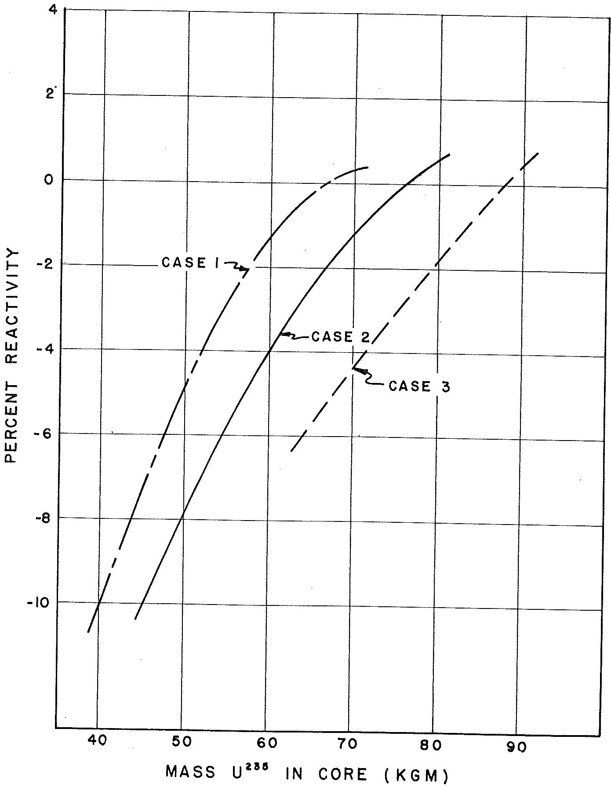  
FIGURE 8-1   
REACTIVITY vs MASS U285   
MEAN TEMP. - 1200°F

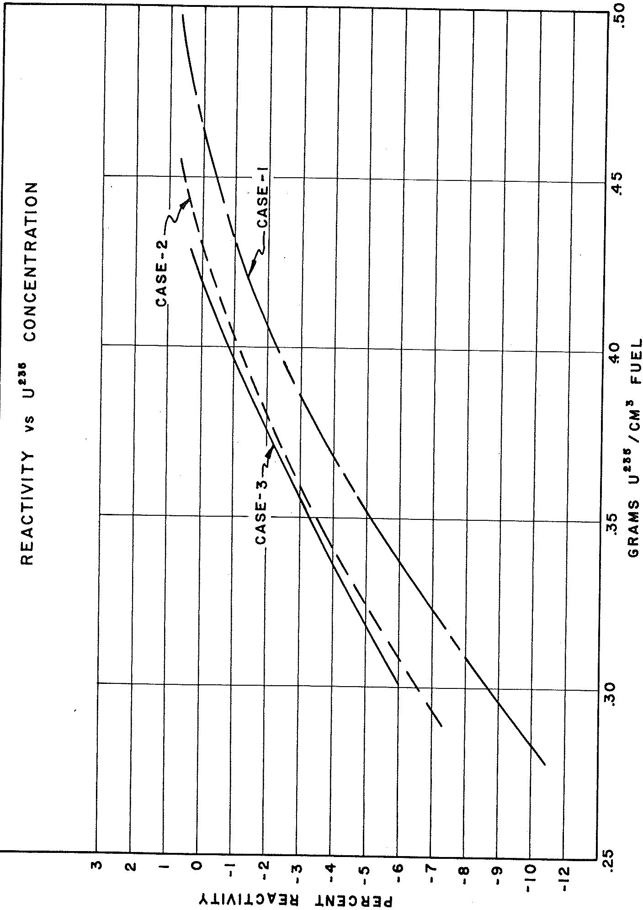  
FIGURE 8-2

TABLE 8.2.2   
RESULTS OF PARAMETRIC STUDY   

<table><tr><td rowspan="2"></td><td colspan="3">CASE NUMBER</td></tr><tr><td>1</td><td>2</td><td>3</td></tr><tr><td>Volume Fractions) Salt</td><td>0.6108</td><td>0.5090</td><td>0.4072</td></tr><tr><td>BeO</td><td>0.3178</td><td>0.4009</td><td>0.4840</td></tr><tr><td>In Core) Inconel</td><td>0.0714</td><td>0.0901</td><td>0.1088</td></tr><tr><td>Mean Core Temperature</td><td>1200°F</td><td>1200°F</td><td>1200°F</td></tr><tr><td>Uranium-235 Mass (KgM)</td><td>90</td><td>72.5</td><td>70.0</td></tr><tr><td>Multiplication Constant (K)</td><td>1.00187</td><td>0.99317</td><td>1.00666</td></tr><tr><td>U-235 Concentration in Fuel (gms/CM³ Fuel)</td><td>0.42445</td><td>0.41030</td><td>0.49511</td></tr><tr><td>Core Fluid Volume (cm³)</td><td>2.1204 x 10^5</td><td>1.767 x 10^5</td><td>1.413 x 10^5</td></tr><tr><td>Percent Fissions - Fast</td><td>10.82</td><td>8.32</td><td>7.33</td></tr><tr><td>Percent Fissions Intermediate</td><td>66.94</td><td>63.27</td><td>61.38</td></tr><tr><td>Percent Fissions Thermal</td><td>22.24</td><td>28.41</td><td>31.29</td></tr><tr><td>Average Power Density (Watts/cm³ Fuel)</td><td>589.5</td><td>707.4</td><td>884.3</td></tr><tr><td>Peak Power Density (Watts/cm³ Fuel)</td><td>831.2</td><td>990.4</td><td>1255.7</td></tr><tr><td>Prompt Temperature Coefficient δK/°F</td><td>-2.63 x 10^-5</td><td>-2.19 x 10^-5</td><td>-1.75 x 10^-5</td></tr><tr><td>Prompt Neutron* Lifetime (Sec)</td><td>1.35 x 10^-6</td><td>1.73 x 10^-6</td><td>1.87 x 10^-6</td></tr></table>

*See Appendix 8.4

This requires the control element to contain both moderating and absorbing materials. One centrally located rod was investigated and 5.4 percent reactivity control (see Table 8.2.3) was obtained with the element containing the following materials: 19 percent by volume Inconel, 24 percent BeO, 40 percent nickel with 1 percent by wt B10 and 17 percent void for rod thimble clearance.

It has been concluded that 5.4 percent control is adequate as a minimum value. (Leave as a minimum, 3.7 percent shutdown margin.) Therefore, only one control element would be required. However, the above design was not considered adequate in that heat transfer across the clearance gap was insufficient.

An alternate consideration immersed the rod in a bath of sodium, filling the clearance gap. Also, the rod thimble would at all times be filled with sodium and upon insertion, displaced sodium would be forced into a small reservoir located outside the pressure vessel. 6.1 percent control was achieved with this system and also 1 percent reactivity was added to the system with no rod penetration. See Table 8.2.3 below.

# TABLE 8.2.3

Void Filled Control Rod Thimble k = 0.98853

Sodium Filled Control Rod Thimble k = 0.99585

Rod at Maximum Penetration with Sodium in Gap k = 0.93786

The specified boron content was only a means of analysis. Due to the damaging metallurgical instabilities resulting from high irradiation exposures of boron in metal, it is recommended that the B-10 equivalence of a Europium Oxide dispersion in nickel be used as control rod material.

This oxide also exhibits more reliable control during operating life in that very large exposures are required to obtain substantial burnup, hence only a small loss in control will be observed upon long exposures. The following data (Ref. 68) indicates this phenomena:

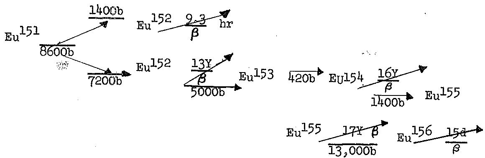

<table><tr><td>Natural Abundance</td><td>Isotope</td><td>Event</td><td>Cross Event (at 2200 M/S)</td><td>Half Life</td></tr><tr><td rowspan="4">47.77%</td><td rowspan="2">Eu151</td><td>(n,γ)Eu152</td><td>7200 b</td><td>Stable</td></tr><tr><td>(n,γ)Eu152*</td><td>1400 b</td><td>Stable</td></tr><tr><td>Eu152</td><td>(n,γ)</td><td>5000 b</td><td>13Y (β)</td></tr><tr><td>Eu152</td><td>β</td><td></td><td>9.3 hr</td></tr><tr><td rowspan="4">52.23%</td><td>Eu153</td><td>(n,γ)</td><td>420 b</td><td>Stable</td></tr><tr><td>Eu154</td><td>(n,γ)</td><td>1400 b</td><td>16Y (β)</td></tr><tr><td>Eu155</td><td>(n,γ)</td><td>13,000 b</td><td>1.7Y (β)</td></tr><tr><td>Eu156</td><td>β</td><td></td><td>15 d</td></tr><tr><td>18.8%</td><td>B10</td><td>(n,α)</td><td>4020</td><td>Stable</td></tr></table>

In a high neutron field it takes 3.3 neutrons to be absorbed, on the average, in an Europium atom before it is lost to the system; only one is required in B-10.

# 8.3 Nuclear Design

Tabulated below are the resultant design conditions of the core.

Table 8.3.1   

<table><tr><td>Power</td><td>125 MW</td></tr><tr><td>Core Volume</td><td>3.471 x 10^5 cm^3</td></tr><tr><td>Filler Volume Fraction</td><td>0.5090</td></tr><tr><td>BeO Volume Fraction</td><td>0.4009</td></tr><tr><td>Inconel Volume Fraction</td><td>0.0901</td></tr><tr><td>Mean Fuel Temperature</td><td>1225°F</td></tr><tr><td>Hot Clean K</td><td>1.0275</td></tr><tr><td>Critical Mass</td><td>71.75 Kgm U^235 in Core</td></tr><tr><td>Excess Mass for ρ= +2.75 percent</td><td>14.00 Kgm U^235 in Core</td></tr><tr><td>Startup U-235 Concentration</td><td>0.48528 gms U-235/cm^3 fuel</td></tr><tr><td>Startup U-235 Inventory</td><td>605 Kgm U-235</td></tr><tr><td>Percent Fast Fissions</td><td>8.29</td></tr><tr><td>Percent Intermediate Fissions</td><td>63.87</td></tr><tr><td>Percent Thermal Fissions</td><td>27.84</td></tr><tr><td>Prompt Temperature Coefficient</td><td>-2.19 x 10^-5 K/°F</td></tr><tr><td>Prompt Neutron Lifetime</td><td>1.92 x 10^-6 Sec</td></tr><tr><td>Average Flux Over Core</td><td></td></tr><tr><td>Fast</td><td>1.33 x 10^15 neutrons/sec cm^3</td></tr><tr><td>Intermediate</td><td>8.14 x 10^14 &#x27;&#x27; &#x27;&#x27;</td></tr><tr><td>Thermal</td><td>1.97 x 10^13 &#x27;&#x27; &#x27;&#x27;</td></tr></table>

Average Power Density 708 Watts/cm³ Fuel

Maximum Power Density 1040 Watts/cm³ Fuel

Total Control Rod Reactivity Worth 6.18 percent $\delta K / K$

(δM/M) Core 7.1

Endurance 4000 Full Power Hours 0.5 percent Burnup

( $\frac{\delta M / M}{\delta K / K}$ System 50

# 8.3.1 Criticality

Critical mass, and uranium concentration in fuel were obtained through a series of problems performed on the ORACLE similar to those described in the parametric study. Due to heat transfer considerations, the mean core temperature was increased to $1225^{\circ}\mathrm{F}$ . Results indicated a critical mass of 71.75 kgm U-235 under hot, clean and unshielded conditions, graphical results are presented in Figure 8.3.

Radial flux and power spatial distributions are presented in Figures 8.4 and 8.5 respectively. Resulting flux distribution indicates the reflector savings in the thermal and intermediate groups through the gradient of the distribution near the reflector boundary.

# 8.3.2 Self Shielding

Disadvantage factors were obtained by diffusion theory methods for the unit cell as defined in Figure 8.6. Both intermediate and thermal group factors were considered, although the intermediate factors were insignificant. These effects were incorporated by defining effective cross sections and expressing the effect as an excess reactivity to the unshielded criticality calculations. A simple perturbation method was used to obtain

FIGURE 8-3   

<table><tr><td rowspan="20">3.002.00PERCENT REACTIVITY1.000.00-1.00-2.00</td><td></td><td>REACTIVITY vs U235 MASSCORE VOLUME FRACTIONS</td><td rowspan="2">MEAN TEMP.-1225°FCORE VOLUME-3.4715 x 105cm3</td></tr><tr><td></td><td>SALT - 0.5090BeO - 0.4009INCONEL - 0.0901</td></tr><tr><td></td><td></td><td></td></tr><tr><td></td><td></td><td></td></tr><tr><td></td><td></td><td></td></tr><tr><td></td><td></td><td></td></tr><tr><td></td><td></td><td></td></tr><tr><td></td><td></td><td></td></tr><tr><td></td><td></td><td></td></tr><tr><td></td><td></td><td></td></tr><tr><td></td><td></td><td></td></tr><tr><td></td><td></td><td></td></tr><tr><td></td><td></td><td></td></tr><tr><td></td><td></td><td></td></tr><tr><td></td><td></td><td></td></tr><tr><td></td><td></td><td></td></tr><tr><td></td><td></td><td></td></tr><tr><td></td><td></td><td></td></tr><tr><td></td><td></td><td></td></tr><tr><td>65</td><td>70</td><td>75</td></tr></table>

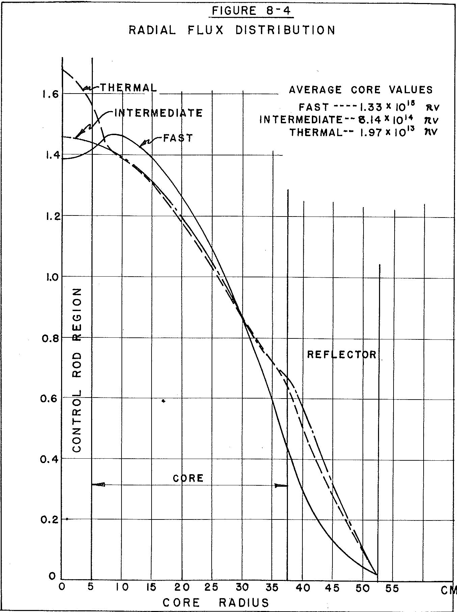  
RADIAL FLUX DISTRIBUTION   
RELATIVE TO AVERAGE CORE VALUE

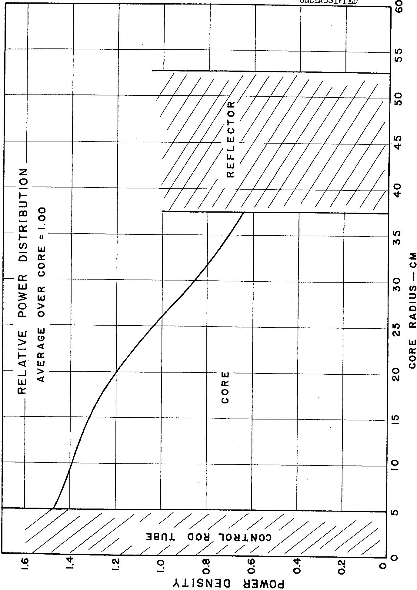  
FIGURE 8-5

FIGURE 8-6

THERMAL FLUX DISTRIBUTION IN UNIT

LATTICE CELL

REGION AVERAGES

BEO-1.100

INCONEL-0.947

SALT-0.633

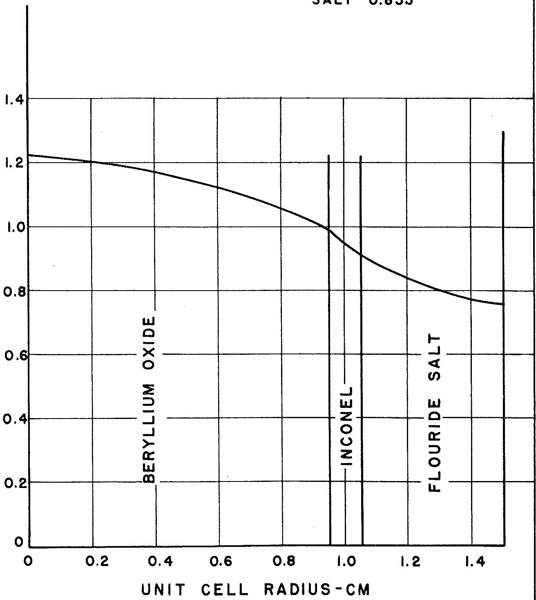  
CELL FLUX RELATIVE TO AVERAGE

these effects. The development of this perturbation technique is presented in Appendix 8.2.

# 8.3.3 Burnup and Fission Product Poisons

One advantageous feature of the large fuel inventory required for this system is the extended endurance of fuel life. The large fuel volume is circulated continuously through the active core and burnup is achieved homogeneously throughout the fuel, thus extending life by approximately a factor of six over a stagnant fluid system.

Endurance in the order of 4000 full power hours is expected as the life of the initial core loading. This represents relatively small burnup (0.5%) periodic additions of fuel are possible and would greatly enhance the lifetime. It is believed the system will operate for the 10,000 full power hours of reactor life, with only minor additions of fuel to the initial loading.

In this analysis, non-volatile fission products were approximated as equivalent to 100 barns of added absorption in the thermal group and 10 barns added absorption in the intermediate group per fission event. It is believed the above approximation results in an over approximation of the non-volatile fission product poisons.

Burnup and fission product poison effects upon reactivity were treated jointly as reviewed in Appendix 8.3. Results are presented in Figure 8.7.

# 8.3.4 Prompt Temperature Coefficient

Value of the prompt temperature coefficient as quoted $(-2.19 \times 10^{-5} \delta K / {}^0\mathsf{F})$ contains the effect of the volume fuel expansion and the shift in the assumed thermal Maxwellian spectral distribution with temperature. Effects of doppler broadening in resonance absorptions were

FIGURE 8-7   

<table><tr><td colspan="12">PERCENT REACTIVITY LOSS DURING LIFETIME DUE TO BURNUP AND FISSION PRODUCT POISONS</td></tr><tr><td>8.0</td><td></td><td></td><td></td><td></td><td></td><td></td><td></td><td></td><td></td><td></td><td></td></tr><tr><td>7.0</td><td></td><td></td><td></td><td></td><td></td><td></td><td></td><td></td><td></td><td></td><td></td></tr><tr><td>6.0</td><td></td><td></td><td></td><td></td><td></td><td></td><td></td><td></td><td></td><td></td><td></td></tr><tr><td>5.0</td><td></td><td></td><td></td><td></td><td></td><td></td><td></td><td></td><td></td><td></td><td></td></tr><tr><td>4.0</td><td></td><td></td><td></td><td></td><td></td><td></td><td></td><td></td><td></td><td></td><td></td></tr><tr><td>3.0</td><td></td><td></td><td></td><td></td><td></td><td></td><td></td><td></td><td></td><td></td><td></td></tr><tr><td>2.0</td><td></td><td></td><td></td><td></td><td></td><td></td><td></td><td></td><td></td><td></td><td></td></tr><tr><td>1.0</td><td></td><td></td><td></td><td></td><td></td><td></td><td></td><td></td><td></td><td></td><td></td></tr><tr><td>0</td><td></td><td>5000</td><td></td><td>FULL POWER HOURS 10,000</td><td></td><td>15,000</td><td></td><td>20,000</td><td></td><td></td><td></td></tr><tr><td colspan="12">PERCENT BURNUP</td></tr></table>

neglected but are expected to be negative also. Ref. 71.

Method of calculating this coefficient involved the investigation of the multiplication constant of identical systems at two temperatures using the 3G3R ORACLE code. Table 8.3.4 presents results.

TABLE 8.3.4   

<table><tr><td>Loading
Kgm</td></tr></table>

<table><tr><td>Temp
oF</td></tr></table>

<table><tr><td>Reactivity</td><td>%</td></tr></table>

72.5

$1200^{\mathrm{o}}\mathrm{F}$

0.2550

72.5

1225

0.2003

# 8.3.5 Xenon Poison

As discussed previously (Sec. 4), the removal of volatile fission products can be achieved with relatively high efficiency in a high temperature, liquid fuel system. Provisions for periodic removal of the volatile matter are incorporated in the system design. Of most concern in estimating xenon poisoning is the efficiency of iodine and xenon removal which in a large extent is dependent upon their solubility in the fuel at these temperatures. If there were no removal of these elements, the steady state poisoning is valued at -0.297 percent reactivity for an average thermal flux of $1.97 \times 10^{13}$ neutrons per $\mathrm{cm}^2$ -sec. Assuming a high degree of removal, the poisoning is approximately as $10\%$ of the steady state value with no removal. Poisoning worth of xenon is evaluated as 0.03 percent in reactivity.

# 8.3.6 Delay Neutron Loss

Circulating fuel reactors suffer from a loss of delay neutrons in that a fraction of the delay neutron precursors undergo neutron emission

in the external fuel circuit. Loop time for the circulating is 1.127 seconds of which 0.287 seconds are spent in the active core. For small loop times compared to the delay times of the neutrons, a valid approximation to the required excess reactivity required to compensate this loss is given by: (Ref. 69)

$$
\rho = \frac {\beta \tau_ {2} / \tau_ {1}}{\mathrm {长}}
$$

where

$\beta =$ Fraction of delay neutrons emitted per neutron emitted from the fission event.

$\tau_{2} =$ Transient time the fluid spends outside the active core.

$\tau_{1} =$ Transient of complete fluid loop

Resultant worth in percent reactivity has been evaluated as -0.56 $\delta$ k/k.

# 8.3.7 Excess Reactivity Required

Tabulated below in Table 8.3.7 are the excess reactivities estimated as required to maintain criticality for 4000 full power hours.

Table 8.3.7   

<table><tr><td>Condition</td><td>δK/K</td></tr><tr><td>Self Shielding</td><td>0.0051</td></tr><tr><td>Burnup and Fission</td><td rowspan="2">0.0158</td></tr><tr><td>Product Poison</td></tr><tr><td>Xenon Poison</td><td>0.0003</td></tr><tr><td>Delay Neutron Loss</td><td>0.0056</td></tr><tr><td>Temperature (+32°ΔF)</td><td>0.0007</td></tr></table>

Total 0.0275

14.0 kgm U-235 addition to the critical mass (71.75 kgms) are required to produce this excess. Total fuel inventory for the initial startup $(\mathbf{k} = 1.0275)$ is 605 kgm of uranium-235.

# 8.3.8 Control Requirements

Under nominal operation during initial startup (no burnup) the control rod must suppress $1.65\%$ in reactivity (burnup, fission products and temperature excess). This requirement places the control penetration into the core as $30~\mathrm{cm}$ . Control curve in Figure 8.8 indicates core reactivity as a function of rod penetration. In obtaining this curve, we have assumed the axial flux distribution as cosine in nature and the positional worth as a function of the flux-squared.

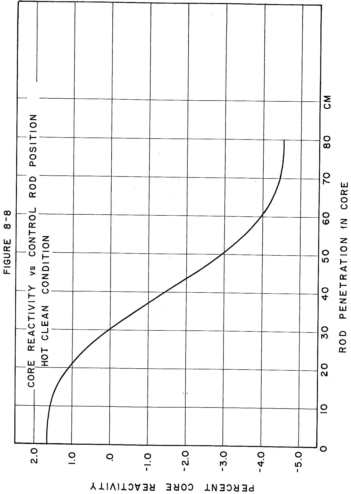

# 9.0 SHIELDING

# 9.1 Introduction

The shielding of HPMR breaks down into two main calculational phases: (1) a neutron physics evaluation of the core, reflector, poison rod region and heat exchanger complex with a flux plot and sodium activation in the secondary salt as end result, and (2) the shielding of the resultant radiations produced by the neutron captures and activation.

The following shield write up gives a look into the general methods used and assumptions made. No attempt is made to give a detailed analysis of the shield calculation complete with sample calculations, etc.

It is assumed that the reader is familiar with the reactor materials and configuration, and reactor compartment arrangement from previous sections (Sections 6 and 7).

# 9.2 Neutron Flux Calculation

The neutron flux in the reactor vessel was approached with two methods. The primary one was with three group-three region ORACLE calculations. The secondary approach was to utilize comparisons of the ORACLE results with multigroup work done on the ART configuration. It should be stated that both these approaches leave much to be desired. The 3G3R ORACLE code is set up for low absorbing systems. In some HPMR regions the absorption is close to the value at which the code will not accept the calculation. Extrapolation of ART multigroup data to HPMR is a bit shaky as the configurations are quite different.

The cross section data and programming methods are the same as described in Section 8.0. The main difference between the reactivity calculations done under Section 8.0 and the ORACLE shielding work was in the choice of regions. Two geometries were programmed. The first took the core as region one, nickel reflector as region two and BeO-Boron poison rod region as region three. This gave a three group flux plot to the outside of the poison region with leakage currents into the Inconel support sheet. The second ORACLE calculation considered the heat exchanger region as a slab, region one, with two inches of Inconel as a symmetric reflector, region two. The absolute values of the three group flux in the core can be determined from reactor power. The more unorthodox problem of establishing the value of the flux in the heat exchanger, a subcritical multiplying system with a delayed plus inside wall leakage neutron source, was done with a two-group, one region hand calculation where only a uniformly distributed emission of delayed neutrons was used as a source. This was checked with another, independent two group one region hand calculation worked out in a different manner. Both calculations gave a fast flux of about $2 \times 10^{12}$ neuts/cc-sec at the heat exchanger centerline. Scaling up the ART multigroup flux taking into account the increase in heat exchanger thickness of HPMR over ART and summing into two group energy intervals gave a fast flux value of roughly $2.5 \times 10^{12}$ neuts/cc-sec.

Looking at the results of these three calculations a flux value of $2.3 \times 10^{12}$ was chosen as a flightly conservative value of centerline fast flux (group one plus group two of three groups) due to delayed neutrons and fission neutrons in the heat exchanger.

A three group flux plot through the reactor pressure vessel wall was then constructed from the flux distribution given by the ORACLE calculations and the absolute centerline flux values found as described in the above paragraph. From the centerline of the core through the BeO-Boron poison region this was a straight normalization. In the Inconel support sheet, thermal shield, pressure vessel, and the heat exchanger, exponential attenuation was assumed with the same slope as in the nickel reflector and BeO-Boron poison region. This is justifiable on the basis of ORACLE results in which the fast neutron attenuation through the nickel and BeO-Boron region was approximately the same, indicating the slope is not a strong function of material. To the three group exponentials were added the heat exchanger flux values taking into account a subcritical multiplication of 1.43 from an ORACLE estimate of K of 0.3. The resultant summation is represented in Figure 9-1A by the flux to the outside of the pressure vessel. The flux through the thermal shield was determined essentially by diffusion theory from the ORACLE computations. From the pressure vessel to the outside of the secondary shield, removal cross sections and lid tank plots were used.

The fast and epithermal groups ( $\phi_{1}$ and $\phi_{2}$ on Figure 9-1A) were summed together and removal cross sections used for attenuation through the one inch of inner shield tank steel and five inches of primary shield lead. ART lid tank data were utilized from the lead water interface on out through the water. The lid tank ANP mockup was a reflected moderated configuration and substituted one foot of beryllium in lieu of HPMR's 6 inches of nickel, 5-1/4 inches of BeO-Boron poison and 3/4 inches of Inconel. The ART mockup

only allowed for a 4 inch versus HPMR's 10 inch heat exchanger and 4-1/2 inches of lead as against HPMR's 5 inches. However, it was the closest mockup configuration with neutron flux data available. The energy spectrum emerging from the mockup lead and HPMR should not be too greatly different as the same main elements are present although in different volume fractions. The relation between fast and thermal flux was taken from work done in Reference 73. However, the thermal flux plot presented in this report does not compare with the shape of that of Reference 73, as Figure 9-1B is based on more recent information and does not contain the Hurwitz plane to sphere transformation. Lid tank and shield tank water was $1.45\%$ boron. The flux plot shown in Figure 9-1B then reflects the shape of the above mentioned flux distributions combined with the absolute fast flux value at the lead water interface as determined by removal cross section attenuation of the ORACLE based flux in the thermal shield. Absolute values of thermal flux were then known in the thermal shield and at the lead water interface (by relation to the fast flux). The thermal flux distribution between these points were estimated from inspection of WAPD's FLW flux plot where a similar configuration existed.

As reported in Reference 73, the fast neutron flux relaxation length approaches a constant as a function of distance in water at water thicknesses on the order of $140$ centimeters or greater. Lid tank thermal data only went out $140$ centimeters in water. From ART neutron shield work it was assumed that the thermal neutrons reached an equilibrium state with the fast flux at about $140$ centimeters of water. In the shield design, as shown in Figure 9-lB, exponential attenuation was used for fast and thermal neutron flux beyond $240$ centimeters radius.

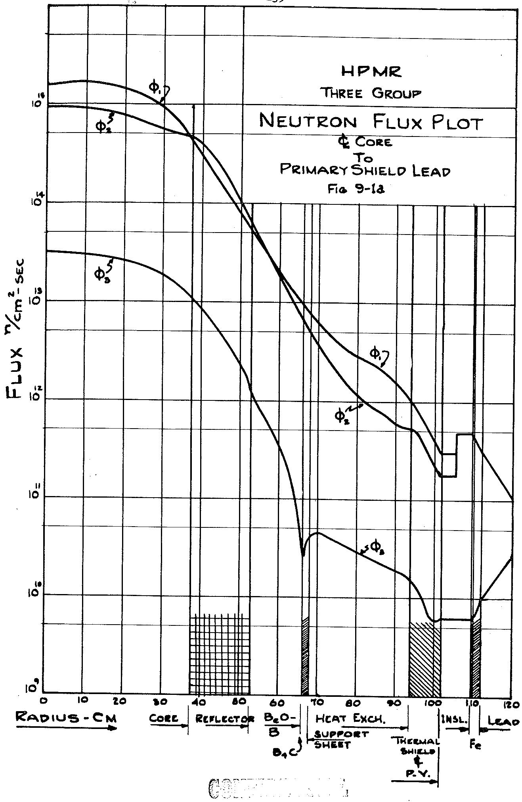

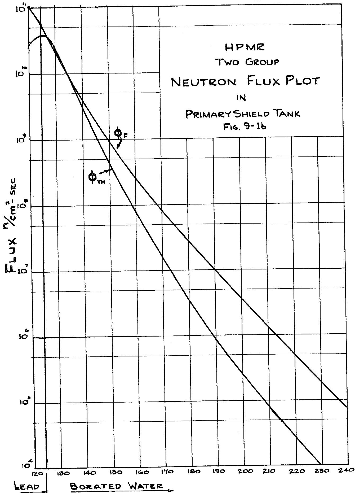

A fast and thermal neutron flux distribution was estimated through the north head into the primary shield plug based on the behavior of the ORACLE calculated horizontal flux through the heat exchanger. This was used to determine thickness of shielding needed above the reactor.

# 9.3 Secondary Salt Sodium Activation

With the neutron flux situation estimated in the heat exchanger the secondary salt sodium activation was determined as the gamma source strength in designing the secondary shield.

The average flux in the heat exchanger was calculated by numerically integrating the three group heat exchanger flux (as shown in Figure 9-1A) in a radial direction and then dividing by the heat exchanger thickness. No credit was taken for flux distribution in an axial direction as this would have been at best a rough estimate. Neglecting axial flux distribution was the conservative approach.

Sodium cross sectional data was taken from Reference 61 and was converted into three group averages as done in Section 8.0. This was checked by independently three group averaging some earlier unpublished Curtiss-Wright multigroup cross sections. Both averages accounted for the sodium resonance peak at 300 kev.

Knowing the atomic density of sodium in the secondary salt, and the three group averaged cross sections and flux, the activation was determined by their product:

$$
\begin{array}{l} N = \text {a t o m i c d e n s i t y o f s o d u i m i n s e c o n d a r y s a l t} \\ = \frac {\left(\mathrm {Wt} \% \mathrm {Na} \text {in salt}\right) \rho_ {\mathrm {salt}} \times .6023 \times 10 ^ {24}}{23} \\ = 9. 4 6 \times 1 0 ^ {2 1} \\ \end{array}
$$

$$
\begin{array}{l} A = \text {a c t i v a t i o n s} / \mathrm {c c} - \sec \\ = \mathrm {N} \sigma_ {\mathrm {a}} \bar {\phi} \\ \end{array}
$$

<table><tr><td>Energy Group</td><td>φ</td><td>σa(Barns)</td><td>A</td><td>Percent</td></tr><tr><td>1</td><td>3.52 x 1012</td><td>2.1 x 10-4</td><td>7.0 x 106</td><td>1.66</td></tr><tr><td>2</td><td>1.70 x 1012</td><td>2.1 x 10-2</td><td>337.5 x 106</td><td>81.14</td></tr><tr><td>3</td><td>3.0 x 1010</td><td>2.53 x 10-1</td><td>71.6 x 106</td><td>17.20</td></tr><tr><td></td><td></td><td></td><td>416.1 x 106</td><td></td></tr></table>

This gave a value of 4300 curies total activation when multiplied by the volume of salt in the heat exchanger (13.5 cu ft) and divided by $3.7 \times 10^{10}$ .

# 9.4 Dose Tolerance Levels

The basis for the HPMR is a maximum dose rate of 300 mrem/week and 20 hour a week access time to spaces immediately adjacent to the reactor compartment (auxiliary engine room aft and above and the storage compartment in old fuel oil deep tank forward of the reactor compartment). Ten percent of this is maximum allowed fast neutron dose. Reduced to terms of mrem per hour, this is a total of 15 mrem/hr with not more than 1.5 mrem/hr in neutron dose. This set a fast neutron flux limit of 15 neutrons per cm² per sec taking the predominant neutron energy at 0.5 mev became the fast neutron source is mainly from delayed neutrons born in the heat exchanger. A flux of 10 n/cm²-sec at 0.5 mev is taken as giving one mrem/hr (AEC Standards For Protection Against Radiation, Part 20 of Title 10 of the code of federal regulations, February 28, 1957).

# 9.5 General Shield Arrangement

At this point the steam generating equipment sizes had been firmed up to the extent that a reactor compartment arrangement could be worked out. This was done with compactness and minimum shielding weight as the criteria with maximum use of the available fuel oil for shielding purposes. The arrangement chosen placed the reactor with primary shield tank forward and steam generating equipment aft. This layout allowed a smaller primary shield tank, as the steam generators helped shadow shield the gamma and neutron leakage from the primary shield tank. Fuel oil attenuated this leakage out the forward, port, and starboard sides of the shield tank.

The fast neutron dose determined the thickness of hydrogenous material required to attenuate to tolerance dose level (Section 9.4). Approximations of the gamma dose with simplified geometries and source energies determined the predominant radiations and gave estimates of lead thicknesses. With estimates of secondary shield thicknesses the general shielding arrangement shown in Figure 9-3 was laid out with a judgement estimate of the best proportion of shield material in primary shield to shield material in secondary shield.

In light of a last minute alteration (Reference 73) in the shape of the fast neutron attenuation curve in water (this change is incorporated in Figure 9-1B) a foot of polyethylene should be packed around the after side of the shield tank at locations not shadow shielded by steam generating equipment as shown in Figure 9-3. This will have to be fitted around existing piping as it was not allowed for in the original arrangement.

FIGURE 9-2   
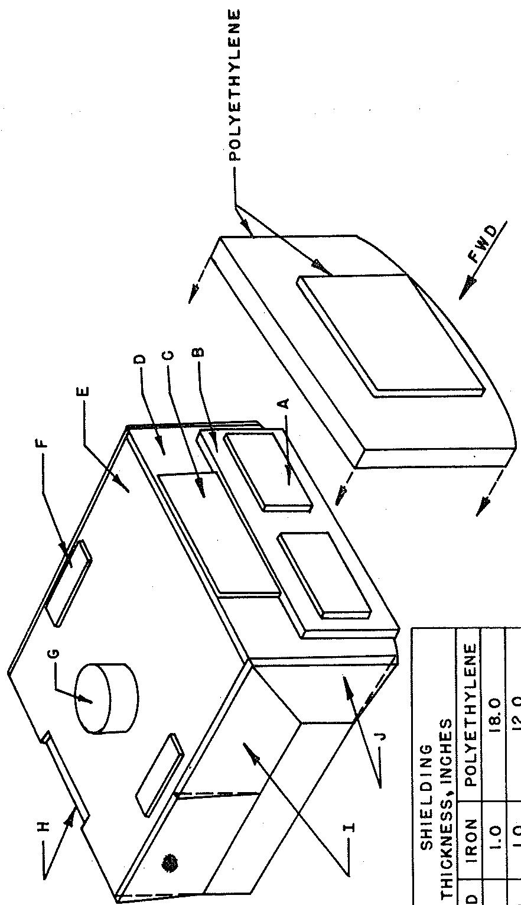  
TAPERED FROM   
4 TO O INCHES

<table><tr><td></td><td colspan="3">SHIELDING
THICKNESS, INCHES</td></tr><tr><td>POINT</td><td>LEAD</td><td>IRON</td><td>POLYETHYLENE</td></tr><tr><td>A</td><td>6.5</td><td>1.0</td><td>18.0</td></tr><tr><td>B</td><td>6.0</td><td>1.0</td><td>12.0</td></tr><tr><td>C</td><td>4.75</td><td>1.0</td><td>12.0</td></tr><tr><td>D</td><td>4.25</td><td>1.0</td><td>12.0</td></tr><tr><td>E</td><td>6.5</td><td>1.5</td><td>0</td></tr><tr><td>F</td><td>7.5</td><td>1.5</td><td>0</td></tr><tr><td>G</td><td>1.5</td><td>0.5</td><td>6.0</td></tr><tr><td>H</td><td>4.0</td><td>1.5</td><td>0</td></tr><tr><td>I</td><td>4.0*</td><td>0.75</td><td>0</td></tr><tr><td>J</td><td>4.0#</td><td>0.75</td><td>0</td></tr></table>

ORNL-LR-Dwg.-25762

2015年4月16日

SECONDARY SHIELD

SCHEMATIC SKETCH

USED FOR WEIGHT ESTIMATION

USED FOR WEIGHT ESTIMATION

# 9.6 Primary Shield

The primary shield designed for adequate fast neutron attenuation and with estimated gamma attenuation was then checked in more detail for adequate gamma attenuation. All gamma sources listed in Table 9-1 were considered with the energy distribution indicated in the table and with a simplified source shape most closely approximating the actual source geometry. Formulations as given in Rockwell's shield design manual (Ref. 33) for lines, disks, cylinders and truncated cones with uniform and exponential source distributions were used. All dose values below .0005 mr/hr outside the secondary shield were neglected. The gamma dose from fission products in the heat exchanger, prompt gammas in core and heat exchanger, and water-lead capture gammas in the primary shield tank were considered in more detail as described below.

The fission products constitute an important radiation source as they are rapidly circulated with a reactor cycle time of 1-2 seconds. This invalidates nuclear data on gamma energies and decay times. Therefore, the energy group breakdown presented in Reference 74 was used which takes into account 4.9 of the roughly 5.9 mev total available. This difference is considered to decay before the fuel leaves the core. Saturation of long lived fission products is assumed which is conservative in this case. The predominant energy was found to be 3.2 mev for HPMR shield thicknesses.

The prompt fission gamma dose was calculated by an energy integration under the continuous fission spectrum from .1 to 7.46 mev. A mean value for the HPMR shield was found to be 2.85 mev by running a series of energies assuming all prompt gammas at that energy.

The energy situation for the lead and water is firm at 7.0 and 2.23 mev. However the source geometry becomes an important factor, especially in the case of water where the source distribution (thermal flux) varies very rapidly and cannot be completely fitted with a simple sum of exponentials. Both radiations together contribute $80\%$ to that dose outside the secondary shield which comes from gamma radiation leakage from the primary shield tank. The geometry was handled by numerically integrating the dose contributions from unit line sources into contributions from unit cylindrical surfaces in the primary shield tank. These cylindrical surfaces of different radii were then numerically integrated into the total dose contribution from the lead and water volumes. This method essentially gives an exact geometrical representation to within the accuracy of Simpson's rule for numerical integration.

Three directions from the reactor vessel to the outside of the secondary shield were considered. One horizontal shot out through the primary shield tank and secondary shield to the aft face of the after reactor compartment bulkhead, and a vertical computation through the north head, shield plug and top hat were done in some detail. Another horizontal calculation forward through the fuel oil shield tank was done for lead capture gammas in detail with estimates for water capture and heat exchanger fission product gammas. The results are tabulated in Table 9.1.

# 9.7 Secondary Shield

The activation of the sodium in the secondary salt required that a secondary shield be placed around the steam generating equipment. The overall dimension of this shield were established by the estimated volume

requirements of the reactor and primary shield, the steam generators, and the superheaters. A plan view of the arrangement of this equipment within the secondary shield is shown in Figure 7.3. The resulting shield is box-shaped with internal dimensions of $23' \times 24' \times 15'$ high. (Figure 9.2).

The thicknesses of shielding required were then calculated for a maximum dose of 15 milliroentgen per hour on the outer surface of the top and aft faces of the shield. It was assumed that fuel on water would be used to aid in the attenuation of radiations from the forward and side faces of the shield, as described earlier.

Except for directly over the reactor, the amount of secondary shielding required was determined mainly by the secondary salt activity. The primary shield is relatively highly effective in shielding reactor sources. The total activity of 4300 curies introduced into the salt in the primary heat exchanger was assumed to be distributed in the steam generating equipment in proportion to the ratio of the volume of salt contained in any particular component to the total salt in the system. The individual volumetric source strengths were then obtained by dividing the curies of activity of the salt in a component by the volume of that component. Thus

<table><tr><td>location</td><td>% of total salt</td><td>activity, curies</td><td>activity4 decays/cm3sec</td></tr><tr><td>superheaters</td><td>20.7</td><td>890</td><td>2.01 x 107</td></tr><tr><td>steam generators</td><td>36.0</td><td>1550</td><td>1.58 x 107</td></tr><tr><td>salt lines</td><td>36.0</td><td>1550</td><td>6.33 x 107</td></tr><tr><td>primary H X</td><td>7.3</td><td>310</td><td>(not contributing)</td></tr></table>

This assumption was recommended by ORNL personnel working with similar systems, and appears justified in view of the relatively long half-life of sodium (15 hr) compared to the secondary salt cycle time (10 sec). It was further assumed that the U-tube geometries of the superheaters and steam generator could be replaced by a straight cylindrical sources of equivalent volume. The self-attenuation of these sources was determined by homogenizing the salt and tube bundles within each cylinder, and by computing mass attenuation coefficients for the sodium gamma ray decay energies of 1.38 and 2.76 mev. The approximation of: replacing the cylindrical sources by equivalent line sources was used, and Peeble's correction was applied to calculations involving slant penetration through the shield.

Using these assumptions, the thickness of shielding required was calculated for eight points in the secondary shield and estimated for three more. It was attempted to select points which would give an indication of the shielding required for the areas receiving both the largest and the smallest irradiations. Time did not permit a more extensive study.

The "hottest" points on the inner surface of the secondary shield were found to be (1) on the aft face of the shield near the primary heat exchanger, (2) on the top face of the shield over the secondary salt pumps, where salt lines are near the surface, and (3) directly over the reactor. The most lightly irradiated point appeared to be in the middle of the front face. Polyethylene was added to the aft face of the shield to attenuate fast neutron leakage which could stream aft between the steam generators. In estimating the lead thicknesses required, it was first assumed that steel structure would be necessary to support the lead in the following

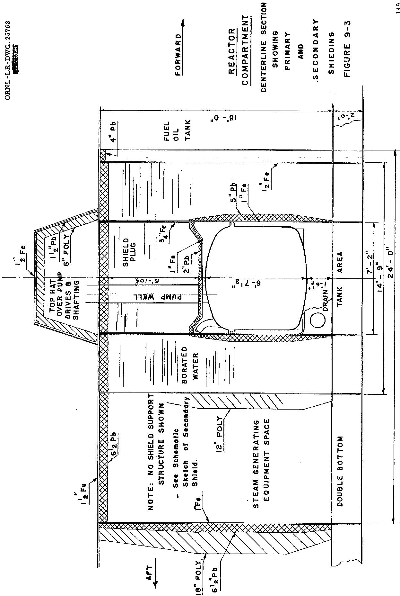

amounts: (1) 1 in. on front and aft faces, (2) $3/4$ in. on side faces, and (3) $1 - 1/2$ in. on top face.

It appeared that the primary radiation reaching the forward face would be from the superheaters. Therefore, it was believed advisable to provide shadow shields for the superheaters directly rather than add lead to the larger area of the front face.

A "top hat" of additional shielding is required directly above the reactor, to enclose the control rod drive and the primary fuel pumps. This shields against neutron and gamma streaming and leaking through pump well and control rod penetrations of the primary shield tank plug.

The resulting shield is shown schematically in Figure 9-2. For reasons of shortage of time and case of weight estimation, the shield is represented by slabs rather than by contoured thicknesses. This assumption is believed to be conservative, and hopefully counter balances the omission of additional shielding for plumbing penetrations. The total estimated weight of the secondary shielding, including the steel mentioned above, is estimated to be 456,120 lb.

# 9.8 Summary and Recommendations

The controlling radiation in this reactor is fast neutron flux. High fluxes in the core inelastic scattered in the nickel reflector and elastically scattered in the BeO-Boron poison region are multiplied again in the relatively thick heat exchanger region to become a determining radiation source. Fuel oil, which is a good hydrogenous fast neutron attenuation, was used to shield this source on the front and sides. Gammas born in the core are pretty well stopped by the nickel reflector before they start, but

fission product gammas born in the heat exchanger from a fast cycling, high power density fuel add up to a twenty percent dose contribution outside the secondary shield depending on the length of time of operation. The high fast neutron flux is also influential in its secondary effect of thermalization and capture in the primary shield tank lead and water. The 1.45 percent borated water helps the water capture gamma dose by roughly factors of ten to one hundred. Lead capture gamma dose is roughly 17 percent, and water captures contribute about 56 percent of the total dose outside the polyethylene in the auxiliary engine room.

Structural material activations were not considered for the shutdown condition as they were assumed to be masked by the sodium activation.

The resultant weights tabulated in the weight section are 6.4 lbs/shp for the primary shield and 14.4 for a total of 20.8 lbs/shp.

In the primary shield tank the use of a two-inch thick cylindrical ring of lead about 15 in. from the existing lead is recommended. This would shield the lead and water capture gammas in the high thermal flux region and offer a means of cutting down on the fuel oil required to shield these secondary gammas.

If time had permitted another reactor compartment arrangement, space should be made for putting the 30 in. of polyethylene around the after side of the primary shield tank to eliminate the 18 in. on the after bulkhead.

A quick look was taken at the shield weight for the case if no fuel oil was used for shielding. Two reactor compartment arrangements were considered. One used additional lead and water shielding on the existing reactor compartment bulkheads and the other used a larger primary shield

tank and no water or polyethylene on the bulkheads. Both systems were designed to reduce radiation to the levels stated in Section 9.4 and gave an additional shield weight of about 10 lbs/shp. This gives a total shield weight for a two-reactor all nuclear ship of roughly 31 lb/shp. However, no advantage was taken for rearrangements of machinery. Also dose levels were reduced to same value on all sides of the reactor compartment.

TABLE 9.1   
PRIMARY SHEILD TANK LEAKAGE DOSE VALUES   
OUTSIDE THE SECONDARY SHIELD   
(mrem/hr)   

<table><tr><td>Source</td><td>Type</td><td>Mean Energy Mev</td><td>Auxiliary Room Forward Bulkhead</td><td>Auxiliary Room Above Reactor</td><td>Compartment Forward of Fuel Oil Shield</td></tr><tr><td rowspan="5">Core</td><td>Prompt</td><td>2.85</td><td>0.00132</td><td>0.020</td><td></td></tr><tr><td>Na Decay</td><td>1.38 2.76</td><td></td><td></td><td></td></tr><tr><td>Fuel Capture</td><td>varied</td><td></td><td></td><td></td></tr><tr><td>Be Capture</td><td>6.00</td><td></td><td></td><td></td></tr><tr><td>Inconel Cap-ture</td><td>8.37</td><td></td><td></td><td></td></tr><tr><td rowspan="2">Reflector</td><td>Nickel Cap-ture</td><td>8.37</td><td></td><td></td><td></td></tr><tr><td>Nickel Inelastic scatter ~1.5</td><td></td><td></td><td></td><td></td></tr><tr><td rowspan="5">Heat Exchanger or North Head</td><td>Prompt</td><td>2.85</td><td>0.007</td><td>0.017</td><td></td></tr><tr><td colspan="2">Fission Product Spectrum</td><td>0.145</td><td>1.032</td><td>0.2</td></tr><tr><td>Na Decay</td><td>1.38 2.76</td><td>0.025</td><td>0.063</td><td></td></tr><tr><td>Nickel Cap-ture</td><td>8.37</td><td>0.003</td><td>0.050</td><td></td></tr><tr><td>Fuel Capture</td><td>varied</td><td></td><td></td><td></td></tr><tr><td>P.V. and thermal Shield</td><td>Nickel Cap-ture</td><td>8.37</td><td>0.012</td><td>0.068</td><td></td></tr><tr><td rowspan="3">Shield Tank</td><td>Fe Capture</td><td>7.2</td><td></td><td></td><td></td></tr><tr><td>Pb Capture</td><td>7.0</td><td>0.123</td><td>0.33</td><td>12*</td></tr><tr><td>H2O Capture</td><td>2.23</td><td>0.408</td><td>0.99</td><td>0.5</td></tr><tr><td></td><td></td><td></td><td>0.724</td><td>2.549</td><td>12.7</td></tr></table>

10.0 THE HEAT BALANCE AND GENERAL ASPECTS OF THE STEAM SYSTEM

# 10.1 Introduction

In this section is included the schematic diagram, Figure 10.l, of the steam flow and the heat balance. The diagram gives the steam flow, the temperatures, and molten salt flow for a reactor power of 95.9 megawatts. This is the reactor power necessary to supply sufficient steam for the full power of 35,000 shaft horsepower.

Most of the equipment shown on the diagram has received comment and description in other sections of this report. In this section some brief additional comments will be made and a comparison of the efficiencies of the oil fired steam generating system and the reactor driven steam system will be undertaken.

# 10.2 The Steam Requirements

The heat balance for the steam system was taken from an actual test of a class 931 destroyer. To drive the turbines at full power, 218,760 lb/hr of steam at $950^{\circ}\mathrm{F}$ and 1200 psig (h = 1470 BTU/lb) is needed. This was the starting point for the heat balance. In the previous sections the pumping powers for the reactor fuel, the molten salt coolant, and the recirculating boiler water have been calculated. It was decided to drive these pumps with turbines using superheated steam in order to have a smaller unit within the secondary shield. A turbine-pump efficiency of $60\%$ is assumed and the pumping power was multiplied by a factor of 1.25. The feed water pumping power is not changed since the feed water rate is the same as in the oil fired system. The feed water pumps are also driven

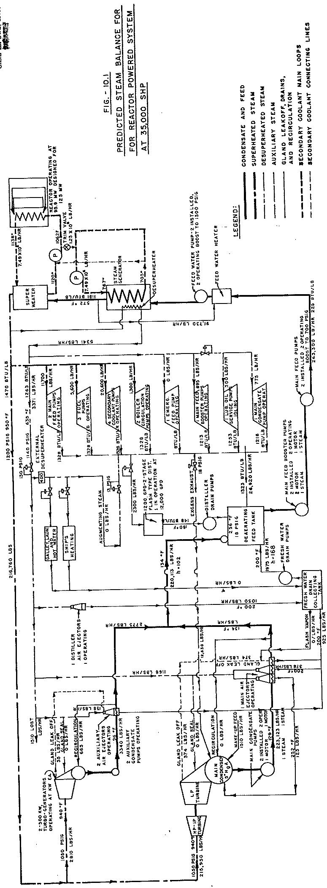

by superheated steam. The superheated steam requirements for the reactor system are summarized in Table 10.1.

# TABLE 10.1

# SUPERHEATED STEAM REQUIREMENTS

I. Turbine and Turbo-generators - 218,760 lb/hr

II. Pumps:

(1) Reactor Fuel - - - - - - - 150 P HP   
(2) Molten Salt - - - - - - - 550 P HP   
(3) Recirculating Water 35 P HP

Total - - - - - 735 P HP

Steam Required 1.25 x 2545 (BTU/hr)/hp x 735 hp 27,500 lb/hr .6(1470 - 1328) BTU/lb

III. Feed Water Pumps 11,700 lb/hr

Total Superheated Steam - - - - - - - - - 257,960 lb/hr

Desuperheated steam is required in the galley, the air ejectors, feed booster pumps, lube oil pumps and condensate pumps. Desuperheating is achieved in the steam drums by cooling superheated steam in tubes that pass through the saturated water in the drums. The steam is cooled from $950^{\circ}\mathrm{F}$ , 1200 psig to $625^{\circ}\mathrm{F}$ , 1165 psig. The desuperheated steam requirements are summarized in Table 10.2.

# Table 10.2

# DESUPERHEATED STEAM REQUIREMENTS

Air ejectors, galley, leaks, etc. 3,371 lb/hr

Feed booster pump 895

Lube Oil pumps 300

Condensate pumps 775

Total - - - - - - - - - - 5,341 lb/hr

# 10.3 Condensate and Exhaust Heat

The deaerating feed tank collects exhaust from some of the auxiliary equipment and it also receives the condensate. From the DAFT is drawn the feedwater which supplies the steam generating system. In order for the deaeration to be complete, the pressure in the DAFT should not exceed 18 psig. The enthalpy of the saturated liquid at this pressure is 225 BTU/lb. This is the enthalpy assumed for the feedwater entering the steam generating system.

The DAFT is unable to handle the exhausts at full power steam flow so it is necessary to run a portion of the exhaust directly to the condenser. This excess exhaust is 12,530 lb/hr at full power. This is slightly higher than the oil-fired systems 11,570 lb/hr; therefore, a small increase in condenser capacity may be necessary to handle this additional flow.

A summary of the exhaust and condensate flows and their respective enthalpies as they enter the DAFT is given in Table 10.3.

TABLE 10.3   
HEAT ENTERING THE DAFT   

<table><tr><td>From:</td><td colspan="2">w(1b/hr)</td><td>h(BTU/1b)</td></tr><tr><td>Feed and Circulation Pumps</td><td>36,900</td><td>at</td><td>1,328</td></tr><tr><td>Feed Booster Pumps</td><td>895</td><td>at</td><td>1,213</td></tr><tr><td>Lube Oil Pumps</td><td>300</td><td>at</td><td>1,253</td></tr><tr><td>Condensate Pumps</td><td>775</td><td>at</td><td>1,218</td></tr><tr><td>Fresh Water Drain Pumps</td><td>1,975</td><td>at</td><td>168</td></tr><tr><td>Condenser</td><td>220,113</td><td>at</td><td>102</td></tr><tr><td>Distillers</td><td>2,300</td><td>at</td><td>148</td></tr><tr><td colspan="4">HEAT LEAVING THE DAFT</td></tr></table>

Boiler Feedwater - - - - - - - - 263,258 lb/hr at 225 BTU/lb

# 10.4 Heat Addition in the Steam Generating System

The steam generating system must add sufficient heat to bring 257,960 lb/hr of water at an enthalpy of 225 BTU/lb up to steam at an enthalpy of 1470 BTU/lb plus 5,340 lb/hr of water at 225 BTU/lb to steam at 1263 BTU/lb. This total heat addition is $3.272 \times 10^{8}$ BTU/hr or 95.9 megawatts.

In the reactor system a feedwater heater is needed to do the job that an economizer does in an oil fired system. Feedwater from the DAFT at 18 psig is raised to a pressure of 700 psig by conventional boiler feed pumps and fed into the feedwater heater. Here, saturated steam at 1250 psia is mixed with the feedwater to produce water at $486^{\circ}\mathrm{F}$ . It takes 91,730 lb/hr of saturated steam to achieve this. The $486^{\circ}\mathrm{F}$ water is now pumped to a pressure of 1500 psia and let down by throttling to the boiler pressure of 1250 psi. The feedwater heater forms an integral part of the steam generating system and with the saturated steam used for the heating forms a closed loop within the system.

As has been stated in previous sections, the heat addition to the steam generating system is by means of a molten salt. This salt drops $17.9^{\circ}\mathrm{F}$ in temperature in the superheater and $58.8^{\circ}\mathrm{F}$ in the steam generator at a flow rate of $7.49 \times 10^{6} \mathrm{lb/hr}$ . These temperature drops and flow rates represent an input of $3.272 \times 10^{8} \mathrm{BTU/hr}$ .

# 10.5 Comparison of Efficiencies

No attempt to compare thermal cycle efficiencies will be made here but only a simple calculation of the gross power-plant heat rate. For the reactor system:

# Heat Input

gross power plant heat rate = Shaft Horsepower

$$
\begin{array}{l} = \frac {3 . 2 7 2 \times 1 0 ^ {8} \mathrm {B T U / h r}}{3 5 , 0 0 0 \text {s h a f t h o r s e p o w e r}} \\ = 9, 3 4 0 \mathrm {B T U} / \mathrm {s h p - h r} \\ \end{array}
$$

For the conventional oil fired system:

gross power plant heat rate = 3.108 x 10 $^{8}$ BTU/hr/35,000 shaft horsepower

$$
= 8, 8 9 0 \mathrm {B T U} / \mathrm {s h p - h r}
$$

The reactor system does require more heat input because the additional pumping power required for the molten salt and recirculating water is greater than the power required for the fuel oil pumps and forced draft blowers.

# 11.0 OVERALL POWER PLANT PARTICULARS

# 11.1 Introduction

In order to determine the overall feasibility of a fused salt reactor installed in a particular class ship, it is necessary to consider all of the components in the complete system. A preliminary piping layout and drawings of the steam generating equipment are included in Section 7.0. Rough sketches of the primary and secondary shields are also presented in the shielding section (9.0). To completely determine the suitability of the resulting power plant, it is then necessary to investigate the installation as to its effect on the ship's overall construction, balance, etc.

In addition, it is also necessary to consider operating problems such as control, emergency operation, and maintenance.

# 11.2 General Arrangement

A brief study of the possible layout of steam generating components within the reactor compartment and the location of the reactor compartment in the ship was made with minimum shield weight as the major consideration. No detailed optimization was attempted but rather judgement was used as to the relative sizes and location of the primary and secondary shield. Given the decision of only replacing one oil fired plant with nuclear power, arrangements were worked up using fuel oil as part of the shielding. As pointed out in the shielding section, fast neutrons are the primary radiation problem in this system. A hydrogenous liquid like fuel oil takes the place of polyethylene and serves double duty as fuel for the oil fired plant.

# Arrangement One

On first look, the best location for the reactor compartment seems to be the aft fire room where accessibility for removal of reactor components is done through the upper deck. However, preliminary estimates of steam generating equipment sizes indicated a larger reactor compartment than shown in the final design was required. To prevent propeller shaft penetration of the aft reactor compartment, the compartment would have had to move off centerline to such a degree that battle damage stability problems would arise. Therefore, arrangement one (see Figure 11-1) was worked out with the reactor compartment in the forward fire room. Provision for removal of the primary shield tank plug and reactor vessel could be worked out through a side port, as there is twelve feet of clear height between the top of the secondary shield and the main deck. If removal through the main deck is dictated, the bridge superstructure would have to be removed.

In locating the exact position of the reactor compartment, use of existing bulkheads and deep web frames were made. The forward boundary of the compartment is existing bulkhead 63 and the after boundary is deep web frame 75. Tying into existing main structural members minimizes additional support structure in the nuclear power conversion.

A weight and moment study was made on arrangement one. The weights and moments of the boiler plant were replaced with the reactor system including fuel oil shielding tanks. Fuel oil was distributed in the existing after fuel oil and ballast tanks to balance the forward moment produced by the increased weight of reactor compartment over the boiler com

ponents. Results of this study showed that if just the deep tanks aft of the after engine room were used, a resultant trim of 1.94' by the stern is produced as compared with a 1.63' trim by the stern for a completely conventional oil fired destroyer. This gives a total of 391 tons of fuel oil compared with $728.5/2 = 364.3$ tons per one oil fired plant. As fuel is burned out of three after tanks, the ship evens out. When the stern rises to the point where propeller emergency or sea keeping ability becomes a problem, sea water ballasting will be needed in these empty after tanks.

Even though the fused salt system has a vertical center of gravity 4.5 feet below the boiler plant, the total nuclear powered ship C. G. stays about the same due to emptying 173 tons from the relatively low fuel oil and ballast tanks forward. Since the total ship weight and free surfaces stay about the same, the free surface corrected metacentric height (indication of ship stability) of about 3.2 feet stays about equal to the conventional DD931. Moment calculations showed that the exact change in metacentric height was sensitive to more exact values of weights and centers of gravity than could be calculated for the miscellaneous items in this feasibility study.

# Arrangement Two

The finalized reactor compartment width was reduced to 23 feet. This reduction allows the possibility of locating the nuclear plant in the after engine room with only three to four feet of off centerline required to avoid the forward propeller shaft. This is shown in arrangement two (see Figure 11-1). With fuel oil shield tanks on both sides of the reactor compartment, the danger of serious list if damaged is lessened. A detailed

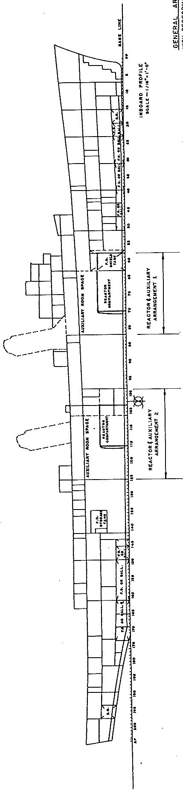  
ORNL-LR-DWO,28765 CONFIDENTIAL

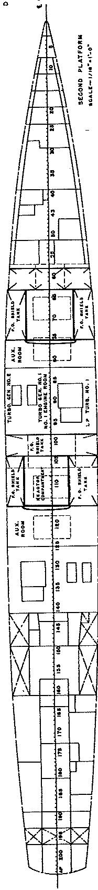  
GENERAL ARRANGEMENT   
HIGH PERFORMANCE MARINE R   
DD93I CLASS DESTRO   
FIGURE NO. II-1   
$\therefore m - 1 \neq  0$ ;   
$\left( {x{t}^{2} - 5{t}^{2}}\right) x + {y}^{2} = 4\left( {x{t}^{2} - 5{t}^{2}}\right) x + \left( {3 - t}\right) y = 0$   
10 5   
$\therefore m : x = 1$ 或 ${3x} + {4y} + 1 = 0$   
SECONDPLATEFORM   
BACLE-1/10"°-0

damage stability evaluation should be made before arrangement two can be recommended with certainty, but aside from damage contingencies, the arrangement offers the advantage of putting the heavy, concentrated weight of the reactor compartment near the C. G of the ship, thereby requiring less fuel oil, 303 tons, to balance the moments to give essential the conventional full load condition trim aft. The transverse stability situation is better than arrangement one in that the forward tanks have considerably less free surface than the after tanks which are empty under HPMR, arrangement two, full load conditions. The resultant free surface correction is .16 as compared to 1.61 feet for arrangement one. These forward fuel oil and ballast tanks have a lower center of gravity than the after tanks used in arrangement one, but they hold less oil. Again as in arrangement one, exact values of metacentric height cannot be calculated with any confidence without a more detailed machinery arrangement, but it is indicated that arrangement two has better stability than arrangement one and has strong possibility for good improvement over an oil fired DD931.

In summary, two general arrangements were worked on. Both give the big advantage of decreased space required. A detailed arrangement of the auxiliary room was not worked out, but a relatively large amount of the original fire room is left both aft of and above the reactor compartment. In arrangement one, fourteen longitudinal feet of deep tanks are freed for armament stowage or other use. Also a portion of the room left for auxiliary space could be used for stowage.

Stability looks to be roughly about the same as a conventional DD931 with increased oil C.G.'s balancing a decrease in steam generating center of gravity caused by elimination of uptakes and stacks and the design of

a compact, low reactor vessel, steam generator and superheater, and surrounding shield. The free surface correction can be controlled to some extent by keeping the fuel oil shield tanks full and under slight pressure. As a feasibility project, the vertical moment study has indicated that a detailed design with an eye to the stability problem, especially in an arrangement of type two, could lead to an increase in metacentric height which could be gladly used by the armament people to add missile launching and guidance systems topside.

Perhaps the greatest restriction in these arrangements is a lack of flexibility in filling and emptying fuel oil and ballast tanks. Salt water must be used for trimming purposes which brings up contamination problems. When fuel oil shield tanks are tapped, fuel oil or salt water must be pumped into the bottom to maintain the shield and eliminate free surface.

# 11.3 Power Plant Control

# 11.3.1 Introduction

Due to its negative temperature coefficient of reactivity, the fused salt circulating fuel reactor is self-regulating. That is, the power produced in the core of the reactor follows the power demanded by the load with some characteristic time lag. The steady state mean temperature of the fuel in the core remains constant since, in the absence of control rod motion, burn up, and fission product build up, the reactor is critical only at one temperature. Of course, other temperatures throughout the system will vary with load.

Even though the reactor is self-regulating, there are several reasons why a control system may be incorporated in the power plant design. First

of all, the transient response of the system may be poor. For example, load changes may result in large temperature overshoots which, in turn, cause intolerable thermal stresses. A properly designed control system can improve transient response.

A control system may also be used to set up some desirable pattern of steady state temperatures, pressures, and flow rates throughout the plant as functions of power output. Such a pattern is called the plant program. For the HPMR a constant steam temperature program is desirable. This requirement is dictated by the fact that steam turbines for marine power plants require essentially constant steam conditions regardless of load.

# 11.3.2 Types of Control Systems

Several types of control systems seem to be possibilities for establishing the constant steam temperature program. For example, control rod position in the core may be varied as a function of output steam temperature. With a negative temperature coefficient of reactivity, control rod position determines the mean fuel temperature in the core and thus fixed the level of temperatures throughout the system. Thus, it seems possible that steam temperature could be maintained at a constant level by such a system.

Another system which strongly suggests itself is controlled by varying the flow rate of the inert salt in the intermediate heat transfer loop. The rate at which heat is carried away from the primary heat exchanger depends on the salt flow rate and the difference between inlet and outlet salt temperatures. Thus, if flow rate is varied with power output, the steam temperature can be maintained constant. This system has the distinct advantage that the pumping power required decreases with decreasing load.

There is a resulting gain in efficiency which is lacking in the other control systems. There is one other factor which should be considered here. In any system in which the flow rate is varied, the possibility exists for transitions from turbulent to laminar flow and vice versa. Such transitions usually result in large thermal shocks and are highly undesirable. In the HPMR power plant salt flow in the primary heat exchanger and steam generator is laminar at design power and is well into the turbulent region in the superheater. Thus, the flow rate can be varied over a wide enough range to make control by this method feasible.

A third possible control system involves a by-pass line across the salt side of the primary heat exchanger. As the load is decreased a valve in the by-pass line is opened allowing a larger percentage of salt to by-pass the primary heat exchanger. Thus, returning cold salt is mixed with the hot salt from the heat exchanger with the result that salt temperatures throughout the rest of the system can be adjusted to hold steam temperature constant. A study to determine the optimum control system was not attempted due to time limitations.

# 11.3.3 Simulation

It was decided to set up an analog simulation study of the reactor and power plant on the Reactor Controls Computer (Reference 30) at the Oak Ridge National Laboratory. The study had two main objectives:

1. To determine the transient response and stability of the reactor and power plant when subjected to changes in load, changes in reactivity, and other perturbations.   
2. To determine the ability of one particular type of control system to maintain constant steam temperature.

For details of the simulation, circuits used, etc., see Appendix 11.1.

A schematic diagram of the system which was simulated is shown in Figure 11.2. Two heat transfer circuits are shown; each handles 62.5 megawatts at full power. Due to the limited number of amplifiers available on the computer only circuit 1 was simulated in detail. In circuit 2 as shown in Figure 11.2, the superheater and steam generator were approximated by a single heat exchanger. Circuit 1 represents the arrangement of components as visualized when the study was set up. It is not markedly different from the arrangement finally decided upon.

The control system chosen for simulation was the by-pass line across the primary heat exchanger. This system was chosen because it was relatively easy to simulate and because it offered good possibilities for control. Not enough equipment was available to simulate control by varying salt flow rate. No control system was simulated in circuit 2.

# 11.3.4 Results

Since the details of the simulation are presented in the appendix only the results will be indicated here.

In order to study the transient behavior of the reactor and power plant a number of runs were made with the control system inoperative. The result of the first such run is shown in Figure 11.3 With the reactor operating in steady state at full power, the load demand was reduced linearly to one-half power (62.5 megawatts) over a period of 15 seconds. As can be seen from Figure 11.3, reactor power followed the load demand and stabilized at half-power with no undershoot. The mean fuel temperature in the core reached a peak of about $1236^{\circ}\mathrm{F}$ and then returned to its steady state value of $1225^{\circ}\mathrm{F}$ also without oscillation.

The results of the above test seemed to indicate that the transient response of the system was completely satisfactory. As further verification, it was decided to subject the plant to a more severe load change. In this test the load demand was increased instantaneously from $10\%$ power (12.5 megawatts) to full power. The results are shown in Figure 11.4. Reactor power and temperatures throughout the system leveled out at steady state values without oscillation. A number of other runs involving load demand changes were made including cases involving $25\%$ and $50\%$ overload. In all cases the reactor and power plant appeared to behave as a critically damped system; that is, reactor power followed load demand without oscillation and temperature swings throughout the system were very mild.

Several runs were made to investigate the effect of step changes in reactivity. The results of one such test are shown in Figure 11.5 At $t = 0$ , a step change in reactivity of $+0.2\%$ was introduced. At $t = 70$ seconds, a step change of $-0.2\%$ was introduced.

All of the tests described above seemed to indicate that the transient response of the reactor and power plant was satisfactory. Therefore, phase two of the simulation was devoted to the study of the control system. As stated previously the purpose of the control system is to establish a constant steam temperature program. The system which was simulated is a by-pass line across the salt side of the primary heat exchanger. The amount of salt flow through this line is determined by the steam temperature by means of an elementary servo system of the on-off type. The salt flow which could be by-passed through this line was limited, in one case, to $75\%$ (1570 pounds/second) of the total flow and in another case to $90\%$

(1880 pounds/second) of the total flow. Figure 11.6 shows steady state steam temperature as a function of load for these two cases as well as the case where the control system is inoperative. Steam temperature is held constant over the range of $60\%$ power to $100\%$ power for the $25\%$ flow, cutoff and over the range of $30\%$ power to $100\%$ power for the $10\%$ flow cutoff. The amount of salt which may be safely by-passed is probably limited by the temperature difference across the salt in the primary heat exchanger. At any given power level this temperature difference will increase as the salt flow rate through the exchanger is decreased. No study was attempted to determine the maximum tolerable temperature difference.

Also of interest is the transient response of the power plant and, in particular, the steam temperature during load changes. Figure 11.7 shows the results of a run in which power demand was decreased from full power to half power in 15 seconds. The steam temperature stabilized at its design point value $(975^{\circ}\mathrm{F})^{*}$ after about 100 seconds. The maximum excursion of the steam temperature was almost $100^{\circ}\mathrm{F}$ . It should be noted that little attempt was made to optimize the control system. An optimum system would undoubtedly improve this transient response. It is interesting to note that reactor power undershoots its steady state value after the load change. This is in contrast to its behavior with the control system inoperative. Temperatures throughout the system also oscillate slightly.

# 11.3.5 Conclusions

The results of the simulation indicate that the kinetic behavior of the reactor and power plant is completely satisfactory. These results also demonstrate the feasibility of a control system to maintain a constant steam temperature program. A more detailed study of all of the possible control systems is required to determine which is optimum. Because of the higher efficiency obtainable, control by varying salt flow rate appears most attractive at this time.

# 11.4 Emergency Operation

It is extremely important that any reactor installation subject to battle damage be as inherently safe as possible. The demonstrated stability of reactor systems of this type (Ref. 6) along with the elimination of numerous integral control rods makes it basically very desirable.

In addition, however, consideration has to be given to emergency conditions, both major and minor, not only to establish an overall safe system but to maintain operation if possible and to prevent damage to the reactor.

A partial list of such considerations as applied to this system is given below:

(1) Primary fuel pumps are over-designed so that high power operation can be maintained in the event of partial failure.   
(2) Primary and secondary pumps are driven by steam (available from both the reactor and conventional system) and backed up by an electric motor which can be operated from emergency service.

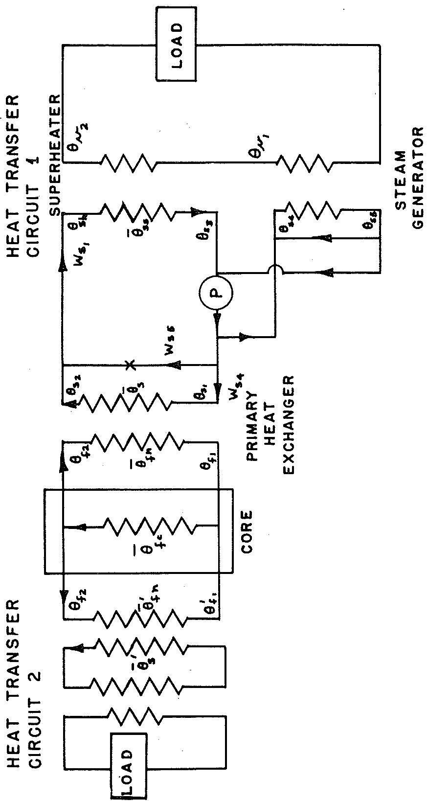

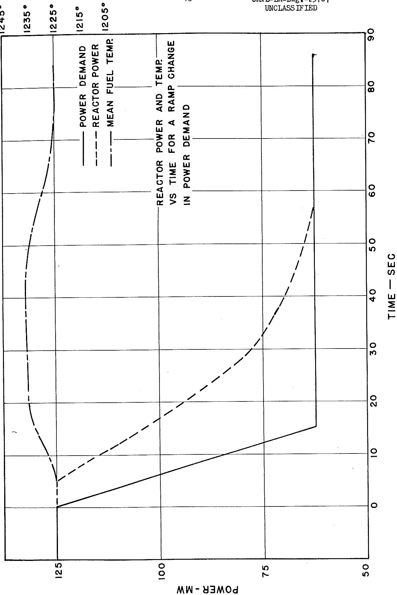  
FIGURE II.3

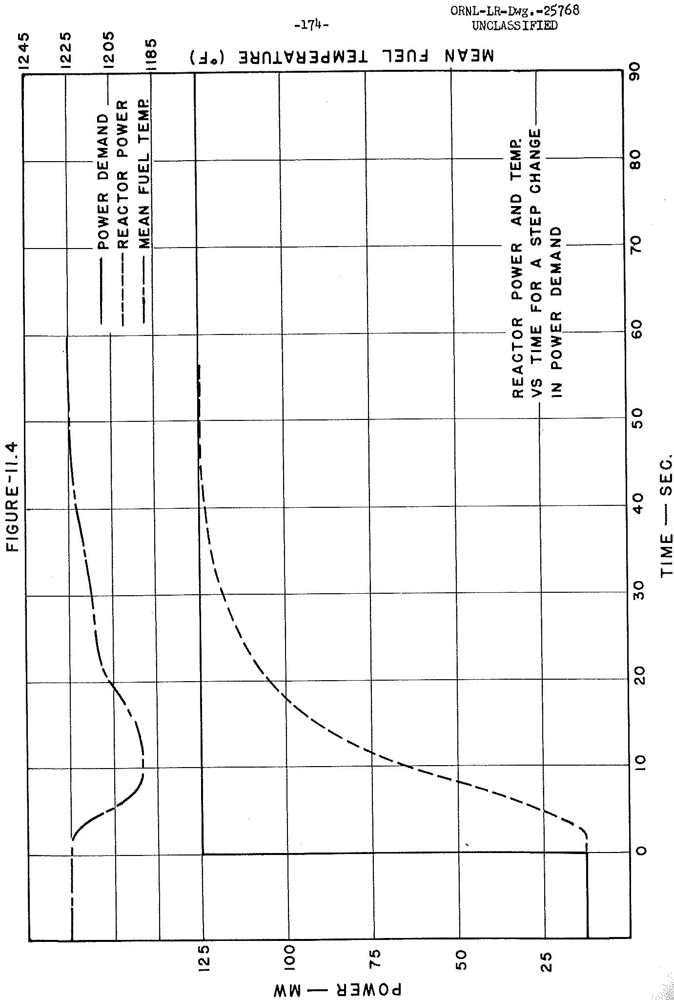

FIGURE 11.5   

<table><tr><td rowspan="34">REACTOR POWER - MW
250</td><td></td><td></td><td></td><td></td><td></td><td></td><td colspan="4">REACTOR POWER AND TEMPERATURE VS TIME FOR STEP CHANGES IN REACTIVITY</td></tr><tr><td></td><td></td><td></td><td></td><td></td><td colspan="5">+0.2% AT t=0 AND -0.2% AT t=70 sec</td></tr><tr><td></td><td></td><td></td><td></td><td></td><td></td><td></td><td></td><td></td><td></td></tr><tr><td></td><td></td><td></td><td></td><td></td><td></td><td></td><td></td><td></td><td></td></tr><tr><td></td><td></td><td></td><td></td><td></td><td></td><td></td><td></td><td></td><td></td></tr><tr><td></td><td></td><td></td><td></td><td></td><td></td><td></td><td></td><td></td><td></td></tr><tr><td></td><td></td><td></td><td></td><td></td><td></td><td></td><td></td><td></td><td></td></tr><tr><td></td><td></td><td></td><td></td><td></td><td></td><td></td><td></td><td></td><td></td></tr><tr><td></td><td></td><td></td><td></td><td></td><td></td><td></td><td></td><td></td><td></td></tr><tr><td></td><td></td><td></td><td></td><td></td><td></td><td></td><td></td><td></td><td></td></tr><tr><td></td><td></td><td></td><td></td><td></td><td></td><td></td><td></td><td></td><td></td></tr><tr><td></td><td></td><td></td><td></td><td></td><td></td><td></td><td></td><td></td><td></td></tr><tr><td></td><td></td><td></td><td></td><td></td><td></td><td></td><td></td><td></td><td></td></tr><tr><td></td><td></td><td></td><td></td><td></td><td></td><td></td><td></td><td></td><td></td></tr><tr><td></td><td></td><td></td><td></td><td></td><td></td><td></td><td></td><td></td><td></td></tr><tr><td></td><td></td><td></td><td></td><td></td><td></td><td></td><td></td><td></td><td></td></tr><tr><td></td><td></td><td></td><td></td><td></td><td></td><td></td><td></td><td></td><td></td></tr><tr><td></td><td></td><td></td><td></td><td></td><td></td><td></td><td></td><td></td><td></td></tr><tr><td></td><td></td><td></td><td></td><td></td><td></td><td></td><td></td><td></td><td></td></tr><tr><td></td><td></td><td></td><td></td><td></td><td></td><td></td><td></td><td></td><td></td></tr><tr><td></td><td></td><td></td><td></td><td></td><td></td><td></td><td></td><td></td><td></td></tr><tr><td></td><td></td><td></td><td></td><td></td><td></td><td></td><td></td><td></td><td></td></tr><tr><td></td><td></td><td></td><td></td><td></td><td></td><td></td><td></td><td></td><td></td></tr><tr><td></td><td></td><td></td><td></td><td></td><td></td><td></td><td></td><td></td><td></td></tr><tr><td></td><td></td><td></td><td></td><td></td><td></td><td></td><td></td><td></td><td></td></tr><tr><td></td><td></td><td></td><td></td><td>-/-</td><td></td><td></td><td></td><td></td><td></td></tr><tr><td></td><td></td><td></td><td></td><td></td><td></td><td></td><td></td><td></td><td></td></tr><tr><td></td><td></td><td></td><td></td><td></td><td></td><td></td><td></td><td></td><td></td></tr><tr><td></td><td></td><td></td><td></td><td></td><td></td><td></td><td></td><td></td><td></td></tr><tr><td></td><td></td><td></td><td></td><td></td><td></td><td></td><td></td><td></td><td></td></tr><tr><td></td><td></td><td></td><td></td><td></td><td></td><td></td><td></td><td></td><td></td></tr><tr><td></td><td></td><td></td><td></td><td></td><td></td><td></td><td></td><td></td><td></td></tr><tr><td></td><td></td><td></td><td></td><td></td><td></td><td></td><td></td><td></td><td></td></tr><tr><td></td><td></td><td></td><td></td><td></td><td></td><td></td><td></td><td></td><td></td></tr></table>

TIME-SEC.

FIGURE 11.6   

<table><tr><td rowspan="11">1300
1200
900
800</td><td></td><td></td><td></td><td></td><td></td><td colspan="2">OUTPUT STEAM TEMPERATURE
VS LOAD</td><td></td><td></td></tr><tr><td></td><td></td><td></td><td></td><td></td><td colspan="3">N. CONTROL SYSTEM
CONTROL SYSTEM-25% CUTOFF
CONTROL SYSTEM-10% CUTOFF</td><td></td></tr><tr><td></td><td></td><td></td><td></td><td></td><td></td><td></td><td></td><td></td></tr><tr><td></td><td></td><td></td><td></td><td></td><td></td><td></td><td></td><td></td></tr><tr><td></td><td></td><td></td><td></td><td></td><td></td><td></td><td></td><td></td></tr><tr><td></td><td></td><td></td><td></td><td></td><td></td><td></td><td></td><td></td></tr><tr><td></td><td></td><td></td><td></td><td></td><td></td><td></td><td></td><td></td></tr><tr><td></td><td></td><td></td><td></td><td></td><td></td><td></td><td></td><td></td></tr><tr><td></td><td></td><td></td><td></td><td></td><td></td><td></td><td></td><td></td></tr><tr><td></td><td></td><td></td><td></td><td></td><td></td><td></td><td></td><td></td></tr><tr><td></td><td></td><td></td><td></td><td></td><td></td><td></td><td></td><td></td></tr><tr><td colspan="10">20 40 60 80 100 120 140 160 PERCENT OF FULL POWER LOAD</td></tr></table>

FIGURE II.7   

<table><tr><td rowspan="8">125 POWER100 75 50 25</td><td></td><td></td><td></td><td></td><td></td><td></td><td colspan="4">——POWER DEMAND
——REACTOR POWER
——STEAM TEMPERATURE</td></tr><tr><td></td><td></td><td></td><td></td><td></td><td></td><td></td><td></td><td></td><td></td></tr><tr><td></td><td></td><td></td><td></td><td></td><td></td><td></td><td></td><td></td><td></td></tr><tr><td></td><td></td><td></td><td></td><td></td><td></td><td></td><td></td><td></td><td></td></tr><tr><td></td><td></td><td></td><td></td><td></td><td></td><td></td><td></td><td></td><td></td></tr><tr><td></td><td></td><td></td><td></td><td></td><td></td><td colspan="4">REACTOR POWER AND STEAM
TEMPERATURE VS TIME FOR
A LINEAR CHANGE IN POWER
DEMAND.</td></tr><tr><td></td><td></td><td></td><td></td><td></td><td></td><td colspan="4">CONTROL SYSTEM IN OPERATION</td></tr><tr><td>0</td><td>10</td><td>30</td><td>50</td><td>70</td><td>90</td><td>110</td><td>130</td><td>150</td><td>170</td></tr><tr><td colspan="11">TIME—SEC.</td></tr></table>

(3) Fuel flow is in the direction of natural circulation which aids the fuel inertia in removing the peak afterheat immediately after the afterheat without over-temperaturing the critical areas.   
(4) Provisions are made to dump the fuel from the reactor into dump tanks if necessary.   
(5) Blow out valves are incorporated into the system which would allow drainage of the primary or secondary fluids into dump tanks should the system go above design pressure due to over-temperature or leakage from the high pressure steam side.

Inconel drain tanks will be located in the inner bottom of the vessel directly below the reactor. There will be provision made for circulation of secondary salt in Inconel pipes throughout the tank. Drain tank will be maintained at $1100^{\circ}\mathrm{F}$ at all times after startup of reactor. Secondary salt will be bled off from superheater loop, and will act as heater for drain tank and as coolant to remove decay heat when hot fuel is introduced from reactor. Under emergency conditions if secondary salt cooling becomes impractical, water cooling will be made available. Thermal insulation will separate the tanks from ship's bottom. Hot fuel may be returned to reactor from drain tank by helium pressure.

Criticality calculations have not been made for this system to fix size and dimensions; however, it is expected, from similar systems, that any reactivity could be overcome by use of poisons. Li in the secondary fluid will contribute to this result.

# 11.5 Maintenance

In considering the overall maintenance picture, because the power plant

is strictly conventional, only that pertaining to the reactor system will be discussed. Servicing of the steam generating equipment for the basic system presents a problem due to the residual activation of the secondary salt. However, since dump tanks can be provided in the hull double bottom and if careful design attention is given to assure almost complete drainage, it is reasonable to expect that direct maintenance could be done after a 2-day cooling off period. The alternate system proposed using two intermediate fluids not only offers a lighter system but would completely eliminate this problem. Direct maintenance on the steam generating equipment could be allowed at all times.

Two entirely different concepts exist for overall maintenance on the basic reactor itself. Since it is beyond the scope of this report to evaluate these, both methods are simply presented with the recommendation that a careful evaluation be made in the future.

In either case it is felt that the reactor should be of sound design and tested sufficiently to ensure that any installation would be of reasonable duration. Then because of the additional complexity and cost of having remote handling equipment designed to perform in the confined space aboard ship, it is recommended that the reactor be removed as a whole assembly and work performed at shore facility. This may be done by remotely cutting the two inlet and exit pipes feeding salt to the steam generating equipment, disconnecting the reactor from the supporting structure and then lifting the assembly from the surrounding shielding.

At this point there are two alternatives pertaining to further maintenance:

(1) Have the reactor designed so that a complete disassembly by remote operation is possible. This obviously requires a more complex reactor vessel,

internal structure, and heat exchanger arrangement. Also a means of remote handling, seal weld cutting and welding, as well as remote testing and inspection is required.

(2) Utilize a completely unit basic design that cannot be taken apart and reassembled but has greater simplicity and hence more reliability. Upon malfunction, the reactor would be taken from the ship and discarded after the recovery of valuable material, i.e., BeO. There is strong reason to believe that the cost of discarding the reactors that become faculty in service would be more than offset by the elimination of the very complex remote handling equipment, facilities, and personnel required from (1).

# 11.6 Removal and Disposal of Volatile Fission Products

There are two possible techniques by which removal and disposal of volatile fission products can be achieved: 1) periodic removal and disposal, and 2) continuous removal and disposal. Periodic operation is recommended over the continuous cycle.

As pressure builds up in the expansion chamber due to fission product gas generation, a pressure relief valve permits excess gas to flow into an originally evacuated disposal holding vessel. The vessel would be perhaps copper tubing fabricated into a spiral form immersed in the fuel oil biological shield at the fore side of the reactor space. Provisions for storage of several such holding vessel would permit the holding of the discharged off gas for sufficient time to cool radiactively, to levels which would allow the vessel to be cast overboard without hazard to ship's personnel.

If expansion chamber has a free volume of $1\mathrm{ft}^3$ after operating temperature

is attained, gas may be allowed to accumulate for several days before discharging to holding tanks. A helium purge would not be required under these conditions, the heating rate (see Appendix 11.2) due to radioactive decay in the expansion chamber, would be about $150\mathrm{kw}$ at equilibrium (where production rate equals decay rate for nuclearly unstable gases, neglecting neutron absorption loss rate) when reactor is operating at its rated $125\mathrm{Mw}$ of heat. At these rates of gas generation (approximately 0.2 moles/day), pressure in the expansion chamber would rise from 20 to 50 psig in about one week. At this time, excess gas would be bled off into the evacuated holding chambers. Initial heating rate in the holding chamber, assuming half the gas were removed approaches $75\mathrm{kw}$ . This would decay rapidly and give a gamma source after 14 days of $5\times 10^{4}$ curies of 0.083 mev, 600 curies of 0.1 to 0.3 mev and 30 curies of 2.4 mev, as well as a beta heating of 380 watts.

As the alternate method, reactor may be continuously purged with helium at a rate, say, 1000 liters (STP) per day. At this rate, heat generated by gas in expansion chamber would be about $30\mathrm{kw}$ , Ref. 50. On leaving the expansion chamber, off gas would enter a cooled holding chamber. After a specified holding time, chamber is continuously exhausted into ship's wake. An average holding time of $4\mathrm{hr}$ would permit decay of the gas to about $0.2\%$ of its initial activity in the holding chamber. During periods when the ship lay at wet dock, off gas would be pressurized and xenon and krypton retained on cooled activated charcoal beds. Beds would be purged with helium after ship was underway.

Calculations have been made on the activity of ship's wake during

continuous discharge, assuming $4\mathrm{hr}$ and $48\mathrm{hr}$ holdup periods followed by continuous exhaust of gas into ship's wake at a speed of 26 knots. Results are as follows: A $4$ -hr holtime might result in a maximum dose rate of 8 mrem/hr in the ship's wake at time of exhaust, and a resultant 660 gamma events per second per $\mathrm{cm}^3$ of ocean water in a ribbon wake, 20 ft deep by 100 ft wide. Instantaneous turbulent dispersion is assumed for the ribbon wake, after which diffusion, wave action, and ocean currents would govern dispersion of wake. It is expected that the wake would remain somewhat intact in calm weather for several hours. A $48$ -hr holdtime would give a maximum dose rate of 0.02 mrem/hr, and 27 gamma events/sec/ $\mathrm{cm}^3$ of ribbon wake.

These levels of radioactivity are not believed to be objectionable from a biological point of view, when additional attenuation of dose rate by diffusion and decay are considered. Nevertheless, a radioactive trail would be quite objectionable. These trails could be readily identified several hours after the vessel had passed.

Atmospheric disposal has been considered, but is not considered feasible due to biological arrangement and shielding considerations.

# 11.7 Fuel Loading

Initial core loading presents a rather difficult task in that the primary fluoride salt melts at a relatively high temperature. By some means, the reactor must be maintained at a temperature in the order of $1000^{\circ}\mathrm{F}$ prior to the fuel loading. A stepwise method of loading is suggested below.

(1) Steam generating equipment, loop piping, and the reactor would be isothermally brought up in temperature to approximately $650^{\circ}\mathrm{F}$ . Heat may be supplied by steam from the conventional oil fired boilers, by electrical heaters, or a combination of both. A maximum of 1000 KW of electricity is available for this purpose from each of the engine rooms.   
(2) The intermediate salt is then introduced into the system at $650^{\circ}\mathrm{F}$ and circulated throughout the secondary loops.   
(3) The secondary system is brought up to approximately $900^{\mathrm{O}}\mathrm{F}$ by circulating superheated steam through both the steam generator and superheater. The reactor will likewise be brought up to this temperature by circulating helium through the system and extracting heat from the primary heat exchangers.   
(4) By either overtemperating the conventional steam system to provide superheated steam at $1100^{\circ}\mathrm{F}$ or by using electrical heaters in the secondary loops the complete system is brought up to $1050^{\circ}\mathrm{F}$ .   
(5) A stripped fuel mixture (no uranium) at $1050^{\circ}\mathrm{F}$ is then introduced into the reactor and circulated by the fuel pumps using the auxiliary electric drives.   
(6) Fuel concentration is gradually increased by adding solid $\mathrm{Na}_{2}^{\mathrm{UF}} 6$ until criticality is reached at $1050^{\mathrm{O}}\mathrm{F}$ .   
(7) Additional uranium is added to bring the reactor temperature up to approximately $1100^{\circ}\mathrm{F}$ . Simultaneously the steam temperature feeding the steam generators and superheaters is decreased to the normal $950^{\circ}\mathrm{F}$ . If electrical heating was used entirely, this steam would be applied to reduce the temperature of the steam equipment.

(8) The superheated steam would then be gradually reduced to a saturated value of $572^{\circ}\mathrm{F}$ by mixing with saturated steam. By the use of the blenders and pumps the separate loops to the superheater and steam generator would then be adjusted to near their normal operating temperature.   
(9) Preheated feed water is now added to the steam generator and normal operation of the system is established.   
(10) Uranium concentrate is again added to the reactor until the design operating temperature os $1225^{\circ}\mathrm{F}$ is reached.   
(11) The system is now operational and a load may now be applied by withdrawing steam from the generator and superheater.

The entire procedure must be accomplished at a low rate of heating to reduce thermal shocks. It is estimated that it would take several days to accomplish this.

# 11.8 Pumps, Valves and Blenders

# 11.8.1 Pumps

The choice of pumps for molten salt systems is limited to gas sealed pumps. Electro-magnetic pumps are not effective with fused salt. Canned rotor pumps depend on lubrication by the pumped fluid and are not at present suitable for operation at $1200^{\circ}\mathrm{F}$ in a fused salt medium. Gas sealed centrifugal pumps have been operated at ORNL for durations up to 8000 hours at $1200^{\circ}\mathrm{F}$ without bearing, seal, or other pump maintenance. The operation of such pumps is now considered to be routine and trouble-free (Ref. 5). These pumps may be so designed as to accelerate removal of xenon and krypton gas fission products into the expansion chamber void.

Helium gas seals shaft mechanical seals and supplies pressure to the

expansion chamber so that inlet pump pressure is never below 15 psia. This pressure is required so that cavitation of the impeller is prevented.

Provisions are made for complete replacement aboard ship for both the primary and secondary pumps. However, reactor shutdowns and use of remote handling equipment are required. The pump drive motors and assemblies will be located above the secondary shield to allow direct maintenance and replacement.

All surfaces of the pumps in contact with either the fuel or secondary fluid will be made out of Inconel.

# Fuel Pumps

Three pumps powered by steam turbines will circulate the fuel in the core and primary loop. These pumps inlet and exit to common plenum chambers so that reactor operation under emergency conditions is possible with one or two pumps. These pumps were designed to operate at 2/3 power under normal conditions thereby allowing almost full power operation if one pump is lost. Pump specifications are based on calculations by ORNL personnel (49,50):

Inlet diameter 8.8"

Hut to tip ratio 1/4

Impeller outside diameter 13.76"

Discharge height 1"

Height of volute 8"

Max.diameter of volute 18"

Pumping head 60 ft.

R.P.M. 1150

Pump efficiency 85%

Pumping horsepower 50

Input horsepower per turbine 85

Discharge rate 3333 gallons per minute

Pump shaft will pierce shielding material and will be sealed by a positive helium pressure. As xenon and krypton gas pressure builds up in the reactor, a regulator valve insures that this positive differential helium pressure is maintained to seal pump bushings and prevent radioactive gas from leaking from the reactor. A 10 H.P. electric motor will be clutched to the same shaft as the turbine to provide shutdown and emergency circulation.

The direction of fuel circulation through the reactor is opposite to that found in the ART (Ref. 36). However, because the maximum temperature found in this system was significantly less than the ART, the design life of the impeller is much more than adequate and the advantage of having natural and forced circulation directions the same is realized.

# Secondary Loop Pumps

Two secondary loops are anticipated. Each loop will have two pumps powered by steam turbines. One pump which will circulate hot salt through primary heat exchanger and through superheaters will require 270 horsepower input (160 pumping H.P.) and will have an idling 25 H.P. motor on shaft for shutdown circulation. The other pump will drive a fluid circuit at a lower temperature and connect through blenders with the other circuit, providing lower temperature fluid to the steam generator. This circuit will require an input horsepower of 190 and pumping horsepower of 115. A 20 H.P. electric motor will idle on same shaft for standby use.

These two pumps effectively operate in series so that in general stability would not be as severe a problem as under-parallel operation. However, because each pump contains an expansion tank, it is possible for fluctuation in level between the two tanks to form a different sort of stability problem. This can be eliminated by locating the two pumps in close proximity so that either a short flow channel can connect the expansion chambers or a common chamber is used. An alternate approach would be to utilize two pump impellers on a single shaft along with a single expansion chamber. However, because of the large overhang, it may be necessary to use a hydraulic bearing fed with pressurized fuel as an end support.

# 11.8.2 Valves

(1) Dump Valve will be ball and socket type, located in lowest part of fuel chamber. Upon opening the dump valve, fuel will flow by gravity, aided by 20 - 50 pounds pressure in the reactor pressure vessel, into drain tanks. Stem would be Inconel, ball and seat being faced with Kentanium, a modified titanium carbide nickel cernet. Tests have been made with this type valve, against up to 100 psig helium pressure during and after many hours at temperatures up to $1400^{\circ}\mathrm{F}$ , with satisfactory results. Tests have been made with the valve in Fuel 30 for 2285 hours, with 32 open-shut cycles at a temperature of $1225^{\circ}\mathrm{F}$ , with a pressure differential across the seat of 50 psi. Satisfactory results were obtained (See Ref. 36).

A drain valve of similar construction will also enable emptying of secondary fluid system.

(2) Flow Regulating Valves in the superheater and steam generator loops will be constructed of Inconel. It is believed that a gate valve or coaxial

cone valve will enable flow regulation without undue pressure drop. It will be necessary that the valves be designed so as to permit satisfactory clearance and operation at the design temperature. Since only flow regulation is required, absolute shutoff is not necessary. Therefore, no difficulty is anticipated in the design of satisfactory flow regulatory valves.

# 11.8.3 Blenders

The blenders or mixers used to interconnect the secondary fluid loops would be of a single "Y" type construction with the two legs to be mixed feeding into a single conduit. Because the temperatures of the fluids to be mixed did not differ by more than a few hundred degrees, it was felt that a plenum or mixing chamber would not be required. However, thermal sleeves would have to be used on the legs to reduce thermal stresses.

# 12.0 MODIFIED APPROACH

A detailed weight per shaft horsepower list of the components of this reactor system shows that an appreciable fraction of the total weight appears as secondary shielding. (See Section 13). A cursory examination was made of the use of an intermediate heat exchanger and a tertiary fluid to boil water and superheat the steam. It is believed that the weight of the secondary shielding can be reduced from 14.4 lbs/SHP to a specific weight of below 5 lbs/SHP. (This includes additional pump weight, heat exchanger weight and the additional power required to drive the intermediate circuit.)

The use of the tertiary fluid will eliminate the need for shielding around the bulky superheater and steam generator and will greatly facilitate their maintenance. The number of pumps handling radioactive liquids will also be reduced. Using a machinery arrangement much like that of the basic design and using the same temperatures, power, and flows everywhere in the system except the salt inlet temperature and hence the log mean temperature in the superheater, the calculations described below indicate the weight of the secondary shield can be cut considerably. However, since the basic design used the secondary shield to complement the primary shielding (note bulkhead shield, Figure 9.2), the weight of the primary shield will increase. Estimated increase is from 6.4 lbs/SHP to 13 lbs/SHP. Because of the reduced mean temperature difference in the superheater, its weight will also increase; however, this represents only a small percentage of the total weight.

The complete bank of intermediate heat exchangers is placed directly forward of the primary reactor shield. It would rest against the fuel oil tanks which would be used as part of the secondary shield for one side of the heat exchangers. The top of the heat exchangers is covered with 1" steel and 6" lead. The port and starboard sides are shielded with 1" steel and 7" lead. In addition, 1" steel and 3" lead are used against the primary shield and the fuel oil tanks.

The following conditions were used for the weight analysis.

<table><tr><td>Heat exchanger</td><td>U tube, counterflow</td></tr><tr><td>Tube Size: outside diameter</td><td>0.25&quot;</td></tr><tr><td>inside diameter</td><td>0.17&quot;</td></tr><tr><td>Tube length</td><td>16.7&#x27;</td></tr><tr><td>Number of tube</td><td>3600</td></tr><tr><td>Number of tube bundles</td><td>12</td></tr><tr><td>Dimensions of shells</td><td>6&quot; x 15&quot; x 100&quot;</td></tr><tr><td>Temperature difference, tube side</td><td>100°F</td></tr><tr><td>Temperature difference, shell side</td><td>100°F</td></tr><tr><td>Temperature difference, log mean</td><td>100°F</td></tr><tr><td>Inlet temperature, tube side</td><td>1150°F</td></tr></table>

All structural materials are Inconel.

As indicated above, the heat exchangers were calculated using what appeared to be realistic conditions. A further study with optimization of the fluid horsepower required for the intermediate heat exchanger versus the weight of the entire unit should result in additional improvements.

The heat transfer calculational methods are identical with those shown in Appendixes 6.1 and 7.1. Weight results are shown in Section 13.

# 13.0 SPECIFIC WEIGHTS

Below are tabulated the specific weight breakdowns for the conventional oil-fired system and the three reactor powered systems considered in this report. The categorization is that used by the Naval Reactors Branch. Each category includes the following items:

A + B Steam Propulsion Machinery

C + D Reactor Plant Machinery

E Radiation Shielding

F Electric Plant (In Machinery Space)

G Electric Plant (Out of Machinery Space)

H + J Independent Systems

L Load and Stores

The system referred to as "Basic Design" is that in which an attempt was made to utilize only presently available technology. Also the steam generating equipment is contained within the secondary shield. For the "Modified" design an intermediate heat exchanger loop was incorporated to permit removing the steam generation equipment from within the secondary shield. In the "Potential" design study, materials and concepts of a more advanced, but still technically feasible, nature were utilized. Also, for this design, the ship was presumed to be entirely nuclear powered.

The basic and modified designs are based on a reactor and steam generation system overdesign of $30\%$ , while the potential design is based on an overdesign of only $10\%$ . Since time limitations did not permit a reiteration for a more realistic overdesign modified systems of $10\%$ , an estimation of the power plant specific weights for an overdesign of $10\%$ were made as follows.

SPECIFIC WEIGHT (LB/SHP)   

<table><tr><td>Category</td><td>Conventional</td><td>Basic</td><td>Modified</td><td>Potential</td></tr><tr><td>A + B</td><td>19.6</td><td>17.2</td><td>17.2</td><td>17.2</td></tr><tr><td>C + D</td><td>8.0</td><td>12.3</td><td>14.0</td><td>11.4</td></tr><tr><td>E</td><td>0.0</td><td>20.8</td><td>14.5</td><td>12.6</td></tr><tr><td>F + G</td><td>5.6</td><td>6.0</td><td>6.0</td><td>6.0</td></tr><tr><td>H + J</td><td>1.2</td><td>5.2</td><td>5.2</td><td>5.2</td></tr><tr><td>L</td><td>1.2</td><td>2.0</td><td>2.0</td><td>2.0</td></tr><tr><td>Fuel Oil</td><td>23.4</td><td>0.0</td><td>0.0</td><td>0.0</td></tr><tr><td>Total</td><td>59.0</td><td>63.5</td><td>58.9</td><td>54.4</td></tr></table>

The design of the reactor and steam generation equipment was assumed to remain the same, but the capacity of the remaining equipment was increased sufficiently to give the appropriate overdesign value. The results of this work gives a specific weight of 58.1 and 54.2 lb/shipment for the basic and modified reactor systems, respectively. As will be mentioned later in this section, a fair comparison of the three systems requires that the shielding weight of the basic and modified designs be increased to make up for the shielding done by the fuel oil. (See Section 9).

The tabulated specific weights for the conventional, oil-fired system were taken from a detailed ship weight breakdown compiled by the Bureau of Ships for a DD931 destroyer. For the three reactor powered systems, the equipment weights not affected by the reactor installation were also taken from this table.

For the three reactor systems, the specific weight of the steam propulsion machinery (Category A + B) is several lb/ship less than for the conventional system. This is true primarily because approximately half the liquids in the reactor systems are accounted for under reactor plant machinery (Category C + D), whereas for the conventional system all liquids are accounted for under Category A + B. Another factor which contributes to this lower value is the removal of forced draft fans and fuel oil pumps. Finally, a portion of the insulation, which for the conventional system is totally accounted for under Category A + B, has been included, for the reactor systems, under Category C + D. For the conventional system, all components which would be removed to make way for the reactor plant machinery were included in Category C + D. For the reactor powered designs, the weight of the steam generation equipment was increased quite substantially

(25% of calculated weight) to account for the supporting structure and other portions of this equipment for which no detailed weight calculations were made. From examination of other reactor powered steam systems, it was decided the two pounds per shaft horse power would be ample to cover the weight of the control system and miscellaneous items. The specific weight of the modified system's reactor plant is somewhat greater than the basic due to the additional coolant loop and associated heat exchanger. A slightly smaller specific weight over that of the modified system is realized for the potential design since the application of more optimistic concepts permits using a smaller reactor and intermediate heat exchanger (Section 14.0).

The specific weight of the electric plant for the reactor powered systems was increased slightly over the conventional system weight. This increase was adjudged sufficient to provide for the electrical components of the reactor control system.

A substantial increase in specific weight is indicated for independent systems (Category $\mathbf{H} + \mathbf{J}$ ). From a cursory examination, it is apparent that the machinery required to replace a reactor fuel pump while at sea will weigh about two pounds per shaft horsepower. The weight of the offgass system, fuel adding mechanism, and miscellaneous items, was estimated at two pounds per shaft horsepower, also.

For Arrangement No. 1 of the reactor compartment for the basic and modified reactor powered systems 1.7 lb/ship of fuel oil is carried in excess of one-half the fuel originally on board the conventionally powered ship. This fuel is necessary for trim of the vessel and also serves as shielding.

For the potential design, the ship is to be powered entirely by reactors and therefore no fuel oil is carried.

Arrangement No. 2 of the reactor compartment would provide a trimmed ship with the removal of enough fuel to provide a specific weight savings of four pounds per shaft horsepower less than half the original amount of fuel. Arrangement No. 2 is the one recommended in this report. There is some question as to the advisability of providing the oil-fired portion of the power plant with less than its normal complement of fuel. For this reason, the tabulated specific weights do not show a reduction for fuel oil savings.

If the potential system were installed in conjunction with an oil-fired boiler, the fuel oil inventory could be utilized as shielding, giving a more favorable overall weight for this design.

If either the "basic" or "modified" design nuclear systems were used for total ship power, instead of only half, an additional ten pounds per shaft horsepower of shielding will be required. This is due to the fact that the fuel oil carried for the oil-fired boiler is placed in such a way as to be equivalent to approximately ten pounds per shaft horsepower of shield. The overall power plant specific weights for an entirely nuclear powered ship with a reactor and steam generation system overdesign of $10\%$ then becomes:

Basic Design

68.1 lb/shp

Modified Design

64.2 lb/shp

Potential Design

54.4 1b/shp.

# 14.0 FUTURE POTENTIAL

The design philosophy taken on the basic reactor system is to use, as much as possible, materials and technology which have been proven feasible. It seemed desirable to illustrate the potential of the system by adopting materials and conditions which were more optimistic, but yet feasible, as indicated by experiments and qualified opinions. Thus, a cursory examination of a more advanced design was made to determine minimum realistic specific weight (weight/shaft horsepower) that may be achieved. Also, since time had not allowed the optimization of many parameters in the basic design, an attempt was made to select parameters which would improve the performance of the system.

# 14.1 Reactor Core

In order to help reduce the total weight of the system, it is desirable to minimize the reactor core diameter. Four steps are taken to achieve this. (1) Zirconium hydride was used as the moderator replacing beryllium oxide thus increasing the moderation properties of the core. (2) A beryllium, sodium, uranium fluoride salt was selected to replace the zirconium, sodium, uranium salt to improve neutron moderation. (3) Because of improved materials a higher power density could be used. (4) Use of a nickel-molybdenum cladding such as INOR-8 (Ref. 5) decreased the poison in the core because nickel-molybdenum's corrosion resistance permits a thinner cladding.

The geometrical appearance remains identical to that of the basic design; however, all dimensions are reduced. Preliminary calculations indicate that

criticality will occur at a uranium concentration which is approximately that of salt mixture number 92 tested at ORNL (Reference 40). The control rod is identical with that described in the basic design both in size and materials. Conditions imposed on the system are:

Power 100 Mw

Power density (averaged over core) 1 Kw/cm³

Fuel (Approximate) 38% NaF,

Moderator rod diameter, inches 0.5

Moderator rod cladding thickness, inches 0.010 Mo

0.020 INOR-8

Volume fraction of fuel 0.5

Core diameter, cm 40

Nickel reflector outer diameter, cm 80

Core height, cm 78

Average fuel inlet temperature, ${}^{\mathrm{O}}\mathbb{F}$ 1100

Average fuel outlet temperature, ${}^{\mathrm{o}}\mathbb{F}$ 1300

One hundred megawatts was selected as the power necessary (with $10\%$ overdesign) to drive one engine room of a 931 class destroyer. The power density is felt to be safe as a result of an ORNL study (Reference 36) and preliminary moderator rod stress calculations. The core temperature seems to be modest from a corrosion standpoint. The use of INOR-8 will decrease corrosion; however, its fabrication is more difficult than that of Inconel. The zirconium hydride moderator rods coupled with the improved moderation properties of the beryllium fuel allow the size of the reactor to be reduced considerably. However, zirconium hydride goes through a phase change near

$1100^{\circ}\mathrm{F}$ and thus cladding stress may be a difficult problem. Hydrogen escape from the moderator is resisted by the use of a molybdenum cladding next to the zirconium hydride which in turn is clad with INOR-8 for corrosion resistance.

# 14.2 Primary Heat Exchanger

Because of the relatively poor heat transfer properties of the secondary coolant used in the basic design, it was felt that, although initially a decision was made not to use sodium (See Section 2.3), it should be investigated. The primary heat exchanger is placed just outside the poisoned shield rods just as in the basic design. It is a U-tube design with the tube entering and leaving toroidal headers placed around the top of the reactor. A baffle sheet is placed in the fold of the tubes to effect counterflow at all points.

The following is a list of the design conditions which were considered:

Tube diameter, outside 0.55 inches

Tube diameter, insider 0.50 inches

Number of tubes 2040

Tube length 7.5 feet

Fuel inlet temperature 1300°F

Fuel outlet temperature 1100°F

No inlet temperature 930°F

No outlet temperature $1130^{\circ}\mathrm{F}$

Structural Material INOR-8

Although sodium is a very good heat transfer agent, the heat exchanger considered in this study required as large a radial dimension as did the

straight through heat exchanger in the basic design because additional space is required for a U-tube configuration. It was felt that it is desirable to use U-tube design to avoid thermal stress and thus effect longer life. Thermal stress becomes a more important problem when using sodium than the fused salt as in the basic design because, contrary to the case of the fused salt, a larger portion of the temperature drop occurs in the tube wall. Helically wound tubes are a definite possibility for smaller heat exchanger volumes; however, thermal cycling causes a tricky configuration design problem especially when it is desirable to obtain a relatively long life.

The U-tube sodium heat exchanger required many less tubes and thus is less expensive and easier to fabricate than the straight through salt heat exchanger considered in the basic design.

# 14.3 Intermediate Heat Exchanger

Because the core is a high flux, high leakage machine, there is considerable neutron activation of the sodium. This activation causes a secondary shielding problem which can best be minimized by the use of intermediate heat exchanger (See Section 12.0). For the advanced design, the intermediate heat exchanger is a counterflow U-tube sodium heat exchanger. The shielding required 10 in. of lead and 1 in. of iron on the top, port, starboard, and forward sides. The primary shield was used on the aft face. Heat exchanger parameters are

Na outlet temperature (tube side) 930°F

Na inlet temperature (tube side) 1130°F

Na outlet temperature (shell side) 1030 F

Na inlet temperature (shell side) 830°F

Tube outside diameter 0.425 in.

Tube inside diameter 0.375 in.

Number of tube bundles 25

Number of tubes per bundle 80

Dimension of shell (1 tube bundle) 11.9" x 5" x 50"

# 14.4 Boiler and Superheater

Because the boiler and superheater are relatively small percentage of the total machinery weight, no attempt was made to design this equipment. Sodium has been used in the Seawolf (SIR) reactor system for steam generation and will be used in the sodium graphite reactor (SGR) developed by Combustion Engineering and Atomics International. The thermal stress and chloride stress corrosion on the water side creates an engineering problem. However, it is felt that the use of Inconel as a structural material and blenders to reduce temperature differences may be a partial solution. For the weight of the steam and water equipment, the same weights as were determined in the basic design were listed. Because an intermediate fluid will probably be used between the water and the sodium, the disadvantage of the third fluid will tend to counterbalance a reduction in weight caused by the superior heat transfer properties of sodium.

# 14.5 Primary Shield

The primary shield which was considered consisted of the following. One inch of structural steel plus six inches of lead were used just outside of the insulation packed around the pressure shell. Next followed 15.7 inches of water and then one inch of steel and 6 inches of lead. Following this lead is 70 inches of water which is contained by a $1/2''$ steel vessel.

Primary shield weight is approximately 375,000 lbs. Dose rates at the reactor shield face were approximately 10 mr/hr and 10 fast neutrons/cm² sec. The most important gamma contributors were the water and lead capture gammas and the fission product gammas released in the primary heat exchangers.

# 14.6 Calculational Methods and Results

Calculational methods used in the advanced design are identical to those illustrated in Appendices 6.1, 7.1 and 8.2. The specific weight results are given in Section 13.0.

# APPENDIX 5.1

Inconel Data   

<table><tr><td>Composition</td><td>Wt. %</td><td>Gms/cm3</td><td>Atoms/cm3</td></tr><tr><td>Nickel</td><td>79.5</td><td>6.405</td><td>6.57 x 1022</td></tr><tr><td>Copper</td><td>.2</td><td>.016</td><td>.016 x 1022</td></tr><tr><td>Iron</td><td>6.5</td><td>.530</td><td>.572 x 1022</td></tr><tr><td>Manganese</td><td>.25</td><td>.020</td><td>.024 x 1022</td></tr><tr><td>Silicon</td><td>.25</td><td>.020</td><td>.044 x 1022</td></tr><tr><td>Carbon</td><td>.08</td><td>.0065</td><td>.033 x 1022</td></tr><tr><td>Chromium</td><td>13.0</td><td>1.060</td><td>1.229 x 1022</td></tr></table>

Density at $1200^{\circ}\mathrm{F} = 8.156\mathrm{gm/cm}^{3}$ .

See graphs for data on thermal conductivity, tensile strength, elongation, yield strength, modulus of elasticity, coefficient of thermal expansion, and hardness, Figures A-5.1, 2, and 3.

Beryllium Oxide   

<table><tr><td>Theoretical Density</td><td>3.025 Gm/Cm3</td></tr><tr><td>Density (96% theor.)O°C</td><td>2.904</td></tr><tr><td>Vol. Coeff. of Expansion</td><td>2.43 x 10-5per °C approx.</td></tr><tr><td>Density at 1500°F</td><td>2.88 Gm/Cm3</td></tr></table>

<table><tr><td>Composition</td><td>Atoms/Gm</td><td>Gm/Cm3</td><td>Atoms/Cm3</td></tr><tr><td>Be</td><td>2.41 x 1022</td><td>1.028</td><td>6.95 x 1022</td></tr><tr><td>O</td><td>2.41 x 1022</td><td>1.852</td><td>6.95 x 1022</td></tr></table>

Modulus of Elasticity

at $68^{\circ}\mathbb{F}$ -45

at $1470^{\circ}\mathrm{F}$ - 28 x $10^{5}$ psi

at $2550^{\circ}\mathrm{F}$ - 12

Thermal Conductivity (see graph)

Specific Heat

$$
3 2 ^ {\circ} \mathrm {F} - - - - - - 0. 2 1 9
$$

$$
2 1 2 ^ {\circ} _ {F} - - - - - - 0. 3 0 8
$$

$$
7 5 2 ^ {\circ} F \quad - - - - - - 0. 4 2 0
$$

$$
1 4 7 2 ^ {\circ} \mathrm {F} - - - - - - 0. 4 9 2
$$

Poisson's Ratio (up to $1800^{\circ}\mathrm{F}$ ) - - - 0.35

Tensile Strength

$$
7 7 - 7 5 0 ^ {\circ} \mathrm {F} - - - - - - - - - - - 1 5, 0 0 0 p s i
$$

$$
1 4 7 0 ^ {\circ} \mathrm {F} - - - - - - - - - - 1 3, 5 0 0
$$

$$
1 8 3 0 ^ {\circ} \mathrm {F} - - - - - - - - - - - 1 0, 5 0 0
$$

$$
2 0 1 0 ^ {\circ} \mathrm {F} - - - - - - - - - - - 8, 0 0 0
$$

References (10) and (20).

# Nickel

Density $(20^{\circ}\mathrm{C})$ 8.91 Gms/Cm³ Lin. Coeff. of Thermal Expansion - 7.4 x 10⁶ per °F

Thermal Conductivity

200°F - - - - - - - 42 BTU/Hr-Ft-°F

1100°F - - - - - - 21

1600°F - - - - - - - 15

Specific Heat - - - - - - 0.11 Cal/Gm

Density at $1500^{\circ}\mathrm{F}$ 8.88 Gms/Cm³

Melting Point 2650F

Atoms per $\mathrm{cm}^3$ at $1500^{\circ}\mathrm{F}$ - 9.11 x 1022

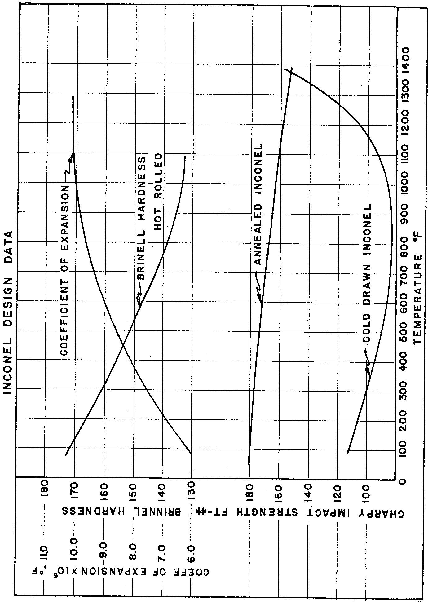  
FIGURE A5-1

FIGURE A-5-2

<table><tr><td></td><td></td><td colspan="4">INCONEL DESIGN DATA</td><td></td><td></td></tr><tr><td></td><td></td><td></td><td></td><td></td><td></td><td></td><td></td></tr><tr><td></td><td></td><td></td><td></td><td></td><td></td><td></td><td></td></tr><tr><td></td><td></td><td></td><td></td><td></td><td></td><td></td><td></td></tr><tr><td></td><td></td><td></td><td></td><td></td><td></td><td></td><td></td></tr><tr><td></td><td></td><td></td><td></td><td></td><td></td><td></td><td></td></tr><tr><td></td><td></td><td></td><td></td><td></td><td></td><td></td><td></td></tr><tr><td rowspan="6">SPECIFIC HEAT BTU/#F0.120.130.140.15BTU/HR-F-FT8.0</td><td>12.0</td><td rowspan="5">THERMAL CONDUCTIVITY</td><td rowspan="5">2</td><td rowspan="5">SPECIFIC HEAT</td><td></td><td></td><td></td></tr><tr><td>10.0</td><td></td><td></td><td></td></tr><tr><td>8.0</td><td></td><td></td><td></td></tr><tr><td>6.0</td><td></td><td></td><td></td></tr><tr><td>4.0</td><td></td><td></td><td></td></tr><tr><td colspan="7">400 800 1200 1600 2000</td></tr><tr><td></td><td></td><td colspan="4">TEMPERATURE, °F</td><td></td><td></td></tr><tr><td></td><td></td><td></td><td></td><td></td><td></td><td></td><td></td></tr><tr><td></td><td></td><td></td><td></td><td></td><td></td><td></td><td></td></tr><tr><td></td><td></td><td></td><td></td><td></td><td></td><td></td><td></td></tr><tr><td></td><td></td><td></td><td></td><td></td><td></td><td></td><td></td></tr><tr><td></td><td></td><td></td><td></td><td></td><td></td><td></td><td></td></tr><tr><td></td><td></td><td></td><td></td><td></td><td></td><td></td><td></td></tr></table>

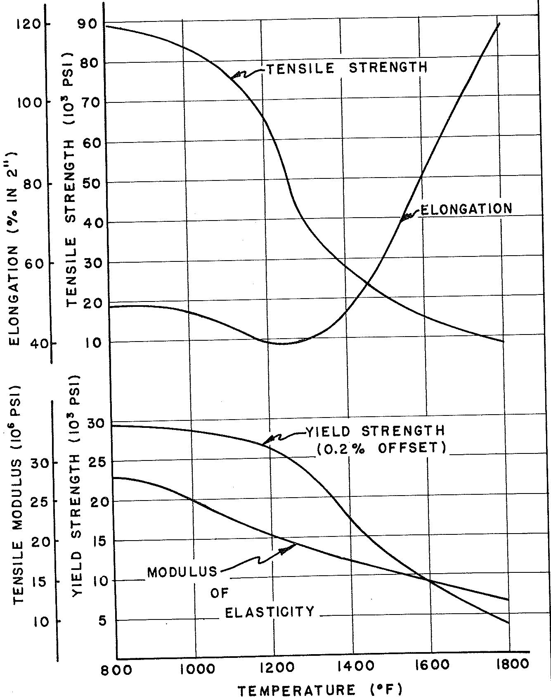  
FIGURE A-5.3   
JNGONEL DESIGN DATA

# APPENDIX 6.1

# JUSTIFICATION OF MODERATOR MATERIAL

# Allowable Moderator Rod Size

The best way to justify a material selection is by its satisfactory performance under actual operating conditions. Beryllium-oxide has suitably withstood a preliminary evaluation in the MTR under both high temperature radiation and cyclic operation (Reference 54 and 55). While the specimen size and test conditions were not identical to that proposed for this study it is a reasonable first approach to calculate the critical stresses that were withstood in this test and then apply these to the current case.

The limiting stress in the case of internal heat generation, especially for a ceramic, is its tensile.

The specimens from the MTR test were l in. in diameter and were satisfactorily exposed to a power generation of approximately 15 watts/cm³ at a temperature of $1500^{\circ}\mathrm{F}$ . Utilizing the development given in Ref. 10, Equation LVIII, on the working curves of Ref. 3, the maximum tensile stress is found to be 3000 psi. This will now be used as the design basis for the selection of a maximum allowable moderator size for this study.

The energy release rate is approximately 197 mev/fission which may be broken up roughly as follows:

Local deposition - 165 mev/fission - Fission product kinetic energy 5 mev/fission - Fission product decay beta particles

Non-local 6 mev/fission - Fission product decay gammas

5 mev/fission - Prompt fission gammas   
5 mev/fission - Prompt fission neutrons   
ll mev/fission - Neutrinos (deposited at $\infty$ )

To determine the energy deposition rate in the moderator, it is felt quite conservative to assume that all of the neutron energy is absorbed in the moderator.

On the basis of this it was felt justifiable to increase the moderator rod size to 0.75 inches diameter although additional testing would be required to obtain definite verification.

# Moderator Rod Temperature Distribution

By making the reasonably valid assumptions of steady state, negligible axial heat flow, and non-variance of the materials thermal properties with temperature, the temperature distribution through a clad cylinder due to internal heat generation can be found from the basic equation:

$$
\Delta^ {2} t = - q ^ {\prime \prime \prime} / k = \frac {1}{r} \frac {d}{d r} (r \frac {d t}{d r})
$$

By applying the proper interface and boundary conditions this reduces to:

In the cladding $-r_{\mathrm{m}} \leq r \leq r_{\mathrm{c}}$

$$
\begin{array}{l} t _ {c} (r) \quad t \left(r _ {c}\right) + \frac {q _ {c} ^ {\prime \prime \prime} r _ {c} ^ {2}}{4 k _ {c}} \left[ 1 - \left(\frac {r}{r _ {c}}\right) ^ {2} \right] \quad + \frac {r _ {m} ^ {2}}{2 k _ {c}} \left(q _ {m} ^ {\prime \prime \prime} - q _ {c} ^ {\prime \prime \prime}\right) \\ l _ {n} \frac {r _ {\mathrm {c}}}{r} \\ \end{array}
$$

On the moderator $0\leq \mathbf{r}\leq \mathbf{r}_{\mathrm{m}}$

$$
t _ {m} (r) = t \left(r _ {m}\right) + \frac {q _ {m} ^ {\prime \prime \prime} r _ {m} ^ {2}}{4 k _ {m}} \quad \left[ 1 - \left(\frac {r}{r _ {m}}\right) ^ {2} \right]
$$

where: the subscripts c and m refer to the cladding and moderator respectively

$\mathbf{t}(\mathbf{\mu}) =$ temperature at point $\pmb{x}$

q'' = heat generation rate per unit volume

k = thermal conductivity

$\mathbf{r}_{\mathfrak{m}} =$ outer radius of the moderator

$r_{c} =$ outer radius of the cladding

Applying these results to the case of a 0.75 in diameter cylindrical rod of BeO with 40 mil Inconel cladding (k = 14.5 and 16 BTU/hr-ft- ${}^{\circ}\mathrm{F}$ at approximately $1500^{\circ}\mathrm{F}$ ) the temperature distribution given on Figure A6.1 was obtained. It should be noted that a temperature drop across the interface of the moderator and cladding is not included at this point and that the other non-local energies were lost from the system. The possible gamma energy absorption was not included because the relatively light weight BeO gives poor gamma attenuation making this effect within the conservation of the previous statement.

Maximum energy deposition in the moderator is then $2.9\% \left(\frac{5}{165 + 5}\right)$ of that in the fuel. Considering the power distribution found across the core of 1.4 (Section 8.2.2) and a probable axial distribution of the same order gives an overall peak to average power of approximately 2.0. The maximum heat generation in the moderator rods can then be calculated by:

Power density in the fuel = 700 watts/cm³

Fraction fuel volume $= .50$

Fraction moderator volume = .40

Generation rate in $\mathrm{BeO} = 2.9\% \times 2.0 \times 700 \times \frac{50}{.40} = 50 \, \text{watts/cm}^3$ The critical location for the moderator material is approximately at the central region where the power density is a maximum. Although the temperature of the fuel increases toward the exit of the core, the power density decreases at a rate sufficient to cause a net reduction in the moderator temperature. It is estimated later in this appendix that the maximum surface temperature (location of maximum tensile stress) of the moderator is $1410^{\circ}\text{F}$ . Comparing this with the MTR test information at $1500^{\circ}\text{F}$ and the basic strength characteristics of BeO with temperature (Ref. 9), it is apparent that no correction in the allowable stress should be made.

Utilizing the allowable stress of 3000 psi and a maximum uniform heat generation rate of 50 watts/cm³, the limiting cylindrical rod diameter based on test data is calculated to be 0.6 inches (Reference 3).

However, the following considerations should be made before the rod size is limited to this value:

1. The above calculations were felt to be conservative.   
2. Actual tensile strengths for BeO of 9000 psi were measured (Ref. 9)   
3. MTR tests which ran the tensile strengths to 3000 psi gave satisfactory performance.

Applying these results to the care of a 0.75 in. diameter cylindrical rod of BeO with 40 mil Inconel cladding (k = 14.5 and 16 BTU/hr-ft-°F at approximately 1500°F) the temperature distribution given on figure A6.1 was obtained. It should be noted that a temperature drop across the inter-

face of the moderator and cladding is not included at this point.

# Temperature Rise Across Fuel Boundary Layer

The temperature rise across the boundary layer between the fuel and the moderator rods was calculated by means of Ref. 1 and 2. It is shown that the overall temperature rise is separable into the sum of two temperature differences (1) Due to the temperature drop required to remove the heat generated within the moderator material and (2) Due to the temperature rise through the boundary layer due to decreased velocity and thus higher power density.

The following constants were found for the reactor core operating at 125 MW with a temperature rise of $100^{\circ}\mathrm{F}$ and a mean temperature of $1200^{\circ}\mathrm{F}$ .

$$
\begin{array}{l} \text {F l o w A r e a} = 2. 3 8 \mathrm {f t} ^ {2} \\ \text {H y d r a u l i c D i a m e t e r} = . 0 5 4 6 \mathrm {f t} \\ \text {V e l o c i t y} \quad = 9. 1 \mathrm {f t} / \sec \\ \text {R e y n o l d s N u m b e r} = 2 \times 1 0 ^ {4} \\ \text {P r a n d t l N u m b e r} = 3. 6 \\ \end{array}
$$

Fuel Thermal Conductivity = 1.3 BTU/hr-ft-OF

Using Reference 1, with an equivalent cylinder gives a Nussault number of 100 for the (l) solution. (Use of the hydraulic diameter analogy with this method is indicated in Ref. 66).

$$
N u = 1 0 0 = \frac {h d}{k} = \frac {q}{A \Delta t} \quad . \quad \frac {d}{k}
$$

For a rod of .830 inches (.75 + .08 cladding)

$$
\mathrm {q} / \mathrm {A} = \frac {\mathrm {q} _ {\mathrm {m}} \times \text {V o l u m e}}{\mathrm {A}} \quad \text {A s s u m i n g h e a t g e n e r a t i o n r a t e i n}
$$

$$
\Delta^ {t} = \frac {q ^ {\prime \prime \prime} m V}{1 0 0 A} \cdot \frac {d}{k} \quad \text {w h i c h u p o n s u b s t i t u t i o n r e d u c e s t o}
$$

$$
\Delta t = . 7 0 1 q ^ {\prime \prime} m \quad \text {w h e r e} q ^ {\prime \prime} m = \frac {\text {m o d e r a t o r}}{\text {w a t t s / c u 3}} \text {h e a t g e n e r a t i o n r a t e i n}
$$

Total temperature rise across the boundary layer at the center of the core is then

$$
\Delta \mathrm {T} = . 7 0 1 \mathrm {q} _ {\mathrm {m}} ^ {\prime \prime} +. 0 1 1 \mathrm {q} _ {\mathrm {f}} ^ {\prime \prime}
$$

$$
q _ {f} ^ {\prime \prime} = 7 0 0 \times 2. 0 \text {w a t t s / c m} ^ {3} \text {w h e r e 2 . 0 i s t h e p e a k t o a v e r a g e p o w e r}
$$

$$
q _ {m} ^ {\prime \prime} = 5 0 \text {w a t t s / c m} ^ {3} \text {a s d i s c u s s e d p r e v i o u s l y}
$$

then:

$$
\Delta \mathrm {T} = 5 0 ^ {\circ} \mathrm {F} = \text {t e m p e r a t u r e i n c r e a s e o f o u t s i d e c l a d d i n g a b o v e m e a n}
$$

Temperature Rise Across Cladding - Moderator Interface

Because this interface gap is quite small compared to the rod diameter even at operating temperatures (Sec. 6.2.1) it may be treated quite accurately by an approximation to a flat plate as:

$$
\begin{array}{l} \mathrm {q} / \mathrm {A} = \frac {\mathrm {k} \Delta \mathrm {T}}{\mathrm {l}} \\ \mathrm {q} / \mathrm {A} = \frac {\mathrm {q} ^ {\prime \prime} {} _ {\mathrm {m}} \text {V o l u m e}}{\text {A r e a}} = \frac {\mathrm {q} ^ {\prime \prime} {} _ {\mathrm {m}}}{4} = 7 5 0 \mathrm {q} ^ {\prime \prime} {} _ {\mathrm {m}} \\ = 1 5 1 0 q ^ {\prime \prime} m \text {w h e r e} q ^ {\prime \prime} m = \text {w a t t s / c m} ^ {3} \\ \end{array}
$$

Because a shrink fit of the cladding around the BeO appears to be feasible a maximum of one mil clearance should be realistic. If the shrink is made in a helium atmosphere k is estimated to be .14 BTU/hr-ft-OF (Ref. 20)

$$
\Delta \mathrm {T} = \frac {1 5 1 0 \mathrm {q} ^ {\prime \prime} \mathrm {m} (\cdot 0 0 1)}{(\cdot 1 4) 1 2} = 4 5 ^ {\circ} \mathrm {F} \quad \text {f o r q} ^ {\prime \prime} \mathrm {m} = 5 0 \text {w a t t s / c m} ^ {3}
$$

# Total Temperature

From Figure A-6.1 the temperature use through the cladding can be estimated as

$$
\Delta \mathrm {T} / \mathrm {q} ^ {\prime \prime} _ {\mathrm {m}} \cong . 3 4
$$

$$
\Delta \mathrm {T} = 1 7 ^ {\circ} \mathrm {F}
$$

Similarly the temperature rise to the centerline of the rod (neglecting the interface) is found to be:

$$
\Delta \mathrm {T} / \mathrm {q} _ {\mathrm {m}} ^ {\prime \prime} \cong 1. 9 6
$$

$$
\Delta \mathrm {T} = 9 8 ^ {\mathrm {O}} \mathrm {F}
$$

Combining the temperature rise across the boundary layer, cladding and interface with an assumed maximum fuel temperature at the center plane of $1300^{\circ}\mathrm{F}$ (avg. temp. = 1225°F) provides a maximum temperature at the BeO surface of 1412°F.

Similarly the maximum temperature at the moderator centerline is found to be $1493^{\circ}\mathrm{F}$ .

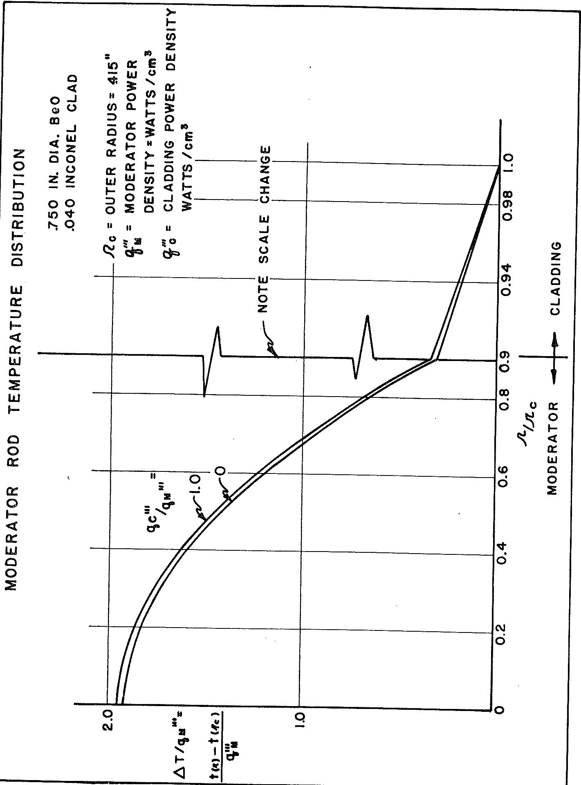  
FIGURE A-6.1

# APPENDIX 6.2

# CALCULATIONS FOR FINAL DESIGN OF PRIMARY HEAT EXCHANGER

# 6.2.1 Basis of Design

The primary heat exchanger is designed to transfer 125 megawatts or $4.27 \times 10^{8}$ Btu/Hr from the fluid fuel to the secondary coolant. Many quantities which would ordinarily be considered design parameters were, due to the short time allowed for this study, given what seem to be reasonable values and held invariant throughout the calculations.

The following calculations represent the final iteration of the most promising combination of tube diameter and spacing as indicated by Figure 6.1.

# 6.2.2 Properties of Fuel, Secondary Coolant and Inconel

As given in Section 5.0.

# 6.2.3 Quantities Determined Before Employing Iterative Procedure

Heat Exchanger Inner Diameter 53.5 in.

Heat Exchanger Length 48 in.

Tube Wall Thickness .040 in.

Temperatures

Fuel Entering $= 1275^{\circ}\mathrm{F}$

Fuel Leaving $= 1175^{\circ}\mathrm{F}$

Coolant Entering $= 1050^{\circ}\mathrm{F}$

Coolant Leaving $= 1150^{\circ}\mathrm{F}$

6.2.4 Quantities Determined by Iterative Process

Tube Outer Diameter = .200 in.

Tube Spacing = .030 in.

Reactor Outer Diameter = 73.7 in.

Number of Tubes $= 43,420$

6.2.5 Flow Rates

a. Fuel Loop Flow = q C p $\Delta T$ 4.27 x 108 Btu/ Hr .264 Btu 1b-OF 100°F

$$
= 1 6. 2 \times 1 0 ^ {6} \frac {\mathrm {L B}}{\mathrm {H R}}
$$

4.27 x 108 Btu b. Coolant Loop Flow = C $\frac{q}{p\Delta T}$ hr p

$$
= 7. 4 9 \times 1 0 ^ {6} \frac {\mathrm {L B}}{\mathrm {H r .}}
$$

6.2.6 Flow Velocities

a. For specific values of tube diameter, tube spacing, and reactor outer diameter, the approximate number of tubes contained in the heat exchanger are determined as follows:

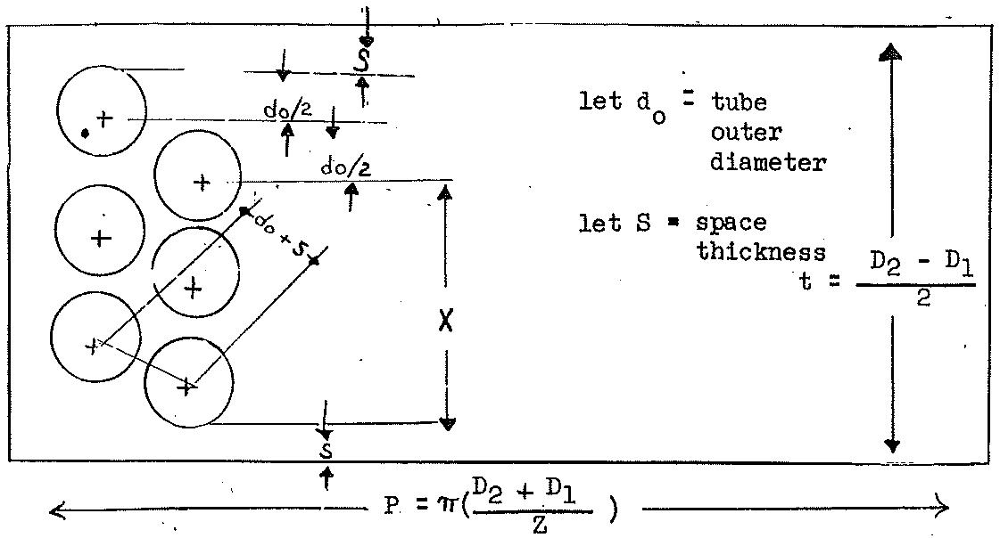

Number of vertical rows of tubes

$$
N = P \div \left[ \frac {\sqrt {3} (d o + S)}{Z} \right] = \frac {\pi (D _ {2} + D _ {1})}{\sqrt {3} (d o + S)}
$$

Number of horizontal rows of tubes

$$
\begin{array}{l} \eta = \frac {x}{d o + s} + 1 \\ x = \frac {D _ {2} - D _ {1} - 5 s - 3 d o}{2} \\ \end{array}
$$

$$
\eta = \frac {D _ {2} - D _ {1} - 5 s - 3 d o}{2 (d o + s)} + 1
$$

Total number of tubes

$$
n = N \eta = \left[ \frac {\pi \left(D _ {2} + D _ {1}\right)}{3 (\mathrm {d o} + s)} \right] \left[ \frac {D _ {2} - D _ {1} - 5 s - 3 \mathrm {d o}}{2 (\mathrm {d o} + s)} + 1 \right]
$$

$$
\left[ = \frac {\pi \left(D _ {2} + D _ {1}\right)}{2 \sqrt {3} (\mathrm {d o} + s) ^ {2}} \right] \quad \left[ D _ {2} - D _ {1} - 3 s - \mathrm {d} 0 \right]
$$

Using the results of the final iteration,

$$
\begin{array}{l} n = \left[ \frac {r (7 3 . 7 + 5 3 . 5)}{2 \sqrt {3} (. 2 0 0 + . 0 3 0) ^ {2}} \right] \quad 7 3. 7 - 5 3. 5 - . 0 9 0 - . 2 0 0 \\ = 4 3, 4 2 0 \text {t u b e s} \\ \end{array}
$$

b. Coolant Velocity

$$
\begin{array}{l} V _ {c} = \frac {W _ {c}}{\rho_ {c} A _ {c}} \quad \frac {7 . 4 9 \times 1 0 ^ {6} l b / h r}{\left[ 2 3 l b / f t ^ {3} \right] \left[ 4 3 , 4 2 0 \frac {\pi (. 2 0 0 - . 0 8 0) ^ {2}}{4 (1 4 4)} F t ^ {2} \right]} \\ = 1 7, 8 3 0 \mathrm {f t / h r} = 4. 9 5 \mathrm {f t / s e c} \\ \end{array}
$$

c. Fuel Velocity

$$
\begin{array}{l} \begin{array}{l l} \mathrm {V _ {f}} & \frac {\mathrm {W _ {f}}}{\rho_ {\mathrm {F}} ^ {\mathrm {A}} \mathrm {f}} \\ & \frac {1 6 . 2 \times 1 0 ^ {6} \mathrm {l b / h r}}{\left[ 2 0 8 \mathrm {l b / f t} ^ {3} \right] \left[ \frac {\pi}{1 4 \times 1 4 4} (7 3 . 7 - 5 3 . 5 ^ {2} - 4 3 4 2 0 \times . 2 ^ {2}) \right]} \end{array} \\ = 1 7, 1 5 0 \mathrm {f t / h r} = 4. 7 6 \mathrm {f t / s e c} \\ \end{array}
$$

6.2.7 Fuel Side Hydraulic Diameter

$$
\begin{array}{l} d _ {h} = \frac {4 x c r o s s s e c t i o n a l a r e a}{w e t t e d p e r i m e t e r} \\ = \frac {4 \left[ \frac {\pi}{4 \times 1 4 4} \left(7 3 . 7 ^ {2} - 5 3 . 5 ^ {2} - 4 3 4 2 0 x . 2 ^ {2} \right] \right.}{\frac {\pi}{1 2} (7 3 . 7 + 5 3 . 5 + 4 3 , 4 2 0 x . 2)} \\ = \quad . 0 0 7 8 8 f t \\ \end{array}
$$

# 6.2.8 Reynold's Numbers

a. Fuel Side Reynold's Number

$$
\begin{array}{l} = R _ {e f} = \frac {\rho_ {f} ^ {d} h f ^ {V} f}{\mu_ {f}} \\ = \frac {(2 0 8 \mathrm {l b} / \mathrm {f t} ^ {3}) (. 0 0 7 8 8 \mathrm {f t}) (1 7 1 5 0 \mathrm {f t} / \mathrm {h r})}{1 8 \mathrm {l b} / \mathrm {h r} \mathrm {f t}} \\ = 1 5 6 0 \\ \end{array}
$$

b. Secondary Coolant Side Reynold's Number

$$
\begin{array}{l} = \mathrm {R} _ {\mathrm {e c}} = \frac {\rho_ {\mathrm {c}} ^ {\mathrm {d} _ {\perp} \mathrm {V} _ {\mathrm {c}}}}{\mu_ {\mathrm {c}}} \\ = \frac {(1 2 3 \mathrm {l b} / \mathrm {f t} ^ {3}) (\frac {0 1 2 0}{1 2} \mathrm {f t}) (1 7 8 3 0 \mathrm {f t} / \mathrm {h r})}{5 3 . 2 \mathrm {l b} / \mathrm {f t} \mathrm {h r}} \\ = 4 1 2 \\ \end{array}
$$

# 6.2.9 Prandtl Numbers

a. Fuel Side

$$
\begin{array}{l} \Pr_ {f} = \frac {C _ {p f} \mu_ {f}}{k f} = \frac {\left(. 2 6 4 B T U / l b ^ {o} F\right) (1 8 l b / f t s e c)}{1 . 3 B T U / h r - f t - ^ {o} F} \\ = 3. 6 6 \\ \end{array}
$$

b. Coolant Side

$$
\begin{array}{l} \Pr_ {c} = \frac {C _ {p c} \mu_ {c}}{k _ {c}} = \frac {\left(. 5 7 B T U / ^ {\circ} F - 1 b\right) \left(5 3 . 2 l b / h r - f t\right)}{2 . 4 B T U / h r - ^ {\circ} F - f t} \\ = 1 2. 6 \\ \end{array}
$$

# 6.2.10 Film Coefficient

a. Fuel Side (See Figure 7.6)

$$
\begin{array}{l} h _ {0} = \cdot^ {4 7} \frac {k f}{\bar {d} _ {h f}} \left(\Pr_ {f}\right) ^ {\cdot^ {4}} \left(R e _ {f}\right) ^ {\cdot^ {6}} \\ = . 4 7 \left(\frac {1 . 3 \mathrm {B T U} / {} ^ {\circ} \mathrm {F} - \mathrm {f t} - \mathrm {h r}}{. 0 0 7 8 8 \mathrm {f t}}\right) (3. 6 6) ^ {. 4} (1 5 6 0) ^ {. 3 6} \\ = 1 8 3 6 \mathrm {B T U} / \mathrm {h r} - \mathrm {f t} ^ {2} - ^ {\circ} \mathrm {F} \\ \end{array}
$$

b. Coolant Side (Ref. 17, page 232)

$$
\begin{array}{l} h _ {1} = 1. 6 2 \frac {k c}{d _ {1}} \left(R e P r \frac {d _ {i}}{L}\right) ^ {1 / 3} \\ = 1. 6 2 \frac {\left(2 . 4 \mathrm {B T U} / \mathrm {h r} - \mathrm {f t} - ^ {\circ} \mathrm {F}\right)}{\left(\frac {. 1 2 0}{1 2} \mathrm {F t}\right)} \left(4 1 2 \times 1 2 . 6 \times \frac {. 1 2 0}{4 8}\right) ^ {1 / 3} \\ = 9 1 5 \frac {\mathrm {B T U}}{\mathrm {H r} - \mathrm {f t} ^ {2} - \mathrm {o} _ {\mathrm {F}}} \\ \end{array}
$$

6.2.11 Overall Heat Transfer Coefficient

$$
\begin{array}{l} U _ {o} = \frac {1}{\frac {1}{h _ {o}} + \frac {d _ {o}}{d _ {i} h _ {o}} + \frac {d _ {o}}{2 k _ {I}} \ln \frac {d _ {o}}{d _ {i}}} \\ = \frac {1}{\frac {1}{1 8 3 6 \mathrm {B T U} / \mathrm {h r} - \mathrm {f t} ^ {2} - {} ^ {\circ} \mathrm {F}} + \frac {. 2 0 0 \mathrm {i n}}{(. 1 2 0 \mathrm {i n}) (9 1 5 \mathrm {B T U} / \mathrm {h r} - \mathrm {f t} ^ {2} - {} ^ {\circ} \mathrm {F}}} + \\ \end{array}
$$

$$
\begin{array}{l} \left(\frac {2 0 0}{1 2} \mathrm {F t}\right) \ln^ {\prime} \left(\frac {2 0 0}{1 2 0}\right) \\ (\overline {{2 \times 1 4}} \mathrm {B T U} / \mathrm {h r - f t} ^ {- \circ F}) \\ \end{array}
$$

$$
\begin{array}{l} = \frac {1}{\left(. 0 0 1 8 2 + . 0 0 0 5 ^ {4} 5 + . 0 0 3 0 4\right)} \frac {\mathrm {B T U}}{\mathrm {H r - F t} ^ {2 - o} \mathrm {F}} \\ = 3 7 4 \frac {\mathrm {B T U}}{\mathrm {H r} - \mathrm {F t} ^ {2} - \mathrm {O} _ {\mathrm {F}}} \\ \end{array}
$$

6.2.12 Total Heat Transfer Area

$$
\begin{array}{l} A _ {0} = n \pi d _ {0} L = 4 3 4 2 0 x \pi x (\frac {2 0 0}{1 2} f t) x (\frac {4 8}{1 2} f t) \\ = 9 0 9 0 F t ^ {2} \\ \end{array}
$$

6.2.13 Mean Temperature Difference Required to Transfer 125 Megawatts of Heat

$$
\begin{array}{l} \Delta \mathrm {T} _ {\mathrm {m}} = \frac {\mathrm {q}}{\mathrm {A} _ {\mathrm {o}} ^ {\mathrm {U}}} = \frac {(4 . 2 7 \times 1 0 ^ {8} \mathrm {B T U / H r})}{(9 0 9 0 \mathrm {F t} ^ {2}) (3 7 4 \mathrm {B T U / H r - F t} ^ {2} - \mathrm {o} _ {\mathrm {F}})} \\ = 1 2 5. 4 ^ {\circ} \mathrm {F} \\ \end{array}
$$

6.2.14 Temperature Drops Across Surface Films and Tube Wall

a. Fuel Side Film

$$
\begin{array}{l} \Delta \mathrm {T} _ {\mathrm {o}} = \frac {\mathrm {q}}{\mathrm {h} _ {\mathrm {o} \mathrm {o}}} = \frac {4 . 2 7 \times 1 0 ^ {8} \mathrm {B T U / H r}}{(1 8 3 6 \mathrm {B T U / H r} - \mathrm {F t} ^ {2} - \mathrm {O F}) (9 0 9 0 \mathrm {F t} ^ {2})} \\ = 2 5. 6 ^ {\circ} \mathrm {F} \\ \end{array}
$$

b. Coolant Side Film

$$
\begin{array}{l} \Delta \mathrm {T} _ {1} = \frac {\mathrm {q}}{\mathrm {h} _ {i} ^ {\mathrm {A}}} = \frac {4 . 2 7 \times 1 0 ^ {8} \mathrm {B T U} / \mathrm {H r}}{(9 1 5 \mathrm {B T U} / \mathrm {H r} - \mathrm {F t} ^ {2} - \mathrm {o} _ {\mathrm {F}}) (\cdot \frac {1 2 0}{1 2} \mathrm {x} 4 \mathrm {x} \pi \mathrm {x} 4 3 4 2 0 \mathrm {F t} ^ {2})} \\ = 8 5. 5 ^ {\mathrm {o}} \mathrm {F} \\ \end{array}
$$

c. Tube Wall

$$
\Delta T _ {W} = 1 2 5. 4 - 2 5. 6 - 8 5. 5 = 1 4. 3 ^ {\circ} F
$$

6.2.15 Approximate Average Surface Temperature of Tube

a. Fuel Side

$$
\begin{array}{l} \mathrm {T} _ {\mathrm {w f}} = \text {I n l e t S u r f a c e T e m p e r a t u r e} + \text {E x i t S u r f a c e T e m p e r a t u r e} \\ = \frac {(1 2 7 5 - 2 5 . 6) + (1 1 7 5 - 2 5 . 6)}{2} \\ = 1 2 0 0 ^ {\circ} \mathrm {F} \\ \end{array}
$$

b. Coolant Side

$$
\begin{array}{l} \frac {T _ {\mathrm {W C}}}{2} = \frac {\text {I n l e t S u r f a c e T e m p e r a t u r e} + \text {E x i t S u r f a c e T e m p e r a t u r e}}{2} \\ = \frac {(1 0 5 0 + 8 5 . 5) + (1 1 5 0 + 8 5 . 5)}{2} \\ = 1 1 8 6 ^ {\circ} \mathrm {F} \\ \end{array}
$$

6.2.16 Approximate Average Tube Wall Temperature

$$
\begin{array}{l} \mathrm {T} _ {\mathrm {w a}} = \frac {\mathrm {T} _ {\mathrm {w f}} + \mathrm {T} _ {\mathrm {w c}}}{2} = \frac {1 2 0 0 + 1 1 8 6}{2} \\ = 1 1 9 3 ^ {\circ} \mathrm {F} \\ \end{array}
$$

6.2.17 Friction Factors For Both Sides of Heat Exchanger and Reactor Core

a. Heat Exchanger, Fuel Side

$$
\begin{array}{l} f _ {F} = \frac {5 . 7}{\left(R e _ {f}\right) \cdot 5 6} \tag {Ref.13} \\ = \frac {5 . 7}{(1 5 6 0) . 5 6} = . 0 9 2 7 \\ \end{array}
$$

b. Heat Exchanger, Coolant Side

$$
\begin{array}{l} f _ {c} = \frac {6 4}{\left(\operatorname {R e} _ {c}\right)} \quad (\text {R e f . 1 5 , p a g e 5 0}) \\ = \frac {6 4}{4 1 2} = . 1 5 5 \\ \end{array}
$$

c. Reactor Core

$$
f _ {r} = . 0 2 4 \quad (\text {R e f . 1 5 , F i g u r e 2 - 2 l b})
$$

See also Appendix 6.2.18 for Reynolds Number in core

# 6.2.18 Pressure Drops for Both Sides of Heat Exchanger and Reactor Core

a. Heat Exchanger, Fuel Side

$$
\begin{array}{l} \Delta P = f _ {F} \frac {(L F t)}{(d h r ^ {F t})} \quad \frac {\left(V _ {f} \frac {F t}{S e c}\right) ^ {2}}{2 (g \frac {F t}{S e c 2})} \quad (\text {R e f . 1 5 , p a g e 4 5}) \\ = . 0 9 2 7 \frac {(4)}{(. 0 0 7 8 8)} \cdot \frac {(4 . 7 6) ^ {2}}{2 (3 2 . 2)} \\ = 1 6. 6 \mathrm {F t} \\ = \frac {(2 0 8 \mathrm {L b} / \mathrm {F t} ^ {3}) (1 6 . 6 \mathrm {F t})}{1 4 4 \frac {\mathrm {i n} ^ {2}}{\mathrm {F t} ^ {2}}} = 2 4. 0 \mathrm {p s i} \\ \end{array}
$$

b. Heat Exchanger, Coolant Side

$$
\begin{array}{l} \Delta P = f _ {F} \frac {(L)}{d _ {i}} \frac {(V _ {C})}{2 g} \\ = . 1 5 5 \frac {(4 F t)}{\frac {1 2 0}{1 2} F t} \frac {(4 . 9 5 ^ {2} F t ^ {2}}{2 \times 3 2 . 2 \underbrace {F t} _ {\text {s e c}}} \\ = 2 3. 7 \mathrm {F t} \\ = \frac {\left(1 2 3 \mathrm {L b} / \mathrm {F t} ^ {3}\right) (2 3 . 7 \mathrm {F t})}{\left(1 4 4 \frac {\mathrm {I n} ^ {2}}{\mathrm {F t} ^ {2}}\right)} = 2 0. 3 \mathrm {p s i} \\ \end{array}
$$

c. Reactor Core

1. Flow Area = A_r = .50 $\frac{\pi}{4}$ (75 cm 12 In Ft x 2.54 cm In)²

$$
= 2. 3 8 \mathrm {F t} ^ {2}
$$

2. Wetted Perimeter $= \mathrm{P_r} = \frac{\pi}{12\frac{\mathrm{In}}{\mathrm{Ft}}} \quad \left(\frac{75\mathrm{cm}}{2.54\frac{\mathrm{cm}}{\mathrm{In}}} + \frac{10\mathrm{cm}}{2.54\frac{\mathrm{cm}}{\mathrm{In}}}\right)$

$$
+ 7 4 9 x. 7 5 \ln) = 1 5 6 F t.
$$

See Section 3.3 for dimensions of reactor core.

3. Hydraulic Diameter = dhr

$$
\begin{array}{l} = \frac {4 x A _ {r}}{P _ {r}} = \frac {4 x 2 . 3 8}{1 5 6} \\ = . 0 6 1 0 F t \\ \end{array}
$$

4. Velocity = Wf / (ρf x A r) = 16.2 x 10^6 Lb/Hr / 208 Lb/Ft^3 x 2.38 Ft^2

$$
= 3 2, 7 0 0 \mathrm {F t} / \mathrm {H r} = 9. 0 8 \mathrm {F t} / \mathrm {s e c}
$$

5. Reynolds Number = Re

$$
= \frac {\rho_ {f} ^ {d} h r ^ {v} r}{\mu_ {f}} = \frac {(2 0 8 L b / F t ^ {3}) (0 . 6 1 0 F t) (3 2 , 7 0 0 F t / H r)}{1 8 L b / F t - H r}
$$

$$
= 2 3, 1 0 0
$$

6. $\Delta P_{\mathbf{r}} = \frac{\mathrm{f}_{\mathbf{r}}}{\mathrm{d}_{\mathbf{hr}}} (\frac{\mathrm{L}_{\mathbf{r}}}{\mathrm{d}_{\mathbf{hr}}})$

$$
= . 0 2 4 \frac {(3 . 9 4 F t)}{. 0 6 1 0 F t} \frac {(9 . 0 8 ^ {2} F t ^ {2})}{2 \times 3 2 . 2 F t / S e c ^ {2}}
$$

$$
\begin{array}{l} = 2. 0 \mathrm {F t} = \frac {2 0 8 \mathrm {L b} / \mathrm {F t} ^ {3} \times 2 . 0 \mathrm {F t}}{1 4 4 \frac {\mathrm {I n} ^ {2}}{\mathrm {F t} ^ {2}}} \\ = 2. 8 9 \mathrm {p s i} \\ \end{array}
$$

6.2.19 Pumping Power Requirements for Both Sides of Heat Exchanger and Reactor Core

a. Heat Exchanger, Fuel Side

$$
\begin{array}{l} F H P _ {f} = \frac {\left(W _ {f} L b / H r\right) \left(\Delta P _ {f} F t\right)}{\left(1 . 9 8 \times 1 0 ^ {6} \frac {F t - L b}{H P - H r}\right)} \quad (R e f. 1 5, p a g e 8 0) \\ = \frac {(1 6 . 2 \times 1 0 ^ {6} \frac {\mathrm {L b}}{\mathrm {H r}}) (1 6 . 6 \mathrm {F t})}{1 . 9 8 \times 1 0 ^ {6} \frac {\mathrm {F t} - \mathrm {L b}}{\mathrm {H p} - \mathrm {H r}}} \\ = 1 3 6 \mathrm {H P} \\ \end{array}
$$

b. Heat Exchanger, Coolant Side

$$
\begin{array}{l} F H P _ {c} = \frac {(7 . 4 9 \times 1 0 ^ {6} L b / H r) (2 3 . 7 F t)}{1 . 9 8 \times 1 0 ^ {6} F t - L b / H p - H r} \\ = 9 0. 0 \mathrm {H P} \\ \end{array}
$$

c. Reactor Core

$$
\begin{array}{l} F H P _ {r} = \frac {(1 6 . 2 \times 1 0 ^ {6} L b / H r) (2 . 0 F t)}{1 . 9 8 \times 1 0 ^ {6} F t - L b / H p - H r} \\ = 1 6. 3 \mathrm {H P} \\ \end{array}
$$

# APPENDIX 7.1

# STEAM GENERATING SYSTEM

# I. Heat-Transfer Calculations for Steam Generator

A. Inconel Tube Data:

(1) Size; 5/8 in. O.D., 1/2 in. I.D.   
(2) Pitch; $3/4$ in. delta array   
(3) Thermal Conductivity = 11.3 Btu/hr-ft-OF   
(4) Specific heat = 0.124 Btu/1b $^{\circ}$ F   
(5) Density = 510 lb/ft3

B. Steam Generator Inlet Conditions:

(1) Molten Salt:

(a) $\mathrm{T} = 761.8^{\circ}\mathrm{F}(95.9\mathrm{MW})$ ； $\mathrm{T} = 800^{\circ}\mathrm{F}(125\mathrm{MW})$   
(b) $w = 7.49 \times 10^{6} \mathrm{lb} / \mathrm{hr}$   
(c) $c_p = 0.57 \, \text{Btu/lb}^{-\circ F}$   
(a) $\mu = 130\mathrm{cp}$ (95.9 MW); $\mu = 126\mathrm{cp}$ (125 MW)   
(e) $\rho = 127\mathrm{lb / ft}^3$   
(f) k = 2.4 Btu/hr-ft-°F

(2) Water:

(a) $\mathrm{T} = 564^{\circ}\mathrm{F}$   
(b) $\mathbb{P} = 1250$ psia   
(c) $\mathrm{h} = 567\mathrm{Btu / lb}$   
(d) $w = 3,230,000 \, \text{lb/hr}$ (95.9 MW); $w = 4,149,500$ (125 MW)   
(e) vel. = 6.24 ft/sec (95.9 MW); vel. = 8 ft/sec (125 MW)   
(f) spec. vol. = 0.0221 ft³/1b

C. Steam Generator Outlet Conditions:

(1) Molten Salt:

(a) $\mathrm{T} = 703^{\circ}\mathrm{F}(95.9\mathrm{MW})$ ； $\mathrm{T} = 724^{\circ}\mathrm{F}(125\mathrm{MW})$   
(b) $w = 7.49 \times 10^{6} \, \text{lb/hr}$   
(c) $c_p = 0.57 \, \text{Btu/lb}^{-\circ_F}$   
(d) $\mu = 195$ centipoises; $\mu = 175$ centipoises (125 MW)

(2) Water:

(a) $\mathrm{T} = 572^{\circ}\mathrm{F}$   
(b) $\mathrm{P} = 1250$ psia   
(c) $h = 579 \text{ Btu} / \text{lb}$   
(d) $w = 2,874,970 \, \text{lb/hr}$ (95.9 MW); $w = 3,689,000$ (125 MW)

(3) Steam:

(a) $\mathrm{T} = 572^{\circ}\mathrm{F}$   
(b) $P = 1250 \mathrm{psia}$   
(c) $h = 1181 \, \text{Btu/hr}$   
(d) $w = 355,030 \, \text{lb/hr}; w = 456,000 \, \text{lb/hr}$ (125 MW)

D. Water Flow Area and Number of Tubes:

(1) Area = $\frac{\text{w x (spec. vol.)}}{\text{vel.}} = \frac{(3.23 \times 10^{6} \text{ lb/hr}) \times (0.0221 \text{ ft}^{3} / \text{lb})}{3.6 \times 10^{3} \text{ sec/hr} \times 6.24 \text{ ft/sec}} = 3.184 \text{ ft}^{2}$   
(2) Number of tubes = $\frac{\text{Total Flow Area}}{\text{Flow Area per Tube}} = \frac{3.184\, \text{ft}^2}{0.001364\, \text{ft}^2/\text{tube}} = 2336$

E. Salt Flow Characteristics:

(1) Flow area/Tube = 0.867 (Pitch)^2 - $\frac{\pi}{4} (\mathrm{d})^2$

$$
\begin{array}{l} = 0. 8 6 7 \left(\frac {. 7 5}{1 2}\right) ^ {2} - \frac {\pi}{4} \left(\frac {. 6 2 5}{1 2}\right) ^ {2} \\ = 0. 0 0 1 2 6 \mathrm {f t} ^ {2} \\ \end{array}
$$

Total Flow Area = 2336 tubes x 0.00126 ft²/tube = 2.94 ft²

(2) $\mathrm{vel.} = \frac{\mathrm{w}}{\rho \mathrm{A}}$ $\frac{7.49 \times 10^{6} \mathrm{lb/hr}}{127 \mathrm{lb/ft}^{3} \times 2.94 \mathrm{ft}^{2} \times 3.6 \times 10^{3} \mathrm{sec/hr}} = 5.58 \mathrm{ft/sec}$   
(3) Hydraulic Diameter, De = $\frac{4A}{\pi d} = \frac{4(0.00126 ft^2)}{\pi(0.625 ft)} = 0.0308 ft$   
(4) Re $\frac{v\rho De}{\mu}$ 5.58 ft/sec x 127 lb/ft³ x 0.0308 ft = 191 (95.9 MW)  
170 cp x 6.72 x 10⁻⁴ (lb-sec/ft)/cp = 258 (125 MW)   
(5) From Fig. 7.6; $\frac{\mathrm{Nu}}{\mathrm{Pr}^{0.4}} = 2.15(95.9\mathrm{MW}) = 2.7(125\mathrm{MW})$

$$
\begin{array}{l} h = 2. 1 5 \times \frac {k}{d} \quad \left[ \frac {c _ {p} \mu}{k} \right] ^ {0. 4} = \frac {2 . 1 5 (2 . 4)}{0 . 0 3 0 8} \left[ \frac {(0 . 5 7) (2 . 4 2) 1 7 0}{2 . 4} \right] ^ {0. 4} \\ = 1 0 1 5 \mathrm {B t u / h r - f t} ^ {2} - \mathrm {o} _ {\mathrm {F}} = 1 1 7 0 (1 2 5 \mathrm {M W}) \\ R _ {s a l t} = \frac {1}{1 0 1 5} = 0. 0 0 0 9 8 6 \\ \end{array}
$$

F. Inconel Tube Wall Resistance:

$$
\mathrm {R} _ {\text {w a l l}} = \frac {\mathrm {r} _ {\mathrm {o}} \ln \left(\mathrm {r} _ {\mathrm {o}} / \mathrm {r} _ {\mathrm {i}}\right)}{\mathrm {k}} = \frac {\left(\frac {0 . 3 1 2 5}{1 2}\right) \ln \left(\frac {0 . 3 1 2 5}{0 . 2 5 0}\right)}{1 1 . 3} = 0. 0 0 0 4 8 5
$$

G. Boiling Water Film and Scale Resistance:

$$
\begin{array}{l} R = \frac {r _ {0}}{r _ {1}} \left(\frac {1}{h} \text {s c a l e} + \frac {1}{h} \text {b o i l i n g}\right) \tag {1} \\ = 1. 2 5 \left(\frac {1}{2 0 0 0} + \frac {1}{6 0 0 0}\right) = 0. 0 0 0 8 3 3 \\ \end{array}
$$

H. Heat-Transfer Coefficient for Water in the Tubes:

(1) $\mathrm{Re} = \frac{\mathrm{vd}\rho}{\mu}\left(\frac{6.24\left(\frac{0.5}{12}\right)44.8}{0.225}\right)(3.6 \times 10^{3}) = 1.88 \times 10^{5} (95.9 \mathrm{MW})$

$$
= 2. 4 \times 1 0 ^ {5} (1 2 5 \mathrm {M W})
$$

(2) $h = 0.023\frac{k}{d}\Pr^{0.4}Re^{0.8} = 0.023\left(\frac{0.297}{\frac{5}{12}}\right)\left[\frac{1.35(0.225)}{0.297}\right]^{0.4}(1.88\times 10^5)^{0.8}$

$$
h = 2 7 0 0 B t u / h r - f t ^ {2} - F (9 5. 9 M W) = 3 2 9 0 (1 2 5 M W)
$$

(3) $\mathrm{R}_{\text {water }} = \frac{\mathrm{r}_{0}}{\mathrm{r}_{i}} \left(\frac{1}{\mathrm{h}} + \frac{1}{\mathrm{h}}_{\text {water }} + \frac{1}{\mathrm{h}}_{\text {scale}}\right)$

$$
\begin{array}{l} = 1. 2 5 \left(\frac {1}{2 7 0 0} + \frac {1}{2 0 0 0}\right) \\ = 0. 0 0 1 0 8 7 \\ \end{array}
$$

I. Overall Heat Transfer Coefficient for Water-Heating Area:

(1) $\mathbb{R}_{\text {Total}} = 0.000986 + 0.000485 + 0.001087 = 0.002558$

(2) $U = \frac{1}{R_{\text {Total }}} = \frac{1}{0.002558} = 390 \text { Btu/hr - ft }^{2} \cdot^{\circ} \mathrm{F} (95.9 \mathrm{MW})$

$$
= 4 2 5 (1 2 5 \mathrm {M W})
$$

J. Over-all Heat Transfer Coefficient for Boiling Area:

(1) $\mathbb{R}_{\text {Total}} = 0.000833 + 0.000485 + 0.000986 = 0.002304$   
(2) $U = 430 \, \text{Btu/hr} - ft^2 - \frac{o_{\text{F}}}{95.9 \, \text{MW}} = 460$ (125 MW)

K. Heat-Transfer Area for Water-Heating Region:

(1) $q_{\text{water}} = w_{\Delta h} = 355,030 \, \text{lb/hr}$ (579 - 472) Btu/1b = 0.373 x 10^8 Btu/hr

$$
\Delta t _ {\text {s a l t}} = \frac {q}{w c _ {p}} = \frac {0 . 3 7 3 x 1 0 ^ {8} B t u / h r}{7 . 4 9 x 1 0 ^ {6} l b / h r x 0 . 5 7 B t u / h r - l b ^ {- o} F} = 8. 6 5 ^ {o}
$$

(2) $\Delta t_{\mathrm{m}} = 138.8^{\circ} \mathrm{F}$ (95.9 MW) = 163°F (125 MW)   
(3) A = $\frac{q}{U\Delta t} = \frac{0.373 \times 10^8}{138.8(390)} = 690 ft^2$ (95.9 MW)

$$
\text {A r e a} = 8 0 4 \mathrm {f t} ^ {2} (1 2 5 \mathrm {M W})
$$

L. Heat-Transfer Area for Boiling Region:

(1) $q = w \Delta h = 355,030$ (602) = 2.14 x $10^{8}$ Btu/hr

(2) $\Delta t_{\mathrm{lm}}$ $\frac{(761.8 - 572) - (711.7 - 572)}{\ln\left(\frac{189.8}{139.7}\right)} = 163^{\circ} \mathrm{F}$ (95.9 MW)

$$
= 1 9 5 ^ {\circ} \mathrm {F} (1 2 5 \mathrm {M W})
$$

(3) $A = \frac{q}{U\Delta t} = \frac{2.14 \times 10^{8} Btu / hr}{430 Btu / hr - ft^{2} - F \times 163^{0} F} = 3040 ft^{2}$ (95.9 MW)

$$
3 0 5 0 \mathrm {f t} ^ {2} (1 2 5 \mathrm {M W})
$$

M. Total Steam Generator Heat Transfer Surface:

$$
\begin{array}{l} A r e a = 3 0 4 0 + 6 9 0 = 3 7 3 0 f t ^ {2} (9 5. 9 M W) \\ A = 3 0 5 0 + 8 0 4 = 3 8 5 4 \mathrm {f t} ^ {2} (1 2 5 \mathrm {M W}) \\ \end{array}
$$

The area of 3854 ft² is the design area and gives a tube length of 10.08 ft.

# II. Heat-Transfer Calculations for the Superheater

A. Inconel Tube Data:

(1) Size: 0.5 in. O.D.; 0.4 in. I.D.   
(2) Pitch: 0.75 in. delta array   
(3) Thermal Conductivity = 13.5 Btu/hr-ft $^{-0}$ F   
(4) Specific heat = 0.133 Btu/lb-°F   
(5) Density = 507 lb/ft³

# B. Superheater Inlet Conditions:

(1) Molten Salt:

(a) $\mathrm{T} = 1138.4^{\circ}\mathrm{F}(95.9\mathrm{MW})$ ； $\mathrm{T} = 1150^{\circ}\mathrm{F}(125\mathrm{MW})$   
(b) $w = 7.49 \times 10^{6} \mathrm{lb} / \mathrm{hr}$   
(c) $c_p = 0.57 \, \text{Btu/lb}^{-\circ_F}$   
(d) $\mu = 18.5$ centipoise   
(e) $\rho = 123\mathrm{lb / ft}^3$   
(f) $\mathrm{k} = 2.4\mathrm{Btu / hr - ft - }^{\circ}\mathrm{F}$

(2) Steam:

(a) $\mathrm{T} = 572^{\circ} \mathrm{F}$ .   
(b) $\mathrm{P} = 1250$ psia   
(c) $h = 1181 \, \text{Btu/1b}$   
(d) $w = 263,300 \, \text{lb/hr}$ (95.9 MW); $w = 348,000 \, \text{lb/hr}$ (125 MW)

# C. Superheater Outlet Conditions:

(1) Molten Salt:   
(a) $\mathrm{T} = 1120.5^{\circ}\mathrm{F}(95.9\mathrm{MW})$ ； $\mathrm{T} = 1126^{\circ}\mathrm{F}(125\mathrm{MW})$

(2) Steam:

(a) $\mathrm{T} = 950^{\circ}\mathrm{F}$   
(b) $\mathrm{P} = 1235$ psia

(c) $\mathrm{h} = 1470\mathrm{Btu / lb}$   
(d) $w = 263,300 \, \text{lb/hr}$ (95.9 MW); $w = 348,000 \, \text{lb/hr}$ (125 MW)   
(e) $\mathrm{vel.} = 75.7\mathrm{ft / sec}$ (95.9 MW); vel. $= 100$ ft/sec (125 MW)   
(f) spec. vol. = 0.650 ft³/1b

D. Required Number of Tubes:

(1) Number of Tubes = $\frac{\text{W x (spec. vol)}}{\text{vel. x area / tube}}$

$$
\begin{array}{l} = \frac {\left(2 6 3 , 3 0 0 \mathrm {l b / h r}\right) \times \left(0 . 6 5 0 \mathrm {f t} ^ {3} / 1 \mathrm {b}\right)}{\left(2 . 7 2 \mathrm {x} 1 0 ^ {5} \mathrm {f t / h r}\right) \times \left(8 . 7 2 \mathrm {x} 1 0 ^ {- 4} \mathrm {f t} ^ {2} / \text {t u b e}\right)} \\ = 7 2 2 \\ \end{array}
$$

E. Salt Flow Characteristics:

(1) Flow area/tube = 0.867 $\left(\frac{0.75}{12}\right)^{2} - \frac{\pi}{4}$ $\left(\frac{0.50}{12}\right)^{2}$

$$
= 0. 0 0 2 0 3 f t ^ {2}
$$

(6) From Figure 7.6; $\frac{\mathrm{hd}}{\mathrm{k}} = 21 \times \mathrm{Pr}^{0.4}$

(2) Total Flow Area = 722 x 0.00203 = 1.465 ft²   
(3) $\text{vel.} = \frac{\text{W}}{\rho A} = \frac{7.49 \times 10^{6} \text{lb/hr}}{(123 \text{lb/ft}^{3}) \times (1.465 \text{ft}^{2}) \times 3.6 \times 10^{3} \text{sec/hr}} = 11.55 \frac{\text{ft}}{\text{sec}}$   
(4) Hydraulic Radius, De = $\frac{4A}{\pi d} = \frac{4(0.00203)}{\pi\left(\frac{0.5}{12}\right)} = 0.0622$ ft   
(5) $\mathrm{Re} = \frac{\mathrm{v}\rho\mathrm{De}}{\mu} = \frac{11.55 \times 0.0622 \times 123}{6.72(10^{-4})18.5} = 7140$

$$
\begin{array}{l} h = \frac {2 . 4}{0 . 6 2 2} \left[ \frac {2 . 4 2 (0 . 5 7) (1 8 . 5)}{2 . 4} \right] ^ {0. 4} x 2 1 \\ = 2 0 5 0 \mathrm {B t u} / \mathrm {h r} - \mathrm {f t} ^ {2} - \mathrm {F} \\ \underset {\text {s a l t}} {\mathrm {R}} = 0. 0 0 0 4 8 7 \\ \end{array}
$$

F. Steam Heat Transfer Coefficient:

(1) Average spec. vol. = 0.500 ft³/1b

(2) From Ref. 21, h = $\frac{0.0266}{(d/12)} 0.2$ x G0.8 x c p x μ0.20

For these conditions,

$$
\begin{array}{l} G = \text {A v e r a g e} \quad \text {V e l .} = \frac {\text {w x s p e c . v o l .}}{\text {A r e a}} = \frac {(2 . 6 3 \times 1 0 ^ {5} \mathrm {l b / h r}) \times 0 . 5 0 0 \mathrm {f t} ^ {3} / \mathrm {l b}}{7 2 2 \text {t u b e s} \times (8 . 7 2 \times 1 0 ^ {- 4} \mathrm {f t} ^ {2} / \text {t u b e}} \\ G = 2 1 1, 0 0 0 \mathrm {f t} / \mathrm {h r} \\ c _ {p} x \mu^ {0. 2 0} = 0. 4 0 \\ h = \frac {0 . 0 2 6 6}{\left(\frac {0 . 4}{1 2}\right) ^ {0 . 2}} \quad x (2 1 1, 0 0 0) ^ {0. 8} x 0. 4 0 \\ = 3 8 2 \mathrm {B t u / h r - f t} ^ {2} \circ \mathrm {F} (9 5. 9 \mathrm {M W}) = 4 7 8 (1 2 5 \mathrm {M W}) \\ R _ {\text {s t e a m}} = \frac {r _ {0}}{r _ {1}} \left(\frac {1}{n}\right) = \frac {0 . 5}{0 . 4} \left(\frac {1}{3 8 2}\right) = 0. 0 0 3 1 3 \\ \end{array}
$$

G. Heat Transfer Resistance Through the Tube Wall:

$$
R = \frac {r _ {o} \ln \left(x _ {o} / x _ {i}\right)}{k} = \left(\frac {0 . 2 5}{1 2}\right) \left(\frac {\ln (0 . 2 5 / 0 . 2 0)}{1 3 . 5}\right) = 0. 0 0 0 3 4 3
$$

H. Over-all Heat Transfer Coefficient:

$$
\begin{array}{l} \mathrm {R} _ {\text {T o t a l}} = 0. 0 0 3 1 3 + 0. 0 0 0 3 ^ {4} 3 + 0. 0 0 0 4 ^ {8} 7 = 0. 0 0 4 2 6 \\ \mathrm {U} = \frac {1}{\mathrm {R}} = 2 3 5 \mathrm {B t u / h r - f t} ^ {2} - ^ {\circ} \mathrm {F} (9 5. 9 \mathrm {M W}) \tag {2} \\ U = 2 9 1 \mathrm {B t u} / \mathrm {h r - f t} ^ {2} - \mathrm {F} (1 2 5 \mathrm {M W}) \\ \end{array}
$$

I. Log-Mean Temperature Difference:

$$
\Delta t _ {h} = 1 1 2 0. 5 ^ {\circ} F - 5 7 2 ^ {\circ} F = 5 4 8. 5 ^ {\circ} F
$$

$$
\Delta t _ {c} = 1 1 3 8. 4 ^ {\circ} F - 9 5 0 ^ {\circ} F = 1 8 8. 4 ^ {\circ} F
$$

$$
\begin{array}{l} \Delta t _ {1 m} = \frac {\left(\Delta t _ {h} - \Delta t _ {c}\right)}{\ln \left(\frac {\Delta t _ {h}}{\Delta t _ {c}}\right)} \\ = \frac {5 4 8 . 5 - 1 8 8 . 4}{\ln \left(\frac {5 4 8 . 5}{1 8 8 . 4}\right)} \\ = 3 3 7 ^ {\mathrm {O F}} (9 5. 9 \mathrm {M W}) = 3 3 0 ^ {\mathrm {O F}} (1 2 5 \mathrm {M W}) \\ \end{array}
$$

J. Heat-Transfer Area:

$$
\begin{array}{l} A = \frac {q}{\Delta t U} = \frac {0 . 7 6 6 x 1 0 ^ {8} B t u / h r}{2 3 5 B t u / h r - f t ^ {2} - O _ {F} x 3 3 7 ^ {O _ {F}}} = 9 6 7 f t ^ {2} (9 5. 9 M W) \\ A = 1 0 7 0 f t ^ {2} (1 2 5 M W) \\ \end{array}
$$

The heat-transfer area of 1070 ft² is the design area and made necessary a tube length of 11.4 ft.

III. Pressure Drop Calculations for the Steam Generator Loop

A. Head Loss in Salt Circuit

(1) In the steam generator heat-transfer region (see Fig. 7.5):

$$
\begin{array}{l} h = f \left(\frac {L}{D}\right) \left(\frac {v ^ {2}}{2 g}\right) \\ = 0. 2 5 \left(\frac {1 0 . 1 \mathrm {f t}}{0 . 0 3 0 8 \mathrm {f t}}\right) \left(\frac {(5 . 5 8 \mathrm {f t} / \sec) ^ {2}}{2 \times 3 2 . 2 \mathrm {f t} / \sec^ {2}}\right) \\ = 4 2. 7 f t \\ \end{array}
$$

(2) In the salt lines:

(assume 30 ft of ll-in. I.D. lines)

$$
\mathrm {v e l .} = \frac {\mathrm {w}}{\rho \mathrm {A}} = \frac {3 . 7 4 \times 1 0 ^ {6} \mathrm {l b / h r}}{1 2 7 \mathrm {l b / f t} ^ {3} \times 0 . 6 6 \mathrm {f t} ^ {2}} = 1 2. 4 \mathrm {f t / s e c}
$$

$$
\mathrm {R e} = \frac {\mathrm {v} \rho \mathrm {D e}}{\mu} = \frac {1 2 . 4 (1 2 7) (0 . 9 1 8)}{6 . 7 2 (1 0 ^ {- 4}) (1 7 0)} = 1 2, 6 0 0
$$

$$
\mathrm {h} = 0. 0 3 \left(\frac {3 0}{0 . 9 1 8}\right) \left(\frac {(1 2 . 4) ^ {2}}{6 4 . 4}\right) = 2. 3 4 \mathrm {f t}
$$

(3) As a rough approximation it is assumed that the $\mathbf{K}_{\perp}$ for bends, entrances, valves, etc. is 4.0:

$$
\begin{array}{l} h = K _ {l} \left(\frac {v ^ {2}}{2 g}\right) \\ = 4. 0 \left(\frac {1 2 . 4 ^ {2}}{6 4 . 4}\right) \\ = 9. 6 \mathrm {f t} \\ \end{array}
$$

(4) Total Head Losses:

$$
h = 4 2. 7 + 9. 6 + 2. 3 4 = 5 4. 6 f t
$$

$$
\Delta p = 4 5. 5 \mathrm {p s i}
$$

(5) Pumping Power:

$$
\begin{array}{l} P = \frac {3 . 7 4 x 1 0 ^ {6} l b / h r x 5 4 . 6 f t}{(1 . 9 8 x 1 0 ^ {6} f t - l b / h r) / h p} \\ = 9 8 \mathrm {h p} \\ \end{array}
$$

# IV. Pressure Drop Calculations in Superheater Loop

A. Head Loss in Superheater Heat Transfer Region (Friction factor from Figure 7.5):

$$
\begin{array}{l} \mathrm {h} = \mathrm {f} \left(\frac {\mathrm {L}}{\mathrm {D}}\right) \left(\frac {\mathrm {v} ^ {2}}{2 \mathrm {g}}\right) \\ = 0. 0 4 9 5 \left(\frac {1 1 . 4 \mathrm {f t}}{0 . 0 6 2 2 \mathrm {f t}}\right) \left(\frac {(1 1 . 5 5 \mathrm {f t} / \sec) ^ {2}}{2 \times 3 2 . 2 \mathrm {f t} / \sec^ {2}}\right) \\ = 1 8. 6 \mathrm {f t} \\ \end{array}
$$

B. Assume 30 ft of salt line, ll-in. I.D.:

$$
\mathrm {v e l .} = 1 2. 4 \mathrm {f t}
$$

$$
\begin{array}{l} \mathrm {R e} = \frac {\mathrm {v p D e}}{\mu} = \frac {1 2 . 4 (1 2 3) (0 . 9 1 8)}{6 . 7 2 (1 0 ^ {- 4}) 1 8 . 5} \\ = 1 1 3, 0 0 0 \\ \end{array}
$$

$$
\begin{array}{l} \mathrm {h} = 0. 0 1 8 \left(\frac {3 0 \mathrm {f t}}{0 . 9 1 8 \mathrm {f t}}\right) \left(\frac {(1 2 . 4 \mathrm {f t / s e c}) ^ {2}}{2 \mathrm {x} 3 2 . 2 \mathrm {f t / s e c} ^ {2}}\right) \\ = 1. 4 1 f t \\ \end{array}
$$

C. From Appendix 6.2, the head loss in the primary heat exchangers is 23.7 ft.   
D. Assume the total $\mathbf{K}_{\perp}$ due to bends, entrances, valves, etc.

is approximately 6.0:

$$
\begin{array}{l} h = K _ {1} \left(\frac {v ^ {2}}{2 g}\right) \\ = 6 \left(\frac {(1 2 . 4 f t / s e c) ^ {2}}{2 \times 3 2 . 2 f t / s e c ^ {2}}\right) \\ = 1 4. 4 f t \\ \end{array}
$$

E. Total Head Losses:

$$
\mathrm {H} _ {1} = 1 8. 6 + 1. 4 + 2 3. 7 + 1 4. 4 = 5 8. 1 \mathrm {f t}
$$

F. Pumping Power Required:

$$
\begin{array}{l} P = \frac {4 . 5 5 \mathrm {l b / h r} \times 5 8 . 1 \mathrm {f t}}{(5 5 0 \mathrm {f t - l b / s e c}) / \mathrm {h p} \times 3 . 6 \mathrm {x} 1 0 ^ {3} \mathrm {s e c / h r}} \\ = 1 3 0 \mathrm {h p} \\ \end{array}
$$

V. Temperature Drops and Maximum Heat Fluxes

A. In the Steam Generator:

(1) $\Delta t_{\max} = t_{\max}^{salt} - t_{sat}$

$$
\begin{array}{l} = 8 0 0 ^ {\mathrm {O F}} - 5 7 2 ^ {\mathrm {O F}} \\ = 2 2 8 ^ {\mathrm {O}} \mathrm {F} \\ \end{array}
$$

(2) In "Studies in Boiling Heat Transfer" document No. CO0-24 (UCLA 1951) we find the empirical equation for water boiling tubes,

$$
\begin{array}{l} \left(t _ {i} - t _ {\text {s a t}}\right) _ {\text {l o c}} = 1 2 3 - 3 5 \log_ {1 0} \left(P _ {1 0 c}\right) \\ = 1 2 3 - 3 5 \log_ {1 0} (1 2 5 0 p s i) \\ = 1 4. 5 ^ {\circ} \mathrm {F} \\ \end{array}
$$

(3) In McAdams (ref. 17) equation 14-7 for water boiling in tubes is,

$$
t _ {w} - t _ {s a t} = \frac {1 . 9 (q / A) ^ {1 / 4}}{e ^ {\rho / 9 0 0}}
$$

(4) The results from (2) we used as a starting point to get a local heat-transfer coefficient for boiling. The over-all local

heat-transfer coefficient was computed at $800^{\circ}\mathrm{F}$ . The coefficient, h, for the salt was 1290 Btu/hr-ft- $^{\circ}\mathrm{F}$ and the wall resistance, R, is 0.000497. By a trial and error method the heat flux, temperature drop, and overall heat-transfer coefficient (local) was 752 Btu/hr-ft $^{2}$ - $^{\circ}\mathrm{F}$ . Then:

$$
\begin{array}{l} \left(\mathrm {q} / \mathrm {A}\right) _ {\max } = \mathrm {U} \Delta t = (7 5 2 \mathrm {B t u} / \mathrm {h r} - \mathrm {f t} ^ {2 - \circ} \mathrm {F}) \times 2 2 8 ^ {\circ} \mathrm {F} \\ = 1 7 2, 0 0 0 \mathrm {B t u / h r - f t} ^ {2} \\ \end{array}
$$

$$
\Delta t _ {\text {s a t}} = \frac {1 . 9 (1 7 2 , 0 0 0) ^ {1 / 4}}{e ^ {1 2 5 0 / 9 0 0}} = 9. 6 ^ {\circ} F
$$

$$
\begin{array}{l} \Delta t _ {\text {w a l l}} = (1 7 2, 0 0 0) (0. 0 0 0 4 9 7) = 8 5. 2 ^ {\circ} \mathrm {F} \\ \Delta t _ {\text {s a l t}} = \frac {1 7 2 , 0 0 0}{1 2 9 0} = 1 3 3. 2 ^ {\circ} \mathrm {F} \\ \end{array}
$$

$$
\text {T o t a l} \Delta t = 2 2 8 ^ {\circ} F
$$

B. In the Superheater:

(1) $\Delta t_{\max} = 1126^{\circ}\mathrm{F} - 572^{\circ}\mathrm{F} = 554^{\circ}\mathrm{F}$   
(2) Steam:

$$
\begin{array}{l} h _ {1 0 c} = \frac {0 . 0 2 6 6}{(d / 1 2) ^ {0 . 2}} x G ^ {0. 8} x \mu^ {0. 2} x c _ {p} \\ = 7 9 5 \text {B t u / h r - f t} ^ {2} - _ {\mathrm {O F}} \\ \end{array}
$$

(3) $R_{\text{salt}} = 0.000487$   
(4) $\mathrm{R}_{\text {wall }} = 0.000343$   
(5) $U_{\text{loc}} = \frac{l}{R_{\text{Total}}} = 417 \, \text{Btu/hr-ft}^2$

(6) $(\mathrm{q / A})_{\max} = U\Delta t = 231,000(\mathrm{Btu / hr}) / \mathrm{ft}^2$   
(7) $\Delta t_{\text{salt}} = 231,000$ (0.000487) = 112°F   
(8) $\Delta t_{\text{wall}} = 231,000$ (0.000343) $= 80^{\circ} \mathrm{F}$   
(9) $\Delta t_{\text{steam}} = \frac{231,000}{795} = 362^{\circ}\mathrm{F}$   
(10) Total $\Delta t = 554^{\circ} \mathrm{F}$

# APPENDIX 8.1

3 Group Cross Sections   
110 Mev 0.183 mev   

<table><tr><td>1200°F</td><td>E(KT) = 0.0795 ev</td></tr></table>

<table><tr><td>Group 1 Element</td><td>εσe</td><td>σ1e</td><td>σa</td><td>σf</td><td>σtr</td></tr><tr><td>Beryllium</td><td>0.768(61)</td><td>See Ref 1</td><td>0.0374(61)</td><td></td><td>3.517(61)</td></tr><tr><td>Oxygen</td><td>0.322(61)</td><td>0</td><td>0.00(61)</td><td></td><td>2.576(61)</td></tr><tr><td>Fluorine</td><td>0.347(61)</td><td>Neglected</td><td>0.00173(61)</td><td></td><td>3.261(61)</td></tr><tr><td>Sodium</td><td>0.261(61)</td><td>Neglected</td><td>0.00021(61)</td><td></td><td>2.998(61)</td></tr><tr><td>Nickel</td><td>0.124(61)</td><td>0.743(62)</td><td>0.05(61)</td><td></td><td>3.607(61)</td></tr><tr><td>Zirconium</td><td>0.135(61)</td><td>0.765(62)</td><td>0.00017(61)</td><td></td><td>6.154(61)</td></tr><tr><td>Uranium-235</td><td>0.745(61)</td><td>Neglected</td><td>1.443(61)</td><td>1.297(61)</td><td>7.055(61)</td></tr><tr><td>Boron-10</td><td>Neglected</td><td>Neglected</td><td>0.986(61)</td><td></td><td>2.274(61)</td></tr><tr><td>Chromium</td><td>0.131(61)</td><td>0.625(62)</td><td>0.050(61)</td><td></td><td>3.373(61)</td></tr><tr><td>Iron</td><td>0.104(61)</td><td>0.665(62)</td><td>0.050(61)</td><td></td><td>2.819(61)</td></tr></table>

<table><tr><td>Group 2 Element</td><td>εσe</td><td>0.183 MeV → 1.44 ev σf</td><td>σtr</td></tr><tr><td>Beryllium</td><td>1.129(61)</td><td>0.000198(61)</td><td>5.061(61)</td></tr><tr><td>Oxygen</td><td>.447(61)</td><td>Neglected</td><td>3.573(61)</td></tr><tr><td>Fluorine</td><td>.377(61)</td><td>0.00364(61)</td><td>3.540(61)</td></tr><tr><td>Sodium</td><td>.497(61)</td><td>0.0210(61)</td><td>5.689(61)</td></tr><tr><td>Nickel</td><td>.580(61)</td><td>0.1066(61)</td><td>16.356(61)</td></tr><tr><td>Zirconium</td><td>.148(61)</td><td>0.060(8)</td><td>7.08(62)</td></tr><tr><td>Uranium-235</td><td>Neglected</td><td>25.19(61)</td><td>16.36(61)</td></tr><tr><td>Boron-10</td><td>Neglected</td><td>91.9(61)</td><td>3.238(61)</td></tr><tr><td>Chromium</td><td>0.22(62)</td><td>Same as Ni</td><td>5.77(62)</td></tr><tr><td>Iron</td><td>0.32(62)</td><td>Same as Ni</td><td>8.93(62)</td></tr></table>

Group 3 - Thermal

KT = 0.0795 ev

<table><tr><td>Atom or Molecule</td><td>σa</td><td>σf</td><td>σtr</td></tr><tr><td>Beryllium Oxide</td><td>0.0102(34)</td><td></td><td>9.6(5)</td></tr><tr><td>Fluorine</td><td>0.005(34)</td><td></td><td>3.8(34)</td></tr><tr><td>Nickel</td><td>2.3(34)</td><td></td><td>19.6(34)</td></tr><tr><td>Zirconium</td><td>0.09(34)</td><td></td><td>6.3(34)</td></tr><tr><td>Uranium-235</td><td>351.1(34)</td><td>296.5(34)</td><td>351.1(34)</td></tr><tr><td>Boron-10</td><td>2005(34)</td><td></td><td>2005(34)</td></tr><tr><td>Chromium</td><td>1.45(34)</td><td></td><td>4.4(34)</td></tr><tr><td>Iron</td><td>1.265(34)</td><td></td><td>12.2(34)</td></tr></table>

# APPENDIX 8.2

# Perturbation Technique

The perturbation technique developed below is a very simplified approach in obtaining reactivity changes incurred through small perturbations in cross sections, away from the critical parameters.

Upon making diffusion theory approximation to the current $J$ and assuming a solution for a bare one region three group system of the form $(\nabla^2 + B^2)\phi = 0$ , one obtains the following steady state equations.

$$
\begin{array}{l} (D _ {1} B _ {1} ^ {2} + \Sigma_ {a 1} + \Sigma_ {r 1}) \phi_ {1} \quad - \nabla) (\Sigma_ {f 1} \phi_ {1} + \Sigma_ {f 2} \phi_ {2} + \Sigma_ {f 3} \phi_ {3}) = 0 \\ \left(D _ {2} B _ {2} ^ {2} + \sum_ {a 2} + \sum_ {r 2}\right) \phi_ {2} - \sum_ {r 1} \phi_ {1} = 0 \\ \left(\mathrm {D} _ {3} \mathrm {B} _ {3} ^ {2} + \sum_ {\mathrm {a} 3}\right) \phi_ {1} - \sum_ {\mathrm {r} 2} \phi_ {2} = 0 \\ \end{array}
$$

The steady state solution is

$$
1 = \left\{ \begin{array}{l} \frac {\Sigma_ {f 3}}{\Sigma_ {a 3}} \left(\frac {\Sigma_ {r 2}}{\Sigma_ {r 2} + \Sigma_ {a 2}}\right) \left(\frac {\Sigma_ {r 1}}{\Sigma_ {r 1} + \Sigma_ {a 1}}\right) \cdot \frac {1}{\left(B _ {3} ^ {2} L _ {3} ^ {2} + 1\right)} + \frac {\Sigma_ {f 2}}{\left(\Sigma_ {a 2} + \Sigma_ {r 2}\right)} \cdot \frac {\Sigma_ {r 1}}{\left(\Sigma_ {a 1} + \Sigma_ {r 1}\right)} \\ \hline B _ {1} ^ {2} \tau_ {1} + 1 - \frac {\gamma \Sigma_ {f} ^ {1}}{\Sigma_ {a 1} + \Sigma_ {r 1}} \Bigg \} \\ \left\{B _ {2} ^ {2} \tau_ {2} + 1 \right\} \end{array} \right\}
$$

$$
\tau_ {i} = \frac {D _ {i}}{\sum_ {a i} + \sum_ {r i}} \quad L ^ {2} _ {i} = \left\{\frac {D _ {i}}{\sum_ {a i}} \right\}
$$

Define:

$$
\eta_ {1} = \frac {\sqrt {\sum_ {f l}}}{(\sum_ {a l} + \sum_ {r l})}
$$

$$
\eta_ {2} = \frac {\gamma \Sigma_ {f 2}}{\left(\Sigma_ {a 2} + \Sigma_ {r 2}\right)} \quad \frac {\Sigma_ {r l}}{\left(\Sigma_ {a l} + \Sigma_ {r l}\right)}
$$

$$
\eta_ {3} = \frac {\nu \Sigma_ {f 3}}{\Sigma_ {a 3}} \quad \left(\frac {\Sigma_ {r 2}}{\Sigma_ {a 2} + \Sigma_ {r 2}}\right) \quad \frac {\Sigma_ {r l}}{\left(\Sigma_ {a l} + \Sigma_ {r l}\right)}
$$

Now approximate the steady state solution as

$$
k \approx \frac {\left\{\frac {\eta_ {3}}{\left(B _ {3} ^ {2} L _ {3} ^ {2} + 1\right)} + \eta_ {2} \right\}}{\left\{B _ {1} ^ {2} \tau_ {1} + 1 - \eta_ {1} \right\} \left\{B _ {2} ^ {2} \tau_ {2} + 1 \right\}}
$$

Assume the system is perturbed by an amount $\delta \eta_{2}$ and $\delta \eta_{3}$ and neglect its effect upon $\tau$ and $L$ , resulting in a multiplication constant $k + \delta k$ .

Then:

$$
\frac {k + \delta k}{k} = 1 + \rho
$$

and

$$
\rho = \frac {\varepsilon \eta_ {3} + \varepsilon \eta_ {2} \left(\mathrm {B} _ {3} ^ {2} \mathrm {L} _ {3} ^ {2} + 1\right)}{\eta_ {3} + \eta_ {2} \left(\mathrm {B} _ {3} ^ {2} \mathrm {L} _ {3} ^ {2} + 1\right)}
$$

# APPENDIX 8.3

Burnup and Fission Product Poisons

Burnup:

Upon the burnup of one gram of U-235, 2.563 x $10^{21}$ atoms are destroyed. Of this number, $\left\langle \sigma_{\mathrm{f}} / \sigma_{\mathrm{a}} \right\rangle$ is the fraction destroyed by fission.

$$
\left\langle \frac {\sigma_ {f}}{\sigma_ {a}} \right\rangle = \sum_ {i = 1} ^ {i = 3} \psi_ {i} \left\langle \frac {\sigma_ {f}}{\sigma_ {a}} \right\rangle \frac {o}{o} \sum_ {i = 1} ^ {i = 3} \psi_ {i}
$$

where $\psi_{\mathbf{i}} =$ fraction of fissions in energy Group i.

$\left\langle \frac{\sigma_{\mathrm{f}}}{\sigma_{\mathrm{a}}} \right\rangle_{\mathrm{i}} = \frac{\text{Ratio of fission to absorption cross section for U-235 averaged over energy group i.}}{}$

<table><tr><td>i</td><td>&lt;σf/σa&gt; i</td><td>ψi</td></tr><tr><td>1</td><td>0.8988</td><td>.083</td></tr><tr><td>2</td><td>0.6495</td><td>.639</td></tr><tr><td>3</td><td>0.8445</td><td>.278</td></tr></table>

$$
\left\langle \frac {\sigma_ {f}}{\sigma_ {a}} \right\rangle_ {\text {s p e c t r u m}} = 0. 7 2 4 3
$$

Therefore one gram burnup of U-235 requires on the average 1.856 x $10^{21}$ fissions, and one full power hour of reactor operation at 125 MW is

equivalent to 7.515 grams U-235 destroyed. Inventory of U-235 within the reactor at any time T is expressed as

$$
M (T) = M _ {(0)} - 0. 0 0 7 5 1 5 T
$$

M is kgms T in full power hours. Also the concentration of U-235 per cm³ of fuel can be expressed relative to initial concentration as

$$
\rho (T) = \rho (0) \left\{1 - \frac {0 . 0 0 7 5 1 5 T}{M (o)} \right\}
$$

All cross section involving the fuel are written as functions of $\varrho$ , for example:

$$
\Sigma_ {a 3} = \left\{0. 0 0 1 6 5 + 0. 4 5 5 3 \rho \right\}
$$

# Fission Product Poisons

The additional absorption resulting from non-volatile fission products are approximated by the following assumptions.

1 fission = 100 barns equivalence of thermal poisons   
1 fission = 10 barns equivalence of intermediate poisons.

Then the added macroscopic absorption cross section for the core region are given as:

Core

$$
\Delta \Sigma_ {a 3} (T) = . 5 6 6 x 1 0 ^ {- 6} T \quad c m ^ {- 1}
$$

$$
\Delta \Sigma_ {a 2} ^ {\text {C o r e}} (T) = . 5 6 6 x 1 0 ^ {- 7} T \quad \mathrm {c m} ^ {- 1}
$$

T in full power hours.

The worth in terms of reactivity are calculated as function of $\mathbf{T}$ by the perturbation method described in Appendix 8.2.

# APPENDIX 8.4

# Prompt Neutron Lifetime

The following analysis is a relatively simple method of estimating prompt neutron lifetimes from multigroup constants for an unreflected system. Method in part is similar to that presented in Ref. 70.

Define:

Ti = average time a neutron spends in the $i^{\text{th}}$ energy group.

$\eta_{i} = \text{Relative number of neutrons existing in the } i^{th} \text{ group}$

Ni = Fraction of neutrons born in the $i^{\text{th}}$ group

$\overline{V} i = \text{Average neutron speed of the } i^{\text{th}}$ group.

Then:

$$
\mathrm {T i} = \frac {1}{\bar {v} _ {\mathrm {i}} \sum_ {\mathrm {t i}}}
$$

$$
\text {W h e r e} \quad \sum_ {\mathrm {t i}} = \sum_ {\mathrm {a i}} + \sum_ {\mathrm {x i}} + \mathrm {D} _ {\mathrm {i}} \mathrm {B} _ {\mathrm {i}} ^ {2}
$$

$$
\eta_ {i} = N i + \sum_ {j = 1} ^ {\left\{j = 1 - 1 \right\}} \left\{\frac {j}{p = 1} \quad \frac {\left(\sum_ {x i}\right)}{\sum_ {t i}} \right\} \quad N j
$$

Then the prompt neutron lifetime over all energy groups, $k$ in number is:

$$
\left\langle \mathrm {T} \right\rangle_ {\mathrm {k}} \cong \sum_ {\mathrm {i} 1} ^ {\mathrm {i} = \mathrm {k}} \frac {\mathrm {T i}}{\sum_ {\mathrm {i} = 1} ^ {\mathrm {i} = \mathrm {k}} \eta_ {\mathrm {i}}}
$$

# APPENDIX 11.1

# DESCRIPTION OF SIMULATION PROGRAM

The flow sheet of the system which was simulated is shown in Figure 11.2. Figures A-ll.l through A-ll.5 show the electrical circuits or roadmaps which were used to represent the fuel loop and heat transfer circuit l. The roadmaps for heat transfer circuit 2 are similar to but simpler than those for circuit l; they are now shown. The method for simulating reactor kinetics is well known and is not repeated here. See References 30 and 31.

Figures A-ll.1 shows the roadmap for the fuel loop. Amplifiers 1 and 2 represent passage of the fuel through the core. $\overline{\theta}_{\mathrm{fc}}$ is the mean fuel temperature in the core. Amplifiers 3 and 4 represent passage of the fuel through one primary heat exchanger. $\overline{\theta}_{\mathrm{fh}}$ is the mean fuel temperature in the heat exchanger. Amplifiers 5 and 6 simulate passage of fuel through the other primary heat exchanger.

Figure A-11.2 shows the roadmap for the salt side of the primary heat exchanger and the superheater. Amplifiers 9 and 10 represent passage of the salt through the primary heat exchanger. Terminals marked C, S. go to the control system circuits which are shown in Figure A-11.5. These will be described later. Amplifier 11 generates the salt temperature resulting when the by-passed salt mixes with the salt from the primary heat exchanger. The box labeled $\tau_{3}$ represents a time-lag device which simulates the transport delay in piping. Amplifiers 12 and 13 simulate salt passage through the superheater.

Amplifier 14 again generates a mixed-salt temperature (See Figure 11.2). Amplifiers 7 and 8 generate the coupling voltages between fuel and salt in the primary heat exchanger. The power transferred across the exchanger, $P_h$ is determined by the mean fuel and salt temperatures in the exchanger. The time constant of amplifier 7 represents, to some approximation, the heat capacity of the tube metal in the exchanger.

Figure A-11.3 shows the roadmap for the salt side of the steam generator. Amplifier 16 generates the mixed salt temperature going into the steam generator. Amplifiers 17 and 18 simulate passage of the salt through the steam generator.

Figure A-11.4 shows the method used for generating the power demand voltages. $P_s$ and $P_g$ are the power demands from the superheater and steam generator respectively. The ganged potentiometers may be set to any desired power demand. Amplifier 24 generates the output steam temperature. The assumption is made that steam temperature is proportional to the superheater inlet salt temperature and to the power extracted from the superheater. Here an effect rather than a physical phenomenon is being simulated.

Figure A-11.5 shows the manner in which the control system was simulated. A Brown recorder was used to display the output steam temperature $\theta_{\mathrm{v2}}$ . Limit switches were placed on this recorder in such a manner that when steam temperature varied from its design value by a certain threshold setting a voltage of proper polarity was applied to amplifier 25 through a gain setting potentiometer. Amplifier 25 integrated this error voltage to give $W_{s5}$ , the flow rate through the by-pass line. $W_{s5}$

is limited by the diodes in the feedback circuits around amplifier 25 to lie in the range of zero to 75 volts (zero to 1570 pounds/second flow rate). The voltage representing $W_{s5}$ drives a multiplier and the appropriate output connections are shown in Figures A-11.5 and A-11.2. $W_{s4}$ , the flow rate through the heat exchanger is generated by amplifier 26 as the difference between $W_{s1}$ (a constant represented by 100 volts) and $W_{s5}$ . $W_{s4}$ drives another multiplier as shown in Figure A-11.5.

# APPENDIX 11.2

# Expansion Chamber Heating Calculations

If fuel volume is taken to be 45 cubic feet, and fuel is pumped into reactor at $1100^{\circ}\mathrm{F}$ , as in the ARE, and raised to $1225^{\circ}\mathrm{F}$ average operating temperature,

$$
\text {D e n s i t y} = 2 5 3. 0 - . 0 3 2 8 \mathrm {T} ^ {\circ} \mathrm {F}) \mathrm {l b / f t} ^ {3}
$$

$$
\text {D e n s i t y} 1 1 0 0 ^ {\circ} \mathrm {F} = 2 1 6. 9
$$

$$
\text {D e n s i t y} 1 2 2 5 ^ {\circ} \mathrm {F} = 2 1 2. 8
$$

$$
\text {E x p a n s i o n} = 3 2 \mathrm {f t} ^ {3} \times 4. 1 \mathrm {l b} / \mathrm {f t} ^ {3} = 1 8 4. 5 \mathrm {l b}
$$

184.5 lb ÷ 212.8 lb/ft³ = .867 ft³, volume of fuel in expansion chamber at operating temperature.

Assuming that all fission product gases are held in the expansion chamber for 3 - 10 days, or until rate of generation just equals rate of decay of all unstable gaseous fission products, ignoring loss due to neutron absorption, at 125 MW power, heating rate in expansion chamber due to gas decay is about 150 kilowatts.

Decayed heat generation rate is about $7 - 1 / 2\%$ fission heat release.

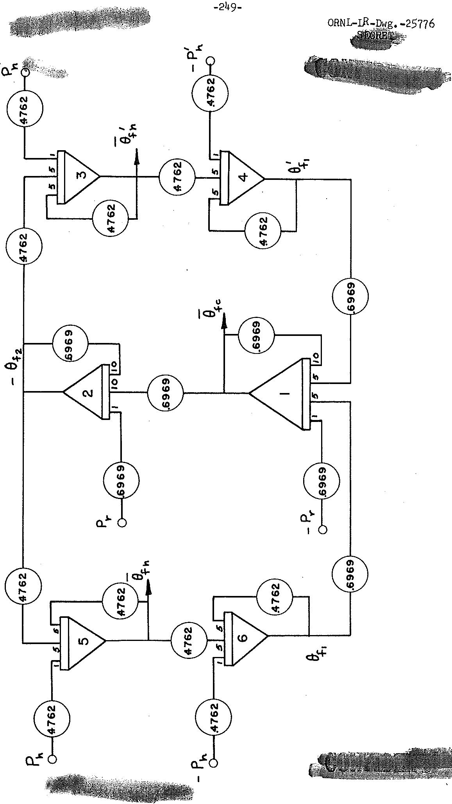  
FIGURE A-11.1   
ANALOG REPRESENTATION OF THE FUEL LOOP

FIGURE A-11.2   
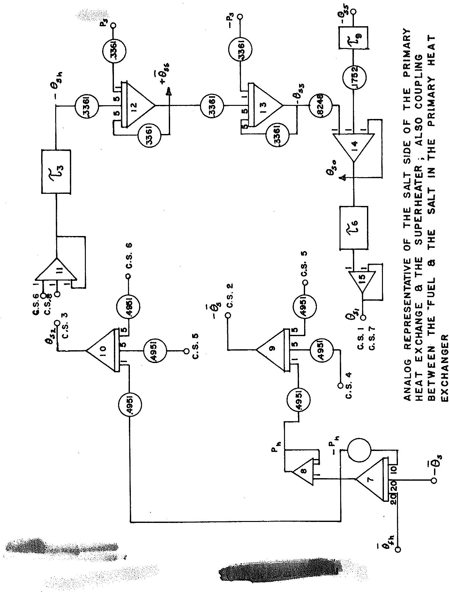  
ANALOG REPRESENTATIVE OF THE SALT SIDE OF THE PRIMARY   
HEAT EXCHANGE & THE SUPERHEATER ; ALSO COUPLING  
BETWEEN THE ~FUEL & THE ~ SALT IN THE PRIMARY HEAT   
EXCHANGER

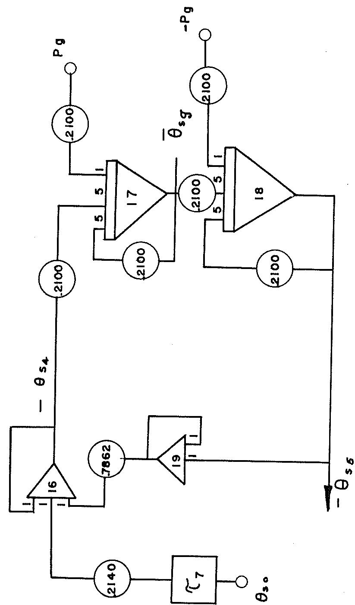  
FIGURE A-11.3

  
ANALOG REPRESENTATION OF THE SALT SIDE OF THE STEAM   
GENERATOR

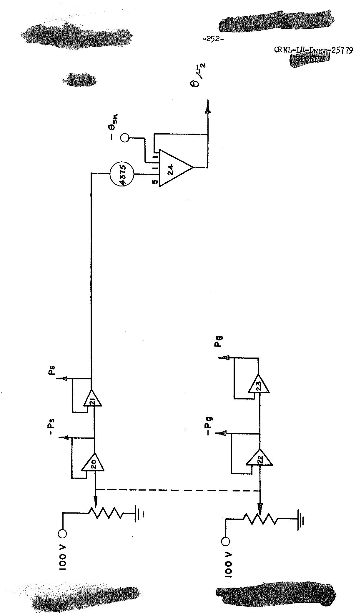  
FIGURE A-11.4   
CIRCUITRY FOR GENERATION OF POWER DEMAND AND OUTPUT STEAM TEMPERATURE

FIGURE A-11.5

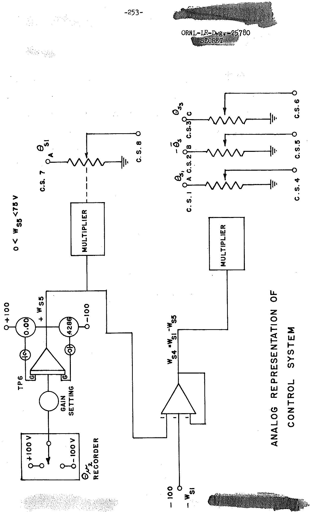  
ANALOG REPRESENTATION OF   
__________

Instantaneous gammas and capture gammas constitute about $6 \%$ more. As a part of the delayed heating is in the gaseous phase, and an exact calculation of gamma heating in liquid phase of expansion chamber is not within the scope of this project, an estimate of the liquid phase heating due to beta and gamma energy absorption in the expansion chamber is taken to be $5 \%$ of the total fission heat, divided by the total volume in the expansion chamber. Thus,

$$
\frac {1 2 5 \times 1 0 ^ {6} \text {w a t t s}}{4 5 \mathrm {f t} ^ {3}} \times . 8 6 7 \mathrm {f t} ^ {3} \times . 0 5 = 1. 2 0 \mathrm {k W}
$$

In the absence of flux data for the expansion chamber, a figure of 130 KW is assumed for fission heating in the chamber. The ball park estimate is founded on information obtained from Mr. Lackey of ORNL, and is derived from an estimate for the ART.

Therefore, estimated heat rate in expansion chamber is $150 + 120 + 130 \cong 400$ kW.

Assuming that fuel is bought into chamber at $1250^{\circ}\mathrm{F}$ and experiences a $100^{\circ}\mathrm{F}$ temperature rise before being expelled,

400 KW x 3415 BTU/hr kw = 1,366,000 BTU/hr.

1,366,000 BTU/hr $\div$ (.27 BTU/lb $^\circ \mathrm{F}$ x 100 $^{\circ} \mathrm{F}$ ) = 50,600 lb/hr, fuel flow required to remove heat.

If a temperature rise of $75^{\circ}\mathrm{F}$ is experienced, 67,500 lb/hr will be required.

Assuming that inlet temperature is $1175^{\circ}\mathrm{F}$ , expansion tank exit temperature would be $1275^{\circ}\mathrm{F}$ and average temperature $1225^{\circ}\mathrm{F}$ with $100^{\circ}\mathrm{F}$ rise.

Use of a helium purge for the system would result in reduction of

heating in expansion chamber by no more than $30\%$ .

# APPENDIX 13.1

# BREAKDOWN OF BASIC REACTOR POWERED SYSTEM COMPONENT WEIGHTS

# A. Category A and B (Steam Propulsion Machinery)

1. Main propelling units 130,150 lb   
2. Main shafting 86,480   
3. Main shaft bearing 14,810   
4. Lubricating oil system 19,650   
5. Main condenser and air ejector 36,040   
6. Circulating, condenser, and booster pump 13,435   
7. Propellers 18,280   
8. Steam and exhaust piping 69,580   
9. Water and service piping 72,110   
10. Insulation and logging 21,530   
11．Floors, gratings, and adjuncts 22,400   
12. Auxiliaries 42,200   
13. Fittings and gears 12,500   
14. Liquids 42,510   
15. Total weight 601,675   
16. Specific weight 17.19 1b/SHP

# B. Category C and D (Reactor Plant Machinery)

1. Reactor Proper

Pressure shell 13,172

Thermal shield 4,100

Fuel 11,365

Coolant 3,430

Heat exchanger structure and headers 12,550

Moderator rods and cladding 2,185

Moderator support structure 5,330

Control rod 80

Poison rods and cladding 4,452

Nickel shield 9,510

Miscellaneous (5% total reactor weight) 3,482

Total reactor weight 69,656

2. Steam Generating System

Dryboiler,2at55,0001b each 110,000

Salt holdup in boiler, 4000 lb each 8,000

Water in boiler, 4000 lb each 8,000

Dry superheater, 2 at 9000 lb each 18,000

Salt in superheater, 2300 lb each 4,600

Secondary salt plumbing, total 3,000

Salt in secondary plumbing, total 8,000

Steam and salt in lines 4,000

Salt pumps, 4 at 4000 lb each 16,000

Boiler recirculating pumps, 2 at 6000 lb each 12,000

Additional feed water heating 8,000

Thermal insulation 4,000

Total 199,600

Additional structural support at 25% of total 50,000

Total 249,600

3. Dump Tanks (Primary and Secondary) 30,000 lb   
4. Fuel Pumps, 3 at 4000 lb each 12,000   
5. Miscellaneous (Instruments, additional lines, etc) 70,000   
6. Total Weight 431,260   
7. Specific Weight, 431,260/35,000 12.32 lb/SHP

# C. Category E (Radiation Shielding)

1. Primary Shield

Tank inner wall 13,800 lb

Lead 51,000

Tank outer wall 14,200

Water 117,000

Shield plug 28,140

Total weight of primary shield 224,140

2. Secondary Shield

Aft face 142,620

Top face 248,320

Top hat 13,380

Side faces 78,900

Forward face 10,000

Superheater shadow shields 10,000

Total weight of secondary shield 503,320

3. Total Shielding Weight 727,460   
4. Specific Weight of Shield 20.78 lb/SHP

D. Category F and G (Electric Plant)

Total weight

210,000 1b

Specific weight

6.00 lb/SHP

E. Category H and J (Independent Systems)

Total weight

182,000 1b

Specific weight

5.2 lb/SHP

F. Category L (Tools, Equipment, and Spare Parts)

Total weight

70,000 1b

Specific weight

2.00 lb/SHP

G. Fuel Oil

Total weight

0 lb

Specific weight

0 lb/SHP

H. Total System Weight

2,281,000 1b

I. Specific Weight of Entire Plant

63.5 1b/SHP

# BIBLIOGRAPHY

# Ref. No.

1 Poppendiek, H. F., and Palmer, L. D., "Forced Convection Heat Transfer Between Parallel Plates and in Annuli with Volume Heat Sources Within the Fluids", ORNL-1701, May 11, 1954, Unclassified.   
2 Poppendiek, H. F. and Palmer, L. D., "Forced Convection Heat Transfer in Pipes with Volume Heat Sources Within the Fluids", ORNL 1395, December 17, 1954, Unclassified.   
3 Field, F. A., "Temperature Gradient and Thermal Stresses in Heat Generating Bodies", ORNL-CF-54-5-196, May 24, 1954, Confidential.   
4 Fraas, A. P., "In Pile Testing of High Temperature Moderating Materials", ORNL CF-56-9-99, September 24, 1956, Secret.   
5. MacPherson, H. G., et al., "A Preliminary Study of Molten Salt Power Reactors", ORNL CF-57-4-27, April 29, 1957, Secret.   
6 Weinberg, A. M., et al., "Molten Fluoride Reactors", ORNL CF-57-6-69, June 1957, Unclassified.   
7 Davidson, J. K., Aebert, R. J., Morecroft, B. T., "A Fused-Fluoride Homogeneous Reactor System for Submarine Propulsion (SAR Phase III Study)", KAPL-992, September 15, 1953, Secret.   
8 "DIG Project Progress Report", KAPL-1800-1, February-March, 1957, Secret.   
Smith, C. O., "Notes on Materials Engineering for ORSORT Students", First Edition, ORNL, 1956-57, Unclassified.   
Smith, C. O., "Stress Analysis for ORSORT Students", Second Edition, ORNL, October, 1956, Unclassified.   
11 Cooper, W. E., "Modified Structural Design Basis, SAR Reactor Components-II", KAPL-N1-WEC-9, Rev. 1, May 1, 1957, Unclassified.   
12 Fraas, A. P., and Laverne, M. E., "Heat Exchanger Design Charts", ORNL-1330, December 7, 1952, Secret.   
13 Cohen, S. I., and Jones, T. N., "Measurement of the Friction Characteristics for Flow in the ART", ORNL-57-3-95, March 19, 1957, Secret.

# Ref. No.

14 Platus, D. L., and Greenstreet, B. L., "Deflection Equations for Various Loadings of Circular -Arc Curved Beams", ORNL-57, 4-96, April 22, 1957, Unclassified.   
15 Potter, P. J., "Steam Power Plants", The Ronald Press Co., New York, 1949.   
16 Wilner, B. M., and Stumpf, H. J., "Intermediate Heat Exchanger Test Results", ORNL-CF-54-1-155, January 29, 1954, Secret.   
17 McAdams, W. H., "Heat Transmission", 3rd Edition, McGraw-Hill, New York, 1954, Unclassified.   
18 ASME "Boiler and Pressure Vessel Code", New York, 1952, Unclassified.   
19 Lewis, W. Y., and Robertson, S. A., "The Circulation of Water and Steam in Water Tube Boilers, and the Rational Simplification of Boiler Design", Institution of Mechanical Engineers, Proceedings of March 1940, London, Unclassified.   
20 Glasstone, S., "Principles of Nuclear Reactor Engineering", Princeton, 1955, Unclassified.   
21 The Babcock and Wilcox Co., "Steam, Its Generation and Use", New York, 1955, Unclassified.   
22 Davies, R. W., et al., "ORSORT Reactor Design and Feasibility Study 600 mw Fused Salt Homogeneous Reactor Power Plant", ORNL CF-56-8-208, Oak Ridge, 1956, Secret.   
23 Kays, W. M. and London, A. L., "Compact Heat Exchangers", National Press, 1955, Unclassified.   
24 Peak, R. D. and Cooper, M. H., Report of Experiment No. 7405-1-1, "Heat Exchanger Evaluation, Type IHE-2, ORNL-1 and 2", 12-15-55, Secret.   
25 Peak, R. D., and Cooper, M. H., Report of Experiment No. 7405-1-2, "Heat Transfer and Pressure Drop Correlations, Intermediate Heat Exchanger Type IHE-3", ORNL-1 and 2, 2-1-56, Secret.   
26 Enstice, L. R., and Hopkins, H. C., Report of Experiments No. 7405-1-3, "Heat Transfer and Pressure Drop, Intermediate Heat Exchanger Type IHE-3", ORNL-1 and 2, 6-1-56, Secret.

# Ref. No.

27 Cohen, S. I., and Jones, T. N., "Measurement of the Friction Characteristics for Flow in the ART Fuel-to-NaK Heat Exchanger", ORNL CF-57-3-95, 3-19-57, Secret.   
28 Wantland, J. L., "Thermal Characteristics of the ART Fuel-to-NaK Heat Exchanger", ORNL CF-55-12-120, 12-22-55, Secret.   
29 Wantland, J. L., "Transverse Pressure Difference Across Staggered and Inclined Spacers in the ART Fuel-to-NaK Heat Exchanger", ORNL CF-56-6-143, 6-29-56, Secret.   
30 Stone, J. J., and Mann, E. R., "Oak Ridge National Laboratory Reactor Controls Computer", ORNL 1632, March 1, 1956, Unclassified.   
31 Schultz, M. A., "Control of Nuclear Reactors and Power Plants", McGraw-Hill, 1955, Unclassified.   
32 Nuclear Power Branch of Central Technical Department, "Shielding Notes", Shipbuilding Division, Bethlehem Steel Company, Unclassified.   
33 Rockwell, Theodore III, "Reactor Shielding Manual", TID-7004, March 1956, Unclassified.   
34 Hughes, D. J., and Harvey, J. A., "Neutron Cross Sections", BNL-325, July 1, 1955, Unclassified.   
35 Blizzard, E. P., "Nuclear Radiation Shielding", ORNL, September 17, 1956, Unclassified.   
36 Quarterly Progress Report for Period Ending December 31, 1956, "Aircraft Nuclear Propulsion Project", ORNL-2221, March 12, 1957, Secret.   
37 Stevenson, R., "Introduction to Nuclear Engineering", McGraw-Hill, 1954.   
"Report of the 1953 Summer Shielding Sessions", ORNL-1575, June 14, 1954, Secret.   
39 Weir, J. R. Jr., et al., "Inconel as a Structural Material for a High-Temperature Fused Salt Reactor", ORNL 2264, June 4, 1957, Secret.   
40 Cohen, S. I., et al., "A Physical Property Summary for ANP Fluoride Mixes", ORNL-2150, August 23, 1957, Secret.

# Ref. No.

41 Cohen, S. I., ORNL, Personal Communication, July, 1957.   
42 Devan, J. H., ORNL, Personal Communication, July, 1957.   
43 Doney, L. M., ORNL, Personal Communication, July, 1957.   
44 Douglas, D. A., ORNL, Personal Communication, July, 195   
45 Grimes, W. R., ORNL, Personal Communication, July, 1957.  
46 Hikide, T.   
46 Hikido, T., ORNL, Personal Communication, July, 1957.  
47 Inoue, H.   
47 Inouye, H., ORNL, Personal Communication, July, 1957.   
46 Hoffman, E. E., ORNL, Personal Communication, July, 1957.   
49 Lackey, M. E., ORNL, Personal Communication, July, 1957.  
50 Samuel G.   
Samuels, G., ORNL, Personal Communication, July, 1957.   
51 Thoma, R. E., ORNL, Personal Communication, July, 1957.   
"Liquid Metals Handbook", Navexos P-733 Rev., June, 1952.   
"Metals Reference Book", Interscience Publishers, 1952.

54 Manthos, E. J., et al., "Disassembly and Examination of the BeO Moderator Capsule Test, ORNL-10-4", ORNL CF-57-3-53, March 13, 1957, Secret.   
55 Bolta, C. C., "In-Pile Test of Moderator (BeO) Material 10-4", ORNL-CF-57-2-123, February 15, 1957, Secret.   
56 Thoma, R. E., "Reactor Coolant Mixtures", ORNL IntraLaboratory Memorandum to A. P. Fraas, Dated June 7, 1957.   
Nessle, G. J., ORNL, Personal Communication, July 1957.

Quarterly Progress Report for Period Ending September 10, 1956, 20, 1956, Secret.   
59 "Zebra Project Quarterly Project Report", Curtiss Wright Research Department, CWR-470, March 31, 1957, Secret.   
60 Bote, R. R., Einstein, L. T., Kinney, W. E., "Description and Operation Manual for the Three Group Three Region Reactor Code for ORACLE", ORNL CF-55-1-76, January 13, 1955, Unclassified.

# Ref. No.

61 "Neutron Cross Sections for Multigroup Reactor Calculations", Curtiss Wright Research Department, CWR-413, September, 1955, Secret.   
62 Deutsch, R. W., "Calculation of the Neutron Age in Hydrogenous Mixtures", KAPL Memo RWD-13.   
63 R. Ramanna, et al., "On the Determination of Diffusion and Slowing Down Constants of Ordinary Water and Beryllium Oxide Using a Fused Neutron Source", P/872.   
64. Dunning, F. S. and LeDoux, J. C., "Hazard Consideration for a 100 MW Fused Salt Reactor", ORNL CF-57-8-8, to be published, Secret.   
Sense, Karl A., et al., "Vapor Pressures of the Sodium Fluoride-Zirconium Fluoride System and Derived Information", BMI-1064, Unclassified.   
66 Palmer, L. D., "A Preliminary Analysis of the Temperature Structure Within a Solid Moderator Rod, Cylindrical Reactor", ORNL CF-57-4-138, April, 1957, Confidential.   
Quarterly Progress Report for Period Ending June 30, 1957, "Aircraft Nuclear Propulsion Project", ORNL-2340, To be published, Secret.   
68 Stehn, R. J., and Clancy, E. F., "General Electric Chart of the Nuclides", April, 1956.   
69 Walker, C. S., "Reactor Control", ORNL CF-57-1-1, January 5, 1957.   
Holmes, D. K., "Calculation of Average Lifetime of Neutrons Using the Results of Multigroup Calculation", Y-F10-15, October 2, 1950.   
71 Geortzel, G., "An Estimation of Doppler Effect in Intermediate and Fast Nuclear Reactors", P/613.   
72 Kinyon, B. W., ORNL, Personal Communication, July, 1957.   
73 Schroeder, J. H., et al., "A Preliminary Design of a Unit Shield", ORSORT Study Group, ORNL CF-58-813, To be published, Secret.   
74 Dee, J. R. and Woodsun, H. C., "An Analysis of F. P. -Ray Spectrum", Volume 4 and Document No. NARF-56-41T, FZK-9-109, 1956.