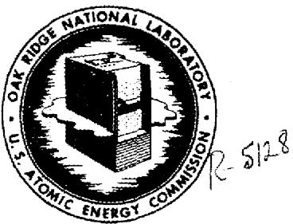
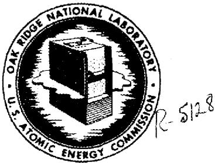
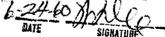

# OAK RIDGE NATIONAL LABORATORY

Operated by

UNION CARBIDE NUCLEAR COMPANY

Division of Union Carbide Corporation

Post Office Box X

Oak Ridge, Tennessee

OKL

# MASTER COPY

# ORNL

# CENTRAL FILES NUMBER

58-10-60

COPY NO. 52

DATE: October 17, 1958

SUBJECT: Survey of Low Enrichment

Molten-Salt Reactors

TO: Listed Distribution

FROM: H. G. MacPherson

External Transmittal

Authorized

Distribution Limited to

Recipients Indicated

# Abstract

A rough survey of the nuclear characteristics of graphite-moderated molten-salt reactors utilizing an initial complement of low enrichment uranium fuel has been made. Reactors can be constructed with initial enrichments as low as $1.25\%$ U-235; initial conversion ratios of as high as 0.8 can be obtained with enrichment of less than $2\%$ . Highly enriched uranium would be added as make-up fuel, and such reactors could probably be operated for burnups as high as 60,000 Mwd/ton before buildup of fission products would make replacement of the fuel desirable. A typical circulating fuel reactor of this class might contain an initial inventory of 3600 tons of $1.8\%$ enriched uranium, operated at 640 Mw (thermal), and generate a net of 260 Mw (electrical). The total fuel cycle cost would be approximately 1.3 mills/kwhr, of which 1.0 mill is burnup of enriched U-235.

# NOTICE

This document contains information of a preliminary nature and was prepared primarily for internal use at the Oak Ridge National Laboratory. It is subject to revision or correction and therefore does not represent a final report.

The information is not to be

reprinted or otherwise given public data

Without the approval of the JN. p

Legal and Information Control

RELEASE APPROVED

BY PATENT BRANCH

Errata for CF 58-10-60

Please make the following changes in your copy of CF 58-10-60:

Page 1 (Cover Sheet) Make change in line 10 of abstract

From: 3600 tons of $1.8\%$

To: 36 tons of $1.8\%$

Page 2 Make change in next to last line

From: 8.54 x 10²⁰

To: 8.54 x 1022

Page 3 Make change in line 18

From: $\sqrt{\frac{S}{n}}$

To: $\sqrt{\frac{S}{M}}$

# SURVEY OF LOW ENRICHMENT MOLTEN-SALT REACTORS

To survey the field of low enrichment graphite-moderated reactors a number of calculations have been made with the four-factor formula $\mathbf{k}_{\infty} = \eta \mathrm{epf}$ . The following fuel salt was considered:

<table><tr><td></td><td>mole %</td></tr><tr><td>UF4</td><td>20</td></tr><tr><td>Li7F</td><td>70</td></tr><tr><td>BeF2</td><td>10</td></tr></table>

This salt has a melting point of about $900^{\circ}\mathrm{F}$ . It is probably more corrosive than one mole % fuel, but is probably satisfactory for use with INOR-8. The atomic concentrations were as follows at 600 - 650 $^{\circ}\mathrm{F}$ , per L. A. Mann:

<table><tr><td>Li</td><td>-175.7</td><td>x</td><td>1020</td><td>atoms/cc</td></tr><tr><td>Be</td><td>-25.12</td><td>x</td><td>1020</td><td>atoms/cc</td></tr><tr><td>U</td><td>-50.22</td><td>x</td><td>1020</td><td>atoms/cc</td></tr><tr><td>F</td><td>-426.8</td><td>x</td><td>1020</td><td>atoms/cc</td></tr></table>

The slowing down power of the salt is $0.0228 \, \text{cm}^{-1}$ , composed of contribution as follows:

<table><tr><td>Fluorine</td><td>.0149</td></tr><tr><td>Id</td><td>.0051</td></tr><tr><td>Be</td><td>.0028</td></tr></table>

The concentration of $\mathrm{UF}_4$ is $2.62\mathrm{g / cc}$ ; that of uranium is $1.98\mathrm{g / cc}$ . Graphite was assumed to be of density 1.7, with $8.54\times 10^{20}$ atoms/cc, and a slowing down power of $0.0631\mathrm{cm}^{-1}$ . The graphite was assumed to have a $\sigma_{a} = 0.0045$ barns.

In the four-factor formula, $\eta$ is taken for convenience to be that for U-235, while the thermal utilization factor $f$ is defined as the proportion of thermal absorption in U-235. Thus, using cross sections derived from Fig. 2.3, page 2.20, of ORNL-2500, Part 2, $\eta$ for U-235 is taken as $2.47 \times \frac{528}{650}$ or $\eta = 2.00$ . Effective thermal fission cross sections and absorption cross sections are assumed to be 528 barns and 650 barns, respectively, corresponding to neutron temperatures of $600^{\circ}C$ .

The fast fission factor was assumed to be 1.02, since the values calculated for graphite lattices vary from 1.02 to 1.04. This assumption is sufficiently accurate for survey purposes.

For the calculation of the resonance escape probability, the resonance integral was calculated from,

$$
\sigma_ {r} = 3. 8 \left(\frac {\Sigma_ {S}}{N _ {0}}\right) ^ {0. 4 2} + 2 4. 7 \frac {S}{M}
$$

In this formula, $\frac{\sum_{\mathrm{s}}}{\mathrm{N}_{\mathrm{o}}}$ is the scattering cross section in barns per uranium atom within the fuel channel, and $\frac{\mathrm{S}}{\mathrm{M}}$ is the surface area of the fuel channel per gram of U-238 in the channel. The first term is the same as the resonance integral for an infinite medium of the fuel salt composition. This formula, involving the first power of $\frac{\mathrm{S}}{\mathrm{M}}$ instead of $\sqrt{\frac{\mathrm{S}}{\eta}}$ , was used because it is more logically extrapolated to the case of dilution of uranium with fuel salt. For uranium metal this reduces to the familiar $\sigma_{\mathrm{r}} = 9.25 \times 24.7 \frac{\mathrm{S}}{\mathrm{M}}$ . In the fuel considered here, $\frac{\sum_{\mathrm{s}}}{\mathrm{N}_{\mathrm{o}}} = 43.3$ , and $\sigma_{\mathrm{r}} = 18.5 + 24.7 \frac{\mathrm{S}}{\mathrm{M}}$ .

A series of reactors having tubular fuel channels on a square array is considered. The spacing of these channels was arbitrarily taken as 8 in. center to center, and the calculations are made for various volume fractions of fuel in the graphite from 0.05 to 0.25. The following table gives the fuel channel diameter, the value of $\frac{\mathrm{S}}{\mathrm{M}}$ , the value of $\sigma_{\mathrm{r}}$ , and the value of the resonance escape probability $p$ for the different volume fractions. $p$ is calculated from $p = e^{-A}$ where $A$ is given by,

$$
A = \frac {N _ {u} \sigma_ {r} F}{(1 - F) (\xi \Sigma_ {s}) _ {g} + F (\xi \Sigma_ {s}) _ {s a l t}}
$$

where $\mathbf{N}_{\mathbf{u}}$ is the U-238 atom density in the fuel channel and $\mathbf{F}$ is the volume fraction of fuel in the core. Numerically,

$$
A = \frac {5 0 . 2 2 x 1 0 ^ {2 0} \sigma_ {r} F x 1 0 ^ {- 2 4}}{0 . 0 6 3 1 (- 1 - F) + 0 . 0 2 2 8 F}
$$

Table I   

<table><tr><td>F</td><td>D</td><td>S/M</td><td>σr</td><td>p</td><td>ηερ</td></tr><tr><td>.05</td><td>2.08 in.</td><td>.382</td><td>27.95 barns</td><td>0.891</td><td>1.82</td></tr><tr><td>.075</td><td>2.54</td><td>.313</td><td>26.25</td><td>0.848</td><td>1.73</td></tr><tr><td>.10</td><td>2.94</td><td>.271</td><td>25.20</td><td>0.807</td><td>1.65</td></tr><tr><td>.15</td><td>3.60</td><td>.221</td><td>23.97</td><td>0.733</td><td>1.495</td></tr><tr><td>.20</td><td>4.15</td><td>.192</td><td>23.25</td><td>0.653</td><td>1.332</td></tr><tr><td>.25</td><td>4.65</td><td>.171</td><td>22.73</td><td>0.584</td><td>1.191</td></tr></table>

The thermal utilization factor is given by,

$$
r = \frac {F e N _ {u} \widehat {\sigma} _ {a} ^ {u}}{F e N _ {u} \widehat {\sigma} _ {a} ^ {u} + F N _ {u} \sigma_ {a} ^ {2 3 8} + F \Sigma_ {a} ^ {s a l t} + (1 - F) \Sigma_ {a} ^ {g} \gamma}
$$

where $e$ is the enrichment, $\hat{\sigma}_{\mathrm{a}}^{\mathrm{u}}$ is the effective absorption cross section for U-235, and $\gamma$ is the thermal flux disadvantage factor. For this survey, $\gamma$ is assumed to be 2.0, which seems a reasonable value based on ORNL-2500. This simplifying assumption was made to avoid calculating the flux distribution, and probably is the roughest approximation made in this survey. Numerically the above equation reduces to,

$$
f = \frac {3 . 2 2 F e}{3 . 2 2 F e + 0 . 0 1 3 7 F + 0 . 0 0 2 8 F + 0 . 0 0 0 7 6 8 (1 - F)}
$$

An easy computational form is,

$$
\frac {1}{F} = 1 + \frac {0 . 0 1 5 7 + \frac {0 . 0 0 0 7 7}{F}}{3 . 2 2 e}
$$

To calculate the enrichment necessary to achieve a given $\mathbf{k}_{\infty}$ , the following transformations are made,

$$
k _ {\infty} = \eta \in P r
$$

$$
\frac {1}{r} = \frac {\eta E P}{k _ {\infty}}
$$

$$
\text {a n d} \quad e = \frac {0 . 0 1 5 7 + \frac {0 . 0 0 0 7 7}{F}}{3 . 2 2 \left(\frac {\eta \epsilon p}{k _ {\infty}} - 1\right)}
$$

The conversion factor is calculated as follows,

$$
R _ {c} = \frac {(1 - p) + p x (\text {p r o p o r t i o n o f t h e r m a l a b s o r p t i o n s i n U - 2 3 8})}{p x (\text {p r o p o r t i o n o f t h e r m a l a b s o r p t i o n s i n U - 2 3 5})}
$$

From k, B² is obtained from B² = k - 1 M²

and $\mathbf{M}^2$ is taken as,

$$
M ^ {2} = \frac {\text {T g r a p h i t e}}{1 - F} + L _ {\text {g r a p h i t e}} ^ {2} x \quad (\text {p r o p o r t i o n o f t h e r m a l a b s o r p t i o n s})
$$

The correction for $\mathcal{T}_{\mathrm{graphite}}$ is an approximate one, but not too important numerically. $\mathcal{T}_{\mathrm{graphite}}$ is taken as $324~\mathrm{cm}^2$ and $\mathbf{L}_{\mathrm{graphite}}^{2}$ is $2950~\mathrm{cm}^2$ .

From $B^2$ the dimensions of a minimum volume cylindrical core were calculated using a reflector savings of 2 ft. This is less than used in ORNL-2500, but may still be optimistic because some fuel must be used in the reflector to cool it.

Table II gives the results of calculations for six values of the volume fraction of fuel in the core and for two values of $k_{\mathrm{w}}$ . The volume of fuel in the core should be evaluated in terms of the external volume for a circulating fuel reactor, which is about 0.56 cu ft per thermal megawatt, or 360 cu ft for a 260 Mw (electrical) plant. It is evident that one must pay for conversion ratios above 0.8 with enrichments of over $2\%$ .

The selection of an economically optimum reactor of this type requires a knowledge of the method of chemical reprocessing and its cost, and a way of calculating the effect of poisoning by buildup of fission products. The latter problem was looked at briefly, using as a basis the calculations of Blomeke and Todd (ORNL-2127), and assuming a buildup of Pu sub infinity as defined in the Brookhaven Geneva Paper 461. For the very long exposures it is probable that the one-group calculations can not give a good answer because of the large buildup of absorbing Pu isotopes. However, it might be possible to operate a reactor such as Case 8 of Table II for as

long as 30 years at $640\mathrm{Mw}$ (thermal) without a need for the U-235 inventory to increase by more than a factor of two, and with a breeding ratio averaging greater than $50\%$ , without any reprocessing.

For purposes of estimating the fuel cycle cost, a life of 10 years without reprocessing was assumed. For this period, the U-235 concentration would probably not have to be increased over its initial value, and the breeding ratio should average at least $60\%$ .

Applying the formula of ORNL-2500, but using the thermal cycle of the reference design molten-salt reactor (CF-58-5-3), the chemical reprocessing charges and fuel inventory charges are 0.034 mill/kwhr and 0.14 mill/kwhr, respectively. Ten-year depreciation and capital charges on the base salt amount to 0.093 mill/kwhr. Burnup of U-235 would be $\sim$ 1.0 mill/kwhr at a conversion ratio of 0.6. Thus, total fuel cycle costs would be approximately 1.3 mills/kwhr.

This reactor was based on Case 8 of Table II, using a total fuel volume of 600 ft³ and an inventory of 36 tons of uranium of 1.8% enrichment. The ten-year reprocessing cycle represents a fuel life of approximately 60,000 Mwd/ton.

More accurate calculations are needed to confirm the above conclusions.

Table II   

<table><tr><td rowspan="2">Case</td><td rowspan="2">Vol fraction of fuel in core</td><td rowspan="2">k</td><td rowspan="2">Percent Enrichment of uranium</td><td>Vol of fuel in core cu ft</td><td>Uranium in core kg</td><td>Critical mass of U-235</td><td>Initial conversion Ratio</td></tr><tr><td>Vf</td><td>Mu</td><td>M235</td><td>Rc</td></tr><tr><td>1</td><td>0.05</td><td>1.05</td><td>1.30</td><td>395</td><td>22,100</td><td>298</td><td>.546</td></tr><tr><td>2</td><td></td><td>1.10</td><td>1.45</td><td>143</td><td>8,000</td><td>116</td><td>.492</td></tr><tr><td>3</td><td>0.075</td><td>1.05</td><td>1.25</td><td>427</td><td>23,900</td><td>298</td><td>.635</td></tr><tr><td>4</td><td></td><td>1.10</td><td>1.39</td><td>167</td><td>9,350</td><td>130</td><td>.600</td></tr><tr><td>5</td><td>0.10</td><td>1.05</td><td>1.275</td><td>445</td><td>24,900</td><td>318</td><td>.707</td></tr><tr><td>6</td><td></td><td>1.10</td><td>1.46</td><td>179</td><td>10,000</td><td>146</td><td>.668</td></tr><tr><td>7</td><td>0.15</td><td>1.05</td><td>1.525</td><td>474</td><td>26,600</td><td>405</td><td>.796</td></tr><tr><td>8</td><td></td><td>1.10</td><td>1.80</td><td>197</td><td>11,000</td><td>198</td><td>.780</td></tr><tr><td>9</td><td>0.20</td><td>1.05</td><td>2.24</td><td>520</td><td>29,100</td><td>652</td><td>.865</td></tr><tr><td>10</td><td></td><td>1.10</td><td>2.88</td><td>206</td><td>11,540</td><td>332</td><td>.865</td></tr><tr><td>11</td><td>0.25</td><td>1.05</td><td>4.36</td><td>575</td><td>32,200</td><td>1400</td><td>.900</td></tr><tr><td>12</td><td></td><td>1.10</td><td>7.05</td><td>240</td><td>13,430</td><td>952</td><td>.865</td></tr></table>

# Distribution

1. L. G. Alexander   
2. C. J. Barton   
3. E. S. Bettis   
4. J. P. Blakely   
5. F. F. Blankenship   
6. A. L. Boch   
7. W. F. Boudreau   
8. E. J. Breeding   
9. W. E. Browning   
10. D. O. Campbell   
11. W.H.Carr   
12. G.I.Cathers   
13. R.A. Charpie   
14. D. A. Douglas   
15. W. K. Ergen   
16. H. L. Falkenberry   
17. A. P. Fraas   
18. W.R.Grimes   
19. H.W.Hoffman   
20. W. H. Jordan   
21. G.W. Keilholtz   
22. F. Kertesz   
23. B. W. Kinyon   
24. M. E. Lackey   
25. J.A. Lane   
26. W. J. Iarkin, AEC, ORO

27. H. G. MacPherson   
28. R.E. MacPherson   
29. W. D. Manly   
30. E. R. Mann   
31. L.A.Mann   
32. W. B. McDonald   
33. H.J.Metz   
34. R.P.Milford   
35. F. C. Moesel, AEC, Washington.   
36. G. J. Nessle   
37. W. R. Osborn   
38. J. T. Roberts   
39. H. W. Savage   
40. A. W. Savolainen   
41. M. J. Skinner   
42. E. Storto   
43. J. A. Swartout   
44. A. Taboada   
45. R.E.Thoma   
46. D. B. Trauger   
47. F.C.VonderIage   
48. G.M. Watson   
49. A. M. Weinberg   
50. G. D. Whitman   
51. J. Zasler   
52. Laboratory Records, R.C.

# Errata for CF 58-10-60

Please make the following changes in your copy of CF 58-10-60:

Page 1 (Cover Sheet) Make change in line 10 of abstract

From: 3600 tons of $1.8\%$

To: 36 tons of 1.8%

Page 2 Make change in next to last line

From: 8.54 x 1020

To: 8.54 x 1022

Page 3 Make change in line 18

From: $\sqrt{\frac{S}{n}}$

To: $\sqrt{\frac{S}{M}}$