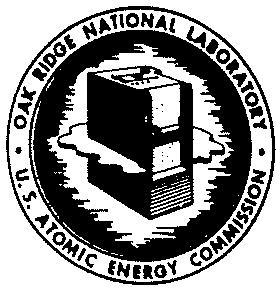

# OAK RIDGE NATIONAL LABORATORY

Operated by

UNION CARBIDE NUCLEAR COMPANY

Division of Union Carbide Corporation

Post Office Box X

Oak Ridge, Tennessee

ORNL

CENTRAL FILES NUMBER

58-12-79

"External Transmittal Authorized"

COPY NO. 29

DATE: December 15, 1958

SUBJECT: The Need for U233 Breeding

TO: Listed Distribution

FROM: W. K. Ergen, E. D. Arnold, E. Guth,

S. Jaye, A. Sauer, J. W. Ullmann

# NOTICE

This document contains information of a preliminary nature and was prepared primarily for internal use at the Oak Ridge National Laboratory. It is subject to revision or correction and therefore does not represent a final report.

The information is not to be abstracted,  
reprinted or otherwise given public dis- emination  
without the approval of the ORNI. patent branch,  
Legal and Information Control Department

07.18.95

PROPERTY OF

WASTE MANAGEMENT

DOCUMENT

LIBRARY

UCN-15212 2-84)

# LEGAL NOTICE

This report was prepared as an account of Government sponsored work. Neither the United States, nor the Commission, nor any person acting on behalf of the Commission:

A. Makes any warranty or representation, express or implied, with respect to the accuracy, completeness, or usefulness of the information contained in this report, or that the use of any Information, apparatus, method, or process disclosed in this report may not infringe privately owned rights; or   
B. Assumes any liabilities with respect to the use of, or for damages resulting from the use of any information, apparatus, method, or process disclosed in this report.

As used in the above, "person acting on behalf of the Commission" includes any employee or contractor of the Commission to the extent that such employee or contractor prepares, handles or distributes, or provides access to, any information pursuant to his employment or contract with the Commission.

# THE NEED FOR U²³ BREEDING*

W. K. Ergen, E. D. Arnold, E. Guth, S. Jaye, A. Sauer, J. W. Ullmann

Oak Ridge National Laboratory  
Oak Ridge, Tennessee

# ABSTRACT

If the fissionable and fertile materials recoverable at approximately today's cost are to constitute an energy reserve at least as large as fossil-fuel energy reserves, about $20\%$ of the fertile material has to be burned. This means reactors need a conversion ratio of about $96\%$ in the average. Some reactors will of necessity be burners, hence the $96\%$ average can only be obtained if other reactors are breeders.

Comparison of nuclear-fission energy reserves with anticipated power demands indicates that breeding will not be necessary until 1980. Whether it will become a necessity between 1980 and 2000 depends on which of a number of reasonable estimates are chosen. In order to keep up with the demand, breeders must have a doubling time equal to or shorter than the doubling time of the demand for nuclear power production. The latter doubling time is estimated to be 5 to 10 years.

Such short doubling times will probably be achieved more easily with $U^{233}$ breeders than with plutonium breeders. Thorium, the raw material for the $U^{233}$ breeder, is available in sufficient quantity in economically recoverable deposits on the North American continent, but the raw material for plutonium breeders $(U^{238})$ is available in larger amounts.

Among $\mathbf{U}^{233}$ breeders the aqueous homogeneous reactor with its highly thermal neutron spectrum and consequently high $\eta$ , its high specific power, easy fission-product removal, and short reprocessing time, will probably reach the shortest doubling times.

# THE NEED FOR U²³³ BREEDING

The Oak Ridge National Laboratory has conducted a study regarding breeding on the $\mathbf{Th}^{232}\text{-}\mathbf{U}^{233}$ cycle. Object of the study was, on one hand, the importance of breeding on this cycle and, on the other, a comparison of the various reactor types with respect to their suitability as $\mathbf{U}^{233}$ breeders. The importance of breeding on the $\mathbf{Th}^{232}\text{-}\mathbf{U}^{233}$ cycle depends, in turn, on the importance of breeding in general, and secondly on the comparison of the $\mathbf{U}^{238}\text{-}\mathbf{Pu}^{239}$ breeding cycle with the $\mathbf{Th}^{232}\text{-}\mathbf{U}^{233}$ cycle.

# I. THE NECESSITY FOR BREEDING - GENERAL REMARKS

The fuel burnup cost in a straight burner, with present prices, is about 3 mills/kwh. Thus a difference of $10\%$ in conversion ratio amounts to about 0.3 mills/kwh, since a reactor of conversion ratio $\beta$ could buy fuel amounting to $10\%$ of its burnup for 0.3 mills/kwh and end up with the same amount of fissionable material as a reactor of breeding ratio $\beta + 0.1$ . A breeder and a converter of reasonably high conversion ratio will not differ in conversion ratio by more than a small multiple of $10\%$ , and the difference in fuel-burnup cost will thus be smaller than the uncertainty in the estimated power cost of a nuclear reactor. Fuel burnup cost on the basis of present prices will thus not offer a strong reason in favor of breeding.

A justification for breeding thus involves an element of planning for the future, a consideration of the time when the fissionable material recoverable at reasonable cost will be exhausted and the nuclear-power economy depends on tapping the energy content of fertile material.

The justification for breeding is then analogous to the justification of nuclear-power production in general - nuclear-power production is justified

with a view to future depletion of fossil fuel, rather than with a view to present prices. The long-range planning is needed in the nuclear-power field because of the long development and design time - estimated at 15 years - and long life of power plants, estimated at 25 years. Thus, if breeding will be necessary $15 + 25 = 40$ years hence, that is about by the year 2000, it is not too early to proceed with the development now. Otherwise, we will have, 40 years hence, a large installed capacity which still could be used except for the fact that it burns fissionable material which we can no longer afford to burn. If it is the intention to scrap these reactors before they are worn out, they would have to be burdened by larger depreciation costs during their use.

Any estimate of future supply and demand of fissionable material is very uncertain. Estimate of how much fissionable material will be available, and at what price, depends on guesses as to future discoveries of deposits and also on how much fissionable material the U.S. will be able to import from abroad, or will export to other countries. Demand depends not only on the extremely uncertain requirements of the power economy itself, but to a large extent on the demand for nuclear-powered naval vessels, aircraft, rockets and weapons. Conceivably the latter could even become a source rather than a sink of fissionable material, as within the time periods considered nuclear disarmament and release of stock-piled material could become a reality. On the other hand, some of the uses of nuclear energy could be extremely wasteful of fissionable material. An example for this is the "bomb rocket" intended to propel a large weight into outer space by a large number of "small" nuclear-bomb explosion behind the weight to be lifted.

The impact of fusion on fission reactors is likewise very uncertain. Conceivably, fusion could produce power cheaper than fission and put fission

power reactors out of business, or fusion based on the D-D reaction could be a source of neutrons and hence of fissionable material. On the other hand, large-scale power generation by fusion may be uneconomical, or unfeasible, or dependent on outside supply of tritium and hence on fission reactors with good neutron economy.

An accurate prediction of the supply and demand situation with respect to fissionable material is obviously impossible, but it is also unnecessary for the purpose of deciding on the development of a breeder reactor. If there is a reasonable probability of breeding being attractive during the next 40 years, such development would be indicated. In fact, it is quite likely that applications of nuclear energy will be proposed which consume large amounts of fissionable material. The bomb rocket is an example. If there is a prospect of fissionable material becoming scarce, the decision regarding such proposals may very well depend on the feasibility of a suitable breeder. In that case, any effort spent on development of a breeder would pay off in terms of hard information regarding the feasibility of the breeder, and in a firmer basis for the above decision.

Even if breeding were of little interest for the near future in the United States, it may well be important in foreign countries with less native supply of fissionable material. The potential need of foreign countries for power is one of the main justifications for development of nuclear-power reactors. An analogous argument could justify the development of breeders.

It appears that, for a breeder, the doubling time is the more important concept than the breeding ratio. In part this is due to the somewhat philosophical point that breeding ratio is not always easy to define. Breeding ratio is the ratio of the amount of fissionable material produced during a fuel cycle to the amount of fissionable material burned during the cycle. If different

parts of the fissionable material have different histories, the "cycle" is a somewhat controversial concept. On the other hand, the doubling time, that is the time at which the amount of fissionable material has doubled, is clearly defined.

More important than the above philosophical point is the fact that the doubling time of the reactor can be compared directly with the doubling time of the demand of the fission-power economy. If the reactor doubling time is longer than the doubling time of the demand, then the reactors cannot keep up with demand. A future shortage of the supply of fissionable material will be reflected back to earlier dates.

Doubling time has to be defined as the time in which the whole fissionable inventory of a reactor is doubled. This inventory includes fissionable material contained in the reactor core, the blanket, the reprocessing plant, etc. Re-processing losses have to be taken into account.

In considering the reactor doubling time one should really consider the average over the whole economy. Since there will be a large number of reactors which will not breed (mobile reactors, for instance), the incentive for short doubling time will be high in those reactors which can be made to breed.

Short doubling time is, of course, only one parameter by which to judge a reactor. High thermal efficiency (which means high operating temperature) is another important parameter. A reactor with high thermal efficiency, which does not breed, uses a relatively small amount of fissionable material, and, though it does not convert sufficient fertile into fissionable material, it leaves the energy content of some fertile material untouched, to be available for future users who are ingenious enough to extract it. A low-thermal-efficiency breeder replaces the fissionable material it uses, but it uses a relatively large amount

of fissionable and hence fertile atoms, and whatever is wasted is gone forever. In this respect, high temperature reactors, like the liquid-metal fuel reactor and the molten-salt reactor, are desirable even if they are no breeders.

# II. THE NECCESSITY OF BREEDING - QUANTITATIVE CONSIDERATIONS

The following discussion of the reserves of uranium and thorium is based on an AEC staff paper. As in this reference, the reserves will be quoted as their equivalent in U308 or ThO2, in units of short tons. The known US uranium reserves recoverable at approximately the present cost of $10/lb U308 are 230,000 tons, to which 350,000 tons should be added on the basis of specific geological evidence in the areas known to contain deposits. This gives a total of 580,000 tons. Known reserves in the United States recoverable at $30 to $50/lb of U308 are 6,000,000 tons.* The energy content of 1 ton of U308, if all the uranium is used, amounts to 5.9 x 1013 Btu. If only the U235 is burned, the energy content of 1 ton of U308 would be 3.6 x 1011 Btu.** Thus, 580,000 tons of reasonably certain US reserves of high-grade ore would amount to 34 x 1018 Btu, or 0.21 x 1018 Btu, depending on whether all of the uranium, or only the U235, is burned. For comparison, the US reserves of oil and gas recoverable at up to 1.3 times the present cost, plus the US reserves of other fossil fuels recoverable at up to twice the present cost, amount to 6.9 x 1018 Btu. Thus, at least 20% of the U238 has to be burned before the uranium recoverable at approximately today's prices contributes as much to the energy reserves of the US as do the fossil fuels recoverable at the above cost. This 20% burnup corresponds to a 96.4% conversion ratio.

Hence, the nuclear energy reserves will be greater than the fossil reserves only if conversion ratios in excess of $96.4\%$ are obtained. Breeding requires conversion ratios of $100\%$ or more. Though it becomes the more difficult to increase the conversion ratio by $1\%$ the higher the conversion ratio already is, it does not appear that breeding would be much harder to achieve than a conversion ratio of $96.4\%$ .

There are, as previously mentioned, applications of nuclear energy other than for civilian power production. Many of these applications have to burn the fissionable material, without being able to pay attention to high conversion ratio or to breeding. Assume that the use of nuclear fuel is divided in such a manner that for every megawatt-day produced there is a fraction of x megawatt days produced in burners and a fraction y produced in converters of conversion ratio C. Then the burners use approximately x gram of U $^{235}$ and the converters y(1-C) gram, where x + y = 1. (In this semiqualitative consideration we assume 1 g of U $^{235}$ to be equivalent to 1 Mwd.) The amount of natural uranium needed is

$$
1 4 0 [ x + y (1 - c) ] = 1 4 0 (1 - y c).
$$

If $20\%$ of this is to be burned in the process of producing the above mentioned 1 Mwd, then

$$
0. 2 \times 1 4 0 (1 - y C) = 1
$$

or

$$
y C = \frac {2 7}{2 8} = 0. 9 6 4.
$$

Thus, if $3.6\%$ or more of the nuclear energy produced is to be made in burners, $(x > 0.036, y < 0.964)$ , the conversion ratio of the civilian power producers would have to be greater than one, that is the civilian power producers would have to be breeders or else the useful nuclear energy reserves are smaller than the fossil

reserves. The exact value $x = 0.036$ depends of course somewhat on the ground rules used (and stated above), but qualitatively the results remain the same under somewhat different rules.

We also can compare the supply of nuclear energy reserves with the estimated demand for nuclear power production. Of course these estimates vary considerably, as indicated in Table 1, which gives the nuclear power production in 1980 and 2000, as well as the doubling time of the nuclear power demand between 1980 and 2000. The 1980 estimates were taken from a table in Nucleonics,[3] the "minimum" being the J. A. Lane estimate, the "average" the arithmetic mean of the McKinney report estimates, and the "maximum" the Davis and Roddis estimate. These "minimum," "average," and "maximum" estimates given in the Nucleonics table also for the years up to 1980 were plotted and extrapolated in an admittedly somewhat arbitrary manner to the year 2000. In this manner the estimates for the year 2000 and the doubling times were obtained for Table 1.

TABLE 1. NUCLEAR POWER PRODUCTION IN THOUSANDS OF MEGAWATTS   

<table><tr><td></td><td>1980</td><td>2000</td><td>Doubling Time in Years</td></tr><tr><td>Minimum</td><td>42</td><td>168</td><td>10</td></tr><tr><td>Average</td><td>93</td><td>740</td><td>6.7</td></tr><tr><td>Maximum</td><td>227</td><td>3000</td><td>5.4</td></tr></table>

If the power demand is satisfied by reactors with a conversion ratio of one, that is by reactors which just barely miss being breeders, there is no

consumption of fissionable material by burnup. The demand of fissionable material is solely determined by the inventory requirements. If the above supply of 580,000 tons of $\mathsf{U}_{3}\mathsf{O}_{3}$ are taken as a basis, and $100\%$ recovery of the contained $\mathsf{U}^{235}$ as assumed, the following inventories of fissionable material per electrical megawatt produced would be permissible.

TABLE 2. PERMISSIBLE FISSIONABLE INVENTORY FER Mwe (in kg/Mwe)   

<table><tr><td>Nuclear Power Production
Estimate</td><td>1980</td><td>2000</td></tr><tr><td>Minimum</td><td>75</td><td>19</td></tr><tr><td>Average</td><td>34</td><td>4.3</td></tr><tr><td>Maximum</td><td>14</td><td>1.06</td></tr></table>

Estimates of the fuel inventory, per electrical megawatt produced, run between 1 and $10\mathrm{kg / Mwe}$ for future reactors. Thus, if a fair fraction of the US uranium supply were used for other purposes than power production, and if the highest estimates of power production and the highest fuel inventory per Mwe are applied, breeding may become a necessity by 1980. If the lowest estimates of nuclear power production are used, breeding will be unnecessary until sometime past the year 2000; in fact, the low-inventory reactors could get by without breeding until 2000 even for the highest power production estimates.

Unfortunately, that leaves the question unanswered whether breeding will be a necessity within the next 40 years and, hence, whether breeder development now is timely. The only thing that can be said is that there is a strong possibility of this being the case, and that breeder development should be pursued as an insurance against this possibility.

On the other hand, the uranium reserves recoverable at $\phi 30$ to $\phi 50 / 1b$ of $U_{3}O_{8}$ are so vast that only price increase, but not shortage of power, would occur until well past the year 2000, even if the fossil fuel supply would run out and breeding would not be available in time.

# III. COMPARISON OF PLUTONIUM AND U233 BREEDING

From a practical viewpoint, the main difference between plutonium and $U^{233}$ breeding lies in the inventory of fissionable material and in the theoretically achievable breeding gain.

The inventory is larger for plutonium breeders than for $U^{233}$ breeders. This is mainly a consequence of basic physical facts: because of the energy dependence of the $\eta$ of $\mathsf{Pu}^{239}$ , plutonium breeders have to operate at high neutron energies where the cross sections are small and where it takes many plutonium atoms to catch a neutron with sufficient probability before it escapes or slows down. A contributing cause of the large inventory is the intricate core structure of present fast breeder designs and the resulting large hold-up of fissionable material external to the reactor.

The U $^{233}$ breeders, on the other hand, operate best in the thermal region where the cross sections are large, and fewer atoms suffice to prevent an adequate number of neutrons from escaping. More important, atoms other than fissionable ones can be used to do a large part of the neutron scattering and escape preventing. Neutron-energy degradation by these "other atoms" does not have to be avoided and is, in fact, desired. Thus, the critical mass and inventory in a U $^{233}$ breeder can be made very low, and the specific power very high.

The theoretically achievable breeding gain (that is conversion ratio minus one) for fast plutonium breeders is very high, values up to $96\%$ have been

computed for small, low power reactors of this type. Breeding gains of $50\%$ seem to be obtainable from practical reactors, even allowing for chemical reprocessing losses, etc. For thermal $\mathsf{U}^{233}$ breeders, such gains are out of the question, $\eta - 2$ amounts to only 0.28 so that practical breeding gains would be limited to 10 to $15\%$ .

The design parameters of a typical thermal breeder (a 300 Mwe aqueous homogeneous reactor station) call for about $4500\mathrm{kw}$ (thermal) per kilogram of fissionable material. With this specific power a breeding gain of $10\%$ would correspond to 4.2 years doubling time.

The Enrico Fermi fast breeder reactor has a critical mass of $485\mathrm{kg}$ for 300 MW (thermal) output, that is 600 kw (thermal) per kilogram of fissionable material. In the first assemblies the holdup of fissionable material in the blanket and the external reprocessing cycle might be as much as three additional critical masses, which would reduce the specific power to 150 kw (thermal) per kilogram of fissionable material. If the first core achieves a net breeding gain of $10\%$ (taking into account chemical reprocessing losses) the doubling time would be 100 years, that is, it would be irrelevant if compared to the doubling time of the electrical power production.

On the other hand, future fast breeders, in particular those fueled with plutonium, may have higher breeder gains, by a factor of 5, as indicated above. Another factor of 2 or so may be obtained by cutting down on the holdup in the external reprocessing cycle, increasing the power density and so on. This would give doubling times of about 10 years for the fast breeders. The doubling time of the nuclear power production between 1980 and 2000 is 5 to 10 years,

depending on which estimate is used. In view of the uncertainty in the above numbers, it is thus possible that both the fast and the thermal breeder can keep up with the nuclear-power demand, or that neither can. Should only the thermal breeder, but not the fast breeder, be able to keep up with the demand, then the thermal system would have a definite advantage. Whether this will be the case is, on the basis of the above numbers, uncertain.

Another important point of comparison for the breeding cycles is the availability of the fertile materials, uranium for the plutonium cycle, and thorium for the $U^{233}$ cycle. There is more thorium than uranium in the earth's crust, but there is more uranium than thorium in ores recoverable at today's prices.1 At some price for the oxide, the availability of thorium must equal that of uranium but it is not known whether this price will be anywhere near a price at which nuclear energy is practical.

The largest deposits of thorium are, however, in Brazil and India, and both countries have at present embargoes against the export of thorium. Whether this is serious for the time period under consideration in this Study is debatable. The North American continent, U.S. and Canada, have about $200,000^{1}$ tons of high-grade thorium ore, which is a fraction of the high-grade uranium ore supply but still on the same order of magnitude and very substantial. If all converted into energy this supply would correspond to $13 \times 10^{18}$ Stu which is quite comparable to the whole fossil fuel supply of the U.S. and Canada. It would cover the anticipated U.S. requirement of electrical energy well beyond the year 2000. Considering the U.S. alone, the known thorium supply is relatively small, but this is probably largely due to the lack of interest in finding thorium.

In summary of the supply situation, there are considerably less thorium deposits in the US than uranium deposits, but if thorium were needed it could be found in sufficient quantities either by further exploration or by import from Canada, if not from India or Brazil.

As far as price goes, the $U^{235}$ should at present be cheaper than thorium because it is obtainable from the tailings of $U^{235}$ production which is needed by users other than commercial power plants. However, the amount of thorium required by $U^{235}$ breeders is smaller than the amount of $U^{238}$ needed by plutonium breeders.

Both recycled thorium and plutonium are radiation hazards. There seems to be no significant difference in the handling of the two substances.

Thus, we fail to see any strong reason for favoring one of the two breeding cycles over the other. A strong case can be made for parallel development of the plutonium and $U^{233}$ breeding cycles. Neither cycle has been demonstrated to give breeder reactors of sufficiently low inventory and doubling time. Gambling on one cycle - with the possibility that the other cycle would have been the only successful one - would be dangerous to the extent that breeding is necessary.

# IV. COMPARISON OF DIFFERENT REACTOR TYPES FOR $\mathbb{I}^{2,3}$ BREEDING

Perry, Preskitt and Halbert investigated the use of gas-cooled, graphite-moderated reactors for $0^{2/5}$ breeding. The breeding gain turned out to be small, if not negative, mainly because of the dilemma between, on one hand, large C:U ratio and large absorption in graphite, and, on the other hand, a smaller C:U ratio with insufficient moderation and lover $\eta$ -values corresponding to higher neutron energies. The inventory was of course large. With respect to breeding, the gas-cooled, graphite-moderated reactors are not competitive

with the aqueous homogeneous reactors.

The same authors are now investigating gas-cooled, $\mathrm{D}_{2}0$ -moderated reactors with some misgivings about the absorptions in the zirconium-pressure tubes. Liquid-metal fuel reactors and molten-salt reactors are bound to have large inventories and, at best, low breeding gains, and do not appear to be suitable as breeders for this reason. Their high-thermal efficiencies speak, however, in their favor, even if conservation of fissionable and fertile material is made the primary consideration (see Section I).

None of our investigations so far considered solid fuel elements with beryllium cladding. If such elements were used with $\mathrm{D}_2\mathrm{O}$ moderator and coolant, they may conceivably be competitive with aqueous homogeneous reactors with respect to doubling time. The decision would depend essentially on whether the so far uncertain poisoning of the aqueous homogeneous reactor by soluble corrosion products outweighs the poisoning of the solid fuel elements by fission fragments.

# DISTRIBUTION

1. E. D. Arnold   
2. R.B.Briggs   
3. R. A. Charpie   
4. F. L. Culler

5-15. W. K. Ergen

16. E. Guth   
17. S. Jaye   
18. W. H. Jordan   
19. J.A. Lane   
20. H. G. MacPherson   
21. A.M.Perry

22. C. A. Preskitt   
23. A. Sauer   
24. M. J. Skinner   
25. J.A.Swartout   
26. J.W.Ullmann   
27. A. M. Weinberg   
28. C. E. Winters   
29. Laboratory Records, ORNL-RC

30-31. Laboratory Records

32. Central Research Library   
33. Document Reference Section   
34-48. TISE, AEC