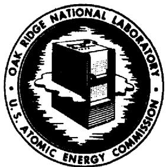

# OAK RIDGE NATIONAL LABORATORY

Operated By

UNION CARBIDE NUCLEAR COMPANY

# UCC

POST OFFICE BOX P

OAK RIDGE, TENNESSEE

# ORNL

# CENTRAL FILES NUMBER

58-2-40

DATE: February 18, 1958

SUBJECT: Mclten Salt Heat Transfer

TO: Distribution

FROM: H.W.Hoffman

P NO. 62

External Transmittal

Authorized

# DISTRIBUTION

1. A. L. Boch   
2. A. P. Fraas

3-52. H.W.Hoffman

53. W. H. Jordan   
54. H. G. MacPherson   
55. A. J. Miller   
56. J. A. Swartout   
57. A. M. Weinberg

58-59. Central Research Library

60-61. Laboratory Records

62. ORNL-RC

63. REED Library

64-78. TISE

79. M. J. Skinner   
80. Doc. Ref. Section

# NOTICE

This document contains information of a preliminary nature and was prepared primarily for internal use at the Oak Ridge National Laboratory. It is subject to revision or correction and therefore does not represent a final report.

# LEGAL NOTICE

This report was prepared as an account of Government sponsored work. Neither the United States, nor the Commission, nor any person acting on behalf of the Commission:

A. Makes any warranty or representation, express or implied, with respect to the accuracy, completeness, or usefulness of the information contained in this report, or that the use of any information, apparatus, method, or process disclosed in this report may not infringe privately owned rights; or   
B. Assumes any liabilities with respect to the use of, or for damages resulting from the use of any information, apparatus, method, or process disclosed in this report.

As used in the above, "person acting on behalf of the Commission" includes any employee or contractor of the Commission to the extent that such employee or contractor prepares, handles or distributes, or provides access to, any information pursuant to his employment or contract with the Commission.

# MOLTEN SALT HEAT TRANSFER

H. W. Hoffman

Oak Ridge National Laboratory

Post Office Box Y

Oak Ridge, Tennessee

# ABSTRACT

The experimental system used in the determination of turbulent forced-convection heat-transfer coefficients with molten salts is described, and the results of the experimental program are detailed. The salts studied have been the mixtures $\mathrm{NaNO}_2$ - $\mathrm{NaNO}_3$ - $\mathrm{KNO}_3$ , LiF-NaF-KF and NaF-ZrF $_4$ -UF $_4$ , and sodium hydroxide. Low results with the LiF-NaF-KF mixture in Inconel tubes are explained in terms of an interfacial film. A nonwetting phenomenon is postulated to describe the decreased heat transfer in the NaF-ZrF $_4$ -UF $_4$ system. The advantages of molten salts as coolants are briefly discussed.

It can be concluded that molten salts behave, in general, as ordinary fluids $(0.5 < N_{\mathrm{Pr}} < 100)$ as far as heat transfer is concerned. An analysis has shown that the molten salts compare favorably with the liquid metals as reactor coolants.

# INTRODUCTION

The study of the heat-transfer characteristics of molten salts has received much attention in recent years as these fluids have been found to be potentially good high-temperature reactor coolants and fuels. These materials are generally characterized by low vapor pressures (allowing near atmospheric operation), high melting points, and good thermal properties. The thermal conductivities of these fluids lie somewhere between those of water and the poorer liquid metals, and the thermal capacities per unit volume are as good as that of water. Studies of the heat and momentum transfer characteristics of molten salt coolants indicate that the molten salts compete favorably with the liquid metals.

Table 1 compares the working temperature range (melting temperature to boiling temperature) and the Prandtl moduli of a number of fused salts with those of some of the more common heat transfer fluids. Thus, Dowtherm A has a working range of only $400^{\circ}\mathbf{F}$ as compared to $1000^{\circ}\mathbf{F} - 2000^{\circ}\mathbf{F}$ for the molten salts. It is to be noted, of course, that this does not provide the salts with an advantage over the liquid metals. However, fused salts do possess an advantage over many of the liquid metals in that they are nonflammable. A comparison of the final column in Table 1 shows that the fused salts have Prandtl moduli which lie in the same range as those for ordinary fluids $(0.5 < \mathrm{N}_{\mathrm{Pr}} < 100)$ . From this, it is to be anticipated that the molten salts behave as ordinary fluids with respect to heat transfer.

Since little information was available in the technical literature on the heat-transfer characteristics of fused salts, an experimental program to obtain heat-transfer coefficients for fused salts was initiated at the Oak Ridge National Laboratory. The fluids studied have been sodium hydroxide, the eutectic mixture of sodium, potassium, and lithium fluoride (11.5-42.0-46.5 mole %), the mixture $\mathrm{NaNO}_2\text{-NaNO}_3\text{-KNO}_3$ (40-7-53 weight %) commercially known as "HTS", and the mixture NaF-ZrF $_4$ -UF $_4$ (50-46-4 mole %).

# EXPERIMENTAL SYSTEM

The experimental determination of the heat-transfer coefficients of molten salts presented a series of unusual problems. To insure against leakage of the molten salt, an all-welded experimental system was used. The high melting temperatures of the salts required that those parts of the system in contact with the fluid be held at elevated temperatures at all times. This seriously affected the lifetime of some system components and increased the difficulty of servicing the equipment during operation. In addition, the problems of temperature, pressure, and flow-rate measurement were aggravated by the high system temperatures. The general techniques used were not new to experimental investigations but did require modification to satisfy the restrictions imposed by the fused salt systems. To prevent contamination of the salt, helium was used as the blanket gas with residual oxygen and water vapor removed either by bubbling through sodium-potassium alloy or by passage over titanium sponge at $800^{\circ}\mathrm{C}$ .

The experimental system is shown in Figure 1. The flow of fused salts through the test section was effected by gas pressurization. A gas pressurized flow system possesses the advantages over a pump system of simplicity of construction and of trouble-free operation but requires greater quantities of salt to insure temperature equilibrium at high flow rates. In this system the fluid was pushed through the test section, located between the two tanks, by pressurizing one of the tanks with the inert blanket gas while venting the other. At the end of a cycle - i.e., when all of the salt had been transferred into the second tank - the pressures were reversed and the fluid was pushed in the opposite direction. Generally, the device used to measure the fluid flow rate can be used also to control the fluid cycling.

During the course of this experimental program, numerous modifications were made to the physical system to provide a more flexible apparatus. However, the only major change was a decrease in the size of the system. This was done to reduce the total salt inventory and to alleviate some of the effects of thermal expansion on the test section. Thus, the photograph of Figure 1 shows the experimental system in the later stages of its development. The two fluid reservoirs were jacketed by thermally insulated electrical heaters. The test section was heated by the passage of a high amperage AC through the tube wall. The power to the test section was supplied through electrodes soldered to the tube at each end. Mixing chambers were located at the outlet and inlet ends of the test section.

The fluid flow rate was obtained by both weight and volume measuring

techniques. To obtain the weight rate directly, one of the two tanks was mechanically isolated from the rest of the system by a flexible bellows. This tank was then supported by a beam balance or a cantilever weigh beam, and the change in weight was observed as the fluid flowed into or out of the tank. With the cantilever beam, the movement of the beam as it deflected under the varying load of the tank was sensed at the free end by a differential transformer. The cantilever weigh beam possessed high sensitivity with beam deflections as small as 10 microinches being readily detected. Direct calibration of either system was obtained by placing weights on the tank or by flowing water at a constant rate into a container resting on the tank.

In another approach to flow measurement, the time required for the fluid to fill a known volume was obtained. The volume was defined by two bare metal probes inserted into one of the tanks at two different levels. These probes were arranged such that the rising fluid on contacting the first probe would complete an electric circuit and activate a timer. When the second probe was reached, the timer would be stopped. From the volume-rate and the fluid density, the weight-rate was calculated. This technique possessed difficulties, particularly in the deterioration and electrical shorting of the probes and was not used to any great extent. Fluid cycling was accomplished by using the signals from the probes or the weigh-beam to actuate gas solenoid valves.

The test sections were fabricated from small diameter nickel, Inconel, and type 316 stainless steel tubing. The tube dimensions are shown in

Table 2. The tube outside surface temperatures were measured with 32-gage chromel-alumel thermocouples resistance-welded to the tube. The fluid-metal interface temperatures were obtained by correcting the outside surface temperatures for the calculated radial temperature drop in the tube wall. The thermocouple leads were wrapped around the tube for at least one-quarter turn to minimize thermocouple conduction errors. The fluid mixed-mean temperatures were obtained in baffled mixing chambers with the thermocouples contained in relatively low-mass thermowells. Several types of mixing pots, differing only in the method by which fluid mixing was achieved, were used. One design consisted of a short length of pipe closed at both ends. A whirling flow was induced by a tangential inlet, and further mixing was obtained through a perforated disc located at the center of the unit. A thermowell extending along the axis enabled temperature measurement at the inlet and outlet of the mixing chamber. Alternatively, a modified "disc-and-doughnut" mixing chamber was used.

Thermocouples were calibrated at the freezing points of lead, zinc, and aluminum. By sectioning the tube after the completion of each test series, the calibration of the thermocouple attached to each of the small tube pieces could be determined.

The voltage distribution along the test section was obtained using one of the wires of the tube surface thermocouple at each position as a voltage probe.

The test section was jacketed by a container filled with a granular thermal insulation. The mixing chambers, guarded by small heaters, were

adjusted to approximately the temperature of the test fluid before operation.

Part of the total energy put into the test section is lost to the system environment. Since the magnitude of this loss must be known to obtain a heat balance for the system, a heat loss calibration was made. This determination was made for each test unit, as the system heat loss is a function of the density and distribution of the insulation around the test section and of the end conditions. A typical heat loss calibration for a 24-inch test section is shown in Figure 2.

# EXPERIMENTAL RESULTS

Figures 3 through 8 show the results of these investigations with the molten salts. Figure 3 presents the ORNL data on NaOH (closed circles) correlated as the Colburn j-function. The generally accepted correlating equation for ordinary fluids is given by the line, $j = 0.023 \, \text{N}_{\text{Re}}^{-0.2}$ . The data of Grele and Gideon (1) obtained at NACA using a resistance-heated tube in a pump system are shown by the closed triangles. In addition to heating data, Grele and Gideon made measurements on the cooling of sodium hydroxide in an air-cooled double-tube heat exchanger. These results are given also (open triangles) in Figure 3. The reason for their high results and considerable scatter is not clear.

Figure 4 shows the results of the study with "HTS". The first reported measurements for molten salt heat transfer were those of Kirst, Nagle, and Castner (2) using "HTS" in an electrically heated iron tube. Lacking data on the thermal conductivity of this salt mixture, these investigators

correlated their data in terms of the dimensional function, $\mathrm{hd} / \mu^{0.4}$ . Over the Reynolds modulus range of 2,000 to 30,000, the average line through their experimental values was given by the equation

$$
\frac {h d}{\mu^ {0 . 4}} = 0. 0 0 0 ^ {4 4 2} \left[ \frac {d G}{\mu} \right] ^ {1. 1 4} \tag {1}
$$

In Figure 4 the data of Kirst, Nagle, and Castner have been recalculated as the j-function using thermal conductivity values determined at ORNL. In this figure the ORNL results with "HTS" are given by the closed circles. These data cover the Reynolds modulus range of 5,000 to 25,000 and show good agreement with the empirical equation describing forced-convection heat transfer in ducts containing ordinary fluids.

Figure 5 summarizes the results of the heat-transfer experiments with the LiF-NaF-KF eutectic mixture. The first tests were conducted using a nickel tube for the test section. Data (open triangles) were obtained in the transition flow region; and the results were in general agreement with predictions as to the heat transfer with this molten fluoride. Attempts to extend the $\mathbf{N}_{\mathrm{Re}}$ range of the data by increasing the temperature were unsuccessful due to fatigue failure of the nickel tube when the temperature exceeded $1000^{\circ}\mathbf{F}$ .

Following this the nickel tube was replaced by an Inconel section, since Inconel retains its structural strength to very high temperatures. The results of the tests with the Inconel test section (open circles of Figure 5) indicated that the heat transfer was a factor of two lower than that predicted

from the earlier NaOH, "HTS", and LiF-NaF-KF nickel tube data. Three possible explanations for the observed difference were possible: (1) an error in the experimental measurements, (2) incorrect physical property data, or (3) an unknown thermal resistance at the fluid-metal interface. Reanalysis of the experimental system indicated the possibility of a thermocouple conduction error in the fluid mixed-mean temperature measurements. Therefore, the mixing chamber design was altered, and a third series of runs were made. The results, shown by the closed circles, verified the previous test series in Inconel. Remeasurement of the physical properties eliminated this factor as the source of error. Visual examination of the inside surface of the tubes from both series of :uns with the fluoride salt showed a green deposit on the exposed tube surface. This was identified, chemically and petrographically, as a mixture of complex fluorochromates of which the major constituent was $\mathrm{K}_{3}\mathrm{CrF}_{6}$ .

The true heat-transfer coefficient, $h$ , is given by the equation

$$
\mathrm {h} = \frac {1}{\left(\frac {\mathrm {t} _ {\mathrm {S}} - \mathrm {t} _ {\mathrm {m}}}{\mathrm {q} _ {\mathrm {F}} / \mathrm {A} ^ {\prime}}\right) - \mathrm {y} / \mathrm {k} _ {\mathrm {i}}} \tag {2}
$$

where $A'$ is the inside surface area of the film, $y$ , the film thickness and $k_{i}$ , the thermal conductivity of the film. Since the films are thin (in this case 0.4 mils as indicated by photomicrographic study), the ratio of the heat-transfer area for the film to that for the clean tube, $A'/A$ , is approximately unity. Thus, we can replace $(q_{\mathrm{f}} / A')$ by $(q_{\mathrm{f}} / A)$ and write

$$
h = \frac {1}{\frac {1}{h} - \frac {y}{k _ {i}}} \tag {3}
$$

Substituting $h$ as determined from the equation, $j = 0.023 N_{\text{Re}}^{-0.2}$ , and the experimental coefficient, $h'$ , into equation (3) resulted in a value of 0.0002 hr-ft $^2$ - ${}^0\text{F}$ /Btu for the thermal resistance, $y/k_i$ . As a cross-check, measurements were made of the film thickness and the thermal conductivity of pure $K_3CrF_6$ . Using $y = 0.4$ mils and the preliminary value $k_i = 0.133$ Btu/hr-ft $^{-0}$ F, a thermal resistance of 0.00025 hr-ft $^2$ - ${}^0\text{F}$ /Btu was obtained. This compared closely with the value (0.0002) deduced from the heat-transfer data.

Two final experiments were made with the LiF-NaF-KF mixture. The first was with a second nickel tube to verify the earlier results. The results (closed triangles) were in essential agreement with the previous nickel tube data. The second test used a type 316 stainless steel tube. Preliminary tests had indicated that the fluoride eutectic mixture could be contained in this alloy for short times without serious corrosion or film formation. This was verified by examination of the tube at the conclusion of the test. The results (indicated by the open squares) served as additional evidence that the reduced heat transfer in Inconel could be attributed directly to the deposits on the heat-transfer surface.

Heat-transfer studies were also made with the fluoride mixture $\mathrm{NaF - ZrF_4 - UF_4}$ in Inconel. The results are shown in Figure 6 which compares the data obtained by two investigators at ORNL. At a Reynolds modulus of 10,000, both sets of data fall approximately $22\%$ below the general

correlation for ordinary fluids. Salmon (3) used a double-tube heat exchanger with sodium-potassium alloy flowing through the annulus as coolant and a length-to-diameter ratio of 40. Center-line temperatures were measured at both the inlet and outlet of the fluid streams. An adjustable probe was used to measure the surface temperatures on the annulus side of the center tube.

Both the measured surface temperatures and the Wilson (4) graphical analysis technique were used in evaluating the heat-transfer coefficient. Salmon's results based upon the measured surface temperatures exhibit considerable scatter and are not shown. Unlike the LiF-NaF-KF: Inconel system, visual examination of the exposed surface of the test section showed no deposits. However, the surface appeared to have been unwet by the salt. If the salt did not wet the tube, then perhaps the low heat transfer results could be explained on the basis of an additional thermal resistance due to a gas film at the metal surface. As a check on the possibility of a systemic error, a duplicate apparatus was operated with water as the test fluid. The results agreed with the general heat-transfer correlation.

In an effort to gain some further insight into the reason for the decreased heat transfer with this zirconium-base fluoride, pressure-drop measurements were made with this salt flowing isothermally through a smooth circular tube. The test section consisted of a 50-inch length of Inconel tubing, $1/4$ -in. OD x 0.035-in. wall thickness, with two short-radius right-angle bends. The effects of entrance contraction, exit expansion, and the two bends were determined by experiments with water. The equivalent tube length determined

from the water measurements was used in calculating the fused salt friction factor. The pressure drop across the test section was obtained as the difference in gas pressures in the fluid reservoirs at each end of the test section. The results of these measurements are compared in Figure 7 with the equation representing the friction factor in the Reynolds modulus range from 5,000 to 200,000. The experimentally measured friction factor fell approximately $16\%$ below the value which would be predicted. On the basis that $\mathrm{j} = \mathrm{f} / 2$ , the heat-transfer and momentum-transfer experiments with the zirconium-base fluoride salt show good agreement.

Some information on the thermal entrance length was obtained from the sodium hydroxide and LiF-NaF-KF experimental data. The entrance system consisted of a thermal entry region preceded by a hydrodynamic entrance region of 8 to 13 tube diameters. The entrance length, $(\mathrm{x / d})_{\mathrm{e}}$ , was taken as the position at which the local heat-transfer coefficient had decreased to within $10\%$ of its fully established value. The observed variation of $(\mathrm{x / d})_{\mathrm{e}}$ with the Peclet modulus is shown in Figure 8.

# DISCUSSION

The physical properties of the salts studied were determined in an independent experimental program. The literature values for viscosity and heat capacity for sodium hydroxide and "HTS" were also checked. The largest uncertainty exists in the thermal conductivity of these salts. However, the experimental effort aimed at establishing the temperature dependence of the thermal conductivity of these fluids is continuing strongly.

Additional thermal resistance at the heat-transfer surface, whether caused by a surface film-forming reaction or by "nonwetting", will result in drastically reduced heat transfer in small tube systems. Since the experimental data indicate that such phenomena can occur with LiF-NaF-KF and NaF-ZrF $_4$ -UF $_4$ , the use of these salt mixtures as coolants may be limited. This deficiency may be ameliorated by the development of suitable container materials or "wetting" agents. In general, it can be concluded from the experimental results reported that the molten salts behave as ordinary fluids $(0.5 < N_{\mathrm{Pr}} < 100)$ as far as heat transfer is concerned.

An analysis on the basis of a "cooling work modulus" (flow work per unit heat removal) shows that as reactor coolants the molten salts compare favorably with the liquid metals. This modulus, which is a function of the system geometry, the flow regime, the thermal properties of the fluid, and certain coolant temperature differences, is defined in the first equation of Table 3.* Substituting for $\mathbf{P}_{\mathfrak{p}}$ (the flow work based on the pressure drop), using the equation describing the friction factor in the turbulent flow regime, results in the expression of the cooling work modulus as a function of the parameters outlined above. The second equation in this table defines the over-all temperature difference in the reactor-heat-exchanger system postulated. The third equation expresses the Nusselt modulus for the system in terms of a number of dimensionless parameters involving the geometrical proportions, heat generation rates, and temperature differences for the system. This equation was obtained by substituting the equations describing the heat transfer in the reactor and the heat exchanger into the

temperature difference equation.

The system on which this analysis was based is shown schematically in Figure 9. The over-all temperature difference defined is seen to be the difference between the hottest point in the system (the reactor wall at the exit) and the heat rejection temperature (the coolant-side wall temperature in the heat exchanger). It was assumed that heat generated uniformly within the reactor fuel elements was removed by a non-heat-generating coolant flowing turbulently through circular, parallel tubes uniformly distributed through the core. The coolant passages were presumed of sufficient length to allow thermal and hydrodynamic entrance effects to be neglected. The physical properties of the fluids were assumed temperature-independent, and the thermal sink in the heat exchanger was chosen to be a liquid boiling on the outside surface of the tubes.

The Nusselt modulus equation for this system was solved simultaneously with the Nusselt modulus equations for fully developed turbulent pipe flow for both ordinary fluids and liquid metals to obtain the Reynolds modulus. The resulting value of the Reynolds modulus was substituted into the first equation of Table 3 to obtain the cooling work modulus. The specific set of reactor dimensions and operating conditions are given in Table 4. The cooling work modulus as a function of tube diameter for the coolants considered - lithium, sodium, bismuth, sodium hydroxide, and the LiF-NaF-KF eutectic - is shown in Figure 10. It can be seen that lithium is the best of the five reactor coolants while bismuth is the worst. Sodium, sodium hydroxide, and the Lif-NaF-KF mixture are comparable in heat transfer effectiveness with the two salts being better over the lower part of the tube

diameter range. For very small tube diameters (approximately one-tenth inch), the alkali-metal fluoride salt is as good a coolant as lithium.

# CONCLUSIONS

The molten salts, in general, behave as ordinary fluids as far as heat transfer is concerned. Since phenomena such as film formation and nonwetting (demonstrated in some molten salt systems) are difficult to predict, the heat-transfer characteristics of the molten salts for critical applications must be experimentally established.

An analysis has shown that the fused salts compare favorably with the liquid metals as reactor coolants.

# REFERENCES

1. Grele, M. D., Gideon, L., Nat. Adv. Comm. Areao, RM E52L09 (1953).   
2. Kirst, W. E., Nagel, W. M., Castner, J. B., Trans. AICHe, 36, 371 (1940).   
3. Salmon, D. F., Oak Ridge National Laboratory, unreleased data.   
4. Wilson, E. E., Trans. ASME, 37, 47 (1915).   
5. Rosenthal, M. W., Poppendiek, H. F., Burnett, R. M., ORNL CF 54-11-63 (1954).

# LIST OF TABLES AND FIGURES

Table 1 - Working Temperature Range and Prandtl Moduli of Various Fluids   
Table 2 - Dimensions of Test Sections   
Table 3 - Equations for Cooling Work Modulus Analysis   
Table 4 - Reactor Dimensions and Operating Conditions for Cooling Work Modulus Analysis

Figure 1 - Experimental System for Molten Salt Heat-Transfer Studies   
Figure 2 - Heat Loss Calibration Curves   
Figure 3 - Sodium Hydroxide Heat Transfer   
Figure 4 - "HTS" Heat Transfer   
Figure 5 - LiF-NaF-KF Heat Transfer   
Figure 6 - NaF-ZrF $_4$ -UF $_4$ Heat Transfer   
Figure 7 - Isothermal Friction Factor for NaF-ZrF $_4$ -UF $_4$ Flowing in a Smooth Circular Tube   
Figure 8 - Thermal Entrance Length for Sodium Hydroxide and the LiF-NaF-KF Eutectic   
Figure 9 - Temperature Distribution in Reactor-Heat-Exchanger System   
Figure 10 - Comparison of Coolants

TABLE 1   
Working Temperature Range and Prandtl Moduli of Various Fluids   

<table><tr><td rowspan="2">Fluid</td><td rowspan="2">Melting Temp.</td><td rowspan="2">Boiling Temp. (1 atm.)</td><td colspan="2">Prandtl Modulus</td></tr><tr><td>Temp. Range</td><td>NPr</td></tr><tr><td></td><td>oF</td><td>oF</td><td>oF</td><td></td></tr><tr><td>Water</td><td>32</td><td>212</td><td>50 - 200</td><td>9.6 - 1.9</td></tr><tr><td>Dilium A</td><td>53</td><td>496</td><td>100 - 450</td><td>34.2 - 4.5</td></tr><tr><td>Mercury</td><td>-38</td><td>675</td><td>50 - 600</td><td>0.027 - 0.0084</td></tr><tr><td>Sodium</td><td>208</td><td>1621</td><td>200 - 1300</td><td>0.011 - 0.0038</td></tr><tr><td>Bismuth</td><td>520</td><td>2691</td><td>600 - 1400</td><td>0.014 - 0.0084</td></tr><tr><td>Air</td><td colspan="2">---(to 1600)---</td><td>0 - 1600</td><td>0.69 - 0.72</td></tr><tr><td>NaNO3-NaNO2-KNO3</td><td>288</td><td>d 1000</td><td>570 - 750</td><td>4.9 - 2.7</td></tr><tr><td>Sodium hydroxide</td><td>604</td><td>1652</td><td>750 - 930</td><td>6.1 - 3.7</td></tr><tr><td>LiCl-KCl</td><td>679</td><td></td><td>950</td><td>1.1</td></tr><tr><td>LiF-NeF-KF</td><td>854</td><td>2858</td><td>1020 - 1300</td><td>2.6 - 1.7</td></tr></table>

TABLE 2   
Dimensions of Test Sections   

<table><tr><td rowspan="2">Salt</td><td colspan="4">Test Section</td></tr><tr><td>Material</td><td>OD (in.)</td><td>Wall Thickness (in.)</td><td>Length / Diameter, x d</td></tr><tr><td>NaOH</td><td>Nickel</td><td>0.1875</td><td>0.035</td><td>204</td></tr><tr><td rowspan="2">&quot;HTS&quot;</td><td>Inconel</td><td>0.250</td><td>0.035</td><td>47, 133</td></tr><tr><td>316 s. s.</td><td>0.250</td><td>0.035</td><td>47</td></tr><tr><td rowspan="3">LiF-NaF-KF</td><td>Nickel</td><td>0.1875</td><td>0.035</td><td>204</td></tr><tr><td>Inconel</td><td>0.225</td><td>0.025</td><td>137</td></tr><tr><td>316 s. s.</td><td>0.250</td><td>0.035</td><td>133</td></tr><tr><td>NaF-ZrF4-UF4</td><td>Inconel</td><td>0.250</td><td>0.035</td><td>47</td></tr></table>

# TABLE 3

Equations for Cooling Work Modulus Analysis

$$
\pi_ {p} = \frac {P _ {p}}{J q _ {t}} = \frac {0 . 0 9 2}{g _ {c} J} \left[ \frac {\mu_ {R} ^ {3}}{\rho_ {R} ^ {2}} \right] \left[ \frac {V _ {R} / V _ {t}}{d _ {R} ^ {4} (q _ {r} / V _ {t})} \right] \left[ N _ {R e, R} \right] 2. 8
$$

$$
\Delta t _ {t} = \Delta t _ {r, R} + \Delta t _ {a, R} + \Delta t _ {r, H X}
$$

$$
\frac {1}{N _ {\mathrm {N u} , \mathrm {R}}} = F _ {\mathrm {R}} - \frac {X}{N _ {\mathrm {R e} , \mathrm {R}} N _ {\mathrm {P r} , \mathrm {R}}} \quad \left\{1 + \frac {1}{\left[ \begin{array}{l} X B \frac {N _ {\mathrm {N u} , \mathrm {H X}}}{N _ {\mathrm {R e} , \mathrm {R}} N _ {\mathrm {P r} , \mathrm {R}}} \\ e \end{array} \right] - 1} \right\}
$$

# TABLE 4

Reactor Dimensions and Operating Conditions for Cooling Work Modulus Analysis

Reactor length, LR 3.00 ft

3.00 ft

Ratio of volume of coolant in reactor to total reactor volume, $\mathrm{V}_{\mathrm{R}} / \mathrm{V}_{\mathrm{t}}$

Heat removal rate, qR 200 Mw

Ratio of heat removal rate to reactor volume, qR/Vt 35.1 x 10⁶ Btu/hr-ft³

Over-all temperature difference, $\Delta t_{t}$ 500°F

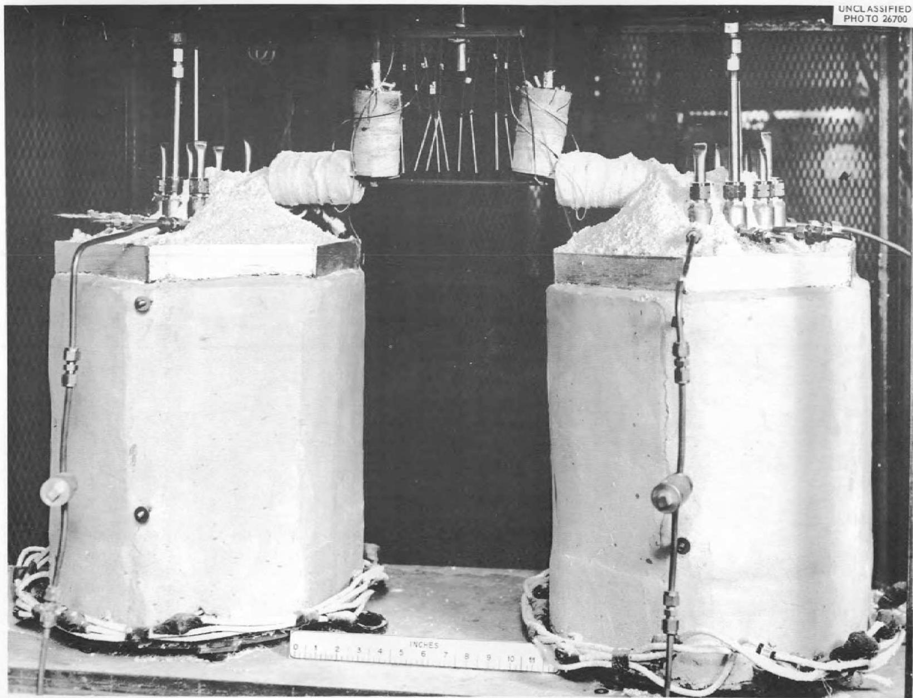  
Fig. 1. Experimental System for Molten Salt Heat-Transfer Studies.

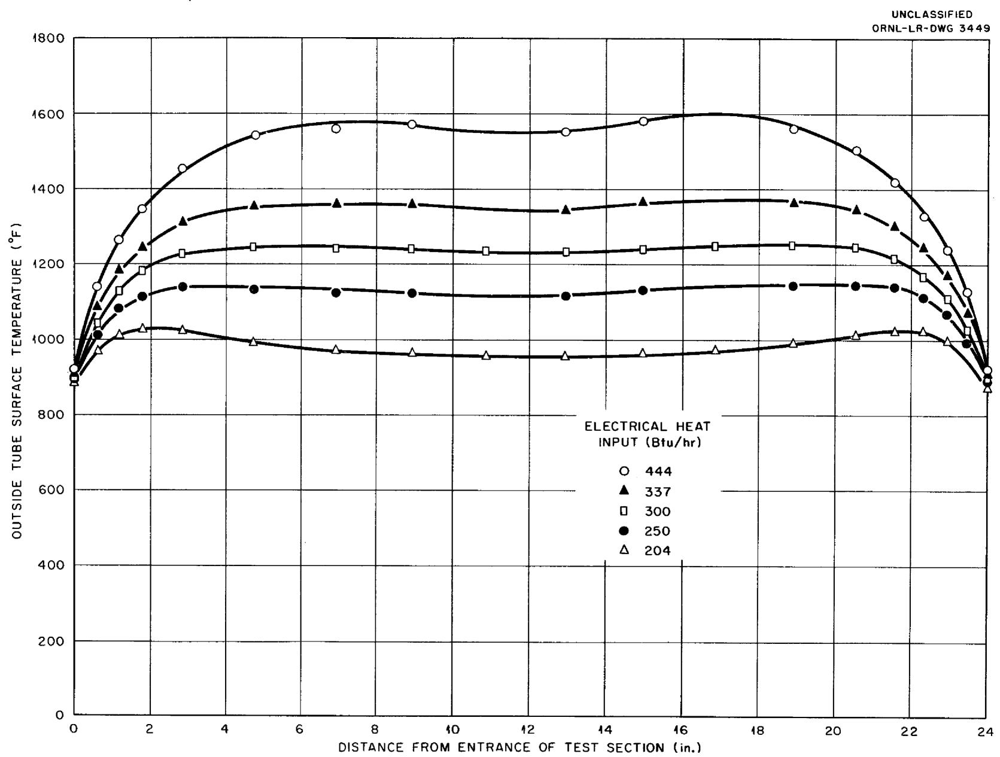  
Fig. 2. Heat Loss Calibration Curves.

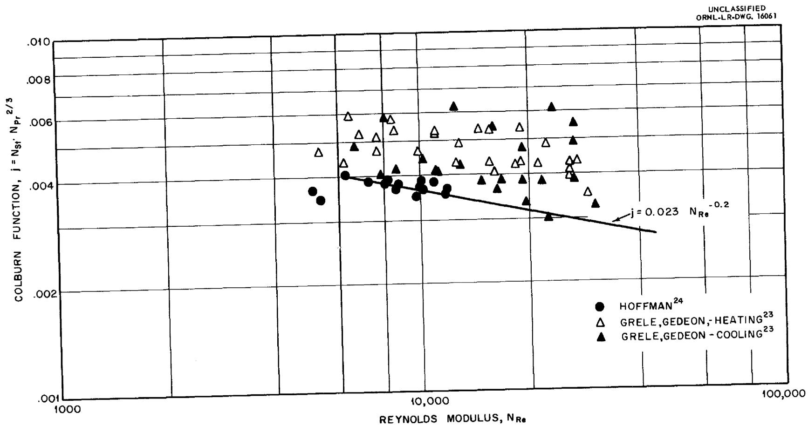  
Fig. 3. Sodium Hydroxide Heat Transfer.

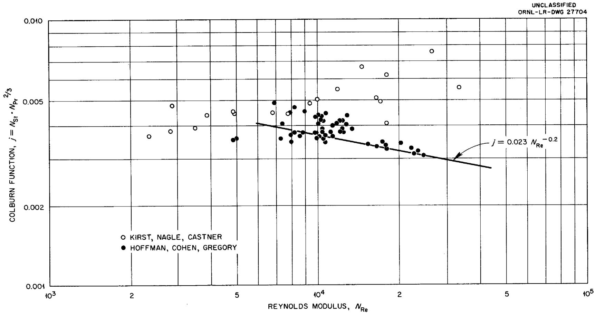  
Fig. 4. "HTS" Heat Transfer.

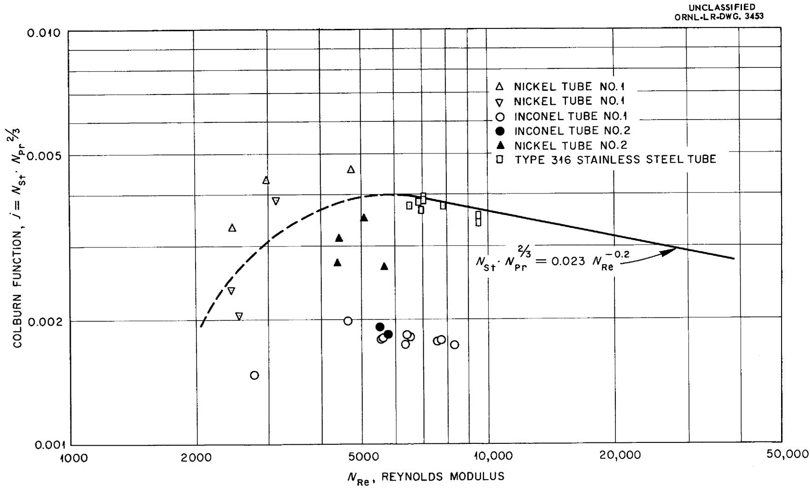  
Fig. 5. LiF-NaF-KF Heat Transfer.

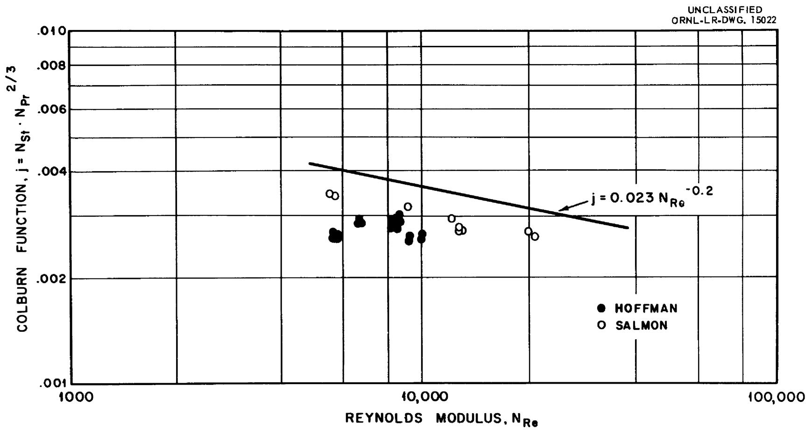  
Fig. 6. NaF-ZrF $_4$ -UF $_4$ Heat Transfer.

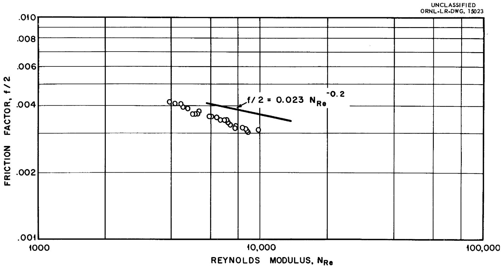  
Fig. 7. Isothermal Friction Factor for NaF-ZrF $_4$ -UF $_4$ Flowing in a Smooth Circular Tube.

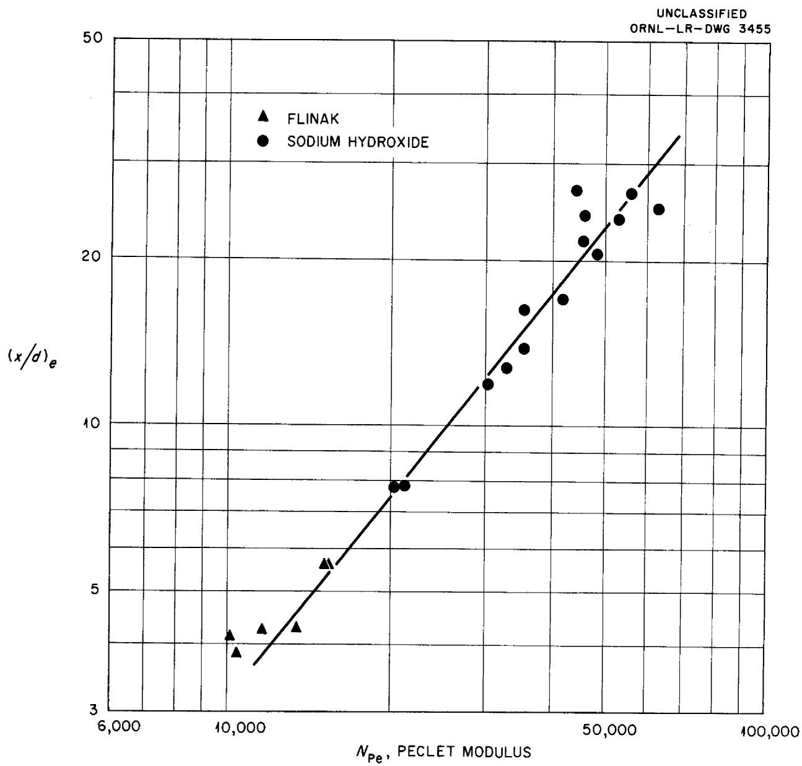  
Fig. 8. Thermal Entrance Length for Sodium Hydroxide and the LiF-NaF-KF Eutectic.

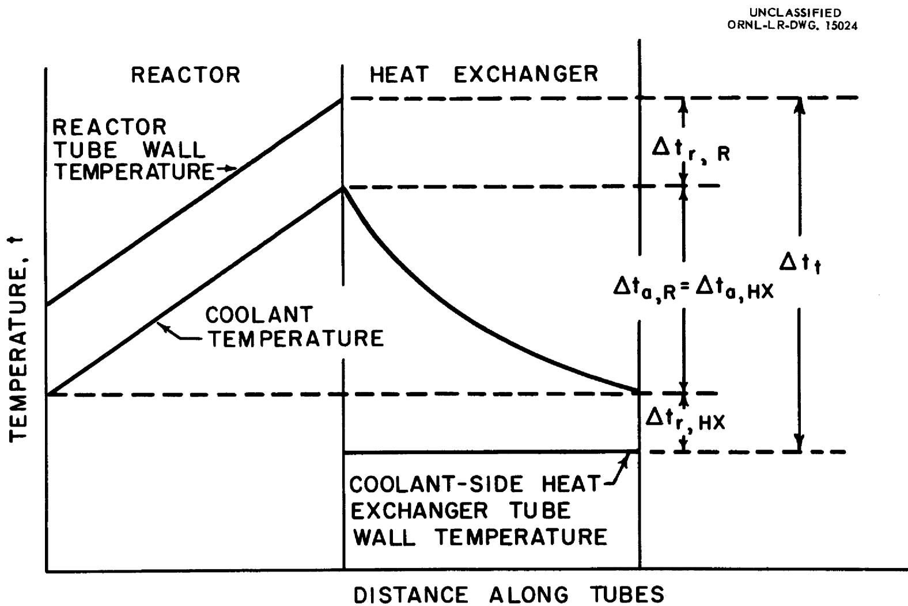  
Fig. 9. Temperature Distribution in Reactor-Heat Exchanger System.

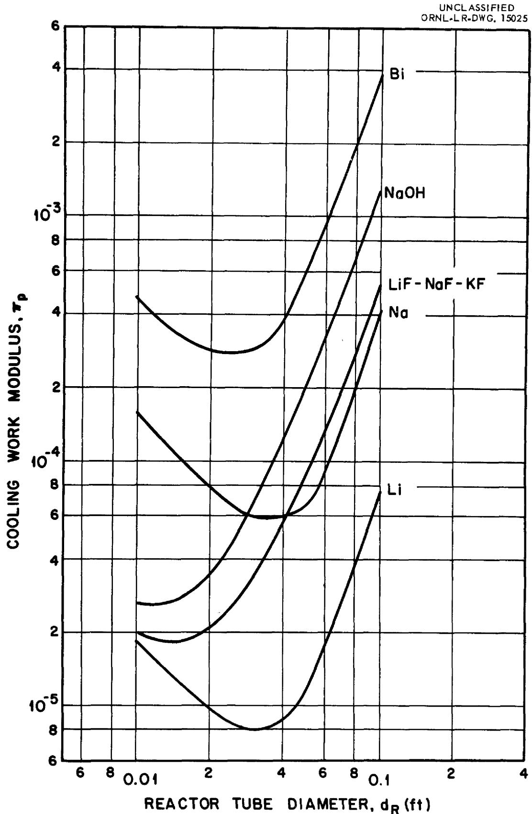  
Fig. 10. Comparison of Coolants.