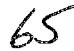
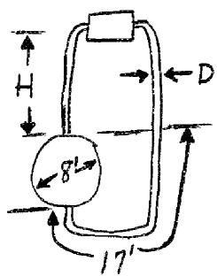
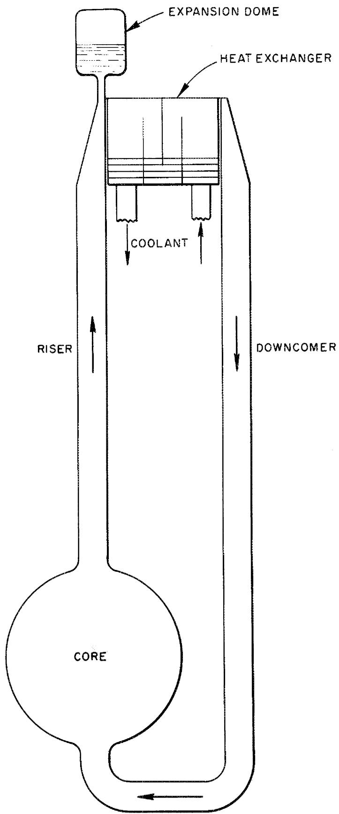
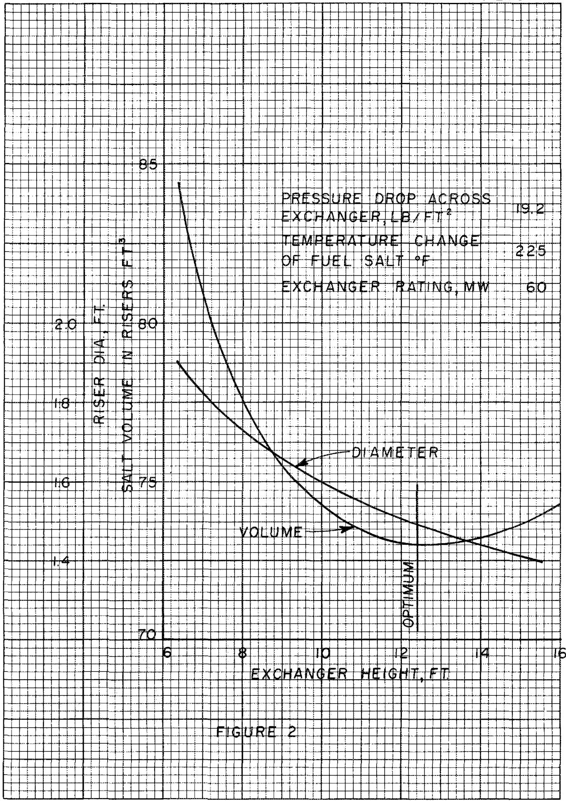
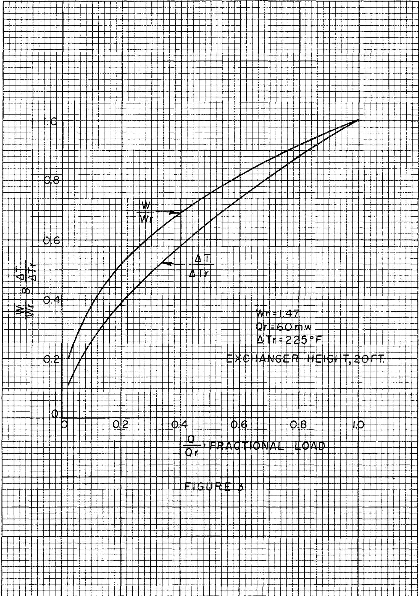
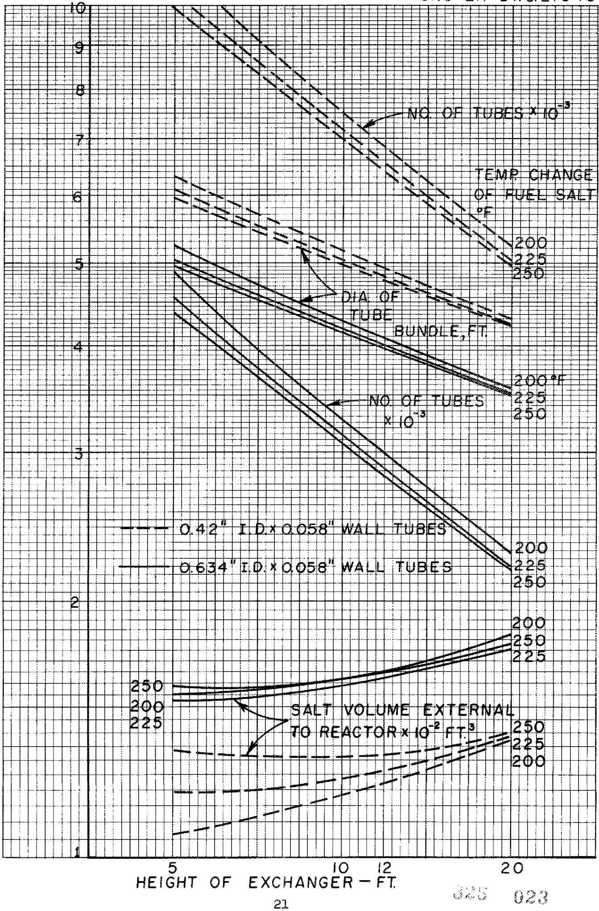
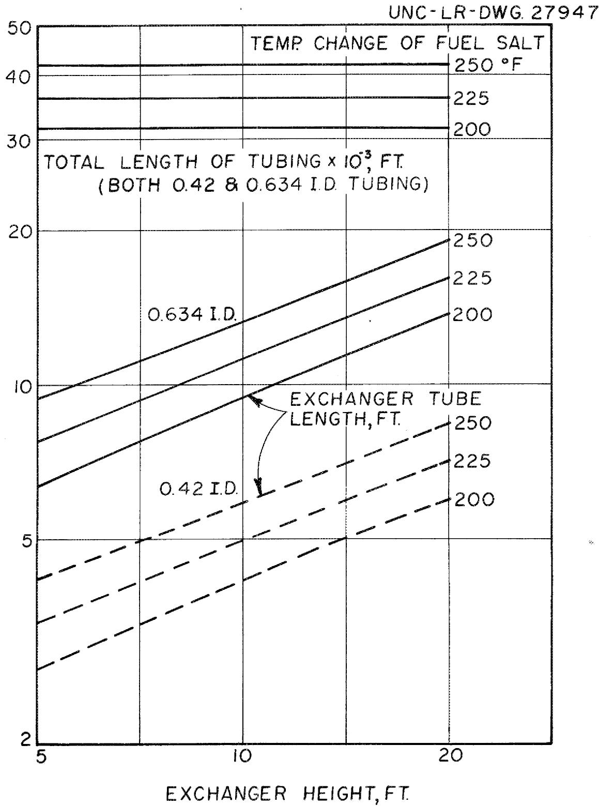
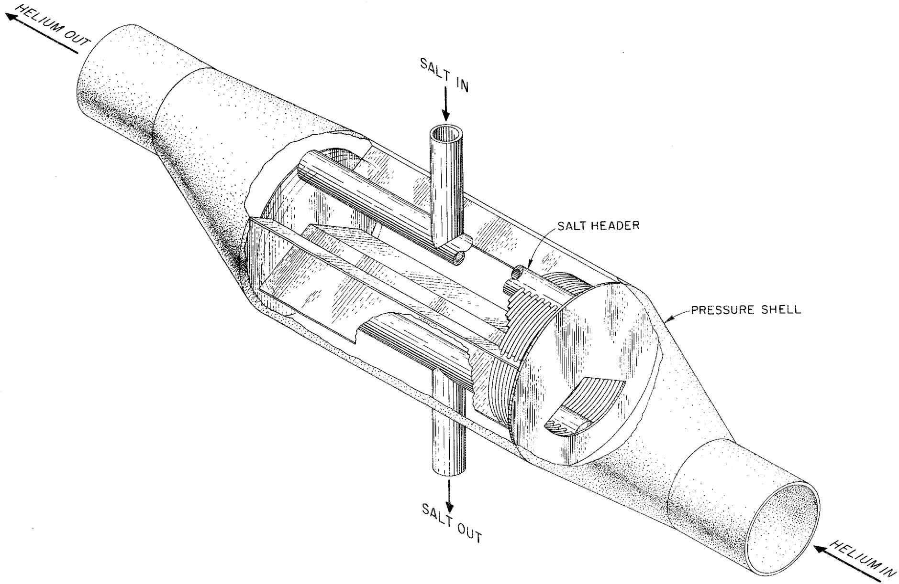
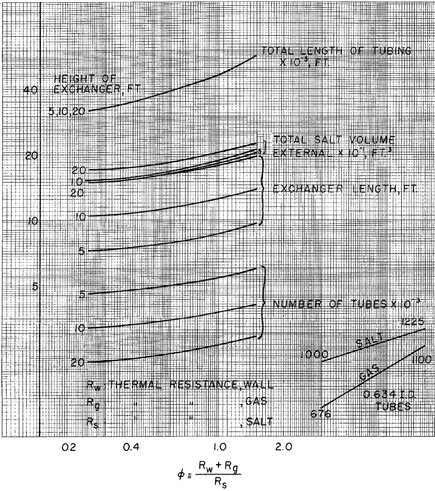
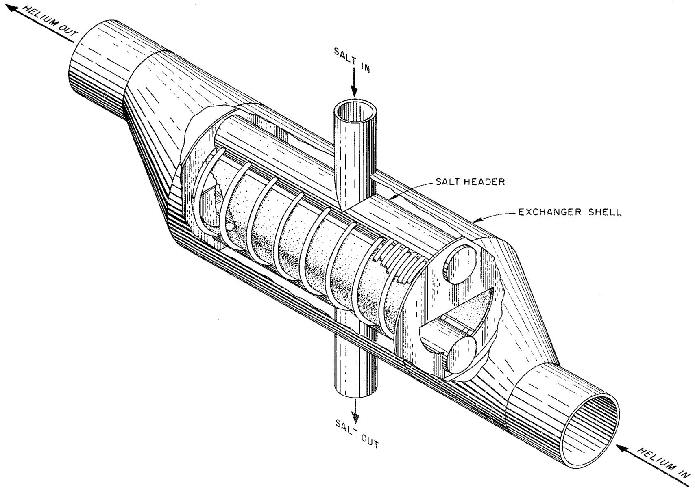

# OAK RIDGE NATIONAL LABORATORY

Operated By

UNION CARBIDE NUCLEAR COMPANY

# UCC

POST OFFICE BOX X

OAK RIDGE, TENNESSEE

DATE: February 5, 1958

SUBJECT: A MOLITEN SALT NATURAL CONVECTION REACTOR SYSTEM

TO: Listed Distribution

FROM: F. E. Romie, AMERICAN-STANDARD, and B. W. Kinyon

# ORNL

# CENTRAL FILES NUMBER

58-2-46

COPY NO.

EXTERNAL TRANSMITTAL AUTHORIZATION

1

1

EC

A

#

# NOTICE

This document contains information of a preliminary nature and was prepared primarily for internal use at the Oak Ridge National Laboratory. It is subject to revision or correction and therefore does not represent a final report.

# LEGAL NOTICE

This report was prepared as an account of Government sponsored work. Neither the United States, nor the Commission, nor any person acting on behalf of the Commission:

A. Makes any warranty or representation, express or implied, with respect to the accuracy, completeness, or usefulness of the information contained in this report, or that the use of any information, apparatus, method, or process disclosed in this report may not infringe privately owned rights; or   
B. Assumes any liabilities with respect to the use of, or for damages resulting from the use of any information, apparatus, method, or process disclosed in this report.

As used in the above, "person acting on behalf of the Commission" includes any employee or contractor of the Commission to the extent that such employee or contractor prepares, handles or distributes, or provides access to, any information pursuant to his employment or contract with the Commission.

# Abstract

Fuel-salt volumes external to the core of a molten-salt reactor are calculated for a system in which the fuel salt circulates through the core and primary exchanger by free convection. In the calculation of these volumes, the exchanger heights above the core top range from 5 to 20 ft. Coolants considered for the primary exchanger are a second molten salt and helium. External fuel holdup is found to be the same with either coolant. Two sets of terminal temperatures are selected for the helium. The first combination permits steam generation at 850 psia, $900^{\circ}\mathrm{F}$ . The second set is selected for a closed gas turbine cycle with an $1100^{\circ}\mathrm{F}$ turbine inlet temperature. Specific power (thermal kw/kg 235) is found to be about 900 kw/kg, based on initial, clean conditions and a 60 Mw (thermal) output. A specific power of 1275 kw/kg is estimated for a forced convection system of the same rating.

UNCLASSIFIED

# A MOLTEN SALT NATURAL CONVECTION REACTOR SYSTEM

F. E. Romie*

B. W. Kinyon

# Introduction

One of the problems of a circulating-liquid-fuel reactor is the provision of reliable, long-lived fuel circulating pumps. This problem is eliminated for a system in which the fuel is circulated through the primary exchanger and reactor core by natural convection. The advantages of omitting the circulating pump and its attendant problems of maintenance and replacement are purchased at the price of increased fuel-salt volume in the primary exchanger and in the convection risers. There are applications for a reactor system in which the premium placed on reliability and ease of maintenance could make the convection system attractive. The purpose of this report is to investigate a free-convection reactor system in order to afford a basis for assessing its merits.

# Selection of Reactor Conditions

A schematic representation of the reactor and primary heat exchanger is shown in Figure (1). The fuel salt returned to the core after cooling in the heat exchanger enters the bottom of the reactor sphere and leaves through the top. The temperature of the fuel salt entering the heat exchanger is specified to be $1225^{\circ}\mathrm{F}$ , a temperature which available corrosion information indicates is consistent with long-term life for the system. With this temperature and a thermal output of 60 Mw, it is possible to consider selection of steam turbine conditions of conventional plants. Thus temperature conditions in the fluids passing through the primary exchanger have been

selected to permit generation of 850 psia, $900^{\circ}\mathrm{F}$ steam. For a thermal output of 60 Mw these steam conditions would give a generator output of about 22 Mw (37% efficiency).

The $1225^{\circ}\mathrm{F}$ maximum salt temperature also allows consideration of a closed gas turbine cycle using helium at a turbine inlet temperature of $1100^{\circ}\mathrm{F}$ . For this temperature and the postulated cycle parameters summarized in Table I* the turbine output would be about 19 Mw (30.8% efficiency).

The importance of desirable nuclear properties for the fuel salt takes precedence over the thermal properties in the selection of a fuel salt. For this reason a mixture of lithium and beryllium fluoride salts is selected. For such mixtures the viscosity increases and the melting point decreases with increasing beryllium content. Mixture 130 (63% LiF, 36% BeF₂, ~1% UF₄ on a mole % basis), with a melting point of 850°F, has been selected as giving a reasonable combination of these two properties. The pertinent physical properties of this salt are given in Table II.

Table I.   
ASSUMED GAS TURBINE CYCLE PARAMETERS   
Calculated Performance - Helium   

<table><tr><td>Turbine inlet temperature</td><td>1100°F</td></tr><tr><td>Compressor inlet temperature (both stages)</td><td>100°F</td></tr><tr><td>Compressor adiabatic efficiency</td><td>87%</td></tr><tr><td>Turbine adiabatic efficiency</td><td>89%</td></tr><tr><td>Regenerator effectiveness</td><td>88%</td></tr><tr><td>Compressor pressure ratio (1.52/stage)</td><td>2.3</td></tr><tr><td>Pressure losses, Σ ΔP/P</td><td>7%</td></tr></table>

<table><tr><td>Thermal efficiency</td><td>30.8%</td></tr><tr><td>Helium temperature at salt exchanger inlet</td><td>6760F</td></tr><tr><td>Regenerator NTU</td><td>7.33</td></tr><tr><td>Cycle output decreases 2.1% for each percentage point increase in ΔP/P</td><td></td></tr></table>

The secondary fluid in the primary exchanger is limited by compatibility considerations (1) to either a gas or a molten salt. Both possibilities are treated. In the case of the molten salt cooling the heat from the reactor would be transferred from the fuel salt, to the coolant salt, to sodium, to water. A similar system is described in Reference 1. Good compatibility with the fuel salt and low fusion temperature $(650^{\circ}\mathrm{F})$ are the principal reasons for selection of Mixture 84 (35% LiF, 27% NaF, 38% BeF₂) as the coolant salt.

Table II.   
PHYSICAL PROPERTIES OF SALT MIXTURES 130 AND 84  

<table><tr><td></td><td>Mixture 130</td><td>Mixture 84</td></tr><tr><td>Unit heat capacity, Btu/lb°F</td><td>0.62</td><td>0.59</td></tr><tr><td>Thermal conductivity, Btu/hr-ft-°F</td><td>3.5</td><td>3.2</td></tr><tr><td>Density, lb/ft3(t - °F)</td><td>136.4-0.0121t</td><td>139-0.0142t</td></tr><tr><td>Viscosity, lb/hr-ft, 1000°F:</td><td>36.6</td><td>29.1</td></tr><tr><td>1200°F:</td><td>19.2</td><td>14.2</td></tr><tr><td>Fusion temperature, °F</td><td>850</td><td>640</td></tr></table>

The use of a gas as a coolant offers the advantage that, in the case of a steam cycle, it would be the only fluid intermediate between the fuel salt and the steam. In the case of the gas turbine cycle there would be no fluid intermediate between the working fluid and fuel salt. The use of gas rather than salt also eliminates heaters for the coolant salt and sodium circuits and decreases the number of drain tanks required for the system. Cases suitable as a coolant are hydrogen, helium and nitrogen. Helium is specifically considered in the following because of its good heat transfer properties and nuclear and chemical inertness. Hydrogen would be preferable from the point of view of heat transfer and pumping

considerations, while nitrogen, due to its higher molecular weight, would be attractive for use with a gas turbine cycle. The low molecular weights of hydrogen and helium require the use of a large number of compressor and turbine stages. Nitrogen would offer the advantage of using presently-developed compressor and turbine equipment.

# Optimum Riser Conditions

The hydrostatic differential head causing the fuel-salt flow is proportional to the product of the temperature change of the fuel salt and the height of the exchanger above the reactor. The pressure drop available to the exchanger is the hydrostatic head minus frictional losses occurring in the riser pipes. These frictional losses decrease rapidly with increasing riser diameter, but at the expense of an increased salt holdup volume in the riser. If the fuel-salt mass rate and temperature change are both fixed, then, for the attainment of a specified pressure drop available to the exchanger, there is one combination of riser diameter and height of exchanger for which the salt volume in the riser system will be a minimum. The existence of this minimum is illustrated in Figure (2), in which the variation of salt volume in the riser and of riser diameter are shown as a function of exchanger height. Table III summarizes a set of optimum riser conditions used in this report. Figure (2) and Table IV are based on the riser friction data given in Table III.

The frictional losses in the riser are found to be determined primarily by the expansion and contraction losses and are insensitive to wall friction. Thus replacement of a single riser by two sets of risers having an equal height and total cross sectional area will make essentially the same pressure drop available to the exchanger at the same riser holdup volume. This fact can be of use in decreasing the mechanical rigidity of the piping and indicates that the use of two exchangers with separate risers in place of one will not require an increased fuel holdup volume in the risers.

# Table III.

# FRICTION LOSSES IN THE RISERS

Expansion plus contraction loss

on entering and leaving core 1.5 ft

on entering and leaving exchanger headers 1.5 ft

Equivalent length of pipe added for bend-loss allowance 8 ft

Flow friction factor 0.02

Length of piping 2H + 17 ft

Friction loss associated with risers

$$
= \left(\frac {0 . 0 2}{D} \left[ 8 + 1 7 + 2 H \right] + 3\right) \frac {W ^ {2}}{\left(\frac {\pi}{I _ {4}}\right) ^ {2} D ^ {4} 2 g p}
$$

Hydrostatic head for flow

$$
= \alpha \Delta T _ {f} \left(H + 4\right)
$$

Salt volume in riser

$$
= \frac {\pi D}{4} ^ {2} (1 7 + 2 H)
$$

# Part Load Operation

For a given core-riser-exchanger system the flow rate of the fuel salt is determined in terms of the difference in fuel salt temperature in the two legs of the riser and the flow friction characteristic of the system. The part load operation of a given system is shown in Figure (3). For the molten salt reactor the average of the core inlet and exit temperatures is effectively a constant independent of heat output. Thus, if at rated conditions the salt temperature entering the exchanger (leaving the core) were $1225^{\circ}\mathrm{F}$ , the salt temperature leaving the core at half-load would be, based on Figure (3), $1187^{\circ}\mathrm{F}$ , and the temperature of the salt returned to the core would be $1039^{\circ}\mathrm{F}$ compared to $1000^{\circ}\mathrm{F}$ at full-load.

Table IV.   
OPTIMUM RISER CONDITIONS   

<table><tr><td></td><td></td><td>Q = 60 Mw
α = 0.0121</td><td colspan="7">lb/ft2-F</td></tr><tr><td>Temperature change of fuel salt, °F</td><td>200</td><td>200</td><td>200</td><td>225</td><td>225</td><td>225</td><td>250</td><td>250</td><td>250</td></tr><tr><td>Exchanger height, ft</td><td>5</td><td>10</td><td>20</td><td>5</td><td>10</td><td>20</td><td>5</td><td>10</td><td>20</td></tr><tr><td>Salt volume in risers, ft3</td><td>65</td><td>79.5</td><td>105.5</td><td>55</td><td>68</td><td>89</td><td>48</td><td>58.5</td><td>77</td></tr><tr><td>Diameter of riser, ft</td><td>1.78</td><td>1.656</td><td>1.537</td><td>1.602</td><td>1.525</td><td>1.418</td><td>1.497</td><td>1.41</td><td>1.318</td></tr><tr><td>Pressure drop across exchanger, lb/ft2</td><td>6</td><td>13.4</td><td>27.8</td><td>7.4</td><td>15.6</td><td>31.8</td><td>8.8</td><td>17.8</td><td>36.0</td></tr><tr><td>Salt velocity in riser, ft/sec</td><td>1.5</td><td>1.74</td><td>2.02</td><td>1.64</td><td>1.79</td><td>2.10</td><td>1.69</td><td>1.90</td><td>2.18</td></tr></table>

# Salt-Cooled Heat Exchanger

The terminal temperatures selected for the coolant salt are $875^{\circ}\mathrm{F}$ at inlet to the primary exchanger and $1025^{\circ}\mathrm{F}$ at exit. These two temperatures remain unchanged for all salt-cooled exchanger designs considered. The $875^{\circ}\mathrm{F}$ entrance temperature is $25^{\circ}\mathrm{F}$ above the fusion temperature of the fuel salt and $235^{\circ}\mathrm{F}$ above the fusion temperature of the coolant salt. Heat transfer data used in the calculations are given in Table V.

Fuel Salt

Table V.   
PRIMARY HEAT TRANSFER AND FRICTION DATA   

<table><tr><td>Nusselt modulus for fuel salt*</td><td>4.0</td></tr><tr><td>Friction factor</td><td>64/Re</td></tr><tr><td>Entrance and exit losses for salt, velocity heads</td><td>1.5</td></tr><tr><td>Thermal resistance per unit tube length</td><td>1/NuπRg= 0.0227</td></tr></table>

Coolant Salt

Thermal resistance per unit tube length\*\* 0.0032

Exchanger Tubes

<table><tr><td>Thermal conductivity, Btu/hr-ft-°F</td><td>14.5</td></tr><tr><td>Wall thickness, in.</td><td>0.059</td></tr><tr><td>Thermal resistance per unit length:</td><td></td></tr><tr><td>0.42 in. ID tubes</td><td>0.00272</td></tr><tr><td>0.634 in. ID tubes</td><td>0.00189</td></tr></table>

* Graetz modulus is less than 5.0 for all designs.   
** This value is estimated attainable without excessive pressure loss by appropriate shell-side baffling. (Doubling this resistance would increase the over-all resistance by only $11\%$ .)

Figures (4) and (5) summarize the results of exchanger calculations. Inspection of these figures shows that increasing the height of the exchanger above the reactor has no effect on the total length of exchanger tubing required and

UNCLASSIFIED

thus no effect on the fuel-salt volume within the exchanger tubes; however, increasing the exchanger height leads to an increased length of the exchanger and a decrease in the number of tubes in the exchanger. Thus the tube bundle diameter is decreased and, consequently, the volume of fuel salt contained in the exchanger header. However, the net result on salt volume external to the reactor is a slight increase with increasing exchanger height. This increase is due to the increased salt volume in the risers. If the number of exchanger tubes were the constant parameter rather than the tube diameter, then an increase in exchanger height would lead to a decrease in total holdup volume and a smaller diameter tube.

Decreasing the internal diameter of the exchanger tubes from 0.634 to 0.42 in. produces, for a 10 ft height of the exchanger, about a $23\%$ decrease in external holdup volume, but at the expense of a 2.3-fold increase in the number of tubes. Variation of the fuel-salt temperature drop over the range from 200 to $250^{\circ}\mathrm{F}$ produces a relatively minor effect on the exchanger designs.

The low thermal resistance of the coolant salt relative to that of the laminarly-flowing fuel salt results in a small temperature difference between the exchanger shell and tubes. Thus thermal stresses due to differential expansion of tubes and shell should prove small enough to permit a straight tube design despite the rather large temperature difference between the two salts.

# Gas-Cooled Exchangers for Steam Cycle

For helium cooling of the primary exchanger, the terminal temperatures of the helium were fixed at $850^{\circ}\mathrm{F}$ for inlet to the exchanger and $1025^{\circ}\mathrm{F}$ for outlet. The drop in fuel-salt temperature was held at $225^{\circ}\mathrm{F}$ . The $850^{\circ}\mathrm{F}$ inlet temperature insures that the fuel salt will not freeze in the tubes, and the $1025^{\circ}\mathrm{F}$ exit temperature is consistent with the generation of $900^{\circ}\mathrm{F}$ steam. The exchanger designs,

UNCLASSIFIED

which are summarized in Table VI, are based on the use of 0.634 in. ID tubing with copper fins. Dimensions of the finned tubes (Table VII) were scaled-up from descriptions in Reference 2, from which the flow fraction and heat transfer data were also obtained.

With a single-pass cross flow exchanger, the salt flowing in the row of tubes first contacted by the entering helium would leave the exchanger at a considerably lower temperature than that in the last row of tubes. With laminar flow, the flow resistance is directly proportional to the viscosity. Thus the salt velocity in the first row would be less than in the last row, and the mean temperature of the first row consequently lower than would be calculated on the basis of uniform flow in all tubes. The effects leading to non-uniform salt flow are mutually aggravating, with the result that a single-pass cross flow exchanger is unacceptable. A multipass exchanger is thus required if a cross flow exchanger design is to be used. A counterflow exchanger has the optimum configuration, both from the point of view of obtaining uniform flow distribution and minimizing the required over-all conductance of the exchanger.

The over-all dimensions given for the helium-cooled exchanger correspond to a three-helium-pass cross flow exchanger. The column labeled "depth" refers to the distance traveled by the helium in one pass (i.e., distance from front to rear of tube array). The "width" refers to the transverse dimension of the exchangers.

The fractional pressure loss, $\Delta P / P$ , listed in the table is based on a helium pressure level at the exchanger of 100 psia. The fractional pressure loss is inversely proportional to the square of the pressure level. Thus, for example, if the pressure of the helium were increased to 200 psia, the $\Delta P / P$ values shown in Table VI would be quartered (without change in any other entries in the table).

Table VI.   
GAS-COOLED EXCHANGER - STEAM CYCLE   
0.634 ID Finned Tubing   

<table><tr><td>Helium Re No.</td><td>Total Length of tubing ft</td><td>\(\frac{\Delta P}{P}\) (100 psia He)</td><td>Depth ft</td><td>Tube Salt Volume ft3</td><td>Frontal Area per pass ft2</td></tr><tr><td>500</td><td>48,300</td><td>.0000758</td><td>.264</td><td>106</td><td>1060</td></tr><tr><td>1000</td><td>43,000</td><td>.000438</td><td>.469</td><td>95.1</td><td>530</td></tr><tr><td>2000</td><td>39,200</td><td>.0026</td><td>.855</td><td>86</td><td>265</td></tr><tr><td>4000</td><td>36,200</td><td>.0177</td><td>1.582</td><td>79.3</td><td>132</td></tr><tr><td>Helium Re No.</td><td>Number of Tubes</td><td>Length per tube ft</td><td>Header Volume ft3</td><td>Total Salt Volume ft3</td><td>Width ft</td></tr><tr><td></td><td>5 ft high:</td><td colspan="3">riser vol - 55 cu ft, ΔP = 7.4 psf</td><td></td></tr><tr><td>500</td><td>5520</td><td>8.75</td><td>24</td><td>185</td><td>410</td></tr><tr><td>1000</td><td>5230</td><td>8.22</td><td>23</td><td>173</td><td>194</td></tr><tr><td>2000</td><td>5000</td><td>7.84</td><td>22</td><td>163</td><td>102</td></tr><tr><td>4000</td><td>4800</td><td>7.54</td><td>21</td><td>155</td><td>54</td></tr><tr><td></td><td>10 ft high:</td><td colspan="3">riser vol - 68 cu ft, ΔPSalt = 15.6 psf</td><td></td></tr><tr><td>500</td><td>3800</td><td>12.7</td><td>16.7</td><td>191</td><td>250</td></tr><tr><td>1000</td><td>3600</td><td>12.0</td><td>15.8</td><td>179</td><td>133</td></tr><tr><td>2000</td><td>3440</td><td>11.4</td><td>15.1</td><td>169</td><td>69.4</td></tr><tr><td>4000</td><td>3310</td><td>10.9</td><td>14.5</td><td>162</td><td>36.2</td></tr><tr><td></td><td>20 ft high:</td><td colspan="3">riser vol - 89 cu ft, ΔPSalt = 31.8 psf</td><td></td></tr><tr><td>500</td><td>2660</td><td>18.2</td><td>11.7</td><td>207</td><td>175</td></tr><tr><td>1000</td><td>2520</td><td>17.1</td><td>11.1</td><td>195</td><td>93.2</td></tr><tr><td>2000</td><td>2410</td><td>16.3</td><td>10.6</td><td>186</td><td>48.8</td></tr><tr><td>4000</td><td>2320</td><td>15.6</td><td>10.2</td><td>178</td><td>25.4</td></tr></table>

UNCLASSIFIED

Table VII.   
DESCRIPTION OF FINNED TUBE*   

<table><tr><td>Internal tube diameter, in.</td><td>0.634</td></tr><tr><td>Wall thickness, in.</td><td>0.059</td></tr><tr><td>Tube material</td><td>INOR-8</td></tr><tr><td>Fin material</td><td>Copper</td></tr><tr><td>Fin area/total area</td><td>0.876</td></tr><tr><td>Fin thickness, in.</td><td>0.0339</td></tr><tr><td>Tube spacing in plane normal to gas flow, in.</td><td>1.745</td></tr><tr><td>Tube spacing parallel to flow, in.</td><td>1.430</td></tr><tr><td>Heat transfer area/unit volume, l/ft</td><td>76.2</td></tr></table>

* Geometrically similar to surface CF-8.72 (c) in Reference 2.

The fraction, s, of the plant output used in pumping the helium through the exchanger is given by the equation,

$$
S = \frac {\gamma - 1}{\gamma} \frac {T}{\Delta T} \frac {1}{\eta_ {c} \eta_ {p}} \frac {\Delta P}{P}
$$

in which $\gamma$ is the specific heat rate, $T$ the mean gas temperature $(^{\circ}R)$ , $\Delta T$ the temperature change of the gas, $\eta_{c}$ the blower efficiency, and $\eta_{p}$ the plant efficiency. For a blower efficiency of $80\%$ and plant efficiency of $37\%$ , one obtains,

$$
S = 1 0. 7 \frac {\Delta P}{P}
$$

Thus if $2\%$ ( $S = .02$ ) of the generator output is used to blow helium through the exchanger, the value of $\Delta P / P$ would have to be 0.00187.

In order to facilitate discussion of the calculated results summarized in Table VI, it is convenient to define the reference heat exchanger described in Table VIII.

Table VIII.   
REFERENCE GAS-COOLED HEAT EXCHANGER   

<table><tr><td>ΔP/P</td><td>0.00187</td></tr><tr><td>Pressure level, psia</td><td>100</td></tr><tr><td>Exchanger height, ft</td><td>10</td></tr><tr><td>Tube length, ft</td><td>11.5</td></tr><tr><td>Number of tubes</td><td>3240</td></tr><tr><td>Length of tubes, ft</td><td>78</td></tr><tr><td>Total salt volume, ft3</td><td>172</td></tr><tr><td>Depth, in.</td><td>9 1/4</td></tr><tr><td>Helium Reynolds Modulus</td><td>1750</td></tr></table>

If the pressure level of the helium were increased from 100 to 200 psia and the exchanger altered in order to maintain $\Delta P / P$ constant, then the exchanger length would be decreased from 78 ft to 48 ft and the depth increased from 0.77 to 1.2 ft. Accompanying changes in the number of tubes, tube length and salt holdup volume would be relatively negligible.

If the power expended in pumping the 100 psia helium through the exchanger were increased from $2\%$ to $4\%$ of generator output, (i.e., $\frac{\Delta P}{P} = 0.00374$ ), the depth and length of the exchanger would change to 0.93 ft and 61 ft, respectively. Corresponding changes in salt holdup volume, number of tubes and tube length would be relatively negligible.

For a 10 ft height of the exchanger above the reactor, the calculated salt volume external to the core is 172 cu ft for the reference exchanger. This can be compared to a fuel-salt volume of 160 cu ft for the salt-cooled exchanger of the same height, using exchanger tubes of the same internal diameter. If the reactor core diameter is taken as 8 ft, corresponding to a fuel-salt volume of

268 cu ft, then these figures indicate that gas cooling can be used with a fuel-salt volume increase of 12 cu ft in a total volume (exclusive of volume in expansion tank) of 440 cu ft.

The major uncertainty in comparing the external fuel-salt volumes for the gas-cooled and salt-cooled exchangers lies in the uncertainty in the salt volume which should be attributed to the exchanger headers. For the present calculations the header volume has been assumed to be 0.00438 ft³ per 0.634 in. ID tube for both the salt-cooled and gas-cooled exchangers. A more detailed design study is required to fix the header volume more accurately.

Use of a smaller tube diameter for the gas-cooled exchanger would result in a decreased fuel-salt holdup volume at the expense of an increased number of shorter tubes. The effect of using a 0.42 in. ID tube instead of the 0.634 in. tube used in the calculations should parallel the behavior previously shown for the salt-cooled exchanger.

A possible configuration for the three-pass exchanger is shown in Figure (6). The configuration permits attachment of the riser pipes to the headers with sufficient flexibility to minimize thermal stresses and provides a cylindrical containment for the pressurized helium. Use of two such cylinders to contain the reference exchanger would result in two exchangers, each 19 1/2 ft long. If the helium pressure were increased to 200 psia, the length of each would be reduced to 12 ft.

# Gas-Cooled Exchangers for Gas Turbine Cycle

The major problem encountered in designs of exchangers for use with a gas turbine cycle is the low temperature of the helium entering the helium-fuel-salt exchanger. For the cycle parameters given in Table I, this temperature is $676^{\circ}\mathrm{F}$ , a temperature $174^{\circ}\mathrm{F}$ below the fusion temperature of the salt. Exploratory calculations indicate that this low temperature would freeze the salt if an exchanger using the finned surface described in Table VII were used.

For minimum fuel-salt holdup in the exchanger tubes, the optimum solution to the problem of maintaining a wall surface temperature above the freezing point is found in the use of a counterflow exchanger, in which the gas-side thermal resistance decreases in the direction of gas flow in such a manner that the wall temperature does not drop below a prescribed value. In the case of a longitudinally finned tube, the gas-side thermal resistance variation required could be effected by increasing the fin height along the tube until the full fin height is attained. For the remainder of the tube length, the fin height would be unchanged and the tube wall temperature would increase above the prescribed minimum. The exchanger calculations presented for the gas turbine cycle presume the use of such an exchanger with a minimum wall-fuel-salt interfacial temperature of $900^{\circ}\mathrm{F}$ .

Results of the exchanger calculations are presented in Figure (7). The abscissa, $\phi$ , is the ratio of the sum of the gas and wall thermal resistances per unit tube length to the fuel-salt thermal resistance per unit length, $\phi = \frac{\mathrm{R_w} + \mathrm{R_g}}{\mathrm{R_s}}$ . The gas-side thermal resistance is defined as that which is obtained with the unaltered finned tubing. Using the thermal resistance data presented in Table V, it is easily shown that the gas-side thermal resistances corresponding to $\phi$ values of 0.25 and 1.5 are 0.003785 and 0.0321 $\frac{\mathrm{O}_{\mathrm{F - ft - hr}}}{\mathrm{Btu}}$ . This 8 1/2-fold increase in gas-side resistance corresponds to an increase of approximately $40\%$ in external fuel-salt holdup volume, number of tubes and length per tube.

No data are presently available defining the heat transfer and flow friction characteristics of tube bundles using longitudinally finned tubes. Thus the exchanger designs are incomplete. However, the number of tubes, tube length and total external salt volume can be estimated with reasonable accuracy if it is assumed, as seems likely, that the same value of $\phi$ can be realized with longitudinally finned tubes as with circumferentially finned tubes. For the steam cycle

helium-cooled reference exchanger the value of $\phi$ is 0.47. Using this value of $\phi$ in Figure (7) gives, for an exchanger 10 ft above the reactor, a total salt holdup volume of 160 ft³, a total length of exchanger tubing of 36,200 ft, with 3300 tubes long. A possible configuration for the exchanger is shown in Figure (8).

# Comparison of Cooling Means

Table IX gives a comparison of the three cooling systems considered for the conditions listed at the head of the table. The difference in external fuel-salt holdup volume among the three systems is not large and is therefore not a determining factor in the selection of the coolant medium for the reactor.

In general, the helium-cooled exchangers have much larger overall volumes than the salt-cooled exchangers. This increased bulk is caused by the larger spacing required by the finned tubes and also by the large volume required by the helium headers. An increase in helium pressure will decrease the helium header volume and also should decrease the fuel-salt header volume. The upper limit on helium pressure is probably set by consideration of the effects of a tube rupture on the fuel-salt system. It is of interest to note that other gas-cooled reactor studies, apparently not limited by similar considerations, have recommended gas pressures as high as 1000 psia. The 100 psia pressure specifically considered in these calculations is probably conservatively low.

Table IX.   
COMPARISON OF COOLING MEANS   
Based on 60 Mw, 10 ft high exchanger 0.634 ID tubes, $\Delta T_{\text{fuel}} = 225^{\circ} \text{F}$   

<table><tr><td>Method of Cooling</td><td>No. of Tubes</td><td>Total Tube Length, ft</td><td>Vol Outside Core, ft3</td></tr><tr><td>Salt-cooled for steam generation</td><td>3150</td><td>36,000</td><td>161</td></tr><tr><td>Helium-cooled for steam generation</td><td>3240</td><td>37,200</td><td>172</td></tr><tr><td>Helium-cooled for gas turbine cycle</td><td>3300</td><td>36,000</td><td>163</td></tr></table>

# Comparison with Forced Convection System

Design of a forced convection reactor system (1) has led to an estimation of 0.56 cu ft of fuel salt external to the reactor core per thermal megawatt. For the free convection system, using 0.634 ID tubes in the primary exchanger, the external volume is about 160 cu ft for 60 Mw, giving a specific volume of 2.67 cu ft/Mw. Using these numbers and initial-clean critical mass data (3), the fuel inventory for 60 Mw minimizes, for both the free and forced convection systems, at a core diameter of about 8 ft. At this diameter the specific powers (kw thermal/kg 235) are 895 and 1275 kw/kg for the free and forced convection systems, respectively. The free convection system is thus estimated to require $42\%$ more inventory than the forced convection system.

Addition of a small amount of thorium to the core salt would produce some breeding and a longer time interval between fuel additions. One-quarter percent thorium requires about an $87\%$ increase in fuel inventory at a core diameter of 8 ft.

# References

1. Kinyon, B. W., and Romie, F. E., "Two Power Generation Systems for a Molten Fluoride Reactor", To be presented at the Nuclear Engineering and Science Conference of the 1958 Nuclear Congress (March), Chicago, Illinois   
2. Kays, W. M., and London, A. L., "Compact Heat Exchangers", The National Press, Palo Alto, California (1955)   
3. Personal communication from J. T. Roberts, ORNL

  
Fig.1. Schematic of Natural Convection Reactor.

UNC-LR-DWG.27946

  
FIGURE 4

  
FIGURE 5

UNCLASSIFIED IL-LR-DWG 27948

  
W   
#   
6 67   
Figure 6 Three-Pass Exchanger

  
FIGURE 7   
UNC-LR-DWG.27949

UNCLASSIFIED

ORNL-LR-DWG 27950

  
Fig.8. Schematic of Counterflow Salt to Helium Exchanger.