# OAK RIDGE NATIONAL LABORATORY

Operated by

UNION CARBIDE NUCLEAR COMPANY

Division of Union Carbide Corporation

Post Office Box X

Oak Ridge, Tennessee

# EXTERNAL TRANSMITTAL AUTHORIZED

# ORNL

# CENTRAL FILES NUMBER

58-8-33

COPY NO. 7

DATE: August 13, 1958

SUBJECT: Screening Tests of Mechanical Pipe Joints for a Fused Salt Reactor System

To: Distribution

FROM: W. B. McDonald, E. Storto, A. S. Olson

# ABSTRACT

The testing and evaluation of three types of mechanical joints in a circulating molten fluoride salt system, at temperatures up to $1500^{\circ}\mathrm{F}$ , has been accomplished.

The feasibility of these joints for use in a large scale molten salt system is discussed.

Design criteria and operating techniques are described.

Measurements have been made of the leakage rates of helium through the joints. The effects of thermal cycling, atmospheric oxidation, salt corrosion, and thermal stresses have been noted. Disassembly and reassembly procedures are described.

# LEGAL NOTICE

This report was prepared as an account of Government sponsored work. Neither the United States, nor the Commission, nor any person acting on behalf of the Commission:

A. Makes any warranty or representation, express or implied, with respect to the accuracy, completeness, or usefulness of the information contained in this report, or that the use of any information, apparatus, method, or process disclosed in this report may not infringe privately owned rights; or   
B. Assumes any liabilities with respect to the use of, or for damages resulting from the use of any information, apparatus, method, or process disclosed in this report.

As used in the above, "person acting on behalf of the Commission" includes any employee or contractor of the Commission to the extent that such employee or contractor prepares, handles or distributes, or provides access to, any information pursuant to his employment or contract with the Commission.

# Table of Contents

1.0 Introduction 2   
2.0 Summary 2   
3.0 Description of Test Joints 3

3.1 Criteria for Joint Performance 3   
3.2 Freeze Flange Joint 4   
3.5 Indented Seal Joint 7   
3.4 Cast Seal Joint 12   
3.5 The Test Loop 12   
3.6 Instrumentation 18

4.0 Test Procedure 20

4.1 Freeze Flange Joint 20   
4.2 Cast Seal Joint 24   
4.3 Indented Seal Joint 29

5.0 Discussion of Results 33

5.1 Freeze Flange Joint 33   
5.2 Cast Seal Joint 45   
5.3 Indented Seal Joint 51

6.0 Future Tests 60

App. 1 Preliminary Mechanical Joint Specification 66   
App. 2 Graphs of Freeze Flange Thermal Cycling Tests 71   
App. 3 Graphs of Cast Seal Flange Thermal Cycling Tests 86   
App. 4 Graphs of Indented Seal Flange Thermal Cycling Tests 91   
App. 5 Report on Metallurgical Examination of the Cast Seal Flanges . . . 100   
App. 6 Report on Metallurgical Examination of the Freeze Flange Joint . . 105   
App. 7 Assembly Drawings of the Mechanical Joint and Loop 107

# 1.0 Introduction

To reduce down-time during maintenance operations on the molten salt power reactor system to a minimum, the philosophy has been adopted that all system components on which direct maintenance is not possible shall be removable and replaceable with spares, by remote manipulation. Repair work on failed components shall be accomplished in suitably equipped independent facilities.

It is prerequisite to the removal and replacement of system components by remote manipulation that a reliable method be developed for parting system piping and rejoining it to its original integrity. Until present experimental efforts to perform critical welding remotely have succeeded to the point where they can be applied with confidence to the maintenance of a reactor system, the use of mechanical joints for this purpose must be considered. The objective of the work reported here was to screen the various concepts of mechanical joints offered by individuals or groups within the Reactor Projects Division, and to select for development those showing promise of successful application.

# 2.0 Summary

Three small scale mechanical pipe joints of alternative types were tested in a fused salt pump loop. The joints were cold leak checked on a mass spectrometer leak detector before installation in the loop, were then installed and subjected to a series of thermal cycles between 1100 and $1300^{\circ}\mathrm{F}$ , removed from the loop and leak checked. The joints were then parted, remade, and leak checked again. An indicated leak rate of less than $1 \times 10^{-7}$ cc of helium per second was required for acceptable performance at each check.

Of the three joints tested, the "freeze flange" joint was found satisfactory for immediate development, the "indented seal" joint was found promising if modified, and the "cast seal" joint was found not suitable for development.

In accordance with these results, further tests of the small-scale "freeze flange" and "indented seal" joints have been initiated with sodium as the process fluid, and a pair of "freeze flange" joints in $4^{\prime \prime}$ pipe size has been fabricated for testing in a large fused salt system. Results of these tests will be reported separately.

# 3.0 Description of Test Joints

# 3.1 Criteria for Joint Performance

For the screening tests, the following criteria were used, based upon the Preliminary Mechanical Joint Specification (see Appendix 1) prepared by the MSRP Group:

(a) The joints shall be fabricated of materials compatible with fused fluoride salt fuels.   
(b) The joint leak rate, cold, before installation in the test loop, shall be less than $1 \times 10^{-7}$ cc of helium per second, as indicated by comparison with a standard leak used in conjunction with a mass spectrometer leak detector.   
(c) The joint shall be installed in a test loop circulating fused salt and subjected to a minimum of 50 thermal cycles between the temperatures of 1150 and $1300^{\circ}\mathbf{F}$ .   
(d) No fluid leakage shall be acceptable.   
(e) Upon completion of the thermal cycling tests, the joint shall be cut from the loop and cold leak checked (see 3.1.b).

(f) It shall be demonstrated that each joint can be parted and remade acceptably leak tight, without requiring more than superficial cleaning, etc., such as could be performed by remote manipulation.

# 3.2 Freeze Flange Joint

The principle of the frozen seal mechanical joint, or freeze flange, is illustrated in Fig. 1. The frozen salt seal is formed in the gap between the flange faces. The ring insert provides a labyrinth restriction to the passage of salt into the gap. The labyrinth is important only when the test loop was filled with salt, before the frozen seal was formed. After the frozen seal is formed, it retains the molten salt in the process stream. The metal seal ring provides a gas-tight seal, which retains fission gases. For an effective gas seal, it was found necessary to manufacture the seal ring to close tolerances. The O. D. and I. D. of the ring were within $0.004$ inches on a diameter of seven inches, and concentric within $0.001$ inches. The finish required was sixteen microinches. The same tolerances were required in making the seal ring groove in the flange faces.

An air channel, in each half of the flange assembly, provides cooling for the seal ring and insures the formation of the frozen salt seal.

The flange has a thin cross section between the flange hub, which is welded to the loop tubing, and the seal ring, near the outer edge of the flange. This was designed to present a small cross sectional area for radial heat conduction. Four webs add strength to the flange and reduce warping.

On the test installation, eight quick-opening toggle clamps were used on each flange assembly, as shown in Fig. 2, to provide the necessary

UNCLASSIFIED

ORNL-LR-DWG 27895

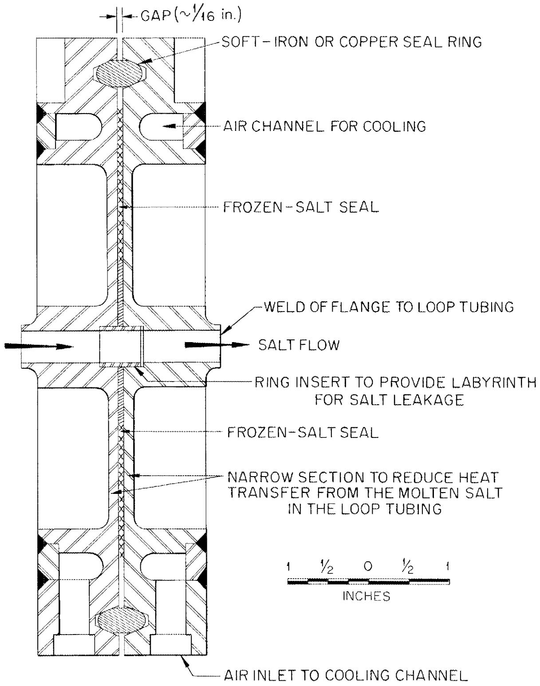  
Fig.1. Cross Section of Freeze Flange Joint.

Fig. 2. Freeze Flanges Installed in Inconel Test Loop.   
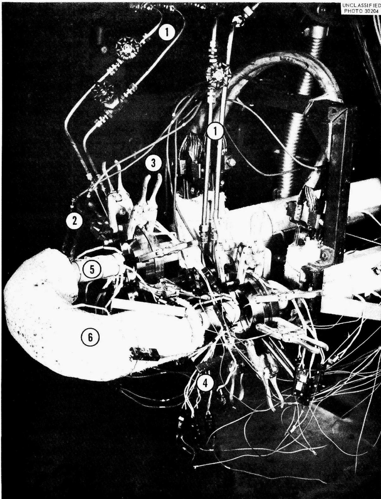  
(1) Air Cooling Lines (2 places); (2) Calrod Heaters (1 place); (3) Toggle Clamp (1 place); (4) Support for Flange (1 place); (5) Clam Shell Heater (1 place); (6) Hy-Temp Insulation (1 place)

force to maintain the gas leakage rate below the maximum allowed.

Fig. 2 shows the assembled flanges with clam shell type heaters, located on the loop tubing immediately before and after each flange assembly. Referring to the figure, the various parts are as follows:

(1) Air cooling lines, (2) Calrod heaters leads, (3) Quick-open toggle clamps, (4) Thermocouple leads, (5) Clam shell heaters, (6) Insulation.

There were no heaters nor was there any insulation on the flange assemblies.

The flanges were made of Inconel. The seal rings for the first test were of stainless steel. In subsequent tests, soft iron and annealed copper seal rings were used.

# 3.3 Indented Seal Joint

This mechanical joint is illustrated in Fig. 3. A dead-soft annealed metal gasket is used to seal the two flange halves. A raised tooth of V-shaped cross section, machined on the face of each flange, indents the flat metal gasket to provide a tight gas seal. Actual parts are shown in Figs. 4 and 5.

A thin cross section between the flange hub and gasket, near the outer edge of the flange, presents a small cross sectional area for radial heat conduction.

On the test installation, four standard design "C" clamps were used on each flange assembly to provide the force necessary to indent the gasket and maintain a gas leakage rate below the maximum allowed. Fig. 6 shows an assembly with clamps.

The flanges were made of Inconel. For the first test, a dead-soft annealed copper gasket was used in one flange assembly, and an annealed

# INDENTATION SEAL FLANGE TEST NO.1. THERMOCOUPLE LOCATIONS

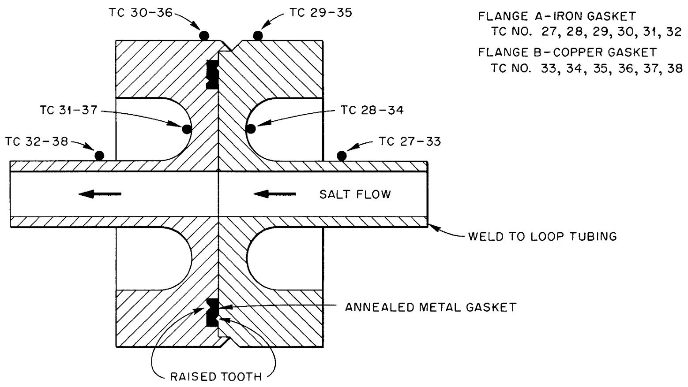  
Fig. 3. Schematic Drawing of Indented Seal Mechanical Joint.

UNCLASSIFIED PHOTO 30662

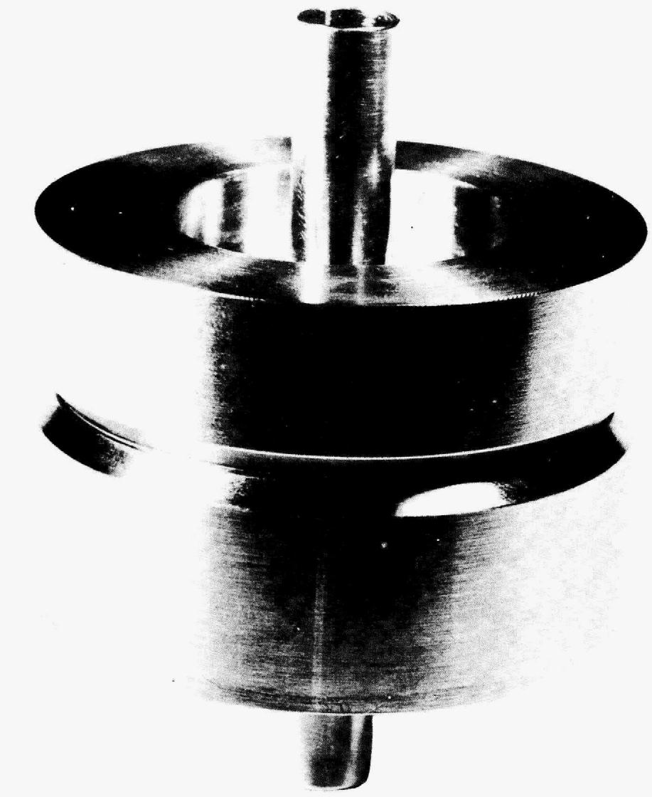

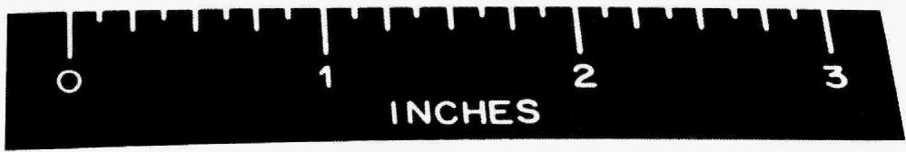  
Fig. 4. Assembly of Indented Seal Flange Before Testing.

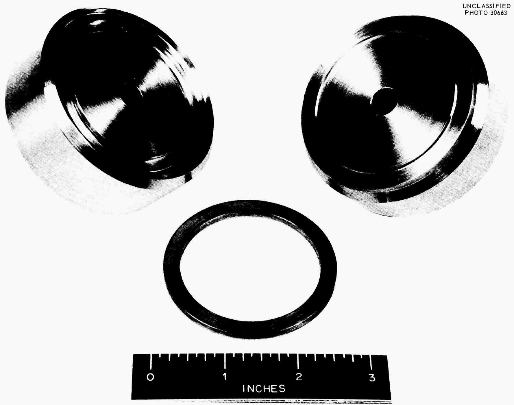  
Fig. 5. Parts of Indented Seal Flange Before Testing.

UNCLASSIFIED PHOTO 31519

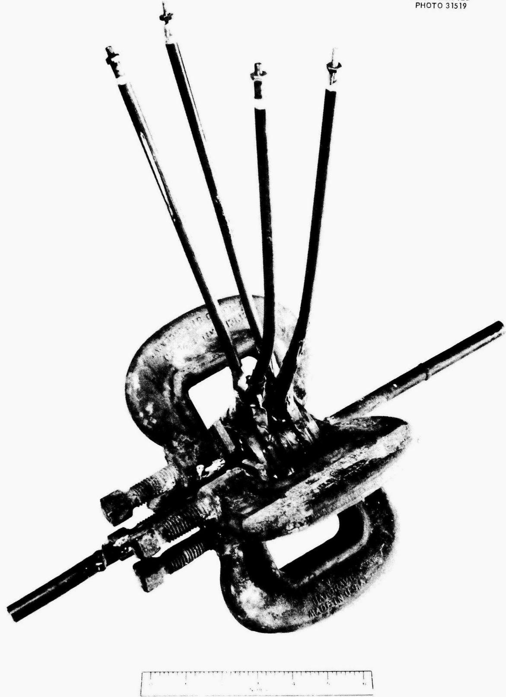  
Fig. 6. Indented Seal Flange Shown Assembled with "C" Clamps.

Armco iron gasket in the other assembly. For the second test, an annealed Nickel "A" gasket was used in one assembly and a nickel-plated Armco iron gasket in the other assembly.

# 3.4 Cast Seal Joint

A cross section of this mechanical joint is shown in Fig. 7. Four stainless steel bolts provide the mechanical strength for the joint. A metal insert, shown in the figure before being fused, is used to provide a salt and gas seal. The metal insert is fused between the flange faces before the test loop is filled with salt. The seal whose melting point is above that of the fuel salt, is in the solid state during operation of the test loop.

The sealing surfaces on the flange faces are flash copper plated, and then nickel plated, to promote good wetting by the sealing alloy.1

Because of its geometry, this joint must be installed in a vertical run of pipe.

The test flanges were made of Inconel. A cast silver seal was used in one flange assembly, while an alloy of $72\%$ silver and $28\%$ copper was used in the other flange assembly.

An assembly of the flange is shown in Fig. 8.

# 3.5 The Test Loop

The test loop consisted of 25 feet of one-half inch O. D., 0.045 inch wall thickness, Inconel tubing arranged as shown in Fig. 9. The various parts are identified as follows: (l0) Location of flanges under test, (ll) Calrod heaters wrapped with stainless steel strip, (l2) Clam

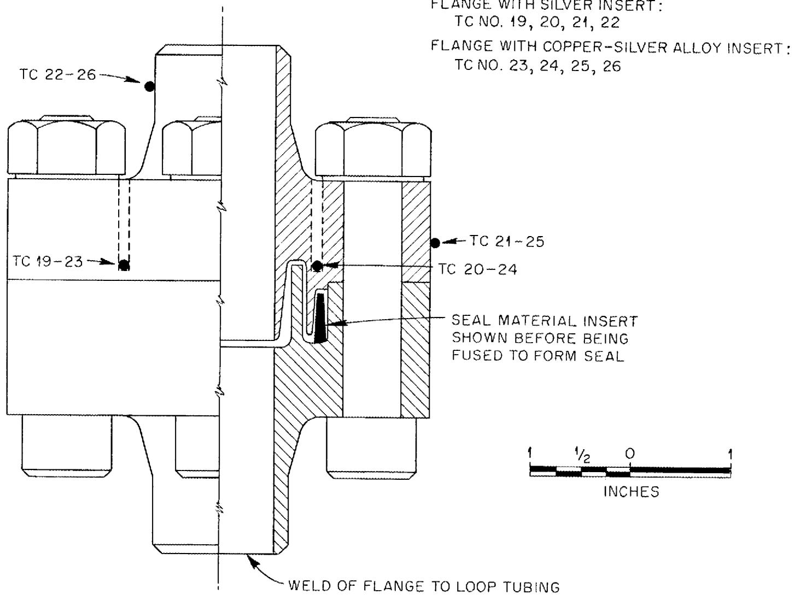  
Fig. 7. Cast Seal Flange Showing a Cross Section View and Thermocouple Locations.

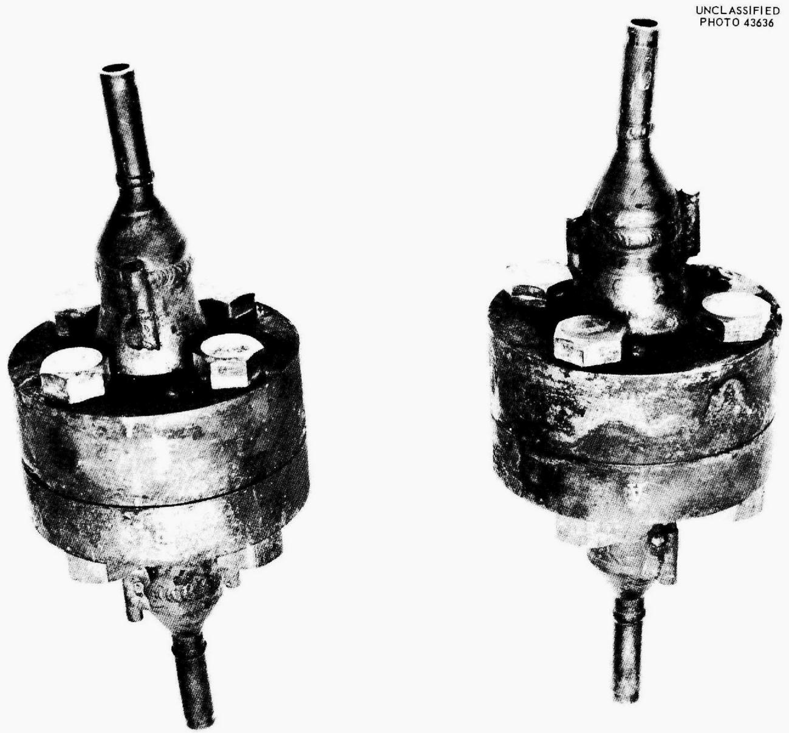  
Fig. 8. Assembly of Cast Seal Flanges.

Fig. 9. Inconel Test Loop.   
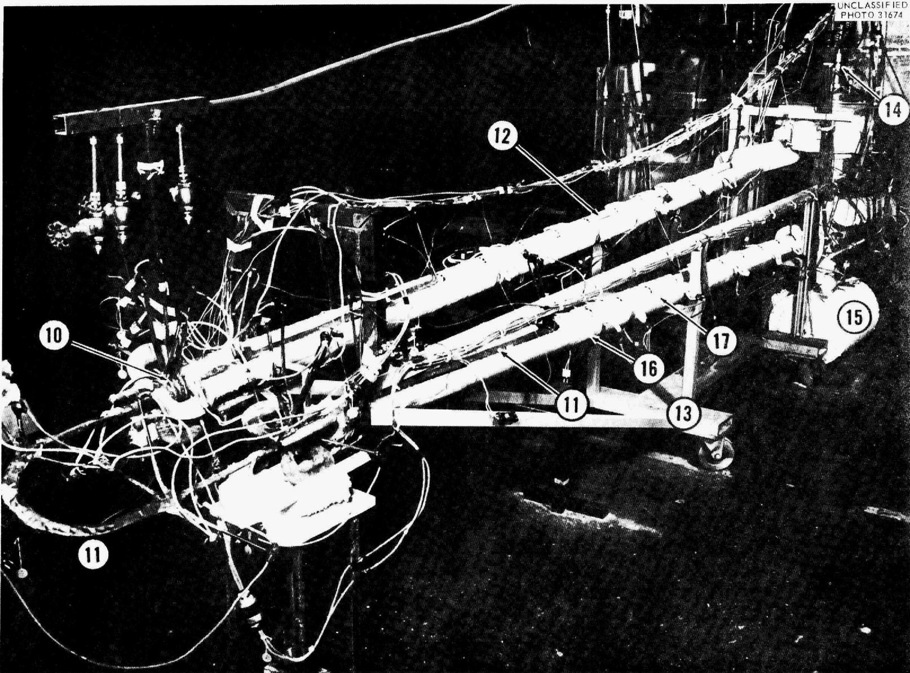  
(10) Indented Seal Flange (1 place); (11) Calrod Heaters Wrapped with Stainless Steel Strip (2 places); (12) Clam Shell Heaters (1 place); (13) Unistrut Frame (1 place); (14) LFB Pump (1 place); (15) Salt Sump (1 place); (16) Metal Trough Support (1 place); (17) Hy-Temp Insulation (1 place)

shell heaters, (13) Unistrut frame, (14) LFB pump, (15) "Hy-temp" insulation.

The molten salt mixture was circulated by means of an LFB-type centrifugal pump. During tests 1 and 2, on the freeze flanges, two straight sections of the loop, each about nine feet long, were used as resistance heaters. A heavy current was passed through the tubing sections. Other sections of the loop were heated with calrod or clam shell heaters. The entire loop was preheated, prior to filling with salt.

Tests 3 and 4 on the freeze flanges were conducted in a new location where resistance heating was not available, and the entire loop and pump were heated by means of calrod and clam shell heaters.

A sump tank, connected to the point of lowest elevation in the loop, was used to fill and drain the loop of molten salt. The LFB pump, installed at the highest point in the loop also served as a surge tank. The pump was supplied with an oil lubricating system. A helium supply was connected to the loop for initial purging of air before heating. It was also used to pressurize the sump for filling the loop with molten salt. The various components at the pump end of the loop are shown in Fig. 10 and are identified as follows: (1) LFB pump, (2) Pump motor and clutch, (3) Salt sump, (4) Water cooled oil storage tank, (5) Lubricating oil pumps, (6) Helium supply regulators, (7) Helium bubbler, (8) Helium pressure gauges, (9) Lubricating oil flowmeter.

Salt flow in the loop was controlled by a variable speed magnetic-type clutch and induction motor. V-belts connected the motor and clutch to the LFB pump.

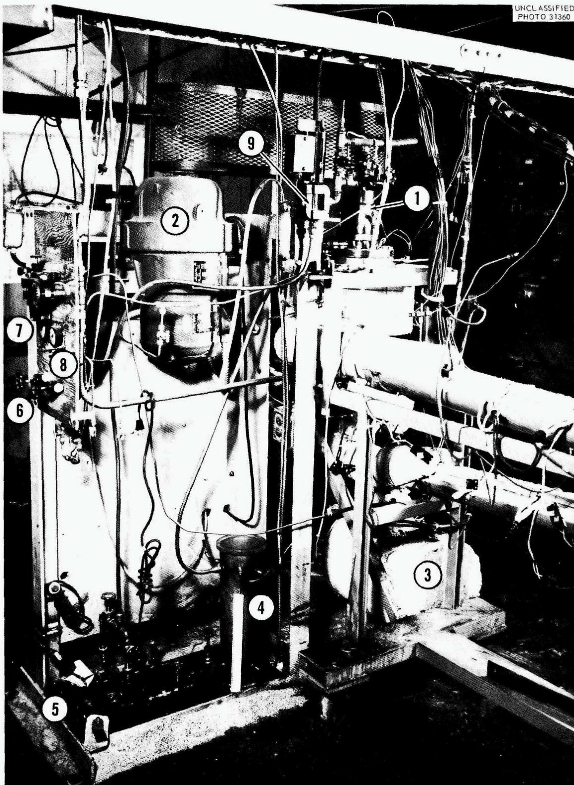  
Fig. 10. Inconel Test Loop - Pump End.

(1) LFB Pump (1 place); (2) Pump Motor and Clutch (1 place); (3) Salt Sump (1 place);   
(4) Water Cooled Oil Storage Tank (1 place); (5) Lube Oil Pumps (1 place); (6) He Supply Regulator (1 place); (7) He Bubbler (1 place); (8) He Pressure Gages (1 place); (9) Lube Oil Flowmeter (1 place).

All components of the loop in contact with the molten salt were fabricated of Inconel.

The loop design was similar to a "standard" design established in the Experimental Engineering Department for their corrosion testing program. The entire loop, including the pump, was mounted on a test stand, also of "standard" design, made of Unistrut. The stand was mounted on wheels for easy transport between various construction stations, such as the weld shop and X-ray room.

All welds in contact with the molten salt were given a dye check and X-ray examination according to departmental specifications for critical welds. The Inconel tubing used in the loop had received a thorough dye check inspection prior to construction of the loop.

Twenty thermocouples were spot welded to the loop tubing and pump, per Dwg. No. SK-CKM-1623. Additional thermocouples were attached to the flanges.

Precautions were taken during construction to use clean tubing and parts, and especially to avoid contamination of the inside of the tubing and pump.

# 3.6 Instrumentation

The chart below lists instruments and controls used on the test loop for all of the flange tests.

<table><tr><td colspan="2">Measurement</td><td>Primary Element</td><td>Indicating Element</td><td>Control</td></tr><tr><td>(a)</td><td>Temperature</td><td>Chromel-alumel thermocouples</td><td>Temperature Re-corders (1)</td><td>Tests 1 and 2: (Freeze Flange) Resistance Heaters, Transformer (2), Clam shell heaters, Variacs. Tests 3 and 4: (Freeze Flange and other flange tests) Clam shell heaters, Variacs (3)</td></tr></table>

Measurement Primary Element Indicating Element Control

(b) Salt levels in Metal probes and 110 V. lights pump and sump 110 V. power supply   
(c) Helium pressure - - - Bourdon Gauges - - - Pressure regulators (4) for LFB pump and sump   
(d) Lubricating oil - - - Flowrator - - - Centrifugal pump flow for LFB and motor (5) pump   
(e) Pump speed - - - Strobotac - - - Motor and clutch (6)

Notes on instruments and controls list:

(1) Bristol recorders $0 - 2000^{\circ}\mathsf{F}$ range for Tests 1 and 2 (Freeze Flange) Brown recorders $0 - 2000^{\circ}\mathsf{F}$ range for Tests 3 and 4 (Freeze Flange and other flange tests)   
(2) Resistance heaters consisted of two lengths of $1/2''$ 0. D. x 0.045" wall Inconel tubing each approximately 9 feet long. Hevi-duty transformer and saturable reactor control rated at 110 KVA, which allows a maximum current of 2740 amps output on the 40 volt tap; 3 KW is the minimum leakage power; 20 KW output can be controlled, but it is difficult to provide steady control of a lower power. Wheelco controller Vickers magnetic amplifier

(3) Open element type cylindrical clam shell heaters. Variacs, 110 V. and 220 V.   
(4) Fisher Governor bleed and non-bleed types of pressure regulators, 0-35 psig, Models 67-15 and 67-16.

(5) Eastern Industries Model D-11 centrifugal pump with 1/5 H. F., 110 V. motor.   
(6) Louis Allis Adjusto-Spe de induction motor, 5 H. P., 3 phase, $\sim$ 3600 rpm. Dynamatic magnetic-type clutch, 400-3400 rpm at full load.

# 4.0 Test Procedure

# 4.1 Freeze Flange Joint

Two sets of flanges were assembled with seal rings prior to installation in the loop. Each flange assembly was then leak tested using a helium leak detector. To leak test, the tubing from one end of a flange assembly was plugged and the other end connected to a vacuum pump. A plastic bag was then placed around the flange assembly and kept filled with helium during the leak test. Helium leak rate tests were made on both flange assemblies prior to installation in the loop for Tests 3 and 4. This work was done by the Instrument Department and is described in detail in their report No. 58-1-20. Both flange assemblies were then welded into one end of the loop as shown in Figs. 2 and 9.

Helium was circulated through the loop before preheating, to remove air. A helium pressure was maintained on the loop and pump during heating and filling.

Clean fluoride salt mixture was then transferred to the sump tank. When the temperature of all parts of the loop reached $1300^{\circ}\mathrm{F}$ , helium pressure was applied to the sump tank to force the salt into the loop. The pump was operated at a low speed during the filling operation. The loop was vented through the pump helium inlet, as the salt displaced the helium. Salt circulation was obtained a few minutes later, when the pump speed was increased to 2500 rpm to produce about 2 gpm flow. A helium

blanket was maintained at 2 to 3 psig on the salt surface in the pump during testing operations.

The heaters were then adjusted to obtain $1300^{\circ}\mathrm{F}$ on all parts of the loop. During the loop filling operation, cooling air was circulated in the air channels built into the freeze flanges. A small air flow of approximately 15 cfh was necessary to keep the seal ring area cool.

The loop was filled rapidly to insure establishment of frozen seals between the flange faces before the molten salt could raise the temperature of the flanges.

After a period of isothermal operation to make certain there was no salt leak, the thermal cycle testing was begun. Temperatures of the salt were measured by means of thermocouples located on the loop tubing at the inlet to each flange assembly. Temperature measurements were taken at various points on each flange assembly.

The salt flow was maintained at a steady rate of 2 gpm. The pump speed was checked periodically with a Strobotac and the flow in gpm obtained from a pump calibration chart.

A schematic diagram of the Inconel loop during Tests 1 and 2 is shown in Fig. 11. During these tests, temperatures were measured at the points indicated in Fig. 12. Fluoride salt, Fuel No. 107, was circulated in the loop during the first test. The salt temperature was cycled 50 times between $1150^{\circ}\mathrm{F}$ and $1300^{\circ}\mathrm{F}$ , and then the loop was operated isothermally for several days at $1300^{\circ}\mathrm{F}$ . The average cycle time was 44 minutes. A cycle is defined as a temperature variation from 1300 to $1150^{\circ}\mathrm{F}$ and back to $1300^{\circ}\mathrm{F}$ .

During the second test, in which fluoride salt, Fuel No. 30, was used, the temperature variation of the salt was from 1300 to $1500^{\circ}\mathrm{F}$ and back to

UNCLASSIFIED

ORNL-LR-DWG31973

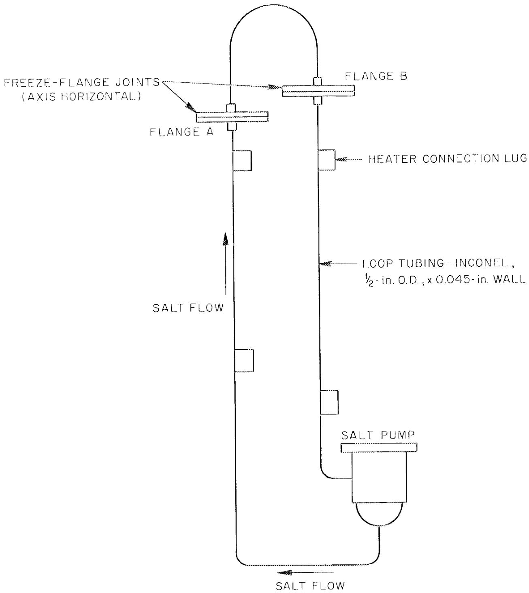  
Fig. 11. Schematic Drawing of Test Loop for Freeze Flange Tests 1 and 2.

UNCLASSIFIED ORNL-LR-DWG27897R

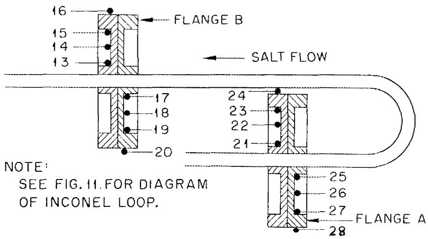  
Fig. 12. Schematic Drawing of Thermocouple Locations on the Freeze Flanges for Tests 1 and 2.

1300°F. The number of cycles was reduced to 30 and the average cycle time was 29 minutes.

After Tests 1 and 2, the flange assemblies were disassembled and reassembled to demonstrate ease and speed of handling. A motion picture film was taken of these operations. The time required for these operations is listed in Table 1.

Both of the flange assemblies were removed from the loop before starting on the next test. Additional machining work was performed on the flange faces to produce a better finish on the seal ring grooves.

A schematic diagram of the Inconel loop for Tests 3 and 4 is shown in Fig. 13. Fluoride salt, Fuel No. 30, was used in these tests. The temperatures were measured at the points indicated in Fig. 14. The salt flow rate was, again, 2 gpm.

During Test No. 3 the salt temperature was cycled 50 times between $1100^{\circ}\mathrm{F}$ and $1300^{\circ}\mathrm{F}$ . The average cycle time was 60 minutes. During Test No. 4 the temperature variation of the salt was from 1100 to $1300^{\circ}\mathrm{F}$ and back to $1100^{\circ}\mathrm{F}$ ; the number of cycles was 25, and the average cycle time was 62 minutes.

After the thermal cycling tests, both flange assemblies were removed from the loop for leak testing. Both assemblies were disassembled and one flange assembly was reassembled using a new copper seal ring. This assembly was again leak tested.

# 4.2 Cast Seal Joint

Two sets of flanges were assembled with metal inserts prior to installation in the loop. One flange assembly contained a pure silver insert, the other assembly contained an insert of copper-silver alloy. Both

# Table No. 1

# TIME REQUIRED FOR ASSEMBLY AND DISASSEMBLY FOR FREEZE FLANGES

# DISASSEMBLY

# Operation Performed

1. Dump Salt from Loop   
2. Cooling Flanges to Room Temperature   
3. Disconnect Thermocouples - Heaters - Airlines   
4. Remove Clamps

# Time Required

15 min.

4 hrs.

1.5 min.   
3.5 min.

Total 4 hrs. 20 min.

(See Figs. 21 and 22 for view of disassembled flanges)

# ASSEMBLY

1. Cleaning Flanges   
5 min.   
2. Replacing Flanges and Clamps   
5.5 min.   
3. Reconnection of Thermocouples - Heaters - Airlines   
3 min.   
Total 13.5 min.

(See Fig. 2 for view of assembled flanges)

# Note:

The time periods listed are for handling two freeze flange assemblies with two men performing the operations. The time periods were taken from a motion picture of the operations.

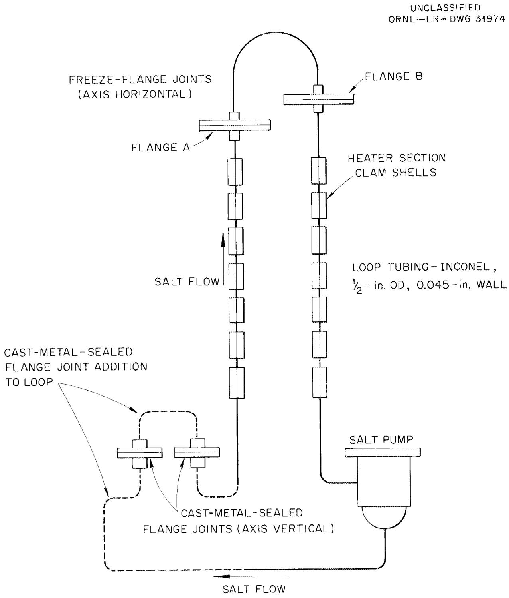  
Fig.13. Schematic Drawing of Test Loop for Freeze Flange Tests 3 and 4 and Cast Seal Flange Tests 1 and 2.

UNCLASSIFIED

ORNL-LR-DWG 31975

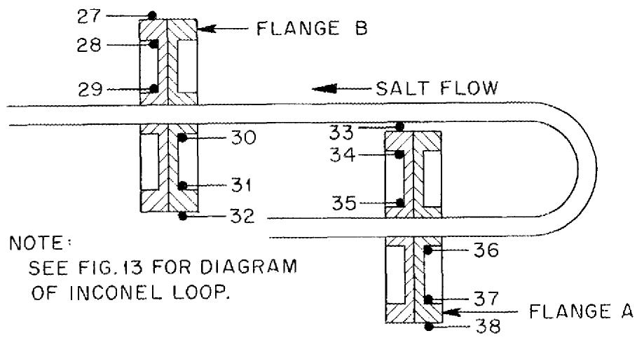  
Fig. 14. Schematic Drawing of Thermocouple Locations on the Freeze Flanges for Tests 3 and 4.

flange assemblies were then welded into one end of the loop in the location shown in Fig. 13.

A special furnace was placed around each cast seal flange for melting the metal inserts and to provide heat during loop operation. The loop and flanges were filled with helium prior to heating. The assembly with the silver insert was raised to $1830 - 1975^{\circ}\mathrm{F}$ and held at this temperature for one hour to insure complete fusion of the silver. The melting point of silver is $1760^{\circ}\mathrm{F}$ . The other assembly was treated in the same fashion, except that the temperature was raised to $1570^{\circ} - 1670^{\circ}\mathrm{F}$ . The melting point of the copper-silver alloy is $1435^{\circ}\mathrm{F}$ .

The loop and flanges were then filled with helium at a pressure of approximately 25 psig to check for leakage through the cast metal seals. The pressure did not drop after several hours, and the flanges gave no indication of any leakage when checked with a soap solution coated over the flange joint and around the bolts.

The loop was then placed in operation for thermal cycle testing as described in Section 4.1.

During these tests, temperatures were measured at the points indicated in Fig. 7. Fluoride salt, Fuel No. 30, was circulated in the loop during both tests on the cast seal flange. During Test No. 1, the salt temperature was cycled 50 times between 1300 and $1100^{\circ}\mathrm{F}$ . The average cycle time was 60 minutes. During Test No. 2, the salt temperature variation was from $1100^{\circ}\mathrm{F}$ to $1300^{\circ}\mathrm{F}$ and back to $1100^{\circ}\mathrm{F}$ . The number of cycles was 25 and the average cycle time was 62 minutes. Tests 1 and 2 on the cast seal flanges were run simultaneously with Tests 3 and 4 on the freeze flanges.

After the cycling tests, both flange assemblies were separated using the special furnaces to melt the cast seals during the parting operation.

Stainless steel rods were tack welded to the flanges to pull them apart, while the seals were in the molten state. A diagram of this apparatus is shown in Fig. 15.

The top halves of each of the two flange assemblies were thoroughly cleaned by placing them in a hydrogen furnace at $1900^{\circ}\mathrm{F}$ for about two hours. The bottom halves of both assemblies were given a superficial cleaning using a brush and a vacuum cleaner. The bottom halves of the flanges represent those parts of the mechanical joints which could not be removed from a reactor system for cleaning and would have to be cleaned remotely.

Both flange assemblies were then reassembled using spring-loaded tier rods to apply the necessary force to push the flange halves together. A diagram of this apparatus is shown in Fig. 16. The special furnaces were used around each assembly to melt the cast seals during the reassembly operation.

Both flange assemblies were removed from the loop and sectioned for metallurgical examination. This work was done by the Metallurgy Division. (See Appendix 5 for their report.)

# 4.3 Indented Seal Joint

Two sets of flanges were assembled with metal gaskets prior to installation in the loop. Four "C" clamps were used on each flange assembly. The clamps were each tightened with a torque of 80 - 90 foot pounds. The load on each gasket was approximately 12,000 pounds per inch of gasket circumference. Each flange assembly was leak tested using a helium leak detector. Both assemblies were then welded into one end of the loop as shown in Figs. 9 and 17.

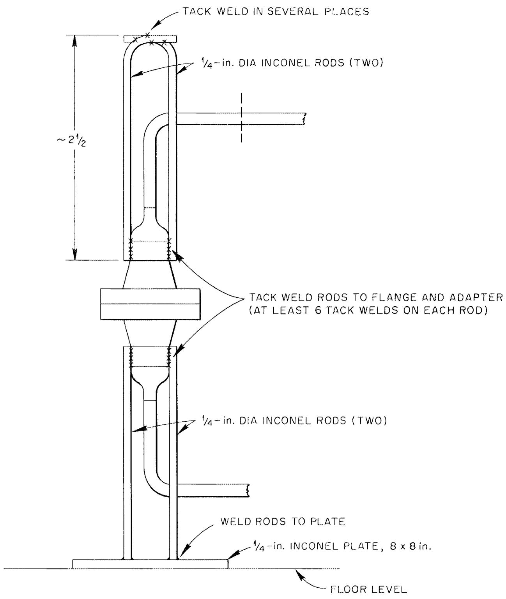  
Fig. 15. Sketch of Extension Rods for Disassembly of Cast Seal Flanges.

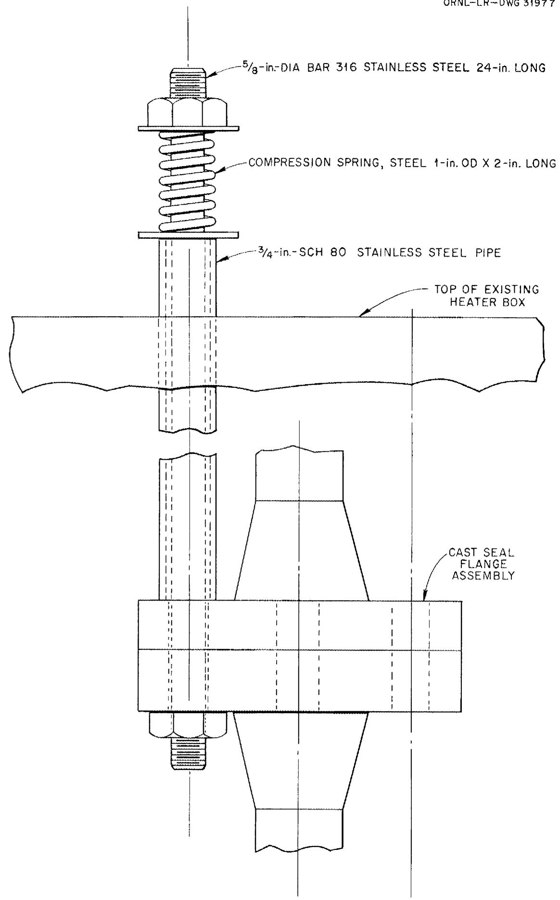  
Fig. 16. Sketch of Spring-Loaded Tie Rods for Reassembly of Cast Seal Flanges.

UNCLASSIFIED

ORNL-LR-DWG 31978

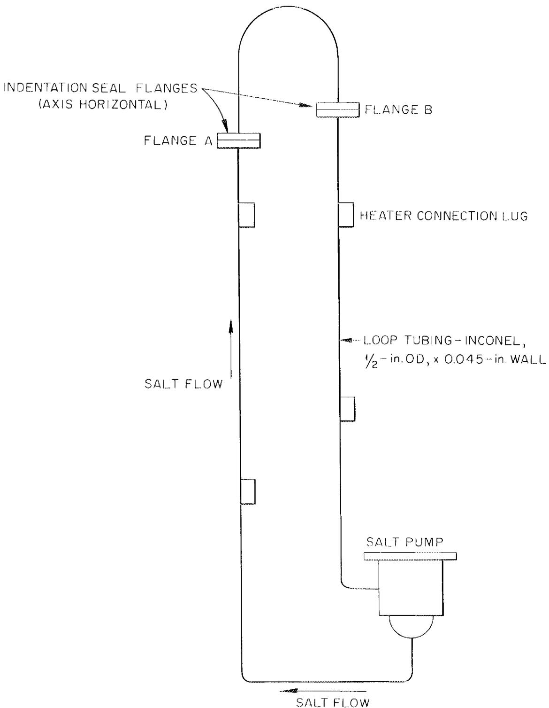  
Fig.17. Schematic Drawing of Test Loop for Indented Seal Flange Tests 1 and 2.

The loop was then placed in operation for thermal cycle testing as described in Section 4.1. During Test No. 1 temperatures were measured at the points indicated in Fig. 3. Fluoride salt, Fuel No. 30, was circulated in the loop at a flow rate of 2 gpm. The salt temperature was cycled 50 times between $1100^{\circ}\mathrm{F}$ and $1300^{\circ}\mathrm{F}$ . The average cycle time was 60 minutes.

Both flange assemblies were removed from the loop after Test No. 1 for leak testing. Subsequently, the assemblies were separated and reassembled with new gaskets. The flanges were then re-installed in the loop for Test No. 2.

During this test, temperatures were measured at the points indicated in Fig. 18. The salt temperature was cycled between 1100 and $1300^{\circ}\mathrm{F}$ . The number of cycles was 50 and the average cycle time was 61 minutes.

Again, the flanges were removed from the loop for leak testing and disassembly. One of the flange assemblies was reassembled with a new gasket and then leak tested.

# 5.0 Discussion of Results

# 5.1 Freeze Flange Joint

The maximum and minimum temperatures of various locations on the flanges during thermal cycling are listed for Tests 1 and 2 in Table 2; for Tests 3 and 4 in Table 3.

Examination of Tables 2 and 3 will show that the greatest temperature variation, at any one point in the flanges, occurs at the flange hub near the loop tubing. For example, thermocouple No. 21, Table No. 2, Test No. 1, varied from 862 to $1018^{\circ}\mathrm{F}$ . Thus, the greatest temperature variation, at this point during cycling, was $156^{\circ}\mathrm{F}$ . The smallest variation occurs at the periphery of the flanges as indicated, in one case, by thermocouple No. 24 in Table No. 2. The minimum and maximum temperatures indicated

# INDENTATION SEAL FLANGE TEST NO. 2. THERMOCOUPLE LOCATIONS

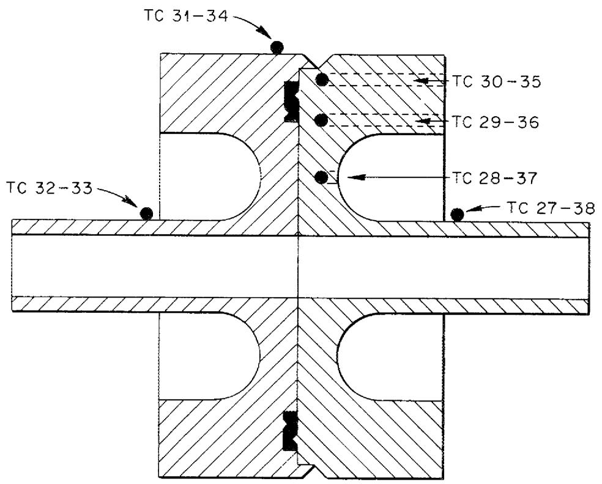  
Fig. 18. Schematic Drawing of Thermocouple Locations for Test 2 on Indented Seal Flange.

FLANGE A-NICKEL PLATED IRON GASKET

TC NO. 27, 28, 29, 30, 31, 32

FLANGE B-NICKEL GASKET

TC NO. 33, 34, 35, 36, 37, 38

Table No. 2   
FREEZE FLANGE TEMPERATURES MEASURED DURING THERMAL CYCLES   

<table><tr><td rowspan="2" colspan="2">Thermocouple Number *</td><td colspan="4">Test No. 1 - Salt Temperature Cycled 50 Times Between 1150 and 1300°F</td><td colspan="4">Test No. 2 - Salt Temperature Cycled 30 Times Between 1300 and 1500°F</td></tr><tr><td>Minimum Temperature (°F)</td><td>Cycle Number</td><td>Maximum Temperature (°F)</td><td>Cycle Number</td><td>Minimum Temperature (°F)</td><td>Cycle Number</td><td>Maximum Temperature (°F)</td><td>Cycle Number</td></tr><tr><td>21</td><td></td><td>862</td><td>16</td><td>1018</td><td>33,50</td><td>960</td><td>3</td><td>1170</td><td>21,24</td></tr><tr><td>22</td><td rowspan="2">Flange A</td><td>625</td><td>16</td><td>760</td><td>33,50</td><td>695</td><td>1,3</td><td>950</td><td>9</td></tr><tr><td>23</td><td>450</td><td>6,14,20</td><td>577</td><td>16</td><td>500</td><td>3</td><td>652</td><td>9</td></tr><tr><td>24</td><td></td><td>245</td><td>16</td><td>280</td><td>50</td><td>275</td><td>3</td><td>305</td><td>30</td></tr><tr><td>25</td><td></td><td>693</td><td>10</td><td>820</td><td>4</td><td>810</td><td>6,12</td><td>942</td><td>1</td></tr><tr><td>26</td><td rowspan="2">Flange A</td><td>490</td><td>16</td><td>580</td><td>4</td><td>582</td><td>6,21</td><td>665</td><td>1</td></tr><tr><td>27</td><td>348</td><td>16</td><td>403</td><td>50</td><td>410</td><td>6</td><td>452</td><td>1,9,27,30</td></tr><tr><td>28</td><td></td><td>205</td><td>16</td><td>240</td><td>4</td><td>250</td><td>1,3,6</td><td>260</td><td>9,24</td></tr><tr><td>13</td><td></td><td>798</td><td>6</td><td>957</td><td>33</td><td>915</td><td>3,6</td><td>1122</td><td>21</td></tr><tr><td>14</td><td rowspan="2">Flange B</td><td>560</td><td>16</td><td>685</td><td>41</td><td>660</td><td>1,3</td><td>905</td><td>27</td></tr><tr><td>15</td><td>375</td><td>16</td><td>447</td><td>41</td><td>465</td><td>6</td><td>595</td><td>15,21,27</td></tr><tr><td>16</td><td></td><td>200</td><td>10,16</td><td>228</td><td>37</td><td>255</td><td>24</td><td>305</td><td>27</td></tr><tr><td>17</td><td></td><td>748</td><td>16</td><td>865</td><td>2</td><td>865</td><td>12,18,21</td><td>1010</td><td>1,3</td></tr><tr><td>18</td><td rowspan="2">Flange B</td><td>510</td><td>16</td><td>590</td><td>2</td><td>615</td><td>12,18</td><td>700</td><td>1,6</td></tr><tr><td>19</td><td>315</td><td>16</td><td>362</td><td>50</td><td>410</td><td>6</td><td>450</td><td>3,6,9,30</td></tr><tr><td>20</td><td></td><td>185</td><td>16</td><td>215</td><td>50</td><td>260</td><td>21</td><td>278</td><td>30</td></tr></table>

\* (See Fig. 12 for location of thermocouples) (See Fig. 11 for diagram of Inconel loop)   
Test No. 1 - Stainless Steel Seal Rings
Test No. 2 - Soft Iron Seal Rings

Table No. 3   
FREEZE FLANGE TEMPERATURES MEASURED DURING THERMAL CYCLES   

<table><tr><td colspan="6">Test No. 3 Salt Temperature Cycled 50 Times Between 1100°F and 1300°F</td><td colspan="4">Test No. 4 Salt Temperature Cycled 25 Times Between 1100°F and 1300°F</td></tr><tr><td>Thermocouple No. *</td><td>Minimum Temp.°F</td><td>Cycle No.</td><td>Maximum Temp.°F</td><td>Cycle No.</td><td>Minimum Temp.°F</td><td>Cycle No.</td><td>Maximum Temp.°F</td><td>Cycle No.</td><td></td></tr><tr><td>27 Flange</td><td>185</td><td>14</td><td>218</td><td>49</td><td>195</td><td>1</td><td>225</td><td>24</td><td></td></tr><tr><td>28 B</td><td>340</td><td>18</td><td>402</td><td>1-41-42-49</td><td>347</td><td>12</td><td>400</td><td>2-4-24</td><td></td></tr><tr><td>29</td><td>815</td><td>6-7-11</td><td>973</td><td>1</td><td>788</td><td>12</td><td>957</td><td>2</td><td></td></tr><tr><td>30 Flange</td><td>785</td><td>6</td><td>947</td><td>46</td><td>768</td><td>12</td><td>932</td><td>1-2</td><td></td></tr><tr><td>31 B</td><td>277</td><td>15</td><td>340</td><td>46-48-50</td><td>285</td><td>12</td><td>335</td><td>24-25</td><td></td></tr><tr><td>32</td><td>182</td><td>14-15</td><td>225</td><td>50</td><td>190</td><td>1-12</td><td>218</td><td>24-25</td><td></td></tr><tr><td>33 Flange</td><td>183</td><td>15</td><td>220</td><td>47-50</td><td>190</td><td>1</td><td>218</td><td>22-23-24-25</td><td></td></tr><tr><td>34 A</td><td>295</td><td>15</td><td>355</td><td>50</td><td>300</td><td>1</td><td>352</td><td>24</td><td></td></tr><tr><td>35</td><td>788</td><td>6</td><td>975</td><td>15</td><td>760</td><td>21</td><td>945</td><td>2</td><td></td></tr><tr><td>36 Flange</td><td>737</td><td>13</td><td>903</td><td>46</td><td>712</td><td>12</td><td>885</td><td>1</td><td></td></tr><tr><td>37 A</td><td>287</td><td>15</td><td>350</td><td>46 thru 50</td><td>292</td><td>12</td><td>345</td><td>25</td><td></td></tr><tr><td>38</td><td>190</td><td>13-14-15</td><td>235</td><td>46</td><td>200</td><td>1-12</td><td>233</td><td>24-25</td><td></td></tr></table>

* (See Fig. 14 for location of thermocouples)   
(See Fig. 13 for diagram of Inconel loop)   
Tests Nos. 3 and 4 - Copper Seal Rings

by this thermocouple were 245 and $280^{\circ}\mathrm{F}$ , respectively. Thus, the greatest temperature variation, at this point during thermal cycling, was $35^{\circ}\mathrm{F}$ .

The low maximum temperature, and the slight variations in temperature encountered in the region of the fastenings and seal ring during thermal cycling, are desirable features of the freeze flange joint.

The maximum radial temperature difference between the outside and inside diameters of the flange, during the same test, was $738^{\circ}\mathrm{F}$ . This figure is the difference between thermocouples No. 21 and No. 24, taken at their maximum values. The corresponding salt temperature was $1300^{\circ}\mathrm{F}$ . The maximum such temperature difference obtained for any of the tests was $817^{\circ}\mathrm{F}$ .

The above examples are typical of the freeze flange operation. Complete data for all tests is presented in graphical form. The points of large and small temperature variation can be seen to follow the above description. Graphs showing temperatures of the flanges throughout the periods of thermal cycling are included in Appendix 2.

Gas leakage rates for Tests No. 1 and 2 were not satisfactory. This was attributed to defects introduced during the initial fabrication of the flanges. Some welding was performed on the flanges after all of the machining had been completed, which caused a slight warping. In addition, the finish on the seal ring grooves was not fine enough. These defects were remedied by additional machining. Subsequent leakage rates were satisfactory.

Gas leakage rates of the joints used in Tests 3 and 4 are listed in Table 4. One leak rate was obtained on each flange before Test 3 and after Test 4. As can be seen from the data, there was an appreciable increase in

Table No. 4   
LEAK RATES OF FREEZE FLANGES AND INDENTED SEAL FLANGES   

<table><tr><td colspan="5">Freeze Flanges</td><td colspan="3">Indented Seal Flanges</td></tr><tr><td rowspan="2">Test No.</td><td rowspan="2">Flange No.</td><td colspan="2">Leak Rate in cc/sec</td><td rowspan="2">Test No.</td><td colspan="2">Leak Rate in cc/sec</td><td rowspan="2">After Test</td></tr><tr><td>Before Test</td><td>After Test</td><td>Before Test</td><td>After Test</td></tr><tr><td>3</td><td>A</td><td>\( 3 \times 10^{-9} \)</td><td>Not Removed</td><td>1</td><td>\( 3.2 \times 10^{-8} \)</td><td>\( 2.2 \times 10^{-8} \)</td><td></td></tr><tr><td>3</td><td>B</td><td>\( 2.3 \times 10^{-8} \)</td><td>Not Removed</td><td>1</td><td>\( 1 \times 10^{-9} \)</td><td>\( 1.5 \times 10^{-9} \)</td><td></td></tr><tr><td>4</td><td>A</td><td>Same as Test 3</td><td>\( 1.7 \times 10^{-7} * \)</td><td>2</td><td>\( 1.2 \times 10^{-8} \)</td><td>\( 3.9 \times 10^{-9} *** \)</td><td></td></tr><tr><td>4</td><td>B</td><td>Same as Test 3</td><td>\( 5 \times 10^{-6} \)</td><td>2</td><td>\( 1.9 \times 10^{-8} \)</td><td>\( 1.2 \times 10^{-8} ** \)</td><td></td></tr></table>

(See Report ORNL CF No. 58-1-20, "Notes on Helium Leak Detection" by H. J. Metz)

(* This flange assembly was separated and reassembled using a new copper seal ring to give a leakage rate of 2.0 x $10^{-8}$ cc/sec)

Test No. 1: Flange A - Iron Gasket
Flange B - Copper Gasket

Test No. 2: Flange A - Nickel-Plated Iron Gasket Flange B - Nickel Gasket

(This result was obtained after tightening one of the "C" clamps. The clamp had loosened when the loop was cooled to room temperature following cycling tests.)

(This) This flange assembly was separated and reassembled with a new nickel-plated iron gasket to give a leakage rate of $5.0 \times 10^{-8} \, \text{cc/sec}$ )

the leak rate after testing. A third leak rate was obtained on one of the flange assemblies following the cycling tests, after disassembly and re-assembly with a new copper seal ring. This leak rate was $2.0 \times 10^{-8}$ cc/second and successfully met the specification listed in Section 3.1, paragraph (f).

The flange assemblies were heated or cooled between room temperature and the operating temperature of $1300^{\circ}\mathrm{F}$ at least eight times in the preparation for thermal cycling tests. The rate of cooling and heating was at least $250^{\circ}\mathrm{F}$ per hour.

Both flanges operated successfully in that there was no indication of salt leakage, the gas leakage rates were satisfactory, and there was no indication of any cracks due to thermal stresses. (See Section 3.1). A memorandum concerning the metallurgical examination for stress cracks is included in Appendix 6.

Oxidation of the copper seal rings was negligible. The rings had the same bright appearance after testing as they did originally. The Inconel flanges showed no noticeable salt corrosion. The flanges and seal rings are shown after the completion of Test No. 4 in Figs. 19 and 20.

The formation of the salt seal is shown in Fig. 2l after thermal cycling tests and disassembly. Parts are identified as follows: (1) Frozen salt seal, (2) Labyrinth insert ring, (3) Groove for seal ring. Both flanges are shown after disassembly in Fig. 22 and various parts identified as follows: (1) Cooling air lines, (2) Resistance heater lugs, (3) Calrod heater leads, (4) Thermocouple leads, (5) Clam shell heaters, (6) Copper seal rings in place.

The same flange is shown after removal of the salt seal in Fig. 23. The time for cleaning both flanges was not more than 5 minutes.

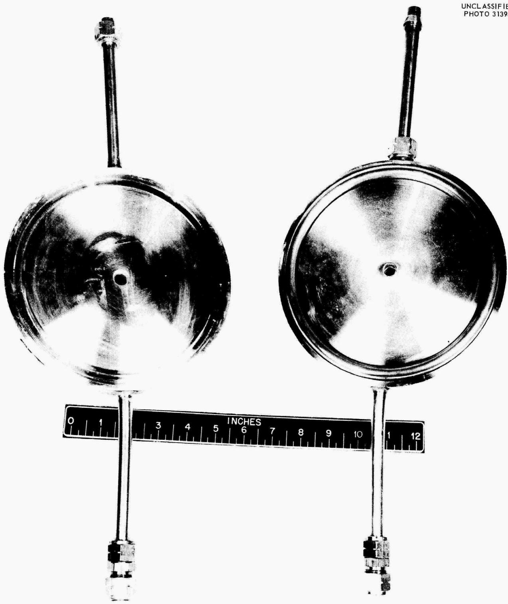  
Fig. 19. Freeze Flange (1/2'' Tubing Size) Open with Copper Seal Ring After Cleaning, Following Test 4.

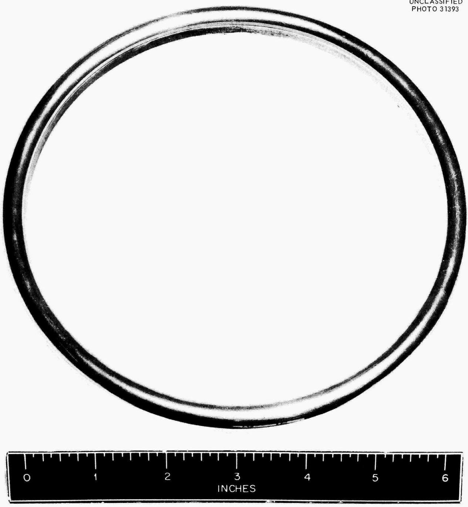  
Fig. 20. Copper Seal Ring from Small Freeze Flange After Test 4.

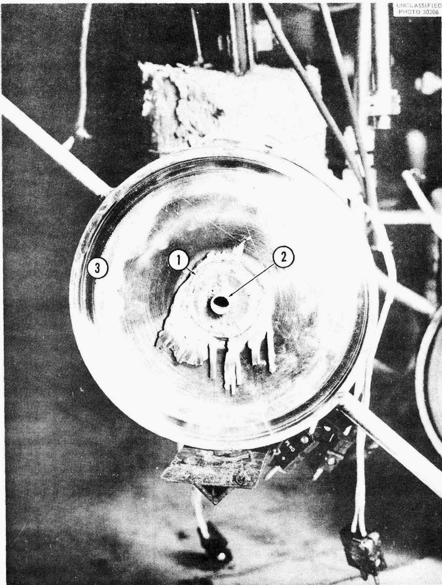  
Fig. 21. Freeze Flange Showing Formation of Frozen Salt Seal.

Fig. 22. Freeze Flanges Installed in Test Loop After Disassembly of the Flanges. Photo showing both flanges disassembled.   
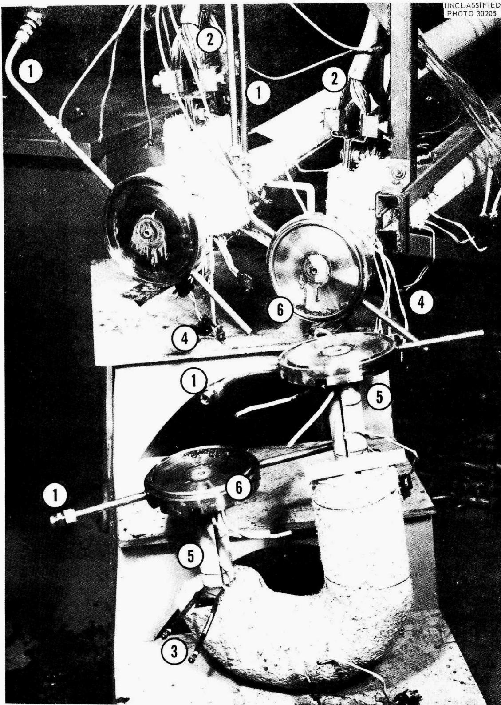  
(1) Air Cooling Inlet (4 places); (2) Resistance Heater Leads (2 places); (3) Calrod Heater (1 place); (4) Thermocouple Leads (2 places); (5) Clam Shell Heaters (2 places)   
(6) Seal Ring (2 places)

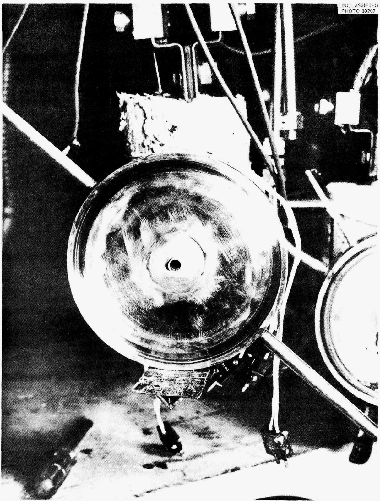  
Fig. 23. Freeze Flange After Removal of Salt Seal from Face of Flange.

The time necessary for the handling operations of disassembly and reassembly is indicated in Table 1. Ease and speed of handling were demonstrated, indicating that the freeze flange joint is potentially suited to remote manipulation. Other tests are in progress to demonstrate remote handling of this type of joint.

# 5.2 Cast Seal Joint

The maximum and minimum temperature of various locations on the flanges during thermal cycling are listed, for Tests 1 and 2, in Table 5.

Examination of Table 5 shows that the temperature variation, during thermal cycling, is nearly the same for a thermocouple located in a well near the cast seal as it is for a thermocouple located at the flange periphery near the flange bolts. For example, thermocouple No. 25, near a bolt, varied from $1177^{\circ}\mathrm{F}$ to $1287^{\circ}\mathrm{F}$ during Test No. 1. This is a variation during thermal cycling of $110^{\circ}\mathrm{F}$ . During the same test thermocouple No. 23, in a well near the cast seal, varied from $1157^{\circ}\mathrm{F}$ to $1296^{\circ}\mathrm{F}$ , a variation of $139^{\circ}\mathrm{F}$ .

The temperature variation, during thermal cycling, in the region of the bolts is about three times that obtained in the case of the freeze flanges (See Section 5.1). In addition, the bolts were about $1000^{\circ}\mathrm{F}$ higher in temperature than the clamps on the freeze flanges.

The radial temperature difference, however, between the outside and inside diameter of the flanges is small compared to the freeze flanges, causing less thermal stress.

The above examples are typical of the cast seal flange operation. Complete data for all tests are included in graphical form. Graphs showing temperature of the flanges throughout the periods of thermal cycling are included in Appendix 3. There was no indication of any salt leakage during

Table No. 5   
CAST SEAL FLANGE TEMPERATURES MEASURED DURING THERMAL CYCLES   

<table><tr><td colspan="5">Test No. 1 Salt Temperature Cycled50 Times Between 1100°F and 1300°F</td><td colspan="4">Test No. 2 Salt Temperature Cycled25 Times Between 1100°F and 1300°F</td></tr><tr><td>ThermocoupleNo. *</td><td>MinimumTemp.°F</td><td>CycleNo.</td><td>MaximumTemp.°F</td><td>CycleNo.</td><td>MinimumTemp.°F</td><td>CycleNo.</td><td>MaximumTemp.°F</td><td>CycleNo.</td></tr><tr><td>19</td><td>1158</td><td>13</td><td>1290</td><td>1-41</td><td>1128</td><td>20</td><td>1255</td><td>24</td></tr><tr><td>20 Note</td><td>1150</td><td>13</td><td>1280</td><td>1-41-42</td><td>1122</td><td>20</td><td>1245</td><td>15-24</td></tr><tr><td>21 (1)</td><td>1212</td><td>13</td><td>1303</td><td>41</td><td>1155</td><td>20</td><td>1238</td><td>15</td></tr><tr><td>22</td><td>1188</td><td>6-13</td><td>1323</td><td>42</td><td>1142</td><td>20</td><td>1285</td><td>24</td></tr><tr><td>23</td><td>1157</td><td>6-13</td><td>1296</td><td>41</td><td>1125</td><td>20</td><td>1258</td><td>15-24</td></tr><tr><td>24 Note</td><td>1142</td><td>13</td><td>1282</td><td>41</td><td>1110</td><td>20</td><td>1243</td><td>15-24</td></tr><tr><td>25 (2)</td><td>1177</td><td>1-13</td><td>1287</td><td>41</td><td>1130</td><td>20</td><td>1233</td><td>15-24</td></tr><tr><td>26</td><td>1137</td><td>6</td><td>1315</td><td>42</td><td>1110</td><td>20</td><td>1293</td><td>24</td></tr></table>

Notes:   
(1) Flange with Silver Cast Seal   
(2) Flange with Copper-Silver Alloy Cast Seal   
(3) The salt and flange temperatures before cycling were $1300^{\circ}\mathrm{F}$

* (See Fig. 7 for thermocouple location)

(See Fig. 13 for diagram of Inconel loop)

# Note:

The actual minimum temperature of all thermocouples in Test No. 2 was during the 1st cycle and was from $10^{\circ}$ to $45^{\circ}$ lower than the minimum temperatures listed in table above.

The salt and flange temperatures before cycling were $1100^{\circ}\mathbf{F}$ .

any of the testing. There was no indication of gas leakage with the loop and flanges under 25 psig cf helium, following the initial fusion of the ring inserts. The pressure indication on the loop did not decrease over a period of several hours. There was no indication of gas leakage using a soap solution on the flanges.

The steps and time periods involved in disassembly of these flanges are listed in Table 6. Difficulty was encountered in step (5), the removal of four stainless steel bolts and nuts from each flange. Each nut had to be heated to a red heat, and a wrench used with considerable force. In step (9), separation of the flanges while hot, it was found that the flanges could not be pulled apart with a 25 to 50 pound force on the extension rods connected to the upper flange half. It was necessary to open the heater box around each flange and use a cold chisel to separate the flange halves. Since all of the disassembly operations would be accomplished remotely in a reactor system, it is clear that the cast seal joints, as tested, were not satisfactory in this respect. A comparison may be made in the time necessary for disassembly of the Freeze Flange Joint and Cast Seal Joint by referring to the data in Tables 1 and 6.

The steps involved in reassembly of both flanges are shown in Table 6. Steps 1, 2, 3 and 6 would be accomplished remotely in an actual reactor installation. After reassembly, it was found that both assemblies leaked helium badly at the interfaces of the flange halves. Leaks were detected with a soap solution while the flanges were under 15 psig of helium pressure.

Photographs taken after disassembly of the flanges show that the flanges and sealing alloys were badly oxidized. Fig. 24 shows the flange with the copper-silver alloy seal; Fig. 25 the flange with the silver seal.

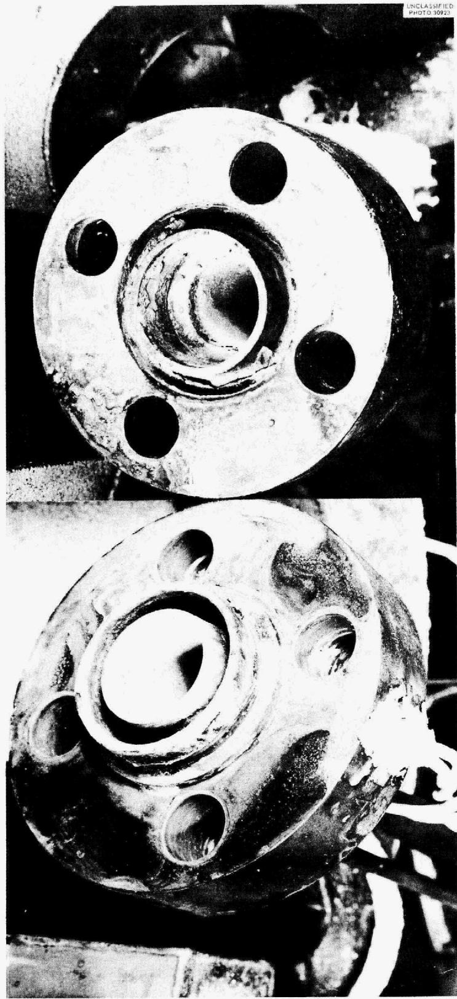  
Fig. 24. Cast Seal Flange After Disassembly Following Loop Tests - Copper-Silver Alloy Seal.

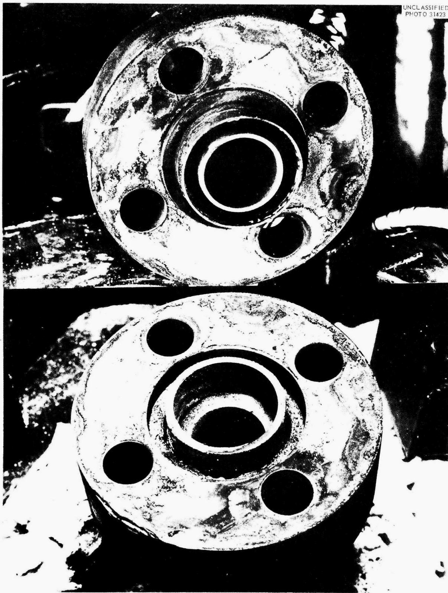  
Fig. 25. Cast Seal Flange After Disassembly Following Loop Tests - Silver Seal.

Table No. 6   
TIME REQUIRED FOR ASSEMBLY AND DISASSEMBLY FOR CAST SEAL FLANGES   

<table><tr><td rowspan="2">Operation Performed</td><td colspan="2">Time Required</td></tr><tr><td>Silver Seal</td><td>Copper Silver Alloy Seal</td></tr><tr><td>1. Dumping Salt from Loop</td><td>15 min.</td><td>15 min.</td></tr><tr><td>2. Cooling Flange to Room Temperature</td><td>4 hours</td><td>4 hours</td></tr><tr><td>3. Removal of Insulation from Heater Box</td><td>30 min.</td><td>30 min.</td></tr><tr><td>4. Removal of Heater Box from Flanges</td><td>10 min.</td><td>10 min.</td></tr><tr><td>5. Removal of Four Bolts and Nuts from Flanges</td><td>40 min.</td><td>20 min.</td></tr><tr><td>6. Reinstall Heater Box</td><td>10 min.</td><td>10 min.</td></tr><tr><td>7. Replace Insulation</td><td>20 min.</td><td>20 min.</td></tr><tr><td>8. Heat Flanges to Melt Point of Seals</td><td>6.5 hours</td><td>4.5 hours</td></tr><tr><td>9. Separation of Flanges while Hot</td><td>20 min.</td><td>10 min.</td></tr><tr><td>10. Cooling Flanges to Room Temperature</td><td>3 hours</td><td>2 hours</td></tr><tr><td></td><td>16 hours</td><td>12 hours</td></tr><tr><td></td><td>ASSEMBLY</td><td></td></tr><tr><td>1. Cleaning Oxide from Flanges</td><td>10 min.</td><td>10 min.</td></tr><tr><td>2. Assemble and Install Flanges in Position</td><td>30 min.</td><td>30 min.</td></tr><tr><td>3. Install Heater Box and Insulation</td><td>15 min.</td><td>15 min.</td></tr><tr><td>4. Heat Seals to Melt Point</td><td>4.5 hours</td><td>4.5 hours</td></tr><tr><td>5. Heat Flanges to Compress and Adjust</td><td>3.5 hours</td><td>3 hours</td></tr><tr><td>6. Install Four Bolts and Nuts</td><td>5 min.</td><td>5 min.</td></tr><tr><td></td><td>9 hours</td><td>8.5 hours</td></tr></table>

(See Fig. 8 for view of assembled flange)

Metallurgical examination confirmed that damage was done to the metal seals during the heating operations. See Appendix 3.

# 5.3 Indented Seal Joint

The maximum and minimum temperatures of various locations on the flanges during thermal cycling are listed, for Test No. 1 in Table 7; for Test No. 2 in Table 8.

Examination of Table 8 shows that the temperature variation, during thermal cycling, for a thermocouple located in a well near the metal gasket is about one-half that of a thermocouple located at the hub of the flange near the loop tubing.

For example, thermocouple No. 30, near the gasket, varied from $960^{\circ}\mathrm{F}$ to $1065^{\circ}\mathrm{F}$ , a variation during cycling of $105^{\circ}\mathrm{F}$ . Thermocouple No. 27 varied from $1090^{\circ}\mathrm{F}$ to $1510^{\circ}\mathrm{F}$ , a variation during cycling of $220^{\circ}\mathrm{F}$ .

The temperature variation, during thermal cycling in the region of the clamps, is about three times that obtained in the case of the freeze flange (See Section 5.1). This factor, together with the high temperature in the region of the fastenings, means that the clamps on the Indented Seal Flange would have a greater tendency to loosen than those on the freeze flange.

The radial temperature difference, however, between the outside and inside diameter of the flanges is about $\frac{1}{3}$ that of the freeze flanges causing less thermal stress.

The above examples are typical of the indented seal flange operation. Complete data for all tests are presented in graphical form. Graphs showing temperatures of the flanges throughout the periods of thermal cycling are included in Appendix 4.

Gas leakage rates are listed in Table 4. Leak rates were obtained

Table No. 7   
INDENTATION SEAL FLANGE TEMPERATURES MEASURED DURING THERMAL CYCLES - TEST NO. 1   
Test No. 1 - Salt Temperature Cycled 50 Times Between $1100^{\circ}$ and $1300^{\circ}$ F   

<table><tr><td colspan="2">Thermocouple Number</td><td>Minimum Temperature (°F)</td><td>Cycle Number</td><td>Maximum Temperature (°F)</td><td>Cycle Number</td></tr><tr><td>27</td><td></td><td>1073</td><td>10</td><td>1320</td><td>17</td></tr><tr><td>28</td><td></td><td>778</td><td>10</td><td>930</td><td>1</td></tr><tr><td>29</td><td rowspan="2">Flange A</td><td>620</td><td>10</td><td>713</td><td>1</td></tr><tr><td>30</td><td>632</td><td>10</td><td>735</td><td>1</td></tr><tr><td>31</td><td></td><td>733</td><td>10</td><td>887</td><td>1 - 2</td></tr><tr><td>32</td><td></td><td>1040</td><td>10</td><td>1282</td><td>17</td></tr><tr><td>33</td><td></td><td>1082</td><td>10 - 36</td><td>1317</td><td>17</td></tr><tr><td>34</td><td></td><td>847</td><td>36</td><td>1015</td><td>6</td></tr><tr><td>35</td><td rowspan="2">Flange B</td><td>695</td><td>36 - 45</td><td>803</td><td>17</td></tr><tr><td>36</td><td>673</td><td>45</td><td>780</td><td>17</td></tr><tr><td>37</td><td></td><td>*</td><td>*</td><td>*</td><td>*</td></tr><tr><td>38</td><td></td><td>1070</td><td>36</td><td>1290</td><td>17</td></tr></table>

Flange A - Iron Gasket   
Flange B - Copper Gasket   
* Thermocouple damaged - count not repair during operation

Table No. 8   
INDENTATION SEAL FLANGE TEMPERATURES MEASURED DURING THERMAL CYCLES - TEST NO. 2   
Test No. 2 - Salt Temperature Cycled 50 Times Between $1100^{\circ}$ and $1300^{\circ}$ F   

<table><tr><td>Thermocouple Number</td><td>Temperature (°F)</td><td>Cycle Number</td><td>Maximum Temperature (°F)</td><td>Cycle Number</td></tr><tr><td>27</td><td>1090</td><td>31</td><td>1310</td><td>45</td></tr><tr><td>28</td><td>935</td><td>28 - 44</td><td>1040</td><td>13</td></tr><tr><td>29 Flange A</td><td>971</td><td>12</td><td>1075</td><td>39</td></tr><tr><td>30</td><td>960</td><td>48</td><td>1065</td><td>39</td></tr><tr><td>31</td><td>957</td><td>44</td><td>1050</td><td>39 - 45</td></tr><tr><td>32</td><td>1077</td><td>31</td><td>1295</td><td>45</td></tr><tr><td>33</td><td>1097</td><td>44</td><td>1310</td><td>37</td></tr><tr><td>34</td><td>938</td><td>31 - 44</td><td>1031</td><td>45</td></tr><tr><td>35 Flange B</td><td>912</td><td>28 - 44</td><td>1008</td><td>39</td></tr><tr><td>36</td><td>927</td><td>42 - 44</td><td>1025</td><td>39</td></tr><tr><td>37</td><td>958</td><td>28</td><td>1065</td><td>45</td></tr><tr><td>38</td><td>1076</td><td>31</td><td>1295</td><td>45</td></tr><tr><td colspan="5">&quot;Flange A - Nickel Plated Iron Gasket&quot;</td></tr><tr><td colspan="5">&quot;Flange B - Nickel Gasket&quot;</td></tr></table>

(See Fig. 18 for thermocouple location)   
(See Fig. 17 for diagram of Inconel loop)

before and after each thermal cycling test. A new gasket was then installed in each flange assembly, followed by another leak test. None of the four gaskets, each of a different material, leaked salt. The flange with the copper gasket leaked helium following the thermal cycling in Test No. 1; however, the leak sealed itself before the flange assembly was removed from the loop for checking with a helium leak detector. The copper gasket was badly oxidized as well, as shown in Fig. 26.

The flange with the annealed Armco iron gasket passed gas leakage tests satisfactorily. This flange and gasket is shown after test in Fig. 27. The iron gasket, after removal from the flange, is shown in Fig. 28. The outer edge of the gasket was oxidized and therefore considered unsuitable.

As can be seen from photographs Nos. 26 and 27, a ring of frozen salt had formed between the flange faces. This frozen seal extended from the loop tubing diameter of 0.410 inches to an outside diameter of approximately $1 - 1/4$ inches. For subsequent tests a heater was placed around the outside of each flange assembly to insure that the salt between the flange faces would be in the molten state during testing.

The flange with the annealed nickel "A" gasket leaked gas after thermal cycling testing; however, this was caused by loosening of one of the "C" clamps, which held the flange halves together. This flange and gasket is shown after testing in Fig. 29.

The flange with the nickel plated Armco iron gasket passed gas leakage tests satisfactorily. It is shown after testing in Fig. 30. No oxidization of the gasket was apparent.

With the exception of the annealed Armco iron gasket, removal of the gaskets from the flanges was difficult. It was necessary to cut the gaskets

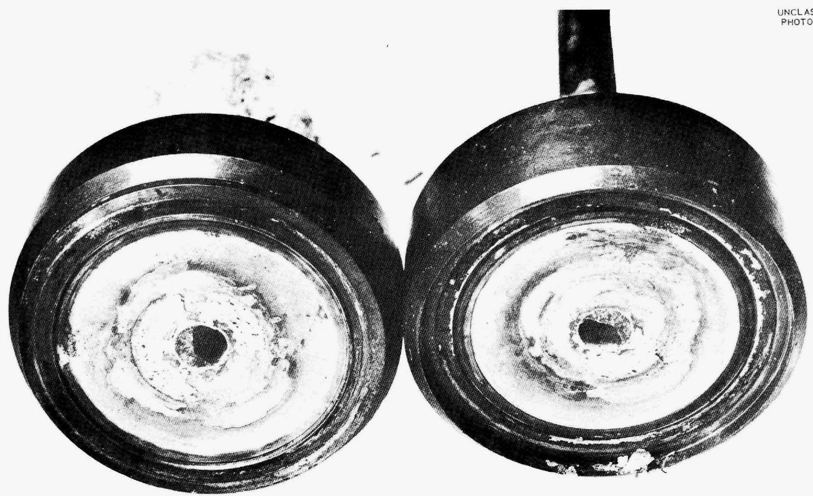

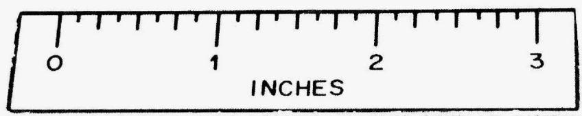  
Fig. 26. Indented Seal Flange with Copper Gasket After Testing.

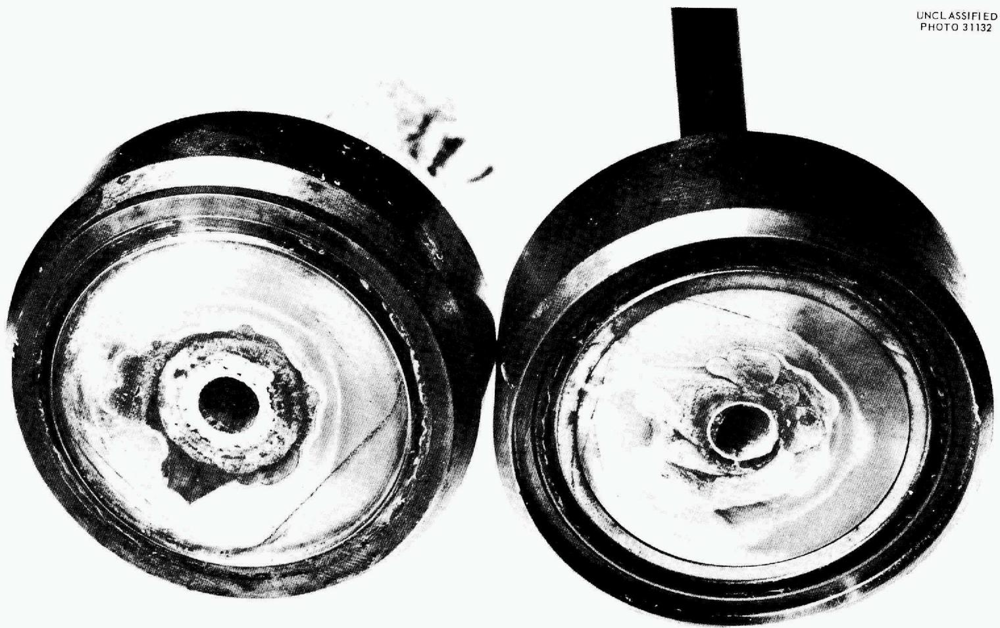

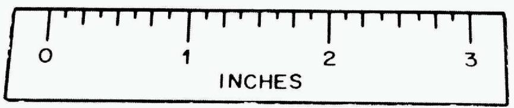  
Fig. 27. Indented Seal Flange with Armco Iron Gasket After Testing.

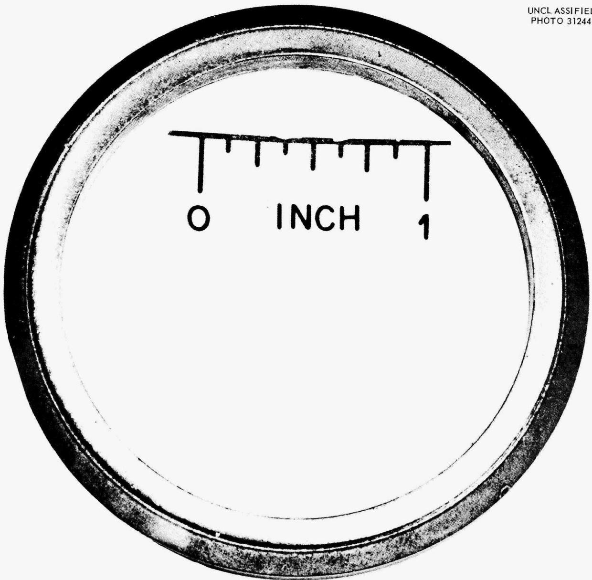  
Fig. 28. Armco Iron Gasket After Testing in Indented Seal Flange.

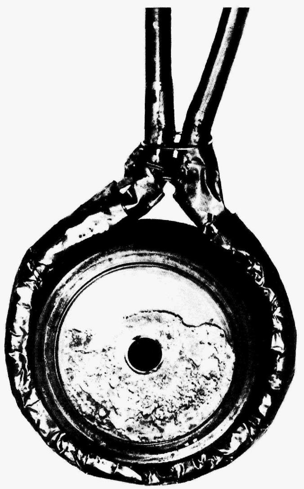

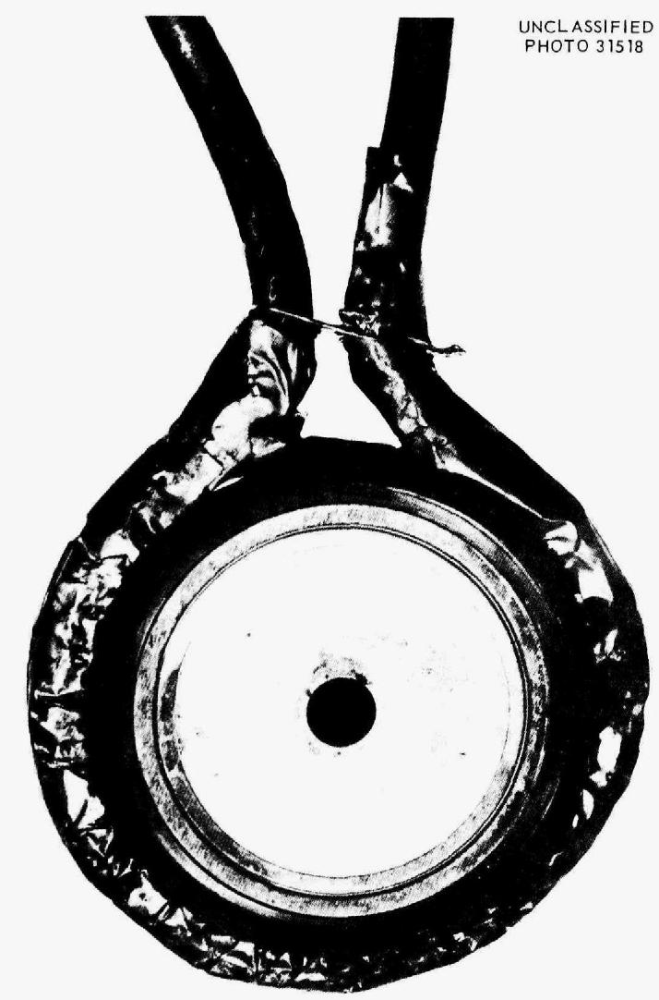  
Fig. 29. Indented Seal Flange with Nickel Gasket After Testing.

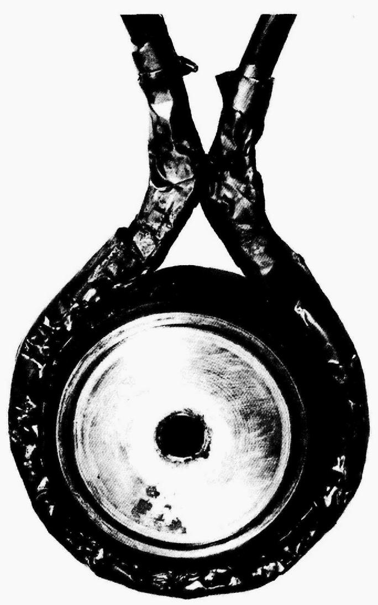

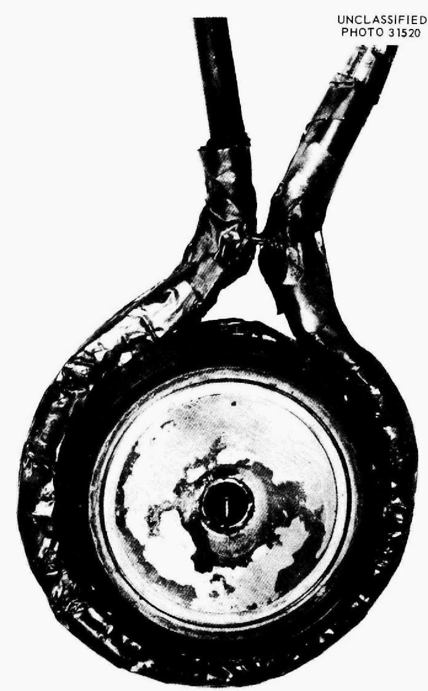  
Fig. 30. Indented Seal Flange with Nickel-Plated Armco Iron Gasket After Testing.

free of the flanges in a lathe.

Of the four gaskets tested, the nickel plated and annealed Armco iron gasket proved most satisfactory. The Inconel flanges showed no sign of damage from corrosion or mechanical defects. A more suitable method of clamping is in order, to insure a tight seal during the various temperature changes.

# 6.0 Future Tests

The same freeze flange joint and indented seal joint, described in Section 3 of this report, are now under test with molten sodium in an Inconel loop. An annealed copper seal ring is being used in the freeze flange. A nickel plated, annealed Armco iron gasket is being used in indented seal flange. The tests are similar to those described above. Both flange assemblies are shown installed at one end of the Inconel loop in Fig. 31.

A larger size freeze flange joint has been fabricated. It is shown assembled in Fig. 32. The flange is shown open with the copper seal ring in place in Fig. 33. The principle of operation is identical to the small size flange tested and described above. Provision has been made on the ring seal for monitoring the gas leak rate during operation. Two such flanges have been fabricated for testing with molten salt in a loop, shown schematically in Fig. 34. The welding necks on the flanges will match a 4-inch, schedule 40 pipe. An unusual feature of the large flange is the use of a special clamp, made in two sections, which holds the flanges around their entire circumference. The clamp is shown in the assembly photograph, Fig. 32. Holes were placed in the webs to reduce heat conduction from the salt to the seal ring area. A metal screen will be inserted in the space between the flange faces to reduce the hold-up volume of salt,

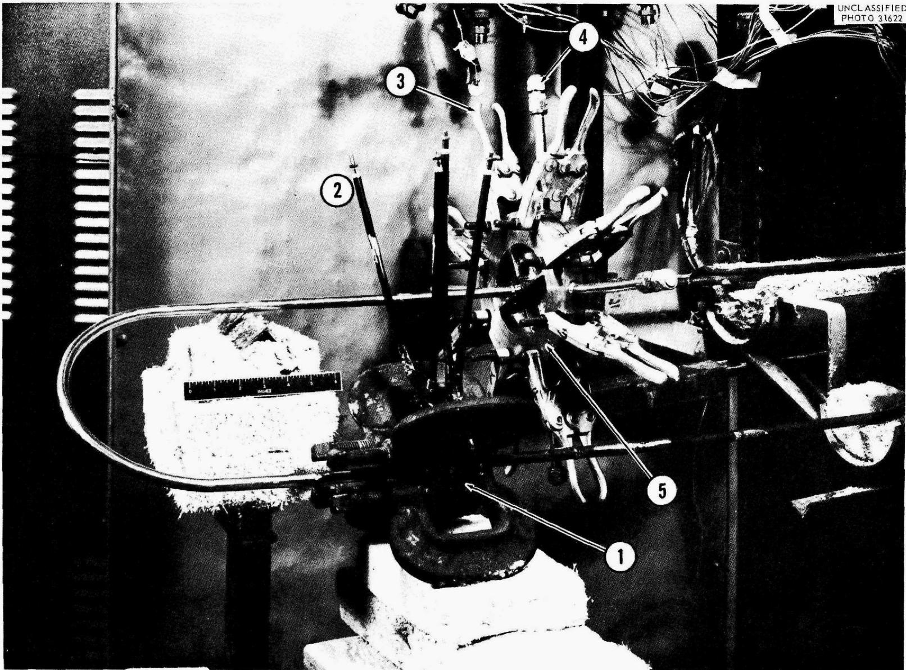  
Fig. 31. Freeze Flange and Indented Seal Flange Installed in Test Loop for Cycling Tests with Molten Sodium. (1) Indented Seal Flange; (2) Calrod Heaters; (3) Toggle Clamp; (4) Air Cooling Inlet; (5) Freeze Flange

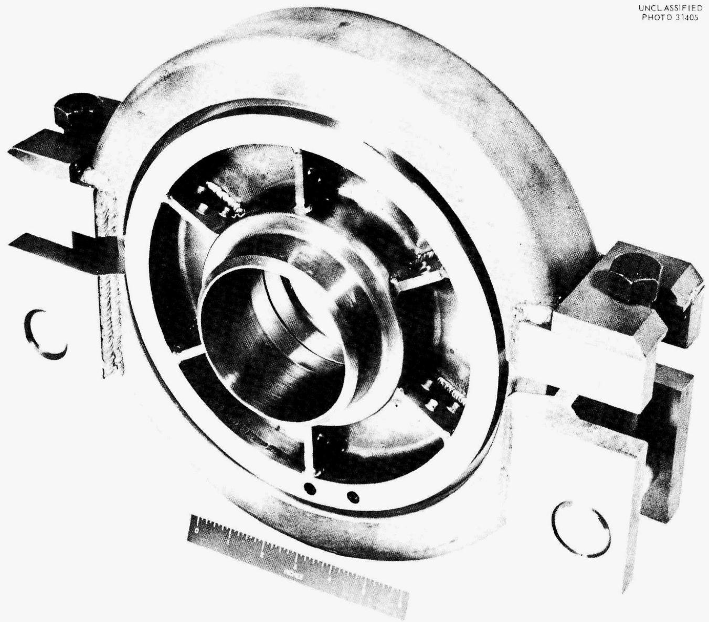  
Fig. 32. Assembly of Large Freeze Flange.

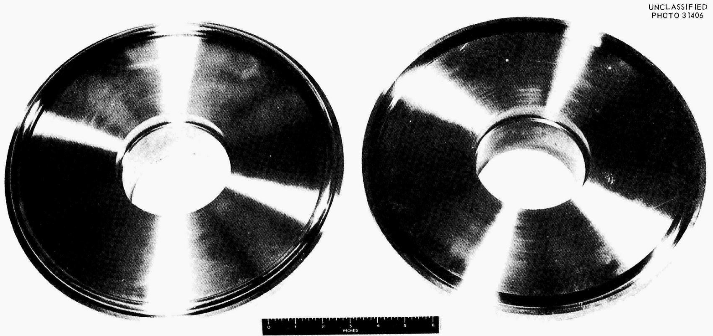  
Fig. 33. Large Freeze Flange Shown Open with Copper Seal Ring in Place.

UNCLASSIFIED

ORNL-LR-DWG 31980

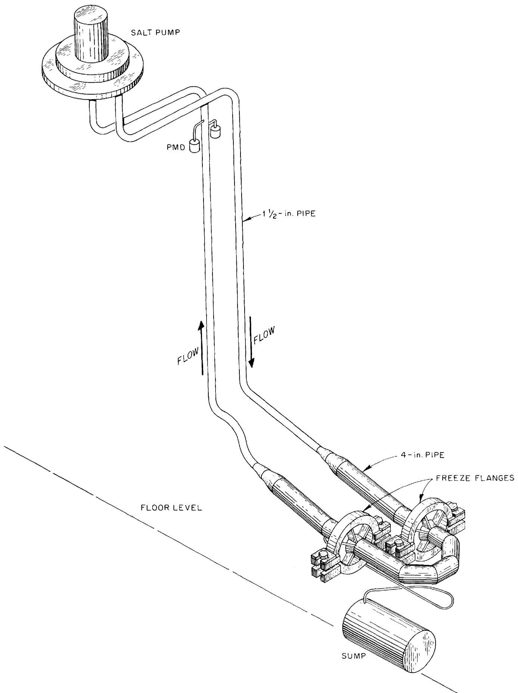  
Fig. 34. Schematic Drawing of Test Loop for Large Freeze Flange.

and to hold the salt cake together for easy and quick removal when the flanges are disassembled.

This 4-inch joint is made of Inconel, and the seal ring of dead-soft annealed copper with a one mil nickel plate. The clamps are of carbon steel. Two 7/8-inch heat treated bolts are used to hold the clamps and flange halves together.

It is believed that test results on the large flanges can be safely extrapolated to determine the suitability of the freeze flange joint for a molten salt reactor system.

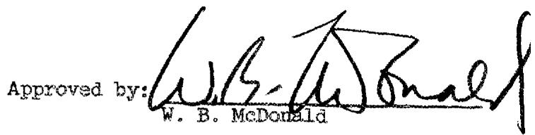

# APPENDIX 1

Preliminary Mechanical Joint Specification

# INTRA-LABORATORY CORRESPONDENCE OAK RIDGE NATIONAL LABORATORY

November 14, 1957

To: Listed Distribution

From: G. D. Whitman

Subject: Preliminary Mechanical Joint Specification

The attached specification has been prepared for your review and comment. This document is intended for internal use and should serve primarily as a design and development guide. Some of the values listed are more or less arbitrary; however, the criteria presented must be dealt with, and more considered limits may be assigned after a thorough review.

GDW/ds Att.

Distribution

W. B. McDonald

H. W. Savage

H. G. MacPherson

E. J. Breeding

B.W.Kinyon

L. A. Mann

J. Zasler

# PRELIMINARY MECHANICAL JOINT SPECIFICATION

# I. Scope

This specification sets forth the requirements for a mechanical joint which may be used in a radioactive high temperature molten salt system.

# II. Service Requirements

This unit shall contain radioactive molten salts at temperatures up to $1500^{\circ}\mathrm{F}$ , and shall contain gaseous fission products between normal ambient and $1300^{\circ}\mathrm{F}$ . In addition, the unit shall be adaptable to remote assembly, disassembly and leak checking.

# III. Materials of Construction

The materials of construction shall be compatible with the process fluids and in no way contribute contaminants which might reduce the life of the system or in any way reduce the efficiency of the nuclear or thermodynamic processes. Furthermore, it would be highly desirable to eliminate materials of construction which would result in high levels of induced activity.

# IV. Mechanical Design

A. Size

The unit shall be adaptable to pipe sizes ranging from $1/2''$ IPS to $12''$ IPS.

B. Orientation

It is highly desirable that the unit be adaptable to piping runs of random orientation; however, a single application to vertical or horizontal runs shall be considered acceptable.

C. Holdup Volume

When the process fluid is drained from the system, the residual material, if any, shall not be more than 2 cc. Any material held up must be retained for inventory purposes and shall be handled in a manner that re-

duces the spread of contamination.

D. Alignment Tolerance

The unit shall be capable of functioning to meet the requirements of this specification with a piping centerline mismatch of $\pm 1/32''$ and/or angularity misalignment between piping runs of $\pm 1/2^{\circ}$ . These specifications are to be met without stressing the joining piping runs beyond their design limit.

E. Flow Resistance

The run of piping containing the unit shall not have any appreciable increase in flow resistance as compared to a similar section of regular pipe.

F. Strength

The unit shall behave the same as the parent piping under time, temperature, and stress and shall not require preferential application.

G. Remote Servicing

All special tools, fixtures, and leak checking equipment shall be considered as part of the unit package, and practical remote demonstration of such apparatus will be required.

H. General

Because of the remoteness of the application, it is desirable that auxiliary service requirements be kept to an absolute minimum.

# V. Leak Tightness

A. Gas Leakage

1. Gas leaks shall be determined by means of a mass spectrometer leak detector having a sensitivity of $1 \times 10^{-7}$ cc/sec. The system sensitivity shall be established before each test by calibration of the detector with a standard leak.

2. No indication of gas leakage shall be permitted. This leakage specification shall apply during and after 50 temperature cycles between ambient and $1200^{\circ}\mathrm{F}$ . The rate of temperature change shall not be less than $100^{\circ}\mathrm{F}$ per hour.   
3. Section V-A-2 of this specification is to be repeated after the unit has been remotely disassembled and assembled.

# B. Fluid Leakage

1. No fluid leakage shall be permitted.   
2. The unit shall be cycled 50 times between $1100^{\circ}\mathrm{F}$ and $1300^{\circ}\mathrm{F}$ with no indication of fluid leakage.   
3. Section V-B-2 of this specification is to be repeated after the unit has been remotely disassembled and assembled.

# C. Special Leak Testing

Provision shall be made to establish the leak tightness of the unit during high temperature operation. Means shall be provided to collect the atmosphere surrounding the unit during high temperature fluid service to establish that gas contained in the fluid does not egress through the seal.

Prepared by: G. D. Whitman

11-11-57

# APPENDIX 2

Graphs of Freeze Flange Thermal Cycling Tests

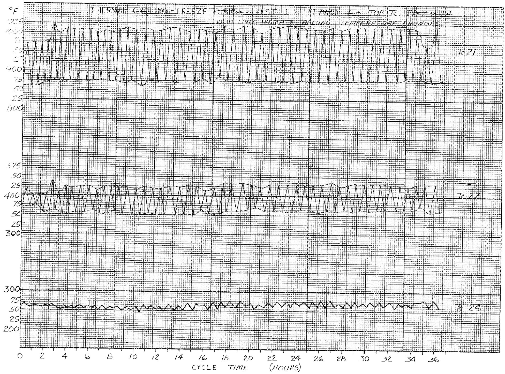  
-2L   
  
1901

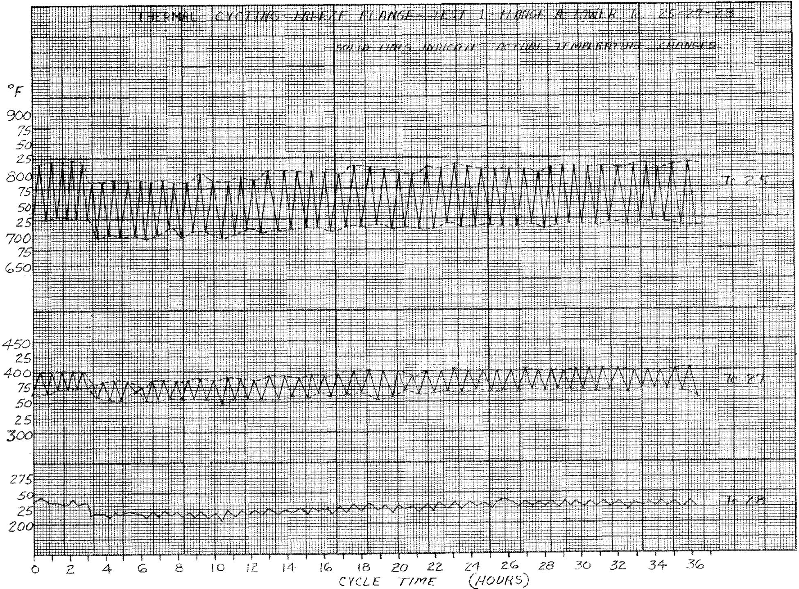  
CHIISSVIONN 2861C-3Mg-IMINHO -CL

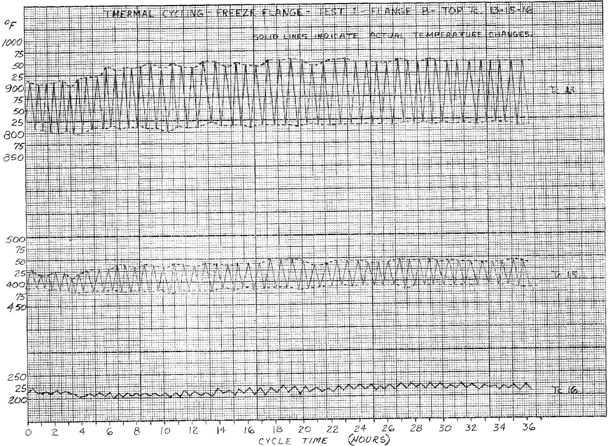  
QIITSSVIONI 1

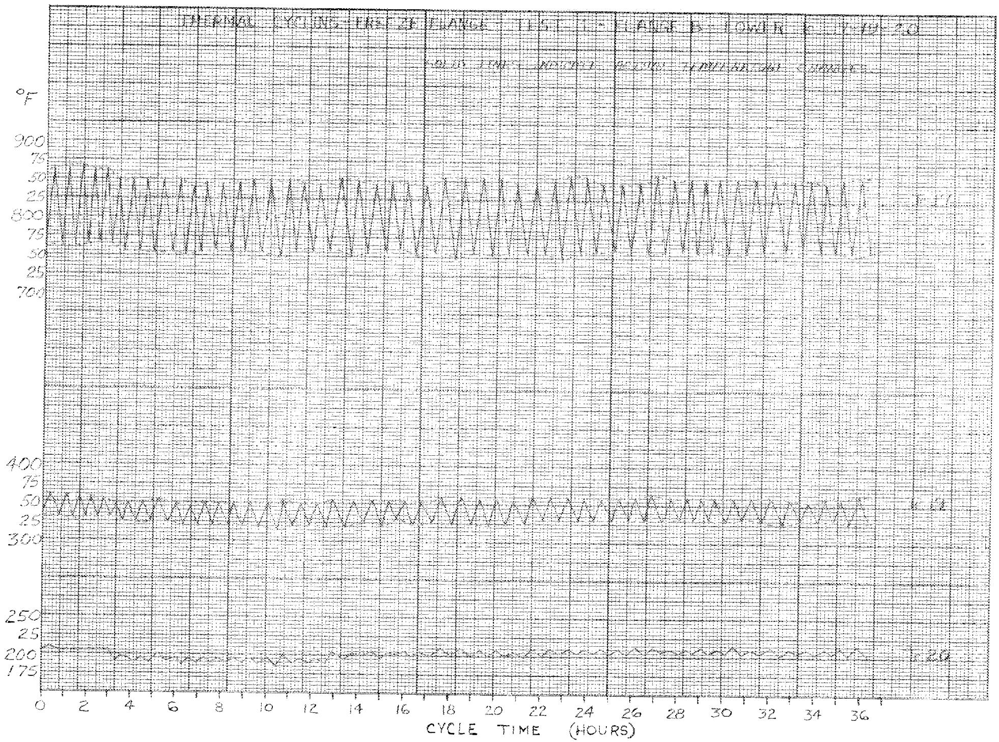  
CILSSV10n 86T \*AD-AT-TIN

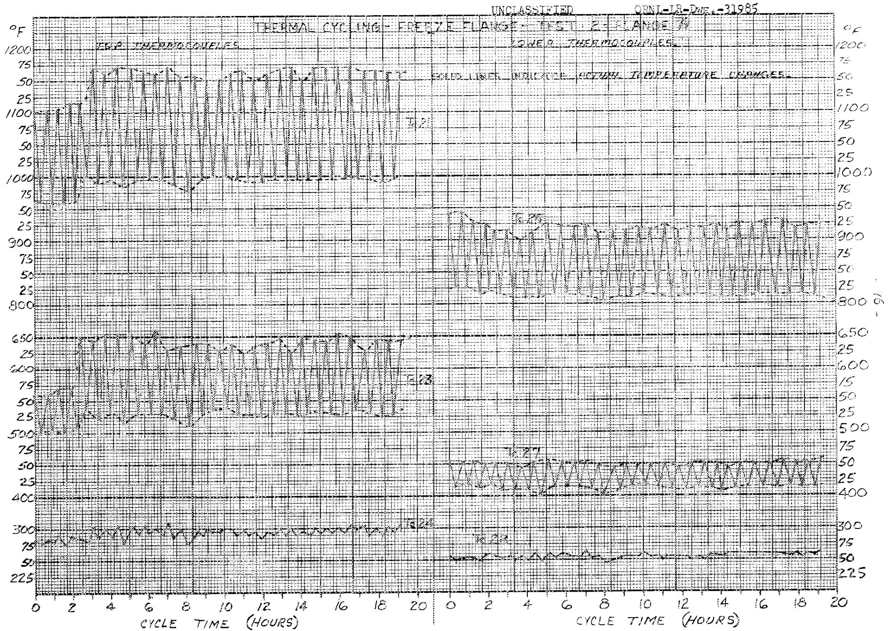

UNCLASSIFIED OFNL-IR-DWG.31986

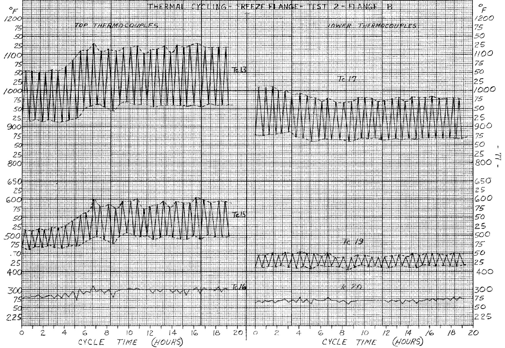

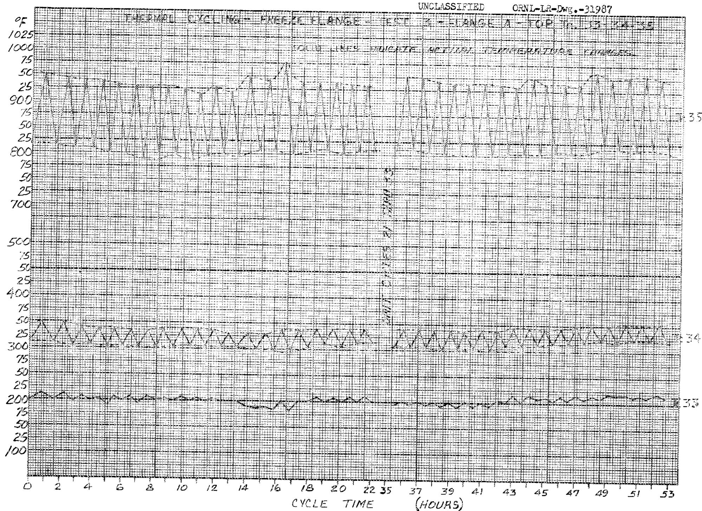

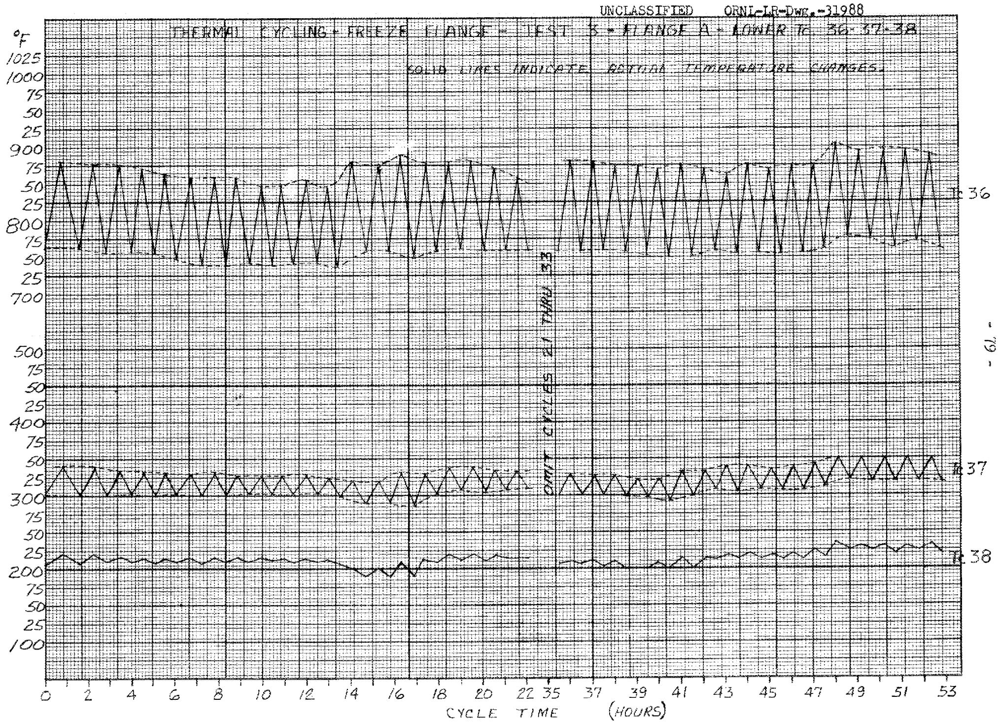

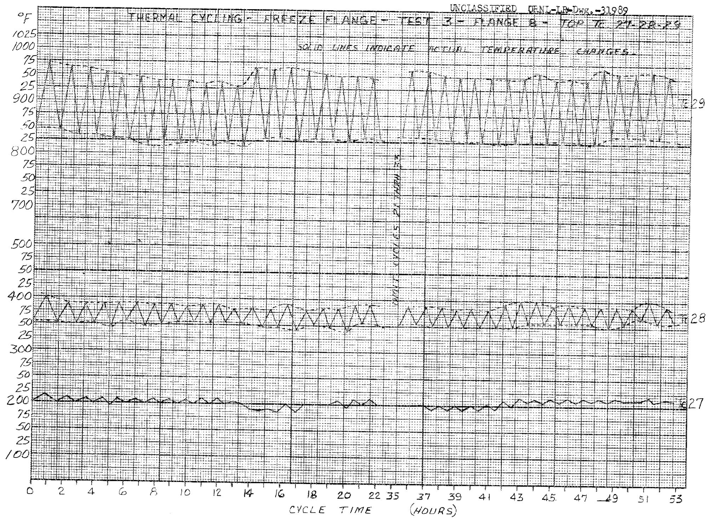

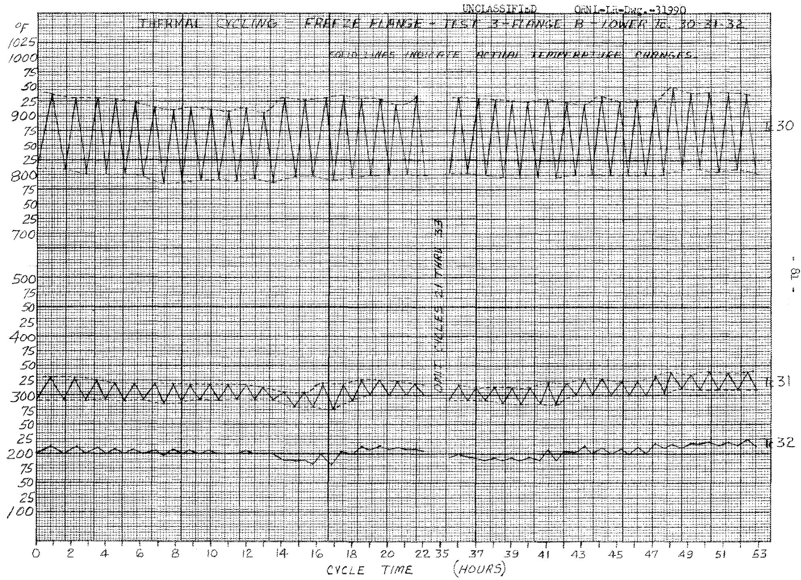


-62

ORNLIRnE 31991

  
CETTSSYTON   
2661C- $\cdot$ 3M0-YT-TNHO -8

  
CETTSSVTON   
6016-3M1917NIO   
73

  
$\phi$   
#   
UNCLASSIFIED   
ONL-IR-DWG.31994

# APPENDIX 3

Graphs of Cast Seal Flange Thermal Cycling Tests


  
__________   
166TE-2MQ-ETINNO

  
CHLISSVTONN 966TE-°AGT-TNHO

# APPENDIX 4

Graphs of Indented Seal Flange Thermal Cycling Tests

INDENTATION SEAL FLANGE TEST NO1- IRON SEAL   
  
66618·Bq-HT-INNO 26


# APPENDIX 5

Report on Metallurgical Examination of the Cast Seal Flanges

# SOLIDIFIED METAL SEAL DEVELOPMENT

G. M. Slaughter

In order to provide information to the designers of the solidified metal seal, several 0.252-in.-dia tensile bars were prepared from cast silver. These were tested at room temperature, $1200^{\circ}\mathrm{F}$ , and $1400^{\circ}\mathrm{F}$ . The test results indicate that the room-temperature mechanical properties are about the same as the published data; i.e., 20,000 psi tensile, 8,000 psi yield, and $50\%$ elongation in 1-in. At $1200^{\circ}\mathrm{F}$ , the tensile strength dropped to 2,400 psi and the yield strength to 1,900 psi, with a corresponding elongation of $6 - 10\%$ . At $1400^{\circ}\mathrm{F}$ , the tensile strength was 1,500 psi, the yield strength was 1,00 psi, and the elongation was $10\%$ .

The two flanges that were operated in test at Y-12 were received for metallographic examination. A half-section of the silver flange is shown in Fig. 35 (Y-26029), while a half-section of the silver-copper flange is shown in Fig. 36 (Y-26103). The examination indicated that moderate oxidation of the components during opening and closing the flange had occurred, thereby impeding wetting of the base metal. The flange utilizing the silver-copper alloy appeared to be less subject to this condition than that containing the pure silver, probably because of the lower temperatures required to remelt it during opening. A photomicrograph of a typical interface between the silver-copper and the Inconel base metal is shown in Fig. 37 (Y-26241).

UNCL ASSIFIED Y-26029

  
Fig. 35. Cast Seal Flange with Silver Seal, Sectioned.

  
Fig. 36. Cast Seal Flange with Copper-Silver Alloy Seal, Sectioned.

  
Fig. 37. Cast Seal Flange with Copper-Silver Alloy Seal; Photomicrograph of Interface of Alloy and Inconel Wall.

APPENDIX 6

Report on Metallurgical Examination of the Freeze Flange Joint

# INTER-COMPANY CORRESPONDENCE

# UNION CARBIDE NUCLEAR COMPANY

A Division of Union Carbide and Carbon Corporation

To: A. Taboada

Plant: 9201-3, Y-12

Copies to: W. B. McDonald

Date: May 26, 1958

A. S. Olson

Subject: Examination of Freeze Flange

RSC Files (FC)

This freeze flange had operated through several thermal cycles in test.

Information regarding possible cracking was desired.

Three sections were taken through the center hole to explore all the areas

likely to exhibit cracks. One section included a welded-on web and a

longitudinal section through the center hole. Another section was taken

roughly $45^{\circ}$ away longitudinally through the hole and a third in transverse

cross section through the counter-sunk center of the flange. It was in this

area that cracking was felt to most likely occur.

None of the sections examined showed any cracks.

R. S. Crouse

RSC:f1

# APPENDIX 7

Assembly Drawings of the Mechanical Joints and Loop

1. Freeze Flange Mechanical Joint - $1/2$ '' tubing size.

Dwg. No. D-2-02-054-6777

2. Cast Seal Joint

Dwg. No. C-2-02-054-6837

3. Indented Seal Joint

Dwg. No. D-2-02-054-7249

4. Freeze Flange Joint - 4-inch pipe size

Dwg. No. E-2-02-054-7014

5. Inconel Test Loop

Dwg. No. E-2-02-054-7126

(The drawing shows the loop configuration for freeze flange tests

Nos. 3 and 4 and cast seal flange tests Nos. 1 and 2. For the indented

seal flange tests, the cast seal flanges were cut out of the loop and re-

placed by lengths of 1/2 inch Inconel tubing. The freeze flanges were cut

out of the loop and the indented seal flanges installed in their place.)


SECTION A-A   
  
NOTE.   
I-ALL WELDING TO BE COMPLETED BEFORE   
FINISH MACHINING BOTH FACES, GROOVE   
406 DIA. BORE, 503 DIA.CBORE, EEND   
MILLEDPLACESAND 504 DIA.

<table><tr><td>ASSEMBLY
DRAWING NO. D-6777-5</td></tr><tr><td>TITLE FLANGE SUB-A53Y</td></tr><tr><td>MATERIAL INCOMEL</td></tr><tr><td>DRAWING</td></tr><tr><td>SCALE FULL NUMBER D-6777-1</td></tr></table>


<table><tr><td>ASSEMBLY
DRAWING NO. D-5777-1</td></tr><tr><td>TITLE PRINTS</td></tr><tr><td>MATERIAL /INCONEL</td></tr><tr><td>SCALE FULL NUMBER D-6777-7</td></tr></table>


<table><tr><td>ASSEMBLY
DRAWING NO. D-6777-1</td></tr><tr><td>TITLE BLOOD</td></tr><tr><td>MATERIAL INCOVEL</td></tr><tr><td>SCALE FULL NUMBER D-6777-B</td></tr></table>


<table><tr><td>ASSIMILY
DRAWING NO. D-6777-5</td></tr><tr><td>TITLE TUBE</td></tr><tr><td>MATERIAL INGREDIENTS TUBING</td></tr><tr><td>SCALE 2=1 NUMBER D-6777-2</td></tr></table>


<table><tr><td colspan="4">PARTS LIST</td></tr><tr><td></td><td>DWG. NO.</td><td>QTY.</td><td>NAME</td></tr><tr><td>1</td><td>D-6777-1</td><td>2</td><td>FLANGE SUB-ASSY.</td></tr><tr><td>2</td><td>D-6777-2</td><td>1</td><td>TUBE</td></tr><tr><td>3</td><td>D-6777-3</td><td>1</td><td>QUALITY GASKET No. 40
SOFT TUBE</td></tr><tr><td>4</td><td>D-6777-4</td><td>8</td><td>LAMALE LASESTER MANOA
CO. NO. P-1800</td></tr></table>


<table><tr><td>ASSEMBLY</td></tr><tr><td>DRAWING NO.</td></tr><tr><td>TITLE HEIZE FLANGES</td></tr><tr><td>MATERIAL DRAWING</td></tr><tr><td>SCALE NUL NUMBER D:5777-5</td></tr></table>

D-2-02-054-6777

<table><tr><td></td><td></td><td></td><td></td><td></td><td></td><td>LARGE 100%</td><td>100%</td><td>DYNAMIC 400000</td><td>100%</td><td rowspan="2">SCALE ALL SHARP CREDITS
VARIATE SPECIFIED SPECIFIED</td></tr><tr><td></td><td></td><td></td><td></td><td></td><td></td><td>PROGRESS ORIG.</td><td></td><td>HARD CORES</td><td>100%</td></tr><tr><td></td><td></td><td></td><td></td><td></td><td></td><td></td><td></td><td></td><td></td><td>TOLERANCE EQUAL OR OTHERWISE
SPECIFIED</td></tr><tr><td></td><td></td><td></td><td></td><td></td><td></td><td></td><td></td><td></td><td></td><td>PRACTICES ± 1/2</td></tr><tr><td></td><td></td><td></td><td></td><td></td><td></td><td></td><td></td><td></td><td></td><td>BASICALLY ± .005
ANALYSIS ± 1/2</td></tr><tr><td></td><td></td><td></td><td></td><td></td><td></td><td></td><td></td><td></td><td></td><td></td></tr><tr><td></td><td></td><td></td><td></td><td></td><td></td><td></td><td></td><td></td><td></td><td></td></tr><tr><td></td><td></td><td></td><td></td><td></td><td></td><td></td><td></td><td></td><td></td><td></td></tr><tr><td></td><td></td><td></td><td></td><td></td><td></td><td></td><td></td><td></td><td></td><td></td></tr><tr><td></td><td></td><td></td><td></td><td></td><td></td><td></td><td></td><td></td><td></td><td></td></tr><tr><td></td><td></td><td></td><td></td><td></td><td></td><td></td><td></td><td></td><td></td><td></td></tr></table>

<table><tr><td colspan="2">REFERENCE DRAWINGS</td><td>DWG. NO.</td></tr><tr><td colspan="3">OAK RIDGE NATIONAL LABORATORY</td></tr><tr><td colspan="3">MFR
FREEZE FLANGES</td></tr><tr><td>9352-A</td><td colspan="2">D-2-02-054-6777</td></tr></table>

<table><tr><td colspan="4">PARTS LIST</td></tr><tr><td>ITEM</td><td>DWG.NO.</td><td>QTY.</td><td>NAME</td></tr><tr><td>1</td><td>B-6839</td><td>1</td><td>UPPER FLANGE</td></tr><tr><td>2</td><td>B-6838</td><td>1</td><td>LOWER FLANGE</td></tr><tr><td>3</td><td>C-6837-3</td><td>4</td><td>CAP 5CR, SOC.HD.
3/8-11 x 3 LING</td></tr><tr><td>4</td><td>C-6837-4</td><td>4</td><td>NUT 3/8-11</td></tr><tr><td>5</td><td>B-6840</td><td>1</td><td>SEAL RING</td></tr></table>


SILVER ALLOY RING IS

MELTED AFTER JOINT

IS ASSEMBLED. JOINT IS

SURROUNDED BY ELECTRIC

CLAMSHELL HEATERS OF

QUICK REMOVAL TYPE

FOR JOINT REPLACEMENT.

C-2-02-054-6837


<table><tr><td colspan="2">REFERENCE DRAWINGS</td><td>DWG. NO.</td></tr><tr><td colspan="3">OAK RIDGE NATIONAL LABORATORY</td></tr><tr><td colspan="3">EXPERIMENTAL CAST SEAL
FLANGE ASS&#x27;Y</td></tr><tr><td>FILE*104</td><td></td><td>C-2-02-054-6837</td></tr></table>

<table><tr><td></td><td></td><td></td><td></td><td></td><td></td><td rowspan="8">###</td><td rowspan="8">1/23</td><td rowspan="8">###</td><td></td><td rowspan="2" colspan="3">OAK RIDGE NATIONAL LABORATORY</td></tr><tr><td></td><td></td><td></td><td></td><td></td><td></td><td></td></tr><tr><td></td><td></td><td></td><td></td><td></td><td></td><td></td><td rowspan="6" colspan="3">EXPERIMENTAL CAST SEAL
FLANGE ASS&#x27;Y</td></tr><tr><td></td><td></td><td></td><td></td><td></td><td></td><td></td></tr><tr><td></td><td></td><td></td><td></td><td></td><td></td><td></td></tr><tr><td></td><td></td><td></td><td></td><td></td><td></td><td></td></tr><tr><td></td><td></td><td></td><td></td><td></td><td></td><td></td></tr><tr><td></td><td></td><td></td><td></td><td></td><td></td><td></td></tr><tr><td>A</td><td>INK NOTE ADDED NO DGN</td><td>GGM</td><td>1/2/15</td><td></td><td rowspan="2"></td><td rowspan="2"></td><td rowspan="2"></td><td rowspan="2"></td><td rowspan="2">SCALE FULL SIZE</td><td rowspan="2">FILE # 104</td><td rowspan="2"></td><td rowspan="2">C-2-02-054-6837</td></tr><tr><td></td><td>REVISION</td><td>MT</td><td>DATE</td><td>APP.</td></tr></table>


  
DESIGNED TO SPECIFICATIONS OF MR A. OLSEN.

<table><tr><td></td><td colspan="4">PARTS LIST</td></tr><tr><td>MARK</td><td>DWG.NO.</td><td>QTY.</td><td>DIM&#x27;S-NAME</td><td>YAT</td></tr><tr><td>1</td><td>0-7249-1</td><td>1</td><td>3&quot; DI A x 2 &quot;LG</td><td>Nanell</td></tr><tr><td>2*</td><td>0-7249-2</td><td>1</td><td>2/2 DI A x 1/4 PIAC</td><td>WICKL
ZAHARA</td></tr><tr><td>3</td><td>0-7249-3</td><td>1</td><td>3 DI A x 2 LG</td><td>Nanell</td></tr></table>

<table><tr><td>ASSEMBLY
DRAWING NO. D7249</td></tr><tr><td>TITLE ASSEMBLY</td></tr><tr><td>MATERIAL YC DETAILS</td></tr><tr><td>SCALE DRAWING 7249-4</td></tr></table>


<table><tr><td>ASSHNEL
DRAWING NO.</td><td>D-7249-4</td></tr><tr><td>TITLE</td><td>MILE FLANGE</td></tr><tr><td>MATERIAL</td><td>INCONEL</td></tr><tr><td>SCALE</td><td>DRAWING 7249-3</td></tr></table>

D-2-02-054-7249   
  
MATERIAL: INTERCHANGEABLE   
SEALS TO BC FABRICATED OF:-   
(a) NICKEL "A" ANNEALD   
(b) ANNEALCD COPPER   
(c) ANNEALED ARMCO IRON   
(d) NICKEL PLATED ORMICO IRON ANNEALDED   
(PLATE :2015 THICK.)

<table><tr><td colspan="2">ABSEMCY
DRAWING NO. 0-7243-4</td></tr><tr><td>TITLE</td><td>SEAL</td></tr><tr><td>MATERIAL</td><td>SEE NOTE</td></tr><tr><td>SCALE</td><td>SCALE 7249-2</td></tr></table>

<table><tr><td></td><td></td><td></td><td></td><td></td><td></td><td></td><td colspan="2">SPECIAL MARKS</td><td colspan="2">SIGNATURES</td><td></td></tr><tr><td></td><td></td><td></td><td></td><td></td><td></td><td></td><td></td><td></td><td rowspan="13"></td><td rowspan="13"></td><td>SCALE ALL SCHEDULED(SPECIAL THIS SPECIFIED)</td></tr><tr><td></td><td></td><td></td><td></td><td></td><td></td><td></td><td>PARENTAL</td><td>1/2</td><td>TOLERANCE UNLESS OTHERWISE SPECIFIED</td></tr><tr><td></td><td></td><td></td><td></td><td></td><td></td><td></td><td>A. Dalm</td><td>1/2</td><td>PRACTICES ± 1/2</td></tr><tr><td></td><td></td><td></td><td></td><td></td><td></td><td></td><td></td><td></td><td>SPECIFICATIONS ± .005</td></tr><tr><td></td><td></td><td></td><td></td><td></td><td></td><td></td><td></td><td></td><td>UNLESS ± 1°</td></tr><tr><td></td><td></td><td></td><td></td><td></td><td></td><td></td><td></td><td></td><td></td></tr><tr><td></td><td></td><td></td><td></td><td></td><td></td><td></td><td></td><td></td><td></td></tr><tr><td></td><td></td><td></td><td></td><td></td><td></td><td></td><td></td><td></td><td></td></tr><tr><td></td><td></td><td></td><td></td><td></td><td></td><td></td><td></td><td></td><td></td></tr><tr><td></td><td></td><td></td><td></td><td></td><td></td><td></td><td></td><td></td><td></td></tr><tr><td></td><td></td><td></td><td></td><td></td><td></td><td></td><td></td><td></td><td></td></tr><tr><td></td><td></td><td></td><td></td><td></td><td></td><td></td><td></td><td></td><td></td></tr><tr><td></td><td></td><td></td><td></td><td></td><td></td><td></td><td></td><td></td><td></td></tr></table>

5x-12-1663   

<table><tr><td colspan="2">REFERENCE DRAWINGS</td><td>DWG. NO.</td></tr><tr><td colspan="3">OAK RIDGE NATIONAL LABORATORY</td></tr><tr><td colspan="3">GASKETED FLANGE
MFR FLANGE TEST</td></tr><tr><td>J08 No
129-3</td><td></td><td>0-2-02-054-7243</td></tr></table>


<table><tr><td colspan="4">PARTS LIST</td></tr><tr><td>ITEM
NO.</td><td>SPEC. NO.</td><td>QTY.</td><td>NAME</td></tr><tr><td>1</td><td>D-7015</td><td>2</td><td>WELDMENT-FLANGF</td></tr><tr><td>2</td><td>D-7016-1</td><td>1</td><td>LABYTHIN RING</td></tr><tr><td>3</td><td>D-7019-1</td><td>1</td><td>SEAL RING</td></tr><tr><td>4</td><td>D-7019-2</td><td>4</td><td>SWASELECTION FITTING</td></tr><tr><td>5</td><td>D-7018-4</td><td>2</td><td>KEEPER</td></tr><tr><td>6</td><td>E-7014-6</td><td>1</td><td>SCREEN/WIRE S,ST
TBD/MECHAN IN, H/2x
H/2x H/3x</td></tr><tr><td>7</td><td>E-7014-7</td><td>2</td><td>7/3/2014-2, HD, HD, CAP
SCER-IN/CAMPON 3TET
H/2T TET/PECTED VSG</td></tr><tr><td>8</td><td>E-7014-8</td><td>4</td><td>PUMP OUT TYPE IN/OUT
V.OGS W, RG, CR/RESSEL</td></tr><tr><td>9</td><td>E-7017</td><td>1</td><td>WELDMENT-CLAMP</td></tr></table>

<table><tr><td></td><td></td><td></td><td></td><td></td><td></td><td></td><td></td><td></td></tr><tr><td></td><td></td><td></td><td></td><td></td><td></td><td></td><td></td><td></td></tr><tr><td></td><td></td><td></td><td></td><td></td><td></td><td></td><td></td><td></td></tr><tr><td></td><td></td><td></td><td></td><td></td><td></td><td></td><td></td><td></td></tr><tr><td></td><td></td><td></td><td></td><td></td><td></td><td></td><td></td><td></td></tr><tr><td></td><td></td><td></td><td></td><td></td><td></td><td></td><td></td><td></td></tr><tr><td></td><td></td><td></td><td></td><td></td><td></td><td></td><td></td><td></td></tr><tr><td></td><td></td><td></td><td></td><td></td><td></td><td></td><td></td><td></td></tr><tr><td></td><td></td><td></td><td></td><td></td><td></td><td></td><td></td><td></td></tr></table>

<table><tr><td colspan="2">REFERENCE DRAWINGS</td><td>DWG. NO.</td></tr><tr><td colspan="3">OAK RIDGE NATIONAL LABORATORY</td></tr><tr><td colspan="3">ASSEMBLY</td></tr><tr><td colspan="3">FREEZE FLANGE AND CLAMP</td></tr><tr><td colspan="3">FREEZE FLANGE MECH. JOINT DEV.</td></tr><tr><td></td><td>J08 NB129J</td><td>E-2-02-054-7D4</td></tr></table>

<table><tr><td colspan="2">PARTS LIST</td></tr><tr><td>#1</td><td>###</td></tr><tr><td>#2</td><td>###</td></tr><tr><td>#3</td><td>###</td></tr><tr><td>#4</td><td>###</td></tr><tr><td>#5</td><td>###</td></tr><tr><td>#6</td><td>###</td></tr><tr><td>#7</td><td>###</td></tr><tr><td>#8</td><td>###</td></tr><tr><td>#9</td><td>###</td></tr><tr><td>#10</td><td>###</td></tr><tr><td>#11</td><td>###</td></tr><tr><td>#12</td><td>###</td></tr><tr><td>#13</td><td>###</td></tr><tr><td>#14</td><td>###</td></tr><tr><td>#15</td><td>###</td></tr><tr><td>#16</td><td>###</td></tr><tr><td>#17</td><td>###</td></tr><tr><td>#18</td><td>###</td></tr><tr><td>#19</td><td>###</td></tr><tr><td>#20</td><td>###</td></tr><tr><td>#21</td><td>###</td></tr><tr><td>#22</td><td>###</td></tr><tr><td>#23</td><td>###</td></tr><tr><td>#24</td><td>###</td></tr><tr><td>#25</td><td>###</td></tr><tr><td>#26</td><td>###</td></tr><tr><td>#27</td><td>###</td></tr><tr><td>#28</td><td>###</td></tr><tr><td>#29</td><td>###</td></tr><tr><td>#30</td><td>###</td></tr><tr><td>#31</td><td>###</td></tr><tr><td>#32</td><td>###</td></tr><tr><td>#33</td><td>###</td></tr><tr><td>#34</td><td>###</td></tr><tr><td>#35</td><td>###</td></tr><tr><td>#36</td><td>###</td></tr><tr><td>#37</td><td>###</td></tr><tr><td>#38</td><td>###</td></tr><tr><td>#39</td><td>###</td></tr><tr><td>#40</td><td>###</td></tr><tr><td>#41</td><td>###</td></tr><tr><td>#42</td><td>###</td></tr><tr><td>#43</td><td>###</td></tr><tr><td>#44</td><td>###</td></tr><tr><td>#45</td><td>###</td></tr><tr><td>#46</td><td>###</td></tr><tr><td>#47</td><td>###</td></tr><tr><td>#48</td><td>###</td></tr><tr><td>#49</td><td>###</td></tr><tr><td>#50</td><td>###</td></tr><tr><td>#51</td><td>###</td></tr><tr><td>#52</td><td>###</td></tr><tr><td>#53</td><td>###</td></tr><tr><td>#54</td><td>###</td></tr><tr><td>#55</td><td>###</td></tr><tr><td>#56</td><td>###</td></tr><tr><td>#57</td><td>###</td></tr><tr><td>#58</td><td>###</td></tr><tr><td>#59</td><td>###</td></tr><tr><td>#60</td><td>###</td></tr><tr><td>#61</td><td>###</td></tr><tr><td>#62</td><td>###</td></tr><tr><td>#63</td><td>###</td></tr><tr><td>#64</td><td>###</td></tr><tr><td>#65</td><td>###</td></tr><tr><td>#66</td><td>###</td></tr><tr><td>#67</td><td>###</td></tr><tr><td>#68</td><td>###</td></tr><tr><td>#69</td><td>###</td></tr><tr><td>#70</td><td>###</td></tr><tr><td>#71</td><td>###</td></tr><tr><td>#72</td><td>###</td></tr><tr><td>#73</td><td>###</td></tr><tr><td>#74</td><td>###</td></tr><tr><td>#75</td><td>###</td></tr><tr><td>#76</td><td>###</td></tr><tr><td>#77</td><td>###</td></tr><tr><td>#78</td><td>###</td></tr><tr><td>#79</td><td>###</td></tr><tr><td>#80</td><td>###</td></tr><tr><td>#81</td><td>###</td></tr><tr><td>#82</td><td>###</td></tr><tr><td>#83</td><td>###</td></tr><tr><td>#84</td><td>###</td></tr><tr><td>#85</td><td>###</td></tr><tr><td>#86</td><td>###</td></tr><tr><td>#87</td><td>###</td></tr><tr><td>#88</td><td>###</td></tr><tr><td>#89</td><td>###</td></tr><tr><td>#90</td><td>###</td></tr><tr><td>#91</td><td>###</td></tr><tr><td>#92</td><td>###</td></tr><tr><td>#93</td><td>###</td></tr><tr><td>#94</td><td>###</td></tr><tr><td>#95</td><td>###</td></tr><tr><td>#96</td><td>###</td></tr><tr><td>#97</td><td>###</td></tr><tr><td>#98</td><td>###</td></tr><tr><td>#99</td><td>###</td></tr><tr><td>#0000000000000000000000000000000000000000000000000000000000000000000000000000000000000000000000000000</td><td></td></tr></table>

# List of Figures

# Figure No.

Page No.

1 Cross Section of Freeze Flange Joint 5   
2 Freeze Flanges Installed in Inconel Test Loop 6   
3 Schematic Drawing of Indented Seal Mechanical Joint 8   
4Assembly of Indented Seal Flange Before Testing 9   
5 Parts of Indented Seal Flange Before Testing 10   
6 Indented Seal Flange Shown Assembled with "C" Clamps 11   
7 Cast Seal Flange Showing a Cross Section View and Thermocouple Location 13   
8Assembly of Cast Seal Flanges 14   
9 Inconel Test Loop 15   
10 Inconel Test Loop - Pump End 17   
11 Schematic Drawing of Test Loop for Freeze Flange Tests 1 and 2 22   
12 Schematic Drawing of Thermocouple Locations on the Freeze Flanges for Tests 1 and 2 23   
13 Schematic Drawing of the Test Loop for Freeze Flange Tests 3 and 4 and Cast Seal Flange Tests 1 and 2 26   
14 Schematic Drawing of Thermocouple Locations on the Freeze Flanges for Tests 3 and 4. 27   
15 Sketch of Extension Rods for Disassembly of Cast Seal Flanges 30   
16 Sketch of Spring-Loaded Tie Rods for Reassembly of Cast Seal Flanges 31   
17 Schematic Drawing of Test Loop for Indented Seal Flange Tests 1 and 2 32   
18 Schematic Drawing of Thermocouple Locations for Test 2 on Indented Seal Flange. 34   
19 Freeze Flange (1/2" Tubing size) Open with Copper Seal Ring After Cleaning Following Test 4. 40   
20 Copper Seal Ring from Small Freeze Flange After Test 4 41   
21 Freeze Flange Showing Formation of Frozen Salt Seal 42

Figure No.

Page No.

22 Freeze Flanges Installed in Test Loop After Disassembly of the Flanges 43   
23 Freeze Flange After Removal of Salt Seal from Face of Flange 4   
24 Cast Seal Flange after Disassembly Following Loop Tests - Copper-Silver Alloy Seal . . . . . . . . . . . . . . . . . .   
25 Cast Seal Flange After Disassembly Following Loop Tests - Silver Seal 49   
26 Indented Seal Flange with Copper Gasket after Testing . 55   
27 Indented Seal Flange with Armco Iron Gasket after Testing. 56   
28 Armco Iron Gasket After Testing in Indented Seal Flange . . . 57   
29 Indented Seal Flange with Nickel Gasket after Testing 58   
30 Indented Seal Flange with Nickel-Plated Armco Iron Gasket after Testing 59   
31 Freeze Flange and Indented Seal Flange Installed in Test Loop for Cycling Tests with Molten Sodium 61   
32Assembly of Large Freeze Flange 62   
33 Large Freeze Flange Shown Open with Copper Seal Ring in Place 63   
34 Schematic Drawing of Test Loop for Large Freeze Flange 64   
35 Cast Seal Flange with Silver Seal, Sectioned 102   
36 Cast Seal Flange with Copper-Silver Alloy Seal, Sectioned. 103   
37 Cast Seal Flange with Copper-Silver Alloy Seal; Photo micrograph of Interface of Alloy and Inconel Wall. 104

# List of Tables

Table No.

Page No.

1 Time Required for Assembly and Disassembly for Freeze Flanges 25   
2 Freeze Flange Temperatures Measured During Thermal Cycles 35   
3 Freeze Flange Temperatures Measured During Thermal Cycles 36   
4 Leak Rates of Freeze Flanges and Indented Seal Flanges 38   
5 Cast Seal Flange Temperatures Measured During Thermal Cycles. 46   
6 Time Required for Assembly and Disassembly for Cast Seal Flanges 50   
7 Indentation Seal Flange Temperatures Measured During Thermal Cycles - Test No. 1 . . . . . . . . . . . . . . . . . . . . . . . . . . . . . . . . . . . . . . . . . . . . . . . . . . . . . .   
8 Indentation Seal Flange Temperatures Measured During Thermal Cycles - Test No. 2 . 53

# Distribution

1. G. M. Adamson   
2. S.E.Beall   
3. A. Benson, AEC   
4. D.S.Billington   
5. R.E.Blanco   
6. F.F.Blankenship   
7. E.P.Blizard   
8. A.L.Boch   
9. E.G.Bohlmann   
10. E.S.Bomar   
11. C.J.Borkowski   
12. W.F. Boudreau   
13. G.E. Boyd   
14. E.J.Breeding   
15. J.C.Bresee   
16. R.B.Briggs   
17. K.B.Brown   
18. F.R.Bruce   
19. D. W. Cardwell   
20. W.R.Castro  
21. C. E. Center   
22. R.H.Chapman   
23. R.A.Charpie   
24. R.E.Clausing   
25. F. L. Guller   
26. J. S. Culver   
27. J. E. Devan   
28. S. E. Dismuke   
29. H.G.Duggan   
30. W.K.Bister   
51. L.B. Eunlet   
32. J.Y.Estabrook   
33. D. E. Ferguson   
34. A.P.Frase   
35. E.A.Franco-Ferreira   
36. J.H.Frye, Jr.   
37. W.R.Call   
38. H.E.Goeller   
39. W.R.Grimes   
40. E. Guth   
41. C.S.Karrill   
42. H.W.Hoffman   
43. A. Hollander   
44. W. S. Fornbaker   
45. A. S. Householder   
46. W.H.Jordan   
47. F.R.Kasten   
48. G.W. Keilholtz   
49. M.T.Kelley   
50. W.H.Kelley, Jr.

51. R.B.Korsmeyer

52. E. Lamb

53. J.A.Lane

54. W.H.Lewis

55. R.B.Lindauer

56. R.S.Livingston

57. R.N.Lyon

58. H, G. MacPherson

59. W.D.Manly

60. L.A.Mann

61. W.B.McDonald

62. C.K.McGlothlan

63. J.R.McNally

64. A.J.Miller

65. K. Z. Morgan

66. E.J.Murphy

67. J.P.Murray

68. M. L. Nelson

69. W.R.Osborn

70. E.W.Parrish

71. P. Patriarca

72. A.M.Perry

73. M. Ramsey

74. F. Ring

75. A. F. Rupp

76. H.W.Savage

77. A.W.Savolainen

78. W.F.Schaffer

79. D.M.Shepherd

80. E.D.Shipley

81. 0. Sisman

82. M.J.Skinner

83. G.M.Slaughter

84. A.E.Snell

85. I. Spiewak

86. E. Storto

87. J.A.Swartout

88. A. Taboada

89. E. H. Taylor

90. D. S. Toomb

91. D. B. Trauger

92. W.E.Unger

93. A.M.Weinberg

94. C.E.Winters

95. G.D.Whitman

96. J. Zasler

97. Lab Records, ORNL (RC)

06. Lab Records Department

09. Document Reference Section

12. Central Research Library

27. TISE, AEC