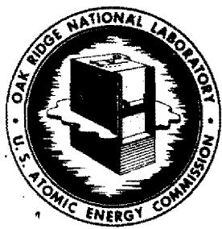
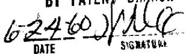
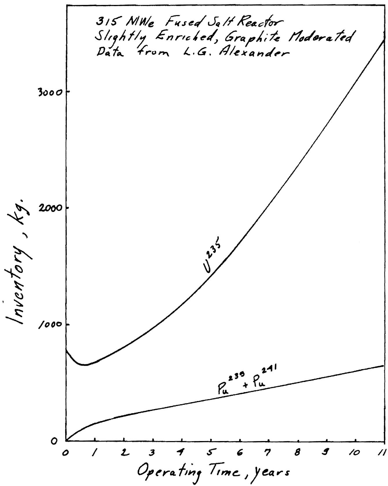
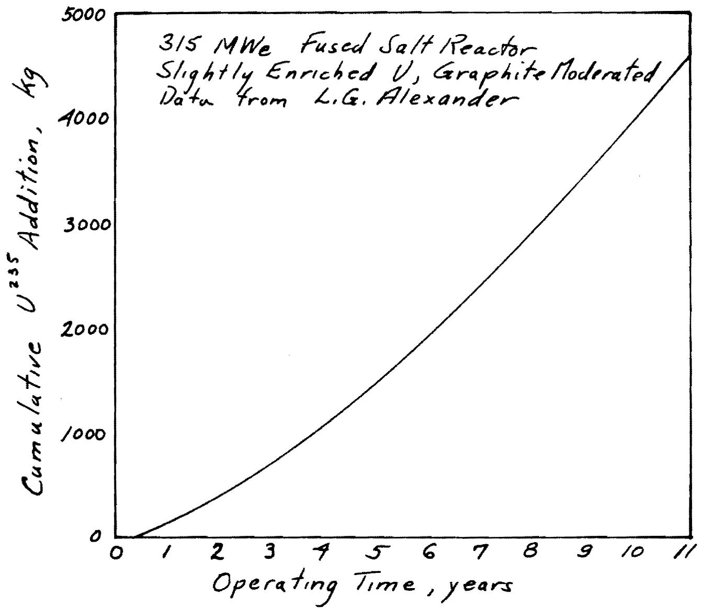
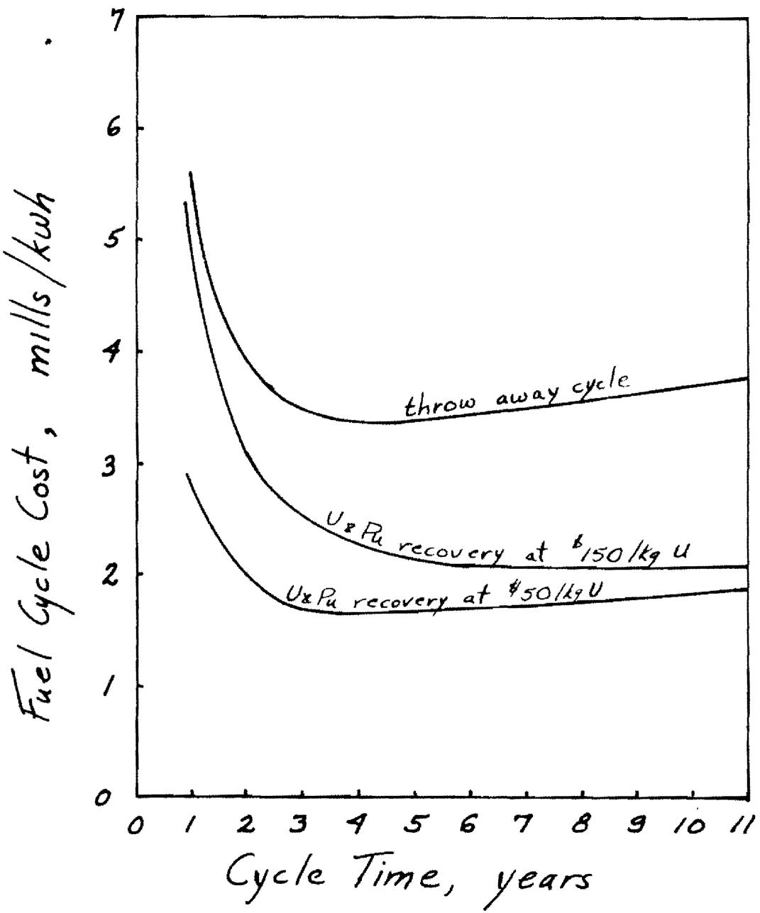

# UNCLASSIFIED

Operated By

UNION CARBIDE NUCLEAR COMPANY

# UCC

POST OFFICE BOX X OAK RIDGE, TENNESSEE

INDICATED

# ORNL

# CENTRAL FILES NUMBER

59 - 1 - 13

REVISED

COPY NO. 61

DATE: February 24, 1959

SUBJECT: Fuel Cycle Costs in a Graphite Moderated Slightly Enriched Fused Salt Reactor

TO: Distribution

FROM: C. E. Guthrie

# Abstract

A fuel cycle economic study has been made for a 315 MWe graphite moderated slightly enriched molten salt fueled reactor. Fuel cycle costs in the order of 3.3 mills/kwh were calculated for the throw-away cycle. Recovery of the uranium and plutonium at the end of the cycle reduces the cycle costs to $\sim 1.6$ mills/kwh. Changes in the waste storage and reprocessing costs have a relatively minor effect on fuel cycle costs.

# NOTICE

This document contains information of a preliminary nature and was prepared primarily for internal use at the Oak Ridge National Laboratory. It is subject to revision or correction and therefore does not represent a final report.

RELEASE APPROVED

BY PATENT BRANCH

# Foreword

This revision incorporates more accurate nuclear calculations and some changes in economic basis.

# Introduction

One potential advantage of a fluid fueled reactor is a low fuel cycle cost. There are two alternate approaches, both unique to the fluid fuel concepts, one might take to realize this potential: (1) continuous reprocessing, thereby keeping the poisons at a minimum and the conversion (or breeding) ratio at a maximum, or (2) continuous additions of enriched fuel (to make up for burnout and reactivity decrease), thereby attaining very high burnup on the original fuel charge. The latter approach is the one more applicable to the fused salt (LiF, BeF, UF₄) reactor operating on the U²³5-U²³⁸ cycle. For fused salt reactors operating on the Th-U cycle either approach can be used since the volatility process could be used to continuously (or semicontinuously) recover the U-235 and U-233.

This study has been made to determine the range of fuel cycle costs anticipated for a graphite moderated fused salt burner reactor operating on the U235-U238 cycle. The nuclear calculations and cycle costs for the Th-U235 cycle will be worked out and reported at a later date.

# Reactor Basis*

The reactor considered is graphite moderated with a fluid fuel consisting of a molten mixture of lithium-7 fluoride, beryllium fluoride and slightly enriched uranium fluoride. During the reactor cycle highly enriched $\mathrm{UF_4}$ is added to the system to supply burnup and make up for the reactivity loss due to accumulated fission products. The inventory of fissile isotopes in the reactor and the U-235 additions as a function of time are shown in Figs. 1 and 2, respectively. The other reactor parameters are:

775 Mw Thermal

315 Mw Electrical   
900 ft3 Fused Salt Inventory   
80% Load Factor   
1.4% Initial U-235 Enrichment   
20% UF Salt Composition, Mole %   
$70\%$ LiF   
10% BeF2

  
Fig. 1. Fissile Isotope Inventory vs. Operating Time

  
Fig. 2 Cumulative U ${}^{235}$ Addition vs.   
Operating Time

# Economic Basis

Two fuel cycle cases have been considered, both of which assume no Li-7 recovery. In each case the cycle repeats by the reactor being fueled with fresh salt containing $1.4\%$ enriched U.

1) Throw-away cycle - At the end of the reactor cycle (or lifetime) the reactor salt inventory including fissionable isotopes would be discarded into on-site waste tanks for permanent storage. A $1,000,000 investment has been assumed at the end of the cycle for a storage facility and provision for permanent monitoring.   
2) U and Pu recovered at end of cycle by solvent extraction - Recovery costs of $150/kg U (representative of current technology and scale of processing) and $50/kg U (large scale technology) have been estimated.

The economics were calculated on the following basis:

Salt cost $1700/ft3 (excluding U value).

U value at official price schedule.

Pu credit $15/gm of Pu-239 and Pu-241.

$4 \%$ use charge was paid on initial loading of U, U-235 added during cycle, and Pu buildup during the cycle.

A $5 \%$ interest sinking fund was used to pay for either U discard and storage costs or processing costs at the end of the cycle and to take care of increasing use charges.

The investment in salt was paid off over the cycle with a $10\%$ return (before taxes).

# Results

The fuel cycle costs, claculated for each case as a function of cycle time, are shown in Fig. 3. A minimum fuel cycle cost of 1.6 mills/kwh is predicted for a reactor cycle of 4.5 years when the U and Pu are recovered at the end of the cycle for $50/kg U. For $150/kg U recovery costs, cycle costs are essentially constant at ~2 mills/kwh for cycles in excess of 5 years. In all cases it pays to recover the U and Pu at the end of the cycle since the minimum throw-away cycle cost is 3.35 mills/kwh. Table I shows a breakdown of the costs for the five-year cycle.

Errors in the fused salt waste disposal and initial salt costs have little effect on the fuel cycle costs for cycles 5 years or longer. Increasing the waste disposal cost by $1,000,000/cycle and the salt cost by$ 1000/ft³ would increase the five-year cycle costs by 0.08 mill/kwh and 0.12 mill/kwh respectively. Changing the return on salt investment to 12% and the interest on sinking fund to 6% (instead of 10% and 5%) would decrease

  
Fig. 3. Fuel Cycle Cost vs. Cycle Time

Table I   
Five-Year Cycle Cost Breakdown   

<table><tr><td rowspan="2"></td><td rowspan="2">Throwaway Cycle</td><td colspan="2">Recovery Cycle</td></tr><tr><td>$50/kg U</td><td>$150/kg U</td></tr><tr><td>Use Charge on Initial U Loading</td><td>0.13 Mills/kwh</td><td>0.13 Mills/kwh</td><td>0.13 Mills/kwh</td></tr><tr><td>Use Charge on U-235 Added and Pu Buildup</td><td>0.29</td><td>0.29</td><td>0.29</td></tr><tr><td>Salt Amortization</td><td>0.21</td><td>0.21</td><td>0.21</td></tr><tr><td>Burnup</td><td>0.79</td><td>0.79</td><td>0.79</td></tr><tr><td>Fuel Throwaway Cost</td><td>1.84</td><td>-</td><td>-</td></tr><tr><td>Waste Storage for Throwaway</td><td>0.08</td><td>-</td><td>-</td></tr><tr><td>Reprocessing Charges</td><td>-</td><td>0.23</td><td>0.69</td></tr><tr><td>Total Cycle Costs</td><td>3.34 Mills/kwh</td><td>1.65 Mills/kwh</td><td>2.11 Mills/kwh</td></tr></table>

the cycle cost by 0.01 mill/kwh for the 5-year cycle and by 0.15 mill/kwh for the 11-year cycle.

It is interesting to compare these fuel cycle costs, which are for a single reactor with present reprocessing technology, with the fuel cycle costs anticipated for solid fueled reactors at the present time. Two such reactors which are typical are the Yankee with a 7.1 mills/kwh(1) fuel cost and the Indian Point with a 5.8 mills/kwh(2) fuel cost. These costs will be reduced by the mass production of fuel elements and large scale reprocessing possible in a large nuclear economy. It will probably take, however, a nuclear economy in the order of $10^{5}\mathrm{Mw}_{\mathrm{e}}$ (1980-2000) to reduce solid fueled reactor fuel cycle costs to 1.5 mills/kwh. As far as fuel cycle costs are concerned slightly enriched fused salt reactors appear to be superior at present and competitive in the future to heterogeneous reactors.

# INTERNAL DISTRIBUTION

1. W. L. Albrecht   
2. L.G. Alexander   
3. E. D. Arnold   
4. C. J. Barton   
5. E. S. Bettis   
6. R.E.Blanco   
7. F. F. Blankenship   
8. A. L. Boch   
9. W.F. Boudreau   
10. E. J. Breeding   
11. J. C. Bresee   
12. K.B.Brown   
13. W.E.Browning   
14. F.R.Bruce   
15. D. O. Campbell   
16. W.H.Carr   
17. G. I. Cathers   
18. R.A. Charpie   
19. F. L. Culler   
20. D. A. Douglas   
21. W.K. Eister   
22. W. K. Ergen   
23. D. E. Ferguson   
24. A. P. Fraas   
25. A. T. Gresky   
26. W. R. Grimes   
27. H.E.Goeller   
28. C. E. Guthrie   
29. H.W.Hoffman   
30. W.H.Jordan   
31. G. W. Keilholtz   
32. B.W.Kinyon

33. M. E. Lackey   
34. J. A. Lane   
35. R.B.Lindauer   
36. H. G. MacPherson   
37. W. D. Manly   
38. E. R. Mann   
39. L.A. Mann   
40. W. B. McDonald   
41. H. J. Metz   
42. R. P. Milford   
43. G. J. Nessle   
44. W. R. Osborn   
45. R.M.Pierce   
46. J. T. Roberts   
47. H. W. Savage   
48. A. W. Savolainen   
49. M. J. Skinner   
50. E. Storto   
51. J. A. Swartout   
52. A. Taboada   
53. R.E.Thoma   
54. D. B. Trauger   
55. J.W.Ullmann   
56. F. C. VonderLage   
57. G.M.Watson   
58. A. M. Weinberg   
59. G. D. Whitman   
60. J. Zasler   
61. Laboratory Records-RC   
62-63. Central Research Library   
64. Document Reference Section   
65-66. Laboratory Records

# EXTERNAL DISTRIBUTION

67. W. J. Larkin, AEC, ORO   
68. D. H. Groelsema, AEC, Washington