# OAK RIDGE NATIONAL LABORATORY

Operated by

UNION CARBIDE NUCLEAR COMPANY

Division of Union Carbide Corporation

Post Office Box X

Oak Ridge, Tennessee

External

Distribution Limited

ORNL

CENTRAL FILES NUMBER

59-1-26

COPY NO. 56

DATE: January 13, 1959

SUBJECT: A Preliminary Study of a Graphite Moderated Molten Salt Power Reactor

To: Listed Distribution

FROM: H. G. MacPherson

L. G. Alexander

D. B. Grimes

B. W. Kinyon

M. E. Lackey

L. A. Mann

J. W. Miller

G. D. Whitman

J. Zasler

# Abstract

A preliminary design and cost study has been made on a one region unclad graphite moderated molten salt power reactor. Included are conceptual plant layouts, basic information on the major fuel circuit components, and a discussion of the nuclear characteristics of the core.

For a plant electrical output of 315,000 kw and a plant factor of 80 percent, the energy cost was approximately 7.4 mills/kwh.

# NOTICE

This document contains information of a preliminary nature and was prepared primarily for internal use at the Oak Ridge National Laboratory. It is subject to revision or correction and therefore does not represent a final report. The information is not to be abstracted, reprinted or otherwise given public dissemination without the approval of the ORNL patent branch, Legal and Information Control Department.

# 1. General Features of the Reactor

A power reactor of the molten salt type using a graphite moderator achieves a high breeding ratio with a low fuel reprocessing rate. The graphite can be in contact with the salt without causing embrittlement of the nickel alloy container.

The salt selected consists of a mixture of LiF, $\mathrm{BeF}_2$ , and $\mathrm{UF}_4$ (70, 10, 20 mol%), melting at $932^{\circ}\mathrm{F}$ . The uranium is $1.30\%$ enriched. The core is 12.25 feet diameter by 12.25 high, with $3.6^{\prime \prime}$ diameter holes on $8^{\prime \prime}$ centers. $16\%$ of the core volume is fuel.

The choice of the power level of this design study was arbitrary, as the core is capable of operation at 1500 Mw(t) without exceeding safe power densities. An electrical generator of 333 Mw(e) was chosen, with 315 Mw(e) as the station output, which requires 760 Mw(t).

The heat transfer system includes a fluoride salt to transfer heat from the fuel to either primary or reheat steam. The salt selected has $65 \, \text{mol}\%$ LiF and $35\% \, \text{BeF}_2$ , which is completely compatible with the fuel. The Loeffler steam system, at 2000 PSI, $1000^{\circ}\text{F}$ , with $1000^{\circ}\text{F}$ reheat avoids the problems associated with a high temperature fluid supplying heat to boiling water.

The fuel flow from the core is divided among four circuits, so that there are four primary heat exchangers to take care of the core heat generation. Two superheaters, one reheater, three steam generators are required for each circuit. This arrangement is based on the practical or economic size of the respective components.

While it would have been possible to design this graphite moderated molten salt reactor plant identical to the homogeneous plant described in ORNL 2634, Molten Salt Reactor Program Status Report, an effort was made to include new designs evolved since then for a number of features and components. These include the maintenance concept, heat exchanger design, fuel transfer and drain tank system, gas preheating, barren salt intermediate coolant and the Loeffler steam system.

In most of these, the actual design chosen for a plant will not greatly affect the overall economy and operation. It is highly probable that the

Table 1   
REACTOR PLANT CHARACTERISTICS   

<table><tr><td>Fuel</td><td>1.30% U235F4 (initially)</td></tr><tr><td>Fuel carrier</td><td>70 mole % LiF, 10 mole % BeF2, 20 mole % UF4</td></tr><tr><td>Neutron energy</td><td>near thermal</td></tr><tr><td>Moderator</td><td>carbon</td></tr><tr><td>Reflector</td><td>iron</td></tr><tr><td>Primary coolant</td><td>fuel solution circulating at 35,470 gpm</td></tr><tr><td>Power</td><td></td></tr><tr><td>Electric (net)</td><td>315 Mw</td></tr><tr><td>Heat</td><td>760 Mw</td></tr><tr><td>Regeneration ratio</td><td></td></tr><tr><td>Clean (initial)</td><td>0.79</td></tr><tr><td>Estimated costs</td><td></td></tr><tr><td>Total</td><td>$79,250,000</td></tr><tr><td>Capital</td><td>$252/kw</td></tr><tr><td>Electric</td><td>7.4 mills/kwhr</td></tr><tr><td>Refueling cycle at full power</td><td>semicontinuous</td></tr><tr><td>Shielding</td><td>concrete room wall, 9 ft thick</td></tr><tr><td>Control</td><td>temperature and fuel concentration</td></tr><tr><td>Plant efficiency</td><td>41.5%</td></tr><tr><td>Fuel conditions, pump discharge</td><td>1225°F at ~105 psia</td></tr><tr><td>Steam</td><td></td></tr><tr><td>Temperature</td><td>1000°F with 1000°F reheat</td></tr><tr><td>Pressure</td><td>2000 psia</td></tr><tr><td>Second loop fluid</td><td>65 mole % LiF, 35 mole % BeF2</td></tr><tr><td>Structural materials</td><td></td></tr><tr><td>Fuel circuit</td><td>INOR-8</td></tr><tr><td>Secondary loop</td><td>INOR-8</td></tr><tr><td>Steam generator</td><td>2.5% Cr, 1% Mo steel</td></tr><tr><td>Steam superheater and reheater</td><td>INOR-8</td></tr><tr><td>Active-core dimensions</td><td></td></tr><tr><td>Fuel equivalent dia</td><td>14 ft</td></tr><tr><td>Reflector and thermal shield</td><td>12-in. iron</td></tr><tr><td>Temperature coefficient (Δk/k)/°F</td><td>negative</td></tr><tr><td>Specific power</td><td>1770 kw/kg</td></tr><tr><td>Power density</td><td>117 kw/liter</td></tr><tr><td>Fuel inventory</td><td></td></tr><tr><td>Initial (clean)</td><td>700 kg of U235</td></tr><tr><td>Critical mass clean</td><td>178 kg of U235</td></tr><tr><td>Burnup</td><td>unlimited</td></tr></table>

features of the actual plant built would consist of a mixture of those described in this report, in the previous reports and evolved as a result of future design and development work.

A plan view of the reactor plant layout is presented in Figure 1, and an elevation view is shown in Figure 2. The reactor and the primary heat exchangers are contained in a large rectangular reactor cell, which is sealed to provide double containment for any leakage of fission gases. The rectangular configuration of the plant permits the grouping of similar equipment with a minimum of floor space and piping. The superheaters and reheaters are thus located in one bay, under a crane. Adjacent to it are the turbogenerator, steam pumps, and feed water heaters and pumps. The plant includes, in addition to the reactor and heat exchanger systems and electrical generation systems, the control room and fill-and-drain tanks for the liquid systems.

# 2. Fuel Circuits

The primary reactor cell which encloses the fuel circuit is a concrete structure 22 ft wide, 22 ft long, and 32 ft high. The walls are made of 9 ft thick concrete to provide the biological shield. Double steel liners form a buffer zone to ensure that no fission gas that may leak into the cell can escape to the atmosphere and that no air can enter the cell. An inert atmosphere is maintained in the cell at all times.

The pumps, heat exchangers, and instrumentation are so arranged that the equipment may be removed through plugs at the top of the cell leaving the fuel-containment shell behind in the reactor cell.

In the reactor cell are located the reactor, four fuel pumps, and four heat exchangers. The fuel system, gas heating, and cell cooling equipment as well as the fission gas hold-up tanks are in connected side passages.

The reactor core consists of a graphite moderator, 12.25 ft in diameter and 12.25 ft high. Vertical holes 3.6 inches in diameter on an

UNCLASSIFIED

ORNL-LR-DWG. 35086

FIGURE 1 - PLAN VIEW-760 MW(t) GRAPHITE MODERATED   
MOLTEN SALT POWER REACTOR PLANT   
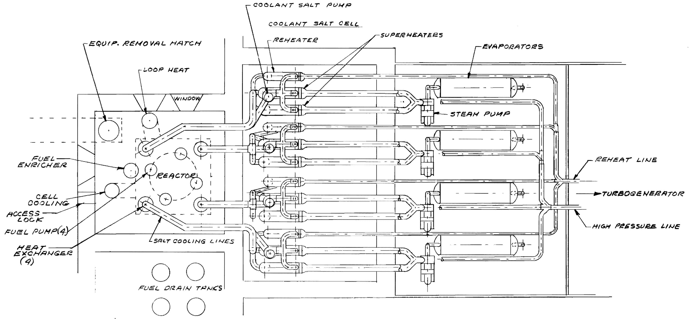  
$= {10}^{2} - {0}^{2}$

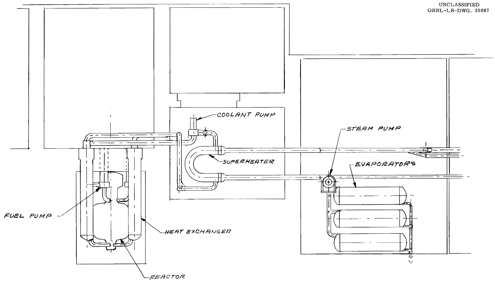  
MOLTEN SALT POWER REACTOR PLANT

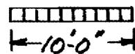  
FIGURE 2 - ELEVATION VIEW - 760 MW (t) GRAPHITE MODERATED

eight inch square pitch form the fuel passages. The core is mounted in a 1-1/2" thick INOR-8 container. Fuel enters at the bottom and passes through the fuel passages and a two inch annulus between the core and shell which cools the shell. At the top of the reactor is the fission gas holdup dome described elsewhere. This is shown in Figures 3 and 4.

From the reactor, the fuel goes to centrifugal pumps of which there are four in parallel. The lower bearing is salt-lubricated, submerged in the fuel above the impeller. Above the fuel surface is a shielding section, to protect the upper bearing lubricant and motor. The bearing includes a radial bearing, a thrust bearing, and a face seal. The motor rotor is on the shaft above the bearing. The rotor is canned, so the field windings may be replaced without breaking the reactor seal. Cooling is provided for the shielding section and the shaft. The entire pump may be removed and replaced as a unit.

The coolant salt pump is of a similar design, with modifications permitted by the lower radiation level.

The primary exchangers are of the bayonet bundle type, to permit semidirect replacement. The incoming coolant passes through the center of the exchanger to bottom, then upward on the shell side through the exchanger, leaving in an annulus surrounding the incoming coolant. Helical tubes are between flat tube sheets.

# 3. Off-Gas System

An efficient process for the continuous removal of fission-product gases is provided that serves several purposes. The safety in the event of a fuel spill is considerably enhanced if the radioactive gas concentration in the fuel is reduced by stripping the gas as it is formed. Further, the nuclear stability of the reactor under changes of power level is improved by keeping the high cross section $\mathrm{Xe}^{135}$ continuously at a low level. Finally, many of the fission-product poisons are, in their decay chains, either noble gases for a period of time or end their decay chains as stable noble gases, and therefore the buildup of poisons is considerably reduced by gas removal.

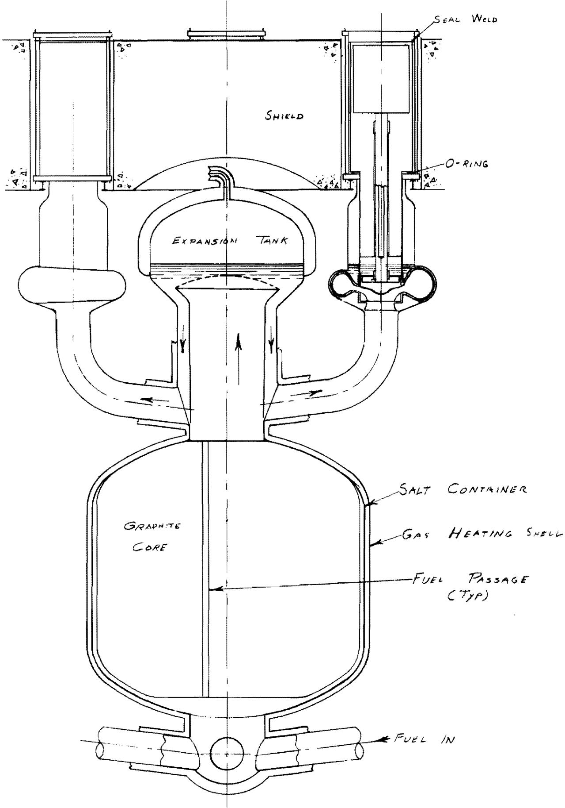  
FIG. 3

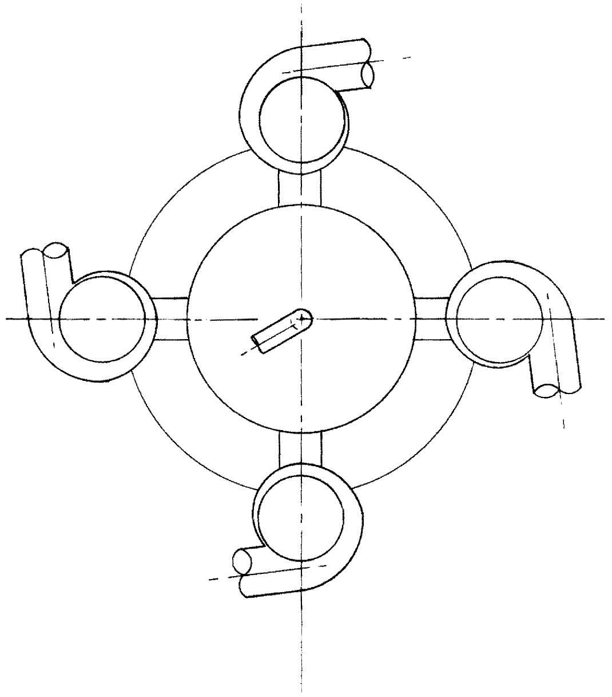

The solubilities of noble gases in some molten salts are given in Table 2, and it is indicated that solubilities of similar orders of magnitude are likely to be found in the LiF-BeF $_2$ salt of this study. It was found that the solubility obeys Henry's law, so that the equilibrium solubility is proportional to the partial pressure of the gas in contact with the salt. In principle, the method of fission-gas removal consists of providing a quiet free-surface from which the gases can be liberated.

In the system chosen, approximately $50\%$ of the fuel flow is allowed to flow into the reactor expansion tank. The tank provides a large fuel-to-gas interface, which promotes the establishment of equilibrium fission gas concentrations in the fuel. The expansion tank provides a liquid surface area of approximately $52\text{ft}^2$ for removal of the entrained fission gases. The gas removal is effected by the balance between the difference in the density of the fuel and the gases and the drag of the opposing fuel velocity. The surface velocity downward in the expansion tank is approximately 0.75 ft/sec, which should screen out all bubbles larger than 0.06 in. in radius. The probability that bubbles of this size will enter the reactor is reduced by the depth of the expansion tank being sufficient to allow time for small bubbles to coalesce and be removed.

Table 2 SOLUBILITIES AT $600^{\circ}C$ AND HEATS OF SOLUTION FOR NOBLE GASES IN MOLTEN FLUORIDE MIXTURES   

<table><tr><td>Gas</td><td>In NaF-ZrF4(53-47 mole %)k*</td><td>In LiF-NaF-KF(46.5-11.5-42 mole %)k*</td><td>In LiF-BeF2(64-36 mole %)k*</td></tr><tr><td></td><td>x 10-8</td><td>x 10-8</td><td>x 10-8</td></tr><tr><td>Helium</td><td>21.6 ± 1</td><td>11.3 ± 0.7</td><td>11.55 ± 0.07</td></tr><tr><td>Neon</td><td>11.3 ± 0.3</td><td>4.4 ± 0.2</td><td>4.7 ± 0.02</td></tr><tr><td>Argon</td><td>5.1 ± 0.15</td><td>0.90 ± 0.05</td><td>0.98 ± 0.02</td></tr><tr><td>Xenon</td><td>1.94 ± 0.2</td><td>-</td><td>.28 (estimated)</td></tr></table>

* Henry's law constant in moles of gas per cubic centimeter of solvent per atmosphere.

The liquid volume of the fuel expansion tank is approximately 50 ft³ and the gas volume is approximately 240 ft³. With none of the fission gases purged, approximately 3300 kw of beta heating from the decay of the fission gases and their daughters is deposited in the fuel and on metal surfaces of the fuel expansion tank. This 3300 kw of heat is partly removed by the bypass fuel circuit and the balance is transferred through the expansion tank walls to the secondary loop coolant.

The fission product gases will cause the gas pressure in the reactor to rise approximately 5 psi per month. This pressure is relieved by bleeding the tank once a month at a controlled rate of approximately 5 psi per day to a hold tank. (See Figure 5.) The gases in the hold tank are held until they have decayed sufficiently to be disposed of either through a stack or a noble gas recovery system.

A small amount of fission gases will collect above the free surface of each pump. These gases are continuously purged with helium. The purge gases from the pumps are delayed in a hold volume for approximately 5 hours to allow a large fraction of the shorter lived fission products to decay before entering the cooled carbon beds. The carbon beds provide a holdup time of approximately 6 days for krypton and much longer for the xenon. The purge gases from the carbon beds, essentially free from activity, are compressed and returned to the reactor to repeat the cycle.

# 4. Molten Salt Transfer Equipment

The fuel transfer systems are shown schematically in Figure 6. Fluid is transferred between the reactor and drain tanks through a pressure-siphon system. Two mechanical valves, in series, are placed in this line with a siphon-breaking connection between them. Fluid is transferred from one system to another by isolating the siphon-breaker and applying differential gas pressure to establish flow and finally complete the transfer. When the gas equalizing valves in the siphon-breaker circuit are opened the fluid will drain out of the transfer line and the valves are then closed.

UNCLASSIFIED

ORNL-LR-DWG. 35090

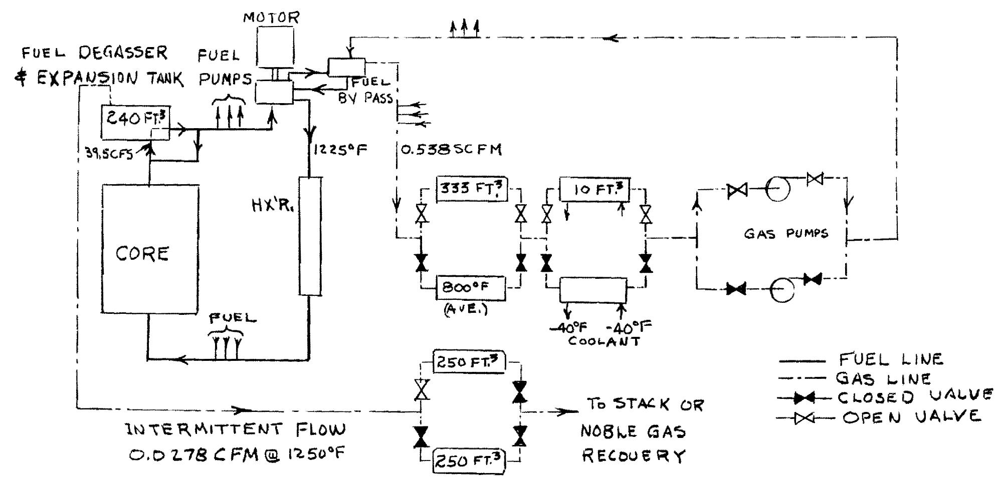  
FIG.5 - SCHEMATIC FLOW DIAGRAM FOR REMOVAL OF FISSION PRODUCT GASES,

Fig. 6 SCHEMATIC DIAGRAM OF MAIN FUEL SALT TRANSFER SYSTEM.   
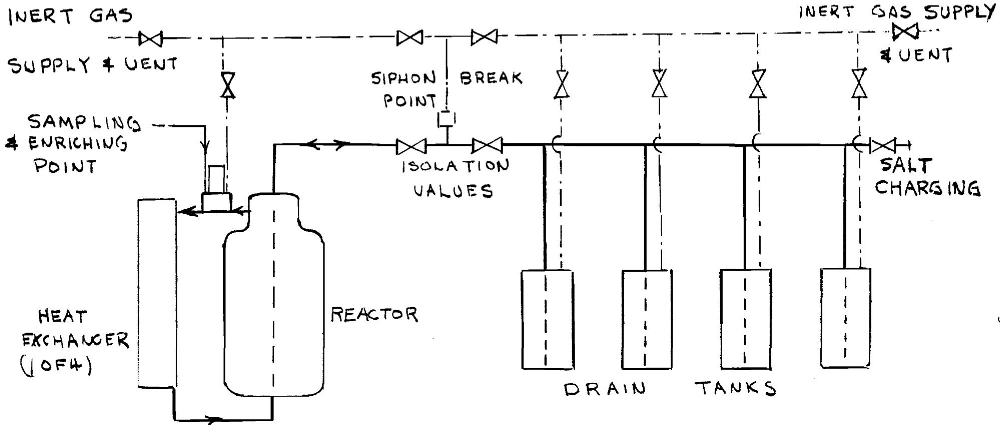  
LEOGEN   
FUEL LINE   
GASLINE   
—REMOTE LVI  
OPERATEDVALUE

Normally the isolation valves are dry and when the gas equalizing systems at the siphon-breaker point are open fluid cannot rise to the isolation valves even though they are open or leaking.

The volume between the two isolation valves is designed to be an inert gas buffered region to effectively isolate the molten fuel in the drain vessels when the reactor system must be opened for maintenance operations.

The fuel added to the reactor will have a high concentration of $\mathrm{U}^{235}\mathrm{F}_4$ , with respect to the process fuel, so that additions to overcome burnup and fission product buildup will require only small volume transfers.

Solid $\mathbf{U}^{235}\mathbf{F}_4$ or highly concentrated $\mathbf{U}^{235}\mathbf{F}_4$ in an alkali metal fluoride mixture in the solid or liquid state could be added to the fuel system. Solid additions would be added through a system of "air locks" over a free surface of fuel, while the liquid additions would be made from a heated vessel from which fluid is displaced by a piston to meter the quantity transferred.

Samples of the fuel would be withdrawn from the fuel system by the "thief sampler" principle which in essence is the reverse of a solid fuel addition system.

# 5. Heating Equipment

The melting points of the process salts are well above room temperature. It is therefore necessary to provide a means of heating all pipes and equipment containing these fluids.

For the most part high temperature gas circulation will be employed to heat the major fuel components and conventional electric heater-insulation installations will be used to heat the remainder of the systems. Gas blower and heater packages are installed so that they may be removed and replaced as a unit thus easing the maintenance problem as compared to direct electric heater installations.

# 6. Auxiliary Cooling

Cooling is provided in the reactor cell to remove the heat lost through

the pipe insulation and the heat generated in the structural steel pipe and equipment supports by gamma-ray absorption. The heat is removed by means of forced gas circulation through radiator-type space coolers. A cooling medium, such as Dowtherm, in a closed loop removes heat from the space coolers and dumps it to a water heat exchanger. Gas blower and cooler packages are installed so that they may be removed and replaced as a unit.

# 7. Remote Maintenance

The major requirement for maintenance of the reactor is the ability to remove and replace the pumps and heat exchangers. These are designed so that they may be removed through plugs in the top shield by a combination of direct and remote maintenance methods.

The removable parts of this equipment are suspended from removable plugs in the top shield, as shown in Figure 3. The primary reactor salt container seal is made with a buffered metal O ring seal backed up by a seal weld at the top of the shield.

The room at the top of the reactor is sealed and shielded to safely contain the radioactive equipment that is removed, and is provided with a crane, boom mounted manipulators and viewing windows.

When it has been ascertained that a piece of equipment should be replaced, the reactor will be shut-down and drained and the faulty equipment will be removed according to the following procedure.

The plug clamp bolts will be removed, the seal weld cut, all electrical and instrument connections will be broken, the crane will be attached and in the case of a heat exchanger, the secondary coolant lines will be cut by direct means. After this has been accomplished and all personnel has left the room, the equipment will be withdrawn into a plastic bag or metal container and dropped through the transfer hatch into a storage coffin. The spare equipment will then be dropped into place, and the room purged of any fission gas that may have escaped during the removal operation. It will now be possible to enter and make the seal weld and all other connections directly.

Boom mounted manipulators, that can cover the entire area of the room are provided to assist in the remote operations and for emergencies.

# 8. Fuel Fill-and-Drain System

A fuel fill-and-drain system has been provided to serve as a molten salt storage facility before the plant is started and as a drain system when the fuel process circuits have to be emptied after the reactor has been in operation.

The draining operation has not been considered as an emergency procedure which must be accomplished in a relatively short time to prevent a catastrophe. In the unlikely event that all heat removal capability is lost in the process system, the fuel temperature would not rise to extreme levels, $1600^{\circ}\mathrm{F}$ or greater, in less than one hour. There could be an incentive to remove the fuel from the process system as fast as possible to prevent contamination in the event of a leak. Considering any reasonable drain time there is substantial after-heat production and the drain system must have a heat removal system.

The drain vessel and heat removal system is shown in Figure 7. The fused salt is contained in a cylindrical tank into which a number of bayonet tubes are inserted. These tubes are welded to the upper tube sheet and serve as the primary after-heat removal radiating surface. In addition they contribute substantial nuclear poison to the geometry.

The water boiler, which is operated at low pressure, is of the Lewis type and is inserted into the vessel from the top. The radiant heat exchanger heat transfer system results in double contingency protection against leakage of either system.

Electric heaters are installed around the outside of the vessel for pre-heating. During the pre-heat cycle the boiler would be dry and the boiler tubes would be at temperatures above the melting point of the fuel. If after-heat is to be removed from the fuel, the heaters would be turned off and water admitted to the system through the inner boiler tube. This water

UNCLASSIFIED ORNL-LR-DWG. 35092

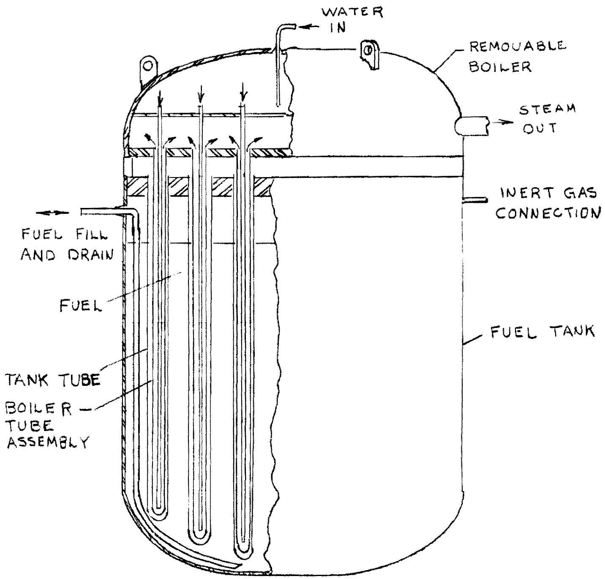  
FIG7- DRAIN TANK FOR FUEL SALT

would be introduced at a slow rate so that it would be flashed to steam. The steam would then cool the outer boiler tube and the boiler would be gradually flooded with water for a maximum heat removal rate.

The rate of heat removal could be controlled by varying the water rate in the boiler or by segregating the boiler tubes into sections, thus varying the effective area of the heat transfer system.

A leak in one of the bayonet tubes in the drain tank could be contained within the vessel shell by maintaining the gas pressure above the fuel below a value that would elevate the liquid to the tube sheet level.

The entire boiler system may be removed or inserted from overhead without disturbing the fuel system. A leaky fuel tube could be plugged at the tube sheet without removal of the vessel. Heaters may be installed or removed from overhead and only failure of the vessel wall would necessitate complete removal of the unit.

Four tanks, 7 ft in diameter by 10 ft high, would be required to handle the fuel inventory. The boiler system would have to be designed to remove a maximum of 8 megawatts of heat. Approximately 80 pipes 4 inches in diameter would have to be installed in each vessel to achieve this capacity.

# 9. Heat Transfer Systems

Heat is transferred from the fuel to the steam by a circulating molten salt. The selected salt, a mixture of $65\%$ LiF- $35\%$ BeF $_2$ , is completely compatible with the fuel and does not cause activation in the secondary cell. Thus, after a few minutes delay for the 11 second-fluorine activity to decay, the secondary cell can be entered for direct maintenance.

Four systems in parallel remove heat from the reactor fuel; each is independent up to the point where the superheated steam flow paths join ahead of the turbine. Figure 8 is a flow diagram of the system.

Each coolant salt circuit has one pump. The flow of the hot salt from the pump is divided between 2 superheaters and 1 reheater, joining again ahead of the primary exchanger. No valves are required in the salt circuit,

# UNCLASSIFIED

# ORNL-LR-DWG. 35093

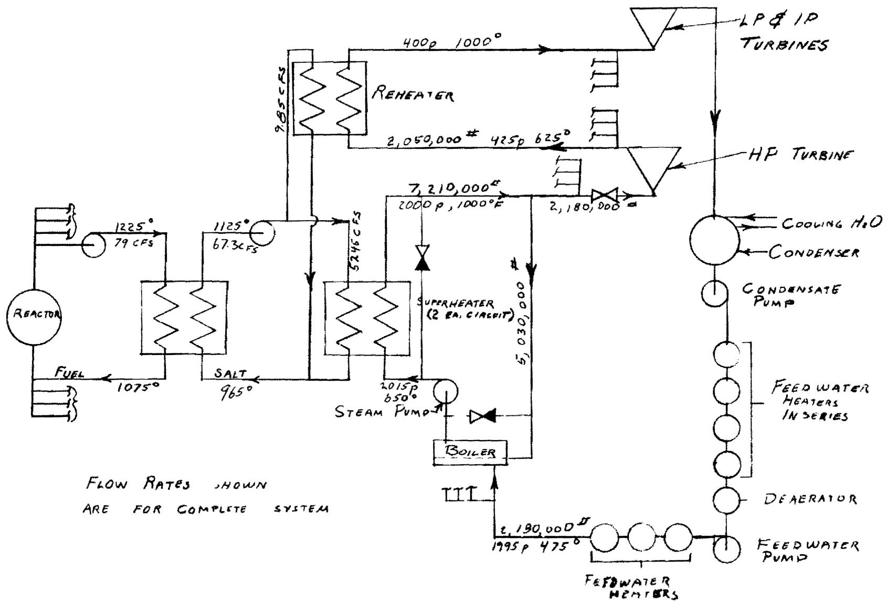  
FiO. 8 Flow Diagram

as control can be achieved by variations of the steam flow.

The primary exchangers are of the bayonet bundle type, to permit semi-direct replacement. The superheaters are of U-tube in U-shell, while the reheaters are of straight tube construction. The steam generators are horizontal drums, 4 foot diameter by 24 feet long, with 3-1/2 inch walls. These are half-filled with water, into which the steam nozzles project for direct contact heat transfer. Recirculation of steam provides the heat for generation of steam.

Heat exchanger data is summarized in Table 3.

# 10. Turbine and Electric System

Steam at 2000 PSIA and $1000^{\circ}\mathrm{F}$ , with reheat to $1000^{\circ}\mathrm{F}$ , is supplied to the 333-Mw-rated turbine, which has a single shaft, with 4 exhaust ends. The turbine heat rate is estimated to be 7670 BTU/kwh, for a cycle efficiency of 44.7%. The generator and station heat rates are, respectively, 7785 and 8225 BTU/kwh. The supply to the bus-bar is 315 Mw. These estimates are based on Tennessee Valley Authority heat balances for a similar turbine (1), with adjustments for the modified steam condition (2) and different plant requirements of the molten salt reactor system.

# 11. Nuclear Calculations

A number of age theory thermal reactor calculations were made to survey the nuclear characteristics of graphite-moderated molten salt reactors (3). In all cases the salt was of the composition $\mathrm{Li}^{7}\mathrm{F}-\mathrm{BeF}_{2}-\mathrm{UF}_{4}$ (70-10-20 mole %), and was located in cylindrical channels spaced on an 8 inch center-to-center square array. The volume percent of fuel in the reactor core was varied and calculations were made for k = 1.05 and l.l0. The calculations yielded the percentage of U-235 required in the initial inventory of uranium, the dimensions of the reactor required for k effective to be equal to one, and the initial conversion ratio. Table 4 gives the results of the calculations.

Table 3 - DATA FOR HEAT EXCHANGERS   

<table><tr><td>Fuel and Sodium to Sodium Exchangers</td><td colspan="2">Primary System</td><td colspan="2">Superheater</td><td colspan="2">Reheater</td></tr><tr><td>Number required</td><td colspan="2">4</td><td colspan="2">8</td><td colspan="2">4</td></tr><tr><td>Fluid</td><td>fuel salt</td><td>coolant salt</td><td>coolant salt</td><td>steam</td><td>coolant salt</td><td>steam</td></tr><tr><td>Fluid location</td><td>tubes</td><td>shell</td><td>shell</td><td>tubes</td><td>shell</td><td>tubes</td></tr><tr><td>Type of exchanger</td><td colspan="2">bayonet bundle</td><td colspan="2">U-tube in U-shell counterflow</td><td colspan="2">straight counterflow</td></tr><tr><td>Temperatures</td><td></td><td></td><td></td><td></td><td></td><td></td></tr><tr><td>Hot end,0F</td><td>1225</td><td>1125</td><td>1125</td><td>1000</td><td>1125</td><td>1000</td></tr><tr><td>Cold end,0F</td><td>1075</td><td>965</td><td>965</td><td>650</td><td>965</td><td>620</td></tr><tr><td>Change</td><td>150</td><td>160</td><td>160</td><td>350</td><td>160</td><td>380</td></tr><tr><td>ΔT, hot end,0F</td><td colspan="2">100</td><td colspan="2">125</td><td colspan="2">125</td></tr><tr><td>ΔT, cold end,0F</td><td colspan="2">110</td><td colspan="2">315</td><td colspan="2">335</td></tr><tr><td>ΔT, log mean,0F</td><td colspan="2">105</td><td colspan="2">207</td><td colspan="2">213</td></tr><tr><td>Tube Data</td><td></td><td></td><td></td><td></td><td></td><td></td></tr><tr><td>Material</td><td colspan="2">INOR-8</td><td colspan="2">INOR-8</td><td colspan="2">INOR-8</td></tr><tr><td>Outside dia, in.</td><td colspan="2">0.500</td><td colspan="2">0.750</td><td colspan="2">0.750</td></tr><tr><td>Wall thickness, in.</td><td colspan="2">0.049</td><td colspan="2">0.083</td><td colspan="2">0.065</td></tr><tr><td>Length, ft</td><td colspan="2">21.8</td><td colspan="2">23</td><td colspan="2">17.5</td></tr><tr><td>Number</td><td colspan="2">3173</td><td colspan="2">925</td><td colspan="2">750</td></tr><tr><td>Pitch, in.</td><td colspan="2">0.638 (口)</td><td colspan="2">1.00 (△)</td><td colspan="2">1.00 (△)</td></tr><tr><td>Bundle dia, in.</td><td></td><td></td><td colspan="2">33</td><td colspan="2">28</td></tr><tr><td>Exchanger dimensions</td><td colspan="2">50.75 in. dia x 17.5 ft long</td><td colspan="2">81.2</td><td colspan="2">27.6</td></tr><tr><td>Heat transfer capacity, Mw</td><td colspan="2">190</td><td></td><td></td><td></td><td></td></tr><tr><td>Heat transfer area, ft2</td><td colspan="2">5830</td><td></td><td>3315</td><td></td><td>2100</td></tr><tr><td>Average heat flux, 1000 Btu/hr·ft2</td><td colspan="2">111</td><td></td><td>84</td><td></td><td>45</td></tr><tr><td>Thermal stress*, psi</td><td colspan="2">2000</td><td colspan="2">6100</td><td colspan="2">4600</td></tr><tr><td>Flow rate, ft3/sec, 1000 lb/hr</td><td>19.8</td><td>16.8</td><td>7.18</td><td>901</td><td>2.46</td><td>512</td></tr><tr><td>Fluid velocity, ft/sec</td><td colspan="2">8.80</td><td></td><td></td><td></td><td></td></tr><tr><td>Max Reynolds modulus/1000</td><td>10.0</td><td>4</td><td></td><td>265</td><td></td><td>270</td></tr><tr><td>Pressure drop, psi</td><td>47.6</td><td>16.5</td><td>23</td><td>13</td><td>23</td><td>12.5</td></tr></table>

Table 4   

<table><tr><td rowspan="2">Case</td><td rowspan="2">Vol fraction of fuel in core F</td><td rowspan="2">k</td><td rowspan="2">% Enrichment of uranium e</td><td colspan="2">Dimension of Unreflected cylindrical reactor</td><td rowspan="2">Initial Conversion ratio ICR</td></tr><tr><td>D (ft)</td><td>H (ft)</td></tr><tr><td>1</td><td>0.05</td><td>1.05</td><td>1.30</td><td>26.3</td><td>24.3</td><td>0.55</td></tr><tr><td>2</td><td>0.05</td><td>1.10</td><td>1.45</td><td>17.9</td><td>16.4</td><td>0.49</td></tr><tr><td>3</td><td>0.075</td><td>1.05</td><td>1.25</td><td>24.0</td><td>22.2</td><td>0.63</td></tr><tr><td>4</td><td>0.075</td><td>1.10</td><td>1.39</td><td>16.6</td><td>15.3</td><td>0.58</td></tr><tr><td>5</td><td>0.10</td><td>1.05</td><td>1.28</td><td>22.4</td><td>20.8</td><td>0.71</td></tr><tr><td>6</td><td>0.10</td><td>1.10</td><td>1.46</td><td>15.6</td><td>14.3</td><td>0.65</td></tr><tr><td>7</td><td>0.15</td><td>1.05</td><td>1.53</td><td>20.5</td><td>18.9</td><td>0.80</td></tr><tr><td>8</td><td>0.15</td><td>1.10</td><td>1.80</td><td>14.3</td><td>13.1</td><td>0.73</td></tr><tr><td>9</td><td>0.20</td><td>1.05</td><td>2.24</td><td>19.4</td><td>18.0</td><td>0.86</td></tr><tr><td>10</td><td>0.20</td><td>1.10</td><td>2.88</td><td>13.5</td><td>12.4</td><td>0.79</td></tr><tr><td>11</td><td>0.25</td><td>1.05</td><td>4.36</td><td>18.8</td><td>17.4</td><td>0.90</td></tr><tr><td>12</td><td>0.25</td><td>1.10</td><td>7.05</td><td>13.1</td><td>12.0</td><td>0.82</td></tr></table>

Case 8 of this table is quite similar to the reactor that forms the design basis of this study. The nuclear performance of the actual reactor design chosen for this study was calculated by the multigroup code Cornpone on the ORACLE. The neutron balance obtained under initial conditions is given in Table 5 below. Also given are the inventories of materials, based on a total fuel balance inside the reactor and in the external circuit of 900 cubic feet. It should be noted that the enrichment of U-235 predicted by the machine calculation is $1.3\%$ vs the $1.8\%$ of case 8, Table 4, and the conversion ratio is 0.79 instead of 0.73. The lower enrichment requirement results from the higher value of eta and some reflection.

The long term performance of the reactor was calculated for a case, assuming an initial inventory of U-235 of 700 kg and an initial breeding ratio of 0.73.

Table 5   
NUCLEAR CHARACTERISTICS   

<table><tr><td>Element</td><td>Inventory (kg)</td><td>Neutron Absorption</td></tr><tr><td>U-235</td><td>717</td><td>1.000</td></tr><tr><td>U-238</td><td>55,000</td><td>0.790</td></tr><tr><td>Li</td><td>5,760</td><td>0.053</td></tr><tr><td>Be + C</td><td>-</td><td>0.031</td></tr><tr><td>F</td><td>37,900</td><td>0.026</td></tr><tr><td>Leakage</td><td>-</td><td>0.166</td></tr><tr><td>eta</td><td></td><td>2.07</td></tr><tr><td>Conversion ratio</td><td></td><td>0.79</td></tr></table>

Table 6   
CROSS SECTIONS USED FOR REACTOR LIFETIME CALCULATIONS   

<table><tr><td>Element</td><td>Effective Cross Section barns</td><td>Neutron Yield η</td><td>Capture to Fission Ratio α</td></tr><tr><td>U-235</td><td>605</td><td>2.029</td><td>0.23</td></tr><tr><td>U-236</td><td>25</td><td></td><td></td></tr><tr><td>U-238</td><td>2.5</td><td></td><td></td></tr><tr><td>Pu-239</td><td>1903</td><td>1.84</td><td>0.58</td></tr><tr><td>Pu-240</td><td>3481</td><td></td><td></td></tr><tr><td>Pu-241</td><td>1702</td><td>2.23</td><td>0.36</td></tr><tr><td>Pu-242</td><td>491</td><td></td><td></td></tr></table>

The calculation was made by an adaptation of the method described by Spinrad, Carter, and Eggler $^{(4)}$ . The buildup of U-236, Pu-239, Pu-240, Pu-241, Pu-242, and fission products was calculated as a function of the integrated flux-time variable. The reactor was kept critical by additions of U-235.

The cross sections of the heavy isotopes were taken as a consistent set from the 1958 Geneva Conference Paper P/1016(5) and are given in Table 6. For this long burnup reactor, the fission product cross sections were taken as a function of time based on the calculations of Blomeke and Todd(6). Xenon-135 was considered to be removed continuously, but all other fission products retained. In the early phases of reactor operation this amounted to an initial $1.3\%$ poison plus about 48 barns per fission. The rate of fission product poisoning then tapered off to about 18 barns per fission, a value that was assumed for the remainder of the reactor lifetime. This latter value is consistent with that proposed by Weinberg(7).

Figure 9 shows the accumulative addition of U-235 required to keep the reactor critical. In the first few months the value is negative, that is, U-235 should be removed from the reactor. In actual practice the extra reactivity would be controlled by adding high cross-section burnable poisons, or possibly by control rods. After the first few years the addition of U-235 is about linear, and at the end of 32.5 years some $4100\mathrm{kg}$ have been added.

Figure 10 shows the inventories of fissionable isotopes as a function of time. After seven years of operation, the inventory of U-235 starts to rise above its initial value and is approximately twice its initial value after 32.5 years of operation. It is evident that, on the basis of these nuclear calculations, the fuel could be retained in the reactor without reprocessing for the life of the reactor. The calculations are open to the criticism that epithermal absorptions by fission products are neglected and they might be important as they build up to high concentrations. The effect will probably be small during the first ten years of operation, however.

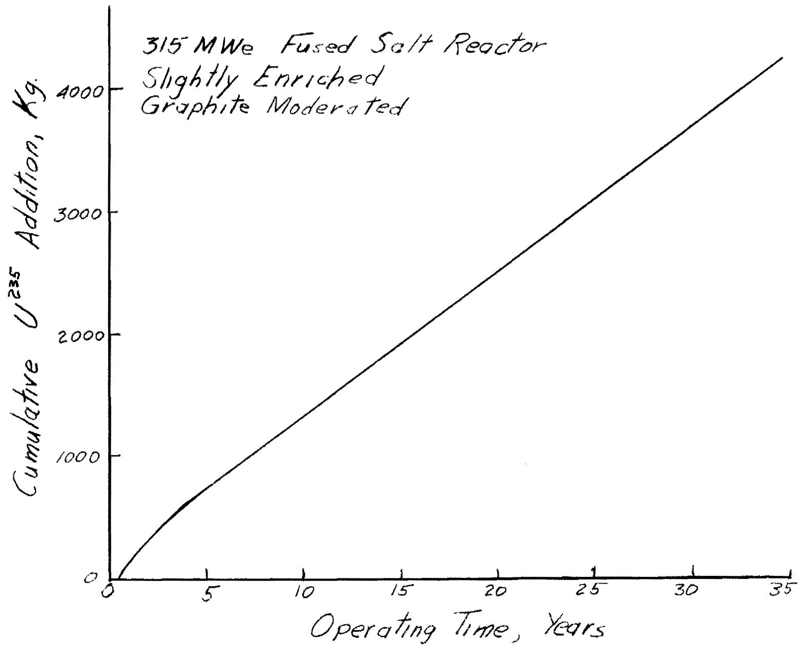  
UNCLASSIFIED ORNL-LR-DWG. 35094   
Figure 9 - Cumulative $U^{2.3.5}$ Addition vs Operating Time

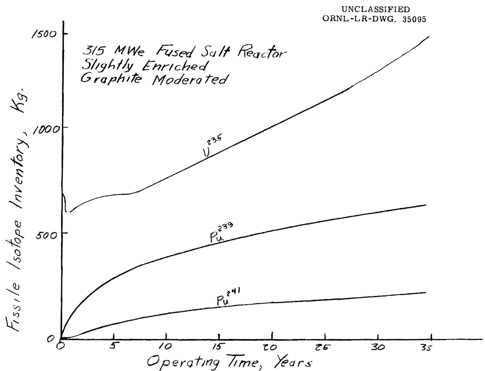  
Figure 10-Fissile Isotope Inventory vs. Operating Time

# 12. Fuel Cycle Costs

The fuel cycle cost has been calculated by C. E. Guthrie on the basis of the nuclear calculations and is given in Figure 11. In each case the cost is based on a uniform rate that is the sum of current charges and the amount that would be placed in a sinking fund to take care of future expenditures. The calculations include use charges of $4\%$ on the inventory, cost of burnup of U-235, and the cost of replacement of the base salt including its Li-7 content. The upper curve does not assume recovery of the U-235 and Pu inventories at the end of the operation, while the lower curve assumes recovery of the fissionable isotopes.

This recovery would take place at some central processing plant where the operations are on large enough scale to assure uranium processing costs of no more than $\$ 100/$ kg of uranium, including transportation of the frozen fuel salt to the processing plant. Such costs of processing seem entirely reasonable $^{(8)}$ . With fissionable isotope recovery, the fuel cycle costs would be about 1.25 mills/kwh at a cycle time of 5 years, 1.1 mills/kwh at a cycle time of 10 years or 1.0 mills/kwh for a 20 year cycle time. At the end of this cycle time the sinking fund accumulated plus the value of the accumulated fissionable isotopes would pay for the purchase of a new batch of base salt and for the cost of recovery of fissionable isotopes from the old salt.

The practical life of the fuel without any processing other than removal of fission gases is probably limited by the solubility of rare earth fission products, since when they start to precipitate they will carry plutonium down with them. The solubility of rare earth fluorides in this fuel salt has not been determined, but if the solubility is as low as in the $\mathrm{LiF - BeF_2}$ base salt, it could limit operation to as little as three years of operation, which would indicate a fuel cycle cost of about 1.5 mills/kwh.

From analogy with the $\mathrm{ZrF}_{4}$ base salts, the rare earth fluorides may be considerably more soluble in the $20\%$ $\mathrm{UF}_{4}$ salt than in the $\mathrm{LiF - BeF}_{2}$ base salt; this will be determined. If the rare earth solubility is low, it could pro

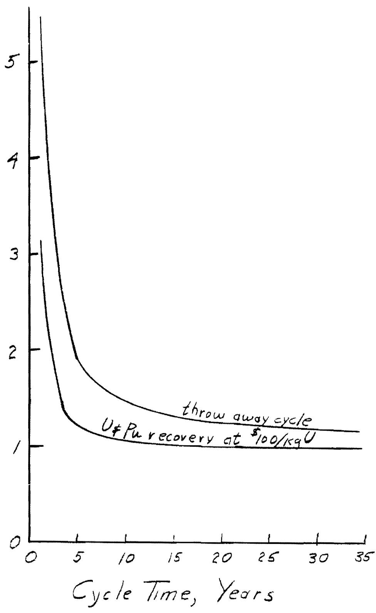  
Fuel Cycle Cost, Mill/s/kwh   
Figure 11 - Fuel Cycle Cost vs. Cycle Time

315 MWe Fused Salt Reactor

vide a means of keeping the rare earth fission products, which provide a high percentage of the fission product poisoning, from accumulating. A device similar to a sampler could be suspended in the salt maintaining a surface at a lower temperature than at any point in the salt circuit. This would accumulate a rare earth fission product precipitate (containing some $\mathsf{PuF}_3$ ) which could be withdrawn through locks in the same manner as the regular samples, and provide a concentrated product for shipment to a Pu recovery plant.

From the above discussion we feel that it is reasonable to assume a fuel cycle cost in the range of from 1.0 to 1.5 mills/kwh. Considering that this plant will not be built until several more years of research and development have elapsed, a figure of 1.1 mills/kwh seems reasonable.

# 13. Capital Costs

The capital cost summary is presented in Table 7. It should be noted that a $40\%$ contingency factor has been applied to the reactor portion of the system. A contingency value of this order is warranted because of the number of uncertainties in the large components. A $7.5\%$ contingency factor was applied to the remainder of the direct costs.

The general expense item charged to the plant was set at 16-1/2% of the direct costs and the design charges were set at 5% of the same value. The total capital cost of the plant leads to a value of $252 per kilowatt of generating capacity.

Table 8 presents a more detailed cost breakdown of the reactor portion of the plant. The major items have been listed and in some cases an indication of the basis for the evaluation has been presented.

# 14. Power Costs

Power costs have been divided into three categories. These are: fixed costs, operating and maintenance costs, and fuel cycle costs.

Table 7

CAPITAL COSTS

10. Land and land rights 500,000   
11. Structures and improvements 7,250,000   
13. A. Reactor systems 23,790,000

B. Steam system (less major Ioeffler components)

14. Turbine-generator plant 14,000,000   
15. Accessory electrical equipment 4,600,000   
Miscellaneous equipment 1,300,000

$ 55,440,000

7.5% contingency on 10, 11, 13B, 14, 15, and 16

2,370,000

40% contingency on 13A

9,520,000

Contingency Subtotal 11,890,000

18. General expense 9,150,000

Design costs

2,770,000

Total Cost 79,250,000

Table 8

REACTOR SYSTEM CAPITAL COST SUMMARY

# I. Fuel System

A. Core (12.5 ft x 12.5 ft right cylinder)  
Reactor vessel at $\phi 10/1b$ 515,000  
Graphite at $\phi 4/1b$ 685,000  
Inspection, assembly, etc. 200,000

1,400,000

B. Four fuel pumps including drives and shielding $(\sim 9,000$ gpm each) 2,000,000   
C. Four fuel-to-salt heat exchangers at $50/ft² having 5830 ft² each 1,170,000   
D. Piping 150,000   
E. Main fill-and-drain system 750,000   
F. Off-gas system 200,000   
G.Enriching system 250,000   
H. Preheating and insulation 150,000

Subtotal 6,050,000

# II. Coolant System

A. Four pumps 1,200,000   
B. Eight coolant-to-steam superheaters at 80/ft² having 3315 ft² each 2,120,000   
C. Four coolant-to-steam reheaters at $\$ 80/\mathrm{ft}^2$ having 2100 ft $^2$ each 670,000   
D. Piping 500,000   
E. Fill and drain 500,000   
F. Preheating and insulation 200,000

Subtotal 5,190,000

# III. Ioeffler Components

A. Four steam pumps and drives at $\$ 50$ /cfm
6,000 cfm each
1,200,000   
B. Twelve evaporator drums 1,350,000
1082 ft² (total liberating surface in a 4 ft dia)
drums at $5000/linear ft 1082 x 5000
Subtotal 2,550,000

IV. Concrete Shielding $(\sim 20,000\mathrm{yd}^3)$ 2,000,000

V. Main Containment Vessel 500,000

VI. Instrumentation 750,000

VII. Remote Maintenance Equipment 1,000,000

VIII. Auxiliary Systems 500,000

Table 8 - continued   

<table><tr><td colspan="2">IX. Spare Parts</td></tr><tr><td>Fuel pump rotary element</td><td>200,000</td></tr><tr><td>Salt pump rotary element</td><td>120,000</td></tr><tr><td>Fuel heat exchanger</td><td>300,000</td></tr><tr><td>Salt-steam superheater</td><td>265,000</td></tr><tr><td>Salt-steam reheater</td><td>165,000</td></tr></table>

<table><tr><td>X.</td><td colspan="2">Original Fluid Inventories</td></tr><tr><td></td><td>Fuel salt - 900 ft3required at $1500/ft3</td><td>1,350,000</td></tr><tr><td></td><td>Coolant salt - 1900 ft3required at $1500/ft3</td><td>2,850,000</td></tr><tr><td></td><td colspan="2">Reactor Systems Total Cost</td></tr></table>

1,050,000

4.200.000

Reactor Systems Total Cost 23,790,000

The fixed costs are the charges resulting from the capital investment in the plant. This amount was set at $14\%$ per annum of the investment, which included taxes, insurance, and financing charges.

The annual operating and maintenance expenditure was assumed to consist of the following:

<table><tr><td></td><td>Annual Charge</td></tr><tr><td>Labor and Supervision</td><td>$ 900,000</td></tr><tr><td>Reactor System Spare Parts</td><td>1,000,000</td></tr><tr><td>Remote-Handling Equipment</td><td>400,000</td></tr><tr><td>Conventional Supplies</td><td>400,000</td></tr><tr><td>TOTAL Annual Expenditure</td><td>$2,700,000</td></tr></table>

The fuel cycle costs are discussed elsewhere and the three contributing categories add up as follows:

<table><tr><td></td><td>Annual Charge</td><td>mills/kwh</td></tr><tr><td>Fixed Cost</td><td>$11,100,000</td><td>5.04</td></tr><tr><td>Operating and Maintenance</td><td>2,700,000</td><td>1.22</td></tr><tr><td>Fuel Charges</td><td>2,400,000</td><td>1.10</td></tr><tr><td>TOTAL Annual Charge</td><td>$16,200,000</td><td></td></tr><tr><td>TOTAL Power Cost</td><td></td><td>7.36*</td></tr></table>

* Based on an 80% plant factor.

# References

1. The data used were for Units Nos. 3 and 4, the Gallatin Steam Plant, Gallatin, Tennessee.   
2. Reese, H. R. and Carlson, J. R., "The Performance of Modern Turbines", Mech. Engr., March 1952, p. 205   
3. MacPherson, H. G., ORNL-CF-58-10-60, "Survey of Low Enrichment Molten-Salt Reactor", October 17, 1958.   
4. Progress in Nuclear Energy, Vol. VIII, pp. 289-320, McGraw-Hill (1957)   
5. Pigford, T. H., Benedict, M., Shanstrom, R. T., Loomis, C. C., and Van, Ommesloghe, B., "Fuel Cycles in Single-Region Thermal Power Reactors", Conf. 15/P/1016, June 1958.   
6. Blomeke, J. O., and Todd, Mary F., "U-235 Fission Product Production as a Function of the Thermal Neutron Flux Irradiation Time and Decay Time", ORNL-2127 (1958)   
7. Progress in Nuclear Energy, Vol. VIII, p. 282, McGraw-Hill (1957).   
8. See ORNL-CF-59-1=13, Guthrie, C. E., "Fuel Cycle Costs in a Graphite Moderated Slightly Enriched Fused Salt Reactor."

# Distribution

1. L. G. Alexander   
2. M. Bender   
3. E. S. Bettis   
4. A. L. Boch   
5. W. F. Boudreau   
6. E. J. Breeding   
7. R. A. Charpie   
8. W. R. Grimes   
9. W.H. Jordan   
10. B. W. Kinyon   
ll. M. E. Lackey   
12. J. A. Lane

13-37. H. G. MacPherson

38. E. R. Mann   
39. L. A. Mann   
40. W. B. McDonald   
41. A. J. Miller   
42. J. W. Miller   
43. H. W. Savage   
44. A. W. Savolainen   
45. J. A. Swartout   
46. A. Taboada   
47. F. C. Vonderlage   
48. A. M. Weinberg   
49. G. D. Whitman   
50. C. E. Winters   
51. J. Zasler

52-53. Central Research Library

54-55. Laboratory Records

56. Laboratory Records, ORNL-RC   
57. ORNL - Y-12 Technical Library, Document Reference Section   
58. M. J. Skinner