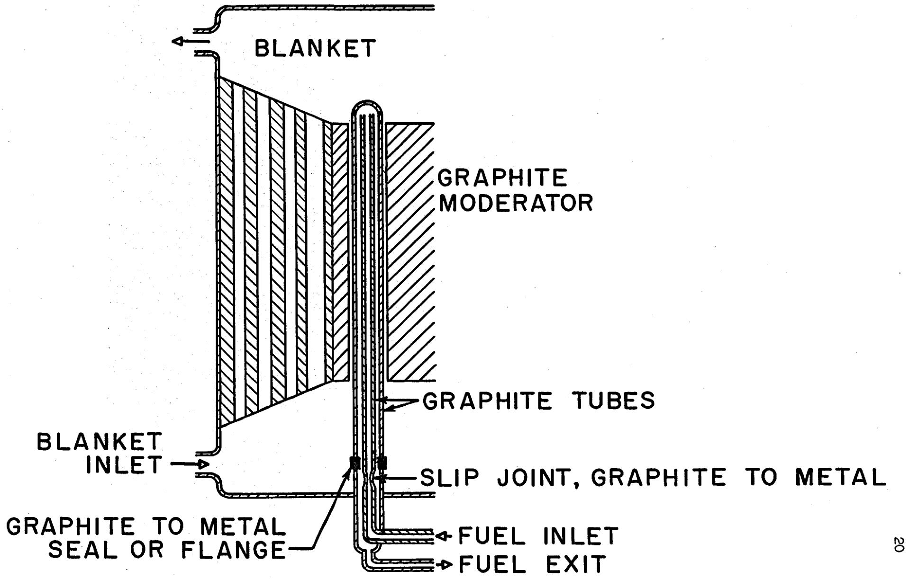
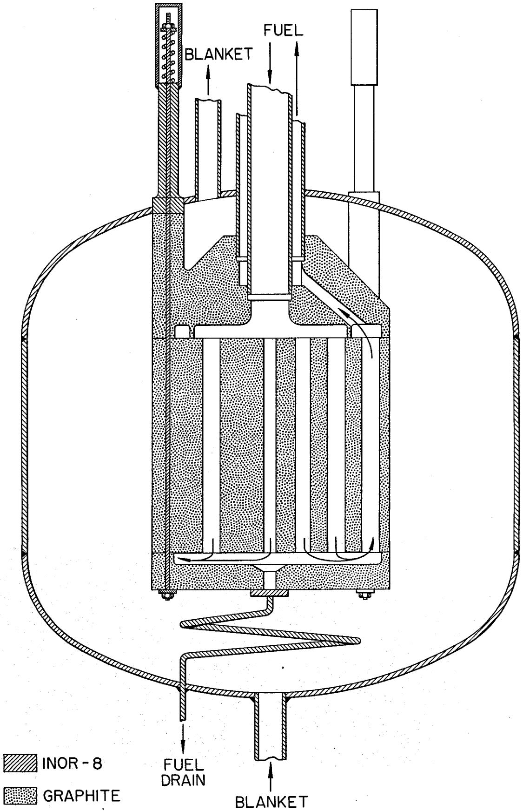
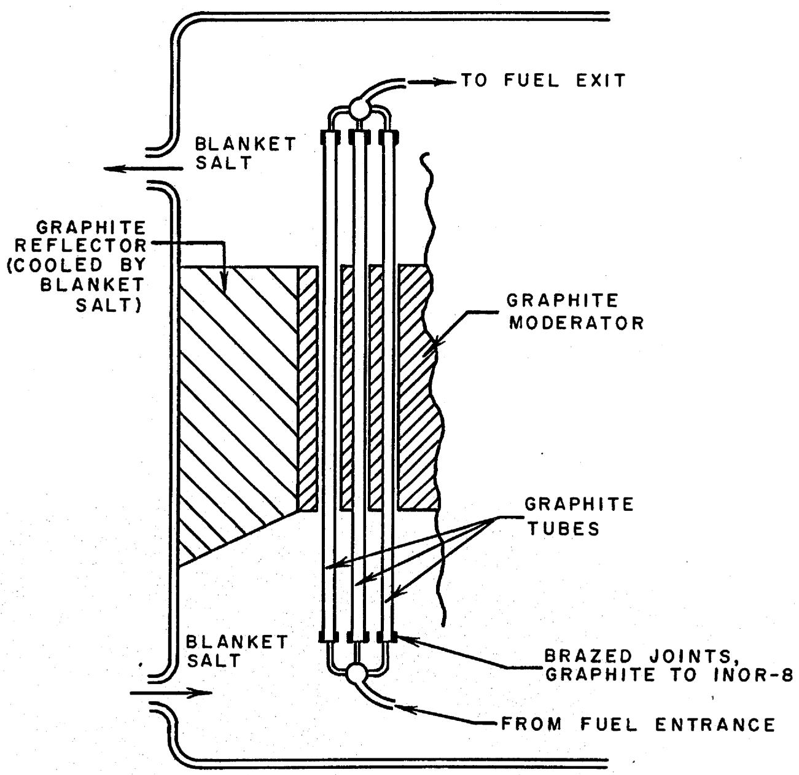
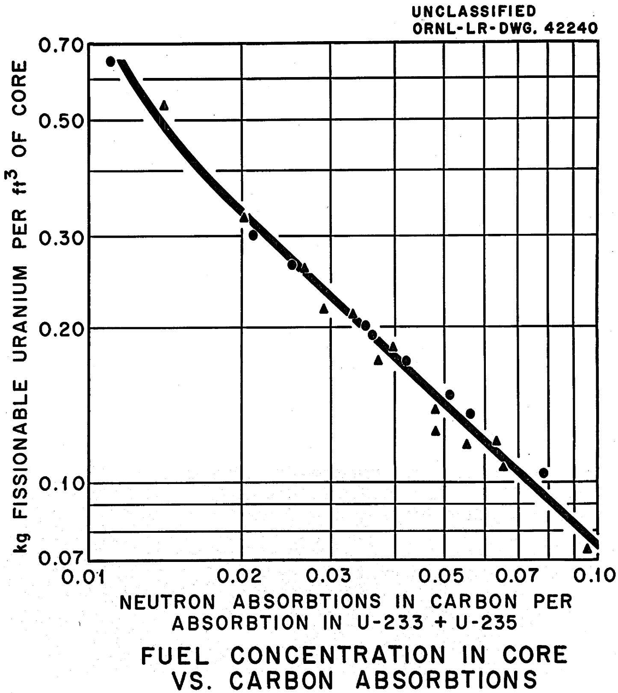
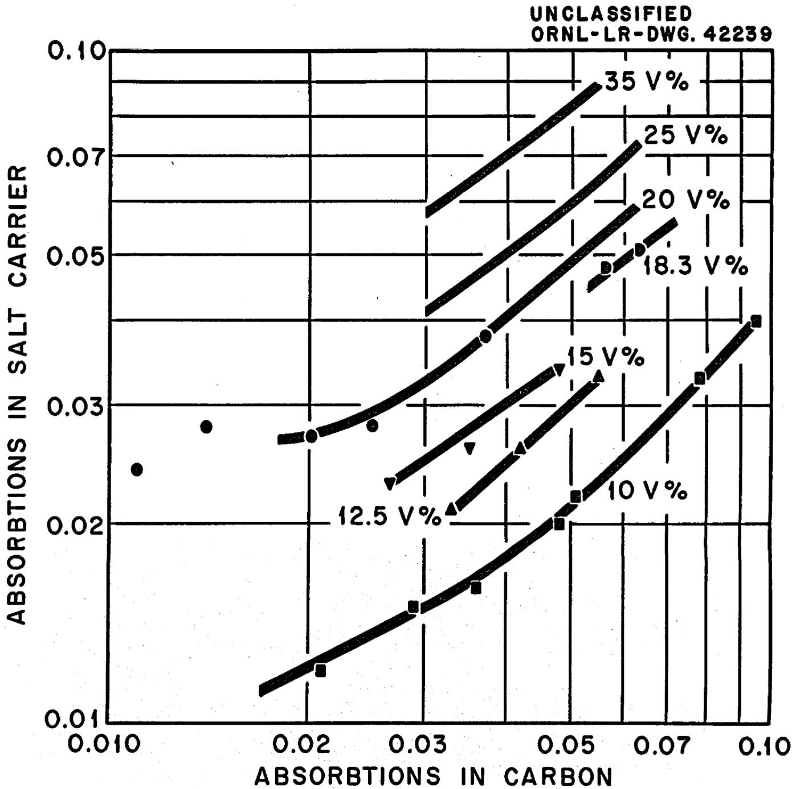
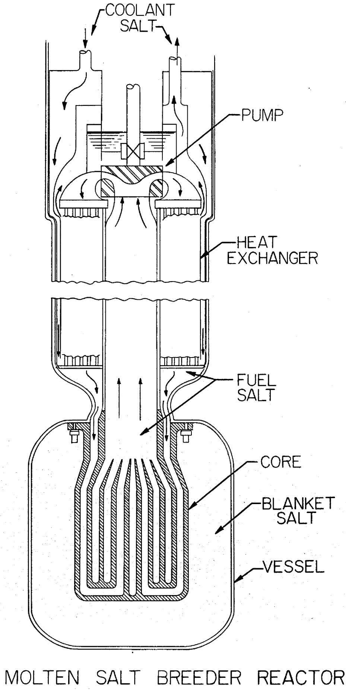

# OAK RIDGE NATIONAL LABORATORY

Operated by

UNION CARBIDE NUCLEAR COMPANY

Division of Union Carbide Corporation

Post Office Box X

Oak Ridge, Tennessee

# EXTERNAL TRANSMITTAL

AUTHORIZED

# ORNL

# CENTRAL FILES NUMBER

59-12-64

(Revised)

DATE: January 12, 1960

SUBJECT: Molten-Salt Breeder Reactors

COPY NO. 78

TO: Distribution

FROM: H. G. MacPherson

# Abstract

The problems involved in building a molten-salt thermal-breeder reactor are reviewed, and it is concluded that the most feasible construction is an externally-cooled reactor with the fuel salt passing through the reactor core in graphite tubes. A reactor with $15\%$ of the core volume occupied by fuel salt and $5\%$ occupied by fertile salt would have a net breeding ratio of about 1.06. The specific power is about $3.0 \mathrm{Mw}(\mathrm{th})$ per kg of U-233, U-235, and Pa in the entire reactor and chemical processing system. The resulting doubling time is 13 full-power years. The cost of the fuel cycle for a 1000-Mw(E) station with this breeding performance is estimated to be 1.2 mills/kwhr. The performance in terms of material utilization is an output of 1.18 Mw(E) per kg of U-233, U-235 and Pa, and 3.2 Mw(E) per metric ton of thorium. The latter figure could be increased by a factor of two at a sacrifice of 0.01 in breeding ratio.

# NOTICE

This document contains information of a preliminary nature and was prepared primarily for internal use at the Oak Ridge National Laboratory. It is subject to revision or correction and therefore does not represent a final report. The information is not to be abstracted, reprinted or otherwise given public dissemination without the approval of the ORNL patent branch, Legal and Information Control Department.

# MOLITEN-SALT BREEDER REACTORS

The purpose of this memo is to examine and summarize the status of the molten-salt reactor as meeting the requirements of a breeder with a doubling time of not more than 25 years. Included are a discussion of:

1. The practicability of different types of breeder reactor construction.   
2. The power density attainable in the fuel salt.   
3. The status and cost of the required chemical processing scheme.   
4. The breeding gain, specific power, and doubling time consistent with reasonable assumptions concerning items (1), (2), and (3).   
5. The feasibility and cost of molten-salt reactors.

The contents of this memo have not been subjected to analysis by the Thermal-Breeder Evaluation group. Their work will be largely independent of this, and their results, when available, will take precedence over the numbers used in this memo.

# I. Reactor Construction

Three types of breeder reactor construction are discussed: the unit-fuel-tube construction, the graphite-core-shell construction, and an internally-cooled construction.

Unit Fuel Tube Construction - The type of construction that is believed to be most practical at present for a molten-salt breeder reactor is one in which the fuel salt passes through the reactor in graphite tubes. Graphite moderator is massed outside of the fuel tubes in the core region of the reactor, and blanket salt containing thorium surrounds the core. The blanket salt also passes through small passages in the moderator graphite and cools it. Fig. 1 (ORNL-IR-Dwg. 42242) gives a schematic representation of one edge of such a reactor, showing a single fuel tube, one of many. Although Fig. 1 shows a re-entrant graphite tube with both inlet and outlet at the bottom end to avoid problems of differential thermal expansion, it may also be possible to use a construction in which the fuel tubes go straight through the reactor.

The fuel tubes would be manufactured from fine-grained extruded graphite rendered impervious by one of a number of treatments available. This type of graphite has been shown to be the most impervious to molten salts; one

such grade has been used in contact with flowing salt streams for a year with no evidence of attack or bulk penetration by the salt. Separate tests have indicated that such a grade of graphite will soak up less than one percent of salt by volume when pressures of up to 150 psi are applied; in fact, one grade picked up less than $0.2\%$ by volume of salt. Tubes $3-3/4$ in. ID x 5 in. OD are on order and will be tested within a few months.

The moderator graphite will be in the blanket salt environment, and the blanket salt will be maintained under slight pressure with respect to the fuel salt so that any leakage that develops will be from blanket salt to fuel salt. Leakage can be tolerated provided it is at a rate that is small compared to the rate of chemical processing of the fuel salt. The moderator graphite could also be made from fine-grained extruded graphite to keep pickup of salt in it at as low a level as possible. By confining the fuel to tubes and pressurizing the blanket salt with respect to the fuel salt, fissioning within graphite will be kept to a minimum. As a result there is little reason to expect buildup of fission-product poisons in the graphite.

In the re-entrant fuel-tube construction, two metal-to-graphite connections are necessary. The connection to the central graphite tube need only be a mechanically sound connection, such as a slip fit, since a small leakage here would only bypass a small amount of fuel from going through the reactor core. The connection of the outer fuel tube to the metal wall of the reactor should be reasonably tight, with leakage small relative to chemical processing rate of the fuel. The three possibilities for this joint are a flanged joint with a mechanical pressure seal, a frozen-salt plug seal, and a brazed metal-to-graphite tube junction. Babcock and Wilcox have experimented with pressure type flanged joints with some success, and it is presumed that this will be a feasible solution to the problem. The testing of the freeze plug technique is under way at Oak Ridge, and early indications are that it will be possible to braze graphite to INOR-8, probably by the use of pure molybdenum as an intermediate material to provide a match to the thermal expansion coefficient to the graphite.

Graphite Core Shell Construction - A simple construction for a small two-region reactor with a graphite core shell is shown in Fig. 2 (ORNL-IR-Dwg.37258). As shown in the drawing, the core is made from three large blocks of graphite, a top header, a bottom header, and a center section. The diameter of the core is approximated 54 in., and the height of the center section would be about 40 in. It is proposed that these graphite parts be made from large-size molded-graphite blocks, that the blocks be rough machined to shape, and that they then be impregnated and treated to make them nearly impermeable to molten salts. It is possible that final machining on the internal parts would be done before treatment and the parts clamped together during treatment to cement the headers on and yield a monolithic block construction.

This monolithic construction is an alternate to having the three graphite blocks as separate pieces, clamped together and held in place by springs. The monolithic structure is considered more desirable, but makes the impervious treatment more difficult. The pressure contact should be satisfactory, at least for the initial reactor operation, on the basis of Babcock and Wilcox work. It is possible that distortions produced by shrinkage accompanying radiation damage would reduce the effectiveness of the seals. A greater worry is the effect of shrinkage on the internal portion of the core. If trouble were encountered here, the interior of the core could be made up of smaller graphite pieces, such as sticks of extruded graphite.

#

Graphite has been made in larger sizes than called for in this reactor, but not of the small grain size required to render it impervious. It is believed that suitable material has been produced in diameter of 39-1/2 in. and in thicknesses of up to 20 in. Samples of this graphite are now being procured, and tests of their penetrability by molten salts will be completed during FY 1960. If this graphite appears suitable, it is believed that it can be made in larger sizes, up to 5 ft in diameter, but at considerable cost in production equipment and in development expense. The development of the larger block graphite for molten-salt reactors is not now planned, but would be a part of the cost of the first full-scale breeder reactor of this type. (There is a possibility that the development of such graphite might be undertaken by the Defense Department for other purposes before this time.)

This design of reactor requires a seal between the graphite header and the INOR-8 pipe passing into the blanket vessel. This joint need not be a hermetic one, but should limit the leakage of blanket salt into the fuel to some small fraction of the core processing rate. The problems of this joint are the same as those involved in the fuel tube construction.

The permissible pickup of molten salt by the graphite depends on the rates of diffusion of uranium into the salt that is in the graphite and of the fission products out of the graphite into the main fuel stream. Some information on this subject will be determined in FY 1960 in the capsule experiments at the MTR. In the meantime, a reasonable assumption is that the diffusion of fission products out balances the diffusion of them into the graphite. For a poison effect of one percent, the pickup of fuel salt into the graphite should be less than one or two volume percent, depending on the volume fraction of fuel passages in the core. If the large molded graphite turns out to have a pickup of less than one percent, then it should be suitable for use as the bulk of the core graphite. If, on the other hand, it picks up more than $2\%$ salt by volume, it would be preferable to use a hollow core shell with an interior construction of extruded graphite sticks. As previously indicated, such extruded grades have been shown to pick up a satisfactorily low level of salt.

Internally-Cooled Reactor - Various designs of internally-cooled moltensalt reactors have been suggested. One of the simplest is shown in concept in Fig. 3. In this concept, the fuel is contained in graphite tubes about 0.5in.ID x 0.7 in. OD that extend through the moderator, well into the blanket region. The tubes are connected at each end by brazed joints to a metal header system so that the fuel can be circulated slowly to keep it uniform, to remove gaseous fission products, and to allow fuel concentration adjustment as burnup proceeds. Presumably the tubes would have graphite inserts forcing the fuel to the periphery of the tubes in the core region and occupying most of the internal volume of the tubes in the blanket region. The heat generated in the fuel would be transferred through the tube wall to the blanket salt which is used as a coolant. This would probably limit the heat generation to perhaps 50 kw per tube averaged over the reactor, and would therefore require 10,000 tubes for a reactor delivering 200 electrical megawatts of power.

Although no brazed joint that is completely satisfactory in terms of compatibility with the salt has yet been demonstrated, there is little doubt but that such a joint will be demonstrated during this fiscal year. The use of molybdenum as an intermediate nipple connection has been demonstrated, and brazing materials that wet graphite and are compatible with the salt have been found. Thus, in all probability, there will be no single technical element of infeasibility remaining by the end of this fiscal year for an internally-cooled reactor. Nevertheless, the concept of 10,000 tubes all maintaining their integrity during a long reactor lifetime is not very attractive, at least to this writer. The advantage hoped for with internal cooling is a greater specific power, but it is doubtful if the internally-cooled reactor can achieve more than a factor of two in specific power over an externally-cooled molten-salt reactor.

Summary - The unit-fuel-tube construction seems to be a feasible configuration for a breeder reactor. By the end of this fiscal year it should be possible to specify suitable types of graphite for both fuel tubes and moderator, and to specify a satisfactory end connection for the tubes. The construction avoids most of the possible problems involved in soaking of fuel into the graphite since the fuel contacts only a small portion of the moderator graphite. Furthermore, it will use the type of graphite that is now deemed least likely to soak up fuel salt.

The graphite-core-shell construction requires graphite of a size and quality that is not immediately available, and will probably not be available without the expenditure of a few million dollars of development money. If this expenditure were made, the reactor construction would have a good chance of success. However, the earlier availability of the fuel tube construction makes it the first choice.

The internally-cooled reactor has some attraction in terms of higher specific power and is made up of elements that individually seem quite feasible. The great complexity of the core and the probable inaccessibility of it for minor repairs make it unattractive at this stage of the technology.

The reference reactor for the remainder of this memo is then taken to be of the fuel tube construction, with 15 vol % of the core occupied by fuel salt, 5% by blanket salt, and the remaining 80% by graphite. If the fuel tubes are 3-3/4 in. ID, the fuel tubes will be spaced on 8-5/8 in. centers on a square array.

# II. Power Density

The nuclear calculation will yield the breeding ratio and the uranium concentration required in the salt to make the reactor critical. In a circulating fuel reactor, the latter figure must be combined with the power that can be extracted per unit volume of fuel salt to yield a gross figure for specific power. The power obtainable per unit volume of salt can be arrived at in two ways: one is a general approach that looks at the fundamental factors involved, and the other is to lay out specific designs and see what their volumes are, and how much power they take care of. We will first look at the problem generally and then examine specific layouts that have been proposed.

A reasonable value of the power density in the fuel can be estimated from the total length of piping required in the system. The length of piping considered is that required to carry the fuel salt into and out of the reactor, through the blanket, through header connections, through the heat exchanger and the equivalent length of piping represented by the pump volute and expansion tank. An average fluid velocity will be assumed through this piping, and a safe temperature range between reactor entrance and exit. This information combined with the volumetric specific heat of the salt determines the amount of heat transferred per unit volume of salt.

The composition of the fuel salt will be about $627 \text{ mole} \%$ LiF, 37 mole $\%$ BeF $_2$ , and 0.3 mole $\%$ UF $_4$ . The volumetric heat capacity of this mixture is about 1.25 cal/cc- $^{-\circ}$ C at reactor temperature, or 77.5 Btu/cu ft- $^{-\circ}$ F. The melting point of the fuel is about $850^{\circ}$ F, and a figure about $100^{\circ}$ F above this should be used as the minimum bulk fluid temperature. However, the fertile salt has a melting point of $975^{\circ}$ F, so that this, rather than $950^{\circ}$ F, will be taken as the minimum temperature of the fuel salt returning to the reactor. The maximum temperature of the salt leaving the reactor should be limited by the corrosion tolerance of the metal alloy system, and with present knowledge

this is set as $1300^{\circ}\mathrm{F}$ since very few loops have been run as yet at a higher temperature. This is probably also a practical limit as set by the creep resistance of the alloy INOR-8. The temperature range of 975 to $1300^{\circ}\mathrm{F}$ is $3250^{\circ}\mathrm{F}$ , but a value of $3000^{\circ}\mathrm{F}$ will be used as a reasonable limit, presumably from 975 to $12750^{\circ}\mathrm{F}$ . With this $\Delta T$ and heat capacity, each cubic foot of fuel transports 23,200 Btu of heat each time it makes the heat transfer circuit.

It is difficult to set a natural limit on the maximum average flow velocity that can be allowed for the salt in traversing its circuit. The only known limiting factors are the pressure drop developed by the pumps and the proportion of power one wishes to expend in pumping. A figure of 17 ft per second has been picked somewhat arbitrarily for an average fluid velocity, with velocities of up to 20 ft per second in the external system and a lower velocity inside the reactor. The major justification for selection of this figure is that it yields reasonable pressure drops (ω100 psi) with reasonably sized heat exchanger tubes and other plumbing fixtures, and with it pumping powers are low. This velocity is well below the maximum velocity assumed in the reactor portion of sodium-cooled reactors. It should be recognized, however, that this fluid velocity is not derived from any basic constants of nature, but it does seem a reasonable assumption on the basis of present experience.

The effective length of the plumbing circuit will depend on the requirements for maintenance and on the necessary allowances for thermal strains. These, of course, depend on the type of reactor layout. Here, we will consider pipes coming from the reactor to a pump, the pump feeding into a heat exchanger, and the exit of the heat exchanger going back to the reactor. There will be header connections joining a number of fuel tubes together to feed into each pump and heat exchanger. It would seem possible to have a total circuit length of 80 ft for a reasonably sized power reactor, broken down approximately as follows:

ft

In reactor core 10.0

Through blanket 5.0

End connections to reactor 15.0

Heat exchanger 15.0

Allowance for pump and expansion tank 7.5

Miscellaneous 2.5

Connecting pipes 25.0

80.0

If this is the length of the circuit, the fuel salt will traverse the circuit in 4.7 seconds and the heat transfer rate will be 4940 Btu/sec-cu ft or 5.2 Mw/cu ft of fuel, or 184 kw/liter of fuel.

The remote maintenance demonstration facility in the 9201-3 building in Y-12 provides one check on the length of piping required for a proper layout of a reactor system. In the facility as it stands, with its pump, dummy reactor, piping layout with flange connections and dummy heat exchanger, the total effective length of the fuel salt circuit is about 42 ft. If a true breeder reactor were installed (with its blanket dictating a larger path), and if a full-scale real heat exchanger were installed, the piping length would increase by about 30 ft to a total of 72 ft. This system would then be maintainable, but its power would be limited by the pump and piping presently installed to about 67 Mw thermal. It would probably be desirable to have about 100 Mw (thermal) in each pump-heat exchanger circuit for this type of layout, so that with the increased capacity system, 80 ft is probably a practical length for the circuit piping in a reactor maintainable by the canyon type equipment installed in this facility.

Another type of layout that is currently in favor is that calling for top maintenance, and in which the entire fuel salt circuit is contained in a single large vessel. This type of system allows greater compactness. B. W. Kinyon has analyzed several cases in a memo (reproduced as Appendix I), in which credit was taken only for a $200^{\circ}\mathrm{F} \Delta \mathrm{T}$ in the fuel. The results of his study indicate that with the $200^{\circ}\mathrm{F} \Delta \mathrm{T}$ and a fuel velocity of 15 ft per second in the piping, power densities of about 5 Mw/cu ft can be obtained. The total pressure drop in this system is about 115 psi, of which 105 is across the heat exchanger. This analysis lends further credence to the belief that about 5.2 Mw/cu ft or 184 kw/liter can be obtained for a molten-salt breeder reactor.

# III. Chemical Processing

The chemical processing scheme proposed for the core circuit is as follows: A small side stream of the fuel salt will be fluorinated to remove $\mathbf{U}\mathbf{F}_{6}$ by the fluoride volatility process. The $\mathbf{U}\mathbf{F}_{6}$ will be burned in $\mathbf{H}_{2}$ to $\mathbf{U}\mathbf{F}_{4}$ and will be placed in the reserve storage of $\mathbf{U}\mathbf{F}_{4}$ for reactor feed. The molten-salt carrier, with most of the fission products, will be stored for decay of radioactivity to a suitable level, and then processed by the HF dissolution process, recovering the LiF and $\mathbf{BeF}_{2}$ , and eliminating most of the fission products. The LiF- $\mathbf{BeF}_{2}$ will be adjusted in composition and added to the reactor core stream again. The blanket will be processed by the fluoride volatility process to remove the $\mathbf{U}\mathbf{F}_{6}$ on a frequent basis to keep the uranium inventory in the blanket low. The $\mathbf{U}\mathbf{F}_{6}$ is burned to $\mathbf{U}\mathbf{F}_{4}$ , and the $\mathbf{U}\mathbf{F}_{4}$ produced is added to

the reserve supply pending reactor feed or sale. The Pa does not come out of the blanket salt, but returns with it to the reactor system. By keeping the uranium at a low level in the blanket, the buildup of fission-product poisons is very small and the blanket is reprocessed completely only a few times during reactor life.

In practice, the frequency of processing of the blanket and fuel will be determined by an economic balance. This balance is not struck here, the approach being to see what processing rates are required to achieve certain nuclear aims and to examine the cost of these rates. A 1000-Mw(E) station will have a heat output of about 2500 Mw(th). At 5.2 Mw/cu ft, the circulating fuel volume will be about 480 cu ft of fuel salt. When the fuel comprises about $15\%$ of the volume of the core, the uranium concentration in the fuel salt is about 1.2 kg/cu ft, yielding a total uranium content of the circulating fuel system of 575 kg of uranium (fissionable). About 3 kg will be burned per day, so that 191 days is the burnup time for the fuel. For the variable fission-product poison to be kept at one percent, a ten percent burnup is allowed before reprocessing, so that the entire 480 cu ft of core must be reprocessed every 19.1 days of full-power operation. This requires a chemical plant with a capacity of 9200 cu ft/yr, if the same percentage load factor is assumed for both reactor and chemical plant.

A rough calculation indicates that the required blanket or fertile stream volume is between 2000 and 3000 cu ft for a system of reactors yielding 1000 Mw(E). This volume is calculated on the basis of adequate coverage of the reactor cores. However, if it is desired to keep the Pa absorption down to 0.005, corresponding to a loss of breeding ratio of 0.01, then there will have to be about 310,000 kg of thorium in the blanket system. Since the blanket salt contains about 50 kg of thorium per cubic foot, this requires a blanket volume of about 6200 cu ft. Thus the blanket volume can be arbitrarily set to yield the desired Pa losses, and for this analysis, 6200 cu ft and 0.01 Pa loss is assumed.

The frequency of chemical processing of the blanket is set (aside from economics) by the desire to keep the uranium inventory low and by the desire to keep the fission-product buildup in the blanket small enough so that complete reprocessing of the blanket will not be required frequently. A desirable goal is to keep the U and Pa in the blanket down to $30\%$ of the fuel circuit inventory. Reprocessing in about a 20-day cycle is required to accomplish this, and there is little benefit to faster processing because the Pa holdup is limiting.

Processing at this rate will keep the U in the blanket circuit to about one-tenth that in the core circuit, or about $60\mathrm{kg}$ . Since uranium has about fifty times the neutron cross section of thorium, and since there

are about $300,000 \mathrm{~kg}$ of Th in the blanket, there will be about one percent as many U absorptions as thorium absorptions in the blanket. Thus after about ten burnups of the core, the fission product level in the blanket will give about a one percent poison there. At an $80\%$ load factor, this would be after about 6.5 yr. Thus, in a 20-yr life, the fission-product poison level in the blanket might rise to $3\%$ poison, and complete reprocessing of the blanket salt should be considered at that time.

The estimate of costs for chemical processing of the fuel and blanket at the above rates (9200 cu ft per yr for the fuel and 113,000 cu ft per yr for the blanket salt) is based on a report by Weinrich and Associates to ORNL on "Process Design and Estimated Costs of Chemical Plants for Processing Molten Salt Fuels". The larger plant estimated by them had a capacity of 10,000 cu ft per yr of fuel salt, which is about the size required here for the fuel salt circuit. For the fuel processing plant, Weinrich and Associates estimate a cost of \( \phi 3,455,000 \), plus about \)1,500,000 of shared facilities with the reactor plant. Crude adjustments to these figures made by Oak Ridge personnel revised them upward to a total of about $9,830,000.

A much cruder estimate has been made of the additional plant cost to provide for the rapid fluorination of the blanket salt. This was made by assuming that multiplying the cost of the portion of the plant involved in fluorination of the core salt and UF4 recovery by five would give a plant of eleven times the capacity. On this assumption, the complete chemical plant for treatment of both core and blanket salts would cost about $18,000,000 for the 1000-Mw(E) plant. At a 29% annual charge and an 80% load factor, the cost of the chemical plant, together with its operation, would be about 0.75 mill/lkwhr.

The total inventory of uranium and protactinium in the reactor system is estimated as follows:

<table><tr><td>In reactor fuel</td><td>575 kg</td></tr><tr><td>In blanket</td><td>180 kg</td></tr><tr><td>In chemical processing</td><td>30 kg</td></tr><tr><td>In storage</td><td>60 kg</td></tr><tr><td>Total</td><td>845 kg</td></tr></table>

The uranium inventory at $15/g is $12,680,000, or $12.70/kw. At 4% this is 0.07 mill/kwhr, or at 12%, it is 0.22 mill/kwhr. The blanket and core salts, including thorium inventory, will cost about $25,000,000, or $25/kw.. At 14% per year and 80% load factor, this amounts to 0.5 mill/kwhr. With a net breeding ratio of 1.06, there would be 52.5 kg of fissionable uranium

produced per year, which would yield about $790,000/yr or about 0.11 mill/kwhr. Thus the total fuel cycle cost would be about 1.2 mills/kwhr on the basis of present uranium use charges.

It is obvious that considerable savings in fuel cycle cost can be made by sacrificing doubling time. It is probable that if a breeding ratio of 1.00 were satisfactory, at least half of the salt and thorium inventory charge could be avoided and the chemical plant charges would be considerably reduced, probably by at least one-third. Thus, a hold-own breeder might have power costs as much as 0.5 mill/kwhr less than the doubling reactor.

In this analysis of chemical processing, only processes on which there is a fair amount of laboratory data have been considered. With the fluid blanket, an easy means of removing Pa is being sought. If it is found, then the blanket holdup will be reduced, and the thorium inventory can be reduced appreciably.

# IV. Performance as a Breeder

A number of graphite-moderated molten-salt reactor configurations have been subjected to multigroup nuclear calculations with the Cornpone and Sorghum codes.* The criticality calculations can be correlated quite well if one plots the concentration of uranium in the core against the carbon absorptions in the core. This is done in Fig. 4 (ORNL-IR-Dwg. 42240). The plot shown comes from reactors of equivalent spherical core diameters of 3 ft, 4 ft, 5 ft and 14 ft. The fuels in the core have thorium concentration of 1 mole % ThF₄, 4 mole % ThF₄, 7 mole % ThF₄, and 13 mole % ThF₄, and the volume fraction'of fuel represented in the various calculations of 10%, 12.5%, 15%, 18.3% and 20%. It includes calculations of both the initial state of the reactor with pure U-233 and the state achieved after 20 yr of operation with a near equilibrium mixture of U-233 and U-235. Although the relationship is not mathematical, there is a good empirical fit and the curve can be used with fair confidence in predicting the uranium concentration required in the fuel salt. For the reference system with a 15 vol % fuel fraction in the core and 0.04 neutron absorption in carbon, the concentration of fissionable uranium required in the fuel salt is 1.2 kg per cu ft.

This figure, combined with the number of 5.2 Mw per cu ft developed in Section II above, yields a specific power in the fuel stream of 4.33 Mw/kg.

The chemical processing and blanket holdups of fuel lead to a total fissionable uranium inventory of $845\mathrm{kg}$ , as described in Section III, so that the overall specific power is $2.96\mathrm{Mw(th) / kg}$ .

The effective value of eta for the fuel mixture will depend on the thermality of the spectrum, which is related also to the carbon absorptions per absorption in fissionable uranium. At 0.04 absorption in carbon, the value of eta for the isotope mixture is about 2.22, based on a thermal value of 2.28 for U-233.

From the nuclear calculations cited above, one can correlate the neutron absorp-tions in the carrier salt in the core with the absorptions in carbon. This is done in Fig. 5 (ORNL-LR-Dwg. 42239). The volume fraction of carrier salt is $20\%$ , comprised of $15\%$ for the fuel and $5\%$ for the fertile stream, so that the absorp-tions in the carrier salt in the core are $0.04$ for carbon absorption of $0.04$ .

As described in the preceding section, the reference chemical processing plant provides for keeping the variable fission-product poison fraction down to 0.01, and the Pa losses (2 x absorptions) down to 0.01. Uranium-236 will, of course, build up from radiative captures in U-235. With a breeding ratio of 1.06, the removal of U-236 by the sale of excess fuel will approximately equal the removal by neutron absorptions, so that the U-236 poison will be approximately 0.01. The neutron losses to saturable non-volatile fission products will be about 0.006, and if Xe-135 losses can be kept to 0.004, the total saturable fission-product losses will be limited to 0.01. To keep the Xe-135 losses to 0.004 requires its removal on a time cycle of about 6 minutes. The off-gas system can be designed to accomplish this by bypassing 2% of the pump flow through a degasser. This was the degassing bypass flow in the ART pump.

Other neutron losses are estimated to be 0.03 in the blanket salt, 0.003 for delayed neutrons, and 0.002 for leakage. Considering the efficiency of the fluoride volatility process, 0.005 may be adequate for chemical processing losses. Fission-product pickup by the graphite, assuming that the fuel tubes soak up $< 0.5\%$ by volume of fuel, gives a negligible loss unless there is preferential fission-product absorption.

The total neutron losses now add up to about 0.16, which subtracted from an eta of 2.22 yields a net breeding ratio of 1.06. It should be noted that higher breeding ratios can be obtained by decreasing the volume fraction of fuel in the core and by increasing the uranium-to-carbon ratio in the core. However, these both lead to higher uranium inventories and consequently no great improvement, if any, in doubling time. Furthermore, if thermal eta for U-233 is 2.29, as is believed in Oak Ridge, instead of the 2.28 assumed, the breeding ratio is improved by nearly one point. With an over-all breeding ratio of 1.06, the doubling time is about 13 yr of full-power operation.

# V. Feasibility and Cost of Molten-Salt Reactors

The basic feasibility of molten-salt reactors has been discussed in a section of the book "Fluid Fuel Reactors". This and later information have been

reviewed by the Fluid Fuel Reactors Task Force, and it was the consensus of the group that, with minor exceptions, the feasibility of the molten-salt reactor was established as far as materials compatibility and handling is concerned.

These exceptions concern the pickup of fuel salt by the graphite and the possible precipitation of $\mathrm{UO_2}$ by gases adsorbed on the graphite. Since the time the Fluid Fuels Task Force met, the results of a one-year circulating salt loop containing graphite and of graphite impregnation studies have shown that the graphite is stable in contact with the salt, and that there are varieties of graphite that will soak up less than $0.2\%$ by volume of fuel salt. It has also been found possible to prevent $\mathrm{UO_2}$ precipitation by pretreatment of the graphite.

The Fluid Fuel Reactors Task Force further expressed doubt as to the economic maintenance of fluid fuel reactors in general. For the molten-salt reactor, this can be answered finally only in a reactor experiment, which has been proposed. In the meantime, good progress has been made in devising suitable maintenance procedures for one type of reactor construction.

Since the time of the task force, the design effort on molten-salt reactors has been directed toward breeder reactors that take advantage of the compactness that is possible as a result of the high temperature and good heat transfer properties of molten salts. Most of the designs developed have a compact primary system, such as that described in Appendix I and illustrated in Fig. 6. In these designs, the entire primary fuel circuit is contained inside a reactor vessel. With this construction, a parallel comparison with solid-fuel-element reactors is evident, in which the tubes of the primary heat exchangers of the salt reactor are compared to the fuel tubes in the core of a solid-fuel-element reactor; both contain fuel, both constitute the primary heat exchanger surface, and in each case they are contained within the primary reactor vessel enclosure. In a similar way, the pumps for circulating the fuel are compared to the control rod mechanisms (and fuel shuffling mechanism for the fast reactor). Both involve moving parts inside the reactor enclosure, and the pump, though bulky, is certainly simpler. Maintenance of pump and heat exchanger in the salt system is by overhead withdrawal and replacement, and the operations required are comparable to those required for the replacement of core assemblies and repair of control mechanisms in the reactors with solid fuel elements, particularly those cooled with sodium. There is thus no reason to expect maintenance costs for the MSR to be higher than, say, for the fast reactor.

As for capital costs, the higher temperature of the heat source and the very high heat capacity per unit volume of the salt (approximately 4.4 times that of sodium) lead to compactness of the entire system. The following table compares pertinent factors of complexity and heat transfer with four reactors using a sodium coolant. Comparing the MSR primary heat exchanger with the reactor cores, it is simpler by virtue of having fewer tubes, and has about the same efficiency as the fast reactors in terms of surface area.

The avoidance of an intermediate heat exchanger for the MSR, possible because there is no violent water reaction and because the induced radioactivity is very short lived; is a further factor reducing capital cost. In the steam

generator portion, the higher temperature of the salt coolant gives an advantage by about a factor of two.

The last two rows of the table indicate how the high heat capacity of the salt, even using a conservative bulk $\Delta T$ , can reduce the pump capacity and system piping requirements by at least a factor of two.

On the basis of this analysis, even after allowing for the high cost of INOR-8 and of the salt coolant, the capital costs of a molten-salt reactor should be less than for the sodium-cooled reactors.

<table><tr><td rowspan="2"></td><td colspan="5">Sodium-Cooled Reactors</td></tr><tr><td>MSR</td><td>Hallam</td><td>P/604*</td><td>Fermi</td><td>Advanced Fast Reactor</td></tr><tr><td>Net electrical Mw assumed for reactor</td><td>333</td><td>80</td><td>205</td><td>94</td><td>283</td></tr><tr><td>Fuel tubes per MwE</td><td></td><td>58</td><td>28</td><td>140</td><td>264</td></tr><tr><td>Primary heat exchanger tubes per MwE</td><td>19</td><td></td><td></td><td></td><td></td></tr><tr><td>Primary heat transfer surface per MwE (fuel tubes in case of sodium-cooled reactors) sq ft per MwE</td><td>22</td><td>111</td><td>38</td><td>14.6</td><td>25</td></tr><tr><td>Intermediate heat exchanger sq ft per MwE</td><td>-</td><td>93</td><td>170</td><td>160</td><td>92</td></tr><tr><td>Steam generator, super-heater and reheater surface sq ft per MwE</td><td>120</td><td>237</td><td>214</td><td>345</td><td>200</td></tr><tr><td>Coolant flow data (avg)</td><td></td><td></td><td></td><td></td><td></td></tr><tr><td>Bulk ΔT assumed</td><td>150°F</td><td>338°F</td><td>275°F</td><td>250°F</td><td>350°F</td></tr><tr><td>gal/min flow per MwE</td><td>106</td><td>241</td><td>263</td><td>318</td><td>214</td></tr></table>

The most careful cost estimates of molten-salt reactor construction have been made by G. D. Whitman and are included in: (1) ORNL 2634; (2) ORNL-CF-59-1-26; and (3) ORNL 2796. The three cases include two power reactors of 640- and 860-Mw (thermal) capacity, and an experimental reactor of 30-Mw capacity. A reasonable extrapolation of these costs to the 2500-Mw (thermal) station required for 1000 Mw(E) yields capital costs of from $170 to $200 per kw. This estimate is for a first plant, but does not include development costs. When these capital costs are combined with the fuel cycle costs estimated in Section III of 1.2 Mw/kwhr and a reasonable operation and maintenance estimate of 1 mill/kwhr, one gets a power cost in the neighborhood of 6 mills/kwhr for the first such large breeder reactor plant. Presumably one could expect lower costs than this as a result of prior prototype reactor construction and operation. It is difficult to attempt to predict ultimate costs, however, until experience has been had with at least an experimental reactor.

APPENDIX I.

INTRA-LABORATORY CORRESPONDENCE

Oak Ridge National Laboratory

October 22, 1959

To: H. G. MacPherson

cc: L. G. Alexander  
J. W. Miller  
File (BWK)

Subject: Volumes and Pressure Drops for Molten Salt Breeder Reactors

The following table is a comparison of two reactor sizes, each with two flow velocities in the external piping.

The heat exchanger has been designed on the basis of 0.300 in. inside diameter x 0.035 in. wall tubing in a $45^{\circ}$ helix, with adjacent coils wound opposite hand. Fuel temperatures are taken as 1275 and $1075^{\circ}$ F; coolant temperatures as 1150 and $1000^{\circ}$ F. The use of $1/4$ in. ID x 5/16 in. OD tubing would decrease the heat exchanger length by $21\%$ , increase the number of tubes by $50\%$ , and increase the diameter by about $15\%$ . The fuel volume external to the core would be reduced by about $10\%$ , which might overweigh the problems introduced by the other changes.

The fuel volume might be reduced by considering the entire flow in the center of the heat exchanger as "pump suction" and using a higher flow velocity. This would be about $10\%$ of the fuel outside the core for the higher flow rate cases.

The attached sketch (Fig. 6) is approximately to scale for the smaller reactor with 20 ft per second fuel velocity in the piping.

/s/ B. W. Kinyon

:nh Enclosure

# VOLUMES AND PRESSURE DROPS FOR MOLTEN SALT BREEDER REACTORS

<table><tr><td>Reactor Power, MwE (net)</td><td>333</td><td></td><td>500</td></tr><tr><td>Station Efficiency,%</td><td>40.85</td><td></td><td>40.85</td></tr><tr><td>Reactor Power, MwT</td><td>815</td><td></td><td>1223</td></tr><tr><td>Blanket Power,%</td><td>8</td><td></td><td>8</td></tr><tr><td>Core Power, MwT</td><td>750</td><td></td><td>1125</td></tr><tr><td>Fuel Temperature Exit,0F</td><td>1275</td><td></td><td>1275</td></tr><tr><td>Fuel Temperature Entrance,0F</td><td>1075</td><td></td><td>1075</td></tr><tr><td>ΔT in Fuel,0F</td><td>200</td><td></td><td>200</td></tr><tr><td>Volume Flow of Fuel, ft3/sec</td><td>55.2</td><td></td><td>82.8</td></tr><tr><td>Flow Velocity2in Core, ft/sec</td><td>20</td><td></td><td>20</td></tr><tr><td>Flow Area, ft2</td><td>2.765</td><td></td><td>4.140</td></tr><tr><td>Volume Fraction in Core</td><td>0.25</td><td></td><td>0.25</td></tr><tr><td>Core Cross Section, ft2</td><td>22.08</td><td></td><td>33.12</td></tr><tr><td>Core Diameter, ft</td><td>5.30</td><td></td><td>6.50</td></tr><tr><td>Diameter of Equivalent Sphere, ft</td><td>6.07</td><td></td><td>7.45</td></tr><tr><td>Core Volume, ft3</td><td>117</td><td></td><td>215</td></tr><tr><td>Fuel Volume in Core, ft3</td><td>29.25</td><td></td><td>53.75</td></tr><tr><td>Blanket Thickness, ft</td><td>2.5</td><td></td><td>2.5</td></tr><tr><td>Blanket Volume, ft3</td><td>741</td><td></td><td>918</td></tr><tr><td>Cu Ft of Blanket per MwT</td><td>0.910</td><td></td><td>0.750</td></tr><tr><td>MwT per Cu Ft of Blanket</td><td>1.10</td><td></td><td>1.333</td></tr><tr><td>Fuel Velocity in &quot;piping&quot;, ft/sec</td><td>15</td><td>20</td><td>15</td></tr><tr><td>Flow Area, ft2</td><td>3.68</td><td>2.77</td><td>5.51</td></tr><tr><td>Heat Exchanger Area, ft2</td><td>13.58</td><td>13.58</td><td>20.36</td></tr><tr><td>Bundle Area, ft2</td><td>17.26</td><td>16.35</td><td>25.87</td></tr><tr><td>Coolant Flow Area, ft2</td><td>2.92</td><td>2.92</td><td>4.38</td></tr><tr><td>Total Area</td><td>20.16</td><td>19.27</td><td>30.25</td></tr><tr><td>Bundle Height, ft</td><td>8.75</td><td>8.75</td><td>8.75</td></tr><tr><td>Bundle ID, ft</td><td>2.16</td><td>1.875</td><td>2.65</td></tr><tr><td>Bundle OD, ft</td><td>4.70</td><td>4.56</td><td>5.73</td></tr><tr><td>Cartridge OD, ft</td><td>5.17</td><td>4.95</td><td>6.20</td></tr></table>

(continued)

Fuel Volumes, ft³ per reactor   

<table><tr><td>&quot;Piping&quot; Volume</td><td>57.0</td><td>42.9</td><td>85.5</td><td>64.1</td></tr><tr><td>Pump</td><td>3.6</td><td>3.6</td><td>5.3</td><td>5.3</td></tr><tr><td>Shell Annulus</td><td>4.1</td><td>3.9</td><td>4.9</td><td>4.8</td></tr><tr><td>Expansion and Off-Gas (8.8%)</td><td>13.6</td><td>12.2</td><td>21.2</td><td>19.1</td></tr><tr><td>Upper Plenum</td><td>7.9</td><td>7.8</td><td>11.8</td><td>11.4</td></tr><tr><td>Heat Exchanger (0.3 in. ID, 105 psi)</td><td>32.0</td><td>32.0</td><td>48.0</td><td>48.0</td></tr><tr><td>Lower Plenum</td><td>7.2</td><td>7.1</td><td>10.7</td><td>10.4</td></tr><tr><td>External to Core</td><td>125.4</td><td>109.5</td><td>187.4</td><td>163.1</td></tr><tr><td>Core</td><td>29.3</td><td>29.3</td><td>53.8</td><td>53.8</td></tr><tr><td>Total</td><td>154.7</td><td>138.8</td><td>241.2</td><td>216.9</td></tr><tr><td>Ratio of external fuel to core fuel</td><td>4.28</td><td>3.74</td><td>3.48</td><td>3.04</td></tr><tr><td>Ratio of total fuel to core fuel</td><td>5.28</td><td>4.74</td><td>4.48</td><td>4.04</td></tr><tr><td>Cu Ft of Fuel per MwT</td><td></td><td></td><td></td><td></td></tr><tr><td>External to Core</td><td>0.157</td><td>0.137</td><td>0.156</td><td>0.136</td></tr><tr><td>Core</td><td>0.036</td><td>0.036</td><td>0.044</td><td>0.044</td></tr><tr><td>Total</td><td>0.193</td><td>0.173</td><td>0.200</td><td>0.180</td></tr><tr><td>MwT per Cu Ft of Fuel</td><td></td><td></td><td></td><td></td></tr><tr><td>External to Core</td><td>6.37</td><td>7.30</td><td>6.41</td><td>7.36</td></tr><tr><td>Core</td><td>27.8</td><td>27.8</td><td>22.8</td><td>22.8</td></tr><tr><td>Whole System</td><td>5.18</td><td>5.78</td><td>5.00</td><td>5.56</td></tr><tr><td>Pressure Drop</td><td></td><td></td><td></td><td></td></tr><tr><td>Velocity head losses in:</td><td></td><td></td><td></td><td></td></tr><tr><td>Core to pump</td><td>0.11</td><td>0.11</td><td>0.08</td><td>0.09</td></tr><tr><td>Heat Exchanger to core</td><td>0.06</td><td>0.07</td><td>0.05</td><td>0.06</td></tr><tr><td>Plenums</td><td>0.50</td><td>0.50</td><td>0.50</td><td>0.50</td></tr><tr><td>Total</td><td>0.67</td><td>0.68</td><td>0.63</td><td>0.65</td></tr><tr><td>ΔP/velocity head</td><td>3.00</td><td>5.33</td><td>3.00</td><td>5.33</td></tr><tr><td>Piping ΔP, psi</td><td>2.0</td><td>3.6</td><td>1.9</td><td>3.5</td></tr><tr><td>Velocity head losses for:</td><td></td><td></td><td></td><td></td></tr><tr><td>2 core passes</td><td>0.62</td><td>0.62</td><td>0.78</td><td>0.78</td></tr><tr><td>Inlet and Exit</td><td>0.25</td><td>0.25</td><td>0.25</td><td>0.25</td></tr><tr><td>Bottom Turns</td><td>0.50</td><td>0.50</td><td>0.50</td><td>0.50</td></tr><tr><td>Total</td><td>1.37</td><td>1.37</td><td>1.53</td><td>1.53</td></tr><tr><td>ΔP/velocity head, psi</td><td>5.33</td><td>5.33</td><td>5.33</td><td>5.33</td></tr><tr><td>Core ΔP, psi</td><td>7.3</td><td>7.3</td><td>8.2</td><td>8.2</td></tr></table>

(continued)

Total Pressure Drop Outside Heat Exchanger, psi

Pressure Drop Across Heat Exchanger, psi

Total $\Delta P$ in System, psi

9.3 10.9 10.1 11.7

105.0 105.0 105.0

114.3 115.9 115.1 116.7

UNCLASSIFIED

ORNL-LR-DWG. 42242

  
Figure 1

UNCLASSIFIED

ORNL-LR-DWG 37258

  
Fig.2 Heterogeneous, Graphite-Moderated, Two-Region, Molten-Salt, Thorium Breeder.

ORNL-LR-DWG 4463

UNCLASSIFIED

  
Fig. 3. Internally Cooled Reactor

  
Figure 4

  
Figure 5

  
Figure 6

# Distribution

1-15. H. G. MacPherson

16. L. G. Alexander   
17. C. J. Barton   
18. A. L. Benson, AEC-ORO   
19. E. S. Bettis   
20. F. F. Blankenship   
21. A. L. Boch   
22. W.F.Boudreau   
23. E. J. Breeding   
24. R. B. Briggs   
25. W. E. Browning   
26. D. O. Campbell   
27. W.H.Carr   
28. W. L. Carter   
29. G. I. Cathers   
30. R.E.Chapman   
31. R. A. Charpie   
32. R. R. Coveyou   
33. D. A. Douglas   
34. W. K. Ergen   
35. A. P. Fraas   
36. W. R. Gall   
37. W. R. Grimes   
38. J.P.Fammond   
39. H.W.Hoffman   
40. W. H. Jordan   
41. P. R. Kasten   
42. G. W. Keilholtz   
43. W. E. Kinney   
44. B. W. Kinyon   
45. M. E. Lackey   
46. J.A.Iane

47. R.N.Lyon   
48. W. D. Manly   
49. E. R. Mann   
50. L. A. Mann   
51. W. B. McDonald   
52. H. J. Metz   
53. R.P.Milford   
54. A. J. Miller   
55. J.W.Miller   
56. G. J. Nessle   
57. C.W.Nestor   
58. W. R. Osborn   
59. A. M. Perry   
60. R. M. Pierce   
61. J. T. Roberts   
62. H. W. Savage   
63. F. P. Self   
64. M. J. Skinner   
65. J.A. Swartout   
66. A. Taboada   
67. R.E.Thoma   
68. D. B. Trauger   
69. F. C. VonderLage   
70. G. M. Watson   
71. A. M. Weinberg   
72. J.H.Westsik   
73. G. D. Whitman   
74. J. Zasler   
75. Laboratory Records, R.C.   
77. Laboratory Records   
92. TISE-AEC