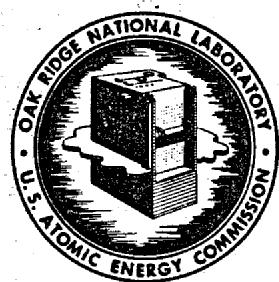
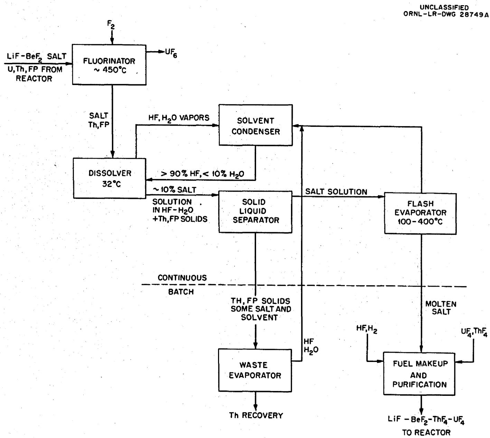
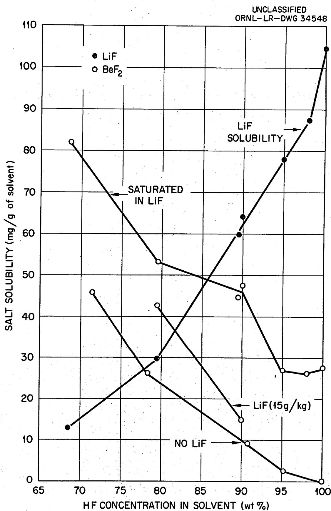
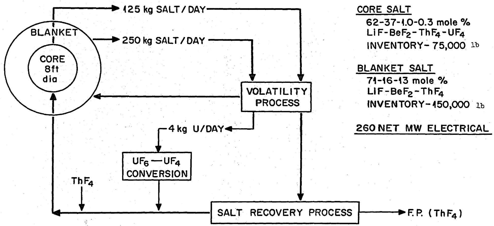

# UNCLASSIFIED

OAK RIDGE NATIONAL LABORATORY

Operated By

UNION CARBIDE NUCLEAR COMPANY

# UCC

POST OFFICE BOX X

OAK RIDGE, TENNESSEE

EXTERNAL TRANSMITTAL AUTHORIZATION

ORNL

CENTRAL FILES NUMBER

59-2-61

Second Issue

COPY NO. 40

DATE: April 1, 1959

SUBJECT: Processing of Molten Salt Power Reactor Fuel

TO: Distribution

FROM: D. O. Campbell and G. I. Cathers

# ABSTRACT

-Fuel reprocessing methods are being investigated for molten salt nuclear reactors which use LiF-BeF₂ salt as a solvent for UF₄ and ThF₄. A liquid HF dissolution procedure coupled with fluorination has been developed for recovery of the uranium and LiF-BeF₂ solvent salt which is highly enriched in Li-7. The recovered salt is decontaminated in the process from the major reactor poisons; namely, rare earths and neptunium. A brief investigation of alternate methods, including oxide precipitation, partial freezing, and metal reduction, indicated that such methods may give some separation of the solvent salt from reactor poisons, but they do not appear to be sufficiently quantitative for a simple processing operation.

Solubilities of LiF and $\mathsf{BeF}_2$ in aqueous $70 - 100\%$ HF are presented. The $\mathsf{BeF}_2$ solubility is appreciably increased in the presence of water and large amounts of LiF. Salt solubilities of $150~\mathrm{g / liter}$ are attainable. Tracer experiments indicate that rare earth solubilities, relative to LiF- $\mathsf{BeF}_2$ solvent salt solubility, increase from about $10^{-4}$ mole % in $98\%$ HF to 0.003 mole % in $80\%$ HF.

Fluorination of uranium from LiF-BeF $_2$ salt has been demonstrated. This appears feasible also for the recovery of the relatively small concentration of uranium produced in the LiF-BeF $_2$ -ThF $_4$ blanket.

A proposed chemical flowsheet is presented on the basis of this exploratory work as applied to the semicontinuous processing of a 600 Mw power reactor.

NOTICE

# LEGAL NOTICE

This report was prepared as an account of Government sponsored work. Neither the United States, nor the Commission, nor any person acting on behalf of the Commission:

A. Makes any warranty or representation, expressed or implied, with respect to the accuracy, completeness, or usefulness of the information contained in this report, or that the use of any information, apparatus, method, or process disclosed in this report may not infringe privately owned rights; or   
B. Assumes any liabilities with respect to the use of, or for damages resulting from the use of any information, apparatus, method, or process disclosed in this report.

As used in the above, "person acting on behalf of the Commission" includes any employee or contractor of the Commission, or employee of such contractor, to the extent that such employee or contractor of the Commission, or employee of such contractor prepares, disseminates, or provides access to, any information pursuant to his employment or contract with the Commission, or his employment with such contractor.

# INTRODUCTION

High temperature fluid fuel reactors using molten fluorides have been proposed for the production of nuclear power. $^{1,2}$ The core or blanket salt in this type reactor would be ideally a Li $^{7}$ F-BeF $_2$ mixture for optimum neutron moderation and economy. This material would act as a solvent or carrier for the fluorides of the fissile or fertile elements, uranium, plutonium and thorium. The feasibility and economic justification of such a reactor system depends on fuel processing, i.e., a processing method that will maintain the desired neutron economy and reactor operability at a reasonable cost. This paper presents a description of a new chemical process for this type of fluoride fuel based on two principles, namely, volatilization of UF $_6$ from the reactor salt by fluorination and recovery of the Li $^{7}$ F-BeF $_2$ solvent salt for reuse by a HF dissolution process.

# MOLTEN SALT REACTOR DESCRIPTION

The Aircraft Reactor Experiment, in which NaF-ZrF4-U²³⁵F₄ fuel circulated through inconel tubing in BeO moderator, demonstrated the basic feasibility of a high temperature molten salt reactor¹. Detailed calculations for a power reactor have been published on 600 Mw heat two-region homogeneous machines using 63 mole % Li⁷F--37 mole % BeF₂ with up to 1 mole % UF₄ and ThF₄ as a core salt and 71 mole % Li⁷F--16 mole % BeF₂--13 mole % ThF₄ as a blanket salt². The reactor design used as reference in this paper has a uranium (U²³³ or U²³⁵) inventory of 600-1000 kg (varying with time) with an 8-ft-dia core and a total fuel volume of 530 ft³ (334 ft³ external to the core). The core salt weight is approximately 75,000 lb, the blanket 150,000 lb.

In the reference reactor at least 90% of the power is produced in the core, yielding about 180 kg of fission products per year. After operation for one year without processing (except inert gas removal), the fission products absorb about 3.8% of all neutrons and $U^{236}$ and $U^{238}$ absorb about 3.9%. If the reactor fuel is processed for fission product removal at the rate of one-fuel volume per year, after 10 years, the fission products would absorb 2.7% of the neutrons; $U^{234}$ , $U^{236}$ , and $U^{238}$ would absorb 10.4% (mostly $U^{236}$ ); and $Np^{237}$ about 0.9%. Without fuel processing neutron absorption by fission products would continue to increase almost linearly with time, exceeding 10% after 10 years; $Np^{237}$ would build up at an accelerating rate, absorbing about 3% of the neutrons after 10 years; the amount of fissionable material required to keep the reactor critical would increase by about 200 kg/year; and the conversion ratio would decrease markedly.

Even-numbered uranium isotopes, particularly $\mathbf{U}^{236}$ , are the worst poisons, but their removal is beyond the scope of chemical reprocessing. Of the 180 kg of fission products per year 22 atom % with half-lives of more than 78 min are

subject to removal from the reactor as rare gases; these would contribute $26\%$ of the fission product poisoning for 100 ev neutrons. About 26 atom $\%$ of the long-lived fission products are rare earths, which contribute $40\%$ of the total fission product poisoning. The rest of the fission products consist of a wide variety of elements, no one of which is outstanding from the nuclear poisoning point of view. After reasonably long operation $\mathbf{Np}^{237}$ is the worst individual poison other than the rare earths.

# FLUORIDE VOLATILITY PROCESS FOR MSR FUEL

Fluoride volatilization processing for uranium recovery appears feasible for molten salt reactor (MSR) fuel on the basis of laboratory studies. It is based on direct fluorination of the fuel salt to convert $\mathbf{U}\mathbf{F}_4$ to $\mathbf{U}\mathbf{F}_6$ with attendant volatilization and recovery. Similar volatility processes have been proposed and developed for zirconium alloy reactor fuel elements after dissolution in fused salt. $^{3,4}$ One of these, the ORNL Volatility Process, was successfully used for recovery and decontamination of uranium from the NaF-ZrF $_4$ - $\mathbf{U}\mathbf{F}_4$ salt fuel of the Aircraft Reactor Experiment. $^{5}$ The MSR volatilization process would differ, however, from other volatility processes in that complete decontamination of the product $\mathbf{U}\mathbf{F}_6$ would not be essential, since it could be remotely reduced to $\mathbf{U}\mathbf{F}_4$ and reconstituted into reactor salt.

A series of small-scale fluorinations was carried out with a 48 mole % LiF--52 mole % BeF2 eutectic mixture containing about 0.8 mole % UF4. (MSR fuel would contain 0.25 to 1.0 mole % UF4, depending on the operating time.) The eutectic salt was used instead of the fuel salt in order to investigate lower temperature operation. In fluorinations at 450, 500, and 550°C, the rate of uranium removal increased with the temperature (Table 1).

The thorium-containing blanket salt cannot be processed for uranium recovery at as low a temperature as that used to process the fuel salt.

Table 1. Effect of Fluorination Temperature on the Fluorination of Uranium from LiF-BeF2 (48-52 mole %)*   

<table><tr><td rowspan="2">Fluorination Time, hr</td><td colspan="3">Uranium in Salt after Treatment, wt %</td></tr><tr><td>At 450°C</td><td>At 500°C</td><td>At 550°C</td></tr><tr><td>0</td><td>3.39**</td><td>5.10</td><td>4.91</td></tr><tr><td>0.5</td><td>1.96</td><td>0.20</td><td>0.55</td></tr><tr><td>1.0</td><td>0.39</td><td>0.17</td><td>0.20</td></tr><tr><td>1.5</td><td>0.21</td><td>0.12</td><td>0.06</td></tr><tr><td>2.5</td><td>0.32</td><td>0.11</td><td>0.05</td></tr></table>

* No induction period before uranium evolution.   
$^{**}5$ wt% added; some of the uranium probably precipitated as oxide.

The uranium concentration in the blanket, however, is very low; it has been estimated that with continuous processing at the rate of one blanket volume per year, the blanket salt $(\mathrm{LiF - BeF_2 - ThF_4}, 71 - 16 - 13\text{ mole}\%)$ will contain approximately $0.004$ mole $\%$ $\mathrm{UF_4}$ (140 ppm) after one year and $0.014$ mole $\%$ $\mathrm{UF_4}$ after 20 years. Fluorinations of two such mixtures at $600^{\circ}\mathrm{C}$ for 90 min gave uranium concentrations in the salt of 1-2 ppm, the lowest uranium concentrations ever obtained in fused salt laboratory fluorinations. Over $90\%$ of the uranium was removed in 15 min. It is concluded, therefore, that fluorination of uranium from blanket salt can be accomplished.

The behavior of protactinium in the blanket salt during fluorination is of interest, although the protactinium is not lost, in any case, since the salt is returned to the reactor. A LiF-BeF2–ThF4 (71-16-13 mole %) mixture containing sufficient irradiated thorium to give a Pa233 concentration of 5.5 x 10-9 g per gram of salt was fluorinated for 150 min at 600°C; there was no measurable decrease in protactinium activity in the salt. Protactinium volatilization in the process seems to be unlikely. However, the protactinium concentration in the blanket of the reference design reactor is higher (~10-4 g per gram of salt).

$$
\mathrm {L i} ^ {7} \mathrm {F} - \mathrm {B e F} _ {2} \text {S A L T R E C O V E R Y W I T H H F}
$$

Experimental work has demonstrated that the LiF-BeF $_2$ salt can be processed by dissolution in anhydrous or nearly anhydrous liquid hydrogen fluoride. Decontamination of the LiF-BeF $_2$ salt from the major neutron poisons, rare earths and neptunium, is achieved due to the relative insolubility of the fluorides of these elements in such solutions. The LiF-BeF $_2$ salt is recoverable from the HF solution by evaporation.

It is well known that $\mathsf{BeF}_2$ is very soluble and LiF is rather insoluble in water in contrast to liquid HF where the reverse is true. In anhydrous HF the polyvalent element fluorides generally exhibit low solubilities. Initial consideration of the problem suggested that use of aqueous HF (greater than $80\%$ HF) would give sufficient solubility of both LiF and $\mathsf{BeF}_2$ to meet process objectives. The solubility studies were therefore carried out over the range of $70 - 100\%$ HF. However, in addition to the mixed solvent effect there existed also the possibility that anhydrous HF would be suitable as a solvent for the LiF- $\mathsf{BeF}_2$ salt complex in the analogous sense that cryolite, $\mathsf{Na}_3\mathsf{AlF}_6$ , is quite soluble whereas $\mathsf{AlF}_3$ is insoluble in HF. Some emphasis was therefore placed on using "anhydrous" HF with the material being obtained by vapor transfer from a commercial tank (nominally containing less than $0.1\%$ water).

Initial measurements of the solubilities of LiF and $\mathsf{BeF}_2$ , separately, in aqueous HF solutions indicated that both materials are soluble to an appreciable extent in solutions containing 70 to 90 wt % HF (Tables 2 and 3). In general,

  
Fig. 2. Tentative Flowsheet for Fluoride Volatility and HF Dissolution Processing of Molten-Salt Reactor Fuel.

Table 2. Solubility of LiF in Aqueous HF Solutions   

<table><tr><td rowspan="2">Temperature, ℃</td><td colspan="5">LiF in Solution, mg/g of solution</td></tr><tr><td>73.6 wt % HF</td><td>82.3 wt % HF</td><td>90.8 wt % HF</td><td>96.2 wt % HF</td><td>100 wt % HF</td></tr><tr><td>12</td><td>10.7</td><td>31.7</td><td>58.4</td><td>74.8</td><td>88.2</td></tr><tr><td>62*</td><td>20.6</td><td></td><td></td><td></td><td></td></tr><tr><td>47*</td><td></td><td>41.0</td><td></td><td></td><td></td></tr><tr><td>37*</td><td></td><td></td><td>62.8</td><td>80.4</td><td></td></tr><tr><td>32.5*</td><td></td><td></td><td></td><td></td><td>91.4</td></tr></table>

*Reflux temperature.

Table 3. Solubility of BeFp in Aqueous HF Solution   

<table><tr><td rowspan="2">Temperature, °C</td><td colspan="5">BeF2in Solution, mg/g of solution</td></tr><tr><td>72.8 wt % HF</td><td>78.3 wt % HF</td><td>90.8 wt % HF</td><td>95.2 wt % HF</td><td>100 wt % HF</td></tr><tr><td>12</td><td>45.8</td><td>26.3</td><td>9.2</td><td>2.8</td><td>0.0012</td></tr><tr><td>-60</td><td></td><td></td><td></td><td>3.8</td><td></td></tr></table>

LiF was more soluble at higher temperatures if water was present in the solvent, but the effect of temperature on $\mathrm{BeF}_2$ solubility was not definitely established. The LiF solubility decreased rapidly as water was added to anhydrous HF, and the $\mathrm{BeF}_2$ solubility increased from near zero; the solubilities were roughly the same in $80\mathrm{wt}\%$ HF, 25 to $30\mathrm{g/kg}$ . The $\mathrm{BeF}_2$ was glassy in nature and dissolved slowly. The solubility values reported for LiF in Table 2, except at $12^{\circ}\mathrm{C}$ , were obtained after refluxing HF over the salt for $3\mathrm{hr}$ . No further measurements were made with LiF or $\mathrm{BeF}_2$ alone, since the solubilities of the two components together were of primary importance.

The solubility of $\mathsf{BeF}_2$ was also measured at various HF concentrations and temperatures in the presence of LiF. The results generally confirmed that the presence of LiF as well as water increases the $\mathsf{BeF}_2$ solubility. A plot of solubility values at one temperature (12°C) illustrates both effects (Fig. 1). These and data at other temperatures are presented in Tables 4, 5, and 6. The favorable effect of water on $\mathsf{BeF}_2$ solubility is shown particularly in 70 and 80% HF solutions (Table 4). $\mathsf{BeF}_2$ solubility was enhanced further when 70, 80, and 90 wt % HF solutions were saturated with LiF (Table 5). Because of the increase in $\mathsf{BeF}_2$ solubility at higher HF concentrations when LiF is present, the 90-100% HF range was studied further (Table 6). The solubilities in approximately 100% HF appear sufficiently high for process purposes.

The results presented here must be considered preliminary. Beryllium solubilities, in particular, may be generally higher than indicated because of analytical problems. Difficulty was also encountered in determining accurately the water content in highly concentrated HF. This was partly a problem of sampling the volatile solutions and partly the result of determining the small amount of water by the difference of the sample weight and the total weight of LiF, $\mathrm{BeF}_2$ , and HF.

Solubility measurements were made also on 63-37 mole % LiF-BeF₂ salt (48-52 wt %) in the 80 to 98 wt % HF range (Table 7). This salt contained about 0.1 mole % ZrF₄, 0.2 mole % mixed rare earth fluorides (Lindsay Code 370), and trace fission products (see following section). The salt was crushed but not ground to a powder; average particles were flakes about 10 mils thick and 50 to 100 mils across. The solutions were sampled 15 and 60 min after salt addition to permit an estimate of the rate of dissolution. The results indicated that an appreciable concentration is reached rapidly, but that the solutions are not saturated, especially with respect to BeF₂, in less than several days. They also demonstrate that the fused salt behaves similarly to the two components added individually.

# FISSION PRODUCT DECONTAMINATION IN THE HF SOLUTION PROCESS

The aqueous HF solutions of the salt from the preceding experiment were filtered through sintered nickel, and radiochemical analyses were made to determine the fission product solubilities or decontamination effect. The results (Table 8) show that rare earths, as represented by cerium, were relatively insoluble in the HF solution and were therefore effectively separated from the salt.

  
Fig. 1. Effect of LiF on $\mathsf{BeF}_2$ Solubility in HF- $\mathsf{H}_2\mathsf{O}$ Solutions at $12^{\circ}C$

Table 4. Solubility of ${\mathrm{{BeF}}}_{2}$ in Aqueous HF Containing LiF   

<table><tr><td rowspan="2">Temperature,oc</td><td rowspan="2">LiF Added, mg/g of solvent</td><td colspan="3">BeF2in Solution, mg/g of solution</td></tr><tr><td>68.6 wt % HF</td><td>79.5 wt % HF</td><td>90.0 wt % HF</td></tr><tr><td>12</td><td>7.0</td><td>68.8</td><td></td><td></td></tr><tr><td>12</td><td>15.0</td><td></td><td>42.8</td><td>15.6</td></tr><tr><td>-60</td><td>7.0</td><td>65.8</td><td></td><td></td></tr><tr><td>-60</td><td>15.0</td><td></td><td>38.2</td><td>16.5</td></tr></table>

Table 5. Solubility of LiF and $\mathsf{BeF}_2$ in Aqueous HF Saturated-with Both Salts   

<table><tr><td rowspan="3">Temperature, ℃</td><td colspan="6">Salt in Solution, mg/g of solution</td></tr><tr><td colspan="2">68.6 wt % HF</td><td colspan="2">79.5 wt % HF</td><td colspan="2">90.0 wt % HF</td></tr><tr><td>LiF</td><td>BeF2</td><td>LiF</td><td>BeF2</td><td>LiF</td><td>BeF2</td></tr><tr><td>12</td><td>12.9</td><td>82.4</td><td>29.9</td><td>53.8</td><td>64.2</td><td>48.2</td></tr><tr><td>-60</td><td>8.5</td><td>76.8</td><td>22.6</td><td>54.2</td><td>46.0</td><td>58.2</td></tr></table>

Table 6. Solubility of LiF and BeF2 in Solvents Containing 89.5 to 100 wt % HF   

<table><tr><td rowspan="3">Temperature, ℃</td><td colspan="8">Salt in Solution, mg/g of solution</td></tr><tr><td colspan="2">89.5 wt % HF</td><td colspan="2">95 wt % HF</td><td colspan="2">98 wt % HF</td><td colspan="2">100 wt % HF</td></tr><tr><td>LdF</td><td>BeF2</td><td>LdF</td><td>BeF2</td><td>LdF</td><td>BeF2</td><td>LdF</td><td>BeF2</td></tr><tr><td>12</td><td>60</td><td>45</td><td>78</td><td>27</td><td>92</td><td>26</td><td>107</td><td>28</td></tr><tr><td>-60</td><td>50</td><td>24</td><td>60</td><td>33</td><td>62</td><td>32</td><td>90</td><td>30</td></tr><tr><td>43*</td><td>69</td><td>68</td><td></td><td></td><td></td><td></td><td></td><td></td></tr><tr><td>40*</td><td></td><td></td><td>87</td><td>66</td><td></td><td></td><td></td><td></td></tr><tr><td>36*</td><td></td><td></td><td></td><td></td><td>98</td><td>46</td><td></td><td></td></tr><tr><td>33*</td><td></td><td></td><td></td><td></td><td></td><td></td><td>105</td><td>49</td></tr></table>

\*Reflux temperature.

Table 7. Solubility in Aqueous HF Solution of LiF and BeF from Salt Mixture Containing 63 mole % LiF and 37 mole % BeF   

<table><tr><td rowspan="3">Time</td><td rowspan="3">Temperature, °C</td><td colspan="8">Salt in Solution, mg/g of solution</td></tr><tr><td colspan="2">79.5 wt % HF</td><td colspan="2">89.5 wt % HF</td><td colspan="2">95 wt % HF</td><td colspan="2">98 wt % HF</td></tr><tr><td>Lif</td><td>-BeF2</td><td>LIF</td><td>BeF2</td><td>LIF</td><td>BeF2</td><td>LIF</td><td>BeF2</td></tr><tr><td>15 min</td><td>12</td><td>28</td><td>33</td><td>50</td><td>44</td><td>40</td><td>17</td><td>28</td><td>4</td></tr><tr><td>1 hr</td><td></td><td>29</td><td>35</td><td>51</td><td>50</td><td>43</td><td>17</td><td>22</td><td>3</td></tr><tr><td>20 hr</td><td></td><td>31</td><td>58</td><td>68</td><td>74</td><td></td><td></td><td></td><td></td></tr><tr><td>4 days</td><td></td><td>32</td><td>68*</td><td>79</td><td>82*</td><td>63</td><td>28</td><td>70*</td><td>22</td></tr><tr><td>5 hr</td><td>-60</td><td>21</td><td>65</td><td>74</td><td>102</td><td>70</td><td>36</td><td>71*</td><td>22</td></tr><tr><td>20 hr</td><td>12</td><td>34</td><td>100</td><td>76</td><td>92</td><td>88*</td><td>53</td><td>60*</td><td>22</td></tr></table>

*Essentially all the component indicated had dissolved and therefore the solubility may be higher than the value given. Insufficient salt was added to some of the solutions to ensure an excess of both components.

LiF-BeF $_2$ (63-37 mole %) + ~0.2 mole % rare earth fluorides + trace fission products between 1 and 2 years old

Table 8. Fission Product Solubilities in Aqueous HF Solutions   

<table><tr><td colspan="6">Activity in Original Salt and in HF Solution, counts/min/g of salt</td></tr><tr><td>Fission Product*</td><td>Original Salt</td><td>79.5 wt % HF</td><td>89.5 wt % HF</td><td>95 wt % HF</td><td>98 wt % HF</td></tr><tr><td>Gross β</td><td>\( 745 \times 10^4 \)</td><td>\( 230 \times 10^4 \)</td><td>\( 200 \times 10^4 \)</td><td>\( 225 \times 10^4 \)</td><td>\( 250 \times 10^4 \)</td></tr><tr><td>Gross γ</td><td>228</td><td>293</td><td>213</td><td>244</td><td>282</td></tr><tr><td>Cs γ</td><td>174</td><td>251</td><td>196</td><td>223</td><td>258</td></tr><tr><td>Srβ</td><td>104</td><td>73</td><td>67</td><td>72</td><td>75</td></tr><tr><td>TRE β</td><td>650</td><td>97</td><td>92</td><td>94</td><td>101</td></tr><tr><td>Ce β</td><td>510</td><td>7.9</td><td>3.6</td><td>1.3</td><td>0.28</td></tr><tr><td>Y90 β</td><td>105</td><td>73</td><td>66</td><td>74</td><td>81.5</td></tr></table>

*Zr and Nb precipitated from molten salt before this experiment and were not present in significant concentration.

The solubility decreased as the HF concentration was increased. The total rare earth (TRE) and trivalent rare earth (except cerium) analyses do not show this separation because of the presence of the yttrium daughter of strontium. No rare earth activity other than cerium (and yttrium) was detected in the HF solutions. The slight apparent decontamination from strontium is not understood; strontium is expected to be fairly soluble in these solutions. Cesium is known to be soluble, and all cesium in the salt added apparently dissolved.

Thus the rare earths, as represented by cerium, are removed from LiF-BeF $_2$ salts by dissolution of the salt in an aqueous HF solution, and strontium and cesium are not. The rare earth solubility in these HF solutions saturated with LiF and BeF $_2$ increased from about $10^{-4}$ mole % in 98 wt % HF to 0.003 mole % in 80 wt % HF, based on the amount of LiF + BeF $_2$ dissolved. Reactor fuel with a 1-year fuel cycle will contain rare earths at a concentration of about 0.05 mole%.

# SOLUBILITIES OF HEAVY ELEMENTS IN HF

Neptunium is the most serious nuclear poison other than the rare earths in a molten salt reactor, burning U²³⁵.

The neptunium solubility in 80 to $100\%$ HF saturated with LiF and $\mathrm{BeF}_2$ was found sufficiently low to permit its removal along with the rare earths (Table 9). For these determinations small quantities of neptunium (aqueous $\mathbf{Np}^{+4}$ nitrate solution) were added incrementally to HF solutions saturated with LiF and $\mathrm{BeF}_2$ . The concentration of nitrate so added was $\sim 0.02\%$ of the fluoride concentration. Solubilities are reported in mg Np per g solution and in mole % of neptunium relative to dissolved LiF- $\mathrm{BeF}_2$ salt.

The neptunium was determined by alpha counting with pulse analysis to distinguish neptunium from plutonium activity present as an impurity. The plutonium appeared to be carried with the neptunium to a considerable extent; the ratio of the amount of plutonium in solution to the amount undissolved was within a factor of 2 of the ratio for neptunium although the plutonium concentration was smaller by a factor of 500.

Addition of iron and nickel metal to the HF solutions resulted in a significant reduction in the gross $\alpha$ activity, probably as the result of reduction to $\mathbf{Np}(\mathbf{III})$ and $\mathbf{Pu}(\mathbf{III})$ . This has not yet been verified by pulse analysis. The trivalent state might be expected to behave in somewhat the same way as the rare earths; the observed solubilities are in the same range as those reported previously for rare earths. It is expected that the rare earths, nepetunium, plutonium, and possibly uranium will behave as a single group and therefore exhibit lower solubilities when present together than the values reported here for the separate components.

Measurements of the solubilities of thorium and uranium fluorides in 90 to $100\%$ HF indicate that uranium and thorium are relatively insoluble. All $\mathrm{ThF}_4$ determinations showed less than $0.03\mathrm{mg}$ of thorium per gram of solution,

Table 9. Np(IV) Solubility in LiF-BeF $_2$ Saturated Aqueous HF   

<table><tr><td rowspan="2">Salt</td><td colspan="4">Solubility in Solvent, mg/g</td></tr><tr><td>~80 wt % HF</td><td>~90 wt % HF</td><td>~94 wt % HF</td><td>~100 wt % HF</td></tr><tr><td>LiF</td><td>29</td><td>64</td><td>96</td><td>112</td></tr><tr><td>BeF2</td><td>111</td><td>70</td><td>60</td><td>40</td></tr><tr><td>Np</td><td>0.026</td><td>0.011</td><td>0.0086</td><td>0.0029</td></tr></table>

Np solubility relative to salt, mole %

0.0031 0.0012 0.00072 0.00024

the limit of detection. Better analytical methods are available for $\mathbf{U}\mathbf{F}_{\mathbf{h}}$ , and solubilities were generally in the range 0.005-0.010 mg of uranium per gram of solution. In the presence of fresh iron or nickel metal solubilities were somewhat lower, 0.002-0.005 mg/g, indicating perhaps a higher solubility for higher oxidation states. Relative to dissolved salt these solubilities are the order of 0.001 mole%.

# SOLUBILITY OF CORROSION PRODUCT FLUCRIDES IN HF SOLVENT

Measurements were made of the solubilities of corrosion products fluorides (iron, chromium, and nickel) in HF solutions saturated with LiF. Chromium fluoride was relatively soluble, with values of about 8, 12, and 18 mg of chromium per gram of solution in 100, 95, and 90 wt % HF, respectively. Iron and nickel fluorides were less soluble. Measurements of the iron fluoride solubility varied from 0.08 to 2 mg iron per gram of solution; the average and average deviation neglecting extreme values was 0.14 ± 0.10. Measurements of the nickel fluoride solubility varied from 0.01 to 1.3 mg of nickel per gram of solution, the average being 0.15 ± 0.06. The results were so inconsistent that no trend with HF concentration could be established. When iron, nickel and chromium fluorides were present together, the solubilities of all appeared to be somewhat lower.

Similar measurements in 90 and $100\%$ HF (no dissolved salt) fell in the same range, but in 80 wt $\%$ HF the iron and nickel solubilities appeared to be significantly higher.

# RECOVERY OF SALT FROM SOLUTION

The LiF and $\mathsf{BeF}_2$ salt can be recovered from the HF solutions by evaporation. There is some question of hydrolysis of the salt in recovery, the result particularly of the existence of a high-boiling azeotrope at 38 wt $\%$ HF, which would be obtained if some water was present initially and if flash evaporation was not used. A $90\%$ HF solution saturated with LiF and $\mathsf{BeF}_2$ was slowly evaporated to dryness and heated to $450^{\circ}\mathsf{C}$ . X-ray diffraction indicated that the resulting salt was about $90\%$ 2LiF $\cdot$ BeF $_2$ and $10\%$ $\mathsf{BeF}_2$ , and petrographic examination indicated less than $3\%$ of material other than these fluorides. A second sample was evaporated after addition of a little $\mathsf{NH}_4\mathsf{F}$ (which would decompose and perhaps hydrefluorinate the salt at elevated temperatures) and fused at $700^{\circ}\mathsf{C}$ . This salt appeared to be entirely the binary compound, and the x-ray pattern was somewhat cleaner than in the first case. However, hydrolysis did not appear to be a significant factor in any event.

# PROCESS FLOWSHEET FOR REACTOR PROCESSING

A tentative flowsheet for application of the fluoride volatility and HF dissolution processes to molten salt reactor fluids has been prepared (Fig. 2). In this system the uranium is separated from the

salt as $\mathbf{U}\mathbf{F}_{6}$ before HF dissolution of the salt, although the reverse might be feasible in some circumstances. The LiF-BeF $_2$ salt is then dissolved in concentrated HF ( $>90\%$ HF) for separation primarily from the rare earth and neptunium neutron poisons. The salt is re-formed in an evaporation step, from which it would proceed to a final makeup and purification step. The latter would perhaps involve the H $_2$ and HF treatment now believed necessary for all salt used in a reactor. The $\mathbf{U}\mathbf{F}_{6}$ produced in the volatility process would be converted to $\mathbf{U}\mathbf{F}_{4}$ for reuse in salt by hydrogen reduction, or alternately it could possibly be reduced in situ in the fused salt by essentially the same method. Although the volatility process achieves high decontamination, and the dissolution process leads to the elimination of the rare earths and neptunium activities, the salt recycle would require shielding and remote operation.

The scale of the process with a 1-year cycle, relative to the reactor, is indicated in Fig. 3. The daily core salt processing rate would be about $125\mathrm{kg}$ containing about $4\mathrm{kg}$ of uranium. Assuming a $10\%$ solubility for $\mathrm{LiF - BeF_2}$ in the HF solution the solution processing rate would be less than one liter per minute for the reference reactor (260 Mr electric). The daily blanket processing rate would be about $250\mathrm{kg}$ containing only about $0.1\mathrm{kg}$ of $U^{233}$ which would be recovered by the fluoride volatility process. The blanket salt would then be returned to the reactor, after treatment to remove corrosion products, if necessary. In-frequent processing of the blanket salt to remove fission products would be required since at most a few percent of the fissions occur in the blanket. Although more development of some of the process chemistry is certainly needed, the principal features of the process appear to be suited to the objectives for processing molten salt reactor fuel. Much more work will be needed for developing chemical flowsheets for specific reactor systems.

# HIGH-TEMPERATURE PROCESSING

The direct removal of rare earths from molten fluorides was investigated briefly using two methods--oxide precipitation and partial salt crystallization. These results were generally not favorable and were not pursued further. An alternative approach which appears to have considerable promise consists of direct equilibration of the salt with a bed of $\mathrm{CeF}_3$ to remove the worse poisons, the rare earths.

Oxide precipitation, achieved by small additions to the fused salt of water or CaO, was tried with 50-50 mole % NaF-ZrF $_4$ and 11.5-42-46.5 mole % NaF-KF-LiF since it had not been determined at the time that LiF-BeF $_2$ salt would definitely be preferred: Trace fission products were added. Oxide addition results in precipitation of primarily zirconium in the case of zirconium-bearing salt without too much effect

[ - 8\pi \tau ]

UNCLASSIFIED

ORNL-LR-DWG 32747-R

  
Fig. 3. Molten-Salt Reactor Processing.

on fission product activities (uranium if present would behave similarly to zirconium). However, in NaF-KF-LiF salt, the rare earth, zirconium, and niobium activities were effectively removed since a large amount of zirconium (or other oxide forming material) was not present. In the case of LiF-BeF $_2$ (63-37 mole % and 50-50 mole %) salt, CaO or water vapor addition caused precipitation of zirconium and niobium activities, with little effect on the rare earths or other activities.

Partial freezing by slow cooling of both NaF-KF-LiF and NaF-ZrF₄ salt containing 0.2 mole % rare earth fluoride resulted in a concentration in the unfrozen liquid of most fission products, including cesium, strontium, and rare earths. The concentration factors were generally less than 2 and always less than 3. The solubilities of these components are considerably higher than their concentrations in these salts. However, partial freezing of LiF-BeF₂ (50-50 mole % and 63-37 mole %) and NaF-BeF₂ (63-37 mole %), each containing 0.2 mole % rare earth fluorides, 0.1 mole % ZrF₄ and trace fission products, resulted in a decrease in rare earth activity in the unfrozen liquid. This is the result of the solubility being less at the melting point than the 0.2 mole % rare earth concentration.

# ACKNOWLEDGMENT

The authors express their appreciation of assistance given by J. T. Roberts and L. G. Alexander on the process requirements for molten salt reactors, and by R. E. Thoma on fused salt systems. Grateful acknowledgment is made also to members of the Analytical Division at Oak Ridge National Laboratory for the analyses necessary in carrying out the process development work. Grateful acknowledgment is also made for the assistance of M. R. Bennett in carrying out the fused salt fluorination work.

# SECOND ISSUE

# DISTRIBUTION

1. R. E. Blanco   
2. J. C. Bresee   
3. K. B. Brown   
4. F. R. Bruce

5-29. G.I.Cathers

30. F. L. Culler   
31. W. K. Eister   
32. D. E. Ferguson   
33. H. E. Goeller   
34. A. T. Gresky   
35. R. B. Lindauer   
36. M.J. Skinner

37-38. Laboratory Records

39. Laboratory Records-RC

40-54. TISE, AEC