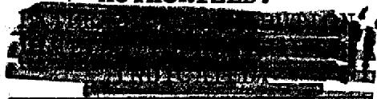
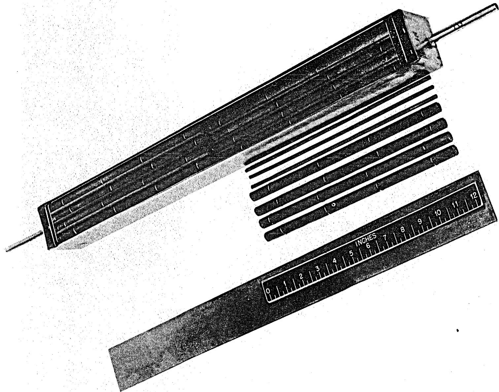
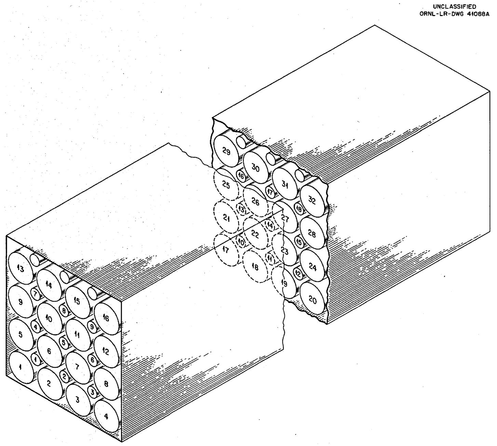
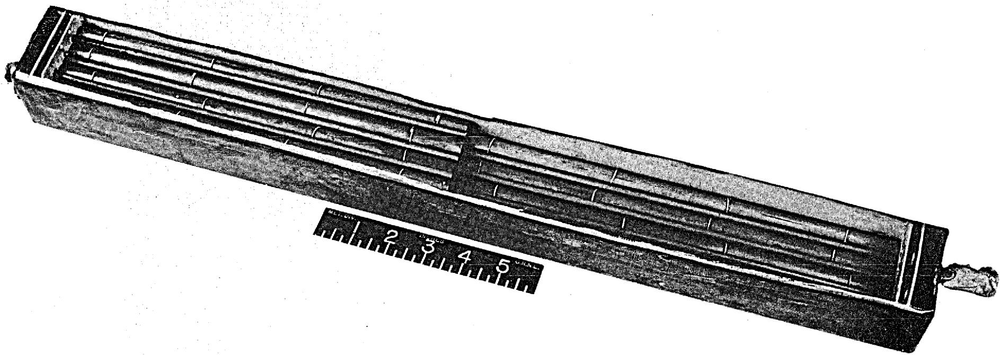
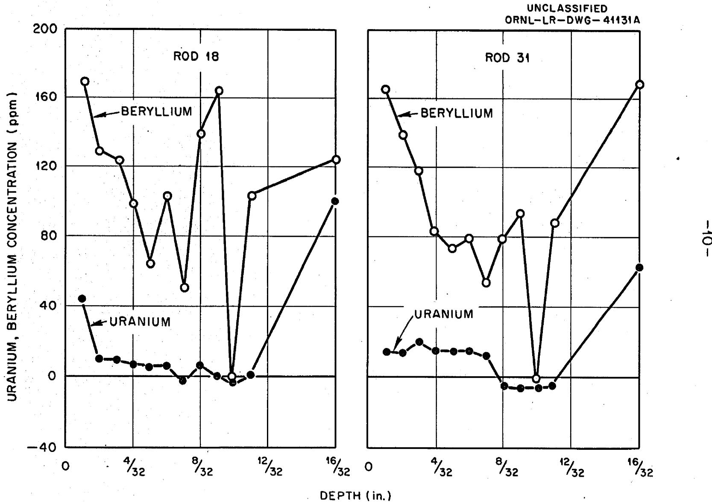

# OAK RIDGE NATIONAL LABORATORY

Operated by

UNION CARBIDE NUCLEAR COMPANY

Division of Union Carbide Corporation

Post Office Box X

Oak Ridge, Tennessee

EXTERNAL TRANSMITTAL

AUTHORIZED.

ORNL

CENTRAL FILES NUMBER

59-8-133

COPY NO.

DATE: August 31, 1959

SUBJECT: Molten Salt-Graphite Compatibility Test.

Results of Physical and Chemical Measurements

TO: Distribution

FROM: R. J. Sheil, R. B. Evans, and G. M. Watson

# ABSTRACT

The observed changes in dimensions, weight, and chemical composition of "impervious" graphite rods in contact for a year with flowing liquid LiF-BeF $_2$ -UF $_4$ (62-37-1 mole %) in a pump loop at 1300°F are listed. On the average the change in diameter was less than 0.02%, and the change in weight was less than 0.03%. Chemical analyses of machine cuttings from the graphite rods show average uranium and beryllium concentrations of approximately 20 and 100 ppm respectively.

# NOTICE

This document contains information of a preliminary nature and was prepared primarily for internal use at the Oak Ridge National Laboratory. It is subject to revision or correction and therefore does not represent a final report. The information is not to be abstracted, reprinted or otherwise given public dissemination without the approval of the ORNL patent branch, Legal and Information Control Department.

# MOLTEN SALT-GRAPHITE COMPATIBILITY TEST

# RESULTS OF PHYSICAL AND CHEMICAL MEASUREMENTS

In a graphite moderated-molten salt reactor, certain advantages are possible if the graphite is in direct contact with the circulating fluid. The feasibility of such a design, which depends to a large extent on the compatibility of the graphite-fused salt system, was tested by inserting 56 samples of an impervious graphite contained by INOR-8 in a flowing stream of LiF-BeF $_2$ -UF $_4$ (62-37-1 mole %) for a period of one year at $1300^{\circ}\mathrm{F}$ .

The experimental assembly consisted of a pump loop constructed and operated by the Metallurgy Division and the Experimental Engineering section of the Reactor Projects Division as described elsewhere.1

# Graphite Loop - Initial Preparations

Two sets of graphite specimens were obtained from the National Carbon Company. All rods were $11^{\prime \prime}$ long and either $1/2^{n}$ or $3/16^{n}$ in diameter. After calipering and weighing, the rods were packaged in an INOR-8 box as shown in Figures 1 and 2. Each of the larger was fitted with four spacing rings to permit the desired flow characteristics and to provide samples for carburization and metallographic examination.

Upon welding the cover plate in place, the assembly was swaged in the loop and the graphite degassed under vacuum for 24 hours at $1100^{\circ}\mathrm{F}$ . It was then repressed with argon before being contacted with salt. During operation, a total pressure of 13 psig was maintained on the graphite: 3 psig the contribution of the helium cover blanket and the remaining due to the head developed by the pump-rate of 1.l gal/min. When the test was completed, the salt was drained from the loop and sampled for optical microscopy, X-ray and wet chemical analyses.

UNCLASSIFIED PHOTO 30631

  
Fig. 1.

  
Fig. 2. Numbering Scheme for Positioning Graphite Rods.

The box containing the graphite was opened by grinding off the top of the container in the Y-l2 Beryllium Shop. Figure 3 is a photograph of the opened vessel after exposure to molten fluorides for one year at $1300^{\circ}\mathrm{F}$ .

# Post Test Examinations

A. Salt Condition. - The chemical analysis, given in Table I shows the chromium content of the salt increased from 135 ppm to 550 ppm. Petrographic and X-ray analyses did not reveal any oxidation products or dissolved carbon.

# B. Graphite Condition

1. Chemical Analyses Data. Machined increments of graphite specimens were submitted for chemical analysis. Successive cuttings, $1/32$ in depth were taken from two of the larger diameter rods until center portions of less than 3/16" diameter were left. These portions and "as received" impervious graphite "blanks" were then ground to -100 mesh in a mortar and pestle (thoroughly scoured with Ottawa Sand according to the recommendations of the Analytical Chemistry Division after each grinding). All graphite samples were submitted for an analysis of the uranium and beryllium concentrations. Two machine cuttings, $1/32$ in depth, were taken from four additional rods. These results are given in Table II with the beryllium and concentrations graphed as a function of penetration depth in Figure 4. Only a very slight migration of salt to the center of the graphite is noted.

2. Physical Changes in Graphite. Macroscopically, there was no change in the rods. None of the samples were broken or distorted and except for the bottom layer of rods that was covered with solidified melt, the salt did not adhere to the graphite. The weight and dimensional changes observed after they had been contacted with circulating fluorides are listed in Table III. The dimensional changes for the $13 - 1 / 2^{n}$ diameter rods corresponded to an average loss of less than 0.5 mil in diameter which approximates the probable error of the measurements. Otherwise, there was no evidence of erosion. Weight losses, which ranged from negligible to 0.05% and averaged 0.02% could be attributed to desorption of residual gases from the graphite. No statistically significant differences were noted in the $13 - 1 / 2^{n}$ diameter rods as compared with the $8 - 3 / 16^{n}$ diameter rods for which weight data were available.

Based on the loss in weight of the test samples and the chemical analyses of the machine cuttings, it appears that only minute quantities of salt permeated the graphite.

UNCLASSIFIED

PHOTO Y30339

  
Fig. 3.

Table I   
Chemical Analyses of Fuel*   

<table><tr><td rowspan="2"></td><td colspan="2">Wt. %</td><td rowspan="2">U/Be</td><td rowspan="2">Theoretical** U/Be</td><td colspan="3">PPM</td></tr><tr><td>U</td><td>Be</td><td>Fe</td><td>Cr</td><td>Ni</td></tr><tr><td>Charge</td><td>4.87</td><td>8.37</td><td>0.582</td><td>0.767</td><td>235</td><td>135</td><td>5</td></tr><tr><td>After operating 1 year</td><td>4.97</td><td>9.77</td><td>0.509</td><td></td><td>330</td><td>555</td><td>25</td></tr></table>

* G. J. Nessle, Personal Communication.   
** Calculated for LiF-BeF $_2$ -UF $_4$ (62-37-1 mole %).

Table II   
Analyses of Machine Cuttings from Graphite Rods   

<table><tr><td rowspan="2">Rod No.</td><td rowspan="2">Cutting No.</td><td colspan="2">PPM</td><td rowspan="2">Theoretical1 U/Be</td><td rowspan="2">Actual U/Be</td></tr><tr><td>U</td><td>Be</td></tr><tr><td rowspan="3">8</td><td>1</td><td>30</td><td>125</td><td>0.573</td><td>0.240</td></tr><tr><td>2</td><td>9</td><td>175</td><td></td><td>0.051</td></tr><tr><td>*</td><td>10</td><td>&lt; 1</td><td></td><td>-</td></tr><tr><td rowspan="2">11</td><td>1</td><td>22</td><td>125</td><td></td><td>0.176</td></tr><tr><td>2</td><td>10</td><td>110</td><td></td><td>0.091</td></tr><tr><td rowspan="2">14</td><td>1</td><td>24</td><td>75</td><td></td><td>0.320</td></tr><tr><td>2</td><td>28</td><td>105</td><td></td><td>0.267</td></tr><tr><td rowspan="3">23</td><td>1</td><td>17</td><td>125</td><td></td><td>0.136</td></tr><tr><td>2</td><td>&lt;1</td><td>60</td><td></td><td>0.017</td></tr><tr><td>*</td><td>5</td><td>&lt; 1</td><td></td><td>-</td></tr><tr><td rowspan="14">18</td><td>*</td><td>8</td><td>&lt; 1</td><td></td><td>-</td></tr><tr><td>1</td><td>50</td><td>170</td><td></td><td>0.294</td></tr><tr><td>2</td><td>15</td><td>130</td><td></td><td>0.115</td></tr><tr><td>3</td><td>15</td><td>125</td><td></td><td>0.120</td></tr><tr><td>4</td><td>12</td><td>100</td><td></td><td>0.120</td></tr><tr><td>5</td><td>10</td><td>65</td><td></td><td>0.154</td></tr><tr><td>6</td><td>13</td><td>105</td><td></td><td>0.124</td></tr><tr><td>7</td><td>&lt;1</td><td>50</td><td></td><td>0.020</td></tr><tr><td>8</td><td>13</td><td>140</td><td></td><td>0.093</td></tr><tr><td>9</td><td>5</td><td>165</td><td></td><td>0.030</td></tr><tr><td>10</td><td>&lt;1</td><td>&lt; 1</td><td></td><td>1.000</td></tr><tr><td>11</td><td>6</td><td>105</td><td></td><td>0.057</td></tr><tr><td>12*</td><td>&lt;1</td><td>&lt; 1</td><td></td><td>-</td></tr><tr><td>Center</td><td>100</td><td>125</td><td></td><td>0.800</td></tr><tr><td rowspan="14">31</td><td>*</td><td>5</td><td>&lt; 1</td><td></td><td>-</td></tr><tr><td>1</td><td>20</td><td>165</td><td></td><td>0.121</td></tr><tr><td>2</td><td>18</td><td>140</td><td></td><td>0.129</td></tr><tr><td>3</td><td>24</td><td>120</td><td></td><td>0.199</td></tr><tr><td>4</td><td>20</td><td>85</td><td></td><td>0.235</td></tr><tr><td>5</td><td>20</td><td>75</td><td></td><td>0.267</td></tr><tr><td>6</td><td>20</td><td>80</td><td></td><td>0.250</td></tr><tr><td>7</td><td>17</td><td>55</td><td></td><td>0.310</td></tr><tr><td>8</td><td>&lt;1</td><td>80</td><td></td><td>0.013</td></tr><tr><td>9</td><td>&lt;1</td><td>95</td><td></td><td>0.011</td></tr><tr><td>10</td><td>&lt;1</td><td>&lt; 1</td><td></td><td>1.000</td></tr><tr><td>11</td><td>&lt;1</td><td>90</td><td></td><td>0.011</td></tr><tr><td>Center</td><td>70</td><td>170</td><td></td><td>0.411</td></tr><tr><td>*</td><td>&lt;1</td><td>&lt; 1</td><td></td><td>-</td></tr></table>

* Samples machined from "as received" material.   
1. Based on chemical analysis at original salt batch, nominally $\mathrm{LiF - BeF_2 - UF_4}$ (62-37-1 mole %).

Table III   
Impervious Graphite Rods (0.5" diameter)   

<table><tr><td rowspan="2">Rod No.</td><td colspan="2">Before Exposure</td><td colspan="2">After Exposure</td><td rowspan="2">Net Change (gms)</td><td rowspan="2">Percent Change</td></tr><tr><td>Weight (gms)</td><td>Dia. (in.)</td><td>Weight (gms)</td><td>Dia. (in.)</td></tr><tr><td>1</td><td>Lost</td><td></td><td></td><td></td><td></td><td></td></tr><tr><td>3</td><td>Lost</td><td></td><td></td><td></td><td></td><td></td></tr><tr><td>6</td><td>68.0555</td><td>0.498</td><td>68.0397</td><td>0.496</td><td>-0.0158</td><td>-0.02</td></tr><tr><td>8</td><td>68.0571</td><td>0.498</td><td>68.0438</td><td>0.497</td><td>-0.0133</td><td>-0.02</td></tr><tr><td>9</td><td>68.5709</td><td>0.502</td><td>68.5572</td><td>0.501</td><td>-0.0137</td><td>-0.02</td></tr><tr><td>11</td><td>68.4152</td><td>0.500</td><td>68.4096</td><td>0.500</td><td>-0.0056</td><td>-0.01</td></tr><tr><td>14</td><td>68.7779</td><td>0.499</td><td>68.7639</td><td>0.500</td><td>-0.0140</td><td>-0.02</td></tr><tr><td>16</td><td>67.7389</td><td>0.496</td><td>67.7205</td><td>0.495</td><td>-0.0184</td><td>-0.03</td></tr><tr><td>18</td><td>68.2650</td><td>0.498</td><td>68.2517</td><td>0.497</td><td>-0.0133</td><td>-0.02</td></tr><tr><td>20</td><td>Lost</td><td></td><td></td><td></td><td></td><td></td></tr><tr><td>21</td><td>68.5801</td><td>0.500</td><td>68.5793</td><td>0.500</td><td>-0.0008</td><td>0.00</td></tr><tr><td>23</td><td>67.9828</td><td>0.497</td><td>67.9703</td><td>0.496</td><td>-0.0125</td><td>-0.03</td></tr><tr><td>26</td><td>68.2956</td><td>0.499</td><td>68.2911</td><td>0.500</td><td>-0.0045</td><td>-0.01</td></tr><tr><td>28</td><td>68.6806</td><td>0.501</td><td>68.6666</td><td>0.501</td><td>-0.0140</td><td>-0.02</td></tr><tr><td>29</td><td>67.8522</td><td>0.499</td><td>67.8352</td><td>0.498</td><td>-0.0174</td><td>-0.03</td></tr><tr><td>31</td><td>67.9389</td><td>0.499</td><td>67.9169</td><td>0.498</td><td>-0.0220</td><td>-0.04</td></tr><tr><td colspan="7">Impervious Graphite Rods (3/16&quot; diameter</td></tr><tr><td>2</td><td>9.1095</td><td></td><td>9.1082</td><td></td><td>-0.0013</td><td>-0.01</td></tr><tr><td>4</td><td>9.1236</td><td></td><td>9.1228</td><td></td><td>-0.0012</td><td>-0.01</td></tr><tr><td>6</td><td>9.4826</td><td></td><td>9.4810</td><td></td><td>-0.0016</td><td>-0.02</td></tr><tr><td>8</td><td>9.0329</td><td></td><td>9.0352</td><td></td><td>+0.0021</td><td>+0.02</td></tr><tr><td>10</td><td>9.3176</td><td></td><td>9.3126</td><td></td><td>-0.0050</td><td>-0.05</td></tr><tr><td>12</td><td>8.7251</td><td></td><td>8.7372</td><td></td><td>+0.0121</td><td>+0.14</td></tr><tr><td>14</td><td>9.0932</td><td></td><td>9.0930</td><td></td><td>-0.0002</td><td>0.00</td></tr><tr><td>16</td><td>9.5142</td><td></td><td>9.5098</td><td></td><td>-0.0044</td><td>-0.05</td></tr><tr><td>18</td><td>9.0149</td><td></td><td>9.0104</td><td></td><td>-0.0045</td><td>-0.05</td></tr></table>

  
Fig.4. Penetration of an Impervious Graphite by LiF-BeF $_2$ -UF $_4$ .

# Distribution

1. A. M. Weinberg   
2. J. A. Swartout   
3. G. E. Boyd   
4. R. A. Charpie   
5. W.H. Jordan   
6. R. B. Briggs   
7. J. A. Lane   
8. H. G. MacPherson   
9. S.C.Lind   
10. F. L. Culler   
II. W. R. Grimes   
12. E. H. Taylor   
13. A. L. Boch   
14. E. G. Bohlman   
15. M. A. Bredig   
16. F. R. Bruce   
17. A. P. Fraas   
18. W. D. Manly   
19. H. F. McDuffie   
20. A. J. Miller   
21. C. F. Baes   
22. C. J. Barton   
23. M. Blander   
24. F. F. Blankenship   
25. W. E. Browning   
26. S. Cantor   
27. D. R. Cuneo   
28. R. B. Evans   
29. H. Insley   
30. E. V. Jones   
31. G.W. Keilholtz   
32. M. J. Kelly   
33. S. Langer   
34. W. L. Marshall

35. R. E. Moore   
36. G. J. Nessle   
37. R. F. Newton   
38. L. G. Overholser   
39. W. T. Rainey   
40. J. H. Shaffer   
41. M. D. Silverman   
42. B. A. Soldano   
43. R. A. Strehlow   
44. R. E. Thoma   
45. G. M. Watson   
46. L. G. Alexander   
47. K. B. Brown   
48. G. I. Cathers   
49. J. H. Devan   
50. L. M. Doney   
51. J. S. Drury   
52. D. E. Ferguson   
53. E. Guth   
54. E. E. Hoffman   
55. H. W. Hoffman   
56. B.W. Kinyon   
57. R. B. Lindauer   
58. W. B. McDonald   
59. H. W. Savage   
60. A. Taboada   
61. D. B. Trauger   
62. P. H. Emmett (Consultant)   
63. D. G. Hill (Consultant)

64-68. Central Research Library  
69-89. Laboratory Records Department  
90. Laboratory Records, ORNL R. C.  
91. Reactor Experimental Eng. Library  
92. ORNL Y-12 Technical Library

DO NOT PHTOETAT