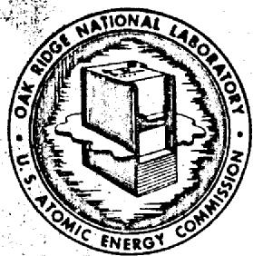
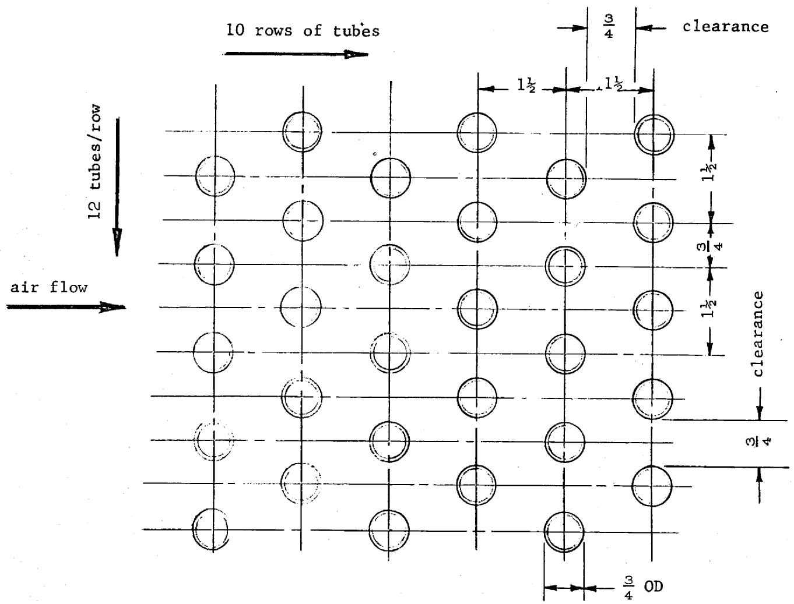
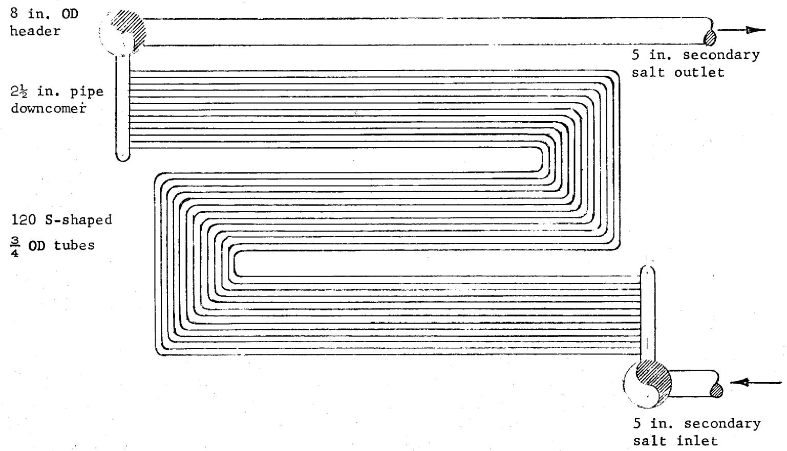
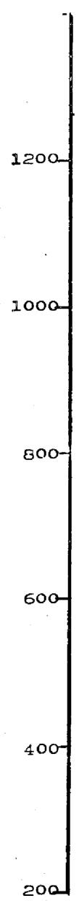
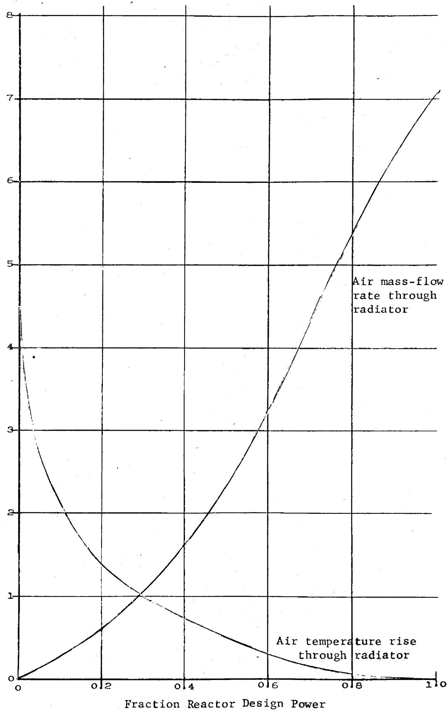

# OAK RIDGE NATIONAL LABORATORY

Operated By

UNION CARBIDE NUCLEAR COMPANY

UcC

POST OFFICE BOX X

OAK RIDGE, TENNESSEE

DATE: November 30, 1960

SUBJECT: MSRE Radiator Design

TO: Distribution

FROM: W. C. Ulrich

# ORNL   NTRAL FILES NUMBER

CF-60-11-108

Internal Distribution Only

COPY NO. 94

MASTER

# Abstract

An air-cooled radiator capable of rejecting $10\mathrm{MW}$ of reactor thermal power to the atmosphere was designed for the MSRE. The design was based on utilizing in part equipment and facilities left from the ART program which were available for use in building 7503.

# LEGAL NOTICE

This report was prepared as an account of Government sponsored work. Neither the United States, nor the Commission, nor any person acting on behalf of the Commission;   
A. Makes any warranty or representation, expressed or implied, with respect to the accuracy, completeness, or usefulness of the information contained in this report, or that the use of any information, apparatus, method, or process disclosed in this report may not infringe privately owned rights; or   
B. Assumes any liabilities with respect to the use of, or for damages resulting from the use of any information, apparatus, method, or process disclosed in this report.   
As used in the above, "person acting on behalf of the Commission" includes any employee or contractor of the Commission, or employee of such contractor, to the extent that such employee or contractor of the Commission, or employee of such contractor prepares, disseminates, or provides access to, any information pursuant to his employment or contract with the Commission, or his employment with such contractor.

# NOTICE

This report contains information of a preliminary nature and was prepared primarily for internal use at the originating installation. It is subject to revision or correction and therefore does not represent a final report. It is passed to the recipient in confidence and should not be abstracted or further disclosed without the approval of the originating installation or DTI Extension, Oak Ridge.

# NOTICE

This document contains information of a preliminary nature and was prepared primarily for internal use at the Oak Ridge National Laboratory. It is subject to revision or correction and therefore does not represent a final report.

DISTRIBUION OF THIS DocUMENES LIMITED To AEC Offices Only Mucio contu

The information is not in be abstracted.   
omnly of otherizc given public dismation with 1 . 1000 of the OMI, plante brawal Legal and Information Control Department.

# CONTENTS

Introduction 2

Radiator Design 2

1. Secondary Salt Flow Rate 2   
2. Air Flow Rate 2   
3. Coil Size and Configuration 2   
4. MSRE Operation at Power Levels Less than 10 Mw 8   
5. Cooling Air 9   
6. Radiator Frame and Doors 10   
7. Duct 11   
8. Heating 11   
9. Conclusions 11   
References 12

# Appendix

Figure 1. MSRE Radiator Tube Arrangement 13

Figure 2. MSRE Radiator Coil Configuration 14

Figure 3. Air Mass-Flow Rate and Temperature Rise for MSRE Radiator

Calculations 16

List of Drawings as of 11-15-60 18

Distribution 19

# Introduction

The design of a heat exchanger for removing MSRE thermal power was based on utilizing as much as possible the existing facilities and equipment in the Aircraft Reactor Test building 7503. Since these facilities included blowers, motors, ducting, and a stack for discharge of air to the atmosphere, an air-cooled coil or radiator seemed to be most feasible.

Because the secondary piping system of the MSRE, of which the radiator is a part, will contain a LiF-BeF₂ salt mixture from which the reactor heat is to be extracted, the design entailed determining the size and configuration of the radiator coil based on the physical properties of this salt and the amount of cooling air available. Also included in the design was an integral supporting frame work-insulated enclosure for the coil. Because the LiF-BeF₂ salt mixture freezes at about $850^{\circ}\mathrm{F}$ , provisions were made for supplying heat to the coil to keep this secondary salt fluid during reactor down periods. Control of air flow rates over the coil, necessary baffling, and duct modifications were also determined.

# Radiator Design

# I. Secondary Salt Flow Rate

The secondary salt which will remove heat from the fuel solution in the primary heat exchanger and reject heat to the atmosphere in the radiator will consist of a mixture of $66\mathrm{mol}\%$ LiF and $34\mathrm{mol}\%$ BeF2. For MSRE operation at 10 Mw thermal power, the secondary salt temperature drop through the coil was selected as $75^{\circ}\mathrm{F}$ . (1100°F inlet temperature, 1025°F outlet temperature.) The flow rate necessary for 10 Mw heat transference capacity was found to be 830 gpm.

# 2. Air Flow Rate

Air will be supplied by two 250 hp axial blowers left from the ART program. Each blower is rated at 82,500 cfm at 15 in. water static pressure, or 114,000 cfm free air delivery. For 10 Mw reactor power operation, the air temperature rise across the coil was set at $200^{\circ}\mathbf{F}$ . Assuming an air inlet temperature of $100^{\circ}\mathbf{F}$ , the temperature of the air leaving the coil would be $300^{\circ}\mathbf{F}$ . For this air temperature rise, 164,000 cfm of air will be required to reject 10 Mw of thermal energy to the atmosphere.

# 3. Coil Size and Configuration

The coil size and configuration depends on both the secondary salt and air flow rates. A first estimate of the coil area required was obtained by assuming an overall heat transfer coefficient of 55 Btu/hr- $^{*}$ F-ft² and solving for A in the equation

$$
q = U A \Delta t _ {m},
$$

where

$$
q = \text {r a t e}
$$

$$
U = \text {o v e r a l l} F - f t ^ {2}
$$

$$
A = \text {h e a t} f t ^ {2}
$$

$$
\Delta t _ {m} = \log \text {m e a n t e m p e r a t u r e d i f f e r e n c e}, ^ {\bullet} F
$$

$$
\Delta t _ {m} = \frac {(1 0 2 5 - 1 0 0) - (1 1 0 0 - 3 0 0)}{\ln \frac {1 0 2 5 - 1 0 0}{1 1 0 0 - 3 0 0}}
$$

$$
\Delta t _ {m} = \frac {1 2 5}{\ln \frac {9 2 5}{8 0 0}} = \frac {1 2 5}{0 . 1 4 5} = 8 6 2 ^ {\circ} F.
$$

$$
(1 0 M w) (3. 4 1 5 \times 1 0 ^ {6} B t u / M w - h r) = (5 5 B t u / h r - f t ^ {2} - ^ {\circ} F) (A f t ^ {2}) (8 6 2 ^ {\bullet} F)
$$

$A = 720 ft^2$ of heat transfer surface area needed.

For $\frac{3}{4}$ in. OD x 0.072 in. wall tubing, the surface area is 0.1963 ft²/ft length. Therefore,

$$
\frac {7 2 0 f t ^ {2}}{0 . 1 9 6 3 f t ^ {2} / f t} = 3 6 7 0 f t
$$

of tubing would be required. An arbitrarily selected tube length of 30 ft gave a total of about 122 tubes. Because of space limitations in the existing ductwork and because of the physical layout of the reactor secondary salt system piping, an S-shaped coil of 120 tubes, each 30 ft long, was proposed for calculating the actual radiator performance. The $120^{3} / 4$ in. OD tubes were arranged in 10 rows with 12 tubes per row with a $1\frac{1}{2}$ in. square pitch. Tube rows were staggered. See Figs. 1 and 2.

The salt film heat transfer coefficient, $h_{\nu}$ , was calculated from the following equation, where the subscript $b$ refers to the bulk temperature:

$$
\frac {h _ {L} D}{k _ {b}} = 0. 0 2 3 \left(\frac {D G}{\mu_ {b}}\right) ^ {0. 8} \left(\frac {c _ {p} \mu}{k}\right) _ {b} ^ {0. 4}, \tag {1}
$$

where

$$
\begin{array}{l} h _ {L} = \text {l i q u i d f i l m h e a t t r a n s f e c i e n t , B t u / h r - f t ^ {2} - F} \\ D = \text {t u b e i n s i d e d i a . f t} \\ k _ {b} = \text {t h e r m a l c o n d u c t i v i t y , B t u / h r - f t ^ {2} - ° F / f t} \\ G = \text {m a s s v e l o c i t y}, \mathrm {l b} / \mathrm {h r} - \mathrm {f t} ^ {2} \\ \mu_ {b} = \text {v i s c o s i t y}, 1 b / f t - h r \\ c _ {p} = \text {s p e c i f i c h e a t}, B t u / 1 b - ^ {\circ} F \quad (a t \text {c o n s t a n t p r e s s u r e}) \\ \end{array}
$$

$$
\left(\frac {\mathrm {D G}}{\mu_ {\mathrm {b}}}\right) ^ {0. 8} = \left[ \frac {(0 . 6 0 6 \text {i n .}) (8 3 0 \mathrm {g p m}) (6 0 \min / \mathrm {h r}) (8 . 3 3 \mathrm {l b / g a l}) (1 2 0 \mathrm {l b / f t} ^ {3})}{(1 2 \text {i n . / f t}) (6 2 . 4 \mathrm {l b / f t} ^ {3}) (2 2 \mathrm {l b / f t - h r}) (1 2 0 \text {t u b e s}) (2 \times 1 0 ^ {- 3} \mathrm {f t} ^ {2} / \text {t u b e})} \right] ^ {0. 8}
$$

$$
\left(\frac {D G}{\mu_ {b}}\right) ^ {0. 8} = (7 7 5 0) ^ {0. 8} = 1 2 9 0,
$$

$$
\left(\frac {c _ {p} \mu}{k}\right) _ {b} ^ {0. 4} = \left[ \frac {(0 . 5 7 B t u / l b - ° F) (2 2 l b / f t - h r)}{3 . 5 B t u / h r - f t ^ {2} - ° F / f t)} \right] ^ {0. 4}
$$

$$
\left(\frac {c _ {p} \mu}{k}\right) _ {b} ^ {0. 4} = (3. 5 8) ^ {0. 4} = 1. 6 6 5
$$

and

$$
h _ {L} = \frac {(0 . 0 2 3) (1 2 9 0) (1 . 6 6 5) (3 . 4 B t u / h r - f t ^ {2} - ° F / f t)}{\frac {0 . 6 0 6 i n .}{1 2 i n . / f t}}
$$

$$
h _ {L} = 3 4 2 0 B t u / h r - f t ^ {2} - \cdot^ {\circ} F
$$

The air film heat transfer coefficient, $h_{m}$ , was found from the following equation3 where the subscript $f$ refers to the air film temperature, estimated to be $900^{\circ}F$ :

$$
\left(\frac {h D}{k _ {f}}\right) = 0. 3 3 \quad \left(\frac {c _ {p} \mu}{k}\right) _ {f} ^ {1 / 3} \quad \left(\frac {D _ {o} G}{\mu_ {t}}\right) ^ {0. 6}, \tag {2}
$$

where

$$
\mathrm {h} _ {\mathrm {m}} = \text {a i r f i l m h e a t t r a n s f e r c o e f f i c i e n t , B t u / h r - f t ^ {2} - ° F}
$$

$$
D _ {0} = \text {t u b e o u t s i d e d i a m e t e r , f t}
$$

$$
k _ {f} = \text {t h e r m a l c o n d u c t i v i t y B t u / h r - f t ^ {2} - F / f t}
$$

$$
c _ {p} = \text {s p e c i f i c h e a t}, B t u / 1 b - ^ {\circ} F \quad (a t c o n s t a n t p r e s s u r e)
$$

$$
\mu = \text {v i s c o s i t y}, 1 b / f t - h r
$$

$$
G _ {\max } = \text {a i r m a s s v e l o c i t y t h r o u g h m i n i m u m f l o w a r e a ,} 1 b / h r - f t ^ {2}
$$

$$
\left(\frac {c _ {p} \mu}{k _ {f}}\right) ^ {1 / 3} = \left[ \frac {(0 . 2 5 9 8 B t u / 1 b - ^ {\circ} F) (0 . 0 8 5 4 l b / f t - h r)}{0 . 0 3 2 0 B t u / h r - f t ^ {2} - ^ {\circ} F / f t} \right] ^ {1 / 3}
$$

$$
\left(\frac {c _ {p} \mu}{k _ {f}}\right) ^ {1 / 3} = (0. 6 9 3) ^ {1 / 3} = 0. 8 8 5,
$$

$$
\left(\frac {\mathrm {D} _ {\mathrm {o}} \mathrm {G} _ {\max }}{\mu_ {f}}\right) ^ {0. 6} = \left[ \frac {(0 . 7 5 0 \text {i n .}) (6 9 2 , 0 0 0 \mathrm {l b / h r})}{(1 2 \text {i n . / f t}) (2 3 . 5 \mathrm {f t} ^ {2}) (0 . 0 8 5 4 \mathrm {l b / f t - h r})} \right] ^ {0. 6}
$$

$$
\left(\frac {\mathrm {D G} _ {\mathrm {o m a x}}}{\mu_ {f}}\right) ^ {0. 6} = (2 1, 6 0 0) ^ {0. 6} = 3 9 8
$$

and

$$
\mathrm {h} _ {\mathrm {m}} = \frac {(0 . 3 3) (0 . 8 8 5) (3 9 8) (0 . 0 3 2 0 \mathrm {B t u / h r - f t} ^ {2} - {} ^ {\circ} \mathrm {F / f t})}{\frac {0 . 7 5 0 \mathrm {i n .}}{1 2 \mathrm {i n . / f t}}}
$$

$$
\mathrm {h} _ {\mathrm {m}} = 5 9. 5 \mathrm {B t u / h r - f t ^ {2} - ° F}.
$$

The overall heat transfer coefficient, U, was then determined.

$$
\frac {1}{U A} = \frac {1}{h _ {L} A _ {1}} + \frac {1}{h _ {m} A _ {2}} + \frac {1}{k A _ {3}}
$$

where

$$
\frac {X}{k A _ {3}} = \text {t h e r m a l} \quad \text {r e s i s t i v i t y o f t u b e w a l l}, \quad \frac {\mathrm {h r} - {} ^ {\circ} \mathrm {F}}{\mathrm {B t u}}
$$

$$
\begin{array}{c c c c c c} \mathbf {A} & \cong & \mathbf {A _ {1}} & \cong & \mathbf {A _ {2}} & \cong & \mathbf {A _ {3}} \end{array}
$$

$$
\frac {1}{u} = 0. 0 0 0 2 9 2 + 0. 0 1 6 8 + 0. 0 0 1 7 1 = 0. 0 1 8 8,
$$

and

$$
U = 5 3. 2 B t u / h r - f t ^ {2} - ^ {\circ} F,
$$

which agrees closely with the assumed value of 55 Btu/hr- $\mathsf{ft}^2\text{-}\circ \mathbb{F}$ . Therefore, the assumed values for tube length, arrangement and configuration were acceptable.

The bulk secondary salt and air temperatures were taken as the arithmetic average, giving $1062.5^{\circ}\mathrm{F}$ for the salt and $200^{\circ}\mathrm{F}$ for the air. The temperature drops across each film and the pipe wall were then calculated.

$$
\text {S a l t f i l m} \quad \Delta t = \frac {0 . 0 0 0 2 9 2}{0 . 0 1 8 8} \times 8 6 2. 5 ^ {\circ} F = 1 3. 4 ^ {\circ} F
$$

$$
\text {W a l l} \quad \Delta t = \frac {0 . 0 0 1 7 1}{0 . 0 1 8 8} x 8 6 2. 5 ^ {\circ} F = 7 8. 4 ^ {\circ} F
$$

$$
\text {A i r f i l m} \Delta t = \frac {0 . 0 1 6 8}{0 . 0 1 8 8} x 8 6 2. 5 ^ {\circ} F = 7 7 0. 7 ^ {\circ} F
$$

The air film temperature was calculated to be 1062.5 - (13.4 + 78.4) = 970.7°F as against the assumed value of 900°F. The corrected air film heat transfer coefficient then becomes 58.4 Btu/hr-ft²-°F, and the overall heat transfer coefficient 52.4 Btu/hr-ft²-°F.

The secondary salt pressure drop through the coil was determined from the following equation:

$$
\Delta^ {\pm} _ {t} = \frac {f G ^ {2} L}{2 g \rho D \phi_ {t}} \quad p s i, \tag {3}
$$

where

$$
\Delta p _ {t} = \text {p r e s s u r e d r o p , p s i}
$$

$$
f = \text {f r i c t i o n f a c t o r ,} f t ^ {2} / \text {i n .} ^ {2}
$$

$$
G _ {t} = \text {m a s s v e l o c i t y , 1 b / h r - f t} ^ {2}
$$

$$
L _ {n} = \text {e q u i v a l e n t}
$$

$$
g = \text {a c c e l e r a t i o n} f t / h r ^ {2}
$$

$$
\rho = \text {d e n s i t y}, \mathrm {l b} / \mathrm {f t} ^ {3}
$$

$$
D = \text {i n s i d e}
$$

$$
\begin{array}{r l r} \Phi_ {t} & = & \text {v i s c o s i t y r a t i o , d i m e n s i o n l e s s} \end{array}
$$

and was found to be

$$
\begin{array}{l} \Delta p _ {t} = \frac {\left(0 . 0 0 0 2 9 f t ^ {2} / i n . ^ {2}\right) \left(3 . 3 2 \times 1 0 ^ {6} l b / h r - f t ^ {2}\right) ^ {2} \left(3 3 . 7 5 f t\right) (1)}{(2) \left(3 2 . 2 f t / s e c ^ {2}\right) \left(3 6 0 0 s e c / h r\right) ^ {2} \left(1 2 0 l b / f t ^ {3}\right) \left(\frac {0 . 6 0 6}{1 2} f t\right) (1)} \quad p s i \\ \Delta p _ {t} = 2 1. 4 \text {p s i}. \\ \end{array}
$$

The air pressure drop across the coil was similarly determined, using the following two correlations, $^{5}$

$$
f = 0. 7 5 \left(\frac {\mathrm {D} _ {\mathrm {c}} \mathrm {V} _ {\max } \rho}{\mu}\right) ^ {- 0. 2}, \tag {4}
$$

and

$$
\Delta p = \frac {4 f N _ {r} \rho V _ {\max} ^ {2}}{2 g _ {c}}, \tag {5}
$$

where

$$
f = \text {f r i c t i o n f a c t o r , d i m e n s i o n l e s s}
$$

$$
D _ {c} = \text {t r a n s v e r s e c l u r a n c e , f t}
$$

$$
V _ {\max } = \text {f l u i d v e l o c i t y}
$$

$$
\rho = \text {f l u i d} \quad \text {d e n s i t y}, \quad \mathrm {l b / f t} ^ {3}
$$

$$
\mu = \text {v i s c o s i t y}, \quad 1 b \text {m a s} / f t - \sec
$$

$$
\Delta p = \text {p r e s s u r e} \quad \text {d r o p}, \quad 1 b \quad \text {f o r c e / f t} ^ {2}
$$

$$
\mathrm {N} _ {\mathrm {r}} = \text {n u m b e r o f r o w s o f t u b e s n o r m a l t o f l o w}
$$

$$
g _ {c} = \text {c o n v e r s i o n f a c t o r , 3 2 . 1 7 4 l b m a s s f t / l b f o r c e - s e c} ^ {2}.
$$

$$
f = 0. 7 5 \left[ \frac {\left(\frac {0 . 7 5 0}{1 2} f t\right) \left(4 . 1 9 \times 1 0 ^ {5} f t / h r\right) \left(0 . 0 6 9 2 1 b / f t ^ {3}\right)}{0 . 0 5 2 1 1 b / f t - h r} \right] ^ {- 0. 2} = 0. 0 9 3
$$

$$
\Delta p = \frac {(4) (0 . 0 9 3) (1 2) (0 . 0 6 9 2 \mathrm {l b} / \mathrm {f t} ^ {3}) (4 . 1 9 \mathrm {x} 1 0 ^ {5} \mathrm {f t} / \mathrm {h r}) ^ {2}}{(2) (3 2 . 2 \mathrm {f t} / \sec^ {2}) (3 6 0 0 \sec / \mathrm {h r}) ^ {2} (1 4 4 \mathrm {i n}. ^ {2} / \mathrm {f t} ^ {2})}
$$

$$
\Delta p = 0. 4 5 \text {p s i} \text {o r} 1 2. 5 \text {i n . w a t e r}.
$$

# 4. MSRE Operation at Power Levels Less than 10 Mw

Because the MSRE will not always operate at 10 Mw, it was necessary to

determine the radiator operating characteristics for all reactor power levels.

By use of the variable-speed fuel-circulating pump, the flow rate of the fuel through the primary heat exchanger may be varied. The secondary salt flow rate, however, is to be maintained constant. The amount of heat extracted from the secondary salt as it passes through the radiator is thus controlled by the amount of air forced over the radiator coil. Control of the air flow rate then will be the most sensitive reactor power level control.

The effective $\Delta t$ 's between the fuel and secondary salt in the primary heat exchanger for various reactor power levels have been estimated, and are given below. From these figures, and assuming that the secondary

<table><tr><td>Fraction Reactor Design Power</td><td>Δt_eff°F</td><td>Corresponding Secondary Salt Δt in Radiator °F</td></tr><tr><td>1.0</td><td>130</td><td>75</td></tr><tr><td>0.8</td><td>117</td><td>60</td></tr><tr><td>0.6</td><td>103</td><td>45</td></tr><tr><td>0.4</td><td>89</td><td>30</td></tr><tr><td>0.2</td><td>73</td><td>15</td></tr><tr><td>0.1</td><td>62</td><td>7.5</td></tr></table>

salt flow rate will be constant, the corresponding secondary salt temperature changes in the radiator were calculated. The air mass-flow rates to achieve these secondary salt temperature changes in the radiator were then calculated by assuming a constant air inlet temperature of $100^{\circ}\mathrm{F}$ and using the correlations given above. (Equations 1 and 2.) The results are shown in Fig. 3 along with the air temperature rise through the radiator.

# 5. Cooling Air

Air for cooling the radiator will be supplied by two 250 hp vane-axial blowers left from the ART program. Each blower is rated at 82,500 cfm at 15 in. water static pressure, or 114,000 cfm free air delivery. The blowers are provided with horizontal multibladed dampers, gang-operated by air-operated motors, to prevent "blow-back" when a blower is not in operation.

A bypass duct with a controlled damper will be provided to short-circuit part of the air flow around the radiator. The purpose of the duct is threefold:

1. At low reactor power levels, the air leaving the radiator will be at very high temperatures as shown in Fig. 3. During these periods, the bypass damper will be open allowing cooler air to mix with the high temperature air to keep the duct at a temperature below $300^{\circ}\mathbf{F}$ . At higher reactor power levels when the air leaving the radiator is at a lower temperature, the bypass damper will be closed.   
2. The bypass duct will be used to reduce the wind force on the radiator and radiator door in event of power failure or reactor scram. In either of these occurrences, the radiator doors will be closed and the fans will be running down, still delivering air. This air will then be routed around the radiator through the open bypass duct reducing the air static pressure on the radiator.   
3. During reactor-down periods when heat is being supplied to the radiator coil in the enclosed radiator frame, the bypass duct will be open to reduce the stack effect across the radiator.

# 6. Radiator Frame and Doors

The radiator frame will be mainly structural steel; members exposed to high temperatures will be stainless steel. The radiator frame will be completely enclosed, insulated, and equipped with radiant heat shields to protect the structural members from high temperatures. The radiant heat shields and insulation will also limit radiator heat loss during reactor-down periods while maintaining the secondary salt in the fluid state by supplying heat from an external source. Baffles will be made integral with the frame to direct the air over the radiator coil.

The secondary salt inlet header of the radiator coil assembly will be anchored to the frame; the secondary salt outlet header will be allowed to move in the horizontal direction to allow for thermal expansion of the secondary piping and the radiator coil.

The coil will be suspended from hangers which will allow thermal expansion, support the weight of the coil, and maintain coil tube spacing.

The radiator frame will also contain provisions for two vertically-operating insulated doors. The doors will close off the air passage over the coil to reduce heat loss from the coil during reactor-down periods.

The doors are suspended from roller chains which run over sprockets to a single counter-weight which weighs less than the combined weights of the two doors. When the doors are in the up (open) position, the counter-weight is held down by three magnets, any two of which are capable of holding this weight. In event of power failure or reactor scram, the magnets release the counter-weight and the doors are allowed to fall freely. At other times the doors will be lowered by an electric motor through a magnetic clutch-brake arrangement. This same arrangement will also be used to raise the doors. The doors will normally be either fully open or closed; however, it will be possible with the magnetic clutch-brake to position them at any point in between. The doors will be guided by means of rollers that travel in a machined track so that "cocking" of a door is prevented.

# 7. Duct

The existing duct will be modified to provide as smooth a transition as possible from the fan outlet to the radiator coil inlet. A bypass duct, described above, will also be installed.

# 8. Heating

During periods when the reactor is not operating, it will be necessary to supply heat to the radiator coil to keep the secondary salt in the fluid state. When this heating is required, the radiator doors will be closed, the bypass duct will be open, and the radiator coil essentially isolated from the ambient atmosphere.

Heat will be supplied to the radiator coil by means of panels containing electric resistance heating elements embedded in a ceramic material. These panels will be located on the horizontal and vertical surfaces of the air baffles adjacent to the tubes of the radiator coil. Heat transmission from the panels to the coil will be primarily by radiation, with some convection caused by the air heated within the enclosure.

# 9. Conclusions

The radiator will contain a coil which consists of $120^{3} / 4$ in. OD x 0.072 in. wall tubes spaced $1\frac{1}{2}$ in. apart on centers in a square pitch arrangement. (Fig. 1) Each S-shaped tube is approximately 30 ft in length and terminates in a $2\frac{1}{2}$ in. pipe manifold which is connected to an 8 in. ID header. Total heat transfer surface area is about 706 sq. ft. The headers are connected to the 5 in. secondary salt circulating piping. (Fig. 2) Tubes, manifolds, headers, and secondary piping are all INOR-8.

The secondary salt mixture of $66\mathrm{mol}\%$ LiF and $34\mathrm{mol}\%$ $\mathrm{BeF_2}$ will be circulated through the radiator at 830 gpm and will undergo a $75^{\circ}\mathrm{F}$ temperature drop as it loses $10\mathrm{Mw}$ of heat. Cooling air will be supplied by two 250 hp vane-axial blowers each capable of delivering 82,500 cfm of air at 15 in. water static pressure, or 114,000 cfm free air delivery.

For 10 Mw heat removal, 164,000 cfm of air with a temperature rise of $200^{\circ}\mathbf{F}$ across the radiator will be required. The air pressure drop across the radiator was calculated to be 12.5 in. water static pressure, and the overall heat transfer coefficient was calculated to be 52.4 Btu/hr-ft $^{2}$ - ${}^{\circ}\mathbf{F}$ under these conditions.

A curve of cooling air required and air temperature rise for various reactor power levels is shown in Fig. 3.

The radiator coil will be enclosed in an insulated frame equipped with vertically operating insulated doors. During periods when it is necessary to supply heat to the radiator to maintain the secondary salt in a liquid state, the doors will be closed forming a reasonably air-tight enclosure.

Heat will be supplied to the radiator coil during reactor-down periods by panels of electrical resistance heaters installed in baffles adjacent to the tube rows.

# References

1. R. C. Robertson and S. E. Bolt, MSRE Heaters — Summary of Preliminary Studies, August 11, 1960, p. 20.   
2 W. H. McAdams, Heat Transmission, 3d ed., p. 219, McGraw Hill Book Company, Inc., New York, 1954.   
3 Ibid, p. 272.   
4 Donald Q. Kern, Process Heat Transfer, 1st ed., p. 148, 836, McGraw Hill Book Company, Inc., New York, 1950.   
5 J. H. Perry (Editor), Chemical Engineers Handbook, 3d ed., p. 391, McGraw Hill Book Company, Inc., New York, 1950.   
6 J. H. Westsik, Personal Communication.

Figure 1. MSRE Radiator Tube Matrix   
  
969HS 8MCT-ITINIO   
pejisssetoun

  
Figure 2. MSRE Radiator Coil Configuration (Air Flow Out of Paper)

  
Aix Temperature Rise through Radiator, °F

  
Air Mass-Flow Rate, 1bs/hr x $10^{-5}$   
Figure 3. Air Mass-Flow Rate and Air Temperature Rise for MSRE Radiator WCU 11/17/60

1

# Calculations

1.1. Secondary salt flow required for 10 Mw heat removal:

a. Secondary salt, 66 mol % LiF, 34 mol % BeF $_2$

b. Specific heat, $c_p = 0.51$ Btu/1b-°F

c. Density, = 120 lb/ft³

d. Salt inlet temperature $= 1100^{\circ}\mathrm{F}$

e. Salt outlet temperature $= 1025^{\circ}\mathrm{F}$

$$
q = W c _ {p} \Delta_ {t} B t u / h r,
$$

where

$$
q = \text {r a t e}
$$

$$
W = \text {m a s s f l o w r a t e}, 1 b / h r
$$

$$
c _ {p} = \text {s p e c i f i c h e a t}, B t u / 1 b - ^ {\circ} F, \text {a t c o n s t a n t p r e s s u r e}
$$

$$
\Delta_ {t} = \text {t e m p e r a t u r e d i f f e r e n c e ,} ^ {\circ} F
$$

$$
(1 0, 0 0 0 \mathrm {K w}) (3 4 1 5 \mathrm {B t u} / \mathrm {K w} - \mathrm {h r}) = (\mathrm {W} 1 \mathrm {b} / \mathrm {h r}) (0. 5 7 \mathrm {B t u} / 1 \mathrm {b} ^ {\circ} \mathrm {F}) (7 5 ^ {\circ} \mathrm {F})
$$

$$
W = 8 0 0 0, 0 0 0 1 b / h r.
$$

$$
\frac {(8 0 0 , 0 0 0 \mathrm {l b / h r}) (7 . 4 8 \mathrm {g a l / f t} ^ {3})}{(6 0 \mathrm {m i n / h r}) (1 2 0 \mathrm {l b / f t} ^ {3})} = \underline {{\underline {{8 3 0}}}} _ {\underline {{=}}} \underline {{\underline {{=}}}} _ {\underline {{=}}} \underline {{\underline {{=}}}} _ {\underline {{=}}} \underline {{\underline {{=}}}} _ {\underline {{=}}} \underline {{\underline {{=}}}} _ {\underline {{=}}} \underline {{\underline {{=}}}} _ {\underline {{=}}} \underline {{\underline {{=}}}} _ {\underline {{=}}} \underline {{\underline {{=}}}} _ {\underline {{=}}}
$$

2. Amount of air required for 10 Mw heat removal:

a. Air inlet temperature $= 100^{\circ}\mathrm{F}$ d.b., $76^{\circ}\mathrm{F}$ w.b.   
b. Air outlet temperature $= 300^{\circ}\mathrm{F}$   
c. Specific heat of air, $S + 0.24 + 0.45\mathrm{H} = 0.24 + 0.45 \times 0.014$

$$
S = 0. 2 4 + 0. 0 0 6 3 = 0. 2 4 6 3 B t u / l b - ^ {\circ} F
$$

d. Humidity of air, $\mathrm{H} = 0.014$ lb water/lb dry air   
e. Volume of air, $V_{a} = 14.45 \, ft^{3} / lb$ dry air

f. Density of dry air, $\frac{1}{V_{a}} = 0.0692$ lb dry air/ft³ dry air

g. Amount of water in air = density of air x humidity

$$
\begin{array}{l} = 0. 0 6 9 2 \mathrm {l b} \text {d r y} \quad \mathrm {a i r} / \mathrm {f t} ^ {3} \times 0. 0 1 4 \mathrm {l b} \quad \text {w a t e r} / \mathrm {l b} \\ = 0. 0 0 1 \mathrm {l b} \text {w a t e r / f t} ^ {3} \text {d r y} \\ \end{array}
$$

h. Density of air = 0.0692 lb dry air/ft³ dry air + 0.0010 lb water/ft³ dry air

$$
= 0. 0 7 0 2 \mathrm {l b} / \mathrm {f t} ^ {3}
$$

$$
q = W S \triangle_ {t} B t u / h r,
$$

where

$$
\begin{array}{l} q = \text {r a t e} \\ W = \text {m a s s f l o w r a t e}, 1 b / h r \\ S = \text {h u m i d} \\ \Delta_ {t} = \text {t e m p e r a t u r e d i f f e r e n c e ,} ^ {\circ} F \\ (1 0, 0 0 0 \mathrm {K w}) (3 ^ {4} 1 5 \mathrm {B t u / K w - h r}) = (\mathrm {W l b / h r}) (0. 2 4 6 3 \mathrm {B t u / l b - ^ {\circ} F}) (2 0 0 ^ {\circ} \mathrm {F}) \\ W = 6 9 2, 0 0 0 \text {1 b a i r / h r} \\ \frac {6 9 2 , 0 0 0 \mathrm {1 b a i r / h r}}{(6 0 \min / \mathrm {h r}) (0 . 0 7 0 2 \mathrm {1 b a i r / f t ^ {3}})} = \frac {1 6 4 , 0 0 0}{= = = =} \mathrm {c f m} \\ \end{array}
$$

# Drawing_Number

# Title

<table><tr><td>E-DD-A40430</td><td>General Arrangement of Radiator</td></tr><tr><td>E-DD-A40431</td><td>Radiator Coil Assembly</td></tr><tr><td>D-DD-A40432</td><td>Radiator Coil Details, Sheet 1</td></tr><tr><td>D-DD-A40433</td><td>Radiator Coil Details, Sheet 2</td></tr><tr><td>D-DD-A40434</td><td>Radiator Coil Details, Sheet 3</td></tr><tr><td>D-DD-A40435</td><td>Radiator Coil Details, Sheet 4</td></tr><tr><td>D-DD-A40436</td><td>Radiator Coil Details, Sheet 5</td></tr><tr><td>D-DD-A40437</td><td>Radiator Coil Supports, Sheet 1</td></tr><tr><td>D-DD-A40438</td><td>Radiator Coil Supports, Sheet 2</td></tr><tr><td>D-DD-A40439</td><td>Radiator Coil Supports, Sheet 3</td></tr><tr><td>D-DD-B40440</td><td>Radiator Door Assembly</td></tr><tr><td>D-DD-B40441</td><td>Radiator Door Frame Assembly</td></tr><tr><td>D-DD-B40442</td><td>Radiator Door Frame Details</td></tr><tr><td>D-DD-B40443</td><td>Radiator Door Frame Details</td></tr><tr><td>D-DD-B40444</td><td>Radiator Door Reflective Plate</td></tr><tr><td>D-DD-B40445</td><td>Reflective Plate Hold Down and Gasket Retainer Ring</td></tr><tr><td>D-DD-B40446</td><td></td></tr><tr><td>D-DD-B40447</td><td></td></tr><tr><td>D-DD-B40448</td><td>Radiator Door Roller Guide</td></tr><tr><td>D-DD-B40449</td><td>Radiator Door Roller Guide</td></tr><tr><td>D-DD-C40450</td><td>Radiator Head Arrangement</td></tr><tr><td>D-DD-C40451</td><td>Radiator Head Assembly</td></tr><tr><td>D-DD-C40452</td><td>Radiator Head Sections</td></tr><tr><td>D-DD-C40453</td><td>Sprocket Shaft Details</td></tr><tr><td>D-DD-C40454</td><td>Counterweight Details</td></tr><tr><td>D-DD-C40467</td><td>Magnet and Spring Shock Absorber Details</td></tr><tr><td>D-DD-C40468</td><td>Drive Motor, Clutch, Brakes and Gear Reducer Assembly</td></tr><tr><td>D-DD-C40469</td><td>Drive Motor, Clutch, Brake and Gear Reducer Details</td></tr><tr><td>E-DD-D40470</td><td>Radiator Enclosure Assembly</td></tr><tr><td>E-DD-D40471</td><td>Radiator Enclosure Elevations</td></tr><tr><td>E-DD-D40472</td><td>Radiator Enclosure Frame Assembly</td></tr><tr><td>D-DD-D40473</td><td>Radiator Enclosure Sections and Details</td></tr><tr><td>D-DD-D40474</td><td>Radiator Enclosure Frame</td></tr><tr><td>D-DD-D40475</td><td>Radiator Enclosure Sections and Details</td></tr><tr><td>D-DD-D40476</td><td>Radiator Enclosure Framing Details</td></tr><tr><td>D-DD-D40477</td><td>Radiator Enclosure Baffle Frame</td></tr><tr><td>D-DD-D40478</td><td>Radiator Enclosure Baffle Frame</td></tr><tr><td>D-DD-D40479</td><td>Radiator Enclosure Framing Details</td></tr><tr><td>D-DD-D40480</td><td>Radiator Enclosure Framing Details</td></tr><tr><td>D-DD-D40481</td><td>Radiator Enclosure Plating Details</td></tr><tr><td>D-DD-D40482</td><td>Radiator Enclosure Plating Details</td></tr><tr><td>D-DD-D40483</td><td>Radiator Enclosure Reflector Plating</td></tr><tr><td>D-DD-D40484</td><td>Radiator Enclosure Reflector Plating</td></tr><tr><td>D-DD-A40485</td><td>Tube Support Details</td></tr></table>

# Distribution

1. G. M. Adamson   
2. L. G. Alexander   
3. S. E. Beall   
4. C. E. Bettis   
5. E. S. Bettis   
6. D. S. Billington   
7. F. F. Blankenship   
8. A. L. Boch   
9. S.E.Bolt   
10. C. J. Borkowski   
11. W. T. Breazeale   
12. E.J. Breeding   
13. F. R. Bruce   
14. D. W. Burke   
15. D. O. Campbell   
16. R. A. Charpie   
1. W. G. Cobb   
18. J. A. Conlin   
19. W.H.Cook   
20. G.A.Cristy   
21. J. L. Crowley   
22. F. L. Culler   
23. D.A. Douglas   
24. E.P.Epier   
25. W. K. Ergen   
26. W.H.Ford   
27. A. P. Fraas   
28. J. H. Frye   
29. C. H. Gabbard   
30. W.R.Gal1   
31. R. B. Gallaher   
32. W. R. Grimes   
33. A. G. Grindell   
34. C. S. Harril   
35. E. C. Hise   
36. H. W. Hoffman   
37. P. P. Holz   
38. L. N. Howell   
39. W. H. Jordan   
40. P. R. Kasten   
41. R. J. Kedl   
42. G. W. Keilholtz   
43. B. W. Kinyon   
44. R. W. Knight   
4.5. M. I. Lundin   
46. H. G. MacPherson

47. W. D. Manly

48. E. R. Mann

49. W. B. McDonald

50. C. K. McGlothlan

51. E. C. Miller

52. R. L. Moore

53. J. C. Moyers

54. C. W. Nestor

55. T. E. Northup

56. W. R. Osborn

57. L. F. Parsly

58. P. Patriarca

59. H. R. Payne

60. W.B.Pike

61. R.E.Ramsey

62. M. Richardson

C. R. C. Robertson

64. T. K. Roche

65. H. W. Savage

66. D. Scott

67. W. L. Scott

68. 0. Sisman

69. G. M. Slaughter

70. A. N. Smith

71. P.G. Smith

72. I. Spiewak

73. J. A. Swartout

74. R.W. Swindeman

75. A. Taboada

75. J. R. Tallackson

77. D. B. Trauger

78. W. C. Ulrich

9. D. C. Watkin

80. A. M. Weinberg

81. J. H. Westsik

82. L. V. Wilson

83. C. E. Winters

84. C. H. Wödtke

85. RD Library

8-88. Central Research Library

89-90. Document Reference Library

91-93. Laboratory Records

94. ORNL-RC

