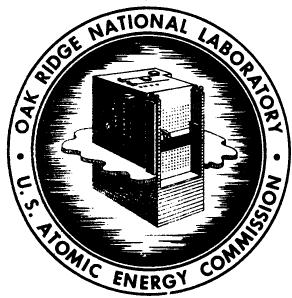
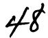
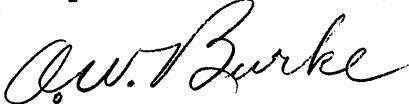
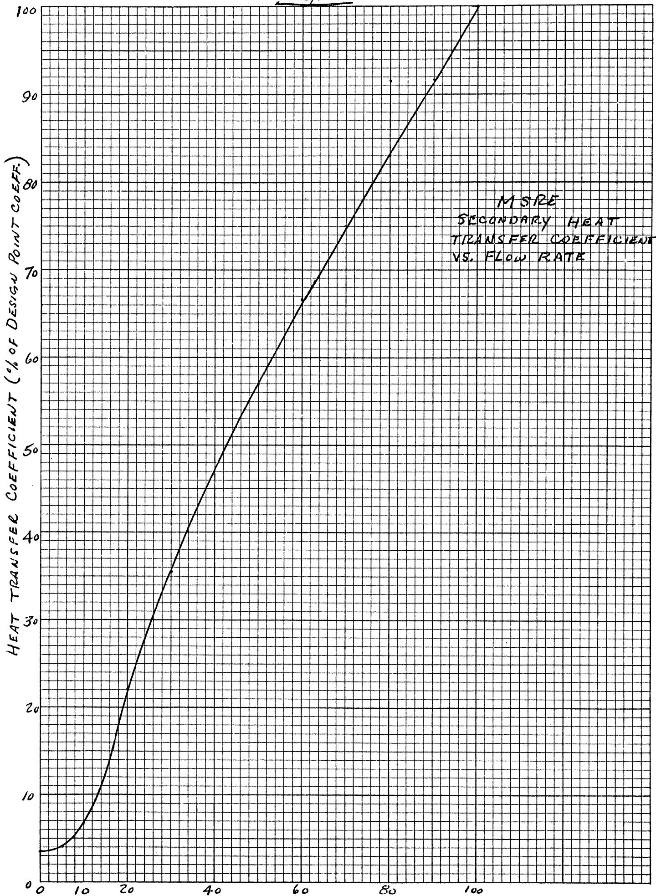

# OAK RIDGE NATIONAL LABORATORY

Operated by

UNION CARBIDE NUCLEAR COMPANY

Division of Union Carbide Corporation

Post Office Box X

Oak Ridge, Tennessee

INTERNAL USE ONLY

ORNL

CENTRAL FILES NUMBER

[{60} - {11} - {20}]

COPY NO.

DATE: November 4, 1960

SUBJECT: MSRE - Analog Computer Simulation of a Loss of Flow Accident in the Secondary System and a Simulation of a Controller Used to Hold the Reactor Power Constant at Low Power Levels

TO: G. A. Cristy

FROM: O. W. Burke

# ABSTRACT

These analog computer studies had two major aims. The first aim was to give the MSRE design personnel an indication of the time-temperature relationship of the secondary salt as a result of loss of flow in the secondary system. The second aim was to check the feasibility of a closed loop primary pump speed controller to hold the reactor power constant at a low power level.

The secondary system flow loss was simulated, and the secondary salt temperature at the radiator outlet reached the freezing point in thirty (30) seconds. The radiator fan remained in operation.

The above mentioned flow controller was simulated. The gain, damping, etc., were varied over a wide range, seeking a stable controller. The controller could not be made to operate in a stable manner.

# NOTICE

This document contains information of a preliminary nature and was prepared primarily for internal use at the Oak Ridge National Laboratory. It is subject to revision or correction and therefore does not represent a final report. The information is not to be abstracted, reprinted or otherwise given public dissemination without the approval of the ORNL patent branch, Legal and Information Control Department.

# I. INTRODUCTION

From an earlier investigation reported in ORNL C.F. 60-6-110, the reactor system designers reached the conclusion that the primary salt temperatures attained with loss of primary flow would cause no difficulty.

The designers were concerned about the very definite possibility that the secondary salt would freeze subsequent to a loss of flow accident in either the primary system or the secondary system. The freezing would be caused by the continued operation of the radiator fan after a loss of flow accident.

During a preliminary investigation using the analog computer, it was determined that the secondary salt temperature would reach the freezing point much sooner for loss of flow in the secondary system than it would for loss of flow in the primary system. In view of this fact, only results obtained as a result of loss of flow in the secondary system will be included in this report.

The designers of the reactor system proposed using flow control in the primary system as a means of holding the reactor power constant at a low power level. This controller was simulated on the computer.

# II. DESCRIPTION OF THE SYSTEM SIMULATED

# A. Thermal System

The thermal system was based on the latest design information and it differed appreciably from that used in the preliminary simulation that was reported upon in ORNL C.F. 60-6-110. The design information used in this simulation is included in this report on pages 5 and 6.

In order to preserve design point temperatures around the primary loop, the "after heat" was added as if it were all released inside the reactor. Of course, this is not true; however, the error appears to be very small. Pipe losses, which were ignored, would tend to offset the "after heat" generated outside the reactor.

The loss of flow occurred exponentially on a three (3) second period. At this time there was no available pump "run-down" information.

The heat transfer coefficients between the secondary salt and the primary heat exchanger wall and between the secondary salt and the radiator wall were made to vary with flow rate in accordance with the curve shown in Figure 1.

The temperature differential between the hot and cold legs in the secondary system produces a force due to the density differences in these legs. This force induces flow in the system. This phenomenon was incorporated into the simulation.

# B. Nuclear System

The delayed neutrons were lumped into one weighted group. Using the values from document LA-2118, dated 1957, $\lambda$ for the one group was found to be 0.0769 sec. and $\lambda$ was found to be 6.4 x $10^{-3}$ . Using the given fuel transit times and the curves in ORNL-LR-Dwg. 8919, $\lambda$ was found to be 1.800 x $10^{-3}$ ,

where

$$
\beta^ {\prime} = \sum_ {i = 1} ^ {6} \alpha_ {i} \beta_ {i}
$$

$\alpha_{i}$ is the ratio of the population of the $i$ th group of delayed neutrons inside a circulating fuel reactor to the population of this group in an equivalent stagnant reactor.

In the simulation, the delayed neutron contribution varied with primary flow rate. The simulation method was admittedly not precisely correct, but it was considered a good approximation. The delayed neutron contribution is correct at design point steady state and at zero primary flow. The variation of the delayed neutron contribution between these two points is only an approximation.

# III. ANALOG COMPUTER PROGRAM

The analog computer programs of this simulation are filed as ORNL drawings, numbers E-40327 and E-40328.

The program for loss of flow in the primary is drawing number E-40327. The power level controller program is also on this drawing. The program for loss of flow in the secondary is drawing number E-40328.

Copies of the above drawings may be obtained from the Print Files in the E & M Division.

# IV. PROCEDURE

These studies were conducted in three phases. These phases were:

1. Loss of flow accident in the primary system.   
2. Investigation of the characteristics of proposed power level controller.   
3. Loss of flow accident in the secondary system.

The following procedures were employed:

1. Loss of flow accident in the primary system.

With the simulator in steady state operation at design point, the primary flow rate was decreased to zero, exponentially on a three second period. The secondary flow was not disturbed.

Pertinent temperatures and nuclear power were recorded versus time. Runs were made for three different graphite temperature coefficients of reactivity.

2. Investigation of power level controller characteristics.

The controller was simulated so that its gain, damping, and response time were variables which could be changed by changing a potentiometer setting. With these pots set at given values, and the reactor simulator in steady state operation with no temperature coefficients of reactivity, a small perturbation was introduced into the system. The effect of this perturbation on the nuclear power level was observed. This procedure was repeated for a number of potentiometer settings in an attempt at determining optimum settings.

3. Loss of flow accident in the secondary system.

With the simulator in steady state operation at design point, the flow rate in the secondary system was decreased exponentially on a three second period. The primary flow rate was not disturbed. Pertinent temperatures and nuclear power were recorded versus time.

# V. SUMMARY OF RESULTS

With loss of primary flow, the temperatures attained were of the same order of magnitude as those recorded in ORNL C.F. 60-6-110.

Three runs were made, using graphite temperature coefficients of reactivity of $-2 \times 10^{-4}$ , $-1 \times 10^{-4}$ , and $-4 \times 10^{-4}$ Kof. The maximum primary temperatures attained in these three runs had a spread of only $20^{\circ}\mathrm{F}$ . Loss of primary flow was simulated in these three runs. Due to the large heat capacity of graphite, the temperature of the graphite changed very little and the rate of change of temperature was very low.

The power level controller showed a tendency to be oscillatory and it could not be stabilized (see memo from E. R. Mann to J. R. Tallackson, dated September 12, 1960, entitled "Closed Loop Pump Speed Controller to Hold the MSRE Power Constant at Low Level").

In the simulation of secondary flow loss, the radiator fan continued in operation. The temperature of major concern was that of the secondary salt at the radiator outlet, since this was the coldest point in the system. This temperature reached the freezing point (860°F) thirty (30) seconds after initiation of the flow loss (see Figure 2). This gives an indication of permissible time for corrective action.

O. W. Burke

Design Department

Engineering & Mechanical Division

Updated Computer Information to Ray Mann, 3rd Issue

<table><tr><td>Reactor inlet temperature:</td><td>1175°F</td></tr><tr><td>Reactor outlet temperature:</td><td>1225°F</td></tr><tr><td>Mean graphite temperature:</td><td>1230°F</td></tr><tr><td>Residence time in reactor:</td><td>2.02 sec</td></tr><tr><td>Film drop from graphite to fuel:</td><td>linear with power</td></tr><tr><td>Heat capacity of graphite:</td><td>4040 Btu /O_F (cp = .425 Btu /lb°F</td></tr><tr><td>Prompt ζ and neutron heating in graphite:</td><td>6% cf 10 Mw power</td></tr></table>

Residence time in piping from reactor outlet to H.E. inlet 3.56 sec

Residence time in H.E. 1.62 sec

Heat capacity of metal in H.E. 200 Btu

Avg. film drop between primary coolant and metal at D.P. 55.20F

Avg. drop in metal at D.P. 56.70F

Avg. film drop between metal and secondary coolant at D.P. 26.10F

Film drop between primary coolant and metal as function of flow: See graph, displace curve if necessary so that at 7.5 fps velocity $t = 55.2^{\circ}$ F

Mean secondary coolant temp. at D. P. 10629F

Residence time in piping between H.E. outlet and reactor inlet (including coolant annulus) 5.76·sec

Total circulation time 13.0 sec

Temp. coeff. of reactivity of graphite: -2 x 10-4 K F

Temp. coeff. of reactivity of fuel: -4.5 x 10 $^{-5}$ $\frac{1}{\mathrm{C}_{\mathrm{F}}}$

Melting point of primary coolant: 842°F

Melting point of secondary coolant: $860^{\circ}\mathrm{F}$

Check points:

Thermal resistances: (ft hr ${}^{\mathrm{O}}\mathbf{F}$ Btu

in primary coolant film: 3.28 x 10-4

in metal: 3.32 x 10-4

in secondary coolant film: 1.56 x $10^{-4}$

The rate of heat removal in thermal convection follows the correlation (for the primary circuit)

4.48 x 10^4 $\Delta t\left(\frac{q}{\Delta t}\right)^{-1.0} - 9.15 \times 10^{-3} \times \left(\frac{q}{\Delta t}\right)^{0.8} = 4.14$

where $\triangle t$ is the temp. differential between the hot and cold leg ( ${}^0\mathbf{F}$ ) and $q$ is the rate of heat removal from the primary system $(\frac{\partial t}{\partial r})$

# Simulator data for secondary loop

Air temperature rise in radiator

Air suction temp.

Air flow

Heat capacity of radiator

Heat capacity of secondary salt

Density of secondary salt

# Residence times of secondary salt:

in primary heat exchanger

in piping to radiator

in radiator

in piping from radiator

Total

# Residence time of air in radiator

# Temperature differences in radiator:

in salt film

in tube wall

in air film

$200^{\circ}\mathrm{F}$

100°F

166,000 cfm (7.11 x 105 hr)

242 $\frac{\mathrm{Btu}}{\mathrm{OF}}$

0.57 Btu lb OF

120 lb ft3

0.92 sec

2.56 sec

4.85 sec

4.72 sec

13.05 sec

0.01 sec

$22^{\circ} \mathrm{F}$

$78^{\circ} \mathrm{F}$

$762^{\circ} \mathrm{F}$

FIG. 1

UNCLASSIFIED

ORNL-LR-DWG. 53662

  
SECONDARY FLOW RATE (% OF DESIGN POINT)

# Distribution

1. S.E.Beall

2. E. S. Bettis

3. F. F. Blankenship

4-6. A. L. Boch

7. R. B. Briggs

8. F.R.Bruce

9. O.W.Burke

10. R.A.Charpie

11. W. K. Ergen

12. C. H. Gabbard

13. W.R.Gall

14. W.R.Grimes

15. H.W.Hoffman

16. L.N.Howell

17. W.H.Jordan

18. P.R.Kasten

19. B.W.Kinyon

20. H.G.MacPherson

21. W. D. Manly

22. E.R.Mann

23. W.B.McDonald

24. R. L. Moore

25. C. W. Nestor

26. L.F.Parsly

27. H.R.Payne

28. D. Scott

29. M. J. Skinner

30. I. Spiewak

31. J. A. Swartout

32. A. Taboada

33. J.R.Tallackson

34. A. M. Weinberg

35. J.H.Westsik

36. C. E. Winters

37. C. H. Wödtke

38-39. Library, 9204-1

40-41. Central Research Library

42-43. Document Reference Library

44-53. Laboratory Records

54. ORNL-RC

55. C.E.Bettis

56. G.A.Cristy

57. H.E.Seagren

58. G. Morris

59. D. E. Ferguson

60. MSRP - Director's Office (9204-1, room 259)