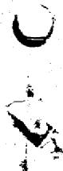
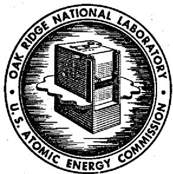
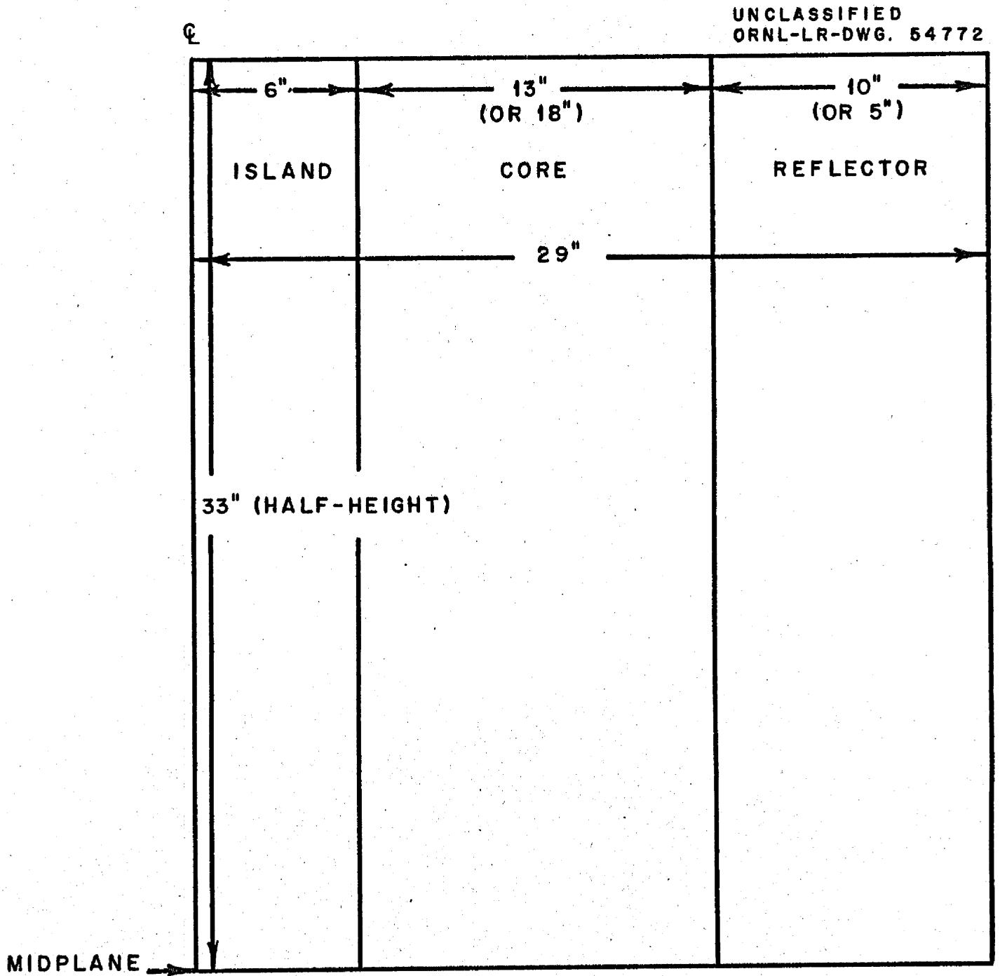
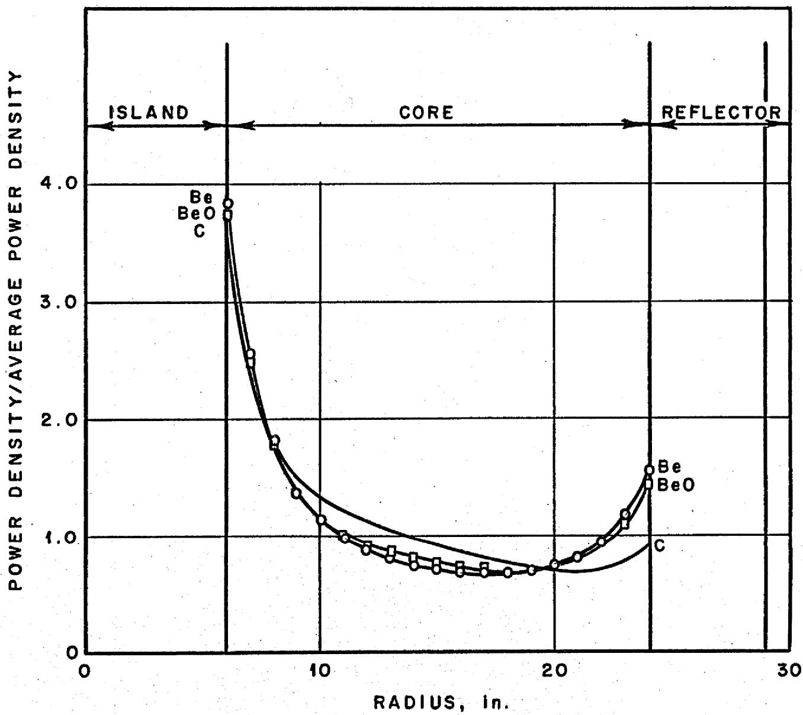
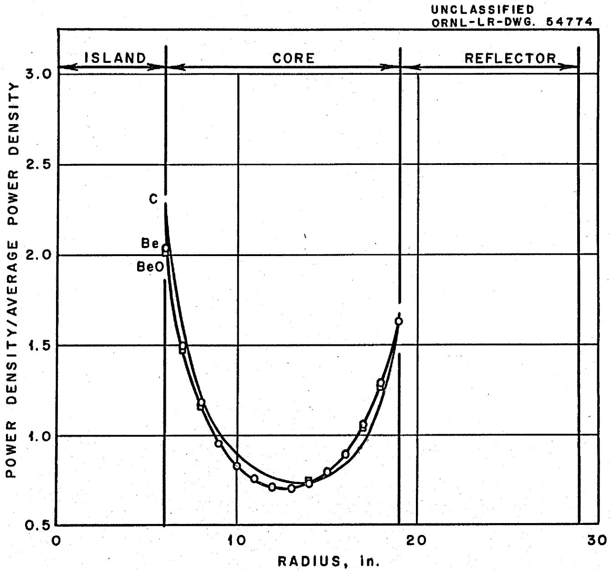
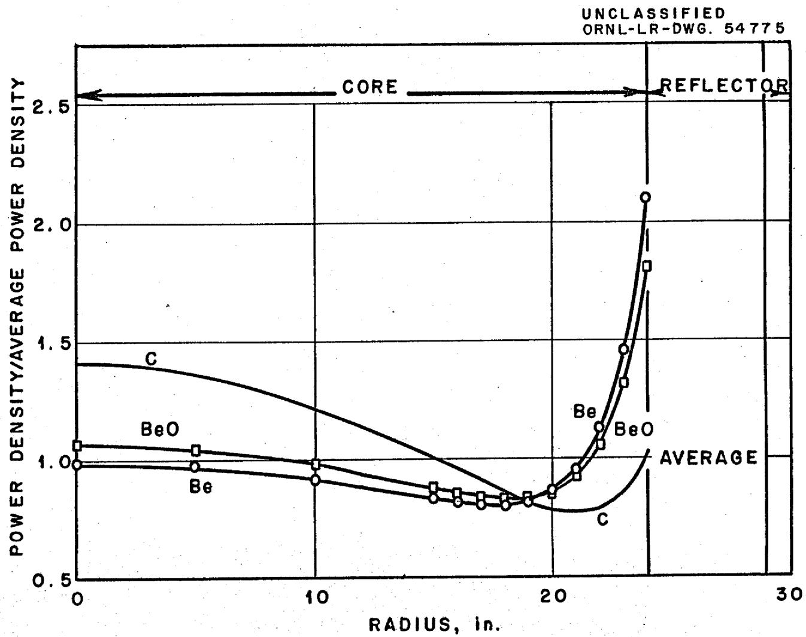
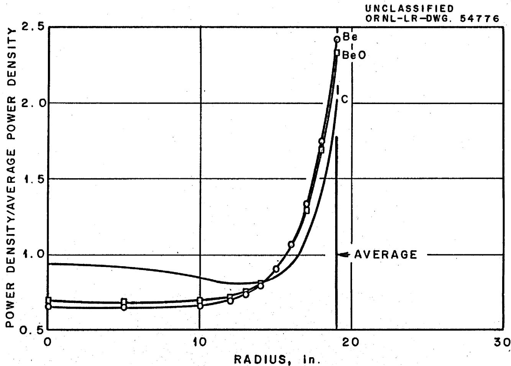

# OAK RIDGE NATIONAL LABORATORY

Operated by

UNION CARBIDE NUCLEAR COMPANY

Division of Union Carbide Corporation

Post Office Box X

Oak Ridge, Tennessee

ORNL

CENTRAL FILES NUMBER

60-12-11

External Distribution Authorized

COPY NO. 91

DATE: December 13, 1960

SUBJECT: Homogeneous Molten Salt Reactors

TO: Distribution

FROM: C.W. Nestor, Jr.

# SUMMARY

Multigroup one-dimensional calculations were done recently to obtain estimates of critical masses, power density distributions and fission-ing spectra for some homogeneous molten salt reactors having outer reflectors and central "islands," placed inside the currently proposed MSRE vessel. For a 5-inch-thick outer reflector and a 1-ft-diameter island, both beryllium, the calculated critical mass is $108\mathrm{kg}$ ; 40 percent of the fissions occur at thermal, and the maximum power density of 3.9 times the core mean power density occurs at the island-salt interface. If the reflector thickness is increased to 10 inches, the critical mass is reduced to $34\mathrm{kg}$ ; 67 percent of the fissions occur at thermal, and the peak power density of twice the core mean again occurs at the core island-salt interface.

# NOTICE

This document contains information of a preliminary nature and was prepared primarily for internal use at the Oak Ridge National Laboratory. It is subject to revision or correction and therefore does not represent a final report. The information is not to be abstracted, reprinted or otherwise given public dissemination without the approval of the ORNL patent branch, Legal and Information Control Department.

# HOMOGENEOUS MOLTEN SALT REACTORS

C. W. Nestor, Jr.

Multigroup one-dimensional calculations were done recently to obtain estimates of critical masses, power density distributions and fissioning spectra for some homogeneous molten salt reactors having outer reflectors and central "islands," placed inside the currently proposed MSRE vessel as shown in Fig. 1. The salt composition, listed in Table 1, is that of the current MSRE mixture.1

Results of these calculations are given in Table 2, with earlier results for the current MSRE and some results for bare homogeneous molten salt reactors, $^{2}$ included for comparison. Power density shapes for the reflected reactors are plotted in Figs. 2, 3, 4, and 5.

Table 1. Salt Composition   

<table><tr><td>Compound</td><td>Mole %</td></tr><tr><td>LiF</td><td>70</td></tr><tr><td>BeF2</td><td>23</td></tr><tr><td>ZrF4</td><td>5</td></tr><tr><td>ThF4</td><td>1</td></tr><tr><td>UF4</td><td>~1 (as required for criticality)</td></tr></table>

Table 2   
5" reflector thickness, 1 ft island diameter.   

<table><tr><td>Island and reflector material</td><td>Mole % uranium</td><td>Core critical mass, kg</td><td>Percent thermal fissions</td><td>Median fissioning energy, ev</td></tr><tr><td>C</td><td>0.90</td><td>206</td><td>13.2</td><td>100-150</td></tr><tr><td>Be</td><td>0.47</td><td>108</td><td>40.2</td><td>7.5- 10</td></tr><tr><td>BeO</td><td>0.54</td><td>124</td><td>32.8</td><td>20 - 25</td></tr></table>

10" reflector thickness, 1 ft island diameter   

<table><tr><td>Island and reflector material</td><td>Mole % uranium</td><td>Core critical mass, kg</td><td>Percent thermal fissions</td><td>Median fissioning energy, ev</td></tr><tr><td>C</td><td>0.67</td><td>93</td><td>33.2</td><td>20 - 25</td></tr><tr><td>Be</td><td>0.25</td><td>34</td><td>67.3</td><td>thermal</td></tr><tr><td>BeO</td><td>0.28</td><td>39</td><td>62.0</td><td>thermal</td></tr></table>

5" reflector thickness, no island   

<table><tr><td>Reflector material</td><td>Mole % uranium</td><td>Core critical mass, kg</td><td>Percent thermal fissions</td><td>Median fissioning energy, ev</td></tr><tr><td>C</td><td>1.04</td><td>250</td><td>4.6</td><td>150-400</td></tr><tr><td>Be</td><td>0.72</td><td>175</td><td>20.9</td><td>50- 65</td></tr><tr><td>BeO</td><td>0.76</td><td>186</td><td>16.0</td><td>80- 90</td></tr></table>

10" reflector thickness, no island   

<table><tr><td>Reflector material</td><td>Mole % uranium</td><td>Core critical mass, kg</td><td>Percent thermal fissions</td><td>Median fissioning energy, ev</td></tr><tr><td>C</td><td>0.85</td><td>130</td><td>20.6</td><td>65-80</td></tr><tr><td>Be</td><td>0.43</td><td>65</td><td>46.5</td><td>0.8-1.4</td></tr><tr><td>BeO</td><td>0.46</td><td>71</td><td>41.5</td><td>7.5-10</td></tr></table>

Current MSRE (12 volume percent fuel salt, 88 volume percent graphite)   
Bare molten salt reactor   

<table><tr><td>Mole %uranium</td><td>Core criticalmass, kg</td><td>Percent thermalfissions</td><td>Medianfissionalenergy, ev</td></tr><tr><td>0.27</td><td>13</td><td>91.4</td><td>thermal</td></tr></table>

(5 ft diameter sphere, 30 mole % BeF₂ + 68 mole % LiF + 1 mole % ThF₄ + ~1 mole % UF₄)

<table><tr><td>Mole % 
uranium</td><td>Core critical 
mass, kg</td><td>Percent thermal 
fissions</td><td>fissioning 
energy, ev</td></tr><tr><td>0.94</td><td>239</td><td>0.040</td><td>425</td></tr></table>

  
Fig.1. Reactor Model.

UNCLASSIFIED

ORNL-LR-DWG. 54773

  
Fig. 2. Power Density Distributions Associated with a 6" Island and a 5" Reflector.

  
Fig. 3. Power Density Distributions Associated With a 6" Island and a 10" Outer Reflector.

  
Fig. 4. Power Density Distributions Associated With a 24" Core and a 5" Reflector.

  
Fig. 5. Power Density Distributions Associated With a 19" Core and a 10" Reflector.

# Distribution

1. L. G. Alexander   
2. S.E.Beall   
3. A. L. Benson   
4. C. E. Bettis   
5. E. S. Bettis   
6. F. F. Blankenship   
7. A. L. Boch   
8. S. E. Bolt   
9. R.B.Briggs   
10. F.R.Bruce   
11. O.W.Burke   
12. D. O. Campbell   
13. W.R.Chambers   
14. R. A. Charpie   
15. W.G.Cobb   
16. J.A. Conlin   
17. W.H.Cook   
18. G. A. Cristy   
19. J. L. Crowley   
20. D. A. Douglas   
21. W. K. Ergen   
22. A. P. Fraas   
23. J.H.Frye   
24. C. H. Gabbard   
25. W.R.Gall   
26. W.R.Grimes   
27. E.C.Hise   
28. L. N. Howell   
29. W. H. Jordan   
30. P. R. Kasten   
31. R. J. Kedl   
32. B. W. Kinyon   
33. M. I. Lundin   
34. H. G. MacPherson   
35. W. D. Manly   
36. E. R. Mann   
37. W. B. McDonald   
38. C. K. McGlothlan

39. R. L. Moore

40. J. C. Moyers

41. D. J. Murphy

42. C.W. Nestor

43. T. E. Northup

44. L. F. Parsly

45. P. Patriarca

46. H.R.Payne

47. R. C. Robertson

48. H. W. Savage

49. D. Scott

50. F. P. Self

51. A. N. Smith

52. I. Spiewak

53. J. A. Swartout

54. A. Taboada

55. W.G. Ulrich

56. D. C. Watkin

57. D. C. Watkins

58. A. M. Weinberg

59. J.H.Westsik

60. C. H. Wodtke

61. L. I. Bennett

62. R. D. Cheverton

63. H. C. Claiborne

64. T. B. Fowler

65. M. P. Lietzke

66. B. E. Prince

67. M. Tobias

68. D. R. Vondy

69. D. W. Vroom

70. J. W. Miller

71. R. VanWinkle

72. D. E. Ferguson

73. M. J. Skinner

74. C. E. Winters

76. REED Library

78. Central Res. Library

80. Document Ref. Library

83. Laboratory Records

84. ORNL-RC

85-99. TISE, AEC