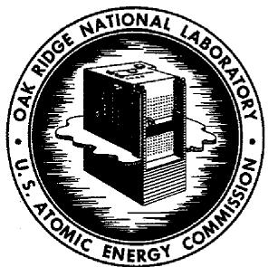

# DRAFT

# OAK RIDGE NATIONAL LABORATORY

Operated by

UNION CARBIDE NUCLEAR COMPANY

Division of Union Carbide Corporation

Post Office Box X

Oak Ridge, Tennessee

Distribution Limited to

Recipients Indicated

External Transmittal

Authorized

# ORNL

# CENTRAL FILES NUMBER

60-6-97

Revision 1.

DATE: July 25, 1960

SUBJECT: Molten-Salt Reactors: Report for

1960 Ten-Year-Plan Evaluation

TO: R.W.Ritzmann

FROM: H. G. MacPherson

COPY NO. 102

# NOTICE

This document contains information of a preliminary nature and was prepared primarily for internal use at the Oak Ridge National Laboratory. It is subject to revision or correction and therefore does not represent a final report. The information is not to be abstracted, reprinted or otherwise given public dissemination without the approval of the ORNL patent branch, Legal and Information Control Department.

# Classification

For purposes of this evaluation, the molten-salt reactor is considered as an advanced concept. It is considered not to have a status of current technology adequate to allow the immediate construction of large-scale power plants, since no power reactor has been built or even designed in detail. As a result there can be no estimate of present cost of power, and the projection of power costs to later years is necessarily based on general arguments rather than detailed considerations.

# Definition of Concept

Molten-salt reactors utilize molten fluoride salts as the solvents for both fuel and fertile material. Although the fluoride salts themselves have about half the slowing-down power of graphite, and therefore the reactors may be homogeneous with only self-moderation by the salt, most present-day designs call for graphite as the moderator, unclad, and in contact with the salt. Typically, the salt will occupy 8 to 25 vol % of the reactor core, with the graphite occupying the remainder. The metallic container material is a nickel-molybdenum-base alloy which is compatible with both the salt and the graphite to $1300^{\circ}\mathrm{F}$ . A large variety of reactor types can be constructed by using these basic materials of construction and utilizing U-233, U-235, or Pu fuel and Th or U-238 as fertile material.

# Background

Molten-salt fuels were conceived originally as a means of satisfying the requirements of very high temperature and extremely high power density necessary for nuclear aircraft reactors. A very large amount of work on the

physical, chemical, and engineering characteristics of uranium- and thorium-bearing molten fluorides was carried out as a part of the ANP program. In 1954, the Aircraft Reactor Experiment was operated as a 2.5-Mw circulating-fuel molten-salt reactor. More than 90,000 kwhr were logged during the planned experimental program, with outlet temperatures as high as $1650^{\circ}\mathrm{F}$ .

Although the molten-salt fuels were originally proposed for aircraft use, their potential usefulness for power reactors was recognized from the start. The features that attracted initial attention for civilian use were the high temperature of the fuel combined with its low vapor pressure, the stability under radiation of the halide salts, and the usual features that a fluid fuel provides. These include a negative temperature coefficient of reactivity, no limitation to burnup resulting from either radiation damage or loss of reactivity, the absence of a complicated structure in the reactor core, and the potential for a low-cost fuel cycle.

# Reactor Types

Two general types of reactor are now considered most attractive for power applications. One is a single-region graphite-moderated reactor; the other is a two-region reactor with a graphite-moderated core and a thorium-bearing molten-salt blanket.

The single-region reactor is the simpler type and is probably most suitable for small-sized power stations because it will be cheaper to construct and operate. The physical size of such a reactor will vary from about 4-1/2 ft in diameter and height for the lowest power levels up to perhaps 12 ft in diameter and height for a 300-MwE size. The internal structure of the reactor consists of graphite bars separated by graphite spacers to provide fuel channels. The

molten-salt fuel, occupying from 8 to $25\%$ of the reactor volume, flows longitudinally in the slots that surround the bars and is pumped from the top of the reactor through a heat exchanger and back to the reactor. The fuel enters the reactor tank again in an annulus around the top and flows down to the bottom inside the reactor vessel to cool it. All reactor core components are simple in geometry and easily fabricated.

The basic fuel-solvent salt is a mixture of Li $^{7}$ F and BeF $_2$ having a melting point of about $850^{\circ}$ F. A typical fuel for the single-region reactor would contain 4 to 15 mole % ThF $_4$ , depending on reactor diameter, and less than 1.0 mole % UF $_4$ ; the maximum ThF $_4$ addition would increase the melting temperature to about $950^{\circ}$ F. The conversion ratio of this reactor will vary with the frequency of chemical reprocessing and with the physical size of the reactor, which in turn determines the leakage of neutrons. For the conversion ratio to be as high as 1.0, the reactor would have to be about 20 ft in diameter and 20 ft high. Such a large reactor would be capable of producing more than 1000 MwE in a single unit, but it is doubtful that such a large unit would be built to achieve a conversion ratio of unity when a much smaller two-region reactor will accomplish the same purpose.

In the two-region reactor the fuel salt (which contains little, if any, fertile material) passes through the reactor core in graphite tubes. In the core region, the fuel tubes are surrounded by moderator graphite. A blanket salt containing about 15 mole $\%$ $\mathrm{ThF}_{4}$ surrounds the core region on all sides to a thickness of about 30 in. A small amount of the blanket salt passes through the core region, providing some internal conversion and also cooling the moderator graphite.

A two-region reactor with the core about 7 ft in diameter and 7 ft high should be capable of generating 300 MwE. When this core is surrounded by a 30-in. molten-salt blanket on all sides, nearly all the neutrons are usefully absorbed and conversion ratios in excess of 1.0 are possible. In comparing the single-region and two-region reactors, the simpler construction and lower capital cost of the former must be balanced against the better neutron economy of the latter. In large power installations, the high conversion ratio of the two-region reactor results in lower fuel-cycle costs.

The heat transfer systems of both types of reactor are similar. Typically, the fuel salt leaves the reactor at about $1300^{\circ}\mathrm{F}$ , passes through a heat exchanger, and returns to the reactor at $1125^{\circ}\mathrm{F}$ . The preferred intermediate coolant fluid is a similar salt which contains no uranium or thorium. Again, typically, the intermediate coolant would enter the heat exchanger at $1000^{\circ}\mathrm{F}$ and leave at $1175^{\circ}\mathrm{F}$ . The coolant salt would be used to generate and superheat the steam. Under near-optimum economic conditions, the steam throttle condition would be $1050^{\circ}\mathrm{F}$ and 1800 psia, yielding a net thermal efficiency for the plant of about $42\%$ .

Auxiliary equipment required for the fuel system includes drain tanks for the fuel, an off-gas system to remove volatile fission products from the fuel on a continuous basis, means of extracting fuel samples and adding enriched fuel mixture, means of heating all equipment to the melting point of the fuel, and preinstalled equipment for replacing failed components.

Two general types of layout for the primary-system equipment are being considered. One is a so-called disjointed layout, with individual pieces such as reactor, pump, and heat exchanger separated in space and joined by mechanical flanges. The other type of layout is more compact, with reactor, pump, and heat

exchanger within a single large vessel. Although the two systems are laid out differently, maintenance equipment developed for one system is generally applicable to the other. It is believed that early reactor experiments will be of the disjointed type to provide greater versatility, but that later power reactors may be of the more compact arrangement to reduce capital costs.

# Fuel Cycle

Since enriched uranium can be added to the reactor during operation, the only need for reprocessing the fuel is to remove nonvolatile fission-product poisons. The amount of reprocessing that is done will depend on the neutron economy desired, the type of reactor, and a balance of economic factors. With a one-region reactor there will probably be a tendency to use the simplest possible fuel cycle. This will consist of leaving the fuel in the reactor for a long period of time, with removal of fission-product gases as the only on-site process. $\mathrm{UF}_{4}$ would be added as necessary to replace burnup of fuel and to compensate for fission-product poisons. Barring accidental contamination of the fuel, it would be left in the reactor until the cost of the increased inventory and burnup charges for uranium economically overbalanced the charges associated with replacing the fuel. In the reactor considered by the Fluid Fuels Task Force $^2$ , this period was about nine years for a 318-MwE (net) reactor. At the end of this time, the fuel would be drained into sealed and cooled shipping flasks and sent to some central processing plant for recovery of the uranium. In the meantime, a new charge of salt and uranium would be installed in the reactor.

On the other hand, two-region reactors would have a relatively simple on-site chemical plant. The blanket process planned for this plant would be the

removal of the bred uranium by $\mathrm{UF}_6$ volatility on a frequent schedule. The treatment of the fuel salt would first involve removal of the uranium by the volatility process and then treatment of the solvent salt to remove rare-earth fission products. The purified solvent salt would then be recombined with $\mathrm{UF}_4$ and returned to the reactor.

# Justification for Pursuit of the Concept

Since there is no detailed design available and therefore no reliable cost estimate for a molten-salt reactor, the best justification for working on this concept is based on rather general grounds. The Ad Hoc Advisory Committee on Reactor Policy gave five criteria that should be met by a reactor that is to achieve economic power, and the following discussion is directed to these points.

High Neutron Economy. -- As discussed in another section, molten-salt reactors are capable of good performance as breeders. It appears that, even when optimized for low power costs, two-region molten-salt reactors will have conversion ratios in excess of 0.90.

Low Fuel-Cycle Cost. -- Molten-salt reactors should have lower fuel-cycle costs than any other reactor for four reasons: (1) As in all liquid-fuel reactors the burnup of the fuel is not limited either by radiation damage or by reactivity loss, so that chemical reprocessing may be more infrequent than for solid-fuel reactor systems. (2) A simple method exists for chemically reprocessing molten-salt fuels. This consists of the fluoride volatility process combined with the solution of the major constituents of the core salt in HF. (3) Reconstitution of fuel and blanket involves only dissolving $\mathrm{UF}_{4}$ or $\mathrm{ThF}_{4}$ in the salt, with no metallurgical, ceramic, or mechanical steps. (4) The thermal efficiency is high.

High Thermal Efficiency. -- The molten-salt system delivers steam at $1050^{\circ}\mathrm{F}$ and 1800 psia, or higher if desired, and so fits modern economical steam cycles.

High Power Density and Specific Power. -- The high specific heat of the molten salts, combined with the large temperature range in which they can operate, yields high specific powers. In two-region reactors specific powers of 1.2 MwE per kilogram of fissionable uranium in the entire reactor and chemical-processing system are feasible. This is many times higher than that for a pressurized- or boiling-water reactor, for example.

The fact that all the heat transfer is between liquids of good heat transfer properties and that there is ample excess temperature of the heat source makes the heat transfer equipment small physically and leads to the possibility of compact reactors yielding very high power densities.

Simplicity and Reliability of Plant Design. -- There is disagreement as to whether or not the molten-salt reactors meet the objectives of simplicity and reliability. The matter will be resolved in part by a reactor experiment. Within the scope of this factor, as outlined by the Ad Hoc Committee, the molten salt is open to question on the point of using expensive materials, INOR-8 and fluoride salts. The total cost of these materials at their expected price (\(3/lb for INOR-8 and about \)2000/cu ft for the base salt) ranges from about \)10/kw to $23/kw of installed capacity. Furthermore, the molten-salt reactor system requires an intermediate heat transfer system, at least at the present stage of the technology. Balanced against these factors tending to higher capital costs are those of compact design mentioned above, the use of a

low-pressure primary system (no pressure shell); the omission of almost all control rods for the reactor; the absence of a complicated internal reactor structure; and the simplification of the required containment for a low-pressure nonvolatile liquid system.

# Power Generation Costs of a 300-MwE Plant

Although, as mentioned above, no detailed design of a power plant has been made, the Fluid Fuels Task Force2 attempted to estimate in so far as possible the direct material and labor costs for a molten-salt power plant. Their basic numbers have been used in part A of Table I. Part B of Table I indicates changes that are considered reasonable as a result of additional design studies made since the Task Force met.

The Task Force reactor was a single-region reactor, whereas the reactor in parts B and C of Table I is a two-region reactor, in which use is made of the compactness possible in the molten-salt system. Compactness was emphasized in the aircraft reactor work to reduce shielding requirements; it is used now to reduce capital cost of the reactor system. A reactor core 7 ft in diameter by 7 ft high is capable of producing enough heat for a 300-MwE station; the reactor core and blanket together will fit in a 13-ft-diameter reactor vessel. The fuel-salt-to-coolant heat exchanger may be arranged for vertical removal and placement of the tube bundle; one arrangement would have the fuel pump and expansion volume directly above the heat exchanger. With this arrangement, the maintenance operations become comparable to those required for sodium-cooled reactors. The following table gives a few pertinent size and complexity factors in comparison with sodium-cooled reactors. The evident reduction in sizes of components results in part from the fact that the molten salt has a volumetric heat capacity 4.3 times that of sodium, and in part from a higher source temperature.

<table><tr><td rowspan="2"></td><td rowspan="2">MSR3</td><td colspan="4">Sodium-Cooled Reactors</td></tr><tr><td>Hallam</td><td>P/6044</td><td>Fermi</td><td>Advanced Fast Reactor</td></tr><tr><td>Fuel tubes per MwE</td><td>0.17</td><td>58</td><td>28</td><td>140</td><td>264</td></tr><tr><td>Fuel tube ID, in.</td><td>3.75</td><td>0.50</td><td>0.65</td><td>0.148</td><td>0.122</td></tr><tr><td>Heat exchanger, sq ft per MwE</td><td>41</td><td>93</td><td>170</td><td>160</td><td>92</td></tr><tr><td>Steam generator, super-heater, and reheater surface, sq ft per MwE</td><td>92</td><td>237</td><td>214</td><td>345</td><td>200</td></tr><tr><td>Coolant flow data (avg)</td><td></td><td></td><td></td><td></td><td></td></tr><tr><td>Bulk ΔT assumed, °F</td><td>175</td><td>338</td><td>275</td><td>250</td><td>350</td></tr><tr><td>Flow per MwE, gal/min</td><td>90</td><td>241</td><td>263</td><td>318</td><td>214</td></tr></table>

As a result of this comparison it is believed that the reduction in building size claimed in note 4 of Table I is justified.

After the Task Force met, a partial cost estimate of a molten-salt reprocessing plant was made by Weinrich and Associates. Although a more complete cost estimate is to be made by them soon, it appears probable that the fuel charges shown in section B of Table I are at least adequate for a 300-MwE plant.

A comparison of the problems of maintaining a molten-salt reactor of compact geometry with those of a fast sodium-cooled reactor would indicate little difference in difficulty in so far as can be ascertained at this stage. Therefore it was assumed rather arbitrarily in sections B and C of Table I that the operation and maintenance costs need be no higher than for the fast reactor.

The reductions in capital costs shown in part C of Table I are fairly obvious ones that might be expected after some experience with the operation of such plants. The resultant projected power cost for a 300-MwE plant is about 6-1/2 mills/kwhr.

Table I. Molten-Salt Reactor Costs, 300 MwE (Net)   

<table><tr><td colspan="2">Costs</td><td>Notes</td></tr><tr><td colspan="3">A. Fluid Fuels Task Force Reactor (TID-8507)</td></tr><tr><td>Capital charges</td><td>5.93 mills/kwhr</td><td>1. Task Force estimates of direct material and labor; ten-year plan schedule of indirect construction costs and "land and land rights" charge. A main transformer is added, and the plant is scaled to 300 Mw.</td></tr><tr><td>Fuel charges</td><td>2.95 mills/kwhr</td><td>2. Task Force number. Includes 1.54 mills/kwhr for operation and capital charges on an arbitrarily imposed $11,800,000 on-site chemical plant.</td></tr><tr><td>Operation, maintenance, and insurance</td><td>1.77 mills/kwhr</td><td>3. Task Force method of calculation, including annual charge for maintenance at 3% of total capital cost. Insurance according to ten-year plan schedule added.</td></tr><tr><td>total</td><td>10.65 mills/kwhr</td><td></td></tr><tr><td colspan="3">B. With improvements in reactor design and plant layout made since Task Force study; still first-reactor basis.</td></tr><tr><td>Capital charges</td><td>5.29 mills/kwhr</td><td>4. (a) Replacement of Loeffler boiler system with special design of combined boiler and super-heater; savings - 0.34 mill/kwhr. See Task Force report, p 47, note 2. (b) Shift to compact two-region reactor design. Together with 4(a), this reduces building size by a large amount. Number of fuel and coolant pumps reduced from eight to four, and reduction in fuel piping; savings - 0.57 mill/kwhr. (c) Additional contingency due to first-plant basis: 20% of "Reactor and Steam Generator Plant" adds 0.27 mill/kwhr.</td></tr><tr><td colspan="3">B. (continued)</td></tr><tr><td>Fuel charges</td><td>1.22 mills/kwhr</td><td>5. Small batch-process on-site chemical plant; cost estimate on plant derived from Weinrich and Associates report. Conversion ratio 1.00. Cost includes capital charges on chemical plant; operation of chemical plant; use charge on U; capital charges on fuel and blanket salts.</td></tr><tr><td colspan="2">Operation, maintenance, and insurance</td><td>6. Assumes same operation and maintenance as fast breeder reactor.</td></tr><tr><td>total</td><td>1.05 mills/kwhr7.56 mills/kwhr</td><td></td></tr><tr><td colspan="3">C. Future Costs</td></tr><tr><td>Capital charges</td><td>4.32 mills/kwhr</td><td>7. (a) Predicted decrease in cost of INOR-8, with volume use, from $6/lb average price to $3/lb average price: 0.20 mill/lkhr. (b) Elimination of hot cell for examination and repair of failed components: 0.25 mill/lkhr. (c) Reduce spare-parts inventory to $1,000,000: 0.25 mill/lkhr. (d) Eliminate extra contingency: 0.27 mill/lkhr.</td></tr><tr><td>Fuel charges</td><td>1.22 mills/kwhr</td><td></td></tr><tr><td colspan="2">Operation, maintenance, and insurance</td><td>8. Slightly decreased insurance due to lower capital cost.</td></tr><tr><td>total</td><td>1.02 mills/kwhr6.56 mills/kwhr</td><td></td></tr></table>

# Breeding Potential

A recent comparative study5 of thermal-breeder reactors has indicated that the molten-salt reactor is second to the aqueous homogeneous reactor in breeding potential. An advanced type two-region molten-salt reactor is capable of a conversion ratio of about 1.06 with a specific power of 1.2 MwE/kg of fuel, and a doubling time of 13 years. When operated to yield this performance, the fuel-cycle cost is estimated at 0.7 mill/kwhr, based on grouping reactors to provide 1000-MwE capacity at a single site.

# Status of Present Technology and Development Program

(1) Chemistry of the Salts. -- Phase studies have been made for a wide variety of mixtures of fluoride salts, seeking those mixtures having low melting points, low viscosity, low neutron absorption, low vapor pressure, and the high chemical stability that prevents excessive corrosion. The system of greatest interest involves the components $\mathsf{Li}^7\mathsf{F}$ , $\mathsf{BeF}_2$ , $\mathsf{UF}_4$ , and $\mathsf{ThF}_4$ , and this system has been thoroughly explored. Fortunately, $\mathsf{UF}_4$ and $\mathsf{ThF}_4$ behave similarly so that one may be substituted for the other with little change in properties. There is also some potential interest in the substitution of NaF for LiF and $\mathsf{ZrF}_4$ for $\mathsf{ThF}_4$ in special reactor salt mixtures, and these systems are currently under continued investigation. Sufficient studies of the solubility of $\mathsf{PuF}_3$ have been made to assure operability of a plutonium-fueled reactor. Similarly, the solubility of rare-earth fission products has been determined in a number of mixtures.

Solubility studies of noble gases in molten salts have established an adequate technology for the design of off-gas systems that will continuously remove $\mathrm{Xe}^{135}$ from the reactor fuel. The removal of $\mathrm{Xe}^{135}$ was actually demonstrated by an

experiment carried out in the ARE. $^{1}$ In connection with the purification method $^{7}$ adopted for the salts, the solubility of HF has been established for several salt compositions.

A subject of current research is the determination of the sensitivity of the molten-salt mixtures to contamination with moisture and oxygen, and a search for methods of reducing this sensitivity. When excess oxide appears in the fuel, it selectively precipitates $\mathrm{UO}_2$ . Salts containing appreciable percentages of $\mathrm{ThF}_4$ or $\mathrm{ZrF}_4$ are less susceptible than those containing only $\mathrm{LiF}$ , $\mathrm{BeF}_2$ , and $\mathrm{UF}_4$ . Although calculations and experiments indicate that no trouble will result from $\mathrm{UO}_2$ precipitation if reasonable precautions are taken to keep the cover-gas system pure, attention is focused on this problem because it is the most troublesome chemical problem that is presently known.

(2) Physical Properties of the Molten Salts. -- The density at $1200^{\circ}\mathrm{F}$ of the $\mathrm{LiF - BeF}_2$ - $\mathrm{UF}_4$ - $\mathrm{ThF}_4$ salts ranges from 1.9 g/cc for a composition with no heavy elements to about 3.5 g/cc for a salt containing about 15 mole % of $\mathrm{ThF}_4$ and $\mathrm{UF}_4$ combined. Specific heats have been measured accurately, $^9$ and the product of the specific heat and the density does not vary much with the variations in composition to be expected in reactor fuels and blanket materials. Thus the heat capacity per unit volume is about 1.0 cal/cc- $^^\circ$ C. Viscosities of the salts are dependent on temperature, but generally range from 7 to 15 cp in the temperature range of 1100 to $1300^{\circ}\mathrm{F}$ . Thermal conductivities have not been measured for the composition of greatest interest as yet, but the value presumed from other measurements $^{10}$ in salts is 2.5 Btu/hr-ft- $^^\circ$ F.

Heat transfer properties have been measured both with the salt on the tube side and the salt on the shell side of salt-to-sodium heat exchangers. The results correlate quite well with Reynolds number, showing small deviations from

the Dittus-Boelter relationship. Measurements of the stability of the film coefficient as a function of time are under way. After 5000 hr, there has been no significant trend of the heat transfer characteristics.

(3) Metallurgy of the Container Alloy. -- The alloy INOR-8 (Hastelloy N) was developed12 to meet the special needs of corrosion resistance to fluoride salts, high-temperature strength, resistance to air oxidation, and ease of fabrication. It is a nickel-base alloy containing about $17\%$ Mo and $7\%$ Cr. The former imparts high-temperature strength and the latter good resistance to air oxidation. Several production lots of the alloy have been made, and plate, tubing, rod, and wire stock have been formed. The welding properties have been thoroughly explored and found good. Casting techniques have been partially explored and the results appear promising. A thorough examination of the mechanical properties has been made, including creep data for times as long as 20,000 hr. Design-strength criteria have been established based on creep strength, and the high-temperature design strength lies between those of 304 and 316 stainless steel. Thermal expansion coefficients have been established, and some thermal conductivity measurements have been made. At present, the thermal conductivity at temperatures from 900 to $1300^{\circ}\mathrm{F}$ is being determined more accurately. Brazing alloys have been developed for back brazing tube-to-header joints, and a fair amount of experience has been gained in fabricating typical components. In general, the alloy has been considered "commercial" for more than a year.

(4) Compatibility of Salt and Container Alloy. -- Early corrosion-loop work, under the auspices of the ANP, with Inconel13 showed that chromium was the alloy constituent most susceptible to attack and that it tended to be leached from the hot portions of a corrosion loop and to appear in the tube walls of the

colder legs as a chromium-rich alloy. The chromium concentration in the salt does not become high enough to allow deposition of pure dendritic chromium in the cold leg. The depletion of chromium from the hot leg causes surface roughening and the appearance of subsurface voids. Thus the type of attack seen with Inconel does not result in a reduction of tube-wall thickness or in plugging of tubes, but does result in a gradual weakening of the metal in the high-temperature regions.

INOR-8 was specifically developed to yield improved resistance to this weakening attack, and the corrosion results that have been obtained indicate that it is at least a factor of 10 better than Inconel. An extensive testing program has involved a number of salt compositions and a range of temperatures. Nine thermal-convection loops have been run for one year, with peak temperatures of 1250 and $1350^{\circ}\mathrm{F}$ and temperature differences in the loop of $200^{\circ}\mathrm{F}$ . Five of these showed no appreciable attack on the INOR-8, with a maximum depth of surface roughening and pitting of 1/2 mil. The maximum depth of attack of any of the loops was 1-1/2 mils. No attack or deposits were found in the cold legs. Four pumped loops have been examined to date, and at $1300^{\circ}\mathrm{F}$ the average attack rate is less than 1/4 mil per year. One loop which had been repeatedly opened to the atmosphere showed heavier attack, however, with pitting to a maximum depth of 1-1/2 mils in 14,500 hr. In this loop there was also evidence of oxidation of the salt, and experience with this loop indicates the strong desirability of keeping strong oxidants, such as the HF produced from $\mathsf{H}_2\mathsf{O}$ , out of the system.

In some of the loops that have operated a year or more, a thin adherent film of a molybdenum-rich alloy has been observed in both hot and cold sections. No adverse effects of this film have been detected.

A number of pumped corrosion test loops are still in operation to look for longer-term effects and to try to ascertain just what the upper temperature limit is for the system.

(5) Graphite in Molten Salts. -- About thirty different grades of graphite have been tested in a variety of molten fluoride-salt compositions. The graphite is completely inert to the salts and is not wetted by it. Since graphite is porous, the salt can be made to penetrate the graphite under pressure. The extent of penetration is determined by the pressure applied and by the pore-size distribution of the graphite.

At 150 psi and $1300^{\circ}\mathrm{F}$ the salt penetrates a normal reactor-grade graphite (AGOT) to the extent of about $14 \, \text{vol}\%$ . So-called impervious grades are penetrated to a lesser extent, and seven grades have been found with penetrations of less than $1 \, \text{vol}\%$ . This latter level is expected to be entirely satisfactory for reactor use, and sizes and shapes suitable for reactor construction can be obtained in these grades. A bundle of rods of one of these grades was tested in a circulating-salt loop at $1300^{\circ}\mathrm{F}$ for one year.[15] There was no liquid penetration of the graphite, no attack at all on the surface of the graphite, and no carburization of the INOR-8 loop. The graphite showed a $0.01\%$ weight loss, explained by removal of adsorbed gases, and showed an average pickup of $15 \, \text{ppm}$ of U and $93 \, \text{ppm}$ of Be as a result of vapor transfer of $\mathsf{UF}_4$ and $\mathsf{BeF}_2$ .

A search has been made for fission-product-type additives that will make the salt wet the graphite or that will cause attack on the graphite by intercalation. So far, no reasonable constituent of a fission-product mix has been found that will do either of these things. Tests of this kind will be continued to learn the effects on irradiated graphite.

All graphite normally contains adsorbed oxygen, and it has been found that this will come off in the presence of a molten salt and, if the graphite-to-salt volume ratio is excessive, will precipitate $\mathrm{UO}_2$ from the salt. The oxygen can be cleaned off from the graphite by a 20-hr treatment with a flush salt $^{17}$ and also by pretreatment with ammonium bifluoride (gas) at $1300^{\circ}\mathrm{F}$ . Research on other ways for cleaning up the graphite is continuing, although the flush-salt technique, required anyway to remove oxides from the metallic parts of the system, seems adequate.

(6) In-Pile Tests. -- A number of circulating-loop in-pile tests of Inconel corrosion were made in the ANP program. In general, no acceleration of corrosion was found to result from carrying out the tests under radiation, and because of the nature of the corrosion process, none was expected. These tests were carried out at high temperatures (1500 to $1650^{\circ}\mathrm{F}$ ) where Inconel undergoes reasonably rapid attack (7 to 10 mils/1000 hr), and so some attack was always observed.

Two circulating-loop in-pile tests using INOR-8 at $1250^{\circ}\mathrm{F}$ , each of about 700-hr duration, have been completed, and in neither case was any corrosive effect found.

Two small-capsule tests of graphite samples immersed in salt and encased in INOR-8 have been run. These were taken to rather high burnups with about $3/4$ mole $\%$ U consumed by fission. The graphite did not appear to be attacked or damaged in any way. There was a slight indication of a lowered interfacial tension for the salt to graphite, since two small holes that had been drilled in the graphite became filled with salt in the in-pile test but did not in the out-of-pile control test.

Two more capsule tests, each involving four capsules containing moltensalt fuel and graphite, have been irradiated and are awaiting hot-cell examination. A third such test is planned, and it will probably conclude the in-pile testing prior to operation of an experimental reactor.

(7) Chemical Processing. -- The fluoride volatility process $^{19}$ is directly adaptable to use with molten-salt fuels. In the case of molten salts, the dissolution step using HF for dissolving fuel elements is omitted. $F_{2}$ is bubbled through the salt, oxidizing $\mathrm{UF}_{4}$ to $\mathrm{UF}_{6}$ , which is swept out as a gas. The $\mathrm{UF}_{6}$ may be purified by absorption in NaF beds and finally condensed as liquid $\mathrm{UF}_{6}$ . The $\mathrm{UF}_{6}$ can be reduced to $\mathrm{UF}_{4}$ in a flame reducer $^{20}$ and then introduced into the fuel carrier salt. In a continuous on-site chemical plant where complete decontamination is not important, some of these steps can perhaps be eliminated, with reduction of the $\mathrm{UF}_{6}$ to $\mathrm{UF}_{4}$ being effected as it is introduced into the salt. In any case, the fluoride volatility process provides a way of readily recovering uranium from a molten salt. As such, it is the only processing step required for a blanket salt, but for a fuel salt it does not remove the fission products from the carrier salt. Thus a separate process is required to purify the fuel carrier salt from fission products, unless one is willing to throw away the carrier salt.

A way of recovering the base salt and separating it from at least the rare-earth fission products is to dissolve it in $90\%$ HF.[21] On the basis of laboratory tests, this method appears suitable for recovery of the LiF and $\mathrm{BeF}_2$ , but not any $\mathrm{ThF}_4$ that may be present.

Another possible method of removing high-cross-section rare earths, that of displacement with low-cross-section rare earths such as $\mathrm{CeF}_3$ , has been explored in laboratory tests.[22]

A different approach to the chemical processing of molten salts is the selective precipitation of certain constituents. Particularly promising is the selective precipitation of Pa and uranium from thorium-bearing fluoride salts by additions of BeO. These procedures will be exploited in future development work, with particular emphasis on means of removing solid precipitates from molten-salt streams.

Although there are several promising lines for future development in the chemical processing of molten salts, all cost studies to date have been made using only the fluoride volatility and HF dissolution processes, both of which have been fairly well explored chemically.

(8) Engineering Components. -- Sump-type centrifugal pumps $^{23}$ ranging in capacity from 2 to 1500 gpm have been developed for circulating molten salts at temperatures up to $1500^{\circ}\mathrm{F}$ . Eight different models have been manufactured and tested, and approximately 500,000 hr of non-nuclear operation have been accumulated in the temperature range of 1100 to $1500^{\circ}\mathrm{F}$ . The longest single pump test is still in operation after three years at $1200^{\circ}\mathrm{F}$ . All but one of these pumps have the impeller at the end of an overhung shaft and utilize oil-lubricated bearings. Limited tests have been made on a pump employing a lower bearing that operates in and is lubricated by the salt. All of the pumps utilize an oil-lubricated face-type gas seal.

One of the oil-lubricated pumps has had extensive radiation testing, with exposure to $10^{10}$ r of gamma radiation in the bearing and seal region. This amount of radiation did not interfere with the functioning of either the bearings or the seal.

It is believed that no further development is needed for pumps with capacities to 1500 gpm and having oil-lubricated bearings. Any pump manufactured for a

reactor must receive shakedown tests. Testing is also required for features incorporated in the basic design for a specific reactor application, e.g., use of the pump sump as system expansion tank and as the vessel from which to purge evolved fission-product gases is a typical example of a special problem associated with pump design.

Pumps having at least one salt-lubricated bearing offer the promise of lower pressure of cover gas and possible simplification of some auxiliary systems; but further development of this type is required before it can be used in a reactor. No insuperable difficulties are foreseen in developing the technology of either of these two types to larger sizes.

Pumps having bearings and drive-motor rotor submerged in molten salt appear to offer the most versatile and simple solution for molten-salt reactor application. This type would require development of salt-lubricated thrust bearing and elevated temperature electric motor.

Nineteen heat exchangers $^{24}$ of $1/2-$ to $1-1/2-\mathrm{Mw}$ capacity have been operated for an accumulated total of 25,000 hr with molten-salt temperatures ranging from 1100 to $1600^{\circ}\mathrm{F}$ . The operating programs included both steady-state operations and continuous thermal cycling between no load and full load. The maximum operating time at $1200^{\circ}\mathrm{F}$ or above for a single unit was $2574\mathrm{hr}$ , and the maximum number of thermal cycles from full load to no load was $194$ . Heat-transfer correlations and pressure-drop data were obtained for molten salt flowing both in the shell side and tube side of the heat exchangers. No further development work is expected to be required on salt-to-salt or salt-to-sodium heat exchangers. Development work is needed, however, to provide steam generators heated by salt. This is expected to be a fairly extensive program.

Many of the miscellaneous reactor parts such as enriching system, samplers, and freeze valves will be designed for specific reactors, and they will require testing and perhaps some development before reactor use.

A remote-maintenance facility $^{25}$ incorporating a high-temperature $(1300^{\circ}\mathrm{F})$ mockup of a 20-Mw (th) molten-salt-fueled reactor has been constructed. Techniques and procedures have been developed for removing and replacing all major reactor components, including heat exchangers, the primary fuel pump, the reactor core vessel, the fill and drain tank, and major piping sections. All maintenance operations are performed by a single operator from a remotely located control center, using closed-circuit television as the only means of viewing.

Maintenance is such an important aspect of molten-salt reactor work that additional development work on maintenance techniques is desirable.

(9) Molten-Salt Reactor Experiment. -- Design for a molten-salt reactor experiment was initiated about May 1, 1960. The reactor will be a single-region graphite-moderated reactor, approximately a right cylinder $4 - 1 / 2$ ft in diameter and $5 - 1 / 2$ ft high. The container will be an INOR-8 vessel; the graphite a fine-grained extruded impervious type that should absorb less than $1.0\mathrm{vol}\%$ of salt. The fuel will occupy between 5 and $10\%$ of the reactor core volume.

The reactor, together with the fuel-circulating pump, the primary heat exchanger, the off-gas system, and the preheating system, will be contained in the existing 7503 building at ORNL. The facilities already available include emergency power, cooling water, air blowers and a stack for the heat dump, a control room, pits for drain tanks, an inert-gas supply, and overhead cranes. It will be necessary to provide a new top cover for the reactor cell, so that equipment for the maintenance of the radioactive system can be installed.

The heat transfer system includes a secondary salt loop, transferring heat from the fuel salt to an air radiator.

The major objective of the experiment is the determination of the dependability, serviceability, and safety of a molten-salt reactor in so far as the small size of the reactor will permit. The dependability will be determined by several attempts to provide continuity of operation over periods of the order of four to six months each. The serviceability will be determined by the success in keeping the reactor operating during these periods with only short shutdown periods, and by intentional component replacement programs between the long operating runs. The safety will, of course, be indicated by the operating experience.

Many secondary objectives will be served by the reactor. Most important will be the opportunity of testing materials and components for long periods of time under actual reactor conditions of radiation and fission-product generation. Included will be tests of graphite and INOR-8 in the reactor core. From the behavior of graphite with respect to absorption of fission products, an important point with respect to the feasibility of breeding in a molten-salt reactor can be resolved.

Many auxiliary components such as the off-gas system, the sampling and enriching devices, instruments, and auxiliary heating units will be tested under reactor conditions.

The fate of many fission products will be determined. This is particularly important with respect to noble metals, since they are expected to plate out, and it is important to know where this will occur.

Fuel salt contaminated with fission products will be available from the reactor so that trials can be made of various chemical reprocessing methods.

It must be recognized that research and development programs can vary widely in the breadth and depth of the work and scope, and this variation will be reflected in the degree to which the power reactor constructed has been optimized. The program outlined here is believed to be on the frugal side, but should nevertheless be adequate for reaching the goal of being prepared to build a 300-MwE thermal-breeder plant with complete confidence that it will work, and with a good background as to what the costs for it will be.

The program is outlined with respect to three reactor construction programs. The proposed timing of these is rather close, with construction periods overlapping slightly, in accordance with the guide lines expressed for the original ten-year-plan study. The reactors proposed are as follows:

(a) Molten-Salt Reactor Experiment. -- This experiment is described adequately in the preceding section.   
(b) Two-Region Molten-Salt Reactor Experiment. -- The next logical step would be an experiment to demonstrate the features of a two-region molten-salt concept. Impervious graphite would be used as the separation medium and thorium as the fertile material in the blanket. The thermal power should be in the 30-to 40-Mw range, with the generation of electricity not a necessity. Possibilities for breeding would be explored.   
(c) Molten-Salt Reactor Prototype. -- The prototype size is visualized as being in the range of 150 to 200 Mw of thermal power. Direct extrapolation from this reactor prototype to a plant capable of 300 MwE should be possible with a high degree of confidence, since most of the components of the prototype would be of the full size required for the 300-MwE reactor.

Schedule for the Molten-Salt Program   

<table><tr><td></td><td>Design Start</td><td>Reactor Criticality</td><td>Program Completion</td></tr><tr><td>Molten-Salt Reactor Experiment (5-10 Mw)</td><td>May 1960 (under way)</td><td>May 1963</td><td>May 1964</td></tr><tr><td>Molten-Salt Two-Region Experiment (40 Mw)</td><td>July 1961</td><td>Jan. 1965</td><td>July 1966</td></tr><tr><td>Molten-Salt Prototype (200 Mw)</td><td>Jan. 1963</td><td>Jan. 1967</td><td>Jan. 1969</td></tr></table>

Plant Construction Estimates Including   
Research and Development Costs   
(millions of dollars)   

<table><tr><td rowspan="2"></td><td colspan="10">Fiscal Year</td></tr><tr><td>61</td><td>62</td><td>63</td><td>64</td><td>65</td><td>66</td><td>67</td><td>68</td><td>69</td><td>70</td></tr><tr><td>*MSRE</td><td>1.5</td><td>2.2</td><td>1.0</td><td>1.0</td><td>0.2</td><td></td><td></td><td></td><td></td><td></td></tr><tr><td>R and D</td><td>2.0</td><td>1.8</td><td>0.9</td><td></td><td></td><td></td><td></td><td></td><td></td><td></td></tr><tr><td>*Two-Region Experiment</td><td>2.5</td><td>5.0</td><td>2.5</td><td>1.7</td><td>1.5</td><td>0.5</td><td></td><td></td><td></td><td></td></tr><tr><td>R and D</td><td>0.2</td><td>3.0</td><td>2.0</td><td>1.5</td><td>0.5</td><td></td><td></td><td></td><td></td><td></td></tr><tr><td>*Prototype</td><td>1.0</td><td>3.5</td><td>12.0</td><td>16.0</td><td>5.0</td><td>4.0</td><td>3.5</td><td>3.5</td><td></td><td></td></tr><tr><td>R and D</td><td>2.0</td><td>3.5</td><td>3.5</td><td>2.0</td><td>2.0</td><td>2.0</td><td>2.0</td><td>1.5</td><td>0.5</td><td></td></tr><tr><td></td><td>3.7</td><td>12.5</td><td>15.9</td><td>20.5</td><td>20.4</td><td>8.5</td><td>6.5</td><td>5.0</td><td>0.5</td><td></td></tr></table>

\* Includes operation costs. No escalation factor included.

Summary of Molten-Salt Reactor Costs and Research and Development Costs (millions of dollars)   

<table><tr><td></td><td>Construction</td><td>Operation</td><td>Credit for Power</td><td>Total Net Cost</td></tr><tr><td colspan="5">Reactor Costs</td></tr><tr><td>Molten-Salt Reactor Experiment</td><td>4.2</td><td>1.7</td><td>0</td><td>5.9</td></tr><tr><td>Two-Region Molten-Salt Experiment</td><td>10.0</td><td>3.7</td><td>0</td><td>13.7</td></tr><tr><td>Molten-Salt Prototype</td><td>35.0</td><td>13.5*</td><td>18.2**</td><td>30.3</td></tr><tr><td></td><td></td><td></td><td></td><td>49.9</td></tr><tr><td colspan="5">Research and Development Costs</td></tr><tr><td>Molten-Salt Reactor Experiment</td><td></td><td></td><td></td><td>4.7</td></tr><tr><td>Two-Region Molten-Salt Experiment</td><td></td><td></td><td></td><td>7.2</td></tr><tr><td>Molten-Salt Prototype</td><td></td><td></td><td></td><td>19.0</td></tr><tr><td></td><td></td><td></td><td></td><td>30.9</td></tr><tr><td></td><td></td><td>Grand Total</td><td></td><td>80.8</td></tr></table>

* Includes chemical plant operation.   
** $200/kw capital cost plus 2 mills/kwhr fuel cost for two years.

# Small-Size Molten-Salt Reactors

12.65-MwE (gross) Reactor. -- For a reactor as small as 12.65 MwE, simplicity in both construction and in operation must be stressed. A moltensalt reactor of this electrical capacity would have a thermal power of about 35 Mw, and this amount of power can be obtained without difficulty from the minimum, practical size of reactor such as the one that is planned as a 5-Mw experiment. The reactor is a single-region reactor about 4.5 ft in diameter by 5.5 ft high. The flow of fuel salt would be the same as planned for the

experiment, 1250 gpm, but the inlet and outlet fuel temperature would be changed to 1125 and $1300^{\mathrm{O}}\mathrm{F}$ , respectively. Single pumps of 1250-gpm capacity would be used in both the primary and secondary salt loops. In the primary system, the circuit would be designed so that afterheat could be removed by natural convection in case of sudden stoppage of the fuel pump. The secondary system would be maintained by direct contact, but the primary system would require remote maintenance. Since a specialized maintenance crew would probably not be available except on special call, the primary system would be designed for maximum simplicity and reliability. This means that there should be a minimum number of components in the primary system.

The fuel cycle should also have a minimum number of operations on-site to achieve economy. Thus the only fuel operations routinely carried out on the site would be tending the off-gas system, adding enriched $\mathrm{UF}_4$ once a week, and probably taking a weekly sample of the fuel for analysis. With enriched-uranium additions, the fuel salt should last from 10 to 20 years before it would be necessary to replace it. The recovery of uranium from the replaced fuel would be accomplished in an off-site fluoride volatility plant. The inventory of U-235 would be about 40 to $50\mathrm{kg}$ . With a single-region reactor this small, there would be a high neutron leakage so that the conversion ratio would be quite low--in the neighborhood of 0.25. However, with the high thermal efficiency of this reactor, the fuel burnup cost is relatively low, about 2 mills/kwhr. An approximate analysis of fuel-cycle costs is given in the following table.

<table><tr><td></td><td>Amount</td><td>Unit Value</td><td>Capital Investment</td><td>Rate per yr</td><td>Annual Cost</td><td>mills/kwhr</td></tr><tr><td>Uranium</td><td>50 kg</td><td>17,000</td><td>850,000</td><td>4%</td><td>24,000</td><td>0.42</td></tr><tr><td>Fuel carrier salt with thorium</td><td>40 cu ft</td><td>2,000</td><td>80,000</td><td>16%</td><td>12,800</td><td>0.16</td></tr><tr><td>Fuel burnup</td><td>9.15 kg</td><td>17,000</td><td>-</td><td>-</td><td>155,000</td><td>1.92</td></tr><tr><td>Cost of recovery of U from spent fuel. Sinking fund</td><td>-</td><td>-</td><td>-</td><td>-</td><td>12,200</td><td>0.15</td></tr><tr><td></td><td></td><td></td><td></td><td></td><td>total</td><td>2.65</td></tr></table>

Whether a molten-salt reactor as small as 12.65 Mw has any legitimate use depends most strongly on the capital costs and on the reliability of its operation, since it is clear that the fuel-cycle cost will not be excessive. The MSRE will go a long way to answering these questions, but until the design of the reactor is complete, it is impossible to estimate capital costs within a factor of 2. Furthermore, any statement with respect to the reliability and simplicity of operation can only be an opinion until operating experience with the MSRE has been obtained.

44-MwE (gross) Reactor. -- In this size range there are two possible designs for a molten-salt reactor. One is essentially the same as that described above for the 12.65 MwE size. The reactor would have a single region, with the core volume and fuel-pumping rate increased in proportion to the reactor power. Thus the reactor diameter and height would be about 7 ft, and the fuel would be pumped at about 4500 gpm. With this type reactor the fuel handling would be almost exactly the same as for the smaller reactor. The fuel-cycle cost would be decreased by about 0.25 mill/kwhr as a result of the slightly higher conversion ratio. Capital and operating costs would be decreased, of course, due to the larger size.

The 44-MwE size is large enough to allow consideration of a two-region (breeder) reactor. Such a reactor would require a small on-site fluoride volatility plant. Physically the reactor would be the same as that described for the 300-MwE size, except that the core diameter would be about 5 ft instead of 7 ft, the blanket thickness would be trimmed to about 2 ft, and the fuel-managing scheme would be simpler.

The only on-site chemical processing visualized would be a small fluorinator and a small UF $_6$ -UF $_4$ flame reducer. This plant would be used to transfer

bred uranium from the blanket to the fuel circuit, and to strip uranium from the fuel salt, which would then be discarded and replaced with fresh salt. Both of these processes would be carried out on a schedule that would provide one complete treatment per year. No special attempt would be made to achieve a high conversion ratio, but a minimum-size volatility plant would probably be large enough to achieve a conversion ratio of 1.0, and thus enable self-sustaining operation with only thorium feed.

Whether it would be more economical to use a single-region reactor or a two-region reactor in the 44-MwE size depends on the cost of construction and operation of the minimum chemical plant. It is reasonably possible that the minimum chemical plant can be constructed for $2,000,000, and that it can be operated for $300,000 per year. Thus the chemical plant adds about 2 mills/kwhr to the costs, while saving about the same amount in burnup costs. There are increases in the other costs, however, caused by the presence of the blanket, as indicated in the following table of approximate fuel-cycle costs for the 44-MwE two-region reactor.

<table><tr><td></td><td>Amount</td><td>Unit Value</td><td>Capital Investment</td><td>Rate per yr</td><td>Annual Cost</td><td>mills/kwhr</td></tr><tr><td>Uranium</td><td>100 kg</td><td>17,000</td><td>1,700,000</td><td>4%</td><td>67,000</td><td>0.23</td></tr><tr><td>Fuel and blanket carrier with Th</td><td>550 cu ft</td><td>2,500</td><td>1,300,000</td><td>14%</td><td>193,000</td><td>0.67</td></tr><tr><td>Fuel-salt replacement</td><td>40 cu ft</td><td>2,000</td><td>-</td><td>100%</td><td>80,000</td><td>0.28</td></tr><tr><td>Chemical plant investment</td><td>-</td><td>-</td><td>2,000,000</td><td>14%</td><td>280,000</td><td>0.96</td></tr><tr><td>Chemical plant operation</td><td>-</td><td>-</td><td>-</td><td>-</td><td>300,000</td><td>1.03</td></tr><tr><td></td><td></td><td></td><td></td><td></td><td>total</td><td>3.17</td></tr></table>

Since the one-region reactor of this size should have fuel-cycle costs of about 2.4 mills/kwhr, it would appear that the two-region breeder is less economical. However, it may be of interest to some to pay the premium of approximately 0.8 mill/kwhr to obtain self-sustaining operating on thorium.

# References

1. R. C. Briant et al., "The Aircraft Reactor Experiment," Nuc. Sci. and Eng. 2, 797-853 (1957).   
2. Report of the Fluid Fuel Reactors Task Force, TID-8507 (1959).   
3. I. Spiewak and L. F. Parsly, Evaluation of External Holdup of Circulating-Fuel Thermal Breeders as Related to Cost and Feasibility, ORNL CF-60-5-93 (1960).   
4. S. Levy et al., Advanced Design of a Sodium-Cooled Thermal Reactor for Power Generation, 1948 Geneva Conference Paper P/604.   
5. L. G. Alexander et al., Preliminary Report on Thermal Breeder Reactor Evaluation, ORNL CF-60-7-1 (July 1, 1960).   
6. R. E. Thoma (ed.), Phase Diagrams of Nuclear Reactor Materials, ORNL-2548 (1959).   
7. Reactor Chemistry Division Annual Progress Report, ORNI-2931 (1960).   
8. W. T. Ward et al., Solubility Relations Among Rare-Earth Fluorides in Selected Molten Fluoride Solvents, ORNL-2749 (1959).   
9. H. W. Hoffman, MSR Quar. Prog. Rep. July 31, 1959, ORNL-2799, p 37-39.   
10. S. I. Cohen et al., A Physical Property Summary for ANP Fluoride Mixtures, ORNL-2150 (Declassified) (1956).   
11. J. C. Amos et al., Preliminary Report on Fused Salt Mixture No. 130 Heat Transfer Coefficient Test, ORNL CF-58-4-23 (1958).   
12. Lane, MacPherson, Maslan (ed.), Fluid Fuel Reactors, Chap. 13, Addison-Wesley (1958).   
13. W. D. Manly et al., Aircraft Reactor Experiment - Metallurgical Aspects, ORNL-2349 (Declassified) (1957).   
14. Metallurgy Division Annual Progress Report, ORNL-2839, p 147ff. (1959).   
15. Reference 7, p 69.   
16. Reference 7, p 70.   
17. MSR Quar. Prog. Rep. July 31, 1959, ORNL-2799, p 62-63.   
18. Reference 7, p 74.

# References - (continued)

19. G. I. Cathers, "Uranium Recovery for Spent Fuel," Nuc. Sci. and Eng. 2, 768-777 (1957).   
20. S. H. Smiley and D. C. Brater, "Conversion of Uranium Hexafluoride to Uranium Tetrafluoride," Chap. 4, Process Chemistry, vol II, Pergamon Press (1958).   
21. D. O. Campbell and G. I. Cathers, Processing of Molten Salt Power Reactor Fuel, ORNL CF-59-2-61 (1959).   
22. MSR Quar. Prog. Rep. April 30, 1959, ORNL-2723, p 81-82.   
23. A. G. Grindell et al., "Development of Centrifugal Pumps for Operation with Liquid Metals and Molten Salts at 1100-1500°F," Nuc. Sci. and Eng. 7, 83-91 (1960).   
24. R. E. MacPherson et al., "Development Testing of Liquid Metal and Molten Salt Heat Exchangers," Nuc. Sci. and Eng. 8, 14-20 (1960); A. P. Fraas, "Design Precepts for High-Temperature Heat Exchangers," Nuc. Sci. and Eng. 8, 21-31 (1960); M. M. Yarosh, "Evaluation of the Performance of Liquid Metal and Molten Salt Heat Exchangers," Nuc. Sci. and Eng. 8, 32-43 (1960).   
25. W. B. McDonald and C. K. McGlothlan, Remote Maintenance Development for Molten Salt Reactors, ORNL-2981 (in process).

# Distribution

1-5. R.W. Ritzmann, AEC, Washington   
6. D. F. Cope, AEC, ORO   
7-16. H. G. MacPherson   
17. L. G. Alexander   
18. S.E.Beall   
19. C. E. Bettis   
20. E. S. Bettis   
21. F. F. Blankenship   
22. R. Blumberg   
23. A. L. Boch   
24. S. E. Bolt   
25. C. J. Borkowski   
26. W. F. Boudreau   
27. G. E. Boyd   
28. E. J. Breeding   
29. R. B. Briggs   
30. W. E. Browning   
31. D. O. Campbell   
32. F. L. Carlsen   
33. W. H. Carr   
34. W. L. Carter   
35. G. I. Cathers   
36. W.R. Chambers   
37. R.H.Chapman   
38. R. A. Charpie   
39. W. G. Cobb   
40. G. A. Cristy   
41. F. L. Culler   
42. D. A. Douglas   
43. W. K. Ergen   
44. A. P. Fraas   
45. J.H.Frye   
46. C. H. Gabbard   
47. W.R.Gall   
48. R. B. Gallaher   
49. W. R. Grimes   
50. A. G. Grindell   
51. C. S. Harrill   
52. E. C. Hise   
53. H.W.Hoffman   
54. L. N. Howell   
55. H. Inouye   
56. W. H. Jordan   
57. P. R. Kasten   
58. R. J. Kedl   
59. G.W. Keilholtz   
60. M. T. Kelley   
61. B.W.Kinyon   
62. J. A. Lane

63. M. I. Lundin   
64. R. N. Lyon   
65. W. D. Manly   
66. E.R.Mann   
67. L. A. Mann   
68. W. B. McDonald   
69. H. F. McDuffie   
70. H.J.Metz   
71. R.P. Milford   
72. A. J. Miller   
73. J.W. Miller   
74. R. L. Moore   
75. J. C. Moyers   
76. D. J. Murphy   
77. C.W. Nestor   
78. T. E. Northup   
79. W. R. Osborn   
80. L. F. Parsly   
81. P. Patriarca   
82. H. R. Payne   
83. A. M. Perry   
84. R. M. Pierce   
85. M. Richardson   
86. J. T. Roberts   
87. R. C. Robertson   
88. D. Scott   
89. M. J. Skinner   
90. A. N. Smith   
91. P. G. Smith   
92. I. Spiewak   
93. C. D. Susano   
94. J. A. Swartout   
95. A. Taboada   
96. R.E.Thoma   
97. D. B. Trauger   
98. W.C.Ulrich   
99. F. C. VonderLage   
100. D.C.Watkin   
101. G. M. Watson   
102. A. M. Weinberg   
103. J.H.Westsik   
104. J. C. White   
105. G. D. Whitman   
106. L. V. Wilson   
107. C. E. Winters   
108. C. H. Wödtke   
109. J. Zasler   
110. Laboratory Records, R. C.   
112. Laboratory Records