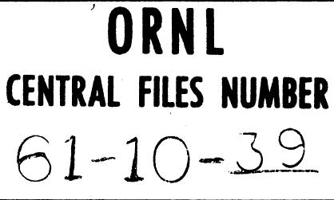
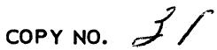
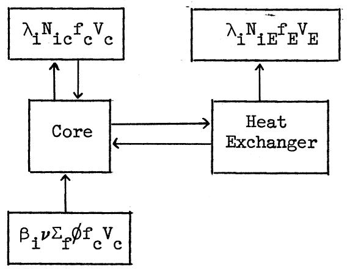

# OAK RIDGE NATIONAL LABORATORY

Operated by

UNION CARBIDE NUCLEAR COMPANY

Division of Union Carbide Corporation

Post Office Box X

Oak Ridge, Tennessee

For Internal Use Only

DATE: October 11, 1961

SUBJECT: Delayed Neutron Losses in Circulating Fuel Reactors - MSCR Memo No. 6

TO: Distribution

FROM: T. W. Kerlin, Jr.

# Abstract

Equations which describe delayed neutron losses in external loops of circulating fuel reactors were derived. A working equation and the necessary input data for calculating delayed neutron losses by an equilibrium reactor code such as ERC-5 are given.

# NOTICE

This document contains information of a preliminary nature and was prepared primarily for internal use at the Oak Ridge National Laboratory. It is subject to revision or correction and therefore does not represent a final report. The information is not to be abstracted, reprinted or otherwise given public dissemination without the approval of the ORNL patent branch, Legal and Information Control Department.

# DELAYED NEUTRON LOSSES IN CIRCULATING FUEL REACTORS

Circulating fuel reactors lose neutrons because some of the delayed neutrons are emitted outside of the core. These losses depend on core residence time, external loop residence time, and decay characteristics of the precursors.

A symbolic representation of the system is

where

$$
\lambda_ {i j} = \text {d e c a y c o n s t a n t o f t h e i} ^ {\text {t h}} \text {p r e c u s o r f r o m f i s s i o n a b l e m a t e r i a l j},
$$

$$
\beta_ {1 j} = \text {n u m b e r o f i} ^ {\text {t h}} \text {p r e c u r s o r s} \text {f o r} \text {f i s s i o n} \text {n e u t r o n} \text {f i s s i o n a b l e} \text {m a t e r i a l} \mathrm {j},
$$

$$
\mathrm {N} _ {\mathrm {i j c}} = \text {a t o m s o f i} ^ {\text {t h}} \text {p r e c u s o r p e r u n i t v o l u m e o f f u e l s t r a m i n t h e}
$$

$$
\mathrm {N} _ {\mathrm {i j E}} = \text {a t o m s o f i} ^ {\text {t h}} \text {p r e c u s o r p e r u n i t v o l u m e o f f u e l s t r a m i n t h e}
$$

$$
f _ {c} = \text {v o l u m e f r a c t i o n o f f u e l i n t h e c o r e},
$$

$$
f _ {E} = \text {v o l u m e f r a c t i o n o f f u e l i n t h e e x t e r n a l l o o p s},
$$

$$
V _ {c} = \text {c o r e v o l u m e ,}
$$

$$
V _ {E} = \text {e x t e r n a l l o o p v o l u m e ,}
$$

$\nu_{j} \Sigma_{f j} \phi_{c c} V_{c} =$ rate of production of fission neutrons in the core from fissionable material $j$ .

The precursor concentrations are described by these equations:

$$
\frac {\mathrm {d} \mathbf {N} _ {i j c}}{\mathrm {d t} _ {c}} = \beta_ {i j} \nu_ {j} \Sigma_ {f j} \phi - \lambda \mathbf {N} _ {i j c}, \tag {1}
$$

$$
\frac {\mathrm {d} \mathrm {N} _ {\mathrm {i j E}}}{\mathrm {d t} _ {\mathrm {E}}} = - \lambda \mathrm {N} _ {\mathrm {i j E}}, \tag {2}
$$

where

$$
t _ {c} = \text {t i m e i n t h e c o r e ,}
$$

$$
t _ {E} = \text {t i m e i n t h e e x t e r n a l l o o p s}.
$$

The boundary conditions are:

$$
\mathrm {N} _ {\mathrm {i j c}} \left(\mathrm {T} _ {\mathrm {c}}\right) = \mathrm {N} _ {\mathrm {i j E}} (0), \tag {3}
$$

$$
\mathrm {N} _ {\mathrm {i j c}} (0) = \mathrm {N} _ {\mathrm {i j E}} \left(\mathrm {T} _ {\mathrm {E}}\right), \tag {4}
$$

where

$$
\mathrm {T} _ {\mathrm {c}} = \text {t i m e f o r t h e f u e l s t r a m t o p a s s t h r o u g h t h e c o r e},
$$

$$
\mathrm {T} _ {\mathrm {E}} = \text {t i m e f o r t h e f u e l s t r a m t o p a s s t h r o u g h t h e e x t e r n a l l o o p s}.
$$

The solutions to Eqs. (1) and (2) are:

$$
\mathrm {N} _ {\mathrm {i j c}} = \frac {\beta_ {\mathrm {i j}} \nu_ {\mathrm {j}} \Sigma_ {\mathrm {f j}} \emptyset}{\lambda_ {\mathrm {i j}}} \left(1 - e ^ {- \lambda_ {\mathrm {i j}} t _ {\mathrm {c}}}\right) + \mathrm {N} _ {\mathrm {i j c}} (0) e ^ {- \lambda_ {\mathrm {i j}} t _ {\mathrm {c}}}, \tag {5}
$$

$$
\mathrm {N} _ {\mathrm {i j E}} = \mathrm {N} _ {\mathrm {i j E}} (0) e ^ {- \lambda_ {\mathrm {i j}} t _ {\mathrm {E}}} \tag {6}
$$

Note that the precursor production rate is assumed constant for the fuel stream during its stay in the core. This idealized case would exist only for uniform power density along the fuel stream or for core residence times

which are short compared to the half-life of the precursor.

The boundary conditions become:

$$
\frac {\beta_ {i j} \nu_ {j} ^ {\sum_ {f j}} \phi}{\lambda_ {i j}} \left(\text {E} - e ^ {- \lambda_ {i j} T _ {c}}\right) + N _ {i j c} (0) e ^ {- \lambda_ {i j} T _ {c}} = N _ {i j E} (0), \tag {7}
$$

$$
\mathrm {N} _ {\mathrm {i j c}} (0) = \mathrm {N} _ {\mathrm {i j E}} (0) e ^ {- \lambda_ {\mathrm {i j}} \mathrm {T} _ {\mathrm {E}}} \tag {8}
$$

Eliminating $\mathbf{N}_{\mathbf{ijc}}(0)$ in Eqs. (7) and (8) and substituting the result in Eq. (6) gives:

$$
N _ {i j E} = \frac {\beta_ {i j} \nu_ {j} \Sigma_ {f j} \phi}{\lambda_ {i j}} \frac {\left(1 - e ^ {- \lambda_ {i j} T _ {c}}\right) e ^ {- \lambda_ {i j} t _ {E}}}{\left[ 1 - e ^ {- \lambda_ {i j} \left(T _ {c} + T _ {E}\right)} \right]}. \tag {9}
$$

The rate of decay of precursors in the external loops is:

$$
f _ {E} V _ {E} \frac {\Delta N _ {i j E}}{T _ {E}} = \frac {\beta_ {i j} \nu_ {j} \Sigma_ {f j} \phi f _ {E} V _ {E} \left(1 - e ^ {- \lambda_ {i j} T _ {c}}\right) \left(1 - e ^ {- \lambda_ {i j} T _ {E}}\right)}{\lambda_ {i j} T _ {E} \left[ 1 - e ^ {- \lambda_ {i j} \left(T _ {c} + T _ {E}\right)} \right]} . \tag {10}
$$

The total rate of precursor decay (at equilibrium) is $\beta_{ij} \nu_j \Sigma_{fj} \phi f_c V_c$ . Thus the fraction of the delayed neutrons which appear in external loops is:

$$
\frac {\frac {\Delta \mathrm {N} _ {\mathrm {i j E}} \mathrm {f} _ {\mathrm {E}} ^ {\mathrm {V}}}{\mathrm {T} _ {\mathrm {E}}}}{\beta_ {\mathrm {i j}} \nu_ {\mathrm {j}} ^ {\sum} f _ {\mathrm {j}} \phi_ {\mathrm {c}} ^ {\mathrm {V}} \mathrm {c}} = \frac {\mathrm {f} _ {\mathrm {E}} \mathrm {V} _ {\mathrm {E}} \left(1 - \mathrm {e} ^ {- \lambda_ {\mathrm {i j}} \mathrm {T} _ {\mathrm {c}}}\right) \left(1 - 2 ^ {- \lambda_ {\mathrm {i j}} \mathrm {T} _ {\mathrm {E}}}\right)}{\mathrm {f} _ {\mathrm {c}} \mathrm {V} _ {\mathrm {c}} \lambda_ {\mathrm {i j}} \mathrm {T} _ {\mathrm {E}} \left[ 1 - \mathrm {e} ^ {- \lambda_ {\mathrm {i j}} \left(\mathrm {T} _ {\mathrm {c}} + \mathrm {T} _ {\mathrm {E}}\right)} \right]}. \tag {11}
$$

Since $\frac{f_{E}V_{E}}{f_{C}V_{C}} = \frac{T_{E}}{T_{C}}$ , Eq. (11) becomes:

$$
\frac {\beta_ {i j E}}{\beta_ {i j}} = \frac {(1 - e ^ {- \lambda_ {i j} T _ {c}}) (1 - e ^ {- \lambda_ {i j} T _ {E}})}{\lambda_ {i j} T _ {c} \left[ 1 - e ^ {- \lambda_ {i j} \left(T _ {c} + T _ {E}\right)} \right]}. \tag {12}
$$

For using these results in an equilibrium reactor code such as ERC-5, $^{1}$ the term $\nu_{\mathrm{j}} \Sigma_{\mathrm{fj}} \phi$ may be replaced by a neutron production rate given by

$$
\mathrm {N} _ {\mathrm {j}} \mathrm {C} _ {\mathrm {j}} ^ {\mathrm {f}} \nu_ {\mathrm {j}},
$$

where

$$
C _ {j} ^ {f} = \text {r e a c t i o n r a t e c o e f f i c i e n t f i s s i o n s i n m a t e r i a l j .}
$$

Using this in Eq. (12) gives the following result for the number of neutrons lost in the external loops per neutron produced:

$$
\text {l o s s e s} = \sum_ {j} N _ {j} C _ {j} ^ {f} \nu_ {j} \sum_ {i} \frac {\beta_ {i j} \left(1 - e ^ {- \lambda_ {i j} T _ {c}}\right) \left(1 - e ^ {- \lambda_ {i j} T _ {E}}\right)}{\lambda_ {i j} T _ {c} \left[ 1 - e ^ {- \lambda_ {i j} \left(T _ {c} + T _ {E}\right)} \right]}. \tag {13}
$$

The necessary constants for $\mathbf{Th}^{232}$ , $\mathbf{U}^{233}$ , $\mathbf{U}^{235}$ , $\mathbf{U}^{238}$ , and $\mathbf{Pu}^{239}$ are:

<table><tr><td>Group</td><td>λi(sec-1)</td><td>Tn232</td><td>U233</td><td>U235</td><td>U238</td><td>Pu239</td></tr><tr><td>1</td><td>0.0128</td><td>0.00085</td><td>0.00020</td><td>0.0003</td><td>0.00015</td><td>0.0001</td></tr><tr><td>2</td><td>0.0315</td><td>0.0035</td><td>0.00075</td><td>0.0018</td><td>0.0017</td><td>0.0006</td></tr><tr><td>3</td><td>0.125</td><td>0.0045</td><td>0.00105</td><td>0.0022</td><td>0.0028</td><td>0.00045</td></tr><tr><td>4</td><td>0.325</td><td>0.0120</td><td>0.00075</td><td>0.0023</td><td>0.0071</td><td>0.00085</td></tr><tr><td>5</td><td>1.55</td><td>0.0045</td><td>0.00025</td><td>0.0007</td><td>0.0042</td><td>0.0003</td></tr><tr><td>6</td><td>4.5</td><td>0.0009</td><td>--</td><td>0.0002</td><td>0.0015</td><td>--</td></tr><tr><td></td><td></td><td>0.02625</td><td>0.0030</td><td>0.0075</td><td>0.01745</td><td>0.0023</td></tr></table>

# DISTRIBUTION

1-10. L. G. Alexander   
11. S. E. Beall   
12. L. L. Bennett   
13. A. L. Benson, ORO   
14. E. S. Bettis   
15. A. L. Boch   
16. F. E. Blankenship   
17. R. B. Briggs   
18. D. O. Campbell   
19. W. L. Carter   
20. R.H.Chapman   
21. F. L. Culler   
22. J. G. Delene   
23. D. E. Ferguson   
24. H. E. Goeller   
25. W. R. Grimes   
26. C. E. Guthrie   
27. J.P.Hammond   
28. F. E. Harrington   
29. W. H. Jordan   
30. P. R. Kasten   
31-35. T. W. Kerlin

36. J.A.Lane   
37. J. L. Lucius   
38. R. N. Lyon   
39. H. G. MacPherson   
40. W. B. McDonald   
41. R.P.Milford   
42. A. M. Perry   
43. D. Scott   
44. F. P. Self, ORO   
45. M. J. Skinner   
46. I. Spiewak   
47. J.A. Swartout   
48. W.C.Thurber   
49. J. W. Ullmann   
50. R. Van Winkle   
51. G.M.Watson   
52. A. M. Weinberg   
53. J. H. Westsik   
55. Central Research Library   
56. Document Reference Section   
59. Laboratory Records   
60. Laboratory Records (LRD-RC)