UCN-2383

(3 11-60)

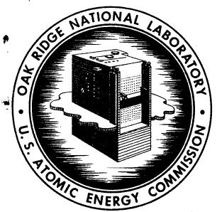

# OAK RIDGE NATIONAL LABORATORY

Operated by

UNION CARBIDE NUCLEAR COMPANY

Division of Union Carbide Corporation

Post Office Box X

Oak Ridge, Tennessee

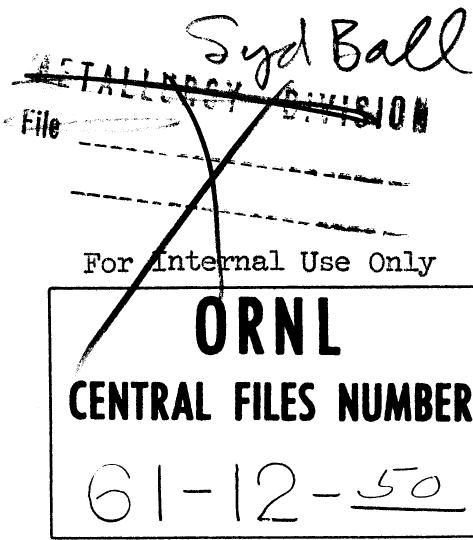

COPY NO. 31

DATE: December 26, 1961

SUBJECT: MSRE - Analog Computer Simulation of the System With a Servo Controller

TO: G. A. Cristy

FROM: O. W. Burke

# ABSTRACT

One purpose of this study was to determine whether the fuel salt temperature inside the reactor could be controlled with a closed-loop servo controller. An "on-off" type controller was demonstrated using four different control signals. The stability of the system when using the controller was of primary interest.

These studies indicated that the system was stable for large and relatively fast power demand changes when using the controller with any one of the four control signals.

# NOTICE

This document contains information of a preliminary nature and was prepared primarily for internal use at the Oak Ridge National Laboratory. It is subject to revision or correction and therefore does not represent a final report. The information is not to be abstracted, reprinted or otherwise given public dissemination without the approval of the ORNL patent branch, Legal and Information Control Department.

# CONTENTS

I. Introduction 3   
II. Description of the System Simulated 3   
III. Description of Controller 3   
IV. Description of the Control Signals Used 3

A. Control Signal No. 1, E, 3-5   
B. Control Signal No. 2, C. 5-6   
C. Control Signal No. 3, E. 6   
D. Control Signal No. 4, F

V. Procedure and Results 6-7

# Figures:

1. Basic Flow Diagram of MSRE System 8   
2. Identification of Temperature Symbols... 9-10   
3. MSRE Design Point Data as of 12-13-60... 11-12   
4. Generator Circuit for $\epsilon_{1}$ 13   
5. Generator Circuit for $\mathbf{E}_2$ 14   
6. Generator Circuit for 15   
7. Generator Circuit for $\mathcal{E}_{\mu}$ 16   
8. Control Signal $\epsilon_{i}$ , Nuclear Power and Mean Fuel Temperature in Reactor vs. Time 17   
9. Control Signal $\epsilon_{2}$ , Nuclear Power and Mean Fuel Temperature in Reactor vs. Time 18   
10. Control Signal $\mathbf{E}_{3}$ , Nuclear Power and Mean Fuel Temperature in Reactor vs. Time 19   
ll. Control Signal $\epsilon_{\phi}$ , Nuclear Power and To vs. Time 20

Bibliography 21

Distribution 22-23

I. Introduction: It is desirable to provide a controller for controlling the fuel temperature inside the reactor. There are many control concepts that would do the job.

The decision was made to try a simple "on-off" controller. E. R. Mann of the Instrumentation and Controls Division proposed four control signals which have definite possibilities and suggested that they be demonstrated on the analog computer. This report covers the analog computer demonstrations.

II. Description of the System Simulated: A schematic flow sheet of the MSRE system is shown in Figure 1. The temperature symbols are identified in Figure 2. The design information used in these studies is listed in Figure 3. The analog computer diagram is filed in the Engineering and Mechanical Division print files on Drawings 40331 and 40332.

The simulation of the thermal system and nuclear system as used in these studies has been discussed in previous preliminary reports. There were two changes, however, that were significant. The temperature coefficient of reactivity of the graphite was changed from:

$$
- 2 \times 1 0 ^ {- 4} \frac {\mathcal {O} _ {K}}{K - ^ {\circ} F} \quad t o \quad - 6 \times 1 0 ^ {- 5} \frac {\mathcal {O} _ {K}}{K - ^ {\circ} F}
$$

and the total secondary salt loop transit time was changed from 13 seconds to 24.2 seconds.

III. Description of Controller: The controller simulated was a simple "on-off" servo controller. The rod drive motor was a constant speed motor, driving the rods at a constant velocity sufficient to change the reactivity at a rate of:

$$
. 0 0 0 2 \frac {\delta K}{K - s e c .}
$$

For the sake of simplicity, the rod worth was considered to be linear throughout the range used in these studies. The "time constant" of the controller was assumed to be 50 milliseconds. This "time constant" is the time required for the rod speed to attain $63\%$ of full speed subsequent to receiving a demand signal to move the rods. The "dead band" of the controller was $\pm 2^{\circ}\mathbf{F}$ .

IV. Description of the Control Signals Used: The four different control signals used with the above described controller were as follows:

A. Control Signal No.1, C:

The equation expressing $\epsilon_{\cdot}$ is as follows:

$$
\frac {1}{G} \epsilon_ {i} = m a \left\{\phi - \left(T _ {0} \right] _ {r} - \left. T _ {i} \right] _ {r}) - g (t) \right\} + n \left\{\left(T _ {0} \right] _ {r} + \left. T _ {i} \right] _ {r}\right) - 2 I _ {\mathrm {s p}} \Bigg \}
$$

where,

G = control signal gain factor or amplification factor.  
m, n, and a are constants that may be varied at will.

$\phi =$ neutron flux

$\left.\mathrm{T}_{\mathrm{O}}\right]_{\mathrm{r}} =$ Fuel salt temperature at the reactor outlet.

$\mathbf{T}_{\mathbf{i}}\bigg]_{\mathbf{r}} =$ Fuel salt temperature at the inlet to the reactor.

$$
g (t) = \lambda_ {2} \int_ {0} ^ {t} \left[ a \phi - \left(T _ {0} \right] _ {r} - T _ {i} \right] _ {r} - g (t) ] \quad d t
$$

This can be considered as a "reset mechanism."

$\mathbf{T}_{\mathfrak{sp}}$ - The desired mean fuel temperature in the reactor.

The controlled variable in $\epsilon_{1}$ is the mean fuel temperature in the reactor, $\left.\begin{array}{l}T_{0}\\ T_{r}\end{array}\right|_{r}+\left.\begin{array}{l}T_{i}\\ T_{i}\end{array}\right|_{r}$ . This variable appears only in the

second term of the control signal. If this term alone is used as the control signal, the system is unstable.

The first term in $\epsilon_{1}$ can be considered as a high frequency band pass stabilizing mechanism. It merely compares the rate of production of nuclear power to the rate of addition of heat to the fuel salt as it passes through the reactor. Note that for steady state operation:

$$
\begin{array}{l} \frac {d [ g (t) ]}{d t} = 0 = \lambda_ {2} \left[ a \phi - \left(T _ {0} \right] _ {r} - T _ {1} \right] _ {r} - g (t) \Bigg ] \\ g (t) = a \phi - \left(T _ {0} \right] _ {r} - T _ {1} \Big ] _ {r} \\ \end{array}
$$

This insures that the first term in $\epsilon_{i}$ will be zero for steady state operation whether the term:

$$
\left[ \begin{array}{c c c c} a & \phi & - & \left(\mathrm {T} _ {\mathrm {O}} \right] _ {r} & - & \left. \mathrm {T} _ {\mathrm {i}} \right] _ {r} \end{array} \right]
$$

is zero or not. For this reason, the constant, "a", does not have to be reset for various power levels. If $\epsilon_{1}$ exceeds the dead band

positively, rods will be inserted and if $\epsilon_{1}$ exceeds the dead band negatively, rods will be withdrawn. The analog computer diagram used to obtain $\epsilon_{1}$ is shown in Figure 4.

The temperature sensing elements are thermocouples attached to the walls of the pipes containing the fluids whose temperatures are to be measured. There is a time lag between the time at which a change in temperature of the fluid occurs and the time at which this change is reflected in the thermocouple output signal. This time lag varies with different thermocouple designs, pipe wall thicknesses, etc. The time constant for this lag in the salt temperature thermocouples was designated as $T_{1}$ and was considered to be 5 seconds.

The time constant of the $g(t)$ circuit was chosen as 10 times that of the thermocouple. This long time constant was necessary in order to get "reset action" and still not interfere with the stabilizing effect during transients.

The other three control signals are quite similar to $\epsilon_{1}$ and only their differences from $\epsilon_{1}$ will be pointed out in the following descriptions of these signals.

B. Control Signal No. 2, $\epsilon_{2}$ .

The equation expressing $\epsilon_{\alpha}$ is as follows:

$$
\frac {1}{G} \epsilon_ {2} = m \left\{\mathrm {a} \phi - f _ {\mathrm {a}} \left(\mathrm {T} _ {\mathrm {O}} \right] _ {\mathrm {a}} - \left. \mathrm {T} _ {\mathrm {I}} \right] _ {\mathrm {a}}) - g (\mathrm {t}) \right\} + n \left\{\left(\mathrm {T} _ {\mathrm {O}} \right] _ {\mathrm {r}} + \left. \mathrm {T} _ {\mathrm {I}} \right] _ {\mathrm {r}}) - 2 \mathrm {T} _ {\mathrm {s p}} \right\}
$$

where,

$f_{a} =$ air flow rate across the radiator

$\left.\mathrm{T}_{\mathrm{O}}\right]_{\mathrm{a}} =$ outlet air temperature from radiator

$\left.\mathrm{T}_{\mathrm{i}}\right]_{\mathrm{a}} =$ inlet air temperature to radiator

The time constant used for the air temperature sensing elements was 2.5 seconds and that used in the $g(t)$ circuit was 25 seconds ( $T_3 = 2.5$ and $\lambda_4 = 0.04$ ).

Note that the controlled variable is the same as for $\epsilon_{1}$ . The stabilizing portion of the control signal is now formed by comparing the rate of production of power in the reactor to the rate of removal of power from the secondary salt by the air flowing across the radiator. Note that a multiplier is required in this circuit.

The analog computer diagram used to formulate $\xi_{\lambda}$ is shown in Figure 5.

C. Control Signal No. $3, \epsilon_{3}$ .

The equation expressing $\epsilon_{3}$ is:

$$
\frac {1}{G} \epsilon_ {3} = m \left\{\mathrm {a} \phi - \left(T _ {\mathrm {i}} \right] _ {\mathrm {s}} - \left. T _ {\mathrm {o}} \right] _ {\mathrm {s}}\right) - g (\mathrm {t}) \Bigg \} + n \left\{\left(T _ {\mathrm {c}} \right] _ {\mathrm {r}} + \left. T _ {\mathrm {i}} \right] _ {\mathrm {r}}\right) - 2 T _ {\mathrm {s p}}
$$

where,

$\left.\mathrm{T_i}\right]_{\mathrm{s}} =$ secondary salt temperature at the radiator inlet

$\left.\mathrm{T}_{\mathrm{O}}\right]_{\mathrm{s}} =$ secondary salt temperature at the radiator outlet

The controlled variable is the same as that in $\epsilon_{1}$ and $\epsilon_{2}$ . The stabilizing circuit is formed by comparing the rate of power production in the reactor to the rate of power loss of the secondary salt as it flows through the radiator. No multiplier is required since the flow rate in the secondary salt system is constant.

The "time constant" potentiometer settings are the same as those used in $\epsilon_{1}$ . The analog computer diagram used to obtain $\epsilon_{3}$ is shown in Figure 6.

D. Control Signal No. $4, \epsilon_{4}$ .

The equation describing $\epsilon_{\bullet}$ is:

$$
\frac {1}{G} \epsilon_ {4} = m \left\{\mathrm {a} \phi - \left(\mathrm {T} _ {\underline {{i}}} \right] _ {\mathrm {s}} - \left. \mathrm {T} _ {\circ} \right] _ {\mathrm {s}}) - g (\mathrm {t}) \right\} + n \left(\mathrm {T} _ {\circ} \right] _ {\mathrm {r}} - \left. \mathrm {T} _ {\mathrm {s p}}\right)
$$

This control signal is the same as $\epsilon_{3}$ except that a different controlled variable is used. The outlet fuel temperature from the reactor is the controlled variable. The analog computer diagram used to derive $\epsilon_{4}$ is shown in Figure 7.

V. Procedure and Results: The system without a controller was shown to be unstable subsequent to any appreciable perturbation. The system was also shown to be unstable when using the controller with only the second term in the above control signals.

The stability of the system with the above controllers was checked subsequent to large changes in the power demand or load. The changes in the load for the four runs, each using one of the four above described control signals to the controller, were not precisely equal in magnitude and rate of change. The change in load was accomplished by manually turning a potentiometer. Also, no attempt was made to get optimum settings for M and N in each case. Therefore, the results cannot be compared quantitatively. In later runs linear ramp load changes will be used, and optimum

values of M and N used, so that controllers can be compared. Recordings of the controlled variable and the neutron flux were made subsequent to a load change, while using each of the four control signals to the controller. The conditions for these runs were as follows:

A. Using $\mathbf{E}_{\mathrm{i}}$ as the control signal, M, as shown on the computer diagram, was set at .877 (quite arbitrarily) and N was set at 0.5. The load, or the heat removal rate by the air across the radiator, was set at approximately $\frac{1}{2}$ megawatt and the system permitted to stabilize. The load was increased from $\frac{1}{2}$ mw to 10 mw in 15 seconds, approximately at a constant rate. The curves obtained are shown in Figure 8. On all the curves only a relatively short time is shown. It can be seen that the curves are converging, which indicates stability.   
B. Using $\epsilon_{2}$ as the control signal, M, as shown on the computer diagram, was set at 0.877 and N set at 0.5. The load was changed from approximately 1.6 mw to 10 mw in 17 seconds. The resulting curves are shown in Figure 9.   
C. Using $\mathbf{E}_3$ as the control signal, M, as shown on the computer diagram, was set at 0.25 and N was set at 0.5. The load was changed from approximately 1.6 mw to 10 mw in 13 seconds. The resulting curves are shown in Figure 10.   
D. Using $\mathbf{E}_{\psi}$ as the control signal, M, as shown on the computer diagram, was set at 0.50 and N was set at 1.00. The load was changed from approximately 1.6 mw to 10 mw in ll seconds. The resulting curves are shown in Figure ll.

The conclusion reached was that the system would be stable using the controller with any of the four control signals.

It should be pointed out that the constants M and N on the actual installation could be changed over a considerable range. No attempt was made to get the optimum settings on the computer, due to time limitations.

8

FIG.1 BASIC FLOW DIAGRAM OF MSRE SYSTEM   
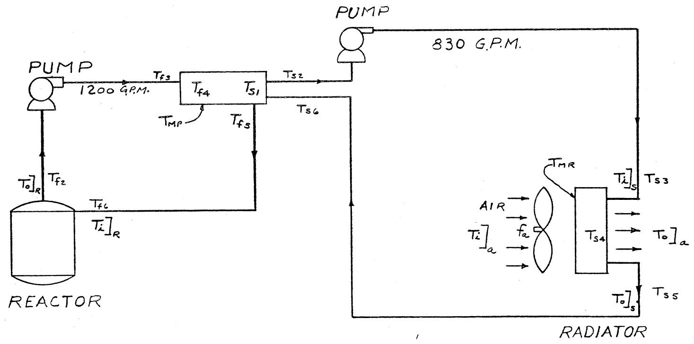  
ORIL-LR-Dwg. 64899 UNCLASSIFIED

Figure 2

# IDENTIFICATION OF TEMPERATURE SYMBOLS

Tf! - Circulating fuel mean temperature in the reactor core.   
Tp2 - Circulating fuel temperature at the outlet of the reactor core.   
Tf3 Circulating fuel temperature at the inlet to the primary heat exchanger.   
Tpl - Circulating fuel mean temperature in the primary heat exchanger.   
Tf5 - Circulating fuel temperature at the outlet of the primary heat exchanger.   
T6 - Circulating fuel temperature at the inlet to the reactor core.   
Tg - Mean temperature of the graphite in the reactor core.   
Tmp - Mean temperature of the metal in the primary heat exchanger wall.   
Tsl Mean temperature of the secondary salt in the primary heat exchanger.   
T82 - Secondary salt temperature at the outlet of the primary heat exchanger.   
$\mathbf{T_{s3}}$ - Secondary salt temperature at the inlet to the radiator.   
Tsh - Mean temperature of the secondary salt in the radiator.   
$\mathrm{T}_{\mathrm{s}5}$ Secondary salt temperature at the radiator outlet.   
T6 Secondary salt temperature at the inlet to the primary heat exchanger.   
Tmr - Mean temperature of the metal in the radiator.   
Thot - Mean circulating fuel temperature in the "hot leg" of the primary system.   
$\overline{\mathbb{T}}_{\mathrm{cold}}$ Mean circulating fuel temperature in the "cold leg" of the primary system.   
Tma Mean air temperature in the radiator.

Figure 2 (contd.)

$\left.\mathrm{T}_{\mathrm{i}}\right]_{\mathrm{r}}$ - Fuel temperature at reactor core inlet.   
$\left.\mathrm{T}_{0}\right]_{r}$ - Fuel temperature at reactor core outlet,   
$\left.\mathrm{T}_{\mathrm{i}}\right]_{\mathrm{s}}$ - Secondary salt temperature at the radiator inlet.   
$\left.\mathrm{T}_{0}\right]_{s}$ - Secondary salt temperature at the radiator outlet.   
$\left.\mathrm{T}_{\mathrm{i}}\right]_{\mathrm{a}}$ - Cooling air temperature at radiator inlet.   
$\left.\mathrm{T}_{0}\right]_{a}$ - Cooling air temperature at radiator outlet.

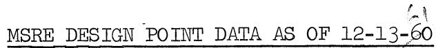  
Figure 3

Reactor inlet temperature: 1175°F   
Reactor outlet temperature: 1225 ${}^{\circ}\mathrm{F}$   
Mean graphite temperature: (with no fuel absorption) 1230 ${}^{\circ}\mathrm{F}$   
Residence time in reactor: 7.63 sec.   
Film drop from graphite to fuel: Linear with power   
Heat capacity of graphite: 0.425 BTU # $\mathrm{^o_F}$   
Prompt $\gamma$ and neutron heating in graphite: $6 \%$ of 10 MW   
Residence time in piping from reactor outlet to H.E. inlet 3.09 sec.   
Residence time in H. E. 2.24 sec.   
Heat capacity of metal in H.E. 200 BTU/°F   
Avg. film drop between primary coolant and metal at D.P. 55.2°F   
Avg. drop in metal at D.P. 56.7 F   
Avg. film drop between metal and secondary coolant at D.P. 26.1 F   
Film drop between primary coolant and metal as function of flow: See graph, displace curve if necessary so that at 6.2 fps velocity $\Delta T = 55.2^{\circ}F$ .   
Mean secondary coolant temperature at D. P. 1062 F   
Residence time in piping between H. E. outlet and reactor 9.04 sec. inlet (including coolant annulus)   
Total circulation time 22.0 sec.   
Temperature coefficient of reactivity of graphite: -6 x 10 $^{-5}$ $\delta_{\mathrm{K / K^{-}}^{\circ}\mathrm{F}}$   
Temperature coefficient of reactivity of fuel: -3.3 x 10 $^{-5}$ $\delta_{\mathrm{K} / \mathrm{K}^{-\mathrm{C}}}$ F   
Melting point of primary coolant: 842 F   
Melting point of secondary coolant: 860 F

Figure 3 (contd.)

Check points:

Thermal resistances: ft. hr. ${}^{\circ}\mathrm{F}$ BTU

in primary coolant film:

in metal:

in secondary coolant film:

Simulator data for secondary loop

Air temperature rise in radiator

Air suction temperature

Air flow

Heat capacity of radiator

Heat capacity of secondary salt

Density of secondary salt

Residence times of secondary salt:

in primary heat exchanger

in piping to radiator

in radiator

in piping from radiator

Total

Residence time of air in radiator

Temperature differences in radiator:

in salt film

in tube wall

in air film

3.28 x 10-4

3.32 x 10-4

1.56 x 10-4

200 ${}^{\circ}\mathbf{F}$

100 ${}^{\circ}\mathbf{F}$

166,000 cfm

(7.11 x 10 $^{5}$ #/hr)

242 BTU/°F

0.57 BTU #°F

120 #/ft3

1.75 sec.

5.20 sec.

7.14 sec.

10.11 sec.

24.20 sec.

0.01 sec.

13.4 $\mathrm{^o F}$

78.4 $\mathrm{^o F}$

770.7 ${}^{\circ}\mathrm{F}$

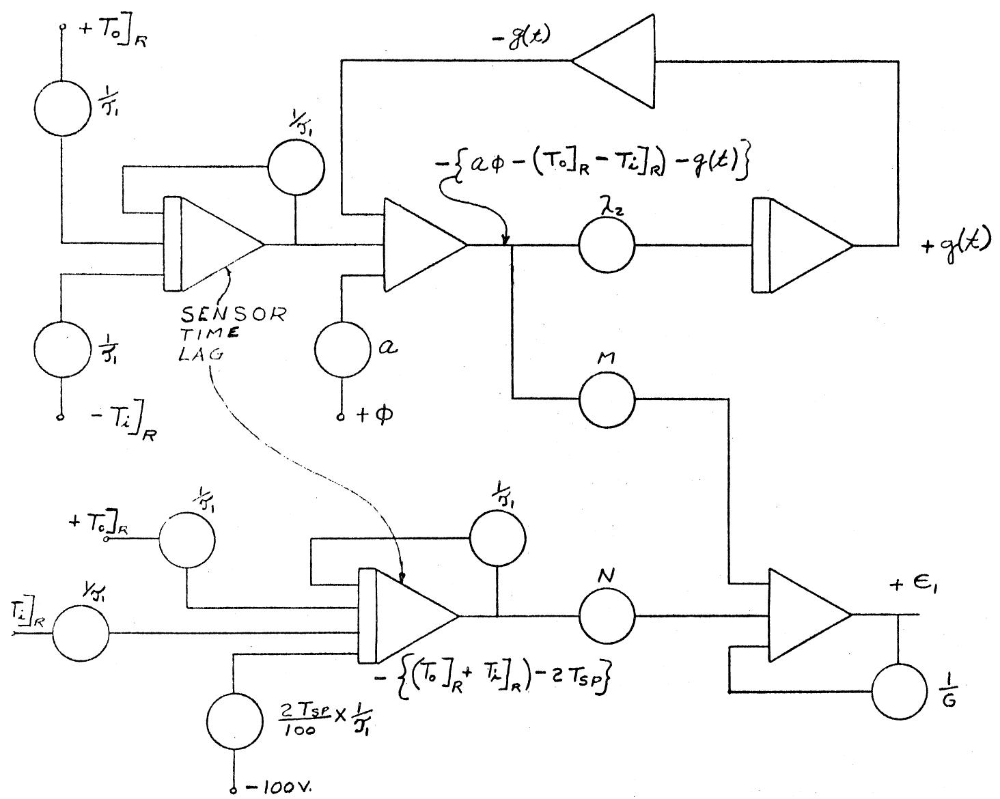  
FIG.4. GENERATOR CIRCUIT FOR $\epsilon_{1}$

$$
\lambda_ {2} \cong 0. 1 (\frac {1}{3})
$$

$$
\frac {1}{G} \epsilon_ {1} = M \left\{a \phi - (T _ {0} ] _ {R} - T _ {1} ] _ {R}) - g (t) \right\} + N \left\{(T _ {0} ] _ {R} + T _ {1} ] _ {R}\right) - 2 T _ {S P} \rbrace
$$

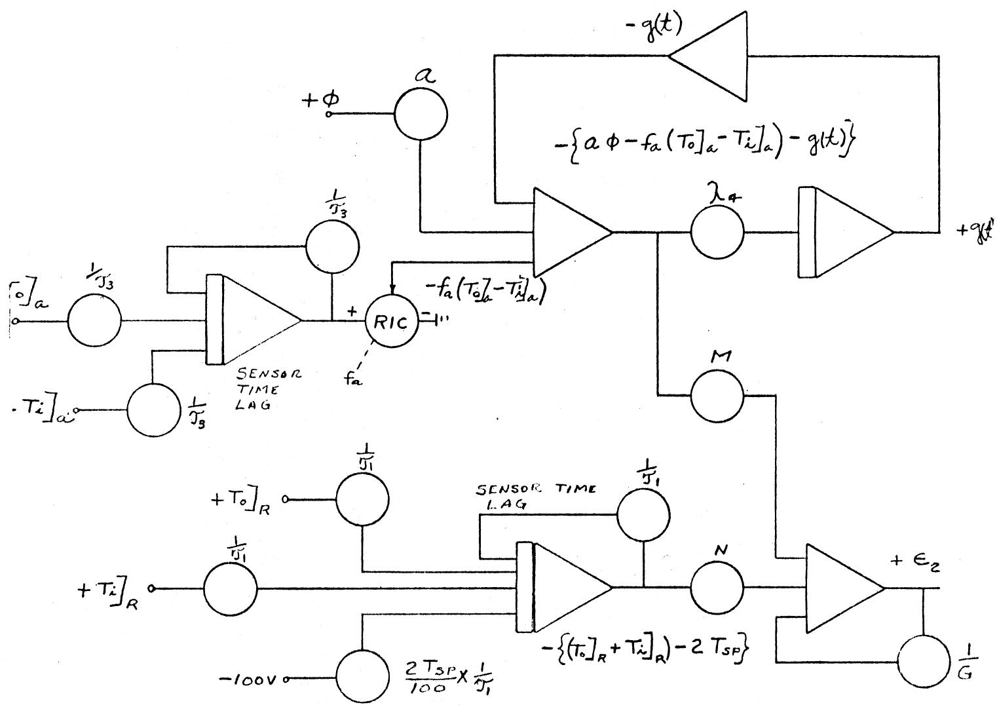  
FIG.5 GENERATOR CIRCUIT FOR $\epsilon_{2}$

$$
\begin{array}{l} \lambda_ {4} \cong 0. 1 (\frac {1}{3}) \\ \frac {1}{G} \epsilon_ {2} = M \left\{a \phi - f _ {a} \left(T _ {0} \right] _ {a} - T _ {i} \right] _ {a}) - g (t) \} + \left[ \left(T _ {0} \right] _ {R} + T _ {i} \right] _ {R}) - 2 T _ {S P} \} N \\ \end{array}
$$

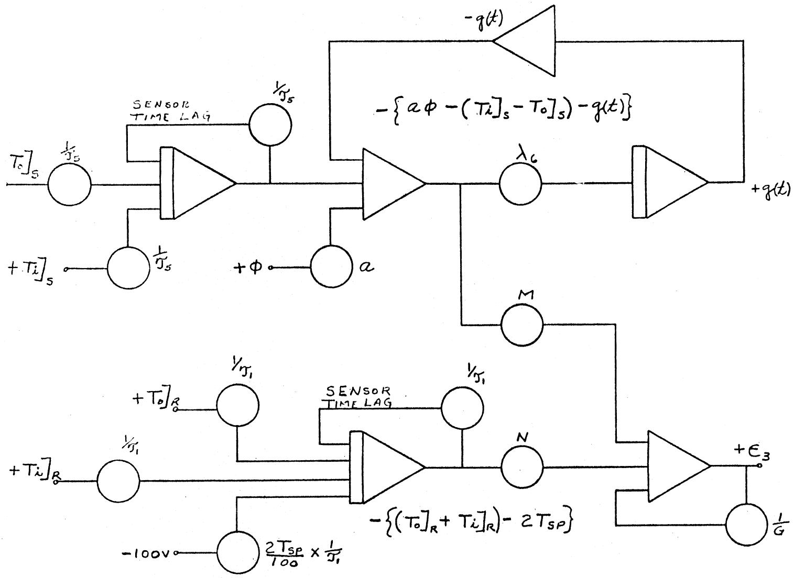

$$
\lambda_ {6} \cong 0. 1 (\frac {1}{5})
$$

$$
\frac {1}{G} \epsilon_ {3} = M \left\{ \right.a \phi - \left( \right.T _ {i} \left. \right] _ {s} - T _ {0} \left. \right] _ {s}) - g (t) \left. \right\} + N \left\{ \right.\left( \right.T _ {0} \left. \right] _ {R} + \left. T _ {i} \right] _ {R}\left. \right) - 2 T _ {S P} \}
$$

FIG.6 GENERATOR CIRCUIT FOR $\epsilon_{3}$ .

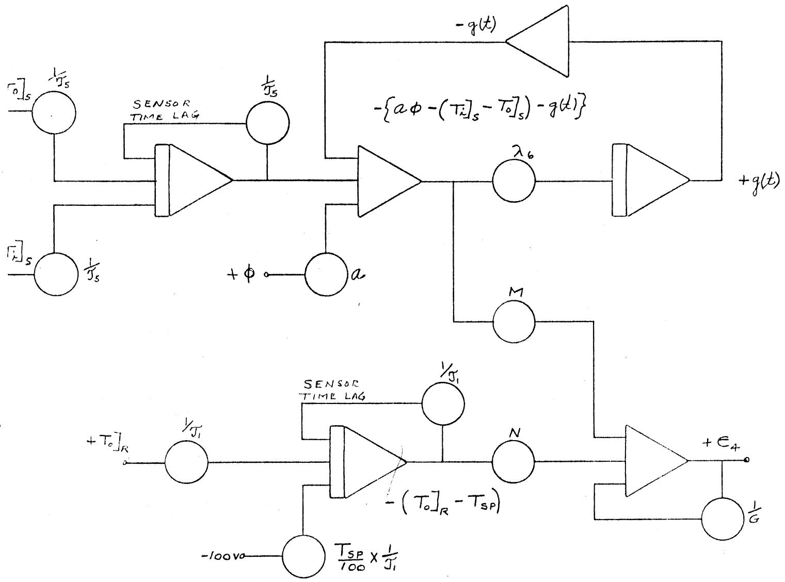

$$
\lambda_ {6} \cong 0. 1 (\frac {1}{s})
$$

$$
\frac {1}{G} \epsilon_ {4} = M \left\{ \right.a \phi - \left( \right.T _ {i i} \left. \right] _ {s} - T _ {0} \left. \right] _ {s}) - q (t) \left. \right\} + N \left( \right.T _ {o} \left. \right] _ {R} - T _ {S P})
$$

FIG.7 GENERATOR CIRCUIT FOR $\epsilon_{4}$

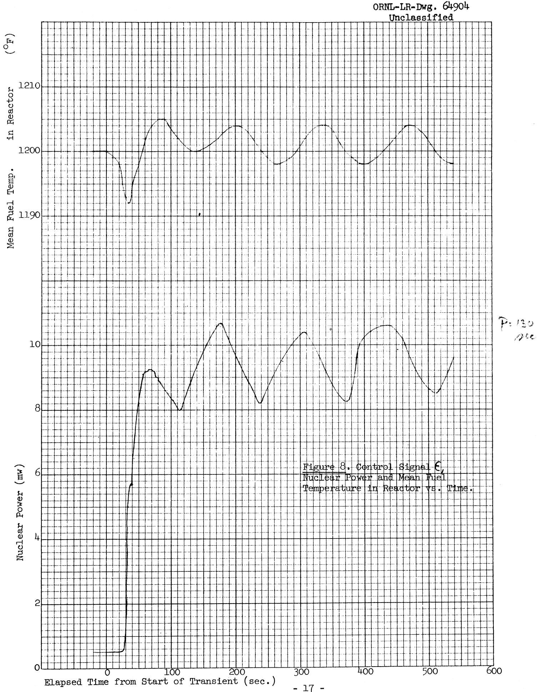

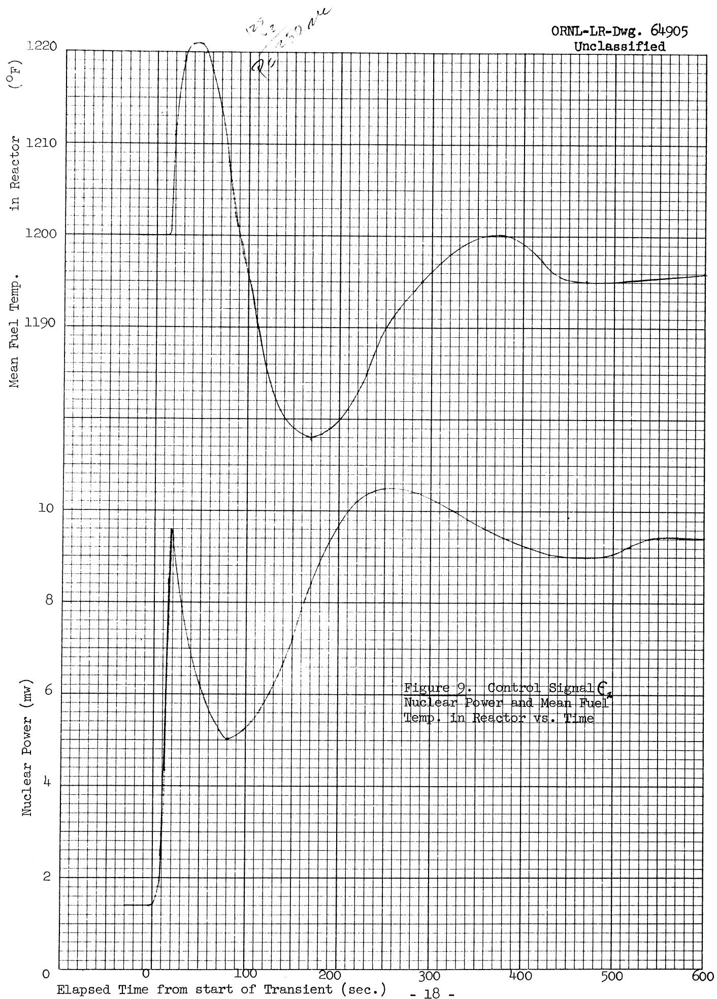

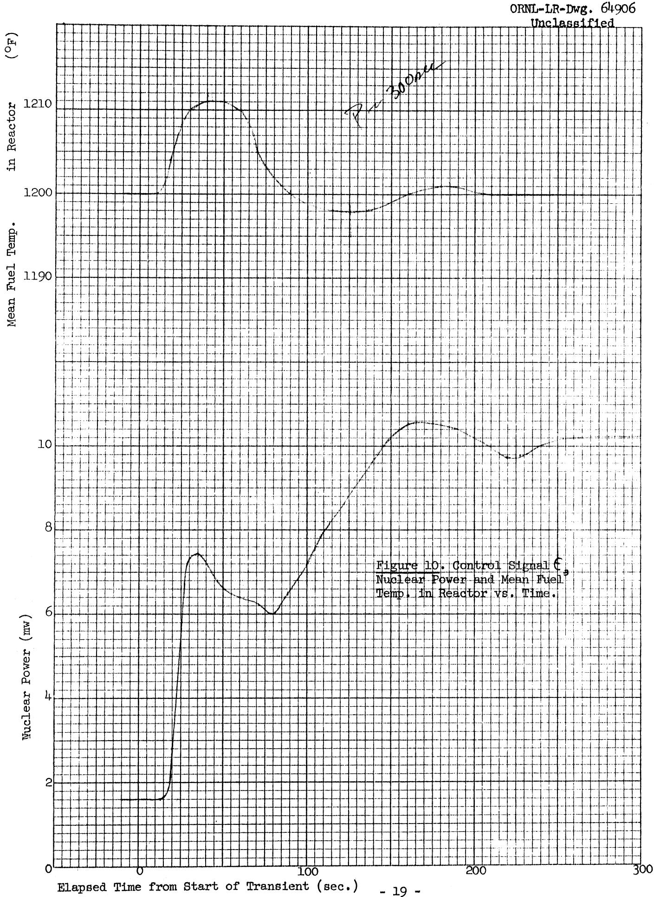

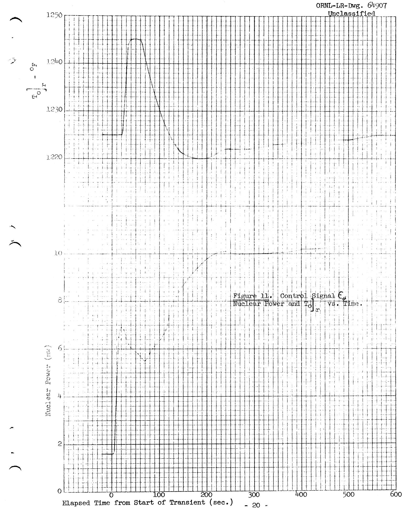

# BIBLIOGRAPHY

1. O. W. Burke, MSRE - Preliminary Analog Computer Study-Flow Accident in Primary System, ORNL CF 60-6-110 (June 27, 1960)   
O. W. Burke, MSRE - Analog Computer Simulation of a Loss of Flow Accident in the Secondary System and a Simulation of a Controller Used to Hold the Reactor Power Constant at Low Power Levels, ORNL CF 60-11-20 (Nov. 4, 1960)   
O. W. Burke, MSRE - An Analog Computer Simulation of the System for Various Conditions - Progress Report No. 1, ORNL CF 61-3-42 (March 8, 1961)

# DISTRIBUTION

1. MSRP Director's Office   
2. G. M. Adamson   
3. L.G. Alexander   
4. S.E.Beall   
5. M. Bender   
6. C. E. Bettis   
7. E. S. Bettis   
8. D. S. Billington   
9. F. F. Blankenship   
10. A. L. Boch   
11. E. G. Bohlmann   
12. S.E.Bolt   
13. C. J. Borkowski   
14. C. A. Brandon   
15. F.R.Bruce   
16. O.W. Burke   
17. T.E.Cole   
18. J.A. Conlin   
19. W.H.Cook   
20. G. A. Cristy   
21. J. L. Crowley   
22. F. L. Culler   
23. J.H.DeVan   
24. F.A.Doss   
25. D. A. Douglas   
26. N.E.Dunwoody   
27. E.P.Epler   
28. W. K. Ergen   
29. D. E. Ferguson   
30. A.P.Fraas   
31. J.H.Frye   
32. C. H. Gabbard   
33. R. B. Gallaher   
34. B. L. Greenstreet   
35. W.R.Grimes   
36. A.-G. Grindell   
37. R.H.Guymon   
38. P.H.Harley   
39. C. S. Harrill   
40. P. N. Haubenreich   
41. E.C.Hise   
42. H.W.Hoffman   
43. P.P.Holz   
44. L. N. Howell   
45. J.P.Jarvis   
46. W.H.Jordan

9204-1   
2005   
9204-1   
9204-1   
9201-3   
1000   
9204-1   
3025   
4500   
9204-1   
9204-1   
9204-1   
3500   
9201-3   
4500   
1000   
4500   
9201-3   
2000   
1000   
9204-1   
4500   
9201-3   
9201-3   
2005   
1000   
3500   
4500   
4500   
9704-1   
2000   
9201-3   
9204-1   
9204-1   
4500   
9201-3   
7500   
9204-1   
3500   
7500   
9204-1   
9204-1   
9204-1   
1000   
1000   
4500

47. P. R. Kasten   
48. R.J.Kedl   
49. G.W. Keilholtz   
50. S. S. Kirslis   
51. J. W. Krewson   
52. J. A. Lane   
53. W.J.Leonard   
54. R. B. Lindauer   
55. M. I. Lundin   
56. R. N. Lyon   
57. H. G. MacPherson   
58. F.C. Maienschein   
59. E.R.Mann   
60. W. B. McDonald   
61. H.F. McDuffie   
62. C. K. McGlothlan   
63. A.J.Miller   
64. E.C.Miller   
65. R. L. Moore   
66. J.C.Moyers   
67. C.W. Nestor   
68. T.E. Northup   
69. W.R.Osborn   
70. L. F. Parsly   
71. P. Patriarca   
72. H.R.Payne   
73. A.M.Perry   
74. W. B. Pike   
75. J. L. Redford   
76. M. Richardson   
77. R.C. Robertson   
78. T. K. Roche   
79. H.W. Savage   
80. D. Scott   
81. M. J. Skinner   
82. G. M. Slaughter   
83. A. N. Smith   
84. P.G. Smith   
85. I. Spiewak   
86. B. Squires   
87. J. A. Swartout   
88. A. Taboada   
89. J.R. Tallackson   
90. R.E.Thoma   
91. D. B. Trauger   
92. W.C.Ulrich

9204-1

9204-1

3550

4500

9204-1

4500

9204-1

9204-1

9201-3

9204-1

9704-1

3010

3500

9204-1

4500

9204-1

9704-1

9204-1

9204-1

9204-1

9204-1

1000

9704-1

9204-1

2005

9204-1

9204-1

9201-3

7500

9204-1

9204-1

2000-A

9201-3

9204-1

4500

2005

9204-1

9201-3

9204-1

9204-1

4500

9204-1

9204-1

4500

9201-3

9204-1

93.B.S.Weaver 4500   
94. B. H. Webster 9204-1   
95.A.M.Weinberg 4500   
96. J. H. Westsik 9204-1   
97. L.V. Wilson 9201-3   
98.C.E.Winters 4500   
99.C.H.Wadtke 9204-1   
100-101. Reactor Div. Library (2) 9204-1   
102. Central Research Library 4500   
104. Document Reference Library (1) 9711-1   
105-107. Laboratory Records (3) 4500   
108. Laboratory Records ORNL-RC 4500