UCN-2363

(3 11-60)

# OAK RIDGE NATIONAL LABORATORY

Operated by

UNION CARBIDE NUCLEAR COMPANY

Division of Union Carbide Corporation

Post Office Box X

Oak Ridge, Tennessee

DISTRIBUTION LIMITED TO RECIPIENTS INDICATED

ORNL

CENTRAL FILES NUMBER

ADDENDUM

61-2-46

EXTERNAL TRANSMITTAL AUTHORIZATION

COPY NO. 135

DATE: August 14, 1961

SUBJECT: ADDENDUM TO ORNL CF-61-2-46, MOLTEN-SALT REACTOR EXPERIMENT

PRELIMINARY HAZARDS REPORT

TO: Dist.

FROM:

S.E.Beall

R. B. Briggs

J. H. Westsik

This document has been reviewed and is determined to be APPROVED FOR PUBLIC RELEASE.

Name/Title: pepaaymoo, ORNLTD

Date: ${10} - {16} - {14}$

# NOTICE

This document contains information of a preliminary nature and was prepared primarily for internal use at the Oak Ridge National Laboratory. It is subject to revision or correction and therefore does not represent a final report. The information is not to be abstracted, reprinted or otherwise given public dissemination without the approval of the ORNL patent branch, Legal and Information Control Department.

# ADDENDUM TO ORNL CF-61-2-46, MOLTEN-SALT REACTOR EXPERIMENT PRELIMINARY HAZARDS REPORT

Since the "MSRE Preliminary Hazards Report" was written (February 1961), several changes have been made in the MSRE design, and additional information has been requested by the AEC Division of Reactor Development. It is the purpose of this Addendum to up-date and correct the original report and to provide the additional information.

Each section of this memorandum provides revised or additional information for a section with the same heading in the original, which should be referred to for a full understanding of the revisions. Appendix A lists specific information requested and indicates where the topics are discussed in the report.

# 2. REACTOR COMPLEX

# 2.1 General Description

The arrangement of the equipment within the reactor cell has been modified significantly. The pump has been moved from the top of the reactor and relocated to the east. This change is considered to be an improvement because:

(1) The design of the control rods and their mechanisms is greatly simplified, because the top of the reactor vessel is clear.   
(2) The graphite samples located at the center of the reactor may now be removed without having to remove the pump also.   
(3) Remote inspection of the graphite and other parts remaining within the vessel is much easier.

The sizes and wall thicknesses of INOR pipes used in various portions of the reactor have been changed so that except for a few special cases wall thicknesses have been increased to the equivalent of Sch.-40 pipe.

# 2.2 Fuel and Materials

More recent information about the fuel and coolant salt, INOR-8, and graphite is shown in the revisions of Tables 1, 2, and 3.

# 2.3 Reactor Vessel

An access port of 10-in. diameter replaces the fuel outlet shown in Fig. 3. The new outlet is a branch off this port. A hollow plug fits into the port, serving as support for control-rod thimbles and graphite-sampling devices. The core graphite configuration was slightly altered, as shown on the new Fig. 4. The top core shield has been removed. Its original purpose was to provide shielding between the reactor and the pump. A revised table of Design Data is included as Table 4.

# 2.4 Fuel and Coolant System Pumps

A revised Data Sheet is presented in Table 5.

# 2.5 Primary Heat Exchanger

A revised Design Data Sheet is included (Table 6).

Table 1(a). Composition and Properties of Fuel Salt for MSRE   

<table><tr><td colspan="2">I. Chemical Composition</td><td>Mole Percent</td></tr><tr><td colspan="2">LiF</td><td>70</td></tr><tr><td colspan="2">BeF2</td><td>23</td></tr><tr><td colspan="2">ZrF4</td><td>5</td></tr><tr><td colspan="2">ThF4</td><td>1</td></tr><tr><td colspan="2">UF4</td><td>~1</td></tr><tr><td colspan="2">II. Physical Properties</td><td></td></tr><tr><td colspan="2">Density (above liquidus) lb/ft3</td><td>177.8 - (1.94 x 10-2)t</td></tr><tr><td colspan="2">t in °F</td><td></td></tr><tr><td colspan="2">@ 1200°F</td><td>154.5</td></tr><tr><td colspan="2">Liquidus, °F</td><td>842</td></tr><tr><td colspan="2">Heat capacity, Btu/lb-°F</td><td></td></tr><tr><td>Solid</td><td>212 - 806°F</td><td>0.132 + (4.033 x 10-4)t</td></tr><tr><td>Liquid</td><td>887 - 1472°F</td><td>0.575 - (9.99 x 10-5)t</td></tr><tr><td colspan="2">@ 1200°F</td><td>0.455</td></tr><tr><td colspan="2">Heat of fusion (@ 842°F), Btu/lb</td><td>138.6</td></tr><tr><td colspan="2">Viscosity, centipoise, T in °R</td><td>0.1534 e6476/T</td></tr><tr><td colspan="2">Range: 1122-1472°F</td><td></td></tr><tr><td colspan="2">@ 1200°F</td><td>7.64</td></tr><tr><td colspan="2">Thermal conductivity, Btu/hr-ft-°F</td><td>2.74 + (5.516x10-4)t - (1.37x10-3)</td></tr><tr><td colspan="2">t in °F</td><td></td></tr><tr><td colspan="2">@ 1200°F</td><td>3.21</td></tr></table>

Table 1(b). Composition and Properties of Coolant Salt for MSRE   

<table><tr><td>I. Chemical Composition</td><td>Mole Percent</td></tr><tr><td>LiF</td><td>66</td></tr><tr><td>BeF2</td><td>34</td></tr><tr><td>II. Physical Properties (at normal average operating temperature, 1062°F)</td><td></td></tr><tr><td>Density, lb/ft3</td><td>120.5</td></tr><tr><td>Viscosity, lb/ft-hr</td><td>20.0</td></tr><tr><td>Specific heat, Btu/lb-°F</td><td></td></tr><tr><td>Solid (122 - 680°F)</td><td>0.210 + (4.71 x 10-4)t</td></tr><tr><td>Liquid (896 - 1508°F)</td><td>0.174 + (3.31 x 10-4)t</td></tr><tr><td>@ 1062°F</td><td>0.526</td></tr><tr><td>Thermal conductivity, Btu-ft/ft2-hr-°F</td><td>3.5</td></tr><tr><td>Liquidus temperature, °F</td><td>851</td></tr></table>

Table 2. Composition and Properties of INOR-8   

<table><tr><td colspan="2">I. Chemical Composition</td></tr><tr><td>Nickel, min.</td><td>Balance (~66-71)</td></tr><tr><td>Molybdenum</td><td>15.0 to 18.0</td></tr><tr><td>Chromium</td><td>6.0 to 8.0</td></tr><tr><td>Iron, max.</td><td>5.0</td></tr><tr><td>Titanium plus Aluminum, max.</td><td>0.50</td></tr><tr><td>Sulfur, max.</td><td>0.02</td></tr><tr><td>Manganese, max.</td><td>1.0</td></tr><tr><td>Silicon, max.</td><td>1.0</td></tr><tr><td>Copper, max.</td><td>0.35</td></tr><tr><td>Boron, max.</td><td>0.010</td></tr><tr><td>Tungsten, max.</td><td>0.50</td></tr><tr><td>Phosphorus, max.</td><td>0.015</td></tr><tr><td>Cobalt, max.</td><td>0.20</td></tr><tr><td>Vanadium, max.</td><td>0.5</td></tr><tr><td>Carbon</td><td>0.04 to 0.08</td></tr><tr><td colspan="2">II. Physical Properties</td></tr><tr><td>Density, g/cm3</td><td>8.79</td></tr><tr><td>lb/in.3</td><td>0.317</td></tr><tr><td>Melting point, °F</td><td>2470 - 2555</td></tr><tr><td>°C</td><td>1353 - 1400</td></tr><tr><td colspan="2">Thermal conductivity, Btu/ft2-hr-°F/ft</td></tr><tr><td>°F</td><td>K</td></tr><tr><td>212</td><td>6.600</td></tr><tr><td>400</td><td>7.409</td></tr><tr><td>600</td><td>8.293</td></tr><tr><td>800</td><td>9.160</td></tr><tr><td>1000</td><td>10.37</td></tr><tr><td>1050</td><td>10.81</td></tr><tr><td>1100</td><td>11.10</td></tr><tr><td>1150</td><td>11.41</td></tr><tr><td>1200</td><td>11.71</td></tr><tr><td>1250</td><td>12.02</td></tr><tr><td>1300</td><td>12.68</td></tr><tr><td>1350</td><td>13.26</td></tr><tr><td>1400</td><td>13.55</td></tr></table>

Table 2 (continued)   
II. Physical Properties (continued)   

<table><tr><td colspan="2">Modulus of elasticity, psi</td></tr><tr><td>°F</td><td>x 106</td></tr><tr><td>57</td><td>31.7</td></tr><tr><td>430</td><td>29.3</td></tr><tr><td>770</td><td>27.8</td></tr><tr><td>930</td><td>27.1</td></tr><tr><td>1070</td><td>26.3</td></tr><tr><td>1170</td><td>26.2</td></tr><tr><td>1290</td><td>24.8</td></tr><tr><td>1470</td><td>23.7</td></tr><tr><td>1570</td><td>22.7</td></tr><tr><td>1660</td><td>21.9</td></tr><tr><td>1750</td><td>20.7</td></tr><tr><td>1830</td><td>19.1</td></tr><tr><td>1920</td><td>17.7</td></tr></table>

<table><tr><td colspan="2">Specific heat, Btu/lb-°F</td></tr><tr><td>°F</td><td></td></tr><tr><td>140</td><td>0.0977</td></tr><tr><td>212</td><td>0.1005</td></tr><tr><td>392</td><td>0.1052</td></tr><tr><td>572</td><td>0.1091</td></tr><tr><td>752</td><td>0.1120</td></tr><tr><td>896</td><td>0.1139</td></tr><tr><td>1004</td><td>0.1155</td></tr><tr><td>1058</td><td>0.1248</td></tr><tr><td>1094</td><td>0.1347</td></tr><tr><td>1148</td><td>0.1397</td></tr><tr><td>1220</td><td>0.1387</td></tr><tr><td>1256</td><td>0.1384</td></tr><tr><td>1292</td><td>0.1380</td></tr></table>

Mean coefficient of thermal expansion   

<table><tr><td>°F</td><td>in/in/°F</td><td>\( \bigtriangleup T(°F) \)</td><td>\( \Delta L/L \) (in/in)</td></tr><tr><td>70-400</td><td>6.45 x 10-6</td><td>330</td><td>2.13 x 10-3</td></tr><tr><td>70-600</td><td>6.76 x 10-6</td><td>530</td><td>3.58 x 10-3</td></tr><tr><td>70-800</td><td>7.09 x 10-6</td><td>730</td><td>5.18 x 10-3</td></tr><tr><td>70-1000</td><td>7.43 x 10-6</td><td>930</td><td>6.81 x 10-3</td></tr><tr><td>70-1200</td><td>7.81 x 10-6</td><td>1130</td><td>8.83 x 10-3</td></tr><tr><td>70-1400</td><td>8.16 x 10-6</td><td>1330</td><td>10.85 x 10-3</td></tr><tr><td>70-1600</td><td>8.51 x 10-6</td><td>1530</td><td>13.02 x 10-3</td></tr><tr><td>70-1800</td><td>8.85 x 10-6</td><td>1730</td><td>15.31 x 10-3</td></tr></table>

Table 2 (continued)   

<table><tr><td colspan="6">III. Mechanical Properties</td></tr><tr><td>Temp. (°F)</td><td>1/4 Min. Spec. Tensile Strength (psi)</td><td>2/3 Min. Spec. Yield Strength (psi)</td><td>4/5 Rup. Str. for 10^5 hr (psi)</td><td>Stress for 0.1 CRU (psi)</td><td>Max. Allow. Stress (psi)</td></tr><tr><td>0-100</td><td>25,000</td><td>26,700</td><td>-</td><td>-</td><td>24,000</td></tr><tr><td>200</td><td>24,400</td><td>24,100</td><td>-</td><td>-</td><td>24,000</td></tr><tr><td>300</td><td>23,900</td><td>22,800</td><td>-</td><td>-</td><td>22,800</td></tr><tr><td>400</td><td>23,500</td><td>21,700</td><td>-</td><td>-</td><td>21,700</td></tr><tr><td>500</td><td>23,100</td><td>20,800</td><td>-</td><td>-</td><td>20,800</td></tr><tr><td>600</td><td>22,700</td><td>20,000</td><td>-</td><td>-</td><td>20,000</td></tr><tr><td>700</td><td>22,250</td><td>19,300</td><td>-</td><td>-</td><td>19,300</td></tr><tr><td>800</td><td>21,800</td><td>18,700</td><td>-</td><td>-</td><td>18,700</td></tr><tr><td>900</td><td>21,200</td><td>18,150</td><td>18,150</td><td>-</td><td>18,150</td></tr><tr><td>1000</td><td>20,500</td><td>17,650</td><td>16,000</td><td>-</td><td>16,000</td></tr><tr><td>1050</td><td>19,900</td><td>17,400</td><td>14,500</td><td>-</td><td>13,250</td></tr><tr><td>1100</td><td>19,100</td><td>17,200</td><td>12,400</td><td>14,500</td><td>9,600</td></tr><tr><td>1150</td><td>18,100</td><td>17,000</td><td>10,400</td><td>10,200</td><td>6,800</td></tr><tr><td>1200</td><td>17,100</td><td>16,800</td><td>8,300</td><td>7,400</td><td>4,950</td></tr><tr><td>1250</td><td>16,100</td><td>16,600</td><td>6,200</td><td>5,400</td><td>3,600</td></tr><tr><td>1300</td><td>15,000</td><td>16,400</td><td>4,800</td><td>4,100</td><td>2,750</td></tr><tr><td>1350</td><td>13,800</td><td>16,300</td><td>3,600</td><td>3,100</td><td>2,050</td></tr><tr><td>1400</td><td>12,700</td><td>16,200</td><td>2,900</td><td>2,400</td><td>1,600</td></tr></table>

Table 3. Properties of MSRE Core Graphite   

<table><tr><td colspan="2">I. Physical Properties</td></tr><tr><td>Bulk density, g/cm3</td><td>1.87 - 1.89</td></tr><tr><td>Porosity</td><td></td></tr><tr><td>accessible (to kerosene), %</td><td>6.2</td></tr><tr><td>inaccessible, %</td><td>9.7</td></tr><tr><td>total, %</td><td>15.9</td></tr><tr><td>Salt absorption at 150 psig, vol %</td><td>0.50</td></tr><tr><td>Thermal conductivity, Btu/ft-hr-°F</td><td></td></tr><tr><td>with grain at ~68°F</td><td>80</td></tr><tr><td>normal to grain at ~68°F</td><td>45</td></tr><tr><td>Temperature coefficient of expansion, l/°F</td><td></td></tr><tr><td>with grain at 68°F</td><td>0.56 x 10-6</td></tr><tr><td>normal to grain at 68°F</td><td>1.7 x 10-6</td></tr><tr><td>Specific heat, Btu/lb-°F</td><td></td></tr><tr><td>0°F</td><td>0.14</td></tr><tr><td>200°F</td><td>0.22</td></tr><tr><td>600°F</td><td>0.33</td></tr><tr><td>1000°F</td><td>0.39</td></tr><tr><td>1200°F</td><td>0.42</td></tr><tr><td>Matrix coefficient of permeability to helium at 70°F, cm2/sec</td><td>10-5</td></tr><tr><td>II. Mechanical Strength at 68°F</td><td></td></tr><tr><td>Tensile strength, psi</td><td></td></tr><tr><td>with grain</td><td>2400</td></tr><tr><td>normal to grain</td><td>1400</td></tr><tr><td>Flexural strength, psi</td><td></td></tr><tr><td>with grain</td><td>6000</td></tr><tr><td>normal to grain</td><td>4000</td></tr><tr><td>Modulus of elasticity, psi</td><td></td></tr><tr><td>with grain</td><td>3 x 106</td></tr><tr><td>normal to grain</td><td>1.5 x 106</td></tr><tr><td>Compressive strength, psi</td><td>8600</td></tr></table>

Revision of Table 3, p 9, ORNL CF-61-2-46.  
Representative data from M. Burkett, National Carbon Co., New York.

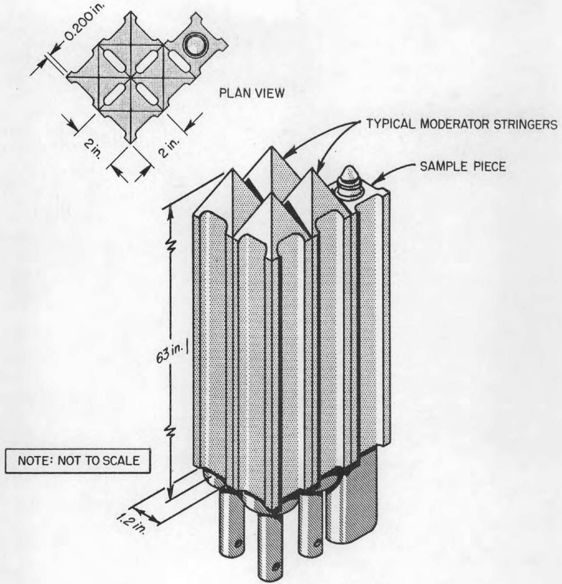  
Fig. 4(Rev.). Typical Graphite Stringer Arrangement.

Table 4. Reactor Vessel Design Data   

<table><tr><td>Construction material</td><td>INOR-8</td></tr><tr><td>Inlet nozzle, sched-40, in., IPS</td><td>5</td></tr><tr><td>Outlet nozzle, sched-40, in., IPS</td><td>5</td></tr><tr><td>Reactor vessel</td><td></td></tr><tr><td>OD, in.</td><td>59-1/8 (60 in. max)</td></tr><tr><td>ID, in.</td><td>58</td></tr><tr><td>Wall thickness, in.</td><td>9/16</td></tr><tr><td>Over-all height, in. (to 2 of 5 in. nozzle)</td><td>100-3/4</td></tr><tr><td>Head thickness, in.</td><td>1</td></tr><tr><td>Design pressure, psi</td><td>50</td></tr><tr><td>Design temperature, °F</td><td>1300</td></tr><tr><td>Fuel inlet temperature, °F</td><td>1175</td></tr><tr><td>Fuel outlet temperature, °F</td><td>1225</td></tr><tr><td>Inlet</td><td>Constant-area distributor</td></tr><tr><td>Annulus ID, in.</td><td>56</td></tr><tr><td>Annulus OD, in.</td><td>58</td></tr><tr><td>Graphite core</td><td></td></tr><tr><td>Diameter, in.</td><td>55-1/4</td></tr><tr><td>Core block section, in.</td><td>2 x 2</td></tr><tr><td>Number of fuel channels</td><td>1064</td></tr><tr><td>Fuel channel size, in.</td><td>1.2 x 0.4 (rounded corners)</td></tr><tr><td>Effective core length, in.</td><td>~63</td></tr><tr><td>Effective core volume, ft3</td><td>~88</td></tr><tr><td>Fractional fuel volume</td><td>0.225</td></tr><tr><td>Core container</td><td></td></tr><tr><td>ID, in.</td><td>55-1/2</td></tr><tr><td>OD, in.</td><td>56</td></tr><tr><td>Wall thickness, in.</td><td>1/4</td></tr><tr><td>Height, in.</td><td>68</td></tr></table>

Table 5. Design Data for Fuel and Coolant Pumps   

<table><tr><td></td><td>Fuel Pump</td><td>Coolant Pump</td></tr><tr><td colspan="3">Design flow, gpm</td></tr><tr><td>Circulation</td><td>1200</td><td>850</td></tr><tr><td>By-pass</td><td>50</td><td>15</td></tr><tr><td>Head at design flow, ft</td><td>48.5</td><td>78</td></tr><tr><td>Motor, hp</td><td>75</td><td>125</td></tr><tr><td>Speed, RPM</td><td>290-1160</td><td>1750</td></tr><tr><td>Intake (INOR-8), sched-40, in., IPS</td><td>8</td><td>6</td></tr><tr><td>OD, in.</td><td>8.625</td><td>6.625</td></tr><tr><td>Wall thickness, in.</td><td>0.322</td><td>0.280</td></tr><tr><td>Discharge nozzle (INOR-8), sched-40, in., IPS</td><td>5</td><td>5</td></tr><tr><td>OD, in.</td><td>5.563</td><td>5.563</td></tr><tr><td>Wall thickness, in.</td><td>0.258</td><td>0.258</td></tr><tr><td colspan="3">Pump bowl (INOR-8)</td></tr><tr><td>Diameter, in.</td><td>36</td><td>36</td></tr><tr><td>Height, in.</td><td>15</td><td>15</td></tr><tr><td>Volume (not including volute), ft3</td><td>5.2</td><td>5.3</td></tr><tr><td>Salt volume (normal), ft3</td><td>3.3</td><td>3.4</td></tr><tr><td>Salt volume (maximum), ft3</td><td>4.3</td><td>4.4</td></tr><tr><td>Expansion volume (normal to maximum), ft3</td><td>1.0</td><td>1.0</td></tr><tr><td>Over-all height of pump and motor assembly, ft</td><td>8.1</td><td>8.1</td></tr></table>

Table 6. Design Data for Primary Heat Exchanger   

<table><tr><td>Construction material</td><td>INOR-8</td></tr><tr><td>Heat load, Mw</td><td>10</td></tr><tr><td>Shell-side fluid</td><td>Fuel salt</td></tr><tr><td>Tube-side fluid</td><td>Coolant salt</td></tr><tr><td>Layout</td><td>25% cut, cross-baffled and U-tubes</td></tr><tr><td>Baffle pitch, in.</td><td>12</td></tr><tr><td>Tube pitch, in.</td><td>0.775 triangular</td></tr><tr><td>Active heat-transfer length of shell, ft</td><td>6</td></tr><tr><td>Over-all length, ft</td><td>~8</td></tr><tr><td>Nozzles</td><td></td></tr><tr><td>Shell side, sched-40, in., IPS</td><td>5</td></tr><tr><td>OD, in.</td><td>5.563</td></tr><tr><td>Wall thickness, in.</td><td>0.258</td></tr><tr><td>Tube side, sched-40, in., IPS</td><td>5</td></tr><tr><td>OD, in.</td><td>5.563</td></tr><tr><td>Wall thickness, in.</td><td>0.258</td></tr><tr><td>Number of tubes</td><td>165</td></tr><tr><td>Tube size</td><td></td></tr><tr><td>Diameter, in. OD</td><td>1/2</td></tr><tr><td>Wall thickness, in.</td><td>0.042</td></tr><tr><td>Length (average), ft</td><td>~14</td></tr><tr><td>Tube-sheet thickness, in.</td><td>1-1/2</td></tr><tr><td>Heat-transfer surface area, ft2</td><td>259</td></tr><tr><td>Fuel holdup, ft3</td><td>~5,5</td></tr><tr><td>Design temperature</td><td></td></tr><tr><td>Shell side, °F</td><td>1300</td></tr><tr><td>Tube side, °F</td><td>1250</td></tr><tr><td>Design pressure</td><td></td></tr><tr><td>Shell side, psi</td><td>55</td></tr><tr><td>Tube side, psi</td><td>90</td></tr><tr><td>Terminal temperatures at design point operation</td><td></td></tr><tr><td>Fuel salt, °F</td><td>Inlet 1225; outlet 1175</td></tr><tr><td>Coolant salt, °F</td><td>Inlet 1025; outlet 1100</td></tr><tr><td>Effective log mean temperature difference, °F</td><td>133</td></tr></table>

Revision of Table 6, p 18, ORNL CF-61-2-46.

# 2.6 Salt-to-Air Radiator

Although the radiator design has not changed, the enclosure has been modified to provide more protection against freezing of coolant salt in the radiator. The two sliding doors on the radiator enclosure now operate individually; thus cooling will be drastically reduced by closure of either one of the two doors. The heat losses with one door up is only 130 kw when the fans are off. Furthermore, the closing time of the doors has been reduced to less than 10 seconds. A revision of Fig. 7 is attached, along with revisions of Table 7.

# 2.7 Drain and Storage Tanks

A revised Design Data Sheet and a revision to the Coolant Thimble Drawing (Fig. 9 R) are presented.

# 2.8 Cover-Gas System

The charcoal beds are designed to retain the fission gases until all have decayed except the 10.6-yr Kr-85. A maximum discharge rate of 7 curies/day Kr-85 is expected. The concentration of the gas in the stack will be only $10^{-5}$ $\mu$ curies Kr-85/cc, which is the maximum permissible concentration for this isotope in air. Dilution in the stack jet will reduce the concentration by a factor of at least 100. The stack gases will be monitored for particulate activity by a standard air monitor which filters a side stream of approximately 1 cfm and counts the activity of the material collected from the filter paper. The activity level will be recorded and an alarm will be provided, so that action may be taken in case permissible concentrations are exceeded.

According to the available experimental evidence, elemental iodine will not exist in the salt and therefore will not be present in the gas phase. However, frequent samples of the off-gas will be analyzed for composition, and monitors for specific contaminants such as iodine will be added if necessary.

An instrument application diagram of the cover-gas system is presented in Fig. 10A. Rupture discs are provided at several stages of pressure reduction, so that the reactor piping is protected against pressures above 50 psig.

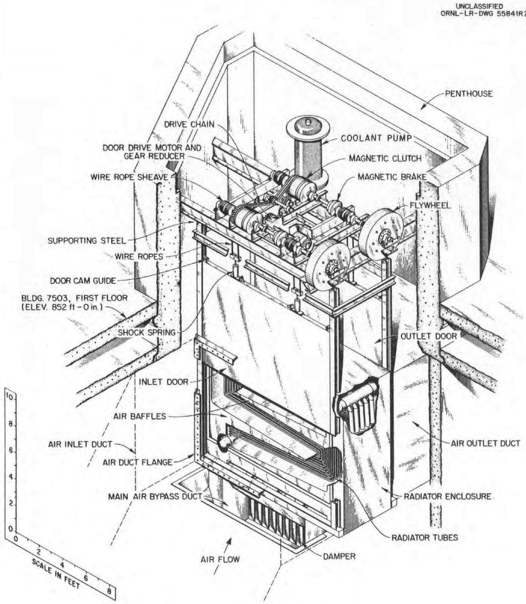  
Fig. 7(Rev.). MSRE Radiator Coil and Enclosure.

Table 7. Design Data for Coolant Radiator   

<table><tr><td>Construction material</td><td>INOR-8</td></tr><tr><td>Duty, Mw</td><td>10</td></tr><tr><td>Temperature differentials</td><td></td></tr><tr><td>Salt, °F</td><td>Inlet 1100; outlet 1025</td></tr><tr><td>Air, °F</td><td>Inlet 100; outlet 300</td></tr><tr><td>Air flow, cfm at 9.9 in., H2O</td><td>200,000</td></tr><tr><td>Salt flow (at average temperature), gpm</td><td>830</td></tr><tr><td>Effective mean ΔT, °F</td><td>862</td></tr><tr><td>Over-all coefficient of heat transfer, Btu/ft2-hr-°F</td><td>58.5</td></tr><tr><td>Heat transfer surface area, ft2</td><td>706</td></tr><tr><td>Design temperature, °F</td><td>1250</td></tr><tr><td>Max. allowable internal pressure at 1250°F, psi</td><td>350</td></tr><tr><td>Operating pressure at design point, psi</td><td>75</td></tr><tr><td>Tube diameter, in.</td><td>0.750</td></tr><tr><td>Wall thickness, in.</td><td>0.072</td></tr><tr><td>Tube length, ft</td><td>30</td></tr><tr><td>Tube matrix</td><td>12 tubes per row; 10 rows deep</td></tr><tr><td>Tube spacing, in.</td><td>1-1/2</td></tr><tr><td>Row spacing, in.</td><td>1-1/2</td></tr><tr><td>Subheaders, in., IPS, sched-40</td><td>2-1/2</td></tr><tr><td>Main headers, in., ID (1/2 in. wall)</td><td>8</td></tr><tr><td>Air side, ΔP, in., H2O</td><td>9.9</td></tr><tr><td>Salt side, ΔP, psi</td><td>19.8</td></tr></table>

Table 8. Design Data for Fuel Drain Tank, Coolant Drain Tank and Fuel Flush Tank   

<table><tr><td colspan="2">Fuel Drain Tank</td></tr><tr><td>Construction material</td><td>INOR-8</td></tr><tr><td>Height (without coolant headers), in.</td><td>85</td></tr><tr><td>Diameter, in., OD</td><td>48</td></tr><tr><td>Wall thickness, in.</td><td></td></tr><tr><td>Vessel</td><td>0.5</td></tr><tr><td>Dished head</td><td>0.75</td></tr><tr><td>Volume, ft3</td><td></td></tr><tr><td>Total</td><td>~72</td></tr><tr><td>Fuel (normal fill conditions)</td><td>~66.7</td></tr><tr><td>Gas blanket (normal fill conditions)</td><td>~5.3</td></tr><tr><td>Design temperature, °F</td><td>1300</td></tr><tr><td>Design pressure, psi</td><td>50</td></tr><tr><td>Cooling method</td><td>Boiling water in double wall thimbles</td></tr><tr><td>Cooling rate (design), kw</td><td>100</td></tr><tr><td>Coolant thimbles</td><td></td></tr><tr><td>Number</td><td>32</td></tr><tr><td>Diameter, in., IPS</td><td>1.5</td></tr><tr><td>Wall thickness</td><td>0.145</td></tr><tr><td colspan="2">Coolant Drain Tank</td></tr><tr><td>Construction material</td><td>INOR-8</td></tr><tr><td>Height, in.</td><td>78</td></tr><tr><td>Diameter, in., OD</td><td>40</td></tr><tr><td>Wall thickness, in.</td><td></td></tr><tr><td>Vessel</td><td>3/8</td></tr><tr><td>Dished head</td><td>5/8</td></tr><tr><td>Volume, ft3</td><td></td></tr><tr><td>Total</td><td>~50</td></tr><tr><td>Coolant salt (normal fill conditions)</td><td>~42</td></tr><tr><td>Gas blanket (normal fill conditions)</td><td>~8</td></tr><tr><td>Design temperature, °F</td><td>1300</td></tr><tr><td>Design pressure, psi</td><td>50</td></tr><tr><td>Cooling method</td><td>None</td></tr><tr><td colspan="2">Fuel Flush Tank</td></tr><tr><td>Construction material</td><td>INOR-8</td></tr><tr><td>Height, in.</td><td>~81</td></tr><tr><td>Diameter, in., OD</td><td>48</td></tr><tr><td>Wall thickness, in.</td><td></td></tr><tr><td>Vessel</td><td>1/2</td></tr><tr><td>Dished head</td><td>3/4</td></tr><tr><td>Volume, ft3</td><td></td></tr><tr><td>Total</td><td>~72</td></tr><tr><td>Flush salt (normal fill conditions)</td><td>~66.7</td></tr><tr><td>Gas blanket (normal fill conditions)</td><td>~5.3</td></tr><tr><td>Design temperature, °F</td><td>1300</td></tr><tr><td>Design pressure, psi</td><td>50</td></tr><tr><td>Cooling method</td><td>None</td></tr></table>

UNCLASSIFIED

ORNL-LR-DWG60838R

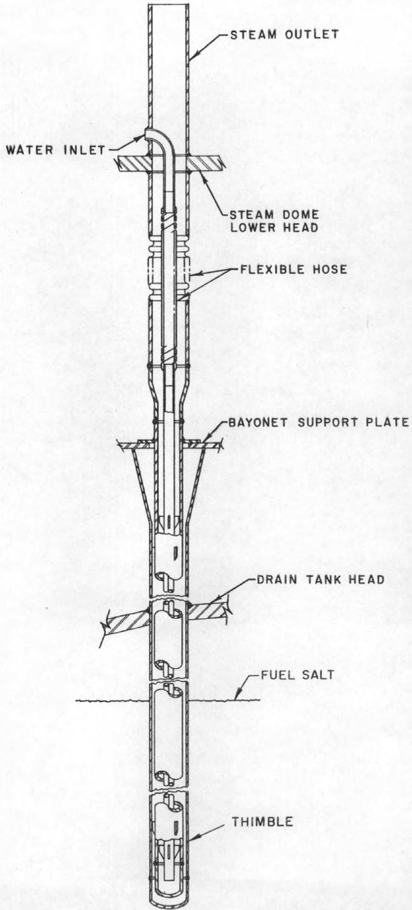  
Fig. 9(Rev.). Cooling Thimble for Fuel-Salt Drain Tanks.

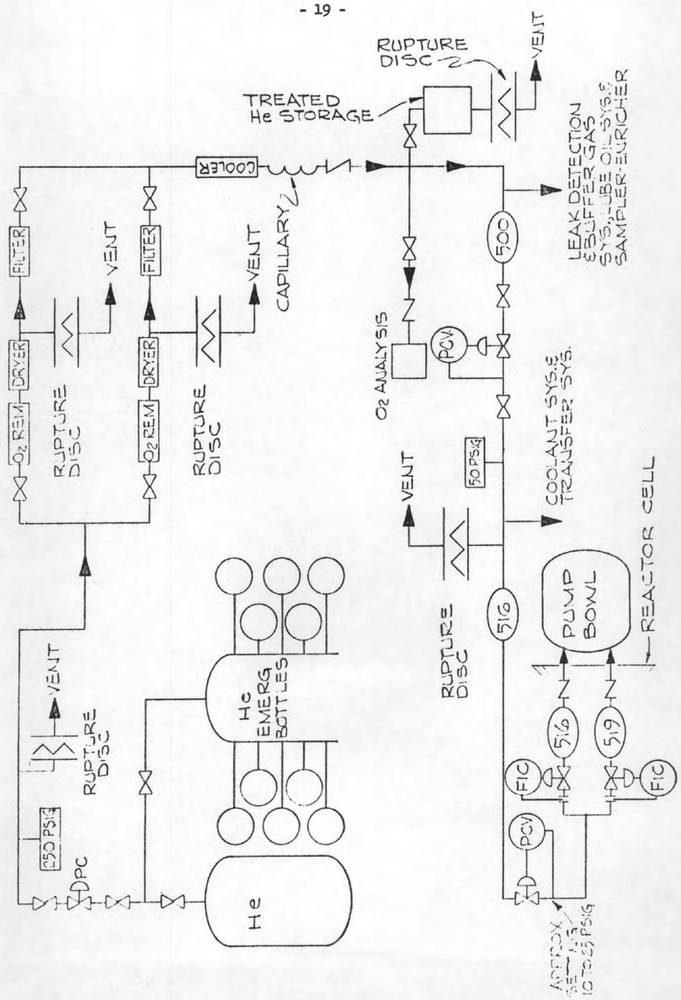  
Fig. 10A. Cover Gas System Instrument Application Diagram.

# 3. INSTRUMENTATION AND CONTROLS

# 3.1 General

# 3.1.1 Control Requirements

(e) Control Rod Design. Control rods without provision for fast scram action will be used to shim for xenon, for pump speed variations, for incremental burnup between routine fuel additions, for power coefficient of reactivity, and to provide for fuel penetration into the graphite, and control of the critical reactor temperature over a $300^{\circ}\mathrm{F}$ range. Slow penetration by fuel will be compensated by burnup and poison additions via the enricher-sampler.

The following sources and amounts of reactivity will require the use of control rods for shimming.

<table><tr><td></td><td>δk/k</td></tr><tr><td>1. Xenon</td><td>0.013</td></tr><tr><td>2. Fuel pump speed</td><td>0.002</td></tr><tr><td>3. Power coefficient</td><td>0.002</td></tr><tr><td>4. Burnup between fuel additions</td><td>0.002</td></tr><tr><td>5. Temperature control (~300°F) and fuel penetration</td><td>0.027</td></tr><tr><td>Total</td><td>0.046</td></tr></table>

Three control rods will be used. Each control rod has a maximum worth, when inserted with all other rods withdrawn, of $0.025 \frac{\delta k}{k}$ . Their combined worth is $0.046 \frac{\delta k}{k}$ . The maximum rate of withdrawal for a single rod is $0.0002 \frac{\delta k}{k - \sec}$ . With three rods inserting as a group, the maximum rate of poisoning will be $0.0005 \frac{\delta k}{k - \sec}$ .

All rods are identical and any one of the three may be used as a servo-operated shim for automatic control purposes. The operation of the control rods and the reactor will be subject to restrictions as follows:

1. The reactor may not be filled or operated routinely unless two rods are fully withdrawn.

2. Only one rod may be servo-operated at a time.

3. No rod may be switched to servo-operation unless the other two rods are fully withdrawn.

The rods are centrally located and move vertically. Figure 14-A is a horizontal section through the core showing rod locations and the location of the graphite irradiation samples.

Figure 14-B is a vertical section through a control rod. In essence, the rod is a hollow, contained cylinder of natural boron carbide, $\mathtt{B_4C}$ ( $19\% \mathtt{B}^{10}$ ). The outside diameter of the $\mathtt{B_4C}$ cylinder is 0.990. The cylinder is formed by stacking a series of small cylindrical sections (Pc. 1, Fig. 14-B), each clad with INOR and having an overall length of 1.625 in. This construction provides a degree of articulation. The resulting limited flexibility greatly reduces problems associated with guide-tube tolerances and differential expansions in both tube and rod which are a consequence of radial flux and temperature gradients. The flexible Inconel hose (Pc. 9, Fig. 14-B) centers and retains the individual cylinders comprising the stack. The slight misalignment between individual cylinders which can result from the nominal 0.020 in. radial clearance between the hose and absorbing cylinders will not affect the operation of the rod.

A flexible cable (Pc. 6), to which has been added a coarse pitch spiral of larger wire, supports and drives the rod. The wire wrap is used as gear teeth and the flexible cable becomes, functionally, a flexible rack. This flexibility allows the drive mechanism to be located on top of the thermal shield instead of the area immediately over the reactor vessel.

The assembly operates inside a 2-in. outside-diameter INOR-8 thimble which penetrates the core. The thimbles for the three rods and the graphite sample are part of a larger assembly, Fig. 14-C, which is centrally mounted on top of the reactor vessel. The three control rods and the graphite sample assembly are incorporated into a flanged module which is bolted to the reactor vessel. Containment is effected by a metal "O" ring and an annular frozen salt seal having an effective length

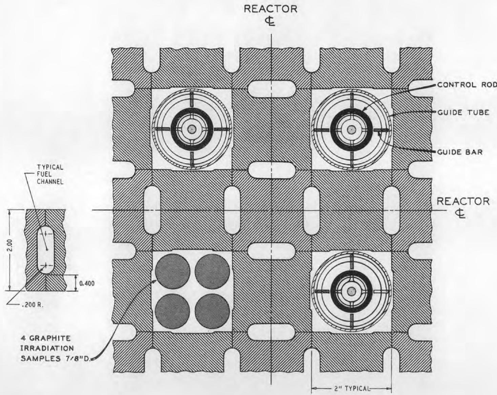  
UNCLASSIFIED ORNL-LR-DWG 60845   
Fig. 14A. MSRE Control Rod Arrangement.

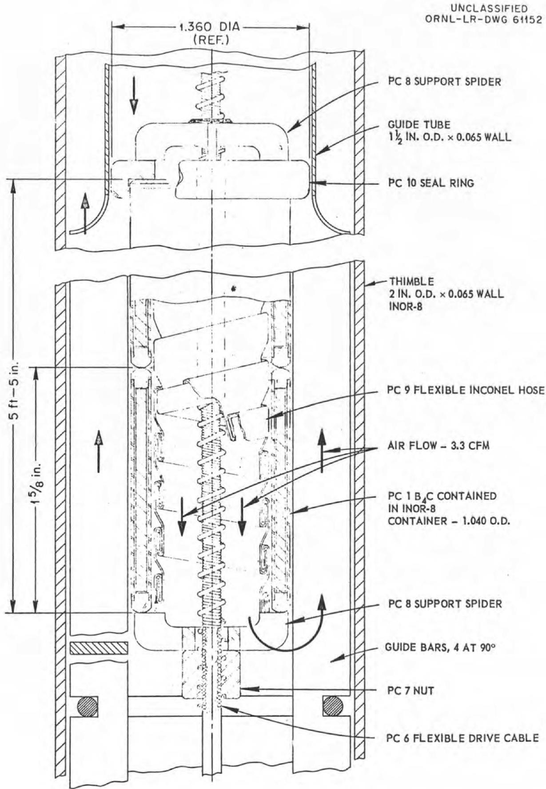  
Fig. 14B. Vertical Section-Poison Control Rod.

UNCLASSIFIED ORNL-LR-DWG60837R

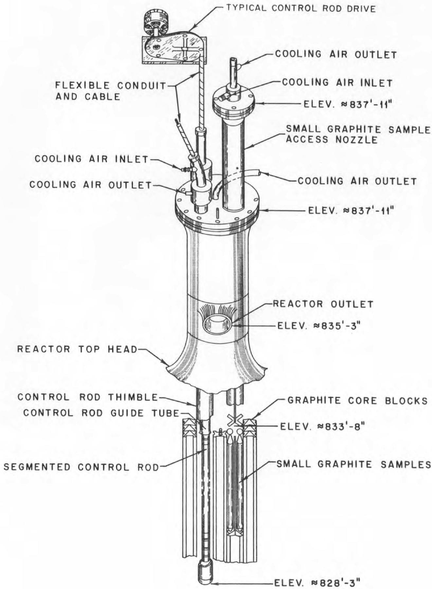  
Fig. 14C. MSRE Control System.

of over 20 in. The seal is kept frozen by air-cooling on both sides of the annulus. Two blowers in parallel provide cooling air to this assembly and to other parts of the reactor.

Heating in the control rod poses no problems. In fact, without any external cooling the maximum temperature with the reactor at 10 Mw has been calculated as $1427^{\circ}\mathrm{F}$ . In adhering to conservative design practice, cooling air (3.3 cfm per rod) is provided by the same system used to supply air to the outside of the entire assembly.

In general, this control-rod concept is the same as that successfully used in the ARE. Stresses are conservative, heat generation and transfer have been calculated and provide no problems; neither does gas evolution from the $\mathsf{B}_{4}\mathsf{C}$ . A model will be thoroughly tested in salt at operating temperatures before the final design is accepted.

(f) Reactor Control Operation. The fuel system of the MSRE has a very large heat capacity, and as a result a relatively large change in power production is required to raise the temperature of the fuel. For this reason, at low reactor power, the temperature coefficient of the fuel does not produce a tight control on reactor power. For maintaining a constant power at low-power levels, it is necessary to control the reactor by an automatic servo, the input signal for which is taken from a radiation sensor such as an ion chamber. This servo input signal will have an adjustable setpoint so that the operator may choose the power level at which the servo system is to hold the reactor.

At power levels near design point, the temperature coefficient does exercise adequate control and, in order to allow the reactor to respond to load demands, the flux must be permitted to change. The servo then is used to assist in maintaining a constant mean reactor temperature. For this mode the mean reactor temperature is fed to the servo as an input signal. This signal also is made adjustable so the operator again can set the temperature point to which the servo controls the reactor.

If some unforeseen anomalous condition should put the reactor on a fast period, it would be desirable to have the servo correct for such a condition. Therefore under the power regime a derivative flux signal is mixed with the temperature input to the servo.

With the reactor temperature on automatic control, the reactor may be loaded at will by the operator. He has manual control of the radiator doors, the radiator blowers and the bypass duct damper. There are however over-riding signals which take corrective action should the operator manipulate the heat extraction system improperly.

Thermocouple signals on the radiator outlet first alarm in case the temperature drops to approximately $1020^{\circ}\mathrm{F}$ , next shut off blowers, then drop doors and turn on radiator heaters if the temperature reaches $1000^{\circ}\mathrm{F}$ . This is still approximately 150 degrees above the freezing point of the fuel. Loss of coolant flow results in similar action.

On the reactor outlet pipe, thermocouples provide an over-ride signal also. If the reactor outlet temperature exceeds approximately 1230 degrees, the servo is disengaged and locked out, and all three rods are inserted. When the outlet temperature drops below this point, the rods stop their insertion but the servo does not re-engage until the operator gives manual permission.

The servo-operated control rod will be kept in range by adding U-235 in small quantities as described in Section 2.10. This is to be done by administrative control.

# 3.2.3 Nuclear Instruments

Since the publication of ORNL CF-61-2-46 (refer to Fig. 14, p 40), the nuclear instrumentation has been altered by reducing the number of penetrations from three to one, Fig.14R. The large southeasterly water-filled penetration which houses four chambers is retained. The chamber complement will be two fission chambers and two compensated ion chambers. These will provide coverage over the full range of reactor operation and will provide the necessary input signals of reactor level and period.

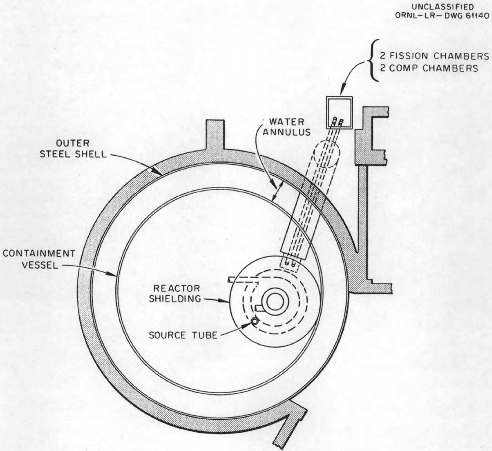  
Fig. 14(Rev.). MSRE Neutron Chamber Arrangement.

# 3.2.3 Nuclear Instruments (Continued)

This reduction in both the number and location of nuclear input channels does not compromise ultimate safety which, in the MSRE, is not vested in the control-rod system.

The arrangement of all chambers in a single penetration is identical to the arrangement used successfully in the HRE-2.

# 3.2.9 Process Monitoring System

A system is being designed to continuously scan the important instrument signals throughout the reactor complex. When predetermined limits at any sensing element are exceeded, an alarm will be sounded so that the operator will be informed and can take corrective action.

# 3.3 Control System Interlocks

Interlocks will be of two types. First, there will be those which are designed to help maintain system safety and integrity; second, those which are employed to aid the operators in maintaining other system parameters at their proper values. Some of those in the second group will be in force only during start-up; and will be switched out once routine operation is established. These will be designated as "permissive to start". They will continue to provide an annunciator or other form of operator notification at all times.

The most important interlocks are listed below. This listing is preliminary and many limits have not yet been specified. It will be revised before the final design is complete.

# 3.3.1 Preliminary Proposal

A. Containment Air System

1. To start and run supply air fan

a. Exhaust fan must be running   
b. Thermal overloads must be closed

2. If containment air flow decreases below ______ cfm

a. Standby exhaust fan starts   
b. Standby exhaust fan inlet damper opens   
c. Exhaust fan inlet damper closes   
d. Manual switchback from standby exhaust fan to normal exhaust fan provided

B. Coolant Circulating Pump Lube and Coolant Oil System

1. Operation

a. Two pumps for each system   
b. Either pump may be selected to run with 2nd pump in standby   
c. Manual switchback to first pump if standby pump fails   
d. Both pumps can be operated simultaneously   
e. When operating pump discharge pressure falls below _______ psi, standby pump starts

2. To start and continue running each pump motor

a. Thermal overloads must be closed   
b. Oil supply tank level must be above minimum allowable position

3. Oil Supply Tank (OT1) Level

a. Fuel circulating pump lube oil supply is shut off when oil level falls below a predetermined position.

C. Coolant Circulating Pump (CP)

1. To start pump motor

a. Lube oil flow must be $>$ gpm   
b. Radiation shield oil flow must be $>$ gpm   
c. Fuel to coolant system $\mathrm{d} / \mathrm{p}$ must be $>$ psi   
d. Pump bowl purge gas flow must be $>$ cfm   
e. Pump bowl pressure must be $>$ psi   
f. Fuel level in pump bowl must be above predetermined position.

2. To start and continue running pump motor

a. Motor coolant water flow must be $>$ gpm   
b. Motor current must be $< 150\%$ FLI   
c. Fuel level in pump bowl must be above minimum allowed   
d. Radioactivity in radiator cooling air stack and the containment air stack must be less than maximum allowed.

3. Manual Selector Switch (same switch operates Fuel and Coolant Pumps)

a. Three positions provided: Pre-Fill, Fill, Run

1. Pre-Fill: Fuel pump bowl low level interlock is by-passed. Pump can run to circulate gas. System can be heated.   
2. Fill: Pump motor locked out. Fill system operable.   
3. Run: Pump will run if conditions listed in section B(1) and B(2) are met.

D. Fuel Fill and Drain System (Dwg. D-AA-B-40502)

1. Assumptions

a. Fuel Fill Tank FFD1 is full of salt and reactor is ready for filling with enriched salt.   
b. Fill procedure is same for all tanks FFD1, FFD2, and FF

2. To start and complete filling reactor from FFD1

a. Reactor cell pressure must be $< 12.7$ psia

b. Pressure available from gas inlet line 517 must be $<$ maximum allowed on tank

c. Fuel system temperatures above ${}^{\circ}\mathbf{F}$

d. Temperature of freeze valves FV4 and FV5 must be $<  ^{\circ}\mathrm{F}$ (closed)

e. Radiation monitors must be "ON"

f. Any two control rods must be completely withdrawn

g. Freeze valve FV1 in line 103 must be open (temperature above $>$ F)

h. FFD1 fuel salt temperature must be above $>$ °F

i. Oil tank (OT1) to pump bowl (FP) d/p must be > psi

j. Rate at which reactor fills must not exceed predetermined value

k. Pump bowl fuel salt level must not exceed a predetermined height

1. Fission chamber count rate must be $>$ ________counts/min.

m. If conditions (i), (j), (k), (l) are not maintained, valve HCV572A1 closes (shutting off gas supply). HCV573A1, HCV533A and HCV533B1 open (relieving gas pressure on FFD1). Fuel then drains back into FFD1, and fill procedure must be repeated.

3. To drain fuel salt when reactor is operating

a. HCV573A1, HCV533A, and HCV521A1 open. HCV533B1 closes. The pump bowl, reactor vessel R, FFD1, and the interconnected piping is a closed system which holds up the radioactive gases by manometer action.

4. To start and complete filling reactor from flush tank FF

a. Pressure available from gas inlet line 517 must be less than maximum allowed on tank

b. Temperature of freeze valves FV5 and FV6 must be $<$ °F (closed)

c. Radiation monitors must be "ON"

d. Freeze valve FV1 in line 103 must be open (temperature above $\mathbf{\Omega}^{\circ}\mathbf{F}$

e. FF flush salt temperature must be $>$ F

f. Oil tank (OT) to pump bowl FP d/p must be $>$ psi

g. Rate at which reactor fills must not exceed predetermined value

h. Pump bowl fuel salt level must not exceed a predetermined height

i. If conditions (f), (g), and (h) are not maintained, flush salt will drain back into FF and fill procedure must be repeated.

E. Fuel Circulating Pump Lube and Coolant Oil System (This system is a duplicate of the system just described in Section B.)

F. Fuel Circulating Pump (FP)

1. To start pump motor

a. Lube oil flow must be $>$ gpm

b. Radiation shield oil flow must be $>$ gpm

c. Fuel to coolant system d/p must be $>$ psi

d. Pump bowl purge gas flow must be $>$ cfm

e. Pump bowl pressure must be $>$ psi

f. Fuel level in pump bowl must be within predetermined limits

g. Reactor drain valve frozen

2. To start and continue running pump motor

a. Motor cooling water flow must be $>$ gpm

b. Motor current must be $< {150}\%$ FLI

c. Fuel level in pump bowl must be above minimum allowed

d. Radioactivity in radiator cooling air stack and the containment air stack must be less than maximum allowed

3. Manual Selector Switch (same switch operates Fuel and Coolant Pumps)

a. Three positions provided: Pre-Fill, Fill, Run

1. Pre-Fill: Fuel pump bowl low level interlock is bypassed. Pump can run to circulate gas. System can be heated.

2. Fill: Pump motor locked out. Fill system operable.

3. Run: Pump will run if conditions listed in section A(1) and A(2) are met.

G. Radiator Doors

1. For doors to open and remain open

a. Coolant flow must be $>$ gpm

b. Radiator outlet temperature must be $>$ F   
c. Radiation in both the radiator cooling air stack and the containment air stack must be negligible   
d. Control system emergency power supply batteries must be "ON"

2. Limit switches prevent door over travel by stopping drive motor

H. Radiator Cooling Fans

1. For fans to start and continue running

a. Coolant flow must be $>$ gpm   
b. Radiator outlet temperature must be $>$ F   
c. Radiation in both the radiator cooling air stack and the containment air stack must be negligible   
d. Control system emergency power supply batteries must be "ON"

I. Radiator Cooling Air By-Pass Damper

1. For damper to close and remain closed

a. Coolant salt flow must be $>$ gpm   
b. Radiator outlet temperature must be ${}^{\circ}\mathrm{F}$   
c. Radiation in radiator cooling air stack and containment air stack must be negligible   
d. Control system emergency power supply batteries must be "ON"

J. Automatic Rod Drive Down

Automatic rod drive down, or "Reverse" mode, will be initiated as follows:

1. If the fuel circulating pump stops.   
2. If the coolant circulating pump stops.   
3. If and as long as the fuel outlet temperature exceeds $1235^{\circ}\mathrm{F}$ .   
4. If the reactor flux exceeds its pre-set value by $50\%$ .   
5. If the reactor period is less than 20 seconds.   
6. If any of the process line radiation monitors is at a hazardous level.   
7. Loss of thermal shield water.   
8. Excessive helium pressure in the fuel pump bowl.   
9. Loss of fuel level in pump bowl.

# K. Reactor Drain

Automatic drain* initiated by control system under following conditions:

1. If any sensor indicates a leak in the fuel salt system.

a. Radiation alarm in 30-in. exhaust line from cell   
b. Radiation alarm in off-gas stack   
c. Radiation alarm in radiator stack   
d. Radiation alarm in coolant pump off-gas   
e. Loss of freeze flange coolant air   
f. Sump water from or in reactor cell

2. Loss of shielding in reactor cell.

a. Loss of water from thermal shield   
b. Loss of water from sand-water annulus

3. Loss of heaters on fuel drain line

a. Loss of power to heaters   
b. Temperature below $1200^{\circ}\mathrm{F}$

4. Excessive system temperatures

a. Fuel salt temperature above $1275^{\circ}\mathrm{F}$

5. Excessive system pressure

a. Pump bowl gas pressure greater than 50 psig

6. Other

a. Sump water level in reactor cell   
b. Loss of helium cover gas

Table 9. Reactor Data for Clean Hot Condition, All Poison Rods Withdrawn   

<table><tr><td>Core size</td><td></td></tr><tr><td>Diameter, in.</td><td>~55.4</td></tr><tr><td>Height, in.</td><td>~63</td></tr><tr><td>Volume, ft3</td><td>~88</td></tr><tr><td>Power, Mw</td><td>10</td></tr><tr><td>Core power density, w/cm3</td><td></td></tr><tr><td>Peak</td><td>10</td></tr><tr><td>Mean</td><td>3.9</td></tr><tr><td>Fuel power density, w/cm3</td><td></td></tr><tr><td>Peak</td><td>44.5</td></tr><tr><td>Mean</td><td>17.3</td></tr><tr><td>Neutron flux, n/cm2-sec</td><td></td></tr><tr><td>Peak</td><td>7.4 x 1013</td></tr><tr><td>Mean</td><td>2.9 x 1013</td></tr><tr><td>Total fuel volume, ft3</td><td>~66.7</td></tr><tr><td>Total fuel inventory, kg U235</td><td>~50.2</td></tr><tr><td>UF4concentration in salt, mole %</td><td>0.21 (93.5% U235)</td></tr><tr><td>Fuel salt volume fraction</td><td>0.225</td></tr><tr><td>Neutron lifetime, sec</td><td>~3 x 10-4</td></tr><tr><td>% Thermal fissions</td><td>87</td></tr><tr><td>Temperature coefficient of reactivity, (Δk/k)/°F</td><td></td></tr><tr><td>Graphite</td><td>-6 x 10-5</td></tr><tr><td>Fuel salt</td><td>-3 x 10-5</td></tr><tr><td>Total</td><td>-9 x 10-5</td></tr><tr><td>(Δk/k)/(ΔM/M)</td><td>0.25</td></tr><tr><td>Poison rod worth, Δk/k %</td><td></td></tr><tr><td>Individually</td><td>3 at ~2.0</td></tr><tr><td>Combined</td><td>~4.6</td></tr></table>

# 5. THE REACTOR COMPLEMENT

# 5.2 Containment

As discussed on pages 44 and 46 in ORNL CF-61-2-46, the MSRE has been designed with three barriers to the escape of fission-product activity. Fuel is contained in the reactor piping and vessels. The reactor primary equipment is installed in the reactor and drain-tank cells which form a completely sealed containment during operation. The third barrier, zones of controlled leakage, can now be specified in more detail. The controlled zones are located wherever lines penetrate the containment cells. They include the high-bay area above the cells, and the auxiliary equipment rooms on the southeast side, the coolant equipment room on the south side and the instrument room on the north side of the reactor cell (see Fig. 18 Rev.). The high-bay area is lined with steel sheets welded at the joints to limit the leakage to less than 1000 cfm at 0.3 in. $\mathsf{H}_2\mathsf{O}$ . The other rooms have concrete or steel-lined walls, and each of these rooms is designed for low leakage by gasketing of the doors, sealing of all service penetrations and by having internal heating and cooling.

Each zone is kept at a negative pressure by the ventilating fan-filter system described below. This guarantees that, when the fans are running, activity leaks will be discharged to the atmosphere after filtration. It also keeps outleakage to a minimum if the fans are off; the outage is first into the standard building and then to the outdoors.

The driving force for the ventilation system is located outside the reactor building and consists of two 21,000-cfm fans arranged in parallel, so that in case of failure of one fan the other fan starts automatically to provide uninterrupted ventilation. Both fans pull through a bank of chemical-warfare-service filters which are capable of removing particles down to at least 1 micron in size; in a fission-product spill the noble gases are the principal activities which escape the filters. This type of filter system is employed at other reactor installations at the Oak Ridge National Laboratory. The fans discharge the filtered air to a 100-ft-high stack.

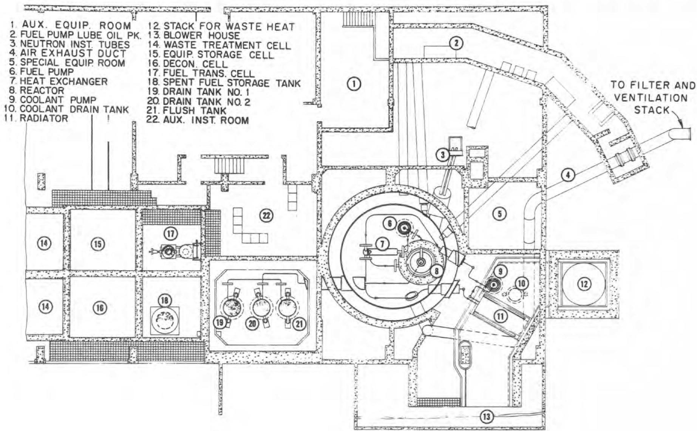  
Fig. 18(Rev.). MSRE Plant Layout, Plan.

The ventilation system is designed for several purposes:

(1) During normal operation when the reactor and drain-tank cells are sealed off, the ventilation system exhausts from the building at a rate of 18,000 cfm and maintains a slight negative pressure ( $\sim$ 0.1 in. $\mathrm{H}_{2} \mathrm{O}$ ) on the limited leakage zones outside the containment vessel.   
(2) During an accident in which fission gases leak from the container into the high bay, the building inlet supply is stopped and the ventilation fans exhaust only the building inleakage, estimated to be $< 1000$ cfm at 0.3 in. $\mathsf{H}_2\mathsf{O}$ .   
(3) During maintenance when the containment cells are opened, the ventilation system maintains an air flow of approximately 100 ft/min through the opening (in the containment cells) through which maintenance work is performed. This 100-ft/min flow of air is intended to prevent the transfer of fission-product gases and radioactive particles from inside the container out into the working area of the building.   
(4) During normal operation the ventilation system serves to dilute the small quantity of fission-product gases which are removed from the reactor charcoal beds. Since the stack flow is 21,000 cfm, and only a few cubic centimeters of fission gas are discarded each day, the dilution factor is approximately $10^{11}$ . The stack itself as it discharges into the atmosphere provides another factor of 100 to 1,000 dilution, depending on the weather conditions which prevail at the time.

# 5.2.1 Fuel System Container Design

The drain-tank cell is a reinforced concrete structure with a minimum design pressure of 40 psig. It will be tested at 1.2 times the design pressure, or at 48 psig in a hydrostatic test. The reactor cell will also be tested at this pressure, because the two cells are joined by a large opening.

# 5.3 Shielding

Originally the top shielding of the reactor vessel consisted of 7 ft of ordinary concrete, which was sufficient to shield the area directly above the reactor vessel to levels of approximately $90\mathrm{mr/hr}$ . The effectiveness of this shielding has now been increased by using high-density

concrete for the lower 3-1/2 ft. This is equivalent to adding 1-1/2 ft of ordinary concrete; it reduces the radiation level to 2.5 mr/hr. This change has been made even though the area in question will not normally be an occupied zone.

# 5.4 Arrangement of Equipment

As has already been mentioned, the equipment within the reactor cell has been rearranged, and the piping sizes and wall thicknesses increased. The drain and flush tanks have also been rearranged to give greater accessibility for maintenance. The new version is shown on Figs. 18, 19, 19-A, and 19-B.

UNCLASSIFIED

ORNL-LR-DWG60681R

1.30 TON CRANE   
2.783TONCRANE   
3. MAINTENANCE CONTROL ROOM   
4. COOLANT PUMP   
5. FUEL PUMP   
6. HEAT EXCHANGER   
7. REACTOR VESSEL   
6. HEAT EXCHANGER   
7. REACTOR VESSEL

8.WATER/SAND ANNULUS   
9. CONTAINMENT VESSEL   
10. FUEL DRAIN LINE   
11. RADIATOR   
12. BY-PASS DUCT   
13. COOLANT DRAIN TANK   
14. STACK FOR WASTE HEAT

15.HOTSTORAGE   
16. DECON CELL   
17. SHIPPING CASK   
18. FUEL STORAGE TANK   
19.DRAIN TANK NO.1   
20.DRAIN TANK NO.2   
21. FLUSH TANK

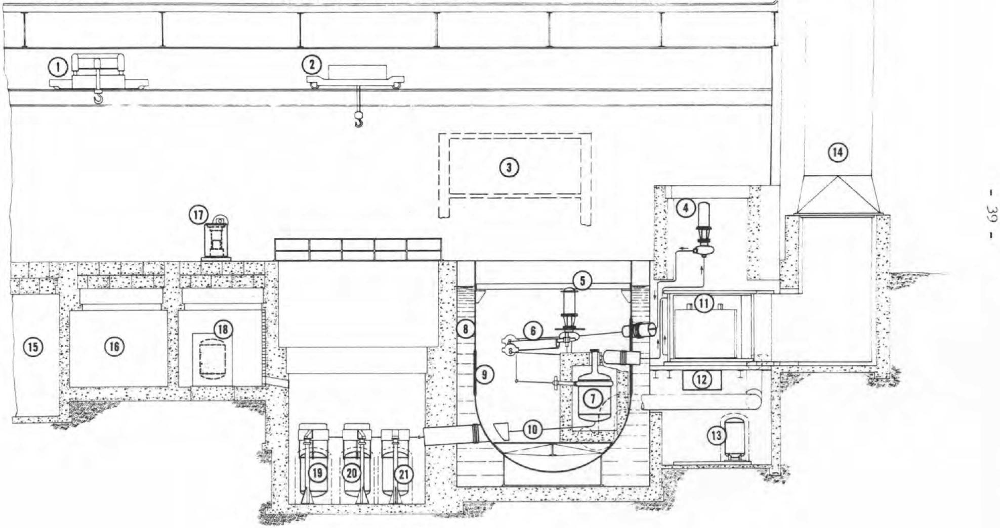  
Fig. 19(Rev.). MSRE Plant Layout, Elevation.

UNCLASSIFIED

ORNL-LR-DWG60678R

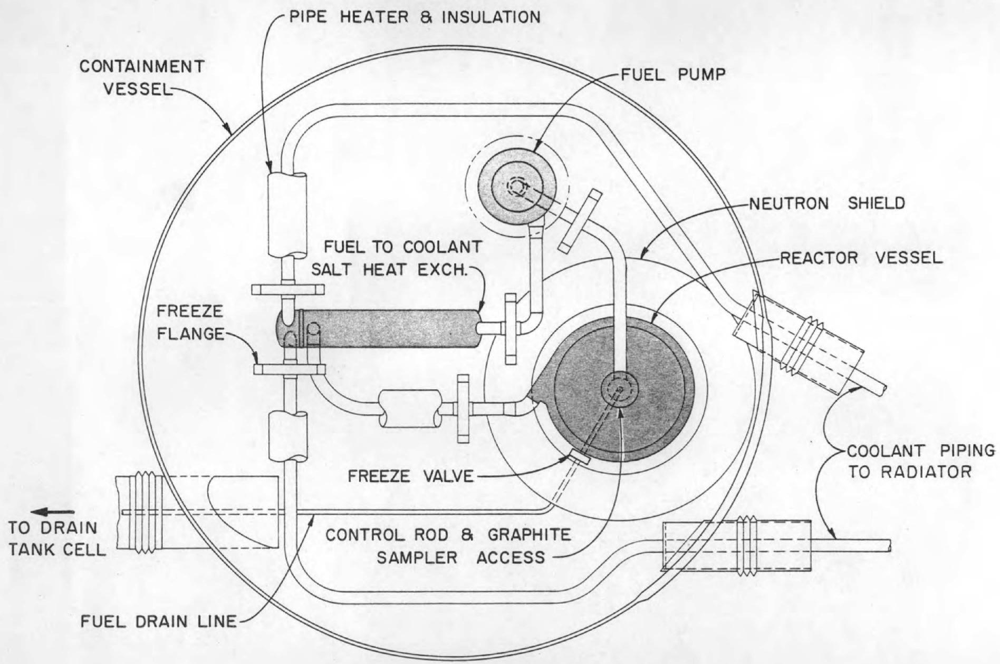  
Fig. 19A. MSRE Reactor Cell, Plan.

UNCLASSIFIED

ORNL-LR-DWG 60679R

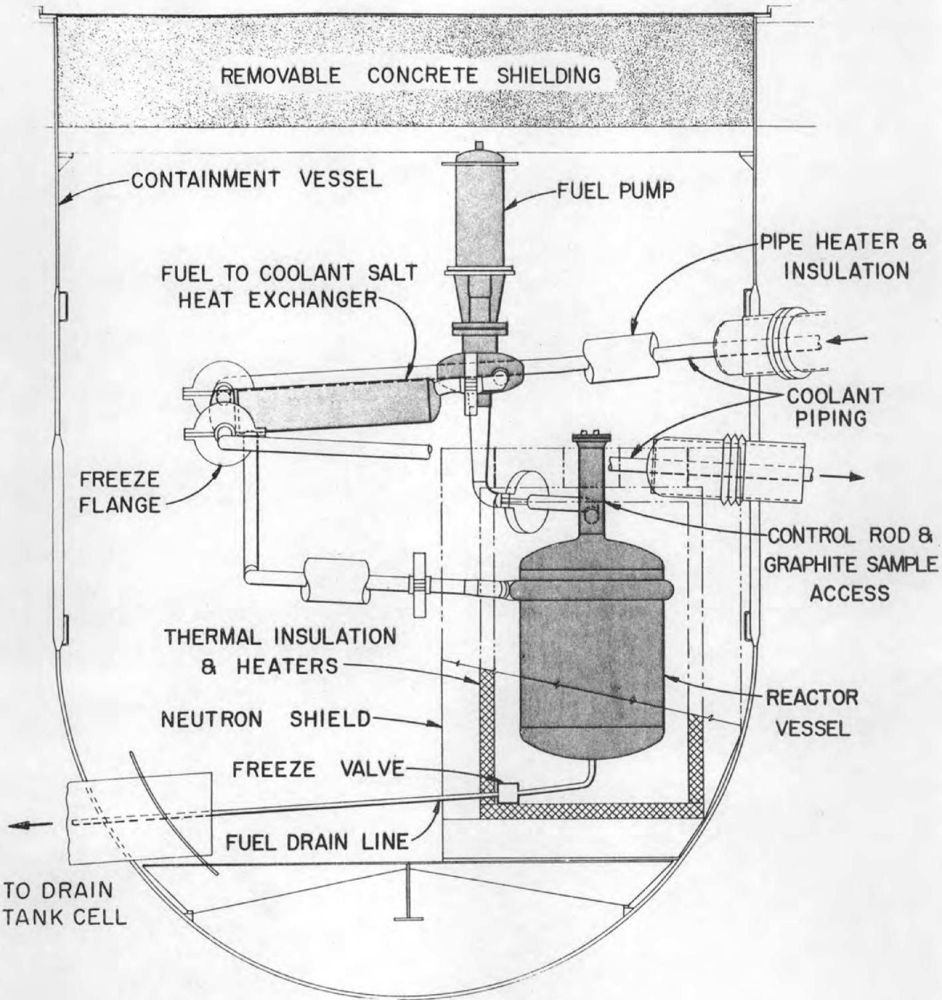  
Fig. 19B. MSRE Reactor Cell, Elevation.

# 6. CONSTRUCTION, STARTUP, AND OPERATION

# 6.3 Startup

One of the most important investigations to be made during the initial critical experiment will be the determination of the temperature coefficient. It is realized that the safety of the reactor is determined largely by the value of this coefficient, and for this reason it is considered extremely important that an indication of the value of the temperature coefficient be obtained at the earliest possible stage of the experimental program.

# 6.6 Reactor Shutdown

The reactor may be made subcritical by raising the fuel salt temperature, insertion of control rods, injection of nuclear poison through the sampler-enricher or by draining the salt from the circulating system into the drain tank or a combination of the above methods. Normal shutdown procedures will call for cessation of power extraction, heating the salt to make the reactor subcritical, then draining to the drain tanks.

The control-rod drive may be fed power from any of the two TVA circuits, the diesel generators, or the emergency instrument power supply. Insertion of any one of the three rods is sufficient to override the combined effects of delayed neutrons and xenon plus samarium. It is not desirable to reduce the critical temperature of the fuel salt below the freezing point of the salt by either of the poisoning means.

In cases of emergency the fuel salt will be transferred into the drain tank (see 3.3.1.k). Provisions have been made to assure that draining may be accomplished without the need of electrical power. The drain tanks and drain line are kept hot by resistance heaters which are monitored for temperature and electrical continuity. The drain lines are emptied from salt (after a startup) by venting through a pipe connected to the gas space of the pump bowl and to the drain line just below the freeze valve. The drain valve is located near the reactor and inside the insulated furnace space; cooling from an air jet is required to maintain the freeze plug. Therefore, a loss of power accident

will not prevent draining of the system. Experiments indicate that salt flowing at several feet per second will not freeze in pipes of the drain-line size (1-1/2 IPS) even if they are cold when flow begins.

Emergency shutdown of the reactor in the event of a plugged drain line is discussed in section 7.1.6. f.

# 7. HAZARDS ANALYSIS

# 7.1 Damage to the Primary Container

# 7.1.1 Reactivity Excursions

(a) Startup Accident. The final design of the control circuits which protect against the startup accident is not yet available. A preliminary list of interlocks is presented in section 3.3 of this Addendum.   
(b) Graphite Problems. Changes in reactivity which result from penetration of fuel salt into the graphite, shrinkage of the graphite and breakage of the molybdenum bands were discussed previously. Substitution of fuel for graphite as a result of attrition of the graphite and its removal from the core has been considered also. Calculations indicate that there would be little or no change in reactivity for an increase from 22.5 to 27 volume % of fuel salt in the core and that the reactivity would decrease with further substitution of salt for graphite. Mixing of graphite with the fuel would not create criticality problems in other reactor equipment.

The problem of maximum fission-product heating of the graphite was also discussed, and it was reported that the graphite might reach $2000^{\circ}\mathrm{F}$ after 200 hours if it contained 6 volume % of fuel. Precautions are listed to protect against possible dangers.

The more realistic case of 1 volume % of fuel in the graphite has been calculated also. After 200 hours the maximum temperature could reach approximately $1450^{\circ}\mathrm{F}$ . There will be many thermocouples on the reactor vessel, and it is planned to install a thermocouple in one of the graphite sample pieces near the center of the core so that the graphite temperature can be observed directly. The graphite will be cooled with flush salt and will not be exposed to the atmosphere until the temperatures are satisfactorily low.

# 7.1.3 Flow Stoppage

(a) Fuel-Circulation-Pump Failure. Probably the most serious aspect of circulation-pump failure is the possibility that a slug of fuel will be drastically cooled in the heat exchanger. If the pump were

restarted with this situation existing, the "cold slug" would enter the reactor and immediately increase the reactivity. Simulator studies of this "cold slug" accident indicate that the power would rise to 17 Mw within a few seconds, but would return to 10 Mw within 12 seconds if no corrective action were taken. Actually, the control rods would be automatically inserted by the high-power (set at 15 Mw) interlock and the period interlock. Additional protection against this incident will be provided by interlocks, which (1) close the radiator doors and heat up the coolant salt whenever the fuel pump fails, (2) cause a lockout of the fuel pump "start" button until the reactor temperature has returned to normal, and (3) cause an automatic run-down of the motor-generator-set frequency so that when the pump is restarted it will be started at reduced speed.

# 7.1.5 Drain-Tank Hazards

In addition to the accidents considered in this section, a question was raised about whether water could enter the drain tanks and cause a criticality incident. The present design of the drain-tank cooling system appears to make this sort of accident impossible. As was described on pages 23 and 24, there is an air space between the cooling tubes and the salt-tank thimbles. This space is vented directly to the drain-tank cell, so that water which leaks from the cooling tubes will be evaporated immediately on the hot thimbles and will escape into the cell. It is not considered credible that a leak will appear simultaneously in a cooling tube and a thimble, but if this should happen water still could not leak into the drain tank until the temperature of the thimble became less than $100^{\circ}\mathrm{C}$ .

The cooling system for the drain-tank thimbles has also been slightly modified. Previously, in an emergency, it was planned to cool by evaporating a small emergency reservoir and venting the steam to the stack. In case fission-product activity was present in the normally-closed convection cooling system, it would have been also vented to the stack.

In the revised cooling system the condensate-filled closed loop is kept closed, and a much larger reservoir has been provided on the closed-cooling-loop condenser. So now in an emergency in which pump power is lost, the reservoir would drain by gravity through the cooling-system condenser, providing cooling for about 15 hours even if no additional water were added to the reservoir. If for some reason the reservoir fill line were not available after 15 hours, fire hoses could be run to provide cooling for an indefinite time.

# 7.1.6 Other Possibilities for Primary Container Damage

(e) Corrosion. It has been suggested that the high radiation level in the control-rod thimbles and in the reactor cell might cause formation of sufficient nitric acid (from the $\mathbb{N}_2$ , $\mathsf{O}_2$ and $\mathsf{H}_2\mathsf{O}$ in the cell) to create corrosion problems. A calculation for the most pessimistic conditions indicates that the concentration of nitrogen oxides in the cell atmosphere might reach $1 \%$ in 4000 hours, the longest anticipated period of continuous operation. The actual concentration should not be this high, and HRE-2 was operated under similar conditions without observable damage from $\mathsf{HNO}_3$ , so no real problem is expected. However, it has been planned, for other reasons, to keep the oxygen content of the atmosphere in the containment vessel below $5 \%$ by adding nitrogen. Oxygen-removal equipment is being considered for installation in the cell air system to reduce the $\mathsf{O}_2$ content to a very low level to eliminate potential nitric acid corrosion problems and the need for purging with nitrogen.

# 7.1.8 Last Ditch Shutdown

The possibility has been considered that there might arise a situation in which the reactor could not be emptied of fuel salt. Although the circumstances are difficult to imagine, it is assumed that the reactor is critical at low power and that the drain line is frozen in spite of the design precautions which appear to make this impossible. As a last ditch measure, Li $^{6}$ - BeF $_2$ salt would be added to the pump bowl through the sampler. The amount of Li $^{6}$ required to poison the

reactor to subcritical at room temperature is calculated to be only 150 grams, which would be added as approximately $2\mathrm{kg}$ of salt. The addition of this much salt through the sampler would require several hours, but is not a difficult means of poisoning.

If electrical power were not available to run the fuel circulation pump, natural convection would continue to circulate the fuel, it is difficult to estimate the time required for the poison to become well mixed. It is assumed that a day or longer would not be objectionable.

# 7.2 Rupture of the Secondary Container

# 7.2.2 Excessive Pressure

As discussed in section 5.2.1 above, the test pressure of the drain tank and the reactor cells will be 48 psig. This is less than the maximum pressure which is now estimated to result from the worst conceivable accident in which fuel salt and an optimum amount of water are intimately mixed as they discharge into the cell. This accident was considered in the "Preliminary Hazards Report," but the estimate of loss of heat to the cell structure was overly optimistic. Two possibilities for coping with this accident are being considered. The first possibility is a water-spray system which would be set off if the cell pressure should reach 20 psig for any reason. The water supply would be provided by an elevated tank which would provide adequate discharge against the maximum estimated cell pressure. If this system is used the cell pressure could be reduced from a maximum of about 40 psig to nearly atmospheric in about 4 hours. This means that the leakage of fission products from the reactor cell would be limited to a total of about 4 hours. This method of coping with the excessive pressure is the basis for the maximum credible accident discussed under 7.3.2 below.

The other possibility which is being considered to prevent the cell pressure from exceeding the design pressure is a pressure-suppression system similar to that adopted for the Humbolt-Bay Reactor. The method of controlling the excess pressure will be chosen after studies of both systems are completed.

# 7.2.2 (Continued)

(a) Salt Spillage. Another consequence of salt spillage is the possibility of the mixture of salt and water becoming critical. Sufficient poison will be provided at the bottom of the containment vessel as protection against this incident.

# 7.2.5 Corrosion From Salt Spillage

In an accident involving contact of water and fluoride salts in the containment vessel, fairly rapid generation of hydrofluoric acid is expected. Part of the HF will be dispersed as vapor in the cell and part of it will dissolve in the water. Corrosion damage resulting from dissolved HF is greatly dependent upon the temperature and the concentration. Reference (1) reports corrosion penetrations ranging from 0.009 in. per year to 0.79 in. per year with temperature ranges from 70 to $300^{\circ}\mathrm{F}$ and HF concentrations from 10 to $100\%$ by weight. Since the bottom hemispherical section of the containment vessel is l-in.-thick plate, with a protective paint coating, there is little immediate danger of corrosion-caused weakening of the cell. Provision has been made for the addition of neutralizing solution in case experiments indicate the corrosion rates might damage the vessel within several months after a spill.

# 7.3 Consequences of Radioactivity Release From the Secondary Container

# 7.3.2 Maximum Credible Activity Release

Assumptions:

A. Quantity of fission products released from the container into the building:

1. During operation Xe and Kr are continuously stripped so that the quantity in the reactor system at any time (in

A. 1. (continued)

salt and the off-gas system) is only $25\%$ of that produced. This amounts to $3.75 \times 10^{5} \mathrm{C}$ . The noble gases are important only as an external radiation hazard.

2. Iodine is retained in the salt and not more than $10\%$ can be released. (There is some experimental basis for only $1\%$ release.) Of this amount, half will be retained on the container walls, making a net release of $5\%$ of the original quantity into the building. The total released is $1.0 \times 10^{5} \mathrm{C}$ .

3. Only $10\%$ of solid fission products is dispersed in the accident. This amounts to $6.8 \times 10^{5} \mathrm{C}$ .

4. The pressure within the container rises to 40 psig as a result of the MCA; leakage from the container is no greater than $0.04\% / \text{hr}$ at this pressure. The pressure returns to atmospheric in 4 hours* and the leak rate decreases linearly as the pressure returns to atmospheric. The total leakage from the container during the 4 hours is then $0.0004 \times 4 \times 0.5 = 8 \times 10^{-4}$ of the activity dispersed in the container. Thus, into the building is discharged the following quantities of fission products:

# Quantity

# Escape Rate

(a) Noble gases = 300 curies 0.0208 c/sec   
(b) Iodine = 80 curies 0.0055 c/sec   
(c) Solids = 536 curies 0.0372 c/sec

5. As they escape, the fission products are mixed uniformly within the building, which has a volume of $13.6 \times 10^{3}$ cubic meters. Half of the iodine is adsorbed on surfaces within the building.

The resulting escape times for a person breathing 30 liters/ min within the high bay of this building can be calculated for each group of activity:

*Conservatively based on HRE-2 experience. Times for several MSRE cases are being determined.

A. 5 (Con't.)

<table><tr><td>Type of Fission Product</td><td>Quantity to Produce 25 rem dose</td><td>Escape Time Without Exceeding 25 rem</td></tr><tr><td>Noble Gas</td><td>25 R Ext.</td><td>45 min.</td></tr><tr><td>Iodine</td><td>278 μC</td><td>20 min.</td></tr><tr><td>Solids</td><td>133.7 μC</td><td>5.3 min.</td></tr></table>

After 4 hours the concentrations reach $0.0220\mathrm{C / M}^3$ for the noble gases, $0.0029\mathrm{C / M}^3$ for the iodine and $0.0394\mathrm{C / M}^3$ for the solids. These concentrations are assumed for the gas leaking from the high-bay liner into the building and to the countryside.

6. The direct radiation dose rates which result from the fission products in the building:

<table><tr><td>Location</td><td>Dose Rate, mr/hr</td></tr><tr><td>Road in front (~100 ft)</td><td>275</td></tr><tr><td>Road at side (~50 ft)</td><td>1100</td></tr><tr><td>HFIR (~1600 ft)</td><td>1</td></tr></table>

B. Release of activity from the high bay of the building:

1. Two paths for dispersal are available: 1) seepage from the building through cracks and 2) discharge through filters and the stack.

2. Seepage from the building should be at a rate less than $10\%$ /day, because the building is to be lined with a continuous steel lining.

(a) For a $10\%$ /day outleakage, neglecting decay which would greatly reduce the noble gases, concentrations outside the building are estimated for night-time release $(n = 0.4, C^2 = 0.01)$ , 5-MPH wind.

Night-Time   

<table><tr><td rowspan="2">Type of Fission Product</td><td colspan="3">Concentration, μ C/M at</td><td>Escape Time for 25 rem Exposure</td></tr><tr><td>0.1 mile</td><td>0.35 mile</td><td>1 mile</td><td>0.1 mile</td></tr><tr><td>Noble Gases</td><td>23.4</td><td>0.94</td><td>0.131</td><td>Very long</td></tr><tr><td>Iodine</td><td>3.1</td><td>0.12</td><td>0.017</td><td>24 hr</td></tr><tr><td>Solids</td><td>41</td><td>1.64</td><td>0.23</td><td>109 min.</td></tr></table>

There appears to be no great hazard in the seepage of the fission-product mixture from the building walls under nighttime conditions. Day-time conditions result in much lower doses. Certainly the MSRE exclusion area would have to be evacuated, and such a release would be very likely to interrupt operations at the HFIR site if the wind direction were to the south. Based on observations of the Oak Ridge area over a period of two years, the wind direction is SSW, S, or SSE a total of $18.4\%$ of the time.* With a ground-level release, it is very unlikely that the activity would be carried over the ridge into Bethel Valley, where the main buildings of the Oak Ridge National Laboratory are located.

At the EGCR site (two miles to the east) the concentration of bone seekers would be $0.05\mu \mathrm{C} / \mathrm{M}$ , which would require gas masks or evacuation.

3. Discharge through the absolute filters and up the MSRE stack at a rate of $24\mathrm{M}^3/\mathrm{min}$ is the second possibility, if the fans are running. This would result in less contamination to the countryside, because the filtered discharge would consist of little more than the noble gases and 40 curies of iodine, amounting to a total release of only 340 curies over a period of about 10 hr, or a rate of 0.01 c/sec. Under normal nighttime conditions the maximum ground concentration would occur

at one mile and would be only $1\mu \mathrm{C} / \mathrm{M}$ , which is below the MPC for the noble gases and the iodine.

Thus it is concluded that, in the event of the maximum credible accident, it is preferable to continue operation of the stack fans instead of allowing the activity to seep from the building.

# 7.4 Site

The distance from the MSRE to the HFIR is 1600 ft, and to the EGCR, two miles. Figure 22A shows the relation of the MSRE to all the other reactors in the ORNL area. Within the 0.5-mile radius circle is a population of approximately 200 people. The population within the one-mile circle is 4200. A 110-ft-high ridge intervenes between the MSRE and the X-10 area, where most of the people work. The two-mile-radius circle includes only about 200 more people. As was shown in the calculation of the maximum credible accident, there is no danger of overexposure to the population beyond 0.5 miles. The distribution of this personnel and the population of the surrounding towns and counties are shown in Tables 10, 11, and 12.

It is noted that the MSRE site satisfies the siting requirements as determined by the Guide Calculation presented in Appendix A of 10 CFR, Part 100.

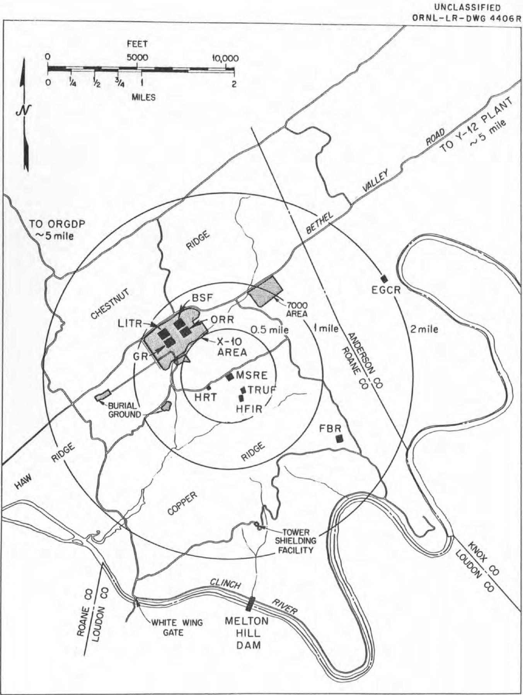  
Fig. 22A. ORNL Area Map.

Table 10. Personnel Within the AEC Restricted Area*   

<table><tr><td>Plant</td><td>Distance</td><td>Number of Employees</td></tr><tr><td>Homogeneous Reactor Test</td><td>0.24 mi.</td><td>10</td></tr><tr><td>Oak Ridge National Laboratory</td><td></td><td></td></tr><tr><td>Personnel at X-10</td><td>0.6 mi.</td><td>3,339</td></tr><tr><td>Personnel at Y-12</td><td>4.9 mi.</td><td>1,165</td></tr><tr><td>Construction Personnel</td><td>0.6 mi.</td><td>~800</td></tr><tr><td>HFIR</td><td>1600 ft.</td><td>125</td></tr><tr><td>FBR</td><td>1.3 mi.</td><td>30</td></tr><tr><td>Experimental Gas-Coupled Reactor</td><td>2.0 mi.</td><td>150</td></tr><tr><td>University of Tennessee</td><td></td><td></td></tr><tr><td>Agriculture School Extension</td><td>5.0 mi.</td><td>105</td></tr><tr><td>Tower Shielding Facility</td><td>1.7 mi.</td><td>20</td></tr><tr><td>Melton Hill Dam</td><td>2.5 mi.</td><td>&lt; 50</td></tr><tr><td>Gaseous Diffusion Plants</td><td>4.9 mi.</td><td></td></tr><tr><td>Operating Personnel</td><td></td><td>4,088</td></tr><tr><td>Construction</td><td></td><td>~375</td></tr><tr><td>Electromagnetic Plant (Y-12)</td><td>4.9 mi.</td><td></td></tr><tr><td>Operating Personnel</td><td></td><td>5,364</td></tr><tr><td>Construction Personnel</td><td></td><td></td></tr><tr><td>Ferguson (Y-12 only)</td><td></td><td>545</td></tr><tr><td>Others</td><td></td><td>75</td></tr></table>

*July 1, 1961

Table 11. Population of the Surrounding Towns, Based on 1960 Census   

<table><tr><td rowspan="2">City or Town</td><td rowspan="2">Distance from MSRE (miles)</td><td rowspan="2">Distance</td><td rowspan="2">Population</td><td colspan="2">% of Time Downwind</td></tr><tr><td>Night</td><td>Day</td></tr><tr><td>Oak Ridge</td><td>7</td><td>NNE</td><td>27,124</td><td>5.6</td><td>5.5</td></tr><tr><td>Lenoir City</td><td>9</td><td>SSE</td><td>4,979</td><td>4.3</td><td>6.0</td></tr><tr><td>Oliver Springs</td><td>9</td><td>N by W</td><td>1,163</td><td>2.3</td><td>2.7</td></tr><tr><td>Martel</td><td>10</td><td>SE</td><td>500 *</td><td>1.4</td><td>2.8</td></tr><tr><td>Coalfield</td><td>10</td><td>NW</td><td>650 *</td><td>0.5</td><td>1.1</td></tr><tr><td>Windrock</td><td>10</td><td>N by W</td><td>550 *</td><td>2.3</td><td>2.7</td></tr><tr><td>Kingston</td><td>12</td><td>WSW</td><td>2,010</td><td>9.5</td><td>11.3</td></tr><tr><td>Harriman</td><td>13</td><td>W</td><td>5,931</td><td>2.2</td><td>3.7</td></tr><tr><td>South Harriman</td><td>13</td><td>W</td><td>2,884</td><td>2.2</td><td>3.7</td></tr><tr><td>Petros</td><td>14</td><td>NW by N</td><td>790 *</td><td>1.4</td><td>2.8</td></tr><tr><td>Fork Mountain</td><td>15</td><td>NNW</td><td>700 *</td><td>2.3</td><td>2.7</td></tr><tr><td>Emory Gap</td><td>15</td><td>W</td><td>500 *</td><td>2.2</td><td>3.7</td></tr><tr><td>Friendsville</td><td>15</td><td>SE</td><td>606</td><td>1.4</td><td>2.8</td></tr><tr><td>Clinton</td><td>16</td><td>NE</td><td>4,943</td><td>11.6</td><td>9.0</td></tr><tr><td>South Clinton</td><td>16</td><td>NE</td><td>1,356</td><td>11.6</td><td>9.0</td></tr><tr><td>Powell</td><td>17</td><td>ENE</td><td>500 *</td><td>8.3</td><td>6.8</td></tr><tr><td>Briceville</td><td>19</td><td>NNE</td><td>1,217</td><td>5.6</td><td>5.5</td></tr><tr><td>Wartburg</td><td>20</td><td>NW by W</td><td>800 *</td><td>1.4</td><td>2.8</td></tr><tr><td>Knoxville</td><td>18 to 25</td><td>E</td><td>111,827</td><td>1.5</td><td>2.7</td></tr><tr><td>Greenback</td><td>20</td><td>S by E</td><td>960 *</td><td>5.5</td><td>4.9</td></tr><tr><td>Rockwood</td><td>21</td><td>W by S</td><td>5,343</td><td>2.2</td><td>3.7</td></tr><tr><td>Rockford</td><td>22</td><td>SE</td><td>5,345</td><td>1.4</td><td>2.8</td></tr><tr><td>Fountain City</td><td>22</td><td>ENE</td><td>10,365</td><td>8.3</td><td>6.8</td></tr><tr><td>Lake City</td><td>23</td><td>NNE</td><td>1,914</td><td>5.6</td><td>5.5</td></tr><tr><td>Norris</td><td>23</td><td>NNE</td><td>1,389</td><td>5.6</td><td>5.5</td></tr><tr><td>Sweetwater</td><td>23</td><td>SSW</td><td>4,145</td><td>8.4</td><td>12.7</td></tr><tr><td>Neuberts</td><td>27</td><td>ENE</td><td>600 *</td><td>8.3</td><td>6.8</td></tr><tr><td>John Sevier</td><td>27</td><td>E</td><td>752 *</td><td>1.5</td><td>2.7</td></tr><tr><td>Madisonville</td><td>27</td><td>S</td><td>1,812</td><td>5.5</td><td>11.9</td></tr><tr><td>Caryville</td><td>27</td><td>N by E</td><td>1,234 *</td><td>9.5</td><td>6.1</td></tr><tr><td>Sunbright</td><td>30</td><td>NW</td><td>600 *</td><td>0.5</td><td>1.1</td></tr><tr><td>Jacksboro</td><td>30</td><td>N by E</td><td>577 *</td><td>9.5</td><td>6.1</td></tr><tr><td>Niota</td><td>30</td><td>SSW</td><td>679</td><td>8.4</td><td>12.7</td></tr></table>

*1950 Census

Table 12. Rural Population in Surrounding Counties*   

<table><tr><td rowspan="2">County</td><td rowspan="2">Total Area + Sq. Mi.</td><td rowspan="2">Rural* Population</td><td rowspan="2">Density No. People Per Sq. Mi.</td><td colspan="3">Estimated Population</td></tr><tr><td>Within 10 mi. Radius</td><td>Within 20 mi. Radius</td><td>Within 30 mi. Radius</td></tr><tr><td>Anderson</td><td>338</td><td>26,600</td><td>79</td><td>395</td><td>14,200</td><td>22,800</td></tr><tr><td>Blount</td><td>584</td><td>38,325</td><td>66</td><td>0</td><td>6,720</td><td>23,200</td></tr><tr><td>Knox</td><td>517</td><td>138,700</td><td>238</td><td>13,100</td><td>46,400</td><td>96,000</td></tr><tr><td>Loudon</td><td>240</td><td>18,800</td><td>78</td><td>6,080</td><td>16,900</td><td>18,700</td></tr><tr><td>Morgan</td><td>539</td><td>13,500</td><td>25</td><td>225</td><td>3,625</td><td>8,630</td></tr><tr><td>Roane</td><td>379</td><td>12,500</td><td>33</td><td>3,070</td><td>9,170</td><td>11,110</td></tr></table>

*1960 Census - Does not include communities with population of 500 or more.   
+Does not include area within Oak Ridge reservation.

# APPENDIX A

Listed below are several questions and requests for information asked by various AEC staff members with an indication of where in this Addendum the answers may be found.

1. Include map and description of site in relation to other facilities such as: reactors planned or operating, X-10, other areas with concentration of workers. Include population density, taking into account number of people working during day.

7.4

2. Further description is needed for reactor control system, building ventilation system (5.2), and process monitoring systems, including sketches and schematics where appropriate. For control system state rod speed, rate of reactivity insertion, and total rod worth.

3.0

State discharge rate and level of activity from each off-gas system and combined total activity normally dispersed from stack. State maximum calculated permissible activity of stack effluent.

3.2.9

Show location of process monitoring instruments, particularly for reactor system temperatures. (See 3.2.7, 61-2-46)

2.8,5.2

3. List and describe briefly all interlocks which assure systems are functioning properly prior to operating reactor; specifically, assurance that pumps are running prior to pulling control rods to prevent cold slug accident.

$3.3,7.1 \cdot  {3a}$

4. Discuss results of mixing fuel with water at any point in system including fill and drain tanks, storage tank, reactor cell, other cells, shield water, etc., with respect to criticality. Likewise discuss possible disintegration of graphite moderator to form homogeneous fuel-graphite mixture, with respect to possible criticality accident at some point in system. If either case present problem discuss prevention. 7.1.1b

5. Effect of maximum credible accident on surrounding area should be analyzed, discussing dose rates or total doses at boundary of exclusion area, surrounding area of population, and at various radial distances. Ref. 26 Federal Register, 1224, Feb. 11, 1961, Reactor Site Criteria, Notice of Proposed Guides.

7.3.2

6. Discuss possibility of over-pressuring primary system by accidental release of high-pressure helium supply into primary system.

2.8, Fig. 10a

7. Possibility and, if appropriate, prevention of damage to empty core due to decay heat following system drain after power operation.

7.1.1b

8. Discuss assurance of means of ultimate shutdown: that is, assurance of reliability and operability of drain system in all credible circumstances.

6.6

9. Include functional listing of proposed automatic rod drive down, automatic fuel system drain, and interlocks to assure safe system operation.

3.3

10. Point out any important errata and, where significant, update PHR. See Revision Sheets.

11. Point out that third barrier, sealant of high-bay area, is a sheet steel lining. 5.2

# REVISIONS

ORNL CF-61-2-46

# MOLTEN-SALT REACTOR EXPERIMENT

# PRELIMINARY HAZARDS REPORT

In order to reflect design changes and to correct errors in the original report, revisions listed in the following pages are to be incorporated.

Summary, p iii, last paragraph

Delete the second sentence and substitute the following:

Provisions to prevent containment rupture in case of the maximum credible accident (spilling of the fuel salt into the cell) are described.

Lists of Tables and Figures, p vii and viii

The tables and figures of this addendum are revisions of those in the original report, except for Tables 10, 11 and 12, and Figures 10A, 14A, 14B, 14C, 19A, 19B and 22A, which are new.

Section 2, p 3, second paragraph

Delete the third sentence and substitute the following:

Then it flows to a 1200-gpm sump-type pump located in the SE quadrant of the reactor cell.

Section 2, p 10, fourth paragraph

Correct first sentence to read:

Provision is made for remote removal and replacement of five full length stringers and four smaller graphite samples at the center of the core.

Delete the third sentence in its entirety - An INOR-8 piece ....

Section 2, p 14, first paragraph

Change line 3 to read:

... capable of circulating 1200 gpm of salt against a head of 48.5 ft of salt. ...

Section 2, p 14, last paragraph

Change line 4 to read:

... against a head of 75 ft of fluid. ...

Section 2, p 19, first paragraph

Change line 3 to read:

(3/4-in. OD, 0.072-in. wall, 30 ft long) ....

Section 2, p 19, second paragraph, Item 5

Change line 2 to read:

...close in less than 10 sec,....

Section 2, p 19, last paragraph

Change line 2 to read:

....and lowered at a speed of 10 ft/min ....

Delete second sentence and substitute the following:

The doors are suspended from wire ropes that are wound on sheaves.

Section 2, p 21, first paragraph

Delete lines 1, 2 and 3 and substitute the following:

Emergency closure is effected by de-energizing a magnetic brake on

the line shaft and dropping the doors. The fall is slowed by fly

wheels. Shock and energy-absorbing means are provided. ....

Section 2, p 22, first paragraph

Change line 4 to read:

... each of 72 ft3 capacity. ...

Section 2, p 22, second paragraph

Change line 5 to read:

by 32 bayonet tubes

Delete last two sentences, starting: Normally the steam ....

Section 2, p 26, paragraph 2.7.3

Change line 1 to read:

A tank (see Table 8) of $50\text{-ft}^3$ capacity ....

Section 2, p 26, paragraph 2.7.4

Change line 3 to read:

... tank of 72 ft3 capacity ...

Section 3, p 36, last paragraph

Delete the first three sentences and substitute the following: In the present reactor design, spaces are provided for 3 poison rods near the center of the core. The rods employ boron in the form of $\mathrm{B}_{4} \mathrm{C}$ as nuclear poison. The rods can be inserted at a rate of $0.06\%$ ( $\Delta \mathrm{k} / \mathrm{k}$ )/sec max, and may be withdrawn at a rate of $0.02\%$ ( $\Delta \mathrm{k} / \mathrm{k}$ )/sec min. Design concept of the rods is shown on Fig. 3a. The control devices are not ....

Section 3, p 39, paragraph 3.2.3

Change lines 2 and 3 to read:  
...... as the detectors and two high level circuits equipped with ion chambers. All four chambers are ....

Section 4, p 43, first paragraph

Change line 7 to read:  
.... The poison-rod worth was ....

Section 5, p 50, first paragraph of subsection 5.3

Delete the third sentence in its entirety - An INOR-8 casting ....

Section 5, p 50, second paragraph of subsection 5.3

Change the first sentence to read:  
The reactor-cell shielding consists of 3-1/2 ft thick ordinary and 3-1/2 ft thick high density concrete covering the cell and sand and water in the 3-ft annulus between the reactor containment vessel and the cell wall.

Section 5, p 51, last paragraph of subsection 5.3

Change line 2 to read:  
...... through the combined thickness of 7 ft of concrete shielding plugs is 2.5 mr/hr, ....

Section 5, p 51, first paragraph of subsection 5.4

Change line 9 to read:  
.... The components are joined by 5-in. IPS sched-40 pipe (0.258-in.-thick wall) ....

Section 5, p 54, second paragraph

Change line 3 to read:

.... Two 5-in. IPS, sched-40 (0.258-in.-thick wall) pipes con

necting....

Section 7, p 61, second paragraph

Change line 12 to read:

to extract $0.5 \mathrm{Mw}$ with a temperature rise of $180^{\circ} \mathrm{F}$ across

the reactor.

Section 7, p 77, first paragraph of subsection 7.4

Change line 4 to read:

..... a site 1600 ft from the MSRE, and the EGCR is under construc

tion $\sim 2$ miles away ....