# MASTER COPY

Distribution Limited to Recipients Indicated

EXTERNAL TRANSMITTAL AUTHORIZATION

ORNL

Central Files Number

61-2-46

MOLTEN-SALT REACTOR EXPERIMENT

PRELIMINARY HAZARDS REPORT

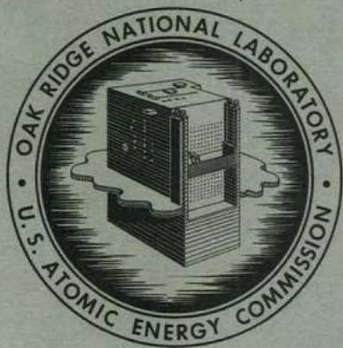

# NOTICE

This document contains information of a preliminary nature and was prepared primarily for internal use at the Oak Ridge National Laboratory. It is subject to revision or correction and therefore does not represent a final report. The information is not to be abstracted, reprinted or otherwise given public dissemination without the approval of the ORNL patent branch, Legal and Information Control Department.

# OAK RIDGE NATIONAL LABORATORY

operated by

UNION CARBIDE CORPORATION

for the

U.S. ATOMIC ENERGY COMMISSION

Contract No. W-7405-eng-26

MOLTEN-SALT REACTOR EXPERIMENT

PRELIMINARY HAZARDS REPORT

S. E. Beall

W. L. Breazeale

B. W. Kinyon

February 28, 1961

OAK RIDGE NATIONAL LABORATORY

Oak Ridge, Tennessee

operated by

UNION CARBIDE CORPORATION

for the

U.S. ATOMIC ENERGY COMMISSION

# SUMMARY

The Molten Salt Reactor Experiment (MSRE) is a circulating-fuel, low-pressure, high-temperature reactor. The major objectives are the demonstration of the safety, dependability, and serviceability of such a reactor and the obtaining of additional information about graphite and fission-product gases in the environment of an operating molten-salt reactor.

The MSRE fuel is the tetrafluoride of enriched $\mathrm{U}^{235}\left(\mathrm{UF}_4\right)$ dissolved in an LiF-BeF₂ carrier, with ZrF₄ and ThF₄ additions. The coolant salt is an LiF-BeF₂ mixture without additives. The core consists of unclad-graphite pieces held in position by molybdenum bands. A nickel molybdenum alloy, INOR-8, especially developed as a container material for molten fluorides, is used for all container and structural members in contact with either the fuel salt or the coolant salt. The heat from the reactor is dissipated to the atmosphere through a radiator in the coolant-salt system.

The cover gas for both the fuel- and the coolant-salt systems is helium. The off-gas system is designed to hold up fission gases until the activity level permits discharge to the atmosphere.

The instrumentation and controls are designed to shut down the reactor safely if excessive reactivity occurs. Periodic sampling permits evaluation of fuel stability and corrosion rates.

To demonstrate the serviceability of the system, provisions are made for remote and semidirect maintenance of the equipment in the reactor cell and other regions of high residual activity. Direct maintenance will be performed in other areas, including the radiator pit.

The possible accidents considered are reactivity excursions, fuel separation, loss of flow, control rod failure, and several mechanical possibilities for containment failure. The maximum credible accident, rupture of the fuel- and coolant-salt systems and subsequent spilling into the cell of all of the salt, would not burst the container. Any escape of fission products from the container should result in an exposure of less than 25 rem to anyone in the reactor building or in the surrounding area.

# CONTENTS

Summary 111

List of Tables vii

List of Figures vii

1. Introduction 1

2. Reactor Complex 3

2.1 General Description 3

2.2 Fuel and Materials 6

2.3 Reactor Vessel 10

2.4 Reactor and Coolant-System Pumps 14

2.5 Primary Heat Exchanger 16

2.6 Salt-to-Air Radiator 19

2.7 Drain and Storage Tanks 21

2.7.1 Fuel Drain Tanks 22

2.7.2 Flush-SaltTank 22

2.7.3 Coolant Drain Tank 26

2.7.4 Storage Tank 26

2.8 Cover-Gas System 26

2.9 Freeze Valves 30

2.10 Sampler Mechanism 30

2.11 Nonnuclear Heating 333

3. Instrumentation and Controls 34

3.1 General 34

3.1.1 Control Requirements 35

(a) Xenon Poisoning 35

(b) Power Coefficient 35

(c) Delayed Neutrons 36

(d)Burnup 36

3.1.2 Other Control Features 37

3.1.3 Nonnuclear Controls 37

3.2 Instruments 39

3.2.1 Reactor-Power Measurement 39

3.2.2 Fuel Inventory 39

3.2.3 Nuclear Instruments 39   
3.2.4 Radiation Monitoring 39   
3.2.5 Pressure Measurements 41   
3.2.6 Flow Measurements 41   
3.2.7 Temperature Measurements 41   
3.2.8 Liquid-Level Measurements 42

# 4. Reactor Physics Data 43

# 5. The Reactor Complement 44

5.1 Building 44   
5.2 Containment 44

5.2.1 Fuel-System Container Design 46   
5.2.2 Other Cells 49   
5.2.3 Penetrations 49

5.3 Shielding 50   
5.4 Arrangement of Equipment 51   
5.5 Maintenance 54

# 6. Construction, Startup, and Operation 57

6.1 Construction 57   
6.2 Flush-Salt Test 57   
6.3 Startup 57   
6.4 Approach to Power 58   
6.5 Operations Personnel 58

# 7. Hazards Analysis 60

7.1 Damage to the Primary Container 60

7.1.1 Reactivity Excursions 60

(a) Startup Accident 60   
(b) Graphite Problems 61

7.1.2 Fuel Separation 64

7.1.3 Flow Stoppage 65

(a) Fuel-Circulating-Pump Failure 65   
(b) Coolant-Pump Failure 66   
(c) Simultaneous Pump Failures 66   
(d) Flow Stoppage in Fuel Loop 66

7.1.4 Control System Failure 67   
7.1.5 Drain-Tank Hazards 67   
7.1.6 Other Possibilities for Primary- Container Damage 69

(a) Freeze-Valve Damage 69   
(b) Freeze Flanges 70   
(c) Excessive Wall Temperature 70   
(d) Excessive Stresses 71   
(e) Corrosion 71

7.1.7 Detection of Salt Spillage 72

7.2 Rupture of the Secondary Container 72

7.2.1 Missile Damage 72   
7.2.2 Excessive Pressure 73

(a) Salt Spillage 73   
(b) Oil-Line Rupture 73

7.2.3 Acts of Nature 73

(a) Earthquake 73   
(b) Flood 74

7.2.4 Sabotage 74

7.3 Consequences of Radioactivity Release from the Secondary Container 75

7.3.1 Rupture of the Secondary Container 75   
7.3.2 Maximum Credible Activity Release 75   
7.3.3 Beryllium and Fluorine Hazards 76

(a) Beryllium 76   
(b) Fluorine 77

7.4 The Site 77

APPENDIX 80

A. Chemistry and Corrosion 80   
B. Hot-Spot Analysis 88   
C. Specification for Drain Tank 92   
D. Component Development Program in Support of MSRE 103   
E. Calculation to Support Maximum Credible Accident 107   
F. Graphite Compatibility with Salt 117

REFERENCES 122

# LIST OF TABLES

# Table No.

Page

Composition and Properties of Fuel and Coolant for MSRE 7   
2 Composition and Properties of INOR-8 8   
3 Properties of MSRE Core Graphite 9   
4 Reactor-Vessel Design Data 13   
5 Design Data for Fuel and Coolant Pumps 16   
6 Design Data for Primary Heat Exchanger 18   
7 Design Data for Salt-to-Air Radiator 21   
8 Design Data for Fuel Drain Tank, Coolant Drain Tank and Flush-Salt Tank 25   
9 Reactor Physics Data 43

# LIST OF FIGURES

# Fig. No.

# Page

1 MSRE Flow Diagram 4   
2 Artist's Impression of MSRE Arrangement 5   
3 Reactor-Vessel Assembly 11   
4 Typical Graphite Stringer Arrangement 12   
5 Circulation Pump and Motor 15   
6 Primary Heat Exchanger 17   
7 Salt-to-Air Radiator 20   
8 Fuel Drain and Fill Tanks 23   
9 Cooling Thimble for Fuel Drain and Fill Tanks 24   
10 Cover-Gas Supply 28   
11 Fuel-System Off-Gas Disposal 29   
12 Coolant-System Off-Gas Disposal 31   
13 Radiant Heat Freeze Valve 32   
14 Arrangement of Ion Chambers 40   
15 Plan of Building 7503 45   
16 Shielding and Sealing Membrane for Top of Cell 47   
17 North-South Sectional Elevation of Building 7503 48   
18 Arrangement of Equipment: Plan View 52   
19 Arrangement of Equipment: Elevation 53   
Remote Manipulator and Shielded Control Room 56   
21 Afterheat Power Generation 68   
22 Map of Cities and Counties Surrounding Oak Ridge Area 78   
23 Plot Plan: Molten-Salt Reactor Experiment 79   
A.1 Estimated Vapor Pressure of Fuel Salt 81   
A.2 Phase Diagram of Coolant Salt 83

# ACKNOWLEDGMENT

The authors are indebted to many members of the Molten-Salt Reactor Program for their contributions to this report, and to the Program Director, R. B. Briggs, for his advice and suggestions.

Initial studies of hazard evaluation were made by Messrs. Remo Galvagni, Italy; John W. Holtzclaw, U.S.A.; Osamu Kawaguchi, Japan; and Francisco Z. Pines, Spain, students of Oak Ridge School of Reactor Technology. Their findings represent a significant contribution to the material of the present report.

# S. E. Beall

W. L. Breazeale B. W. Kinyon

# 1. INTRODUCTION

One of the principal programs of the Oak Ridge National Laboratory is the development of liquid-fueled reactors. Since 1951 the Laboratory has constructed and operated two experimental reactors fueled with uranium in aqueous solution and one fueled with molten salt.

The first experiment with each of these concepts demonstrated nuclear feasibility only. Engineering feasibility, dependability, and other factors were to be determined in later experiments such as the current Homogeneous Reactor Experiment No. 2 and the subject of this report, the proposed Molten-Salt Reactor Experiment (MSRE).

The development of molten-salt systems has been pursued continuously since 1951, although the major effort was supported by the aircraft reactor program. Application of the molten-salt reactor to stationary power production has always been considered desirable for three highly important reasons:

1. Molten-salt reactors have a great advantage because they have no fuel elements and consequently none of the problems associated with fuel elements. Burnup is not limited by radiation damage or reactivity loss. There are relatively simple methods for reprocessing fuel and blanket salts, and their reconstitution involves only dissolution of $\mathrm{UF_4}$ or $\mathrm{ThF_4}$ in a carrier salt with no metallurgical, ceramic, or mechanical processing.

2. Molten-salt reactors can operate at very high temperature to produce steam at conditions comparable to those for the best fossil-fuel plants. The use of a fluid fuel, circulating at high rate, can be combined with large temperature differences in the core and heat-transfer systems to produce very high power density. High power density and low fuel inventory in the reactor and the processing plants combine to produce high specific power. In spite of the high temperature, the operating pressure is $< 50$ psig.

3. The nuclear and physical characteristics of the salt and the use of unclad graphite as a moderator make possible the achievement of very good neutron economy. Breeding on the thorium- $\mathsf{U}^{233}$ cycle with a fuel yield of about $8\%$ per year appears to be attainable.

In order to demonstrate that many of these desirable features can presently be embodied in a practical reactor which can be operated safely and reliably, and can be serviced without unusual difficulty, the Oak Ridge National Laboratory has proposed recently this molten-salt reactor experiment. An additional important objective of the experiment is to provide the first large-scale test of unclad-graphite moderator, fuel salt, and container materials in long-term operation at high temperature and power.

This is a preliminary report prepared for review to obtain approval of the proposed site. It is based on the present incomplete reactor design and is primarily concerned with the hazards of the experiment as it is presently visualized. The hazards studies of the Aircraft Reactor Experiment1 and the proposed (but not built) Aircraft Reactor Test2 provide a good background for the problems presently foreseen and the proposed solutions discussed in this study. Furthermore, experience in operating three fluid-fuel reactors over a period of nine years provides a good basis for the design criteria and operating practices. Although the general design of the reactor and its facilities has been investigated for several months, details are still unsettled and important changes may be made before the design is completed.

# 2. REACTOR COMPLEX

# 2.1 General Description

The proposed Molten Salt Reactor Experiment (MSRE) is designed for a heat generation rate of 10 Mw by use of principles which will apply to the design of a much larger power reactor. A flow diagram for the reactor and coolant systems and an artist's concept of the facility are presented in Figs. 1 and 2.

In the reactor primary system the molten-salt fuel is circulated through a cylindrical reactor vessel which contains a graphite core matrix. Under design operating conditions, fuel enters the core at $1175^{\circ}\mathrm{F}$ and leaves at $1225^{\circ}\mathrm{F}$ . Then it flows to a 1250-gpm sump-type pump mounted directly above and concentric with the reactor vessel. The pump discharges the fuel through the shell side of a cross-baffled shell-and-tube heat exchanger and back to the reactor inlet.

A coolant salt is pumped through the tubes of the primary heat exchanger and then through tubes of an air-cooled radiator by another sump-type pump. It flows at a rate of 830 gpm and cycles between $1025^{\circ}\mathrm{F}$ and $1100^{\circ}\mathrm{F}$ . The coolant-salt pressure is kept higher than the fuel-salt pressure to prevent the escape of fuel in the event of a tube failure. Air is blown over the bare tubes of the radiator by two axial blowers of 164,000 cfm total capacity. Electrical heaters on the piping and equipment of the fuel and coolant systems keep the salt molten at all times.

A liquid-vapor interface is maintained in the reactor fuel system in the sump of the pump. Fuel is bypassed through the sump at a rate of 50 gpm, and the gaseous fission products in the bypass stream are transferred to a helium cover gas. There is a continuous flow of 7 liters/min of helium through the sump to the off-gas system; the helium system is used to pressurize the reactor to 20 psia.

In addition to the reactor and coolant systems, the plant is provided with such auxiliaries as drain tanks for fuel and coolant salts, equipment for sampling the fuel in the reactor, a helium-cover-gas system, facilities for handling radioactive wastes, and the usual nuclear and process control instrumentation and plant services.

UNCLASSIFIED

ORNL-LR-DWG56870

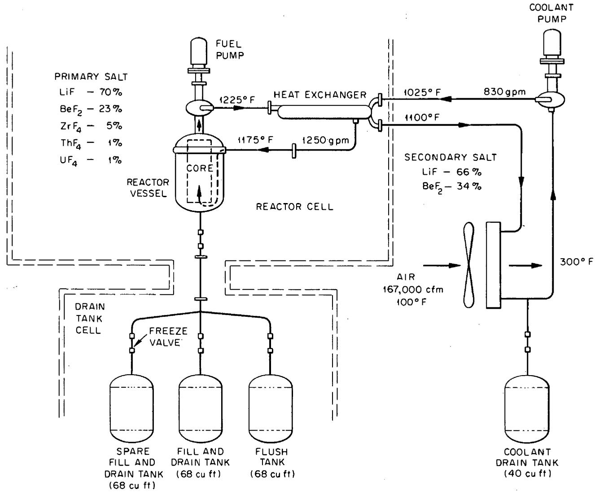  
Fig.1. Flow Diagram of Heat Transfer System.

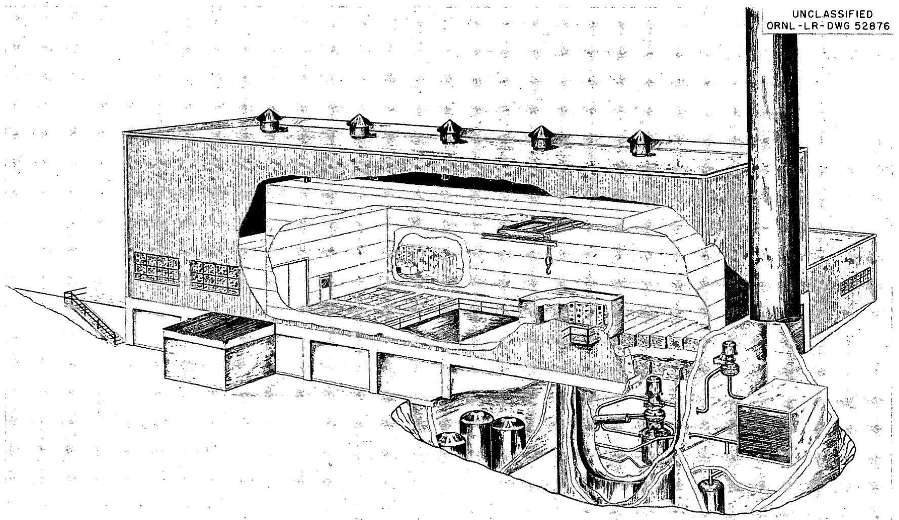  
Fig. 2. Artist's Impression of MSRE Arrangement.

Under normal steady operating conditions the reactor is self-controlling, as a result of the negative temperature coefficients of reactivity of the fuel and the graphite moderator. The temperature coefficient of $-3 \times 10^{-5} (\Delta \mathrm{k} / \mathrm{k}) / {}^{\circ} \mathrm{F}$ of the fuel provides for fast control. The total temperature coefficient is $-9 \times 10^{-5} (\Delta \mathrm{k} / \mathrm{k}) / {}^{\circ} \mathrm{F}$ , and this coupled with the small amount of excess reactivity loaded into the reactor provides the margin of safety against nuclear excursions to excessively high temperatures. Nuclear control devices are provided primarily to hold the reactor subcritical below $1000^{\circ} \mathrm{F}$ during startup, to compensate for some fission product poisoning and burnup, and to keep the critical temperature below $1300^{\circ} \mathrm{F}$ during abnormal periods of operation. The reactor power is controlled by regulating the rate of heat removal. The nuclear reaction can be stopped by the control devices and the system can be shut down completely by draining the fuel.

Fuel addition in large amounts for the complete loadings will take place in the fuel drain tank. Subsequent additions to compensate for burnup and fission-product poisoning will be made through a sampling and enriching system communicating with the gas space in the pump bowl.

The system components are of all-welded construction. Components in the reactor fuel system are connected to the piping by specially developed freeze flanges which utilize frozen salt as a sealant for the high-temperature fluid fuel. Brazed connections are planned for the radioactive auxiliary systems. The use of these joints makes possible remote maintenance of the system following power operation. Except for flanged connections to the primary heat exchanger, the coolant system is of all-welded construction and can be maintained directly within a few minutes after shutdown.

No valves of the ordinary type are used in contact with the fuel or coolant salts. Flow is prevented by freezing salt in designated sections of pipe. The freeze valves can be thawed in a few minutes and are the best choice for drain valves.

# 2.2 Fuel and Materials

Fuel for the MSRE is a solution of $\mathbf{U}^{235}\mathbf{F}_4$ , $\mathbf{ThF}_4$ , and $\mathbf{ZrF}_4$ in an Li $^7$ F-BeF $_2$ carrier salt. The composition and properties of the fuel are

listed in Table 1. Li $^7$ F is a salt of good fluid-flow and heat-transfer properties and low neutron cross section. Low melting points are obtained in mixtures with $\mathrm{BeF}_2$ . $U^{235}\mathrm{F}_4$ is the primary fuel constituent; $\mathrm{ThF}_4$ is present as a fertile material. The fuel is representative of the core fuel for a two-region breeder or a one-region $U^{235}$ burner reactor.

Table 1. Composition and Properties of Fuel and Coolant for MSRE   

<table><tr><td></td><td>Fuel Salt</td><td>Coolant Salt</td></tr><tr><td>Composition, mole %</td><td></td><td></td></tr><tr><td>LiF (99.97% Li7)</td><td>70</td><td>66</td></tr><tr><td>BeF2</td><td>23</td><td>34</td></tr><tr><td>ZrF4</td><td>5</td><td></td></tr><tr><td>ThF4</td><td>1</td><td></td></tr><tr><td>UF4</td><td>~1</td><td></td></tr><tr><td>Physical properties</td><td></td><td></td></tr><tr><td>Temperature, °F</td><td>1200</td><td>1062</td></tr><tr><td>Density, lb/ft3</td><td>154.3</td><td>120.5</td></tr><tr><td>Viscosity, lb/ft-hr</td><td>17.9</td><td>20.0</td></tr><tr><td>Specific heat, Btu/lb-°F</td><td>0.46</td><td>0.57</td></tr><tr><td>Thermal conductivity, Btu/hr-ft2(°F/ft)</td><td>2.75</td><td>3.5</td></tr><tr><td>Liquidus temperature, °F</td><td>828 ± 5</td><td>847 ± 5</td></tr></table>

Oxygen as $\mathrm{O}_2$ or in CO, $\mathrm{H}_2\mathrm{O}$ , and other compounds reacts with the four-component mixture to precipitate $\mathrm{UO}_2$ ; however, if $\mathrm{ZrF}_4$ is present in an amount such that $\mathrm{Zr/U} \sim 3/1$ , only $\mathrm{ZrO}_2$ is precipitated by reaction with oxygen-containing materials. During handling and while in the reactor, the fuel must be blanketed by an inert cover gas such as helium, to prevent contamination by gases and vapors containing oxygen.

The coolant salt is an $\mathsf{Li}^{\mathsf{T}}\mathsf{F}\text{-BeF}_2$ mixture of composition and properties as shown in Table 1. The same general considerations that apply to handling of the fuel also apply to the coolant.

The principal material of construction for the reactor systems is INOR-8, a nickel-molybdenum-chromium alloy developed at ORNL for use with fluoride salts at high temperature. The composition and properties of

INOR-8 are shown in Table 2. When the material is attacked, chromium is leached from the alloy, resulting in the formation of subsurface voids. Under most circumstances the rate of attack is governed by the rate of diffusion of chromium in the alloy. Measured rates of attack in typical fuel and coolant salts have been less than $1\text{mpy}$ at temperatures to at least $1300^{\circ}\text{F}$ .

Table 2. Composition and Properties of INOR-8   
I. Chemical Composition   

<table><tr><td>Element</td><td>%</td><td>Element</td><td>%</td></tr><tr><td>Ni, min.</td><td>Bal. (~66 - 71)</td><td>Mn, max.</td><td>0.80</td></tr><tr><td>Mo, max.</td><td>15.0 - 18.0</td><td>Si, max.</td><td>0.50</td></tr><tr><td>Cr</td><td>6.0 - 8.0</td><td>Cu, max.</td><td>0.35</td></tr><tr><td>Fe, max.</td><td>5.0</td><td>B, max.</td><td>0.010</td></tr><tr><td>C</td><td>0.04 - 0.08</td><td>W, max.</td><td>0.50</td></tr><tr><td>Ti + Al, max.</td><td>0.50</td><td>P, max.</td><td>0.010</td></tr><tr><td>S, max.</td><td>0.015</td><td>Co, max.</td><td>0.20</td></tr></table>

II. Physical Properties   

<table><tr><td colspan="2">Density, g/cc
1b/in.3</td><td>8.79
0.317</td><td></td></tr><tr><td colspan="2">Melting point, °F</td><td>2370 - 2430</td><td></td></tr><tr><td colspan="2">Thermal conductivity, Btu/hr-ft2(°F/ft)</td><td></td><td></td></tr><tr><td colspan="2">At 1112°F</td><td>12.20</td><td></td></tr><tr><td colspan="2">1292°F</td><td>13.01</td><td></td></tr><tr><td colspan="2">Modulus of elasticity, psi</td><td></td><td></td></tr><tr><td colspan="2">At 1170°F</td><td>26.2 x 106</td><td></td></tr><tr><td colspan="2">1290°F</td><td>24.8 x 106</td><td></td></tr><tr><td colspan="2">Specific heat (est.), Btu/lb-°F</td><td>0.095 at 212°F</td><td></td></tr><tr><td colspan="2">Mean coeff. of thermal expansion</td><td></td><td></td></tr><tr><td>°F
70-1200</td><td>in./in. /°F
7.81 x 10-6</td><td>ΔT(°F)
1130</td><td>ΔL/L (in./in.)
8.82 x 10-3</td></tr></table>

III. Mechanical Properties   

<table><tr><td>Temp. (°F)</td><td>1/4 Min. Spec. Tensile Strength (psi)</td><td>2/3 Min. Spec. Yield Strength (psi)</td><td>4/5 Rup. Str. for 10^5 hr (psi)</td><td>Stress for 0.1 CRU (psi)</td><td>Max. Allow. Stress (psi)</td></tr><tr><td>1200</td><td>17,100</td><td>16,800</td><td>8,300</td><td>7,400</td><td>4,950</td></tr><tr><td>1250</td><td>16,100</td><td>16,600</td><td>6,200</td><td>5,400</td><td>3,600</td></tr><tr><td>1300</td><td>15,000</td><td>16,400</td><td>4,800</td><td>4,100</td><td>2,750</td></tr><tr><td>1350</td><td>13,800</td><td>16,300</td><td>3,600</td><td>3,100</td><td>2,050</td></tr></table>

Although the salt has moderating properties, use of a separate moderator has the advantage of reducing the inventory of fuel in the reactor and provides for better neutron economy in a breeder. Unclad graphite is compatible with salt at high temperature both in and out of radiation and is the preferred moderator. The properties of a graphite that satisfies the requirements of the MSRE are listed in Table 3.

Table 3. Properties of MSRE Core Graphite   

<table><tr><td colspan="2">Physical properties</td></tr><tr><td>Bulk density, g/cc</td><td>1.87 - 1.89</td></tr><tr><td>Porosity</td><td></td></tr><tr><td>accessible, %</td><td>~ 7</td></tr><tr><td>inaccessible, %</td><td>~ 8.9</td></tr><tr><td>total, %</td><td>~ 15.9</td></tr><tr><td>Thermal conductivity, at ambient temp, unirradiated, Btu/hr-ft2(°F/ft)</td><td></td></tr><tr><td>parallel with grain</td><td>70</td></tr><tr><td>normal to grain</td><td>60</td></tr><tr><td>Temperature coefficient of linear expansion, °F-1</td><td></td></tr><tr><td>parallel with grain</td><td>1.3 x 10-6</td></tr><tr><td>normal to grain</td><td>1.6 x 10-6</td></tr><tr><td>Matrix coefficient of permeability to helium at 70°F, cm2/sec</td><td>1 x 10-4 - 1 x 10-5</td></tr><tr><td>Absorption of salt at 150 psig, vol %</td><td>0.50</td></tr><tr><td>Average specific heat at 1200°F, Btu/lb-°F</td><td>0.42</td></tr><tr><td colspan="2">Mechanical strength properties</td></tr><tr><td>Tensile strength, psi</td><td>1500 - 2400</td></tr><tr><td>Flexural strength, psi</td><td>2000 - 3500</td></tr><tr><td>Compressive strength, psi</td><td>8600</td></tr><tr><td>Modulus of elasticity</td><td></td></tr><tr><td>parallel with grain, psi</td><td>1.9 x 106</td></tr><tr><td>normal to grain, psi</td><td>1.5 x 106</td></tr></table>

# 2.3 Reactor Vessel

The reactor consists of a cylindrical vessel approximately 5 ft in diameter and 7-1/2 ft high with an inner cylinder which forms the inner wall of the shell-cooling annulus and serves to support the graphite matrix with its positioning and supporting members and flow-regulating orifices. Figure 3 is an assembly drawing of the reactor vessel and core. Fluid enters the vessel at the top of the cylindrical section and flows downward in a spiral path along the wall. With the design flow of 1250 gpm in the l-in. annulus, the Reynolds modulus is 22,000. At the estimated heat generation rate of $0.2\mathrm{w/cm}^3$ in the wall, 23 kw of heat is removed while maintaining the wall temperature at less than $5^{\circ}\mathrm{F}$ above the bulk fluid temperature.

The fuel loses its rotational motion in the lower plenum and then flows upward through the graphite core matrix, which constitutes about $77.5\%$ of the core volume. The moderator matrix is constructed of 2- by 2- by 63-in. stringers of graphite which are loosely pinned to restraining beams at the bottom of the core. Molybdenum bands at the top and center of the assembly restrain the bowing induced by the radial neutron flux gradient.

Flow passages in the matrix are 0.400- by 1.20-in. rectangular channels machined in the faces of the stringers. A typical arrangement of graphite stringers is shown in Fig. 4. Flow through the core is laminar, but because of the good thermal properties of the graphite and fuel, the graphite temperature at the midpoint is only $40^{\circ}\mathrm{F}$ above the fuel mixed-mean temperature at the center of the core.

Provision is made for remote removal and replacement of five stringers at the center of the core. They will be examined periodically to determine whether the graphite deteriorates with increasing exposure time. An INOR-8 piece is installed in the top dished head to displace fuel and to provide a part of the shielding for equipment above the reactor.

Design data for the reactor vessel are detailed in Table 4.

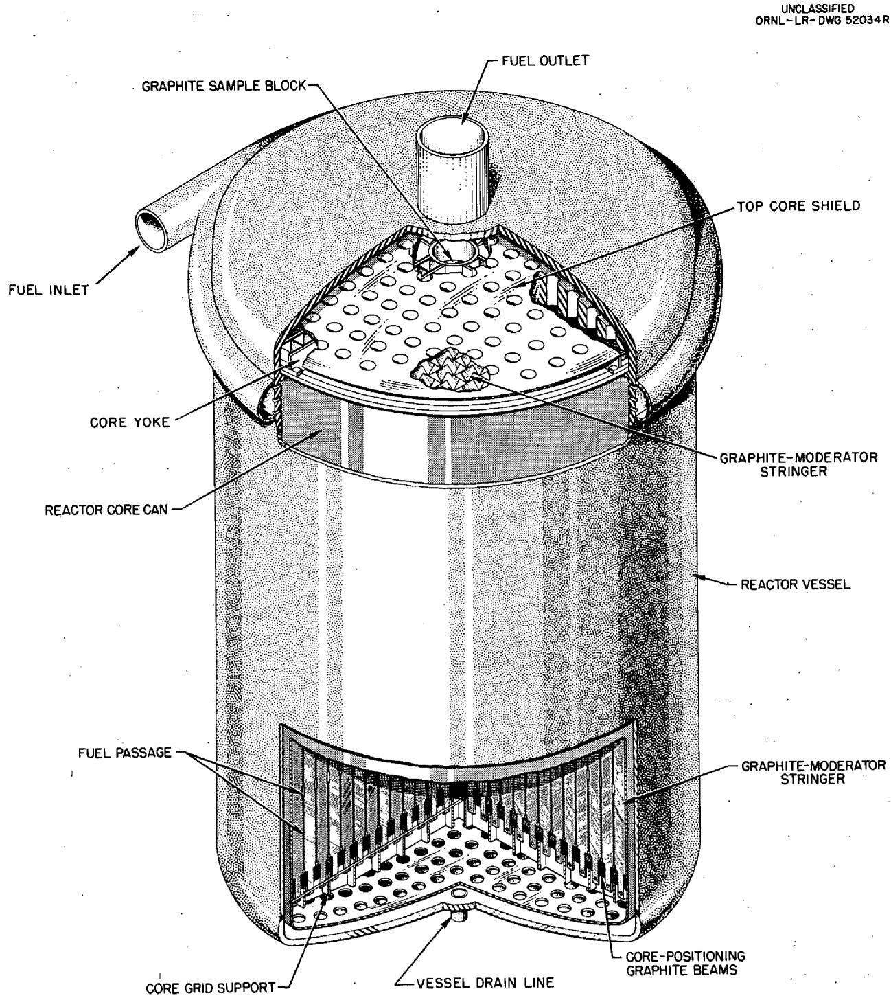  
Fig. 3. Reactor-Vessel Assembly.

UNCLASSIFIED ORNL-LR-DWG 56874

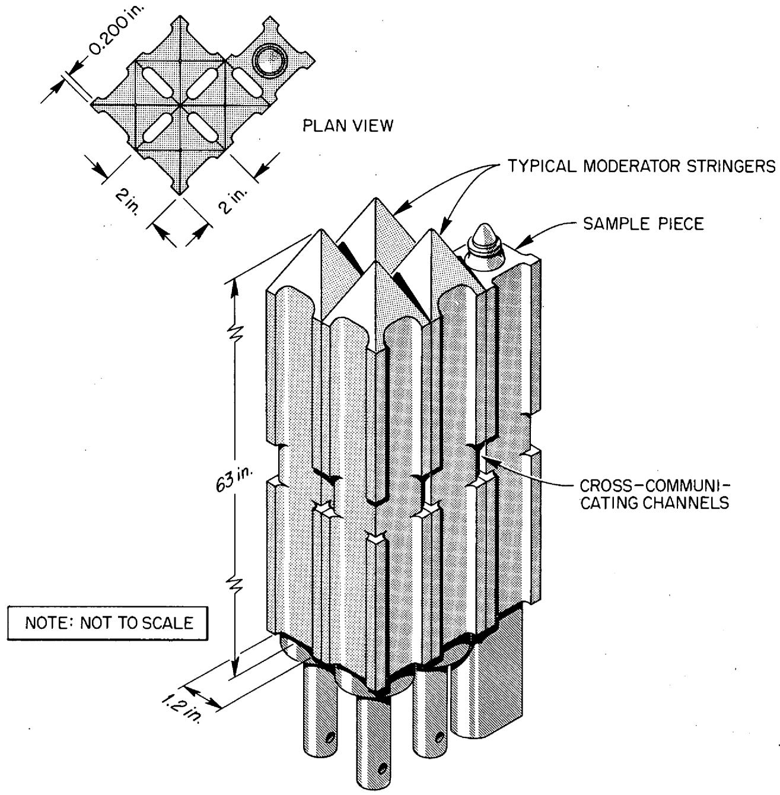  
Fig. 4. Typical Graphite Stringer Arrangement.

Table 4. Reactor-Vessel Design Data   

<table><tr><td>Structural material</td><td>INOR-8</td></tr><tr><td>Core vessel</td><td></td></tr><tr><td>OD</td><td>59-1/8 in.</td></tr><tr><td>ID</td><td>58 in.</td></tr><tr><td>Wall thickness</td><td>9/16 in.</td></tr><tr><td>Design pressure</td><td>50 psi</td></tr><tr><td>Design temperature</td><td>1300°F</td></tr><tr><td>Fuel inlet temperature</td><td>1175°F</td></tr><tr><td>Fuel outlet temperature</td><td>1225°F</td></tr><tr><td>Inlet</td><td>Constant-area distributor</td></tr><tr><td>Annulus ID</td><td>56 in.</td></tr><tr><td>Annulus OD</td><td>58 in.</td></tr><tr><td>Over-all height of core tank</td><td>94 in.</td></tr><tr><td>Head thickness</td><td>1 in.</td></tr><tr><td>Inlet pipe</td><td>6-in.-OD tubing, 0.205-in. wall</td></tr><tr><td>Outlet pipe</td><td>8-in. sched-40 pipe</td></tr><tr><td>Core container</td><td></td></tr><tr><td>ID</td><td>55-1/2 in.</td></tr><tr><td>OD</td><td>56 in.</td></tr><tr><td>Wall thickness</td><td>1/4 in.</td></tr><tr><td>Height</td><td>68-1/2 in.</td></tr><tr><td>Graphite core</td><td></td></tr><tr><td>Diameter</td><td>55-1/4 in.</td></tr><tr><td>Core stringer</td><td>2 x 2 x 63 in.</td></tr><tr><td>Number of fuel channels</td><td>1064</td></tr><tr><td>Fuel-channel size</td><td>1.2 x 0.4 in.</td></tr><tr><td>Effective core length</td><td>~ 65 in.</td></tr><tr><td>Fractional fuel volume</td><td>0.225</td></tr></table>

# 2.4 Reactor and Coolant-System Pumps

The fuel circulation pump is a sump-type centrifugal pump with a vertical shaft and an overhung impeller. It has a 75-hp motor and is capable of circulating $1450\mathrm{gpm}$ of salt against a head of $\sim 50$ ft. Figure 5 is a drawing of the pump, and design data are presented in Table 5.

The pump assembly consists of motor and housing, bearing shaft and impeller assembly, and sump tank. The sump tank is welded into the reactor system piping and serves as the expansion tank for the fuel and as a place for the separation of gaseous fission products. The bearing housing is flanged to the sump tank so that the rotating parts can be removed and replaced. The motor is loosely coupled to the pump shaft, and the motor housing is flanged to the upper end of the bearing housing to permit separate removal of the motor.

The pump is equipped with ball bearings which are lubricated and cooled with oil circulated by an external pumping system. The oil is confined to the bearing housing by mechanical shaft seals. Helium is circulated into a labyrinth between the lower bearing and the sump tank. Part of the gas passes through the lower seal chamber to remove oil vapors which leak through the seal. The remainder flows downward along the shaft to prevent radioactive gas from reaching the oil chamber.

Massive metal sections are incorporated in the pump assembly as shielding for the lubricant and the motor. The motor is enclosed and sealed to prevent the escape of radioactive gas or fluids which might leak through the pump assembly under unusual conditions. Water cooling coils are attached to the housing to remove heat generated by the motor.

A similar pump is provided for the coolant system except that fewer provisions are required for protection against radiation. The pump is driven by a 125-hp motor and is designed to circulate 850 gpm of salt against a head of 100 ft of fluid. The complete design data for the coolant pump are included in Table 5.

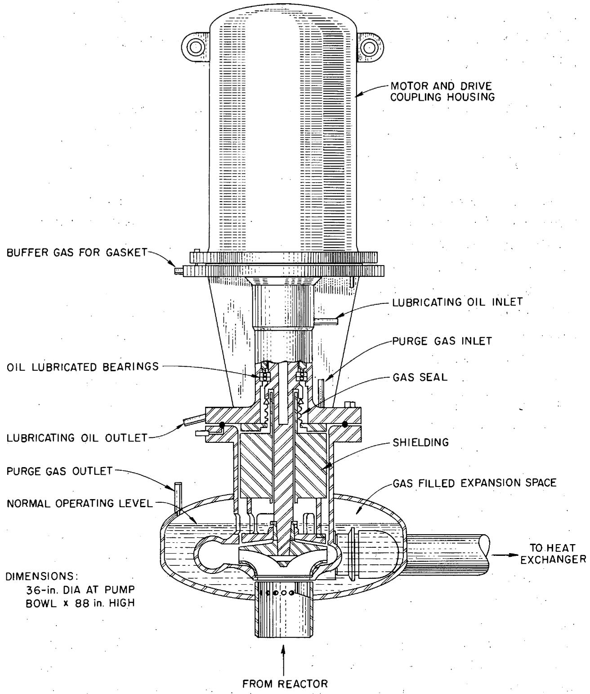  
UNCLASSIFIED ORNL-LR-DWG 56876   
Fig. 5. Fuel Circulation Pump.

Table 5. Design Data for Fuel and Coolant Pumps   

<table><tr><td></td><td>Fuel Pump</td><td>Coolant Pump</td></tr><tr><td>Flow, gpm</td><td>1200 - 1450</td><td>850</td></tr><tr><td>Head, ft</td><td>50 ± 5 at 1450 gpm</td><td>100</td></tr><tr><td>Motor horsepower, hp</td><td>75</td><td>125.</td></tr><tr><td>Pump speed, rpm</td><td>1150</td><td>1750</td></tr><tr><td>Intake</td><td>8-in. sched-40 pipe</td><td>6-in.-OD tubing, 0.205-in. wall</td></tr><tr><td>Discharge</td><td>6-in.-OD tubing, 0.205-in. wall</td><td>5-in.-OD tubing, 0.165-in. wall</td></tr><tr><td>Sump-tank volume,* ft3</td><td>5.2</td><td>4.8</td></tr><tr><td>Normal salt volume, ft3</td><td>2.61</td><td>2.4</td></tr><tr><td>Expansion volume,** ft3</td><td>1.83</td><td>1.6</td></tr><tr><td>Sump tank</td><td></td><td></td></tr><tr><td>Outside diameter, in.</td><td>36</td><td>36</td></tr><tr><td>Height, in.</td><td>15</td><td>14</td></tr><tr><td>Over-all assembly height, ft</td><td>7-3/4</td><td>7-1/3</td></tr><tr><td>Structural material</td><td>INOR-8</td><td>INOR-8</td></tr></table>

*Not including volute.   
\*\*Normal to maximum.

# 2.5 Primary Heat Exchanger

The primary heat exchanger (Fig. 6) contains 165 tubes (1/2-in. OD, 0.045-in. wall, 13 ft long) and is designed to transfer 10 Mw from fuel salt (in the shell) to coolant salt (in the tubes). The design is a conventional cross-baffled shell-and-tube configuration with emphasis placed on ruggedness and reliability rather than high heat-transfer performance. Design data are listed in Table 6.

Space limitations in the reactor cell require a short unit. The U-tube configuration makes this possible without greatly reducing the efficiency of heat transfer as compared to a straight counter-flow unit and eliminates a thermal expansion problem. The tubes are welded and back-brazed to the tube sheet in order to greatly reduce the probability of leakage between the fuel and coolant.

UNCLASSIFIED

ORNL-LR-DWG 52036

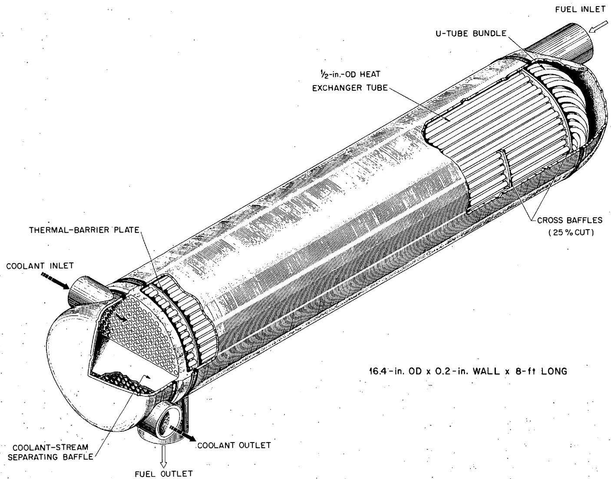  
Fig. 6. Primary Heat Exchanger for MSRE.

Table 6. Design Data for Primary Heat Exchanger   

<table><tr><td>Structural material</td><td>INOR-8</td></tr><tr><td>Heat load</td><td>10 Mw</td></tr><tr><td>Shell-side fluid</td><td>Fuel salt</td></tr><tr><td>Tube-side fluid</td><td>Coolant salt</td></tr><tr><td>Layout</td><td>25% cut, cross-baffled and U-tubes</td></tr><tr><td>Baffle pitch</td><td>12 in.</td></tr><tr><td>Tube pitch</td><td>0.775 in., triangular</td></tr><tr><td>Active heat-transfer length of shell</td><td>6 ft</td></tr><tr><td>Over-all length</td><td>8 ft</td></tr><tr><td>Nozzles</td><td></td></tr><tr><td>Shell side</td><td>6-in.-OD tubing, 0.205-in. wall</td></tr><tr><td>Tube side</td><td>5-in.-OD tubing, 0.165-in. wall</td></tr><tr><td>Shell diameter</td><td>16 in. ID</td></tr><tr><td>Shell thickness</td><td>1/5 in.</td></tr><tr><td>Tube-sheet thickness</td><td>1-1/2 in.</td></tr><tr><td>Number of tubes</td><td>165</td></tr><tr><td>Tube size</td><td>1/2-in. OD, 0.045-in. wall</td></tr><tr><td>Tube length</td><td>13 ft</td></tr><tr><td>Heat-transfer surface area</td><td>259 ft2</td></tr><tr><td>Fuel holdup</td><td>~ 5.5 ft3</td></tr><tr><td>Design temperature</td><td></td></tr><tr><td>Shell side</td><td>1300°F</td></tr><tr><td>Tube side</td><td>1300°F</td></tr><tr><td>Design pressure</td><td></td></tr><tr><td>Shell side</td><td>50 psi</td></tr><tr><td>Tube side</td><td>75 psi</td></tr><tr><td>Terminal temperatures at design point</td><td></td></tr><tr><td>Fuel salt</td><td>Inlet 1225°F; outlet 1175°F</td></tr><tr><td>Coolant salt</td><td>Inlet 1025°F; outlet 1100°F</td></tr><tr><td>Effective log mean temperature difference</td><td>133°F</td></tr></table>

# 2.6 Salt-to-Air Radiator

The thermal energy of the reactor is rejected to the atmosphere by means of a salt-to-air radiator. The radiator contains 120 tubes (3/4-in. OD, 0.072-in. wall, 33 ft long) and is assembled as shown in Fig. 7. Design data are listed in Table 7.

Several features were incorporated in the design as protection against freezing of coolant salt in the radiator:

1. Tubes are of large diameter.   
2. The heat-removal rate per unit area is kept low by using tubes without fins so that most of the temperature drop is in the air film.   
3. The minimum salt temperature is kept $75^{\circ}\mathrm{F}$ above the freezing point.   
4. The headering system is designed to assure even flow distribution between the tubes.   
5. In the event of flow stoppage, doors on the radiator housing close within 30 sec, and heaters are turned on to prevent the salt from freezing.

The layout of the tube matrix will allow movement of the tubes with minimum restraint during thermal expansion. The tubes are pitched to promote drainage.

The radiator is supported and retained in a structural steel frame which is completely enclosed and insulated. Reflective shields protect structural members from excessive temperatures. The frame also provides guides for the vertically sliding doors which are closed to thermally isolate the radiator, should any situation develop which could cause salt freezing in the radiator tubes.

Two doors are employed, one each upstream and downstream; and they are raised and lowered at a speed of 7 ft/min during normal operation by a gear-reduced motor driving an overhead line shaft. The doors are suspended from roller chains which run over sprockets mounted on the lineshaft. The enclosure is capable of sustaining full blower pressure in any position, and may be used to vernier air flow across the radiator as a control on the reactor load.

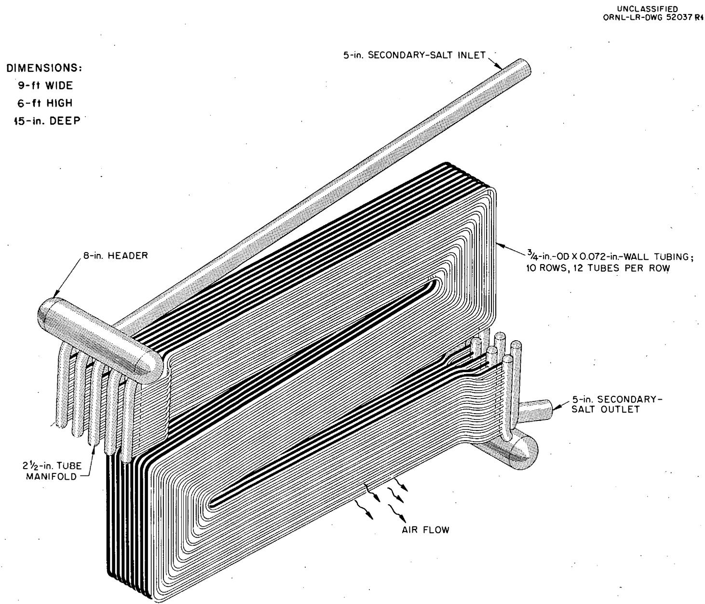  
Fig. 7. Salt-to Air Radiator.

Emergency closure is effected by de-energizing a magnetic clutch between the motor and the line shaft or, alternatively, by de-energizing magnets used to attach the roller chain to the door. Shock-absorbing means are provided. Emergency closure is not contingent on door position.

Table 7. Design Data for Salt-to-Air Radiator   

<table><tr><td>Structural material</td><td>INOR-8</td></tr><tr><td>Duty</td><td>10 Mw</td></tr><tr><td>Temperature differentials</td><td></td></tr><tr><td>Salt</td><td>Inlet 1100°F; outlet 1025°F</td></tr><tr><td>Air</td><td>Inlet 100°F; outlet 300°F</td></tr><tr><td>Air flow</td><td>164,000 cfm at 15 in. H2O</td></tr><tr><td>Salt flow</td><td>830 gpm at avg. temperature</td></tr><tr><td>Effective mean ΔT</td><td>920°F</td></tr><tr><td>Over-all coefficient of heat transfer</td><td>53 Btu/ft2-hr-°F</td></tr><tr><td>Heat-transfer surface area</td><td>685 ft2</td></tr><tr><td>Design temperature</td><td>1300°F</td></tr><tr><td>Design pressure</td><td>75 psi</td></tr><tr><td>Tube diameter</td><td>0.750 in.</td></tr><tr><td>Wall thickness</td><td>0.072 in.</td></tr><tr><td>Tube matrix</td><td>12 tubes per row; 10 rows deep</td></tr><tr><td>Tube spacing</td><td>1-l/2 in., triangular</td></tr><tr><td>Subheaders</td><td>2-l/2 in., IPS</td></tr><tr><td>Main headers</td><td>8 in., IPS</td></tr><tr><td>Air-side ΔP</td><td>11.6 in. H2O</td></tr><tr><td>Salt-side ΔP</td><td>6.5 psi</td></tr></table>

# 2.7 Drain and Storage Tanks

Five tanks are provided for safe storage of salt mixtures when they are not in use in the reactor and coolant systems. They are: two fuel drain tanks, a flush-salt tank, a fuel- and flush-salt storage tank, and a coolant drain tank.

# 2.7.1 Fuel Drain Tanks

The fuel drain tanks have the important function of subcritical storage of the fuel and must have means for removing decay heat and for maintaining salts molten when the internal heat generation rate is low. Two tanks of the design shown in Fig. 8 are provided, each of $67\mathrm{ft}^3$ capacity. Each tank can hold an entire fuel charge; so one is for normal use and the other is a spare. The low moderating power of the salt makes criticality impossible even with nearly double the planned U235 loading.

After long-term operation at 10 Mw, sudden draining of the fuel requires that it be cooled at a rate of 100 kw to prevent excessive fuel temperatures. Evaporative cooling was chosen over gas or other means on the basis of simplicity and independence of utilities. Heat is removed by 40 bayonet cooling tubes (Fig. 9) inserted in thimbles in the tank. Water is fed through the center tube, and steam is generated in the surrounding annulus. Heat is transferred from the thimble to the cooling tube through a gas-filled annulus by radiation and conduction. Normally the steam is condensed by a water-cooled condenser, but it can be exhausted to the stack in the event of failure of the coolant supply. A 300-gal feed-water reserve can provide cooling for 6 hr.

The drain tanks are insulated and are provided with electrical heaters. They have dip-tube fill and drain lines and gas connections for maintaining a helium blanket for venting and for pressurizing to transfer the salt. Design data for the drain tanks are presented in Table 8.

# 2.7.2. Flush-Salt Tank

A salt of composition similar to the fuel salt but without thorium or uranium is used to flush the reactor system to remove possible chemical contaminants and to aid in preheating before the fuel is charged. During shutdown it can be used to remove residual fuel after the primary system has been drained but before the piping is opened for maintenance. The flush salt is stored in a tank (see Table 8) similar to the fuel drain tank, but without cooling tubes.

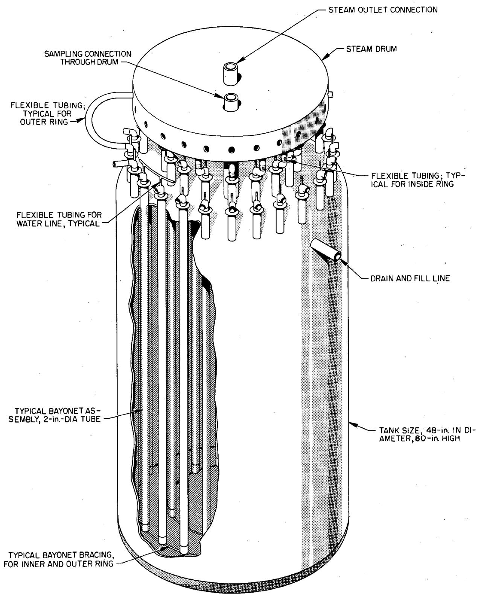  
Fig. 8. Primary Drain and Fill Tank.

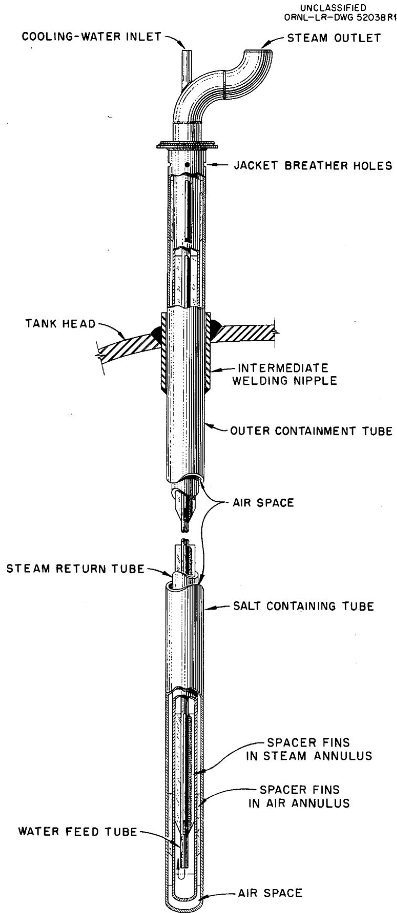  
Fig. 9. Cooling Thimble for Primary-Salt Drain Tanks.

Table 8. Design Data for Fuel Drain Tank, Coolant Drain Tank, and Flush-Salt Tank   

<table><tr><td>Fuel drain tank</td><td>INOR-8</td></tr><tr><td>Height</td><td>81-1/2 in. (without coolant headers)</td></tr><tr><td>Diameter</td><td>48 in.</td></tr><tr><td>Volume</td><td></td></tr><tr><td>Total</td><td>67.6 ft3</td></tr><tr><td>Fuel (normal)</td><td>~60 ft3</td></tr><tr><td>Gas blanket (normal)</td><td>~8 ft3</td></tr><tr><td>Wall thickness</td><td></td></tr><tr><td>Vessel</td><td>1/2 in.</td></tr><tr><td>Dished head</td><td>3/4 in.</td></tr><tr><td>Design temperature</td><td>1300°F</td></tr><tr><td>Design pressure</td><td>50 psi</td></tr><tr><td>Cooling method</td><td>Boiling water in double-walled thimbles</td></tr><tr><td>Cooling rate</td><td>100 kw</td></tr><tr><td>Coolant thimbles</td><td></td></tr><tr><td>Number</td><td>40</td></tr><tr><td>Diameter</td><td>2 in. OD</td></tr><tr><td>Coolant drain tank</td><td>INOR-8</td></tr><tr><td>Height</td><td>76 in.</td></tr><tr><td>Diameter</td><td>36 in.</td></tr><tr><td>Volume</td><td></td></tr><tr><td>Total</td><td>39.5 ft3</td></tr><tr><td>Coolant salt</td><td>~34 ft3</td></tr><tr><td>Gas blanket</td><td>~6 ft3</td></tr><tr><td>Wall thickness</td><td></td></tr><tr><td>Vessel</td><td>3/8 in.</td></tr><tr><td>Dished head</td><td>5/8 in.</td></tr><tr><td>Design temperature</td><td>1300°F</td></tr><tr><td>Design pressure</td><td>50 psi</td></tr><tr><td>Cooling method</td><td>None</td></tr><tr><td>Flush-salt tank</td><td>INOR-8</td></tr><tr><td>Height</td><td>76-1/4 in.</td></tr><tr><td>Diameter</td><td>48 in.</td></tr><tr><td>Volume</td><td></td></tr><tr><td>Total</td><td>67.1 ft3</td></tr><tr><td>Flush salt</td><td>~59 ft3</td></tr><tr><td>Gas blanket</td><td>~8 ft3</td></tr><tr><td>Wall thickness</td><td></td></tr><tr><td>Vessel</td><td>1/2 in.</td></tr><tr><td>Dished head</td><td>3/4 in.</td></tr><tr><td>Design temperature</td><td>1300°F</td></tr><tr><td>Design pressure</td><td>50 psi</td></tr><tr><td>Cooling method</td><td>None</td></tr></table>

# 2.7.3 Coolant Drain Tank

A tank (see Table 8) of $40\text{-ft}^3$ capacity and similar to the drain tanks but without cooling tubes is provided for the coolant salt.

# 2.7.4 Storage Tank

Occasionally it will be necessary to remove the fuel charge from the reactor for reprocessing and to add a fresh charge. A separate storage tank of $67\text{-ft}^3$ capacity is provided for storing used fuel while it is being removed in small batches to a reprocessing plant and for accumulating small batches of new fuel until it can be charged to one of the drain tanks.

The storage tank is like the fuel drain tanks except that it has no cooling tubes and therefore cannot accept salt from the reactor until the afterheat has decayed for about two weeks. The tank is equipped with lines for transferring salt to the fuel drain and flush tanks and to equipment provided for loading and unloading carriers.

# 2.8 Cover-Gas System

Because the fuel salt is sensitive to oxygen, it must be protected by an oxygen- and moisture-free cover gas at all times. The principal

functions of the cover-gas system are to supply an inert gas for blank-keting. the salt and for the pressure transfer of salt between components, to provide a means for disposing of radioactive gas, and to provide a higher gas pressure in the coolant system than in the fuel system. A simplified flow diagram of the system is presented in Fig. 10.

The cover gas is helium supplied in cylinders at 2400 psig. It is purified by passage through filters, dryers, and oxygen traps (possibly titanium, zirconium, or uranium chips at high temperature). Purified gas is then sent to two distribution systems. The total flow is about 10,500 liters/day (STP), and it is distributed at about 50 psig.

The largest flow of gas is directed to treated-helium storage tanks and then to the primary distribution system, which supplies purge for the fuel circulation pump, the freeze-flange buffer zones, and the fuel drain tanks, where it is in direct contact with the fuel salt. Gas which passes through the fuel pump is circulated through a series of pipes where it is held and cooled for at least 2 hr to dissipate heat from the decay of short-lived fission products. Then it passes through a charcoal bed where xenon and krypton respectively are retained for at least 72 and 8 days, and through a filter and blower to the off-gas stack. There it is mixed with a flow of 20,000 cfm of air which provides dilution of 1:15,000. The charcoal bed is a series of pipes packed with activated carbon. It and a spare bed are mounted vertically in a sealed, water-filled secondary container; either or both beds may be used.

Fuel-salt transfers require more rapid venting of gas, but the heat load is low. A third charcoal bed is provided for venting those gases before they are sent to the stack. Fig. 11 is the off-gas disposal flow-sheet.

Although not included in the initial installation, provision will be made for recirculation of gases from the outlet of the carbon bed through a purification system and into treated-gas storage tanks.

The cover-gas distribution for the coolant system (also shown on Fig. 10) supplies a small flow of helium to the coolant system, the sampler-enricher system, and to the fuel-pump motor. That equipment must be supplied with nonradioactive gas and will not normally be contaminated by gaseous fission products. Gas from the coolant system is

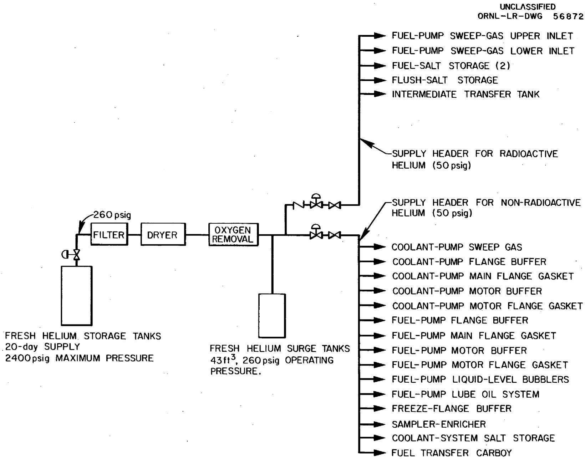  
Fig. 10. Cover-Gas Supply

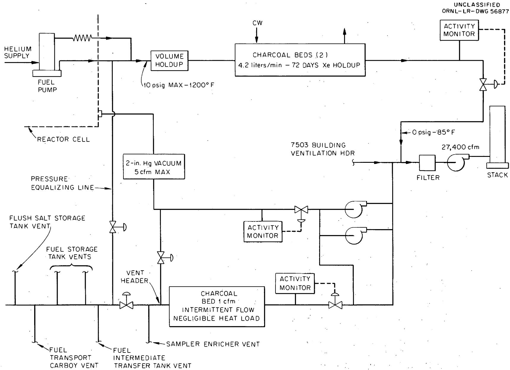  
Fig.11. Fuel-System Off-Gas Disposal.

vented directly through filters to the off-gas stack as indicated on Fig. 12. Monitors will stop the flow to the stack on indication of high activity.

# 2.9 Freeze Valves

The molten salt in both the fuel and coolant circuits will be sealed off from the respective drain tanks by means of freeze valves in the drain lines. These valves (Fig. 13) are simply short, flattened sections of pipe which are cooled to freeze the salt in that section. Calrod heaters surround each valve so that the salt can be thawed quickly, when necessary, to drain the system. The salt can also be thawed slowly without the heaters by stopping the cooling. The valves are mounted with traps on both sides so that salt cannot be blown out of the line. The fill and discharge lines for the fuel and the flush-salt tanks are manifolded together and are connected to an outer storage tank. There is a freeze valve in each line.

# 2.10 Sampler Mechanism

Small quantities of fuel can be added or removed by means of the sampler mechanism which is connected to the fuel-pump bowl. A special container located outside the containment vessel above the pump elevation encloses the working parts. A cable assembly with a reel is used to lower a small bucket into the salt pool in the pump bowl. Fuel samples can be removed for analysis, and new fuel can be added in small (less than $120\mathrm{g}$ ) quantities to compensate for burnup.

Since this operation purposely breaches the secondary and primary containers, it is extremely important that substitute protection be provided. This is accomplished by building a special solder-seal disconnect and two isolated compartments into the sampler, with protection against both being open at the same time. Furthermore, the sampler enclosure is ventilated to the charcoal-filter system. With these mechanical devices and with special attention being given to operating procedures, it is believed that the sampling operation can be handled with complete safety.

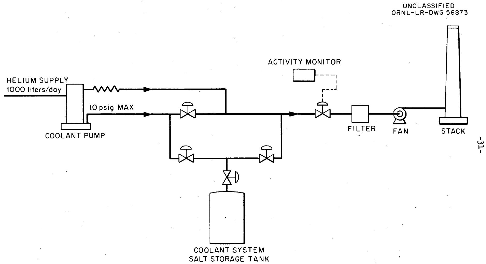  
Fig.12 Coolant-System Off-Gas Disposal.

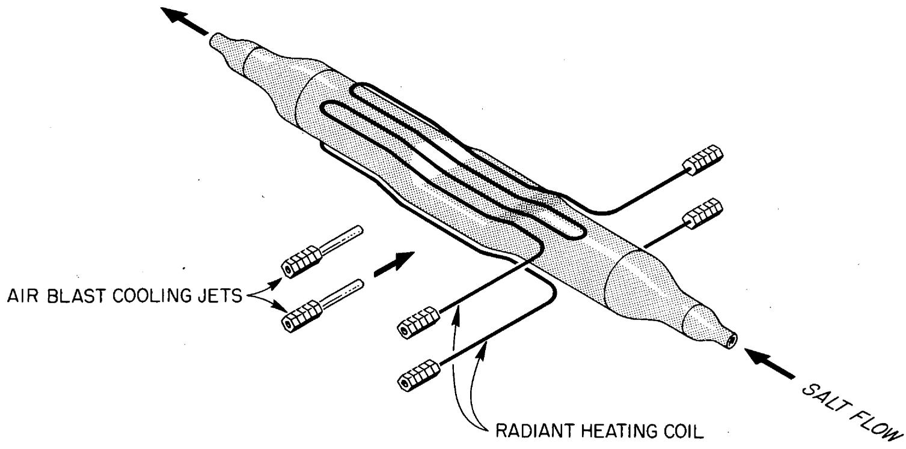  
Fig.13. Radiant Heat Freeze Valve.

# 2.11 Nonnuclear Heating

External heating of salt-bearing components of the reactor system is necessary:

1. to prevent freezing of the salts,   
2. to raise the reactor temperature to a subcritical value for experimental convenience,   
3. to heat the salts for reactor startup.

Replaceable electric heaters were chosen as the safest, most reliable means of supplying the large ( $\sim 300$ kw) high-temperature requirements. Diesel-driven generators and two separate TVA substations make a complete failure of the heating system extremely unlikely. In the 1000 to $1500^{\circ}\mathrm{F}$ range nearly all the heat is transferred by radiation. This makes it unnecessary that the heating elements be in contact with the vessel walls and results in a safer system from the standpoint of overheating and arcing damage.

Different kinds of heaters are applied to different parts of the reactor. The core vessel, drain tanks, flush tank, and storage tank are equipped with hairpin-shaped resistance heaters which fit into wells surrounding the vessels. The piping and the heat exchanger are covered with clamshell-type resistance heater assemblies, which are designed for easy removal. Reflective insulation is incorporated in the design.

The coolant system and the radiator are heated by Calrod-type radiant elements with ordinary insulation, because these areas can be maintained directly.

# 3. INSTRUMENTATION AND CONTROLS

# 3.1 General

The MSRE is a safe reactor because:

1. It has a good negative temperature coefficient.   
2. Only a small amount of reactivity is required to compensate for xenon poisoning, the negative power coefficient, and burnup of fuel between fuel additions.   
3. The stability of the fuel increases with increasing temperature.   
4. There are no known means by which the amount of uranium in the core can be increased rapidly.

Normally the reactor will operate at 1175 to $1225^{\circ}\mathrm{F}$ . However, it can be cooled to $900^{\circ}\mathrm{F}$ and heated to $1300^{\circ}\mathrm{F}$ with almost complete freedom. The fuel salt begins to freeze at $830^{\circ}\mathrm{F}$ , and freezing should be complete at $790^{\circ}\mathrm{F}$ . The serious consequence of freezing is that salt expands on melting so that remelting must be done with extreme care or small pipes will rupture and salt will be spilled into the containment cells.

In designing the reactor, the maximum stress allowed is two-thirds of that which will produce a minimum creep rate of $1\%$ in $10^{5}$ hr at $1300^{\circ}\mathrm{F}$ . The same sustained stress will produce $1\%$ creep strain in 2000 to $4000\mathrm{hr}$ and rupture in 5000 to 10,000 hr at $1500^{\circ}\mathrm{F}$ . At $1700^{\circ}\mathrm{F}$ the time to $1\%$ strain is 40 to 100 hr and the time to rupture is 200 to 600 hr. The equipment and piping will be designed so that the stresses, neglecting relaxation, will not change much with changing temperature in an isothermal system. Heating to $1500^{\circ}\mathrm{F}$ for a thousand hours or to $1700^{\circ}\mathrm{F}$ for a few hours should have little effect on the life of the equipment.

Large temperature gradients are the main cause of excessive stress on heating and cooling the reactor. For this reason normal heating and cooling will be done so that temperature differences in the system are less than about $100^{\circ}\mathrm{F}$ . To ensure this, the normal rates of change of temperature will be kept below $1^{\circ}\mathrm{F}$ per minute for total changes greater than about $100^{\circ}\mathrm{F}$ . If a nuclear excursion causes the reactor core temperature to rise 300 to $500^{\circ}\mathrm{F}$ very rapidly and to remain at the higher

temperature, the thermal stresses induced in the piping and equipment as they heat somewhat less rapidly to about the same temperature will cause some yielding and distortion. The fuel pump probably will have to be replaced. Several such severe thermal shocks would be required to breach the system and permit the fuel to leak.

# 3.1.1 Control Requirements

The MSRE has temperature coefficients as follows:

1. Fuel coefficient -3 x 10-5 (k/k)/°F   
2. Graphite moderator coefficient ... -6 x 10-5 (Δk/k)/°F

The fuel coefficient prevails during very rapid transients. The isothermal temperature coefficient is the total or $-9 \times 10^{-5} (\Delta k / k) / {}^{\circ} F$ .

Excess reactivity over that required for the reactor to be critical while clean and noncirculating at the design operating temperature $(1200^{\circ}\mathrm{F})$ must be provided in order to maintain the temperature while the reactor is operating steadily at full power. This reactivity must be sufficient to compensate for xenon poisoning, loss of delayed neutrons in the circulating system, and some burnup of fuel.

(a) Xenon Poisoning. Xenon will be removed continuously from the $4 \%$ of the fuel flow which circulates through the pump bowl. Some xenon will circulate with the fuel, and this will permit appreciable amounts of gas to diffuse into the voids in the graphite. Also there will be some permeation of fuel into the graphite. The exact amount has not been determined for the MSRE graphite, but enough work has been done with similar graphites (see Appendix F) to form a good basis for assuming that only $0.5 \%$ of the graphite volume will be occupied by fuel. Xenon produced in this fuel will contribute to the poisoning. The steady- state xenon poisoning at 10 Mw is estimated to be $1.3 \%$ in $\Delta \mathrm{k} / \mathrm{k}$ . The peak poison level after 10-Mw operation is 4 to $5 \%$ . There is no need to compensate for the peak poisoning because the stripping operation continues to remove xenon from the fuel when the reactor power is reduced.

(b) Power Coefficient. Heating in the graphite as the power is raised causes the reactor to have a power coefficient of reactivity estimated to be $-0.02\%$ ( $\Delta k / k$ )/Mw or $-0.2\%$ total at 10 Mw.

(c) Delayed Neutrons. Decay of precursors in the piping and heat exchangers results in loss of delayed neutrons from the reactor core. The reactivity changes by $-0.17\%$ in $\Delta k / k$ when fuel circulation is started and increases again when circulation is stopped.   
(d) Burnup. The removal of fuel and increase in fission-product poisoning by burnup changes the reactivity by about $-0.002\%$ in $\Delta k / k$ per Mw-day. Fuel will be added to the circulating system at intervals of 10 days or less. The total change in reactivity between additions will be $-0.2\%$ in $\Delta k / k$ or less.

The total excess reactivity over the amount required for steady operation at 10 Mw and $1200^{\circ}\mathrm{F}$ is the sum of the above or $1.9\%$ in $\Delta \mathbf{k} / \mathbf{k}$ . In the absence of nuclear control devices, the critical temperature would eventually rise from 1200 to about $1400^{\circ}\mathrm{F}$ in the event of pump stoppage. Also, the system would have to be heated to $1400^{\circ}\mathrm{F}$ to keep the reactor subcritical during the recharging of fuel and system startup operations following a shutdown for maintenance. This temperature is sufficiently above the design temperature that nuclear control devices are necessary during startup and to eliminate large temperature changes that would accompany power changes during normal operation. The control should have a worth of about $4.6\%$ in $\Delta \mathbf{k} / \mathbf{k}$ so that the reactor can be held subcritical down to $900^{\circ}\mathrm{F}$ . This will make it unnecessary to heat the system above $1000^{\circ}\mathrm{F}$ during normal loading operations and will provide some margin for varying the temperature while at full power. Fuel will not be kept in the reactor at lower temperature or while the containment cell is open; so no additional shutdown margin is necessary.

Although the reactor requires a nuclear control system, the excess reactivity is so small that its insertion at any possible rate will not cause the fuel to escape the piping. Therefore the reactor does not require and is not provided with an infallible, fast-acting safety system.

In the present reactor design, spaces are provided in the graphite assembly for four l-in.-diam control thimbles near the center of the core. Calculations indicate that as much as twice the required control

can be incorporated in these thimbles if desired. Both liquid and solid control devices are being studied, and the most satisfactory will be adopted for this reactor. The control devices are not required or desired to operate rapidly. However, it will be important to have accurate knowledge of the position of the poison at all times to provide a continuous indication of changes in reactivity. Design details and results of full-scale mockup tests of the control system will be included in the Final Hazards Report.

# 3.1.2 Other Control Features

As discussed above, the primary function of the nuclear control system is to maintain the critical temperature of the reactor below the system design temperature of $1300^{\circ}\mathrm{F}$ . Poison will be inserted if the circulating pumps stop (see Sec. 7.1.3), if the mean temperature rises too fast, if the power should rise more than $50\%$ above normal, or if the escape of radioactivity is detected. Simulator studies have indicated that the self-control features of the MSRE will not hold the power steady at low levels. Automatic operation of the control system will be provided to hold the power constant at any desired level up to $10\mathrm{Mw}$ .

Additional protection against the reactor temperature exceeding $1300^{\circ}\mathrm{F}$ for long periods is provided by the drain system. The freeze valve in the reactor drain line can be thawed and the fuel can be drained in about 15 min.

# 3.1.3 Nonnuclear Controls

Although not associated with nuclear safety, it is important to keep the fuel and coolant salts from freezing in the reactor piping. As has been described, electric heaters with an extra reliable power supply are provided on all circulating lines and on all vessels containing salt. The heaters are always energized, except those on the coolant salt-to-air radiator.

A special protective circuit prevents the coolant salt from freezing in the radiator. Three actions are involved: shutting off the air blowers, applying full power to the radiator heaters, and closing the radiator doors to give thermal isolation. If the salt

temperature at the radiator exit drops from the design point of $1025^{\circ}\mathrm{F}$ to $975^{\circ}\mathrm{F}$ , the blowers are turned off and full power is applied to the heaters. A further drop of $50^{\circ}\mathrm{F}$ (to $925^{\circ}\mathrm{F}$ ) causes the radiator doors to close. This is about $75^{\circ}\mathrm{F}$ above the temperature, $850^{\circ}\mathrm{F}$ , at which solids initially appear.

The reactor and coolant drain systems provide additional protection against salt freezing in the reactor or coolant systems piping in that the salts can be drained if the temperatures approach the freezing points.

# 3.2 Instruments

# 3.2.1 Reactor-Power Measurement

The reactor power is determined from the flow rate of coolant salt and its temperature difference across the fuel heat exchanger. The flow is measured with a Venturi meter and differential-pressure cell in the coolant circuit. This equipment is located outside the reactor and can be easily maintained during reactor shutdowns.

Reactor power will also be indicated by the neutron level of the reactor, after the neutron indicator is calibrated by heat balances.

# 3.2.2 Fuel Inventory

One of the most important measurements in a mobile fuel system is the fuel inventory measurement. Two pieces of information are required: (1) the total quantity of salt in the system and (2) the concentration of $\mathrm{U}^{235}$ in the salt. The quantity of salt is determined from the mass of fuel in the circulating system as indicated by the liquid level in the pump bowl and by the mean temperature of the loop. To this must be added any material remaining in the drain tanks, which are weighed by pneumatic load cells.

The concentration of uranium in the salt must be determined by chemical analysis. Samples can be removed at any time from the sampler-enricher device described in Sec. 2.10.

# 3.2.3 Nuclear Instruments

The nuclear instrumentation is comprised of two count-rate circuits with $U^{235}$ -coated chambers as the detectors and four high-level circuits equipped with ion chambers. All six chambers are inserted in access thimbles which terminate inside the thermal shield around the reactor vessel. The arrangement is shown in Fig. 14.

# 3.2.4 Radiation Monitoring

Radiation detectors are required (1) to protect against the escape of radioactive liquids through the many service lines which penetrate the containment shell, (2) to measure the background levels of radiation

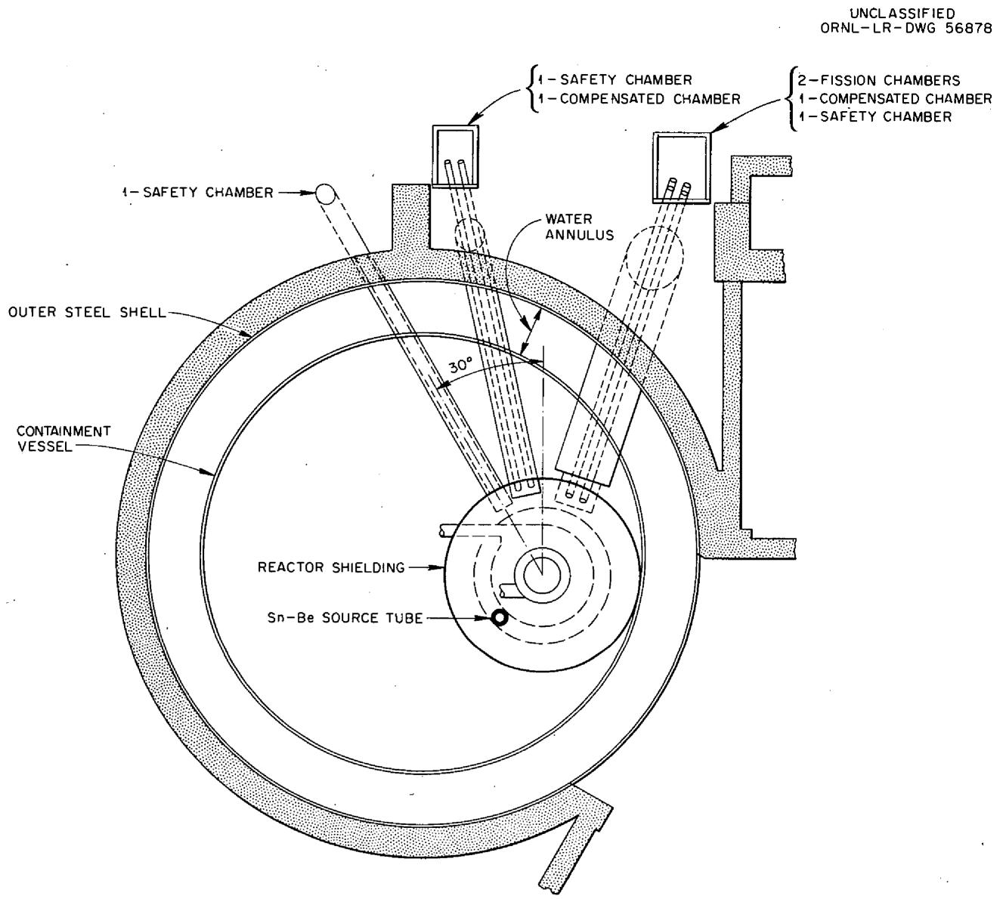  
Fig. 14. MSRE Neutron Chamber Arrangement.

through shielding adjacent to occupied areas, and (3) to monitor continuous samples of the atmosphere within the operating areas and the stack discharge.

The detectors which perform functions (1) take automatic safety action when preset safe limits are exceeded. Those in categories (2) and (3) only alarm. All indicate remotely and record so that the operator can immediately investigate the source of indicated radiation.

# 3.2.5 Pressure Measurements

Pressure measurements at various points in the cover-gas and off-gas systems are required during operation and during salt transfers. Seal-welded pressure elements are used in the fuel and coolant systems. Other pressures are measured with conventional pressure devices located outside the container. They include the lubricating-oil systems, the water cooling systems, and the pressure differential between the containment cell and the atmosphere.

# 3.2.6 Flow Measurements

In addition to the coolant salt, flow measurements are required on the off-gas and lubricating-oil gas streams at the fuel pump, and on the sump lubricating-oil and coolant-water streams. Seal-welded differential-pressure cells are installed to measure the pressure drops across these orifices and capillaries.

# 3.2.7 Temperature Measurements

Temperature determinations throughout the reactor plant are made by Chromel-Alumel thermocouples sheathed in Inconel. The data will be used for control, for operational information, or for initiating safety actions. Temperature points of interest in the reactor system include all salt containers and piping, reactor-vessel and pump-bowl areas that might have local heating, freeze flanges and freeze valves that must be kept cool, and many locations in the off-gas system. Also, lubricating-oil and cooling-water temperatures and the ambient temperature: of the cell atmosphere must be monitored. Over 500 thermocouples will be used to collect the desired information.

# 3.2.8 Liquid-Level Measurements

The level of salt in the primary pump is measured with a differential transformer actuated by a float in the pump bowl. The level of salt in the drain tanks is determined by weigh cells which are designed into the tank support system. The levels of other liquids, such as the lubricating oil and the water in various cooling systems, are determined by conventional floats or static pressure-head measurements because these devices are located outside the container.

# 4. REACTOR PHYSICS DATA

A list of reactor physics data for the currently proposed MSRE core design (in the clean, hot condition) is given in Table 9. The critical mass, system inventory, temperature coefficient, neutron fluxes, and power-density estimates were obtained by using the IBM-704 one-dimensional multigroup diffusion-theory program GNU3 and the 34-group cross-section library prepared for use in the thermal-breeder-reactor evaluation program.5 The poison-tube worth was calculated with the two-group, two-dimensional diffusion-theory program PDQ,6 using an effective extrapolation distance at the boundaries of the control regions and two-group constants produced by the GNU calculations elsewhere.

Table 9. Reactor Data for Clean Hot Condition, All Tubes Empty   

<table><tr><td>Fuel volume fraction in core</td><td>0.225</td></tr><tr><td>Core critical mass, kg U235</td><td>15.6</td></tr><tr><td>Circulating-system inventory, kg U235</td><td>47</td></tr><tr><td>Temperature coefficient of reactivity, (δk/k)/°F</td><td>-9 x 10-5</td></tr><tr><td>Fuel</td><td>-3 x 10-5</td></tr><tr><td>Graphite</td><td>-6 x 10-5</td></tr><tr><td>Mean neutron lifetime, sec</td><td>3 x 10-4</td></tr><tr><td>Effective delayed-neutron fraction</td><td>0.0048</td></tr><tr><td>Total poison-tube worth (four tubes), % δk/k</td><td>4.6</td></tr><tr><td>Fraction of power generated in core</td><td>0.962</td></tr><tr><td>Per cent thermal fissions</td><td>86.6</td></tr><tr><td>Total power, Mw</td><td>10</td></tr><tr><td>Mean core power density, w/cm3</td><td>3.86</td></tr><tr><td>Peak core power density, w/cm3</td><td>10.5</td></tr><tr><td>Mean salt power density, w/cm3</td><td>17.2</td></tr><tr><td>Peak salt power density, w/cm3</td><td>46.7</td></tr><tr><td>Peak thermal flux, neutrons/cm2-sec</td><td>8.1 x 1013</td></tr><tr><td>Mean thermal flux, neutrons/cm2-sec</td><td>2.6 x 1013</td></tr><tr><td>(Δk/k)/(ΔM/M)</td><td>0.23</td></tr></table>

# 5. THE REACTOR COMPLEMENT:

# 5.1 Building

The Molten Salt Reactor Experiment will be conducted in ORNL Building 7503, which originally was constructed for the Aircraft Reactor Experiment (ARE) and later was extensively modified to house the Aircraft Reactor Test (ART). The additional revisions required for the MSRE are described here.

A plan view of the building is shown in Fig. 15. The reactor containment cell, the drain-tank pit, and the coolant-equipment pit are located in the south end of the structure; pits for fuel storage and contaminated-equipment handling are in the north end. This portion (the high bay) of the building is isolated from the other portions by a ventilation system and is designated a "contamination zone" because it is likely to become slightly contaminated during reactor maintenance operations. On the west wall is constructed a shielded, remote-maintenance control room from which hoists and manipulators may be controlled. Access to the high bay is at the northeast corner through a change room where workers can change to "contamination" clothing before entering and can be surveyed for contamination before leaving.

East of the high bay on the ground level are the reactor control room and the office area. On the basement level are installed auxiliary reactor instrumentation and building service equipment.

At the south end of the building is the fan room, where the two large cooling fans are mounted to discharge over the coolant-salt radiator and to the stack outside.

The building has two extensions on the west side, where an emergency diesel power station and electrical switch gear are housed.

# 5.2 Containment

The containment philosophy which has been applied to the MSRE requires that a minimum of two barriers be provided as protection against the escape of radioactivity. The first barrier is the reactor

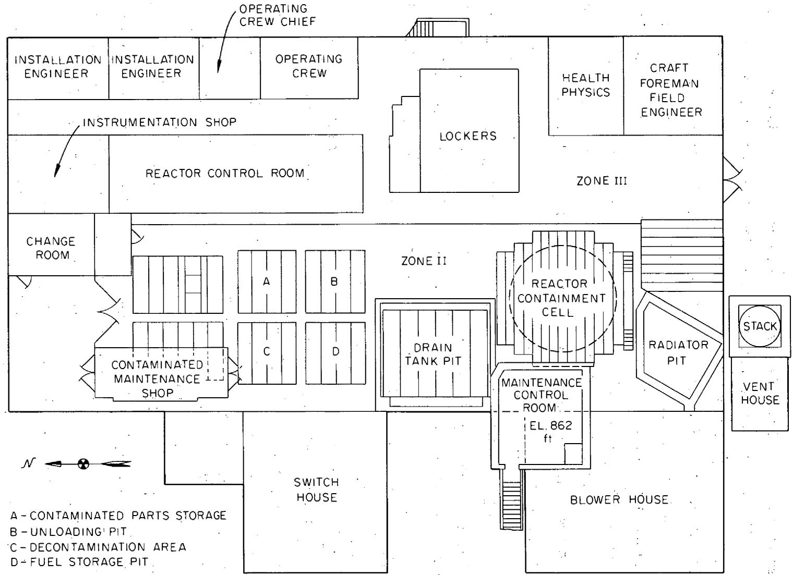  
Fig.15. First Floor Plan, Building 7503.

piping assembly which was described in Sec. 2.1. The second barrier is the seal-welded containment vessel described below. These two barriers can be made essentially leak-tight to the approximately 50 million curies circulating within, as has been demonstrated in HRE-2; the leak rate of the piping must be less than 1 cc/day, but the containment vessel may leak $1\%$ /day, as will be discussed later.

Actually a third line of defense has been provided in the MSRE. It serves principally during maintenance when the first two barriers are opened purposely. This third barrier is the isolation of the high-bay area by means of a sealant on the sides, ends, and top of the existing building. The high-bay will be kept at a negative pressure by ventilating fans which discharge through the stack-filter arrangement.

# 5.2.1 Fuel-System Container Design

The reactor container is in two connected parts, but is operated as a single vessel. The first part, the reactor containment cell, was designed and installed for the ART. It is a 1/4- to 2-in.-thick carbon steel cylinder, 24 ft in diameter and 33 ft deep, including its hemispherical bottom. The top is closed by a flat "sandwich" consisting of a 1/8-in. carbon steel sheet held between a lower layer and an upper layer of 3 1/2-ft-thick concrete blocks. The steel sheet is seal-welded to the circumference of the tank, and the upper layer of blocks is bolted down, as illustrated in Fig. 16.

As may be seen in Fig. 17, the reactor containment cell is erected in a 30-ft-diam steel-lined pit. The annulus between the two cylinders is filled with water and solid shielding material. The penetrations through which service and electrical lines enter the container are bridged across the annulus. The reactor vessel, the main heat exchanger, and the fuel circulating pump are all located within the reactor cell.

The drain tanks are installed in a second cell with an open passage to the reactor cell. The dump or drain line is located in this passage, connecting the reactor circulating system to the drain tanks. The drain-tank containment cell is of concrete construction, rectangular in cross-section and lined with steel sheet. The top is closed and sealed in a manner similar to the reactor-cell closure.

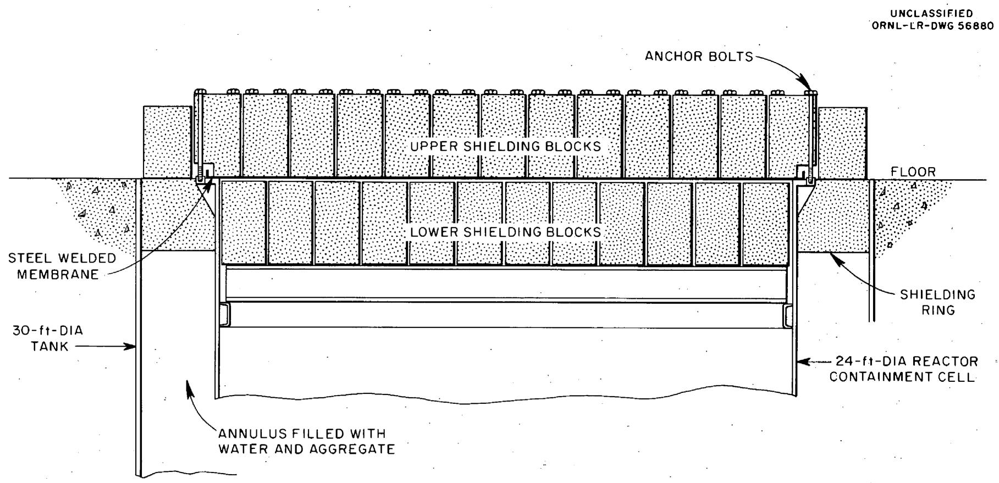  
Fig. 16. Shielding and Sealing Membrane for Top of Cell.

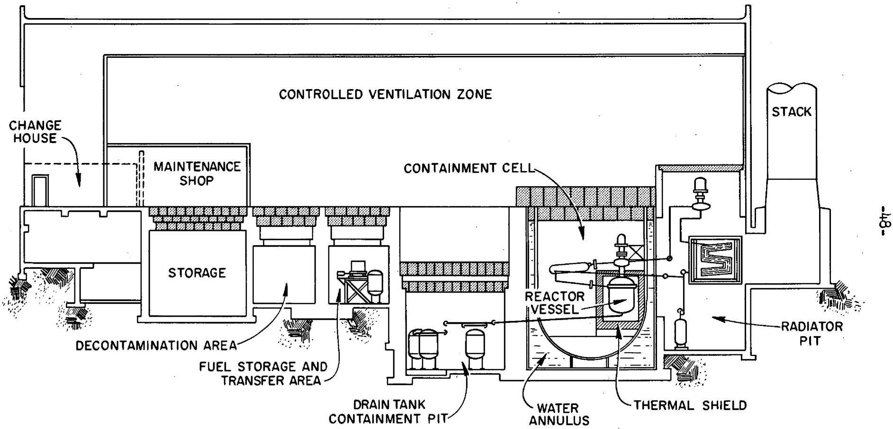  
Fig. 17. North-South Sectional Elevation-Bldg. 7503

Since the drain-tank cell is connected to the reactor cell, both cells will be pressure- and leak-tested at the same time. When construction is completed but before equipment is installed, a hydrostatic pressure of 45 psig will be applied. Later, after the reactor is ready for operation, pneumatic pressure will be used to determine the leak rate and to locate the leaks. This test will be repeated each time the cells are opened and closed for maintenance to be certain that the $1\% /24$ hr allowable leak rate is not exceeded. Furthermore, during operation the cells will be kept at a negative pressure of 2 psig (13 psia), and the leak rate will be indicated continuously by the rate of pressure rise.

# 5.2.2 Other Cells

As mentioned previously, pits for fuel storage, loading and unloading, used-equipment storage, and decontamination are also located in the high-bay area. The storage tank is provided with a secondary container in the form of another tank which surrounds the storage tank and is designed for complete containment. The amount of activity in the other cells is low by comparison to that in the reactor cell, and it is considered sufficient to protect against the escape of activity by providing a strong draft through openings and by the use of absolute filters to remove particulate activity before the air is discharged to the stack. Approximately 8000 cfm of air is available for the ventilation of these cells.

# 5.2.3 Penetrations

Each of the many service lines which penetrate the walls of the secondary containers is equipped with a seal or a closing device to prevent the escape of radioactive fluids.

All electrical and thermocouple wires are encased in metal tubing and insulated with a dense packing of magnesium oxide. Leakage tests on this type of cable have indicated leak-tightness at pressures as high as 1500 psig.

Water, oil, and air lines are designed with solenoid, pneumatic, or spring-loaded valves which may be actuated to close in case of backflow or the detection of radioactivity. Radiation monitors will be

loaded sufficiently near each line to detect and actuate the closures before dangerous radiation levels are attained. Each of the separate fluid service systems is completely closed. The leakage of radioactive material into one of these systems will constitute a contained hazard rather than a release of activity.

The coolant-salt lines are not equipped with closure devices. As previously mentioned, the coolant-salt pressure is kept greater than the fuel-salt pressure, and in the event of a heat-exchanger tube failure, the coolant salt will be pushed into the fuel. Should the differential pressure disappear, the reactor will be drained. Although the coolant-salt cell is not leak-tight, containment protection provided by a flow of air maintains the cell at a negative pressure greater than 0.1 in. $\mathsf{H}_2\mathsf{O}$ , and the air is monitored for radioactivity.

# 5.3 Shielding

The shielding arrangement for the reactor equipment is shown in Fig. 17. The reactor is shielded around the sides and on the top by a 16-in. iron-water (50% Fe - 50% H₂O by volume) laminated thermal shield. An INOR-8 casting located in the outlet dome of the reactor vessel, in order to reduce the dose to the fuel circulating pump, is also effective in reducing the dose from the reactor above the reactor cell.

The reactor-cell shielding consists of 7 ft of ordinary concrete covering the cell and aggregate and water in the 3-ft annulus between the reactor containment vessel and the cell wall. An additional 2 ft of ordinary concrete, which constitutes part of the cell wall, encloses the cell except for the section which is adjacent to the radiator room. The reactor-cell top shielding and sealing membrane were previously described in Sec. 5.2.1. The drain-tank cell is covered by 6 ft of ordinary concrete sandwiching a sealing membrane in the same manner as that described for the reactor container in Sec. 5.2.1 (see Fig. 16).

The penthouse (the portion of the radiator cell extending above the main operating floor) has 2 ft of ordinary concrete shielding to provide shielding from the activated coolant during operation. The

radiation here results from $\mathbf{F}^{19}(n, \alpha) \mathbf{N}^{16}$ with a 7.4-sec half life and from $\mathbf{F}^{19}(n, \gamma) \mathbf{F}^{20}$ with an 11-sec half life and permits entry into the radiator room a few minutes following shutdown.

The fuel storage cell is covered by a 4-ft-thick ordinary concrete plug. This cell, the hot storage cell, the decontamination cell, and the fuel transfer cell are separated by 3-ft-thick ordinary-concrete shadow-shield walls.

The estimated dose rate in a small area directly over the reactor through the 7 ft of ordinary-concrete shielding plugs is $\sim 90\mathrm{mr / hr}$ , reducing to lower values in other locations over the cell. Should the actual dose rate be this high, concrete blocks will be stacked on the shielding to reduce the dose. In no continuously occupied area will the dose rate exceed $1\mathrm{mr / hr}$ .

# 5.4 Arrangement of Equipment

The arrangement of the reactor components in these containment areas is presented in Figs. 18 and 19. The layout of the fuel loop in the 24-ft-diam containment cell achieves piping stresses well below the ASME-code allowable values and provides satisfactory accessibility for maintenance. The reactor is anchored, but the fuel circulating pump above it is supported by spring hangers. The primary heat exchanger is free to move horizontally and vertically; the inlet is aligned with the pump discharge nozzle, and the outlet with the reactor inlet volute. The components are joined by 5-in.-ID tubing (0.165-in.-thick wall), with freeze flanges to permit removal.

The fuel drain line connects the reactor to the drain tanks located in the rectangular container adjacent to and south of the reactor pit. The two drain tanks and the flush tank are also arranged for maintenance from overhead. The elevation of the tanks provides a head of 5 to 15 ft of salt to drain the reactor. Freeze valves are positioned between each tank to control the routing of the salts. The line extending through the north wall connects these tanks with the storage tank.

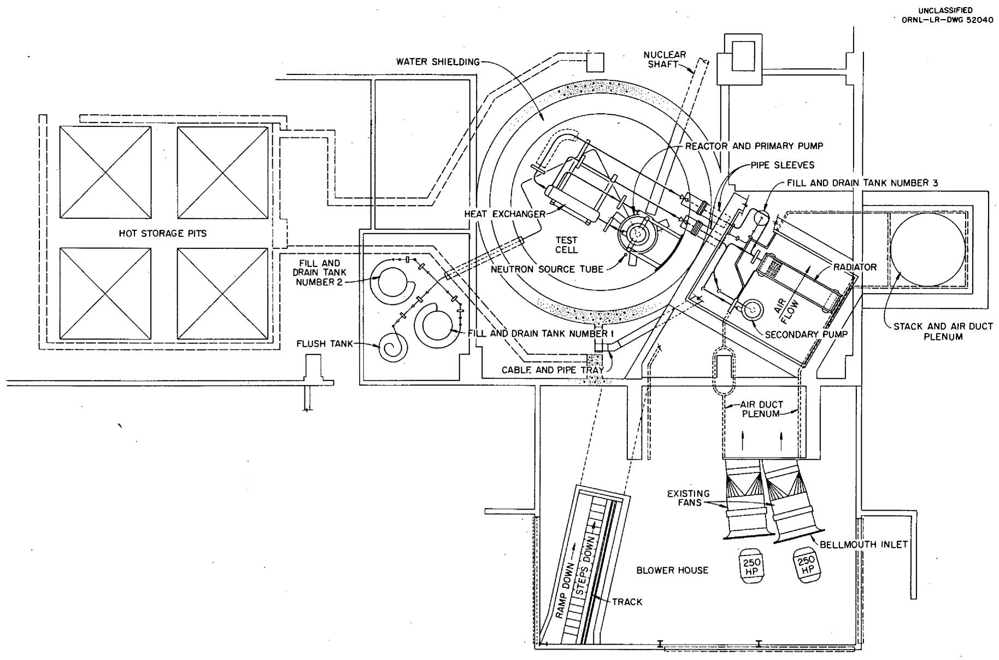  
Fig. 18. Arrangement of Equipment: Plan View.

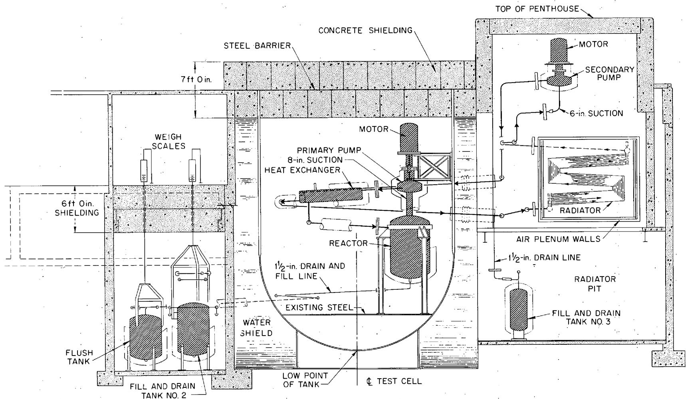  
Fig.19. Arrangement of Equipment: Elevation.

# -54-

Loading and unloading equipment is located in the pit directly east of the storage-tank cell. Provision is made for a shielded carrier on top of the concrete blocks covering this cell; manipulators through the blocks accomplish the loading and unloading of salt.

Outside the containment areas in the south end of the building is the coolant equipment. The salt-to-air radiator is mounted in the coolant air duct. Two 5-in.-OD (0.165-in.-thick wall) pipes connecting the radiator and the heat exchanger enter the reactor container through bellows-equipped seals. The coolant cell is not completely sealed, because the $\mathbf{N}^{16}$ activity of the coolant salt does not constitute a hazard and because the coolant-salt pressure is kept greater than the fuel-salt pressure to prevent the inleakage of fuel.

# 5.5 Maintenance

The MSRE is designed for replacement maintenance instead of repair in situ. All parts of the fuel system are located so that they can be placed by remote techniques, and this arrangement also permits semi-direct maintenance.

Remote maintenance is accomplished from a shielded control room from which a General Mills manipulator can be directed to do work within the cell. After the shielding blocks are removed, the manipulator with lighting and television cameras is positioned on a track on top of the cell and above the equipment to be removed. The arm of the manipulator operates the tools necessary to disconnect the equipment. The control-room operator then moves the manipulator out of the way and brings the high-bay bridge hoist into position to lift the component and move it to the storage pit in the north end of the building. The hoist can then be used to replace the lower shielding plugs.

In the semidirect approach, a mobile shield is positioned over one block in the lower layer of concrete shielding blocks. The motorized shield is opened to permit removal of the block which covers the failed component, and is then closed. By using long-handled tools through openings in the shield, an operator standing on top of the shield disconnects the component. Viewing is through lead-glass windows and

periscopes. The operator then retires to the shielded control room, opens the motorized shield, and remotely controls the high-bay hoist to lift the component and move it to the storage cell.

Figure 20 illustrates the use of the remote manipulator and shows the position of the shielded control room, which is equipped with lead-glass windows as well as television receivers.

Both these methods have been demonstrated at ORNL to be feasible means of maintenance. Additional experience under conditions of high radioactivity is necessary before either method could be chosen for larger reactors.

Since the removal of components necessarily requires breaching the containment cell and opening pipes in the fuel system, protection against the escape of radioactive gases and particles must be given particular attention. Maintenance procedures require that the fuel be drained, the pipes flushed with clean salt, and the system cooled before repair work is begun. When the secondary container is opened to permit work with the manipulator or the motorized shield, the secondary container is ventilated at a rate of 10 to 15,000 cfm. If it should be necessary to remove all the shielding blocks, a velocity of at least 30 ft/min could be maintained downward through the opening. However, the normal maximum opening will be only 100 ft², and the velocity of air will be 100 to 150 ft/min.

When the reactor pipes are opened, nitrogen will be purged into the pipes until temporary closures can be fastened. Closures are also attached to the flanges on the failed component to prevent the escape of activity during removal. Similar techniques have been developed on HRE-2 and have proved satisfactory.

The coolant-system pit may be entered for direct maintenance as soon as the system is cooled. The activity in the salt decays by a factor of $10^6$ in 2 min, and no other significant contamination is expected.

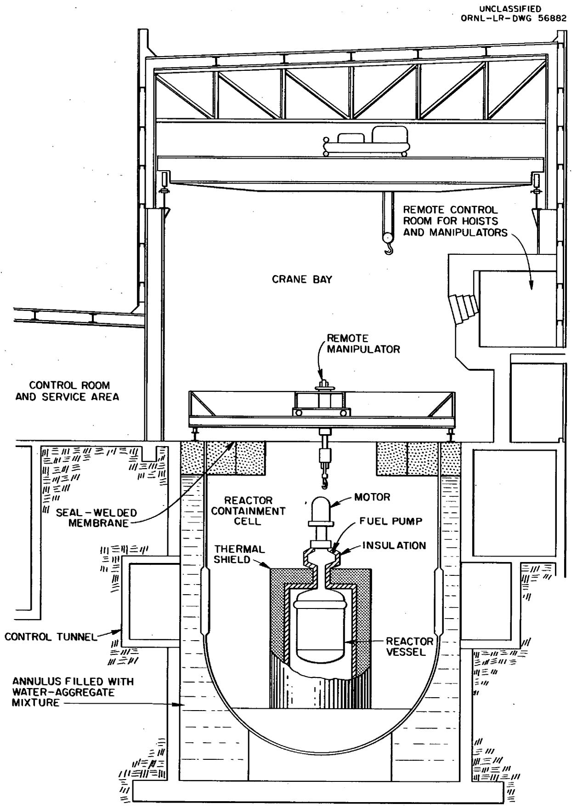  
Fig. 20. East-West Sectional Elevation-Building 7503.

# 6.1 Construction

Although no special construction practices will be employed in assembling the MSRE, many special precautions will be taken to ensure a high-quality, clean, and leak-tight assembly. A detailed specification, requiring quality control better than existing commercial codes, has been prepared for each component of the system (see Appendix C). Nondestructive inspection techniques such as ultrasonic testing, dye-penetrant inspection, x-ray examination, and helium leak testing are employed at each fabricator's plant, under the supervision of ORNL inspectors. Assembly at the reactor site will be similarly examined. After completion the separate systems will be leak-tested using rate-of-pressure rise and isotopic-tracer techniques. The leakage rate from the entire fuel-containing system must be measured to be less than 1 cc/day.

After construction is completed, a period of several weeks will be occupied by remote-maintenance practice.

# 6.2 Flush-Salt Test

It is planned to demonstrate the mechanical performance of the system by a several-month period of testing with a flush salt in the fuel system. Each piece of equipment will be examined to determine whether it performs as designed, insofar as this can be determined without nuclear heat generation. The flush salt will also serve to scavenge oxygen and to remove other impurities. Another important benefit of the flush-salt test will be the development of the operating skills necessary for satisfactory control of the system variables.

# 6.3 Startup

After the flush-salt tests are concluded, the neutron source will be installed and counting rates will be determined on each of the two count-rate circuits before the salt is drained. Then the drain tanks

will be loaded with fuel salt containing about three-fourths of the $\mathrm{U}^{235}$ estimated for criticality at the minimum temperature (1000°F). The fuel salt will be slowly pressurized into the reactor, which has previously been heated to 1200°F. Only one-half of the available poison will be inserted during this initial loading and for later fuel additions. The partial insertion will allow experimental flexibility such as withdrawal to test for criticality after loading. If criticality is not attained after any addition, the system temperature will be gradually lowered to 1000°F if necessary, and counting rates will again be determined. This procedure will be followed after each fuel addition until the reactor is critical. Further fuel additions will increase the critical temperature and provide information on the overall temperature coefficient. Quantities greater than 120 g of $\mathrm{U}^{235}$ will be added to the drain tanks and transferred to the reactor; quantities of 120 g or less can be added at the bowl of the fuel circulating pump through the sampler-enricher mechanism.

# 6.4 Approach to Power

After a series of zero-power experiments to determine the nuclear characteristics of the system, the power will be raised in increments of a few hundred kilowatts over a period of several weeks until full power is reached. At each successively higher power level, information will be collected and fuel samples will be analyzed for studies of xenon and fuel permeation of the graphite, fuel stability, power coefficient, radiolytic-gas handling, and power stability.

# 6.5 Operations Personnel

The operation of the MSRE facility will be the responsibility of the Reactor Division Operations Department. The previous assignments of personnel in this group include the construction, startup, and operation of four other experimental reactors: the Low-Intensity Test Reactor, Homogeneous Reactor Experiments 1 and 2, and the Aircraft Reactor Experiment.

The experiment will be conducted on a three-shift basis, employing four operating shifts and a day staff for reactor analysis and planning. Each of the four shifts will be headed by a senior-level supervisor for the first few months. A junior engineer and three or four nontechnical operators, many with the previously mentioned reactor experience, will complete the shift organization.

The Reactor Analysis Group will be composed of four to six engineers with a broad experience in fluid-fuel reactors. Its function will be principally to plan, supervise, and analyze the experimental program.

Over the years this organization has developed training, operating, and maintenance practices which especially contribute to experimental-reactor safety. The same methods and policies will be applied to the Molten-Salt Reactor Experiment.

# 7. HAZARDS ANALYSIS

The hazards inherent in the MSRE are considered on the basis of possible damage, first to the primary container and second to the secondary container. Finally, assuming that activity escapes from the secondary container, the danger is considered to personnel at the site and in the surrounding territory.

# 7.1 Damage to the Primary Container

The possibilities for rupture of the primary container were investigated in several categories: (1) reactivity excursions, (2) melting of walls, (3) failure by excessive stresses, (4) corrosion.

# 7.1.1 Reactivity Excursions

Excess reactivity can result from the following unusual circumstances.

(a) Startup Accident. The MSRE is started normally by transferring hot $(>1000^{\circ}\mathrm{F})$ fuel into the preheated $(>1000^{\circ}\mathrm{F})$ circulating system. The normal fuel concentration is sufficient to make the reactor chain-reacting at $1200^{\circ}\mathrm{F}$ when at full power with the full effect of the power coefficient and xenon poisoning. When these effects are not counter-acting excess reactivity--that is, at startup--the poison must be sufficient to hold the reactor subcritical. If, by some instance, the poison were not inserted when fuel is pushed into the core, the reactor would begin to generate power unexpectedly with the core only partly full. In the worst situation the core would continue to fill, the reactor would continue to generate heat, and the reactor temperature would rise to a final temperature of $1400^{\circ}\mathrm{F}$ . Although such a temperature rise is undesirable, it should not damage the reactor.

This accident will be analyzed in more detail on the reactor simulator before the final design of the control circuits. It is planned to protect against the startup accident in several ways. For routine startups, the control circuits will require that all the poison be inserted before filling can be begun. A large number of thermocouples

distributed on the reactor vessel, throughout the heat removal system, and on the drain tank must indicate at least $1000^{\circ}\mathrm{F}$ . The rate at which fuel can be transferred from the drain tanks to the reactor vessel will be limited so that the loading time will be approximately one hour. The reactor will be filled in several steps, with sufficient delay between steps for the neutron multiplication to be determined. The reactor can easily be drained if criticality is approached unexpectedly, because the drain line is also the fill line.

When the system has been filled to the operating level, there will be a time delay before the pump can be started so that the drain line can be frozen and the temperature distribution in the reactor system can be checked. Any large temperature differences between the reactor and the heat removal system will be reduced by natural-convection circulation during this delay time.

A variation of the startup accident would involve filling the reactor and withdrawing poison to make the reactor critical at the operating temperature of $1200^{\circ}\mathrm{F}$ before starting the pump. Assume that the heat removal system is operating so that all the fuel in the heat exchanger is cooled to $850^{\circ}\mathrm{F}$ . If the circulation pump could be started to cause the $850^{\circ}\mathrm{F}$ fuel slug to traverse the core at the average circulation rate, the reactivity would increase at the average rate of $0.15\% \Delta \mathrm{k} / \mathrm{k}$ per second for 7 sec. Actually thermal-convection circulation begins when the fuel in the heat exchanger is cooled so that the reactor gradually rises in power to satisfy the demand. According to reactor simulator studies, thermal-convection circulation is sufficient to extract $9.4\mathrm{Mw}$ with a temperature rise of $200^{\circ}\mathrm{F}$ across the reactor. The studies do not indicate a likelihood of damage from the cold-slug accident. Nevertheless the fuel pump will be started at reduced speed, and the rate at which the speed can be increased will be regulated to limit the rate at which reactivity can be added by introduction of cold fluid.

(b) Graphite Problems. Four potential reactivity problems are associated with the presence of bare graphite:

1. compatibility with the fuel salt,   
2. fuel penetration into graphite voids,

3. irradiation-induced shrinkage,   
4. xenon penetration into graphite voids.

If the salt and graphite were chemically incompatible at any temperature above the liquidus of the salt, there would be concern about reactions which might result in uranium separation. Since no reaction has been observed in several thousand hours of loop tests or in laboratory studies, there is considerable confidence that none occurs, and that graphite and salt can be judged completely compatible.

An associated problem is that of penetration of fuel into the $7 \%$ of accessible voids in the graphite. Many out- of- pile experiments have been done on the wetting and permeation of graphite by molten salts. The tests indicate that graphite is not wet .by the MSRE fuel salt and that permeation of MSRE grades of graphite does not exceed 0.5 vol % at pressures as high as 150 psi. One in- pile test has been done and it indicated that radiation effects do not change this behavior. Both in- pile and out- of- pile testing will be continued to determine whether any conditions that can be produced in the reactor will cause wetting and appreciable penetration of the graphite by fuel. It is believed that the tests will continue to show no significant penetration of salt into the pores of the graphite. However, in spite of this information, operation of the reactor will be monitored for long- term effects in the large mass of graphite at high radiation levels. Permeation greater than 0.5 vol % should occur slowly, and the accompanying rise in reactivity would be slow. This would be indicated by a gradual rise in critical temperature. The increase in reactivity can be easily counteracted by the control system, by omitting fuel additions to compensate for burnup, or by adding lithium or thorium to the fuel as a poison. The question of graphite compatibility is discussed more fully in Appendix F.

The only potentially hazardous situation that could result from several per cent of fuel soaking into the graphite pores exists during maintenance. The decay of fission products in the graphite could raise the central graphite temperature to about $2000^{\circ}\mathrm{F}$ in about 200 hr after shutdown. If the core vessel were opened in air with the graphite at $2000^{\circ}\mathrm{F}$ , some burning could occur, the quantity depending on the amount

of oxygen available. Undoubtedly the evolution of CO and $\mathrm{CO}_{2}$ from burning would carry fission products into the reactor cell. It is unlikely that more than $1\%$ of the graphite would burn or more than $0.06\%$ of the fission products would escape the reactor core before the reaction could be stopped by closing the vessel. The rapid ventilation of the secondary container would deliver the activity to the filters; only noble gases would be released to the stack; so the biological hazard would not be significant. Protection against this mishap is conceived to be: (1) thorough cooling of the graphite with flush salt prior to beginning maintenance work, (2) developing practices for rapid closure of lines which might cause a "chimney" effect through the hot core, (3) insistence on good ventilation and monitoring so that the maintenance work can be halted and closures can be made to stop the escape of activity, and (4) a purge system of nitrogen or helium which provides a blanket of gas in the container and reduces the likelihood of the entrance of air.

Irradiation-induced shrinkage of the graphite was studied to determine its effect on reactivity. Because the shrinkage results from neutron bombardment, the flux variations across the reactor produce dimensional changes which vary with position. This results in stresses within the separate graphite pieces, and bowing as well as axial and transverse shrinkage. The resultant stresses may be considerably relieved by creep and annealing, but even without these mechanisms, the graphite should not begin to form cracks in less than two years' exposure at 10 Mw. As shrinkage gradually occurs, the space will fill with fuel salt. This process is so slow that the reactivity increase (which will result if the spaces fill with fuel salt) will be almost exactly counterbalanced by the buildup of long-lived fission product poisons. If there is a change in reactivity, it is predicted to be slightly negative. Because of the very slow rate of change, compensation can be easily accomplished by adjustment of the rate at which fuel is added to the system to compensate for burnup.

The description of the core graphite assembly (Sec. 2.3) included a mention of molybdenum bands which restrain the deformed graphite. Originally the arrangement of fuel and graphite was such that failure of the molybdenum bands would cause a reactivity excursion, but with the present design, any reactivity shift would be negative and not

significant $(0.1\% \Delta k / k)$ . The molybdenum could be omitted from the present design, but is being retained as an experiment because the metal might be used in future reactors.

Thus it appears that neither breakage of the bands nor slow shrinkage of the graphite bars will be readily detectable while the reactor is operating with the original charge of fuel. However, a possibly hazardous situation would arise if either change took place and the initial fuel charge was replaced with new fuel. Without the fission product poison of the old fuel, the same concentration of uranium in the new fuel would result in a reactivity approximately $4\%$ greater than the original. This is but one reason why a reloading of the reactor, should it ever be necessary, will be handled as carefully as the original critical experiment. The precautions for that experiment (see Sec. 6.3) should protect against accidents in future loadings.

Xenon penetration into the graphite voids will occur by transfer from the circulating fuel and/or from any fuel which has penetrated the graphite. For $0.5\%$ fuel penetration the total xenon effect at 10 Mw is estimated to be $1.3\% \Delta \mathrm{k} / \mathrm{k}$ . At its peak after power reduction the poisoning will amount to $\sim 4\% \Delta \mathrm{k} / \mathrm{k}$ . Xenon will be removed by the stripping system as long as the fuel is circulated. No excess reactivity will be provided to overcome xenon buildup on reduction of power.

# 7.1.2 Fuel Separation

One of the few weaknesses of the fuel composition selected for this experiment is its vulnerability to large amounts of oxygen as gas or in compounds. The $\mathrm{ZrF_4}$ component of the fuel is for the purpose of reacting with any oxygen and thus preventing the precipitation of $\mathrm{UO_2}$ . Extensive laboratory tests have shown that so long as the ratio of $\mathrm{ZrF_4 / UF_4}$ is 3 or greater, $\mathrm{ZrO_2}$ is always precipitated in preference to $\mathrm{UO_2}$ . The actual ratio of $\mathrm{ZrF_4 / UF_4}$ in the fuel is 5, which gives a good margin of safety to maintain the fuel within its known limits of stability. Approximately 2.5 ft³ of water or 7000 ft³ of air (STP) would have to react with the salt to precipitate the excess zirconium. These amounts are considered to be very large in view of the care being used to prevent the system from becoming contaminated. The periodic sampling of the fuel should reveal the presence of contaminants long before this level is reached. More information on the fuel chemistry is presented in Appendix A.

In spite of the apparently good protection by $\mathrm{ZrF_4}$ , and in spite of the extraordinary efforts to keep the system free of oxygen and water vapor, the consequences of $\mathrm{UO_2}$ separation must be examined. After precipitation, $\mathrm{UO_2}$ would tend to remain suspended and circulate with the fuel. If it were uniformly distributed, it would be indistinguishable, nuclearwise, from the normal fuel. However, after a while it would begin to collect in low velocity areas or at the points of lowest temperature, and the most likely location is the reactor-vessel plenum under the graphite. At this location, $2.5\mathrm{kg}$ of $\mathrm{UO_2}$ deposited per square foot of surface would increase the temperature only $100^{\circ}\mathrm{F}$ .

The worst possibility is to assume the sudden transfer of the separated material into the core. The resulting excursion would depend, among other factors, on the quantity of $U^{235}$ involved; so it is worthwhile to estimate the limits of detectable fuel loss.

Assuming that a $25^{\circ}\mathrm{F}$ reduction in critical temperature could be easily detected, the equivalent loss of $\mathbf{U}^{235}$ would be 160 g from the core or 625 g from the entire fuel system. If this material collected in the reactor-vessel plenum it might all be returned to the core at a rate which would be limited by the 7-sec fluid transit time through the core. The system temperature would rise temporarily by 100 to $150^{\circ}\mathrm{F}$ but no damage should result. The control system would normally eliminate most of the temperature transient.

Frequent analysis of the fuel and calculation of the $\mathbf{U}^{235}$ inventory will be another check on uranium separation, but the limits of detection by this method are approximately ±3% of the fuel inventory, which amounts to 1500 g. Since $\mathrm{ZrO}_2$ appears in the salt before $\mathrm{UO}_2$ and is easily recognizable, an inspection of the frequent salt samples will provide a warning when oxygen enters the system.

# 7.1.3 Flow Stoppage

Several nonroutine situations, ranging from probable to nearly incredible, that involve flow stoppage in the feed or coolant circuits have been analyzed on an analog computer. The necessary protective actions and potential hazards are discussed below:

(a) Fuel-Circulation-Pump Failure. Failure of the fuel circulation pump is highly credible because it could result from an electrical failure in the circuit or pump motor, or from a mechanical defect, such as a

bearing failure. Instantaneous introduction of the delayed neutrons normally generated out of the core amounts to $0.17\% \Delta \mathrm{k} / \mathrm{k}$ . All this amount is not effective because of the gradual stoppage of the pump and the exponential decay of the precursors; the expected temperature rise is less than $150^{\circ}\mathrm{F}$ . Failure of the pump causes automatic insertion of poison. Convective circulation is adequate to remove the afterheat, but if the reactor temperature continues to increase, the salt systems will be drained.

(b) Coolant-Pump Failure. Failure of the coolant pump is also highly credible and for the same reasons. Again the poison is automatically inserted, and drainage of the salt in both systems is convenient protection.

(c) Simultaneous Pump Failures. Simultaneous failures of pumps in the fuel and the coolant loops is also credible, because a power outage or a burnout of a main power bus would stop both motors. Automatic action of the poison is the same as before. A power outage automatically starts the diesel-generators (within 15 sec), and operation could be resumed. For other conditions which result in pump stoppages of long duration, thermal-convection flow in the two systems is sufficient to handle the afterheat, and both loops can be drained.

(d) Flow Stoppage in Fuel Loop. Flow in the fuel loop might be stopped by plugging somewhere in the circuit; this is incredible as an instantaneous event and not very probable even as a gradual occurrence. In the case of gradual plugging, as indicated by the temperature drop across the heat exchanger, the reactor could be shut down and drained routinely. In the unlikely event of instantaneous flow stoppage, the situation would be similar to that already mentioned for fuel-circulation-pump failure. The increase in neutron flux would automatically cause the poison to be inserted, shutting down the reactor. The reactor would be drained, because no cooling would take place and the afterheat would cause the reactor temperature to rise.

In the situations considered above, there would be no concern if the fuel could be drained. Thus the most hazardous situation is a plugged drain line combined with interference with heat dissipation

to the radiator. Any one of four possible circumstances could produce these conditions: fuel circuit plugged or partially drained, the coolant circuit plugged, or partially or completely drained. The power production from afterheat within the core and the bulk mean temperature of the fuel, graphite, and INOR-8 associated with the core vessel are shown in Fig. 21 as a function of time after reactor shutdown. With the reactor heaters off the temperature would rise to $1500^{\circ}\mathrm{F}$ in 16 hr, to a maximum of $1800^{\circ}\mathrm{F}$ in 105 hr and then would slowly decline. The reactor probably would be damaged and would have to be replaced if held at $1800^{\circ}\mathrm{F}$ for several hundred hours. Methods of providing cooling to maintain the temperature below $1500^{\circ}\mathrm{F}$ in an emergency are being considered for incorporation in the final design.

# 7.1.4 Control-System Failure

The control system is not a safety system and is not required to protect the reactor against calamity. Although reliability will be an important criterion in designing the control system, the consequence of complete failure was examined. With the small amount of excess reactivity present, sudden removal of all the control poison would result in a final temperature near $1400^{\circ}\mathrm{F}$ . It is unlikely that the thermal stresses produced by this sudden rise in temperature would cause serious damage to the assembly, or that salt would be spilled into the reactor cell.

# 7.1.5 Drain-Tank Hazards

Two possibly hazardous problems are encountered when the drain tank is filled with fuel salt from the operating reactor. These problems are: afterheat and potentially-critical fuel configurations. If the fuel is drained a short time after shutdown, provisions for removal of afterheat are necessary. Without heat removal, the temperature of the salt would rise approximately $500^{\circ}\mathrm{F}$ in a 3-hr period starting $1/2$ hr after shutdown, assuming the reactor had been operating at full power for 1000 hr prior to shutdown. This condition is avoided by providing a 100-kw heat removal system (see Sec. 2.7.1) to keep the bulk mean temperature of the salt below $1400^{\circ}\mathrm{F}$ during storage in the tank.[7]

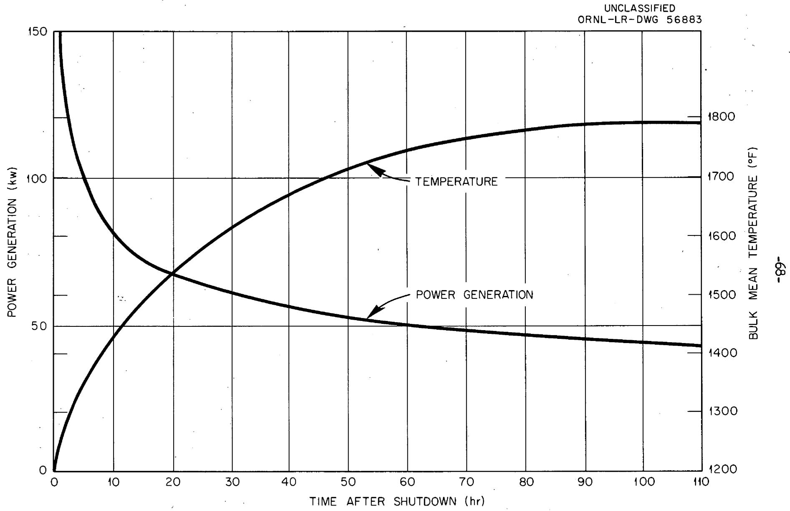  
Fig. 21. Afterheat Power Generation and Temperature Rise of Core Vessel vs. Shutdown Time.

Water was selected as the coolant because of the relative simplicity of the associated cooling system. The water and the salt are never in contact with a common wall, as is evident from Fig. 9. Water is fed through the center tube, and the steam forms in the annulus. The circuit is completely closed and requires no pumps. In an emergency, the steam can be vented up the stack and fresh water added to the system. An emergency reservoir is installed to provide cooling for $6\mathrm{hr}$ .

Several configurations of fuel inside the fuel drain tank were investigated for the possibility of some configuration having an effective multiplication constant greater than unity.

The first configuration investigated was the flooding of the cell with water, which is a possible measure in case all other cooling of the drain tanks fails. The water would then act as a neutron reflector around the drain tank. The $\mathbf{k}_{\mathrm{eff}}$ for this situation is 0.852. (The $\mathbf{k}_{\mathrm{eff}}$ without the water is 0.826.) Flooding, therefore, does not present a criticality hazard.

The second problem considered was the precipitation of the uranium by an oxidizing agent. If air should accidentally enter the drain tank through the helium blanket system or an air leak in the drain-tank vessel and the salt should maintain contact with sufficient oxidizing agent, the uranium, thorium, and zirconium would be precipitated. The precipitate would form a semisolid mixture with the salt, and the LiF and $\mathrm{BeF}_2$ would exist as a liquid above the semisolid. The $k_{\mathrm{eff}}$ calculated for this configuration was only 0.185. Precipitation of the uranium, therefore, does not create a criticality hazard.

# 7.1.6 Other Possibilities for Primary-Container Damage

There are several other accidents in which the integrity of the primary containment might suffer.

(a) Freeze-Valve Damage. The freezing and thawing of the freeze valves could conceivably result in a rupture of the piping. This is specifically minimized in the design by making the freeze-valve section as short as possible so that there is a small danger of bursting as a result of entrapment of liquid between the ends of a plug. Because

the salt expands as it thaws, special precautions are taken to apply the heating so that expansion space is always available. A single freeze valve has been frozen and thawed more than 100 times without apparent damage.

(b) Freeze Flanges. The flanged joints in the fuel circulating loop are also possibilities for failure. Freeze flanges were selected as the simplest and most reliable joint available. The strength of the bolting and the flange compression members are considerably in excess of the strength necessary to maintain a tight joint. However, an analysis of the original flange design suggested several improvements. The recommendations of this study were incorporated in a new design which will be thoroughly tested prior to use in the reactor. The old flanges were cycled more than 100 times without any evidence of failure, and the new type is expected to be better.

(c) Excessive Wall Temperatures. Overheating of pipe and vessel walls might occur from the external electric heaters or from internal gamma heating. The heater elements have a melting point several hundred degrees above that of the INOR-8, but it is not considered likely that the INOR-8 could be melted by external heating as long as salt is present inside the pipes. If salt were not present, the pipe wall might melt before the heater element, but in this case a small fraction of the activity would be released.

During reactor operation various components are exposed to high gamma fluxes which result in gamma heating of the components. If this heating should produce large temperature gradients, excessive thermal stresses may arise. The effects of gamma heating on the core vessel and the grid structure were investigated because these structures are in regions of the highest gamma flux.

The gamma heating of the core vessel results in a temperature difference of only $1.3^{\circ}\mathbf{F}$ across the vessel walls and produces a calculated thermal stress of 300 psi, which is not serious.

The support grid structure experiences a temperature difference of $3.8^{\circ}\mathrm{F}$ across each grid. The resulting thermal stress is calculated to be 850 psi.

Gamma and beta heating of the top of the pump bowl results in a thermal stress of 17,000 psi at a temperature of approximately $1000^{\circ}\mathrm{F}$ . A static pressure stress of approximately $4000$ psi exists at the same point, resulting in a combined stress of approximately 21,000 psi. The maximum allowable static stress at this temperature is 16,000 psi. However, the ASME Unfired Pressure Vessel Code allows the combined static and thermal stress to be as much as 1.5 times the maximum allowable static stress (24,000 psi at this temperature). Hence, excessive thermal stresses do not exist at the junction in question.

Thus a wall failure as a result of beta-gamma heating does not appear reasonable.

Another possibility for melting of a primary-container wall is in the fission-product adsorption beds in the off-gas system. There have been instances where carbon beds became ignited in the presence of oxygen and consumed a portion of the charcoal in the beds. This accident is much less likely in the MSRE because of the special efforts to exclude oxygen from any part of the reactor system. Furthermore, the high temperatures necessary for ignition could not normally occur because the beds are submerged in a pool of cooling water. In the unlikely event that ignition does occur, the resulting high bed temperatures will alarm, and the inlet and exit valves will be closed. The blanket of $\mathrm{CO}_{2}$ resulting from the fire will extinguish the fire. As final protection the beds are enclosed in a secondary container.

(d) Excessive Stresses. In a normal thermal cycle the temperature of the reactor varies between $70^{\circ}\mathrm{F}$ and $1300^{\circ}\mathrm{F}$ . With such a range there are possibilities for excessive stresses as the piping expands and contracts. Particular attention has been given to providing a flexible layout. Analysis of the extreme conditions indicate that the maximum stress caused by expansion or contraction is only 7050 psi. Instrumentation is provided to observe the normal rate of heatup or cooldown, which will not exceed $100^{\circ}\mathrm{F/hr}$ .

(e) Corrosion. Another possibility for failure of the primary container is by corrosion. As reported in detail in Appendix A, the corrosion rates experienced with the INOR-3 alloy have been very low

(less than 1 mil/yr) for periods as long as 15,000 hr. All available evidence indicates that corrosion is not likely to be a cause of piping failures.

Numerous in-pile capsules and two 400-hr in-pile circulating corrosion tests have been examined for evidence that corrosion under irradiation was different from that out of pile. Particular attention was paid to the possible effects of free fluoride. No evidence was found that indicates that high irradiation altered the normal corrosion pattern.

# 7.1.7 Detection of Salt Spillage

The escape of activity from the primary container would be detected by radiation monitors. If the spillage were into the secondary container, the activity would be indicated by monitors on a system which continuously samples the cell atmosphere at several locations. Leakage into a service line (e.g., the cooling water) would be detected by monitors attached to the line just outside the cell.

In either case, the action of the monitors would be to stop power removal and insert poison. The salt would be drained unless the leak were in the drain tanks.

# 7.2 Rupture of the Secondary Container

Assuming that radioactive material has escaped the primary containment and has spilled into the secondary containment, the next concern is preventing the escape of the activity from this second barrier. Two means by which the secondary container walls might be ruptured are by missiles and excessive internal pressure.

# 7.2.1 Missile Damage

It has not been possible to devise a situation in which damage by missiles appeared likely. The maximum pressure expected in the reactor system is less than 100 psig, and the INOR-8 material is very ductile at the normal operating temperature. No very large pressure excursion can be envisioned without assuming that the large inlet and exit lines are

both frozen. In any case, the vessel and component sections are relatively thin. Furthermore, the vessel is completely surrounded by the steel thermal shield, which is good protection against the possibility of missiles tearing through the wall of the container.

# 7.2.2 Excessive Pressure

(a) Salt Spillage. The spillage of the salt at a high temperature does have possibilities for raising the cell pressure to high values. A rapid spill into the cell of all the salt in both the fuel and coolant systems would heat the cell atmosphere sufficiently to produce a 2.4 psig final pressure. If the fuel were released as a fine spray, the maximum pressure would be 16.4 psig.

The worst situation would be the simultaneous release of the salt and the inleakage of the correct amount of water to allow the generation of steam without subsequent cooling from additional inleakage of water. Taking into account the large heat capacity of the secondary container and reasonable heat transfer coefficients, this worst accident would produce a peak pressure of 39 psig, which is less than the 45-psig test pressure of the container.

The details of these calculations are presented in Appendix E.

(b) Oil-Line Rupture. The fuel-pump lubrication system contains a maximum of 28 gal of oil, which, in the event of an oil-line rupture, could come into contact with the hot pump bowl and reactor vessel. With an atmosphere containing the normal $21\%$ of oxygen in the cell, the oil would burn, producing an excessive pressure in the cell, or would form an explosive mixture which might later be ignited.

To ensure against containment damage by these possibilities, the oxygen content of the cell is kept below $5\%$ by dilution with nitrogen. Nitrogen will be fed into the cell continuously to maintain the oxygen content below this level.

# 7.2.3 Acts of Nature

(a) Earthquake. Information on the frequency and severity of earthquakes in East Tennessee has been obtained both from Lynch (letter from J. Lynch to M. Mann, Nov. 3, 1948, quoted in A Report on the Safety

Aspects of the Homogeneous Reactor Experiment, ORNL 731) of the Fordham University Physics Department and from Moneymaker (B. C. Moneymaker, a private communication to W. B. Cottrell, Oct. 27, 1952) of the Tennessee Valley Authority. Both sources indicated that such shocks as occasionally occur in the region are quite common in the world and do not indicate undue seismic activity. Consequently, earthquakes should be of little concern in connection with the MSRE.

The TVA records show that the Appalachian Valley from Chattanooga to Virginia has an average of only one or two earthquakes a year. Furthermore, the maximum intensity of any of these shocks is 5 on the Woods-Neuman scale. This intensity is barely noticeable by ambulatory or stationary individuals. For any one location, such as Oak Ridge, the expectancy of an earthquake would be one in every few years.

The Fordham University records indicate even lower quake frequency; however, the severity of the observed quakes is the same. Lynch further concluded that "it is highly improbable that a major shock will be felt in the area (Tennessee) for several thousand years to come."

(b) Flood. Due to the topography of the MSRE site, flooding is highly unlikely. The primary and secondary containment vessels are sealed to keep water from the fuel.

# 7.2.4 Sabotage

Severe damage to the reactor by sabotage would be difficult; arson is probably the best possibility. The consequences of fire are minimized by providing fireproof structures. Water for fire protection is supplied to the building sprinklers by the main line from X-10, backed up by an on-site storage tank. It is concluded that only a person with intimate knowledge of the reactor would be capable of inflicting serious damage. This possibility is minimized by adequate personnel policies and stringent security regulations, particularly with respect to visitors.

# 7.3 Consequences of Radioactivity Release from the Secondary Container

# 7.3.1 Rupture of the Secondary Container

The incredible accident in which the container is ruptured and a large fraction of the fission-product activity escapes is not studied again in this report. It was analyzed in great detail for the case of the 10-Mw HRE-2 and the 60-Mw ART, both of which were assumed to be located in the same valley at ORNL. In each case it was concluded that the consequences would be catastrophic. The same conclusion would apply in the case of the MSRE.

# 7.3.2 Maximum Credible Activity Release

The leakage experience with other reactor containers is good evidence that a loss of $1\%$ per day of the total volume is an attainable leakage rate, and this rate is assumed for the MSRE at the 39-psig pressure reported in Sec. 7.2.2(a).

Other assumptions are necessary to arrive at the quantity of radioactivity which might be released from the container into the building. The isotopes considered for the maximum permissible exposure of 25 rem are the 35 selected by T. H. J. Burnett in the ART Hazards Report.2 The building volume above the reactor cell is $13.6 \times 10^{6}$ liters. Ten per cent of the solid fission products and $10\%$ of the iodine are assumed to escape the salt and to be dispersed in the secondary container. (Actually, on the basis of laboratory-scale experiments, there is good evidence that only $1\%$ of the iodine would be released from the salt.) Furthermore, the assumption is made that $90\%$ of the iodine condenses on the container walls, as indicated by the British Dido experiment.(AERE-R-3412, Removal of Radioactive Iodine Vapor from Air). The container pressure and the fission-product concentrations are considered to be at the maximum throughout the escape period. A final assumption is that a person inside the building would be breathing at the abnormally high rate of 30 liters/min.

The quantity of solid fission products air-borne in the cell is calculated to be $6.8 \times 10^{5}$ curies. At the $1\%$ per day leakage rate the maximum permissible intake of the bone-seeker group ( $133.6\mu c$ to give 25 rem) would be reached by a person in the building in 5.1 minutes, if the building ventilation is not operating. With the normal air change every 12 minutes, a 12.7-minute occupancy would be tolerable.

On the basis of the iodines, since a 278-μc intake is allowed (for 25 rem), a 20-min escape time is allowed without exceeding the maximum permissible intake.

The noble gases xenon and krypton, amounting to $0.87 \times 10^{5}$ and $2.88 \times 10^{5}$ curies, respectively, are assumed to be released $100\%$ . The leakage into the building would be $2.6 \, \text{c/min}$ which is only about one-half as much as the more important bone-seekers.

Thus it is concluded that the 7503 building personnel would have sufficient time to escape without exceeding the 25-rem maximum permissible dose.

# 7.3.3 Beryllium and Fluorine Hazards

(a) Beryllium. Assuming that the volume of fuel salt in the primary loop is 59 ft³, the calculated weight of beryllium in the primary system is 178 kg. If the beryllium is released by the same mechanism as the solid fission products, 10% of the total beryllium is released with the escaping fission products. Therefore the beryllium source is 1.78 g/day for the maximum credible accident, 0.89 kg/day for reactor-cell rupture, and 178 kg for reactor explosion.

The beryllium tolerance level is $2\mu \mathrm{g} / \mathrm{m}^3$ for steady exposure and $25\mu \mathrm{g} / \mathrm{m}^3$ for short exposure (8 hr or less) (C. O. Smith, Reactor Materials Engineering for ORSORT Students, Vol. II, p 663, July 1958).

If the air inside the building (assumed volume is $1.36 \times 10^{4} \, \text{m}^{3}$ ) is changed every $12 \, \text{min}$ , the beryllium concentration would be only $1.13 \, \mu \text{g/m}^{3}$ during the maximum credible accident. Hence, there is no beryllium hazard in this case.

In all cases the release of beryllium is accompanied by the release of fission products, and the hazards associated with the fission products are far more serious than those associated with the beryllium.

(b) Fluorine. Fluorine gas is not released under any circumstances of salt spillage. In the case of salt-water contact, some HF is formed, but the quantity is not sufficient to be hazardous to personnel or to corrode the container significantly.

# 7.4 The Site

The MSRE site, the 7500 area of X-10, was previously approved for the ARE and ART. Two operating reactors, HRE-2 and the Tower Shielding Facility, are nearby. The High-Flux Isotope Reactor is to be built on a site 1 mile from the MSRE, and the EGCR is under construction 3 miles away. The meteorology, climatology, geology, hydrology, and siesmology of the site are reported in detail in ART and ARE hazards summary reports1,2 and are not changed. Population distribution and industrial installations changed little in the intervening time. The potential hazard in the event of a disaster is less serious for the MSRE than it was for the ART: the power is less by a factor of 6; the coolant salt of the MSRE is not explosive in contact with the water as was the ART coolant, NaK; and the lifetime of the induced activity in the fluorine is very short compared to that in sodium in the NaK.

For these reasons, the data included in the previous hazards reports are not reproduced here, but reference is made to them and to a report on the meteorology of the Oak Ridge Area.[10]

Maps of counties surrounding the Oak Ridge Area and of the area surrounding Building 7503 are shown in Figs. 22 and 23.

UNCLASSIFIED DWG 17019RI

  
K E N T U C K Y   
Fig.22.   
MAP OF CITIES AND COUNTIES

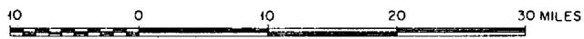  
SURROUNDING OAK RIDGE AREA

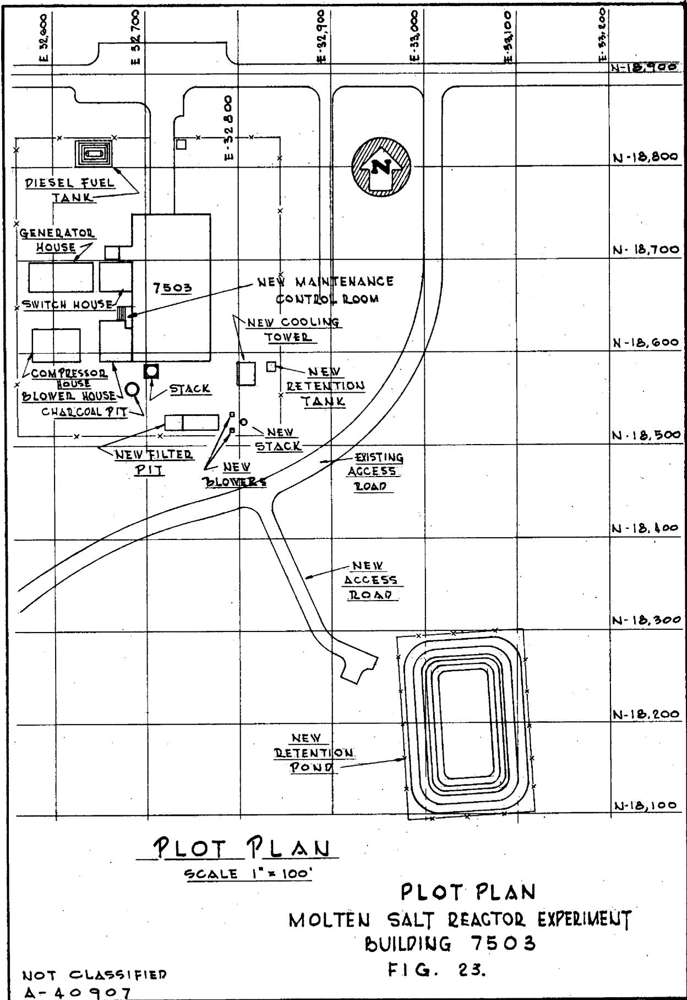

# Appendix A

# CHEMISTRY AND CORROSION

# Fuel Composition and Stability

The MSRE fuel is a mixture of molten fluorides with the composition $\mathrm{LiF - BeF_2 - ZrF_4 - ThF_4 - UF_4}$ (70-23-5-1-1 mole%). The latest experiments show that all three quadrivalent cations behave similarly and that $15\%$ of these cations can be contained in a liquid solution of LiF and $\mathrm{BeF_2}$ at $440^{\circ}\mathrm{C}$ ( $824^{\circ}\mathrm{F}$ ). Research is being continued in order to have a complete phase diagram for the system.

The purpose of $\mathrm{ZrF_4}$ in the fuel is to prevent the uranium from precipitating as $\mathrm{UO_2}$ in the presence of small amounts of an oxidizing agent. When solid $\mathrm{BeO_2}$ is added to a molten mixture of LiF, $\mathrm{BeF_2}$ , $\mathrm{ZrF_4}$ , and $\mathrm{UF_4}$ with a $\mathrm{ZrF_4 / UF_4}$ ratio of 2, $\mathrm{UO_2}$ is precipitated and no $\mathrm{ZrO_2}$ is found. When the ratio $\mathrm{ZrF_4 / UF_4}$ is increased to 3, $\mathrm{ZrO_2}$ is precipitated and no $\mathrm{UO_2}$ is found. This indicates that the reaction $\mathrm{UF_4 + ZrO_2\rightleftharpoons ZrF_4 + UO_2}$ has an equilibrium constant between 2 and 3; that is,

$$
\mathrm {K} = \frac {\left[ \mathrm {Z r F} _ {4} \right] \left[ \mathrm {U O} _ {2} \right]}{\left[ \mathrm {U F} _ {4} \right] \left[ \mathrm {Z r O} _ {2} \right]} = \frac {\left[ \mathrm {Z r F} _ {4} \right]}{\left[ \mathrm {U F} _ {4} \right]} \approx 2. 5
$$

(the activities of $\mathrm{UO}_2$ and $\mathrm{ZrO}_2$ , both being solids, are taken as one). Therefore, to prevent precipitation of $\mathrm{UO}_2$ , a ratio $\mathrm{ZrF}_4 / \mathrm{UF}_4$ of not less than 3 is necessary. The actual ratio in the fuel is 5, which gives a good safety margin, and maintains the fuel well within its known limits of stability.

The vapor pressure of the fuel salt at operating temperatures is about $10^{-2}$ mm Hg, as shown in Fig. A.1.

The liquidus of the fuel salt is $440^{\circ}\mathrm{C}$ ( $828^{\circ}\mathrm{F}$ ). At this temperature a solid phase appears having LiF, $\mathrm{BeF}_2$ , and $\mathrm{ZrF}_4$ in as-yet-unknown proportions. At $431^{\circ}\mathrm{C}$ ( $800^{\circ}\mathrm{F}$ ), an additional solid, 2LiF: $\mathrm{BeF}_2$ , forms. The next known phase appears at $425^{\circ}\mathrm{C}$ ( $797^{\circ}\mathrm{F}$ ). This is 7LiF·6(U, Th)F₄,

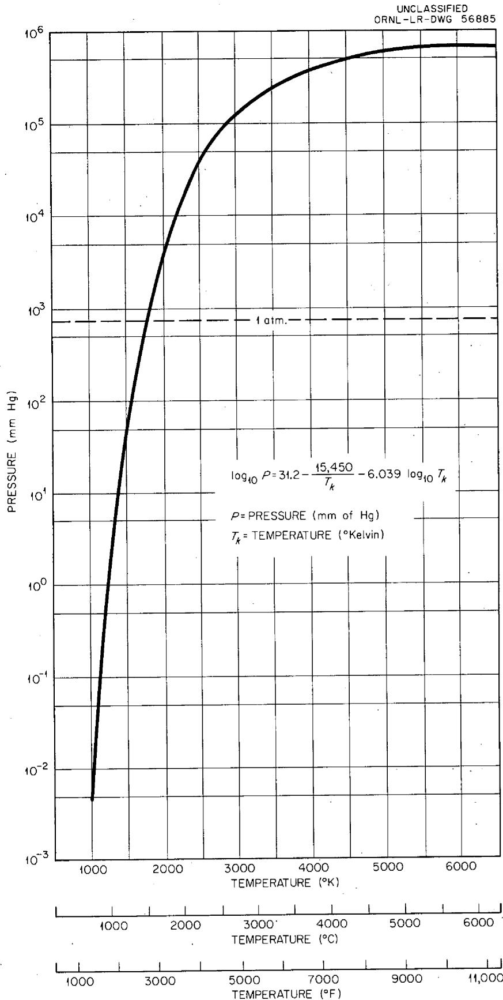  
Fig. A.1. Estimated Vapor Pressure of Fuel Salt.

which is 15 mole % U, 85 mole % Th. Thus it may be noted that there is no tendency for uranium to concentrate at the freeze flanges or freeze valves.

The compositions of the fuel and coolant salts are matched so that it is impossible to freeze the fuel salt by removing heat through the coolant salt. The coolant-salt liquidus is $450^{\circ}\mathrm{C}(842^{\circ}\mathrm{F})$ . Below this point about $96\%$ of the salt forms 2LiF·BeF2, which would not circulate. This is $18^{\circ}\mathrm{F}$ above the liquidus of the fuel. The phase diagram of the coolant salt is shown in Fig. A.2.

# Corrosion of INCR-8 by Fuel

Numerous corrosion tests have been completed with fuel mixtures of the type to be utilized in the MSRE. Results of 37 INOR-8 thermal-convection loops, 17 of which operated in excess of one year, show complete compatibility between INOR-8 and the beryllium-based fluoride systems.[11-13] Experiments conducted in INOR-8 forced-convection loops for one year or more similarly show low corrosion rates in fluoride mixtures of this type.[11-13] The operating conditions of these experiments are shown below:

<table><tr><td>Variable</td><td>Forced 
Convection Loops</td><td>Thermal 
Convection Loops</td></tr><tr><td>Fluid-metal 
interface temp.</td><td>1300°F</td><td>1350°F</td></tr><tr><td>Fluid temperature 
gradient</td><td>200°F</td><td>170°F</td></tr><tr><td>Flow rate</td><td>~ 2 gpm</td><td>~ 7 fpm</td></tr></table>

Metallographic examinations of INOR-8 surfaces following salt exposure in these loop experiments reveal no corrosion effects in time periods up to 5000 hr. At times longer than 5000 hr a thin (less than $1/2$ mil) continuous surface layer develops at the salt-metal interface.

A quantitative measurement of the corrosion rate occurring in an INOR-3 forced-convection system containing LiF=BeF2=UF4 (62-37-1 mole %)

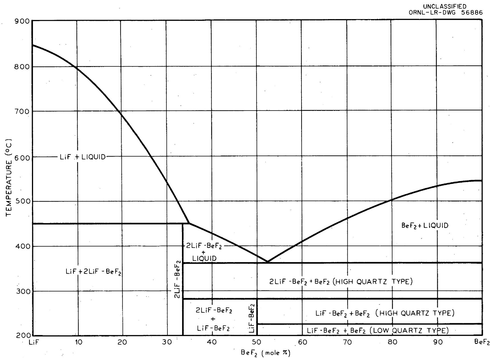  
Fig. A.2. Phase Diagram of Coolant Salt.

was carried out by means of carefully weighed and measured inserts located at the point of maximum salt temperature $(1300^{\circ}\mathrm{F})$ . The inserts, removed after test intervals of 5000, 10,000 and 15,000 hr, reveal relatively small weight losses, as shown below:

<table><tr><td rowspan="2">Time (hr)</td><td colspan="2">Weight Loss</td></tr><tr><td>mg/cm2</td><td>mg/cm2/mo</td></tr><tr><td>5,000</td><td>1.8</td><td>0.26</td></tr><tr><td>10,000</td><td>2.1</td><td>0.15</td></tr><tr><td>15,000</td><td>1.7</td><td>0.08</td></tr></table>

The weight losses do not increase measurably after the first 5000 hr. No changes in the wall thickness of the inserts are detected based on before- and after-test dimensions.

In some loops where there is evidence of contamination by water or some other oxidizing agent, greater attack is found in the hot regions, with roughening and pitting of the surface to depths of 1-1/2 mils or more. In the cold-leg regions, magnetic metal crystals loosely adherent to the cold-leg wall are found, composed predominantly of nickel and containing only minor amounts of chromium and iron.

Several brazing materials have been developed for possible use in the heat exchanger. Three nickel-base alloys, one gold-base alloy, and pure copper were tested in thermal-convection loops at $1300^{\mathrm{O}}\mathrm{F}$ without showing any signs of attack after 10,000 hr of operation when they were used to join INOR-8.

# Corrosion Reactions

The main corrosion mechanism is selective leaching of chromium, not because of physical solubility of chromium metal in molten fluorides, but by chemical reaction of this metal with oxidizing agents present in the melt or in the original metal surface.

Typical impurities produce corrosion by the following reactions:

$$
\begin{array}{l l l l l l l}2 \mathrm {H F}&+&\mathrm {C r}&\rightarrow&\mathrm {C r F} _ {2}&+&\mathrm {H} _ {2}\\\mathrm {N i F} _ {2}&+&\mathrm {C r}&\rightarrow&\mathrm {C r F} _ {2}&+&\mathrm {N i}\\\mathrm {F e F} _ {2}&+&\mathrm {C r}&\rightarrow&\mathrm {C r F} _ {2}&+&\mathrm {F e}\\2 \mathrm {F e F} _ {3}&+&3 \mathrm {C r}&\rightarrow&3 \mathrm {C r F} _ {2}&+&2 \mathrm {F e}\\2 \mathrm {C r F} _ {3}&+&\mathrm {C r}&\rightarrow&3 \mathrm {C r F} _ {2}\end{array}
$$

Oxide films on the metal walls can react with the fuel constituents $\left(\mathrm{ZrF}_{4} \text { or } \mathrm{UF}_{4}\right)$ to yield structural metal fluorides:

$$
\begin{array}{l l l l l l}2 \mathrm {N i} 0&+&\mathrm {Z r F} _ {4}&\rightarrow&2 \mathrm {N i F} _ {2}&+; \quad \mathrm {Z r O} _ {2}\\2 \mathrm {F e} _ {2} ^ {0} _ {3}&+&3 \mathrm {Z r F} _ {4}&\rightarrow&4 \mathrm {F e F} _ {3}&+; \quad 3 \mathrm {Z r O} _ {2}\\2 \mathrm {C r} _ {2} ^ {0} _ {3}&+&3 \mathrm {Z r F} _ {4}&\rightarrow&4 \mathrm {C r F} _ {3}&+; \quad 3 \mathrm {Z r O} _ {2}\end{array}
$$

These metal fluorides are then available for reaction with chromium as shown above.

It is therefore necessary that both the melt and the structural metal be of high purity. Even in this case, a possible corrosion reaction is $2\mathrm{UF}_4 + \mathrm{Cr} \stackrel{\rightarrow}{\leftarrow} \mathrm{CrF}_2 + 2\mathrm{UF}_3$ .

Sampling systems designed to provide periodic analyses of salts during corrosion tests are utilized in conjunction with several forced-convection loop experiments.14 Samples taken over a 20,000-hr period in loops operated under temperature conditions listed above show only slight increases in the chromium concentration of the salt during test. In an experiment containing the mixture LiF-BeF $_2$ -UF $_4$ -ThF $_4$ (62-36.5-0.5-1 mole %) the chromium concentration increased from an initial level of 400 ppm to 500 ppm during the first 1000 hr of operation and remained at approximately the latter value during the remainder of the test.

Contamination of the Molten Fuel by Moisture or Air

In the case of moisture contamination, the possible reactions are:

$$
\begin{array}{c c c c c c c}\mathrm {H} _ {2} \mathrm {O}&+&2 \mathrm {L i F}&\rightarrow&\mathrm {L i} _ {2} \mathrm {O}&+&2 \mathrm {H F}\\2 \mathrm {H F}&+&\mathrm {C r}&\rightarrow&\mathrm {C r F} _ {2}&+&\mathrm {H} _ {2}\\\mathrm {Z r F} _ {4}&+&2 \mathrm {L i} _ {2} \mathrm {O}&\rightarrow&\mathrm {Z r O} _ {2}&+&4 \mathrm {L i F}\end{array}
$$

These reactions are complete and very rapid, causing both corrosion of INOR-8 and precipitation of $\mathrm{ZrO}_2$ in the fuel.

Contamination by oxygen of the air has a worse effect, although the reactions are not so fast as above:

$$
\begin{array}{l} 0 _ {2} + 2 \mathrm {U F} _ {4} \rightarrow 2 \mathrm {U O F} _ {4} - - - - (s t r o n g o x i d a n t) \\ \mathrm {U O F} _ {4} \quad + \quad \mathrm {N i} \quad \rightarrow \quad \mathrm {N i O} \quad + \quad \mathrm {U F} _ {4} \\ 2 \mathrm {N i} 0 + \mathrm {Z r F} _ {4} \rightarrow \mathrm {Z r O} _ {2} + 2 \mathrm {N i F} _ {2} | | \mathrm {N i F} _ {2} + \mathrm {C r} \rightarrow \mathrm {C r F} _ {2} + \mathrm {N i} \downarrow \\ \end{array}
$$

The last two reactions are relatively slow but they cause nickel transfer from hot to cold regions.

The $\mathrm{ZrO}_2$ is not dense enough to settle and stays in the fuel as a slurry. Although its particles are hard, erosion in the pump blades is not evident.

A test program is in progress to evaluate the effects of contamination on the corrosion behavior of fused fluoride mixtures, and to ascertain the limits of the various contaminants which can be tolerated without seriously increasing the corrosiveness of the fuel salt. The contaminants under study include HF, metal oxides, and oil vapors. Results of this program will be applied to specifications of the cover-gas purity as well as to salt purity requirements.

# Corrosion by the Coolant

The coolant, being a mixture of LiF and $\mathrm{BeF}_2$ , does not present problems of precipitation of $\mathrm{UO}_2$ or $\mathrm{ZrO}_2$ .

Although the coolant is very sensitive to moisture and air, the oxides are 150 times more soluble in the coolant than in the fuel. Some possible reactions are:

$$
\begin{array}{l} 0 _ {2} \quad + 2 N i \quad \rightarrow \quad 2 N i 0 \\ \mathrm {N i} 0 \quad + \quad \mathrm {B e F} _ {2} \quad \rightarrow \quad \mathrm {B e O} \downarrow + \quad \mathrm {N i F} _ {2} \\ \mathrm {N i F} _ {2} + \mathrm {C r} \quad \stackrel {\rightarrow} {\leftarrow} \quad \mathrm {C r F} _ {2} + \mathrm {N i} \downarrow \\ \end{array}
$$

This causes selective leaching of chromium, precipitation of $\mathrm{BeO}$ , and deposition of nickel in the cold regions of the loop, although the reaction $\mathrm{NiF}_2 + \mathrm{Cr} \rightleftharpoons \mathrm{Ni} \downarrow + \mathrm{CrF}_2$ is not as temperature sensitive as the $\mathrm{UF}_4$ oxidation reaction.

Since the probability of contamination in the coolant circuit is higher than in the fuel circuit, caution must be taken to avoid undue corrosion.

# Appendix B

# HOT SPOT ANALYSIS

An analysis was made to estimate the temperature that the MSRE graphite and fuel may attain if one of the fuel passages becomes blocked so that no flow occurs. The estimate is based on a comparison between the temperatures resulting from a unidirectional heat-flow case and those given by a relaxation-solution technique of two-dimensional heat flow from one face to the other three faces of a square rod. The relaxation solution is found to be $36\%$ , or about one-third, of that for the unidirectional case.

The following cases are superposed:

a. Temperature rise in an infinite slab of fuel with a uniform volume heat source.   
b. Temperature drop for conduction of this heat from the fuel across a graphite slab.   
c. Temperature drop caused by heat generated within the graphite.   
d. Film drop between the graphite wall and the bulk mean temperature of the fuel in the adjacent open channel due to the heat inflow and its own volume heat source.

The expansion of the fuel reduces the power generation rate slightly. This adjustment is made at the end of the calculations.

The following conditions and properties are used in the calculations:

Reactor power 10 Mwt

Fission-product decay heat outside core $4 \%$

Fraction of core power in graphite 7%

Peak-to-average power ratio 2.8

Thermal conductivity of fuel $(\mathbf{K}_{\mathrm{f}})$ 2.75 Btu/hr-ft-°F

Thermal conductivity of graphite $(\mathbf{K}_{c})$ 12 Btu/hr-ft-°F

Half fuel-channel width $(X_{f})$ 0.20 in. or 0.0167 ft

Graphite block thickness $\left(\mathbf{X}_{\mathrm{c}}\right)$ 1.60 in. or 0.1333 ft

Bulk mean temperature of fuel in 1210°F adjacent channel

Core size 4.5-ft diam, 5.5-ft height

Fraction of core volume in fuel 0.225

# Symbols

q'' Heat generation rate, Btu/hr-ft³

q'' Heat flow rate, Btu/hr-ft

△T Temperature difference, ${}^{\circ}\mathrm{F}$

K Thermal conductivity, Btu/hr-ft-°F

X Thickness or distance, ft

# Subscripts

Fuel

bf Fuel in blocked channel

ff Fuel in flowing channel

c Carbon or graphite

Wall of flowing fuel channel

The temperature drop across a slab with uniform heat generation and cooling on one side is:

$$
\Delta \mathrm {T} = \frac {\mathrm {q} ^ {\prime \prime \prime} \times^ {2}}{2 \mathrm {K}}. \tag {1}
$$

The bulk mean temperature of the fuel is:

$$
\Delta \mathrm {T} _ {\mathrm {m}} = \frac {2}{3} \Delta \mathrm {T}. \tag {2}
$$

The temperature drop across a slab with uniform heat flow is:

$$
\Delta \mathrm {T} = \frac {\mathrm {q} ^ {\prime \prime} \mathrm {X}}{\mathrm {K}}. \tag {3}
$$

The film drop for laminar flow in flat channels having uniform heat generation is:

$$
\Delta \mathrm {T} = \frac {\mathrm {q} ^ {\prime \prime \prime} \quad \mathrm {x} ^ {2}}{\mathrm {K}} \quad \left(\frac {1 7 (1 + \mathrm {q} ^ {\prime \prime} \quad \mathrm {w} / \mathrm {q} ^ {\prime \prime \prime} \quad \mathrm {x}) - 1 4}{3 5}\right) \tag {4}
$$

The heat generated within a slab and flowing across the face is:

$$
q ^ {\prime \prime} = q ^ {\prime \prime \prime} x,
$$

-90

$$
q _ {b f} ^ {\prime \prime \prime} = q _ {f f} ^ {\prime \prime \prime} = 4. 3 \times 1 0 ^ {6} B t u / h r - f t ^ {3},
$$

$$
q _ {c} ^ {\prime \prime \prime} = 0. 0 9 5 \times 1 0 ^ {6} B t u / h r - f t ^ {2}.
$$

For part (a):

$$
\Delta \mathrm {T} _ {\mathrm {b f}} = \frac {\mathrm {q} ^ {\prime \prime \prime} \mathrm {x} _ {\mathrm {f}} ^ {2}}{2 \mathrm {K} _ {\mathrm {f}}} = \frac {4 . 3 \times 1 0 ^ {6} \times (0 . 0 1 6 7) ^ {2}}{2 \times 2 . 7 5} = 2 2 0 ^ {\circ} \mathrm {F}.
$$

For part (b):

$$
\Delta \mathrm {T} _ {\mathrm {c}} = 0. 3 6 \times \frac {\mathrm {q} ^ {\prime \prime} \mathrm {X} _ {\mathrm {c}}}{\mathrm {K} _ {\mathrm {c}}} = 0. 3 6 \times \frac {4 . 3 \times 1 0 ^ {6} \times 0 . 0 1 6 7 \times 0 . 1 3 3}{1 2} = 2 8 7 ^ {\circ} \mathrm {F}.
$$

For part (c):

$$
\Delta \mathrm {T} _ {\mathrm {c}} = 0. 3 6 \times \frac {\mathrm {q} _ {\mathrm {c}} ^ {\prime \prime \prime} \mathrm {x} _ {\mathrm {c}} ^ {2}}{2 \mathrm {K} _ {\mathrm {c}}} = 0. 3 6 \times \frac {0 . 0 9 5 \times 1 0 ^ {6} \times (0 . 1 3 3) ^ {2}}{2 \times 1 2} = 2 5 ^ {\circ} \mathrm {F}.
$$

For part (d):

$$
\Delta \mathrm {T} _ {\mathrm {f f}} = \frac {\mathrm {q} ^ {\prime \prime \prime} \mathrm {X} _ {\mathrm {f f}} ^ {2}}{\mathrm {K} _ {\mathrm {f}}} \quad \left[ \frac {1 7 (1 + \mathrm {q} ^ {\prime \prime} \mathrm {w} / \mathrm {q} ^ {\prime \prime \prime} \mathrm {X} _ {\mathrm {f f}}) - 1 4}{3 5} \right].
$$

$q_{w}^{\prime \prime}$ is taken to be one-third of the heat generated in one-half of the blocked fuel channel plus four-thirds of that generated in the graphite rod normally flowing through the face.

$$
\begin{array}{l} q _ {w} ^ {\prime \prime} = \frac {q _ {f} ^ {\prime \prime \prime} X _ {f}}{3} + \frac {4}{3} \frac {q _ {c} ^ {\prime \prime \prime} X}{4} \\ = \frac {4 . 3 \times 1 0 ^ {6} \times 0 . 0 1 6 7}{3} + \frac {0 . 0 9 5 \times 1 0 ^ {6} \times 0 . 1 3 3}{3} \\ = 2 4, 1 0 0 + 4, 2 0 0 = 2 8, 3 0 0. \\ \end{array}
$$

-91

$$
q ^ {\prime \prime} x _ {f f} = 4. 3 \times 1 0 ^ {6} \times 0. 0 1 6 7 = 7 2, 0 0 0.
$$

$$
1 + q _ {w} ^ {\prime \prime} / q _ {f f} ^ {\prime \prime \prime} X _ {f f} = 1 + 2 8, 3 0 0 / 7 2, 0 0 0 = 1. 3 9.
$$

$$
\begin{array}{l} \Delta \mathrm {T} _ {\mathrm {r f}} = \frac {4 . 3 \times 1 0 ^ {6} \times 0 . 0 1 6 7 ^ {2}}{2 . 7 5} \quad \left(\frac {1 7 \times 1 . 3 9 - 1 4}{3 5}\right) \\ = 4 4 0 \times 0. 2 7 4 = 1 2 1 ^ {\circ} F \\ \end{array}
$$

The bulk mean temperature of the fuel above the wall is:

$$
\Delta T _ {m} = \frac {2}{3} \quad \Delta T _ {b f} = \frac {2}{3} x 2 2 0 = 1 4 7 ^ {\circ} F.
$$

With the fuel density changing -1.25 x $10^{-4} / \circ \mathrm{F}$ , heat generation in the blocked fuel channel is about 93.5% of the base used in these calculations. Making this adjustment, the temperatures become as shown:

Temperature in the adjacent fuel channel, ${}^{\circ}\mathbf{F}$ 1210

Temperature rise in fuel, ${}^{\circ}\mathrm{F}$ 113

Graphite wall temperature, ${}^{\circ}\mathbf{F}$ 1323

Temperature rise in graphite, ${}^{\circ}\mathbf{F}$ 292

Top graphite wall temperature, ${}^{\circ}\mathbf{F}$ 1615

Temperature rise in fuel channel, $^\circ \mathrm{F}$ 206

Peak fuel temperature, $^\circ \mathrm{F}$ 1821

These temperatures are attainable only in the center of the core and should not damage either the fuel or the graphite.

Number JS-80-123

Date 1/24/61

Revised

Page 1 of 11

JOB SPECIFICATION

REACTOR DIVISION

OAK RIDGE NATIONAL LABORATORY

UNION CARBIDE NUCLEAR COMPANY

Division of Union Carbide Corporation

ORNL, Oak Ridge, Tennessee

Subject: Specification for Primary Drain and Fill Tanks, Primary Flush Tank, Secondary Drain Tank and Fuel Storage Tank for Molten Salt Reactor Experiment

1. SCOPE

This specification covers the requirements for materials, fabrication, inspection and testing of the primary drain and fill tanks, primary flush tank, secondary drain tank and fuel storage tank for the Molten Salt Reactor Experiment.

2. APPLICABLE SPECIFICATIONS, CODES, DRAWINGS, AND OTHER PUBLICATIONS

2.1 The latest revisions of the following documents shall form a part of this specification to the extent stated in subsequent sections:

ASME Boiler and Pressure Vessel Code, Sections VIII and IX

ASME Code Case Interpretations 1270N-2 and 1273N-3

ORNL Specification MET-RM-4 for INOR-8 Welding Fittings, Shapes, etc.

ORNL Specification MET-RM-B163 for INOR-8 Tubing

ORNL Specification MET-RM-B167 for INOR-8 Pipe

ORNL Specification MET-RM-B304 for INOR-8 Weld Filler Material

ORNL Specification MET-RM-B334 for INOR-8 Plate

ORNL Specification MET-RM-2 for INOR-8 Forgings

ORNL Specification MET-NDT-E165 for Liquid Penetrant Inspection

ORNL Specification MET-WR-2 for INOR-8 Welding Requirements

<table><tr><td>Number</td><td>JS-80-123</td></tr><tr><td>Date</td><td>1/24/61</td></tr><tr><td>Revised</td><td></td></tr><tr><td>Page</td><td>2 of 11</td></tr></table>

ORNL Specifications P.S.-23, P.S.-25, P.S.-26 for INOR-8 Welding Procedures (for information only)

ORNL Specifications QTS-23, QTS-25, QTS-26 for Welder Qualification Tests (for information only)

# 2.2. Drawings

The following Company's fabrication drawings form a part of this specification:

D-FF-A40455 Primary Drain and Fill Tank - Assembly

D-FF-A40456 Primary Drain and Fill Tank - Steam Dome Assembly and Details

D-FF-A40457 Primary Drain and Fill Tank - Assembly and Details

D-FF-A40458 Primary Drain and Fill Tank - Bayonet Exchanger Assembly and Details

D-FF-A40459 Primary Drain and Fill Tank - Bayonet Exchanger Bracing

D-FF-A40460 Primary Drain and Fill Tank - Cooling Water Header Assembly and Details

D-FF-A40461 Secondary Drain Tank - Assembly and Details

D-FF-A40462 Primary Flush Tank and Fuel Storage Tank - Assembly and Details

# 3. REQUIREMENTS

# 3.1 Design

The tanks to be furnished under this specification shall be fabricated in accordance with the Company's designs, and as shown on the Company's fabrication drawings accompanying and forming a part of this specification, except that the Seller may adopt his own standards for weld-end preparation, provided they are submitted to and approved by the Company in writing prior to start of fabrication. The tanks will contain molten fluoride salts.

Number JS-80-123

Date 1/24/61

Revised

Page 3 of 11

# 3.1.1 Primary Drain and Fill Tanks

Two (2) primary system drain and fill tanks, similar in design, with the exception of certain nozzle locations, will be required.

Each fill and drain tank consists of a lower tank, which will contain the molten fluoride salt, and an upper steam dome. Heat will be removed from the molten salt in the lower tank by introducing water into concentric thimbles which penetrate the top head of the lower tank. The steam generated in the thimbles will be collected in the upper steam dome through tubing and flexible connectors. Details of the tank support designs have not been finalized. The Seller shall be responsible for furnishing tank support brackets and steam dome supporting steel after designs are completed and drawings furnished to the Seller.

The following design criteria are included for the Seller's information:

Tank design pressure 50 psig

Tank design temperature 1300oF

Cooling system capability 100 kw at $1300^{\circ}\mathbf{F}$

Cooling water temperature 100aF

Steam dome design pressure 50 psig

Steam dome design temperature 300°F

# 3.1.2. Primary Flush Tank

One (1) primary system flush tank will be required. This tank will contain the molten salt necessary for flushing the primary piping system after the radioactive salts have been drained from the system.

Design conditions are as follows:

Design temperature 1300°F

Design pressure 50 psig

Number

Date

Revised

Page

JS-80-123

1/24/61

4 of 11

# 3.1.3 Secondary Drain Tank

One (1) secondary drain tank will be required to contain the molten salt drained from the secondary piping system.

Design conditions are as follows:

Design temperature 1300°F

Design pressure 50 psig

# 3.1.4 Fuel Storage Tank

One (1) fuel storage tank will be required. Design conditions are as follows:

Design temperature 1300°F

Design pressure 50 psig

# 3.2 Materials

3.2.1 All tanks, tubing, piping, etc., to be furnished under this specification shall be fabricated from INOR-8, a nickel-molybdenum-chromium material, unless otherwise specified in the Parts Lists which appear on the Company's fabrication drawings.

Design data for INOR-8 are given in the following table:

<table><tr><td>Temp. OF T</td><td>Allowable Stress psi</td><td>Modulus of Elasticity psi 106 psi</td><td>Mean Coeff. of Expansion in./in. OFx10-670°F to T</td><td>Thermal Conductivity Btu/ft2-hr-OF/ft</td></tr><tr><td>100</td><td>24,000</td><td>31.4</td><td></td><td>7.7</td></tr><tr><td>200</td><td>24,000</td><td>30.7</td><td></td><td>8.1</td></tr><tr><td>300</td><td>22,800</td><td>30.1</td><td></td><td></td></tr><tr><td>400</td><td>21,700</td><td>29.5</td><td>6.45</td><td>9.0</td></tr><tr><td>500</td><td>20,800</td><td>28.9</td><td></td><td></td></tr><tr><td>600</td><td>20,000</td><td>28.5</td><td>6.76</td><td>9.9</td></tr><tr><td>700</td><td>19,300</td><td>28.0</td><td></td><td></td></tr></table>

<table><tr><td>Number</td><td>JS-80-123</td></tr><tr><td>Date</td><td>1/24/61</td></tr><tr><td>Revised</td><td></td></tr><tr><td>Page</td><td>5 of 11</td></tr></table>

<table><tr><td>Temp. °F
T</td><td>Allowable
Stress
psi</td><td>Modulus of
Elasticity
psi
10^5 psi</td><td>Mean Coeff.
of Expansion
in./in. °Fx10^-6
70°F to T</td><td>Thermal
Conductivity
Btu/ft2-hr-°F/ft</td></tr><tr><td>800</td><td>18,700</td><td>37.7</td><td>7.09</td><td>10.8</td></tr><tr><td>900</td><td>18,150</td><td>27.2</td><td></td><td></td></tr><tr><td>1000</td><td>16,000</td><td>26.8</td><td>7.43</td><td>11.7</td></tr><tr><td>1050</td><td>13,250</td><td>26.6</td><td></td><td></td></tr><tr><td>1100</td><td>9,600</td><td>26.4</td><td></td><td></td></tr><tr><td>1150</td><td>6,800</td><td>26.3</td><td></td><td></td></tr><tr><td>1200</td><td>4,950</td><td>26.1</td><td>7.81</td><td>12.6</td></tr><tr><td>1250</td><td>3,600</td><td>25.8</td><td></td><td></td></tr><tr><td>1300</td><td>2,750</td><td>25.4</td><td></td><td></td></tr><tr><td>1350</td><td>2,050</td><td>24.9</td><td></td><td></td></tr><tr><td>1400</td><td>1,600</td><td>24.4</td><td>8.16</td><td>13.5</td></tr><tr><td colspan="5">Density, 0.317 lb/in³</td></tr><tr><td colspan="5">Specific heat, 0.095 Btu/lb °F</td></tr></table>

3.2.2 All material received by the Seller for use in fabrication of the equipment to be furnished under this specification shall be inspected by the Seller for damage during shipment. All material found to be defective shall be rejected and reported to the Company. The methods of inspection shall be approved in writing by the Company.

# 3.3 Fabrication

3.3.1 All tanks shall be fabricated in accordance with the applicable sections of the ASME Boiler and Pressure Vessel Code, Sections VIII and IX, including Code Case Interpretations 1270N-2 and 1273N-3 for primary nuclear vessels, except that materials of construction and allowable stresses shall

be in accordance with this specification. In addition, the supplementary requirements of this specification shall be met. Where conflicts or inconsistencies occur, the requirements of this specification shall govern. Code stamping will not be required.

# 3.3.2 Forming of INOR-8 Materials

All procedures to be used by the Seller for forming of INOR-8 materials shall be submitted in writing for the approval of the Company prior to start of fabrication.

All materials after being formed by any method, such as bending, drawing, or swaging shall be subjected to liquid penetrant inspection of all surfaces in accordance with specification No. MET-NDT-E165. Any type of crack, fissure, fold, or other injurious defect shall be cause for rejection of the part.

Removal or repair of injurious defects shall be permitted only after written approval of the Company.

Formed heads shall be made in accordance with ORNL specification No. MET-RM-6.

# 3.3.3 Heat Treatment

The Seller shall furnish the Company with written heat treatment procedures which he proposes to adopt during the fabrication of the tanks. These procedures shall be approved in writing by the Company prior to start of tank fabrication.

A record of each heat treatment shall be made and shall form a part of the fabrication and inspection report.

# 3.3.4 Welding

All welding of INOR-8 material shall conform to the Company's Welding Specification MET-WR-2, attached hereto.

Welding of INOR-8 material may be performed in accordance with the Company's Procedure Specifications PS-23, PS-25, and PS-26 at the Seller's discretion, however, the Company assumes no responsibility for the adequacy of these specifications to meet the requirement of this specification.

All welding procedures used by the Seller in welding INOR-8 materials shall be submitted to and approved in writing by the Company prior to start of fabrication. The procedures

<table><tr><td>Number</td><td>JS-80-123</td></tr><tr><td>Date</td><td>1/24/61</td></tr><tr><td>Revised</td><td></td></tr><tr><td>Page</td><td>7 of 11</td></tr></table>

and welders shall be qualified in accordance with ORNL Specification MET-WR-2.

# 3.3.5 Cleaning

Immediately following any operation that imposes any unclean condition and before assembly, all parts and subassemblies shall be cleaned free of all oxides, grease, oil, filings, dust or any other foreign material. All internal and external surfaces shall have a bright finish. Precuations shall be taken to insure that all parts and subassemblies are kept in a clean condition throughout fabrication of the subject tanks.

It is especially important that oxide scale shall be removed from all parts that cannot be reached for direct inspection and cleaning after assembly. Discoloration of surgical gauze after wiping metal surfaces shall be used as a check for cleanliness.

Compounds containing sulphur, lead or mercury shall not be permitted to come into contact with surfaces of INOR-8 material.

# 3.3.6 Workmanship

The Seller shall fabricate all tanks and appurtenances in a manner consistent with the standards of high quality workmanship. Inferior quality of workmanship, as determined by visual inspection by the Company's inspector, shall be cause for rejection of the work.

The quality of workmanship as approved in the Welder's qualification tests shall be maintained throughout performance of all work on the subject tanks. Inferior workmanship as determined by testing and inspection of the welds in accordance with this specification shall be cause for rejection of the work and requalification of the welder.

# 3.3.7 Identification

The Seller shall affix an INOR-8 nameplate to the outside shell of each tank. The following data shall be stamped or engraved on each nameplate:

Fabricator's Name Specification JS-80-123 Year Completed Design Pressure Design Temperature Hydrostatic Test Pressure

A nameplate giving similar data shall also be affixed to the steam dome of each primary drain and fill tank.

# 4. INSPECTION AND TEST REQUIREMENTS

4.1 In addition to welds, each forging shall be liquid penetrant inspected in accordance with ORNL Specification MET-NDT-E165.   
4.2 Inspection of welds shall be in accordance with ORNL Welding Specification MET-WR-2.   
4.3 The Seller shall arrange for the Company's representative to have access to such parts of all plants as are concerned with the supply, manufacture, and assembly of parts for the subject tanks when requested, including Seller's own plants and those of his suppliers. Where reference is made to the Purchaser in the ORNL specifications for INOR-8, it shall be interpreted to mean Company.   
4.4 The Seller shall notify the Company at least three (3) working days in advance of the start of tests and inspections so the Company representative may be present. The tests and inspections referred to include:

(1) Welding procedure qualification. (3.3.4)   
(2) Welder qualifications. (3.3.4)   
(3) Any repairs of defects. (4.5)   
(4) Hydrostatic test. (4.6)   
(5) Leak tests. (4.7, 4.8)   
(6) Any other tests. (4.9)   
(7) Preparation for shipment. (5)

No waiver of inspection observation or any requirement of this specification will be made unless confirmed in writing by the Company.

4.5 Repairs necessitated by defects in material or workmanship shall not be made without full knowledge and approval of the Company.   
4.6 The tanks shall be subjected to hydrostatic tests as follows:

The lower tank sections of the primary drain and fill tanks shall be subjected to a hydrostatic test of 655 psig.

The secondary drain tank, the primary system flush tank and the fuel storage tank shall each be subjected to a hydrostatic test of 655 psig.

<table><tr><td>Number</td><td>JS-80-123</td></tr><tr><td>Date</td><td>1/24/61</td></tr><tr><td>Revised</td><td></td></tr><tr><td>Page</td><td>9 of 11</td></tr></table>

The primary drain and fill tank steam dome and interconnecting piping to and including the tank thimbles shall be given a hydrostatic test of 80 psig.

The hydrostatic test pressures shall be held for one hour, during which time all surfaces and joints shall be visibly inspected for leaks. Repairs shall be made only after notifying and receiving the approval of the Company.

4.7 After the hydrostatic test, a helium mass spectrometer leak test shall be applied to the lower tank sections of the primary drain and fill tanks, and to the primary flush tank, fuel storage tank and secondary drain tank. The tanks shall be tested for leakage to the inside by bagging each tank in a plastic bag filled with helium and evacuating the tank. Each tank shall be tested separately.

The leak detector shall be demonstrated under test conditions to be sensitive to $1 \times 10^{-8}$ STD cc/sec of helium when using a standard leak of $1 \times 10^{-8}$ STD cc/sec connected to the most remote portion of the tank. Indicated leakage into each tank under test shall not be greater than $1 \times 10^{-8}$ STD cc/sec. The leak test shall be run for a minimum of 30 minutes on each tank, or for sufficient time to detect the standard leak, whichever is greater. If, in the opinion of the Company, the background reading of the leak detector has changed sufficiently during the above test to create a doubt regarding the absolute leak-tightness of the tanks, the test shall be repeated.

The presence of the Company representative is required during all helium leak testing.

4.8 After the hydrostatic test a halogen leak detection test shall be applied to the upper tank sections, thimbles and inter-connecting tubing to the primary drain and fill tanks. The volumes to be tested shall be pressurized with a mixture of at least $25\%$ freon in air, and the exterior surfaces surveyed with a halogen leak detector, using a technique demonstrated under test conditions, to be capable of detecting a leak of $1 \times 10^{-5}$ STD cc/sec of the pressurizing mixture. Leaks giving indications greater than $1 \times 10^{-5}$ STD cc/sec shall be cause for rejection.

4.9 The Seller shall make and report such other tests and inspections as are necessary to satisfy himself of the integrity and good condition of the tanks.

4.10 If at any stage of testing or inspection, physical failure, deformation or mechanical damage occurs or is observed, it shall be deemed as failure of the tank to meet these specifications.

<table><tr><td>Number</td><td>JS-80-123</td></tr><tr><td>Date</td><td>1/24/61</td></tr><tr><td>Revised</td><td></td></tr><tr><td>Page</td><td>10 of 11</td></tr></table>

4.11 A test failure which requires repair and/or corrective measures to be made will automatically necessitate repetition of the previous inspections and/or tests on the part requiring repair.

# 5. PREPARATION FOR DELIVERY

# 5.1 Preservation and Packaging

Prior to shipment, all tank openings shall be closed with gas-tight closures and the tanks shall be evacuated and charged to 25 psig with welding quality helium, argon or dry nitrogen gas. A valved pressure gauge shall be furnished and shall be securely affixed to one of the closures in each tank in such a manner as to permit reading of the internal gas pressure.

Each tank shall be securely mounted on a skid and suitably blocked and strapped to prevent shifting and/or damage while in transit.

# 6. NOTES

# 6.1 Engineering Information

# 6.1.1 Design Approval

Within five weeks after receipt of order, the Seller shall furnish the following Engineering Information for approval by the Company.

<table><tr><td>No. of Copies</td><td>Description</td></tr><tr><td>7</td><td>Leak Test Procedures</td></tr><tr><td>7</td><td>Welding Procedures</td></tr><tr><td>7</td><td>Heat Treatment Procedures</td></tr><tr><td>7</td><td>Record of Welder&#x27;s Qualification Tests</td></tr><tr><td>7</td><td>INOR-8 Inventory System</td></tr></table>

After receipt of Engineering Information, the Company will require a minimum period of four (4) working days for its review. Fabrication of work shall not be started and delivery of equipment and material shall not be authorized until written approval of the Engineering Information has been extended by the Company.

<table><tr><td>Number</td><td>JS-80-123</td></tr><tr><td>Date</td><td>1/24/61</td></tr><tr><td>Revised</td><td></td></tr><tr><td>Page</td><td>11 of 11</td></tr></table>

The Seller shall furnish four (4) certified copies of the Engineering Information within four (4) weeks after receipt of approval.

# 6.2 Seller's Data

Certified copies of Seller's Data shall be furnished in the quantities specified prior to shipment of equipment.

<table><tr><td>No. of Copies</td><td>Description</td></tr><tr><td>1</td><td>Radiographs</td></tr><tr><td>1</td><td>Heat Treating Charts</td></tr><tr><td>4</td><td>Leak Test Reports</td></tr><tr><td>4</td><td>Liquid Penetrant Test Reports</td></tr><tr><td>4</td><td>Weld Identification</td></tr><tr><td>4</td><td>INOR-8 Inventory Report</td></tr><tr><td>4</td><td>Supplementary Shop Drawings</td></tr><tr><td>4</td><td>ASME Form U-1</td></tr></table>

# 6.3 Manufacturing, Inspection and Test Schedule

Within four (4) weeks after receipt of order, the Seller shall submit to the Company the manufacturing, inspection and test schedule for all material and equipment furnished under this specification.

# 6.4 INOR-8 Material Inventory

Throughout fabrication of the tanks, the Seller shall maintain a system of material identification and control sufficient to establish the complete identity and history of all INOR-8 material, including weld filler material. The system shall be approved in writing by the Company prior to shipment of material to the Seller.

# Appendix D

# COMPONENT DEVELOPMENT PROGRAM IN SUPPORT OF THE MSRE

The reliable performance of components and auxiliaries used in the circulation of molten salts has been established in over 200,000 hr of accumulated loop operations, and forms the basis for the specification of components for the MSRE.

As an added insurance of reliability and safety, prototypes of critical MSRE components will be operated out-of-pile under conditions resembling those of the reactor. Facilities to be used for this testing include salt systems of various sizes and different degrees of complexity and model tests in which hydraulic and mechanical processes are analyzed.

# Core Flow

A 1/5-scale plastic model of the reactor has been operated with water as the fluid. Fluid velocity distribution in the entrance plenum in the region next to the cylindrical wall and in the lower plenum has been experimentally determined to be satisfactory for purposes of cooling those regions. On the basis of measurements made in the 1/5-scale model, the designs of the MSRE core and of a full-scale model were established. The full-scale model will be operated with 1250 gpm of glycerol solution to reproduce the expected Reynolds number of the reactor salt. The adequacy of flow distribution in every portion of the core-vessel assembly will be proved, or required modifications will be devised and demonstrated.

The possible interactions of fuel salt and full-size core graphite stringers will be investigated in an 8-in.-diameter vessel, part of the Engineering Test Loop (a facility for testing many MSRE prototype components and operating procedures).

# Fuel Circulation Pump

The conceptual design of the MSRE pump is similar to that of the pump developed for the Aircraft Reactor Experiment. These pumps have been virtually trouble-free in out-of-pile use. The prototype will be tested with water and with molten salt.

Hydraulic performance will be investigated in the water tests; later the design of the experiment will be modified as required for the stripping of dissolved gases in the pump bowl. The investigation of gas kinetics in a pump bowl has been started with $\mathrm{CO}_{2}$ being used as a tracer.

Hot tests with molten salt will provide a final test of the pump geometry derived from the water tests. Krypton-85 tracer will be used to develop an effective means of purging fission gases from the pump and of excluding them from the motor. The pump support arrangement designed for the MSRE will be utilized in the hot test stand. The MSRE pumps will be tested at operating temperatures in this equipment prior to installation at the reactor.

# Freeze Flanges

Freeze flanges have been a part of molten-salt engineering development for several years. They have been found satisfactory in a large circulating salt system, the Remote-Maintenance Demonstration Facility. It was shown that the flanges could withstand repeated thermal cycling and could be broken and reassembled.

Two flange pairs were cycled between room temperature and $1300^{\circ}\mathrm{F}$ for more than 100 times without failure. Salt leakage from a freeze flange has not been experienced to date, although leakage of helium through the secondary gas buffer seal is not uncommon.

The design of the flanges has been improved to provide greater strength toward axial loads, to reduce the thermal stress, and to improve the tightness of the buffer seal. Flanges of the improved type will be tested under simulated reactor service conditions to establish their reliability.

# Heat Exchangers

Heat exchangers as complex as the MSRE exchanger were fabricated of Inconel for the ARE and the ART. The fabricability of INOR-8 into tubes, and tube-tubesheet assemblies has been demonstrated. The MSRE heat exchanger and radiator assemblies, as now designed, do not require further development.

# Freeze Valves

Plugs of frozen salt have been used in many loops to isolate circulating molten salt from the environment. Two prototypes of "valves" to be used in the MSRE drain lines have been frozen and thawed 100 times without damage or incident. Ability of the valve to fail safe on loss of heating or loss of cooling was demonstrated.

Testing of prototype freeze valves will be continued as part of the operation of other loop and component tests.

# Sampler-Enricher

Part of the sampler-enricher mechanism has been mocked up, and mechanical components and instruments are being added to the mockup as the design evolves. The basic mechanical parts thus far are functioning reliably.

A complete sampler-enricher mockup will be fabricated when drawings of the MSRE device are finished. After the mechanical debugging of this prototype, its ability to obtain representative samples without contaminating the system with oxygen, or the environment with activity, will be demonstrated on the Engineering Test Loop.

# Heaters

Prototype MSRE heaters for pipes and vessels are being fabricated for testing on mockups and loops. The heaters will be subjected to life tests, and their temperature distribution and heat loss will be measured. Possible damage to pipe walls by overheating will be investigated also.

# Poison Tube

A mockup of the MSRE poison tube will be fabricated and tested to establish its reliability, response times, and control characteristics.

# Gas-Handling System

Helium cleanup traps, based on the technology developed for gas-cooled reactors, will be tested under flow conditions. At the same time, methods of chemical analysis to detect small quantities of contaminating oxygen will be developed and demonstrated.

# Maintenance

The practicality of the two general methods of maintenance designed into the MSRE has been thoroughly demonstrated during the past 3 years. Entirely remote maintenance, with the aid of stereo-television and a General Mills manipulator, was demonstrated on a special salt system (Remote-Maintenance Demonstration Facility) of about the size and degree of complexity of the MSRE. After this facility was operated with molten salt, the pump, the dummy core, the heat exchanger, and heaters were removed and replaced. The system was shown to be operable following the replacements.

Semidirect maintenance with long-handled tools operated through portable shielding has been used successfully on a number of operations at Homogeneous Reactor Experiment No. 2, a reactor of the general size and activity level of the MSRE. Some of the operations performed with these techniques were repair of the core vessel and replacement of pumps, valves, and a filter.

Although the feasibility of maintenance is regarded as having been established, additional development and practice is required to work out detailed procedures. Specific maintenance problems are being solved with the use of appropriate mockups in the Remote-Maintenance Demonstration Facility. As an aid to the designer of maintenance procedures, a 1/12-scale model of the reactor system and maintenance area is being built. This model will provide insurance that every item in the MSRE can be repaired or replaced after operations have started.

# ACCIDENTS INVOLVING RELEASE OF MOLTEN SALT INSIDE THE REACTOR CELL

Several incidents involving the release of the hot molten fuel salt and coolant salt into the reactor cell were studied. The first postulated accident involved an instantaneous drop of the molten salt into the reactor cell. The second accident is a rapid dispersion into the cell, such that the air within is quickly heated. The third accident is similar to the first except that the molten salt falls into water in the bottom of the cell.

Many simplifying assumptions are made, but all are conservative; therefore the calculated results of these accidents are more severe than would be experienced in an actual accident.

The calculations for the three postulated accidents indicate that the third, in which water leaked into the reactor cell, is the most severe. However, an automatic sump pump removes all inleakage of water. Furthermore, any presence of water is immediately alarmed to the operator, who may then take corrective action if the pump fails to work.

# Air Only in Cell

Let it be assumed that both fuel and coolant systems rupture and all fuel and coolant fall into the bottom of the reactor cell. For simplicity in calculations it is assumed that the bottom of the reactor cell is flat. The following parameters are used in the analysis of such an accident:

a. The total volume of the fuel and coolant mixture is 85 ft³.   
b. The mixture covers the bottom of the cell in a layer 0.8 ft thick.   
c. The temperature of the mixture is $1300^{\circ}\mathrm{F}$ initially.   
d. The temperature of the air in the cell is $100^{\circ}\mathrm{F}$ initially.   
e. The volume of the reactor cell is 11,550 ft³.   
f. The total heat transfer coefficient is calculated to be $h_{t} = 6.3$ Btu/hr- $^{\circ}$ F- ft².

The produced decay heat, $q(t)$ , is chosen to be $7\%$ of total power at 1 sec after shutdown.

$$
\begin{array}{l} Q _ {0} = q (1 \sec) = (0. 0 7) (1 0 M w) (3. 4 1 5 x 1 0 ^ {6} B t u / M w - h r), (1) \\ Q _ {0} = 2. 3 9 \times 1 0 ^ {6} \mathrm {B t u / h r}. (2) \\ \end{array}
$$

The decay heat per unit surface

$$
\begin{array}{l} q _ {o} = \frac {2 . 3 9 x 1 0 ^ {6}}{1 0 7 f t ^ {2}} B t u / h r, (3) \\ q _ {o} = 2. 2 4 \mathrm {B t u / h r - f t} ^ {2}. (4) \\ \end{array}
$$

The Way-Wigner equation for decay heat is:

$$
q (t) = q _ {0} t ^ {- 0. 2}. \tag {5}
$$

Writing (5) with $t$ in hours and assuming $t = 0$ at 1 sec after shutdown,

$$
q (t) = q _ {0} (3 6 0 0 t + 1) ^ {- 0. 2}. \tag {6}
$$

Let

$$
q (t) = q _ {0} (3 6 0 0 t) ^ {- 0. 2}. \tag {7}
$$

The particular equation for this system is:

$$
\frac {\mathrm {c d} \theta}{\mathrm {d t}} = q (t) = h _ {t} \theta , \tag {8}
$$

where $\theta =$ temperature in ${}^{\circ}\mathbf{F}$

and c =cp

$$
\begin{array}{l} = (0. 4 6 8) (1 3 3) (0. 8), \\ = 4 9. 8 \mathrm {B t u} / ^ {\circ} \mathrm {F} - \mathrm {f t} ^ {2}. \\ \end{array}
$$

The Laplacian transformation of Eq. (8) is:

$$
\theta (s) = \frac {\theta_ {i}}{s + \left(h _ {t} / c\right)} + \frac {1}{c} Q (s) \frac {1}{s + \left(h _ {t} / c\right)}. \tag {9}
$$

$$
\text {L e t} \lambda = h _ {t} / c = 0. 1 2 6 / h r
$$

Returning to the time domain, and using the convolution integral,

$$
\begin{array}{l} \theta (t) = \theta_ {i} e ^ {- \lambda t} + \frac {1}{c} \left[ q (t) e ^ {- \lambda t} \right], (10) \\ = \theta_ {i} e ^ {- \lambda t} + \frac {1}{c} \int_ {0} ^ {t} q (t) e ^ {- (t - \tau) \lambda} d \tau , \\ = e ^ {- \lambda t} \left[ \theta_ {1} + \frac {4 . 3 5 \times 1 0 ^ {3}}{4 9 . 8} \int_ {0} ^ {t} \tau^ {- 0. 2} e ^ {\lambda t} d \tau \right]. (11) \\ \end{array}
$$

Equation (ll) is not readily integrable; therefore let it be approximated by

$$
\theta (t) = e ^ {- \lambda t} \left[ \theta_ {i} + 8 7. 4 \sum_ {i = 1} ^ {\infty} t _ {i} ^ {- 0. 2} e ^ {\lambda t _ {i}} \Delta t \right]. \tag {12}
$$

The surface temperature of the molten salt is initially at $1300^{\circ}\mathrm{F}$ , and the shield water outside the reactor cell is initially at $100^{\circ}\mathrm{F}$ . If it is assumed that after the accidental falling of the fuel and coolant these temperatures remain constant, a mean steady-state air temperature may be computed as follows. The heat flow out of the salt to the air in the steady-state condition equals the heat flow from the air through the steel shell to the water. This tacitly assumes that the salt is an infinite source while the water is an infinite sink. In equation form the heat flow is written as follows:

$$
q _ {s - a} = q _ {a - w}, \tag {13}
$$

$$
q = h A \Delta t, \tag {14}
$$

where $\mathrm{h} =$ thermal conductivity, Btu/ft $^2$ -°F-hr

$$
A = \text {a r e a}, f t ^ {2}
$$

$$
\Delta t = \text {t e m p e r a t u r e d i f f e r e n t i a l}
$$

$$
\mathrm {h} _ {\mathrm {s}} \mathrm {A} _ {\mathrm {s}} \left(\mathrm {t} _ {\mathrm {s}} - \mathrm {t} _ {\mathrm {a}}\right) = \mathrm {h} _ {\mathrm {w}} \mathrm {A} _ {\mathrm {w}} \left(\mathrm {t} _ {\mathrm {a}} - \mathrm {t} _ {\mathrm {w}}\right). \tag {15}
$$

Subscripts s, a, and w refer to salt, air, and water, respectively.

$$
t _ {a} = \frac {\mathrm {h} _ {\mathrm {s}} \mathrm {A} _ {\mathrm {s}} + \mathrm {h} _ {\mathrm {w}} \mathrm {A} _ {\mathrm {w}}}{\mathrm {h} _ {\mathrm {s}} \mathrm {A} _ {\mathrm {s}} + \mathrm {h} _ {\mathrm {w}} \mathrm {A} _ {\mathrm {w}}} \tag {16}
$$

where $\mathrm{h}_{\mathrm{s}} = 2\mathrm{Btu} / \mathrm{ft}^{2}$ -F-hr

$$
\mathrm {h} _ {\mathrm {w}} = 0. 8 6,
$$

$$
A _ {s} = 1 0 7 f t ^ {2},
$$

$$
A _ {W} = 2 3 7 0 f t ^ {2},
$$

$$
t _ {s} = 1 3 0 0 ^ {\circ} F,
$$

$$
t _ {w} = 1 0 0 ^ {\circ} F.
$$

Substitute in (16):

$$
t _ {a} = 2 1 4 ^ {\circ} F. \tag {17}
$$

Initially the temperature of the air $= 100^{\circ}\mathrm{F}$ , $P = 14.2$ psia. The steady-state pressure of the air within the reactor cell is:

$$
\begin{array}{l} P _ {a} = \frac {(1 4 . 2) (6 7 4)}{5 6 0}, (18) \\ = 1 7. 1 \text {p s i a}, (19) \\ = 2. 4 \text {p s i g .} (20) \\ \end{array}
$$

# Sudden and Minute Dispersion of Fuel and Coolant Salt Within the Reactor Cell

Let it be assumed that the fuel and coolant circuits are ruptured resulting in a very sudden and minute dispersion of the molten salt into the reactor cell. Let it also be assumed that the molten salt and air within the cell constitute an insulated system and that the air then attains thermal equilibrium with the salt.

In the steady state, the heat loss of the molten salt equals the heat gained by the air.

$$
\left(\mathrm {T} _ {\text {f u e l}} - \mathrm {T} _ {\text {f i n a l}}\right) w _ {f} c _ {p _ {f}} = \left(\mathrm {T} _ {\text {f i n a l}} - \mathrm {T} _ {o}\right) w _ {a} c _ {p _ {a}}, \tag {21}
$$

where $\mathbf{T}_{\mathrm{fuel}} =$ temperature of fuel $= 1300^{\circ}\mathbf{F}$

Tfinal = final steady state of fuel and air,

$\mathrm{T}_{0}$ = initial temperature of air $= 100^{\circ}\mathrm{F}$ ,

$w_{f} = \text{weight of molten salt} = (85) ft^{3} (133) lb / ft^{3}$

$$
= 1 1, 3 2 0 \mathrm {l b},
$$

$=$ specific heat of molten salt $= 0.468$ Btu/1b-°F

$w_{a} = \text{weight of air} = (2.378 \times 10^{-3})(32.17)(11,550) = 884.01b,$

$c_{p_a} =$ specific heat of air $= 0.24\mathrm{Btu / lb}$

Substitute in (21):

$$
(1 3 0 0 - \mathrm {T} _ {\text {f i n a l}}) (1 1, 3 2 0) (0. 4 6 8) = (\mathrm {T} _ {\text {f i n a l}} - 1 0 0) (8 8 4) (0. 2 4), \tag {22}
$$

$$
\begin{array}{l} 6, 8 9 0, 0 0 0 - 5 3 0 0 \mathrm {T} _ {\text {f i n a l}} = 2 1 2 \mathrm {T} _ {\text {f i n a l}} - 2 1, 2 0 0 \\ \mathrm {T} _ {\text {f i n a l}} = 6, 9 1 1, 2 0 0 / 5 5 1 2 \\ = 1 2 5 0 ^ {\circ} \mathrm {F}. \tag {23} \\ \end{array}
$$

The idealized gas relationship is:

$$
\frac {P _ {1}}{T _ {1}} = \frac {P _ {2}}{T _ {2}},
$$

where $\mathbf{P}_{\mathbf{l}} =$ initial pressure in vessel $= 14.2$ psia at $100^{\circ}\mathrm{F}$

$$
\mathrm {T} _ {1} = 1 0 0 ^ {\circ} \mathrm {F} = 5 5 9 ^ {\circ} \mathrm {R}.
$$

$$
\mathrm {T} _ {2} = 1 2 5 0 ^ {\circ} \mathrm {F} = 1 7 0 9 ^ {\circ} \mathrm {R},
$$

Substitute in (3):

$$
\begin{array}{l} P _ {2} = \frac {(1 4 . 2) (1 7 0 9)}{5 5 9}, (24) \\ = 4 3. 4 \text {p s i a}, (25) \\ = 2 8. 7 \text {p s i g} (26) \\ \end{array}
$$

Assume now that, after a steady-state condition is reached within the pressure vessel, the drain-tank cell volume is suddenly added to the reactor-cell volume. Initially, the reactor-cell steady-state pressure is $P_{2} = 28.7$ psig, and $T_{2} = 1250^{\circ} \mathrm{F}$ , and the drain-tank cell is at $P_{3} = 14.2$ psig and $T_{3} = 100^{\circ} \mathrm{F}$ .

$$
\left(\mathrm {T} _ {2} - \mathrm {T} _ {\text {f i n a l}} ^ {\prime}\right) \mathrm {w} _ {\mathrm {f}} \mathrm {c} _ {\mathrm {p} _ {\mathrm {f}}} + \left(\mathrm {T} _ {2} - \mathrm {T} _ {\text {f i n a l}} ^ {\prime}\right) \mathrm {w} _ {\mathrm {a}} \mathrm {c} _ {\mathrm {p} _ {\mathrm {a}}} = \left(\mathrm {T} _ {\text {f i n a l}} ^ {\prime} - \mathrm {T} _ {3}\right) \mathrm {w} _ {\mathrm {a} _ {2}} \mathrm {c} _ {\mathrm {p} _ {\mathrm {a}}}, \tag {27}
$$

$$
\left(\mathrm {T} _ {2} - \mathrm {T} _ {\text {f i n a l}} ^ {\prime}\right) \left(\mathrm {w} _ {\mathrm {f}} \mathrm {c} _ {\mathrm {p} _ {\mathrm {f}}} + \mathrm {w} _ {\mathrm {a}} \mathrm {c} _ {\mathrm {p} _ {\mathrm {a}}}\right) = \left(\mathrm {T} _ {\text {f i n a l}} ^ {\prime} - \mathrm {T} _ {3}\right) \mathrm {w} _ {\mathrm {a} _ {2}} \mathrm {c} _ {\mathrm {p} _ {\mathrm {a}}} \quad , \tag {28}
$$

where $\mathrm{T}_{2} = 1250^{\circ}\mathrm{F}$

$$
\begin{array}{l} w _ {f} = 1 1, 3 2 0 \quad 1 b, \\ \mathrm {c} _ {\mathrm {p} _ {\mathrm {f}}} = 0. 4 6 8, \\ w _ {a} = 8 8 4 1 b, \\ \end{array}
$$

-113

$$
T _ {3} = 1 0 0 ^ {\circ} F,
$$

$$
w _ {a _ {2}} = (2. 3 7 8 \times 1 5 ^ {3}) (3 2. 1 7) (7 0 1 0) = 5 3 6,
$$

$$
c _ {p _ {a}} = 0. 2 4 B t u / 1 b
$$

Substitute in (8):

$$
\left(1 2 5 0 - \mathrm {T} _ {\text {f i n a l}} ^ {\prime}\right) \left[ (1 1, 3 2 0) (0. 4 6 8) + (8 8 4) (0. 2 4) \right] = \left(\mathrm {T} _ {\text {f i n a l}} ^ {\prime} - 1 0 0\right) (5 3 6) (0. 2 4), \tag {29}
$$

$$
(1 2 5 0 - T _ {\text {f i n a l}} ^ {\prime}) (5 5 0 2) = \left(T _ {\text {f i n a l}} ^ {\prime} - 1 0 0\right) (1 2 8. 6),
$$

$$
\mathrm {T} _ {\text {f i n a l}} ^ {\prime} = \frac {6 , 8 8 0 , 0 0 0 + 1 2 , 8 6 0}{5 6 3 1} = \frac {6 , 8 9 2 , 8 6 0}{5 6 3 1} = 1 2 2 3 ^ {\circ} \mathrm {R},
$$

$$
\mathrm {T} _ {\text {f i n a l}} ^ {\prime} = 7 6 4 ^ {\circ} \mathrm {F}.
$$

$$
\frac {\mathrm {P} _ {1} \mathrm {V} _ {1}}{\mathrm {T} _ {1}} = \frac {\mathrm {P} _ {2} \mathrm {V} _ {2}}{\mathrm {T} _ {2}}, \tag {30}
$$

$$
\frac {1 4 . 2}{5 5 9} = \frac {P _ {3}}{1 2 2 3},
$$

$$
\begin{array}{l} P _ {3} = 3 1. 1 \text {p s i a}, \\ = 1 6. 4 \text {p s i g} \tag {31} \\ \end{array}
$$

# Water in the Reactor Cell

In the third postulated accident, the fuel system was considered ruptured and molten salt released into water already in the bottom of the containment shell, producing steam and increasing the pressure. The worst situation was determined to be the rupture of the fuel line between the heat exchanger and the thermal shield, which would discharge about $3\mathrm{ft}^3$ of fuel in 1 sec, under pump pressure, with another $24\mathrm{ft}^3$ draining

out in 60 sec. Ruptures within the thermal shield or in the drain line would supply more salt, but at a slower rate. Likewise, a rupture of a tube in the heat exchanger would allow most of the $30\mathrm{ft}^3$ of coolant salt to drain, but again at a slower rate for the additional salt.

The heat dissipation rate of the containment-vessel walls when condensing steam is $1.65 \times 10^{6}$ Btu/min, which is the equivalent of a hot-salt leak rate of $21 \, ft^{3}/\min$ . Thus, after convective circulation is established within the reactor cell, condensation begins and the pressure within the containment cell will begin to decrease. For the calculations, it is assumed that there will be no heat loss from the vessel for the first 30 sec, and that it will increase linearly from 0 to $1.65 \times 10^{6}$ Btu/min in the next 30 sec.

The pressure rise is calculated on the assumption of the optimum amount of water being present. The maximum pressure results when there is just sufficient water to be converted to saturated steam; surplus water absorbs heat, and superheating the steam produces less increase in pressure than the same heat put into evaporating water. Thus, if more water is present than the optimum calculated below, the initial pressure rise would be less than calculated, and the continued draining of the salt would evaporate more water, but the pressure would be less than the peak of the initial pressure surge.

The following is a table of symbols and definitions of the variables and fixed parameters:

$\mathbf{T}_{1}$ Initial temperature of fuel $= 1225^{\circ}F$

$\mathbf{T}_{0}$ Initial temperature of water and air $= 100^{\circ} \mathrm{F}$

Tf Final temperature of fuel, water, and air, F

Density of fuel $= 154.5\mathrm{lb / ft}^3$

Weight of fuel released, 4170 lb

Weight of air in the reactor containment shell = 834 lb

Weight of air in drain-tank containment volume = 579 lb

$$
w _ {a} \quad w _ {a _ {1}} + w _ {a _ {2}} = t o t a l w e i g h t o f a i r, l b
$$

$$
w _ {w} \quad \text {W e i g h t o f w a t e r , l b}
$$

$$
c _ {p} \quad \text {A v e r a g e s p e c i f i c h e a t o f f u e l o v e r t h e t e m p e r a t u r e r a n g e}
$$

$$
= 0. 5 4 4 \mathrm {B t u} / \mathrm {l b} - ^ {\circ} \mathrm {F}
$$

$$
c _ {p} \quad \text {A v e r a g e s p e c i f i c h e a t o w a r t} = 1. 0 B t u / 1 b ^ {-} F
$$

$$
c _ {p} \quad \text {A v e r a g e s p e c i f i c h e a t o f a i r} = 0. 2 4 B t u / 1 b ^ {\circ} F
$$

$$
\begin{array}{l l} \mathrm {M w} & \text {N u m b e r o f m o l e s o f s t e a m} \\ \mathrm {W} & \end{array}
$$

$$
\begin{array}{l l} \mathrm {M w} _ {\mathrm {a}} & \text {N u m b e r o f m o l e s o f a i r} \end{array}
$$

$$
\mathrm {h} _ {\mathrm {g}} \quad \text {E n t h a l p y o f s t e a m a t T} _ {\mathrm {f}}, \text {B t u / l b}
$$

$$
\begin{array}{c c} \mathrm {P} _ {\mathrm {a}} & \text {P a r t i a l p r e s s u r e o f a i r} \\ \hline \end{array}
$$

$$
\mathrm {P} _ {\mathrm {s}} \quad \text {P a r t i a l p r e s s u r e o f H} _ {2} 0
$$

The energy balance after 1 min is:

$$
\begin{array}{l} \left(\mathrm {T} _ {1} - 3 2\right) \mathrm {w} _ {\mathrm {f}} \mathrm {c} _ {\mathrm {p} _ {\mathrm {f}}} + \left(\mathrm {T} _ {0} - 3 2\right) \left(\mathrm {w} _ {\mathrm {w}} \mathrm {c} _ {\mathrm {p} _ {\mathrm {w}}} + \mathrm {w} _ {\mathrm {a} _ {1}} \mathrm {c} _ {\mathrm {p} _ {\mathrm {a} _ {1}}}\right) \\ = \left(\mathrm {T} _ {\mathrm {f}} - 3 2\right) \left(\mathrm {w} _ {\mathrm {f}} \mathrm {c} _ {\mathrm {p} _ {\mathrm {f}}} + \mathrm {w} _ {\mathrm {a} _ {\mathrm {l}}} \mathrm {c} _ {\mathrm {p} _ {\mathrm {a}}}\right) + \mathrm {w} _ {\mathrm {w}} \mathrm {h} _ {\mathrm {g}} - 0. 4 1 \times 1 0 ^ {6}. \tag {32} \\ \end{array}
$$

The sum of partial pressures is:

$$
P = P _ {0} \frac {\left(T _ {f} + 4 6 0\right)}{\left(T _ {o} + 4 6 0\right)} + P _ {s}; \tag {33}
$$

also,

$$
- 1 1 6 =
$$

$$
= P _ {S} \left(\frac {1}{\frac {w _ {w}}{\left(M _ {w}\right)}}\right). \tag {34}
$$

Substituting known values and simplifying,

$$
w _ {w} = \frac {2 . 3 9 x 1 0 ^ {6} - T _ {f} (2 4 6 8)}{h _ {g} - 6 8}, \tag {35}
$$

$$
P = 0. 0 2 5 3 6 \left(T _ {f} + 4 6 0\right) + P _ {s}, \tag {36}
$$

$$
P = P _ {S} \left[ 1 + \frac {8 1 5}{w _ {w}} \right]. \tag {37}
$$

The solutions to Eqs. (35), (36), and (37) show the maximum pressure to be 39 psig, the temperature to be $260^{\circ}\mathrm{F}$ , and the optimum amount of water to be 1590 lb.

# Appendix F

# GRAPHITE COMPATIBILITY WITH SALT

Assessment of the general question of compatibility of graphite with molten fluoride reactor fuels has required experimental study of several possible problems. The present status of this experimental program is described briefly in this appendix.

# Chemical Interactions

Intercalation compounds of graphite with a variety of pure chlorides, bromides, and iodides are known. Graphite is severely damaged when such compounds are formed; a 2-hr treatment with $\mathrm{FeCl}_3$ at $300^{\circ}\mathrm{C}$ , for example, reduces graphite to powder by formation of an intercalate.

The major constituents, LiF, BeF $_2$ , ZrF $_4$ , ThF $_4$ , UF $_4$ , of the MSRE fuel mixtures are known from a large number of experiments to form no such compounds with graphite. This situation is not changed when such materials as NiF $_2$ , FeF $_2$ , and CrF $_2$ , alkaline-earth fluorides, and rare-earth fluoro-rides are added in appreciable concentrations.

A few of the possible fission-product fluorides $(\mathrm{MoF}_5$ , for example) might, in the pure state, form intercalation compounds with graphite. However, intercalation by compounds which react readily when pure can be prevented by dilution with nonreactive salts. The possible intercalate formers among the fission-product fluorides will occur only at concentrations below 0.01 mole%; it appears very unlikely that compound formation can occur between the graphites and any constituent of the molten fluoride solution.

Some cesium and rubidium isotopes of a variety of half-lives will be formed in the graphite through decay of xenon and krypton isotopes which have diffused into the graphite. The moderator temperatures are such that some stability of such compounds as $\mathrm{CsC}_{24}$ or $\mathrm{CsC}_{8}$ must be expected. Such compounds will tend to disrupt the graphite structure and would, if present in sufficient concentrations, probably disintegrate the moderator blocks. The absolute amounts of these elements so introduced into the graphite are so small that their effect can hardly be important.

Chemical reaction of the fuel salts with some of the contaminants which desorb from the graphite must be expected. Mixtures containing LiF, $\mathrm{BeF}_2$ , $\mathrm{ZrF}_4$ , $\mathrm{ThF}_4$ , and $\mathrm{UF}_4$ in concentrations typical of the MSRE fuel react slowly if at all with $\mathrm{CO}_2$ , $\mathrm{CO}$ , and $\mathrm{O}_2$ , though reactions such as

$$
\mathrm {C O} _ {2} + \mathrm {F e} \rightarrow \mathrm {F e O} + \mathrm {C O}
$$

and

$$
\mathrm {Z r F} _ {4} + 2 \mathrm {F e O} \rightarrow 2 \mathrm {F e F} _ {2} + \mathrm {Z r O} _ {2}
$$

would introduce some oxide contamination into the fuel salt. Reaction of the salt mixture with $\mathbb{H}_2\mathbb{O}$ as by

$$
\mathrm {Z r F} _ {4} + 2 \mathrm {H} _ {2} \mathrm {O} \rightarrow 4 \mathrm {H F} + \mathrm {Z r O} _ {2}
$$

is quite rapid. It will probably prove impossible to remove all chemisorbed oxygen-bearing species from the moderator graphite before addition of the MSRE fuel. However, the MSRE fuel mixture can apparently accommodate up to 1300 ppm of $0^{\text{三}}$ in solution without precipitation of a solid oxide; this is more by a factor of 3 than that available (assuming complete desorption and reaction) from the graphite. Moreover, if the $\mathrm{ZrF_4 / UF_4}$ ratio in the MSRE mixture exceeds 2, the first material to precipitate is triclinic $\mathrm{ZrO}_2$ which contains no $\mathrm{UO}_2$ . Since the $\mathrm{ZrF_4 / UF_4}$ ratio in the MSRE fuel will be at least 5, there seems to be no fear of precipitation of $\mathrm{UO}_2$ from the circulating fuel.

# Permeation of Graphite by Fuel Mixture

Graphite is apparently wetted by some fluorides in the molten state. Treatment of graphite with molten $\mathrm{SnF}_2$ at $300^{\circ}\mathrm{C}$ and at atmospheric pressure, for example, results in virtually complete penetration of the specimen by the salt and in a continuous film of salt over the graphite surface.

The results of a considerable series of experiments indicate, however, that graphite is not wetted by molten fluoride mixtures containing LiF, BeF $_2$ , ZrF $_4$ , ThF $_4$ and UF $_4$ . This behavior is not changed by addition of minor constituents such as the fluorides of structural metals. This behavior is essentially unchanged on treatment of the molten salt mixture

with anhydrous HF or strong reducing agents such as $\mathrm{Zr}^{\circ}$ . Superficial evidence of wetting is obtained if the graphite-salt system at $700^{\circ}\mathrm{C}$ is exposed to the air; in that case the screen which forms on the salt appears to promote wetting of the graphite surfaces. Since the graphite is not wetted by the salt mixture under nonoxidizing conditions, the graphite tends to resist penetration by the fuel salt into its pore structure.

Moderator graphite is, however, of much less than theoretical density. About $10^{\circ}$ of the volume of a specimen of moderator graphite consists of a network of interconnecting capillary passages of a variety of sizes. Even though the graphite is not wetted by the salt, therefore, the salt can be forced into the graphite pores by application of external pressure. The amount of penetration to be expected is a function of the external pressure, the interfacial tension of the liquid-solid interface, and the pore-size spectrum of the graphite. The penetration observed for a given specimen should be independent of treatment time.

Permeation by fused fluorides has been studied with a large number of graphite specimens which were degassed under conditions that could be matched in the reactor and were subsequently exposed to $\mathrm{LiF - BeF_2 - ThF_4 - UF_4}$ mixtures at $1300^{\circ}\mathrm{F}$ and at 95 and 150 psig of argon pressure. Low-density and quite-permeable graphites such as AGOT are permeated to the extent of nearly 15 vol % at either pressure. Of a total of 31 grades of graphite tested, four grades (B-1, S-4LB, GT-123-82, and CS-112-S) show salt permeation of less than 0.5% of the bulk graphite volume under 150 psig, while four others (CT-150, CEY-1350, CT-158, and CEY-G) also show less than 0.5% permeation under 95 psig. No effect of treatment time was observed in these tests.

# Compatibility in Long-Term Forced-Flow Test

In an engineering test of the compatibility of graphite with molten salts, 31 specimens of a special graphite (National Carbon Co. GT-123-82) were exposed at $1300^{\circ}\mathrm{F}$ in a flowing stream of $\mathrm{LiF - BeF}_2\mathrm{-UF}_4$ (62-37-1 mole %) for one year in a forced-circulation loop of INOR-8. A flow rate of 1.l gpm was maintained over the specimens with an effective pumping

head of 10 psi. An additional pressure of 3 psig was maintained by pressurizing the helium cover gas, so that the total pressure on the salt-graphite system was 13 psig. The graphite specimens (of two sizes: 11 in. long by 1/2 or 3/8 in. in diameter) were degassed for $24\mathrm{hr}$ at $1100^{\circ}\mathrm{F}$ by evacuation of the test loop and were flooded with argon before the loop was charged with salt.

After the year of operation the specimens were recovered for examination. The graphite was clearly not wetted by the fluoride melt; the specimens drained clean except for a few tiny spherical particles of salt which loosely adhered to the specimens. Dimensional changes for the rods averaged less than 0.5 mil on the diameter; this figure is close to the probable error of the measurements. No weight gains were observed. Weight losses varied from negligible to $0.05\%$ and averaged $0.02\%$ ; these losses may represent desorption of residual gases from the samples or may, perhaps, be evidence of slight erosion. Analysis of the graphite for uranium indicated an average of $15~\mathrm{ppm}$ . The graphite was in excellent condition; it is clear that exposure under these conditions is not deleterious to the system.

# In-Pile Testing

The results of an extensive program of out-of-pile testing are generally quite reassuring. The in-pile testing has disclosed no evidence which contradicts the out-of-pile tests, but the in-pile tests have been too few to be reassuring.

Two graphite crucibles (each 1.5 in. long, 0.10 in. in inside diameter, with 0.025 in. wall thickness) of a high-density graphite from National Carbon Company (similar to GT-123-82) were irradiated in the MTR at $1250^{\circ}\mathrm{F}$ for 1610 and 1492 hr, respectively, while charged with $\mathrm{LiF - BeF}_2\text{-UF}_4$ (62-37-1 mole %) mixture containing fully enriched $\mathsf{U}^{235}$ . The crucibles were plugged top and bottom with caps of the same graphite material and were enclosed in containers of Inconel. Irradiations to integrated dosages of 1520 and 1375 kw-hr/cm³ were given to the capsules. Postirradiation sectioning and inspection of the specimens revealed no evidence of damage to the graphite nor any evidence that the

graphite structure had been permeated by the salt. It may be concluded that no gross damage to the MSRE graphite will occur, at least during short-term irradiation.

Two attempts at a considerably more sophisticated experiment gave only partial success. Graphite specimens, enclosed in flexible capsules fabricated from INOR-8 bellows and filled with $\mathrm{LiF - BeF}_2\text{-ThF}_4\text{-UF}_4$ mixture, were exposed for 1600 hr at $1300^{\circ}\mathrm{F}$ in the MTR. The flexible capsules were immersed in a bath of molten sodium which served as the heat removal sink and also transmitted a pressure of 100 psig to the graphite-salt system. Only one of eight capsules so exposed survived the numerous thermal cycles, with sudden freezing and thawing of the salt, imposed by the MTR operation. The one surviving capsule contained a specimen of S-4A graphite. After this exposure, in which the power density in the fluoride fuel was about 200 w/cc, the external appearance of the graphite was relatively good and the physical dimensions had changed relatively little. From the increase in weight it appeared that 0.71 vol % of the specimen was permeated with salt; this is to be compared with out-of-pile tests in which S-4A was permeated to 1.0% at 150 psia.

Subsequent sectioning of the specimen and a combination of autoradiography, micro core drilling and subsequent analysis by counting techniques, and metallographic examination showed relatively high concentrations of fuel near the external surface of the graphite and along an internal chord of the specimen. Except in these surface regions and along this band of apparently high-porosity graphite within the specimen, the graphite interior is relatively clean; in general, the fission species which can be identified in the interior are alkali metals presumably deposited from noble-gas precursors which permeated the moderator.

It would be unwise to conclude too much from this single specimen (which is far from the best available graphite), and more studies are clearly needed. It appears, however, that no marked differences between the in-pile and out-of-pile behavior have yet been encountered.

# REFERENCES

1. W. B. Cottrell, ed., ORNL-1407 (Nov. 24, 1952) (Secret).   
2. W. B. Cottrell et al., The Aircraft Reactor Test Hazards Summary Report, ORNL-1835 (Jan. 19, 1955).   
3. C. L. Davis, J. M. Bookston, and B. E. Smith, GNU II - A Multigroup One-Dimensional Diffusion Program for the IBM-704, General Motors Report GMR-101 (1957).   
4. C. W. Nestor, Jr., Multigroup Neutron Cross Sections, ORNL CF-60-3-35 and revision (March 1960).   
5. L. G. Alexander et al., Preliminary Report on Thermal Breeder Reactor Evaluation, ORNL CF-60-7-1 (July 1960).   
6. G. G. Bilodeau et al., PDQ - An IBM-704 Code to Solve the Two-Dimensional Few-Group Neutron-Diffusion Equations, WAPD-TM-70 (1957).   
7. L. F. Parsly, MSRE Drain Tank - Heat Removal Studies, ORNL CF-60-9-55 (Sept. 1960).   
8. Sturm-Krouse, Inc., Analyses and Design Suggestions for Freeze Flange Assemblies for MSRE, Nov. 30, 1960.   
9. S. E. Beall et al., HRP Quar. Prog. Rep. Oct. 31, 1958, ORNL-2654, p. 7.   
10. A Meteorological Survey of the Oak Ridge Area, ORO-99.   
11. Met. Ann. Prog. Rep. Oct. 10, 1958, ORNL-2632, p 89-92 (Classified).   
12. Met. Ann. Prog. Rep. Sept. 1, 1959, ORNL-2839, p 150-153.   
13. Met. Ann. Prog. Rep. July 1, 1960, ORNL-2983, p 197-199.   
14. MSR Quar. Prog. Rep. July 31, 1959, ORNL-2799, p 88.

# EXTERNAL TRANSMITTAL AUTHORIZATION ORNL CF-61-2-46

# INTERNAL DISTRIBUTION

1. L. G. Alexander   
2. S.E.Beall   
3. C.E.Bettis   
4. E. S. Bettis   
5. F. F. Blankenship   
6. A. L. Boch   
7. S.E.Bolt   
8. W. L. Breazeale   
9. R.B.Briggs   
10. F. R. Bruce   
11. R.A. Charpie   
12. W.H.Cook   
13. G. A. Cristy   
14. J. L. Crowley   
15. F. L. Culler   
16. E.P.Epler   
17. W. K. Ergen   
18. W.H. Ford   
19. A. P. Fraas   
20. C. H. Gabbard   
21. W.R.Gall   
22. R.B.Gallaher   
23. W.R.Grimes   
24. A. G. Grindell   
25. P. N. Haubenreich   
26. J.W.Hill   
27. E.C.Hise   
28. P.P.Holz   
29. L. N. Howell   
30. W. H. Jordan   
31. P. R. Kasten   
32. R. J. Kedl   
33. B. W. Kinyon   
34. J. A. Lane   
35. H. G. MacPherson

36. W. D. Manly   
37. E. R. Mann   
38. W. B. McDonald   
39. C. K. McGlothlan   
40. R. L. Moore   
41. J. C. Moyers   
42. C.W. Nestor   
43. T. E. Northup   
44. L.F. Parsly   
45. H. R. Payne   
46. R. E. Ramsey   
47. W. D. Reel   
48. M. Richardson   
49. R. T. Santoro   
50. H. W. Savage   
51. D. Scott   
52. M. J. Skinner   
53. A. N. Smith   
54. P. G. Smith   
55. I. Spiewak   
56. J. A. Swartout   
57. A. Taboada   
58. J. R. Tallackson   
59. W. C. Ulrich   
60. A. M. Weinberg   
61. J.H. Westsik   
62. L.V. Wilson   
63. C. E. Winters   
64. C. H. Wödtke   
66. R. D. Library   
68. ORNL - Y-12 Technical Library, Document Reference Section   
94. Laboratory Records Department  
95. Laboratory Records, ORNL R.C.   
98. Central Research Library

# EXTERNAL DISTRIBUTION

99-135. H. M. Roth, AEC, ORO