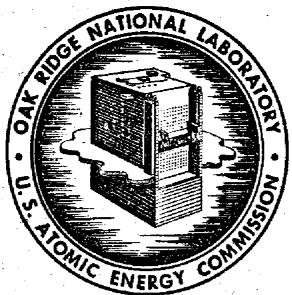
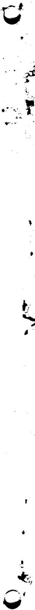

# OAK RIDGE NATIONAL LABORATORY

Operated by  
UNION CARBIDE NUCLEAR COMPANY  
Division of Union Carbide Corporation

Post Office Box X

Oak Ridge, Tennessee

# ORNL

# CENTRAL FILES NUMBER

61-4-62

External Transmittal Authorized

COPY NO. 119

DATE: April 19, 1961

SUBJECT: MSRE Preliminary Physics Report

TO: Distribution

FROM: C.W.Nestor, Jr.

# Summary

This report is a compilation of the results of reactor physics calculations to date for the currently proposed MSRE core design. The core was assumed to consist of a homogeneous mixture of fuel salt and graphite, with 22.5 per cent of the core volume occupied by fuel; the salt composition was the currently proposed mixture of 70 mole per cent LiF, 23 mole per cent BeF $_2$ , 5 mole per cent ZrF $_4$ , 1 mole per cent ThF $_4$ , and UF $_4$ as required for criticality. The calculated critical mole per cent, assuming 93.5 per cent U-235, is 0.2 mole per cent UF $_4$ ; the associated inventory of U-235 in the circulating system is 45 kilograms. Mean core thermal flux is estimated to be $2.9 \times 10^{13} \mathrm{~n/cm}^2$ sec with an associated mean power density of 3.9 watts/cm³ for 10 megawatts total reactor power.

# NOTICE

This document contains information of a preliminary nature and was prepared primarily for internal use at the Oak Ridge National Laboratory. It is subject to revision or correction and therefore does not represent a final report. The information is not to be abstracted, reprinted or otherwise given public dissemination without the approval of the ORNL patent branch, Legal and Information Control Department.

# LEGAL NOTICE

This report was prepared as an account of Government sponsored work. Neither the United States, nor the Commission, nor any person acting on behalf of the Commission:

A. Makes any warranty or representation, expressed or implied, with respect to the accuracy, completeness, or usefulness of the information contained in this report, or that the use of any information, apparatus, method, or process disclosed in this report may not infringe privately owned rights; or

8. Assumes any liabilities with respect to the use of, or for damages resulting from the use of any information, apparatus, method, or process disclosed in this report.

As used in the above, "person acting on behalf of the Commission" includes any employee or contractor of the Commission, or employee of such contractor, to the extent that such employee or contractor of the Commission, or employee of such contractor prepares, disseminates, or provides access to, any information pursuant to his employment or contract with the Commission, or his employment with such contractor.

# MSRE PRELIMINARY PHYSICS REPORT

C.W.Nestor, Jr.

# Introduction

The purposes of this report are to assemble the results of the reactor physics calculations which have been done concerning the currently proposed MSRE core design, and to point out the areas in which further work needs to be done. Estimates have been made of the reactor characteristics using the core model and calculation methods discussed in Reactor Model and Calculation Methods; these results are presented in Table 1 and discussed in Results. Consideration is given to the problems of fission product buildup, fuel salt and Xe-l35 retention by the core graphite, and distortion of the core graphite under irradiation in Long-term Reactor Behavior. It should be emphasized that in some cases these results depend upon very scanty experimental data buttressed by many assumptions and that much more work remains to be done in this particular area.

# Reactor Model and Calculation Methods

For the criticality calculations the reactor was assumed to be a bare right circular cylinder 27.7 inches in radius and 63 inches high; a radial extrapolation distance of 1 inch was added to simulate the effect of the fuel annulus and INOR-8 vessel, and an axial extrapolation distance of 3.5 inches was added to both ends to simulate the fuel salt contained in upper and lower heads of the vessel. The IBM-704 multigroup one-dimensional diffusion theory program GNU-II(1) was used for the calculations with the 34-group cross section library prepared for use in the thorium reactor evaluation program. The core was assumed to be a homogeneous mixture of 77.5 volume per cent graphite (density $1.90 \, \text{gm/cm}^3$ ) and 22.5 volume per cent fuel salt, using the currently proposed mixture of 70 mole per cent LiF ( $99.997\%$ Li $^7$ ), 23 mole per cent BeF $_2$ , 5 mole per cent ZrF $_4$ , 1 mole per cent ThF $_4$ and $\sim$ 1 mole per cent UF $_4$ (as required for criticality). The external circulating system volume was assumed to be $40 \, \text{ft}^3$ , which gave a ratio of total circulating system fuel volume to core fuel volume of 3.0. The temperature and concentration coefficients of reactivity were estimated from the output of the criticality search section of the GNU program, as previously described.

Two-dimensional two-group flux calculations were done using the IBM-7090 program Equipoise-II (5) to obtain estimates of the power generated in the upper and lower heads of the vessel and in the fuel annulus surrounding the core. This program was also used in the estimation of the effects of graphite distortion on reactivity (see Long-term Reactor Behavior). Two-group constants were obtained from the output of the GNU program.

# Results

The principal results are tabulated in Table 1.

Table 1. Reactor Physics Data for the MSRE   

<table><tr><td>Shape</td><td>Right circular cylinder</td><td></td></tr><tr><td>Core size</td><td colspan="2">Radius 27.7 inches, height 63 inches, volume 88 ft3</td></tr><tr><td>Fuel volume fraction</td><td>.225</td><td></td></tr><tr><td>External fuel volume</td><td>40 ft3</td><td></td></tr><tr><td>Total fuel volume/core fuel volume</td><td>3.02</td><td></td></tr><tr><td>Temperature</td><td>1200°F</td><td></td></tr><tr><td>Power</td><td>10 megawatts</td><td></td></tr><tr><td>Graphite density</td><td>1.90 gm/cm3</td><td></td></tr><tr><td>Fuel salt composition:</td><td>component</td><td>mole percent</td></tr><tr><td></td><td>LiF</td><td>70.6</td></tr><tr><td></td><td>BeF2</td><td>23.2</td></tr><tr><td></td><td>ZrF4</td><td>5.0</td></tr><tr><td></td><td>ThF4</td><td>1.0</td></tr><tr><td>(Clean critical)</td><td>UF4</td><td>0.21 (93.5% U235)</td></tr><tr><td colspan="2">Circulating system U235 inventory*</td><td>45 kg</td></tr><tr><td colspan="2">Mean core thermal flux</td><td>2.9 x 10-13n/cm2sec</td></tr><tr><td colspan="2">Peak core thermal flux</td><td>7.4 x 10-13n/cm2sec</td></tr><tr><td colspan="2">Mean core power density</td><td>3.9 watts/cm3</td></tr><tr><td colspan="2">Peak core power density</td><td>10 watts/cm3</td></tr><tr><td colspan="2">Specific power</td><td>40 kw/kg of U + Th</td></tr><tr><td colspan="2">Temperature coefficients of reactivity:</td><td></td></tr><tr><td colspan="2">fuel salt</td><td>-3 x 10-5/°F</td></tr><tr><td colspan="2">graphite</td><td>-6 x 10-5/°F</td></tr><tr><td colspan="2">U235concentration coefficient, δk/kδC25/C25</td><td>0.25</td></tr><tr><td colspan="2">Equilibrium Xe135 δk/k (see Long-term Reactor Behavior)</td><td>1.3%</td></tr><tr><td colspan="2">Equilibrium Sm δk/k</td><td>0.7%</td></tr><tr><td colspan="2">Neutron lifetime</td><td>3 x 10-4sec</td></tr><tr><td colspan="2">Per cent of fissions due to thermal neutrons</td><td>87</td></tr><tr><td colspan="2">Fraction of power generated in core</td><td>0.96</td></tr></table>

# Long-Term Reactor Behavior

In the currently proposed MSRE core the fuel salt is in contact with the graphite moderator and some penetration of the graphite by gaseous fission products and by fuel salt will certainly occur. It is, however, extremely unclear at this time what the amounts of these penetrations will be, since there is no experimental data concerning the behavior of fuel salt, and fission products in contact with the proposed MSRE graphite. In addition, gaseous fission products will be stripped from the salt in the pump bowl by a helium sparge when the reactor is operating at power. Any calculation dealing with the effects of fuel and fission product retention is therefore based on assumptions of unknown reliability and should be regarded only as an estimate of possible behavior. Using a particular set of assumptions concerning fuel salt and fission product behavior, efficiency of stripping in the pump bowl and graphite properties, Spiewak6 has calculated an equilibrium Xe-135 poison fraction (ratio of Xe-135 atoms destroyed by neutron absorption to fissions) of .0184; this represents a reactivity change ( $\delta k / k$ ) of 1.3% and this value is quoted in Table 1. If all the fuel and Xe-135 were fixed in the core, the associated reactivity would be 4%; there is a relatively wide range of values which may result from apparently equally reasonable assumptions.

Under long-term irradiation it is known that graphite will change its dimensions. Since no irradiation experiments have been done with the proposed MSRE graphite, the situation with regard to long-term reactivity changes is unclear. Using the results of calculations of graphite distortion by Kinyon, it is estimated that the combined effects of graphite distortion and fission product buildup will amount to a reactivity decrease of $3.8\%$ in one full power year's operation. These calculations were based on a single short-term experiment on a similar grade of graphite, not exposed to fuel salt; this result should therefore be regarded as only an estimate of possible behavior.

# REFERENCES

1. C. L. Davis, J. M. Bookston, and B. E. Smith, GNU-II - A Multigroup One-Dimensional Diffusion Program for the IBM-704, General Motors Report GMR 101 (1957).   
2. C. W. Nestor, Jr., Multigroup Neutron Cross Sections, ORNL CF-60-3-35 (March 15, 1960).   
3. W. R. Grimes, Recommended Fuel for MSRE, letter of August 23, 1960.   
4. C. W. Nestor, Jr., A Computational Survey of Some Graphite-Moderated Molten Salt Reactors, ORNL CF-61-3-98 (March 15, 1961).   
5. T. B. Fowler and Melvin Tobias, Equipoise-2: A Two-Dimensional, Two-Group, Neutron-Diffusion Code for the IBM-7090 Computer, ORNL CF-60-11-67 (Nov. 21, 1960).   
6. I. Spiewak, Xenon Transport in MSRE Graphite, letter of Nov. 2, 1960, document MSR-60-28 (1960).   
7. B. W. Kinyon, Effects of Graphite Shrinkage in MSRE Core, ORNL CF-60-9-10 (Sept. 2, 1960).

# Distribution

1. MSRP Director's Office, 9204-1, Rm. 253   
2. G.M. Adamson   
3. L.G. Alexander   
4. S. E. Beall   
5. L. L. Bennett   
6. C. E. Bettis   
7. E. S. Bettis   
8. D. S. Billington   
9. F. F. Blankenship   
10. A. L. Boch   
11. S.E.Bolt   
12. C.J. Borkowski   
13. W. L. Breazeale   
14. E.J. Breeding   
15. F.R.Bruce   
16. O.W. Burke   
17. D. O. Campbell   
18. R. S. Carlsmith   
19. W. L. Carter   
20. R. A. Charpie   
21. R. D. Cheverton   
22. H.C.Claiborne   
23. W.G.Cobb   
24. J. A. Conlin   
25. W.H.Cook   
26. G.A.Cristy   
27. J. L. Crowley   
28. F. L. Culler   
29. J.G.Delene   
30. D. A. Douglas   
31. E.P.Epler   
32. W. K. Ergen   
33. W. H. Ford   
34. T. B. Fowler   
35. A. P. Freas   
36. J.H.Frye   
37. C. H. Gabberd   
38. W.R.Gall   
39. R. B. Galleher   
40. D.R.Gilfillan   
41. W.R.Grimes   
42. A. G. Grindell   
43. C. S. Harrill   
44. E.C.Hise   
45. H.W. Hoffman   
46. P.P.Holz   
47. L. N. Howell   
48. W. H. Jorden   
49. P.R. Kasten

50. R. J. Kedl   
51. G.W. Keilholtz   
52. B. W. Kinyon   
53. R. W. Knight   
54. M. I. Lundin   
55. H. G. MacPherson   
56. W. D. Manly   
57. E.R.Mann   
58. W. B. McDonald   
59. C. K. McGlothlan   
60. E.C.Miller   
61. J. W. Miller   
62. R. L. Moore   
63. J. C. Moyers   
64. E. A. Nephew   
66. C.W. Nestor   
67. T. E. Northup   
68. W.R.Osborn   
69. L.F.Parsly   
70. P. Patriarca   
71. H.R.Payne   
72. A. M. Perry   
73. W. B. Pike   
74. P. H. Pitkanen   
75. C. A. Preskitt   
76. B. E. Prince   
77. R. E. Ramsey   
78. M. Richardson   
79. R.C.Robertson   
80. T. K. Roche   
81. T. H. Row   
82. H. W. Savage   
83. D. Scott   
84. W. I. Scott   
85. 0. Sisman   
86. G.M.Slaughter   
87. A.N. Smith   
83. P.G. Smith   
89. I. Spiewak   
90. J. A. Swartout   
91. R.W. Swindeman   
92. A. Taboada   
93. J.R. Tallackson   
94. M. L. Tobias   
95. D. B. Trauger   
96. Marina Tsagaris   
97. W. C. Ulrich   
98. R. Van Winkle   
99. D.R.Vondy   
OO. D. W. Vroom

101. D. C. Watkins

102. A.M. Weinberg

103. J. H. Westsik

104. L.V.Wilson

105. C. E. Winters

106. C.H.Wodtke

107-108. Library, 9204-1

109-110. Central Research Library

111-112. Document Reference Library

113-115. Laboratory Records

116. ORNL-RC

# EXTERNAL

117. D. H. Groelsema, AEC, Washington

118. F. P. Self, AEC, ORO

119-133. TISE-AEC