# OAK RIDGE NATIONAL LABORATORY

Operated by

UNION CARBIDE NUCLEAR COMPANY

Division of Union Carbide Corporation

Post Office Box X

Oak Ridge, Tennessee

External Transmittal Authorized

COPY NO.

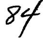

DATE: August 18, 1961

SUBJECT: Thorium Breeder Reactor Evaluation. Part I. Fuel Yields and Fuel Cycle Costs of a Two-Region, Molten Salt Breeder Reactor

TO: Distribution

FROM: W. L. Carter and L. G. Alexander

# ABSTRACT

The MSBR (1000 Mwe station) is capable of giving fuel yields of about $7\%/\text{yr}$ (doubling time = 14 years) at a fuel cycle cost of approximately 1.5 mills/kwhr. At fuel yields of 1 to $2\%/\text{yr}$ ( $DT = 100$ to 50 years), the fuel cycle cost extrapolates to 0.65 mills/kwhr; at $4\%/\text{yr}$ ( $DT = 25$ years), the fuel cycle cost is about 0.85 mills/kwhr. All systems were optimized with respect to fuel cycle processing times.

The effects on breeding performance of uncertainties in the epithermal value of $\eta$ -233, uncertainty in value of the resonance integral of Pa-233, variable thorium inventory in fertile stream and inclusion of $\mathrm{ZrF_4}$ in reactor fuel were evaluated. These effects may be summarized as follows:

1. A ±10% variation in the epithermal value of η-233 from "recommended" value causes a ±2.5 to ±3%/yr variation in fuel yield but only a ±0.06 mills/kwhr variation in fuel cycle cost.   
2. Using 900 barns instead of 1200 barns for Pa-233 resonance integral has only a small effect on breeding performance; the lower value increases fuel yield about $0.25\%/\text{yr}$ and lowers fuel cycle cost about 0.01 mills/kwhr.   
3. Doubling the thorium inventory adds about $1.9\%$ yr to fuel yield and 0.2 mills/kwhr to fuel cycle cost.   
4. Five mole $\%$ ZrF $_4$ in LiF-BeF $_2$ -UF $_4$ fuel salt decreases fuel yield about $0.5\%/\mathrm{yr}$ , but fuel cycle cost is negligibly affected.

# NOTICE

This document contains Information of a preliminary nature and was prepared primarily for internal use at the Oak Ridge National Laboratory. It is subject to revision or correction and therefore does not represent a final report. The information is not to be abstracted, reprinted or otherwise given public dissemination without the approval of the ORNL patent branch, Legal and Information Control Department.

# LEGAL NOTICE

This report was prepared as an account of Government sponsored work. Neither the United States, nor the Commission, nor any person acting on behalf of the Commission;

A. Makes any warranty or representation, expressed or implied, with respect to the accuracy, completeness, or usefulness of the information contained in this report, or that the use of any information, apparatus, method, or process disclosed in this report may not infringe privately owned rights; or   
B. Assumes any liabilities with respect to the use of, or for damages resulting from the use of any information, apparatus, method, or process disclosed in this report.

As used in the above, "person acting on behalf of the Commission" includes any employee or contractor of the Commission, or employee of such contractor, to the extent that such employee or contractor, of the Commission, or employee of such contractor prepares, disseminates, or provides access to, any information pursuant to his employment or contract with the Commission, or his employment with such contractor.

# CONTENTS

Page

Abstract 1

Foreward 5

Summary 6

1.0 Introduction 8   
2.0 Description of System 10

2.1 Physical System 10

Reactor Core 10   
Reactor Blanket 12   
Reactor Composition 12

2.2 Salt Composition 12   
2.3 Chemical Reprocessing System 17

Fuel Salt Purification 17   
Fertile Stream Processing 17   
Fission Gas Removal 19

2.4 Power Generation Cycle 19

3.0 Design Bases and Computational Methods 20

3.1 Plant Size 20   
3.2 On-Site Processing 20   
3.3 Operating Conditions 20   
3.4 Product Composition 20   
3.5 System Inventory 20   
3.6 Neutron Losses 21

Xenon Poisoning 21   
Other Fission Product Poisoning 21   
Fuel Processing Losses 22   
Carrier and Moderator Losses 22

3.7 Nuclear Data 22   
Fuel Carrier and Blanket Carrier Cross Sections 22   
3.8 Nuclear Calculations 23   
3.9 Costs of Materials and Facilities and Interest Charges 24

Fuel Stream Processing 25   
Fertile Stream Processing 30

# CONTENTS - contd

# 4.0 Reactor Calculations 35

# 5.0 Fuel Stream Poison Fraction Calculations 43

# 6.0 Parameter Studies and Results 56

4.1 Reactor Size 35   
Core Size 35   
Blanket Thickness 35   
Reflector Thickness 35   
4.2 GNU Calculations 36   
Input Data 36   
Output Data 36   
4.3 Cornpone Unit Cell Calculation 36   
4.4 Cornpone Finite Reactor Calculation 39   
Input Data 40   
Output Data 40   
Reaction Rate Coefficients 40   
4.5 Equilibrium Reactor Calculations (ERC-5) 41   
Input Data 41   
Output Data 42   
5.1 Poisson Fraction 43   
5.2 Solution of Poison Fraction Equation 45   
5.3 Fission Products Included in Poison Fraction Calculations 47   
5.4 Gas Sparging and Effective Yield 47   
5.5 Fission Products as 1/v Absorbers 50   
5.6 Fission Product Resonance Absorptions Included in Poison Fraction Calculations 50   
5.7 Use of Figures 5.1 and 5.2 51   
6.1 Results of Equilibrium Reactor Calculations 57   
6.1.1 Fuel Cycle Times 58   
6.1.2 Neutron Balance 59   
Resonance Absorption Cases 59   
1/v Absorption Cases 59   
6.1.3 System Inventory 60   
6.1.4 Fuel Cycle Cost 62

Page

6.2 Poisson Fraction Studies in which Fission Product Resonance Absorptions are Included 62

6.2.1 Fuel Cycle Cost Optimization 63  
Fuel Yield Versus Poison Fraction 63  
Fuel Salt Discard Time as a Function of Fuel Cycle Cost 65   
6.2.2 Economic Performance 65   
6.3 Poisson Fraction Studies in which Fission Products were Considered to be 1/v Absorbers 69   
6.3.1 Economic Performance 69   
6.4 Effect on Reactor Performance of Varying Thorium Inventory 71   
6.5 Effect of Value of $\eta = 233$ on MSBR Performance 73   
6.6 Effect of Value of Pa-233 Resonance Integral on MSER Performance 77   
6.7 Effect of MSER Performance of Adding $\mathbf{ZrF_4}$ to Fuel Salt 79

7.0 Conclusions 83   
8.0 References 86   
9.0 Appendix 88

# FOREWORD

As part of the ORNL responsibility for guiding the AEC Thermal Thorium Breeder Reactor Program, an evaluation of types of reactors capable of efficient utilization of thorium was initiated at ORNL in July 1959. Included in this evaluation were studies on the Aqueous Homogeneous Breeder Reactor (AHER), Molten Salt Breeder Reactor (MSBR), Graphite-Moderated Gas-Cooled Reactor (GGER), Deuterium-Moderated Gas-Cooled Breeder Reactor (DGBR) and Canadian-Deuterium-Uranium Reactor (CANDU).

This report presents the results of the MSBR evaluation. A comparison of all five of these reactors has been presented in two previous reports by this study group. The reader is referred to these reports for an appreciation of the performance of these several systems. These reports are:

L. G. Alexander, et al., Thorium Breeder Reactor Evaluation. Part I. Fuel Yields and Fuel Cycle Costs for Five Thermal Breeders, ORNL-CF-61-3-9, March 1, 1961.

L. G. Alexander, et al., Thorium Breeder Reactor Evaluation. Part I. Fuel Yields and Fuel Cycle Costs in Five Thermal Breeders, ORNL-CF-61-3-9 (Appendices, Part I), March 1, 1961.

# SUMMARY

A two-region, molten salt breeder reactor (MSBR) having core dimensions approximately 7.7 ft diameter by 7.7 ft high and surrounded on the ends and sides by a 3-ft-thick blanket was studied for determination of its breeding performance and fuel cycle cost. The core composition was approximately 16 vol % fuel-bearing salt, 6.7 vol % fertile stream and 77.3 vol % graphite; side blanket composition was 90 vol % fertile stream and 10 vol % graphite. Basic criteria of the study were that the reactor complex be capable of producing power at a rate of 1000 Mwe and that chemical processing be carried out on site. Two reactors were required, producing steam at 1800 psia and $1050^{\circ}\mathrm{F}$ .

The fuel salt passed through the core and upper end blanket in some 90 two-pass, bayonet tubes made of impermeable graphite which are inserted in openings in the graphite moderator. The region between the core and reactor vessel and the annuli between the fuel tubes and moderator are filled with fertile material. To minimize inventory the fuel stream pump and heat exchanger are mounted directly above the reactor core.

The fuel salt was a 63-37 mole % mixture of LiF-BeF₂ containing at equilibrium about 25 gm U per kg salt, of which about 18 gm was U-233 and the remainder was higher isotopes. The fertile salt was a 67-18-15 mole % mixture of LiF-BeF₂-ThF₄. At equilibrium the fertile stream contained from 770 to 2400 gm U-233 plus U-235 per tonne salt. The fuel salt was processed for fission product removed by the fluoride volatility process and the HF dissolution process. A portion of the fuel salt was discarded during each processing cycle for removal of fission products not removed by HF dissolution. The fertile stream was processed by fluoride volatility only; fission product accumulation in the fertile stream was maintained at a tolerable level by discarding the fertile salt inventory on a 20-year cycle. In this reactor only 1.3 - 6.6% of the fissions occurred in the fertile stream.

Nuclear calculations were performed using the 34-group, multiregion GNU program for the IBM-704 and the Cornpone program for the ORACLE. After attaining criticality in these calculations, further computations were made using the ERC-5 program for the IBM-704 to determine the equilibrium condition. It is the equilibrium results that are reported here.

The MSER is capable of breeding over a wide range of operating conditions giving fuel yields* as high as about 7%/year for a doubling time of about 11.5 full-power years. At this high yield, however, a premium fuel cycle cost of approximately 1.5 mills/kwhr is incurred principally because of high fuel stream processing charges. The fuel cycle cost was optimized by determining for each fuel yield the most economic combination of fuel stream processing cycle time and fuel salt discard cycle time. The fuel yield was made to vary by assuming several values of the fuel stream poison fraction and the fertile stream cycle time.

In the realm of more economical operation, fuel cycle costs as low as 0.65 mills/kwhr are predicted at fuel yields of 1 to 2%/year. When the fuel yield is $4\%$ /year, the fuel cycle cost is approximately 0.85 mills/kwhr. At this latter condition, the income from sale of fertile material just offsets the annual inventory charge.

Calculations for a representative set of operating conditions were made to evaluate MSR performance in the light of uncertainties in nuclear data (value of $\eta$ -233 and the resonance integral of Pa-233), variable thorium inventory and addition of $\mathrm{ZrF_4}$ as a stabilizing agent for the reactor fuel. Eta values at epithermal energies within $\pm 10\%$ of the values recommended for this study were employed in nuclear calculations giving a $\pm 2.5$ to $\pm 3\%$ /year variation in fuel yield; corresponding fuel cycle costs were negligibly affected ( $\pm 0.06$ mills/kwhr). Reactor performance using a resonance integral of 1200 barns for Pa-233, used for this study, was compared with that for a 900-barn value; fuel yield was improved about $0.25\%$ /year with a negligible lowering of the fuel cycle cost. A lower thorium inventory (140 tonnes vs 270 tonnes) decreased the fuel yield about $2\%$ /year with a corresponding decrease of 0.2 mills/kwhr in fuel cycle cost. A representative calculation in which 5 mole $\%$ $\mathrm{ZrF_4}$ was added to the fuel salt indicated that the fuel yield would be lowered by about $0.5\%$ /year and that the fuel cycle cost would be negligibly affected as compared to a similar case containing no zirconium.

# 1.0 INTRODUCTION

The work on the Molten Salt Breeder Reactor (MSBR) reported in this memorandum is a portion of a more complete study on thermal breeder reactors, which includes the Aqueous Homogeneous Breeder Reactor (AHBR), the Liquid Bismuth Breeder Reactor (LBER), the Gas-Cooled Graphite-Moderated Breeder Reactor (GGER), and the Deuterium-Moderated Gas-Cooled Breeder Reactor (DGER). The important results of the complete study on all five reactors is reported in ORNL CF-61-3-9 by Alexander1 et al; it is the purpose of this memorandum to present more detailed data and calculations on the MSER than those included in the reference memorandum. It is advisable for the reader to examine ORNL CF-61-3-9 in conjunction with this memorandum in order to make a comparison of the several thermal breeders and to obtain information on the MSBR that may not be repeated herein.

The MSBR was examined with the viewpoint of obtaining a relationship between breeding potential and economic performance. Breeding potential is related directly to neutron economy and is therefore associated with the composition and design of the reactor. Economic performance is determined by the annual charge on such items as the capital investment in the reactor installation, capital investment in chemical processing plants, operation of these plants, inventory of valuable materials (e.g., uranium, thorium, fuel carrier salt and fertile carrier salt), use of these materials, and waste disposal. On the other hand, income from bred, fissionable material in excess of that required to refuel the reactor is credited to the economic performance. Two of the above charges have not been included in this cost analysis because no reliable cost data are available; these are the capital investment in the reactor installation and waste disposal charges. In defense of omitting waste disposal charges, it might be said that since all wastes are solids the disposal charges will be a very small fraction of the total charges. It is observed that the remaining charges are concerned with the reactor fuel cycle and henceforth are referred to as fuel cycle costs.

In order to make a breeding system of the MSBR, it is necessary to exercise control over those neutron poisons that are amenable to control; some poisons, such as reactor structural materials, are fixed by design requirements. A significant advantage in neutron economy is realized by controlling poisoning from fission products by chemically processing fuel and fertile streams for

their removal. It is apparent that the system in equilibrium may be operated at any desired poison level between that corresponding to some practical minimum and that of complete burnout of fission products. It is customary to identify fission product poison level in a reactor as the poison fraction, which is defined as the ratio of neutrons absorbed in fission products to neutrons absorbed in fuel.

There is an inverse relationship of poison fraction to breeding and economic performance. In order to maintain high breeding performance, it is necessary to chemically process fuel and fertile streams on a relatively frequent schedule at the expense of high fuel cycle cost. On the other hand, less frequent processing lowers the fuel cycle costs but has an adverse effect on breeding performance. The fuel cycle cost associated with each poison fraction can be optimized by the proper choice of fuel stream cycle time and fuel salt discard time. (See Section 2.3 for a discussion of the chemical processing system.) In this study all fuel cycle costs have been optimized with respect to fuel stream processing conditions but not with respect to fertile stream processing conditions. The fertile stream conditions were included as a parameter study in which a series of fertile stream cycle times in the range 35-200 days were studied for each value of fuel stream poison fraction in the range 0.011 - 0.065. The pertinent results are exhibited as plots of fuel cycle cost (mills/kwhr) versus fuel yield (%/year) and poison fraction.

# 2.0 DESCRIPTION OF SYSTEM

# 2.1 Physical System

The molten salt breeder reactor examined in this study is based upon the design of MacPherson13 and is pictured schematically in Fig. 2.1. The reactor is cylindrical with a core 7.66 ft in diameter and 7.66 ft high. The core is surrounded on the sides and ends by a 3-ft-thick blanket. A 1-ft-thick graphite reflector surrounds the blanket on the sides and the ends. The reactor, heat exchanger and circulating pump are arranged in a compact, vertical configuration to minimize the fuel volume. Surge volume for the system is provided in the chamber housing the pump impeller.

Reactor Core. The reactor core is made entirely of graphite formed by assembling 8-in. square prisms. The corners of adjacent prisms are machined to form vertical passages of circular cross section about 5 in. in diameter. The fuel salt passes through the core in tubes of bayonet construction which are inserted into these machined vertical passages; the fuel tubes are made of impermeable graphite. The outer tubes (see Fig. 2.1) have inside diameters of 3.75 in. and walls 0.75 in. thick. They are joined to an INOR-8 metal header by means of flanges, frozen-plug seals, brazing, or transition welds. These joints are presumed to be substantially leakproof. The inner tubes have inside diameters of 2.4 in. and walls 0.25 in. thick. They are joined to the inner plenum of the metal header by slip joints; these joints need not be leakproof since some bypass leakage at this point can be tolerated. The reactor contains approximately 90 bayonet tubes.

Sufficient clearance between the fuel tubes and graphite moderator is provided to allow for differential expansion between the moderator and the metallic fuel plenum. Fuel salt enters at $1125^{\circ}\mathrm{F}$ , passes down through the annulus in the bayonet tube, rises through the inner tube at 20 ft/sec, and exits at $1300^{\circ}\mathrm{F}$ . It is collected in the plenum and passes up through a duct to the impeller of the pump from which it is forced through the tubes of the heat exchanger. After leaving the heat exchanger, the cycle for the salt is repeated. The salt circulates at approximately 50,000 gpm, removing 1070 Mw of heat. The heat exchanger contains approximately 8100 tubes (INOR-8) which are 0.375 in. in outside diameter and have 0.028 in. walls. The shell side of the heat exchanger contains molten sodium.

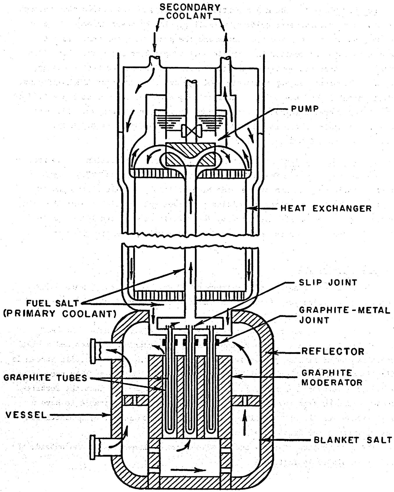  
Fig. 2.1. Molten Salt Breeder Reactor.

Reactor Blanket. The major portion of the fertile salt circulates through the side and end blankets; however, a small portion bypasses through the core in the passages between the fuel tubes and the graphite moderator. In its passage through the reactor the fertile salt temperature rises from $1150^{\circ}\mathrm{F}$ to $1300^{\circ}\mathrm{F}$ ; this sensible heat is then removed in a sodium-cooled heat exchanger. The salt circulates at approximately 3900 gpm and removes about $112\mathrm{Mw}$ of heat. This is about $10\%$ of the total reactor energy; however, only about $1.3 - 6.6\%$ of the reactor energy originates from fissions in the fertile stream. The heat exchanger contains approximately 1000 tubes (INOR-8) which are 0.375 in. in diameter and have 0.028 in. walls.

Reactor Composition. The approximate volumetric composition of the reactor core is as follows: $16\%$ fuel stream, $6.7\%$ fertile stream, and $77.3\%$ graphite. The volumetric composition of the side blanket is $90\%$ fertile stream and $10\%$ graphite. The top end blanket contains both fuel and fertile stream; the volumetric composition is $16\%$ fuel stream, $74\%$ fertile stream, and $10\%$ graphite.

Additional data on the reactor and heat removal system are given in Table 2.1.

# 2.2 Salt Composition

The fuel salt consists of a mixture of 63 mole % LiF and 37 mole % BeF₂ containing sufficient UF₄ (equilibrium mixture of uranium isotopes) to make the system critical - about 0.35 mole %.

The fertile stream has a basic composition of 67-18-15 mole % LiF-BeF $_2$ -ThF $_4$ . The equilibrium mixture of course contains Pa-233, uranium isotopes and a small concentration of fission products. The uranium content of the fertile stream is maintained at a quite low level by the efficient fluoride volatility processing method (see below); therefore, it is not extremely important that the fertile-stream volume be kept low. In fact, in some cases it is desirable to have a large excess fertile-stream volume to decrease neutron losses by protactinium capture through the dilution effect.

The distribution of fuel- and fertile-stream volumes inside and outside the MSER is tabulated in Table 2.2.

# General

Table 2.1. Molten Salt Breeder Reactor Plant Data(a)   

<table><tr><td>Station electrical power, MwE</td><td>1000</td></tr><tr><td>Station net thermodynamic efficiency, %</td><td>42.3</td></tr><tr><td>Number of reactors per station</td><td>2</td></tr><tr><td>Thermal power per station, MwT</td><td>1182</td></tr><tr><td>Fraction of electrical power fed back into plant</td><td>0.03</td></tr><tr><td>Geometry of core</td><td>cylinder (L/D = 1)</td></tr><tr><td>Moderator</td><td>graphite</td></tr><tr><td>Volume fraction of moderator in core</td><td>~ 0.773</td></tr><tr><td>Diameter of core, ft</td><td>7.66</td></tr><tr><td>Length of core, ft</td><td>7.66</td></tr><tr><td>Thickness of blanket, ft</td><td>3</td></tr><tr><td>Volume fraction of moderator in side blanket</td><td>0.10</td></tr><tr><td>Volume fraction of moderator in end blanket</td><td>0.10</td></tr><tr><td>Reactor vessel material</td><td>INOR-8</td></tr><tr><td>Reactor vessel thickness, in.</td><td>1.375</td></tr><tr><td>Mean pressure in reactor, psia</td><td>&lt; 100</td></tr><tr><td>Diameter of core fuel channels, in.</td><td>3.75</td></tr></table>

# Fuel Stream

<table><tr><td>Fuel carrier</td><td>63 mole % LiF</td></tr><tr><td></td><td>37 mole % BeF2</td></tr><tr><td>Density (1200°F), lb/ft3</td><td>119.5</td></tr><tr><td>Fraction of thermal power removed by fuel stream heat exchanger</td><td>0.91</td></tr><tr><td>Mean heat capacity, Btu/lb-°F</td><td>0.544</td></tr><tr><td>Power density in portion of fuel stream external to reactor, Mwt/ft3</td><td>7.6</td></tr><tr><td>Liquidus temperature,(b) °F</td><td>849</td></tr><tr><td>Station flow rate, ft3/sec</td><td>178</td></tr><tr><td>Velocity (ft/sec) of fuel stream in Core</td><td>20</td></tr><tr><td>End blanket</td><td>20</td></tr></table>

Table 2.1. Continued   

<table><tr><td>Heat exchanger data:</td><td>tube side</td><td>shell side</td></tr><tr><td>Tube outside diameter, in.</td><td>0.375</td><td></td></tr><tr><td>Tube wall thickness, in.</td><td>0.028</td><td></td></tr><tr><td>Material</td><td>INOR-8</td><td>INOR-8</td></tr><tr><td>Tube velocity, ft/sec</td><td>20</td><td></td></tr><tr><td>Flow rate, lb/hr</td><td>3.87 x 10^7</td><td>4.55 x 10^7</td></tr><tr><td>Fluid temperature in, °F</td><td>1300</td><td>900</td></tr><tr><td>Fluid temperature out, °F</td><td>1125</td><td>1175</td></tr><tr><td>Pressure drop, psi</td><td>78</td><td>100</td></tr><tr><td>No. tubes per exchanger</td><td>8110</td><td></td></tr><tr><td>Tube length, ft</td><td>11.13</td><td></td></tr><tr><td>Tube bundle diameter, in.</td><td>69</td><td></td></tr><tr><td>Inside film coefficient, Btu/hr-ft²-°F</td><td>8020</td><td></td></tr><tr><td>Tube wall coefficient, Btu/hr-ft²-°F</td><td>7080</td><td></td></tr><tr><td>Scale coefficient, Btu/hr-ft²-°F</td><td>10,000</td><td></td></tr><tr><td>Outside film coefficient, Btu/hr-ft²-°F</td><td>48,900</td><td></td></tr><tr><td>Over-all coefficient, Btu/hr-ft²-°F</td><td>2620</td><td></td></tr><tr><td>Outside tube area, ft²</td><td>8320</td><td></td></tr></table>

Fertile Stream   

<table><tr><td>Fertile stream carrier</td><td>67 mole % LiF</td></tr><tr><td></td><td>18 mole % BeF2</td></tr><tr><td></td><td>15 mole % ThF4</td></tr><tr><td>Density (1200°F), lb/ft3</td><td>192</td></tr><tr><td>Mean heat capacity, Btu/lb-°F</td><td>0.32</td></tr><tr><td>Fraction of thermal power removed by fertile stream heat exchanger</td><td>0.09</td></tr><tr><td>Fraction of fission power produced in fertile stream</td><td>~ 0.013-0.066</td></tr><tr><td>Liquidus temperature,(b) °F</td><td>932</td></tr><tr><td>Station flow rate, ft3/sec</td><td>22.6</td></tr><tr><td>Heat exchanger data:</td><td>tube side shell side</td></tr><tr><td>Tube outside diameter, in.</td><td>0.375</td></tr><tr><td>Tube wall thickness, in.</td><td>0.028</td></tr><tr><td>Material</td><td>INOR-8 INOR-8</td></tr><tr><td>Tube velocity, ft/sec</td><td>14.1</td></tr></table>

Table 2.1. Continued   

<table><tr><td></td><td>tube side</td><td>shell side</td></tr><tr><td>Flow rate, lb/hr</td><td>5.98 x 106</td><td>4.48 x 106</td></tr><tr><td>Fluid temperature, in, °F</td><td>1300</td><td>900</td></tr><tr><td>Fluid temperature out, °F</td><td>1150</td><td>1175</td></tr><tr><td>Pressure drop, psi</td><td>109</td><td>100</td></tr><tr><td>No. tubes per exchanger</td><td>1050</td><td></td></tr><tr><td>Length of tubes, ft</td><td>19.7</td><td></td></tr><tr><td>Tube bundle diameter, in.</td><td>27</td><td></td></tr><tr><td>Inside film coefficient, Btu/hr-ft2-°F</td><td>5550</td><td></td></tr><tr><td>Tube wall coefficient, Btu/hr-ft2-°F</td><td>5660</td><td></td></tr><tr><td>Scale coefficient, Btu/hr-ft2-°F</td><td>10,000</td><td></td></tr><tr><td>Outside film coefficient, Btu/hr-ft2-°F</td><td>40,000</td><td></td></tr><tr><td>Over-all coefficient, Btu/hr-ft2-°F</td><td>1845</td><td></td></tr><tr><td>Outside tube area, ft2</td><td>1925</td><td></td></tr></table>

Table 2.2. Distribution of Fuel- and Fertile-Stream Volumes in the Molten Salt Breeder Reactor   

<table><tr><td></td><td>Volume fraction</td><td>Volume per station (ft3)</td></tr><tr><td colspan="3">Fuel stream in</td></tr><tr><td>Core</td><td>0.16</td><td>113</td></tr><tr><td>Upper end blanket</td><td>0.16</td><td>88.4</td></tr><tr><td>Lóver end blanket</td><td>0</td><td>0</td></tr><tr><td>External to reactor</td><td></td><td>280.6</td></tr><tr><td>Dump tanks and miscellaneous</td><td></td><td>48.2</td></tr><tr><td>Total</td><td></td><td>530.2</td></tr><tr><td colspan="3">Fertile stream in</td></tr><tr><td>Core</td><td>~ 0.067</td><td>95</td></tr><tr><td>Upper end blanket</td><td>0.75</td><td>{409}</td></tr><tr><td>Lower end blanket</td><td>0.90</td><td></td></tr><tr><td>Side blanket</td><td>0.90</td><td>2470</td></tr><tr><td>External to reactor</td><td></td><td>3026</td></tr><tr><td>Total</td><td></td><td>6000</td></tr></table>

# 2.3 Chemical Reprocessing System

A flow diagram of the chemical reprocessing system is shown in Fig. 2.2. The processing operation consists of three parts: fuel salt purification, uranium recovery from the fertile stream, and helium sparging to remove fission gases from the fuel salt.

Fuel Salt Purification. The fuel salt is purified in the fluoride volatility-HF dissolution process by pumping a side-stream of the circulating molten salt through the processing plant in a specified cycle time. The cycle time is a function of the poison fraction at which the reactor is permitted to operate, which in this investigation is a parameter.

The first step in purification is to fluorinate the molten salt with elemental fluorine to volatilize $\mathbf{U}\mathbf{F}_{6}$ . This uranium hexafluoride is then burned in hydrogen to produce $\mathbf{U}\mathbf{F}_{4}$ , which is recycled to the reactor after dissolution in the recovered carrier salt. Uranium-free salt, containing fission products, flows from the fluorinator to the HF dissolution step. Here a separation is made between the salt and the bulk of the fission products. The carrier salt is dissolved in a $90\%$ HF- $10\%$ $\mathbf{H}_{2}\mathbf{O}$ solution leaving fission products, principally rare earths, as insoluble material. The carrier salt is recrystallized, fortified with recovered $\mathbf{U}\mathbf{F}_{4}$ , and recycled to the reactor. In order to purge those fission products which are not removed in the HF dissolution step, portions of the fuel salt are periodically removed and fresh make-up salt is added. The fission products purged in this manner include mainly the alkali metals and alkaline earths such as Cs, Rb, Sr, Ba, Te, Se, Nb, Cd, Ag, Tc, etc.

The fuel salt replacement cycle time depends upon the fuel stream cycle time and the poison fraction. It is possible to achieve a specified poison fraction with several combinations of fuel stream cycle time and fuel salt replacement cycle time as is shown in Figs. 5.1 and 5.2. The proper replacement cycle is determined by optimizing the fuel cycle cost with respect to several combinations of the two cycle times.

Fertile Stream Processing. The fertile stream is processed in the fluoride volatility step only. The salt is circulated at a specified rate through a fluorinator where contact with fluorine gas volatilizes $\mathbf{U}\mathbf{F}_{6}$ . The salt then returns directly to the blanket without additional treatment. The $\mathbf{U}\mathbf{F}_{6}$ from the fluorinator is reduced with $\mathbf{H}_{2}$ to $\mathbf{U}\mathbf{F}_{4}$ which is blended with $\mathbf{U}\mathbf{F}_{4}$ recovered from the fuel salt for recycle to the reactor. Excess production is sold.

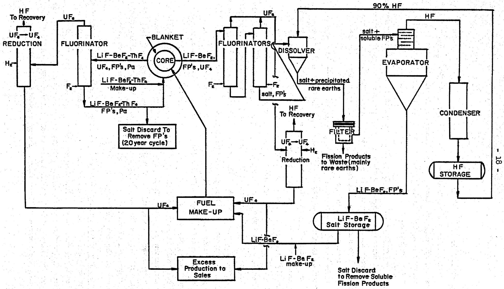  
FIG.2.2 SCHEMATIC FLOW DIAGRAM OF MOLTEN SALT BREEDER REACTOR FUEL & FERTILE STREAM PROCESSING

In the MSBR at fertile stream cycle times less than 100 days such a small fraction of fissions $(< 6.6\%)$ occurs in the fertile stream that it is not necessary to purify the salt in a HF dissolution step. The fission-product build-up is slow enough that their level can be conveniently controlled by replacing the salt on a relatively long cycle. A 20-year cycle has been specified in this study.

It will be observed that protactinium is not removed from the fertile salt in this process. Protactinium builds up in the salt until its decay rate is just equal to the U-233 production rate. The effect of Pa-233 on the neutron economy is controlled by adjusting the volume of the fertile stream, larger volumes giving fever neutron losses to protactinium.

Fission Gas Removal. Fission gases are removed from the fuel and fertile streams by sparging with helium. Xenon, krypton and the halogens are expected to be removed in this way. The off-gas is passed through charcoal beds where the fission gases are absorbed. Helium is recovered for reuse.

# 2.4 Power Generation Cycle

The steam cycle of the TVA John Sevier power plant was used as a model for the MSER concept. $^{15}$ Steam conditions are taken as 1800 psia and $1050^{\circ}\mathrm{F}$ ; the condenser pressure is 1.5 in. Eg. Additional data on power generation equipment are given by Spiewak and Parsly. $^{14}$

# 3.0 DESIGN BASES AND COMPUTATIONAL METHODS

# 3.1 Plant Size

Based on a study by Robertson, $^{2}$ it was assumed that future power stations in the United States would have a capacity of the order of 1000 Mwe. Consequently, this size was chosen for this study. Also it was assumed that anyone building a plant of this size would be unwilling to install the entire load in a single reactor; therefore, at least two reactors are specified for each station.

# 3.2 On-Site Processing

On-site chemical reprocessing was chosen for the station. This method lends itself to better control and definition of in-process inventory. Reasonably reliable cost estimates11 are available on fluoride volatility plants for processing core and fertile streams.

# 3.3 Operating Conditions

All calculations were made for continuous, steady-state operation of the reactor complex. To avoid complicated calculations of startup and shutdown, it was assumed that the reactors would be continuously fueled and processed, and that the operation had been going on sufficiently long for all fission products and heavy isotopes to be in equilibrium.

# 3.4 Product Composition

The product composition may vary between the limits of almost pure U-233 to spent fuel. However, in a many-reactor system complex, the fuel yield (or doubling time) is unambiguously defined only when the product has the same composition as the average composition of the entire system; i.e., reactor plus chemical processing systems. Calculated portions of the recovered spent fuel and of the bred material are removed as product at the $\mathrm{UF}_6\text{-}\mathrm{UF}_4$ reduction step. The product is an equilibrium mixture of uranium isotopes; viz., U-233, U-234, U-235, and U-236.

# 3.5 System Inventory

In order to be consistent and unambiguous in the definition of fuel yield, the inventory should include all fissionable and potentially fissionable atoms (U-233, U-235, and Pa-233) in the entire system. Included in the inventory is any fuel that is reserved to allow reactor operation during shutdown of the chemical processing plant. In this study a 30-day fuel reserve was chosen.

# 3.6 Neutron Losses

Fission-product poisoning in this reactor was based on a study by Burch, Campbell, and Weeren, $^{3}$ who made a study of the cumulative effect of 44 isotopes divided into four groups. This phenomenon is discussed more completely in Section 5.0.

Xenon Poisoning. It was assumed that xenon could be continuously removed from the circulating fuel by gas sparging and maintained at a level such that the neutron loss to xenon is 0.005 neutrons per fuel absorption. Since there are so few fissions (<6.6%) in the fertile stream of the MSR, all xenon losses were assigned to the fuel stream.

In choosing a value for xenon losses, it was assumed that (a) neither xenon nor iodine is absorbed by the graphite moderator or otherwise collects at the interface between salt and graphite phases; or (b) if the pores and vacancies in the graphite are accessible to xenon and iodine, the rates at which they diffuse into the pores are very much slower than the rates at which they are stripped from the circulating stream by the sparge gas.

Other Fission Product Poisoning. Concerning the effect of the $44$ fission-product isotopes studied by Campbell, Burch, and Weeren, $^{3}$ four groups were discovered and treated separately. The first comprised noble metals which were assumed to plate out on the cold zones of the circulating system; the second comprised halogens which were assumed to volatilize during the fluorination step. A third group which is soluble in HF and therefore not removed in the dissolution step comprised the alkali metals (notably Rb and Cs), the alkaline earths (Sr, Ba, etc.) and a miscellaneous group (Te, Se, Nb, Cd, Ag, Tc, etc.). This soluble group is removed by replacement of the fuel salt on some specified cycle. The final group is the rare earths which are removed by precipitation during the HF dissolution step. The poison fraction is thus not a simple function of the processing rate and is computed as described in Section 5.0 below.

Fission products in the fertile stream are controlled entirely by the 20-year throwaway cycle of the thorium carrier since this stream is not chemically processed for fission product removal.

Fuel Processing Losses. Fuel processing losses are based upon laboratory and pilot plant data, which have indicated essentially quantitative removal of uranium from the salt by the fluoride volatility process. Consequently, losses that occur will be almost entirely in the $\mathrm{UF}_6 \rightarrow \mathrm{UF}_4$ reduction step. It is believed that on large-scale operation these losses can be made quite small --- of the order of $0.01\%$ of throughput.

Carrier and Moderator Losses. Neutron losses to the carrier salts are based upon the use of a feed salt in which the lithium component is present as 99.99 at. $\%$ Li $^{7}$ and 0.01 at. $\%$ Li $^{6}$ . A salt having a lower Li $^{6}$ concentration would be desirable; however, it is questionable whether or not the premium price for such a salt is justified by the increased neutron economy.

In this study the mono-energetic capture cross section of graphite was taken to be $4.2\mathrm{mb}$ at 0.025 ev and was assumed to vary inversely with the velocity of the neutrons.

# 3.7 Nuclear Data

Nuclear cross sections for this study were compiled by Nestor. Following the recommendations of Fluharty and Evans, a value of 2.28 was assigned to eta of U-233 at thermal energies. The resonance integral of Pa-233 was assumed to be 1200 barns. Allowance for resonance saturation (self-shielding) was made only in the case of thorium, and here Doppler broadening was also taken into account. Epithermal cross sections of other isotopes of interest were adjusted to agree with the resonance integrals tabulated by Stoughton and Halperin. The composite 2200-meter cross section of fission products (exclusive of Xe, Sm-151, and Sm-149) was taken as 50 barns per fission and assigned to an artificial element called "fissium." A resonance integral of 170 barns per fission was assigned to fissium as suggested by the work of Nephew. However, in the computation of poison fraction, resonance integrals had to be assigned to each individual fission product. Available values were taken from Nephew; if no value was reported, it was calculated from available data.

Fuel Carrier and Blanket Carrier Cross Sections. The fuel carrier, which is composed of a mixture of $\mathbf{Li}^7$ , $\mathbf{Li}^6$ , Be, and F atoms, is treated as a single, pseudo fuel-salt atom in the nuclear calculations. It is convenient to do this because the GNU code is limited in the number of elements for which absorptions

can be calculated; consequently, lumping these elements saved space on the tape for needed calculations. A pseudo cross section for the fuel salt was obtained by normalizing the cross section to the basis of one atom of $\mathsf{Li}^7$ and summing the results. In the normalization the cross section of each atom was multiplied by the atomic ratio of that particular atom to $\mathsf{Li}^7$ . The atomic concentration of the salt is then expressed as the atomic concentration of $\mathsf{Li}^7$ in the salt. The lithium component of the salt was assumed to be 99.99 at. $\% \mathsf{Li}^7$ .

The fertile-stream carrier was treated in a similar manner with the cross sections of each component atom normalized to the basis of an atom of thorium. The fertile-stream carrier contains $\mathsf{Li}^7$ , $\mathsf{Li}^6$ , $\mathsf{Be}$ , $\mathsf{F}_3$ and $\mathsf{Th}$ atoms. The atomic concentration of the carrier is then expressed as the atomic concentration of thorium in the salt. The $\mathsf{Li}^7$ purity is the same as used in the fuel carrier.

# 3.8 Nuclear Calculations

Nuclear calculations on the MSER were performed using two different reactor codes: the 34-group GNU code for the IBM-704 and the Cornpone code for the ORACLE. The use of the two codes expedited the calculations. The reactor was first treated in spherical geometry as a homogenized system using GNU, and a criticality search was made to determine the critical concentration of thorium and protactinium in the core. The diameter of the equivalent sphere was taken as 1,09 times the cylinder diameter. This information was then used in Cornpone calculations, also in spherical geometry, to determine the thorium concentration in the core of the critical heterogeneous reactor. The heterogeneity of the MSER could be studied on Cornpone through the use of "disadvantage factors"; disadvantage factors could not be applied to GNU. Since all parameter studies were to be made on the equilibrium reactor, the critical reactor concentrations from the Cornpone calculation were used as input information for an equilibrium reactor calculation using the ERC-5 code for the IBM-704. This calculation determined the concentrations and elemental neutron absorptions in the critical, equilibrium reactor.

A more detailed discussion of the nuclear calculations appears in Section 3.2 of Ref. 1.

The disadvantage factors mentioned above were used to relate the concentrations of the homogenized reactor to those of the heterogeneous reactor. These factors were determined in a lattice-cell calculation by means of the Cornpone

program for the ORACLE which yielded sets of $3^{4}$ -group disadvantage factors, one set for each region of the lattice cell. When employed in a $3^{4}$ -group finite-reactor, Cornpone calculation, the correctly "disadvantaged" absorptions of each element in each region of the reactor were calculated.

The disadvantage factor is defined by the following equation:

$$
\mathrm {D F} _ {\mathrm {j}, \mathrm {n}} = \frac {\mathrm {V} _ {\mathrm {c}}}{\mathrm {V} _ {\mathrm {j}}} \frac {\int_ {\mathrm {V} _ {\mathrm {j}}} \phi_ {\mathrm {n}} \mathrm {d V}}{\int_ {\mathrm {V} _ {\mathrm {c}}} \phi_ {\mathrm {n}} \mathrm {d V}} \tag {1}
$$

where

$$
\begin{array}{l} V _ {c} = \text {v o l u m e o f l a t t i c e c e l l} \\ V _ {j} = \text {v o l u m e o f r e g i o n j i n t h e c e l l} \\ \phi_ {n} = \text {n e u t r o n f l u x i n d i f f e r e n t i a l v o l u m e d V i n} \\ \end{array}
$$

# 3.9 Costs of Materials and Facilities and Interest Charges

The basic cost data employed in this study to calculate fuel cycle costs are given in Table 3.1. These data are believed to be representative of the costs of MSBR materials and amortization charges.

Fuel Stream Processing. The capital cost of the fuel stream processing plant was based upon a cost study by Weinrich, $^{11}$ who estimated the capital charges for a plant to process continuously about 20 ft $^{3}$ /day of fuel salt. A plant of this capacity is within the region of interest of this study. Weinrich's data were reviewed by Chemical Technology Division personnel* for comparison with more recent cost data and cost estimating practices at Oak Ridge National Laboratory and, as a result, his data were adjusted upward. These data and the ORNL revised figures are presented in Table 3.2. The ORNL estimate is approximately twice that of Weinrich. These estimates were made from functional flowsheets representing the best available design information on the fluoride volatility and HF dissolution processes.

In optimizing MSBR systems to obtain the most economic combination of fuel processing plant cost and fuel salt replacement cost, it was necessary to extrapolate the ORNL cost estimate in Table 3.2 to both smaller and larger

Table 3.1. Items and Basic Cost Data Included in the Fuel Cycle Cost of a Molten Salt Breeder Reactor   

<table><tr><td></td><td>Unit Value ($/kg)</td><td>Interest Rate (%/yr)</td></tr><tr><td>Uranium inventory</td><td>15,000</td><td>4</td></tr><tr><td>Thorium inventory (as ThF4)</td><td>27(a)</td><td>12.7(b)</td></tr><tr><td>Fuel salt inventory (U excluded)</td><td>40.3(c)</td><td>12.7(b)</td></tr><tr><td>Fertile salt inventory (Th excluded)</td><td>45.6(c)</td><td>12.7(b)</td></tr><tr><td>Thorium amortization (20-yr cycle)</td><td>27</td><td>2.6</td></tr><tr><td>Fuel salt replacement</td><td>40.3</td><td></td></tr><tr><td>Fertile salt replacement (20-yr cycle)</td><td>45.6</td><td>2.6</td></tr><tr><td>Fuel stream chemical processing plant</td><td></td><td>29(d)</td></tr><tr><td>Fertile stream chemical processing plant</td><td></td><td>29(d)</td></tr><tr><td>Breeding credit</td><td>15,000</td><td></td></tr></table>

(a) Th value at $22/kg plus $5/kg for preparation of salt solution.   
(b) Includes interest at $6 \%$ , income taxes at $4.6 \%$ , and local taxes and insurance at $2.1 \%$ .   
(c) Based on LiF at $44/kg and BeF2at $15.40/kg plus $11/kg salt for preparation. Atomic concentration of Li is 99.99% Li7.   
(d) Includes $14\%$ interest on capital investment plus $15\%$ for operation maintenance.

Processing of Molten Salt, Breeder Reactor Fuel Stream.

Weinrich's Cost Estimate Compared with Revision Made by ORNL

Table 3.2. Cost Estimate of Facilities for Continuous   

<table><tr><td>Tanks and Vessels
(Core Salt Section)</td><td>Weinrich&#x27;s Estimate ($)</td><td>ORNL Estimate ($)</td></tr><tr><td>Core salt hold tanks</td><td>19,500</td><td>39,000</td></tr><tr><td>Core salt fluorinators</td><td>16,500</td><td>33,000</td></tr><tr><td>UF6chemical traps</td><td>31,900</td><td>63,800</td></tr><tr><td>UF4-UF6reduction tower</td><td>8,600</td><td>17,200</td></tr><tr><td>Vibrators, filters, burners, etc.</td><td>5,000</td><td>10,000</td></tr><tr><td>HF dissolving tank</td><td>24,000</td><td>48,000</td></tr><tr><td>HF evaporators</td><td>101,000</td><td>180,500</td></tr><tr><td>HF condensing tower</td><td>23,100</td><td>46,200</td></tr><tr><td>HF storage tank</td><td>41,300</td><td>82,600</td></tr><tr><td>KOH scrub tower</td><td>3,500</td><td>7,000</td></tr><tr><td>Miscellaneous storage and utility tanks</td><td>20,000</td><td>20,000</td></tr><tr><td>Sub-Total</td><td>294,400</td><td>547,300</td></tr><tr><td>Installed cost (=1.35 x cost)</td><td>397,440</td><td>738,800</td></tr><tr><td>Coolers (Core Salt Section)</td><td></td><td></td></tr><tr><td>UF6gas coolers</td><td>3,600</td><td>3,600</td></tr><tr><td>Reduction tower vent cooler</td><td>3,000</td><td>3,000</td></tr><tr><td>HF vapor desuperheater</td><td>9,600</td><td>9,600</td></tr><tr><td>HF condensing tower vent cooler</td><td>6,000</td><td>6,000</td></tr><tr><td>Circulating HF cooler</td><td>48,000</td><td>48,000</td></tr><tr><td>Circulating H2O chiller</td><td>2,400</td><td>2,400</td></tr><tr><td>Sub-Total</td><td>72,600</td><td>72,600</td></tr><tr><td>Installed cost (=1.10 x cost)</td><td>79,860</td><td>79,860</td></tr><tr><td>Vessels and Tanks
(Corenet Salt Section)</td><td></td><td></td></tr><tr><td>Blanket salt hold tanks</td><td>9,800</td><td></td></tr><tr><td>Blanket salt fluorinator</td><td>5,500</td><td>Fertile stream</td></tr><tr><td>UF6chemical trap</td><td>3,600</td><td rowspan="2">processing esti-mated separately.</td></tr><tr><td>Sub-Total</td><td>18,900</td></tr><tr><td>Installed cost (=1.35 x cost)</td><td>25,500</td><td></td></tr></table>

Table 3.2. Continued   

<table><tr><td></td><td>Weinrich&#x27;s Estimate ($)</td><td>ORNL Estimate ($)</td></tr><tr><td>Coolers (Blanket Salt Section)</td><td></td><td></td></tr><tr><td>UF6cooler</td><td>2,400</td><td></td></tr><tr><td>Installed cost (=1.10 x cost)</td><td>2,640</td><td></td></tr><tr><td>Miscellaneous Equipment</td><td></td><td></td></tr><tr><td>Pumps</td><td>40,000</td><td>65,700</td></tr><tr><td>Agitators</td><td>6,000</td><td>6,000</td></tr><tr><td>Filters</td><td>20,000</td><td>30,000</td></tr><tr><td>Freon refrigeration system</td><td>160,000</td><td>160,000</td></tr><tr><td>Fuel reconstitution system</td><td>60,000</td><td>80,000</td></tr><tr><td>Electric heating furnaces</td><td>148,000</td><td>148,000</td></tr><tr><td>Pipe heating equipment</td><td>60,000</td><td>60,000</td></tr><tr><td>F2+ H2gas supply systems</td><td>20,000</td><td>20,000</td></tr><tr><td>F2compressors</td><td>20,000</td><td>20,000</td></tr><tr><td>Sub-Total</td><td>534,000</td><td>589,000</td></tr><tr><td>Installed cost (=1.35 x cost)</td><td>720,900</td><td>796,140</td></tr><tr><td>Sub-Total of installed cost of major equipment</td><td>1,226,300</td><td>1,614,800</td></tr><tr><td>Attendant Facilities</td><td></td><td></td></tr><tr><td>Special instrumentation</td><td>76,000</td><td>76,000</td></tr><tr><td>General instrumentation</td><td>60,000</td><td>60,000</td></tr><tr><td>Panelboards and alarms</td><td>24,000</td><td>24,000</td></tr><tr><td>Sub-Total</td><td>160,000</td><td>160,000</td></tr><tr><td>Installed cost (=1.40 x cost)</td><td>224,000</td><td>224,000</td></tr><tr><td>Piping, Painting, Scaffolds etc., Installed Cost</td><td></td><td></td></tr><tr><td>Special piping</td><td>4,500</td><td>4,500</td></tr><tr><td>General piping(a)</td><td>231,000</td><td>1,210,100</td></tr><tr><td>Equipment footings and foundations(b)</td><td>138,000</td><td>181,500</td></tr><tr><td>Pipe insulation</td><td>8,000</td><td>8,000</td></tr></table>

Table 3.2. Continued   

<table><tr><td></td><td>Weinrich&#x27;s Estimate ($)</td><td>ORNL Estimate ($)</td></tr><tr><td>Equipment insulation</td><td>20,000</td><td>20,000</td></tr><tr><td>Electrical distribution, lighting, etc.</td><td>144,000</td><td>144,000</td></tr><tr><td>Painting(c)</td><td>28,000</td><td>36,300</td></tr><tr><td>Remote operating equipment</td><td>75,000</td><td>75,000</td></tr><tr><td>Field testing and inspection</td><td>25,000</td><td>25,000</td></tr><tr><td>Operating and safety supplies</td><td>15,000</td><td>15,000</td></tr><tr><td>Freight(d)</td><td>37,000</td><td>48,400</td></tr><tr><td>Sub-Total</td><td>725,000</td><td>1,767,800</td></tr><tr><td>TOTAL INSTALLED COST</td><td>2,175,840</td><td>3,606,600</td></tr><tr><td>Contingency(e)</td><td>217,580</td><td>901,650</td></tr><tr><td>TOTAL DIRECT MATERIALS AND LABOR</td><td>2,393,400</td><td>4,508,300</td></tr><tr><td>Fees and Expenses</td><td></td><td></td></tr><tr><td>Contractor&#x27;s field expense(f,g)</td><td>119,670</td><td>2,254,150</td></tr><tr><td>Contractor&#x27;s overhead fee(h,g)</td><td>359,000</td><td></td></tr><tr><td>Engineering and design(i)</td><td>478,700</td><td>901,660</td></tr><tr><td>Purchasing and shop inspection(j)</td><td>119,700</td><td>225,400</td></tr><tr><td>Estimated Cost of Additional Facilities</td><td></td><td></td></tr><tr><td>Sampling facilities</td><td></td><td>70,000</td></tr><tr><td>Ventilation</td><td></td><td>10,000</td></tr><tr><td>Waste removal</td><td></td><td>50,000</td></tr><tr><td>Cells and buildings</td><td>1,500,000(k)</td><td>1,700,000</td></tr><tr><td>Laboratory</td><td></td><td>50,000</td></tr><tr><td>Mock-up cell</td><td></td><td>20,000</td></tr><tr><td>Crane</td><td></td><td>60,000</td></tr><tr><td>TOTAL ESTIMATED FLANT COST</td><td>4,970,500</td><td>9,849,500</td></tr></table>

# Table 3.2. Continued

# Footnotes

(a) Estimated by Weinrich as $25\%$ of major equipment purchase price.  
Estimated by ORNL as $100\%$ of major equipment purchase price.   
(b) Estimated as 15% of major equipment purchase price.   
(c) Estimated as $3\%$ of major equipment purchase price.   
(d) Estimated as $4 \%$ of major equipment purchase price.   
(e) Estimated by Weinrich as $10\%$ of total installed cost. Estimated by ORNL as $25\%$ of total installed cost.   
(f) Estimated by Weinrich as $5\%$ of total direct materials and labor cost.   
(g) Sum of contractor's field expense and overhead fee taken by ORNL as 50% of total direct materials and labor cost.   
(h) Estimated by Weinrich as $15\%$ of total direct materials and labor cost.   
(i) Estimated as $20\%$ of total direct materials and labor cost.   
(j) Estimated as $5\%$ of total direct materials and labor cost.   
(k) Weinrich allowed $1,500,000 for additional facilities that might be shared with reactor operation.

plants. The extrapolation was made by assuming that the capital cost is proportional to the 0.6 power of the processing rate. This method of extrapolating cost data has been found reasonably accurate when applied to the chemical industry as a whole and to plants which process nuclear reactor materials.

There is a limit, however, to the extrapolation in the region of low processing rates because at some low rate, which may not be well defined, it is economic to change from continuous to batch processing methods. In this study it was assumed that the lower limit of continuous processing would occur around 7 ft³/day, which corresponds to a fuel cycle time of 75 days. (The fuel stream volume was constant at 530 ft³.) When the fuel cycle time is 75 days, the extrapolated cost curve (Fig. 3.1) indicates that the capital investment is about $5 million. Furthermore, it was felt that the investment in a batch plant would not be sensitive to further increases in the cycle time; consequently, the $5 million value was assumed to apply to all plants having cycle times greater than 75 days. A batch processing plant was estimated by Weinrich to cost $3.4 million; the above figure allows a premium of $1.6 million over Weinrich's estimate.

Fertile Stream Processing. The fertile stream is processed only in a fluoride volatility step and, therefore, requires much less equipment than the accompanying fuel stream processing plant. Weinrich11 included the fertile stream plant as an integral part of his fuel stream plant design and did not make a complete separate breakdown of the two costs. However, it was possible to prepare a cost estimate for the fertile stream plant by extracting specific items from Weinrich's estimate and including allocations for instruments, buildings, etc. ORNL pricing procedures were applied to prepare the estimate given in Table 3.3.

This tabulation presents values that are applicable to a plant processing fertile stream at a rate of 20 ft³/day, the same basis upon which the fuel stream processing plant was designed. For this rate it was estimated that the capital investment would be about $1.8 million dollars. These values were plotted in Fig. 3.2; the remainder of the graph was obtained by assuming the cost was proportional to the 0.6 power of the processing rate.

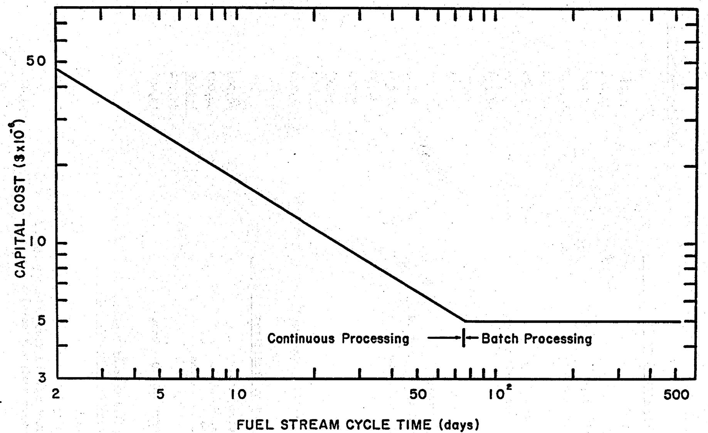  
FIG. 3.1 CAPITAL COST OF FUEL STREAM PROCESSING PLANT FOR A MOLTEN SALT BREEDER REACTOR

Table 3.3. Cost Estimate of Facilities for Continuous Processing of Molten Salt Breeder Reactor Fertile Stream   

<table><tr><td>Tanks and Vessels</td><td>Estimated Cost ($)</td></tr><tr><td>Salt hold tank</td><td>20,000</td></tr><tr><td>Fluorinator</td><td>20,000</td></tr><tr><td>UF6chemical traps</td><td>43,000</td></tr><tr><td>UF6→UF4reduction towers</td><td>12,000</td></tr><tr><td>Vibrators</td><td>10,000</td></tr><tr><td>UF6gas coolers</td><td>3,600</td></tr><tr><td>Reduction tower vent cooler</td><td>3,000</td></tr><tr><td>Pumps</td><td>8,000</td></tr><tr><td>Filters</td><td>2,900</td></tr><tr><td>Agitators</td><td>6,000</td></tr><tr><td>Freon refrigeration</td><td>23,500</td></tr><tr><td>Bred material reconstitution</td><td>8,800</td></tr><tr><td>Electric heating furnaces</td><td>50,000</td></tr><tr><td>Pipe heaters</td><td>8,800</td></tr><tr><td>F2supply</td><td>2,900</td></tr><tr><td>F2compressor</td><td>2,900</td></tr><tr><td>Sub-Total</td><td>225,400</td></tr><tr><td>Installed cost ($l.35 x cost)</td><td>304,290</td></tr><tr><td>Attendant Facilities</td><td></td></tr><tr><td>Special instruments</td><td>40,000</td></tr><tr><td>General instruments</td><td>30,000</td></tr><tr><td>Panelboards and alarms</td><td>15,000</td></tr><tr><td>Sub-Total</td><td>85,000</td></tr><tr><td>Installed Cost ($l.40 x cost)</td><td>119,000</td></tr><tr><td>Installed Cost of Piping,Insulation, Painting, etc.</td><td></td></tr><tr><td>Special piping</td><td>3,000</td></tr><tr><td>General piping ($l00% of major equipment cost)</td><td>225,400</td></tr><tr><td>Equipment footings and foundations ($l5% ofmajor equipment cost)</td><td>33,800</td></tr></table>

Table 3.3. Continued   

<table><tr><td></td><td>Estimated Cost ($)</td></tr><tr><td>Pipe insulation</td><td>1,200</td></tr><tr><td>Equipment insulation</td><td>3,000</td></tr><tr><td>Electrical distribution</td><td>21,000</td></tr><tr><td>Painting (=3% of major equipment cost)</td><td>6,800</td></tr><tr><td>Remote operating equipment</td><td>11,000</td></tr><tr><td>Field testing and inspection</td><td>3,700</td></tr><tr><td>Operating and safety supplies</td><td>2,200</td></tr><tr><td>Freight (=4% of major equipment cost)</td><td>9,000</td></tr><tr><td>Sub-Total</td><td>320,100</td></tr><tr><td>Total installed cost</td><td>743,400</td></tr><tr><td>Contingency (=25% of total installed cost)</td><td>185,800</td></tr><tr><td>TOTAL DIRECT MATERIALS AND LABOR</td><td>929,200</td></tr><tr><td>Contractor&#x27;s field expense and overhead (=50% of total direct materials and labor)</td><td>464,600</td></tr><tr><td>Engineering and design (=20% of total direct materials and labor)</td><td>185,800</td></tr><tr><td>Purchasing and shop inspection (=5% of total direct materials and labor)</td><td>46,500</td></tr><tr><td colspan="2">Additional Facilities Shared with Fuel Salt Processing Facilities</td></tr><tr><td>Sampling</td><td>10,300</td></tr><tr><td>Ventilation</td><td>1,500</td></tr><tr><td>Cells and buildings</td><td>100,000</td></tr><tr><td>Laboratory</td><td>7,400</td></tr><tr><td>Mock-up cell</td><td>2,900</td></tr><tr><td>TOTAL ESTIMATED PLANT COST</td><td>1,748,200</td></tr></table>

FIG.3.2. CAPITAL COST OF MSBR FERTILE STREAM PROCESSING PLANT   
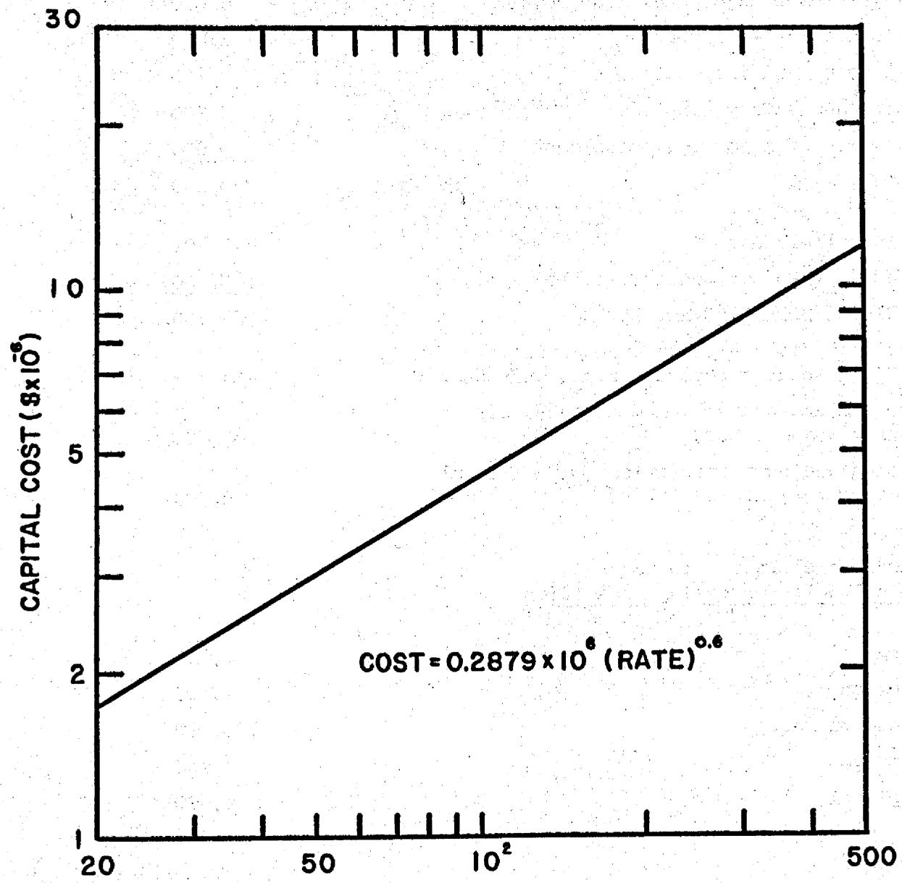  
FERTILE SALT PROCESSING RATE (ft $^3$ /day per station)

# 4.0 REACTOR CALCULATIONS

# 4.1 Reactor Size

For engineering reasons it was decided that the MSBR would be a cylinder having a height equal to the diameter.

Core Size. In determining the core size of the MSER it was necessary to fix certain reactor properties. In this study the thermal power, fuel stream velocity in the core, and the temperature rise of the fuel in its passage through the core were arbitrarily chosen. The diameter of the core is related to these quantities by Eq. 2.

$$
d = \left[ \frac {4 q}{\left(\pi u \rho c _ {p} r\right) (\Delta T)} \right] ^ {1 / 2} \tag {2}
$$

where

q = core thermal power per reactor

u stream velocity

$\rho =$ stream density

$\mathbf{c}_{\mathbf{p}} =$ heat capacity

f = fraction of core cross section occupied by fuel stream

$\Delta T =$ temperature rise

When the appropriate numbers are substituted in this equation, a core diameter of about 7.7 ft is obtained. The power used in obtaining this diameter was one-half of the total core power for the station, giving two reactors for the installation. This agrees with the decision that the total station load would not be committed to a single reactor.

Blanket Thickness. The cylindrical core of the MSBR is surrounded by a blanket on the sides and on each end. Based on previous studies,[13] the thickness of the blanket was fixed at 3 ft on both ends and on the side. This thickness was sufficient to reduce neutron leakage to a tolerable level. As given in Table 2.1, the side blanket is 90 vol % fertile stream and 10 vol % graphite.

Reflector Thickness. The reflector was chosen to be a 1-ft-thick block of graphite surrounding the side and end blankets. The over-all reactor dimensions, excluding the reflector, are 13.66 ft diameter by 13.66 ft high.

# 4.2 GNU Calculations

The calculations for the MSER were made as indicated in the flow diagram of Fig. 4.1. The basic nuclear calculations were performed on the multiregion, one-dimensional, $34$ -group GNU program for the IBM-704. The equilateral, cylindrical reactor was treated as an equivalent sphere having a diameter $9\%$ greater than the cylinder; the $34$ groups of cross sections consisted of 32 fast groups, an epithermal group for the energy range $5.5 \mathrm{kT} - 0.6 \mathrm{ev}$ , and a thermal group.

Input Data. Input data for GNU consisted of specifications of reactor geometry, dimensions, and the homogenized atomic densities of the several elements in the system. The concentration of each element was homogenized over the region in which it appeared. Since a small fraction of the fertile stream passes through the core of the MSR, the core concentrations included the sum of fuel stream and that portion of the fertile stream concentrations. The initial values of fuel, moderator, and fission product concentrations used in the GNU calculations were based upon concentrations previously developed for the experimental gas-cooled reactor (EGCR) and from previous molten salt reactor studies. The elements considered in these calculations are given in Table 4.1.

Output Data. The GNU program provides a criticality search by which either a dimension or one or more concentrations are varied until the multiplication constant differs from unity by less than some small specified amount. In these calculations the reactor was made critical by varying the concentrations of protactinium and thorium in the core. Since the thorium density in the fertile-stream carrier is fixed by the salt composition, this is equivalent to varying the volume fraction of fertile stream in the core. Additional useful output data were the fractions of neutrons involved in absorption and fission reactions for each nuclear species in each region of the reactor.

# 4.3 Cornpone Unit Cell Calculation

The second step in the nuclear calculations was to determine the atomic concentrations of the heterogeneous reactor. (The GNU program could treat only a homogenized system.) The core of the MSR was visualized as being composed of a number of cylindrical, unit cells like the one diagrammed in Fig. 4.2. The unit cell contained six regions (see Fig. 2.1): inner fuel zone, graphite tube, annular fuel zone, graphite tube, fertile stream passage, and graphite moderator.

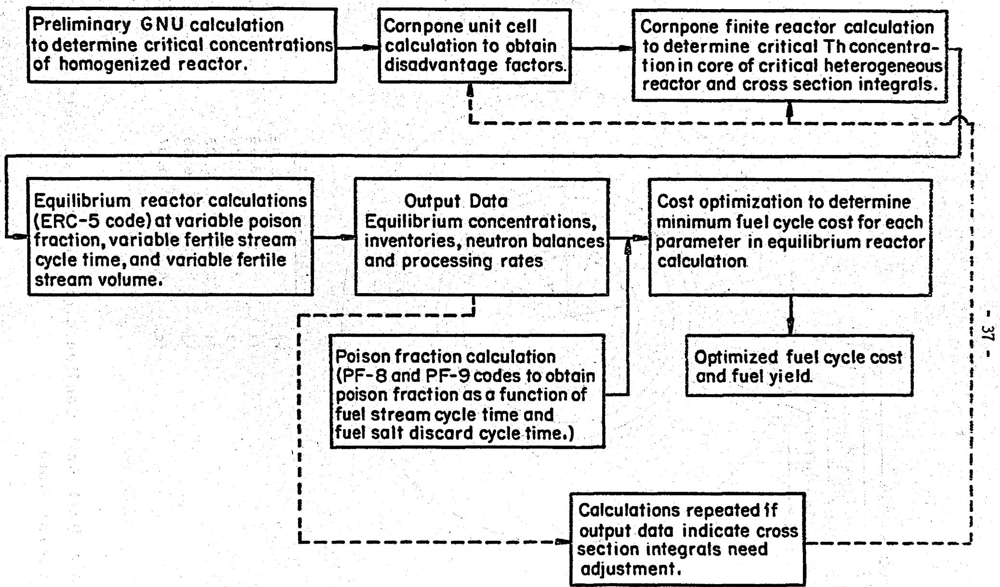  
FIGURE 4.1 COMPUTATIONAL PROCEDURE FOR MOLTEN SALT BREEDER REACTOR

UNCLASSIFIED

ORNL-LR-DWG.58645

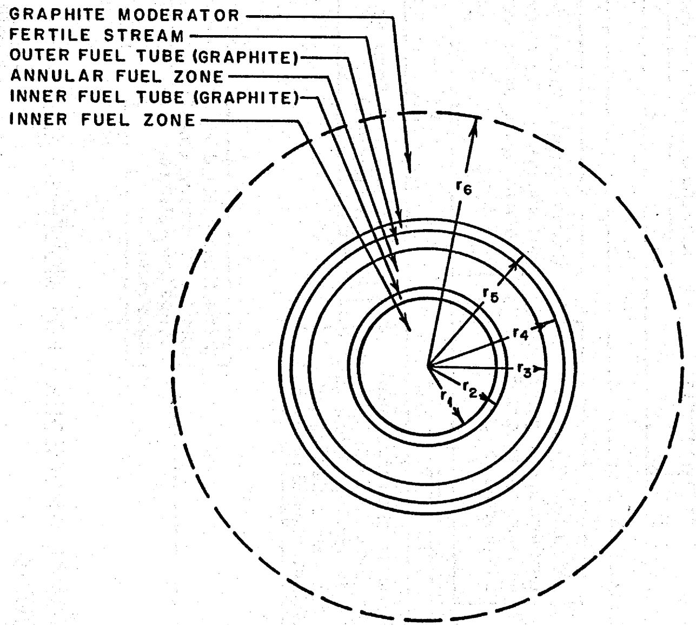  
Fig. 4.2 Unit Cell Configuration for Molten Salt Breeder Reactor Core.

<table><tr><td></td><td>INCHES</td><td>cm</td></tr><tr><td>r1</td><td>1.19</td><td>3.02</td></tr><tr><td>r2</td><td>1.44</td><td>3.66</td></tr><tr><td>r3</td><td>1.875</td><td>4.76</td></tr><tr><td>r4</td><td>2.375</td><td>6.03</td></tr><tr><td>r5</td><td>2.62</td><td>6.65</td></tr><tr><td>r6</td><td>4.36</td><td>11.07</td></tr></table>

Table 4.1. Elements Considered in Nuclear Calculations of the Molten Salt Breeder Reactor   

<table><tr><td>Th</td><td>Xe-135</td></tr><tr><td>Pa-233</td><td>Fissium</td></tr><tr><td>U-233</td><td>Sm-151</td></tr><tr><td>U-234</td><td>Sm-149</td></tr><tr><td>U-235</td><td>Graphite</td></tr><tr><td>U-236</td><td>Fuel-Stream Carrier(a)
(63-37 mole % LiF-BeF2)</td></tr><tr><td>Np</td><td>Fertile-Stream Carrier(b)
(67-18-15 mole % LiF-BeF2-ThF4)</td></tr></table>

(a) Uranium excluded in nuclear properties of salt   
(b) Th content excluded in nuclear properties of salt

The cell was examined using the Cornpone code for the ORACLE to develop a set of 34-group disadvantage factors for each region of the unit cell. These disadvantage factors, defined in Section 3.8, were then used in subsequent Cornpone calculations to determine the concentrations for the critical, heterogeneous reactor.

The Cornpone code treated the unit cell as an infinite cylinder having zero net current at the outer boundary. Input information for the calculation was the stream concentration in each region and the thickness of each region. The stream concentrations used were those developed in the preliminary GNU calculation. In addition to the disadvantage factors, the code calculated the multiplication constant of the cell.

# 4.4 Cornpone Finite Reactor Calculation

The disadvantage factors were used in a finite reactor calculation using the Cornpone program to determine the critical concentrations of the heterogeous reactor. As in the GNU calculation the reactor was calculated in equivalent spherical geometry.

Input Data. The calculations were made on a 3-region model - core, blanket, and reflector. The concentration of each nuclear species, which were obtained from the GNU calculation, was homogenized over a region according to its volume fraction in the region. The set (or sets) of disadvantage factors to be used with each concentration was specified as well as the dimensions of the region. The machine calculation multiplies each homogenized concentration by the appropriate disadvantage factor so that all properties that are dependent on the atomic density of that element are weighted by the relative flux to which the nuclei are exposed. The concentrations are thus "disadvantaged" to reflect the heterogeneity of the system. For example, the absorptions in the i-th element in the j-th stream in the k-th region is computed by the double summation

$$
A _ {1, j, k} = \sum_ {V _ {k}} \sum_ {u} D _ {1, j, k} (\Delta u) N _ {1, j, k} \sigma_ {1, j} ^ {a} (\Delta u) \bar {\varphi} _ {k} (\Delta u) \Delta u \Delta V _ {k}, \tag {3}
$$

where $\overline{\phi}_{\mathbf{k}}(\Delta u)$ is the group-mean flux in the homogenized increment of volume $\Delta V_{\mathbf{k}^j}$ . $D_{1,j,k}$ is the disadvantage factor, $N_{i,j,k}$ is the homogenized atomic concentration, and $\sigma_{1}^{a}(\Delta u)$ is the absorption cross section.

It should be pointed out that disadvantage factors were applied only to element events (absorptions and fissions) occurring in the core. In the blanket and reflector, element events were calculated as though the disadvantage factors were unity for all lethargy groups.

Output Data. The Cornpone program determines the fractions of absorptions and fissions of each atomic species in each region and the multiplication constant of the reactor. The code does not make a "search" on any of the input information; hence it is necessary to rerun the problem with adjusted input if the multiplication constant differs from unity by more than a prescribed small amount. In these calculations criticality was achieved by varying the thorium concentration in the core.

Reaction Rate Coefficients. Element absorptions in each region of the reactor were used to compute sets of reaction rates coefficients, $C_{i,j,k}$ , which are defined by Eq. 4.

$$
C _ {i, j, k} = \frac {A _ {1 , j , k}}{N _ {i , j , k}} = \sum_ {V _ {k}} \sum_ {u} D _ {i, j, k} (\Delta u) \sigma_ {i, j} ^ {a} (\Delta u) \bar {\varphi} _ {k} (\Delta u) \Delta u \Delta V _ {k} \tag {4}
$$

The symbols have the same definition as given above for Eq. 3. Since the double summation is computed by the Cornpone code, the calculation of $C_{1,j,k}$ is straightforward.

The coefficients are properly disadvantaged through the use of $D_{i,j,k}$ to reflect the heterogeneity of the system. These integrals have the useful property that, when multiplied by the stream atomic concentration and the volume fraction of the stream in the considered region, they give the fraction of neutrons involved in absorption interactions with the i-th element in the j-th stream in the k-th region. Furthermore, if this fraction is multiplied by the total number of neutrons born per unit time in the reactor, the product is the absorption rate by element i in stream j in region k. This latter quantity is very useful in calculating the equilibrium state of the reactor as discussed below.

In a calculation similar to that described by Eq. 4, sets of fission rate coefficients were developed for elements that had a fission cross section. These fission coefficients were used in an entirely analogous manner to the absorption coefficients to describe element fission events in the streams and regions of the reactor. All comments about the use of the absorption coefficients apply to the fission coefficient.

# 4.5 Equilibrium Reactor Calculations (ERC-5)

Equilibrium Reactor Calculations were next performed on the critical Cornpone reactor by means of the ERC-5 code10 for the IBM-704. This program integrated the reactor with the fuel and fertile stream chemical processing systems and computed pertinent equilibrium properties of the system.

Input Data. The equilibrium calculations required the following input information: fuel and fertile stream volumes, volume fractions, process cycle times, process holdup times, and critical concentrations; reactor power, poison fraction override, fuel reserve time, and recovery efficiencies associated with fuel and fertile stream processing. The ERC-5 code solved a system of equations based upon conservation of mass, criticality, and conservation of neutrons; these equations used the absorption and fission reaction rate coefficients calculated from the Cornpone data. All neutrons were accounted for, including those absorbed in fertile materials, moderator, carriers, etc., and those leaking out of the blanket or lost as delayed neutrons.

Output Data. The program calculates the equilibrium stream concentrations and neutron absorptions in both fuel and fertile streams for the elements listed in Table 4.1. Also the inventories and mass processing rates are computed for all uranium isotopes, thorium and protactinium. Since the sales philosophy is to sell a product that has the same composition as the system mixture, the fractions of recovered fuel and fertile streams that are directed to sales are calculated. Additional values calculated by ERC-5 code are the fraction of fissions in the fertile stream and the inventory of fissionable material reserved for a possible 30-day shutdown of the processing facilities.

The program offers the option of attaining criticality by adjusting the U-233 and U-235 concentrations in the fuel stream or by adjusting the volume fraction of thorium in the core. In these calculations the second option was employed. Slight adjustments in the amount of thorium in the core had a negligible effect on the carbon-to-uranium ratio and hence on the neutron spectrum.

In some instances it was desirable to specify the fraction of neutrons that would be allowed for losses in xenon, fuel fission products, and leakage. This condition could easily be treated on the ERC-5 code by specifying a fictitious atomic concentration and absorption rate coefficient that gave the desired absorptions. Xenon and fuel stream fission products were treated this way because their amounts are controlled by predetermined processing rates. Leakage is controlled by the reflector design.

# 5.0 FUEL STREAM POISON FRACTION CALCULATIONS

# 5.1 Poison Fraction

The total poison fraction generated by fission products in a reactor includes the contribution to neutron losses from fuel stream plus fertile stream fission products in both core and blanket regions. Since in the MSER the number of fertile stream fissions is a small portion of the total fissions and to simplify the calculations, the total poison fraction was assigned to the fuel stream.

By definition,

Poison fraction = ∑i neutrons absorbed by i-th fission product in fuel stream /neutrons absorbed in U-233 + U-235 in fuel stream

$$
= \sum_ {1} \frac {\mathrm {N} _ {1 , 1} \left(f _ {1 , 1} \phi_ {1} \sigma_ {1} ^ {\mathrm {a}} + f _ {1 , 2} \phi_ {2} \sigma_ {1} ^ {\mathrm {a}}\right) \mathrm {V}}{F _ {t} v / \eta} \tag {5}
$$

where,

$$
\begin{array}{l} N _ {1, 1} = \text {a t o m i c c o n c e n t r a t i o n o f i - t h f i s s i o n p r o d u c t , a t o m s / c m} ^ {3}, \\ f _ {1, 1} = \text {v o l u m e f r a c t i o n o f f u e l s t r e a m i n c o r e ,} \\ f _ {1, 2} = \text {v o l u m e f r a c t i o n o f f u e l s t r e a m i n e d b l a n k e t}, \\ \phi_ {1} = \text {a v e r a g e e f f e c t i v e n e u t r o n f l u x i n c o r e , n e u t r o n s / c m ^ {2} - s e c}, \\ \Phi_ {2} = \text {a v e r a g e e f f e c t i v e n e u t r o n f l u x i n e n d b l a n k e t , n e u t r o n s / c m ^ {2} - s e c ,} \\ \sigma_ {1} ^ {a} = \text {e f f e c t i v e a b s o r p t i o n c r o s s s e c t i o n f o r 1 - t h a t o m ,} \mathrm {c m} ^ {2}, \\ F _ {t} = \text {t o t a l f i s s i o n r a t e i n r e a c t o r , f i s s i o n / s e c ,} \\ v = \text {n e u t r o n s} \\ \eta = \text {n e u t r o n s} \\ v = \text {t o t a l f u e l s t r a m v o l u m e ,} c m ^ {3}. \\ \end{array}
$$

The atomic concentration, $\mathbb{N}_{1,1}$ , can be expressed in terms of known quantities by considering the steady state of the i-th isotope. Equating the production rate to the sum of all removal rates, there obtains

$$
- 4 4 -
$$

$$
\frac {F _ {t} Y _ {i}}{V} = N _ {1, 1} \lambda_ {1} + N _ {1, 1} \left(f _ {1, 1} \phi_ {1} \sigma_ {i} ^ {a} + f _ {1, 2} \phi_ {2} \sigma_ {i} ^ {a}\right) + \frac {N _ {1 , 1} E _ {i}}{T _ {i}} \tag {6}
$$

The value of $\mathbb{N}_{1,1}$ from Eq. 6 can be substituted into Eq. 5 to obtain

$$
p f = \sum_ {1} \frac {\eta Y _ {1}}{\nu} \left[ \frac {f _ {1 , 1} ^ {\phi_ {1}} \sigma_ {1} ^ {a} + f _ {1 , 2} ^ {\phi_ {2}} \sigma_ {1} ^ {a}}{\lambda_ {1} + f _ {1 , 1} ^ {\phi_ {1}} \sigma_ {1} ^ {a} + f _ {1 , 2} ^ {\phi_ {2}} \sigma_ {1} ^ {a} + \frac {E _ {1}}{T _ {1}}} \right] \tag {7}
$$

Symbols not previously defined are

$Y_{1} =$ yield of i-th isotope (for some nuclides this number had to be adjusted to account for the existence of a precursor isotope in the chemical processing schemes),

$\lambda_{1} =$ decay constant of i-th isotope, $\sec^{-1}$

$\mathbf{E}_{1} =$ efficiency of removal of i-th isotope in chemical processing,

$\mathbf{T}_{\mathbf{i}} =$ cycle time for i-th isotope in chemical processing, sec.

The quantity $\mathbf{E}_1 / \mathbf{T}_1$ in Eq. 7 expresses the removal rate of the i-th isotope in chemical processing. In MSBR processing, $\mathbf{T}_1$ assumes two values, identified as $\mathbf{T}_1$ and $\mathbf{T}_{\mathrm{ld}}$ , the values being characteristic of the chemical behavior of an atom in processing. $\mathbf{T}_1$ refers to those fission products whose removal is accomplished in the HF dissolution step (see Table 5.1); therefore, $\mathbf{T}_1$ is the actual fuel stream cycle time through the chemical processing plant. $\mathbf{T}_{\mathrm{ld}}$ is associated with those fission products whose removal is accomplished by discarding a portion of the uranium-free fuel salt each time the fuel stream is processed. The time $\mathbf{T}_{\mathrm{ld}}$ is independent of the time $\mathbf{T}_1$ ; there is, however, the restriction that $\mathbf{T}_{\mathrm{ld}}$ must be greater than $\mathbf{T}_1$ . In the economic cases, $\mathbf{T}_{\mathrm{ld}}$ will be several times larger than $\mathbf{T}_1$ .

The total poison fraction attributive to the fuel stream is the solution to Eq. 7. Through this equation the total poison fraction is related to the cycle times $\mathbf{T}_{1}$ and $\mathbf{T}_{\mathbf{ld}}$ and thereby to the capital investment in the processing plant and the replacement cost of the fuel salt. Furthermore, it is possible to optimize these costs for a given poison fraction by the appropriate choices of $\mathbf{T}_{1}$ and $\mathbf{T}_{\mathbf{ld}}$ . This optimization was made in this study.

# 5.2 Solution of Poison Fraction Equation

The total fission product poison fraction was conveniently calculated using PF-8 and PF-9 codes for the ORACLE which solved Eq. 7. Detailed knowledge of cross sections as a function of energy for the individual fission products was not available; however, reasonably reliable thermal cross sections are known. It was necessary therefore to relate fission product absorptions to absorptions in another element for which more extensive cross section data are available. Carbon was chosen for the reference element.

In Eq. 7 all of the terms are known except the term $\phi \sigma$ . From previous GNU or Cornpone calculations a reaction rate coefficient, $C_{c}$ , for carbon can be computed as the quotient of total carbon absorptions at all energies in a region and the homogenized concentration of carbon atoms (see Section 4.4). Using this quantity an effective thermal flux can be computed as

$$
\phi_ {\text {t h}} ^ {\text {e f f}} = \frac {\mathrm {F} _ {\mathrm {t}} v \mathrm {C} _ {\mathrm {c}}}{\sigma_ {\mathrm {c}} ^ {\text {t h}} \mathrm {V} / \mathrm {D} _ {\mathrm {c}}} \tag {8}
$$

in which $\sigma_{\mathbf{c}}^{\mathrm{th}}$ is the thermal microscopic absorption cross section for carbon and $\mathbf{D}_{\mathbf{c}}$ is its thermal disadvantage factor. The other quantities were defined above in Eq. 5.

If it is desired to treat fission products as $l / v$ absorbers, it is only necessary to multiply both sides of Eq. 8 by the thermal absorption cross section, $\sigma_{1}^{th}$ , to obtain the absorption rate. The $\phi_{\mathrm{th}}^{\mathrm{eff}} \sigma_{1}^{th}$ so obtained may be used in Eq. 7 in computing the poison fraction. On the other hand, a more pessimistic - but more realistic - computation is to include the resonance absorptions and in some manner adjust the thermal energy cross sections to reflect these resonances. An effective cross section was calculated for each fission product by including the resonance absorptions in the following manner:

$$
\sigma_ {1} ^ {\text {e f f}} = \sigma_ {1} ^ {\text {t h}} + \left[ \frac {v \sum_ {f}}{f \xi \sum_ {t}} \right] (\mathrm {R I}) _ {1} \tag {9}
$$

where,

$$
\begin{array}{l} \left(\mathrm {R I}\right) _ {1} = \text {r e s o n a n c e i n t e g r a l f o r i - t h n u c l i d e ,} \mathrm {c m} ^ {2}, \\ \sum_ {f} = \text {m a c r o s c o p i c f i s s i o n c r o s s s e c t i o n i n r e a c t o r}, \mathrm {c m} ^ {- 1}, \\ \sum_ {t} = \text {s l o w i n g d o w n p o w e r i n r e a c t o r}, \mathrm {c m} ^ {- 1}, \\ f = \text {f r a c t i o n} \\ v = \text {n u m b e r n e u t r o n s b o r n p e r f i s s i o n}. \\ \end{array}
$$

The terms $\nu \sum_{f^{\prime}}\xi \sum_{t^{\prime}}$ and $f$ are computed by the GNU code for the IBM-704.

Both sides of Eq. 8 can be multiplied by $\sigma_{1}^{\mathrm{eff}}$ from Eq. 9 to obtain

$$
\phi_ {\text {t h}} ^ {\text {e f f}} \sigma_ {1} ^ {\text {e f f}} = \left[ \frac {F _ {t} v C _ {c}}{\sigma_ {c} ^ {\text {t h}} v / D _ {c}} \right] \left[ \sigma_ {1} ^ {\text {t h}} + \frac {v \sum_ {f}}{f \xi \sum_ {t}} (R I) _ {1} \right]. \tag {10}
$$

When the subscripts 1 and 2 are inserted to denote core region and end blanket region respectively, two expressions are obtained for insertion as the $\phi \sigma$ terms of Eq. 7. These are

$$
\phi_ {\text {t h}, 1} ^ {\text {e f f}} \sigma_ {1} ^ {\text {e f f}} = \frac {\mathrm {F} _ {\mathrm {t}} v c _ {\mathrm {c} , 1}}{\sigma_ {\mathrm {c}} ^ {\text {t h}} v / d _ {\mathrm {c}}} \left[ \sigma_ {1} ^ {\text {t h}} + \frac {v \sum_ {\mathrm {f}}}{r \xi \sum_ {\mathrm {t}}} (\mathrm {R I}) _ {\mathrm {i}} \right] \tag {11}
$$

which is substituted for the term $\phi_{1} \sigma_{1}^{a}$ , and

$$
\phi_ {\text {t h}, 2} ^ {\text {e f f}} \sigma_ {1} ^ {\text {e f f}} = \frac {\mathrm {F} _ {\mathrm {t}} \nu \mathrm {C} _ {\mathrm {c} , 2}}{\sigma_ {\mathrm {c}} ^ {\text {t h}} \mathrm {V} / \mathrm {D} _ {\mathrm {c}}} \left[ \sigma_ {1} ^ {\text {t h}} + \frac {\nu \sum_ {\mathrm {f}}}{\mathrm {r} \xi \sum_ {\mathrm {t}}} (\mathrm {R I}) _ {1} \right]. \tag {12}
$$

which is substituted for the term $\phi_{2}\sigma_{1}^{a}$ .

The solution of Eq. 7 revised by Eqs. 11 and 12 is the desired poison fraction.

The value of $\frac{v\sum_{f}}{f\sum_{t}}$ for this reactor was 0.6013.

Resonance Integrals. Values of resonance integrals have not been reported for all 44 nuclides of Table 5.1.

The ones reported by Nephew7 were used, and, for the unavailable values, assumed or calculated values were used. When a calculation was made, the method for infinite dilution described by Dresner17 was used.

# 5.3 Fission Products Included in Poison Fraction Calculation

The fission products used in the poison fraction calculations were those recommended by Burch, Campbell, and Weeren.3 Forty-four nuclides that would make an appreciable contribution to the poisoning were chosen; these are listed in Table 5.1. The isotopes of xenon are not included in this tabulation because the poisoning from xenon (primarily Xe-135) is so large that it is treated separately, and a special processing method (gas sparging) must be employed to bring this value within tolerable limits. Hence the poison fraction calculated by Eq. 7 for the fission products in Table 5.1 excludes any xenon contribution.

The 44 fission products are divided into three groups which classify the elements more or less according to their chemical behavior in the system. The first group contains the metals that are noble relative to nickel and might be expected to be reduced and plate out on the walls of the system. Also included in this group are the iodines and bromine that are probably removable by gas sparging and hence may behave like xenon. The noble metals and the halogens are treated as if they are removed from the fuel solution on a very fast cycle and thus contribute little to the poison fraction.

The second group contains the rare earths that are removed by precipitation in the HF-dissolution process and are thereby controlled by the fuel stream cycle time. This is the time referred to above as $\mathbf{T}_1$ .

The third group contains the alkali and alkaline earth metals that are soluble in the HF-dissolution process and are removed by discarding the fuel salt on a specified cycle. This cycle time is identified above as $\mathbf{T}_{\mathbf{ld}}$ .

# 5.4 Gas Sparging and Effective Yield

Fission product nuclides which are daughters of gaseous precursors will have "effective" yields that are smaller than their actual fission yield because the gas sparging operation removes a portion of the parent atoms before decay. The fraction of gaseous nuclides of a particular species which undergo decay before being sparged is

Table 5.1. Fission Product Nuclides Included in Poison Fraction Calculations   

<table><tr><td>Nuclide</td><td>Thermal Cross Section (barns)</td><td>Decay Constant (sec-1)</td><td>Yield</td><td>Resonance Integral(d) (barns)</td></tr><tr><td colspan="5">Atoms removed by plating on walls or by gas sparging</td></tr><tr><td>Rh-103</td><td>150</td><td>stable</td><td>0.029</td><td>1000</td></tr><tr><td>Mo-95</td><td>13.4</td><td>"</td><td>0.064</td><td>101</td></tr><tr><td>Ru-101</td><td>2.46</td><td>"</td><td>0.05</td><td>131</td></tr><tr><td>Mo-97</td><td>2</td><td>"</td><td>0.062</td><td>12.2</td></tr><tr><td>Ru-102</td><td>1.2</td><td>"</td><td>0.042</td><td>26.7</td></tr><tr><td>Ru-104</td><td>0.7</td><td>"</td><td>0.018</td><td>15.8</td></tr><tr><td>Mo-100</td><td>0.2</td><td>"</td><td>0.065</td><td>6.3</td></tr><tr><td>I-131</td><td>600</td><td>0.995x10-7</td><td>0.029</td><td>25</td></tr><tr><td>I-129</td><td>11</td><td>stable</td><td>0.01</td><td>25</td></tr><tr><td>I-127</td><td>6.1</td><td>"</td><td>0.0025</td><td>167</td></tr><tr><td>Er-81</td><td>2.6</td><td>"</td><td>0.0013</td><td>83.2</td></tr><tr><td>Zr-93</td><td>4</td><td>"</td><td>0.065</td><td>43.9</td></tr><tr><td>Zr-91</td><td>1.5</td><td>0.666x10-9</td><td>0.059</td><td>9.7</td></tr><tr><td colspan="5">Atoms removed by precipitation in HF-dissolution</td></tr><tr><td>Gd-157</td><td>0.16x106</td><td>stable</td><td>0.0001</td><td>462</td></tr><tr><td>Gd-Eu-155(a)</td><td>0.7 x105</td><td>0.1281x10-7</td><td>0.0003</td><td>1512</td></tr><tr><td>Sm-149</td><td>0.5 x105</td><td>stable</td><td>0.007</td><td>0.219x106</td></tr><tr><td>Sm-Eu-151</td><td>7000</td><td>0.301x10-9</td><td>0.0033</td><td>3315</td></tr><tr><td>Eu-153</td><td>400</td><td>stable</td><td>0.0013</td><td>1512</td></tr><tr><td>Nd-143</td><td>290</td><td>"</td><td>0.052</td><td>37.4</td></tr><tr><td>Sm-152</td><td>150</td><td>"</td><td>0.0021</td><td>2850</td></tr><tr><td>Pm-147</td><td>60</td><td>0.845x10-8</td><td>0.015</td><td>2050</td></tr><tr><td>Nd-145</td><td>52</td><td>stable</td><td>0.029</td><td>310</td></tr><tr><td>Pr-141</td><td>11</td><td>"</td><td>0.056</td><td>16</td></tr><tr><td>Nd-146</td><td>9.8</td><td>"</td><td>0.022</td><td>10(c)</td></tr><tr><td>La-139</td><td>8.8</td><td>"</td><td>0.06</td><td>24.7</td></tr><tr><td>Nd-144</td><td>4.8</td><td>"</td><td>0.038</td><td>10(c)</td></tr><tr><td>Nd-148; La-140(a)</td><td>3</td><td>"</td><td>0.08</td><td>16.1</td></tr><tr><td>Ce-142</td><td>1.8</td><td>0.24x10-7</td><td>0.059</td><td>10(c)</td></tr><tr><td>Y-89</td><td>1.4</td><td>0.106x10-7</td><td>0.0271(b)</td><td>0.184</td></tr><tr><td>Ce-140</td><td>0.6</td><td>0.67 x10-8</td><td>0.063</td><td>10(c)</td></tr><tr><td>Nd-150</td><td>2.9</td><td>0.1824x10-9</td><td>0.005</td><td>10(c)</td></tr><tr><td></td><td colspan="4">Atoms removed by fuel salt discard</td></tr><tr><td>Cd-113</td><td>0.25x105</td><td>stable</td><td>0.0001</td><td>41.9</td></tr><tr><td>Sr-89</td><td>130</td><td>0.149x10-6</td><td>0.0271(b)</td><td>193</td></tr><tr><td>Ag-109</td><td>84</td><td>stable</td><td>0.0003</td><td>1396</td></tr><tr><td>Ag-107</td><td>30</td><td>"</td><td>0.002</td><td>198</td></tr><tr><td>Cs-135</td><td>15</td><td>"</td><td>0.00046(b)</td><td>375</td></tr><tr><td>Se-82</td><td>2</td><td>"</td><td>0.0025</td><td>0.347</td></tr><tr><td>Cs-137</td><td>2</td><td>0.732x10-9</td><td>0.0308(b)</td><td>375</td></tr><tr><td>Sr-90</td><td>1</td><td>stable</td><td>0.059</td><td>10(c)</td></tr><tr><td>Ba-138</td><td>0.7</td><td>"</td><td>0.0144(b)</td><td>0.0021</td></tr><tr><td>Te-130</td><td>0.3</td><td>"</td><td>0.02</td><td>8.6</td></tr></table>

(a) Considered together because cross sections and/or yields are about the same.   
(b) Yields are adjusted to reflect gas sparging of gaseous precursors on a 6-minute cycle.   
(c) Assumed value of resonance integral since no data for calculating available.   
(d) Except as indicated by footnote (c), values are from Nephew (reference 7) or calculated by method of Dresner (reference 17).

$$
\frac {\lambda_ {\text {d e c a y}}}{\lambda_ {\text {d e c a y}} + \lambda_ {\text {s p a r g e}}} ,
$$

where the terms designate the decay rate and the sparge rate. The effective yield then becomes

$$
\text {E f f e c t i v e y i e l d} = (\text {a c t u a l y i e l d}) \frac {\lambda_ {\text {d e c a y}}}{\lambda_ {\text {d e c a y}} + \lambda_ {\text {s p a r g e}}} \cdot \tag {13}
$$

For example consider Sr-89, a daughter of Kr-89, under conditions for which the average sparging time of the fuel stream is six minutes.

$$
\mathrm {K r} - 8 9 \xrightarrow [ 3 . 2 \min ]{} \quad \mathrm {R b} - 8 9 \xrightarrow [ 1 5 \min ]{} \quad \mathrm {S r} - 8 9 \xrightarrow [ 5 0 . 4 \mathrm {d} ]{} \quad \mathrm {Y} - 8 9
$$

0.693 0.0271

In this example the effective yield of Y-89 would be the same.

Where applicable, effective yields based on a six-minute sparge cycle were used in poison fraction calculations in this study.

# 5.5 Fission Products as 1/v Absorbers

A series of calculations was made using the poison fraction code for the ORACLE to establish the poison fractions associated with a large number of combinations of fuel stream cycle time, $\mathbf{T}_{1}$ , and fuel salt discard time, $\mathbf{T}_{1d}$ . The initial calculations were performed considering the fission products to be $1 / v$ absorbers, and the results are plotted in Fig. 5.1. The curves represent the solutions of Eqs. 7, 11, and 12 in which the resonance integral term, $(\mathrm{RI})_{1}$ has been omitted. Values along the abscissa of the curves have been divided by eta so that the poison fraction is expressed as fission product absorptions per neutron born.

# 5.6 Fission Product Resonance Absorptions Included in Poison Fraction Calculations

A second set of curves, Fig. 5.2, was constructed from the solutions of Eqs. 7, 11, and 12 to reflect the influence of fission product resonance absorptions on the poison fraction. Resonance integrals of the individual fission products given in Table 5.1 were used. At the same values of $\mathbf{T}_{\mathbf{l}}$ and $\mathbf{T}_{\mathbf{ld}}$ the

effect of including the resonance absorptions is to appreciably increase the poison fraction over its value when the fission products were considered to be $1 / v$ absorbers. A comparison of Figs. 5.1 and 5.2 shows that for comparable cycle times the inclusion of resonance absorptions increases the poison fraction by a factor of 2.5 - 3.

Values along the abscissa of Fig. 5.2 have also been divided by eta in order to express the poison fraction on a "per neutron born" basis.

# 5.7 Use of Figs. 5.1 and 5.2

Figures 5.1 and 5.2 were used in optimizing the fuel cycle cost at a chosen poison fraction. Along a line of constant poison fraction in these figures several compatible values of $\mathbf{T}_{\mathbf{l}}$ and $\mathbf{T}_{\mathbf{ld}}$ were chosen, and the total fuel cycle cost was calculated for each pair of values. The cycle time, $\mathbf{T}_{\mathbf{l}}$ , influences the fuel cycle cost through the capital investment in the processing plant; the fuel salt discard cycle time, $\mathbf{T}_{\mathbf{ld}}$ , reflects the replacement cost of the fuel carrier. The calculated fuel cycle costs were plotted as a function of the fuel salt discard cycle time, $\mathbf{T}_{\mathbf{ld}}$ , (Section 6.2.1) and the optimum cost and corresponding cycle times were determined.

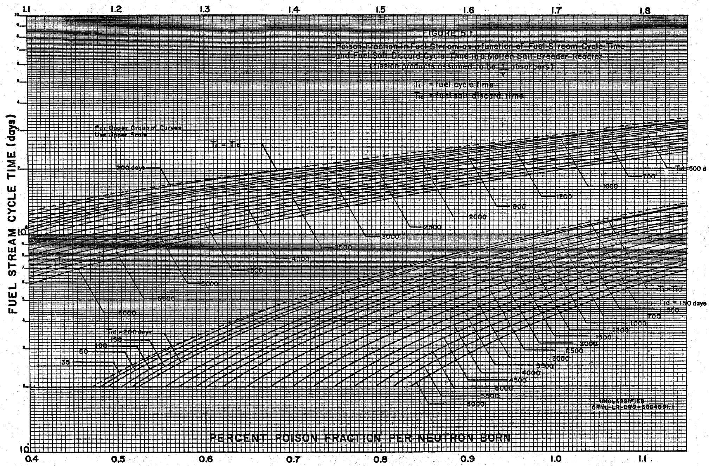

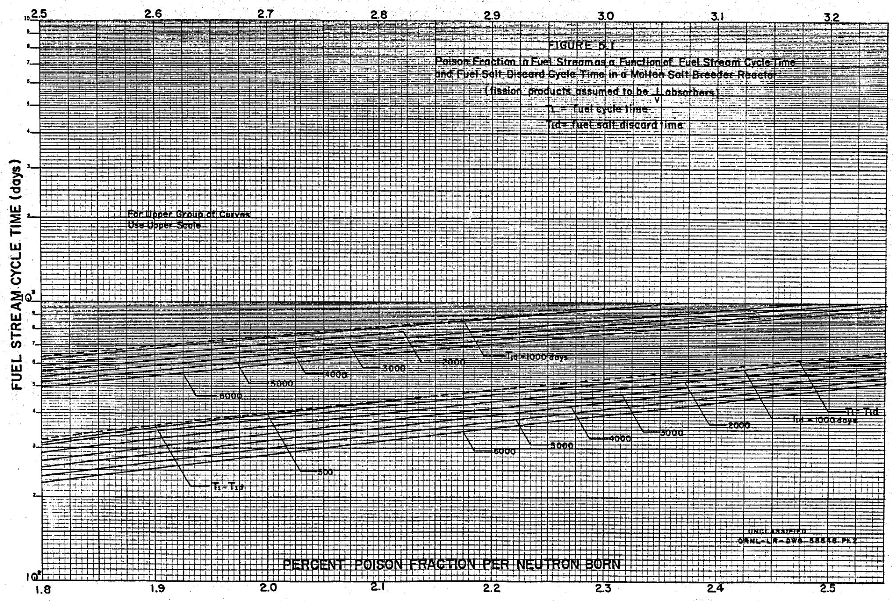

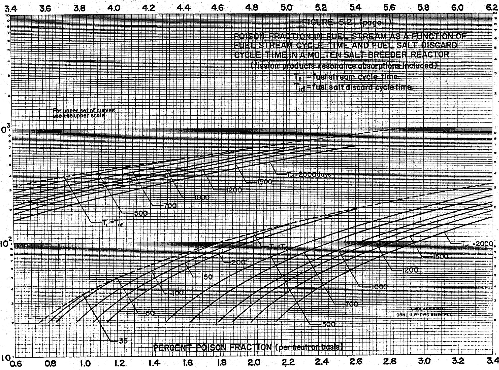  
FUEL STREAM CYCLE TIME (days)

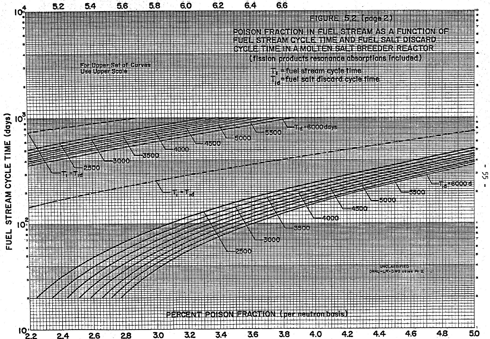

# 6.0 PARAMETER STUDIES AND RESULTS

The equilibrium reactor was studied to determine the effects of variations in certain reactor characteristics on the nuclear performance and economics of the system. The investigated parameters were:

1. poison fraction in fuel stream   
2. fertile stream cycle time   
3. fertile stream volume   
4. value of resonance integral of Pa-233   
5. value of epithermal fission cross section of U-233   
6. addition of $\mathbf{ZrF}_4$ to stabilize fuel salt

The last three items perhaps are not rightly classified as parameters since they are not independent characteristics. However in the cases of the resonance integral and the epithermal fission cross section, the ranges of uncertainty in measured values are sufficiently broad to have significant effects on reactor performance. Item 6 was introduced because recent fuel salt studies have indicated a need for $\mathrm{ZrF}_{\mu}$ to inhibit oxide precipitation of fuel atoms.

The two major parameters in this study were the fuel stream poison fraction and the fertile stream cycle time. The remaining four items were examined for variations in these two major parameters. The studies were made on the equilibrium state of the reactor described in Section 2.0 using the ERC-5 code10 for the IBM-704. However, in making the calculations for several values of epithermal fission cross sections of U-233 (Item 5), it was necessary to establish new critical conditions for the reactor using the GNU code8 before the ERC-5 calculations could be made.

Reactor properties that were held constant during the parametric study were the fuel stream volume (530.2 ft³) and station power (2364 Mwt). The effective carbon-to-uranium ratio was calculated for each equilibrium reactor and varied only slightly from case to case because of slightly different equilibrium conditions. The range of C:U ratios for all of the calculations was 5020 to 5230. These values are the actual C:U ratio divided by the thermal energy disadvantage factor (0.879) for carbon in the core. The variation from case to case was caused by small changes in the volume fraction of fertile stream in the core for changes in fuel stream poison fraction and fertile stream cycle time.

In the equilibrium calculations it was assumed that the absorption and fission rate coefficients were not appreciably affected by small changes in concentrations ( $\sim 10\%$ ) in important elements such as U-233, U-235 and fissium, and by much larger changes ( $\sim 1000\%$ ) in minor elements such as U-234, Pa-233, Xe, etc. In cases in which the equilibrium calculations significantly changed the concentration to the extent that the reaction rate coefficients might no longer apply, it was necessary to repeat the Cornpone unit cell and finite reactor calculations with new concentrations to develop new sets of reaction rate coefficients (see Fig. 4.1).

Several items in the neutron balance were specified for all of the parametric studies. These were the neutron losses to corrosion products, delayed neutrons, leakage and fuel processing. The values adopted for these quantities were respectively 0.0008, 0.0043, 0.0016, and 0.0022 neutrons lost per neutron absorbed in fuel.

Corrosion product losses were estimated from the equilibrium concentration of corrosion products of INOR-8. Delayed neutrons were calculated by the method of Walker.[18] Leakage losses were estimated from design considerations; it was felt that this number would be small because of the small amount of fissioning in the blanket. Fuel processing losses were discussed above in Section 3.6.

# 6.1 Results of Equilibrium Reactor Calculations

Pertinent characteristics of the MSBR on which equilibrium calculations were made are listed in Table 6.1.

Representative results of the equilibrium reactor calculations are given in Tables 6.2 and 6.3 in the Appendix. These results include the equilibrium atomic concentrations of major isotopes in the fuel and fertile streams, a neutron balance for the system, the contribution of individual items to the fuel cycle cost, the volume fraction of fertile stream in the core for the just critical reactor, and several items of less significance such as the fractions of each stream sold as product and the fraction of total fissions occurring in the fertile stream.

Table 6.1. Characteristics of MSER   

<table><tr><td>Thermal power, Mwt</td><td>2364</td></tr><tr><td>No. reactors in station</td><td>2</td></tr><tr><td>Thermodynamic efficiency</td><td>0.423</td></tr><tr><td>Fuel stream volume per reactor, ft3</td><td>265.1</td></tr><tr><td>Fertile stream volume per reactor, ft3</td><td>3000</td></tr><tr><td>Volume fraction fuel stream in core</td><td>0.16</td></tr><tr><td>Volume fraction fuel stream in end blanket</td><td>0.16</td></tr><tr><td>Volume fraction fertile stream in side blanket</td><td>0.90</td></tr><tr><td>Volume fraction fertile stream in end blanket</td><td>0.74</td></tr><tr><td>Volume fraction graphite in side blanket</td><td>0.10</td></tr><tr><td>Volume fraction graphite in end blanket</td><td>0.10</td></tr><tr><td>Fuel stream holdup time in reprocessing, days</td><td>1</td></tr><tr><td>Fertile stream holdup time in reprocessing, days</td><td>1</td></tr></table>

The option used to achieve criticality in the ERC-5 calculations was the variation of the volume fraction of fertile stream in the core. Since the volume fraction of fuel stream was fixed at 0.16, the addition or subtraction of fertile stream was made at the expense of removing or adding moderator. Consequently the C:U ratio in the core varied slightly from case to case. However these small variations in C:U ratio did not significantly affect the neutron spectrum.

# 6.1.1 Fuel Cycle Times

The fuel stream cycle times reported in Tables 6.2 and 6.3 are the optimized cycle times. Each time has been so chosen that it reflects the most economic rate for the chemical processing for the chosen values of poison fraction and fertile stream cycle time. The fuel salt discard cycle time has also been optimized.

In these two tables the results are for reactor systems in which the fission product resonance absorptions were included in the poison fraction calculation. Results of calculations in which fission products were assumed to be $1 / \nu$ absorbers are not included because these are just optimistic special cases of the resonance

absorption calculations. For the resonance absorption cases the fuel stream cycle time and fuel salt discard times are respectively in the ranges 12-84 days and 145-1550 days for poison fractions from 0.02 - 0.065 neutrons absorbed in fission products per neutron absorbed in fuel. For the $\frac{1}{v}$ absorption cases, the corresponding cycle times are in the ranges 12.5-735 days and 400-8100 days for poison fractions from 0.011 - 0.065.

The procedure for determining the optimum fuel cycle times was referred to above in Section 5.7 and is discussed further in Section 6.2.

# 6.1.2 Neutron Balance

Resonance Absorption Cases. A portion of each of Tables 6.2 and 6.3 shows the distribution of neutron absorptions in the reactor. Examining the neutron balance of Table 6.2 for increasing poison fraction, one finds that losses to protactinium fall about $10\%$ partly because the Pa-233 concentration decreases about $7\%$ due to decreasing breeding ratio. The decrease in losses to Pa is also partly due to a decrease in the volume fraction of fertile stream in the core by about $7\%$ . This is significant because about $60\%$ of the captures in Pa-233 occurs in the core. A similar effect is observed for the tabulations of Table 6.3 for other fertile stream cycle times.

Concurrently neutron losses to samarium and other fission products increase by about 0.045 neutrons. This is more than half of the breeding gain and results in more than one-half the production of excess fuel. The longer cycle times at the higher poison fractions effect less purging of higher uranium isotopes. The consequent build-up of U-235 causes a decrease in the mean $\eta$ of the system by about 0.004. Neutron losses to U-236 and Np-237 increase about 1.5-fold and 10-fold, respectively, or by about 0.006 and 0.002 neutrons.

1/v Absorption Cases. The neutron balances for these calculations are not presented in this memorandum because they are of limited interest. Since the range of poison fractions (0.011 - 0.065) is greater than that covered in the resonance absorption cases, more variations might be expected in the elemental absorptions. The explanation of the trends, however, is the same as given above. For example, Pa-233 absorptions decrease about $14\%$ over the range of poison fractions because its concentration decreases about $7\%$ , and the volume fraction of fertile stream in the core decreases about $13\%$ .

Losses to samarium and other fission products increases by $0.054$ neutrons consuming about $70\%$ of the breeding gain. Higher isotopes of uranium build up because of slower processing rates at the higher poison fractions with the accompanying decrease ( $\sim 0.005$ ) in the mean value of $\eta$ . Neutron absorptions by U-236 and Np-237 increase by about $0.004$ and $0.005$ .

# 6.1.3 System Inventory

The inventory of fissionable materials, which includes U-233, U-235, and Pa-233, for the equilibrium reactors is presented in Fig. 6.1; a detailed breakdown of the inventory is given in Tables 6.2 - 6.3. For both resonance absorption and $\mathbf{l} / \mathbf{v}$ absorption cases the inventory does not change very fast with poison fraction over most of the range of poison fractions. However, at low values of the poison fraction a sharp upturn in the inventory is observed. This occurs because of the increased holdup in the chemical processing plant at these fast processing rates. The processing rate for the resonance absorption cases at a poison fraction of 0.02 is about equal to the rate for the $\mathbf{l} / \mathbf{v}$ absorption cases at a poison fraction of 0.011.

The largest effect on fissionable inventory is observed for the variation in fertile stream cycle time. As the fertile stream cycle time increases from 35-200 days, the total fissionable inventory increases about $50\%$ , or from around 860 to $1240\mathrm{kg}$ . The increase is attributed almost entirely to increase of U-233 inventory in the fertile stream which rises over 5-fold. Uranium-233 inventory in the fuel stream decreases about $6\%$ ; concurrently the U-235 inventory increases about $7\%$ . Increased fissioning in the blanket at the longer cycle times causes the critical mass of U-233 in the core to decrease. However since the breeding gain also decreases for increasing fertile stream cycle time at constant poison fraction, the purge rate of U-235 becomes smaller because less U-235 is routed to sales; hence the U-235 inventory in the core builds up.

The thorium inventory for this series of calculations was maintained constant at 270 tonnes.

Protactinium-233 inventory is not very sensitive to changes in poison fraction or fertile stream cycle time. Since Pa-233 is not removed from the system in the fluoride volatility process, it builds up until its decay rate is exactly equal to the U-233 production rate. Therefore the Pa-233 inventory will change in direct proportion to the breeding ratio. For this system the inventory is in the range 100-110 kg.

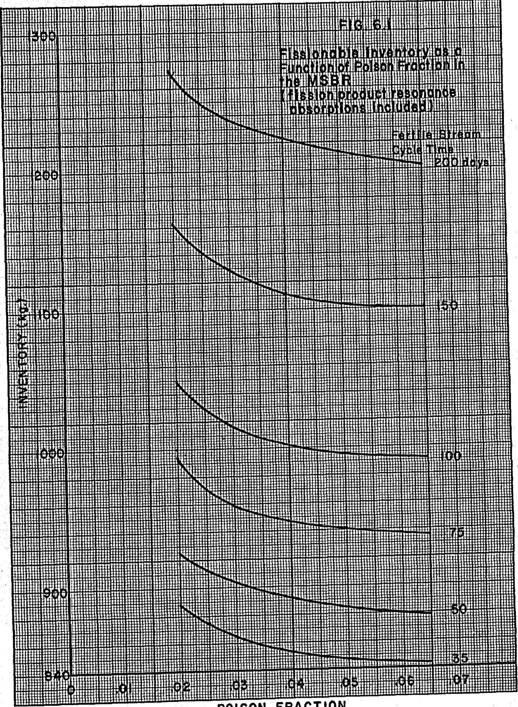  
POISON FRACTION

# 6.1.4 Fuel Cycle Cost

A breakdown of the fuel cycle costs for representative cases is given in Tables 6.2 and 6.3. These costs were calculated using the basic cost data given in Table 3.1.

The largest single contribution to the fuel cycle cost is the charge for the fuel processing plant which contributes up to $40\%$ of the total cost. At the faster blanket processing rates, the fertile stream processing plant cost also becomes a significant part of the total cost; at a 35-day blanket cycle time about $30\%$ of the cost may derive from fertile stream processing.

Total inventory charges on fissionable materials, thorium, fuel carrier and thorium carrier account for $40 - 55\%$ of the fuel cycle cost. Individually, the thorium carrier ( $\sim$ 200 tonnes) contributes most to the inventory charges, from $15 - 20\%$ of the fuel cycle cost; fissionable inventory contributes about $7 - 13\%$ ; thorium inventory contributes $12 - 16\%$ ; and fuel carrier inventory contributes the least, only from $1.5 - 2.5\%$ .

Thorium amortization and thorium carrier replacement charges, which are amortized at $2.6\%$ , are not an appreciable portion of the fuel cycle cost, being only $2 - 4\%$ of the total. On the other hand, fuel carrier replacement charges become a significant factor especially at the lower values of poison fraction because of the high salt discard rate. At very high poison fractions (0.065), this contribution is only about $4\%$ of the total fuel cycle cost; whereas, at low poison fractions as much as $25\%$ of the cost is due to salt discard.

Breeding credit is an item of the fuel cycle cost that is directly proportional to the breeding gain and fissionable inventory. The high fuel yield reactors (6.8%/year) have breeding credits of about 0.13 mills/kwhr; in the very highly poisoned reactors (fuel yield ≈ 1%/year), the breeding credit is only about 0.04 mills/kwhr. Although allowing the fertile stream cycle time to increase from 35 to 200 days lowers the breeding credit through increasing the fissionable inventory, the effect is not so pronounced as that caused by allowing the poison fraction to increase.

# 6.2 Poison Fraction Studies in Which Fission Product Resonance Absorptions are Included

A series of equilibrium reactor calculations was made for a range of fuel stream poison fractions from 0.02 - 0.065 neutrons absorbed in fission products

per neutron absorbed in fuel. This range of poison fractions was applied to fertile stream cycle time parameters of 35, 50, 75, 100, 150 and 200 days. The range of poison fractions was established after a few preliminary calculations to include reactors with quite favorable breeding potential as well as those that are approximately "hold-your-own" systems. Poison fractions lower than 0.02 were not considered because the required fast processing rates result in high fuel cycle costs without appreciable increase in breeding gain. At a poison fraction of 0.065, the MSBR shows a small, positive breeding gain; at higher poison fractions it is doubtful if the system will breed.

These two parameters could very conveniently be treated in the ERC-5 code since they are items of input data. The poison fraction as such does not appear in ERC-5 input; however, the desired poisoning effect can be obtained by using fictitious fission product concentrations and fictitious reaction rate coefficients. The net effect of additional poisons is to decrease the breeding gain and corresponding breeding credit. For each combination of poison fraction and fertile stream cycle time the code calculated equilibrium atomic concentrations, inventories, neutron absorptions by elements, thorium concentration in the core and processing rates.

# 6.2.1 Fuel Cycle Cost Optimization

The fuel cycle costs were optimized for each value of the fuel stream poison fraction and each value of the fertile stream cycle time. For each combination of these two parameters the fuel stream processing cycle which gave the lowest total fuel cycle cost was determined. The procedure is discussed below.

Fuel Yield Versus Poison Fraction. Fuel yields calculated for the equilibrium reactor were plotted as a function of the poison fraction (Fig. 6.2). The nearly linear relationship indicates that the fuel yield is inversely proportional to the poison fraction. The plots begin to curve in the region of low poison fraction because the required fast chemical processing rates begin significantly to increase the fissionable inventory through holdup in fuel processing. The result is a lowering of the fuel yield. The effect of increasing fertile stream cycle time is to decrease the fuel yield for a given poison fraction. This occurs because of increased fissioning in the fertile stream and the accompanying increase in fission product concentration plus an inventory increase.

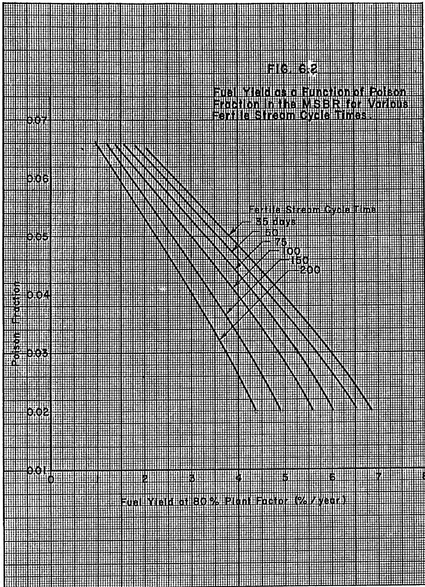

Fuel Salt Discard Time as a Function of Fuel Cycle Cost. As discussed in Section 5.0, each value of the fuel stream poison fraction can be attained by operating the reactor at several values of fuel stream cycle time and fuel salt discard cycle time, and there is some combination of these times for which the fuel cycle cost is a minimum. For each selected value of the fuel stream poison fraction, several pairs of compatible values of these two cycle times were chosen from Fig. 5.2, and the total fuel cycle cost was calculated for each pair of values. The fuel cycle time determined the capital investment in the processing plant; the fuel salt discard cycle time determined the replacement charges for the fuel salt. A plot of fuel salt discard cycle time versus fuel cycle cost at constant poison fraction gave the curves exhibited in Fig. 6.3. The minimum of each curve represents the point of most economic operation; the corresponding fuel cycle cost and fuel salt discard cycle time are read directly. When the optimum fuel salt discard cycle time is entered into Fig. 5.2, the optimum fuel stream cycle time is found.

Optimum values of the fuel cycle cost, fuel stream cycle time and fuel salt discard cycle time are given in Tables 6.2 and 6.3.

# 6.2.2 Economic Performance

The optimized fuel cycle costs obtained by the above procedure have been plotted as a function of the fuel yield in Fig. 6.4. The curves have been calculated for a plant operating $80\%$ of the time. The most favorable fuel yields are obtained at the shortest fertile stream cycle time; however, the corresponding fuel cycle costs are high. Likewise the fuel stream must be processed at a relatively fast rate as indicated by the lower values of the poison fraction. Fuel yields of the order of $7\%/\mathrm{yr}$ can be attained at a fuel cycle cost of around 1.7 mills/kwhr.

In the lower range of fuel yields it appears that fuel cycle costs of 0.75 to 0.80 mills/kwhr can be attained at fuel yields of 1 to $2\%/\text{yr}$ . These conditions require fertile stream cycle times of 150 - 200 days. The curves could have been extended in the lower regions of fuel yields by performing calculations at higher values of the poison fraction; however, uncertainties in basic data, e.g., cross sections and resonance integrals, would lend doubt as to whether such a system would have a positive breeding gain.

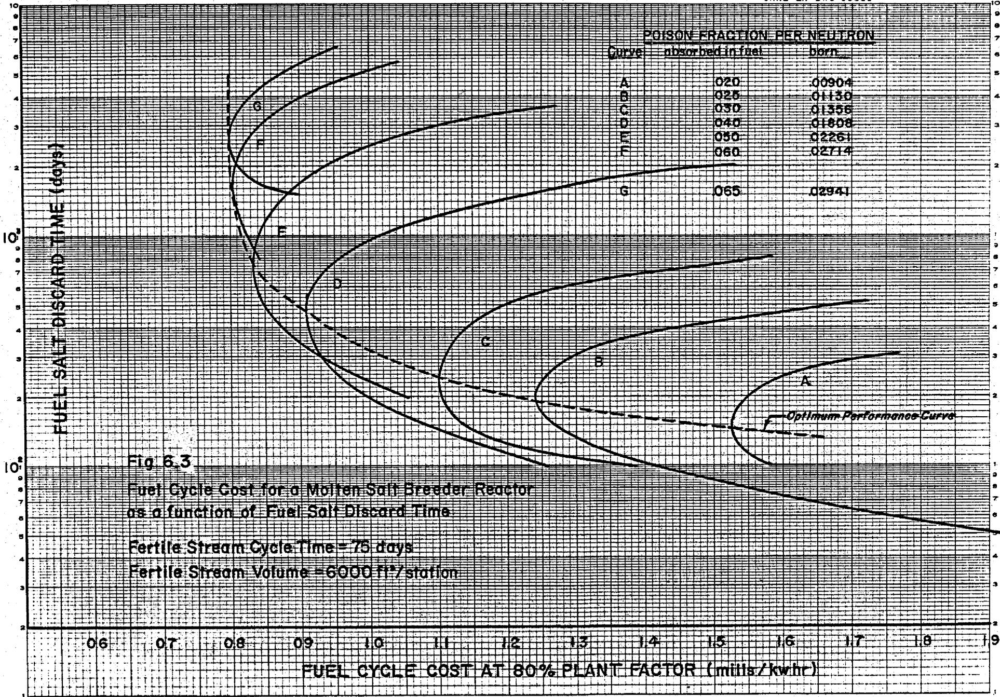

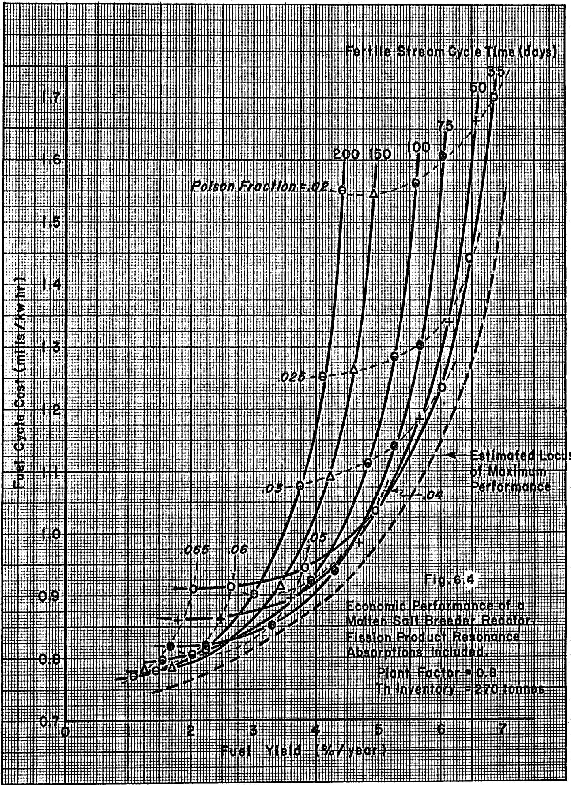

In this series of calculations fuel stream cycle times ranged from 12 - 84 days, and fuel salt discard cycle times ranged from 145 - 1550 days for the case that fall on the envelope of the curves.

The dashed envelope curve has been drawn to indicate the estimated maximum performance of this reactor. It might be possible to extend the envelope of the family of curves out this far by modifications in the C:U ratio in the core and by optimizing the fertile stream cycle time. These refinements to the calculations were not made in this study; nevertheless, it is believed that the chosen C:U ratio is near the optimum.

Along a line of constant fertile stream cycle time, the fuel cycle cost drops rather sharply from its maximum value principally because of decreased charges on the fuel stream processing plant at the longer fuel stream cycle times and lower fuel salt replacement charges for the longer salt discard cycle time. During this initial drop in fuel cycle cost, the breeding credit is also decreasing, but the initial loss of breeding credit is far overridden by the savings on the processing plant and fuel salt replacement mentioned above. Consequently the initial drop in fuel yield is not as fast as for the fuel cycle cost. Eventually, though, as the processing time becomes long (increasing poison fraction) the savings on the processing plant and fuel salt discard are not so effective in lowering the fuel cycle cost and the rate of decline decreases. Meanwhile decreasing breeding gain accelerates the loss in fuel yield. Ultimately at higher poison fractions than shown on the graph, a complete loss of breeding gain would necessitate rising fuel cycle cost because fuel would have to be purchased.

Along a line of constant poison fraction in Fig. 6.4, the fuel cycle cost is affected principally by changes in capital charges on the fertile stream processing plant and in fissionable inventory in the fertile stream. The contribution of the fertile stream processing plant to the fuel cycle cost decreases with increasing cycle time while the inventory charges increase. Initially the savings on the processing plant overweigh the increased inventory charges resulting in a net lowering of the total fuel cycle cost. At the long cycle times, however, the inventory charges overbalance the lower plant costs and the fuel cycle cost reaches a minimum and begins to rise.

The decrease in fuel yield along a line of constant poison fraction is not large and is due primarily to increasing inventory of fissionable material in the system. There is also the adverse effect that higher U-235 concentrations at the

longer fertile stream cycle times have on the mean value of $\eta$ - an effect that lowers the fuel yield through lower breeding gain.

# 6.3 Poison Fraction Studies in which Fission Products were Considered to be 1/v Absorbers

A series of equilibrium reactor calculations was made for a range of fuel stream poison fractions from 0.011 - 0.065 neutrons absorbed in fission products per neutron absorbed in fuel. This range of poison fractions was applied to fertile stream cycle time parameters of 35, 50, 75, 100, 150, and 200 days and is broader than that considered in Section 6.2 for the resonance absorption cases. When fission products are treated as $\frac{1}{\nu}$ absorbers, the poisoning effect is not as great as when the resonance absorptions are included, and it is therefore possible to extend the range of calculations to lower poison fractions before intolerably short fuel stream cycle times are reached.

The equilibrium calculations were made using the ERC-5 code for the IBM-704 by varying the fertile stream cycle time and by using fictitious fissium concentrations and reaction rate coefficients as mentioned in Section 6.2. These calculations were performed at the beginning of this thorium breeder study before a compilation of resonance integral data became available, and it appeared that treating the fission products as $1 / v$ absorbers was the best approach to the problem. Therefore, the results reported below should be considered as an optimistic upper limit to the fuel yield and an optimistic lower limit to the fuel cycle cost.

# 6.3.1 Economic Performance

The optimized fuel cycle costs obtained by the above procedure are plotted as a function of the fuel yield in Fig. 6.5. These fuel cycle costs and fuel yields should be regarded as rather optimistic values since considerable neutron economy resulted from the assumption that the fission products behaved as $1 / v$ absorbers. Consequently it is believed that these curves represent a lower bound to the MSER fuel cycle costs; more realistic performance is that represented by Fig. 6.4 in which the best available resonance absorption data were included.

For the conditions of Fig. 6.5, fuel yields as high as about $8\%/\text{yr}$ at a fuel cycle cost of about 1.3 mills/kwhr were obtained; a minimum fuel cycle cost of about 0.68 mills/kwhr was obtained at about $4\%/\text{yr}$ fuel yield. The

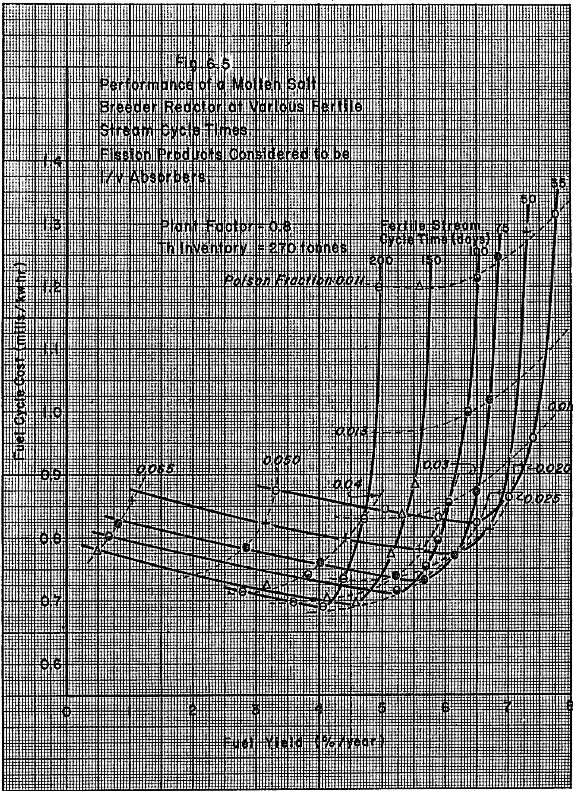

curves rise linearly after attaining their minima because of the influence of the constant charge for the batch fuel stream processing plant. Batch operation becomes effective in the region of fuel yields of $5 - 6\%/\mathrm{yr}$ at poison fractions of 0.025 - 0.03.

The behavior of the curves for variations in poison fraction and fertile stream cycle time can be explained by the same comments made above in Section 6.2.2 and will not be repeated here.

# 6.4 Effect on Reactor Performance of Varying Thorium Inventory

In order to study the breeding performance of the MSBR over a wide range of operating conditions, the thorium inventory was varied in the range 100 - 400 tonnes in a few representative calculations for which the fertile stream cycle time was 35 days, the fuel stream cycle time was 20 days, and the fuel salt discard time was 1000 days. The thorium inventory was varied by adjusting the fertile stream volume in the range 2000 - 9000 ft³ per station. This particular series of calculations was made at an early stage of the study, and the combination of cycle times is not optimum with respect to fuel cycle costs at the various fuel yields. However, the dependency of fuel yield and cost on thorium inventory is only weakly affected, if at all, by choice of cycle times. Therefore the behavior exhibited by the selected cases is typical and may be used as a guide in selecting thorium inventories. The important results of these calculations are given in Table 6.4.

Table 6.4. Dependency of Fuel Yield and Fuel Cycle Cost on Thorium Inventory in a Molten Salt Breeder Reactor   

<table><tr><td>Thorium Inventory (tonnes)</td><td>Relative Fuel Yield</td><td>Relative Fuel Cycle Cost</td></tr><tr><td>100</td><td>1.0</td><td>1.00</td></tr><tr><td>140</td><td>1.2</td><td>1.03</td></tr><tr><td>180</td><td>1.3</td><td>1.09</td></tr><tr><td>270</td><td>1.4</td><td>1.20</td></tr><tr><td>400</td><td>1.4</td><td>1.39</td></tr></table>

As the thorium inventory increases, losses to Pa-233 decrease, and there are gains in respect to mean eta and U-236 absorptions. Breeding gain increases, but at a decreasing rate. Meanwhile fuel inventory in the fertile stream rises. As a result, fuel yield rises rapidly at first, and then more slowly as the influence of increasing inventory overrides that of breeding gain. The cost increases steadily, however, being driven upward by increased charges for thorium and uranium. The fuel yield reaches a point of negligible improvement at 270 tonnes of thorium, and this thorium inventory was used for further studies reported above in Sections 6.1 - 6.3.

One hundred tonnes of thorium is not sufficient to fill the blanket of the reactor used in this study when the blanket thickness is 3 ft. In the corresponding calculations, no adjustment was made for the greater leakage that would result from a thinner blanket. Thus for the case in the above tabulation, the fuel yield should be less and the fuel cycle cost higher than calculated. Accordingly the 140-tonne case was selected as a representative low-thorium case for further study.

For the 140-tonne thorium fertile stream, a series of calculations was made to optimize the fuel cycle cost and the fuel yield at a representative fertile stream cycle time (50 days). A comparison between these results and those of the corresponding 270-tonne thorium case are presented in Table 6.5.

The results of Table 6.5 were obtained for optimized fuel stream cycle times and fuel salt discard times, and in all calculations the resonance absorptions of fission products were included in the poison fraction calculations. The two cycle times are longest for the low fuel yields and shortest for the high yield cases. Although some slight trend with fuel stream cycle time is observed, the rule can be formulated that doubling the thorium inventory adds about $1.9\%$ /yr to the fuel yield and about 0.2 mills/kwhr to the fuel cycle cost regardless of the fuel stream cycle times.

The performance of the MSBR containing 140 tonnes and 270 tonnes of thorium is graphed in Fig. 6.6. The solid curve which is drawn through the calculated points is the envelope curve of Fig. 6.4. The dashed curve is an estimated curve, based on the few 140-tonne thorium cases, for the maximum performance of the MSBR at this low thorium inventory. The solid outer curve was then drawn to indicate the

Dependency of Fuel Yield and Fuel Cycle Cost on Thorium Inventory with 50-Day Fertile Stream Processing and Optimized Fuel Stream Processing Cycle Times

Table 6.5. Molten Salt Breeder Reactor   

<table><tr><td colspan="6">Thorium Inventory, tonnes</td></tr><tr><td>270</td><td>140</td><td></td><td>270</td><td>140</td><td></td></tr><tr><td>Fuel</td><td>Yield, %/yr</td><td>Diff.</td><td>Fuel</td><td>Cycle Cost, mills/kwhr</td><td>Diff.</td></tr><tr><td>2:0</td><td>0.3</td><td>1.7</td><td>0.85</td><td>0.63</td><td>0.22</td></tr><tr><td>2:5</td><td>0.7</td><td>1.8</td><td>0.84</td><td>0.63</td><td>0.21</td></tr><tr><td>3:6</td><td>1.7</td><td>1.9</td><td>0.87</td><td>0.66</td><td>0.21</td></tr><tr><td>4:6</td><td>2.7</td><td>1.9</td><td>0.95</td><td>0.75</td><td>0.20</td></tr><tr><td>5:6</td><td>2.7</td><td>1.9</td><td>0.95</td><td>0.75</td><td>0.20</td></tr><tr><td>6:6</td><td>4.7</td><td>1.9</td><td>1.57</td><td>1.37</td><td>0.20</td></tr></table>

estimated limit of maximum performance of the MSER when the thorium inventory is optimized with respect to fuel yield. The outer curve also assumes that a slight improvement in the reactor can be found by a slight variation in the C:U ratio. The C:U ratio (~ 5000) in this reactor was not optimized, but this value is believed to be near the optimum.

The 140-tonne thorium case is also plotted in Figs. 6.7 and 6.8 for optimized fuel cycle times and for a range of poison fractions from 0.011 - 0.065.

# 6:5 Effect of Value of $\eta$ -233 on MSER Performance

Uncertainty in the measured values of the epithermal fission cross sections of U-233 can cause considerable variation in the calculated performance of the MSER, depending on the set of cross section values that is used. This is the case because approximately $30\%$ of total fissions occurs at epithermal energies. Reported epithermal values of $\eta$ -233 apparently agree within about $\pm 10\%$ of an average or "recommended" set of values.4

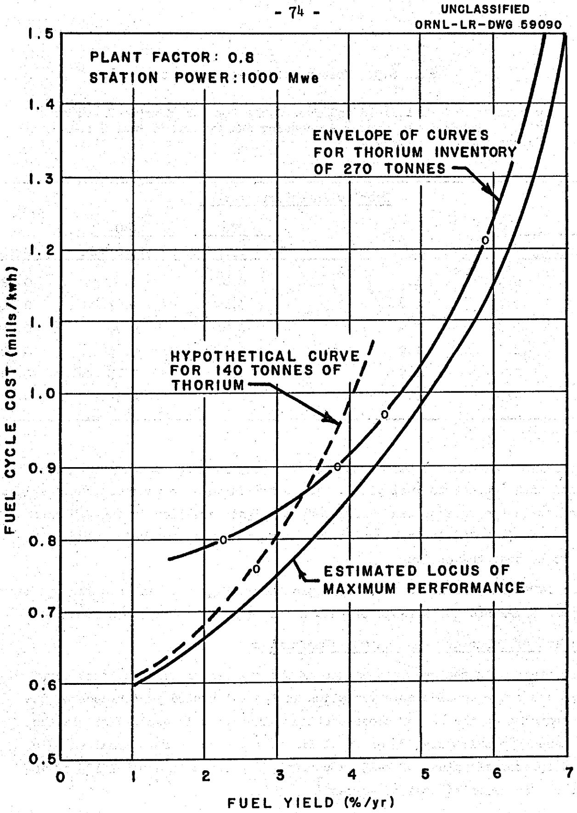  
Fig. 6.6 Performance of a Molten Salt Breeder Reactor with Varying Thorium Inventory

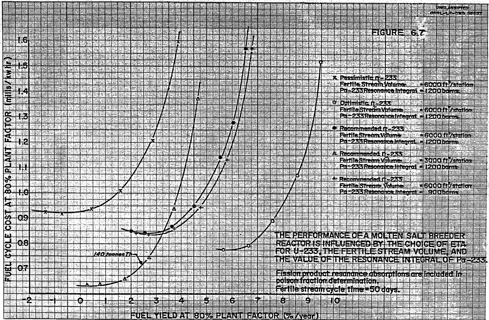

FUEL CYCLE COST AT 80% PLANT FACTOR (mills/kw hr)   
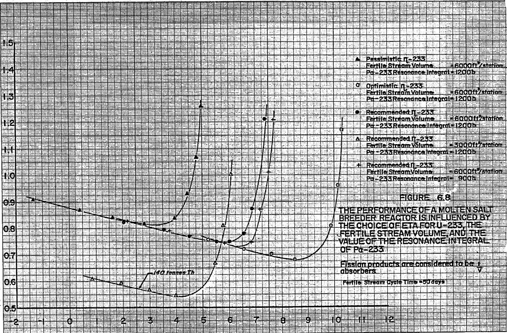  
FUEL YIELD AT 80% PLANT FACTOR (%/year)

Several calculations for a representative operating condition were made using the GNU and ERC-5 programs for the IBM-704 to determine the effect of these $\eta$ variations. The plots of Figs. 6.7 and 6.8 show the effect for cases in which fission product resonance absorptions were included and for cases considering fission products to be $1 / v$ absorbers. There is considerable variation in the fuel yield, as measured by the horizontal distance between corresponding points on the curves, between the recommended curve and the high and low epi-thermal eta curves. The deviation from the recommended value is $\pm 2.5$ to $\pm 3\% / y_r$ in fuel yield. In fact, using the more pessimistic values of $\eta$ makes it difficult to attain fuel yields of as much as $4\% / y_r$ even at fuel cycle costs as high as 1.6 mills/kwhr.

On the other hand the choice of high or low epithermal $\eta$ -233 does not have a strong influence on the fuel cycle cost. This effect is measured by the vertical difference between corresponding points on the three curves. This difference is approximately $\pm 0.06$ mills/kwhr from the recommended curve.

The various values of $\eta$ -233 are tabulated in Table 6.6. The column headed $\eta(\text{MTR})$ contains values from experiments performed at the Materials Testing Reactor and are the values recommended by Nestor for use in this study. The columns headed $\eta(+10\%)$ and $\eta(-10\%)$ contain the extreme values used to obtain the two curves of Figs. 6.7 and 6.8 for comparison with the recommended values. Values in all energy groups differ by $10\%$ from the MTR values except in group 31 where the difference is only $5\%$ and in groups 32 through 34 where the values were not changed. The other values headed $\eta(\text{RPI})$ are presented for comparison since these are recent data from a study by Yeater.[19] The RPI set of values are not thought to be more reliable than the MTR values; however, in the energy range 30 ev - 1 kev the RPI data represent the only measurements that have been made.

# 6.6 Effect of Value of Pa-233 Resonance Integral on MSBR Performance

A second nuclear constant that is perhaps not known very accurately is the value of the resonance integral of Pa-233. Figures of 600, 900, and 1200 barns have been mentioned for the value of this integral. As mentioned in Section 3.7, a value of 1200 barns was chosen for this study. However, in order to determine what effect a lower value of the resonance integral would have on reactor performance, several calculations were made at representative operating conditions using a 900-barn resonance integral for comparison with the 1200-barn cases. The resulting curves for the reactor performance are plotted in Fig. 6.7 and 6.8.

Table 6.6. Group-Averaged Eta Values of U-233   

<table><tr><td>Group</td><td>Energy (ev)</td><td>η(-10%)</td><td>η(MIR)</td><td>η(+10%)</td><td>η(RPI)</td></tr><tr><td>1</td><td>4 x 106-1 x 107</td><td>3.051</td><td>3.39</td><td>3.729</td><td>3.39</td></tr><tr><td>2</td><td>2 x 106-4 x 106</td><td>2.583</td><td>2.87</td><td>3.157</td><td>2.87</td></tr><tr><td>3</td><td>1 x 106-2 x 106</td><td>2.421</td><td>2.69</td><td>2.959</td><td>2.69</td></tr><tr><td>4</td><td>3 x 105-1 x 106</td><td>2.259</td><td>2.51</td><td>2.761</td><td>2.51</td></tr><tr><td>5</td><td>1 x 105-3 x 105</td><td>2.133</td><td>2.37</td><td>2.607</td><td>2.37</td></tr><tr><td>6</td><td>3 x 104-1 x 105</td><td>2.052</td><td>2.28</td><td>2.508</td><td>2.28</td></tr><tr><td>7</td><td>1 x 104-3 x 104</td><td>2.025</td><td>2.25</td><td>2.475</td><td>2.25</td></tr><tr><td>8</td><td>3 x 103-1 x 104</td><td>2.016</td><td>2.24</td><td>2.464</td><td>2.24</td></tr><tr><td>9</td><td>1 x 103-3 x 103</td><td>2.025</td><td>2.25</td><td>2.475</td><td>2.25</td></tr><tr><td>10</td><td>400-1000</td><td></td><td></td><td></td><td>1.9</td></tr><tr><td>11</td><td>150-400</td><td></td><td></td><td></td><td>1.72</td></tr><tr><td>12</td><td>100-150</td><td></td><td></td><td></td><td>1.78</td></tr><tr><td>13</td><td>90-100</td><td></td><td></td><td></td><td>1.54</td></tr><tr><td>14</td><td>80-90</td><td></td><td></td><td></td><td>1.68</td></tr><tr><td>15</td><td>65-80</td><td></td><td></td><td></td><td>1.77</td></tr><tr><td>16</td><td>50-65</td><td></td><td></td><td></td><td>1.93</td></tr><tr><td>17</td><td>45-50</td><td></td><td></td><td></td><td>1.96</td></tr><tr><td>18</td><td>37-45</td><td></td><td></td><td></td><td>1.7</td></tr><tr><td>19</td><td>33-37</td><td></td><td></td><td></td><td>1.97</td></tr><tr><td>20</td><td>30-33</td><td></td><td></td><td></td><td>2.06</td></tr><tr><td>21</td><td>25-30</td><td>1.944</td><td>2.16</td><td>2.376</td><td>1.91</td></tr><tr><td>22</td><td>20-25</td><td>1.944</td><td>2.16</td><td>2.376</td><td>1.93</td></tr><tr><td>23</td><td>17-20</td><td>1.944</td><td>2.16</td><td>2.376</td><td>1.75</td></tr><tr><td>24</td><td>13.5-17</td><td>1.953</td><td>2.17</td><td>2.387</td><td>1.88</td></tr><tr><td>25</td><td>10-13.5</td><td>1.953</td><td>2.17</td><td>2.387</td><td>2.06</td></tr><tr><td>26</td><td>7.5-10</td><td>2.052</td><td>2.28</td><td>2.508</td><td>1.91</td></tr><tr><td>27</td><td>5.5-7.5</td><td>1.863</td><td>2.07</td><td>2.277</td><td>1.96</td></tr><tr><td>28</td><td>4-5.5</td><td>1.962</td><td>2.18</td><td>2.398</td><td>1.99</td></tr><tr><td>29</td><td>2.5-4</td><td>1.845</td><td>2.05</td><td>2.255</td><td>1.96</td></tr><tr><td>30</td><td>1.4-2.5</td><td>1.719</td><td>1.91</td><td>2.101</td><td>2.07</td></tr><tr><td>31</td><td>0.8-1.4</td><td>2.12</td><td>2.23</td><td>2.342</td><td>2.23</td></tr><tr><td>32</td><td>0.6-0.8</td><td>2.29</td><td>2.29</td><td>2.29</td><td>2.29</td></tr><tr><td>33</td><td>thermal-0.6</td><td>2.28</td><td>2.28</td><td>2.28</td><td>2.28</td></tr><tr><td>34</td><td>thermal</td><td>2.28</td><td>2.28</td><td>2.28</td><td>2.28</td></tr></table>

The improvement that the lower value of the resonance integral makes in the MSER performance is hardly appreciable. The fuel yield, measured by the horizontal difference between corresponding points, is increased by perhaps $0.25\%$ /year; the fuel cycle cost, measured by the vertical difference, is lowered by about 0.01 mills/kwhr. The small effect on performance is understandable when it is considered that losses to Pa-233 account for only about $0.5\%$ of the neutrons born per fuel absorption using the 1200-barn resonance integral. However of all the neutron absorptions in Pa-233, approximately $80\%$ occur at epithermal energies.

The comparative 900-barn resonance integral calculations were performed using the ERC-5 code with adjusted values of the reaction rate coefficients, which are defined above in Section 4.4. The adjustment was made using output data from a Cornpone finite reactor calculation giving the absorptions in Pa-233 as a function of energy. The reaction rate coefficients were calculated separately for the thermal absorptions and the epithermal absorptions, the epithermal value being decreased by the ratio of the resonance integrals, i.e., 900:1200. The two values for the coefficients were summed to obtain the total reaction rate coefficient as shown by Eq. 14.

$$
C (\mathrm {P a}) \text {i n} \quad \text {c o r e} = \left[ \frac {\mathrm {A} (\mathrm {P a}) _ {\mathrm {t h}}}{\mathrm {N} (\mathrm {P a})} + \frac {\mathrm {A} (\mathrm {P a}) _ {\mathrm {e p i}}}{\mathrm {N} (\mathrm {P a})} \left(\frac {9 0 0}{1 2 0 0}\right) \right] _ {\text {c o r e}} \tag {14}
$$

where

$$
C (P a) = r e a c t i o n r a t e c o e f f i c i e n t o f P a - 2 3 3
$$

$$
\begin{array}{r l} \mathrm {A} (\mathrm {P a}) _ {\mathrm {t h}} & = \text {n e u t r o n s a b s o r b e d b y P a - 2 3 3 a t t h e r m a l e n e g y} \\ & \text {p e r n e u t r o n b o r n i n c o r e} \end{array}
$$

$$
A (P a) _ {e p i} = \text {n e u t r o n s a b s o r b e d b y P a - 2 3 3 a t e p i l t h e r m a l e n e g i e s}
$$

$$
N (\mathrm {P a}) = \text {h o m o g e n i z e d a t o m i c c o n c e n t r a t i o n} \mathrm {P a} - 2 3 3 \text {i n c o r e , a t o m s / c m} ^ {3}
$$

A similar expression was used to calculate $C(\mathrm{Pa})$ for the blanket, and these adjusted coefficients were used in the equilibrium reactor calculations.

# 6.7 Effect on MSER Performance of Adding $\mathbf{ZrF_4}$ to Fuel Salt

Recent developments in fuel technology for the Molten Salt Reactor Experiment (MSRE) have indicated that fuel stability is enhanced by the addition of nominal amounts of $\mathbf{ZrF_4}$ to the fuel salt. Zirconium acts as a "getter" for oxygen

preventing the union of oxygen and uranium which results in the precipitation of uranium oxides. The inclusion of zirconium, however, adds an additional neutron poison to the system.

The effect on breeding ratio and fuel yield of adding 5 mole $\%$ ZrF $_4$ to the fuel salt was calculated for the ranges of values representative of the MSBR. The results are plotted in Fig. 6.9. The curves show the per cent decrease in breeding ratio and fuel yield resulting from the addition of ZrF $_4$ as a function of these quantities for a reactor containing no ZrF $_4$ . As might be expected, the detrimental effect of the ZrF $_4$ is more pronounced for the reactors that have initially poor breeding performance. In fact the steepness of the fuel yield curve at fuel yields of the order of $2 - 3\%/\mathrm{yr}$ suggests that adding ZrF $_4$ to a low performance reactor can just about destroy its breeding potential.

The Zr-containing salt used in the calculations had the composition of fuel solution proposed for the MSRE: 70-23-5-1-1 mole % LiF-BeF $_2$ -ZrF $_4$ -ThF $_4$ -UF $_4$ .

In order to determine the effect of 5 mole $\%$ ZrF $_4$ on a representative performance curve, the results of Fig. 6.9 were applied to equilibrium reactor calculations for a fertile stream cycle time of 50 days. The results were optimized according to fuel stream cycle time and fuel salt discard time. The horizontal difference between corresponding points in Fig. 6.10 shows that Zr decreases the fuel yield about $0.5\%/\mathrm{yr}$ ; whereas, the fuel cycle cost, measured by the vertical difference, is almost negligibly affected. The effect on fuel cycle cost is small because the effect shows up through the loss in breeding credit which is not a large portion of the total fuel cycle cost.

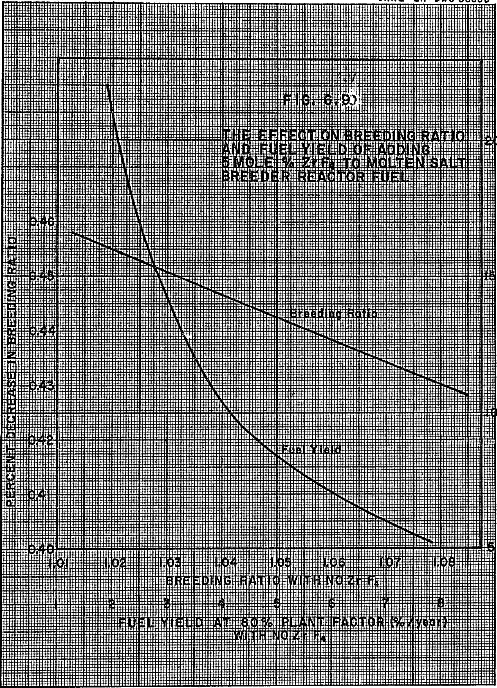  
PERCENT DECREASE IN FUEL YIELD

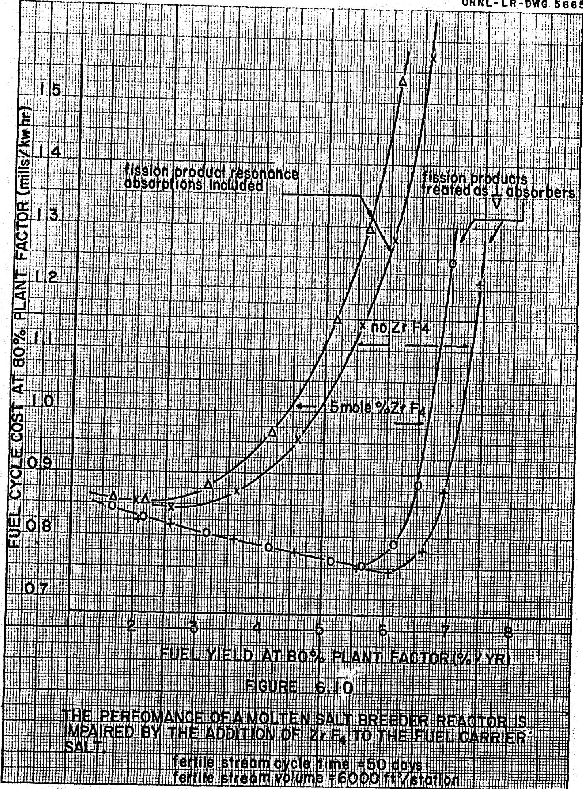

# 7.0 CONCLUSIONS

The molten salt reactor offers considerable promise as a breeder in the Th-U cycle. The principal advantage of this system over other breeding systems, which use thorium in the form of the oxide or metal, is in the simplified chemical processing method. The molten salt system is able to use the relatively simple fluoride volatility process plus the HF dissolution process for uranium recovery and decontamination; whereas, breeders which employ $\mathrm{ThO_2}$ or thorium metal are, in the light of current technology, resigned to the more complicated and expensive Thorex process.

The MSBR is capable of excess fuel yields up to $7\%$ /year when operating $80\%$ of the time. At this high yield, the fuel cycle cost is about 1.65 mills/kwhr. At lower fuel yields the fuel cycle cost is considerably improved, dropping to perhaps 0.65 mills/kwhr for fuel yields of $1 - 2\%$ /year. However, yields as low as this constitute marginal operation because uncertainties in nuclear data introduce uncertainties of about a per cent in fuel yield into the calculations. At a fuel yield of $4\%$ /year, the point at which the income from sales just balances the annual charge on fissionable inventory, the fuel cycle cost is approximately 0.9 mills/kwhr.

The largest contribution to the fuel cycle cost is made by the fuel stream processing plant which accounts for about $41\%$ of the cost at the high processing rates (high fuel yield) and about $30\%$ of the cost at the low processing rates. Another item that makes a major contribution to the cost at the high processing rates is the fuel salt discard, accounting for slightly more than $20\%$ of the total; however at the low processing rates, salt discard accounts for only about $4\%$ .

The fertile stream processing plant cost amounts to only $12 - 15\%$ of the total. Thorium inventory for the 6000 ft³ fertile stream amounts to $8 - 17\%$ of the cost. Since the thorium inventory is constant (270 tonnes), its cost is a larger portion of the cost for those cases that have the most favorable fuel cycle costs. The same is true for the thorium carrier which accounts for $10 - 22\%$ of the fuel cycle cost over the range of fuel yields from $7\%/\text{yr}$ to $1\%/\text{yr}$ .

Fissionable inventory (including Pa-233) is only slightly affected by the processing rate of the fuel stream over most of the range of poison fractions studied. However, at the fast fuel stream cycle times the holdup in the chemical processing plant begins to contribute importantly to the inventory. The principal factor increasing the inventory is the fertile stream cycle time. In going from a fertile stream cycle time of 35 days to 200 days, the fissionable inventory increases from about 840 to $1280\mathrm{kg}$ . At the same time, fertile stream fissions increase from $1.3\%$ to $6.6\%$ of the total fissions. The fissionable inventory accounts for about $15\%$ of the fuel cycle cost at a fuel yield of $1.5\%$ /yr and for about $4\%$ at a yield of $7\%$ /yr.

The breeding performance of the molten salt reactor is especially sensitive to the value assigned to the epithermal fission cross section of U-233 since about $30\%$ of the fissions occurs at epithermal energies. Equilibrium reactor calculations for a representative set of operating conditions indicate that the fuel yield may vary as much as $\pm 2.5$ to $\pm 3\%/\mathrm{yr}$ for variations of $\pm 10\%$ in the value of the epithermal cross sections of U-233 from the set used in these calculations.

The inclusion of 5 mole $\%$ ZrF $_4$ in the fuel salt to enhance stability decreases the fuel yield about $0.5\%$ /year; however, the concurrent fuel cycle cost is negligibly increased. The MSBR already suffers from having relatively high neutron absorbers in the molten salt carriers, as compared with graphite and heavy water in other breeder reactors, and the addition of any other atom with appreciable cross section can only lower the breeding performance.

There are two ways of improving the breeding performance of the MSBR. These are (1) determining the optimum C:U ratio and (2) increasing the thorium inventory in the blanket. In regard to the C:U ratio, it is believed that the value of approximately 5100 used in these calculations is near the optimum and that only a very slight improvement might be expected by changing the reactor composition. The most significant improvement in the MSBR breeding performance can be made by increasing the thorium inventory in the fertile stream. In the blanket, Pa-233 competes with thorium for neutrons; hence the losses to Pa-233 are inversely proportional to the thorium concentration. However this improved breeding performance comes at the expense of additional charges for thorium and fertile

salt inventory, and the net effect on the fuel cycle cost will be an increase. Above a 270-tonne thorium inventory, which was used in this study, the increased breeding credit is insufficient to offset increased thorium and fertile salt inventory charges.

The molten salt reactor conceived for this study necessarily includes some elements of design which are perhaps beyond current technology, e.g., leak-proof graphite-to-metal joints and impervious graphite that permits minimum xenon absorption. In chemical processing, further demonstration of the fluoride volatility process and the HF dissolution process is necessary to supply adequate design information.

# 8.0 REFERENCES

1. L. G. Alexander, et al., Thorium Breeder Reactor Evaluation. Part I. Fuel Yields and Fuel Cycle Costs in Five Thermal Breeders, ORNL-CF-61-3-9, March 1, 1961.   
2. R. C. Robertson, Sizes of U. S. Steam Electric Plants, ORNL CF-59-5-130, May 26, 1959.   
3. W. D. Burch, D. O. Campbell, and H. O. Weeren, Processing Methods, Fission Product Poisoning, Fuel Cycle Costs for Fluid Fuel Reactors, ORNL CF-60-4-1. April 1960.   
4. C. W. Nestor, Multigroup Neutron Cross Sections, ORNL CF-60-3-35, March 15, 1960.   
5. J. E. Evans and R. O. Fluharty, "Evaluation of Low-Energy Cross-Section Data for U-233," Nuc. Sci. Eng. 8, 66 (1960).   
6. R. W. Stoughton and J. Halperin, "A Review of Cross-Sections of Particular Interest to Thermal Reactor Operation," Nuc. Sci. Eng. 6, 100 (1959).   
7. E. A. Nephew, Thermal and Resonance Absorption Cross-Sections of the U-233, U-235, and Pu-239 Fission Products, ORNL-2869, Jan. 18, 1960.   
8. C. L. Davis, J. M. Bookton, and B. E. Smith, A Multigroup, One-Dimension Diffusion Program for the IBM-704, GMR-101, Nov. 12, 1957.   
9. W. E. Kinney, Cornpone - A Multigroup, Multiregion Reactor Code, ORNL-2789, in preparation.   
10. L. G. Alexander, ERC-5 Program for Computing the Equilibrium States of Two-Region, Thorium Breeder Reactors, ORNL CF-60-10-87, Oct. 20, 1960.   
11. Weinrich and Associates, Process Designs and Estimated Costs of Chemical Plants for Processing Molten Salt Reactor Fuels, a report to the Chemical Technology Division of the Oak Ridge National Laboratory, June 1959.   
12. H. G. MacPherson, et al., Interim Report on Fluid-Fuel Thermal Breeder Reactors, ORNL CF-60-3-31 (Revised), March 15, 1960.   
13. H. G. MacPherson, Molten Salt Breeder Reactors, ORNL CF-59-12-64 (Revised) Jan. 12, 1960.   
14. I. Spiewak and L. F. Parsly, Evaluation of External Holdup of Circulating Fuel Thermal Breeders as Related to Cost and Feasibility, ORNL CF-60-5-93, May 12, 1960.   
15. H. R. Payne and J. C. Moyers, Determination of Capital Costs of Steam Cycle Equipment and Over-all Plant Efficiency for Three Breeder Reactors, unpublished data.

16. L. G. Alexander, Oak Ridge National Laboratory, unpublished data.   
17. L. Dresner, Tables for Computing Effective Resonance Integrals, Including Doppler Broadening of Nuclear Resonances, ORNL CF-55-9-74 (Sept. 19, 1955).   
18. C. S. Walker, Reactor Controls, ORNL CF-57-1-1 (Jan. 5, 1957).   
19. M. L. Yeater, R. W. Hockenbury and R. R. Fullwood, *Eta of U-233 from 1 ev to 800 ev*, Rensselaer Polytechnic Institute Report, June 1960.   
20. L. G. Alexander, et al., Thorium Breeder Reactor Evaluation. Part I. Fuel Yields and Fuel Cycle Costs in Five Thermal Breeders, ORNL CF-61-3-9 (Appendices, Part I), March 1, 1961.   
21. J. W. Miller, Evaluation of a Deuterium-Moderated Gas-Cooled Breeder Reactor, ORNL CF-61-3-2, March 1, 1961.

9.0 APPENDIX

Table 6.2. Performance of a Molten Salt Breeder Reactor for Several Values of Fission Product Poison Fraction. Fission Product Resonance Absorptions Included in Calculations.   

<table><tr><td>Fertile stream cycle time (days)</td><td colspan="3">35</td><td colspan="3">75</td></tr><tr><td>Case No.</td><td>1</td><td>2</td><td>3</td><td>4</td><td>5</td><td>6</td></tr><tr><td>Poison fraction</td><td>0.02</td><td>0.04</td><td>0.06</td><td>0.02</td><td>0.04</td><td>0.06</td></tr><tr><td>Volume fraction fertile stream in core</td><td>0.071</td><td>0.068</td><td>0.066</td><td>0.0704</td><td>0.0679</td><td>0.0653</td></tr><tr><td>Volume fraction graphite in core</td><td>0.769</td><td>0.772</td><td>0.775</td><td>0.770</td><td>0.772</td><td>0.775</td></tr><tr><td>Carbon: Uranium ratio in core</td><td>5020</td><td>5040</td><td>5050</td><td>5055</td><td>5065</td><td>5075</td></tr><tr><td>Fuel stream cycle time (days)</td><td>12</td><td>51</td><td>84</td><td>12</td><td>50</td><td>78</td></tr><tr><td>Fuel salt discard cycle time (days)</td><td>145</td><td>430</td><td>1550</td><td>145</td><td>460</td><td>1700</td></tr><tr><td>Fraction of fuel stream sold as product</td><td>0.0035</td><td>0.0104</td><td>0.0094</td><td>0.0031</td><td>0.0089</td><td>0.0075</td></tr><tr><td>Fraction of fertile stream sold as product</td><td>0.0182</td><td>0.0134</td><td>0.0074</td><td>0.0245</td><td>0.0179</td><td>0.0097</td></tr><tr><td>Fraction of fission in fertile stream</td><td>0.0139</td><td>0.0133</td><td>0.0126</td><td>0.0269</td><td>0.0257</td><td>0.0244</td></tr><tr><td>Fuel stream composition (atoms/cm3)(10-24)(h)</td><td></td><td></td><td></td><td></td><td></td><td></td></tr><tr><td>U-233</td><td>0.8892E-4</td><td>0.8855E-4</td><td>0.8812E-4</td><td>0.8748E-4</td><td>0.8721E-4</td><td>0.8689E-4</td></tr><tr><td>U-234</td><td>0.2516E-4</td><td>0.2615E-4</td><td>0.2729E-4</td><td>0.2554E-4</td><td>0.2647E-4</td><td>0.2751E-4</td></tr><tr><td>U-235</td><td>0.8749E-5</td><td>0.9266E-5</td><td>0.9863E-5</td><td>0.8949E-5</td><td>0.9431E-5</td><td>0.9977E-5</td></tr><tr><td>U-236</td><td>0.1069E-4</td><td>0.1278E-4</td><td>0.1575E-4</td><td>0.1156E-4</td><td>0.1354E-4</td><td>0.1637E-4</td></tr><tr><td>Np-237</td><td>0.6001E-7</td><td>0.2847E-6</td><td>0.5470E-6</td><td>0.6431E-7</td><td>0.2961E-6</td><td>0.5332E-6</td></tr><tr><td>Fissium(a)</td><td></td><td></td><td></td><td></td><td></td><td></td></tr><tr><td>Xe-135(b)</td><td>0.1269E-9</td><td>0.1270E-9</td><td>0.1271E-9</td><td>0.1270E-9</td><td>0.1270E-9</td><td>0.1271E-9</td></tr><tr><td>Carrier(c)</td><td>0.2085E-1</td><td>0.2085E-1</td><td>0.2085E-1</td><td>0.2085E-1</td><td>0.2085E-1</td><td>0.2085E-1</td></tr><tr><td>Fertile stream composition (atoms/cm3)(10-24)</td><td></td><td></td><td></td><td></td><td></td><td></td></tr><tr><td>Th</td><td>0.4012E-2</td><td>0.4012E-2</td><td>0.4012E-2</td><td>0.4012E-2</td><td>0.4012E-2</td><td>0.4012E-2</td></tr><tr><td>Pa-233</td><td>0.1644E-5</td><td>0.1601E-5</td><td>0.1554E-5</td><td>0.1639E-5</td><td>0.1596E-5</td><td>0.1550E-5</td></tr><tr><td>U-233</td><td>0.1439E-5</td><td>0.1401E-5</td><td>0.1360E-5</td><td>0.3032E-5</td><td>0.2955E-5</td><td>0.2871E-5</td></tr><tr><td>U-234</td><td>0.1063E-7</td><td>0.1013E-7</td><td>0.9590E-8</td><td>0.2711E-7</td><td>0.2534E-7</td><td>0.2451E-7</td></tr><tr><td>U-235</td><td>0.3444E-10</td><td>0.3444E-10</td><td>0.3444E-10</td><td>0.3444E-10</td><td>0.3444E-10</td><td>0.3444E-10</td></tr><tr><td>Fissium(a)</td><td>0.1892E-5</td><td>0.1808E-5</td><td>0.1718E-5</td><td>0.3658E-5</td><td>0.3491E-5</td><td>0.3315E-5</td></tr><tr><td>Sm-151</td><td>0.3716E-9</td><td>0.3631E-9</td><td>0.3539E-9</td><td>0.7204E-9</td><td>0.7031E-9</td><td>0.6844E-9</td></tr><tr><td>Sm-149(d)</td><td>0.1063E-9</td><td>0.1041E-9</td><td>0.1016E-9</td><td>0.2062E-9</td><td>0.2016E-9</td><td>0.1966E-9</td></tr><tr><td>Carrier(d)</td><td>0.4012E-2</td><td>0.4012E-2</td><td>0.4012E-2</td><td>0.4012E-2</td><td>0.4012E-2</td><td>0.4012E-2</td></tr></table>

Table 6.2 - cont'd   

<table><tr><td>Case No.</td><td>1</td><td>2</td><td>3</td><td>4</td><td>5</td><td>6</td></tr><tr><td colspan="7">Neutrons absorbed by listed element per neutron absorbed in fuel</td></tr><tr><td>Th</td><td>0.9971</td><td>0.9703</td><td>0.9410</td><td>0.9936</td><td>0.9672</td><td>0.9387</td></tr><tr><td>Th fissions</td><td>0.0019</td><td>0.0018</td><td>0.0018</td><td>0.0019</td><td>0.0018</td><td>0.0018</td></tr><tr><td>Pa-233 x 2</td><td>0.0119</td><td>0.0113</td><td>0.0107</td><td>0.0118</td><td>0.0113</td><td>0.0107</td></tr><tr><td>U-233</td><td>0.9168</td><td>0.9119</td><td>0.9063</td><td>0.9149</td><td>0.9013</td><td>0.9052</td></tr><tr><td>U-234</td><td>0.0892</td><td>0.0927</td><td>0.0966</td><td>0.0906</td><td>0.0938</td><td>0.0974</td></tr><tr><td>U-235</td><td>0.0832</td><td>0.0881</td><td>0.0937</td><td>0.0851</td><td>0.0897</td><td>0.0948</td></tr><tr><td>U-236</td><td>0.0108</td><td>0.0129</td><td>0.0158</td><td>0.0115</td><td>0.0136</td><td>0.0164</td></tr><tr><td>Np-237</td><td>0.0002</td><td>0.0011</td><td>0.0021</td><td>0.0003</td><td>0.0012</td><td>0.0021</td></tr><tr><td>Xe-135(b)</td><td>0.0050</td><td>0.0050</td><td>0.0050</td><td>0.0050</td><td>0.0050</td><td>0.0050</td></tr><tr><td>Sm-15l + Sm-149</td><td>0.0001</td><td>0.0001</td><td>0.0001</td><td>0.0002</td><td>0.0002</td><td>0.0002</td></tr><tr><td>Fissium</td><td>0.0207</td><td>0.0407</td><td>0.0607</td><td>0.0214</td><td>0.0414</td><td>0.0613</td></tr><tr><td>Carbon</td><td>0.0286</td><td>0.0287</td><td>0.0288</td><td>0.0286</td><td>0.0287</td><td>0.0288</td></tr><tr><td>Fuel carrier(1)</td><td>0.0302</td><td>0.0302</td><td>0.0301</td><td>0.0302</td><td>0.0302</td><td>0.0301</td></tr><tr><td>Th carrier(d,1)</td><td>0.0200</td><td>0.0196</td><td>0.0191</td><td>0.0200</td><td>0.0200</td><td>0.0200</td></tr><tr><td>Corrosion products</td><td>0.0008</td><td>0.0008</td><td>0.0008</td><td>0.0008</td><td>0.0008</td><td>0.0008</td></tr><tr><td>Delayed neutrons</td><td>0.0043</td><td>0.0043</td><td>0.0043</td><td>0.0043</td><td>0.0043</td><td>0.0043</td></tr><tr><td>Leakage</td><td>0.0016</td><td>0.0016</td><td>0.0016</td><td>0.0016</td><td>0.0016</td><td>0.0016</td></tr><tr><td>Fuel processing</td><td>0.0022</td><td>0.0022</td><td>0.0022</td><td>0.0022</td><td>0.0022</td><td>0.0022</td></tr><tr><td>Neutrons born per fuel absorption (ηe)</td><td>2.2136</td><td>2.2122</td><td>2.2106</td><td>2.2136</td><td>2.2118</td><td>2.2103</td></tr><tr><td>Net breeding ratio</td><td>1.0753</td><td>1.0519</td><td>1.0274</td><td>1.0733</td><td>1.0500</td><td>1.0259</td></tr></table>

Table 6.2 - cont'd   

<table><tr><td>Case No.</td><td>1</td><td>2</td><td>3</td><td>4</td><td>5</td><td>6</td></tr><tr><td>Inventory per station (kg)</td><td></td><td></td><td></td><td></td><td></td><td></td></tr><tr><td>Th in fertile stream</td><td>263,000</td><td>263,000</td><td>263,000</td><td>263,000</td><td>263,000</td><td>263,000</td></tr><tr><td>Th in processing</td><td>7500</td><td>7500</td><td>7500</td><td>3500</td><td>3500</td><td>3500</td></tr><tr><td>Total Thorium</td><td>270,500</td><td>270,500</td><td>270,500</td><td>266,500</td><td>266,500</td><td>266,500</td></tr><tr><td>U-233 in fertile stream</td><td>94.6</td><td>92.2</td><td>89.5</td><td>199</td><td>194</td><td>189</td></tr><tr><td>Pa-233 in fertile stream</td><td>108</td><td>105</td><td>102</td><td>108</td><td>105</td><td>102</td></tr><tr><td>U-233 in fertile stream processing</td><td>2.7</td><td>2.6</td><td>2.6</td><td>2.7</td><td>2.6</td><td>2.5</td></tr><tr><td>U-233 in fuel stream in reactor(e)</td><td>196</td><td>195</td><td>195</td><td>193</td><td>192</td><td>192</td></tr><tr><td>U-235 in fuel stream in reactor(e)</td><td>19.5</td><td>20.1</td><td>21.9</td><td>19.9</td><td>21</td><td>22.2</td></tr><tr><td>U-233 in external fuel circuit</td><td>274</td><td>273</td><td>271</td><td>269</td><td>268</td><td>267</td></tr><tr><td>U-235 in external fuel circuit</td><td>27.2</td><td>28.8</td><td>30.6</td><td>27.8</td><td>29.3</td><td>31.0</td></tr><tr><td>U-233 in fuel processing</td><td>43.1</td><td>10.1</td><td>6.1</td><td>42.4</td><td>10.1</td><td>6.5</td></tr><tr><td>U-235 in fuel processing</td><td>4.3</td><td>1.1</td><td>0.7</td><td>4.4</td><td>1.1</td><td>0.7</td></tr><tr><td>U-233 in fuel reserve</td><td>68.4</td><td>67.7</td><td>66.9</td><td>67.0</td><td>66.4</td><td>65.8</td></tr><tr><td>U-235 in fuel reserve</td><td>6.7</td><td>7.1</td><td>7.5</td><td>6.9</td><td>7.2</td><td>7.6</td></tr><tr><td>U-233 + U-235 in fuel dump tanks</td><td>51.6</td><td>51.7</td><td>51.8</td><td>51.0</td><td>51.1</td><td>51.2</td></tr><tr><td>Total fissionable inventory</td><td>896.1</td><td>854.9</td><td>845.6</td><td>991.1</td><td>947.8</td><td>937.5</td></tr><tr><td>Fuel salt (fuel excluded)</td><td>31,500</td><td>30,000</td><td>29,500</td><td>31,500</td><td>29,700</td><td>29,430</td></tr><tr><td>Blanket salt (ThF4excluded)</td><td>201,000</td><td>201,000</td><td>201,000</td><td>198,000</td><td>198,000</td><td>198,000</td></tr><tr><td>Doubling time (full power years)</td><td>11.7</td><td>16.2</td><td>30.3</td><td>13.3</td><td>18.3</td><td>35.5</td></tr><tr><td>Fuel yield at 80% plant factor (%/year)</td><td>6.8</td><td>4.9</td><td>2.6</td><td>6.0</td><td>4.4</td><td>2.3</td></tr></table>

Table 6.2 - cont'd   

<table><tr><td>Case No.</td><td>1</td><td>2</td><td>3</td><td>4</td><td>5</td><td>6</td></tr><tr><td>Fuel cycle cost (mills/kwhr)</td><td></td><td></td><td></td><td></td><td></td><td></td></tr><tr><td>Uranium inventory</td><td>0.076</td><td>0.073</td><td>0.072</td><td>0.085</td><td>0.081</td><td>0.080</td></tr><tr><td>Thorium inventory</td><td>0.132</td><td>0.132</td><td>0.132</td><td>0.130</td><td>0.130</td><td>0.130</td></tr><tr><td>Fuel salt inventory</td><td>0.023</td><td>0.022</td><td>0.022</td><td>0.023</td><td>0.022</td><td>0.022</td></tr><tr><td>Fertile salt inventory</td><td>0.166</td><td>0.166</td><td>0.166</td><td>0.164</td><td>0.164</td><td>0.164</td></tr><tr><td>Fuel processing plant</td><td>0.654</td><td>0.265</td><td>0.207</td><td>0.650</td><td>0.269</td><td>0.207</td></tr><tr><td>Blanket processing plant</td><td>0.261</td><td>0.261</td><td>0.261</td><td>0.164</td><td>0.164</td><td>0.164</td></tr><tr><td>Thorium amortization(f)</td><td>0.030</td><td>0.030</td><td>0.030</td><td>0.030</td><td>0.030</td><td>0.030</td></tr><tr><td>Fuel salt replacement</td><td>0.456</td><td>0.145</td><td>0.040</td><td>0.455</td><td>0.135</td><td>0.036</td></tr><tr><td>Fertile salt replacement(g)</td><td>0.034</td><td>0.034</td><td>0.034</td><td>0.034</td><td>0.034</td><td>0.034</td></tr><tr><td>Gross fuel cycle cost</td><td>1.832</td><td>1.128</td><td>0.964</td><td>1.735</td><td>1.029</td><td>0.867</td></tr><tr><td>Breeding credit</td><td>0.130</td><td>0.090</td><td>0.047</td><td>0.127</td><td>0.088</td><td>0.045</td></tr><tr><td>Net fuel cycle cost</td><td>1.702</td><td>1.038</td><td>0.917</td><td>1.608</td><td>0.941</td><td>0.822</td></tr><tr><td>Processing rates</td><td></td><td></td><td></td><td></td><td></td><td></td></tr><tr><td>Spent fuel (ft3/day)</td><td>44.2</td><td>10.4</td><td>6.3</td><td>44.2</td><td>10.6</td><td>6.8</td></tr><tr><td>Thorium (kg/day)</td><td>7500</td><td>7500</td><td>7500</td><td>3500</td><td>3500</td><td>3500</td></tr><tr><td>Thorium replacement (kg/day)</td><td>39.7</td><td>39.6</td><td>39.6</td><td>39.1</td><td>39.1</td><td>39.0</td></tr><tr><td>Fuel salt replacement (kg/day)</td><td>217</td><td>68.9</td><td>18.9</td><td>217</td><td>64.5</td><td>17.3</td></tr><tr><td>Excess fissile atoms produced (kg/day)</td><td>0.208</td><td>0.144</td><td>0.076</td><td>0.203</td><td>0.141</td><td>0.072</td></tr><tr><td>Fertile stream loading, (gm U-233 + Pa-233)/kg Th</td><td>0.77</td><td>0.75</td><td>0.73</td><td>1.2</td><td>1.1</td><td>1.1</td></tr></table>

Table 6.3. Performance of a Molten Salt Breeder Reactor for Several Values of Fission Product Poison Fraction. Fission Product Resonance Absorptions Included in Calculations.   

<table><tr><td>Fertile stream cycle time (days)</td><td colspan="3">100</td><td colspan="3">200</td></tr><tr><td>Case No.</td><td>7</td><td>8</td><td>9</td><td>10</td><td>11</td><td>12</td></tr><tr><td>Poison fraction</td><td>0.02</td><td>0.04</td><td>0.06</td><td>0.02</td><td>0.04</td><td>0.06</td></tr><tr><td>Volume fraction fertile stream in core</td><td>0.0704</td><td>0.0678</td><td>0.0652</td><td>0.0698</td><td>0.0673</td><td>0.0647</td></tr><tr><td>Volume fraction graphite in core</td><td>0.770</td><td>0.772</td><td>0.775</td><td>0.770</td><td>0.773</td><td>0.775</td></tr><tr><td>Carbon: Uranium ratio in core</td><td>5070</td><td>5090</td><td>5090</td><td>5140</td><td>5150</td><td>5160</td></tr><tr><td>Fuel stream cycle time (days)</td><td>12</td><td>56</td><td>86</td><td>11.8</td><td>50</td><td>84</td></tr><tr><td>Fuel salt discard cycle time (days)</td><td>150</td><td>400</td><td>1500</td><td>150</td><td>445</td><td>1500</td></tr><tr><td>Fraction of fuel stream sold as product</td><td>0.0029</td><td>0.0091</td><td>0.0074</td><td>0.0022</td><td>0.0062</td><td>0.0052</td></tr><tr><td>Fraction of fertile stream sold as product</td><td>0.0277</td><td>0.0198</td><td>0.0107</td><td>0.0370</td><td>0.0259</td><td>0.0132</td></tr><tr><td>Fraction of fissions in fertile stream</td><td>0.0348</td><td>0.0331</td><td>0.0315</td><td>0.0647</td><td>0.0617</td><td>0.0587</td></tr><tr><td>Fuel stream composition (atoms/cm3)(10-24)(h)</td><td></td><td></td><td></td><td></td><td></td><td></td></tr><tr><td>U-233</td><td>0.8663E-4</td><td>0.8639E-4</td><td>0.8614E-4</td><td>0.8346E-4</td><td>0.8340E-4</td><td>0.8334E-4</td></tr><tr><td>U-234</td><td>0.2575E-4</td><td>0.2667E-4</td><td>0.2763E-4</td><td>0.2634E-4</td><td>0.2714E-4</td><td>0.2795E-4</td></tr><tr><td>U-235</td><td>0.9057E-5</td><td>0.9533E-5</td><td>0.1004E-4</td><td>0.9368E-5</td><td>0.9781E-5</td><td>0.1021E-4</td></tr><tr><td>U-236</td><td>0.1190E-4</td><td>0.1403E-4</td><td>0.1675E-4</td><td>0.1327E-4</td><td>0.1531E-4</td><td>0.1779E-4</td></tr><tr><td>Np-237(a)</td><td>0.6677E-7</td><td>0.3402E-6</td><td>0.5936E-6</td><td>0.7327E-7</td><td>0.3349E-6</td><td>0.6178E-6</td></tr><tr><td>Fissium(xe-135(b))</td><td>0.1270E-9</td><td>0.1271E-9</td><td>0.1271E-9</td><td>0.1270E-9</td><td>0.1271E-9</td><td>0.1272E-9</td></tr><tr><td>Carrier(c)</td><td>0.2085E-1</td><td>0.2085E-1</td><td>0.2085E-1</td><td>0.2085E-1</td><td>0.2085E-1</td><td>0.2085E-1</td></tr><tr><td>Fertile stream composition (atoms/cm3)(10-24)</td><td></td><td></td><td></td><td></td><td></td><td></td></tr><tr><td>Th</td><td>0.4012E-2</td><td>0.4012E-2</td><td>0.4012E-2</td><td>0.4012E-2</td><td>0.4012E-2</td><td>0.4012E-2</td></tr><tr><td>Pa-233</td><td>0.1636E-5</td><td>0.1592E-5</td><td>0.1548E-5</td><td>0.1626E-5</td><td>0.1584E-5</td><td>0.1541E-5</td></tr><tr><td>U-233</td><td>0.4001E-5</td><td>0.3898E-5</td><td>0.3792E-5</td><td>0.7703E-5</td><td>0.7515E-5</td><td>0.7320E-5</td></tr><tr><td>U-234</td><td>0.3965E-7</td><td>0.3776E-7</td><td>0.3586E-7</td><td>0.1061E-6</td><td>0.1012E-6</td><td>0.9623E-7</td></tr><tr><td>U-235(a)</td><td>0.3444E-10</td><td>0.3444E-10</td><td>0.3444E-10</td><td>0.3444E-10</td><td>0.3444E-10</td><td>0.3444E-10</td></tr><tr><td>Fissium(a)</td><td>0.4728E-5</td><td>0.4506E-5</td><td>0.4284E-5</td><td>0.8794E-5</td><td>0.8390E-5</td><td>0.7986E-5</td></tr><tr><td>Sm-l51</td><td>0.9327E-9</td><td>0.9096E-9</td><td>0.8859E-9</td><td>0.1743E-8</td><td>0.1701E-8</td><td>0.1658E-8</td></tr><tr><td>Sm-l49(d)</td><td>0.2670E-9</td><td>0.2608E-9</td><td>0.2545E-9</td><td>0.4993E-9</td><td>0.4879E-9</td><td>0.4763E-9</td></tr><tr><td>Carrier(d)</td><td>0.4012E-2</td><td>0.4012E-2</td><td>0.4012E-2</td><td>0.4012E-2</td><td>0.4012E-2</td><td>0.4012E-2</td></tr></table>

Table 6.3. - cont'd   

<table><tr><td>Case No.</td><td>7</td><td>8</td><td>9</td><td>10</td><td>11</td><td>12</td></tr><tr><td colspan="7">Neutrons absorbed by listed element per neutron absorbed in fuel</td></tr><tr><td>Th</td><td>0.9915</td><td>0.9646</td><td>0.9370</td><td>0.9853</td><td>0.9592</td><td>0.9325</td></tr><tr><td>Th fissions</td><td>0.0019</td><td>0.0018</td><td>0.0018</td><td>0.0019</td><td>0.0018</td><td>0.0018</td></tr><tr><td>Pa-233 x 2</td><td>0.0118</td><td>0.0112</td><td>0.0106</td><td>0.0116</td><td>0.0111</td><td>0.0105</td></tr><tr><td>U-233</td><td>0.9139</td><td>0.9094</td><td>0.9046</td><td>0.9109</td><td>0.9071</td><td>0.9030</td></tr><tr><td>U-234</td><td>0.0914</td><td>0.0945</td><td>0.0979</td><td>0.0933</td><td>0.0963</td><td>0.0992</td></tr><tr><td>U-235</td><td>0.0861</td><td>0.0906</td><td>0.0954</td><td>0.0891</td><td>0.0929</td><td>0.0970</td></tr><tr><td>U-236</td><td>0.0120</td><td>0.0141</td><td>0.0168</td><td>0.0133</td><td>0.0154</td><td>0.0179</td></tr><tr><td>Np-237</td><td>0.0003</td><td>0.0013</td><td>0.0023</td><td>0.0003</td><td>0.0013</td><td>0.0024</td></tr><tr><td>Xe-135(b)</td><td>0.0050</td><td>0.0050</td><td>0.0050</td><td>0.0050</td><td>0.0050</td><td>0.0050</td></tr><tr><td>Sm-151 + Sm-149</td><td>0.0003</td><td>0.0003</td><td>0.0003</td><td>0.0006</td><td>0.0005</td><td>0.0005</td></tr><tr><td>Fissium</td><td>0.0218</td><td>0.0418</td><td>0.0617</td><td>0.0234</td><td>0.0432</td><td>0.0631</td></tr><tr><td>Carbon</td><td>0.0286</td><td>0.0287</td><td>0.0288</td><td>0.0286</td><td>0.0287</td><td>0.0288</td></tr><tr><td>Fuel carrier(1)</td><td>0.0302</td><td>0.0302</td><td>0.0301</td><td>0.0302</td><td>0.0302</td><td>0.0301</td></tr><tr><td>Th carrier(d,i)</td><td>0.0200</td><td>0.0195</td><td>0.0191</td><td>0.0199</td><td>0.0194</td><td>0.0190</td></tr><tr><td>Corrosion products</td><td>0.0008</td><td>0.0008</td><td>0.0008</td><td>0.0008</td><td>0.0008</td><td>0.0008</td></tr><tr><td>Delayed neutrons</td><td>0.0043</td><td>0.0043</td><td>0.0043</td><td>0.0043</td><td>0.0043</td><td>0.0043</td></tr><tr><td>Leakage</td><td>0.0016</td><td>0.0016</td><td>0.0016</td><td>0.0016</td><td>0.0016</td><td>0.0016</td></tr><tr><td>Fuel processing</td><td>0.0022</td><td>0.0022</td><td>0.0022</td><td>0.0022</td><td>0.0022</td><td>0.0022</td></tr><tr><td>Neutrons born per fuel absorption (ηε)</td><td>2.2128</td><td>2.2115</td><td>2.2101</td><td>2.2119</td><td>2.2107</td><td>2.2096</td></tr><tr><td>Net breeding ratio</td><td>1.0721</td><td>1.0487</td><td>1.0247</td><td>1.0682</td><td>1.0451</td><td>1.0215</td></tr></table>

Table 6.3. - cont'd   

<table><tr><td>Case No.</td><td>7</td><td>8</td><td>9</td><td>10</td><td>11</td><td>12</td></tr><tr><td>Inventory per station (kg)</td><td></td><td></td><td></td><td></td><td></td><td></td></tr><tr><td>Th in fertile stream</td><td>263,000</td><td>263,000</td><td>263,000</td><td>263,000</td><td>263,000</td><td>263,000</td></tr><tr><td>Th in processing</td><td>2600</td><td>2600</td><td>2600</td><td>1300</td><td>1300</td><td>1300</td></tr><tr><td>Total thorium</td><td>265,600</td><td>265,600</td><td>265,600</td><td>264,300</td><td>264,300</td><td>264,300</td></tr><tr><td>U-233 in fertile stream</td><td>263</td><td>256</td><td>249</td><td>507</td><td>494</td><td>481</td></tr><tr><td>Pa-233 in fertile stream</td><td>108</td><td>105</td><td>102</td><td>107</td><td>104</td><td>101</td></tr><tr><td>U-233 in fertile stream processing</td><td>2.6</td><td>2.6</td><td>2.5</td><td>2.5</td><td>2.5</td><td>2.4</td></tr><tr><td>U-233 in fuel stream in reactor(e)</td><td>191</td><td>191</td><td>190</td><td>184</td><td>184</td><td>184</td></tr><tr><td>U-235 in fuel stream in reactor(e)</td><td>20.1</td><td>21.2</td><td>22.3</td><td>20.8</td><td>21.8</td><td>22.7</td></tr><tr><td>U-233 in external fuel circuit</td><td>267</td><td>266</td><td>265</td><td>257</td><td>257</td><td>257</td></tr><tr><td>U-235 in external fuel circuit</td><td>28.1</td><td>29.5</td><td>31.2</td><td>29.0</td><td>30.3</td><td>31.7</td></tr><tr><td>U-233 in fuel processing</td><td>42.0</td><td>8.9</td><td>5.8</td><td>41.1</td><td>9.6</td><td>5.8</td></tr><tr><td>U-235 in fuel processing</td><td>4.4</td><td>1.0</td><td>0.7</td><td>4.7</td><td>1.1</td><td>0.7</td></tr><tr><td>U-233 in fuel reserve</td><td>66.2</td><td>65.7</td><td>65.1</td><td>63.4</td><td>63.0</td><td>62.7</td></tr><tr><td>U-235 in fuel reserve</td><td>6.9</td><td>7.3</td><td>7.6</td><td>7.1</td><td>7.4</td><td>7.7</td></tr><tr><td>U-233 + U-235 in fuel dump tanks</td><td>50.6</td><td>50.7</td><td>50.9</td><td>49.1</td><td>49.3</td><td>49.5</td></tr><tr><td>Total fissionable inventory</td><td>1049.9</td><td>1005.0</td><td>992.1</td><td>1272.7</td><td>1224.0</td><td>1206.2</td></tr><tr><td>Fuel salt (fuel excluded)</td><td>31,500</td><td>29,500</td><td>29,500</td><td>31,400</td><td>29,600</td><td>29,400</td></tr><tr><td>Blanket salt (ThF4excluded)</td><td>197,340</td><td>197,340</td><td>197,340</td><td>196,400</td><td>196,400</td><td>196,400</td></tr><tr><td>Doubling time (full power years)</td><td>14.3</td><td>20.3</td><td>39.5</td><td>18.3</td><td>26.6</td><td>55.0</td></tr><tr><td>Fuel yield at 80% plant factor (%/year)</td><td>5.6</td><td>3.9</td><td>2.0</td><td>4.4</td><td>3.0</td><td>1.5</td></tr></table>

Table 6.3. - cont'd   

<table><tr><td>Case No.</td><td>7</td><td>8</td><td>9</td><td>10</td><td>11</td><td>12</td></tr><tr><td>Fuel cycle cost (mills/kwhr)</td><td></td><td></td><td></td><td></td><td></td><td></td></tr><tr><td>Uranium inventory</td><td>0.090</td><td>0.086</td><td>0.085</td><td>0.109</td><td>0.105</td><td>0.103</td></tr><tr><td>Thorium inventory</td><td>0.130</td><td>0.130</td><td>0.130</td><td>0.129</td><td>0.129</td><td>0.129</td></tr><tr><td>Fuel salt inventory</td><td>0.023</td><td>0.022</td><td>0.022</td><td>0.023</td><td>0.022</td><td>0.021</td></tr><tr><td>Fertile salt inventory</td><td>0.163</td><td>0.163</td><td>0.163</td><td>0.162</td><td>0.162</td><td>0.162</td></tr><tr><td>Fuel processing plant</td><td>0.641</td><td>0.250</td><td>0.207</td><td>0.653</td><td>0.269</td><td>0.207</td></tr><tr><td>Blanket processing plant</td><td>0.139</td><td>0.139</td><td>0.139</td><td>0.092</td><td>0.092</td><td>0.092</td></tr><tr><td>Thorium amortization(f)</td><td>0.030</td><td>0.030</td><td>0.030</td><td>0.029</td><td>0.029</td><td>0.029</td></tr><tr><td>Fuel salt replacement(g)</td><td>0.440</td><td>0.155</td><td>0.042</td><td>0.439</td><td>0.140</td><td>0.041</td></tr><tr><td>Fertile salt replacement(g)</td><td>0.033</td><td>0.033</td><td>0.033</td><td>0.033</td><td>0.033</td><td>0.033</td></tr><tr><td>Gross fuel cycle cost</td><td>1.689</td><td>1.008</td><td>0.851</td><td>1.669</td><td>0.981</td><td>0.817</td></tr><tr><td>Breeding credit</td><td>0.125</td><td>0.084</td><td>0.043</td><td>0.118</td><td>0.078</td><td>0.037</td></tr><tr><td>Net fuel cycle cost</td><td>1.564</td><td>0.924</td><td>0.808</td><td>1.551</td><td>0.903</td><td>0.780</td></tr><tr><td>Processing rates</td><td></td><td></td><td></td><td></td><td></td><td></td></tr><tr><td>Spent fuel (ft3/day)</td><td>44.2</td><td>9.5</td><td>6.2</td><td>44.9</td><td>10.6</td><td>6.3</td></tr><tr><td>Thorium (kg/day)</td><td>2600</td><td>2600</td><td>2600</td><td>1300</td><td>1300</td><td>1300</td></tr><tr><td>Thorium replacement (kg/day)</td><td>38.9</td><td>38.9</td><td>38.9</td><td>38.8</td><td>38.7</td><td>38.7</td></tr><tr><td>Fuel salt replacement (kg/day)</td><td>210</td><td>74.0</td><td>19.6</td><td>209</td><td>66.6</td><td>19.6</td></tr><tr><td>Excess fissile atoms produced (kg/day)</td><td>0.199</td><td>0.135</td><td>0.068</td><td>0.189</td><td>0.125</td><td>0.060</td></tr><tr><td>Fertile stream loading, (gm U-233 + Pa-233)/kg Th</td><td>1.4</td><td>1.4</td><td>1.3</td><td>2.3</td><td>2.3</td><td>2.2</td></tr></table>

# Footnotes for Tables 6.2 and 6.3

(a) The element fissium is a conglomeration of fission products. A fictitious reaction rate coefficient and concentration were assigned to fuel stream fissium as explained above in Section 4.5 to achieve the desired poison fraction. The concentration of fertile stream fissium was calculated by ERC-5 using reaction rate coefficients developed from GNU and Cornpone output.   
(b) All Xe-135 is assigned to the fuel stream. It has been assumed that a gas purge of fuel and blanket solutions will maintain Xe-135 absorptions at 0.005 neutrons per neutron absorbed in fuel.   
(c) Based on Li-7 atoms.   
(d) The absorption cross section of the fertile stream carrier was normalized to the basis of one thorium atom.   
(e) U-235 in fertile stream is negligible.   
(f) Includes thorium burned up in breeding plus thorium discarded on 20-year cycle.   
(g) Fertile salt is discarded on a 20-year cycle to maintain blanket fission products at a tolerable level.   
(h) The concentrations are written with the letter "E" used to denote the exponent, e.g., read 0.8892E-4 as 0.8892 x $10^{-4}$ .   
(i) Replacement salt for fuel and fertile stream carrier is assumed to contain Li that is 0.01 atom % Li-6. Absorptions are based on equilibrium Li-6 concentration for this feed.

# Distribution

1-10. L.G. Alexander   
11. S. E. Beall   
12. E. S. Bettis   
13. F. F. Blankenship   
14. A. L. Boch   
15. E. G. Bohlmann   
16. R. B. Briggs   
17. W. D. Burch   
18. D. O. Campbell   
19. W. H. Carr   
20. W. L. Carter   
21. G. I. Cathers   
22. R. H. Chapman   
23. F. L. Culler   
24. J. G. Delene   
25. E. K. Ergen   
26. D. E. Ferguson   
27. A. P. Fraas   
28. W.R.Gall   
29. H. E. Goeller   
30. W. R. Grimes   
31. J. P. Hammond   
32. W. H. Jordan   
33. P. R. Kasten   
34. B. W. Kinyon   
35. J. A. Lane   
36. M. I. Lundin   
37. R. N. Lyon   
38. H. G. MacPherson   
39. W. D. Manly   
40. W. B. McDonald   
41. H.F. McDuffie   
42. C. W. Nestor   
43. L. F. Parsly   
44. A. M. Perry   
45. C. A. Preskitt   
46. I. Spiewak   
47. J. A. Swartout   
48. A. Taboada   
49. R. Van Winkle

50. G.M. Watson   
51. A. M. Weinberg   
52. C. E. Winters

53-54. Reactor Div. Library   
55-56. Central Research Library   
57-58. Document Reference Library   
59-68. Laboratory Records   
69. ORNL-RC

# EXTERNAL

70. H. W. Behrman, AEC, Washington   
71. H. Brooks, Harvard University   
73. D. F. Cope, AEC-ORO   
74. D. H. Groelsema, AEC, Washington   
75. J. F. Kaufmann, AEC, Washington   
76. L. Link, Argonne   
77. J. W. Miller, K-25   
78. R. E. Pahler, AEC, Washington   
79. B. E. Prince, AEC, Washington   
80. W. Robba, Brookhaven   
82. F. P. Self, AEC-ORO   
83. D. C. Thomas, AEC, Washington

84-98. TISE-AEC