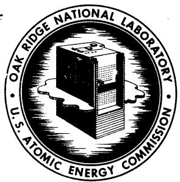
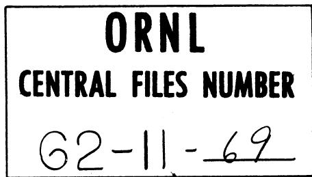

# OAK RIDGE NATIONAL LABORATORY

Operated by

UNION CARBIDE NUCLEAR COMPANY

Division of Union Carbide Corporation

Post Office Box X

Oak Ridge, Tennessee

For Internal Use Only

COPY NO.

DATE: November 12, 1962

SUBJECT: Preliminary Equations to Describe Iodine and Xenon Behavior in the MSRE

TO: Distribution

FROM: J.R.Engel

# ABSTRACT

Equations are presented to describe the behavior of iodine and xenon in the primary loop of the MSRE at steady state. These equations may be programmed for machine solution to obtain the spatial distribution of xenon in the reactor from which the xenon poison fraction can be estimated. An alternate use of the equations is to evaluate physical parameters from observations made on the operating reactor.

An attempt has been made to include all of the important, or potentially important, behavior mechanisms in the equations. Comments and suggestions are solicited regarding the mechanisms treated, other possible mechanisms, and the mathematical representations thereof.

# NOTICE

This document contains information of a preliminary nature and was prepared primarily for internal use at the Oak Ridge National Laboratory. It is subject to revision or correction and therefore does not represent a final report. The information is not to be abstracted, reprinted or otherwise given public dissemination without the approval of the ORNL patent branch, Legal and Information Control Department.

.

，

#

。

# INTRODUCTION

Xenon poisoning is a problem of significant interest in the MSRE. A reasonably accurate evaluation of the xenon poison fraction requires a detailed description of the xenon behavior in the entire core loop. Since most of the Xe is formed by decay of iodine, an equally detailed description of the iodine behavior is also required. This memo presents a set of steady-state equations which is intended to fulfill these requirements. A number of effects which may or may not be important in the reactor are included while some, for which there is good evidence that they are unimportant, are omitted. The equations describe the fission product behavior in terms of a number of physical properties of the system, the fuel and the fission products, even though it may not be possible at this time to assign accurate values to all of the properties.

This set of equations may be used in two ways. First, if values are assigned to all of the physical parameters, the equations can provide an estimate of the xenon distribution and, hence, the poison fraction in the reactor. Second, the equations may be used with the operating reactor to evaluate those physical parameters which cannot otherwise be evaluated. For the latter case it is hoped that the reactor can be operated under a sufficiently wide variety of conditions to permit simultaneous evaluation of a number of the parameters. The use of time-dependent forms of the equations and observation of xenon transients may be used to aid these evaluations.

The purpose of this memo is to solicit comments and suggestions regarding the mechanisms and their mathematical representations. To this end the text describes all the assumptions and approximations that were used in developing the equations as well as the equations themselves. It is expected that revisions to the equations will be required after all comments are received. The final equations will then be programmed for solution on the IBM-7090 computer to predict the xenon poison fraction. Ultimately, a program will be prepared to evaluate physical parameters from information obtained from the operating reactor.

It is anticipated that the equations which are initially programmed for computer solution will be simplified approximations of the ones presented here. Part of this simplification can be achieved by ignoring

behavior mechanisms of questionable importance. However, as a first step it seems desirable to include all mechanisms which might be important. Then, if the simple approximation proves to be inadequate for evaluating the reactor performance, a more refined analysis can be made omitting the simplifications.

# SUMMARY OF BEHAVIOR MECHANISMS

Several mechanisms are considered for the appearance and disappearance of Xe and I in various parts of the reactor system. These mechanisms may be summarized as follows:

Appearance of Xe in circulating fuel

1. Direct production by fission of uranium in the circulating fuel   
2. Decay of I in the circulating fuel   
3. Desorption from metal walls

Disappearance of Xe from circulating fuel

1. Radioactive decay   
2. Neutron absorption   
3. Stripping in the fuel-pump bowl   
4. Sorption in the graphite

Appearance of Xe in graphite

1. Direct production by fission of uranium in fuel soaked into the graphite   
2. Decay of I in the graphite   
3. Sorption from the circulating fuel

Disappearance of Xe from graphite

1. Radioactive decay   
2. Neutron absorption

Appearance of Xe on metal walls

1. Decay of I sorbed on the walls

Disappearance of Xe from metal walls

1. Radioactive decay   
2. Desorption into the circulating fuel

Appearance of I in circulating fuel

1. Direct production by fission of uranium in the circulating fuel

Disappearance of I from circulating fuel

1. Radioactive decay   
2. Sorption in the graphite   
3. Sorption on metal walls

Appearance of I in graphite

1. Direct production by fission of uranium in fuel soaked into the graphite   
2. Sorption from the circulating fuel

Disappearance of I in graphite

1. Radioactive decay

Appearance of I on metal walls   
1. Sorption from the circulating fuel   
Disappearance of I from metal walls   
1. Radioactive decay

It may be noted that all mechanisms are not applied equally to both species. In the case of the sorption processes, only the net currents are represented and the reverse processes of those given are taken into account in the concentration gradients. Other mechanisms, neutron absorption in I and I-stripping, are omitted because they are expected to be negligibly small.

# DESCRIPTION OF EQUATIONS

The equations describing the behavior of iodine and xenon in the reactor were derived from material balance considerations. In developing these equations, the reactor system was divided into two parts: a core in which the detailed spatial distribution of xenon in both the fuel and graphite was of primary interest and an external loop where the spatial distribution was less important. With this goal in mind, the steady-state equations for the core were written in differential

form while simplified, integrated forms of the equations were used for the external loop.

# Core Equations

The MSRE core consists of fuel salt flowing through channels and an array of graphite stringers; both of these materials were treated separately. The flow pattern of the fuel makes a further division in the mathematical treatment necessary. Although the established fluid flow in most of the core channels is laminar, there are regions of high turbulence at the channel inlets. In addition, turbulent flow may persist over the entire length of some of the channels. Two sets of fuel equations were developed to cover the different flow patterns. In solving the xenon distribution problem, the fuel channels will be treated in two parts, using the turbulent-flow equations for the lower parts and the laminar-flow equations for the remainder. Although the transition to laminar flow does not occur at a sharp boundary, it is expected that a reasonable approximation to the true condition can be obtained by judicious selection of a fixed transition elevation.

# Fuel in Laminar Flow

Under laminar flow conditions it is necessary to consider variations in concentration in both the radial and axial directions within individual channels. To simplify the treatment the channels are regarded as circular with a diameter equal to the hydraulic diameter of the MSRE channels and the neutron flux is assumed constant in the transverse direction in any given channel. Material balances may then be written for the volume element, $12\pi r^{\prime}dr^{\prime}dz$ . For xenon

$$
\begin{array}{l} Y _ {x e} \sum_ {f} ^ {\ell} \phi (r, z) r ^ {\prime} d r ^ {\prime} d z - \lambda_ {x e} N _ {x e} ^ {\ell} (r ^ {\prime}, z) r ^ {\prime} d r ^ {\prime} d z + \lambda_ {I} N _ {I} ^ {\ell} (r ^ {\prime}, z) r ^ {\prime} d r ^ {\prime} d z \\ + \mathrm {D} _ {\mathrm {x e}} ^ {\ell} \sqrt [ 2 ]{\mathrm {N} _ {\mathrm {x e}} ^ {\ell} (\mathrm {r} ^ {\prime}, \mathrm {z})} \mathrm {r} ^ {\prime} \mathrm {d r} ^ {\prime} \mathrm {d z} - \sigma_ {\mathrm {x e}} ^ {\mathrm {a}} \not \phi (\mathrm {r}, \mathrm {z}) \mathrm {N} _ {\mathrm {x e}} ^ {\ell} (\mathrm {r} ^ {\prime}, \mathrm {z}) \mathrm {r} ^ {\prime} \mathrm {d r} ^ {\prime} \mathrm {d z} \\ - v \left(r, r ^ {\prime}\right) \frac {\partial N _ {x e} ^ {\ell} \left(r ^ {\prime} z\right)}{\partial z} r ^ {\prime} d r ^ {\prime} d z = 0. \tag {1} \\ \end{array}
$$

The various terms represent differential changes in the xenon population in the volume element due to the following mechanisms, in the order of the terms: (1) direct production from fission; (2) loss by radioactive decay; (3) production by decay of iodine; (4) net diffusion from the volume element; (5) burnup; and (6) net transport by the flowing fluid.

The diffusion term, as written, includes diffusion in both the radial and axial directions. In the actual reactor it is likely that axial diffusion will be much less important than axial transport by the flowing stream. If this is assumed the diffusion term may be simplified as follows:

$$
D _ {x e} ^ {\ell} \checkmark N _ {x e} ^ {\ell} (r ^ {\prime}, z) r ^ {\prime} d r ^ {\prime} d z = D _ {x e} ^ {\ell} \left[ \frac {\partial^ {2} N _ {x e} ^ {\ell} (r ^ {\prime} , z)}{\partial r ^ {2}} + \frac {1}{r}, \frac {\partial N _ {x e} ^ {\ell} (r ^ {\prime} , z)}{\partial r ^ {\prime}} \right] r ^ {\prime} d r ^ {\prime} d z \tag {2}
$$

The microscopic velocity, $\mathbf{v}(\mathbf{r}^{\prime})$ , varies about a mean, or macroscopic, velocity for the channel. In addition, the macroscopic velocity varies with the radial position of the channel in the reactor. Axial variations in velocity, both macroscopic and microscopic, are neglected.

An equation similar to (1) can be written for iodine except that fewer terms are required because fewer mechanisms are involved in the iodine behavior. Thus:

$$
\begin{array}{l} Y _ {I} \sum_ {r} ^ {\ell} \phi (r, z) r ^ {\prime} d r ^ {\prime} d z - \lambda_ {I} N _ {I} ^ {\ell} (r ^ {\prime}, z) r ^ {\prime} d r ^ {\prime} d z + D _ {I} ^ {\ell} \sqrt {2} N _ {I} ^ {\ell} (r ^ {\prime}, z) r ^ {\prime} d r ^ {\prime} d z \\ - v \left(r, r ^ {\prime}\right) \frac {\partial N _ {I} ^ {\ell} \left(r ^ {\prime} , z\right)}{\partial z} r ^ {\prime} d r ^ {\prime} d z = 0. \tag {3} \\ \end{array}
$$

All of the comments on the xenon equation, including an expression similar to (2) apply to the iodine equation.

# Fuel in Turbulent Flow

The microscopic radial variations in concentration and velocity disappear in those channels, or parts of channels, where the fluid flow is turbulent. As a result the diffusion terms do not appear in the material balance equations for this condition. However, a new term must be included to describe the transport of xenon (or iodine) through the fluid film, at the channel wall, to the graphite. The volume element for this condition is $\pi R^2 dz$ . Then, for xenon

$$
\begin{array}{l} \mathrm {Y} _ {\mathrm {x e}} \sum_ {\mathrm {f}} ^ {\ell} \phi (\mathrm {r}, \mathrm {z}) \mathrm {d z} - \lambda_ {\mathrm {x e}} \mathrm {N} _ {\mathrm {x e}} ^ {\ell} (\mathrm {z}) \mathrm {d z} + \lambda_ {\mathrm {I}} \mathrm {N} _ {\mathrm {I}} ^ {\ell} (\mathrm {z}) \mathrm {d z} - \frac {2}{\mathrm {R}}, \mathrm {h} _ {\mathrm {x e}} * \\ \left[ \mathrm {N} _ {\mathrm {x e}} ^ {\ell} (\mathrm {z}) - \mathrm {N} _ {\mathrm {x e}} ^ {\ell} \left(\mathrm {R} ^ {\prime}, \mathrm {z}\right) \right] \mathrm {d z} - \sigma_ {\mathrm {x e}} ^ {\mathrm {a}} \phi (\mathrm {r}, \mathrm {z}) - v (\mathrm {r}) \frac {\partial \mathrm {N} _ {\mathrm {x e}} ^ {\ell} (\mathrm {z})}{\partial \mathrm {z}} \mathrm {d z} = 0. \tag {4} \\ \end{array}
$$

The quantity, $\mathbb{N}_{\mathrm{xe}}^{\ell}(\mathbb{R}^{\prime},\mathbb{z})$ , is the concentration of xenon in the liquid on the graphite side of the fluid film and $\mathbb{N}_{\mathrm{xe}}^{\ell}(\mathbb{z})$ is the bulk concentration in the liquid. The difference between these quantities is the driving force for mass transfer across the film.

The equation for iodine which corresponds to (4) is

$$
\begin{array}{l} Y _ {I} \sum_ {f} ^ {\ell} \phi (r, z) d z - \lambda_ {I} N _ {I} ^ {\ell} (z) - \frac {2}{R}, h _ {I} \left[ N _ {I} ^ {\ell} (z) - N _ {I} ^ {\ell} \left(R ^ {\prime}, z\right) \right] d z \\ - v (r) \frac {\partial N _ {I} ^ {\ell} (z)}{\partial z} d z = 0. \tag {5} \\ \end{array}
$$

# Graphite

In order to simplify the mathematics somewhat, the graphite stringers are regarded as cylinders with an equivalent radius, $\mathbb{R}^{\prime \prime}$ , to be assigned on the basis of the physical dimensions. This treatment is equivalent to regarding the reactor as an array of graphite and fuel cylinders in a medium which has infinite resistance to mass transfer in the axial direction and zero resistance in the radial direction. The material balance equations for the graphite are written on the assumption that, if fuel soaks into the graphite (providing a direct source of fission products), it will be uniformly distributed in all respects. As with the fuel channels, a uniform transverse neutron flux is assumed for the individual stringers.

For a graphite volume element, $2\pi r^{\prime \prime}dr^{\prime \prime}dz$ , the material balance for xenon gives

$$
\begin{array}{l} Y _ {x e} \sum_ {f} ^ {g} \phi (r, z) r ^ {\prime \prime} d r ^ {\prime \prime} d z - \lambda_ {x e} N _ {x e} ^ {g} (r ^ {\prime \prime}, z) r ^ {\prime \prime} d r ^ {\prime \prime} d z + \lambda_ {I} N _ {I} ^ {g} (r ^ {\prime \prime}, z) r ^ {\prime \prime} d r ^ {\prime \prime} d z \\ + D _ {x e} ^ {g r} \left[ \frac {\partial^ {2} N _ {x e} ^ {g} (r ^ {"} , z)}{\partial r ^ {" 2}} + \frac {1}{r ^ {"}} \frac {\partial N _ {x e} ^ {g} (r ^ {"} , z)}{\partial r ^ {"}} \right] r ^ {"} d r ^ {"} d z + D _ {x e} ^ {g z} \frac {\partial^ {2} N _ {x e} ^ {g} (r ^ {"} z)}{\partial z ^ {2}} r ^ {"} d r ^ {"} d z \\ - \sigma_ {x e} ^ {a} \phi (r, z) N _ {x e} ^ {g} (r ^ {\prime \prime}, z) r ^ {\prime \prime} d r ^ {\prime \prime} d z = 0. \tag {6} \\ \end{array}
$$

This equation is similar to (1) except that the transport term does not appear because the graphite is stationary. The diffusion in graphite is represented as two separate terms and different symbols are used for the diffusion coefficient in the terms; it has been suggested that the values of the diffusion coefficient may be significantly different for the two directions.2

The material balance for iodine in the graphite volume element gives

$$
\begin{array}{l} Y _ {I} \sum_ {f} ^ {g} \phi (r, z) r ^ {\prime \prime} d r ^ {\prime \prime} d z - \lambda_ {I} N _ {I} ^ {g} (r ^ {\prime \prime}, z) r ^ {\prime \prime} d r ^ {\prime \prime} d z \\ + \mathrm {D} _ {\mathrm {I}} ^ {\mathrm {g r}} \left[ \frac {\partial^ {2} \mathrm {N} _ {\mathrm {I}} ^ {\mathrm {g}} (\mathrm {r} ^ {\prime \prime} , \mathrm {z})}{\partial \mathrm {r} ^ {\prime \prime 2}} + \frac {1}{\mathrm {r} ^ {\prime \prime}} \frac {\partial \mathrm {N} _ {\mathrm {I}} ^ {\mathrm {g}} (\mathrm {r} ^ {\prime \prime} , \mathrm {z})}{\partial \mathrm {r} ^ {\prime \prime}} \right] \mathrm {r} ^ {\prime \prime} \mathrm {d r} ^ {\prime \prime} \mathrm {d z} \\ + \mathrm {D} _ {\mathrm {I}} ^ {\mathrm {g z}} \frac {\partial^ {2} \mathrm {N} _ {\mathrm {I}} ^ {\mathrm {g}} (\mathrm {r} ^ {\prime \prime} , \mathrm {z})}{\partial \mathrm {z} ^ {2}} \mathrm {r} ^ {\prime \prime} \mathrm {d r} ^ {\prime \prime} \mathrm {d z}. \tag {7} \\ \end{array}
$$

As before, the comments on the xenon equation also apply for iodine.

# Boundary Conditions

A number of boundary conditions are required to fill out the set of equations for the core. Some of these are intuitively obvious while others require assumptions about the behavior mechanisms. Some boundary conditions also depend on the nature of the flow in the fuel channels.

Fuel-Graphite Interface -- Two boundary conditions can be specified at the fuel-graphite interface. The first of these requires that the net currents in the two media at the interface be equal; the form of this expression depends on the type of fluid flow. For xenon, where the channel flow is laminar

$$
D _ {x e} ^ {g r} \frac {\partial N _ {x e} ^ {g} (R ^ {\prime \prime} , z)}{\partial r ^ {\prime \prime}} = D _ {x e} ^ {\ell} \frac {\partial N _ {x e} ^ {\ell} (R ^ {\prime} , z)}{\partial r ^ {\prime}}. \tag {8}
$$

For iodine at the same condition

$$
D _ {I} ^ {g r} \frac {\partial N _ {I} ^ {g} (R ^ {\prime \prime} , z)}{\partial r ^ {\prime \prime}} = D _ {I} ^ {\ell} \frac {\partial N _ {I} ^ {\ell} (R ^ {\prime} , z)}{\partial r ^ {\prime}}. \tag {9}
$$

For turbulent flow in the channels

$$
D _ {x e} ^ {g r} \frac {\partial N _ {x e} ^ {g} (R ^ {\prime \prime} , z)}{\partial r ^ {\prime \prime}} = h _ {x e} \left[ N _ {x e} ^ {\ell} (z) - N _ {x e} ^ {\ell} (R ^ {\prime}, z) \right] \tag {10}
$$

and

$$
D _ {I} ^ {g r} \frac {\partial N _ {I} ^ {g} (R ^ {\prime \prime} , z)}{\partial r ^ {\prime \prime}} = h _ {I} \left[ N _ {I} ^ {\ell} (z) - N _ {I} ^ {\ell} (R, z) \right]. \tag {11}
$$

Expressions may also be written to relate the absolute concentrations in the two media at the interface. For a liquid metal in contact with graphite at high temperature, it has been found experimentally3 that xenon behaves as if it were an ideal gas in contact with the liquid when the void volume of the graphite is used as the gas phase. If the same type of behavior is assumed for molten salt systems, the concentrations in the two media can be related by the Henry's Law constant, H, for the gas. Thus, for xenon

$$
\mathrm {N} _ {\mathrm {x e}} ^ {\ell} \left(\mathrm {R} ^ {\prime}, \mathrm {z}\right) = \frac {\mathrm {N} _ {\mathrm {x e}} ^ {\mathrm {g}} \left(\mathrm {R} ^ {\prime \prime} , \mathrm {z}\right) \mathrm {R T}}{\mathrm {H} _ {\mathrm {x e}} \xi}. \tag {12}
$$

It seems reasonable to assign the same type of behavior to iodine by using an "effective" Henry's Law constant, $\mathbf{H}^*$ . Then

$$
\mathrm {N} _ {\mathrm {I}} ^ {\ell} \left(\mathrm {R} ^ {\prime}, \mathrm {z}\right) = \frac {\mathrm {N} _ {\mathrm {I}} ^ {\mathrm {g}} \left(\mathrm {R} ^ {\prime \prime} , \mathrm {z}\right) \mathrm {R T}}{\mathrm {H} _ {\mathrm {I}} ^ {*} \xi}. \tag {13}
$$

Center of Fuel Channels -- For laminar flow in the fuel channels, an additional boundary condition can be written for the center of the channel. That is, for xenon

$$
\frac {\partial \mathrm {N} _ {\mathrm {x e}} ^ {\ell} \left(\mathrm {r} ^ {\prime} = 0 , \mathrm {z}\right)}{\partial \mathrm {r} ^ {\prime}} = 0, \tag {14}
$$

and for iodine

$$
\frac {\partial \mathrm {N} _ {\mathrm {I}} ^ {\ell} (\mathrm {r} ^ {\prime} = 0 , \mathrm {z})}{\partial \mathrm {r} ^ {\prime}} = 0. \tag {15}
$$

Similar expressions could be written for the turbulent-flow condition but they are not required because the concentration is assumed constant across the channel (except in the boundary layer).

Center of Graphite Stringers -- Equations similar to (14) and (15) can be written for the center of the graphite stringers. For xenon

$$
\frac {\partial \mathrm {N} _ {\mathrm {X e}} ^ {\mathrm {g}} (\mathrm {r} ^ {\prime \prime} = 0 , z)}{\partial \mathrm {r} ^ {\prime \prime}} = 0, \tag {16}
$$

and for iodine

$$
\frac {\partial \mathrm {N} _ {\mathrm {I}} ^ {\mathrm {g}} \left(\mathrm {r} ^ {\prime \prime} = 0 , \mathrm {z}\right)}{\partial \mathrm {r} ^ {\prime \prime}} = 0. \tag {17}
$$

Core Inlet -- The concentration of xenon (or iodine) at the channel inlet is assumed constant for all channels. For xenon

$$
\mathrm {N} _ {\mathrm {x e}} ^ {\ell} \left(\mathrm {r} ^ {\prime}, \mathrm {z} = 0\right) = \mathrm {N} _ {\mathrm {x e}} ^ {\ell} ①, \tag {18}
$$

and for iodine

$$
\mathrm {N} _ {\mathrm {I}} ^ {\ell} \left(\mathrm {r} ^ {\prime}, \mathrm {z} = 0\right) = \mathrm {N} _ {\mathrm {I}} ^ {\ell} \tag {19}
$$

# External-Loop Equations

The distribution of xenon (or iodine) in the reactor is described by the core equations presented above for a given core inlet concentration. However, the concentration at the core inlet is related to that at the outlet through the processes which occur in the external loop. Since the detailed fission-product distribution in the external loop is not of primary interest, the equations can be greatly simplified by a set of assumptions which have little effect on the relation between the concentrations at the outlet and inlet of the core. First it is

assumed that the xenon (or iodine) concentration in the fuel does not change drastically in the external loop. This leads to the treatment of all of the rate processes in the external loop as constants which are governed by the mean concentration at the core outlet. Then the concentration of a species at the core inlet can be expressed as the corresponding concentration at the core outlet plus or minus the various small changes that occur in the external loop.

The concentration change due to radioactive decay of an isotope in an element of fuel as it traverses the external loop is proportional to $l - e^{-\lambda t}$ . However, since the half-lives of xenon and iodine are long compared to the loop transit time, this term can be represented adequately by $\lambda t$ , using the appropriate decay constant for each species.

The retention of iodine and xenon on surfaces in the external loop is included in this treatment even though the significance of this mechanism has not been established for the MSRE. If iodine, in whatever form it exists, is strongly held on the metal surfaces the transport to the surface will be governed by the concentration of iodine in the salt. It is assumed that xenon (formed by the decay of iodine) will tend to escape from the surface. This escape tendency can be expressed in terms of a mean residence time or an "escape" constant, $\lambda^{*}$ , which is similar to a decay constant. An alternative method might be to use the xenon concentration difference between the wall and the fuel as a driving force for mass transfer. The former method is used here because it leads to a simpler expression.

Xenon stripping in the pump bowl is included with a factor to describe the efficiency of the stripper configuration.

$$
\begin{array}{l} \mathrm {N} _ {\mathrm {x e}} ^ {\ell} ① = \mathrm {N} _ {\mathrm {x e}} ^ {\ell} ② - \mathrm {N} _ {\mathrm {x e}} ^ {\ell} ② \left[ \lambda_ {\mathrm {x e}} t _ {② ①} + \frac {Q _ {\mathrm {s}}}{Q _ {\mathrm {T}}} \left(1 - \frac {Q _ {\mathrm {s}}}{Q _ {\mathrm {s}} + \eta \frac {\mathrm {H}}{\mathrm {R T}} Q _ {\mathrm {H e}}}\right) \right] \\ + \mathrm {N} _ {\mathrm {I}} ^ {\ell} ② \left[ \lambda_ {\mathrm {I}} ^ {\mathrm {t}} 2 ② 1 ^ {+} \frac {\mathrm {h} _ {\mathrm {I}} \mathrm {A} \lambda_ {\mathrm {x e}} ^ {*}}{\mathrm {Q} _ {\mathrm {T}} \left(\lambda_ {\mathrm {x e}} + \lambda_ {\mathrm {x e}} ^ {*}\right)} \right], \tag {20} \\ \end{array}
$$

and for iodine

$$
N _ {I} ^ {\ell} ① = N _ {I} ^ {\ell} ② - N _ {I} ^ {\ell} ② \left[ \lambda_ {I} t ② ① + \frac {h _ {I} A _ {W}}{Q _ {T}} \right] \tag {21}
$$

The change terms in the xenon equation represent, in order of their appearance: loss by radioactive decay, loss due to stripping in the pump bowl, production by iodine decay in the fuel and gain by xenon escape from surfaces. The terms in the iodine equation represent loss by radioactive decay and loss to metal surfaces.

# Supplementary Equations

The mass transfer coefficients used in the material balance equations are calculated from the fluid properties and the flow parameters. As a typical example, the coefficient for xenon is

$$
\mathrm {h} _ {\mathrm {x e}} = 0. 0 2 3 (\mathrm {R e}) ^ {- 0. 2} \mathrm {v} \left(\frac {\rho D _ {\mathrm {x e}} ^ {\ell}}{\mu}\right) ^ {0. 6 7}. \tag {22}
$$

The external-loop equations describe the core inlet concentrations in terms of the core outlet concentrations which must, in turn, be obtained from the individual-channel results. For xenon

$$
N _ {x e} ^ {\ell} (2) = \frac {2}{R ^ {\prime 2}} \frac {\int_ {0} ^ {R ^ {*}} f (r) \int_ {0} ^ {R ^ {\prime}} N _ {x e} ^ {\ell} \left(r ^ {\prime} , L\right) r ^ {\prime} d r ^ {\prime} r d r}{\int_ {0} ^ {R ^ {*}} f (r) r d r}. \tag {23}
$$

gcb

# APPENDIX

Definitions of Symbols

A area

D diffusivity

f fuel fraction in core

h mass transfer coefficient

H Henry's Law constant

L core length

N concentration

Q volumetric flow rate

radial position in core

r' radial position in fuel channel

r" radial position in graphite stringer

R core radius

R' fuel channel radius

R" graphite stringer radius

R universal gas constant

Re Reynolds number

T absolute temperature

time

v fluid mean velocity

Y fission yield

z axial position

macroscopic cross section

$\sigma$ microscopic cross section

# Definitions of Symbols - contd

<table><tr><td>∅</td><td>neutron flux</td></tr><tr><td>λ</td><td>decay constant</td></tr><tr><td>λ*</td><td>&quot;escape&quot; constant</td></tr><tr><td>ξ</td><td>accessible void fraction of graphite</td></tr><tr><td>η</td><td>contactor efficiency in pump bowl</td></tr><tr><td>μ</td><td>viscosity of fuel</td></tr><tr><td>ρ</td><td>fuel density</td></tr><tr><td colspan="2">Subscripts</td></tr><tr><td>xe</td><td>of xenon</td></tr><tr><td>I</td><td>of iodine</td></tr><tr><td>f</td><td>for fission</td></tr><tr><td>s</td><td>of stripped liquid (through pump bowl)</td></tr><tr><td>T</td><td>of total liquid (in loop)</td></tr><tr><td>He</td><td>of helium sweep gas (in pump bowl)</td></tr><tr><td>w</td><td>of metal wall outside active core</td></tr><tr><td>② ①</td><td>from position ② to position ①(core outlet to core inlet)</td></tr><tr><td colspan="2">Superscripts</td></tr><tr><td>g</td><td>in graphite</td></tr><tr><td>l</td><td>in liquid (fuel)</td></tr><tr><td>a</td><td>for neutron absorption</td></tr><tr><td>r</td><td>in radial direction</td></tr><tr><td>z</td><td>in axial direction</td></tr><tr><td colspan="2">Other</td></tr><tr><td>①</td><td>at core inlet</td></tr><tr><td>②</td><td>at core outlet</td></tr></table>

${x}^{2} + 5{y}^{2} = 1$

#

.

#

#

：

# Distribution

1. MSRP Director's Office, Rm. 219, 9204-1   
2. S.E.Beall   
3. E. S. Bettis   
4. F. F. Blankenship   
5. W. D. Burch   
6. J. L. Crowley   
7. J. R. Engel   
8. W.R.Grimes   
9. R. H. Guymon   
10. P. N. Haubenreich   
11. P.R.Kasten   
12. R. B. Lindauer   
13. H. G. MacPherson   
14. W. B. McDonald   
15. H. F. McDuffie   
16. R. L. Moore   
17. A.M.Perry   
18. B. E. Prince   
19. D. Scott   
20. M. J. Skinner   
21. I. Spiewak   
22. A. Taboada   
23. J. R. Tallackson   
24-25. Central Research Library   
26. Document Reference Section   
27-29. Laboratory Records   
30. IRD-RC

。

1

1

.

.

${a}^{n + 1} \equiv  {a}^{p} - {b}^{q}$

一

$\therefore m = \frac{3}{11}$

#

。

#