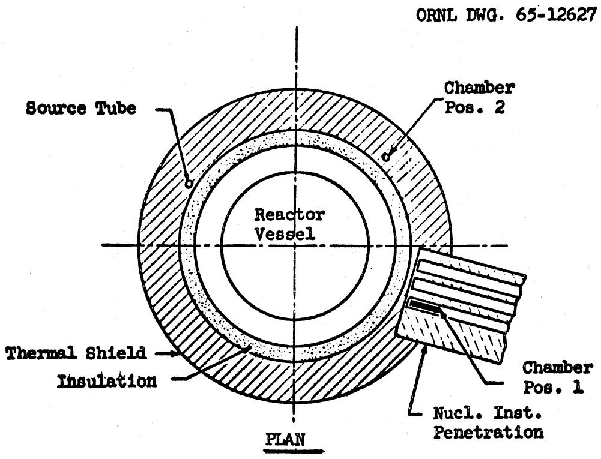
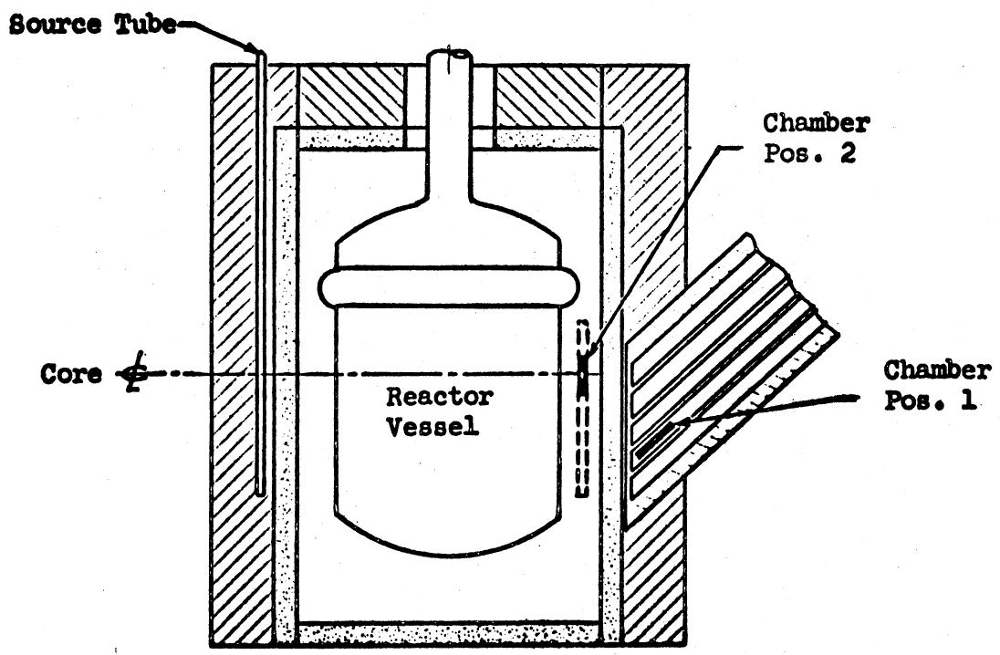
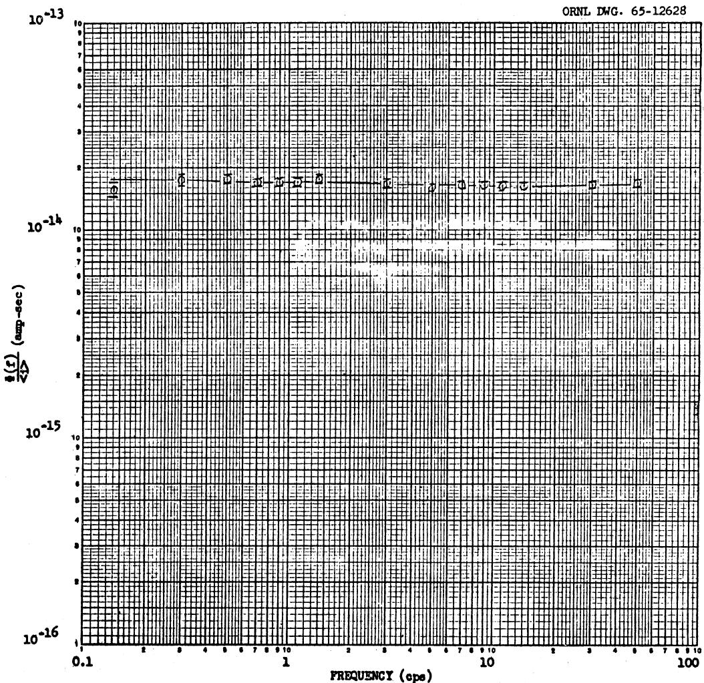
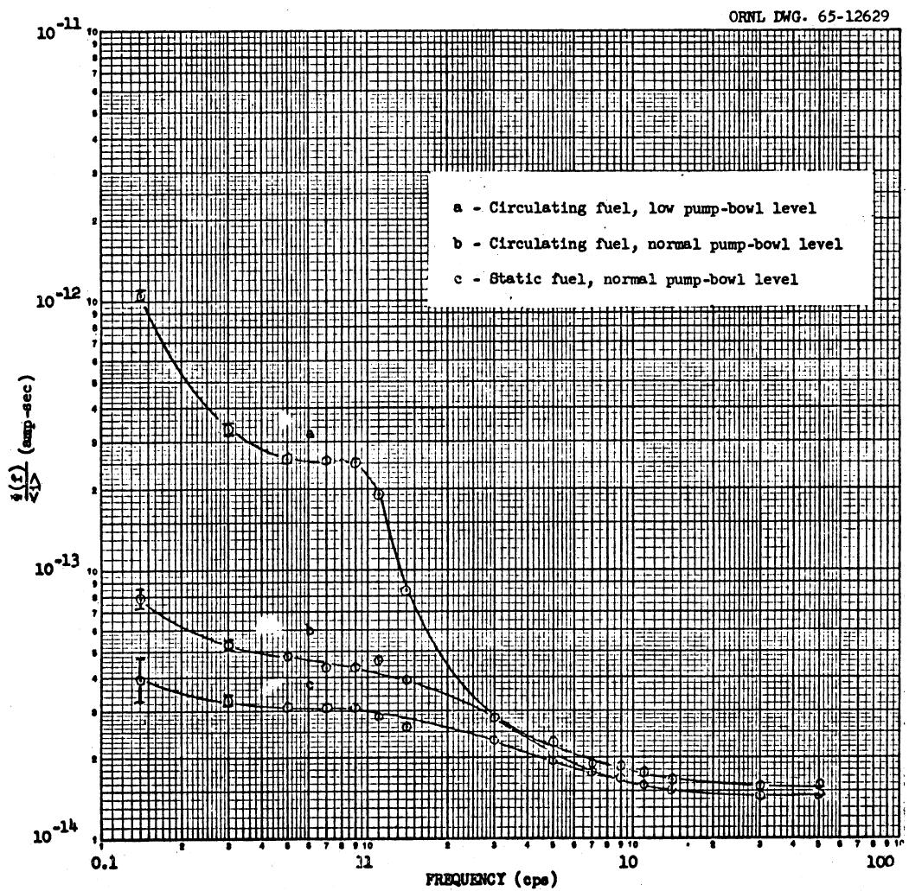
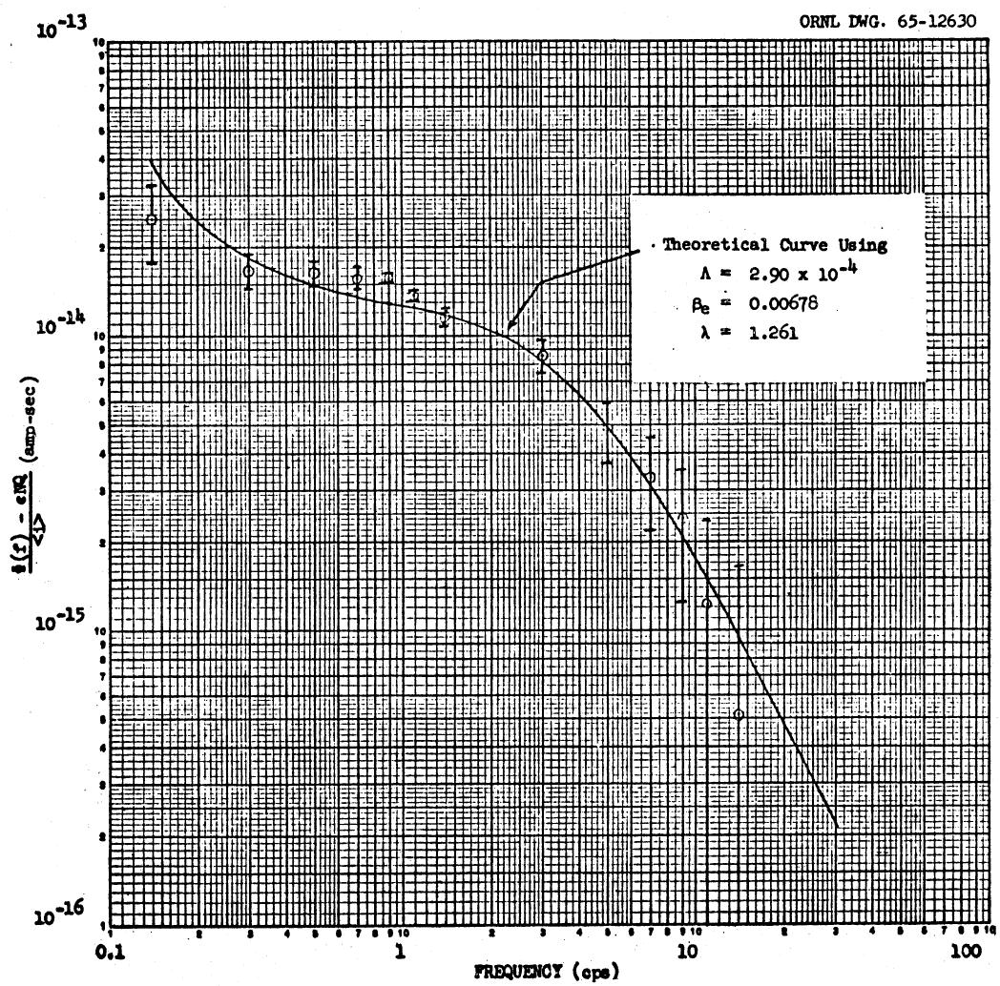
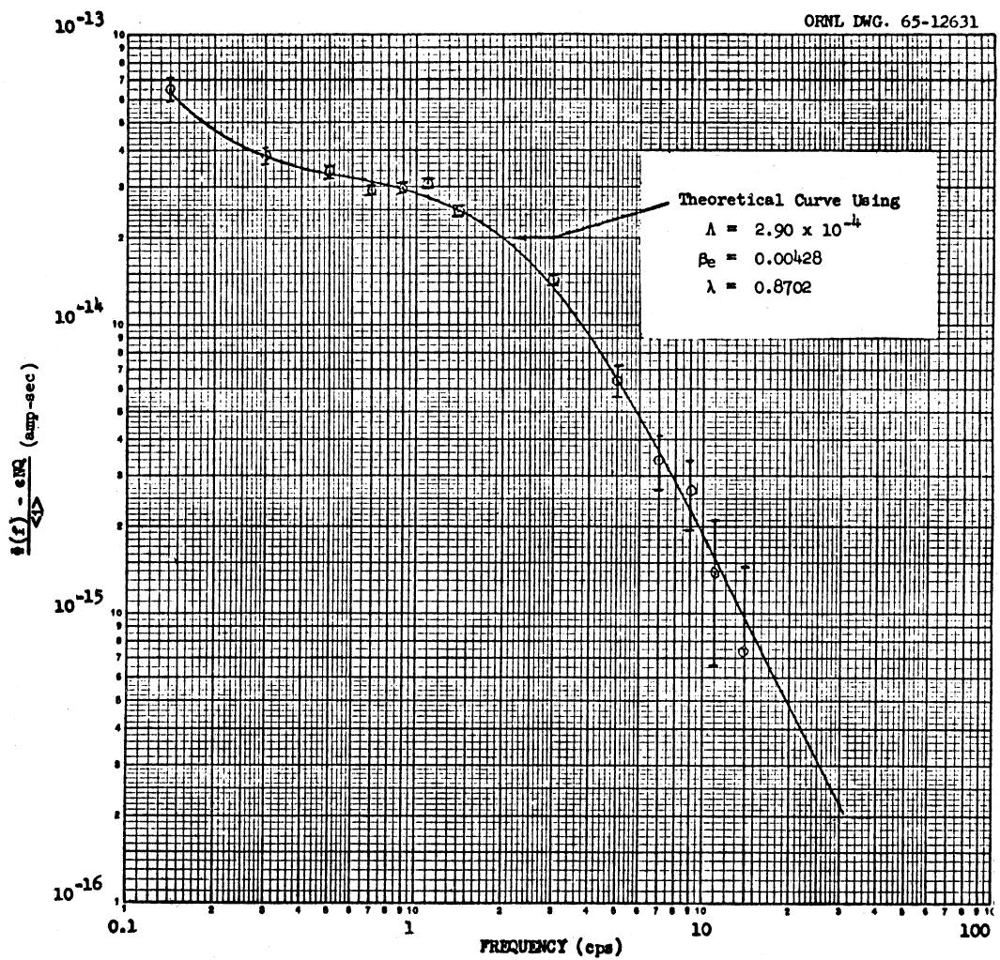

DATE: October 29, 1965

COPY NO.

SUBJECT: Results of Neutron Fluctuation Measurements Made During the MSRE Zero-Power Experiment

TO: Distribution

FROM: D.N. Fry and D.P. Roux

# ABSTRACT

Neutron fluctuation measurements were made during the MSRE zero-power experiment as part of the dynamic tests requested by the project. A first attempt to measure subcritical reactivity was unsuccessful, because the detection efficiency of a 1-atom $\mathrm{BF}_3$ ionization chamber installed in the nuclear instrument penetration was too low. A 2-atom $\mathrm{BF}_3$ chamber was installed in the thermal shield, and with the reactor operating at $10\mathrm{W}$ , it was determined that the effective delayed-neutron fraction $\beta_{e}$ increased $1.58 \pm 0.21$ when fuel circulation was stopped. From measurements made with a low pump-bowl level, it is believed that neutron fluctuations are strongly affected by entrained gas in the fuel salt.

# NOTICE

This document contains information of a preliminary nature and was prepared primarily for internal use at the Oak Ridge National Laboratory. It is subject to revision or correction and therefore does not represent a final report. The information is not to be abstracted, reprinted or otherwise given public dissemination without the approval of the ORNL patent branch, Legal and Information Control Department.

# CONTENTS

Page

Abstract 1   
Description of Instrumentation 4   
Measurements with Detector in Nuclear Instrument Penetration 4   
Measurements with Detector in Thermal Shield 4   
Conclusions 11   
Recommendations 11

# DESCRIPTION OF INSTRUMENTATION

The current fluctuations from a 2-in. $\mathbf{BF}_3$ ionization chamber output were amplified with a wide-band ac amplifier (ORNL model Q-2591) and then recorded on magnetic tape by a Precision Instrument, PS 200 A, tape recorder. The recorded signal was later analyzed using a multichannel spectral-density analyzer. $^1$

# MEASUREMENTS WITH DETECTOR IN NUCLEAR INSTRUMENT PENETRATION

A 1-atm $\mathsf{BF}_3$ ionization chamber was installed in the MSRE nuclear instrument penetration (Fig. 1). A 1-hr tape record was made for each major fuel addition during the approach to criticality and with the reactor critical at an estimated power of 10 w.

The chamber location was not favorable for subcritical reactivity measurements since a detection efficiency (that is, the ratio of the neutrons detected in the chamber to the total neutron population in the core) of at least $10^{-5}$ is required for this type of measurement. We estimated the detection efficiency to be $1 \times 10^{-6}$ . When the detection efficiency is too low, the observed spectrum will be constant with frequency and will contain no information about the reactor. Owing to insufficient detection efficiency, we were unable to measure subcritical reactivity by use of the neutron fluctuation technique.

A neutron spectrum of the reactor while critical at a power of 10 w and with the fuel circulating (Fig. 2) illustrates the detection inefficiency. Although there appears to be some reactor information at frequencies below 3 cps, the spectrum, for the most part, shows a constant output over the frequency range of 0.1 to 50 cps.

To improve the measurement, a second test was made with a chamber more sensitive to neutrons which was installed in the thermal shield of the reactor.

# MEASUREMENTS WITH DETECTOR IN THERMAL SHIELD

A 2-atm $\mathbf{BF}_3$ ionization chamber was installed in a vertical penetration of the thermal shield at the midplane of the core (Fig. 1). The measured overall detection efficiency was increased by a factor of 25, of which 1.7 was due to increased neutron sensitivity of the chamber.

  
ELEVATION   
Fig. 1. $\mathbf{BF}_3$ Ion Chamber Locations in Initial Critical Experiment.

  
Fig. 2. Measured Neutron Power Spectrum Normalized to dc Current in Chamber. The ion chamber was in position No.1 (see Fig. 1), and the reactor power was 10 w.

With the reactor operating at 10 w, data were collected for three different conditions: (1) with the fuel not being circulated, (2) with the fuel being circulated, and (3) with the fuel being circulated but with the fuel in the pump bowl at a low level.

The measurements with the fuel not being circulated and then being circulated were made to determine the change in the effective delayed-neutron fraction $\beta_{\mathrm{e}}$ .

A mathematical model based on point reactor kinetic equations for a zero-power critical reactor, assuming one average delayed group of neutrons, yields an expression for power spectral density of the form

$$
\Phi (\omega) = \frac {\mathrm {C N} _ {6} ^ {2}}{\Lambda} \left[ \frac {\left(\Lambda / \beta_ {e}\right) ^ {2}}{\left(\frac {\omega^ {2}}{\omega^ {2} + \lambda^ {2}}\right) ^ {2} + \omega^ {2} \left(\frac {\Lambda}{\beta_ {e}} + \frac {\lambda}{\omega^ {2} + \lambda^ {2}}\right) ^ {2}} \right] + \epsilon \mathrm {N} _ {2} \tag {1}
$$

where

C = a constant,   
$\Lambda =$ neutron generation time,   
$\beta_{e} =$ effective delayed neutron fraction,   
$\lambda =$ effective one-delay group neutron precursor decay constant,   
$\omega =$ frequency in radians per second,   
Q = uniform spectral component attributed to the neutron detection process,   
$\epsilon =$ detection efficiency,   
N = mean neutron density in the reactor.

This model is valid only for the reactor at zero power (no thermal feedback).

From a least-squares fit of the parameters of the model to the experimental data we determined that $\beta_{\mathrm{e}}$ increased $1.58 \pm 0.21$ when circulation of the fuel was stopped (Fig. 3). Independent measurements using control-rod calibration showed an increase of 1.47 (ref 2).

Examination of Eq. 1 shows that the shape of the spectrum will not be affected by a change in neutron power level. In Figs. 4 and 5 the measured reactor spectrum minus the constant term $eNQ$ is plotted for noncirculating and circulating fuel, respectively. The large limits of error for the data taken at higher frequencies are attributed to the subtraction of one number from another of equal magnitude.

Measurements made with a low pump-bowl level are plotted in Fig. 3. From these data we infer that neutron fluctuations are strongly affected by entrained gas in the fuel salt, although when we made these measurements, we were not able to obtain sufficient experimental data to quantitatively estimate the amount of entrained gas in the fuel salt.

  
Fig. 3. Measured Neutron Power Spectra Normalized to dc Current in Chamber. The ion chamber was in position No. 2, and the reactor power was 10 w.

  
Fig. 4. Measured Neutron Power Spectrum Minus eNQ. The ion chamber was in position No. 2, and the reactor power was 10 w with fuel not being circulated.

  
Fig. 5. Measured Neutron Power Spectrum Minus $\varepsilon\mathbf{NQ}$ . The ion chamber was in position No. 2, and the reactor power was 10 w with fuel circulating.

# CONCLUSIONS

By use of neutron fluctuation measurement techniques during the MSRE zero-power experiment we have measured the effective delayed-neutron loss due to circulation of the fuel salt. Also, this method might be used to measure the amount of gas entrained in the MSRE fuel salt.

# RECOMMENDATIONS

We recommend that neutron fluctuation measurements be continued when operation of the MSRE is resumed. The following items should be investigated:

1. Increase the detection efficiency in the nuclear instrumentation penetration by using an ion chamber that is more sensitive to neutrons.   
2. Investigate further the effect of entrained gas in the fuel salt on the neutron power spectral density.   
3. Determine the neutron power spectral density at various reactor power levels up to 10 Mw. Our experience at the ORR leads us to believe that the detection efficiency requirement for measurements at power are not as stringent as they are at zero-power because of the additional thermal feedback effect. Therefore, measurements could be taken with the detector located in the nuclear instrument penetration.

# DISTRIBUTION

1. S.J. Ball   
2. C.J. Borkowski   
3. R.B. Briggs   
4. J.R. Engel   
5. E.P. Epler   
6. D.N. Fry   
7. C.H. Gabbard   
8. P.N. Haubenreich   
9. W.H. Jordan   
10. P.R. Kasten   
ll. T.W. Kerlin   
12. R.C. Kryter   
13. D.P. Roux   
14. R.S. Stone   
15. J.R. Tallackson

16-17. Central Research Library

18. Document Reference Section

19-21. Laboratory Records Department

22. Laboratory Records, ORNL R.C.   
23. ORNL Patent Office