DATE: August 16, 1965

COPY NO. 3

SUBJECT: PRELIMINARY REPORT ON RESULTS OF MSRE ZERO-POWER EXPERIMENTS

TO: Distribution

FROM: P. N. Haubenreich

# ABSTRACT

The MSRE first attained criticality on June 1, 1965 with a $^{235}\mathrm{U}$ concentration within $1\%$ of the predicted value. Initial critical conditions were $1181^{\circ}\mathrm{F}$ , fuel circulation stopped, one control rod inserted 0.03 of its worth and $65.4\mathrm{kg}$ of $^{235}\mathrm{U}$ in the loop (plus $4.2\mathrm{kg}$ in a drain tank). Subsequently the reactor was held at $1200^{\circ}\mathrm{F}$ while the $^{235}\mathrm{UF}_4$ concentration was increased by the addition of 79 enriching capsules containing $6.6\mathrm{kg}$ $^{235}\mathrm{U}$ . During these additions, experiments were done to measure rod sensitivity and total worth, $^{235}\mathrm{U}$ concentration coefficient of reactivity, temperature coefficient, pressure coefficient, and effect of circulation on reactivity. Dynamics experiments gave information on system transfer functions and separated prompt (fuel) and delayed (graphite) temperature coefficients. Nuclear power was restricted to a nominal 10 watts, except during transients, when 10 kw was permitted. The experiment was concluded on July 3 and the salt was drained to permit preparations for high-power operation.

There were no mechanical difficulties of any consequence during the experiment. Salt analyses showed practically no corrosion. Analysis of the reactor physics data, although incomplete, has shown that all the observed parameters are in good agreement with predicted values.

# NOTICE

This document contains information of a preliminary nature and was prepared primarily for internal use at the Oak Ridge National Laboratory. It is subject to revision or correction and therefore does not represent a final report. The information is not to be abstracted, reprinted or otherwise given public dissemination without the approval of the ORNL patent branch, Legal and Information Control Department.

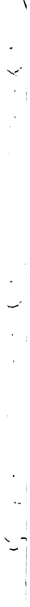

# CONTENTS

<table><tr><td></td><td>Page</td></tr><tr><td>Abstract</td><td>1</td></tr><tr><td>Introduction</td><td>4</td></tr><tr><td>Nuclear Experiments</td><td>5</td></tr><tr><td>Initial Critical Loading.</td><td>5</td></tr><tr><td>Control Rod Worth</td><td>12</td></tr><tr><td>235U Concentration Coefficient of Reactivity.</td><td>18</td></tr><tr><td>Reactivity Effects of Circulation</td><td>18</td></tr><tr><td>Temperature Coefficients of Reactivity.</td><td>20</td></tr><tr><td>Effect of Pressure on Reactivity</td><td>23</td></tr><tr><td>Dynamic Tests</td><td>26</td></tr><tr><td>Frequency Response Measurements.</td><td>26</td></tr><tr><td>Transient Flow Rate Tests.</td><td>35</td></tr><tr><td>Conclusions from Dynamic Tests</td><td>36</td></tr><tr><td>Fuel Salt Chemistry.</td><td>39</td></tr><tr><td>Performance of Mechanical Components</td><td>39</td></tr><tr><td>Control Rods.</td><td>39</td></tr><tr><td>Sampler-Enricher.</td><td>40</td></tr><tr><td>Freeze Valves</td><td>41</td></tr><tr><td>Fuel-and Coolant-System Pressure Control.</td><td>42</td></tr><tr><td>Acknowledgment</td><td>44</td></tr><tr><td>References</td><td>45</td></tr></table>

# INTRODUCTION

Preliminary testing of the Molten Salt Reactor Experiment began in the fall of 1964. The salt systems were heated to $1200^{\circ}\mathrm{F}$ , purged with helium to remove moisture, and 66 LiF-34 $\mathrm{BeF_2}$ salt was charged into the fuel and coolant systems. Salt was circulated for 1000 hr in the fuel system and 1200 hr in the coolant system as most of the non-nuclear testing was completed. This run, designated PC-1, was concluded in March, 1965.

In the shutdown after PC-1, final preparations were made for "zeropower" nuclear operation. These included installation of the sampler-enricher, completion of the nuclear instrumentation and controls, and operator examinations and certification.

The salt which had been circulated through the fuel system was processed to remove oxide, then was isolated in the flush-salt tank for future use. The basic fuel salt, lacking only the enriched uranium to bring it to the final composition, was charged into a drain tank. The fuel system was heated and this "carrier" salt was circulated for 10 days in Run PC-2. Analysis of the salt showed no abnormalities, all equipment operated well, and all was in readiness for the nuclear experiments.

Addition of $^{235}\mathrm{UF}_4$ -LiF to the salt began on May 24, and on June 1 criticality was first attained. Following this experiment, more $^{235}\mathrm{U}$ was added to bring the concentration up to the level required for power operation. While the extra $^{235}\mathrm{U}$ was being added, experiments were done to measure the nuclear characteristics of the system. This series of experiments was completed on July 3, the fuel salt was drained and the system was flushed, concluding Run 3.

This report describes the preliminary findings of the nuclear experiments, the chemical behavior of the fuel salt and the performance of the mechanical components.

Final preparations for high-power operation are presently being made. These include inspection, maintenance, installation of shielding, and sealing and testing the containment.

# NUCLEAR EXPERIMENTS

# Initial Critical Loading

The purpose of this experiment was to provide a check on the calculations of critical concentration under the simplest conditions: the core isothermal, rods fully withdrawn, and the fuel stationary. It also served to establish the basepoint from which the $^{235}\mathrm{U}$ additions necessary to reach the operating concentration could be made with confidence.

The fuel salt composition specified for power operation is 65 LiF-29.2 BeF $_2$ -5 ZrF $_4$ -0.8 UF $_4$ (expressed as molar percentages). The total uranium content is considerably above the minimum required for criticality if highly enriched uranium were used, and was chosen for reasons of chemistry.

The critical $^{235}\mathrm{U}$ concentration was predicted by calculations using a multi-group, one-dimensional diffusion code, MODRIC, with thermal-group cross sections obtained from cell calculations by the THERMOS code and fast-group cross sections calculated by GAM-2. $^{1,2}$ The geometrical approximations were checked by using a two-group, two-dimensional code, Equi-poise-3, with group constants for each region from MODRIC. It was predicted that the reactor would be critical at $1200^{\circ}\mathrm{F}$ , rods out, fuel static with 0.256 mole $\%$ $^{235}\mathrm{UF}_4$ (0.795 mole $\%$ total $\mathrm{UF}_4$ ).

Instead of using $32\%$ -enriched uranium to make up the fuel salt, we decided to start with depleted uranium in the salt and add the required amount of $^{235}\mathrm{U}$ as highly enriched uranium $(93\% ^{235}\mathrm{U})$ . This permitted preliminary operation with uranium in the salt before the beginning of nuclear operation and also facilitated the manufacture of most of the uranium-bearing salt. The salt was prepared in three lots: the carriers salt, containing the beryllium, zirconium and most of the lithium fluorides; 73 LiF-27 $\mathrm{UF_4}$ eutectic containing $150~\mathrm{kg}$ of depleted uranium; and eutectic containing $90~\mathrm{kg}$ of $^{235}\mathrm{U}$ in the highly enriched form.

Thirty-five cans of carrier salt and two cans of eutectic containing the depleted uranium were blended as they were charged into a drain tank in April. This mixture of salt was then circulated for 10 days at $1200^{\circ}\mathrm{F}$ while the sampler-enricher was tested and 18 samples were analyzed to

establish the initial composition. The critical experiment then consisted of adding enriched uranium in increments to bring the $^{235}\mathrm{U}$ concentration up to the critical point.

Nuclear instrumentation for the experiment consisted of two fission chambers, two $\mathrm{BF}_3$ chambers and an $^{241}\mathrm{Am}-^{242}\mathrm{Cm}$ -Be source, located as shown in Fig. 1. The fuel salt itself also constituted a neutron source, due to reaction of $^{234}\mathrm{U}$ alphas with beryllium and fluorine.

The enriching salt was added in two ways: by transfer of molten salt from a heated can into a drain tank, and by lowering capsules of frozen salt into the pump bowl via the sampler-enricher. The latter method was limited to $85\mathrm{g}^{235}\mathrm{U}$ per capsule, only 0.0012 of the expected critical loading. Therefore the bulk of the $^{235}\mathrm{U}$ was added in 4 additions to the drain tank. After each addition the core was filled and count-rated data were obtained to monitor the increasing multiplication.

The amount of $^{235}\mathrm{U}$ expected to make the reactor critical was calculated to be 68.7 kg, using the volumetric concentration from the criticality calculations and the volume of salt thought to be in the fuel loop and drain tank. (The value of salt density which was used to get the volume from the known weight of salt is now believed to be erroneous. See later discussion.)

Before the addition of enriched uranium, count rates had been determined with barren salt at several levels in the core. Then as the core was filled after each $^{235}\mathrm{U}$ addition, the ratio of count rates at each level was used to monitor the multiplication. (Fig. 2 shows elevations; count rates were determined with salt at 0.4, 0.6, 0.8, and 1.0 of the graphite matrix and with the vessel full.)

Count-rate ratios with the vessel full after each of the four major additions are shown in Fig. 3. Each addition, fill, and drain took between one and two days, so only four major additions had been planned. After the third addition, with $64.54\mathrm{kg}^{235}\mathrm{U}$ in the salt, the projected critical loading was $70.0 \pm 0.5\mathrm{kg}^{235}\mathrm{U}$ . (The l-inch $\mathrm{BF}_3$ chamber located in the thermal shield, whose count rates extrapolated to a higher value was known to be strongly affected by neutrons coming directly from the source.) The fourth addition was intended to bring the loading to about

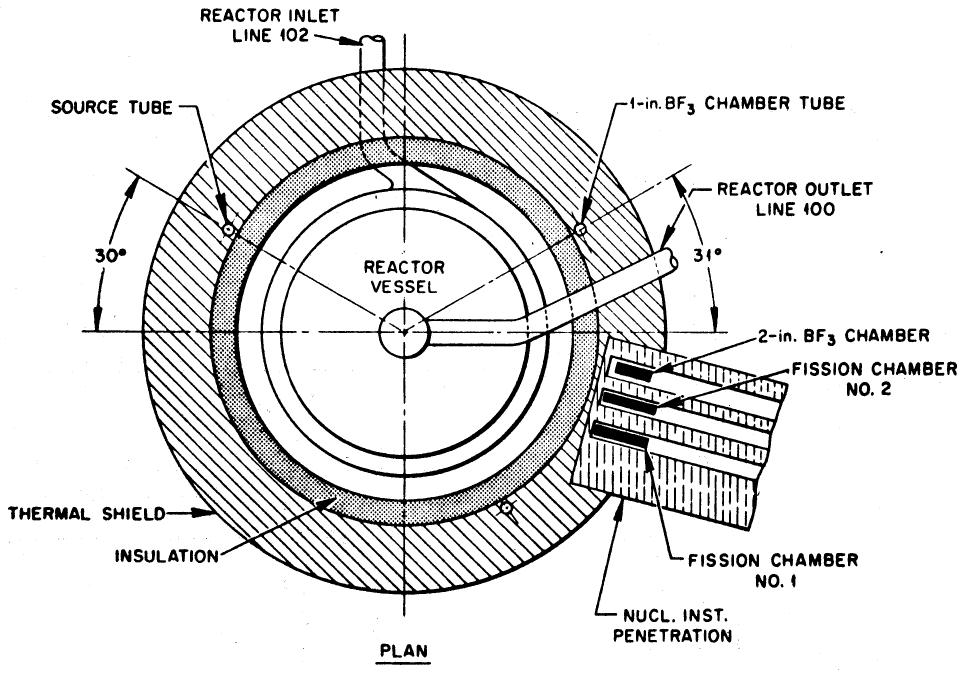  
ORNL-OWG65-7575

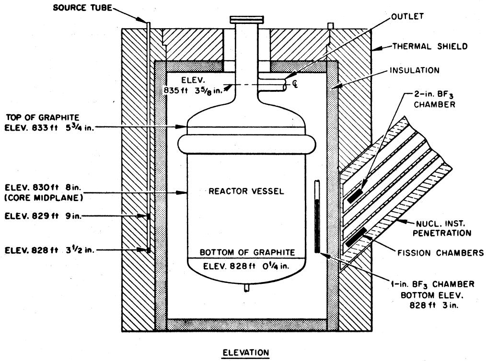  
Fig. 1. Source and Instrumentation in Initial Critical Experiment.

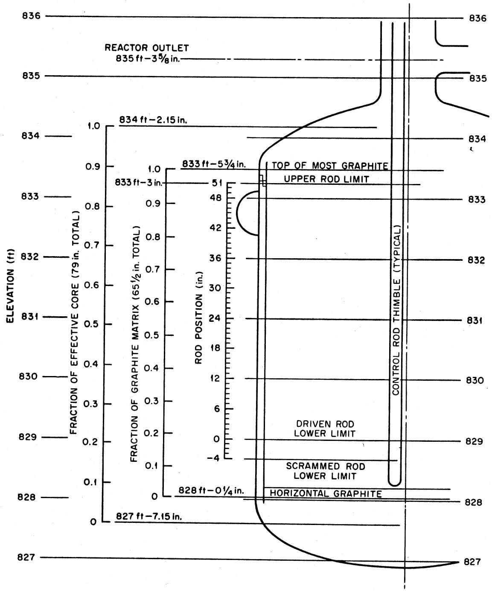  
Fig. 2. Relation of Rod Position and Levels in Reactor Vessel.

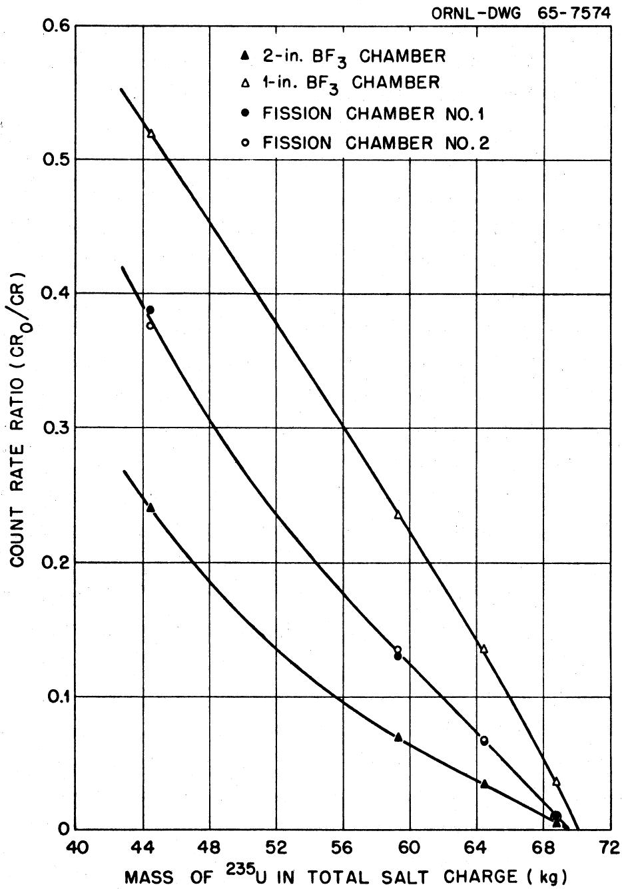  
Fig. 3. Count Rate Ratios After First Four Additions of $^{235}\mathrm{U}$ . (Vessel full, rods at 51 in., Source at $829' - 9''$ , chamber locations as in Fig. 2.)

$1\mathrm{kg}$ below the critical point. (This was not as bold as it has seemed to some; the minimum critical loading at which we were shooting was only a checkpoint before subsequent additions. No question of safety was involved if there had been an overshoot.) $4.38\mathrm{kg}$ of $^{235}\mathrm{U}$ was added and the count rates showed the loading was within $0.8\mathrm{kg}$ of critical when the rods were withdrawn and circulation was stopped. Preliminary estimates of rod worth and circulation effect, based on changes in subcritical multiplication, were approximately the expected values.

In the final stage, enriching capsules were added through the pump bowl to bring the loading up 85g at a time. After each addition circulation was stopped, the rods were withdrawn and count rates were measured. The external source was withdrawn for some of the measurements to see the relative strength of the internal and external source. With the reactor within $0.2\%$ $\delta \mathrm{k} / \mathrm{k}$ of critical, slight variations in temperature caused considerable changes in multiplication. (Variations in the voltage of the area power supply change the heater inputs slightly, requiring fine adjustments of the heater controls to keep the temperature precisely at a specified temperature.) After 7 capsules, it appeared that after one more, the reactor could be made critical. The eighth was added, circulation was stopped and the rods were carefully withdrawn. At 6:00 PM, June 1, the reactor reached the critical point, with two rods at full withdrawal and the other inserted 0.03 of its worth. Criticality was verified by leveling the power at successively higher levels with the same rod position. The $^{235}\mathrm{U}$ loading was $69.6~\mathrm{kg}$ .

Predicted and observed $^{235}\mathrm{U}$ requirements for criticality are compared most logically on the basis of volumetric concentration. The required volumetric concentration is nearly invariant with regard to the fuel-salt density (unlike the mass concentration, which varies inversely with density) and depends not at all on system volume or total inventory.

The "observed" $^{235}\mathrm{U}$ concentrations are on a weight basis, obtained from either inventory records or from chemical analyses. These weight concentrations must be converted to volumetric concentration by multiplying by the fuel-salt density. The amounts of $^{235}\mathrm{U}$ and salt weighed into the system gave a $^{235}\mathrm{U}$ weight fraction of $1.42\%$ at the time of the initial criticality. The chemical analyses during the precritical operation and

the zero-power experiments gave uranium concentrations which were 0.985 of the "book" concentrations. (Part of this discrepancy, about half we believe, is due to dilution of the fuel with flush salt left in freeze valves and drain-tank heels when the fuel salt was charged.) Applying this bias to the book concentration at criticality gives an "analytical" $^{235}\mathrm{U}$ weight fraction of $1.40\%$ . The density of the fuel salt at $1200^{\circ}\mathrm{F}$ we now believe to be about $145.5~\mathrm{lb / ft}^3$ . This is the preliminary result of recent laboratory measurements of density, and it agrees with measurements made in the reactor using the two-point level probes in the drain tanks. Earlier measurements in the reactor, using the drain-tank weight indications and the volume of salt believed to have been transferred into the fuel loop, gave $136.6~\mathrm{lb / ft}^3$ . (The amounts of $^{235}\mathrm{U}$ in the fuel loop shown in Figs. 6 and 7 and the accompanying text were computed on this basis.)

Corrections must be applied because the initial critical conditions were not exactly the same as those assumed in the predictions. The core temperature was $1181^{\circ}\mathrm{F}$ instead of $1200^{\circ}\mathrm{F}$ and the control rods were poisoning $0.184\%$ $\mathrm{8k / k}$ instead of none. (Two rods were at maximum withdrawal, 51 inches, and one was at 46.6 in.) The predicted $^{235}\mathrm{U}$ concentration for criticality at the reference condition was $32.87~\mathrm{g / l}$ ; corrected to the actual conditions, it is $33.06~\mathrm{g / l}$ . This predicted value is compared with "observed" concentrations in Table 1.

-Table1 COMPARISON OF CRITICAL 235U CONCENTRATIONS 1181°F, PUMP OFF, 0.18% 8k/k ROD POISONING   

<table><tr><td></td><td>235U Conc. (Wt. %)</td><td>Fuel Density (1b/ft3)</td><td>235U Conc. (g/ℓ)</td></tr><tr><td>Predicted</td><td>----</td><td>-----</td><td>33.06</td></tr><tr><td rowspan="2">Book</td><td rowspan="2">1.42</td><td>145.5</td><td>33.10</td></tr><tr><td>136.6</td><td>31.07</td></tr><tr><td rowspan="2">Analytical</td><td rowspan="2">1.40</td><td>145.5</td><td>32.60</td></tr><tr><td>136.6</td><td>30.60</td></tr></table>

If, as we estimate, the true concentration was about half way between the book and the analytical and the density is about $145.5 \mathrm{lb} / \mathrm{ft}^3$ , the actual concentration was extremely close to the prediction.

Laboratory measurements now in progress should confirm the value of fuel-salt density. The uncertainty between book and analytical concentrations will also be reduced as a result of the next startup, when analysis of the fuel after another flushing, draining, and refilling will help us evaluate the dilution effect.

# Control Rod Worth

The addition of $^{235}\mathrm{U}$ beyond the minimum critical loading had a twofold objective: to end with enough excess reactivity to permit operation at full power and in the process to make measurements which could be analyzed to give control-rod worth and various reactivity coefficients. The final amount of $^{235}\mathrm{U}$ was to be enough to be critical at $1200^{\circ}\mathrm{F}$ with the fuel stationary and one rod fully inserted. The method was to add $85\mathrm{g}^{235}\mathrm{U}$ at a time through the sampler-enricher, after each capsule determine the critical rod position, and at longer intervals do other experiments.

Experiments specifically aimed at rod worth were stable-period measurements and rod-drop experiments. These were done with the fuel static and with it circulating. The results will give, as accurately as possible, the total and differential worths of the regulating rod (rod 1) over its entire travel with the other two rods fully withdrawn. In addition, worth values will be obtained for each of the three rods with the other two withdrawn and at intermediate positions. These will lead to evaluations of rod shadowing and "ganged" rod worth. So far we have finished analyzing only the period measurements with stationary fuel for rod 1.

After the initial critical experiment, another 8 capsules were required before the reactor could be made critical at $1200^{\circ}\mathrm{F}$ with the fuel pump running (a consequence of the loss of delayed neutrons during circulation). Thereafter we measured the critical rod position with the pump running after each capsule. At intervals of 4 capsules, we made period

measurements with the pump running then turned it off, determined the new critical rod position, and made more period measurements. This went on until a total of 87 capsules had been added. Three times during this experiment (after 30, 65, and 87 capsules) we observed rod-drop effects.

Period measurements were usually made in pairs. The rod whose sensitivity was to be measured was adjusted to make the reactor just critical at approximately 10 watts, then it was pulled a prescribed distance and held there until the power increased about 2 decades. The rod was then quickly inserted to bring the power back to 10 watts and the measurement was repeated at a shorter stable period. Periods were generally in the ranges from 40 to 50 sec and from 70 to 120 sec.

For the measurements with the pump off, the usual inhour relation was used to calculate excess reactivity from the observed stable period.

$$
\rho = \frac {\ell}{\ell + T} + \frac {T}{\ell + T} \sum_ {i = 1} ^ {6} \frac {\beta_ {i}}{1 + \lambda_ {i} T}
$$

The delayed neutron fractions $\beta_{i}$ , used in the stationary-fuel cases were accepted values, corrected for the increased importance of the lower-energy neutrons in the MSRE.

Table 2   
DELAYED NEUTRON FRACTIONS IN MSRE   

<table><tr><td rowspan="2">Group</td><td rowspan="2">Half-Life (sec)</td><td colspan="2">10^4 × fraction (n/n)</td></tr><tr><td>Actual</td><td>Effective (Static Fuel)</td></tr><tr><td>1</td><td>55.7</td><td>2.11</td><td>2.23</td></tr><tr><td>2</td><td>22.7</td><td>14.02</td><td>14.57</td></tr><tr><td>3</td><td>6.22</td><td>12.54</td><td>13.07</td></tr><tr><td>4</td><td>2.30</td><td>25.28</td><td>26.28</td></tr><tr><td>5</td><td>0.61</td><td>7.40</td><td>7.66</td></tr><tr><td>6</td><td>0.23</td><td>2.70</td><td>2.80</td></tr></table>

Two fission chambers driving log-count-rate meters and a two-pen recorder were used to measure the periods. (The stable period was taken to be the average of their two readings, which usually agreed within about $2\%$ .) We watched a linear recorder, driven by a compensated ion chamber, while we leveled the power at the beginning of a measurement. In the analysis, we computed the initial reactivity (usually less than $0.003\%$ ) from this recorder chart if there had been a slow drift. The difference between the reactivity during the transient and the initial reactivity was divided by the rod movement and this sensitivity was ascribed to the rod at the mean position.

We obtained the total rod worth by integrating the curve of rod sensitivity vs position shown in Fig. 4. Because rod worth is affected by the $^{235}\mathrm{U}$ concentration in the core, it was necessary to apply theoretical corrections to the measured sensitivities to put them all on the basis of one concentration. The points in Fig. 4 were corrected to the initial critical concentration, where the sensitivity is the highest. The correction factors which were applied increase linearly with $^{235}\mathrm{U}$ concentration to a maximum of 1.03 at the final concentration (the points between 1 and 2 inch). Had the points been corrected to the final concentration, the curve would have been lower by three percent.

Figure 5 shows a curve of rod effect vs position at the initial concentration which is the integral of the differential-worth curve in Fig. 4. The curve for the final concentration is simply the first curve reduced by a factor of 1.03.

The theoretical predictions of rod worth were based on four-group, two-dimensional diffusion calculations made with the Exterminator program. The change in the static multiplication constant with all three rods inserted all the way through the MSRE core, and with the fuel composition practically the same as the initial experimental composition, was $-5.51\%$ in $\mathrm{ke}$ . This is equivalent to a static reactivity of $-5.79\% \Delta \mathrm{k_e} / \mathrm{k_e}$ . For these same conditions, this theoretical model gave a static reactivity of $-2.28\% \Delta \mathrm{k_e} / \mathrm{k_e}$ for rod 2 with rods 1 and 3 completely removed. Although the actual rod calibrated was rod 1, complete calculations were made with

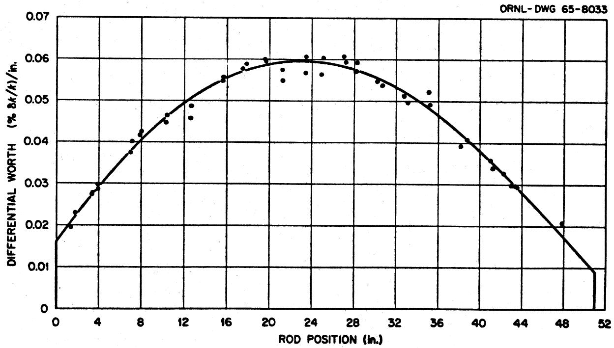  
Fig. 4. Differential Worth of Control Rod No. l. (Adjusted to initial critical loading.)

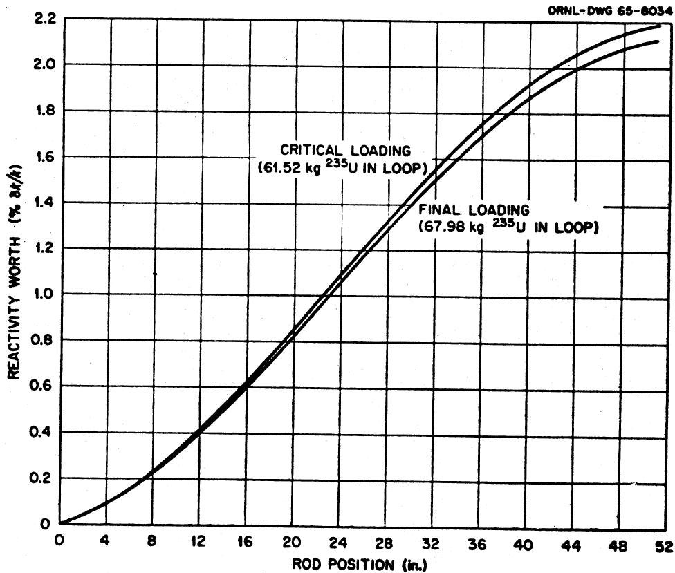  
Fig. 5. Integrated Worth of Control Rod No. 1.

this model only for rod 2, since this rod lies diagonally opposite and symmetrically with respect to the graphite sample holder.

The worth of the partially inserted, banked rods was calculated for a cylindrical annular model of the rod bank, using the two-group, two-dimensional program, Equipoise-3. These results indicated that the available travel of 51 in. covered 0.927 of the worth of rods all the way through the core. (The effective height of the core, extending into the upper and lower heads, is 78.2 in.) Thus the effective static reactivity for rod 2 was $-2.28 \times .927 = 2.11\%$ . Earlier calculations made for different fuel salt compositions had indicated that the worth of either rod 1 or rod 3 is about 1.03 times that for rod 2, due to the positions of the rods relative to the graphite sample holder. Thus the predicted worth of rod 1 would be about $2.2\%$ , in favorable agreement with the experimental measurements.

We are working on the analysis of the period measurements with the fuel circulating. As will be discussed later, a new mathematical treatment of delayed-neutron effects in the MSRE is being programmed; this will be used to relate period to reactivity. The sensitivities determined in this way should, of course, coincide with the results of the static-fuel measurements. Because of the difficulty of accurately treating the complex pattern of precursor distribution in the circulating fuel, the values obtained with the fuel static should be more reliable.

The rod-drop experiments are also being analyzed. They will give independent values of rod worth and may show the effect of $^{235}\mathrm{U}$ concentration on rod worth. This latter effect is also the subject of multigroup calculations at the concentrations observed in the experiment. (The correction factors used in the preliminary analysis were interpolations of results at higher and lower concentrations.)

# 235U Concentration Coefficient of Reactivity

The $^{235}\mathrm{U}$ concentration coefficient of reactivity is given by the ratio of the change in reactivity to the fractional change in $^{235}\mathrm{U}$ concentration (or circulating mass) as a result of a small addition. The effect of each capsule addition (after initial criticality) on the critical position of the control rod was determined with the pump running. The critical position with the pump off was measured after every fourth addition. Rod positions were converted to reactivity, using Fig. 5 and correcting for the concentration effect on rod worth. Results are shown in Fig. 6.

The slope of a curve in Fig. 6 at any concentration multiplied by that concentration is the desired concentration coefficient of reactivity, $(\delta k / k) / (\delta m / m)$ . The coefficients obtained in this way range from 0.22 at the final concentration to 0.23 at the lowest concentration. The coefficient predicted from multigroup criticality searches about the minimum critical concentration was 0.248. (ref. 2)

# Reactivity Effect of Circulation

The reactivity effect of circulation, given by the difference of the two curves in Fig. 6, is $-0.212 \pm 0.004\% \delta \mathrm{k} / \mathrm{k}$ . The effect of changes in delayed-neutron precursor distributions with circulation had been predicted to be $-0.30\% \delta \mathrm{k} / \mathrm{k}$ . Another $-0.2\% \delta \mathrm{k} / \mathrm{k}$ was expected because of entrained bubbles of helium in the circulating salt. As will be discussed later, the evidence shows there were practically no circulating gas bubbles except for a brief period when the fuel level in the pump bowl was lowered. Therefore the gas effect attending circulation was practically nil.

The difference between the predicted and observed delayed-neutron losses we believe is due to inadequate accounting for delayed neutrons emitted just outside the graphite region of the core in the upper and lower heads. A more realistic model has been developed and is now being programmed. The program will compute precursor distributions under both steady-state and transient conditions, taking into account mixing,

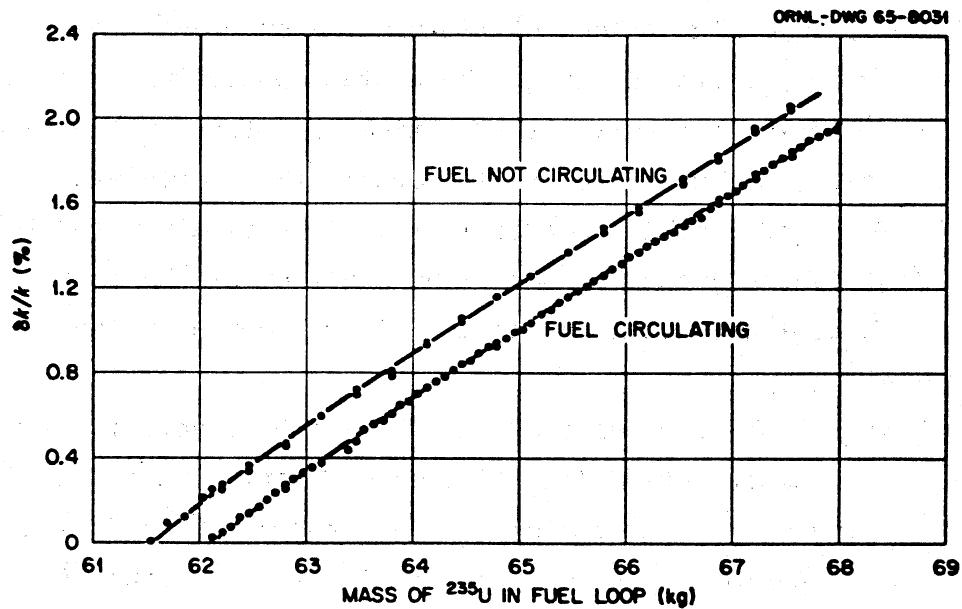  
Fig. 6. Effect of $^{235}\mathrm{U}$ Mass on System Reactivity.

velocities, volume fractions, and flux distributions in each of the principal regions. The weighted contributions of the delayed neutrons from each group will be computed, taking into account the initial energies of the neutrons and the nuclear importance of each region. The result will be a "circulating-fuel inhour equation" for the MSRE whose uses will include the analysis of the circulating-fuel period measurements and, as a special case, the steady-state effect of circulation.

# Temperature Coefficients of Reactivity

We measured the effect of temperature on reactivity by adjusting the electric heaters to change the system temperature slowly (about $15^{\circ}\mathrm{F}$ per hour) while we observed the critical position of the regulating rod. This experiment gave the overall temperature coefficient, i.e., the sum of the fuel and graphite coefficients. We also attempted to separate the fuel (rapid) and graphite (sluggish) coefficients by an experiment in which the coolant system was used to increase the fuel-salt temperature rather abruptly.

Figure 7 shows results of the three experiments involving slow changes in temperature. The first experiment, with $64\mathrm{kg}^{235}\mathrm{U}$ in circulation, gave a line whose slope ranges from $-(6.6$ to $8.3)\times 10^{-5}\circ \mathrm{F}^{-1}$ . At $66\mathrm{kg}$ the experiment gave a straight line with a slope of $-7.24\times 10^{-5}\circ \mathrm{F}^{-1}$ . In the last experiment, at $68\mathrm{kg}$ , the slope of the curve above about $1140^{\circ}\mathrm{F}$ is $-7.3\times 10^{-5}\circ \mathrm{F}^{-1}$ . A value of $-7.0\times 10^{-5}\circ \mathrm{F}^{-1}$ had been predicted: $-3.3\times 10^{-5}\circ \mathrm{F}^{-1}$ for the fuel and $-3.7\times 10^{-5}\circ \mathrm{F}^{-1}$ for the graphite. The fuel-salt coefficient of thermal expansion used in this calculation was obtained by an empirical correlation of density and composition of salts other than our fuel salt. Recent measurements of fuel-salt density gave a higher thermal-expansion coefficient, leading to a calculated fuel temperature coefficient of reactivity of $-5.6\times 10^{-5}\circ \mathrm{F}^{-1}$ . (ref. 4). The new value for overall temperature coefficient is $-9.6\times 10^{-5}\circ \mathrm{F}^{-1}$ . The observed coefficient is in better agreement with the earlier prediction (on which the safety analysis of the MSRE was based). The density measurements are being reviewed and they will be checked by an independent method of density determination.

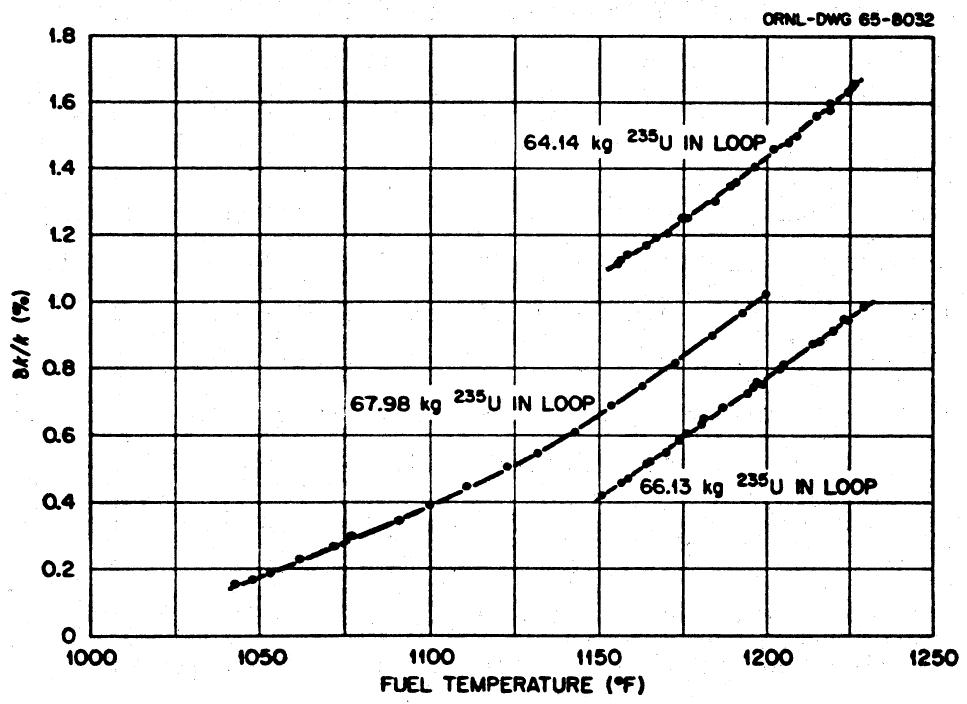  
Fig. 7. Effect of Fuel Temperature on Reactivity.

The experiment at $68\mathrm{kg}^{235}\mathrm{U}$ shows a lower slope below about $1140^{\circ}\mathrm{F}$ . We do not believe that the temperature coefficient is lower in this range but that another phenomenon became significant during this part of the experiment. That is the appearance of an increasing amount of helium bubbles in the circulating salt as the temperature was lowered. The evidence for this is discussed in the next section on pressure effects. The effect so far as the temperature experiment is concerned was that the bubbles tended to reduce the amount of fuel salt in the core, compensating to some extent for the increase in density of the salt itself as the temperature was lowered. Thus the slope of the lower part of the curve cannot be interpreted as a temperature coefficient of reactivity in the usual sense.

The hot-slug transient was done by stopping the fuel pump, raising the temperature of the circulating coolant salt and the stagnant fuel in the heat exchanger, then restarting the fuel pump to pass the hotter fuel salt through the core. The output of a thermocouple in the reactor-vessel outlet, logged digitally at $1/4$ -sec intervals, showed a brief increase of 5 to $6^{\circ}\mathrm{F}$ as the hot salt first passed. It then leveled at about $3.5^{\circ}\mathrm{F}$ for a few loop transit times before decreasing gradually. The noise in the analog-to-digital conversion ( $\pm 1^{\circ}\mathrm{F}$ ) limited the accuracy of the measurement, but by taking an average of 50 points during the level period after mixing and before the graphite temperature had time to change significantly, a value was obtained for the step in fuel temperature. Reactivity change was obtained from the change in rod position, corrected for the decrease due to circulation, and ascribed to the fuel-temperature increase. The result was a change of $-(4.9 \pm 2.3) \times 10^{-5} \mathrm{~F}^{-1}$ . Predicted values of the fuel-temperature coefficient lie in this range. We propose to repeat this test with the thermocouple signals biased and amplified to reduce the effect of noise in the analog-to-digital conversion. More precise results can be expected in this case.

# Effect of Pressure on Reactivity

We performed three tests to explore the effect on reactivity of changing system overpressure. Theoretical considerations had indicated that for slow changes a very small, possibly negative, pressure coefficient of reactivity could be expected but for rapid changes the coefficient would be positive. The existence of any pressure coefficient was based on the assumption that undissolved helium would be entrained in the circulating fuel. In each of the three tests the loop overpressure was slowly increased from the normal 5 psig to 10 to 15 psig and then quickly relieved, through a bypass valve, to a drain tank that had been previously vented to atmospheric pressure.

The first two tests were carried out at normal system temperature with the normal operating level of salt in the fuel-pump bowl. No change in control-rod position was required to maintain criticality and no significant change in pump-bowl level was observed during either of the tests. These indicated that the pressure coefficient was negligibly small and that essentially no helium bubbles were circulating with the salt. Further evidence of the lack of circulating voids was obtained from a gamma-ray densitometer on the reactor inlet line; this instrument showed no change in mean salt density during the tests.

The third test was performed at an abnormally low pump-bowl level which was obtained by lowering the operating temperature to $1050^{\circ}\mathrm{F}$ . Figure 8 shows the pressure transient and the responses of the regulating control rod, densitometer, and fuel-pump level during the rapid pressure release. Independent evaluations of the void fraction from these three parameters all gave values between 2 and 3 percent by volume. The frequency response characteristics of the effects of pressure on reactivity were calculated from the pressure and rod motion and are shown in Fig. 9 along with the predicted high-frequency response for a void fraction of $1.2\%$ . Extrapolation to the observed curve gives a void fraction of 2 to 2-1/2 percent. The low- and high-frequency pressure coefficients were + 0.0003 and + 0.014(\% $\delta$ k/k)/psi, respectively, for this particular condition.

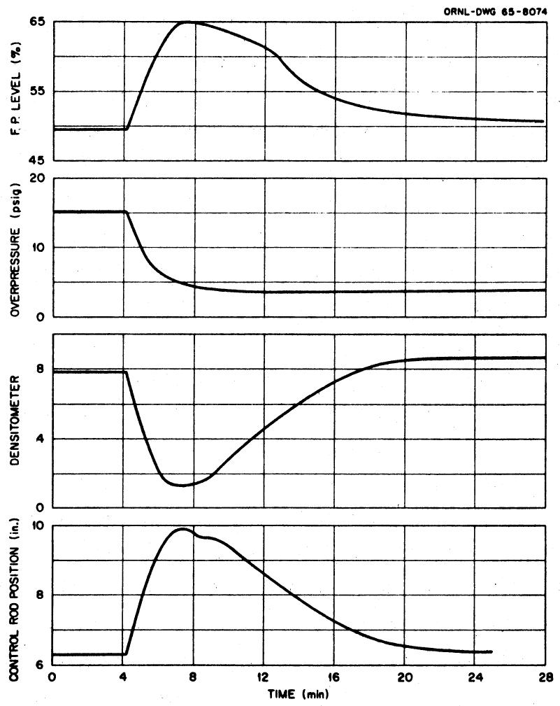  
Fig. 8. Conditions During Rapid Pressure Release While Circulating Helium Bubbles.

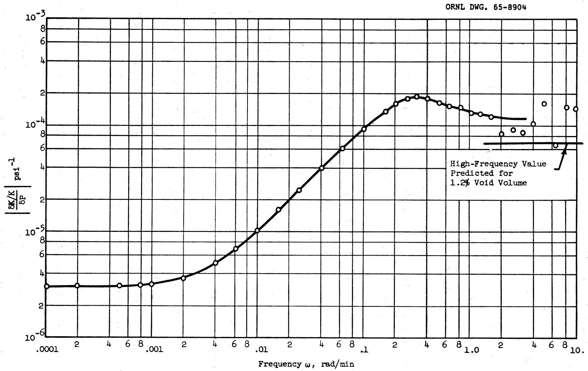  
Fig. 9. Reactivity-Pressure Transfer Function with 2 to $3\%$ Void Volume in Fuel. (Calculated from pressure release experiment using Samulons method with 0.2 min sampling interval.)

# Dynamic Tests

We performed a variety of dynamic tests during the operation at zero power. These tests were the start of an extensive program to evaluate experimentally the inherent nuclear stability of the MSRE at all power levels. The reactor system has been analyzed on a theoretical basis and the tests are designed not only to characterize the present system but also to evaluate the techniques and mathematical models used in the theoretical analysis. Preliminary results from the analysis of the zero-power tests are presented below.

# Frequency Response Measurements

A series of tests was run to determine the frequency response of neutron level to reactivity perturbations. These experiments included pulse tests, pseudo-random binary reactivity-perturbation tests, and measurements of the inherent noise in the flux signal. Tests were run with the fuel pump on and with it off. Noise measurements were also made during a special run with a low pump-bowl level where there were entrained bubbles in the core.

The frequency response is a convenient measure of the dynamic characteristics of a reactor system. Classically the frequency response is obtained by disturbing the reactor with a sinusoidal reactivity perturbation, and observing the resulting sinusoidal neutron-level variations. The magnitude ratio is defined as the ratio of the amplitude of the output sinusoid to that of the input sinusoid. The phase angle is defined as the phase difference between the output sinusoid and the input sinusoid. Other procedures, such as those described in this report, can be used to yield the same results as the classical method with less experimental effort.

The zero-power frequency response tests serve to check the theoretical, zero-power frequency response predictions, but they do not furnish direct information on the stability of the power-producing reactor. The zero-power tests, however, do serve as an indirect, partial check on the at-power predictions because the dynamic behavior at power is simply the zero-power case with the addition of feedback from the system. Thus,

verification of the zero-power kinetics predictions lends some support to the predictions regarding power operation.

Procedures -- In the pulse tests a control rod was withdrawn 1/2 in., held there for 3-1/2 or 7 sec., then returned to its original position. The rod was placed so that this rod motion caused a change in $\mathrm{k_{eff}}$ of about $0.03\%$ . The rod-position signal and flux signal were recorded digitally at 0.25-sec intervals using the MSRE on-line digital computer (referred to in Figs. 16 and 17 as "logger"). The frequency response was obtained by numerically Fourier transforming the input and output signals.

The pseudo-random binary tests consisted of a specially selected series of positive and negative pulses. The series contained 19 bits each with a duration of 7 sec., and was repeated several times so that the initial transients could die out. The rod motion about the average position corresponded to a $\Delta k_{\mathrm{eff}}$ of about $\pm 0.0015\%$ . The rod-position signal and flux-level signal were recorded digitally at 0.25-sec intervals using the MSRE computer. The frequency response was obtained by two different methods. The direct method used a digital filtering technique to obtain the spectral density of the input and the cross spectral density of the input and the output. The frequency response of the system is the ratio of the cross to input power spectral densities. The indirect method involved calculation of correlation functions and subsequent numerical Fourier transformation. Both methods gave essentially the same results.

The noise measurements and analyses used direct analog filtering of an analog tape record of the inherent noise in the flux-level signal. The tests required one hour of data recording to give statistically accurate results. These tests were hampered by the unfavorable location of the detector and the resulting low flux-signal level at low power (~10 watts).

Results -- Preliminary results of the frequency response measurements are shown in Figs. 10 through 14 along with theoretical predictions for the runs with the fuel pump on and with the pump off. As shown on the legend in the figures, several different procedures were used to obtain these results, but this represents only a partial analysis of the available

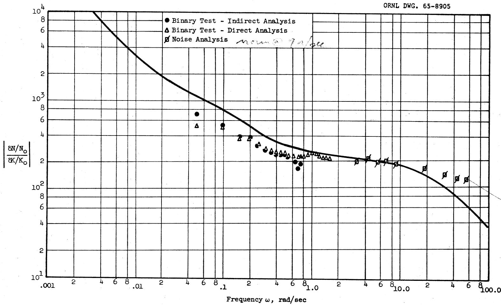  
Fig. 10. Frequency Response - Magnitude Ratio of $\frac{\mathrm{N} / \mathrm{N}_0}{\mathrm{K} / \mathrm{K}_0}$ with Fuel Circulating. Results of binary and noise tests.

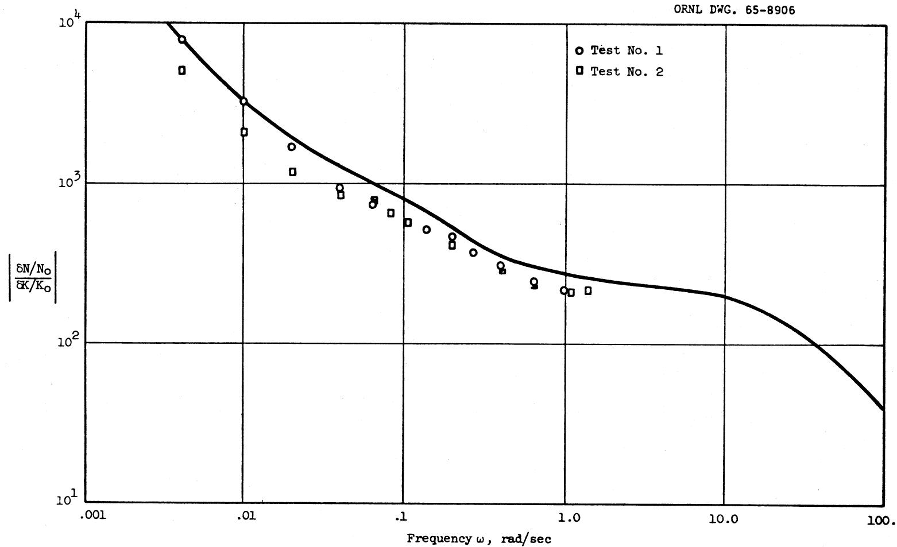  
Fig. 11. Frequency Response - Magnitude Ratio of $\frac{\delta N / N_{0}}{\delta K / K_{0}}$ with Fuel Circulating. Results of two 7-sec pulse tests.

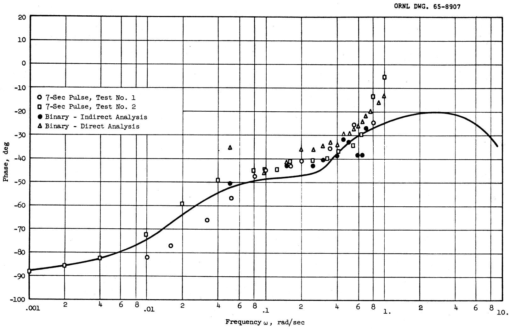  
Fig. 12. Frequency Response - Phase of $\frac{\delta N / N_{0}}{\delta K / K_{0}}$ with Fuel Circulating. Results of pulse and binary tests.

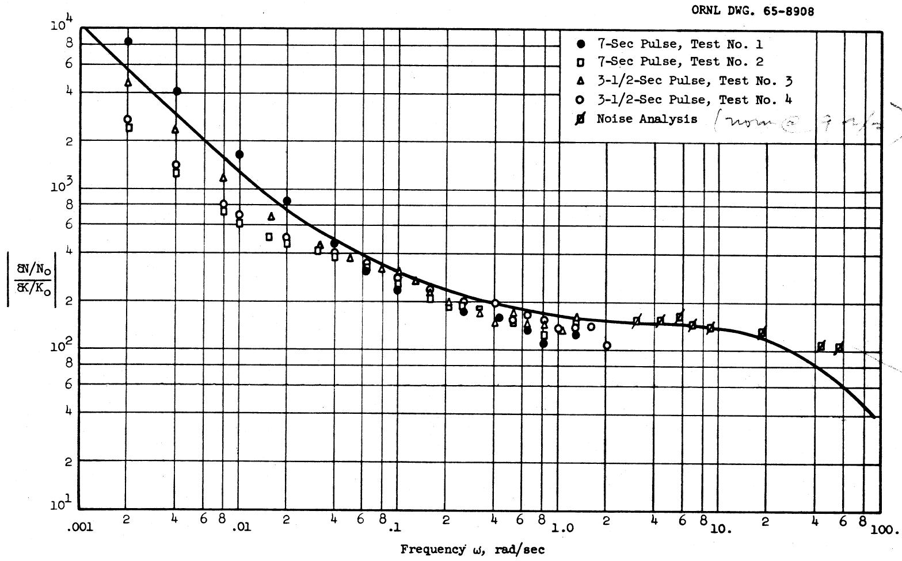  
Fig. 13. Frequency Response - Magnitude Ratio of $\frac{\mathrm{N} / \mathrm{N}_{\mathrm{o}}}{\mathrm{K} / \mathrm{K}_{\mathrm{o}}}$ with Fuel Static. Results of pulse and noise tests.

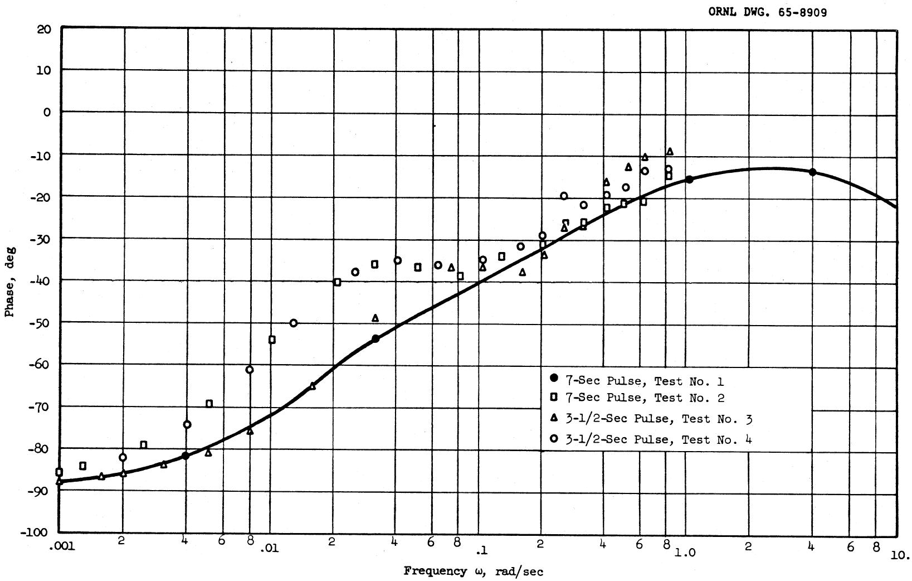  
Fig. 14. Frequency Response - Phase of $\frac{\delta N / N_{\circ}}{\delta K / K_{\circ}}$ with Fuel Static. Results of pulse tests.

data. All of the experimental points except for the noise-analysis results are in absolute units (fractional change in neutron flux per change in $\mathbf{k}_{\mathrm{eff}}$ ). The noise-analysis results are based on the assumption of a white-noise input and contain an unobtainable proportionality constant. Thus, the noise-analysis data were arbitrarily multiplied by the factor required to give agreement with theoretical results at a frequency of 9 radians/sec.

Figure 15 shows the noise analysis results for operation at a reduced pump-bowl level, which caused increased bubble entrainment in the fuel salt. Comparison of the noise spectrum obtained with bubbles circulating (Fig. 15) and the noise spectrum obtained with no bubbles circulating (Fig. 10) indicates that the bubbles increased the amplitude of the power spectral density significantly in the 1- to 10-rad/sec region. Previous experiments with the MSRE-core hydraulic mockup indicated that random, hydraulically-induced pressure fluctuations in the core would probably cause a significant modulation of the core void fraction, thus causing reactivity fluctuations. Hence, additional flux noise in this frequency range was expected, although it was not possible to predict the "shape" or characteristics of this spectrum.

Unfortunately, the noise measurement was the only type of frequency-response measurement made during operation with a reduced pump-bowl level. We propose to operate again with a reduced pump-bowl level early in the next critical run, repeating the noise tests and also doing pulse and pseudo-random binary tests. This should adequately determine the influence of bubbles on dynamic behavior.

Evaluation of Results -- Significant results from the zero-power pulse and binary noise tests were expected only if the temperature drifts during the tests were held to essentially zero, and the control rod could be positioned with accuracies better than 0.01 inch. In spite of these stringent requirements, results were obtained which agree favorably with the predictions. Reasons for the consistently low values of magnitude ratio are currently being studied to determine if they are due to inaccuracies in the measurements or to imperfect data or models used in

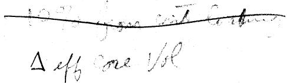

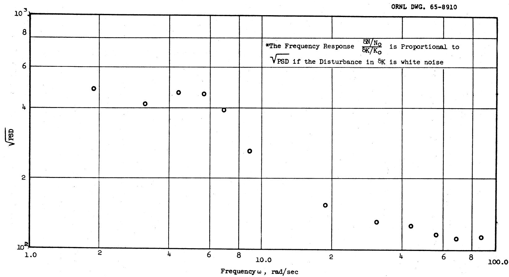  
Fig. 15. Frequency Response - Square Root of Power Spectral Density (PSD) of Flux Signal* - Fuel Circulating with Bubbles Results of Noise Analysis.

It was encouraging that the necessary data could be obtained in the important frequency range for the MSRE without the purchase of special-purpose equipment. However, some lessons were learned that will lead to slight modifications in subsequent tests.

The standard analog-to-digital conversion of the required signals by the computer is not accurate enough. The requirement of operation over a wide range precludes the possibility of accurate recording for the relatively small incremental changes used in these tests. It is expected that this can be corrected by use of an appropriate bias and additional electronic amplification of the signals. Future tests will also use analog-tape recording of the data in parallel with the recording by the MSRE computer. This will serve to check the computer results and will also permit testing of other analysis procedures.

The success with the pseudo-random binary tests will lead us to expand the use of this test. In particular, the length of each bit in the 19-bit sequence will be increased in some of the tests, and sequences with more bits will be used with the rod motion controlled by the MSRE computer. These modifications will give the resolution needed to detect the resonance peaks expected at low power in the frequency-response magnitude-ratio curves.

The results shown in Figs. 10 through 14 were obtained by straightforward application of basic procedures. The pulse test results were filtered prior to analysis, but the binary test results were used in unmodified form. These results will be further refined by application of additional data-handling techniques such as smoothing and automatic trend removal. However, early results were good enough that these modifications should not produce much improvement. The noise-test results were influenced by the tape-recorder characteristics. This instrument is currently being calibrated and the results will be corrected. This correction should be important only below 6 radians/sec.

# Transient Flow Rate Tests

The purposes of the transient flow-rate tests were: 1) to obtain startup and cooldown characteristics for fuel- and coolant-pump speeds and for coolant-salt flowrate; 2) to infer fuel-salt flow-rate transients

from the results of (l); and 3) to determine the transient effects of flow changes on reactivity and void fraction.

Figures 16 and 17 show the fuel-pump speed, coolant-pump speed, and coolant-salt flow rate vs time for pump startup and cooldown. Data were taken with the computer and with a Sanborn oscillograph. The output of a differential-pressure cell across the coolant-salt venturi was recorded directly on the oscillograph, and the square root of that signal was taken as flow rate. The lag in the response of the computer flow signal is due to the response characteristics of the EMF-to-current converter and the square-root converter between the differential-pressure transmitter and the computer input.

It was hoped that the coolant-pump speed and coolant flow rate would coast down in unison so that the fuel flow rate coastdown could be inferred directly from the fuel-pump speed coastdown curve. This was not the case, however. Other methods of analysis will be attempted later.

Reactivity effects of fuel flow-rate transients were measured by letting the flux servo controller hold the reactor critical during the transients; the reactivity added by the rod is then equal (and opposite) to the reactivity change due to the flow perturbations. The data for the pump startup were taken on the computer but were inadvertently erased; the reactivity transient for the pump cooldown was recorded. Due to the absence of voids in the fuel loop during normal operation, this transient is due entirely to flow effects. Further analysis of this curve will be made to try to determine the flow cooldown transient and to check on the model used to represent the circulating delayed-neutron precursors.

# Conclusions from Dynamic Tests

The two most significant conclusions to be obtained from the dynamic tests are 1) the information obtained gives no indication of the existence of inherent characteristics that might lead to operating difficulties in the low-power runs, and 2) the selected tests were, on the whole, quite satisfactory. These tests gave results which show good agreement with theoretical predictions giving increased confidence in the theoretical model and in the predictions for stable power operation. Since the zero-power tests of this type are always more difficult than power-level tests, very good results are expected from later tests.

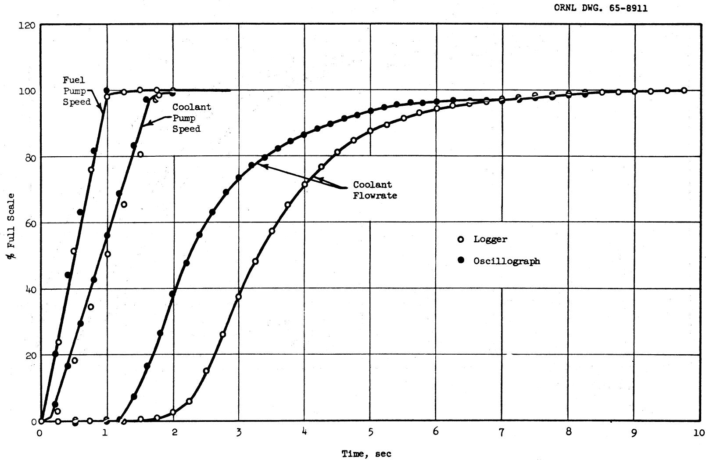  
Fig. 16. Pump Speed and Flow Startup Transients.

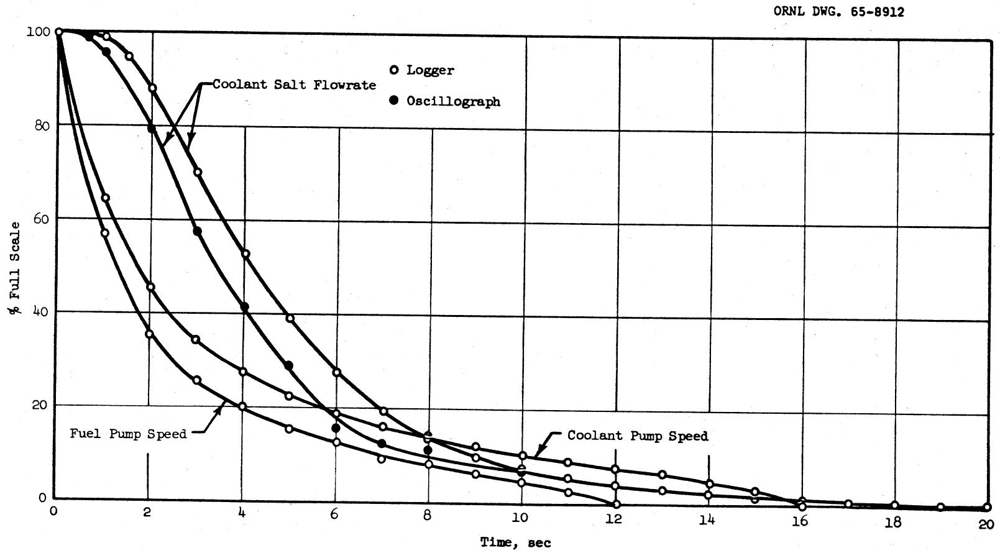  
Fig. 17. Pump Speed and Flow Coastdown Transients.

# FUEL SALT CHEMISTRY

Fuel samples were removed daily from the pump bowl during the last precritical operation (Run PC-2) and the zero-power experiments (Run 3). Chemical composition, contaminant levels and isotopic analyses were determined on a regular basis. Changes in composition during the operation were only such as could be explained by the additions of enriching salt. The analyses support the conclusions that the salt was given excellent protection against moisture or oxygen, that no uranium precipitated, and that essentially no corrosion of the INOR-8 in the fuel system occurred during the period of approximately 1100 hours.

# PERFORMANCE OF MECHANICAL COMPONENTS

In general, the performance of the many mechanical components of the system was highly satisfactory throughout the run. This is particularly true in view of the fact that some of the items were being integrated into the system operation for the first time. Some difficulties were encountered which caused temporary inconvenience but no program delays resulted and no extensive modifications will be required to improve future performance. This section deals only with the difficulties that were experienced, their actual and potential effects, and the changes which they incurred.

# Control Rods

Two of the control rods and drives were installed during run PC-1 and were used in simulator training. Before PC-2 all three rods were installed and subjected to a test consisting of 100 cycles of full withdrawal and scram. The rods operated freely and never failed to scram, but occasionally the lower limit switches failed to clear properly as the rods were withdrawn. We found the cause to be galling in the cam actuator for the switch. After we installed stellite bearing strips to remedy this problem, each rod was successfully raised and scrambled 30 times without any malfunction. (The lower limit switch on Rod 2 at first stuck as before, and we found that a shim had been left out of the

switch-actuator assembly. After the shim was replaced there was no further trouble.) Trouble-free operation continued throughout Run 3.

Rod drop times were measured in the tests in PC-2 and in a series of 40 scams at the end of Run 3. The results (Table 3) show that the drop times became slightly shorter and more uniform. This is consistent with development experience in breaking in new flexible rods.

Table 3. Observed Drop Times of Control Rods   

<table><tr><td rowspan="3">Test Series</td><td colspan="4">Number of Timed Drops</td><td colspan="6">Drop Timesa (msec)</td></tr><tr><td colspan="4">Average</td><td colspan="6">Standard Deviation</td></tr><tr><td>Rod 1</td><td>Rod 2</td><td>Rod 3</td><td>Rod 1</td><td>Rod 2</td><td>Rod 3</td><td>Rod 1</td><td>Rod 2</td><td>Rod 3</td><td></td></tr><tr><td>Original</td><td>45</td><td>64</td><td>46</td><td>820</td><td>818</td><td>870</td><td>17</td><td>25</td><td>30</td><td></td></tr><tr><td>At end of Run 3</td><td>42</td><td>41</td><td>41</td><td>793</td><td>775</td><td>792</td><td>4.0</td><td>4.1</td><td>3.7</td><td></td></tr></table>

a Time from actuation of the scram switch (with rods at 5l-in. withdrawal) until actuation of lower limit switch (0 inch).

Measurements of indicated rod positions with the lower end of the poison at the fiducial zero position were made after installation and at intervals during Run 3. The data did not indicate any stretching of the rods.

# Sampler-Enricher

The installation of the fuel-system Sampler-Enricher was completed during the shut-down period before Run PC-2. Since that time, 54 samples were withdrawn and 87 enriching capsules were added. Although several minor problems occurred during the reactor operation, none of these problems prevented the sampler from being operational. In some cases delays were incurred during sampling or enriching, but the overall schedule was not significantly affected. Specific problems that were encountered are listed below.

1. Both the operational and the maintenance gate valves developed leaks through one of the two seats of each valve. (The space between the seats of each valve is helium-buffered and monitored continuously when it is closed.)   
2. The removal valve leaked and required a greater-than-normal helium flow for buffering.   
3. A solenoid valve on the removal-valve actuator failed and was replaced.

4. The removal valve occasionally failed to close completely and had to be closed manually.   
5. The access port periodically failed to close properly because of faulty operation of the clamps on the clamp actuators.   
6. One sample capsule was accidentally dropped down the sample tube to the operational valve gate. The capsule was recovered and removed without significant difficulty.   
7. The drive motor stopped once during the removal of an empty capsule. The capsule was inserted about 12 inches and was then successfully withdrawn. The reason for this stoppage is unknown.   
8. There were 3 boot failures on the manipulator with one of these involving both boots. The inner boot was damaged twice by the operation of the manipulator. Both boots were blown off by excessive pressure difference which resulted from an operational error. No detectable release of contamination occurred with any of the failures.   
9. The manipulator arm and fingers were bent causing some difficulty in gripping the latch cable and moving the manipulator arm.

Most of the troubles resulted from this period being one of testing of equipment and training of operators. A mock-up had been thoroughly tested but the installation of the sampler-enricher on the reactor was completed just before the critical experiments were begun. The operators are now well trained and some minor changes are being made to improve the reliability of the equipment and the safety of the operation. The device is expected to perform satisfactorily during power operation.

# Freeze Valves

Several problems occurred with the freeze valves, but most of these were corrected prior to Run PC-2. During critical operation the only important requirement is that of ensuring a sufficiently short thaw time for the drain valve, FV-103. A proportional controller was added to the FV-103 cooling-air supply to maintain the freeze valve at a preselected temperature which would result in a suitable thaw time. The temperature

control and the valve temperature distribution were controlled satisfactorily at any steady temperature level but it was necessary to change the controller set points whenever the fuel-system temperature was changed appreciably. The following thaw times were recorded for the drains after Runs PC-2 and 3.

Run PC-2: Carrier-Salt Drain - 16 l/2 min (system cooled to $1100^{\circ}\mathrm{F}$ )

Run 3: Fuel-Salt Drain - 10 min

Run 3:Flush-Salt Drain -18 min

An incident occurred during Run 3 which could have delayed an emergency drain of the fuel system had it been required. Electrical power to the freeze-valve control modules was lost for a period of about 10 min because the terminals of a temporary recorder were accidentally shorted. The loss of module power turned blast air onto the freeze valves. Normal operation of the valves was restored after module power was regained.

Control circuit revisions will be made to prevent the recurrence of this problem.

# Fuel and Coolant System Pressure Control

Difficulties were experienced in controlling the fuel and coolant system pressures within close limits because of accumulation of solids in the offgas throttling valve used for fuel-system pressure control and in the filter just upstream of the coolant-system pressure control valve.

During Run PC-1 (January - March, 1965), when the coolant salt was circulated for 1200 hours, the coolant offgas filter plugged and was replaced twice. When the filters plugged, pressure was controlled at $5 \pm 2$ psig by manual venting through a larger bypass valve.) Inspection showed that the filter was covered with amorphous carbon containing traces of the constituents of the coolant salt and INOR-8. The filter was replaced before PC-2 with one having 35 times the surface area. Coolant salt was not circulated again until near the end of Run 3 and then for only 118 hours. During this time the pressure control again became erratic, indicating obstruction of either the filter or the valve. These will be inspected and cleaned or replaced.

The fuel-system pressure control became erratic near the end of Run PC-1 and at the conclusion of that run the offgas filter was removed. It proved to be clean, so the pressure control valve was removed and found to be partially plugged. The obstruction was blown out with gas and the valve was washed out with acetone. The valve then performed normally and was reinstalled. The acetone rinse was darkened and contained small $(1 - 5\mu)$ beads of a glassy substance.

Fuel- system pressure control was satisfactory at the beginning of Run PC-2, but within a week the valve began sticking again. This time the valve was replaced with one having a larger $C_{\mathrm{v}}$ (0.077 instead of 0.02). The original valve was cut open for inspection and a black deposit was found partially covering the tapered stem. The deposit was about $20\%$ amorphous carbon and the remainder was the $1 - 5\mu$ glassy beads, which proved to have the composition of the flush salt.

The larger replacement valve in the fuel offgas line gave adequate pressure control until near the end of Run 3, after about 30 days of salt circulation, when it appeared to be sticking occasionally. When this happened, the pressure built up slowly to about 6 psig before the valve opened to drop it back to the normal 5 psig.

The cause of the solids in the offgas lines is not yet known. There is reason to believe that some carbon may have been introduced to the reactor with the salt, accumulated on the surface in the pump bowl and been carried into the offgas line as a dust. Oil contamination of the salt system has also been suggested. The glassy salt beads in the fuel offgas line are probably frozen droplets of mist caused by the stripper spray, but we do not know whether these are carried into the line continuously during operation or were swept out of the pump bowl by sudden venting.

A filter, capable of removing $1 - \mu$ particles, is to be installed in the fuel system. (The pore size of the original filter was about $25\mu$ .) Presumably this will protect the valve from further accumulations. Measures to remedy the coolant- system problem will depend on the results of the inspection of the filter. In any event, the coolant offgas filter and pressure-control valve can be maintained directly after power operation should this prove necessary.

Failure of the controllers to maintain absolutely constant system pressures will have very little effect on either the operation or the safety of the system. The pressure variations that have been observed have been both slow and small. Furthermore, we will normally operate with almost no entrained gas in the fuel loop so that the pressure coefficient of reactivity will be very small. As a result, the reactivity effects associated with pressure variations, if they are observable at all, will be easily handled by the servo control system.

# ACKNOWLEDGMENT

This report is the work of several people who were responsible for the experiments and who contributed substantially to this summary. They are J. R. Engel, B. E. Prince, S. J. Ball, T. W. Kerlin, R. E. Thoma, and C. H. Gabbard. The experimental operation was by the entire staff of the MSRE, with substantial participation and support by many in the Reactor Division Development Sections, Reactor Chemistry Division, Instruments and Controls Division, and Plant and Equipment Division.

# REFERENCES

1. P. N. Haubenreich, et al., MSRE Design and Operations Report, Part III, Nuclear Analysis, USAEC Report ORNL TM-730, Oak Ridge National Laboratory, February 3, 1964.   
2. B. E. Prince, MSRP Semiannual Progress Report, January 31, 1964, USAEC Report ORNL-3626, pp 53-54.   
3. P. N. Haubenreich, Prediction of Effective Yields of Delayed Neutrons in the MSRE, USAEC Report ORNL TM-380, Oak Ridge National Laboratory, October 13, 1962.   
4. B. E. Prince, Comparison of Calculations and Uncertainties in the Temperature Coefficients of Reactivity in the MSRE, USAEC Report ORNL CF 63-3-1, Oak Ridge National Laboratory, March 3, 1965.   
5. S. J. Ball and T. W. Kerlin, MSRE Stability Analysis, USAEC Report ORNL TM-1070, Oak Ridge National Laboratory (in press).   
6. R. E. Thoma, MSRE Salt Chemistry During Precritical and Zero-Power Experiments, Internal Memo MSR-65-40, August 2, 1965.

# Distribution

<table><tr><td>1.</td><td>MSRP Director&#x27;s Office, 
Rm. 219, 9204-1</td><td>46.</td><td>J. L. Redford</td></tr><tr><td>2.</td><td>G. M. Adamson</td><td>47.</td><td>M. Richardson</td></tr><tr><td>3.</td><td>S. J. Ball</td><td>48.</td><td>H. C. Roller</td></tr><tr><td>4.</td><td>S. E. Beall</td><td>49.</td><td>D. Scott</td></tr><tr><td>5.</td><td>E. S. Bettis</td><td>50.</td><td>J. H. Shaffer</td></tr><tr><td>6.</td><td>F. F. Blankenship</td><td>51.</td><td>M. J. Skinner</td></tr><tr><td>7.</td><td>W. H. Cook</td><td>52.</td><td>A. N. Smith</td></tr><tr><td>8.</td><td>J. L. Crowley</td><td>53.</td><td>P. G. Smith</td></tr><tr><td>9.</td><td>S. J. Ditto</td><td>54.</td><td>W. F. Spencer</td></tr><tr><td>10.</td><td>J. R. Engel</td><td>55.</td><td>I. Spiewak</td></tr><tr><td>11.</td><td>E. P. Epler</td><td>56.</td><td>R. C. Steffy</td></tr><tr><td>12.</td><td>C. H. Gabbard</td><td>57.</td><td>A. Taboada</td></tr><tr><td>13.</td><td>R. B. Gallaher</td><td>58.</td><td>J. R. Tallackson</td></tr><tr><td>14.</td><td>W. R. Grimes</td><td>59.</td><td>R. E. Thoma</td></tr><tr><td>15.</td><td>R. H. Guymon</td><td>60.</td><td>W. C. Ulrich</td></tr><tr><td>16.</td><td>P. H. Harley</td><td>61.</td><td>B. H. Webster</td></tr><tr><td>17-26.</td><td>P. N. Haubenreich</td><td>62.</td><td>A. M. Weinberg</td></tr><tr><td>27.</td><td>V. D. Holt</td><td>63.</td><td>M. E. Whatley</td></tr><tr><td>28.</td><td>A. Houtzeel</td><td>64.</td><td>J. C. White</td></tr><tr><td>29.</td><td>T. L. Hudson</td><td>65-66.</td><td>Central Research Library</td></tr><tr><td>30.</td><td>P. R. Kasten</td><td>67-68.</td><td>Document Reference 
Section - Y-12</td></tr><tr><td>31.</td><td>R. J. Kedl</td><td>69-70.</td><td>Reactor Division Library</td></tr><tr><td>32.</td><td>T. W. Kerlin</td><td>71-73.</td><td>Laboratory Records</td></tr><tr><td>33.</td><td>A. I. Krakoviak</td><td>74.</td><td>Laboratory Records - RC</td></tr><tr><td>34.</td><td>R. B. Lindauer</td><td></td><td></td></tr><tr><td>35.</td><td>C. D. Martin</td><td></td><td></td></tr><tr><td>36.</td><td>C. E. Mathews</td><td></td><td></td></tr><tr><td>37.</td><td>H. G. MacPherson</td><td></td><td></td></tr><tr><td>38.</td><td>W. B. McDonald</td><td></td><td></td></tr><tr><td>39.</td><td>H. F. McDuffie</td><td></td><td></td></tr><tr><td>40.</td><td>C. K. McGlothlan</td><td></td><td></td></tr><tr><td>41.</td><td>R. L. Moore</td><td></td><td></td></tr><tr><td>42.</td><td>H. R. Payne</td><td></td><td></td></tr><tr><td>43.</td><td>A. M. Perry</td><td></td><td></td></tr><tr><td>44.</td><td>H. B. Piper</td><td></td><td></td></tr><tr><td>45.</td><td>B. E. Prince</td><td></td><td></td></tr></table>

# External

75-108. H. M. Roth, Division of Research and Development, AEC-ORO

