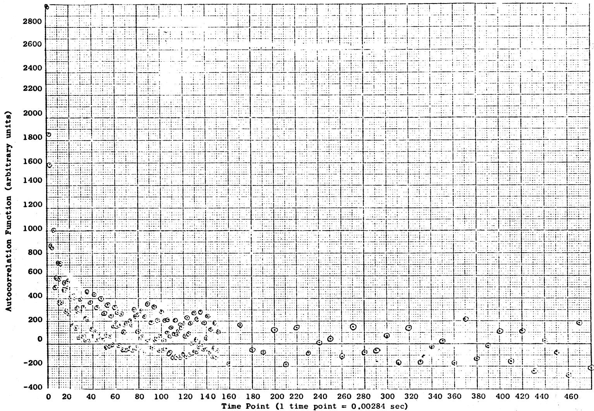
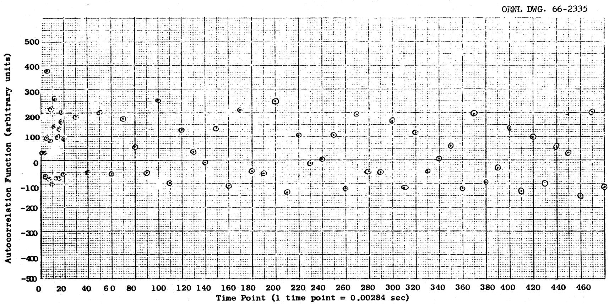
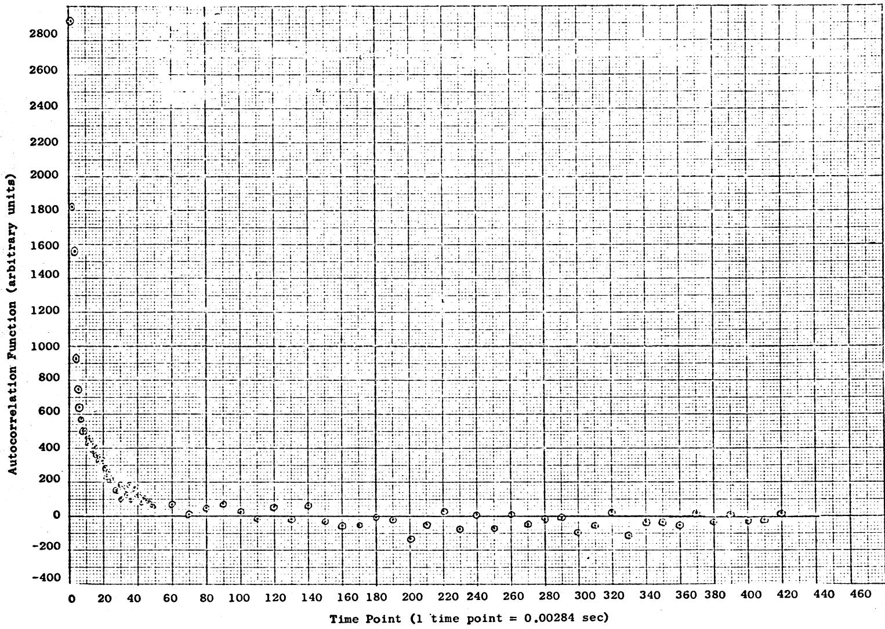
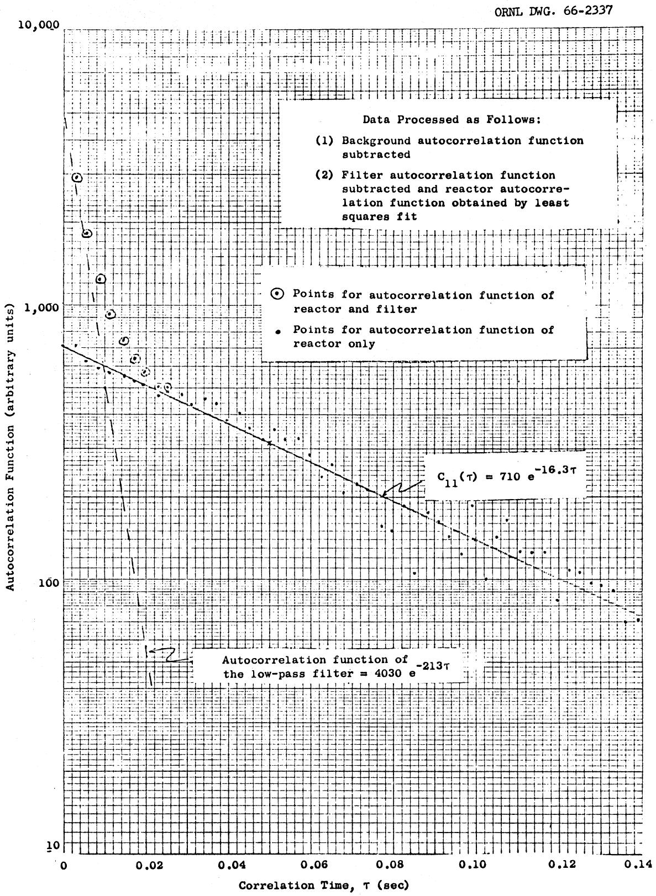
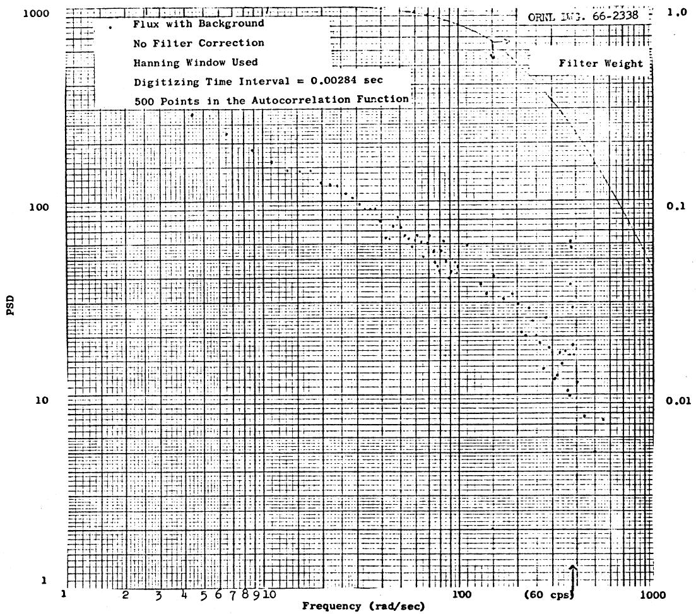
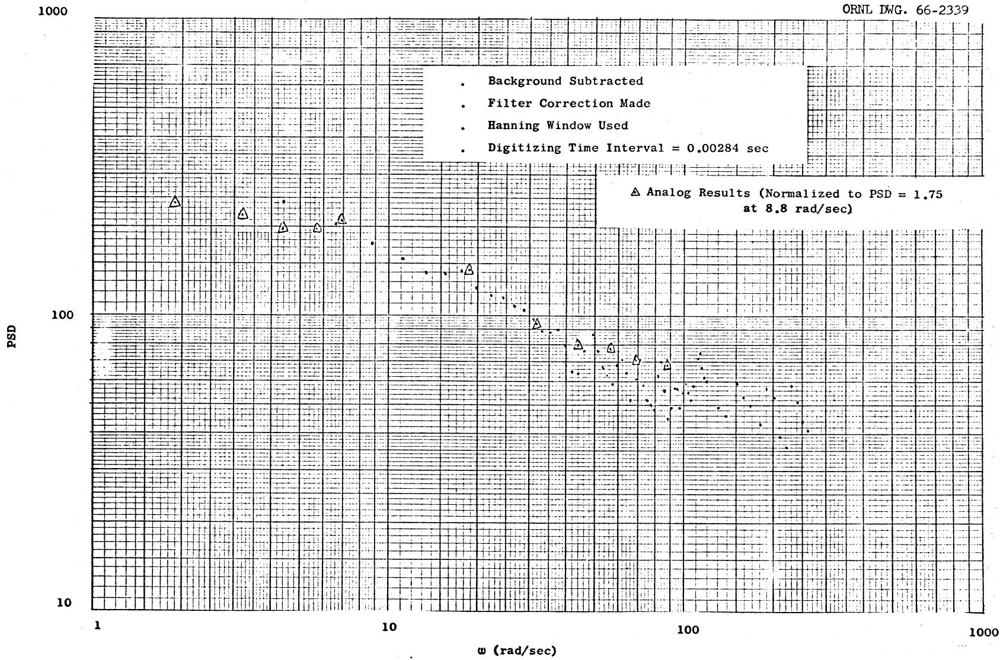
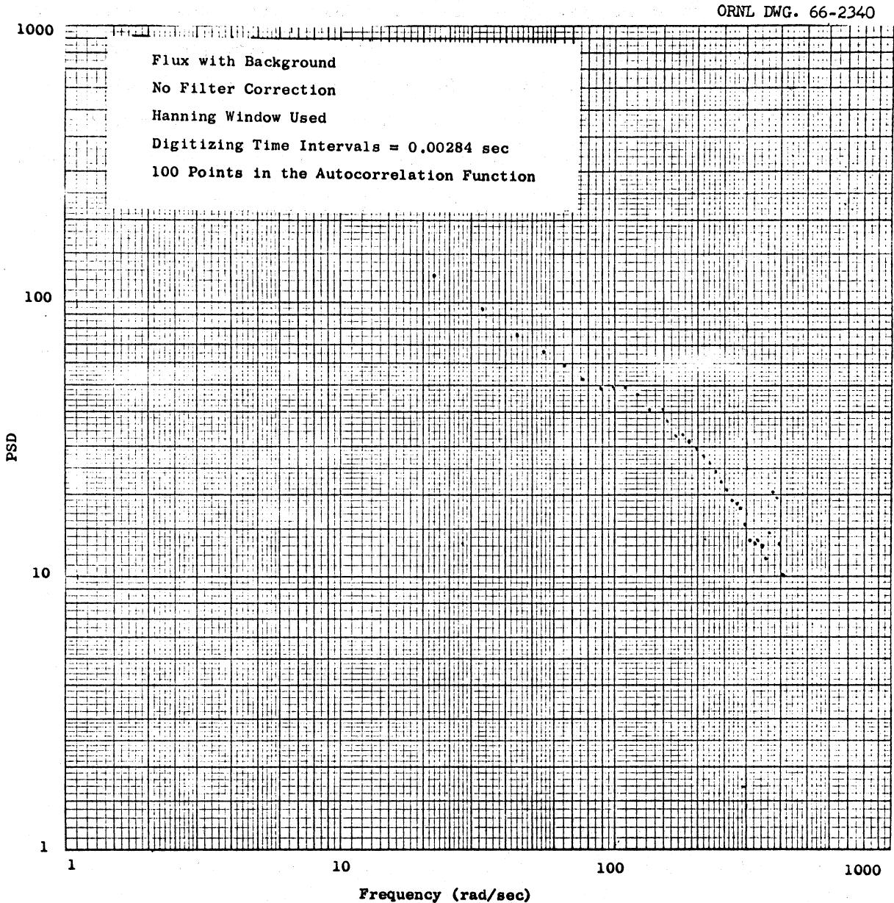
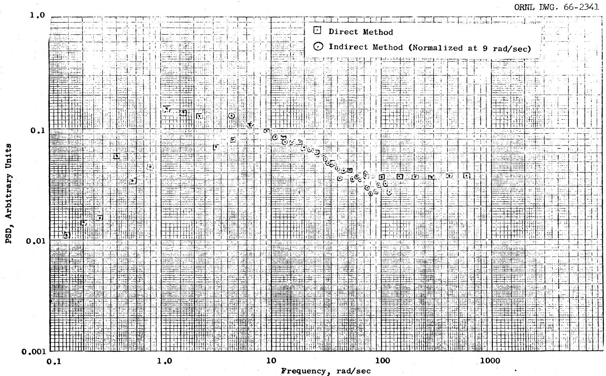
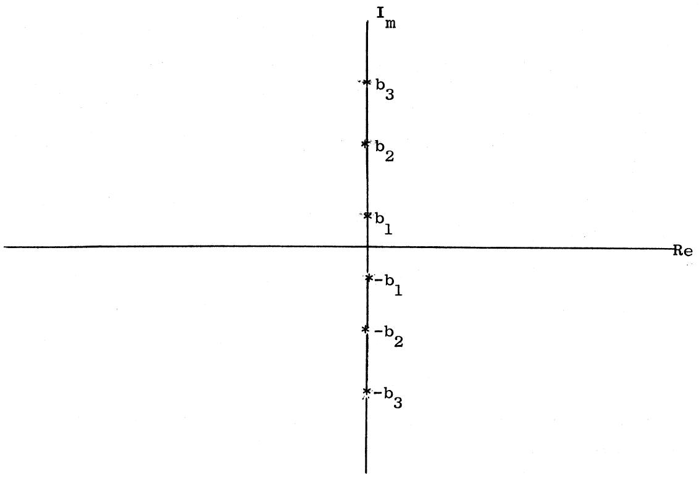

DATE: February 11, 1966

SUBJECT: Analysis of MSRE Zero-Power Flux Noise Using Digital Techniques

TO: Distribution

FROM: T. W. Kerlin and S. J. Ball

# ABSTRACT

The record of the flux noise obtained during the zero-power operation of the MSRE with fuel circulating was analyzed by two different digital computer techniques. The indirect method consisted of calculating the autocorrelation function of the flux noise and subsequent Fourier analysis of this autocorrelation function to give the power spectral density. The direct method used a digital simulation of a band pass filter to concentrate the signal in the desired frequency range. The output of this filter was then squared and time-averaged to give the power spectral density.

Both methods were found to give comparable results at comparable costs. The results were also found to give reasonable agreement with previously published results obtained with analog methods. The value of $\beta / \ell$ obtained by the digital method is 16.2 compared with 14.8 obtained in the earlier, analog study.

# NOTICE

This document contains information of a preliminary nature and was prepared primarily for internal use at the Oak Ridge National Laboratory. It is subject to revision or correction and therefore does not represent a final report. The information is not to be abstracted, reprinted or otherwise given public dissemination without the approval of the ORNL patent branch, Legal and Information Control Department.

# CONTENTS

Page

INTRODUCTION 5

METHODS OF ANALYSIS 5

Indirect Method 5

Direct Method 6

MSRE DATA 6

RESULTS 7

Indirect Method 7

Direct Method 18

CONCLUSIONS 18

Accuracy 20

Cost 20

Flexibility 20

Difficulty 21

Speed 21

APPENDIX 22

$\overrightarrow{a} = \left( {{x}_{1},{y}_{1}}\right) ,\overrightarrow{b} = \left( {{x}_{2},{y}_{2}}\right)$

# INTRODUCTION

Digital techniques were used to analyze the noise record obtained during the zero-power run of the MSRE. These data were previously analyzed by analog methods by Roux and Fry. The purpose of the present analysis was to supplement the analog results and to further test the digital methods. One of the digital techniques used in this analysis had previously been used successfully in analysis of ORR noise data.

# METHODS OF ANALYSIS

# Indirect Method

The steps in the indirect method are:

1. Calculate the autocorrelation function, $C_{11}(\tau)$ , of the noise record using the following expression:

$$
\mathrm {C} _ {1 1} (\tau) = \frac {1}{\tau_ {\mathrm {m}}} \int_ {0} ^ {\tau_ {\mathrm {m}}} \varphi (t) \varphi (t + \tau) d t, \tag {1}
$$

where

$$
\tau_ {m} = \text {m a x i m u m c o r r e l a t i o n t i m e , a n d}
$$

$$
\varphi = \text {t h e n e u t r o n f l u x s i g n a l .}
$$

2. Fourier analyze the autocorrelation function. Since it is an even function with period $2\tau_{\mathfrak{m}}$ , we obtain:

$$
\mathrm {F} _ {\mathrm {k}} \left\{\mathrm {C} _ {1 1} (\tau) \right\} = \frac {2}{\tau_ {\mathrm {m}}} \int_ {\mathrm {o}} ^ {\tau_ {\mathrm {m}}} \mathrm {C} _ {1 1} (\tau) \cos \frac {\mathrm {k} \pi}{\tau_ {\mathrm {m}}} \mathrm {d} \tau . \tag {2}
$$

3. Apply necessary corrections. These include:

a. Spectral windows to compensate for the fact that the Fourier analysis uses a finite integration time.   
b. Filter corrections to remove the effect of a low-pass filter used to eliminate aliasing.   
c. Background corrections.

The corrected Fourier coefficient, $\mathbf{F}_{\mathbf{k}}\left\{\mathbf{C}_{\mathbf{l}\mathbf{l}}(\tau)\right\}$ , at the frequency, $\mathbf{k}\pi/\tau_{\mathbf{m}}$ radians/sec, is the power spectral density (PSD) at that frequency.

# Direct Method

In the direct method, the digitized noise signal is used as the input or forcing function to the differential equations representing a narrow band pass filter, and the resulting output of the filter is squared and integrated. The matrix exponential technique3 is used to solve for the transient response of the filter, which has the characteristics of a quadratic lag and a transfer function:

$$
H (j \omega) = \frac {j \omega}{\omega_ {0} ^ {2} + 2 \delta \omega_ {0} j \omega - \omega^ {2}}. \tag {3}
$$

The center or resonant frequency of the filter is $\omega_0$ , and the band width increases with increasing damping factor $\delta$ . The PSD may be computed from

$$
\mathrm {P S D} = \frac {\overline {{\mathrm {q}}} ^ {2}}{\int_ {0} ^ {\infty} \left| \mathrm {H} (\mathrm {j} \omega) \right| ^ {2} \mathrm {d} \omega} \left(\frac {\text {v o l t s} ^ {2}}{\text {r a d / s e c}}\right), \tag {4}
$$

(where $\overline{\mathbf{q}^2}$ is the mean square filter output) if it is assumed that the PSD is constant within the band pass. For this filter

$$
\int_ {0} ^ {\infty} | H (j \omega) | ^ {2} d \omega = \frac {\pi}{4 \delta \omega_ {o}} (\text {r a d i a n s / s e c})
$$

Provisions are also made in the code for correcting the PSD for any low-pass filter that may have been used to prevent aliasing, and for calculating the percent standard deviation of the PSD estimate.

# MSRE DATA

The data previously used in the analog analysis1 were digitized on the Millisadic digitizer. The data included records taken for the

reactor critical and for the background noise observed when the reactor was shutdown. The case considered was for the reactor primary salt circulating with no bubbles. The noise record for the critical reactor was passed through a low-pass filter consisting of a first order lag with a time constant of 0.0047 sec, then digitized with a sampling interval of 0.00284 sec. The background noise was also filtered and digitized in the same manner. Approximately 36,000 time points were used for both cases.

# RESULTS

# Indirect Method

Figures 1 through 3 show the autocorrelation functions obtained in the indirect analysis. All calculated points are plotted for the shorter correlation times, but only every tenth point was included after the curve had leveled out at longer correlation times. Figure 1 shows the autocorrelation function for signal plus background. Figure 2 shows the autocorrelation function for background only. The results shown in Fig. 3 were obtained by subtracting the background autocorrelation function from the autocorrelation function for signal plus background. This can be done if the signal and the background are uncorrelated. To show this, take a signal composed of uncorrelated time functions $x$ and $y$ , and calculate the autocorrelation function

$$
\begin{array}{l} C _ {1 1} (\tau) = \frac {1}{T} \int_ {0} ^ {T} [ x (t) + y (t) ] [ x (t + \tau) + y (t + \tau) ] d t \\ = \frac {1}{T} \int_ {0} ^ {T} x (t) x (t + \tau) d t + \frac {1}{T} \int_ {0} ^ {T} y (t) y (t + \tau) d t \\ + \frac {1}{T} \int_ {0} ^ {T} x (t) y (t + \tau) d t + \frac {1}{T} \int_ {0} ^ {T} y (t) x (t + \tau) d t. \tag {5} \\ \end{array}
$$

Since $x$ and $y$ are uncorrelated, the last two integrals are zero and

$$
C _ {1 1} (\tau) = \frac {1}{T} \int_ {0} ^ {T} x (t) x (t + \tau) d t + \frac {1}{T} \int_ {0} ^ {T} y (t) y (t + \tau) d t. \tag {6}
$$

Thus, if $x$ is the signal and $y$ is the background, we see that we get the autocorrelation function of the signal by subtracting the autocorrelation function of the background from the autocorrelation function of the composite signal. The improvement obtained from the background correction is quite apparent if one compares Fig. 1 with Fig. 3.

ORNL DWG. 66-2334

  
Figure 1. Autocorrelation Function - Signal + Background.

  
Figure 2. Autocorrelation Function - Background Only.

  
Figure 3. Autocorrelation Function of Signal + Background minus Autocorrelation Function of Background Only.

The autocorrelation function, $\mathbf{C}_{11}(\tau)$ , of the output of a constant coefficient, linear system excited by white noise is given by:

$$
C _ {1 1} (\tau) = \sum_ {i = 1} ^ {n} A _ {i} E ^ {b _ {i} \tau}, \tag {7}
$$

where

$$
A _ {i} = a \text {c o n s t a n t},
$$

$$
b _ {i} = a \text {p o l e o f t h e s y s t e m t r a n s f e r f u n c t i o n , a n d}
$$

$$
n = \text {o r d e r o f t h e c h a r a c t e r i s t i c e q u a t i o n}.
$$

See the appendix for a derivation of Eq. (7). For a zero-power reactor, the poles are at $b_1 = 0$ and $b_2 = -(\lambda + \beta / \ell)$ for a one-delay-group model. Thus the autocorrelation function of a zero-power reactor excited by white noise is given by:

$$
C _ {1 1} (\tau) = A _ {1} + A _ {2} e ^ {- (\lambda + \beta / \ell) \tau}. \tag {8}
$$

If the output is low-pass filtered prior to autocorrelation with a first order lag circuit, the overall transfer function is

$$
\mathrm {G} _ {\mathrm {o}} (\mathrm {j} \omega) = \mathrm {G} _ {\mathrm {R}} (\mathrm {j} \omega) \mathrm {G} _ {\mathrm {f}} (\mathrm {j} \omega), \tag {9}
$$

where

$$
G _ {o} (j w) = \text {o v e r a l l t r a n s f e r f u n c t i o n},
$$

$$
G _ {R} (j w) = \text {r e a c t o r}
$$

$$
G _ {f} (j \omega) = f i l t e r \text {t r a n s f e r} = \frac {1}{1 + \tau_ {f} s}, \text {a n d}
$$

$$
\tau_ {f} = \text {f i l t e r t i m e c o n s t a n t , s e c}.
$$

In this case, the autocorrelation function is given by:

$$
C _ {1 1} (\tau) = A _ {1} + A _ {2} e ^ {- (\lambda + \beta / \ell) \tau} + A _ {3} e ^ {- \tau / \tau_ {f}}. \tag {10}
$$

For the MSRE experiment, $1 / \tau_{\mathrm{f}} = 213$ . Thus, a plot of $\log \mathbf{C}_{11}(\tau)$ vs $\tau$ should show an initial slope of $-213$ , followed by a section of the curve with a slope of $-(\lambda + \beta / \ell)$ before settling out to a constant value.

Figure 4, which shows the MSRE autocorrelation function for short correlation times, displays the expected behavior. The equation that fits this curve is

$$
f (\tau) = 4 0 3 0 e ^ {- 2 1 3 \tau} + 7 1 0 e ^ {- 1 6. 3 \tau}. \tag {11}
$$

This was obtained by assuming an exponent of $-213$ due to the filter effect, then performing a least squares fit on the function:

$$
f (\tau) - 4 0 3 0 e ^ {- 2 1 3 \tau}.
$$

Thus the result obtained is

$$
\lambda + \beta / \ell = 1 6. 3
$$

Since $\lambda$ is approximately 0.1, we obtain

$$
\beta / \ell = 1 6. 2.
$$

The value of $\beta / \ell$ obtained by this method (16.2) compares favorably to that obtained by Roux and Fry (14.8).1

Figure 5 shows the power spectral density of the signal prior to the corrections for the effects of the filter and the background noise. These results were obtained by Fourier analyzing the autocorrelation function shown in Fig.1. We note a sharp resonance at 376.1 radians/sec (60 cps) due to line voltage pickup. This resonance could have introduced an aliasing difficulty if the signal had been sampled at a slower rate and had been inadequately filtered.

Figure 6 shows the corrected power spectral density for the noise record. A Hanning window4 was used, the filter effect was removed, and the background PSD was subtracted. The analog results1 are also shown for comparison.

  
Figure 4. MSRE Autocorrelation Function - Fuel Circulating.

  
Figure 5. Power Spectral Density of MSRE Flux Noise.

  
Figure. 6. Power Spectral Density of MSRE Flux Noise.

Earlier results² indicated that the time required for indirect analysis on the IBM 7090 is given by:

$$
t = A N _ {p} N _ {t}, \tag {12}
$$

where

$$
t = I B M 7 0 9 0 c o m p u t i n g \text {t i m e} (\text {m i n u t e s}),
$$

$$
A = 2 \times 1 0 ^ {- 6},
$$

$$
\mathrm {N} _ {\mathrm {p}} = \text {n u m b e r o f p o i n t s}, \text {a n d}
$$

$$
N _ {t} = \text {n u m b e r o f v a l u e s c a l c u l a t e d f o r t h e a u c o r r e l a t i o n f u n c t i o n}.
$$

The calculations for the MSRE noise indicate that A is closer to $1.5 \times 10^{-6}$ . For example, the IBM 7090 computing time required to obtain the spectrum for Fig. 5 using 36,000 points to calculate 500 autocorrelation values was 26 minutes. The time required to numerically Fourier analyze the autocorrelation function to obtain the PSD is negligible.

The number of values calculated for the autocorrelation function was arbitrarily set at 500 in the calculations described above. It is noted, however, in Fig. 3 that the autocorrelation function has leveled off after about 100 time points. The points further out do not seem to contain much information and possibly could be eliminated, cutting the computation time by a factor of 5. This was done, and the results are shown in Fig. 7. The use of this shorter maximum lag time results in a smoothing of the autocorrelation function in a manner analogous to the use of a broader filter in the direct method. The power spectral density may be evaluated only for frequencies given by the relation:

$$
\omega = \frac {\mathrm {k} \pi}{\tau_ {\mathrm {m}}} (\text {r a d i a n s / s e c})
$$

where

$$
k = \text {a n y i n t e g e r , a n d}
$$

$$
\tau_ {m} = \text {t h e m a x i m u m c o r r e l a t i o n t i m e (s e c o n d s)}.
$$

  
Figure 7. Power Spectral Density of MSRE Flux Noise.

Thus, there are fewer points per unit frequency on the plot for the shorter correlation time. However, it may be noted that the results at appropriate frequencies agree.

# Direct Method

The direct method was also used to analyze the same noise record as was used in the indirect analysis. The resulting power spectral density is shown in Fig. 8 with the background noise subtracted and the filter correction applied. It is seen that the results are in general agreement with the results obtained with the indirect method. The drop-off of the points below 1.0 radian/sec is due to characteristics of the wide-band ac amplifier that was used, and is not characteristic of the PSD of the flux signal. This effect was also observed in the earlier analog study.

The time required for the direct method is given approximately by

$$
t = B N _ {p} N _ {\omega}, \tag {13}
$$

where

$$
\begin{array}{l} t = \text {I B M} 7 0 9 0 \text {c o m p u t i n g t i m e (m i n u t e s)}, \\ B = 7 x 1 0 ^ {- 6}, \\ \mathrm {N} _ {\mathrm {p}} = \text {n u m b e r o f p o i n t s}, \text {a n d} \\ N _ {(w)} = \text {n u m b e r o f f r e q u e n c i e s}. \\ \end{array}
$$

For instance, the results shown in Fig. 8 for 36,000 points and 26 frequencies required about 7 l/2 minutes of IBM 7090 computing time.

# CONCLUSIONS

Digital methods for processing reactor noise data have been successfully used in the analysis of noise records from the ORR and the MSRE. These tests are considered to be an adequate verification of the two different types of analysis employed. There seems to be no clear advantage for either of the digital methods used. A complete power spectral density calculation is probably a little faster by the direct method, but the autocorrelation function obtained in the indirect method may be worth the slight extra cost in many cases. A direct comparison of costs

  
Figure 8. MSRE Noise Analysis - Direct Method - Fuel Circulating, Band-Pass Filter $\delta = 0.05$ ; $\Delta F = 0.00284$ sec; Low-Pass Filter T.C. = 0.0047 sec; 36,000 Points. Corrected for background and filter.

for a given spectrum calculation is not possible since the computing time for the indirect method is proportional to the number of autocorrelation points calculated, while for the direct method it is proportional to the number of frequency points calculated.

It is worthwhile to compare the relative advantages of noise analysis by analog methods and by digital methods. This comparison includes considerations of accuracy, cost, flexibility, difficulty, and speed.

# Accuracy

The accuracy of both the digital and analog methods depends on the equipment accuracy and the length of the data record analyzed, but the latter is usually the controlling factor. Thus the other considerations which determine maximum record lengths that can be obtained reasonably dictate ultimate accuracy.

# Cost

The cost of an analysis includes the cost of equipment and the cost of manpower. Both the analog method and the digital method require a suitable detector and a high quality tape recorder. The digital method requires a device for sampling the analog record, but since such a machine is available at ORNL, no purchase of special equipment is required. The remainder of the cost of digital analysis is digital computer cost. At Oak Ridge costs, it is economical to run the computer for an hour or more in order to replace one man-day of work. Analysis of data by the analog method requires special equipment, which is also available at ORNL, and requires personal attention during analysis. It appears that there is no clear cost advantage for either method at ORNL. A decision by a potential noise analyst at some other installation concerning the relative costs of the two methods would depend on the equipment available at that installation.

# Flexibility

The digital method seems to offer some advantages with regard to flexibility. The frequencies to be analyzed may be selected to satisfy the requirements of the system under consideration. Also, many frequencies

may be analyzed, and it is simple to go back and re-analyze the data to clarify interesting, unexpected features of the power spectral density curve, perhaps by varying the band width over which the PSD is averaged. The frequencies, and the band widths at these frequencies, that may be analyzed by the analog method are determined by the availability of appropriate filters.

Cross correlation and cross power spectral density (CPSD) analyses can also be made on a "production" basis with digital techniques. Although analog techniques are available for CPSD analyses, practical means are not available for production runs at ORNL.

# Difficulty

The difficulty of carrying out an analysis is not a major consideration unless you happen to be the analyst. Once the data are digitized, the digital method is virtually effortless. (The indirect method code requires two input cards and the direct method code requires one input card.) The analog method requires the attention of an attendant for several hours.

# Speed

It is sometimes advantageous to obtain noise analysis results quickly. With the analog method, one could carry the taped noise to the analyzer and immediately start grinding out results at a rate of about 10 PSD points per hour with equipment available at ORNL. These results are usually processed with a short digital computer code to get the final spectra. With the digital method, one must feed the taped data to the Millisadic digitizer, then feed the Millisadic's cards through a digital program to correct digitizing blunders, and then feed the good cards back to the computer for the PSD analysis (the last two steps could be combined).

Thus the relative speeds of the two methods depend on the availability of the analog analyzer with attendant on one hand, and the Millisadic on the other.

# APPENDIX

In this appendix, the following result will be proved:

$$
C _ {1 1} (\tau) = \sum_ {i = 1} ^ {n} A _ {i} e ^ {b _ {i} t}, \tag {A.1}
$$

where

$C_{11}(\tau) =$ autocorrelation function of the output of a system excited by white noise,

$A_{i}$ $=$ a constant,

$\mathbf{b}_{\mathbf{i}}$ = a pole of the system transfer function (assumed to be simple), and

n = order of the characteristic equation.

This is simply proved if we use the fact that the spectral density of the output, $\mathbf{P}_0$ , is related to the spectral density of the input, $\mathbf{P}_i$ , by

$$
P _ {o} = | G (j \omega) | ^ {2} P _ {i}, \tag {A.2}
$$

where

$$
\left| G (j \omega) \right| ^ {2} = G (j \omega) G (- j \omega),
$$

G(jω) = the system transfer function.

If the input is white noise, $\mathbf{P}_{\mathbf{i}}$ is a constant, $\mathbf{K}$ , and we obtain

$$
P _ {o} = K \left| G (j w) \right| ^ {2}, \tag {A.3}
$$

The transfer function of a lumped-parameter, constant-coefficient linear system may be written:

$$
G (j \omega) = \frac {\left(j \omega - a _ {1}\right) \left(j \omega - a _ {2}\right) \dots}{\left(j \omega - b _ {1}\right) \left(j \omega - b _ {2}\right) \dots}, \tag {A.4}
$$

where

$$
a _ {1} = a \text {z e r o o f} G (j w),
$$

$$
b _ {1} = a \text {p o l e o f} G (j w).
$$

The autocorrelation function of a signal is equal to the inverse Fourier transform of its power spectral density:

$$
\mathrm {C} _ {1 1} (\tau) = \mathrm {F} ^ {- 1} \left\{\mathrm {P} _ {\mathrm {o}} \right\} = \frac {\mathrm {K}}{2 \pi} \int_ {- \infty} ^ {\infty} \mathrm {G} (\mathrm {j} \omega) \mathrm {G} (- \mathrm {j} \omega) \mathrm {e} ^ {\mathrm {j} \omega t} \mathrm {d} \omega . \tag {A.5}
$$

The term, $G(j\omega)$ $G(-j\omega)$ may be written in the form:

$$
G (j \omega) G (- j \omega) = \frac {\left[ \left(j \omega - a _ {1}\right) \left(j \omega - a _ {2}\right) \dots . \right] \left[ \left(- j \omega - a _ {1}\right) \left(- j \omega - a _ {2}\right) \dots . \right]}{\left[ \left(j \omega - b _ {1}\right) \left(j \omega - b _ {2}\right) \dots . \right] \left[ \left(- j \omega - b _ {1}\right) \left(- j \omega - b _ {2}\right) \dots . \right]} \tag {A.6}
$$

The function, $G(j\omega)$ , $G(-j\omega)$ , has poles located as shown below:

The integral in Eq. (A.5) may be evaluated as a contour integral using the Cauchy residue theorem to give:

$$
\frac {\mathbf {K}}{2 \pi} \int_ {- \infty} ^ {\infty} \mathbf {G} (\mathrm {j} \omega) \mathbf {G} (- \mathrm {j} \omega) e ^ {\mathrm {j} \omega t} d \omega = \mathbf {K} _ {\mathrm {j}} \sum_ {\mathrm {n} = 1} ^ {\mathrm {n}} \mathbf {B} _ {\mathrm {i}} \left(\mathbf {b} _ {\mathrm {i}}\right) e ^ {\mathrm {b} _ {\mathrm {i}} t}, \tag {A.7}
$$

where

$$
B _ {i} \left(b _ {i}\right) = t h e r e s i d u e o f t h e i ^ {t h} p o l e.
$$

This result is of the form,

$$
\sum_ {i = 1} ^ {n} A _ {i} e ^ {b _ {i} t},
$$

and we may write

$$
C _ {1 1} (\tau) = \sum_ {i = 1} ^ {n} A _ {i} e ^ {b _ {i} \tau}. \tag {A.8}
$$

# DISTRIBUTION

1. R.K. Adams   
2. R.A. Armistead

3-12. S.J.Ball

13. S.E.Beall   
14. C.J. Borkowski   
15. R. B. Briggs   
16. A.R.Buhl   
17. J.B. Bullock   
18. O.W. Burke   
19. E.P.Epler   
20. J. R. Engel   
21. D. A. Gosslee   
22. S.H. Hanauer   
23. P. N. Haubenreich   
24. P. R. Kasten

25-34. T. W. Kerlin

35. J. J. Keyes   
36. R. C. Kryter   
37. M. E. LaVerne   
38. B. R. Lawrence   
39. C. G. Lawson   
40. A.M. Perry   
41. C. A. Preskitt   
42. B. E. Prince   
43. J. R. Robinson   
44. D. P. Roux   
45. R. S. Stone   
46. J. R. Tallackson   
47. M. M. Yarosh

48-49. Central Research Library

50-51. Document Reference Section, Y-12

52-54. Laboratory Records Department

55. Laboratory Records Department, LRD-RC   
56. ORNL Patent Office   
57. Reactor Division Library, Bldg. 9204-1