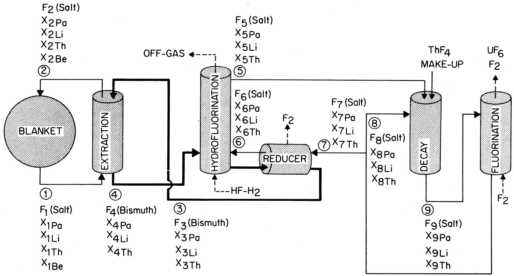
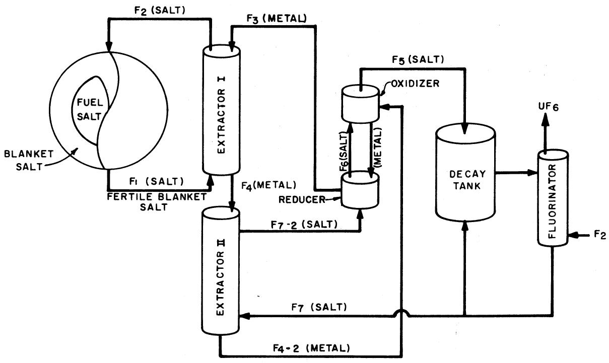
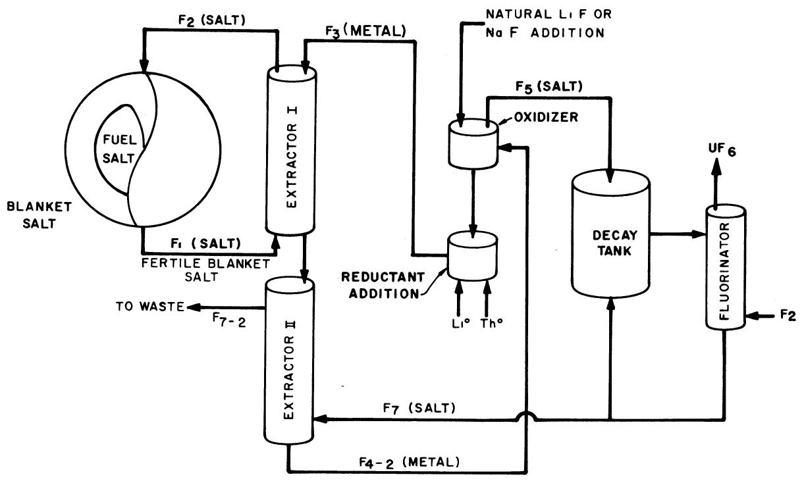
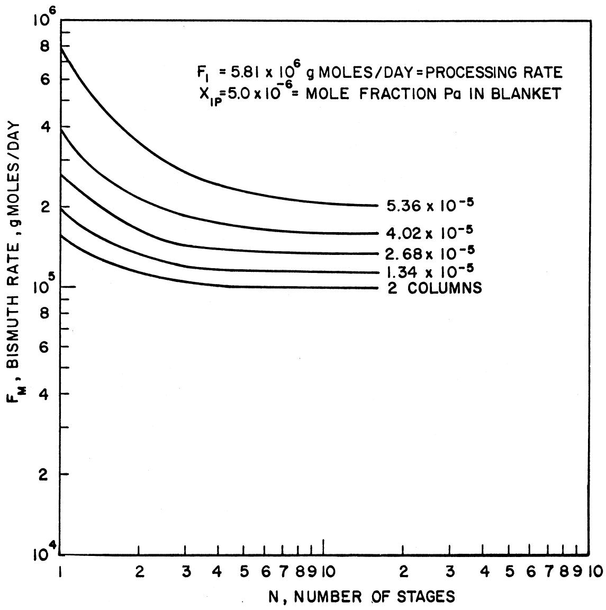
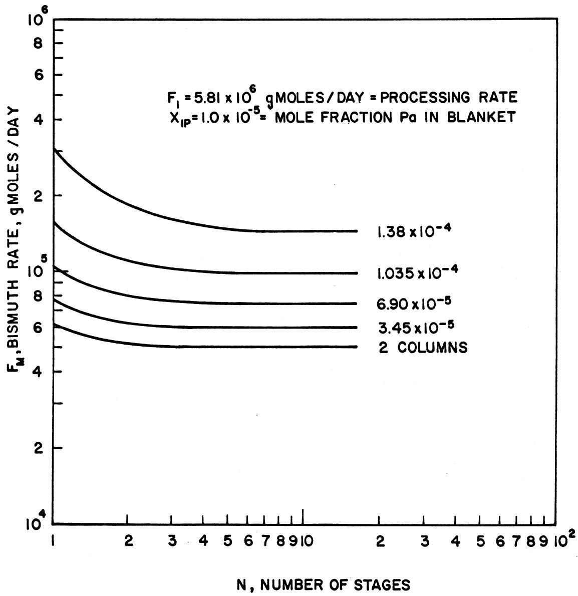
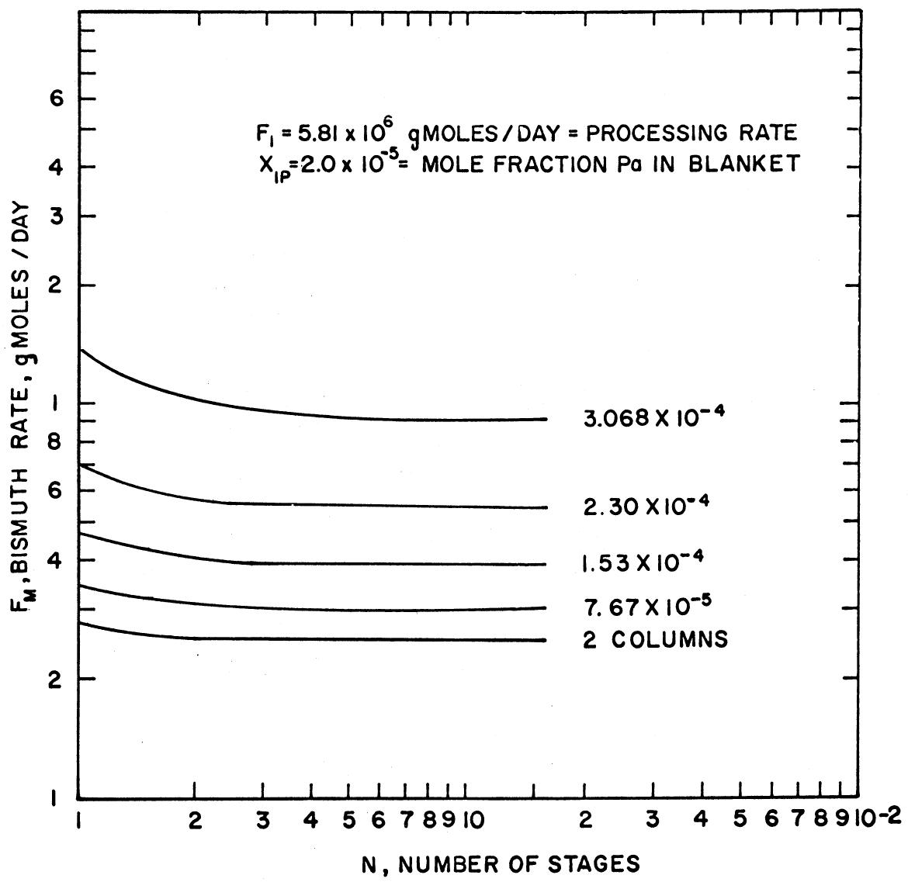
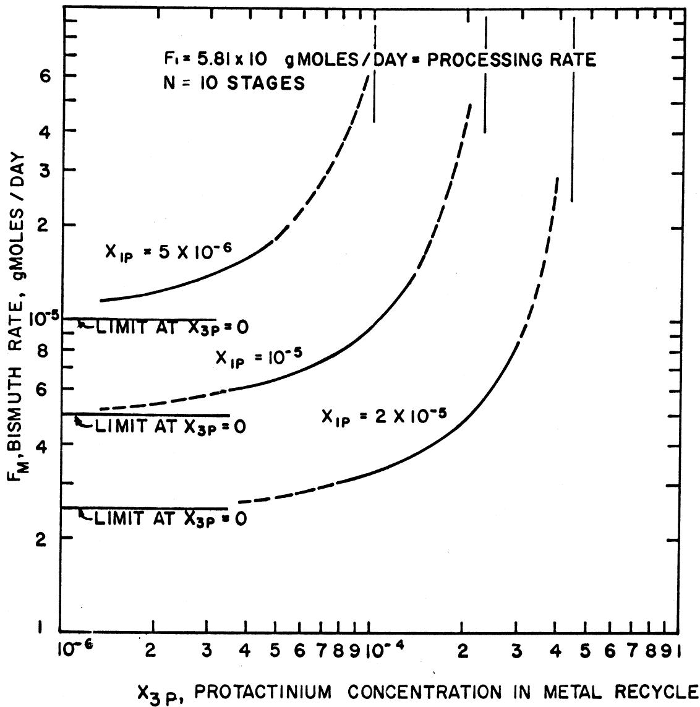
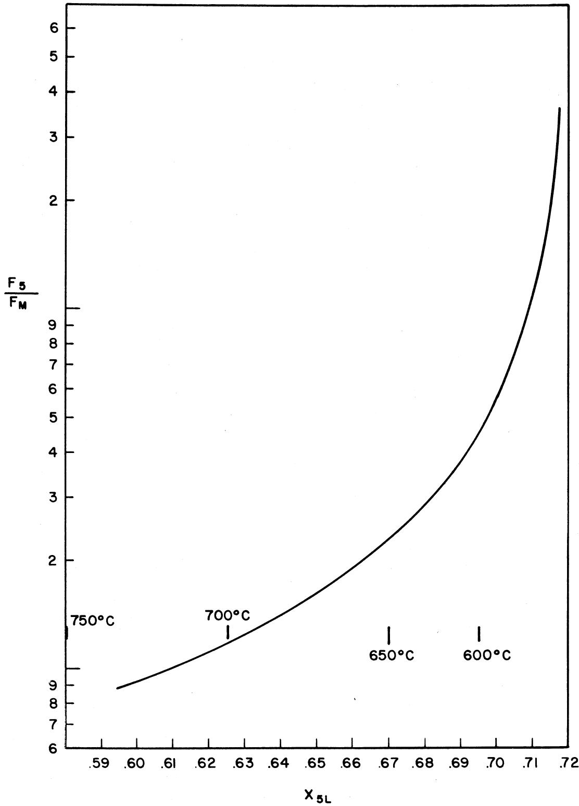
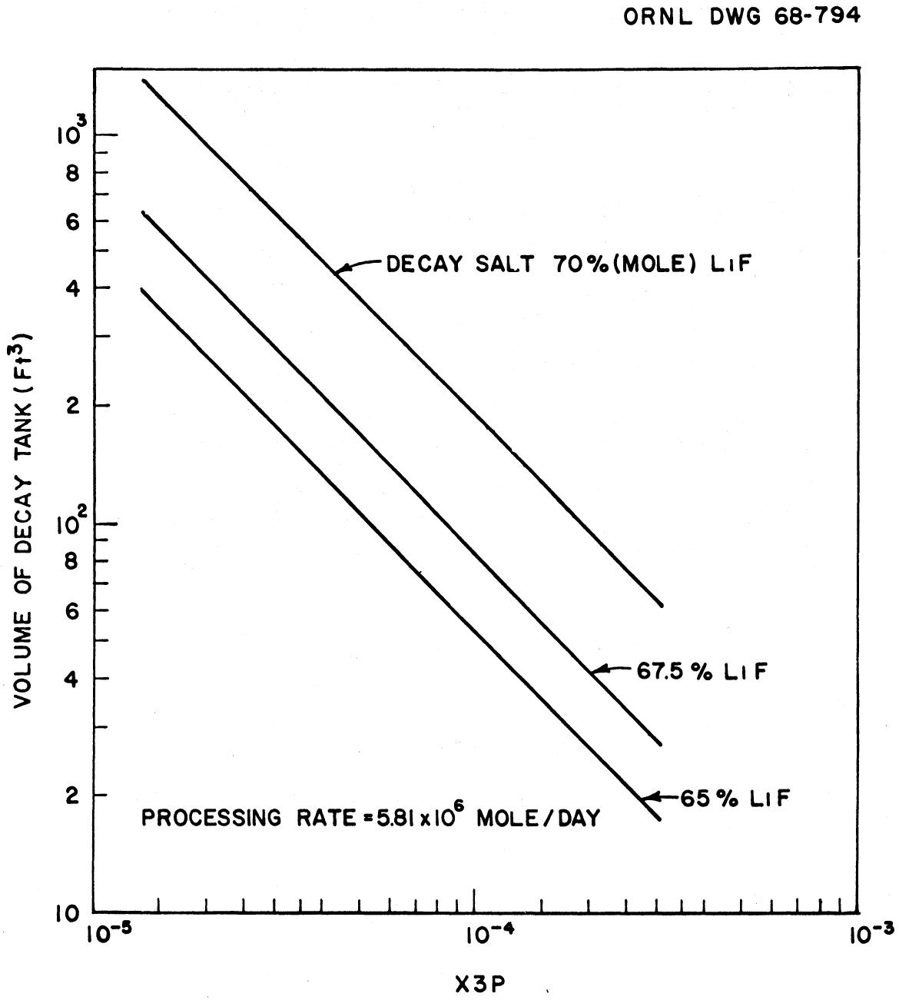

DATE: January 24, 1968

COPY NO.

SUBJECT: Protactinium Removal from Molten Salt Breeder Reactor Fertile Salt

TO: M. W. Rosenthal

FROM: J. S. Watson M. E. Whatley

# ABSTRACT

A study has been made of promising flowsheets for removing protactinium from the blanket of a two region Molten Salt Breeder Reactor by reductive extraction into liquid bismuth. Although none of these flowsheets have been adequately tested, the equilibria data presently available suggest that a relatively simple and economic flowsheet can be used. If interest in two region molten salt reactors persists, further development of the reductive extraction process to obtain better equilibria data, and to demonstrate its engineering feasibility is recommended.

# CONTENTS

Page

ABSTRACT 1

INTRODUCTION 3

DESCRIPTION OF THE FLOWSHEETS. 4

EQUILIBRIUM DATA 9

RESULTS 18

CONCLUSIONS AND RECOMMENDATIONS. 27

REFERENCES 30

DISTRIBUTION 31

# INTRODUCTION

To obtain a high breeding ratio in molten salt reactors, it is necessary to maintain a low protactinium concentration in regions of high neutron flux to avoid capture by the protactinium before it decays to $^{233}\mathrm{U}$ . As presently conceived, a molten salt reactor will use a two-fluid concept with the blanket stream circulating in separate channels through the high flux core region, as well as through the "blanket region" outside the core. The protactinium concentration in this blanket stream can be kept low in two ways. First, the blanket salt can be processed rapidly to remove protactinium soon after it is formed leaving little time for neutron capture. Or secondly, the total blanket salt volume can be large so that any sample of blanket salt spends only a small portion of its circulating cycle within the high neutron flux of the core region. The first approach adds additional processing equipment capital and operation costs to the reactor system, while the second approach requires larger salt inventory and storage costs. In selecting the proper reactor and processing system, the relative costs of these approaches must be compared with each other and with the economic penalty of a lower breeding ratio associated with a higher protactinium concentration. This penalty increases with increasing protactinium concentration, but process (or blanket salt inventory) costs decrease with increasing concentration. Thus, an optimization of the protactinium concentration is needed.

The purpose of this memo is to present initial results calculated for protactinium removal by one process, reductive extraction into liquid bismuth. This is not the only processing scheme which has been considered, but at this time, there are more data available to suggest feasibility of reductive extraction than any other process. This memo presents only calculations of concentrations and flow rates for a given group or class of flowsheets. If interest in two region MSBR's persists, economic optimization of these flowsheets will be made as cost data become available.

# DESCRIPTION OF THE FLOWSHEETS

The basic flowsheet chosen for this study is shown in Fig. 1. Two possible modifications shown in Figs. 2 and 3 are also considered. The flowsheet in Fig. 2 is a modification using two extractors (or salt metal contactors) but requiring a smaller reducer and possibly a smaller decay tank. This is the preferred flowsheet. Figure 3 shows a modification of the process which could be used if development of a reliable reducer proves more difficult than expected.

In the basic flowsheet, shown in Fig. 1., a salt stream from the blanket (labeled stream 1) is contacted with a liquid bismuth stream (labeled stream 3) saturated with thorium metal (approximately 0.003 mole fraction). The bismuth contains a particular lithium concentration such that no thorium or lithium will transfer between the metal and the blanket salt. The protactinium concentration in both phases is much lower than the concentrations of lithium or thorium, so protactinium can thus be treated as a minor component not affecting the lithium-thorium equilibria. If the proper lithium composition is chosen in the metal, then no significant quantity of lithium or thorium will transfer between the phases (i.e. be added or removed from the blanket). This is a desirable condition because with the high processing rate required for the blanket (approximately two blanket volumes per day is considered a likely processing rate) any significant readjustment of the blanket composition will be expensive.

Protactinium, however, does transfer to the metal phase. Thus the salt stream 2 which leaves the extractor and returns to the blanket has a lower protactinium concentration but essentially identical lithium and thorium concentrations as the blanket salt. Likewise, the metal stream 4 leaving the extractor differs from stream 3 going to the extractor only in its higher protactinium concentration.

  
Fig. 1 Basic Flowsheet.

ORNL DWG 68-787

  
Fig. 2 Modified Flowsheet.

  
Fig. 3 "Throw-away" (or no reducer) Flowsheet.

The metal stream from the extractor contains protactinium and flows to a hydrofluorinator where it is oxidized either electrolytically or with an $\mathrm{HF - H_2}$ mixture to convert all of the thorium, protactinium, and lithium to fluorides. Bismuth is not oxidized by this process and is recycled to the extractor after the proper amounts of thorium and lithium reductant are added. This reductant may be added electrolytically by reducing all or part of a recycle salt stream from the decay tank (stream 7).

The salt mixture formed by oxidation of stream 4 can be stored for decay of the protactinium and eventually fluorinated to remove the resulting $^{233}\mathrm{U}$ . However, this mixture would have an undesirably high melting point. The melting point is high because the mixture has a substantially higher thorium composition than the near eutectic mixture used in the blanket. To lower the melting point it is necessary to add lithium to the mixture. This is accomplished by recycling salt from the decay tank through the reducer and then into the oxidizer. This recycle stream is labeled stream 6 in Fig. 1.

One disadvantage of the flowsheet in Fig. 1 is the large amount of protactinium which must be recycled to the reducer from stream 7 and thus enter the metal (stream 3) returning to the extractor. A high protactinium concentration in stream 3 limits the fractional protactinium removal per pass through the extractor since the salt leaving the extractor and returning to the blanket will have a protactinium concentration equal to or greater than that required for equilibrium with stream 3. One method of reducing the protactinium concentration in stream 3 is illustrated in Fig. 2. The metal stream from the extractor (stream 4) is contacted in a second extractor with the salt stream recycled from the decay tank. This transfers most of the recycled protactinium in stream 7 to the metal in stream 4 which is subsequently oxidized. The protactinium then returns to the decay tank without entering stream 3. This appears to be a superior flowsheet. The additional complication of a second extractor appears to be worthwhile due to the reduced protactinium recycle and/or decay tank size restrictions. Both flowsheets will be discussed in more detail in the following sections.

The second modification of the basic flowsheet is shown in Fig. 3. In this flowsheet, fresh lithium-7 and thorium metal are added to bismuth to form stream 3; no reducer is used. The metal stream from the first extractor is again contacted with a recycle from the decay tank, as in Fig. 2, before going to the oxidizer. The recycle salt stream in this case is subsequently discarded to waste. To reduce the liquidus temperature of the decay salt, lithium fluoride is added to the oxidizer. Since this lithium will not return to the reactor blanket, natural lithium can be used. Also, if it will not interfere with protactinium transfer in the second extractor, another alkali metal fluoride, e.g. sodium fluoride, can be used. Some important considerations in this flowsheet are reductant composition control and discard losses of thorium, lithium-7, and protactinium.

# EQUILIBRIUM DATA

The distribution of Th, Li, and Pa between molten fluoride blanket salt and liquid bismuth has been studied by Shaffer and Moulton. Their data are reported as apparent reduction potentials, $\mathbf{E}_0^{\prime}$ . The exchange of two metals, $\mathbf{M}_1$ and $\mathbf{M}_2$ , between the metal and salt phases may be described as follows:

$$
\frac {1}{v _ {1}} M _ {1} F _ {v _ {1}} (\text {s a l t}) + \frac {1}{v _ {2}} M _ {2} ^ {o} (B i) \xleftarrow {\rightarrow} \frac {1}{v _ {1}} M _ {1} ^ {o} (B i) + \frac {1}{v _ {2}} M _ {2} F _ {v _ {2}} (\text {s a l t}) \quad (1)
$$

where $\nu_{1}$ and $\nu_{2}$ are valences of metals $M_{1}$ and $M_{2}$ . The difference between the apparent reduction potentials of $M_{1}$ and $M_{2}$ may be defined as

$$
E _ {O _ {1}} ^ {\prime} - E _ {O _ {2}} ^ {\prime} = \frac {R T}{F} \ln \left\{ \begin{array}{l} \frac {1}{v _ {1}} \\ \frac {X _ {1} (B i)}{\frac {1}{v _ {1}}} \\ X _ {1} (s a l t) \end{array} \frac {X _ {2} (s a l t)}{\frac {1}{v _ {2}}} = \frac {R T}{F} \ln \left[ \begin{array}{l} \frac {1}{v _ {1}} \\ \frac {D _ {1}}{\frac {1}{v _ {2}}} \\ D _ {2} \end{array} \right] \right. \tag {2}
$$

$$
\text {a n d} D _ {i} = \frac {X _ {i (B i)}}{X _ {i (s a l t)}} \tag {3}
$$

where $\mathbf{X} =$ mole fraction

R = gas constant

F = Faraday's constant

D = distribution coefficient

Moulton and Shaffer established a standard value for the apparent reduction potential of one metal (Li), and then from measurements of the distribution of all materials of interest, they assigned values for these metals. The results are summarized in Table 1 for measurements made at $650^{\circ}\mathrm{C}$ . The differences between these numbers, not their absolute values, are important to this study, so the choice of a standard state is not important for our purposes. The apparent reduction potentials differ from the reduction potentials usually defined because mole fractions are used in the place of activities.

Table 1 REDUCTION POTENTIALS $\left(\mathbf{E}_{\circ}^{\prime}\right)$ FROM MOLTEN BLANKET SALT TO LIQUID BISMUTH   

<table><tr><td>Metal</td><td>Eo(volts)</td></tr><tr><td>Li</td><td>-1.80</td></tr><tr><td>Th</td><td>-1.47</td></tr><tr><td>Pa</td><td>-1.32</td></tr><tr><td>U</td><td>-1.28</td></tr></table>

# CALCULATIONS OF FLOW RATES AND COMPOSITIONS

To evaluate the relative merits of these three flowsheets, the flow rates and compositions of all streams were calculated under a wide range of conditions. This section describes the material

balances and equilibrium relations used. For these calculations, the lithium and thorium compositions in the blanket were fixed at 0.72 and 0.28 mole fraction respectively, and the protactinium generation rate was fixed at 10.6 g moles per day. (This corresponds to a 2220 MW(t) reactor.) Protactinium was always considered a minor component of the system and assumed to not affect the thorium and lithium.

With the above assumptions, there are five remaining independent variables in the basic flowsheet which are under our control. The five variables considered in the study of the first flowsheet were processing rate (labeled $\mathbf{F}_1$ ), concentration of protactinium in the blanket ( $\mathbf{X}_{\mathbf{1P}}$ ), number of stages in the extractor ( $\mathbf{N}$ ), composition of protactinium in the bismuth stream to the contactor ( $\mathbf{X}_{\mathbf{3P}}$ ), and the lithium concentration in the decay tank ( $\mathbf{X}_{\mathbf{5L}}$ ). This last variable determines the liquidus temperature of the decay salt.

Several other combinations of five variables could have been selected to describe this system. These particular variables were selected primarily because they appeared to provide a straight forward approach to the calculations. The thorium-lithium composition of the blanket was not treated as a variable because the liquidus curve prevents substantial deviations from the eutectic composition without operating at higher temperatures.

The lithium-thorium concentrations in the metal stream to the extractor $\left(\mathrm{X}_{3\mathrm{L}}\right.$ and $\left.\mathrm{X}_{3\mathrm{T}}\right)$ were adjusted to be in equilibrium with the lithium-thorium composition of the salt $\left(\mathrm{X}_{1\mathrm{L}}\right.$ and $\left.\mathrm{X}_{1\mathrm{T}}\right)$ . Thus, with protactinium being a minor component, no significant change occurred in the lithium-thorium concentrations in the blanket or in the metal. The metal stream was assumed to be saturated in thorium (approximately 0.003 mole fraction). The lithium content of the metal was then calculated from Moulton and Shaffer's equilibrium data at $650^{\circ}\mathrm{C}$ .

$$
\mathrm {X} _ {3} \mathrm {L} = \mathrm {X} _ {4} \mathrm {L} = 0. 0 1 6 \mathrm {X} _ {1} \mathrm {C L} \left(\frac {0 . 0 0 3}{\mathrm {X} _ {1} \mathrm {T}}\right) ^ {1 / 4}. \tag {4}
$$

then

$$
\mathrm {X} _ {3 \mathrm {T}} = \mathrm {X} _ {4 \mathrm {T}} = 0. 0 0 3, \tag {5}
$$

$$
F _ {2} = F _ {1} = F _ {B}, \tag {6}
$$

and

$$
F _ {3} = F _ {4} = F _ {M}, \tag {7}
$$

The distribution of protactinium between the salt phase and a metal phase with this composition is:

$$
D = \frac {X _ {\text {P a - m e t a l}}}{X _ {\text {P a - s a l t}}} = 2 1. 1 \tag {8}
$$

This performance of the extraction column was calculated in a manner suggested by Foust, et al.² for conditions where the equilibrium distribution coefficient is a constant.

$$
\frac {X _ {1} P - X _ {2} P}{X _ {0} P} = \frac {E N + 1 - E}{E N + 1 - 1} \tag {9}
$$

$$
X _ {1 P} - \frac {3 P}{D}
$$

where

$$
E = \left(\frac {F _ {M}}{F _ {B}}\right) D \tag {10}
$$

and $\mathbf{N} =$ number of stages in the extractor.

This equation was solved implicitly for E, and the metal circulation rate was calculated as:

$$
F _ {M} = \frac {F _ {B} E}{D} \tag {11}
$$

The flow rate from the hydrofluorinator and subsequent downstream rates were calculated in the following manner. A lithium

balance around the hydrofluorinator gives:

$$
\mathrm {F} _ {5} \mathrm {X} _ {5} \mathrm {L} = \mathrm {F} _ {\mathrm {M}} \mathrm {X} _ {4} \mathrm {L} + \mathrm {F} _ {6} \mathrm {X} _ {6} \mathrm {L}. \tag {12}
$$

Note that stream 6 is in equilibrium with the metal stream leaving the reducer. Since this metal stream is also in equilibrium (in lithium and thorium) with the blanket, stream 6 has the same lithium-thorium composition as the blanket, e.g.

$$
\mathrm {X} _ {\mathrm {6 L}} = \mathrm {X} _ {\mathrm {1 L}}. \tag {13}
$$

Solving equation (12) for $\mathbf{F}_{6}$

$$
F _ {6} = \frac {F _ {5} X _ {5} L - F _ {M} X _ {3} L}{X _ {1} L} \tag {14}
$$

An overall salt balance around the hydrofluorinator gives

$$
\mathrm {F} _ {\mathrm {6}} + \mathrm {F} _ {\mathrm {M}} \left(\mathrm {X} _ {\mathrm {4 L}} + \mathrm {X} _ {\mathrm {4 T}}\right) = \mathrm {F} _ {\mathrm {5}} \tag {15}
$$

Substituting for $\mathbf{F}_{6}$ , this becomes

$$
F _ {5} = F _ {M} \left(X _ {4 L} - X _ {4 T}\right) + \frac {F _ {5 5 L} - F _ {M 3 L}}{X _ {1 L}} \tag {16}
$$

Solving equation 16 for $\mathbf{F}_{5}$

$$
F _ {5} = \frac {F _ {3} \left(X _ {4 L} + X _ {4 T} - \frac {X _ {4 L}}{X _ {1 L}}\right)}{1 - \frac {X _ {5 L}}{X _ {1 L}}} = \frac {F _ {3} \left[ X _ {4 L} \left(X _ {1 L} - 1\right) + X _ {4 T} X _ {1 L} \right]}{X _ {1 L} - X _ {5 L}} \tag {17}
$$

If protactinium remains a minor component in the decay tank,

$$
\begin{array}{c c} \mathrm {F} & = \mathrm {F} \\ 7 & 5 \end{array} .
$$

Since stream 6 is in equilibrium with stream 3,

$$
\mathrm {X} _ {\mathrm {6 P}} = \mathrm {X} _ {\mathrm {3 P}} / \mathrm {D}.
$$

An overall balance around the reducer shows that

$$
F _ {6} = F _ {5} - F _ {M} \left(X _ {4 L} + X _ {3 T}\right). \tag {18}
$$

A protactinium balance around the oxidizer gives

$$
\mathrm {X} _ {5} \mathrm {P} = \frac {\mathrm {F} _ {\mathrm {M}} \mathrm {X} _ {4} \mathrm {P} + \mathrm {F} _ {6} \mathrm {X} _ {6} \mathrm {P}}{\mathrm {F} _ {5}}, \tag {19}
$$

and a protactinium balance around the reducer gives

$$
\mathrm {X} _ {7} \mathrm {P} = \frac {\mathrm {F} _ {\mathrm {M}} \mathrm {X} _ {3} \mathrm {P} + \mathrm {F} \mathrm {X} _ {6} \mathrm {E} _ {6} \mathrm {P}}{\mathrm {F} _ {5}}. \tag {20}
$$

The fraction of protactinium entering the decay tank which decays before going to the reducer is defined as $\mathbf{F}_{\mathbb{R}}$ , and

$$
F _ {R} = \frac {X _ {5} P - X _ {7} P}{X _ {5} P}. \tag {21}
$$

The gram moles of salt in the decay tank is then

$$
\mathrm {M} _ {\mathrm {D}} = \frac {\mathrm {F} _ {5} \mathrm {F} _ {\mathrm {R}}}{\lambda_ {\mathrm {P a}} \left(1 - \mathrm {F} _ {\mathrm {R}}\right)} \tag {22}
$$

where $\lambda_{\mathrm{Pa}} =$ protactinium decay constant $= 0.025$ days $^{-1}$ . The lithium-thorium composition in the decay tank will have to be near the blanket composition to maintain reasonable melting temperatures, so the density of the decay tank salt can be assumed to be close to that of the blanket salt. Then the volume of the decay tank can be estimated

as

$$
V _ {D} = \frac {M _ {D}}{1 2 7 5} \tag {23}
$$

when $\mathbf{M}_{\mathbf{D}}$ is in gram moles and $\mathbf{V}_{\mathbf{D}}$ in cubic feet.

In calculating the flow rates and compositions for the modified flowsheet (Fig. 2), it is not convenient to specify $\mathbf{X}_{3^{\mathbf{P}}}$ since this value is quite low. Instead of specifying $\mathbf{X}_{3^{\mathbf{P}}}$ and $\mathbf{X}_{5^{\mathbf{P}}}$ , we chose to specify $\mathbf{F}_{5}$ and $\mathbf{V}$ . Again any five independent variables could have been chosen including the combination used in the basic flowsheet calculations. But at this point, it seemed desirable to change.

A simplifying assumption was made in the second extractor. No lithium or thorium was allowed to transfer between phases. This is a satisfactory assumption if the decay tank composition is essentially that of the blanket salt. The requirement of a low melting salt in the decay tank will force us to operate where this assumption is justified. Calculations were made for only one stage in the second extractor. Any number of stages may be used, but these results will show that one stage is adequate for most purposes.

Calculations of the metal flow rate and compositions in the first column were made just as they were made in the basic flowsheet, except a lower value was used for $\mathbf{X}_{3} \mathbf{P}$ . As a first guess $\mathbf{X}_{3} \mathbf{P}$ was assumed to be zero and $\mathbf{F}_{\mathbf{M}}$ and $\mathbf{X}_{4} \mathbf{P}$ then calculated as before. The protactinium concentration in the stream to the decay tank can be calculated by noting that at steady state, the rate of decay of protactinium in the decay tank must be equal to the rate of extraction in the first column. Or

$$
F _ {M} \left(X _ {4 P} - X _ {3 P}\right) = F _ {5} \left(X _ {5 P} - X _ {7 P}\right). \tag {24}
$$

Dividing both sides of equation 24 by $\mathbf{F}_{5}$ and solving for $\mathbf{X}_{5}\mathbf{P}$ gives

$$
\mathrm {X} _ {5} \mathrm {P} = \left(\frac {\mathrm {X} _ {4} \mathrm {P} - \mathrm {X} _ {3} \mathrm {P}}{\mathrm {F} _ {\mathrm {R}}}\right) \left(\frac {\mathrm {F} _ {\mathrm {M}}}{\mathrm {F} _ {5}}\right). \tag {25}
$$

From the definition of $\mathbf{F}_{\mathbb{R}}$ given in equation 22, one can thus evaluate $\mathbf{x}_{7}\mathbf{P}$ .

$$
\mathrm {X} _ {7} \mathrm {P} = \mathrm {X} _ {5} \mathrm {P} (1 - \mathrm {F} _ {\mathrm {R}}). \tag {26}
$$

A protactinium balance around the second extractor gives

$$
\mathrm {X} _ {7 \mathrm {P}} - \mathrm {X} _ {7 \mathrm {P} 2} = \frac {\mathrm {F} _ {\mathrm {M}}}{\mathrm {F} _ {5}} \left(\mathrm {X} _ {4 \mathrm {P} 2} - \mathrm {X} _ {4 \mathrm {P}}\right). \tag {27}
$$

For a single stage (second) extractor

$$
\mathrm {X} _ {7} \mathrm {P} _ {2} = \mathrm {X} _ {4} \mathrm {P} _ {2} / \mathrm {D}. \tag {28}
$$

Combining these last two equations and solving for $\mathbf{X}_{7} \mathbf{P}_{2}$ ,

$$
\mathrm {X} _ {\mathbf {7 P} 2} = \frac {\mathrm {X} _ {\mathbf {7 P}} + \mathrm {X} _ {\mathbf {4 P}} \left(\frac {\mathrm {F} _ {\mathbf {M}}}{\mathrm {F} _ {5}}\right)}{1 + \frac {\mathrm {D F} _ {\mathbf {M}}}{\mathrm {F}}} \tag {29}
$$

The salt rate to the oxidizer can be obtained from an overall balance around the reducer

$$
F _ {6} = F _ {5} - F _ {M} \left(X _ {4} T + X _ {4} L\right). \tag {30}
$$

A protactinium balance around the reducer gives

$$
F _ {5} X _ {7} P _ {2} = F _ {M} X _ {3} P + F _ {6} X _ {6} P = F _ {M} X _ {3} P + F _ {6} \frac {X _ {3} P}{D}. \tag {31}
$$

Combining equations 30 and 31 to eliminate $\mathbf{F}_{5}$ and solving for $\mathbf{X}_{3}\mathbf{P}$ ,

$$
\mathrm {X} _ {3} \mathrm {P} = \frac {\mathrm {F} _ {5} \mathrm {X} _ {7} \mathrm {P} _ {2}}{\mathrm {F} _ {\mathrm {M}} + \frac {\mathrm {F} _ {6}}{\mathrm {D}}} \tag {32}
$$

In calculations of the metal rate and compositions in the first column, $\mathbf{X}_{3^{\mathbb{P}}}$ was assumed to be zero. If the new value just calculated for $\mathbf{X}_{3^{\mathbb{P}}}$ is large enough (relative to $\mathbf{X}_{4^{\mathbb{P}}}$ ) to affect the calculations for the first column, those calculations were repeated using the new value of $\mathbf{X}_{3^{\mathbb{P}}}$ . The entire process was then repeated to obtain a new value of $\mathbf{X}_{3^{\mathbb{P}}}$ to be compared with the previous result. This process was repeated until $\mathbf{X}_{3^{\mathbb{P}}}$ was known accurate enough to determine the performance of the first extractor.

Once an accurate value for $\mathbf{X}_{\mathbf{\Phi}_3\mathbf{P}}$ was obtained, the remaining compositions could be evaluated directly as follows:

$$
\mathrm {X} _ {\mathrm {6 P}} = \mathrm {X} _ {\mathrm {3 P}} / \mathrm {D}, \tag {33}
$$

$$
\mathrm {X} _ {4} \mathrm {P} _ {2} = \mathrm {X} _ {4} \mathrm {P} + \mathrm {F} _ {5} \left(\mathrm {X} _ {7} \mathrm {P} - \mathrm {X} _ {7} \mathrm {P} _ {2}\right) / \mathrm {F} _ {\mathrm {M}}, \tag {34}
$$

and

$$
\mathrm {X} _ {5 \mathrm {L}} = \left(\mathrm {F} _ {6} \mathrm {X} _ {1 \mathrm {L}} + \mathrm {F} _ {\mathrm {M} _ {4} \mathrm {L}}\right) / \mathrm {F} _ {5}. \tag {35}
$$

Flow rates and compositions in the "no reducer" flowsheet shown in Fig. 3 may be estimated from a special case of the second flowsheet. That is when $\mathbf{X}_{\mathbf{3}^{\mathbf{P}}}$ is zero (or essentially zero) and when $\mathbf{F}$ has the proper value. If the decay tank salt is to have the same liquidus temperature as the blanket,

$$
F _ {5} = F _ {M} \left(\frac {X _ {3} T}{X _ {1} T}\right). \tag {36}
$$

The protactinium loss is that contained in stream F $\mathbf{F}_{7-2}$ , e.g. $\mathbf{F} \times_{57} \mathbf{P}_{2}$ . The fraction of protactinium loss is the loss rate divided by the production rate or

$$
\text {P a} \quad \text {l o s s} = \frac {\mathrm {F} _ {5} \times 7 \mathrm {P} _ {2}}{1 0 . 6}. \tag {37}
$$

The lithium-7 and thorium losses will be respectively (in g moles/day):

$$
\operatorname {L i} - 7 \operatorname {l o s s} = F _ {3} X _ {3} L \tag {38}
$$

and Th loss $= \mathbf{F}_{3}\mathbf{X}_{3}\mathbf{T}$ (39)

# RESULTS

These relations were coded for automatic computation on the CDC-1604 computer, and the results are shown in Figs. 4 through 9. All of these calculations were based upon a single processing rate of $5.81 \times 10^{6} \mathrm{~g}$ moles/day of blanket salt. This is $4750 \mathrm{ft}^{3}/$ day (25 gal/min) or approximately two blanket volumes per day.

Figures 4, 5, and 6 show the metal flow rate in the first extractor given in g moles/day (multiply by $3.9 \times 10^{-6}$ to get gal/min) as a function of the number of stages in the extractor. Three different protactinium concentrations in the blanket were considered, $5 \times 10^{-6}$ , $10 \times 10^{-6}$ , and $20 \times 10^{-6}$ . These results are shown respectively in Figs. 4, 5, and 6. These blanket concentrations may be compared with the value of approximately $80 \times 10^{-6}$ mole fraction which would result in the blanket of a "no-Pa-removal" reactor system which has been considered. In the basic flowsheet (shown in Fig. 1), a substantial fraction of protactinium is recycled back into this metal stream. The recycled protactinium concentration $\mathbf{X}_{\mathbf{\Phi}_3^{\mathbf{P}}}$ is a parameter in Figs. 4 through 6. In the modified flowsheets $\mathbf{X}_{\mathbf{\Phi}_3^{\mathbf{P}}}$ is reduced to or near zero and the corresponding curves for these flowsheets are also shown in these figures.

Raising the protactinium concentration in the blanket raises the equilibrium (or maximum) metal loading and, for a given protactinium generation rate, lowers the required bismuth rate. Also lowering the protactinium concentration in the metal recycled to the extractor, $\mathbf{X}_{\mathbf{3P}}$ , improves the extractor performance and lowers the required metal flow rate. In the basic flowsheet, shown in

ORNL DWG 68-789

  
Fig. 4 Metal Rate for Processing a Blanket with $5 \times 10^{-6}$ Mole Fraction Protactinium.

ORNL DWG 68-790

  
Fig. 5 Metal Rate for Processing a Blanket with $1 \times 10^{-5}$ Mole Fraction Protactinium.

  
Fig. 6 Metal Rate for Processing a Blanket with $2 \times 10^{-5}$ Mole Fraction Protactinium.

Fig. 1, this is accomplished at the expense of decay tank volume. Increasing the number of stages in the contactor also improves the performance of the extractor and lowers the required metal rate, but Figs. 4 through 6 show that the advantages gained here will be relatively small after two or three stages. In general, one can expect metal flow rates to be in the neighborhood of $0.3 \times 10^{5}$ to $1 \times 10^{5} \mathrm{~g}$ moles/day or 0.1 to $0.4 \mathrm{gal} / \mathrm{min}$ depending upon which flowsheet is adopted and upon the protactinium concentration accepted in the blanket. This rate is important because it affects the extractor design, but even more importantly, this rate sets the reducer capacity (or lithium-7 and thorium consumption in the "no-reducer" flowsheet). A relatively low metal rate is desirable since reducer anode surface may be expensive; this is one of the reasons flowsheets 2 and 3 are attractive.

The limited bismuth rates for a large number of stages are summarized in Fig. 7. Here the metal rate is plotted as a function of the protactinium concentration in the metal recycled back to the extractor, $\mathbf{X}_{3^{\mathbf{P}}}$ , for each of the three blanket concentrations considered. The metal rate, or course, approaches infinity as $\mathbf{X}_{3^{\mathbf{P}}}$ approaches the concentration which is in equilibrium with the blanket salt, $\mathbf{X}_{1^{\mathbf{P}}}$ . The asymptotes are marked on Fig. 7. Similarly there is a horizontal asymptote for each of these curves which corresponds to an $\mathbf{X}_{3^{\mathbf{P}}}$ of zero. These asymptotes are also marked. The two extractor flowsheets, Figs. 2 and 3, lower the recycled protactinium concentration in the metal and thus reduces the bismuth flow rate to, or essentially to, the horizontal asymptote.

The salt recycle rate to the oxidizer is determined by the desired liquidus temperature. (The "no-reducer" flowsheet shown in Fig. 3 is an exception since there is no recycle.) As noted earlier, the salt which would be formed by direct oxidization of stream 4 (or 4-2) will be richer in thorium than the reactor blanket salt. In order to avoid a high liquidus temperature, this salt is

  
Fig. 7 Metal Rate for a Large Number of Stages.

mixed with recycle salt from the reducer which has the same composition, in lithium-thorium, as the blanket. Figure 8 shows the decay tank composition, $\mathrm{X}_{5^{\mathrm{L}}}$ , as a function of the ratio of the salt recycle rate, $\mathrm{F}_{5}$ or $\mathrm{F}_{7}$ , to the metal rate, $\mathrm{F}_{\mathrm{M}}$ . Obviously with an infinite recycle rate, the lithium composition in the recycle salt will only approach the blanket composition. Thus it is necessary to operate with a lower lithium composition in the decay tank than in the blanket. (Again the "no-reducer" flowsheet is an exception to this rule). This will probably mean a higher liquidus temperature for the decay salt. Just how high the liquidus temperature is allowed to go is a question of economics. Lowering the liquidus temperature requires higher salt recycle rates and, at least for the basic flowsheet shown in Fig. 1, a larger decay tank. Raising the liquidus temperature increases corrosion and eventually creep rates which may raise the cost of the decay tank because of thicker walls, more expensive materials of construction, and/or shorter tank life. The approximate liquidus temperatures corresponding to the various lithium compositions are indicated in Fig. 8.

One disadvantage of the basic flowsheet, Fig. 1, is the coupling of the decay tank volume with the recycle metal composition, $\mathbf{X}_{3^{\mathbf{P}}}$ . This connects the bismuth rate and thus the reducer size with the decay tank volume. The required tank volume is proportional to $\mathbf{X}_{3^{\mathbf{P}}}^{-1}$ as shown in Fig. 9. The use of a second extractor as suggested in the modified flowsheet of Fig. 2 in effect uncouples the metal rate and decay tank volume because the first extractor operates near the horizontal asymptotes of Fig. 7, and the metal rate is little affected by $\mathbf{X}_{3^{\mathbf{P}}}$ . The size of the decay tank is governed by heat removal considerations rather than by fractional decay considerations. There will be 6.7 MW of heat generated in the blanket from protactinium decay. This suggests a minimum decay tank volume of a few hundred cubic feet.

The important considerations unique to the "no-reducer" flow-sheet are lithium-7 and thorium consumption and protactinium losses.

  
Fig. 8 Composition of Recycle Salt.

  
Fig. 9 Volume of the Decay Tank.

The lithium-7 loss is $0.0037\mathrm{F_M}$ or 370 and 90 g moles/day (5.7 and 1.4 lbs/day) respectively for blanket protactinium concentrations of $5\times 10^{-6}$ and $20\times 10^{-6}$ mole fraction. The corresponding thorium losses would be $0.003\mathrm{F_M}$ or 150 and 38 lbs/day. These losses would be tolerable. With 400 cubic feet decay tank, the protactinium loss would be less than $0.02\%$ of that produced in the reactor.

# CONCLUSIONS AND RECOMMENDATIONS

We have looked at three conceptual blanket processes and evaluated the pertinent flow rates and compositions to study the feasibility of each process. Although all three flowsheets appear feasible and even attractive, no step in the processes has yet been satisfactorily developed or demonstrated. The reduction step appears most likely to present difficulty, so a "no reduction" flowsheet was included in the study for an alternate approach. No materials of construction for the salt-metal (and possibly HF) containing vessels has been demonstrated, and all of the equilibrium relations used in this study need to be checked to obtain more reliability. One parameter which has been tacitly assumed to be favorable is the protactinium solubility in bismuth. This is expected to be near or above the solubility of thorium (0.003 mole fraction), but no data are available to confirm this. The highest protactinium concentration reached in this study was 0.0004 mole fraction. Hopefully, the solubility will be at least this high.

Despite these unknown or untested aspects of the flowsheets, there are no indications that any of the steps are impossible. All three flowsheets appear to provide promising approaches to blanket processing for two region molten salt reactor systems.

The "modified" flowsheet shown in Fig. 2 is the preferred flowsheet, and further studies and development work for two region processing should be aimed at this system. This "modified" flowsheet provides a minimum size reducer and bismuth rate while placing little

restriction on the decay tank volume; the decay tank volume is governed by heat removal considerations. The protactinium concentration in the blanket is governed by the metal rate only and not by the decay tank size. This flowsheet also results in relatively low protac-tinium concentrations in the reducer. Less radioactivity in the reducer may mean lower maintenance costs since access for repairs may become less restrictive.

An additional attractive feature of the "modified" flowsheet is that the processing plant can be evolved from a "no-reducer" system. That is, if development of a reliable reducer is more difficult than expected, the system can first be operated in the manner shown in Fig. 3 with no reducer. Instead fresh lithium-7 and thorium metal may be purchased and consumed in the process. Then when a suitable reducer (or combination electrochemical reducer-oxidizer) becomes available, it can be installed, and the system can be operated in the manner shown in Fig. 2. The "throw-away" or "no-reducer" concept is viewed as an alternative or interim mode of operation for the system.

Although the system can be operated with "throw-away", vigorous development of a reducer is still recommended. In addition to having no inherent material consumption, the flowsheet shown in Fig. 2 (with reducer) allows a large degree of self-regulation which is not provided by the "no-reducer" flowsheet of Fig. 3. The closed loop in the process insures that no lithium (or thorium) will be continuously removed from the blanket. That is, if due to an error in the reducer, the metal stream 3 has a low lithium concentration, this error cannot persist indefinitely. At first lithium will be extracted from the blanket. But as this lithium accumulates in the process streams, the recycle will raise the lithium concentration in F and correct the error. If the total process plant volume is small compared to the blanket salt volume, lithium-thorium concentration control will be largely self-regulating.

If interest in two region reactors persists, further pursuit of the chemical and engineering uncertainties in this process is recommended. More chemical data are needed to confirm all of the equilibrium relations involved (including solubilities) and to test or develop materials of construction. Engineering studies should include: (1) an economic evaluation and optimization of the flowsheet (to the extent possible at that time); (2) testing of the reductive extraction, hydrofluorination, and reduction steps as single units (with uranium as a "stand-in" for protactinium) to demonstrate their feasibility and develop equipment designs; and (3) demonstration of entire flowsheet in an integrated unit.

Much of these efforts will be also applicable to processing of molten salt reactors with a single fluid core if a separate blanket stream is still used or if reductive extraction is selected as a processing step for the fissile-fertile core salt.

# REFERENCES

1. "Molten-Salt Reactor Program Semiannual Progress Report" for Period Ending February 28, 1967, ORNL-4119, July 1967, pp. 150-2.   
2. Foust, A. S., Wengel, L. A., Clump, C. W., Maus, F., and Anderson, L. B., Principles of Unit Operations, John Wiley and Sons, Inc., New York 1964, p. 77.   
3. Briggs, R. B., "Summary of the Objectives, the Design, and a Program of Development of Molten-Salt Breeder Reactors," ORNL-TM-1851, June 12, 1967.

# DISTRIBUTION

1. L. G. Alexander   
2. C. F. Baes   
3. C. J. Barton   
4. S. E. Beall   
5. M. Bender   
6. E. S. Bettis   
7. R.E.Blanco   
8. J. O. Blomeke   
9. E. G. Bohlmann   
10. C. J. Borkowski   
11. G.E. Boyd   
12. R. B. Briggs   
13. S. Cantor   
14. W. L. Carter   
15. C. I. Cathers   
16. E. L. Compere   
17. F. L. Culler, Jr.   
18. S. J. Ditto   
19. W. P. Eatherly   
20. D. E. Ferguson   
21. L. M. Ferris   
22. J. H. Frye, Jr.   
23. W. R. Grimes   
24. A. G. Grindell   
25. H. E. Goeller   
26. B. A. Hannaford   
27. P. N. Haubenreich   
28. J.R.Hightower, Jr.   
29. H. W. Hoffman   
30. R. W. Horton   
31. W.H.Jordan   
32. P. R. Kasten   
33. R.J.Kedl   
34. M. T. Kelley   
35. S. S. Kirslis

36. J.A.Lane   
37. M. S. Lin   
38. R. B. Lindauer   
39. R. N. Lyon   
40. H. G. MacPherson   
41. R.E.MacPherson   
42. H. E. McCoy   
43. H. F. McDuffie   
44. L. E. McNeese   
45. R. L. Moore   
46. D. Moulton   
47. J. P. Nichols   
48. E. L. Nicholson   
49. L.C.Oakes   
50. A. M. Perry   
51. J. T. Roberts   
52. M. W. Rosenthal   
53. C. E. Shilling   
54. Dunlap Scott   
55. J.H.Shaffer   
56. M. J. Skinner   
57. H. H. Stone   
58. R. A. Strehlow   
59. R.E.Thoma   
60. J. S. Watson   
61. J.R.Weir   
62. A. M. Weinbery   
63. M. E. Whatley   
64. J.C. White   
65. Gale Young   
66. E. L. Youngblood

67-68. Central Research Library

69. Document Reference Section

70-71. Laboratory Records

72. Laboratory Records-RC