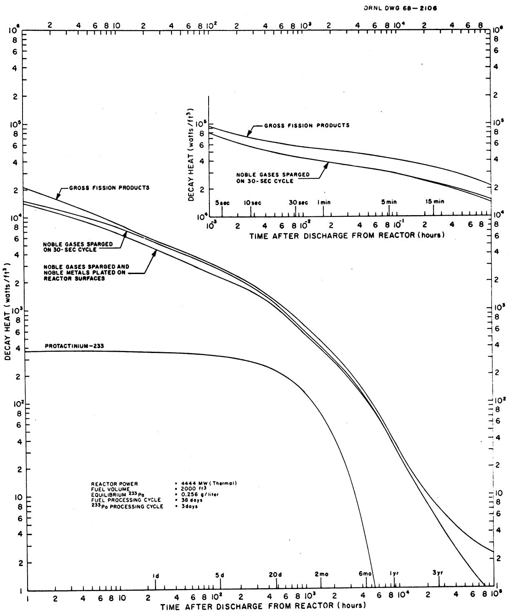
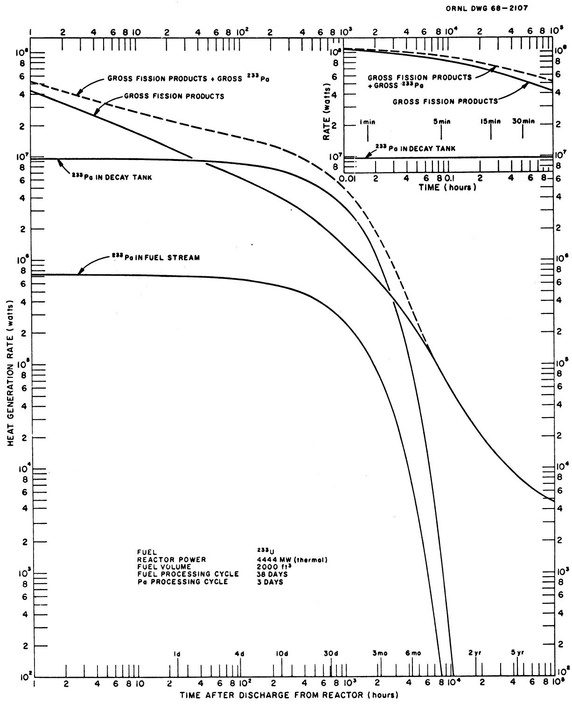

DATE: March 25, 1968

SUBJECT: Decay Heat Generation by Fission Products and 233Pa in a Single-Region Molten Salt Reactor

TO: M. W. Rosenthal and E. S. Bettis

FROM: W. L. Carter

COPY NO.

# ABSTRACT

Fission product and $233\mathrm{Pa}$ decay heat and concentrations have been calculated for a single-region MSR for reactor equilibrium conditions and as a function of decay cooling time. The MSR is a 2000-Mw(e) system containing 2000 ft³ of LiF-BeF₂-ThF₄⁻²³UF₄ fuel. Three operating modes were studied: (1) inert gas sparging to remove noble gases from the fuel, (2) inert gas sparging plus removal of noble metals by reaction with surfaces of the heat exchanger loop, and (3) removal of all fission products by chemical processing only. In all three cases the fuel was being processed in a chemical plant on a 38-day cycle. Tabular and graphic data are presented for 32 fission product elements and $233\mathrm{Pa}$ for decay times up to 11 years.

# INTRODUCTION

A primary concern in the design of a nuclear reactor is the removal of the afterheat when the reactor is shut down. The problem becomes acute when it is assumed that the shutdown is unscheduled due to an emergency that has disrupted the normal cooling system of the reactor. In the case of the Molten Salt Reactor, this requires draining the fuel into a receiver where emergency cooling is provided. Proper design of this emergency cooling system is therefore essential to safe operation of the reactor.

This study has been carried out to determine the afterheat as a function of time after fuel has been drained from the reactor. The reactor system considered is a 2000-Mw(e), single-region MSR containing 2000 ft³ of LiF-BeF₂-ThF₄⁻²³³UF₄ fuel; the composition of the fuel carrier is respectively 52, 36, 12 mole %. In addition to sufficient 233U for criticality, the fuel contains about 0.256 g/liter of 233Pa plus fission products. It was assumed that the reactor had been operating long enough so that fission products were present in equilibrium concentrations for the chosen processing conditions. Three processing modes were considered in determining fission product concentrations: (1) all fission products removed on a 38-day cycle through the processing plant; (2) noble gases removed by sparging and the remaining fission products removed by chemical processing; and (3) noble gases sparged, noble metals plated out on reactor surfaces, and the remaining nuclides removed by chemical processing.

Protactinium is removed on a three-day cycle in a separate processing step. About $7\%$ of the $233\mathrm{Pa}$ (14.5 kg) is in the circulating fuel; the remainder (190.5 kg) is held in the processing plant. The system has a breeding ratio of 1.076.

Heat generation and inventory data were calculated for both fission products and $233\mathrm{Pa}$ from equilibrium to about 11 year's decay. At equilibrium gross fission products and $233\mathrm{Pa}$ in the fuel are generating about 289.4 Mw and 0.74 Mw, respectively; an additional 9.7 Mw is being generated by $233\mathrm{Pa}$ in the processing plant. When gases are sparged in the reactor, the fission product contribution is reduced to 257 Mw, and, when both noble gases and noble metals are absent, the rate is further reduced to 255.8 Mw. The fission product concentrations for these three processing modes are respectively 3.08, 1.94, and 1.48 g/liter.

The principal source of heat is the short-lived fission products having half-lives less than a few minutes. Hence, there is an initial large decrease in the heat generation rate when fissioning ceases. In the first 2 min after shutdown, the rate is down by a factor of 3, in 18 min by a factor of 4.5, in 1 hr by a factor of 7, and in 10 hr by a factor of 17. Protactinium-233, which has a 27.4-day half-life, does not show a significant decrease in heat production until about 15 to 20 days after shutdown.

Extensive tables and graphs in later sections of this memorandum describe more completely the thermal characteristics of this fuel for cooling times up to about 11 years.

A further interesting result of this study is the importance of just a few fission products in the total heat generation rate. For example, at equilibrium, Rb, Cs, and Sb, respectively, account for 22.8, 21, and $17.3\%$ of fission product decay heat. At 1 hour's decay, the figures are $18.6\%$ I, $13\%$ Kr, $10.5\%$ La, and $9.6\%$ Y; at 10 hour's decay, the values are $23.8\%$ I, $16.5\%$ La, and $11.4\%$ Y. For much longer decay times (e.g., 125 days), about $80\%$ of the decay heat is due to Nb, Zr, Pr, and Y.

In the period two days to five months after reactor shutdown, more heat is being generated by the massive amount of $233\mathrm{Pa}$ in the processing plant than by decay of gross fission products (see Fig. 2, page 13).

# METHOD OF CALCULATION

Equilibrium concentrations of fission products were calculated by the HTGN code written by Watson. $^{1}$ This program treats 290 fission product nuclides and accounts for their removal by chemical processing, neutron capture, decay, gas sparging, and sorption on reactor surfaces. Production is a function of the fission rate and characteristic yield. Decay heat and concentrations at equilibrium and after shutdown were calculated by the CALDRON code written by Carter. $^{2}$ This program treats 469 nuclides and was written to describe the behavior of fuel in a chemical processing plant. Beta heat, gamma heat, and concentration are calculated for each of the 469 nuclides as a function of time. The program accounts for branching in the decay chains, and, in the case of chemical processing, allows the removal and accumulation of specified nuclides in various process operations.

# CHARACTERISTICS OF THE REACTOR

The molten salt reactor for which these calculations were made has the following characteristics:

<table><tr><td>Fuel</td><td>LiF-BeF2-ThF4-233UF4</td></tr><tr><td>Composition of carrier salt, mole %</td><td>52-36-12</td></tr><tr><td>Power, Mw(th)</td><td>4444</td></tr><tr><td>Fuel volume in core, ft3</td><td>1333</td></tr><tr><td>Total circulating fuel volume, ft3</td><td>2000</td></tr><tr><td>Processing cycle time for fission products, days</td><td>38</td></tr><tr><td>Processing cycle time for 233Pa, days</td><td>3</td></tr><tr><td>233Pa inventory in circulating fuel, kg</td><td>14.5</td></tr><tr><td>233Pa inventory in processing plant, kg</td><td>190.5</td></tr><tr><td>Breeding ratio</td><td>1.076</td></tr></table>

# AVERAGE LIFETIMES OF NOBLE GASES AND NOBLE METALS

It is well established that for good breeding performance the fission product xenon must be quickly removed from the fission zone. This is accomplished by sparging the circulating fuel with an inert gas; this action also removes krypton. Competing with sparging for removal of noble gas atoms are radioactive decay, neutron capture, diffusion into the graphite moderator, and chemical processing. Studies and experience in MSRE operation indicate that the sparging rate needs to be sufficiently vigorous that the average residence time of a gas atom in the fuel is only about 50 sec for maintaining tolerable xenon poisoning.

Secondly, there is a group of fission products (Se, Nb, Mo, Tc, Ru, Rh, Pd, Ag, In, Te) whose behavior in the system is not entirely understood, but it is believed that these elements distribute throughout the circulating fuel loop by reacting with or otherwise attaching themselves to surfaces contacted by the fuel. This group is known as the noble metals. Competing events for the removal of the noble metals are radioactive decay, neutron capture, and chemical processing. The average life-time for this "plating out" effect is probably different for each of these elements, and the data are not available for determining the values very accurately. MSRE data for fission product distribution in the reactor system were examined by Watson, who concluded that a value of 50 hr is reasonable for the average lifetime of the noble metals. The scatter and paucity of the data did not warrant assigning a characteristic lifetime to each element; so the 50-hr figure was assumed to apply to all.

# REACTOR OPERATING CONDITIONS FOR WHICH DECAY HEAT RATES ARE COMPUTED

# Fission Products

The three following situations were considered in the HTGN and CALDRON computations for determining the equilibrium heat and afterheat rates for decaying fission products:

1. Gross amounts of fission products in the fuel, that is, no sparging of noble gases and no plating out of noble metals.   
2. Noble gases sparged on 50-sec cycle but no plating out of noble metals.   
3. Noble gases sparged on 50-sec cycle and noble metals plated out on 50-hr cycle.

In each case equilibrium concentrations were calculated for a 38-day chemical processing cycle and the characteristic losses due to neutron absorption and radioactive decay. However, in the case of the gases, the computer program does not provide for removal due to diffusion into the graphite.

In the computer program treatment of Cases 2 and 3, sparging and plating out has the effect not only of removing the noble gases and noble metals but also of removing daughter products of these elements. While this treatment is quite proper for gases which are quantitatively removed from the fuel environment, it is not as rigorous for noble metal decay products. Noble metals attached to reactor, piping, and heat exchanger surfaces are always in contact with fuel, and decay products, which are not noble to these surfaces, might reenter the fuel stream. The calculations on Cases 2 and 3 include only the daughter products of the noble gases and metals that are associated with the equilibrium amounts of these gases and metals in the fuel.

# Protactinium

The amount of $233\mathrm{Pa}$ present in the system had been determined previously by Kerr.5 His results stated that for a 3-day processing cycle for protactinium there would be $14.5\mathrm{kg}233\mathrm{Pa}$ (0.256 g/liter) in the circulating fuel stream and an additional $190.5\mathrm{kg}$ in the processing plant. The calculation of $233\mathrm{Pa}$ afterheat was then straightforward, since the chain terminates with a single decay. The beta and gamma decay energies are respectively 9.3 and $41.5\mathrm{w/g}$ , totaling $50.8\mathrm{w/g}$ .

# DISCUSSION OF RESULTS

# Comparison of Cases 1, 2, and 3

The heat generation rates as a function of time after reactor shutdown given in Tables 1, 2, and 3 were calculated for the three assumed reactor operating conditions described above. A graphic presentation of the total $\beta + \gamma$ heat generation is given in Fig. 1. Values for $233\mathrm{Pa}$ in these exhibits are for $233\mathrm{Pa}$ in the fuel stream only.

The effect on decay heat rate of removing noble gases and noble metals is shown by the three fission product curves of Fig. 1. At equilibrium the effect of sparging and plating is to decrease the gross decay heat by about $11.6\%$ . However, the effect on heat generation after fuel is dumped from the reactor is more pronounced, particularly during the first hour or so. During this period, heat generation for the sparged and "plated out" fuel is as much as $33\%$ smaller than the gross fission product case (Table 4). After the first hour of decay, the effect of removing gases and noble metals is less pronounced but still reduces the decay heat by about $20\%$ on the average for the next year. After three year's decay there is a considerably larger difference between the decay curves because the long-lived daughters of krypton and xenon are absent from the sparged fuel. However, by this time the decay heat generation rate is small even for gross fission products; so the significance of this difference is minor.

Table 1. Heat Generation from Fission Products and ${}^{233}\mathrm{{Pa}}$ in Fuel of One-Region Molten Salt Reactor With No Sparging of Noble Gases and No Plating of Noble Metals   

<table><tr><td>Reactor Power</td><td>= 4444 Mw(th)</td></tr><tr><td>Fuel Volume in Reactor Circulating System</td><td>= 2000 ft3</td></tr><tr><td>Fuel Processing Cycle Time</td><td>= 38 days</td></tr><tr><td>233Pa Processing Cycle Time</td><td>= 3 days</td></tr><tr><td>Equilibrium 233Pa Concentration</td><td>= 7.25 g/ft3</td></tr><tr><td>Equilibrium Fission Product Concentration</td><td>= 87.16 g/ft3</td></tr></table>

<table><tr><td colspan="2">Time After Fuel</td><td colspan="3">Fission Products in Fuel Stream</td><td colspan="2">233Pa in Fuel Stream</td><td>233Pa + Fission Products</td></tr><tr><td colspan="2">Dumped From Reactor (hr)</td><td>β Heat (w/ft3)</td><td>γ Heat (w/ft3)</td><td>β + γ Heat (w/ft3)</td><td>β + γ Heat (w/ft3)</td><td>(g/ft3)</td><td>β + γ Heat (w/ft3)</td></tr><tr><td>0</td><td>(equilibrium)</td><td>0.1194 × 106</td><td>0.2531 × 105</td><td>0.1447 × 106</td><td>368.3</td><td>7.250</td><td>0.1451 × 106</td></tr><tr><td>0.001</td><td>(3.6 sec)</td><td>0.7109 × 105</td><td>0.2526 × 105</td><td>0.9635 × 105</td><td>368.3</td><td>7.250</td><td>0.9672 × 105</td></tr><tr><td>0.003</td><td>(10.8 sec)</td><td>0.4577 × 105</td><td>0.2505 × 105</td><td>0.7082 × 105</td><td>368.3</td><td>7.250</td><td>0.7119 × 105</td></tr><tr><td>0.01</td><td>(36 sec)</td><td>0.3309 × 105</td><td>0.2433 × 105</td><td>0.5742 × 105</td><td>368.3</td><td>7.250</td><td>0.5779 × 105</td></tr><tr><td>0.03</td><td>(1.8 min)</td><td>0.2686 × 105</td><td>0.2291 × 105</td><td>0.4977 × 105</td><td>368.3</td><td>7.250</td><td>0.5014 × 105</td></tr><tr><td>0.10</td><td>(6 min)</td><td>0.2054 × 105</td><td>0.2062 × 105</td><td>0.4116 × 105</td><td>368.2</td><td>7.249</td><td>0.4153 × 105</td></tr><tr><td>0.30</td><td>(18 min)</td><td>0.1453 × 105</td><td>0.1729 × 105</td><td>0.3182 × 105</td><td>368.2</td><td>7.248</td><td>0.3219 × 105</td></tr><tr><td>1.0</td><td></td><td>0.8940 × 104</td><td>0.1240 × 105</td><td>0.2134 × 105</td><td>367.9</td><td>7.242</td><td>0.2171 × 105</td></tr><tr><td>3.0</td><td></td><td>0.5917 × 104</td><td>0.8398 × 104</td><td>0.1432 × 105</td><td>367.1</td><td>7.227</td><td>0.1469 × 105</td></tr><tr><td>10</td><td></td><td>0.3464 × 104</td><td>0.5127 × 104</td><td>0.8591 × 104</td><td>364.4</td><td>7.174</td><td>0.8955 × 104</td></tr><tr><td>30</td><td></td><td>0.1945 × 104</td><td>0.3356 × 104</td><td>0.5300 × 104</td><td>356.8</td><td>7.024</td><td>0.5657 × 104</td></tr><tr><td>100</td><td>(4.17 days)</td><td>0.1119 × 104</td><td>0.2090 × 104</td><td>0.3209 × 104</td><td>331.5</td><td>6.525</td><td>0.3540 × 104</td></tr><tr><td>300</td><td>(12.5 days)</td><td>0.6762 × 103</td><td>0.1132 × 104</td><td>0.1809 × 104</td><td>268.5</td><td>5.285</td><td>0.2078 × 104</td></tr><tr><td>1,000</td><td>(41.7 days)</td><td>0.2933 × 103</td><td>0.3781 × 103</td><td>0.6714 × 103</td><td>128.4</td><td>2.528</td><td>0.7998 × 103</td></tr><tr><td>3,000</td><td>(125 days)</td><td>0.1021 × 103</td><td>0.1161 × 103</td><td>0.2182 × 103</td><td>15.6</td><td>0.3071</td><td>0.2338 × 103</td></tr><tr><td>10,000</td><td>(1.14 years)</td><td>0.2203 × 102</td><td>0.9287 × 101</td><td>0.3131 × 102</td><td>0.01</td><td>0.000192</td><td>0.3132 × 102</td></tr><tr><td>30,000</td><td>(3.42 years)</td><td>0.4463 × 101</td><td>0.1664 × 101</td><td>0.6127 × 101</td><td></td><td></td><td>0.6127 × 101</td></tr><tr><td>100,000</td><td>(11.4 years)</td><td>0.1556 × 101</td><td>0.8611 × 100</td><td>0.2417 × 101</td><td></td><td></td><td>0.2417 × 101</td></tr></table>

Ref: Case JW-9

Table 2. Heat Generation From Fission Products and ${}^{233}$ Pa in Fuel of One-Region Molten Salt Reactor With Sparging of Noble Gases but No Plating of Noble Metals   

<table><tr><td>Cycle Time for Noble Gas Sparging</td><td>= 50 sec</td></tr><tr><td>Reactor Power</td><td>= 4444 Mw(th)</td></tr><tr><td>Fuel Volume in Reactor Circulating System</td><td>= 2000 ft3</td></tr><tr><td>Fuel Processing Cycle Time</td><td>= 38 days</td></tr><tr><td>233Pa Processing Cycle Time</td><td>= 3 days</td></tr><tr><td>Equilibrium 233Pa Concentration</td><td>= 7.25 g/ft3</td></tr><tr><td>Equilibrium Fission Product Concentration</td><td>= 54.85 g/ft3</td></tr></table>

<table><tr><td colspan="2">Time After Fuel</td><td colspan="3">Fission Products in Fuel Stream</td><td colspan="2">233Pa in Fuel Stream</td><td>233Pa + Fission Products</td></tr><tr><td colspan="2">Dumped From Reactor (hr)</td><td>β Heat (w/ft3)</td><td>γ Heat (w/ft3)</td><td>β + γ Heat (w/ft3)</td><td>β + γ Heat (w/ft3)</td><td>(g/ft3)</td><td>β + γ Heat (w/ft3)</td></tr><tr><td>0</td><td>(equilibrium)</td><td>0.1114 × 106</td><td>0.1715 × 105</td><td>0.1285 × 106</td><td>368.3</td><td>7.250</td><td>0.1289 × 106</td></tr><tr><td>0.001</td><td>(3.6 sec)</td><td>0.6357 × 105</td><td>0.1710 × 105</td><td>0.8068 × 105</td><td>368.3</td><td>7.250</td><td>0.8105 × 105</td></tr><tr><td>0.003</td><td>(10.8 sec)</td><td>0.3884 × 105</td><td>0.1692 × 105</td><td>0.5576 × 105</td><td>368.3</td><td>7.250</td><td>0.5613 × 105</td></tr><tr><td>0.01</td><td>(36 sec)</td><td>0.2682 × 105</td><td>0.1626 × 105</td><td>0.4308 × 105</td><td>368.3</td><td>7.250</td><td>0.4345 × 105</td></tr><tr><td>0.03</td><td>(1.8 min)</td><td>0.2129 × 105</td><td>0.1499 × 105</td><td>0.3629 × 105</td><td>368.3</td><td>7.250</td><td>0.3666 × 105</td></tr><tr><td>0.10</td><td>(6 min)</td><td>0.1609 × 105</td><td>0.1316 × 105</td><td>0.2925 × 105</td><td>368.2</td><td>7.249</td><td>0.2962 × 105</td></tr><tr><td>0.30</td><td>(18 min)</td><td>0.1122 × 105</td><td>0.1096 × 105</td><td>0.2217 × 105</td><td>368.2</td><td>7.249</td><td>0.2254 × 105</td></tr><tr><td>1.0</td><td></td><td>0.6800 × 104</td><td>0.8362 × 104</td><td>0.1516 × 105</td><td>367.9</td><td>7.242</td><td>0.1553 × 105</td></tr><tr><td>3.0</td><td></td><td>0.4873 × 104</td><td>0.6650 × 104</td><td>0.1152 × 105</td><td>367.1</td><td>7.227</td><td>0.1189 × 105</td></tr><tr><td>10</td><td></td><td>0.3141 × 104</td><td>0.4809 × 104</td><td>0.7950 × 104</td><td>364.4</td><td>7.174</td><td>0.8314 × 104</td></tr><tr><td>30</td><td></td><td>0.1768 × 104</td><td>0.3270 × 104</td><td>0.5038 × 104</td><td>356.8</td><td>7.024</td><td>0.5395 × 104</td></tr><tr><td>100</td><td>(4.17 days)</td><td>0.9729 × 103</td><td>0.2034 × 104</td><td>0.3007 × 104</td><td>331.5</td><td>6.525</td><td>0.3338 × 104</td></tr><tr><td>300</td><td>(12.5 days)</td><td>0.5662 × 103</td><td>0.1103 × 104</td><td>0.1669 × 104</td><td>268.5</td><td>5.285</td><td>0.1937 × 104</td></tr><tr><td>1000</td><td>(41.7 days)</td><td>0.2286 × 103</td><td>0.3717 × 103</td><td>0.6003 × 103</td><td>128.4</td><td>2.528</td><td>0.7287 × 103</td></tr><tr><td>3000</td><td>(125 days)</td><td>0.8058 × 102</td><td>0.1141 × 103</td><td>0.1947 × 103</td><td>15.6</td><td>0.3071</td><td>0.2103 × 103</td></tr><tr><td>10,000</td><td>(1.14 years)</td><td>0.2051 × 102</td><td>0.7621 × 101</td><td>0.2814 × 102</td><td>0.01</td><td>0.000192</td><td>0.2815 × 102</td></tr><tr><td>30,000</td><td>(3.42 years)</td><td>0.3475 × 101</td><td>0.4481 × 100</td><td>0.3923 × 101</td><td></td><td></td><td>0.3923 × 101</td></tr><tr><td>100,000</td><td>(11.4 years)</td><td>0.7705</td><td>0.1218</td><td>0.8923</td><td></td><td></td><td>0.8923</td></tr></table>

Ref: Case JW-9R

Cycle Time for Sparging of Noble Gases = 50 sec

Cycle Time for Plating of Noble Metals = 50 hr

Reactor Power $= 4444\mathrm{Mw(th)}$

Fuel Volume in Reactor Circulating System $= 2000 ft^3$

Fuel Processing Cycle Time = 38 days

233Pa Processing Cycle Time = 3 days

Equilibrium $^{233}\mathrm{Pa}$ Concentration = 7.25 g/ft³

Equilibrium Fission Product Concentration = 41.85 g/ft³

Table 3. Heat Generation from Fission Products and ${}^{233}\mathrm{{Pa}}$ in Fuel of One-Region Molten Salt Reactor With Sparging of Noble Gases and Plating of Noble Metals   

<table><tr><td colspan="2">Time After Fuel</td><td colspan="3">Fission Products in Fuel Stream</td><td colspan="2">233Pa in Fuel Stream</td><td>233Pa + Fission Products</td></tr><tr><td colspan="2">Dumped From Reactor (hr)</td><td>β Heat (w/ft3)</td><td>γ Heat (w/ft3)</td><td>β + γ Heat (w/ft3)</td><td>β + γ Heat (w/ft3)</td><td>(g/ft3)</td><td>β + γ Heat (w/ft3)</td></tr><tr><td>0</td><td>(equilibrium)</td><td>0.1113 × 106</td><td>0.1658 × 105</td><td>0.1279 × 106</td><td>368.3</td><td>7.250</td><td>0.1283 × 106</td></tr><tr><td>0.001</td><td>(3.6 sec)</td><td>0.6348 × 105</td><td>0.1654 × 105</td><td>0.8002 × 105</td><td>368.3</td><td>7.250</td><td>0.8039 × 105</td></tr><tr><td>0.003</td><td>(10.8 sec)</td><td>0.3875 × 105</td><td>0.1635 × 105</td><td>0.5510 × 105</td><td>368.3</td><td>7.250</td><td>0.5547 × 105</td></tr><tr><td>0.01</td><td>(36 sec)</td><td>0.2624 × 105</td><td>0.1570 × 105</td><td>0.4193 × 105</td><td>368.3</td><td>7.250</td><td>0.4230 × 105</td></tr><tr><td>0.03</td><td>(1.8 min)</td><td>0.2122 × 105</td><td>0.1443 × 105</td><td>0.3565 × 105</td><td>368.3</td><td>7.250</td><td>0.3602 × 105</td></tr><tr><td>0.10</td><td>(6 min)</td><td>0.1601 × 105</td><td>0.1258 × 105</td><td>0.2859 × 105</td><td>368.2</td><td>7.249</td><td>0.2896 × 105</td></tr><tr><td>0.30</td><td>(18 min)</td><td>0.1111 × 105</td><td>0.1034 × 105</td><td>0.2145 × 105</td><td>368.2</td><td>7.249</td><td>0.2182 × 105</td></tr><tr><td>1.0</td><td></td><td>0.6638 × 104</td><td>0.7654 × 104</td><td>0.1429 × 105</td><td>367.9</td><td>7.242</td><td>0.1466 × 105</td></tr><tr><td>3.0</td><td></td><td>0.4631 × 104</td><td>0.5821 × 104</td><td>0.1045 × 105</td><td>367.1</td><td>7.227</td><td>0.1082 × 105</td></tr><tr><td>10</td><td></td><td>0.2880 × 104</td><td>0.3963 × 104</td><td>0.6843 × 104</td><td>364.4</td><td>7.174</td><td>0.7207 × 104</td></tr><tr><td>30</td><td></td><td>0.1552 × 104</td><td>0.2543 × 104</td><td>0.4095 × 104</td><td>356.8</td><td>7.024</td><td>0.4452 × 104</td></tr><tr><td>100</td><td>(4.17 days)</td><td>0.8577 × 103</td><td>0.1610 × 104</td><td>0.2468 × 104</td><td>331.5</td><td>6.525</td><td>0.2800 × 104</td></tr><tr><td>300</td><td>(12.5 days)</td><td>0.5410 × 103</td><td>0.9729 × 103</td><td>0.1514 × 104</td><td>268.5</td><td>5.285</td><td>0.1782 × 104</td></tr><tr><td>1000</td><td>(41.7 days)</td><td>0.2226 × 103</td><td>0.3285 × 103</td><td>0.5511 × 103</td><td>128.4</td><td>2.528</td><td>0.6797 × 103</td></tr><tr><td>3000</td><td>(125 days)</td><td>0.7826 × 102</td><td>0.1050 × 103</td><td>0.1833 × 103</td><td>15.6</td><td>0.3071</td><td>0.1989 × 103</td></tr><tr><td>10,000</td><td>(1.14 years)</td><td>0.1971 × 102</td><td>0.7514 × 101</td><td>0.2722 × 102</td><td>0.01</td><td>0.000192</td><td>0.2723 × 102</td></tr><tr><td>30,000</td><td>(3.42 years)</td><td>0.3310 × 101</td><td>0.4346</td><td>0.3745 × 101</td><td></td><td></td><td>0.3745 × 101</td></tr><tr><td>100,000</td><td>(11.4 years)</td><td>0.7698</td><td>0.1218</td><td>0.8916</td><td></td><td></td><td>0.8916</td></tr></table>

Ref: Case JW-9RP

  
Fig. 1. Fission Product and Protactinium Decay Heat in One-Region MSR Fuel.

Table 4. Relative Decrease in Fission Product Decay Heat Generation Rate When Noble Gases Are Sparged and Noble Metals Are Plated Out in Reactor   

<table><tr><td rowspan="2">Time After Reactor Shutdown (hr)</td><td colspan="2">Percent of Gross Heat Generation</td></tr><tr><td>Noble Gases Spargeda</td><td>Noble Gases Sparged Plus Noble Metals Plated Outa</td></tr><tr><td>0 (equilibrium)</td><td>88.8</td><td>88.4</td></tr><tr><td>0.001 (3.6 sec)</td><td>83.7</td><td>83.1</td></tr><tr><td>0.003 (10.8 sec)</td><td>78.7</td><td>77.8</td></tr><tr><td>0.01 (36 sec)</td><td>75</td><td>73</td></tr><tr><td>0.03 (1.8 min)</td><td>72.9</td><td>71.6</td></tr><tr><td>0.10 (6 min)</td><td>71.1</td><td>69.5</td></tr><tr><td>0.30 (18 min)</td><td>69.7</td><td>67.4</td></tr><tr><td>1.0</td><td>71</td><td>67</td></tr><tr><td>3.0</td><td>80.4</td><td>73</td></tr><tr><td>10</td><td>92.5</td><td>80.5</td></tr><tr><td>30</td><td>95</td><td>77.3</td></tr><tr><td>100 (4.17 days)</td><td>93.7</td><td>77</td></tr><tr><td>300 (12.5 days)</td><td>92.3</td><td>83.7</td></tr><tr><td>1,000 (41.7 days)</td><td>89.4</td><td>82.1</td></tr><tr><td>3,000 (125 days)</td><td>89.2</td><td>84</td></tr><tr><td>10,000 (1.14 years)</td><td>89.9</td><td>86.9</td></tr><tr><td>30,000 (3.42 years)</td><td>64</td><td>61.1</td></tr><tr><td>100,000 (11.4 years)</td><td>36.9</td><td>36.9</td></tr></table>

${}^{a}$ Also includes the decay heat of daughters of removed gases or noble metals.

The extreme right columns of Tables 1, 2, and 3 give the total of $233\mathrm{Pa}$ and fission product decay heat in the fuel stream. These heat generation rates govern the design of the afterheat cooling system for dumped fuel. Decay heat of $233\mathrm{Pa}$ , which is present at equilibrium at about 7.25 g/ft³ for a 3-day processing cycle, is only a small portion of the total decay heat except in the one- to three-month period after discharge from the reactor.

# 233Pa Inventory and Heat Generation

For a $233\mathrm{Pa}$ processing cycle of three days the total $233\mathrm{Pa}$ inventory in the system is $205\mathrm{kg}$ , of which $14.5\mathrm{kg}$ are in the circulating fuel and $190.5\mathrm{kg}$ in the processing plant. The inventory and heat generation rate as a function of time after the reactor stops operating are given in Table 5 and Fig. 2. The equilibrium heat generation in decay storage is $9.7\mathrm{Mw}$ , and, unlike the fission product decay heat, this rate does not show a significant decrease until about three weeks after shutdown. In fact, in the decay period of two days to five months more heat is being generated by $233\mathrm{Pa}$ than by gross fission products.

# Distribution of Decay Heat Among Fission Products

Tables 6 and 7 have been prepared to show the distribution of decay heat among the fission products. Values are given for equilibrium and for selected decay times. Each entry for an element gives the summation of the decay heat rates for all isotopes of that element. The noble gases and noble metals are exhibited separately as the two bottom rows of the tables. These particular values are for the noble gases and noble metals only, that is, they do not include the decay energies of the daughter products of these nuclides.

The columns of Table 7 are arranged in descending order of heat generation rate. It is interesting to note that over $50\%$ of the total decay energy is associated with only three or four elements. In the immediate period after shutdown, iodine has the largest decay energy; for longer decayed fuel, lanthanum, zirconium, and niobium have the most energy.

# Additional Data

The data reported herein are a small portion of the data that are available in the CALDRON output. This summary should satisfy most of the needs for decay heat data. However, complete inventory plus beta and gamma decay energies are available for all fission product nuclides for each of the three cases. For example, if one is interested in information on selected nuclides or a particular mass chain as a function of their decay time, the data can be easily obtained.

Table 5. Inventory and Heat Generation Rate of ${}^{233}\mathrm{{Pa}}$ in a One-Region Molten Salt Reactor   

<table><tr><td colspan="7">Reactor Power = 4444 Mw(th)</td></tr><tr><td colspan="7">Fuel Volume in Reactor Circulating System = 2000 ft3</td></tr><tr><td colspan="7">233Pa Processing Cycle Time = 3 days</td></tr><tr><td colspan="7">Breeding Ratio = 1.076</td></tr><tr><td rowspan="2">Time After Shutdown of Reactor (hr)</td><td colspan="2">233Pa in Fuel Stream</td><td colspan="2">233Pa in Decay Tank</td><td colspan="2">Total 233Pa</td></tr><tr><td>Inventory (g)</td><td>β + γ Heat (w)</td><td>Inventory (g)</td><td>β + γ Heat (w)</td><td>Inventory (g)</td><td>β + γ Heat (w)</td></tr><tr><td>0 (equilibrium)</td><td>14,500a</td><td>0.7366 × 106</td><td>190,500a</td><td>0.9677 × 107</td><td>205,000a</td><td>0.1041 × 108</td></tr><tr><td>0.03 (1.8 min)</td><td>14,499</td><td>0.7365 × 106</td><td>190,490</td><td>0.9677 × 107</td><td>204,989</td><td>0.1041 × 108</td></tr><tr><td>0.10 (6 min)</td><td>14,498</td><td>0.7364 × 106</td><td>190,480</td><td>0.9676 × 107</td><td>204,978</td><td>0.1041 × 108</td></tr><tr><td>0.30 (18 min)</td><td>14,495</td><td>0.7363 × 106</td><td>190,440</td><td>0.9674 × 107</td><td>204,935</td><td>0.1041 × 108</td></tr><tr><td>1.0</td><td></td><td>0.7358 × 106</td><td>190,300</td><td>0.9667 × 107</td><td>204,785</td><td>0.1040 × 108</td></tr><tr><td>3.0</td><td></td><td>0.7343 × 106</td><td>189,900</td><td>0.9647 × 107</td><td>204,354</td><td>0.1038 × 108</td></tr><tr><td>10</td><td></td><td>0.7289 × 106</td><td>188,500</td><td>0.9576 × 107</td><td>202,848</td><td>0.1030 × 108</td></tr><tr><td>30</td><td></td><td>0.7137 × 106</td><td>184,570</td><td>0.9376 × 107</td><td>198,619</td><td>0.1009 × 108</td></tr><tr><td>100 (4.17 days)</td><td>13,050</td><td>0.6629 × 106</td><td>171,450</td><td>0.8710 × 107</td><td>184,500</td><td>0.9373 × 107</td></tr><tr><td>300 (12.5 days)</td><td>10,570</td><td>0.5370 × 106</td><td>138,860</td><td>0.7054 × 107</td><td>149,430</td><td>0.7591 × 107</td></tr><tr><td>700 (29.2 days)</td><td>6,934</td><td>0.3522 × 106</td><td>91,100</td><td>0.4628 × 107</td><td>98,034</td><td>0.4980 × 107</td></tr><tr><td>1000 (41.7 days)</td><td>5,055</td><td>0.2568 × 106</td><td>66,420</td><td>0.3374 × 107</td><td>71,470</td><td>0.3631 × 107</td></tr><tr><td>2000 (83.3 days)</td><td>1,766</td><td>0.8971 × 105</td><td>23,200</td><td>0.1178 × 107</td><td>24,966</td><td>0.1268 × 107</td></tr><tr><td>3000 (125 days)</td><td>614</td><td>0.3119 × 105</td><td>8,070</td><td>0.4100 × 106</td><td>8,684</td><td>0.4411 × 106</td></tr><tr><td>4000 (167 days)</td><td>215</td><td>0.1092 × 105</td><td>2,819</td><td>0.1432 × 106</td><td>3,034</td><td>0.1541 × 106</td></tr><tr><td>5000 (208 days)</td><td>75</td><td>0.3810 × 104</td><td>981</td><td>0.4983 × 105</td><td>1,056</td><td>0.5364 × 105</td></tr><tr><td>7000 (292 days)</td><td>9</td><td>0.4572 × 103</td><td>118</td><td>0.5994 × 104</td><td>127</td><td>0.6452 × 104</td></tr><tr><td>10,000 (1.14 years)</td><td>0.38</td><td>0.1930 × 102</td><td>5</td><td>0.2540 × 103</td><td>5.38</td><td>0.2733 × 103</td></tr></table>

${}^{a}$ These values are the equilibrium amount's of ${}^{233}{\mathrm{P}}_{\mathrm{a}}$ present in the system when the processing cycle time is three days. These numbers correspond to a breeding ratio = 1.076 (Ref. Case G-04).

  
Fig. 2. Total Heat Generation Rate in One-Region MSR from Gross Fission Products and $233\mathrm{Pa}$ .

Table 6. Distribution of Decay Heat Among the Fission Product Elements With No Sparging of Noble Gases and No Plating of Noble Metals   
Reactor Power $= 4444\mathrm{Mw(th)}$ Fuel Volume $= 2000\mathrm{ft}^3$ Fuel Processing Cycle Time $= 38$ days   

<table><tr><td colspan="16">Time AfterReactor Shutdown</td></tr><tr><td>(hr)</td><td>Equilibrium</td><td>0.01</td><td>C.03</td><td>0.1</td><td>0.3</td><td>1</td><td>3</td><td>10</td><td>30</td><td>100</td><td>300</td><td>1000</td><td>3000</td><td>10,000</td><td>30,000</td></tr><tr><td>Ge</td><td>4.365</td><td>4.350</td><td>4.321</td><td>4.222</td><td>3.955</td><td>3.186</td><td>1.921</td><td>0.817</td><td>0.232</td><td>0.003</td><td>----</td><td>----</td><td>----</td><td>----</td><td>----</td></tr><tr><td>As</td><td>832.4</td><td>409.5</td><td>116.9</td><td>31.18</td><td>24.56</td><td>18.98</td><td>11.94</td><td>1.449</td><td>0.320</td><td>0.096</td><td>0.003</td><td>----</td><td>----</td><td>----</td><td>----</td></tr><tr><td>Se</td><td>182.0</td><td>171.6</td><td>146.2</td><td>83.80</td><td>33.79</td><td>6.551</td><td>0.092</td><td>0.0007</td><td>0.0005</td><td>----</td><td>----</td><td>----</td><td>----</td><td>----</td><td>----</td></tr><tr><td>Br</td><td>4721</td><td>2720</td><td>142.7</td><td>653.8</td><td>457.5</td><td>199.7</td><td>31.08</td><td>3.233</td><td>0.616</td><td>0.154</td><td>0.003</td><td>----</td><td>----</td><td>----</td><td>----</td></tr><tr><td>Kr</td><td>7055</td><td>4972</td><td>4525</td><td>4071</td><td>3610</td><td>2776</td><td>1369</td><td>155.1</td><td>0.823</td><td>0.003</td><td>0.003</td><td>0.003</td><td>0.003</td><td>0.003</td><td>0.002</td></tr><tr><td>Rb</td><td>32,963</td><td>6322</td><td>5766</td><td>4641</td><td>2999</td><td>1342</td><td>698.2</td><td>123.4</td><td>0.920</td><td>0.041</td><td>0.030</td><td>0.010</td><td>----</td><td>----</td><td>----</td></tr><tr><td>Sr</td><td>3838</td><td>3526</td><td>3111</td><td>2587</td><td>2208</td><td>1839</td><td>1377</td><td>654.5</td><td>221.9</td><td>108.4</td><td>96.10</td><td>64.56</td><td>20.84</td><td>0.690</td><td>0.295</td></tr><tr><td>Y</td><td>3634</td><td>3617</td><td>3561</td><td>3300</td><td>2723</td><td>2040</td><td>1733</td><td>974.1</td><td>266.2</td><td>113.7</td><td>102.3</td><td>73.01</td><td>28.27</td><td>2.193</td><td>1.247</td></tr><tr><td>Zr</td><td>571.2</td><td>571.0</td><td>570.7</td><td>569.6</td><td>566.3</td><td>555.0</td><td>524.5</td><td>435.1</td><td>283.6</td><td>166.4</td><td>145.9</td><td>106.9</td><td>43.99</td><td>1.963</td><td>----</td></tr><tr><td>Nb</td><td>714</td><td>857.1</td><td>1014</td><td>1127</td><td>1131</td><td>1116</td><td>1054</td><td>818.8</td><td>404.1</td><td>97.56</td><td>89.36</td><td>102.9</td><td>69.18</td><td>4.065</td><td>----</td></tr><tr><td>Mo</td><td>1403</td><td>1172</td><td>961.5</td><td>777.4</td><td>554.3</td><td>314.4</td><td>273.8</td><td>254.6</td><td>207.1</td><td>100.4</td><td>12.70</td><td>0.009</td><td>----</td><td>----</td><td>----</td></tr><tr><td>Tc</td><td>305</td><td>357.9</td><td>447.6</td><td>590.3</td><td>486.6</td><td>81.51</td><td>15.73</td><td>34.33</td><td>41.07</td><td>20.80</td><td>2.630</td><td>0.002</td><td>----</td><td>----</td><td>----</td></tr><tr><td>Ru</td><td>128.6</td><td>125.8</td><td>121.2</td><td>110.3</td><td>99.82</td><td>92.54</td><td>78.50</td><td>52.73</td><td>39.58</td><td>37.06</td><td>32.08</td><td>19.36</td><td>4.583</td><td>0.039</td><td>0.002</td></tr><tr><td>Rh</td><td>453.2</td><td>220.5</td><td>75.00</td><td>39.45</td><td>34.32</td><td>25.52</td><td>21.63</td><td>17.86</td><td>12.90</td><td>6.715</td><td>4.276</td><td>3.228</td><td>1.912</td><td>0.916</td><td>0.188</td></tr><tr><td>Pd</td><td>4,084</td><td>4.101</td><td>4.052</td><td>3.777</td><td>3.142</td><td>2.094</td><td>1.583</td><td>1.120</td><td>0.428</td><td>0.018</td><td>----</td><td>----</td><td>----</td><td>----</td><td>----</td></tr><tr><td>Ag</td><td>13.94</td><td>13.50</td><td>12.74</td><td>11.28</td><td>10.25</td><td>9.045</td><td>7.903</td><td>5.689</td><td>2.892</td><td>0.838</td><td>0.300</td><td>0.020</td><td>----</td><td>----</td><td>----</td></tr><tr><td>Cd</td><td>2.870</td><td>3.443</td><td>4.090</td><td>4.530</td><td>4.256</td><td>3.394</td><td>2.116</td><td>1.026</td><td>0.681</td><td>0.282</td><td>0.023</td><td>----</td><td>----</td><td>----</td><td>----</td></tr><tr><td>In</td><td>10.07</td><td>9.800</td><td>9.311</td><td>8.006</td><td>5.970</td><td>3.143</td><td>1.199</td><td>0.697</td><td>0.487</td><td>0.204</td><td>0.017</td><td>----</td><td>----</td><td>----</td><td>----</td></tr><tr><td>Sn</td><td>6167</td><td>5911</td><td>5431</td><td>4042</td><td>1753</td><td>138.9</td><td>28.27</td><td>2.982</td><td>0.131</td><td>0.021</td><td>----</td><td>----</td><td>----</td><td>----</td><td>----</td></tr><tr><td>Sb</td><td>25,052</td><td>2484</td><td>2083</td><td>1334</td><td>802.6</td><td>476.2</td><td>278.0</td><td>126.6</td><td>46.30</td><td>24.83</td><td>6.220</td><td>0.318</td><td>0.138</td><td>0.111</td><td>0.062</td></tr><tr><td>Te</td><td>5492</td><td>3213</td><td>1663</td><td>939.5</td><td>741.0</td><td>483.2</td><td>225.6</td><td>135.4</td><td>88.23</td><td>46.09</td><td>8.414</td><td>0.656</td><td>0.362</td><td>0.074</td><td>0.015</td></tr><tr><td>I</td><td>7045</td><td>5140</td><td>4802</td><td>4477</td><td>4356</td><td>3961</td><td>2968</td><td>2040</td><td>1359</td><td>640.7</td><td>138.1</td><td>4,346</td><td>0.003</td><td>----</td><td>----</td></tr><tr><td>Xe</td><td>3426</td><td>2506</td><td>1934</td><td>1230</td><td>623.6</td><td>292.3</td><td>247.6</td><td>250.4</td><td>157.5</td><td>71.42</td><td>24.07</td><td>0.555</td><td>----</td><td>----</td><td>----</td></tr><tr><td>Cs</td><td>30,373</td><td>4399</td><td>3789</td><td>3060</td><td>2393</td><td>1132</td><td>102.5</td><td>3.585</td><td>3.485</td><td>3.206</td><td>2.607</td><td>1,745</td><td>1,437</td><td>1,173</td><td>0.708</td></tr><tr><td>Ba</td><td>4565</td><td>2972</td><td>2637</td><td>2311</td><td>1677</td><td>869.8</td><td>431.2</td><td>235.0</td><td>219.0</td><td>187.2</td><td>119.6</td><td>25.52</td><td>1,327</td><td>1,038</td><td>0.985</td></tr><tr><td>La</td><td>3413</td><td>3400</td><td>3345</td><td>3164</td><td>2791</td><td>2244</td><td>1805</td><td>1416</td><td>1312</td><td>1210</td><td>800.9</td><td>165.5</td><td>1,82</td><td>----</td><td>----</td></tr><tr><td>Ce</td><td>1099</td><td>1041</td><td>944.7</td><td>748.0</td><td>597.6</td><td>532.7</td><td>507.1</td><td>449.4</td><td>323.4</td><td>134.7</td><td>68.43</td><td>38.58</td><td>10.00</td><td>2,170</td><td>0.285</td></tr><tr><td>Pr</td><td>1002</td><td>1000</td><td>997.3</td><td>978.5</td><td>889.0</td><td>568.9</td><td>330.1</td><td>228.6</td><td>176.5</td><td>159.4</td><td>120.9</td><td>58.87</td><td>34.04</td><td>16.62</td><td>2,192</td></tr><tr><td>Nd</td><td>169.2</td><td>167.4</td><td>164.0</td><td>153.8</td><td>133.4</td><td>105.4</td><td>80.44</td><td>61.51</td><td>57.31</td><td>47.77</td><td>28.39</td><td>4,597</td><td>0.025</td><td>----</td><td>----</td></tr><tr><td>Pm</td><td>104.0</td><td>104.0</td><td>104.0</td><td>104.0</td><td>104.0</td><td>103.4</td><td>101.1</td><td>91.82</td><td>69.25</td><td>28.59</td><td>4,441</td><td>0.374</td><td>0.297</td><td>0.240</td><td>0.130</td></tr><tr><td>Sm</td><td>5,332</td><td>5,331</td><td>5,330</td><td>5,324</td><td>5,309</td><td>5,254</td><td>5,102</td><td>4,601</td><td>3,427</td><td>1,222</td><td>0.064</td><td>----</td><td>----</td><td>----</td><td>----</td></tr><tr><td>Eu</td><td>1,262</td><td>1,262</td><td>1,262</td><td>1,262</td><td>1,262</td><td>1,260</td><td>1,255</td><td>1,239</td><td>1,193</td><td>1,047</td><td>0.722</td><td>0.205</td><td>0.023</td><td>0.017</td><td>0.014</td></tr><tr><td>Total</td><td>144,700</td><td>57,420</td><td>49,770</td><td>41,160</td><td>31,820</td><td>21,340</td><td>14,320</td><td>8591</td><td>5300</td><td>3209</td><td>1809</td><td>671.4</td><td>218.2</td><td>31.31</td><td>6.127</td></tr><tr><td>\( Kr + Xe^a \)</td><td>10,481</td><td>7478</td><td>6459</td><td>5301</td><td>4234</td><td>3068</td><td>1617</td><td>405.5</td><td>158.3</td><td>71.42</td><td>24.07</td><td>0.558</td><td>0.003</td><td>0.003</td><td>0.002</td></tr><tr><td>\( Noble Metals^b \)</td><td>8706</td><td>6145</td><td>4455</td><td>3691</td><td>3101</td><td>2134</td><td>1680</td><td>1321</td><td>797</td><td>309.7</td><td>149.8</td><td>126.2</td><td>76.04</td><td>5,094</td><td>0.205</td></tr></table>

Daughter products of Kr and Xe are not included.  
bElements included are Se, Nb, Mo, Tc, Ru, Rh, Pd, Ag, In, Te. Daughter products of these elements are not included.

Table 7. Relative Amounts of Decay Heat Associated With Fission Products in One-Region MSR Fuel With No Sparging of Noble Gases and No Plating of Noble Metals

Reactor Power $= 4444\mathrm{Mw(th)}$

Processing Cycle Time = 38 days

Fuel Volume = 2000 ft³

Time After Fuel is Drained From Reactor   

<table><tr><td colspan="3">Equilibrium Concentrationsin Reactor</td><td colspan="2">1 hr</td><td colspan="2">10 hr</td><td colspan="2">100 hr</td><td colspan="2">1000 hr</td></tr><tr><td>Element</td><td>% of Total Heat</td><td>g/ft3</td><td>% of Element</td><td>Total Heat</td><td>% of Element</td><td>Total Heat</td><td>% of Element</td><td>Total Heat</td><td>% of Element</td><td>Total Heat</td></tr><tr><td>Rb</td><td>22.8</td><td>2.238</td><td>I</td><td>18.6</td><td>I</td><td>23.8</td><td>La</td><td>37.7</td><td>La</td><td>24.6</td></tr><tr><td>Cs</td><td>21.0</td><td>5.872</td><td>Kr</td><td>13.0</td><td>La</td><td>16.5</td><td>I</td><td>20.0</td><td>Zr</td><td>15.9</td></tr><tr><td>Sb</td><td>17.3</td><td>0.114</td><td>La</td><td>10.5</td><td>Y</td><td>11.4</td><td>Ba</td><td>5.83</td><td>Nb</td><td>15.3</td></tr><tr><td>Kr</td><td>4.9</td><td>2.010</td><td>Y</td><td>9.56</td><td>Nb</td><td>9.54</td><td>Zr</td><td>5.18</td><td>Y</td><td>10.9</td></tr><tr><td>I</td><td>4.86</td><td>1.525</td><td>Sr</td><td>8.62</td><td>Sr</td><td>7.63</td><td>Pr</td><td>4.97</td><td>Sr</td><td>9.62</td></tr><tr><td>Sn</td><td>4.26</td><td>0.078</td><td>Rb</td><td>6.29</td><td>Ce</td><td>5.24</td><td>Ce</td><td>4.20</td><td>Pr</td><td>8.77</td></tr><tr><td>Te</td><td>3.79</td><td>2.022</td><td>Cs</td><td>5.30</td><td>Zr</td><td>5.07</td><td>Y</td><td>3.54</td><td>Ce</td><td>5.75</td></tr><tr><td>Br</td><td>3.26</td><td>0.140</td><td>Nb</td><td>5.23</td><td>Mo</td><td>2.97</td><td>Sr</td><td>3.38</td><td>Ba</td><td>3.80</td></tr><tr><td>Ba</td><td>3.15</td><td>4.844</td><td>Ba</td><td>4.08</td><td>Xe</td><td>2.92</td><td>Mo</td><td>3.13</td><td>Ru</td><td>2.88</td></tr><tr><td>Sr</td><td>2.65</td><td>5.358</td><td>Pr</td><td>2.67</td><td>Ba</td><td>2.74</td><td>Nb</td><td>3.04</td><td>Nd</td><td>0.68</td></tr><tr><td>Y</td><td>2.51</td><td>2.236</td><td>Zr</td><td>2.60</td><td>Pr</td><td>2.66</td><td>Xe</td><td>2.22</td><td>I</td><td>0.65</td></tr><tr><td>Xe</td><td>2.37</td><td>13.141</td><td>Ce</td><td>2.50</td><td>Kr</td><td>1.81</td><td>Nd</td><td>1.49</td><td>Rh</td><td>0.48</td></tr><tr><td>La</td><td>2.36</td><td>3.592</td><td>Te</td><td>2.26</td><td>Te</td><td>1.58</td><td>Te</td><td>1.47</td><td>Cs</td><td>0.26</td></tr><tr><td>Mo</td><td>0.97</td><td>6.006</td><td>Sb</td><td>2.23</td><td>Sb</td><td>1.47</td><td>Ru</td><td>1.15</td><td>Te</td><td>0.10</td></tr><tr><td>Ce</td><td>0.76</td><td>10.027</td><td>Mo</td><td>1.47</td><td>Rb</td><td>1.44</td><td>Pm</td><td>0.89</td><td>Xe</td><td>0.08</td></tr><tr><td>Pr</td><td>0.69</td><td>2.492</td><td>Xe</td><td>1.37</td><td>Pm</td><td>1.07</td><td>Sb</td><td>0.77</td><td>Pm</td><td>0.06</td></tr><tr><td>As</td><td>0.58</td><td>0.0004</td><td>Br</td><td>0.94</td><td>Nd</td><td>0.72</td><td>Tc</td><td>0.65</td><td>Sh</td><td>0.05</td></tr><tr><td>Nb</td><td>0.49</td><td>0.376</td><td>Sn</td><td>0.65</td><td>Ru</td><td>0.61</td><td>Rh</td><td>0.21</td><td>Eu</td><td>0.03</td></tr><tr><td>Zr</td><td>0.39</td><td>11.380</td><td>Nd</td><td>0.49</td><td>Tc</td><td>0.40</td><td>Cs</td><td>0.10</td><td>Ag</td><td></td></tr><tr><td>Rh</td><td>0.31</td><td>0.215</td><td>Pm</td><td>0.48</td><td>Rh</td><td>0.21</td><td>Sm</td><td>0.04</td><td>Rb</td><td></td></tr><tr><td>Tc</td><td>0.21</td><td>1.626</td><td>Ru</td><td>0.43</td><td>Ag</td><td>0.07</td><td>Eu</td><td>0.03</td><td>Mo</td><td>0.01</td></tr><tr><td>Se</td><td>0.12</td><td>0.387</td><td>Tc</td><td>0.38</td><td>Sm</td><td>0.05</td><td>Ag</td><td>0.03</td><td>Kr</td><td></td></tr><tr><td>Nd</td><td>0.12</td><td>6.826</td><td>Rh</td><td>0.12</td><td>Cs</td><td>0.04</td><td>Cd</td><td>0.01</td><td>Tc</td><td></td></tr><tr><td>Ru</td><td>0.09</td><td>2.757</td><td>As</td><td>0.09</td><td>Br</td><td>0.04</td><td>In</td><td>0.01</td><td>Sm</td><td></td></tr><tr><td>Pm</td><td>0.07</td><td>0.554</td><td>Ag</td><td>0.04</td><td>Sn</td><td>0.03</td><td>Br</td><td></td><td>In</td><td></td></tr><tr><td>Ag</td><td></td><td>0.016</td><td>Se</td><td>0.03</td><td>As</td><td>0.02</td><td>Sn</td><td></td><td>Sn</td><td></td></tr><tr><td>In</td><td></td><td>0.005</td><td>Sm</td><td>0.02</td><td>Eu</td><td>0.01</td><td>As</td><td></td><td>Cd</td><td></td></tr><tr><td>Ge</td><td>0.03</td><td>0.0001</td><td>Cd</td><td>0.02</td><td>Pd</td><td>0.01</td><td>Rb</td><td>0.01</td><td>Pd</td><td>Negligible</td></tr><tr><td>Cd</td><td></td><td>0.042</td><td>Ge</td><td></td><td>Cd</td><td>0.01</td><td>Kr</td><td></td><td>Br</td><td></td></tr><tr><td>Sm</td><td></td><td>0.841</td><td>Pd</td><td>0.05</td><td>Ge</td><td></td><td>Pd</td><td></td><td>As</td><td></td></tr><tr><td>Eu</td><td></td><td>0.080</td><td>In</td><td></td><td>In</td><td>0.02</td><td>Ge</td><td></td><td>Ge</td><td></td></tr><tr><td>Pd</td><td></td><td>0.350</td><td>Eu</td><td></td><td>Se</td><td></td><td>Se</td><td></td><td>Se</td><td></td></tr><tr><td>Total Weight</td><td></td><td>87.16</td><td></td><td></td><td></td><td></td><td></td><td></td><td></td><td></td></tr><tr><td>Kr + Xea</td><td>7.27</td><td>15.15</td><td></td><td>14.37</td><td></td><td>4.73</td><td></td><td>2.22</td><td></td><td>0.08</td></tr><tr><td>Noble Metalsb</td><td>5.99</td><td>13.76</td><td></td><td>9.98</td><td></td><td>15.4</td><td></td><td>9.69</td><td></td><td>18.77</td></tr></table>

aDaughter products of Kr and Xe are not included.   
bElements included are Se, Nb, Mo, Tc, Ru, Rh, Pd, Ag, In, Te. Daughter products of these elements are not included.

# REFERENCES

1. J. S. Watson, Chemical Technology Division, unpublished data.   
2. W. L. Carter, Chemical Technology Division, unpublished data.   
3. H. F. Bauman, Reactor Division, personal communication; original data identified as Case G-04.   
4. J. S. Watson, Chemical Technology Division, personal communication.   
5. H. T. Kerr and H. F. Bauman, Reactor Division, calculations on the physics of the system; identified as Case G-04.

# DISTRIBUTION

1-2. M. W. Rosenthal

3. L. G. Alexander

4. C. F. Baes

5. S.J.Ball

6. C. E. Bamberger

7. H. F. Bauman

8. S.E.Beall

9. M. Bender

10. C. E. Bettis

11. E. S. Bettis

12. R. E. Blanco

13. J. O. Blomeke

14. R. Blumberg

15. E. G. Bohlfmann

16. G. E. Boyd

17. R. B. Briggs

18. S. Cantor

19. W. L. Carter

20. C. W. Collins

21. E, L. Compere

22. W. H. Cook

23-24. D.F.Cope,AEC-ORO

25. J. L. Crowley

26. F. L. Culler, Jr.

27. J.M.Dale

28. D. G. Davis

29. C. B. Deering, AEC-ORO

30. S. J. Ditto

31. W. P. Eatherly

32. J. R. Engel

33. D. E. Ferguson

34. L. M. Ferris

35. A. P. Fraas

36. J.H.Frye, Jr.

37. C. H. Gabbard

38. R. B. Gallaher

39. H. E. Goeller

40. W. R. Grimes

41. A. G. Grindell

42. R.H.Guymon

43. J. P. Hammond

44. B. A. Hannaford

45. P. H. Harley

46. P. N. Haubenreich

47. J. R. Hightower

48. H. W. Hoffman

49. W. H. Jordan

50. P. R. Kasten

51. R. J. Kedl

52. M. J. Kelly

53. H. T. Kerr

54. J.W.Koger

55. A. I. Krakoviak

56. J.A.Lane

57. R. B. Lindauer

58. G. H. Llewellyn

59. M. I. Lundin

60. R. N. Lyon

61. H. G. MacPherson

62. R. E. MacPherson

63. H. McClain

64. H. E. McCoy

65. H. F. McDuffie

66. C. K. McGlothlan

67. L.E.McNeese

68. J. R. McWherter

69. R. L. Moore

70. H. A. Nelms

71. J. P. Nichols

72. E. L. Nicholson

73. L. C. Oakes

74. A.M.Perry

75. T. W. Pickel

76. G. L. Ragan

77. J. T. Roberts

78. R.C.Robertson

79. H. C. Savage

80. W. F. Schaffer, Jr.

81. C. E. Schilling

82. Dunlap Scott

83. J.H.Shaffer

84. A. N. Smith

85. O. L. Smith

86. I. Spiewak

DISTRIBUTION, continued

87. D. A. Sundberg   
88. J. R. Tallackson   
89. E. H. Taylor   
90. W. Terry   
91. R.E.Thoma   
92. D. B. Trauger   
93. W. E. Unger   
94. J. S. Watson   
95. H. L. Watts   
96. A. M. Weinberg   
97. J.R.Weir

98. M. E. Whatley   
99. J. C. White   
100. L. V. Wilson   
101. Gale Young   
102. H.C.Young   
103. E. L. Youngblood

104-105. Central Research Library   
106-107. Document Reference Section   
108-110. Laboratory Records   
111. Laboratory Records, RC   
112. ORNL Patent Office